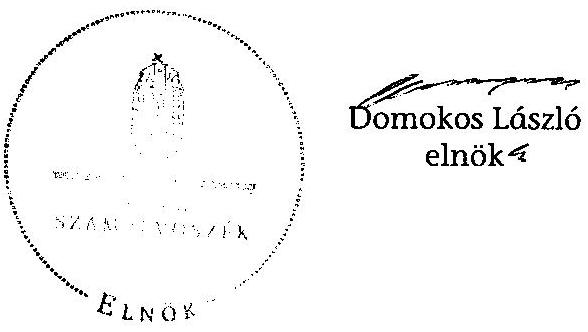
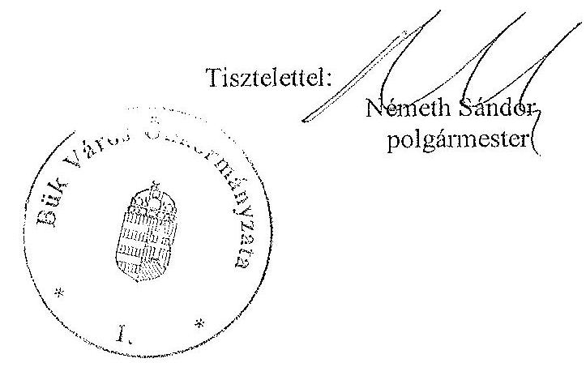
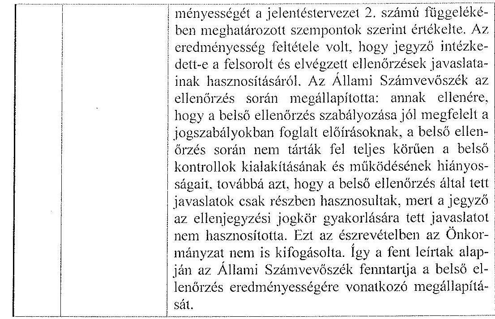
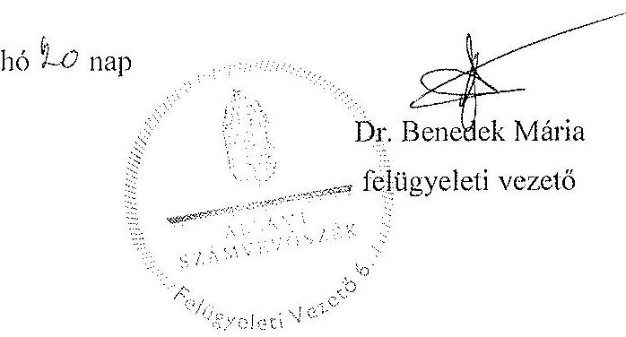

# JELENTÉS 

az önkormányzatok belső kontrollrendszerének kialakítása, valamint egyes kontrolltevékenységek és a belső ellenőrzés múködése ellenőrzéséről

---

# Állami Számvevőszék 

Iktatószám: V-0106-029/2013.
Témaszám: 1109
Vizsgálat-azonosító szám: V059137

## Az ellenőrzést felügyelte:

Dr. Benedek Mária
felügyeleti vezető
Az ellenőrzést vezette:
Bíró Zsolt
ellenőrzésvezető
A számvevőszéki jelentés összeállításában közremúködött:
Keszthelyi Zoltán
számvevő tanácsos
Az ellenőrzést végezték:
Dr. Fátrainé Zsebedics Varga József
Katalin
számvevő tanácsos
számvevő tanácsos

---

# TARTALOMJEGYZÉK 

BEVEZETÉS ..... 5
I. ÖSSZEGZŐ MEGÁLLAPÍTÁSOK, KÖVETKEZTETÉSEK, JAVASLATOK ..... 8
II. RÉSZLETES MEGÁLLAPÍTÁSOK ..... 15

1. Az önkormányzat belső kontrollrendszere kialakításának megfelelősége ..... 15
1.1. A kontrollkörnyezet kialakítása ..... 15
1.2. A kockázatkezelési rendszer kialakítása ..... 15
1.3. A kontrolltevékenységek kialakítása ..... 16
1.4. Az információs és kommunikációs rendszer kialakítása ..... 17
1.5. A monitoring rendszer kialakítása ..... 18
2. A pénzügyi folyamatokban kulcsszerepet betöltő belső kontrollok (szakmai teljesítésigazolás és utalvány ellenjegyzés) múködése ..... 18
3. A belső ellenőrzés szervezeti keretei és múködése ..... 21

## MELLÉKLETEK

1. számú Az észrevételt tartalmazó polgármesteri levél
2. számú Az észrevételre vonatkozó elnöki válaszlevél

## FÜGGELÉKEK

1. számú Értelmező szótár
2. számú A belső kontrollrendszer kialakítása, a pénzügyi folyamatokban kulcsszerepet betöltő szakmai teljesítésigazolás és utalvány ellenjegyzés kontrollok múködése, valamint a belső ellenőrzés múködése értékelésénél alkalmazott minősítési szempontok

---

.

---

# RÖVIDÍTÉSEK JEGYZÉKE 

## Törvények

ÁSZ tv.
Avtv.

Info tv.

Mötv.
Ötv.
régi Áht.
új Áht.

## Rendeletek

Ámr.
Ávr.

Ber.
Bkr.

## Szórövidítések

ÁSZ
Belső ellenőrzési kézikönyv
Belső Kontroll Kézikönyv

Együttmúködési megállapodás

Feladatellátási szerződés

2011. évi LXVI. törvény az Állami Számvevőszékről
1992. évi LXIII. törvény a személyes adatok védelméről és a közérdekú adatok nyilvánosságáról (hatálytalan 2012. január 1-jétől)
2011. évi CXII. törvény az információs önrendelkezési jogról és az információszabadságról (hatályos 2012. január 1-jétől)
2011. évi CLXXXIX. törvény Magyarország helyi önkormányzatairól (hatályos 2012. január 1-jétől)
1990. évi LXV. törvény a helyi önkormányzatokról
1992. évi XXXVIII. törvény az államháztartásról (hatálytalan 2012. január 1-jétől)
2011. évi CXCV. törvény az államháztartásról (hatályos 2012. január 1-jétől)

292/2009. (XII. 19.) Korm. rendelet az államháztartás múködési rendjéről (hatálytalan 2012. január 1-jétől)
368/2011. (XII. 31.) Korm. rendelet az államháztartásról szóló törvény végrehajtásáról (hatályos 2012. január 1jétől)
193/2003. (XI. 26.) Korm. rendelet a költségvetési szervek belső ellenőrzéséről (hatálytalan 2012. január 1-jétől)
370/2011. (XII. 31.) Korm. rendelet a költségvetési szervek belső kontrollrendszeréről és belső ellenőrzéséről (hatályos 2012. január 1-jétől)

Állami Számvevőszék
Felső-Répcementi Többcélú Kistérségi Társulás Belső Ellenőrzési Kézikönyve (hatályos 2007. június 12-től)
Az Ámr. 155. § (1) bekezdése, valamint az államháztartási belső kontroll standardokról szóló 1/2009. (IX. 11.) PM irányelv egységes értelmezése érdekében az államháztartásért felelős miniszter által 2010. évben kiadott Belső Kontroll Kézikönyv
Együttmúködési megállapodás, amely létrejött Bük Város Önkormányzatának Polgármesteri Hivatala a FelsőRépcementi Többcélú Kistérségi Társulás és a SZAHKÉRTELEM 2007. Kft. között a belső ellenőrzési és belső ellenőrzési vezetői feladatok ellátására (hatályos 2010. április 15 -től)
Feladatellátási szerződés, amely létrejött a Felsőépcementi Többcélú Kistérségi Társulás és az SZAHKÉRTELEM 2007. Kft. között a belső ellenőrzési feladatok ellátására (hatályos 2008. december 22-től)

---

| gazdálkodási jogkörök | Bük Város Önkormányzata jegyzőjének 8/2011. (03. 28.) számú szabályzata |
| :--: | :--: |
| szabályzata | a Képviselő-testület 114/2011. (03. 28.) számú határozatával elfogadott gazdasági program (közép és hosszú távú célokkal) |
| Hivatal | Bük Város Önkormányzat és Iklanberény Község Önkormányzat Büki Közös Önkormányzati Hivatala (2013. január 1-jétől) |
| hivatali SZMSZ | Bük Város Önkormányzata Polgármesteri Hivatalának Szervezeti és Múködési Szabályzata (a Képviselő-testület a 147/2010. (07. 05.) számú határozatával fogadta el) |
| jegyző | Bük Város Önkormányzatának jegyzője |
| Képviselő-testület | Bük Város Önkormányzatának Képviselő-testülete |
| Önkormányzat polgármester | Bük Város Önkormányzata |
| Polgármesteri Hivatal | Bük Város Önkormányzatának polgármestere |
| Társulás | Bük Város Önkormányzatának Polgármesteri Hivatala Felső-Répcementi Többcélú Kistérségi Társulás |

---

# JELENTÉS   az önkormányzatok belsó kontrollrendszerének kialakítása, valamint egyes kontrolltevékenységek és a belső ellenőrzés múködése ellenőrzéséről 

BÜK

## BEVEZETÉS

A belső kontrollrendszer kialakítását, múködtetését és fejlesztését a régi Áht. és az új Áht. is előírja. Ennek megvalósításáért a költségvetési szerv vezetője felel. A belső kontrollrendszer azt a célt szolgálja, hogy a költségvetési szervek múködésük és gazdálkodásuk során a tevékenységeket szabályszerűen, gazdaságosan, hatékonyan, eredményesen hajtsák végre, teljesítsék elszámolási kötelezettségeiket és megvédjék az erőforrásokat a veszteségektől, a károktól és a nem rendeltetésszerű használattól. A belső kontrollrendszer magában foglalja mindazon szabályokat, eljárásokat, gyakorlati módszereket és szervezeti struktúrákat, kockázatkezelési technikákat, kontrolltevékenységeket, amelyek segítséget nyújtanak a szervezetnek céljai eléréséhez.

Az ÁSZ a 2011-2015. évekre szóló stratégiájában hangsúlyos szerepet szánt annak, hogy szilárd szakmai alapon álló, értékteremtő ellenőrzéseivel előmozdítsa a közpénzügyek átláthatóságát, rendezettségét. A számvevőszéki ellenőrzés nemzetközi alapelvei is rögzítik, hogy a megfelelő belső kontrollrendszer minimálisra csökkenti a hibák és szabálytalanságok kockázatát.

Az ellenőrzés célja annak értékelése volt, hogy az Önkormányzat a jogszabályi előírásoknak megfelelően alakította-e ki a belső kontrollrendszert; a gazdálkodás folyamatában kulcsszerepet betöltő szakmai teljesítésigazolás és az utalvány ellenjegyzés kontrolltevékenységeit megfelelően működtette-e; biztosí-totta-e a belső ellenőrzés szabályos és eredményes múködését.

Az ellenőrzés típusa: szabályszerűségi ellenőrzés
Az ellenőrzés jogszabályi alapja: az ÁSZ tv. 5. § (2) és (6) bekezdései
Az ellenőrzött szervezet: az Önkormányzat
Az ellenőrzött időszak: a belső kontrollrendszer kialakításának megfelelőségét a 2011. évre vonatkozóan értékeltük. A kontrolltevékenységek múködésének megfelelőségét a 2011. január 1-je és december 31-e, míg a belső ellenőrzés múködésének szabályosságát és eredményességét a 2009. január 1-je és 2011. december 31-e közötti időszakot figyelembe véve értékeltük. A helyszíni ellenőrzés lezárásáig a helyi szabályozás változásait nyomon követtük.

---

Az ellenőrzés szakmai módszertana az ÁSZ hivatalos honlapján (www.asz.hu) közzétett szakmai szabályokon alapult, amely a Legfőbb Ellenőrző Intézmények Nemzetközi Szervezete (INTOSAI) által kiadott nemzetközi standardok (ISSAI) figyelembevételével készült.

A belső kontrollrendszer kialakításának ellenőrzése során értékeltük a kontrollkörnyezet, a kockázatkezelési rendszer, a kontrolltevékenységek, az információs és kommunikációs rendszer, valamint a monitoring rendszer szabályozottságának megfelelőségét.

Értékeltük a pénzügyi folyamatokban kulcsszerepet betöltő szakmai teljesítésigazolás és utalvány ellenjegyzés kontrollok működésének megfelelőségét az államháztartáson kívülre teljesített múködési és felhalmozási célú pénzeszköz átadásoknál, az állományba nem tartozók megbízási díjainál, továbbá a külső szolgáltatók által végzett karbantartási, kisjavítási munkákkal kapcsolatos kifizetéseknél. Az egyszerű véletlen mintavétellel kiválasztott tételek ellenőrzését többlépcsős megfelelőségi tesztek útján addig végeztük, amíg elegendő és megfelelő bizonyítékot szereztünk a vizsgált folyamatok kulcskontrolljai múködésének megfelelő vagy nem megfelelő voltáról. Értékeltük az Önkormányzatnál a belső ellenőrzés múködésének szabályosságát és eredményességét. Az ÁSZ a 2007-2010. években az Önkormányzatnál átfogó ellenőrzést nem végzett.

A fogalmak magyarázatát az 1. számú függelék, az ellenőrzés egyes területeinek értékelésénél alkalmazott egységes minősítési szempontokat a 2. számú függelék tartalmazza.

Az ellenőrzés lefolytatásához az Önkormányzat a munkalapok és a tanúsítvány elektronikus kitöltésével, valamint a megjelölt dokumentumok elektronikus megküldésével szolgáltatott adatokat. A munkalapokon szerepeltetett adatok, információk ellenőrzése és szükség szerinti javítása a helyszíni ellenőrzés keretében történt.

Az ÁSZ az ellenőrzés megállapításait az ellenőrzött időszakban hatályos, az intézkedést igénylő megállapításokra tett javaslatokat a jelenleg hatályos jogszabályok alapján fogalmazta meg.

Az Ász tv. 29. § (1) bekezdése szerint a jelentéstervezetet megküldtük a polgármester részére, aki az ÁSZ tv. 29. § (2) bekezdésében foglalt észrevételezési jogával élt, a jelentéstervezetre észrevételt tett. Az ÁSZ tv. 29. § (3) bekezdésében előírtaknak megfelelően a figyelembe nem vett észrevételeket és annak indokairól szóló tájékoztatást a jelentés tartalmazza (2. számú melléklet).

Bük város állandó lakosainak száma 2011. január 1-jén 3335 fő volt. Az Önkormányzat héttagú Képviselő-testületének munkáját négy állandó bizottság segítette. Az Önkormányzat az önállóan múködő és gazdálkodó Polgármesteri Hivatalon felül négy önállóan múködő intézménnyel - Alapszolgáltatási Központ, Csodaország Óvoda, Felsőbúki Nagy Pál Általános Iskola és Vendéglátóipari Szakiskola, valamint a Művelődési és Sportközpont, Könyvtár - látta el feladatát. Az Önkormányzat egy többségi tulajdoni hányadú gazdasági társasággal - a Bük és Térsége Vízmú Kft.-ben 59,3\%-os részesedéssel - rendelkezett.

---

A polgármester a 2010. évi önkormányzati választások óta tölti be tisztségét. A jegyző 2006. július 1-je óta látja el feladatait.

A Polgármesteri Hivatal egységes hivatalként múködött, amelyben a foglalkoztatott köztisztviselők száma 2011. január 1-jén 20 fő volt. Az Önkormányzat a Mötv. 85. §-ában foglalt előírásoknak megfelelően Iklanberény Község Önkormányzata közremúködésével 2013-tól megalakította Bük székhellyel a Hivatalt, igazgatási és gazdálkodási feladatainak ellátásra.

Az Önkormányzat a 2011. évi költségvetési beszámolója szerint 1903022 ezer Ft költségvetési bevételt ért el, és 1665914 ezer Ft költségvetési kiadást teljesített. A 2011. december 31-i könyvviteli mérleg szerint 7316261 ezer Ft értékű eszközvagyonnal rendelkezett, hosszú lejáratú kötelezettsége 19689 ezer Ft, rövid lejáratú kötelezettsége 58019 ezer Ft volt.

---

# I. ÖSSZEGZŐ MEGÁLLAPÍTÁSOK, KÖVETKEZTETÉSEK, JAVASLATOK 

A belső kontrollrendszer kialakításán belül 2011-ben a Polgármesteri Hivatalban a kontrollkörnyezet, a kockázatkezelési rendszer, a kontrolltevékenységek, az információs és kommunikációs rendszer, valamint a monitoring rendszer kialakítását külön-külön és összesítve is értékeltük. A belső kontrollrendszer kialakítása az összesített értékelés alapján nem felelt meg a jogszabályi előírásoknak. Az egyes területek kialakításának értékelését az alábbiakban részletezzük.

A kontrollkörnyezet kialakítása megfelelt a jogszabályi követelményeknek, mert a Képviselő-testület a jogszabályban foglalt határidőn belül elfogadta az Önkormányzat 2010-2014. évekre szóló gazdasági programját, a Polgármesteri Hivatal rendelkezett a jogszabályi előírásoknak megfelelő tartalmú alapító okirattal. A jegyző, mint a költségvetési szerv vezetője kialakította a gazdálkodást érintő legfontosabb szabályokat és az ellenőrzési nyomvonalat, elkészítette az előírt jogszabályi tartalommal a hivatali SZMSZ-t, valamint biztosította a Polgármesteri Hivatal folyamatainak meghatározását és dokumentálását. Meghatározta az egészséget nem veszélyeztető és biztonságos munkavégzés követelményei megvalósításának módját.

A kockázatkezelési rendszer kialakítása nem felelt meg a jogszabályi előírásoknak, mert a jegyző - a régi Áht.-ban ${ }^{1}$ és az Ámr.-ben foglaltak ellenére kockázatelemzést nem végzett, nem mérte fel és nem állapította meg a Polgármesteri Hivatal tevékenységében, gazdálkodásában rejlő kockázatokat.

A kontrolltevékenységek kialakítása részben felelt meg a jogszabályi előírásoknak, mert a jegyző az Ámr. előírása és a gazdálkodási jogkörök szabályzatában foglalt - az előzetes írásbeli kötelezettségvállalást nem igénylő kifizetésekre vonatkozó - döntése ellenére ezen kifizetéseknél nem határozta meg a szakmai teljesítésigazolás gyakorlásának módját, eljárási és dokumentációs részletszabályait. A szakmai teljesítésigazolásra kijelölt személyek közül - az Ámr.-ben foglaltak ellenére - egy személyt nem a jegyző jelölt ki.

Az információs és kommunikációs rendszer kialakítása nem felelt meg a jogszabályi követelményeknek, mert a jegyző - az Avtv. ${ }^{2}$ előírása ellenére - elmulasztotta az adatbiztonság érvényre juttatásához szükséges intézkedések megtételét.

A monitoring rendszer kialakítása a jogszabályi előírásoknak nem felelt meg, mert a jegyző - a régi Áht.-ban és az Ámr.-ben foglalt előírások ellenére az operatív tevékenységek keretében megvalósuló folyamatos és eseti nyomon

[^0]
[^0]:    ${ }^{1}$ 2012. január 1-jétől új Áht.
    ${ }^{2}$ 2012. január 1-jétől Info tv.

---

követésből álló, a Polgármesteri Hivatal tevékenységének, a célok megvalósításának nyomon követését biztosító rendszer szabályait nem határozta meg.

A belső kontrollrendszer nem megfelelő kialakítása kockázatot jelent az Önkormányzat tevékenységeinek szabályszerű, gazdaságos, hatékony és eredményes végrehajtása során.

A Polgármesteri Hivatalban a 2011. évben az államháztartáson kívülre teljesített múködési és felhalmozási célú pénzeszközátadások, valamint az állományba nem tartozók megbízási díjaival és a külső szolgáltatók által végzett karbantartással, kisjavítással kapcsolatos kifizetések során összefoglalóan értékelve a kulcskontrollok múködésének megfelelősége gyenge volt. A szakmai teljesítésigazolást - az államháztartáson kívülre történő működési és felhalmozási célú pénzeszközátadásokkal, az állományba nem tartozók megbízási díjaival és a külső szolgáltatók által végzett karbantartással, kisjavítással kapcsolatos kifizetések esetében - a régi Áht.-ban és az Ámr.-ben előírtak ellenére nem, vagy nem az arra jogosult személyek végezték el, vagy a szakmai teljesítésigazolás nem szabályszerűen történt.

Az utalványok ellenjegyző́je az államháztartáson kívülre történő működési és felhalmozási célú pénzeszközátadásokkal, az állományba nem tartozók megbízási díjaival és a külső szolgáltatók által végzett karbantartással, kisjavítással kapcsolatos kifizetéseket megelőzően az Ámr.-ben foglalt ellenőrzési feladatait - a szakmai teljesítésigazolás, illetve a szabályszerűen végzett szakmai teljesítésigazolás hiányában, valamint az Ámr. előírásai ellenére szakmai teljesítésigazolás nélkül végzett érvényesítés miatt - nem a jogszabályi előírásoknak megfelelően végezte. Az utalvány ellenjegyzője a kiadásokat annak ellenére ellenjegyezte, hogy az utalványon nem tüntették fel az Ámr.-ben előírt kötelezettségvállalási nyilvántartási számot, mert a kötelezettségvállalást az Ámr.ben foglaltak ellenére nem vették nyilvántartásba.

Az ellenőrzött kifizetésekkel összefüggésben a rendelkezésre bocsátott dokumentumok alapján jogosulatlan kifizetést nem tárt fel az ellenőrzés, azonban a gazdálkodásban kulcsszerepet betöltő kontrollok jogszabályi előírásoknak nem megfelelő, gyenge múködése miatt fennáll a hibák bekövetkezésének lehetősége. A kiválasztott kulcskontrollok a csalás és korrupciós kockázatok - integritás szempontjából lényeges - megelőzésében, illetve feltárásában is hangsúlyos szerepet játszanak, így hatékonyabbá és eredményesebbé válhat a korrupció elleni fellépés. A nem megfelelően szabályozott és múködtetett belső kontrollok korrupciós kockázatot hordoznak.

Az Önkormányzat a 2009-2011. években a belső ellenőrzési feladatokat kistérségi társulással látta el. A belső ellenőrzés szabályozása és múködése a jogszabályi előírásoknak jól megfelelt. A szervezeti és múködési szabályzatban rögzítették a belső ellenőrzést végző szervezet jogállását és feladatait. A Ber.ben ${ }^{3}$ foglaltaknak megfelelően a Társulás rendelkezett a munkaszervezetének vezetője által jóváhagyott Belső ellenőrzési kézikönyvvel. A 2010. évben - az Együttmúködési megállapodásban - meghatározták a belső ellenőrzési vezető

[^0]
[^0]:    ${ }^{3}$ 2012. január 1-jétől Bkr.

---

személyét, illetve a feladatkörébe tartozó tevékenységek ellátásának módját. A 2009-2010. évi éves ellenőrzési terveket - belső ellenőrzési vezető megbízásának hiányában - nem a belső ellenőrzési vezető állította össze, a 2011. évben a belső ellenőrzési vezető azokat - a Ber.-ben foglaltaknak megfelelően - elkészítette. A 2009-2011. évi éves ellenőrzési terveket előzetesen elvégzett kockázatelemzéssel megalapozták, amelyek tartalmazták a Ber.-ben foglaltakat. A Képviselőtestület az éves belső ellenőrzési tervet mindhárom évben az Ötv.-ben ${ }^{4}$ előírtakat betartva, határidőn belül hagyta jóvá. Az ellenőrzési programokat - a 2009. év kivételével - a Ber.-ben foglaltaknak megfelelően a belső ellenőrzési vezető hagyta jóvá. A 2009-2011. években elvégzett belső ellenőrzésekről készült jelentések megfeleltek a Ber.-ben előírt tartalmi követelményeknek.

A belső ellenőrzések megállapításainak, javaslatainak hasznosítására az ellenőrzöttek - a Ber.-ben előírtaknak megfelelően - intézkedési terveket készítettek. Az ellenőrzésekről vezettek nyilvántartást, amellyel a Ber.-ben foglaltakat betartották. A polgármester a belső ellenőrzési jelentésekről készített 2011. évi éves ellenőrzési jelentést a zárszámadási rendelettervezettel egyidejúleg az Ötv.ben és a Ber.-ben előírtaknak megfelelően beterjesztette a Képviselő-testület elé. A 2009-2011. évi ellenőrzési tervek - a Ber.-ben foglaltak ellenére - a jegyző írásos véleményének figyelembevétele nélkül készültek. A belső ellenőrzés - a Ber. előírása ellenére - a megtett intézkedések nyomon követését elmulasztotta.

Az Önkormányzatnál a 2009-2011. években a belső ellenőrzés múködése a 2. számú függelékben részletezett kritériumrendszer alapján végzett értékelés szerint - nem volt eredményes annak ellenére, hogy a belső ellenőrzés szabályozása és múködése az összegző értékelés alapján az ellenőrzött időszak egészét tekintve a jogszabályi előírásoknak jól megfelelt. A belső ellenőrzés múködése azért nem volt eredményes, mert az elvégzett belső ellenőrzések során - a magas kockázatúnak értékelt területek, a belső kontrollrendszer kialakítása szabályozottságának, a vagyonvédelem területén a leltárkészítési és selejtezési szabályzatban foglaltak betartásának ellenőrzésénél - nem tárták fel teljes körűen a belső kontrollok kialakításának és működésének hiányosságait, továbbá a belső ellenőrzés által tett javaslatok csak részben hasznosultak, mert a jegyző azokat nem hasznosította teljes körűen. Mindezek hozzájárultak a számvevőszéki ellenőrzés során is feltárt szabályozási hiányosságok, hibák ismétlődéséhez.

Az ÁSZ tv. 33. § (1) bekezdésében foglaltak értelmében az ellenőrzött szervezet vezetője köteles a jelentésben foglalt megállapításokhoz kapcsolódó intézkedési tervet összeállítani, és azt a jelentés kézhezvételétől számított 30 napon belül az ÁSZ részére megküldeni. Amennyiben az intézkedési tervet határidőre nem küldi meg a szervezet, vagy az - az ÁSZ tv. 33. § (2) bekezdésében foglalt póthatáridő eltelte ellenére - továbbra sem elfogadható, az ÁSZ elnöke a hivatkozott törvény 33. § (3) bekezdés a)-b) pontjaiban foglaltakat érvényesítheti.

[^0]
[^0]:    ${ }^{4}$ 2012. január 1-jétől Mötv.

---

Az ellenőrzés intézkedést igénylő megállapításai és javaslatai:

# a polgármesternek 

1. A régi Áht. 100/C. § (6) bekezdésének és az Ámr. 76. § (1) és (3) bekezdéseinek előírása ellenére az államháztartáson kívülre teljesített múködési és felhalmozási célú pénzeszközátadásokat megelőzően a szakmai teljesítés igazolását nem végezték el. Az Ámr. 76. § (1) és (3) bekezdésben foglaltak ellenére az állományba nem tartozók megbízási díjaival kapcsolatos kifizetéseket, valamint a külső szolgáltatók által végzett karbantartással, kisjavítással kapcsolatos kiadásokat megelőzően a szakmai teljesítésigazolást nem a jegyző által írásban kijelölt személy végezte, vagy a szakmai teljesítésigazolás nem szabályszerűen történt. Az utalvány ellenjegyzése az államháztartáson kívülre teljesített múködési és felhalmozási célú pénzeszközátadásoknál, valamint az állományba nem tartozók megbízási díjaival és a külső szolgáltatók által végzett karbantartással, kisjavítással kapcsolatos kifizetéseket megelőzően, az Ámr. 79. § (2) bekezdésében foglaltak ellenére - szakmai teljesítésigazolás, illetve szabályszerűen végzett szakmai teljesítésigazolás hiányában, továbbá az Ámr. 77. § (1) bekezdése előírásai ellenére szakmai teljesítésigazolás nélkül végzett érvényesítés miatt - nem a jogszabályi előírásoknak megfelelően történt. Az utalvány ellenjegyzője a kiadásokat annak ellenére ellenjegyezte, hogy nem tüntették fel az Ámr. 78. § (2) bekezdés g) pontjában előírt kötelezettségvállalási nyilvántartási számot, mert a kötelezettségvállalást - az Ámr. 75. § (1) bekezdése rendelkezésének ellenére - nem vették nyilvántartásba.

Javaslat:
A Mötv. 115. § (1) bekezdésében foglaltak alapján kísérje figyelemmel az Önkormányzat gazdálkodásának szabályszerűségét. A Mötv. 67. § f) pontja alapján gondoskodjon a belső kontrollrendszer múködésére vonatkozó jogszabályi rendelkezések be nem tartása, valamint a szakmai teljesítésigazolás, illetve az utalvány ellenjegyzés kontrollokkal összefüggésben feltárt hiányosságok, szabálytalanságok tekintetében az esetleges munkajogi felelősséggel kapcsolatos körülmények kivizsgálásáról, majd a vizsgálat eredményének függvényében tegye meg a szükséges munkajogi intézkedéseket.

## a jegyzőnek (Bük Város Önkormányzata vonatkozásában)

1. a kockázatkezelési rendszerrel kapcsolatban:

A jegyző a kockázatkezelési rendszer kialakítása és múködtetése során - a régi Áht. 121. § (2) bekezdése b) pontjában és az Ámr. 157. § (1)-(2) bekezdéseiben foglaltak ellenére - nem mérte fel és nem állapította meg a Polgármesteri Hivatal tevékenységében, gazdálkodásában rejlő kockázatokat.

Javaslat:
Mérje fel és állapítsa meg - a Bkr. 7. §-ában foglaltak alapján - a Hivatal tevékenységében, gazdálkodásában rejlő kockázatokat.

---

2. a kontrolltevékenységekkel kapcsolatban:

A jegyző az Ámr. 20. § (3) bekezdés a) pontjában, a 72. § (14) bekezdésében és a gazdálkodási jogkörök szabályzatban foglalt - az előzetes írásbeli kötelezettségvállalást nem igénylő kifizetésekre vonatkozó - döntés ellenére ezen kifizetéseknél nem határozta meg a szakmai teljesítésigazolás gyakorlásának módját, eljárási és dokumentációs részletszabályait.

Az Ámr. 76. § (5) bekezdésben foglaltak ellenére a szakmai teljesítés igazolására kijelölt személyek közül egy személyt nem a jegyző jelölt ki.

Javaslat:
a) Rendezze belső szabályzatban az Ávr. 13. § (2) bekezdés a) pontjának és az 53. § (2) bekezdésének megfelelően az előzetes írásbeli kötelezettségvállalást nem igénylő kifizetésekre vonatkozó teljesítésigazolás gyakorlásának módjával, eljárási és dokumentációs részletszabályaival kapcsolatos belső előírásokat, feltételeket.
b) Intézkedjen arról, hogy az Ávr. 57. § (4) bekezdésének megfelelően a teljesítésigazolásra jogosult személyeket - az adott kötelezettségvállaláshoz vagy a kötelezettségvállalások előre meghatározott csoportjaihoz kapcsolódóan - a kötelezettségvállaló írásban jelölje ki.
3. az információs és kommunikációs rendszerrel kapcsolatban:

A jegyző az Avtv. 10. §-ában foglalt előírások ellenére elmulasztotta az adatbiztonság érvényre juttatásához szükséges intézkedések megtételét, mert nem határozta meg a hozzáférési jogosultságok megállapítására, módosítására és azok betartásának ellenőrzésére vonatkozó belső eljárásrendet, nem alakította ki a hozzáférési jogosultságok nyilvántartását és nem szabályozta az adatmentés felelősségi viszonyait.

Javaslat:
Az Info tv. 7. § (2)-(3) bekezdéseinek megfelelően gondoskodjon az adatok biztonságáról, tegye meg azokat az intézkedéseket, alakítsa ki azokat az eljárási szabályokat, amelyek az Info tv., valamint az egyéb adat- és titokvédelmi szabályok érvényre juttatásához szükségesek; továbbá megfelelő intézkedésekkel biztosítsa az adatok védelmét.
4. a monitoring rendszerrel kapcsolatban:

A jegyző - a régi Áht. 121. § (2) bekezdése e) pontjában és az Ámr. 160. §-ában foglaltak ellenére - nem alakított ki és nem múködtetett olyan monitoring rendszert, amely lehetővé teszi a Polgármesteri Hivatal tevékenységének, a célok megvalósításának nyomon követését, és amelynek része az operatív tevékenységek keretében megvalósuló folyamatos és eseti nyomon követés is.

Javaslat:
Alakítsa ki és múködtesse a Bkr. 3. § e) pontjában és a 10. §-ában előírtak alapján a Hivatal tevékenységének, a célok megvalósításának nyomon követését biztosító

---

rendszerét, amelynek része az operatív tevékenységek keretében megvalósuló folyamatos és eseti nyomon követés is.
5. a pénzügyi folyamatokban kulcsszerepet betöltő kontrollokkal kapcsolatban:

A régi Áht. 100/C. § (6) bekezdésének és az Ámr. 76. § (1) és (3) bekezdéseinek előírása ellenére az államháztartáson kívülre teljesített működési és felhalmozási célú pénzeszközátadásokat megelőzően a szakmai teljesítés igazolását nem végezték el. Az Ámr. 76. § (1) és (3) bekezdéseiben foglaltak ellenére az állományba nem tartozók megbízási díjaival kapcsolatos kifizetéseket megelőzően, valamint a külső szolgáltatók által végzett karbantartással, kisjavítással kapcsolatos kiadásokat megelőzően a szakmai teljesítésigazolást nem a jegyző által írásban kijelölt személy végezte, vagy a szakmai teljesítésigazolás nem szabályszerűen történt.

Az utalvány ellenjegyzője az államháztartáson kívülre teljesített működési és felhalmozási célú pénzeszközátadásoknál, valamint az állományba nem tartozók megbízási díjaival és a külső szolgáltatók által végzett karbantartással, kisjavítással kapcsolatos kifizetéseket megelőzően az Ámr. 79. § (2) bekezdésében foglalt ellenőrzési feladatait nem szabályszerűen végezte el, mert az utalvány ellenjegyzése - szakmai teljesítésigazolás, illetve szabályszerűen végzett szakmai teljesítésigazolás hiányában, továbbá az Ámr. 77. § (1) bekezdése előírásai ellenére szakmai teljesítésigazolás nélkül végzett érvényesítés miatt - nem a jogszabályi előírásoknak megfelelően történt. Az utalvány ellenjegyzője a kiadásokat annak ellenére ellenjegyezte, hogy nem tüntették fel az Ámr. 78. § (2) bekezdés g) pontjában előírt kötelezettségvállalási nyilvántartási számot, mert a kötelezettségvállalást - az Ámr. 75. § (1) bekezdése rendelkezésének ellenére - nem vették nyilvántartásba.

Javaslat:
Intézkedjen - a szakmai teljesítés igazolása és az utalvány ellenjegyzése vonatkozásában feltárt hiányosságok megszüntetése, illetve az operatív gazdálkodás során a működésbeli hibák megelőzése, feltárása és kijavítása érdekében - arról, hogy:
a) a teljesítésigazolás során az Ávr. 57. § (1) bekezdésében előírtaknak megfelelően, ellenőrizhető okmányok alapján ellenőrizzék és igazolják a kiadások teljesítésének jogosságát, összegszerűségét, az ellenszolgáltatást is magában foglaló kötelezettségvállalás esetén a szerződés, megrendelés teljesítését, valamint az Ávr. 57. § (3) bekezdése szerint a teljesítést az igazolás dátumának és a teljesítés tényére történő utalásnak a megjelölésével, az arra jogosult személy aláírásával igazolják;
b) a kifizetéseket megelőzően a teljesítésigazolás alapján - az Ávr. 57. § (3) bekezdése szerinti esetben annak hiányában is - az összegszerűségnek, a fedezet meglétének és a megelőző ügymenetben az új Áht., az Áhsz., az Ávr. előírásai és a belső szabályzatokban foglaltak betartásának az ellenőrzése - az Ávr. 58. § (1) és (3) bekezdése szerint - történjen meg;
c) a kötelezettségvállalási nyilvántartást az Ávr. 53. § (2) bekezdésében és az 56. § (1) bekezdésében foglalt előírásnak megfelelően vezessék, és az utalványon a kötelezettségvállalás nyilvántartási számát az Ávr. 59. § (3) bekezdés f) pontjában foglaltaknak megfelelően tüntessék fel.

---

6. a belső ellenőrzés működésével kapcsolatban:

Az éves ellenőrzési tervek - a Ber. 32/B. § (2) bekezdésének előírása ellenére - a jegyző írásos véleményének figyelembevétele nélkül készültek.

A belső ellenőrzés a Ber. 8. § f) pontjában foglaltak ellenére a belső ellenőrzési jelentések alapján megtett intézkedések nyomon követését elmulasztotta.

Javaslat:
a) Kezdeményezze, hogy az éves ellenőrzési tervet a belső ellenőrzési vezető a Bkr. 56. § (2) bekezdés előírásainak megfelelően, a jegyző írásos véleményének figyelembevételével a Bkr. 29. § (1) bekezdésében foglaltak szerint készítse el.
b) Gondoskodjon arról, hogy vezessenek nyilvántartást a Bkr. 21. § (2) bekezdése d) pontjának és a 47. §-nak megfelelően a belső ellenőrzési jelentésekben tett megállapításokról, javaslatokról, a vonatkozó intézkedési tervekről, és kövessék nyomon azok végrehajtását.

---

# II. RÉSZLETES MEGÁLLAPÍTÁSOK 

## 1. AZ ÖNKORMÁNYZAT BELSŐ KONTROLLRENDSZERE KIALAKÍTÁSÁNAK MEGFELELŐSÉGE

### 1.1. A kontrollkörnyezet kialakítása

A kontrollkörnyezet kialakítása a 2. számú függelékben részletezett kritériumrendszer alapján végzett értékelés szerint a Polgármesteri Hivatalban megfelelő volt, mert a Képviselő-testület a jogszabályban foglalt határidőn belül elfogadta az Önkormányzat 2010-2014. évekre szóló gazdasági programját, és a Polgármesteri Hivatal rendelkezett a jogszabályi előírásoknak megfelelő tartalmú alapító okirattal. A jegyző, mint a költségvetési szerv vezetője kialakította a gazdálkodást érintő legfontosabb szabályokat és az ellenőrzési nyomvonalat, elkészítette az előírt jogszabályi tartalommal a hivatali SZMSZ-t, valamint biztosította a Polgármesteri Hivatal folyamatainak meghatározását és dokumentálását. Meghatározta az egészséget nem veszélyeztető és biztonságos munkavégzés követelményei megvalósításának módját.

A kontrollkörnyezet kialakítása során a jegyző az Ámr. 155. § (3) bekezdésének ${ }^{5}$ előírását figyelmen kívül hagyva az államháztartásért felelős miniszter által kiadott Belső Kontroll Kézikönyv ajánlásait nem hasznosította teljes körúen.

A kontrollkörnyezet kialakítása során a jegyző:

- a Belső Kontroll Kézikönyv 1.5.2. pontjában foglalt ajánlást nem érvényesítette, mert nem dolgozta ki a Polgármesteri Hivatalban ellátott köztisztviselői munkakörökre vonatkozó elvárt tudást és képességeket;
- a Belső Kontroll Kézikönyv 1.6. pontjában foglalt ajánlást nem hasznosította, mert nem intézkedett a szervezeti célokkal összhangban álló etikai értékek és az integritás kiemelt kezeléséről, nem határozta meg a köztisztviselőkkel szembeni etikai elvárásokat.

### 1.2. A kockázatkezelési rendszer kialakítása

A kockázatkezelési rendszer kialakítása a 2. számú függelékben részletezett kritériumrendszer alapján végzett értékelés szerint a Polgármesteri Hivatalban nem volt megfelelő, mert a jegyző ugyan kockázatkezelési szabályzatot készített, azonban a régi Áht. 121. § (2) bekezdés b) pontja ${ }^{6}$ és az Ámr. 157. § (1)-(2) bekezdéseiben ${ }^{7}$ foglaltak ellenére kockázatelemzést nem végzett, nem

[^0]
[^0]:    ${ }^{5}$ 2012. január 1-jétől a Bkr. 5. § (1) bekezdése
    ${ }^{6}$ 2012. január 1-jétől a Bkr. 3. § b) pontja
    ${ }^{7}$ 2012. január 1-jétől a Bkr. 3. § b) pontja és a 7. § (2) bekezdése

---

mérte fel és nem állapította meg a Polgármesteri Hivatal tevékenységében, gazdálkodásában rejlő kockázatokat.

A kockázatkezelési rendszer kialakítása során a jegyző az Ámr. 155. § (3) bekezdésének előírását figyelmen kívül hagyva az államháztartásért felelős miniszter által kiadott Belső Kontroll Kézikönyv ajánlásait nem hasznosította teljes körűen.

A kockázatkezelési rendszer kialakítása során a jegyző:

- a Belső Kontroll Kézikönyv 2.1.3. pontjában foglalt ajánlást nem érvényesítette, mert nem alakította ki a kockázatok nyilvántartásának rendszerét;
- a Belső Kontroll Kézikönyv 2.4. pontjában foglalt ajánlást nem hasznosította, mert nem írta elő a beazonosított kockázatok legalább évenkénti felülvizsgálatát, nem jelölte ki a felülvizsgálatért felelős személyt és a kockázatok legalább évenkénti felülvizsgálatára nem került sor;
- a Belső Kontroll Kézikönyv 2.5.1. pontjában foglalt ajánlást nem érvényesítette, mert helyi szabályozásban nem gondoskodott a csalás és a korrupció, mint kiemelt kockázatok kezeléséről.

# 1.3. A kontrolltevékenységek kialakítása 

A kontrolltevékenységek kialakítása a 2. számú függelékben részletezett kritériumrendszer alapján végzett értékelés szerint a Polgármesteri Hivatalban részben volt megfelelő, mert a jegyző a jogszabályi előírásokat nem érvényesítette teljes körűen. A jegyző a kontrollstratégiák és módszerek keretében szabályozta a gazdálkodási jogkörök, a beszerzési feladatok, a vagyonhasznosítási tevékenység és a szabálytalanság kezelése tekintetében a folyamatba épített előzetes utólagos és vezetői ellenőrzést, valamint a belső jelentéstétel feladatait.

A jegyző, mint a költségvetési szerv vezetője:

- az Ámr. 20. § (3) bekezdés a) pontjának ${ }^{8}$ és a 72. § (14) bekezdésének ${ }^{9}$ előírása, valamint a gazdálkodási jogkörök szabályzatában foglalt - az előzetes írásbeli kötelezettségvállalást nem igénylő kifizetésekre vonatkozó - döntése ${ }^{10}$ ellenére ezen kifizetéseknél nem határozta meg a szakmai teljesítésigazolás gyakorlásának módját, eljárási és dokumentációs részletszabályait;
- a szakmai teljesítés igazolására kijelölt személyek közül - az Ámr. 76. § (5) bekezdésben ${ }^{11}$ foglaltak ellenére - egy személyt nem a jegyző jelölt ki.

[^0]
[^0]:    ${ }^{8}$ 2012. január 1-jétől az Ávr. 13. § (2) bekezdés a) pontja
    ${ }^{9}$ 2012. január 1-jétől az Ávr. 53. § (2) bekezdése
    ${ }^{10}$ A gazdálkodási jogkörök szabályzata V. fejezete szerint nem szükséges előzetes, írásbeli kötelezettségvállalás a gazdasági eseményenként 100 ezer Ft-ot el nem érő kifizetések esetében.
    ${ }^{11}$ 2012. január 1-jétől az Ávr. 57. § (4) bekezdése

---

A kontrolltevékenységek kialakítása során a jegyző az Ámr. 155. § (3) bekezdésének előírását figyelmen kívül hagyva az államháztartásért felelős miniszter által kiadott Belső Kontroll Kézikönyv ajánlásait nem hasznosította teljes körűen.

A kontrolltevékenységek kialakítása során a jegyző:

- a Belső Kontroll Kézikönyv 3.2.3. pontjában foglalt ajánlást nem érvényesítette, mert nem mérte fel a kis létszámból adódó kockázatokat az összeférhetetlenség kiküszöbölése érdekében.

A kontrolltevékenységek hiányos kialakítása a feladatok szabályszerű végrehajtását veszélyezteti.

# 1.4. Az információs és kommunikációs rendszer kialakítása 

Az információs és kommunikációs rendszer kialakítása a 2. számú függelékben részletezett kritériumrendszer alapján végzett értékelés szerint a Polgármesteri Hivatalnál nem volt megfelelő, mert a jegyző a jogszabályi követelményeket nem érvényesítette teljes körűen.

A jegyző, mint a költségvetési szerv vezetője:

- az informatikai rendszer környezetének szabályozása során - az Avtv. 10. $\S$ ában ${ }^{12}$ foglalt előírások ellenére - elmulasztotta az adatbiztonság érvényre juttatásához szükséges intézkedések megtételét, mert nem határozta meg a hozzáférési jogosultságok megállapítására, módosítására és azok betartásának ellenőrzésére vonatkozó belső eljárásrendet, nem alakította ki a hozzáférési jogosultságok nyilvántartását, nem szabályozta az adatmentés felelősségi viszonyait.

Az információs és kommunikációs rendszer kialakítása során a jegyző az Ámr. 155. § (3) bekezdésének előírását figyelmen kívül hagyva az államháztartásért felelős miniszter által kiadott Belső Kontroll Kézikönyv ajánlásait nem hasznosította teljes körűen.

Az információs és kommunikációs rendszer kialakítása során a jegyző:

- a Belső Kontroll Kézikönyv 4.2.4. pontjában foglalt ajánlást nem hasznosította, mert az iktatási, iratkezelési rendszer kialakítása során nem írta elő a Polgármesteri Hivatalban az ügyintézési határidők nyomon követésének dokumentálását;
- és nem szabályozta a késedelmes ügyintézés felelősségi rendjét;
- a Belső Kontroll Kézikönyv 4.3.3. pontjában foglalt ajánlást nem érvényesítette, mert a szabálytalanságkezelési szabályzatban nem rögzítette a szabálytalanságot bejelentő védelmére vonatkozó előírásokat és kötelezettségeket.

[^0]
[^0]:    ${ }^{12}$ 2012. január 1-jétől az Info tv. 7. § (2)-(3) bekezdései

---

# 1.5. A monitoring rendszer kialakítása 

A monitoring rendszer kialakítása a 2. számú függelékben részletezett kritériumrendszer alapján végzett értékelés szerint a Polgármesteri Hivatalban nem volt megfelelő, mert a jegyző - a régi Áht. 121. § (2) bekezdés e) pontja ${ }^{13}$ és az Ámr. 160. §-ában ${ }^{14}$ foglaltak ellenére - az operatív tevékenységek keretében megvalósuló folyamatos és eseti nyomon követésből álló, a Polgármesteri Hivatal tevékenységének, a célok megvalósításának nyomon követését biztosító rendszer szabályait nem határozta meg.

A belső kontrollrendszer kialakítása a Polgármesteri Hivatalban 2011ben a kontrollkörnyezet, a kockázatkezelési rendszer, a kontrolltevékenységek, az információs és kommunikációs rendszer, valamint a monitoring rendszer értékelése alapján összességében nem felelt meg a jogszabályi előírásoknak.

## 2. A PÉNZÜGYI FOLYAMATOKBAN KULCSSZEREPET BETÖLTŐ BELSŐ KONTROLLOK (SZAKMAI TELJESÍTÉSIGAZOLÁS ÉS UTALVÁNY ELLENJEGYZÉS) MŰKÖDÉSE

A Polgármesteri Hivatalban a 2011. évben az államháztartáson kívülre teljesített múködési és felhalmozási célú pénzeszközátadások során a szakmai teljesítésigazolás és az utalvány ellenjegyzés kulcskontrollok múködésének megfelelősége gyenge ${ }^{15}$ volt, mert:

- a Fülöp Dezső Evangélikus Alapítvány, a Büki Horgász Egyesület és a Közlekedésfejlesztési Koordinációs Központ részére történt pénzeszközátadást megelőzően - a régi Áht. 100/C. § (6) bekezdésében ${ }^{16}$ és az Ámr. 76. § (1) és (3) bekezdésében ${ }^{17}$ foglaltak ellenére - a szakmai teljesítést nem igazolták;
- az utalványok ellenjegyzője a Fülöp Dezső Evangélikus Alapítvány, a Büki Horgász Egyesület és a Közlekedésfejlesztési Koordinációs Központ részére teljesített pénzeszközátadásokat megelőzően az Ámr. 79. § (2) bekezdésben ${ }^{18}$ foglalt feladatát szakmai teljesítésigazolás hiányában, továbbá az Ámr. 77. § (1) bekezdése előírásai ellenére szakmai teljesítésigazolás nélkül végzett érvényesítés miatt - nem a jogszabályi előírásoknak megfelelően látta el;
- az utalványok ellenjegyzője az Ámr. 79. § (2) bekezdésében foglaltakat figyelmen kívül hagyva aláírásával ellenjegyezte az utalványt annak ellenére, hogy a Fülöp Dezső Evangélikus Alapítványnak megítélt támogatás kifizetéséhez kiállított utalvány nem tartalmazta az Ámr. 78. § (2) bekezdés g)

[^0]
[^0]:    ${ }^{13}$ 2012. január 1-jétől a Bkr_3. § e) pontja
    ${ }^{14}$ 2012. január 1-jétől a Bkr_3. § e) pontja és 10. §-a
    ${ }^{15} 95 \%$-os bizonyossági szint mellett a tapasztalt kritikus hibák száma miatt kijelenthető, hogy a hibák aránya meghaladta az ÁSZ által maximálisan elfogadott 10\%-os hibahatárt.
    ${ }^{16}$ 2012. január 1-jétől az új Áht. 38. § (1) bekezdése
    ${ }^{17}$ 2012. január 1-jétől az Ávr. 57. § (1) és (3) bekezdései
    ${ }^{18}$ 2012. január 1-jétől az Ávr. 58. § (1) bekezdése

---

pontjában ${ }^{19}$ előírt kötelezettségvállalás nyilvántartási számot, mert - az Ámr. 75. § (1) bekezdésében ${ }^{20}$ foglaltak ellenére - a kötelezettségvállalást nem vették nyilvántartásba.

A Polgármesteri Hivatalban a 2011. évben az állományba nem tartozók megbízási díjainak kifizetése során a szakmai teljesítésigazolás és az utalvány ellenjegyzés kulcskontrollok müködésének megfelelősége gyenge ${ }^{21}$ volt, mert:

- az Ámr. 76. § (3) bekezdésében foglaltak ellenére nem a jegyző által kijelölt személy végezte a szakmai teljesítés igazolását a titkárnői feladatra, az ingatlanok rendben tartására és az ügyviteli feladat ellátására, az adóügyi szaktanácsadásra és az építészi feladat-ellátási megbízásokra teljesített kifizetéseknél;
- a szakmai teljesítés igazolására a jegyző által kijelölt személy az Ámr. 76. § (1) bekezdésben foglaltak és aláírása ellenére - ellenőrizhető okmányok hiányában - nem ellenőrizte a gyepmesteri feladathoz kapcsolódó kifizetést megelőzően a kifizetés összegszerűségét;
- az utalványok ellenjegyzője a titkárnői feladatra, az ingatlanok rendben tartására, a gyepmesteri és az ügyviteli feladat ellátására, az adóügyi szaktanácsadásra és az építészi feladat-ellátási megbízásra teljesített kifizetések esetében az Ámr. 79. § (2) bekezdésében foglalt feladatát szabályszerű szakmai teljesítésigazolás hiányában nem a jogszabályi előírásoknak megfelelően látta el;
- az utalványok ellenjegyzője az Ámr. 79. § (2) bekezdésében foglalt - a gazdálkodási szabályok betartására vonatkozó - ellenőrzési feladatait figyelmen kívül hagyva, annak ellenére ellenjegyezte a titkárnői feladatra, az ingatlanok rendben tartására, a gyepmesteri feladatra, az ügyviteli feladat ellátására, az adóügyi szaktanácsadásra és az építészi feladat-ellátásra szóló utalványokat, hogy azok nem tartalmazták ${ }^{22}$ az Ámr. 78. § (2) bekezdés g) pontban előírt kötelezettségvállalás nyilvántartási számot, mert - az Ámr. 75. § (1) bekezdésében foglaltak ellenére - a kötelezettségvállalást nem vették nyilvántartásba.

[^0]
[^0]:    ${ }^{19}$ 2012. január 1-jétől az Ávr. 59. § (3) bekezdése
    ${ }^{20}$ 2012. január 1-jétől az Ávr. 56. § (1) bekezdése
    ${ }^{21}$ 95\%-os bizonyossági szint mellett a tapasztalt kritikus hibák száma miatt kijelenthető, hogy a hibák aránya meghaladta az ÁSZ által maximálisan elfogadott 10\%-os hibahatárt.
    ${ }^{22}$ A teszt alapján ellenőrzött valamennyi utalványról hiányzott a kötelezettségvállalás nyilvántartási száma.

---

A Polgármesteri Hivatalban a 2011. évben a külső szolgáltatók által teljesített karbantartási, kisjavítási munkákra történő kifizetések során a szakmai teljesítésigazolás és az utalvány ellenjegyzés kulcskontrollok múködésének megfelelősége gyenge ${ }^{23}$ volt, mert:

- az Ámr. 76. § (3) bekezdésében foglaltak ellenére nem a jegyző által kijelölt személy végezete a szakmai teljesítés igazolását a számológép javításra, a gyógyszertár karbantartási munkáira, fénymásoló karbantartásra, útkarbantartásra és csapadékvíz elvezetésre teljesített kifizetéseknél;
- a szakmai teljesítés igazolására a jegyző által kijelölt személy az Ámr. 76. § (1) bekezdésében foglaltak és aláírása ellenére - ellenőrizhető okmányok hiányában - nem ellenőrizte az iskolai kazán javításához és a parkgondozáshoz kapcsolódó kifizetéseket megelőzően a kifizetés összegszerűségét;
- az utalványok ellenjegyzője a számológép javításra, a gyógyszertár karbantartási munkáira, az iskolai kazán javítására, parkgondozásra, fénymásoló karbantartásra, útkarbantartásra és csapadékvíz elvezetésre teljesített kifizetések esetében az Ámr. 79. § (2) bekezdésében foglalt feladatát szabályszerű szakmai teljesítésigazolás hiányában nem a jogszabályi előírásoknak megfelelően látta el;
- az utalvány ellenjegyzője az Ámr. 79. § (2) bekezdésében foglalt ellenőrzési feladatait nem a jogszabályi előírásoknak megfelelően végezte, mert annak ellenére aláírásával ellenjegyezte az utalványokat, hogy azok - a parkgondozás és az útkarbantartás kivételével - nem tartalmazták az Ámr. 78. § (2) bekezdés g) pontban foglalt kötelezettségvállalás nyilvántartási számot, továbbá az Ámr. 77. § (1) bekezdése előírásai ellenére szakmai teljesítésigazolás nélkül végezték az érvényesítést.

A Polgármesteri Hivatalban a 2011. évben a pénzügyi folyamatokban kulcsszerepet betöltő belső kontrollok múködésében feltárt hiányosságok következtében az ellenőrzés az ellenőrzött tételek vonatkozásában - a rendelkezésre álló dokumentumok alapján - kár bekövetkeztére utaló adatot, tényt nem állapított meg, azonban a kulcskontrollok jogszabályi előírásoknak nem megfelelő, gyenge múködése miatt fennáll a hibák bekövetkezésének lehetősége. A kiválasztott kulcskontrollok a csalás és korrupciós kockázatok integritás szempontjából lényeges megelőzésében, illetve feltárásában is hangsúlyos szerepet játszanak, így hatékonyabbá és eredményesebbé válhat a korrupció elleni fellépés. A nem megfelelően szabályozott és múködtetett belső kontrollok korrupciós kockázatot hordoznak.

[^0]
[^0]:    ${ }^{23}$ 95\%-os bizonyossági szint mellett a tapasztalt kritikus hibák száma miatt kijelenthető, hogy a hibák aránya meghaladta az ÁSZ által maximálisan elfogadott 10\%-os hibahatárt.

---

# 3. A BELSŐ ELLENŐRZÉS SZERVEZETI KERETEI ÉS MŰKÖDÉSE 

Az Önkormányzat a 2009-2011. években a belső ellenőrzési feladatokat kistérségi társulással látta el. A Társulás munkaszervezetének vezetője a belső ellenőrzési feladatok ellátására külső szolgáltatóval Feladatellátási szerződést ${ }^{24}$, illetve Együttmúködési megállapodást kötött ${ }^{25}$. A belső ellenőrzést végző szervezet jogállását, valamint feladatait a szervezeti és múködési szabályzatban rögzítették. A belső ellenőrzési vezető feladatkörébe tartozó tevékenységek ellátásának módját a Ber. 4/A. § (2) bekezdés ${ }^{26}$ előírását figyelembe véve az Együttműködési megállapodásban meghatározták, a belső ellenőrzési vezető személyét kijelölték. A Társulás rendelkezett a Ber. 32/B. § (8) bekezdésében ${ }^{27}$ előírt, a munkaszervezet vezetője által jóváhagyott Belső ellenőrzési kézikönyvvel, amely tartalmazta a szakmai etikai kódexet, a kockázatelemzési módszertant és a minőségbiztosítási eljárásokat.

Az Önkormányzatnál a 2009-2011. években a belső ellenőrzés múködése a jogszabályi előírásoknak jól megfelelt. A Ber. 12. § b) pontjában ${ }^{28}$ és a 18. §-ában ${ }^{29}$ előírtak ellenére a 2009-2010. évi éves ellenőrzési tervek összeállítását - a belső ellenőrzési vezető kijelölése hiányában - a belső ellenőr végezte. A 2011. évi éves ellenőrzési tervet a belső ellenőrzési vezető állította össze. A Ber. 12. § b) pontjában ${ }^{30}$, a 18. §-ában ${ }^{31}$ és a 21. § (2) bekezdésében ${ }^{32}$ előírtaknak megfelelően az éves ellenőrzési terveket előzetesen elvégzett kockázatelemzéssel megalapozták. A 2009-2011. évi éves ellenőrzési tervek tartalmazták a Ber. 21. § (3) bekezdésben ${ }^{33}$ előírt kötelező tartalmi elemeket. Az Ötv. 92. § (6) bekezdésében ${ }^{34}$ foglaltakat betartották, mert a Képviselő-testület a 2009-2011. évi éves belső ellenőrzési terveket határidőn belül hagyta jóvá.

Az ellenőrzési programokat - a 2009. év kivételével - a Ber. 23. § (3) bekezdésében ${ }^{35}$ foglaltaknak megfelelően a belső ellenőrzési vezető hagyta jóvá. A 20092011. években elvégzett belső ellenőrzésekről jelentéseket készítettek, amelyek a Ber. 27. § (2) bekezdésben ${ }^{36}$ előírt tartalmi követelményeknek megfeleltek.

[^0]
[^0]:    ${ }^{24}$ 2008. december 28 -tól
    ${ }^{25}$ 2010. április 15 -tól
    ${ }^{26}$ 2012. január 1-jétől a Bkr. 16. § (4) bekezdése
    ${ }^{27}$ 2012. január 1-jétől a Bkr. 56. § (7) bekezdése
    ${ }^{28}$ 2012. január 1-jétől a Bkr. 22. § (1) bekezdés b) pontja
    ${ }^{29}$ 2012. január 1-jétől a Bkr. 29. § (1) bekezdése
    ${ }^{30}$ 2012. január 1-jétől a Bkr. 22. § (1) bekezdés b) pontja
    ${ }^{31}$ 2012. január 1-jétől a Bkr. 29. § (1) bekezdése
    ${ }^{32}$ 2012. január 1-jétől a Bkr. 31. § (2) bekezdése
    ${ }^{33}$ 2012. január 1-jétől a Bkr. 31. § (4) bekezdése
    ${ }^{34}$ 2013. január 1-jétől a Mötv. 119. § (5) bekezdése és a Bkr. 32. § (4) bekezdése
    ${ }^{35}$ 2012. január 1-jétől a Bkr. 33. § (2) bekezdése
    ${ }^{36}$ 2012. január 1-jétől a Bkr. 39. § (2) bekezdése

---

Az ellenőrzések megállapításainak, javaslatainak hasznosítására az ellenőrzöttek a Ber. 29. § (1) bekezdésében ${ }^{37}$ előírtaknak megfelelően intézkedési terveket készítettek. A belső ellenőrzési vezető a belső ellenőrzések nyilvántartását a Ber. 32. §-ában ${ }^{38}$ előírt tartalommal vezette. A jegyző - a Ber. 29/A. § (1)-(2) és (7) bekezdésében előírtaknak megfelelően ${ }^{39}$ - a belső ellenőrzési javaslatok alapján megtett intézkedések nyomon követéséről éves bontásban nyilvántartást vezetett. A polgármester a belső ellenőrzési jelentésekről készített 2011. évi éves ellenőrzési jelentést az Ötv. 92. § (10) bekezdésében ${ }^{40}$ és a Ber. 32/B. § (9) bekezdésében ${ }^{41}$ előírtaknak megfelelően a zárszámadási rendelettervezettel egyidejúleg beterjesztette a Képviselő-testület elé. A 2009-2011. évi ellenőrzési tervek - a Ber. 32/B. § (2) bekezdésének ${ }^{42}$ előírása ellenére - a jegyző írásos véleményének figyelembevétele nélkül készültek. A belső ellenőrzés a Ber. 8. § f) pontjában ${ }^{43}$ foglaltak ellenére a megtett intézkedések nyomon követését elmulasztotta.

A Polgármesteri Hivatalban a belső ellenőrzés az ellenőrzött időszak mindhárom évében ellenőrizte a közoktatási és szociális normatív állami hozzájárulás igénylését és elszámolását, a 2009. évben a Művelődési és Sportközpont, Könyvtár gazdálkodását és az Önkormányzat közbeszerzési eljárásait, a 2010. évben az Önkormányzat közbeszerzési eljárását és a megvalósult vízrendezési beruházás elszámolását, a 2011. évben a munkaerő és személyi juttatásokkal való gazdálkodást, valamint a tárgyi eszközökkel való gazdálkodás és a felhalmozási kiadások keretében a belső kontrollrendszer - a vagyonvédelem területén a leltárkészítési és selejtezési szabályzatban foglaltak betartása, a szabályozottság területén a számviteli politika és az abban foglaltak érvényesítése - kialakítását.

A belső ellenőr a 2009-2011. évi belső ellenőrzési jelentéseiben javasolta a közoktatási normatív állami hozzájárulás elszámolása mutatószámairól teljes körű nyilvántartás vezetését, annak folyamatos ellenőrzését, a szociális ellátottakról összesített nyilvántartás vezetését, jogszabály módosítása miatt a közbeszerzési szabályzat felülvizsgálatát, az éves közbeszerzési terv év közbeni aktualizálását, valamint a költségvetési beszámoló mérlegsorainak - teljes körű - hiteles leltárral történő alátámasztását a Polgármesteri Hivatalnál. A Művelődési és Sportközpont, Könyvtárnál az SZMSZ felülvizsgálatát, az ellenjegyzési feladatok teljes körű végrehajtását javasolta. A jegyző a belső ellenőrzés javaslatait részben hasznosította, mert az ellenjegyzési feladatokat nem minden esetben hajtották végre.

A belső ellenőrzések során nem tártak fel büntető-, szabálysértési, kártérítési vagy fegyelmi eljárás megindítására okot adó cselekményt.

Az Önkormányzatnál a 2009-2011. években a belső ellenőrzés múködése a 2. számú függelékben részletezett kritériumrendszer alapján végzett értékelés

[^0]
[^0]:    ${ }^{37}$ 2012. január 1-jétől a Bkr. 45. §-a
    ${ }^{38}$ 2012. január 1-jétől a Bkr. 50. § (1) bekezdése
    ${ }^{39}$ 2012. január 1-jétől a Bkr. 14. § (1) bekezdése, a 47. § (1) bekezdése
    ${ }^{40}$ a 2012. évtől kezdődően elvégzett ellenőrzések tekintetében 2012. január 1-jétől a Bkr. 56. § (8) bekezdése
    ${ }^{41}$ 2012. január 1-jétől a Bkr. 56. § (8) bekezdése
    ${ }^{42}$ 2012. január 1-jétől a Bkr. 56. § (2) bekezdése
    ${ }^{43}$ 2012. január 1-jétől a Bkr. 21. § (2) bekezdés d) pontja és a 47. § (1) bekezdése

---

szerint - nem volt eredményes annak ellenére, hogy a belső ellenőrzés szabályozása és múködése az összegző értékelés alapján az ellenőrzött időszak egészét tekintve a jogszabályi előírásoknak jól megfelelt. A belső ellenőrzés működése azért nem volt eredményes, mert az elvégzett belső ellenőrzések során - a magas kockázatúnak értékelt területek, a belső kontrollrendszer kialakítása szabályozottságának, a vagyonvédelem területén a leltárkészítési és selejtezési szabályzatban foglaltak betartásának ellenőrzésénél - nem tárták fel teljes körűen a belső kontrollok kialakításának és működésének hiányosságait, továbbá a belső ellenőrzés által tett javaslatok csak részben hasznosultak, mert a jegyző az ellenjegyzési jogkör gyakorlására tett javaslatot nem hasznosította. Mindezek hozzájárultak a számvevőszéki ellenőrzés során is feltárt szabályozási hiányosságok, hibák ismétlődéséhez.

Budapest, 2013. 09. hónap 20. nap

Melléklet: $\quad 2 \mathrm{db}$
Függelék: $\quad 2 \mathrm{db}$

---

# Tisztelt Elnök Úr! 

Hivatkozással a V-0106-025/2013.iktatószámon megküldött levelük mellékletét képező V-0106-024/2013. számú jelentéstervezetre a következő észrevételeket terjesztjük elő.

A jelentéstervezet II. pont 1.2. alpontja szerint a kockázatkezelési rendszer kialakítása nem volt megfelelő.

A jegyző azonban készített kockázatkezelési szabályzatot, valamint a belső ellenőrzéshez kapcsolódóan a kockázatok felmérésére sor került, az ehhez kapcsolódó dokumentáció a belső ellenőrzés anyagánál rendelkezésre áll. A hivatkozott szabályzatban kockázati tűréshatárt is meghatározásra került (A jegyző 19/2010. (12.10.) szabályzata I.4. pontja „A Jegyzőnek - a szakmai vezetők ajánlása szerint - minden egyes kockázati tényező esetében meg kell határoznia azt a tolerancia szintet, türéshatárt, amely azt mutatja, hogy az adott kockázattal kell-e foglalkozni, és hogyan, vagy annak viszonylag alacsony hatása, illetve kiküszöbölésének, az elérhető eredményhez képest, magas költsége miatt tudomásul veszi létezését, és „együtt él" vele.
A kockázati türőképesség mértéke alapvetően a lényegesség számviteli elvének figyelembevételével kerül meghatározásra. A kockázattal kiemelten kell foglalkozni, ha annak hatása az egyes mérlegsorokat $3 \%$-os mértékben, az egyes előirányzatokat 500.000 F nagysággal módosítja."). Ennek megfelelően az Önkormányzat és a Polgármesteri Hivatal is foglalkozott a kockázatokkal.

A jelentéstervezet II. pont 1.3. alpontja szerint a kontrolltevékenységek kialakítása részben volt megfelelő.
A 100.000,-Ft alatti kötelezettségvállalások tekintetében a jegyző 8/2011. (03.28.) számú szabályzatának V. pontja tartalmazza, hogy a kifizetést elrendelő belső intézkedés dokumentuma az utalványrendelet. A hivatkozott Ámr. 75.§ (4) bekezdésével összhangban : „A kötelezettségvállalást a kifizetést elrendelő belső intézkedés dokumentuma tanúsítja."
A 100.000,-Ft alatti kifizetéseknél alkalmaztunk a hivatkozott szabályzat (II. pont, 4. oldal) által meghatározott szövegủ bélyegzőt, amelyet akkor lehetett a dokumentumon elhelyezni, ha

---

a szakmai teljesítés ellenőrzése megtörtént. A 100.000,- Ft alatti kifizetések szabályait az Ámr. 76. §-ának megfelelően - azonosan a 100.000,-Ft feletti kötelezettségvállalásokéval rendezi a dokumentum.
A jegyző $8 / 2011$. (03.28.) számú szabályzata tartalmazza továbbá a szakmai teljesítésre jogosult személyek kijelölését és az aláírás mintájukat. A polgármestert a jegyző ebben a kijelölésben valóban csak a gáz- és áramszolgáltatás tekintetében szerepeltette, de a szabályzat III. pontjában szerepel, hogy ,,a szakmai teljesítést igazoló személye megegyezik az utalványozó személyével, kivéve az 1. mellékletben rögzített ügyeket." Mivel a Polgármesteri Hivatal vonatkozásában a polgármester vállalt kötelezettséget és utalványozott, így a szakmai teljesítést is ő igazolta a szabályzat szerint. A jegyző részéről a szabályzat megalkotásával és hatályba léptetésével a szakmai teljesítést igazoló kijelölése megtörtént. A polgármester a szabályzatban foglaltakat aláírásával tudomásul vette.
A hivatkozott Ámr. 76.§ (5) bekezdésében egyébként a kijelölés módjára nincs előírás.

A jelentéstervezet II. pont 1.4. alpontja szerint az információs és kommunikációs rendszer kialakítása nem volt megfelelő.
A személyes adatok védelméről és a közérdekủ adatok nyilvánosságáról szóló 1992. évi LXIII. törvény szerint:
„10. § (1) Az adatkezelő, illetőleg tevékenységi körében az adatfeldolgozó köteles gondoskodni az adatok biztonságáról, köteles továbbá megtenni azokat a technikai és szervezési intézkedéseket és kialakítani azokat az eljárási szabályokat, amelyek e törvény, valamint az egyéb adat- és titokvédelmi szabályok érvényre juttatásához szükségesek.
(2) Az adatokat védeni kell különösen a jogosulatlan hozzáférés, megváltoztatás, továbbítás, nyilvánosságra hozatal, törlés vagy megsemmisítés, valamint a véletlen megsemmisülés és sérülés ellen. A személyes adatok technikai védelmének biztosítása érdekében külön védelmi intézkedéseket kell tennie az adatkezelőnek, az adatfeldolgozónak, illetőleg a távközlési vagy informatikai eszköz üzemeltetőjének, ha a személyes adatok továbbítása hálózaton vagy egyéb informatikai eszköz útján történik."
,A jegyző által megalkotott és elfogadott szabályzatok /19/2010. (10.26.) a kiadmányozás rendjéről, 5/2006. (12.18.) az iratkezelési szabályzatról, 3/2008. (06.30.) a közérdekủ adatok közzétételi kötelezettségének teljesítéséről, 12/2010. a közérdekủ adatok megismerésére irányuló kötelezettségek teljesítéséről a 2010. évi Informatikai Biztonsági Szabályzat, valamint a Polgármesteri Hivatal Szervezeti Müködési Szabályzata, amelyet a Képviselőtestület által 147/2010. (07.05.) határozattal fogadott el/ a fenti jogszabályi előírásoknak megfelelően tartalmazza az adatvédelemmel kapcsolatos előírásokat.
Azokat a részletes követelményeket, amelyeket a jelentéstervezet megfogalmaz nem írta elő jogszabály, a programok ellenőrzésére vonatkozó előírásokat, tekintettel arra, hogy a Magyar Államkincstár által biztosított programokat használja a könyvelés és az adócsoport is, nem is tudnánk érvényesíteni.

---

A jelentéstervezet II. pont 1.5. alpontja szerint a monitoring rendszer kialakítása nem volt megfelelő. A jelentéstervezet 2. számú függeléke szerint akkor nem megfelelő a monitoring rendszer kialakítása, ha nem rendelkezik az önkormányzat belső ellenőrzési kézikönyvvel.
A jelentéstervezet 1.5. alpontja szerint azért nem megfelelő a monitoring réndszer, mert a jegyző a régi Áht. 121.§ (2) bekezdés e) pontja és az Ámr. 160.§-ában foglaltak ellenére nem határozta meg annak szabályait.
Az önkormányzat azonban rendelkezett Belső Ellenőrzési kézikönyvvel (a belső ellenőrzés a Felső-Répcementi Többcélú Kistérségi Társulás keretében valósult meg), valamint a jegyző által kiadott szabályzattal a („Folyamatba épített előzetes és utólagos vezetői ellenőrzési rendszere") és 11/2011. (09.12.) számon kiadott Belső Kontrollrendszer szabályzattal.
Az Ámr. 160. § szerint:
„(1) A költségvetési szerv vezetője köteles olyan monitoring rendszert működtetni, mely lehetővé teszi a szervezet tevékenységének, a célok megvalósításának nyomon követését.
(2) A költségvetési szerv monitoring rendszere az operatív tevékenységek keretében megvalósuló folyamatos és eseti nyomon követésből, valamint az operatív tevékenységektől függetlenül működő belső ellenőrzésből áll."
E kötelezettségünknek a fenti szabályzatokkal eleget tettünk, ezért nem világos miért hiányolja a jelentés tervezet ezeket.

A jelentéstervezet II. pont 2. alpontja szerint a szakmai teljesítésigazolás és az utalvány ellenjegyzés kulcskontrollok müködésének megfelelősége gyenge volt.

A szakmai teljesítésigazolást a vizsgált esetek egy részében a polgármester végezte, akinek kijelölését a vonatkozó 8/2011. (03.28.) számú jegyzői szabályzat tartalmazza.
A jelentéstervezet 19. és 20. oldalán is szerepel, hogy a szakmai teljesítésigazolás nem volt szabályszerű, mert nem került ellenőrzésre a kifizetés összegszerűsége. A hivatkozott 8/2011. (03.28.) számú jegyzői szabályzat tartalmazza, hogy mit kell ellenőriznie a szakmai teljesítés igazolójának, összhangban az Ámr. 76.§-ával. Nincs jele annak, hogy nem ennek megfelelően történt a szakmai teljesítés igazolása ezekben az esetekben is. Az Ámr. 76.§ (3) bekezdése szerint: „A szakmai teljesítést az igazolás dátumának és a teljesítés tényére történő utalás megjelölésével, az arra jogosult személy aláírásával kell igazolni." Az Ámr. nem írta elő, hogy milyen szöveget kell alkalmazni a szakmai teljesítés igazolása során.
Ennek megfelelően a szakmai teljesítésigazolás, az érvényesítés és az ellenjegyzés is a hivatkozott jogszabály és a szabályzatban előírtaknak megfelelően történt. Az ellenjegyzés és az érvényesítés nem maradt el egyetlen esetben sem.

A jelentéstervezet II. pont 3. alpontja szerint a belső ellenőrzés működése nem volt eredményes annak ellenére, hogy a belső ellenőrzés szabályozása és müködése az összegző értékelés alapján az ellenőrzött időszak egészét tekintve a jogszabályi előírásoknak jól megfelelt.

Az éves ellenőrzések kockázatelemzésen alapultak, melynek eredményeként a magas kockázatúnak minősített területek ellenőrzésére került sor.

---

Amint, azt a jelentéstervezet is megállapítja jogosulatlan kifizetés nem történt. Az Önkormányzat gazdálkodása során a közösség érdekére és közvagyon védelmére messzemenően figyelemmel voltunk.

Bük Város Önkormányzat és a Büki Közös Önkormányzati Hivatal is nagy hangsúlyt fektetett a törvényes szabályos müködésre és a jövőben is erre fog törekedni.
Sajnálatos, hogy az ellentmondásos jogi környezet és a nem egyértelmüen megfogalmazott követelmények miatt ez a törekvés nem vezetett a jelentéstervezet szerint sikerre.

Bük, 2013. augusztus 15.

Kapja:
1.cimzett;
2. irattár.

---

# 2. sz. melléklet   a V-0106-029/2013 sz. jelentéshez 

## Kémeth Sándor úr

polgármester
Bük Város Önkormányzata

Bük

Tisztelt Polgármester Úr!

Köszönettel megkaptam a 2013. augusztus 15. napján kelt, a Bük Város Önkormányzata belső kontrollrendszerének kialakítása, valamint egyes kontrolltevékenységek és a belső ellenőrzés működése ellenőrzésének jelentéstervezetében foglalt megállapításokra tett észrevételeit.

Tájékoztatom Polgármester urat, hogy a jelentésben - az Állami Számvevőszékről szóló 2011. évi LXVI. törvény 29. § (3) bekezdése alapján - az el nem fogadott észrevételeket szerepeltetjük az elutasítás indokának feltüntetésével együtt. Az elfogadott észrevételeket a jelentés szövegezésénél figyelembe vesszük.

Az Állami Számvevőszék észrevételekre vonatkozó álláspontjáról a felügyeleti vezető által készített részletes tájékoztatást csatoltan megküldöm.

Budapest, 2013. 09. hó 20 nap

Tisztelettel:

Dömokos László

Melléklet: Tájékoztatás a jelentéstervezetre tett észrevételek elfogadásáról és az el nem fogadott észrevételek indokairól

---

# Tájékoztatás 

a jelentéstervezetre tett észrevételek elfogadásáról és az el nem fogadott észrevételek indokairól

| 1. | Észrevétel: | „A jelentéstervezet II. 1.2 alpontja szerint a kockázatkezelési rendszer kialakítása nem volt megfelelö.   A jegyzö azonban készített kockázatkezelési szabályzatot, valamint a belső ellenörzéshez kapcsolódóan a kockázatok felmérésére sor került és az ehhez kapcsolódó dokumentáció a belső ellenörzés anyagánál rendelkezésre áll...." |
| :--: | :--: | :--: |
|  | Válasz: | Az Állami Számvevőszék az észrevételt nem fogadja el.   A polgármesteri észrevétel nem megalapozott. Az Állami Számvevőszék a kockázatkezelési rendszer kialakítását előre meghatározott értékelési szempontok szerint értékelte. A kockázatkezelési szabályzat is része volt az értékelésnek, de a jelentéstervezet 2. számú függeléke szerint nem elegendő feltétel ahhoz, hogy a kockázatkezelési rendszer kialakítását megfelelőnek minősítse. Az észrevételben hivatkozott belső ellenőrzéshez csatolt dokumentumokban a gazdálkodás egyes folyamataiban rejlő kockázatokat mérték fel, állapították meg. Nem határozták meg az felmért kockázatok bekövetkezése esetén teendő válaszintézkedéseket. A kockázatkezelési rendszer kialakítására vonatkozóan az Ámr. 157. § (2) bekezdésében (2012. január 1jétől a Bkr. 7. § (2) bekezdése) foglalt szabályozás szerint nemcsak a gazdálkodásban rejlő, hanem az önkormányzat valamennyi tevékenysége tekintetében a kockázatokat fel kell mérni és meg kell állapítani. Továbbá meg kell határozni a kockázatokkal kapcsolatban szükséges intézkedéseket, azok teljesítése nyomon követésének módját. A hivatkozott 19/2010. (XII.10.) számú szabályzat a kockázatok felmérésének, kezelésének módszereit, eljárásrendjét szabályozza ugyan, de az abban előírt kockázatfelmérést, a kockázatok megállapítását csak egyes gazdálkodási folyamatokra vonatkozóan végezték el, továbbá nem határozták meg a megállapított kockázatok bekövetkezése esetén teendő válaszintézkedéseket sem. Az Önkormányzat valamennyi |

---

|  | tevékenységére vonatkozó, a szabályzatban is előírt kockázatfelmérés, a felmért kockázatok azonosítása és a válaszintézkedések meghatározása nem történt meg, ezért a számvevőszéki jelentésben tett, erre vonatkozó megállapítást az Állami Számvevőszék fenntartja. |  |
| :--: | :--: | :--: |
| 2. | Észrevétel: | „A jelentéstervezet II. 1.3 alpontja szerint a kontrolltevékenységek kialakitása részben volt megfelelö.   - A 100000 Ft alatti kötelezettségvállalások tekintetében a jegyző a 8/2011. (03.28.) számú szabályzatának V. pontja tartalmazza, hogy a kifizetést elrendelö belső intézkedés dokumentuma az utalványrendelet. A hivatkozott Ámr. 75. § (4) bekezdésével összhangban: a kötelezettségvállalást a kifizetést elrendelö belső intézkedés tanúsitja.   A 100000 Ft alatti kifizetéseknél alkalmaztunk a hivatkozott szabályzat (II, 4. oldal) által meghatározott szövegü bélyegzôt, amelyet akkor lehetett a dokumentumon elhelyezni, ha a szakmai teljesités ellenörzése megtörtént. A 100000 Ft alatti kifizetések szabályait az Ámr. 76. §ának megfelelően - azonosan a 100000 Ft feletti kötelezettségvállalásokéval - rendezi a dokumentum.   - A jegyző 8/2011/2011. (03.28.) számú szabályzata tartalmazza továbbá a szakmai teljesitésre jogosult személyek kijelölését és az aláirás mintájukat. A polgármestert a jegyző ebben a kijelölésben valóban csak a gáz-és áramszolgáltatás tekintetében szerepeltette, de a szabályzat III. pontjában szerepel, hogy a szakmai teljesitésigazoló személye megegyezik az utalványozó személyével, mivel a Polgármesteri Hivatal vonatkozásában a polgármester vállalt kötelezettséget és utalványozott, igy a szakmai teljesitést ö igazolta a szabályzat szerint. A jegyző részéről a szabályzatban foglaltak aláirásával tudomásul vette. A hivatkozott Ámr. 76. § (5) bekezdésében egyébként a kijelölés módjára nincs elöirás." |
|  | Válasz: | Az Állami Számvevőszék az észrevételt nem fogadja el. |
|  | Indokolás: | - A polgármesteri észrevételben a jelentéstervezet II. Részteles megállapítások 1.3 pontjában foglalt megállapításhoz kapcsolódóan tett észrevétel nem megalapozott. A hivatkozott szabályzat ugyan tartalmaz a szakmai teljesités igazolá- |

---

|  |  | sának módjára és részletszabályaira vonatkozó rendelkezéseket, azonban a 100000 Ft alatti pénztári kifizetések esetében nem határozták meg, hogy mi a szakmai teljesítés igazolás szempontjából ellenőrizhető okmány, amely alkalmas az Ámr. 76. § (1) bekezdésében (2012. január 1-jétől az Ávr. 57. § (1) bekezdése) elöírt ellenőrzési feladatok (összegszerűség, a megrendelés, szerződés teljesítése) elvégzésére. Ugyanis a szabályzat lehetőséget biztosít arra, hogy a pénztári kifizetéseket a kiadási pénztárbizonylaton utalványozzák, így ezen kifizetésekhez utalványrendelet - ami a szabályzat szerint a 100000 Ft alatti kifizetések kötelezettségvállalásának dokumentuma - nem készül. A pénztári kifizetésekhez kapcsolódóan tehát a szabályzat nem tartalmaz rendelkezést arra, hogy ezen kifizetéseknél a szakmai teljesítésigazolás és érvényesítés szempontjából mi az ellenőrizhető okmány. Ezért az Állami Számvevőszék a jelentésben tett megállapítást fenntartja.   - A polgármesteri észrevételben a jelentéstervezet II. Részletes megállapításai 1.3 pontban foglalt, a polgármester szakmai teljesítés igazolására történő kijelölésére vonatkozó megállapításra tett észrevételt az Állami Számvevőszék nem fogadja el. A szakmai teljesítés igazolására történő kijelölésről az Ámr. 76. § (5) bekezdése (2012. január 1-jétől az Ávr. 57. § (4) bekezdése) rendelkezik. E szerint 2011-ben a jegyző kapott felhatalmazást a szakmai teljesítésigazolásra jogosult személyek írásban történő kijelölésére, így a polgármester szakmai teljesítésigazolásra történő kijelölésére is. A szabályzat név szerint tartalmazza a szakmai teljesítésigazolására jogosult személyeket, amelyek között a polgármester nem szerepel, ezért az észrevételben jelzett, a polgármesternek a szabályzatban foglaltak tudomásul vételére vonatkozó aláírása nem helyettesítette a szakmai teljesítés igazolására történő kijelölést. Ennek figyelembevételével az Állami Számvevőszék fenntartja a jelentésben tett, erre vonatkozó megállapítást. |
| :--: | :--: | :--: |
| 3. | Észrevételek: | ,A jelentéstervezet II. 1.4. alpontja szerint az információs és kommunikációs rendszer kialakítása nem volt megfelelö.   A jegyző által megalkotott és elfogadott szabályzatok (19/2010. (10.26.) a kiadmányozás rendjéről, 5/2006. (12.18.) az iratkezelési szabályzatról, 3/208. |

---

|  | (06.30.) a közérdekü adatok közzétételi kötelezettségének teljesitéséröl, 12/2010. a közérdekü adatok megismerésére irányuló kötelezettségek teljesitéséről a 2010. évi Informatikai Biztonsági Szabályzat, valamint a Polgármesteri Hivatal Szervezeti és Müködési szabályzata, amelyet a Képviselő-testület által 147/2010. (07.05.) határozattal fogadott el) a fenti jogszabályi elöirásoknak megfelelően tartalmazza az adatvédelemmel kapcsolatos elöirásokat.   Azokat a részletes követelményeket, amelyeket a jelentéstervezet megfogalmaz nem irta elö jogszabály a programok ellenörzésére vonatkozó elöirásokat, tekintettel arra, hogy a Magyar Államkincstár által biztositott programokat használja a könyvelés az adócsoport is, nem is tudnánk érvényesiteni." |
| :--: | :--: |
| Válasz: | Az Állami Számvevőszék az észrevételt részben fogadja el. |
| Indokolás | A polgármesteri észrevétel részben megalapozott. A polgármesteri észrevételben hivatkozott szabályzatok hiányára vonatkozó megállapítást a számvevőszéki jelentés nem tartalmaz. Az információs és kommunikációs rendszer értékelési szempontjait a számvevőszéki jelentés 2. számú függeléke tartalmazza, amelyek között lényegességi kritériumként került rögzítésre az adatbiztonsági szabályzat, mint az adatok biztonságával kapcsolatos belső eljárásrend megléte. A kontrollterület megfelelő minősitéséhez azonban a belső eljárásrend megléte nem volt elegendő feltétel, a számvevőszék azt is ellenőrizte, hogy a belső szabályozás biztosítja-e a hivatkozott törvényben foglaltak érvényre jutását (erre vonatkozó szempontokat, az azokra adott válaszokat az Önkormányzat által is aláírt munkalapok tartalmazzák, amelyek az értékelés alapjául szolgáltak). Erre vonatkozóan az Állami Számvevőszék megállapította, hogy a hozzáférési jogosultságok megállapítására, módosítására és azok betartása ellenőrzésére vonatkozó belső szabályokat nem határozták meg, nem alakították ki a hozzáférési jogosultságok nyilvántartását, nem szabályozták az adatmentés felelősségi viszonyait, amely szabályok hiányában az adatbiztonság nem érvényesíthető. Ezért az erre vonatkozó megállapítást az Állami Számvevőszék fenntartja. Ugyanakkor a polgármesteri észrevételnek a pénzügyi szoftverekre vonatkozó részét az Állami Számvevőszék elfogadja, így törlésre kerül a jelentéstervezet 17. oldal 1.4 pontja alatti első felsorolás 6. és 7. sorából a „nem szabályozta a pénzügyiszámviteli szoftverváltozások ellenörzését és az azok |

---

|  |  | tesztelésére vonatkozó eljárásokat, valamint" szövegrész. |
| :--: | :--: | :--: |
| 4. | Észrevétel: | ,,A jelentéstervezet II. 1.5. alpontja szerint a monitoring rendszer kialakítása nem volt megfelelö. A jelentéstervezet 2. számú függeléke szerint akkor nem megfelelö a monitoring rendszer kialakítása, ha nem rendelkezik az önkormányzat belső ellenörzési kézikönyvvel.   A jelentéstervezet 1.5 alpontja szerint azért nem megfelelö a monitoring rendszer, mert a jegyző a régi Áht. 121. § (2) bekezdés e) pontja és az Ámr. 160. §-ában foglaltak ellenér nem határozta meg annak szabályait. |
|  | Az önkormányzat azonban rendelkezett Belső Ellenörzési kézikönyvvel (a belső ellenörzés a FelsöRépccmenti Többcélú Kistérségi Társulás keretében valósult meg), valamint a jegyző által kiadott szabályzattal a (Folyamatba épített elözetes és utólagos vezetői ellenörzési rendszere) és a 11/2011.(09.12.) számon kiadott Belső Kontrollrendszer szabályzattal. Az Ámr. 160. §-a szerint   (1) a költségvetési szerv vezetöje köteles.....   E kötelezettségünknek a fenti szabályzatokkal eleget tettünk, ezért nem világos miért hiányolja a jelentéstervezet ezeket." |
|  | Válasz: | Az Állami Számvevőszék az észrevételt nem fogadja el. |
|  | Indoklás: | A jelen pontban hivatkozott polgármesteri észrevétel nem megalapozott. Az ellenőrzött időszak tekintetében az Ámr 155. § (1) bekezdésében (jelenleg a Bkr. 3. §-a) előirtak szerint a költségvetési szerv vezetője a költségvetési szerv müködésének folyamatára és sajátosságaira tekintettel köteles kialakítani, müködtetni és fejleszteni a belső kontrollrendszert. A kontrollrendszernek egyik eleme a monitoring rendszer, amelynek keretében a nyomon követést biztosító rendszer szabályait meg kell határozni. A számvevőszéki jelentés 2. számú függeléke tartalmazza az értékelési szempontokat (azokat a szempontokat, amelynek teljesítésével biztosítható a jogszabályban elvárt kötelezettség), amelyek között lényegességi kritériumként került meghatározásra a belső ellenőrzési kézikönyv megléte. Ez azt jelenti, hogy, amennyiben az Önkormányzat nem rendelkezik belső ellenőrzési kézikönyvvel, abban az esetben - függetlenül az értékelésben résztvevő többi szempont értékelésétől - a monitoring rendszer ki- |

---

|  |  | alakítása nem felel meg a jogszabályban elöirt követelményeknek. Mivel az Önkormányzat rendelkezett Belső Ellenőrzési kézikönyvvel, ezért a lényegességi kritériumnak megfelel ugyan, azonban a monitoring rendszer kialakításának értékelésénél a belső ellenőrzési kézikönyv meglétén kivül más (a 2. számú függelékben foglaltak szerint az értékelés alapjául szolgáló, az Önkormányzat által is aláirt munkalapokon szerepeltetett) szempontok is figyelembe vételre kerültek. Így például az, hogy az Önkormányzatnál nem irták elő az egyes tevékenységeket jellemző mérőszámok alakulásának nyomon követését, azok értékelését; nem határozták meg a Polgármesteri Hivatalban a monitoring rendszer müködtetéséért felelős szervezeti egységet/személyt; nem készültek a monitoring információk alapján jelentések, feljegyzések a képviselötestületi döntések előkészitéséhez, stb. Az összes szempont értékelését figyelembe véve tehát a monitoring rendszer kialakítása az Önkormányzatnál nem felelt meg a jogszabályi elöírásoknak. A fent leírtak alapján az Állami Számvevőszék a monitoring rendszer kialakítására tett megállapítását fenntartja. |
| :--: | :--: | :--: |
| 5. | Észrevétel: | ,,A jelentéstervezet II. alpontja szerint a szakmai teljesités igazolás és az utalvány ellenjegyzés kulcskontrollok müködésének megfelelösége gyenge volt. A szakmai teljesitésigazolást a vizsgált esetek egy részében a polgármester végezte, akinek kijelölését a vonatkozó 8/2011. (03. 28.) számú jegyzöi szabályzat tartalmazza.   A jelentéstervezet 19. és 20. oldalán is szerepel, hogy a szakmai teljesitésigazolás nem volt szabályszerű, mert nem került ellenörzésre a kifizetés öszszegszerüsége. A hivatkozott 8/2011. (03. 28.) számú jegyzöi szabályzat tartalmazza, hogy mit kell ellenöriznie a szakmai teljesités igazolójának, összhangban az Ámr. 76. §-ával. Nincs jele annak, hogy nem ennek megfelelöen történt a szakmai teljesités igazolása ezekben az esetekben is. Az Ámr. 76. § (3) bekezdése szerint: A szakmai teljesitést az igazolás dátumának és teljesités tényére történő utalás megjelölésével az arra jogosult személy aláirásával kell igazolni. Az Ámr. nem irta elö, hogy milyen szöveget kell alkalmazni a szakmai teljesités igazolása során.   Ennek megfelelően a szakmai teljesités igazolása, az érvényesités és az ellenjegyzés is a hivatkozott jogszabály és a szabályzatban elöirtaknak megfelel- |

---

|  |  | lően történt. Az ellenjegyzés és az érvényesités ne maradt el egyetlen esetben sem." |
| :--: | :--: | :--: |
|  | Válasz: | Az Állami Számvevőszék az észrevételt nem fogadja el. |
|  | Indoklás: | Az polgármesteri észrevétel nem megalapozott. A számvevőszéki jelentésben az Állami Számvevőszék megállapította, hogy az Ámr. 76. § (1) bekezdésében (2012. január 1-jétől az Ávr. 57. § (1) bekezdése) foglaltak ellenére a szakmai teljesítésigazolást vagy nem végezték el, vagy nem az arra jogosult személy végezte, valamint azt, hogy az összegszerűség ellenőrzéséhez ellenőrizhető okmány nem állt rendelkezésre. A jelen dokumentum 2. pontjának első részében, a 100000 Ft alatti kifizetésekhez kapcsolódó észrevételre adott indokolás szerint a 100000 Ft alatti pénztári kifizetések tekintetében a kötelezettségvállalás alapjául szolgáló dokumentum meghatározásának hiánya miatt a szakmai teljesítés igazolója ellenőrizhető okmány hiányában az öszszegszerűséget nem tudta ellenőrizni. Továbbá szintén e dokumentum 2. pontjának második részében a polgármester szakmai teljesítésigazolásra történő kijelölésével kapcsolatos észrevétel indokolásában megfogalmazottak szerint a polgármester szakmai teljesítésigazolásra történő kijelölése nem történt meg, ezért az általa elvégzett szakmai teljesítésigazolás jogosulatlanul történt. Mindezekre tekintettel a kulcskontrollok müködésével kapcsolatban tett megállapítását az Állami Számvevőszék fenntartja. |
| 7. | Észrevétel: | ,,A jelentéstervezet II. pont 3. alpontja szerint a belső ellenőrzés müködése nem volt eredményes annak ellenére, hogy a belső ellenőrzés szabályozása és müködése az összegző értékelés alapján az ellenőrzött időszak egészét tekintve a jogszabályi elöirásoknak jól megfelelt.   Az éves ellenőrzések kockázatelemzésen alapultak, amelynek eredményeként a magas kockázatúnak minösitett területek ellenörzésére került sor.   Amint azt a jelentéstervezet is megállapítja jogosulatlan kifizetésre nem történt. Az Önkormányzat gazdálkodása során a közösség érdekére és a közvagyon védelmére messzemenöen figyelemmel voltunk." |
|  | Válasz: | Az Állami Számvevőszék az észrevételt nem fogadja el. |
|  | Indoklás: | A polgármesteri észrevételben a belső ellenőrzés vonatkozásában tett észrevétel nem megalapozott. Az Állami Számvevőszék a belső ellenőrzés ered- |

---

Budapest, 2013.

---

# ÉRTELMEZŐ SZÓTÁR 

belső ellenőrzés
belső kontrollrendszer
belső kontrollrendszer területei
integritás
kockázat
kockázatkezelési rendszer
kontrollkörnyezet

Független, tárgyilagos bizonyosságot adó és tanácsadó tevékenység, amelynek célja, hogy az ellenőrzött szervezet múködését fejlessze és eredményességét növelje, az ellenőrzött szervezet céljai elérése érdekében rendszerszemléletű megközelítéssel és módszeresen értékeli, illetve fejleszti az ellenőrzött szervezet irányítási és belső kontrollrendszerének hatékonyságát. (A régi Áht. 121/B. § (1) bekezdés és a Bkr. 2. § b) pontjából levezetett meghatározás.)
A belső kontrollrendszer a kockázatok kezelése és tárgyilagos bizonyosság megszerzése érdekében kialakított folyamatrendszer, amely azt a célt szolgálja, hogy a múködés és gazdálkodás során a tevékenységeket szabályszerűen, gazdaságosan, hatékonyan, eredményesen hajtsák végre, az elszámolási kötelezettségeket teljesítsék, megvédjék az erőforrásokat a veszteségektől, károktól és nem rendeltetésszerű használattól. (A régi Áht. 121. § (1) és az új Áht. 69. § (1) bekezdéséből levezetett fogalom.)
A kontrollkörnyezet, a kockázatkezelési rendszer, a kontrolltevékenységek, az információ és kommunikáció, valamint a nyomon követés (monitoring). (A régi Áht. 121. § (2) bekezdéséből és a Bkr. 3. §-ából levezetett fogalom.)
Az integritás elvek, értékek, cselekvések, módszerek, intézkedések, konzisztenciáját jelenti: olyan magatartásmódot, amely meghatározott értékeknek felel meg. Az integritás a közszféra esetében a társadalom által elvárt nyilvánossági, átláthatósági, illetve jogi/etikai normáknak történő megfelelést jelenti.
(A http://integritas.asz.hu honlapon közétett „Integritás jelentés 2011" címú dokumentum 5. oldal 1. bekezdés.)
Az a lehetőség, hogy egy olyan esemény történik meg, amely negatívan hat a célok elérésére.
Olyan irányítási eszközök és módszerek összessége, melynek elemei a szervezeti célok elérését veszélyeztető tényezők (kockázatok) azonosítása, elemzése, csoportosítása, nyomon követése, valamint szükség esetén a kockázati kitettség mérséklése. (2012. január 1-jétől a Bkr. 2. § m) pontjában meghatározott fogalom)
A kontrollkörnyezet alakítja ki a szervezet belső kontrollrendszerhez való viszonyát, hozzáállását, befolyásolja az alkalmazottak belső kontrollal kapcsolatos tudatosságát, magatartását. Elemei a személyes és szakmai elkötelezettség és a vezetés, valamint az alkalmazottak által vallott erkölcsi értékek; a szakmai hozzáértés iránti elkötelezettség; a felső vezetés hozzáállása - a vezetés filozófiája és tevékenységének stílusa; a szervezeti struktúra; a humánerőforrás-politika és gazdálkodási gyakorlat.

---

kontrolltevékenységek
kommunikáció
korrupció
kulcskontrollok
monitoring
utóellenőrzés
véletlen mintavétellel kiválasztott min-
ta

A kontrolltevékenységek azok a politikák és eljárások, amelyeket a kockázatok megoldására hoznak létre a szervezet céljainak teljesítése érdekében.
Az a tevékenység, melynek során információ továbbítása valósul meg. A kommunikációs folyamat résztvevői között tájékoztatás történik, mely során tényeket, ezek magyarázatát közlik. „A szervezetben eredményes kommunikációnak kell áramlania lefelé, horizontálisan és felfelé, a szervezet egészében és annak valamennyi elemében."
A közhatalmi pozíció bármilyen erkölcstelen felhasználása személyes, vagy magáncélú előnyök megszerzése érdekében.
Az önkormányzatok kontrollrendszere kialakításának ellenőrzése során a pénzügyi folyamatokban kulcsszerepet betöltő belső kontrollok a szakmai teljesítésigazolás és utalvány ellenjegyzés. (ÁSZ Módszertani útmutató az átfogó ellenőrzéshez 2.2. pontja alapján meghatározott fogalom.)

A monitoring a különböző szintű szervezeti célok megvalósításának folyamatát kíséri figyelemmel, melynek során a releváns eseményekről és tevékenységekről (együtt: folyamatokról) rendszeres jelleggel, strukturált, döntéstámogató információkhoz jutnak a szervezet vezetői. (NGM útmutató a költségvetési szervek monitoring rendszeréhez 3. oldal, 2011. november, 2012. január 1-jétől a Bkr. 3. § e) pontja nyomon követési rendszerként azonosítja.)
Az intézkedések nyomon követése érdekében elrendelt ellenőrzés, amelynek célja, hogy a belső ellenőrzés bizonyosságot szerezzen az elfogadott intézkedések végrehajtásáról, vagy arról a tényről, hogy ha az ellenőrzött szerv, illetve az ellenőrzött szervezeti egység vezetője nem, vagy nem az elfogadott intézkedésnek megfelelően hajtja végre a feladatokat, továbbá meggyőződni arról, hogy a végrehajtott intézkedésekkel a megállapított kockázat ténylegesen megszűnt, vagy a kockázati túréshatár alá csökkent. (2012. január 1-jétől a Bkr. 2. § s) pontjában meghatározott fogalom.)
Az alapsokaságot képviselő (reprezentáló) véletlenszerűen kiválasztott részsokaság, amely az ÁSZ által vett mintára tett megállapítások alapján jellemzi a teljes sokaságot.

---

# A belső kontrollrendszer kialakítása, a pénzügyi folyamatokban kulcsszerepet betöltő szakmai teljesítésigazolás és utalvány ellenjegyzés kontrollok múködése, valamint a belső ellenőrzés múködése értékelésénél alkalmazott minősítési szempontok 

## 1. A BELSŐ KONTROLLRENDSZER MINŐSÍTÉSE

Az ellenőrzés során először a belső kontrollrendszer területeinek (kontrollkörnyezet, kockázatkezelés, kontrolltevékenységek, információs és kommunikációs rendszer, monitoring rendszer) minősítését külön-külön elvégeztük. A megfelelőség minősítése a belső kontrollrendszer kialakítására vonatkozó kérdéseket tartalmazó munkalapokon, az elérhető és az elért pontokból, kimunkált képlet alapján, számítógépes program segítségével történt.

A belső kontrollrendszer egyes területei kialakítása megfelelőségének értékelésére - az elért és elérhető pontok figyelembevételével - sávos rendszer alapján „nem megfelelő", „részben megfelelő" és „megfelelő" minősítést alkalmaztunk.

A vizsgált önkormányzat belső kontrollrendszerének egy-egy területe - az elért pontszámtól függetlenül - „nem megfelelő" értékelést kapott, ha nem teljesítette az alábbi kritériumok bármelyikét.

1. Kontrollkörnyezet kialakítása:

- Az Önkormányzat Képviselő-testülete az Ötv. 91. § (1) bekezdésében előírtaknak megfelelően megalkotta hosszabb időszakra szóló gazdasági programját.
- A Polgármesteri Hivatal ${ }^{1}$ rendelkezik a régi Áht. 88. § (2) bekezdésében előírt alapító okirattal, és az tartalmazza a régi Áht. 90. § (1) bekezdésében előírtakat, kiemelten a d) pont szerinti alaptevékenységeit.
- A Polgármesteri Hivatal rendelkezik a régi Áht. 91. § (2) bekezdésben előírt SZMSZ-szel.
- A Polgármesteri Hivatal rendelkezik az Áhsz. 8. § (3) bekezdésben előírt számviteli politikával.
- A Polgármesteri Hivatal rendelkezik az Áhsz. 8. § (4) bekezdés a) pontjában előírt eszközök és források leltározási és leltárkészítési szabályzatával.
- A Polgármesteri Hivatal rendelkezik az Áhsz. 8. § (4) bekezdés b) pontjában előírt eszközök és források értékelési szabályzatával.

[^0]
[^0]:    ${ }^{1}$ A körjegyzőségben működő önkormányzatoknál a polgármesteri hivatal feladatait a körjegyzőség látta el.

---

- A Polgármesteri Hivatal rendelkezik az Áhsz. 8. § (4) bekezdés d) pontjában előírt pénzkezelési szabályzattal.
- A Polgármesteri Hivatal rendelkezik az Áhsz. 49. § (1) bekezdésben előírt számlarenddel.
- A Polgármesteri Hivatal rendelkezik a Számv. tv. 161. § (2) bekezdés d) pontjában előírt bizonylati renddel.
- A Polgármesteri Hivatal rendelkezik a munkavédelemről szóló 1993. évi XCIII. törvény 2. § (3) bekezdés és 72. § (4) bekezdés előírásaiban foglalt, az egészséget nem veszélyeztető és biztonságos munkavégzés követelményei megvalósításának módját meghatározó szabályozással.
- A Polgármesteri Hivatal rendelkezik a tűz elleni védekezésről, a műszaki mentésről és a tűzoltóságról szóló 1996. évi XXXI. törvény 19. § (1) bekezdésben előírt tűzvédelmi szabályzattal.
- A Polgármesteri Hivatal rendelkezik az Ámr. 15. § (6) bekezdésben hivatkozott gazdasági szervezet ügyrendjével. Amennyiben a gazdasági feladatokat a Polgármesteri Hivatalon belül több szervezeti egység látja el, és azoknak önálló ügyrendjük van, az is elfogadható.
- A Polgármesteri Hivatal tevékenységeire vonatkozóan az Ámr. 156. § (2) bekezdésben előírtaknak megfelelve elkészült az ellenőrzési nyomvonal, folyamatleírás.

2. Kockázatkezelési tevékenység kialakítása:

- A költségvetési szerv (Polgármesteri Hivatal) vezetője az Ámr. 157. § (1) bekezdése alapján kockázatkezelési rendszert múködtet, melynek keretében elkészítették a kockázatkezelési szabályzatot a Belső Kontroll Kézikönyv 2.1 pontjában meghatározott tartalommal.

3. Információs és kommunikációs rendszer kialakítása:

- A Polgármesteri Hivatal rendelkezik iratkezelési szabályzattal.
- Az Avtv. 31/A. § (3) bekezdésben előírtaknak megfelelve az Önkormányzat jegyzője elkészítette az adatvédelmi és adatbiztonsági szabályzatot.
- Az Ámr. 156. § (3) bekezdésében előírtaknak megfelelve a jegyző szabályozta a szabálytalanságok kezelésének eljárásrendjét.

4. A monitoring rendszer kialakítása:

- Az Önkormányzat rendelkezik a Ber. 5. § (1) bekezdése alapján a jegyző, társult feladatellátás esetén a Ber. 32/B. § (8) bekezdésében előírtaknak megfelelve a társulás munkaszervezeti feladatát ellátó (vagy közös feladatellátás esetén a feladatellátást végző, intézményi társulás esetén az irányítási feladatot ellátó önkormányzat által kijelölt) költségvetési szerv vezetője által jóváhagyott belső ellenőrzési kézikönyvvel.

---

A belső kontrollrendszer öt fő területének egyedi értékelését követően került sor az összegző értékelésre, a minősítés itt is „megfelelő", „részben megfelelő", illetve „nem megfelelő" lehetett:

- Megfelelő a belső kontrollrendszer kialakítása, amennyiben mind az öt fő terület megfelelő értékelést kapott.
- Nem megfelelő a belső kontrollrendszer kialakítása, amennyiben bármelyik fő terület nem megfelelő értékelést kapott.
- Részben megfelelő a kontrollrendszer kialakítása, amennyiben bármelyik fő terület, részben megfelelő értékelést kapott, és egyik fő terület sem kapott nem megfelelő értékelést.

# 2. A KÉT KULCSKONTROLL (SZAKMAI TELJESÍTÉSIGAZOLÁS ÉS AZ UTALVÁNY ELLENJEGYZÉSE) MINŐSÍTÉSE 

A két kulcskontroll (szakmai teljesítésigazolás és az utalvány ellenjegyzése) működése megfelelőségének vizsgálatát többlépcsős megfelelőségi tesztek útján, megismételt eljárással, a könyvviteli tételekből vett véletlen mintavételi eljárással kiválasztott minta alapján végeztük.

Az ellenőrzés során alkalmazott módszer (megfelelőségi teszt) lényege, hogy a kiválasztott minta ellenőrzését csak addig végeztük, amíg elegendő és megfelelő bizonyítékot nem szereztünk a vizsgált kulcskontroll (szakmai teljesítésigazolás, utalvány ellenjegyzés) múködésének megfelelő, vagy nem megfelelő voltáról. A megismételt eljárás alkalmazása a szándékolt hatáshoz (törvényes múködés, kitűzött célok, teljesítmények elérése, veszteséget okozó kockázatok megelőzése, mérséklése, feltárása) viszonyítva lehetővé tette a kontrolltevékenységek tényleges hatásának vizsgálatát, ez alapján a múködésük megfelelősége értékelését. Ennek keretében a számvevő bizonyosságot szerzett arról, hogy a rendelkezésre álló szabályozás és dokumentumok alapján a szakmai teljesítésigazoláshoz és utalvány ellenjegyzéshez szükséges ellenőrzési lépéseket végre-hajtották-e.

A tesztek kiértékelése két szinten történt. Először az egyes tevékenységi területre meghatározott kulcskontrollokat értékeltük, majd általános következtetéseket vontunk le a két kulcskontroll együttes megfelelősége tekintetében. Az ellenőrzésre kijelölt területek kifizetéseinél a két kulcskontroll múködése „kiváló", „jó" vagy „gyenge" minősítést kaphatott.

A szakmai teljesítésigazolás és az utalvány ellenjegyzés múködését:

- kiválónak értékeltük abban az esetben, ha azok múködése megfelel a hibák megelőzésére és kijavítására meghatározott jogszabályi és helyi szintű szabályozásnak;
- jónak minősítettük, ha a megállapított kisebb (tolerálható mértékű) hiányosságok nem veszélyeztetik az ellenőrzött területek hibáinak megelőzését és kijavítását;

---

- gyengének értékeltük, amennyiben a kontrollok múködésében előforduló hiányosságok miatt nem biztosított a hibák megelőzése, feltárása, kijavítása.

# 3. A BELSŐ ELLENŐRZÉS MEGFELELŐ ÉS EREDMÉNYES MŰKÖDÉSÉNEK ÉRTÉKELÉSE 

A belső ellenőrzés megfelelő és eredményes múködésének ellenőrzése során értékeltük, hogy az ellenőrzött időszakban a belső ellenőrzés kockázatelemzésen alapuló ellenőrzési terv alapján ellenőrizte-e az Önkormányzat irányítási, belső kontroll eljárásainak hatékonyságát, valamint a jogszabályoknak és belső szabályzatoknak való megfelelését, továbbá a gazdaságosság, hatékonyság és eredményesség követelményeit vizsgálva a belső ellenőrzés fo-galmazott-e meg megállapításokat és ajánlásokat a polgármester és a jegyző részére, és azok hasznosultak-e.

A belső ellenőrzés múködését három év (2009-2011) tapasztalatai, valamint a munkalapok kérdéseire adott válaszok alapján évenként értékeltük, ami az elérhető és az elért pontokból kimunkált képlettel, számítógépes program segítségével történt. A belső ellenőrzés múködése megfelelőségének értékelése során - az elért és elérhető pontok figyelembevételével - a belső kontrollrendszer egyes területeinek minősítésével azonos sávos rendszer alapján „nem felelt meg", „megfelelt" és „jól megfelelt" minősítést alkalmaztunk.

A belső ellenőrzés eredményességének megállapításához a 2009-2011. évek egyedi értékelésén túlmenően az összesített pontszámok alapján is el kellett végezni a „jól megfelelt", „megfelelt" és „nem felelt meg" kategóriák szerinti minősítést.

Eredményesnek akkor tekintettük a belső ellenőrzés múködését, ha az összesített értékelés alapján az önkormányzat legalább „megfelelt" minősítést kapott, és legalább kettő terület ellenőrzésére sor került a 2009-2011. években az alábbiak közül:

- a belső kontrollrendszer kialakításának szabályozottsága;
- a beazonosított tűréshatár feletti kockázatok kezelése érdekében tett intézkedések;
- a gazdálkodási jogkörök gyakorlásához kapcsolódó belső kontrollok múködése;
- a készpénzkezeléssel kapcsolatos belső kontrollok múködése;
- az önkormányzati vagyon hasznosítása területén a vagyongazdálkodási szabályok betartása;
- a vagyonvédelem területén a leltározási és a selejtezési szabályzatban foglaltak betartása;
- kockázatelemzésen alapuló és az előzőekbe nem tartozó ellenőrzés.

---

A belső ellenőrzés eredményessé minősítésének feltétele volt továbbá, hogy az Önkormányzat jegyzője intézkedett a felsorolt és elvégzett ellenőrzések javaslatainak hasznosításáról. Ha a minősítés az összegző értékelés alapján „nem felelt meg", akkor a belső ellenőrzés múködése nem volt eredményes. Amennyiben az összegző értékelés alapján a minősítés „megfelelt", de az előbb felsorolt területek közül legalább kettő ellenőrzésére a 2009-2011. években nem került sor, vagy a javaslatok hasznosulása érdekében az Önkormányzat jegyzője nem intézkedett, úgy a belső ellenőrzés múködése szintén nem volt eredményes.