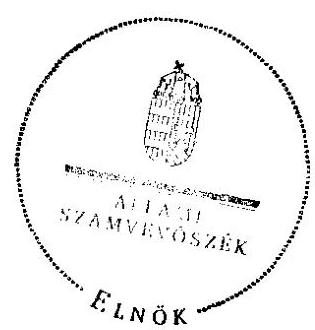
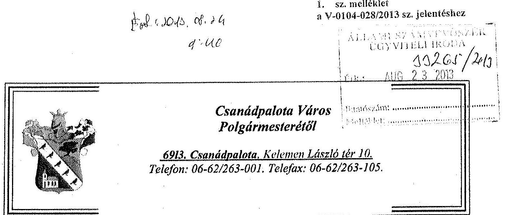
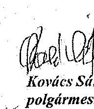
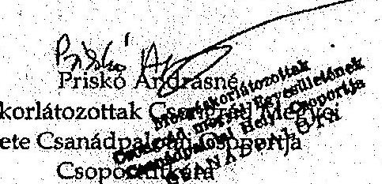
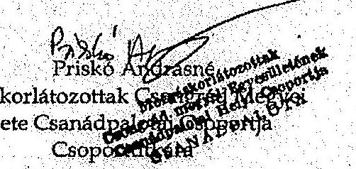
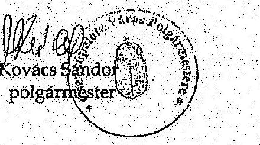
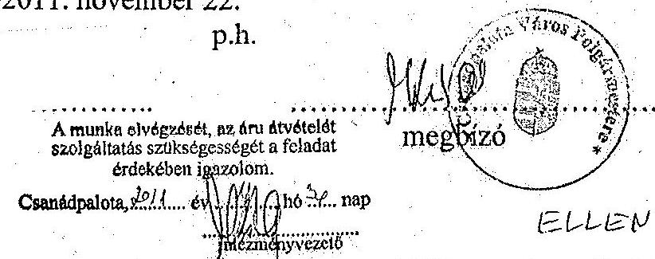
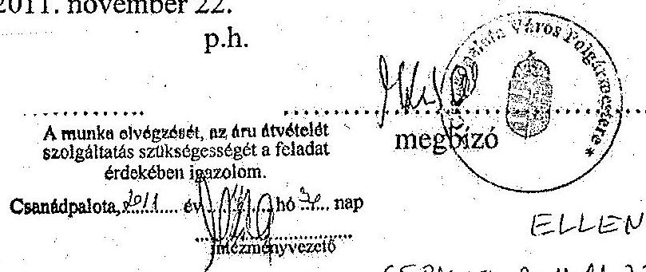
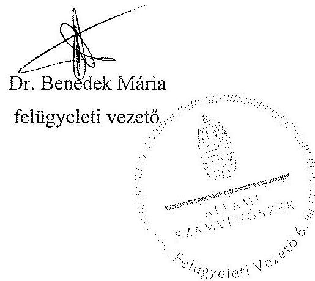

# JELENTÉS 

az önkormányzatok belső kontrollrendszerének kialakítása, valamint egyes kontrolltevékenységek és a belső ellenőrzés múködése ellenőrzéséről

---

# Állami Számvevőszék 

Iktatószám: V-0104-028/2013.
Témaszám: 1109
Vizsgálat-azonosító szám: V059135

## Az ellenőrzést felügyelte:

Dr. Benedek Mária
felügyeleti vezető
Az ellenőrzést vezette:
Bíró Zsolt
ellenőrzésvezető
A számvevőszéki jelentés összeállításában közremúködött:
Kiss Rita Teréz
számvevő tanácsos
Az ellenőrzést végezték:
Nyikon Zsigmondné Liziczai Imréné
számvevő tanácsos számvevő

---

# TARTALOMJEGYZÉK 

BEVEZETÉS ..... 5
I. ÖSSZEGZŐ MEGÁLLAPÍTÁSOK, KÖVETKEZTETÉSEK, JAVASLATOK ..... 8
II. RÉSZLETES MEGÁLLAPÍTÁSOK ..... 15

1. Az önkormányzat belső kontrollrendszere kialakításának megfelelősége ..... 15
1.1. A kontrollkörnyezet kialakítása ..... 15
1.2. A kockázatkezelési rendszer kialakítása ..... 16
1.3. A kontrolltevékenységek kialakítása ..... 16
1.4. Az információs és kommunikációs rendszer kialakítása ..... 17
1.5. A monitoring rendszer kialakítása ..... 18
2. A pénzügyi folyamatokban kulcsszerepet betöltő belső kontrollok (szakmai teljesítésigazolás és utalvány ellenjegyzés) múködése ..... 18
3. A belső ellenőrzés szervezeti keretei és múködése ..... 21

## MELLÉKLETEK

1. számú Az észrevételt tartalmazó polgármesteri levél
2. számú Az észrevételre vonatkozó elnöki válaszlevél

## FÜGGELÉKEK

1. számú Értelmező szótár
2. számú A belső kontrollrendszer kialakítása, a pénzügyi folyamatokban kulcsszerepet betöltő szakmai teljesítésigazolás és utalvány ellenjegyzés kontrollok múködése, valamint a belső ellenőrzés múködése értékelésénél alkalmazott minősítési szempontok

---

.

---

# RÖVIDÍTÉSEK JEGYZÉKE 

## Törvények:

ÁSZ tv.
Avtv.

Htv.

Info tv.

Mötv.
Ötv.
régi Áht.

Számv. tv.
Tvtv.
új Áht.

## Rendeletek, határozatok

Áhsz.

Ámr.
Ávr.

Ber.

Bkr.

## Szórövidítések

ÁSZ
Belső ellenőrzési kézikönyv
Belső Kontroll Kézikönyv

2011. évi LXVI. törvény az Állami Számvevőszékről
1992. évi LXIII. törvény a személyes adatok védelméről és a közérdekú adatok nyilvánosságáról (hatálytalan: 2012. január 1-jétől)
1991. évi XX. törvény a helyi önkormányzatok és szerveik, a köztársasági megbízottak, valamint egyes centrális alárendeltségú szervek feladat- és hatásköreiről
2011. évi CXII. törvény az információs önrendelkezési jogról és az információszabadságról (hatályos 2012. január 1-jétől)
2011. évi CLXXXIX. törvény Magyarország helyi önkormányzatairól (hatályos 2012. január 1-jétől)
1990. évi LXV. törvény a helyi önkormányzatokról
1992. évi XXXVIII. törvény az államháztartásról (hatálytalan 2012. január 1-jétől)
2000. évi C. törvény a számvitelről
1996. évi XXXI. törvény a túz elleni védekezésről, a múszaki mentésről és a túzoltóságról
2011. évi CXCV. törvény az államháztartásról (hatályos 2012. január 1-jétől)

249/2000. (XII. 24.) Korm. rendelet az államháztartás szervezetei beszámolási és könyvvezetési kötelezettségének sajátosságairól
292/2009. (XII. 19.) Korm. rendelet az államháztartás múködési rendjéről (hatálytalan 2012. január 1-jétől)
368/2011. (XII. 31.) Korm. rendelet az államháztartásról szóló törvény végrehajtásáról (hatályos 2012. január 1jétől)
193/2003. (XI. 26.) Korm. rendelet a költségvetési szervek belső ellenőrzéséről (hatálytalan 2012. január 1-jétől)
370/2011. (XII. 31.) Korm. rendelet a költségvetési szervek belső kontrollrendszeréről és belső ellenőrzéséről (hatályos 2012. január 1-jétől)

Állami Számvevőszék
Makói Kistérség Belső Ellenőrzési Kézikönyv (hatályos 2009. szeptember 21-étől)

Az Ámr. 155. § (1) bekezdése, valamint az államháztartási belső kontroll standardokról szóló 1/2009. (IX. 11.) PM irányelv egységes értelmezése érdekében az államháztartásért felelős miniszter által 2010. évben kiadott Belső Kontroll Kézikönyv

---

| FEUVE | Folyamatba épített, előzetes, utólagos és vezetői ellenőrzés |
| :--: | :--: |
| gazdálkodási jogkörök   szabályzata | Csanádpalota Város Önkormányzatának Kötelezettségvállalás, utalványozás, ellenjegyzés, érvényesités rendjének szabályzata (hatályos 2010. november 1-jétől) |
| Hivatal | Csanádpalotai Közös Önkormányzati Hivatal (2013. március 1-jétől) |
| hivatali SZMSZ | Csanádpalota Város Önkormányzata Polgármesteri Hivatalának Szervezeti és Múködési Szabályzata (hatályos 2010. január 1-jétől) |
| informatikai biztonsági   szabályzat | Csanádpalota Nagyközségi Önkormányzat Polgármesteri Hivatala Adatvédelmi és Számítástechnikai Szabályzat (hatályos 2006. január 1-jétől) |
| iratkezelési szabályzat | Csanádpalota Nagyközség és Nagylak Község Egyedi Iratkezelési Szabályzata (hatályos 2009. július 1-jétől) |
| jegyző | Csanádpalota Város Önkormányzatának jegyzője |
| Képviselő-testület | Csanádpalota Város Önkormányzatának Képviselőtestülete |
| kockázatkezelési szabályzat | Csanádpalota Város Önkormányzat Polgármesteri Hivatala Kockázatkezelési Szabályzata |
| Önkormányzat   polgármester   Polgármesteri Hivatal | Csanádpalota Város Önkormányzata   Csanádpalota Város Önkormányzatának polgármestere   Csanádpalota Város Önkormányzatának Polgármesteri Hivatala (2013. február 28-áig) |
| számlarend | Csanádpalota Város Önkormányzatának Polgármesteri Hivatala Számlarendje (hatályos 2010. január 1-jétől) |
| Társulás | Makói Kistérség Belső Ellenőrzési Társulása |

---

# JELENTÉS   az önkormányzatok belső   kontrollrendszerének kialakítása, valamint egyes kontrolltevékenységek és a belső ellenőrzés múködése ellenőrzéséről   CSANÁDPALOTA 

## BEVEZETÉS

A belső kontrollrendszer kialakítását, múködtetését és fejlesztését a régi Áht. és az új Áht. is előírja. Ennek megvalósításáért a költségvetési szerv vezetője felel. A belső kontrollrendszer azt a célt szolgálja, hogy a költségvetési szervek múködésük és gazdálkodásuk során a tevékenységeket szabályszerűen, gazdaságosan, hatékonyan, eredményesen hajtsák végre, teljesítsék elszámolási kötelezettségeiket és megvédjék az erőforrásokat a veszteségektől, a károktól és a nem rendeltetésszerű használattól. A belső kontrollrendszer magában foglalja mindazon szabályokat, eljárásokat, gyakorlati módszereket és szervezeti struktúrákat, kockázatkezelési technikákat, kontrolltevékenységeket, amelyek segítséget nyújtanak a szervezetnek céljai eléréséhez.

Az ÁSZ a 2011-2015. évekre szóló stratégiájában hangsúlyos szerepet szánt annak, hogy szilárd szakmai alapon álló, értékteremtő ellenőrzéseivel előmozdítsa a közpénzügyek átláthatóságát, rendezettségét. A számvevőszéki ellenőrzés nemzetközi alapelvei is rögzítik, hogy a megfelelő belső kontrollrendszer minimálisra csökkenti a hibák és szabálytalanságok kockázatát.

Az ellenőrzés célja annak értékelése volt, hogy az Önkormányzat a jogszabályi előírásoknak megfelelően alakította-e ki a belső kontrollrendszert; a gazdálkodás folyamatában kulcsszerepet betöltő szakmai teljesítésigazolás és az utalvány ellenjegyzés kontrolltevékenységeit megfelelően működtette-e; biztosí-totta-e a belső ellenőrzés szabályos és eredményes múködését.

Az ellenőrzés típusa: szabályszerűségi ellenőrzés
Az ellenőrzés jogszabályi alapja: az ÁSZ tv. 5. § (2) és (6) bekezdései
Az ellenőrzött szervezet: az Önkormányzat
Az ellenőrzött időszak: a belső kontrollrendszer kialakításának megfelelőségét a 2011. évre vonatkozóan értékeltük. A kontrolltevékenységek múködésének megfelelőségét a 2011. január 1-je és december 31-e, míg a belső ellenőrzés múködésének szabályosságát és eredményességét a 2009. január 1-je és

---

2011. december 31-e közötti időszakot figyelembe véve értékeltük. A helyszíni ellenőrzés lezárásáig a helyi szabályozás változásait nyomon követtük.

Az ellenőrzés szakmai módszertana az ÁSZ hivatalos honlapján (www.asz.hu) közzétett szakmai szabályokon alapult, amely a Legfőbb Ellenőrző Intézmények Nemzetközi Szervezete (INTOSAI) által kiadott nemzetközi standardok (ISSAI) figyelembevételével készült.

A belső kontrollrendszer kialakításának ellenőrzése során értékeltük a kontrollkörnyezet, a kockázatkezelési rendszer, a kontrolltevékenységek, az információs és kommunikációs rendszer, valamint a monitoring rendszer szabályozottságának megfelelőségét.

Értékeltük a pénzügyi folyamatokban kulcsszerepet betöltő szakmai teljesítésigazolás és utalvány ellenjegyzés kontrollok múködésének megfelelőségét az államháztartáson kívülre teljesített múködési és felhalmozási célú pénzeszközátadásoknál, az állományba nem tartozók megbízási díjainál, továbbá a külső szolgáltatók által végzett karbantartási, kisjavítási munkákkal kapcsolatos kifizetéseknél. Az egyszerú véletlen mintavétellel kiválasztott tételek ellenőrzését többlépcsős megfelelőségi tesztek útján addig végeztük, amíg elegendő és megfelelő bizonyítékot szereztünk a vizsgált folyamatok kulcskontrolljai múködésének megfelelő vagy nem megfelelő voltáról. Értékeltük az Önkormányzatnál a belső ellenőrzés múködésének szabályosságát és eredményességét. Az ÁSZ a 2007-2010. években az Önkormányzatnál átfogó ellenőrzést nem végzett.

A fogalmak magyarázatát az 1. számú függelék, az ellenőrzés egyes területeinek értékelésénél alkalmazott egységes minősítési szempontokat a 2. számú függelék tartalmazza.

Az ellenőrzés lefolytatásához az Önkormányzat a munkalapok és a tanúsítvány elektronikus kitöltésével, valamint a megjelölt dokumentumok elektronikus megküldésével szolgáltatott adatokat. A munkalapokon szerepeltetett adatok, információk ellenőrzése és szükség szerinti javítása a helyszíni ellenőrzés keretében történt.

Az ÁSZ az ellenőrzés megállapításait az ellenőrzött időszakban hatályos, az intézkedést igénylő megállapításokra tett javaslatokat a jelenleg hatályos jogszabályok alapján fogalmazta meg.

Az Ász tv. 29. § (1) bekezdése szerint a jelentéstervezetet megküldtük a polgármester részére, aki az ÁSZ tv. 29. § (2) bekezdésében foglalt észrevételezési jogával élt, a jelentéstervezetre észrevételt tett. Az ÁSZ tv. 29. § (3) bekezdésében előírtaknak megfelelően a figyelembe nem vett észrevételeket és annak indokairól szóló tájékoztatást a jelentés tartalmazza (2. számú melléklet).

Csanádpalota város állandó lakosainak száma 2011. január 1-jén 3093 fő volt. Az Önkormányzat hét tagú Képviselő-testületének munkáját kettő állandó bizottság segítette. Az Önkormányzat az önállóan múködő és gazdálkodó Polgármesteri Hivatalon felül négy önállóan múködő intézménnyel látta el feladatát. Az Önkormányzat többségi tulajdoni hányadú gazdasági társasággal nem rendelkezett.

---

A polgármester a 2006. évi önkormányzati választások óta tölti be tisztségét. A jegyző 1997. augusztus 1-jétől látja el feladatait.

A Polgármesteri Hivatal szervezete a Mötv. 85. § (1) és 146. § (2) bekezdésére tekintettel 2013. március 1-jétől kezdődően Csanádpalota város és Nagylak község önkormányzatainak részvételével Csanádpalotai Közös Önkormányzati Hivatallá alakult át, amelynek székhelye Csanádpalota.

A Hivatal három szervezeti egységre tagolódott, a foglalkoztatott köztisztviselők száma 2011. január 1-jén 18 fő volt.

Az Önkormányzat a 2011. évi költségvetési beszámolója szerint 799053 ezer Ft költségvetési bevételt ért el, valamint 796145 ezer Ft költségvetési kiadást teljesített. A 2011. december 31-i könyvviteli mérleg szerint 1618087 ezer Ft értékű eszközvagyonnal rendelkezett, 11062 ezer Ft hosszú lejáratú, 92345 ezer Ft rövid lejáratú kötelezettsége volt.

---

# I. ÖSSZEGZŐ MEGÁLLAPÍTÁSOK, KÖVETKEZTETÉSEK, JAVASLATOK 

A belső kontrollrendszeren belül 2011-ben a Polgármesteri Hivatalban a kontrollkörnyezet, a kockázatkezelési rendszer, a kontrolltevékenységek, az információs és kommunikációs rendszer, valamint a monitoring rendszer kialakítását külön-külön és összesítve is értékeltük. A belső kontrollrendszer kialakítása az összesített értékelés alapján nem felelt meg a jogszabályi előírásoknak. Az egyes területek kialakításának értékelését az alábbiakban részletezzük.

A kontrollkörnyezet kialakítása megfelelt a jogszabályi követelményeknek, mert a Képviselő-testület elfogadta az Önkormányzat gazdasági programját, a jegyző elkészítette a gazdálkodást érintő legfontosabb szabályzatokat. A kontrollkörnyezet kialakítása annak ellenére megfelelő volt, hogy a jegyző az Ámr.ben ${ }^{1}$ foglaltak ellenére a hivatali SZMSZ-ben nem rögzítette valamennyi nevesített munkakörhöz tartozó feladat- és hatásköröket, a hatáskörök gyakorlásának módját, a helyettesítés rendjét és az ezekhez kapcsolódó felelősségi szabályokat; továbbá gazdasági vezetőnek olyan személyt nevezett ki, aki nem rendelkezett az Ámr.-ben előírt végzettséggel.

A kockázatkezelési rendszer kialakítása nem volt megfelelő, mert a jegyző - a régi Áht.-ban ${ }^{2}$ és az Ámr.-ben előírtak ellenére - nem határozta meg az egyes kockázatokkal kapcsolatos intézkedések megtételének módját.

A kontrolltevékenységek kialakítása a jogszabályi követelményeknek részben felelt meg. A jegyző - a régi Áht. előírása ellenére - nem határozta meg a pénzügyi döntések - köztük a beszerzési folyamat - dokumentumainak elkészítésével kapcsolatban a FEUVE feladatait. A jegyző az Ámr. előírásait nem tartotta be, mert nem alakította ki a Polgármesteri Hivatal tevékenységeire vonatkozó beszámolási eljárásokat, a kötelezettségvállalás és az utalvány ellenjegyzésére írásban kijelölt személy nem rendelkezett az előírt szakmai képesítéssel, továbbá nem szabályozta a szakmai teljesítésigazolás gyakorlásának eljárási és dokumentációs részletszabályait.

Az információs és kommunikációs rendszer kialakítása részben volt megfelelő, mert a jegyző - az Avtv. ${ }^{3}$ előírása ellenére - az adatbiztonság érvényre juttatásához szükséges intézkedéseket hiányosan tette meg.

A monitoring rendszer kialakítása a jogszabályi előírásoknak nem felelt meg, mert a jegyző - a régi Áht.-ban és az Ámr.-ben foglalt előírások ellenére az operatív tevékenységek keretében megvalósuló folyamatos és eseti nyomon

[^0]
[^0]:    ${ }^{1}$ 2012. január 1-jétől Ávr.
    ${ }^{2}$ 2012. január 1-jétől új Áht.
    ${ }^{3}$ 2012. január 1-jétől Info tv.

---

követésből álló, a Polgármesteri Hivatal tevékenységének, a célok megvalósításának nyomon követését biztosító rendszer szabályait nem határozta meg.

A belső kontrollrendszer nem megfelelő kialakítása kockázatot jelent az Önkormányzat tevékenységeinek szabályszerű, gazdaságos, hatékony és eredményes végrehajtásában.

A Polgármesteri Hivatalban a 2011. évben az államháztartáson kívülre történő működési és felhalmozási célú pénzeszközátadásokkal, az állományba nem tartozók megbízási díjaival, valamint a külső szolgáltatók által végzett karbantartással, kisjavítással kapcsolatos kifizetések során - összefoglalóan értékelve a kulcskontrollok múködésének megfelelősége gyenge volt. A szakmai teljesítésigazolást az államháztartáson kívülre történő működési és felhalmozási célú pénzeszközátadásokkal, az állományba nem tartozók megbízási díjaival és a külső szolgáltatók által végzett karbantartással, kisjavítással kapcsolatos kifizetések esetében - a régi Áht.-ban és az Ámr.-ben előírtak ellenére - nem végezték el, illetve a szakmai teljesítésigazolás nem szabályszerűen történt.

Az utalványok ellenjegyző́je az Ámr.-ben foglalt ellenőrzési feladatait - a szakmai teljesítésigazolás, illetve a szabályszerűen végzett szakmai teljesítésigazolás vagy az érvényesítés dátumának hiányában - nem a jogszabályi előírásoknak megfelelően végezte. A régi Áht. és az Ámr. gazdálkodásra - közöttük az előzetes írásbeli kötelezettségvállalásra, a jogosult általi ellenjegyzést követő kötelezettségvállalásra, a kötelezettségvállalások nyilvántartására, az utalványon a kötelezettségvállalás nyilvántartási számának feltüntetésére, a megfelelő szakmai végzettségre - vonatkozó szabályai betartásának hiánya ellenére az utalványokat ellenjegyezték. A népszámláláshoz tartozó megbízási díjak kifizetéséhez kapcsolódóan a kötelezettségvállaló és az utalvány ellenjegyzője is a jegyző volt, ami nem felelt meg az Ámr.-ben foglalt - összeférhetetlenségre vonatkozó - előírásoknak.

Az ellenőrzött kifizetésekkel összefüggésben a rendelkezésre bocsátott dokumentumok alapján jogosulatlan kifizetést nem tárt fel az ellenőrzés, azonban a gazdálkodásban kulcsszerepet betöltő kontrollok jogszabályi előírásoknak nem megfelelő, gyenge múködése miatt fennáll a hibák bekövetkezésének lehetősége. A kiválasztott kulcskontrollok az integritás szempontjából lényeges csalás és korrupciós kockázatok megelőzésében, illetve feltárásában is hangsúlyos szerepet játszanak, így hatékonyabbá és eredményesebbé válhat a korrupció elleni fellépés. A nem megfelelően szabályozott és múködtetett belső kontrollok korrupciós kockázatot hordoznak.

Az Önkormányzat a belső ellenőrzési feladatokat a Társulás útján látta el. Az Önkormányzatnál a 2009-2011. években a belső ellenőrzés kialakítása és múködése összességében jól megfelelt a jogszabályi előírásoknak. A jegyző írásos véleményének figyelembevételével készített és szabályszerűen jóváhagyott éves ellenőrzési tervek, valamint ellenőrzési programok alapján végezték az ellenőrzéseket, azokról a Ber. ${ }^{4}$-ben előírt tartalmú jelentések készültek. A jelentések megállapításai és javaslatai alapján intézkedési tervet készítettek. A belső

[^0]
[^0]:    ${ }^{4}$ 2012. január 1-jétől Bkr.

---

ellenőrzési vezető nyilvántartást vezetett az elvégzett ellenőrzésekről és a javasolt intézkedésekről.

Az Önkormányzatnál a 2009-2011. években a belső ellenőrzés múködése a 2. számú függelékben részletezett kritériumrendszer alapján végzett értékelés szerint - nem volt eredményes annak ellenére, hogy a belső ellenőrzés szabályozása és működése az összegző értékelés alapján az ellenőrzött időszak egészét tekintve a jogszabályi előírásoknak jól megfelelt. A belső ellenőrzés működése azért nem volt eredményes, mert az elvégzett belső ellenőrzések során - a belső kontrollrendszer kialakítása szabályozottságának, valamint a gazdálkodói jogkörök gyakorlásához kapcsolódó, a pénzkezeléssel és a vagyongazdálkodással kapcsolatos belső kontrollok működésének ellenőrzésénél - nem tárták fel teljes körűen a belső kontrollok kialakításának és működésének hiányosságait, továbbá mert a belső ellenőrzés által tett javaslatot a jegyző nem hasznosította. Mindezek hozzájárultak a számvevőszéki ellenőrzés során is feltárt szabályozási hiányosságok, hibák ismétlődéséhez.

Az ÁSZ tv. 33. § (1) bekezdésében foglaltak értelmében az ellenőrzött szervezet vezetője köteles a jelentésben foglalt megállapításokhoz kapcsolódó intézkedési tervet összeállítani, és azt a jelentés kézhezvételétől számított 30 napon belül az ÁSZ részére megküldeni. Amennyiben az intézkedési tervet határidőre nem küldi meg a szervezet, vagy az - az ÁSZ tv. 33. § (2) bekezdésében foglalt póthatáridő eltelte ellenére - továbbra sem elfogadható, az ÁSZ elnöke a hivatkozott törvény 33. § (3) bekezdés a-b) pontjaiban foglaltakat érvényesítheti.

Az ellenőrzés intézkedést igénylő megállapításai és javaslatai:

# a polgármesternek 

1. A külső szolgáltatók által végzett karbantartás, kisjavítás egyes kifizetéseivel kapcsolatos kötelezettségvállalásokra - a régi Áht. 100/C. § (3) bekezdésében és az Ámr. 74. § (1) bekezdésében foglaltak ellenére - nem írásban, az állományba nem tartozók megbízási díjaihoz kapcsolódóan pedig ellenjegyzés hiányában került sor.

Javaslat:
Intézkedjen arról, hogy az Önkormányzat nevében történő kötelezettségvállalásra az új Áht. 37. § (1) bekezdésében foglaltaknak megfelelően - az Ávr. 53. §-ában meghatározott kivételeket figyelembe véve - kizárólag a pénzügyi ellenjegyzés után, a pénzügyi teljesítés esedékességét megelőzően, írásban kerüljön sor.
2. Az államháztartáson kívülre történő működési és felhalmozási célú pénzeszközátadásokkal kapcsolatos kifizetéseket megelőzően a szakmai teljesítésigazolás - a régi Áht. 100/C. § (6) bekezdésének és az Ámr. 76. § (1) és (3) bekezdésének előírása ellenére - nem történt meg. Az állományba nem tartozók megbízási díjaival és a külső szolgáltatók által végzett karbantartással, kisjavítással kapcsolatos kifizetések esetében a szakmai teljesítés igazolója az Ámr. 76. § (1) bekezdésében foglalt feladatait - nem a gazdálkodási jogkörök szabályzatában előírt módon végezte, mert rájegyzése nem felelt meg a szabályzatban meghatározott, igazolásra utaló szövegtartalomnak.

---

Az utalványok ellenjegyzője az Ámr. 79. § (2) bekezdésében foglaltakat figyelmen kívül hagyva annak ellenére ellenjegyezte a kiadásokat, hogy a szakmai teljesítés igazolását nem, vagy nem a belső szabályzatban előírt módon végezték el, továbbá az érvényesítés dátumát - az Ámr. 77. § (3) bekezdésében foglaltak ellenére - nem tüntették fel. Az utalványok ellenjegyzője a kiadásokat annak ellenére ellenjegyezte, hogy írásbeli kötelezettségvállalásokra - a régi Áht. 100/C. § (3) bekezdésében és az Ámr. 74. § (1) bekezdésében foglaltak ellenére - a külső szolgáltatók által végzett karbantartással, kisjavítással kapcsolatos kifizetéseknél nem, az államháztartáson kívülre történő működési és felhalmozási célú pénzeszközátadásoknál és az állományba nem tartozók megbízási díjaihoz kapcsolódóan pedig ellenjegyzés hiányában került sor. Az utalványok ellenjegyzője annak ellenére ellenjegyezte a kiadásokat, hogy - az Ámr. 78. § (2) bekezdés g) pontjában előírtak ellenére - a kötelezettségvállalás nyilvántartási számát nem tüntették fel, mert a kötelezettségvállalást - az Ámr. 75. § (1) bekezdésében előírtak ellenére - nem vették nyilvántartásba. A népszámláláshoz tartozó megbízási díjak kifizetéséhez kapcsolódóan a kötelezettségvállaló és az utalvány ellenjegyzője is a jegyző volt, ami nem felel meg az Ámr. 80. § (1) bekezdésében foglalt előírásoknak.

Javaslat:
A Mötv. 115. § (1) bekezdésében foglaltak alapján kísérje figyelemmel az Önkormányzat gazdálkodásának szabályszerűségét. A Mötv. 67. § f) pontja alapján gondoskodjon a belső kontrollrendszerre és a belső ellenőrzés müködésére vonatkozó jogszabályi rendelkezések be nem tartása, valamint a szakmai teljesítésigazolás, illetve az utalvány ellenjegyzés kontrollokkal összefüggésben feltárt hiányosságok, szabálytalanságok tekintetében az esetleges munkajogi felelősséggel kapcsolatos körülmények kivizsgálásáról, majd a vizsgálat eredményének függvényében tegye meg a szükséges munkajogi intézkedéseket.

# a jegyzőnek (Csanádpalota Város Önkormányzata vonatkozásában) 

1. a kontrollkörnyezettel kapcsolatban:

A jegyző a hivatali SZMSZ-ben - az Ámr. 20. § (2) bekezdés h) pontjában foglaltak ellenére - nem rögzítette valamennyi nevesített munkakörhöz tartozó feladat- és hatásköröket, a hatáskörök gyakorlásának módját, a helyettesítés rendjét, és az ezekhez kapcsolódó felelősségi szabályokat.

A jegyző nem biztosította, hogy a gazdasági szervezet vezetője rendelkezzen az Ámr. 18. § (1)-(2) és (4) bekezdéseiben előírt végzettséggel.

Javaslat:
a) Módosítsa a hivatali SZMSZ-t, és kezdeményezze a polgármesternél a módosítás Képviselő-testület elé terjesztését annak érdekében, hogy az tartalmazza az Ávr. 13. § (1) bekezdésének g) pontjában foglaltaknak megfelelően valamennyi nevesített munkakörhöz tartozó feladat- és hatásköröket, a hatáskörök gyakorlásának módját, a helyettesítés rendjét az ezekhez kapcsolódó felelősségi szabályokat.
b) Intézkedjen arról, hogy a gazdasági szervezet vezetőjének az Ávr. 12. § (1)-(2) bekezdéseiben előírt képesítéssel rendelkező személyt nevezzenek ki.

---

2. a kockázatkezelési rendszerrel kapcsolatban:

A jegyző a kockázatkezelési rendszer kialakítása során - a régi Áht. 121. § (2) bekezdés b) pontjában és az Ámr 157. § (1) és (3) bekezdésében előírtak ellenére - a kockázatkezelés keretében nem határozta meg az egyes kockázatokkal kapcsolatos intézkedések megtételének módját.

Javaslat:
Biztosítsa, hogy a kockázatkezelési rendszer kialakítása és múködtetése megfeleljen a Bkr. 3. § b) pontjában és a 7. §-ában foglalt előírásoknak.
3. a kontrolltevékenységekkel kapcsolatban:

A jegyző - a régi Áht. 121/A. § (4) bekezdés a) pontjában foglaltak ellenére - nem biztosította a pénzügyi döntések - köztük a beszerzési folyamatok - dokumentumainak elkészítése vonatkozásában a folyamatba épített, előzetes, utólagos és vezetői ellenőrzést.

A jegyző - az Ámr. 158. § (2) bekezdés d) pontjának előírása ellenére - nem alakította ki a Polgármesteri Hivatal tevékenységeire vonatkozó beszámolási eljárásokat.

A jegyző - az Ámr. 19. § (1) bekezdésében foglaltak ellenére - a kötelezettségvállalás és az utalvány ellenjegyzésére az előírt szakmai képesítéssel nem rendelkező személyt jelölt ki.

A jegyző - az Ámr. 20. § (3) bekezdés a) pontja ellenére - nem szabályozta a szakmai teljesítésigazolás eljárási és dokumentációs részletszabályait.

Javaslat:
a) Biztosítsa minden tevékenységre vonatkozóan a folyamatba épített, előzetes, utólagos és vezetői ellenőrzést a Bkr. 8. § (2) bekezdése alapján.
b) Alakítsa ki - a Bkr. 8. § (4) bekezdés c) pontja alapján - a Hivatal tevékenységeire vonatkozó beszámolási eljárásokat.
c) Intézkedjen arról, hogy a pénzügyi ellenjegyzésre kijelölt személy rendelkezzen az Ávr.55. § (3) bekezdésében előírt szakmai végzettséggel.
d) Rögzítse belső szabályzatban az Ávr. 13. § (2) bekezdés a) pontjában előírtaknak megfelelően a teljesítésigazolás eljárási és dokumentációs részletszabályait.
4. az információs és kommunikációs rendszerrel kapcsolatban:

A jegyző - az Avtv. 10. §-ában foglalt előírások ellenére - hiányosan tette meg az adatbiztonság érvényre juttatásához szükséges intézkedéseket, mert nem határozta meg a hozzáférési jogosultságok betartásának ellenőrzésére vonatkozó eljárásrendet.

---

Javaslat:
Az Info tv. 7. § (2)-(3) bekezdéseinek megfelelően gondoskodjon az adatok biztonságáról, tegye meg azokat az intézkedéseket, alakítsa ki azokat az eljárási szabályokat, amelyek az Info tv., valamint az egyéb adat- és titokvédelmi szabályok érvényre juttatásához szükségesek; továbbá megfelelő intézkedésekkel biztosítsa az adatok védelmét.
5. a monitoring rendszerrel kapcsolatban:

A jegyző - a régi Áht. 121. § (2) bekezdés e) pontjában és az Ámr. 160. §-ában foglaltak ellenére - az operatív tevékenységek keretében megvalósuló, folyamatos és eseti nyomon követésből álló, a Polgármesteri Hivatal tevékenységének, a célok megvalósításának nyomon követését biztosító rendszer szabályait nem határozta meg.

Javaslat:
Alakítsa ki és múködtesse a Bkr. 3. § e) pontjában és a 10. §-ában előírtak alapján a Hivatal tevékenységének, a célok megvalósításának nyomon követését biztosító rendszert, amelynek része az operatív tevékenységek keretében megvalósuló folyamatos és eseti nyomon követés is
6. a pénzügyi folyamatokban kulcsszerepet betöltő kontrollokkal kapcsolatban:

A szakmai teljesítésigazolás az államháztartáson kívülre történő működési és felhalmozási célú pénzeszközátadásokkal kapcsolatos kifizetéseket megelőzően - a régi Áht. 100/C. § (6) bekezdésének és az Ámr. 76. § (1) és (3) bekezdésének előírása ellenére - nem történt meg, az állományba nem tartozók megbízási díjaival és a külső szolgáltatók által végzett karbantartással, kisjavítással kapcsolatos kifizetéseknél a szakmai teljesítés igazolója az Ámr. 76. § (1) bekezdésében foglalt feladatait nem a gazdálkodási jogkörök szabályzatában előírt módon végezte, mert rájegyzése nem felelt meg a szabályzatban meghatározott, igazolásra utaló szövegtartalomnak.

Az utalványok ellenjegyzője az Ámr. 79. § (2) bekezdésében foglaltakat figyelmen kívül hagyva annak ellenére ellenjegyezte a kiadásokat, hogy a szakmai teljesítés igazolását nem, vagy nem a belső szabályzatban előírt módon végezték el, továbbá az érvényesítés dátumát - az Ámr. 77. § (3) bekezdésében foglaltak ellenére - nem tüntették fel. Az utalványok ellenjegyzője a kiadásokat annak ellenére ellenjegyezte, hogy az írásbeli kötelezettségvállalásokra - a régi Áht. 100/C. § (3) bekezdésében és az Ámr. 74. § (1) bekezdésében foglaltak ellenére - a külső szolgáltatók által végzett karbantartással, kisjavítással kapcsolatos kifizetéseknél nem, az államháztartáson kívülre történő működési és felhalmozási célú pénzeszközátadásoknál és az állományba nem tartozók megbízási díjaihoz kapcsolódóan pedig ellenjegyzés hiányában került sor. Az utalványok ellenjegyzője annak ellenére ellenjegyezte a kiadásokat, hogy - az Ámr. 78. § (2) bekezdés g) pontjában előírtak ellenére - a kötelezettségvállalás nyilvántartási számát nem tüntették fel, mert a kötelezettségvállalást - az Ámr. 75. § (1) bekezdésében előírtak ellenére - nem vették nyilvántartásba. A népszámláláshoz tartozó megbízási díjak kifizetéséhez kapcsolódóan a kötelezettségvállaló és az utalvány ellenjegyzője is a jegyző volt, ami nem felel meg az Ámr. 80. § (1) bekezdésében foglalt előírásoknak. A karbantartással, kisjavítással kapcsolatos kifizetések egyes

---

tételeinél az utalvány ellenjegyzésére az Ámr. 19. § (1) bekezdésében előírt iskolai végzettséggel nem rendelkező személy került kijelölésre.

Javaslat:
Intézkedjen - a szakmai teljesítés igazolása és az utalvány ellenjegyzése vonatkozásában feltárt hiányosságok megszüntetése, illetve az operatív gazdálkodás során a működésbeli hibák megelőzése, feltárása és kijavítása érdekében - arról, hogy:
a) a teljesítésigazolás során az Ávr. 57. § (1) bekezdésében előírtaknak megfelelően, ellenőrizhető okmányok alapján ellenőrizzék és igazolják a kiadások teljesítésének jogosságát, összegszerűségét, az ellenszolgáltatást is magában foglaló kötelezettségvállalás esetén a szerződés, megrendelés teljesítését, valamint az Ávr. 57. § (3) bekezdése szerint a teljesítést az igazolás dátumának és a teljesítés tényére történő utalásnak a megjelölésével, az Ámr. 57. § (4) bekezdése szerint az arra kijelölt személy aláírásával igazolják;
b) a kifizetéseket megelőzően a teljesítésigazolás alapján - az Ávr. 57. § (3) bekezdése szerinti esetben annak hiányában is - az összegszerűségnek, a fedezet meglétének és a megelőző ügymenetben az új Áht., az Áhsz., az Ávr. előírásai és a belső szabályzatokban foglaltak betartásának az ellenőrzése - az Ávr. 58. § (1) és (3) bekezdése szerint - történjen meg;
c) a kötelezettségvállalások nyilvántartását az Ávr. 56. § (1) bekezdésében foglalt előírásnak megfelelően vezessék, és az utalványon az Ávr. 59. § (3) bekezdésében foglalt kötelező tartalmi elemeket tüntessék fel;
d) az összeférhetetlenségi szabályok az Ávr. 60. § (1)-(2) bekezdésében foglaltaknak megfelelően érvényesüljenek.

---

# II. RÉSZLETES MEGÁLLAPÍTÁSOK 

## 1. AZ ÖNKORMÁNYZAT BELSŐ KONTROLLRENDSZERE KIALAKÍTÁSÁNAK MEGFELELŐSÉGE

### 1.1. A kontrollkörnyezet kialakítása

A kontrollkörnyezet kialakítása a 2. számú függelékben részletezett kritériumrendszer alapján végzett értékelés szerint a Polgármesteri Hivatalban megfelelő volt. A Képviselő-testület elfogadta az Önkormányzat gazdasági programját, a Polgármesteri Hivatal rendelkezett a jogszabályokban előírt tartalmú alapító okirattal. A jegyző elkészítette a Polgármesteri Hivatal számviteli politikáját, a leltározási, az értékelési és a pénzkezelési szabályzatot, valamint a tűzvédelmi szabályzatot, továbbá meghatározta az egészséget nem veszélyeztető és biztonságos munkavégzés követelményei megvalósításának módját. A jegyző meghatározta a számlarendet, a bizonylati rendet, kialakította az ellenőrzési nyomvonalat, valamint biztosította a Polgármesteri Hivatal folyamatainak meghatározását és dokumentálását.

A kontrollkörnyezet kialakítása annak ellenére megfelelő volt, hogy a jegyző, mint a költségvetési szerv vezetője:

- a hivatali SZMSZ-ben - az Ámr. 20. § (2) bekezdés h) pontjában ${ }^{5}$ foglaltak ellenére - nem rögzítette valamennyi nevesített munkakörhöz tartozó fel-adat- és hatásköröket, a hatáskörök gyakorlásának módját, a helyettesítés rendjét és az ezekhez kapcsolódó felelősségi szabályokat;
- gazdasági vezetőnek olyan személyt nevezett ki, aki nem rendelkezett az Ámr. 18. § (1), (2) és (4) bekezdéseiben ${ }^{6}$ előírt végzettséggel.

A kontrollkörnyezet kialakítása során a jegyző az Ámr. 155. § (3) bekezdésének ${ }^{7}$ előírását figyelmen kívül hagyva az államháztartásért felelős miniszter által kiadott Belső Kontroll Kézikönyv ajánlásait nem hasznosította teljes körűen.

A kontrollkörnyezet kialakítása keretében a jegyző:

- a Belső Kontroll Kézikönyv 1.5.2. pontjában foglalt ajánlást nem hasznosította, mert nem dolgozta ki a Polgármesteri Hivatalban ellátott köztisztviselői munkakörök betöltésére vonatkozó elvárt tudást és képességeket;
- a Belső Kontroll Kézikönyv 1.6. pontjában foglaltakat nem érvényesítette, mert nem intézkedett a szervezeti célokkal összhangban álló etikai értékek kiemelt kezeléséről, mivel nem határozta meg a köztisztviselőkkel szembeni etikai elvárásokat.

[^0]
[^0]:    ${ }^{5}$ 2012. január 1-jétől az Ávr. 13. § (1) bekezdés g) pontja
    ${ }^{6}$ 2012. január 1-jétől az Ávr. 12. § (1-(3) bekezdése
    ${ }^{7}$ 2012. január 1-jétől a Bkr. 5. § (1) bekezdése

---

# 1.2. A kockázatkezelési rendszer kialakítása 

A kockázatkezelési rendszer kialakítása a 2. számú függelékben részletezett kritériumrendszer alapján végzett értékelés szerint a Polgármesteri Hivatalban nem volt megfelelő, mert a kockázatkezelési rendszer kialakítása során a jegyző, mint a költségvetési szerv vezetője - a régi Áht. 121. § (2) bekezdésének b) pontjában ${ }^{8}$ és az Ámr 157. § (1) és (3) bekezdésében ${ }^{9}$ előírtak ellenére - a kockázatkezelés keretében nem határozta meg az egyes kockázatokkal kapcsolatos intézkedések megtételének módját.

A kockázatkezelési rendszer kialakítása során a jegyző az Ámr. 155. § (3) bekezdésének előírásait figyelmen kívül hagyva az államháztartásért felelős miniszter által kiadott Belső Kontroll Kézikönyv ajánlásait nem hasznosította teljes körúen.

A kockázatkezelési rendszer kialakítása keretében a jegyző:

- a Belső Kontroll Kézikönyv 2.4.2. pontjában foglalt ajánlást nem hasznosította, mert nem írta elő a kockázatkezelés teljes folyamatának legalább évenkénti felülvizsgálatát;
- a Belső Kontroll Kézikönyv 2.5.1. pontjában foglalt ajánlást nem érvényesítette, mert helyi szabályozásban nem gondoskodott a csalás és korrupció, mint kiemelt kockázatok kezeléséről.

### 1.3. A kontrolltevékenységek kialakítása

A kontrolltevékenységek kialakítása a 2. számú függelékben részletezett kritériumrendszer alapján végzett értékelés szerint a Polgármesteri Hivatalban részben volt megfelelő, mert a jegyző a jogszabályi előírásokat nem érvényesítette teljes körűen. A jegyző a kontrollstratégiák és módszerek keretében meghatározta az érvényesítés rendjét, kijelölte az érvényesítésre, illetve szakmai teljesítésigazolásra jogosultakat.

A jegyző, mint a költségvetési szerv vezetője:

- a régi Áht. 121/A. § (4) bekezdés a) pontjában ${ }^{10}$ foglaltak ellenére nem határozta meg a pénzügyi döntések - köztük a beszerzési folyamat - dokumentumainak elkészítésével kapcsolatban a FEUVE feladatait;
- az Ámr. 158. § (2) bekezdés d) ${ }^{11}$ pontjának előírása ellenére nem alakította ki a Polgármesteri Hivatal tevékenységeire vonatkozó beszámolási eljárásokat;
- az írásbeli kijelölés során figyelmen kívül hagyta az Ámr. 19. § (1) bekezdésében ${ }^{12}$ foglalt előírást, mert a kötelezettségvállalás és az utalvány ellenjegy-

[^0]
[^0]:    ${ }^{8}$ 2012. január 1-jétől a Bkr. 3. § b) pontja
    ${ }^{9}$ 2012. január 1-jétől a Bkr. 3. § b) pontja és 7. §-a
    ${ }^{10}$ 2012. január 1-jétől a Bkr. 8. § (2) bekezdése
    ${ }^{11}$ 2012. január 1-jétől a Bkr. 8. § (4) bekezdése c) pontja
    ${ }^{12}$ 2012. január 1-jétől az Ávr. 55. § (3) bekezdése

---

zésére írásban feljogosított személy nem rendelkezett az előírt szakmai képesítéssel;

- az Ámr. 20. § (3) bekezdés a) pontja ellenére ${ }^{13}$ nem szabályozta a szakmai teljesítésigazolás gyakorlásának eljárási és dokumentációs részletszabályait.

A kontrolltevékenységek kialakítása során a jegyző az Ámr. 155. § (3) bekezdésének előírását figyelmen kívül hagyva az államháztartásért felelős miniszter által kiadott Belső Kontroll Kézikönyv ajánlásait nem hasznosította teljes körűen.

A kontrolltevékenységek kialakítása keretében a jegyző:

- a Belső Kontroll Kézikönyv 3.2.1. pontjában foglalt ajánlást nem hasznosította, mert a feladatkörök szétválasztása keretében nem határozta meg a Polgármesteri Hivatal szervezeti egységeinek ellenőrzési feladatait;
- a Belső Kontroll Kézikönyv 3.2.3. pontjában foglalt ajánlást nem hasznosította, mert nem mérte fel a kis létszámból adódó kockázatokat az összeférhetetlenség kiküszöbölése érdekében.

# 1.4. Az információs és kommunikációs rendszer kialakítása 

Az információs és kommunikációs rendszer kialakítása a Polgármesteri Hivatalban részben volt megfelelő, mert a jegyző a jogszabályi előírásokat nem érvényesítette teljes körűen. Szabályozta az információáramlás rendjét, elkészítette az adatvédelmi és adatbiztonsági szabályzatot, a szabálytalanságkezelési eljárásrendet valamint az informatikai biztonsági szabályzatot, amelyben meghatározta a hozzáférési jogosultságokat és a feldolgozott adatok mentési eljárásait. Az Avtv. 10. §-ában ${ }^{14}$ foglalt előírások ellenére azonban az adatbiztonság érvényre juttatásához szükséges intézkedéseket hiányosan tette meg, mert nem határozta meg a hozzáférési jogosultságok betartásának ellenőrzésére vonatkozó eljárásrendet.

Az információs és kommunikációs rendszer kialakítása keretében a jegyző az Ámr. 155. § (3) bekezdésének előírásait figyelmen kívül hagyva az államháztartásért felelős miniszter által kiadott Belső Kontroll Kézikönyv ajánlásait nem hasznosította teljes körűen.

Az információs és kommunikációs rendszer kialakítása keretében a jegyző:

- a Belső Kontroll Kézikönyv 4.2.4. pontjában foglalt ajánlást az iktatási, iratkezelési rendszer kialakítása során nem hasznosította, mert nem írta elő a Polgármesteri Hivatalban az ügyintézési határidők nyomon követésének dokumentálását, és nem szabályozta a késedelmes ügyintézés felelősségi rendjét;
- a Belső Kontroll Kézikönyv 4.3.3. pontjában foglalt ajánlást nem érvényesítette, mert nem rögzítette a szabálytalanságkezelési szabályzatban a szabálytalanságot bejelentő védelmére vonatkozó előírásokat és kötelezettségeket.

[^0]
[^0]:    ${ }^{13}$ 2012. január 1-jétől az Ávr. 13. § (2) bekezdés a) pontja
    ${ }^{14}$ 2012. január 1-jétől az Info tv. 7. §-a

---

# 1.5. A monitoring rendszer kialakítása 

A monitorig rendszer kialakítása a 2. számú függelékben részletezett kritériumrendszer alapján végzett értékelés szerint a Polgármesteri Hivatalnál nem volt megfelelő, mert a jegyző - a régi Áht. 121. § (2) bekezdés e) pontjában és az Ámr. 160. §-ában ${ }^{15}$ foglaltak ellenére - az operatív tevékenységek keretében megvalósuló, folyamatos és eseti nyomon követésből álló, a Polgármesteri Hivatal tevékenységének, a célok megvalósításának nyomon követését biztosító rendszer szabályait nem határozta meg.

A belső kontrollrendszer kialakítása a Polgármesteri Hivatalban 2011ben a kontrollkörnyezet, a kockázatkezelési rendszer, a kontrolltevékenységek, az információs és kommunikációs rendszer és a monitoring rendszer értékelése alapján összességében nem felelt meg a jogszabályi előírásoknak.

## 2. A PÉNZÜGYI FOLYAMATOKBAN KULCSSZEREPET BETÖLTŐ BELSŐ KONTROLLOK (SZAKMAI TELJESÍTÉSIGAZOLÁS ÉS UTALVÁNY ELLENJEGYZÉS) MŰKÖDÉSE

Az Önkormányzatnál a 2011. évben az államháztartáson kívülre teljesített múködési és felhalmozási célú pénzeszközátadások során a szakmai teljesítésigazolás és az utalvány ellenjegyzés kulcskontrollok múködésének megfelelősége gyenge ${ }^{16}$ volt, mert:

- a szakmai teljesítésigazolást - a régi Áht. 100/C. § (6) bekezdésében ${ }^{17}$ és az Ámr. 76. § (1) és (3) bekezdésében ${ }^{18}$ foglaltak ellenére - a Mozgáskorlátozottak támogatásához és a Honismereti kör támogatásához kapcsolódó pénzeszközátadásoknál nem végezték el;
- az utalványok ellenjegyzője a Mozgáskorlátozottak támogatásához és a Honismereti kör támogatásához kapcsolódó kifizetések esetében - az Ámr. 79. § (2) bekezdésében ${ }^{19}$ foglaltakat figyelmen kívül hagyva - annak ellenére ellenjegyezte e kiadásokat, hogy a kifizetéseket megelőzően a szakmai teljesítés igazolása nem történt meg;

[^0]
[^0]:    ${ }^{15}$ 2012. január 1-jétől a Bkr. 10. §-a
    ${ }^{16} 95 \%$-os bizonyossági szint mellett a tapasztalt kritikus hibák száma miatt kijelenthető, hogy a hibák aránya meghaladta az ÁSZ által maximálisan elfogadott 10\%-os hibahatárt.
    ${ }^{17}$ 2012. január 1-jétől az új Áht. 38. § (1) bekezdése
    ${ }^{18}$ 2012. január 1-jétől az Ávr. 57. § (1) és (3) bekezdése
    ${ }^{19}$ 2012. január 1-jétől bővültek az érvényesítő feladatai, valamint új értelmezést kapott a pénzügyi ellenjegyzés. Az érvényesítő feladatait az Ávr. 58. § (1) bekezdése tartalmazza, míg a pénzügyi ellenjegyzés előírásait az új Áht. 37. § (1) bekezdése, valamint az Ávr. 55. § (1) bekezdése és a (2) bekezdés f) pontja rögzíti.

---

- az utalványok ellenjegyző̉e annak ellenére ellenjegyezte e kiadásokat, hogy - az Ámr. 77. § (3) bekezdésében ${ }^{20}$ előírtak ellenére - az érvényesítés dátumát az érvényesítő nem tüntette fel;
- az utalványok ellenjegyzóje annak ellenére ellenjegyezte e kiadásokat, hogy az okmányokon - az Ámr. 78. § (2) bekezdés g) pontjában ${ }^{21}$ foglaltakat figyelmen kívül hagyva - a kötelezettségvállalás nyilvántartási számot nem tüntették fel, mert az Ámr. 75. § (1) bekezdésében ${ }^{22}$ előírtak ellenére a kötelezettségvállalásokat nem vették nyilvántartásba.

Az Önkormányzatnál a 2011. évben az állományba nem tartozók megbízási díjainak kifizetése során a szakmai teljesítésigazolás és az utalvány ellenjegyzés kulcskontrollok müködésének megfelelősége gyenge ${ }^{23}$ volt, mert:

- a szakmai teljesítés igazolására a jegyző által kijelölt személy a busz vezetéséhez kapcsolódó november 23 -ai és december 6 -ai pénztári kifizetésnél az Ámr. 76. § (3) bekezdésében foglalt feladatait nem a gazdálkodási jogkörök szabályzatában előírt módon végezte, mert rájegyzése nem felelt meg a szabályzatban meghatározott, igazolásra utaló szövegtartalomnak.

A gazdálkodási jogkörök szabályzatában a szakmai teljesítés igazolásaként a következő minimális szövegtartalmat határozták meg. „A kiadást vagy bevételt, pénzügyi teljesitést megelőzően, a megfelelő okmányokat, a munka elvégzését, annak szakmai teljesitését, a számlán szereplő tételek jogosságát, összegszerüségét, a megállapodásokban foglaltak teljesitését, illetve végrehajtását igazolom."
$\cdot$ A népszámláláshoz tartozó megbízási díjak - december 7-ei - kifizetéséhez kapcsolódóan a kötelezettségvállaló és az utalvány ellenjegyzője is a jegyző volt, ami nem felelt meg az Ámr. 80. § (1) bekezdésében ${ }^{24}$ foglalt - összeférhetetlenségre vonatkozó - előírásoknak;

- az utalványok ellenjegyzője a buszvezetéshez kapcsolódó november 23-ai és december 6-ai kifizetéseknél az Ámr. 79. § (2) bekezdésében előírt ellenőrzési feladatait nem a jogszabályi előírásoknak megfelelően látta el, mert annak ellenére ellenjegyezte e kifizetéseket, hogy a kifizetést megelőzően a szakmai teljesítésigazolást nem a gazdálkodási jogkörök szabályzatában előírt módon végezték;
- az utalványok ellenjegyzője annak ellenére ellenjegyezte a buszvezetéséhez kapcsolódó kiadásokat, hogy - az Ámr. 77. § (3) bekezdésében előírtakat figyelmen kívül hagyva - az érvényesítés dátumát az érvényesítő nem tüntette fel, továbbá az e kifizetésekkel kapcsolatos kötelezettségvállalásokra - a

[^0]
[^0]:    ${ }^{20}$ 2012. január 1-jétől az Ávr. 58. § (3) bekezdése
    ${ }^{21}$ 2012. január 1-jétől az Ávr. 56. § (1) bekezdése
    ${ }^{22}$ 2012. január 1-jétől az Ávr. 59. § (3) bekezdés f) pontja
    ${ }^{23} 95 \%$-os bizonyossági szint mellett a tapasztalt kritikus hibák száma miatt kijelenthető, hogy a hibák aránya meghaladta az ÁSZ által maximálisan elfogadott 10\%-os hibahatárt.
    ${ }^{24}$ 2012. január 1-jétől az Ávr. 60. § (1) bekezdése

---

régi Áht. 100/C. § (3) bekezdésében ${ }^{25}$ és az Ámr. 74. § (1) bekezdésében ${ }^{26}$ foglaltak ellenére - ellenjegyzés hiányában került sor;

- az utalványok ellenjegyző́je annak ellenére ellenjegyezte a fenti megbízási díjakhoz kapcsolódó kiadásokat, hogy az okmányokon - az Ámr. 78. § (2) bekezdés g) pontjában foglaltak ellenére - a kötelezettségvállalás nyilvántartási számot nem tüntették fel, mert az Ámr. 75. § (1) bekezdésében előírtak ellenére a kötelezettségvállalásokat nem vették nyilvántartásba.

Az Önkormányzatnál a 2011. évben a külső szolgáltatók által teljesített karbantartási, kisjavítási munkákra történő kifizetések során a szakmai teljesítésigazolás és az utalvány ellenjegyzés kulcskontrollok múködésének megfelelősége gyenge ${ }^{27}$ volt, mert

- a szakmai teljesítés igazolója - a karbantartási anyag június 9-ei, a számítógép karbantartás március 22-ei, a fénymásoló karbantartás április 13-ai, május 25 -ei, június 14 -ei és szeptember 20-ai kifizetéseit megelőzően - az Ámr. 76. § (3) bekezdésében foglalt feladatait nem a gazdálkodási jogkörök szabályzatában előírt módon végezte, mert rájegyzése nem felelt meg a szabályzatban meghatározott, igazolásra utaló szövegtartalomnak;
- az utalvány ellenjegyzóje - a június 9-ei karbantartási és kisjavítási munkákhoz vásárolt anyagokkal és a május 25 -ei, valamint június 14-ei fénymásoló karbantartással kapcsolatos kiadások esetében - nem rendelkezett az Ámr. 19. § (1) bekezdésében ${ }^{28}$ előírt pénzügyi-számviteli képesítéssel;
- az utalványok ellenjegyzóje - a karbantartási anyag június 9-ei, a számítógép karbantartás március 22-ei, a fénymásoló karbantartás április 13-ai, május 25 -ei, június 14 -ei és szeptember 20-ai kifizetéseinél - a kiadások teljesítését megelőzően, az Ámr. 79. § (2) bekezdésében foglaltakat figyelmen kívül hagyva, annak ellenére ellenjegyezte e kifizetéseket, hogy a szakmai teljesítés igazolását nem a gazdálkodási jogkörök szabályzatában előírt módon végezték;
- az utalványok ellenjegyzóje annak ellenére ellenjegyezte e kiadásokat, hogy - a régi Áht. 100/C. § (3) és az Ámr. 74. § (1) bekezdésében foglalt előírást figyelmen kívül hagyva - az április 13-ai, a május 25 -ei, a június 14 -ei és a 2011. szeptember 20-ai fénymásoló karbantartás kifizetésekhez írásbeli kötelezettségvállalás nem történt;
- az utalványok ellenjegyzóje annak ellenére ellenjegyezte e karbantartási kiadásokat, hogy - az okmányokon az Ámr. 78. § (2) bekezdés g) pontjában foglaltak ellenére - a kötelezettségvállalás nyilvántartási számot nem tüntet-

[^0]
[^0]:    ${ }^{25}$ 2012. január 1-jétől az Ávr. 56. § (1) bekezdése
    ${ }^{26}$ 2012. január 1-jétől az új Áht. 37. § (1) bekezdése és az Ávr. 55. § (1) bekezdései
    ${ }^{27} 95 \%$-os bizonyossági szint mellett a tapasztalt kritikus hibák száma miatt kijelenthető, hogy a hibák aránya meghaladta az ÁSZ által maximálisan elfogadott 10\%-os hibahatárt.
    ${ }^{28}$ 2012. január 1-jétől az Ávr. 55. § (3) bekezdése

---

ték fel, mert az Ámr. 75. § (1) bekezdésében előírtak ellenére a kötelezettségvállalásokat nem vették nyilvántartásba.

A Polgármesteri Hivatalban a 2011. évben a pénzügyi folyamatokban kulcsszerepet betöltő belső kontrollok működésében feltárt hiányosságok következtében az ellenőrzés az ellenőrzött tételek vonatkozásában - a rendelkezésre álló dokumentumok alapján - kár bekövetkeztére utaló adatot, tényt nem állapított meg, azonban a kulcskontrollok jogszabályi előírásoknak nem megfelelő, gyenge múködése miatt fennáll a hibák bekövetkezésének lehetősége. A kiválasztott kulcskontrollok az integritás szempontjából lényeges csalás és korrupciós kockázatok megelőzésében, illetve feltárásában is hangsúlyos szerepet játszanak, így hatékonyabbá és eredményesebbé válhat a korrupció elleni fellépés. A nem megfelelően szabályozott és múködtetett belső kontrollok korrupciós kockázatot hordoznak.

# 3. A BELSŐ ELLENŐRZÉS SZERVEZETI KERETEI ÉS MÜKÖDÉSE 

Az Önkormányzat a 2009-2011. években a belső ellenőrzési feladatait a Társulás útján látta el, a hivatali SZMSZ-ben rögzítetteknek megfelelően. A belső ellenőrzési feladatok ellátására kötött megállapodásban határozták meg a belső ellenőrzési vezető személyét, a belső ellenőrök jogállását, feladatait. A Belső ellenőrzési kézikönyv tartalmazta a belső ellenőrökre vonatkozó szakmai etikai kódexet, a kockázatelemzési módszertant és a belső ellenőrzési tevékenység minőségét biztosító szabályokat.

Az Önkormányzatnál a 2009-2011. években a belső ellenőrzés múködése a jogszabályi előírásoknak jól megfelelt, mert a belső ellenőrzési feladatok teljesítésének módja összhangban volt az Ötv. 92. § (8) bekezdés c) pontjában ${ }^{29}$ foglaltakkal. Az ellenőrzött időszak éves belső ellenőrzési terveit a jegyző írásos véleménye figyelembevételével készítették el, melyeket a Képviselő-testület az Ötv. 92. § (6) bekezdésében ${ }^{30}$ előírt határidőig fogadott el ${ }^{31}$. Az éves ellenőrzési terveket kockázatelemzéssel alapozták meg. Az ellenőrzéseket a belső ellenőrzési vezető által jóváhagyott, a Ber. 23. § (4) bekezdésében ${ }^{32}$ előírt tartalmú programok alapján végezték el, és a Ber. 27. § (2) bekezdésében ${ }^{33}$ előírt tartalmi követelményeknek megfelelő jelentéseket készítettek. Intézkedést igénylő javaslatot négy jelentés tartalmazott, amelyekhez az ellenőrzöttek a Ber. 29. § (1) bekezdésében ${ }^{34}$ előírtakat figyelembe véve elkészítették az intézkedési tervet, annak végrehajtásáról dokumentált módon, realizáló levél útján tájékoztatták a belső ellenőrzési vezetőt. A belső ellenőrzési vezető mindhárom évben vezetett nyilvántartást az elvégzett belső ellenőrzésekről és a javasolt intézkedések

[^0]
[^0]:    ${ }^{29}$ 2012. január 1-jétől a Bkr. 15. § (7) bekezdés b) pontja
    ${ }^{30}$ 2013. január 1-jétől a Mötv. 119. § (5) bekezdése, 2012. január 1-jétől a Bkr. 32. § (4) bekezdése
    ${ }^{31}$ A Képviselő-testület 241/2008. (X. 30.) számú, 257/2009 (X. 28.) számú, 180/2010. (X. 27.) számú határozata.
    ${ }^{32}$ 2012. január 1-jétől a Bkr. 33. § (2) bekezdése
    ${ }^{33}$ 2012. január 1-jétől a Bkr. 39. § (3) bekezdése
    ${ }^{34}$ 2012. január 1-jétől a Bkr. 45. § (1) bekezdése

---

nyomon követéséről, és évente két alkalommal írásbeli tájékoztatást adott a belső ellenőrzés feladatellátásáról. A jegyző a Ber. 29/A. § (1)-(2) bekezdésében ${ }^{35}$ előírt nyilvántartást vezette az intézkedésekről. Az éves ellenőrzési tervek - a Ber. 21. § (3) bekezdés f) pontjában ${ }^{36}$ előírtak ellenére - nem tartalmazták az ellenőrzés módszerét.

A belső ellenőrzés a 2009. évben a készpénzkezelés, a főkönyvi könyvelés és az analitikus nyilvántartások kapcsolatrendszere, a 2010. évben az országgyúlési képviselők 2010. évi választásával kapcsolatos pénzeszközök felhasználása és a Csanádpalotai Óvoda fejlesztése, esélyeinek kiegyenlítése pályázata, továbbá a 2011. évben a főkönyvi könyvelés és az analitikus nyilvántartások kapcsolatrendszerének ellenőrzése keretében ellenőrizte a vagyongazdálkodást, a belső kontrollrendszert, ezen belül a szabályozottságot, a FEUVE-t és a gazdálkodási jogkörök múködését.

A belső ellenőrzés megállapításai, illetve javaslatai a szabályzatok tartalmi elemeinek pontosítására, kiegészítésére, a szabályozás és a gyakorlat összhangjának biztosítására irányultak. Az ellenőrzés javasolta a belső kontroll rendszer szabályozására vonatkozóan a hivatali SZMSZ kiegészítését, vagy önálló eljárásrend készítését. Az óvoda fejlesztési pályázat ellenőrzése során a belső ellenőrzés javasolta a munkafolyamatba épített ellenőrzés maradéktalan betartását. A jegyző az intézkedési tervek végrehajtásáról tájékoztatta a belső ellenőrzési vezetőt. A jegyző a javaslatokat részben hasznosította, mert a gazdálkodási jogkörök gyakorlása nem minden esetben felelt meg a jogszabályi előírásoknak.

A belső ellenőrzések során büntető-, szabálysértési, kártérítési vagy fegyelmi eljárás megindítására okot adó cselekményt nem tártak fel.

A polgármester a munkaszervezet vezetője által készített 2011. évi éves ellenőrzési jelentést, a tárgyévet követően - az Ötv. 92. § (10) bekezdésében ${ }^{37}$ és a Ber. 32/B. § (9) bekezdésében ${ }^{38}$ előírtaknak megfelelően - a zárszámadási rendelettervezettel egyidejűleg terjesztette a Képviselő-testület elé, melyet az határozatával elfogadott.

Az Önkormányzatnál a 2009-2011. években a belső ellenőrzés múködése a 2. számú függelékben részletezett kritériumrendszer alapján végzett értékelés szerint - nem volt eredményes annak ellenére, hogy a belső ellenőrzés szabályozása és működése az összegző értékelés alapján az ellenőrzött időszak egészét tekintve a jogszabályi előírásoknak jól megfelelt. A belső ellenőrzés működése azért nem volt eredményes, mert az elvégzett belső ellenőrzések során - a belső kontrollrendszer kialakítása szabályozottságának, a gazdálkodói jogkörök gyakorlásához kapcsolódó, a pénzkezeléssel, továbbá a vagyongazdálkodással kapcsolatos belső kontrollok múködésének ellenőrzésénél - nem tárták fel teljes körűen a belső kontrollok kialakításának és működésének hiányosságait, továbbá, mert a belső ellenőrzés által tett javaslatot a jegyző nem

[^0]
[^0]:    ${ }^{35}$ 2012. január 1-jétől Bkr. 47. § (1)-(2) bekezdése
    ${ }^{36}$ A Bkr. 31. § (4) bekezdése az ellenőrzés módszerének előírását, mint az éves ellenőrzési terv, kötelező tartalmi elemét, nem tartalmazza.
    ${ }^{37}$ 2012. január 1-jétől Bkr. 56. § (8) bekezdése
    ${ }^{38}$ 2012. január 1-jétől Bkr. 56. § (8) bekezdése

---

hasznosította. Mindezek hozzájárultak a számvevőszéki ellenőrzés során is feltárt szabályozási hiányosságok, hibák ismétlődéséhez.

Budapest, 2013. ๑ 3 hónap / $\varnothing$ nap

Demokos László elnök

Melléklet: $\quad 2 \mathrm{db}$
Függelék: $\quad 2 \mathrm{db}$

---

1245-10/2013.

Tárgy: Jelentéstervezetre észrevétel.
Hiv.szám: V-0104-024/2013.

# ÁLLAMI SZÁMVEVÖSZÉK 

## Budapest

Apáczai Csere János u. 10.
1052

Csanádpalota Város Önkormányzata belső kontrollrendszerének kialakítása, valamint egyes kontrolltevékenységek és a belső ellenőrzés müködése ellenőrzéséről megküldött jelentés-tervezetre az alábbi észrevételt tesszük:

## I. ÖSSZEGZŐ MEGÁLLAPÍTÁSOK, KÖVETKEZTETÉSEK, JAVASLATOK

Az ellenőrzés intézkedést igénylő megállapításai és javaslatai:

## a polgármesternek

1.) Intézkedjen arról, hogy az Önkormányzat nevében történő kötelezettségvállalásra az új Aht. 37. (1) bekezdésében foglaltaknak megfelelően - Avr. 53. §-ában meghatározott kivételeket figyelembe véve - kizárólag a pénzügyi ellenjegyzés után, a pénzügyi teljesités esedékességét megelőzően, írásban kerüljön sor.

Észrevételezzük, hogy az Állami Számvevőszék részére a helyszínen rendelkezésre bocsájtott dokumentumokon az államháztartáson kivülre törtnő müködési és felhalmozási célú pénzeszközátadásoknál és az állományba nem tartozók megbízási díjaihoz kapcsolódóan a megállapodásokon, illetve a megbízási szerződésen szerepel a kötelezettségvállalás pénzügyi ellenjegyzése.
(1. számú melléklet: 2 megállapodás 2 megbízási szerződés)

---

# a jegyzönek (Csanádpalota Város Önkormányzata vonatkozásában) tett javaslatra 

3. A kontrolltevékenységekkel kapcsolatban tett javaslat d.) pontjára
d) Rögzítse belsö szabályzatban az Ávr. 13. §. (2) bekezdés a) pontjában elöirtaknak megfelelően a teljesitésigazolás eljárási és dokumentációs réz̃letszabályait.

Észrevételezzük, hogy az Állami Számvevőszéknek írásban megküldött, valamint a helyszíni ellenőrzéskor rendelkezésre bocsájtott „Kötelezettségvállalás, utalványozás, ellenjegyzés, érvényesítés rendjének szabályzata" 3. oldalán található a szakmai teljesítés igazolás részletszabályozása.
(2. számú melléklet: a hivatkozott szabályzat 3 oldala)

Csanádpalota, 2013. augusztus 15.

Tisztelettel:

---

# MEGÁLLAPODÁS 

mely létrejött egyrészröl Csanádpalota Város Önkormányzata 6913. Csanádpalota, Kelemen László tér 10. (képviseli: Kovács Sándor polgármester), másrészröl a Mozgáskorlátozottak Csongrád Megyei Egyesülete Csanádpalotai Csoportja 6913. Csanádpalota, Kelemen L. tér 10. (képviseli: Priskó Andrásné csoporttitkár ) között, alulírott napon, a következö feltételek miellett:
1.) Csanádpalota város Önkormányzatának 2011. február 23. napján megtartott képviselő-testületi ülésén a 3/2011. (II. 24.) ÖR számú rendeletének 5. mellékletének VI. Cím 6. Alcímén 30.000,- Ft egyszeri támogatást hagyott jóvá a Mozgáskorlátozottak Csongrád Megyei Egyesülete Csanádpalotai Csoportja részére.
2.) Csanádpalota város Polgármesteri Hivatala ezen megállapodást követő 8 napon belül az összeget a Polgármesteri Hivatal pénztárából kifizeti.
3.) A képviselö-testület a támogatást a Mozgáskorlátozottak Csongrád Megyei Egyesülete Csanádpalotai Csoportja 2011. évi müködési kiadásainak támogatásához hagyta jóvá.
4.) Az összeg felhasználásáról a Mozgáskorlátozottak Csongrád Megyei Egyesülete Csanádpalotai Csoportja a Képviselö-testületnek írt beszámolójában legkésöbb 2012. január 31. napjáig köteles beszámolni.
5.) Amennyiben a beszámolás nem történik meg, illetve a Képviselö-testület a felhasználás módját nem fogadja el, a Szervezetnek a beszámolási határidő letelte után számított 8 napon belül azt az összeget, mellyel nem tudott elszámolni a Polgármesteri Hivatal pénztárába vissza kell fizetnie.

Ezen megállapodást a felek, mint akaratukkal mindenben megegyezőt hh. aláírták.
Csanádpalota, 2011. május 19.

Mozgáskorlátozottak Csongrád Megyei
Egyesülete Csanádpalotai Csoportja Csoportjéttét

Az eredeitvel miadkiben megegyezö hiteles másolat.
Csanádpalota, 2012. év $\qquad$ hó $\qquad$ nap

---

# MEGÁLLAPODÁS 

mely létrejött egyrészröl Csanádpalota. Város Önkormányzata 6913. Csanádpalota, Kelemen László tér 10. (képviseli: Kovács Sándor polgármester), másrészröl a Mozgáskorlátozottak Csongrád Megyei Egyesülete Csanádpalotai Csoportja 6913. Csanádpalota, Kelemen L. tér 10. (képviseli: Priskó Andrásné csoporttitkár ) között, alulírott napon, a következö feltételek miellett:
1.) Csanádpalota város Önkormányzatának 2011. február 23. napján megtartott képviselő-testületi ülésén a $3 / 2011$. (II. 24.) ÖR számú rendeletének 5. mellékletének VI. Cím 6. Alcímén 30.000,- Ft egyszeri támogatást hagyott jóvá a Mozgáskorlátozottak Csongrád Megyei Egyesülete Csanádpalotai Csoportja részére.
2.) Csanádpalota város Polgármesteri Hivatala ezen megállapodást követő 8 napon belül az összeget a Polgármesteri Hivatal pénztárából kifizeti.
3.) A képviselö-testület a támogatást a Mozgáskorlátozottak Csongrád Megyei Egyesülete Csanádpalotai Csoportja 2011. évi müködési kiadásainak támogatásához hagyta jóvá.
4.) Az összeg felhasználásáról a Mozgáskorlátozottak Csongrád Megyei Egyesülete Csanádpalotai Csoportja a Képviselö-testületnek írt beszámolójában legkésöbb 2012. január 31. napjáig köteles beszámolni.
5.) Amennyiben a beszámolás nem történik meg, illetve a Képviselö-testület a felhasználás módját nem fogadja el, a Szervezetnek a beszámolási határidő letelte után számított 8 napon belül azt az összeget, mellyel nem tudott elszámolni a Polgármesteri Hivatal pénztárába vissza kell fizetnie.

Ezen megállapodást a felek, mint akaratukkal mindenben megegyezöt hh. aláirták.
Csanádpalota, 2011. május 19.

Mozgáskorlátozottak Cseppélti Mégyei
Egyesülete Csanádpalotai Csoportja Csopocditsh

## 2011. 05.18.

---

# MEGBÍZÁSI SZERZŐDÉS 

Ikt.sz.:... / 2011.
Megbízási szerződés, mely létrejött
Megbízó költségvetési szerv megnevezése, címe: Polgármesteri Hivatal
6913 Csanádpalota, Kelemen tér 10.

Törzsszám:
Szakfeladat:
Bérkifiz. azonosító:
Fökönyvi számla, bontás
Kiadásnem:
Számfejtési kód:
Megbízott adatai:
Név:
Születési hely
Születési idő
Anyja neve:
Lakcím:
Adóazonosító jel:
Taj szám:
Föfoglalkozású munkahely ( neve, címe ):
között az alábbi feltételekkel:
A megbízó megbízza a megnevezettet:
2011. november 24. napján az IDA-679 frsz. autóbusz soför munka elvégzésével, amelyért a felek egyszeri 3.000,- forint díjazásban állapodnak meg.
Díjazás: utólag a teljesítést követő hónap 5. napjáig.
A megbízott a megbízást személyesen köteles elvégezni.
Késedelmes bejelentésből származó, esetleges jogalap nélkül elvett díjazást a megbízott köteles visszafizetni.
A megbízott tudomásul veszi, hogy jelen szerződéssel társadalombiztositási jogviszony jön létre / nem jön létre, a megbízott nyugdíjjárulék fizetésére kötelezett / nem kötelezett.

Kelt.: Csanádpalota, 2011. november 22.
p.h.
megbízott

---

# MEGBÍZÁSI SZERZŐDÉS 

Ikt.sz.:... / 2011.
Megbízási szerződés, mely létrejött
Megbízó költségvetési szerv megnevezése, címe: Polgármesteri Hivatal
6913 Csanádpalota, Kelemen tér 10.

Törzsszám:
Szakfeladat:
Bérkifiz. azonosító:
Fökönyvi számla, bontás
Kiadásnem:
Számfejtési kód:
Megbizott adatai:
Név:
Születési hely
Születési idő
Anyja neve:
Lakcím:
Adóazonosító jel:
Taj szám:
Főfoglalkozású munkahely ( neve, címe ):
között az alábbi feltételekkel:
A megbízó megbizzza a megnevezettet:
2011. november 24. napján az IDA-679 frsz autóbusz soför munka elvégzésével, amelyért a felek egyszeri 3.000,- forint díjazásban állapodnak meg.
Díjazás: utólag a teljesítést követő hónap 5. napjáig.
A megbízott a megbízást személyesen köteles elvégezni.
Késedelmes bejelentésből származó, esetleges jogalap nélkül elvett díjazást a megbízott köteles visszafizetni.
A megbízott tudomásul veszi, hogy jelen szerződéssel társadalombiztosítási jogviszony jön létre / nem jön létre, a megbízott nyugdíjjárulék fizetésére kötelezett / nem kötelezett.

Kelt.: Csanádpalota, 2011. november 22.
p.h.
megbízott

---

# Ellenjegyzés 

Az ellenjegyzési jogkört - kifizetés jogcímétől függetlenül a jegyző gyakorolja. A jegyző távolléte esetén ellenjegyzésre igazgatási csoportvezető jogosult.
Az egy kötelezettségvállalás alapján, részletekben teljesített kifizetéseket - a részösszegek nagyságától függetlenül - együttesen kell a fentebb jelzett összeghatár figyelembe vételénél számításba venni.

## Szakmai teljesités igazolása

Szakmai teljesítés igazolásának részletes rendjét a kötelezettségvállalás, utalványozás ellenjegyzés érvényesítés rendjéről szóló szabályzat rögzíti.

A szakmai teljesítés igazolására megbízást csak a jegyző adhat. A megbízott ezt a jogkörét másra nem ruházhatja át.
Az írásos megbízásra és visszavonásra értelemszerüen a szabályzat mellékletben szereplő dokumentumok alapján kerülhet sor.

A szakmai teljesítés igazolására jogosultak nevét, beosztását, valamint aláírásának mintáját a jelen szabályzat melléklete szerinti nyilvántartás tartalmazza.

A szakmai teljesítés igazolását az arra felhatalmazottaknak a banki és pénztári bevételek és kiadások esetében az utalványrendeleten vagy a csatolt bizonylatokon, dokumentumokon egyes esetekben erre készített dokumentumon kell elvégezni, az alábbi minimális tartalommal:

- A szakmai teljesítés igazolásaként a szövegtartalom: a kiadást, vagy bevételt, pénzügyi teljesítést megelőzően, a megfelelő okmányokat, a munka elvégzését, annak szakmai teljesítését, a számlán szereplő tételek jogosságát, összegszerűségét, a megállapodásokban foglaltak teljesítését illetve végrehajtását igazolom.
- Szakmai teljesítés igazolásának dátuma
- Szakmai teljesítést igazoló aláírása

Amennyiben a szakmai teljesítés igazolása az eredeti bizonylaton történik, abban az esetben az utalványrendeleten jelölni kell, hogy az eredeti bizonylaton megtörtént.
Az operatív gazdálkodási jogkört gyakorlók (kötelezettségvállaló, utalványozó, ellenjegyzö, érvényesitő) feladatai

## Kötelezettségvállalás

Az önkormányzat (polgármesteri hivatal) anyagi eszközeinek felhasználását maga után vonó intézkedés, amelynek következményeit, ha a feltétel (pl. munkavégzés, anyag-, áruszállítás, szolgáltatás) bekövetkezett, viselni kell.
A kötelezettségvállalás előtt meg kell győződni arról, hogy a jóváhagyott (módosított) költségvetés fel nem használt és le nem kötött kiadási előirányzata biztosítja-e a fedezetet.
Kötelezettségvállalás csak írásban és az arra jogosult személy ellenjegyzése után történhet.

---

# 2. sz. melléklet   a V-0104-028/2013 sz. jelentéshez 

ELNÖK

ÁLLAMI
SZÁMVEVÔSZÉK

Ikt.szám: V-0104-027/2013.

## Kovács Sándor úr

polgármester
Csanádpalota Város Önkormányzata

## Csanádpalota

Tisztelt Polgármester Úr!

Köszönettel megkaptam a 2013. augusztus 23. napján az Állami Számvevőszékhez érkezett, a Csanádpalota Város Önkormányzata belső kontrollrendszerének kialakítása, valamint egyes kontrolltevékenységek és a belső ellenőrzés müködése ellenőrzésének jelentéstervezetében foglalt megállapításokra (javaslatokra) tett észrevételeit.

Tájékoztatom Polgármester urat, hogy a jelentésben - az Állami Számvevőszékről szóló 2011. évi LXVI. törvény 29. § (3) bekezdése alapján - az el nem fogadott észrevételeket szerepeltetjük az elutasítás indokának feltüntetésével együtt. Az elfogadott észrevételeket a jelentés szövegezésénél figyelembe vesszük.

Az Állami Számvevőszék észrevételekre vonatkozó álláspontjáról a felügyeleti vezető által készített részletes tájékoztatást csatoltan megküldöm.

Budapest, 2013. 05
hó $\angle \circ$ nap
Tisztelettel:
Tisztelettel:
Domokos László

Melléklet: Tájékoztatás a polgármesteri levélben foglaltakról

---

# Tájékoztatás 

a jelentéstervezetre tett észrevételek elfogadásáról és az el nem fogadott észrevételek indokairól

|  | Észrevétel: | A polgármesternek tett 1. számú javaslathoz:   „Észrevételezzük, hogy az Állami Számvevôszék részére a helyszinen rendelkezésre bocsájtott dokumentumokon az Államháztartáson kivülre történő müködési és felhalmozási célú pénzeszközátadásoknál és az állományba nem tartozók megbizási dïjaihoz kapcsolódóan a megállapodásokon, illetve a megbizási szerzödésen szerepel a kötelezettségvállalás pénzügyi ellenjegyzése." |
| :--: | :--: | :--: |
|  | Válasz: | Az Állami Számvevőszék az észrevételt részben elfogadja. |
| 1. | Indoklás: | A polgármesteri észrevételben a jelentéstervezet polgármesternek címzett 1. számú javaslatához kapcsolódóan az állományba nem tartozók megbízási díjaihoz tett észrevétel nem megalapozott, mivel az ellenőrzés vezető részére átadott, hitelesített dokumentumokon az ellenjegyzó aláírása nem szerepelt, ezért ezt a megállapítást és javaslatot az Állami Számvevőszék fenntartja. Az államháztartáson kívülre történő müködési és felhalmozási célú pénzeszköz átadásokra vonatkozó észrevételt az Állami Számvevőszék elfogadja, a jelentés „II. Részletes megállapítások" részben foglalt megállapításokra is figyelemmel. Ennek alapján az „Összegzö megállapítások, következtetések, javaslatok" részben a polgármesternek tett 1. számú javaslatot megalapozó megállapítás 3. és 4. sorából törlésre került ,,az államháztartáson kivülre történő müködési és felhalmozási célú pénzeszközátadásoknál és"szövegrész. |
| 2. | Észrevétel: | A jegyzőnek tett 3. számú javaslathoz   „Észrevételezzük, hogy az Állami Számvevőszéknek írásban megküldött, valamint a helyszini ellenőrzéskor rendelkezésre bocsájtott Kötelezettségvállalás, utalványozás, ellenjegyzés, érvényesités rendjének szabályzata 3. oldalán található a szakmai teljesitésigazolás részletszabályozása." |
|  | Válasz: | Az Állami Számvevőszék az észrevételt nem fogadja el. |

---

|  | A polgármesteri észrevételben a jelentéstervezetben a jegyzőnek címzett a „Kötelezettségvállalás, utalványozás, ellenjegyzés, érvényesités rendjének" szabályzatára vonatkozó 3. számú javaslattal kapcsolatban tett észrevétel nem megalapozott. A hivatkozott szabályzat ugyan tartalmazza a szakmai teljesítés igazolásának módjára (az igazolásnak milyen kötelezően előírt szöveget kell tartalmaznia) vonatkozó rendelkezést, azonban nem tartalmazza, hogy a jogosultság, az összegszerűség és a megrendelésben, szerződésben foglalt feladatok elvégzését milyen dokumentumok alapján ellenőrzi a szakmai teljesítés igazolója. Ugyanis az Ávr. 56. § (1) bekezdésben foglalt előírás szerint a szakmai teljesítés igazolójának ellenőrizhető okmány alapján ellenőrizni kell a kiadások jogosságát, összegszerűségét, ellenszolgáltatást is magában foglaló kötelezettségvállalás esetén annak teljesítését. A szabályzatban felsorolt dokumentumok (,,utalványrendelet, csatolt bizonylat, dokumentum") azonban önmagukban nem alkalmas dokumentumok (ellenőrizhető okmány) annak ellenőrzésére, hogy a kifizetendő öszszeg az elrendelő dokumentumban szereplő összeggel megegyezik-e, és arra sem, hogy a megrendelésben, szerződésben, vagy egyéb más elrendelő dokumentumban foglalt feladatot elvégezték-e. Az Ávr. 13. § (2) bekezdés a) pontjában előírt részletszabály (amelynek hiányát állapította meg és annak pótlására tett javaslatot az Állami Számvevőszék a jelentéstervezetben) által biztosítható, hogy az egyes kiadási és bevételi jogcímekhez kapcsolódóan milyen konkrét ellenőrizhető okmányokat kell a teljesítés igazolójának ellenőrizni. A fent leírtak alapján az Állami Számvevőszék a megállapítást és javaslatot fenntartja. |
| :--: | :--: |

Budapest, 2013. 00 . hó $10 \mathrm{nap}$

---

# ÉRTELMEZŐ SZÓTÁR 

belső ellenőrzés
belső kontrollrendszer
belső kontrollrendszer területei
integritás
kockázat
kockázatkezelési rendszer
kontrollkörnyezet

Független, tárgyilagos bizonyosságot adó és tanácsadó tevékenység, amelynek célja, hogy az ellenőrzött szervezet múködését fejlessze és eredményességét növelje, az ellenőrzött szervezet céljai elérése érdekében rendszerszemléletű megközelítéssel és módszeresen értékeli, illetve fejleszti az ellenőrzött szervezet irányítási és belső kontrollrendszerének hatékonyságát. (A régi Áht. 121/B. § (1) bekezdés és a Bkr. 2. § b) pontjából levezetett meghatározás.)
A belső kontrollrendszer a kockázatok kezelése és tárgyilagos bizonyosság megszerzése érdekében kialakított folyamatrendszer, amely azt a célt szolgálja, hogy a múködés és gazdálkodás során a tevékenységeket szabályszerűen, gazdaságosan, hatékonyan, eredményesen hajtsák végre, az elszámolási kötelezettségeket teljesítsék, megvédjék az erőforrásokat a veszteségektől, károktól és nem rendeltetésszerű használattól. (A régi Áht. 121. § (1) és az új Áht. 69. § (1) bekezdéséből levezetett fogalom.)
A kontrollkörnyezet, a kockázatkezelési rendszer, a kontrolltevékenységek, az információ és kommunikáció, valamint a nyomon követés (monitoring). (A régi Áht. 121. § (2) bekezdéséből és a Bkr. 3. §-ából levezetett fogalom.)
Az integritás elvek, értékek, cselekvések, módszerek, intézkedések, konzisztenciáját jelenti: olyan magatartásmódot, amely meghatározott értékeknek felel meg. Az integritás a közszféra esetében a társadalom által elvárt nyilvánossági, átláthatósági, illetve jogi/etikai normáknak történő megfelelést jelenti.
(A http://integritas.asz.hu honlapon közétett „Integritás jelentés 2011" címú dokumentum 5. oldal 1. bekezdés.)
Az a lehetőség, hogy egy olyan esemény történik meg, amely negatívan hat a célok elérésére.
Olyan irányítási eszközök és módszerek összessége, melynek elemei a szervezeti célok elérését veszélyeztető tényezők (kockázatok) azonosítása, elemzése, csoportosítása, nyomon követése, valamint szükség esetén a kockázati kitettség mérséklése. (2012. január 1-jétől a Bkr. 2. § m) pontjában meghatározott fogalom)
A kontrollkörnyezet alakítja ki a szervezet belső kontrollrendszerhez való viszonyát, hozzáállását, befolyásolja az alkalmazottak belső kontrollal kapcsolatos tudatosságát, magatartását. Elemei a személyes és szakmai elkötelezettség és a vezetés, valamint az alkalmazottak által vallott erkölcsi értékek; a szakmai hozzáértés iránti elkötelezettség; a felső vezetés hozzáállása - a vezetés filozófiája és tevékenységének stílusa; a szervezeti struktúra; a humánerőforrás-politika és gazdálkodási gyakorlat.

---

kontrolltevékenységek
kommunikáció
korrupció
kulcskontrollok
monitoring
utóellenőrzés
véletlen mintavétellel kiválasztott min-
ta

A kontrolltevékenységek azok a politikák és eljárások, amelyeket a kockázatok megoldására hoznak létre a szervezet céljainak teljesítése érdekében.
Az a tevékenység, melynek során információ továbbítása valósul meg. A kommunikációs folyamat résztvevői között tájékoztatás történik, mely során tényeket, ezek magyarázatát közlik. „A szervezetben eredményes kommunikációnak kell áramlania lefelé, horizontálisan és felfelé, a szervezet egészében és annak valamennyi elemében."
A közhatalmi pozíció bármilyen erkölcstelen felhasználása személyes, vagy magáncélú előnyök megszerzése érdekében.
Az önkormányzatok kontrollrendszere kialakításának ellenőrzése során a pénzügyi folyamatokban kulcsszerepet betöltő belső kontrollok a szakmai teljesítésigazolás és utalvány ellenjegyzés. (ÁSZ Módszertani útmutató az átfogó ellenőrzéshez 2.2. pontja alapján meghatározott fogalom.)

A monitoring a különböző szintű szervezeti célok megvalósításának folyamatát kíséri figyelemmel, melynek során a releváns eseményekről és tevékenységekről (együtt: folyamatokról) rendszeres jelleggel, strukturált, döntéstámogató információkhoz jutnak a szervezet vezetői. (NGM útmutató a költségvetési szervek monitoring rendszeréhez 3. oldal, 2011. november, 2012. január 1-jétől a Bkr. 3. § e) pontja nyomon követési rendszerként azonosítja.)
Az intézkedések nyomon követése érdekében elrendelt ellenőrzés, amelynek célja, hogy a belső ellenőrzés bizonyosságot szerezzen az elfogadott intézkedések végrehajtásáról, vagy arról a tényről, hogy ha az ellenőrzött szerv, illetve az ellenőrzött szervezeti egység vezetője nem, vagy nem az elfogadott intézkedésnek megfelelően hajtja végre a feladatokat, továbbá meggyőződni arról, hogy a végrehajtott intézkedésekkel a megállapított kockázat ténylegesen megszűnt, vagy a kockázati túréshatár alá csökkent. (2012. január 1-jétől a Bkr. 2. § s) pontjában meghatározott fogalom.)
Az alapsokaságot képviselő (reprezentáló) véletlenszerűen kiválasztott részsokaság, amely az ÁSZ által vett mintára tett megállapítások alapján jellemzi a teljes sokaságot.

---

# A belső kontrollrendszer kialakítása, a pénzügyi folyamatokban kulcsszerepet betöltő szakmai teljesítésigazolás és utalvány ellenjegyzés kontrollok múködése, valamint a belső ellenőrzés múködése értékelésénél alkalmazott minősítési szempontok 

## 1. A BELSŐ KONTROLLRENDSZER MINŐSÍTÉSE

Az ellenőrzés során először a belső kontrollrendszer területeinek (kontrollkörnyezet, kockázatkezelés, kontrolltevékenységek, információs és kommunikációs rendszer, monitoring rendszer) minősítését külön-külön elvégeztük. A megfelelőség minősítése a belső kontrollrendszer kialakítására vonatkozó kérdéseket tartalmazó munkalapokon, az elérhető és az elért pontokból, kimunkált képlet alapján, számítógépes program segítségével történt.

A belső kontrollrendszer egyes területei kialakítása megfelelőségének értékelésére - az elért és elérhető pontok figyelembevételével - sávos rendszer alapján „nem megfelelő", „részben megfelelő" és „megfelelő" minősítést alkalmaztunk.

A vizsgált önkormányzat belső kontrollrendszerének egy-egy területe - az elért pontszámtól függetlenül - „nem megfelelő" értékelést kapott, ha nem teljesítette az alábbi kritériumok bármelyikét.

1. Kontrollkörnyezet kialakítása:

- Az Önkormányzat Képviselő-testülete az Ötv. 91. § (1) bekezdésében előírtaknak megfelelően megalkotta hosszabb időszakra szóló gazdasági programját.
- A Polgármesteri Hivatal ${ }^{1}$ rendelkezik a régi Áht. 88. § (2) bekezdésében előírt alapító okirattal, és az tartalmazza a régi Áht. 90. § (1) bekezdésében előírtakat, kiemelten a d) pont szerinti alaptevékenységeit.
- A Polgármesteri Hivatal rendelkezik a régi Áht. 91. § (2) bekezdésben előírt SZMSZ-szel.
- A Polgármesteri Hivatal rendelkezik az Áhsz. 8. § (3) bekezdésben előírt számviteli politikával.
- A Polgármesteri Hivatal rendelkezik az Áhsz. 8. § (4) bekezdés a) pontjában előírt eszközök és források leltározási és leltárkészítési szabályzatával.
- A Polgármesteri Hivatal rendelkezik az Áhsz. 8. § (4) bekezdés b) pontjában előírt eszközök és források értékelési szabályzatával.

[^0]
[^0]:    ${ }^{1}$ A körjegyzőségben működő önkormányzatoknál a polgármesteri hivatal feladatait a körjegyzőség látta el.

---

- A Polgármesteri Hivatal rendelkezik az Áhsz. 8. § (4) bekezdés d) pontjában előírt pénzkezelési szabályzattal.
- A Polgármesteri Hivatal rendelkezik az Áhsz. 49. § (1) bekezdésben előírt számlarenddel.
- A Polgármesteri Hivatal rendelkezik a Számv. tv. 161. § (2) bekezdés d) pontjában előírt bizonylati renddel.
- A Polgármesteri Hivatal rendelkezik a munkavédelemről szóló 1993. évi XCIII. törvény 2. § (3) bekezdés és 72. § (4) bekezdés előírásaiban foglalt, az egészséget nem veszélyeztető és biztonságos munkavégzés követelményei megvalósításának módját meghatározó szabályozással.
- A Polgármesteri Hivatal rendelkezik a tűz elleni védekezésről, a műszaki mentésről és a tűzoltóságról szóló 1996. évi XXXI. törvény 19. § (1) bekezdésben előírt tűzvédelmi szabályzattal.
- A Polgármesteri Hivatal rendelkezik az Ámr. 15. § (6) bekezdésben hivatkozott gazdasági szervezet ügyrendjével. Amennyiben a gazdasági feladatokat a Polgármesteri Hivatalon belül több szervezeti egység látja el, és azoknak önálló ügyrendjük van, az is elfogadható.
- A Polgármesteri Hivatal tevékenységeire vonatkozóan az Ámr. 156. § (2) bekezdésben előírtaknak megfelelve elkészült az ellenőrzési nyomvonal, folyamatleírás.

2. Kockázatkezelési tevékenység kialakítása:

- A költségvetési szerv (Polgármesteri Hivatal) vezetője az Ámr. 157. § (1) bekezdése alapján kockázatkezelési rendszert múködtet, melynek keretében elkészítették a kockázatkezelési szabályzatot a Belső Kontroll Kézikönyv 2.1 pontjában meghatározott tartalommal.

3. Információs és kommunikációs rendszer kialakítása:

- A Polgármesteri Hivatal rendelkezik iratkezelési szabályzattal.
- Az Avtv. 31/A. § (3) bekezdésben előírtaknak megfelelve az Önkormányzat jegyzője elkészítette az adatvédelmi és adatbiztonsági szabályzatot.
- Az Ámr. 156. § (3) bekezdésében előírtaknak megfelelve a jegyző szabályozta a szabálytalanságok kezelésének eljárásrendjét.

4. A monitoring rendszer kialakítása:

- Az Önkormányzat rendelkezik a Ber. 5. § (1) bekezdése alapján a jegyző, társult feladatellátás esetén a Ber. 32/B. § (8) bekezdésében előírtaknak megfelelve a társulás munkaszervezeti feladatát ellátó (vagy közös feladatellátás esetén a feladatellátást végző, intézményi társulás esetén az irányítási feladatot ellátó önkormányzat által kijelölt) költségvetési szerv vezetője által jóváhagyott belső ellenőrzési kézikönyvvel.

---

A belső kontrollrendszer öt fő területének egyedi értékelését követően került sor az összegző értékelésre, a minősítés itt is „megfelelő", „részben megfelelő", illetve „nem megfelelő" lehetett:

- Megfelelő a belső kontrollrendszer kialakítása, amennyiben mind az öt fő terület megfelelő értékelést kapott.
- Nem megfelelő a belső kontrollrendszer kialakítása, amennyiben bármelyik fő terület nem megfelelő értékelést kapott.
- Részben megfelelő a kontrollrendszer kialakítása, amennyiben bármelyik fő terület, részben megfelelő értékelést kapott, és egyik fő terület sem kapott nem megfelelő értékelést.

# 2. A KÉT KULCSKONTROLL (SZAKMAI TELJESÍTÉSIGAZOLÁS ÉS AZ UTALVÁNY ELLENJEGYZÉSE) MINŐSÍTÉSE 

A két kulcskontroll (szakmai teljesítésigazolás és az utalvány ellenjegyzése) működése megfelelőségének vizsgálatát többlépcsős megfelelőségi tesztek útján, megismételt eljárással, a könyvviteli tételekből vett véletlen mintavételi eljárással kiválasztott minta alapján végeztük.

Az ellenőrzés során alkalmazott módszer (megfelelőségi teszt) lényege, hogy a kiválasztott minta ellenőrzését csak addig végeztük, amíg elegendő és megfelelő bizonyítékot nem szereztünk a vizsgált kulcskontroll (szakmai teljesítésigazolás, utalvány ellenjegyzés) múködésének megfelelő, vagy nem megfelelő voltáról. A megismételt eljárás alkalmazása a szándékolt hatáshoz (törvényes múködés, kitűzött célok, teljesítmények elérése, veszteséget okozó kockázatok megelőzése, mérséklése, feltárása) viszonyítva lehetővé tette a kontrolltevékenységek tényleges hatásának vizsgálatát, ez alapján a működésük megfelelősége értékelését. Ennek keretében a számvevő bizonyosságot szerzett arról, hogy a rendelkezésre álló szabályozás és dokumentumok alapján a szakmai teljesítésigazoláshoz és utalvány ellenjegyzéshez szükséges ellenőrzési lépéseket végre-hajtották-e.

A tesztek kiértékelése két szinten történt. Először az egyes tevékenységi területre meghatározott kulcskontrollokat értékeltük, majd általános következtetéseket vontunk le a két kulcskontroll együttes megfelelősége tekintetében. Az ellenőrzésre kijelölt területek kifizetéseinél a két kulcskontroll múködése „kiváló", „jó" vagy „gyenge" minősítést kaphatott.

A szakmai teljesítésigazolás és az utalvány ellenjegyzés múködését:

- kiválónak értékeltük abban az esetben, ha azok múködése megfelel a hibák megelőzésére és kijavítására meghatározott jogszabályi és helyi szintű szabályozásnak;
- jónak minősítettük, ha a megállapított kisebb (tolerálható mértékű) hiányosságok nem veszélyeztetik az ellenőrzött területek hibáinak megelőzését és kijavítását;

---

- gyengének értékeltük, amennyiben a kontrollok múködésében előforduló hiányosságok miatt nem biztosított a hibák megelőzése, feltárása, kijavítása.

# 3. A BELSŐ ELLENŐRZÉS MEGFELELŐ ÉS EREDMÉNYES MŰKÖDÉSÉNEK ÉRTÉKELÉSE 

A belső ellenőrzés megfelelő és eredményes múködésének ellenőrzése során értékeltük, hogy az ellenőrzött időszakban a belső ellenőrzés kockázatelemzésen alapuló ellenőrzési terv alapján ellenőrizte-e az Önkormányzat irányítási, belső kontroll eljárásainak hatékonyságát, valamint a jogszabályoknak és belső szabályzatoknak való megfelelését, továbbá a gazdaságosság, hatékonyság és eredményesség követelményeit vizsgálva a belső ellenőrzés fo-galmazott-e meg megállapításokat és ajánlásokat a polgármester és a jegyző részére, és azok hasznosultak-e.

A belső ellenőrzés múködését három év (2009-2011) tapasztalatai, valamint a munkalapok kérdéseire adott válaszok alapján évenként értékeltük, ami az elérhető és az elért pontokból kimunkált képlettel, számítógépes program segítségével történt. A belső ellenőrzés múködése megfelelőségének értékelése során - az elért és elérhető pontok figyelembevételével - a belső kontrollrendszer egyes területeinek minősítésével azonos sávos rendszer alapján „nem felelt meg", „megfelelt" és „jól megfelelt" minősítést alkalmaztunk.

A belső ellenőrzés eredményességének megállapításához a 2009-2011. évek egyedi értékelésén túlmenően az összesített pontszámok alapján is el kellett végezni a „jól megfelelt", „megfelelt" és „nem felelt meg" kategóriák szerinti minősítést.

Eredményesnek akkor tekintettük a belső ellenőrzés múködését, ha az összesített értékelés alapján az önkormányzat legalább „megfelelt" minősítést kapott, és legalább kettő terület ellenőrzésére sor került a 2009-2011. években az alábbiak közül:

- a belső kontrollrendszer kialakításának szabályozottsága;
- a beazonosított tűréshatár feletti kockázatok kezelése érdekében tett intézkedések;
- a gazdálkodási jogkörök gyakorlásához kapcsolódó belső kontrollok múködése;
- a készpénzkezeléssel kapcsolatos belső kontrollok múködése;
- az önkormányzati vagyon hasznosítása területén a vagyongazdálkodási szabályok betartása;
- a vagyonvédelem területén a leltározási és a selejtezési szabályzatban foglaltak betartása;
- kockázatelemzésen alapuló és az előzőekbe nem tartozó ellenőrzés.

---

A belső ellenőrzés eredményessé minősítésének feltétele volt továbbá, hogy az Önkormányzat jegyzője intézkedett a felsorolt és elvégzett ellenőrzések javaslatainak hasznosításáról. Ha a minősítés az összegző értékelés alapján „nem felelt meg", akkor a belső ellenőrzés múködése nem volt eredményes. Amennyiben az összegző értékelés alapján a minősítés „megfelelt", de az előbb felsorolt területek közül legalább kettő ellenőrzésére a 2009-2011. években nem került sor, vagy a javaslatok hasznosulása érdekében az Önkormányzat jegyzője nem intézkedett, úgy a belső ellenőrzés múködése szintén nem volt eredményes.