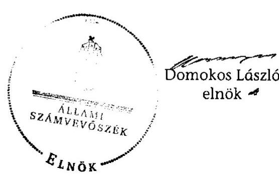

# JELENTÉS 

az önkormányzatok belső kontrollrendszerének kialakítása, valamint egyes kontrolltevékenységek és a belső ellenőrzés múködése ellenőrzéséről

---

# Állami Számvevőszék 

Iktatószám: V-0105-027/2013.
Témaszám: 1109
Vizsgálat-azonosító szám: V059136

## Az ellenőrzést felügyelte:

Dr. Benedek Mária
felügyeleti vezető
Az ellenőrzést vezette:
Bíró Zsolt
ellenőrzésvezető
A számvevőszéki jelentés összeállításában közremúködött:
Kiss Rita Teréz
számvevő tanácsos
Az ellenőrzést végezték:

| Bialkó Zsolt Gyula | Bencsik Árpád | Kiss Rita Teréz |
| :-- | :-- | :-- |
| számvevő tanácsos | számvevő | számvevő tanácsos |

---

# TARTALOMJEGYZÉK 

BEVEZETÉS ..... 5
I. ÖSSZEGZŐ MEGÁLLAPÍTÁSOK, KÖVETKEZTETÉSEK, JAVASLATOK ..... 8
II. RÉSZLETES MEGÁLLAPÍTÁSOK ..... 15

1. Az önkormányzat belső kontrollrendszere kialakításának megfelelősége ..... 15
1.1. A kontrollkörnyezet kialakítása ..... 15
1.2. A kockázatkezelési rendszer kialakítása ..... 15
1.3. A kontrolltevékenységek kialakítása ..... 16
1.4. Az információs és kommunikációs rendszer kialakítása ..... 17
1.5. A monitoring rendszer kialakítása ..... 18
2. A pénzügyi folyamatokban kulcsszerepet betöltő belső kontrollok (szakmai teljesítésigazolás és utalvány ellenjegyzés) múködése ..... 19
3. A belső ellenőrzés szervezeti keretei és múködése ..... 20

## FÜGGELÉKEK

1. számú Értelmező szótár
2. számú A belső kontrollrendszer kialakítása, a pénzügyi folyamatokban kulcsszerepet betöltő szakmai teljesítésigazolás és utalvány ellenjegyzés kontrollok múködése, valamint a belső ellenőrzés múködése értékelésénél alkalmazott minősítési szempontok

---

.

---

# RÖVIDÍTÉSEK JEGYZÉKE 

| Törvények |  |
| :--: | :--: |
| ÁSZ tv. | 2011. évi LXVI. törvény az Állami Számvevőszékről |
| Avtv. | 1992. évi LXIII. törvény a személyes adatok védelméről és a közérdekú adatok nyilvánosságáról (hatálytalan 2012. január 1-jétől) |
| Htv. | 1991. évi XX. törvény a helyi önkormányzatok és szerveik, a köztársasági megbízottak, valamint egyes centrális alárendeltségú szervek feladat- és hatásköreiről |
| Info tv. | 2011. évi CXII. törvény az információs önrendelkezési jogról és az információszabadságról (hatályos 2012. január 1-jétől) |
| Mötv. | 2011. évi CLXXXIX. törvény Magyarország helyi önkormányzatairól (hatályos 2012. január 1-jétől) |
| Ötv. | 1990. évi LXV. törvény a helyi önkormányzatokról |
| régi Áht. | 1992. évi XXXVIII. törvény az államháztartásról (hatálytalan 2012. január 1-jétől) |
| új Áht. | 2011. évi CXCV. törvény az államháztartásról (hatályos 2012. január 1-jétől) |
| Rendeletek |  |
| Ámr. | 292/2009. (XII. 19.) Korm. rendelet az államháztartás múködési rendjéről (hatálytalan 2012. január 1-jétől) |
| Ávr. | 368/2011. (XII. 31.) Korm. rendelet az államháztartásról szóló törvény végrehajtásáról (hatályos 2012. január 1jétől) |
| Ber. | 193/2003. (XI. 26.) Korm. rendelet a költségvetési szervek belső ellenőrzéséről (hatálytalan 2012. január 1-jétől) |
| Bkr. | 370/2011. (XII. 31.) Korm. rendelet a költségvetési szervek belső kontrollrendszeréről és belső ellenőrzéséről (hatályos 2012. január 1-jétől) |
| Szórövidítések |  |
| adatvédelmi szabályzat | Rácalmás Város Önkormányzata Polgármesteri Hivatalának Adatvédelmi és adatkezelési szabályzata (hatályos 2010. március 1-jétől) |
| ÁSZ | Állami Számvevőszék |
| Belső ellenőrzési kézikönyv | Dunaújváros Kistérség Többcélú Kistérségi Társulása Belső Ellenőrzési Kézikönyve (hatályos 2008. július 15-től), továbbá Rácalmás Város Önkormányzata jegyzőjének 1. számú szabályzata (hatályos 2010. február 1-jétől) |
| Belső Kontroll Kézikönyv | Az Ámr. 155. § (1) bekezdése, valamint az államháztartási belső kontroll standardokról szóló 1/2009. (IX. 11.) PM irányelv egységes értelmezése érdekében az államháztartásért felelős miniszter által 2010. évben kiadott Belső Kontroll Kézikönyv |
| FEUVE | folyamatba épített, előzetes, utólagos és vezetői ellenőrzés |

---

| gazdálkodási jogkörök   szabályzata | Rácalmás Város Önkormányzata Polgármesteri Hivata-   lának Gazdálkodási szabályzata (hatályos 2011. január   3-ától) |
| :--: | :--: |
| gazdasági program | Rácalmás Város Önkormányzata Képviselő-testületének   gazdasági programja 2013-2014 (hatályos 2013. március   26-ától) |
| jegyző | Rácalmás Város Önkormányzatának jegyzője |
| Képviselő-testület | Rácalmás Város Képviselő-testülete |
| Önkormányzat | Rácalmás Város Önkormányzata |
| polgármester | Rácalmás Város Önkormányzatának polgármestere |
| Polgármesteri Hivatal | Rácalmás Város Önkormányzatának Polgármesteri Hiva-   tala |
| hivatali SZMSZ | Rácalmás Város Önkormányzatának Polgármesteri Hiva-   talának Szervezeti és Múködési Szabályzata (hatályos   2013. május 1-jétől) |
| szabálytalanságkezelési   szabályzat | Rácalmás Város Önkormányzata Polgármesteri Hivata-   lának Belső Kontrollrendszere Szabálytalanságkezelési   szabályzata (hatályos 2011. január 3-ától) |
| Társulás | Dunaújvárosi Kistérség Többcélú Kistérségi Társulása |
| ügyrend | Rácalmás Város Önkormányzata Polgármesteri Hivata-   lának ügyrendje (hatályos 2010. március 9-étől) |

---

# JELENTÉS   az önkormányzatok belsó   kontrollrendszerének kialakítása, valamint egyes kontrolltevékenységek és a belső ellenőrzés múködése ellenőrzéséről 

RÁCALMÁS

## BEVEZETÉS

A belső kontrollrendszer kialakítását, múködtetését és fejlesztését a régi Áht. és az új Áht. is előírja. Ennek megvalósításáért a költségvetési szerv vezetője felel. A belső kontrollrendszer azt a célt szolgálja, hogy a költségvetési szervek múködésük és gazdálkodásuk során a tevékenységeket szabályszerűen, gazdaságosan, hatékonyan, eredményesen hajtsák végre, teljesítsék elszámolási kötelezettségeiket és megvédjék az erőforrásokat a veszteségektől, a károktól és a nem rendeltetésszerű használattól. A belső kontrollrendszer magában foglalja mindazon szabályokat, eljárásokat, gyakorlati módszereket és szervezeti struktúrákat, kockázatkezelési technikákat, kontrolltevékenységeket, amelyek segítséget nyújtanak a szervezetnek céljai eléréséhez.

Az ÁSZ a 2011-2015. évekre szóló stratégiájában hangsúlyos szerepet szánt annak, hogy szilárd szakmai alapon álló, értékteremtő ellenőrzéseivel előmozdítsa a közpénzügyek átláthatóságát, rendezettségét. A számvevőszéki ellenőrzés nemzetközi alapelvei is rögzítik, hogy a megfelelő belső kontrollrendszer minimálisra csökkenti a hibák és szabálytalanságok kockázatát.

Az ellenőrzés célja annak értékelése volt, hogy az Önkormányzat a jogszabályi előírásoknak megfelelően alakította-e ki a belső kontrollrendszert; a gazdálkodás folyamatában kulcsszerepet betöltő szakmai teljesítésigazolás és az utalvány ellenjegyzés kontrolltevékenységeit megfelelően működtette-e; biztosí-totta-e a belső ellenőrzés szabályos és eredményes múködését.

Az ellenőrzés típusa: szabályszerűségi ellenőrzés
Az ellenőrzés jogszabályi alapja: az ÁSZ tv. 5. § (2) és (6) bekezdései
Az ellenőrzött szervezet: az Önkormányzat
Az ellenőrzött időszak: a belső kontrollrendszer kialakításának megfelelőségét a 2011. évre vonatkozóan értékeltük. A kontrolltevékenységek múködésének megfelelőségét a 2011. január 1-je és december 31-e, míg a belső ellenőrzés múködésének szabályosságát és eredményességét a 2009. január 1-je és

---

2011. december 31-e közötti időszakot figyelembe véve értékeltük. A helyszíni ellenőrzés lezárásáig a helyi szabályozás változásait nyomon követtük.

Az ellenőrzés szakmai módszertana az ÁSZ hivatalos honlapján (www.asz.hu) közzétett szakmai szabályokon alapult, amely a Legfőbb Ellenőrző Intézmények Nemzetközi Szervezete (INTOSAI) által kiadott nemzetközi standardok (ISSAI) figyelembevételével készült.

A belső kontrollrendszer kialakításának ellenőrzése során értékeltük a kontrollkörnyezet, a kockázatkezelési rendszer, a kontrolltevékenységek, az információs és kommunikációs rendszer, valamint a monitoring rendszer szabályozottságának megfelelőségét.

Értékeltük a pénzügyi folyamatokban kulcsszerepet betöltő szakmai teljesítésigazolás és utalvány ellenjegyzés kontrollok múködésének megfelelőségét az államháztartáson kívülre teljesített múködési és felhalmozási célú pénzeszköz átadásoknál, az állományba nem tartozók megbízási díjainál, továbbá a külső szolgáltatók által végzett karbantartási, kisjavítási munkákkal kapcsolatos kifizetéseknél. Az egyszerú véletlen mintavétellel kiválasztott tételek ellenőrzését többlépcsős megfelelőségi tesztek útján addig végeztük, amíg elegendő és megfelelő bizonyítékot szereztünk a vizsgált folyamatok kulcskontrolljai múködésének megfelelő vagy nem megfelelő voltáról. Értékeltük az Önkormányzatnál a belső ellenőrzés múködésének szabályosságát és eredményességét. Az ÁSZ a 2007-2010. években az Önkormányzatnál átfogó ellenőrzést nem végzett.

A fogalmak magyarázatát az 1. számú függelék, az ellenőrzés egyes területeinek értékelésénél alkalmazott egységes minősítési szempontokat a 2. számú függelék tartalmazza.

Az ellenőrzés lefolytatásához az Önkormányzat a munkalapok és a tanúsítvány elektronikus kitöltésével, valamint a megjelölt dokumentumok elektronikus megküldésével szolgáltatott adatokat. A munkalapokon szerepeltetett adatok, információk ellenőrzése és szükség szerinti javítása a helyszíni ellenőrzés keretében történt.

Az ÁSZ az ellenőrzés megállapításait az ellenőrzött időszakban hatályos, az intézkedést igénylő megállapításokra tett javaslatokat a jelenleg hatályos jogszabályok alapján fogalmazta meg.

Az ÁSZ tv. 29. § (1) bekezdése szerint a jelentéstervezetet megküldtük a polgármester részére, aki az ÁSZ tv. 29. § (2) bekezdésében foglalt észrevételezési jogával nem élt, a jelentéstervezetre észrevételt nem tett.

Rácalmás város állandó lakosainak száma 2011. január 1-jén 4470 fő volt. Az Önkormányzat hattagú Képviselő-testületének munkáját öt állandó bizottság segítette. Az Önkormányzat az önállóan múködő és gazdálkodó Polgármesteri Hivatalon felül négy - önállóan múködő - intézménnyel látta el feladatát. Az Önkormányzat egy többségi tulajdoni hányadú gazdasági társasággal rendelkezett. A polgármester az 1990. évi önkormányzati választások óta tölti be tisztségét. A jegyző 1998. március 1-jétől látja el feladatait. Az Önkormányzat Polgármesteri Hivatalának szervezete 2013. január 1-jétől nem változott. A

---

Polgármesteri Hivatal szervezeti egységekre nem tagolódott, a foglalkoztatott köztisztviselők száma 2011. január 1-jén 14 fő volt.

Az Önkormányzat a 2011. évi költségvetési beszámolója szerint 1724260 ezer Ft költségvetési bevételt ért el, valamint 1409922 ezer Ft költségvetési kiadást teljesített. A 2011. december 31-i könyvviteli mérleg szerint 6184214 ezer Ft értékű eszközvagyonnal rendelkezett, 261344 ezer Ft hosszú lejáratú, 48704 ezer Ft rövid lejáratú kötelezettsége volt.

---

# I. ÖSSZEGZŐ MEGÁLLAPÍTÁSOK, KÖVETKEZTETÉSEK, JAVASLATOK 

A belső kontrollrendszeren belül 2011-ben a Polgármesteri Hivatalban a kontrollkörnyezet, a kockázatkezelési rendszer, a kontrolltevékenységek, az információs és kommunikációs rendszer, valamint a monitoring rendszer kialakítását külön-külön és összesítve is értékeltük. A belső kontrollrendszer kialakítása az összesített értékelés alapján nem felelt meg a jogszabályi előírásoknak. Az egyes területek kialakításának értékelését az alábbiakban részletezzük.

A kontrollkörnyezet kialakítása nem felelt meg a jogszabályi követelményeknek, mert a jegyző - a Htv. előírása ellenére - nem készítette el a gazdasági program tervezetét, ezért a Képviselő-testület - az Ötv-ben foglaltakat megsértve - nem fogadta el az Önkormányzat 2011-2014. évekre vonatkozó gazdasági programját. A jegyző - a régi Áht. ${ }^{1}$ és az Ámr. ${ }^{2}$ előírása ellenére - nem készítette el a Polgármesteri Hivatal szervezeti és múködési szabályzatát, az ügyrendben - az Ámr. előírása ellenére - nem rögzítette a pénzügyi-gazdasági feladatok ellátásáért felelős alkalmazottak feladat- és hatáskörét, valamint a helyettesítés rendjét. A 2013. évben a Képviselő-testület elfogadta a gazdasági programot, és jóváhagyta a hivatali SZMSZ-t, amely tartalmazta az alkalmazottak feladat- és hatáskörét, valamint a helyettesítés rendjét.

A kockázatkezelési rendszer kialakítása a Polgármesteri Hivatalban megfelelő volt, mert a jegyző kockázatkezelési szabályzatot készített, a régi Áht.ban és az Ámr.-ben előírtak alapján felmérte és megállapította a Polgármesteri Hivatal tevékenységében, gazdálkodásában rejlő kockázatokat, valamint meghatározta az egyes kockázatokkal kapcsolatos intézkedéseket és megtételük módját.

A kontrolltevékenységek kialakítása a jogszabályi követelményeknek részben felelt meg. A jegyző szabályozta a kontrollstratégiák és módszerek keretében a Polgármesteri Hivatal tevékenységére vonatkozó beszámolási eljárásokat, meghatározta az érvényesítés rendjét, a szakmai teljesítésigazolás módját és kijelölte az érvényesítésre, valamint a szakmai teljesítésigazolásra jogosultakat. A régi Áht.-ben foglaltak ellenére azonban nem határozta meg a pénzügyi döntések - köztük a szabálytalanságkezelési folyamat - dokumentumainak elkészítésével kapcsolatos, folyamatba épített, előzetes, utólagos és vezetői ellenőrzés feladatait. Az Ámr. előírásai és a gazdálkodási jogkörök szabályzatában foglalt - az előzetes írásbeli kötelezettségvállalást nem igénylő kifizetésekre vonatkozó - döntése ellenére ezen kifizetések rendjét, ezen belül a szakmai teljesítésigazolás gyakorlásának dokumentációs részletszabályait nem határozta meg.

[^0]
[^0]:    ${ }^{1}$ 2012. január 1-jétől új Áht.
    ${ }^{2}$ 2012. január 1-jétől Ávr.

---

Az információs és kommunikációs rendszer kialakítása a jogszabályi előírásoknak megfelelt, mert a jegyző szabályozta az információáramlás rendjét és a kommunikációs feladatokat, biztosította az informatikai rendszer környezetének szabályozottságát és elkészítette az adatvédelmi szabályzatot, azonban az Avtv. ${ }^{3}$ és az Ámr. rendelkezése ellenére - nem határozta meg a kötelezően közzéteendő adatok nyilvánosságra hozatalának rendjét, és az Avtv.-ben foglalt előírások ellenére az adatbiztonság érvényre juttatásához szükséges intézkedéseket hiányosan tette meg.

A monitoring rendszer kialakítása részben felelt meg a jogszabályi követelményeknek, mert a jegyző a Polgármesteri Hivatal tevékenységének, a célok megvalósításának folyamatos nyomon követése szabályait meghatározta, az eseti nyomon követésének szabályait azonban - a régi Áht.-ban és az Ámr-ben előírtak ellenére - nem határozta meg.

A belső kontrollrendszer nem megfelelő kialakítása kockázatot jelent az Önkormányzat tevékenységeinek szabályszerű, gazdaságos, hatékony és eredményes végrehajtásában.

A Polgármesteri Hivatalban a 2011. évben az államháztartáson kívülre történő működési és felhalmozási célú pénzeszközátadásokkal, az állományba nem tartozók megbízási díjaival, valamint a külső szolgáltatók által végzett karbantartással, kisjavítással kapcsolatos kifizetések során - összefoglalóan értékelve a pénzügyi folyamatokban kulcsszerepet betöltő szakmai teljesítésigazolás és utalvány ellenjegyzés belső kontrollok múködésének megfelelősége gyenge volt. A szakmai teljesítésigazolást az államháztartáson kívülre történő működési és felhalmozási célú pénzeszközátadásokkal kapcsolatos kifizetések esetében - a régi Áht.-ban és az Ámr.-ben előírtak ellenére - nem, vagy nem szabályszerűen végezték el.

Az utalványok ellenjegyzője az államháztartáson kívülre történő működési és felhalmozási célú pénzeszközátadásokkal, az állományba nem tartozók megbízási díjaival kapcsolatos kifizetéseket megelőzően az Ámr.-ben foglalt ellenőrzési feladatait - a szakmai teljesítésigazolás vagy szabályszerűen végzett szakmai teljesítésigazolás hiányában - nem a jogszabályi előírásoknak megfelelően végezte. A régi Áht. és az Ámr., valamint a gazdálkodási jogkörök szabályzatának gazdálkodásra - közöttük az utalványon a kötelezettségvállalás nyilvántartási számának feltüntetésére, az előzetes írásbeli kötelezettségvállalásra, a jogosult általi ellenjegyzést követő kötelezettségvállalásra - vonatkozó szabályai betartásának hiánya ellenére az utalványokat ellenjegyezték. A népszámláláshoz tartozó megbízási díjak kifizetéséhez kapcsolódóan a kötelezettségvállaló és az utalvány ellenjegyzője is a jegyző volt, ami nem felelt meg az Ámr.ben foglalt - összeférhetetlenségre vonatkozó - előírásoknak.

Az ellenőrzött kifizetésekkel összefüggésben a rendelkezésre bocsátott dokumentumok alapján jogosulatlan kifizetést nem tárt fel az ellenőrzés, azonban a gazdálkodásban kulcsszerepet betöltő kontrollok jogszabályi előírásoknak nem megfelelő, gyenge múködése miatt fennáll a hibák bekövetkezésének lehetősé-

[^0]
[^0]:    ${ }^{3}$ 2012. január 1-jétől Info tv.

---

ge. A kiválasztott kulcskontrollok az integritás szempontjából lényeges csalás és korrupciós kockázatok megelőzésében, illetve feltárásában is hangsúlyos szerepet játszanak, így hatékonyabbá és eredményesebbé válhat a korrupció elleni fellépés. A nem megfelelően szabályozott és múködtetett belső kontrollok korrupciós kockázatot hordoznak.

Az Önkormányzat a belső ellenőrzési feladatokat a Társulás útján látta el. Az Önkormányzatnál a 2009-2011. években a belső ellenőrzés szabályozása és működése összességében megfelelt a jogszabályi előírásoknak, annak ellenére, hogy a Képviselő-testület a 2009-2011. évi ellenőrzési terveket az Ötv.-ben ${ }^{4}$ előírt határidőt túllépve hagyta jóvá, mert a jegyző nem kezdeményezte a polgármesternél a Képviselő-testület elé terjesztésüket, az előírt határidőn belül történő jóváhagyás érdekében.

A jegyző a belső ellenőrzésekben tett javaslatok hasznosulását és végrehajtásának nyomon követését - a Ber.-ben ${ }^{5}$ foglaltak ellenére - elmulasztotta, a hiányosságok megszüntetéséről az ellenőrzött időszakban nem győződött meg. A belső ellenőrzési vezető - a Ber.-ben előírtak ellenére - a belső ellenőrzési jelentésekben tett megállapítások és javaslatok alapján készült intézkedési tervben foglalt feladatok nyomon követéséről nyilvántartást nem vezetett, a belső ellenőrzés az ellenőrzési jelentések alapján megtett intézkedések nyomon követéséről nem gondoskodott. A polgármester a munkaszervezet vezetője által készített 2011. évi éves ellenőrzési jelentést - az Ötv.-ben előírtak ellenére - a tárgyévet követően, nem a zárszámadási rendelettervezettel egyidejűleg terjesztette a Képviselő-testület elé, mert azt a munkaszervezet vezetője a Ber.-ben előírt határidőt követően küldte meg a jegyző részére. A Képviselő-testület a 2011. évi, a társulásra vonatkozóan külön elkészített éves ellenőrzési jelentést elfogadta annak ellenére, hogy azt a munkaszervezet vezetője - a Ber.-ben előírtakat figyelmen kívül hagyva - nem önkormányzatonként készítette el.

Az Önkormányzatnál a 2009-2011. években a belső ellenőrzés múködése a 2. számú függelékben részletezett kritériumrendszer alapján végzett értékelés szerint - nem volt eredményes annak ellenére, hogy a belső ellenőrzés szabályozása és múködése az összegző értékelés alapján az ellenőrzött időszak egészét tekintve a jogszabályi előírásoknak megfelelt. A belső ellenőrzés múködése azért nem volt eredményes, mert ellenőrizték ugyan a gazdálkodási jogkörök gyakorlásához kapcsolódó, a pénzkezeléssel kapcsolatos belső kontrollok múködését és a magas kockázatúnak értékelt területeket, azonban az intézkedési tervekben foglaltak ellenére a jegyző a belső ellenőrzés által a 2009-2011. években feltárt hibák kijavítására tett javaslatokat nem hasznosította. Mindezek hozzájárultak a számvevőszéki ellenőrzés során is feltárt szabályozási hiányosságok, hibák ismétlődéséhez.

Az ÁSZ tv. 33. § (1) bekezdésében foglaltak értelmében az ellenőrzött szervezet vezetője köteles a jelentésben foglalt megállapításokhoz kapcsolódó intézkedési tervet összeállítani, és azt a jelentés kézhezvételétől számított 30 napon belül az ÁSZ részére megküldeni. Amennyiben az intézkedési tervet határidőre nem

[^0]
[^0]:    ${ }^{4}$ 2012. január 1-jétől Mötv.
    ${ }^{5}$ 2012. január 1-jétől Bkr.

---

küldi meg a szervezet, vagy az - az ÁSZ tv. 33. § (2) bekezdésében foglalt póthatáridő eltelte ellenére - továbbra sem elfogadható, az ÁSZ elnöke a hivatkozott törvény 33. § (3) bekezdés a-b) pontjaiban foglaltakat érvényesítheti.

Az ellenőrzés intézkedést igénylő megállapításai és javaslatai:

# a polgármesternek 

1. Az állományba nem tartozók megbízási szerződéseit - a régi Áht. 100/C. § (3) és az Ámr. 74. § (1) bekezdésében előírtak ellenére - a kötelezettségvállalás előtt nem ellenjegyezték.

Javaslat:
Intézkedjen arról, hogy az Önkormányzat nevében történő kötelezettségvállalásra az új Áht. 37. § (1) bekezdésében foglaltaknak megfelelően - az Ávr. 53. §-ában meghatározott kivételeket figyelembe véve - kizárólag a pénzügyi ellenjegyzés után, a pénzügyi teljesítés esedékességét megelőzően, írásban kerüljön sor.
2. A polgármester a 2011. évi ellenőrzési jelentést - az Ötv. 92. § (10) bekezdésében előírtak ellenére - nem a zárszámadási rendelettervezettel egyidejűleg terjesztette a Képviselő-testület elé.

Javaslat:
A Bkr. 56. § (8) bekezdésében foglaltak szerint az éves ellenőrzési jelentést a zárszámadási rendelettervezettel egyidejűleg terjessze a Képviselő-testület elé.
3. Az államháztartáson kívülre történő működési és felhalmozási célú pénzeszközátadásokkal és az állományba nem tartozók megbízási díjaival kapcsolatos kifizetéseket megelőzően a szakmai teljesítésigazolás - a régi Áht. 100/C. § (6) bekezdésének és az Ámr. 76. § (1) és (3) bekezdésének előírása ellenére - nem, vagy nem szabályszerűen történt meg. Az utalványok ellenjegyző́je az Ámr. 79. § (2) bekezdésében foglaltakat figyelmen kívül hagyva annak ellenére ellenjegyezte a kiadásokat, hogy a szakmai teljesítésigazolást a kifizetést megelőzően nem, vagy nem szabályszerűen végezték el, továbbá az állományba nem tartozók megbízási díjaival kapcsolatos kifizetéseknél az utalványon - az Ámr. 78. § (2) bekezdés g) pontjában előírtak ellenére - a kötelezettségvállalás nyilvántartási számát nem tüntették fel, mert a kötelezettségvállalás nyilvántartás - az Ámr. 75. § (1) bekezdése és a gazdálkodási szabályzat előírásai ellenére - nem tartalmazta a kötelezettségvállalás azonosító számát. A népszámláláshoz tartozó megbízási díjak kifizetéséhez kapcsolódóan a kötelezettségvállaló és az utalvány ellenjegyzője is a jegyző volt, ami nem felel meg az Ámr. 80. § (1) bekezdésében foglalt előírásoknak.

Javaslat:
A Mötv. 115. § (1) bekezdésében foglaltak alapján kísérje figyelemmel az Önkormányzat gazdálkodásának szabályszerűségét. A Mötv. 67. § f) pontja alapján gondoskodjon a belső kontrollrendszerre és a belső ellenőrzés müködésére vonatkozó jogszabályi rendelkezések be nem tartása, valamint a szakmai teljesítésigazolás, illetve az utalvány ellenjegyzés kontrollokkal összefüggésben feltárt hiányosságok, sza-

---

bálytalanságok tekintetében az esetleges munkajogi felelősséggel kapcsolatos körülmények kivizsgálásáról, majd a vizsgálat eredményének függvényében tegye meg a szükséges munkajogi intézkedéseket.

# a jegyzőnek 

1. a kontrolltevékenységekkel kapcsolatban:

A jegyző - a régi Áht. 121/A. § (4) bekezdés a) pontjában foglaltak ellenére - nem határozta meg a pénzügyi döntések - köztük a szabálytalanságkezelési folyamat dokumentumainak elkészítésével kapcsolatos, folyamatba épített, előzetes, utólagos és vezetői ellenőrzés feladatait.

A jegyző az Ámr. 72. § (14) bekezdésében és a 20. § (3) bekezdés a) pontjában foglaltakat figyelmen kívül hagyva, a gazdálkodási jogkörök szabályzatában foglalt - az előzetes írásbeli kötelezettségvállalást nem igénylő kifizetésekre vonatkozó - döntése ellenére ezen kifizetések rendjét, a szakmai teljesítésigazolás gyakorlásának dokumentációs részletszabályait nem határozta meg.

Javaslat:
a) Biztosítsa minden tevékenységre vonatkozóan a folyamatba épített, előzetes, utólagos és vezetői ellenőrzést a Bkr. 8. § (2) bekezdése alapján.
b) Rögzítse belső szabályzatban az Ávr. 53. § (2) bekezdésének megfelelően az előzetes írásbeli kötelezettségvállalást nem igénylő kifizetések rendjét és az Ávr. 13. § (2) bekezdés a) pontja alapján a teljesítésigazolás gyakorlásának dokumentációs részletszabályait.
2. az információs és kommunikációs rendszerrel kapcsolatban:

A jegyző - az Ámr. 20. § (3) bekezdés i) pontjában foglalt előírás ellenére - nem határozta meg a kötelezően közzéteendő adatok nyilvánosságra hozatalának rendjét.

A jegyző az informatikai rendszer környezetének kialakítása során - az Avtv. 10. §ában foglalt előírások ellenére - az adatbiztonság érvényre juttatásához szükséges intézkedéseket hiányosan tette meg, mert nem határozta meg a hozzáférési jogosultságok betartásának ellenőrzésére vonatkozó eljárásrendet.

Javaslat:
a) Határozza meg az Ávr. 13. § (2) bekezdés h) pontja és az Info tv. 35. § (3) bekezdése alapján a kötelezően közzéteendő adatok nyilvánosságra hozatalának rendjét.
b) Az Info tv. 7. § (2)-(3) bekezdéseinek megfelelően gondoskodjon az adatok biztonságáról, tegye meg azokat az intézkedéseket, alakítsa ki azokat az eljárási szabályokat, amelyek az Info tv., valamint az egyéb adat- és titokvédelmi szabályok érvényre juttatásához szükségesek; továbbá megfelelő intézkedésekkel biztosítsa az adatok védelmét.

---

3. a monitoring rendszerrel kapcsolatban:

A jegyző - a régi Áht. 121. § (2) bekezdése e) pontjában és az Ámr. 160. §-ában foglaltak ellenére - nem határozta meg a Polgármesteri Hivatal tevékenységének, a célok megvalósításának eseti nyomon követése szabályait.

Javaslat:
Alakítsa ki és múködtesse a Bkr. 3. § e) pontjában és a 10. §-ában előírtak alapján a Polgármesteri Hivatal tevékenységének, a célok megvalósításának nyomon követését biztosító rendszerét, amelynek része az operatív tevékenységek keretében megvalósuló folyamatos és eseti nyomon követés is.
4. a pénzügyi folyamatokban kulcsszerepet betöltő kontrollokkal kapcsolatban:

Az államháztartáson kívülre történő működési és felhalmozási célú pénzeszközátadásokkal kapcsolatos kifizetéseket megelőzően - a régi Áht. 100/C. § (6) bekezdésének és az Ámr. 76. § (1) és (3) bekezdéseinek előírása ellenére - a szakmai teljesítésigazolást nem végezték el. Az állományba nem tartozók megbízási díjaival kapcsolatos kifizetéseket megelőzően a szakmai teljesítést igazoló - az Ámr. 76. § (1) bekezdésében foglaltak és az aláírása ellenére - nem végezte el a kifizetés összegszerűségének ellenőrzését.

Az utalvány ellenjegyzője az államháztartáson kívülre történő működési és felhalmozási célú pénzeszközátadásokkal kapcsolatos kiadások teljesítését megelőzően az Ámr. 79. § (2) bekezdésében foglalt ellenőrzési feladatait - a szakmai teljesítésigazolás hiányában - nem a jogszabályi előírásoknak megfelelően végezte. Az utalvány ellenjegyzője a kiadásokat annak ellenére ellenjegyezte, hogy az állományba nem tartozók megbízási díjaihoz kapcsolódó kötelezettségvállalásokra - a régi Áht. 100/C. § (3) bekezdésében és az Ámr. 74. § (1) bekezdésében foglaltak ellenére - ellenjegyzés hiányában került sor. Az állományba nem tartozók megbízási díjaival kapcsolatos kifizetéseknél - az Ámr. 78. § (2) bekezdés g) pontjában előírtak ellenére - a kötelezettségvállalási nyilvántartási számot nem tüntették fel, mert a kötelezettségvállalás nyilvántartás - az Ámr. 75. § (1) bekezdésében és a gazdálkodási szabályzatban előírtak ellenére - nem tartalmazta a kötelezettségvállalás azonosító számát.

A népszámláláshoz tartozó megbízási díjak kifizetéséhez kapcsolódóan a kötelezettségvállaló és az utalvány ellenjegyzője is a jegyző volt, ami nem felel meg az Ámr. 80. § (1) bekezdésében foglalt előírásoknak.

Javaslat:
Intézkedjen - a szakmai teljesítés igazolása és az utalvány ellenjegyzése vonatkozásában feltárt hiányosságok megszüntetése, illetve az operatív gazdálkodás során a müködésbeli hibák megelőzése, feltárása és kijavítása érdekében - arról, hogy:
a) a teljesítésigazolás során az Ávr. 57. § (1) bekezdésében előírtaknak megfelelően, ellenőrizhető okmányok alapján ellenőrizzék és igazolják a kiadások teljesítésének jogosságát, összegszerűségét, az ellenszolgáltatást is magában foglaló kötelezettségvállalás esetén a szerződés, megrendelés teljesítését, valamint az Ávr. 57. §

---

(3) bekezdése szerint a teljesítést az igazolás dátumának és a teljesítés tényére történő utalásnak a megjelölésével, az arra jogosult személy aláírásával igazolják;
b) a kifizetéseket megelőzően a teljesítésigazolás alapján - az Ávr. 57. § (3) bekezdése szerinti esetben annak hiányában is - az összegszerűségnek, a fedezet meglétének és a megelőző ügymenetben az új Áht., az Áhsz., az Ávr. előírásai és a belső szabályzatokban foglaltak betartásának az ellenőrzése - az Ávr. 58. § (1) és (3) bekezdése szerint - történjen meg;
c) a kötelezettségvállalási nyilvántartást az Ávr. 53. § (2) bekezdésében és az 56. § (1) bekezdésében foglalt előírásnak megfelelően vezessék, és az utalványon a kötelezettségvállalás nyilvántartási számát az Ávr. 59. § (3) bekezdés f) pontjában foglaltaknak megfelelően tüntessék fel;
d) az új Áht. 37. § (1) és az Ávr. 55. § (1) bekezdésében foglaltaknak megfelelően kötelezettségvállalásra - az Ávr. 53. §-ában meghatározott kivételekkel - pénzügyi ellenjegyzés után kerüljön sor;
e) az összeférhetetlenségi szabályok az Ávr. 60. § (1) bekezdésében foglaltaknak megfelelően érvényesüljenek.
5. a belső ellenőrzés müködésével kapcsolatban:

A jegyző a belső ellenőrzési jelentésekben tett megállapítások, javaslatok hasznosulását és végrehajtásának nyomon követését - a Ber. 29/A. § (1) bekezdésében foglaltak ellenére - elmulasztotta, a hiányosságok megszüntetéséről az ellenőrzött időszakban nem győződött meg. A belső ellenőrzési jelentésekben tett megállapítások és javaslatok alapján készült intézkedési tervben foglalt feladatok végrehajtásának nyomon követéséről - a Ber. 12. § n) pontjában előírtak ellenére - a belső ellenőrzési vezető nyilvántartást nem vezetett. A belső ellenőrzés az ellenőrzési jelentések alapján megtett intézkedések nyomon követéséről - a Ber. 8. § f) pontjában előírtak ellenére - nem győződött meg.

A polgármester a munkaszervezet vezetője által készített 2011. évi éves ellenőrzési jelentést - az Ötv. 92. § (10) bekezdésében előírtak ellenére - nem a zárszámadási rendelettervezettel egyidejűleg terjesztette a Képviselő-testület elé, mert azt a munkaszervezet vezetője a Ber. 32/B. § (9) bekezdésében előírt határidőt követően küldte meg a jegyző részére. A Képviselő-testület az éves jelentést annak ellenére elfogadta, hogy azt a munkaszervezet vezetője - a Ber. 32/B. § (10) bekezdésében előírtakat figyelmen kívül hagyva - nem önkormányzatonként készítette el.

Javaslat:
a) Gondoskodjon arról, hogy vezessenek nyilvántartást a Bkr. 21. § (2) bekezdése d) pontjának és a 47. §-nak megfelelően a belső ellenőrzési jelentésekben tett megállapításokról, javaslatokról, a vonatkozó intézkedési tervekről, és kövesse nyomon azok végrehajtását.
b) Tegye meg a szükséges intézkedéseket annak érdekében, hogy a polgármester az éves ellenőrzési jelentést a Bkr. 56. § (8) bekezdése alapján a zárszámadási rendelettervezettel egyidejűleg terjessze a Képviselő-testület elé.

---

# II. RÉSZLETES MEGÁLLAPÍTÁSOK 

## 1. AZ ÖNKORMÁNYZAT BELSŐ KONTROLLRENDSZERE KIALAKÍTÁSÁNAK MEGFELELŐSÉGE

### 1.1. A kontrollkörnyezet kialakítása

A kontrollkörnyezet kialakítása a 2. számú függelékben részletezett kritériumrendszer alapján végzett értékelés szerint a Polgármesteri Hivatalban nem volt megfelelő, mert a jegyző a jogszabályi előírásokat nem érvényesítette teljes körúen.

A jegyző, mint a költségvetési szerv vezetője:

- a Htv. 140. § (1) bekezdés a) pontjában foglalt előírás ellenére nem készítette el a gazdasági programtervezetet, és a Képviselő-testület - az Ötv. 91. § (7) bekezdésében6 foglaltakat megsértve - nem döntött az Önkormányzat 20112014. évekre vonatkozó gazdasági programjáról;
- a régi Áht. 91. § (2) bekezdésében ${ }^{7}$ és az Ámr. 20. § (1)-(2) bekezdésében ${ }^{8}$ foglaltak ellenére nem készítette el a Polgármesteri Hivatal szervezeti és múködési szabályzatát;
- az ügyrendben - az Ámr. 20. § (7) ${ }^{9}$ bekezdésének előírása ellenére - nem rögzítette a pénzügyi-gazdasági feladatok ellátásáért felelős alkalmazottak feladat- és hatáskörét, valamint a helyettesítés rendjét.

A Polgármesteri Hivatalban a kontrollkörnyezet kialakításának szabályozási hiányosságait a 2013. évben megszüntették, mert a Képviselő-testület elfogadta a gazdasági programot és jóváhagyta a hivatali SZMSZ-t, amely tartalmazta az alkalmazottak feladat- és hatáskörét, valamint a helyettesítés rendjét.

### 1.2. A kockázatkezelési rendszer kialakítása

A kockázatkezelési rendszer kialakítása a 2. számú függelékben részletezett kritériumrendszer alapján végzett értékelés szerint a Polgármesteri Hivatalban megfelelő volt, mert a jegyző kockázatkezelési szabályzatot készített, és a régi Áht. 121. § (2) bekezdésének b) pontjában és az Ámr. 157. § (1)-(3) bekezdéseiben ${ }^{10}$ előírtak alapján - felmérte és megállapította a Polgármesteri Hi-

[^0]
[^0]:    ${ }^{6}$ 2013. január 1-jétől a Mötv. 116. § (5) bekezdése
    ${ }^{7}$ 2012. január 1-jétől az új Áht. 10. § (5) bekezdése
    ${ }^{8}$ 2012. január 1-jétől az Ávr. 13. § (1) bekezdése
    ${ }^{9}$ 2012. január 1-jétől az Ávr. 13. § (5) bekezdése
    ${ }^{10}$ 2012. január 1-jétől a Bkr. 3. § b) pontja és 7. §-a

---

vatal tevékenységében, gazdálkodásában rejlő kockázatokat, meghatározta az egyes kockázatokkal kapcsolatos intézkedéseket és megtételük módját.

A kockázatkezelési rendszer kialakítása keretében a jegyző az Ámr. 155. § (3) bekezdésének ${ }^{11}$ előírását figyelmen kívül hagyva az államháztartásért felelős miniszter által kiadott Belső Kontroll Kézikönyv ajánlásait nem hasznosította teljes körűen.

A kockázatkezelési rendszer kialakítása keretében a jegyző:

- a Belső Kontroll Kézikönyv 2.1.4. pontjának ajánlását nem érvényesítette, mert az érintetteket nem tájékoztatta dokumentáltan az azonosított kockázati tényezőkről;
- a Belső Kontroll Kézikönyv 2.4.2. pontjában foglaltakat nem hasznosította, mert nem végezte el a beazonosított kockázatok legalább évenkénti felülvizsgálatát.

# 1.3. A kontrolltevékenységek kialakítása 

A kontrolltevékenységek kialakítása a 2. számú függelékben részletezett kritériumrendszer alapján végzett értékelés szerint a Polgármesteri Hivatalban részben volt megfelelő, mert a jegyző szabályozta a belső jelentéstétel feladatait, meghatározta az érvényesítés rendjét, szabályozta a szakmai teljesítésigazolás módját, és kijelölte az érvényesítésre, valamint a szakmai teljesítésigazolásra jogosultakat. A feladatkörök szétválasztása keretében meghatározta a Polgármesteri Hivatal köztisztviselőinek végrehajtási, ellenőrzési és pénzügyi teljesítési feladatait. Biztosította a feladatellátás folytonosságát, mert szabályozta a munkaviszony megszűnése esetén a folyamatban lévő feladatok átadásának rendjét, továbbá munkakör átadás-átvétel esetén jegyzőkönyv készítési kötelezettséget írt elő.

A jegyző, mint a költségvetési szerv vezetője:

- a régi Áht. 121/A. § (4) bekezdés a) pontjában ${ }^{12}$ foglaltak ellenére nem határozta meg a pénzügyi döntések - köztük a szabálytalanságkezelési folyamat - dokumentumainak elkészítésével kapcsolatos, folyamatba épített, előzetes, utólagos és vezetői ellenőrzés feladatait;
- az Ámr. 20. § (3) bekezdés a) pontjában ${ }^{13}$ és a 72. § (14) bekezdésében ${ }^{14}$ előírtak és a gazdálkodási jogkörök szabályzatában foglalt - az előzetes írásbeli kötelezettségvállalást nem igénylő kifizetésekre vonatkozó - döntése ${ }^{15}$ ellené-

[^0]
[^0]:    ${ }^{11}$ 2012. január 1-jétől a Bkr. 5. § (1) bekezdése
    ${ }^{12}$ 2012. január 1-jétől a Bkr. 8. § (2) bekezdés a) pontja
    ${ }^{13}$ 2012. január 1-jétől az Ávr. 13. § (2) bekezdés a) pontja
    ${ }^{14}$ 2012. január 1-jétől az Ávr. 53. § (2) bekezdése
    ${ }^{15}$ A gazdálkodási jogkörök szabályzata 1.2.1. pontja szerint „nem szükséges írásbeli kötelezettségvállalás a gazdasági eseményenként 100000 forintot el nem érő kifizetések, a csőd-, felszámolási és végelszámolási eljáráshoz kapcsolódó bírósági regisztrációs díjak kifizetése, továbbá a pénzügyi szolgáltatások igénybevételéhez kapcsolódó kiadások esetében".

---

re ezen kifizetések rendjét, ezen belül a szakmai teljesítésigazolás gyakorlásának dokumentációs részletszabályait nem határozta meg.

A kontrolltevékenységek kialakítása keretében a jegyző az Ámr. 155. § (3) bekezdésének előírását figyelmen kívül hagyva az államháztartásért felelős miniszter által kiadott Belső Kontroll Kézikönyv ajánlásait nem hasznosította teljes körűen.

A kontrolltevékenységek kialakítása keretében a jegyző:

- a Belső Kontroll Kézikönyv 3.2.3. pontjában foglalt ajánlást nem érvényesítette, mert nem mérte fel a kis létszámból adódó kockázatokat az összeférhetetlenség kiküszöbölése érdekében.

# 1.4. Az információs és kommunikációs rendszer kialakítása 

Az információs és kommunikációs rendszer kialakítása a 2. számú függelékben részletezett kritériumrendszer alapján végzett értékelés szerint a Polgármesteri Hivatalban megfelelő volt, mert a jegyző szabályozta az információáramlás rendjét és a kommunikációs feladatokat. Meghatározta a közérdekű adatok megismerése iránti igényének teljesítési rendjét. Biztosította az informatikai rendszer környezetének szabályozottságát, meghatározta a hozzáférési jogosultságok megállapításának, módosításának eljárásrendjét, a feldolgozott adatok mentési eljárásait és felelősségi viszonyait, valamint elkészítette az adatvédelmi szabályzatot.

Annak ellenére megfelelő volt az információs és kommunikációs rendszer kialakítása, hogy a jegyző:

- az Ámr. 20. § (3) bekezdés i) pontjában ${ }^{16}$ foglalt előírás ellenére nem határozta meg a kötelezően közzéteendő adatok nyilvánosságra hozatalának rendjét;
- az informatikai rendszer környezetének kialakítása során - az Avtv. 10. § ában ${ }^{17}$ foglalt előírások ellenére - az adatbiztonság érvényre juttatásához szükséges intézkedéseket hiányosan tette meg, mert nem határozta meg a hozzáférési jogosultságok betartásának ellenőrzésére vonatkozó eljárásrendet.

Az információs és kommunikációs rendszer kialakítása keretében a jegyző az Ámr. 155. § (3) bekezdésének előírását figyelmen kívül hagyva az államháztartásért felelős miniszter által kiadott Belső Kontroll Kézikönyv ajánlásait nem hasznosította teljes körűen.

[^0]
[^0]:    ${ }^{16}$ 2012. január 1-jétől az Ávr. 13. § (2) bekezdés h) pontja és az Info tv. 35. § (3) bekezdése
    ${ }^{17}$ 2012. január 1-jétől az Info tv. 7. § (2)-(3) bekezdése

---

Az információs és kommunikációs rendszer kialakítása keretében a jegyző:

- a szabálytalanságkezelési szabályzatban a Belső Kontroll Kézikönyv 4.3.3. pontjában foglalt ajánlást nem érvényesítette, mert nem rögzítette a szabálytalanságot bejelentő védelmére vonatkozó előírásokat és kötelezettségeket.

# 1.5. A monitoring rendszer kialakítása 

A monitoring rendszer kialakítása a 2. számú függelékben részletezett kritériumrendszer alapján végzett értékelés szerint a Polgármesteri Hivatalban részben volt megfelelő, mert a jegyző meghatározta a Polgármesteri Hivatal tevékenységének, a célok megvalósításának folyamatos nyomon követése szabályait, kijelölte a monitoring rendszer múködtetéséért felelős személyt, szabályozta a rendszeresen végzendő vezetői ellenőrzés rendjét, valamint előírta a vezetői ellenőrzések eredményeként meghozott intézkedések dokumentálási kötelezettségét. A Polgármesteri Hivatal tevékenységének, a célok megvalósításának eseti nyomon követése szabályait azonban - a régi Áht. 121. § (2) bekezdés e) pontjában és az Ámr. 160. § -ában ${ }^{18}$ foglaltak ellenére - nem határozta meg.

A monitoring rendszer kialakítása keretében a jegyző az Ámr. 155. § (3) bekezdésének előírását figyelmen kívül hagyva az államháztartásért felelős miniszter által kiadott Belső Kontroll Kézikönyv ajánlásait nem hasznosította teljes körűen.

A monitoring rendszer kialakítása során a jegyző:

- a Belső Kontroll Kézikönyv 5.1.2. pontjában foglalt ajánlást nem érvényesítette, mert a 2009-2011. években a kiemelt közszolgáltatások indikátorainak rendszerét és alkalmazásuk rendjét nem alakította ki, a kiemelt közszolgáltatások indikátorai alakulásának nyomon követését és értékelését nem írta elő;
- a Belső Kontroll Kézikönyv 5.1.3. pontjában foglalt ajánlást nem hasznosította, mert a szolgáltatásokat igénybevevők körében készített elégedettségi felmérés kiértékelése és a szükségesnek ítélt intézkedések megtétele nem történt meg;
- a Belső Kontroll Kézikönyv 5.2.1. pontjában foglalt ajánlást nem érvényesítette, mert a folyamatba épített monitoring rendszert nem terjesztette ki az Önkormányzat többségi tulajdonú gazdasági társaságára, továbbá nem készített a 2011. évben a monitoring információk alapján jelentést, feljegyzést a FEUVE rendszer átalakítására, módosítására, az ellenőrzési nyomvonal módosítására.

A belső kontrollrendszer kialakítása a Polgármesteri Hivatalban 2011-ben a kontrollkörnyezet, a kockázatkezelési rendszer, a kontrolltevékenységek, az információs és kommunikációs rendszer és a monitoring rendszer értékelése alapján összességében nem felelt meg a jogszabályi előírásoknak.

[^0]
[^0]:    ${ }^{18}$ 2012. január 1-jétől a Bkr. 3. § e) pontja és 10. §-a

---

# 2. A PÉNZÜGYI FOLYAMATOKBAN KULCSSZEREPET BETÖLTŐ BELSŐ KONTROLLOK (SZAKMAI TELJESÍTÉSIGAZOLÁS ÉS UTALVÁNY ELLENJEGYZÉS) MŰKÖDÉSE 

A Polgármesteri Hivatalban a 2011. évben az államháztartáson kívülre teljesített múködési és felhalmozási célú pénzeszközátadások kifizetése során a szakmai teljesítésigazolás és az utalvány ellenjegyzés kulcskontrollok múködésének megfelelősége gyenge ${ }^{19}$ volt, mert:

- a szakmai teljesítésigazolást - a régi Áht. 100/C. § (6) bekezdésében ${ }^{20}$ és az Ámr. 76. § (1) és (3) bekezdésében ${ }^{21}$ foglaltak ellenére - nem végezték el a Remény Klub május 26 -ai, valamint a Rácalmás Sportegyesület szeptember 21-ei és július 20-ai támogatásánál és a Cikk-cakk Klub május 26-ai, továbbá az Almások Almása találkozó július 25 -ei támogatásánál;
- az utalványok ellenjegyzője - az Ámr. 79. § (2) bekezdésében ${ }^{22}$ foglaltakat figyelmen kívül hagyva - annak ellenére ellenjegyezte e kiadásokat, hogy a szakmai teljesítésigazolás a kifizetéseket megelőzően nem történt meg.

A Polgármesteri Hivatalban a 2011. évben az állományba nem tartozók megbízási díjainak kifizetése során a szakmai teljesítésigazolás és az utalvány ellenjegyzés kulcskontrollok múködésének megfelelősége gyenge ${ }^{23}$ volt, mert:

- a szakmai teljesítés igazolására a jegyző által kijelölt személy - az Ámr. 76. § (1) bekezdésében foglaltakat figyelmen kívül hagyva - a november 28 -ai és 29-ei számlálóbiztosi feladattal kapcsolatos megbízási díjak kifizetése előtt nem végezte el a kifizetés összegszerűségének ellenőrzését, mert annak ellenére igazolta a teljesítést, hogy a megbízási díjak elszámolásának dokumentumán a szerződésben rögzítetteken túl, további díjtételt - oktatási díjat - is szerepeltettek;
- A népszámláláshoz tartozó megbízási díjak - november 28 -ai és 29 -ei - kifizetéséhez kapcsolódóan a kötelezettségvállaló és az utalvány ellenjegyzője is a jegyző volt, ami nem felelt meg az Ámr. 80. § (1) bekezdésében ${ }^{24}$ foglalt összeférhetetlenségre vonatkozó - előírásoknak;

[^0]
[^0]:    ${ }^{19}$ 95\%-os bizonyossági szint mellett a tapasztalt kritikus hibák száma miatt kijelenthető, hogy a hibák aránya meghaladta az ÁSZ által maximálisan elfogadott 10\%-os hibahatárt.
    ${ }^{20}$ 2012. január 1-jétől az új Áht. 38. § (1) bekezdése
    ${ }^{21}$ 2012. január 1-jétől az Ávr. 57. § (1) és (3) bekezdése
    ${ }^{22}$ 2012. január 1-jétől bővültek az érvényesítő feladatai, valamint új értelmezést kapott a pénzügyi ellenjegyzés. Az érvényesítő feladatait az Ávr. 58. § (1) bekezdése tartalmazza, míg a pénzügyi ellenjegyzés előírásait az új Áht. 37. § (1) bekezdése, valamint az Ávr. 55. § (1) bekezdése és a (2) bekezdés f) pontja rögzíti.
    ${ }^{23} 95 \%$-os bizonyossági szint mellett a tapasztalt kritikus hibák száma miatt kijelenthető, hogy a hibák aránya meghaladta az ÁSZ által maximálisan elfogadott 10\%-os hibahatárt.
    ${ }^{24}$ 2012. január 1-jétől az Ávr. 60. § (1) bekezdése

---

- az augusztus 24 -ei műalkotás készítésre, továbbá a szeptember 1-jei takarítási feladatokra vonatkozó megbízásoknál az utalvány ellenjegyzője az Ámr. 79. § (2) bekezdésében foglaltakat figyelmen kívül hagyva, annak ellenére ellenjegyezte az utalványokat, hogy az e feladatokkal kapcsolatos kötelezettségvállalásokra - a régi Áht. 100/C. § (3) bekezdésében ${ }^{25}$ és az Ámr. 74. § (1) bekezdésében ${ }^{26}$ foglaltak ellenére - ellenjegyzés nélkül került sor;
- az állományba nem tartozók megbízási díjainak utalványain - az Ámr. 78. § (2) bekezdés g) pontjában ${ }^{27}$ foglaltak ellenére - nem tüntették fel a kötelezettségvállalás nyilvántartási számát, mert a kötelezettségvállalás nyilvántartás az Ámr. 75. § (1) ${ }^{28}$ bekezdésében és a gazdálkodási szabályzatban foglaltak ellenére nem tartalmazta a kötelezettségvállalás azonosító számát.

A Polgármesteri Hivatalban a 2011. évben a külső szolgáltatók által teljesített karbantartási, kisjavítási munkákra történő kifizetések során a szakmai teljesítésigazolás és az utalvány ellenjegyzés kulcskontrollok múködésének megfelelősége kiváló volt, mert a kiadások teljesítése jogosságának, összegszerűségének és a kötelezettségvállalásokban meghatározott feladatok teljesítésének ellenőrzését a jegyző által a szakmai teljesítésigazolásra kijelölt személy - az Ámr. 76. § (1)-(3) bekezdésében előírtak szerint - ellenőrizhető okmányok alapján végezte. Az utalványok ellenjegyzője - az Ámr. 79. § (2) bekezdésében foglaltaknak megfelelően - aláírásával ellenjegyezte az utalványokat, és meggyőződött a szakmai teljesítésigazolás, valamint az érvényesítés megtörténtéről, a gazdálkodásra vonatkozó szabályok érvényesüléséről.

A Polgármesteri Hivatalban a 2011. évben a pénzügyi folyamatokban kulcsszerepet betöltő belső kontrollok működésében feltárt hiányosságok következtében az ellenőrzés az ellenőrzött tételek vonatkozásában - a rendelkezésre álló dokumentumok alapján - kár bekövetkeztére utaló adatot, tényt nem állapított meg, azonban a kulcskontrollok jogszabályi előírásoknak nem megfelelő, gyenge múködése miatt fennáll a hibák bekövetkezésének lehetősége. A kiválasztott kulcskontrollok az integritás szempontjából lényeges csalás és korrupciós kockázatok megelőzésében, illetve feltárásában is hangsúlyos szerepet játszanak, így hatékonyabbá és eredményesebbé válhat a korrupció elleni fellépés. A nem megfelelően szabályozott és múködtetett belső kontrollok korrupciós kockázatot hordoznak.

# 3. A BELSŐ ELLENŐRZÉS SZERVEZETI KERETEI ÉS MŰKÖDÉSE 

Az Önkormányzat a belső ellenőrzési feladatokat az ellenőrzött időszakban a Társulás útján látta el. A Polgármesteri Hivatal nem rendelkezett szervezeti és múködési szabályzattal, így - a Ber. 4. § (2) bekezdésében ${ }^{29}$ előírtak ellenére - abban nem rögzítették a belső ellenőrzést végző szervezet jogállá-

[^0]
[^0]:    ${ }^{25}$ 2012. január 1-jétől új Áht. 37. § (1) bekezdése
    ${ }^{26}$ 2012. január 1-jétől az új Áht. 37. § (1) bekezdése és az Ávr. 55. § (1) bekezdései
    ${ }^{27}$ 2012. január 1-jétől az Ávr. 56. § (1) bekezdése
    ${ }^{28}$ 2012. január 1-jétől az Ávr. 59. § (3) bekezdés f) pontja
    ${ }^{29}$ 2012. január 1-jétől a Bkr. 15. § (2) bekezdése

---

sát, feladatait. A 2013. április 23-án elfogadott hivatali SZMSZ tartalmazta a belső ellenőrzést végző szervezet jogállását, feladatait.

Az Önkormányzat rendelkezett a munkaszervezet vezetője által jóváhagyott Belső ellenőrzési kézikönyvvel, a belső ellenőrzési vezető személyét kijelölték. A Belső ellenőrzési kézikönyv tartalmazta a belső ellenőrzési vezető személyét, a belső ellenőrök jogállását, feladatait, a belső ellenőrökre vonatkozó etikai kódexet, a kockázatelemzési módszertant, valamint a belső ellenőrzési tevékenység minőségét biztosító szabályokat.

Az Önkormányzatnál a 2009-2011. években a belső ellenőrzés múködése a jogszabályi előírásoknak megfelelt, mert a belső ellenőrzési feladatok elvégzésének és teljesítésének módja összhangban volt az Ötv. 92. § (8) bekezdés c) pontjában ${ }^{30}$ foglaltakkal. Az éves ellenőrzési terveket kockázatelemzéssel alapozták meg, azokat a jegyző írásos véleményének figyelembevételével készítették el. Az éves ellenőrzési tervek megfeleltek a Ber. 21. § (3) bekezdésében ${ }^{31}$ előírt tartalmi követelményeknek. A 2009-2011. években az ellenőrzési tervben foglalt ellenőrzéseket végrehajtották, az éves ellenőrzési tervet nem módosították, soron kívüli ellenőrzést nem végeztek. Az ellenőrzéseket a Ber. 23. § (4) bekezdésében ${ }^{32}$ előírt tartalmú ellenőrzési programok alapján végezték el, az ellenőrzöttek a javaslatok végrehajtására intézkedési tervet készítettek. A 20092011. évi ellenőrzési terveket azonban a Képviselő-testület az Ötv. 92. § (6) bekezdésében ${ }^{33}$ előírt határidőt túllépve hagyta jóvá, mert a jegyző nem kezdeményezte a polgármesternél a Képviselő-testület elé terjesztésüket az előírt határidőn belül történő jóváhagyás érdekében.

A belső ellenőrzési vezető - a Ber. 12. § j) ${ }^{34}$ pontjában foglaltak alapján és a Ber. 32. §-ában előírtaknak ${ }^{35}$ megfelelően - az elvégzett ellenőrzésekről nyilvántartást vezetett. A jegyző a belső ellenőrzési jelentésekben tett megállapítások, javaslatok hasznosulását és végrehajtásának nyomon követését - a Ber. 29/A. § (1) ${ }^{36}$ bekezdésében foglaltak ellenére - elmulasztotta, a hiányosságok megszüntetéséről az ellenőrzött időszakban nem győződött meg. A belső ellenőrzési jelentésekben tett megállapítások és javaslatok alapján készült intézkedési tervben foglalt feladatok végrehajtásának nyomon követéséről - a Ber. 12. § n) pontjában ${ }^{37}$ előírtak ellenére - a belső ellenőrzési vezető nyilvántartást nem vezetett. A belső ellenőrzés az ellenőrzési jelentések alapján megtett intézkedések nyomon követéséről - a Ber. 8. § f) pontjában ${ }^{38}$ előírtak ellenére - nem

[^0]
[^0]:    ${ }^{30}$ 2012. január 1-jétől a Bkr. 15. § (7) bekezdés b) pontja
    ${ }^{31}$ 2012. január 1-jétől a Bkr. 31. § (4) bekezdése
    ${ }^{32}$ 2012. január 1-jétől a Bkr. 33. § (2) bekezdése
    ${ }^{33}$ 2013. január 1-jétől a Mötv. 119. § (5) bekezdése, 2012. január 1-jétől a Bkr. 32. § (4) bekezdése
    ${ }^{34}$ 2012. január 1-jétől a Bkr. 22. § (2) bekezdés d) pontja
    ${ }^{35}$ 2012. január 1-jétől a Bkr. 50. §-a
    ${ }^{36}$ 2012. január 1-jétől a Bkr. 47. § (1) bekezdése
    ${ }^{37}$ 2012. január 1-jétől a Bkr. 21. § (2) bekezdés d) pontja
    ${ }^{38}$ 2012. január 1-jétől a Bkr. 21. § (2) bekezdés d) pontja és a 47. § (1) bekezdése

---

gondoskodott. A belső ellenőrzés 2009-ben ellenőrizte a gazdálkodási jogkörök gyakorlásához kapcsolódó, a pénzkezeléssel kapcsolatos belső kontrollok múködését, 2010-ben a csatorna beruházáshoz kapcsolódó közmúfejlesztési hozzájárulást, 2011-ben a visszaigényelt általános forgalmi adó elszámolását.

A 2009. évi belső ellenőrzési jelentés javaslatai az operatív gazdálkodási jogkörök egyértelmű szabályozására, annak megfelelő gyakorlására, a kötelezettségvállalás nyilvántartásának jogszabályban előírtak szerinti vezetésére, valamint a gazdasági eseményt alátámasztó dokumentumok teljes körű csatolására vonatkoztak. A 2010. évi belső ellenőrzés a csatorna beruházáshoz kapcsolódó közmúfejlesztési hozzájárulás túlfizetések visszafizetésére, a hátralékok behajtásának fokozására, a folyamatba épített előzetes, utólagos és vezetői ellenőrzések biztosítására tett javaslatot. A 2011. évi belső ellenőrzés javaslatai az általános forgalmi adó bevallások határidőre történő pontos elkészítésére és a nyilvántartások megfelelő vezetésére vonatkoztak. A jegyző a javaslatokat részben hasznosította, mert nem szabályozta az előzetes írásbeli kötelezettségvállalást nem igénylő kifizetések eljárási rendjét, és nem határozta meg a szakmai teljesítésigazolás gyakorlásának dokumentációs részletszabályait, valamint a gazdálkodási jogkörök gyakorlása nem minden esetben felelt meg a jogszabályi előírásoknak, és a kötelezettségvállalási nyilvántartást nem a jogszabályban foglaltak szerint vezették.

A belső ellenőrzések során büntető-, szabálysértési, kártérítési vagy fegyelmi eljárás megindítására okot adó cselekményt nem tártak fel.

A polgármester a munkaszervezet vezetője által készített 2011. évi éves ellenőrzési jelentést - az Ötv. 92. § (10) bekezdésében ${ }^{39}$ előírtak ellenére - a tárgyévet követően, nem a zárszámadási rendelettervezettel egyidejúleg terjesztette a Képviselő-testület elé, mert azt a munkaszervezet vezetője a Ber. 32/B. § (9) bekezdésében ${ }^{40}$ előírt határidőt követően küldte meg a jegyző részére. A Képviselőtestület a 2011. évi, a társulásra vonatkozóan külön elkészített éves ellenőrzési jelentést elfogadta annak ellenére, hogy azt a munkaszervezet vezetője - a Ber. 32/B. § (10) bekezdésében ${ }^{41}$ előírtakat figyelmen kívül hagyva - nem önkormányzatonként készítette el.

Az Önkormányzatnál a 2009-2011. években a belső ellenőrzés múködése a 2. számú függelékben részletezett kritériumrendszer alapján végzett értékelés szerint - nem volt eredményes annak ellenére, hogy a belső ellenőrzés szabályozása és múködése az összegző értékelés alapján az ellenőrzött időszak egészét tekintve a jogszabályi előírásoknak megfelelt. A belső ellenőrzés működése azért nem volt eredményes, mert ellenőrizték ugyan a gazdálkodási jogkörök gyakorlásához kapcsolódó, a pénzkezeléssel kapcsolatos belső kontrollok múködését és a magas kockázatúnak értékelt területeket, azonban az intézkedési tervekben foglaltak ellenére a jegyző a belső ellenőrzés által a 2009-2011. években feltárt hibák kijavítására - kiemelten a gazdálkodási jogkörök gyakorlására, a kötelezettségvállalási nyilvántartás vezetésére, az előzetes írásbeli kötelezettségvállalást nem igénylő kifizetések eljárási rendjére - tett javaslatokat

[^0]
[^0]:    ${ }^{39}$ 2012. január 1-jétől a Bkr. 56. § (8) bekezdése
    ${ }^{40}$ 2012. január 1-jétől a Bkr. 56. § (8) bekezdése
    ${ }^{41}$ 2012. január 1-jétől a Bkr. 56. § (9) bekezdése

---

nem hasznosította. Mindezek hozzájárultak a számvevőszéki ellenőrzés során is feltárt szabályozási hiányosságok, hibák ismétlődéséhez.

Budapest, 2013. 09 hónap 10. nap

Függelék: $\quad 2 \mathrm{db}$

---

# ÉRTELMEZŐ SZÓTÁR 

belső ellenőrzés
belső kontrollrendszer
belső kontrollrendszer területei
integritás
kockázat
kockázatkezelési rendszer
kontrollkörnyezet

Független, tárgyilagos bizonyosságot adó és tanácsadó tevékenység, amelynek célja, hogy az ellenőrzött szervezet múködését fejlessze és eredményességét növelje, az ellenőrzött szervezet céljai elérése érdekében rendszerszemléletű megközelítéssel és módszeresen értékeli, illetve fejleszti az ellenőrzött szervezet irányítási és belső kontrollrendszerének hatékonyságát. (A régi Áht. 121/B. § (1) bekezdés és a Bkr. 2. § b) pontjából levezetett meghatározás.)
A belső kontrollrendszer a kockázatok kezelése és tárgyilagos bizonyosság megszerzése érdekében kialakított folyamatrendszer, amely azt a célt szolgálja, hogy a múködés és gazdálkodás során a tevékenységeket szabályszerűen, gazdaságosan, hatékonyan, eredményesen hajtsák végre, az elszámolási kötelezettségeket teljesítsék, megvédjék az erőforrásokat a veszteségektől, károktól és nem rendeltetésszerű használattól. (A régi Áht. 121. § (1) és az új Áht. 69. § (1) bekezdéséből levezetett fogalom.)
A kontrollkörnyezet, a kockázatkezelési rendszer, a kontrolltevékenységek, az információ és kommunikáció, valamint a nyomon követés (monitoring). (A régi Áht. 121. § (2) bekezdéséből és a Bkr. 3. §-ából levezetett fogalom.)
Az integritás elvek, értékek, cselekvések, módszerek, intézkedések, konzisztenciáját jelenti: olyan magatartásmódot, amely meghatározott értékeknek felel meg. Az integritás a közszféra esetében a társadalom által elvárt nyilvánossági, átláthatósági, illetve jogi/etikai normáknak történő megfelelést jelenti.
(A http://integritas.asz.hu honlapon közétett „Integritás jelentés 2011" címú dokumentum 5. oldal 1. bekezdés.)
Az a lehetőség, hogy egy olyan esemény történik meg, amely negatívan hat a célok elérésére.
Olyan irányítási eszközök és módszerek összessége, melynek elemei a szervezeti célok elérését veszélyeztető tényezők (kockázatok) azonosítása, elemzése, csoportosítása, nyomon követése, valamint szükség esetén a kockázati kitettség mérséklése. (2012. január 1-jétől a Bkr. 2. § m) pontjában meghatározott fogalom)
A kontrollkörnyezet alakítja ki a szervezet belső kontrollrendszerhez való viszonyát, hozzáállását, befolyásolja az alkalmazottak belső kontrollal kapcsolatos tudatosságát, magatartását. Elemei a személyes és szakmai elkötelezettség és a vezetés, valamint az alkalmazottak által vallott erkölcsi értékek; a szakmai hozzáértés iránti elkötelezettség; a felső vezetés hozzáállása - a vezetés filozófiája és tevékenységének stílusa; a szervezeti struktúra; a humánerőforrás-politika és gazdálkodási gyakorlat.

---

kontrolltevékenységek
kommunikáció
korrupció
kulcskontrollok
monitoring
utóellenőrzés
véletlen mintavétellel kiválasztott min-
ta

A kontrolltevékenységek azok a politikák és eljárások, amelyeket a kockázatok megoldására hoznak létre a szervezet céljainak teljesítése érdekében.
Az a tevékenység, melynek során információ továbbítása valósul meg. A kommunikációs folyamat résztvevői között tájékoztatás történik, mely során tényeket, ezek magyarázatát közlik. „A szervezetben eredményes kommunikációnak kell áramlania lefelé, horizontálisan és felfelé, a szervezet egészében és annak valamennyi elemében."
A közhatalmi pozíció bármilyen erkölcstelen felhasználása személyes, vagy magáncélú előnyök megszerzése érdekében.
Az önkormányzatok kontrollrendszere kialakításának ellenőrzése során a pénzügyi folyamatokban kulcsszerepet betöltő belső kontrollok a szakmai teljesítésigazolás és utalvány ellenjegyzés. (ÁSZ Módszertani útmutató az átfogó ellenőrzéshez 2.2. pontja alapján meghatározott fogalom.)

A monitoring a különböző szintű szervezeti célok megvalósításának folyamatát kíséri figyelemmel, melynek során a releváns eseményekről és tevékenységekről (együtt: folyamatokról) rendszeres jelleggel, strukturált, döntéstámogató információkhoz jutnak a szervezet vezetői. (NGM útmutató a költségvetési szervek monitoring rendszeréhez 3. oldal, 2011. november, 2012. január 1-jétől a Bkr. 3. § e) pontja nyomon követési rendszerként azonosítja.)
Az intézkedések nyomon követése érdekében elrendelt ellenőrzés, amelynek célja, hogy a belső ellenőrzés bizonyosságot szerezzen az elfogadott intézkedések végrehajtásáról, vagy arról a tényről, hogy ha az ellenőrzött szerv, illetve az ellenőrzött szervezeti egység vezetője nem, vagy nem az elfogadott intézkedésnek megfelelően hajtja végre a feladatokat, továbbá meggyőződni arról, hogy a végrehajtott intézkedésekkel a megállapított kockázat ténylegesen megszűnt, vagy a kockázati túréshatár alá csökkent. (2012. január 1-jétől a Bkr. 2. § s) pontjában meghatározott fogalom.)
Az alapsokaságot képviselő (reprezentáló) véletlenszerűen kiválasztott részsokaság, amely az ÁSZ által vett mintára tett megállapítások alapján jellemzi a teljes sokaságot.

---

# A belső kontrollrendszer kialakítása, a pénzügyi folyamatokban kulcsszerepet betöltő szakmai teljesítésigazolás és utalvány ellenjegyzés kontrollok múködése, valamint a belső ellenőrzés múködése értékelésénél alkalmazott minősítési szempontok 

## 1. A BELSŐ KONTROLLRENDSZER MINŐSÍTÉSE

Az ellenőrzés során először a belső kontrollrendszer területeinek (kontrollkörnyezet, kockázatkezelés, kontrolltevékenységek, információs és kommunikációs rendszer, monitoring rendszer) minősítését külön-külön elvégeztük. A megfelelőség minősítése a belső kontrollrendszer kialakítására vonatkozó kérdéseket tartalmazó munkalapokon, az elérhető és az elért pontokból, kimunkált képlet alapján, számítógépes program segítségével történt.

A belső kontrollrendszer egyes területei kialakítása megfelelőségének értékelésére - az elért és elérhető pontok figyelembevételével - sávos rendszer alapján „nem megfelelő", „részben megfelelő" és „megfelelő" minősítést alkalmaztunk.

A vizsgált önkormányzat belső kontrollrendszerének egy-egy területe - az elért pontszámtól függetlenül - „nem megfelelő" értékelést kapott, ha nem teljesítette az alábbi kritériumok bármelyikét.

1. Kontrollkörnyezet kialakítása:

- Az Önkormányzat Képviselő-testülete az Ötv. 91. § (1) bekezdésében előírtaknak megfelelően megalkotta hosszabb időszakra szóló gazdasági programját.
- A Polgármesteri Hivatal ${ }^{1}$ rendelkezik a régi Áht. 88. § (2) bekezdésében előírt alapító okirattal, és az tartalmazza a régi Áht. 90. § (1) bekezdésében előírtakat, kiemelten a d) pont szerinti alaptevékenységeit.
- A Polgármesteri Hivatal rendelkezik a régi Áht. 91. § (2) bekezdésben előírt SZMSZ-szel.
- A Polgármesteri Hivatal rendelkezik az Áhsz. 8. § (3) bekezdésben előírt számviteli politikával.
- A Polgármesteri Hivatal rendelkezik az Áhsz. 8. § (4) bekezdés a) pontjában előírt eszközök és források leltározási és leltárkészítési szabályzatával.
- A Polgármesteri Hivatal rendelkezik az Áhsz. 8. § (4) bekezdés b) pontjában előírt eszközök és források értékelési szabályzatával.

[^0]
[^0]:    ${ }^{1}$ A körjegyzőségben működő önkormányzatoknál a polgármesteri hivatal feladatait a körjegyzőség látta el.

---

- A Polgármesteri Hivatal rendelkezik az Áhsz. 8. § (4) bekezdés d) pontjában előírt pénzkezelési szabályzattal.
- A Polgármesteri Hivatal rendelkezik az Áhsz. 49. § (1) bekezdésben előírt számlarenddel.
- A Polgármesteri Hivatal rendelkezik a Számv. tv. 161. § (2) bekezdés d) pontjában előírt bizonylati renddel.
- A Polgármesteri Hivatal rendelkezik a munkavédelemről szóló 1993. évi XCIII. törvény 2. § (3) bekezdés és 72. § (4) bekezdés előírásaiban foglalt, az egészséget nem veszélyeztető és biztonságos munkavégzés követelményei megvalósításának módját meghatározó szabályozással.
- A Polgármesteri Hivatal rendelkezik a tűz elleni védekezésről, a műszaki mentésről és a tűzoltóságról szóló 1996. évi XXXI. törvény 19. § (1) bekezdésben előírt tűzvédelmi szabályzattal.
- A Polgármesteri Hivatal rendelkezik az Ámr. 15. § (6) bekezdésben hivatkozott gazdasági szervezet ügyrendjével. Amennyiben a gazdasági feladatokat a Polgármesteri Hivatalon belül több szervezeti egység látja el, és azoknak önálló ügyrendjük van, az is elfogadható.
- A Polgármesteri Hivatal tevékenységeire vonatkozóan az Ámr. 156. § (2) bekezdésben előírtaknak megfelelve elkészült az ellenőrzési nyomvonal, folyamatleírás.

2. Kockázatkezelési tevékenység kialakítása:

- A költségvetési szerv (Polgármesteri Hivatal) vezetője az Ámr. 157. § (1) bekezdése alapján kockázatkezelési rendszert múködtet, melynek keretében elkészítették a kockázatkezelési szabályzatot a Belső Kontroll Kézikönyv 2.1 pontjában meghatározott tartalommal.

3. Információs és kommunikációs rendszer kialakítása:

- A Polgármesteri Hivatal rendelkezik iratkezelési szabályzattal.
- Az Avtv. 31/A. § (3) bekezdésben előírtaknak megfelelve az Önkormányzat jegyzője elkészítette az adatvédelmi és adatbiztonsági szabályzatot.
- Az Ámr. 156. § (3) bekezdésében előírtaknak megfelelve a jegyző szabályozta a szabálytalanságok kezelésének eljárásrendjét.

4. A monitoring rendszer kialakítása:

- Az Önkormányzat rendelkezik a Ber. 5. § (1) bekezdése alapján a jegyző, társult feladatellátás esetén a Ber. 32/B. § (8) bekezdésében előírtaknak megfelelve a társulás munkaszervezeti feladatát ellátó (vagy közös feladatellátás esetén a feladatellátást végző, intézményi társulás esetén az irányítási feladatot ellátó önkormányzat által kijelölt) költségvetési szerv vezetője által jóváhagyott belső ellenőrzési kézikönyvvel.

---

A belső kontrollrendszer öt fő területének egyedi értékelését követően került sor az összegző értékelésre, a minősítés itt is „megfelelő", „részben megfelelő", illetve „nem megfelelő" lehetett:

- Megfelelő a belső kontrollrendszer kialakítása, amennyiben mind az öt fő terület megfelelő értékelést kapott.
- Nem megfelelő a belső kontrollrendszer kialakítása, amennyiben bármelyik fő terület nem megfelelő értékelést kapott.
- Részben megfelelő a kontrollrendszer kialakítása, amennyiben bármelyik fő terület, részben megfelelő értékelést kapott, és egyik fő terület sem kapott nem megfelelő értékelést.

# 2. A KÉT KULCSKONTROLL (SZAKMAI TELJESÍTÉSIGAZOLÁS ÉS AZ UTALVÁNY ELLENJEGYZÉSE) MINŐSÍTÉSE 

A két kulcskontroll (szakmai teljesítésigazolás és az utalvány ellenjegyzése) működése megfelelőségének vizsgálatát többlépcsős megfelelőségi tesztek útján, megismételt eljárással, a könyvviteli tételekből vett véletlen mintavételi eljárással kiválasztott minta alapján végeztük.

Az ellenőrzés során alkalmazott módszer (megfelelőségi teszt) lényege, hogy a kiválasztott minta ellenőrzését csak addig végeztük, amíg elegendő és megfelelő bizonyítékot nem szereztünk a vizsgált kulcskontroll (szakmai teljesítésigazolás, utalvány ellenjegyzés) múködésének megfelelő, vagy nem megfelelő voltáról. A megismételt eljárás alkalmazása a szándékolt hatáshoz (törvényes múködés, kitűzött célok, teljesítmények elérése, veszteséget okozó kockázatok megelőzése, mérséklése, feltárása) viszonyítva lehetővé tette a kontrolltevékenységek tényleges hatásának vizsgálatát, ez alapján a működésük megfelelősége értékelését. Ennek keretében a számvevő bizonyosságot szerzett arról, hogy a rendelkezésre álló szabályozás és dokumentumok alapján a szakmai teljesítésigazoláshoz és utalvány ellenjegyzéshez szükséges ellenőrzési lépéseket végre-hajtották-e.

A tesztek kiértékelése két szinten történt. Először az egyes tevékenységi területre meghatározott kulcskontrollokat értékeltük, majd általános következtetéseket vontunk le a két kulcskontroll együttes megfelelősége tekintetében. Az ellenőrzésre kijelölt területek kifizetéseinél a két kulcskontroll múködése „kiváló", „jó" vagy „gyenge" minősítést kaphatott.

A szakmai teljesítésigazolás és az utalvány ellenjegyzés múködését:

- kiválónak értékeltük abban az esetben, ha azok múködése megfelel a hibák megelőzésére és kijavítására meghatározott jogszabályi és helyi szintű szabályozásnak;
- jónak minősítettük, ha a megállapított kisebb (tolerálható mértékű) hiányosságok nem veszélyeztetik az ellenőrzött területek hibáinak megelőzését és kijavítását;

---

- gyengének értékeltük, amennyiben a kontrollok múködésében előforduló hiányosságok miatt nem biztosított a hibák megelőzése, feltárása, kijavítása.

# 3. A BELSŐ ELLENŐRZÉS MEGFELELŐ ÉS EREDMÉNYES MŰKÖDÉSÉNEK ÉRTÉKELÉSE 

A belső ellenőrzés megfelelő és eredményes múködésének ellenőrzése során értékeltük, hogy az ellenőrzött időszakban a belső ellenőrzés kockázatelemzésen alapuló ellenőrzési terv alapján ellenőrizte-e az Önkormányzat irányítási, belső kontroll eljárásainak hatékonyságát, valamint a jogszabályoknak és belső szabályzatoknak való megfelelését, továbbá a gazdaságosság, hatékonyság és eredményesség követelményeit vizsgálva a belső ellenőrzés fo-galmazott-e meg megállapításokat és ajánlásokat a polgármester és a jegyző részére, és azok hasznosultak-e.

A belső ellenőrzés múködését három év (2009-2011) tapasztalatai, valamint a munkalapok kérdéseire adott válaszok alapján évenként értékeltük, ami az elérhető és az elért pontokból kimunkált képlettel, számítógépes program segítségével történt. A belső ellenőrzés múködése megfelelőségének értékelése során - az elért és elérhető pontok figyelembevételével - a belső kontrollrendszer egyes területeinek minősítésével azonos sávos rendszer alapján „nem felelt meg", „megfelelt" és „jól megfelelt" minősítést alkalmaztunk.

A belső ellenőrzés eredményességének megállapításához a 2009-2011. évek egyedi értékelésén túlmenően az összesített pontszámok alapján is el kellett végezni a „jól megfelelt", „megfelelt" és „nem felelt meg" kategóriák szerinti minősítést.

Eredményesnek akkor tekintettük a belső ellenőrzés múködését, ha az összesített értékelés alapján az önkormányzat legalább „megfelelt" minősítést kapott, és legalább kettő terület ellenőrzésére sor került a 2009-2011. években az alábbiak közül:

- a belső kontrollrendszer kialakításának szabályozottsága;
- a beazonosított tűréshatár feletti kockázatok kezelése érdekében tett intézkedések;
- a gazdálkodási jogkörök gyakorlásához kapcsolódó belső kontrollok múködése;
- a készpénzkezeléssel kapcsolatos belső kontrollok múködése;
- az önkormányzati vagyon hasznosítása területén a vagyongazdálkodási szabályok betartása;
- a vagyonvédelem területén a leltározási és a selejtezési szabályzatban foglaltak betartása;
- kockázatelemzésen alapuló és az előzőekbe nem tartozó ellenőrzés.

---

A belső ellenőrzés eredményessé minősítésének feltétele volt továbbá, hogy az Önkormányzat jegyzője intézkedett a felsorolt és elvégzett ellenőrzések javaslatainak hasznosításáról. Ha a minősítés az összegző értékelés alapján „nem felelt meg", akkor a belső ellenőrzés múködése nem volt eredményes. Amennyiben az összegző értékelés alapján a minősítés „megfelelt", de az előbb felsorolt területek közül legalább kettő ellenőrzésére a 2009-2011. években nem került sor, vagy a javaslatok hasznosulása érdekében az Önkormányzat jegyzője nem intézkedett, úgy a belső ellenőrzés múködése szintén nem volt eredményes.