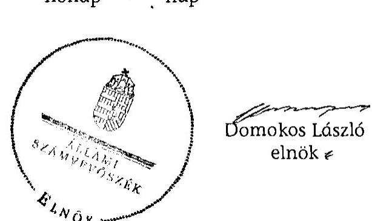

# JELENTÉS 

az önkormányzatok belső
kontrollrendszerének kialakítása, valamint egyes
kontrolltevékenységek és a belső ellenőrzés működése ellenőrzéséről
13090 SOMOGYGESZTI 2013. szeptember

---

# Állami Számvevőszék 

Iktatószám: V-0107-029/2013.
Témaszám: 1109
Vizsgálat-azonosító szám: V059138

## Az ellenőrzést felügyelte:

Dr. Benedek Mária
felügyeleti vezető
Az ellenőrzést vezette:
Bíró Zsolt
ellenőrzésvezető
A számvevőszéki jelentés összeállításában közreműködött:
Keszthelyi Zoltán
számvevő tanácsos
Az ellenőrzést végezték:

| Dr. Schreiber Judit | Keszthelyi Zoltán | Vojcsekné Szabó Ágnes |
| :-- | :-- | :-- |
| számvevő | számvevő tanácsos | számvevő tanácsos |

---

# TARTALOMJEGYZÉK 

BEVEZETÉS ..... 7
I. ÖSSZEGZŐ MEGÁLLAPÍTÁSOK, KÖVETKEZTETÉSEK, JAVASLATOK ..... 10
II. RÉSZLETES MEGÁLLAPÍTÁSOK ..... 20

1. Az önkormányzat belső kontrollrendszere kialakításának megfelelősége ..... 20
1.1. A kontrollkörnyezet kialakítása ..... 20
1.2. A kockázatkezelési rendszer kialakítása ..... 21
1.3. A kontrolltevékenységek kialakítása ..... 22
1.4. Az információs és kommunikációs rendszer kialakítása ..... 23
1.5. A monitoring rendszer kialakítása ..... 24
2. A pénzügyi folyamatokban kulcsszerepet betöltő belső kontrollok (szakmai teljesítésigazolás és utalvány ellenjegyzés) működése ..... 24
3. A belső ellenőrzés szervezeti keretei és működése ..... 27

## FÜGGELÉKEK

1. számú Értelmező szótár
2. számú A belső kontrollrendszer kialakítása, a pénzügyi folyamatokban kulcsszerepet betöltő szakmai teljesítésigazolás és utalvány ellenjegyzés kontrollok működése, valamint a belső ellenőrzés működése értékelésénél alkalmazott minősítési szempontok

---

.

---

# RÖVIDÍTÉSEK JEGYZÉKE 

| Törvények |  |
| :--: | :--: |
| ÁSZ tv. | 2011. évi LXVI. törvény az Állami Számvevőszékről |
| Avtv. | 1992. évi LXIII. törvény a személyes adatok védelméről és a közérdekű adatok nyilvánosságáról (hatálytalan 2012. január 1-jétől) |
| Htv. | 1991. évi XX. törvény a helyi önkormányzatok és szerveik, a köztársasági megbízottak, valamint egyes centrális alárendeltségű szervek feladat- és hatásköreiről |
| Info tv. | 2011. évi CXII. törvény az információs önrendelkezési jogról és az információszabadságról (hatályos 2012. január 1-jétől) |
| Kttv. | 2011. évi CXCIX. törvény a közszolgálati tisztviselőkről (hatályos 2012. március 1-jétől) |
| Ktv. | 1992. évi XXIII. törvény a köztisztviselők jogállásáról (hatálytalan 2012. március 1-jétől) |
| Mötv. | 2011. évi CLXXXIX. törvény Magyarország helyi önkormányzatairól (hatályos 2012. január 1-jétől) |
| Mvtv. | 1993. évi XCIII. törvény a munkavédelemről |
| Ötv. | 1990. évi LXV. törvény a helyi önkormányzatokról |
| régi Áht. | 1992. évi XXXVIII. törvény az államháztartásról (hatálytalan 2012. január 1-jétől) |
| Számv. tv. | 2000. évi C. törvény a számvitelről |
| Tvtv. | 1996. évi XXXI. törvény a tűz elleni védekezésről, a műszaki mentésről és a tűzoltóságról |
| új Áht. | 2011. évi CXCV. törvény az államháztartásról (hatályos 2012. január 1-jétől) |
| Vagyonnyilatkozattételről szóló tv. | 2007. évi CLII. törvény az egyes vagyonnyilatkozat-tételi kötelezettségekről |
| Rendeletek |  |
| Áhsz. | 249/2000. (XII. 24.) Korm. rendelet az államháztartás szervezetei beszámolási és könyvvezetési kötelezettségének sajátosságairól |
| Ámr. | 292/2009. (XII. 19.) Korm. rendelet az államháztartás működési rendjéről (hatálytalan 2012. január 1-jétől) |
| Ávr. | 368/2011. (XII. 31.) Korm. rendelet az államháztartásról szóló törvény végrehajtásáról (hatályos 2012. január 1-jétől) |
| Ber. | 193/2003. (XI. 26.) Korm. rendelet a költségvetési szervek belső ellenőrzéséről (hatálytalan 2012. január 1-jétől) |
| Bkr. | 370/2011. (XII. 31.) Korm. rendelet a költségvetési szervek belső kontrollrendszeréről és belső ellenőrzéséről (hatályos 2012. január 1-jétől) |
| Szórövidítések |  |
| ÁSZ | Állami Számvevőszék |

---

| Belső ellenőrzési kézikönyv $_{1}$ | Kaposvári Többcélú Kistérségi Társulás és Munkaszervezete Belső ellenőrzési kézikönyve (Hatályos 2008. március 1-jétől) |
| :--: | :--: |
| Belső ellenőrzési kézikönyv $_{2}$ | Kaposvári Többcélú Kistérségi Társulás Hivatala és Belső ellenőrzési feladatra társult Önkormányzatok és Intézményeik Belső ellenőrzési kézikönyve (Hatályos 2010. október 1-jétől) |
| Belső ellenőrzési kézikönyv $_{3}$ | Kaposvári Többcélú Kistérségi Társulás Hivatala és Belső ellenőrzési feladatra társult Önkormányzatok és Intézményeik Belső ellenőrzési kézikönyve (Hatályos 2011. május 1-jétől) |
| Belső Kontroll Kézikönyv | Az Ámr. 155. § (1) bekezdése, valamint az államháztartási belső kontroll standardokról szóló 1/2009. (IX. 11.) PM irányelv egységes értelmezése érdekében az államháztartásért felelős miniszter által 2010. évben kiadott Belső Kontroll Kézikönyv. |
| értékelési szabályzat | Az eszközök és források értékelési szabályzata (Pénzügyigazdálkodási szabályzatgyűjtemény 7. számú melléklete) |
| FEUVE   gazdasági program | folyamatba épített, előzetes, utólagos és vezetői ellenőrzés Polgármesteri Ciklusprogram 2010-2014. |
| Hivatal | Mernye, Polány, Ecseny, Felsőmocsolád és Somogygeszti Községek Mernyei Közös Önkormányzati Hivatala (2013. január 1-jétől) |
| hivatali SZMSZ | Mernyei Közös Önkormányzati Hivatal Szervezeti és Működési Szabályzata (hatályos 2013. február 1-től) |
| jegyző | Mernye, Polány, Ecseny, Felsőmocsolád és Somogygeszti Községek Mernyei Közös Önkormányzati Hivatalának jegyzője (2013. január 1-jétől) |
| Képviselő-testület | Somogygeszti Község Önkormányzatának Képviselőtestülete |
| körjegyző | Somogyaszaló - Magyaregres - Somogygeszti Községek Önkormányzatának körjegyzője |
| Körjegyzőség | Somogyaszaló - Magyaregres - Somogygeszti Községek Önkormányzatának Körjegyzősége (2008. január 1-jétől 2011. december 31-ig) |
| körjegyzőségi SZMSZ | Somogygeszti Község Önkormányzat SZMSZ-ének 3. számú függeléke Somogyaszaló - Magyaregres Somogygeszti Községek Körjegyzőségének ügyrendje megnevezéssel |
| Megállapodás | Kaposvári Többcélú Kistérségi Társulás és a társult önkormányzatok társulási megállapodása |
| Önkormányzat pénzkezelési szabályzat | Somogygeszti Község Önkormányzata   Somogyaszaló - Magyaregres - Somogygeszti pénzkezelési szabályzata (a Pénzügyi-gazdálkodási szabályzatgyűjtemény 2. számú melléklete) |
| polgármester | Somogygeszti Község Önkormányzatának polgármestere |

---

számlarend
Számviteli rend
számviteli politika
Társulás
1/2013. számú intézkedés
a Pénzügyi-gazdálkodási szabályzatgyűjtemény V. és VI. fejezete
Pénzügyi-gazdálkodási szabályzatgyűjtemény (számviteli rend)
a Pénzügyi-gazdálkodási szabályzatgyűjtemény III. fejezete
Kaposvári Többcélú Kistérségi Társulás
a Mernyei Közös Önkormányzati Hivatal jegyzőjének 1/ 2013. számú intézkedése Mernye, Polány, Ecseny, Felsőmocsolád és Somogygeszti községek önkormányzatai, valamint az Ecseny Német Nemzetiségi Önkormányzat, továbbá a Mernyei Közös Önkormányzati Hivatal gazdálkodásával kapcsolatos kötelezettségvállalás, utalványozás, érvényesítés és ellenjegyzés hatásköri rendje

---

.

---

# JELENTÉS   az önkormányzatok belső   kontrollrendszerének kialakítása, valamint egyes kontrolltevékenységek és a belső ellenőrzés működése ellenőrzéséről 

SOMOGYGESZTI

## BEVEZETÉS

A belső kontrollrendszer kialakítását, működtetését és fejlesztését a régi Áht. és az új Áht. is előírja. Ennek megvalósításáért a költségvetési szerv vezetője felel. A belső kontrollrendszer azt a célt szolgálja, hogy a költségvetési szervek működésük és gazdálkodásuk során a tevékenységeket szabályszerűen, gazdaságosan, hatékonyan, eredményesen hajtsák végre, teljesítsék elszámolási kötelezettségeiket és megvédjék az erőforrásokat a veszteségektől, a károktól és a nem rendeltetésszerű használattól. A belső kontrollrendszer magában foglalja mindazon szabályokat, eljárásokat, gyakorlati módszereket és szervezeti struktúrákat, kockázatkezelési technikákat, kontrolltevékenységeket, amelyek segítséget nyújtanak a szervezetnek céljai eléréséhez.

Az ÁSZ a 2011-2015. évekre szóló stratégiájában hangsúlyos szerepet szánt annak, hogy szilárd szakmai alapon álló, értékteremtő ellenőrzéseivel előmozdítsa a közpénzügyek átláthatóságát, rendezettségét. A számvevőszéki ellenőrzés nemzetközi alapelvei is rögzítik, hogy a megfelelő belső kontrollrendszer minimálisra csökkenti a hibák és szabálytalanságok kockázatát.

Az ellenőrzés célja annak értékelése volt, hogy az Önkormányzat a jogszabályi előírásoknak megfelelően alakította-e ki a belső kontrollrendszert; a gazdálkodás folyamatában kulcsszerepet betöltő szakmai teljesítésigazolás és az utalvány ellenjegyzés kontrolltevékenységeit megfelelően működtette-e; biztosította-e a belső ellenőrzés szabályos és eredményes működését.

Az ellenőrzés típusa: szabályszerűségi ellenőrzés
Az ellenőrzés jogszabályi alapja: az ÁSZ tv. 5. § (2) és (6) bekezdései
Az ellenőrzött szervezet: az Önkormányzat
Az ellenőrzött időszak: a belső kontrollrendszer kialakításának megfelelőségét a 2011. évre vonatkozóan értékeltük. A kontrolltevékenységek működésének megfelelőségét a 2011. január 1-je és december 31-e, míg a belső ellenőrzés működésének szabályosságát és eredményességét a 2009. január 1-je és

---

2011. december 31-e közötti időszakot figyelembe véve értékeltük. A helyszíni ellenőrzés lezárásáig a helyi szabályozás változásait nyomon követtük.

Az ellenőrzés szakmai módszertana az ÁSZ hivatalos honlapján (www.asz.hu) közzétett szakmai szabályokon alapult, amely a Legfőbb Ellenőrző Intézmények Nemzetközi Szervezete (INTOSAI) által kiadott nemzetközi standardok (ISSAI) figyelembevételével készült.

A belső kontrollrendszer kialakításának ellenőrzése során értékeltük a kontrollkörnyezet, a kockázatkezelési rendszer, a kontrolltevékenységek, az információs és kommunikációs rendszer, valamint a monitoring rendszer szabályozottságának megfelelőségét.

Értékeltük a pénzügyi folyamatokban kulcsszerepet betöltő szakmai teljesítésigazolás és utalvány ellenjegyzés kontrollok működésének megfelelőségét az államháztartáson kívülre teljesített működési és felhalmozási célú pénzeszközátadásoknál, az egyéb üzemeltetési, fenntartási és szolgáltatási kiadásoknál, továbbá a külső szolgáltatók által végzett karbantartási, kisjavítási munkákkal kapcsolatos kifizetések esetében. Az egyszerû véletlen mintavétellel kiválasztott tételek ellenőrzését többlépcsős megfelelőségi tesztek útján addig végeztük, amíg elegendő és megfelelő bizonyítékot szereztünk a vizsgált folyamatok kulcskontrolljai működésének megfelelő vagy nem megfelelő voltáról. Értékeltük az Önkormányzatnál a belső ellenőrzés működésének szabályosságát és eredményességét. Az ÁSZ a 2007-2010. években az Önkormányzatnál átfogó ellenőrzést nem végzett.

A fogalmak magyarázatát az 1. számú függelék, az ellenőrzés egyes területeinek értékelésénél alkalmazott egységes minősítési szempontokat a 2. számú függelék tartalmazza.

Az ellenőrzés lefolytatásához az Önkormányzat a munkalapok és a tanúsítvány elektronikus kitöltésével, valamint a megjelölt dokumentumok elektronikus megküldésével szolgáltatott adatokat. A munkalapokon szerepeltetett adatok, információk ellenőrzése és szükség szerinti javítása a helyszíni ellenőrzés keretében történt.

Az ÁSZ az ellenőrzés megállapításait az ellenőrzött időszakban hatályos, az intézkedést igénylő megállapításokra tett javaslatokat a jelenleg hatályos jogszabályok alapján fogalmazta meg.

Az ÁSZ tv. 29. § (1) bekezdése szerint a jelentéstervezetet megküldtük a polgármester részére, aki az ÁSZ tv. 29. § (2) bekezdésében foglalt észrevételezési jogával nem élt, a jelentéstervezetre észrevételt nem tett.

Somogygeszti község állandó lakosainak száma 2011. január 1-jén 513 fő volt. Az Önkormányzat öttagú Képviselő-testületének munkáját egy állandó bizottság segítette. Az Önkormányzat az önállóan működő és gazdálkodó Körjegyzőséggel látta el feladatát 2011. december 31-ig. A 2012. évben a feladatellátó Mernye, Polány, Ecseny, Felsőmocsolád és Somogygeszti Községek Körjegyzősége volt. Az Önkormányzat többségi tulajdoni hányadú gazdasági társasággal nem rendelkezett.

---

A polgármester a 2009. október 18. napján tartott időközi polgármester választások óta tölti be tisztségét. A körjegyző 2008. január 1-jétől 2011. december 31-ig látta el Somogygeszti jegyzői feladatait.

A Körjegyzőség szervezeti egységekre nem tagolódott, a foglalkoztatott köztisztviselők száma 2011. január 1-jén kilenc fő volt. 2013. január 1-jétől Mernye, Polány, Ecseny, Felsőmocsolád és Somogygeszti községek önkormányzatainak képviselő-testületei Közös Önkormányzati Hivatalt hoztak létre Mernye székhellyel igazgatási és gazdálkodási feladataik ellátására.

Az Önkormányzat a 2011. évi költségvetési beszámolója szerint 70247 ezer Ft költségvetési bevételt ért el, valamint 69693 ezer Ft költségvetési kiadást teljesített. A 2011. december 31-i könyvviteli mérleg szerint 128754 ezer Ft értékű eszközvagyonnal rendelkezett és 2256 ezer Ft rövid lejáratú kötelezettsége volt. Az Önkormányzatnak 2011. december 31-én hosszú lejáratú kötelezettsége nem volt.

---

# I. ÖSSZEGZŐ MEGÁLLAPÍTÁSOK, KÖVETKEZTETÉSEK, JAVASLATOK 

A belső kontrollrendszeren belül 2011-ben a Körjegyzőségen a kontrollkörnyezet, a kockázatkezelési rendszer, a kontrolltevékenységek, az információs és kommunikációs rendszer, valamint a monitoring rendszer kialakítását külön-külön és összesítve is értékeltük. A belső kontrollrendszer kialakítása az összesített értékelés alapján nem felelt meg a jogszabályi előírásoknak. Az egyes területek kialakításának értékelését az alábbiakban részletezzük.

A kontrollkörnyezet kialakítása nem felelt meg a jogszabályi követelményeknek, mert a körjegyző a körjegyzőségi SZMSZ-t elkészítette, de azt a régi Áht. ${ }^{1}$ előírása ellenére a Körjegyzőséget alapító képviselő-testületek
 nem hagyták jóvá. A körjegyző - a Számv. tv. és az Áhsz. előírása ellenére - a Számviteli rend - ezen belül a számviteli politika, a számlarend, az értékelési és a pénzkezelési szabályzat - hatályát nem terjesztette ki az Önkormányzatra. A körjegyző a Számv. tv.-ben és az Áhsz.-ben előírtak ellenére nem készítette el az eszközök és források leltárkészítési és leltározási szabályzatát. A körjegyző az Ámr. előírása ellenére nem készítette el a Körjegyzőség ellenőrzési nyomvonalát, és nem szabályozta a szabálytalanságkezelés eljárásrendjét. Ezek a hiányosságok korlátozzák a feladatellátás számon kérhetőségét, folyamatosságának biztosítását, a folyamatos nyomon követést. A körjegyző az Mvtv. előírása ellenére nem határozta meg a Körjegyzőségen az egészséget nem veszélyeztető és biztonságos munkavégzés követelményei megvalósításának módját, és - a Tvtv.-ben foglaltak ellenére - nem készítette el a tűzvédelmi szabályzatot. A körjegyző a Ktv.-ben foglaltak ellenére a 2011. évben nem határozta meg a teljesítménykövetelményeket. A 2013. évben a hivatali SZMSZ-t a Képviselő-testület jóváhagyta, a jegyző gondoskodott a 2013. évi teljesítménykövetelmények meghatározásáról.

A kockázatkezelési rendszer kialakítása nem felelt meg a jogszabályi előírásoknak, mert a körjegyző a régi Áht.-ban és az Ámr.-ben foglaltak ellenére kockázatelemzést nem végzett, nem mérte fel és nem állapította meg a Körjegyzőség tevékenységében, gazdálkodásában rejlő kockázatokat, továbbá nem határozta meg a kockázatokkal kapcsolatos intézkedéseket és megtételük módját. A Vagyonnyilatkozat-tételről szóló tv.-ben foglalt előírás ellenére a vagyonnyilatkozat-tételi kötelezettséget az érintett személyek esetében a körjegyzőségi SZMSZ-ben nem tüntette fel. A jegyző a 2013. évben a hivatali SZMSZ-ben a vagyonnyilatkozat-tételi kötelezettséget az érintett személyek esetében előírta.

A kontrolltevékenységek kialakítása nem felelt meg a jogszabályi előírásoknak, mert a körjegyző - a régi Áht. előírása ellenére - nem alakította ki a folyamatba épített előzetes, utólagos és vezetői ellenőrzést. A körjegyző az Ámr.-ben foglaltak ellenére nem szabályozta a Körjegyzőség tevékenységeire vonatkozó beszámolási eljárásokat. Az Ámr.-ben foglaltak ellenére belső szabályzatban nem rendezte a Körjegyzőség gazdálkodásával, így különösen a kötelezettségvállalással, az ellenjegyzéssel, a szakmai teljesítésigazolással, az érvényesítéssel, az utalványozás gyakorlásának módjával, eljárási és dokumentációs részletszabályaival, valamint az ezeket végző személyek kijelölésének rendjével és az adatszolgáltatási feladatok teljesítésének rendjével kapcsolatos belső előírásokat, feltételeket. Nem jelölte ki a szakmai teljesítésigazolásra, valamint az érvényesítésre jogosultakat. A kötelezettségvállalásra, ellenjegyzésre, szakmai teljesítés igazolására, érvényesítésre, utalványozásra jogosult személyekről és aláírás mintájukról a naprakész nyilvántartás vezetésének formáját és módját belső szabályzatban nem rögzítette. A jegyző - az Ávr.-ben foglaltaknak megfelelően - a gazdálkodási jogkörök gyakorlásával kapcsolatos szabályokat a 2013. évben meghatározta, azonban - a választásokkal összefüggő kijelölések kivételével - a szakmai teljesítésigazolásra, valamint az érvényesítésre jogosultakat nem jelölte ki.

Az információs és kommunikációs rendszer kialakítása nem felelt meg a jogszabályi követelményeknek, mert a körjegyző az Avtv. ${ }^{2}$ és az Ámr. előírása ellenére nem készítette el az adatvédelmi és adatbiztonsági szabályzatot, elmulasztotta az adatbiztonság érvényre juttatásához szükséges intézkedések megtételét, és nem szabályozta a közérdekű adatok megismerésére irányuló igények teljesítésének, valamint a kötelezően közzéteendő adatok közzétételi eljárásának, nyilvánosságra hozatalának rendjét.

A monitoring rendszer kialakítása a jogszabályi előírásoknak nem felelt meg, mert a körjegyző a régi Áht.-ban és az Ámr.-ben foglalt előírások ellenére az operatív tevékenységek keretében megvalósuló folyamatos és eseti nyomon követésből álló, a Körjegyzőség tevékenységének, a célok megvalósításának nyomon követését biztosító rendszer szabályait nem határozta meg.

A belső kontrollrendszer nem megfelelő kialakítása kockázatot jelent az Önkormányzat tevékenységeinek szabályszerű, gazdaságos, hatékony és eredményes végrehajtása során.

A Körjegyzőségen a 2011. évben az államháztartáson kívülre teljesített működési és felhalmozási célú pénzeszközátadásokkal, az egyéb üzemeltetéssel, fenntartással és szolgáltatással, valamint a külső szolgáltatók által végzett karbantartással, kisjavítással kapcsolatos kifizetések során összefoglalóan értékelve a kulcskontrollok működésének megfelelősége gyenge volt. A szakmai teljesítésigazolást - az államháztartáson kívülre teljesített működési és felhalmozási célú pénzeszközátadásokkal, a külső szolgáltatók által végzett karbantartással, kisjavítással, az egyéb üzemeltetési, fenntartási és szolgáltatási munkákkal kapcsolatos kifizetéseket megelőzően - régi Áht. és az Ámr. előírása ellenére nem, vagy nem az arra jogosult személyek végezték el.

Az utalvány ellenjegyzője az államháztartáson kívülre teljesített működési és felhalmozási célú pénzeszközátadásokkal, a külső szolgáltatók által végzett karbantartási, kisjavítási és az egyéb üzemeltetési, fenntartási és szolgáltatási munkákkal kapcsolatos kifizetéseket megelőzően az Ámr.-ben foglalt ellenőrzési feladatait - a szakmai teljesítésigazolás, illetve a szabályszerűen végzett szakmai teljesítésigazolás hiányában, az arra nem jogosult személy által végzett érvényesítés, valamint rájegyzésének hiánya miatt - nem a jogszabályi előírásoknak megfelelően végezte el. Az Ámr. gazdálkodásra - közöttük a kötelezettségvállalások nyilvántartására, az okmányon a kötelezettségvállalás nyilvántartási számának feltüntetésére, az előzetes írásbeli kötelezettségvállalásra és ellenjegyzésre - vonatkozó szabályai betartásának hiánya ellenére az utalvány ellenjegyzője a kifizetéseket aláírásával ellenjegyezte.

Az ellenőrzött kifizetésekkel összefüggésben a rendelkezésre bocsátott dokumentumok alapján jogosulatlan kifizetést nem tárt fel az ellenőrzés, azonban a gazdálkodásban kulcsszerepet betöltő kontrollok jogszabályi előírásoknak nem megfelelő, gyenge működése miatt fennáll a hibák bekövetkezésének lehetősége. A kiválasztott kulcskontrollok az integritás szempontjából lényeges csalás és korrupciós kockázatok megelőzésében, illetve feltárásában is hangsúlyos szerepet játszanak, így hatékonyabbá és eredményesebbé válhat a korrupció elleni fellépés. A nem megfelelően szabályozott és működtetett belső kontrollok korrupciós kockázatot hordoznak.

Az Önkormányzat a 2009-2011. években a belső ellenőrzési feladatokat kistérségi társulás útján látta el. A belső ellenőrzés szabályozása és működése a jogszabályi előírásoknak nem felelt meg, azonban a Ber.-ben ${ }^{3}$ foglaltaknak megfelelően a belső ellenőrzési vezető feladatát rögzítették, a személyét kijelölték. A Társulás rendelkezett jóváhagyott Belső ellenőrzési kézikönyv ${ }_{1,2,3}$-vel. A belső ellenőrzések megállapításainak, javaslatainak hasznosítására a körjegyző intézkedési terveket készített, amelyeket a belső ellenőrzés a 2010-2011. években - utóellenőrzés keretében - nyomon követett. A Képviselő-testület az Ötv.-ben ${ }^{4}$ előírtaknak megfelelően a belső ellenőrzési terveket - a 2009. évi kivételével - határidőn belül hagyta jóvá. Az éves ellenőrzési terveket - a 2010. év kivételével - kockázatelemzéssel megalapozták.

A Ber. előírása ellenére a körjegyzőségi SZMSZ-ben nem rögzítették a belső ellenőrzést végző szervezet jogállását és feladatait, az éves belső ellenőrzési tervek a körjegyző írásos véleményének figyelembevétele nélkül készültek. A 2009-2011. évi éves ellenőrzési tervek, a jóváhagyott programok, illetve az elvégzett belső ellenőrzésekről készített jelentések és a belső ellenőrzések nyilvántartásai a Ber.-ben előírt tartalmi követelményeknek részben feleltek meg. A körjegyző a javaslatok alapján megtett intézkedések nyomon követéséről éves bontásban a nyilvántartást nem vezette. A polgármester a belső ellenőrzési jelentésekről készített 2011. évi éves ellenőrzési jelentést a zárszámadási rendelettervezettel egyidejűleg - az Ötv.-ben és a Ber.-ben foglaltak ellenére - nem terjesztette a Képviselő-testület elé, mert a Társulás munkaszervezetének vezetője a Ber.-ben előírt határidőre az éves ellenőrzési jelentést nem küldte meg a körjegyző részére, hogy azt a polgármester a zárszámadással egyidejűleg a Képviselő-testület elé terjeszthesse.

[^0]
[^0]:    ${ }^{3}$ 2012. január 1-jétől Bkr.
    ${ }^{4}$ 2012. január 1-jétől Mötv.

---

Az Önkormányzatnál a 2009-2011. évek között a belső ellenőrzés működése - a 2. számú függelékben részletezett kritériumrendszer alapján végzett értékelés szerint - nem volt eredményes, mert a belső ellenőrzés szabályozása és működése az összegző értékelés alapján az ellenőrzött időszak egészét tekintve a jogszabályi előírásoknak nem felelt meg. A belső ellenőrzés működése azért sem volt eredményes, mert a belső ellenőrzések - a belső kontrollrendszer kialakítása szabályozottságának, a pénzkezeléssel kapcsolatos belső kontrollok működésének, a vagyonvédelem területén a leltározási szabályzatban foglaltak betartásának ellenőrzése - során nem tárták fel a belső kontrollok működésének és kialakításának hiányosságait, továbbá a belső ellenőrzés által tett javaslatok csak részben hasznosultak, mert a körjegyző a gazdálkodási jogkörök gyakorlásához kapcsolódóan a belső kontrollok működésére, a vagyonvédelem területén a leltározási szabályzatban foglaltak betartására, valamint a FEUVE kialakítására megfogalmazott javaslatokat nem hasznosította. Mindezek hozzájárultak a számvevőszéki ellenőrzés során is feltárt szabályozási és működési hiányosságok, hibák ismétlődéséhez.

Az ÁSZ tv. 33. § (1) bekezdésében foglaltak értelmében az ellenőrzött szervezet vezetője köteles a jelentésben foglalt megállapításokhoz kapcsolódó intézkedési tervet összeállítani, és azt a jelentés kézhezvételétől számított 30 napon belül az ÁSZ részére megküldeni. Amennyiben az intézkedési tervet határidőre nem küldi meg a szervezet, vagy az - az ÁSZ tv. 33. § (2) bekezdésében foglalt póthatáridő eltelte ellenére - továbbra sem elfogadható, az ÁSZ elnöke a hivatkozott törvény 33. § (3) bekezdés a)-b) pontjaiban foglaltakat érvényesítheti.

Az ellenőrzés intézkedést igénylő megállapításai és javaslatai:

# a polgármesternek 

1. Az államháztartáson kívülre teljesített működési és felhalmozási célú pénzeszközátadásoknál, valamint a karbantartási, kisjavítási és az egyéb üzemeltetési, fenntartási munkáknál - a régi Áht. 100/C. § (3) és az Ámr. 74. § (1) bekezdésében előírtak ellenére - nem történt írásbeli kötelezettségvállalás, továbbá azt nem előzte meg ellenjegyzés.

Javaslat:
Intézkedjen arról, hogy az Önkormányzat nevében történő kötelezettségvállalásra az új Áht. 37. § (1) bekezdésében foglaltaknak megfelelően - az Ávr. 53. §-ában meghatározott kivételeket figyelembe véve - kizárólag a pénzügyi ellenjegyzés után, a pénzügyi teljesítés esedékességét megelőzően, írásban kerüljön sor.
2. A polgármester - az Ötv. 92. § (10) bekezdésében előírtak ellenére - a 2011. évi belső ellenőrzési jelentést a zárszámadási rendelettervezettel egyidejűleg nem terjesztette a Képviselő-testület elé.

Javaslat:
A Bkr. 56. § (8) bekezdésében foglaltak szerint az éves ellenőrzési jelentést a zárszámadási rendelettervezettel egyidejűleg terjessze a Képviselő-testület elé.

---

3. A régi Áht. 100/C. § (6) bekezdésének és az Ámr. 76. § (1) és (3) bekezdéseinek előírása ellenére az államháztartáson kívülre teljesített működési és felhalmozási célú pénzeszközátadásokat megelőzően a szakmai teljesítésigazolást nem végezték el, az egyéb üzemeltetési, fenntartási és szolgáltatási munkákkal kapcsolatos kifizetéseket megelőzően a szakmai teljesítésigazolás elmaradt, vagy nem szabályszerűen történt. Az Ámr. 76. § (3) bekezdésben foglaltak ellenére a külső szolgáltatók által végzett karbantartással, kisjavítással kapcsolatos kiadásokat megelőzően a szakmai teljesítésigazolást nem a körjegyző által írásban kijelölt személy végezte. Az utalvány ellenjegyzője az államháztartáson kívülre teljesített működési és felhalmozási célú pénzeszközátadásoknál, a külső szolgáltatók által végzett karbantartásnál, kisjavításnál, valamint az egyéb üzemeltetési, fenntartási és szolgáltatási munkákkal kapcsolatos kifizetéseket megelőzően az Ámr. 79. § (2) bekezdésében foglalt ellenőrzési feladatait nem, vagy nem szabályszerűen végezte el. Az utalvány ellenjegyzése - a szakmai teljesítésigazolás hiányában, illetve a nem szabályszerű szakmai teljesítésigazolás és érvényesítés miatt - nem a jogszabályi előírásoknak megfelelően történt. Az utalvány ellenjegyzője a kiadásokat annak ellenére ellenjegyezte, hogy elmaradt az Ámr. 78. § (2) bekezdés g) pontjában és a (3) bekezdésében előírt kötelezettségvállalási nyilvántartási szám feltüntetése, mert a kötelezettségvállalást - az Ámr. 75. § (1)
 bekezdésében előírtak ellenére – nem vették nyilvántartásba. A Körjegyzőségen – az Ámr. 80. § (3) bekezdésének előírása ellenére – nem rendelkeztek az utalvány ellenjegyzésére jogosult személyek aláírás-mintáját tartalmazó naprakész nyilvántartással, továbbá az államháztartáson kívülre teljesített működési és felhalmozási célú pénzeszközátadásokkal, a külső szolgáltatók által végzett karbantartásnál, kisjavítási és az egyéb üzemeltetési, fenntartási és szolgáltatási munkákkal kapcsolatos kötelezettségvállalásokat – a régi Áht. 100/C. § (3) és az Ámr. 74. § (1) bekezdésében előírtak ellenére – nem foglalták írásba.

Javaslat:
A Mötv. 115. § (1) bekezdésében foglaltak alapján kísérje figyelemmel az Önkormányzat gazdálkodásának szabályszerűségét. A Mötv. 67. § f) pontja alapján gondoskodjon a belső kontrollrendszerre és a belső ellenőrzés működésére vonatkozó jogszabályi rendelkezések be nem tartása, valamint a szakmai teljesítésigazolás, illetve az utalvány ellenjegyzés kontrollokkal összefüggésben feltárt hiányosságok, szabálytalanságok tekintetében az esetleges munkajogi felelősséggel kapcsolatos körülmények kivizsgálásáról, majd a vizsgálat eredményének függvényében tegye meg a szükséges munkajogi intézkedéseket.

# a jegyzőnek Somogygeszti Község Önkormányzata vonatkozásában 

1. a kontrollkörnyezettel kapcsolatban:

A körjegyző – a Htv. 140. § (1) bekezdés c) pontjában foglaltak ellenére – a Számviteli rend – ezen belül a Számv. tv. 14. § (3) bekezdésében és az Áhsz. 8. § (3) bekezdésében foglaltak ellenére a számviteli politika, a Számv. tv. 14. § (5) bekezdés b) és d) pontjaiban, továbbá az Áhsz. 8. § (4) bekezdés b) és d) pontjaiban foglalt előírás ellenére az értékelési és a pénzkezelési szabályzat, valamint a Számv. tv. 161. § (1) és (2) bekezdésének és az Áhsz. 49. § (1) és (6) bekezdésének előírása ellenére, a számlarend – hatályát nem terjesztette ki az Önkormányzatra.

---

A körjegyző a Számv. tv. 14. § (5) bekezdés a) pontjában és az Áhsz. 8. § (4) bekezdés a) pontjában előírt eszközök és források leltárkészítési és leltározási szabályzatát nem készítette el.

A körjegyző – az Mvtv. 2. § (3) bekezdés előírása ellenére – nem határozta meg az egészséget nem veszélyeztető és biztonságos munkavégzés körülményei megvalósításának módját.

A körjegyző – a Tvtv. 19. § (1) bekezdésében foglaltak ellenére – nem készítette el a Körjegyzőség tűzvédelmi szabályzatát.

A körjegyző – az Ámr. 156. § (2)–(3) bekezdés előírásai ellenére – nem készítette el a Körjegyzőség ellenőrzési nyomvonalát, és nem szabályozta a szabálytalanságkezelés eljárásrendjét.

Javaslat:
a) Biztosítsa, hogy a Htv. 140. § (1) bekezdés c) pontja alapján – a Számv. tv 14. § (11) bekezdése szerint elkészített és aktualizált – számviteli rend, ezen belül a Számv. tv. 14. § (3) bekezdésének és az Áhsz. 8. § (3) bekezdésének megfelelően a számviteli politika, a Számv. tv. 14. § (5) bekezdés b) és d) pontjaiban és az Áhsz. 8. § (4) bekezdés b) és d) pontjaiban foglalt előírásnak megfelelően az értékelési és a pénzkezelési szabályzat, illetve a Számv. tv. 161. § (1) és (2) bekezdései és az Áhsz. 49. § (1) és (6) bekezdése előírásának megfelelően a számlarend hatálya az Önkormányzatra is terjedjen ki.
b) Készítse el a Számv. tv. 14. § (5) bekezdés a) pontjában és az Áhsz. 8. § (4) bekezdés a) pontjában foglalt előírásnak megfelelően az eszközök és források leltárkészítési és leltározási szabályzatát.
c) Határozza meg az egészséget nem veszélyeztető és biztonságos munkavégzés követelményei megvalósításának módját az Mvtv. 2. § (3) bekezdése alapján.
d) Készítse el a tűzvédelmi szabályzatot a Tvtv. 19. § (1) bekezdésében foglalt előírásnak megfelelően.
e) Készítse el az ellenőrzési nyomvonalat, és szabályozza a szabálytalanságok kezelésének eljárásrendjét a Bkr. 6. § (3)–(4) bekezdéseiben foglaltaknak megfelelően.
2. a kockázatkezelési rendszerrel kapcsolatban:

A jegyző – a régi Áht. 121. § (2) bekezdés b) pontjának és az Ámr. 157. § (1)–(3) bekezdéseinek előírása ellenére – nem végzett kockázatelemzést, és nem alakított ki kockázatkezelési rendszert.

Javaslat:
Alakítsa ki és működtesse a Bkr. 3. § b) pontja és a 7. §-a szerinti kockázatkezelési rendszert.

---

3. a kontrolltevékenységekkel kapcsolatban:

A körjegyző – a régi Áht. 121/A. § (4) bekezdés a) pontjában foglaltak ellenére nem alakította ki a folyamatba épített, előzetes, utólagos és vezetői ellenőrzést.

A körjegyző – az Ámr. 158. § (2) bekezdés d) pontjában foglaltak ellenére – nem szabályozta a Körjegyzőség tevékenységeire vonatkozó beszámolási eljárásokat.

A körjegyző az Ámr. 76. § (5) bekezdésében és az Ámr. 77. § (4) bekezdésében előírtak ellenére – a választásokkal összefüggő kijelölések kivételével – nem jelölte ki a szakmai teljesítésigazolásra, valamint az érvényesítésre jogosultakat.

A körjegyző – az Ámr. 80. § (3) bekezdése rendelkezései ellenére – a kötelezettségvállalásra, ellenjegyzésre, szakmai teljesítés igazolására, érvényesítésre és utalványozásra jogosult személyekről és aláírás-mintájukról a naprakész nyilvántartás vezetésének formáját és módját belső szabályzatban nem rögzítette.

Javaslat:
f) Biztosítsa minden tevékenységre vonatkozóan a folyamatba épített, előzetes, utólagos és vezetői ellenőrzést a Bkr. 8. § (2) bekezdése alapján.
g) Szabályozza – a Bkr. 8. § (4) bekezdés c) pontja alapján – a Hivatal tevékenységeire vonatkozó beszámolási eljárásokat.
h) Jelölje ki minden gazdasági esemény vonatkozásában a teljesítésigazolásra és az érvényesítésre jogosult személyeket az Ávr. 57. § (4) bekezdésében és az Ávr. 58. § (4) bekezdésében foglaltaknak megfelelően.
i) Rögzítse belső szabályzatban az Ávr. 60. § (3) bekezdés előírása alapján a kötelezettségvállalásra, a pénzügyi ellenjegyzésre, a teljesítés igazolására, az érvényesítésre és az utalványozásra jogosult személyekre és aláírás-mintájukra vonatkozó naprakész nyilvántartás vezetésének szabályait.
4. az információs és kommunikációs rendszerrel kapcsolatban:

A körjegyző – az Avtv. 31/A. § (3) bekezdése ellenére – nem készítette el az adatvédelmi és adatbiztonsági szabályzatot.

A körjegyző – az Avtv. 20. § (8) bekezdésének és az Ámr. 20. § (3) bekezdés i) pontjának előírása ellenére – nem szabályozta a közérdekű adatok megismerésére irányuló kérelmek teljesítésének, valamint a kötelezően közzéteendő adatok nyilvánosságra hozatalának rendjét.

A körjegyző – az Avtv. 10. §-ában foglalt előírások ellenére – elmulasztotta az adatbiztonság érvényre juttatásához szükséges intézkedések megtételét, mert nem határozta meg a hozzáférési jogosultságok megállapítására, módosítására és azok betartásának ellenőrzésére vonatkozó belső eljárásrendet, nem alakította ki a hozzáférési jogosultságok nyilvántartását, és nem szabályozta a pénzügyi-számviteli rendszerben feldolgozott adatok mentési eljárásrendjét, valamint az adatmentés felelősségi viszonyait.

---

Javaslat:
a) Készítse el az Info tv. 24. § (3) bekezdésében foglaltak alapján az adatvédelmi és adatbiztonsági szabályzatot.
b) Állapítsa meg szabályzatban az Info tv. 35. § (3) bekezdésben előírtaknak megfelelően a kötelezően közzéteendő adatok nyilvánosságra hozatala rendjét, és készítse el az Info tv. 30. § (6) bekezdésében és az Ávr. 13. § (2) bekezdés h) pontjában foglaltak alapján a közérdekű adatok megismerésére irányuló igények teljesítésének rendjét rögzítő szabályzatot.
c) Az Info tv. 7. § (2)–(3) bekezdéseinek megfelelően gondoskodjon az adatok biztonságáról, tegye meg azokat az intézkedéseket, alakítsa ki azokat az eljárási szabályokat, amelyek az Info tv., valamint az egyéb adat- és titokvédelmi szabályok érvényre juttatásához szükségesek; továbbá megfelelő intézkedésekkel biztosítsa az adatok védelmét.
5. a monitoring rendszerrel kapcsolatban:

A körjegyző – az Áht. 121. § (2) bekezdés e) pontjában és az Ámr. 160. §-ában foglaltak ellenére – nem alakított ki és nem működtetett olyan monitoring rendszert, amely lehetővé tette a Körjegyzőség tevékenységének, a célok megvalósításának nyomon követését, és amelynek része az operatív tevékenységek keretében megvalósuló folyamatos és eseti nyomon követés is.

Javaslat:
Alakítsa ki és működtesse a Bkr. 3. § e) pontjában és a 10. §-ában előírtak alapján a Hivatal tevékenységének, a célok megvalósításának nyomon követését biztosító rendszert, amelynek része az operatív tevékenységek keretében megvalósuló folyamatos és eseti nyomon követés is.
6. a pénzügyi folyamatokban kulcsszerepet betöltő kontrollokkal kapcsolatban:

A régi Áht. 100/C. § (6) bekezdésének és az Ámr. 76. § (1) és (3) bekezdéseinek előírása ellenére az államháztartáson kívülre teljesített működési és felhalmozási célú pénzeszközátadásokkal, valamint az egyéb üzemeltetési, fenntartási és szolgáltatási munkákkal kapcsolatos kifizetéseket megelőzően a szakmai teljesítésigazolást nem végezték el. Az Ámr. 76. § (3) bekezdésben foglaltak ellenére a külső szolgáltatók által végzett karbantartással, kisjavítással és az egyéb üzemeltetési, fenntartási és szolgáltatási munkákkal kapcsolatos kiadásokat megelőzően a szakmai teljesítésigazolást nem a körjegyző által írásban kijelölt személy végezte.

Az utalvány ellenjegyzője az államháztartáson kívülre teljesített működési és felhalmozási célú pénzeszközátadásoknál, a külső szolgáltatók által végzett karbantartásnál, kisjavításnál, valamint az egyéb üzemeltetési, fenntartási és szolgáltatási munkákkal kapcsolatos kifizetéseket megelőzően az Ámr. 79. § (2) bekezdésében foglalt ellenőrzési feladatait nem, vagy nem szabályszerűen végezte el. Az utalvány ellenjegyzése – a szakmai teljesítésigazolás, illetve szabályszerűen végzett szakmai teljesítésigazolás hiányában és jogosulatlanul végzett érvényesítés mellett – nem a jogszabályi előírásoknak megfelelően történt. Az utalvány ellenjegyzője a kiadásokat annak

---

ellenére ellenjegyezte, hogy elmaradt az Ámr. 78. § (2) bekezdés g) pontjában előírt kötelezettségvállalás nyilvántartási számának a feltüntetése, mert a kötelezettségvállalást – az Ámr. 75. § (1) bekezdésében előírtak ellenére – nem vették nyilvántartásba. A Körjegyzőségen – az Ámr. 80. § (3) bekezdésének előírása ellenére – nem rendelkeztek az utalvány ellenjegyzésére jogosult személyek aláírás-mintáját tartalmazó naprakész nyilvántartással, továbbá az államháztartáson kívülre teljesített működési és felhalmozási célú pénzeszközátadásokkal, a külső szolgáltatók által végzett karbantartásnál, kisjavítási munkákkal kapcsolatos kötelezettségvállalásokat – a régi Áht. 100/C. § (3) és az Ámr. 74. § (1) bekezdésében előírtak ellenére – nem foglalták írásba.

Javaslat:
Intézkedjen – a szakmai teljesítés igazolása és az utalvány ellenjegyzése vonatkozásában feltárt hiányosságok megszüntetése, illetve az operatív gazdálkodás során a működésbeli hibák megelőzése, feltárása és kijavítása érdekében – arról, hogy:
a) a teljesítésigazolás során az Ávr. 57. § (1) bekezdésében előírtaknak megfelelően, ellenőrizhető okmányok alapján ellenőrizzék és igazolják a kiadások teljesítésének jogosságát, összegszerűségét, az ellenszolgáltatást is magában foglaló kötelezettségvállalás esetén a szerződés, megrendelés teljesítését, valamint az Ávr. 57. § (3) bekezdése szerint a teljesítést az igazolás dátumának és a teljesítés tényére történő utalásnak a megjelölésével, az arra jogosult személy aláírásával igazolják;
b) a kifizetéseket megelőzően a teljesítésigazolás alapján – az Ávr. 57. § (3) bekezdése szerinti esetben annak hiányában is – az összegszerűségnek, a fedezet meglétének és a megelőző ügymenetben az új Áht., az Áhsz., az Ávr. előírásai és a belső szabályzatokban foglaltak betartásának az ellenőrzése – az Ávr. 58. § (1) és (3) bekezdése szerint – történjen meg;
c) a kötelezettségvállalások nyilvántartását az Ávr. 56. § (1) bekezdésében foglalt előírásnak megfelelően vezessék, és az utalványon az Ávr. 59. § (3) bekezdésében foglalt kötelező tartalmi elemeket tüntessék fel;
d) az Ávr. 60. § (3) bekezdése alapján a kötelezettségvállalásra, pénzügyi ellenjegyzésre, teljesítés igazolására, érvényesítésre, utalványozásra jogosult személyekről és aláírás-mintájukról a belső szabályzatban foglaltak szerint naprakész nyilvántartást vezessenek.
7. a belső ellenőrzés működésével kapcsolatban:

Az ellenőrzési tervek – a Ber. 32/B. § (2) bekezdésének előírása ellenére –
 a körjegyző írásos véleményének figyelembevétele nélkül készültek. A Ber. 12. § b) pontjában, a 18. §-ában és a 21. § (2) bekezdésében foglaltak ellenére a 2010. évben nem készítettek az ellenőrzési tervhez kockázatelemzést. A 2009. és a 2011. évi ellenőrzési terveket kockázatelemzéssel megalapozták. A 2009-2011. évi éves belső ellenőrzési tervek - a Ber. 21. § (3) bekezdés c), e), f) és g) pontjában előírtak ellenére - nem tartalmazták az ellenőrzés célját, a szükséges ellenőrzési kapacitás meghatározását, az ellenőrzés típusát és módszerét, valamint az ellenőrzés ütemezését.

A belső ellenőrzési vezető által jóváhagyott programok - a Ber. 23. § (4) bekezdés e) pontjában foglaltak ellenére - nem tartalmazták az ellenőrzés célját. A 2009-2011. években elvégzett belső ellenőrzésekről jelentéseket készítettek, amelyek a Ber. 27. § (2) bekezdés g) és i) pontjában előírt tartalmi követelményeknek nem feleltek meg, mert nem tartalmazták az ellenőrzés feladatait, illetve az ellenőrzési megállapítások nem az ellenőrzési programoknak megfelelően kerültek rögzítésre. A belső ellenőrzési vezető a belső ellenőrzések nyilvántartását vezette, azonban a nyilvántartás - a Ber. 32. § (2) bekezdés c) és e) pontjában foglaltak ellenére - nem tartalmazta az ellenőrzés kezdésének és lezárásának időpontját, valamint a jelentősebb megállapításokat és javaslatokat.

A polgármester a belső ellenőrzési jelentésekről készített 2011. évi éves ellenőrzési jelentést - az Ötv. 92. § (10) bekezdésében és a Ber. 32/B. § (9) bekezdésében előírtak ellenére - a zárszámadási rendelettervezettel egyidejűleg nem terjesztette a Képviselő-testület elé, mert a Társulás munkaszervezetének vezetője a Ber. 32/B. § (9) bekezdésében előírt határidőre az éves ellenőrzési jelentést nem küldte meg a körjegyző részére, hogy azt a polgármester a zárszámadással egyidejűleg a Képviselőtestület elé terjeszthesse.

Javaslat:
a) Kezdeményezze, hogy az éves ellenőrzési tervet a belső ellenőrzési vezető a Bkr. 56. § (2) bekezdés előírásainak megfelelően a jegyző írásos véleményének figyelembevételével a Bkr. 29. § (1) bekezdésében foglaltak szerint, a Bkr. 31. § (4) bekezdésében meghatározott tartalommal készítse el.
b) Kezdeményezze, hogy az ellenőrzési programok tartalmazzák a Bkr. 33. § (2) bekezdésében foglalt, a jelentések pedig a Bkr. 39. § (3) bekezdésében foglalt tartalmi elemeket.
c) Kezdeményezze, hogy a belső ellenőrzési vezető az elvégzett belső ellenőrzésekről vezetett nyilvántartást a Bkr. 50. § szerinti tartalommal készítse el.
d) Kezdeményezze, hogy az éves ellenőrzési jelentés a Bkr. 56. § (8) bekezdése alapján a zárszámadási rendelettervezettel egyidejűleg kerüljön előterjesztésre a Képviselő-testület elé.

---

# II. RÉSZLETES MEGÁLLAPÍTÁSOK 

## 1. AZ ÖNKORMÁNYZAT BELSŐ KONTROLLRENDSZERE KIALAKÍTÁSÁNAK MEGFELELŐSÉGE

### 1.1. A kontrollkörnyezet kialakítása

A kontrollkörnyezet kialakítása a 2. számú függelékben részletezett kritériumrendszer alapján végzett értékelés szerint a Körjegyzőségen nem volt megfelelő, mert a körjegyző a jogszabályi előírásokat nem érvényesítette teljes körűen.

A körjegyző, mint a költségvetési szerv vezetője:

- a régi Áht. 91. § (2) bekezdése ${ }^{5}$ alapján elkészítette a körjegyzőségi SZMSZ-t, amelyet azonban a régi Áht. 93. § (1) bekezdés ${ }^{6}$ előírása ellenére a Körjegyzőséget alapító képviselő-testületek nem hagytak jóvá;
- a Htv. 140. § (1) bekezdés c) pontjában foglaltak ellenére a Számviteli rend ezen belül a Számv. tv. 14. § (3) bekezdésében és az Áhsz. 8. § (3) bekezdésében foglaltak ellenére a számviteli politika, a Számv. tv. 14. § (5) bekezdés b) és d) pontjaiban, továbbá az Áhsz. 8. § (4) bekezdés b) és d) pontjaiban foglalt előírás ellenére az értékelési és a pénzkezelési szabályzat, a Számv. tv. 161. § (1) és (2) bekezdésének és az Áhsz. 49. § (1) és (6) bekezdésének előírása ellenére a számlarend - hatályát az Önkormányzatra nem terjesztette ki;
- a Számv. tv. 14. § (5) bekezdés a) pontjában és az Áhsz. 8. § (4) bekezdés a) pontjában előírt eszközök és források leltárkészítési és leltározási szabályzatát nem készítette el;
- nem határozta meg - az Mvtv. 2. § (3) bekezdésben foglaltak ellenére - a Körjegyzőségen az egészséget nem veszélyeztető és biztonságos munkavégzés követelményei megvalósításának módját;
- a Tvtv. 19. § (1) bekezdésében előírtak ellenére nem készítette el a Körjegyzőség tűzvédelmi szabályzatát;
- az Ámr. 156. § (2)-(3) ${ }^{7}$ bekezdés előírásai ellenére nem készítette el a Körjegyzőség ellenőrzési nyomvonalát, és nem szabályozta a szabálytalanságkezelés eljárásrendjét;

[^0]
[^0]:    ${ }^{5}$ 2012. január 1-jétől az új Áht. 10. § (5) bekezdése
    ${ }^{6}$ 2012. január 1-jétől az új Áht. 9. § (1) bekezdés a) pontja
    ${ }^{7}$ 2012. január 1-jétől a Bkr. 6. § (3) és (4) bekezdései

---

- a Ktv. 34. § (5) ${ }^{8}$ bekezdésében foglaltak ellenére a 2011. évben nem határozta meg a köztisztviselők munkateljesítményének értékeléséhez szükséges teljesítménykövetelményeket.

A kontrollkörnyezet kialakítása során a körjegyző az Ámr. 155. § (3) ${ }^{9}$ bekezdésének előírását figyelmen kívül hagyva az államháztartásért felelős miniszter által kiadott Belső Kontroll Kézikönyv ajánlásait nem hasznosította teljes körűen.

A kontrollkörnyezet kialakítása során a körjegyző:

- a Belső Kontroll Kézikönyv 1.1.2 pontjában foglalt ajánlást nem hasznosította, mert a gazdasági program céljait az érintettekkel nem ismertette;
- a Belső Kontroll Kézikönyv 1.2.7. pontjában foglalt ajánlást nem érvényesítette, mert a Körjegyzőségi SZMSZ dolgozók általi megismerését nem dokumentálta;
- a Körjegyzőségen dolgozó köztisztviselők munkaköri leírásaiban a Belső Kontroll Kézikönyv 1.3.3. pontjában foglalt ajánlást nem hasznosította, mert nem határozta meg a munkakörökhöz kapcsolódó jogokat és felelősségi szabályokat, a helyettesítési kötelezettséget;
- a Belső Kontroll Kézikönyv 1.5.2. pontjában foglalt ajánlást nem hasznosította, mert nem dolgozta ki a Körjegyzőségen ellátott köztisztviselői munkakörökre vonatkozó szakmai követelményrendszert;
- a Belső Kontroll Kézikönyv 1.6. pontjában foglalt ajánlást nem érvényesítette, mert nem intézkedett a szervezeti célokkal összhangban álló etikai értékek kiemelt kezeléséről, mivel nem határozta meg a köztisztviselőkkel szembeni etikai elvárásokat.

A Hivatalban a kontrollkörnyezet kialakításának szabályozási hiányosságait a jegyző a 2013. évben részben megszüntette, mert a hivatali SZMSZ-t a Képviselő-testület jóváhagyta ${ }^{10}$. A jegyző gondoskodott a 2013. évi teljesítménykövetelmények ${ }^{11}$ meghatározásáról.

# 1.2. A kockázatkezelési rendszer kialakítása 

A kockázatkezelési rendszer kialakítása a 2. számú függelékben részletezett kritériumrendszer alapján végzett értékelés szerint a Körjegyzőségen nem volt megfelelő, mert a körjegyző a régi Áht. 121. § (2) bekezdés b) pontja ${ }^{12}$ és az Ámr. 157. § (1)-(3) bekezdéseinek ${ }^{13}$ előírása ellenére a kockázatkezelési rendszert nem alakította ki, kockázatelemzést nem végzett, nem mérte fel és nem állapította meg a Körjegyzőség tevékenységében, gazdálkodásában rejlő koc-

[^0]
[^0]:    ${ }^{8}$ 2012. július 1-jétől a Kttv. 130. § (1)-(6) bekezdései
    ${ }^{9}$ 2012. január 1-jétől a Bkr. 5. § (1) bekezdése
    ${ }^{10}$ a Képviselő-testület a 8/2013. (I. 22.) számú határozatával
    ${ }^{11}$ A Képviselő-testület a 10/2013. (I. 22.) számú határozatában döntött a teljesítménykövetelményekről.
    ${ }^{12}$ 2012. január 1-jétől a Bkr. 3. § b) pontja
    ${ }^{13}$ 2012. január 1-jétől a Bkr. 3. § b) pontja és 7. §-a

---

kázatokat, továbbá nem határozta meg a kockázatokkal kapcsolatos intézkedéseket és megtételük módját. A Vagyonnyilatkozat-tételről szóló tv. 4. § a) és d) pontjában foglalt előírás ellenére a vagyonnyilatkozat-tételi kötelezettséget az érintett személyek esetében a körjegyzőségi SZMSZ-ben nem tüntette fel, azonban a 2013. évben a jegyző a hivatali SZMSZ-ben a vagyonnyilatkozattételi kötelezettséget az érintett személyek esetében előírta.

# 1.3. A kontrolltevékenységek kialakítása 

A kontrolltevékenységek kialakítása a 2. számú függelékben részletezett kritériumrendszer alapján végzett értékelés szerint a Körjegyzőségen nem volt megfelelő, mert a körjegyző a jogszabályi előírásokat nem tartotta be teljes körűen.

A körjegyző, mint a költségvetési szerv vezetője:

- a régi Áht. 121/A. § (4) bekezdés a) pontjában ${ }^{14}$ foglaltak ellenére nem alakította ki a folyamatba épített előzetes, utólagos és vezetői ellenőrzést;
- az Ámr. 158. § (2) bekezdés d) pontjának ${ }^{15}$ előírása ellenére nem szabályozta a Körjegyzőség tevékenységeire vonatkozó beszámolási eljárásokat;
- az Ámr. 20. § (3) bekezdés a) pontjában ${ }^{16}$ foglaltak ellenére belső szabályzatban nem rendezte a Körjegyzőség gazdálkodásával, így különösen a kötelezettségvállalással, az ellenjegyzéssel, a szakmai teljesítésigazolással, az érvényesítéssel, az utalványozás gyakorlásának módjával, eljárási és dokumentációs részletszabályaival, valamint az ezeket végző személyek kijelölésének rendjével és az adatszolgáltatási feladatok teljesítésének rendjével kapcsolatos belső előírásokat, feltételeket;
- az Ámr. 76. § (5) bekezdésében ${ }^{17}$ és az Ámr. 77. § (4) bekezdésében ${ }^{18}$ előírtak ellenére nem jelölte ki a szakmai teljesítésigazolásra, valamint az érvényesítésre jogosultakat;
- az Ámr. 80. § (3) bekezdése ${ }^{19}$ rendelkezései ellenére a kötelezettségvállalásra, ellenjegyzésre, a szakmai teljesítés igazolására, érvényesítésre, utalványozásra jogosult személyekről és aláírás-mintájukról a naprakész nyilvántartás vezetésének formáját és módját belső szabályzatban nem rögzítette.

A kontrolltevékenységek kialakítása keretében a körjegyző az Ámr. 155. § (3) bekezdésének előírását figyelmen kívül hagyva az államháztartásért felelős miniszter által kiadott Belső Kontroll Kézikönyv ajánlásait nem hasznosította teljes körűen.

[^0]
[^0]:    ${ }^{14}$ 2012. január 1-jétől a Bkr. 8. § (2) bekezdés a) pontja
    ${ }^{15}$ 2012. január 1-jétől a Bkr. 8. § (4) bekezdés c) pontja
    ${ }^{16}$ 2012. január 1-jétől az Ávr. 13. § (2) bekezdés a) pontja
    ${ }^{17}$ 2012. január 1-jétől az Ávr. 57. § (4) bekezdése
    ${ }^{18}$ 2012. január 1-jétől az Ávr. 55. § (2) és 58. § (4) bekezdése
    ${ }^{19}$ 2012. január 1-jétől az Ávr. 60. § (3) bekezdése

---

A kontrolltevékenységek kialakítása során a körjegyző:

- a feladatkörök szétválasztása keretében a Belső Kontroll Kézikönyv 3.2.1. pontjában foglalt ajánlást nem érvényesítette, mert a köztisztviselők munkaköri leírásai nem tartalmazták az ellenőrzési feladataikat;
- a Belső Kontroll Kézikönyv 3.2.3. pontjában foglalt ajánlást nem hasznosította, mert nem mérte fel a kis létszámból adódó kockázatokat;
- a Belső Kontroll Kézikönyv 3.3.1. pontjában foglalt ajánlást nem érvényesítette, mert nem írta elő a munkakör átadás-átvétel esetén a jegyzőkönyv készítésének kötelezettségét és annak tartalmi elemeit.

A kontrolltevékenységek nem megfelelő kialakítása veszélyeztette a feladatok szabályszerű végrehajtását.

A Hivatalban a kontrolltevékenységek kialakításának szabályozási hiányosságait a 2013. évben részben megszüntették, mert a jegyző - az Ávr. 13. § (2) bekezdés a) pontjában foglaltaknak megfelelően - a gazdálkodási jogkörök gyakorlásával kapcsolatos szabályokat a 2013. évben meghatározta, azonban - a választásokkal összefüggő kijelölések kivételével - a szakmai teljesítésigazolásra, valamint az érvényesítésre jogosultakat nem jelölte ki ${ }^{20}$.

# 1.4. Az információs és kommunikációs rendszer kialakítása 

Az információs és kommunikációs rendszer kialakítása a 2. számú függelékben részletezett kritériumrendszer alapján végzett értékelés szerint a Körjegyzőségnél nem volt megfelelő, mert
 a körjegyző a jogszabályi előírásokat nem tartotta be teljes körűen.

A körjegyző, mint a költségvetési szerv vezetője:

- az Avtv. 31/A. § (3) bekezdésében ${ }^{21}$ foglaltak ellenére nem készítette el az adatvédelmi és adatbiztonsági szabályzatot;
- az Avtv. 20. § (8) bekezdésének ${ }^{22}$ és az Ámr. 20. § (3) bekezdés i) pontjának ${ }^{23}$ előírása ellenére nem szabályozta a közérdekű adatok megismerésére irányuló igények teljesítésének, valamint a kötelezően közzéteendő adatok közzétételi eljárásának, nyilvánosságra hozatalának rendjét;
- az Avtv. 10. §-ában ${ }^{24}$ foglaltak ellenére elmulasztotta az adatbiztonság érvényre juttatásához szükséges intézkedések megtételét, mert nem határozta meg a hozzáférési jogosultságok megállapítására, módosítására és azok betartásának ellenőrzésére vonatkozó belső eljárásrendet, nem alakította ki a hozzáférési jogosultságok nyilvántartását, nem szabályozta a pénzügyi-

[^0]
[^0]:    ${ }^{20}$ a jegyző $1 / 2013$. számú intézkedése
    ${ }^{21}$ 2012. január 1-jétől az Info tv. 24. § (3) bekezdése
    ${ }^{22}$ 2012. január 1-jétől az Info tv. 30. § (6) bekezdése és a 35. § (3) bekezdése, valamint az Ávr. 13. § (2) bekezdés h) pontja
    ${ }^{23}$ 2012. január 1-jétől az Ávr. 13. § (2) bekezdés h) pontja
    ${ }^{24}$ 2012. január 1-jétől az Info tv. 7. § (2)-(3) bekezdései

---

számviteli szoftverváltozások ellenőrzését, az azok tesztelésére vonatkozó eljárásokat és a pénzügyi-számviteli rendszerben feldolgozott adatok mentési eljárásrendjét, valamint az adatmentés felelősségi viszonyait.

# 1.5. A monitoring rendszer kialakítása 

A monitoring rendszer kialakítása a 2. számú függelékben részletezett kritériumrendszer alapján végzett értékelés szerint a Körjegyzőségnél nem volt megfelelő, mert a körjegyző - a régi Áht. 121. § (2) bekezdés e) pontja ${ }^{25}$ és az Ámr. 160. §-ában ${ }^{26}$ foglaltak ellenére - az operatív tevékenységek keretében megvalósuló folyamatos és eseti nyomon követésből álló, a Körjegyzőség tevékenységének, a célok megvalósításának nyomon követését biztosító rendszer szabályait nem határozta meg.

A belső kontrollrendszer kialakítása a Körjegyzőségen 2011-ben a kontrollkörnyezet, a kockázatkezelési rendszer, a kontrolltevékenységek, az információs és kommunikációs rendszer és a monitoring rendszer értékelése alapján összességében nem felelt meg a jogszabályi előírásoknak.

## 2. A PÉNZÜGYI FOLYAMATOKBAN KULCSSZEREPET BETÖLTŐ BELSŐ KONTROLLOK (SZAKMAI TELJESÍTÉSIGAZOLÁS ÉS UTALVÁNY ELLENJEGYZÉS) MŰKÖDÉSE

A Körjegyzőségen a 2011. évben az államháztartáson kívülre teljesített működési és felhalmozási célú pénzeszközátadások során a szakmai teljesítésigazolás és az utalvány ellenjegyzés kulcskontrollok működésének megfelelősége gyenge ${ }^{27}$ volt, mert:

- az Európai Romákért Egyesület és a Somogygeszti Sportegyesület részére történő pénzeszközátadást megelőzően a régi Áht. 100/C. § (6) bekezdésében ${ }^{28}$ és az Ámr. 76. § (1) és (3) bekezdéseiben ${ }^{29}$ előírtak ellenére a szakmai teljesítésigazolást nem végezték el;
- az utalvány ellenjegyzője az Ámr. 79. § (2) bekezdésében ${ }^{30}$ foglaltak ellenére ellenőrzési feladatát nem a jogszabályi előírásoknak megfelelően látta el, mert az Európai Romákért Egyesület részére teljesített pénzeszközátadás esetében nem győződött meg a szakmai teljesítésigazolás, valamint a szabályszerűen elvégzett érvényesítés megtörténtéről, továbbá a kötelezettségvállalást - a régi Áht. 100/C. § (3) bekezdésében ${ }^{31}$ és az Ámr. 74. § (1) bekezdésében ${ }^{32}$ előírtak ellenére - nem foglalták írásba és nem ellenjegyezték; nem tüntették fel a kiadási pénztárbizonylaton az Ámr. 78. § (2) bekezdés g) pontjában ${ }^{33}$ és a (3) bekezdésben ${ }^{34}$ foglaltak ellenére a kötelezettségvállalás nyilvántartási számát, mert - az Ámr. 75. § (1) bekezdésében ${ }^{35}$ előírtak ellenére - a kötelezettségvállalást nem vették nyilvántartásba;

- a Somogygeszti Sportkör részére teljesített pénzeszközátadás esetében az utalvány ellenjegyzője az Ámr. 79. § (2) bekezdésében foglalt ellenőrzési feladatát nem szabályszerűen látta el, mert annak ellenére ellenjegyezte a kiadási pénztárbizonylatot, hogy az Ámr. 76. § (1) és (3) bekezdéseiben előírtak ellenére nem végezték el a szakmai teljesítésigazolást, valamint a kötelezettségvállalást - a régi Áht. 100/C. § (3) bekezdésében és az Ámr. 74. § (1) bekezdésében előírtak ellenére - nem foglalták írásba és nem ellenjegyezték;
- az utalvány ellenjegyzője a Somogygeszti Sportkör részére teljesített pénzeszközátadás esetében annak ellenére ellenjegyezte a kiadási pénztárbizonylatot, hogy azon nem tüntették fel az Ámr. 78. § (2) bekezdés g) pontjában és a (3) bekezdésben előírt kötelezettségvállalás nyilvántartási számot, mert - az Ámr. 75. § (1) bekezdésében előírtak ellenére - a kötelezettségvállalást nem vették nyilvántartásba.

A Körjegyzőségen a 2011. évben a külső szolgáltatók által teljesített karbantartási, kisjavítási munkákra - az Önkormányzatra vonatkozóan - történt kifizetések során a szakmai teljesítésigazolás és az utalvány ellenjegyzés kulcskontrollok működésének megfelelősége gyenge ${ }^{36}$ volt, mert:

- az Önkormányzat tulajdonában álló személygépjármű karbantartása ${ }^{37}$ szakmai teljesítésének igazolását - az Ámr. 76. § (3) bekezdés előírása ellenére - nem az arra jogosult személy végezte;
- az Önkormányzat tulajdonában álló személygépjármű karbantartása esetében az utalvány ellenjegyzője az Ámr. 79. § (2) bekezdésében foglalt ellenőrzési feladatát szabályszerű szakmai teljesítésigazolás hiányában nem a jogszabályi előírásoknak megfelelően végezte;
- az utalvány ellenjegyzője annak ellenére ellenjegyezte az utalványt, hogy a kötelezettségvállalást a régi Áht. 100/C. § (3) bekezdésében és az Ámr. 74. §

[^0]
[^0]:    ${ }^{25}$ 2012. január 1-jétől a Bkr_3. § e) pontja
    ${ }^{26}$ 2012. január 1-jétől a Bkr_3. § e) pontja és 10. §-a
    ${ }^{27}$ 95%-os bizonyossági szint mellett a tapasztalt kritikus hibák száma miatt kijelenthető, hogy a hibák aránya meghaladta az ÁSZ által maximálisan elfogadott 10%-os hibahatárt.
    ${ }^{28}$ 2012. január 1-jétől az új Áht. 38. § (1) bekezdése
    ${ }^{29}$ 2012. január 1-jétől az Ávr. 57. § (1) és (3) bekezdései
    ${ }^{30}$ 2012. január 1-jétől bővültek az érvényesítő feladatai, valamint új értelmezést kapott a pénzügyi ellenjegyzés. Az érvényesítő feladatait az Ávr. 58. § (1)-(3) bekezdései tartalmazzák, míg a pénzügyi ellenjegyzés előírásait az új Áht. 37. § (1) bekezdése, valamint az Ávr. 55. § (1) bekezdése és a (2) bekezdés f) pontja rögzíti.

---

(1) bekezdésében előírtak ellenére nem foglalták írásba és nem ellenjegyezték, továbbá az utalványon nem tüntették fel az Ámr. 78. (2) bekezdés g) pontjában előírt kötelezettségvállalás nyilvántartási számot, mert - az Ámr. 75. § (1) bekezdésében előírtak ellenére - a kötelezettségvállalást nem vették nyilvántartásba.

A Körjegyzőségen a 2011. évben az egyéb üzemeltetési, fenntartási és szolgáltatási feladatokra - az Önkormányzatra vonatkozóan - történt kifizetések során a szakmai teljesítésigazolás és az utalvány ellenjegyzés kulcskontrollok működésének megfelelősége gyenge ${ }^{38}$ volt, mert:

- a postai közreműködői díjra ${ }^{39}$ történt kifizetést megelőzően a régi Áht. 100/C. § (6) bekezdésében és az Ámr. 76. § (1) és (3) bekezdéseiben foglaltak ellenére a szakmai teljesítésigazolás nem történt meg;
- a T-Mobil mobiljegy díjára, az e-mail postafiók szolgáltatási díjára, a feltöltő kártya díjára és a postai közreműködői díjra ${ }^{40}$ történt kifizetést megelőzően a szakmai teljesítés igazolását az Ámr. 76. § (3) bekezdés előírása ellenére nem az arra jogosult személy végezte el;
- az utalvány ellenjegyzője az Ámr. 79. § (2) bekezdésében foglaltak ellenére a postai közreműködői díjra ${ }^{41}$ teljesített kifizetés esetében nem győződött meg a szakmai teljesítés igazolásáról és a szabályszerűen elvégzett érvényesítés megtörténtéről, továbbá nem tüntették fel a kiadási pénztárbizonylaton az Ámr. 78. § (2) bekezdés g) pontjában és a (3) bekezdésben előírtak ellenére a kötelezettségvállalás nyilvántartási számát, mert - az Ámr. 75. § (1) bekezdésében foglaltak ellenére - a kötelezettségvállalást nem vették nyilvántartásba;
- az utalvány ellenjegyzője az Ámr. 79. § (2) bekezdésében foglalt ellenőrzési feladatát nem szabályszerűen látta el, mert annak ellenére ellenjegyezte a T-Mobil mobiljeggyel, az e-mail postafiók szolgáltatási díjjal, a feltöltő kártya díjjal és a postai közreműködői díjjal ${ }^{42}$ kapcsolatos kiadásokat, hogy a szakmai teljesítésigazolást és az érvényesítést nem az arra jogosult személy végezte, valamint hogy a kiadási pénztárbizonylaton nem tüntették fel az Ámr. 78. (2) bekezdés g) pontjában és a (3) bekezdésben előírt kötelezettségvállalás nyilvántartási számot, mert - az Ámr. 75. § (1) bekezdésében előírtak ellenére - a kötelezettségvállalásokat nem vették nyilvántartásba, továbbá a T-Mobil mobiljegy és a feltöltő kártya kiadásokkal kapcsolatos kötelezettségvállalást - a régi Áht. 100/C. § (3) bekezdésében és az Ámr. 74. § (1) bekezdésében előírtak ellenére - nem foglalták írásba és nem ellenjegyezték.

[^0]
[^0]:    ${ }^{31}$ 2012. január 1-jétől új Áht. 37. § (1) bekezdése
    ${ }^{32}$ 2012. január 1-jétől az új Áht. 37. § (1) bekezdése és az Ávr. 55. § (1) bekezdése
    ${ }^{33}$ 2012. január 1-jétől az Ávr. 59. § (3) bekezdés f) pontja
    ${ }^{34}$ 2012. január 1-jétől az Ávr. 59. § (4) bekezdése
    ${ }^{35}$ 2012. január 1-jétől az Ávr. 56. § (1) bekezdése
    ${ }^{36}$ 95%-os bizonyossági szint mellett a tapasztalt kritikus hibák száma miatt kijelenthető, hogy a hibák aránya meghaladta az ÁSZ által maximálisan elfogadott 10%-os hibahatárt.
    ${ }^{37}$ 2011. november 3-i pénzügyi teljesítés

---

A Körjegyzőségen a 2011. évben a pénzügyi folyamatokban kulcsszerepet betöltő belső kontrollok működésében feltárt hiányosságok következtében az ellenőrzés az ellenőrzött tételek vonatkozásában - a rendelkezésre álló dokumentumok alapján - kár bekövetkeztére utaló adatot, tényt nem állapított meg, azonban a kulcskontrollok jogszabályi előírásoknak nem megfelelő, gyenge működése miatt fennáll a hibák bekövetkezésének lehetősége. A kiválasztott kulcskontrollok az integritás szempontjából lényeges csalás és korrupciós kockázatok megelőzésében, illetve feltárásában is hangsúlyos szerepet játszanak, így hatékonyabbá és eredményesebbé válhat a korrupció elleni fellépés. A nem megfelelően szabályozott és működtetett belső kontrollok korrupciós kockázatot hordoznak.

# 3. A BELSŐ ELLENŐRZÉS SZERVEZETI KERETEI ÉS MŰKÖDÉSE 

Az Önkormányzat a 2009-2011. években a belső ellenőrzési feladatokat kistérségi társulás útján látta el. A Megállapodás a Társulás által vállalt feladatok között a belső ellenőrzés vonatkozásában rögzítette, hogy a Társulás a belső ellenőrzési feladatokat munkaszervezete keretében látja el. A Ber. 4. § (2) bekezdésében ${ }^{43}$ foglaltak

[^0]
[^0]:    ${ }^{38}$ 95%-os bizonyossági szint mellett a tapasztalt kritikus hibák száma miatt kijelenthető, hogy a hibák aránya meghaladta az ÁSZ által maximálisan elfogadott 10%-os hibahatárt.
    ${ }^{39}$ 2011. december 14-i pénzügyi teljesítés
    ${ }^{40}$ 2011. szeptember 14-i pénzügyi teljesítés
    ${ }^{41}$ 2011. december 14-i pénzügyi teljesítés
    ${ }^{42}$ 2011. szeptember 14-i pénzügyi teljesítés

---
 ellenére a körjegyzőségi SZMSZ-ben a belső ellenőrzést végző szervezet jogállását, feladatait nem határozták meg. A belső ellenőrzési vezető feladatkörébe tartozó tevékenységek ellátásának módját - a Ber. 4/A. § (2) bekezdésében ${ }^{44}$ foglaltak alapján - a Megállapodás 3. számú mellékletében rögzítették, a belső ellenőrzési vezető személyét kijelölték. A Társulás 2009-2011-ben rendelkezett a Ber. 32/B. § (8) bekezdésében ${ }^{45}$ előírt, a munkaszervezet vezetője által jóváhagyott Belső ellenőrzési kézikönyvvel, amely tartalmazta a belső ellenőrzési feladatokat, a szakmai etikai kódexet, a kockázatelemzési módszertant, valamint a belső ellenőrzési tevékenység minőségét biztosító eljárásokat.

Az Önkormányzatnál a 2009-2011. években a belső ellenőrzés működése a jogszabályi előírásoknak nem felelt meg. A 2009-2011. évi ellenőrzési tervek - a Ber. 32/B. § (2) bekezdésének ${ }^{46}$ előírása ellenére - a körjegyző írásos véleményének figyelembevétele nélkül készültek. A Ber. 12. § b) pontjában ${ }^{47}$, a 18. §-ában ${ }^{48}$ és a 21. § (2) bekezdésében ${ }^{49}$ foglaltaknak megfelelően - a 2010. év kivételével - a belső ellenőrzési terveket kockázatelemzéssel megalapozták. A 2009-2011. évi éves belső ellenőrzési tervek a Ber. 21. § (3) bekezdés c), e), f) és g) pontjában ${ }^{50}$ előírtak ellenére nem tartalmazták az ellenőrzés célját, a szükséges ellenőrzési kapacitás meghatározását, az ellenőrzés típusát és módszerét, valamint az ellenőrzés ütemezését. A Képviselő-testület a 2010. és a 2011. évi

[^0]
[^0]:    ${ }^{43}$ 2012. január 1-jétől a Bkr. 15. § (2) bekezdése
    ${ }^{44}$ 2012. január 1-jétől a Bkr. 16. § (4) bekezdése
    ${ }^{45}$ 2012. január 1-jétől a Bkr. 56. § (7) bekezdése
    ${ }^{46}$ 2012. január 1-jétől a Bkr. 56. § (2) bekezdése
    ${ }^{47}$ 2012. január 1-jétől a Bkr. 22. § (1) bekezdés b) pontja
    ${ }^{48}$ 2012. január 1-jétől a Bkr. 29. § (1) bekezdése
    ${ }^{49}$ 2012. január 1-jétől a Bkr. 31. § (2) bekezdése
    ${ }^{50}$ 2012. január 1-jétől a Bkr. 31. § (4) bekezdés c), e), f) és g) pontja

---

belső ellenőrzési tervet határidőn belül, a 2009. évi belső ellenőrzési tervet - az Ötv. 92. § (6) bekezdésében ${ }^{51}$ foglaltak ellenére - határidőn túl fogadta el, mert a körjegyző a törvényi határidőn túl kezdeményezte a polgármesternél annak Képviselő-testület elé terjesztését.

A belső ellenőrzési vezető által jóváhagyott programok - a Ber. 23. § (4) bekezdés e) ${ }^{52}$ és m) pontjában foglaltak ellenére - nem tartalmazták az ellenőrzés célját, valamint a jóváhagyásra jogosult bélyegző lenyomatát. A 2009-2011. években elvégzett belső ellenőrzésekről jelentéseket készítettek, amelyek - a Ber. 27. § (2) bekezdés g) és i) ${ }^{53}$ pontjában előírtak ellenére - nem tartalmazták az ellenőrzés feladatait, az ellenőrzési megállapítások nem az ellenőrzési programoknak megfelelően kerültek rögzítésre. A belső ellenőrzések megállapításainak és javaslatainak hasznosítására a körjegyző a Ber. 29. § (1) bekezdésében ${ }^{55}$ előírtaknak megfelelően intézkedési terveket készített, amelyekben a szükséges intézkedések felelősét és a vonatkozó intézkedés határidejét meghatározta. A belső ellenőrzési vezető a belső ellenőrzések nyilvántartását vezette, azonban a nyilvántartás - a Ber. 32. § (2) bekezdés c) ${ }^{56}$ és e) pontjában foglaltak ellenére - nem tartalmazta az ellenőrzés kezdésének és lezárásának időpontját, valamint a jelentősebb megállapításokat és javaslatokat. A körjegyző - a Ber. 29/A. § (1)-(2) és (7) bekezdésében előírtak ellenére ${ }^{57}$ - a belső ellenőrzési jelentésekben az ellenőrzési javaslatok alapján megtett intézkedések nyomon követéséről éves bontásban a nyilvántartást nem vezette. A belső ellenőrzés a Ber. 8. § (f) pontjában ${ }^{58}$ foglaltak szerint a 2010-2011. évben az előző évi belső ellenőrzési jelentésekben előírt javaslatokra megtett intézkedéseket - utóellenőrzés keretében - nyomon követte ${ }^{59}$. A polgármester a belső ellenőrzési jelentésekről készített 2011. évi éves ellenőrzési jelentést az Ötv. 92. § (10) bekezdésében ${ }^{60}$ és a Ber. 32/B. § (9) bekezdésében ${ }^{61}$ előírtak ellenére a zárszámadási rendelettervezettel egyidejűleg nem terjesztette a Képviselő-testület elé, mert a Társulás munkaszervezetének vezetője a Ber. 32/B. § (9) bekezdésében előírt határidőre az éves ellenőrzési jelentést nem küldte meg a körjegyző részére, hogy azt a polgármester a zárszámadással egyidejűleg a Képviselő-testület elé terjeszthesse.

[^0]
[^0]:    ${ }^{51}$ 2013. január 1-jétől a Mötv. 119. § (5) bekezdése és a Bkr. 32. § (4) bekezdése
    ${ }^{52}$ 2012. január 1-jétől a Bkr. 33. § (2) bekezdés d) pontja
    ${ }^{53}$ 2012. január 1-jétől a Bkr. 39. § (2) bekezdés k) pontja
    ${ }^{54}$ 2012. január 1-jétől a Bkr. 39. § (2) bekezdése nem tartalmazza
    ${ }^{55}$ 2012. január 1-jétől a Bkr. 45. § (1) bekezdése
    ${ }^{56}$ 2012. január 1-jétől a Bkr. 50. § (2) bekezdés d) pontja
    ${ }^{57}$ 2012. január 1-jétől a Bkr. 14. § (1) bekezdése és a 47. § (1) bekezdése
    ${ }^{58}$ 2012. január 1-jétől a Bkr. 21. § (2) bekezdés d) pontja és a 47. § (1) bekezdése
    ${ }^{59}$ a 2011. évi utóellenőrzésről szóló 172-3/2012 számú, 2012. augusztus 24-én kelt Belső ellenőrzési jelentés
    ${ }^{60}$ a 2012. évtől kezdődően elvégzett ellenőrzések tekintetében 2012. január 1-jétől a Bkr. 56. § (8) bekezdése
    ${ }^{61}$ 2012. január 1-jétől a Bkr. 56. § (8) bekezdése

---

A Körjegyzőségen a 2009. évben a belső ellenőrzés ellenőrizte a pénzkezelés rendjét, a 2010. évben a 2010. évi költségvetés-készítés folyamatát és dokumentálását, a 2011. évben a 2010. évi költségvetési beszámoló mérlegűrlapjának leltárral történő alátámasztását. A belső ellenőrzés által az ellenőrzött időszak mindhárom évében javasolt gazdálkodási jogkörök szabályozásának aktualizálását és a FEUVE szabályozását, 2009-ben a szakmai teljesítésigazoló kijelölését, a szakmai teljesítésigazolás feladatának teljesítését, a 2010. és a 2011. évben javasolt számviteli rend aktualizálását, a 2010. évben javasolt költségvetési és a 2011. évben javasolt zárszámadási rendelet jogszabályoknak megfelelő elkészítését, a költségvetési beszámoló mérlegsorainak leltárral, analitikus nyilvántartásokkal történő alátámasztását, valamint a pénzmaradvány valós értékű kimutatását a Körjegyzőségnél nem hajtották végre.

A belső ellenőrzések során nem tártak fel büntető-, szabálysértési, kártérítési vagy fegyelmi eljárás megindítására okot adó cselekményt.

Az Önkormányzatnál a 2009-2011. évek között a belső ellenőrzés működése - a 2. számú függelékben részletezett kritériumrendszer alapján végzett értékelés szerint - nem volt eredményes, mert a belső ellenőrzés szabályozása és működése az összegző értékelés alapján az ellenőrzött időszak egészét tekintve a jogszabályi előírásoknak nem felelt meg. A belső ellenőrzés működése azért sem volt eredményes, mert a belső ellenőrzések - a belső kontrollrendszer kialakítása szabályozottságának, a pénzkezeléssel kapcsolatos belső kontrollok működésének, a vagyonvédelem területén a leltározási szabályzatban foglaltak betartásának ellenőrzése - során nem tárták fel teljes körűen a belső kontrollok működésének és kialakításának hiányosságait, továbbá a belső ellenőrzés által tett javaslatok csak részben hasznosultak, mert a körjegyző a gazdálkodási jogkörök gyakorlásához kapcsolódóan a belső kontrollok működésére, a vagyonvédelem területén a leltározási szabályzatban foglaltak betartására, valamint a FEUVE kialakítására megfogalmazott javaslatokat nem hasznosította. Mindezek hozzájárultak a számvevőszéki ellenőrzés során is feltárt szabályozási és működési hiányosságok, hibák ismétlődéséhez.

Budapest, 2013.

Függelék: $\quad 2 \mathrm{db}$

---

# ÉRTELMEZŐ SZÓTÁR 

belső ellenőrzés
belső kontrollrendszer
belső kontrollrendszer területei
integritás
kockázat
kockázatkezelési rendszer
kontrollkörnyezet

Független, tárgyilagos bizonyosságot adó és tanácsadó tevékenység, amelynek célja, hogy az ellenőrzött szervezet működését fejlessze és eredményességét növelje, az ellenőrzött szervezet céljai elérése érdekében rendszerszemléletű megközelítéssel és módszeresen értékeli, illetve fejleszti az ellenőrzött szervezet irányítási és belső kontrollrendszerének hatékonyságát. (A régi Áht. 121/B. § (1) bekezdés és a Bkr. 2. § b) pontjából levezetett meghatározás.)
A belső kontrollrendszer a kockázatok kezelése és tárgyilagos bizonyosság megszerzése érdekében kialakított folyamatrendszer, amely azt a célt szolgálja, hogy a működés és gazdálkodás során a tevékenységeket szabályszerűen, gazdaságosan, hatékonyan, eredményesen hajtsák végre, az elszámolási kötelezettségeket teljesítsék, megvédjék az erőforrásokat a veszteségektől, károktól és nem rendeltetésszerű használattól. (A régi Áht. 121. § (1) és az új Áht. 69. § (1) bekezdéséből levezetett fogalom.)
A kontrollkörnyezet, a kockázatkezelési rendszer, a kontrolltevékenységek, az információ és kommunikáció, valamint a nyomon követés (monitoring). (A régi Áht. 121. § (2) bekezdéséből és a Bkr. 3. §-ából levezetett fogalom.)
Az integritás elvek, értékek, cselekvések, módszerek, intézkedések, konzisztenciáját jelenti: olyan magatartásmódot, amely meghatározott értékeknek felel meg. Az integritás a közszféra esetében a társadalom által elvárt nyilvánossági, átláthatósági, illetve jogi/etikai normáknak történő megfelelést jelenti.
(A http://integritas.asz.hu honlapon közétett „Integritás jelentés 2011" címú dokumentum 5. oldal 1. bekezdés.)
Az a lehetőség, hogy egy olyan esemény történik meg, amely negatívan hat a célok elérésére.
Olyan irányítási eszközök és módszerek összessége, melynek elemei a szervezeti célok elérését veszélyeztető tényezők (kockázatok) azonosítása, elemzése, csoportosítása, nyomon követése, valamint szükség esetén a kockázati kitettség mérséklése. (2012. január 1-jétől a Bkr. 2. § m) pontjában meghatározott fogalom)
A kontrollkörnyezet alakítja ki a szervezet belső kontrollrendszerhez való viszonyát, hozzáállását, befolyásolja az alkalmazottak belső kontrollal kapcsolatos tudatosságát, magatartását. Elemei a személyes és szakmai elkötelezettség és a vezetés, valamint az alkalmazottak által vallott erkölcsi értékek; a szakmai hozzáértés iránti elkötelezettség; a felső vezetés hozzáállása - a vezetés filozófiája és tevékenységének stílusa; a szervezeti struktúra; a humánerőforrás-politika és gazdálkodási gyakorlat.

---

kontrolltevékenységek
kommunikáció
korrupció
kulcskontrollok
monitoring
utóellenőrzés
véletlen mintavétellel kiválasztott min-
ta

A kontrolltevékenységek azok a politikák és eljárások, amelyeket a kockázatok megoldására hoznak létre a szervezet céljainak teljesítése érdekében.
Az a tevékenység, melynek során információ továbbítása valósul meg. A kommunikációs folyamat résztvevői között tájékoztatás történik, mely során tényeket, ezek magyarázatát közlik. „A szervezetben eredményes kommunikációnak kell áramlania lefelé, horizontálisan és felfelé, a szervezet egészében és annak valamennyi elemében."
A közhatalmi pozíció bármilyen erkölcstelen felhasználása személyes, vagy magáncélú előnyök megszerzése érdekében.
Az önkormányzatok kontrollrendszere kialakításának ellenőrzése során a pénzügyi folyamatokban kulcsszerepet betöltő belső kontrollok a szakmai teljesítésigazolás és utalvány ellenjegyzés. (ÁSZ Módszertani útmutató az átfogó ellenőrzéshez 2.2. pontja alapján meghatározott fogalom.)

A monitoring a különböző szintű szervezeti célok megvalósításának folyamatát kíséri figyelemmel, melynek során a releváns eseményekről és tevékenységekről (együtt: folyamatokról) rendszeres jelleggel, strukturált, döntéstámogató információkhoz jutnak a szervezet vezetői. (NGM útmutató a költségvetési szervek monitoring rendszeréhez 3. oldal, 2011. november, 2012. január 1-jétől a Bkr. 3. § e) pontja nyomon követési rendszerként azonosítja.)
Az intézkedések nyomon követése érdekében elrendelt ellenőrzés, amelynek célja, hogy a belső ellenőrzés bizonyosságot
 szerezzen az elfogadott intézkedések végrehajtásáról, vagy arról a tényről, hogy ha az ellenőrzött szerv, illetve az ellenőrzött szervezeti egység vezetője nem, vagy nem az elfogadott intézkedésnek megfelelően hajtja végre a feladatokat, továbbá meggyőződni arról, hogy a végrehajtott intézkedésekkel a megállapított kockázat ténylegesen megszűnt, vagy a kockázati túréshatár alá csökkent. (2012. január 1-jétől a Bkr. 2. § s) pontjában meghatározott fogalom.)
Az alapsokaságot képviselő (reprezentáló) véletlenszerűen kiválasztott részsokaság, amely az ÁSZ által vett mintára tett megállapítások alapján jellemzi a teljes sokaságot.

---

# A belső kontrollrendszer kialakítása, a pénzügyi folyamatokban kulcsszerepet betöltő szakmai teljesítésigazolás és utalvány ellenjegyzés kontrollok működése, valamint a belső ellenőrzés működése értékelésénél alkalmazott minősítési szempontok 

## 1. A BELSŐ KONTROLLRENDSZER MINŐSÍTÉSE

Az ellenőrzés során először a belső kontrollrendszer területeinek (kontrollkörnyezet, kockázatkezelés, kontrolltevékenységek, információs és kommunikációs rendszer, monitoring rendszer) minősítését külön-külön elvégeztük. A megfelelőség minősítése a belső kontrollrendszer kialakítására vonatkozó kérdéseket tartalmazó munkalapokon, az elérhető és az elért pontokból, kimunkált képlet alapján, számítógépes program segítségével történt.

A belső kontrollrendszer egyes területei kialakítása megfelelőségének értékelésére - az elért és elérhető pontok figyelembevételével - sávos rendszer alapján „nem megfelelő", „részben megfelelő" és „megfelelő" minősítést alkalmaztunk.

A vizsgált önkormányzat belső kontrollrendszerének egy-egy területe - az elért pontszámtól függetlenül - „nem megfelelő" értékelést kapott, ha nem teljesítette az alábbi kritériumok bármelyikét.

1. Kontrollkörnyezet kialakítása:

- Az Önkormányzat Képviselő-testülete az Ötv. 91. § (1) bekezdésében előírtaknak megfelelően megalkotta hosszabb időszakra szóló gazdasági programját.
- A Polgármesteri Hivatal ${ }^{1}$ rendelkezik a régi Áht. 88. § (2) bekezdésében előírt alapító okirattal, és az tartalmazza a régi Áht. 90. § (1) bekezdésében előírtakat, kiemelten a d) pont szerinti alaptevékenységeit.
- A Polgármesteri Hivatal rendelkezik a régi Áht. 91. § (2) bekezdésben előírt SZMSZ-szel.
- A Polgármesteri Hivatal rendelkezik az Áhsz. 8. § (3) bekezdésben előírt számviteli politikával.
- A Polgármesteri Hivatal rendelkezik az Áhsz. 8. § (4) bekezdés a) pontjában előírt eszközök és források leltározási és leltárkészítési szabályzatával.
- A Polgármesteri Hivatal rendelkezik az Áhsz. 8. § (4) bekezdés b) pontjában előírt eszközök és források értékelési szabályzatával.

[^0]
[^0]:    ${ }^{1}$ A körjegyzőségben működő önkormányzatoknál a polgármesteri hivatal feladatait a körjegyzőség látta el.

---

- A Polgármesteri Hivatal rendelkezik az Áhsz. 8. § (4) bekezdés d) pontjában előírt pénzkezelési szabályzattal.
- A Polgármesteri Hivatal rendelkezik az Áhsz. 49. § (1) bekezdésben előírt számlarenddel.
- A Polgármesteri Hivatal rendelkezik a Számv. tv. 161. § (2) bekezdés d) pontjában előírt bizonylati renddel.
- A Polgármesteri Hivatal rendelkezik a munkavédelemről szóló 1993. évi XCIII. törvény 2. § (3) bekezdés és 72. § (4) bekezdés előírásaiban foglalt, az egészséget nem veszélyeztető és biztonságos munkavégzés követelményei megvalósításának módját meghatározó szabályozással.
- A Polgármesteri Hivatal rendelkezik a tűz elleni védekezésről, a műszaki mentésről és a tűzoltóságról szóló 1996. évi XXXI. törvény 19. § (1) bekezdésben előírt tűzvédelmi szabályzattal.
- A Polgármesteri Hivatal rendelkezik az Ámr. 15. § (6) bekezdésben hivatkozott gazdasági szervezet ügyrendjével. Amennyiben a gazdasági feladatokat a Polgármesteri Hivatalon belül több szervezeti egység látja el, és azoknak önálló ügyrendjük van, az is elfogadható.
- A Polgármesteri Hivatal tevékenységeire vonatkozóan az Ámr. 156. § (2) bekezdésben előírtaknak megfelelve elkészült az ellenőrzési nyomvonal, folyamatleírás.

2. Kockázatkezelési tevékenység kialakítása:

- A költségvetési szerv (Polgármesteri Hivatal) vezetője az Ámr. 157. § (1) bekezdése alapján kockázatkezelési rendszert működtet, melynek keretében elkészítették a kockázatkezelési szabályzatot a Belső Kontroll Kézikönyv 2.1 pontjában meghatározott tartalommal.

3. Információs és kommunikációs rendszer kialakítása:

- A Polgármesteri Hivatal rendelkezik iratkezelési szabályzattal.
- Az Avtv. 31/A. § (3) bekezdésben előírtaknak megfelelve az Önkormányzat jegyzője elkészítette az adatvédelmi és adatbiztonsági szabályzatot.
- Az Ámr. 156. § (3) bekezdésében előírtaknak megfelelve a jegyző szabályozta a szabálytalanságok kezelésének eljárásrendjét.

4. A monitoring rendszer kialakítása:

- Az Önkormányzat rendelkezik a Ber. 5. § (1) bekezdése alapján a jegyző, társult feladatellátás esetén a Ber. 32/B. § (8) bekezdésében előírtaknak megfelelve a társulás munkaszervezeti feladatát ellátó (vagy közös feladatellátás esetén a feladatellátást végző, intézményi társulás esetén az irányítási feladatot ellátó önkormányzat által kijelölt) költségvetési szerv vezetője által jóváhagyott belső ellenőrzési kézikönyvvel.

---

A belső kontrollrendszer öt fő területének egyedi értékelését követően került sor az összegző értékelésre, a minősítés itt is „megfelelő", „részben megfelelő", illetve „nem megfelelő" lehetett:

- Megfelelő a belső kontrollrendszer kialakítása, amennyiben mind az öt fő terület megfelelő értékelést kapott.
- Nem megfelelő a belső kontrollrendszer kialakítása, amennyiben bármelyik fő terület nem megfelelő értékelést kapott.
- Részben megfelelő a kontrollrendszer kialakítása, amennyiben bármelyik fő terület, részben megfelelő értékelést kapott, és egyik fő terület sem kapott nem megfelelő értékelést.

# 2. A KÉT KULCSKONTROLL (SZAKMAI TELJESÍTÉSIGAZOLÁS ÉS AZ UTALVÁNY ELLENJEGYZÉSE) MINŐSÍTÉSE 

A két kulcskontroll (szakmai teljesítésigazolás és az utalvány ellenjegyzése) működése megfelelőségének vizsgálatát többlépcsős megfelelőségi tesztek útján, megismételt eljárással, a könyvviteli tételekből vett véletlen mintavételi eljárással kiválasztott minta alapján végeztük.

Az ellenőrzés során alkalmazott módszer (megfelelőségi teszt) lényege, hogy a kiválasztott minta ellenőrzését csak addig végeztük, amíg elegendő és megfelelő bizonyítékot nem szereztünk a vizsgált kulcskontroll (szakmai teljesítésigazolás, utalvány ellenjegyzés) működésének megfelelő, vagy nem megfelelő voltáról. A megismételt eljárás alkalmazása a szándékolt hatáshoz (törvényes működés, kitűzött célok, teljesítmények elérése, veszteséget okozó kockázatok megelőzése, mérséklése, feltárása) viszonyítva lehetővé tette a kontrolltevékenységek tényleges hatásának vizsgálatát, ez alapján a működésük megfelelősége értékelését. Ennek keretében a számvevő bizonyosságot szerzett arról, hogy a rendelkezésre álló szabályozás és dokumentumok alapján a szakmai teljesítésigazoláshoz és utalvány ellenjegyzéshez szükséges ellenőrzési lépéseket végrehajtották-e.

A tesztek kiértékelése két szinten történt. Először az egyes tevékenységi területre meghatározott kulcskontrollokat értékeltük, majd általános következtetéseket vontunk le a két kulcskontroll együttes megfelelősége tekintetében. Az ellenőrzésre kijelölt területek kifizetéseinél a két kulcskontroll működése „kiváló", „jó" vagy „gyenge" minősítést kaphatott.

A szakmai teljesítésigazolás és az utalvány ellenjegyzés működését:

- kiválónak értékeltük abban az esetben, ha azok működése megfelel a hibák megelőzésére és kijavítására meghatározott jogszabályi és helyi szintű szabályozásnak;
- jónak minősítettük, ha a megállapított kisebb (tolerálható mértékű) hiányosságok nem veszélyeztetik az ellenőrzött területek hibáinak megelőzését és kijavítását;

---

- gyengének értékeltük, amennyiben a kontrollok működésében előforduló hiányosságok miatt nem biztosított a hibák megelőzése, feltárása, kijavítása.

# 3. A BELSŐ ELLENŐRZÉS MEGFELELŐ ÉS EREDMÉNYES MŰKÖDÉSÉNEK ÉRTÉKELÉSE 

A belső ellenőrzés megfelelő és eredményes működésének ellenőrzése során értékeltük, hogy az ellenőrzött időszakban a belső ellenőrzés kockázatelemzésen alapuló ellenőrzési terv alapján ellenőrizte-e az Önkormányzat irányítási, belső kontroll eljárásainak hatékonyságát, valamint a jogszabályoknak és belső szabályzatoknak való megfelelését, továbbá a gazdaságosság, hatékonyság és eredményesség követelményeit vizsgálva a belső ellenőrzés fogalmazott-e meg megállapításokat és ajánlásokat a polgármester és a jegyző részére, és azok hasznosultak-e.

A belső ellenőrzés működését három év (2009-2011) tapasztalatai, valamint a munkalapok kérdéseire adott válaszok alapján évenként értékeltük, ami az elérhető és az elért pontokból kimunkált képlettel, számítógépes program segítségével történt. A belső ellenőrzés működése megfelelőségének értékelése során - az elért és elérhető pontok figyelembevételével - a belső kontrollrendszer egyes területeinek minősítésével azonos sávos rendszer alapján „nem felelt meg", „megfelelt" és „jól megfelelt" minősítést alkalmaztunk.

A belső ellenőrzés eredményességének megállapításához a 2009-2011. évek egyedi értékelésén túlmenően az összesített pontszámok alapján is el kellett végezni a „jól megfelelt", „megfelelt" és „nem felelt meg" kategóriák szerinti minősítést.

Eredményesnek akkor tekintettük a belső ellenőrzés működését, ha az összesített értékelés alapján az önkormányzat legalább „megfelelt" minősítést kapott, és legalább kettő terület ellenőrzésére sor került a 2009-2011. években az alábbiak közül:

- a belső kontrollrendszer kialakításának szabályozottsága;
- a beazonosított tűréshatár feletti kockázatok kezelése érdekében tett intézkedések;
- a gazdálkodási jogkörök gyakorlásához kapcsolódó belső kontrollok működése;
- a készpénzkezeléssel kapcsolatos belső kontrollok működése;
- az önkormányzati vagyon hasznosítása területén a vagyongazdálkodási szabályok betartása;
- a vagyonvédelem területén a leltározási és a selejtezési szabályzatban foglaltak betartása;
- kockázatelemzésen alapuló és az előzőekbe nem tartozó ellenőrzés.

---

A belső ellenőrzés eredményessé minősítésének feltétele volt továbbá, hogy az Önkormányzat jegyzője intézkedett a felsorolt és elvégzett ellenőrzések javaslatainak hasznosításáról. Ha a minősítés az összegző értékelés alapján „nem felelt meg", akkor a belső ellenőrzés működése nem volt eredményes. Amennyiben az összegző értékelés alapján a minősítés „megfelelt", de az előbb felsorolt területek közül legalább kettő ellenőrzésére a 2009-2011. években nem került sor, vagy a javaslatok hasznosulása érdekében az Önkormányzat jegyzője nem intézkedett, úgy a belső ellenőrzés működése szintén nem volt eredményes.
