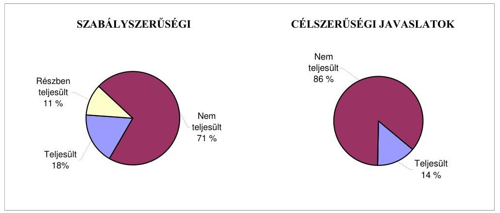
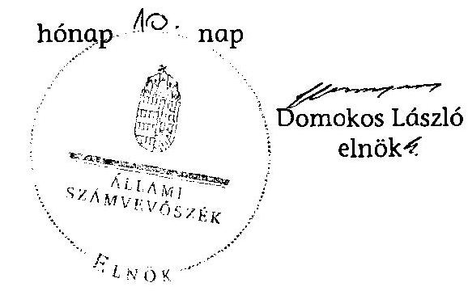

# JELENTÉS 

az önkormányzatok belső kontrollrendszerének kialakítása, valamint egyes kontrolltevékenységek és a belső ellenőrzés múködése ellenőrzéséről

---

# Állami Számvevőszék 

Iktatószám: V-0103-030/2013.
Témaszám: 1109
Vizsgálat-azonosító szám: V059134

## Az ellenőrzést felügyelte:

Dr. Benedek Mária
felügyeleti vezető
Az ellenőrzést vezette:
Bíró Zsolt
ellenőrzésvezető
A számvevőszéki jelentés összeállításában közremúködött:
Pappné dr. Szamosi Éva
számvevő tanácsos
Az ellenőrzést végezték:
Iszakné Dóczé Katalin Dr. Nagymányai Péter Szabó Tamás
számvevő tanácsos számvevő beosztás számvevő tanácsos

---

# TARTALOMJEGYZÉK 

BEVEZETÉS ..... 5
I. ÖSSZEGZŐ MEGÁLLAPÍTÁSOK, KÖVETKEZTETÉSEK, JAVASLATOK ..... 8
II. RÉSZLETES MEGÁLLAPÍTÁSOK ..... 18

1. Az önkormányzat belső kontrollrendszere kialakításának megfelelősége ..... 18
1.1. A kontrollkörnyezet kialakítása ..... 18
1.2. A kockázatkezelési rendszer kialakítása ..... 18
1.3. A kontrolltevékenységek kialakítása ..... 19
1.4. Az információs és kommunikációs rendszer kialakítása ..... 21
1.5. A monitoring rendszer kialakítása ..... 21
2. A pénzügyi folyamatokban kulcsszerepet betöltő belső kontrollok (szakmai teljesítésigazolás és utalvány ellenjegyzés) múködése ..... 22
3. A belső ellenőrzés szervezeti keretei és múködése ..... 25
4. Az ÁSZ 2007-2010. években végzett átfogó ellenőrzései során megfogalmazott javaslatok végrehajtására tett intézkedések ..... 28

## FÜGGELÉKEK

1. számú Értelmező szótár
2. számú A belső kontrollrendszer kialakítása, a pénzügyi folyamatokban kulcsszerepet betöltő szakmai teljesítésigazolás és utalvány ellenjegyzés kontrollok múködése, valamint a belső ellenőrzés múködése értékelésénél alkalmazott minősítési szempontok

---

.

---

# RÖVIDÍTÉSEK JEGYZÉKE 

## Törvények

ÁSZ tv.
Avtv.

Info tv.

Mötv.

Ötv.
régi Áht.
új Áht.

## Rendeletek

Ámr.
Ávr.

Ber.
Bkr.

## Szórövidítések

ÁSZ
Belső ellenőrzési kézikönyv

Belső Kontroll Kézikönyv
ellenőrzési nyomvonal

FEUVE
2011. évi LXVI. törvény az Állami Számvevőszékről
1992. évi LXIII. törvény a személyes adatok védelméről és a közérdekú adatok nyilvánosságáról (hatálytalan 2012. január 1-jétől)
2011. évi CXII. törvény az információs önrendelkezési jogról és az információszabadságról (hatályos 2012. január 1-jétől)
2011. évi CLXXXIX. törvény Magyarország helyi önkormányzatairól (hatályos 2012. január 1-jétől)
1990. évi LXV. törvény a helyi önkormányzatokról
1992. évi XXXVIII. törvény az államháztartásról (hatálytalan 2012. január 1-jétől)
2011. évi CXCV. törvény az államháztartásról (hatályos 2012. január 1-jétől)

292/2009. (XII. 19.) Korm. rendelet az államháztartás múködési rendjéről (hatálytalan 2012. január 1-jétől)
368/2011. (XII. 31.) Korm. rendelet az államháztartásról szóló törvény végrehajtásáról (hatályos 2012. január 1jétől)
193/2003. (XI. 26.) Korm. rendelet a költségvetési szervek belső ellenőrzéséről (hatálytalan 2012. január 1-jétől)
370/2011. (XII. 31.) Korm. rendelet a költségvetési szervek belső kontrollrendszeréről és belső ellenőrzéséről (hatályos 2012. január 1-jétől)

Állami Számvevőszék
Siklósi Többcélú Kistérségi Társulás Belső Ellenőrzési Kézikönyve - Villány Város Önkormányzata és költségvetési szervei részére (hatályos 2005. február 15-étől)
Az Ámr. 155. § (1) bekezdése, valamint az államháztartási belső kontroll standardokról szóló 1/2009. (IX. 11.) PM irányelv egységes értelmezése érdekében az államháztartásért felelős miniszter által 2010. évben kiadott Belső Kontroll Kézikönyv
Villány Város Polgármesteri Hivatala Szervezeti és Müködési Szabályzatának 3. számú melléklete (hatályos 2009. február 1-jétől)
folyamatba épített, előzetes, utólagos és vezetői ellenőrzés

---

gazdálkodási jogkörök szabályzata ${ }_{1}$

Villány Város Önkormányzata Polgármesteri Hivatalának Gazdálkodási szabályzata (hatályos 2011. január 1jétől)
gazdálkodási jogkörök
szabályzata ${ }_{2}$
Villány Város Önkormányzata Polgármesteri Hivatalának Gazdálkodási szabályzata (hatályos 2012. február 1jétől)
Hivatal
hivatali SZMSZ
Villányi Közös Önkormányzati Hivatal
Villány Város Önkormányzata Polgármesteri Hivatalának Szervezeti és Múködési Szabályzata (hatályos 2011. június 15 -étől)
jegyzö ${ }_{1} \quad$ Villány Város Önkormányzatának jegyzője 2000. január 1-jétől 2008. június 28 -áig
jegyzö ${ }_{2} \quad$ Villány Város Önkormányzatának jegyzője 2008. szeptember 15-étől
Képviselő-testület
kockázatkezelési szabályzat
polgármester
Polgármesteri Hivatal
Társulás
társulási megállapodás
ügyrend

Villány Város Önkormányzatának Képviselő-testülete
Villány Város Önkormányzata Polgármesteri Hivatalának Kockázatkezelési szabályzata (hatályos 2009. február 1-jétől)
Villány Város Önkormányzatának polgármestere
Villány Város Önkormányzatának Polgármesteri Hivatala
Siklósi Többcélú Kistérségi Társulás
Megállapodás a Siklósi Többcélú Kistérségi Társulás létrehozásáról (hatályos 2004. december 21-től)
Villány Város Önkormányzatának Polgármesteri Hivatala gazdasági szervezetének ügyrendje (hatályos 2010. január 1-jétől)

---

# JELENTÉS 

## az önkormányzatok belsó kontrollrendszerének kialakítása, valamint egyes kontrolltevékenységek és a belső ellenőrzés múködése ellenőrzéséről

## VILLÁNY

## BEVEZETÉS

A belső kontrollrendszer kialakítását, múködtetését és fejlesztését a régi Áht. és az új Áht. is előírja. Ennek megvalósításáért a költségvetési szerv vezetője felel. A belső kontrollrendszer azt a célt szolgálja, hogy a költségvetési szervek múködésük és gazdálkodásuk során a tevékenységeket szabályszerűen, gazdaságosan, hatékonyan, eredményesen hajtsák végre, teljesítsék elszámolási kötelezettségeiket és megvédjék az erőforrásokat a veszteségektől, a károktól és a nem rendeltetésszerű használattól. A belső kontrollrendszer magában foglalja mindazon szabályokat, eljárásokat, gyakorlati módszereket és szervezeti struktúrákat, kockázatkezelési technikákat, kontrolltevékenységeket, amelyek segítséget nyújtanak a szervezetnek céljai eléréséhez.

Az ÁSZ a 2011-2015. évekre szóló stratégiájában hangsúlyos szerepet szánt annak, hogy szilárd szakmai alapon álló, értékteremtő ellenőrzéseivel előmozdítsa a közpénzügyek átláthatóságát, rendezettségét. A számvevőszéki ellenőrzés nemzetközi alapelvei is rögzítik, hogy a megfelelő belső kontrollrendszer minimálisra csökkenti a hibák és szabálytalanságok kockázatát.

Az ellenőrzés célja annak értékelése volt, hogy az Önkormányzat a jogszabályi előírásoknak megfelelően alakította-e ki a belső kontrollrendszert; a gazdálkodás folyamatában kulcsszerepet betöltő szakmai teljesítésigazolás és az utalvány ellenjegyzés kontrolltevékenységeit megfelelően múködtette-e; biztosí-totta-e a belső ellenőrzés szabályos és eredményes múködését; intézkedett-e az ÁSZ által a 2007-2010. évek között végzett átfogó ellenőrzések javaslatainak végrehajtásáról.

Az ellenőrzés típusa: szabályszerűségi ellenőrzés
Az ellenőrzés jogszabályi alapja: az ÁSZ tv. 5. § (2) és (6) bekezdései
Az ellenőrzött szervezet: az Önkormányzat
Az ellenőrzött időszak: a belső kontrollrendszer kialakításának megfelelőségét a 2011. évre vonatkozóan értékeltük. A kontrolltevékenységek múködésének megfelelőségét a 2011. január 1-je és december 31-e, míg a belső ellenőrzés

---

múködésének szabályosságát és eredményességét a 2009. január 1-je és 2011. december 31-e közötti időszakot figyelembe véve értékeltük. A helyszíni ellenőrzés lezárásáig a helyi szabályozás változásait nyomon követtük.

Az ellenőrzés szakmai módszertana az ÁSZ hivatalos honlapján (www.asz.hu) közzétett szakmai szabályokon alapult, amely a Legfőbb Ellenőrző Intézmények Nemzetközi Szervezete (INTOSAI) által kiadott nemzetközi standardok (ISSAI) figyelembevételével készült.

A belső kontrollrendszer kialakításának ellenőrzése során értékeltük a kontrollkörnyezet, a kockázatkezelési rendszer, a kontrolltevékenységek, az információs és kommunikációs rendszer, valamint a monitoring rendszer szabályozottságának megfelelőségét.

Értékeltük a pénzügyi folyamatokban kulcsszerepet betöltő szakmai teljesítésigazolás és az utalvány ellenjegyzés kontrollok múködésének megfelelőségét az államháztartáson kívülre teljesített múködési és felhalmozási célú pénzeszközátadásoknál, az állományba nem tartozók megbízási díjainál, továbbá a külső szolgáltatók által végzett karbantartási, kisjavítási munkákkal kapcsolatos kifizetéseknél. Az egyszerú véletlen mintavétellel kiválasztott tételek ellenőrzését többlépcsős megfelelőségi tesztek útján addig végeztük, amíg elegendő és megfelelő bizonyítékot szereztünk a vizsgált folyamatok kulcskontrolljai múködésének megfelelő vagy nem megfelelő voltáról. Értékeltük az Önkormányzatnál a belső ellenőrzés múködésének szabályosságát és eredményességét. Az Önkormányzat gazdálkodási rendszerének vonatkozásában átfogó jellegú ÁSZ ellenőrzésre a 2007. évben került sor.

A fogalmak magyarázatát az 1. számú függelék, az ellenőrzés egyes területeinek értékelésénél alkalmazott egységes minősítési szempontokat a 2. számú függelék tartalmazza.

Az ellenőrzés lefolytatásához az Önkormányzat a munkalapok és a tanúsítvány elektronikus kitöltésével, valamint a megjelölt dokumentumok elektronikus megküldésével szolgáltatott adatokat. A munkalapokon szerepeltetett adatok, információk ellenőrzése és szükség szerinti javítása a helyszíni ellenőrzés keretében történt.

Az ÁSZ az ellenőrzés megállapításait az ellenőrzött időszakban hatályos, az intézkedést igénylő megállapításokra tett javaslatokat a jelenleg hatályos jogszabályok alapján fogalmazta meg.

Az Ász tv. 29. § (1) bekezdése szerint a jelentéstervezetet megküldtük a polgármester részére, aki az ÁSZ tv. 29. § (2) bekezdésében foglalt észrevételezési jogával élt, a tett észrevétel szakmai tartalmánál fogva a jelentéstervezet egyes megállapításait nem érintette.

Villány város állandó lakosainak száma 2011. január 1-jén 2547 fő volt. A 2010. évi önkormányzati választást követően az Önkormányzat hattagú Képvi-selő-testületének munkáját három állandó bizottság segítette. Az ellenőrzött időszakban az Önkormányzat nem rendelkezett többségi tulajdoni hányadú gazdasági társasággal, nem kötött vagyonkezelési szerződést, adósságrendezési eljárás nem indult ellene.

---

A polgármester az 1990. évi önkormányzati választások óta tölti be tisztségét. A jegyző ${ }_{2}$ 2008. szeptember 15-étől látja el feladatait. A Polgármesteri Hivatalban foglalkozatott köztisztviselők száma 2011. január 1-jén 20 fő volt.

Az Önkormányzat a 2011. évi elemi költségvetési beszámolója szerint 658462 ezer Ft költségvetési bevételt ért el, valamint 603674 ezer Ft költségvetési kiadást teljesített. A 2011. december 31-ei könyvviteli mérleg szerint 3075086 ezer Ft értékű eszközvagyonnal rendelkezett, 66825 ezer Ft hosszú lejáratú, 115958 ezer Ft rövid lejáratú kötelezettsége volt.
2013. január 1-jétől létrehozták Villány város, valamint Villánykövesd és Kisjakabfalva községek önkormányzatai részvételével a Villányi Közös Önkormányzati Hivatalt, Villány székhellyel igazgatási feladataik ellátására.

---

# I. ÖSSZEGZŐ MEGÁLLAPÍTÁSOK, KÖVETKEZTETÉSEK, JAVASLATOK 

A belső kontrollrendszeren belül 2011-ben a Polgármesteri Hivatalban a kontrollkörnyezet, a kockázatkezelési rendszer, a kontrolltevékenységek, az információs és kommunikációs rendszer, valamint a monitoring rendszer kialakítását külön-külön és összesítve is értékeltük. A belső kontrollrendszer kialakítása az összesített értékelés alapján nem felelt meg a jogszabályi előírásoknak. Az egyes területek kialakításának értékelését az alábbiakban részletezzük.

A kontrollkörnyezet kialakítása részben felelt meg a jogszabályi követelményeknek, mert a jegyző ${ }_{2}$ elkészítette a gazdálkodást érintő legfontosabb szabályzatokat, azonban a hivatali SZMSZ-ben nem rögzítette - az Ámr.-ben ${ }^{1}$ foglaltak ellenére - a szervezeti egységek feladatait és az irányító szerv által a Polgármesteri Hivatalhoz rendelt más költségvetési szervek felsorolását. A jegyző ${ }_{2}$ az ellenőrzési nyomvonalban az Ámr. rendelkezései ellenére nem azonosította be a Polgármesteri Hivatal tevékenységéhez kapcsolódó valamennyi múködési folyamatot, nem határozta meg a felelősségi és információs szinteket és kapcsolatokat, irányítási és ellenőrzési folyamatokat.

A kockázatkezelési rendszer kialakítása nem felelt meg a jogszabályi előírásoknak, mert a jegyző ${ }_{2}$ kockázatkezelési szabályzatot készített, azonban - a régi Áht. ${ }^{2}$ és az Ámr. előírása ellenére - kockázatelemzést nem végzett, nem mérte fel és nem állapította meg a Polgármesteri Hivatal tevékenységében, gazdálkodásában rejlő kockázatokat.

A kontrolltevékenységek kialakítása nem felelt meg a jogszabályi előírásoknak, mert a jegyző ${ }_{2}$ - a régi Áht. előírása és az előző ÁSZ ellenőrzés javaslata ellenére - nem határozta meg a pénzügyi döntések - köztük a költségvetési tervezés és a beszerzési folyamat - dokumentumainak elkészítésével kapcsolatos, folyamatba épített, előzetes, utólagos és vezetői ellenőrzés feladatait. Az Ámr.-ben előírtaktól eltérően szabályozta a Polgármesteri Hivatal nevében történő kötelezettségvállalást. Az Ámr. rendelkezése ellenére, a gazdálkodási jogkörök szabályzata ${ }_{1}$-ben foglalt - az előzetes írásbeli kötelezettségvállalást nem igénylő kifizetésekre vonatkozó - döntése ellenére ezen kifizetéseknél a szakmai teljesítésigazolás gyakorlásának dokumentációs részletszabályait nem határozta meg. Az Ámr.-ben foglaltakat nem tartotta be, mert az érvényesítésre írásban kijelölt személyek közül egy személy nem rendelkezett az előírt iskolai végzettséggel, szakmai képesítéssel. A jegyző ${ }_{2}$ - az Ámr.-ben előírtak és az előző ÁSZ ellenőrzés javaslata ellenére - írásban nem jelölte ki a szakmai teljesítésigazolásra jogosultat. Az Ámr. rendelkezései ellenére a gazdasági szervezet ügyrendjében is - a gazdálkodási jogkörök szabályzata ${ }_{1}$-ben a szakmai teljesítésigazolásra és érvényesítésre jogosultak meghatározásától eltérően - szabályoz-

[^0]
[^0]:    ${ }^{1}$ 2012. január 1-jétől Ávr.
    ${ }^{2}$ 2012. január 1-jétől új Áht.

---

ta az Ámr.-ben előírt, a gazdálkodással összefüggő, jogszabályban nem szabályozott belső előírásokat, feltételeket. A 2012. január 1-jétől hatályos gazdálkodási jogkörök szabályzata ${ }_{2}$-ben a Polgármesteri Hivatal előirányzatai terhére vállalt kötelezettségvállalás szabályozása az Ávr.-ben foglaltaknak megfelelően megtörtént.

Az információs és kommunikációs rendszer kialakítása nem felelt meg a jogszabályi előírásoknak, mert a jegyző ${ }_{2}$ - az Avtv. ${ }^{3}$ és az Ámr. rendelkezése ellenére - nem szabályozta a közérdekú adatok megismerésére irányuló igények teljesítésének rendjét, valamint - az Avtv. és az előző ÁSZ ellenőrzés javaslatai ellenére - elmulasztotta az adatbiztonság érvényre juttatásához szükséges intézkedések megtételét.

A monitoring rendszer kialakítása a jogszabályi követelményeknek nem felelt meg, mert a jegyző ${ }_{2}$ - a régi Áht. és az Ámr. előírásai ellenére - az operatív tevékenységek keretében megvalósuló, folyamatos és eseti nyomon követésből álló, a Polgármesteri Hivatal tevékenységének, a célok megvalósításának nyomon követését biztosító rendszer szabályait nem határozta meg.

A belső kontrollrendszer nem megfelelő kialakítása kockázatot jelent az Önkormányzat tevékenységeinek szabályszerű, gazdaságos, hatékony és eredményes végrehajtása során.

A Polgármesteri Hivatalban a 2011. évben az államháztartáson kívülre történő múködési és felhalmozási célú pénzeszközátadásokkal, az állományba nem tartozók megbízási díjaival, valamint a külső szolgáltatók által végzett karbantartással, kisjavítással kapcsolatos kifizetések során, összefoglalóan értékelve, a kulcskontrollok múködésének megfelelősége gyenge volt. A szakmai teljesítésigazolást - az államháztartáson kívülre történő működési és felhalmozási célú pénzeszközátadásokkal, az állományba nem tartozók megbízási díjaival és a külső szolgáltatók által végzett karbantartással, kisjavítással kapcsolatos kifizetések esetében - a régi Áht.-ban és az Ámr.-ben előírtak ellenére nem, vagy nem az arra jogosult személyek végezték el.

Az utalványok ellenjegyzője az államháztartáson kívülre történő működési és felhalmozási célú pénzeszközátadásokkal, az állományba nem tartozók megbízási díjaival és a külső szolgáltatók által végzett karbantartással, kisjavítással kapcsolatos kifizetéseket megelőzően az Ámr.-ben foglalt ellenőrzési feladatait - a szakmai teljesítésigazolás, illetve a szabályszerűen végzett szakmai teljesítésigazolás hiányában, az ellenjegyzés dátumának vagy az érvényesítés dátumának hiánya miatt - nem a jogszabályi előírásoknak megfelelően végezte. A régi Áht. és az Ámr. gazdálkodásra - közöttük a kötelezettségvállalások nyilvántartásba vételére, az utalványon a kötelezettségvállalás nyilvántartási számának feltüntetésére, az előzetes írásbeli kötelezettségvállalásra, a jogosult általi ellenjegyzést követő kötelezettségvállalásra - vonatkozó szabályai betartásának hiánya ellenére az utalványok ellenjegyzője az utalványokat aláírásával ellenjegyezte. A nyomtató-másológépek karbantartásával kapcsolatos kiadások esetében az Ámr.-ben meghatározott összeférhetetlenségi szabályt nem

[^0]
[^0]:    ${ }^{3}$ 2012. január 1-jétől Info tv.

---

tartották be, mert az érvényesítő személy azonos volt a szakmai teljesítést igazoló személlyel.

Az ellenőrzött kifizetésekkel összefüggésben a rendelkezésre bocsátott dokumentumok alapján jogosulatlan kifizetést nem tárt fel az ellenőrzés, azonban a gazdálkodásban kulcsszerepet betöltő kontrollok jogszabályi előírásoknak nem megfelelő, gyenge működése, valamint az előző ÁSZ ellenőrzés javaslatai hasznosításának elmaradása miatt továbbra is fennálló hiányosságok miatt magas a hibák bekövetkezésének lehetősége. A korábbi ÁSZ ellenőrzés során a szakmai teljesítésigazolás és az utalvány ellenjegyzés kulcskontrollok múködtetésére, a szakmai teljesítésigazolók kijelölésére, a kötelezettségvállalások nyilvántartására és a céljelleggel nyújtott támogatások írásbeli kötelezettségvállalására - tett javaslatokat csak részben hasznosították, ami a hibák ismétlődéséhez vezetett. A kiválasztott kulcskontrollok az integritás szempontjából lényeges csalás és korrupciós kockázatok megelőzésében, illetve feltárásában is hangsúlyos szerepet játszanak, így hatékonyabbá és eredményesebbé válhat a korrupció elleni fellépés. A nem megfelelően szabályozott és múködtetett belső kontrollok korrupciós kockázatot is hordoznak.

Az Önkormányzat a belső ellenőrzési feladatokat a Társulás útján látta el. A belső ellenőrzés szabályozása és múködése a jogszabályi előírásoknak nem felelt meg. A Ber.-ben ${ }^{4}$ foglaltak és az előző ÁSZ ellenőrzés javaslata ellenére nem rendelkeztek stratégiai ellenőrzési tervvel. A polgármester a jegyző ${ }_{2}$ által előkészített, a 2011. évi éves ellenőrzési jelentésről szóló előterjesztést - az Ötv.ben ${ }^{5}$ és a Ber.-ben előírtak ellenére - a zárszámadási rendelettervezettel egyidejűleg nem terjesztette a Képviselő-testület elé. A Ber. rendelkezései és az előző ÁSZ ellenőrzés javaslata ellenére az éves ellenőrzési terveket előzetesen elvégzett kockázatelemzéssel nem alapozták meg, az ellenőrzési tervek a jegyző írásos véleményének figyelembevétele nélkül készültek. Az Ötv.-ben előírtakat figyelmen kívül hagyva a Képviselő-testület az éves belső ellenőrzési terveket határidőn túl hagyta jóvá, mert a jegyző ${ }_{2}$ a törvényi határidőn túl kezdeményezte a polgármesternél annak Képviselő-testület elé terjesztését. Az éves ellenőrzési tervek nem tartalmazták a Ber.-ben előírtak ellenére a szükséges ellenőrzési kapacitás meghatározását. A Ber. rendelkezései és az előző ÁSZ ellenőrzés javaslata ellenére az ellenőrzési programok nem tartalmazták az ellenőrzés módszerét. A belső ellenőrzési vezető a Ber.-ben előírtak ellenére az elvégzett ellenőrzésekről, illetve a belső ellenőrzési jelentés javaslatai alapján megtett intézkedésekről nyilvántartást nem vezetett.

Az Önkormányzatnál a 2009-2011. években a belső ellenőrzés múködése a 2. számú függelékben részletezett kritériumrendszer alapján végzett értékelés szerint - nem volt eredményes, mert a belső ellenőrzés szabályozása és működése az összegző értékelés alapján az ellenőrzött időszak egészét tekintve a jogszabályi előírásoknak nem felelt meg. A belső ellenőrzés múködése azért sem volt eredményes, mert az elvégzett belső ellenőrzések során - a belső kontrollrendszer kialakítása szabályozottságának, a gazdálkodási jogkörök gyakorlásával, a készpénzzel kapcsolatos belső kontrollok múködésének, az önkor-

[^0]
[^0]:    ${ }^{4}$ 2012. január 1-jétől Bkr.
    ${ }^{5}$ 2012. január 1-jétől Mötv.

---

mányzati vagyon hasznosítása területén a vagyongazdálkodási szabályok betartásának és a vagyonvédelem területén a leltárkészítési és leltározási szabályzatban foglaltak betartásának ellenőrzésénél - nem tárták fel teljes körűen a belső kontrollok kialakításának és múködésének hiányosságait, továbbá mert a belső ellenőrzés által tett javaslatokat a jegyző ${ }_{2}$ részben hasznosította. Mindezek hozzájárultak a számvevőszéki ellenőrzés során is feltárt szabályozási hiányosságok, hibák ismétlődéséhez.

Az ÁSZ tv. 33. § (1) bekezdésében foglaltak értelmében az ellenőrzött szervezet vezetője köteles a jelentésben foglalt megállapításokhoz kapcsolódó intézkedési tervet összeállítani, és azt a jelentés kézhezvételétől számított 30 napon belül az ÁSZ részére megküldeni. Amennyiben az intézkedési tervet határidőre nem küldi meg a szervezet, vagy az - az ÁSZ tv. 33. § (2) bekezdésében foglalt póthatáridő eltelte ellenére - továbbra sem elfogadható, az ÁSZ elnöke a hivatkozott törvény 33. § (3) bekezdés a)-b) pontjaiban foglaltakat érvényesítheti.

Az ellenőrzés intézkedést igénylő megállapításai és javaslatai:

# a polgármesternek 

1. Az államháztartáson kívülre teljesített működési és felhalmozási célú pénzeszközátadásoknál - a régi Áht. 100/C. § (3) és az Ámr. 74. § (1) bekezdésében előírtak ellenére - nem történt írásbeli kötelezettségvállalás, továbbá a külső szolgáltatók által végzett karbantartással, kisjavítással kapcsolatos munkáknál - az Ámr. 72. § (3) bekezdés c) pontjában és a (8) bekezdésében előírtak ellenére - nem a polgármester által írásban felhatalmazott személy vállalt kötelezettséget. Az állományba nem tartozók megbízási díjaival és a külső szolgáltatók által végzett karbantartással, kisjavítással kapcsolatos kötelezettségvállalásokat - a régi Áht. 100/C. § (3) bekezdésében és az Ámr. 74. § (1) bekezdésében foglaltak ellenére - nem ellenjegyezték.

Javaslat:
Intézkedjen arról, hogy az Önkormányzat nevében történő kötelezettségvállalásra az új Áht. 37. § (1) bekezdésében, az Ávr. 52. § (1) bekezdés c) pontjában és a (6) bekezdésében foglaltaknak megfelelően - az Ávr. 53. §-ában meghatározott kivételeket figyelembe véve - kizárólag a pénzügyi ellenjegyzés után, a pénzügyi teljesítés esedékességét megelőzően, írásban kerüljön sor.
2. A polgármester - az Ötv. 92. § (10) bekezdésében előírtak ellenére - a 2011. évi belső ellenőrzési jelentést a zárszámadási rendelettervezettel egyidejűleg nem terjesztette a Képviselő-testület elé.

Javaslat:
A Bkr. 56. § (8) bekezdésében foglaltak szerint az éves ellenőrzési jelentést a zárszámadási rendelettervezettel egyidejűleg terjessze a Képviselő-testület elé.
3. A jegyző ${ }_{2}$ - az Ámr. 155. § (4) bekezdését figyelmen kívül hagyva - nem hasznosította az előző ÁSZ ellenőrzésnek a szabályozásbeli hiányosságok megszüntetésére, az Önkormányzat szabályszerű gazdálkodására és a belső ellenőrzés szabályszerű működésére vonatkozó javaslatait. Az államháztartáson kívülre történő működési és

---

felhalmozási célú pénzeszközátadások kifizetéseit megelőzően - a régi Áht. 100/C. § (6) bekezdésében és az Ámr. 76. § (1) bekezdésében foglaltak ellenére nem végezték el a szakmai teljesítésigazolást. Az állományba nem tartozók megbízási díjai kifizetése és a külső szolgáltatók által végzett karbantartással, kisjavítással kapcsolatos kifizetések esetében a szakmai teljesítés igazolását az Ámr. 76. § (3) bekezdésében foglaltak ellenére nem a jegyző ${ }_{2}$ által kijelölt személy végezte, illetve a jegy$z o ̋_{2}$ a népszámlálással összefüggő megbízási díj és a kisjavítási munkára történő kifizetés előtt a kiadás teljesítésének jogosságát, összegszerűségét, a szerződésben foglalt feladatok teljesítését - aláírása és az Ámr. 76. § (1) bekezdésében foglaltak ellenére - ellenőrizhető okmányok hiányában nem ellenőrizte.

Az utalványok ellenjegyzője a kifizetések teljesítését megelőzően az Ámr. 79. § (2) bekezdésében foglalt ellenőrzési feladatait - szakmai teljesítésigazolás, illetve szabályszerű szakmai teljesítésigazolás hiányában - nem a jogszabályi előírásoknak megfelelően végezte. Az utalványok ellenjegyzője - az Ámr. 79. § (2) bekezdésében előírtak ellenére - az állományba nem tartozók megbízási díjai és a külső szolgáltatók által végzett karbantartással, kisjavítással kapcsolatos kiadások teljesítését megelőzően az utalványokon az ellenjegyzés dátumát nem tüntette fel. Annak ellenére aláírásával ellenjegyezte az utalványokat, hogy az érvényesítés nem felelt meg az Ámr. 77. § (3) bekezdésében foglalt előírásoknak, valamint az államháztartáson kívülre történő működési és felhalmozási célú pénzeszközátadások során a kötelezettségvállalás és annak ellenjegyzése - a régi Áht. 100/C. § (3) bekezdésében és az Ámr. 74. § (1) bekezdésében foglaltak ellenére - nem történt meg. Az utalványok ellenjegyzője annak ellenére ellenjegyezte az utalványokat, hogy azokon az Ámr. 78. § (2) bekezdés g) pontjában előírt kötelezettségvállalási nyilvántartási számot nem tüntették fel, mert a kötelezettségvállalást - az Ámr. 75. § (1) bekezdésében előírtak ellenére nem vették nyilvántartásba, továbbá az állományba nem tartozók megbízási díjaival és a külső szolgáltatók által végzett karbantartással, kisjavítással kapcsolatos kötelezettségvállalásokat megelőzően - a régi Áht. 100/C. § (3) bekezdésében és az Ámr. 74. § (1) bekezdésében foglaltak ellenére - nem ellenjegyezték. A külső szolgáltatók által végzett karbantartással, kisjavítással kapcsolatos kiadások során az Ámr. 80. § (1) bekezdésében foglalt összeférhetetlenségi szabályt nem tartották be.

Javaslat:
A Mötv. 115. § (1) bekezdésében foglaltak alapján kísérje figyelemmel az Önkormányzat gazdálkodásának szabályszerűségét. A Mötv. 67. § f) pontja alapján gondoskodjon a belső kontrollrendszerre és a belső ellenőrzés működésére vonatkozó jogszabályi rendelkezések be nem tartása, valamint a szakmai teljesítésigazolás, illetve az utalvány ellenjegyzés kontrollokkal összefüggésben feltárt hiányosságok, szabálytalanságok tekintetében az esetleges munkajogi felelősséggel kapcsolatos körülmények kivizsgálásáról, majd a vizsgálat eredményének függvényében tegye meg a szükséges munkajogi intézkedéseket.

---

# a jegyzö ${ }_{2}$-nek (Villány Város Önkormányzata vonatkozásában) 

1. a kontrollkörnyezettel kapcsolatban:

A jegyzőz a hivatali SZMSZ-ben nem rögzítette - az Ámr 20. § (2) bekezdés e) és k) pontjaiban foglaltak ellenére - a szervezeti egységek feladatait és az irányító szerv által a Polgármesteri Hivatalhoz rendelt más költségvetési szervek felsorolását.

A jegyzőz az ellenőrzési nyomvonalat - az Ámr. 156. § (2) bekezdésében előírtak ellenére - nem terjesztette ki a Polgármesteri Hivatal valamennyi múködési folyamatára, valamint az nem tartalmazta a felelősségi és információs szinteket és kapcsolatokat, irányítási és ellenőrzési folyamatokat.

Javaslat:
a) Készítse el a Hivatal szervezeti és múködési szabályzatának módosítását, és kezdeményezze a polgármesternél a módosítás Képviselő-testület elé terjesztését annak érdekében, hogy az tartalmazza az Ávr. 13. § (1) bekezdésének e) és i) pontjában foglaltaknak megfelelően a szervezeti egységek feladatait és az irányító szerv által a Hivatalhoz rendelt más költségvetési szervek felsorolását.
b) Intézkedjen arról, hogy az ellenőrzési nyomvonal a Bkr. 6. § (3) bekezdésében foglaltaknak megfelelően készüljön el.
2. a kockázatkezelési rendszerrel kapcsolatban:

A jegyző a kockázatkezelési rendszer kialakítása és múködtetése során - a régi Áht. 121. § (2) bekezdése b) pontjában és az Ámr. 157. § (1)-(2) bekezdéseiben foglaltak ellenére - nem mérte fel és nem állapította meg a Polgármesteri Hivatal tevékenységében, gazdálkodásában rejlő kockázatokat.

Javaslat:
Mérje fel és állapítsa meg - a Bkr. 7. §-ában foglaltak alapján - a Hivatal tevékenységében, gazdálkodásában rejlő kockázatokat.
3. a kontrolltevékenységekkel kapcsolatban:

A jegyzőz - a régi Áht. 121/A. § (4) bekezdés a) pontjában foglaltak ellenére nem határozta meg a pénzügyi döntések - köztük a költségvetési tervezés és a beszerzési folyamat - dokumentumainak elkészítésével kapcsolatos, folyamatba épített, előzetes, utólagos és vezetői ellenőrzés feladatait.

A jegyzőz az Ámr. 20. § (3) bekezdés a) pontjában, a 72. § (14) bekezdésében előírtakat figyelmen kívül hagyva a gazdálkodási jogkörök szabályzata ${ }_{1}$-ben foglalt - az előzetes írásbeli kötelezettségvállalást nem igénylő kifizetésekre vonatkozó - döntése ellenére ezen kifizetéseknél a szakmai teljesítésigazolás gyakorlásának dokumentációs részletszabályait nem határozta meg.

---

A jegyző ${ }_{2}$ az Ámr. 19. § (1) bekezdésében foglaltak ellenére érvényesítésre írásban olyan személyt is kijelölt, aki nem rendelkezett az előírt iskolai végzettséggel, szakmai képesítéssel.

A jegyző ${ }_{2}$ - az Ámr. 76. § (5) bekezdésében és a gazdálkodási jogkörök szabályzata ${ }_{1}$ ben előírtak ellenére - írásban nem jelölte ki a szakmai teljesítésigazolásra jogosultakat.

A jegyző ${ }_{2}$ az Ámr. 15. § (6) bekezdésében foglaltak ellenére a gazdasági szervezet ügyrendjében is szabályozta az Ámr. 20. § (3) bekezdés a) pontjában előírt, a gazdálkodással összefüggő, jogszabályban nem szabályozott belső előírásokat, feltételeket, azonban a szakmai teljesítésigazolásra és érvényesítésre jogosultak meghatározása eltért a gazdálkodási jogkörök szabályzata ${ }_{1}$-ben foglalt rendelkezésektől.

Javaslat:
a) Biztosítsa minden tevékenységre vonatkozóan a folyamatba épített, előzetes, utólagos és vezetői ellenőrzést a Bkr. 8. § (2) bekezdése alapján.
b) Rendezze belső szabályzatban az Ávr. 13. § (2) bekezdés a) pontjának és az 53. § (2) bekezdésének megfelelően az előzetes írásbeli kötelezettségvállalást nem igénylő kifizetésekre vonatkozó teljesítésigazolás gyakorlásának dokumentációs részletszabályaival kapcsolatos belső előírásokat, feltételeket.
c) Biztosítsa, hogy az érvényesítésre írásban kijelölt személy az Ávr. 55. § (3) és 58. § (4) bekezdéseinek megfelelően rendelkezzen az előírt iskolai végzettséggel, képesítéssel.
d) Jelölje ki az Ávr. 57. § (4) bekezdéseknek megfelelően a teljesítésigazolásra jogosult személyeket.
e) Az Ávr. 9. § (5) bekezdésében foglaltak alapján módosítsa a gazdasági szervezet ügyrendjét.
4. az információs és kommunikációs rendszerrel kapcsolatban:

A jegyző ${ }_{2}$ - az Avtv. 20. § (8) bekezdésében és az Ámr. 20. § (3) bekezdés i) pontjában foglalt előírás ellenére - nem határozta meg a közérdekú adatok megismerésére irányuló igények teljesítésének rendjét.

A jegyző ${ }_{2}$ az informatikai rendszer környezetének szabályozása során - az Avtv. 10. §-ában foglalt előírások ellenére - elmulasztotta az adatbiztonság érvényre juttatásához szükséges intézkedések megtételét, mert nem határozta meg a hozzáférési jogosultságok megállapítására, módosítására és azok betartásának ellenőrzésére vonatkozó belső eljárásrendet, nem alakította ki a hozzáférési jogosultságok nyilvántartását, továbbá nem készítette el az informatikai katasztrófa elhárítási tervet.

Javaslat:
a) Rendezze belső szabályzatban az Info tv. 30. § (6) bekezdésében és az Ávr. 13. § (2) bekezdés h) pontjában foglaltaknak megfelelően a közérdekú adatok megismerésére irányuló igények teljesítésének rendjét.

---

b) Az Info tv. 7. § (2)-(3) bekezdéseinek megfelelően gondoskodjon az adatok biztonságáról, tegye meg azokat az intézkedéseket, alakítsa ki azokat az eljárási szabályokat, amelyek az Info tv., valamint az egyéb adat- és titokvédelmi szabályok érvényre juttatásához szükségesek; továbbá megfelelő intézkedésekkel biztosítsa az adatok védelmét.
5. a monitoring rendszerrel kapcsolatban:

A jegyző - a régi Áht. 121. § (2) bekezdése e) pontjában és az Ámr. 160. §-ában foglaltak ellenére - nem alakított ki és nem müködtetett olyan monitoring rendszert, amely lehetővé teszi a Polgármesteri Hivatal tevékenységének, a célok megvalósításának nyomon követését, és amelynek része az operatív tevékenységek keretében megvalósuló folyamatos és eseti nyomon követés is.

Javaslat:
Alakítsa ki és múködtesse a Bkr. 3. § e) pontjában és a 10. §-ában előírtak alapján a Hivatal tevékenységének, a célok megvalósításának nyomon követését biztosító rendszert, amelynek része az operatív tevékenységek keretében megvalósuló folyamatos és eseti nyomon követés is.
6. a pénzügyi folyamatokban kulcsszerepet betöltő kontrollokkal kapcsolatban:

Az államháztartáson kívülre történő működési és felhalmozási célú pénzeszközátadások kifizetéseit megelőzően - a régi Áht. 100/C. § (6) bekezdésében és az Ámr. 76. § (1) bekezdésében foglaltak ellenére - nem végezték el a szakmai teljesítésigazolást. Az állományba nem tartozók megbízási díjai kifizetése és a külső szolgáltatók által végzett karbantartással, kisjavítással kapcsolatos kifizetések esetében a szakmai teljesítés igazolását az Ámr. 76. § (3) bekezdésében foglaltak ellenére nem a jegyző által kijelölt személy végezte, illetve a jegyző a népszámlálással összefüggő megbízási díj és a kisjavítási munkára történő kifizetés előtt a kiadás teljesítésének jogosságát, öszszegszerűségét, a szerződésben foglalt feladatok teljesítését - aláírása és az Ámr. 76. § (1) bekezdésében foglaltak ellenére - ellenőrizhető okmányok hiányában nem ellenőrizte.

Az utalványok ellenjegyzője a kifizetések teljesítését megelőzően az ellenőrzési feladatait - szakmai teljesítésigazolás és szabályszerű szakmai teljesítésigazolás hiányában - nem az Ámr. 79. § (2) bekezdésében foglaltaknak megfelelően végezte. Az utalványok ellenjegyzője az állományba nem tartozók megbízási díjai és a külső szolgáltatók által végzett karbantartással, kisjavítással kapcsolatos kiadások teljesítését megelőzően - az Ámr. 79. § (2) bekezdésében előírtak ellenére - az utalványokon az ellenjegyzése dátumát nem tüntette fel, továbbá annak ellenére aláírásával ellenjegyezte az utalványokat, hogy az érvényesítés nem felelt meg az Ámr. 77. § (3) bekezdésében foglalt előírásoknak, valamint az államháztartáson kívülre történő múködési és felhalmozási célú pénzeszközátadások során a kötelezettségvállalás és ellenjegyzése - a régi Áht. 100/C. § (3) bekezdésében és az Ámr. 74. § (1) bekezdésében foglaltak ellenére - nem történt meg. Az utalványok ellenjegyzője a külső szolgáltatók által végzett karbantartással, kisjavítással kapcsolatos kiadások teljesítését megelőzően az Ámr. 79. § (2) bekezdésében foglaltakat figyelmen kívül hagyva annak ellenére ellenjegyezte az utalványokat, hogy - az Ámr. 72. § (3) bekezdésének c) pontjában és a 72. § (8) bekezdésében előírtak ellenére - nem a polgármester által

---

írásban felhatalmazott személy vállalt kötelezettséget, valamint az állományba nem tartozók megbízási díjaival és a külső szolgáltatók által végzett karbantartással, kisjavítással kapcsolatos kötelezettségvállalásokat - a régi Áht. 100/C. § (3) bekezdésében és az Ámr. 74. § (1) bekezdésében foglaltak ellenére - nem ellenjegyezték.

Az utalvány ellenjegyzője az államháztartáson kívülre történő működési és felhalmozási célú pénzeszközátadások, az állományba nem tartozók megbízási díjai és a külső szolgáltatók által végzett karbantartással, kisjavítással kapcsolatos kiadások teljesítését megelőzően az utalványokat annak ellenére ellenjegyezte, hogy elmaradt az Ámr. 78. § (2) bekezdés g) pontjában előírt kötelezettségvállalási nyilvántartási szám feltüntetése, mert a kötelezettségvállalást - az Ámr. 75. § (1) bekezdésében előírtak ellenére - nem vették nyilvántartásba.

A külső szolgáltatók által végzett karbantartással, kisjavítással kapcsolatos kiadások során az Ámr. 80. § (1) bekezdésében foglalt összeférhetetlenségi szabályt nem tartották be.

Javaslat:
Intézkedjen - a szakmai teljesítés igazolása és az utalvány ellenjegyzése vonatkozásában feltárt hiányosságok megszüntetése, illetve az operatív gazdálkodás során a működésbeli hibák megelőzése, feltárása és kijavítása érdekében - arról, hogy:
a) a teljesítésigazolás során az Ávr. 57. § (1) bekezdésében előírtaknak megfelelően, ellenőrizhető okmányok alapján ellenőrizzék és igazolják a kiadások teljesítésének jogosságát, összegszerűségét, az ellenszolgáltatást is magában foglaló kötelezettségvállalás esetén a szerződés, megrendelés teljesítését, valamint az Ávr. 57. § (3) bekezdése szerint a teljesítést az igazolás dátumának és a teljesítés tényére történő utalásnak a megjelölésével az arra jogosult személy aláírásával igazolja;
b) a kifizetéseket megelőzően a teljesítésigazolás alapján - az Ávr. 57. § (3) bekezdése szerinti esetben annak hiányában is - az összegszerűségnek, a fedezet meglétének és a megelőző ügymenetben az új Áht., az Áhsz., az Ávr. előírásai és a belső szabályzatokban foglaltak betartásának az ellenőrzése - az Ávr. 58. § (1) és (3) bekezdése szerint - történjen meg;
c) a kötelezettségvállalások nyilvántartását az Ávr 56. § (1) bekezdésében foglalt előírásnak megfelelően naprakészen vezessék, és az utalványon a kötelezettségvállalás nyilvántartási számát az Ávr. 59. § (3) bekezdés f) pontjában foglaltaknak megfelelően tüntessék fel;
d) az összeférhetetlenségi szabályok az Ávr. 60. § (1)-(2) bekezdésében foglaltaknak megfelelően érvényesüljenek.
7. a belső ellenőrzés működésével kapcsolatban:

A Ber. 12. § b) pontjában és a 18-19. §-aiban foglaltak ellenére nem készült stratégiai ellenőrzési terv.

A Ber. 12. § b) pontjában, a 18. §-ában és a 21. § (2) bekezdésében előírtak ellenére az éves ellenőrzési terveket előzetesen elvégzett kockázatelemzéssel nem alapozták

---

meg. Az ellenőrzési tervek - a Ber. 32/B. § (2) bekezdésében foglaltak ellenére - a jegyző ${ }_{2}$ írásos véleményének figyelembevétele nélkül készültek.

Az Ötv. 92. § (6) bekezdésében előírtakat figyelmen kívül hagyva a Képviselőtestület az éves belső ellenőrzési terveket határidőn túl hagyta jóvá, mert a jegyző ${ }_{2}$ a törvényi határidőn túl kezdeményezte a polgármesternél annak Képviselő-testület elé terjesztését.

Az éves ellenőrzési tervek - a Ber. 21. § (3) bekezdés e) pontjában előírtak ellenére nem tartalmazták a szükséges ellenőrzési kapacitás meghatározását. A Ber. 23. § (4) bekezdés h) pontjában előírtak ellenére az ellenőrzési programok nem tartalmazták az ellenőrzés módszerét.

A belső ellenőrzési vezető - a Ber. 12. § j) pontjában foglaltak ellenére - a Ber. 32. §ában előírt nyilvántartást nem vezette.

Javaslat:
a) Kezdeményezze, hogy a belső ellenőrzési vezető a Bkr. 22. § (1) bekezdés b) pontjában, a 29. § (1) bekezdésében és a 30. § (1) bekezdésében foglaltaknak megfelelően állítsa össze a stratégiai ellenőrzési tervet.
b) Kezdeményezze, hogy az éves ellenőrzési terv a Bkr. 22. § b) pontja, a 29. § (1) és a 31. § (2) bekezdése alapján kockázatelemzésen alapuljon, és azt a belső ellenőrzési vezető a Bkr. 56. § (2) bekezdés előírásainak megfelelően a jegyző írásos véleményének figyelembevételével a Bkr. 29. § (1) bekezdésében foglaltak szerint készítse el.
c) Intézkedjen az éves ellenőrzési terv Képviselő-testület elé terjesztéséről annak érdekében, hogy azt a Képviselő-testület a Mötv. 119. § (5) és a Bkr. 32. § (4) bekezdésében előírt határidőn belül hagyja jóvá.
d) Kezdeményezze, hogy az éves ellenőrzési terv tartalmazza a Bkr. 31. § (4) bekezdésében felsorolt, az ellenőrzési program pedig a Bkr. 33. § (2) bekezdésében felsorolt tartalmi elemeket.
e) Kezdeményezze, hogy a Bkr. 22. § (2) bekezdés b) és e) pontja, valamint az 50. § alapján vezessenek nyilvántartást az elvégzett belső ellenőrzésekről.

---

# II. RÉSZLETES MEGÁLLAPÍTÁSOK 

## 1. AZ ÖNKORMÁNYZAT BELSŐ KONTROLLRENDSZERE KIALAKÍTÁSÁNAK MEGFELELŐSÉGE

### 1.1. A kontrollkörnyezet kialakítása

A kontrollkörnyezet kialakítása a 2. számú függelékben részletezett kritériumrendszer alapján végzett értékelés szerint a Polgármesteri Hivatalban részben volt megfelelő, mert a jegyző ${ }_{2}$ a jogszabályi előírásokat nem érvényesítette teljes körűen. A Képviselő-testület elfogadta az Önkormányzat 20102014. évre szóló gazdasági programját és a Polgármesteri Hivatal - jogszabályi előírásoknak megfelelő tartalmú - alapító okiratát. A jegyző ${ }_{2}$ kialakította a gazdálkodást érintő legfontosabb szabályzatokat, azonban a hivatali SZMSZben nem rögzítette - az Ámr 20. § (2) bekezdés e), k) ${ }^{6}$ pontjaiban foglaltak ellenére - a szervezeti egységek feladatait és az irányító szerv által a Polgármesteri Hivatalhoz rendelt más költségvetési szervek felsorolását. A folyamatok meghatározása és dokumentálása körében, az ellenőrzési nyomvonalban - az Ámr. 156. § (2) bekezdésében ${ }^{7}$ előírtak ellenére - nem azonosította be a Polgármesteri Hivatal tevékenységéhez kapcsolódó valamennyi múködési folyamatot, nem határozta meg a felelősségi és információs szinteket és kapcsolatokat, irányítási és ellenőrzési folyamatokat, gátolva ezzel a folyamatok nyomon követését és utólagos ellenőrzését.

A kontrollkörnyezet kialakítása keretében a jegyző ${ }_{2}$ az Ámr. 155. § (3) bekezdésének előírását ${ }^{8}$ figyelmen kívül hagyva az államháztartásért felelős miniszter által kiadott Belső Kontroll Kézikönyv ajánlásait nem hasznosította teljes körűen.

A kontrolltevékenységek kialakítása keretében a jegyző ${ }_{2}$ :

- a Belső Kontroll Kézikönyv 1.2.7. pontjában foglalt ajánlást nem érvényesítette, mert nem írta elő a hivatali SZMSZ munkatársak általi megismerésének kötelezettségét, és annak megismerését nem dokumentálták;
- a Belső Kontroll Kézikönyv 1.5.2. pontjában foglalt ajánlást nem hasznosította, mert nem dolgozta ki a Polgármesteri Hivatalban ellátott köztisztviselői munkakörök betöltésére vonatkozó elvárt tudást és képességeket.

### 1.2. A kockázatkezelési rendszer kialakítása

A kockázatkezelési rendszer kialakítása a 2. számú függelékben részletezett kritériumrendszer alapján végzett értékelés szerint a Polgármesteri Hivatal-

[^0]
[^0]:    ${ }^{6}$ 2012. január 1-jétől az Ávr. 13. § (1) bekezdés e) és i) pontjai
    ${ }^{7}$ 2012. január 1-jétől a Bkr. 6. § (3) bekezdése
    ${ }^{8}$ 2013. január 1-jétől a Bkr. 5. § (1) bekezdése

---

ban nem volt megfelelő, mert a jegyző ${ }_{2}$ kockázatkezelési szabályzatot készített, azonban - a régi Áht. 121. § (2) bekezdés b) pontjában ${ }^{9}$ és az Ámr. 157. § (1)-(2) bekezdésében ${ }^{10}$ foglaltak ellenére - kockázatelemzést nem végzett, nem mérte fel és nem állapította meg a Polgármesteri Hivatal tevékenységében, gazdálkodásában rejlő kockázatokat.

A kockázatkezelési rendszer kialakítása keretében a jegyző ${ }_{2}$ az Ámr. 155. § (3) bekezdésének előírását figyelmen kívül hagyva az államháztartásért felelős miniszter által kiadott Belső Kontroll Kézikönyv ajánlásait nem hasznosította teljes körúen.

A kockázatkezelési rendszer kialakítása keretében a jegyző ${ }_{2}$ :

- a Belső Kontroll Kézikönyv 2.1. pontjában foglalt ajánlást és az előző ÁSZ ellenőrzés javaslatát nem érvényesítette, mert a kockázatok meghatározása és felmérése során a kockázatkezelési szabályzatban nem határozta meg a Polgármesteri Hivatal kockázati tűrőképességét és azt az értéknagyságot, amely felett be kell avatkozni a folyamatokba, valamint nem rögzítette a kockázatkezelés időtartamát.

# 1.3. A kontrolltevékenységek kialakítása 

A kontrolltevékenységek kialakítása a 2. számú függelékben részletezett kritériumrendszer alapján végzett értékelés szerint a Polgármesteri Hivatalban nem volt megfelelő, mert a jegyző ${ }_{2}$ a jogszabályi előírásokat nem tartotta be teljes körúen.

A jegyző ${ }_{2}$, mint a költségvetési szerv vezetője:

- a régi Áht. 121/A. § (4) bekezdés a) pontjában ${ }^{11}$ foglaltak és az előző ÁSZ ellenőrzés javaslata ellenére nem határozta meg a pénzügyi döntések - köztük a költségvetési tervezés és a beszerzési folyamat - dokumentumainak elkészítésével kapcsolatos, folyamatba épített, előzetes, utólagos és vezetői ellenőrzés feladatait;
- az Ámr. 72. § (8) bekezdésében ${ }^{12}$ előírtaktól eltérően szabályozta a Polgármesteri Hivatal nevében történő kötelezettségvállalást, mert a gazdálkodási jogkörök szabályzata ${ }_{1}$-ben - az Ámr. 72. § (9) bekezdésében meghatározott kivétellel - a polgármester írásbeli felhatalmazása nélkül kötelezettségvállalóként a jegyző ${ }_{2}$-t határozta meg, továbbá a szabályozás szerint a jegyző ${ }_{2}$ kötelezettségvállalásra írásban más személyt is felhatalmazhatott;
- az Ámr. 20. § (3) bekezdés a) pontjában ${ }^{13}$ és a 72. § (14) bekezdésében ${ }^{14}$ előírtakat figyelmen kívül hagyva a gazdálkodási jogkörök szabályzata ${ }_{1}$-ben

[^0]
[^0]:    ${ }^{9}$ 2012. január 1-jétől a Bkr. 3. § b) pontja
    ${ }^{10}$ 2012. január 1-jétől a Bkr. 3. § b) pontja és a 7. § (2) bekezdése
    ${ }^{11} 2012$. január 1-jétől a Bkr. 8. § (2) bekezdése
    ${ }^{12}$ 2012. január 1-jétől az Ávr. 52. § (1) bekezdése
    ${ }^{13}$ 2012. január 1-jétől az Ávr. 13. § (2) bekezdés a) pontja
    ${ }^{14}$ 2012. január 1-jétől az Ávr. 53. § (2) bekezdése

---

foglalt - az előzetes írásbeli kötelezettségvállalást nem igénylő kifizetésekre vonatkozó - döntése ${ }^{15}$ ellenére ezen kifizetéseknél a szakmai teljesítésigazolás gyakorlásának dokumentációs részletszabályait nem határozta meg;

- az Ámr. 19. § (1) bekezdésében ${ }^{16}$ foglaltakat nem tartotta be, mert az érvényesítésre írásban kijelölt személyek közül egy személy nem rendelkezett az előírt iskolai végzettséggel, szakmai képesítéssel;
- az Ámr. 76. § (5) bekezdésében ${ }^{17}$, a gazdálkodási jogkörök szabályzata ${ }_{1}$-ben előírtak és az előző ÁSZ ellenőrzés javaslata ellenére írásban nem jogosította fel szakmai teljesítésigazolásra a gazdálkodási jogkörök szabályzata ${ }_{1}$-ben meghatározott személyt;
- az Ámr. 15. § (6) bekezdésében ${ }^{18}$ foglaltak ellenére a gazdasági szervezet ügyrendjében is - a gazdálkodási jogkörök szabályzata ${ }_{1}$-ben a szakmai teljesítésigazolásra és érvényesítésre jogosultak meghatározásától eltérően - szabályozta az Ámr. 20. § (3) bekezdés a) pontjában előírt, a gazdálkodással összefüggő, jogszabályban nem szabályozott belső előírásokat, feltételeket.

A Polgármesteri Hivatalban a kontrolltevékenységek kialakításának szabályozási hiányosságait a 2012. január 1-jétől hatályos gazdálkodási jogkörök szabályzata ${ }_{2}$-ben részben pótolták, mert a Polgármesteri Hivatal előirányzatai terhére vállalt kötelezettségvállalás szabályozása az Ávr. 52. § (1) bekezdésében foglaltaknak megfelelően megtörtént.

A kontrolltevékenységek kialakítása keretében a jegyző ${ }_{2}$ az Ámr. 155. § (3) bekezdésének előírását figyelmen kívül hagyva az államháztartásért felelős miniszter által kiadott Belső Kontroll Kézikönyv ajánlásait nem hasznosította teljes körűen.

A kontrolltevékenységek kialakítása keretében a jegyző ${ }_{2}$ :

- a megfelelő kontrollok részletes szabályainak kialakítása során a Belső Kontroll Kézikönyv 3.1.1. pontjában foglalt ajánlást és az előző ÁSZ ellenőrzés javaslatát nem érvényesítette, mert nem határozta meg a költségvetési szervek elemi beszámolója és egyéb adatszolgáltatások felülvizsgálatának rendjét;
- a Belső Kontroll Kézikönyv 3.2.1. pontjában foglalt ajánlást és az előző ÁSZ ellenőrzés javaslatát nem hasznosította, mert nem határozta meg a köztisztviselők munkaköri leírásában az európai uniós források igénybevételével és felhasználásával kapcsolatos döntési jogköröket, a pályázatkoordinálás és információ átadás feladatait, a zárszámadással kapcsolatos koordinációs feladatokat, valamint a pénzügyi, számviteli informatikai rendszer alkalmazásával kapcsolatos feladatokat. Nem határozta meg továbbá a Polgármesteri Hivatal szervezeti egységeinek ellenőrzési feladatait.

[^0]
[^0]:    ${ }^{15}$ A gazdálkodási jogkörök szabályzata ${ }_{1}$ 1.2.1. pontja szerint „nem szükséges írásbeli kötelezettségvállalás az olyan kifizetések teljesitéséhez, amelyek gazdasági eseményenként a 100000 forintot nem érik el".
    ${ }^{16}$ 2012. január 1-jétől az Ávr. 58. § (4) bekezdése
    ${ }^{17}$ 2012. január 1-jétől az Ávr. 57. § (4) bekezdése
    ${ }^{18}$ 2012. január 1-jétől az Ávr. 9. § (5) bekezdése

---

A kontrolltevékenységek hiányos kialakítása a feladatok szabályszerű végrehajtását veszélyezteti.

# 1.4. Az információs és kommunikációs rendszer kialakítása 

Az információs és kommunikációs rendszer kialakítása a 2. számú függelékben részletezett kritériumrendszer alapján végzett értékelés szerint a Polgármesteri Hivatalnál nem volt megfelelő, mert a jegyző ${ }_{2}$ a jogszabályi követelményeket nem érvényesítette teljes körűen.

A jegyző ${ }_{2}$, mint a költségvetési szerv vezetője:

- az Avtv. 20. § (8) bekezdésének ${ }^{19}$ előírása és az Ámr. 20. § (3) bekezdés i) pontjában ${ }^{20}$ foglalt előírás ellenére nem határozta meg a közérdekú adatok megismerésére irányuló igények teljesítésének rendjét;
- az informatikai rendszer környezetének szabályozása során - az Avtv. 10. $\S$ ában ${ }^{21}$ foglalt előírások és az előző ÁSZ ellenőrzés javaslatai ellenére - elmulasztotta az adatbiztonság érvényre juttatásához szükséges intézkedések megtételét, mert nem határozta meg a hozzáférési jogosultságok megállapítására, módosítására és azok betartásának ellenőrzésére vonatkozó belső eljárásrendet, nem alakította ki a hozzáférési jogosultságok nyilvántartását, és nem készítette el az informatikai katasztrófa elhárítási tervet.

Az információs és kommunikációs rendszer kialakítása keretében a jegyző ${ }_{2}$ az Ámr. 155. § (3) bekezdésének előírását figyelmen kívül hagyva az államháztartásért felelős miniszter által kiadott Belső Kontroll Kézikönyv ajánlásait nem hasznosította teljes körűen.

Az információs és kommunikációs rendszer kialakítása keretében a jegyző ${ }_{2}$ :

- a Belső Kontroll Kézikönyv 4.1.2. pontjában foglalt ajánlást nem érvényesítette, mert nem szabályozta a szervezeten belüli információátadás módját és formáit;
- a Belső Kontroll Kézikönyv 4.2.4. pontjában foglalt ajánlást nem hasznosította, mert az iktatási, iratkezelési rendszer kialakítása keretében nem határozta meg az ügyintézési határidők nyomon követésének dokumentálását és a késedelmes ügyintézés jelzéséért való felelősség rendjét.

### 1.5. A monitoring rendszer kialakítása

A monitorig rendszer kialakítása a 2. számú függelékben részletezett kritériumrendszer alapján végzett értékelés szerint a Polgármesteri Hivatalban nem volt megfelelő, mert a jegyző ${ }_{2}$ - a régi Áht. 121. § (2) bekezdés e) pont-

[^0]
[^0]:    ${ }^{19}$ 2012. január 1-jétől az Info tv. 30. § (6) bekezdése és az Ávr. 13. § (2) bekezdés h) pontja
    ${ }^{20}$ 2012. január 1-jétől az Ávr. 13. § (2) bekezdés h) pontja
    ${ }^{21}$ 2012. január 1-jétől az Info tv. 7. § (2)-(3) bekezdései

---

jában ${ }^{22}$ és az Ámr. 160. §-ában ${ }^{23}$ foglaltak ellenére - az operatív tevékenységek keretében megvalósuló, folyamatos és eseti nyomon követésből álló, a Polgármesteri Hivatal tevékenységének, a célok megvalósításának nyomon követését biztosító rendszer szabályait nem határozta meg.

A belső kontrollrendszer kialakítása a Polgármesteri Hivatalban 2011-ben a kontrollkörnyezet, a kockázatkezelési rendszer, a kontrolltevékenységek, az információs és kommunikációs rendszer és a monitoring rendszer értékelése alapján összességében nem felelt meg a jogszabályi előírásoknak.

# 2. A PÉNZÜGYI FOLYAMATOKBAN KULCSSZEREPET BETÖLTŐ BELSŐ KONTROLLOK (SZAKMAI TELJESÍTÉSIGAZOLÁS ÉS UTALVÁNY ELLENJEGYZÉS) MŰKÖDÉSE 

A Polgármesteri Hivatalban a 2011. évben ${ }^{24}$ az államháztartáson kívülre teljesített múködési és felhalmozási célú pénzeszközátadások során a szakmai teljesítésigazolás és az utalvány ellenjegyzés kulcskontrollok múködésének megfelelősége gyenge ${ }^{25}$ volt, mert:

- a szakmai teljesítésigazolást a „Szársomlyó Kupa" tornaverseny lebonyolításához biztosított támogatás és a „Bursa Hungarica" ösztöndíjak kifizetéseit megelőzően - a régi Áht. 100/C. § (6) bekezdésében ${ }^{26}$ és az Ámr. 76. § (1) és (3) bekezdéseiben ${ }^{27}$ foglaltak ellenére - nem végezték el;
- az utalványok ellenjegyző̉je az Ámr. 79. § (2) bekezdésében ${ }^{28}$ foglaltakat figyelmen kívül hagyva annak ellenére ellenjegyezte az utalványokat, hogy a „Szársomlyó Kupa" tornaverseny lebonyolításához biztosított támogatás és a „Bursa Hungarica" ösztöndíj kifizetéseit megelőzően a szakmai teljesítésigazolás elmaradt;
- az utalványok ellenjegyzője az utalványokat annak ellenére ellenjegyezte, hogy azok nem tartalmazták az Ámr. 78. § (2) bekezdés g) pontjában ${ }^{29}$ előírt kötelezettségvállalás nyilvántartási számot, mert a pénzeszközátadások kö-

[^0]
[^0]:    ${ }^{22}$ 2012. január 1-jétől a Bkr. 3. § e) pontja
    ${ }^{23}$ 2012. január 1-jétől a Bkr. 3. § e) pontja és 10. §-a
    ${ }^{24}$ A szakmai teljesítésigazolás és az utalvány ellenjegyzés kulcskontrollok múködésének értékelésekor az ellenőrzés - mind a három területen - a gazdálkodási jogkörök sza-bályzata ${ }_{1}$-ben rögzített szabályokat vette figyelembe.
    ${ }^{25}$ 95\%-os bizonyossági szint mellett a tapasztalt kritikus hibák száma miatt kijelenthető, hogy a hibák aránya meghaladta az ÁSZ által maximálisan elfogadott 10\%-os hibahatárt.
    ${ }^{26}$ 2012. január 1-jétől az új Áht. 38. § (1) bekezdése
    ${ }^{27}$ 2012. január 1-jétől az Ávr. 57. § (1) és (3) bekezdése
    ${ }^{28}$ 2012. január 1-jétől bővültek az érvényesítő feladatai, valamint új értelmezést kapott a pénzügyi ellenjegyzés. Az érvényesítő feladatait az Ávr. 58. § (1) bekezdése tartalmazza, míg a pénzügyi ellenjegyzés előírásait az új Áht. 37. § (1) bekezdése, valamint az Ávr. 55. § (1) bekezdése és a (2) bekezdés f) pontja rögzíti.
    ${ }^{29}$ 2012. január 1-jétől az Ávr. 59. § (3) bekezdése

---

telezettségvállalásait az Ámr. 75. § (1) bekezdésében ${ }^{30}$ és a 72. § (14) bekezdésében előírtak ellenére nem vették nyilvántartásba, továbbá - a régi Áht. 100/C. § (3) bekezdésében ${ }^{31}$ és az Ámr. 74. § (1) bekezdésében ${ }^{32}$ foglaltak ellenére - a „Szársomlyó Kupa" tornaverseny lebonyolításához biztosított támogatás kifizetésére írásbeli kötelezettségvállalás nélkül került sor.

A Polgármesteri Hivatalban a 2011. évben az állományba nem tartozók megbízási díjainak kifizetése során a szakmai teljesítésigazolás és az utalvány ellenjegyzés kulcskontrollok müködésének megfelelősége gyenge ${ }^{33}$ volt, mert:

- a TIOP pályázattal kapcsolatos pénzügyi feladatok ellátásával, a 2011. évi Villányi Vörösborfesztivál szervezésével, rendezésével és a hivatásos gondnoki tisztséggel járó feladatok ellátásával kapcsolatos megbízási díjak kifizetéseit megelőzően a szakmai teljesítést - az Ámr. 76. § (3) bekezdésének ${ }^{34}$ előírása ellenére - nem az arra jogosult személyek igazolták;
- az utalványok ellenjegyzője nem az Ámr. 74. § (1) bekezdésében és a 79. § (2) bekezdésében foglaltaknak megfelelően végezte feladatát, mert az utalványokon az ellenjegyzése dátumát nem tüntetette fel;
- az utalványok ellenjegyzője a TIOP pályázattal kapcsolatos pénzügyi feladatok ellátásával, a 2011. évi Villányi Vörösborfesztivál szervezésével, rendezésével és a hivatásos gondnoki tisztséggel járó feladatok ellátásával kapcsolatos megbízási díjak kifizetése során az Ámr. 79. § (2) bekezdésében foglalt feladatát szabályszerű szakmai teljesítésigazolás hiányában nem a jogszabályi előírásoknak megfelelően végezte;
- az utalványok ellenjegyzője annak ellenére aláírásával ellenjegyezte az utalványokat, hogy az érvényesítés nem felelt meg az Ámr. 77. § (3) bekezdésében ${ }^{35}$ foglalt előírásoknak, mert az állományba nem tartozók megbízási díjai kifizetése esetében az érvényesítés nem tartalmazta az érvényesítés dátumát;
- az utalványok ellenjegyzője az utalványokat annak ellenére aláírásával ellenjegyezte, hogy a - TIOP pályázattal kapcsolatos pénzügyi feladatok ellátásával, a 2011. évi Villányi Vörösborfesztivál szervezésével, rendezésével és a hivatásos gondnoki tisztséggel járó feladatok ellátásával kapcsolatos - kötelezettségvállalásokat a régi Áht. 100/C. § (3) és az Ámr. 74. § (1) bekezdésében foglaltak ellenére nem ellenjegyezték, valamint az utalványok nem

[^0]
[^0]:    ${ }^{30}$ 2012. január 1-jétől az Ávr. 56. § (1) bekezdése
    ${ }^{31}$ 2012. január 1-jétől az új Áht. 37. § (1) bekezdése
    ${ }^{32}$ 2012. január 1-jétől az új Áht. 37. § (1) bekezdése és az Ávr. 55. § (1) bekezdése tartalmazza a kötelezettségvállalás pénzügyi ellenjegyzésére vonatkozó előírást.
    ${ }^{33} 95 \%$-os bizonyossági szint mellett a tapasztalt kritikus hibák száma miatt kijelenthető, hogy a hibák aránya meghaladta az ÁSZ által maximálisan elfogadott 10\%-os hibahatárt.
    ${ }^{34}$ 2012. január 1-jétől az Ávr. 57. § (3) bekezdése
    ${ }^{35}$ 2012. január 1-jétől az Ávr. 58. § (3) bekezdése

---

tartalmazták az Ámr. 78. § (2) bekezdés g) pontban előírt kötelezettségvállalás nyilvántartási számot.

A Polgármesteri Hivatalban a 2011. évben a külső szolgáltatók által teljesített karbantartási, kisjavítási munkákra történő kifizetések során a szakmai teljesítésigazolás és az utalvány ellenjegyzés kulcskontrollok múködésének megfelelősége gyenge ${ }^{36}$ volt, mert:

- a gázkazánok ellenőrzésével, javításával és a fúkassa javításával kapcsolatos, valamint a nyomtató-másológépek karbantartásával összefüggő kifizetéseket megelőzően a szakmai teljesítést az Ámr. 76. § (3) bekezdésében foglaltak ellenére nem az arra jogosult személyek igazolták;
- a szakmai teljesítést igazoló jegyző ${ }_{2}$ az Ámr. 76. § (1) bekezdése és aláírása ellenére - ellenőrizhető okmányok hiányában - nem ellenőrizte a településőri kerékpár javításával kapcsolatos kiadások teljesítésének jogosságát, öszszegszerúségét és a feladat elvégzésének teljesítését;
- az utalványok ellenjegyzője - a településőri kerékpár javításával, a gázkazánok ellenőrzésével, javításával és a fúkassa javításával kapcsolatos kiadások teljesítését megelőzően - nem az Ámr. 74. § (1) bekezdésében és a 79. § (2) bekezdésében foglaltaknak megfelelően végezte a feladatát, mert az utalványokon az ellenjegyzése dátumát nem tüntette fel;
- az utalványok ellenjegyzője a településőri kerékpár javításával, a gázkazánok ellenőrzésével, javításával, a fúkassa javításával és a nyomtatómásológépek karbantartásával összefüggő kifizetések során az Ámr. 79. § (2) bekezdésében foglalt feladatát szabályszerű szakmai teljesítésigazolás hiányában nem a jogszabályi előírásoknak megfelelően végezte;
- az utalványok ellenjegyzője annak ellenére ellenjegyezte az utalványokat, hogy az érvényesítés nem felelt meg az Ámr. 77. § (3) bekezdésében foglalt előírásoknak, mert a településőri kerékpár javításával, a gázkazánok ellenőrzésével, javításával és a fúkassa javításával kapcsolatos kifizetések esetében az érvényesítés nem tartalmazta az érvényesítés dátumát;
- az utalványok ellenjegyzője az utalványt annak ellenére ellenjegyezte, hogy a nyomtató-másológépek karbantartásával kapcsolatos „teljes körü üzemeltetési és bérleti szerződésben" az Ámr. 72. § (3) bekezdésének c) pontjában ${ }^{37}$ és a 72. § (8) bekezdésében ${ }^{38}$ előírtak ellenére nem a polgármester által írásban felhatalmazott személy vállalt kötelezettséget ${ }^{39}$, továbbá, hogy a kötelezettségvállalásra a régi Áht. 100/C. § (3) és az Ámr. 74. § (1) bekezdésében foglaltak ellenére ellenjegyzés hiányában került sor;

[^0]
[^0]:    ${ }^{36}$ 95\%-os bizonyossági szint mellett a tapasztalt kritikus hibák száma miatt kijelenthető, hogy a hibák aránya meghaladta az ÁSZ által maximálisan elfogadott 10\%-os hibahatárt.
    ${ }^{37}$ 2012. január 1-jétől az Ávr. 52. § (1) bekezdés c) pontja
    ${ }^{38}$ 2012. január 1-jétől az Ávr. 52. § (6) bekezdése
    ${ }^{39}$ A kötelezettségvállalást ebben az esetben a gazdálkodási jogkörök szabályzata ${ }_{1}$-ben előírtak alapján gyakorolták.

---

- a nyomtató-másológépek karbantartásával kapcsolatos kiadások esetében az Ámr. 80. § (1) bekezdésében ${ }^{40}$ meghatározott összeférhetetlenségi szabályok ellenére - az érvényesítő személy azonos volt a szakmai teljesítést igazoló személlyel.

Az ÁSZ által a 2007. évben végzett ellenőrzésről készített jelentés a szakmai teljesítésigazolás és utalvány ellenjegyzés kulcskontrollok múködtetésére, a szakmai teljesítésigazolás gazdálkodási jogkörét gyakorlók kijelölésére, a kötelezettségvállalások nyilvántartására, valamint a céljelleggel nyújtott támogatások írásbeli kötelezettségvállalására irányuló javaslatokat fogalmazott meg, azonban azokat nem hasznosították, ezért a hibák ismétlődtek.

A Polgármesteri Hivatalban a 2011. évben a pénzügyi folyamatokban kulcsszerepet betöltő belső kontrollok működésében feltárt hiányosságokkal összefüggésben az ellenőrzés az ellenőrzött tételek vonatkozásában a rendelkezésre bocsátott dokumentumok alapján kár bekövetkeztére utaló adatot, tényt nem állapított meg, azonban a kulcskontrollok jogszabályi előírásoknak nem megfelelő, gyenge működése miatt fennáll a hibák bekövetkezésének lehetősége. A kiválasztott kulcskontrollok az integritás szempontjából lényeges csalás és korrupciós kockázatok megelőzésében, illetve feltárásában is hangsúlyos szerepet játszanak, így hatékonyabbá és eredményesebbé válhat a korrupció elleni fellépés. A nem megfelelően szabályozott és működtetett belső kontrollok korrupciós kockázatot is hordoznak.

# 3. A BELSŐ ELLENŐRZÉS SZERVEZETI KERETEI ÉS MŰKÖDÉSE 

Az Önkormányzatnál a 2009-2011. években a belső ellenőrzési feladatokat az Ötv. 92. § (8) bekezdés c) pontjában ${ }^{41}$ foglaltaknak megfelelően a Társulás útján látták el. A hivatali SZMSZ-ben a Ber. 4. § (2) bekezdésében ${ }^{42}$ foglaltaknak megfelelően meghatározták a belső ellenőrzést végző szervezet jogállását, feladatait. A Társulás rendelkezett a Ber. 32/B. § (8) bekezdésében ${ }^{43}$ előírt, a munkaszervezet vezetője által jóváhagyott Belső ellenőrzési kézikönyvvel. A belső ellenőrzési vezető személyét, a feladatkörébe tartozó tevékenységek ellátásának módját a Ber. 4/A. § (2) bekezdésében ${ }^{44}$ foglaltak alapján a társulási megállapodás tartalmazta. A Ber. 12. § b) pontjában ${ }^{45}$, 18-19 §-aiban ${ }^{46}$ foglaltak és az előző ÁSZ ellenőrzés javaslata ellenére nem rendelkeztek stratégiai ellenőrzési tervvel. A polgármester a jegyző ${ }_{2}$ által előkészített, a 2011. évi éves ellenőrzési jelentésről szóló előterjesztést az Ötv. 92. § (10) bekezdésében ${ }^{47}$ és a Ber. 32/B. §

[^0]
[^0]:    ${ }^{40}$ 2012. január 1-jétől az Ávr. 60. § (1) bekezdése
    ${ }^{41}$ 2012. január 1-jétől a Bkr. 15. § (7) bekezdés b) pontja
    ${ }^{42}$ 2012. január 1-jétől a Bkr. 15. § (2) bekezdése
    ${ }^{43}$ 2012. január 1-jétől a Bkr. 56. § (7) bekezdése
    ${ }^{44}$ 2012. január 1-jétől a Bkr. 16. § (4) bekezdése
    ${ }^{45}$ 2012. január 1-jétől a Bkr. 22. § (1) bekezdés b) pontja
    ${ }^{46}$ 2012. január 1-étől a Bkr. 29. § (1) bekezdése és a 30. § (1) bekezdése
    ${ }^{47}$ a 2012. évtől kezdődően elvégzett ellenőrzések tekintetében 2012. január 1-jétől a Bkr. 56. § (8) bekezdése

---

(9) bekezdésében ${ }^{48}$ előírtak ellenére a zárszámadási rendelettervezettel egyidejűleg nem terjesztette a Képviselő-testület elé.

Az Önkormányzatnál a 2009-2011. években a belső ellenőrzés múködése a jogszabályi előírásoknak nem felelt meg. A Ber. 12. § b) pontjában, a 18. §-ában ${ }^{49}$ és a 21. § (2) bekezdésében ${ }^{50}$ előírtak, valamint az előző ÁSZ ellenőrzés javaslata ellenére az éves ellenőrzési terveket előzetesen elvégzett kockázatelemzéssel nem alapozták meg. Az ellenőrzési tervek a Ber. 32/B. § (2) bekezdésében ${ }^{51}$ foglaltak ellenére a jegyző ${ }_{2}$ írásos véleményének figyelembevétele nélkül készültek. Az Ötv. 92. § (6) bekezdésében ${ }^{52}$ előírtakat figyelmen kívül hagyva a Képviselő-testület az éves belső ellenőrzési terveket határidőn túl hagyta jóvá, mert a jegyző a törvényi határidőn túl kezdeményezte a polgármesternél annak Képviselő-testület elé terjesztését. Az éves ellenőrzési tervek nem tartalmazták a Ber. 21. § (3) bekezdés e) pontjában ${ }^{53}$ előírtak ellenére a szükséges ellenőrzési kapacitás meghatározását. A Ber. 23. § (4) bekezdés h) pontjában ${ }^{54}$ előírtak és az előző ÁSZ ellenőrzés javaslata ellenére az ellenőrzési programok nem tartalmazták az ellenőrzés módszerét. A belső ellenőrzési vezető a Ber. 32. §-ában és a Ber. 12. § n) pontjában ${ }^{55}$ előírtak ellenére az elvégzett ellenőrzésekről, illetve a belső ellenőrzési jelentés javaslatai alapján megtett intézkedésekről nyilvántartást nem vezetett.

A belső ellenőrzés a 2009. évben az Önkormányzatnál és az Alapfokú Oktatási és Nevelési Központban a pénzügyi gazdálkodást, ezen belül a gazdálkodással öszszefüggő szabályzatokat, az önkormányzat céljelleggel nyújtott támogatásai rendeltetésszerú felhasználását, illetve a szociális támogatások és a közcélú foglalkoztatásra igényelt normatív támogatás igénylését, szabályszerű felhasználása ellenőrzését tervezte. A 2010. évben az Önkormányzat vagyongazdálkodásának szabályozását, múködését, ezen belül a FEUVE teljesítését, az ellenőrzési nyomvonalban előírt ellenőrzések megtörténtét, a 2009. évi költségvetési beszámoló mérleg űrlapja adatainak leltárral történő alátámasztását, valamint az Alapfokú Oktatási és Nevelési Központ múködésének és forrás felhasználásának gazdaságossága és hatékonysága ellenőrzését tervezte. A 2011. évben a belső ellenőrzés az Önkormányzat gazdálkodásának szabályozottsága, a költségvetés tervezése, végrehajtása és a zárszámadás szabályszerűségének betartása ellenőrzését tervezte. A tervezett belső ellenőrzéseket végrehajtották.

A belső ellenőrzések során nem tártak fel büntető-, szabálysértési, kártérítési vagy fegyelmi eljárás megindítására okot adó cselekményt.

[^0]
[^0]:    ${ }^{48}$ 2012. január 1-jétől a Bkr. 56. § (8) bekezdése
    ${ }^{49}$ 2012. január 1-jétől a Bkr. 29. § (1) bekezdése
    ${ }^{50}$ 2012. január 1-jétől a Bkr. 31. § (2) bekezdése
    ${ }^{51}$ 2012. január 1-jétől a Bkr. 56. § (2) bekezdése
    ${ }^{52}$ 2012. január 1-jétől a Bkr. 32. § (4) bekezdése és 2013. január 1-jétől a Mötv. 119. § (5) bekezdése
    ${ }^{53}$ 2012. január 1-jétől a Bkr. 31. § (4) bekezdés e) pontja
    ${ }^{54}$ 2012. január 1-jétől a Bkr. 33. § (2) bekezdés h) pontja
    ${ }^{55}$ 2012. január 1-jétől Bkr. 47. § (1) bekezdése és a Bkr. 50. § (1) bekezdése írja elő.

---

A 2009. évben a pénzügyi gazdálkodás ellenőrzése során a belső ellenőrzés javasolta a pénztár ellenőri feladatok ellátását, a napi záró pénzkészlet betartását, a kötelezettségvállalási nyilvántartás vezetését, a szolgáltatásnyújtásról számla kiállítását, az előleg 30 napon belüli elszámolási kötelezettségét, a céljelleggel nyújtott támogatások rendeltetésszerú felhasználásáról szóló beszámolást, a támogatási megállapodásokban a támogatás elszámolása feltételeinek és módjának meghatározását, valamint az ellenjegyző ellenőrzési feladatainak betartását. A jegyző ${ }_{2}$ a javaslatok hasznosítása érdekében intézkedési tervet készített. A belső ellenőrzés javaslatait részben hasznosították, mert az utalványok ellenjegyzője ellenőrzési feladatait nem teljesítette maradéktalanul, és a kötelezettségvállalás nyilvántartását hiányosan vezették.

A 2010. évben a vagyongazdálkodás ellenőrzése során a belső ellenőrzés javasolta a vagyongazdálkodási rendelet felülvizsgálatát, az ingatlan vagyon kataszteri nyilvántartáshoz kapcsolódó tárgyi eszköz kartonok kinyomtatását, a Képviselőtestület döntését a pénzmaradványról, a múködést megalapozó gazdaságossági számítások készítését, valamint a számlarendnek megfelelő könyvelést. A jegyző ${ }_{2}$ a javaslatok hasznosítása érdekében intézkedési tervet készített.

A 2011. évben a gazdálkodás szabályozottsága és a költségvetés ellenőrzése során a belső ellenőrzés javasolta a kötelezettségvállalási nyilvántartás elkészítését, a nyilvántartási számok utalványon való feltüntetését, a vezetői ellenőrzések dokumentálását, a költségvetési rendeletben a speciális célú támogatások előirányzata rögzítését, a támogatási döntéseknél a helyi szabályozás alkalmazását, valamint a támogatási szerződésekben a támogatások céljának, összegének, a számadási kötelezettség teljesítése módjának meghatározását és határidejének előírását. Javasolta továbbá, hogy a támogatottat a felhasználásról számoltassák be, valamint ellenőrizzék a támogatás célszerinti felhasználását. A jegyző ${ }_{2}$ a javaslatok hasznosítása érdekében intézkedési tervet készített. A belső ellenőrzés javaslatait részben hasznosították, mert az államháztartáson kívülre történő működési és felhalmozási célú pénzeszközátadásokkal és az állományba nem tartozók megbízási díjaival kapcsolatos kiadások esetén az utalvány nem tartalmazta a kötelezettségvállalás nyilvántartási számot, továbbá a belső ellenőrzés és az előző ÁSZ ellenőrzés javaslata ellenére a céljelleggel nyújtott támogatások kötelezettségvállalásait nem foglalták írásba teljes körűen, nem írtak elő számadási kötelezettséget, illetve a felhasználások elszámolását dokumentáltan nem ellenőrizték.

Az Önkormányzatnál a 2009-2011. években a belső ellenőrzés múködése a 2. számú függelékben részletezett kritériumrendszer alapján végzett értékelés szerint - nem volt eredményes, mert a belső ellenőrzés szabályozása és múködése az összegző értékelés alapján az ellenőrzött időszak egészét tekintve a jogszabályi előírásoknak nem felelt meg. A belső ellenőrzés múködése azért sem volt eredményes, mert az elvégzett belső ellenőrzések során - a belső kontrollrendszer kialakítása szabályozottságának, a gazdálkodási jogkörök gyakorlásával és a készpénzzel kapcsolatos belső kontrollok múködésének, az önkormányzati vagyon hasznosítása területén a vagyongazdálkodási szabályok betartásának és a vagyonvédelem területén a leltárkészítési és leltározási szabályzatban foglaltak betartásának ellenőrzésénél - nem tárták fel teljes körűen a belső kontrollok kialakításának és múködésének hiányosságait, továbbá mert a belső ellenőrzés által tett, a kötelezettségvállalás nyilvántartásának vezetésére, a gazdálkodási jogkörök gyakorlására és az utalványon a kötelezettségvállalás nyilvántartási számának feltüntetésére irányuló javaslatokat a jegyző ${ }_{2}$

---

részben hasznosította. Mindezek hozzájárultak a számvevőszéki ellenőrzés során is feltárt szabályozási hiányosságok, hibák ismétlődéséhez.

# 4. Az ÁSZ 2007-2010. ÉVEKBEN VÉGZETT ÁTFOGÓ ELLENŐRZÉSEI SORÁN MEGFOGALMAZOTT JAVASLATOK VÉGREHAJTÁSÁRA TETT INTÉZKEDÉSEK 

Az ÁSZ az Önkormányzat gazdálkodási rendszerét a 2007. évben ellenőrizte átfogó jelleggel. Az ellenőrzésről készített jelentés 28 szabályszerűségi és 14 célszerűségi javaslatot tartalmazott. A javaslatok realizálása érdekében a jegyző́ - a felelősöket és határidőket tartalmazó - intézkedési tervet készített, amelyet a Képviselő-testület a 137/2007. (XII. 18.) számú határozatával jóváhagyott.

A javaslatok - intézkedési tervben foglalt határidőre történő - hasznosulásának megoszlását a következő ábra szemlélteti:

Az intézkedési tervben foglalt határidőre az ÁSZ által tett 42 javaslatból hét hasznosult, három részben valósult meg, 32 nem teljesült. A szabályszerűségi javaslatokból öt realizálódott, három részben, 20 nem hasznosult. A célszerűségi javaslatok közül kettőt végrehajtottak és 12 nem hasznosult.

A kontrollrendszer kialakításához és az egyes kulcskontrollok, valamint a belső ellenőrzés működéséhez kapcsolódó, nem hasznosult szabályszerűségi és célszerűségi javaslatokat a részletes megállapítások 1.2., 1.3., 1.4., 2. és 3. pontjai tartalmazzák. Ezen felül a nem normatív, céljellegú, működési, fejlesztési támogatások és a nettó öt millió Ft-ot elérő vagy azt meghaladó értékű szerződések honlapon történő közzétételére vonatkozó szabályszerűségi javaslatot nem hasznosították.

Budapest, 2013.

---

# ÉRTELMEZŐ SZÓTÁR 

belső ellenőrzés
belső kontrollrendszer
belső kontrollrendszer területei
integritás
kockázat
kockázatkezelési rendszer
kontrollkörnyezet

Független, tárgyilagos bizonyosságot adó és tanácsadó tevékenység, amelynek célja, hogy az ellenőrzött szervezet múködését fejlessze és eredményességét növelje, az ellenőrzött szervezet céljai elérése érdekében rendszerszemléletű megközelítéssel és módszeresen értékeli, illetve fejleszti az ellenőrzött szervezet irányítási és belső kontrollrendszerének hatékonyságát. (A régi Áht. 121/B. § (1) bekezdés és a Bkr. 2. § b) pontjából levezetett meghatározás.)
A belső kontrollrendszer a kockázatok kezelése és tárgyilagos bizonyosság megszerzése érdekében kialakított folyamatrendszer, amely azt a célt szolgálja, hogy a múködés és gazdálkodás során a tevékenységeket szabályszerűen, gazdaságosan, hatékonyan, eredményesen hajtsák végre, az elszámolási kötelezettségeket teljesítsék, megvédjék az erőforrásokat a veszteségektől, károktól és nem rendeltetésszerű használattól. (A régi Áht. 121. § (1) és az új Áht. 69. § (1) bekezdéséből levezetett fogalom.)
A kontrollkörnyezet, a kockázatkezelési rendszer, a kontrolltevékenységek, az információ és kommunikáció, valamint a nyomon követés (monitoring). (A régi Áht. 121. § (2) bekezdéséből és a Bkr. 3. §-ából levezetett fogalom.)
Az integritás elvek, értékek, cselekvések, módszerek, intézkedések, konzisztenciáját jelenti: olyan magatartásmódot, amely meghatározott értékeknek felel meg. Az integritás a közszféra esetében a társadalom által elvárt nyilvánossági, átláthatósági, illetve jogi/etikai normáknak történő megfelelést jelenti.
(A http://integritas.asz.hu honlapon közétett „Integritás jelentés 2011" címú dokumentum 5. oldal 1. bekezdés.)
Az a lehetőség, hogy egy olyan esemény történik meg, amely negatívan hat a célok elérésére.
Olyan irányítási eszközök és módszerek összessége, melynek elemei a szervezeti célok elérését veszélyeztető tényezők (kockázatok) azonosítása, elemzése, csoportosítása, nyomon követése, valamint szükség esetén a kockázati kitettség mérséklése. (2012. január 1-jétől a Bkr. 2. § m) pontjában meghatározott fogalom)
A kontrollkörnyezet alakítja ki a szervezet belső kontrollrendszerhez való viszonyát, hozzáállását, befolyásolja az alkalmazottak belső kontrollal kapcsolatos tudatosságát, magatartását. Elemei a személyes és szakmai elkötelezettség és a vezetés, valamint az alkalmazottak által vallott erkölcsi értékek; a szakmai hozzáértés iránti elkötelezettség; a felső vezetés hozzáállása - a vezetés filozófiája és tevékenységének stílusa; a szervezeti struktúra; a humánerőforrás-politika és gazdálkodási gyakorlat.

---

kontrolltevékenységek
kommunikáció
korrupció
kulcskontrollok
monitoring
utóellenőrzés
véletlen mintavétellel kiválasztott min-
ta

A kontrolltevékenységek azok a politikák és eljárások, amelyeket a kockázatok megoldására hoznak létre a szervezet céljainak teljesítése érdekében.
Az a tevékenység, melynek során információ továbbítása valósul meg. A kommunikációs folyamat résztvevői között tájékoztatás történik, mely során tényeket, ezek magyarázatát közlik. „A szervezetben eredményes kommunikációnak kell áramlania lefelé, horizontálisan és felfelé, a szervezet egészében és annak valamennyi elemében."
A közhatalmi pozíció bármilyen erkölcstelen felhasználása személyes, vagy magáncélú előnyök megszerzése érdekében.
Az önkormányzatok kontrollrendszere kialakításának ellenőrzése során a pénzügyi folyamatokban kulcsszerepet betöltő belső kontrollok a szakmai teljesítésigazolás és utalvány ellenjegyzés. (ÁSZ Módszertani útmutató az átfogó ellenőrzéshez 2.2. pontja alapján meghatározott fogalom.)

A monitoring a különböző szintű szervezeti célok megvalósításának folyamatát kíséri figyelemmel, melynek során a releváns eseményekről és tevékenységekről (együtt: folyamatokról) rendszeres jelleggel, strukturált, döntéstámogató információkhoz jutnak a szervezet vezetői. (NGM útmutató a költségvetési szervek monitoring rendszeréhez 3. oldal, 2011. november, 2012. január 1-jétől a Bkr. 3. § e) pontja nyomon követési rendszerként azonosítja.)
Az intézkedések nyomon követése érdekében elrendelt ellenőrzés, amelynek célja, hogy a belső ellenőrzés bizonyosságot szerezzen az elfogadott intézkedések végrehajtásáról, vagy arról a tényről, hogy ha az ellenőrzött szerv, illetve az ellenőrzött szervezeti egység vezetője nem, vagy nem az elfogadott intézkedésnek megfelelően hajtja végre a feladatokat, továbbá meggyőződni arról, hogy a végrehajtott intézkedésekkel a megállapított kockázat ténylegesen megszűnt, vagy a kockázati túréshatár alá csökkent. (2012. január 1-jétől a Bkr. 2. § s) pontjában meghatározott fogalom.)
Az alapsokaságot képviselő (reprezentáló) véletlenszerűen kiválasztott részsokaság, amely az ÁSZ által vett mintára tett megállapítások alapján jellemzi a teljes sokaságot.

---

# A belső kontrollrendszer kialakítása, a pénzügyi folyamatokban kulcsszerepet betöltő szakmai teljesítésigazolás és utalvány ellenjegyzés kontrollok múködése, valamint a belső ellenőrzés múködése értékelésénél alkalmazott minősítési szempontok 

## 1. A BELSŐ KONTROLLRENDSZER MINŐSÍTÉSE

Az ellenőrzés során először a belső kontrollrendszer területeinek (kontrollkörnyezet, kockázatkezelés, kontrolltevékenységek, információs és kommunikációs rendszer, monitoring rendszer) minősítését külön-külön elvégeztük. A megfelelőség minősítése a belső kontrollrendszer kialakítására vonatkozó kérdéseket tartalmazó munkalapokon, az elérhető és az elért pontokból, kimunkált képlet alapján, számítógépes program segítségével történt.

A belső kontrollrendszer egyes területei kialakítása megfelelőségének értékelésére - az elért és elérhető pontok figyelembevételével - sávos rendszer alapján „nem megfelelő", „részben megfelelő" és „megfelelő" minősítést alkalmaztunk.

A vizsgált önkormányzat belső kontrollrendszerének egy-egy területe - az elért pontszámtól függetlenül - „nem megfelelő" értékelést kapott, ha nem teljesítette az alábbi kritériumok bármelyikét.

1. Kontrollkörnyezet kialakítása:

- Az Önkormányzat Képviselő-testülete az Ötv. 91. § (1) bekezdésében előírtaknak megfelelően megalkotta hosszabb időszakra szóló gazdasági programját.
- A Polgármesteri Hivatal ${ }^{1}$ rendelkezik a régi Áht. 88. § (2) bekezdésében előírt alapító okirattal, és az tartalmazza a régi Áht. 90. § (1) bekezdésében előírtakat, kiemelten a d) pont szerinti alaptevékenységeit.
- A Polgármesteri Hivatal rendelkezik a régi Áht. 91. § (2) bekezdésben előírt SZMSZ-szel.
- A Polgármesteri Hivatal rendelkezik az Áhsz. 8. § (3) bekezdésben előírt számviteli politikával.
- A Polgármesteri Hivatal rendelkezik az Áhsz. 8. § (4) bekezdés a) pontjában előírt eszközök és források leltározási és leltárkészítési szabályzatával.
- A Polgármesteri Hivatal rendelkezik az Áhsz. 8. § (4) bekezdés b) pontjában előírt eszközök és források értékelési szabályzatával.

[^0]
[^0]:    ${ }^{1}$ A körjegyzőségben működő önkormányzatoknál a polgármesteri hivatal feladatait a körjegyzőség látta el.

---

- A Polgármesteri Hivatal rendelkezik az Áhsz. 8. § (4) bekezdés d) pontjában előírt pénzkezelési szabályzattal.
- A Polgármesteri Hivatal rendelkezik az Áhsz. 49. § (1) bekezdésben előírt számlarenddel.
- A Polgármesteri Hivatal rendelkezik a Számv. tv. 161. § (2) bekezdés d) pontjában előírt bizonylati renddel.
- A Polgármesteri Hivatal rendelkezik a munkavédelemről szóló 1993. évi XCIII. törvény 2. § (3) bekezdés és 72. § (4) bekezdés előírásaiban foglalt, az egészséget nem veszélyeztető és biztonságos munkavégzés követelményei megvalósításának módját meghatározó szabályozással.
- A Polgármesteri Hivatal rendelkezik a tűz elleni védekezésről, a műszaki mentésről és a tűzoltóságról szóló 1996. évi XXXI. törvény 19. § (1) bekezdésben előírt tűzvédelmi szabályzattal.
- A Polgármesteri Hivatal rendelkezik az Ámr. 15. § (6) bekezdésben hivatkozott gazdasági szervezet ügyrendjével. Amennyiben a gazdasági feladatokat a Polgármesteri Hivatalon belül több szervezeti egység látja el, és azoknak önálló ügyrendjük van, az is elfogadható.
- A Polgármesteri Hivatal tevékenységeire vonatkozóan az Ámr. 156. § (2) bekezdésben előírtaknak megfelelve elkészült az ellenőrzési nyomvonal, folyamatleírás.

2. Kockázatkezelési tevékenység kialakítása:

- A költségvetési szerv (Polgármesteri Hivatal) vezetője az Ámr. 157. § (1) bekezdése alapján kockázatkezelési rendszert múködtet, melynek keretében elkészítették a kockázatkezelési szabályzatot a Belső Kontroll Kézikönyv 2.1 pontjában meghatározott tartalommal.

3. Információs és kommunikációs rendszer kialakítása:

- A Polgármesteri Hivatal rendelkezik iratkezelési szabályzattal.
- Az Avtv. 31/A. § (3) bekezdésben előírtaknak megfelelve az Önkormányzat jegyzője elkészítette az adatvédelmi és adatbiztonsági szabályzatot.
- Az Ámr. 156. § (3) bekezdésében előírtaknak megfelelve a jegyző szabályozta a szabálytalanságok kezelésének eljárásrendjét.

4. A monitoring rendszer kialakítása:

- Az Önkormányzat rendelkezik a Ber. 5. § (1) bekezdése alapján a jegyző, társult feladatellátás esetén a Ber. 32/B. § (8) bekezdésében előírtaknak megfelelve a társulás munkaszervezeti feladatát ellátó (vagy közös feladatellátás esetén a feladatellátást végző, intézményi társulás esetén az irányítási feladatot ellátó önkormányzat által kijelölt) költségvetési szerv vezetője által jóváhagyott belső ellenőrzési kézikönyvvel.

---

A belső kontrollrendszer öt fő területének egyedi értékelését követően került sor az összegző értékelésre, a minősítés itt is „megfelelő", „részben megfelelő", illetve „nem megfelelő" lehetett:

- Megfelelő a belső kontrollrendszer kialakítása, amennyiben mind az öt fő terület megfelelő értékelést kapott.
- Nem megfelelő a belső kontrollrendszer kialakítása, amennyiben bármelyik fő terület nem megfelelő értékelést kapott.
- Részben megfelelő a kontrollrendszer kialakítása, amennyiben bármelyik fő terület, részben megfelelő értékelést kapott, és egyik fő terület sem kapott nem megfelelő értékelést.

# 2. A KÉT KULCSKONTROLL (SZAKMAI TELJESÍTÉSIGAZOLÁS ÉS AZ UTALVÁNY ELLENJEGYZÉSE) MINŐSÍTÉSE 

A két kulcskontroll (szakmai teljesítésigazolás és az utalvány ellenjegyzése) működése megfelelőségének vizsgálatát többlépcsős megfelelőségi tesztek útján, megismételt eljárással, a könyvviteli tételekből vett véletlen mintavételi eljárással kiválasztott minta alapján végeztük.

Az ellenőrzés során alkalmazott módszer (megfelelőségi teszt) lényege, hogy a kiválasztott minta ellenőrzését csak addig végeztük, amíg elegendő és megfelelő bizonyítékot nem szereztünk a vizsgált kulcskontroll (szakmai teljesítésigazolás, utalvány ellenjegyzés) múködésének megfelelő, vagy nem megfelelő voltáról. A megismételt eljárás alkalmazása a szándékolt hatáshoz (törvényes múködés, kitűzött célok, teljesítmények elérése, veszteséget okozó kockázatok megelőzése, mérséklése, feltárása) viszonyítva lehetővé tette a kontrolltevékenységek tényleges hatásának vizsgálatát, ez alapján a működésük megfelelősége értékelését. Ennek keretében a számvevő bizonyosságot szerzett arról, hogy a rendelkezésre álló szabályozás és dokumentumok alapján a szakmai teljesítésigazoláshoz és utalvány ellenjegyzéshez szükséges ellenőrzési lépéseket végre-hajtották-e.

A tesztek kiértékelése két szinten történt. Először az egyes tevékenységi területre meghatározott kulcskontrollokat értékeltük, majd általános következtetéseket vontunk le a két kulcskontroll együttes megfelelősége tekintetében. Az ellenőrzésre kijelölt területek kifizetéseinél a két kulcskontroll múködése „kiváló", „jó" vagy „gyenge" minősítést kaphatott.

A szakmai teljesítésigazolás és az utalvány ellenjegyzés múködését:

- kiválónak értékeltük abban az esetben, ha azok múködése megfelel a hibák megelőzésére és kijavítására meghatározott jogszabályi és helyi szintű szabályozásnak;
- jónak minősítettük, ha a megállapított kisebb (tolerálható mértékű) hiányosságok nem veszélyeztetik az ellenőrzött területek hibáinak megelőzését és kijavítását;

---

- gyengének értékeltük, amennyiben a kontrollok múködésében előforduló hiányosságok miatt nem biztosított a hibák megelőzése, feltárása, kijavítása.

# 3. A BELSŐ ELLENŐRZÉS MEGFELELŐ ÉS EREDMÉNYES MŰKÖDÉSÉNEK ÉRTÉKELÉSE 

A belső ellenőrzés megfelelő és eredményes múködésének ellenőrzése során értékeltük, hogy az ellenőrzött időszakban a belső ellenőrzés kockázatelemzésen alapuló ellenőrzési terv alapján ellenőrizte-e az Önkormányzat irányítási, belső kontroll eljárásainak hatékonyságát, valamint a jogszabályoknak és belső szabályzatoknak való megfelelését, továbbá a gazdaságosság, hatékonyság és eredményesség követelményeit vizsgálva a belső ellenőrzés fo-galmazott-e meg megállapításokat és ajánlásokat a polgármester és a jegyző részére, és azok hasznosultak-e.

A belső ellenőrzés múködését három év (2009-2011) tapasztalatai, valamint a munkalapok kérdéseire adott válaszok alapján évenként értékeltük, ami az elérhető és az elért pontokból kimunkált képlettel, számítógépes program segítségével történt. A belső ellenőrzés múködése megfelelőségének értékelése során - az elért és elérhető pontok figyelembevételével - a belső kontrollrendszer egyes területeinek minősítésével azonos sávos rendszer alapján „nem felelt meg", „megfelelt" és „jól megfelelt" minősítést alkalmaztunk.

A belső ellenőrzés eredményességének megállapításához a 2009-2011. évek egyedi értékelésén túlmenően az összesített pontszámok alapján is el kellett végezni a „jól megfelelt", „megfelelt" és „nem felelt meg" kategóriák szerinti minősítést.

Eredményesnek akkor tekintettük a belső ellenőrzés múködését, ha az összesített értékelés alapján az önkormányzat legalább „megfelelt" minősítést kapott, és legalább kettő terület ellenőrzésére sor került a 2009-2011. években az alábbiak közül:

- a belső kontrollrendszer kialakításának szabályozottsága;
- a beazonosított tűréshatár feletti kockázatok kezelése érdekében tett intézkedések;
- a gazdálkodási jogkörök gyakorlásához kapcsolódó belső kontrollok múködése;
- a készpénzkezeléssel kapcsolatos belső kontrollok múködése;
- az önkormányzati vagyon hasznosítása területén a vagyongazdálkodási szabályok betartása;
- a vagyonvédelem területén a leltározási és a selejtezési szabályzatban foglaltak betartása;
- kockázatelemzésen alapuló és az előzőekbe nem tartozó ellenőrzés.

---

A belső ellenőrzés eredményessé minősítésének feltétele volt továbbá, hogy az Önkormányzat jegyzője intézkedett a felsorolt és elvégzett ellenőrzések javaslatainak hasznosításáról. Ha a minősítés az összegző értékelés alapján „nem felelt meg", akkor a belső ellenőrzés múködése nem volt eredményes. Amennyiben az összegző értékelés alapján a minősítés „megfelelt", de az előbb felsorolt területek közül legalább kettő ellenőrzésére a 2009-2011. években nem került sor, vagy a javaslatok hasznosulása érdekében az Önkormányzat jegyzője nem intézkedett, úgy a belső ellenőrzés múködése szintén nem volt eredményes.