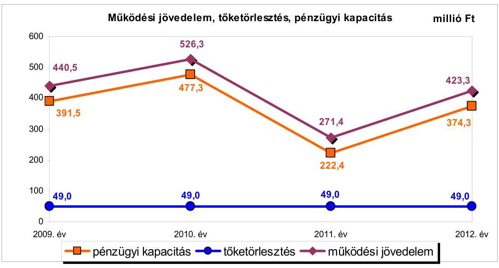
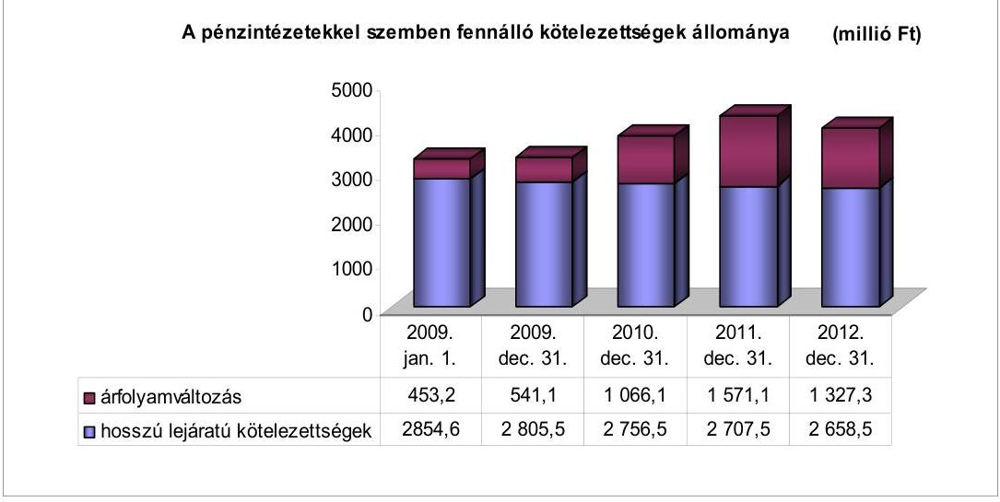
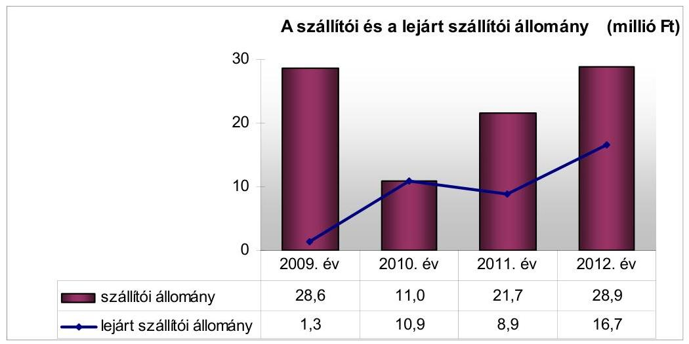
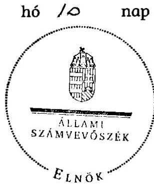
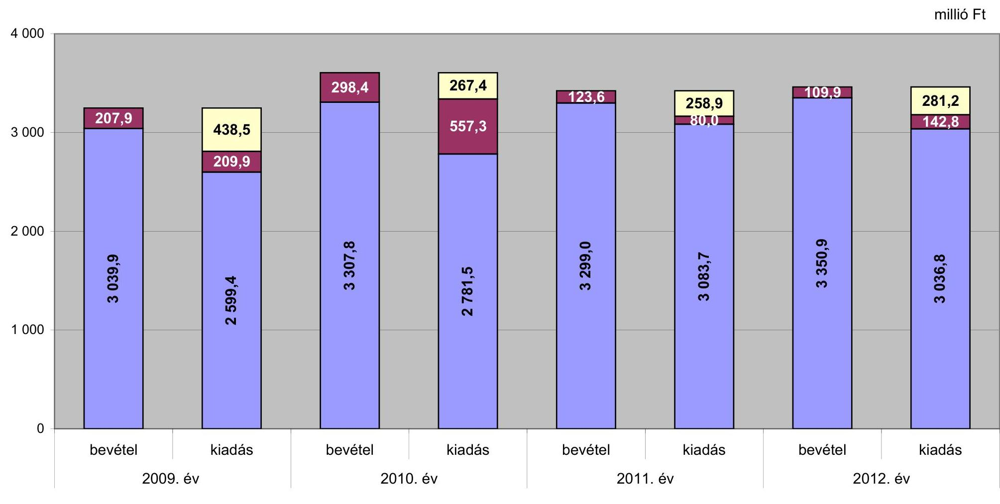
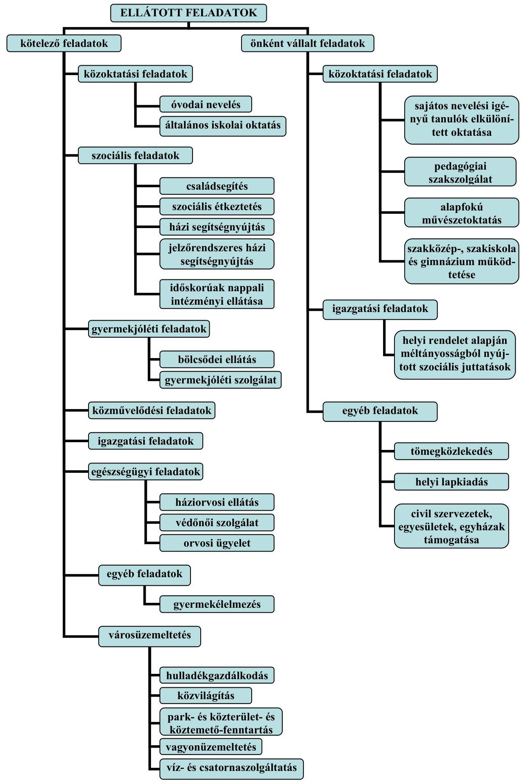

# ÁLLAMI   SZÁMVEVŐSZÉK 

## JELENTÉS

az önkormányzatok pénzügyi gazdálkodási helyzetének, szabályosságának ellenőrzéséről

FÓT
13092
2013. szeptember

---

# Állami Számvevőszék 

Iktatószám: V-0030-349-013/2013.
Témaszám: 1069
Vizsgálat-azonosító szám: V059222

## Az ellenőrzést felügyelte:

## Renkó Zsuzsanna

felügyeleti vezető
Az ellenőrzést vezette és az ellenőrzés végrehajtásáért felelős:
Dér Lívia
ellenőrzésvezető
Az ellenőrzést végezték:

| Szarvas Szilárd | Szilágyi Nándorné |
| :-- | :-- |
| számvevő tanácsos | számvevő |

---

# TARTALOMJEGYZÉK 

BEVEZETÉS ..... 3
I. ÖSSZEGZŐ MEGÁLLAPÍTÁSOK, KÖVETKEZTETÉSEK, JAVASLATOK ..... 6
II. RÉSZLETES MEGÁLLAPÍTÁSOK ..... 11

1. Az Önkormányzat kötelező és önként vállalt feladatai, a feladatellátás szervezeti keretei ..... 11
2. A pénzügyi egyensúlyt fenntartását veszélyeztető pénzügyi kockázatok és az ezek csökkentése érdekében tett intézkedések ..... 13
3. A pénzügyi gazdálkodási folyamatok szabályosságát, megfelelőségét biztosító belső kontrollok ..... 21
4. Az ÁSZ korábbi ellenőrzése során a pénzügyi, gazdálkodási helyzet javítására tett javaslatainak megvalósítása ..... 22

---

# MELLÉKLETEK 

1. számú A költségvetési hiány/többlet a 2009-2011. években az Önkormányzat zárszámadási rendeletei és a 2012. évben az éves költségvetési beszámolója alapján
2. számú Az Önkormányzat bevételei és kiadásai, valamint adósságszolgálata a 2009-2012. években (a CLF módszer szerint)
3/a. számú Az Önkormányzat által a 2009-2012. években megvalósított (műszakilag befejezett) fejlesztések forrásösszetétele
3/b. számú Az Önkormányzat 2012. december 31-én folyamatban lévő fejlesztési feladataihoz kapcsolódó kötelezettségeinek összegzése
3/c. számú Az Önkormányzat által beadott, elbírálás alatti pályázatok forrásaiból megvalósuló fejlesztésekhez kapcsolódó kötelezettségvállalások összegzése
3. számú Az önkormányzati feladatok ellátásában részt vevő gazdasági társaságok egyes kiemelt adatai
4. számú Az Önkormányzat 2012. december 31-én fennálló, hosszú lejáratú adósságot keletkeztető kötelezettségvállalásai
5. számú Az Önkormányzat kötelezettségeinek és egyes kötelezettségvállalásainak 2009. december 31-ei és 2012. december 31-ei állománya, valamint a 2013. évben és az azt követő években várható kötelezettségek, kötelezettségvállalások miatti kiadások

## FÜGGELÉKEK

1. számú Rövidítések jegyzéke
2. számú Fogalomtár
3. számú Az Önkormányzat által ellátott feladatok 2012. december 31-én

---

# JELENTÉS 

## az önkormányzatok pénzügyi gazdálkodási helyzetének, szabályosságának ellenőrzéséről FÓT

## BEVEZETÉS

Az államháztartás helyi szintjén, az önkormányzati alrendszerben az utóbbi években megjelenő gazdálkodási nehézségek, a pénzforgalmi hiány növekedése, az eladósodás az ÁSZ figyelmét a helyi önkormányzatok pénzügyi helyzetére irányította.

Az ÁSZ a 2013. év I. félévi ellenőrzési tervben foglaltaknak megfelelően az önkormányzatok pénzügyi gazdálkodási helyzetének, szabályosságának ellenőrzésével az önkormányzatok 2011. évben megkezdett helyzetelemzését folytatta. Az ellenőrzés keretében értékeljük az önkormányzatok adósságkezelési és likviditási helyzetét. Bemutatjuk a pénzügyi egyensúly alakulására hatással lévő folyamatokat, feltárjuk az ezekre ható kockázatokat. Értékeljük a pénzügyi egyensúlyi helyzetet befolyásoló döntés megalapozó, döntés-előkészítő eljárások szabályosságát, és minősítjük az ezekkel összefüggő belső kontrollok kialakítását, működését.

Az ellenőrzés eredményének várható hatásaként a megállapításokkal segítséget nyújtunk az önkormányzatok számára a pénzügyi egyensúly helyreállítása, javítása és fenntartása érdekében szükségessé váló intézkedések megtételéhez.

Az ellenőrzés típusa: szabályszerűségi ellenőrzés.

## Az ellenőrzés célja annak értékelése volt, hogy:

- az ellenőrzött időszakban a kötelező és önként vállalt feladatok ellátását biztosító szervezeti formák változása milyen hatást gyakorolt az Önkormányzat pénzügyi helyzetének alakulására;
- az Önkormányzat pénzügyi - ezen belül működési és felhalmozási - egyensúlya milyen irányban változott, a változást milyen okok idézték elő, továbbá milyen intézkedéseket tettek a pénzügyi egyensúly biztosítása, illetve javítása érdekében, az intézkedések hatására javult-e az Önkormányzat pénzügyi helyzete;
- a költségvetési kiadások finanszírozása érdekében vállalt, pénzintézetekkel szembeni kötelezettségek hogyan alakultak, a kötelezettségek fennállása miként befolyásolja az Önkormányzat jövőbeli pénzügyi egyensúlyi helyzetét;

---

- az Önkormányzat beazonosította, felmérte, értékelte-e a pénzügyi egyensúlyt befolyásoló pénzügyi kockázatokat, a finanszírozási célú pénzügyi műveletekkel kapcsolatban írtak-e elő kockázatértékelési kötelezettséget;
- az Önkormányzat által kialakított belső kontrollok biztosítják-e a pénzügyi gazdálkodás folyamatainak szabályosságát és eredményességét;
- hasznosultak-e az ÁSZ korábbi ellenőrzése során a pénzügyi, gazdálkodási helyzet javítására tett szabályszerűségi és célszerűségi javaslatok.

Az ellenőrzés a 2009. január 1-jétől 2012. december 31-ig terjedő időszakot ölelte fel. A pénzintézetekkel szembeni kötelezettségek állományára vonatkozóan az ellenőrzés kezdő időpontjaként a 2012. december 31-én fennálló kötelezettségek keletkezésének időpontját vettük figyelembe.

Az ellenőrzés szakmai módszertana az ÁSZ Ellenőrzési Elvek és Standardokban foglalt szakmai szabályokon alapult, amely a Legfőbb Ellenőrző Intézmények Nemzetközi Szervezete (INTOSAI) által kiadott nemzetközi standardok (ISSAI) figyelembevételével készült.

Az ellenőrzés során használt rövidítéseket az 1. számú, az egyes fogalmak magyarázatát a 2. számú függelék tartalmazza.

Az ellenőrzés jogszabályi alapját az ÁSZ tv. 1. § (3) bekezdésének, 5. § (2)-(6) bekezdéseinek, valamint az államháztartásról szóló 2011. évi CXCV. törvény 61. § (2) bekezdésének előírásai képezik.

Az Országgyűlés 2012 végén a helyi önkormányzatok adósságállományának részleges konszolidációjáról döntött. Az 5000 fő lakosságszámot meg nem haladó települési önkormányzatok számára nyújtott, törlesztési célú támogatással ${ }^{1}$ lehetővé tették a 2012. december 12-én fennálló adósságállományuk és annak 2012. december 28-áig számított járulékai teljes megfizetését. Az 5000 fő lakosságszám feletti települések esetében a 2013. évben az állam differenciált - az adóerő-képességet figyelembe vevő, 40-70%-ig terjedő - mértékben vállalja át ${ }^{2}$ az önkormányzatok 2012. december 31-i, az átvállalás időpontjában fennálló adósságállományát és annak járulékait. Az adósságkonszolidációs intézkedéssel egyidejűleg a Kormány elrendelte ${ }^{3}$ az önkormányzatok adósságállománya újratermelődésének megakadályozása céljából a hitelengedélyezési és a likvid hitelekre vonatkozó szabályozás szigorítását.

Fót Város Önkormányzata lakónépességére tekintettel a 2013. évi adósságátvállalásban érintett. Az adósságkonszolidáció keretében - a 2013. február 28-án kötött megállapodásban - a Magyar Állam az Önkormányzat fennálló adósságállományának 40,0%-át (1 591,7 millió Ft-ot) és annak járulékait át-

[^0]
[^0]:    ${ }^{1}$ Magyarország 2012. évi központi költségvetéséről szóló 2011. évi CLXXXVIII. törvény 76/C. §-a (beiktatta a 2012. évi CLXXXVII. törvény 8. §-a, hatályos 2012. XII. 6-tól)
    ${ }^{2}$ Magyarország 2013. évi központi költségvetéséről szóló 2012. évi CCIV. törvény 7276. §-ai
    ${ }^{3}$ 1540/2012. (XII. 4.) Korm. határozat a helyi önkormányzatok adósságállományának részleges konszolidációjáról

---

vállalta. Az ÁSZ jelen ellenőrzése során tett megállapításai az adósságkonszolidációt követően is helytállóak és időszerűek.

Fót város állandó lakosainak száma 2009. január 1-jén 18443 fő, 2013. január 1-jén 19123 fő volt. Az Önkormányzat 2012-ben 3460,8 millió Ft költségvetési bevételt ért el, és 3179,6 millió Ft költségvetési kiadást teljesített. A 2012. évi folyó bevétel 3377,6 millió Ft volt, amely fedezetet nyújtott a folyó kiadásokra, a felhalmozási hiányra, valamint a pénzintézetekkel szemben fennálló kötelezettségek teljesítésére. A könyvviteli mérlegben kimutatott vagyon értéke a 2009. év végi 15799,8 millió Ft-ról a 2012. év végére 17394,4 millió Ft-ra emelkedett. A vagyon növekedése döntően az ingatlanokhoz kapcsolódó felújítások és beruházások értékéből, továbbá a pénzeszközök emelkedéséből származott. Az Önkormányzat 2009. január 1-jén 1036,4 millió Ft finanszírozásba bevonható pénzeszközzel rendelkezett, amely a jövedelemtermelő képesség kedvező alakulásából és a kötvény fel nem használt részéből adódóan az ellenőrzött időszak végére 2076,0 millió Ft-ra emelkedett.

Az ÁSZ tv. 29. § (1) bekezdése szerint a jelentéstervezetet megküldtük a polgármester részére, aki az ÁSZ tv. 29. § (2) bekezdésében foglalt észrevételezési jogával nem élt, a jelentéstervezetre észrevételt nem tett.

---

# I. ÖSSZEGZŐ MEGÁLLAPÍTÁSOK, KÖVETKEZTETÉSEK, JAVASLATOK 

Fót Város Önkormányzatának pénzügyi egyensúlyi helyzete a tartósan pozitív működési jövedelemtermelő képesség eredményeként rövid és középtávon biztosított volt. A 2013. évi adósságkonszolidáció kedvező hatást gyakorol az Önkormányzat pénzügyi egyensúlyi helyzetére, annak hosszú távú fenntartásához azonban a jövedelemtermelő képesség megőrzése szükséges.

Az Önkormányzat költségvetésének elemzését a CLF módszer alapján számított mutatók alapján végeztük. Pénzügyi kapacitásának 2009-2012 közötti változását az alábbi ábra mutatja be:

Az Önkormányzat a 2009-2012. években összesen 13 737,4 millió Ft költségvetési bevételt ért el és 12491,4 millió Ft költségvetési kiadást teljesített. Működési költségvetésének egyensúlya az ellenőrzött időszakban biztosított volt, a folyó bevételek fedezték a feladatok ellátásához szükséges kiadásokat, összesen 1661,5 millió Ft többlet képződött. A működési jövedelem kedvező alakulását elsősorban a magas helyi adóbevétel, valamint az intézmények megfelelő kihasználtsága eredményezte. A működési jövedelem csökkenését 2011-ben a helyi adókat érintő bevételkiesés, az előző évi bérpolitikai intézkedésekhez kapcsolódó egyszeri központosított támogatás megszűnése, a kiadások között a hulladékszállítási díjkompenzáció és az átadott pénzeszközök növekedése, továbbá a gazdasági társaságoknak nyújtott kölcsön és tőkepótlás okozta. A működési jövedelem a 2009-2012. években fedezetet nyújtott a tőketörlesztésekre, a nettó működési jövedelem (pénzügyi kapacitás) az ellenőrzött időszak minden évében pozitív volt. Az Önkormányzat ÖNHIKI támogatásban nem részesült.

Az Önkormányzat felhalmozási költségvetésének egyenlege minden évben negatív volt, 2009-2012 között összesen 415,5 millió Ft felhalmozási for-

---

ráshiányt mutatott, amelynek finanszírozására fedezetet nyújtott a nettó működési jövedelem. A felhalmozási hiány összegének változását a felmerült kiadások és a pályázati támogatások ütemkülönbsége határozta meg.

Az ellenőrzött időszakban az Önkormányzatnál a feladatellátás szervezeti formája nem változott, feladat átadásra-átvételre nem került sor. Az önként vállalt feladatok körének bővülése a pénzügyi egyensúlyi helyzetre nem volt hatással. A bevételnövelő és kiadáscsökkentő intézkedések együttes hatása - az Önkormányzat adatszolgáltatása szerint - 70,1 millió Ft volt, amely nem gyakorolt jelentős befolyást a pénzügyi egyensúlyi helyzetre.

Az Önkormányzat pénzintézetekkel szembeni kötelezettségeinek állománya a 2009. év elején fennálló 3307,8 millió Ft-ról a 2012. év végére 3985,8 millió Ft-ra emelkedett, amelynek 40,0%-át 1591,7 millió Ft-ot érinti az adósságátvállalás. Az Önkormányzat 2012. december 31-én fennálló, pénzintézetekkel szembeni kötelezettsége a 2009. évet megelőzően forintban felvett beruházási hitelből, valamint a fejlesztési célú, devizalapú kötvénykibocsátásból és annak árfolyamváltozásából tevődött össze. Az ellenőrzött időszak jövedelemtermelő képességét, a kormányzati adósságátvállalást, továbbá a finanszírozásba bevonható tartalékot figyelembe véve a pénzintézeti kötelezettségek teljesíthetősége nem jelent kockázatot, ennek fenntartásához azonban továbbra is elsődleges fontosságú a működési költségvetés egyensúlyának biztosítása.

A szállítókkal szembeni kötelezettség 2012. december 31-én 28,9 millió Ft-ot tett ki, ebből 16,7 millió Ft (57,8%) lejárt tartozás volt, amely meghaladta a 2012. évi dologi kiadások egy havi átlagának 20,0%-át (14,8 millió Ft-ot). A 2012. évben az Önkormányzatnál fennállt a lejárt szállítói állomány miatti szállítói kitettség kockázata. A 60 napon túl lejárt szállítói kötelezettségek állománya 2,1 millió Ft volt. Az Önkormányzat az ellenőrzött időszakban összesen 37,3 millió Ft tagi kölcsönt és 28,2 millió Ft tulajdonosi pótbefizetést biztosított a kizárólagos tulajdonában lévő két gazdasági társasága részére, amelynek megtérülése a Településszolgáltató Kht. végelszámolása, valamint a Közszolgáltató Kft. veszteséges működése miatt bizonytalan. A gazdasági társaságoknak a 2012. év végén 4,8 millió Ft összegű, 90 napon túl lejárt szállítói tartozása és 1,2 millió Ft lízingből eredő kötelezettsége volt. A gazdasági társaságok kötelezettségeinek alakulása - a kizárólagos tulajdonosi minőségből adódóan - mérlegen kívüli kockázatot hordoz.

Az Önkormányzatnál a pénzügyi egyensúlyt befolyásoló kockázatok feltárása, beazonosítása, felmérése, értékelése és kezelése - a 2009. évben az Ámr. ${ }_{1}$-ben, a 2010-2011. években az Ámr. ${ }_{2}$-ben, a 2012. évben a Bkr.-ben foglalt előírások ellenére - elmaradt. Annak ellenére maradt el a kockázatok kezelése, hogy az ellenőrzési időszakban fennállt a lejárt szállítói állomány miatt a szállítói kitettség kockázata, a kizárólagos önkormányzati tulajdonban lévő
 gazdasági társaságok kötelezettségei miatti mérlegen kívüli kockázat, valamint a tagi kölcsönök és a visszatérítendő tulajdonosi pótbefizetés bizonytalan megtérülése miatti kockázat. Az ellenőrzött időszakban nem írtak elő a finanszírozási célú pénzügyi műveletekkel kapcsolatban kockázatértékelési kötelezettséget.

---

A pénzügyi gazdálkodási folyamatok szabályosságát, megfelelőségét, kockázatainak kezelését biztosító kontrolltevékenységek kialakítása - a 2009. évben az Ámr. ${ }_{1}$-ben, a 2010-2011. években az Ámr. ${ }_{2}$-ben, a 2012. évben a Bkr.-ben foglalt előírások ellenére - összességében részben volt megfelelő, mivel nem írták elő a feladatellátási szerződések tartalmi követelményeit, a hitelfelvétel és a kötvénykibocsátás költségvetési egyensúlyra gyakorolt hatásának vizsgálatát a döntés-előkészítési folyamatában, valamint nem határozták meg a szállítói tartozások és egyéb kiadáselmaradások rendezésének szabályait.

Az Önkormányzatnál a pénzügyi gazdálkodási folyamatok szabályosságát biztosító belső kontrollok működése jó volt, annak ellenére, hogy a feladatellátási szerződésekben nem rögzítették az előírt tartalmi követelményeket, nem tárták fel a fejlesztéseket megelőző döntés-előkészítési folyamatban az előkészítés, a lebonyolítás és a működtetés kockázatait. A működési és felhalmozási célú pénzeszközátadások esetében nem tettek eleget teljes körűen a belső szabályozásban foglalt elszámolási kötelezettségnek. Összességében a kialakított belső kontrollok biztosították a pénzügyi gazdálkodási folyamatok eredményességét.

Az ÁSZ az Önkormányzat gazdálkodási rendszerét 2009-ben ellenőrizte. Ennek során a pénzügyi, gazdálkodási helyzet javítására 21 szabályszerűségi és egy célszerűségi javaslatot tett, amelyek mindegyike hasznosult.

Az ÁSZ tv. 33. § (1) bekezdésében foglaltak értelmében az ellenőrzött szervezet vezetője köteles a jelentésben foglalt megállapításokhoz kapcsolódó intézkedési tervet összeállítani, és azt a jelentés kézhezvételétől számított harminc napon belül az ÁSZ részére megküldeni. Amennyiben az intézkedési tervet határidőn belül nem küldi meg a szervezet vezetője, vagy az továbbra sem elfogadható, az ÁSZ elnöke a hivatkozott törvény 33. § (3) bekezdés a)-b) pontjaiban foglaltakat érvényesítheti.

# Az ellenőrzés intézkedést igénylő megállapításai és javaslatai: 

## a polgármesternek

1. Az ellenőrzött időszak során képződött működési jövedelem minden évben fedezetet nyújtott a tőketörlesztési kötelezettségre. A felhalmozási költségvetés egyenlegének 2009-2012 közötti hiányára a nettó működési jövedelem fedezetet biztosított. Az ellenőrzött időszak végén az Önkormányzat 2076,0 millió Ft finanszírozásba bevonható pénzeszközzel rendelkezett. A pénzintézeti kötelezettségek állománya - melynek 40,0%-át érinti a kormányzati adósságátvállalás - 2012. december 31-én 3985,8 millió Ft volt. A lejárt szállítói tartozások 2012. évi végi állománya 16,7 millió Ft volt. Az Önkormányzat kizárólagos tulajdonában álló két gazdasági társaság kötelezettségei növekedtek, az Önkormányzat által a gazdasági társaságok részére biztosított 37,3 millió Ft tagi kölcsön és 28,2 millió Ft visszatérítendő tulajdonosi pótbefizetés visszatérülése bizonytalan.

Javaslat:
A működési jövedelemtermelő képesség és a feladatellátás összhangja, valamint az Önkormányzat pénzügyi egyensúlyának hosszú távú fenntarthatósága érdekében - a

---

2013. évi kormányzati adósságkonszolidációt, valamint a 2013. évtől változó feladatellátási kötelezettséget, feladatfinanszírozási rendszert figyelembe véve - felelősök és határidők megjelölésével kezdeményezzen intézkedéseket, melyek keretében:
a) a költségvetés végrehajtásáról készített féléves beszámoló, valamint a zárszámadási rendelettervezet előterjesztése során tájékoztassa a Képviselő-testületet az Önkormányzat pénzügyi egyensúlyi helyzetének alakulásáról;
b) a pénzügyi egyensúlyi helyzet kedvezőtlen változása esetén terjessze a Képviselőtestület elé az egyensúly hosszú távú megőrzését, az adósságállomány újratermelődésének elkerülését biztosító intézkedések bevezetéséhez szükséges - a Htv. 140. § (1) bekezdés a) pontja alapján a jegyző által elkészített - döntési javaslatát;
c) a szállítói kitettség és az Adósságrendezési tv. 4-9. §-aiban szabályozott adósságrendezési eljárás megindításának elkerülése érdekében a szállítói számlák esedékesség szerinti kiegyenlítése szabad pénzmaradvány rendelkezésre állása esetén történjen meg; meghatározott gyakorisággal számoljon be a Képviselőtestületnek az Önkormányzat lejárt szállítói állománya alakulásáról. Intézkedjen a szállítói számlák esedékesség szerinti kiegyenlítéséről vagy a lejárt tartozások átütemezéséről;
d) terjesszen a jegyző közreműködésével elkészített intézkedési tervet a Képviselőtestület elé jóváhagyásra, a kizárólagos önkormányzati tulajdonban álló, a feladatellátásban résztvevő gazdasági társaság pénzügyi helyzetének stabilizálása érdekében.

# a jegyzőnek 

1. A kockázatkezelési rendszer keretében az ellenőrzött időszakban fennállt, a pénzügyi egyensúlyt befolyásoló kockázatok feltárása, beazonosítása, értékelése és kezelése - a 2009. évben az Ámr. ${ }_{1}$ 145/C. § (1)-(3) bekezdéseiben, a 2010-2011. években az Ámr. ${ }_{2}$ 157. § (1)-(3) bekezdéseiben, a 2012. évben a Bkr. 7. § (1)-(2) bekezdéseiben foglalt jogszabályi előírások ellenére - elmaradt. Annak ellenére maradt el a kockázatok kezelése, hogy az ellenőrzött időszakban fennállt a lejárt szállítói állomány miatti szállítói kitettség kockázata, a kizárólagos önkormányzati tulajdonban lévő gazdasági társaságok kötelezettségei miatti mérlegen kívüli kockázat, valamint az Önkormányzat által folyósított tagi kölcsönök és a visszatérítendő tulajdonosi pótbefizetések bizonytalan megtérülése miatti kockázat.

Javaslat:
Működtessen a Bkr. 7. § (1)-(2) bekezdéseiben foglalt előírásoknak megfelelő, a pénzügyi egyensúlyt befolyásoló kockázatok kezelésére alkalmas kockázatkezelési rendszert.
2. A pénzügyi gazdálkodási folyamatok szabályossága, megfelelősége vonatkozásában a kockázatok kezelését biztosító belső kontrolltevékenységek kialakítása - a 2009. évben az Ámr. ${ }_{1}$ 145/E. § (1)-(2) bekezdéseiben, a 2010-2011. években az Ámr. ${ }_{2}$ 158. § (1)-(2) bekezdéseiben, a 2012. évben a Bkr. 8. § (1)-(2) bekezdéseiben fog-

---

lalt előírások ellenére - részben volt megfelelő, mert nem írták elő a feladatellátási szerződések tartalmi követelményeivel összefüggő kontrolltevékenységeket. Nem határozták meg a hitelfelvételről és a kötvénykibocsátásról szóló döntés előkészítésekor a futamidő egyes éveit terhelő kötelezettség költségvetési egyensúlyra gyakorolt hatásának vizsgálatát. Nem határozták meg a szállítói tartozások és egyéb kiadáselmaradások rendezésének szabályait.

Javaslat:
Alakítsa ki a Bkr. 8. § (1)-(2) bekezdései alapján azokat a belső kontrolltevékenységeket, amelyek biztosítják a pénzügyi-gazdálkodási folyamatok szabályosságát, a pénzügyi egyensúlyi helyzet alakulását befolyásoló döntések kockázatainak kezelését. Készítse el a hiányzó szabályozást. Ennek keretében:
a) írja elő a feladatellátási szerződések minimum tartalmi követelményeinek meghatározásával összefüggő kontrolltevékenységeket;
b) írja elő a hitelfelvételről, kötvénykibocsátásról szóló döntés előkészítése során a futamidő egyes éveit terhelő kötelezettségek költségvetési egyensúlyra gyakorolt hatásának vizsgálatát;
c) határozza meg a szállítói tartozások és az egyéb kiadáselmaradások rendezésének helyi szabályait.

---

# II. RÉSZLETES MEGÁLLAPÍTÁSOK 

## 1. Az ÖNKORMÁNYZAT KÖTELEZŐ ÉS ÖNKÉNT VÁLLALT FELADATAI, A FELADATELLÁTÁS SZERVEZETI KERETEI

Az Önkormányzat a kötelező és önként vállalt feladatainak körét a 2009-2012 közötti időszakban nem határozta meg, a helyszíni ellenőrzés alatt végezte el az önként vállalt feladatok és az ellátásukra fordított folyó kiadások besorolását. Az önként vállalt feladatok - az Önkormányzat adatszolgáltatása alapján - a sajátos nevelési igényű tanulók elkülönített oktatása, a pedagógiai szakszolgálat, az alapfokú művészetoktatás, a szakközép-, a szakiskola és a gimnázium működtetése, a tömegközlekedés, a helyi lapkiadás és a Polgármesteri Hivatal egyéb igazgatási tevékenységei ${ }^{4}$ voltak. Az Önkormányzat támogatást nyújtott továbbá civil szervezetek, egyesületek és az egyházak számára.

A kötelező feladatok körében a közoktatás keretében biztosították az óvodai nevelést és az általános iskolai oktatást, a szociális feladatok keretében a családsegítést, a szociális étkeztetést, a házi, illetve a jelzőrendszeres házi segítségnyújtást és az időskorúak nappali intézményi ellátását, a gyermekjóléti feladatok közül a bölcsődei ellátást és a gyermekjóléti szolgálatot. Kötelező feladatként látták el továbbá a közművelődési és az igazgatási feladatokat, az egészségügyi szolgáltatások között a háziorvosi ellátást, a védőnői szolgálatot és az orvosi ügyeletet, az egyéb feladatok keretében a gyermekélelmezést, továbbá a városüzemeltetési tevékenységeket.

A közoktatási feladatokat két óvoda, három általános iskola, a Zeneiskola, a Népművészeti Középiskola és az ESZEI végezte. A szociális és gyermekjóléti szolgáltatásokat az ESZEI, illetve a bölcsődei ellátás esetében az egyik önkormányzati óvoda biztosította. A közművelődési feladatokat - ezen belül a művelődési ház, a könyvtárak és a múzeum működtetését - a Fóti Közművelődési és Közgyűjteményi Központ látta el. Az egészségügyi ágazatban a védőnői szolgálatot az ESZEI, a háziorvosi ellátást vállalkozói szerződés alapján gazdasági társaság, az éjszakai és hétvégi orvosi ügyeletet a Kistérségi Társulás működtette. Az igazgatási feladatokat a Polgármesteri Hivatal végezte. A hulladékgazdálkodással kapcsolatos tevékenységeket az Önkormányzati Társulás és vállalkozások látták el, a közvilágítást, a víz- és csatornaszolgáltatást, valamint a helyi lapkiadást vállalkozói szerződés alapján gazdasági társaságok működtették. A gyermekélelmezési feladatokat, a köztemető fenntartást, a park és közterület fenntartást az Önkormányzat kizárólagos tulajdonában lévő gazdasági társaságok végezték. A Településszolgáltató Kht. 2009 óta jogutód nélküli végelszámolás alatt áll, feladatait a 2010. évtől a 2008-ban alapí-

[^0]
[^0]:    ${ }^{4}$ Az Önkormányzat a helyi rendelet alapján, méltányossági alapon nyújtott szociális juttatásokat sorolta az önként vállalt igazgatási feladatok kiadásai közé.

---

tott Közszolgáltató Kft. vette át ${ }^{5}$. Az Önkormányzat által ellátott feladatokat részletesen a 3. számú függelék mutatja be.

Az Önkormányzat nem vizsgálta a kötelező és az önként vállalt feladatokra fordított működési és felhalmozási kiadások arányát, valamint pénzügyi egyensúlyi helyzetére gyakorolt hatását.

Az Önkormányzat által a kötelező feladatokra fordított kiadások összes folyó kiadáson belüli aránya 2009-ben 71,5% (1857,8 millió Ft), 2010-ben 70,6% (1963,7 millió Ft), 2011-ben 66,9% (2018,2 millió Ft), 2012-ben 70,1% (2072,1 millió Ft) volt. Az önként vállalt feladatokra fordított kiadások összege - 2009-ben 741,6 millió Ft (28,5%), 2010-ben 817,8 millió Ft (29,4%), 2011-ben 998,7 millió Ft (33,1%), 2012-ben 882,2 millió Ft (29,9%) - minden évben meghaladta a folyó kiadások egynegyedét. Az önként vállalt feladatok ellátása azonban az ellenőrzött időszakban nem jelentett működési kockázatot, a minden évben pozitív működési jövedelemtermelő képességből adódóan nem veszélyeztette a pénzügyi egyensúlyi helyzetet.

Az Önkormányzat az ellenőrzött időszakban 1139,3 millió Ft felhalmozási kiadást teljesített, amelyből a kötelező feladatokhoz kapcsolódó fejlesztésekre 977,0 millió Ft-ot (85,8%), az önként vállalt feladatokra 162,3 millió Ft-ot (14,2%) fordított. Az önként vállalt feladatok ellátására teljesített felhalmozási kiadások nagyságrendjükre tekintettel nem jelentettek kockázatot.

A 2009. évben az Önkormányzat a feladatait - a Polgármesteri Hivatallal együtt - tíz költségvetési szervvel és egy kizárólagos tulajdonában álló gazdasági társasággal, összesen 25 telephelyen látta el. Az ellenőrzött időszakban a feladatellátásban résztvevő költségvetési szervek és a működő gazdasági társaságok száma nem változott, a telephelyek száma - az alapfokú zeneművészeti oktatást érintően - eggyel bővült.

Az ellenőrzött időszakban az Önkormányzatnál a feladatellátás szervezeti formája nem változott, a pénzügyi egyensúlyi helyzetére hatással levő feladatot nem adtak, illetve nem vettek át. Az önként vállalt feladatok köre egy alkalommal bővült, mivel a Zeneiskola 2011. szeptember 1-jétől (legfeljebb 60 tanuló részére) biztosította Csomád községben az alapfokú művészeti oktatást. Az igényelt normatív hozzájárulás és a zeneoktatás tényleges kiadásainak különbözetét Csomád Község Önkormányzata megtérítette, ennek következtében a feladatbővülés nem volt hatással az Önkormányzat pénzügyi egyensúlyi helyzetére.

[^0]
[^0]:    ${ }^{5}$ A Településszolgáltató Kht. jogutód nélküli megszüntetéséről és végelszámolásáról, továbbá feladatainak átadásáról a Közszolgáltató Kft. részére a 133-134/2009. (IX. 28.) számú határozatokban döntött a Képviselő-testület.

---

# 2. A PÉNZÜGYI EGYENSÚLY FENNTARTÁSÁT VESZÉLYEZTETŐ PÉNZÜGYI KOCKÁZATOK ÉS AZ EZEK CSÖKKENTÉSE ÉRDEKÉBEN TETT INTÉZKEDÉSEK 

Az Önkormányzat költségvetésének elemzését CLF módszerrel hajtottuk végre. A 2009-2012. évek közötti időszak CLF módszer szerinti részletes adatait a 2. számú melléklet, a főbb
 önkormányzati adatokat az alábbi táblázat mutatja be:

|  |  |  |  | millió Ft |
| :--: | :--: | :--: | :--: | :--: |
| Megnevezés | 2009. év | 2010. év | 2011. év | 2012. év |
| Folyó bevételek | 3039,9 | 3307,8 | 3288,3 | 3377,6 |
| Folyó kiadások | 2599,4 | 2781,5 | 3016,9 | 2954,3 |
| Működési jövedelem | 440,5 | 526,3 | 271,4 | 423,3 |
| Felhalmozási bevételek | 207,9 | 298,4 | 134,3 | 83,2 |
| Felhalmozási kiadások | 209,9 | 557,3 | 146,8 | 225,3 |
| Felhalmozási költségvetés egyenlege | $-2,0$ | $-258,9$ | $-12,5$ | $-142,1$ |
| Folyó és felhalmozási bevételek összesen | 3247,8 | 3606,2 | 3422,6 | 3460,8 |
| Folyó és felhalmozási kiadások összesen | 2809,3 | 3338,8 | 3163,7 | 3179,6 |
| Finanszírozási műveletek nélküli pozíció | 438,5 | 267,4 | 258,9 | 281,2 |
| Finanszírozási műveletek egyenlege | $-55,5$ | $-107,9$ | $-61,9$ | 18,9 |
| Tárgyévi pénzügyi pozíció | 383,0 | 159,5 | 197,0 | 300,1 |
| Hiteltörlesztés, értékpapír beváltás | 49,0 | 49,0 | 49,0 | 49,0 |
| Nettó működési jövedelem | 391,5 | 477,3 | 222,4 | 374,3 |

Az Önkormányzat a 2009-2012. években összesen 13 737,4 millió Ft költségvetési bevételt ért el és 12491,4 millió Ft költségvetési kiadást teljesített. A folyó bevételek minden évben fedezetet nyújtottak a folyó kiadásokra, az ellenőrzött időszakban keletkezett működési jövedelem 1661,5 millió Ft volt. A működési jövedelem kedvező alakulását elsősorban a magas helyi adóbevétel, valamint az intézmények megfelelő kihasználtsága tette lehetővé. A működési jövedelem a 2009-2010. és a 2012. években magasabb, a 2011. évben alacsonyabb volt, mint az ellenőrzött időszak átlaga (415,4 millió Ft). A 2011. évben a teljesített működési kiadások növekedtek, a folyó bevételek csökkentek az előző évhez viszonyítva. A kiadások növekedését elsősorban a hulladékszállítási díjkompenzáció és az átadott pénzeszközök emelkedése, továbbá a gazdasági társaságoknak történő kölcsönnyújtás és tőkepótlás okozta. A bevételek csökkenése döntően a helyi adóbevételek és az előző évi bérpolitikai intézkedésekhez kapcsolódó központosított támogatások csökkenése miatt következett be.

A pénzügyi kapacitás (nettó működési jövedelem) alakulása követte a működési jövedelem változó tendenciáját, mivel a tőketörlesztési kötelezettség összege az ellenőrzött időszakban állandó volt. ${ }^{6}$ A működési jövedelem az ellenőrzött időszakban minden évben fedezetet nyújtott a tőketörlesztésre.

[^0]
[^0]:    ${ }^{6}$ Az Önkormányzat 2009-2012 között évente 49,0 millió Ft tőkét törlesztett egy beruházási hitelhez kapcsolódóan. A kötvénykibocsátás tőketörlesztése 2013. június 30 -ától lesz esedékes.

---

A felhalmozási költségvetés egyenlege 2009-2012 között összesen 415,5 millió Ft felhalmozási forráshiányt mutatott. A felhalmozási kiadásoknak a 2009. évben 1,0\%-át (2,0 millió Ft-ot), a 2010. évben 46,5\%-át (258,9 millió Ft-ot), a 2011. évben 8,5\%-át (12,5 millió Ft-ot), míg a 2012. évben 63,1\%-át (142,1 millió Ft-ot) nem fedezték a felhalmozási bevételek. A felhalmozási hiány összegének változását a felmerült kiadások és a pályázati támogatások ütemkülönbsége határozta meg. A felhalmozási forráshiányt a 2009-2012. években a tárgyévi nettó működési jövedelemből finanszírozták.

A CLF módszer szerint számított pénzügyi kapacitás az ellenőrzött időszak minden évében fedezetet nyújtott a felhalmozási költségvetés hiányára, ezen túl a 2009-2012. években összesen 1050,0 millió Ft megtakarítást, a jövőben finanszírozásba bevonható többletet eredményezett.

Az Önkormányzat 2009-2011. évi zárszámadási rendeleteiben és a 2012. évi költségvetési beszámolójában kimutatott 2009-2012. évi költségvetési többlet alakulását az 1. számú melléklet tartalmazza.

A folyó bevételek összege a 2009. évi 3039,9 millió Ft-ról a 2010. évre 3307,8 millió Ft-ra nőtt, amelyet a gépjárműadó, valamint a helyi adó és pótlék bevételek emelkedése okozott. A folyó bevételek 2011. évi - előző évhez viszonyított - 19,5 millió Ft-os csökkenését a támogatásértékű működési bevételek, valamint a hozam- és kamatbevételek emelkedése, illetve a helyi adóbevételek és a központosított költségvetési támogatások csökkenése együttesen eredményezte. A 2012. évi 89,3 millió Ft-os növekedést a helyi adók emelkedése, valamint a bérkompenzációhoz biztosított költségvetési támogatás határozta meg. Az ellenőrzött időszakban az Önkormányzat a pozitív adóerőképessége miatt nem részesült ÖNHIKI támogatásban.

Az Önkormányzatnak az ellenőrzött időszakban iparűzési adóból, építményadóból és telekadóból származott helyi adó bevétele. A helyi adók a folyó bevételek körében meghatározó súlyt képviseltek, arányuk 2009-ben 47,0\%, (1428,2 millió Ft), 2010-ben 49,3\% (1631,9 millió Ft), 2011-ben 48,0\% (1579,8 millió Ft), 2012-ben 50,1\% (1690,8 millió Ft) volt. A kivetett adók mértéke az építményadónál nem érte el a törvényi maximumot. Az Önkormányzatnál a helyi adók miatt bevételi kitettség nem volt, mert az adóbevétel meghatározó része nagyszámú adóalanytól származott.

A 2009-2012. években 723,8 millió Ft felhalmozási bevétele volt az Önkormányzatnak, amely az összes költségvetési bevétel 5,3\%-át jelentette. A felhalmozási bevételek között meghatározó volt a vállalkozásoktól származó 218,8 millió Ft településfejlesztési hozzájárulás, az útépítéséhez kapott 97,1 millió Ft támogatás, valamint a lakosság részéről befizetett 65,5 millió Ft közműbekötési hozzájárulás. Az Önkormányzat felhalmozási célú költségvetési támogatásból származó - lakossági közműfejlesztéshez, belterületi közutak felújításához, valamint informatikai fejlesztéséhez kapcsolódó - bevétele 21,3 millió Ft volt. Az államháztartáson belülről kapott támogatások döntően a 13 db belterületi út építéséhez és a Garay Általános Iskola akadálymentesítéséhez kapcsolódó EU-s pályázatokból származtak.

---

A folyó kiadások a 2010. évben 7,0\%-kal (182,1 millió Ft-tal), a 2011. évben 8,5\%-kal (235,4 millió Ft-tal) növekedtek, a 2012. évben 2,1\%-kal (62,6 millió Ft) csökkentek az előző évhez viszonyítva. A kiadások emelkedését döntően az önként vállalt feladatokra fordított pénzeszközök, valamint az infláció és a pályázatokhoz kapcsolódó projektfeladatok miatt megnövekedett dologi kiadások okozták. A személyi juttatások és járulékok a 2009. évről a 2012. évre 11,7\%-kal (190,4 millió Ft) növekedtek a központosított bevételből megvalósult bérpolitikai intézkedések hatására. A transzferkiadások 2009-2012 között 23,6 millió Ft-tal (9,5\%) emelkedtek a civil és non-profit szervezeteknek átadott pénzeszközök miatt. A folyó kiadások 2012. évi csökkenését az önként vállalt kiadások előző évhez viszonyított 116,5 millió Ft-os visszaesése, valamint az eredményezte, hogy a szemétszállítási díjak módosításával megszűnt az Önkormányzat díjkompenzáció fizetési kötelezettsége.

A költségvetési kiadásokon belül a felhalmozási kiadások aránya 2009-ben 7,5\% (209,9 millió Ft), 2010-ben 16,7\% (557,3 millió Ft), 2011-ben 4,6\% (146,8 millió Ft), 2012-ben 7,1\% (225,3 millió Ft) volt. A 2009-2012 közötti időszakban az Önkormányzat a felhalmozási kiadásokból 673,4 millió Ft-ot fordított beruházásokra és felújításokra.

Az Önkormányzat 2012. december 31-ig műszakilag befejezett fejlesztésekre összesen 638,6 millió Ft, ebből az ellenőrzött időszakban 599,6 millió Ft kiadást teljesített. A fejlesztések forrásait 196,6 millió Ft (30,8\%) EU-s támogatás, 13,7 millió Ft (2,1\%) központi támogatás, 228,0 millió Ft (35,7\%) kötvénykibocsátásból származó bevétel és 200,3 millió Ft (31,4\%) saját bevétel képezte. A megvalósított fejlesztések útépítések, intézményi felújítások és városközpont rekonstrukcióval kapcsolatos feladatok voltak. A 2009-2012. évek között megvalósított, műszakilag befejezett fejlesztések forrásösszetételét a 3/a. számú melléklet tartalmazza.

A folyamatban lévő 14 fejlesztési feladatra 2012. december 31-ig 68,6 millió Ft-ot fizettek ki, amelyek forrása saját bevétel volt. A 2012. december 31. utáni időszakra vállalt 693,0 millió Ft kötelezettség finanszírozását 119,8 millió Ft saját bevételből (17,3\%), 233,7 millió Ft kötvényforrásból (33,7\%) és 339,5 millió Ft EU-s támogatásból (49,0\%) tervezik biztosítani. Az Önkormányzat 2012. december 31-én folyamatban lévő fejlesztési feladataihoz kapcsolódó kötelezettségeinek összegzését a 3/b. számú melléklet tartalmazza.

Az Önkormányzatnak a 2012. év végén egy 240,0 millió Ft bekerülési költségű pályázata ${ }^{7}$ volt elbírálás alatt, amelyhez kapcsolódóan 2012. december 31-éig 5,2 millió Ft kifizetés történt. A 2012. év utánra vállalt kötelezettség forrása 84,4 millió Ft saját bevétel (35,9\%), valamint 150,4 millió Ft EU-s támogatás (64,1\%). Az Önkormányzat által beadott, elbírálás alatti pályázati forrásból megvalósítandó fejlesztés adatait a 3/c. számú melléklet tartalmazza.

Az utófinanszírozású fejlesztési projektek esetében a tárgyévi felhalmozási bevétel és a pénzmaradvány fedezetet nyújtott a támogatások terhére teljesített

[^0]
[^0]:    ${ }^{7}$ „Fóti Boglárka Bölcsőde bővítése" beruházási feladat

---

kiadásokra, előleget, valamint szállítói finanszírozási módot nem vettek igénybe.

Az Önkormányzat a 2009-2012 között megvalósított fejlesztéseinél a jövőbeni üzemeltetés várható kiadásait és bevételeit nem mutatta be, erre vonatkozó számítás nem készült. A fejlesztések során kialakított létesítmények jövőbeni üzemeltetése - tekintettel az Önkormányzat működési jövedelemtermelő képességének színvonalára - az ellenőrzött időszakban kockázatot nem jelentett.

Az Önkormányzat pénzintézetekkel szemben 2009-2012. években fennálló kötelezettségeit a következő ábra mutatja be:

Az Önkormányzat pénzintézetekkel szembeni kötelezettségeinek állománya 2009. január 1-jén 3307,8 millió Ft volt, amelynek 60,0\%-a (1984,6 millió Ft) devizaalapú kötvénykibocsátásból, 26,3\%-a (870,0 millió Ft) beruházási hitelből, 13,7\%-a (453,2 millió Ft) a kötvényhez kapcsolódóan a Számv. tv. szerint elszámolt árfolyamveszteségből származott. A forint alapú beruházási hitel 196,1 millió Ft-os tőketörlesztése, valamint a kötvénykibocsátást érintő 874,1 millió Ft-os árfolyam emelkedés következtében a pénzintézetekkel szemben fennálló kötelezettségek állománya a 2012. év végére összességében 20,5\%-kal (678,0 millió Ft-tal) emelkedett. A 2012. december 31-én fennállt 3985,8 millió Ft pénzintézeti kötelezettségből 49,8\%-ot (1984,6 millió Ft-ot) a kötvény, illetve 16,9\%-ot (673,9 millió Ft-ot) a beruházási hitel tőketartozása, 33,3\%-ot (1327,3 millió Ft-ot) az elszámolt árfolyamveszteség tette ki.

A 870,0 millió Ft hosszú lejáratú hitelt a 2006. évben vette fel fejlesztési célra az Önkormányzat, amelyet telekvásárlásra és a Fáy András Általános Iskola új épületének kivitelezésére használt fel.

A hitelszerződésben foglaltak szerint a forint alapú konstrukció futamideje 20 év, a változó kamat mértéke háromhavi EURIBOR alapkamat és 1,85\% kamatfelár. A hitel biztosítéka három - szántó megjelölésű - belterületi ingatlanra bejegyzett jelzálogjog 1000,0 millió Ft erejéig. A tőketörlesztést 2009. március 31. és 2026. szeptember 30. között 71 egyenlő részletben kell teljesíteni. Az ellenőrzött idő-

---

szakban 196,1 millió Ft tőkét törlesztett és 93,7 millió Ft kamatot fizetett ki az Önkormányzat.

A 2000,0 millió Ft értékű kötvénykibocsátásról a 2008. évben döntött a Képviselő-testület ${ }^{8}$. A kötvénykibocsátás célja a működési és fejlesztési célú hitelek soron kívüli törlesztéséhez, továbbá a jövőbeni fejlesztési feladatok megvalósításához szükséges források biztosítása volt. A 13712,0 ezer CHF névértékű kötvény lejegyzése 2008. június 30 -án történt meg, amely az aznapi árfolyamon számítva 1984,6 millió Ft hosszú lejáratú kötelezettségvállalást jelentett az Önkormányzat számára ${ }^{9}$.

A szerződésben foglaltak szerint a konstrukció futamideje 20 év, a változó kamatmérték háromhavi CHF-LIBOR báziskamat és 1,49\% kamatfelár. A kötvény visszafizetésének biztosítéka két szántó és két beépítetlen terület megjelölésű ingatlanra bejegyzett jelzálogjog 16,0 millió CHF erejéig. A tőke visszafizetésére öt év türelmi idő állt rendelkezésre, a devizában számított törlesztést 2013. június 30. és 2028. június 30. között 61 egyenlő részletben kell teljesíteni. Az ellenőrzött időszakban kifizetett kamat 947,0 ezer CHF
 (202,3 millió Ft) volt. A kötvény fel nem használt részének befektetéséből 117,5 millió Ft kamatbevétele származott az Önkormányzatnak, ami nem nyújtott fedezetet a költségekre és az elszámolt árfolyamveszteségre.

A kötvénykibocsátás 1984,6 millió Ft bevételéből 1216,2 millió Ft-ot (61,3%) fordítottak rövid és hosszú lejáratú hitelek előtörlesztésére, 228,0 millió Ft-ból (11,5%) felújításokat és beruházásokat finanszíroztak, 39,7 millió Ft (2,0%) volt a kezelési költségek és díjak összege. A kötvény fel nem használt maradványa 500,7 millió Ft (25,2%), amely a szabad források befektetéséből származó 117,5 millió Ft kamatbevétellel együtt óvadéki betétben van.

A pénzintézeti kötelezettségvállalásokkal kapcsolatos döntéseknél az Önkormányzat betartotta az adósságot keletkeztető kötelezettségvállalások felső határára, valamint a visszafizetés fedezetének meghatározására vonatkozó jogszabályi előírásokat ${ }^{10}$. A döntés előkészítések során több pénzintézettől kértek ajánlatot, elvégezték azok összehasonlító elemzését. A devizaalapú kötvénykibocsátás esetében figyelembe vették, hogy az árfolyamváltozásból adódóan jelentősen változhatnak a visszafizetés terhei. A külföldi devizában fennálló kötvénykibocsátásból származó kötelezettséget valamennyi ellenőrzött évben értékelték, az árfolyamkülönbözetet a számviteli nyilvántartásokban kimutatták.

Az Önkormányzat pénzügyi egyensúlyi helyzetének hosszú távú fenntartását a 2009-2012 közötti években esedékes adósságterhek törlesztő részletei nem veszélyeztették. Az ellenőrzött időszak jövedelemtermelő képessége alapján a törlesztések fedezetét a 2012. év utáni időszakban képződő működési jövedelem,

[^0]
[^0]:    ${ }^{8}$ A kötvénykibocsátást a 258/2008. (V. 28.) számú határozatban hagyta jóvá a Képviselő-testület.
    ${ }^{9}$ Az Önkormányzat 2012. december 31-én fennálló, hosszú lejáratú adósságot keletkeztető kötelezettségvállalásait az 5. számú melléklet tartalmazza.
    ${ }^{10}$ a helyi önkormányzatokról szóló 1990. évi LXV. törvény 88. § (1) bekezdés b) pont és a 88. § (2) bekezdés.

---

valamint az Önkormányzat finanszírozásba bevonható pénzeszközei várhatóan biztosítják.

Az ellenőrzött időszakban az Önkormányzat nem rendelkezett rövid lejáratú pénzintézetekkel szembeni kötelezettséggel.

A szállítókkal szembeni kötelezettségek könyvviteli mérleg szerinti összes rövid és hosszú lejáratú kötelezettséghez viszonyított aránya érdemben nem változott, 2009-ben 0,8%-ot (28,6 millió Ft-ot), 2012-ben 0,7%-ot (28,9 millió Ft-ot) tett ki. Az Önkormányzat 2009-2012 közötti szállítói és lejárt szállítói állományát az alábbi ábra mutatja be:

A lejárt szállítói kötelezettségek állománya a 2009. évi 1,3 millió Ft-ról a 2012. év végére - döntően a beruházásokhoz és a közüzemi szolgáltatásokhoz kapcsolódó kiegyenlítetlen számlák miatt - 16,7 millió Ft-ra emelkedett. A lejárt tartozást főként az év végi teljesítési határidővel rendelkező, ugyanakkor a tárgyévet követően érkeztetett és kifizetett számlák, továbbá a beruházásokhoz kapcsolódó garanciák miatt visszatartott tételek alkották. E tartozások kiegyenlítése - tekintettel azok jogcímére - a rendelkezésre álló pénzeszközök ellenére 2012. december 31-ig nem történt meg. A lejárt tartozások 87,4%-a (14,6 millió Ft) 30 napon belüli, 1,8%-a (0,3 millió Ft) 61 és 90 nap közötti, 10,8%-a (1,8 millió Ft) 91 és 365 nap közötti volt. A lejárt szállítói kötelezettségek állománya 2012-ben szállítói kitettség miatti kockázatot jelentett, mivel meghaladta a dologi kiadások átlagos havi összegének a 20%-át (14,8 millió Ft-ot).

Az ellenőrzött időszakban az Önkormányzat bevétel-visszatérítésekből származó kötelezettségeinek 2009. évi 66,3 millió Ft-os állománya a 2012. év végére 59,1%-kal (39,2 millió Ft-tal) emelkedett. A bevétel-visszatérítések 2012. december 31-ei állománya 105,5 millió Ft volt, amelynek 99,2%-a (104,7 millió Ft) az iparűzési adó feltöltéséhez, 0,8%-a (0,8 millió Ft) pályázati támogatáshoz kapcsolódó kötelezettség volt. A bevétel-visszatérítési kötelezettségek forrása a pénzkészletekben rendelkezésre állt.

Az Önkormányzat kezességvállalásokból eredő kötelezettségeinek állománya 2009-ben 301,6 millió Ft volt, amely a 2012. év végére 5,1 millió Ft-ra

---

(1,7%) csökkent. A kezességvállalásokból származó kötelezettségek 296,5 millió Ft-os csökkenését az eredményezte, hogy a szerződések alapján lejárt a Dunakeszi Víziközmű Társulat banki kölcsönéhez vállalt 290,0 millió Ft, továbbá a Településszolgáltató Kht. lízingelt eszközeire vállalt 6,5 millió Ft készfizető kezesség. Az ellenőrzött időszakban 1,2 millió Ft készfizető kezesség beváltását teljesítette az Önkormányzat, amely a végelszámolás alatt levő Településszolgáltató Kht. lízingelt eszközeihez kapcsolódott.

Az Önkormányzat az ellenőrzött időszakban nyolc alkalommal, összesen 37,3 millió Ft tagi kölcsönt nyújtott, továbbá a Közszolgáltató Kft. részére 28,2 millió Ft tulajdonosi pótbefizetést teljesített. A kölcsönöket és a tőkepótlást valamennyi esetben a Képviselő-testület döntése alapján folyósították. A Településszolgáltató Kht. a végelszámolással kapcsolatos kötelezettségek teljesítésére 18,7 millió Ft, a Közszolgáltató Kft. a likviditási helyzetének javítására 18,6 millió Ft tagi kölcsönt kapott, amelyből 1,7 millió Ft térült meg az ellenőrzött időszakban. A gazdasági társaságok számára nyújtott tagi kölcsönök és a tulajdonosi pótbefizetés kockázatot jelentenek, mivel a Településszolgáltató Kht. a végelszámolás, a Közszolgáltató Kft. a veszteséges működés miatt várhatóan nem tudja visszafizetni fennálló tartozásait.

Az ingatlanok jelzálogjoggal való terhelése az ellenőrzött időszakban nem változott. A hosszú lejáratú beruházási hitelhez és a kötvénykibocsátáshoz biztosítékként megjelölt ingatlanok 2012. december 31-én nyilvántartott nettó számviteli értéke 893,9 millió Ft, becsült forgalmi értéke 3053,0 millió Ft, a jelzálog összege 4311,9 millió Ft volt.

Az Önkormányzatnál az ellenőrzött időszakban nem írták elő a minősített többségi befolyása alatt álló gazdasági társaságok pénzügyi helyzetével és kötelezettségeivel kapcsolatos kockázatok feltárásának kötelezettségét. A tagi kölcsönnyújtáson és a tőkepótláson felül a 2009-2012. években a gazdasági társaságok részére a feladatellátás számlázott díjaként 161,1 millió Ft-ot fizetett ki, működési célra 123,9 millió Ft, eszközfejlesztésre 45,0 millió Ft pénzeszközt adott át az Önkormányzat ${ }^{11}$. A Településszolgáltató Kht. a 2009. évet veszteségesen zárta, adózás előtti eredménye -19,4 millió Ft volt. A Közszolgáltató Kft. működésének első évében nyereségesen, azt követően veszteségesen működött. Az adózott eredmény 2009-ben 12,4 millió Ft nyereség, míg 2010-ben -29,0 millió Ft, 2011-ben -18,8 millió Ft veszteség volt. A 2010-2011. években a gazdasági társaság saját tőkéje negatív volt. A 2012. évi eredménykimutatás készítése a helyszíni ellenőrzés ideje alatt folyamatban volt, így a Kft. 2012. évi tevékenysége eredményéről nem álltak rendelkezésre pontos adatok. A Közszolgáltató Kft. a 2012. év végén 1,2 millió Ft lízingből eredő kötelezettséggel és 4,8 millió Ft 90 napon túli lejárt szállítói tartozással rendelkezett. A gazdasági társaságok kötelezettségeinek alakulása - a minősített többségi befolyásból adódó kötelezettségek miatt - az Önkormányzat pénzügyi egyensúlyi helyzetére vonatkozó mérlegen kívüli kockázatot jelent.

[^0]
[^0]:    ${ }^{11}$ A feladatellátásban résztvevő gazdasági társaságok egyes kiemelt adatait a 4. számú melléklet tartalmazza.

---

A Képviselő-testület tárgyalta a Közszolgáltató Kft. éves üzleti terveiről és beszámolóiról készített előterjesztéseket, a tagi kölcsönök nyújtásán, valamint a tőkepótlási kötelezettség teljesítésén túl ugyanakkor nem tett egyéb intézkedéseket. A gazdasági társaság könyvvizsgálója, valamint az önkormányzati bizottságok jelzései alapján a Képviselő-testület a 20/2013. (I. 23.) számú határozatában felkérte a felügyelő bizottságot, hogy szakértők bevonásával végeztesse el a Közszolgáltató Kft. működésének átvilágítását.

Az Önkormányzat kötelezettségeinek és egyes kötelezettségvállalásainak állománya ${ }^{12}$ 2012. december 31-én összesen 813,5 millió Ft és 13712,0 ezer CHF, amelyből a pénzintézeti kötelezettségek állománya 673,9 millió Ft és 13712,0 ezer CHF volt. A 2013. évi részleges - a pénzintézetekkel szembeni kötelezettségek 40%-át, 1591,7 millió Ft-ot érintő - adósságkonszolidáció eredményeként az Önkormányzat pénzügyi egyensúlyi helyzete javul. Az adósságkonszolidáció pénzügyi egyensúlyt erősítő hatása mellett, az Önkormányzat pénzügyi egyensúlyának hosszú távú fenntartásához szükséges a jövedelemtermelő képességének megőrzése.

Az Önkormányzat adatszolgáltatása szerint a bevételnövelő intézkedések hatása a 2009-2012. évek között 18,2 millió Ft volt. A helyi adókkal kapcsolatosan az építményadó mértékének ${ }^{13}$ emeléséből a 2012. évben 12,5 millió Ft (68,7%), a helyiségbérleti és közterület-foglalási díj növeléséből a 2009. évben 2,9 millió Ft, a 2011-2012. években 2,8 millió Ft (összesen 5,7 millió Ft) tartós többletbevételt realizáltak.

Az Önkormányzat kiadáscsökkentő intézkedésként a prémium program keretében végrehajtott létszámcsökkentésből adódóan 37,2 millió Ft, helyettesítési díjcsökkentésekkel 13,7 millió Ft, valamint költségtérítéshez kapcsolódóan 1,0 millió Ft megtakarítást mutatott ki. A 2009-2012. években elért 51,9 millió Ft megtakarításból 37,2 millió Ft volt tartós jellegű. A bevételnövelő és kiadáscsökkentő intézkedések összesen 70,1 millió Ft-tal (az ellenőrzött időszakban realizált költségvetési bevételek 0,5%-ának megfelelő összegben) javították az Önkormányzat pénzügyi egyensúlyi helyzetét, azonban annak alakulására jelentős hatást nem gyakoroltak.

Az Önkormányzatnál és költségvetési szerveinél 2009. január 1-jén 473, a 2012. év végén 485 volt az engedélyezett álláshelyek száma. Nyolc álláshely szűnt meg, miközben 20 újonnan létesült. Új álláshelyeket a közoktatási terület szaktanári ellátottságának biztosítása és a feladatbővülés (osztály- és óvoda-csoportnövekedés, csomádi telephelybővítés) miatt létesítettek. A szociális és gyermekjóléti feladatoknál, továbbá a Polgármesteri Hivatalban vagyongazdálkodási és szervezési munkakörökre, az egyéb feladatok esetében a könyvtárfiókban történt álláshely-létesítés. Az Önkormányzat a közoktatási intézményében három főt érintő tartós létszámleépítéshez kapott 36,2 millió Ft közpon-

[^0]
[^0]:    ${ }^{12}$ Az Önkormányzat kötelezettségeinek és egyes kötelezettségvállalásainak 2009. december 31-ei és a 2012. december 31-ei állománya, valamint a 2013. évben, valamint az azt követő években várható kötelezettségek miatti kiadásokat a 6. számú melléklet mutatja be.
    ${ }^{13}$ Az Önkormányzat 2012. január 1-jétől a „Déli vállalkozási terület külterületén” övezetre az adó mértékét 500 Ft/m²/év-ről 700 Ft/m²/év-re növelte.

---

ti támogatást. A tényleges létszám 463 főről 483 főre emelkedett az ellenőrzött időszakban.

Az Önkormányzatnál a kockázatkezelési rendszer keretében a pénzügyi egyensúlyt befolyásoló kockázatok feltárása, beazonosítása, felmérése, értékelése és kezelése - a 2009. évben az Ámr. 145/C. § (1)-(3) bekezdéseiben, a 2010-2011. években az Ámr. 157. § (1)-(3) bekezdéseiben, a 2012. évben a Bkr. 7. § (1)-(2) bekezdéseiben foglalt jogszabályi előírások ellenére - elmaradt. Annak ellenére maradt el a kockázatok kezelése, hogy az ellenőrzési időszakban fennállt a lejárt szállítói állomány miatti szállítói kitettség kockázata, a gazdasági társaságok kötelezettségei miatti mérlegen kívüli kockázat, valamint a tagi kölcsönök és a visszatérítendő tulajdonosi pótbefizetés bizonytalan megtérülése miatti kockázat. Az ellenőrzött időszakban nem írtak elő a finanszírozási célú pénzügyi műveletekkel kapcsolatban kockázatértékelési kötelezettséget.

Az Önkormányzatnál nem végeztek felmérést az eszközök műszaki állapotára vonatkozóan, nem határozták meg az elhasználódott eszközök felújításához, pótlásához szükséges forrásigényt. Az elszámolt értékcsökkenési leírás összegéből nem különítettek el eszközök pótlására, felújítására szolgáló pénzeszközöket ${ }^{14}$. Az Önkormányzat 2009-2012 között összesen 539,5 millió Ft értékcsökkenést számolt el, az eszközök pótlására 93,3 millió Ft-ot fordított. Az ellenőrzött időszakban az eszközök használhatósági foka kedvezőtlenül változott, 91,1%-ról 88,9%-ra csökkent.

# 3. A PÉNZÜGYI GAZDÁLKODÁSI FOLYAMATOK SZABÁLYOSSÁGÁT, MEGFELELŐSÉGÉT BIZTOSÍTÓ BELSŐ KONTROLLOK 

A belső kontrollrendszer keretében a pénzügyi egyensúlyi helyzet alakulását befolyásoló kontrolltevékenységeket kialakították, mivel az Önkormányzat rendelkezett kockázatkezelési szabályzattal, ellenőrzési nyomvonallal, szabálytalanságok kezelésének eljárásrendjével. Szabályozták a költségvetés és a zárszámadás készítés folyamatát, előírták a fejlesztések kockázatai feltárásának és

 kezelésének, valamint a beruházások pályáztatásának kötelezettségét. Meghatározták a támogatások figyelési rendszerét, a pályázatkészítés feltételeit és szervezeti kereteit, továbbá az Önkormányzat által nyújtott működési és felhalmozási célú pénzeszköz-átadások feltételrendszerét.

A feladatellátás szabályosságát és a pénzügyi gazdasági döntések megalapozását szolgáló döntés-előkészítő, valamint a pénzintézeti kötelezettségvállalások szabályosságának megfelelőségét biztosító kontrolltevékenységek kialakítása - a 2009. évben az Ámr ¹ 145/E. § (1)-(2) bekezdéseiben, a 2010-2011. években az Ámr ² 158. § (1)-(2) bekezdéseiben, a 2012. évben a Bkr. 8. § (1)-(2) bekezdéseiben foglalt előírások ellenére - részben volt megfelelő, mert nem írták elő a feladatellátási szerződések tartalmi követelményeit, a hitelfelvétel és a kötvénykibocsátásról szóló döntés-előkészítés folyamatá-

[^0]
[^0]:    ${ }^{14}$ A hatályos jogszabályok az eszközpótlásra szolgáló alap képzésére nem írnak elő kötelezettséget.

---

ban a futamidő egyes éveit terhelő kötelezettségek költségvetési egyensúlyra gyakorolt hatásának vizsgálatát, valamint nem határozták meg a szállítói tartozások és egyéb kiadáselmaradások rendezésének szabályait.

Előírták azonban a feladat átadás-átvételre vonatkozóan a döntés-előkészítés folyamatában annak értékelését, hogy a döntés milyen hatással bír a kötelező és önként vállalt feladatokra fordított kiadások arányára, ezzel együtt a pénzügyi egyensúlyi helyzetre és meghatározták a támogatási rendszer feltételeit, a feladatellátás teljesítéséről a beszámolási kötelezettséget. Előírták továbbá a pénzintézeti kötelezettségvállalások kockázatai feltárásának kötelezettségét, valamint a pénzintézeti szolgáltatások igénybevételére a pályáztatási vagy több ajánlatkérési kötelezettséget. Meghatározták, hogy az Önkormányzat kizárólagos tulajdonában lévő gazdasági társaság köteles beszámolni a pénzügyi helyzet alakulásáról, és a pénzügyi helyzet alakulását köteles vizsgálni. Az ellenőrzött időszak belső ellenőrzési terveiben előírták az Önkormányzat pénzügyi egyensúlyi helyzetét befolyásoló döntések belső ellenőrzés keretében történő ellenőrzését.

Összességében a pénzügyi gazdálkodási folyamatok szabályosságát, megfelelőségét, kockázatainak kezelését biztosító kontrolltevékenységek kialakítása - a 2009. évben az Ámr ¹ 145/E. § (1)-(2) bekezdéseiben, a 2010-2011. években az Ámr ² 158. § (1)-(2) bekezdéseiben, a 2012. évben a Bkr. 8. § (1)-(2) bekezdéseiben foglalt előírások ellenére - részben volt megfelelő.

Az Önkormányzatnál a feladatellátás szabályosságát, a pénzügyi egyensúlyi helyzet alakulását befolyásoló és a pénzügyi gazdasági döntések megalapozását szolgáló belső kontrollok működése jó volt, annak ellenére, hogy a feladatellátási szerződésekben nem rögzítették az előírt tartalmi követelményeket, nem tárták fel a fejlesztéseket megelőző döntés-előkészítési folyamatban az előkészítés, a lebonyolítás és a működtetés kockázatait. A működési és felhalmozási célú pénzeszközátadások esetében nem tettek eleget teljes körűen a belső szabályozásban foglalt elszámolási kötelezettségnek. Összességében a kialakított belső kontrollok biztosították a pénzügyi gazdálkodási folyamatok eredményességét

# 4. Az ÁSZ KORÁBBI ELLENŐRZÉSE SORÁN A PÉNZÜGYI, GAZDÁLKO-

DÁSI HELYZET JAVÍTÁSÁRA TETT JAVASLATAINAK MEGVALÓSÍTÁSA

Az ÁSZ az Önkormányzat gazdálkodási rendszerét a 2009. évben ellenőrizte. A pénzügyi, gazdálkodási helyzet javításához 21 szabályszerűségi és egy célszerűségi javaslat kapcsolódott, amelyek mindegyike hasznosult.

Budapest, 2013.

Melléklet: 8 db
Függelék: 3 db

Domokos László
elnök

---

# A költségvetési hiány/többlet a 2009–2011. években az Önkormányzat zárszámadási rendeletei és a 2012. évben

az éves költségvetési beszámolója alapján

|  év | 2009. év | 2010. év | 2011. év | 2012. év  |
| --- | --- | --- | --- | --- |
|  1. számú melléklet | 438,5 | 298,4 | 557,3 | 2781,5  |
|  2. számú jelentéshez | 438,5 | 298,4 | 557,3 | 2781,5  |
|  3. számú jelentéshez | 298,4 | 557,3 | 2781,5 | 2299,0  |
|  4. számú felhalmozásokat | 298,4 | 557,3 | 2781,5 | 2299,0  |
|  5. számú felhalmozásokat | 298,4 | 557,3 | 2781,5 | 2299,0  |
|  6. számú felhalmozásokat | 298,4 | 557,3 | 2781,5 | 2299,0  |
|  7. számú felhalmozásokat | 298,4 | 557,3 | 2781,5 | 2299,0  |
|  8. számú felhalmozásokat | 298,4 | 557,3 | 2781,5 | 2299,0  |
|  9. számú felhalmozásokat | 298,4 | 557,3 | 2781,5 | 2299,0  |
|  10. számú felhalmozásokat | 298,4 | 557,3 | 2781,5 | 2299,0  |
|  11. számú felhalmozásokat | 298,4 | 557,3 | 2781,5 | 2299,0  |
|  12. számú felhalmozásokat | 298,4 | 557,3 | 2781,5 | 2299,0  |
|  13. számú felhalmozásokat | 298,4 | 557,3 | 2781,5 | 2299,0  |
|  14. számú felhalmozásokat | 298,4 | 557,3 | 2781,5 | 2299,0  |
|  15. számú felhalmozásokat | 298,4 | 557,3 | 2781,5 | 2299,0  |
|  16. számú felhalmozásokat | 298,4 | 557,3 | 2781,5 | 2299,0  |
|  17. számú felhalmozásokat | 298,4 | 557,3 | 2781,5 | 2299,0  |
|  18. számú felhalmozásokat | 298,4 | 557,3 | 2781,5 | 2299,0  |
|  19. számú felhalmozásokat | 298,4 | 557,3 | 2781,5 | 2299,0  |
|  20. számú felhalmozásokat | 298,4 | 557,3 | 2781,5 | 2299,0  |
|  21. számú felhalmozásokat | 298,4 | 557,3 | 2781,5 | 2299,0  |
|  22. számú felhalmozásokat | 298,4 | 557,3 | 2781,5 | 2299,0  |
|  23. számú felhalmozásokat | 298,4 | 557,3 | 2781,5 | 2299,0  |
|  24. számú felhalmozásokat | 298,4 | 557,3 | 2781,5 | 2299,0  |
|  25. számú felhalmozásokat | 298,4 | 557,3 | 2781,5 | 2299,0  |
|  26. számú felhalmozásokat | 298,4 | 557,3 | 2781,5 | 2299,0  |
|  27. számú felhalmozásokat | 298,4 | 557,3 | 2781,5 | 2299,0  |
|  28. számú felhalmozásokat | 298,4 | 557,3 | 2781,5 | 2299,0  |
|  29. számú felhalmozásokat | 298,4 | 557,3 | 2781,5 | 2299,0  |
|  30. számú felhalmozásokat | 298,4 | 557,3 | 2781,5 | 2299,0  |
|  31. számú felhalmozásokat | 298,4 | 557,3 | 2781,5 | 2299,0  |
|  32. számú felhalmozásokat | 298,4 | 557,3 | 2781,5 | 2299,0  |
|  33. számú felhalmozásokat | 298,4 | 557,3 | 2781,5 | 2299,0  |
|  34. számú felhalmozásokat | 298,4 | 557,3 | 2781,5 | 2299,0  |
|  35. számú felhalmozásokat | 298,4 | 557,3 | 2781,5 | 2299,0  |
|  36. számú felhalmozásokat | 298,4 | 557,3 | 2781,5 | 2299,0  |
|  37. számú felhalmozásokat | 298,4 | 557,3 | 2781,5 | 2299,0  |
|  38. számú felhalmozásokat | 298,4 | 557,3 | 2781,5 | 2299,0  |
|  39. számú felhalmozásokat | 298,4 | 557,3 | 2781,5 | 2299,0  |
|  40. számú felhalmozásokat | 298,4 | 557,3 | 2781,5 | 2299,0  |
|  41. számú felhalmozásokat | 298,4 | 557,3 | 2781,5 | 2299,0  |
|  42. számú felhalmozásokat | 298,4 | 557,3 | 2781,5 | 2299,0  |
|  43. számú felhalmozásokat | 298,4 | 557,3 | 2781,5 | 2299,0  |
|  44. számú felhalmozásokat | 298,4 | 557,3 | 2781,5 | 2299,0  |
|  45. számú felhalmozásokat | 298,4 | 557,3 | 2781,5 | 2299,0  |
|  46. számú felhalmozásokat | 298,4 | 557,3 | 2781,5 | 2299,0  |
|  47. számú felhalmozásokat | 298,4 | 557,3 | 2781,5 | 2299,0  |
|  48. számú felhalmozásokat | 298,4 | 557,3 | 2781,5 | 2299,0  |
|  49. számú felhalmozásokat | 298,4 | 557,3 | 2781,5 | 2299,0  |
|  50. számú felhalmozásokat | 298,4 | 557,3 | 2781,5 | 2299,0  |
|  51. számú felhalmozásokat | 298,4 | 557,3 | 2781,5 | 2299,0  |
|  52. számú felhalmozásokat | 298,4 | 557,3 | 2781,5 | 2299,0  |
|  53. számú felhalmozásokat | 298,4 | 557,3 | 2781,5 | 2299,0  |
|  54. számú felhalmozásokat | 298,4 | 557,3 | 2781,5 | 2299,0  |
|  55. számú felhalmozásokat | 298,4 | 557,3 | 2781,5 | 2299,0  |
|  56. számú felhalmozásokat | 298,4 | 557,3 | 2781,5 | 2299,0  |
|  57. számú felhalmozásokat | 298,4 | 557,3 | 2781,5 | 2299,0  |
|  58. számú felhalmozásokat | 298,4 | 557,3 | 2781,5 | 2299,0  |
|  59. számú felhalmozásokat | 298,4 | 557,3 | 2781,5 | 2299,0  |
|  60. számú felhalmozásokat | 298,4 | 557,3 | 2781,5 | 2299,0  |
|  61. számú felhalmozásokat | 298,4 | 557,3 | 2781,5 | 2299,0  |
|  62. számú felhalmozásokat | 298,4 | 557,3 | 2781,5 | 2299,0  |
|  63. számú felhalmozásokat | 298,4 | 557,3 | 2781,5 | 2299,0  |
|  64. számú felhalmozásokat | 298,4 | 557,3 | 2781,5 | 2299,0  |
|  65. számú felhalmozásokat | 298,4 | 557,3 | 2781,5 | 2299,0  |
|  66. számú felhalmozásokat | 298,4 | 557,3 | 2781,5 | 2299,0  |
|  67. számú felhalmozásokat | 298,4 | 557,3 | 2781,5 | 2299,0  |
|  68. számú felhalmozásokat | 298,4 | 557,3 | 2781,5 | 2299,0  |
|  69. számú felhalmozásokat | 298,4 | 557,3 | 2781,5 | 2299,0  |
|  70. számú felhalmozásokat | 298,4 | 557,3 | 2781,5 | 2299,0  |
|  71. számú felhalmozásokat | 298,4 | 557,3 | 2781,5 | 2299,0  |
|  72. számú felhalmozásokat | 298,4 | 557,3 | 2781,5 | 2299,0  |
|  73. számú felhalmozásokat | 298,4 | 557,3 | 2781,5 | 2299,0  |
|  74. számú felhalmozásokat | 298,4 | 557,3 | 2781,5 | 2299,0  |
|  75. számú felhalmozásokat | 298,4 | 557,3 | 2781,5 | 2299,0  |
|  76. számú felhalmozásokat | 298,4 | 557,3 | 2781,5 | 2299,0  |
|  77. számú felhalmozásokat | 298,4 | 557,3 | 2781,5 | 2299,0  |
|  78. számú felhalmozásokat | 298,4 | 557,3 | 2781,5 | 2299,0  |
|  79. számú felhalmozásokat | 298,4 | 557,3 | 2781,5 | 2299,0  |
|  80. számú felhalmozásokat | 298,4 | 557,3 | 2781,5 | 2299,0  |
|  81. számú felhalmozásokat | 298,4 | 557,3 | 2781,5 | 2299,0  |
|  82. számú felhalmozásokat
 | 298,4 | 557,3 | 2781,5 | 2299,0  |
|  83. számú felhalmozásárokat | 298,4 | 557,3 | 2781,5 | 2299,0  |
|  84. számú felhalmozásárokat | 298,4 | 557,3 | 2781,5 | 2299,0  |
|  85. számú felhalmozásárokat | 298,4 | 557,3 | 2781,5 | 2299,0  |
|  86. számú felhalmozásárokat | 298,4 | 557,3 | 2781,5 | 2299,0  |
|  87. számú felhalmozásárokat | 298,4 | 557,3 | 2781,5 | 2299,0  |
|  88. számú felhalmozásárokat | 298,4 | 557,3 | 2781,5 | 2299,0  |
|  89. számú felhalmozásárokat | 298,4 | 557,3 | 2781,5 | 2299,0  |
|  90. számú felhalmozásárokat | 298,4 | 557,3 | 2781,5 | 2299,0  |
|  91. számú felhalmozásárokat | 298,4 | 557,3 | 2781,5 | 2299,0  |
|  92. számú felhalmozásárokat | 298,4 | 557,3 | 2781,5 | 2299,0  |
|  93. számú felhalmozásárokat | 298,4 | 557,3 | 2781,5 | 2299,0  |
|  94. számú felhalmozásárokat | 298,4 | 557,3 | 2781,5 | 2299,0  |
|  95. számú felhalmozásárokat | 298,4 | 557,3 | 2781,5 | 2299,0  |
|  96. számú felhalmozásárokat | 298,4 | 557,3 | 2781,5 | 2299,0  |
|  97. számú felhalmozásárokat | 298,4 | 557,3 | 2781,5 | 2299,0  |
|  98. számú felhalmozásárokat | 298,4 | 557,3 | 2781,5 | 2299,0  |
|  99. számú felhalmozásárokat | 298,4 | 557,3 | 2781,5 | 2299,0  |
|  100. számú felhalmozásárokat | 298,4 | 557,3 | 2781,5 | 2299,0  |
|  101. számú felhalmozásárokat | 298,4 | 557,3 | 2781,5 | 2299,0  |
|  102. számú felhalmozásárokat | 298,4 | 557,3 | 2781,5 | 2299,0  |
|  103. számú felhalmozásárokat | 298,4 | 557,3 | 2781,5 | 2299,0  |
|  104. számú felhalmozásárokat | 298,4 | 557,3 | 2781,5 | 2299,0  |
|  105. számú felhalmozásárokat | 298,4 | 557,3 | 2781,5 | 2299,0  |
|  106. számú felhalmozásárokat | 298,4 | 557,3 | 2781,5 | 2299,0  |
|  107. számú felhalmozásárokat | 298,4 | 557,3 | 2781,5 | 2299,0  |
|  108. számú felhalmozásárokat | 298,4 | 557,3 | 2781,5 | 2299,0  |
|  109. számú felhalmozásárokat | 298,4 | 557,3 | 2781,5 | 2299,0  |
|  110. számú felhalmozásárokat | 298,4 | 557,3 | 2781,5 | 2299,0  |
|  111. számú felhalmozásárokat | 298,4 | 557,3 | 2781,5 | 2299,0  |
|  112. számú felhalmozásárokat | 298,4 | 557,3 | 2781,5 | 2299,0  |
|  113. számú felhalmozásárokat | 298,4 | 557,3 | 2781,5 | 2299,0  |
|  114. számú felhalmozásárokat | 298,4 | 557,3 | 2781,5 | 2299,0  |
|  115. számú felhalmozásárokat | 298,4 | 557,3 | 2781,5 | 2299,0  |
|  116. számú felhalmozásárokat | 298,4 | 557,3 | 2781,5 | 2299,0  |
|  117. számú felhalmozásárokat | 298,4 | 557,3 | 2781,5 | 2299,0  |
|  118. számú felhalmozásárokat | 298,4 | 557,3 | 2781,5 | 2299,0  |
|  119. számú felhalmozásárokat | 298,4 | 557,3 | 2781,5 | 2299,0  |
|  120. számú felhalmozásárokat | 298,4 | 557,3 | 2781,5 | 2299,0  |
|  121. számú felhalmozásárokat | 298,4 | 557,3 | 2781,5 | 2299,0  |
|  122. számú felhalmozásárokat | 298,4 | 557,3 | 2781,5 | 2299,0  |
|  123. számú felhalmozásárokat | 298,4 | 557,3 | 2781,5 | 2299,0  |
|  124. számú felhalmozásárokat | 298,4 | 557,3 | 2781,5 | 2299,0  |
|  125. számú felhalmozásárokat | 298,4 | 557,3 | 2781,5 | 2299,0  |
|  126. számú felhalmozásárokat | 298,4 | 557,3 | 2781,5 | 2299,0  |
|  127. számú felhalmozásárokat | 298,4 | 557,3 | 2781,5 | 2299,0  |
|  128. számú felhalmozásárokat | 298,4 | 557,3 | 2781,5 | 2299,0  |
|  129. számú felhalmozásárokat | 298,4 | 557,3 | 2781,5 | 2299,0  |
|  130. számú felhalmozásárokat | 298,4 | 557,3 | 2781,5 | 2299,0  |
|  131. számú felhalmozásárokat | 298,4 | 557,3 | 2781,5 | 2299,0  |
|  132. számú felhalmozásárokat | 298,4 | 557,3 | 2781,5 | 2299,0  |
|  133. számú felhalmozásárokat | 298,4 | 557,3 | 2781,5 | 2299,0  |
|  134. számú felhalmozásárokat | 298,4 | 557,3 | 2781,5 | 2299,0  |
|  135. számú felhalmozásárokat | 298,4 | 557,3 | 2781,5 | 2299,0  |
|  136. számú felhalmozásárokat | 298,4 | 557,3 | 2781,5 | 2299,0  |
|  137. számú felhalmozásárokat | 298,4 | 557,3 | 2781,5 | 2299,0  |
|  138. számú felhalmozásárokat | 298,4 | 557,3 | 2781,5 | 2299,0  |
|  139. számú felhalmozásárokat | 298,4 | 557,3 | 2781,5 | 2299,0  |
|  140. számú felhalmozásárokat | 298,4 | 557,3 | 2781,5 | 2299,0  |
|  141. számú felhalmozásárokat | 298,4 | 557,3 | 2781,5 | 2299,0  |
|  142. számú felhalmozásárokat | 298,4 | 557,3 | 2781,5 | 2299,0  |
|  143. számú felhalmozásárokat | 298,4 | 557,3 | 2781,5 | 2299,0  |
|  144. számú felhalmozásárokat | 298,4 | 557,3 | 2781,5 | 2299,0  |
|  145. számú felhalmozásárokat | 298,4 | 557,3 | 2781,5 | 2299,0  |
|  146. számú felhalmozásárokat | 298,4 | 557,3 | 2781,5 | 2299,0  |
|  147. számú felhalmozásárokat | 298,4 | 557,3 | 2781,5 | 2299,0  |
|  148. számú felhalmozásárokat | 298,4 | 557,3 | 2781,5 | 2299,0  |
|  149. számú felhalmozásárokat | 298,4 | 557,3 | 2781,5 | 2299,0  |
|  150. számú felhalmozásárokat | 298,4 | 557,3 | 2781,5 | 2299,0  |
|  151. számú felhalmozásárokat | 298,4 | 557,3 | 2781,5 | 2299,0  |
|  152. számú felhalmozásárokat | 298,4 | 557,3 | 2781,5 | 2299,0  |
|  152. számú felhalmozásárokat | 298,4 | 557,3 | 2781,5 | 2299,0  |
|  153. számú felhalmozásárokat | 298,4 | 557,3 | 2781,5 | 2299,0  |
|  154. számú felhalmozásárokat | 298,4 | 557,3 | 2781,5 | 2299,0  |
|  155. számú felhalmozásárokat | 298,4 | 557,3 | 2781,5 | 2299,0  |
|  156. számú felhalmozásárokat | 298,4 | 557,3 | 2781,5 | 2299,0  |
|  156. számú felhalmozásárokat | 298,4 | 557,3 | 2781,5 | 2299,0  |
|  157. számú felhalmozásárokat | 298,4 | 557,3 | 2781,5 | 2299,0  |
|  158. számú felhalmozásárokat | 298,4 | 557,3 | 2781,5 | 2299,0  |
|  158. számú felhalmozásárokat | 298,4 | 557,3 | 2781,5 | 2299,0  |
|  159. számú felhalmozásárokat | 298,4 | 557,3 | 2781,5 | 2299,0  |
|  160. számú felhalmozásárokat | 298,4 | 557,3 | 2781,5 | 2299,0  |
|  161. számú felhalmozásárokat | 298,4 | 557,3 | 2781,5 | 2299,0  |
|  162. számú felhalmozásárokat | 298,4 | 557,3 | 2781,5 | 2299,0  |
|  162. számú felhalmozásárokat | 298,4 | 557,3 | 2781,5 | 2299,0  |
|  163. számú felhalmozásárokat | 298,4 | 557,3 | 2781,5 | 2299,0  |
|  163. számú felhalmozásárokat | 298,4 | 557,3 | 2781,5 | 2299,0  |
|  164. számú felhalmozásárokat | 298,4 | 557,3 | 2781,5 | 2299,0  |
|  164. számú felhalmozásárokat | 298,4 | 557,3 | 2781,5 | 2299,0  |
|  165. számú felhalmozásárokat | 298,4 | 557,3 | 2781,5 | 2299,0  |
|  165. számú felhalmozásárokat | 298,4 | 557,3 | 2781,5 | 2299,0  |
|  166. számú felhalmozásárokat | 298,4 | 557,3 | 2781,5 | 2299,0  |
|  166. számú felhalmozásárokat | 298,4 | 557,3 | 2781,5 | 2299,0  |
|  167. számú felhalmozásárokat | 298,4 | 557,3 | 2781,5 | 2299,0  |
|  167. számú felhalmozásárokat | 298,4 | 557,3 | 2781,5 | 2299,0  |
|  168. számú felhalmozásárokat | 298,4 | 557,3 | 2781,5 | 2299,0  |
|  168. számú felhalmozásárokat | 298,4 | 557,3 | 2781,5 | 2299,0  |
|  169. számú felhalmozásárokat | 298,4 | 557,3 | 2781,5 | 2299,0  |
|  170. számú felhalmozásárokat | 298,4 | 557,3 | 2781,5 | 2299,0  |
|  171. számú felhalmozásárokat | 298,4 | 557,3 | 2781,5 | 2299,0  |
|  172. számú felhalmozásárokat | 298,4 | 557,3 | 2781,5 | 2299,0  |
|  172. számú felhalmozásárokat | 298,4 | 557,3 | 2781,5 | 2299,0  |
|  173. számú felhalmozásárokat | 298,4 | 557,3 | 2781,5 | 2299,0  |
|  173. számú felhalmozásárokat | 298,4 | 557,3 | 2781,5 | 2299,0  |
|  174. számú felhalmozásárokat | 298,4 | 557,3 | 2781,5 | 2299,0  |
|  174. számú felhalmozásárokat | 298,4 | 557,3 | 2781,5 | 2299,0  |
|  175. számú felhalmozásárokat | 298,4 | 557,3 | 2781,5 | 2299,0  |
|  175. számú felhalmozásárokat | 298,4 | 557,3 | 2781,5 | 2299,0  |
|  176. számú felhalmozásárokat | 298,4 | 557,3 | 2781,5 | 2299,0  |
|  177. számú felhalmozásárokat | 298,4 | 557,3 | 2781,5 | 2299,0  |
|  178. számú felhalmozásárokat | 298,4 | 557,3 | 2781,5 | 2299,0  |
|  178. számú felhalmozásárokat | 298,4 | 557,3 | 2781,5 | 2299,0  |
|  179. számú felhalmozásárokat | 299,0 | 557,3 | 2781,5 | 2299,0  |
|  180. számú felhalmozásárokat | 299,0 | 557,3 | 2781,5 | 2299,0  |
|  181. számú felhalmozásárokat | 299,0 | 557,3 |

 | 2781,5 | 2299,0  |
|  181. számú felhalmozásárokat | 299,0 | 557,3 | 2781,5 | 2299,0  |
|  182. számú felhalmozásárokat | 299,0 | 557,3 | 2781,5 | 2299,0  |
|  182. számú felhalmozásárokat | 299,0 | 557,3 | 2781,5 | 2299,0  |
|  183. számú felhalmozásárokat | 299,0 | 557,3 | 2781,5 | 2299,0  |
|  183. számú felhalmozásárokat | 299,0 | 557,3 | 2781,5 | 2299,0  |
|  184. számú felhalmozásárokat | 299,0 | 557,3 | 2781,5 | 2299,0  |
|  184. számú felhalmozásárokat | 299,0 | 557,3 | 2781,5 | 2299,0  |
|  185. számú felhalmozásárokat | 299,0 | 557,3 | 2781,5 | 2299,0  |
|  185. számú felhalmozásárokat | 299,0 | 557,3 | 2781,5 | 2299,0  |
| 186. számú felhalmozásárokat | 299,0 | 557,3 | 2781,5 | 2299,0  |
| 187. számú felhalmozásárokat | 299,0 | 557,3 | 2781,5 | 2299,0  |
| 188. számú felhalmozásárokat | 299,0 | 557,3 | 2781,5 | 2299,0  |
| 188. számú felhalmozásárokat | 299,0 | 557,3 | 2781,5 | 2299,0  |
| 189. számú felhalmozásárokat | 299,0 | 557,3 | 2781,5 | 2299,0  |
| 190. számú felhalmozásárokat | 299,0 | 557,3 | 2781,5 | 2299,0  |
| 191. számú felhalmozásárokat | 299,0 | 557,3 | 2781,5 | 2299,0  |
| 192. számú felhalmozásárokat | 299,0 | 557,3 | 2781,5 | 2299,0  |
| 192. számú felhalmozásárokat | 299,0 | 557,3 | 2781,5 | 2299,0  |
| 193. számú felhalmozásárokat | 299,0 | 557,3 | 2781,5 | 2299,0  |
| 193. számú felhalmozásárokat | 299,0 | 557,3 | 2781,5 | 2299,0  |
| 194. számú felhalmozásárokat | 299,0 | 557,3 | 2781,5 | 2299,0  |
| 195. számú felhalmozásárokat | 299,0 | 557,3 | 2781,5 | 2299,0  |
| 196. számú felhalmozásárokat | 299,0 | 557,3 | 2781,5 | 2299,0  |
| 197. számú felhalmozásárokat | 299,0 | 557,3 | 2781,5 | 2299,0  |
| 198. számú felhalmozásárokat | 299,0 | 557,3 | 2781,5 | 2299,0  |
| 198. számú felhalmozásárokat | 299,0 | 557,3 | 2781,5 | 2299,0  |
| 199. számú felhalmozásárokat | 299,0 | 557,3 | 2781,5 | 2299,0  |
| 199. számú felhalmozásárokat | 299,0 | 557,3 | 2781,5 | 2299,0  |
| 199. számú felhalmozásárokat | 299,0 | 557,3 | 2781,5 | 2299,0  |
| 199. számú felhalmozásárokat | 299,0 | 557,3 | 2781,5 | 2299,0  |
| 199. számú felhalmozásárokat | 299,0 | 557,3 | 2781,5 | 2299,0  |
| 199. számú felhalmozásárokat | 299,0 | 557,3 | 2781,5 | 2299,0  |
| 199. számú felhalmozásárokat | 299,0 | 557,3 | 2781,5 | 2299,0  |
| 199. szám | 299,0 | 557,3 | 2781,5 | 2299,0  |
| 199. számú felhalmozásárokat | 299,0 | 557,3 | 2781,5 | 2299,0  |
| 199. számú felhalmozásárokat | 299,0 | 557,3 | 2781,5 | 2299,0  |
| 199. szám | 299,0 | 557,3 | 2781,5 | 2299,0  |
| 199. számú felhalmozásárokat | 299,0 | 557,3 | 2781,5 | 2299,0  |
| 199. számú felhalmozásárokat | 299,0 | 557,3 | 2781,5 | 2299,0  |
| 199. számú felhalmozásárokat | 299,0 | 557,3 | 2781,5 | 2299,0  |
| 199. szám | 299,0 | 557,3 | 2781,5 | 2299,0  |
| 199. szám | 299,0 | 557,3 | 2781,5 | 2299,0  |
| 199. szám | 299,0 | 557,3 | 2781,5 | 2299,0  |
| 199. szám | 299,0 | 557,3 | 2781,5 | 2299,0  |
| 199. szám | 299,0 | 557,3 | 2781,5 | 2299,0  |
| 199. szám | 299,0 | 2299,0 |  |

---

Az Önkormányzat bevételei és kiadásai, valamint adósságszolgálata a 2009–2012. években (a CLF módszer szerint)

|  1. FOLYÓ KÖLTSÉGVETÉS* | 2009. év | 2010. év | 2011. év | 2012. év  |
| --- | --- | --- | --- | --- |
|  1.1.1. Saját működési bevételek | 1 832,5 | 1 828,5 | 1 780,2 | 1 892,3  |
|  1.1.2. Költségvetési támogatások ÖNHIKI támogatások nélkül** | 945,8 | 798,6 | 776,3 | 808,3  |
|  1.1.3. Alangedelt bevételek | 430,2 | 474,0 | 473,7 | 444,2  |
|  1.1.4. Államháztartáson belülről kapott támogatások | 56,3 | 73,3 | 93,4 | 75,2  |
|  1.1.5. EU-tól és külföldről kapott bevételek | 0,0 | 0,0 | 0,0 | 0,0  |
|  1.1.6. Államháztartáson kívülről kapott bevételek | 2,2 | 2,7 | 3,0 | 8,8  |
|  1.1.7. Hozam- és kamatbevételek** | 34,6 | 34,1 | 70,6 | 98,2  |
|  1.1.8. Kölcsönök visszatérülése, igénybevétele | 0,0 | 0,3 | 0,7 | 0,5  |
|  1.1.9. Előző évi pénzmaradvány átvétel | 38,3 | 96,3 | 90,4 | 50,1  |
|  1.1.10. ÖRFÍRÍ támogatások | 0,0 | 0,0 | 0,0 | 0,0  |
|  1.1. Folyó bevételek =1.1.1.+1.1.2.+1.1.3.+1.1.4.+1.1.5.+1.1.6.+1.1.7.+1.1.8.+1.1.9.+1.1.10 | 3 039,9 | 3 307,8 | 3 288,3 | 3 377,6  |
|  1.2.1. Működési kiadások kamatkiadások nélkül | 2 273,5 | 2 416,8 | 2 590,9 | 2 619,7  |
|  1.2.2. Államháztartáson belülre átadott pénzeszközök | 0,0 | 1,5 | 1,6 | 3,2  |
|  1.2.3.1. vállalkozásoknak | 35,6 | 0,0 | 7,7 | 0,0  |
|  1.2.3.2. EU-nak, illetve külföldre | 0,0 | 0,0 | 0,0 | 0,0  |
|  1.2.3.3. magánszemelyeknek | 102,2 | 122,8 | 114,0 | 116,1  |
|  1.2.3.4. nongrolít szervezeteknek | 110,4 | 141,4 | 164,7 | 155,7  |
|  1.2.3. Transzferkiadások (=1.2.3.1.+1.2.3.2.+1.2.3.3.+1.2.3.4.) | 248,2 | 264,2 | 286,4 | 271,8  |
|  1.2.4. Kamatkiadások** | 1,3 | 0,0 | 0,0 | 0,0  |
|  1.2.5. Kölcsönök nyújtása, törlesztése | 0,0 | 7,8 | 48,3 | 9,4  |
|  1.2.6. Előző évi pénzmaradvány-átadás | 76,4 | 91,2 | 89,7 | 50,1  |
|  1.2. Folyó kiadások = 1.2.1.+1.2.2.+1.2.3.+1.2.4.+1.2.5.+1.2.6. | 2 599,4 | 2 781,5 | 3 016,9 | 2 954,3  |
|  1.3. Folyó költségvetés egyenlege, működési jövedelem (1.1. - 1.3.) | 440,5 | 526,3 | 271,4 | 423,0  |
|  2. FELHALMOZÁSI KÖLTSÉGVETÉS*** |  |  |  |   |
|  2.1.1. Saját tökebevételek | 1,4 | 61,8 | 16,9 | 0,3  |
|  2.1.2. Költségvetési támogatások | 12,2 | 5,7 | 2,8 | 0,0  |
|  2.1.3. Államháztartáson belülről kapott támogatások* | 3,5 | 99,2 | 75,1 | 26,6  |
|  2.1.4. EU-tól és külföldről kapott támogatások** | 135,7 | 0,0 | 0,0 | 0,0  |
|  2.1.5. Államháztartáson kívülről kapott bevételek | 2,2 | 103,0 | 17,6 | 29,0  |
|  2.1.6. Hozam- és kamatbevételek | 52,3 | 27,7 | 21,4 | 26,5  |
|  2.1.7. Kölcsönök visszatérülése, igénybevétele | 0,6 | 1,0 | 0,0 | 0,0  |
|  2.1.8. Előző évi pénzmaradvány-átvétel | 0,0 | 0,0 | 0,0 | 0,0  |
|  2.1. Felhalmozási bevételek =2.1.1.+2.1.2.+2.1.3.+2.1.4.+2.1.5.+2.1.6.+2.1.7.+2.1.8. | 207,9 | 298,4 | 134,3 | 83,2  |
|  2.2.1. Saját beruházási kiadás átleve | 29,1 | 465,5 | 60,8 | 81,9  |
|  2.2.2. Saját felújítási kiadás átleve | 36,2 | 0,7 | 7,0 | 12,2  |
|  2.2.3. Államháztartáson belülre átadott pénzeszközök | 0,0 | 0,0 | 0,0 | 0,0  |
|  2.2.4. EU-nak és külföldnek adott pénzeszközök | 0,0 | 0,0 | 0,0 | 0,0  |
|  2.2.5. Államháztartáson kívülre adott pénzeszközök | 28,4 | 14,3 | 11,9 | 62,8  |
|  2.2.6. Befektetési célú részesedések vásárlása | 0,0 | 0,0 | 0,0 | 0,0  |
|  2.2.7. Kamatkiadások | 116,2 | 76,8 | 66,8 | 86,8  |
|  2.2.8. Kölcsönök nyújtása, törlesztése | 0,0 | 0,0 | 0,0 | 1,8  |
|  2.2.9. Előző évi pénzmaradvány átadás | 0,0 | 0,0 | 0,0 | 0,0  |
|  2.2.10. ÁFA befizetések | 0,0 | 0,0 | 0,0 | 0,0  |
|  2.2. Felhalmozási kiadások = 2.2.1.+2.2.2.+2.2.3.+2.2.4.+2.2.5.+2.2.6.+2.2.7.+2.2.8.+2.2.9.+2.2.10 | 209,9 | 557,3 | 146,6 | 225,9  |
|  2.3. Felhalmozási költségvetés egyenlege (2.1. - 2.2.) | -2,0 | -258,9 | -12,5 | -142,1  |
|  3. FINANSZÍROZÁSI MÜVELETEK NÉLKÜLI (GFS) POZÍCÓ (1.3.+2.3.) | 438,5 | 287,4 | 258,9 | 281,2  |
|  4. FINANSZÍROZÁSI MÜVELETEK |  |  |  |   |
|  4.1. Hilelfelvétel | 0,0 | 0,0 | 0,0 | 0,0  |
|  4.2. Hileltörlesztés | 49,0 | 49,0 | 49,0 | 49,0  |
|  4.3. Forgatási és befektetési célú értékpapírok kibocsátása | 0,0 | 0,0 | 0,0 | 0,0  |
|  4.4. Forgatási és befektetési célú értékpapírok beváltása | 0,0 | 0,0 | 0,0 | 0,0  |
|  4.5. Forgatási és befektetési célú értékpapírok értékesítése | 0,0 | 0,0 | 0,0 | 0,0  |
|  4.6. Forgatási és befektetési célú értékpapírok vásárlása | 0,0 | 0,0 | 0,0 | 0,0  |
|  4.7. Egyéb finanszírozási bevételek (függő, átfutó, kiegyenlítő) | -7,1 | -61,1 | 3,0 | 74,3  |
|  4.8. Egyéb finanszírozási kiadások (függő, átfutó, kiegyenlítő) | -0,6 | -2,2 | 15,9 | 0,4  |
|  4.9. Finanszírozási műveletek egyenlege (4.1.-4.2.+4.3.-4.4.+4.5.-4.6.+4.7.-4.8.) | -55,5 | -107,9 | -61,9 | 18,9  |
|  5. TÁRGYÉVI PÉNZÜGYI POZÍCÓ (1.3.+ 2.3.+4.9.) | 383,0 | 159,5 | 197,0 | 300,1  |
|  6. NETTÓ MŰKÖDÉSI JÖVEDELEM = működési jövedelem (1.3.) - töketörlesztés (4.2.+4.4.) | 391,5 | 477,3 | 222,4 | 374,3  |
|  TÁJÉKOZTATÓ ADATOK |  |  |  |   |
|  Összes kötelezettség | 3 574,0 | 3 902,1 | 4 430,5 |

 | 4 162,9  |
|  abból rövid lejáratú | 276,6 | 126,5 | 200,8 | 419,0  |
|  Összes szállítói kötelezettség | 28,8 | 11,0 | 21,7 | 28,9  |
|  abból lejárt (tőkenövényből) | 1,3 | 10,9 | 8,8 | 16,7  |
|  Pénz- és tőkepiaci kötelezettség (adósság) | 3 346,6 | 3 822,6 | 4 278,6 | 3 985,8  |
|  abból rövid lejáratú | 0,0 | 0,0 | 0,0 | 0,0  |
|  abból hosszú lejáratú kötelezettségek következő évet terhelő törlesztő részletei (analitikából) | 49,0 | 49,0 | 49,0 | 212,0  |
|  PPP szerződéses állomány jelenértéken (tőkenövényből) | 0,0 | 0,0 | 0,0 | 0,0  |
|  abból lejárt szolgáltatási díj miatti kötelezettség | 0,0 | 0,0 | 0,0 | 0,0  |
|  Folyószámla-, likvid- és munkabér-megelőlegezési hitel napi átlagos állománya (tőkenövényből) | 0,0 | 0,0 | 0,0 | 0,0  |
|  Kezesség és garanciavállalások (tőkenövényből) | 0,0 | 1,2 | 0,0 | 0,0  |
|  Jogerős bírósági ítéletekből adódó kötelezettségek (tőkenövényből) | 0,0 | 0,0 | 0,0 | 1,0  |
|  Finanszírozásba bevonható eszközök | 1 419,8 | 1 579,3 | 1 776,3 | 2 076,3  |
|  Tartós hitelviszonyt megtestesítő értékpapírok | 0,4 | 0,4 | 0,4 | 0,2  |
|  Hosszú lejáratú bankbetétek | 0,0 | 0,0 | 0,0 | 0,0  |
|  Értékpapírok | 0,0 | 0,0 | 0,0 | 0,0  |
|  Pénzeszközök (idegen nélkül) | 1 419,4 | 1 579,9 | 1 775,9 | 2 076,0  |

- A költségvetési szerveknél a számviteli szabályoknak megfelelően a bevételekben nem térül, a kiadásokban nem jelenik meg az amortizáció, a vagyoni helyzetet az egyenleg befolyásolja.

* A költségvetési támogatásból, a 2009. évben a hozam- és kamatbevételekből, a kamatkiadásokból a felhalmozási célú részt az Önkormányzat adatszolgáltatása szerinti mértékben vettük figyelembe a 2.1.2., a 2.1.6., illetve a 2.2.7. sorokon.

*** Bevételekben vagyonmegtörzésre és -bővítésre fordítható források.

* Üzletrész átruházási szerződés alapján külföldről származó bevételek

1. Az EU-tól kapott támogatások számviteli elszámolása a jogszabályi előírásoknak megfelelően az államháztartáson belülről kapott támogatások között történt (2.1.3. soron).

---

## Az Önkormányzat által a 2009–2012. években megvalósított (műszakilag befejezett) fejlesztések forrásösszetétele

|  Fejlesztési feladat (beruházás, felújítás) |  | Beruházás, felújítás |  |  |  |  |  |  |  |  |  |  |  |  |  |  |  |  |  |  |  |  |  |  |  |  |  |  |  |  |  |  |  |  |  |  |  |  |  |  |  |  |  |  |  |  |  |  |  |  |  |  |  |  |  |  |  |  |  |  |  |  |  |  |  |  |  |  |  |  |  |  |  |  |  |  |  |  |  |  |  |  |  |  |  |  |  |  |  |  |  |  |  |  |  |  |  |  |  |  |  | 

---

### **Az Önkormányzat 2012. december 31-én folyamatban lévő fejlesztési feladataihoz kapcsolódó kötelezettségeinek összegzése**

|   |  |  |  |  |  |  |  |  |  |  |  |  |  |  |  |  |  |  |  |  |  |  |  |  |  |  |  |  |  |  |  |  |  |  |  |  |  |  |  |  |  |  |  |  |  |  |  |  |  |  |  |  |  |  |  |  |  |  |  |  |  |  |  |  |  |  |  |  |  |  |  |  |  |  |  |  |  |  |  |  |  |  |  |  |  |  |  |  |  |  |  |  |  |  |  |  |  |  |  |  | 

---

### Az Önkormányzat által beadott, elbírálás alatti pályázatok forrásaiból megvalósuló fejlesztésekhez kapcsolódó kötelezettségvállalások összegzése

|   | Fejlesztési feladat (beruházás, felújítás) |  | Beruházás, felújítás |  |  |  |  |  |  |  |  |  |  |  |  |  |  |  |  |  |  |  |  |  |  |  |  |  |  |  |  |  |  |  |  |  |  |  |  |  |  |   |
| --- | --- | --- | --- | --- | --- | --- | --- | --- | --- | --- | --- | --- | --- | --- | --- | --- | --- | --- | --- | --- | --- | --- | --- | --- | --- | --- | --- | --- | --- | --- | --- | --- | --- | --- | --- | --- | --- | --- | --- | --- | --- | --- | --- | --- |
|   |  |  |  |  |  |  |  |  |  |  |  |  |  |  |  |  |  |  |  |  |  |  |  |  |  |  |  |  |  |  |  |  |  |  |  |  |  |  |  |  |  |  |   |
|   |  |  |  |  |  |  |  |  |  |  |  |  |  |  |  |  |  |  |  |  |  |  |  |  |  |  |  |  |  |  |  |  |  |  |  |  |  |  |  |  |  |  |   |
|   |  |  |  |  |  |  |  |  |  |  |  |  |  |  |  |  |  |  |  |  |  |  |  |  |  |  |  |  |  |  |  |  |  |  |  |  |  |  |  |  |  |  |   |
|   |  |  |  |  |  |  |  |  |  |  |  |  |  |  |  |  |  |  |  |  |  |  |  |  |  |  |  |  |  |  |  |  |  |  |  |  |  |  |  |  |  |  |   |
|   |  |  |  |  |  |  |  |  |  |  |  |  |  |  |  |  |  |  |  |  |  |  |  |  |  |  |  |  |  |  |  |  |  |  |  |  |  |  |  |  |  |  |   |
|   |  |  |  |  |  |  |  |  |  |  |  |  |  |  |  |  |  |  |  |  |  |  |  |  |  |  |  |  |  |  |  |  |  |  |  |  |  |  |  |  |  |  |   |
|   |  |  |  |  |  |  |  |  |  |  |  |  |  |  |  |  |  |  |  |  |  |  |  |  |  |  |  |  |  |  |  |  |  |  |  |  |  |  |  |  |  |  |   |
|   |  |  |  |  |  |  |  |  |  |  |  |  |  |  |  |  |  |  |  |  |  |  |  |  |  |  |  |  |  |  |  |  |  |  |  |  |  |  |  |  |  |  |   |

  |  |  |  |  |   |
|   |  |  |  |  |  |  |  |  |  |  |  |  |  |  |  |  |  |  |  |  |  |  |  |  |  |  |  |  |  |  |  |  |  |  |  |  |  |  |  |  |  |  |   |
|   |  |  |  |  |  |  |  |  |  |  |  |  |  |  |  |  |  |  |  |  |  |  |  |  |  |  |  |  |  |  |  |  |  |  |  |  |  |  |  |  |  |  |  |   |
|   |  |  |  |  |  |  |  |  |  |  |  |  |  |  |  |  |  |  |  |  |  |  |  |  |  |  |  |  |  |  |  |  |  |  |  |  |  |  |  |  |  |  |  |   |
|   |  |  |  |  |  |  |  |  |  |  |  |  |  |  |  |  |  |  |  |  |  |  |  |  |  |  |  |  |  |  |  |  |  |  |  |  |  |  |  |  |  |  |  |   |
|   |  |  |  |  |  |  |  |  |  |  |  |  |  |  |  |  |  |  |  |  |  |  |  |  |  |  |  |  |  |  |  |  |  |  |  |  |  |  |  |  |  |  |  |   |
|   |  |  |  |  |  |  |  |  |  |  |  |  |  |  |  |  |  |  |  |  |  |  |  |  |  |  |  |  |  |  |  |  |  |  |  |  |  |  |  |  |  |  |  |   |
|   |  |  |  |  |  |  |  |  |  |  |  |  |  |  |  |  |  |  |  |  |  |  |  |  |  |  |  |  |  |  |  |  |  |  |  |  |  |  |  |  |  |  |  |   |
|   |  |  |  |  |  |  |  |  |  |  |  |  |  |  |  |  |  |  |  |  |  |  |  |  |  |  |  |  |  |  |  |  |  |  |  |  |  |  |  |  |  |  |  |   |
|   |  |  |  |  |  |  |  |  |  |  |  |  |  |  |  |  |  |  |  |  |  |  |  |  |  |  |  |  |  |  |  |  |  |  |  |  |  |  |  |  |  |  |  |   |
|   |  |  |  |  |  |  |  |  |  |  |  |  |  |  |  |  |  |  |  |  |  |  |  |  |  |  |  |  |  |  |  |  |  |  |  |  |  |  |  |  |  |  |  |   |
|   |  |  |  |  |  |  |  |  |  |  |  |  |  |  |  |  |  |  |  |  |  |  |  |  |  |  |  |  |  |  |  |  |  |  |  |  |  |  |  |  |  |  |  |   |
|   |  |  |  |  |  |  |  |  |  |  |  |  |  |  |  |  |  |  |  |  |  |  |  |  |  |  |  |  |  |  |  |  |  |  |  |  |  |  |  |  |  |  |  |   |
|   |  |  |  |  |  |  |  |  |  |  |  |  |  |  |  |  |  |  |  |  |  |  |  |  |  |  |  |  |  |  |  |  |  |  |  |  |  |  |  |  |  |  |  |   |
|   |  |  |  |  |  |  |  |  |  |  |  |  |  |  |  |  |  |  |  |  |  |  |  |  |  |  |  |  |  |  |  |  |  |  |  |  |  |  |  |  |  |  |  |   |
|   |  |  |  |  |  |  |  |  |  |  |  |  |  |  |  |  |  |  |  |  |  |  |  |  |  |  |  |  |  |  |  |  |  |  |  |  |  |  |  |  |  |  |  |   |
|   |  |  |  |  |  |  |  |  |  |  |  |  |  |  |  |  |  |  |  |  |  |  |  |  |  |  |  |  |  |  |  |  |  |  |  |  |  |  |  |  |  |  |  |   |
|   |  |  |  |  |  |  |  |  |  |  |  |  |  |  |  |  |  |  |  |  |  |  |  |  |  |  |  |  |  |  |  |  |  |  |  |  |  |  |  |  |  |  |  |   |
|   |  |  |  |  |  |  |  |  |  |  |  |

  |  |  |  |  |  |  |  |  |  |  |  |  |  |  |  |  |  |  |  |  |  |  |  |  |  |  |  |  |  |  |  |   |
|   |  |  |  |  |  |  |  |  |  |  |  |  |  |  |  |  |  |  |  |  |  |  |  |  |  |  |  |  |  |  |  |  |  |  |  |  |  |  |  |   |
|   |  |  |  |  |  |  |  |  |  |  |  |  |  |  |  |  |  |  |  |  |  |  |  |  |  |  |  |  |  |  |  |  |  |  |  |  |  |  |  |   |
|   |  |  |  |  |  |  |  |  |  |  |  |  |  |  |  |  |  |  |  |  |  |  |  |  |  |  |  |  |  |  |  |  |  |  |  |  |  |  |  |   |
|   |  |  |  |  |  |  |  |  |  |  |  |  |  |  |  |  |  |  |  |  |  |  |  |  |  |  |  |  |  |  |  |  |  |  |  |  |  |  |  |   |
|   |  |  |  |  |  |  |  |  |  |  |  |  |  |  |  |  |  |  |  |  |  |  |  |  |  |  |  |  |  |  |  |  |  |  |  |  |  |  |  |   |
|   |  |  |  |  |  |  |  |  |  |  |  |  |  |  |  |  |  |  |  |  |  |  |  |  |  |  |  |  |  |  |  |  |  |  |  |  |  |  |  |   |
|   |  |  |  |  |  |  |  |  |  |  |  |  |  |  |  |  |  |  |  |  |  |  |  |  |  |  |  |  |  |  |  |  |  |  |  |  |  |  |  |   |
|   |  |  |  |  |  |  |  |  |  |  |  |  |  |  |  |  |  |  |  |  |  |  |  |  |  |  |  |  |  |  |  |  |  |  |  |  |  |  |  |   |
|   |  |  |  |  |  |  |  |  |  |  |  |  |  |  |  |  |  |  |  |  |  |  |  |  |  |  |  |  |  |  |  |  |  |  |  |  |  |  |  |   |
|   |  |  |  |  |  |  |  |  |  |  |  |  |  |  |  |  |  |  |  |  |  |  |  |  |  |  |  |  |  |  |  |  |  |  |  |  |  |  |  |   |
|   |  |  |  |  |  |  |  |  |  |  |  |  |  |  |  |  |  |  |  |  |  |  |  |  |  |  |  |  |  |  |  |  |  |  |  |  |  |  |  |   |
|   |  |  |  |  |  |  |  |  |  |  |  |  |  |  |  |  |  |  |  |  |  |  |  |  |  |  |  |  |  |  |  |  |  |  |  |  |  |  |  |   |
|   |  |  |  |  |  |  |  |  |  |  |  |  |  |  |  |  |  |  |  |  |  |  |  |  |  |  |  |  |  |  |  |  |  |  |  |  |  |  |  |   |
|   |  |  |  |  |  |  |  |  |  |  |  |  |  |  |  |  |  |  |  |  |  |  |  |  |  |  |  |  |  |  |  |  |  |  |  |  |  |  |  |   |
|   |

---

## Az önkormányzati feladatok ellátásában résztvevő gazdasági társaságok egyes kiemelt adatai

|  Gazdasági társaság megnevezése | 2012. december 31-én | a gazdasági társaságnak szerződéses kötelezettségre, feladatellátási szerződésre alapozottan az Önkormányzat költségvetéséből nyújtott  |
| --- | --- | --- |
|   | önkormányzati | önkormányzati gazdasági társaságának  |
|   |  | tulajdoni hányada (%)  |
|  I. 100%-os tulajdoni hányadú gazdasági társaságok |  |   |
|  Fóti Településszolgáltató Kht.* | 100,0 | 0,0  |
|  Fóti Köszolgáltató Nonprofit Kft. | 100,0 | 0,0  |
|  100%-os tulajdoni hányadú gazdasági társaságok összesen | x | x  |
|  II. 75-99%-os tulajdoni hányadú gazdasági társaságok összesen | x | x  |
|  75-99%-os tulajdoni hányadú gazdasági társaságok összesen | x | x  |
|  I. + II. együtt (75-100%-os tulajdoni hányadú gazdasági társaságok) |  |   |
|  minősített befolyásszerző tulajdoni hányadú gazdasági társaságok összesen | x | x  |
|  III. 51-74%-os tulajdoni hányadú gazdasági társaságok |  |   |
|  51-74%-os tulajdoni hányadú gazdasági társaságok összesen | x | x  |
|  Összesen | x | x  |

- Az Önkormányzat 2009.09.28-án a Fóti Településszolgáltató Kht.-t jogutód nélkül megszüntetéséről döntött, a gazdasági társaság végelszámolás alatt áll.

---

Az Önkormányzat 2012. december 31-én fennálló, hosszú lejáratú adósságot keletkeztető kötelezettségvállalásai

|  Megnevezés | Szerződéskötés/
Kibocsátás időpontja | Összeg
millió Ft-ban | Összeg
ezer CHF-ban | Kamat
(referencia kamat + kamatfelár) | Felhasználás

 célja  |
| --- | --- | --- | --- | --- | --- |
|  beruházási hitel | 2006.11.22 | 870,0 | - | háromhavi EURIBOR +1,85 % | Fáy András Általános Iskola ingatlanberuházás (telek és új épület)  |
|  kötvénykibocsátás | 2008.06.11 | 1984,6 | 13712,0 | háromhavi CHF-LIBOR +1,49 % | rövid lejáratú hitelek kiváltása (565,2 millió Ft) hosszú lejáratú hitelek kiváltása (651,0 millió Ft) megvalósult felújítások (17,9 millió Ft) megvalósult beruházások (210,1 millió Ft) kezelési költségek, díjak (39,7 millió Ft) 2012. után tervezett fejlesztések (500,7 millió Ft)  |

---

Az Önkormányzat kötelezettségeinek és egyes kötelezettségvállalásainak 2009. december 31-ei és 2012. december 31-ei állománya, valamint a 2013. évben és az azt követő években várható kötelezettségek, kötelezettségvállalások miatti kiadások*

|  Megnevezés | Állomány 2009. december 31-én |  |  | Állomány 2012. december 31-én |  |  | A 2012. év végén fennálló kötelezettségek, kötelezettségvállalások alapján várható kiadások a |  |   |
| --- | --- | --- | --- | --- | --- | --- | --- | --- | --- |
|   |  |  |  |  |  | 2013-2015. |  | 2016. évtől |   |
|   | (millió Ft) | Devizában (ezer CHF) | Devizánem | (millió Ft) | Devizában (ezer CHF) | Devizánem | (millió Ft) | Devizában (ezer CHF) | (millió Ft)  |
|  beruházási hitel | 820,9 | - | Ft | 673,9 | - | Ft | 185,1 | - | 592,0  |
|  kötvénykibocsátás | - | 13712,0 | CHF | - | 13712,0 | CHF | - | 3065,3 | -  |
|  Pénzintézeti kötelezettségek összesen Ft-ban | 820,9 | - | - | 673,9 | - | - | 185,1 | - | 592,0  |
|  Pénzintézeti kötelezettségek összesen devizában | - | 13712,0 | - | - | 13712,0 | CHF | - | 3065,3 | -  |
|  kezességből származó kötelezettségvállalás | 301,6 | - | - | 5,1 | - | - | 0,0 | - | 0,0  |
|  Biztosítékok összesen | 301,6 | - | - | 5,1 | - | Ft | 0,0 | - | 0,0  |
|  szállítói állomány | 28,6 | - | - | 28,9 | - | Ft | 28,9 | - | 0,0  |
|  bevétel visszatérítési kötelezettség | 66,3 | - | - | 105,5 | - | Ft | 105,5 | - | 0,0  |
|  jogerős végzéssel lezárt, de ki nem fizetett kötelezettségek | - | - | - | 0,1 | - | Ft | 0,1 | - | 0,0  |

Megjegyzés: * Az adatok az adósságkonszolidáció hatását nem tartalmazzák.

---

# RÖVIDÍTÉSEK JEGYZÉKE 

## Törvények

Adósságrendezési tv.
ÁSZ tv.
Htv.

Számv. tv.

## Rendeletek

Ámr. 1
Ámr. 2
Bkr.

## Szórövidítések

13 útépítés

ÁSZ
ESZEI
EU
jegyző
Képviselő-testület
Kistérségi Társulás
Közszolgáltató Kft.
Népmúvészeti Középiskola
Önkormányzat
Önkormányzati Társulás
polgármester
Polgármesteri Hivatal
Településszolgáltató Kht.
Zeneiskola
a helyi önkormányzatok adósságrendezési eljárásáról szóló 1996. évi XXV. törvény
az Állami Számvevőszékről szóló 2011. évi LXVI. törvény
a helyi önkormányzatok és szerveik, a köztársasági megbízottak, valamint az egyes centrális érdekeltségű szervek feladat- és hatásköreiről szóló 1991. évi XX. törvény
a számvitelről szóló 2000. évi C. törvény
az államháztartás működési rendjéről szóló 217/1998. (XII. 30.) Korm. rendelet (hatálytalan 2010. január 1-jétől)
az államháztartás működési rendjéről szóló 292/2009. (XII. 19.) Korm. rendelet (hatálytalan 2012. január 1-jétől)
a költségvetési szervek belső kontrollrendszeréről és belső ellenőrzéséről szóló 370/2011. (XII. 31.) Korm. rendelet (hatályos 2012. január 1-jétől)
„Belterületi útfejlesztés Fóton" címú KMOP-2.1.1/B-08-2008-0047 azonosító jelű pályázat keretében megvalósított fejlesztési feladat
Állami Számvevőszék
Fót Város Egyesített Szociális és Egészségügyi Intézménye
Európai Unió
Fót Város Önkormányzatának jegyzője
Fót Város Önkormányzatának Képviselő-testülete
Dunakeszi Kistérség Többcélú Társulása
Fóti Közszolgáltató Nonprofit Kft.
Fóti Népmúvészeti Szakközép-, Szakiskola és Gimnázium
Fót Város Önkormányzata
Észak-Kelet Pest és Nógrád Megyei Regionális Hulladékgazdálkodási és Környezetvédelmi Önkormányzati Társulás
Fót Város Önkormányzatának polgármestere
Fót Város Önkormányzatának Polgármesteri Hivatala
Fóti Településszolgáltató Közhasznú Társaság
Fóti Önkormányzati Zeneiskola

---

# FOGALOMTÁR 

adósságszolgálat
bevételi kitettség

CLF módszer

Az adósság tőkerészének törlesztése és az esedékes kamat együttes összege.
Az önkormányzat pénzügyi helyzete olyan külső körülmények hatására is módosulhat, amelyekre az önkormányzatnak nincs hatása, emiatt bevételi kitettsége keletkezik. Pl.: az önkormányzat bevételeinek alakulása függhet néhány nagy adózó gazdasági helyzetének, tevékenységének alakulásától, illetve székhelyének, telephelyének változásától.
Az önkormányzatok költségvetése elemzésének eszköze. A módszer következetesen elkülöníti a folyó és a felhalmozási költségvetés bevételeit és kiadásait, azok költségvetési egyenlegeit. Bizonyos mértékig a vállalati gazdálkodás logikai elemeit érvényesíti az önkormányzatok pénzügyi, jövedelmi helyzetének vizsgálata során.
A folyó költségvetés egyenlege, a működési jövedelem megmutatja, hogy az Önkormányzat éves folyó bevétele fedezetet biztosít-e a kötelező és önként vállalt feladatellátáshoz kapcsolódó éves folyó kiadására. A működési jövedelem negatív értéke pénzügyileg fenntarthatatlan helyzetet jelez. A mutató pozitív értéke megtakarítást mutat, amely forrásul szolgálhat az Önkormányzat fennálló kötelezettségei megfizetéséhez, valamint fejlesztéseihez.
A felhalmozási költségvetés pozitív értéke felhalmozási többletet mutat, amely a jövőbeni fejlesztések forrását biztosíthatja. Amennyiben a folyó költségvetési hiány finanszírozása a felhalmozási többletből történik, ez szűkebb értelemben vagyonfelélésnek tekinthető. Amennyiben a felhalmozási költségvetés megtakarítása fejlesztési célú hitelek, kötvények adósságszolgálatát finanszírozza, az változatlan vagyontömeg mellett a korábban megelőlegezett tőkebevételek valós realizációjának tekinthető. A felhalmozási deficit által generált finanszírozási igény önmagában nem jár pénzügyi kockázattal, a pénzügyileg fenntartható beruházásokhoz kapcsolódó kötelezettségvállalás (adósságszolgálat) átlátható és szabályozott költségvetési gazdálkodással teljesíthető.
A módszer a pénzügyi kapacitás fogalmát helyezi a középpontba. Az adós hitelfelvételi képessége, hosszú távú fizetőképessége vagy bonitása a pénzügyi kapacitással, ezen belül is a nettó működési jövedelemmel jellemezhető. A nettó működési jövedelmet a tőketörlesztés levonásával a folyó költségvetés egyenlegéből származtatjuk. A nettó működési jövedelem negatív értéke az egyes költségvetési években jelentkező adósságszolgálat túlzott

---

felhalmozási bevétel
felhalmozási kiadás
felhalmozási költségvetés egyenlege
folyó bevétel
folyó kiadás
garanciavállalás
gazdasági társaságok miatti kockázat
mértékére utal, kivéve, ha annak finanszírozására a korábbi években képzett tartalékok fedezetet nyújtanak. A nettó működési jövedelem negatív értékének felhalmozási többletből vagy további hitelből történő finanszírozása pénzügyileg nem fenntartható gazdálkodást vetít előre. A pozitív értéket mutató nettó működési jövedelem fejlesztési kiadások fedezetét biztosíthatja, illetve a folyamatosan, évenként képződő pozitív nettó működési jövedelemből meghatározható a jövőben vállalható, teljesíthető éves adósságszolgálat, ily módon az a hitelösszeg, amely - a többi tényezőt, feltételt adottnak tekintve - visszafizetési kockázat nélkül felvehető.
Az önkormányzatok tárgyévi felhalmozási célú költségvetési bevételei.
Az önkormányzatok tárgyévi felhalmozási célú költségvetési kiadásai.
A felhalmozási költségvetés egyenlege a felhalmozási bevételek és felhalmozási kiadások különbözete. Megmutatja, hogy az Önkormányzat éves felhalmozási célú költségvetési bevétele fedezetet biztosít-e az éves felhalmozási célú költségvetési kiadásokra. A mutató pozitív értéke megtakarítást, negatív értéke hiányt mutat.
Az önkormányzatok tárgyévi működési célú költségvetési bevételei.
Az önkormányzatok tárgyévi működési célú költségvetési kiadásai.
Valamilyen esemény jövőbeni bekövetkezéséhez kapcsolódó kötelezettségvállalás. A garanciavállalás az önkormányzat kötelezettségvállalása arra vonatkozóan, hogy a szerződésben meghatározott feltételek beálltakor a garancia kedvezményezettje számára, határozott összegig, határozott időpontig, felszólításra azonnal fizet. Ez a kötelezettség az önkormányzat számára azzal a bizonytalansággal jár, hogy nem tudja, hogy ezt a kötelezettségvállalását igénybe veszik-e, vagy nem, és ha igen, mikor. Az a kockázat, amely a gazdasági társaságok kedvezőtlen pénzügyi döntései következtében az önkormányzat pénzügyi egyensúlyi helyzetét veszélyeztetik:

- az önkormányzat az önként vállalt és/vagy a kötelező feladatot ellátó társaságának a tevékenység ellátásához pénzeszközt ad át;
- az önkormányzat nem vizsgálja a feladatellátás választott szervezeti megoldásának hatékonyságát;
- a kötelező feladat ellátást biztosító gazdasági társaság tevékenységének ágazati szabályozása változik (vízi közművagyon üzemeltetése);
- a kizárólagos vagy többségi tulajdonú társaságok pénzügyi helyzete nem stabil, amely az alapítóra kötelezettségeket háríthat;

---

- az önkormányzat a társaságok tevékenységét nem kísérte figyelemmel, nem élt az alapítói (irányítói) jogok gyakorlásával, a társaságok gazdálkodásának önkormányzati szintű konszolidálása nem biztosított;
- az önkormányzat garanciát vagy kezességet vállal a gazdasági társaság kötelezettségeire;
- a társaságoknak átadott pénzeszköz uniós elvárásoknak megfelelő kezelése.
használhatósági fok Az eszközgazdálkodás vizsgálatának elemzése során használt mutató. Számításakor a tárgyi eszköz könyv szerinti nettó értékét viszonyítják a tárgyi eszköz bruttó (beszerzési/létesítési) értékéhez. A %-ban kifejezett mutató csökkenése az eszköz állagának romlására, avulására utal, ami maga után vonja az üzemeltetési és fenntartási költségek növekedését is. (A mutató számítása során az eszközök könyv szerinti bruttó és nettó értékét a nettósított önkormányzati beszámoló 38. űrlap vonatkozó soraiból és oszlopából számítjuk. A számítás során figyelmen kívül hagyjuk a nem aktivált beruházásokat.)
kezességvállalás Szerződésben vállalt olyan kötelezettség, amely alapján a kötelezett nem teljesítése esetén a kezes maga fog a jogosultnak teljesíteni. A kezesség járulékos kötelezettségvállalás, amely lehet egyszerű vagy készfizető, és mindig feltételezi a főkötelezettet. Az egyszerű kezességvállalás esetén a kezes mindaddig megtagadhatja a teljesítést, míg mindazoktól behajtható, akik őt megelőzően vállaltak kötelezettséget. A készfizető kezességet nem illeti meg a sortartás kifogása. A fentiek következtében mind a ga-rancia-, mind a kezességvállalás esetében az önkormányzatnak a futamidő teljes időtartama alatt azzal kell számolnia, hogy ha a főkötelezett elmulasztja teljesíteni a fizetést, a vállalt kötelezettséget vele szemben érvényesítik az adott időpontban fennálló összeg erejéig. (a polgári törvénykönyvről szóló 1959. évi IV. törvény - továbbiakban Ptk. - 272-276. §-ai alapján).
kezességvállalás kockázata
kötvény

A kezesség egy szerződést biztosító járulékos mellékkötelezettség, amely egy másik kötelezettség teljesítését biztosítja. A kockázat abban van, hogy a kezes helytállási kötelezettsége ahhoz a kötelezettséghez igazodik, amelyért ő kezességet vállalt, kötelezettsége azonban nem lehet súlyosabb, mint az adós által vállaltak, de kiterjedhet a kezesség elvállalása utáni mellékszolgáltatásokra is, ha a kezes ezek kikötéséről tudott (Ptk. 272-276. §-ai alapján).
Hosszabb lejáratra szóló, hitelviszonyt megtestesítő kamatozó értékpapír. A kötvényben a kibocsátó arra kötelezi magát, hogy a kötvényben megjelölt pénzösszegnek az előre meghatározott kamatát vagy egyéb jutalékait, továbbá az adott pénzösszeget a kötvény mindenkori

---

LIBOR
mérlegen kívüli kockázat
tulajdonosának, illetve jogosultjának a megjelölt időben és módon megfizeti. A kötvények csoportosítása és fajtái igen sokfélék. Lehetnek névre vagy bemutatóra szóló; fix vagy változó kamatozású; állami, közintézményi, jegybanki vagy kereskedelmi banki, illetve vállalati kibocsátású; visszahívható, amely lehetőséget ad a kibocsátó számára, hogy a kötvényt valamilyen előre meghatározott árfolyamon bármikor visszavásárolja. A kötvény lehet átváltható, amely lehetőséget ad a birtokosa részére a kötvények meghatározott időpontban meghatározott számú részvényre történő kicserélésére. A devizakötvényt devizában bocsátják ki.
Angol kifejezés, a London Interbank Offered Rate rövidítése. Jelentése: Londoni bankközi, referencia jellegű kínálati (hitel) kamatláb.
Az önkormányzatok által alapított gazdasági társaságok kötelezettségvállalásai során az önkormányzatok által adott garancia- és kezességvállalások, Public Private Partnership (Partnerségi együttműködés közfeladatok ellátására a magánszektor bevonásával, továbbiakban: PPP)

 szerződésekből eredő kötelezettségvállalások. A ga-rancia- és kezességvállalások esetén annak beváltása esetén lép fel a kockázat. PPP konstrukció esetében a kockázat abban áll, hogy képes-e az önkormányzat teljesíteni a rendelkezésre állási díjat, a megvalósítás során létrejött beruházás jelent-e többletbevételt az önkormányzatnak, javult-e az ellátás színvonala.
ÖNHIKI támogatás
önkormányzat többségi tulajdonában lévő gazdasági társaságok

Az önkormányzatok működőképességét szolgáló, önhibájukon kívül hátrányos helyzetben levő települési önkormányzatok támogatása.
Az önkormányzat a gazdasági társaságban a szavazatok több mint ötven százalékával vagy a Ptk. 685/B. § (2)-(3) bekezdéseiben rögzített meghatározó befolyással rendelkezik. A befolyással rendelkező akkor rendelkezik egy jogi személyben meghatározó befolyással, ha annak tagja, illetve részvényese, és jogosult e jogi személy vezető tisztségviselői vagy felügyelőbizottsága tagjainak többségének megválasztására, illetve visszahívására, vagy a jogi személy más tagjaival, illetve részvényeseivel kötött megállapodás alapján egyedül rendelkezik a szavazatok több mint ötven százalékával (Ptk. 685/B. § (2) bek.). A meghatározó befolyás akkor is fennáll, ha a befolyással rendelkező számára e jogosultságok közvetett módon (köztes vállalkozásain keresztül, a Ptk. 685/B. § (3), (4) bek. szerint) biztosítottak.
A helyi önkormányzat és az önkormányzat irányítása alá tartozó költségvetési szerv többségi tulajdonában, illetve többségi befolyása alatt álló gazdálkodó szervezet esetében hitelfelvétel, kölcsönfelvétel, garancia- vagy kezességvállalás, tartozásátvállalás, tartozás-elengedés,

---

pénzügyi egyensúly
pénzügyi kapacitás
szállítói finanszírozás
szállítói kitettség
tárgyévi pénzügyi pozíció
transzferkiadások
értékpapír kibocsátás, vásárlás, pénzügyi lízing, tartós bérleti szerződés, ingyenes vagyonjuttatás (így különösen: ajándékozás, ingyenes engedményezés) vagy követelésvásárlás, követelésengedményezés végrehajtására vonatkozóan az államháztartásról szóló 1992. évi XXXVIII. törvény 100/M. § (4) bekezdése alapján az önkormányzat rendelkezik döntési jogosultsággal.
Az önkormányzati (kötelező és önként vállalt) feladatok ellátása érdekében teljesített kiadások és az ehhez rendelkezésre álló pénzeszközök összhangját fejezi ki. Pénzügyi egyensúly esetén az elért (költségvetési és finanszírozási célú) bevételek fedezetet nyújtanak a feladatellátásra fordított (költségvetési és finanszírozási célú) kiadásokra.
A pénzügyi kapacitás (financial capacity) a jövedelemtermelő képességet méri. A működési bevételekből a működési kiadások és a hitelek tőketörlesztésének kifizetése után fennmaradó jövedelem.
Olyan támogatásfinanszírozási forma, amelyben a számla támogatásra eső részét közvetlenül a szállítónak - illetve engedményezés esetén az engedményesnek - fizetik ki az önerő kifizetésének igazolása után, a benyújtást követő 30 napon belül. (Forrás: Nemzeti Fejlesztési Ügynökség által kiadott Pénzügyi elszámolás részletes szabályai dokumentum.)
Az önkormányzat pénzügyi helyzete olyan külső körülmények hatására is módosulhat, amelyekre az önkormányzatnak nincs hatása, emiatt szállítói kitettsége keletkezik. Pl.: a lejárt szállítói tartozások rendezése függhet attól, hogy a szállító milyen intézkedéseket foganatosít az önkormányzattal szemben.
A folyó költségvetés, a felhalmozási költségvetés és a finanszírozási műveletek egyenlegeinek összege.
Közvetlen ellenszolgáltatás nélküli jövedelemáramlás az állami költségvetésből a gazdasági/magán szféra felé. Negatív adónak is tekinthetjük. Növelik a rendelkezésre álló jövedelmet, a fogyasztást megemelik.

---

AZ ÖNKORMÁNYZAT ÁLTAL ELLÁTOTT FELADATOK 2012. DECEMBER 31-ÉN

