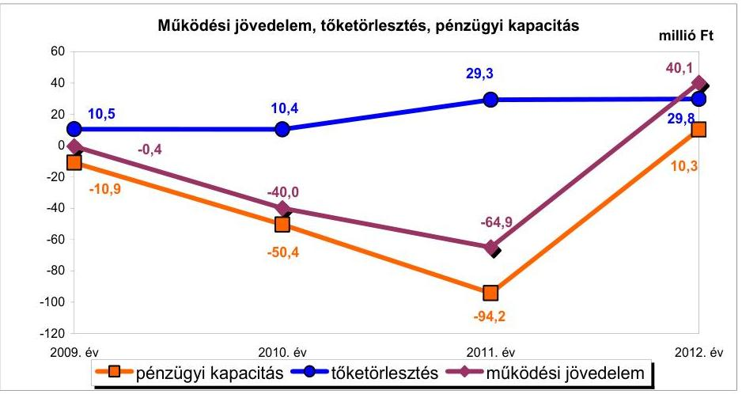
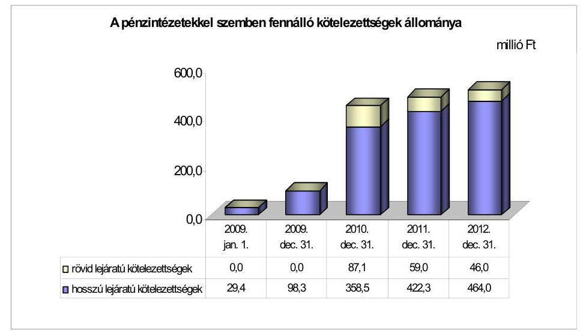
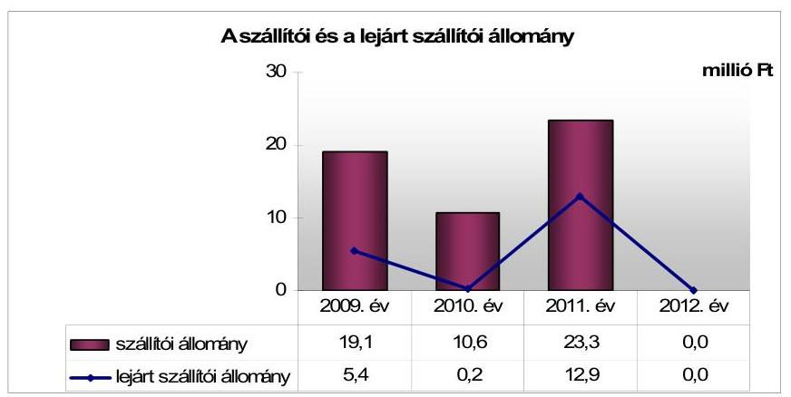
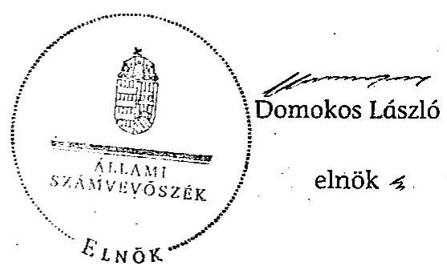
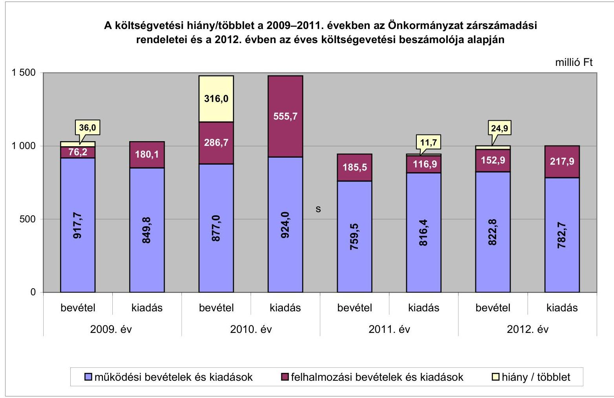
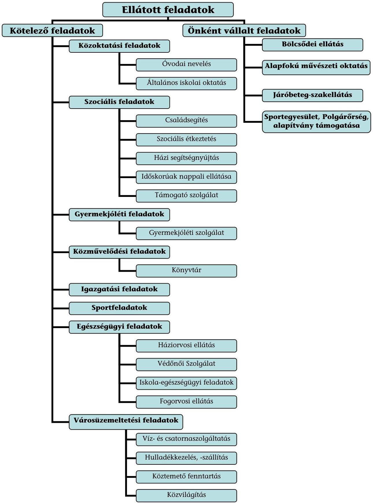

# JELENTÉS 

az önkormányzatok pénzügyi gazdálkodási helyzetének, szabályosságának ellenőrzéséről

LÁBATLAN
13093
2013. szeptember

---

# Állami Számvevőszék 

Iktatószám: V-0030-350-012/2013.
Témaszám: 1069
Vizsgálat-azonosító szám: V059223

## Az ellenőrzést felügyelte:

## Renkó Zsuzsanna

felügyeleti vezető
Az ellenőrzést vezette és az ellenőrzés végrehajtásáért felelős:
Dér Lívia
ellenőrzésvezető
Az ellenőrzést végezték:

## Humli Tamásné

számvevő tanácsos

Szabó Leonóra Ildikó
számvevő

---

# TARTALOMJEGYZÉK 

BEVEZETÉS ..... 3
I. ÖSSZEGZŐ MEGÁLLAPÍTÁSOK, KÖVETKEZTETÉSEK, JAVASLATOK ..... 6
II. RÉSZLETES MEGÁLLAPÍTÁSOK ..... 15

1. Az Önkormányzat kötelező és önként vállalt feladatai, a feladatellátás szervezeti keretei ..... 15
2. A pénzügyi egyensúlyt fenntartását veszélyeztető pénzügyi kockázatok és az ezek csökkentése érdekében tett intézkedések ..... 16
3. A pénzügyi gazdálkodási folyamatok szabályosságát, megfelelőségét biztosító belső kontrollok ..... 26
4. Az ÁSZ korábbi ellenőrzése során a pénzügyi, gazdálkodási helyzet javítására tett javaslatainak megvalósítása ..... 28

---

# MELLÉKLETEK 

1. számú A költségvetési hiány/többlet a 2009-2011. években az Önkormányzat zárszámadási rendeletei és a 2012. évben az éves költségvetési beszámolója alapján
2. számú Az Önkormányzat bevételei és kiadásai, valamint adósságszolgálata a 2009-2012. években (a CLF módszer szerint)
3/a. számú Az Önkormányzat által a 2009-2012. években megvalósított (műszakilag befejezett) fejlesztések forrásösszetétele
3/b. számú Az Önkormányzat 2012. december 31-én folyamatban lévő fejlesztési feladataihoz kapcsolódó kötelezettségeinek összegzése
3. számú Az önkormányzati feladatok ellátásában résztvevő gazdasági társaságok egyes kiemelt adatai
4. számú Az Önkormányzat 2012. december 31-én fennálló, hosszú lejáratú adósságot keletkeztető kötelezettségvállalásai
5. számú Az Önkormányzat kötelezettségeinek és egyes kötelezettségvállalásainak 2009. december 31-ei és 2012. december 31-ei állománya, valamint a 2013. évben és az azt követő években várható kötelezettségek, kötelezettségvállalások miatti kiadások

## FÜGGELÉKEK

1. számú Rövidítések jegyzéke
2. számú Fogalomtár
3. számú Az Önkormányzat által ellátott feladatok 2012. december 31-én

---

# JELENTÉS 

## az önkormányzatok pénzügyi gazdálkodási helyzetének, szabályosságának ellenőrzéséről LÁBATLAN

## BEVEZETÉS

Az államháztartás helyi szintjén, az önkormányzati alrendszerben az utóbbi években megjelenő gazdálkodási nehézségek, a pénzforgalmi hiány növekedése, az eladósodás az ÁSZ figyelmét a helyi önkormányzatok pénzügyi helyzetére irányította.

Az ÁSZ a 2013. év I. félévi ellenőrzési tervben foglaltaknak megfelelően az önkormányzatok pénzügyi gazdálkodási helyzetének, szabályosságának ellenőrzésével az önkormányzatok 2011. évben megkezdett helyzetelemzését folytatta. Az ellenőrzés keretében értékeljük az önkormányzatok adósságkezelési és likviditási helyzetét. Bemutatjuk a pénzügyi egyensúly alakulására hatással lévő folyamatokat, feltárjuk az ezekre ható kockázatokat. Értékeljük a pénzügyi egyensúlyi helyzetet befolyásoló döntés-megalapozó, döntés-előkészítő eljárások szabályosságát, és minősítjük az ezekkel összefüggő belső kontrollok kialakítását, működését.

Az ellenőrzés eredményének várható hatásaként a megállapításokkal segítséget nyújtunk az önkormányzatok számára a pénzügyi egyensúly helyreállítása, javítása és fenntartása érdekében szükségessé váló intézkedések megtételéhez.

Az ellenőrzés típusa: szabályszerűségi ellenőrzés.

## Az ellenőrzés célja annak értékelése volt, hogy:

- az ellenőrzött időszakban a kötelező és önként vállalt feladatok ellátását biztosító szervezeti formák változása milyen hatást gyakorolt az Önkormányzat pénzügyi helyzetének alakulására;
- az Önkormányzat pénzügyi - ezen belül működési és felhalmozási - egyensúlya milyen irányban változott, a változást milyen okok idézték elő, továbbá milyen intézkedéseket tettek a pénzügyi egyensúly biztosítása, illetve javítása érdekében, az intézkedések hatására javult-e az Önkormányzat pénzügyi helyzete;
- a költségvetési kiadások finanszírozása érdekében vállalt, pénzintézetekkel szembeni kötelezettségek hogyan alakultak, a kötelezettségek fennállása miként befolyásolja az Önkormányzat jövőbeli pénzügyi egyensúlyi helyzetét;

---

- az Önkormányzat beazonosította, felmérte, értékelte-e a pénzügyi egyensúlyt befolyásoló pénzügyi kockázatokat, a finanszírozási célú pénzügyi műveletekkel kapcsolatban írtak-e elő kockázatértékelési kötelezettséget;
- az Önkormányzat által kialakított belső kontrollok biztosítják-e a pénzügyi gazdálkodás folyamatainak szabályosságát és eredményességét;
- hasznosultak-e az ÁSZ korábbi ellenőrzése során a pénzügyi, gazdálkodási helyzet javítására tett szabályszerűségi és célszerűségi javaslatok.

Az ellenőrzés a 2009. január 1-jétől 2012. december 31-ig terjedő időszakot ölelte fel. A pénzintézetekkel szembeni kötelezettségek állományára vonatkozóan az ellenőrzés kezdő időpontjaként a 2012. december 31-én fennálló kötelezettségek keletkezésének időpontját vettük figyelembe.

Az ellenőrzés szakmai módszertana az ÁSZ Ellenőrzési Elvek és Standardokban foglalt szakmai szabályokon alapult, amely a Legfőbb Ellenőrző Intézmények Nemzetközi Szervezete (INTOSAI) által kiadott nemzetközi standardok (ISSAI) figyelembevételével készült.

Az ellenőrzés során használt rövidítéseket az 1. számú, az egyes fogalmak magyarázatát a 2. számú függelék tartalmazza.

Az ellenőrzés jogszabályi alapját az ÁSZ tv. 1. § (3) bekezdésének, 5. § (2)-(6) bekezdéseinek, valamint az Áht. 61. § (2) bekezdésének előírásai képezik.

Az Országgyűlés 2012 végén a helyi önkormányzatok adósságállományának részleges konszolidációjáról döntött. Az 5000 fő lakosságszámot meg nem haladó települési önkormányzatok számára nyújtott, törlesztési célú támogatással ${ }^{1}$ lehetővé tették a 2012. december 12-én fennálló adósságállományuk és annak 2012. december 28-áig számított járulékai teljes megfizetését. Az 5000 fő lakosságszám feletti települések esetében a 2013. évben az állam differenciált - az adóerő-képességet figyelembe vevő, 40-70%-ig terjedő - mértékben vállalja át ${ }^{2}$ az önkormányzatok 2012. december 31-i, az átvállalás időpontjában fennálló adósságállományát és annak járulékait. Az adósságkonszolidációs intézkedéssel egyidejűleg a Kormány elrendelte ${ }^{3}$ az önkormányzatok adósságállománya újratermelődésének megakadályozása céljából a hitelengedélyezési és a likvid hitelekre vonatkozó szabályozás szigorítását.

Lábatlan Város Önkormányzata lakónépességére tekintettel a 2013. évi adósságátvállalásban érintett. Az adósságkonszolidáció keretében - a 2013. február 27-én kötött megállapodásban - a Magyar Állam az Önkormányzat fennálló adósságállományának 40,0%-át (154,6 millió Ft-ot) és annak járulékait átvál-

[^0]
[^0]:    ${ }^{1}$ Magyarország 2012. évi központi költségvetéséről szóló 2011. évi CLXXXVIII. törvény 76/C. §-a (beiktatta a 2012. évi CLXXXVII. törvény 8. §-a, hatályos 2012. XII. 6-tól)
    ${ }^{2}$ Magyarország 2013. évi központi költségvetéséről szóló 2012. évi CCIV. törvény 7276. §-ai
    ${ }^{3}$ 1540/2012. (XII. 4.) Korm. határozat a helyi önkormányzatok adósságállományának részleges konszolidációjáról

---

lalta. Az egyeztetés azonban még nem zárult le az adósságátvállalás tényleges mértékére vonatkozóan, mert az Önkormányzat a megállapodástól eltérően, magasabb mérték megállapítását kérte. Az Önkormányzat pénzügyi egyensúlyának jövőbeni alakulását befolyásoló, az ellenőrzött időszakban fennállt kockázatokra az ellenőrzés időszakában tett megállapításaink - a pénzintézetekkel szembeni kötelezettségekkel összefüggésben feltárt kockázatok kivételével - az adósságkonszolidációt követően is helytállóak és időszerűek.

Lábatlan város lakosainak száma 2013. január 1-jén 5264 fő volt. Az Önkormányzat a 2012. évben 975,7 millió Ft költségvetési bevételt ért el, és 1000,6 millió Ft költségvetési kiadást teljesített. 2012. december 31-én a könyvviteli mérleg alapján az Önkormányzat 3372,5 millió Ft értékű vagyonnal rendelkezett, amely a 2009. év végi állományhoz (2963,6 millió Ft-hoz) viszonyítva 13,8%-kal (408,9 millió Ft-tal) növekedett. Az eszközök közül - a végrehajtott fejlesztések (Általános Iskola, Óvoda energetikai fejlesztése) eredményeként - az ingatlanok 528,2 millió Ft-os állománynövekedése volt a meghatározó. Az ellenőrzött időszakban - a rövid és hosszú lejáratú kötelezettségek emelkedésének eredményeként - a kötelezettségállomány 376,1 millió Ft-os növekedése tette ki a források állományváltozásának a 92,0%-át.

Az ÁSZ tv. 29. § (1) bekezdése szerint a jelentéstervezetet megküldtük a polgármester részére, aki az ÁSZ tv. 29. § (2) bekezdésében foglalt észrevételezési jogával nem élt, a jelentéstervezetre észrevételt nem tett.

---

# I. ÖSSZEGZŐ MEGÁLLAPÍTÁSOK, KÖVETKEZTETÉSEK, JAVASLATOK 

Lábatlan Város Önkormányzatának pénzügyi egyensúlya az ellenőrzött időszakban rövid távon nem volt biztosított. A 2013. évi adósságkonszolidáció eredményeként az Önkormányzat pénzügyi egyensúlyi helyzete javul, azonban az adósságátvállalást követően fennmaradó kötelezettségek teljesíthetősége továbbra is kockázatos, az ellenőrzött időszak jövedelemtermelő képessége alapján várhatóan képződő bevételek a feladatellátáshoz szükséges kiadásokat, valamint a tőketörlesztés fedezetét nem biztosítják, a működést rövid távon korlátozzák.

Az Önkormányzat költségvetésének elemzését a CLF módszer alapján számított mutatók alapján végeztük. Az Önkormányzat pénzügyi kapacitásának a 2009-2012. évek közötti változását a következő ábra mutatja be:

Az Önkormányzat a 2009-2012. években összesen 3926,5 millió Ft költségvetési bevételt ért el, és 4443,5 millió Ft költségvetési kiadást teljesített. Működési költségvetésének egyensúlya a 2009-2011. években nem volt biztosított. A folyó bevételek 2012-ben fedezetet nyújtottak a folyó kiadásokra. A 2012. évi működési jövedelem kialakulásához alapvetően az 56,0 millió Ft ÖNHIKI támogatás és a kiadáscsökkentő intézkedések (58,0 millió Ft-tal) járultak hozzá. Az ellenőrzött időszakban összesen 65,2 millió Ft működési hiány képződött. A működési jövedelem 2010. évi hiányát elsősorban a helyi adóbevételek csökkenése, továbbá a folyó kiadások - ezen belül a személyi juttatások (cafetéria és teljesítményhez kötött juttatás) - növekedése határozta meg. A 2011. évi működési hiány emelkedéséhez az adóbevételek mérséklődésén túl a költségvetési támogatás, az áfa bevételek és visszatérülések csökkenése járult hozzá. Az Önkormányzat működőképességének megőrzésére a 2011. évben 12,9 millió Ft, a 2012. évben 56,0 millió Ft vissza nem térítendő ÖNHIKI támogatásban, továbbá a 2012. évben 0,9 millió Ft vis maior támogatásban részesült. Alacsony működési jövedelemtermelő képességet jelzett, bevételi kitettséget jelentett, hogy a működési egyensúly a működőképesség fenntartását szolgáló

---

támogatások nélkül 2011-ben 77,8 millió Ft, a 2012. évben pedig 16,8 millió Ft hiányt mutatott volna.

A felhalmozási költségvetés egyensúlya az ellenőrzött időszakban - a 2011. év kivételével - nem állt fenn. Az ellenőrzött időszakban a rendelkezésre álló források és a teljesített kiadások függvényében évente változó nagyságrendű, összesen 451,8 millió Ft felhalmozási forráshiány képződött. A legnagyobb összegű (309,0 millió Ft) felhalmozási forráshiány a 2010. évben állt fenn. A 2010. évi felhalmozási hiányt elsősorban az Általános Iskola fejlesztési projekt forráshiánya okozta. A felhalmozási forráshiányt hosszú lejáratú fejlesztési célú hitellel, támogatást és árbevételt megelőlegező hitelekkel, valamint folyószámlahitellel finanszírozták az ellenőrzött időszakban.

Az ellenőrzött időszakban a kötelező feladatok ellátását biztosító szervezeti formák változásával járó feladatmegszüntetés hatásaként 14,6 millió Ft kiadási megtakarítás keletkezett, amely a pénzügyi egyensúlyi helyzet alakulására jelentős hatást nem gyakorolt. A bevételnövelő és a kiadáscsökkentő intézkedések (az építményadó mértékének emelése, intézményi átszervezés, feladatátrendezés, létszámcsökkentések, többletjuttatások és a civil szervezeteknek nyújtott támogatások csökkentése) - az Önkormányzat adatszolgáltatása szerint - 127,9 millió Ft-tal járultak hozzá a pénzügyi helyzet javításához.

Az Önkormányzatnál az alacsony működési jövedelemtermelő képességgel kapcsolatban fennállt kockázatok:

- az önként vállalt működési feladatok ellátása miatti kockázat a 2009-2011. években. Az önként vállalt feladatokra fordított működési célú kiadások a 2009-2010. években meghaladták, a 2011. évben megközelítették a működési forráshiány összegét;
- a fejlesztések során kialakított létesítmények jövőbeni üzemeltetése miatti kockázat. Az ellenőrzött időszakban nem számszerűsítették valamennyi megvalósított létesítmény várható fenntartási, üzemeltetési költségeit, a működtetés forrásait, ezeket a fejlesztésekről történő döntéskor a Képviselő-testület számára nem mutatták be. Az Önkormányzat által megvalósított fejlesztések működtetése forrást nem teremt.

Az Önkormányzat pénzintézeti kötelezettségeinek állománya 2012. december 31-ig a 2009. január 1-jén fennálló állomány több mint 17 szeresére, 29,4 millió Ft-ról 510,0 millió Ft-ra nőtt. Az Önkormányzat pénzintézettel szemben fennálló kötelezettségeinek kedvezőtlen változását, jelentős növekedését a hosszú lejáratú fejlesztési hitel, a támogatást és árbevételt megelőlegező - futamidejük alapján hosszú lejáratú - hitelek felvétele, valamint a folyószámlahitel állományváltozása határozta meg. Az Önkormányzat 2012. december 31-én fennálló 464,0 millió Ft hosszú lejáratú adósságot keletkeztető kötelezettségvállalása négy hitelszerződésből származott. Kamatkockázatot jelentett, hogy az adósságot keletkeztető kötelezettségvállalások változó kamatozásúak voltak, továbbá, hogy a döntés-előkészítő és egyéb
 dokumentumokban nem számoltak e kötelezettségvállalások terheinek jövőbeni esetleges jelentős változásával. Nemfizetési kockázatot jelentett, hogy a

---

2011. évben 65,0 millió Ft összegben felvett, ingatlanértékesítésből várt bevételt megelőlegező hitel visszafizetése a szerződés szerinti esedékességkor forráshiány miatt nem történt meg. Az Önkormányzat az ellenőrzött időszakban működésének egyensúlyát folyószámlahitellel és munkabér-megelőlegezési hitel felvételével tudta biztosítani. Az Önkormányzat likviditási nehézségeinek fokozódását, a banki kitettség miatti kockázatot jelzi, hogy a folyószámlahitel igénybevétele a 2011-2012. években tartóssá vált. Egy jogerős döntéssel le nem zárt perben az Önkormányzatnak 251,0 millió Ft fizetési kötelezettsége keletkezett, amely - a jogerőre emelkedés esetén - kockázatot jelent a pénzügyi egyensúlyi helyzet alakulása szempontjából.

A 2013. évi adósságkonszolidáció kedvező hatása ellenére a 2013. évtől várható kötelezettségek teljesíthetőségének kockázatát jelenti, hogy az ellenőrzött időszak jövedelemtermelő képessége alapján számított működési jövedelem nem nyújt fedezetet a pénzintézeti kötelezettségek teljesítésére. Az adósságszolgálat teljesítéséhez szabad tartalékkal nem rendelkeznek, a likviditási nehézségek rendezéséhez források nem állnak rendelkezésre.

Fedezetbevonás miatti kockázatot jelent, hogy az ingatlanok jelzáloggal való terhelésére a 2011-2012. években hét ingatlan esetében került sor, a 2012. év végén a terhelt ingatlanok számviteli értéke a forgalomképes ingatlanok nettó értékének (314,1 millió Ft-nak) a 39,3%-a, a jelzálogjog összege 125,0 millió Ft volt. Az ingatlanok biztosítékul adása miatt, a kötelezettségek teljesítéséhez szükséges, ingatlanértékesítésből elérhető források szűkültek.

Az Önkormányzatnál a kockázatkezelési rendszer keretében a pénzügyi egyensúlyt befolyásoló kockázatok feltárása, beazonosítása, felmérése, értékelése és kezelése - a 2009. évben az Ámr. ${ }_{1}$-ben, a 2010-2011. években az Ámr. ${ }_{2}$-ben, a 2012. évben a Bkr.-ben foglalt jogszabályi előírások ellenére elmaradt. Annak ellenére maradt el a kockázatok kezelése, hogy az ellenőrzött időszakban fennállt az alacsony működési jövedelemtermelő képesség miatti kockázat, az önként vállalt feladatok miatti működési kockázat, az ÖNHIKI támogatás miatti bevételi kitettség, a hitelek miatti kamatkockázat, a folyószámlahitel miatti banki kitettség, a lejárt esedékességű ingatlanértékesítésből várt bevételt megelőlegező hitel miatti nemfizetési kockázat, a fedezetbevonások növekedése miatti kockázat, a fejlesztések során kialakított létesítmények jövőbeni üzemeltetése miatti kockázat, a jogerős ítélettel le nem zárt peres eljárás miatti kötelezettség kockázata, valamint a jövőbeni kötelezettségek teljesíthetőségének kockázata. Az Önkormányzatnál a finanszírozási célú pénzügyi műveletekkel kapcsolatban nem írtak elő kockázatértékelési tevékenységet.

A belső kontrollrendszer keretében, a pénzügyi gazdálkodási folyamatok szabályosságát, megfelelőségét, kockázatainak kezelését biztosító kontrolltevékenységek kialakítása - a 2009. évben az Ámr. ${ }_{1}$-ben, a 2010-2011. években az Ámr. ${ }_{2}$-ben és a 2012. évben a Bkr.-ben - foglalt előírások ellenére nem volt megfelelő, mert nem írták elő a feladat átadás-átvételre vonatkozó döntéselőkészítés folyamatában annak értékelését, hogy a döntés milyen hatást gyakorol a kötelező és az önként vállalt feladatokra fordított kiadások arányára, az Önkormányzat pénzügyi egyensúlyi helyzetére. Nem szabályozták az önkormányzati feladatellátáshoz kapcsolódó támogatási rendszer feltételeit, a feladatellátási szerződések tartalmi követelményeit és a feladatellátás teljesíté-

---

séről a beszámolási kötelezettséget. Nem határozták meg a fejlesztések döntéselőkészítési folyamatában a kockázatok feltárásának és kezelésének kötelezettségét, a fejlesztések esetében a pályáztatási kötelezettséget és a pénzeszközátadások feltételrendszerét. Nem írták elő a fizetőképesség és eladósodás kezelését szolgáló stratégia, koncepció, illetve egyéb belső szabályozás készítését, valamint a pénzintézeti kötelezettségvállalások kockázatai feltárásának kötelezettségét. Nem szabályozták a hitelfelvételről szóló döntés-előkészítés folyamatában a futamidő egyes éveit terhelő kötelezettség költségvetési egyensúlyra gyakorolt hatásának vizsgálatát, a pályáztatás vagy több ajánlatkérés kötelezettségét. Nem határozták meg a pénzügyi kötelezettségek teljesítésének helyi szabályait. Nem készült szabályozás a szállítói tartozások és az egyéb kiadáselmaradások rendezésére. Az ellenőrzött időszak belső ellenőrzési terveinek készítését megelőzően - a 2009. évben az Ámr. ${ }_{1}$-ben, a 2010-2011. években az Ámr. ${ }_{2}$-ben, a 2009-2011. években a Ber.-ben, 2012. január 1-jétől a Bkr.-ben foglaltak ellenére - nem írták elő a pénzügyi egyensúlyi helyzetet befolyásoló döntések kockázati tényezőinek feltárását, a belső ellenőrzési tervek nem tartalmazták az ellenőrzési terveket megalapozó kockázatelemzéseket és az Önkormányzatnál nem ellenőrizték ezeket a kockázati tényezőket.

A pénzügyi gazdálkodási folyamatok szabályosságát, megfelelőségét, a kockázatok kezelését biztosító belső kontrollok működése gyenge volt, mert a fejlesztéseket megelőző döntés-előkészítési folyamatban nem tárták fel a kockázatokat. Nem vizsgálták a döntés-előkészítés szakaszában a pénzintézeti kötelezettségvállalások kockázatait, a futamidő egyes éveit terhelő kötelezettség költségvetési egyensúlyra gyakorolt hatását. A belső ellenőrzési tervek nem tartalmazták az ellenőrzési terveket megalapozó kockázatelemzéseket, az Önkormányzatnál a pénzügyi egyensúlyi helyzetet befolyásoló döntések kockázati tényezőinek feltárása és belső ellenőrzés keretében történő ellenőrzése elmaradt. A kialakított kontrollok nem biztosították a pénzügyi gazdálkodási folyamatok eredményességét.

Az ellenőrzés során a gazdálkodási feladatok ellátásával és a könyvvezetési kötelezettség teljesítésével kapcsolatban az alábbi szabályszerűségi hibákat tártuk fel:

- a folyószámlahitel felvételből és törlesztésből eredő halmozódások megszüntetése érdekében a 2011-2012. években az Áhsz.-ben előírtak ellenére az átvezetéseket nem végezték el;
- az Önkormányzat a 2011. évben igénybe vett 65,0 millió Ft rövid lejáratú hitel szerződéséhez felhatalmazást adott a pénzintézet számára bármely bankszámlája megterhelésére, amennyiben törlesztési kötelezettségét nem teljesíti. További két hitelszerződés (a 2006. évi 12,8 millió Ft és a 2009-2010. évben felvett 350,0 millió Ft hosszú lejáratú hitelek) biztosítékaként az Önkormányzat költségvetését jelölték meg. Ezáltal az Ötv., a 2006. és a 2009. évben az Ámr. ${ }_{1}$, a 2010-2011. években az Ámr. ${ }_{2}$ előírásait megsértve a központi költségvetésből származó bevételeiket a hitelek fedezeteként ajánlották fel.

A 2010. évben végzett ÁSZ ellenőrzés által a pénzügyi, gazdálkodási helyzet javítására tett hat - négy szabályszerűségi és két célszerűségi - javaslat hasznosítása megtörtént.

---

Az ÁSZ tv. 33. § (1) bekezdésében foglaltak értelmében az ellenőrzött szervezet vezetője köteles a jelentésben foglalt megállapításokhoz kapcsolódó intézkedési tervet összeállítani, és azt a jelentés kézhezvételétől számított harminc napon belül az ÁSZ részére megküldeni. Amennyiben az intézkedési tervet határidőn belül nem küldi meg a szervezet vezetője, vagy az továbbra sem elfogadható, az ÁSZ elnöke a hivatkozott törvény 33. § (3) bekezdés a-b) pontjaiban foglaltakat érvényesítheti.

# Az ellenőrzés intézkedést igénylő megállapításai és javaslatai: 

## a polgármesternek

1. A működési jövedelem a 2012. év kivételével negatív volt. Az Önkormányzat működőképességének megőrzésére 2011-2012 között ÖNHIKI támogatásban, a 2012. évben vis major támogatásban részesült. A nettó működési jövedelem a 2009-2011. években negatív volt, növekvő pénzügyi kapacitáshiányt jelzett. A 2012. évi pozitívuma a felhalmozási forráshiányra nem nyújtott fedezetet. A likviditás biztosítására igénybe vett folyószámlahitel a 2011-2012. években tartóssá vált. Ezen túl az Önkormányzat 2010-2011 között munkabér-megelőlegezési hitelt is vett igénybe. A likviditási helyzet romlását jelzi, hogy a 2011-ben felvett 65,0 millió Ft hiteltartozást és annak járulékait az Önkormányzat a szerződés szerinti esedékességkor nem tudta megfizetni. 2012. december 31-én az Önkormányzat pénzintézeti kötelezettsége 510,0 millió Ft volt, szállítói tartozással és egyéb kötelezettséggel nem rendelkezett. A működési jövedelem várhatóan nem nyújt fedezetet a 2013. évi adósságkonszolidációt követően fennmaradó kötelezettségek tőketörlesztési kötelezettségére, melynek teljesítéséhez szabad tartalék sem áll rendelkezésre. Egy jogerős végzéssel le nem zárt perben az Önkormányzat terhére az első fokú ítélet 251,0 millió Ft fizetési kötelezettséget állapított meg. A bevételnövelő és a kiadáscsökkentő intézkedések 127,9 millió Ft-tal járultak hozzá a pénzügyi helyzet javításához.

Javaslat:
A működési jövedelemtermelő képesség és a feladatellátás összhangja, valamint az Önkormányzat pénzügyi egyensúlyának helyreállítása, hosszú távú fenntarthatósága érdekében - a 2013. évi kormányzati adósságkonszolidációt, valamint a 2013. évtől változó feladatellátási kötelezettséget, feladatfinanszírozási rendszert figyelembe véve - felelősök és határidők megjelölésével kezdeményezzen intézkedéseket, melyek keretében:
a) a költségvetési rendelettervezet, valamint annak évközi módosítása előterjesztését megelőzően mérjék fel a bevételszerző, kiadáscsökkentő lehetőségeket, és terjessze a Képviselő-testület elé a bevételek növelését, a kiadások csökkentését célzó intézkedések bevezetéséhez szükséges - a Htv. 140. § (1) bekezdés a) pontja alapján a jegyző által elkészített - döntési javaslatát;
b) terjesszen a Képviselő-testület elé jóváhagyásra - a Htv. 140. § (1) bekezdés a) pontja alapján a jegyző által elkészített - az Önkormányzat gazdasági helyzetének elemzésén alapuló, a pénzügyi egyensúlyi helyzet gyors helyreállítását, hosszú távú fenntartását, valamint az adósságállomány újratermelődésének elkerülését biztosító intézkedéseket tartalmazó reorganizációs programot;

---

c) az adósságkonszolidációt követően fennmaradó kötelezettségek jövőbeni teljesítése, a fizetőképesség megőrzése érdekében terjesszen a Képviselő-testület elé a Htv. 140. § (1) bekezdés a) pontja alapján a jegyző által elkészített - döntési javaslatot, amelyben a Képviselő-testület kötelezettséget vállal arra, hogy előre meghatározott összegben és módon a realizált többletbevételeket, a meglévő és a jövőben képződő tartalékokat mindaddig a kötelezettségek rendezésére fordítja, azt nem használja más célra, amíg az Önkormányzat pénzügyi egyensúlya rövid távon veszélyeztetett.
2. Az Önkormányzat a 2011. évi 65,0 millió Ft összegű rövid lejáratú hitel szerződéséhez kapcsolódóan felhatalmazást adott a pénzintézet számára bármely bankszámlája megterhelésére, amennyiben törlesztési kötelezettségét nem teljesíti. A 2006. évben igénybevett 12,8 millió Ft, valamint a 2009-2010. években felvett 350,0 millió Ft hosszú lejáratú hitelek szerződéseiben biztosítékként az Önkormányzat költségvetését jelölték meg. Ezáltal az Ötv. 88. § (1) bekezdés b) pontjában ${ }^{4}$, a 2006., valamint a 2009. évben az Ámr. 103. § (11) bekezdésében ${ }^{5}$, a 2010-2011. években az Ámr. ${ }_{12}$ 174. § (11) bekezdésében ${ }^{6}$ előírtakat megsértve a központi költségvetésből származó bevételeket ajánlották fel a hitelek fedezeteként.

Javaslat:
A pénzintézeti kötelezettségvállalásokkal kapcsolatos jogszerű biztosíték, illetve fedezet felajánlása érdekében:
a) intézkedjen, hogy jövőbeni hitelfelvétel, kötvénykibocsátás fedezeteként az Áht. 84. § (4) bekezdésében és az Ávr. 145. § (2) bekezdésében előírtak szerint az Önkormányzat általános működésének és ágazati feladatainak támogatása, valamint a költségvetési támogatás ne kerüljön felhasználásra;
b) a jogellenes állapot megszüntetése érdekében vizsgálja meg a jogszerű biztosíték cseréjének lehetőségét, és terjesszen javaslatot a Képviselő-testület elé a biztosíték cseréjéről.

# a jegyzőnek 

1. A 2011-2012. években a folyószámlahitel felvétele és törlesztése során elszámolt bevételekből és kiadásokból eredő halmozódás megszüntetése érdekében - a 2011. évben az Áhsz. 9. számú mellékletében a számlaosztályok tartalmára vonatkozó előírások 3. pont b) alpontjában, 2012. január 1-jétől az Áhsz. 9. számú mellékletében a számlaosztályok tartalmára vonatkozó előírások a 3. pont bb) alpontjában előírtak ellenére - nem végezték el a nettósítást.
[^0]
[^0]:    ${ }^{4}$ Hatálytalan 2012. január 1-jétől, a 2012. március 31-től hatályos előírás az Áht. 84. § (4) bekezdése.
    ${ }^{5}$ Hatálytalan 2010. január 1-jétől, a 2010. január 1-jétől hatályos előírás az Ámr. ${ }_{12} 174$. § (11) bekezdése.
    ${ }^{6}$ Hatálytalan 2012. január 1-jétől, a 2012. január 1-jétől hatályos előírás az Ávr. 145. § (2) bekezdése.

---

Javaslat:
Intézkedjen, hogy a folyószámlahitel felvétel és törlesztés során elszámolt bevételekből és kiadásokból eredő halmozódások megszüntetése érdekében - az Áhsz. 9. számú mellékletében a számlaosztályok tartalmára vonatkozó előírások 3. pont
 bb) alpontjában foglalt előírásnak megfelelően – végezzék el a nettósítást.
2. A kockázatkezelési rendszer keretében az ellenőrzött időszakban fennállt, a pénzügyi egyensúlyt befolyásoló kockázatok feltárása, beazonosítása, felmérése, értékelése és kezelése – a 2009. évben az Ámr. 145/C. § (1)–(3) bekezdéseiben, a 2010–2011. években az Ámr. 2 157. § (1)–(3) bekezdéseiben, a 2012. évben a Bkr. 7. § (1)–(2) bekezdéseiben foglalt jogszabályi előírások ellenére – elmaradt. Annak ellenére maradt el a kockázatok kezelése, hogy az ellenőrzött időszakban fennállt az alacsony működési jövedelem termelőképesség miatti kockázat, az önként vállalt feladatok miatti működési kockázat, az ÖNHIKI támogatás miatti bevételi kitettség, a folyószámlahitel miatti banki kitettség kockázata, a hitelek miatti kamatkockázat, a lejárt esedékességű, ingatlanértékesítésből várt bevételt megelőlegező hitel miatti nemfizetési kockázat, a fedezetbevonások növekedése miatti kockázat, a fejlesztések során kialakított létesítmények jövőbeni üzemeltetése miatti kockázat, a jogerős ítélettel le nem zárt peres eljárás miatti kötelezettség kockázata, valamint a jövőbeni várható kötelezettségek teljesíthetősége miatti kockázat.

Javaslat:
Működtessen a Bkr. 7. § (1)–(2) bekezdéseiben foglalt előírásoknak megfelelő, a pénzügyi egyensúlyt befolyásoló kockázatok kezelésére alkalmas kockázatkezelési rendszert.
3. A pénzügyi gazdálkodási folyamatok szabályossága, megfelelősége vonatkozásában a kockázatok kezelését biztosító belső kontrolltevékenységek kialakítása – a 2009. évben az Ámr. 145/E. § (1)–(2) bekezdéseiben, a 2010–2011. években az Ámr. ₂ 158. § (1)–(2) bekezdéseiben, a 2012. évben a Bkr. 8. § (1)–(2) bekezdéseiben foglalt előírások ellenére – nem volt megfelelő, mert nem írták elő a feladat átadás-átvételre vonatkozó döntés-előkészítés folyamatában annak értékelését, hogy a döntés milyen hatással bír a kötelező és önként vállalt feladatokra fordított kiadások arányára, a pénzügyi egyensúlyi helyzetre. Nem írták elő az önkormányzati feladatellátáshoz kapcsolódó támogatási rendszer feltételeit, a feladatellátási szerződések tartalmi követelményeinek meghatározását és a feladatellátás teljesítéséről a beszámolási kötelezettséget. Nem írták elő a fejlesztések döntés-előkészítési folyamatában a kockázatok feltárásának és kezelésének kötelezettségét, a fejlesztések pályáztatási kötelezettségét, a működési és felhalmozási célú pénzeszközátadások feltételrendszerét. Nem írták elő a pénzintézeti kötelezettségvállalások kockázatai feltárásának kötelezettségét. Nem írták elő a hitelfelvételről szóló döntés-előkészítés folyamatában a futamidő egyes éveit terhelő kötelezettség költségvetési egyensúlyra gyakorolt hatásának vizsgálatát, a pályáztatás vagy több ajánlatkérés kötelezettségét. Nem határozták meg a pénzügyi kötelezettségek teljesítésének helyi szabályait. Nem készítettek a fizetőképesség és eladósodás kezelését szolgáló stratégiát, koncepciót, illetve egyéb belső szabályozást. Nem szabályozták a szállítói tartozások és egyéb kiadáselmaradások rendezésével összefüggő kontrolltevékenységeket.

---

Javaslat:
Alakítsa ki a Bkr. 8. § (1)–(2) bekezdései alapján azokat a belső kontrolltevékenységeket, amelyek biztosítják a pénzügyi-gazdálkodási folyamatok szabályosságát, a pénzügyi egyensúlyi helyzet alakulását befolyásoló döntések kockázatainak kezelését. Készítse el a hiányzó szabályozásokat. Ennek keretében:
c) írja elő a feladat átadás-átvételre vonatkozó döntések előkészítése során a döntés kötelező és önként vállalt feladatok arányára, ezáltal a pénzügyi egyensúlyi helyzetre gyakorolt hatásának vizsgálatát;
d) írja elő az önkormányzati feladatellátáshoz kapcsolódó támogatási rendszer feltételeit, valamint a szerződések minimum tartalmi követelményeinek meghatározásával összefüggő kontrolltevékenységeket;
e) határozza meg a feladatellátási szerződések teljesítésére vonatkozó beszámolási kötelezettséggel kapcsolatos kontrolltevékenységeket;
f) határozza meg a fejlesztések döntés-előkészítés folyamatában a lebonyolítás és a működtetés kockázatai feltárásának és kezelésének kötelezettségét;
g) határozza meg a fejlesztések esetén a pályáztatási kötelezettséggel kapcsolatos kontrolltevékenységeket;
h) írja elő a működési és felhalmozási célú pénzeszközátadások feltételrendszerével összefüggő kontrolltevékenységeket;
i) írja elő a pénzintézeti kötelezettségvállalások kockázatainak döntés-előkészítő szakaszban történő feltárását, a futamidő egyes éveit terhelő kötelezettségek költségvetési egyensúlyra gyakorolt hatásának vizsgálatát;
j) határozza meg a pénzintézeti szolgáltatások igénybevételével kapcsolatosan a közbeszerzési értékhatár alatti esetekben a pályáztatási kötelezettséggel kapcsolatos kontrolltevékenységeket;
k) készítsen szabályzatot az Önkormányzat fizetőképességének és eladósodásának kezelésére, valamint határozza meg a pénzügyi kötelezettségek teljesítése, a szállítói tartozások és az egyéb kiadáselmaradások rendezésének helyi szabályait.
4. Az Önkormányzatnál az ellenőrzött időszak belső ellenőrzési terveinek készítését megelőzően – a 2009. évben az Ámr. 145/C. § (2) bekezdésében, a 2010–2011. években az Ámr. 2 157. § (2) bekezdésében, a 2009–2011. években a Ber. 18. §-ában, a 21. § (2) bekezdésében és a (3) bekezdés a) pontjában, 2012. január 1-jétől a Bkr. 7. § (2) bekezdésében, a 29. § (1) bekezdésében és a 31. § (2)–(4) bekezdéseiben foglaltak ellenére – nem írták elő a pénzügyi egyensúlyi helyzetet befolyásoló döntések kockázati tényezőinek feltárását, a belső ellenőrzési tervek nem tartalmazták az ellenőrzési terveket megalapozó kockázatelemzéseket és az Önkormányzatnál nem ellenőrizték ezeket a kockázati tényezőket.

---

Javaslat:
Intézkedjen a belső ellenőrzés vezetője felé, hogy a Bkr. 7. § (2) bekezdésében foglaltak szerint mérjék fel a gazdálkodásban rejlő kockázatokat, a 29. § (1) bekezdésében és a 31. § (2)–(4) bekezdéseiben foglalt előírások szerint az éves belső ellenőrzési tervek tartalmazzák a pénzügyi egyensúlyi helyzetet befolyásoló döntésekkel kapcsolatos feltárt kockázati tényezők ellenőrzését, valamint biztosítsa az ellenőrzési tervek végrehajtását.

---

# II. RÉSZLETES MEGÁLLAPÍTÁSOK 

## 1. Az ÖNKORMÁNYZAT KÖTELEZŐ ÉS ÖNKÉNT VÁLLALT FELADATAI, A FELADATELLÁTÁS SZERVEZETI KERETEI

Az Önkormányzat kötelező és önként vállalt feladatait SZMSZ-ben nem határozta meg. A kötelező és az önként vállalt feladatok elkülönített bemutatását a 2010. évtől kezdődően a költségvetési rendeletek tartalmazták. Az önként vállalt feladatok – az Önkormányzat besorolása alapján – a 2009. évben a bölcsődei ellátás és az alapfokú művészeti oktatás voltak. A 2010. évben e feladatok közt nevesítették a helyi támogatásokat (civil szervezetek), a segélyeket (Bursa ösztöndíj) és az egyéb kiadásokat (elismerések, díszkivilágítás, városi rendezvények). A 2012. év végén önként vállalt feladatok: a bölcsődei ellátás; az alapfokú művészeti oktatás; a járóbeteg-szakellátás; a Sportegyesület, a Polgárőrség és alapítvány támogatása voltak.

Az Önkormányzat 2009. január 1-jén a kötelező feladatok körében a közoktatás keretében biztosította az óvodai nevelést és az általános iskolai oktatást. Kötelező feladatként látták el a szociális, a gyermekjóléti, a közművelődési, az igazgatási, az egészségügyi és a sport feladatokat. A kötelező feladatot ellátó Mici Mackó Óvodát, mint önállóan működő költségvetési szervet a 2012. évben megszüntették, a továbbiakban feladatait a másik Óvoda telephelyeként látta el. A Petőfi Sándor Általános Iskolát megszüntették, melynek következtében a 2010. évben az iskolai telephelyek száma csökkent.

A 2009. év és a 2011. év között öt, 2012-ben négy gazdasági társaság ⁷ látott el közszolgáltatási szerződések alapján önkormányzati kötelező városüzemeltetési feladatokat ⁸ (hulladékkezelés és -szállítás, közvilágítás, víz- és csatornaszolgáltatás, köztemető fenntartás). Az Önkormányzatnak 2012. december 31-én a víz- és csatornaszolgáltatási tevékenységet végző Hétforrás Kft.-ben 21,0% tulajdoni részesedése volt. ⁹ (A feladatellátás részletezését a 3. számú függelék tartalmazza.)

A 2012. évben a teljesített működési kiadások összege 782,7 millió Ft volt, amely a 2009. évi működési kiadástól 7,9%-kal (67,1 millió Ft-tal) maradt el. Az Önkormányzatnál 2009-ben az összes működési célú költségvetési kiadás 99,6%-át (846,1 millió Ft-ot), 2012-ben 97,0%-át (758,9 millió Ft-ot) a kötelező feladatokra fordított kiadások tették ki. Az önként vállalt feladatokra fordított működési célú kiadások működési kiadáson belüli aránya a 2009. évben – a kötelező és az önként vállalt feladatok elkülönítésének hiánya miatt – 0,4% (3,7 millió Ft), a 2010. évi elkülönítést követően 10,3% (88,4 millió Ft), a 2011.

[^0]
[^0]:    ⁷ Kizárólagos tulajdonában álló gazdasági társasága 2011-ben megszűnt.
    ⁸ Az önkormányzati feladatok ellátásában résztvevő gazdasági társaságok egyes kiemelt adatait a 4. számú melléklet tartalmazza.
    ⁹ A nem önkormányzati feladatot ellátó ÉPFU Kft-ben 0,9% volt a tulajdoni részesedése.

---

évben 7,1% (57,3 millió Ft), a 2012. évben 3,0% (23,8 millió Ft) volt. A 2009–2011. években az önként vállalt feladatok ellátása kockázatot jelentett a pénzügyi helyzet szempontjából, mert az e feladatokra fordított működési célú kiadások összege a 2009–2010. években meghaladta, a 2011. évben pedig megközelítette a működési forráshiány összegét ¹⁰. A 2012. évben az önként vállalt feladatok ellátására fordított kiadás összes működési kiadáson belüli nagyságrendje és a pozitív működési jövedelem ¹¹ miatt kockázatot nem jelentett.

Az Önkormányzat az ellenőrzött időszak végéig a befejezett és folyamatban lévő fejlesztésekre 943,5 millió Ft kiadást teljesített, amelyet 77,0%-ban (726,7 millió Ft) a kötelező feladatokhoz, 23,0%-ban (216,8 millió Ft) az önként vállalt feladatokhoz kapcsolódó fejlesztésekre fordított. Az önként vállalt feladatokhoz kapcsolódó fejlesztési kiadások nagyságrendjük miatt felhalmozási kockázatot nem jelentettek.

A kötelező és az önként vállalt feladatokra fordított kiadások arányának, mértékének és azok változásának a pénzügyi egyensúlyi helyzetre gyakorolt hatását az Önkormányzat nem értékelte, azonban a Képviselőtestület a kötelező és az önként vállalt feladatellátás szervezeti formáinak racionalizálását célzó döntéseket hozott az ellenőrzött időszakban.

A 2009. évben az Önkormányzat feladatait hét költségvetési szervvel, 10 telephelyen, a 2012. év végén hat költségvetési szervvel, kilenc telephelyen látta el. A szervezeti változás oka, hogy az ellenőrzött időszakban a kötelező feladatok körében egy önállóan működő közoktatási költségvetési szerv telephelyként történő működtetéséről és egy másik közoktatási intézmény megszüntetéséről döntött a Képviselő-testület. Az önként vállalt feladatok esetében pedig az Óvodában 10 fős bölcsődei csoportot alakítottak ki. Az önként vállalt feladatok közül a kiadáscsökkentő intézkedések körében csökkentették a helyi támogatásokat (civil szervezetek), mérsékelték a segélyeket (Bursa ösztöndíj) és az egyéb kiadásokat (elismerések, díszkivilágítás, városi rendezvények).

A 2009. év és a 2012. év közötti időszakban a feladatok ellátását biztosító szervezeti formák változásával járó feladatmegszüntetés hatása kedvező volt, – az Önkormányzat adatszolgáltatása alapján – 14,6 millió Ft kiadási megtakarítást eredményezett, de az Önkormányzat pénzügyi egyensúlyi helyzetére jelentős hatást nem gyakorolt.

# 2. A PÉNZÜGYI EGYENSÚLY FENNTARTÁSÁT VESZÉLYEZTETŐ PÉNZÜGYI KOCKÁZATOK ÉS AZ EZEK CSÖKKENTÉSE ÉRDEKÉBEN TETT INTÉZKEDÉSEK 

Az Önkormányzat költségvetésének elemzését CLF módszerrel hajtottuk végre. A CLF módszer szerinti, önkormányzati részletes adatokat a 2009. év és a

[^0]
[^0]:    ¹⁰ 2009-ben 0,4 millió Ft, 2010-ben 40,0 millió Ft, 2011-ben 64,9 millió Ft
    ¹¹ 40,1 millió Ft

---

2012. év között a 2. számú melléklet, a főbb önkormányzati adatokat a következő tábla mutatja be:

|  |  |  | millió Ft |  |
| :-- | --: | --: | --: | --: |
| Megnevezés | 2009. év | 2010. év | 2011. év | 2012. év |
| Folyó bevételek | 849,4 | 820,9 | 739,2 | 822,8 |
| Folyó kiadások | 849,8 | 860,9 | 804,1 | 782,7 |
| Működési jövedelem | $\mathbf{- 0 , 4}$ | $\mathbf{- 4 0 , 0}$ | $\mathbf{- 6 4 , 9}$ | $\mathbf{4 0 , 1}$ |
| Felhalmozási bevételek | 56,9 | 309,8 | 174,6 | 152,9 |
| Felhalmozási kiadások | 180,1 | 618,8 | 129,2 | 217,9 |
| Felhalmozási költségvetés egyenlege | $\mathbf{- 1 2 3 , 2}$ | $\mathbf{- 3 0 9}$

 , 0}$ | $\mathbf{45,4}$ | $\mathbf{-65,0}$ |
| Folyó és felhalmozási bevételek összesen | 906,3 | 1130,7 | 913,8 | 975,7 |
| Folyó és felhalmozási kiadások összesen | 1029,9 | 1479,7 | 933,3 | 1000,6 |
| Finanszírozási műveletek nélküli pozíció | $\mathbf{-123,6}$ | $\mathbf{-349,0}$ | $\mathbf{-19,5}$ | $\mathbf{-24,9}$ |
| Finanszírozási műveletek egyenlege | 74,3 | 328,4 | 40,0 | 43,7 |
| Tárgyévi pénzügyi pozíció | $\mathbf{-49,3}$ | $\mathbf{-20,6}$ | $\mathbf{20,5}$ | $\mathbf{18,8}$ |
| Hiteltörlesztés, értékpapír beváltás | 10,5 | 10,4 | 29,3 | 29,8 |
| Nettó működési jövedelem | $\mathbf{-10,9}$ | $\mathbf{-50,4}$ | $\mathbf{-94,2}$ | $\mathbf{10,3}$ |

A CLF táblában szereplő adatok a 2011-2012. évi beszámolókban feltárt elszámolási hiba miatt módosultak. A folyószámlahitel felvételből és törlesztésből eredő halmozódások esetében a 2011. évben az Áhsz. 9. számú mellékletében a Számlaosztályok tartalmára vonatkozó előírások 3. pont, b) alpontjában előírtak és a 2012. évben az Áhsz. 9. számú mellékletében a Számlaosztályok tartalmára vonatkozó előírások 3. pont, bb) alpontjában előírtak ellenére az átvezetéseket nem végezték el, amelynek következtében a folyószámlahitel állomány az év közben felvett és visszafizetett hitel negyedév végi állományát is tartalmazta.

Az Önkormányzat a 2009-2012. években összesen 3926,5 millió Ft költségvetési bevételt ért el, és 4443,5 millió Ft költségvetési kiadást teljesített. Az Önkormányzat folyó költségvetési egyenlege, működési jövedelme a 2009-2011. években negatív volt. Az Önkormányzat folyó bevételei 2012-ben fedezetet nyújtottak a folyó kiadásokra. Az ellenőrzött időszak egészét tekintve 65,2 millió Ft működési hiány képződött. A működési hiány a 2010. év végére a 2009. évi (-0,4 millió Ft) százszorosára emelkedett, elsősorban a folyó bevételek - helyi adóbevételek (82,0 millió Ft-os) mérséklődése miatti - csökkenése, továbbá a folyó kiadások - személyi juttatások (cafetéria és teljesítményhez kötött juttatás) - növekedése következtében. A működési jövedelem 2011. évi 64,9 millió Ft-os hiánya az adóbevételek mérséklődésén túl a költségvetési támogatás, az áfa bevételek és visszatérülések csökkenéséből adódott, annak ellenére, hogy a 2011. évben csökkent a személyi juttatások és a járulékok kiadása a létszámleépítésekből adódóan. A 2012. évi pozitív (40,1 millió Ft) működési jövedelem kialakulásához alapvetően az 56,0 millió Ft ÖNHIKI támogatás és a kiadáscsökkentő intézkedések (58,0 millió Ft-tal) járultak hozzá.

Az Önkormányzat működőképességének megőrzésére a 2011. évben 12,9 millió Ft, a 2012. évben 56,0 millió Ft vissza nem térítendő ÖNHIKI támogatásban, továbbá a 2012. évben 0,9 millió Ft vis maior támogatásban részesült. A működési jövedelemtermelő képesség alacsony szintjét jelezte, és bevételi kitettséget jelentett, hogy e támogatások nélkül az Ön-

---

kormányzat működési jövedelme a 2011. évben 77,8 millió Ft, a 2012. évben 16,8 millió Ft hiányt mutatott volna.

A nettó működési jövedelem a 2009-2011. években növekvő pénzügyi kapacitáshiányt jelzett, a 2012. évben pozitív volt, azonban a felhalmozási forráshiányra nem biztosított fedezetet. A nettó működési jövedelem 2009-2011 közötti csökkenését a romló működési jövedelemtermelő képesség és a 2011. évben növekvő hiteltörlesztés eredményezte.

Az Önkormányzat felhalmozási költségvetésének egyenlege az ellenőrzött időszakban - a 2011. év kivételével - negatív volt. A rendelkezésre álló források és a teljesített kiadások függvényében évente változó nagyságrendben, összesen 451,8 millió Ft forráshiány képződött. A legnagyobb összegű (309,0 millió Ft) felhalmozási forráshiány a 2010. évben állt fenn, amelyet elsősorban az Általános Iskola fejlesztési feladat miatti forráshiány okozott. E felújítás érdekében teljesített kiadás 453,6 millió Ft volt, amelyhez 23,6 millió Ft saját bevétel, 80,0 millió Ft központi támogatás állt rendelkezésre, valamint 350,0 millió Ft hitel igénybevételére volt szükség. A felhalmozási forráshiányt hosszú lejáratú fejlesztési célú hitellel, támogatást és árbevételt megelőlegező hitelekkel, valamint folyószámlahitellel finanszírozták az ellenőrzött időszakban.

Az Önkormányzat évenkénti teljes finanszírozási igénye ${ }^{12}$ a CLF módszer szerint 2009-ben 134,1 millió Ft, 2010-ben 359,4 millió Ft, 2011-ben 48,8 millió Ft, 2012-ben pedig 54,7 millió Ft volt. A CLF módszertől eltérően, a pénzforgalom nélküli tételek figyelembevételével a 2009-2011. évek zárszámadási rendeleteiben, valamint a 2012. évi költségvetési beszámolóban kimutatott költségvetési hiány és többlet összegét az 1. számú melléklet tartalmazza.

A folyó bevételek összege 2009-2011 között folyamatosan - a 2009. évi 849,4 millió Ft-ról a 2010. évre 3,4%-kal (28,5 millió Ft-tal), a 2011. évre 10,0%-kal (81,7 millió Ft-tal) - csökkent. A folyó bevételek csökkenését döntően a helyi adóbevételek csökkenése okozta, valamint a 2011. évben a költségvetési támogatás, az áfa bevételek és visszatérülések csökkenése is befolyásolta. A folyó bevételek 2012. évi - az előző évhez viszonyított - 11,3%-os (83,6 millió Ft) növekedése elsősorban az ÖNHIKI támogatás igénybevételének és az egyéb saját bevételek emelkedésének a következménye volt. Az ellenőrzött időszakban a folyó bevételeknek átlagosan 47,9%-át tette ki a költségvetési támogatás (ÖNHIKI-vel együtt) és az átengedett bevételek együttes összege. E támogatások összege 2010-ben 10,5%-kal (38,9 millió Ft-tal) nőtt, 2011-ben 11,1%-kal (45,4 millió Ft-tal) csökkent, majd 2012-ben 9,2%-kal (33,5 millió Ft-tal) nőtt az előző évhez viszonyítva. A változást a normatív hozzájárulás csökkenése és a központosított előirányzatok fajlagos összegének mérséklődése okozta.

Az állandó lakosságszámhoz kötött állami támogatás a településen élő lakosok számának csökkenése következtében változott. A 2011-2012. években a támogatási és a szociális juttatások változása hatásaként a költségvetési támogatás csökkent.

[^0]
[^0]:    ${ }^{12}$ a nettó működési jövedelem és a felhalmozási költségvetés együttes negatív egyenlege

---

Az Önkormányzatnak az ellenőrzött időszakban négy helyi adónemből - építmény, iparűzési, vállalkozók kommunális és magánszemélyek kommunális adója - származott a bevétele.

Az Önkormányzat az iparűzési adó mértékét a maximálisan kivethető 2,0%-ban határozta meg. Az építményadó mértékét a Képviselő-testület 2012-től a korábbi $700 \mathrm{Ft} / \mathrm{m}^{2}$-ről $1000 \mathrm{Ft} / \mathrm{m}^{2}$-re emelte. A magánszemélyek kommunális adója az ellenőrzött időszakban változatlan, $5000 \mathrm{Ft} /$ adóalany volt. A 2011. évtől megszűnt vállalkozók kommunális adójának mértéke a 2009-2010. években $2000 \mathrm{Ft} /$ adóalany volt.

A helyi adók folyó bevételeken belüli aránya a 2009. évi 42,9%-ról (364,1 millió Ft) a 2012. évben 29,3%-ra (241,1 millió Ft) módosult, amelynek fő oka - a vállalkozások árbevételének csökkenése miatt - az iparűzési adóbevétel mérséklődése volt. Az iparűzési adóbevétel a 2009. évben a helyi adóbevételek 82,4%-át (300,0 millió Ft), a 2012. évben 70,7%-át (170,4 millió Ft) tette ki. Az Önkormányzatnak a helyi adók bevételi kitettséget nem jelentettek, mert az adóbevétel meghatározó része nagyszámú adófizetőtől származott.

Az egyéb saját bevételek részaránya a folyó bevételeken belül 2009-ben 9,4% (80,2 millió Ft), 2010-ben 7,4% (61,1 millió Ft), 2011-ben 14,8% (109,3 millió Ft), 2012-ben 18,0% (148,3 millió Ft) volt. Az egyéb saját bevételek növekménye a 2011-2012. években elsősorban a továbbszámlázott szolgáltatások - közüzemi szolgáltatások - növekedéséből származott.

A 2009-2012. évek között a felhalmozási bevételek a fejlesztési támogatások rendelkezésre bocsátása, valamint a saját tőkebevételek teljesítése miatt, évenként jelentős mértékben változó nagyságrendben realizálódtak. A felhalmozási bevétel 59,7%-a (414,4 millió Ft) pályázati forrásból származott. Az ellenőrzött időszakban teljesített 694,2 millió Ft felhalmozási bevétel 24,9%-át (172,6 millió Ft-ot) a saját felhalmozási bevételek, 75,1%-át (521,6 millió Ft) a kapott támogatás tette ki. Az EU-tól kapott 230,0 millió Ft összegű támogatás a hazai és EU-s pályázati források együttes összegének 55,5%-a, az összes kapott támogatásnak és a felhalmozási célra átvett pénzeszközöknek a 44,1%-a volt. Az ellenőrzött időszakban a legnagyobb felhalmozási bevételhez (309,8 millió Ft) a 2010. évben jutott az Önkormányzat, amelynek nagy részét az Általános Iskola felújításához igénybevett támogatás és a fordított áfa elszámolásához kapcsolódó bevétel jelentette.

A folyó kiadások a 2009. évi 849,8 millió Ft-ról a 2012. évre 7,9%-kal (67,1 millió Ft-tal) csökkentek. A működési kiadásokon belül 11,7%-kal (56,9 millió Ft-tal) mérséklődött a személyi juttatások és a munkaadót terhelő járulékok összege, az egyéb folyó kiadások 9,9 millió Ft-tal, a dologi kiadások 4,2 millió Ft-tal csökkentek. A személyi juttatások változását a cafetéria juttatás csökkenése, a dologi kiadások mérséklődését a kiadási megtakarítások befolyásolták.

A 2009-2012. években az Önkormányzat a folyó kiadások teljesítésére átlagosan 824,4 millió Ft-ot, a felhalmozási kiadásokra 286,5 millió Ft-ot fordított. Felhalmozási kiadásra 2009-ben 180,1 millió Ft-ot, 2010-ben 618,8 millió Ft-ot, 2011-ben 129,2 millió Ft-ot, 2012-ben 217,9 millió Ft-ot - a

---

folyó és felhalmozási kiadások átlagosan 25,8%-át - fordítottak. A felhalmozási kiadások 81,9%-át (940,1 millió Ft-ot) beruházásra és felújításra fordították, a kiadások 18,1%-a (205,9 millió Ft) átadott pénzeszköz, kamatkiadás, illetve áfa befizetés volt.

Az Önkormányzat a 2012. év végéig műszakilag befejezett beruházásokra és felújításokra összesen 841,3 millió Ft-ot, ebből az ellenőrzött időszakban 837,9 millió Ft-ot fordított. A fejlesztések finanszírozásához - a 2009. évet megelőzően teljesített 3,4 millió Ft kiadást is figyelembe véve - 24,2%-ban (203,8 millió Ft) önkormányzati saját bevétel, 41,6%-ban (350,0 millió Ft) hitel, 23,8%-ban (200,2 millió Ft) EU-s pályázati támogatás, valamint 10,4%-ban (87,3 millió Ft) egyéb központi támogatás állt rendelkezésre. A 2012. év végén az Önkormányzatnak két folyamatban lévő infrastrukturális célú beruházása volt. Az egyik, egy 10,0 millió Ft alatti, pénzügyi záró elszámolás hiányában folyamatban lévő beruházás, amelynek tervezett és tényleges költsége 0,7 millió Ft. A másik, a 145,4 millió Ft bekerülési költséggel tervezett, az ellenőrzött időszakban 101,5 millió Ft tényleges ráfordítással járó révátkelő létesítése volt. A likviditás szempontjából kedvező, hogy a révátkelő létesítésének forrása 96,6%-ban (140,4 millió Ft) EU-s támogatás. A folyamatban lévő beruházások teljes bekerülési költségéből (146,1 millió Ft) a beruházás 70,0%-a (102,2 millió Ft) teljesült. Az Önkormányzatnak a 2012. év végén nem voltak beadott, elbírálás alatt lévő fejlesztési célú pályázatai. A 2009-2012. évek között megvalósított fejlesztések forrásösszetételét és a folyamatban lévő fejlesztési feladatokhoz kapcsolódó kötelezettségeket a 3/a. és a 3/b. számú mellékletek mutatják be.

A fejlesztések során kialakított létesítmények jövőbeni üzemeltetése miatti kockázatot jelenti, hogy az ellenőrzött időszakban nem számszerűsítették valamennyi megvalósított létesítmény várható fenntartási, üzemeltetési költségeit és a működtetés forrásait, valamint ezeket a fejlesztésekről történő döntéskor a Képviselő-testület számára nem mutatták be. Az Önkormányzat által megvalósított fejlesztések működtetése forrást nem teremt.

A Gyermekjóléti Szolgálat, az Általános Iskola és az Óvoda energetikai fejlesztése, valamint a Révátkelő létesítése beruházások várható fenntartási, üzemeltetési költségeit, a működtetés forrásait - a pályázati előírás miatt - számszerűsítették és bemutatták.

Az Önkormányzat pénzintézeti kötelezettségeinek állománya 2012.
 december 31-ig a 2009. január 1-jén fennálló állomány több mint 17 szeresére, 29,4 millió Ft-ról 510,0 millió Ft-ra nőtt.

---

Az Önkormányzat pénzintézettel szemben 2009-2012. években fennálló kötelezettségeit a következő ábra mutatja be:

A pénzintézeti kötelezettségek kedvezőtlen változását, jelentős növekedését a hosszú lejáratú fejlesztési hitel, a támogatást és árbevételt megelőlegező - futamidejük alapján hosszú lejáratú - hitelek felvétele, valamint a folyószámlahitel állományváltozása határozta meg. Az Önkormányzat 2012. december 31-én fennálló 464,0 millió Ft hosszú lejáratú adósságot keletkeztető kötelezettségvállalása négy hitelszerződésből származott.

Az Önkormányzat pénzintézeti kötelezettségeinek állománya 2009. január 1-jén 29,4 millió Ft hosszú lejáratú kötelezettség volt, amely a 2005. és a 2006. évben - 40,0 millió Ft és 12,8 millió Ft-ban - a városközpont kialakításához és útfelújításhoz felvett fejlesztési hitelekből fennálló tőketartozást tartalmazta. A pénzintézeti kötelezettségek állománya a 2009-2010. években az Általános Iskola felújításához - 350,0 millió Ft összegben - felvett hosszú lejáratú fejlesztési célú hitel, a 2011. évben a 65,0 millió Ft összegben felvett ingatlanértékesítésből várt bevételt megelőlegező hitel, a 2012. évben az 58,5 millió Ft összegű támogatás megelőlegező hitel ${ }^{13}$ következtében növekedett. A változáshoz hozzájárult a folyószámlahitel állományának 2011. év végéig történő növekedése, majd a 2012. évi mérséklődése, továbbá a fennálló hosszú lejáratú hitelek tőketörlesztése.

A 2011. évben - a szerződés szerint éven belüli lejárattal - az ingatlanértékesítésből várt bevétel megelőlegezésére felvett 65,0 millió Ft összegű hitel szerződését négy alkalommal módosították. Az Önkormányzat a szerződésben vállalt kötelezettségét nem tudta teljesíteni, ezért a 2012. évben a lejárt esedékességű hitel és annak nem teljesített járulékos költségei miatti megnövekedett tartozás három éves futamidejú hitellel történő kiváltására irányuló, adósságot kelet-

[^0]
[^0]:    ${ }^{13}$ Az önkormányzati pályázat megítélt támogatása megelőlegezéséhez 2012. november 16-án igénybe vett hitel hosszú lejáratúnak minősül, mivel a 2012. december 14-i szerződés módosítás szerint az Önkormányzat a támogatás megérkezésétől függően, de legkésőbb 2014. március 31-én köteles a hitelből fennálló kötelezettségét teljesíteni.

---

keztető ügylethez kérte a Kormány hozzájárulását ${ }^{14}$. A kérelem elfogadásáról a helyszíni ellenőrzés végéig nem született döntés. Nemfizetési kockázatot jelentett, hogy az Önkormányzatnak nem volt forrása - az ingatlant nem tudta értékesíteni - a rövid lejáratú hitel szerződés szerinti teljesítésére.

Kamatkockázatot jelentett, hogy az adósságot keletkeztető kötelezettségvállalások változó kamatozásúak voltak, továbbá, hogy a döntés-előkészítő és egyéb dokumentumokban nem számoltak e kötelezettségvállalások terheinek jövőbeni esetleges jelentős változásával. A hitelek kamata az ellenőrzött időszakban nem nőtt.

A számlavezető pénzintézet az ellenőrzött időszakban nem változott. Az Önkormányzatnak az ellenőrzött időszakban devizában fennálló, adósságot keletkeztető kötelezettségvállalása, kötvénykibocsátása nem volt. Az Önkormányzat 2012. december 31-én fennálló, hosszú lejáratú adósságot keletkeztető kötelezettségvállalásait az 5. számú melléklet mutatja be.

A fejlesztési források biztosítása érdekében felvett hiteleket a szerződés szerinti célnak megfelelően használták fel. Az ellenőrzött időszakban a hosszú lejáratú fejlesztési hitelek tőketörlesztésére 41,5 millió Ft-ot, kamatokra 44,6 millió Ft-ot, kezelési díjra 0,5 millió Ft-ot fordítottak.

A pénzintézeti kötelezettségvállalásokra minden esetben a Képviselőtestület döntése alapján került sor. Az adósságot keletkeztető kötelezettségvállalás felső határát vizsgálták, azt nem lépték túl. Az Általános Iskolai fejlesztésnél a hitelt nyújtó pénzintézet kiválasztása közbeszerzési eljárás lefolytatásával történt. A pénzintézeti kötelezettségek állományának változását a 2009-2012. évi költségvetési és a 2009-2011. évi zárszámadási rendeletekben, valamint az éves költségvetési beszámolókban bemutatták, azonban nem mutatták be ezek teljesítésének feltételeit, nem értékelték a változásokat és azok okait.

Az Önkormányzat az ingatlanértékesítésből várt bevételt megelőlegező hitelszerződéshez ${ }^{15}$ kapcsolódó szerződésben felhatalmazást adott a pénzintézet számára bármely bankszámlája megterhelésére, amennyiben törlesztési kötelezettségét nem teljesíti. További két hitelszerződés ${ }^{16}$ biztosítékaként az Önkormányzat költségvetését jelölték meg. Ezáltal - az Ötv. 88. § (1) bekezdés b) pontjában ${ }^{17}$, a 2006. és a 2009. évben az Ámr. 103. § (11) bekezdésében ${ }^{18}$, a

[^0]
[^0]:    ${ }^{14}$ A 2012. november 14-én megküldött kérelemben a korábban rövid lejáratú hitel három éves futamidejű, hosszú lejáratú hitelre módosításához kértek hozzájárulást, 2015-ig tervezett fizetési kötelezettséggel, összesen 76,9 millió Ft összegű kötelezettség megjelölésével.
    ${ }^{15}$ 2011. évi 65,0 millió Ft összegű hitelszerződés
    ${ }^{16}$ az útfelújításhoz a 2006. évben felvett 12,8 millió Ft, az Általános Iskola felújításához a 2009-2010. években igénybevett 350,0 millió Ft összegű szerződések
    ${ }^{17}$ Hatálytalan 2012. január 1-től, a 2012. március 31-től hatályos új jogszabályi előírás az Áht. 84. § (4) bekezdése.
    ${ }^{18}$ hatálytalan 2010. január 1-jétől

---

2010-2011. években az Ámr. 174. § (11) bekezdésében ${ }^{19}$ előírtakat megsértve a központi költségvetésből származó bevételeket hitelek fedezeteként ajánlották fel.

Az Önkormányzat pénzügyi egyensúlya a 2012. december 31-én fennálló hosszú lejáratú pénzintézeti kötelezettségek miatt nem biztosított. A fedezet megteremtése érdekében az adósságterhek átstrukturálásáról, tartalékképzésről nem döntöttek.

Az Önkormányzat az ellenőrzött időszakban működésének egyensúlyát folyószámlahitellel és munkabér-megelőlegezési hitel felvételével tudta biztosítani. A likvid hitelek igénybevételét a 2009-2012. években a következő táblázat mutatja be:

| Megnevezés | 2009. év | 2010. év | 2011. év | 2012. év |
| :-- | --: | --: | --: | --: |
| Folyószámlahitel |  |  |  |  |
| Keretösszeg január 1-jén (millió Ft) | 50,0 | 50,0 | 100,0 | 100,0 |
| Átlagos, napi állomány (millió Ft) | 0,7 | 21,1 | 67,5 | 51,9 |
| Hitellel zárt napok száma (nap) | 60 | 248 | 365 | 361 |
| Egyenleg állomány az időszak végén (millió Ft) | 0,0 | 87,1 | 59,0 | 46,0 |
| Teljesített kamat és egyéb kiadás (millió Ft) | 0,3 | 2,5 | 5,7 | 5,1 |
| Munkabér-megelőlegezési hitel |  |  |  |  |
| Keretösszeg január 1-jén (millió Ft) | 0,0 | 0,0 | 0,0 | 0,0 |
| Átlagos, napi állomány (millió Ft) | 0,0 | 0,1 | 0,2 | 0,0 |
| Hitellel zárt napok száma (nap) | 0 | 60 | 63 | 0 |
| Egyenleg állomány az időszak végén (millió Ft) | 0,0 | 0,0 | 0,0 | 0,0 |
| Teljesített kamat és egyéb kiadás (millió Ft) | 0,0 | 0,3 | 0,3 | 0,0 |

A folyószámlahitel-keretet a likviditási nehézségek miatt a 2011. évben a 2010. évi kétszeresére, 100,0 millió Ft-ra emelték. A folyószámlahitel átlagos, napi állománya és a hitellel zárt napok száma 2009-től kezdődően 2011-ig folyamatosan növekedett. A folyószámlahitel igénybevétele a 2011-2012. években tartóssá vált. Mindez az Önkormányzat likviditási nehézségeinek fokozódását, a banki kitettség miatti kockázatot jelezte. A likviditási nehézségek miatt - 2010-ben 37,6 millió Ft, 2011-ben 70,3 millió Ft - munka-bér-megelőlegezési hitel igénybevételére is sor került.

A pénzügyi egyensúly szempontjából kedvezőtlen volt, hogy a likvid hitelek kamat- és egyéb kiadásai az ellenőrzött időszakban összesen 14,2 millió Ft terhet jelentettek az Önkormányzat számára.

A 2009. évben az Önkormányzat rövid és hosszú lejáratú kötelezettségeinek 12,2%-át (19,1 millió Ft), a 2011. évben 4,5%-át (23,3 millió Ft) képezték a szállítókkal szembeni kötelezettségek. Az Önkormányzatnak szállítói állománya a 2012. év végén nem volt, mert az ÖNHIKI támogatás 54,8%-át (30,7 millió Ft) a szállítókkal szembeni kötelezettségek finanszírozására fordították. A szállítói állományon belül a lejárt kötelezettségek összege a 2009. évi 5,4 millió Ft-ról (28,3%-ról) a 2011. évre 12,9 millió Ft-ra (55,4%-ra) nőtt. A 2011. évi lejárt szállítói kötelezettségből a 31 és 60 nap közötti 9,6 millió Ft

[^0]
[^0]:    ${ }^{19}$ Hatálytalan 2012. január 1-jétől, a 2012. január 1-jétől hatályos előírás az Ávr. 145. § (2) bekezdése

---

az EU-s támogatások szállítói finanszírozása miatt keletkezett. A többi lejárt szállítói állomány 30 nap alatti tartozás volt. A szállítókkal szembeni kötelezettségek állománya - tekintettel azok nagyságrendjére, illetve a 2012. évi megszűnésére - szállítói kitettséget nem jelentett.

Az Önkormányzat 2009-2012 közötti szállítói és lejárt szállítói állományát az alábbi ábra mutatja be:

Az Önkormányzatnak a 2009-2012. évek között lízing, garancia és kezességvállalás miatti kötelezettsége nem keletkezett, PPP konstrukció keretében végzett beruházásra nem került sor. Az Önkormányzatnak kölcsön felvételéből eredő kötelezettsége nem volt. Az ellenőrzött időszakban a pénzügyi egyensúlyi helyzet szempontjából nem meghatározó - 2,0 millió Ft - összegben, a jogszabályoknak megfelelően történt követelés elengedés.

Az Önkormányzat a 2011-2012. években a hitelt folyósító pénzintézeteknek a hitelszerződésekben a visszafizetések fedezetéül a forgalomképes vagyonába tartozó hét ingatlanra biztosított jelzálogjogot. Az Önkormányzat törzsvagyonba tartozó ingatlant biztosítékként nem ajánlott fel. Jelzáloggal történt megterhelésre a 2011. és a 2012. években hét ingatlan esetében került sor ${ }^{20}$, amelyek 2012. december 31-ei könyv szerinti értéke 123,5 millió Ft, az összes forgalomképes ingatlan nettó értékének 39,3%-a volt. A jelzálogjog összege a 2012. év végén 125,0 millió Ft volt. Az ingatlanok megterhelésének pénzügyi helyzetre gyakorolt hatását az Önkormányzatnál nem értékelték. Az ingatlanok biztosítékul adása az esetleges fedezetbe vonásuk miatt kockázatot jelent a kötelezettségek teljesítéséhez szükséges, ingatlanértékesítésből elérhető források szűkülése miatt.

Az Önkormányzatnál az ellenőrzött időszakban egy jogerős határozattal le nem zárt peres eljárás ${ }^{21}$ volt folyamatban. Az Önkormányzatnak az

[^0]
[^0]:    ${ }^{20}$ Az Önkormányzat kimutatása szerint az ellenőrzött időszakot megelőzően nem volt további, a 2012. év végén is fennálló jelzálogjoggal terhelt ingatlan.
    ${ }^{21}$ A per tárgya a piszkei lakótelep társasházainak fűtési szolgáltatásával kapcsolatos volt.

---

elsőfokú ítélet ${ }^{22}$ alapján 251,0 millió Ft fizetési kötelezettsége keletkezett, amely - a jogerőre emelkedés esetén - kockázatot jelent a pénzügyi egyensúlyi helyzet alakulása szempontjából.

Az Önkormányzatnak 2012. december 31-én minősített többségi befolyása alatt álló gazdasági társasága nem volt. Az Önkormányzat a 2009. évben, veszteséges gazdálkodása miatt, a kizárólagos tulajdonában lévő - a Piszkei lakótelep fűtésének ellátására 2000-ben létrehozott - gazdasági társaság felszámolásáról döntött. A felszámolás 2011-ben befejeződött. Az eljárást lezáró végzés szerint a gazdasági társaság felszámolását követően fennmaradt hitelezői igények - az összes igény 7,8 millió Ft volt, ebből a Komárom-Esztergom Megyei Bíróság által előírt, a gazdasági társaság forrásaiból kiegyenlíthető kötelezettség 0,1 millió Ft - kielégítése az Önkormányzat számára nem jelent kötelezettséget.

Az Önkormányzat pénzintézeti kötelezettségeinek állománya ${ }^{23}$ 2012. december 31-én 510,0 millió Ft volt ${ }^{24}$. A 2013. évi részleges - a pénzintézetekkel szembeni kötelezettségek 40%-át, 154,6 millió Ft-ot érintő - adósságkonszolidáció eredményeként az Önkormányzat pénzügyi egyensúlyi helyzete javul, azonban az adósságátvállalást követően fennmaradó kötelezettségei teljesíthetőségének kockázatát jelenti, hogy az ellenőrzött időszak jövedelemtermelő képessége alapján számított működési jövedelem várhatóan nem nyújt fedezetet a pénzintézeti kötelezettségek teljesítésére, ami a
 működést rövid távon korlátozza. Szabad tartalékkal nem rendelkeznek, a likviditási nehézségek rendezéséhez források nem állnak rendelkezésre. A kötelezettségek teljesítéséhez szükséges fedezet hiányában az Önkormányzat pénzügyi egyensúlyának fenntartása rövid távon nem biztosított.

Az ellenőrzött időszakban hozott kiadáscsökkentő és bevételnövelő intézkedések - az Önkormányzat kimutatása szerint - 127,9 millió Ft-tal járultak hozzá a pénzügyi helyzet javításához. A bevételnövelő intézkedés az építményadó mértékének emelése volt a 2012. évben, amely 18,0 millió Ft többletbevételt eredményezett. A kiadáscsökkentő intézkedések hatásaként 109,9 millió Ft megtakarítást mutattak ki, amelynek 57,8%-a (63,6 millió Ft) intézményi átszervezéshez (telephely megszüntetés), feladatátrendezéshez (a Polgármesteri hivatali feladatok - helyi támogatások, városi rendezvények csökkentése) kapcsolódott. Egyéb létszámcsökkentésből (létszámleépítés) 12,3 millió Ft (11,2%) megtakarítás keletkezett. Az intézkedések 20,6%-a (22,6 millió Ft) a többletjuttatások (cafetéria), 10,4%-a (11,4 millió Ft) a civil szervezetek támogatásának fokozatos csökkentéséből adódott.

[^0]
[^0]:    ${ }^{22}$ Az Önkormányzat nem megfelelően járt el azzal, hogy távhő szolgáltatási rendszerként üzemeltette az egyébként nem távhő szolgáltatási rendszert.
    ${ }^{23}$ Az Önkormányzat kötelezettségeinek és egyes kötelezettségvállalásainak 2009. december 31-ei és 2012. december 31-ei állománya, valamint a 2013. évben és az azt követő években várható kötelezettségek, kötelezettségvállalások miatti kiadásokat a 6. számú melléklet mutatja be.
    ${ }^{24}$ Az Önkormányzatnak 2012. december 31-én a pénzintézeti kötelezettségen kívül egyéb kötelezettsége nem volt.

---

Az Önkormányzatnál és költségvetési szerveinél az engedélyezett álláshelyek száma 2009. január 1-jén 146 volt, ami - 20 álláshely megszüntetését és a többletfeladatok miatt öttel történt növelését követően - 2012. december 31-re 131-re csökkent. A foglalkoztatottak száma az ellenőrzött időszakban - a 20 fő létszámcsökkenés és három fő létszámnövekedés következtében - 146 főről 129 főre csökkent. A létszámcsökkentés a közoktatási ágazatban 11 főt, a Polgármesteri Hivatalban négy főt, az egyéb ágazatokban összesen kettő főt érintett.

Az Önkormányzatnál a kockázatkezelési rendszer keretében a pénzügyi egyensúlyt befolyásoló kockázatok feltárása, beazonosítása, felmérése, értékelése és kezelése - a 2009. évben az Ámr. ${ }_{1}$ 145/C. § (1)-(3) bekezdéseiben, a 2010-2011. években az Ámr. ${ }_{2}$ 157. § (1)-(3) bekezdéseiben, a 2012. évben a Bkr. 7. § (1)-(2) bekezdéseiben foglalt jogszabályi előírások ellenére - elmaradt. Annak ellenére maradt el a kockázatok kezelése, hogy az ellenőrzött időszakban fennállt az alacsony működési jövedelemtermelő képesség miatti kockázat, az önként vállalt feladatok miatti működési kockázat, az ÖNHIKI támogatás miatti bevételi kitettség, a hitelek miatti kamatkockázat, a folyószámlahitel miatti banki kitettség, a lejárt esedékességű ingatlanértékesítésből várt bevételt megelőlegező hitel miatti nemfizetési kockázat, a fedezetbevonások növekedése miatti kockázat, a fejlesztések során kialakított létesítmények jövőbeni üzemeltetése miatti kockázat, a jogerős ítélettel le nem zárt peres eljárás miatti kötelezettség kockázata, valamint a jövőbeni kötelezettségek teljesíthetőségének kockázata. Az Önkormányzatnál a finanszírozási célú pénzügyi műveletekkel kapcsolatban nem írtak elő kockázatértékelési tevékenységet.

Az Önkormányzatnál nem mérték fel, hogy az elhasználódott eszközök felújítása, pótlása fedezetének biztosítása mekkora forrásokat igényel. Az eszközök pótlására alapot nem képeztek. Az ellenőrzött időszakban elszámolt 328,2 millió Ft értékcsökkenéssel szemben, eszközpótlásra - az Önkormányzat adatszolgáltatása szerint - 21,9 millió Ft-ot fordítottak. Az eszközök használhatósági foka a 2009. évi 76,0%-ról a 2010. évben a megvalósult fejlesztések hatására javult, 78,0%-ra nőtt, ezt követően a fejlesztési kiadások visszaesése következtében a 2011. évben 75,8%-ra, a 2012. évben 74,4%-ra csökkent.

# 3. A PÉNZÜGYI GAZDÁLKODÁSI FOLYAMATOK SZABÁLYOSSÁGÁT, MEGFELELŐSÉGÉT BIZTOSÍTÓ BELSŐ KONTROLLOK 

A belső kontrollrendszer keretében, a pénzügyi gazdálkodási folyamatok szabályosságát biztosító kontrollok közül a feladatellátás szabályosságát, megfelelőségét és a kockázatok kezelését biztosító kontrolltevékenységek kialakítása - a 2009. évben az Ámr. ${ }_{1}$ 145/E. § (1)-(2) bekezdéseiben, a 2010-2011. években az Ámr. ${ }_{2}$ 158. § (1)-(2) bekezdéseiben, a 2012. évben a Bkr. 8. § (1)-(2) bekezdéseiben foglalt előírások ellenére - nem volt megfelelő, mert nem írták elő a feladat átadás-átvételre vonatkozó döntés-előkészítés folyamatában annak értékelését, hogy a döntés milyen hatást gyakorol a kötelező és az önként vállalt feladatokra fordított kiadások arányára, az Önkormányzat pénzügyi egyensúlyi helyzetére. Nem szabályozták az önkormányzati feladatellátáshoz kapcsolódó támogatási rendszer feltételeit, a feladatellátási szerződé-

---

sek tartalmi követelményeit és a feladatellátás teljesítéséről a beszámolási kötelezettséget.

A belső kontrollrendszer keretében, a pénzügyi gazdálkodási folyamatok szabályosságát biztosító kontrollok közül a pénzügyi egyensúlyi helyzet alakulását befolyásoló, a kockázatok kezelését biztosító kontrolltevékenységek kialakítása - a 2009. évben az Ámr. ${ }_{1}$ 145/E. § (1)-(2) bekezdéseiben, a 2010-2011. években az Ámr. ${ }_{2}$ 158. § (1)-(2) bekezdéseiben, a 2012. évben a Bkr. 8. § (1)-(2) bekezdéseiben foglalt előírások ellenére - részben volt megfelelő, mert nem határozták meg a fejlesztések döntés-előkészítési folyamatában a kockázatok feltárásának és kezelésének kötelezettségét, a fejlesztések esetében a pályáztatási kötelezettséget valamint a pénzeszközátadások feltételrendszerét.

Rendelkeztek a közpénzek felhasználásának szabályosságát biztosító kockázatkezelési szabályzattal, ellenőrzési nyomvonallal és a szabálytalanságok kezelésének eljárási rendjével. 2010. június 1-jétől rendelkeztek a fejlesztésekhez kapcsolódó külső források, támogatások igénybevételi rendszerét összefoglaló szabályzattal.

A belső kontrollrendszer keretében, a pénzügyi gazdálkodási folyamatok szabályosságát biztosító kontrollok közül a pénzügyi gazdasági döntések megalapozását szolgáló, a kockázatok kezelését biztosító döntés-előkészítő, valamint a pénzintézeti kötelezettségvállalások szabályosságát, megfelelőségét biztosító kontrolltevékenységeket - a 2009. évben az Ámr. ${ }_{1}$ 145/E. § (1)-(2) bekezdéseiben, a 2010-2011. években az Ámr. ${ }_{2}$ 158. § (1)-(2) bekezdéseiben, a 2012. évben a Bkr. 8. § (1)-(2) bekezdéseiben foglalt előírások ellenére - nem volt megfelelő, mert nem írták elő a fizetőképesség és eladósodás kezelését szolgáló stratégia, koncepció, illetve egyéb belső szabályozás készítését, a pénzintézeti kötelezettségvállalások kockázatai feltárásának kötelezettségét. Nem szabályozták a hitelfelvételről szóló döntés-előkészítés folyamatában a futamidő egyes éveit terhelő kötelezettség költségvetési egyensúlyra gyakorolt hatásának vizsgálatát, a pályáztatás vagy több ajánlatkérés kötelezettségét. Nem határozták meg a pénzügyi kötelezettségek teljesítésének helyi szabályait. Nem készült szabályozás a szállítói tartozások és az egyéb kiadáselmaradások rendezésére.

Az ellenőrzött időszak belső ellenőrzési terveinek készítését megelőzően - a 2009. évben az Ámr. ${ }_{1}$ 145/C. § (2) bekezdésében, a 2010-2011. években az Ámr. ${ }_{2}$ 157. § (2) bekezdésében, a 2009-2011. években a Ber. 18. §-ában, a 21. § (2) bekezdésében és a (3) bekezdés a) pontjában, 2012. január 1-jétől a Bkr. 7. § (2) bekezdésében, a 29. § (1) bekezdésében és a 31. § (2)-(4) bekezdéseiben foglaltak ellenére - nem írták elő a pénzügyi egyensúlyi helyzetet befolyásoló döntések kockázati tényezőinek feltárását, a belső ellenőrzési tervek nem tartalmazták az ellenőrzési terveket megalapozó kockázatelemzéseket és az Önkormányzatnál nem ellenőrizték ezeket a kockázati tényezőket.

Összességében a pénzügyi gazdálkodási folyamatok szabályosságát, megfelelőségét, kockázatainak kezelését biztosító kontrolltevékenységek kialakítása - a 2009. évben az Ámr. ${ }_{1}$ 145/E. § (1)-(2) bekezdéseiben, a 2010-2011. években az Ámr. ${ }_{2}$ 158. § (1)-(2) bekezdéseiben, a 2012. évben a Bkr. 8. § (1)-(2) bekezdéseiben foglalt előírások ellenére - nem volt megfelelő.

---

A feladatellátás szabályosságát, a pénzügyi egyensúlyi helyzet alakulását, továbbá a pénzügyi gazdasági döntések megalapozását szolgáló döntéselőkészítő, valamint a pénzintézeti kötelezettségvállalások szabályosságát, megfelelőségét, a kockázatok kezelését biztosító belső kontrollok működése gyenge volt, mert a fejlesztéseket megelőző döntés-előkészítési folyamatban nem tárták fel a kockázatokat. Nem vizsgálták a döntés-előkészítés szakaszában a pénzintézeti kötelezettségvállalások kockázatait, a futamidő egyes éveit terhelő kötelezettség költségvetési egyensúlyra gyakorolt hatását. A belső ellenőrzési tervek nem tartalmazták az ellenőrzési terveket megalapozó kockázatelemzéseket, az Önkormányzatnál a pénzügyi egyensúlyi helyzetet befolyásoló döntések kockázati tényezőinek feltárása és belső ellenőrzés keretében történő ellenőrzése elmaradt. A kialakított kontrollok nem biztosították a pénzügyi gazdálkodási folyamatok eredményességét.

# 4. Az ÁSZ KORÁBBI ELLENŐRZÉSE SORÁN A PÉNZÜGYI, GAZDÁLKODÁSI HELYZET JAVÍTÁSÁRA TETT JAVASLATAINAK MEGVALÓSÍTÁSA 

Az Önkormányzat gazdálkodási rendszerét az ÁSZ a 2010. évben ellenőrizte, melynek során a pénzügyi, gazdálkodási helyzet javításához négy szabályszerűségi javaslat és kettő célszerűségi javaslat kapcsolódott. A pénzügyi, gazdálkodási helyzet javításával összefüggő javaslatok hasznosítása megtörtént.

Budapest, 2013. 03. hónap 05. nap

Melléklet: $\quad 7 \mathrm{db}$
Függelék: $\quad 3 \mathrm{db}$

---

# Lábatlan Város Önkormányzata

## 1. számú melléklet

### a V-0030-350-012/2013. számú jelentéshez

|  Lábatlan Város Önkormányzata | 2009. év | 2010. év | 2011. év | 2012. év  |
| --- | --- | --- | --- | --- |
|  1 500 | 36,0 | 76,2 | 94,8 | 97,7  |
|  1 600 | 36,0 | 76,2 | 94,8 | 97,7  |
|  1 500 | 36,0 | 76,2 | 94,8 | 97,7  |
|  0 | 0 | 0 | 0 | 0  |
|  bevétel | kiadás | bevétel | kiadás | bevétel  |
|  2009. év | 0 | 0 | 0 | 0  |
|  2010. év | 0 | 0 | 0 | 0  |
|  0 | 0 | 0 | 0 | 0  |
|  működési bevételek és kiadások | felhalmozási bevételek és kiadások | hiány / többlet |  |   |

---

Az Önkormányzat bevételei és kiadásai, valamint adósságszolgálata a 2009–2012. években (a CLF módszer szerint)

|   |  |  |  |  | millió Ft  |
| --- | --- | --- | --- | --- | --- |
|  1. FOLYÓ KÖLTSÉGVETÉS* | 2009. év | 2010. év | 2011. év | 2012. év |   |
|  1.1.1. Saját működési bevételek | 400,8 | 327,8 | 279,1 | 331,0 |   |
|  1.1.2. Költségvetési támogatások ÖNHIKI támogatások nélkül** | 259,7 | 273,4 | 228,3 | 230,2 |   |
|  1.1.3. Átengedett bevételek | 112,2 | 137,4 | 124,2 | 111,8 |   |
|  1.1.4. Államháztartáson belülről kapott támogatások | 68,9 | 81,6 | 90,4 | 91,8 |   |
|  1.1.5. EU-tól és külföldről kapott bevételek | 1,9 | 0,0 | 0,0 | 0,0 |   |
|  1.1.6. Államháztartáson kívülről kapott bevételek | 0,5 | 0,2 | 2,1 | 0,0 |   |
|  1.1.7. Hozam- és kamatbevételek** | 4,6 | 0,2 | 0,6 | 0,0 |   |
|  1.1.8. Kölcsönök visszatérülése, igénybevétele | 0,5 | 0,3 | 0,6 | 0,0 |   |
|  1.1.9. Előző évi pénzmaradvány átvétel | 0,0 | 0,0 | 0,0 | 0,0 |   |
|  1.1.10. ÖNHIKI támogatások | 0,0 | 0,0 | 12,9 | 56,9 |   |
|  1.1. Folyó bevételek

 =1.1.1.+1.1.2.+1.1.3.+1.1.4.+1.1.5.+1.1.6.+1.1.7.+1.1.8.+1.1.9.+1.1.10. | 849,4 | 820,9 | 739,2 | 822,8 |   |
|  1.2.1. Működési kiadások kamatkiadások nélkül | 784,0 | 804,1 | 730,4 | 713,5 |   |
|  1.2.2. Államháztartáson belülre átadott pénzeszközök | 7,2 | 7,8 | 6,7 | 7,2 |   |
|  1.2.3.1. vállalkozásoknak | 10,8 | 1,2 | 0,2 | 0,3 |   |
|  1.2.3.2. EU-nak, illetve külföldre | 0,0 | 0,0 | 0,0 | 0,0 |   |
|  1.2.3.3. magánszemélyeknek | 30,0 | 35,8 | 47,4 | 49,9 |   |
|  1.2.3.4. nonprofit szervezeteknek | 15,5 | 10,4 | 8,6 | 5,3 |   |
|  1.2.3. Transzferkiadások (=1.2.3.1.+1.2.3.2.+1.2.3.3.+1.2.3.4.) | 56,1 | 47,4 | 56,4 | 55,5 |   |
|  1.2.4. Kamatkiadások** | 1,9 | 0,0 | 9,6 | 6,0 |   |
|  1.2.5. Kölcsönök nyújtása, törlesztése | 0,1 | 1,6 | 0,8 | 0,5 |   |
|  1.2.6. Előző évi pénzmaradvány-átadás | 0,0 | 0,0 | 0,0 | 0,0 |   |
|  1.2. Folyó kiadások = 1.2.1.+1.2.2.+1.2.3.+1.2.4.+1.2.5.+1.2.6 | 849,8 | 860,9 | 804,1 | 782,7 |   |
|  1.3. Folyó költségvetés egyenlege, működési jövedelem (1.1.–1.2.) | -0,4 | -40,0 | -94,0 | 46,1 |   |
|  2. FELHALMOZÁSI KÖLTSÉGVETÉS*** |  |  |  |  |   |
|  2.1.1. Saját tökébevételek | 28,1 | 94,3 | 19,5 | 2,5 |   |
|  2.1.2. Költségvetési támogatások | 7,3 | 0,0 | 0,0 | 0,0 |   |
|  2.1.3. Államháztartáson belülről kapott támogatások | 0,0 | 2,7 | 36,4 | 145,3 |   |
|  2.1.4. EU-tól és külföldről kapott támogatások | 12,8 | 125,6 | 91,6 | 0,0 |   |
|  2.1.5. Államháztartáson kívülről kapott bevételek | 0,0 | 80,0 | 19,9 | 0,0 |   |
|  2.1.6. Hozam- és kamatbevételek | 0,0 | 0,0 | 0,0 | 0,0 |   |
|  2.1.7. Kölcsönök visszatérülése, igénybevétele | 7,7 | 7,2 | 7,2 | 5,1 |   |
|  2.1.8. Előző évi pénzmaradvány-átvétel | 0,0 | 0,0 | 0,0 | 0,0 |   |
|  2.1. Felhalmozási bevételek =2.1.1.+2.1.2.+2.1.3.+2.1.4.+2.1.5.+2.1.6.+2.1.7.+2.1.8 | 56,9 | 309,8 | 174,6 | 102,8 |   |
|  2.2.1. Saját beruházási kiadás átával | 167,8 | 531,3 | 100,9 | 119,0 |   |
|  2.2.2. Saját felújítási kiadás átával | 7,2 | 13,9 | 0,0 | 0,0 |   |
|  2.2.3. Államháztartáson belülre átadott pénzeszközök | 0,0 | 0,0 | 0,0 | 0,0 |   |
|  2.2.4. EU-nak és külföldnek adott pénzeszközök | 0,0 | 0,0 | 0,0 | 57,0 |   |
|  2.2.5. Államháztartáson kívülre adott pénzeszközök | 0,4 | 5,4 | 5,5 | 5,3 |   |
|  2.2.6. Befektetési célú részesedések vásárlása | 0,0 | 0,0 | 0,0 | 0,0 |   |
|  2.2.7. Kamatkiadások | 0,0 | 8,5 | 10,5 | 17,0 |   |
|  2.2.8. Kölcsönök nyújtása, törlesztése | 4,7 | 0,7 | 0,0 | 0,0 |   |
|  2.2.9. Előző évi pénzmaradvány átadás | 0,0 | 0,0 | 0,0 | 6,3 |   |
|  2.2.10. ÁFA befizetések | 0,0 | 59,0 | 12,3 | 16,3 |   |
|  2.2. Felhalmozási kiadások = |  |  |  |  |   |
|  2.2.1.+2.2.2.+2.2.3.+2.2.4.+2.2.5.+2.2.6.+2.2.7.+2.2.8.+2.2.9.+2.2.10 | 180,1 | 618,8 | 129,2 | 217,9 |   |
|  2.3. Felhalmozási költségvetés egyenlege (2.1.–2.2.) | -123,2 | -309,0 | 45,4 | -65,0 |   |
|  3. FINANSZÍROZÁSI MÜVELETEK NÉLKÜLI (GFS) POZÍCIÓ (1.3.+2.3.) | -123,8 | -349,0 | -19,5 | -24,8 |   |
|  4. FINANSZÍROZÁSI MÜVELETEK |  |  |  |  |   |
|  4.1. Hitelfelvétel | 75,4 | 307,7 | 65,0 | 58,0 |   |
|  4.2. Hiteltörlesztés | 10,5 | 10,4 | 29,3 | 28,8 |   |
|  4.3. Forgatási és befektetési célú értékpapírok kibocsátása | 0,0 | 0,0 | 0,0 | 0,0 |   |
|  4.4. Forgatási és befektetési célú értékpapírok beváltása | 0,0 | 0,0 | 0,0 | 0,0 |   |
|  4.5. Forgatási és befektetési célú értékpapírok értékesítése | 0,0 | 0,0 | 0,0 | 0,0 |   |
|  4.6. Forgatási és befektetési célú értékpapírok vásárlása | 0,0 | 0,0 | 0,0 | 0,0 |   |
|  4.7. Egyéb finanszírozási bevételek (függő, átfutó, kiegyenlítő) | 0,4 | -15,6 | 0,0 | -1,9 |   |
|  4.8. Egyéb finanszírozási kiadások (függő, átfutó, kiegyenlítő) | -5,0 | 3,3 | -4,3 | -16,9 |   |
|  4.9. Finanszírozási műveletek egyenlege (4.1.-4.2.+4.3.-4.4.+4.5.-4.6.+4.7.-4.8.) | 59,3 | 295,4 | 31,4 | 12,3 |   |
|  5. TÁRGYÉVI PÉNZÜGYI POZÍCIÓ (1.3.+ 2.3.+4.9.) | -64,5 | -73,6 | 12,0 | 35,5 |   |
|  TTO MŰKÖDÉSI JÖVEDELEM = működési jövedelem (1.3.) - töketörlesztés (4.2.1. | -10,9 | -50,4 | -94,2 | 10,3 |   |
|  TÁJÉKOZTATÓ ADATOK |  |  |  |  |   |
|  Összes kötelezettség | 156,6 | 492,7 | 518,8 | 550,1 |   |
|  ebből rövid lejáratú | 68,7 | 135,9 | 113,7 | 153,8 |   |
|  Összes szállítói kötelezettség | 19,1 | 10,6 | 23,3 | 0,0 |   |
|  ebből lejárt (tanszifványból) | 5,4 | 0,2 | 12,9 | 0,0 |   |
|  Pénz- és tökepiaci kötelezettség (adósság)**** | 98,3 | 445,6 | 481,3 | 510,0 |   |
|  ebből rövid lejáratú | 10,6 | 88,7 | 76,2 | 126,3 |   |
|  ebből hosszú lejáratú kötelezettségek következő évet terhelő törlesztő részletei | 10,6 | 1,6 | 17,2 | 80,2 |   |
|  PPP szerződéses állomány jelenértéken (tanszifványból) | 0,0 | 0,0 | 0,0 | 0,0 |   |
|  ebből lejárt szolgáltatási díj miatti kötelezettség | 0,0 | 0,0 | 0,0 | 0,0 |   |
|  Folyószámla-, likvid- és munkabér-megelőleggalói hitel napi átlagos állománya | 0,7 | 21,2 | 67,7 | 51,9 |   |
|  Kezesség és garanciaváltoások (tanszifványból) | 0,0 | 0,0 | 0,0 | 0,0 |   |
|  Jogerős bírósági feltétektől ebből kötelezettségek (tanszifványból) | 0,0 | 0,0 | 0,0 | 0,0 |   |
|  Finanszírozásba bevonható eszközök | 28,1 | 7,4 | 27,9 | 46,7 |   |
|  Tartós hitelviszonyt megtestesítő értékpapírok | 0,0 | 0,0 | 0,0 | 0,0 |   |
|  Hosszú lejáratú bankbetétek | 0,0 | 0,0 | 0,0 | 0,0 |   |
|  Értékpapírok | 0,0 | 0,0 | 0,0 | 0,0 |   |
|  Pénzeszközök (idegen nélkül) | 28,1 | 7,4 | 27,9 | 46,7 |   |

- A költségvetési szerveknéi a számviteli szabályoknak megfelelően a bevételekben nem térül, a kiadásokban nem jelenik meg az amortizáció, a vagyoni helyzetet az egyenleg befolyásolja.

* A költségvetési támogatásból, a 2009. évben a hozam- és kamatbevételekből, a kamatkiadásokból a felhalmozási célú részt az Önkormányzat adatszolgáltatása szerinti mértékben vettük figyelembe a 2.1.2., a 2.1.6., illetve a 2.2.7. sorokon.

*** Bevételekben vagyonmegőrzésre és -bővítésre fordítható források.

**** A 2009 december 31-i pénzintézeti kötelezettség esetében 0,2 millió Ft korrekciót végeztünk el, mivel a 2009. évi mérlegben kimutatott hosszú lejáratú kötelezettségek között vállalkozói előfinanszírozással megvalósított közvilágítás rekonstrukció miatt, nem pénzintézeti finanszírozási tétel is

---

## **Az Önkormányzat által a 2009–2012. években megvalósított (műszakilag befejezett) fejlesztések forrásösszetétek**

|  |   |   |   |   |   |   |   |   |   |   |   |   |   |   |   |   |   |   |   |   |   |   |   |   |   |   |   |   |   |   |   |   |   |   |   |   |   |   |   |   |   |   |   |   |   |   |   |   |   |   |   |   |   |   |   |   |   |   |   |   |   |   |   |   |   |   |   |   |   |   |   |   |   |   |   |   |   |   |   |   |   |   |   |   |   |   |   |   |   |   |   |   |   |   |   |   |   |   |   |   |   |   |   |   |   |   |   |   |   |  

 |   |   |   |   |   |   |  

---

|  3/a. számú melléklet a V-0030-350-012/2013. számú jelentéshez |  |  |  |  |  |  |  |  |  |  |  |  |  |  |  |  |   |
| --- | --- | --- | --- | --- | --- | --- | --- | --- | --- | --- | --- | --- | --- | --- | --- | --- | --- |
|   | Fejlesztési feladat (beruházás, felújítás) | Beruházás, felújítás |  |  |  |  |  |  |  | 2012. december 31-ig megvalósított fejlesztések |  |  |  |  |  |  |   |
|   |  |  |  |  |  |  |  |  |  | Saját forrás |  |  |  | Támogatás |  |  | A tényleges  |
|   |  |  |  |  |  |  |  |  |  | Saját bevétel | Hitel | Kötvény |  | EU-s támogatás |  | Egyéb központi |   |
|   |  |  |  |  |  |  |  |  |  |  |  |  |  |  |  | támogatás |   |
|   | Megnevezés |  |  |  |  |  |  |  |  |  |  |  |  |  |  |  |   |
|   |  |  |  |  |  |  |  |  |  | Terv | Tény (6+6+4) | Ebből kötelező feladatra fordított összeg | Eltérés (+; -) (6+6-5) |  | Tény | Tény | Tény  |
|   |  |  |  |  |  |  |  |  |  |  |  |  |  |  |  |  |   |
|   |  |  |  |  |  |  |  |  |  |  |  |  |  |  |  |  |   |
|  1 | 2 | 3 | 4 | 5 | 6 | 7 | 8 | 9 | 10 | 11 | 12 | 13 | 14 | 15 | 16 | 17 | 18  |
|   | C= ha a forrás nem áll rendelkezésre. |  |  |  |  |  |  |  |  |  |  |  |  |  |  |  |   |

---

### **Az Önkormányzat 2012. december 31-én folyamatban lévő fejlesztési feladataihoz kapcsolódó kötelezettségeinek összegzése**

|   |  |  |  |  |  |  |  |  |  |  |  |  |  |  |  |  |  |  |  |  |  |  |  |  |  |  |  |  |  |  |  |  |  |  |  |  |  |  |  |  |  |   |
| --- | --- | --- | --- | --- | --- | --- | --- | --- | --- | --- | --- | --- | --- | --- | --- | --- | --- | --- | --- | --- | --- | --- | --- | --- | --- | --- | --- | --- | --- | --- | --- | --- | --- | --- | --- | --- | --- | --- | --- | --- | --- |
|   |  |  |  |  |  |  |  |  |  |  |  |  |  |  |  |  |  |  |  |  |  |  |  |  |  |  |  |  |  |  |  |  |  |  |  |  |  |  |  |  |   |
|   |  |  |  |  |  |  |  |  |  |  |  |  |  |  |  |  |  |  |  |  |  |  |  |  |  |  |  |  |  |  |  |  |  |  |  |  |  |  |  |  |   |
|   |  |  |  |  |  |  |  |  |  |  |  |  |  |  |  |  |  |  |  |  |  |  |  |  |  |  |  |  |  |  |  |  |  |  |  |  |  |  |  |  |   |
|   |  | Fejlesztési feladat (beruházás, |  |  |  |  |  |  |  |  |  |  |  |  |  |  |  |  |  |  |  |  |  |  |  |  |  |  |  |  |  |  |  |  |  |  |  |  |  |  |   |
|   |  | felújítás) |  |  |  |  |  |  |  |  |  |  |  |  |  |  |  |  |  |  |  |  |  |  |  |  |  |  |  |  |  |  |  |  |  |  |  |  |  |  |   |
|   |  |  |  |  |  |  |  |  |  |  |  |  |  |  |  |  |  |  |  |  |  |  |  |  |  |  |  |  |  |  |  |  |  |  |  |  |  |  |  |  |   |
|   |  |  |  |  |  |  |  |  |  |  |  |  |  |  |  |  |  |  |  |  |  |  |  |  |  |  |  |  |  |  |  |  |  |  |  |  |  |  |  |  |   |
|   |  |  |  |  |  |  |  |  |  |  |  |  |  |  |  |  |  |  |  |  |  |  |  |  |  |  |  |  |  |  |  |  |  |  |  |  |  |  |  |  |   |
|   |  |  |  |  |  |  |  |  |  |  |  |  |  |  |  |  |  |  |  |  |  |  |  |  |  |  |  |  |  |  |  |  |  |  |  |  |  |  |  |  |   |
|   |  |  |  |  |  |  |  |  |  |  |  |  |  |  |  |  |  |  |  |  |  |  |  |  |  |  |  |  |  |  |  |  |  |  |  |  |  |  |  |  |   |
|   |  |  |  |  |  |  |  |  |  |  |  |  |  |  |  |  |  |  |  |  |  |  |  |  |  |

  |  |  |  |  |  |  |  |  |  |  |  |  |  |  |   |
|   |  |  |  |  |  |  |  |  |  |  |  |  |  |  |  |  |  |  |  |  |  |  |  |  |  |  |  |  |  |  |  |  |  |  |  |  |  |  |  |  |   |
|   |  |  |  |  |  |  |  |  |  |  |  |  |  |  |  |  |  |  |  |  |  |  |  |  |  |  |  |  |  |  |  |  |  |  |  |  |  |  |  |  |   |
|   |  |  |  |  |  |  |  |  |  |  |  |  |  |  |  |  |  |  |  |  |  |  |  |  |  |  |  |  |  |  |  |  |  |  |  |  |  |  |  |  |   |
|   |  |  |  |  |  |  |  |  |  |  |  |  |  |  |  |  |  |  |  |  |  |  |  |  |  |  |  |  |  |  |  |  |  |  |  |  |  |  |  |  |   |
|   |  |  |  |  |  |  |  |  |  |  |  |  |  |  |  |  |  |  |  |  |  |  |  |  |  |  |  |  |  |  |  |  |  |  |  |  |  |  |  |  |   |
|   |  |  |  |  |  |  |  |  |  |  |  |  |  |  |  |  |  |  |  |  |  |  |  |  |  |  |  |  |  |  |  |  |  |  |  |  |  |  |  |  |   |
|   |  |  |  |  |  |  |  |  |  |  |  |  |  |  |  |  |  |  |  |  |  |  |  |  |  |  |  |  |  |  |  |  |  |  |  |  |  |  |  |  |   |
|   |  |  |  |  |  |  |  |  |  |  |  |  |  |  |  |  |  |  |  |  |  |  |  |  |  |  |  |  |  |  |  |  |  |  |  |  |  |  |  |  |   |
|   |  |  |  |  |  |  |  |  |  |  |  |  |  |  |  |  |  |  |  |  |  |  |  |  |  |  |  |  |  |  |  |  |  |  |  |  |  |  |  |  |   |
|   |  |  |  |  |  |  |  |  |  |  |  |  |  |  |  |  |  |  |  |  |  |  |  |  |  |  |  |  |  |  |  |  |  |  |  |  |  |  |  |  |   |
|   |  |  |  |  |  |  |  |  |  |  |  |  |  |  |  |  |  |  |  |  |  |  |  |  |  |  |  |  |  |  |  |  |  |  |  |  |  |  |  |  |   |
|   |  |  |  |  |  |  |  |  |  |  |  |  |  |  |  |  |  |  |  |  |  |  |  |  |  |  |  |  |  |  |  |  |  |  |  |  |  |  |  |  |   |
|   |  |  |  |  |  |  |  |  |  |  |  |  |  |  |  |  |  |  |  |  |  |  |  |  |  |  |  |  |  |  |  |  |  |  |  |  |  |  |  |  |   |
|   |  |  |  |  |  |  |  |  |  |  |  |  |  |  |  |  |  |  |  |  |  |  |  |  |  |  |  |  |  |  |  |  |  |  |  |  |  |  |  |  |   |
|   |  |  |  |  |  |  |  |  |  |  |  |  |  |  |  |  |  |  |  |  |  |  |  |  |  |  |  |  |  |  |  |  |  |  |  |  |  |  |  |  |   |
|   |  |  |  |  |  |  |  |  |  |  |  |  |  |  |  |  |  |  |  |  |  |  |  |  |  |  |  |  |  |  |  |  |  |  |  |  |  |  |  |  |   |
|   |  |  |  |  |  |  |  |  |  |  |  |  |  |  |  |  |  |  |  |  |  |  |  |  |  |  |  |  |  |  |  |  |  |  |  |  |  |  |  |  |   |
|   |  |  |  |  |  |  |  |  |  |  |  |  |  |  |  |  |  |  |  |  |  |  |  |  |  |  |  |  |  |  |  |  |  |  |  |  |  |  |  |  |   |
|   |  |  |  |  |  |  |  |  |  |  |  |  |  |  |  |  |  |  |  |  |  |  |  |  |  |  |  |  |  |  |  |  |  |  |  |  |  |  |  |  |   |

  |  |  |  |  |  |  |  |  |  |  |  |  |  |  |  |  |  |  |  |  |  |  |  |  |  |  |  |  |  |  |  |   |
|   |  |  |  |  |  |  |  |  |  |  |  |  |  |  |  |  |  |  |  |  |  |  |  |  |  |  |  |  |  |  |  |  |  |  |  |  |  |  |  |  |   |
|   |  |  |  |  |  |  |  |  |  |  |  |  |  |  |  |  |  |  |  |  |  |  |  |  |  |  |  |  |  |  |  |  |  |  |  |  |  |  |  |  |   |
|   |  |  |  |  |  |  |  |  |  |  |  |  |  |  |  |  |  |  |  |  |  |  |  |  |  |  |  |  |  |  |  |  |  |  |  |  |  |  |  |  |   |
|   |  |  |  |  |  |  |  |  |  |  |  |  |  |  |  |  |  |  |  |  |  |  |  |  |  |  |  |  |  |  |  |  |  |  |  |  |  |  |  |  |   |
|   |  |  |  |  |  |  |  |  |  |  |  |  |  |  |  |  |  |  |  |  |  |  |  |  |  |  |  |  |  |  |  |  |  |  |  |  |  |  |  |  |   |
|   |  |  |  |  |  |  |  |  |  |  |  |  |  |  |  |  |  |  |  |  |  |  |  |  |  |  |  |  |  |  |  |  |  |  |  |  |  |  |  |  |   |
|   |

---

## **Az önkormányzati feladatok ellátásában résztvevő gazdasági társaságok egyes kiemelt adata**

|  Gazdasági társaság megnevezése | 2012. december 31-én | a gazdasági társaságnak szerződéses kötelezettségre, feladatellátási szerződésre alapozottan az Önkormányzat költségvetéséből nyújtott  |
| --- | --- | --- |
|   | önkormányzat | önkormányzat gazdasági társaságának  |
|   |  |   |
|  |   |   |
|  |   |   |
|  |   |   |
|  |   |   |
|  |   |   |
|  |   |   |
|  |   |   |
|  |   |   |
|  |   |   |
|  |   |   |
|  |   |   |
|  |   |   |
|  |   |   |
|  |   |   |
|  |   |   |
|  |   |   |
|  |   |   |
|  |   |   |
|  |   |   |
|  |   |   |
|  |   |   |
|  |   |   |
|  |   |   |
|  |   |   |
|  |   |   |
|  |   |   |
|  |   |   |
|  |   |   |
|  |   |   |
|  |   |   |

---

Az Önkormányzat 2012. december 31-én fennálló, hosszú lejáratú adósságot keletkeztető kötelezettségvállalásai

|  Megnevezés | Szerződéskötés/   Kibocsátás időpontja | Összeg   millió Ft | Kamat   (referencia kamat + kamatfelár) | Felhasználás célja  |
| --- | --- | --- | --- | --- |
|  Sikeres Magyarországért   Önkormányzati Fejlesztési   Hitelprogram | 2006. június 14. | 12,8 | 3 havi EURIBOR + 1,8% | Zalka M. lakótelep útjainak felújítása  |
|  Önkormányzati Fejlesztési   Hitelprogram | 2009. augusztus 3.,   (módosítás 2010. július 6.) | 350,0 | 3 havi EURIBOR + 2,35% | Arany J. Általános Iskola és Alapfokú   Művészeti Iskola felújítása  |
|  Támogatás megelőlegező   hitel | 2012. március 30. | 58,5 | Jegybanki alapkamat + 3,5% | "Együttműködés Határok Nélkül"   partnerség a jobb határátkelés érdekében   támogatás előfinanszírozása  |
|  Éven belüli lejáratú árbevétel   megelőlegező hitel | 2011. július 20. | 65,0 | 1 havi BUBOR + 3,2% | Ingatlan értékesítésből származó árbevétel   megelőlegezése  |

---

Az Önkormányzat kötelezettségeinek és egyes kötelezettségvállalásainak 2009. december 31-ei és 2012. december 31-ei állománya, valamint a 2013. évben és az azt követő években várható kötelezettségek, kötelezettségvállalások miatti kiadások

|  Megnevezés | Állomány 2009. december 31-én | Állomány 2012. december 31-én | A 2012. év végén fennálló kötelezettségek, kötelezettségvállalások alapján várható kiadások* a |   |
| --- | --- | --- | --- | --- |
|   |  |  | 2013-2015. években | 2016. évtől  |
|  Önkormányzati Fejlesztési Hitelprogram | 79,4 | 334,8 | 84,9 | 325,7  |
|  Sikeres Magyarországért Önkormányzati Fejlesztési Hitelprogram | 10,0 | 5,7 | 5,3 | 0,8  |
|  Önkormányzati célhitel | 8,9 |  | 0,0 | 0,0  |
|  Támogatás megelőlegező hitel |  | 58,5 | 63,9 | 0,0  |
|  Éven belüli lejáratú árbevétel megelőlegező hitel |  | 65,0 | 68,2 | 0,0  |
|  Folyószámla hitel | 0,0 | 46,0 | 46,0 | 0,0  |
|  Pénzintézeti kötelezettségek összesen | 98,3 | 510,0 | 268,3 | 326,5  |
|  Szállítói állomány | 19,1 | 0,0 | 0,0 | 0,0  |
|  Egyéb kötelezettségek / kötelezettségvállalások | 0,2 | 0,0 | 0,0 | 0,0  |
|  Mindösszesen | 117,6 | 510,0 | 268,3 | 326,5  |

- A kormányzati adósságkonszolidációt megelőzően kimutatott kötelezettségekre vonatkozó adatokat tartalmazza.

---

# RÖVIDÍTÉSEK JEGYZÉKE 

| Törvények |  |
| :--: | :--: |
| Áht. | az államháztartásról szóló 2011. évi CXCV. törvény |
| ÁSZ tv. | Az Állami Számvevőszékről szóló 2011. évi LXVI. törvény |
| Htv. | a helyi önkormányzatok és szerveik, a köztársasági megbízottak, valamint az egyes centrális érdekeltségű szervek feladat- és hatásköreiről szóló 1991. évi XX. törvény |
| Ötv. | a helyi önkormányzatokról szóló 1990. évi LXV. törvény |
| Rendeletek |  |
| Áhsz. | az államháztartás szervezetei beszámolási és könyvvezetési kötelezettségének sajátosságairól szóló 249/2000. (XII. 24.) Korm. rendelet |
| Ámr. 1 | az államháztartás működési rendjéről szóló 217/1998. (XII. 30.) Korm. rendelet (hatálytalan 2010. január 1-jétől) |
| Ámr. 2 | az államháztartás működési rendjéről szóló 292/2009. (XII. 19.) Korm. rendelet (hatálytalan 2012. január 1-jétől) |
| Ávr. | az államháztartásról szóló törvény végrehajtásáról szóló 368/2011. (XII. 31.) Korm. rendelet |
| Ber. | a költségvetési szervek belső ellenőrzéséről szóló 193/2003. (XI. 26.) Korm. rendelet (hatálytalan 2012. január 1-jétől) |
| Bkr. | a költségvetési szervek belső kontrollrendszeréről és belső ellenőrzéséről szóló 370/2011. (XII. 31.) Korm. rendelet (hatályos 2012. január 1-jétől) |
| SZMSZ | Lábatlan Város Önkormányzatának 21/2006. (X. 27.) számú rendelete a Képviselő-testület és szervei Szervezeti és Működési Szabályzatáról (hatályos 2006. október 27-től) |
| Szórövidítések |  |
| áfa | általános forgalmi adó |
| Általános Iskola | Arany János Általános és Alapfokú Művészeti Iskola |
| ÁSZ | Állami Számvevőszék |
| EU | Európai Unió |
| jegyző | Lábatlan Város Önkormányzatának jegyzője |
| Képviselő-testület | Lábatlan Város Önkormányzatának Képviselő-testülete |
| Óvoda | Zengő Óvoda és Bölcsőde |
| ÖNHIKI támogatás | Önhibájukon kívül hátrányos helyzetbe került önkormányzatok támogatása |
| Önkormányzat polgármester | Lábatlan Város Önkormányzata   Lábatlan Város Önkormányzatának polgármestere |
| Polgármesteri Hivatal | Lábatlan Város Önkormányzatának Polgármesteri Hivatala |

---

PPP konstrukció
szja

Public Private Partnership (Partnerségi együttműködés közfeladatok ellátására a magánszektor bevonásával) személyi jövedelemadó

---

# FOGALOMTÁR 

adósságszolgálat
banki kitettség
bevételi kitettség

BUBOR

CLF módszer

Az adósság tőkerészének törlesztése és az esedékes kamat együttes összege.
Az önkormányzat pénzügyi helyzete olyan külső körülmények hatására is módosulhat, amelyekre az önkormányzatnak nincs hatása, emiatt banki kitettsége keletkezik. Pl.: rövid távú kötelezettségek fennállása esetén kizárólag a bank

 egyoldalú döntésén múlik, hogy továbbra is biztosít-e hitelt az önkormányzatnak, valamint azt milyen feltételekkel bocsátja az önkormányzat rendelkezésére.
Az önkormányzat pénzügyi helyzete, olyan külső körülmények hatására is módosulhat, amelyekre az önkormányzatnak nincs hatása, emiatt bevételi kitettsége keletkezik. Pl.: az önkormányzat bevételeinek alakulása függhet néhány nagy adózó gazdasági helyzetének, tevékenységének alakulásától, illetve székhelyének, telephelyének változásától.
Budapesti Bankközi Forint Hitelkamatláb. Irányadó, referencia jellegű kamatláb. Mértékét az MNB naponta állapítja meg a banki kamatok figyelembevételével. Közzététele naponta történik.
Az önkormányzatok költségvetése elemzésének eszköze. A módszer következetesen elkülöníti a folyó és a felhalmozási költségvetés bevételeit és kiadásait, azok költségvetési egyenlegeit. Bizonyos mértékig a vállalati gazdálkodás logikai elemeit érvényesíti az önkormányzatok pénzügyi, jövedelmi helyzetének vizsgálata során.
A folyó költségvetés egyenlege, a működési jövedelem megmutatja, hogy az Önkormányzat éves folyó bevétele fedezetet biztosít-e a kötelező és önként vállalt feladatellátáshoz kapcsolódó éves folyó kiadásaira. A működési jövedelem negatív értéke pénzügyileg fenntarthatatlan helyzetet jelez. A mutató pozitív értéke megtakarítást mutat, amely forrásul szolgálhat az Önkormányzat fennálló kötelezettségei megfizetéséhez, valamint fejlesztéseihez.
A felhalmozási költségvetés pozitív értéke felhalmozási többletet mutat, amely a jövőbeni fejlesztések forrását biztosíthatja. Amennyiben a folyó költségvetési hiány finanszírozása a felhalmozási többletből történik, ez szűkebb értelemben vagyonfelélésnek tekinthető. Amennyiben a felhalmozási költségvetés megtakarítása fejlesztési célú hitelek, kötvények adósságszolgálatát finanszírozza, az változatlan vagyontömeg mellett, a korábban megelőlegezett tőkebevételek valós realizációjának tekinthető. A felhalmozási deficit által generált finanszírozási igény önmagában nem jár pénzügyi kockázattal, a pénzügyileg fenntartható beruházásokhoz kapcsolódó kötelezett-

---

ségvállalás (adósságszolgálat) átlátható és szabályozott költségvetési gazdálkodással teljesíthető.
A módszer a pénzügyi kapacitás fogalmát helyezi a középpontba. Az adós hitelfelvételi képessége, hosszú távú fizetőképessége vagy bonitása a pénzügyi kapacitással, ezen belül is a nettó működési jövedelemmel jellemezhető. A nettó működési jövedelmet a tőketörlesztés levonásával a folyó költségvetés egyenlegéből származtatjuk. A nettó működési jövedelem negatív értéke az egyes költségvetési években jelentkező adósságszolgálat túlzott mértékére utal, kivéve, ha annak finanszírozására a korábbi években képzett tartalékok fedezetet nyújtanak. A nettó működési jövedelem negatív értékének felhalmozási többletből vagy további hitelből történő finanszírozása pénzügyileg nem fenntartható gazdálkodást vetít előre. A pozitív értéket mutató nettó működési jövedelem fejlesztési kiadások fedezetét biztosíthatja, illetve a folyamatosan, évenként képződő pozitív nettó működési jövedelemből meghatározható a jövőben vállalható, teljesíthető éves adósságszolgálat, ily módon az a hitelösszeg, amely - a többi tényezőt, feltételt adottnak tekintve - visszafizetési kockázat nélkül felvehető.
EURIBOR
felhalmozási bevétel
felhalmozási kiadás
felhalmozási költségvetés egyenlege
folyó bevétel
folyó kiadás
fordított áfa

A frankfurti bankközi piacon jegyzett, az Európai Központi Bank szabályainak megfelelően megállapított kínálati kamatláb. Az EURIBOR értékét a legfontosabb európai bankok hitelkínálatának kamatlábai alapján a Reuters ügynökség számolja ki és teszi közzé naponta. A magyar pénzintézetek is ezt használják viszonyítási alapnak EUR hitelek esetén.
Az önkormányzatok tárgyévi felhalmozási célú költségvetési bevételei.
Az önkormányzatok tárgyévi felhalmozási célú költségvetési kiadásai.
A felhalmozási költségvetés egyenlege a felhalmozási bevételek és felhalmozási kiadások különbözete. Megmutatja, hogy az Önkormányzat éves felhalmozási célú költségvetési bevétele fedezetet biztosít-e az éves felhalmozási célú költségvetési kiadásokra. A mutató pozitív értéke megtakarítást, negatív értéke hiányt mutat.
Az önkormányzatok tárgyévi működési célú költségvetési bevételei.
Az önkormányzatok tárgyévi működési célú költségvetési kiadásai.
Az általános forgalmi adóról szóló 2007. évi CXXVII. törvény 142. §-ában meghatározott termékekre és szolgáltatásokra alkalmazott adózási rend, melynek keretében az adót a termék beszerzője, szolgáltatás igénybevevője fizeti.

---

garanciavállalás
használhatósági fok
kamatkockázat
kezességvállalás
kötelező közszolgáltatás (az önkormányzati feladatokat érintően)
nemfizetési kockázatot jelentő tényezők

Valamilyen esemény jövőbeni bekövetkezéséhez kapcsolódó kötelezettségvállalás. A garanciavállalás az önkormányzat kötelezettségvállalása arra vonatkozóan, hogy a szerződésben meghatározott feltételek beálltakor a garancia kedvezményezettje számára, határozott összegig, határozott időpontig, felszólításra azonnal fizet. Ez a kötelezettség az önkormányzat számára azzal a bizonytalansággal jár, hogy nem tudja, hogy ezt a kötelezettségvállalását igénybe veszik-e, vagy nem, és ha igen, mikor. Az eszközgazdálkodás vizsgálatának elemzése során használt mutató. Számításakor a tárgyi eszköz könyv szerinti nettó értékét viszonyítják a tárgyi eszköz bruttó (beszerzési/létesítési) értékéhez. A %-ban kifejezett mutató csökkenése az eszköz állagának romlására, avulására utal, ami maga után vonja az üzemeltetési és fenntartási költségek növekedését is. (A mutató számítása során az eszközök könyv szerinti bruttó és nettó értékét a nettósított önkormányzati beszámoló 38. űrlap vonatkozó soraiból és oszlopából számítjuk. A számítás során figyelmen kívül hagyjuk a nem aktivált beruházásokat.)
A változó kamatozású forint vagy a devizahitelek futamideje alatt a kamat emelkedése miatt fennálló kamatkockázat, melynek növekedése miatt nő a hitel törlesztő részlete.
Szerződésben vállalt olyan kötelezettség, amely alapján a kötelezett nem teljesítése esetén a kezes maga fog a jogosultnak teljesíteni. A kezesség járulékos kötelezettségvállalás, amely lehet egyszerű vagy készfizető, és mindig feltételezi a főkötelezettet. Az egyszerű kezességvállalás esetén a kezes mindaddig megtagadhatja a teljesítést, míg mindazoktól behajtható, akik őt megelőzően vállaltak kötelezettséget. A készfizető kezes nem illeti meg a sortartás kifogása. A fentiek következtében mind a ga-rancia-, mind a kezességvállalás esetében az önkormányzatnak a futamidő teljes időtartama alatt azzal kell számolnia, hogy ha a főkötelezett elmulasztja teljesíteni a fizetést, a vállalt kötelezettséget vele szemben érvényesítik az adott időpontban fennálló összeg erejéig. (a polgári törvénykönyvről szóló 1959. évi IV. törvény - továbbiakban Ptk. - 272-276. §-ai alapján).
A helyi önkormányzati feladatkörbe tartozó, a köztisztasággal és a településtisztasággal, valamint az élet- és vagyonbiztonsággal összefüggő egyes - közszolgáltatás útján megvalósuló - közfeladatok ellátása, amelynek kötelező igénybevételét külön jogszabály (törvény, helyi önkormányzati rendelet) határozza meg.
Nemfizetési kockázat az a kockázat, amely akkor keletkezik, ha a fennálló kötelezettségek teljesítésére nem áll rendelkezésre fedezet, és nem is kerül sor a kifizetésre. Egyes elemei:

---

ÖNHIKI támogatás
önkormányzat többségi tulajdonában lévő gazdasági társaságok

- szállítói kockázat (egyre növekvő szállítói állomány, növekvő arányú közüzemi tartozások, a mérlegben kimutatott adatok tartalmaznak vitatott vagy szállítói finanszírozáshoz kapcsolódó kötelezettségeket, a lejárt szállítói állomány összetétele kedvezőtlen irányba tolódott el, sikertelen szállítói átütemezések);
- pénzintézeti kockázat (növekedési tendencia jelentős, árfolyamveszteség vagy a fizetendő kamat mértéke/kezelési költsége nőtt, kezességvállalás nagysága emelkedett, a fedezetbevonás egyre több forgalomképes ingatlant érint, az önkormányzat adósságát újabb kötelezettségvállalással teljesíti, így adósságspirálba kerül, s kiszolgáltatottá válik, az önkormányzat pénzügyi döntési hatáskörét korlátozza a pénzintézet, a pénzintézet informálisan vagy formálisan fokozatosan átveszi a rendelkezési lehetőséget az önkormányzati bevétel felhasználási módjára vonatkozóan, ennek során saját érdekeit érvényesíti);
- egyéb visszterhes kötelezettségek kockázata (lízing, visszafizetési kötelezettséggel átvett pénzeszközök értéke nőtt, jogerős peres eljárások miatti kötelezettség vagy adótartozás áll fenn);
- jövőbeni kötelezettségek kifizethetőségének kockázata (nem rendelkezik az önkormányzat szabad tartalékkal, nettó működési jövedelemmel, nem tettek bevételnövelő, kiadáscsökkentő intézkedéseket, a követelésállományból a kétes kintlévőségek nagysága számottevő, a fedezetként felhasználható ingatlanállomány forgalmi értéke csökkent, értékesítésének lehetősége piaci oldalról korlátozott).
Az önkormányzatok működőképességét szolgáló, önhibájukon kívül hátrányos helyzetben levő települési önkormányzatok támogatása.
Az önkormányzat a gazdasági társaságban a szavazatok több mint ötven százalékával vagy a Ptk. 685/B. § (2)-(3) bekezdéseiben rögzített meghatározó befolyással rendelkezik. A befolyással rendelkező akkor rendelkezik egy jogi személyben meghatározó befolyással, ha annak tagja, illetve részvényese és jogosult e jogi személy vezető tisztségviselői vagy felügyelőbizottsága tagjainak többségének megválasztására, illetve visszahívására, vagy a jogi személy más tagjaival, illetve részvényeseivel kötött megállapodás alapján egyedül rendelkezik a szavazatok több mint ötven százalékával (Ptk. 685/B. § (2) bek.). A meghatározó befolyás akkor is fennáll, ha a befolyással rendelkező számára e jogosultságok közvetett módon (köztes vállalkozásain keresztül, a Ptk. 685/B. § (3), (4) bek. szerint) biztosítottak.

---

pénzügyi egyensúly
pénzügyi kapacitás
pénzügyi kockázat

A helyi önkormányzat és az önkormányzat irányítása alá tartozó költségvetési szerv többségi tulajdonában, illetve többségi befolyása alatt álló gazdálkodó szervezet esetében hitelfelvétel, kölcsönfelvétel, garancia- vagy kezességvállalás, tartozásátvállalás, tartozás-elengedés, értékpapír kibocsátás, vásárlás, pénzügyi lízing, tartós bérleti szerződés, ingyenes vagyonjuttatás (így különösen: ajándékozás, ingyenes engedményezés) vagy követelésvásárlás, követelésengedményezés végrehajtására vonatkozóan az államháztartásról szóló 1992. évi XXXVIII. törvény 100/M. § (4) bekezdése alapján az önkormányzat rendelkezik döntési jogosultsággal.
Az önkormányzati (kötelező és önként vállalt) feladatok ellátása érdekében teljesített kiadások és az ehhez rendelkezésre álló pénzeszközök összhangját fejezi ki. Pénzügyi egyensúly esetén az elért (költségvetési és finanszírozási célú) bevételek fedezetet nyújtanak a feladatellátásra fordított (költségvetési és finanszírozási célú) kiadásokra.
A pénzügyi kapacitás (financial capacity) a jövedelemtermelő képességet méri. A működési bevételekből a működési kiadások és a hitelek tőketörlesztésének kifizetése után fennmaradó jövedelem.
Megmutatkozhat a költségvetés nagyságrendjének, szerkezetének nem megalapozott módosításaiban, a bevételi és a kiadási előirányzatoktól lényegesen eltérő teljesítésekben, a nem megfelelő belső kontrollrendszer működésében, a tudatos károkozásokban, a biztosítások elmaradásában, a hibás fejlesztési döntésekben, a nem a terveknek megfelelő forrásfelhasználásokban. Jelentkezhet továbbá a bevételek és kiadások ütemkülönbsége miatt felvett folyószámla- és likvidhitelek költségvetési év végén fennálló egyenlege miatt, amely az önkormányzat költségvetésébe - akár tartósan - beépülő forráshiányt jelzi. A pénzügyi kockázatok forráshiány, likviditáshiány, bonitáshiány formájában, esetleg látens csődben jelentkezhetnek.
További működési kockázatok, pl.:

- bevételi kitettség miatti kockázat (az önkormányzat ÖNHIKI támogatással működött, a helyi adóbevétel jelentős része egy-két nagy adóalanytól származik, nincs az önkormányzatnak további helyi adó bevezetési lehetősége, az önkormányzat bevételeinek növekedése egyszeri támogatásból, pénzeszköz átvételből származik);
- működési jövedelemtermelő képesség miatti kockázat (a működési jövedelem csökkenő tendenciájú vagy a vizsgált időszak több évében negatív volt);
- adósságszolgálat miatti kockázat (hitelt csak újabb hitel felvételével tudtak kifizetni, a finanszírozási szerkezet kedvezőbb irányú átstrukturálása nem lehetséges, a felhalmozási hiányra nem nyújt fedeze-

---

tét a nettó működési jövedelem illetve a kapott uniós és hazai támogatás);

- önként vállalt feladatok miatti kockázat (az önként vállalt feladatok aránya magas vagy nőtt az áttekintett időszakban);
- a fejlesztések során kialakított létesítmények jövőbeni üzemeltetése miatti kockázat (nem számszerúsítették a várható működési kiadásokat, a fejlesztés fenntartási kötelezettségével nem számoltak, a fejlesztés nem teremt bevételnövelési lehetőséget).
PPP A köz- és a magánszféra együttműködésén alapuló fejlesztési konstrukció. Az állami és a magánszféra együttműködésének egyik formáját jelöli a PPP (Public Private Partnership). A rövidítés a „köz- és magánszféra partnersége" angol nyelvű megfelelője. A PPP keretében a közcél a magánszféra jelentős mértékű közreműködésével valósul meg. Az állam (önkormányzat) a közszolgáltatások létrehozását a tradicionálisnál komplexebb módon bízza a magánszférára. Az együttműködés keretében megvalósuló közszolgáltatás hosszú távra szól. A magán partner felelőssége az infrastruktúra tervezésére, megépítésére, működtetésére és legalább részben a projekt finanszírozására terjed ki. Az állam (önkormányzat) és/vagy a szolgáltatások igénybevevője szolgáltatási díjat fizet. A közszférabeli szerződő fél feladata a projekt definiálása, a szolgáltatás elvárt minőségének, mennyiségének és az igénybevétel idejének meghatározása, valamint az árazási politika kialakítása, az ellenőrzési, monitoring feladatok ellátása.
szállítói finanszírozás
szállítói kitettség
tárgyévi pénzügyi pozíció
transzferkiadások

Olyan támogatás-finanszírozási forma, amelyben a számla támogatásra eső részét közvetlenül a szállítónak, - illetve engedményezés esetén az engedményesnek fizetik ki az önerő kifizetésének igazolása után, a benyújtást követő
 30 napon belül. (Forrás: Nemzeti Fejlesztési Ügynökség által kiadott Pénzügyi elszámolás részletes szabályai dokumentum.)
Az önkormányzat pénzügyi helyzete olyan külső körülmények hatására is módosulhat, amelyekre az önkormányzatnak nincs hatása, emiatt szállítói kitettsége keletkezik. Pl.: a lejárt szállítói tartozások rendezése függhet attól, hogy a szállító milyen intézkedéseket foganatosít az önkormányzattal szemben.
A folyó költségvetés, a felhalmozási költségvetés és a finanszírozási műveletek egyenlegeinek összege.
Közvetlen ellenszolgáltatás nélküli jövedelemáramlás az állami költségvetésből a gazdasági/magán szféra felé. Negatív adónak is tekinthetjük. Növelik a rendelkezésre álló jövedelmet, a fogyasztást megemelik.

---

# Az Önkormányzat által ellátott feladatok 2012. december 31-én 

