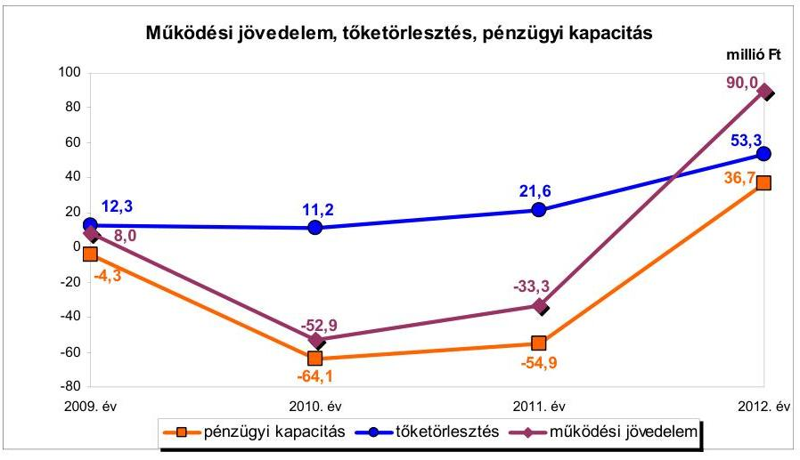
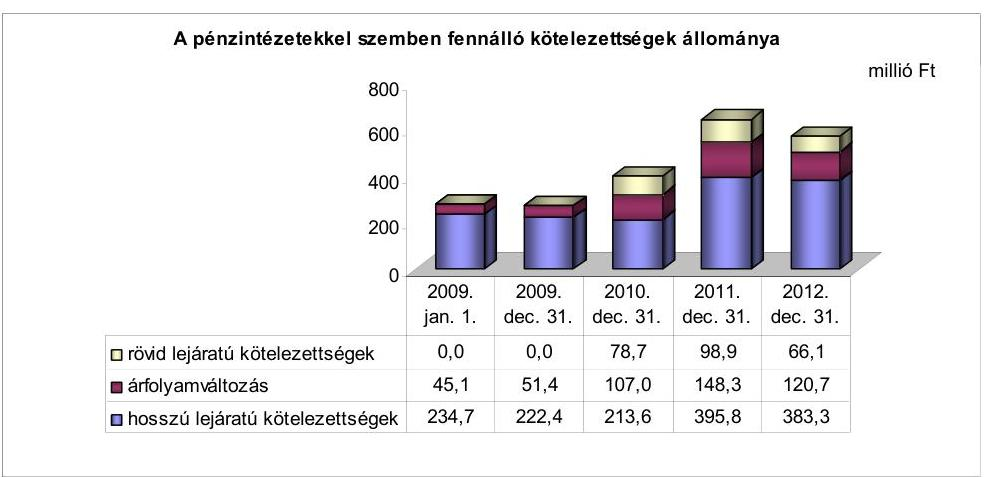
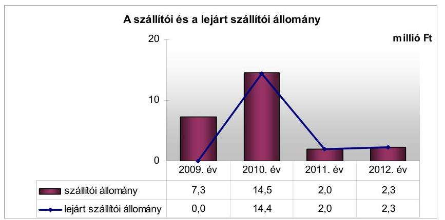
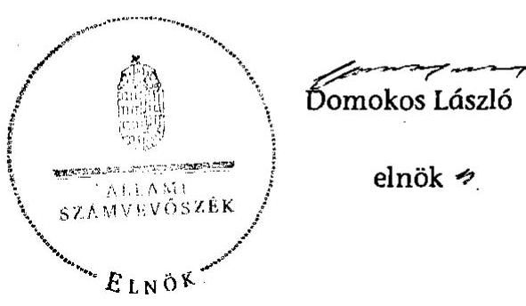
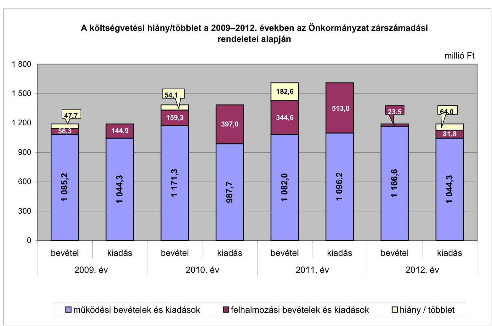
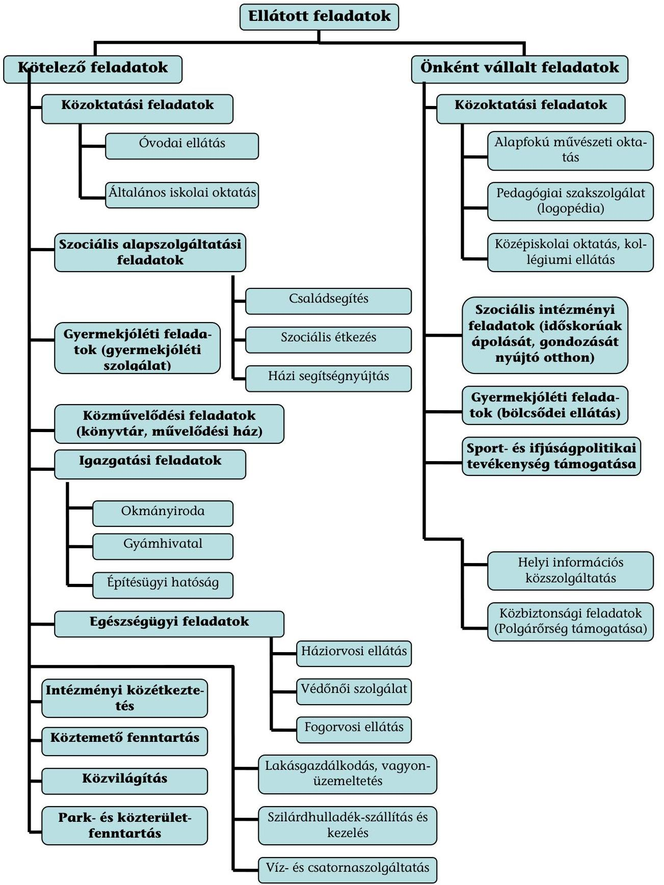

# JELENTÉS 

az önkormányzatok pénzügyi gazdálkodási helyzetének, szabályosságának ellenőrzéséről

LŐRINCI
13094
2013. szeptember

---

# Állami Számvevőszék 

Iktatószám: V-0030-351-010/2013.
Témaszám: 1069
Vizsgálat-azonosító szám: V059224

## Az ellenőrzést felügyelte:

## Renkó Zsuzsanna

felügyeleti vezető
Az ellenőrzést vezette és az ellenőrzés végrehajtásáért felelős:
Dér Lívia
ellenőrzésvezető
Az ellenőrzést végezték:

| Hegyes Mária | Luhály Matild |
| :-- | :-- |
| számvevő tanácsos | számvevő |

---

# TARTALOMJEGYZÉK 

BEVEZETÉS ..... 3
I. ÖSSZEGZŐ MEGÁLLAPÍTÁSOK, KÖVETKEZTETÉSEK, JAVASLATOK ..... 6
II. RÉSZLETES MEGÁLLAPÍTÁSOK ..... 14

1. Az Önkormányzat kötelező és önként vállalt feladatai, a feladatellátás szervezeti keretei ..... 14
2. A pénzügyi egyensúly fenntartását veszélyeztető pénzügyi kockázatok és az ezek csökkentése érdekében tett intézkedések ..... 16
3. A pénzügyi gazdálkodási folyamatok szabályosságát, megfelelőségét biztosító belső kontrollok ..... 25
4. Az ÁSZ korábbi ellenőrzése során a pénzügyi, gazdálkodási helyzet javítására tett javaslatainak megvalósítása ..... 27

---

# MELLÉKLETEK 

1. számú A költségvetési hiány/többlet a 2009-2012. években az Önkormányzat zárszámadási rendeletei alapján
2. számú Az Önkormányzat bevételei és kiadásai, valamint adósságszolgálata a 2009-2012. években (a CLF módszer szerint)
3. számú Az Önkormányzat által a 2009-2012. években megvalósított (műszakilag befejezett) fejlesztések forrásösszetétele
4. számú Az önkormányzati feladatok ellátásában résztvevő gazdasági társaságok egyes kiemelt adatai
5. számú Az Önkormányzat 2012. december 31-én fennálló, hosszú lejáratú adósságot keletkeztető kötelezettségvállalásai
6. számú Az Önkormányzat kötelezettségeinek és egyes kötelezettségvállalásainak 2009. december 31-ei és 2012. december 31-ei állománya, valamint a 2013. évben és az azt követő években várható kötelezettségek, kötelezettségvállalások miatti kiadások

## FÜGGELÉKEK

1. számú Rövidítések jegyzéke
2. számú Fogalomtár
3. számú Az Önkormányzat által ellátott feladatok 2012. december 31-én

---

# JELENTÉS 

## az önkormányzatok pénzügyi gazdálkodási helyzetének, szabályosságának ellenőrzéséről LŐRINCI

## BEVEZETÉS

Az államháztartás helyi szintjén, az önkormányzati alrendszerben az utóbbi években megjelenő gazdálkodási nehézségek, a pénzforgalmi hiány növekedése, az eladósodás az ÁSZ figyelmét a helyi önkormányzatok pénzügyi helyzetére irányította.

Az ÁSZ a 2013. év I. félévi ellenőrzési tervben foglaltaknak megfelelően az önkormányzatok pénzügyi gazdálkodási helyzetének, szabályosságának ellenőrzésével az önkormányzatok 2011. évben megkezdett helyzetelemzését folytatta. Az ellenőrzés keretében értékeljük az önkormányzatok adósságkezelési és likviditási helyzetét. Bemutatjuk a pénzügyi egyensúly alakulására hatással lévő folyamatokat, feltárjuk az ezekre ható kockázatokat. Értékeljük a pénzügyi egyensúlyi helyzetet befolyásoló döntés-megalapozó, dön-tés-előkészítő eljárások szabályosságát, és minősítjük az ezekkel összefüggő belső kontrollok kialakítását, múködését.

Az ellenőrzés eredményének várható hatásaként a megállapításokkal segítséget nyújtunk az önkormányzatok számára a pénzügyi egyensúly helyreállítása, javítása és fenntartása érdekében szükségessé váló intézkedések megtételéhez.

Az ellenőrzés típusa: szabályszerűségi ellenőrzés.

## Az ellenőrzés célja annak értékelése volt, hogy:

- az ellenőrzött időszakban a kötelező és önként vállalt feladatok ellátását biztosító szervezeti formák változása milyen hatást gyakorolt az Önkormányzat pénzügyi helyzetének alakulására;
- az Önkormányzat pénzügyi - ezen belül múködési és felhalmozási - egyensúlya milyen irányban változott, a változást milyen okok idézték elő, továbbá milyen intézkedéseket tettek a pénzügyi egyensúly biztosítása, illetve javítása érdekében, az intézkedések hatására javult-e az Önkormányzat pénzügyi helyzete;
- a költségvetési kiadások finanszírozása érdekében vállalt, pénzintézetekkel szembeni kötelezettségek hogyan alakultak, a kötelezettségek fennállása miként befolyásolja az Önkormányzat jövőbeli pénzügyi egyensúlyi helyzetét;

---

- az Önkormányzat beazonosította, felmérte, értékelte-e a pénzügyi egyensúlyt befolyásoló pénzügyi kockázatokat, a finanszírozási célú pénzügyi műveletekkel kapcsolatban írtak-e elő kockázatértékelési kötelezettséget;
- az Önkormányzat által kialakított belső kontrollok biztosítják-e a pénzügyi gazdálkodás folyamatainak szabályosságát és eredményességét;
- hasznosultak-e az ÁSZ korábbi ellenőrzése során a pénzügyi, gazdálkodási helyzet javítására tett szabályszerűségi és célszerűségi javaslatok.

Az ellenőrzés a 2009. január 1-jétől 2012. december 31-ig terjedő időszakot ölelte fel. A pénzintézetekkel szembeni kötelezettségek állományára vonatkozóan az ellenőrzés kezdő időpontjaként a 2012. december 31-én fennálló kötelezettségek keletkezésének időpontját vettük figyelembe.

Az ellenőrzés szakmai módszertana az ÁSZ Ellenőrzési Elvek és Standardokban foglalt szakmai szabályokon alapult, amely a Legfőbb Ellenőrző Intézmények Nemzetközi Szervezete (INTOSAI) által kiadott nemzetközi standardok (ISSAI) figyelembevételével készült.

Az ellenőrzés során használt rövidítéseket az 1. számú, az egyes fogalmak magyarázatát a 2. számú függelék tartalmazza.

Az ellenőrzés jogszabályi alapját az ÁSZ tv. 1. § (3) bekezdésének, 5. § (2)-(6) bekezdéseinek, valamint az Áht. 61 . § (2) bekezdésének előírásai képezik.

Az Országgyűlés 2012 végén a helyi önkormányzatok adósságállományának részleges konszolidációjáról döntött. Az 5000 fő lakosságszámot meg nem haladó települési önkormányzatok számára nyújtott törlesztési célú támogatással ${ }^{1}$ lehetővé tették a 2012. december 12-én fennálló adósságállományuk és annak 2012. december 28 -áig számított járulékai teljes megfizetését. Az 5000 fő lakosságszám feletti települések esetében a 2013. évben az állam differenciált az adóerő-képességet figyelembe vevő, 40-70\%-ig terjedő - mértékben vállalja át ${ }^{2}$ az önkormányzatok 2012. december 31-i, az átvállalás időpontjában fennálló adósságállományát és annak járulékait. Az adósságkonszolidációs intézkedéssel egyidejűleg a Kormány elrendelte ${ }^{3}$ az önkormányzatok adósságállománya újratermelődésének megakadályozása céljából a hitelengedélyezési és a likvid hitelekre vonatkozó szabályozás szigorítását.

Lőrinci Város Önkormányzata lakónépességére tekintettel a 2013. évi adósságátvállalásban érintett. Az adósságkonszolidáció keretében - a 2013. február 27én kötött megállapodásban - a Magyar Állam az Önkormányzat fennálló adósságállományának 40,0\%-át (228,0 millió Ft-ot) és annak járulékait átvállalta. Az egyeztetés azonban még nem zárult le az adósságátvállalás tényleges

[^0]
[^0]:    ${ }^{1}$ Magyarország 2012. évi központi költségvetéséről szóló 2011. évi CLXXXVIII. törvény 76/C. §-a (beiktatta a 2012. évi CLXXXVII. törvény 8. §-a, hatályos 2012. XII. 6-ától)
    ${ }^{2}$ Magyarország 2013. évi központi költségvetéséről szóló 2012. évi CCIV. törvény 7276. §-ai
    ${ }^{3}$ 1540/2012. (XII. 4.) Korm. határozat a helyi önkormányzatok adósságállományának részleges konszolidációjáról

---

mértékére vonatkozóan, mert az Önkormányzat a megállapodástól eltérően magasabb mérték megállapítását kérte. Az Önkormányzat pénzügyi egyensúlyának jövőbeni alakulását befolyásoló, az ellenőrzött időszakban fennállt kockázatokra az ellenőrzés időszakában tett megállapításaink - a pénzintézetekkel szembeni kötelezettségekkel összefüggésben feltárt kockázatok kivételével - az adósságkonszolidációt követően is helytállóak és időszerűek.

Lőrinci város lakosainak száma 2013. január 1-jén 5797 fő volt, 250 fővel (4,1\%-kal) kevesebb, mint 2009. január 1-jén. Az Önkormányzat 2012-ben 1157,8 millió Ft költségvetési bevételt ért el, és 1126,1 millió Ft költségvetési kiadást teljesített. Az Önkormányzat mérlegének főösszege 2012. december 31-én 5064,7 millió Ft volt, amely a tárgyi eszközök, illetve a kötelezettségek növekedése következtében a 2009. év végéhez viszonyítva 6,1\%-kal (289,5 millió Fttal) emelkedett. Az Önkormányzat pénzügyi helyzetében jelentős változást eredményezett az ellenőrzött időszakban a pénzintézetekkel szembeni hosszú lejáratú kötelezettségek - döntően kötvénykibocsátás és árfolyamveszteség miatti - 80,1\%-os (224,2 millió Ft-os) növekedése.

Az ÁSZ tv. 29. § (1) bekezdése szerint a jelentéstervezetet megküldtük a polgármester részére, aki az ÁSZ tv. 29. § (2) bekezdésében foglalt észrevételezési jogával nem élt, a jelentéstervezetre észrevételt nem tett.

---

# I. ÖSSZEGZŐ MEGÁLLAPÍTÁSOK, KÖVETKEZTETÉSEK, JAVASLATOK 

Lőrinci Város Önkormányzatának pénzügyi egyensúlya az ellenőrzött időszakban rövid távon nem volt biztosított. A 2013. évi adósságkonszolidáció eredményeként az Önkormányzat pénzügyi egyensúlyi helyzete javul, azonban az adósságátvállalást követően fennmaradó kötelezettségek teljesíthetősége továbbra is kockázatos, az ellenőrzött időszak alacsony jövedelemtermelő képessége alapján a várhatóan képződő bevételek a feladatok ellátásához és a kötelezettségek teljesítéséhez szükséges kiadásokat nem fedezik, ez a múködést rövid távon korlátozza.

Az Önkormányzat költségvetésének elemzését a CLF módszer szerint számított mutatók alapján végeztük. Az Önkormányzat 2009-2012. évek közötti pénzügyi kapacitásának változását az alábbi ábra szemlélteti:

Az Önkormányzat az ellenőrzött időszakban összesen 4916,5 millió Ft költségvetési bevételt ért el, és 5236,7 millió Ft költségvetési kiadást teljesített. Múködési költségvetésének egyensúlya 2009-ben és 2012-ben fennállt, 2010-ben és 2011-ben nem volt biztosított. A 2012. évben - az egyszeri 60,5 millió Ft helyi adóbevétel behajtása eredményeként - realizált 90,0 millió Ft múködési jövedelemmel együtt az ellenőrzött időszakban összesen 11,8 millió Ft múködési többlet keletkezett. A múködési költségvetés 2010. évi hiányát a múködési kiadásokon belül a személyi juttatások és a dologi kiadások - a közcélú foglalkoztatás bővítése és a Polgármesteri Hivatalnál a szervezetfejlesztés miatti - növekedése határozta meg. A múködési költségvetés 2011. évi hiányát a költségvetési támogatások és az szja bevétel csökkenése, valamint a dologi kiadásoknak a Polgármesteri Hivatalnál és a középiskolánál bekövetkezett emelkedése okozta. Az Önkormányzat 2011-ben 16,4 millió Ft múködőképességének megőrzését szolgáló támogatásban részesült. Alacsony múködési jövedelemtermelő képességet jelzett és egyben bevételi kitettséget is jelentett, hogy az ÖNHIKI támogatás nélkül 2011-ben a múködési hiány összege 49,7 millió Ft

---

lett volna, a 2012. évi múködési jövedelem 67,2\%-a (60,5 millió Ft) pedig egyszeri helyiadó-bevételből származott.

A felhalmozási költségvetés egyensúlya az ellenőrzött időszakban nem állt fenn, összesen 332,0 millió Ft felhalmozási forráshiány keletkezett. A felhalmozási költségvetés hiányának az ellenőrzött időszakban évente változó nagyságrendjét a fejlesztési kiadások és támogatások ütemkülönbsége, valamint a fejlesztésekhez szükséges saját forrás hiánya határozta meg. A felhalmozási forráshiányt 2009-ben szabad pénzmaradvány felhasználásával, a 2009. év II. negyedévétől folyószámlahitel bevonásával, 2010-ben fejlesztési hitel felvételével, 2011-ben kötvény kibocsátásával, 2012-ben múködési forrásokból, valamint kötvény fel nem használt maradványából finanszírozták.

Az ellenőrzött időszakban a kötelező feladatellátás szervezeti keretei nem változtak, az önként vállalt feladatok ellátását biztosító szervezeti formák változása - új feladat (bölcsőde) ellátása, egy feladat (jelzőrendszeres házi segítségnyújtás) megszüntetése - 1,6 millió Ft megtakarítást eredményezett, amely nem gyakorolt jelentős hatást az Önkormányzat pénzügyi helyzetére. Az ellenőrzött időszakban hozott bevételnövelő és kiadáscsökkentő intézkedések - a helyi adó mértékének emelése, a feleslegessé vált eszközök hasznosítása, bérleti díjak emelése, illetve hivatali és intézményi átszervezéssel összefüggő létszámcsökkentés, a juttatások és a képviselő-testületi tiszteletdíjak csökkentése - az Önkormányzat adatszolgáltatása szerint, összesen 195,8 millió Ft-tal javították a pénzügyi egyensúlyt.

Az Önkormányzatnál az alacsony működési jövedelemtermelő képességgel kapcsolatban fennállt az önként vállalt feladatok miatti kockázat, mivel az önként vállalt feladatok kiadásainak aránya a múködési kiadásokon belül a 2009. évi 28,8\%-ról (301,1 millió Ft-ról) 2011-ben 29,5\%-ra ( 323,8 millió Ft-ra) növekedett. A 2012. évben az önként vállalt feladatokra fordított kiadások 2,1\%-kal (6,9 millió Ft-tal) mérséklődtek az előző évhez képest, azonban a múködési kiadásokon belüli arányuk 30,3\%-ra (316,9 millió Ft-ra) nőtt.

Az Önkormányzat pénzintézetekkel szembeni kötelezettségeinek állománya az ellenőrzött időszakban - a 2009. év eleji 279,8 millió Ft-ról a 2012. év végére 570,1 millió Ft-ra ( 267,0 millió Ft és 1257,1 ezer CHF) - több mint kétszeresére növekedett. A hosszú lejáratú kötelezettségek 2012. év végi 504,0 millió Ft-os állományában meghatározó volt a 2008. évben kibocsátott kötvényből fennálló 1257,1 ezer CHF és a 2011. évben kibocsátott kötvényből származó 200,0 millió Ft összegű kötelezettség. A kötvénykibocsátásból származó tartozásokkal kapcsolatosan fennállt a visszafizetési kockázat, változó kamatozásuk miatt a kamatkockázat, valamint a deviza alapú kötvény árfolyamkockázata. Az Önkormányzat likviditási nehézségeinek fokozódását, a banki kitettség miatti kockázatot jelzi, hogy a folyószámlahitel igénybevétele a 2011-2012. években és a munkabér-megelőlegezési hitel a 2012. évben tartós finanszírozási forrássá vált. A 2013. évi adósságkonszolidáció kedvező hatása ellenére a 2013. évtől várható kötelezettségek teljesíthetőségének kockázatát jelentheti, hogy az ellenőrzött időszak jövedelemtermelő képessége alapján számított múködési jövedelem nem nyújt fedezetet a pénzintézeti kötelezettségek teljesítésére. Az adósságszolgálat teljesítéséhez a

---

2012. év végén 4,7 millió Ft szabad pénzmaradvánnyal rendelkeztek, a likviditási nehézségek rendezéséhez a szükséges nagyságrendű források nem állnak rendelkezésre.

Fedezetbevonás miatti kockázatot jelent, hogy az ingatlanok jelzáloggal való terhelése az ellenőrzött időszakban nőtt, az ingatlanok biztosítékul adása miatt a kötelezettségek teljesítéséhez szükséges, ingatlanértékesítésből elérhető források szűkültek. Az ellenőrzött időszakban három ingatlan jelzáloggal való terhelése miatt a terhelt ingatlanok 2012. december 31-ei könyvszerinti együttes nettó értéke 150,8 millió Ft, az összes forgalomképes ingatlan nettó értékének (255,6 millió Ft) 59,0\%-a volt.

A kezességvállalás miatti mérlegen kívüli kockázat fennállt, mert a szennyvízközmű-beruházáshoz kapcsolódóan 2006-ban az Önkormányzat 130,0 millió Ft összegű kezességet vállalt. A kezesség beváltására az ellenőrzött időszak során nem került sor.

A gazdasági társaság veszteséges gazdálkodása, illetve kötelezettségei miatt fennállt a mérlegen kívüli kockázat, mivel az Önkormányzat a Lőrinci Kft. részére a feladatellátás finanszírozásához - a számlázott szolgáltatások ellenértékén felül felhasználási kötöttséggel - összesen 32,8 millió Ft múködési és felhalmozási célú pénzeszközt adott át, továbbá 30,8 millió Ft tagi kölcsönt folyósított. Az Önkormányzat szempontjából kockázatot jelent, hogy a tagi kölcsön visszatérülése a gazdasági társaság veszteséges tevékenysége miatt bizonytalan. A 2011. évi veszteség következtében a Lőrinci Kft. saját tőkéje negatív ( $-5,9$ millió Ft) volt, amely a 2012. évben várható 22,0 millió Ft veszteség miatt tovább növekszik. A kizárólagos tulajdonból adódóan a tőkepótlási kötelezettség az Önkormányzatot terheli.

Az Önkormányzatnál a kockázatkezelési rendszer keretében a pénzügyi egyensúlyt befolyásoló kockázatok feltárása, beazonosítása, felmérése, értékelése és kezelése - a 2009. évben az Ámr. 1 -ben, a 2010-2011. években az Ámr. ${ }_{2}$-ben, a 2012. évben a Bkr.-ben foglalt jogszabályi előírások ellenére elmaradt. Annak ellenére maradt el a kockázatok kezelése, hogy az ellenőrzési időszakban fennállt az ÖNHIKI támogatás miatti bevételi kitettség, az alacsony működési jövedelemtermelő képesség miatti kockázat, az önként vállalt feladatok miatti működési kockázat, a kötvények miatti kamat- és visszafizetési kockázat, a deviza alapú kötvény miatti árfolyamkockázat, a folyószámla- és a munkabér-megelőlegezési hitel tartóssá válása miatti banki kitettség kockázata, a fedezetbevonások növekedése miatti kockázat, a kezességvállalás és a gazdasági társaság veszteséges múködése, kötelezettségei miatti mérlegen kívüli kockázat, a tagi kölcsön bizonytalan visszatérülése miatti pénzügyi kockázat, valamint a jövőbeni kötelezettségek teljesíthetőségének kockázata. Az Önkormányzatnál a finanszírozási célú pénzügyi műveletekkel kapcsolatban nem írtak elő kockázatértékelési tevékenységet.

A pénzügyi gazdálkodási folyamatok szabályosságát, megfelelőségét, kockázatainak kezelését biztosító kontrolltevékenységek kialakítása - a 2009. évben az Ámr. ${ }_{1}$, a 2010-2011. években az Ámr. ${ }_{2}$, a 2012. évben a Bkr. előírásai ellenére - nem volt megfelelő, mert nem írták elő a feladat átadás-átvételre vonatkozóan a döntés-előkészítés folyamatában a döntés hatásának értékelését

---

a kötelező és az önként vállalt feladatok kiadásaira, ezzel a pénzügyi egyensúlyi helyzetre. Nem szabályozták a feladatellátáshoz kapcsolódó támogatási rendszer feltételeit, a feladatellátási szerződések minimum tartalmi követelményeit, valamint a beszámolási kötelezettséget a feladatellátás teljesítéséről. Nem határozták meg a fejlesztések döntés-előkészítésekor az előkészítés, a lebonyolítás és a működtetés kockázatainak feltárási kötelezettségét, a fejlesztésekkel kapcsolatos pályáztatási kötelezettséget, a támogatások figyelési rendszerét, a pályázatkészítés feltételeit és szervezeti kereteit. Nem szabályozták a döntés-előkészítés folyamatában a pénzintézeti kötelezettségvállalások kockázatainak feltárását, a futamidő egyes éveit terhelő kötelezettség költségvetési egyensúlyra gyakorolt hatásának vizsgálatát. Nem írták elő a pénzintézeti szolgáltatások igénybevételének pályáztatási vagy több ajánlatkérési kötelezettségét. Nem határozták meg az Önkormányzat kizárólagos tulajdonában lévő gazdasági társasága részére pénzügyi helyzete alakulásáról a beszámolási kötelezettséget, továbbá azt, hogy a gazdasági társaság köteles vizsgálni a pénzügyi helyzete alakulását.

Az Önkormányzatnál az ellenőrzött időszak belső ellenőrzési terveinek készítését megelőzően - a 2009. évben az Ámr. 1-ben, a 2010-2011. években az Ámr. ${ }_{2}$ ben, a 2009-2011. években a Ber.-ben, 2012. január 1-jétől a Bkr.-ben foglaltak ellenére - nem írták elő a pénzügyi egyensúlyi helyzetet befolyásoló döntések kockázati tényezőinek feltárását, a belső ellenőrzési tervek nem tartalmazták az ellenőrzési terveket megalapozó kockázatelemzéseket, és az Önkormányzatnál nem ellenőrizték ezeket a kockázati tényezőket.

A feladatellátás szabályosságát, a pénzügyi egyensúlyi helyzet alakulását, továbbá a pénzügyi gazdasági döntések megalapozását szolgáló döntéselőkészítő, valamint a pénzintézeti kötelezettségvállalások szabályosságát, megfelelőségét, a kockázatok kezelését biztosító belső kontrollok múködése gyenge volt, mert a feladat átadás-átvételre vonatkozó döntés-előkészítés folyamatában nem értékelték a döntés hatását a kötelező és az önként vállalt feladatokra fordított kiadások arányára, a pénzügyi helyzetre. Nem tárták fel az önkormányzati fejlesztések esetében a döntés-előkészítés folyamatában az előkészítés és a lebonyolítás kockázatait. Nem vizsgálták a kötvénykibocsátásról szóló döntés-előkészítés folyamatában a futamidő egyes éveit terhelő kötelezettség költségvetési egyensúlyra gyakorolt hatását. Az Önkormányzat a tulajdonosi kötelezettségének nem tett eleget, mert nem intézkedett a kizárólagos tulajdonában álló Lőrinci Kft. pénzügyi helyzete rendezése érdekében. A belső ellenőrzési tervek nem tartalmazták az ellenőrzési terveket megalapozó kockázatelemzéseket, az Önkormányzatnál a pénzügyi egyensúlyi helyzetet befolyásoló döntések kockázati tényezőinek feltárása és belső ellenőrzés keretében történő ellenőrzése elmaradt. A kialakított kontrollok nem biztosították a pénzügyi gazdálkodási folyamatok eredményességét.

Az ellenőrzés során a gazdálkodási feladatok ellátásával, valamint a könyvvezetési és beszámolási kötelezettség teljesítésével kapcsolatban az alábbi szabályszerűségi hibákat tártuk fel:

- az Önkormányzat - a 2009-2011. években az Áht. ${ }_{1}$, a 2012. évben az Áht. ${ }_{2}$ előírásait megsértve - a költségvetési és zárszámadási rendeleteiben a költ-

---

ségvetési bevételek, illetve költségvetési kiadások összegében finanszírozási bevételeket, valamint kiadásokat is figyelembe vett;

- a 2008-2009. évek végén a CHF-ben fennálló lízingkötelezettség értékelését a Számv. tv. előírásai ellenére nem végezték el, az árfolyamveszteséget nem számolták el, emiatt a mérlegben a lízingkötelezettséget 1,4 millió Ft-tal, illetve 0,8 millió Ft-tal alacsonyabb összegben mutatták ki. A számviteli hiba nagyságrendjére tekintettel nem minősül jelentős összegű hibának.

Az Önkormányzat a gazdálkodási rendszerének 2008. évi ÁSZ ellenőrzése során a pénzügyi, gazdálkodási helyzet javítására tett 11 (hét szabályszerűségi és négy célszerűségi) javaslat közül három szabályszerűségi javaslatot nem hasznosított. Az Áht. 1 és az Áht. ${ }_{2}$ előírását megsértve a költségvetési rendeletek költségvetési bevételi főösszege finanszírozási célú pénzügyi műveletek bevételeit, míg a kiadási főösszeg finanszírozási célú pénzügyi műveletek kiadásait tartalmazta. A jegyző az Ámr. ${ }_{1}$ előírásai ellenére a kockázatkezelési rendszert nem alakította ki, a Ber. rendelkezését figyelmen kívül hagyva a kockázatelemzés alapján a belső ellenőrzési stratégiai tervet nem készítette el.

Az ÁSZ tv. 33. § (1) bekezdésében foglaltak értelmében az ellenőrzött szervezet vezetője köteles a jelentésben foglalt megállapításokhoz kapcsolódó intézkedési tervet összeállítani, és azt a jelentés kézhezvételétől számított harminc napon belül az ÁSZ részére megküldeni. Amennyiben az intézkedési tervet határidőn belül nem küldi meg a szervezet vezetője, vagy az továbbra sem elfogadható, az ÁSZ elnöke a hivatkozott törvény 33. § (3) bekezdés a)-b) pontjaiban foglaltakat érvényesítheti.

# Az ellenőrzés intézkedést igénylő megállapításai és javaslatai: 

## a polgármesternek

1. A működési jövedelem 2009-ben és 2012-ben pozitív, a 2010-2011. években negatív volt. A 2012. évi pozitív működési jövedelem döntően a helyi adóbevétel egyszeri, kiugró mértékű növekedésének volt az eredménye. Az önként vállalt feladatok ellátására 2011-ben a működési kiadások 30,3\%-át fordították. Az Önkormányzat 2011-ben ÖNHIKI támogatásban részesült. A likviditás biztosítására igénybe vett folyószámlahitel és a munkabér-megelőlegezési hitel tartós forrássá vált. 2012. december 31-én a fennálló pénzintézeti kötelezettség 570,1 millió Ft, a szállítói tartozás 2,3 millió Ft, az egyéb kötelezettség 29,0 millió Ft volt. A kizárólagos önkormányzati tulajdonban lévő gazdasági társaság veszteséges gazdálkodása következtében a 2011-2012. években negatívvá vált a saját tőke. A tagi kölcsönök megtérülése bizonytalan. Ennek ellenére nem írták elő a gazdasági társaság részére a pénzügyi helyzete alakulásáról a beszámolási kötelezettséget. A múködési jövedelem várhatóan nem nyújt fedezetet a 2013. évi adósságkonszolidációt követően fennmaradó kötelezettségek teljesítésére, szabad tartalékkal az Önkormányzatnál nem rendelkeznek. A bevételnövelő és a kiadáscsökkentő intézkedések 195,8 millió Ft-tal járultak hozzá a pénzügyi helyzet javításához.

---

Javaslat:
A múködési jövedelemtermelő képesség és a feladatellátás összhangja, valamint az Önkormányzat pénzügyi egyensúlyának helyreállítása, hosszú távú fenntarthatósága érdekében - a 2013. évi kormányzati adósságkonszolidációt, valamint a 2013. évtől változó feladatellátási kötelezettséget, feladatfinanszírozási rendszert figyelembe véve - felelősök és határidők megjelölésével kezdeményezzen intézkedéseket, melyek keretében:
a) a költségvetési rendelettervezet, valamint annak évközi módosítása előterjesztését megelőzően mérjék fel a bevételszerző, kiadáscsökkentő lehetőségeket, és terjessze a Képviselő-testület elé a bevételek növelését, a kiadások csökkentését célzó intézkedések bevezetéséhez szükséges - a Htv. 140. § (1) bekezdés a) pontja alapján a jegyző által elkészített - döntési javaslatát;
b) terjesszen a Képviselő-testület elé jóváhagyásra - a Htv. 140. § (1) bekezdés a) pontja alapján a jegyző által elkészített - az Önkormányzat gazdasági helyzetének elemzésén alapuló, a pénzügyi egyensúlyi helyzet gyors helyreállítását, hoszszú távú fenntartását, valamint az adósságállomány újratermelődésének elkerülését biztosító intézkedéseket tartalmazó reorganizációs programot;
c) az adósságkonszolidációt követően fennmaradó kötelezettségek jövőbeni teljesítése, a fizetőképesség megőrzése érdekében terjesszen a Képviselő-testület elé a Htv. 140. § (1) bekezdés a) pontja alapján a jegyző által elkészített - döntési javaslatot, amelyben a Képviselő-testület kötelezettséget vállal arra, hogy előre meghatározott összegben és módon a realizált többletbevételeket, a meglévő és a jövőben képződő tartalékokat mindaddig a kötelezettségek rendezésére fordítja, azt nem használja más célra, amíg az Önkormányzat és annak kizárólagos tulajdonú gazdasági társasága pénzügyi egyensúlya rövid távon veszélyeztetett;
d) terjesszen a jegyző közreműködésével elkészített intézkedési tervet a Képviselőtestület elé jóváhagyásra, az Önkormányzat kizárólagos tulajdonú gazdasági társasága pénzügyi helyzetének stabilizálása érdekében;
e) írja elő az Önkormányzat kizárólagos tulajdonú gazdasági társasága beszámolási kötelezettségét a pénzügyi helyzete alakulásáról;
f) vizsgáltassa felül az önként vállalt feladatok finanszírozhatóságát a kötelező feladatellátás elsődlegességének biztosítása érdekében, és ennek függvényében tegyen javaslatot a Képviselő-testületnek a feladatellátás racionalizálására.

# a jegyzőnek 

1. Az Önkormányzat költségvetési és zárszámadási rendeleteiben kimutatott költségvetési bevételek és költségvetési kiadások összege - a 2009-2011. években az Áht. ${ }_{1}$ 8/A. § (7) bekezdésében, a 2012. évben Áht. 2 5. § (1)-(2) bekezdéseiben foglalt előírások ellenére - finanszírozási bevételeket és kiadásokat is tartalmazott.

---

Javaslat:
Intézkedjen, hogy az Önkormányzat költségvetési és zárszámadási rendeleteiben az Áht. 2 5. § (1)-(2) bekezdéseiben foglalt előírások szerint - mutassák ki a költségvetési bevételek és kiadások összegét, azok finanszírozási bevételeket és kiadásokat ne tartalmazzanak.
2. A kockázatkezelési rendszer keretében az ellenőrzött időszakban fennállt, a pénzügyi egyensúlyt befolyásoló kockázatok feltárása, beazonosítása, felmérése, értékelése és kezelése - a 2009. évben az Ámr. 145/C. § (1)-(3) bekezdéseiben, a 2010-2011. években az Ámr. 2 157. § (1)-(3) bekezdéseiben, a 2012. évben a Bkr. 7. § (1)-(2) bekezdéseiben foglalt jogszabályi előírások ellenére - elmaradt. Annak ellenére maradt el a kockázatok kezelése, hogy az ellenőrzött időszakban fennállt az alacsony müködési jövedelemtermelő képesség miatti kockázat, az önként vállalt feladatok ellátása miatti müködési kockázat, az ÖNHIKI támogatás miatti bevételi kitettség, a kötvények miatti kamat- és visszafizetési kockázat, a deviza alapú kötvény miatti árfolyamkockázat, a folyószámla- és munkabér-megelőlegezési hitel tartóssá válása miatti banki kitettség kockázata, a fedezetbevonások növekedése miatti kockázat, a kezességvállalás és a gazdasági társaság - veszteséges müködése, kötelezettségei - miatti mérlegen kívüli kockázat, a tagi kölcsön bizonytalan visszatérülése miatti pénzügyi kockázat, valamint a jövőbeni kötelezettségek teljesíthetőségének kockázata.

Javaslat:
Müködtessen a Bkr. 7. § (1)-(2) bekezdéseiben foglalt előírásoknak megfelelő, a pénzügyi egyensúlyt befolyásoló kockázatok kezelésére alkalmas kockázatkezelési rendszert.
3. A pénzügyi gazdálkodási folyamatok szabályossága, megfelelősége vonatkozásában a kockázatok kezelését biztosító belső kontrolltevékenységek kialakítása - a 2009. évben az Ámr. 145/E. § (1)-(2) bekezdéseiben, a 2010-2011. években az Ámr ${ }_{2}$ 158. § (1)-(2) bekezdéseiben, a 2012. évben a Bkr. 8. § (1)-(2) bekezdéseiben foglalt előírások ellenére - nem volt megfelelő, mert a feladat átadásra vonatkozóan a döntés-előkészítés folyamatában nem írták elő annak értékelését, hogy a döntés milyen hatással bír a kötelező és önként vállalt feladatokra fordított kiadások arányára, a pénzügyi egyensúlyi helyzetre. Nem írták elő az önkormányzati feladatellátáshoz kapcsolódó támogatási rendszer feltételeit, a feladatellátási szerződések tartalmi követelményeit, valamint a beszámoltatási kötelezettséget a feladatellátás teljesítéséről. A fejlesztések döntés-előkészítési folyamatában nem írták elő az előkészítés és a lebonyolítás kockázatai feltárásának kötelezettségét. A fejlesztésekkel kapcsolatosan nem írták elő a pályáztatási kötelezettséget, nem alakították ki a fejlesztésekhez kapcsolódó külső források, támogatások figyelési rendszerét, a pályázat készítés feltételeit és szervezeti kereteit. Nem írták elő a pénzintézeti kötelezettségvállalással kapcsolatos döntések kockázatainak feltárását és a futamidő egyes éveit terhelő kötelezettség költségvetési egyensúlyra gyakorolt hatása vizsgálatát. Nem írták elő a pénzintézeti szolgáltatások igénybevételének pályáztatási vagy több ajánlatkérési kötelezettségét.

---

Javaslat:
Alakítsa ki az Bkr. 8. § (1)-(2) bekezdései alapján azokat a belső kontrolltevékenységeket, amelyek biztosítják a pénzügyi-gazdálkodási folyamatok szabályosságát, a pénzügyi egyensúlyi helyzet alakulását befolyásoló döntések kockázatainak kezelését. Ennek keretében:
a) írja elő a feladat átadás-átvételre vonatkozó döntések előkészítése során a döntés kötelező és önként vállalt feladatok arányára, ezáltal a pénzügyi egyensúlyi helyzetre gyakorolt hatásának vizsgálatát;
b) írja elő az önkormányzati feladatellátáshoz kapcsolódó támogatási rendszer feltételeit, valamint a szerződések minimum tartalmi követelményeinek meghatározásával összefüggő kontrolltevékenységeket;
c) határozza meg a feladatellátási szerződések teljesítésére vonatkozó beszámolási kötelezettséggel kapcsolatos kontrolltevékenységeket;
d) határozza meg a fejlesztések döntés-előkészítés folyamatában a lebonyolítás és a múködtetés kockázatai feltárásának kötelezettségét;
e) határozza meg a fejlesztésekkel kapcsolatosan a közbeszerzési értékhatár alatti esetekben a pályáztatási kötelezettséggel kapcsolatos kontrolltevékenységeket;
f) határozza meg a fejlesztésekhez kapcsolódó külső források, támogatások figyelési rendszerével, a pályázat készítés feltételeivel összefüggő kontrolltevékenységeket;
g) írja elő a pénzintézeti kötelezettségvállalások kockázatainak döntés-előkészítő szakaszban történő feltárását, a futamidő egyes éveit terhelő kötelezettségek költségvetési egyensúlyra gyakorolt hatásának vizsgálatát;
h) határozza meg a pénzintézeti szolgáltatások igénybevételével kapcsolatosan a közbeszerzési értékhatár alatti esetekben a pályáztatási vagy több ajánlatkérési kötelezettséggel kapcsolatos kontrolltevékenységeket.
4. Az Önkormányzatnál az ellenőrzött időszak belső ellenőrzési terveinek készítését megelőzően - a 2009. évben az Ámr. ${ }_{1}$ 145/C. § (2) bekezdésében, a 2010-2011. években az Ámr. 2 157. § (2) bekezdésében, a 2009-2011. években a Ber. 18. §-ában, a 21. § (2) bekezdésében és a (3) bekezdés a) pontjában, 2012. január 1-jétől a Bkr. 7. § (2) bekezdésében, a 29. § (1) bekezdésében és a 31. § (2)-(4) bekezdéseiben foglaltak ellenére - nem írták elő a pénzügyi egyensúlyi helyzetet befolyásoló döntések kockázati tényezőinek feltárását, a belső ellenőrzési tervek nem tartalmazták az ellenőrzési terveket megalapozó kockázatelemzéseket, és az Önkormányzatnál nem ellenőrizték ezeket a kockázati tényezőket.

Javaslat:
Intézkedjen a belső ellenőrzés vezetője felé, hogy a Bkr. 7. § (2) bekezdésében foglaltak szerint mérjék fel a gazdálkodásban rejlő kockázatokat, a 29. § (1) bekezdésében és a 31. § (2)-(4) bekezdéseiben foglalt előírások szerint az éves belső ellenőrzési tervek tartalmazzák a pénzügyi egyensúlyi helyzetet befolyásoló döntésekkel kapcsolatos feltárt kockázati tényezők ellenőrzését, valamint biztosítsa az ellenőrzési tervek végrehajtását.

---

# II. RÉSZLETES MEGÁLLAPÍTÁSOK 

## 1. Az ÖNKORMÁNYZAT KÖTELEZŐ ÉS ÖNKÉNT VÁLlALT FELADATAI, A FELADATELLÁTÁS SZERVEZETI KERETEI

Az Önkormányzat kötelező és önként vállalt feladatait az SZMSZ-ben nem teljes körűen rögzítették. A 2011-ben indított bölcsődei ellátást az SZMSZ nem tartalmazta. Önként vállalt feladatként látták el az alapfokú művészeti oktatást, a középiskolai oktatást és a kollégiumi ellátást, a pedagógiai szakszolgálatot (logopédia), a szociális intézményi feladatokat (időskorúak ápolását, gondozását nyújtó otthon múködtetése), a sport- és ifjúságpolitikai tevékenység támogatását, a közbiztonsági feladatokat (Polgárőrség támogatása), valamint a helyi információs közszolgáltatást. Az önként vállalt feladatok köre 2011. szeptembertől a bölcsődei ellátással bővült - melyet az óvoda intézményi keretein belül látnak el -, a telephelyek számának változatlansága mellett. A 2012. évtől a jelzőrendszeres házi segítségnyújtást megszüntették. (Az Önkormányzat által 2012. december 31-én ellátott feladatokat a 3. számú függelék tartalmazza.)

A 2009-2012. évek között az Önkormányzat kötelező közoktatási, szociális alapszolgáltatási, gyermekjóléti, egészségügyi - a fogorvosi ellátás kivételével -, közművelődési, igazgatási feladatait a költségvetési intézmények látták el. Közszolgáltatási szerződések alapján nyolc gazdasági társaság látott el kötelező önkormányzati feladatokat (fogorvosi ellátás, víz- és csatornaszolgáltatás, intézményi közétkeztetés, közvilágítás, szilárdhulladék-szállítás és -kezelés, köztemető fenntartás, lakásgazdálkodás, vagyonüzemeltetés). A gazdasági társaságok által ellátott feladatok az ellenőrzött időszakban a közvilágítás feladatot érintően szolgáltató váltás miatt változtak. Az Önkormányzat kizárólagos tulajdonú gazdasági társasága (a Lőrinci Kft.) 2011-től látja el a közterületfenntartási, intézményi közétkeztetési, 2012-től a szilárdhulladék-szállítási és kezelési feladatokat ${ }^{4}$. (Az önkormányzati feladatok ellátásában résztvevő gazdasági társaságok egyes kiemelt adatait a 4. számú melléklet tartalmazza.)

A kötelező és az önként vállalt feladatokra fordított múködési kiadások az előző évihez képest 2010-ben növekvő, 2011-2012-ben csökkenő tendenciát mutattak. 2012-ben a múködési kiadások összege a 2009. évire mérséklődött, 1044,3 millió Ft volt. A pénzügyi helyzet szempontjából kedvezőtlen volt, hogy a múködési kiadások finanszírozásához igénybe vett önkormányzati források összege a 2009. évi 524,2 millió Ft-ról (50,2\%) 2012-re 561,3 millió Ft-ra $(53,7 \%)$ emelkedett.

[^0]
[^0]:    ${ }^{4}$ Az Önkormányzat az ellátott feladatokért szerződéses kötelezettségének megfelelően, számla alapján 2011-ben a Lőrinci Kft. részére 60,4 millió Ft-ot, 2012-ben 163,4 millió Ft-ot fizetett ki.

---

Az Önkormányzat 2009-ben a múködési kiadások 71,2\%-át (743,2 millió Ft), 2012-ben 69,7\%-át ( 727,4 millió Ft) kötelező feladatokra fordította. Az önként vállalt feladatokhoz kapcsolódó kiadások aránya az összes múködési kiadáson belül a 2009. évi $28,8 \%$-ról ( 301,1 millió Ft-ról), 2011-ben $29,5 \%$-ra ( 323,8 millió Ft-ra) növekedett, 2012-ben az önként vállalt feladatokra fordított kiadás $2,1 \%$-kal ( 6,9 millió Ft-tal) mérséklődött az előző évhez képest. A múködési kiadáson belüli arányuk 2011-ről 2012-re azonban - a kötelező feladatokra fordított kiadások 5,8\%-os ( 45,0 millió Ft-os) csökkenése miatt -$30,3 \%$-ra ( 316,9 millió Ft-ra) nőtt. Az önként vállalt feladatok ellátása, azok kiadásainak a múködési kiadásokon belüli nagyságrendje miatt, a pénzügyi egyensúly szempontjából kockázatot jelentett. Az Önkormányzat adatszolgáltatása szerint az ellenőrzött időszak végéig önként vállalt feladatok érdekében felhalmozási célú kiadást nem teljesített.

Az Önkormányzat a közoktatási, szociális és gyermekjóléti, közmúvelődési és igazgatási feladatait 2012. december 31-én egy önállóan múködő és gazdálkodó költségvetési szervvel (Polgármesteri Hivatal), valamint öt önállóan múködő költségvetési intézménnyel látta el. A költségvetési intézmények száma az ellenőrzött időszakban eggyel, a telephelyek száma szintén eggyel csökkent.

Az alapfokú múvészeti oktatási intézmény és annak telephelye 2011. augusztus 31-ével megszűnt. (A feladatot az iskola vette át.) A telephelyek száma a kulturális intézményben csökkent, a középiskolában nőtt, míg a Hunyadi Mátyás Általános Iskola az időközi telephelyszám-növekedés után visszaállt az ellenőrzött időszak eleji szintre. A telephelyszám-változásokat szakmai feladatellátási és kiadáscsökkentési szempontok indokolták.

Az ellenőrzött időszakban a kötelezö feladatellátás szervezeti keretei nem változtak. Az önként vállalt feladatok ellátását biztosító szervezeti formák változása nem gyakorolt jelentős hatást az Önkormányzat pénzügyi helyzetére. A megtett intézkedések - az Önkormányzat adatszolgáltatása alapján - 1,6 millió Ft megtakarítást eredményeztek.

---

# 2. A PÉNZÜGYI EGYENSÚLY FENNTARTÁSÁT VESZÉLYEZTETŐ PÉNZÜGYI KOCKÁZATOK ÉS AZ EZEK CSÖKKENTÉSE ÉRDEKÉBEN TETT INTÉZKEDÉSEK 

Az Önkormányzat költségvetésének elemzését CLF módszerrel hajtottuk végre. A CLF módszer szerinti részletes önkormányzati adatokat a 2009-2012. évekre vonatkozóan a 2. számú melléklet, a főbb önkormányzati adatokat az alábbi tábla mutatja be:

|  |  |  |  | millió Ft |
| :--: | :--: | :--: | :--: | :--: |
| Megnevezés | 2009. év | 2010. év | 2011. év | 2012. év |
| Folyó bevételek | 1052,3 | 1070,8 | 1062,9 | 1134,3 |
| Folyó kiadások | 1044,3 | 1123,7 | 1096,2 | 1044,3 |
| Müködési jövedelem | 8,0 | $-52,9$ | $-33,3$ | 90,0 |
| Felhalmozási bevételek | 52,2 | 205,9 | 314,6 | 23,5 |
| Felhalmozási kiadások | 130,4 | 224,7 | 491,3 | 81,8 |
| Felhalmozási költségvetés egyenlege | $-78,2$ | $-18,8$ | $-176,7$ | $-58,3$ |
| Folyó és felhalmozási bevételek összesen | 1104,5 | 1276,7 | 1377,5 | 1157,8 |
| Folyó és felhalmozási kiadások összesen | 1174,7 | 1348,4 | 1587,5 | 1126,1 |
| Finanszírozási múveletek nélküli pozíció | $-70,2$ | $-71,7$ | $-210,0$ | 31,7 |
| Finanszírozási múveletek egyenlege | $-18,0$ | 61,9 | 231,8 | $-42,9$ |
| Tárgyévi pénzügyi pozíció | $-88,2$ | $-9,8$ | 21,8 | $-11,2$ |
| Hiteltőrlesztés, értékpapír beváltás | 12,3 | 11,2 | 21,6 | 53,3 |
| Nettó müködési jövedelem | $-4,3$ | $-64,1$ | $-54,9$ | 36,7 |

Az Önkormányzat 2009-2012 között összesen 4916,5 millió Ft költségvetési bevételt ért el, és 5236,7 millió Ft költségvetési kiadást teljesített. Az Önkormányzat müködési jövedelme 2009-ben és 2012-ben pozitív volt, 2010-ben és 2011-ben forráshiányt mutatott. 2010-ben a folyó kiadások 4,7\%-ára (52,9 millió Ft), 2011-ben 3,0\%-ára (33,3 millió Ft) nem nyújtottak fedezetet a folyó bevételek. A múködési jövedelem 2010. évi csökkenését alapvetően a személyi juttatások és a dologi kiadások - a közfoglalkoztatás bővítése, valamint a Polgármesteri Hivatal szervezetfejlesztése kapcsán teljesített kiadások - növekedése okozta. A múködési jövedelem 2011. évi hiányát a költségvetési támogatások és az szja bevételcsökkenése, valamint a dologi kiadásoknak a Polgármesteri Hivatalnál és a középiskolánál bekövetkezett emelkedése okozta. 2012-ben a múködési jövedelem előző évhez viszonyított 123,3 millió Ft összegű növekedését - a folyó kiadások csökkenése mellett - alapvetően az adóbevételek 99,5 millió Ft összegű emelkedése eredményezte. Az ellenőrzött időszak egészét tekintve 11,8 millió Ft müködési többlet ${ }^{5}$ keletkezett. Az Önkormányzat 2011-ben 16,4 millió Ft ÖNHIKI támogatásban részesült, amely nem biztosította a folyó költségvetés egyensúlyát. A müködési jövedelemtermelő képesség alacsony szintjét jelezte és bevételi kitettséget jelentett, hogy e támogatás nélkül az Önkormányzat müködési jövedelme 2011-ben 49,7 millió Ft hiányt mutatott volna, a 2012. évi müködési jövedelem 67,2\%-a ( 60,5 millió Ft) pedig egyszeri helyiadó-bevételből származott.

[^0]
[^0]:    ${ }^{5}$ Az ÖNHIKI támogatás nélkül számolva 4,6 millió Ft lett volna a müködés hiány.

---

Az Önkormányzat nettó múködési jövedelme 2011-ig a múködési költségvetés egyenlegének változása következtében pénzügyi kapacitáshiányt jelzett, majd 2012-re pozitívvá változott a múködési jövedelem növekedése következtében. A 2009-2011. években a múködési jövedelem nem nyújtott fedezetet a tőketörlesztésre. Az előző évek pénzmaradványa mellett a 2009. év II. negyedévétől folyószámlahitel igénybevételével, 2011-ben kötvény kibocsátásával, a 2011. év II. negyedévétől munkabér-megelőlegezési hitel felvételével biztosították a pénzügyi egyensúlyt.

A felhalmozási költségvetés egyenlege az ellenőrzött időszakban negatív, a forráshiány összesen 332,0 millió Ft volt. A 2012. évben a felhalmozási hiány 63,0\%-ára ( 36,7 millió Ft-ra) nyújtott fedezetet a képződött nettó múködési jövedelem. A felhalmozási költségvetés hiányának az ellenőrzött időszakban évente változó nagyságrendjét a fejlesztési kiadások és támogatások ütemkülönbsége, valamint a fejlesztésekhez szükséges saját forrás hiánya határozta meg. Az ellenőrzött időszakban képződött forráshiányt az Önkormányzat 2009ben szabad pénzmaradványa felhasználásával, a 2009. év II. negyedévétől folyószámlahitel bevonásával, 2010-ben fejlesztési hitel felvételével, 2011-ben kötvény kibocsátásával, 2012-ben múködési forrásokból, kötvény fel nem használt maradványából finanszírozta. Az Önkormányzat évenkénti teljes finanszírozási igénye ${ }^{6} 2009$-ben 82,5 millió Ft, 2010-ben 82,9 millió Ft, 2011ben 231,6 millió Ft, 2012-ben 21,6 millió Ft volt. A CLF módszertől eltérően, a pénzforgalom nélküli tételek figyelembevételével kimutatott költségvetési többletek, illetve a 2011. évi költségvetési hiány alakulását az Önkormányzat 20092012. évi zárszámadási rendeletei alapján az 1. számú melléklet tartalmazza.

Az ellenőrzés során feltártuk, hogy az Önkormányzat a 2009-2011. évi költségvetési és zárszámadási rendeleteiben az Áht. ${ }_{1} 8 /$ A. § (7) bekezdésében, illetve a 2012. évi költségvetési és zárszámadási rendeletében az Áht. ${ }_{2}$ 5. § (1)-(2) bekezdéseiben foglalt előírások ellenére, finanszírozási tételekkel együtt állapította meg a költségvetési bevételek és a költségvetési kiadások összegét.

A folyó bevételek 2009-ről 2010-re 18,5 millió Ft-tal (1,8\%-kal) emelkedtek, míg 2010-ről 2011-re 7,9 millió Ft-tal ( $0,7 \%$-kal) csökkentek. Számottevő mértékű, $6,7 \%$-os ( 71,4 millió Ft) növekedés 2012-ben következett be, elsősorban a helyi adó bevételek emelkedése miatt. A költségvetési támogatások és az szja együttes összege, valamint a folyó bevételekhez viszonyított aránya a 2009. évi 571,3 millió Ft-ról (54,3\%-ról) folyamatosan - 2012-re 537,8 millió Ftra ( $47,4 \%$-ra) - csökkent, elsősorban a normatív állami hozzájárulás és a központosított előirányzatok fajlagos összegének mérséklődése következtében.

Az Önkormányzat a helyi adók közül az építményadót, a telekadót és az iparúzési adót vezette be, a vállalkozók kommunális adója 2011-től megszűnt. A folyó bevételek változásában meghatározó volt a helyi adók szerepe. A folyó bevételeken belüli arányuk és összegük 2009-ben 30,5\% (321,0 millió Ft), 2010-ben 28,3\% (302,8 millió Ft), 2011-ben 30,7\% (326,5 millió Ft) és 2012-ben 37,6\% (426,0 millió Ft) volt. A 2012. évi adóbevétel növekedésében meghatározó volt egy 60,5 millió Ft összegű adóhátralék behajtásából származó bevétel

[^0]
[^0]:    ${ }^{6}$ a nettó múködési jövedelem és a felhalmozási költségvetés együttes negatív egyenlege

---

teljesítése. A helyi adók mértéke - az iparúzési adó kivételével - nem érte el a törvényes maximumot.

Az építményadó mértéke 2009-ben és 2010-ben évi $400 \mathrm{Ft} / \mathrm{m}^{2}$, 2011-től évi $500 \mathrm{Ft} / \mathrm{m}^{2}$, magánszemélyeknek évi $300 \mathrm{Ft} / \mathrm{m}^{2}$ volt. A telekadó a belterületi telkekre 2009-ben és 2010-ben évi $50 \mathrm{Ft} / \mathrm{m}^{2}$, 2011-ben évi $100 \mathrm{Ft} / \mathrm{m}^{2}$ volt. 2012-től a külterületi telkekre is kivetett az Önkormányzat évi $75 \mathrm{Ft} / \mathrm{m}^{2}$ összegú adót.

Az Önkormányzat 2009-2012 között összesen 596,2 millió Ft felhalmozási bevételt ért el, amelyből a fejlesztések megvalósítása szerinti ütemezéstől eltérően 2010-ben 34,5\%-ot (205,9 millió Ft), 2011-ben 52,8\%-ot (314,6 millió Ft) realizált. Az EU-s támogatások összege az ellenőrzött időszakban teljesült felhalmozási bevételek $87,4 \%$-át ( 521,2 millió Ft-ot) tette ki. E támogatásból az Önkormányzat két beruházáshoz összesen 40,4 millió Ft előleget vett igénybe. Az Önkormányzat saját felhalmozási bevétele a tervezett ingatlanértékesítési bevételek elmaradása miatt nem képviselt jelentős forrást, a felhalmozási bevételek $11,9 \%$-át ( 71,2 millió Ft ) jelentette.

A folyó kiadások aránya az összes költségvetési kiadáson belül az ellenőrzött időszakban 2009-ben 88,9\% (1044,3 millió Ft), 2010-ben 83,3\% (1123,7 millió Ft), 2011-ben 69,1\% (1096,2 millió Ft), 2012-ben 92,7\% (1044,3 millió Ft), évenkénti átlagos összege 1077,1 millió Ft volt. Évenkénti alakulását alapvetően a személyi és dologi kiadások határozták meg, amelyek a folyó kiadásoknak átlagosan $90,7 \%$-át tették ki. A folyó kiadások 2010. évi, előző évhez viszonyított $7,6 \%$-os ( 79,4 millió Ft) növekedése a dologi kiadások 23,5\%-os ( 67,0 millió Ft), valamint a személyi juttatások és járulékaik 3,1\%-os (20,5 millió Ft) - a Polgármesteri Hivatal szervezetfejlesztése és a közfoglalkoztatás bővítése következtében létrejött - emelkedése miatt következett be. 2012ben az előző évhez viszonyított $4,7 \%$-os ( 51,9 millió Ft) mérséklődést főként a dologi kiadások $12,1 \%$-os ( 46,5 millió Ft) csökkentése okozta.

A múködési kiadásokon belül a személyi juttatások és munkaadót terhelő járulékok a 2009. évhez viszonyítva 2012-ben 7,8\%-kal (51,6 millió Ft-tal) voltak alacsonyabbak, főként a kiadáscsökkentő intézkedések körében 2011-ben végrehajtott (összesen 24 főt érintő) létszámcsökkentés miatt. A transzferkiadások - az ellenőrzött időszakot tekintve - 83,7\%-a (218,4 millió Ft) a lakosság részére nyújtott szociális támogatásokat tartalmazta.

A felhalmozási kiadások aránya az összes költségvetési kiadáson belül az ellenőrzött időszakban 2009-ben 11,1\% (130,4 millió Ft), 2010-ben 16,7\% (224,7 millió Ft), 2011-ben 30,9\% (491,3 millió Ft), 2012-ben 7,3\% ( 81,8 millió Ft), évenkénti átlagos összege 232,1 millió Ft volt. Összegének és arányának évenkénti változását alapvetően az EU-s forrásból támogatott fejlesztések kiadásai okozták. A 2009-2012. évek között megvalósított (műszakilag befejezett) beruházásokra és felújításokra fordított kiadás összesen 730,4 millió Ft volt. A fejlesztésekhez - az Önkormányzat adatszolgáltatása alapján - 71,4\%-ban (521,2 millió Ft) EU-s támogatást, 23,5\%-ban (171,6 millió Ft) kötvényből származó forrást, 0,3\%-ban (2,4 millió Ft) hitelt és $4,8 \%$-ban ( 35,2 millió Ft) saját felhalmozási bevételt használtak fel. Az ellenőrzött időszakban megvalósított, 10,0 millió Ft-ot meghaladó bekerülési költségú fejlesztés mindegyike EU-s forrásból támogatott volt. Az Önkormányzatnál az

---

ellenőrzött időszak végén nem volt folyamatban lévő fejlesztés, illetve benyújtott pályázat. A fejlesztési feladatok jellegükből következően - épületek felújítása, útfelújítás, informatikai eszközök beszerzése - nem eredményeztek olyan létesítményt, amelynek fenntartása az Önkormányzat számára többletkiadással járt. Ezáltal a fejlesztések során kialakított létesítmények jövőbeli üzemeltetési kockázata sem állt fent. Az Önkormányzat által a 2009-2012. években megvalósított (műszakilag befejezett) fejlesztések forrásösszetételét a 3. számú melléklet tartalmazza.

Az ellenőrzött időszakban teljesített, összesen 928,2 millió Ft felhalmozási kiadásból a megvalósított beruházások, felújítások kiadásain túl további 197,8 millió Ft felhalmozási kiadást teljesítettek, amely kamatkiadásból, áfa befizetésből és felhalmozási célú pénzeszközátadásból állt.

Az Önkormányzat pénzintézeti kötelezettségeinek állománya 2009. január 1-jétől 2012. december 31-éig több mint kétszeresére, 279,8 millió Ft-ról 570,1 millió Ft-ra (203,8\%) emelkedett. A növekedés főként 2011-ben következett be, amikor az Önkormányzat 200,0 millió Ft névértékben kötvényt bocsátott ki. A 2008-ban CHF-ben kibocsátott kötvény miatti árfolyamveszteség a 2010-2011. években jelentős mértékben emelkedett. Az Önkormányzat pénzintézetekkel szemben 2009-2012. években fennálló kötelezettségeit a következő ábra mutatja be:

A pénzintézeti kötelezettségek mérlegben kimutatott összegének alakulását a 2011. évi kötvénykibocsátás, a 2008-ban devizában kibocsátott, kötvénytartozásra elszámolt árfolyamveszteség, a fennálló pénzintézeti kötelezettségek esedékesség szerinti tőketörlesztése, egy hosszú lejáratú hitelfelvétel, valamint a fo-lyószámla- és a munkabér-megelőlegezési hitelek állományának alakulása együttesen határozta meg.

A 2009. év elején a pénzintézetekkel szembeni kötelezettségek állományát a 2008-ban 200,0 millió Ft névértéken kibocsátott CHF alapú kötvénytartozás és annak 45,1 millió Ft árfolyamvesztesége, továbbá két, 2004-ben, illetve 2006-ban felvett hosszú lejáratú hitelből fennálló, összesen 34,7 millió Ft kötelezettség képezte. A 2012. év végén az összesen 570,1 millió Ft kötelezettségállomány a 2011ben kibocsátott 200,0 millió Ft névértékú kötvénytartozásból, a 2010-ben felvett hosszú lejáratú hitel fennálló 0,9 millió Ft-os kötelezettségéből, 1257,1 ezer CHF (182,4 millió Ft) 2008-ban kibocsátott kötvénytartozásból és annak

---

120,7 millió Ft árfolyamveszteségéből, továbbá 66,1 millió Ft folyószámlahitelből állt. Az Önkormányzat 2012. december 31-én fennálló, hosszú lejáratú adósságot keletkeztető kötelezettségvállalásait az 5. számú melléklet mutatja be.

Az Önkormányzat 2010-ben egy forint alapú, 2,4 millió Ft összegű, fix kamatozású hitelt vett igénybe gépkocsi vásárlására. A hitel utolsó részletének visszafizetése 2013-ban esedékes.

A „Lőrinci 2028" 1378,7 ezer CHF összegű kötvényt az Önkormányzat óvadéki céllal bocsátotta ki 2008-ban, a szennyvízközmű-beruházáshoz a Víziközmű Társulat által felvett hitelre vállalt önkormányzati kezesség biztosítékaként. A kötvénykibocsátásból származó bevétel óvadéki számlán kezelt, azt az Önkormányzat saját forrásként nem használhatja fel ${ }^{7}$. Kockázatot jelent, hogy az óvadéki számlán kezelt összegek elszámolása során a hitel összegét (130,0 millió Ft-ot) meghaladó mértékben kerülhet sor a kötvényforrás igénybevételére.

A Képviselő-testület 2011-ben bocsátotta ki a 200,0 millió Ft névértékü, forint alapú „Lőrinci 2026" kötvényt, 15 éves futamidővel, a felhalmozási célú kiadásokhoz szükséges forrás biztosítása céljából. A visszavásárlás két éves türelmi időt követően 2013-ban kezdődik meg.

Az Önkormányzat a már teljesített felhalmozási célú kiadások összegét utólag, a bank jóváhagyása mellett hívhatta le. A kötvényből származó bevételt oktatási intézmények, belterületi út felújításához szükséges saját forrás biztosítására, ingatlanok megvásárlásához, játszótér bővítéséhez, posta helyiség kialakításához és egyéb kisebb fejlesztésekhez használta fel, valamint tagi kölcsönt nyújtott a Lőrinci Kft-nek. A kötvényből származó forrás még fel nem használt összegének befektetéséből az Önkormányzatnak 2012 decemberéig 3,2 millió Ft kamatbevétele keletkezett, amit - kimutatása szerint - fejlesztési célokra fordított.

A kötvénytartozások az Önkormányzat számára kamatkockázatot jelentettek, mert mindkét kötvény változó kamatozású volt, ennek ellenére a változó kamatozású, adósságot keletkeztető kötelezettségvállalások döntés-előkészítő és egyéb dokumentumai nem tartalmazták a kötelezettségvállalások terhei jövőbeni esetleges jelentős változásának értékelését. A CHF alapú „Lőrinci 2028" kötvény kamata - a kamatfelár emelkedése következtében - a kibocsátáskori 4,9\%-ról 2012. december 31-ére 6,2\%-ra emelkedett ${ }^{8}$. A „Lőrinci 2028" CHF alapú kötvény kibocsátása árfolyamkockázatot jelentett, mert az árfolyam kedvezőtlen irányba változott, a kibocsátáskori 145,06 Ft/CHF-ről 2012. december 31-ére 241,06 Ft/CHF-re (66,2\%-kal) emelkedett.

Az Önkormányzat az ellenőrzött időszakban a hosszú lejáratú hitelek tőketörlesztésére 36,2 millió Ft-ot, kamatokra 4,2 millió Ft-ot fordított. A kötvénykibocsátások miatti kötelezettségek tőketörlesztése 2009-2012 között összesen 121,6 ezer CHF (29,4 millió Ft), a megfizetett kamatkiadás 186,0 ezer CHF (41,6 millió Ft), illetve 20,4 millió Ft volt.

[^0]
[^0]:    ${ }^{7}$ Az Önkormányzat a kötvény hozamaiból való részesedésre a lejáratakor lesz jogosult.
    ${ }^{8}$ A 2011-ben kibocsátott forint alapú kötvény kamata 9,25\%-ról 2012-ben a referencia kamatláb függvényében 8,7\%-ra csökkent.

---

A kötvénykibocsátásból keletkezett hosszú lejáratú pénzintézeti kötelezettségek visszafizetési kockázatot jelentenek, mert az alacsony jövedelemtermelő képesség következtében a visszafizetéshez szükséges források rendelkezésre állása bizonytalan. A pénzintézeti kötelezettségvállalásokra minden esetben a Képviselő-testület döntése alapján került sor. A döntés-előkészítés és a döntés dokumentumai azonban nem tartalmazták a visszafizetés forrásait és a jövőbeni teljesítés várható fedezetét. Nem mutatták be, hogy a működési jövedelem milyen feltételek mellett biztosítja a futamidő egyes éveiben az adósságszolgálat finanszírozását. Tartalékképzésről nem döntöttek. Az ellenőrzött időszakban a pénzintézeti kötelezettségek körében konstrukcióváltás nem történt, a pénzintézeti kötelezettségek előtörlesztésére nem került sor.

A 2011. évi köténykibocsátás előtt az Önkormányzat több pénzintézettől kért ajánlatot, amelyek a kötvénykibocsátást csak változó kamatozással vállalták, a folyószámla-vezetés jogával együtt. Az együttesen a legkedvezőbb ajánlatot tevő pénzintézet választása miatt változott a számlavezető bank.

A 2012. év végén fennálló hosszú lejáratú pénzintézeti kötelezettségek miatt az Önkormányzat pénzügyi egyensúlya nem volt biztosított. A jövedelemtermelő képesség alapján a képződő működési jövedelem - az adósságkonszolidációt követően fennmaradó - kötelezettségek törlesztésének fedezetére nem biztosít elegendő forrást.

Az Önkormányzat a likviditási helyzetét a költségvetés tervezés és a zárszámadás keretében értékelte. Az egyes évek költségvetési rendeleteihez likviditási tervet készítettek. Az Önkormányzat 2009-2012. között múködése egyensúlyát folyószámlahitel, 2011-től munkabér-megelőlegezési hitel igénybevételével tudta biztosítani. A folyószámla- és munkabér-megelőlegezési hitelek igénybevételét a 2009-2012. években az alábbi tábla mutatja be:

| Megnevezés | 2009. év | 2010. év | 2011. év | 2012. év |
| :-- | :--: | :--: | :--: | :--: |
| Folyószámlahitel |  |  |  |  |
| Keretösszeq január 1-jén (millió Ft) | 0,0 | 40,0 | 80,0 | 100,0 |
| Átlaqos, napi állomány (millió Ft) | 1,3 | 32,3 | 70,2 | 64,3 |
| Hitellel zárt napok száma (nap) | 53 | 261 | 365 | 305 |
| Eqyenleq állomány az időszak véqén (millió Ft) | 0,0 | 78,7 | 87,9 | 66,1 |
| Teljesített kamat és egyéb kiadás (millió Ft) | 0,1 | 2,2 | 6,1 | 6,0 |
| Munkabér-megelőlegezési hitel |  |  |  |  |
| Keretösszeq január 1-jén (millió Ft) | 0,0 | 0,0 | 0,0 | 0,0 |
| Átlaqos, napi állomány (millió Ft) | 0,0 | 0,0 | 9,5 | 21,3 |
| Hitellel zárt napok száma (nap) | 0 | 0 | 207 | 346 |
| Eqyenleq állomány az időszak véqén (millió Ft) | 0,0 | 0,0 | 11,0 | 0,0 |
| Teljesített kamat és eqvéb kiadás (millió Ft) | 0,0 | 0,0 | 0,9 | 2,2 |

Az Önkormányzat rendelkezésére álló folyószámlahitel-keret összege az ellenőrzött időszakban a 2009. június 2 -ai 40,0 millió Ft-ról 2011. június 29 -ére több mint háromszorosára, 130,0 millió Ft-ra emelkedett, majd 2011. december 8-án 100,0 millió Ft-ra csökkent. A folyószámlahitel átlagos napi állománya a 2009. évi 1,3 millió Ft-ról - a növekvő múködési kiadások, valamint a felhalmozási forráshiány okozta likviditási problémák miatt - 2011-ig 70,2 millió Ftra emelkedett, majd 2012-ben a befejeződött fejlesztések következtében 64,3 millió Ft-ra csökkent. A munkabér-megelőlegezési hitel igénybevételére 2011. június és 2012. december között likviditásának fenntartása érdekében

---

folyamatosan szüksége volt az Önkormányzatnak. A hitel 2011. év végi állománya 11,0 millió Ft volt. A hitel átlagos napi állománya a 2011. évi 9,5 millió Ft-ról 2012-ben 21,3 millió Ft-ra emelkedett. A folyószámlahitel igénybevétele a 2011-2012. években, a munkabér-megelőlegezési hitel a 2012. évben tartóssá vált, ami a likviditási nehézségek fokozódását, a banki kitettség miatti kockázatot jelezte.

A folyószámlahitel kamatának mértéke a 2009. júniusi 10,8\%-ról a referenciakamatláb változásainak függvényében 2010-ben 6,0\%-ra csökkent, majd a kamatfelár emelése miatt 2011-ben 9,2\%-ra emelkedett, 2012. decemberben a kamatfelár mérséklése miatt 7,2\%-ra csökkent. Munkabér-megelőlegezési hitelt 2011-ben $8,1 \%$, 2012-ben $10,3 \%$ kamattal vett igénybe az Önkormányzat. Kamat és egyéb költség címén az Önkormányzat az ellenőrzött időszakban a folyószámla- és a munkabér-megelőlegezési hitelekkel kapcsolatosan összesen 17,5 millió Ft-ot fizetett ki.

Az Önkormányzat rövid és hosszú lejáratú kötelezettségeinek a 2009. év végén 2,1\%-át ( 7,3 millió Ft-ot), a 2012. év végén 0,4\%-át ( 2,3 millió Ft-ot) a szállítókkal szembeni kötelezettségek tették ki. Az Önkormányzat 2009. és 2012. évek közötti szállítói és lejárt szállítói állományát az alábbi ábra mutatja be:

A 2010. évtől az Önkormányzat mérleg szerinti összes szállítói tartozása lejárt tartozás volt. A szállítói tartozásállomány emelkedését 2009-ről 2010-re a folyó és felhalmozási bevételek növekedését meghaladó kiadások emelkedése miatti likviditási nehézségek okozták. A lejárt szállítói tartozásállomány - a 2010. évi 0,2 millió Ft 60 napon túli kivételével - 30 nap alatti lejárt szállítói állomány volt. A 2011. és 2012. év végi szállítói tartozásállomány az Önkormányzat pénzügyi egyensúlyi helyzetére számottevő hatást nem gyakorolt.

Az Önkormányzatnak a 2012. év végén nem volt líingszerződésből eredő kötelezettsége. Az ellenőrzött időszakot érintő lízingtartozás 2007-ben keletkezett és 2010. június 1-jéig állt fenn, a megkötésekor 96,3 ezer CHF összegű szerződés fűnyíró traktor beszerzéshez kapcsolódott. A 2008-2009. évek végén a CHF-ben fennálló lízingkötelezettségről az értékelést a Számv. tv. 60. § (1) és (2) bekezdései előírásai ellenére nem végezték el, az árfolyamveszteséget nem számolták el, emiatt a mérlegben a lízingkötelezettséget 1,4 millió Ft-tal, illetve

---

0,8 millió Ft-tal alacsonyabb összegben mutatták ki ${ }^{9}$. A számviteli hiba nagyságrendjére tekintettel nem minősül jelentős összegű hibának. A tőketörlesztéshez kapcsolódóan realizált árfolyamveszteséget ( 1,9 millió Ft) a főkönyvi könyvelésben kimutatták.

Az Önkormányzat számára kezességvállalás miatti kockázatot jelentett a szennyvízberuházáshoz - a Víziközmű Társulat által igénybevett hitelhez kapcsolódóan 2006-ban a beruházás befejezéséig, illetve a Víziközmú Társulattal való elszámolásig vállalt 130,0 millió Ft készfizető kezesség. Az Önkormányzatnak a 2012. év végéig a kezességvállalás beváltása miatt fizetési kötelezettsége nem keletkezett. A kezesség beváltására a Víziközmű Társulat, illetve az érintett önkormányzatok közötti elszámolást követően kerülhet sor. Az elszámolás a vitatott tételek miatt még nem történt meg.

Az Önkormányzat az ellenőrzött időszakban kölcsönt nem vett fel, PPP konstrukcióban beruházást nem valósított meg, követelést nem engedett el. Az Önkormányzatnak a 2012. év végén 1,1 millió Ft kötelezettsége volt jogerős határozattal lezárt peres eljárásból, amelynek a pénzügyi helyzetre való hatása nem volt jelentős.

A pénzintézeti kötelezettségek közül a „Lőrinci 2028" kötvényhez és a folyószámlahitelhez kapcsolódott ingatlanfedezeti biztosíték. Az ellenőrzött időszakban összesen 300,0 millió Ft-tal növekedett az Önkormányzat forgalomképes ingatlanjain a banki jelzálogjog összege. A pénzintézeti kötelezettségekhez kapcsolódóan a 2012. év végén három forgalomképes ingatlan volt jelzálogjoggal terhelt, melyek könyvszerinti együttes nettó értéke 150,8 millió Ft, az összes forgalomképes ingatlan nettó értékének ( 255,6 millió Ft) 59,0\%-a volt. Az ingatlanok biztosítékul adása az esetleges fedezetbe vonásuk miatt kockázatot jelent a kötelezettségek teljesítéséhez szükséges, ingatlanértékesítésből elérhető források szűkülése miatt.

Az Önkormányzat pénzintézetekkel szemben fennálló kötelezettsége a 2012. év végén 267,0 millió Ft és 1257,1 ezer CHF volt, összes kötelezettsége és egyes kötelezettségvállalásainak állománya 428,3 millió Ft és 1257,1 ezer CHF volt ${ }^{10}$. A 2013. évi - a pénzintézetekkel szembeni kötelezettségek 40\%-át, 228,0 millió Ft-ot érintő - adósságkonszolidáció eredményeként az Önkormányzat pénzügyi egyensúlyi helyzete javul, azonban az adósságátvállalást követően fennmaradó kötelezettségei teljesíthetőségének kockázatát jelenti, hogy az ellenőrzött időszak jövedelemtermelő képessége alapján számított múködési jövedelem várhatóan nem nyújt fedezetet a pénzintézeti kötelezettségek teljesítésére, ami a múködést rövid távon korlátozza. Az adósságszolgálat teljesítéséhez a 2012. év végén 4,7 millió Ft szabad pénzmaradvánnyal rendelkeztek, a likviditási nehézségek rendezéséhez források nem állnak rendelkezésre. A kötelezett-

[^0]
[^0]:    ${ }^{9}$ Az Önkormányzat 2010-ben a lízingből eredő kötelezettségeit teljesítette.
    ${ }^{10}$ Az Önkormányzat kötelezettségeinek és egyes kötelezettségvállalásainak 2009. december 31-ei és 2012. december 31-ei állományát, valamint a 2013. évben és az azt követő években várható kötelezettségek, kötelezettségvállalások miatti kiadásokat a 6. számú melléklet mutatja be.

---

ségek teljesítéséhez szükséges forrás hiányában az Önkormányzat pénzügyi egyensúlya rövid távon nem volt biztosított.

Az Önkormányzat pénzügyi helyzete szempontjából mérlegen kívüli kockázatokat jelent a kizárólagos tulajdonában lévő gazdasági társaság veszteséges gazdálkodása, illetve kötelezettségeinek alakulása. A 2009-ben alapított Lőrinci Kft. saját tőke összege 2011-től negatív a 2011. évben -5,9 millió Ft, a 2012. évben várhatóan - 22,0 millió Ft összegben realizált mérleg szerinti veszteség miatt. A minősített többségi befolyásból következően, a tőkerendezés az Önkormányzat azonnali intézkedését igényli. Az Önkormányzat a gazdasági társaság által ellátott feladatok finanszírozásához - a számlázott szolgáltatások ellenértékén felül - 32,8 millió Ft összegű (múködési és felhalmozási célú) pénzeszközt adott át, valamint 30,8 millió Ft összegű tagi kölcsönt nyújtott, utóbbi visszafizetésének forrása a Lőrinci Kft. veszteséges múködésére tekintettel bizonytalan, amely pénzügyi kockázatot jelent. Ezen túlmenően a Lőrinci Kft.-nek 2012. december 31-én 21,3 millió Ft szállítói tartozása (ebből 2,9 millió Ft a 90 napon túli lejárt tartozás), 4,0 millió Ft lízingkötelezettsége és 22,7 millió Ft egyéb kötelezettsége volt. A gazdasági társaság pénzügyi helyzete - a fennálló kötelezettségei alapján megítélve - nincs egyensúlyban, az esetlegesen bekövetkező hitelezői döntések az Önkormányzatra kötelezettséget háríthatnak.

A gazdasági társaság saját tőkéje a veszteség folytán a 2011. évben a jegyzett tőke felénél alacsonyabbra csökkent, azonban a Gt. 143. § (2) bekezdés a) pontjában foglaltak ellenére az ügyvezető - a 2011. évi beszámoló elfogadását követően - nem intézkedett a saját tőke pótlása érdekében. A Képviselő-testület a Gt. 143. § (3) bekezdésében foglalt rendelkezés ellenére nem döntött a pótbefizetés előírásáró vagy a törzstőke más módon való biztosításáról, illetve a társaság átalakulásáról vagy jogutód nélküli megszűnéséről.

Az ellenőrzött időszakban az Önkormányzat bevételnövelő intézkedések keretében a helyi adó mértékének emeléséről, a feleslegessé vált eszközök hasznosításáról, továbbá a bérleti díjak emeléséről döntött. Az intézkedések hatására az Önkormányzat adatszolgáltatása alapján - összesen 168,2 millió Ft többletbevétel keletkezett, amely a kiadáscsökkentő intézkedések (hivatali és intézményi átszervezéssel összefüggő 24 fős létszámcsökkentés, a foglalkoztatottak cafeteria juttatása és képviselő-testületi tiszteletdíjak csökkentése) 27,6 millió Ft megtakarítást jelentő hatásával együttesen 195,8 millió Ft-tal javították az Önkormányzat pénzügyi helyzetét.

Az Önkormányzatnál a kockázatkezelési rendszer keretében a pénzügyi egyensúlyt befolyásoló kockázatok feltárása, beazonosítása, felmérése, értékelése és kezelése - a 2009. évben az Ámr. ${ }_{1}$ 145/C. § (1)-(3) bekezdéseiben, a 2010-2011. években az Ámr. ${ }_{2}$ 157. § (1)-(3) bekezdéseiben, a 2012. évben a Bkr. 7. § (1)-(2) bekezdéseiben foglalt jogszabályi előírások ellenére - elmaradt. Annak ellenére maradt el a kockázatok kezelése, hogy a 2011. évben fennállt az ÖNHIKI támogatás miatti bevételi kitettség, az ellenőrzési időszakban fennállt az alacsony működési jövedelemtermelő képesség miatti kockázat, az önként vállalt feladatok miatti működési kockázat, a kötvények miatti ka-mat- és visszafizetési kockázat, a devizában kibocsátott kötvény miatti árfo-lyam-kockázat, a folyószámla- és a munkabér-megelőlegezési hitel tartóssá vá-

---

lása miatti banki kitettség kockázata, a fedezetbevonások növekedése miatti kockázat, a kezességvállalás és a gazdasági társaság veszteséges múködése, kötelezettségei miatti mérlegen kívüli kockázat, a tagi kölcsön bizonytalan visszatérülése miatti pénzügyi kockázat, valamint a jövőbeni kötelezettségek teljesíthetőségének kockázata. Az Önkormányzatnál a finanszírozási célú pénzügyi múveletekkel kapcsolatban nem írtak elő kockázatértékelési tevékenységet.

Az ellenőrzött időszakban nem mérték fel, hogy az elhasználódott eszközök felújítása, pótlása fedezetének biztosítása milyen nagyságrendű forrást igényel. Az eszközök pótlására alapot nem képeztek. Az Önkormányzat eszközpótlásra - az adatszolgáltatása szerint - kiadást nem teljesített, melynek következtében az eszközök használhatósági foka a 2009. évi 86,1\%-ról a 2012. év végére $4,4 \%$-kal, $81,7 \%$-ra csökkent.

# 3. A PÉNZÜGYI GAZDÁLKODÁSI FOLYAMATOK SZABÁLYOSSÁGÁT, MEGFELELŐSÉGÉT BIZTOSÍTÓ BELSŐ KONTROLLOK 

Az Önkormányzatnál a belső kontrollrendszer keretében a pénzügyi gazdálkodási folyamatok szabályosságát biztosító kontrollok közül a feladatellátás szabályosságát, megfelelőségét és a kockázatok kezelését biztosító kontrolltevékenységek kialakítása - a 2009. évben az Ámr. ${ }_{1}$ 145/E. § (1)-(2) bekezdéseiben, a 2010-2011. években az Ámr. ${ }_{2}$ 158. § (1)-(2) bekezdéseiben, a 2012. évben a Bkr. 8. § (1)-(2) bekezdéseiben foglalt előírások ellenére - nem volt megfelelő, mert nem írták elő a feladat átadás-átvételre vonatkozóan a döntés-előkészítés folyamatában annak értékelését, hogy a döntés milyen hatást gyakorol a kötelező és az önként vállalt feladatokra fordított kiadások arányára, a pénzügyi egyensúlyi helyzetre. Nem szabályozták az önkormányzati feladatellátáshoz kapcsolódó támogatási rendszer feltételeit, a feladatellátási szerződések tartalmi követelményeit, továbbá a beszámolási kötelezettséget a feladatellátás teljesítéséről.

Az Önkormányzatnál a belső kontrollrendszer keretében a pénzügyi gazdálkodási folyamatok szabályosságát biztosító kontrollok közül a pénzügyi egyensúlyi helyzet alakulását befolyásoló, a kockázatok kezelését biztosító belső kontrolltevékenységek kialakítása - a 2009. évben az Ámr. ${ }_{1}$ 145/E. § (1)(2) bekezdéseiben, a 2010-2011. években az Ámr. ${ }_{2}$ 158. § (1)-(2) bekezdéseiben, a 2012. évben a Bkr. 8. § (1)-(2) bekezdéseiben foglalt előírások ellenére részben volt megfelelő, mert nem határozták meg az önkormányzati fejlesztések döntés-előkészítési folyamatában az előkészítés és a lebonyolítás kockázatai feltárásának és kezelésének kötelezettségét. A közbeszerzési értékhatár alatti önkormányzati fejlesztésekre vonatkozóan nem írták elő a pályáztatási kötelezettséget. Nem határozták meg a fejlesztésekhez kapcsolódó külső források, támogatások figyelési rendszerét, a pályázatkészítés feltételeit és szervezeti kereteit.
2008. december 15-től rendelkeznek kockázatkezelési szabályzattal, ellenőrzési nyomvonallal és a szabálytalanságok kezelésének eljárásrendjével, melyeket nem aktualizáltak.

Az Önkormányzatnál a belső kontrollrendszer keretében a pénzügyi gazdálkodási folyamatok szabályosságát biztosító kontrollok közül a pénzügyi gazda-

---

sági döntések megalapozását szolgáló, a kockázatok kezelését biztosító döntés-előkészítő, valamint a pénzintézeti kötelezettségvállalások szabályosságát, megfelelőségét biztosító kontrolltevékenységek kialakítása - a 2009. évben az Ámr. ${ }_{1}$ 145/E. § (1)-(2) bekezdéseiben, a 2010-2011. években az Ámr. ${ }_{2}$ 158. § (1)-(2) bekezdéseiben, a 2012. évben a Bkr. 8. § (1)-(2) bekezdéseiben foglalt előírások ellenére - nem volt megfelelő, mert nem írták elő a fizetőképesség és eladósodás kezelését szolgáló belső szabályozás készítését és a pénzintézeti kötelezettségvállalásokkal kapcsolatos döntések kockázatai feltárásának kötelezettségét. Nem szabályozták a hitelfelvételről, kötvénykibocsátásról szóló döntés előkészítési folyamatában a futamidő egyes éveit terhelő kötelezettség költségvetési egyensúlyra gyakorolt hatása vizsgálatának kötelezettségét. Nem írták elő a pénzintézeti szolgáltatások igénybevételének pályáztatási vagy több ajánlatkérési kötelezettségét. Nem határozták meg az Önkormányzat kizárólagos tulajdonában lévő gazdasági társasága részére a pénzügyi helyzete alakulásáról a beszámolási kötelezettséget, továbbá azt, hogy a gazdasági társaság köteles vizsgálni a pénzügyi helyzete alakulását.

Az ellenőrzött időszak belső ellenőrzési terveinek készítését megelőzően - a 2009. évben az Ámr. ${ }_{1}$ 145./C. § (2) bekezdésében, a 2010-2011. években az Ámr. ${ }_{2}$ 157. § (2) bekezdésében, a 2009-2011. években a Ber. 18. §-ában, a 21. § (2) bekezdésében és a (3) bekezdés a) pontjában, 2012. január 1-jétől a Bkr. 7. § (2) bekezdésében, a 29. § (1) bekezdésében és a 31. § (2)-(4) bekezdéseiben foglaltak ellenére - nem írták elő a pénzügyi egyensúlyi helyzetet befolyásoló döntések kockázati tényezőinek feltárását, a belső ellenőrzési tervek nem tartalmazták az ellenőrzési terveket megalapozó kockázatelemzéseket, és az Önkormányzatnál nem ellenőrizték ezeket a kockázati tényezőket.

Összességében a pénzügyi gazdálkodási folyamatok szabályosságát, megfelelőségét, kockázatainak kezelését biztosító kontrolltevékenységek kialakítása - a 2009. évben az Ámr. ${ }_{1}$ 145/E. § (1)-(2) bekezdéseiben, a 2010-2011. években az Ámr. ${ }_{2}$ 158. § (1)-(2) bekezdéseiben, a 2012. évben a Bkr. 8. § (1)-(2) bekezdésében foglalt előírások ellenére - nem volt megfelelő.

A feladatellátás szabályosságát, a pénzügyi egyensúlyi helyzet alakulását, továbbá a pénzügyi gazdasági döntések megalapozását szolgáló döntéselőkészítő, valamint a pénzintézeti kötelezettségvállalások szabályosságát, megfelelőségét, a kockázatok kezelését biztosító belső kontrollok múködése gyenge volt, mert a feladat átadás-átvételre vonatkozó döntés-előkészítés folyamatában nem értékelték a döntés hatását a kötelező és az önként vállalt feladatokra fordított kiadások arányára, a pénzügyi helyzetre. Nem tárták fel az önkormányzati fejlesztések esetében a döntés-előkészítés folyamatában az előkészítés és a lebonyolítás kockázatait. Nem vizsgálták a kötvénykibocsátásról szóló döntés-előkészítés folyamatában a futamidő egyes éveit terhelő kötelezettség költségvetési egyensúlyra gyakorolt hatását. Az Önkormányzat a tulajdonosi kötelezettségének nem tett eleget, mert nem intézkedett a kizárólagos tulajdonában álló Lőrinci Kft. pénzügyi helyzete rendezése érdekében. A belső ellenőrzési tervek nem tartalmazták az ellenőrzési terveket megalapozó kockázatelemzéseket, az Önkormányzatnál a pénzügyi egyensúlyi helyzetet befolyásoló döntések kockázati tényezőinek feltárása és belső ellenőrzés keretében történő ellenőrzése elmaradt. A kialakított kontrollok nem biztosították a pénzügyi gazdálkodási folyamatok eredményességét.

---

# 4. Az ÁSZ korÁbbi ElLENŐRZÉSE SORÁN a PÉNZÜGYI, GAZDÁlKO. DÁSI HELYZET JAVÍTÁSÁRA TETT JAVASLATAINAK MEGVALÓsÍTÁSA 

Az ÁSZ az Önkormányzat gazdálkodási rendszerét 2008-ban ellenőrizte, amelynek során a pénzügyi, gazdálkodási helyzet javítására összesen 11 (hét szabályszerűségi és négy célszerűségi) javaslatot tett. A célszerűségi javaslatokat teljes körűen megvalósították. A szabályszerűségi javaslatok 27,3\%át, három szabályszerűségi javaslatot nem hasznosítottak. A 2009-2011. évek költségvetési rendeleteiben az Áht. ${ }_{1}$ 8/A. § (7) bekezdés előírását, a 2012. évi költségvetési rendeletben az Áht ${ }_{2}$. 5. § (1)-(2) bekezdéseiben foglaltakat megsértve a költségvetési bevételek összege finanszírozási bevételeket, míg a költségvetési kiadások összege finanszírozási kiadásokat tartalmazott. A jegyző az Ámr. ${ }_{1}$ 145/C. § (1)-(4) bekezdéseiben ${ }^{11}$, valamint az Ámr. ${ }_{1}$ 145/A. § (3) bekezdésében foglaltak ellenére a kockázatkezelési rendszert nem alakította ki, a Ber. 19. §-ában ${ }^{12}$ előírtakat figyelmen kívül hagyva, a kockázatelemzés alapján a belső ellenőrzési stratégiai tervet nem készítette el.

Budapest, 2013.
05 hónap 06 nap

Melléklet: 6 db
Függelék: $\quad 3 \mathrm{db}$

[^0]
[^0]:    ${ }^{11}$ hatályos jogszabály 2012. január 1-jétől a Bkr. 7. § (1) bekezdés
    ${ }^{12}$ hatályos jogszabály 2012. január 1-jétől a Bkr. 29. § (1) bekezdés

---

Lőrinci Város Önkormányzata

1. számú melléklet
a V-0030-351-010/2013. számú jelentéshez

---

Az Önkormányzat bevételei és kiadásai, valamint adósságszolgálata a 2009–2012. években (a CLF módszer szerint)

|   |  |  |  | mibió Ft  |
| --- | --- | --- | --- | --- |
|  1. FOLYÓ KÖLTSÉGVETÉS* | 2009. év | 2010. év | 2011. év | 2012. év  |
|  1.1.1. Saját működési bevételek | 394,4 | 416,5 | 412,9 | 498,4  |
|  1.1.2. Költségvetési támogatások ÖNHIKI támogatások nélkül** | 459,7 | 439,9 | 409,5 | 417,7  |
|  1.1.3. Alámgedett bevételek | 139,6 | 161,0 | 143,5 | 155,7  |
|  1.1.4. Állámháztartáson belülről kapott támogatások† | 47,5 | 44,1 | 77,3 | 81,0  |
|  1.1.5. EU-tól és külföldről kapott bevételek | 0,0 | 0,0 | 0,0 | 0,0  |
|  1.1.6. Állámháztartáson kívülről kapott bevételek | 2,8 | 4,0 | 1,3 | 3,5  |
|  1.1.7. Hozam- és kamatbevételek** | 8,5 | 1,8 | 1,8 | 1,0  |
|  1.1.8. Külcsönök visszatérülése, igénybevétele | 0,0 | 0,0 | 0,0 | 0,0  |
|  1.1.9. Előző évi pénzmaradvány átvétel | 0,0 | 3,8 | 0,0 | 0,0  |
|  1.1.10. ÖNHIKI támogatások | 0,0 | 0,0 | 16,4 | 0,0  |
|  1.1. Folyó bevételek =1.1.1.+1.1.2.+1.1.3.+1.1.4.+1.1.5.+1.1.6.+1.1.7.+1.1.8.+1.1.9.+1.1.10 | 1 052,3 | 1 070,8 | 1 062,9 | 1 134,9  |
|  1.2.1. Működési kiadások kamatkiadások nélkül | 893,1 | 1 051,2 | 1 050,0 | 964,5  |
|  1.2.2. Állámháztartáson belülre átadott pénzeszközök | 2,0 | 0,0 | 12,5 | 4,7  |
|  1.2.3.1. valtakozásoknak | 0,0 | 6,0 | 11,7 | 0,0  |
|  1.2.3.2. EU-nak, illetve külföldre | 0,0 | 0,0 | 0,0 | 0,0  |
|  1.2.3.3. magánszemélyeknek | 42,8 | 55,8 | 59,7 | 60,1  |
|  1.2.3.4. nonprofit szervezeteknek | 6,7 | 6,2 | 5,3 | 3,0  |
|  1.2.3. Transzferkiadások (=1.2.3.1.+1.2.3.2.+1.2.3.3.+1.2.3.4.) | 49,1 | 68,0 | 76,7 | 67,1  |
|  1.2.4. Kamatkiadások** | 0,1 | 2,2 | 6,8 | 8,0  |
|  1.2.5. Külcsönök nyújtása, törlesztése | 0,0 | 0,0 | 0,0 | 0,0  |
|  1.2.6. Előző évi pénzmaradvány-átadás | 0,0 | 2,3 | 0,2 | 0,0  |
|  1.2. Folyó kiadások = 1.2.1.+1.2.2.+1.2.3.+1.2.4.+1.2.5.+1.2.6. | 1 044,3 | 1 123,7 | 1 096,2 | 1 044,3  |
|  1.3. Folyó költségvetés egyenlege, működési jövedelem (1.1. - 1.2.) | 8,0 | -52,9 | -33,3 | 90,0  |
|  2. FELHALMOZÁSI KÖLTSÉGVETÉS*** |  |  |  |   |
|  2.1.1. Saját tökebevételek | 3,8 | 27,3 | 34,2 | 8,1  |
|  2.1.2. Költségvetési támogatások | 16,4 | 0,1 | 0,0 | 0,0  |
|  2.1.3. Állámháztartáson belülről kapott támogatások** | 30,1 | 173,4 | 265,7 | 17,4  |
|  2.1.4. EU-tól és külföldről kapott támogatások | 3,1 | 0,0 | 0,0 | 0,0  |
|  2.1.5. Állámháztartáson kívülről kapott bevételek | 0,0 | 5,1 | 14,2 | 0,0  |
|  2.1.6. Hozam- és kamatbevételek | 0,0 | 0,0 | 0,0 | 0,0  |
|  2.1.7. Külcsönök visszatérülése, igénybevétele | 0,0 | 0,0 | 0,0 | 0,0  |
|  2.1.8. Előző évi pénzmaradvány-átvétel | 0,0 | 0,0 | 0,0 | 0,0  |
|  2.1. Felhalmozási bevételek =2.1.1.+2.1.2.+2.1.3.+2.1.4.+2.1.5.+2.1.6.+2.1.7.+2.1.8. | 52,2 | 205,9 | 314,6 | 23,9  |
|  2.2.1. Saját beruházási kiadás átleve | 48,3 | 33,3 | 107,4 | 12,6  |
|  2.2.2. Saját felújítási kiadás átleve | 36,6 | 158,6 | 326,5 | 5,9  |
|  2.2.3. Állámháztartáson belülre átadott pénzeszközök | 0,0 | 0,0 | 0,0 | 0,0  |
|  2.2.4. EU-nak és külföldnek adott pénzeszközök | 0,0 | 0,0 | 0,0 | 0,0  |
|  2.2.5. Állámháztartáson kívülre adott pénzeszközök | 28,6 | 3,5 | 18,1 | 6,9  |
|  2.2.6. Befektetési célú részesedések vásárlása | 2,3 | 1,6 | 2,2 | 0,0  |
|  2.2.7. Kamatkiadások | 16,4 | 6,8 | 19,2 | 40,4  |
|  2.2.8. Külcsönök nyújtása, törlesztése | 0,0 | 0,0 | 17,8 | 19,0  |
|  2.2.9. Előző évi pénzmaradvány átadás | 0,0 | 1,2 | 0,0 | 0,0  |
|  2.2.10. AFA befizetések | 0,0 | 19,7 | 0,0 | 0,0  |
|  2.2. Felhalmozási kiadások = 2.2.1.+2.2.2.+2.2.3.+2.2.4.+2.2.5.+2.2.6.+2.2.7.+2.2.8.+2.2.9.+2.2.10 | 130,4 | 224,7 | 491,3 | 81,8  |
|  2.3. Felhalmozási költségvetés egyenlege (2.1. - 2.2.) | 78,2 | -18,8 | -176,7 | -58,3  |
|  3. FINANSZÍROZÁSI MŰVELETEK NÉLKÜLI (GFS) POZÍCIO (1.3.+2.3.) | -70,2 | -71,7 | -210,5 | 31,7  |
|  4. FINANSZÍROZÁSI MŰVELETEK |  |  |  |   |
|  4.1. Hilelfelvétel | 0,0 | 81,1 | 20,2 | 0,0  |
|  4.2. Hileltörlesztés | 12,3 | 11,2 | 11,9 | 33,6  |
|  4.3. Forgatási és befektetési célú értékpapírok kibocsátása | 0,0 | 0,0 | 200,0 | 0,0  |
|  4.4. Forgatási és befektetési célú értékpapírok beváltása | 0,0 | 0,0 | 9,7 | 19,7  |
|  4.5. Forgatási és befektetési célú értékpapírok értékesítése | 0,0 | 0,0 | 40,1 | 0,0  |
|  4.6. Forgatási és befektetési célú értékpapírok vásárlása | 2,2 | 0,0 | 0,0 | 0,0  |
|  4.7. Egyéb finanszírozási bevételek (függő, átfutó, kiegyenlítő) | -8,4 | -24,2 | -7,8 | 3,3  |
|  4.8. Egyéb finanszírozási kiadások (függő, átfutó, kiegyenlítő) | -4,9 | -16,2 | -0,9 | 1,1  |
|  4.9. Finanszírozási műveletek egyenlege (4.1.-4.2.+4.3.-4.4.+4.5.-4.6.+4.7.-4.8.) | -18,0 | 61,9 | 231,6 | -42,9  |
|  5. TÁRGYÉVI PÉNZÜGYI POZÍCIO (1.3.+ 2.3.+4.9.) | -88,2 | -9,8 | 21,8 | -11,2  |
|  6. NETTÓ MŰKÖDÉSI JÖVEDELEM = működési jövedelem (1.3.) - töketörlesztés (4.2.+4.4.) | -4,3 | -64,1 | -54,9 | 36,7  |
|  7. TÁJÉKOZTATÓ ADATOK |  |  |  |   |
|  Összes kötelezettség | 351,3 | 443,1 | 668,8 | 606,7  |
|  ebből rövid lejáratú | 53,8 | 125,9 | 129,4 | 118,8  |
|  Összes szállítói kötelezettség | 7,3 | 14,5 | 2,0 | 2,3  |
|  ebből lejárt (tancsilványból) | 0,0 | 14,4 | 2,0 | 2,3  |
|  Pénz- és tőkepiaci kötelezettség (adósság) | 273,8 | 399,3 | 643,0 | 570,1  |
|  ebből rövid lejáratú | 11,2 | 100,4 | 119,6 | 101,8  |
|  ebből hosszú lejáratú kötelezettségek következő évet terhelő törlesztő részletei (anultikából) | 11,2 | 21,7 | 20,7 | 35,5  |
|  PPP szerződéses állomány jelenértéken (tancsilványból) | 0,0 | 0,0 | 0,0 | 0,0  |
|  ebből lejárt szolgáltatási díj miatti kötelezettség | 0,0 | 0,0 | 0,0 | 0,0  |
|  Folyószámla-, likvid- és munkabér-megelőleggéési hitel napi átlagos állományi (tancsilványból) | 1,3 | 32,3 | 70,2 | 64,3  |
|  Kezesség és garanciavalhatások (tancsilványból) | 130,0 | 130,0 | 130,0 | 130,0  |
|  Jogerős bírósági ítéletekből adódó kötelezettségek (tancsilványból) | 0,0 | 0,0 | 0,0 | 1,1  |
|  Finanszírozásba bevonható eszközök | 82,6 | 70,4 | 56,2 | 37,5  |
|  Tartós hibriviszonyt megbelesítő értékpapírok | 33,7 | 33,7 | 0,0 | 0,0  |
|  Hosszú lejáratú bankbetétek | 0,0 | 0,0 | 0,0 | 0,0  |
|  Értékpapírok | 2,2 | 2,2 | 0,0 | 0,0  |
|  Pénzeszközök (idegen nélkül) | 46,7 | 34,5 | 56,2 | 37,5  |
|  * A költségvetési szellevétel a számviteli szabályoknak megfelelően a bevételekben nem térül, a kiadásokban nem jelenlő meg az amortizáció, a vagyoni helyzetek az égpedeg befolyásolja.
* * A költségvetési támogatásból, a 2009. évben a hozam- és kamatbevételekből, a kamatkiadásokból a felhalmozási célú részt az Önkormányzat adatszolgáltatása szerinti mértékben vettük figyelembe a 2.1.2., a 2.1.6., Akkra a 2.2.7. sorokon.
*** Bevételekben vagyonmegtisztase és -kövítése fordítható források.
1/ Az EU-tól kapott támogatások számviteli elszámolása a jogszabályoknak megfelelően az államháztartáson belülről kapott támogatások között történt (2.1.3.szron).
2/Az Önkormányzat beszámolóban az államháztartáson belülről kapott működési célú támogatások közül (1.1.4.szro) a 2009. évben 30,1millió Ft-ot, a 2010. évben 21,7millió Ft-ot, a 2011. évben 9,8 millió Ft-ot, ezek felhalmozási jellege miatt, az államháztartáson belülről kapott felhalmozási célú támogatások között (2.1.3.szro) vettünk figyelembe. |  |  |  |   |

---

## Az Önkormányzat által a 2009–2012. években megvalósított (műszakilag befejezett) fejlesztések forrásösszetételéről

|  Szószáza | Fejlesztési feladat (beruházás, felújítás) | Beruházás, felújítás | Teljes bekerülési költség | 2008. dec. 31-ig teljesített kiadás | 2009-2012. évek között teljesített kiadás | 2009-2012. évek között teljesített kiadás | 2012. december 31-ig megvalósított fejlesztések | 2012. december 31-ig megvalósított fejlesztések | 2012. december 31-ig megvalósított fejlesztések | Á tényleges bekerülési költségből (6. oszlopból) eszközpótlásra fordított összeg  |
| --- | --- | --- | --- | --- | --- | --- | --- | --- | --- | --- |
|   | Megnevezése | kezdési | befejezése | Terv | Tény (6+9+10) és (6+11+12+13+14+17) | Ebből kötelező feladatra fordított összeg | Eltérés (+; -; -; -; -; -; -; -; -; -; -; -; -; -; -; -; -; -; -; -; -; -; -; -; -; -; -; -; -; -; -; -; -; -; -; -; -; -; -; -; -; -; -; -; -; -; -; -; -; -; -; -; -; -; -; -; -; -; -; -; -; -; -; -; -; -; -; -; -; -; -; -; -; -; -; -; -; -; -; -; | Tény | Tény | Tény | Tény | Előleget igénybe vetté - (0) | Előfinanszírozott-e (0) | Tény  |
|  1 | 2 | 3 | 4 | 5 | 6 | 7 | 8 | 9 | 10 | 11  |
|  1. | Felújítások |  |  |  |  |  |  |  |  |   |
|  1.1. | pénzügyileg befejezett |  |  |  |  |  |  |  |  |   |
|  1.1.1 | Közoldalási infrastruktúra fejlesztése | 2009 | 2011 | 202.5 | 202.5 | 202.5 | 0.0 | 0.0 | 202.5 | 0.0  |
|  1.1.2 | Városi óvoda felújítása és bölcsőde kialakítása | 2011 | 2012 | 106.4 | 106.4 | 106.4 | 0.0 | 0.0 | 106.4 | 0.0  |
|  1.1.3 | Rákóczi utca felújítása | 2010 | 2011 | 161.3 | 161.3 | 161.3 | 0.0 | 0.0 | 161.3 | 0.0  |
|  1.2. | pénzügyileg nem befejezett |  |  |  |  |  |  |  |  |   |
|  1.3. | 10 millió Ft alatti felújítások |  |  | 73.5 | 57.4 | 57.4 | 16.1 | 0.0 | 57.4 | 35.2  |
|   | Felújítások összesen |  |  | 543.7 | 527.6 | 527.6 | 16.1 | 0.0 | 527.6 | 35.2  |
|  2. | Beruházások |  |  |  |  |  |  |  |  |   |
|  2.1. | pénzügyileg befejezett |  |  |  |  |  |  |  |  |   |
|  2.1.1 | Oktatáshoz informatikai eszk beszerzése | 2009 | 2011 | 85.9 | 85.9 | 85.9 | 0.0 | 0.0 | 85.9 | 0.0  |
|  2.1.2 | Informatikai infrastruktúra fejlesztése | 2010 | 2012 | 26.0 | 26.0 | 26.0 | 0.0 | 0.0 | 26.0 | 0.0  |
|  2.1.3 | Polg.mesteri hív.-szervezetfejlesztése | 2009 | 2010 | 11.3 | 11.3 | 11.3 | 0.0 | 0.0 | 11.3 | 0.0  |
|  2.2. | pénzügyileg nem befejezett |  |  |  |  |  |  |  |  |   |
|  2.3. | 10 millió Ft alatti fejlesztések |  |  | 101.5 | 79.6 | 79.6 | 21.9 | 0.0 | 79.6 | 0.0  |
|   | Beruházások összesen |  |  | 224.7 | 202.8 | 202.8 | 21.9 | 0.0 | 202.8 | 0.0  |
|  3. | Mindösszesen |  |  | 768.4 | 730.4 | 730.4 | 38.0 | 0.0 | 730.4 | 35.2  |
|  4. | A pénzügyileg be nem fejezett felújítások várható forrása |  |  |  |  |  |  |  |  |   |
|  4.1. | A forrás rendelkezésre állása |  |  |  |  |  |  |  |  |   |
|  4.2. | A forrás rendelkezésre állása |  |  |  |  |  |  |  |  |   |
|  4.3. | A forrás rendelkezésre állása |  |  |  |  |  |  |  |  |   |
|  5. |  |  |  |  |  |  |  |  |  |   |
|  5.1. | A forrás rendelkezésre állása |  |  |  |  |  |  |  |  |   |
|  5.2. | A forrás rendelkezésre állása |  |  |  |  |  |  |  |  |   |
|  5.3. | A forrás rendelkezésre állása |  |  |  |  |  |  |  |  |   |
|  6. | EU finanszírozás esetén az igénybevett előleg összege |  |  |  |  | 40.4 |  |  |  |   |
|  7. | EU finanszírozás esetén az előfinanszírozás összege |  |  |  |  | 80.4 |  |  |  |   |

---

### **Az önkormányzati feladatok ellátásában résztvevő gazdasági társaságok egyes kiemelt adatai**

|  Gazdasági társaság
megnevezése |  |  |  |  |  |  |  |  |  |  |  |  |  |  |  |  |  |  |  |  |  |  |  |  |  |   |
| --- | --- | --- | --- | --- | --- | --- | --- | --- | --- | --- | --- | --- | --- | --- | --- | --- | --- | --- | --- | --- | --- | --- | --- | --- | --- | --- |
|   |  |  |  |  |  |  |  |  |  |  |  |  |  |  |  |  |  |  |  |  |  |  |  |  |  |   |
|   |  |  |  |  |  |  |  |  |  |  |  |  |  |  |  |  |  |  |  |  |  |  |  |  |  |   |
|   |  |  |  |  |  |  |  |  |  |  |  |  |  |  |  |  |  |  |  |  |  |  |  |  |  |   |
|   |  |  |  |  |  |  |  |  |  |  |  |  |  |  |  |  |  |  |  |  |  |  |  |  |  |   |
|   | Gazdasági társaság
megnevezése | önkormányzati | önkormányzati
gazdasági
társaságának | saját tőke,
jegyzett tőke
éránya | kötelező
feladathoz | önként vállalt
feladathoz | Hosszú lejáratú
kötvényből * | Szingból | lejáró szállítás
állományból | működési célú pénzeszközöklődés | felhalmozési célú pénzeszközöklődés |  |  |  |  |  |  |  |  |  |  |  |  |  |  |   |
|   |  | tulajdoni hányada (%) |  |  |  |  |  |  |  |  |  |  |  |  |  |  |  |  |  |  |  |  |  |  |  |   |
|   |  |  |  |  |  |  |  |  |  |  |  |  |  |  |  |  |  |  |  |  |  |  |  |  |  |   |
|   |  |  |  |  |  |  |  |  |  |  |  |  |  |  |  |  |  |  |  |  |  |  |  |  |  |   |
|   |  |  |  |  |  |  |  |  |  |  |  |  |  |  |  |  |  |  |  |  |  |  |  |  |  |   |
|   |  |  |  |  |  |  |  |  |  |  |  |  |  |  |  |  |  |  |  |  |  |  |  |  |  |   |
|   |  |  |  |  |  |  |  |  |  |  |  |  |  |  |  |  |  |  |  |  |  |  |  |  |  |   |
|   |  |  |  |  |  |  |  |  |  |  |  |  |  |  |  |  |  |  |  |  |  |  |  |  |  |   |
|   |  |  |  |  |  |  |  |  |  |  |  |  |  |  |  |  |  |  |  |  |  |  |  |  |  |   |
|   |  |  |  |  |  |  |  |  |  |  |  |  |  |  |  |  |  |  |  |  |  |  |  |  |  |   |
|   |  |  |  |  |  |  |  |  |  |  |  |  |  |  |  |  |  |  |  |  |  |  |  |  |  |   |
|   |  |  |  |  |  |  |  |  |  |  |  |  |  |  |  |  |  |  |  |  |  |  |  |  |  |   |
|   |  |  |  |  |  |  |  |  |  |  |  |  |  |  |  |  |  |  |  |  |  |  |  |  |  |   |
|   |  |  |  |  |  |  |  |  |  |  |  |  |  |  |  |  |  |  |  |  |  |  |  |  |  |   |
|   |  |  |  |  |  |  |  |  |  |  |  |  |  |  |  |  |  |  |  |  |  |  |  |  |  |   |
|   |  |  |  |  |  |  |  |  |  |  |  |  |  |  |  |  |  |  |  |  |  |  |  |  |  |   |
|   |  |  |  |  |  |  |  |  |  |  |  |  |  |  |  |  |  |  |  |  |  |  |  |  |  |   |
|   |  |  |  |  |  |  |  |  |  |  |  |  |  |  |  |  |  |  |  |  |  |  |  |  |  |   |
|   |  |  |  |  |  |  |  |  |  |  |  |  |  |  |  |  |  |  |  |  |  |  |  |  |  |   |
|   |  |  |  |  |  |  |  |  |  |  |  |  |  |  |  |  |  |  |  |  |  |  |  |  |  |   |
|   |  |  |  |  |  |  |  |  |  |  |  |  |  |  |  |  |  |  |  |  |  |  |  |  |  |   |
|   |  |  |  |  |  |  |  |  |  |  |  |  |  |  |  |  |  |  |  |  |  |  |  |  |  |   |
|   |  |  |  |  |  |  |  |  |  |  |  |  |  |  |  |  |  |  |  |  |  |  |  |  |  |   |
|   |  |  |  |  |  |  |  |  |  |  |  |  |  |  |  |  |  |  |  |  |  |  |  |  |  |   |
|   |  |  |  |  |  |  |  |  |  |  |  |  |  |  |  |  |  |  |  |  |  |  |  |  |  |   |
|   |  |  |  |  |  |  |  |  |  |  |  |  |  |  |  |  |  |  |  |  |  |  |  |  |  |   |
|   |  |  |  |  |  |  |  |  |  |  |  |  |  |  |  |  |  |  |  |  |  |  |  |  |  |   |
|   |  |  |  |  |  |  |  |  |  |  |  |  |  |  |  |  |  |  |  |  |  |  |  |  |  |   |
|   |  |  |  |  |  |  |  |  |  |  |  |  |  |  |  |  |  |  |  |  |  |  |  |  |  |   |
|   |  |  |  |  |  |  |  |  |  |  |  |  |  |  |  |  |  |  |  |  |  |  |  |  |  |   |
|   |  |  |  |  |  |  |  |  |  |  |  |  |  |  |  |  |  |  |  |  |  |  |  |  |  |   |
|   |  |  |  |  |  |  |  |  |  |  |  |  |  |  |  |  |  |  |  |  |  |  |  |  |  |   |
|   |  |  |  |  |  |  |  |  |  |  |  |  |  |  |  |  |  |  |  |  |  |  |  |  |  |   |
|   |

---

Az Önkormányzat 2012. december 31-én fennálló, hosszú lejáratú adósságot keletkeztető kötelezettségvállalásai

|  Megnevezés | Szerződéskötés/
Kibocsátás időpontja | Összeg
millió Ft-ban | Összeg
ezer CHF-ban | Kamat
(referencia kamat + kamatfelár) | Felhasználás célja  |
| --- | --- | --- | --- | --- | --- |
|  Lőrinci 2028 kötvény | 2008.06 .25 | 0,0 | 1378,7 | 6 havi BUBOR+6\% | óvadéki célú  |
|  Lőrinci 2026 kötvény | 2011.06 .30 | 200,0 | 0,0 | 3 havi BUBOR+2,95\% | felhalmozási célú kiadások finanszírozása  |
|  PRCJ 2010/02334 hitel | 2010.11 .30 | 2,4 | 0,0 | fix 9,49\% | személygépkocsi vásárlása  |

---

Az Önkormányzat kötelezettségeinek és egyes kötelezettségvállalásainak 2009. december 31-ei és 2012. december 31-ei állománya, valamint a 2013. évben és az azt követő években várható kötelezettségek, kötelezettségvállalások miatti kiadások*

|  Megnevezés | Állomány 2009. december 31én |  | Állomány 2012. december 31én |  | A 2012. év végén fennálló kötelezettségek, kötelezettségvállalások alapján várható kiadások a |  |  |   |
| --- | --- | --- | --- | --- | --- | --- | --- | --- |
|   |  |  |  |  | 2013-2015.
években |  | 2016. évtől |   |
|   | Ft-ban (millió Ft-ban) | Devizában (összege ezer CHFban) | Ft-ban (millió Ft-ban) | Devizában (összege ezer CHFban) | Ft-ban (millió Ftban) | Devizában (összege ezer CHFban) | Ft-ban (millió Ftban) | Devizában (összege ezer CHFban)  |
|  Beruházási hitel (2004) | 22,4 | 0,0 | 0,0 | 0,0 | 0,0 | 0,0 | 0,0 | 0,0  |
|  Lőrinci 2028 kötvény (2008) | 0,0 | 1378,7 | 0,0 | 1257,1 | 0,0 | 496,6 | 0,0 | 1445,0  |
|  Lőrinci 2026 kötvény (2011) | 0,0 | 0,0 | 200,0 | 0,0 | 87,5 | 0,0 | 245,1 | 0,0  |
|  Hosszú lejáratú hitel (2010) | 0,0 | 0,0 | 0,9 | 0,0 | 0,9 | 0,0 | 0,0 | 0,0  |
|  Folyószámlahitel | 0,0 | 0,0 | 66,1 | 0,0 | 66,1 | 0,0 | 0,0 | 0,0  |
|  Pénzintézeti kötelezettségek összesen Ft-ban | 22,4 | - | 267,0 | - | 154,5 | - | 245,1 | -  |
|  Pénzintézeti kötelezettségek összesen devizában | - | 1378,7 | - | 1257,1 | - | 496,6 | - | 1445,0  |
|  Szállítói tartozások | 7,3 | 0,0 | 2,3 | 0,0 | 2,3 | 0,0 | 0,0 | 0,0  |
|  Lizingkötelezettség (2007) | 0,0 | 24,1 | 0,0 | 0,0 | 0,0 | 0,0 | 0,0 | 0,0  |
|  PPP | 0,0 | 0,0 | 0,0 | 0,0 | 0,0 | 0,0 | 0,0 | 0,0  |
|  Jogerős bírósági végzés alapján fennálló kötelezettség | 0,0 | 0,0 | 1,1 | 0,0 | 1,1 | 0,0 | 0,0 | 0,0  |
|  Kezesség-és garanciavállalás | 130,0 | 0,0 | 130,0 | 0,0 | 130,0 | 0,0 | 0,0 | 0,0  |
|  Gazdasági társaság miatti kötelezettség (tőkepótlás) | 0,0 | 0,0 | 27,9 | 0,0 | 27,9 | 0,0 | 0,0 | 0,0  |

*Az adósságkonszolidáció hatása nélküli adatok.

---

# RÖVIDÍTÉSEK JEGYZÉKE 

| Törvények |  |
| :--: | :--: |
| Áht. 1 | 1992. évi XXXVIII. törvény az államháztartásról (hatálytalan 2012. január 1-jétől) |
| Áht. 2 | 2011. évi CXCV. törvény az államháztartásról |
| ÁSZ tv. | 2011. évi LXVI. törvény az Állami Számvevőszékről |
| Gt. | 2006. évi IV. törvény a gazdasági társaságokról |
| Htv. | 1991. évi XX. törvény a helyi önkormányzatok és szerveik, a köztársasági megbízottak, valamint egyes centrális alárendeltségű szervek feladat-és hatásköreiről |
| Számv. tv. | 2000. évi C. törvény a számvitelről |
| Rendeletek |  |
| Áhsz. | az államháztartás szervezetei beszámolási és könyvezetési kötelezettségének sajátosságairól szóló 249/2000 (XII.24.) Korm. rendelet |
| Ámr. $_{1}$ | az államháztartás múködési rendjéről szóló 217/1998. (XII. 30.) Korm. rendelet (hatálytalan 2010. január 1jétől) |
| Ámr. $_{2}$ | az államháztartás múködési rendjéről szóló 292/2009. (XII. 19.) Korm. rendelet (hatálytalan 2012. január 1jétől) |
| Ber. | 193/2003. (XI. 26.) Korm. rendelet a költségvetési szervek belső ellenőrzéséről (hatálytalan 2012. január 1-jétől) |
| Bkr. | 370/2011. (XII. 31.) Korm. rendelet a költségvetési szervek belső kontrollrendszeréről és belső ellenőrzéséről (hatályos 2012. január 1-jétől) |
| SZMSZ | Lőrinci Város Önkormányzata 1/2009. (II. 9.) számú rendelete Lőrinci Város Önkormányzatának Szervezeti és Múködési Szabályzatáról |
| Szórövidítések |  |
| áfa | általános forgalmi adó |
| ÁSZ | Állami Számvevőszék |
| CHF | svájci frank |
| EU | Európai Unió |
| iskola | Hunyadi Mátyás Általános Iskola és Alapfokú Művészetoktatási Intézmény |
| jegyző | Lőrinci Város Önkormányzatának jegyzője |
| Képviselő-testület | Lőrinci Város Önkormányzatának Képviselő-testülete |
| középiskola | Március 15. Gimnázium, Szakképző Iskola és Kollégium |
| Lőrinci Kft. | Lőrinci Város Kft. |
| óvoda | Lőrinci „Napsugár" Óvoda és Bölcsőde |
| ÖNHIKI támogatás | az önkormányzatok múködőképességét szolgáló, önhibájukon kívül hátrányos helyzetben levő települési önkormányzatok támogatása |

---

| Önkormányzat | Lőrinci Város Önkormányzata |
| :-- | :-- |
| polgármester | Lőrinci Város Önkormányzatának polgármestere |
| Polgármesteri Hivatal | Lőrinci Város Önkormányzata Polgármesteri Hivatala |
| szja | személyi jövedelemadó |
| Víziközmú Társulat | Hatvan és Térsége Beruházó Víziközmú Társulat |

---

# FOGALOMTÁR 

adósságszolgálat
árfolyamkockázat
banki kitettség
bevételi kitettség

BUBOR

CLF módszer

Az adósság tőkerészének törlesztése és az esedékes kamat együttes összege.
Az a kockázat, amely a külföldi devizában fennálló pénzügyi eszközök tulajdonosainál abból ered, hogy az árfolyam elmozdulásával a tulajdonukban lévő eszköz hazai fizetőeszközben kifejezett értéke megváltozik.
Az önkormányzat pénzügyi helyzete olyan külső körülmények hatására is módosulhat, amelyekre az önkormányzatnak nincs hatása, emiatt banki kitettsége keletkezik. Pl.: rövid távú kötelezettségek fennállása esetén kizárólag a bank egyoldalú döntésén múlik, hogy továbbra is biztosít-e hitelt az önkormányzatnak, valamint azt milyen feltételekkel bocsátja az önkormányzat rendelkezésére.
Az önkormányzat pénzügyi helyzete olyan külső körülmények hatására is módosulhat, amelyekre az önkormányzatnak nincs hatása, emiatt bevételi kitettsége keletkezik. Pl.: az önkormányzat bevételeinek alakulása függhet néhány nagy adózó gazdasági helyzetének, tevékenységének alakulásától, illetve székhelyének, telephelyének változásától.
Budapesti Bankközi Forint Hitelkamatláb. Irányadó, referencia jellegú kamatláb. Mértékét az MNB naponta állapítja meg a banki kamatok figyelembevételével. Közzététele naponta történik.
Az önkormányzatok költségvetése elemzésének eszköze. A módszer következetesen elkülöníti a folyó és a felhalmozási költségvetés bevételeit és kiadásait, azok költségvetési egyenlegeit. Bizonyos mértékig a vállalati gazdálkodás logikai elemeit érvényesíti az önkormányzatok pénzügyi, jövedelmi helyzetének vizsgálata során.
A folyó költségvetés egyenlege, a múködési jövedelem megmutatja, hogy az Önkormányzat éves folyó bevétele fedezetet biztosít-e a kötelező és önként vállalt feladatellátáshoz kapcsolódó éves folyó kiadására. A múködési jövedelem negatív értéke pénzügyileg fenntarthatatlan helyzetet jelez. A mutató pozitív értéke megtakarítást mutat, amely forrásul szolgálhat az Önkormányzat fennálló kötelezettségei megfizetéséhez, valamint fejlesztéseihez.
A felhalmozási költségvetés pozitív értéke felhalmozási többletet mutat, amely a jövőbeni fejlesztések forrását biztosíthatja. Amennyiben a folyó költségvetési hiány finanszírozása a felhalmozási többletből történik, ez szűkebb értelemben vagyonfelélésnek tekinthető. Amennyiben a felhalmozási költségvetés megtakarítása fejlesztési célú hitelek, kötvények adósságszolgálatát finanszírozza, az változatlan vagyontömeg mellett, a korábban megelő-

---

legezett tőkebevételek valós realizációjának tekinthető. A felhalmozási deficit által generált finanszírozási igény önmagában nem jár pénzügyi kockázattal, a pénzügyileg fenntartható beruházásokhoz kapcsolódó kötelezettségvállalás (adósságszolgálat) átlátható és szabályozott költségvetési gazdálkodással teljesíthető.
A módszer a pénzügyi kapacitás fogalmát helyezi a középpontba. Az adós hitelfelvételi képessége, hosszú távú fizetőképessége vagy bonitása a pénzügyi kapacitással, ezen belül is a nettó múködési jövedelemmel jellemezhető. A nettó múködési jövedelmet a tőketörlesztés levonásával a folyó költségvetés egyenlegéből származtatjuk. A nettó múködési jövedelem negatív értéke az egyes költségvetési években jelentkező adósságszolgálat túlzott mértékére utal, kivéve, ha annak finanszírozására a korábbi években képzett tartalékok fedezetet nyújtanak. A nettó múködési jövedelem negatív értékének felhalmozási többletből vagy további hitelből történő finanszírozása pénzügyileg nem fenntartható gazdálkodást vetít előre. A pozitív értéket mutató nettó múködési jövedelem fejlesztési kiadások fedezetét biztosíthatja, illetve a folyamatosan, évenként képződő pozitív nettó múködési jövedelemből meghatározható a jövőben vállalható, teljesíthető éves adósságszolgálat, ily módon az a hitelösszeg, amely - a többi tényezőt, feltételt adottnak tekintve visszafizetési kockázat nélkül felvehető.
felhalmozási bevétel
felhalmozási kiadás
felhalmozási költségvetés egyenlege
folyó bevétel
folyó kiadás
gazdasági társaságok miatti kockázat

Az önkormányzatok tárgyévi felhalmozási célú költségvetési bevételei.
Az önkormányzatok tárgyévi felhalmozási célú költségvetési kiadásai.
A felhalmozási költségvetés egyenlege a felhalmozási bevételek és felhalmozási kiadások különbözete. Megmutatja, hogy az Önkormányzat éves felhalmozási célú költségvetési bevétele fedezetet biztosít-e az éves felhalmozási célú költségvetési kiadásokra. A mutató pozitív értéke megtakarítást, negatív értéke hiányt mutat.
Az önkormányzatok tárgyévi múködési célú költségvetési bevételei.
Az önkormányzatok tárgyévi múködési célú költségvetési kiadásai.
Az a kockázat, amely a gazdasági társaságok kedvezőtlen pénzügyi döntései következtében az önkormányzat pénzügyi egyensúlyi helyzetét veszélyeztetik:

- az önkormányzat az önként vállalt és/vagy a kötelező feladatot ellátó társaságának a tevékenység ellátásához pénzeszközt ad át;
- az önkormányzat nem vizsgálja a feladatellátás választott szervezeti megoldásának hatékonyságát;
- a kötelező feladat ellátást biztosító gazdasági társa-

---

használhatósági fok
kamatkockázat
kezességvállalás
kezességvállalás kockázata
ság tevékenységének ágazati szabályozása változik (vízi közmúvagyon üzemeltetése);

- a kizárólagos vagy többségi tulajdonú társaságok pénzügyi helyzete nem stabil, amely az alapítóra kötelezettségeket háríthat;
- az önkormányzat a társaságok tevékenységét nem kísérte figyelemmel, nem élt az alapítói (irányítói) jogok gyakorlásával, a társaságok gazdálkodásának önkormányzati szintű konszolidálása nem biztosított;
- az önkormányzat garanciát vagy kezességet vállal a gazdasági társaság kötelezettségeire;
- a társaságoknak átadott pénzeszköz uniós elvárásoknak nem megfelelő kezelése.
Az eszközgazdálkodás vizsgálatának elemzése során használt mutató. Számításakor a tárgyi eszköz könyv szerinti nettó értékét viszonyítják a tárgyi eszköz bruttó (beszerzési/létesítési) értékéhez. A \%-ban kifejezett mutató csökkenése az eszköz állagának romlására, avulására utal, ami maga után vonja az üzemeltetési és fenntartási költségek növekedését is. (A mutató számítása során az eszközök könyv szerinti bruttó és nettó értékét a nettósított önkormányzati beszámoló 38. űrlap vonatkozó soraiból és oszlopából számítjuk. A számítás során figyelmen kívül hagyjuk a nem aktivált beruházásokat.)
A változó kamatozású forint-, vagy a devizahitelek futamideje alatt a kamat emelkedése miatt fennálló kamatkockázat, melynek növekedése miatt nő a hitel törlesztő részlete.
Szerződésben vállalt olyan kötelezettség, amely alapján a kötelezett nem teljesítése esetén a kezes maga fog a jogosultnak teljesíteni. A kezesség járulékos kötelezettségvállalás, amely lehet egyszerú vagy készfizető, és mindig feltételezi a főkötelezettet. Az egyszerú kezességvállalás esetén a kezes mindaddig megtagadhatja a teljesítést, míg mindazoktól behajtható, akik őt megelőzően vállaltak kötelezettséget. A készfizető kezest nem illeti meg a sortartás kifogása. A fentiek következtében mind a ga-rancia-, mind a kezességvállalás esetében az önkormányzatnak a futamidő teljes időtartama alatt azzal kell számolnia, hogy ha a főkötelezett elmulasztja teljesíteni a fizetést, a vállalt kötelezettséget vele szemben érvényesítik az adott időpontban fennálló összeg erejéig. (a polgári törvénykönyvről szóló 1959. évi IV. törvény - továbbiakban Ptk. - 272-276. §-ai alapján).
A kezesség egy szerződést biztosító járulékos mellékkötelezettség, amely egy másik kötelezettség teljesítését biztosítja. A kockázat abban van, hogy a kezes helytállási kötelezettsége ahhoz a kötelezettséghez igazodik, amelyért ő kezességet vállalt, kötelezettsége azonban nem lehet súlyosabb, mint az adós által vállaltak, de kiterjed-

---

kötvény
önkormányzat korlátlan felelősségének értelmezése
het a kezesség elvállalása utáni mellékszolgáltatásokra is, ha a kezes ezek kikötéséről tudott (Ptk. 272-276. §-ai alapján).
Hosszabb lejáratra szóló, hitelviszonyt megtestesítő kamatozó értékpapír. A kötvényben a kibocsátó arra kötelezi magát, hogy a kötvényben megjelölt pénzösszegnek az előre meghatározott kamatát vagy egyéb jutalékait, továbbá az adott pénzösszeget a kötvény mindenkori tulajdonosának, illetve jogosultjának a megjelölt időben és módon megfizeti. A kötvények csoportosítása és fajtái igen sokfélék. Lehetnek névre vagy bemutatóra szóló; fix vagy változó kamatozású; állami, közintézményi, jegybanki vagy kereskedelmi banki, illetve vállalati kibocsátású; visszahívható, amely lehetőséget ad a kibocsátó számára, hogy a kötvényt valamilyen előre meghatározott árfolyamon bármikor visszavásárolja. A kötvény lehet átváltható, amely lehetőséget ad a birtokosa részére a kötvények meghatározott időpontban meghatározott számú részvényre történő kicserélésére. A devizakötvényt devizában bocsátják ki.
Az önkormányzat korlátlan felelősséggel tartozik felszámolás esetén a Gt. 54. § (2) bekezdése alapján a minősített többségi befolyással rendelkező, illetve a Csődtv. 63. § (2) bekezdése alapján a kizárólagos önkormányzati tulajdonú gazdasági társaság minden olyan kötelezettségéért, amelynek kielégítését a felszámolási eljárás során az adós vagyona nem fedez, ha a hitelezőinek a felszámolási eljárás során benyújtott keresete alapján a bíróság - az adós társaság felé érvényesített tartósan hátrányos üzletpolitikájára figyelemmel - megállapítja az önkormányzat korlátlan és teljes felelősségét a társaság tartozásaiért. A Csődtv. 63. § (2) bekezdése 2012. március 10-i hatállyal az alábbiak szerint változott:
A minősített többséget biztosító befolyás alatt álló, valamint egyszemélyes gazdaság, továbbá az egyéni cég felszámolása esetében a befolyással rendelkező, illetve az egyedüli tag (részvényes) korlátlan felelősséggel tartozik a társaság minden olyan kötelezettségéért, amelynek kielégítését a felszámolási eljárás során az adós vagyona nem fedezi, ha a hitelezőnek a felszámolási eljárás során vagy annak lezárását követő 90 napos jogvesztő határidőn belül benyújtott keresete alapján a bíróság megállapítja e tagnak (részvényesnek) - az adós társaság felé érvényesített tartósan hátrányos üzletpolitikájára figyelemmel - korlátlan és teljes felelősségét a társaság tartozásaiért. A felszámoló a keresetindítást megalapozó körülményekről és információkról köteles a hitelezői választmányt, a hitelezői képviselőt vagy a hozzá forduló hitelezőket tájékoztatni.

---

önkormányzat többségi tulajdonában lévő gazdasági társaságok
önkormányzat tulajdonosi joga, az önkormányzati tulajdonosi jog gyakorlása
pénzügyi egyensúly
pénzügyi kapacitás

Az önkormányzat a gazdasági társaságban a szavazatok több mint ötven százalékával vagy a Ptk. 685/B. § (2)-(3) bekezdéseiben rögzített meghatározó befolyással rendelkezik. A befolyással rendelkező akkor rendelkezik egy jogi személyben meghatározó befolyással, ha annak tagja, illetve részvényese és jogosult e jogi személy vezető tisztségviselői vagy felügyelőbizottsága tagjai többségének megválasztására, illetve visszahívására, vagy a jogi személy más tagjaival, illetve részvényeseivel kötött megállapodás alapján egyedül rendelkezik a szavazatok több mint ötven százalékával (Ptk. 685/B. § (2) bek.). A meghatározó befolyás akkor is fennáll, ha a befolyással rendelkező számára e jogosultságok közvetett módon (köztes vállalkozásain keresztül, a Ptk. 685/B. § (3), (4) bek. szerint) biztosítottak.
A helyi önkormányzat és az önkormányzat irányítása alá tartozó költségvetési szerv többségi tulajdonában, illetve többségi befolyása alatt álló gazdálkodó szervezet esetében hitelfelvétel, kölcsönfelvétel, garancia- vagy kezességvállalás, tartozásátvállalás, tartozás-elengedés, értékpapír kibocsátás, vásárlás, pénzügyi lízing, tartós bérleti szerződés, ingyenes vagyonjuttatás (így különösen: ajándékozás, ingyenes engedményezés) vagy követelésvásárlás, követelésengedményezés végrehajtására vonatkozóan az államháztartásról szóló 1992. évi XXXVIII. törvény 100/M. § (4) bekezdése alapján az önkormányzat rendelkezik döntési jogosultsággal.
A helyi önkormányzatot - az Ötv-ben meghatározott eltérésekkel - megilletik mindazok a jogok és terhelik mindazok a kötelezettségek, amelyek a tulajdonost megilletik, illetőleg terhelik.
Az önkormányzati tulajdon tekintetében a képviselőtestület gyakorolja a tulajdonost megillető jogokat. A képviselő-testületet a polgármester képviseli. A képviselőtestület egyes hatásköreit a polgármesterre, a bizottságaira, a részönkormányzat testületére, a kisebbségi önkormányzat testületére, törvényben meghatározottak társulásaira ruházhatja. A gazdasági vállalkozás céljára a képviselő-testület gazdasági társaságot alapíthat.
Az önkormányzati (kötelező és önként vállalt) feladatok ellátása érdekében teljesített kiadások és az ehhez rendelkezésre álló pénzeszközök összhangját fejezi ki. Pénzügyi egyensúly esetén az elért (költségvetési és finanszírozási célú) bevételek fedezetet nyújtanak a feladatellátásra fordított (költségvetési és finanszírozási célú) kiadásokra.
A pénzügyi kapacitás (financial capacity) a jövedelemtermelő képességet méri. A múködési bevételekből a múködési kiadások és a hitelek tőketörlesztésének kifizetése után fennmaradó jövedelem.

---

pénzügyi kockázat

Megmutatkozhat a költségvetés nagyságrendjének, szerkezetének nem megalapozott módosításaiban, a bevételi és a kiadási előirányzatoktól lényegesen eltérő teljesítésekben, a nem megfelelő belső kontrollrendszer múködésében, a tudatos károkozásokban, a biztosítások elmaradásában, a hibás fejlesztési döntésekben, a nem a terveknek megfelelő forrásfelhasználásokban. Jelentkezhet továbbá a bevételek és kiadások ütemkülönbsége miatt felvett folyószámla- és likvidhitelek költségvetési év végén fennálló egyenlege miatt, amely az önkormányzat költségvetésébe - akár tartósan - beépülő forráshiányt jelzi. A pénzügyi kockázatok forráshiány, likviditáshiány, bonitáshiány formájában, esetleg látens csődben jelentkezhetnek.
További múködési kockázatok, pl.:

- bevételi kitettség miatti kockázat (az önkormányzat ÖNHIKI támogatással múködött, a helyi adóbevétel jelentős része egy-két nagy adóalanytól származik, nincs az önkormányzatnak további helyi adó bevezetési lehetősége, az önkormányzat bevételeinek növekedése egyszeri támogatásból, pénzeszköz átvételből származik);
- múködési jövedelemtermelő képesség miatti kockázat (a múködési jövedelem csökkenő tendenciájú vagy a vizsgált időszak több évében negatív volt);
- adósságszolgálat miatti kockázat (hitelt csak újabb hitel felvételével tudtak kifizetni, a finanszírozási szerkezet kedvezőbb irányú átstrukturálása nem lehetséges, a felhalmozási hiányra nem nyújt fedezetet a nettó múködési jövedelem illetve a kapott uniós és hazai támogatás);
- önként vállalt feladatok miatti kockázat (az önként vállalt feladatok aránya magas vagy nőtt az áttekintett időszakban);
- a fejlesztések során kialakított létesítmények jövőbeni üzemeltetése miatti kockázat (nem számszerúsítették a várható múködési kiadásokat, a fejlesztés fenntartási kötelezettségével nem számoltak, a fejlesztés nem teremt bevétel növelési lehetőséget).
tárgyévi pénzügyi pozíció
transzferkiadások
visszafizetési kockázat

A folyó költségvetés, a felhalmozási költségvetés és a finanszírozási múveletek egyenlegeinek összege.
Közvetlen ellenszolgáltatás nélküli jövedelemáramlás az állami költségvetésből a gazdasági/magán szféra felé. Negatív adónak is tekinthetjük. Növelik a rendelkezésre álló jövedelmet, a fogyasztást megemelik.
Annak a kockázata, hogy a hitelt felvevőnél rendelkezésre állnak-e a visszafizetéshez, a hitel törlesztéséhez szükséges pénzügyi források. Egy adott kötelezettség keletkezését megelőzően, illetve azt követően olyan pénzügyi

---

helyzet állhat fenn, amely a kötelezettség visszafizetését korlátozhatja, meggátolhatja, ellehetetleníti. Visszafizetési kockázatot okozhat, ha pl.:

- a hitelfelvételből, kötvénykibocsátásból származó bevétel visszafizetéséhez szükséges forrást a bevétel felhasználási területe nem biztosítja, (pl. a megvalósított beruházás működése, üzemeltetése során nem a tervezett eredményességet biztosította, vagy a tervezettnél magasabb a fenntartási költsége, a tervezett kiadási megtakarítást nem biztosítja, a betétbehelyezés alacsonyabb kamatbevételt biztosított, mint amennyi a kötvény kamata);
- a visszafizetésre tervezett forrás elérésének, teljesítésének bizonytalansága (pl.: a visszafizetéshez tervezett tartalékolás elmaradt, a tervezettnél alacsonyabb a saját bevétel, a helyi adóból származó bevétel az adóalanyok, adóalapok csökkenése miatt nem teljesül);
- a kötelezettségvállaláskor a visszafizetési forrás megjelölésének, tervezésének elmaradása vagy megalapozatlan figyelembevétele;
- a hosszú lejáratú hitel helyett a kötvénykibocsátás gyakorlata egyben az önkormányzatok adósságot keletkeztető kötelezettségvállalása esetében az átlagos visszafizetési futamidő meghosszabbodásával járt együtt. Az önkormányzatok a hosszú lejáratú hiteleket általában legfeljebb 10-15 éves futamidőre vették fel, ettől eltérően a kötvények jellemző futamideje 20-25 év. A hitel- és kötvény visszafizetés hosszú futamidejének és a jellemzően 3-5 évvel késleltetett tőketörlesztésnek a tényleges teherbírást elleplező kockázata van, kiszámíthatatlanabbá teszi a visszafizetés tényleges fedezetét.

---

# AZ ÖNKORMÁNYZAT ÁLTAL ELLÁTOTT FELADATOK 

2012. december 31-én
