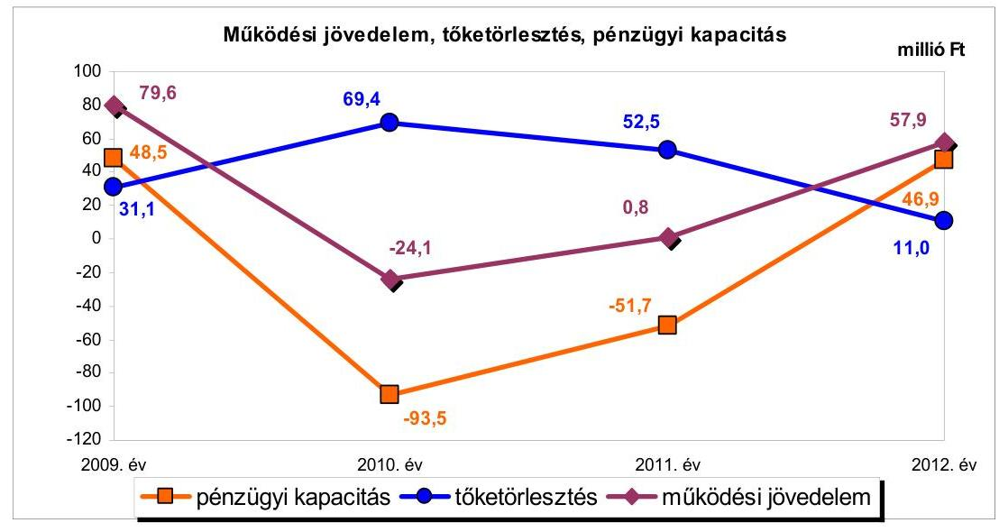
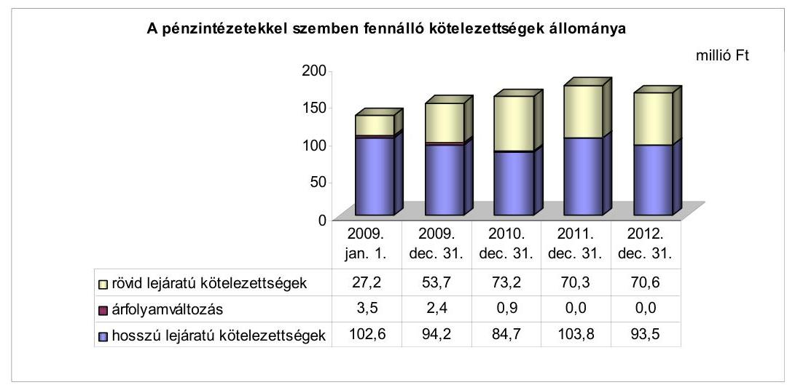
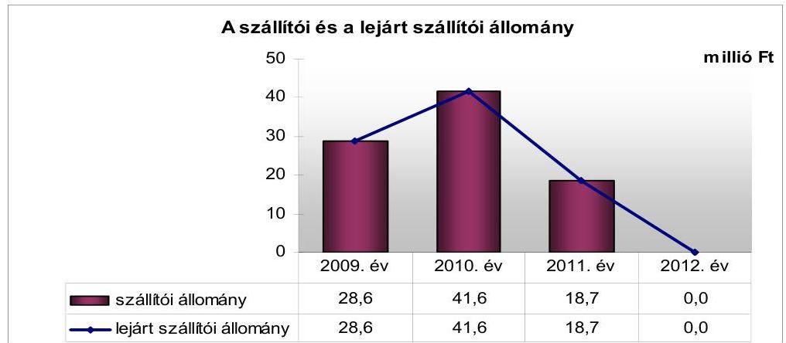
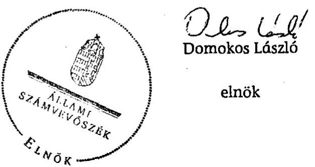
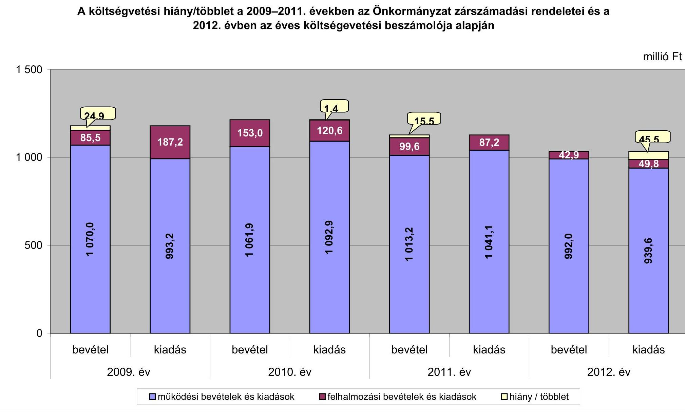
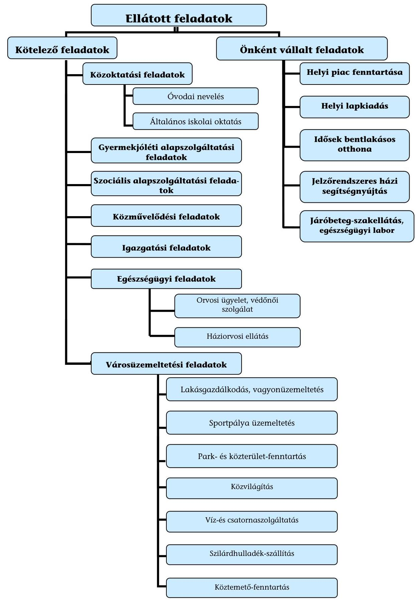

# ÁLLAMI   SZÁMVEVŐSZÉK 

## JELENTÉS

az önkormányzatok pénzügyi gazdálkodási helyzetének, szabályosságának ellenőrzéséről

NAGYHALÁSZ
13095
2013. szeptember

---

# Állami Számvevőszék 

Iktatószám: V-0030-352-010/2013.
Témaszám: 1069
Vizsgálat-azonosító szám: V059225

## Az ellenőrzést felügyelte:

## Renkó Zsuzsanna

felügyeleti vezető

## Az ellenőrzést vezette és az ellenőrzés végrehajtásáért felelős:

## Dér Lívia

ellenőrzésvezető

## Az ellenőrzést végezték:

| Szihalminé Kovács | Vida László |
| :-- | :-- |
| Zsuzsanna | számvevő tanácsos |
| számvevő tanácsos |  |

---

# TARTALOMJEGYZÉK 

BEVEZETÉS ..... 3
I. ÖSSZEGZŐ MEGÁLLAPÍTÁSOK, KÖVETKEZTETÉSEK JAVASLATOK ..... 6
II. RÉSZLETES MEGÁLLAPÍTÁSOK ..... 12

1. Az Önkormányzat kötelező és önként vállalt feladatai, a feladatellátás szervezeti keretei ..... 12
2. A pénzügyi egyensúly fenntartását veszélyeztető pénzügyi kockázatok és az ezek csökkentése érdekében tett intézkedések ..... 13
3. A pénzügyi gazdálkodási folyamatok szabályosságát, megfelelőségét biztosító belső kontrollok ..... 22
4. Az ÁSZ korábbi ellenőrzése során a pénzügyi, gazdálkodási helyzet javítására tett javaslatainak megvalósítása ..... 23

---

# MELLÉKLETEK 

1. számú A költségvetési hiány/többlet a 2009-2011. évek közötti időszakban az Önkormányzat zárszámadási rendeletei és a 2012. évben az éves költségvetési beszámolója alapján
2. számú Az Önkormányzat bevételei és kiadásai, valamint adósságszolgálata a 2009-2012. években (a CLF módszer szerint)
3/a. számú Az Önkormányzat által a 2009-2012. években megvalósított (műszakilag befejezett) fejlesztések forrásösszetétele
3/b. számú Az Önkormányzat 2012. december 31-én folyamatban lévő fejlesztési feladataihoz kapcsolódó kötelezettségeinek összegzése
3/c. számú Az Önkormányzat által beadott, elbírálás alatti pályázatok forrásaiból megvalósuló fejlesztésekhez kapcsolódó kötelezettségvállalások összegzése
3. számú Az önkormányzati feladatok ellátásában résztvevő gazdasági társaságok egyes kiemelt adatai
4. számú Az Önkormányzat 2012. december 31-én fennálló, hosszú lejáratú adósságot keletkeztető kötelezettségvállalásai
5. számú Az Önkormányzat kötelezettségeinek és egyes kötelezettségvállalásainak 2009. december 31-ei és 2012. december 31-ei állománya, valamint a 2013. évben és az azt követő években várható kötelezettségek, kötelezettségvállalások miatti kiadások

## FÜGGELÉKEK

1. számú Rövidítések jegyzéke
2. számú Fogalomtár
3. számú Az Önkormányzat által ellátott feladatok 2012. december 31-én

---

# JELENTÉS 

## az önkormányzatok pénzügyi gazdálkodási helyzetének, szabályosságának ellenőrzéséről NAGYHALÁSZ

## BEVEZETÉS

Az államháztartás helyi szintjén, az önkormányzati alrendszerben az utóbbi években megjelenő gazdálkodási nehézségek, a pénzforgalmi hiány növekedése, az eladósodás az ÁSZ figyelmét a helyi önkormányzatok pénzügyi helyzetére irányította.

Az ÁSZ a 2013. év I. félévi ellenőrzési tervben foglaltaknak megfelelően az önkormányzatok pénzügyi gazdálkodási helyzetének, szabályosságának ellenőrzésével az önkormányzatok 2011. évben megkezdett helyzetelemzését folytatta. Az ellenőrzés keretében értékeljük az önkormányzatok adósságkezelési és likviditási helyzetét. Bemutatjuk a pénzügyi egyensúly alakulására hatással lévő folyamatokat, feltárjuk az ezekre ható kockázatokat. Értékeljük a pénzügyi egyensúlyi helyzetet befolyásoló döntésmegalapozó, dön-tés-előkészítő eljárások szabályosságát, és minősítjük az ezekkel összefüggő belső kontrollok kialakítását, múködését.

Az ellenőrzés eredményének várható hatásaként a megállapításokkal segítséget nyújtunk az önkormányzatok számára a pénzügyi egyensúly helyreállítása, javítása és fenntartása érdekében szükségessé váló intézkedések megtételéhez.

Az ellenőrzés típusa: szabályszerűségi ellenőrzés.

## Az ellenőrzés célja annak értékelése volt, hogy:

- az ellenőrzött időszakban a kötelező és önként vállalt feladatok ellátását biztosító szervezeti formák változása milyen hatást gyakorolt az Önkormányzat pénzügyi helyzetének alakulására;
- az Önkormányzat pénzügyi - ezen belül múködési és felhalmozási - egyensúlya milyen irányban változott, a változást milyen okok idézték elő, továbbá milyen intézkedéseket tettek a pénzügyi egyensúly biztosítása, illetve javítása érdekében, az intézkedések hatására javult-e az Önkormányzat pénzügyi helyzete;
- a költségvetési kiadások finanszírozása érdekében vállalt, pénzintézetekkel szembeni kötelezettségek hogyan alakultak, a kötelezettségek fennállása miként befolyásolja az Önkormányzat jövőbeli pénzügyi egyensúlyi helyzetét;

---

- az Önkormányzat beazonosította, felmérte, értékelte-e a pénzügyi egyensúlyt befolyásoló pénzügyi kockázatokat, a finanszírozási célú pénzügyi műveletekkel kapcsolatban írtak-e elő kockázatértékelési kötelezettséget;
- az Önkormányzat által kialakított belső kontrollok biztosítják-e a pénzügyi gazdálkodás folyamatainak szabályosságát és eredményességét;
- hasznosultak-e az ÁSZ korábbi ellenőrzése során a pénzügyi, gazdálkodási helyzet javítására tett szabályszerűségi és célszerűségi javaslatok.

Az ellenőrzés a 2009. január 1-jétől 2012. december 31-ig terjedő időszakot ölelte fel. A pénzintézetekkel szembeni kötelezettségek állományára vonatkozóan az ellenőrzés kezdő időpontjaként a 2012. december 31-én fennálló kötelezettségek keletkezésének időpontját vettük figyelembe.

Az ellenőrzés szakmai módszertana az ÁSZ Ellenőrzési Elvek és Standardokban foglalt szakmai szabályokon alapult, amely a Legfőbb Ellenőrző Intézmények Nemzetközi Szervezete (INTOSAI) által kiadott nemzetközi standardok (ISSAI) figyelembevételével készült.

Az ellenőrzés során használt rövidítéseket az 1. számú, az egyes fogalmak magyarázatát a 2. számú függelék tartalmazza.

Az ellenőrzés jogszabályi alapját az ÁSZ tv. 1. § (3) bekezdésének, 5. § (2)(6) bekezdéseinek, valamint az államháztartásról szóló 2011. évi CXCV. törvény 61. § (2) bekezdésének előírásai képezik.

Az Országgyűlés 2012 végén a helyi önkormányzatok adósságállományának részleges konszolidációjáról döntött. Az 5000 fő lakosságszámot meg nem haladó települési önkormányzatok számára nyújtott törlesztési célú támogatással ${ }^{1}$ lehetővé tették a 2012. december 12-én fennálló adósságállományuk és annak 2012. december 28 -áig számított járulékai teljes megfizetését. Az 5000 fő lakosságszám feletti települések esetében a 2013. évben az állam differenciált az adóerő-képességet figyelembe vevő, 40-70\%-ig terjedő - mértékben vállalja át ${ }^{2}$ az önkormányzat 2012. december 31-i, az átvállalás időpontjában fennálló adósságállományát és annak járulékait. Az adósságkonszolidációs intézkedéssel egyidejűleg a Kormány elrendelte ${ }^{3}$ az önkormányzatok adósságállománya újratermelődésének megakadályozása céljából a hitelengedélyezési és a likvid hitelekre vonatkozó szabályozás szigorítását.

Nagyhalász Város Önkormányzata lakónépességére tekintettel a 2013. évi adósságátvállalásban érintett. Az adósságkonszolidáció keretében - a 2013. február 28-án kötött megállapodásban - a Magyar Állam az Önkormányzat fennálló adósságállományának 70,0\%-át (113,8 millió Ft-ot) és annak járulé-

[^0]
[^0]:    ${ }^{1}$ Magyarország 2012. évi központi költségvetéséről szóló 2011. évi CLXXXVIII. törvény 76/C. §-a (beiktatta a 2012. évi CLXXXVII. törvény 8 §-a, hatályos 2012. XII. 6-tól)
    ${ }^{2}$ Magyarország 2013. évi központi költségvetéséről szóló 2012. évi CCIV. törvény 72-76. §-ai
    ${ }^{3}$ 1540/2012. (XII. 4.) Korm. határozat a helyi önkormányzatok adósságállományának részleges konszolidációjáról

---

kait átvállalta. Az Önkormányzat pénzügyi egyensúlyának jövőbeni alakulását befolyásoló, az ellenőrzött időszakban fennállt kockázatokra az ellenőrzés időszakában tett megállapításaink - a pénzintézetekkel szembeni kötelezettségekkel összefüggésben feltárt kockázatok kivételével - az adósságkonszolidációt követően is helytállóak és időszerűek.

Nagyhalász város lakosainak száma 2012. január 1-jén 5894 fő volt, ami 52 fős csökkenést jelent a 2009. év eleji (5946 fő) lakosságszámhoz képest. Az Önkormányzat a 2012. évben 1034,9 millió Ft költségvetési bevételt ért el, és 989,4 millió Ft költségvetési kiadást teljesített. A 2009. évi tényadatokhoz viszonyítva a bevételek 120,6 millió Ft-tal (10,4\%-kal), a kiadások 191,0 millió Ft-tal ( $16,2 \%$-kal) csökkentek. A 2012. december 31-i könyvviteli mérleg alapján 3081,4 millió Ft értékű vagyonnal rendelkezett, amely a 2009. év végi állományhoz ( 3104,5 millió Ft) viszonyítva $0,7 \%$-kal ( 23,1 millió Ft-tal) csökkent. A 2012. évben az eszközök közül a tárgyi eszközök állománya 2450,7 millió Ft, a forgóeszközök állománya 80,5 millió Ft volt. Az Önkormányzat az ellenőrzött időszak minden évében részesült ÖNHIKI támogatásban.

Az ÁSZ tv. 29. § (1) bekezdése szerint a jelentéstervezetet megküldtük a polgármester részére, aki az ÁSZ tv. 29. § (2) bekezdésében foglalt észrevételezési jogával nem élt, a jelentéstervezetre észrevételt nem tett.

---

# I. ÖSSZEGZŐ MEGÁLLAPÍTÁSOK, KÖVETKEZTETÉSEK JAVASLATOK 

Nagyhalász Város Önkormányzatának pénzügyi egyensúlya az ellenőrzött időszakban rövid távon nem volt biztosított. A 2013. évi adósságkonszolidáció eredményeként az Önkormányzat pénzügyi egyensúlyi helyzete javul, azonban az adósságátvállalást követően fennmaradó kötelezettségek teljesíthetősége továbbra is kockázatos, az ellenőrzött időszak jövedelemtermelő képessége alapján várhatóan képződő bevételek a feladatellátáshoz szükséges kiadások, valamint a tőketörlesztés fedezetét nem biztosítják, a múködést rövid távon korlátozzák.

Az Önkormányzat költségvetésének elemzését a CLF módszerrel számított mutatók alapján végeztük. A pénzügyi kapacitás 2009-2012 közötti változását az alábbi ábra szemlélteti:

Az Önkormányzat a 2009. év és a 2012. év között összesen 4518,1 millió Ft költségvetési bevételt ért el, és 4511,6 millió Ft költségvetési kiadást teljesített. A múködési költségvetés egyenlege - döntően a 247,0 millió Ft ÖNHIKI támogatás eredményeként - az ellenőrzött időszakban 114,2 millió Ft többletet mutatott. Az Önkormányzat múködési költségvetésének egyensúlya az ellenőrzött időszakban - a 2009. év kivételével - a múködőképesség fenntartását szolgáló (ÖNHIKI) támogatással volt biztosított.

Az Önkormányzat 2009-ben 60,5 millió Ft, 2010-ben 32,7 millió Ft, 2011-ben 92,4 millió Ft, 2012-ben 61,4 millió Ft ÖNHIKI támogatásban részesült. A múködési jövedelem a 2010. évi csökkenést követően a 2011-2012. években folyamatosan növekedett, egyenlegének kedvező változását az ÖNHIKI támogatások - 2010. évhez viszonyított - növekedése és a folyó kiadások, feladatátadások, kiadáscsökkentő intézkedések miatti csökkenése határozta meg. Alacsony múködési jövedelemtermelő képességet és egyben bevételi ki-

---

tettséget jelez, hogy ÖNHIKI támogatások nélkül a múködési jövedelem 2010-ben 56,8 millió Ft, 2011-ben 91,6 millió Ft, 2012-ben 3,5 millió Ft hiányt mutatott volna.

A felhalmozási költségvetés egyenlege a 2010. év kivételével negatív, az ellenőrzött időszakban jelentkező forráshiány összesen 107,7 millió Ft volt. A felhalmozási forráshiány 2009-ben 104,5 millió Ft, 2011-ben 16,3 millió Ft, 2012-ben 12,4 millió Ft volt. A 2010. évi felhalmozási bevételek 25,5 millió Fttal meghaladták a felhalmozási kiadásokat. A felhalmozási költségvetés egyenlegének változását a felmerült kiadások és a pályázati támogatások ütemkülönbsége határozta meg. A felhalmozási forráshiányt az erre a célra felvett hitelekből finanszírozták.

Az ellenőrzött időszakban a kötelező és az önként vállalt feladatok ellátását biztosító szervezeti formák és feladatok változása - az Önkormányzat adatszolgáltatása alapján - a kiadásokat 159,1 millió Ft-tal, a bevételeket 89,5 millió Ft-tal csökkentették, összesen 69,5 millió Ft egyenlegükkel kedvező hatást gyakoroltak az Önkormányzat pénzügyi helyzetének alakulására. A kiadáscsökkentő intézkedések (létszámcsökkentés, takarékossági intézkedések) további 68,0 millió Ft megtakarítást eredményeztek. A szervezeti forma és feladatváltozások, továbbá a kiadáscsökkentő intézkedések a pénzügyi helyzetet javították, azonban a pénzügyi egyensúly helyreállításához nem biztosítottak elegendő forrást.

Az Önkormányzatnál az alacsony működési jövedelemtermelő képességgel kapcsolatban fennállt kockázatok:

- az önként vállalt feladatok ellátása miatti kockázat. Az önként vállalt feladatokra fordított kiadások működési kiadáson belüli aránya a 2009. évi 3,3\%-hoz ( 33,0 millió Ft) viszonyítva 2012-re 0,3\%-ra ( 3,1 millió Ft-ra) csökkent. A 2010-2012. években az önként vállalt feladatok ellátása miatti kockázat az ÖNHIKI támogatás nélkül számított múködési hiány összegére tekintettel fennállt;
- a fejlesztések során kialakított létesítmények jövőbeni üzemeltetése miatti kockázat. A fejlesztésekről szóló döntések előkészítésekor a fejlesztések várható múködési kiadásait, a múködtetés forrásait nem számszerúsítették és nem mutatták be. A fejlesztések nem teremtenek az Önkormányzatnak bevétel növelési lehetőséget.

Az Önkormányzat pénzintézeti kötelezettsége a 2009. év elejéről a 2012. év végére 133,3 millió Ft-ról 164,1 millió Ft-ra növekedett a fennálló kötelezettségek részbeni törlesztése, fejlesztési hitelek igénybevétele és a folyószámlahitel állomány növekedésének együttes hatására. Az Önkormányzat likviditási nehézségeinek fokozódását, a banki kitettség miatti kockázatot jelzi, hogy az ellenőrzött időszakban a folyószámlahitel, továbbá a 2010-2011. években a munkabér-megelőlegezési hitel igénybevétele tartósan fennállt. A mun-kabér-megelőlegezési hitel igénybevétele a 2012. évtől az ÖNHIKI támogatásnak köszönhetően megszűnt. A 2013. évi adósságkonszolidáció kedvező hatása ellenére a 2013. évtől várható kötelezettségek teljesíthetőségének kockázatát jelentheti, hogy az ellenőrzött időszakban fennálló jövedelemtermelő

---

képesség alapján számított múködési jövedelem - ÖNHIKI támogatás nélkül várhatóan nem nyújt fedezetet a pénzintézeti kötelezettségek teljesítésére. Az adósságszolgálat teljesítéséhez szabad tartalékkal nem rendelkeznek, a likviditási nehézségek rendezéséhez források nem állnak rendelkezésre.

Az ellenőrzött időszakban a gazdasági társaság miatti mérlegen kívüli kockázat is fennállt. Az Önkormányzat kizárólagos tulajdonában álló gazdasági társaság felszámolását 2011-ben rendelte el a bíróság. A 3,0 millió Ft törzstőkével alapított gazdasági társaság - bírósági végzés szerinti - kötelezettsége (5,7 millió Ft) meghaladta a társaság vagyonát ( 3,8 millió Ft). A bíróság a vagyonnal nem fedezett kötelezettségek vonatkozásában megállapíthatja az Önkormányzat helytállási kötelezettségét.

Az Önkormányzatnál a kockázatkezelési rendszer keretében a pénzügyi egyensúlyt befolyásoló kockázatok feltárása, beazonosítása, felmérése, értékelése és ezáltal kezelése - a 2009. évben az Ámr. ${ }_{1}$-ben, a 2010-2011. években az Ámr. ${ }_{2}$-ben, a 2012. évben a Bkr.-ben foglalt jogszabályi előírások ellenére - elmaradt. Annak ellenére maradt el a kockázatok kezelése, hogy az ellenőrzött időszakban fennállt az alacsony múködési jövedelemtermelő képesség kockázata, az önként vállalt feladatok miatti kockázat, az ÖNHIKI támogatás miatti bevételi kitettség kockázata, a folyószámlahitel és a munkabérmegelőlegezési hitel tartóssá válása miatti banki kitettség kockázata, a fejlesztések során kialakított létesítmények jövőbeni üzemeltetése miatti, a gazdasági társaság kötelezettségei miatti mérlegen kívüli kockázat és a várható kötelezettségek teljesíthetőségének kockázata.

A pénzügyi gazdálkodási folyamatok szabályosságát, megfelelőségét, kockázatainak kezelését biztosító kontrolltevékenységek kialakítása megfelelő volt, mert rendelkeztek a közpénzek felhasználásának szabályosságát biztosító kockázatkezelési szabályzattal, ellenőrzési nyomvonallal, szabálytalanságok kezelésének rendjével. Szabályozták a költségvetés és a zárszámadás készítés folyamatát. Előírták a döntés-előkészítés szakaszában a fejlesztési döntések kockázatainak feltárásának és kezelésének kötelezettségét. Kialakították a fejlesztésekhez kapcsolódó külső források, támogatások figyelési rendszerét, a pályázat készítés feltételeit és eljárásrendjét. Meghatározták az Önkormányzat által nyújtott múködési és felhalmozási célú pénzeszköz-átadások feltételrendszerét.

Az Önkormányzatnál az ellenőrzött időszak belső ellenőrzési terveinek készítését megelőzően - a 2009. évben az Ámr. ${ }_{1}$-ben, a 2010-2011. években az Ámr. ${ }_{2}{ }^{-}$ ben, a 2009-2011. években a Ber.-ben, 2012. január 1-jétől a Bkr.-ben foglaltak ellenére - nem írták elő a pénzügyi egyensúlyi helyzetet befolyásoló döntések kockázati tényezőinek feltárását, a belső ellenőrzési tervek nem tartalmazták az ellenőrzési terveket megalapozó kockázatelemzéseket, és az Önkormányzatnál nem ellenőrizték ezeket a kockázati tényezőket.

A pénzügyi gazdálkodási folyamatok szabályosságát, megfelelőségét, a kockázatok kezelését biztosító belső kontrollok múködése jó volt, annak ellenére, hogy nem tárták fel a fejlesztéseket megelőző döntés-előkészítési folyamatban az előkészítés, a lebonyolítás és a működtetés kockázatát. Nem vizsgálták a döntés-előkészítés szakaszában a pénzintézeti kötelezettségvállalások kockázatait (kamat, visszafizetés, árfolyam), a hitelfelvételnél a futamidő egyes éveit

---

terhelő kötelezettség költségvetési egyensúlyra gyakorolt hatását, a pénzintézeti szolgáltatást nyújtó bankot pályáztatás, illetve több ajánlatkérés nélkül választották. Összességében a kialakított belső kontrollok biztosították a pénzügyi gazdálkodási folyamatok eredményességét.

Az ellenőrzés során a gazdálkodási feladatok ellátásával és a könyvvezetési kötelezettség teljesítésével kapcsolatban az alábbi szabályszerűségi hibákat tártuk fel:

- az Áhsz. előírásai ellenére a likvid hitelek felvételét és törlesztését a folyószámlahitel esetében a 2009-2012. években, a munkabér-megelőlegezési hitel esetében a 2009-2011. években a főkönyvi nyilvántartásokban halmozottan mutatták ki;
- a Számv. tv. és az Áhsz. előírásai ellenére a beszámoló készítését megelőzően a 2011. évben visszafizetett, devizában fennálló hiteltartozás év végi értékelését a 2009-2010. években nem végezték el, ezért a mérleg szerinti pénzintézeti kötelezettségek állománya nem tartalmazta a CHF alapú fejlesztési hitel árfolyamváltozásának hatását. A 2009. évi 2,4 millió Ft és a 2010. évi 0,9 millió Ft árfolyamveszteség elszámolásának elmulasztása az Áhsz. előírása alapján nem minősült jelentős összegű hibának.

Az Önkormányzat gazdálkodási rendszerének 2010. évi ÁSZ ellenőrzése során a pénzügyi, gazdálkodási helyzet javítására tett hat szabályszerűségi javaslat és két célszerűségi javaslat hasznosult.

Az ÁSZ tv. 33. § (1) bekezdésében foglaltak értelmében az ellenőrzött szervezet vezetője köteles a jelentésben foglalt megállapításokhoz kapcsolódó intézkedési tervet összeállítani, és azt a jelentés kézhezvételétől számított harminc napon belül az ÁSZ részére megküldeni. Amennyiben az intézkedési tervet határidőben nem küldi meg a szervezet vezetője, vagy az továbbra sem elfogadható, az ÁSZ elnöke a hivatkozott törvény 33. § (3) bekezdés a-b) pontjaiban foglaltakat érvényesítheti.

# Az ellenőrzés intézkedést igénylő megállapításai és javaslatai: 

## a polgármesternek

1. A működési költségvetés egyensúlya a 2009. évben a működőképesség fenntartását szolgáló támogatás nélkül, a 2011-2012. években e támogatással volt biztosított. A nettó működési jövedelem 2010-ben és 2011-ben pénzügyi kapacitáshiányt jelzett. A likviditás biztosítására a 2009-2012. években felvett folyószámlahitel tartóssá vált, ezen túl a 2009-2011. években munkabér-megelőlegezési hitel igénybevétele is szükségessé vált. 2012. december 31-én a fennálló pénzintézeti kötelezettség - melyet 70,0\%-ban érint az adósságkonszolidáció - 164,1 millió Ft, az egyéb kötelezettség 0,7 millió Ft volt. Az adósságkonszolidációt követően kialakuló kötelezettségek jövőbeni teljesíthetőségére a múködési jövedelem várhatóan nem nyújt fedezetet, szabad tartalékkal az Önkormányzatnál nem rendelkeznek. Az ellenőrzött időszakban tett kiadáscsökkentő intézkedésekből származó megtakarítás a pénzügyi egyensúlyi helyzet helyreállításához nem biztosított elegendő forrást.

---

Javaslat:
A múködési jövedelemtermelő képesség és a feladatellátás összhangja, valamint az Önkormányzat pénzügyi egyensúlyának helyreállítása, hosszú távú fenntarthatósága érdekében - a 2013. évi kormányzati adósságkonszolidációt, valamint a 2013. évtől változó feladatellátási kötelezettséget, feladatfinanszírozási rendszert figyelembe véve - felelősök és határidők megjelölésével kezdeményezzen intézkedéseket, melyek keretében:
a) a költségvetési rendelettervezet, valamint annak évközi módosítása előterjesztését megelőzően mérje fel a bevételszerző, kiadáscsökkentő lehetőségeket. Terjessze a Képviselő-testület elé a bevételek növelését, a kiadások csökkentését célzó intézkedések bevezetéséhez szükséges - a Htv. 140. § (1) bekezdés a) pontja alapján a jegyző által elkészített - döntési javaslatát;
b) terjesszen a Képviselő-testület elé jóváhagyásra - a Htv. 140. § (1) bekezdés a) pontja alapján a jegyző által elkészített - az Önkormányzat gazdasági helyzetének elemzésén alapuló, a pénzügyi egyensúlyi helyzet gyors helyreállítását, hoszszú távú fenntartását, valamint az adósságállomány újratermelődésének elkerülését biztosító intézkedéseket tartalmazó reorganizációs programot;
c) az adósságkonszolidációt követően fennmaradó kötelezettségek jövőbeni teljesítése, a fizetőképesség megőrzése érdekében terjesszen a Képviselő-testület elé a Htv. 140. § (1) bekezdés a) pontja alapján a jegyző által elkészített - döntési javaslatot, amelyben a Képviselő-testület kötelezettséget vállal arra, hogy előre meghatározott összegben és módon a realizált többletbevételeket, a jövőben képződő tartalékokat mindaddig a kötelezettségek rendezésére fordítja, azt nem használja más célra, amíg az Önkormányzat pénzügyi egyensúlya rövid távon veszélyeztetett.

# a jegyzőnek 

1. Az Önkormányzatnál a 2009-2012. években a folyószámlahitel felvételét és törlesztését, a 2009-2011. években a munkabér-megelőlegezési hitel felvételét és törlesztését a főkönyvi könyvelésben - az Áhsz. 9. számú mellékletének a számlaosztályok tartalmára vonatkozó előírásai 3. b) pontjában (a 2009-2011. években) és a 2012. évben a 3. bb) pontjában előírt szabályoktól eltérően - halmozottan mutatták ki, a hitel felvételét bevételként, törlesztését kiadásként számolták el.

Javaslat:
A könyvvezetési és a beszámoló készítési kötelezettség szabályszerű teljesítése érdekében intézkedjen, hogy a könyvvezetés során a folyószámla- és munkabérmegelőlegezési hitel felvételét és törlesztését a főkönyvi könyvelésben az Áhsz. 9. számú mellékletének a számlaosztályok tartalmára vonatkozó előírásai 3. bb) pontjában rögzített előírásoknak megfelelően végezzék.
2. A kockázatkezelési rendszer keretében az ellenőrzött időszakban fennállt, a pénzügyi egyensúlyt befolyásoló kockázatok feltárása, beazonosítása, értékelése és kezelése - a 2009. évben az Ámr. 145/C. § (1)-(3) bekezdéseiben, a 2010-2011. években az Ámr. 2 157. § (1)-(3) bekezdéseiben, a 2012. évben a Bkr. 7. § (1)-(2) bekezdéseiben

---

foglalt jogszabályi előírások ellenére - elmaradt. Annak ellenére maradt el a kockázatok kezelése, hogy az ellenőrzött időszakban fennállt az alacsony működési jövedelemtermelő képesség miatti kockázat, az önként vállalt feladatok miatti kockázat, az ÖNHIKI támogatás miatti bevételi kitettség kockázata, a folyószámlahitel és a mun-kabér-megelőlegezési hitel tartóssá válása miatti banki kitettség kockázata, a fejlesztések során kialakított létesítmények jövőbeni üzemeltetése miatti és a gazdasági társaság kötelezettségei miatti mérlegen kívüli kockázat, valamint a várható kötelezettségek teljesíthetőségének kockázata.

Javaslat:
Működtessen a Bkr. 7. § (1)-(2) bekezdéseiben foglalt előírásoknak megfelelő, a pénzügyi egyensúlyt befolyásoló kockázatok kezelésére alkalmas kockázatkezelési rendszert.
3. Az Önkormányzatnál a belső ellenőrzési tervek készítését megelőzően - a 2009. évben az Ámr.1 145/C. § (2) bekezdésében, a 2010-2011. években az Ámr. 1 157. § (2) bekezdésében, a 2009-2011. években a Ber. 18. §-ában, a 21. § (2) bekezdésében és a (3) bekezdés a) pontjában, 2012. január 1-jétől a Bkr. 7. § (2) bekezdésében, a 29. § (1) bekezdésében és a 31. § (2)-(4) bekezdéseiben foglalt előírások ellenére - nem írták elő a pénzügyi egyensúlyi helyzetet befolyásoló döntések kockázati tényezőinek feltárását, a belső ellenőrzési tervek nem tartalmazták az ellenőrzési terveket megalapozó kockázatelemzéseket és az Önkormányzatnál nem ellenőrizték ezeket a kockázati tényezőket.

Javaslat:
Intézkedjen a belső ellenőrzés vezetője felé, hogy a Bkr. 7. § (2) bekezdésében foglaltak szerint mérjék fel a gazdálkodásban rejlő kockázatokat, a 29. § (1) bekezdésében, a 31. § (2)-(4) bekezdéseiben foglalt előírások szerint az éves belső ellenőrzési tervek tartalmazzák a pénzügyi egyensúlyi helyzetet befolyásoló döntésekkel kapcsolatos feltárt kockázati tényezők ellenőrzését, valamint biztosítsa az ellenőrzési tervek végrehajtását.

---

# II. RÉSZLETES MEGÁLLAPÍTÁSOK 

## 1. Az ÖNKORMÁNYZAT KÖTELEZŐ ÉS ÖNKÉNT VÁLlALT FELADATAI, A FELADATELLÁTÁS SZERVEZETI KERETEI

A kötelező és az önként vállalt feladatok ellátását a 2009-2012. évek közötti időszakban az Önkormányzat nem szabályozta, annak körét nem rögzítette. Az önként vállalt feladatok - az Önkormányzat besorolása alapján - a 2009. évben az alapfokú művészeti oktatás, az egészségügyi labor múködtetése, a helyi piac fenntartása, a helyi lapkiadás, az idősek bentlakásos otthonban történő elhelyezése, és a jelzőrendszeres házi segítségnyújtás müködtetésének biztosítása, valamint a szeszfőzde üzemeltetése voltak. Az önként vállalt feladatok köre a 2012. év végére az alapfokú művészeti oktatás és a szeszfőzde üzemeltetés átadásával csökkent, valamint a járóbeteg-szakellátás biztosításával növekedett.

A kötelező feladatok körében az egyházakkal kötött közoktatási megállapodás alapján biztosították az óvodai nevelést és az általános iskolai oktatást. Kötelező feladatként - társulás keretében - látták el a szociális ágazatban a szociális és gyermekjóléti alapszolgáltatási feladatokat. A kötelező közművelődési feladatokat művelődési ház és könyvtár fenntartásával végezték. A Polgármesteri Hivatal feladatát képezte az igazgatási feladatok ellátásán túl a lakásgazdálkodás és a vagyonüzemeltetés, a sportpálya üzemeltetése, a park- és közte-rület-fenntartás. Az orvosi ügyeletet, a védőnői szolgálatot és a járóbetegszakellátást gazdasági társasággal kötött szerződés útján biztosították. A háziorvosi feladatok ellátására egyéni vállalkozóként működő orvosokkal kötöttek szerződést. Az Önkormányzat egyes kötelező feladatait (közvilágítás, víz- és csatornaszolgáltatás, szilárdhulladék-szállítási, köztemető fenntartás) közszolgáltatási szerződések alapján gazdasági társaságok látták el. (A feladatellátás részletezését a 3. számú függelék tartalmazza.)

A 2012. évben a teljesített működési kiadások összege 932,3 millió Ft volt, amely a 2009. évi teljesített múködési kiadásnál 53,4 millió Ft-tal (5,4\%-kal) kevesebb volt. A múködési kiadások csökkenését a feladatátadások és megszüntetések, a létszámcsökkentések, a többletjuttatások csökkentése, valamint a személyi és dologi kiadások mérséklődésének együttes hatása okozta. A kötelező feladatokra fordított múködési kiadások aránya az összes múködési kiadáshoz viszonyítva a 2009. évi 96,7\%-ról 2012-re 99,7\%-ra nőtt, összege a 2009. évi 952,7 millió Ft-hoz képest a 2012. évben 929,2 millió Ft-ra csökkent. Az önként vállalt feladatok múködési kiadásainak aránya az összes múködési kiadáson belül a 2009. évi 3,3\%-ról (33,0 millió Ft-ról) 2012-re - folyamatosan -0,3\%-ra (3,1 millió Ft-ra) csökkent. A 2010-2012. években az önként vállalt feladatok ellátása miatti múködési kockázat - az ÖNHIKI támogatás nélkül számított múködési jövedelem összegére tekintettel - fennállt.

Az ellenőrzött időszakban megvalósított fejlesztések teljes bekerülési költsége 400,4 millió Ft volt, melyből a kötelező feladatokhoz kapcsolódó fejlesztésekre

---

370,4 millió Ft-ot ( $92,5 \%$-ot), az önként vállalt feladatokra 30,0 millió Ft-ot ( $7,5 \%$-ot) fordítottak. Az önként vállalt feladatokhoz kapcsolódó fejlesztési kiadások nagyságrendjükre tekintettel kockázatot nem jelentettek.

A kötelező és az önként vállalt feladatokra fordított kiadások arányának, mértékének és azok változásának a pénzügyi egyensúlyi helyzetre gyakorolt hatását az Önkormányzat nem értékelte, azonban a kötelező és az önként vállalt feladatok körének csökkentéséről szóló döntéseket hozott a Képviselő-testület az ellenőrzött időszakban.

Az Önkormányzat a feladatait 2009. január 1-jén négy költségvetési szervvel, 12 telephelyen látta el. Az ellenőrzött időszak végén az önkormányzati fenntartású költségvetési szervek száma háromra, a telephelyek száma négyre csökkent. Az Önkormányzat 2009-2012 között - a feladat alapítványnak történő átadásával - megszüntette az alapfokú művészeti oktatást, valamint az óvoda és az általános iskola fenntartói jogát egyházaknak adta át. Az orvosi ügyelet, a védőnői szolgálat és az egészségügyi labor múködtetését a -járóbeteg-szakellátást biztosító - MEDI-AMB Nonprofit Közhasznú Kft-nek adta át. A szeszfőzde üzemeltetésére vállalkozással kötöttek szerződést.

Az Önkormányzat a 2009-2012 közötti időszakban három gazdasági társaságban rendelkezett - a Halászért Nonprofit Kft.-ben 100,0\%-os, a MEDI-AMB Nonprofit Közhasznú Kft.-ben 49,1\%-os és a Nyírségvíz Zrt.-ben 4,7\%-os - tulajdoni részesedéssel. A feladatellátásban résztvevő gazdasági társaságok egyes kiemelt adatait a 4. számú melléklet tartalmazza.

A kizárólagos önkormányzati tulajdonban lévő Halászért Nonprofit Kft. az önkormányzati feladatok közül - egyéb tevékenysége mellett - park- és közterületfenntartást végzett a 2010. év végéig. A 3,0 millió Ft törzstőkével létrehozott gazdasági társaság múködtetése veszteséges volt, ezért 2011-ben megkezdődött a felszámolása, ami 2012. december 31-ig nem fejeződött be. A park- és kózte-rület-fenntartás feladatát 2011-től a Polgármesteri Hivatal útján látták el.

Az ellenőrzött időszakban a kötelező és az önként vállalt feladatok ellátását biztosító szervezeti formák és feladatok változása - az Önkormányzat adatszolgáltatása alapján - a kiadásokat 159,1 millió Ft-tal, a bevételeket 89,5 millió Ft-tal csökkentették, összesen 69,5 millió Ft egyenlegükkel kedvező hatást gyakoroltak az Önkormányzat pénzügyi helyzetének alakulására.

# 2. A PÉNZÜGYI EGYENSÚLY FENNTARTÁSÁT VESZÉLYEZTETŐ PÉNZÜGYI KOCKÁZATOK ÉS AZ EZEK CSÖKKENTÉSE ÉRDEKÉBEN TETT INTÉZKEDÉSEK 

Az Önkormányzat költségvetésének elemzését a CLF módszerrel hajtottuk végre. Az ellenőrzéshez felhasznált, a CLF táblában szereplő adatokat a 20092012. évi költségvetési beszámolóban feltárt hibák miatt módosítottuk. A 20092011. években a folyószámlahitel és a munkabér-megelőlegezési hitel felvételét és törlesztését a főkönyvi könyvelésben az Áhsz. 9. számú mellékletének a számlaosztályok tartalmára vonatkozó előírásai 3. b) pontjában, a 2012. évben

---

a folyószámlahitel felvételét és törlesztését az Áhsz. 9. számú mellékletének 3. bb) pontjában rögzített szabályoktól eltérően, halmozottan mutatták ki, a hitel felvételét bevételként, törlesztését kiadásként számolták el.

A CLF módszer szerinti önkormányzati részletes adatokat 2009-2012 között a 2. számú melléklet, a főbb önkormányzati adatokat a következő tábla mutatja be:

|  |  |  | millió Ft |  |
| :-- | --: | --: | --: | --: |
| Megnevezés | 2009. év | 2010. év | 2011. év | 2012. év |
| Folyó bevételek | 1065,3 | 1052,3 | 1007,7 | 990,2 |
| Folyó kiadások | 985,7 | 1076,4 | 1006,9 | 932,3 |
| Múködési jövedelem | $\mathbf{7 9 , 6}$ | $\mathbf{- 2 4 , 1}$ | $\mathbf{0 , 8}$ | $\mathbf{5 7 , 9}$ |
| Felhalmozási bevételek | 90,2 | 162,6 | 105,1 | 44,7 |
| Felhalmozási kiadások | 194,7 | 137,1 | 121,4 | 57,1 |
| Felhalmozási költségvetés egyenlege | $\mathbf{- 1 0 4 , 5}$ | $\mathbf{2 5 , 5}$ | $\mathbf{- 1 6 , 3}$ | $\mathbf{- 1 2 , 4}$ |
| Folyó és felhalmozási bevételek összesen | 1155,5 | 1214,9 | 1112,8 | 1034,9 |
| Folyó és felhalmozási kiadások összesen | 1180,4 | 1213,5 | 1128,3 | 989,4 |
| Finanszírozási múveletek nélküli pozíció | $\mathbf{- 2 4 , 9}$ | $\mathbf{1 , 4}$ | $\mathbf{- 1 5 , 5}$ | $\mathbf{4 5 , 5}$ |
| Finanszírozási műveletek egyenlege | 33,3 | -0,6 | 12,2 | $-44,7$ |
| Tárgyévi pénzügyi pozíció | $\mathbf{8 , 4}$ | $\mathbf{0 , 8}$ | $\mathbf{- 3 , 3}$ | $\mathbf{0 , 8}$ |
| Hiteltörlesztés, értékpapír beváltás | 31,1 | 69,4 | 52,5 | 11,0 |
| Nettó múködési jövedelem | $\mathbf{4 8 , 5}$ | $\mathbf{- 9 3 , 5}$ | $\mathbf{- 5 1 , 7}$ | $\mathbf{4 6 , 9}$ |

Az Önkormányzat 2009. és 2012. között összesen 4518,1 millió Ft költségvetési bevételt ért el, és 4511,6 millió Ft költségvetési kiadást teljesített. Az Önkormányzat múködési jövedelme a 2010. évben negatív, míg az ellenőrzött időszak többi évében pozitív volt, egyenlege - döntően a 247,0 millió Ft ÖNHIKI támogatás eredményeként - összesen 114,2 millió Ft többletet mutatott. A múködési jövedelem 2010. évi alakulását döntő mértékben az ÖNHIKI támogatás - az ellenőrzési időszak éveihez viszonyított - alacsony összege, valamint a személyi és dologi kiadások növekedése befolyásolta. A múködési jövedelem 20112012. évi növekményére meghatározó hatással az ÖNHIKI támogatás mellett a múködési kiadások - feladatátadások és takarékossági intézkedések miatti csökkenése volt.

Az Önkormányzat 2009-ben 60,5 millió Ft, 2010-ben 32,7 millió Ft, 2011-ben 92,4 millió Ft, 2012-ben 61,4 millió Ft ÖNHIKI támogatásban részesült. A múködési jövedelemtermelő képesség alacsony szintjét jelezte, és bevételi kitettséget jelentett, hogy a múködőképesség fenntartását szolgáló támogatások nélkül a múködési jövedelem a 2010. évben 56,8 millió Ft, a 2011. évben 91,6 millió Ft és a 2012. évben 3,5 millió Ft hiányt mutatott volna. A 2009. évben a múködési költségvetés egyensúlya az ÖNHIKI támogatás nélkül is biztosított volt.

Az Önkormányzat nettó múködési jövedelme 2010-ben 93,5 millió Ft, 2011ben 51,7 millió Ft pénzügyi kapacitáshiányt jelzett. A többlet 2009-ben 48,5 millió Ft, 2012-ben 46,9 millió Ft volt. A pénzügyi kapacitás változását a múködési jövedelem alakulása, valamint a hiteltörlesztés összegének változása befolyásolta.

---

#### Abstract

Az ellenőrzött időszakban a 2010. évben volt a legalacsonyabb a múködési jöve-delem ( $-24,1$ millió Ft) és a legmagasabb a hiteltörlesztés ( 69,4 millió Ft). A 2009. évről a 2010. évre jelentős mértékű hiteltörlesztés növekedés történt, amelynek legfőbb oka az 59,9 millió Ft összegben felvett támogatás-megelőlegező hitel viszszafizetése volt. A 2011. évre a múködési jövedelem összege nőtt, azonban a minimális ( 0,8 millió Ft ) pozitív múködési jövedelem nem nyújtott fedezetet a tárgyévi hiteltörlesztésre ( 52,5 millió Ft). A 2011. évi hiteltörlesztés összege - a hosszú lejáratú hitelek törlesztése mellett - a likviditási helyzet javítása érdekében igénybevett 22,0 millió Ft munkabér-megelőlegezési hitel és a 18,3 millió Ft támogatás-megelőlegezési hitel visszafizetését tartalmazta.

A felhalmozási költségvetés egyenlege a 2010. év kivételével negatív, az ellenőrzött időszakban jelentkező forráshiány összesen 107,7 millió Ft volt. A felhalmozási kiadások összege 2009-ben 104,5 millió Ft-tal (115,9\%-kal), 2011ben 16,3 millió Ft-tal ( $15,5 \%$-kal), 2012-ben 12,4 millió Ft-tal ( $27,7 \%$-kal) haladta meg a tárgyévi felhalmozási bevételeket. A felhalmozási hiány összegének változását a felmerült kiadások és a pályázati támogatások ütemkülönbsége határozta meg. A felhalmozási forráshiányt az erre a célra felvett hitelekből finanszírozták.

Az Önkormányzat évenkénti teljes finanszírozási igénye ${ }^{4}$ 2009-ben 56,0 millió Ft, 2010-ben és 2011-ben 68,0 millió Ft volt. A 2012. évben 34,5 millió Ft finanszírozás többlet keletkezett. A költségvetési hiány/többlet alakulását az Önkormányzat 2009-2011. évi zárszámadási rendeletei, valamint a 2012. évi költségvetési beszámolója alapján az 1. számú melléklet tartalmazza.

A folyó bevételek a 2009-2012. években folyamatosan, a 2009. évi 1065,3 millió Ft-ról a 2012. évre 75,1 millió Ft-tal ( $7,0 \%$-kal) 990,2 millió Ft-ra csökkentek. A változást döntően a költségvetési támogatások 176,9 millió Ft-os csökkenése okozta, amely a fajlagos normatív támogatás csökkenésének, az alapfokú művészeti oktatás megszüntetésének, illetve az óvodai nevelési és általános iskolai oktatási feladat egyházak részére történő átadásának a következménye ${ }^{5}$. A helyi adóbevételek 14,3 millió Ft-tal, az egyéb saját bevételek 117,4 millió Ft-tal nőttek az ellenőrzött időszakban.

Az Önkormányzatnak az ellenőrzött időszakban a helyi adók közül az iparúzési adóból és a magánszemélyek kommunális adójából származott bevétele. A helyi adók 2009-2012 között a folyó bevételek körében - jelentős súlyt nem képviseltek - átlagosan 4,4\%-ot ( 45,1 millió Ft-ot) jelentettek. Az Önkormányzatnak a helyi adók miatt bevételi kitettsége nem volt, mert az adóbevétel meghatározó része nagyszámú adófizetőtől származott.

Az egyéb saját bevételek tartalmazták a térítési díjak, a bérleti díjak, valamint a támogatásértékű bevételek összegét is. Az egyéb saját bevételek összegét a 2011-ben beindított közmunka programra kapott támogatások jelentősen növelték, melynek következtében a 2012. évben az egyéb saját bevételek össze-

[^0]
[^0]:    ${ }^{4}$ a nettó múködési jövedelem és a felhalmozási költségvetés együttes negatív egyenlege
    ${ }^{5}$ Az alapfokú művészeti oktatás, az óvodai és az általános iskolai feladatok átadása miatt a kiadások 122,4 millió Ft csökkentek.

---

ge a folyó bevételeknek a 21,6\%-át (214,1 millió Ft) adta, míg 2009-ben csak a $9,1 \%$-át ( 96,7 millió Ft-ot).

A felhalmozási bevételek a 2009. évi 90,2 millió Ft-ról 2010-re 72,4 millió Ft-tal nőttek. A 2010. évi felhalmozási bevétel döntő része a szemétlerakó telep értékesítéséből ( 58,1 millió Ft ) és a beruházásokra kapott támogatások összegéből ( 94,3 millió Ft) tevődött össze. A 2010. évi 162,6 millió Ft felhalmozási bevétel az ingatlanértékesítésből származó bevételek és a fejlesztési támogatások csökkenése következtében a 2011. évre 105,1 millió Ft-ra, 2012-re 44,7 millió Ft-ra csökkent. A felhalmozási bevételeken belül a legnagyobb arányt - 71,8\%-ot (288,9 millió Ft-ot) - a fejlesztési feladatok megvalósításához kapott hazai és EU-s támogatások jelentették.

A folyó kiadások a 2009-ről 2010-re történt 90,7 millió Ft-os emelkedést követően 2011-re az előző évhez képest 69,5 millió Ft-tal (1006,9 millió Ft-ra), 2012-re 74,6 millió Ft-tal ( 932,3 millió Ft-ra) csökkentek. A 2010. évi növekedést a közfoglalkoztatás bővítésével összefüggő személyi juttatások, munkaadót terhelő járulékok, valamint a dologi kiadások növekedése eredményezte. A folyó kiadások 2011. évtől kezdődő csökkenése alapvetően a kiadáscsökkentő intézkedések (létszámcsökkentés, feladatátadás, a többletjuttatások csökkentése) következménye volt. Az egyéb folyó kiadások 2010. évi - kiugróan magas 34,4 millió Ft-os teljesítését a 2009. évi ÖNHIKI elszámoláshoz kapcsolódó 29,0 millió Ft visszafizetési kötelezettség eredményezte.

A 2009-2012. években az Önkormányzat a folyó kiadások teljesítésére átlagosan 1000,3 millió Ft-ot, a felhalmozási kiadásokra 127,6 millió Ft-ot fordított. Felhalmozási kiadásokra a 2009. évben 194,7 millió Ft-ot, a folyó és felhalmozási kiadások 16,5\%-át fordították, amely a 2012. évre 57,1 millió Ft-ra, 5,8\%-ra csökkent. A felhalmozási kiadások csökkenését az okozta, hogy az Önkormányzat a 2010. évet követően nagyobb beruházásba nem kezdett, csak a folyamatban lévő fejlesztések befejezésére törekedett, illetve a legszükségesebb felújításokat végezte el.

Az Önkormányzat 2012. év végéig műszakilag befejezett fejlesztéseinek teljes bekerülési költsége 400,4 millió Ft volt, ebből az ellenőrzött időszakban 371,5 millió Ft kiadást teljesítettek. A fejlesztések finanszírozásához - a 2009. évet megelőzően teljesített 28,9 millió Ft-os kiadást is figyelembe véve 111,2 millió Ft ( $27,8 \%$ ) EU-s támogatás, 163,8 millió Ft ( $40,9 \%$ ) egyéb központi támogatás és összesen 125,4 millió Ft ( $31,3 \%$ ) saját erőből származó forrás 9,5 millió Ft ( $7,6 \%$ ) hitel, 115,9 millió Ft ( $92,4 \%$ ) saját bevétel - állt rendelkezésre.

Az Önkormányzatnak 2012. december 31-én egy folyamatban levő beruházása volt. A 33,3 millió Ft tervezett bekerülési költségű beruházás (boltépítés) tekintetében 2012. december 31-ig nem történt kifizetés. A 2012. december 31-e utáni kötelezettségvállalások forrását 3,3 millió Ft ( $9,9 \%$ ) önkormányzati saját bevétel, illetve 30,0 millió Ft ( $90,1 \%$ ) egyéb központi támogatás jelenti.

Az Önkormányzat által beadott, elbírálás alatti fejlesztési pályázatok segítségével három beruházást (város rehabilitáció, intézmények energiaellátásának fejlesztése, óvodafejlesztés) kívánnak megvalósítani, összesen

---

566,8 millió Ft tervezett bekerülési költséggel. A megvalósításhoz 0,4 millió Ft $(0,1 \%)$ saját bevétel és, 13,4 millió Ft $(2,4 \%)$ fejlesztési hitel igénybevételét tervezték, valamint 553,0 millió Ft ( $97,5 \%$ ) EU-s támogatás igénybevételére pályáztak. A támogatási és hitelszerződések megkötése az ellenőrzött időszakban nem történt meg. A 2009-2012. években megvalósult, a folyamatban lévő és az elbírálás alatti pályázatok fejlesztési feladatait és azok forrásösszetételét a 3/a., a 3/b. és a 3/c. számú mellékletek mutatják be.

A fejlesztések során kialakított létesítmények jövőbeni üzemeltetése miatti kockázatot jelenti, hogy a megvalósított fejlesztések üzemeltetésének várható múködési kiadásait, a múködtetés forrásait nem számszerúsítették, ezeket a fejlesztésekről történő döntéskor a Képviselő-testület számára nem mutatták be. Az Önkormányzat által megvalósított fejlesztések múködtetése forrást nem teremt.

Az Önkormányzat pénzintézeti kötelezettségállománya 2009. január 1jétől 2012. december 31-ig 133,3 millió Ft-ról 164,1 millió Ft-ra, 23,1\%-kal növekedett.

Az Önkormányzat pénzintézetekkel szemben 2009-2012. években fennálló kötelezettségeit a következő ábra mutatja be: ${ }^{6}$

A pénzintézeti kötelezettségek 2009. január 1-jén fennálló állománya a 2007ben felvett két, összesen 91,6 millió Ft összegű (forintalapú) és egy 14,5 millió Ft (CHF alapú) hosszú lejáratú fejlesztési hitelből, valamint a folyószámlahitel egyenlegéből ( 27,2 millió Ft) származott. A pénzintézeti kötelezettségek mérlegben kimutatott összegének alakulását a fennálló pénzintézeti kötelezettségek részbeni teljesítése, a folyószámlahitel állományának növekedése, továbbá fejlesztési hitelek igénybevétele, munkabér-megelőlegezési hitel és támogatásmegelőlegezési hitelek felvétele és visszafizetése határozta meg.

[^0]
[^0]:    ${ }^{6}$ Az Önkormányzat 2012. december 31-én fennálló, hosszú lejáratú adósságot keletkeztető kötelezettségvállalásait az 5. számú melléklet részletezi.

---

A pénzintézeti kötelezettségek állományát 2012. december 31-én a két forintalapú fejlesztési hitel felvételéből fennálló 69,6 millió Ft kötelezettség, a 2011ben felvett, három fejlesztési hitelből adódó 23,9 millió Ft hosszú lejáratú hiteltartozás, valamint 70,6 millió Ft folyószámlahitel képezte.

A mérleg szerinti pénzintézeti kötelezettségek állománya nem tartalmazta a 2007-ben felvett, 2011. évi lejáratú, CHF alapú fejlesztési hitelhez kapcsolódó árfolyamváltozás ${ }^{7}$ hatását. A Számv. tv. 60. § (2) bekezdésében, valamint az Áhsz. 33. § (1) bekezdésében foglalt előírások ellenére nem végezték el a devizában fennálló kötelezettség év végi értékelését a 2009-2010. években. Az árfolyamváltozás számviteli elszámolására a 2009. évben az Áhsz. 33. § (2) bekezdés b) pontjában, a 2010. évben a c) pontjában foglaltak ellenére nem került sor. A devizában fennálló kötelezettség év végi értékelésének elmulasztása miatti eltérés - 2009-ben 2,4 millió Ft, 2010-ben 0,9 millió Ft - az Áhsz. 5. § 8. pontjában meghatározottak alapján nem minősül jelentős összegű hibának.

A hosszú lejáratú hitelek után az Önkormányzat 2009-2012 között 40,4 millió Ft tőketörlesztést, valamint 25,2 millió Ft kamatkiadást teljesített. A hosszú lejáratú hitelek referencia kamata és kamatfelárának összege az ellenőrzött időszakban nem változott. A CHF árfolyam emelkedése miatt 2009-2011 között realizált 4,8 millió Ft árfolyamveszteség rontotta az Önkormányzat pénzügyi helyzetét.

Az Önkormányzat pénzügyi egyensúlya a 2012. december 31-én fennálló adósságterhek miatt rövid távon nem volt biztosított. Az egyes éveket terhelő törlesztő részletek kiadásait a gördülő tervezés keretében figyelembe vették, de a fedezetül szolgáló forrásokat éves bontásban nem mutatták be. Az adósságszolgálat teljesítésére tartalékot nem képeztek. Az Önkormányzatnak a 2012. évben új adósságot keletkeztető ügylete nem volt.

Az Önkormányzat a likviditását folyószámlahitellel és munkabérmegelölegezési hitel felvételével tudta biztosítani, amelyek igénybevételét a 2009-2012. években a következő tábla mutatja be:

| Megnevezés | 2009. év | 2010. év | 2011. év | 2012. év |
| :--: | :--: | :--: | :--: | :--: |
| Folyószámlahitel |  |  |  |  |
| Keretösszeq̧ január 1-jén (millió Ft) | 70,0 | 70,0 | 70,0 | 70,0 |
| Átlagos, napi állomány (millió Ft) | 53,2 | 57,6 | 66,9 | 55,1 |
| Hitellel zárt napok száma (nap) | 365 | 365 | 365 | 366 |
| Egyenleq állomány az időszak végén (millió Ft) | 4,5 | 51,2 | 69,6 | 70,6 |
| Teljesített kamat és eqyéb kiadás (millió Ft) | 6,2 | 5,5 | 7,4 | 6,7 |
| Munkabér-megelőlegezési hitel |  |  |  |  |
| Keretösszeq̧ január 1-jén (millió Ft) | 22,0 | 22,0 | 22,0 | 0,0 |
| Átlagos, napi állomány (millió Ft) | 10,7 | 13,1 | 18,7 | 0,0 |
| Hitellel zárt napok száma (nap) | 232 | 316 | 354 | 0 |
| Egyenleq állomány az idöszak végén (millió Ft) | 18,9 | 0,0 | 0,0 | 0,0 |
| Teljesített kamat és eqyéb kiadás (millió Ft) | 1,3 | 1,3 | 2,0 | 0,0 |

[^0]
[^0]:    ${ }^{7}$ Az árfolyam alakulása: 2009. január 1-jén 180,96 Ft/CHF, 2009. december 31-én 184,19 Ft/CHF, 2010. december 31-én 222,59 Ft/CHF

---

A folyószámlahitel átlagos, napi állománya a 2009. évi 53,2 millió Ft-ról 2011re 66,9 millió Ft-ra nőtt, 2012-ben 55,1 millió Ft volt. A hitel december 31-i záró állománya a folyamatos és jelentős emelkedést követően a 2009. évi 4,5 millió Ft-ról 2012-re 70,6 millió Ft-ra nőtt. Az Önkormányzatnak az ellenőrzött időszak minden napján állt fenn folyószámlahitel tartozása. Kamat és egyéb költség címén az Önkormányzat az ellenőrzött időszakban a folyószámlahitellel kapcsolatosan összesen 25,8 millió Ft-ot fizetett ki. Az ellenőrzött időszakban az Önkormányzat likviditása és rövid távú pénzügyi egyensúlya a folyószámlahitel, továbbá a 2010-2011. években a munkabér-megelőlegezési hitel tartóssá válása és átlagos napi állományának növekedése miatt kedvezőtlenül alakult. A folyószámlahitel tartós igénybevétele banki kitettséget jelentett az Önkormányzat számára.

Munkabér-megelőlegezési hitel igénybevételére kötött keretszerződéssel a 2009-2011. években rendelkezett az Önkormányzat. A hitel átlagos, napi állománya 2009-ről 2011-re 10,7 millió Ft-ról 18,7 millió Ft-ra ( $74,8 \%$-kal), a hitellel zárt napok száma 232 -ről 354 -re nőtt. A munkabér-megelőlegezési hitel igénybevétele 4,6 millió Ft kamatfizetési kötelezettséget jelentett. A helyi önkormányzatok rövid lejáratú hiteltörlesztési támogatásáról szóló 60/2011. (XII. 23.) BM rendelet alapján az Önkormányzat 20,6 millió Ft ÖNHIKI támogatásban részesült. A támogatás felhasználásával a munkabér-megelőlegezési hitelt 2011-ben visszafizették, és a 2012. évtől nem vettek igénybe munkabérmegelőlegezési hitelt.

A beruházásokhoz kapcsolódó támogatások megelőlegezése céljából 2010-ben 59,9 millió Ft, 2011-ben 19,0 millió Ft támogatás-megelőlegező hitelt vett igénybe az Önkormányzat. A hitel visszafizetése a hitelszerződésben foglaltak szerint - a támogatások jóváírását követően - megtörtént. Az ellenőrzött időszakban az Önkormányzat pénzügyi egyensúlyi helyzetét összességében 4,6 millió Ft-tal ${ }^{8}$ rontotta a támogatás-megelőlegezési hitelek igénybevétele.

Az Önkormányzat könyvviteli mérleg szerinti rövid és hosszú lejáratú kötelezettségeinek 14,6\%-át (28,6 millió Ft-ot) a 2009. év végén még a szállítókkal szembeni kötelezettségek tették ki. Az Önkormányzat 2009-2012 közötti szállítói és lejárt szállítói állományát a következő ábra mutatja be:

[^0]
[^0]:    ${ }^{8}$ kamat és egyéb költség

---

Az Önkormányzat valamennyi mérleg szerinti szállítói tartozása lejárt tartozás volt. A pénzügyi helyzet kedvezőtlen alakulását jelentette, hogy a kiugróan magas 2010. év végi tartozás ( 41,6 millió Ft) elsősorban a közüzemi szolgáltatók felé fennálló kötelezettségekből állt. A 2011. december 31-i tartozás állomány az előző évihez képest 22,9 millió Ft-tal csökkent. A 2011. év végi lejárt szállítói tartozásállományon belül a 60 napon túli tartozás 9,9 millió Ft ( $52,9 \%$ ) volt. A 60 napon túl lejárt tartozás összege és a lejárt szállítói tartozásállományon belüli aránya csökkent az előző év végi állományhoz ( 24,7 millió Ft), illetve hányadhoz ( $59,4 \%$-hoz) képest. A 2012. évben pályázatot nyújtottak be ÖNHIKI támogatás igénybevételére. A pályázat pozitív elbírálását követően - szállítói tartozások kiegyenlítésére fordítható - 48,0 millió Ft támogatásban részesültek. A támogatás felhasználásával a szállítói számlákat kiegyenlítették.

Az Önkormányzat figyelemmel kísérte a szállítói kötelezettségek állományát, annak változásait és a pénzügyi helyzetre gyakorolt hatását.

Az Önkormányzatnak az ellenőrzött időszakban egy - korlátozottan forgalomképes - ingatlana volt jelzáloggal terhelt, melynek 2012. december 31-i nettó értéke 13,8 millió Ft. A fejlesztési támogatás igénybevételéhez kapcsolódó, Önkormányzati és Területfejlesztési Minisztérium által alapított jelzálogjognak az Önkormányzat pénzügyi egyensúlyi helyzetére gyakorolt hatása nem jelentős. A fejlesztési támogatás igénybevételével korszerúsített sportpályára 5,9 millió Ft értékben alapított jelzálogot az Önkormányzati és Területfejlesztési Minisztérium. Az ingatlan könyv szerinti nettó értéke 13,8 millió Ft. A jelzálogteher 2007. április 16-tól 2017. április 16-ig áll fenn.

Az Önkormányzat kizárólagos tulajdonában lévő Halászért Nonprofit Kft. az Önkormányzat részére parkfenntartási feladatokat látott el, illetve külső megrendelők részére egyéb bevételszerző tevékenységet folytatott. A gazdasági válság hatására bevételei csökkentek, ezért az Önkormányzat a társaság végelszámolásáról döntött 2011. március 8-án. A 2011. október 24-én kelt bírósági végzés kimondta a társaság felszámolásának elrendelését. A bírósági végzés szerint a felszámolási eljárás megindítását az indokolta, hogy a 3,0 millió Ft törzstőkével alapított gazdasági társaság kötelezettsége ( 5,7 millió Ft) meghaladta a társaság vagyonát ( 3,8 millió Ft). A Halászért Nonprofit Kft. kötelezettségállománya, az Önkormányzat 2012. évet követő pénzügyi egyensúlyi helyzete tekintetében - a kizárólagos tulajdonosi jogállásból adódó helytállási kötelezettség miatt - mérlegen kívüli kockázatot jelent.

Az Önkormányzat pénzintézetekkel szemben fennálló kötelezettségeinek állománya ${ }^{9}$ a 2012. év végén 164,1 millió Ft volt. A 2013. évi részleges - a pénzintézetekkel szembeni kötelezettségállomány 70,0\%-át, 113,8 millió Ft-ot érintő adósságkonszolidáció eredményeként az Önkormányzat pénzügyi helyzete ja-

[^0]
[^0]:    ${ }^{9}$ Az Önkormányzat kötelezettségeinek és egyes kötelezettségvállalásainak 2009. december 31-ei és 2012. december 31-ei állományát, valamint a 2013. évben és az azt követő években várható kötelezettségeket, kötelezettségvállalások miatti kiadásokat a 6. számú melléklet mutatja be.

---

vul, azonban az adósságkonszolidációt követően fennmaradó kötelezettségei teljesíthetőségének kockázatát jelenti, hogy az ellenőrzött időszak jövedelemtermelő képessége alapján számított - ÖNHIKI támogatás nélküli - múködési jövedelem várhatóan nem nyújt fedezetet a pénzintézeti kötelezettségek teljesítésére. Szabad tartalékkal nem rendelkeznek, a likvid hitel állomány újratermelődésének kockázata fennáll.

Az Önkormányzat - adatszolgáltatása szerint - az ellenőrzött időszakban bevételnövelő intézkedést nem tett. A kiadáscsökkentő intézkedésekből 68,0 millió Ft megtakarítása származott, amely a pénzügyi egyensúlyi helyzet helyreállításához nem biztosított megfelelő forrást. A cafeteria keretében adott étkezési hozzájárulás megszüntetése 16,6 millió Ft, az egyéb létszámcsökkentések 34,3 millió Ft, a méltányosságból adható ápolási díj megszüntetése 6,8 millió Ft, a képviselő-testületi tagok 2011. évi tiszteletdíjról való lemondása 10,3 millió Ft megtakarítást eredményezett. A tartós jellegű intézkedések hatása 58,3 millió Ft volt.

A költségvetési beszámolók adatai alapján az Önkormányzatnál és költségvetési szerveinél 2009. január 1-jén foglalkoztatottak száma 159 fő volt, amely az ellenőrzött időszakban 32-vel (127-re) csökkent.

Az ellenőrzött időszakban 34 fő foglalkoztatása szűnt meg az ellátott feladatok csökkentése, illetve létszámleépítések miatt. A két fő létszámnövekedésből egy fő a Polgármesteri Hivatalban ellátott igazgatási feladatokhoz, egy fő a közfoglalkoztatáshoz kapcsolódott.

Az Önkormányzatnál a kockázatkezelési rendszer keretében a pénzügyi egyensúlyt befolyásoló kockázatok feltárása, beazonosítása, felmérése, értékelése és ezáltal kezelése - a 2009. évben az Ámr. 145/C. § (1)-(3) bekezdéseiben, a 2010-2011. években az Ámr. 157. § (1)-(3) bekezdéseiben, a 2012. évben a Bkr. 7. § (1)-(2) bekezdéseiben foglalt jogszabályi előírások ellenére elmaradt. Annak ellenére maradt el a kockázatok kezelése, hogy az ellenőrzött időszakban fennállt az alacsony működési jövedelemtermelő képesség kockázata, az önként vállalt feladatok miatti kockázat, az ÖNHIKI támogatás miatti bevételi kitettség kockázata, a folyószámlahitel és a munkabérmegelőlegezési hitel tartóssá válása miatti banki kitettség kockázata, a fejlesztések során kialakított létesítmények jövőbeni üzemeltetése miatti és a gazdasági társaság kötelezettségei miatti mérlegen kívüli kockázat, valamint a várható kötelezettségek teljesíthetőségének kockázata.

Az ellenőrzött időszakban nem mérték fel az elszámolt értékcsökkenés és az elhasználódott eszközök felújítására, pótlására fordított kiadások arányának alakulását. Az elszámolt értékcsökkenés összegéhez igazodóan nem különítettek el pótlásra, felújításra szolgáló pénzeszközöket. Az Önkormányzat a 20092012. évek között összesen 164,4 millió Ft értékcsökkenést számolt el, eszközpótlásra és az eszközök átlagos múszaki állapotának javítására - adatszolgáltatása szerint - 250,6 millió Ft-ot fordított. A 2009-2012. években az eszközök használhatósági foka a felújításokra és beruházásokra elszámolt, értékcsökkenést meghaladó ráfordítás ellenére a 2009. évi 89,3\%-ról a 2012. évre 87,9\%-ra csökkent. A használhatósági fok minimális mértékű csökkenését az eszközállomány összetételében bekövetkezett változás okozta, mivel nagyobb

---

arányban nőtt az eszközök körében a magasabb amortizációs kulccsal rendelkező immateriális javak, gépek, berendezések, valamint a járművek állományának értéke.

# 3. A PÉNZÜGYI GAZDÁLKODÁSI FOLYAMATOK SZABÁLYOSSÁGÁT, MEGFELELŐSÉGÉT BIZTOSÍTÓ BELSŐ KONTROLLOK 

Az Önkormányzatnál a pénzügyi gazdálkodási folyamatok szabályosságát, megfelelőségét, kockázatainak kezelését biztosító kontrolltevékenységek kialakítása megfelelő volt. A feladatellátás szabályosságát biztosító belső kontrolltevékenységek kialakítása körében előírták a feladat átadásátvételre vonatkozó döntés-előkészítés folyamatában annak értékelését, hogy a döntés milyen hatást gyakorol a kötelező és az önként vállalt feladatokra fordított kiadások arányára, a pénzügyi egyensúlyi helyzetre. Előírták az önkormányzati feladatellátáshoz kapcsolódó támogatási rendszer feltételeit, a szerződések tartalmi követelményeit és a feladatellátás teljesítéséről a beszámolási kötelezettséget. A pénzügyi egyensúlyi helyzet alakulását befolyásoló belső kontrollok kialakításával kapcsolatosan rendelkeztek kockázatkezelési szabályzattal, ellenőrzési nyomvonallal, szabálytalanságok kezelésének rendjével. Szabályozták a költségvetés és a zárszámadás készítés folyamatát, az önkormányzati fejlesztések döntés-előkészítési folyamatában az előkészítés, a lebonyolítás és a működtetés kockázatai feltárásának és kezelésének kötelezettségét. Kialakították a fejlesztésekhez kapcsolódó külső források, támogatások figyelési rendszerét, a pályázat készítés feltételeit és eljárásrendjét. Meghatározták az Önkormányzat által nyújtott működési és felhalmozási célú pénzeszközátadások feltételrendszerét. A pénzügyi gazdasági döntések megalapozását szolgáló döntés-előkészítő, valamint a pénzintézeti kötelezettségvállalások szabályosságát biztosító kontrollok kialakítása során előírták a fizetőképesség és az eladósodás kezelését szolgáló stratégia, koncepció, illetve egyéb belső szabályozás készítését. Szabályozták a pénzintézeti szolgáltatások igénybevételének pályáztatási vagy több ajánlatkérési kötelezettségével, valamint a pénzügyi kötelezettségek teljesítésével összefüggő kontrolltevékenységeket. Meghatározták a pénzügyi kötelezettségek teljesítésének helyi szabályait, valamint a szállítói tartozások és az egyéb kiadáselmaradások rendezése szabályait. Az Önkormányzat többségi tulajdonában lévő gazdasági társasága részére bejelentési kötelezettséget írtak elő csődeljárás megindítása esetén, illetve beszámolási és ellenőrzési kötelezettséget a pénzügyi helyzete alakulása vonatkozásában.

Az Önkormányzatnál az ellenőrzött időszak belső ellenőrzési terveinek készítését megelőzően - a 2009. évben az Ámr. ${ }_{1}$ 145/C. § (2) bekezdésében, a 20102011. években az Ámr. ${ }_{2}$ 157. § (2) bekezdésében, a 2009-2011. években a Ber. 18. §-ában, a 21. § (2) bekezdésében és a (3) bekezdés a) pontjában, 2012. január 1-jétől a Bkr. 7. § (2) bekezdésében, a 29. § (1) bekezdésében és a 31. § (2)-(4) bekezdéseiben foglaltak ellenére - nem írták elő a pénzügyi egyensúlyi helyzetet befolyásoló döntések kockázati tényezőinek feltárását, a belső ellenőrzési tervek nem tartalmazták az ellenőrzési terveket megalapozó kockázatelemzéseket, és az Önkormányzatnál nem ellenőrizték ezeket a kockázati tényezőket.

---

A feladatellátás szabályosságát, a pénzügyi egyensúlyi helyzet alakulását, továbbá a pénzügyi gazdasági döntések megalapozását szolgáló döntéselőkészítő, valamint a pénzintézeti kötelezettségvállalások szabályosságát, megfelelőségét, a kockázatok kezelését biztosító belső kontrollok múködése jó volt, annak ellenére, hogy nem tárták fel a fejlesztéseket megelőző döntéselőkészítési folyamatban az előkészítés, a lebonyolítás és a múködtetés kockázatát. Nem vizsgálták a döntés-előkészítés szakaszában a pénzintézeti kötelezettségvállalások kockázatait (kamat, visszafizetés, árfolyam), a hitelfelvételnél a futamidő egyes éveit terhelő kötelezettség költségvetési egyensúlyra gyakorolt hatását és nem ellenőrizték a pénzügyi egyensúlyi helyzetet befolyásoló döntések kockázati tényezőit, továbbá a pénzintézeti szolgáltatást nyújtó bankot pályáztatás, illetve több ajánlatkérés nélkül választották. Összességében a kialakított belső kontrollok biztosították a pénzügyi gazdálkodási folyamatok eredményességét.

# 4. Az ÁSZ korábBi ellenŐrzése során a pénzügyi, gazdálkoDÁSI HELYZET JAVÍTÁSÁRA TETT JAVASLATAINAK MEGVALÓsíTÁSA 

Az ÁSZ az Önkormányzat gazdálkodási rendszerét a 2010. évben ellenőrizte, amely során a pénzügyi, gazdálkodási helyzet javításához hat szabályszerűségi és két célszerűségi javaslat kapcsolódott. Az Önkormányzat valamennyi javaslatot az intézkedési tervben előírt határidőre megvalósította.

Budapest, 2013. 03 hó 12 nap

Melléklet: 8 db
Függelék: $\quad 3 \mathrm{db}$

---

# A költségvetési hiány/többlet a 2009–2011. években az Önkormányzat zárszámadási rendeletei és a 2012. évben az éves költségevetési beszámolója alapján

|  I. számú melléklet | II. számú jelentéshez | III. számíték | IV. számíték | V. számíték | VI. számíték | VII. számíték | VIII. számíték | IX. számíték | X. számíték | XI. számíték | XII. számíték | XIII. számíték | XIV. számíték | XV. számíték | XVI. számíték | XVII. számíték | XVIII. számíték | IX. számíték |

---

#### Az Önkormányzat bevételei és kiadásai, valamint adósságszolgálata a 2009–2012. években (a CLF módszer szerint)

|   |  |  |  |  | mibió Ft  |
| --- | --- | --- | --- | --- | --- |
|  1. FOLYÓ KÖLTSÉGVETÉS* | 2009. év | 2010. év | 2011. év | 2012. év |   |
|  1.1.1. Saját működési bevételek | 84,6 | 73,4 | 94,8 | 114,9 |   |
|  1.1.2. Költségvetési támogatások ÖNHIKI támogatások nélkül** | 601,8 | 604,3 | 440,1 | 424,0 |   |
|  1.1.3. Átengedett bevételek | 244,7 | 253,9 | 245,7 | 229,2 |   |
|  1.1.4. Államháztartáson belülről kapott támogatások | 87,0 | 87,8 | 127,9 | 160,7 |   |
|  1.1.5. Elő-tól és külföldről kapott bevételek | 0,0 | 0,0 | 0,0 | 0,0 |   |
|  1.1.6. Államháztartáson kívülről kapott bevételek | 0,7 | 0,2 | 3,1 | 0,0 |   |
|  1.1.7. Hozam- és kamatbevételek** | 0,0 | 0,0 | 0,0 | 0,0 |   |
|  1.1.8. Kölcsönök visszatérülése, igénybevétele | 6,0 | 0,0 | 0,0 | 0,0 |   |
|  1.1.9. Előző évi pénzmaradvány átvétel | 0,0 | 0,0 | 3,7 | 0,0 |   |
|  1.1.10. ÖNHIKI támogatások | 60,5 | 32,7 | 92,4 | 61,4 |   |
|  1.1. Folyó bevételek = 1.1.1.+1.1.2.+1.1.3.+1.1.4.+1.1.5.+1.1.6.+1.1.7.+1.1.8.+1.1.9.+1.1.10. | 1 065,3 | 1 052,3 | 1 007,7 | 990,2 |   |
|  1.2.1. Működési kiadások kamatkiadások nélkül | 711,7 | 658,4 | 754,7 | 555,9 |   |
|  1.2.2. Államháztartáson belülre átadott pénzeszközök | 2,8 | 2,3 | 1,3 | 12,2 |   |
|  1.2.3.1. vállalkozásoknak | 0,0 | 0,0 | 3,1 | 0,0 |   |
|  1.2.3.2. Elő-nak, illetve külföldre | 0,0 | 0,0 | 0,0 | 0,0 |   |
|  1.2.3.3. magánszemélyeknek | 252,7 | 196,6 | 229,9 | 248,5 |   |
|  1.2.3.4. nonprofit szervezeteknek | 12,0 | 8,0 | 4,5 | 8,3 |   |
|  1.2.3.1. Transferkiadások (+1.2.3.1.+1.2.3.2.+1.2.3.3.+1.2.3.4.) | 262,3 | 204,8 | 238,1 | 257,8 |   |
|  1.2.4. Kamatkiadások** | 2,9 | 10,9 | 9,1 | 6,4 |   |
|  1.2.5. Kölcsönök nyújtása, törlesztése | 6,0 | 0,0 | 0,0 | 0,0 |   |
|  1.2.6. Előző évi pénzmaradvány átadás | 0,0 | 0,0 | 3,7 | 0,0 |   |
|  1.2. Folyó kiadások = 1.2.1.+1.2.2.+1.2.3.+1.2.4.+1.2.5.+1.2.6. | 985,7 | 1 076,4 | 1 056,9 | 932,3 |   |
|  1.3. Folyó költségvetés egyenlege, működési jövedelem (1.1. - 1.2.) | 79,6 | -24,1 | 0,8 | 57,9 |   |
|  2. FELHALMOZÁSI KÖLTSÉGVETÉS*** |  |  |  |  |   |
|  2.1.1. Saját tökebevételek | 23,1 | 67,9 | 18,5 | 2,4 |   |
|  2.1.2. Költségvetési támogatások | 20,4 | 45,4 | 0,0 | 0,0 |   |
|  2.1.3. Államháztartáson belülről kapott támogatások† | 30,0 | 8,8 | 86,2 | 42,0 |   |
|  2.1.4. Elő-tól és külföldről kapott támogatások | 16,1 | 40,0 | 0,0 | 0,0 |   |
|  2.1.5. Államháztartáson kívülről kapott bevételek | 0,4 | 0,1 | 0,1 | 0,2 |   |
|  2.1.6. Hozam- és kamatbevételek | 0,0 | 0,0 | 0,0 | 0,0 |   |
|  2.1.7. Kölcsönök visszatérülése, igénybevétele | 0,4 | 0,4 | 0,3 | 0,1 |   |
|  2.1.8. Előző évi pénzmaradvány átvétel | 0,0 | 0,0 | 0,0 | 0,0 |   |
|  2.1. Felhalmozási bevételek = 2.1.1.+2.1.2.+2.1.3.+2.1.4.+2.1.5.+2.1.6.+2.1.7.+2.1.8. | 90,2 | 162,6 | 105,1 | 44,7 |   |
|  2.2.1. Saját beruházási kiadás átával | 24,0 | 90,2 | 39,7 | 47,7 |   |
|  2.2.2. Saját felújítási kiadás átával | 153,7 | 8,0 | 27,1 | 0,0 |   |
|  2.2.3. Államháztartáson belülre átadott pénzeszközök | 0,0 | 22,3 | 20,4 | 0,0 |   |
|  2.2.4. Elő-nak és külföldnek adott pénzeszközök | 0,0 | 0,0 | 0,0 | 0,0 |   |
|  2.2.5. Államháztartáson kívülre adott pénzeszközök | 0,0 | 0,0 | 0,0 | 2,1 |   |
|  2.2.6. Befektetési célú részesedések vásárlása | 9,4 | 0,0 | 0,0 | 0,0 |   |
|  2.2.7. Kamatkiadások | 7,6 | 6,9 | 7,5 | 7,3 |   |
|  2.2.8. Kölcsönök nyújtása, törlesztése | 0,0 | 0,0 | 0,0 | 0,0 |   |
|  2.2.9. Előző évi pénzmaradvány átadás | 0,0 | 0,0 | 0,0 | 0,0 |   |
|  2.2.10. ÁFA befizetések | 0,0 | 9,7 | 26,7 | 0,0 |   |
|  2.2. Felhalmozási kiadások = 2.2.1.+2.2.2.+2.2.3.+2.2.4.+2.2.5.+2.2.6.+2.2.7.+2.2.8.+2.2.9.+2.2.10. | 194,7 | 137,1 | 121,4 | 57,1 |   |
|  2.3. Felhalmozási költségvetés egyenlege (2.1. - 2.2.) | 104,5 | 25,5 | -16,3 | 12,4 |   |
|  3. FINANSZÍROZÁSI MÜVELETEK NÉLKÜLI (GFS) POZÍCIO (1.3.+2.3.) | -24,9 | 1,4 | -15,5 | 45,5 |   |
|  4. FINANSZÍROZÁSI MÜVELETEK |  |  |  |  |   |
|  4.1. Hitelfelvétel | 49,2 | 79,4 | 68,7 | 1,0 |   |
|  4.2. Hitelförlesztés | 31,1 | 69,4 | 52,5 | 11,0 |   |
|  4.3. Forgatási és befektetési célú értékpapírok kibocsátása | 0,0 | 0,0 | 0,0 | 0,0 |   |
|  4.4. Forgatási és befektetési célú értékpapírok beváltása | 0,0 | 0,0 | 0,0 | 0,0 |   |
|  4.5. Forgatási és befektetési célú értékpapírok értékesítése | 0,0 | 0,0 | 0,0 | 0,0 |   |
|  4.6. Forgatási és befektetési célú értékpapírok vásárlása | 0,0 | 0,0 | 0,0 | 0,0 |   |
|  4.7. Egyéb finanszírozási bevételek (függő, átfutó, kiegyenlítői) | 8,8 | -30,5 | 8,6 | -26,4 |   |
|  4.8. Egyéb finanszírozási kiadások (függő, átfutó, kiegyenlítői) | -6,4 | -19,9 | 12,6 | 8,3 |   |
|  4.9. Finanszírozási műveletek egyenlege (4.1.-4.2.+4.3.-4.4.+4.5.-4.6.+4.7.-4.8.) | 33,3 | -0,6 | 12,2 | -44,7 |   |
|  5. TÁRGYÉVI PÉNZÜGYI POZÍCIO (1.3.+ 2.3.+4.9.) | 8,4 | 0,8 | -3,3 | 0,5 |   |
|  6. NETTÓ MŰKÖDÉSI JÖVÉDELEM = működési jövedelem (1.3.) - töketörlesztés (4.2.+4.4.) | 48,5 | -93,5 | -51,7 | 46,9 |   |
|  7. TÁJÉKOZTATÓ ADATOK |  |  |  |  |   |
|  Összes kötelezettség | 195,7 | 201,4 | 194,1 | 164,8 |   |
|  ebből rövid lejáratú | 119,6 | 125,1 | 99,9 | 78,1 |   |
|  Összes szállítói kötelezettség | 28,6 | 41,6 | 18,7 | 0,0 |   |
|  ebből lejárt (tanúsítványból) | 28,6 | 41,6 | 18,7 | 0,0 |   |
|  Pánz- és tőkeploci kötelezettség (adóssági)**** | 147,9 | 157,9 | 174,1 | 164,1 |   |
|  ebből rövid lejáratú | 83,2 | 85,4 | 80,6 | 91,0 |   |
|  ebből hosszú lejáratú kötelezettségek következő évet terhelő törlesztő részletei (analitikából) | 9,5 | 12,2 | 10,3 | 10,4 |   |
|  PPP szerződéses állomány jelenértékes (tanúsítványból) | 0,0 | 0,0 | 0,0 | 0,0 |   |
|  ebből lejárt szolgáltatási díj miatti kötelezettség | 0,0 | 0,0 | 0,0 | 0,0 |   |
|  Folyószámla-, likvid- és munkabér-megelőlegezési hitel napi átlagos állománya (tanúsítványból) | 84,8 | 111,6 | 91,1 | 55,2 |   |
|  Kszesség és garanciavállalások (tanúsítványból) | 0,0 | 0,0 | 0,0 | 0,0 |   |
|  Jogerős bírósági tételekből adódó kötelezettségek (tanúsítványból) | 0,0 | 0,0 | 0,0 | 0,0 |   |
|  Finanszírozásba bevonható eszközök | 6,3 | 7,2 | 3,8 | 4,6 |   |
|  Tartós hitelviszonyt megtestesítő értékpapírok | 0,0 | 0,0 | 0,0 | 0,0 |   |
|  Hosszú lejáratú bankbetétek | 0,0 | 0,0 | 0,0 | 0,0 |   |
|  Értékpapírok | 0,0 | 0,0 | 0,0 | 0,0 |   |
|  Pénzeszközök (idegen nélkül) | 6,3 | 7,2 | 3,8 | 4,6 |   |
|  A költségvetési szervezetet a számviteli szabályoknak megfelelően a bevételekben nem térül, a kiadásokban nem jelenik meg az amortizáció, a vagyoni helyzetet az egyenleg befolyásolja. |  |  |  |  |   |
|  * A költségvetési támogatásból, a 2009. évben a hozam- és kamatbevételekből, a kamatkiadásokból a felhalmozási célú részt az Önkormányzat adatszolgáltatása szerinti mértékben vettük figyelembe a 2.1.2., a 2.1.5., illetve a 2.2.7. sondein. |  |  |  |  |   |
|  ** Bevételekben vagyonmegtözőes és -tólvítéves fordításáti források. |  |  |  |  |   |
|  **** A 2009. évi beszámoló mérlegében az Önkormányzat 152,3 millió Ft pénzintézeti kötelezettséget mutatott ki. A pénzintézettel 2010-ben végrehajtott, 2009. december 31-i fordulónapra vonatkozó egyeztetést követően az Önkormányzat 4.Amifió Ft-tal csökkentette a hiteldilomány záró értékét. |  |  |  |  |   |
|  * Az Elő-tól kapott támogatások számviteli elszámolása a jogszabályi előírásoknak megfelelően az államháztartáson belülről kapott támogatások között történt (2.1.3. soron). |  |  |  |  |   |

---

### Az Önkormányzat által a 2009–2012. években megvalósított (műszakilag befejezett) fejlesztések forrásösszetétel

|  Sorszám | Fejlesztési feladat (beruházás, felújítás) | Beruházás, felújítás | Teljes bekerülési költség | 2008. dec. 31-ig teljesített kiadás | 2009-2012. évek között teljesített kiadás | 2008. dec. 31-ig teljesített kiadás | 2009-2012. évek között teljesített kiadás | 2012. december 31-ig megvalósított fejlesztések | 2012. december 31-ig megvalósított fejlesztések | 2012. december 31-ig megvalósított fejlesztések | 2009-2012. évek között teljesített kiadás | Egyéb központi támogatás | A tényleges bekerülési költségből (6.oszlopból) eszközpótlásra fordított összeg  |
| --- | --- | --- | --- | --- | --- | --- | --- | --- | --- | --- | --- | --- | --- |
|   | Megnevezése |  | Terv | Tény (6+9+10) és (8+11+12+13+14+17) | Ebből kötelező feladatra fordított összeg | Eltérés (+; -) (8+5-6) | Tény | Tény | Tény | Tény | Előleget igénybe vették-e (IN) | Előfinanszírozott-e (IN) | Tény  |
|  1. | 2 | 3 | 4 | 5 | 6 | 7 | 8 | 9 | 10 | 11 | 12 | 13 | 14  |
|  1.1. | Felújítások |  |  |  |  |  |  |  |  |  |  |  |   |
|  1.1.1. | pénzügyileg befejezett |  |  |  |  |  |  |  |  |  |  |  |   |
|  1.1.1. | EAOP-5.1.1./E-2008-0038 Nagyhalász Városháza és Csuha-Káltai Kúria külső felújítása, Kúria környezetének rendezése | 2008. | 2009. | 51,5 | 51,6 | 51,6 | -0,1 | 0,3 | 51,3 | 5,7 | 0,0 | 0,0 | 45,9  |
|  1.1.2. | Nagyhalász Város intézményeinek utólagos hőszigetelése és nyílászáró cseréje | 2009. | 2009. | 31,2 | 31,2 | 31,2 | 0,0 | 0,0 | 31,2 | 1,2 | 0,0 | 0,0 | 0,0  |
|  1.1.3. | 150002208L sz. Tám.szerz.: Vasvári P. utcai óvoda épületfelújítása | 2008. | 2009. | 29,9 | 29,9 | 29,9 | 0,0 | 14,2 | 15,7 | 3,4 | 0,0 | 0,0 | 0,0  |
|  1.1.4. | EAOP-4.1.2/A-09-2010-0019 A házi gyermekorvosi szolgálat infrastruktúrájának fejlesztése | 2011. | 2011. | 36,9 | 35,3 | 35,3 | 1,6 | 0,0 | 35,3 | 2,1 | 1,8 | 0,0 | 31,4  |
|  1.2. | pénzügyileg nem befejezett |  |  |  |  |  |  |  |  |  |  |  |   |
|  1.2.1. | - | - | - | 0,0 | 0,0 | 0,0 | 0,0 | 0,0 | 0,0 | 0,0 | 0,0 | 0,0 | 0,0  |
|  1.3. | 10 millió Ft alatti felújítások 4 db |  |  | 39,4 | 39,4 | 39,4 | 0,0 | 0,0 | 39,4 | 39,4 | 0,0 | 0,0 | 0,0  |
|   | Felújítások összesen 8 db |  |  | 188,9 | 187,4 | 187,4 | 1,5 | 14,5 | 172,9 | 51,8 | 1,8 | 0,0 | 77,3  |
|  2. | Beruházások |  |  |  |  |  |  |  |  |  |  |  |   |
|  2.1. | pénzügyileg befejezett |  |  |  |  |  |  |  |  |  |  |  |   |
|  2.1.1. | 206/2008.(VIII.26.) Korm.rend. A Csuha Antal Általános lakota infrastrukturális fejlesztése | 2008 | 2009 | 41,2 | 41,2 | 41,2 | 0,0 | 0,5 | 40,7 | 3,2 | 0,0 | 0,0 | 0,0  |
|  2.1.2. | 150002409K sz. Tám. Szerz.: Petőfi utca és Petőfi köz, mint lakóutak építése | 2009 | 2010 | 50,5 | 51,6 | 51,6 | -1,1 | 0,0 | 51,6 | 6,2 | 0,0 | 0,0 | 0,0  |
|  2.1.3. | 150001908L sz. Tám.szerz.: Helyi piac fejlesztése | 2008 | 2009 | 19,4 | 19,9 | 0,0 | -0,5 | 12,4 | 7,5 | 3,2 | 0,0 | 0,0 | 0,0  |
|  2.1.4. | Tanyabusz beszerzése | 2010 | 2010 | 13,9 | 13,9 | 13,9 | 0,0 | 0,0 | 13,9 | 0,0 | 0,0 | 0,0 | 13,9  |
|  2.1.5. | EAOP-3.1.4/B-2008-0020 Ibrány és Nagyhalász közösségi közlekedési feltételeinek javítása | 2008 | 2011 | 35,5 | 35,5 | 35,5 | 0,0 | 1,5 | 34,0 | 27,8 | 7,7 | 0,0 | 0,0  |
|  2.1.6. | 2338-10/2011/VKSZI A nagyhalású Bor- és Gyümölcs szeszfőzde eszközbeszerzése | 2012 | 2012 | 9,9 | 10,1 | 0,0 | -0,2 | 0,0 | 10,1 | 2,9 | 0,0 | 0,0 | 0,0  |
|  2.1.7. | TIOP-1.1.1-07/1-2008-0394 A Csuha Antal Általános lakota Informatikai Infrastruktúrájának fejlesztése | 2011 | 2011 | 20,0 | 20,0 | 20,0 | 0,0 | 0,0 | 20,0 | 0,0 | 0,0 | 0,0 | 20,0  |

---

|   | Fejlesztési feladat (beruházás, felújítás) | Beruházás, felújítás |  |  |  |  |  |  |  |  | 2012. december 31-ig megvalósított fejlesztések |  |  |  |  |  |  |  |   |
| --- | --- | --- | --- | --- | --- | --- | --- | --- | --- | --- | --- | --- | --- | --- | --- | --- | --- | --- | --- |
|   |  |  |  |  |  |  |  |  |  |  | Saját forrás |  |  | Támogatás |  |  |  |  |   |
|   |  |  |  |  |  |  |  |  |  |  | Saját bevétel | Hitel | Kötvény | EU-s támogatás |  |  | Egyéb központi támogatás |  |   |
|   |  |  |  |  |  |  |  |  |  |  |  |  |  |  |  |  |  |  | A tényleges  |
|   |  | Megnevezése |  |  |  | Tény
(6=9+10) és
(8=(11+12+13+14
4+17) | Ebből
kötelező
feladatra
fordított
összeg | Eltérés
(=; -)
(0=5-6) | 2008. dec.
31-ig
teljesített
kiadás | 2009-2012.
évek között
teljesített
kiadás |  | Tény | Tény | Tény | Tény | Előleget igénybe vetté
ön |  | Előfinanszírozott-e (ő) | Tény  |
|  1 | 2 | 3 | 4 | 5 | 6 | 7 | 8 | 9 | 10 | 11 | 12 | 13 | 14 | 15 | 16 | 17 | 18 |   |
|  2.2. | pénzügyileg nem befejezett |  |  |  |  |  |  |  |  |  |  |  |  |  |  |  |  |  |   |
|  2.2.1 | - | - | - | 0,0 | 0,0 | 0,0 | 0,0 | 0,0 | 0,0 | 0,0 | 0,0 | 0,0 | 0,0 | 0,0 | - | - | 0,0 | 0,0  |
|  2.3. | 10 millió Ft alatti fejlesztések 11 db |  |  | 20,8 | 20,8 | 20,8 | 0,0 | 0,0 | 0,0 | 20,8 | 20,8 | 0,0 | 0,0 | 0,0 | N | N | 0,0 | 0,0  |
|   | Beruházások összesen 18 db |  |  | 211,2 | 213,0 | 183,0 | -1,8 | 14,4 | 198,6 | 64,1 | 7,7 | 0,0 | 33,9 | N | N | 107,3 | 63,2 |   |
|  3 | Mindösszesen |  |  | 400,1 | 400,4 | 370,4 | -0,3 | 28,9 | 371,5 | 115,9 | 9,5 | 0,0 | 111,2 | - | - | 163,8 | 250,6 |   |
|  4. | A pénzügyileg be nem fejezett felújítások várható forrása |  |  |  |  |  |  |  |  |  |  |  |  |  |  |  |  |  |   |
|  4.1 | A forrás rendelkezésre állása |  |  |  |  |  |  |  | A |  |  |  |  |  |  |  |  |  |   |
|  4.2 | A forrás rendelkezésre állása |  |  |  |  |  |  |  | B |  |  |  |  |  |  |  |  |  |   |
|  4.3. | A forrás rendelkezésre állása |  |  |  |  |  |  |  | C |  |  |  |  |  |  |  |  |  |   |
|  5. | A pénzügyileg be nem fejezett beruházások várható forrása |  |  |  |  |  |  |  |  |  |  |  |  |  |  |  |  |  |   |
|  5.1 | A forrás rendelkezésre állása |  |  |  |  |  |  |  | A |  |  |  |  |  |  |  |  |  |   |
|  5.2 | A forrás rendelkezésre állása |  |  |  |  |  |  |  | B |  |  |  |  |  |  |  |  |  |   |
|  5.3 | A forrás rendelkezésre állása |  |  |  |  |  |  |  | C |  |  |  |  |  |  |  |  |  |   |
|  6. | EU finanszírozás esetén az igénybevett előleg összege |  |  |  |  |  |  |  |  |  |  |  |  |  |  |  |  |  |   |
|  7. | EU finanszírozás esetén az előfinanszírozás összege |  |  |  |  |  |  |  |  |  |  |  |  |  |  |  |  |  |   |

A= ha a forrás már rendelkezésre áll, a kifizetés, pénzügyi teljesítés azonban egyéb okból (pl. hibás teljesítés miatti számlavisszatartás, vitatott számla) nem történt meg.

B= ha a forráshoz a hitelszerződés megkötése folyamatban van, továbbá - támogatások (EU-s, hazai) lehívása esetében - ha a lehívás megtörtént, de a forrás még nem áll rendelkezésre, a kiutalása folyamatban van.

C= ha a forrás nem áll rendelkezésre.

---

## **Az Önkormányzat 2012. december 31-én folyamatban lévő fejlesztési feladataihoz kapcsolódó kötelezettségeinek összegzése**

|   |  |  |  |  |  |  |  |  |  |  |  |  |  |  |  |  |  |  |  |  |  |  |  |  |  |  |  |  |  |  |  |  |  |  |  |  |  |  |  |  |  |  |  |  |  |   |
| --- | --- | --- | --- | --- | --- | --- | --- | --- | --- | --- | --- | --- | --- | --- | --- | --- | --- | --- | --- | --- | --- | --- | --- | --- | --- | --- | --- | --- | --- | --- | --- | --- | --- | --- | --- | --- | --- | --- | --- | --- | --- | --- | --- | --- | --- | --- |
|   |  |  |  |  |  |  |  |  |  |  |  |  |  |  |  |  |  |  |  |  |  |  |  |  |  |  |  |  |  |  |  |  |  |  |  |  |  |  |  |  |  |  |  |  |   |
|   |  |  |  |  |  |  |  |  |  |  |  |  |  |  |  |  |  |  |  |  |  |  |  |  |  |  |  |  |  |  |  |  |  |  |  |  |  |  |  |  |  |  |  |  |   |
|   |  | Fejlesztési feladat (beruházás,
felújítás) |  | Beruházás,
felújítás |  |  |  |  |  |  |  |  |  |  |  |  |  |  |  |  |  |  |  |  |  |  |  |  |  |  |  |  |  |  |  |  |  |  |  |  |  |  |  |  |   |
|   |  |  |  |  |  |  |  |  |  |  |  |  |  |  |  |  |  |  |  |  |  |  |  |  |  |  |  |  |  |  |  |  |  |  |  |  |  |  |  |  |  |  |  |  |   |
|   |  |  |  |  |  |  |  |  |  |  |  |  |  |  |  |  |  |  |  |  |  |  |  |  |  |  |  |  |  |  |  |  |  |  |  |  |  |  |  |  |  |  |  |  |   |
|   |  |  |  |  |  |  |  |  |  |  |  |  |  |  |  |  |  |  |  |  |  |  |  |  |  |  |  |  |  |  |  |  |  |  |  |  |  |  |  |  |  |  |  |  |   |
|   |  |  |  |  |  |  |  |  |  |  |  |  |  |  |  |  |  |  |  |  |  |  |  |  |  |  |  |  |  |  |  |  |  |  |  |  |  |  |  |  |  |  |  |  |   |
|   |  |  |  |  |  |  |  |  |  |  |  |  |  |  |  |  |  |  |  |  |  |  |  |  |  |  |  |  |  |  |  |  |  |  |  |  |  |  |  |  |  |  |  |  |   |
|   |  |  |  |  |  |  |  |  |  |  |  |  |  |  |  |  |  |  |  |  |  |  |  |  |  |  |  |  |  |  |  |  |  |  |  |  |  |  |  |  |  |  |  |  |   |
|   |  |  |  |  |  |  |  |  |  |  |  |  |  |  |  |  |  |  |  |  |  |  |  |  |  |  |  |  |  |  |  |  |  |  |  |  |  |  |  |  |  |  |  |  |   |
|   |  |  |  |  |  |  |  |  |  |  |  |  |  |  |  |  |  |  |  |  |  |  |  |  |  |  |  |  |  |  |  |  |  |  |  |  |  |  |  |  |  |  |  |  |   |
|   |  |  |  |  |  |  |  |  |  |  |  |  |  |  |  |  |  |  |  |  |  |  |  |  |  |  |  |  |  |  |  |  |  |  |  |  |  |  |  |  |  |  |  |  |   |
|   |  |  |  |  |  |  |  |  |  |  |  |  |  |  |  |  |  |  |  |  |  |  |  |  |  |  |  |  |  |  |  |  |  |  |  |  |  |  |  |  |  |  |  |  |   |
|   |  |  |  |  |  |  |  |  |  |  |  |  |  |  |  |  |  |  |  |  |  |  |  |  |  |  |  |  |  |  |  |  |  |  |  |  |  |  |  |  |  |  |  |  |   |
|   |  |  |  |  |  |  |  |  |  |  |  |  |  |  |  |  |  |  |  |  |  |  |  |  |  |  |  |  |  |  |  |  |  |  |  |  |  |  |  |  |  |  |  |  |   |
|   |  |  |  |  |  |  |  |  |  |  |  |  |  |  |  |  |  |  |  |  |  |  |  |  |  |  |  |  |  |  |  |  |  |  |  |  |  |  |  |  |  |  |  |  |   |
|   |  |  |  |  |  |  |  |  |  |  |  |  |  |  |  |  |  |  |  |  |  |  |  |  |  |  |  |  |  |  |  |  |  |  |  |  |  |  |  |  |  |  |  |  |   |
|   |  |  |  |  |  |  |  |  |  |  |  |  |  |  |  |  |  |  |  |  |  |  |  |  |  |  |  |  |  |  |  |  |  |  |  |  |  |  |  |  |  |  |  |  |   |
|   |  |  |  |  |  |  |  |  |  |  |  |  |  |  |  |  |  |  |  |  |  |  |  |  |  |  |  |  |  |  |  |  |  |  |  |  |  |  |  |  |  |  |  |  |   |
|   |  |  |  |  |  |  |  |  |  |  |  |  |  |  |  |  |  |  |  |  |  |  |  |  |  |  |  |  |  |  |  |  |  |  |  |  |  |  |  |  |  |  |  |  |   |
|   |  |  |  |  |  |  |  |  |  |  |  |  |  |  |  |  |  |  |  |  |  |  |  |  |  |  |  |  |  |  |  |  |  |  |  |  |  |  |  |  |  |  |  |  |   |
|   |  |  |  |  |  |  |  |  |  |  |  |  |  |  |  |  |  |  |  |  |  |  |  |  |  |  |  |  |  |  |  |  |  |  |  |  |  |  |  |  |  |  |  |  |   |
|   |  |  |  |  |  |  |  |  |  |  |  |  |  |  |  |  |  |  |  |  |  |  |  |  |  |  |  |  |  |  |  |  |  |  |  |  |  |  |  |  |  |  |  |  |   |
|   |  |  |  |  |  |  |  |  |  |  |  |  |  |  |  |  |  |  |  |  |  |  |  |  |  |  |  |  |  |  |  |  |  |  |  |  |  |  |  |  |  |  |  |  |   |
|   |  |  |  |  |  |  |  |  |  |  |  |  |  |  |  |  |  |  |  |  |  |  |  |  |  |  |  |  |  |  |  |  |  |  |  |  |  |  |  |  |  |  |  |  |   |
|   |  |  |  |  |  |  |  |  |  |  |  |  |  |  |  |  |  |  |  |  |  |  |  |  |  |  |  |  |  |  |  |  |  |  |  |  |  |  |  |  |  |  |  |  |   |
|   |  |  |  |  |  |  |  |  |  |  |  |  |  |  |  |  |  |  |  |  |  |  |  |  |  |  |  |  |  |  |  |  |  |  |  |  |  |  |  |  |  |  |  |  |   |
|   |  |  |  |  |  |  |  |  |  |  |  |  |  |  |  |  |  |  |  |  |  |  |  |  |  |  |  |  |  |  |  |  |  |  |  |  |  |  |  |  |  |  |  |  |   |
|   |  |  |  |  |  |  |  |  |  |  |  |  |  |  |  |  |  |  |  |  |  |  |  |  |  |  |  |  |  |  |  |  |  |  |  |  |  |  |  |  |  |  |  |  |   |
|   |  |  |  |  |  |  |  |  |  |  |  |  |  |  |  |  |  |  |  |  |  |  |  |  |  |  |  |  |  |  |  |  |  |  |  |  |  |  |  |  |  |  |  |  |   |
|   |  |  |  |  |  |  |  |  |  |  |  |  |  |  |  |  |  |  |  |  |  |  |  |  |  |  |  |  |  |  |  |  |  |  |  |  |  |  |  |  |  |  |  |  |   |
|   |  |  |  |  |  |  |  |  |  |  |  |  |  |  |  |  |  |  |  |  |  |  |  |  |  |  |  |  |  |  |  |  |  |  |  |  |  |  |  |  |  |  |  |  |   |
|   |  |  |  |  |  |  |  |  |  |  |  |  |  |  |  |  |  |  |  |  |  |  |  |  |  |  |  |  |  |  |  |  |  |  |  |  |  |  |  |  |  |  |  |  |   |
|   |  |  |  |  |  |  |  |  |  |  |  |  |  |  |  |  |  |  |  |  |  |  |  |  |  |  |  |  |  |  |  |  |  |  |  |  |  |  |  |  |  |  |  |  |   |
|   |

---

### **Az Önkormányzat által beadott, elbírálás alatti pályázatok forrásaiból megvalósuló fejlesztésekhez kapcsolódó kötelezettségvállalások összegzése**

|   | Fejlesztési feladat (beruházás, felújítás) | Beruházás,
felújítás |  |  |  |  |  |  |  |  |  |  |  |  |  |  |  |  |  |  |  |  |  |  |  |  |  |  |  |  |   |
| --- | --- | --- | --- | --- | --- | --- | --- | --- | --- | --- | --- | --- | --- | --- | --- | --- | --- | --- | --- | --- | --- | --- | --- | --- | --- | --- | --- | --- | --- | --- | --- |
|   |  |  |  |  |  |  |  |  |  |  |  |  |  |  |  |  |  |  |  |  |  |  |  |  |  |  |  |  |  |  |   |
|   |  |  |  |  |  |  |  |  |  |  |  |  |  |  |  |  |  |  |  |  |  |  |  |  |  |  |  |  |  |  |   |
|   |  |  |  |  |  |  |  |  |  |  |  |  |  |  |  |  |  |  |  |  |  |  |  |  |  |  |  |  |  |  |   |
|   |  |  |  |  |  |  |  |  |  |  |  |  |  |  |  |  |  |  |  |  |  |  |  |  |  |  |  |  |  |  |   |
|   |  |  |  |  |  |  |  |  |  |  |  |  |  |  |  |  |  |  |  |  |  |  |  |  |  |  |  |  |  |  |   |
|   |  |  |  |  |  |  |  |  |  |  |  |  |  |  |  |  |  |  |  |  |  |  |  |  |  |  |  |  |  |  |   |
|   |  |  |  |  |  |  |  |  |  |  |  |  |  |  |  |  |  |  |  |  |  |  |  |  |  |  |  |  |  |  |   |
|   |  |  |  |  |  |  |  |  |  |  |  |  |  |  |  |  |  |  |  |  |  |  |  |  |  |  |  |  |  |  |   |
|   |  |  |  |  |  |  |  |  |  |  |  |  |  |  |  |  |  |  |  |  |  |  |  |  |  |  |  |  |  |  |   |
|   |  |  |  |  |  |  |  |  |  |  |  |  |  |  |  |  |  |  |  |  |  |  |  |  |  |  |  |  |  |  |   |
|   |  |  |  |  |  |  |  |  |  |  |  |  |  |  |  |  |  |  |  |  |  |  |  |  |  |  |  |  |  |  |   |
|   |  |  |  |  |  |  |  |  |  |  |  |  |  |  |  |  |  |  |  |  |  |  |  |  |  |  |  |  |  |  |   |
|   |  |  |  |  |  |  |  |  |  |  |  |  |  |  |  |  |  |  |  |  |  |  |  |  |  |  |  |  |  |  |   |
|   |  |  |  |  |  |  |  |  |  |  |  |  |  |  |  |  |  |  |  |  |  |  |  |  |  |  |  |  |  |  |   |
|   |  |  |  |  |  |  |  |  |  |  |  |  |  |  |  |  |  |  |  |  |  |  |  |  |  |  |  |  |  |  |   |
|   |  |  |  |  |  |  |  |  |  |  |  |  |  |  |  |  |  |  |  |  |  |  |  |  |  |  |  |  |  |  |   |
|   |  |  |  |  |  |  |  |  |  |  |  |  |  |  |  |  |  |  |  |  |  |  |  |  |  |  |  |  |  |  |   |
|   |  |  |  |  |  |  |  |  |  |  |  |  |  |  |  |  |  |  |  |  |  |  |  |  |  |  |  |  |  |  |   |
|   |  |  |  |  |  |  |  |  |  |  |  |  |  |  |  |  |  |  |  |  |  |  |  |  |  |  |  |  |  |  |   |
|   |  |  |  |  |  |  |  |  |  |  |  |  |  |  |  |  |  |  |  |  |  |  |  |  |  |  |  |  |  |  |   |
|   |  |  |  |  |  |  |  |  |  |  |  |  |  |  |  |  |  |  |  |  |  |  |  |  |  |  |  |  |  |  |   |
|   |  |  |  |  |  |  |  |  |  |  |  |  |  |  |  |  |  |  |  |  |  |  |  |  |  |  |  |  |  |  |   |
|   |  |  |  |  |  |  |  |  |  |  |  |  |  |  |  |  |  |  |  |  |  |  |  |  |  |  |  |  |  |  |   |
|   |  |  |  |  |  |  |  |  |  |  |  |  |  |  |  |  |  |  |  |  |  |  |  |  |  |  |  |  |  |  |   |
|   |  |  |  |  |  |  |  |  |  |  |  |  |  |  |  |  |  |  |  |  |  |  |  |  |  |  |  |  |  |  |   |
|   |  |  |  |  |  |  |  |  |  |  |  |  |  |  |  |  |  |  |  |  |  |  |  |  |  |  |  |  |  |  |   |
|   |  |  |  |  |  |  |  |  |  |  |  |  |  |  |  |  |  |  |  |  |  |  |  |  |  |  |  |  |  |  |   |
|   |  |  |  |  |  |  |  |  |  |  |  |  |  |  |  |  |  |  |  |  |  |  |  |  |  |  |  |  |  |  |   |
|   |  |  |  |  |  |  |  |  |  |  |  |  |  |  |  |  |  |  |  |  |  |  |  |  |  |  |  |  |  |  |   |
|   |  |  |  |  |  |  |  |  |  |  |  |  |  |  |  |  |  |  |  |  |  |  |  |  |  |  |  |  |  |  |   |
|   |  |  |  |  |  |  |  |  |  |  |  |  |  |  |  |  |  |  |  |  |  |  |  |  |  |  |  |  |  |  |   |
|   |

---

# Az önkormányzati feladatok ellátásában résztvevő gazdasági társaságok egyes kiemelt adatai

|  Gazdasági társaság megnevezése | 2012. december 31-én | a gazdasági társaságnak szerződéses kötelezettségre, feladatellátási szerződésre alapozottan az Önkormányzat költségvetéséből nyújtott  |
| --- | --- | --- |
|   | önkormány-zat | önkormányzat gazdasági társaságának  |
|   |  |   |
|   |  | tulajdoni hányada (%)  |
|  I. 100%-os tulajdoni hányadú gazdasági társaságok |  |   |
|  Halászért Nonprofit Kft.* | 100,0 |   |
|  100%-os tulajdoni hányadú gazdasági társaságok összeesen | x | x  |
|  II. 75-99%-os tulajdoni hányadú gazdasági társaságok |  |   |
|  75-99%-os tulajdoni hányadú gazdasági társaságok összeesen | x | x  |
|  I. + II. együtt (75-100%-os tulajdoni hányadú gazdasági társaságok) |  |   |
|  minősített befolyásszerző tulajdoni hányadú gazdasági társaságok összeesen | x | x  |
|  III. 51-74%-os tulajdoni hányadú gazdasági társaságok |  |   |
|  51-74%-os tulajdoni hányadú gazdasági társaságok összeesen | x | x  |
|  IV. egyéb, közfeladatot ellátó gazdasági társaságok |  |   |
|  MEDI-AMB Nonprofit Közhasznú Kft. | 49,1 | 0,0  |
|  Nyírségvíz Zrt. | 4,7 | 0,0  |
|  Takács Plusz Ker Kft. | 0,0 | 0,0  |
|  Eo-n Energiaszolgáltató Kft. | 0,0 | 0,0  |
|  Térségi Hulladékgazdálkodási Kft. | 0,0 | 0,0  |
|  Egyéb, közfeladatot ellátó gazdasági társaságok összeesen | x | x  |
|  Összesen | x | x  |

- 2011. év óta felszámolás alatt áll

---

Az Önkormányzat 2012. december 31-én fennálló, hosszú lejáratú adósságot keletkeztető kötelezettségvállalásai

|  Megnevezés | Szerződéskötés/
Kibocsátás időpontja | Összeg
millió Ft-ban | Kamat
(referencia kamat + kamatfelár) | Felhasználás célja  |
| --- | --- | --- | --- | --- |
|  KH-8837/2007. számú
kölcsönszerződés | 2007.12 .22 | 74,5 | 3 havi EURIBOR $+1,0 \%$ | Idősek Otthona építésre igényelt hitel kiváltása  |
|  8844/2007. számú
Kölcsönszerződés | 2007.12 .22 | 17,1 | 3 havi EURIBOR $+1,8 \%$ | Múvelődési ház felújítására igénybevett hitel kiváltása  |
|  BH-485/2011. számú
beruházási hitelszerződés | 2011.02 .16 | 7,7 | 1 havi BUBOR $+4,0 \%$ | közösségi közlekedés feltételeinek javítása  |
|  309/2011. számú
beruházási hitelszerződés | 2011.04 .04 | 21,8 | 1 havi BUBOR $+4,0 \%$ | belterületi vízrendezés javítása  |
|  BH-486/2011. számú
beruházási hitelszerződés | 2011.02 .16 | 1,8 | 1 haviBUBOR $+4,0 \%$ | gyermekorvosi rendelő korszerűsítése  |

---

Az Önkormányzat kötelezettségeinek és egyes kötelezettségvállalásainak 2009. december 31-ei és 2012. december 31-ei állománya, valamint a 2013. évben és az azt követő években várható kötelezettségek, kötelezettségvállalások miatti kiadások*

|  Megnevezés | Állomány 2009. december 31-én |  |  | Állomány 2012. december 31-én |  |  | A 2012. év végén fennálló kötelezettségek, kötelezettségvállalások alapján várható kiadások a |  |   |
| --- | --- | --- | --- | --- | --- | --- | --- | --- | --- |
|   |  |  |  |  |  |  | 2013-2015. |  | 2016. évtől  |
|   | Ft-ban (millió Ft-ban) | Devizában (összege ezer CHFban) | Devizánem | Ft-ban (millió Ft-ban) | Devizában (összege ezer CHFban) | Devizánem | Ft-ban (millió Ftban) | Devizában (összege ezer CHFban) | Ft-ban (millió Ftban)  |
|  Hosszú lejáratú fejlesztési hitelek | 87,2 | - | - | 93,5 | - | - | 47,3 | - | 79,1  |
|  Hosszú lejáratú fejlesztési hitel | - | 50,9 | CHF | - | 0,0 | CHF | - | - | -  |
|  Folyószámlahitel | 4,5 | - | - | 70,6 | - | - | 70,6 | - | -  |
|  Munkabér-megelőlegezési hitel | 18,9 | - | - | 0,0 | - | - | - | - | -  |
|  Támogatás-megelőlegezési hitel (éven belüli) | 30,3 | - | - | 0,0 | - | - | - | - | -  |
|  Pénzintézeti kötelezettségek összesen Ft-ban | 140,9 | - | - | 164,1 | - | - | 117,9 | - | 79,1  |
|  Pénzintézeti kötelezettségek összesen devizában | - | 50,9 | - | - | 0,0 | - | - | 0,0 | -  |
|  Egyéb kötelezettségek (iparüzési adó feltöltés miatt) | 0,0 | - | - | 0,7 | - | - | 0,7 | - | -  |

*Az adósságkonszolidáció hatása nélküli adatok.

---

# RÖVIDÍTÉSEK JEGYZÉKE 

## Törvények

ÁSZ tv.
Htv.

Számv. tv.

## Rendeletek

Áhsz.

Ámr. $_{1}$

Ámr. $_{2}$

Ber.
Bkr.

## Szórövidítések

ÁSZ
EU
jegyzó
Képviselő-testület
Önkormányzat
polgármester
Polgármesteri Hivatal
az Állami Számvevőszékről szóló 2011. évi LXVI. törvény a helyi önkormányzatok és szerveik, a köztársasági megbízottak, valamint az egyes centrális érdekeltségű szervek feladat- és hatásköreiről szóló 1991. évi XX. törvény a számvitelről szóló 2000 . évi C. törvény
az államháztartás szervezetei beszámolási és könyvvezetési kötelezettségének sajátosságairól szóló 249/2000. (XII. 24.) Korm. rendelet
az államháztartás múködési rendjéről szóló 217/1998. (XII. 30.) Korm. rendelet (hatálytalan 2010. január 1jétől)
az államháztartás múködési rendjéről szóló 292/2009. (XII. 19.) Korm. rendelet (hatálytalan 2012. január 1jétől)
a költségvetési szervek belső ellenőrzéséről szóló 193/2003. (XI. 26.) Korm. rendelet (hatálytalan 2012. január 1-jétől) a költségvetési szervek belső kontrollrendszeréről és belső ellenőrzéséről szóló 370/2011. (XII. 31.) Korm. rendelet (hatályos 2012. január 1-jétől)

Állami Számvevőszék
Európai Unió
Nagyhalász Város Önkormányzatának jegyzője
Nagyhalász Város Önkormányzatának Képviselő-testülete
Nagyhalász Város Önkormányzata
Nagyhalász Város Önkormányzatának polgármestere
Nagyhalász Város Önkormányzatának Polgármesteri Hivatala

---

# FOGALOMTÁR 

adósságszolgálat
banki kitettség
bevételi kitettség

CLF módszer

Az adósság tőkerészének törlesztése és az esedékes kamat együttes összege.
Az önkormányzat pénzügyi helyzete olyan külső körülmények hatására is módosulhat, amelyekre az önkormányzatnak nincs hatása, emiatt banki kitettsége keletkezik. Pl.: rövid távú kötelezettségek fennállása esetén kizárólag a bank egyoldalú döntésén múlik, hogy továbbra is biztosíte hitelt az önkormányzatnak, valamint azt milyen feltételekkel bocsátja az önkormányzat rendelkezésére.
Az önkormányzat pénzügyi helyzete, olyan külső körülmények hatására is módosulhat, amelyekre az önkormányzatnak nincs hatása, emiatt bevételi kitettsége keletkezik. Pl.: az önkormányzat bevételeinek alakulása függhet néhány nagy adózó gazdasági helyzetének, tevékenységének alakulásától, illetve székhelyének, telephelyének változásától.
Az önkormányzatok költségvetése elemzésének eszköze. A módszer következetesen elkülöníti a folyó és a felhalmozási költségvetés bevételeit és kiadásait, azok költségvetési egyenlegeit. Bizonyos mértékig a vállalati gazdálkodás logikai elemeit érvényesíti az önkormányzatok pénzügyi, jövedelmi helyzetének vizsgálata során.
A folyó költségvetés egyenlege, a múködési jövedelem megmutatja, hogy az Önkormányzat éves folyó bevétele fedezetet biztosít-e a kötelező és önként vállalt feladatellátáshoz kapcsolódó éves folyó kiadására. A múködési jövedelem negatív értéke pénzügyileg fenntarthatatlan helyzetet jelez. A mutató pozitív értéke megtakarítást mutat, amely forrásul szolgálhat az Önkormányzat fennálló kötelezettségei megfizetéséhez, valamint fejlesztéseihez.
A felhalmozási költségvetés pozitív értéke felhalmozási többletet mutat, amely a jövőbeni fejlesztések forrását biztosíthatja. Amennyiben a folyó költségvetési hiány finanszírozása a felhalmozási többletből történik, ez szúkebb értelemben vagyonfelélésnek tekinthető. Amennyiben a felhalmozási költségvetés megtakarítása fejlesztési célú hitelek, kötvények adósságszolgálatát finanszírozza, az változatlan vagyontömeg mellett, a korábban megelőlegezett tőkebevételek valós realizációjának tekinthető. A felhalmozási deficit által generált finanszírozási igény önmagában nem jár pénzügyi kockázattal, a pénzügyileg fenntartható beruházásokhoz kapcsolódó kötelezettségvállalás (adósságszolgálat) átlátható és szabályozott költségvetési gazdálkodással teljesíthető.
A módszer a pénzügyi kapacitás fogalmát helyezi a középpontba. Az adós hitelfelvételi képessége, hosszú távú

---

felhalmozási bevétel
felhalmozási kiadás
felhalmozási költségvetés egyenlege
folyó bevétel
folyó kiadás
gazdasági társaságok miatti kockázat
fizetőképessége vagy bonitása a pénzügyi kapacitással, ezen belül is a nettó múködési jövedelemmel jellemezhető. A nettó múködési jövedelmet a tőketörlesztés levonásával a folyó költségvetés egyenlegéből származtatjuk. A nettó múködési jövedelem negatív értéke az egyes költségvetési években jelentkező adósságszolgálat túlzott mértékére utal, kivéve, ha annak finanszírozására a korábbi években képzett tartalékok fedezetet nyújtanak. A nettó múködési jövedelem negatív értékének felhalmozási többletbő, vagy további hitelből történő finanszírozása pénzügyileg nem fenntartható gazdálkodást vetít előre. A pozitív értéket mutató nettó múködési jövedelem fejlesztési kiadások fedezetét biztosíthatja, illetve a folyamatosan, évenként képződő pozitív nettó múködési jövedelemből meghatározható a jövőben vállalható, teljesíthető éves adósságszolgálat, ily módon az a hitelösszeg, amely - a többi tényezőt, feltételt adottnak tekintve - visszafizetési kockázat nélkül felvehető.
Az önkormányzatok tárgyévi felhalmozási célú költségvetési bevételei.
Az önkormányzatok tárgyévi felhalmozási célú költségvetési kiadásai.
A felhalmozási költségvetés egyenlege a felhalmozási bevételek és felhalmozási kiadások különbözete. Megmutatja, hogy az Önkormányzat éves felhalmozási célú költségvetési bevétele fedezetet biztosít-e az éves felhalmozási célú költségvetési kiadásokra. A mutató pozitív értéke megtakarítást, negatív értéke hiányt mutat.
Az önkormányzatok tárgyévi múködési célú költségvetési bevételei.
Az önkormányzatok tárgyévi múködési célú költségvetési kiadásai.
Az a kockázat, amely a gazdasági társaságok kedvezőtlen pénzügyi döntései következtében az önkormányzat pénzügyi egyensúlyi helyzetét veszélyeztetik:

- az önkormányzat az önként vállalt és/vagy a kötelező feladatot ellátó társaságának a tevékenység ellátásához pénzeszközt ad át;
- az önkormányzat nem vizsgálja a feladatellátás választott szervezeti megoldásának hatékonyságát;
- a kötelező feladat ellátást biztosító gazdasági társaság tevékenységének ágazati szabályozása változik (vízi közmúvagyon üzemeltetése);
- a kizárólagos vagy többségi tulajdonú társaságok pénzügyi helyzete nem stabil, amely az alapítóra kötelezettségeket háríthat;

---

használhatósági fok
mérlegen kívüli kockázat
ÖNHIKI támogatás
önkormányzat korlátlan felelősségének értelmezése

- az önkormányzat a társaságok tevékenységét nem kísérte figyelemmel, nem élt az alapítói (irányítói) jogok gyakorlásával, a társaságok gazdálkodásának önkormányzati szintű konszolidálása nem biztosított;
- az önkormányzat garanciát vagy kezességet vállal a gazdasági társaság kötelezettségeire;
- a társaságoknak átadott pénzeszköz uniós elvárásoknak megfelelő kezelése.
Az eszközgazdálkodás vizsgálatának elemzése során használt mutató. Számításakor a tárgyi eszköz könyv szerinti nettó értékét viszonyítják a tárgyi eszköz bruttó (beszerzési/létesítési) értékéhez. A \%-ban kifejezett mutató csökkenése az eszköz állagának romlására, avulására utal, ami maga után vonja az üzemeltetési és fenntartási költségek növekedését is. (A mutató számítása során az eszközök könyv szerinti bruttó és nettó értékét a nettósított önkormányzati beszámoló 38. űrlap vonatkozó soraiból és oszlopából számítjuk. A számítás során figyelmen kívül hagyjuk a nem aktivált beruházásokat.)
Az önkormányzatok által alapított gazdasági társaságok kötelezettségvállalásai során az önkormányzatok által adott garancia- és kezességvállalások, Public Private Partnership (Partnerségi együttmúködés közfeladatok ellátására a magánszektor bevonásával, továbbiakban: PPP) szerződésekből eredő kötelezettségvállalások. A konszolidáció hiánya miatt ezek a kockázatok nem épülnek be az önkormányzat mérlegébe. A garancia- és kezességvállalások beváltása esetén lép fel a kockázat. PPP konstrukció esetében a kockázat abban áll, hogy képes-e az önkormányzat teljesíteni a rendelkezésre állási díjat, a megvalósítás során létrejött beruházás jelent-e többletbevételt az önkormányzatnak, javult-e az ellátás színvonala.
Az önkormányzatok múködőképességét szolgáló, önhibájukon kívül hátrányos helyzetben levő települési önkormányzatok támogatása.
Az önkormányzat korlátlan felelősséggel tartozik felszámolás esetén a gazdasági társaságokról szóló 2006. évi IV. törvény 54. § (2) bekezdése alapján a minősített többségi befolyással rendelkező, illetve a csődeljárásról és a felszámolási eljárásról1990. évi C. törvény (továbbiakban Csődtv.) 63. § (2) bekezdése alapján a kizárólagos önkormányzati tulajdonú gazdasági társaság minden olyan kötelezettségéért, amelynek kielégítését a felszámolási eljárás során az adós vagyona nem fedez, ha a hitelezőinek a felszámolási eljárás során vagy annak lezárását követő 90 napos jogvesztő határidőn belül benyújtott keresete alapján a bíróság - az adós társaság felé érvényesített tartósan hátrányos üzletpolitikájára figyelemmel - megállapítja az önkormányzat korlátlan és teljes felelősségét a társaság tartozásaiért.

---

önkormányzat többségi tulajdonában lévő gazdasági társaságok
pénzügyi egyensúly

A Csődtv. 63. § (2) bekezdése 2012. március 1-jei hatállyal az alábbiak szerint változott:
A minősített többséget biztosító befolyás alatt álló, valamint egyszemélyes gazdaság, továbbá az egyéni cég felszámolása esetében a befolyással rendelkező, illetve az egyedüli tag (részvényes) korlátlan felelősséggel tartozik a társaság minden olyan kötelezettségéért, amelynek kielégítését a felszámolási eljárás során az adós vagyona nem fedezi, ha a hitelezőnek a felszámolási eljárás során vagy annak lezárását követő 90 napos jogvesztő határidőn belül benyújtott keresete alapján a bíróság megállapítja e tagnak (részvényesnek) - az adós társaság felé érvényesített tartósan hátrányos üzletpolitikájára figyelemmel - korlátlan és teljes felelősségét a társaság tartozásaiért. A felszámoló a keresetindítást megalapozó körülményekről és információkról köteles a hitelezői választmányt, a hitelezői képviselőt vagy a hozzá forduló hitelezőket tájékoztatni.
Az önkormányzat a gazdasági társaságban a szavazatok több mint ötven százalékával vagy a Ptk. 685/B. § (2)-(3) bekezdéseiben rögzített meghatározó befolyással rendelkezik. A befolyással rendelkező akkor rendelkezik egy jogi személyben meghatározó befolyással, ha annak tagja, illetve részvényese, és jogosult e jogi személy vezető tisztségviselői vagy felügyelőbizottsága tagjai többségének megválasztására, illetve visszahívására, vagy a jogi személy más tagjaival, illetve részvényeseivel kötött megállapodás alapján egyedül rendelkezik a szavazatok több mint ötven százalékával (Ptk. 685/B. § (2) bek.). A meghatározó befolyás akkor is fennáll, ha a befolyással rendelkező számára e jogosultságok közvetett módon (köztes vállalkozásain keresztül, a Ptk. 685/B. § (3), (4) bek. szerint) biztosítottak.
A helyi önkormányzat és az önkormányzat irányítása alá tartozó költségvetési szerv többségi tulajdonában, illetve többségi befolyása alatt álló gazdálkodó szervezet esetében hitelfelvétel, kölcsönfelvétel, garancia- vagy kezességvállalás, tartozásátvállalás, tartozás-elengedés, értékpapír kibocsátás, vásárlás, pénzügyi lízing, tartós bérleti szerződés, ingyenes vagyonjuttatás (így különösen: ajándékozás, ingyenes engedményezés) vagy követelésvásárlás, követelésengedményezés végrehajtására vonatkozóan az államháztartásról szóló 1992. évi XXXVIII. törvény 100/M. § (4) bekezdése alapján az önkormányzat rendelkezik döntési jogosultsággal.
Az önkormányzati (kötelező és önként vállalt) feladatok ellátása érdekében teljesített kiadások és az ehhez rendelkezésre álló pénzeszközök összhangját fejezi ki. Pénzügyi egyensúly esetén az elért (költségvetési és finanszírozási célú) bevételek fedezetet nyújtanak a feladatellátásra fordított (költségvetési és finanszírozási célú) kiadásokra.

---

pénzügyi kapacitás
pénzügyi kockázat
tárgyévi pénzügyi pozíció

A pénzügyi kapacitás (financial capacity) a jövedelemtermelő képességet méri. A múködési bevételekből a múködési kiadások és a hitelek tőketörlesztésének kifizetése után fennmaradó jövedelem.
Megmutatkozhat a költségvetés nagyságrendjének, szerkezetének nem megalapozott módosításaiban, a bevételi és a kiadási előirányzatoktól lényegesen eltérő teljesítésekben, a nem megfelelő belső kontrollrendszer múködésében, a tudatos károkozásokban, a biztosítások elmaradásában, a hibás fejlesztési döntésekben, a nem a terveknek megfelelő forrásfelhasználásokban. Jelentkezhet továbbá a bevételek és kiadások ütemkülönbsége miatt felvett folyószámla- és likvidhitelek költségvetési év végén fennálló egyenlege miatt, amely az önkormányzat költségvetésébe - akár tartósan - beépülő forráshiányt jelzi. A pénzügyi kockázatok forráshiány, likviditáshiány, bonitáshiány formájában, esetleg látens csődben jelentkezhetnek.
Jellemző múködési kockázatok, pl.:

- bevételi kitettség miatti kockázat (az önkormányzat ÖNHIKI támogatással múködött, a helyi adóbevétel jelentős része egy-két nagy adóalanytól származik, nincs az önkormányzatnak további helyi adó bevezetési lehetősége, az önkormányzat bevételeinek növekedése egyszeri támogatásból, pénzeszköz átvételből származik);
- múködési jövedelemtermelő képesség miatti kockázat (a múködési jövedelem csökkenő tendenciájú vagy a vizsgált időszak több évében negatív volt);
- adósságszolgálat miatti kockázat (hitelt csak újabb hitel felvételével tudtak kifizetni, a finanszírozási szerkezet kedvezőbb irányú átstrukturálása nem lehetséges, a felhalmozási hiányra nem nyújt fedezetet a nettó múködési jövedelem, illetve a kapott uniós és hazai támogatás);
- önként vállalt feladatok miatti kockázat (az önként vállalt feladatok aránya magas vagy nőtt az áttekintett időszakban);
- a fejlesztések során kialakított létesítmények jövőbeni üzemeltetése miatti kockázat (nem számszerúsítették a várható múködési kiadásokat, a fejlesztés fenntartási kötelezettségével nem számoltak, a fejlesztés nem teremt bevétel növelési lehetőséget).
A folyó költségvetés, a felhalmozási költségvetés és a finanszírozási múveletek egyenlegeinek összege.

---

# Az Önkormányzat által ellátott feladatok 2012. december 31-én 

