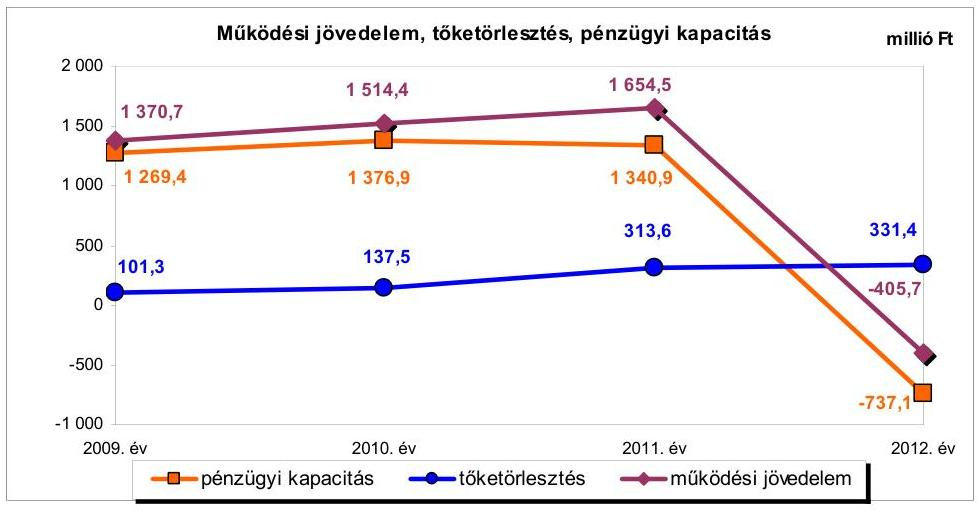
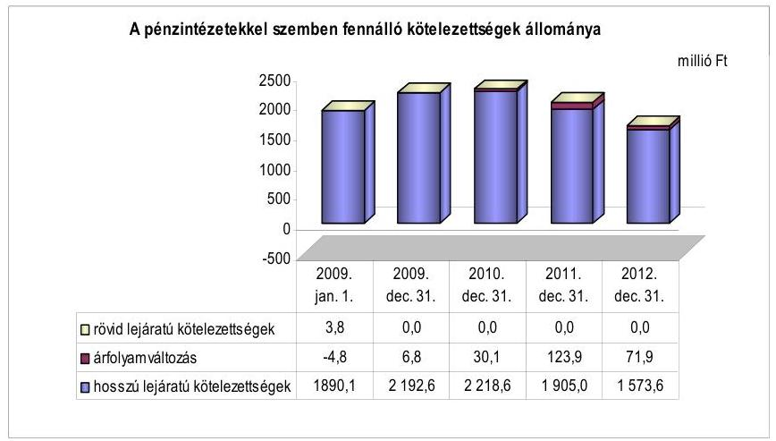
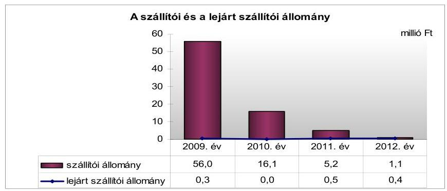
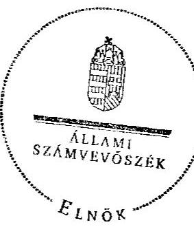
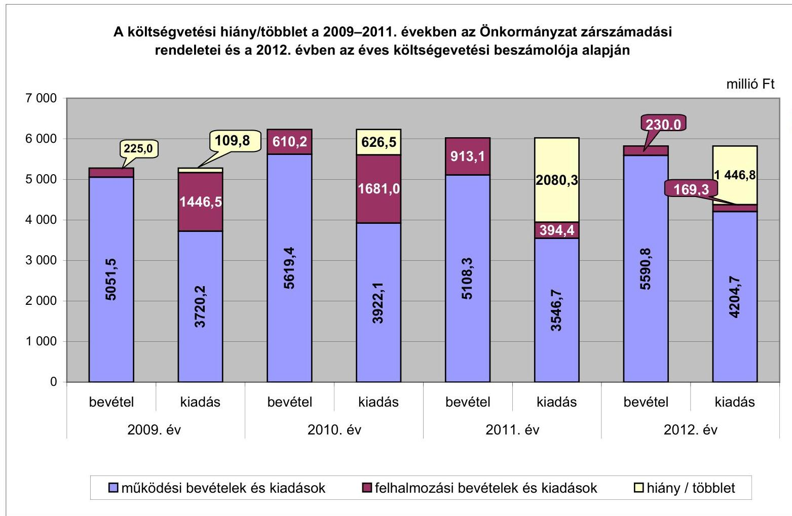
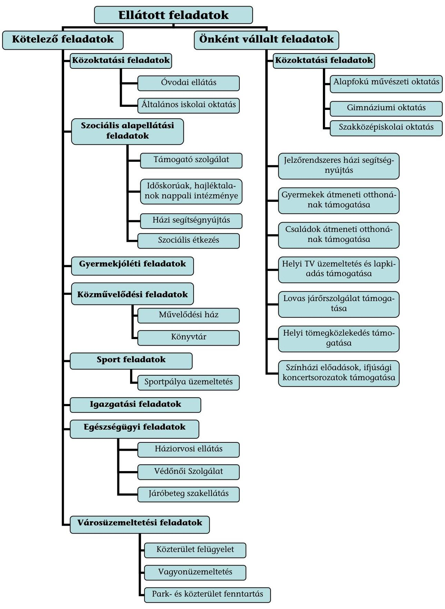

# ÁLLAMI   SZÁMVEVŐSZÉK 

## JELENTÉS

az önkormányzatok pénzügyi gazdálkodási helyzetének, szabályosságának ellenőrzéséről

TÖRÖKBÁLINT
13096
2013. szeptember

---

# Állami Számvevőszék 

Iktatószám: V-0030-353-009/2013.
Témaszám: 1069
Vizsgálat-azonosító szám: V059226

## Az ellenőrzést felügyelte:

## Renkó Zsuzsanna

felügyeleti vezető
Az ellenőrzést vezette és az ellenőrzés végrehajtásáért felelős:
Dér Lívia
ellenőrzésvezető
Az ellenőrzést végezték:

| Bus András Péter | Csiszárné dr. Kosik | Batkiné Vas Anna |
| :-- | :-- | :-- |
| számvevő | Mária | számvevő tanácsos |
|  | számvevő tanácsos |  |

---

# TARTALOMJEGYZÉK 

BEVEZETÉS ..... 3
I. ÖSSZEGZŐ MEGÁLLAPÍTÁSOK, KÖVETKEZTETÉSEK, JAVASLATOK ..... 6
II. RÉSZLETES MEGÁLLAPÍTÁSOK ..... 16

1. Az Önkormányzat kötelező és önként vállalt feladatai, a feladatellátás szervezeti keretei ..... 16
2. A pénzügyi egyensúlyt fenntartását veszélyeztető pénzügyi kockázatok és az ezek csökkentése érdekében tett intézkedések ..... 18
3. A pénzügyi gazdálkodási folyamatok szabályosságát, megfelelőségét biztosító belső kontrollok ..... 28

---

# MELLÉKLETEK 

1. számú A költségvetési hiány/többlet a 2009-2011. években az Önkormányzat zárszámadási rendeletei és a 2012. évben az éves költségvetési beszámolója alapján
2. számú Az Önkormányzat bevételei és kiadásai, valamint adósságszolgálata a 2009-2012. években (a CLF módszer szerint)
3/a. számú Az Önkormányzat által a 2009-2012. években megvalósított (műszakilag befejezett) fejlesztések forrásösszetétele
3/b. számú Az Önkormányzat 2012. december 31-én folyamatban lévő fejlesztési feladataihoz kapcsolódó kötelezettségeinek összegzése
3. számú Az önkormányzati feladatok ellátásában résztvevő gazdasági társaságok egyes kiemelt adatai
4. számú Az Önkormányzat 2012. december 31-én fennálló, hosszú lejáratú adósságot keletkeztető kötelezettségvállalásai
5. számú Az Önkormányzat kötelezettségeinek és egyes kötelezettségvállalásainak 2009. december 31-ei és 2012. december 31-ei állománya, valamint a 2013. évben és az azt követő években várható kötelezettségek, kötelezettségvállalások miatti kiadások

## FÜGGELÉKEK

1. számú Rövidítések jegyzéke
2. számú Fogalomtár
3. számú Az Önkormányzat által ellátott feladatok 2012. december 31-én

---

# JELENTÉS 

## az önkormányzatok pénzügyi gazdálkodási helyzetének, szabályosságának ellenőrzéséről TÖRÖKBÁLINT

## BEVEZETÉS

Az államháztartás helyi szintjén, az önkormányzati alrendszerben az utóbbi években megjelenő gazdálkodási nehézségek, a pénzforgalmi hiány növekedése, az eladósodás az ÁSZ figyelmét a helyi önkormányzatok pénzügyi helyzetére irányította.

Az ÁSZ a 2013. év I. félévi ellenőrzési tervben foglaltaknak megfelelően az önkormányzatok pénzügyi gazdálkodási helyzetének, szabályosságának ellenőrzésével az önkormányzatok 2011. évben megkezdett helyzetelemzését folytatta. Az ellenőrzés keretében értékeljük az önkormányzatok adósságkezelési és likviditási helyzetét. Bemutatjuk a pénzügyi egyensúly alakulására hatással lévő folyamatokat, feltárjuk az ezekre ható kockázatokat. Értékeljük a pénzügyi egyensúlyi helyzetet befolyásoló döntésmegalapozó, döntéselőkészítő eljárások szabályosságát és minősítjük az ezekkel összefüggő belső kontrollok kialakítását, működését.

Az ellenőrzés eredményének várható hatásaként a megállapításokkal segítséget nyújtunk az önkormányzatok számára a pénzügyi egyensúly helyreállítása, javítása és fenntartása érdekében szükségessé váló intézkedések megtételéhez.

Az ellenőrzés típusa: szabályszerűségi ellenőrzés.

## Az ellenőrzés célja annak értékelése volt, hogy:

- az ellenőrzött időszakban a kötelező és önként vállalt feladatok ellátását biztosító szervezeti formák változása milyen hatást gyakorolt az Önkormányzat pénzügyi helyzetének alakulására;
- az Önkormányzat pénzügyi - ezen belül működési és felhalmozási - egyensúlya milyen irányban változott, a változást milyen okok idézték elő, továbbá milyen intézkedéseket tettek a pénzügyi egyensúly biztosítása, illetve javítása érdekében, az intézkedések hatására javult-e az Önkormányzat pénzügyi helyzete;
- a költségvetési kiadások finanszírozása érdekében vállalt, pénzintézetekkel szembeni kötelezettségek hogyan alakultak, a kötelezettségek fennállása miként befolyásolja az Önkormányzat jövőbeli pénzügyi egyensúlyi helyzetét;

---

- az Önkormányzat beazonosította, felmérte, értékelte-e a pénzügyi egyensúlyt befolyásoló pénzügyi kockázatokat, a finanszírozási célú pénzügyi műveletekkel kapcsolatban írtak-e elő kockázatértékelési kötelezettséget;
- az Önkormányzat által kialakított belső kontrollok biztosítják-e a pénzügyi gazdálkodás folyamatainak szabályosságát és eredményességét.

Utóellenőrzésre nem került sor, mivel az ÁSZ a 2009-2012. években nem végzett ellenőrzést az Önkormányzatnál.

Az ellenőrzés a 2009. január 1-jétől 2012. december 31-ig terjedő időszakot ölelte fel. A pénzintézetekkel szembeni kötelezettségek állományára vonatkozóan az ellenőrzés kezdő időpontjaként a 2012. december 31-én fennálló kötelezettségek keletkezésének időpontját vettük figyelembe.

Az ellenőrzés szakmai módszertana az ÁSZ Ellenőrzési Elvek és Standardokban foglalt szakmai szabályokon alapult, amely a Legfőbb Ellenőrző Intézmények Nemzetközi Szervezete (INTOSAI) által kiadott nemzetközi standardok (ISSAI) figyelembevételével készült.

Az ellenőrzés során használt rövidítéseket az 1. számú, az egyes fogalmak magyarázatát a 2. számú függelék tartalmazza.

Az ellenőrzés jogszabályi alapját az ÁSZ tv. 1. § (3) bekezdésének, 5. § (2)-(6) bekezdéseinek, valamint az Áht. 61. § (2) bekezdésének előírásai képezik.

Az Országgyűlés 2012 végén a helyi önkormányzatok adósságállományának részleges konszolidációjáról döntött. Az 5000 fő lakosságszámot meg nem haladó települési önkormányzatok számára nyújtott, törlesztési célú támogatással ${ }^{1}$ lehetővé tették a 2012. december 12-én fennálló adósságállományuk és annak 2012. december 28-áig számított járulékai teljes megfizetését. Az 5000 fő lakosságszám feletti települések esetében a 2013. évben az állam differenciált, az adóerő-képességet figyelembe vevő, 40-70%-ig terjedő mértékben vállalja át ${ }^{2}$ az önkormányzatok 2012. december 31-i, az átvállalás időpontjában fennálló adósságállományát és annak járulékait. Az adósságkonszolidációs intézkedéssel egyidejűleg a Kormány elrendelte ${ }^{3}$ az önkormányzatok adósságállománya újratermelődésének megakadályozása céljából a hitelengedélyezési és a likvid hitelekre vonatkozó szabályozás szigorítását.

Törökbálint Város Önkormányzata lakónépességére tekintettel a 2013. évi adósságátvállalásban érintett. Az adósságkonszolidáció keretében - a 2013. február 28-án kötött megállapodásban - a Magyar Állam az Önkormányzat fennálló adósságállományának 60,0%-át (987,3 millió Ft-ot) és annak járulé-

[^0]
[^0]:    ${ }^{1}$ Magyarország 2012. évi központi költségvetéséről szóló 2011. évi CLXXXVIII. törvény 76/C. §-a (beiktatta a 2012. évi CLXXXVII. törvény 8. §-a, hatályos 2012. XII. 6-tól)
    ${ }^{2}$ Magyarország 2013. évi központi költségvetéséről szóló 2012. évi CCIV. törvény 7276. §-ai
    ${ }^{3}$ az 1540/2012. (XII. 4.) Korm. határozat a helyi önkormányzatok adósságállományának részleges konszolidációjáról

---

kait átvállalta. Az Önkormányzat pénzügyi egyensúlyának jövőbeni alakulását befolyásoló, az ellenőrzött időszakban fennállt kockázatokra az ellenőrzés időszakában tett megállapításaink - a pénzintézetekkel szembeni kötelezettségekkel összefüggésben feltárt kockázatok kivételével - az adósságkonszolidációt követően is helytállóak és időszerűek.

Törökbálint város lakosainak száma 2012. január 1-jén 13431 fő volt, ami 384 fős növekedést jelentett a 2009. év eleji lakosságszámhoz képest. A településen két kisebbségi önkormányzat működött. Az Önkormányzat a 2012. évben 4072,7 millió Ft költségvetési bevételt ért el, 4374,0 millió Ft költségvetési kiadást teljesített. A 2009. évi tényadatokhoz viszonyítva a folyó- és a felhalmozási bevételek 1128,6 millió Ft-tal (21,7%-kal), a folyó- és a felhalmozási kiadások 792,7 millió Ft-tal (15,3%-kal) csökkentek. 2012. december 31-én a könyvviteli mérleg szerint 20455,1 millió Ft értékű vagyonnal rendelkeztek. Az Önkormányzat vagyona a befejezett fejlesztések következtében 3221,2 millió Ft-tal (18,7%-kal) nőtt a 2009. év végi (17 232,9 millió Ft) állományhoz viszonyítva.

Az ÁSZ tv. 29. § (1) bekezdése szerint a jelentéstervezetet megküldtük a polgármester részére, aki az ÁSZ tv. 29. § (2) bekezdésében foglalt észrevételezési jogával nem élt, a jelentéstervezetre észrevételt nem tett.

---

# I. ÖSSZEGZŐ MEGÁLLAPÍTÁSOK, KÖVETKEZTETÉSEK, JAVASLATOK 

Törökbálint Város Önkormányzatának pénzügyi egyensúlya az ellenőrzött időszakban középtávon nem volt biztosított. A 2013. évi adósságkonszolidáció eredményeként az Önkormányzat pénzügyi egyensúlyi helyzete javul, azonban az adósságátvállalást követően fennmaradó kötelezettségek teljesíthetősége továbbra is kockázatos, mert - a működési jövedelemtermelő képesség 2012. évben bekövetkezett csökkenése alapján - a képződő bevételek a feladatellátáshoz szükséges kiadásokat, valamint a tőketörlesztés fedezetét nem biztosítják, a működést középtávon korlátozzák.

Az Önkormányzat költségvetésének elemzését a CLF módszer alapján számított mutatók alapján végeztük. Az Önkormányzat pénzügyi kapacitásának a 2009-2012. évek közötti változását az alábbi ábra mutatja be:

Az Önkormányzat a 2009-2012. évek között összesen 20 435,6 millió Ft költségvetési bevételt ért el, és 19084,9 millió Ft költségvetési kiadást teljesített. A működési költségvetés egyensúlya a 2009-2011. években biztosított volt, összesen 4539,6 millió Ft működési többlet keletkezett a saját működési bevételek növekedése miatt. A működési jövedelem a 2009-2011. években folyamatosan növekedett, azonban a 2012. évben a működési kiadások 9,9%-át kitevő (405,7 millió Ft) hiányt mutatott. Az ellenőrzött időszakban összesen 4133,9 millió Ft működési többlet keletkezett. A működési jövedelem 2012. évi csökkenését - a Helyi adó tv. telephelyekre vonatkozó módosítása miatti - helyi adóból származó bevétel 1402,5 millió Ft (35,1%) összegű csökkenése, valamint a dologi kiadások előző évihez viszonyított - PPP konstrukcióban megvalósítani tervezett beruházás felfüggesztése miatti kártalanítás kifizetése, valamint áfa fizetési kötelezettség miatti - 649,7 millió Ft-os (57,5%-os) növekedése okozta. Az ellenőrzött időszakban a bevételi kitettség kockázatát jelzi, hogy a helyi iparűzési adóbevétel döntően egy nagy adóalanytól folyt be. A működési jövedelem 2012. évi jelentős csökkenése miatt az Önkormányzatnál a működési

---

jövedelemtermelő képesség miatti kockázat fennállt. Az Önkormányzat az ellenőrzött időszakban ÖNHIKI támogatásban nem részesült.

Az Önkormányzat felhalmozási költségvetésének egyensúlya az ellenőrzött időszakban - a 2012. év kivételével - nem állt fenn. A 2009-2011. évek között összesen 2887,6 millió Ft felhalmozási forráshiány keletkezett. A forráshiányt a felhalmozási bevételek és a felhalmozási kiadások teljesítése közötti ütemkülönbség okozta. A 2012. évben 104,4 millió Ft volt a felhalmozási többlet. A 2009. évi felhalmozási forráshiány fedezete a nettó működési jövedelem mellett a hitelfelvétel volt. A felhalmozási forráshiányra a nettó működési jövedelem a 2010. és a 2011. években fedezetet nyújtott.

Az ellenőrzött időszakban a kötelező és az önként vállalt feladatok ellátását biztosító szervezeti formák változása (a házi segítségnyújtási és szociális étkeztetési feladatok átvétele, valamint a településüzemeltetési, intézményműködtetési, közhasznú munkákkal összefüggő feladatok ellátására alapított új intézmény működtetése) - az Önkormányzat adatszolgáltatása alapján - a kiadásokat 50,9 millió Ft-tal, a bevételeket 31,8 millió Ft-tal emelték, összesen 19,1 millió Ft egyenlegükkel kedvezőtlen hatást gyakoroltak az Önkormányzat pénzügyi helyzetének alakulására. A bevételnövelő intézkedésekkel (adómentesség megszüntetése, adómérték növelése, intézményi térítési díjak emelése, eszközök hasznosítása, bérbeadása, értékesítése) 552,8 millió Ft többletbevételt értek el. A kiadáscsökkentő intézkedések (többletjuttatások csökkentése, civil szervezetek részére átadott pénzeszközök csökkentése) 321,5 millió Ft megtakarítást eredményeztek. A bevételnövelő és kiadáscsökkentő intézkedések együttesen összesen 874,3 millió Ft-tal - amelyből a tartós jellegű intézkedések hatása 696,3 millió Ft - javították az Önkormányzat pénzügyi egyensúlyi helyzetét.

Az Önkormányzatnál a működési jövedelemtermelő képesség csökkenésével kapcsolatban fennállt kockázatok:

- az önként vállalt működési feladatok ellátása miatti kockázat a 2012. évben. Az önként vállalt feladatokra fordított kiadások a feladatok körének bővülése miatt, a 2012. évben 221,1 millió Ft-tal (74,6%-kal) emelkedtek a 2009. évhez viszonyítva, működési kiadások közötti arányuk 12,6% (517,5 millió Ft) volt. A 2012. évben az önként vállalt feladatok ellátása miatti működési kockázat a működési költségvetés forráshiánya miatt állt fenn;
- a fejlesztések során kialakított létesítmények jövőbeni üzemeltetése miatti kockázat. Az ellenőrzött időszakban megvalósított létesítmények várható fenntartási, üzemeltetési költségeit, a működtetés forrásait nem számszerúsítették, ezeket a fejlesztésekről történő döntéskor a Képviselő-testület számára nem mutatták be. Az Önkormányzat által megvalósított fejlesztések működtetése forrást nem teremt.

Az Önkormányzat pénzintézeti kötelezettségeinek állománya a 2009. év elejéről a 2012. év végére 1889,1 millió Ft-ról,
 1645,5 millió Ft-ra csökkent. A 2012. év végén a pénzintézeti kötelezettségek állománya 2406,9 ezer EUR és 944,4 millió Ft volt, amely az ellenőrzött időszakot megelőzően két forint

---

alapú, összesen 1425,0 millió Ft összegben, két deviza alapú, 2041,8 ezer EUR-ban, továbbá az ellenőrzött időszakban egy 2068,8 ezer EUR összegben felvett devizaalapú fejlesztési hitelből fennálló kötelezettség volt. A hitelek változó kamata, valamint a devizában fennálló kötelezettségek az Önkormányzat számára kamat- és árfolyamkockázatot jelentettek, mert az adósságot keletkeztető kötelezettségvállalások döntés-előkészítés során nem számoltak azzal, hogy a kamat- és árfolyamváltozás miatt a kötelezettségvállalások terhei a jövőben jelentősen változhatnak. E kockázatok kezelésére nem intézkedtek. A forintalapú hiteleknél 0,17-0,65% között, a devizaalapú hitelek közül egynél 0,17%-kal, egynél 0,2%-kal növekedett a kamat mértéke. A folyószámlahitel nem vált tartós finanszírozási forrássá, mert állománya a 2009-2011. évek között csökkent, a 2012. évben igénybevételére nem került sor.

Az iparűzési adó feltöltés miatt 2012. év végén fennálló 201,0 millió Ft visszatérítési kötelezettség kedvezőtlenül befolyásolta az Önkormányzat pénzügyi egyensúlyi helyzetét.

Az Önkormányzat PPP konstrukcióban megvalósítani tervezett, Általános és Középiskola Beruházásának 2010. évi felfüggesztése miatt, a magánbefektető többletköltségeinek megtérítéseként 725,8 millió Ft kártalanítás fizetését vállalta, melyből a 2012. évben 500,0 millió Ft-ot teljesített. Nemfizetési kockázatot jelent, hogy a kártalanításból eredő további kötelezettsége 225,8 millió Ft, amelyet az Önkormányzat a 2013. és a 2014. évben tartozik kiegyenlíteni.

A 2013. évi - az adósságállomány 60,0%-át (987,3 millió Ft-ot) és annak járulékait érintő - adósságkonszolidáció eredményeként az Önkormányzat pénzügyi egyensúlyi helyzete javul, azonban az adósságkonszolidációt követően fennmaradó kötelezettségei teljesíthetőségének kockázatát jelentheti, hogy a 2012. évben bekövetkezett jövedelemtermelő képesség csökkenés alapján a számított működési jövedelem várhatóan nem nyújt fedezetet a kötelezettségek teljesítésére, amely miatt a pénzügyi egyensúly fenntartása középtávon nem biztosított. A kötelezettségek teljesítéséhez hozzájárulhat az Önkormányzat 2012. évi 871,2 millió Ft szabad pénzmaradványa. A vállalt hosszú és rövid lejáratú, valamint az egyéb kötelezettségek fedezetének megteremtése érdekében a kötelezettségek átstrukturálásáról, vagy tartalékképzésről nem döntöttek.

A fedezetbevonások növekedése miatti kockázatot jelzi, hogy az ingatlanok jelzáloggal való terhelése a 2012. évben nőtt, ezáltal a kötelezettségek teljesítéséhez szükséges, ingatlanértékesítésből származó források szűkültek. A 2012. évben 120,9 millió Ft nettó értékű ingatlan jelzálogjoggal történt terhelést követően, a terhelt ingatlanok nettó értéke 512,3 millió Ft volt.

A kezességvállalás miatti mérlegen kívüli kockázatot jelent a Fácán utcai Víziközmű Társulat hiteleihez vállalt 26,5 millió Ft készfizető kezesség. Az Önkormányzatnak a kezességvállalás miatt fizetési kötelezettséget nem kellett teljesíteni.

Az Önkormányzatnál a kockázatkezelési rendszer keretében a pénzügyi egyensúlyt befolyásoló kockázatok feltárása, beazonosítása, felmérése, értékelése és kezelése - a 2009. évben az Ámr. ${ }_{1}$-ben, a 2010-2011. években az

---

Ámr. ${ }_{2}$-ben, a 2012. évben a Bkr.-ben foglalt jogszabályi előírások ellenére elmaradt. Annak ellenére maradt el a kockázatok kezelése, hogy az ellenőrzött időszakban fennállt az önként vállalt feladatok miatti működési kockázat, a működési jövedelemtermelő képesség csökkenése miatti kockázat, a helyi adókhoz kapcsolódó bevételi kitettség kockázata, a hitelek miatti kamat-, a deviza alapú hitelek miatti árfolyamkockázata, a kártalanítási kötelezettség miatti nemfizetési kockázata, a fedezetbevonások növekedése miatti kockázata, a fejlesztések során kialakított létesítmények jövőbeni üzemeltetése miatti kockázata, a kezességvállalás miatti mérlegen kívüli kockázata, valamint a jövedelemtermelő képesség miatt a jövőbeni kötelezettségek teljesíthetőségének kockázata. Az Önkormányzatnál a finanszírozási célú pénzügyi műveletekkel kapcsolatban nem írtak elő kockázatértékelési tevékenységet.

A belső kontrollrendszer keretében, a pénzügyi gazdálkodási folyamatok szabályosságát, megfelelőségét, kockázatainak kezelését biztosító kontrolltevékenységek kialakítása - a 2009. évben az Ámr. ${ }_{1}$-ben, a 2010-2011. években az Ámr. ${ }_{2}$-ben, a 2012. évben a Bkr.-ben foglalt jogszabályi előírások ellenére részben volt megfelelő, mert nem írták elő a feladat átadás-átvételre vonatkozóan a döntés-előkészítési folyamatában annak értékelését, hogy a döntés milyen hatással bír a kötelező és önként vállalt feladatokra fordított kiadások arányára, valamint az Önkormányzat pénzügyi egyensúlyi helyzetére. Nem határozták meg az önkormányzati fejlesztések esetében az előkészítés, a lebonyolítás és a működtetés kockázatainak döntés-előkészítési folyamatában történő feltárásának és kezelésének kötelezettségét. Nem írták elő a fizetőképesség és eladósodás kezelését szolgáló szabályozás készítésének kötelezettségét. Nem szabályozták a pénzintézeti kötelezettségvállalások kockázatainak feltárásának kötelezettségét a döntés-előkészítési szakaszában, a hitelfelvételről szóló döntés előkészítési folyamatában a futamidő egyes éveit terhelő kötelezettség költségvetési egyensúlyra gyakorolt hatása vizsgálatának kötelezettségét.

A feladatellátás szabályosságát, a pénzügyi egyensúlyi helyzet alakulását, továbbá a pénzügyi döntések megalapozását szolgáló döntés-előkészítő, valamint a pénzintézeti kötelezettségvállalások szabályosságát, megfelelőségét, a kockázatok kezelését biztosító belső kontrollok működése gyenge volt, mert nem értékelték a feladat átadás-átvételére vonatkozó döntés előkészítési folyamatában, hogy a döntés milyen hatással bír a kötelező és önként vállalt feladatokra fordított kiadások arányára. Nem tárták fel a fejlesztéseket megelőző döntés előkészítési folyamatokban az előkészítés, a lebonyolítás és a működtetés kockázatait. Nem vizsgálták a döntés előkészítési szakaszában a pénzintézeti kötelezettségvállalások kockázatait, a futamidő egyes éveit terhelő kötelezettség költségvetési egyensúlyra gyakorolt hatását, nem számoltatták be a hatáskört gyakorlókat a pénzintézeti kötelezettségvállalásokat érintő átruházott hatáskörök gyakorlásáról. A pénzügyi egyensúlyi helyzetet befolyásoló döntések kockázati tényezőinek feltárása és belső ellenőrzés keretében történő ellenőrzése elmaradt. A kialakított kontrollok nem biztosították a pénzügyi gazdálkodási folyamatok eredményességét.

---

Az ellenőrzés során a gazdálkodási feladatok ellátásával és a könyvvezetési kötelezettség teljesítésével kapcsolatban az alábbi szabályszerűségi hibákat tártuk fel:

- folyamatban lévő beruházásként nyilvántartott - 187,3 millió Ft összértékű ${ }^{4}$ - három fejlesztés számviteli nyilvántartásból történő 2011. évi kivezetésére nem az Ötv-ben (2012. január 1-jétől a Mötv.-ben), a Vagyongazdálkodási rendeletben és a Selejtezési szabályzatban foglaltak szerint került sor. Nem tartották be az eljárásrendre vonatkozó előírásokat, mert a kivezetéshez képviselő-testületi, illetve pénzügyi bizottsági döntéssel nem rendelkeztek. Az öt millió Ft-ot meghaladó egyedi értékű befejezetlen beruházások kivezetésére a Képviselő-testület, az egy millió Ft-ot meghaladónál a Pénzügyi bizottság döntése alapján kerülhetett volna sor. Nem tartották be a számviteli elszámolásokra vonatkozó, a Számv. tv.-ben, az Áhsz.-ben és az Értékelési szabályzatban foglaltakat, nem volt bizonyított, hogy a beruházások rendeltetésüknek megfelelően nem használhatóak, ennek ellenére a kivezetést terven felüli értékcsökkenésként számolták el. A Selejtezési szabályzatban foglaltak ellenére a beruházásokat feleslegesnek, vagy rendeltetésszerű használatra alkalmatlannak történő minősítését nem dokumentálták, a selejtezés szabályos végrehajtását nem ellenőrizték, a feleslegessé válást szakvéleménnyel nem támasztották alá;
- az Áhsz. előírásai ellenére az ellenőrzött időszak éveiben a devizában fennálló hosszú lejáratú kötelezettségek törlesztése során realizált árfolyamnyereséget és árfolyamveszteséget a főkönyvi könyvelésben a folyó bevételek és kiadások között elkülönítetten nem mutatták ki;
- az Áht.-ban foglaltak ellenére, az Önkormányzat a 2012. évben 600,0 millió Ft erejéig keretbiztosítéki jelzálogjog alapítását engedélyezte egy korlátozottan forgalomképes ingatlanra.

Az ÁSZ tv. 33. § (1) bekezdésében foglaltak értelmében az ellenőrzött szervezet vezetője köteles a jelentésben foglalt megállapításokhoz kapcsolódó intézkedési tervet összeállítani, és azt a jelentés kézhezvételétől számított harminc napon belül az ÁSZ részére megküldeni. Amennyiben az intézkedési tervet határidőben nem küldi meg a szervezet vezetője, vagy az továbbra sem elfogadható, az ÁSZ elnöke a hivatkozott törvény 33. § (3) bekezdés a)-b) pontjaiban foglaltakat érvényesítheti.

# Az ellenőrzés intézkedést igénylő megállapításai és javaslatai: 

## a polgármesternek

1. A 2009-2011. években a működési költségvetés többlete folyamatosan növekedett, majd a 2012. évben, döntően a helyi adóbevételek visszaesése következtében működési hiány jelentkezett. A 2012. évi működési kiadás 12,6%-át, 517,5 millió Ft-ot
[^0]
[^0]:    ${ }^{4}$ engedélyezési, kiviteli, forgalomtechnikai, közmű tervek, költségvetés készítési feladatok ellátásával kapcsolatos ráfordítás

---

önként vállalt feladatok ellátására fordítottak. A 2012. december 31-én fennálló pénzintézeti kötelezettségállomány - melynek 60,0%-át érinti az adósságátvállalás - 1645,5 millió Ft, a szállítói tartozás 1,1 millió Ft, a PPP szerződés alapján fennálló kártalanítási kötelezettség 225,8 millió Ft, a helyi adóbevétel visszatérítési kötelezettség 201,0 millió Ft volt. Az ellenőrzött időszakban megvalósított bevételnövelő és kiadáscsökkentő intézkedések együttesen 874,3 millió Ft-tal javították az Önkormányzat pénzügyi helyzetét.

Javaslat:
A működési jövedelemtermelő képesség és a feladatellátás összhangja, valamint az Önkormányzat pénzügyi egyensúlyának hosszú távú fenntarthatósága érdekében - a 2013. évi kormányzati adósságkonszolidációt, valamint a 2013. évtől változó feladatellátási kötelezettséget, feladatfinanszírozási rendszert figyelembe véve - felelősök és határidők megjelölésével kezdeményezzen intézkedéseket, melyek keretében:
a) a költségvetési rendelettervezet, valamint annak évközi módosítása előterjesztését megelőzően mérjék fel a bevételszerző, kiadáscsökkentő lehetőségeket, és terjessze a Képviselő-testület elé a bevételek növelését, a kiadások csökkentését célzó intézkedések bevezetéséhez szükséges - a Htv. 140. § (1) bekezdés a) pontja alapján a jegyző által elkészített - döntési javaslatát;
b) terjesszen a Képviselő-testület elé jóváhagyásra - a Htv. 140. § (1) bekezdés a) pontja alapján a jegyző által elkészített - az Önkormányzat gazdasági helyzetének elemzésén alapuló, a pénzügyi egyensúlyi helyzet hosszú távú fenntartását, valamint az adósságállomány újratermelődésének elkerülését biztosító intézkedéseket tartalmazó stabilizációs programot;
c) az adósságkonszolidációt követően fennmaradó kötelezettségei tekintetében terjesszen a Képviselő-testület elé olyan egyensúlyi (elkülönített) tartalék képzésére vonatkozó - a Htv. 140. § (1) bekezdés a) pontja alapján a jegyző által elkészített - döntési javaslatot, amelyben a Képviselő-testület meghatározza annak összegét, és kötelezettséget vállal arra, hogy a törlesztési időszak alatt a tartalékot a költségvetési rendeleteiben minden évben betervezi az adósságszolgálat teljesítésére;
d) vizsgáltassa felül az önként vállalt feladatok finanszírozhatóságát a kötelező feladatellátás elsődlegességének biztosítása érdekében, és ennek függvényében tegyen javaslatot a Képviselő-testületnek a feladatellátás racionalizálására.
2. Az Önkormányzat a 2012. évben - az Áht. 84. § (4) bekezdésében foglalt előírást megsértve - 600,0 millió Ft keretösszeg erejéig keretbiztosítéki jelzálog alapítását engedélyezte egy a törzsvagyon részét képező korlátozottan forgalomképes ingatlanra az Önkormányzattal sportlétesítmény építésére szerződést kötött vállalkozás által felvett hitel fedezeteként.

---

Javaslat:
A pénzintézeti kötelezettségvállalásokkal kapcsolatos jogszerű biztosíték, illetve fedezet felajánlása érdekében:
a) intézkedjen, hogy jövőbeni hitelfelvétel, kötvénykibocsátás fedezeteként az Áht. 84. § (4) bekezdésében előírtak szerint az Önkormányzat törzsvagyonába tartozó ingatlan ne kerüljön felhasználásra;
b) a jogellenes állapot megszüntetése érdekében vizsgálja meg a biztosíték cseréjének jogszerű lehetőségét, és terjesszen javaslatot a Képviselő-testület elé a biztosíték cseréjéről.
3. A 2011. évi számviteli beszámoló összeállítása során - az Ötv. 80. § (1) bekezdése ${ }^{5}$, a Vagyongazdálkodási rendelet 7. § (1) bekezdés m) és a (2) bekezdés b) pontjában, valamint a Selejtezési szabályzat II. 1. pontjában, az Értékelési szabályzat 3. pontjában és a Számv. tv. 53. § (2) bekezdésében, illetve az Áhsz. 30. § (12) bekezdésében foglalt előírásokat megsértve - összesen 187,3 millió Ft folyamatban lévő beruházás nyilvántartásokból való kivezetésére került sor. A beruházások pénzügyi okok miatti felfüggesztésére vonatkozó képviselő-testületi döntés nem tartalmazott rendelkezést a beruházások számviteli nyilvántartásokból való kivezetésére. A belső szabályozás szerint az öt millió Ft-ot meghaladó értékű beruházások esetében a Képviselőtestület, az egy millió Ft-ot
 meghaladó értékű beruházás esetében a Pénzügyi Bizottság döntése alapján kerülhetett volna sor a kivezetésre. Nem volt bizonyított, hogy a beruházások a továbbiakban a rendeltetésüknek megfelelően nem használhatóak. A tárgyi eszközök feleslegessé válását, rendeltetésszerű használatra való alkalmatlannak való minősítésüket nem dokumentálták, nem ellenőrizték, azt szakvéleménnyel nem támasztották alá.

Javaslat:
Intézkedjen az ÁSZ ellenőrzés során feltárt számviteli szabálytalanságok tekintetében a munkajogi felelősséggel kapcsolatos körülmények kivizsgálásáról, és hozza meg a szükséges munkajogi intézkedéseket.

# a jegyzőnek 

1. Az Önkormányzatnál a devizában fennálló hosszú lejáratú kötelezettségek törlesztő részletei után pénzügyileg realizált árfolyamveszteség és árfolyamnyereség összegét az ellenőrzött időszak éveiben a főkönyvi könyvelésben - az Áhsz. 9. számú melléklet számlaosztályok tartalmára vonatkozó előírásai 4. dl) pontjában, a 9. c) pontjában, valamint a 14. a) pontjában foglalt előírással ellentétben - a folyó kiadások és bevételek között elkülönítetten nem mutatták ki.
[^0]
[^0]:    ${ }^{5}$ hatálytalan 2012. január 1-jétől, a 2012. január 1-jétől hatályos új jogszabályi előírás a Mótv. 107. §-a

---

Javaslat:
Intézkedjen, hogy a devizában fennálló hosszú lejáratú kötelezettségei törlesztése során a pénzügyileg realizált árfolyam-különbözet elszámolása árfolyamveszteség esetén az Áhsz. 9. számú melléklet számlaosztályok tartalmára vonatkozó előírásai 4. dl) és a 9. c) pontjában foglalt előírásoknak, illetve árfolyamnyereség esetén az Áhsz. 14. a) pontjában foglalt előírásnak megfelelően elkülönítetten történjen.
2. A 2011. évi számviteli beszámoló összeállításakor három fejlesztési projektre elszámolt 187,3 millió Ft összegű folyamatban lévő beruházás kivezetésére került sor a Beruházási Iroda feljegyzése alapján. A kivezetésre az Ötv. 80. § (1) bekezdésében ${ }^{6}$ foglalt előírás ellenére az erre vonatkozó képviselő-testületi döntés hiányában került sor. A Képviselő-testület - tekintettel az Önkormányzat megváltozott pénzügyi helyzetére - a kérdéses beruházások felfüggesztéséről döntött, de nem rendelkezett azok számviteli nyilvántartásokból történő kivezetéséről. A Vagyongazdálkodási rendelet 7. § (1) bekezdés m) és a (2) bekezdés b) pontjában, valamint a Selejtezési szabályzat II. 1. pontjában foglalt előírásokat megsértve az öt millió Ft-ot meghaladó beruházások esetében a Képviselő-testület döntése, illetve az egy millió Ft-ot meghaladó beruházás esetében a Pénzügyi Bizottság döntése hiányában került sor a kivezetésre. Az Önkormányzatnál nem az Értékelési szabályzat 3. pontja szerinti értékelési eljárásnak megfelelően jártak el, mivel nem volt bizonyított, hogy a beruházások rendeltetésüknek megfelelően a továbbiakban nem használhatóak, illetve használhatatlanok, ennek ellenére számolták el a Számv. tv. 53. § (2) bekezdése, valamint az Áhsz. 30. § (12) bekezdése szerint a terven felüli értékcsökkenést. A Selejtezési szabályzat II. fejezet 1., 3.2, valamint 5. pontjában foglaltak alapján a kivezetést megelőzően a beruházásra fordított pénzeszközök feleslegesnek, rendeltetésszerű használatra alkalmatlannak történő minősítését nem dokumentálták, nem ellenőrizték, szakvéleménnyel nem támasztották alá.

Javaslat:
A könyvvezetési és a beszámoló készítési kötelezettség keretében a folyamatban lévő beruházásokkal kapcsolatos számviteli elszámolások szabályszerű teljesítése érdekében:
a) intézkedjen, hogy a Mötv. 107. §-a alapján az Önkormányzat vagyonát érintő ideértve a folyamatban lévő beruházásokkal kapcsolatos - gazdasági eseményeket a Képviselő-testület döntésének megfelelően kezeljék, illetve számolják el;
b) biztosítsa, hogy beruházás terven felüli értékcsökkenés elszámolását követő, könyvviteli nyilvántartásból való kivezetésére kizárólag a Számv. tv. 53. § (2) bekezdésében, illetve az Áhsz. 30. § (12) bekezdésében foglalt előírás szerint kerüljön sor, amennyiben a beruházás rendeltetésének megfelelően nem használható, illetve használhatatlan, megsemmisült vagy hiányzik. Ehhez kapcsolóan az Értékelési szabályzat 3. pontja szerinti értékelési eljárásnak megfelelően járjanak el;

[^0]
[^0]:    ${ }^{6}$ hatálytalan 2012. január 1-jétől, a 2012. január 1-jétől hatályos új jogszabályi előírás a Mötv. 107. §-a

---

c) intézkedjen, hogy a beruházások kivezetésére a Vagyongazdálkodási rendelet 7. § (1) bekezdés m) és a (2) bekezdés b) pontjában, valamint a Selejtezési szabályzat II. 1. pontjában foglalt előírásoknak megfelelően, az öt millió Ft-ot meghaladó beruházások esetében a Képviselő-testület döntése, az egy millió Ft-ot meghaladó beruházások esetében a Pénzügyi Bizottság döntése alapján kerüljön sor. Biztosítsa, hogy a Selejtezési szabályzat II. fejezet 1., 3.2, valamint 5. pontjában foglalt előírások alapján a kivezetést megelőzően a beruházásra fordított pénzeszközök feleslegesnek, rendeltetésszerű használatra alkalmatlannak történő minősítését dokumentálják, azt ellenőrizzék, szakvéleménnyel támasztsák alá.
3. A kockázatkezelési rendszer keretében az ellenőrzött időszakban fennállt, a pénzügyi egyensúlyt befolyásoló kockázatok feltárása, beazonosítása, értékelése és a kockázatok kezelése - a 2009. évben az Ámr. 1 145/C. § (1)-(3) bekezdéseiben, a 2010-2011. években az Ámr. 2 157. § (1)-(3) bekezdéseiben, a 2012. évben a Bkr. 7. § (1)-(2) bekezdéseiben foglalt jogszabályi előírások ellenére - elmaradt. Annak ellenére maradt el a kockázatok kezelése, hogy az ellenőrzött időszakban fennállt a működési jövedelemtermelő képesség csökkenése miatti kockázat, az önként vállalt feladatok miatti működési kockázat, a helyi adókhoz kapcsolódó bevételi kitettség kockázata, a fejlesztések során kialakított létesítmények jövőbeni üzemeltetésének kockázata, a hitelek miatti kamatkockázat, a devizaalapú hitelek árfolyam kockázata, a kártalanítási kötelezettség miatti nemfizetési kockázat, a fedezetbevonások növekedése miatti kockázat, a kezességvállalás miatti mérlegen kívüli kockázat, valamint a jövőbeni kötelezettségek teljesíthetőségének kockázata.

Javaslat:
Működtessen a Bkr. 7. § (1)-(2) bekezdéseiben foglalt előírásoknak megfelelő, a pénzügyi egyensúlyt befolyásoló kockázatok feltárására, beazonosítására, értékelésére és kezelésére alkalmas kockázatkezelési rendszert.
4. A pénzügyi gazdálkodási folyamatok szabályosságát, megfelelőségét, a kockázatok kezelését biztosító belső kontrolltevékenységek kialakítása - a 2009. évben az Ámr. 1 145/E. § (1)-(2) bekezdéseiben, a 2010-2011. években az Ámr. 2 158. § (1)-(2) bekezdéseiben, a 2012. évben a Bkr. 8. § (1)-(2) bekezdéseiben foglalt előírások ellenére - részben volt megfelelő, mert a feladat átadás-átvételre vonatkozóan a döntéselőkészítés folyamatában nem írták elő annak értékelését, hogy a döntés milyen hatással bír a kötelező és önként vállalt feladatokra fordított kiadások arányára, a pénzügyi egyensúlyi helyzetre. A döntés-előkészítés szakaszában nem írták elő a fejlesztési döntések kockázatainak feltárását és kezelését, valamint a pénzintézeti kötelezettségvállalással kapcsolatos döntések kockázatainak feltárását és a futamidő egyes éveit terhelő kötelezettség költségvetési egyensúlyra gyakorolt hatása vizsgálatát. Nem határozták meg az Önkormányzat fizetőképességének és eladósodásának kezelését szolgáló stratégia, koncepció vagy egyéb belső szabályozás készítésének kötelezettségét.

---

Javaslat:
Alakítsa ki az Bkr. 8. § (1)-(2) bekezdései alapján azokat a belső kontrolltevékenységeket, amelyek biztosítják a pénzügyi-gazdálkodási folyamatok szabályosságát, a pénzügyi egyensúlyi helyzet alakulását befolyásoló döntések kockázatainak kezelését. Készítse el a hiányzó szabályozást. Ennek keretében:
a) írja elő a feladat átadás-átvételre vonatkozó döntések előkészítése során a döntés kötelező és önként vállalt feladatok arányára, ezáltal a pénzügyi egyensúlyi helyzetre gyakorolt hatásának vizsgálatát;
b) határozza meg a fejlesztések döntés-előkészítés folyamatában a lebonyolítás és a működtetés kockázatai feltárásának és kezelésének kötelezettségét;
c) írja elő a pénzintézeti kötelezettségvállalások kockázatainak döntés-előkészítő szakaszban történő feltárását, a futamidő egyes éveit terhelő kötelezettségek költségvetési egyensúlyra gyakorolt hatásának vizsgálatát;
d) készítsen szabályzatot az Önkormányzat fizetőképességének és eladósodásának kezelésére.

---

# II. RÉSZLETES MEGÁLLAPÍTÁSOK 

## 1. Az ÖNKORMÁNYZAT KÖTELEZŐ ÉS ÖNKÉNT VÁLLALT FELADATAI, A FELADATELLÁTÁS SZERVEZETI KERETEI

Az Önkormányzat nem határozta meg, hogy az Ötv-ben foglalt feladatok közül, mely feladatokat milyen mértékben és módon lát el. Az Önkormányzat által ellátott kötelező feladatok köre az ellenőrzött időszakban nem változott. Az Önkormányzat besorolása alapján a közoktatás keretében biztosította az óvodai ellátást és az általános iskolai oktatást, ellátta a szociális alapellátási feladatokat és a gyermekjóléti feladatokat, a közművelődési feladatokat, a sport-, az igazgatási, az egészségügyi feladatokat, valamint a városüzemeltetési feladatokat ${ }^{7}$. A Kistérségi Társulás végezte a szociális alapellátási feladatok közül a támogató szolgálat, az időskorúak, valamint a hajléktalanok nappali intézménye ellátását. A sport, az egészségügyi, a városüzemeltetési feladatokat gazdasági társaság látta el. A szociális alapellátási feladatok közül a házi segítségnyújtást és a szociális étkeztetést 2011-ig a Kistérségi Társulás, ezt követően az Önkormányzat saját intézményével látta el.

Az önként vállalt feladatok - az Önkormányzat besorolása alapján - a 2009. évben az alapfokú művészeti oktatás, a gimnáziumi és szakközépiskolai oktatás, a jelzőrendszeres házi segítségnyújtás, a gyermekek és családok átmeneti otthonának támogatása, a helyi TV üzemeltetés és lapkiadás támogatása, a lovas járőrszolgálat támogatása volt. Az önként vállalt feladatok a 2012. év végére a színházi előadások és ifjúsági koncertsorozatok, valamint a helyi tömegközlekedés támogatásával ${ }^{8}$ bővültek. A Kistérségi Társulás látta el a jelzőrendszeres házi segítségnyújtást. Az Önkormányzat támogatásával egyház és alapítvány a családok átmeneti otthonának, egyesület a gyermekek átmeneti otthonának üzemeltetését végezte. Gazdasági társaságok ${ }^{9}$ látták el a helyi TV üzemeltetés és a lapkiadás, a lovas járőrszolgálat, valamint a színházi előadások és ifjúsági koncertsorozatok feladatait, mely feladatokhoz az Önkormányzat támogatást biztosított. (A feladatellátás részletezését a 3. számú függelék tartalmazza.)

A 2012. évben a teljesített működési kiadások összege 4093,2 millió Ft, amely a 2009. évi működési kiadásnál 14,6%-kal (521,3 millió Ft-tal) több volt. Az Önkormányzatnál az összes működési célú költségvetési kiadásnak 2009-ben a 91,7%-át (3275,5 millió Ft-ot), 2012-ben 87,4%-át (3575,7 millió Ft-ot) a kötele-

[^0]
[^0]:    ${ }^{7}$ közterület felügyelet, vagyonüzemeltetés, park- és közterület fenntartás
    ${ }^{8}$ A Személyszállítási tv. 4. § (4) bekezdés c) pontja 2012. július 1-jétől a települési önkormányzat önként vállalt feladatai között nevesítette - addig a kötelező feladatok közé sorolt - a helyi személyszállítási közszolgáltatások megszervezését.
    ${ }^{9}$ Az önkormányzati feladatok ellátásában résztvevő gazdasági társaságok egyes kiemelt adatait a 4. számú melléklet tartalmazza.

---

ző feladatokra fordított kiadások tették ki. A 2012. évben a kötelező feladatokra fordított működési kiadások 300,2 millió Ft-tal (9,2%-kal) növekedtek a 2009. évhez viszonyítva. Az önként vállalt feladatokra fordított kiadások aránya és összege folyamatosan, a 2009. évi 8,3%-ról (296,4 millió Ft-ról) a 2012. év végére 12,6%-ra (517,5 millió Ft-ra) növekedett a közlekedési támogatás önként vállalt feladatként történt besorolása és az önként vállalt feladatok körének bővülése - színházi előadások, ifjúsági koncertsorozatok - miatt. A 2012. évben az önként vállalt feladatok ellátása miatti működési kockázat a működési költségvetés forráshiánya miatt állt fenn. Az Önkormányzat az ellenőrzött időszak végéig a befejezett és folyamatban lévő fejlesztésekre 3773,0 millió Ft kiadást teljesített, amelyet 94,1%-ban (3549,6 millió Ft) a kötelező feladatokhoz, 5,9%-ban (223,4 millió Ft) az önként vállalt feladatokhoz kapcsolódó fejlesztésekre fordított. Az önként vállalt feladatokhoz kapcsolódó fejlesztési kiadások nagyságrendjük miatt a pénzügyi egyensúly szempontjából kockázatot nem jelentettek.

Az Önkormányzat a feladatait 2009. január 1-jén 12 költségvetési szervvel 18 telephelyen látta el. 2012. december 31-re az önkormányzati fenntartású költségvetési szervek száma 13-ra növekedett, a telephelyek száma nem változott. A településüzemeltetéssel, az intézmények működtetésével, a közhasznú munkák koordinálásával és a közhasznú munkások foglalkoztatásával kapcsolatos feladatok ellátására az Önkormányzat 2012. április 1-jei hatállyal új, önállóan működő és önállóan gazdálkodó költségvetési szervet alapított.

A kötelező és önként vállalt feladatok ellátását biztosító
 szervezeti formák változása kedvezőtlen hatást gyakorolt az Önkormányzat pénzügyi helyzetének alakulására. Az ellenőrzött időszakban a házi segítségnyújtási és szociális étkeztetési feladatok átvétele, valamint a településüzemeltetési, intézményműködtetési, közhasznú munkákkal összefüggő feladatok ellátására alapított új intézmény működtetése hatásaként - az Önkormányzat adatszolgáltatása alapján - a kiadások 50,9 millió Ft-tal, a bevételek 31,8 millió Ft-tal emelkedtek, összesen 19,1 millió Ft kiadási többletet eredményező egyenlegükkel kedvezőtlen hatást gyakoroltak az Önkormányzat pénzügyi helyzetének alakulására.

---

# 2. A PÉNZÜGYI EGYENSÚLY FENNTARTÁSÁT VESZÉLYEZTETŐ PÉNZÜGYI KOCKÁZATOK ÉS AZ EZEK CSÖKKENTÉSE ÉRDEKÉBEN TETT INTÉZKEDÉSEK 

Az Önkormányzat költségvetésének elemzését CLF módszerrel hajtottuk végre. A CLF módszer szerinti, önkormányzati részletes adatokat a 2009. év és a 2012. év között a 2. számú melléklet, a főbb önkormányzati adatokat a következő tábla mutatja be:

|  |  |  |  | millió Ft |
| :--: | :--: | :--: | :--: | :--: |
| Megnevezés | 2009. év | 2010. év | 2011. év | 2012. év |
| Folyó bevételek | 4942,6 | 5436,4 | 5090,8 | 3687,5 |
| Folyó kiadások | 3571,9 | 3922,0 | 3436,3 | 4093,2 |
| Működési jövedelem | 1370,7 | 1514,4 | 1654,5 | $-405,7$ |
| Felhalmozási bevételek | 258,7 | 368,5 | 265,9 | 385,2 |
| Felhalmozási kiadások | 1594,8 | 1681,1 | 504,8 | 280,8 |
| Felhalmozási költségvetés egyenlege | $-1336,1$ | $-1312,6$ | $-238,9$ | 104,4 |
| Folyó és felhalmozási bevételek összesen | 5201,3 | 5804,9 | 5356,7 | 4072,7 |
| Folyó és felhalmozási kiadások összesen | 5166,7 | 5603,1 | 3941,1 | 4374,0 |
| Finanszírozási műveletek nélküli pozíció | 34,6 | 201,8 | 1415,6 | $-301,3$ |
| Finanszírozási műveletek egyenlege | 92,3 | 180,7 | $-315,7$ | $-259,7$ |
| Tárgyévi pénzügyi pozíció | 126,9 | 382,5 | 1099,9 | $-561,0$ |
| Hiteltörlesztés, értékpapír beváltás | 101,3 | 137,5 | 313,6 | 331,4 |
| Nettó működési jövedelem | 1269,4 | 1376,9 | 1340,9 | $-737,1$ |

Az Önkormányzat a 2009-2012. évek között összesen 20 435,6 millió Ft költségvetési bevételt ért el és 19084,9 millió Ft költségvetési kiadást teljesített. A folyó költségvetésének egyenlege a 2009-2012. évek között összességében 4133,9 millió Ft többletet mutatott, elsősorban a helyi adóból származó bevételek növekedése miatt. Az Önkormányzat működési jövedelme a 2009-2011. években folyamatosan növekedett, összesen 4539,6 millió Ft működési többlet keletkezett, azonban a 2012. évben a működési kiadások 9,9%-át kitevő (405,7 millió Ft) hiányt mutatott. A működési jövedelem 2012. évi csökkenését a - Helyi adó tv. ${ }^{10}$ telephelyekre vonatkozó módosítása miatti - iparűzési adóbevétel csökkenés, valamint a dologi kiadások előző évihez viszonyított - PPP konstrukcióban megvalósítani tervezett beruházás felfüggesztése miatti kártalanítás kifizetése, valamint áfa fizetési kötelezettség miatti 649,7 millió Ft-os (57,5%) növekedése okozta. A működési jövedelem 2012. évi jelentős csökkenése eredményeként az Önkormányzatnál a működési jövedelemtermelő képesség miatti kockázat fennállt. Az Önkormányzat az ellenőrzött időszakban ÖNHIKI támogatásban nem részesült.

A 2009-2011. évek közötti nettó működési jövedelem (pénzügyi kapacitás) a 2009. évi 1269,4 millió Ft-ról 2010-re 1376,9 millió Ft-ra nőtt, majd 2011-re 1340,9 millió Ft-ra csökkent, a 2012. évben -737,1 millió Ft volt. A 2012. évi pénzügyi kapacitáshiányt elsősorban a helyi adókból származó bevétel 1402,5 millió Ft-os csökkenése és a dologi kiadások 649,7 millió Ft-os növekedése miatt keletkezett működési jövedelemhiány, valamint a folyamatosan növekvő hiteltörlesztés (331,4 millió Ft) határozta meg.

[^0]
[^0]:    ${ }^{10}$ Helyi adó tv. 52. § 31. b) pont, hatályos 2011. január 1-jétől

---

A felhalmozási költségvetés egyenlege a 2009-2011. években hiányt mutatott. A felhalmozási kiadások 2009-ben 1336,1 millió Ft-tal, 2010-ben 1312,6 millió Ft-tal, 2011-ben 238,9 millió Ft-tal haladták meg a felhalmozási bevételeket, összesen 2887,6 millió Ft forráshiány képződött. A forráshiányt a felhalmozási bevételek és a felhalmozási kiadások teljesítése közötti ütemkülönbség okozta. A 2012. évben 104,4 millió Ft volt a felhalmozási többlet. A felhalmozási forráshiányra a nettó működési jövedelem a 2010. és a 2011. években fedezetet nyújtott. A 2009. évi felhalmozási forráshiány 95,0%-át a nettó működési jövedelem, valamint fejlesztési célú hitel biztosította.

Az Önkormányzat évenkénti teljes finanszírozási igénye ${ }^{11}$ - a CLF módszer szerint - a 2009. évben 66,7 millió Ft, a 2012. évben 632,7 millió Ft volt. Az ellenőrzött időszakban az Önkormányzat pénzügyi egyensúlyi helyzetét kedvezően befolyásolta a 2010. évben keletkezett 64,3 millió Ft és a 2011. évben képződött 1102,0 millió Ft finanszírozási többlet. A költségvetési hiány/többlet alakulását a 2009-2011. években az Önkormányzat zárszámadási rendeletei és a 2012. évben az éves költségvetési beszámolója alapján az 1. számú melléklet ${ }^{12}$ tartalmazza.

A folyó bevételek 2009-ről 2010-re 10,0%-kal (493,8 millió Ft-tal) nőttek, majd a 2011. évben 6,4%-kal (345,6 millió Ft-tal), a 2012 évben 27,6%-kal, (1403,3 millió Ft-tal) csökkentek. A változásban döntő szerepe volt annak, hogy a jogszabályváltozás hatására a helyi adóból származó bevételek előző évhez viszonyítva a 2011. évben 369,9 millió Ft-tal, a 2012. évben 1402,5 millió Ft-tal mérséklődtek. A költségvetési támogatás és a személyi jövedelemadó együttes összege a 2009. évi 715,6 millió Ft-ról a 2012. évre 138,7 millió Ft-tal (19,4%-kal) csökkent a költségvetési támogatás csökkenésének és a személyi jövedelemadó elvonás növekedésének együttes hatására.

Az Önkormányzat a Helyi adó tv. alapján kivethető adókat - a kommunális adók kivételével - bevezette. Az ellenőrzött időszakban a Képviselő-testület az építményadó mértékét folyamatosan, a 2009. évi $950,0 \mathrm{Ft} / \mathrm{m}^{2}$-ről a 2012. évre $1300,0 \mathrm{Ft} / \mathrm{m}^{2}$-re emelte. A 2009-2012. évek között az idegenforgalmi, az építmény- és a telekadó ${ }^{13}$ mértéke a jogszabályi felső határt nem érte el. Az Önkormányzat az iparűzési adó mértékét a maximálisan kivethető - 2,0% - mértékben állapította meg. A helyi adóbevételek folyó bevételeken belüli aránya a 2009. évi 73,5%-ról (3633,4 millió Ft-ról) a 2012. évre 70,3%-ra (2592,2 millió Ft-ra) csökkent. Az ellenőrzött időszakban a bevételi kitettség kockázatát jelzi, hogy a helyi iparűzési adóbevétel döntően egy nagy adó-

[^0]
[^0]:    ${ }^{11}$ a nettó működési jövedelem és a felhalmozási költségvetés együttes negatív egyenlege
    ${ }^{12}$ A zárszámadási rendeletek a bevételeket és kiadásokat nem a CLF módszer szerint, hanem a pénzforgalom nélküli tételekkel együttesen tartalmazzák, ezért az 1. számú mellékletben a CLF tábla adataitól eltérő összegek szerepelnek.
    ${ }^{13}$ Az idegenforgalmi adó mértéke $150,0 \mathrm{Ft} /$ vendégéjszaka volt, az építményadó $950,0 \mathrm{Ft} / \mathrm{m}^{2}$-ről $1300,0 \mathrm{Ft} / \mathrm{m}^{2}$-re, a telekadó $245 \mathrm{Ft} / \mathrm{m}^{2}$-ről $287 \mathrm{Ft} / \mathrm{m}^{2}$-re emelkedett.

---

alanytól folyt be. Az adóbevételt érintő jogszabályi változások ${ }^{14}$ a helyi adóbevételek 2011. évről 2012. évre 1402,5 millió Ft (35,1%) összegű csökkenését eredményezték.

A felhalmozási bevételek a 2009. évi 258,7 millió Ft-ról a 2010. évre 368,5 millió Ft-ra (42,4%-kal) a saját felhalmozási bevételek, az EU-s támogatások növekedése miatt emelkedtek, a 2011. évben 265,9 millió Ft-ra (27,8%-kal) mérséklődtek az EU-s támogatások csökkenésének hatására, a 2012. évben 385,2 millió Ft-ra (44,9%-kal) növekedtek az államháztartáson kívülről kapott felhalmozási bevételek növekedése miatt. A felhalmozási bevételeken belül a legnagyobb arányt - 554,3 millió Ft-ot (43,4%-ot) - a saját tőkebevételek jelentették. Az ellenőrzött időszakban az Önkormányzat 312,2 millió Ft EU-s támogatást kapott, melyet a Bóbita Óvoda bővítésére és a környezetvédelmi informatika fejlesztésére használták fel.

A folyó kiadások alakulásában a dologi kiadások 2010. és 2012. évi növekedése volt meghatározó. A folyó kiadások a 2010. évre 350,1 millió Ft-tal (9,8%-kal), a 2012. évre 656,9 millió Ft-tal (19,1%-kal) emelkedtek az előző évhez viszonyítva. A dologi kiadások a 2011. évről a 2012. évre 649,7 millió Ft-tal (57,5%-kal) növekedtek, döntően az Általános és Középiskola Beruházás PPP konstrukcióban történő megépítésének felfüggesztése miatti kártalanítás - befektető részére történő - 500,0 millió Ft összegű kifizetése, valamint 149,7 millió Ft összegű áfa fizetési kötelezettség teljesítése miatt. A személyi kiadások 2011. évi csökkenését a cafeteria juttatásokban bekövetkezett változás okozta.

Az Önkormányzat a 2009-2012. években fejlesztésekre 3415,5 millió Ft kiadást teljesített, amelyből a műszakilag befejezettekre 3003,9 millió Ft-ot, a folyamatban lévőkre 411,6 millió Ft-ot számolt el. A műszakilag befejezett fejlesztések teljes ${ }^{15}$ (3221,2 millió Ft) bekerülési költségének forrása 66,9%-ban saját bevétel (2154,6 millió Ft), 22,8%-ban hitel (734,6 millió Ft), 9,7%-ban EU-s támogatás (312,2 millió Ft) és 0,6%-ban egyéb központi támogatás volt (19,8 millió Ft). A folyamatban lévő felújítások és beruházások teljesített teljes bekerülési költsége 551,8 millió Ft volt, amelyből a 2009-2012. években 411,6 millió Ft kifizetést teljesítettek. A teljesített teljes bekerülési költség forrásösszetétele 543,9 millió Ft (98,6%) saját bevétel, 7,9 millió Ft (1,4%) hitel volt. Az Önkormányzat a kifizetéshez nem készített finanszírozási tervet. Két fejlesztési feladathoz előleget vettek igénybe és éltek a szállítói finanszírozás lehetőségével. Az Önkormányzatnak az ellenőrzött időszak végén elbírálás alatti pályázata nem volt ${ }^{16}$.

[^0]
[^0]:    ${ }^{14}$ A legnagyobb mértékű iparűzési adót fizető távközlési vállalkozásnak a 2011. évtől az iparűzési adóját a telephelyek (ügyfelek számlázási címéhez tartozó önkormányzatok) között meg kell osztania.
    ${ }^{15}$ A teljes bekerülési költség magában foglalja a fejlesztési feladatokra az ellenőrzött időszakot megelőzően teljesített kiadásokat is.
    ${ }^{16}$ Az Önkormányzat által a 2009-2012. években megvalósított, 2012. december 31-ig műszakilag befejezett fejlesztéseinek forrásösszetételét a 3/a., valamint 2012. december 31-én folyamatban lévő fejlesztési feladataihoz kapcsolódó kötelezettségeinek összegzését a 3/b. számú melléklet tartalmazza.

---

Az Önkormányzat az adójogszabály változásának várható következményei alapján a folyó bevételeinek, azon belül az adóbevételeinek csökkenésével összefüggésben a 2011. évi költségvetési koncepció tárgyalása során úgy ítélte meg, hogy a későbbiekben nem tudja biztosítani a beruházások befejezéséhez szükséges önerőt. Ezért a Képviselő-testület ${ }^{17}$ a fejlesztések, beruházások felfüggesztéséről döntött. A Képviselő-testület határozatában nem jelölték meg, hogy a felfüggesztésre vonatkozó döntés konkrétan mely beruházásokra és milyen időtartamra vonatkozik. A Képviselő-testület határozata a fejlesztések felfüggesztésén túl nem tartalmazott rendelkezést a folyamatban lévő beruházásoknak az Önkormányzat számviteli nyilvántartásaiból történő kivezetésére. Ennek ellenére a Beruházási Iroda, IV/16/2011. október 30-i feljegyzése alapján a 2011. évben folyamatban lévő beruházásként nyilvántartott, három fejlesztéshez kapcsolódó, összesen 187,3 millió Ft értékű vagyonelem kivezetésére került sor a számviteli nyilvántartásokból. A 2006-2011. években felmerült beruházási kiadások döntően engedélyezési, kiviteli, forgalomtechnikai és közmű tervek, valamint költségvetés készítési feladatokra teljesített kiadások voltak.

Az Ötv. 80. § (1)
 bekezdése ${ }^{18}$ szerint a tulajdonost megillető jogok gyakorlásáról a Képviselő-testület rendelkezik. Az Önkormányzatnál a beruházások kivezetésekor a Képviselő-testület erre vonatkozó döntésének hiányában jártak el. Megsértették ezen túl a Vagyongazdálkodási rendelet 7. § (1) bekezdés m) pontjában és a (2) bekezdés b) pontjában, valamint a Selejtezési szabályzat II. 1. pontjában foglalt előírásokat, mivel a kivezetésre az öt millió Ft-ot meghaladó értékű befejezetlen beruházások esetében ${ }^{19}$ nem a Képviselő-testület, az egy millió Ft-ot meghaladónál ${ }^{20}$ nem a Pénzügyi bizottság döntése alapján került sor.

A Beruházási Iroda feljegyzésében kizárólag az önerő hiányára tekintettel jelezte a fejlesztések várható meghiúsulását. A kivezetés során nem az Értékelési szabályzat 3. pontjában foglalt értékelési eljárásnak megfelelően jártak, mivel nem volt bizonyított, hogy a hivatkozott beruházások rendeltetésüknek megfelelően a továbbiakban nem használhatóak, illetve használhatatlanok. Ennek ellenére számolták el a Számv. tv. 53. § (2) bekezdése, valamint az Áhsz. 30. § (12) bekezdése szerint a terven felüli értékcsökkenést.

A kivezetést megelőzően a Selejtezési szabályzat II. fejezet 1. pontjában foglalt előírás ellenére a tárgyi eszközök feleslegesnek, vagy rendeltetésszerű használatra alkalmatlannak történő minősítését nem dokumentálták, a feleslegessé válást szakvéleménnyel nem támasztották alá (II. fejezet 5. pont).

A fejlesztések során kialakított létesítmények jövőbeni üzemeltetése miatti kockázatot jelent, hogy az ellenőrzött időszakban megvalósított létesítmény-

[^0]
[^0]:    ${ }^{17}$ a 436/2010. (XII. 16.) számú határozatában
    ${ }^{18}$ hatálytalan 2012. január 1-jétől, a 2012. január 1-jétől hatályos új jogszabályi elírás a Mötv. 107. §-a
    ${ }^{19}$ Városháza építése 78,2 millió Ft és a Fő utca rehabilitációja 107,8 millió Ft
    ${ }^{20}$ Major és a Raktárvárosi út földkábel kiépítésének tervezése 1,3 millió Ft

---

nyek várható fenntartási, üzemeltetési költségeit, a működtetés forrásait nem számszerűsítették, ezeket a fejlesztésekről történő döntéskor a Képviselő-testület számára nem mutatták be. Az Önkormányzat által megvalósított fejlesztések működtetése forrást nem teremt.

Az Önkormányzat pénzintézeti kötelezettségeinek állománya 2009. január 1-jétől 2011. december 31-ig 7,4%-kal, 1889,1 millió Ft-ról 2028,9 millió Ft-ra növekedett. A 2012. év végén a pénzintézeti kötelezettségek állománya 1645,5 millió Ft volt, amely a 2011. évihez viszonyítva 18,9%-kal, 383,4 millió Ft-tal csökkent. Az Önkormányzat pénzintézetekkel szemben a 2009-2012. években fennálló kötelezettségeit az alábbi ábra mutatja be:

A pénzintézeti kötelezettségállomány 2009. január 1. és 2012. december 31. között 243,6 millió Ft-tal (12,9%-kal) csökkent ${ }^{21}$. A csökkenés a folyószámlahitel év végi állományának megszűnése és a hosszú lejáratú hitelek törlesztése miatt következett be, annak ellenére, hogy a 2009. évben megnyitott 7000,0 ezer EUR hitelkeretből - az ellenőrzött időszakban - 2068,8 ezer EUR-t (563,5 millió Ft-ot) hívtak le ${ }^{22}$, továbbá az EUR árfolyamának növekedése miatt 71,9 millió Ft hitelekhez kapcsolódó árfolyamveszteségből adódó pénzintézeti kötelezettséget mutattak ki.

Az Önkormányzat az ellenőrzött időszakot megelőzően két forint alapú, hosszú lejáratú fejlesztési célú hitelt vett igénybe, valamint jogutódként átvette a Víziközmű Társulat hitel miatt fennálló kötelezettségét, melyet a 2012. évben kiegyenlített. Az Önkormányzatnak 2012. december 31-én két hosszú lejáratú forint alapú 944,4 millió Ft összegű hitelből fennálló pénzintézeti kötelezettségvállalása volt.

A 2006. évben 425,0 millió Ft összegben felvett többcélú fejlesztési hitel felhasználása a célnak megfelelően - intézmények felújítása, beruházása, útfelújítás, gépjármű beszerzés - történt. A 2007. évben 1000,0 millió Ft összegben felvett

[^0]
[^0]:    ${ }^{21}$ Az Önkormányzat 2012. december 31-én fennálló, hosszú lejáratú adósságot keletkeztető kötelezettségvállalásait az 5. számú melléklet részletezi.
    ${ }^{22}$ A 2011. december 23-ai hitelszerződés módosításban a hitelkeret összege a már igénybevett összegre csökkent.

---

többcélú fejlesztési hitelt a célnak megfelelően infrastruktúrafejlesztésekre, intézmények felújítására, ingatlanvásárlásra fordították. A Víziközmű Társulat 144,9 millió Ft összegű hitelét az Önkormányzat a 2012. évben visszafizette.

Az ellenőrzött időszakot megelőzően az Önkormányzat két deviza alapú, összesen 525,0 millió Ft összegű - 2004. évben 375,0 millió Ft, 2006. évben 150,0 millió Ft - hosszú lejáratú hitelkeret szerződést kötött. Az ellenőrzött időszakban, egy esetben - 2009. évben, 7000,0 ezer EUR összegű hitel - került sor (deviza alapú) adósságot keletkeztető pénzintézeti kötelezettségvállalásra (az új óvoda építési beruházás és egyéb felújítási feladatok megvalósításához). A hitelt nyújtó pénzintézetek kiválasztásakor a döntés megalapozása érdekében közbeszerzési eljárást folytattak le. A Képviselő-testület részére nem mutatták be a hosszú távú kötelezettségvállalások pénzügyi egyensúlyra gyakorolt hatását a futamidő egyes éveire vonatkozóan, a visszafizetés forrásait, valamint, hogy a hiteleket és azok kamatait milyen feltételek mellett tudják teljesíteni. Az Önkormányzat a 2012. év végén három, devizában (EUR-ban) fennálló, együttesen 701,1 millió Ft összegű, hosszú lejáratú, adósságot keletkeztető kötelezettségvállalással rendelkezett.

Az Önkormányzat a 2004. évben 375,0 millió Ft összegű hitelkeret szerződést kötött. Igénybevétele EUR-ban történt. (Árfolyama 248,93-273,04 Ft/EUR között alakult.) A tőke törlesztése 2006-ban megkezdődött. A hitelt az Önkormányzat a célnak megfelelően, a Munkácsy Mihály Művelődési Ház építésére használta fel. A 2006. évben, 150,0 millió Ft összegben felvett hitel igénybevétele EUR-ban történt. (Árfolyama 255,4-271,94 Ft/EUR között alakult.). A hitelt az Önkormányzat a célnak megfelelően az Általános és Középiskola beruházáshoz használta fel.

A hosszú lejáratú pénzintézeti kötelezettségek szerződéseiben - a Víziközmű Társulat hitelének kivételével - a hitelkereteket a folyósító pénzintézet biztosíték nélkül tartotta az Önkormányzat rendelkezésére.

A forint alapú hosszú lejáratú hitelek után az Önkormányzat az ellenőrzött időszakban összesen 542,7 millió Ft tőketörlesztést, 407,3 millió Ft kamatot, a deviza alapú kötelezettségek tőketörlesztésére 1166,3 ezer EUR-t, kamataira ${ }^{23}$ 219,1 ezer EUR-t kifizetett. A fejlesztések finanszírozására igénybevett hosszú lejáratú pénzintézeti kötelezettségek kamatkiadásai az ellenőrzött időszakban összesen 470,3 millió Ft-tal gyengítették az Önkormányzat pénzügyi egyensúlyi helyzetét. Az Önkormányzatnál megtörtént a devizában fennálló pénzintézeti kötelezettségek év végi értékelése, az árfolyamváltozás hatásának elszámolása a kötelezettségek év végi állományának meghatározásakor. Az Önkormányzatnak a devizában nyilvántartott, hosszú lejáratú kötelezettségei teljesítéséhez kapcsolódóan realizált árfolyamvesztesége és árfolyamnyeresége keletkezett, amit a főkönyvi könyvelésben az Áhsz. 9. számú mellékletének a számlaosztályok tartalmára vonatkozó előírásai 4. dl) pontjában és a 9. c) pontjában, valamint a 14. a) pontjában foglalt előírások ellenére a folyó kiadások és bevételek között - elkülönítetten nem mutattak ki.

[^0]
[^0]:    ${ }^{23}$ A 2. számú mellékletben kimutatott 2012. évi felhalmozási célú kamatkiadás tartalmazza a Képviselő-testület döntése alapján átvállalt és megfizetett 4,3 millió Ft kamatot is a Fácán utcai Víziközmű Társulat felvett hitele után.

---

A hitelek változó kamata, valamint a devizában fennálló kötelezettségek az Önkormányzat számára kamat- és árfolyamkockázatot jelentettek, mert az adósságot keletkeztető kötelezettségvállalások döntés-előkészítés során nem számoltak azzal, hogy a kamat- és árfolyamváltozás miatt a kötelezettségvállalások terhei a jövőben jelentősen változhatnak. E kockázatok kezelésére nem intézkedtek. A forint alapú hiteleknél 0,17-0,65% között, a deviza alapú hitelek közül egynél 0,17%-kal, egynél 0,2%-kal növekedett a kamat mértéke.

Az Önkormányzat számlavezető pénzintézete az ellenőrzött időszakban nem változott, a hiteleket - a Víziközmű Társulat hitelének kivételével - a számlavezető pénzintézettől vették igénybe.

Az adósságot keletkeztető pénzintézeti kötelezettségvállalások kockázatainak csökkentésére nem intézkedtek, a pénzpiaci feltételek figyelembevételével nem döntöttek konstrukcióváltásról, illetve kötelezettség visszafizetéséről.

Az Önkormányzat az ellenőrzött időszakban átmeneti likviditási nehézségeit folyószámlahitellel hidalta át. A folyószámlahitel igénybevételét a 2009-2012. években az alábbi tábla mutatja be:

| Megnevezés | 2009. év | 2010. év | 2011. év | 2012. év |
| :-- | --: | --: | --: | --: |
| Keretösszeg január 1-jén (millió Ft) | 700,0 | 700,0 | 700,0 | 0,0 |
| Átlagos, napi állomány (millió Ft) | 225,0 | 126,0 | 7,2 | 0,0 |
| Hítellel zárt napok száma (nap) | 313 | 232 | 44 | 0 |
| Teljesített kamat és egyéb kiadás (millió Ft) | 20,3 | 5,7 | 0,5 | 0,0 |

A folyószámlahitel banki kitettség miatti kockázatot nem jelentett, mert az Önkormányzat likviditásának fenntartásában tartós forrássá nem vált, átlagos, napi állománya a 2009. évi 225,0 millió Ft-ról a 2011. év végére 7,2 millió Ft-ra (96,8%-kal), a hitellel zárt napok száma 313 napról 44-re csökkent. A 2012. évben az Önkormányzat folyószámlahitelt nem vett igénybe. A folyószámlahitel igénybevétele miatt teljesített kamatkiadás követte a hitelállomány csökkenését. Az ellenőrzött időszakban teljesített összes kamatkiadás 26,5 millió Ft volt.

Az Önkormányzat a 2012. évben 360,0 millió Ft összegben egyéb likvid hitelt vett igénybe az Általános és Középiskola beruházás PPP konstrukcióban történő megépítésének felfüggesztése miatti - magánbefektető részéről felmerült többletköltségeinek megtérítésére vonatkozó - kártalanítás kifizetésére, melyet a szerződés szerint teljesített. Az igénybe vett hitel kamata 0,4 millió Ft volt. A pénzügyi egyensúly szempontjából kedvezőtlen volt, hogy a likvid hitelek kamata az ellenőrzött időszakban összesen 26,9 millió Ft terhet ${ }^{24}$ jelentett az Önkormányzat számára.

Az Önkormányzat 2009. évi - elsősorban a beruházások EU-s támogatásának szállítói finanszírozásából eredően magas - 56,0 millió Ft-os szállítói állománya az ellenőrzött időszakban folyamatosan, a 2012. év végére, 1,1 millió Ft-ra

[^0]
[^0]:    ${ }^{24}$ A 2. számú mellékletben kimutatott a 2009. és a 2010. évi működési célú kamatkiadások tartalmazzák a magánszemélyeknek peres eljárásban megítélt 2,6 millió Ft és a visszautalt előző évi állami támogatás utáni 0,1 millió Ft megfizetett kamatot is.

---

(98,0%-kal) csökkent. A lejárt szállítói kötelezettség nagyságrendje miatt pénzügyi kockázatot nem jelentett az Önkormányzat számára.

Az Önkormányzat hosszú és rövid lejáratú kötelezettségeinek a 2009. évben 1,9%-át (56,0 millió Ft), a 2012. év végén 0,05%-át (1,1 millió Ft) képezték a szállítókkal szembeni kötelezettségek. Az Önkormányzat a 2009. év és a 2012. közötti szállítói és lejárt szállítói állományát az alábbi ábra szemlélteti:

Az Önkormányzat helyi adókhoz kapcsolódó - iparűzési adó feltöltés miatti visszatérítési kötelezettsége a 2009. évben 131,9 millió Ft volt, a 2012. évben 201,0 millió Ft-ra (52,4%-kal) emelkedett. Ezen kötelezettségek teljesítése kedvezőtlenül befolyásolta az Önkormányzat pénzügyi egyensúlyi helyzetét.

Az Önkormányzat számára kezességvállalási kockázatot jelentett a Fácán utcai Víziközmű Társulat által a 2011. évben felvett 44,2 millió Ft beruházási hitelei és járulékai 60,0%-a erejéig, a 2019. év végéig vállalt 26,5 millió Ft összegű készfizető kezesség. Az Önkormányzatnak a kezességvállalás miatt az ellenőrzött időszakban nem keletkezett fizetési kötelezettsége.

Az Önkormányzat a 2010. évben az Általános és Középiskola beruházás építmény-együttesének, valamint annak kiszolgáló létesítményeinek kivitelezése fejlesztést PPP konstrukcióban tervezte megvalósítani. Az Önkormányzat és a magánbefektető építési koncessziós szerződést kötöttek ${ }^{25}$ a kivitelezésre és az üzemeltetés nyolc évre koncesszióba adására. A koncessziós díjat az Önkormányzat saját működési bevételeiből tervezték finanszírozni. A PPP konstrukció miatti kötelezettségvállalás összege 11324,2 millió Ft volt. Az Önkormányzat a fejlesztés
 kivitelezését a 2010. évben, tekintettel a helyi adóbevételek csökkenése miatt várhatóan kedvezőtlen pénzügyi helyzetére felfüggesztette ${ }^{26}$. A beruházás kivitelezésének felfüggesztéséhez kapcsolódóan az Önkormányzat szerződésben ${ }^{27}$ vállalta, hogy a magánbefektető részére - a felmerült többletköltségeinek megtérítésére - 725,8 millió Ft összegű kártalanítást fizet. A kártalanításból a 2012. évben megfizetett 500,0 millió Ft jelentősen rontotta az Önkormányzat pénzügyi helyzetét. Nemfizetési kockázatot jelent az Önkormányzat számára, hogy a kártalanításból eredő további kötelezettsége

[^0]
[^0]:    ${ }^{25}$ 2010. március 25-én
    ${ }^{26}$ 2010. november 17-én
    ${ }^{27}$ 2012. november 23-án

---

225,8 millió Ft, amelyet a 2013. és a 2014. évben tartozik kiegyenlíteni. Az Általános és Középiskola Beruházással összefüggően a Kormány 1219/2012. (VI. 26.) határozatában vállalta a beruházás befejezését. E határozatában a Kormány intézkedéseket kezdeményezett annak érdekében, hogy az elkészült létesítmény Önkormányzat általi közcélú hasznosítása megtörténjen.

Az Önkormányzatnál az ellenőrzött időszakban összesen 18,3 millió Ft követelést engedtek el, amely nagyságrendje miatt nem volt jelentős hatással az Önkormányzat pénzügyi egyensúlyi helyzetére.

A 2012. év végén az Önkormányzat nyolc, korlátozottan forgalomképes ingatlanát terhelte támogatás biztosítékaként jelzálogjog ${ }^{28}$. Az Áht. 84. § (4) bekezdésében foglaltak ellenére, az Önkormányzat a 2012. évben egy korlátozottan forgalomképes ingatlanra 600,0 millió Ft keretösszeg erejéig keretbiztosítéki jelzálogjog alapítását engedélyezte egy vállalkozás önkormányzati ingatlanon tervezett építési beruházásának hiteléhez kapcsolódóan. A jelzáloggal történt terhelést követően, a terhelt ingatlanok nettó értéke - a 2012. évben jelzálogjoggal terhelt egy ingatlan számvitelben nyilvántartott nettó értékével, 120,9 millió Ft-tal növekedett - 512,3 millió Ft volt. Az ingatlanok jelzálogjoggal való terhelése, fedezetbe vonása a 2012. évben nőtt, amely kockázatot jelenthet a kötelezettségek teljesítéséhez szükséges, ingatlanértékesítésből származó források szűkülése miatt.

Az Önkormányzatnál az ellenőrzött időszak alatt 22 peres eljárás volt folyamatban 95,1 millió Ft perértékben, melyekben jogerős ítélet nem született, a kötelezettségek várható összege nem ismert.

A 2009-2011. évek között az Önkormányzat a városfejlesztési feladatok ${ }^{29}$ megvalósítása érdekében létrehozott kizárólagos tulajdonában lévő gazdasági társaságának 19,0 millió Ft működési célú, továbbá 78,0 millió Ft fejlesztési célú pénzeszközt adott át. Az Önkormányzat a gazdasági társaság 2010. december 31-ei hatályú, jogutód nélküli megszüntetéséről döntött, mivel a feladat, amelyre létrehozták forráshiány miatt nem valósult meg. A gazdasági társaság pénzügyi helyzete a 2010-2012. években veszteséges gazdálkodása miatt nem volt stabil ${ }^{30}$. A gazdasági társaság 2012. év végén végelszámolás alatt állt, kötelezettségei nem voltak, ezért az Önkormányzat számára nem jelent mérlegen kívüli kockázatot.

Az Önkormányzat pénzintézeti és egyéb kötelezettségeinek állománya ${ }^{31}$ 2012. december 31-én 1398,8 millió Ft, valamint 2406,9 ezer EUR volt.

[^0]
[^0]:    ${ }^{28}$ Az Önkormányzatnál a 2012. év végén forgalomképes ingatlan nem volt jelzáloggal terhelve.
    ${ }^{29}$ „Munkácsy Mihály utca - Fő utca” elnevezésű projekt
    ${ }^{30}$ mérleg szerinti eredménye a 2010. évben -1,0 millió Ft, a 2011. évben -8,1 millió Ft, a 2012. évben -1,0 millió Ft volt
    ${ }^{31}$ Az Önkormányzat kötelezettségeinek és egyes kötelezettségvállalásainak 2009. december 31-ei és 2012. december 31-ei állományát, valamint a 2013. évben és az azt követő években várható kötelezettségeket, kötelezettségvállalások miatti kiadásokat a 6. számú melléklet mutatja be.

---

A 2013. évi részleges - a pénzintézetekkel szembeni kötelezettségállomány 60,0%-át, 987,3 millió Ft-ot érintő - adósságkonszolidáció eredményeként az Önkormányzat pénzügyi egyensúlyi helyzete javul, azonban az adósságkonszolidációt követően fennmaradó kötelezettségei teljesíthetőségének kockázatát jelentheti, hogy a 2012. évi jövedelemtermelő képesség alapján számított működési jövedelem várhatóan nem nyújt fedezetet a kötelezettségek teljesítésére, amely miatt a pénzügyi egyensúly fenntartása középtávon nem biztosított. A kötelezettségek teljesítéséhez hozzájárulhat az Önkormányzat 2012. évi 871,2 millió Ft szabad pénzmaradványa. A vállalt hosszú és rövid lejáratú, valamint az egyéb kötelezettségek fedezetének megteremtése érdekében kötelezettségek átstrukturálásáról, vagy tartalékképzésről nem döntöttek.

Az ellenőrzött időszakban - az Önkormányzat kimutatása szerint - a bevételnövelő tartós jellegű intézkedésekkel 401,1 millió Ft (adómentesség megszüntetése, adómérték növelése, intézményi térítési díjak emelése), továbbá eseti jellegűekkel 151,7 millió Ft (eszközök hasznosítása, bérbeadása, értékesítése), összesen 552,8 millió Ft többletbevételt értek el. A tartós jellegű kiadáscsökkentő intézkedések (többletjuttatások csökkentése) 295,2 millió Ft, rövid távon hatók (civil szervezetek részére átadott pénzeszközök csökkentése) 26,3 millió Ft, összesen 321,5 millió Ft megtakarítást eredményeztek. A bevételnövelő és kiadáscsökkentő intézkedések együttesen összesen 874,3 millió Ft-tal javították az Önkormányzat pénzügyi egyensúlyi helyzetét.

Az Önkormányzat költségvetési szerveinél az engedélyezett álláshelyek és a foglalkoztatottak száma a 2009. január 1-jei 451-ről 2012. december 31-re 501-re növekedett. Az összesen 50 fős létszámnövekedés az egészségügyi és a polgármesteri hivatali feladatokhoz kapcsolódó, összesen 15 fős létszámcsökkentés, a közoktatási és a szociális feladatoknál az ellátotti létszám növekedése és a feladat bővülése miatti 49 fős létszámnövekedés, valamint az új intézményi feladatok révén, 16 főt érintő létszámfejlesztés hatására következett be.

Az Önkormányzatnál a kockázatkezelési rendszer keretében a pénzügyi egyensúlyt befolyásoló kockázatok feltárása, beazonosítása, felmérése, értékelése és kezelése - a 2009. évben az Ámr. ${ }_{1}$ 145/C. § (1)-(3) bekezdéseiben, a 2010-2011. években az Ámr. ${ }_{2}$ 157. § (1)-(3) bekezdéseiben, a 2012. évben a Bkr. 7. § (1)-(2) bekezdéseiben foglalt jogszabályi előírások ellenére - elmaradt. Annak ellenére maradt el a kockázatok kezelése, hogy az ellenőrzött időszakban fennállt az önként vállalt feladatok miatti működési kockázat, a működési jövedelemtermelő képesség miatti kockázat, a helyi adókhoz kapcsolódó bevételi kitettség kockázata, a hitelek miatti kamat-, a deviza alapú hitelek miatti árfolyamkockázat, a kártalanítási kötelezettség miatti nemfizetési kockázat, a fedezetbevonások növekedése miatti kockázat, a fejlesztések során kialakított létesítmények jövőbeni üzemeltetése miatti kockázat, a kezességvállalás miatti kockázat, valamint a jövedelemtermelő képesség miatt a jövőbeni kötelezettségek teljesíthetőségének kockázata. Az Önkormányzatnál a finanszírozási célú pénzügyi műveletekkel kapcsolatban nem írtak elő kockázatértékelési tevékenységet.

Az Önkormányzatnál nem mérték fel az eszközök műszaki állapotát, az elhasználódott eszközök felújításához, pótlásához szükséges forrás-

---

igényt. Az elszámolt értékcsökkenési leírás összegének figyelembevételével nem különítettek el az eszközök pótlására, felújítására szolgáló pénzeszközöket. A 2009-2012. években összesen 1223,0 millió Ft tervszerinti értékcsökkenést számoltak el, és az eszközök pótlására 997,5 millió Ft-ot fordítottak. Az ellenőrzött időszakban elszámolt értékcsökkenéstől alacsonyabb összegű ráfordítások következtében az eszközök használhatósági foka folyamatosan - a 2009. évi 86,5%-ról 2012-re 84,8%-ra - csökkent.

# 3. A PÉNZÜGYI GAZDÁLKODÁSI FOLYAMATOK SZABÁLYOSSÁGÁT, MEGFELELŐSÉGÉT BIZTOSÍTÓ BELSŐ KONTROLLOK 

A belső kontrollrendszer keretében, a pénzügyi gazdálkodási folyamatok szabályosságát biztosító kontrollok közül a feladatellátás szabályosságát, megfelelőségét és a kockázatok kezelését biztosító kontrolltevékenységek kialakítása - a 2009. évben az Ámr. ${ }_{1}$ 145/E. § (1)-(2) bekezdéseiben, a 2010-2011. években az Ámr. ${ }_{2}$ 158. § (1)-(2) bekezdéseiben, a 2012. évben a Bkr. 8. § (1)-(2) bekezdéseiben foglalt előírások ellenére - részben volt megfelelő, mert nem írták elő a feladat átadás-átvételre vonatkozóan a döntés-előkészítés folyamatában annak értékelését, hogy a döntés milyen hatással bír a kötelező és önként vállalt feladatokra fordított kiadások arányára, valamint az Önkormányzat pénzügyi egyensúlyi helyzetére.

Az Önkormányzatnál előírták a feladatellátáshoz kapcsolódó támogatási rendszer feltételeit, a feladatellátási szerződések tartalmi követelményeit, valamint a feladatellátáshoz kapcsolódó beszámolási kötelezettséget.

Az Önkormányzatnál a belső kontrollrendszer keretében, a pénzügyi gazdálkodási folyamatok szabályosságát biztosító kontrollok közül a pénzügyi egyensúlyi helyzet alakulását befolyásoló, a kockázatok kezelését biztosító kontrolltevékenységek kialakítása - a 2009. évben az Ámr. ${ }_{1}$ 145/E. § (1)-(2) bekezdéseiben, a 2010-2011. években az Ámr. ${ }_{2}$ 158. § (1)-(2) bekezdéseiben, a 2012. évben a Bkr. 8. § (1)-(2) bekezdéseiben foglalt előírások ellenére - részben volt megfelelő, mert nem írták elő az önkormányzati fejlesztések esetében az előkészítés, a lebonyolítás és a működtetés kockázatai döntés-előkészítés folyamatában történő feltárásának és kezelésének kötelezettségét.

Rendelkeznek kockázatkezelési szabályzattal, ellenőrzési nyomvonallal, a szabálytalanságok kezelésének eljárásrendjével. Szabályozták a költségvetés és a zárszámadás készítés folyamatát. Előírták a fejlesztések esetében a pályázatási kötelezettséget, a pénzeszközátadások feltételrendszerét. Meghatározták a fejlesztésekhez kapcsolódó külső források, támogatások figyelési rendszerét.

Az Önkormányzatnál a belső kontrollrendszer keretében a pénzügyi gazdálkodási folyamatok szabályosságát biztosító kontrollok közül a pénzügyi gazdasági döntések megalapozását szolgáló, a kockázatok kezelését biztosító döntés-előkészítő, valamint a pénzintézeti kötelezettségvállalások szabályosságát, megfelelőségét biztosító kontrolltevékenységeket - a 2009. évben az Ámr. ${ }_{1}$ 145/E. § (1)-(2) bekezdéseiben, a 2010-2011. években az Ámr. ${ }_{2}$ 158. § (1)-(2) bekezdéseiben, a 2012. évben a Bkr. 8. § (1)-(2) bekezdéseiben foglalt előírások ellenére - részben alakították ki, mert nem írták elő a fizetőképesség és eladósodás kezelését szolgáló szabályozás készítésének kötelezettségét. Nem szabá-

---

lyozták a pénzintézeti kötelezettségvállalások kockázatai feltárásának kötelezettségét a döntés-előkészítés szakaszában, a hitelfelvételről szóló döntés előkészítési folyamatában a futamidő egyes éveit terhelő kötelezettség költségvetési egyensúlyra gyakorolt hatása vizsgálatának kötelezettségét.

Az Önkormányzatnál döntöttek a hatáskör átruházásról a pénzintézeti kötelezettségvállalásokat érintően az Ötv. által átruházható hatáskörök tekintetében és előírták a beszámolási kötelezettséget. Előírták a pénzintézeti szolgáltatások igénybevételének pályáztatási, vagy több ajánlatkérési kötelezettségét. A belső ellenőrzési tervekben előírták az Önkormányzat pénzügyi egyensúlyi helyzetét befolyásoló döntések belső ellenőrzés keretében történő ellenőrzését.

Összességében a pénzügyi gazdálkodási folyamatok szabályosságát, megfelelőségét, kockázatainak kezelését biztosító kontrolltevékenységek kialakítása - a 2009. évben az Ámr. ${ }_{1}$ 145/E. § (1)-(2) bekezdéseiben, a 2010-2011. években az Ámr. ${ }_{2}$ 158. § (1)-(2) bekezdéseiben, a 2012. évben a Bkr. 8. § (1)-(2) bekezdéseiben foglalt előírások ellenére - részben megfelelő volt.

A feladatellátás szabályosságát, a pénzügyi egyensúlyi helyzet alakulását, továbbá a pénzügyi döntések megalapozását szolgáló döntés-előkészítő, valamint a pénzintézeti kötelezettségvállalások szabályosságát, megfelelőségét, a kockázatok kezelését biztosító belső kontrollok működése gyenge volt, mert nem értékelték a feladat átadás-átvételére vonatkozó döntés előkészítési folyamatában, hogy a döntés milyen hatással bír a kötelező és önként vállalt feladatokra fordított kiadások arányára. Nem tárták fel a fejlesztéseket megelőző döntés-előkészítési folyamatokban az előkészítés, a lebonyolítás és a működtetés kockázatait. Nem vizsgálták a döntés-előkészítés szakaszában a pénzintézeti kötelezettségvállalások kockázatait, a futamidő egyes éveit terhelő kötelezettség költségvetési egyensúlyra gyakorolt hatását, nem számoltatták be a hatáskört gyakorlókat a pénzintézeti kötelezettségvállalásokat érintő átruházott hatáskörök gyakorlásáról. A pénzügyi egyensúlyi helyzetet befolyásoló döntések kockázati tényezőinek feltárása és belső ellenőrzés keretében történő ellenőrzése elmaradt. A kialakított kontrollok nem biztosították a pénzügyi gazdálkodási folyamatok eredményességét.

Budapest, 2013. 03. 2.

| Melléklet: | 7 db |
| :-- | --: |
| Függelék: | 3 db |

Domokos László
elnök

---

# A költségvetési hiány/többlet a 2009–2011. években az Önkormányzat zárszámadási rendeletei és a 2012. évben az éves költségvetési beszámolója alapján

|  I. számú melléklet | II. számú jelentéshez  |
| --- | --- |
|  230,0 | 230,0 |

 |
|  230.3 | 230.3  |
|  230.4 | 230.4  |
|  230.5 | 230.5  |
|  230.6 | 230.6  |
|  230.7 | 230.7  |
|  230.8 | 230.8  |
|  230.9 | 230.9  |
|  231.0 | 231.0  |
|  231.1 | 231.1  |
|  231.2 | 231.2  |
|  231.3 | 231.3  |
|  231.4 | 231.4  |
|  231.5 | 231.5  |
|  231.6 | 231.6  |
|  231.7 | 231.7  |
|  231.8 | 231.8  |
|  231.9 | 231.9  |
|  232.0 | 232.0  |
|  232.1 | 232.1  |
|  232.2 | 232.2  |
|  232.3 | 232.3  |
|  232.4 | 232.4  |
|  232.5 | 232.5  |
|  232.6 | 232.6  |
|  232.7 | 232.7  |
|  232.8 | 232.8  |
|  232.9 | 232.9  |
|  233.0 | 233.0  |
|  233.1 | 233.1  |
|  233.2 | 233.2  |
|  233.3 | 233.3  |
|  233.4 | 233.4  |
|  233.5 | 233.5  |
|  233.6 | 233.6  |
|  233.7 | 233.7  |
|  233.8 | 233.8  |
|  233.9 | 233.9  |
|  234.0 | 234.0  |
|  234.1 | 234.1  |
|  234.2 | 234.2  |
|  234.3 | 234.3  |
|  234.4 | 234.4  |
|  234.5 | 234.5  |
|  234.6 | 234.6  |
|  234.7 | 234.7  |
|  234.8 | 234.8  |
|  234.9 | 234.9  |
|  235.0 | 235.0  |
|  235.1 | 235.1  |
|  235.2 | 235.2  |
|  235.3 | 235.3  |
|  235.4 | 235.4  |
|  235.5 | 235.5  |
|  235.6 | 235.6  |
|  235.7 | 235.7  |
|  235.8 | 235.8  |
|  235.9 | 235.9  |
|  236.0 | 236.0  |
|  236.1 | 236.1  |
|  236.2 | 236.2  |
|  236.3 | 236.3  |
|  236.4 | 236.4  |
|  236.5 | 236.5  |
|  236.6 | 236.6  |
|  236.7 | 236.7  |
|  236.8 | 236.8  |
|  236.9 | 236.9  |
|  237.0 | 237.0  |
|  237.1 | 237.1  |
|  237.2 | 237.2  |
|  237.3 | 237.3  |
|  237.4 | 237.4  |
|  237.5 | 237.5  |
|  237.6 | 237.6  |
|  237.7 | 237.7  |
|  237.8 | 237.8  |
|  237.9 | 237.9  |
|  238.0 | 238.0  |
|  238.1 | 238.1  |
|  238.2 | 238.2  |
|  238.3 | 238.3  |
|  238.4 | 238.4  |
|  238.5 | 238.5  |
|  238.6 | 238.6  |
|  238.7 | 238.7  |
|  238.8 | 238.8  |
|  238.9 | 238.9  |
|  239.0 | 239.0  |
|  239.1 | 239.1  |
|  239.2 | 239.2  |
|  239.3 | 239.3  |
|  239.4 | 239.4  |
|  239.5 | 239.5  |
|  239.6 | 239.6  |
|  239.7 | 239.7  |
|  239.8 | 239.8  |
|  239.9 | 239.9  |
|  239.10 | 239.10  |
|  239.11 | 239.11  |
|  239.12 | 239.12  |
|  239.13 | 239.13  |
|  239.14 | 239.14  |
|  239.15 | 239.15  |
|  239.16 | 239.16  |
|  239.17 | 239.17  |
|  239.18 | 239.18  |
|  239.19 | 239.19  |
|  239.20 | 239.20  |
|  239.21 | 239.21  |
|  239.22 | 239.22  |
|  239.23 | 239.23  |
|  239.24 | 239.24  |
|  239.25 | 239.25  |
|  239.26 | 239.26  |
|  239.27 | 239.27  |
|  239.28 | 239.28  |
|  239.29 | 239.29  |
|  239.30 | 239.30  |
|  239.31 | 239.31  |
|  239.32 | 239.32  |
|  239.33 | 239.33  |
|  239.34 | 239.34  |
|  239.35 | 239.35  |
|  239.36 | 239.36  |
|  239.37 | 239.37  |
|  239.38 | 239.38  |
|  239.39 | 239.39  |
|  239.40 | 239.40  |
|  239.41 | 239.41  |
|  239.42 | 239.42  |
|  239.43 | 239.43  |
|  239.44 | 239.44  |
|  239.45 | 239.45  |
|  239.46 | 239.46  |
|  239.47 | 239.47  |
|  239.48 | 239.48  |
|  239.49 | 239.49  |
|  239.50 | 239.50  |
|  239.51 | 239.51  |
|  239.52 | 239.52  |
|  239.53 | 239.53  |
|  239.54 | 239.54  |
|  239.55 | 239.55  |
|  239.56 | 239.56  |
|  239.57 | 239.57  |
|  239.58 | 239.58  |
|  239.59 | 239.59  |
|  239.60 | 239.60  |
|  239.61 | 239.61  |
|  239.62 | 239.62  |
|  239.63 | 239.63  |
|  239.64 | 239.64  |
|  239.65 | 239.65  |
|  239.66 | 239.66  |
|  239.67 | 239.67  |
|  239.68 | 239.68  |
|  239.69 | 239.69  |
|  239.70 | 239.70  |
|  239.71 | 239.71  |
|  239.72 | 239.72  |
|  239.73 | 239.73  |
|  239.74 | 239.74  |
|  239.75 | 239.75  |
|  239.76 | 239.76  |
|  239.77 | 239.77  |
|  239.78 | 239.78  |
|  239.79 | 239.79  |
|  239.80 | 239.80  |
|  239.81 | 239.81  |
|  239.82 | 239.82  |
|  239.83 | 239.83  |
|  239.84 | 239.84  |
|  239.85 | 239.85  |
|  239.86 | 239.86  |
|  239.87 | 239.87  |
|  239.88 | 239.88  |
|  239.89 | 239.89  |
|  239.90 | 239.90  |
|  239.91 | 239.91  |
|  239.92 | 239.92  |
|  239.93 | 239.93  |
|  239.94 | 239.94  |
|  239.95 | 239.95  |
|  239.96 | 239.96  |
|  239.97 | 239.97  |
|  239.98 | 239.98  |
|  239.99 | 239.99  |
|  239.10 | 239.10  |
|  239.11 | 239.11  |
|  239.12 | 239.12  |
|  239.13 | 239.13  |
|  239.14 | 239.14  |
|  239.15 | 239.15  |
|  239.16 | 239.16  |
|  239.17 | 239.17  |
|  239.18 | 239.18  |
|  239.19 | 239.19  |
|  239.20 | 239.20  |
|  239.21 | 239.21  |
|  239.22 | 239.22  |
|  239.23 | 239.23  |
|  239.24 | 239.24  |
|  239.25 | 239.25  |
|  239.26 | 239.26  |
|  239.27 | 239.27  |
|  239.28 | 239.28  |
|  239.29 | 239.29  |
|  239.30 | 239.30  |
|  239.31 | 239.31  |
|  239.32 | 239.32  |
|  239.33 | 239.33  |
|  239.34 | 239.34  |
|  239.35 | 239.35  |
|  239.36 | 239.36  |
|  239.37 | 239.37  |
|  239.38 | 239.38  |
|  239.39 | 239.39  |
|  239.40 | 239.40  |
|  239.41 | 239.41  |
|  239.42 | 239.42  |
|  239.43 | 239.43  |
|  239.44 | 239.44  |
|  239.45 | 239.45  |
|  239.46 | 239.46  |
|  239.47 | 239.47  |
|  239.48 | 239.48  |
|  239.49 | 239.49  |
|  239.50 | 239.50  |
|  239.51 | 239.51  |
|  239.52 | 239.52  |
|  239.53 | 239.53  |
|  239.54 | 239.54  |
|  239.55 | 239.55  |
|  239.56 | 239.56  |
|  239.57 | 239.57  |
|  239.58 | 239.58  |
|  239.59 | 239.59  |
|  239.60 | 239.60  |
|  239.61 | 239.61  |
|  239.62 | 239.62  |
|  239.63 | 239.63  |
|  239.64 | 239.64  |
|  239.65 | 239.65  |
|  239.66 | 239.66  |
|  239.67 | 239.67  |
|  239.68 | 239.68  |
|  239.69 | 239.69  |
|  239.70 | 239.70  |
|  239.71 | 239.71  |
|  239.72 | 239.72  |
|  239.73 | 239.73  |
|  239.74 | 239.74  |
|  239.75 | 239.75  |
|  239.76 | 239.76  |
|  239.77 | 239.77  |
|  239.78 | 239.78  |
|  239.79 | 239.79  |
|  239.80 | 239.80  |
|  239.81 | 239.81  |
|  239.82 | 239.82  |
|  239.83 | 239.83  |
|  239.84 | 239.84  |
|  239.85 | 239.85  |
|  239.86 | 239.86  |
|  239.87 | 239.87  |
|  239.88 | 239.88  |
|  239.89 | 239.89  |

 239.8  |
|  239.90 | 239.9  |
|  239.91 | 239.9  |
|  239.92 | 239.9  |
|  239.93 | 239.9  |
|  239.94 | 239.9  |
|  239.95 | 239.9  |
|  239.96 | 239.9  |
|  239.97 | 239.9  |
|  239.98 | 239.9  |
|  239.99 | 239.9  |
|  239.10 | 239.1  |
|  239.11 | 239.1  |
|  239.12 | 239.1  |
|  239.13 | 239.1  |
|  239.14 | 239.1  |
|  239.15 | 239.1  |
|  239.16 | 239.1  |
|  239.17 | 239.1  |
|  239.18 | 239.1  |
|  239.19 | 239.1  |
|  239.20 | 239.2  |
|  239.21 | 239.2  |
|  239.22 | 239.2  |
|  239.23 | 239.2  |
|  239.24 | 239.2  |
|  239.25 | 239.2  |
|  239.26 | 239.2  |
|  239.27 | 239.2  |
|  239.28 | 239.2  |
|  239.29 | 239.2  |
|  239.30 | 239.3  |
|  239.31 | 239.3  |
|  239.32 | 239.3  |
|  239.33 | 239.3  |
|  239.34 | 239.3  |
|  239.35 | 239.3  |
|  239.36 | 239.3  |
|  239.37 | 239.3  |
|  239.38 | 239.3  |
|  239.39 | 239.3  |
|  239.40 | 239.4  |
|  239.41 | 239.4  |
|  239.42 | 239.4  |
|  239.43 | 239.4  |
|  239.44 | 239.4  |
|  239.45 | 239.4  |
|  239.46 | 239.4  |
|  239.47 | 239.4  |
|  239.48 | 239.4  |
|  239.49 | 239.4  |
|  239.50 | 239.5  |
|  239.51 | 239.5  |
|  239.52 | 239.5  |
|  239.53 | 239.5  |
|  239.54 | 239.5  |
|  239.55 | 239.5  |
|  239.56 | 239.5  |
|  239.57 | 239.5  |
|  239.58 | 239.5  |
|  239.59 | 239.5  |
|  239.60 | 239.6  |
|  239.61 | 239.6  |
|  239.62 | 239.6  |
|  239.63 | 239.6  |
|  239.64 | 239.6  |
|  239.65 | 239.6  |
|  239.66 | 239.6  |
|  239.67 | 239.6  |
|  239.68 | 239.6  |
|  239.69 | 239.6  |
|  239.70 | 239.7  |
|  239.71 | 239.7  |
|  239.72 | 239.7  |
|  239.73 | 239.7  |
|  239.74 | 239.7  |
|  239.75 | 239.7  |
|  239.76 | 239.7  |
|  239.77 | 239.7  |
|  239.78 | 239.7  |
|  239.79 | 239.7  |
|  239.80 | 239.8  |
|  239.81 | 239.8  |
|  239.82 | 239.8  |
|  239.83 | 239.8  |
|  239.84 | 239.8  |
|  239.85 | 239.8  |
|  239.86 | 239.8  |
|  239.87 | 239.8  |
|  239.88 | 239.8  |
|  239.89 | 239.8  |
|  239.90 | 239.9  |
|  239.91 | 239.9  |
|  239.92 | 239.9  |
|  239.93 | 239.9  |
|  239.94 | 239.9  |
|  239.95 | 239.9  |
|  239.96 | 239.9  |
|  239.97 | 239.9  |
|  239.98 | 239.9  |
|  239.99 | 239.9  |
|  239.10 | 239.1  |
|  239.11 | 239.1  |
|  239.12 | 239.1  |
|  239.13 | 239.1  |
|  239.14 | 239.1  |
|  239.15 | 239.1  |
|  239.16 | 239.1  |
|  239.17 | 239.1  |
|  239.18 | 239.1  |
|  239.19 | 239.1  |
|  239.20 | 239.2  |
|  239.21 | 239.2  |
|  239.22 | 239.2  |
|  239.23 | 239.2  |
|  239.24 | 239.2  |
|  239.25 | 239.2  |
|  239.26 | 239.2  |
|  239.27 | 239.2  |
|  239.28 | 239.2  |
|  239.29 | 239.2  |
|  239.30 | 239.3  |
|  239.31 | 239.3  |
|  239.32 | 239.3  |
|  239.33 | 239.3  |
|  239.34 | 239.3  |
|  239.35 | 239.3  |
|  239.36 | 239.3  |
|  239.37 | 239.3  |
|  239.38 | 239.3  |
|  239.39 | 239.3  |
|  239.31 | 239.3  |
|  239.32 | 239.3  |
|  239.33 | 239.3  |
|  239.34 | 239.3  |
|  239.35 | 239.3  |
|  239.36 | 239.3  |
|  239.37 | 239.3  |
|  239.38 | 239.3  |
|  239.39 | 239.3  |
|  239.40 | 239.4  |
|  239.41 | 239.4  |
|  239.42 | 239.4  |
|  239.43 | 239.4  |
|  239.44 | 239.4  |
|  239.45 | 239.4  |
|  239.46 | 239.4  |
|  239.47 | 239.4  |
|  239.48 | 239.4  |
|  239.49 | 239.4  |
|  239.50 | 239.5  |
|  239.51 | 239.5  |
|  239.52 | 239.5  |
|  239.53 | 239.5  |
|  239.54 | 239.5  |
|  239.55 | 239.5  |
|  239.56 | 239.5  |
|  239.57 | 239.5  |
|  239.58 | 239.5  |
|  239.59 | 239.5  |
|  239.60 | 239.6  |
|  239.61 | 239.6  |
|  239.62 | 239.6  |
|  239.63 | 239.6  |
|  239.64 | 239.6  |
|  239.65 | 239.6  |
|  239.66 | 239.6  |
|  239.67 | 239.6  |
|  239.68 | 239.6  |
|  239.69 | 239.6  |
|  239.70 | 239.7  |
|  239.71 | 239.7  |
|  239.72 | 239.7  |
|  239.73 | 239.7  |
|  239.74 | 239.7  |
|  239.75 | 239.7  |
|  239.76 | 239.7  |
|  239.77 | 239.7  |
|  239.78 | 239.7  |
|  239.79 | 239.7  |
|  239.80 | 239.8  |
|  239.81 | 239.8  |
|  239.82 | 239.8  |
|  239.83 | 239.8  |
|  239.84 | 239.8  |
|  239.85 | 239.8  |
|  239.86 | 239.8  |
|  239.87 | 239.8  |
|  239.88 | 239.8  |
|  239.89 | 239.8  |
|  239.90 | 239.9  |
|  239.91 | 239.9  |
|  239.92 | 239.9  |
|  239.93 | 239.9  |
|  239.94 | 239.9  |
|  239.95 | 239.9  |
|  239.96 | 239.9  |
|  239.97 | 239.9  |
|  239.98 | 239.9  |
|  239.99 | 239.9  |

 239.7  |
|  239.99 | 239.7  |
|  239.91 | 239.7  |
|  239.92 | 239.7  |
|  239.93 | 239.7  |
|  239.93 | 239.7  |
|  239.95 | 239.7  |
|  239.95 | 239.7  |
|  239.97 | 239.7  |
|  239.97 | 239.7  |
|  239.98 | 239.7  |
|  239.99 | 239.7  |
|  239.99 | 239.7  |
|  239.99 | 239.7  |
|  239.99 | 239.7  |
|  239.99 | 239.7  |
|  239.99 | 239.7  |
|  239.99 | 239.7  |
|  239.99 | 239.7  |
|  239.99 | 239.7  |
|  239.99 | 239.7  |
|  239.99 | 239.7  |
|  239.99 | 239.7  |
|  239.99 | 239.7  |
|  239.99 | 239.7  |
|  239.99 | 239.7  |
|  239.99 | 239.7  |
|  239.99 | 239.7  |
|  239.99 | 239.7  |
|  239.99 | 239.7  |
|  239.99 | 239.7  |
|  239.99 | 239.7  |
|  239.99 | 239.7  |
|  239.99 | 239.7  |
|  239.99 | 239.7  |
|  239.99 | 239.7  |
|  239.99 | 239.7  |
|  239.99 | 239.7  |
|  239.99 | 239.7  |
|  239.99 | 239.7  |
|  239.99 | 239.7  |

---

Az Önkormányzat bevételei és kiadásai, valamint adósságszolgálata a 2009–2012. években (a CLF módszer szerint)

|   |  |  |  |  | millió Ft  |
| --- | --- | --- | --- | --- | --- |
|  1. FOLYÓ KÖLTSÉGVETÉS* | 2009. év | 2010. év | 2011. év | 2012. év |   |
|  1.1.1. Saját működési bevételek | 3 958,1 | 4 593,6 | 4 215,0 | 2 786,3 |   |
|  1.1.2. Költségvetési támogatások ÖNHIKI támogatások nélkül** | 813,0 | 683,4 | 682,8 | 718,4 |   |
|  1.1.3. Alanyagdelt bevételek | 76,8 | 58,2 | 28,2 | 28,3 |   |
|  1.1.4. Államháztartáson belülről kapott támogatások | 51,0 | 44,5 | 73,1 | 40,0 |   |
|  1.1.5. EU-tól és külföldről kapott bevételek | 10,3 | 7,9 | 3,5 | 6,9 |   |
|  1.1.6. Államháztartáson kívülről kapott bevételek | 5,0 | 13,9 | 2,6 | 5,4 |   |
|  1.1.7. Hozam- és kamatbevételek** | 12,1 | 16,3 | 63,5 | 99,2 |   |
|  1.1.8. Kölcsönök visszatérülése, igénybevétele | 0,0 | 0,0 | 0,0 | 0,0 |   |
|  1.1.9. Előző évi pénzmaradvány átvétel | 18,1 | 15,6 | 21,9 | 3,2 |   |
|  1.1.10. ÖNHIKI támogatások | 0,0 | 0,0 | 0,0 | 0,0 |   |
|  1.1. Folyó bevételek = 1.1.1.+1.1.2.+1.1.3.+1.1.4.+1.1.5.+1.1.6.+1.1.7.+1.1.8.+1.1.9.+1.1.10. | 4 942,6 | 5 436,4 | 5 090,9 | 3 887,5 |   |
|  1.2.1. Működési kiadások kamatkiadások nélkül | 3 127,2 | 3 497,0 | 3 017,2 | 3 725,3 |   |
|  1.2.2. Államháztartáson belülre átadott pénzeszközök | 35,9 | 44,4 | 19,0 | 42,5 |   |
|  1.2.3.1. vállalkozásoknak | 182,1 | 155,1 | 189,6 | 167,0 |   |
|  1.2.3.2. EU-nak, illetve külföldre | 0,0 | 0,0 | 0,0 | 0,0 |   |
|  1.2.3.3. magánszemélyeknek | 121,4 | 135,3 | 154,4 | 112,1 |   |
|  1.2.3.4. nonprofit szervezeteknek | 64,2 | 58,8 | 33,7 | 41,7 |   |
|  1.2.3.1. transzferkiadások (=1.2.3.1.+1.2.3.2.+1.2.3.3.+1.2.3.4.) | 367,8 | 359,2 | 277,7 | 320,8 |   |
|  1.2.4. Kamatkiadások** | 22,9 | 5,8 | 0,5 | 0,4 |   |
|  1.2.5. Kölcsönök nyújtása, törlesztése | 0,0 | 0,0 | 0,0 | 0,4 |   |
|  1.2.6. Előző évi pénzmaradvány-átadás | 18,1 | 15,6 | 21,9 | 3,4 |   |
|  1.2. Folyó kiadások = 1.2.1.+1.2.2.+1.2.3.+1.2.4.+1.2.5.+1.2.6. | 3 571,9 | 3 922,0 | 3 436,3 | 4 093,2 |   |
|  1.3. Folyó költségvetés egyenlege, működési jövedelem (1.1. - 1.2.) | 1 370,7 | 1 514,4 | 1 654,5 | -405,7 |   |
|  2. FELHALMOZÁSI KÖLTSÉGVETÉS*** |  |  |  |  |   |
|  2.1.1. Saját tökebevételek | 94,9 | 122,9 | 161,8 | 174,7 |   |
|  2.1.2. Költségvetési támogatások | 12,0 | 0,0 | 0,0 | 0,0 |   |
|  2.1.3. Államháztartáson belülről kapott támogatások | 103,5 | 175,4 | 52,4 | 0,0 |   |
|  2.1.4. EU-tól és külföldről kapott támogatások† | 0,2 | 0,0 | 0,0 | 0,0 |   |
|  2.1.5. Államháztartáson kívülről kapott bevételek | 61,1 | 52,0 | 33,9 | 195,9 |   |
|  2.1.6. Hozam- és kamatbevételek | 0,0 | 0,1 | 0,0 | 0,0 |   |
|  2.1.7. Kölcsönök visszatérülése, igénybevétele | 17,0 | 18,1 | 17,8 | 14,6 |   |
|  2.1.8. Előző évi pénzmaradvány-átvétel | 0,0 | 0,0 | 0,0 | 0,0 |   |
|  2.1. Felhalmozási bevételek = 2.1.1.+2.1.2.+2.1.3.+2.1.4.+2.1.5.+2.1.6.+2.1.7.+2.1.8. | 258,7 | 368,5 | 265,9 | 385,2 |   |
|  2.2.1. Saját beruházási kiadás átával | 994,3 | 1 089,4 | 202,9 | 115,8 |   |
|  2.2.2. Saját felújítási kiadás átával | 441,3 | 403,9 | 181,6 | 27,4 |   |
|  2.2.3. Államháztartáson belülre átadott pénzeszközök | 5,0 | 5,0 | 2,1 | 8,0 |   |
|  2.2.4. EU-nak és külföldnek adott pénzeszközök | 0,0 | 0,0 | 0,0 | 0,0 |   |
|  2.2.5. Államháztartáson kívülre adott pénzeszközök | 17,2 | 64,2 | 6,2 | 18,3 |   |
|  2.2.6. Befektetési célú részesedések vásárlása | 5,0 | 0,0 | 0,1 | 0,0 |   |
|  2.2.7. Kamatkiadások | 148,3 | 105,2 | 109,8 | 111,6 |   |
|  2.2.8. Kölcsönök nyújtása, törlesztése | 23,8 | 14,2 | 2,1 | 0,0 |   |
|  2.2.9. Előző évi pénzmaradvány átadás | 0,0 | 0,0 | 0,0 | 0,0 |   |
|  2.2.10. ÁFA befizetések | 0,0 | 0,0 | 0,0 | 0,0 |   |
|  2.2. Felhalmozási kiadások = 2.2.1.+2.2.2.+2.2.3.+2.2.4.+2.2.5.+2.2.6.+2.2.7.+2.2.8.+2.2.9.+2.2.10. | 1 594,8 | 1 681,1 | 504,8 | 280,8 |   |
|  2.3. Felhalmozási költségvetés egyenlege (2.1. - 2.2.) | -1 336,1 | -1 312,6 | -238,9 | 104,4 |   |
|  3. FINANSZÍROZÁSI MÜVELETEK NÉLKÜLI (GFS) POZÍCIO (1.3.+2.3.) | 34,6 | 201,8 | 1 415,6 | 101,3 |   |
|  4. FINANSZÍROZÁSI MÜVELETEK |  |  |  |  |   |
|  4.1. Hitelfelvétel | 400,0 | 163,5 | 0,0 | 0,0 |   |
|  4.2. Hiteltörlesztés | 101,3 | 137,5 | 313,6 | 331,4 |   |
|  4.3. Forgatási és befektetési célú értékpapírok kibocsátása | 0,0 | 0,0 | 0,0 | 0,0 |   |
|  4.4. Forgatási és befektetési célú értékpapírok beváltása | 0,0 | 0,0 | 0,0 | 0,0 |   |
|  4.5. Forgatási és befektetési célú értékpapírok értékesítése | 0,0 | 0,0 | 0,0 | 0,0 |   |
|  4.6. Forgatási és befektetési célú értékpapírok vásárlása | 0,0 | 0,0 | 0,0 | 0,0 |   |
|  4.7. Egyéb finanszírozási bevételek (függő, átfutó, kiegyenlítő) | 31,3 | -57,5 | 0,6 | 10,1 |   |
|  4.8. Egyéb finanszírozási kiadások (függő, átfutó, kiegyenlítő) | 237,7 | -212,2 | 2,7 | -61,6 |   |
|  4.9. Finanszírozási műveletek egyenlege (4.1.-4.2.+4.3.-4.4.+4.5.-4.6.+4.7.-4.8.) | 92,3 | 180,7 | -315,7 | -259,7 |   |
|  5. TÁRGYÉVI PÉNZÜGYI POZÍCIO (1.3.+ 2.3.+4.9.) | 126,9 | 382,5 | 1 099,9 | -561,0 |   |
|  6. NETTÓ MÜKÖDÉSI JÖVEDELEM = működési jövedelem (1.3.) - töketörlesztés (4.2.+4.4.) | 1 269,4 | 1 376,9 | 1 340,9 | -737,1 |   |
|  7. TÁJÉKOZTATÓ ADATOK |  |  |  |  |   |
|  Összes kötelezettség | 2 015,1 | 2 558,9 | 2 392,4 | 2 228,8 |   |
|  ebből rövid lejáratú | 946,1 | 547,6 | 705,6 | 548,8 |   |
|  Összes szállítói kötelezettség | 56,0 | 16,1 | 5,2 | 1,1 |   |
|  ebből lejárt (tanúsítványból) | 0,3 | 0,0 | 0,5 | 0,4 |   |
|  Pénz- és tőkepiac kötelezettség (adósság) | 2 199,4 | 2 248,7 | 2 028,9 | 1 645,5 |   |
|  ebből rövid lejáratú | 130,3 | 237,5 | 342,1 | 265,5 |   |
|  ebből hosszú lejáratú kötelezettségek következő évet terhelő törlesztő részletei (analitikából) | 130,3 | 237,5 | 342,1 | 265,5 |   |
|  PPP szerződéses állomány jelenértéken (tanúsítványból) | 0,0 | 0,0 | 0,0 | 225,8 |   |
|  ebből lejárt szolgáltatási díj miatti kötelezettség | 0,0 | 0,0 | 0,0 | 0,0 |   |
|  Folyószámla-, likvid- és munkabér-megelőlegrezési hitel napi átlagos állománya (tanúsítványból) | 225,0 | 126,0 | 7,2 | 7,9 |   |
|  Kezesség és garanciavállalások (tanúsítványból) | 0,0 | 0,0 | 0,0 | 0,0 |   |
|  Jogerős bírósági ítéletekből adódó kötelezettségek (tanúsítványból) | 0,0 | 0,0 | 0,0 |

 | 0,0 |   |
|  Finanszírozásba bevonható eszközök | 166,4 | 548,9 | 1 649,0 | 1 087,7 |   |
|  Tartós hitelviszonyt megtestesítő értékpapírok | 0,0 | 0,0 | 0,0 | 0,0 |   |
|  Hosszú lejáratú bankbetétek | 0,0 | 0,0 | 0,0 | 0,0 |   |
|  Értékpapírok | 0,0 | 0,0 | 0,0 | 0,0 |   |
|  Pénzeszközök (idegen nélkül) | 166,4 | 548,9 | 1 649,0 | 1 087,7 |   |

1. A költségvetési szerveknél a számviteli szabályoknak megfelelően a bevételekben nem térül, a kiadásokban nem jelenik meg az amortizáció, a vagyoni helyzetet az egyenleg befolyásolja.

* A költségvetési támogatásból, a 2009. évben a hozam- és kamatbevételekből, a kamatkiadásokból a felhalmozási célú részt az Önkormányzat adatszolgáltatása szerinti mértékben vettük figyelembe a 2.1.2., a 2.1.6., illetve a 2.2.7. sorokon.

*** Bevételekben vagyonmegőrzésre és -bővítésre fordítható források.

1. Az EU-tól kapott támogatások számviteli elszámolása a jogszabályoknak megfelelően az államháztartáson belülről kapott támogatások között történt (2.1.3.).

---

### Az Önkormányzat által a 2009–2012. években megvalósított (műszakilag befejezett) fejlesztések forrásösszetétele

|  2012. december 31-ig megvalósított fejlesztések forrásösszetétele |  |  |  |  |  |  |  |  |  |  |  |  |  |  |  |  |   |
| --- | --- | --- | --- | --- | --- | --- | --- | --- | --- | --- | --- | --- | --- | --- | --- | --- | --- |
|   | Fejlesztési feladat (beruházás, felújítás) |  |  |  |  |  |  |  |  |  |  |  |  |  |  |  |   |
|   |  |  |  |  |  |  |  |  |  |  |  |  |  |  |  |  |   |
|   |  |  |  |  |  |  |  |  |  |  |  |  |  |  |  |  |   |
|   |  |  |  |  |  |  |  |  |  |  |  |  |  |  |  |  |   |
|   |  |  |  |  |  |  |  |  |  |  |  |  |  |  |  |  |   |
|   |  |  |  |  |  |  |  |  |  |  |  |  |  |  |  |  |   |
|   |  |  |  |  |  |  |  |  |  |  |  |  |  |  |  |  |   |
|   |  |  |  |  |  |  |  |  |  |  |  |  |  |  |  |  |   |
|   |  |  |  |  |  |  |  |  |  |  |  |  |  |  |  |  |   |
|   |  |  |  |  |  |  |  |  |  |  |  |  |  |  |  |  |   |
|   |  |  |  |  |  |  |  |  |  |  |  |  |  |  |  |  |   |
|   |  |  |  |  |  |  |  |  |  |  |  |  |  |  |  |  |   |
|   |  |  |  |  |  |  |  |  |  |  |  |  |  |  |  |  |   |
|   |  |  |  |  |  |  |  |  |  |  |  |  |  |  |  |  |   |
|   |  |  |  |  |  |  |  |  |  |  |  |  |  |  |  |  |   |
|   |  |  |  |  |  |  |  |  |  |  |  |  |  |  |  |  |   |
|   |  |  |  |  |  |  |  |  |  |  |  |  |  |  |  |  |   |
|   |  |  |  |  |  |  |  |  |  |  |  |  |  |  |  |  |   |
|   |  |  |  |  |  |  |  |  |  |  |  |  |  |  |  |  |   |
|   |  |  |  |  |  |  |  |  |  |  |  |  |  |  |  |  |   |
|   |  |  |  |  |  |  |  |  |  |  |  |  |  |  |  |  |   |
|   |  |  |  |  |  |  |  |  |  |  |  |  |  |  |  |  |   |
|   |  |  |  |  |  |  |  |  |  |  |  |  |  |  |  |  |   |
|   |  |  |  |  |  |  |  |  |  |  |  |  |  |  |  |  |   |
|   |  |  |  |  |  |  |  |  |  |  |  |  |  |  |  |  |   |
|   |  |  |  |  |  |  |  |  |  |  |  |  |  |  |  |  |   |
|   |  |  |  |  |  |  |  |  |  |  |  |  |  |  |  |  |   |
|   |  |  |  |  |  |  |  |  |  |  |  |  |  |  |  |  |   |
|   |  |  |  |  |  |  |  |  |  |  |  |  |  |  |  |  |   |
|   |  |  |  |  |  |  |  |  |  |  |  |  |  |  |  |  |   |
|  

---

|   |  |  |  |  |  |  |  |  |  |  |  |  |  |  |  |  |  |  |  |  |  |  |  |  |  |  |  |  |  |  |  |  |   |
| --- | --- | --- | --- | --- | --- | --- | --- | --- | --- | --- | --- | --- | --- | --- | --- | --- | --- | --- | --- | --- | --- | --- | --- | --- | --- | --- | --- | --- | --- | --- | --- | --- |   |

 --- | --- | --- | --- | --- | --- | --- | --- |
|   |  |  |  |  |  |  |  |  |  |  |  |  |  |  |  |  |  |  |  |  |  |  |  |  |  |  |  |  |  |  |  |  |   |
|   |  |  |  |  |  |  |  |  |  |  |  |  |  |  |  |  |  |  |  |  |  |  |  |  |  |  |  |  |  |  |  |  |   |
|   |  |  |  |  |  |  |  |  |  |  |  |  |  |  |  |  |  |  |  |  |  |  |  |  |  |  |  |  |  |  |  |  |   |
|   |  |  |  |  |  |  |  |  |  |  |  |  |  |  |  |  |  |  |  |  |  |  |  |  |  |  |  |  |  |  |  |  |   |
|   |  |  |  |  |  |  |  |  |  |  |  |  |  |  |  |  |  |  |  |  |  |  |  |  |  |  |  |  |  |  |  |  |   |
|   |  |  |  |  |  |  |  |  |  |  |  |  |  |  |  |  |  |  |  |  |  |  |  |  |  |  |  |  |  |  |  |  |   |
|   |  |  |  |  |  |  |  |  |  |  |  |  |  |  |  |  |  |  |  |  |  |  |  |  |  |  |  |  |  |  |  |  |   |
|   |  |  |  |  |  |  |  |  |  |  |  |  |  |  |  |  |  |  |  |  |  |  |  |  |  |  |  |  |  |  |  |  |   |
|   |  |  |  |  |  |  |  |  |  |  |  |  |  |  |  |  |  |  |  |  |  |  |  |  |  |  |  |  |  |  |  |  |   |
|   |  |  |  |  |  |  |  |  |  |  |  |  |  |  |  |  |  |  |  |  |  |  |  |  |  |  |  |  |  |  |  |  |   |
|   |  |  |  |  |  |  |  |  |  |  |  |  |  |  |  |  |  |  |  |  |  |  |  |  |  |  |  |  |  |  |  |  |   |
|   |  |  |  |  |  |  |  |  |  |  |  |  |  |  |  |  |  |  |  |  |  |  |  |  |  |  |  |  |  |  |  |  |   |
|   |  |  |  |  |  |  |  |  |  |  |  |  |  |  |  |  |  |  |  |  |  |  |  |  |  |  |  |  |  |  |  |  |   |
|   |  |  |  |  |  |  |  |  |  |  |  |  |  |  |  |  |  |  |  |  |  |  |  |  |  |  |  |  |  |  |  |  |   |
|   |  |  |  |  |  |  |  |  |  |  |  |  |  |  |  |  |  |  |  |  |  |  |  |  |  |  |  |  |  |  |  |  |   |
|   |  |  |  |  |  |  |  |  |  |  |  |  |  |  |  |  |  |  |  |  |  |  |  |  |  |  |  |  |  |  |  |  |   |
|   |  |  |  |  |  |  |  |  |  |  |  |  |  |  |  |  |  |  |  |  |  |  |  |  |  |  |  |  |  |  |  |  |   |
|   |  |  |  |  |  |  |  |  |  |  |  |  |  |  |  |  |  |  |  |  |  |  |  |  |  |  |  |  |  |  |  |  |   |
|   |  |  |  |  |  |  |  |  |  |  |  |  |  |  |  |  |  |  |  |  |  |  |  |  |  |  |  |  |  |  |  |  |   |
|   |  |  |  |  |  |  |  |  |  |  |  |  |  |  |  |  |  |  |  |  |  |  |  |  |  |  |  |  |  |  |  |  |   |
|   |  |  |  |  |  |  |  |  |  |  |  |  |  |  |  |  |  |  |  |  |  |  |  |  |  |  |  |  |  |  |  |  |   |
|   |  |  |  |  |  |  |  |  |  |  |  |  |  |  |  |  |  |  |  |  |  |  |  |  |  |  |  |  |  |  |  |  |   |
|   |  |  |  |  |  |  |  |  |  |  |  |  |  |  |  |  |  |  |  |  |

 |  |  |  |  |  |  |  |  |  |  |  |   |
|   |  |  |  |  |  |  |  |  |  |  |  |  |  |  |  |  |  |  |  |  |  |  |  |  |  |  |  |  |  |  |  |  |   |
|   |  |  |  |  |  |  |  |  |  |  |  |  |  |  |  |  |  |  |  |  |  |  |  |  |  |  |  |  |  |  |  |  |   |
|   |  |  |  |  |  |  |  |  |  |  |  |  |  |  |  |  |  |  |  |  |  |  |  |  |  |  |  |  |  |  |  |  |   |
|   |  |  |  |  |  |  |  |  |  |  |  |  |  |  |  |  |  |  |  |  |  |  |  |  |  |  |  |  |  |  |  |  |   |
|   |  |  |  |  |  |  |  |  |  |  |  |  |  |  |  |  |  |  |  |  |  |  |  |  |  |  |  |  |  |  |  |  |   |
|   |  |  |  |  |  |  |  |  |  |  |  |  |  |  |  |  |  |  |  |  |  |  |  |  |  |  |  |  |  |  |  |  |   |
|   |  |  |  |  |  |  |  |  |  |  |  |  |  |  |  |  |  |  |  |  |  |  |  |  |  |  |  |  |  |  |  |  |   |
|   |  |  |  |  |  |  |  |  |  |  |  |  |  |  |  |  |  |  |  |  |  |  |  |  |  |  |  |  |  |  |  |  |   |
|   |

---

### Az Önkormányzat 2012. december 31-én folyamatban lévő fejlesztési feladataihoz kapcsolódó kötelezettségeinek összegzése

|   |  |  |  |  |  |  |  |  |  |  |  |  |  |  |  |  |  |  |  |  |  |  |  |  |  |  |  |  |  |  |  |  |  |  |  |  |  |  |  |  |  |  |  |  |  |  |  |  |  |  |  |  |  |  |  |  |  |  |  |  |  |  |  |  |  |  |  |  |  |  |  |  |  |  |  |  |  |  |  |  |  |  |  |  |  |  |  |  |  |  |  |  |  |  |  |  |  |  |  |  | 

---

# Az önkormányzati feladatok ellátásában résztvevő gazdasági társaságok egyes kiemelt adatai

|  Gazdasági társaság megnevezése | 2012. december 31-én | a gazdasági társaságnak szerződéses kötelezettségre, feladatellátási szerződésre alapozottan az Önkormányzat költségvetéséből nyújtott  |
| --- | --- | --- |
|   | önkormányzati | önkormányzat az alábbi társaságának  |
|   |  | 2012. december 31-én  |
|  |   |   |
|  |   |   |
|  |   |   |
|  |   |   |
|  |   |   |
|  |   |   |
|  |   |   |
|  |   |   |
|  |   |   |
|  |   |   |
|  |   |   |
|  |   |   |
|  |   |   |
|  |   |   |
|  |   |   |
|  |   |   |
|  |   |   |
|  |   |   |
|  |   |   |
|  |   |   |
|  |   |   |
|  |   |   |
|  |   |   |
|  |   |   |
|  |   |   |
|  |   |   |
|  |   |   |
|  |   |   |
|  |   |   |
|  |   |   |

---

Az Önkormányzat 2012. december 31-én fennálló, hosszú lejáratú adósságot keletkeztető kötelezettségvállalásai

|  Megnevezés | Szerződéskötés/
Kibocsátás időpontja | Összeg
millió Ft-ban | Összeg
ezer EUR-ban | Kamat
(referencia kamat + kamatfelár) | Felhasználás célja  |
| --- | --- | --- | --- | --- | --- |
|  14514 sz. hitel Könyvtár és
Művelődési ház építése | 2004.12.09 | - | 1458,2 | 3 havi EURIBOR + 0,43% | Munkácsy Mihály Művelődési Ház építése  |
|  14672 sz. hitel Bálint M.
Általános és Középiskola
rekonstrukciója II. ütem | 2006.07.25 | - | 583,6 | 3 havi EURIBOR + 0,43% | Általános és Középiskola beruházás  |
|  35235 sz. Többcélú fejlesz-
tési hitel | 2009.04.08 | - | 2068,8 | 3 havi EURIBOR + 1,5% | az új óvoda építési beruházás és egyéb
felújítási feladatok  |
|  35035 sz. Többcélú fejlesz-
tési hitel | 2006.07.25 | 425,0 | - | 3 havi BUBOR + 0,43% | intézmények felújítása, beruházása,
útfelújítás, gépjármű beszerzés  |
|  35123 sz. Többcélú fejlesz-
tési hitel | 2007.11.06 | 1000,0 | - | 3 havi BUBOR + 0,085% | infrastruktúrafejlesztés, intézmények
felújítása, ingatlanvásárlás  |

---

Az Önkormányzat kötelezettségeinek és egyes kötelezettségvállalásainak 2009. december 31-ei és 2012. december 31-ei állománya, valamint a 2013. évben és az azt követő években várható kötelezettségek, kötelezettségvállalások miatti kiadások*

|  Megnevezés | Állomány 2009. december 31-én |  |  | Állomány 2012. december 31-én |  |  | A 2012. év végén fennálló kötelezettségek, kötelezettségvállalások alapján várható kiadások a |  |   |
| --- | --- | --- | --- | --- | --- | --- | --- | --- | --- |
|   |  |  |  |  |  |  | 2013-2015. |  | 2016. évtől  |
|   | Ft-ban (millió Ft-ban) | Devizában (összege ezer EURban) | Devizánem | Ft-ban (millió Ft-ban) | Devizában (összege ezer EURban) | Devizánem | Ft-ban (millió Ft-ban) | Devizában (összege ezer EURban) | Ft-ban (millió Ft-ban)  |
|  Hosszú lejáratú hitelek | 1443,6 | - | HUF | 944,4 | - | HUF | 621,0 | - | 323,4  |
|  Hosszú lejáratú hitelek | - | 3383,4 | EUR | - | 2406,9 | EUR | - | 678,6 | -  |
|  Pénzintézeti kötelezettségek összesen Ft-ban | 1443,6 | - | - | 944,4 | - | - | 621,0 | - | 323,4  |
|  Pénzintézeti kötelezettségek összesen devizában | - | 3383,4 |  | - | 2406,9 |  | - | 678,6 | -  |
|  Kezességből származó kötelezettségvállalás | - | - | - | 26,5 | - | - | - | - | -  |
|  Szállítói tartozás | 56,0 | - | - | 1,1 | - | - | 1,1 | - | -  |
|  Egyéb kötelezettségek | 131,9 | - | - | 426,8 | - | - | - | - | - |

 | - | - | 426,9 | - | -  |

Megjegyzés: * Az adatok az adósságkonszolidáció várható hatását nem tartalmazzák.

---

# RÖVIDÍTÉSEK JEGYZÉKE 

## Törvények

Áht.
ÁSZ tv.
Htv.

Helyi adó tv.
MÖtv.

Ötv.
Számv. tv.
Személyszállítási tv.

## Rendeletek

Áhsz.

Ámr. 1

Ámr. 2

Ber.
Bkr.

Vagyongazdálkodási rendelet

## Szórövidítések

áfa
Általános és Középiskola
Általános és Középiskola
Beruházás

ÁSZ
Beruházási Iroda
Értékelési szabályzat

az államháztartásról szóló 2011. évi CXCV. törvény
az Állami Számvevőszékről szóló 2011. évi LXVI. törvény 1991. évi XX. törvény a helyi önkormányzatok és szerveik, a köztársasági megbízottak, valamint egyes centrális alárendeltségű szervek feladat-és hatásköreiről
a helyi adókról szóló 1990. évi C. törvény
Magyarország helyi önkormányzatairól szóló 2011. évi CLXXXIX. törvény
a helyi önkormányzatokról szóló 1990. évi LXV. törvény
a számvitelről szóló 2000. évi C. törvény
a személyszállítási szolgáltatásokról szóló 2012. évi XLI. törvény
az államháztartás szervezetei beszámolási és könyvvezetési kötelezettségének sajátosságairól szóló 249/2000. (XII. 24.) Korm. rendelet
az államháztartás működési rendjéről szóló 217/1998. (XII. 30.) Korm. rendelet (hatálytalan 2010. január 1-jétől)
az államháztartás működési rendjéről szóló 292/2009. (XII. 19.) Korm. rendelet (hatálytalan 2012. január 1-jétől)
a költségvetési szervek belső ellenőrzéséről szóló 193/2003. (XI. 26.) Korm. rendelet (hatálytalan 2012. január 1-jétől)
a költségvetési szervek belső kontrollrendszeréről és belső ellenőrzéséről szóló 370/2011. (XII. 31.) Korm. rendelet (hatályos 2012. január 1-jétől)
Törökbálint Nagyközség Önkormányzata 14/2004. (IV. 16.) számú rendelete az önkormányzat vagyonáról, a vagyongazdálkodás szabályairól
általános forgalmi adó
Törökbálint Város Önkormányzatának Bálint Márton Általános és Középiskolája
Törökbálint Város Önkormányzatának Bálint Márton Általános és Középiskolája 16 tantermes és 8 szaktantermes tagiskola, tornacsarnok, tanuszoda építményegyüttes kivitelezése
Állami Számvevőszék
Törökbálint Város Önkormányzatának Beruházási Irodája
Törökbálint Város Önkormányzat Polgármesteri Hivatalának Eszközök és források értékelési szabályzata (hatályos 2011. január 1-jétől)

---

| EU | Európai Unió |
| :-- | :-- |
| EUR | euro |
| Selejtezési szabályzat | Törökbálint Város Önkormányzat Polgármesteri Hivatalá-|
|  | nak Felesleges vagyontárgyak hasznosításának és selej-|
|  | tezésének szabályzata (hatályos 2008. július 14-étől) |
|  | Törökbálint Város Önkormányzatának jegyzője |
| Képviselő-testület | Törökbálint Város Önkormányzatának Képviselő-testülete |
| Kistérségi Társulás | Budaörs Kistérség Többcélú Társulása |
| Önkormányzat | Törökbálint Város Önkormányzata |
| Pénzügyi bizottság | Törökbálint Város Önkormányzat Képviselő-testületének |
|  | Pénzügyi, Jogi és Ügyrendi Bizottsága |
| Pénzügyi Iroda | Törökbálint Város Önkormányzatának Pénzügyi Irodája |
| polgármester | Törökbálint Város Önkormányzatának polgármestere |
| Polgármesteri Hivatal | Törökbálint Város Önkormányzatának Polgármesteri Hi-|
|  | vatala |
| Víziközmű Társulat | Törökbálint-Annahegyi Beruházó Víziközmű Társulat |

---

# FOGALOMTÁR 

adósságszolgálat
árfolyamkockázat
banki kitettség
bevételi kitettség

CLF módszer

Az adósság tőkerészének törlesztése, és az esedékes kamat együttes összege.
Az a kockázat, amely a külföldi devizában fennálló pénzügyi eszközök tulajdonosainál abból ered, hogy az árfolyam elmozdulásával a tulajdonukban lévő eszköz hazai fizetőeszközben kifejezett értéke megváltozik.
Az önkormányzat pénzügyi helyzete olyan külső körülmények hatására is módosulhat, amelyekre az önkormányzatnak nincs hatása, emiatt függőségi viszony alakulhat ki az adott pénzintézettel szemben. Pl.: rövid távú kötelezettségek fennállása esetén kizárólag a bank egyoldalú döntésén múlik, hogy továbbra is biztosít-e hitelt az önkormányzatnak, valamint azt milyen feltételekkel bocsátja az önkormányzat rendelkezésére.
Az önkormányzat pénzügyi helyzete olyan külső körülmények hatására is módosulhat, amelyekre az önkormányzatnak nincs hatása, emiatt a költségvetés egyensúlya, biztonsága veszélybe kerülhet. Pl.: az önkormányzat bevételeinek alakulása függhet néhány nagy adózó gazdasági helyzetének, tevékenységének alakulásától, illetve székhelyének, telephelyének változásától
Az önkormányzatok költségvetése elemzésének eszköze. A módszer következetesen elkülöníti a folyó és a felhalmozási költségvetés bevételeit és kiadásait, azok költségvetési egyenlegeit. Bizonyos mértékig a vállalati gazdálkodás logikai elemeit érvényesíti az önkormányzatok pénzügyi, jövedelmi helyzetének vizsgálata során.

A folyó költségvetés egyenlege, a működési jövedelem megmutatja, hogy az Önkormányzat éves folyó bevétele fedezetet biztosít-e a kötelező és önként vállalt feladatellátáshoz kapcsolódó éves folyó kiadására. A működési jövedelem negatív értéke pénzügyileg fenntarthatatlan helyzetet jelez. A mutató pozitív értéke megtakarítást mutat, amely forrásul szolgálhat az Önkormányzat fennálló kötelezettségei megfizetéséhez, valamint fejlesztéseihez.

A felhalmozási költségvetés pozitív értéke felhalmozási többletet mutat, amely a jövőbeni fejlesztések forrását biztosíthatja. Amennyiben a folyó költségvetési hiány finanszírozása a felhalmozási többletből történik, ez szűkebb értelemben vagyonfelélésnek tekinthető. Amennyiben a felhalmozási költségvetés megtakarítása fejlesztési célú hitelek, kötvények adósságszolgálatát finanszírozza, az változatlan vagyontömeg mellett, a korábban megelőlegezett tőkebevételek valós realizációjának tekinthető. A felhalmozási deficit által generált finanszírozási igény önmagában nem jár pénzügyi kockázattal, a pénzügyileg fenntartható beruházásokhoz kapcsolódó kötelezettségvállalás (adósságszolgálat) átlátható és szabályozott költségvetési gazdálkodással teljesíthető.
A módszer a pénzügyi kapacitás fogalmát helyezi a középpontba. Az adós hitelfelvételi képessége, hosszú távú fizetőképessége vagy bonitása a pénzügyi kapacitással, ezen belül is a nettó működési jövedelemmel jellemezhető. A nettó működési jövedelmet a tőketörlesztés levonásával a folyó költségvetés egyenlegéből származtatjuk. A nettó működési jövedelem negatív értéke az egyes költségvetési években jelentkező adósságszolgálat túlzott mértékére utal, kivéve, ha annak finanszírozására a korábbi években képzett tartalékok fedezetet nyújtanak. A nettó működési jövedelem negatív értékének felhalmozási többletből, vagy további hitelből történő finanszírozása pénzügyileg nem fenntartható gazdálkodást vetít előre. A pozitív értéket mutató nettó működési jövedelem fejlesztési kiadások fedezetét biztosíthatja, illetve a folyamatosan, évenként képződő pozitív nettó működési jövedelemből meghatározható a jövőben vállalható, teljesíthető éves adósságszolgálat, ily módon az a hitelösszeg, amely - a többi tényezőt, feltételt adottnak tekintve - visszafizetési kockázat nélkül felvehető.
felhalmozási bevétel
felhalmozási kiadás
felhalmozási költségvetés egyenlege
folyó bevétel
folyó kiadás
gazdasági társaságok miatti kockázat

Az önkormányzatok tárgyévi felhalmozási célú költségvetési bevételei.
Az önkormányzatok tárgyévi felhalmozási célú költségvetési kiadásai.
A felhalmozási költségvetés egyenlege a felhalmozási bevételek és felhalmozási kiadások különbözete. Megmutatja, hogy az Önkormányzat éves felhalmozási célú költségvetési bevétele fedezetet biztosít-e az éves felhalmozási célú költségvetési kiadásokra. A mutató pozitív értéke megtakarítást, negatív értéke hiányt mutat.
Az önkormányzatok tárgyévi működési célú költségvetési bevételei.
Az önkormányzatok tárgyévi működési célú költségvetési kiadásai.
Az a kockázat, amely a gazdasági társaságok kedvezőtlen pénzügyi döntései következtében az önkormányzat pénzügyi egyensúlyi helyzetét veszélyeztetik:

- az önkormányzat az önként vállalt és/vagy a kötelező feladatot ellátó társaságának a tevékenység ellátásához pénzeszközt ad át;
- az önkormányzat nem vizsgálja a feladatellátás választott szervezeti megoldásának hatékonyságát;
- a kötelező feladat ellátást biztosító gazdasági társaság tevékenységének ágazati szabályozása vál-

---

tozik (vízi közművagyon üzemeltetése); 

- a kizárólagos vagy többségi tulajdonú társaságok pénzügyi helyzete nem stabil, amely az alapítóra kötelezettségeket háríthat;
- az önkormányzat a társaságok tevékenységét nem kísérte figyelemmel, nem élt az alapítói (irányítói) jogok gyakorlásával, a társaságok gazdálkodásának önkormányzati szintű konszolidálása nem biztosított;
- az önkormányzat garanciát, vagy kezességet vállal a gazdasági társaság kötelezettségeire;
- a társaságoknak átadott pénzeszköz uniós elvárásoknak megfelelő kezelése.
használhatósági fok Az eszközgazdálkodás vizsgálatának elemzése során használt mutató. Számításakor a tárgyi eszköz könyv szerinti nettó értékét viszonyítják a tárgyi eszköz bruttó (beszerzési/létesítési) értékéhez. A %-ban kifejezett mutató csökkenése az eszköz állagának romlására, avulására utal, ami maga után vonja az üzemeltetési és fenntartási költségek növekedését is. (A mutató számítása során az eszközök könyv szerinti bruttó és nettó értékét a nettósított önkormányzati beszámoló 38. úrlap vonatkozó soraiból és oszlopából számítjuk. A számítás során figyelmen kívül hagyjuk a nem aktivált beruházásokat.)
kamatkockázat A változó kamatozású forint-, vagy a devizahitelek futamideje alatt a kamat emelkedése miatt fennálló kockázat, melynek növekedése miatt nő a hitel törlesztő részlete.
kezességvállalás Szerződésben vállalt olyan kötelezettség, amely alapján a kötelezett nem teljesítése esetén a kezes maga fog a jogosultnak teljesíteni. Olyan járulékos kötelezettségvállalás, amely lehet egyszerű vagy készfizető, és mindig feltételezi a főkötelezettet. Az egyszerű kezességvállalás esetén a kezes mindaddig megtagadhatja a teljesítést, míg mindazoktól behajtható, akik őt megelőzően vállaltak kötelezettséget. A készfizető kezesség esetén a kezes nem illeti meg a sortartás kifogása. A fentiek következtében mind a garancia-, mind a kezességvállalás esetében az önkormányzatnak a futamidő teljes időtartama alatt azzal kell számolnia, hogy ha a főkötelezett elmulasztja teljesíteni a fizetést, a vállalt kötelezettséget vele szemben érvényesítik az adott időpontban fennálló összeg erejéig. (a polgári törvénykönyvről szóló 1959. évi IV. törvény - továbbiakban Ptk. - 272-276. §-ai alapján).
kezességvállalás kockázata

Egy szerződést biztosító járulékos mellékkötelezettség, amely egy másik kötelezettség teljesítését biztosítja. A kockázat abban van, hogy a kezes helytállási kötelezettsége ahhoz a kötelezettséghez igazodik, amelyért ő kezességet vállalt, kötelezettsége azonban nem lehet sú-

---

lyosabb, mint az adós által vállaltak, de kiterjedhet a kezesség elvállalása utáni mellékszolgáltatásokra is, ha a kezes ezek kikötéséről tudott (Ptk. 272-276. §-ai alapján).
koncesszió, koncessziós szerződés
nemfizetési kockázatot jelentő tényezők

Általában köztulajdonban lévő terület, üzem, közszolgáltatás, jog stb. meghatározott időre szóló bérbeadása. A kizárólagos állami, önkormányzati vagy önkormányzati társulási tulajdon működtetését, valamint a kizárólagosan az állam vagy önkormányzat hatáskörébe utalt tevékenységek gyakorlását lehet koncessziós szerződésben átengedni. Törvény állapítja meg, hogy melyek azok a területek, ahol koncessziós szerződések köthetők.
A jogok ellenszolgáltatás fejében, koncessziós szerződések alapján kerülnek átengedésre úgy, hogy a jogosult részére ideiglenes piaci monopóliumot biztosítanak.
A koncesszió tárgyát, a hozzá kapcsolódó jogokat, kötelezettségeket és egyéb járulékos körülményeket szerződésben kell rögzíteni. A koncessziós szerződés létrejöttének feltétel-és követelményrendszerét törvény határozza meg. A koncessziós szerződés határozott időtartamra, de legfeljebb 35 évre köthető.
Ez a kockázat akkor keletkezik, ha a fennálló kötelezettségek teljesítésére nem áll rendelkezésre fedezet és nem is kerül sor a kifizetésre. Egyes elemei:

- szállítói kockázat (egyre növekvő szállítói állomány, növekvő arányú közüzemi tartozások, a mérlegben kimutatott adatok tartalmaznak vitatott, vagy szállítói finanszírozáshoz kapcsolódó kötelezettségeket, a lejárt szállítói állomány összetétele kedvezőtlen irányba tolódott el, sikertelen szállítói átütemezések);
- pénzintézeti kockázat (növekedési tendencia jelentős, árfolyamveszteség vagy a fizetendő kamat mértéke/kezelési költsége nőtt, kezességvállalás nagysága emelkedett, a fedezetbevonás egyre több forgalomképes ingatlant érint, az önkormányzat adósságát újabb kötelezettségvállalással teljesíti, így adósságspirálba kerül, s kiszolgáltatottá válik, az önkormányzat pénzügyi döntési hatáskörét korlátozza a pénzintézet, a pénzintézet informálisan vagy formálisan fokozatosan átveszi a rendelkezési lehetőséget az önkormányzati bevétel felhasználási módjára vonatkozóan, ennek során saját érdekeit érvényesíti);
- egyéb visszterhes kötelezettségek kockázata (lízing, visszafizetési kötelezettséggel átvett pénzeszközök értéke nőtt, jogerős peres eljárások miatti kötelezettség vagy adótartozás áll fenn);
- jövőbeni kötelezettségek teljesíthetőségének kockázata (nem rendelkezik az önkormányzat szabad

---

tartalékkal, nettó működési jövedelemmel, nem tettek bevételnövelő, kiadáscsökkentő intézkedéseket, a követelésállományból a kétes kintlévőségek nagysága számottevő, a fedezetként felhasználható ingatlanállomány forgalmi értéke csökkent, értékesítésének lehetősége piaci oldalról korlátozott).
ÖNHIKI támogatás
önkormányzat többségi tulajdonában lévő gazdasági társaságok
pénzügyi egyensúly
pénzügyi kapacitás
pénzügyi kockázat
tartalékkal, nettó működési jövedelemmel, nem tettek bevételnövelő, kiadáscsökkentő intézkedéseket, a követelésállományból a kétes kintlévőségek nagysága számottevő, a fedezetként felhasználható ingatlanállomány forgalmi értéke csökkent, értékesítésének lehetősége piaci oldalról korlátozott).
Az önkormányzatok működőképességét szolgáló, önhibájukon kívül hátrányos helyzetben levő települési önkormányzatok támogatása.
Az önkormányzat a gazdasági társaságban a szavazatok több mint ötven százalékával vagy a Ptk. 685/B. § (2)-(3) bekezdéseiben rögzített meghatározó befolyással rendelkezik. A befolyással rendelkező akkor rendelkezik egy jogi személyben meghatározó befolyással, ha annak tagja, illetve részvényese és jogosult e jogi személy vezető tisztségviselői vagy felügyelőbizottsága tagjainak többségének megválasztására, illetve visszahívására,

 vagy a jogi személy más tagjaival, illetve részvényeseivel kötött megállapodás alapján egyedül rendelkezik a szavazatok több mint ötven százalékával (Ptk. 685/B. § (2) bek.). A meghatározó befolyás akkor is fennáll, ha a befolyással rendelkező számára e jogosultságok közvetett módon (köztes vállalkozásain keresztül, a Ptk. 685/B. § (3), (4) bek. szerint) biztosítottak.
A helyi önkormányzat és az önkormányzat irányítása alá tartozó költségvetési szerv többségi tulajdonában, illetve többségi befolyása alatt álló gazdálkodó szervezet esetében hitelfelvétel, kölcsönfelvétel, garancia- vagy kezességvállalás, tartozásátvállalás, tartozás-elengedés, értékpapír kibocsátás, vásárlás, pénzügyi lízing, tartós bérleti szerződés, ingyenes vagyonjuttatás (így különösen: ajándékozás, ingyenes engedményezés), vagy követelésvásárlás, követelésengedményezés végrehajtására vonatkozóan az államháztartásról szóló 1992. évi XXXVIII. törvény 100/M. § (4) bekezdése alapján az önkormányzat rendelkezik döntési jogosultsággal.
Az önkormányzati (kötelező és önként vállalt) feladatok ellátása érdekében teljesített kiadások és az ehhez rendelkezésre álló pénzeszközök összhangját fejezi ki. Pénzügyi egyensúly esetén az elért (költségvetési és finanszírozási célú) bevételek fedezetet nyújtanak a feladatellátásra fordított (költségvetési és finanszírozási célú) kiadásokra.
A pénzügyi kapacitás (financial capacity) a jövedelemtermelő képességet méri. A működési bevételekből a működési kiadások és a hitelek tőketörlesztésének kifizetése után fennmaradó jövedelem.
Megmutatkozhat a költségvetés nagyságrendjének, szerkezetének nem megalapozott módosításaiban, a bevételi és a kiadási előirányzatoktól lényegesen eltérő teljesítésekben, a nem megfelelő belső kontrollrendszer

---

működésében, a tudatos károkozásokban, a biztosítások elmaradásában, a hibás fejlesztési döntésekben, a nem a terveknek megfelelő forrásfelhasználásokban. Jelentkezhet továbbá a bevételek és kiadások ütemkülönbsége miatt felvett folyószámla- és likvidhitelek költségvetési év végén fennálló egyenlege miatt, amely az önkormányzat költségvetésébe - akár tartósan - beépülő forráshiányt jelzi. A pénzügyi kockázatok forráshiány, likviditáshiány, bonitáshiány formájában, esetleg látens csődben jelentkezhetnek.
Jellemző működési kockázatok, pl.:

- bevételi kitettség miatti kockázat (az önkormányzat ÖNHIKI támogatással működött, a helyi adóbevétel jelentős része egy-két nagy adóalanytól származik, nincs az önkormányzatnak további helyi adó bevezetési lehetősége, az önkormányzat bevételeinek növekedése egyszeri támogatásból, pénzeszköz átvételből származik);
- működési jövedelemtermelő képesség miatti kockázat (a működési jövedelem csökkenő tendenciájú vagy a vizsgált időszak több évében negatív volt);
- adósságszolgálat miatti kockázat (hitelt csak újabb hitel felvételével tudtak kifizetni, a finanszírozási szerkezet kedvezőbb irányú átstrukturálása nem lehetséges, a felhalmozási hiányra nem nyújt fedezetet a nettó működési jövedelem illetve a kapott uniós és hazai támogatás);
- önként vállalt feladatok miatti kockázat (az önként vállalt feladatok aránya magas vagy nőtt az áttekintett időszakban);
- a fejlesztések során kialakított létesítmények jövőbeni üzemeltetése miatti kockázat (nem számszerűsítették a várható működési kiadásokat, a fejlesztés fenntartási kötelezettségével nem számoltak, a fejlesztés nem teremt bevétel növelési lehetőséget).
PPP A köz- és a magánszféra együttműködésén alapuló fejlesztési konstrukció. Az állami és a magánszféra együttműködésének egyik formáját jelöli a PPP (Public Private Partnership). A rövidítés a „köz- és magánszféra partnersége" angol nyelvű megfelelője. A PPP keretében a közcél a magánszféra jelentős mértékű közreműködésével valósul meg. Az állam (önkormányzat) a közszolgáltatások létrehozását a tradicionálisnál komplexebb módon bízza a magánszférára. Az együttműködés keretében megvalósuló közszolgáltatás hosszú távra szól. A magán partner felelőssége az infrastruktúra tervezésére, megépítésére, működtetésére és legalább részben a projekt finanszírozására terjed ki. Az állam (önkormányzat) és/vagy a szolgáltatások igénybevevője szolgálta-

---

szállítói finanszírozás
tárgyévi pénzügyi pozíció
tási díjat fizet. A közszférabeli szerződő fél feladata a projekt definiálása, a szolgáltatás elvárt minőségének, mennyiségének és az igénybevétel idejének meghatározása, valamint az árazási politika kialakítása, az ellenőrzési, monitoring feladatok ellátása.
Olyan támogatás-finanszírozási forma, amelyben a számla támogatásra eső részét közvetlenül a szállítónak - illetve engedményezés esetén az engedményesnek fizetik ki az önerő kifizetésének igazolása után, a benyújtást követő 30 napon belül. (Forrás: Nemzeti Fejlesztési Ügynökség által kiadott Pénzügyi elszámolás részletes szabályai dokumentum.)
A folyó költségvetés, a felhalmozási költségvetés és a finanszírozási műveletek egyenlegeinek összege.

---

# Az Önkormányzat által ellátott feladatok 2012. december 31-én 

