# JELENTÉS 

a közfoglalkoztatás és a hozzá kapcsolódó képzési programok támogatási rendszere hatékonyságának, eredményességének ellenőrzéséről

---

# Állami Számvevőszék 

Iktatószám: V-0009-339/2013.
Témaszám: 1048
Vizsgálat-azonosító szám: V0561

## Az ellenőrzést felügyelte:

## Holman Magdolna

felügyeleti vezető
Az ellenőrzést vezette és az ellenőrzés végrehajtásáért felelős:
Lajterné Hudák Magdolna
ellenőrzésvezető
Az összefoglaló jelentést készítette:
Lajterné Hudák Magdolna
ellenőrzésvezető

## A jelentés összeállításában közremúködtek:

| Bartolák Márta számvevő főtanácsos | Renner Andrea számvevő | Szilas István számvevő tanácsos |
| :--: | :--: | :--: |
| dr. Zsombori Beáta számvevő |  |  |
| Az ellenőrzési folyamatban részt vettek: |  |  |
| Bartolák Márta számvevő főtanácsos | Balogné Lehoczki Éva számvevő | dr. Baloghné Sebestyén Éva számvevő tanácsos |
| Beck Miklós számvevő tanácsos | Béres László számvevő | Dombóvári Nóra számvevő tanácsos |
| Federics Adrienn számvevő tanácsos | dr. Hegedüs György számvevő tanácsos | Huszár József számvevő tanácsos |
| Huszárné Borbás Melinda számvevő | Iszakné Dóczé Katalin számvevő tanácsos | Klinga László számvevő tanácsos |
| Lakatos József számvevő | Lödiné Cser Zsuzsanna számvevő főtanácsos | Molnár Antal Lászlóné számvevő |
| Nagy Adrienn számvevő | Szabóné László Mária számvevő | Szilas István számvevő tanácsos |
| Újvári Józsefné számvevő tanácsos | Vitányi István számvevő tanácsos | Winter Zsuzsa számvevő főtanácsos |
| Zachár Péterné számvevő tanácsos | dr. Zsombori Beáta számvevő |  |

---

# A témához kapcsolódó eddig készített számvevőszéki jelentések: 

## címe

Jelentés a közmunkaprogramok támogatására fordított pénzeszközök hasznosulásának ellenőrzéséről
Jelentés a Munkaerőpiaci Alap működésének ellenőrzéséről ..... 0732
Jelentés a Magyar Köztársaság 2009. évi költségvetése végrehajtá- ..... 0750
sának ellenőrzéséről
Jelentés a felnőttképzés feladatrendszerének, eredményességének, a ..... 1016
gazdaság munkaerőigénye kielégítésében betöltött szerepének el- lenőrzéséről
Jelentés a Magyar Köztársaság 2010. évi költségvetése végrehajtá- ..... 1117
sának ellenőrzéséről
Jelentés a szakképzési hozzájárulás felhasználása célszerűségének ..... 1201
ellenőrzéséről

---

# TARTALOMJEGYZÉK 

BEVEZETÉS ..... 9
I. ÖSSZEGZŐ MEGÁLLAPÍTÁSOK, KÖVETKEZTETÉSEK, JAVASLATOK ..... 14
II. RÉSZLETES MEGÁLLAPÍTÁSOK ..... 23

1. A közfoglalkoztatás és a hozzá kapcsolódó képzési programok célkitűzései és azok megvalósulása, a támogatási rendszer eredményessége, hatékonysága ..... 23
1.1. A közfoglalkoztatási és a kapcsolódó képzési programok célkitűzéseinek teljesülése nemzetgazdasági szinten ..... 23
1.2. A közfoglalkoztatási és a kapcsolódó képzési programok célkitűzéseinek teljesülése helyi szinten ..... 33
1.3. A közfoglalkoztatással kapcsolatos források biztosítása nemzetgazdasági szinten ..... 36
1.4. A közfoglalkoztatással kapcsolatos források biztosítása helyi szinten ..... 39
1.5. A közfoglalkoztatással kapcsolatos források, kiadások tervezhetősége helyi szinten ..... 42
2. A közfoglalkoztatás hozzájárulása a társadalmi-gazdasági leszakadás megakadályozásához ..... 47
2.1. A különböző közfoglalkoztatási formák, támogatások hatása az érintett megyék, települések helyzetére ..... 47
2.2. A közfoglalkoztatás hatása az alacsony iskolai végzettségű, tartósan munkanélküli személyek helyzetére ..... 49
3. A közfoglalkoztatás múködtetésének feltételrendszere és információs háttere, hozzájárulása a támogatási rendszer eredményességéhez ..... 51
3.1. A minisztériumi és a szakmai irányítás felkészültsége a közfoglalkoztatással kapcsolatos feladatok ellátására ..... 51
3.2. Az önkormányzatok és más közfoglalkoztatók felkészültsége a közfoglalkoztatással kapcsolatos feladatok ellátására ..... 54
3.3. Az információs és monitoring rendszer hozzájárulása a közfoglalkoztatás múködéséhez ..... 56
MELLÉKLETEK
4. számú Az ellenőrzött és adatszolgáltatásra felkért szervezetek
5. számú A közfoglalkoztatás tervezett és tényleges forrás- és létszámadatainak alakulása nemzetgazdasági szinten a 2009-2012. év I. negyedévében

---

3. számú Az ellenőrzött önkormányzatok közfoglalkoztatásra tervezett és tényleges kiadásainak, létszámadatainak alakulása a 2009-2012. év I. negyedévben
4. számú Az adatszolgáltató önkormányzatok közfoglalkoztatásra tervezett és tényleges kiadásainak, létszámadatainak alakulása a 2009-2012. év I. negyedévben
5. számú Az ellenőrzött önkormányzatok közfoglalkoztatással kapcsolatos kiadásainak alakulása a 2009-2012. év I. negyedévben
6. számú Az adatszolgáltató önkormányzatok közfoglalkoztatással kapcsolatos kiadásainak alakulása a 2009-2012. év I. negyedévben
7. számú Az aktív korúak ellátásainak és létszámadatainak alakulása a 20092012. év I. negyedévében nemzetgazdasági szinten
8. számú Az aktív korúak ellátásainak és létszámadatainak alakulása a 20092012. év I. negyedévben az ellenőrzött és az adatszolgáltató önkormányzatoknál
9/a. számú KSH foglalkoztatási adatok a 2009-2011. években
9/b. számú KSH közfoglalkoztatási adatok a 2009-2012. év I. negyedévében
9. számú Álláskeresési adatok az ellenőrzött és az adatszolgáltató önkormányzatok vonatkozásában a 2009-2012. év I. negyedévében
10. számú A foglalkoztatási arány, a nyilvántartott álláskeresők aránya és a közfoglalkoztatásra fordított központi források területi adatai a 2011. évben
11. számú A nemzetgazdasági miniszter jelentéstervezethez tett észrevétele
12. számú A belügyminiszter jelentéstervezethez tett észrevétele
13. számú Az ÁSZ válasza a belügyminiszter jelentéstervezethez tett észrevételére
14. számú Az emberi erőforrások miniszter jelentéstervezethez tett észrevétele
15. számú Az ÁSZ válasza az emberi erőforrások miniszter jelentéstervezethez tett észrevételére
16. számú Nemzeti Munkaügyi Hivatal főigazgatójának jelentéstervezethez tett észrevétele
17. számú Az ÁSZ válasza a Nemzeti Munkaügyi Hivatal főigazgatójának jelentéstervezethez tett észrevételére
18. számú Baranya Megyei Kormányhivatal Munkaügyi Központ igazgatójának jelentéstervezethez tett észrevétele
19. számú Az ÁSZ válasza a Baranya Megyei Kormányhivatal Munkaügyi Központ igazgatójának jelentéstervezethez tett észrevételére
20. számú Nagykálló Város Önkormányzata polgármesterének jelentéstervezethez tett észrevétele
21. számú Az ÁSZ válasza a Nagykálló Város Önkormányzata polgármesterének jelentéstervezethez tett észrevételére
22. számú Szigetvár Város Önkormányzata polgármesterének jelentéstervezethez tett észrevétele

---

24. számú Az ÁSZ válasza a Szigetvár Város Önkormányzata polgármesterének jelentéstervezethez tett észrevételére
25. számú A Kocsord Község Önkormányzata polgármesterének jelentéstervezethez tett észrevétele
26. számú Az ÁSZ válasza a Kocsord Község Önkormányzata polgármesterének jelentéstervezethez tett észrevételére
27. számú Tarpa Nagyközség Önkormányzata polgármesterének jelentéstervezethez tett észrevétele
28. számú Az ÁSZ válasza Tarpa Község Önkormányzata polgármesterének jelentéstervezethez tett észrevétel
29. számú Hatvan Város Önkormányzata polgármesterének jelentéstervezethez tett észrevétele
30. számú Az ÁSZ válasza Hatvan Város Önkormányzata polgármesterének jelentéstervezethez tett észrevételére
31. számú Hajdú-Bihar Megyei Kormányhivatal Munkaügyi Központ igazgatójának jelentéstervezethez tett észrevétele
32. számú Szabolcs-Szatmár-Bereg Megyei Kormányhivatal Nagykállói Járási Hivatal Járási Munkaügyi Kirendeltsége igazgatójának jelentéstervezethez tett észrevétele
33. számú Nógrád Megyei Kormányhivatal Szécsényi Járási Hivatal Járási Munkaügyi Kirendeltsége igazgatójának jelentéstervezethez tett észrevétele
34. számú Budapest Fővárosi Önkormányzat Főpolgármesterének jelentéstervezethez tett észrevétele

# FÜGGELÉKEK 

1. számú Értelmező szótár
2. számú Az aktív korúak pénzbeli ellátásainak és a bérminimumoknak az alakulása a 2009-2012. években

---

.

---

# RÖVIDÍTÉSEK JEGYZÉKE 

## Jogszabályok

régi Áht.
új Áht.
ÁSZ tv.
Flt.
Kftv.

Szoctv.
Ötv.
Mötv.
2009. évi költségvetési törvény
2009. évi költségvetés végrehajtásáról szóló törvény
2010. évi költségvetési törvény
2010. évi költségvetés végrehajtásáról szóló törvény
2011. évi költségvetési törvény
2012. évi költségvetési törvény
Ámr.

Ávr.

Közfoglalkoztatási Adatbázisról szóló kormányrendelet
hatásköri kormányrendelet
az államháztartásról szóló 1992. évi XXXVIII. törvény (hatályos 2011. december 31-éig)
az államháztartásról szóló 2011. évi CXCV. törvény (hatályos 2011. december 31-étől)
az Állami Számvevőszékről szóló 2011. évi LXVI. törvény
a foglalkoztatás elősegítéséről és a munkanélküliek ellátásáról szóló 1991. évi IV. törvény
a közfoglalkoztatásról és a közfoglalkoztatáshoz kapcsolódó, valamint egyéb törvények módosításáról szóló 2011. évi CVI. törvény (hatályos 2011. július 27-étől)
a szociális igazgatásról és szociális ellátásokról szóló 1993. évi III. törvény
a helyi önkormányzatokról szóló 1990. évi LXV. törvény Magyarország helyi önkormányzatairól szóló 2011. évi CLXXXIX. törvény (hatályos 2012. január 1-jétől)
a Magyar Köztársaság 2009. évi költségvetéséről szóló 2008. évi CII. törvény
a Magyar Köztársaság 2009. évi költségvetésének végrehajtásáról szóló 2010. évi XCVIII. törvény
a Magyar Köztársaság 2010. évi költségvetéséről szóló 2009. évi CXXX. törvény
a Magyar Köztársaság 2010. évi költségvetésének végrehajtásáról szóló 2011. évi CXXXIII. törvény
a Magyar Köztársaság 2011. évi költségvetéséről szóló 2010. évi CLXIX. törvény
Magyarország 2012. évi központi költségvetéséről szóló 2011. évi CLXXXVIII. törvény
az államháztartás múködési rendjéről szóló 292/2009. (XII. 19.) Korm. rendelet (hatálytalan: 2012. január 1jétől)
az államháztartásról szóló törvény végrehajtásáról szóló 368/2011. (XII. 31.) szóló Korm. rendelet (hatályos: 2012. január 1-jétől)
a Foglalkoztatási és Közfoglalkoztatási Adatbázisról szóló 169/2011. (VIII. 24.) Korm. rendelet (hatályos: 2011. július 27-étől)
az egyes miniszterek, valamint a Miniszterelnökséget vezető államtitkár feladat- és hatásköréről szóló 212/2010. (VII. 1.) Korm. rendelet (hatályos 2010. július 1-jétől)

---

közfoglalkoztatási kormányrendelet
közmunka programokról szóló kormányrendelet
közfoglalkoztatási bérről szóló kormányrendelet

Szociális Adatbázisról szóló kormányrendelet

3/2011. (II. 11.) KIM rendelet

1192/2011. (VI. 14.)
Korm. határozat
8/2010. (IX. 10.) NGM tájékoztató

56/2011. (XII. 31.) NGM rendelet

## Szórövidítések

adatszolgáltató önkormányzatok

Agro-Help Kft
ÁSZ
Bakonytamási Önkormányzata
Berettyóújfalu Önkormányzata
BM
BPJ
BFVK Zrt.
Celldömölk Önkormányzata
Esély gazdasági társaság
a közfoglalkoztatáshoz nyújtható támogatásokról szóló 375/2010. (XII. 31.) Korm. rendelet (hatályos 2011. január 1-jétől)
a közmunkaprogramok támogatási rendjéről szóló 49/1999. (III.26) Korm. rendelet (hatályos: 2010. december 31-éig)
a közfoglalkoztatási bér és a közfoglalkoztatási garantált bér megállapításáról szóló 170/2011. (VIII. 24. ) Korm. rendelet (hatályos: 2011. szeptember 1-jétől)
a Foglalkoztatási és Szociális Adatbázisról szóló 73/2009. (IV. 8.) Korm. rendelet (hatálytalan 2011. augusztus 27étől)
a területi felzárkózási koordinációs központi és felnőttképzési feladatot ellátó regionális képző központok irányításáról, feladatairól
a közfoglalkoztatás új rendszerének kialakításával összefüggésben a kormányzati feladatok átalakításáról szóló 1192/2011. (VI. 14.) Korm. határozat
az államháztartási szakfeladatok rendjéről szóló 8/2010. (IX. 10.) NGM tájékoztató (hatályos 2010. szeptember 11étől 2011. december 31-éig.)
a szakfeladatrendről és az államháztartási szakágazat rendről szóló 56/2011. (XII. 31.) NGM rendelet (Hatályos 2012. január 1-jétől)
a jelentéstervezet 1. számú mellékletében az adatszolgáltató szervezetek megnevezés alatt felsorolt önkormányzatok
Szécsényi Agro-Help Mezőgazdasági, Oktató, Termelő és Értékesítő Nonprofit Korlátolt Felelősségű Társaság
Állami Számvevőszék
Bakonytamási Község Önkormányzata
Berettyóújfalu Város Önkormányzata
Belügyminisztérium
bérpótló juttatás
Budapest Főváros Vagyonkezelő Zrt.
Celldömölk Város Önkormányzata
2009. július 18-áig FKFSZ Fővárosi Közhasznú Foglalkoztatási Szolgálat Közhasznú Társaság, 2009. július 18-ától Budapest Esély Nonprofit Kft. (átalakulás)

---

ellenőrzött önkormányzatok
ellenőrzött gazdasági társaságok

EMMI
FHT
Foglalkoztatási Hivatal

Foglalkoztatási Szolgálat

Fővárosi Önkormányzat Hatvan Önkormányzata Hajdúböszörmény Önkormányzata
INTOSAI

IR
Kincstár
KSH
Kocsord Önkormányzata
Kormány
Közfoglalkoztatási Adatbázis
Közfoglalkoztatási Koncepció
MAT
MEV
Magyar Munka Terv
MPA
munkaügyi központok
munkaügyi kirendeltségek
a jelentéstervezet 1. számú mellékletében az ellenőrzött szervezetek megnevezés alatt felsorolt önkormányzatok a jelentéstervezet 1. számú mellékletében az ellenőrzött szervezetek megnevezés alatt felsorolt gazdasági társaságok
Emberi Erőforrások Minisztériuma
foglalkoztatást helyettesítő támogatás
2007. január 1-jétől 2010. december 31-éig Foglalkoztatási és Szociális Hivatal, 2011. január 1-jétől 2011. december 31-éig Foglalkoztatási Hivatal, 2012. január 1jétől Nemzeti Munkaügyi Hivatal
2007. január 1-jétől 2010. december 31-éig Állami Foglalkoztatási Szolgálat, 2011. január 1-jétől Nemzeti Foglalkoztatási Szolgálat
Budapest Főváros Önkormányzata
Hatvan Város Önkormányzata
Hajdúböszörmény Város Önkormányzata
International Organization of Supreme Audit Institutions, Legfőbb Ellenőrző Intézmények Nemzetközi Szervezete
a Foglalkoztatási Szolgálat Informatikai Rendszere
Magyar Államkincstár
Központi Statisztikai Hivatal
Kocsord Község Önkormányzata
Magyar Köztársaság/Magyarország Kormánya
Foglalkoztatási és Közfoglalkoztatási Adatbázis
a Kormány által 2011. december 14-én elfogadott közfoglalkoztatás középtávú (2012-2014) koncepciója
Munkaerőpiaci Alap Irányító Testülete
Megegyezéses Eredménycélokkal való Vezetés Rendszere
A 2011. május 19-én a Széll Kálmán Tervhez kapcsolódóan kiadott Magyar Munka Terv
Munkaerőpiaci Alap (az elnevezés hatályos 2011. december 31-éig)
2007. január 1-jétől 2010. december 31-éig a regionális munkaügyi központok, 2011. január 1-jétől a fővárosi és megyei kormányhivatalok munkaügyi központjai
2007. január 1-jétől 2010. december 31-éig a regionális munkaügyi központok kirendeltségei, 2011. január 1jétől 2012. december 31-éig a fővárosi és megyei kormányhivatalok munkaügyi központjainak a kirendeltségei, 2013. január 1-jétől a járási hivatalok munkaügyi kirendeltségei

---

| Nagykálló Önkormányzata | Nagykálló Város Önkormányzata |
| :--: | :--: |
| NFA | Nemzeti Foglalkoztatási Alap (az elnevezés hatályos 2012. január 1-jétől) |
| NFM | Nemzeti Fejlesztési Minisztérium |
| NGM | Nemzetgazdasági Minisztérium |
| NYÍRVV Kft. | Nyíregyházi Városüzemeltető és Vagyonkezelő Nonprofit Kft. |
| Nyíregyháza Önkormányzata | Nyíregyháza Megyei Jogú Város Önkormányzata |
| ORFK | Országos Rendőr-főkapitányság |
| RÁT | rendelkezésre állási támogatás |
| Szécsény Önkormányzata | Szécsény Város Önkormányzata |
| Szigetvár Önkormányzata | Szigetvár Város Önkormányzata |
| SZMM | Szociális és Munkaügyi Minisztérium |
| SZMSZ | Szervezeti és Múködési Szabályzat |
| Szociális Adatbázis | Foglalkoztatási és Szociális Adatbázis |
| Tarpa Önkormányzata | Tarpa Nagyközség Önkormányzata |
| TÁMOP | Társadalmi Megújulás Operatív Program |
| Türr István Intézet | Türr István Képző és Kutató Intézet |
| Városgazdálkodási Zrt. | Hatvani Városgazdálkodási Nonprofit Közhasznú Zártkörüen Müködő Részvénytársaság |
| Városüzemeltetési Kft. | Szécsényi Városüzemeltetési Nonprofit Korlátolt Felelősségú Társaság |
| VüzI | Hajdúböszörmény Önkormányzata Városüzemeltetési Intézménye |

---

# JELENTÉS 

## a közfoglalkoztatás és a hozzá kapcsolódó képzési programok támogatási rendszere hatékonyságának, eredményességének ellenőrzéséről

## BEVEZETÉS

#### Abstract

„A magyar gazdaság egyik legfontosabb problémája hosszú ideje a foglalkoztatás nemzetközi viszonylatban kirívóan alacsony szintje, amelyre az elmúlt évtizedben nem sikerült érzékelhető javulást eredményező megoldást találni." ${ }^{1}$ Az Állami Számvevőszék stratégiai célkitűzéseivel összhangban, a téma foglalkoztatáspolitikai és társadalmi jelentőségére figyelemmel ellenőrizte a közfoglalkoztatás és a hozzá kapcsolódó képzések támogatási rendszerének hatékonyságát, eredményességét. A közfoglalkoztatás szerepe a tartós munkanélküliek foglalkoztatásában egyre inkább felértékelődött, és a társadalom részéről megnyilvánuló közérdeklődés középpontjába került.

Az állam a 2009-2012. években a foglalkoztatási helyzet javítása és a társadalmi felzárkózás elősegítése érdekében nem csak irányítással, szervezéssel és fejlesztéssel avatkozott be, hanem ennek keretében a közfoglalkoztatás támogatására is egyre több közpénzt fordított. A foglalkoztatási gondok enyhítését szolgáló cél-, intézmény- és eszközrendszer, továbbá a közfoglalkoztatás szabályos működtetését biztosító jogszabályi háttér lényeges változásokon ment, illetve megy keresztül.

A 2010. év végéig közfoglalkoztatási formaként a közhasznú és a közcélú munkát, illetve a közmunka programokat működtették, melyből a közhasznú és a közcélú munka elsődlegesen az önkormányzati szektort érintette. A Kormány a kibontakozó gazdasági válság negatív foglalkoztatási hatásainak mérséklésére a 2008. évben döntött az „Út a munkához" program indításáról. Ennek 2009. évi bevezetésével átrendeződött az önkormányzati közfoglalkoztatás, előtérbe került a közcélú munka a közhasznú munka egyidejű csökkenése mellett. A közhasznú munka és közmunka programok felügyeletét 2010. június 30 -áig az SZMM, 2010. július 1-jétől az NGM látta el. A közfoglalkoztatás korábbi rendszerét 2011. január 1-jétől a Nemzeti Közfoglalkoztatási Program váltotta fel. Ettől az időponttól kezdődően országos közfoglalkoztatási programokat, valamint rövid és hosszabb időtartamú közfoglalkoztatási formákat működtettek. Emellett a támogatási rendszer lehetővé tette a BPJ-ben, majd FHT-ban részesülők foglalkoztatása esetén a vállalkozások támogatását, illetve a közfoglalkoztatás mobilitását szolgáló támogatások nyújtását. A közfoglalkoztatási feladat-

[^0]
[^0]:    ${ }^{1}$ Magyar Munka Terv

---

és hatáskör 2011. év júniusától az NGM-től a BM-hez került. A közfoglalkoztatással kapcsolatos adatok informatikai gyűjtését és kezelését az ellenőrzött időszakban a Foglalkoztatási Hivatal, a kérelmek befogadásával, elbírálásával kapcsolatos előkészítő és döntési, valamint a hatósági szerződések megkötésével kapcsolatos feladatokat a munkaügyi központok és a munkaügyi kirendeltségek végezték. Az álláskeresők kiközvetítésével, valamint a pénzügyi elszámolásokkal kapcsolatos feladatokat a munkaügyi kirendeltségek látták el. A közcélú munkához kapcsolódóan a támogatások igénylése és elszámolása a Kincstáron keresztül történt.

A közfoglalkoztatás egyes formáit 2010. december 31-éig a központi költségvetés több fejezetéből finanszírozták. A 2011. évtől a finanszírozás egységesen az MPA-ból, majd az NFA-ból történt.
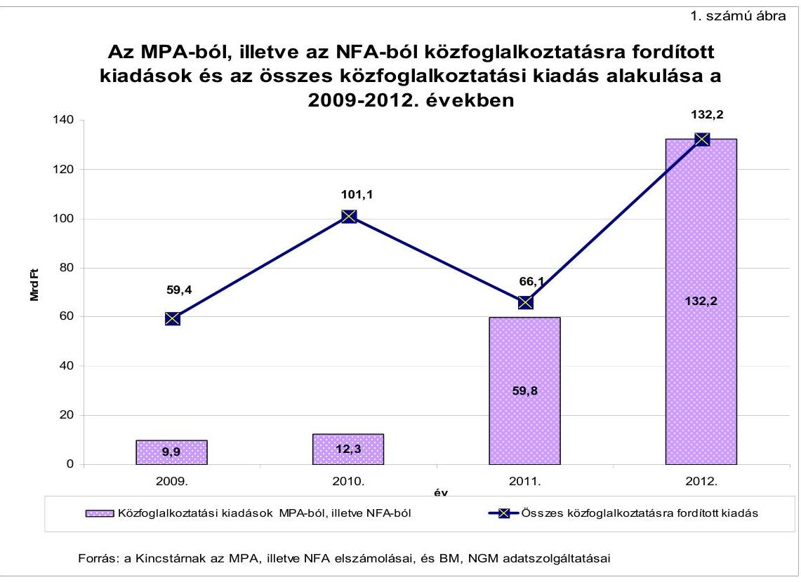

Az ellenőrzés célja annak értékelése volt, hogy a 2009-2012. év I. negyedév közötti közfoglalkoztatási rendszer - ideértve a hozzá kapcsolódó képzési, támogatási rendszert is - és annak változásai, az önkormányzatok és a munkaügyi szervezetek közötti együttműködés hatékonyan, eredményesen segített-ék-e az alacsony iskolai végzettségű vagy képzettségű munkára képes, tartós munkanélküli személyek korábbinál fokozottabb mértékű részvételét valamely közfoglalkoztatási és képzési formában, a nyílt munkaerőpiacra való visszakerülést és munkaerő-piaci pozíciójuk javítását.

---

Ennek keretében értékeltük:

- a 2009-2012. év I. negyedév között kiadott kormányprogramokban, stratégiákban megfogalmazott célokhoz képest a közfoglalkoztatás és a kapcsolódó foglalkoztatási célú képzési programok támogatási rendszerének eredményességét, hatékonyságát;
- a különböző közfoglalkoztatási formák és a hozzá kapcsolódó képzések hatását a munkára képes, alacsony képzettségű és tartós munkanélküliek támogatott munkába, vagy a nyílt munkaerőpiacra való visszavezetésére;
- az önkormányzatok közfoglalkoztatás szervezési feltételeinek biztosítását, közfoglalkoztatási terveit és a hozzá kapcsolódó kiadásait;
- az önkormányzatok rendszeres szociális segélyre, RÁT/BPJ/FHT-ra fordított kiadásainak változását a közfoglalkoztatással összhangban;
- a közfoglalkoztatási támogatások felosztásának területi különbségeit, az eltérő támogatási intenzitás hatását a területi munkanélküliségre, a közfoglalkoztatási programoknak a munkanélküliség területi különbségeire gyakorolt befolyását;
- a közfoglalkoztatásra rendelkezésre álló források felhasználásának hasznosulását a foglalkoztatáshoz szükséges munkahelyek kialakítása, a meglévők bővítése tekintetében, (a közfoglalkoztatás forrásainak felhasználását állami beruházásoknál, illetve térségi gazdaságfejlesztési programoknál);
- az alacsony képzettségű, hátrányos helyzetű személyekre, munkavállalókra irányuló képzési programok eredményességét, a képzési programokban a területi elhelyezkedési lehetőségek figyelembe vételét, hatását a társadalmi, gazdasági leszakadás megakadályozására;
- a közfoglalkoztatási programokkal összefüggésben működtetett információs rendszerek eredményességét, a folyamatos, naprakész, illetve megbízható nyilvántartás és adatszolgáltatás biztosítását;
- az ÁSZ korábbi - a témához kapcsolódó - ellenőrzési javaslatai hasznosulását.

A közfoglalkoztatás támogatási rendszerének eredményességét és hatékonyságát a teljesítmény-ellenőrzés keretében, elemző eljárással vizsgáltuk az ÁSZ tel-jesítmény-ellenőrzési módszertanának, valamint az INTOSAI vonatkozó standardjainak (ISSAI 3000 és 3100) figyelembevételével.

A közfoglalkoztatás és a hozzá kapcsolódó képzési programok támogatási rendszerét eredményesnek értékeltük, ha a célkitűzések megvalósultak; a közfoglalkoztatáshoz szükséges forrásokat mind nemzetgazdasági mind önkormányzati szinten biztosították. Eredményes volt a közfoglalkoztatás, ha a szervezeti keretek kialakítása és a közreműködő szervezetek felkészültsége a programok végrehajtását segítette; a közfoglalkoztatás információs rendszere folyamatosan, naprakészen, megbízhatóan működött, a nyilvántartások és az adatszolgáltatás pontos és elérhető volt, továbbá a beszámolást és a visszacsatolást a döntéshozók felé biztosította.

---

Hatékonynak értékeltük a közfoglalkoztatás támogatási rendszerét, ha a RÁT/BPJ/FHT-ra jogosultak érintett létszámából növekvő számban vontak be aktív korú pénzbeli ellátottakat a közfoglalkoztatásba. A központi költségvetés szempontjából hatékony volt a támogatási rendszer, ha a közfoglalkoztatási támogatások összegéből és az érintett létszámból számított egy főre jutó éves közfoglalkoztatási támogatás összege az előző évekhez képest csökkent.

Az ellenőrzés során azt is értékeltük, hogy a közfoglalkoztatás hogyan befolyásolta a foglalkoztatási arány és a munkanélküliségi ráta alakulását ${ }^{2}$.

Az ÁSZ az államháztartás komplex folyamatainak átláthatósága érdekében rendszerszemléletű, egymásra épülő, összefoglaló értékelésekre lehetőséget adó ellenőrzéseket végez, amelyek keretében rendszeresen foglalkozik a foglalkoztatási programok, támogatások ellenőrzésével. Az egymásra épülő ellenőrzések lehetővé teszik a javaslatok hasznosulásának fokozottabb figyelemmel kisérését, és az ellenőrzési tapasztalatok felhasználásával támogatják az időszerű és közérdeklődésre számot tartó ellenőrzési témaválasztást. Az ÁSZ a 2011. évben a munkahelyteremtés támogatási rendszerének ellenőrzése ${ }^{3}$ keretében érintette a közfoglalkoztatást, de az ellenőrzés annak helyi szintjére nem terjedt ki. A közfoglalkoztatás szervezésében az önkormányzatok szerepe meghatározó. A 2009-2012. év I. negyedévében a közfoglalkoztatásra fordított forrásoknak több mint 2/3-át használták fel az önkormányzatok, társulásaik, illetve gazdasági társaságaik. Ezért jelen ellenőrzés a közfoglalkoztatás helyi szintjére, az önkormányzatoknál és gazdasági társaságaiknál megvalósuló feladatellátásra fókuszált. A közfoglalkoztatási támogatások közül részletesen azokat a formákat elemeztük, amelyek az ellenőrzött önkormányzatoknál és gazdasági társaságoknál előfordultak.

Ellenőrzésünkkel hozzájárulunk ahhoz, hogy az Országgyűlés és bizottságai, a döntés-előkészítő és végrehajtó szervek, a nyilvánosság és az ellenőrzöttek független, tárgyilagos és hiteles képet kapjanak a közfoglalkoztatás helyzetéről. Javaslatainkkal támogatjuk a közfoglalkoztatási rendszer továbbfejlesztését, a feladatellátás hatékonyabbá és eredményesebbé, a forrásfelhasználás átláthatóbbá tételét.

A helyszíni ellenőrzés 12 önkormányzatra, 6 önkormányzati tulajdonú gazdasági társaságra, 8 munkaügyi központra, 11 munkaügyi kirendeltségre, továbbá a központi hatás- és feladatkört gyakorló NGM-re, BM-re, a Közfoglalkoztatási Adatbázis kezelését ellátó Foglalkoztatási Hivatalra, a társadalmi felzárkózási feladatokat irányító EMMI-re, illetve a közcélú munkával kapcsolatos pénzügyi feladatokat ellátó Kincstárra terjedt ki.

Az ellenőrzött önkormányzatok kiválasztása összetett eljárással, többlépcsős reprezentatív mintavétellel történt. Az ellenőrzésbe vont gazdasági társaságok a kiválasztott önkormányzatok közfoglalkoztatási feladatokat ellátó gazdasági

[^0]
[^0]:    ${ }^{2}$ Az elemzésnél azzal a feltételezéssel éltünk, hogy közfoglalkoztatás hiányában minden közfoglalkoztatott munkanélküli lett volna.
    ${ }^{3}$ „A hazai és uniós forrásból finanszírozott, munkahelyteremtést és megőrzést elősegítő támogatások rendszerének értékelése" című 1288 számú jelentés (2012. július)

---

társaságai, a munkaügyi központok és kirendeltségek a kiválasztott önkormányzatok területén illetékes munkaügyi szervezetek voltak. A helyszíni ellenőrzésre kiválasztott 12 önkormányzat mellett további 49 önkormányzattól kérdőív és tanúsítványok formájában adatokat kértünk be. A 49 adatszolgáltató önkormányzat kiválasztása is összetett eljárással, többlépcsős reprezentatív mintavétellel történt. (A helyszínen ellenőrzött szervezetek, valamint az adatszolgáltatásra felkért önkormányzatok felsorolását az 1. számú melléklet tartalmazza.)

Az ellenőrzött időszak a 2009-2012. év I. negyedév közötti időszak volt. Az elemzéseknél a 2009-2011. évi adatok alakulását vizsgáltuk.

Az Állami Számvevőszékről szóló 2011. évi LXVI. törvény 29. §-a szerint a jelentéstervezetet megküldtük egyeztetésre az 1. számú mellékletben felsorolt helyszínen ellenőrzött szervezetek vezetőinek. A beérkezett észrevételeket és az ezekre adott válaszokat a jelentés 12-26. számú mellékletei tartalmazzák.

Az ellenőrzés jogalapját az Állami Számvevőszékről szóló 2011. évi LXVI. törvény 5. § (2), (3) és (5) bekezdései, valamint az államháztartásról szóló 2011. évi CXCV. törvény 61. § (2) bekezdésében foglaltak képezték.

---

# I. ÖSSZEGZŐ MEGÁLLAPÍTÁSOK, KÖVETKEZTETÉSEK, JAVASLATOK 

A közfoglalkoztatással kapcsolatos célkitűzések az ellenőrzött időszakban több stratégiai szintű dokumentumban jelentek meg.

Magyarország aktualizált konvergencia programjában ${ }^{4}$ a foglalkoztatáspolitika oldaláról célként a munkavállalási korú népesség munkaerő-piacra való minél nagyobb arányú belépésének ösztönzése fogalmazódott meg. Ehhez kapcsolódva a közfoglalkoztatás oldaláról a célkitűzések a tartósan munkanélküli, szociális segélyben részesülő személyek közfoglalkoztatásban való fokozottabb részvételére, valamint a szakképzetlen munkavállalók munkaerőpiacról való kiszorulásának megakadályozására irányultak. A kitűzött célok irányokat jelöltek meg, azonban az elérésüket szolgáló konkrét feladatokat és eszközrendszert is összehangoló kormányzati szintű dokumentumot nem dolgoztak ki.

A stratégiák a 2011. évtől határoztak meg a foglalkoztatáspolitikával és a közfoglalkoztatással kapcsolatos konkrét számszaki célkitűzéseket, feladatokat. A 2011. évtől a hangsúly a korábbi szociálisról a foglalkoztatási megközelítésre tolódott át. A 2011 áprilisától érvényes Széll Kálmán tervben ${ }^{5}$ foglalkoztatáspolitikai célkitűzésként jelent meg az inaktív csoportok minél nagyobb arányban történő visszavezetése a munkaerőpiacra. A közfoglalkoztatáshoz kapcsolódóan megfogalmazták az alacsony iskolai végzettségűek foglalkoztatásának növelésére és a hátrányos helyzetű munkavállalók munkavégző képességének megőrzésére irányuló célkitűzéseket. A Magyar Munka Terv 2011 májusától célul tűzte ki segély helyett támogatott foglalkoztatás biztosítását azok számára, akiknek a nyílt munkaerőpiac nem kínál reálisan munkalehetőséget. A Kormány 2011 decemberében döntött a közfoglalkoztatás főbb elveit, céljait és eszközeit középtávon ${ }^{6}$ egységes rendszerbe foglaló Közfoglalkoztatási Koncepcióról.

Az ellenőrzött időszakban a közfoglalkoztatás kialakított rendszere a tartósan munkanélküli személyek közfoglalkoztatásban való fokozottabb részvételére, illetve a támogatott foglalkoztatás biztosítására irányuló stratégiai célkitűzések teljesülését eredményesen támogatta. A közfoglalkoztatásba bevontak érintett létszáma 2009-ről 2011-re több mint kétszeresére növekedett. (Az adatokat a 2. számú ábra mutatja be.)

[^0]
[^0]:    ${ }^{4}$ A dokumentum a 2008-2011. évekre szólt.
    ${ }^{5}$ A dokumentum 2011-2015. évekre szól.
    ${ }^{6}$ A dokumentum a 2012-2014. évekre szól.

---

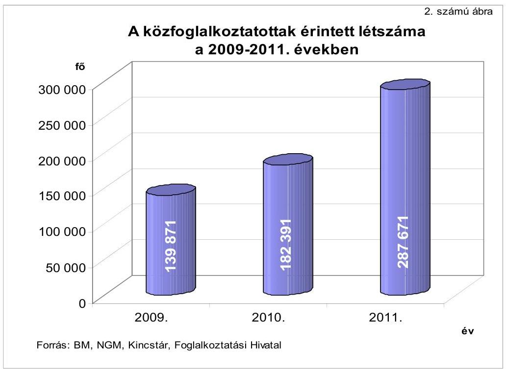

A közfoglalkoztatás támogatási rendszere eredményesen járult hozzá a szakképzetlen munkavállalók munkaerőpiacról történő kiszorításának megakadályozására, illetve az alacsony iskolai végzettségűek foglalkoztatásának javítására irányuló célkitűzések megvalósulásához. Az időszak alatt a közfoglalkoztatásba bevontak 43-62\%-a ${ }^{7}$ volt alacsony iskolai végzettségű, amely minden évben meghaladta a nyilvántartott álláskeresőkön belül az alacsony iskolai végzettségűek arányát.

A közfoglalkoztatási célok teljesüléséhez a 2009. évtől hozzájárult a Szoctv.-nek az aktív korúak ellátási rendszerében bekövetkező változása (rendszeres szociális segély jogosultsági feltételeinek módosítása stb.). A 2011. évtől a célkitűzések megvalósítását támogatta a közfoglalkoztatás új, egységes jogi szabályozásának és finanszírozásának megteremtése, amelyekre vonatkozóan az ÁSZ már a 2007. évben javaslatokat tett ${ }^{8}$. A munkára ösztönzést szolgálta 2011 januárjától az FHT-ra való jogosultság - a legalább évi 30 nap munkaviszony igazolásához kötött - módosítása és a 2011. év szeptemberétől bevezetett közfoglalkoztatási bérezési rendszer is.

Az érintettek elhelyezkedésüket nem minden esetben jelentették be a munkaügyi kirendeltségeknél, illetve a munkáltatók nem szolgáltattak pontos adatokat a közfoglalkoztatottakra vonatkozóan. Ezért a közfoglalkoztatottak nyílt munkaerőpiacra való bejutásáról, visszajutásáról az ellenőrzött időszak egészére vonatkozóan nem álltak rendelkezésre konzisztens, összehasonlításra alkalmas adatok. A közfoglalkoztatásért felelős minisztériumok nem alakították ki

[^0]
[^0]:    ${ }^{7}$ Az arány közfoglalkoztatási formánként változó volt.
    ${ }^{8}$ A 0732 számú jelentés „A közmunkaprogramok támogatására fordított pénzeszközök hasznosulásának ellenőrzéséről" (2007. szeptember).

---

az eredményesség és a hatékonyság mérésére alkalmas kritériumokat, mutatószámokat sem. Mindezek hiányában a közfoglalkoztatottak nyílt munkaerőpiacra való visszavezetésének eredményessége, hatékonysága nem értékelhető. A közfoglalkoztatási célok között 2011 áprilisától megjelenő hátrányos helyzetű munkavállalói csoportok tartalmát nem határozták meg, és a hozzá kapcsolódó mérési rendszert nem alakították ki. Emiatt a közfoglalkoztatásnak a hátrányos helyzetű munkavállalók munkavégző képessége megőrzéséhez történő hozzájárulása sem értékelhető.

Az ellenőrzött időszakban a stratégiai szintű dokumentumokban a közfoglalkoztatáshoz kapcsolódó képzésekkel elérni kívánt célkitűzések nem jelentek meg, de az egyes programokhoz illeszkedve a munkaerő-piaci esélyt növelő, illetve a közfoglalkoztatást segítő képzések megvalósultak. A 2012. évtől azonban a Közfoglalkoztatási Koncepcióban célkitűzésként fogalmazták meg a szociális tangazdaságok keretében a mezőgazdasági képzések lebonyolítását. A közfoglalkoztatáshoz kapcsolódó képzésekre vonatkozóan az ellenőrzési időszak alatt elkülönítetten és rendszerszerűen adatokat nem gyűjtöttek. Számszaki célkitűzések és az erre vonatkozó adatok hiányában a képzéseknek a támogatási rendszer eredményességéhez való hozzájárulása nem volt mérhető. Továbbá az adatok hiányában nem volt értékelhető a képzési programokban a területi elhelyezkedési lehetőségek figyelembe vétele és hatása a társadalmi, gazdasági leszakadás megakadályozására sem.

A közfoglalkoztatásra 2009 és 2011 között 227 Mrd Ft támogatást biztosítottak, a 2012. évre 132 Mrd Ft-ot terveztek. A 2009-2010. években a központi költségvetés készítéséhez az önkormányzatok közfoglalkoztatási tervei nem nyújtottak megfelelő alapot, mivel azok jogszabályban előírt készítése a központi költségvetés elfogadását követő időpontra esett. Ez is hozzájárult ahhoz, hogy a támogatásokból a legnagyobb arányt (84\%) képviselő közcélú munka központi támogatásának megtervezése nem volt számításokkal alátámasztott. A pontos tervezés hiányában a közcélú munka központi forrásait (az önkormányzati igények alapján) az előirányzat felülről való nyitottságával biztosították. A 2011. évtől a közfoglalkoztatás egységes finanszírozási rendszerének megteremtése a tervezhetőséget jelentős mértékben javította, a központi források felhasználása az áthúzódó tételek kivételével összességében a terveknek megfelelően alakult. Az elfogadott programok lebonyolítását a rendelkezésre álló források biztosították, ezért a közfoglalkoztatás támogatási rendszere a 2009-2012. év. I. negyedévében e tekintetben eredményes volt.

A központi költségvetés szempontjából a támogatási rendszer hatékonysága - a minimálbérnek, a közfoglalkoztatottak érintett létszámának, továbbá a támogatás intenzitásnak az emelkedése mellett - a 2009. évről a 2010. évre romlott, mivel az egy főre jutó éves közfoglalkoztatási támogatás az évi 425 ezer Ft-ról 31\%-kal, 554 ezer Ft-ra emelkedett. A támogatási rendszer ebben az időszakban az önkormányzatokat a magasabb ( $95 \%$-os) támogatási intenzitású közcélú munka keretében történő közfoglalkoztatásra ösztönözte. Ez az előirányzat felülről való nyitottsága következtében a források pazarló felhasználását eredményezte. A 2011. évtől előtérbe kerültek az alacsonyabb támogatási intenzitású közfoglalkoztatási formák, valamint 2011 szeptemberétől módosult a közfoglalkoztatás bérezési rendszere. Ez is hozzájárult ahhoz, hogy a központi költségvetés szempontjából a támogatási rendszer hatékonysága a

---

közfoglalkoztatottak érintett létszámának emelkedése mellett javult, az előző évhez képest az egy főre jutó éves támogatási összeg - a rövid idejű közfoglalkoztatás hatásának kiszűrésével - (301 ezer Ft-ra) 46\%-kal csökkent. A támogatási rendszer hatékonyan járult hozzá az aktív korú ellátottak foglalkoztatásba történő bevonásához is, mivel a RÁT/BPJ/FHT-ra jogosult személyek számának növekedése mellett a 2010. évben 28938 fővel ( $32 \%$-kal), a 2011. évben 31711 fővel ( $26 \%$-kal) több ellátottat vontak be valamely közfoglalkoztatási formába, mint a megelőző évben.

A 2009-2010. évek között a munkaügyi központok által a közfoglalkoztatásra rendelkezésre álló decentralizált keretek elosztásánál, a támoga-tás-intenzitás meghatározásánál figyelembe vették a települések/térségek álláskeresési adatait, az eltérő gazdasági fejlettséget és a munkaerő-piaci helyzetet. A közcélú munkánál ezzel szemben a munkanélküliség területi, települési különbségei az önkormányzati hatáskörű szervezési (szerződéskötési) és automatizmusként múködő forrásigénylés miatt nem érvényesültek. A 2011. évtől a központi keretek elosztásánál a megyék munkaerő-piaci helyzetét, álláskeresési adatait vették figyelembe. A közfoglalkoztatási pályázatok, kérelmek elbírálásánál a munkaügyi kirendeltségek, központok vezetői a település munkaerő ke-reslet-kínálat jellemzőit, valamint a térség foglalkoztatási helyzetét és mutatóit mérlegelték, a munkanélküliség területi különbségeit a támogatott létszámon, illetve a különböző támogatás intenzitásokon keresztül érvényesítették. A 20092010. években a forráselosztás és a közfoglalkoztatási programok kidolgozása során a közfoglalkoztatásban jelentkező ciklikusság csökkentésére irányuló törekvés nem jelent meg. A téli közfoglalkoztatást 2011-től vezették be, amely a téli időszakban nehezebb helyzetben lévő álláskeresők számára biztosítottak munkalehetőséget.

A közfoglalkoztatás támogatási rendszere a 2009-2011. években a foglalkoztatottak számának emelésén, a munkanélküliek számának csökkentésén keresztül nemzetgazdasági szinten kedvező hatást gyakorolt a foglalkoztatási arány, valamint a munkanélküliségi ráta alakulására. A közfoglalkoztatás 2009-2011 között a foglalkoztatási arányt 0,8\%-1,1\%-kal, a munkanélküliségi rátát $1,4-2,0 \%$-kal javította ${ }^{9}$.

A szervezeti keretek kialakítása és a közremúködő szervezeteknek a programok végrehajtására történő felkészültsége hozzájárult a közfoglalkoztatás támogatási rendszerének eredményességéhez. A közfoglalkoztatási feladatokat ellátó minisztériumok, szakmai szervezetek a múködéshez szükséges szervezeti kereteiket kialakították, a feladat eredményes végrehajtását eljárásrendekkel, útmutatókkal segítették.

Az önkormányzatok a közfoglalkoztatás megvalósításában kiemelt szerepet játszottak. Az ellenőrzött önkormányzatok gazdasági programjaiban, szakmai koncepcióiban - a munkanélküliek foglalkoztatásával, a közfoglalkoztatási pályázatokon való részvétellel kapcsolatban - megfogalmazott célkitűzések megvalósulása eredményes volt. A közfoglalkoztatásba egyre növekvő számban vontak be munkanélküli személyeket, az ellenőrzött és az adatszolgáltató ön-

[^0]
[^0]:    ${ }^{9}$ A KSH adatai alapján, kizárólag a közfoglalkoztatás hatását értékelve.

---

kormányzatoknál a közfoglalkoztatottak száma az előző évhez képest a 2010. évre 6802 főre, $39 \%$-kal, a 2011. évre 10130 főre, $49 \%$-kal emelkedett, amely a nemzetgazdasági szintű adatok tendenciájával azonos módon alakult.

A 2009-2010. években az önkormányzatok közfoglalkoztatási terveiket a Szoctv.-ben előírt tartalommal készítették el, azonban azok a közcélú munka vonatkozásában a költségvetések és üzleti tervek megalapozott elkészítését nem segítették. Ennek oka a 2009. évben a közfoglalkoztatási tervek költségvetési rendeletet követő elfogadási határideje volt. A 2010. évben a költségvetés tervezéskor az ellenőrzött önkormányzatok egy kivételével a közfoglalkoztatási tervben foglaltakat nem vették figyelembe. Emellett a közhasznú munka vonatkozásában a költségvetés tervezésekor - a decentralizált forráselosztás időigénye miatt - nem álltak rendelkezésre a szükséges információk (támogatás összege, létszám). A 2011. évben az önkormányzatok költségvetésének megalapozott tervezését nehezítette az új közfoglalkoztatási formák bevezetéséből, a központi, illetve a decentralizált forrásleosztásból adódó információhiány. A tervezési nehézségek ellenére a 2009-2012. év. I. negyedévében a közfoglalkoztatás forrásainak biztosítása eredményes volt, mivel a szerződésekben rögzített közfoglalkoztatási feladatokat elvégezték, forráshiány miatt feladat nem maradt el. Az ellenőrzött és az adatszolgáltató önkormányzatok és gazdasági társaságaik a 2009-2010. években a közfoglalkoztatásra növekvő összegű (a 2009. évben 2342 M Ft, a 2010. évben 3737 M Ft) kiadásokat teljesítettek, majd 2011-re ennek összege ( 1997 M Ft-ra) csökkent. Ez tendenciájában a 2009-2011. években megfelelt a központi források alakulásának.

Az ellenőrzött önkormányzatoknál az aktív korúak pénzbeli ellátására fordított összegek a 2009. évi 1797 M Ft-hoz képest a 2010-2011. években folyamatosan ( $11 \%$-kal és $37 \%$-kal) növekedtek a RÁT/BPJ/FHT ellátásban részesülők létszámának növekedése következtében. Az aktív korú pénzbeli ellátottak számának alakulását befolyásolta a 2009-2010. években a szociális segély jogosultsági feltételeinek megváltozása, illetve 2011. szeptember 1-jétől az álláskeresési járadék folyósítási idejének lerövidülése. Az ellenőrzött időszak alatt az ellenőrzött önkormányzatok 50\%-ánál a munkanélküliség növekedett. Ez hatással volt az aktív korúak pénzbeli ellátásában részesülők számának alakulására.

A közfoglalkoztatással kapcsolatos feladatokat az ellenőrzött önkormányzatok a helyi igényekhez és lehetőségekhez alkalmazkodva a polgármesteri hivatalok keretében köztisztviselők bevonásával, vagy intézményeik, gazdasági társaságaik, egyesületek, kistérségi társulások, illetve egyéb költségvetési szervek közremúködésével látták el. Kilenc önkormányzat esetében a szervezeti keretek szabályozása, a feladat- és hatáskörök meghatározása hiányos volt. A szervezeti keretek kialakításának hiányosságai a feladatellátást nem akadályozták, az önkormányzatok a közfoglalkoztatás szervezési feltételeit biztosították.

2011-ben egy országos közfoglalkoztatási program kapcsolódott állami beruházáshoz. A beruházás keretében a közfoglalkoztatásra létrejöttek munkahelyek, de ezek a nyílt munkaerőpiacon az új munkahelyek számát nem bővítették. Az ellenőrzött önkormányzatok, gazdasági társaságok által lebonyolított közfoglalkoztatási programok nem kapcsolódtak térségi gazdaságfejlesztési programokhoz. Mindezek miatt a közfoglalkoztatási támogatások a nyílt mun-

---

kaerőpiacon foglalkoztatást elősegítő munkahelyek létrehozásához, a meglévők bővítéséhez az ellenőrzött időszakban nem járultak hozzá.

A 2009-2011. években a közfoglalkoztatás egységes, az operatív tevékenységek keretében megvalósuló folyamatos és eseti nyomon követésből álló, a tevékenységek, a célok megvalósításának nyomon követését biztosító monitoring rendszerét sem nemzetgazdasági, sem helyi szinten nem alakították ki. Az ellenőrzési időszakban nem határozták meg a közfoglalkoztatással kapcsolatos objektív elemzésekhez, értékelésekhez szükséges, a teljesítmények mérésére alkalmas kritériumokat, mérőszámokat sem. A 2012. évben nemzetgazdasági szinten elkezdődött a monitoring rendszer egyes elemeinek kiépítése.

Az ellenőrzött önkormányzatok a közfoglalkoztatás eredményességének, hatékonyságának mérésére alkalmas saját monitoring rendszerüket nem alakították ki. A közfoglalkoztatási formák közül azt alkalmazták, amelynél lehetőség volt a nagyobb arányú támogatás igénybevételére. Értékelés egyes programokhoz (országos, illetve a startmunka mintaprogramokhoz) kapcsolódóan valósult meg. Az önkormányzatok közül kilenc nem vizsgálta átfogóan a közfoglalkoztatás keretében végzett különböző munkák hasznosságát, a különböző közfoglalkoztatási formák előnyeit és hátrányait, nem értékelte az aktív korúak ellátására, illetve a közfoglalkoztatásra fordított összegek alakulását. Az ellenőrzött időszakban egy önkormányzat vizsgálta a közfoglalkoztatás várt és tényleges hatását, értékteremtő jellegét.

A közfoglalkoztatottakról, a közfoglalkoztatókról és az aktív korúak pénzbeli ellátására jogosultakról a Foglalkoztatási Szolgálat Szociális, majd Közfoglalkoztatási Adatbázist vezetett, amelyekben az adatokat jogszabályi kötelezettségüknek eleget téve - IR rendszerükön keresztül - a munkaügyi kirendeltségek rögzítették. Az IR rendszer azonban a 2011. évig lehetővé tette az utólagos adatrögzítést, amely kockázatot jelentett az adott időpontra vonatkozóan az adatok megbízhatósága tekintetében.

A Szociális, illetve Közfoglalkoztatási Adatbázis vezetéséről szóló kormányrendeletek nem rögzítették, hogy az adatokat mennyi időn belül kell felvinni a rendszerbe, illetve az adatrögzítés elmaradását nem szankcionálták. Ennek volt a következménye, hogy a 2010. évben 130, a 2011. évben 89, a 2012. évben 389 önkormányzat - adatrögzítési kötelezettsége ellenére - az adatbázisokban nem rögzített adatot. Előfordult az is, hogy az ellenőrzött önkormányzatok adatrögzítési kötelezettségüknek eleget tettek, de az nem volt naprakész. A késedelem, illetve az adatrögzítés elmaradása kockázatot jelentett az adatbázis adatainak megbízhatósága szempontjából.

Az ellenőrzött időszakban a közfoglalkoztatással kapcsolatos adatok a munkaügyi szervezeteknél és a közfoglalkoztatásért felelős minisztériumokban több informatikai rendszerben és analitikus nyilvántartásokban voltak fellelhetőek. Emellett a közfoglalkoztatottakra vonatkozóan a KSH is gyűjtött adatokat. A közfoglalkoztatásról a különböző forrásokból gyűjtött, de azonos időszakra és azonos tartalomra vonatkozó létszámadatok eltértek, amely nehezítette a közfoglalkoztatással kapcsolatos elemzések, értékelések elvégzését.

---

A közfoglalkoztatás információs rendszere az ellenőrzött időszakban a nyilvántartások és adatszolgáltatások folyamatossága, naprakészsége és megbízhatósága szempontjából nem volt eredményes, mivel nem biztosította a rendszeres beszámolást és visszacsatolást a döntéshozók felé. A 2009-2010. években a közfoglalkoztatás helyzetéről nem készült beszámoló a Kormány felé. A 2011. évben már kormányhatározat előírta a beszámoló készítési kötelezettséget, ugyanakkor a féléves gyakorisággal elkészített beszámolók szerkezete, felépítése és adattartalma eltérő volt, ezért nem biztosította az összehasonlíthatóságot.

Összességében a 2009-2012. év. I. negyedévében a közfoglalkoztatási rendszer és annak változásai - ideértve a támogatási rendszert is, - valamint az önkormányzatok és a munkaügyi szervezetek közötti együttmúködés hatékonyan, eredményesen szolgálták a közfoglalkoztatással kapcsolatos célkitúzések teljesülését, az alacsony iskolai végzettségű, munkára képes, tartósan munkanélküli személyek fokozottabb mértékű részvételét valamely közfoglalkoztatási formában. A nyílt munkaerőpiacra való visszakerülésre vonatkozó konzisztens, összehasonlítható adatok hiányában a közfoglalkoztatás hozzájárulását a tartós munkanélküli személyeknek a nyílt munkaerőpiacra való visszakerülésében nem lehetett megítélni. A 2009-2010. években a közcélú munka tervezése nem volt számításokkal alátámasztott. A közfoglalkoztatás egységes rendszerének kialakítása nemzetgazdasági szinten a 2011. évtől a források tervezhetőségét javította. A programok megvalósításához a forrásokat biztosították. A közfoglalkoztatásba növekvő számban vontak be tartósan munkanélküli, illetve RÁT/BPJ/FHT ellátásban részesülő személyeket, valamint alacsony iskolai végzettségűeket. A közfoglalkoztatás a foglalkoztatottak számának emelésén, a munkanélküliek számának csökkenésén keresztül kedvező hatást gyakorolt a foglalkoztatási arány és a munkanélküliségi ráta alakulására. A közfoglalkoztatás támogatási rendszerének hatékonysága a központi költségvetés szempontjából az egy főre jutó támogatási összeg alakulása alapján a 2010. évre romlott, a 2011. évre javult. A közfoglalkoztatásban megjelenő ciklikusságot a 2011. évtől a téli közfoglalkoztatás bevezetése enyhítette. A közfoglalkoztatás információs, beszámolási és monitoring rendszere a rendszeres nyomon követésre, a teljesítmények mérésére nem volt alkalmas.

Az ÁSZ korábbi, a közmunka programok támogatására fordított pénzeszközök hasznosulására és az MPA múködésére - különös tekintettel a közfoglalkoztatás rendszerének egységesítésére - vonatkozó javaslatai teljesültek.

Az ÁSZ tv. 33. § (1) bekezdésében foglaltak értelmében az ellenőrzött szervezet vezetője köteles a jelentésben foglalt megállapításokhoz kapcsolódó intézkedési tervet összeállítani, és azt a jelentés kézhezvételétől számított 30 napon belül az ÁSZ részére megküldeni. Amennyiben az intézkedési tervet határidőre nem küldi meg a szervezet, az ÁSZ elnöke a hivatkozott törvény 33. § (3) bekezdés a)-b) pontjaiban foglaltakat érvényesítheti.

---

Az ellenőrzés intézkedést igénylő megállapításai és javaslatai:

# a belügyminiszternek 

1. A 2009-2010. években az önkormányzatok költségvetésének tervezésekor - a decentralizált forráselosztás időigénye miatt - a közhasznú munka tekintetében nem álltak rendelkezésre a szükséges információk. A 2011. évben az önkormányzatok költségvetésének megalapozott tervezését nehezítette az új közfoglalkoztatási formák bevezetéséből, a központi, illetve a decentralizált forrásleosztásból adódó információhiány. A 2009-2010. években a forráselosztás és a közfoglalkoztatási programok kidolgozása során a közfoglalkoztatásban jelentkező ciklikusság csökkentésére irányuló törekvés nem jelent meg. A téli közfoglalkoztatást a 2011. évtől vezették be.

Javaslat:
Intézkedjen, hogy a közfoglalkoztatás tervezési rendszere a foglalkoztatáspolitikai szempontokkal összhangban járuljon hozzá az önkormányzatok költségvetésének megalapozott tervezéséhez, és ezt vegye figyelembe a közfoglalkoztatási programok kidolgozásánál és az azokhoz kapcsolódó források biztosításánál.
2. A közfoglalkoztatási célok között 2011 áprilisától megjelenő hátrányos helyzetű munkavállalói csoportokba tartozókat nem határozták meg, és a hozzá kapcsolódó mérési rendszert nem alakították ki. Emiatt a közfoglalkoztatásnak a hátrányos helyzetű munkavállalók munkavégző képessége megőrzéséhez történő hozzájárulása nem értékelhető.

Javaslat:
Intézkedjen a közfoglalkoztatási célok között szereplő hátrányos helyzetű munkavállalói csoportokba tartozók meghatározásáról, és ezzel összhangban a célkitűzésekkel összefüggő adekvát mérési eszközrendszer kialakításáról.
3. Az ellenőrzési időszakban nem határozták meg a közfoglalkoztatással kapcsolatos objektív elemzésekhez, értékelésekhez szükséges, a teljesítmények mérésére alkalmas kritériumokat és mérőszámokat. A 2009-2011. években a közfoglalkoztatás egységes, az operatív tevékenységek keretében megvalósuló folyamatos és eseti nyomon követésből álló, a tevékenységek, a célok megvalósításának nyomon követését biztosító monitoring rendszerét sem nemzetgazdasági, sem helyi szinten nem alakították ki.

Javaslat:
Intézkedjen a közfoglalkoztatás teljesítményének mérésére alkalmas kritériumok és mérőszámok kidolgozásáról, valamint a kitűzött célok megvalósításának nyomon követését szolgáló egységes monitoring rendszer kialakításáról.
4. Az ellenőrzött időszakban a közfoglalkoztatással kapcsolatos adatok a munkaügyi szervezeteknél és a közfoglalkoztatásért felelős minisztériumokban több informatikai rendszerben és analitikus nyilvántartásokban voltak fellelhetőek. A különböző forrá-

---

sokból gyűjtött, de azonos időszakra és azonos tartalomra vonatkozó adatok eltértek, amely nehezítette a közfoglalkoztatással kapcsolatos elemzések, értékelések elvégzését. A közfoglalkoztatottak nyílt munkaerőpiacra való bejutásáról, visszajutásáról az ellenőrzött időszak egészére vonatkozóan nem álltak rendelkezésre konzisztens, összehasonlításra alkalmas adatok. A közfoglalkoztatáshoz kapcsolódó képzésekre vonatkozóan az ellenőrzési időszak alatt elkülönítetten és rendszerszerűen adatokat nem gyűjtöttek. A féléves gyakorisággal elkészített beszámolók szerkezete, felépítése és adattartalma eltérő volt, ezért nem biztosította az összehasonlíthatóságot.

Javaslat:
Intézkedjen a foglalkoztatáspolitikai célokkal összhangban lévő, a közfoglalkoztatási célok megvalósításának méréséhez és értékeléséhez szükséges, megbízható adatszolgáltatási rendszer múködtetéséről.
5. A Szociális, illetve Közfoglalkoztatási Adatbázis vezetéséről szóló, időben egymást követő kormányrendeletek nem rögzítették, hogy az adatokat mennyi időn belül kell felvinni a rendszerbe, illetve az adatrögzítés elmaradását nem szankcionálták. Ennek volt a következménye, hogy a 2010. évben 130, a 2011. évben 89, a 2012. évben 389 önkormányzat - adatrögzítési kötelezettsége ellenére - az adatbázisokban nem rögzített adatot. Előfordult az is, hogy az ellenőrzött önkormányzatok adatrögzítési kötelezettségüknek eleget tettek, de az nem volt naprakész. A késedelem, illetve az adatrögzítés elmaradása kockázatot jelentett az adatbázis adatainak megbízhatósága szempontjából.

Javaslat:
Intézkedjen - az önkormányzatok törvényességi felügyeletét ellátó miniszterrel együttműködve - a Foglalkoztatási és Közfoglalkoztatási Adatbázis adatainak megbízhatósága érdekében arról, hogy a jegyzők adatrögzítési kötelezettségüknek eleget tegyenek.

# a nemzetgazdasági miniszternek 

A Szociális, illetve Közfoglalkoztatási Adatbázis vezetéséről szóló kormányrendeletek nem rögzítették, hogy az adatokat mennyi időn belül kell felvinni a rendszerbe, illetve az adatrögzítés elmaradását nem szankcionálták. Ennek volt a következménye, hogy a 2010. évben 130, a 2011. évben 89, a 2012. évben 389 önkormányzat adatrögzítési kötelezettsége ellenére - az adatbázisokban nem rögzített adatot. Előfordult az is, hogy az ellenőrzött önkormányzatok adatrögzítési kötelezettségüknek eleget tettek, de az nem volt naprakész. A késedelem, illetve az adatrögzítés elmaradása kockázatot jelentett az adatbázis adatainak megbízhatósága szempontjából.

Javaslat:
Kezdeményezze a Foglalkoztatási és Közfoglalkoztatási Adatbázis vezetéséről szóló 169/2011. (VIII. 24.) Korm. rendelet módosítását annak érdekében, hogy az tartalmazza az adatrögzítési kötelezettség határidejét.

---

# II. RÉSZLETES MEGÁLLAPÍTÁSOK 

## 1. A KÖZFOGLALKOZTATÁs ÉS A HOZZÁ KAPCSOLÓDÓ KÉPZÉSI PROGRAMOK CÉLKITŰZÉSEI ÉS AZOK MEGVALÓSULÁSA, A TÁMOGATÁSI RENDSZER EREDMÉNYESSÉGE, HATÉKONYSÁGA

### 1.1. A közfoglalkoztatási és a kapcsolódó képzési programok célkitúzéseinek teljesülése nemzetgazdasági szinten

A közfoglalkoztatással kapcsolatos célkitűzések az ellenőrzött időszakban több stratégiai szintű dokumentumban jelentek meg.

A stratégiai célok a 2009-2010. években általános voltak, irányokat jelöltek meg. Elérésüket szolgáló konkrét feladatokat és eszközrendszert is összehangoló kormányzati szintű dokumentumot nem dolgoztak ki. A Kormány a 2011. év decemberében elfogadta a közfoglalkoztatás egységes, középtávú stratégiai szintű dokumentumának tekinthető, a 2012-2014. évekre szóló Közfoglalkoztatási Koncepciót, azonban ezt nem hozta nyilvánosságra. A Közfoglalkoztatási Koncepció végrehajtásával kapcsolatos feladatokról Kormányhatározatban döntöttek ${ }^{10}$.

A 2009-2010. években foglalkoztatáspolitikai célkitűzésként jelent meg a munkavállalási korú népesség minél nagyobb arányú munkaerő-piacra való belépésének ösztönzése, melyet az „Út a munkához" programmal kívántak elérni. 2011 áprilisától foglalkoztatáspolitikai célkitűzés volt az inaktív csoportok minél nagyobb arányú visszavezetése a munkaerő-piacra, melynek köztes állomásaként jelölték meg a közfoglalkoztatást.

A közfoglalkoztatottak érintett létszáma ${ }^{11}$ a 2009. évről a 2010. évre a közcélú munkában foglalkoztatottak érintett létszámának 33,5\%-os emelkedése következtében 30,4\%-kal emelkedett. A 2011. évben az érintett létszám az előző évihez képest $57,7 \%$-kal emelkedett (3. számú ábra), amely az új közfoglalkoztatási formák, ezen belül a rövid idejű közfoglaltatás és az országos közfoglalkoztatási programok bevezetésének eredménye volt.

[^0]
[^0]:    ${ }^{10}$ 1507/2011. (XII. 29.) Korm. határozat a közfoglalkoztatás középtávú (2012-2014) koncepciójának végrehajtásával kapcsolatos feladatokról.
    ${ }^{11}$ Az érintett létszám a megkötött munkaszerződések számán alapult, így halmozódást tartalmazott. Amennyiben egy személy egy időszak alatt több szerződést kötött, akkor annyiszor szerepelt a nyilvántartásban, ahány alkalommal közfoglalkoztatásba lépett. A halmozódások jövőbeni kiszűrése érdekében a helyszíni ellenőrzés ideje alatt folyt az informatikai rendszer fejlesztése.

---

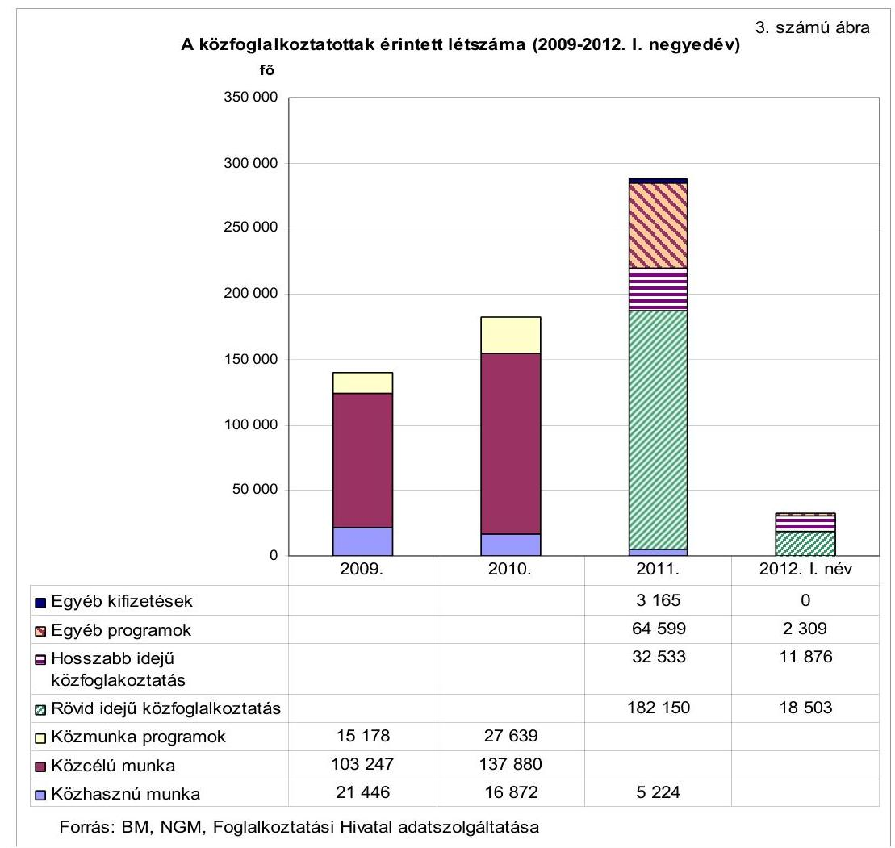

A válság negatív foglalkoztatottsági hatásainak tompítása érdekében a 20092010. években a közfoglalkoztatás fő célja volt a tartósan munkanélküli, szociális segélyben részesülő személyek korábbinál fokozottabb mértékű részvételének biztosítása valamely közfoglalkoztatási formában, illetve a munkavállalási korú szakképzetlen munkavállalók munkaerőpiacról való kiszorulásának - a felajánlható munkalehetőségek számának bővítésével történő - megakadályozása. Ezeket a célokat az „Út a munkához" program megvalósításával, 100 ezer fő tervezett részvételével kívánták megvalósítani.

Magyarország aktualizált konvergencia programja 2008-2011 (2008. év december) kiemelt célként fogalmazta meg a munkára képes szociális segélyben részesülő személyek közfoglalkoztatásban való részvételét annak érdekében, hogy közelebb kerüljenek a munka világához. A 2009. évtől bevezetett (a közcélú munkára hangsúlyt fektető) „Út a munkához" program célja a tartósan munka nélkül lévők részvételének biztosítása a különböző közfoglalkoztatási programokban, annak érdekében, hogy munkajövedelemhez jussanak, és kapcsolatrendszerüket ne veszítsék el a munka világával. Célkitúzésként fogalmazódott meg továbbá a munkavállalási korban lévő, szakképzetlen munkavállalók munkaerőpiacról való kiszorulásának megakadályozása, az iskolázatlan vagy hiányos iskolázottságú fiatalok munkaerő-piaci kötődésének elősegítése a támogatott képzésekkel, a munkaerő-piaci programokba való fokozottabb bevonás, illetve szolgáltatások nyújtása.

---

A célkitűzés megvalósítását a munkaerőpiacról tartósan kiszorult, aktív korú, nem foglalkoztatott személyek munka világába való belépésének ösztönzésével a Szoctv. 2009. évtől bekövetkező változásai szolgálták.

A Szoctv. a 2009. évtől a rendszeres szociális segélyre való jogosultságot a munkára nem képes ${ }^{12}$ aktív korúakra korlátozta. A Szoctv.-ben szereplő közcélú munkában való részvétel a RÁT-ban, illetve BPJ-ben részesülő ellátottak számára kiközvetítésük esetén kötelező volt. Amennyiben a közcélú munkában történő részvételt elutasították, az ellátásra való jogosultságuk megszűnt.

A munkavállalási korú népesség közfoglalkoztatásba való minél nagyobb arányú munkaerő-piaci belépésének ösztönzésére irányuló célkitúzés eredményesen valósult meg, mivel a közfoglalkoztatásba bevontak érintett létszáma a 2009. évi 139871 fơről a 2010. évre 182391 főre jelentősen, 30,4\%-kal emelkedett nemzetgazdasági szinten.

A közfoglalkoztatással kapcsolatos korábbi szociális megközelítésű irányról (a segélyezés munka ellen ösztönző hatásának mérséklése, és ezzel párhuzamosan a foglalkoztatás növelése) a 2011. év áprilisától a hangsúly a foglalkoztatási megközelítésre (a szociális és ellátó rendszer és a foglalkoztatás politikai eszközök szétválasztása) tolódott át. A foglalkoztatásba bevontak számának emelése mellett a célok között megjelent a nyílt munkaerő-piacra történő visszatérés ösztönzése is.

A Széll Kálmán Terv Összefogás az adósság ellen és az erre épülő Magyarország konvergencia programja 2011-2015 a közfoglalkoztatás átalakításával a hatékonyabb forráselosztást, értékteremtő foglalkoztatás révén a hátrányos helyzetű munkavállalók munkavégző képességének megőrzéséhez történő hozzájárulást, az álláskeresési aktivitás növelésének ösztönzését és a versenyszférába történő átmenet elősegítését tűzte ki célul, valamint, hogy támogatott foglalkoztatást biztosítson azok számára, akik támogatás nélkül nem tudnak elhelyezkedni.

A Magyar Munka Terv (2011. május 19-e) a foglalkoztatási célú támogatások három pillérre épülő rendszerében a nyílt a munkaerő-piaci elhelyezkedést ösztönző első pillér mellett második pillérként kezelte a szociális gazdaság keretei között megvalósuló átmeneti foglakoztatást, mely átvezet a nyílt munkaerőpiacra, illetve harmadik pillérként az állam által szervezett átmeneti foglalkoztatást jelentő közfoglalkoztatást.

A foglalkoztatási szint emelését a 2011. évtől az egy főre jutó közfoglalkoztatási idő, illetve a munkaidő rövidítésével érték el. A 2011. évben több mint 287 ezer fő foglalkoztatása valósult meg.

A rövid időtartamú közfoglalkoztatás hossza legfeljebb 4 hónap, a munkaidő hossza 4 óra lehetett. A hosszabb időtartamú közfoglalkoztatás hossza legfeljebb 12 hónap, a munkaidő 6-8 óra lehetett.

A foglalkoztatás előtérbe kerülését tükrözi, hogy az aktív korúak ellátásának feltételeként 2011. január 1-jétől munkavégzési kötelezettséget is előírtak.

[^0]
[^0]:    ${ }^{12}$ A munkára nem képesek: az egészségi okok miatt nem képesek, az 55 év felettiek, illetve akik a 14 éven aluli gyermekük elhelyezését nem tudják napközbeni ellátás keretében biztosítani (feltéve, hogy a másik szülő ellátásban nem részesül).

---

A Szoctv.-ben 2011. január 1-jétől a BPJ, majd az azt felváltó FHT már csak annak a személynek volt folyósítható, aki évente legalább 30 nap munkaviszonyt tudott igazolni, illetve a helyi önkormányzat rendeletében foglalt szabályozás esetén lakókörnyezetét rendben tartotta. Az érintetteknek álláskeresőként együtt kellett működniük az illetékes munkaügyi központ kirendeltségével.

A Széll Kálmán Terv 1.0-ban a célkitűzések megvalósításához feladatként a közfoglalkoztatás új, egységes támogatási rendszerének, új jogszabályainak 2011. július 1-jéig történő megalkotását, illetve a közmunkák új rendszerének 2012. január 1-jével történő kialakítását, továbbá az elhelyezkedést ösztönző közfoglalkoztatási minimálbér eszközrendszerének kialakítását határozták meg.

A célkitűzéseknek megfelelően a Nemzeti Közfoglalkoztatási Program ${ }^{13}$ keretében átalakításra került a közfoglalkoztatás jogszabályi háttere. A közfoglalkoztatás addigi széttagolt - három pilléren (az önkormányzatok által szervezett közcélú munkán, a munkaügyi kirendeltségek által támogatott közhasznú munkán és az SZMM által irányított közmunka programon) alapuló - támogatási és intézményi rendszerét a 2011. évtől a közfoglalkoztatásra vonatkozó egységes szabályozás váltotta fel. Az ÁSZ már 2007-ben javaslatot tett ${ }^{14}$ a 100 lépés programban vállalt foglalkoztatáspolitikai célkitűzés - a közfoglalkoztatás egységes rendszerének kialakítása - mielőbbi megvalósítására. Az ÁSZ javaslata csak a 2011. évben, a Nemzeti Közfoglalkoztatási Program bevezetésével hasznosult.

A 2009-2010. években a közcélú munkával kapcsolatos előírások a Szoctv.-ben, a közhasznú munkával kapcsolatos szabályozás az Flt.-ben, a közmunka programok támogatásairól szóló rendelkezések a közmunka programokról szóló kormányrendeletben jelentek meg. Az egységes közfoglalkoztatási rendszer jogszabályi alapját a 2011. január 1-jétől hatályos közfoglalkoztatási kormányrendelet, valamint a 2011. július 27-étől hatályos Kftv. teremtette meg. Ezekben szabályozásra kerültek a támogatható közfoglalkoztatási formák, a támogatások feltételei, a közfoglalkoztatási jogviszony létrehozásának feltételei, a közfoglalkoztatók köre, a közfoglalkoztatottak bérezésének és szabadságának keretei, valamint a közfoglalkoztatás és a szociális szövetkezetek közötti kapcsolatrendszer.

A bérezési és ellátási rendszert azzal a stratégiai célkitűzéssel összhangban alakították ki, hogy az a munka irányába történő ösztönzést szolgálja, azaz a nettó közfoglalkoztatási bér az aktív korúak pénzbeli ellátása és a nettó minimálbér között helyezkedett el.

A Magyar Munka Terv szerint a „közfoglalkoztatási bér figyelemmel a fokozott állami szerepvállalásra, a jogviszony foglalkoztató részéről történő megszüntetésének korlátaira, illetőleg a lakóhelytől távol végzett munkával kapcsolatos juttatásokra - alacsonyabb, mint a minimálbér."

[^0]
[^0]:    ${ }^{13}$ A Nemzeti Közfoglalkoztatás Program a közfoglalkoztatásra vonatkozó kormányzati célkitűzések, támogatási programok és a megvalósításukhoz kiadott jogszabályok öszszefoglaló elnevezése, amelyek egységes dokumentumban nem jelentek meg.
    ${ }^{14}$ A 0732 számú jelentés „A közmunkaprogramok támogatására fordított pénzeszközök hasznosulásának ellenőrzéséről" (2007. szeptember)

---

A közfoglalkoztatási jogviszonyban a bér 2011. szeptember 1-jéig megegyezett a mindenkori minimálbérrel, azt követően bruttó $26,9 \%$-os csökkenés következett be a minimálbérhez képest, így a nettó közfoglalkoztatási bér 47025 Ft-ra csökkent. A rendszeres szociális segély új maximum összegét 2012. január 1jétől a nettó közfoglalkoztatási bér $90 \%$-ában, 42326 Ft-ban, a BPJ-t felváltó FHT-t összegét pedig a korábbi összeg $80 \%$-ában, 22800 Ft-ban állapították meg. A nettó minimálbér összege 2011-ben 60600 Ft/hó, 2012. január 1-jétől 60915 Ft/hó volt. (Az aktív korúak pénzbeli ellátásának és a bérminimumoknak az alakulását a 2009-2012. években a 2. számú függelék mutatja be.

Eredményesen teljesült az a célkitúzés, hogy a közfoglalkoztatás keretében foglalkoztatást biztosítsanak azoknak, akik számára a nyílt munkaerőpiac, illetve a szociális gazdaság jelenleg nem kínál reálisan munkalehetőséget, mivel a közfoglalkoztatásban a munkalehetőségek száma, a közfoglalkoztatottak érintett létszáma a 2011. évben 287671 fő volt, az előző évhez képest 57,7\%-kal emelkedett.

A Széll Kálmán Terv 1.0-ban, valamint a Magyar Munka Tervben a 2011. évtől célkitűzésként határozták meg a nyílt munkaerőpiacra való kilépés ösztönzését, de ennek mérésére alkalmas rendszert nem alakítottak ki. Átfogó kormányzati elemzések készítéséhez szükséges adatokat rendszerszerűen nem gyűjtöttek, a célkitúzés teljesülésének mérésére alkalmas kritériumokat, mutatószámokat nem alakították ki. A Foglalkoztatási Hivatal a közfoglalkoztatottak nyílt munkaerőpiacon való elhelyezkedésre vonatkozóan nem tudott megbízható adatot szolgáltatni.

A közfoglalkoztatásban részt vevő személyek helyzetének alakulását ellenőrzött önkormányzatonként az ellenőrzött időszakban a közfoglalkoztatásban részt vevő személyekből egyszerű véletlen mintavétellel kiválasztott 30-30 elemú, összesen 390 elemú mintán keresztül vizsgáltuk. A Foglalkoztatási Hivataltól kimutatást kértünk az összesen 390 elemú mintában szereplő közfoglalkoztatottak foglalkoztatási jogviszonyáról. A kapott lista 2009-2012. év. I. negyedéve között 1050 foglalkoztatási jogviszonyt tartalmazott. Ebből 935 esetben gyújtöttek le nyílt munkaerő-piaci álláshelyet (munkaviszonyt). A jogviszonyra vonatkozó adatokat a munkáltatók jelentették be elektronikus úton vagy az erre rendszeresített nyomtatványon ${ }^{15}$ a NAV felé. A NAV adatbázisához a Foglalkoztatási Hivatal hozzáféréssel rendelkezett. A munkáltatók a bejelentésnél sok esetben nem megfelelő kódszámot alkalmaztak, a közfoglalkoztatási jogviszony helyett más foglalkoztatási jogviszonyt jelöltek meg, emiatt a kinyert adatok nem voltak megbízhatóak. A rendszerből megfelelő múködés esetén kinyerhetők lennének az adatok a nyílt munkaerő-piaci elhelyezkedésre vonatkozóan, azonban jelenleg az adatok nem megbízhatók.

A közfoglalkoztatottak nyílt munkaerőpiacra való visszajutásáról az ellenőrzött időszak egészére vonatkozóan nem álltak rendelkezésre konzisztens, összehasonlításra alkalmas adatok, ezért ennek a célnak a teljesülése nem értékelhető.

[^0]
[^0]:    ${ }^{15}$ A bejelentési kötelezettséget az adózás rendjéről szóló 2003. évi XCII. törvény 16. § (4) bekezdése írja elő.

---

A 2009-2011. évekre vonatkozóan a stratégiai szintű dokumentumokban a közfoglalkoztatáshoz kapcsolódó képzésekkel elérni kívánt célkitűzések nem jelentek meg.

A 2009-2010. években a közfoglalkoztatáshoz kapcsolódóan az „Út a munkához" program és a közmunkaprogramok keretében, a 2011. évtől az országos közfoglalkoztatási programok keretében valósultak meg képzések. Míg az „Út a munkához" programhoz kapcsolódó képzések elsősorban munkaerő-piaci esélyt növelő képzések, addig a közmunkaprogramokhoz és az országos közfoglalkoztatási programokhoz kapcsolódó képzések a közfoglalkoztatást segítő képzések voltak. Az ellenőrzési időszak alatt a közfoglalkoztatáshoz kapcsolódó képzések különböző forrásokból (az MPA foglalkoztatási alaprészének képzési kerete, illetve uniós források, munkaügyi központok decentralizált keretei) valósultak meg. A közfoglalkoztatáshoz kapcsolódó képzések jórészt nem különültek el az aktív foglalkoztatáspolitikai eszközként megvalósuló képzésektől. Bár a közfoglalkoztatáshoz kapcsolódó képzésekre a 2011. évben az MPA foglalkoztatási alaprész központi keretében 397 M Ft-ot beterveztek, ezt azonban átcsoportosították a decentralizált keretbe a munkaügyi központok részére. A 2011. évtől kezdődően az országos közfoglalkoztatási programok már kötelező jelleggel tartalmaztak közfoglalkoztatáshoz kapcsolódó képzéseket, amelyek a közfoglalkoztatók igényeinek felmérésén alapultak és javarészt a munka elvégzéséhez szükséges ismeretek, illetve szakképesítés megszerzésére irányultak.

A 2012. évtől a közfoglalkoztatáshoz kapcsolódó képzési célkitűzések a Közfoglalkoztatási Koncepcióban megjelentek. Ebben az álláskeresők képzési rendszerének megtartása mellett a szociális célú tangazdaságok létrehozása szerepelt. A képzések célja volt a közmunka elvégzéséhez szükséges ismeretek betanítása mellett a felkészítés arra, hogy később a közfoglalkoztatásból kikerülők mezőgazdasági munkásként, őstermelőként, illetve szociális szövetkezetekben dolgozhassanak. A közfoglalkoztatáshoz kapcsolódó képzések nagyobb létszámban (10 593 fő ${ }^{16}$ ) 2012 szeptemberétől a TÁMOP 2.1.6-12/1-2012-0001 azonosítószámú „Újra tanulok!" elnevezésű kiemelt projekt keretében kezdődtek meg. Ezek a startmunka mintaprogram mezőgazdasági területén dolgozók számára szervezett, önkormányzati igényfelmérésen alapuló, illetve az országos közfoglalkoztatók igényei alapján meghirdetett képzések voltak. A mezőgazdasági képzések a Felnőttképzési Akkreditáló Testület által elfogadott betanító képzések, míg az országos közfoglalkoztatók által igényelt tanfolyamok döntően OKJ-s szakképesítést igazoló bizonyítvánnyal zárulnak. A mezőgazdasági képzések időtartama 1-1,5 év. Első eredményei 2013. év végére várhatók.

A közfoglalkoztatáshoz kapcsolódó képzésekre vonatkozóan az ellenőrzött időszakban elkülönítetten és rendszerszerűen nem gyüjtöttek adatokat, nemzetgazdasági szinten erre vonatkozóan megbízható adatok nem álltak rendelkezésre.

Az NGM adatszolgáltatása szerint a 2009-2011. években a közfoglalkoztatáshoz kapcsolódó képzésekben 1168 fő és 64 fő, 1820 fő vett részt. Ugyanerre az idő-

[^0]
[^0]:    ${ }^{16}$ Az EMMI adatszolgáltatása a Türr István Intézet által kötött közfoglalkoztatáshoz kapcsolódó keretszerződésekről.

---

szakra vonatkozóan az EMMI által közölt, a Türr István Intézet szervezésében lebonyolított közfoglalkoztatási képzésekben részt vevők létszáma 3312 fő, 1178 fő és 1761 fő volt.

A közfoglalkoztatáshoz kapcsolódó képzések egészére vonatkozó megbízható adatok hiányában az ellenőrzött időszakban ezek eredményességét és hatékonyságát, a képzési programokban a területi elhelyezkedési lehetőségek figyelembe vételét, hatását a társadalmi, gazdasági leszakadás megakadályozására értékelni nem lehet.

Az ellenőrzött időszakban a közfoglalkoztatásnak a foglalkoztatási arányra és a munkanélküliségi ráta alakulására gyakorolt hatását úgy vizsgáltuk, hogy a mutatószámokra ható egyéb tényezőket ${ }^{17}$ kizártuk. Azt elemeztük, hogy a közfoglalkoztatás nélkül ezek a mutatószámok hogyan alakultak volna, és ezekhez képest a közfoglalkoztatás hatására a foglalkoztatási és munkanélküliségi mutatók javultak-e. A számításoknál a KSH adatait használtuk fel, amelyek a közfoglalkoztatottak létszámadatai tekintetében az adatgyűjtés módszere miatt eltérést mutattak az ellenőrzésben érintett szervezetek érintett létszámához képest. A KSH adatok az intézményi statisztikák adatain alapultak.

A költségvetési, társadalombiztosítási és nonprofit szervezetek a „Havi integrált gazdaságstatisztikai jelentésben" szolgáltatnak adatot a KSH részére a közfoglalkoztatási jogviszony keretében foglalkoztatott természetes személyek átlagos állományi létszámáról és a részükre történt juttatások összegéről. A KSH intézményi statisztikán alapuló kimutatásai nem tartalmazzák a gazdasági társaságoknál, egyházaknál stb. dolgozó közfoglalkoztatottak számát, azonban a létszám nagyságrendjét és változásának irányát mutatják. A KSH munkaerő felmérésen alapuló adatgyűjtést is végez a közfoglalkoztatásra vonatkozóan, amely negyedéves mintán alapuló lakossági adatfelvétel, az adatgyűjtés kérdőíves összeírással, túlnyomórészt személyes felkereséssel, kisebb részben telefonon történik. Az adatgyűjtés módszere miatt az intézményi statisztika megbízhatóbb adatokat tartalmaz, ezért az elemzés során azokat használtuk.

A 15-74 évesek foglalkoztatási aránya ${ }^{18}$ nemzetgazdasági szinten a 2009. és 2010. években megegyezett, $49,2 \%$ volt, a 2011. évre $49,7 \%$-ra emelkedett, a 2012. év I. negyedévében $49,5 \%$ volt. A közfoglalkoztatás nélkül a foglalkoztatási arány 2009-ben $48,4 \%, 2010$-ben $48,1 \%, 2011$-ben $48,9 \%$, a 2012. év I. negyedévében $48,8 \%$ lett volna. A foglalkoztatási arány alakulására tehát a közfoglalkoztatás hatást gyakorolt, mivel az a foglalkoztatási rátát 2009-ben $0,8 \%$-kal, 2010-ben $1,1 \%$-kal, 2011-ben pedig $0,8 \%$-kal javította. A 2011. évben az új közfoglalkoztatási rendszer bevezetése miatt a közfoglalkoztatás hatása nem volt egyenletes. Az első negyedévben a közfoglalkoztatás a foglalkoztatási rátát $0,4 \%$-kal, a két közbenső negyedévben $0,9 \%$-kal, illetve $1,0 \%$-kal, míg a negyedik negyedévben $0,8 \%$-kal javította.

[^0]
[^0]:    ${ }^{17}$ A foglalkoztatási arány növekedéséhez a közfoglalkoztatottak számának folyamatos emelkedésén túl hozzájárultak a nyílt munkaerőpiac változásai, valamint a demográfiai változások is (a népesség csökkent, amely a mutatószám javulását eredményezte). A munkanélküliségi ráta alakulására más gazdasági tényezők, így a termelés ingadozásával összefüggésben a munkahelyek számának változása is hatott.
    ${ }^{18}$ a foglalkoztatottak aránya a népességhez

---

A munkanélküliségi ráta a 15-74 éves korú népesség körében a 2009. évben 10,0\%, a 2010. évben 11,2\%, a 2011. évben 10,9\%, a 2012. év I. negyedévében 11,7\% volt. Amennyiben a közfoglalkoztatás hiányában a résztvevők a munkanélküliek számát növelték volna, a munkanélküliségi ráta nemzetgazdasági szinten 2009-ben 11,5\%-on, 2010-ben 13,2\%-on, 2011-ben 12,3\%-on, a 2012. év I. negyedévében 13,0\%-on alakul. A közfoglalkoztatás a munkanélküliségi ráta alakulására hatást gyakorolt, mivel az a munkanélküliségi rátát 2009-ben 1,5\%-kal, 2010-ben 2,0\%-kal, 2011-ben 1,4\%-kal javította. A 2011. évben a foglalkoztatási arány alakulásához hasonló ingadozást mutatott a munkanélküliségi ráta változása. Az első negyedévben a közfoglalkoztatás hatása $0,7 \%$ volt, a második negyedévben $1,7 \%$-kal, a harmadikban $1,6 \%$-kal, a negyedikben $1,3 \%$-kal javította a munkanélküliségi rátát a közfoglalkoztatás.

A munkanélküliségi ráta az ellenőrzött és az adatszolgáltatásba bevont 60 településen (Budapest nélkül ${ }^{19}$ ) a 2009-2011. évek között 14,5\%-ról 14,7\%-ra növekedett, a 2012. év I. negyedévében 16,3\% volt. Ezen belül az egyes települések munkanélküliségi rátái nagy szóródást mutattak, a minimális $3,2 \%-4,6 \%$-os és a maximális $29,3 \%-33,1 \%$-os sávok között helyezkedtek el. (Az álláskeresési és munkanélküliségi adatokat a 10. számú melléklet tartalmazza.)

A közfoglalkoztatásra biztosított támogatások összege a 2009. évről a 2010. évre nemzetgazdasági szinten 59 414,4 M Ft-ról 101 109,5 M Ft-ra 71,2\%-kal emelkedett, a közfoglalkoztatottak érintett létszámának 30,4\%-os emelkedése mellett. Az egy főre jutó éves közfoglalkoztatási támogatás a 2009. évi 424,8 ezer Ft-ról a 2010. évre 30,5\%-kal, 554,4 ezer Ft-ra emelkedett, a központi költségvetés szempontjából a közfoglalkoztatás támogatási rendszerének hatékonysága romlott. Ennek oka az volt, hogy a magas támogatási intenzitás az „Út a munkához" program keretében az önkormányzatokat a többi közfoglalkoztatási formával szemben a közcélú munka szervezésére ösztönözte, amely miatt a program kezdeti, 2009-es évéhez képest a 2010. évben a közcélú munkára fordított források jelentősen megemelkedtek. Az előirányzat felülről való nyitottsága miatt a közfoglalkoztatással kapcsolatos bér és járulék kiadások korlátok nélkül elszámolhatók voltak. Ennek következtében az önkormányzatok a közfeladatoknak a közcélú munka keretében való megoldását részesítették előnyben függetlenül attól, hogy az a feladatellátás szempontjából hatékony volt-e, vagy sem. Ez a források pazarló felhasználását eredményezte. A közcélú munka mellett megnövekedett a szintén magas támogatási intenzitású közmunkaprogramokban foglalkoztatottak létszáma is. Az egy főre jutó támogatás emelkedésére hatott a közfoglalkoztatási bér minimál bérhez kötött emelkedése is.

A 2009-2010. években a közcélú munkára igényelhető támogatás összege a bér és járulékainak $95 \%$-a volt, míg az önkormányzatok a RÁT/BPJ összegének csupán $80 \%$-áig tudtak támogatást igényelni. Emellett az önkormányzatok egyes közfeladataikat, amelyeket egyéb esetekben vásárolt közszolgáltatás, illetve saját dolgozó alkalmazása révén, jórészt saját forrásaik terhére tudtak volna megvaló-

[^0]
[^0]:    ${ }^{19}$ Budapesten a többi településhez képest a munkanélküliségi ráta kedvező volt, 20092012 között 3,2-4,1\% között mozgott. Kedvező értéke jelentősen torzítaná a többi településről összességében kialakítható képet, ezért adatait nem vettük figyelembe.

---

sítani, a közcélú foglalkoztatás révén minimális saját erő ráfordításával, állami támogatással oldhatták meg.

A 2011. évre a támogatás összege 66092 M Ft-ra, 34,6\%-kal esett vissza a közfoglalkoztatásban résztvevők érintett létszámának 57,7\%-os emelkedése mellett. Az egy főre jutó éves közfoglalkoztatási támogatás 229,7 ezer Ft-ra csökkent, a központi költségvetés szempontjából a közfoglalkoztatás támogatási rendszerének hatékonysága javult. A mutató alakulását befolyásolta a 2011. évtől bevezetett rövid idejű közfoglalkoztatás, amely keretében a napi munkaidő 4 óra lehetett.

A 2011. évben a közfoglalkoztatottak között több mint 65,0\% volt a rövid idejű közfoglalkoztatási formában foglalkoztatottak aránya, amely a napi maximum 4 órás munkaidő miatt torzította az egy főre jutó éves közfoglalkoztatási támogatás összegének alakulását ${ }^{20}$.

A rövid idejű közfoglalkoztatás hatásának kiszűrése - a rövid idejű közfoglalkoztatásban részt vevők érintett létszámának felét 6 órás, felét 8 órás foglalkoztatásra számoltuk át - mellett is a 2011. évben a közfoglalkoztatás támogatási rendszerének hatékonysága javult, mivel az egy főre jutó éves támogatási összeg a 2011. évben 301,3 ezer Ft volt, a 2010. évről a 2011. évre 45,6\%-kal, a 2009. évről a 2011. évre pedig 29,1\%-kal csökkent.

A közfoglalkoztatás szoros kapcsolatban volt az aktív korúak ellátási rendszerével, mivel a közfoglalkoztatottak jelentős részben az együttműködésre kész RÁT/BPJ/FHT ellátásban részesülők közül kerültek ki. Az aktív korúak ellátására fordított támogatás a 2009. évi 72 086,9 M Ft-ról a 2010. évre 70 639,7 M Ftra, 2,0\%-kal csökkent, azonban átlaglétszámuk 213099 fő/hóról 223661 fő/hóra, 5\%-kal emelkedett. A 2011. évre a támogatás 81 942,7 M Ftra, $16,0 \%$-kal növekedett az átlaglétszám $14,5 \%$-os emelkedése mellett. (4. számú ábra) A 2012. év I. negyedévében a támogatás 21831,9 M Ft, az átlaglétszám pedig 324879 fő/hó volt.
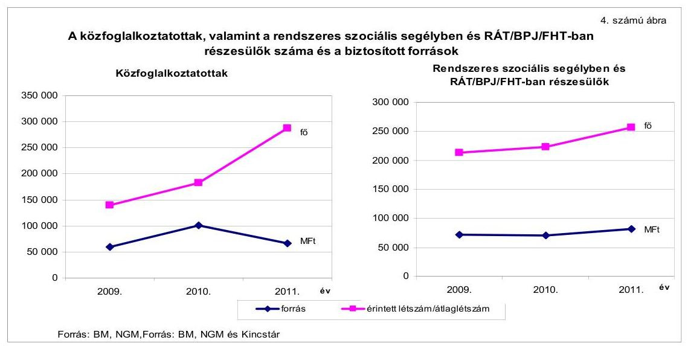

[^0]
[^0]:    ${ }^{20}$ A 2009-2010. években a közfoglalkoztatás időtartama 6-8 óra lehetett.

---

Az aktív korúak ellátására fordított összegek változása mögött a létszám növekedése és átstrukturálódása húzódott meg. Míg a 2009. évben az ellátottak 40,0\%-át tették ki a RÁT/BPJ/FHT-hoz képest magasabb összegű rendszeres szociális segélyben részesülők ${ }^{21}$, a 2010. évben arányuk már csak 16,4\% volt. A 2011. évre arányuk kismértékben növekedett, 17,9\%-ra változott, 2012. I. negyedévében $17,1 \%$ volt. Az aktív korúak számára és támogatására vonatkozó részletező adatokat a 7. számú melléklet tartalmazza.

# A rendszeres szociális segélyben részesültek számának csökkenése, valamint a RÁT/BPJ/FHT-ra jogosultak számának növekedése mögött a 2009. évben a szabályozási környezetben bekövetkezett szigorítások álltak. Emellett a RÁT/BPJ/FHT-ra jogosultak számának növekedésére hatott a gazdasági recesszió, valamint a 2010. évtől jelentősen átalakult a segélyezési, a 2011. évben az álláskeresési ellátások rendszere is. 

A 2009. évben a rendszeres szociális segély jogosultsági feltételeinek szigorodása miatt az önkormányzatok teljes körű felülvizsgálatot végeztek. Ennek következményeként a rendszeres szociális segélyben részesülők száma csökkent, az FHT-ra jogosultak száma nőtt.
2011. szeptember 1-jétől a korábban kétszakaszos, maximum 270 napig adható álláskeresési járadék folyósítási időtartama 90 napra csökkent, a minimális folyósítási idő 36 nap lett. A járadék összege a teljes folyósítási időszak alatt a járadékalap 60\%-a, amely azonban nem lehetett magasabb a jogosultság kezdő napján hatályos kötelező legkisebb munkabér összegénél ${ }^{22}$. Ez az intézkedés az FHTra jogosultak számának növekedését eredményezte.

Az aktív korú pénzbeli ellátottak számában a 2009-2010. években bekövetkező átstrukturálódás, valamint 2011 szeptemberétől az álláskeresési támogatási rendszer átalakulása a közfoglalkoztatásba potenciálisan bevonhatók létszámát emelte, mivel az egyes közfoglalkoztatási formák célcsoportjai az álláskeresők és a RÁT/BPJ/FHT-ban részesülők voltak.

A közfoglalkoztatás támogatási rendszere az együttmüködésre kész álláskeresők helyzetét javította, hatékonyan segítette a RÁT/BPJ/FHT-ban részesülő személyek fokozottabb részvételét valamely közfoglalkoztatási formában. A 2010. évben a RÁT/BPJ/FHT-ban részesülők érintett létszámából 28938 fővel (31,8\%-kal), a 2011. évben 31711 fővel ( $26,5 \%$-kal) több ellátottat vontak be a közfoglalkoztatásba, mint a megelőző évben. A RÁT/BPJ/FHT-ban részesülők érintett létszámából a közfoglalkoztatásba bevontak számának alakulását a 7. számú melléklet mutatja be.

A RÁT/BPJ/FHT-ban részesülők érintett létszámából a közfoglalkoztatásba bevontak száma a 2009. évben 29,0\%, a 2010. évben 31,1\%, a 2011. évben 35,6\%, a 2012. év I. negyedévében $36,8 \%$ volt.

[^0]
[^0]:    ${ }^{21}$ 2012. január 1-jéig a rendszeres szociális segély összege maximum a nettó minimálbér összege lehetett. Ez a 2009. évben 57815 Ft/fő, a 2010. évben 60236 Ft/fő, a 2011. évben 60600 Ft/fő volt. A RÁT/BPJ/FHT összege ugyanezen időszakban 28500 Ft/hó volt.
    ${ }^{22}$ az Flt. 27. § (3) bekezdés

---

Összességében a közfoglalkoztatás támogatási rendszere a kormányprogramokban, stratégiákban megfogalmazott célok teljesülése tekintetében mind a 2009-2010. évek között, mind a 2011. évben és 2012. I. negyedévében nemzetgazdasági szinten eredményes volt. A közfoglalkoztatottak száma a 2009-2011. években dinamikusan emelkedett, ennek következtében a 2009-2010. években a munkavállalási korú népesség minél nagyobb arányú munkaerő-piaci belépésének ösztönzése, illetve a 2011. évben az inaktív csoportok minél nagyobb arányú visszavezetése a munkaerőpiacra támogatott munka keretében érvényesült. Emellett a 2009-2011. években és a 2012. év. I. negyedévében a közfoglalkoztatás rendszere, jogszabályi háttere ösztönözte a tartósan munkanélküli, szociális segélyben részesülő személyek korábbinál fokozottabb mértékű részvételét valamely közfoglalkoztatási formában, illetve a 2011. év szeptemberétől alkalmazott bérezési, majd a 2012. év januárjától alkalmazott szociális ellátási rendszer a munka irányába történő ösztönzést szolgálta. A közfoglalkoztatás támogatási rendszere az egy főre jutó támogatás tekintetében a 2010. évben az előző évhez képest romlott, a 2011. évre javult. A közfoglalkoztatás az aktív korú pénzbeli ellátottak közfoglalkoztatásba történő fokozottabb bevonása tekintetében hatékony volt.

# 1.2. A közfoglalkoztatási és a kapcsolódó képzési programok célkitúzéseinek teljesülése helyi szinten 

Az ellenőrzött időszakban az önkormányzatok kiemelt szerepet játszottak a közfoglalkoztatás megvalósításában. A 2009-2010. években a közfoglalkoztatás döntő részét kitevő közcélú munka állami vagy helyi önkormányzati feladat ellátására irányult, megszervezéséről és teljesítéséről a Szoctv. 36. § (1) bekezdése alapján a helyi önkormányzat gondoskodott. A 2011. évben a közfoglalkoztatásra rendelkezésre álló források mintegy 2/3-át (45,9 Mrd Ft-ot) az önkormányzati szektor használta fel.

Az ellenőrzött önkormányzatok az Ötv. 91. § (6) bekezdésében ${ }^{23}$ foglaltakkal összhangban (Bakonytamási és Kocsord Önkormányzata kivételével) a hatályos gazdasági programjaikban - a Fővárosi Önkormányzat a Hajléktalanellátási koncepciójában, valamint a 2012-2020 közötti időszakra szóló Budapest Fővárosi Szociális Koncepcióban - fogalmazták meg a közfoglalkoztatással kapcsolatos hosszú távú céljaikat. Szigetvár Önkormányzata és a Fővárosi Önkormányzat kivételével a célkitűzések általánosak és vázlatosak voltak. A legfőbb célkitűzésként a munkahelyteremtés támogatását és a foglalkoztatás növelését tűzték ki, kiemelt fontosságúnak tekintették a munkanélküliek foglalkoztatását, ennek keretében a közfoglalkoztatási pályázatokon való részvételt. A közfoglalkoztatás keretében a környezetvédelmi, köztisztasági és egyéb kisegítő feladatok ellátását tervezték.

[^0]
[^0]:    ${ }^{23}$ 2013. január 1-jétől a Mötv. 116. § (1) bekezdése értelmében a korábbi - fejlesztési elképzelések, a munkahelyteremtés feltételeinek elősegítése, településfejlesztési politika, adópolitikai célkitűzések, az egyes közszolgáltatások biztosításának, színvonalának javítása, (városok esetében a befektetés-támogatás politika, városüzemeltetés-politika) célkitűzéseikkel szemben a gazdasági programban a Képviselő-testület hosszú távú fejlesztési elképzeléseit kell rögzíteni.

---

Szigetvár Önkormányzata gazdasági programjában rögzítette, hogy a közfoglalkoztatottakat az önkormányzati földeken gyógynövény-termesztésbe, kertészetbe, utak, árkok karbantartásába, valamint a háztartásokban keletkező hulladékok újrahasznosításába tervezik bevonni. A Fővárosi Önkormányzat a Hajléktalanellátási koncepcióban célul tűzte ki, hogy a hajléktalan személyek számára a fővárosi közüzemi vállalatoknál tartós státuszok jöjjenek létre.

Az ÁSZ már a 2007. évben „A közmunka programok támogatására fordított pénzeszközök hasznosulásának ellenőrzéséről" szóló 0732 számú jelentésében javaslatot tett az önkormányzati és területfejlesztési miniszternek, hogy szorgalmazza a települési önkormányzatoknál, hogy a helyi foglalkoztatáspolitikára vonatkozó céljaikat határozzák meg, és azokat építsék be az önkormányzati gazdasági programjukba. Az ellenőrzött önkormányzatok közül tíz önkormányzat gazdasági programjai azt mutatják, hogy a javaslat hasznosult.

Az ellenőrzött és az adatszolgáltató önkormányzatoknál a közfoglalkoztatottak érintett létszámadatainak részletes adatait a 3. és 4. számú mellékletek tartalmazzák.

1. számú táblázat

# Az ellenőrzött és az adatszolgáltató önkormányzatoknál a közfoglalkoztatottak érintett létszámának alakulása a 2009-2012. év I. negyedévében 

| Megnevezés | Év | Érintett létszám (fő) | Változás (előző év 100\%) |
| :--: | :--: | :--: | :--: |
| Ellenőrzött önkormányzatok | 2009. év | 3371 |  |
|  | 2010. év | 4781 | 141,8\% |
|  | 2011. év | 7754 | 162,2\% |
|  | 2012. év I. negyedéve | 2625 |  |
| Adatszolgáltató önkormányzatok | 2009. év | 1534 |  |
|  | 2010. év | 2021 | 131,7\% |
|  | 2011. év | 2376 | 117,6\% |
|  | 2012. év I. negyedéve | 1040 |  |

Forrás: az ellenőrzött és az adatszolgáltató önkormányzatok adatszolgáltatása
Mind az ellenőrzött, mind az adatszolgáltató önkormányzatok esetében a közfoglalkoztatottak érintett létszámadatai az előző évhez képest az ellenőrzött időszak minden évében nőttek. Ennek oka a 2010. évben a közcélú munkába bevontak létszámának emelkedése, míg a 2011. évben a rövid idejű közfoglalkoztatás keretében történő foglalkoztatás megnövekedése volt.

Az ellenőrzött és az adatszolgáltató önkormányzatok esetében a közfoglalkoztatottak érintett létszáma alakulásának tendenciája a nemzetgazdasági szinthez hasonló volt.

---

Az ellenőrzött önkormányzatok esetében a gazdasági programokban a közfoglalkoztatással kapcsolatban megfogalmazott célkitúzések megvalósultak, mivel a közfoglalkoztatásba egyre növekvő számban vontak be munkanélküli személyeket.

Az ellenőrzött és az adatszolgáltató önkormányzatoknál az aktív korúak pénzbeli ellátására fordított összegek a 2010-2011. években növekedtek a RÁT/BPJ/FHT ellátásban részesülők létszámának növekedése következtében. (Az aktív korúak ellátásainak és létszámadatainak alakulását a 2009-2012. év I. negyedévben az ellenőrzött és az adatszolgáltató önkormányzatoknál a 8. számú melléklet tartalmazza.)

Az ellenőrzött önkormányzatoknál az aktív korúak pénzbeli ellátására fordított összeg a 2009. évben 1796938 ezer Ft, a 2010. évben 1993 951,0 ezer Ft, a 2011. évben 2468963 ezer Ft volt. Ebből a RÁT/BPJ/FHT-ra jogosultak ellátásai az évek sorrendjében 58, 9\%-ot, 76,9\%-ot és 74,7\%-ot tettek ki. A 2012. év I. negyedévében az aktív korúak pénzbeli ellátására fordított összeg 768 958,0 ezer Ft volt.

Az adatszolgáltató önkormányzatoknál az aktív korúak pénzbeli ellátására fordított összeg a 2009. évi 890 163,9 ezer Ft-ról a 2010. évre 5,8\%-kal (838 882,0 ezer Ft-ra) csökkent, és a 2011. évre 9,4\%-kal ( 973 398,5 ezer Ft-ra) emelkedett. A 2012. év I. negyedévében 306 233,6 ezer Ft volt.

Az ellenőrzött időszakban az önkormányzati szinten a közfoglalkoztatásba bevontak számának emelkedése mellett az aktív korú pénzbeli ellátottak száma nem csökkent.

Az ellenőrzött és az adatszolgáltató önkormányzatoknál az aktív korú ellátásra jogosultak száma a 2009. évről a 2011. évre 16599 főről 19450 főre 17,2\%-kal emelkedett a rendszeres szociális segélyen lévők létszámának 29,4\%-kal, 3598 főre történő csökkenése, valamint az RÁT/BPJ/FHT-ban részesülők létszámának 10991 fơről 15492 főre, $41 \%$-kal történő emelkedése következtében.

Az aktív korú pénzbeli ellátottak számának alakulására a szociális segély jogosultsági feltételeinek megváltozása miatt a rendszeres szociális ellátásból a RÁT/BPJ ellátásba átkerülőkön kívül 2011. szeptember 1-jétől hatással volt az álláskeresési járadék folyósítási idejének lerövidülése is. Emellett az ellátottak számának alakulásában a 2010. évben hat település, a 2011. évben hét település esetében ${ }^{24}$ közrejátszott a munkanélküliség növekedése is.

# A közfoglalkoztatottak nyílt munkaerőpiacon való elhelyezkedésére 

vonatkozóan az ellenőrzött önkormányzatok területén illetékes munkaügyi kirendeltségeknél sem állt rendelkezésre megbízható adat, mivel az érintettek az elhelyezkedésüket nem minden esetben jelentették be a kirendeltségnek.

Közfoglalkoztatással kapcsolatos képzés az ellenőrzött időszakban az ellenőrzött önkormányzatoknál nem valósult meg, ezért ezek támogatási rendszeré-

[^0]
[^0]:    ${ }^{24}$ A 2010. évben Bakonytamási, Berettyóúffalu, Budapest, Celldömölk, Hatvan, Szécsény, a 2011. évben Berettyóújfalu, Budapest, Hajdúböszörmény, Kocsord, Nagykálló, Szigetvár, Szécsény.

---

nek eredményessége és hatékonysága nem ítélhető meg helyi szinten. Az ellenőrzött önkormányzatok közül Hajdúböszörmény és Nagykálló a 2012. év végén a startmunka mintaprogramhoz illeszkedő mezőgazdasági képzési programba bekapcsolódott.

# 1.3. A közfoglalkoztatással kapcsolatos források biztosítása nemzetgazdasági szinten 

Nemzetgazdasági szinten a közfoglalkoztatási célkitűzések megvalósítását szolgáló pénzügyi fedezetet a 2009-2012. évi költségvetési törvények biztosították.

A források alakulását nemzetgazdasági szinten a 2. számú melléklet mutatja be.
2. számú táblázat

## A közfoglalkoztatás forrásainak alakulása a 2009-2012. év. I. negyedévében nemzetgazdasági szinten

| Év | Közfoglalkoztatási forma | Források (M Ft) |  |  |
| :--: | :--: | :--: | :--: | :--: |
|  |  | Terv | Tény | Teljesülés |
|  | Közhasznú | 4054,6 | 3742,8 | 92,3\% |
|  | Közcélú | - | 51310,5 | - |
|  | Közmunka | 4361,1 | 4361,1 | 100,0\% |
|  | 2009. összesen | - | 59414,4 | - |
|  | Közhasznú | 4717,9 | 4396,4 | 93,2\% |
|  | Közcélú | - | 82887,9 | - |
|  | Közmunka | 13825,2 | 13825,2 | 100,0\% |
|  | 2010. összesen | - | 101 109,5 | - |
|  | Rövid idejű | 21937,4 | 19486,0 | 88,8\% |
|  | Hosszabb idejű | 12403,2 | 11698,1 | 94,3\% |
|  | egyéb programok** | 28760,8 | 27432,4 | 95,4\% |
|  | egyéb kifizetések*** | 898,6 | 507,4 | 56,5\% |
|  | 2010. évről áthúzódó |  | 6968,1 | - |
|  | 2011. összesen | 64000,0 | 66092,0 | 103,3\% |
|  | Rövid idejű | 1335,6 | 826,3 | 61,9\% |
|  | Hosszabb idejű | 17013,3 | 1628,9 | 9,6\% |
|  | egyéb programok** | 113766,3 | 26667,1 | 23,4\% |
|  | egyéb kifizetések*** | 67,3 |  | 0,0\% |
|  | 2012. összesen | 132 182,5 | 29 122,3 | 22,0\% |

Forrás: NGM, BM, Kincstár, Foglalkoztatási Hivatal datszolgáltatása

* A tervadatok a 2012. évre, a tényadatok a 2012. év I. negyedévre vonatkoznak.
**Országos, értékteremtő, start programok, hagyományos programok (szociális föld, téli közfoglalkoztatás). A 1389/2012. (IX. 20.) Korm. határozat alapján a Startmunka-program 2012. évi előirányzata 5 milliárd forinttal volt túlléphető.
*** Vállalkozás részére foglalkozást helyettesítő támogatásban részesülő személy foglalkoztatására nyújtott támogatás, mobilitási támnogatás, foglalkoztatás egészségügy költsége, tartalék.

---

A közfoglalkoztatás szabályozási, irányítási és finanszírozási rendszere a 2009-2010. években széttagolt volt. A közmunka programokat és a közcélú munkát fejezeti kezelésű előirányzatokból, míg a közhasznú munkát az MPA-ból finanszírozták. A közmunka programok és az MPA felett a szociális és munkaügyi miniszter rendelkezett. A közcélú munka forrásául szolgáló előirányzat a Belügyminisztérium fejezetében, a normatív kötött felhasználású támogatások között szerepelt a költségvetésben. Az önkormányzatok a támogatásokat a Kincstártól igényelték.

A 2009-2010. években a közfoglalkoztatás forrásainak biztosítását az „Út a munkához" programhoz kapcsolódóan a rendelkezésre álló források átcsoportosításával, illetve a közcélú munkára rendelkezésre álló előirányzat felülről való nyitottságával kívánták megvalósítani. Miután az önkormányzatok közcélú munka támogatás igénylésének nem volt felső korlátja, a közfoglalkoztatásra 2009-2010-ben mindösszesen biztosított 160 523,9 M Ft-on belül tekintettel az „Út a munkához" programra - a közcélú munka aránya kiemelkedő, az összes forrás $83,6 \%$-át tette ki. A közcélú munkára biztosított források a 2009. évről a 2010. évre 61,5\%-kal emelkedtek.

A közcélú munka előirányzatát a 2009-2010. években az egyes szociális feladatok támogatásán belül az önkormányzatok normatív kötött felhasználású támogatásként tervezték meg. A közcélú munkára fordítható összeg az előirányzaton belül nem különült el.

A 2009-2010. években a támogatásokból a legnagyobb arányt (84\%) képviselő közcélú munka tervezése nem volt számításokkal alátámasztott a közfoglalkoztatási tervek tárgyévben történő elfogadása következtében. A pontos tervezés hiányában és a támogatásigénylés szabályozása miatt a közcélú munka központi forrásait az előirányzat felülről való nyitottságával biztosították. A megnövekedett mértékű közcélú munka forrásigénye hozzájárult az előirányzat túlteljesítéséhez.

A közcélú munka költségvetés tervezésének dokumentumai, adatai nem álltak az ellenőrzés rendelkezésére. A 2009. évben a közcélú munkára, illetve a RÁT-ra fedezetet biztosító egyes szociális feladatok normatív kötött felhasználású támogatási előirányzatának teljesítése $34,8 \%$-kal haladta meg a módosított 105 641,5 M Ft-os előirányzatot, míg a 2010. évben ez az arány 151,9\%-ra emelkedett ${ }^{25}$ (a kifizetés $172782,7 \mathrm{M}$ Ft volt).

A 2009-2010. években a közcélú munkán kívül alkalmazott közfoglalkoztatási formákban nemzetgazdasági szinten a forrásokat a terveknek megfelelően biztosították, a tervezés számításokkal alátámasztott volt.

A közfoglalkoztatás 2011. évtől Nemzeti Közfoglalkoztatási Programmal megvalósuló egységesítése kedvezően hatott a közfoglalkoztatás forrásainak tervezésére és végrehajtására. A közfoglalkoztatás kiadásait tel-

[^0]
[^0]:    ${ }^{25}$ Az adatok forrása a 2009. évi költségvetés végrehajtásáról szóló törvény IX. fejezet 8. cím 2. alcím 1. jogcímcsoport, valamint a 2010. évi költségvetés végrehajtásáról szóló törvény IX. fejezet 8. cím 2. alcím egyes szociális feladatok támogatása alcímének módosított előirányzat és teljesítési adatai.

---

jes egészében az MPA-ból, a 2012. évtől az NFA-ból folyósították, amely felett az NGM rendelkezett ${ }^{26}$. A közfoglalkoztatási feladatok irányítása 2011. július 1jétől a belügyminiszter felelősségi körébe tartozott, ezzel összefüggően az MPAból év közben 8,5 Mrd Ft került átadásra a BM számára.

Az ÁSZ már a 2007. évben „A közmunka programok támogatására fordított pénzeszközök hasznosulásának ellenőrzéséről" szóló 0732 számú jelentésében javaslatot tett a szociális és munkaügyi miniszternek a közmunka programok forráskoordinációja egységes gyakorlatának kialakítására a finanszírozásába bevonható források teljes körű, átlátható számbavétele és egységes kezelése érdekében. A javaslat a Nemzeti Közfoglalkoztatási Program bevezetésével, a közfoglalkoztatás kiadásainak az MPA-ból történő finanszírozásával hasznosult.

A közfoglalkoztatásra szánt források 2012-re jelentősen a 2011. évi 64000,0 M Ft-ról 132 182,5 M Ft-ra, több mint duplájára növekedtek. Míg a 2011. évben az egyéb programok az összkiadásokon belül 41,5\%-ot képviseltek, addig ez az arány a 2012. évi tervekben már 86,1\%-ot tett ki. Amellett, hogy a közfoglalkoztatást jelentős részben még mindig az önkormányzatok szervezték, a Kftv. a korábbinál nagyobb lehetőséget teremtett az országos közfoglalkoztatási programokon keresztül más szervezetek, gazdasági társaságok közfoglalkoztatásba való bekapcsolódására. Az országos közfoglalkoztatási programok aránya a 2011. évben biztosított forrásokon belül 30,4\% volt, míg a 2012. évi tervek szerint ez az arány $36,1 \%$-ra emelkedett.

Az országos közfoglalkoztatási program a mindenkori munkaerő-piaci helyzet, az esetleges „vis maior" helyzetek kezelésére, több ágazatot átfogóan (pl. ár-, és belvízvédelem, a közutak, vasutak, erdőterületek, megújuló energiaforrások területén) volt indítható. A közfoglalkoztatók költségvetési szervek (pl. vízügyi igazgatóságok, az ORFK, az Országos Katasztrófavédelmi Főfelügyelőség), az állami tulajdon kezelésével és fenntartásával megbízott vagy erre a célra az állam által létrehozott szervezetek (pl. az Állami Autópálya Kezelő Zrt, a MÁV, a nemzeti parkok), vízi társulatok, erdőgazdálkodók lehettek. Országos programok keretében valósultak meg, kezdődtek el a 2011. évben és a 2012. év első negyedévében az ORFK illetve Kapitányságai szervezésében határnyiladék tisztítási programok, a vízügyi igazgatóságok szervezésében ár- és belvízvédelmi programok, a MÁV szervezésében vasúti pályatisztítási, fenntartási programok.

Állami beruházásokhoz az ellenőrzött időszakban egy - a 2011. évben megkezdődő - országos program kapcsolódott. A beruházás keretében 178 közfoglalkoztatott az Ócsai szociális családi házak és nyomvonalas létesítmények építésében vett részt, de ezek a nyílt munkaerőpiacon - a BM információi szerint az új munkahelyek számát nem bővítették. A fejlesztés a 2013. évben fejeződött be.

A közfoglalkoztatási kormányrendelet értelmében a közfoglalkoztatásért felelős miniszter a rövid, a hosszabb, illetve az országos közfoglalkoztatási programokra mintaprogramokat indíthatott. Ennek jelentőségét az adta, hogy - szemben

[^0]
[^0]:    ${ }^{26}$ A közfoglalkoztatás támogatására fordítható pénzeszközök felhasználását a foglalkoztatáspolitikáért és a közfoglalkoztatásért felelős miniszterek együttesen határozzák meg.

---

az egyes közfoglalkoztatási formáknál beruházási és dologi költségekre elszámolható maximális összeggel ${ }^{27}$ - a közfoglalkoztatási mintaprogramok ezen költségeit teljes összegben támogatni lehetett. A támogatás mértékéről a miniszter döntött. A mintaprogramok összege és súlya növekedett. Míg a 2011. évben az összes közfoglalkoztatásra fordított forrás $11,1 \%$-át, addig a 2012. évi tervben már az összes tervezett forrás $50,0 \%$-át tették ki a mintaprogramok. Mintaprogramként valósították meg a kistérségi és egyéb startmunka programokat, a biomassza kazánprogramokat, a téli átmeneti közfoglalkoztatást, valamint a szociális földprogramot, amelyek a foglalkoztatás időtartamát és a napi munkaidőt tekintve hosszabb idejű közfoglalkoztatásnak feleltek meg. A BM a mintaprogrammá minősítés folyamatát kialakította.

A közfoglalkoztatási kormányrendelet lehetőséget biztosított az önkormányzat, az egyház, illetve civil szervezetek által szervezett közfoglalkoztatás esetében bizonyos dologi kiadások (orvosi vizsgálat, védőruha és anyagjellegű költségek) támogatás terhére történő elszámolására.

A közfoglalkoztatási kormányrendelet lehetővé tette azt is, hogy országos programoknál a közfoglalkoztatásból eredő közvetlen költségek tekintetében a támogatás $20 \%$-áig, továbbá legalább 100 fő vagy a fölötti létszám foglalkoztatása esetén a szervezési költségek 3\%-áig terjedhet a támogatás. Később a jogszabály módosításai szélesebben határozták meg a támogatás körét. 2011. augusztus 25 -étől a közfoglalkoztatási mintaprogramok beruházási és dologi költségei és kiadásai teljes összegben támogathatóak voltak.

A közfoglalkoztatás támogatási rendszere az ellenőrzött időszakban a források biztosítása tekintetében összességében nemzetgazdasági szinten eredményes volt, mivel az éves költségvetési törvényekben jóváhagyott előirányzatokat év közben nem módosították, nem zárolták, forráshiány az elfogadott programok végrehajtását nem akadályozta. A 2009-2010. években a közcélú munka tervezése nem volt számításokkal alátámasztott, azonban ez az előirányzat felülről való nyitottsága miatt a közfoglalkoztatás forrásai biztosításának eredményességét nem befolyásolta. A 2011. évtől a közfoglalkoztatás egységes finanszírozási rendszerének megteremtése a források eredményes biztosításán túlmenően a tervezhetőséget is jelentős mértékben javította, a közfoglalkoztatás felhasznált forrásai az áthúzódó tételek kivételével öszszességében a terveknek megfelelően alakultak.

# 1.4. A közfoglalkoztatással kapcsolatos források biztosítása helyi szinten 

A 2009-2012. év I. negyedévében a közfoglalkozási programokat az ellenőrzött önkormányzatok állami támogatásból és saját bevételekből finanszírozták. Az egyes támogatás típusok eltérő mértékű saját forrás biztosítását igényelték az önkormányzatoktól.

[^0]
[^0]:    ${ }^{27}$ A mintaprogramon kívül indított közfoglalkoztatási formáknál az erre a célra elszámolható összeg maximum a közfoglalkoztatási bérhez és az ahhoz kapcsolódó szociális hozzájárulási adóhoz nyújtott támogatás $20 \%$-a lehetett.

---

A 2009-2010. években a közcélú munka 5\%-os, míg a közhasznú munka akár 30\%-ig terjedő önerőt igényelt. A 2011. évtől kezdődően a rövid időtartamú közfoglalkoztatás 5\%-os saját erőt igényelt, a hosszabb időtartamú közfoglalkoztatás támogatási aránya 70 és $100 \%$ között lehetett. Az országos és a startmunka mintaprogramok esetében a bér és járulékának támogatása elérhette a 100\%-ot.
3. számú táblázat

Az állami támogatás és a saját források alakulása az ellenőrzött önkormányzatoknál és gazdasági társaságaiknál a 2009-2012. év I. negyedévében

| Megnevezés | 2009. év | 2010. év | 2011. év | 2012. I. n.év |
| :-- | --: | --: | --: | --: |
| Állami támogatás (e Ft) | 1312383,0 | 2243763,0 | 1211940,0 | 253263,0 |
| Saját forrás (e Ft) | 160631,0 | 191031,0 | 143766,0 | 48759,0 |
| Források összesen | $\mathbf{1 4 7 3 0 1 4 , 0}$ | $\mathbf{2 4 3 4 7 9 4 , 0}$ | $\mathbf{1 3 5 5 7 0 6 , 0}$ | $\mathbf{3 0 2 0 2 2 , 0}$ |
| Támogatás intenzitás   (\%) (állami   támogatás aránya az   összes forráson belül) | $\mathbf{8 9 , 1 \%}$ | $\mathbf{9 2 , 2 \%}$ | $\mathbf{8 9 , 4 \%}$ | $\mathbf{8 3 , 9 \%}$ |

Forrás: Ellenőrzött önkormányzatok adatszolgáltatása
Az ellenőrzött időszakban a közfoglalkoztatási kiadások teljesítésére felhasznált források összegén belül az ellenőrzött önkormányzatoknál és gazdasági társaságaiknál a támogatás intenzitás a 2009. évről a 2010. évre növekedett, majd a 2011. évre az előző évhez képest csökkent. Ennek oka, hogy a 2009-2010. években az ellenőrzött önkormányzatoknál szervezett közfoglalkoztatásban a magas ( $95,0 \%$-os) támogatási intenzitású közcélú munka volt túlsúlyban. A 2011. évtől az új közfoglalkoztatási formák között a közcélúhoz hasonló támogatási intenzitású volt a rövid idejű közfoglalkoztatás, azonban ennek súlya az összes forráson belül nem érte el az 50,0\%-ot. A 2012. év I. negyedévében a támogatás intenzitás tovább csökkent annak következtében, hogy a 2012. évtől újabb rövid idejű közfoglalkoztatási programot már nem indítottak, a támogatás intenzitásban annak már csak az előző évről áthúzódó hatása jelentkezett. A BM a közfoglalkoztatók azon visszajelzéseire hivatkozva, hogy a rövid időtartamú közfoglalkoztatás nem alkalmas értékteremtő munkák elvégzésére, a 2012. évi tervszámok kialakításánál már a hangsúlyt a hoszszabb időtartamú közfoglalkoztatásra helyezte. (Az ellenőrzött önkormányzatokra vonatkozó részletes adatokat a 3. számú melléklet tartalmazza.)

A 2009. évben a forrásokon belül a közcélú munkára fordított források aránya $95,7 \%$ volt, amely a 2010. évre $97,5 \%$-ra emelkedett. A 2011. évben az összes forrásból a rövid idejű közfoglalkoztatásra fordított források aránya $49,5 \%$ volt.

Az adatszolgáltató önkormányzatok esetében a támogatás intenzitás a 20092011. években folyamatosan csökkenő tendenciát mutatott. A 2009. évi 93,2\%os arány a 2010. évre kismértékben, 92,1\%-ra csökkent, a 2011. évben 89,6\% volt. A támogatás intenzitás alakulására az adatszolgáltató önkormányzatok esetében is a 2009-2011. években a közcélú munka, illetve a 2011. évben a rövid idejű közfoglalkoztatás összes forráson belüli arányának változása gyakorolt hatást. (Az adatszolgáltató önkormányzatokra vonatkozó részletes adatokat a 4. számú melléklet tartalmazza.)

---

Az ellenőrzött önkormányzatok és gazdasági társaságok folyamatos múködését - Bakonytamási és Kocsord kivételével - külső forrás (folyószámlahitel, likvid hitel) segítette. A likvid hiteleket az önkormányzatok a közfoglalkoztatással kapcsolatos kiadásaik teljesítéséhez is felhasználták. Közfoglalkoztatási program a vizsgált időszakban (saját) forráshiány miatt nem maradt el, azonban a támogatások utólagos (havi elszámolásokat követő) utalása miatt az önkormányzatoknak rendszeresen saját forrásból kellett megelőlegeznie a támogatás összegét. A likviditási problémákat nem a közfoglalkoztatás támogatás részének megelőlegezése okozta, mivel a költségvetési kiadások és a közfoglalkoztatásra fordított kiadások aránya az ellenőrzött önkormányzatok és gazdasági társaságok esetében - a NYÍRVV Kft., Tarpa és Bakonytamási Önkormányzata ${ }^{28}$ kivételével - nem érte el a 10,0\%-ot. Azonban a központi támogatás megelőlegezése az egyébként is folyamatosan fennálló likviditási nehézségeket fokozta. Önkormányzati gazdasági társaságok által szervezett közfoglalkoztatás esetén finanszírozási nehézséget okozott az önkormányzattal való utólagos elszámolás is.

Nyíregyháza Önkormányzata tartós forráshiánya miatt a közfoglalkoztatást bonyolító NYÍRVV Kft. részére a kiadások egy részét a közfoglalkoztatást követő évben rendezte. A közfoglalkoztatottak bérkifizetésének teljesítéséhez szükséges pénzeszközök biztosítása érdekében esetenként a NYÍRVV Kft. forgóeszközhített vett fel. A Fővárosi Önkormányzat Esély gazdasági társasága likviditási problémájának kialakulásához hozzájárult a közfoglalkoztatási pályázatok utófinanszírozása mellett az, hogy a Fővárosi Önkormányzat negyedévente utalta a támogatást, ezzel szemben a személyi jellegű kiadások havonta jelentkeztek.

A közfoglalkoztatási kormányrendelet a 2012. év júliusától lehetővé tette előleg igénybevételét ${ }^{29}$. Az ellenőrzött önkormányzatok közül ötnél (Berettyóújfalu, Hatvan, Nyíregyháza, Bakonytamási, Celldömölk Önkormányzata) nem volt előleg igénybevétel. Nagykálló, Kocsord és Szigetvár Önkormányzata esetében előleg igénybevétel csak a kistérségi startmunka mintaprogramhoz kapcsolódott.

Az ellenőrzött önkormányzatoknál a szerződésekben vállalt közfoglalkoztatási feladatok lebonyolításához szükséges források a likviditási nehézségek ellenére biztosítottak voltak, forráshiány miatt közfoglalkoztatási feladat nem maradt el.

Az ellenőrzött időszakban a közfoglalkoztatási bér kifizetése heti részletekben történt ${ }^{30}$. A heti bérfizetés a közfoglalkoztatók számára többletterheket jelen-

[^0]
[^0]:    ${ }^{28}$ A NYÍRVV Kft. üzemi költségeinek a közfoglalkoztatás költségei a 2009-2012. években a $14,0,18,2,13,7$ és $12,3 \%$-át tették ki. A közfoglalkoztatási kiadások aránya az összes kiadáson belül a 2009-2011. években Tarpánál 11,1\% és 22,19\% között, Bakonytamásinál 5,9\% és 22,2\% között változott.
    ${ }^{29}$ A 7/C. § írja elő.
    ${ }^{30}$ A közfoglalkoztatási bér és a közfoglalkoztatási garantált bér megállapításáról szóló 170/2011. (VIII. 24.) Korm. rendelet 1. § (4) bekezdése rögzítette, hogy a havi közfoglalkoztatási bér kifizetése heti bérrészletekben történhet.

---

tett. Ennek összegét a BM nemzetgazdasági szinten 12 Mrd Ft-ban jelölte meg ${ }^{31}$. Az ellenőrzött önkormányzatok tájékoztatása szerint a heti bérfizetés nehézséget okozott számukra, de az ezzel kapcsolatos többletterheket nem számszerűsítették. A Kormány döntött a 2013. év elején a heti bérfizetésről a havi bérfizetésre történő átállásról ${ }^{32}$, de az ezzel kapcsolatos jogszabályi módosítás a helyszíni ellenőrzés befejezéséig nem jelent meg.

# 1.5. A közfoglalkoztatással kapcsolatos források, kiadások tervezhetősége helyi szinten 

Az ellenőrzött önkormányzatok a 2009-2010. években a közfoglalkoztatásra növekvő összegű kiadásokat teljesítettek (a 2009. évi 1473014 ezer Ft kiadási összeg 2010-re 2434794 ezer Ft-ra növekedett), 2011-re ezek (1 355706 ezer Ftra) a 2009. évi szint alá csökkentek.
4. számú táblázat

A közfoglalkoztatás tervezett és tényleges kiadásainak alakulása az ellenőrzött önkormányzatoknál 2009-2012. év I. negyedévben

| Megnevezés | $\mathbf{2 0 0 9}$. év | $\mathbf{2 0 1 0}$. év | $\mathbf{2 0 1 1}$. év | $\mathbf{2 0 1 2}$. I. n.év |
| :-- | --: | --: | --: | --: |
| tervezett kiadás (e Ft) | 988262,0 | 1393716,0 | 977301,0 | 877485,0 |
| teljesített kiadás (e Ft) | 1473014,0 | 2434794,0 | 1355706,0 | 302022,0 |
| teljesülés (\%) | $\mathbf{1 4 9 , 1 \%}$ | $\mathbf{1 7 4 , 7 \%}$ | $\mathbf{1 3 8 , 7 \%}$ | $\mathbf{3 4 , 4 \%}$ |

Forrás: Ellenőrzött önkormányzatok adatszolgáltatása
Az ellenőrzött önkormányzatoknál és gazdasági társaságaiknál a kiadások nagy részét kitevő közcélú munka kiadásai a 2009. évben 164,9\%-ra, a 2010. évben 179,6\%-ra teljesültek. A közcélú munka kiadásainak növekedése az „Út a munkához" program önkormányzati közfoglalkoztatást ösztönző szerepére, valamint a támogatásra rendelkezésre álló előirányzat felülről való nyitottságára vezethető vissza. A közcélú munka kedvező volt az önkormányzatok számára, mind a korlát nélkül bevonható nagy létszám, mind az alacsony, 5\% részarányú saját forrás szükséglet miatt. A közcélú munka a 2011. évre megszűnt. A 2011. évben a támogatás intenzitás tekintetében a helyét átvevő rövid időtartamú közfoglalkoztatás mellett a hosszabb időtartamú közfoglalkoztatás is jelentős arányú, $27,7 \%$ volt, és az egyéb közfoglalkoztatási programok csaknem 14,0\%-ot tettek ki. Az ellenőrzött önkormányzatok a közfoglalkoztatás kiadási adatainál a terv és tény közötti eltérést nem vizsgálták, annak okait nem tárták fel.

Az ellenőrzött önkormányzatok, gazdasági társaságok által lebonyolított közfoglalkoztatási programok nem kapcsolódtak térségi gazdaságfejlesztési prog-

[^0]
[^0]:    ${ }^{31}$ A közfoglalkoztatás 2012. II. félévi helyzetéről, a 2013. évi közfoglalkoztatás tervezéséről és ezzel összefüggésben egyes kormánydöntésekről szóló előterjesztés tartalmazta.
    ${ }^{32}$ A BM közfoglalkoztatási helyettes államtitkára 2013. február 19-én arról tájékoztatta a polgármestereket, hogy a Kormány a február 13-ai ülésén áttekintette a 2012. évi közfoglalkoztatási program végrehajtását. A Kormány a bérfizetés gyakoriságának felmérése alapján a bérek havi utalással történő kifizetéséről döntött.

---

ramokhoz, így ezen keresztül foglalkoztatást elősegítő munkahelyek létrehozásához, a meglévők bővítéséhez nem járultak hozzá.

A közfoglalkoztatási kiadások alakulásában meghatározó szerepe volt a közfoglalkoztatási létszámhoz kapcsolódó béreknek és járulékoknak. A foglalkoztatáshoz kapcsolódó egyéb kifizetés a 2009-2010. években saját forrásból valósult meg. A 2011. évtől bevezetett közfoglalkoztatás támogatási rendszerében kedvező változás az önkormányzatok részére, hogy a foglalkoztatásból eredő közvetlen költségek (pl. a foglalkozás-egészségügyi vizsgálat díja, a munkásszállítás költsége stb.) is támogathatóak voltak. A kiadásoknak a 2009. évben 93,2\%-át, a 2010. évben 96,5\%-át, a 2011. évben 92,6\%-át a 2012. év I. negyedévben $80,2 \%$-át tették ki a személyi juttatásokra és azok járulékaira fordított kiadások. Az adatszolgáltató önkormányzatok esetében ezek az arányok $99,5 \%, 98,7 \%, 92,5 \%$ és $48,0 \%$ voltak. (Az ellenőrzött önkormányzatok közfoglalkoztatási kiadásai alakulásának 2009-2012. év I. negyedévi részletes adatait a 3., 4., 5., és 6 . számú mellékletek tartalmazzák.)
5. számú táblázat

Az ellenőrzött önkormányzatok közfoglalkoztatási kiadásainak alakulása a 2009-2012. év I. negyedévben

| Megnevezés | 2009. év | 2010. év | 2011. év | 2012. I. n.év |
| :-- | --: | --: | --: | --: |
| Személyi juttatás és járulékai (e Ft) | 1373378,0 | 2348423,0 | 1255399,0 | 242117,0 |
| Egyéb kifizetés (e Ft) | 99636,0 | 86371,0 | 100307,0 | 59905,0 |
| Kiadások összesen | $\mathbf{1 4 7 3 0 1 4 , 0}$ | $\mathbf{2 4 3 4 7 9 4 , 0}$ | $\mathbf{1 3 5 5 7 0 6 , 0}$ | $\mathbf{3 0 2 0 2 2 , 0}$ |
| Egyéb kifizetés aránya az összes   kiadáson belül (\%) | $\mathbf{6 , 8 \%}$ | $\mathbf{3 , 5 \%}$ | $\mathbf{7 , 4 \%}$ | $\mathbf{1 9 , 8 \%}$ |

Forrás: Ellenőrzött önkormányzatok adatszolgáltatása
Az egyéb kifizetések növekedésének oka azon programok arányának növekedése volt (hosszabb időtartamú közfoglalkoztatás, országos és startmunka mintaprogram), amelyekben magasabb arányban volt támogatható a foglalkoztatáshoz kapcsolódó közvetlen költség. Az önkormányzatok az egyéb kifizetések összetételét nem vizsgálták, indokoltságát szakmailag nem támasztották alá.

A közfoglalkoztatás finanszírozásának rendszere az ellenőrzött önkormányzatok és gazdasági társaságaik részére a 2009-2012. év I. negyedévében csak részben volt kiszámítható, mert a pénzügyi források és kiadások tervezéséhez szükséges részletes információk (a megpályázható programok, az igényelhető támogatás aránya, az induló programok száma, az azokban való részvétel feltételei) az üzleti tervek és a költségvetés tervezésekor nem minden esetben voltak ismertek.

A 2009-2010. években az önkormányzatoknak közfoglalkoztatási tervet kellett készíteniük, amelyet a Szoctv-ben előírt tartalommal ${ }^{33}$ el is készítettek, és amelyek a munkaügyi szervekkel való együttmúködés keretében kerültek összeállításra és jóváhagyásra. A közfoglalkoztatási terv az önkormányzatok igényeinek és lehetőségeinek megfelelően tartalmazta a tervezett közcélú foglalkozta-

[^0]
[^0]:    ${ }^{33}$ Szoctv. 37/A. § (1)-(2) bekezdés

---

tottak létszámát, a tervezett ellátandó feladatokat, az állami támogatás igényét és saját forrását. A közfoglalkoztatási tervek készítése a költségvetés és az üzleti tervek megalapozott elkészítését nem segítette. A 2009. évben azt a költségvetés tervezési időszakot követő elfogadása miatt ${ }^{34}$ nem tudták felhasználni a költségvetés tervezésénél. A 2010. évben a közfoglalkoztatási tervben szereplő adatokat a költségvetés tervezésénél nem vették figyelembe. A 2009-2010. években a közhasznú munka tekintetében a decentralizált forráselosztás időigénye miatt a tervezéshez szükséges információk hiányosak voltak.

A közhasznú munka finanszírozására rendelkezésre álló források az önkormányzati tervezés időszakában nem voltak ismertek, mivel az egyes kirendeltségek által szétosztható MPA foglalkoztatási alaprész decentralizált keret csak később került meghatározásra. Erre vezethető vissza, hogy az ellenőrzött önkormányzatoknál a közhasznú munkára 2009-2010. években tervezett források közel 55,6\%-át használták fel, miközben a tervezettnél közel másfélszer több főt foglalkoztattak.

A közfoglalkoztatási terveket az ellenőrzött önkormányzatoknál nem alapozták meg hatásvizsgálattal, azokban - a Fővárosi Önkormányzat Esély gazdasági társasága és Nyíregyháza Önkormányzat NYÍRVV gazdasági társasága kivételével - az eredményesség és hatékonyság értékelését nem végezték el.

A közfoglalkoztatási tervkészítési kötelezettség megszűnését (2011. január 1.) követően 5 önkormányzat (a Fővárosi Önkormányzat, Szécsény, Hajdúböszörmény, Nyíregyháza és Nagykálló Önkormányzata) továbbra is elkészítették a közfoglalkoztatási tervüket, koncepciójukat.

A 2011. évtől annak ellenére, hogy nemzetgazdasági szinten a közfoglalkoztatás tervezhetősége javult, helyi szinten a központi forrásleosztás idöigénye miatt a költségvetés tervezésekor továbbra sem álltak rendelkezésre a szükséges információk. Ez azonban összességében a források biztosításának eredményességét nem befolyásolta, mivel forráshiány miatt közfoglalkoztatási feladat nem maradt el. A költségvetési tervezési rendből fakadóan a 2011. évtől a közfoglalkoztatásra vonatkozó kérelmek benyújtására a decentralizált keretek BM, illetve NGM általi meghatározás után, azok megyékre (Munkaügyi Központokra), ezt követően kirendeltségekre való leosztását követően kerülhetett sor.

A 2011-2012. években a rövid és a hosszabb időtartamú közfoglalkoztatásra rendelkezésre álló keretek munkaügyi központok közötti felosztása és annak településekre való leosztása a költségvetési rendelettervezetek benyújtásáig nem történt meg. Az önkormányzatok közfoglalkoztatási kérelmeinek benyújtására és elbírálására csak a keretek felosztását követően volt lehetőség.

Az önkormányzatok tervezési időszakban fennálló információ hiányát jól tükrözi, hogy rövid időtartamú közfoglalkoztatásra a 2012. évben az ellenőrzött önkormányzatok közül három (Bakonytamási, Kocsord és Nagykálló Önkormányzata) még közel 157 M Ft kiadást tervezett (ebből az áthúzódó kiadások

[^0]
[^0]:    ${ }^{34}$ A Szoctv-ben foglaltak alapján a közfoglalkoztatási tervet a 2009. évben a képviselőtestületnek április 15-ig, a 2010. évtől február 15-ig kellett elfogadnia.

---

csupán 10 M Ft-ot tettek ki). Nemzetgazdasági szinten a BM már csupán az áthúzódó feladatokra tervezett forrást.

A terv és teljesítési adatok eltérése a 2010. és a 2011. évben a tervezés időszakában fennálló információhiány mellett az önkormányzatok megalapozatlan tervezésére is visszavezethető. A 2010. évben az ellenőrzőtt önkormányzatok Szécsény Önkormányzata kivételével a költségvetésükben a közcélú munkára vonatkozóan nem a közfoglalkoztatási tervükben szereplő adatokat szerepeltették annak ellenére, hogy azok a költségvetés tervezésekor, illetve azzal egyidejúleg már rendelkezésükre álltak ${ }^{35}$. A 2011. évben Berettyóúffalu, Hatvan, Celldömölk és Hajdúböszörmény Önkormányzata az első rövid időtartamú közfoglalkoztatásra vonatkozó szerződéseket már januárban megkötötte. Ennek ellenére a régi Áht. 8/C. § (3) bekezdése alapján ${ }^{36}$ a teljesség és a számviteli megalapozottság elvét a költségvetés elkészítésénél nem vették figyelembe. Mind a négy önkormányzat valósított meg rövid időtartamú közfoglalkoztatást az év folyamán.

A régi Áht. 8/C. § (1) bekezdés a) pontja alapján minden költségvetési kiadást és bevételt el kell számolni (teljesség elve) és a 8/C. § (1) bekezdés b) pontja alapján csak olyan kiadást és bevételt lehet elszámolni, amely számviteli bizonylattal alátámasztható (számviteli megalapozottság elve). A régi Áht. 8/C. § (3) bekezdése szerint az (1) bekezdésben foglaltakat a költségvetés tervezésnél is figyelembe kellett venni.

A közfoglalkoztatáshoz kapcsolódóan elnyert támogatások összegét és a támogatásokból finanszírozható közfoglalkoztatási kiadásokat az évközi költségvetési rendelet módosítások tartalmazták.

A támogatási lehetőségekről, az aktuális pályázatokról a munkaügyi szervezetek együttmúködés keretében az önkormányzatokat - a keretek rendelkezésre állásának függvényében - folyamatosan tájékoztatták, amely azonban nem esett egybe a költségvetés tervezés időszakával. A munkaügyi kirendeltségek információja szerint a pályázatok és kérelmek benyújtását megelőzően szóbeli tájékoztatással, a kérelmek összeállításakor közvetlen segítségnyújtással támogatták az önkormányzatokat, melynek során az igénybe vehető támogatásokról, a forrás-, és létszám lehetőségekről is információkat biztosítottak. Ennek volt köszönhető, hogy a benyújtott pályázatokat, kérelmeket - a NYÍRVV Kft. egy elutasított kérelme kivételével ${ }^{37}$ - valamennyi esetben teljes vagy csökkentett mértékben támogatták. A döntéshozó munkaügyi kirendeltség írásban csak az elutasított pályázatot indokolta, a csökkentett mértékben befogadott és szerződött támogatási igény indokolása elmaradt.

[^0]
[^0]:    ${ }^{35}$ A 2009. évben a közfoglalkoztatási tervet április 15-ig kellett elfogadnia a Képviselőtestületnek, míg a költségvetési rendelet beterjesztésének határideje a régi Áht. 71. § (1) bekezdése szerint a tárgyév február 15-e volt.
    ${ }^{36}$ 2012. január 1-jétől az új Áht. 12. § (1) bekezdése a tervezés céljaként rögzíti, hogy a tervezett bevételek közgazdaságilag megalapozottan, a tervezett kiadások kizárólag a közfeladatok megfelelő ellátásához szükséges mértékben kerüljenek jóváhagyásra.
    ${ }^{37}$ A NYÍRVV Kft. 2009. évben elutasított közhasznú kérelmének indokolása szerint Nyíregyháza munkaerő-piaci mutatói - összehasonlítva a kirendeltség illetékességi területén lévő más településekkel - kevésbé indokolják a támogatott foglalkoztatást.

---

A munkaügyi kirendeltségek a részükre központilag meghatározott, közfoglalkoztatásra fordítható decentralizált keret függvényében határozták meg az egyes önkormányzatok esetében a tárgyévi bevonni tervezett létszám kereteket, a tárgyévi források tervezése során figyelembe vett átlagos támogatási arányt, illetve az adott évi prioritásokat (pl. a preferált munkaidő hosszát). Ezek ismeretében az önkormányzatok ki tudták alakítani az adott évre vonatkozó „portfóliójukat", optimalizálva a rendelkezésre álló kereteket, a bevonható álláskeresők és az önkormányzat ellátandó feladatait. A kirendeltségek a forráskeretek betartása mellett minél több álláskereső bevonására ösztönözték az önkormányzatokat. A bevont álláskeresők számának növelésére az adott módot, hogy egy szerződés időtartamát több részidőszakra osztották és az egyes időszakokra más-más munkavállalót foglalkoztathattak. Pl. Hatvan város Városgazdálkodási Zrt. által 19 fő bevonásával összesen hat hónapra tervezett, 2012. évi, hosszú időtartamú szerződése alapján ténylegesen 67 fő foglakoztatása valósult meg, 2 hónapos foglalkoztatási időszakokkal.

A munkaügyi központok a decentralizált keret ismeretében döntöttek az önkormányzatok pályázatairól, ami azt jelentette, hogy a közfoglalkoztatás az önkormányzatoknál a költségvetési év második negyedévében kezdődhetett el. Ez is hozzájárult a közfoglalkoztatásban megjelenő ciklikussághoz. Az első negyedévben csak az előző évről áthúzódó feladatok ellátása történt meg. A ciklikusságot jól mutatják a KSH-nak a közfoglalkoztatottakra vonatkozó negyedéves statisztikai adatai is. Eszerint a 2009-2011. években az I. negyedévben a közfoglalkoztatottak átlagos létszáma minden esetben alacsonyabb volt, a IIIII. negyedévben megemelkedett, a IV. negyedévben ismét lecsökkent. (A KSHnak a közfoglalkoztatási létszámra vonatkozóan a költségvetési szektorban gyűjtött negyedéves adatait a 2009-2012. év I. negyedévére vonatkozóan a 9/b. számú melléklet tartalmazza.)

A téli időszakban a közfoglalkoztatottak életkörülményeit negatívan befolyásolta a közfoglalkoztatás szünetelésén túl az is, hogy megnövekedtek a megélhetés kiadásai, valamint a munkaerőpiacon rosszabbak voltak az elhelyezkedési esélyek, szűkültek az alkalmi munka lehetőségek. A 2009-2010. években a forráselosztás és a közfoglalkoztatási programok kidolgozása során a közfoglalkoztatásban jelentkező ciklikusság csökkentésére irányuló törekvés nem jelent meg. A 2011. évtől vezették be a téli közfoglalkoztatást, amelynek célja a teli időszakban nehezebb helyzetben lévő álláskeresők számára munkalehetőség biztosítása volt. A téli átmeneti közfoglalkoztatás keretében utak síkosság mentesítését, fagykárok megelőzését, közterületek tisztántartását, hó eltakarítást, helyi közétkeztetéshez, illetve intézmények múködéséhez kapcsolódó feladatokat láttak el. A téli átmeneti közfoglalkoztatási programban a 2011. évben 1 654,9 M Ft támogatási összeg felhasználásával 15175 fő vett részt.

Összességében az ellenőrzött önkormányzatoknál a közfoglalkoztatás támogatási rendszere az ellenőrzött időszakban a források biztosítása tekintetében eredményes volt, mivel a szerződésekben rögzített közfoglalkoztatási feladatokat elvégezték, forráshiány miatt közfoglalkoztatási feladat nem maradt el. A 2009-2010. években a decentralizált forráselosztás időigénye miatt a közhasznú munka forrásai helyi szinten nem voltak tervezhetőek. A 2011. évtől annak ellenére, hogy nemzetgazdasági szinten a közfoglalkoztatás tervezhetősége javult, helyi szinten a központi forrásleosztás időigénye miatt az éves költségvetés tervezésekor továbbra sem álltak rendelkezésre a szükséges in-

---

formációk. Ez azonban összességében a források biztosításának eredményességét nem befolyásolta.

# 2. A KÖZFOGLALKOZTATÁs HOZZÁJÁRULÁSA A TÁRSADALMIGAZDASÁGI LESZAKADÁS MEGAKADÁLYOZÁSÁHOZ 

### 2.1. A különböző közfoglalkoztatási formák, támogatások hatása az érintett megyék, települések helyzetére

A közfoglalkoztatási források elosztásánál a 2009-2012. év I. negyedév közötti időszakban alapvető elv volt a települések/megyék foglalkoztatási helyzetének a figyelembe vétele. A 2011. évtől ezt a közfoglalkoztatási kormányrendelet jogszabályi szinten is megerősítette, amikor a pályázatok, kérelmek elbírálásánál a mérlegelendő szempontok között szerepeltette a munkaerő keresletkínálat jellemzőit, valamint a térség foglalkoztatási helyzetét és mutatóit. ${ }^{38}$

Az NFA közfoglalkoztatás támogatására fordítható pénzeszközök felhasználási céljainak és felosztásának meghatározására a belügyminiszter és a nemzetgazdasági miniszter között 2012. január 11-én létrejött megállapodás rögzítette a decentralizálás elveit. Eszerint a támogatási keret megállapításánál a nyilvántartott álláskeresők (álláskeresési ellátásban részesülők létszáma nélküli), továbbá az FHT-re jogosultak 2011. január-november havi zárónapi létszámának átlagát kellett figyelembe venni.

A 2009-2010. évek között a munkaügyi központok a közfoglalkoztatásra rendelkezésre álló decentralizált keretek elosztásánál, a támogatás intenzitás meghatározásánál figyelembe vették a települések/térségek álláskeresési adatai, az eltérő gazdasági fejlettséget és a munkaerő-piaci helyzetet. ${ }^{39}$ Mivel a közcélú munkát az önkormányzatok saját maguk szervezték, a szükséges forrásokat a Kincstártól közvetlenül igényelték, ezen közfoglalkoztatási formánál nem érvényesültek a munkanélküliség területi, települési különbségei.

A 2011. évtől a központi keretek elosztásánál a megyék munkaerő-piaci helyzetét, álláskeresési adatait vették figyelembe. Az összes álláskeresőn belül nyolc területi egységnél (Borsod-Abaúj-Zemplén, Szabolcs-Szatmár-Bereg, HajdúBihar, Pest, Bács-Kiskun, Jász-Nagykun-Szolnok és Baranya megyék, valamint Budapest) haladta meg a nyilvántartott álláskeresők aránya az 5\%-ot. Közöttük oszlott meg a 2011. évben a források 69,6\%-a, 40,7 Mrd Ft. A források és a nyilvántartott álláskeresők arányának megyénkénti alakulását a 2011. évben az 5. számú ábra, valamint a 11. számú melléklet mutatja be.

[^0]
[^0]:    ${ }^{38}$ a 7. § (4) bekezdés a)-g) pontok
    ${ }^{39}$ Pl. a Közép-Dunántúli Regionális Munkaügyi Központ főigazgatójának 10/2010. számú főigazgatói utasítása.

---

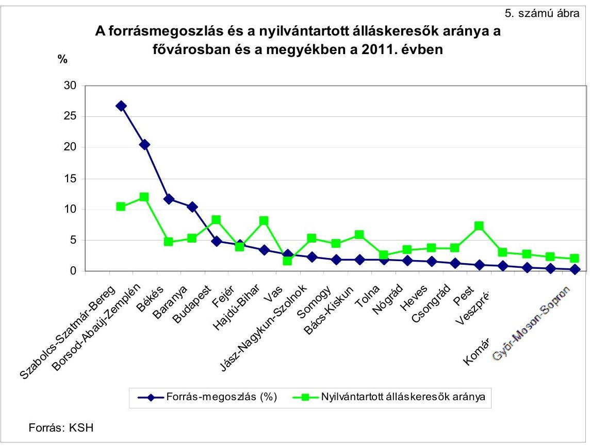

2011-ben 12 megye foglalkoztatási aránya nem érte el az országos átlagot, amelyből kilenc tartozott a forrásokból a legnagyobb arányban részesült területi egységek közé. Ezek együttes súlya az összes felosztott forrásból 76,9\%-ot, 45,1 Mrd Ft-ot tett ki. A foglalkoztatási arány 20 területi egység (Budapest és a 19 megye) közül $12^{40}$ egység esetében volt az országos $49,7 \%$-os átlag alatt.

A közfoglalkoztatásban új formaként a 2011. évtől bevezetett kistérségi startmunka mintaprogramok fő kedvezményezettjei az önkormányzatok, illetve az önkormányzati társulások voltak. A hátrányos helyzetú kistérségekben a start-munka-mintaprogramok keretében a 2011. évben 13 megyében, 28 kistérségben, 493 településen összesen 980 program indult ${ }^{41}$. A startmunkamintaprogramokra felhasznált 3845,8 M Ft támogatás 15042 fő közfoglalkoztatását biztosította. A 2012. évben további 66 - összesen 94 - hátrányos helyzetű térségben tervezték kistérségi startmunka-programok indítását.

A közfoglalkoztatási programok mind nemzetgazdasági szinten, mind helyi szinten hatást gyakoroltak a munkanélküliség, illetve a foglalkoztatottság alakulására, mivel növekvő számban biztosítottak munkaalkalmat a tartósan munkanélküli személyeknek. Azonban a munkanélküliség területi alakulására más gazdasági tényezők és egyéb folyamatok - pl. a nyílt munkaerőpiacon meglévő, újonnan létrejövő munkahelyek száma, szerkezetének összhangja az

[^0]
[^0]:    ${ }^{40}$ Nógrád, Borsod-Abaúj-Zemplén, Szabolcs-Szatmár-Bereg, Somogy, Baranya, Heves, Hajdú-Bihar, Békés, Jász-Nagykun-Szolnok, Tolna, Bács-Kiskun, Csongrád megyék
    ${ }^{41}$ Forrás: Beszámoló a 2011. évi közfoglalkoztatási előirányzat felhasználásáról, Belügyminisztérium (2012. június)

---

álláskeresők végzettségével, a termelés ingadozása, demográfiai tényezők stb. is hatnak, amelyekkel kapcsolatos adatok nem álltak az ellenőrzés rendelkezésére, ezért a közfoglalkoztatásnak a munkanélküliség területi különbségeire gyakorolt befolyását nem értékeltük. A közfoglalkoztatás hatását a munkanélküliség, illetve a foglalkoztatás alakulására, annak területi különbségeire sem nemzetgazdasági szinten, sem önkormányzati szinten nem elemezték.

A Foglalkoztatási Szolgálat a MEV keretében minden évben értékelte a nyilvántartott álláskeresők érintett létszámából a foglalkoztatottá váltak számának alakulását, amelyben megjelent a támogatással foglalkoztatottakká váltak száma is. A mutató azonban a közfoglalkoztatási programokon kívül az egyéb aktív eszközök hatását is tartalmazta, emiatt a közfoglalkoztatásnak a foglalkoztatottság alakulására gyakorolt hatásának mérésére nem alkalmas.

Az ellenőrzött önkormányzatok képviselő-testületei a különböző foglalkoztatási formák előnyeit és hátrányait nem vizsgálták. A közfoglalkoztatási formák közül a munkaügyi kirendeltségekkel folyamatosan egyeztetve, együttmúködve azt alkalmazták, amelyhez minél nagyobb arányú támogatás igénylésére volt lehetőség.

Az ellenőrzésbe bevont településeken a közfoglalkoztatás az önkormányzatok számára előnyökkel járt, 90-95\%-os állami támogatás mellett hozzájárult a kötelező önkormányzati feladatok ellátásához. Az ellenőrzött és az adatszolgáltatásba bevont településeken a 2009-2010. években a közfoglalkoztatottak 75,0\%-át településtisztasági, közterület/középület karbantartási, valamint az ár- és belvíz elvezetési területeken, 10,5\%-át az egészségügyi és szociális, $14,5 \%$-át pedig oktatási és múvelődésügyi területen foglalkoztatták. A 2011. évben ezek aránya a felsorolás sorrendjében $91,5 \%, 3,2 \%$ és $5,3 \%$ volt.

# 2.2. A közfoglalkoztatás hatása az alacsony iskolai végzettségú, tartósan munkanélküli személyek helyzetére 

A 2009-2010. években a foglalkoztatáspolitikai célokhoz kapcsolódóan a közfoglalkoztatás célkitűzéseként jelent meg ${ }^{42}$ a munkavállalási korban lévő, szakképzetlen munkavállalók munkaerőpiacról való kiszorulásának megakadályozása a számukra felajánlható munkalehetőségek számának bővítésével és támogatott képzésekkel. A célkitűzések között 2011 áprilisától ${ }^{43}$ megfogalmazódott, hogy a közfoglalkoztatás növelje az alacsony iskolai végzettségűek foglalkoztatását, járuljon hozzá a hátrányos helyzetű munkavállalók munkavégző képességének megőrzéséhez.

A Foglalkoztatási Hivatal az aktív foglalkoztatáspolitikai eszközök fontosabb létszámadatairól a 2009. és a 2011. években megjelentetett kiadványaiban tájékoztatást adott a közfoglalkoztatásban részt vettek iskolai végzettség szerinti összetételéről, a 2010. évi kiadványában csak a közhasznú munkavégzésben részt vettek adatai szerepeltek.

[^0]
[^0]:    ${ }^{42}$ Magyarország aktualizált konvergencia programja 2008-2011
    ${ }^{43}$ Széll Kálmán terv 1.0

---

Az alacsony iskolai végzettségűek közfoglalkoztatásba történő bevonására irányuló cél teljesülését a Foglalkoztatási Hivatal adatai alapján értékeltük ${ }^{44}$.

Az álláskeresők között az alacsony iskolai végzettséggel rendelkezők aránya a 2009-2011 évek mindegyikében több mint 10\%-kal magasabb volt, mint a 1574 éves korú népesség körében ez az arány. Az a cél, hogy a közfoglalkoztatásba minél nagyobb számban vonjanak be alacsony iskolai végzettségúeket, teljesült. A 2009-2010. években a közhasznú munkavégzésbe bevont legfeljebb 8 általános iskolai végzettséggel rendelkezők aránya 6\%-kal, illetve 3,8\%-kal meghaladta az álláskeresők között a legfeljebb 8 általános iskolai végzettséggel rendelkezők arányát. A 2009. évben a közhasznú foglalkoztatottak 46,1\%-a, a 2010. évben 43,1\%-a volt alacsony iskolai végzettségű. A 2011. évben a mutató tovább emelkedett, a közfoglalkoztatásban résztvevő legfeljebb 8 általános iskolai végzettségűek 56,0\%-os aránya 15,7\%-kal magasabb volt, mint az álláskeresők között az alacsony iskolai végzettségűek 40,3\%-os aránya.
6. számú táblázat

A legfeljebb 8 általános iskolai végzettséggel rendelkezők aránya a 2009-2011. években

| A legfeljebb 8 általános iskolai végzettséggel   rendelkezők aránya | $\mathbf{2 0 0 9 .}$ | $\mathbf{2 0 1 0 .}$ | $\mathbf{2 0 1 1 .}$ |
| :-- | --: | --: | --: |
| - a közhasznú munkába bevontak között | $46,1 \%$ | $43,1 \%$ |  |
| - a közcélú munkába bevontak között | $59,6 \%$ | n.a. |  |
| - a közmunkába bevontak között | $61,7 \%$ | n.a. |  |
| - a 2011. évtől múködtetett közfoglalkoztatási   formákban |  |  | $56,0 \%$ |
| - az álláskeresők között | $40,1 \%$ | $39,3 \%$ | $40,3 \%$ |
| - a 15-74 éves korú népességben | $29,4 \%$ | $28,3 \%$ | $27,5 \%$ |

Forrás: Foglalkoztatási Hivatal, KSH
A 2011. évben az alacsony iskolai végzettségűek közfoglalkoztatásba való minél nagyobb arányú bevonása mellett a célok között megjelent a hátrányos helyzetú munkavállalók munkavégző képességének megőrzése is. A stratégiai dokumentumokban azonban nem határozták meg, hogy a közfoglalkoztatás mely hátrányos helyzetú munkavállalói csoportokra fókuszál. A Közfoglalkoztatási Koncepció a 2012. évtől a romák, a nők és fiatalok, valamint a fogyatékkal élők és megváltozott munkaképességú emberek célcsoportjaival kapcsolatban fogalmazott meg feladatokat. A hátrányos helyzetú munkavállalók munkavégző képessége megőrzésének értékelésére a cél-

[^0]
[^0]:    ${ }^{44}$ A közfoglalkoztatottak iskolai végzettségére vonatkozó adatok a Foglalkoztatási Hivatal „Aktív foglalkoztatáspolitikai eszközök fontosabb létszámadatai" 2009-ben, 2010-ben és 2011-ben, az álláskeresőkre vonatkozó adatok a Foglalkoztatási Hivatal „Munkaerőpiaci helyzetkép a Nemzeti Foglalkoztatási Szolgálat adatai alapján 2011." címú kiadványokból, a 15-74 éves korú népességre vonatkozó adatok a KSH-tól származnak.

---

csoportok pontos meghatározására, az értékeléshez szükséges mutatószámok tartalmának kidolgozását és adatok gyűjtését követően lesz mód.

A közfoglalkoztatás hatását a résztvevők helyzetére minta alapján elemeztük, amelyet a munkaügyi kirendeltségeknek az ellenőrzött önkormányzatokra vonatkozó adatállományából vettünk.

Az ellenőrzött önkormányzatokra vonatkozóan egyszerű, véletlen mintavétellel 30-30 fő, (mindösszesen 390 fő), a 2009-2012. év I. negyedév közötti időszakban legalább egy alkalommal közfoglalkoztatási jogviszonyt létesítő személy került kiválasztásra. Az értékelhető válaszok száma esetenként kevesebb volt, mint a minta elemszáma. Pl. jogszabályi előírás hiányában a nyílt munkaerőpiacon sikeresen elhelyezkedettekről vagy a nyilvántartásból más módon kikerülőkről a munkaügyi kirendeltség nem mindig szerzett értesülést.

A mintában szereplő és választ adó közfoglalkoztatottak 58,6\%-a volt alacsony iskolai végzettségű. Az ellenőrzött időszak éveiben évente legalább 2 hónapot közfoglalkoztatási formában dolgozott 144 fő. A többször is közfoglalkoztatottakat (189 fő) többségében ugyanannál a közfoglalkoztatónál foglalkoztatták.

Összességében a közfoglalkoztatás a társadalmi-gazdasági leszakadás megakadályozásához hozzájárult, mivel a források elosztására a területi munka-erő-piaci helyzet és az álláskeresési adatok figyelembe vételével került sor. Az alacsony iskolai végzettségűek közfoglalkoztatásba történő minél nagyobb arányban történő bevonása biztosította számukra a munkatapasztalat megszerzését, amely hozzájárult a nyílt munkaerőpiacon való elhelyezkedési esélyük növekedéséhez.

# 3. A KÖZFOGLALKOZTATÁs MÜKÖDTETÉSÉNEK FELTÉTELRENDSZERE ÉS INFORMÁCIÓs HÁTTERE, HOZZÁJÁRULÁSA A TÁMOGATÁSI RENDSZER EREDMÉNYESŚÉGÉHEZ 

### 3.1. A minisztériumi és a szakmai irányítás felkészültsége a közfoglalkoztatással kapcsolatos feladatok ellátására

Az ellenőrzött időszakban a közfoglalkoztatással kapcsolatos irányítási feladatok három minisztérium hatáskörébe tartoztak. A Kormány közfoglalkoztatásért felelős tagja 2010. június 30 -áig a szociális és munkaügyi miniszter, 2010. július 1-jétől a nemzetgazdasági miniszter volt, majd 2011. június 17-ei hatállyal a belügyminiszterhez került a közfoglalkoztatással kapcsolatos fel-adat- és hatáskör.

A szociális és munkaügyi miniszter csak a közhasznú munkavégzés támogatását biztosító MPA, illetve a közmunka támogatását elősegítő fejezeti kezelésű előirányzat felett rendelkezett, a legnagyobb arányt kitevő közcélú munka forrásaira nem gyakorolt hatást. Ez jelentősen korlátozta a közfoglalkoztatás egységes kormányzati irányításának lehetőségeit.

A közfoglalkoztatással kapcsolatos feladat- és hatásköröknek a 2011. évi belügyminiszterhez való rendelésével a közfoglalkoztatás már nem csupán a foglalkoztatáspolitika egyik része lett, hanem elkülönült szervezeti felelősséggel

---

felruházott önálló területté vált. A Kormány a közfoglalkoztatás új rendszerének kialakításával összefüggésben a kormányzati feladatok átalakításáról szóló 1192/2011. (VI. 14.) Korm. határozatban elrendelte, hogy a BM-ben közfoglalkoztatásért felelős helyettes államtitkár kerüljön kinevezésre, a munkaügyi központok (munkaügyi kirendeltségek) közfoglalkoztatással kapcsolatos feladatokat ellátó önálló szervezeti egységei szakmai tevékenységét a belügyminiszter irányítsa, továbbá a miniszternek a közfoglalkoztatás helyzetéről rendszeresen, de legalább félévente a Kormányt tájékoztatni kell.

# A közfoglalkoztatási feladatok megvalósításában a belügyminiszternek továbbra is szorosan együtt kellett müködnie a nemzetgazdasági miniszterrel, mint az NFA kezelőjével és a foglalkoztatáspolitika felelősével, valamint a Kormány társadalmi felzárkózásért felelős tagjával, az emberi erőforrások miniszterével, mivel a társadalmi felzárkózási szempontok a közfoglalkoztatásban is hangsúlyosabbá váltak. 

A társadalmi felzárkózás és a közfoglalkoztatás közötti szoros kapcsolódás az EMMI Szervezeti és Müködési Szabályzatáról szóló 4/2013. (I. 31.) EMMI utasításban csak a 2013. évtől jelent meg. E szerint a társadalmi felzárkózásért felelős helyettes államtitkár közreműködik a közfoglalkoztatási koncepció és az ahhoz kapcsolódó programok társadalmi felzárkózási szempontok figyelembevételével történő kialakításában és végrehajtásában.

A miniszterek kialakították a munkaszervezetükön belül a közfoglalkoztatással foglalkozó szervezeti egységeket, a szervezeti egységek feladat- és hatáskörei mind az SZMSZ-ekben ${ }^{45}$, mind az ügyrendekben megjelentek.

A 2009. évtől 2010. május 28 -áig a közfoglalkoztatási feladatok irányítása az SZMM foglalkoztatási és képzési szakállamtitkárához, a feladatok végrehajtása a Foglalkoztatási Főosztályhoz, a Közmunkatanács titkárságához, valamint az Alapkezelő Főosztályhoz tartozott. A 2010. és a 2012. évek között az NGM-ben és később a BM-ben is közel azonos létszámú szervezeti egység foglalkozott a közfoglalkoztatással, a szakmai folytonosság biztosított volt. Mindkét minisztérium az operatív feladatellátás mellett stratégiai szintű döntéselőkészítő tevékenységet is végzett. Az NGM dolgozta ki - a társadalmi felzárkózásért felelős minisztériummal együtt - az egységes közfoglalkoztatást megalapozó közfoglalkoztatási kormányrendeletet, a BM pedig a Közfoglalkoztatási Koncepciót.

Az ellenőrzött időszak alatt a közfoglalkoztatásért felelős minisztériumok irányítási feladataik körében hangsúlyt helyeztek arra, hogy tájékoztatókkal segítsék a közfoglalkoztatókat, illetve eljárásrenddel, útmutatóval a munkaügyi központokat, kirendeltségeket.

A közfoglalkoztatás szervezésében a minisztériumokon kívül egyéb központi költségvetési szervek is részt vettek, ilyen a Foglalkoztatási Szolgálat a szervezetéhez tartozó Foglalkoztatási Hivatallal, a megyei és területi munkaügyi szerve-

[^0]
[^0]:    ${ }^{45}$ a 20/2008. (HÉ 48) SZMM utasítás a Szociális és Munkaügyi Minisztérium, a 4/2010. (X. 5.) NGM utasítás a Nemzetgazdasági Minisztérium és a 7/2010. (IX. 2.) BM utasítás a Belügyminisztérium Szervezeti és Müködési Szabályzatáról

---

zetekkel. Emellett közfoglalkoztatáshoz kapcsolódó egyes pénzügyi, finanszírozási feladatokat ellátott a Kincstár is.

Az ellenőrzött időszakban mind a Foglalkoztatási Szolgálat, mind a megyei és területi munkaügyi szervek megnevezése, illetve szervezeti formái többször változtak, átalakultak. Változott a jogi szabályozás és az intézményi struktúra részben a közigazgatási rendszer változásából, illetve a közfoglalkoztatás súlyának, valamint az aktív munkaerő-piaci eszközök belső struktúrájának változásából fakadóan.

A Foglalkoztatási Szolgálat 2010. december 31-éig a Foglalkoztatási Hivatalból és a regionális munkaügyi központokból és kirendeltségeikből állt, irányítását a szociális és munkaügyi miniszter, 2010. július 1-jétől a nemzetgazdasági miniszter látta el. 2011. január 1-jétől megszűntek a regionális munkaügyi központok, helyettük megyei munkaügyi központok jöttek létre, amelyek a kirendeltségeikkel együtt a kormányhivatalok szakigazgatási szerveiként múködtek. 2012. január 1jével ismét módosult a Foglalkoztatási Szolgálat szervezetrendszere, amely most már a munkaügyi központokon kívül az Országos Munkavédelmi és Munkaügyi Főfelügyelőséggel és a Nemzeti Szakképzési és Felnőttképzési Intézettel egyesült Foglalkoztatási Hivatalból állt.

Az ellenőrzött időszak alatti jelentős szervezeti változások ellenére a közfoglalkoztatással kapcsolatos szakmai feladatok ellátása biztosított volt.

A Foglalkoztatási Hivatal SZMSZ-e szerint a közfoglalkoztatásnak elkülönült szervezeti egysége nem volt, ugyanakkor a közfoglalkoztatással kapcsolatos feladatokat a Foglalkoztatási Hivatal Rehabilitációs és Szociális Igazgatósága követte nyomon a 2009-2010. évek között.

A közfoglalkoztatási feladatok ellátását végző munkaügyi központok és kirendeltségek SZMSZ-eiben, ügyrendjeiben, a dolgozók munkaköri leírásaiban a közfoglalkoztatással kapcsolatos feladatok szerepeltek.

A Foglalkoztatási Hivatal a közfoglalkoztatással kapcsolatos feladatok végrehajtását a főigazgató által kiadott egységes eljárásrendekkel segítette.

Eljárásrendeket adtak ki az „Út a munkához" program feladatainak ellátására, a közhasznú munkavégzés, a rövid és a hosszabb idejű közfoglalkoztatás, valamint az országos közfoglalkoztatási programok támogatásának lebonyolítására. A szakmai ellenőrzésre vonatkozó szabályokat a 2010. évtől a Foglalkoztatási Szolgálat munkaerő-piaci hatósági ellenőrzésről szóló eljárásrendje tartalmazta. Az eljárásrendeket évente felülvizsgálták.

Az eljárásrendek egységesen tartalmazták a pályázat, kérelem benyújtására, kötelező tartalmi elemeire és elbírálására, az ügyintézési határidőre, a munkaerő közvetítésére, a hatósági szerződés módosítására, megszűntetésére, megszűnésére, a jogorvoslati eljárásokra és analitikus nyilvántartásokra vonatkozó szabályokat. A közfoglalkoztatást szabályozó új eljárásrendek kiadásának folyamata a 2012. év végére fejeződött be.

---

A szervezeti keretek kialakítása és a közreműködő szervezeteknek a programok végrehajtására történő felkészültsége hozzájárult a közfoglalkoztatás támogatási rendszerének eredményességéhez. A közfoglalkoztatási feladatokat ellátó minisztériumok, szakmai szervezetek a múködéshez szükséges szervezeti kereteiket kialakították, a feladat eredményes végrehajtását eljárásrendekkel, útmutatókkal segítették.

# 3.2. Az önkormányzatok és más közfoglalkoztatók felkészültsége a közfoglalkoztatással kapcsolatos feladatok ellátására 

Az ellenőrzött önkormányzatok a közfoglalkoztatással kapcsolatos feladatokat a helyi igényekhez és lehetőségekhez alkalmazkodva többféleképpen - a polgármesteri hivatalok keretében köztisztviselők bevonásával, vagy intézményeik, gazdasági társaságaik, egyesületek, kistérségi társulások, illetve egyéb költségvetési szervek közreműködésével - látták el ${ }^{46}$.

Az ellenőrzött önkormányzatok közül a közfoglalkoztatás szervezését öt önkormányzat (Nagykálló, Bakonytamási, Berettyóújfalu, Celldömölk, Hajdúböszörmény Önkormányzata) a polgármesteri hivatallal, illetve önkormányzati intézményekkel biztosította. További öt önkormányzatnál a polgármesteri hivatal, illetve önkormányzati intézmény mellett gazdasági társaság, egyesület, kistérségi társulás, egyéb költségvetési szerv közreműködésével (Tarpa, Szigetvár, Kocsord, Szécsény, Hatvan Önkormányzata), kettő önkormányzat (a Fővárosi Önkormányzat és Nyíregyháza Önkormányzata) 100,0\%-os tulajdonú gazdasági társasága megbízásával látta el a feladatokat. A polgármesteri hivatalokban a közfoglalkoztatási feladatok megszervezésére és lebonyolítására önálló szervezeti egységet nem hoztak létre. Az adatszolgáltató önkormányzatok kérdőíves felmérése alapján a közfoglalkoztatást 37 önkormányzat ( $76 \%$ ) saját hivatali szervezettel, kilenc önkormányzati társulás bevonásával ( $16 \%$ ), egy saját hivatali szervezettel és közfoglalkoztatás megszervezésére megbízott szervezettel, további kettő közfoglalkoztatás megszervezésére megbízott egyéb szervezettel bonyolította le.

Az ellenőrzött önkormányzatok és gazdasági társaságaik közül három - Nyíregyháza Önkormányzata és gazdasági társasága, a Fővárosi Önkormányzat és gazdasági társasága, valamint Hajdúböszörmény Önkormányzata - készült fel eredményesen a közfoglalkoztatási programok végrehajtására, mivel a feladatok ellátását biztosító szervezeti kereteket kialakították, az SZMSZ-ekben a szervezeti kereteket, feladat- és hatásköröket meghatározták, az érintett dolgozók munkaköri leírásaiban a feladatok szerepeltek.

A Nyíregyháza Önkormányzata megbízásából közfoglalkoztatási feladatot ellátó NYÍRVV Kft.-nél a feladatokat a „Közfoglalkoztatási csoport" végezte. A Fővárosi Önkormányzat a közfoglalkoztatással összefüggő feladatellátás érdekében a szervezeti kereteket a Hivatalon belül és a feladatellátással megbízott Esély gazdasági társaságánál is kialakította. Hajdúböszörményben a feladatellátást a Városüzemeltetési Intézmény szervezte. A polgármesteri hivatalban a közfoglalkoztatási feladatok felelőseként a Humán és Igazgatási Osztályt jelölték ki.

[^0]
[^0]:    ${ }^{46}$ Az Ötv. 8. § (1) bekezdés szerint a települési önkormányzat feladata a helyi közszolgáltatások körében a közreműködés a foglalkoztatás megoldásában.

---

Az ellenőrzött önkormányzatok közül kilenc esetében (Kocsord, Nagykálló, Bakonytamási, Celldömölk, Hatvan, Berettyóújfalu, Szigetvár, Tarpa és Szécsény Önkormányzata), valamint a „Fütött utca" programot lebonyolító BFKV Zrt.-nél szabályozási hiányosságok nehezítették az eredményes végrehajtásra való felkészülést. A szervezeti keretek szabályozása, valamint a feladat-és hatáskörök meghatározása hiányos volt. A szervezeti, személyi, szabályozási hiányosságok a közfoglalkoztatási feladatok megvalósítását azonban nem akadályozták.

Kocsord, Nagykálló, Bakonytamási és Celldömölk Önkormányzata polgármesteri hivatalainak alapító okirata - a régi Áht 90 . § (1) bekezdés d) pontjában ${ }^{47}$ foglaltakkal szemben - annak ellenére nem tartalmazta az önkormányzati tevékenységek között a közfoglalkoztatás feladatát, hogy a hivatal részt vett a közfoglalkoztatás szervezésében. Szigetvár, Tarpa és Berettyóújfalu Önkormányzata polgármesteri hivatalainak alapító okiratai a közfoglalkoztatás korábbi formáit tartalmazták, azonban azokat - a 2011. január 1jétől belépő új közfoglalkoztatási formák ellenére - nem aktualizálták.

A közfoglalkoztatási feladatokat részben vagy egészben a polgármesteri hivatal bevonásával végző tíz önkormányzat közül hét (Nagykálló, Bakonytamási, Celldömölk, Tarpa, Kocsord, Szécsény, Hatvan) - az Ámr. 20. § (2) bekezdés e) pontjában ${ }^{48}$ foglaltak ellenére - az SZMSZ-ben nem nevesítette a közfoglalkoztatásra vonatkozó feladatát és múködési folyamatát. Nagykálló Önkormányzata a közfoglalkoztatás lebonyolításáról külön szabályzatot fogadott el minden évben.

A közfoglalkoztatási feladatokat a polgármesteri hivatal bevonásával végző 10 önkormányzat közül Bakonytamási Önkormányzatánál az ezzel kapcsolatos feladatokat az azt ellátó személy munkaköri leírásában nem határozták meg. Ezért - a Ktv. 1. § (8) bekezdés a) pontjában foglaltakra tekintettel ${ }^{49}$ a közfoglalkoztatással kapcsolatos feladataiban felelősségi és hatásköre nem volt szabályozott.

A BFKV Zrt. a „Fütött utca" program közfoglalkoztatási feladatainak ellátásáról belső szabályzataiban, munkaköri leírásaiban 2012. év decemberéig nem rendelkezett.

A „Fütött utca" program első ütem végrehajtása 2011. november 1-jétől 2012. január 31-éig, a második ütem 2012. február 1-jétől 2012. július 31-éig történt. A vezérigazgató a BFVK Zrt. SZMSZ-ének 2012. december 20-án végrehajtott módosítása után írt elő közfoglalkoztatással kapcsolatos feladatot.

Az ellenőrzött önkormányzatok és gazdasági társaságok a közfoglalkoztatásra vonatkozó hatósági szerződéseket a munkaügyi központokkal, kirendeltségek-

[^0]
[^0]:    ${ }^{47}$ 2012. január 1-jétől az új Áht. 5. § (1) bekezdés c) pontja írja elő, hogy a költségvetési szerv alapító okiratának tartalmaznia kell közfeladatát és alaptevékenységét az államháztartás szakfeladatrendje szerinti bontásban.
    ${ }^{48}$ 2012. január 1-jétől az Ávr. 13. § c) pontja írja elő.
    ${ }^{49}$ 2012. március 1-jétől a Kttv. 75. § (1) bekezdés d) pontja írja elő.

---

kel kötötték meg. A közfoglalkoztatás során a közfoglalkoztatottakkal munkaszerződést, majd közfoglalkoztatási szerződést kötöttek. Jelenléti íveket, illetve segédmunkát végzők esetében munkanaplót folyamatosan vezettek.

Valamennyi közfoglalkoztatási formánál a dokumentumok vezetésében gyakori hiba volt, hogy a munkában eltöltött idő dokumentálása - jelenléti ív, munkanapló vezetés - hiányos, illetve nem megfelelő tartalmú volt. A munkanapló tartalmi követelményeit jogszabályi rendelkezés nem határozta meg, de az elszámoltathatóság követelményének érvényesülése érdekében a munkában eltöltött időnek, az elvégzett munkának és a munkát végzőknek utólag is ellenőrizhetőknek és beazonosíthatónak kell lennie.

# 3.3. Az információs és monitoring rendszer hozzájárulása a közfoglalkoztatás múködéséhez 

A 2009-2011. években a közfoglalkoztatás egységes, az operatív tevékenységek keretében megvalósuló folyamatos és eseti nyomon követésből álló, a tevékenységek, a célok megvalósításának nyomon követését biztosító monitoring rendszerét sem nemzetgazdasági, sem helyi szinten nem alakították ki. Az ellenőrzési időszakban nem határozták meg a közfoglalkoztatással kapcsolatos objektív elemzésekhez, értékelésekhez szükséges, a közfoglalkoztatás teljesítményének mérésére alkalmas kritériumokat és mérőszámokat sem.

Egyes programok, így a közmunka programok esetében a 2009-2010. évekre vonatkozóan a monitorozás megvalósult.

Az SZMM és az NGM a közmunka programok monitorozását közbeszerzési eljárással kiválasztott szervezetekkel végeztette. A 2011. évben a támogatási szerződések végrehajtását a Moneta Könyvvizsgáló és Adótanácsadó Kft., a technikaiszakmai lebonyolítást a Conto'82 Könyvelési és Szolgáltató Kft. ellenőrizte valamennyi közmunka program helyszínén.

Az ÁSZ már a 2007. évben javasolta a szociális és munkaügyi miniszternek „A közmunka programok támogatására fordított pénzeszközök hasznosulásának ellenőrzéséről" szóló 0732 számú jelentésében, hogy „kezdeményezze a közmunkaprogramok pályázati rendszerének átalakítását, a továbbfejlesztés során az értékelhető és összehasonlításra alkalmas teljesítménykövetelmények (normák) kialakítását, a foglalkoztatottak képzését, elhelyezkedési esélyeit fokozottan támogató programok megvalósítását és a tényleges kistérségi szerepvállalás ösztönzését helyezzék a középpontba." A javaslat megvalósult.

A 2008. évtől kialakított pályázati kiírások tartalmazták a munkaidőtervet, munkatervet, a költségekkel való elszámolás megtervezését és a pályázati elbírálási szempontokat is, illetve amennyiben kistérséget érintett a pályázat, a kistérségi társulással kötött együttmúködési megállapodást is. A közmunka programok támogatási rendjéről szóló kormányrendelet 2007. február 18-ától hatályos módosítása szerint a közmunka program keretében a képzési költségekre támogatás nyújtható. Ezzel elősegítették a foglalkoztatottak képzését támogató programok megvalósításának lehetőségét.

A szociális és munkaügyi miniszternek szóló másik javaslat, mely szerint "tegye egységessé a közmunka programok pénzügyi lebonyolításában és monitorozásában

---

résztvevő szervezetek közremüködését, gondoskodjon azok tevékenységének és adatszolgáltatásának rendszeres felügyeletéről és ellenőrzéséről", részben teljesült. A monitorozást közbeszerzési eljárással kiválasztott, a támogatótól független ellenőrző szervezet végezte, a közmunka programok pénzügyi nyilvántartását a 2008. évtől kialakították, azonban a pénzügyi lebonyolításában és monitorozásában résztvevő szervezetek tevékenységének és adatszolgáltatásának rendszeres felügyelete és ellenőrzése nem valósult meg. A 2012. évben a 2011. évtől induló új közfoglalkoztatási formák esetében a BM megkezdte az adatszolgáltató szervezetek rendszeres ellenőrzésének kialakítását. Emiatt a korábbi javaslatunkat nem ismételjük meg.

A Közfoglalkoztatási Koncepcióban már megfogalmazódott a Kormány részéről a közfoglalkoztatási formák monitorozásának igénye. Erre tekintettel a BM-ben a 2012. évben elkezdődött a monitoring egyes elemeinek kiépítése, de ezeket a helyszíni ellenőrzés lezárásáig egységes rendszerbe nem foglalták.

A BM Közfoglalkoztatási Helyettes Államtitkárság a munkaügyi központok közfoglalkoztatásért felelős vezetőitől 2012-ben a közfoglalkoztatás nyomon követése érdekében különböző gyakoriságú adatszolgáltatásokat kért. Ezek pl. a 2012. évi közfoglalkoztatási támogatások létszám- és pénzügyi adataira, a ki- és belépők létszámadataira, a nagy értékű tárgyi eszközök beszerzésére, a közfoglalkoztatási jogviszonyt szüneteltetők létszámára, a közfoglalkoztatási ellenőrzési tervek teljesülésére irányuló heti, havi rendszerességű adatszolgáltatások voltak. A közfoglalkoztatás 2012. év I. félévi eredményeiről a Kormánynak szóló jelentéshez a munkaügyi központoknak megadott szempontok szerint részjelentést kellett készíteniük 2012. augusztus 10-éig a BM felé. Emellett a munkaügyi központok a Vezetői Információs Rendszerből az NGM-nek havi rendszerességgel a közfoglalkoztatás egyes típusainak pénzügyi információról adatot szolgáltatnak.

A BM-ben a helyszíni ellenőrzés befejezésekor még zajlott az ÁROP-1.1.19-2012-2012-0007 „Hatásvizsgálatok és stratégiák elkészitése a Belügyminisztériumban" című könnyített elbírálású projekt, amelynek keretében 2013-ban elkészül a közfoglalkoztatás monitoring rendszerének kidolgozásáról szóló szakpolitikai program.

A program célja szerint a közfoglalkoztatás eredmény- és hatásvizsgálatához olyan monitoring rendszert kell kidolgozni, amely támogatja a közfoglalkoztatás eszközrendszerének elemzését és ellenőrzését, segíti a közfoglalkoztatás helyzetének bemutatását, és amely alkalmazásával nyomon követhetővé válik a közfoglalkoztatásba bevont egyén közfoglalkoztatást követő életútja (munka-erő-piaci helyzete), valamint a közfoglalkoztatásban beszerzett kis és nagy értékű tárgyi eszközök hasznosulása.

A közfoglalkoztatás múködtetéséhez, a döntéshozatalhoz és a monitoringhoz szükséges információkat a Foglalkoztatási Szolgálat saját informatikaiinformációs rendszere, az IR biztosította. A folyamatosan változó információs igényekhez az IR az elmúlt időszakban nem minden esetben tudott rugalmasan alkalmazkodni. Ezért a BM a munkaügyi központok, kirendeltségek analitikus nyilvántartásából kért be adatokat. A BM és a Foglalkoztatási Hivatal jelenleg az IR továbbfejlesztésén dolgozik.

---

A 2009. évtől a 2011. év I. félévéig a közfoglalkoztatás helyzetéről nem készült beszámoló a Kormány felé. A beszámoló készítése a 2011. év közepétől - a feladat BM-hez történő átkerülésével - vált rendszeressé. Ettől az időponttól az 1192/2011. (VI. 14.) Korm. határozat előírta, hogy a közfoglalkoztatás helyzetéről félévente be kell a Kormány számára számolni. Az eddig elkészült beszámolók eltérő szerkezetűek és adattartalmúak voltak, nem tartalmazták a terv és tényadatok összevetését, ezért nem biztosították az adatok összehasonlíthatóságát ${ }^{50}$. Ebben az egységes monitoring rendszer kialakításának, a közfoglalkoztatás teljesítményének mérésére alkalmas kritériumok és mutatószámok meghatározásának hiánya is közrejátszott.

A szakfeladatokra vonatkozó központi előírások ellenére a 2010-2011. években nem valósult meg az ellenőrzött önkormányzatok közfoglalkoztatáshoz kapcsolódó kiadásai és bevételei elszámolásának egységes és átlátható rendszere.

Az ÁSZ a 2007. évben a „A közmunka programok támogatására fordított pénzeszközök hasznosulásának ellenőrzéséről" szóló 0732 számú jelentésében javaslatot fogalmazott meg a szociális és munkaügyi miniszternek, hogy kezdeményezze a közfoglalkoztatások országos jellemzőinek figyelemmel kísérhetősége érdekében az egyes foglalkoztatási formáknak az államháztartás alrendszerén belül erre önállóan kijelölt szakfeladaton való elszámolásának lehetőségét. A javaslat késve, a 2010. évtől hasznosult, amikor a közfoglalkoztatás egyes formáihoz kapcsolódóan önálló szakfeladatokat alakítottak ki.

A 2009-2010. években a szakfeladat számokat a költségvetés tervezéséhez a PM által kiadott tájékoztató melléklete, 2011-ben a 8/2010. NGM tájékoztató tartalmazta. A 2010. évben a 890441 Közcélú foglalkoztatás, 890442 Közhasznú foglalkoztatás, 890443 Közmunka szakfeladatokat, 2011-től a 890441 Rövid időtartamú közfoglalkoztatás, a 890442 Bérpótló juttatásra jogosultak hosszabb időtartamú foglalkoztatása, valamint a 890443 Egyéb közfoglalkoztatás szakfeladatokat kellett az önkormányzatoknak alkalmazni. A 2012. évtől az alkalmazandó szakfeladatokat a szakfeladatrendről és az államháztartási szakágazat rendről szóló 56/2011. (XII. 31.) NGM rendelet írja elő.

Az ellenőrzött önkormányzatok közül 7 önkormányzatnál (Berettyóújfalu, Szécsény, Szigetvár, Hatvan, Celldömölk, Bakonytamási és Tarpa Önkormányzata) a közfoglalkoztatáshoz kapcsolódó kiadások és bevételek elkülönült szakfeladaton való elszámolása nem volt teljes körü. Nyíregyháza Önkormányzatánál és a Fővárosi Önkormányzatnál a közfoglalkoztatási feladatokat gazdasági társaságok (a NYÍRVV Kft. és az Esély Kft.) látták el, a közfoglalkoztatással kapcsolatos kiadásokat az önkormányzatok államháztartáson kívülre történő működési célú végleges pénzeszközátadásként tervezték meg, illetve számolták el. Ezekben az esetekben a közfoglalkoztatással kapcsolatos bevételeket és kiadásokat az önkormányzatok, illetve a gazdasági társaságok analitikus nyilvántartásai tartalmazták. Nyíregyháza Önkormányzata

[^0]
[^0]:    ${ }^{50}$ BM/11491-1/2012. és KIM/2181/2012. számú Jelentés a Kormány részére a közfoglalkoztatás helyzetéről (2012. szeptember), BM/16589/2012. számú Előterjesztés a Kormány részére a közfoglalkoztatás 2012. II. félévi helyzetéről és a 2013. évi közfoglalkoztatás tervezéséről és ezzel összefüggésben egyes kormánydöntésekről (2013. január)

---

nem különítette el a közfoglalkoztatási célokat szolgáló, illetve egyéb pályázatokhoz kapcsolódó támogatási összegeket, ezeket együttesen közfoglalkoztatáshoz kapcsolódó kiadásként számolták el. Kocsord Önkormányzata a külön szakfeladaton történő nyilvántartásra vonatkozó kötelezettségének nem tett eleget. Az Önkormányzat nem rendelkezett olyan analitikus nyilvántartással, amelyből a közfoglalkoztatáshoz kapcsolódó bevételek és kiadások egyértelműen megállapíthatóak lettek volna. Az adatok manuális kigyűjtésére az ÁSZ helyszíni ellenőrzése kapcsán került sor.

A közfoglalkoztatottakról, a közfoglalkoztatókról és az aktív korúak pénzbeli ellátására jogosultakról a Foglalkoztatási Szolgálat az Flt. rendelkezése szerint ${ }^{51}$ elektronikus nyilvántartást, adatbázist vezetett a jogosultságok megállapítása, a közfoglalkoztatási feladatok megszervezése, és eredményes ellátása érdekében. Az adatbázist - a Szociális Adatbázist, majd a Közfoglalkoztatási Adatbázist - a Foglalkoztatási Hivatal kezelte, üzemeltette.

A Szociális Adatbázist a Foglalkoztatási Hivatal 2012. április 30 -áig múködtette. A Közfoglalkoztatási Adatbázist 2011. szeptember 1-jétől kell vezetni. A korábbi Szociális Adatbázis adatai archiválva a Közfoglalkoztatási Adatbázisban megtalálhatóak.

A Szociális Adatbázis célja a közös ügyfélkört érintő adatok elektronikus továbbítása a munkaügyi kirendeltség és az önkormányzatok között, a határozatok, értesítések papír alapon történő továbbításának kiváltása és az elektronikus ügyintézés követelményeinek való megfelelés volt. A Közfoglalkoztatási Adatbázis célja olyan közös felület biztosítása volt, amelynek segítségével a foglalkoztatást helyettesítő támogatásban részesülő, álláskeresőként nyilvántartott személyek, közfoglalkoztatók és közfoglalkoztatottak adatait a közfoglalkoztatásban való részvételük, a feltételek biztosítása, a közfoglalkoztatás megszervezése és a feladatok eredményes ellátása érdekében rögzíteni és lekérdezni lehet.

Az ÁSZ már a 2008. évben javaslatot ${ }^{52}$ tett a Kormánynak arra vonatkozóan, hogy kezdeményezze a munkaügyi nyilvántartási adatok szélesebb körű felhasználását, a munkaerő-piaci szervezet hozzáférését a nyilvántartás adataihoz, az ellátások és támogatások megítélése, ellenőrzése és nyomon követése érdekében. Az Flt. 57/B. §-a 2009. január 1-jétől tartalmazta a Szociális Adatbázisra vonatkozó szabályozást, azonban az még szűkebb körre terjedt ki, mint a munkaügyi nyilvántartás, mert a munkaviszonyban állók teljes köre helyett csak a Szoctv.-ben meghatározott aktív korúak ellátására jogosultakról tartalmazott adatokat. Az Flt. 57/B-C. §-ának 2011. július 27-étől hatályos, a Közfoglalkoztatási Adatbázisra vonatkozó módosítása kiterjesztette a hozzáférési jogosultságot. Ennek következtében a javaslat hasznosult.

A Közfoglalkoztatási Adatbázissal kapcsolatban a jogszabályok a különböző szervezeteknek különböző feladatokat és jogosultságokat állapítottak meg. Így az adatbázisba betekintési jogosultsága volt a BM-nek, a Kincstárnak, a Türr István Intézetnek és a Foglalkoztatási Hivatalnak. Betekintési jogosultsága és

[^0]
[^0]:    ${ }^{51}$ Az Flt. 57/B. § (1) bekezdése szerint.
    ${ }^{52} 0750$ számú jelentés „A Munkaerőpiaci Alap múködésének ellenőrzéséről" (2008. január)

---

adatrögzítési kötelezettsége volt az önkormányzatoknak és a munkaügyi kirendeltségeknek.

A jegyző a Szoctv. 19. § (3) bekezdése értelmében az aktív korúak ellátására jogosult személyazonosító adatairól, a szociális ellátás megállapítására, megváltoztatására és megszüntetésére vonatkozó döntésről, továbbá a RÁT/BPJ/FHT-ra jogosult személyek iskolai végzettségéről, szakképzettségéről rögzít adatot. A munkaügyi kirendeltségeknek az Flt. 57/A. § (1)-(2) bekezdései értelmében biztosítani kell a közfoglalkoztatással kapcsolatos, a közfoglalkoztatott személyi, iskolai végzettségére vonatkozó adatokat, a közfoglalkoztatás jellegét, a bér összegét, a közfoglalkoztató megnevezését stb.

A munkaügyi kirendeltségek a Foglalkoztatási Szolgálat saját adatbázisán az IR rendszeren keresztül rögzítették a közfoglalkoztatásra vonatkozó adatokat a Szociális, majd a Közfoglalkoztatási Adatbázisba. Az IR rendszerben azonban a 2011. évig lehetőség volt az utólagos adatrögzítésre, amely kockázatot jelentett az adott időpontra vonatkozóan az adatok megbízhatósága tekintetében.

Az ellenőrzött önkormányzatok esetében a helyszíni ellenőrzés tapasztalata azt mutatta, hogy ugyan az önkormányzatok mindegyike rögzített adatokat mind a Szociális, mind a Közfoglalkoztatási Adatbázisban, ugyanakkor a felénél (Berettyóújfalu, Bakonytamási, Celldömölk, Szigetvár, Szécsény és Kocsord) a nyilvántartás nem volt naprakész. Átlagosan 1-3 hónap késéssel kerültek rögzítésre az adatok, emiatt az adott időpontra történő lekérdezések ezen önkormányzatok esetében nem voltak megbízhatóak. A jogszabályokban az adatok rögzítésének határidejét nem írták elő, azonban a Közfoglalkoztatási Adatbázisról szóló kormányrendelet szerint üzemzavar esetében az elhárítást követő két munkanapon belül az adatok rögzítése kötelező. A naprakész rögzítés elmaradása az adatbázis adatainak megbízhatóságát, ezáltal használhatóságát is megkérdőjelezi.

Az ellenőrzött önkormányzatoktól kapott tájékoztatás szerint azért nem vezették naprakészen a Közfoglalkoztatási Adatbázist, mert saját nyilvántartási rendszerük volt, amelyben az ellátottakra - a szociális ellátásra való jogosultság megállapítására, az ellátás biztosítására, fenntartására és megszüntetése vonatkozó adatokat rögzítették, és amelyből a határozatokhoz szükséges adatokat is kinyerték. Az önkormányzatok saját nyilvántartási rendszere szintén tartalmaz átfedéseket a Közfoglalkoztatási Adatbázissal, azonban annál lényegesen komplexebben, szélesebb körben volt alkalmazható számukra.

Az Önkormányzatok a Közfoglalkoztatási Adatbázisban rögzítendő adatokon túl ebben a rendszerben állították elő az ellátásokat megállapító határozatokat, pénzügyi feladásokat, a rendszerben vezették az ellátások személyenkénti pénzügyi nyilvántartását, az ellátottak családjára vonatkozó információkat, valamint ezt használták az ellátások összegének kiszámításához. Ennek az adatbázisnak az adatait használták az adatszolgáltatáshoz, a költségvetés tervezéséhez, beszámolók, statisztikák készítéséhez. Ezen kívül a közfoglalkoztatás helyi szintű tervezéséhez, szervezéséhez szükség szerint készültek lekérdezések a közfoglalkoztatásba bevonható ellátásban részesülőkről.

Már a Szociális Adatbázis bevezetésekor ismert volt, hogy az önkormányzatok eltérő szociális ügyviteli programokkal rendelkeznek, és ahhoz, hogy azokból adatokat tudjanak interfész kapcsolattal átemelni, informatikai fejlesztésre

---

lenne szükség. Ez az informatikai fejlesztés nem valósult meg. Jelenleg az önkormányzatok a Közfoglalkoztatási Adatbázisba történő adatrögzítést a saját nyilvántartási rendszerük vezetése mellett végzik. Mivel a számukra szükséges adatokat saját szociális rendszerükből nyerik, és sem a Szociális adatbázisról, sem a Közfoglalkoztatási Adatbázisról szóló kormányrendeletek nem tartalmaztak szankciókat az adatrögzítés elmaradására, az önkormányzatok nem érdekeltek a naprakész adatszolgáltatás biztosításában. A Foglalkoztatási Hivatal adatai szerint a 2010. évben 130, a 2011. évben 89, a 2012. évben 389 önkormányzat nem használta az adatbázist.

A Közfoglalkoztatási Adatbázis a rendszerbe történő folyamatos adatrögzítés mellett sem alkalmas arra, hogy teljes körű és megbízható információt nyújtson az önkormányzatnak az aktív korúak ellátására való jogosultság megszűnése esetén, mivel annak a munkaügyi kirendeltségek általi rendszerben történő rögzítése az ügyfelek számára előírt bejelentési kötelezettség betartásán múlik. Ez a probléma a közfoglalkoztatási feladatok ellátását nem befolyásolja, az önkormányzatoknál az aktív korúak ellátásának megállapítására gyakorol hatást.

Az adatrögzítés késedelme, illetve elmaradása kockázatot jelent az adatbázis adatainak megbízhatósága szempontjából.

A belügyminiszter 2013 januárjában körlevélben ${ }^{53}$ hívta fel a kormánymegbízottak figyelmét arra, hogy az önkormányzatok jegyzői felé intézkedjenek a Közfoglalkoztatási Adatbázisban történő adatrögzítés érdekében.

A közfoglalkoztatottak létszámára vonatkozóan a BM a munkaügyi központoktól, kirendeltségektől rendszeresen, közvetlenül kért be adatokat, melyekből saját analitikus nyilvántartást alakított ki. Ugyanerre vonatkozóan a Foglalkoztatási Hivatal is gyűjtött adatokat, amelyek a munkaügyi központok, kirendeltségek IR rendszerben ${ }^{54}$ történő adatrögzítésén alapultak. Annak ellenére, hogy az adatok szolgáltatói mindkét esetben a munkaügyi központok, kirendeltségek voltak, a minisztériumok összesített adatszolgáltatása az érintett létszámra vonatkozóan eltért a Foglalkoztatási Hivatal által ugyanarra az időszakra, azonos közfoglalkoztatási formákra vonatkozó létszám adatoktól. A szervezetek az adatok egyezőségét nem vizsgálták.

A Foglalkoztatási Hivatal tájékoztatása szerint a közfoglalkoztatottak létszámát nem közfoglalkoztatásba kerüléskor, hanem az adatok IR rendszerbe történő rögzítésekor vették figyelembe, ahol előfordultak késedelmes adatrögzítések. Az adatok a késedelmes adatrögzítések miatt azonos időszakra vonatkozóan is változhattak, módosulhattak. A 2011. évben történt módosítással a létszámadatok visszamenőleges rögzítésének lehetőségét megszüntették. Azonban ez nem küszöböli ki a késedelmes adatrögzítés hatását.

[^0]
[^0]:    ${ }^{53}$ XXII-2/100/2(2013) számú körlevél
    ${ }^{54}$ a Foglalkoztatási Hivatal saját fejlesztésű, a munkaügyi központok és kirendeltségek által használt integrált rendszere

---

A közfoglalkoztatásban részt vevők érintett létszámának alakulása a 2009-2011. években

| Év | Közfoglalkoztatási forma | Közfoglalkoztatásban részt vevők érintett létszáma |  |
| :--: | :--: | :--: | :--: |
|  |  | Minisztériumi adatszolgáltatás szerint (fő) | Foglalkoztatási Hivatal adatai szerint (fő) |
|  | Közhasznú | 21446 | 21446 |
|  | Közzélú | 103247 | 103247 |
|  | Közmunka | 15178 | 15596 |
|  | 2009. összesen | 139871 | 140289 |
|  | Közhasznú | 16872 | 16872 |
|  | Közzélú | 137880 | 137880 |
|  | Közmunka | 27639 | 31528 |
|  | 2010. összesen | 182391 | 186280 |
|  | Rövid idejű | 182150 | 172367 |
|  | Hosszabb idejű | 32533 | 28851 |
|  | Egyéb programok | 64599 | 42196 |
|  | 2010. évről áthúzódó és egyéb kifizetések | 8389 |  |
|  | 2011. összesen | 287671 | 243414 |

Forrás: NGM, BM, Foglalkoztatási Hivatal datszolgáltatása
A Foglalkoztatási Szolgálat és a minisztériumok mellett a közfoglalkoztatottakra vonatkozóan a KSH is gyűjt adatokat. A különböző forrásból gyűjtött, de azonos időszakra és tartalomra vonatkozó adatok eltértek, amely nehezítette a közfoglalkoztatással kapcsolatos elemzések, értékelések elvégzését.

Az ellenőrzési időszakban a közfoglalkoztatás információs rendszere a nyilvántartások és adatszolgáltatások folyamatossága, naprakészsége és megbízhatósága szempontjából nem volt eredményes, mivel nem biztosította a rendszeres beszámolást és visszacsatolást a döntéshozók felé.

Az ellenőrzött önkormányzatok a közfoglalkoztatással kapcsolatos, a közfoglalkoztatás eredményességének, hatékonyságának mérésére alkalmas saját monitoring rendszerüket nem alakították ki. Hajdúböszörmény, Nyíregyháza Önkormányzata és a Fővárosi Önkormányzat ${ }^{55}$ kivételével átfogóan a közfoglalkoztatás keretében végzett különböző munkák hasznosságát, a különböző közfoglalkoztatási formák előnyeit, hátrányait, a közfoglalkoztatás megvalósítását gátló tényezőket, a közfoglalkoztatástól elvárt célok teljesülését, a közfoglalkoztatásba bevonni tervezett és a ténylegesen foglalkoztatottak létszámának eltérését, annak okait valamint a közfoglalkoztatási programok hatását a helyi foglalkoztatási helyzetre nem vizsgálták. Nem értékelték az aktív korúak ellátására, illetve a közfoglalkoztatásra fordított összegek alakulását. A közfoglalkoztatási formák közül azt alkalmazták, amelyhez nem

[^0]
[^0]:    ${ }^{55}$ Nyíregyháza Önkormányzata és a Fővárosi Önkormányzat esetében a feladatot ellátó gazdasági társaságok beszámolói tartalmazták.

---

kellett nagyobb saját forrást rendelni, illetve amelyhez lehetőség volt a nagyobb támogatás igénybevételére. A közfoglalkoztatás várt és tényleges hatását, értékteremtő jellegét az ellenőrzött időszakban Hajdúböszörmény Önkormányzata vizsgálta.

Az ellenőrzött önkormányzatok közül négynél (Tarpa, Bakonytamási, Celldömölk és Berettyóújfalu Önkormányzata) az ellenőrzött időszakban nem történt beszámolás a közfoglalkoztatással kapcsolatban.

Hat ellenőrzött önkormányzatnál a közfoglalkoztatás keretében végzett munkák értékelése részben az adott programokhoz kapcsolódó záró beszámolók keretében, részben a feladatot ellátó gazdasági társaságok beszámolóiban, részben a közfoglalkoztatás helyzetéről, értékeléséről szóló előterjesztésekben valósult meg.

Hajdúböszörmény és Szigetvár Önkormányzatánál a startmunka mintaprogramokról, Hatvan Önkormányzatánál az országos programokról záró beszámolót készítettek a munkaügyi kirendeltség felé. A közfoglalkoztatással kapcsolatos beszámolás a Fővárosi Önkormányzat esetében az Esély gazdasági társaságnál, valamint a BFVK Zrt. üzleti tervében, Nyíregyháza Önkormányzata esetében a NYÍRVV Kft-nél éves beszámolóiban és üzleti tervének elfogadása során jelent meg. Nagykállóban az egyes megvalósult közfoglalkoztatási programok előnyeit és hátrányait értékelték. Hatvanban a közfoglalkoztatási tervekben értékelték a rendszeres szociális segélyezettek és az aktív korúak ellátására jogosultak várható jövőbeni helyzetét, és meghatározták a közfoglalkoztatás keretében ellátandó feladatok körét és létszámigényét. A BFVK Zrt. Igazgatósága tárgyalta a „Fütött utca" program első ütemének végrehajtása során szerzett tapasztalatokat.

A közfoglalkoztatás szakmai, felügyeleti ellenőrzése a 2009-2011. években nemzetgazdasági szinten kizárólag a támogatások pénzügyi elszámolásának kiutalás előtti, folyamatba épített ellenőrzésére terjedt ki. Az SZMM 2009-2010. évekre érvényes ellenőrzési tervei nem tartalmazták a közfoglalkoztatás ellenőrzését, ilyen tárgyú soron kívüli ellenőrzés sem volt.

A folyamatba épített ellenőrzés a 2009-2010. években a közcélú munka esetében a Kincstáron, a közhasznú munka esetében a munkaügyi központokon, a 2011. évtől a rövid és hosszabb időtartamú közfoglalkoztatási programok esetében a munkaügyi központokon, kirendeltségeken keresztül valósult meg, az elszámolások szabályszerűségét és az előírt dokumentumokkal való alátámasztottságát a támogatás kiutalása előtt havonta ellenőrizték.

A közcélú munka támogatásainak felhasználását csak a pénzügyi elszámolás megfelelősége szempontjából ellenőrizték, a támogatást folyósító Kincstár általános eljárásrendje szerint.

Az ÁSZ a 2010. évben a Magyar Köztársaság 2009. évi költségvetése végrehajtásának ellenőrzéséről szóló 1016 számú jelentésében a nemzetgazdasági miniszternek javaslatot tett arra, hogy "vizsgálja felül a Munkaerőpiaci Alap ellenőrzési rendszerét és intézkedjen, hogy a jogszabályban meghatározott hatáskörök érvényre juttatásával az ellenőrzési kötelezettségek teljesüljenek." A javaslat nem realizálódott. Az NGM 2013. évi ellenőrzési tervében az NFA alapkezelői tevékenységének ellenőrzése a foglalkoztatási alaprészt érintő feladatok vonatkozásá-

---

ban szerepel. Az ellenőrzés a helyszíni vizsgálat idején volt folyamatban, ezért javaslatunkat nem ismételjük meg.

Az NGM Ellenőrzési Főosztály 2011. évi ellenőrzési tervében szerepelt az MPA Képzési alrendszerének ellenőrzése, valamint az MPA által nyújtott támogatások címú ellenőrzés, melyet az év közbeni módosítás következtében töröltek. A teljes ellenőrzési rendszer felülvizsgálatára a 2012. évben sem került sor.

A szakmai, felügyeleti ellenőrzés a 2012. évtől vált tervszerúbbé. A BM közfoglalkoztatásért felelős helyettes államtitkára 2012. április 12-én kiadta a közfoglalkoztatási programok monitorozásának protokollját, amely tényleges tartalmát tekintve az ellenőrzési tevékenységre vonatkozott. Ebben részletesen meghatározták az ellenőrzés tervezésének, szervezésének, koordinálásának, dokumentálásának és nyilvántartásának rendjét, illetve az ellenőrzés szempontjait a közfoglalkoztatóknál és foglalkoztatási szerveknél. A 2012. év II. negyedévétől az ellenőrzések rendszeressé váltak. Az ellenőrzési megállapításokat feljegyzésben rögzítették.

A fényképekkel is dokumentált (ellenőrzési) feljegyzések a szakmai feladatokra is kiterjedő, helyszíni szemlén alapuló ellenőrzési tevékenység eredményét rögzítették. ${ }^{56}$

A Foglalkoztatási Hivatalban belső ellenőrzés keretében a közfoglalkoztatási formák ellenőrzésére nem került sor. Az ellenőrzött munkaügyi központok a közfoglalkoztatási programok végrehajtását a közfoglalkoztatóknál (a támogatott önkormányzatoknál, gazdasági társaságoknál, költségvetési intézményeknél és egyéb szervezeteknél) a helyszínen az éves ellenőrzési tervükben foglaltaknak megfelelően ellenőrizték.

Az ellenőrzésekről készült jegyzőkönyvek és összefoglalók szerint a közfoglalkoztatók a jogszabályokat alapvetően betartották, hiányosságok főként a jelenléti ívek, munkanaplók vezetésével kapcsolatban merültek fel.

Hatvan Önkormányzatánál az ellenőrzést a Heves megyei Munkaügyi Központ Hatósági Osztálya végezte 2011. szeptember 16-án. Az országos program zárásához kapcsolódó ellenőrzés a hiányosan kitöltött tárgyi eszköz karton és a jelenléti ívek vezetése kapcsán tárt fel kisebb hiányosságokat.

Az ellenőrzések során előfordult, hogy szerződésszegés jogcímén támogatást követeltek vissza a közfoglalkoztatóktól.

A Baranya megyei Munkaügyi Központ kimutatása szerint a 2011. és 2012. évben összesen 38 esetben szerződésszegés jogcímen 1206 ezer Ft-ot követeltek viszsza a közfoglalkoztatóktól. A szerződésszegések mindegyike a határidőre történő előleg elszámolások elmaradásából adódott.

Az ellenőrzött önkormányzatok harmadánál (Nyíregyháza, Hatvan, Szécsény, Nagykálló) a belső ellenőrzés a közfoglalkoztatással kapcso-

[^0]
[^0]:    ${ }^{56}$ Az ellenőrzést az ellenőrzési terv alapján a fővárosi és megyei kormányhivatalokról szóló 288/2010. (XII. 21.) Korm. rendelet 4. § (2) bekezdése alapján a belügyminiszter hatáskörében folytatták le, a jogszabály 7. §-a, valamint 1. melléklete alapján.

---

latban folytatott ellenőrzéseket, melyek kisebb hiányosságokat tártak fel (pl. a nyilvántartások vezetésével, szabadságok kiadásával kapcsolatban). A jelentések támogatás visszafizetését eredményező hiányosságot, vagy szabálytalanságot nem tártak fel, egy esetet kivéve. A NYÍRVV Kft.-nél a 2009. június havi támogatás igénylését tartalmazó elszámolás tévesen 312 ezer Ft táppénzt, baleseti táppénzt és gyermekápolási táppénzt is tartalmazott, így az igényelt támogatás helyesbítésére és visszafizetésére tettek javaslatot.

Nyíregyháza Önkormányzata a 2009. évben az általa nyújtott céljellegú támogatások felhasználását ellenőrizte, amelynek keretében érintette a közfoglalkoztatási feladatok ellátását is. Az önkormányzati ellenőrzési jelentés támogatás visszafizetését eredményező hiányosságot vagy szabálytalanságot nem tárt fel.

Hatvan Önkormányzatánál a 2012. évi belső ellenőrzési terv tartalmazta a közfoglalkoztatottak szabályszerű alkalmazásának vizsgálatát a polgármesteri hivatalnál és a Városgazdálkodási Zrt.-nél. Az ellenőrzéseket végrehajtották, melyekről 2013. év január hóban jelentéseket készítettek. A jelentések közfoglalkoztatással kapcsolatos hiányosságot nem tártak fel.

Szécsény Önkormányzatának 2012. évi belső ellenőrzési terve tartalmazta a közfoglalkoztatásra nyújtott támogatás cél szerinti felhasználásának, az adatszolgáltatások megfelelő teljesítésének és a nyilvántartások vezetésének ellenőrzését a Városüzemeltetési Kft.-nél és az Agro-Help Kft.-nél. Az ellenőrzés a nyilvántartások vezetésében és a szabadságok kiadásával kapcsolatos előírások betartásában tárt fel hiányosságot.

Nagykálló Önkormányzatánál a polgármester ellenőrizte, hogy a közfoglalkoztatottak a munkaköri leírásukban foglaltak szerint végzik-e feladataikat. Az ellenőrzések kiterjedtek a jelenléti í vezetésére, a munkavédelmi előírások betartására, a munkaköri leírásban foglalt feladatok hatékony ellátására és az adott közösségbe történő beilleszkedésre. Minden elindított programot legalább két alkalommal a helyszínen ellenőriztek, amelyről jegyzőkönyv készült. Az ellenőrzések hiányosságot nem tártak föl.

A Fővárosi Önkormányzat belső ellenőrzési terveiben a vizsgált időszakban nem szerepelt a közfoglalkoztatás ellenőrzése. Az Esély gazdasági társaság Felügyelő Bizottsága a 2011. évben áttekintette a hajléktalanok közfoglalkoztatásának helyzetét. Intézkedésre javaslatot nem tettek. A BFrK Zrt. belső ellenőrzése a „Fütött utca" program második ütemének végrehajtását magába foglaló projekt költségelszámolását ellenőrizte. Az ellenőrzés megállapította, hogy az a jóváhagyott költségkereten belül valósult meg.

Hajdúböszörmény Önkormányzatánál a programonkénti vezetői ellenőrzést a Vüzl belső ellenőrzési terve írta elő folyamatos jelleggel. Megállapításokat tettek az igazolatlan hiányzásokkal, a munkaterület engedély nélküli elhagyásával és az alkoholos befolyásoltsággal kapcsolatban, amelyeket jegyzőkönyvben dokumentáltak.

Összességében a 2009-2012. év. I. negyedévében a közfoglalkoztatási rendszer és annak változásai - ideértve a támogatási rendszert is -, valamint az önkormányzatok és a munkaügyi szervezetek közötti együttmúködés hatékonyan, eredményesen szolgálták a közfoglalkoztatással kapcsolatos célkitúzések teljesülését, az alacsony iskolai végzettségű, munkára képes, tartósan munkanélküli személyek fokozottabb mértékű részvételét valamely közfoglalkoztatási formában. A nyílt munkaerőpiacra való visszakerülésre vonatkozó konzisztens,

---

összehasonlítható adatok hiányában a közfoglalkoztatás hozzájárulását a tartós munkanélküli személyeknek a nyílt munkaerőpiacra való visszakerülésében nem lehetett megítélni. A 2009-2010. években a közcélú munka tervezése nem volt számításokkal alátámasztott. A közfoglalkoztatás egységes rendszerének kialakítása nemzetgazdasági szinten a 2011. évtől a források tervezhetőségét javította. A programok megvalósításához a forrásokat biztosították. A közfoglalkoztatásba növekvő számban vontak be tartósan munkanélküli, illetve RÁT/BPJ/FHT ellátásban részesülő személyeket, valamint alacsony iskolai végzettségűeket. A közfoglalkoztatás a foglalkoztatottak számának emelésén, a munkanélküliek számának csökkenésén keresztül kedvező hatást gyakorolt a foglalkoztatási arány és a munkanélküliségi ráta alakulására. A közfoglalkoztatás támogatási rendszerének hatékonysága a központi költségvetés szempontjából az egy főre jutó támogatási összeg alakulása alapján a 2010. évre romlott, a 2011. évre javult. A közfoglalkoztatásban megjelenő ciklikusságot a 2011. évtől a téli közfoglalkoztatás bevezetése enyhítette. A közfoglalkoztatás információs, beszámolási és monitoring rendszere a rendszeres nyomon követésre, a teljesítmények mérésére nem volt alkalmas.

Budapest, 2013. 10
hó olnap
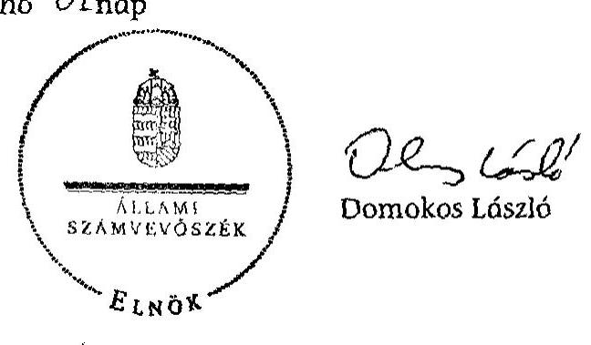

---

# Az ellenőrzött és adatszolgáltatásra felkért szervezetek 

## Ellenőrzött szervezetek

## Minisztériumok, egyéb központi szervek:

Nemzetgazdasági Minisztérium
Belügyminisztérium
Emberi Erőforrások Minisztériuma
Nemzeti Munkaügyi Hivatal
Magyar Államkincstár

## Munkaügyi központok, kirendeltségek:

Budapest Főváros Kormányhivatala Munkaügyi Központja
Vas Megyei Kormányhivatal Munkaügyi Központja
Celldömölki Járási Hivatal Járási Munkaügyi Kirendeltsége
Baranya Megyei Kormányhivatal Munkaügyi Központja
Szigetvári Járási Hivatal Járási Munkaügyi Kirendeltsége
Heves Megyei Kormányhivatal Munkaügyi Központja
Hatvani Járási Hivatal Járási Munkaügyi Kirendeltsége
Veszprém Megyei Kormányhivatal Munkaügyi Központja
Pápai Járási Hivatal Járási Munkaügyi Kirendeltsége
Hajdú Bihar Megyei Kormányhivatal Munkaügyi Központja
Berettyóújfalui Járási Hivatal Járási Munkaügyi Kirendeltsége
Hajdúböszörményi Járási Hivatal Járási Munkaügyi Kirendeltsége
Nógrád Megyei Kormányhivatal Munkaügyi Központja
Szécsényi Járási Hivatal Járási Munkaügyi Kirendeltsége
Szabolcs-Szatmár-Bereg Megyei Kormányhivatal Munkaügyi
Központja
Nyíregyházi Járási Hivatal Járási Munkaügyi Kirendeltsége
Nagykállói Járási Hivatal Járási Munkaügyi Kirendeltsége
Mátészakai Járási Hivatal Járási Munkaügyi Kirendeltsége
Vásárosnaményi Járási Hivatal Járási Munkaügyi Kirendeltsége

## Önkormányzatok, gazdasági társaságok:

Budapest Főváros Vagyonkezelő Központ Zrt.
Budapest Főváros Önkormányzata
Budapest Esély Nonprofit Kft.
Celldömölk Város Önkormányzata
Szigetvár Város Önkormányzata
Hatvan Város Önkormányzata
Hatvani Városgazdálkodási Nonprofit Közhasznú Zártkörűen Működő
Részvénytársaság
Bakonytamási Község Önkormányzata
Berettyóújfalu Város Önkormányzata
Hajdúböszörmény Város Önkormányzata
Szécsény Város Önkormányzata

Szécsényi Városüzemeltetési Nonprofit Korlátolt Felelősségű Társaság
Szécsényi Agro-Help Mezőgazdasági, Oktató, Termelő és Értékesítő
Nonprofit Korlátolt Felelősségű Társaság
Nyíregyháza Város Önkormányzata
Nyíregyházi Városüzemeltető és Vagyonkezelő Nonprofit Kft.
Nagykálló Város Önkormányzata
Kocsord Község Önkormányzata
Tarpa Nagyközség Önkormányzata

---

# Adatszolgáltatató önkormányzatok 

Somberek Község Önkormányzata
Kistapolca Község Önkormányzata
Magyarbóly Község Önkormányzata
Vekerd Község Önkormányzata
Ártánd Község Önkormányzata
Bedő Község Önkormányzata
Bihartorda Község Önkormányzata
Újléta Község Önkormányzata
Létavértes Város Önkormányzata
Kaba Város Önkormányzata
Mikófalva Község Önkormányzata
Detk Község Önkormányzata
Boconád Község Önkormányzata
Erk Község Önkormányzata
Mihálygerge Község Önkormányzata
Horpács Község Önkormányzata
Keszeg Község Önkormányzata
Ősagárd Község Önkormányzata
Cserhátszentiván Község Önkormányzata
Csécse Község Önkormányzata
Drégelypalánk Község Önkormányzata
Dejtár Község Önkormányzata
Márkháza Község Önkormányzata
Nógrádmegyer Község Önkormányzata
Balsa Község Önkormányzata
Nyírpazony Község Önkormányzata
Garbolc Község Önkormányzata
Fülesd Község Önkormányzata
Fábiánháza Község Önkormányzata
Piricse Község Önkormányzata
Bököny Község Önkormányzata
Rohod Község Önkormányzata
Szabolcsveresmart Község Önkormányzata
Eperjeske Község Önkormányzata
Tiszadada Község Önkormányzata
Tiszavid Község Önkormányzata
Gencsapáti Község Önkormányzata
Vasegerszeg Község Önkormányzata
Porpác Község Önkormányzata
Pécsely Község Önkormányzata
Németbánya Község Önkormányzata
Ugod Község Önkormányzata
Zalaerdőd Község Önkormányzata
Káptalantóti Község Önkormányzata
Nemesbük Község Önkormányzata
Lispeszentadorján Község Önkormányzata
Zalaújlak Község Önkormányzata
Szalapa Község Önkormányzata
Kemendollár Község Önkormányzata

---

A közfoglalkoztatás tervezett és tényleges forrás- és létszámadatainak alakulása nemzetgazdasági szinten a 2009. 2012. év I. negyedévében

|  Közfoglalkoztatási forma megnevezése | Év | $\begin{gathered} \text { E } \ \text { E } \end{gathered}$ | Terv* |  | Tény* |  | Tény érintett létszám | $\begin{gathered} \text { A } \ \text { költségvetési } \ \text { szektor éves } \ \text { átlaglétszám } \ \text { a a KSH } \ \text { adatai szerint } \end{gathered}$  |
| --- | --- | --- | --- | --- | --- | --- | --- | --- |
|   |  |  | Összes forrás | Érintett létszám | Összes
forrás | Érintett létszám |  |   |
|   |  |  | c | fó | MFt | fó | fó | fó  |
|   |  |  | 1. | 2. | 3. | 4. | 5. | 6.  |
|  Közhasznú munka | 2009. | 1. | 4054,6 | 13652 | 3742,8 | 21446 | 21446 |   |
|   | 2010. | 2. | 4717,9 | 24445 | 4396,4 | 16872 | 16872 |   |
|   | 2011. | 3. | 0,0 | 3513 | 675,6 | 5224 |  |   |
|  Közhasznú munka összesen |  | 4. | 8772,5 | 41610 | 8814,8 | 43542 | 38318 |   |
|  Közcélú munka | 2009. | 5. |  |  | 51310,5 | 103247 | 103247 |   |
|   | 2010. | 6. |  |  | 82887,9 | 137880 | 137880 |   |
|   | 2011. | 7. |  |  | 6292,5 |  |  |   |
|  Közcélú munka összesen |  | 8. |  |  | 140490,9 | 241127 | 241127 |   |
|  Közmunka programok | 2009. | 9. | 4361,1 | 15178 | 4361,1 | 15178 | 15596 |   |
|   | 2010. | 10. | 13825,2 | 27639 | 13825,2 | 27639 | 31528 |   |
|   | 2011. | 11. | 0,0 | 0 | 0,0 | 0 |  |   |
|  Közmunka programok összesen |  | 12. | 18186,3 | 42817 | 18186,3 | 42817 | 47124 |   |
|  Rövid idejű közfoglalkoztatás | 2011. | 13. | 21937,4 | 16035 | 19486,0 | 182150 | 172367 |   |
|   | 2012. I. név** | 14. | 1335,6 | 0 | 826,3 | 18503 |  |   |
|  Rövid idejű közfoglalkoztatás összesen |  | 15. | 23273,0 | 16035 | 20312,3 | 200653 | 172367 |   |
|  Hosszabb idejű közfoglalkoztatás | 2011. | 16. | 12403,2 | 13411 | 11698,1 | 32533 | 28851 |   |
|   | 2012. I. név | 17. | 17013,3 | 49402 | 1628,9 | 11876 |  |   |
|  Hosszabb idejű közfoglalkoztatás összesen |  | 18. | 29416,5 | 62813 | 13327,0 | 44409 | 28851 | 0  |
|  Egyéb programok*** | 2011. | 19. | 28760,8 | 39207 | 27432,4 | 64599 | 42196 |   |
|   | ebből országos | 20. |  |  | 20115,6 |  |  |   |
|   | 2012. I. név | 21. | 113766,3 | 0 | 26667,1 | 2304 |  |   |
|   | ebből országos | 22. | 47737,3 |  |  |  |  |   |
|  Egyéb programok összesen |  | 23. | 142527,1 | 39207 | 54099,5 | 66903 | 42196 |   |
|  Egyéb kifizetések**** | 2011. | 24. | 898,6 | 3029 | 507,4 | 3165 |  |   |
|   | 2012. I. név | 25. | 67,3 | 0 | 0,0 | 0 |  |   |
|  Egyéb kifizetések összesen |  | 26. | 965,9 | 3029 | 507,4 | 3165 | 0 | 0  |
|  Mindösszesen: | 2009. | 27. | 8415,7 | 28830 | 59414,4 | 139871 | 140289,0 | 60968  |
|   | 2010. | 28. | 18543,1 | 52084 | 101109,5 | 182391 | 186280 | 87321  |
|   | 2011. | 29. | 64000,0 | 75195 | 66092,0 | 287671 | 243414 | 58624  |
|   | 2012. I. név | 30. | 132182,5 | 49402 | 29122,3 | 32683 | 81762 | 52425  |
|  Változás (2010/2009) \% |  | 31. | 220,3\% | 180,7\% | 170,2\% | 130,4\% | 132,8\% | 143,2\%  |
|  Változás (2011/2010) \% |  | 32. | 345,1\% | 144,4\% | 65,4\% | 157,7\% | 130,7\% | 67,1\%  |

[^0] [^0]: * A BM, az NGM, Foglalkoztatási Hivatal és a Kincstár adatszolgáltatása szerint ** A terv adat a teljes évre, a tény adat az I. negyedévre vonatkozik *** Országos, start programok, értékteremtő programok, hagyományos programok (szociális föld, téli közfoglalkoztatás) ****Vállalkozás részére foglalkozást helyettesítő támogatásban részesülő személy foglalkoztatására nyújtható támogatás, mobilitási támogatás, váratlan helyzetek

---

Az ellenőrzött önkormányzatok közfoglalkoztatásra tervezett és tényleges kiadásainak, létszámadatainak alakulása a 2009-2012. év I. negyedévben

|  Közfoglalkoztatási forma megnevezése | Év |  | Terv |  |  |  | Tény |  |  |  |   |
| --- | --- | --- | --- | --- | --- | --- | --- | --- | --- | --- | --- |
|   |  |  | Támogatás | Saját
forrás
e Ft | Összes
kiadás | Átlag
létszám
fő/hó | Érintett
létszám
fő | Támogatás | Saját forrás
e Ft | Összes
kiadás | Átlag
létszám
fő/hó  |
|   |  |  | 1. | 2. | 3. | 4. | 5. | 6. | 7. | 8. | 9.  |
|  Közhasznú munka | 2009. | 1. | 37642,0 | 93069,0 | 130711,0 | 142 | 142 | 36731,0 | 15608,0 | 52339,0 | 66  |
|   | 2010. | 2. | 46290,0 | 24955,0 | 71245,0 | 73 | 83 | 42626,0 | 17232,0 | 59858,0 | 157  |
|   | 2011. | 3. | 0,0 | 0,0 | 0,0 | 6 | 0 | 3281,0 | 1201,0 | 4482,0 | 7  |
|  Közcélú munka | 2009. | 4. | 739441,0 | 115761,0 | 855202,0 | 2403 | 2399 | 1265971,0 | 144390,0 | 1410361,0 | 2600  |
|   | 2010. | 5. | 1048922,0 | 273549,0 | 1322471,0 | 3083 | 3085 | 2201137,0 | 173799,0 | 2374936,0 | 3676  |
|   | 2011. | 6. | 0,0 | 0,0 | 0,0 | 0 | 0 | 108218,0 | 6524,0 | 114742,0 | 137  |
|  Közmunka programok | 2009. | 7. | 0,0 | 2349,0 | 2349,0 | 0 | 0 | 9681,0 | 633,0 | 10314,0 | 17  |
|   | 2010. | 8. | 0,0 | 0,0 | 0,0 | 0 | 0 | 0,0 | 0,0 | 0,0 | 0  |
|   | 2011. | 9. | 0,0 | 0,0 | 0,0 | 0 | 0 | 0,0 | 0,0 | 0,0 | 0  |
|  Rövid idejű közfoglalkoztatás | 2011. | 10. | 337844,0 | 111290,0 | 449134,0 | 3141 | 3077 | 617115,0 | 54387,0 | 671502,0 | 3388  |
|   | 2012. 1.
negyedév | 11. | 137814,0 | 18981,0 | 156795,0 | 20 | 77 | 8592,0 | 1194,0 | 9786,0 | 201  |
|  Hosszabb idejű
közfoglakoztatás | 2011. | 12. | 194665,0 | 87264,0 | 281929,0 | 556 | 553 | 322606,0 | 53085,0 | 375691,0 | 812  |
|   | 2012. 1.
negyedév | 13. | 267938,0 | 91976,0 | 359914,0 | 593 | 715 | 118744,0 | 47380,0 | 166124,0 | 856  |
|  Egyéb közfoglalkoztatási programok | 2011. | 14. | 211802,0 | 34436,0 | 246238,0 | 202 | 693 | 160720,0 | 28569,0 | 189289,0 | 200  |
|   | 2012. 1.
negyedév | 15. | 281576,0 | 79200,0 | 360776,0 | 993 | 1172 | 125927,0 | 185,0 | 126112,0 | 3328  |
|  Mindösszesen: | 2009. | 16. | 777083,0 | 211179,0 | 988262,0 | 2545 | 2541 | 1312383,0 | 160631,0 | 1473014,0 | 2683  |
|   | 2010. | 17. | 1095212,0 | 298504,0 | 1393716,0 | 3156 | 3168 | 2243763,0 | 191031,0 | 2434794,0 | 3833  |
|   | 2011. | 18. | 744311,0 | 232990,0 | 977301,0 | 3905 | 4323 | 1211940,0 | 143766,0 | 1355706,0 | 4544  |
|   | 2012. 1.
negyedév | 19. | 687328,0 | 190157,0 | 877485,0 | 1606 | 1964 | 253263,0 | 48759,0 | 302022,0 | 4385  |
|  Változás (2010/2009) \% |  | 20. | 140,9\% | 141,4\% | 141,0\% | 124,0\% | 124,7\% | 171,0\% | 118,9\% | 165,3\% | 142,9\%  |
|  Változás (2011/2010) \% |  | 21. | 68,0\% | 78,1\% | 70,1\% | 123,7\% | 136,5\% | 54,0\% | 75,3\% | 55,7\% | 118,5\%  |

Forrás: Önkormányzati adatszolgáltatás

---

Az adatszolgáltató önkormányzatok közfoglalkoztatásra tervezett és tényleges kiadásainak, létszámadatainak alakulása a 2009-2012. év I. negyedévben

|  Közfoglalkoztatási forma megnevezése | Év |  | Terv |  |  | Tény |  |  |  |   |
| --- | --- | --- | --- | --- | --- | --- | --- | --- | --- | --- |
|   |  |  | Támogatás | Saját
forrás
e Ft | Összes kiadás | Átlag-
létszám | Támogatás | Saját forrás
e Ft | Összes
kiadás | Átlag-
létszám
fő/16
fő/16  |
|   |  |  | 1. | 2. | 3. | 4. | 5. | 6. | 7. | 8.  |
|  Közhasznú munka | 2009. | 1. | 68418,0 | 8957,0 | 77375,0 | 74 | 39788,0 | 6499,0 | 46287,0 | 90  |
|   | 2010. | 2. | 138646,1 | 9612,0 | 148258,1 | 122 | 54801,9 | 4973,0 | 59774,9 | 131  |
|   | 2011. | 3. | 25439,9 | 10136,0 | 35575,9 | 46 | 26126,0 | 8056,0 | 34182,0 | 97  |
|  Közcélú munka | 2009. | 4. | 384235,0 | 38704,0 | 422938,9 | 1392 | 754821,6 | 51931,0 | 806752,6 | 1643  |
|   | 2010. | 5. | 533550,2 | 52505,2 | 586055,4 | 1912 | 1065160,3 | 97159,0 | 1162319,3 | 2064  |
|   | 2011. | 6. | 34365,0 | 2608,0 | 36973,0 | 195 | 54408,9 | 4695,0 | 59103,9 | 211  |
|  Közmunka programok | 2009. | 7. | 14759,3 | 776,0 | 15535,3 | 19 | 15303,9 | 776,0 | 16079,9 | 19  |
|   | 2010. | 8. | 68447,0 | 10725,0 | 79172,0 | 124 | 78710,0 | 1048,0 | 79758,0 | 125  |
|   | 2011. | 9. | 6316,9 | 0,0 | 6316,9 | 3 | 2612,9 | 599,0 | 3211,9 | 3  |
|  Rövid idejű közfoglalkoztatás | 2011. | 10. | 192704,4 | 18945,0 | 211649,5 | 1237 | 265966,0 | 20744,0 | 286710,0 | 85  |
|   | 2012. I.
negyedév | 11. | 8379,3 | 1261,0 | 9640,3 | 85 | 6382,0 | 1006,0 | 7388,0 | 82  |
|  Hosszabb idejű
közfoglakoztatás | 2011. | 12. | 94929,9 | 12592,7 | 107522,6 | 303 | 147191,0 | 30756,0 | 177947,0 | 468  |
|   | 2012. I.
negyedév | 13. | 50915,7 | 11747,0 | 62662,7 | 307 | 46463,4 | 6708,0 | 53171,4 | 352  |
|  Egyéb közfoglalkoztatási programok | 2011. | 14. | 39061,8 | 1641,0 | 40702,8 | 102 | 78060,2 | 1825,0 | 79885,2 | 200  |
|   | 2012. I.
negyedév | 15. | 215506,8 | 1641,0 | 217147,8 | 702 | 384677,0 | 1690,0 | 386367,0 | 693  |
|  Mindösszesen: | 2009. | 16. | 467412,3 | 48437,0 | 515849,2 | 1485 | 809913,5 | 59206,0 | 869119,5 | 1752  |
|   | 2010. | 17. | 740643,3 | 72842,2 | 813485,5 | 2158 | 1198672,2 | 103180,0 | 1301852,2 | 2320  |
|   | 2011. | 18. | 392817,9 | 45922,7 | 438740,7 | 1886 | 574365,0 | 66675,0 | 641040,0 | 1064  |
|   | 2012. I.
negyedév | 19. | 274801,8 | 14649,0 | 289450,8 | 1094 | 437522,4 | 9404,0 | 446926,4 | 1127  |
|  Változás (2009/2010) \% |  | 20. | 158,5\% | 150,4\% | 157,7\% | 145,4\% | 148,0\% | 174,3\% | 149,8\% | 132,4\%  |
|  Változás (2011/2010) \% |  | 21. | 53,0\% | 63,0\% | 53,9\% | 87,4\% | 47,9\% | 64,6\% | 49,2\% | 45,9\%  |

Forrás: Önkormányzati adatszolgáltatás

---

Az ellenőrzött önkormányzatok közfoglalkoztatással kapcsolatos kiadásainak alakulása a 2009-2012. év I. negyedévben

|  Közfoglalkoztatási forma megnevezése | Év |  | Terv |  | Tény |  |   |
| --- | --- | --- | --- | --- | --- | --- | --- |
|   |  |  | Személyi
juttatások és
járulékok | Egyéb kiadások | Összesen | Személyi
juttatások és
járulékok | Egyéb kiadások  |
|   |  |  | e Ft |  |  | e Ft |   |
|   |  |  | 1. | 2. | 3. | 4. | 5.  |
|  Közhasznú munka | 2009. | 1. | 108511,0 | 22200,0 | 130711,0 | 44783,0 | 7556,0  |
|   | 2010. | 2. | 66793,0 | 4452,0 | 71245,0 | 52068,0 | 7790,0  |
|   | 2011. | 3. | 0,0 | 0,0 | 0,0 | 4482,0 | 0,0  |
|  Közcélú munka | 2009. | 4. | 797732,0 | 57470,0 | 855202,0 | 1318525,0 | 91836,0  |
|   | 2010. | 5. | 1237276,0 | 85195,0 | 1322471,0 | 2296355,0 | 78581,0  |
|   | 2011. | 6. | 0,0 | 0,0 | 0,0 | 113555,0 | 1187,0  |
|  Közmunka programok | 2009. | 7. | 2349,0 | 0,0 | 2349,0 | 10070,0 | 244,0  |
|   | 2010. | 8. | 0,0 | 0,0 | 0,0 | 0,0 | 0,0  |
|   | 2011. | 9. | 0,0 | 0,0 | 0,0 | 0,0 | 0,0  |
|  Rövid idejű közfoglalkoztatás | 2011. | 10. | 383899,0 | 65235,0 | 449134,0 | 633961,0 | 37541,0  |
|   | 2012. I.
negyedév | 11. | 152253,0 | 4542,0 | 156795,0 | 9786,0 | 0,0  |
|  Hosszabb idejű közfoglakoztatás | 2011. | 12. | 251560,0 | 30369,0 | 281929,0 | 358694,0 | 16997,0  |
|   | 2012. I.
negyedév | 13. | 318068,0 | 41846,0 | 359914,0 | 138190,0 | 28551,0  |
|  Egyéb közfoglalkoztatási programok | 2011. | 14. | 179986,0 | 66252,0 | 246238,0 | 144707,0 | 44582,0  |
|   | 2012. I.
negyedév | 15. | 319604,0 | 41172,0 | 360776,0 | 94141,0 | 31354,0  |
|  Mindösszesen: | 2009. | 16. | 908592,0 | 79670,0 | 988262,0 | 1373378,0 | 99636,0  |
|   | 2010. | 17. | 1304069,0 | 89647,0 | 1393716,0 | 2348423,0 | 86371,0  |
|   | 2011. | 18. | 815445,0 | 161856,0 | 977301,0 | 1255399,0 | 100307,0  |
|   | 2012. I.
negyedév | 19. | 789925,0 | 87560,0 | 877485,0 | 242117,0 | 59905,0  |
|  Változás (2010/2009) \% |  | 20. | 143,5\% | 112,5\% | 141,0\% | 171,0\% | 86,7\%  |
|  Változás (2011/2010) \% |  | 21. | 62,5\% | 180,5\% | 70,1\% | 53,5\% | 116,1\%  |

Forrás: Önkormányzati adatszolgáltatás

---

Az adatszolgáltató önkormányzatok közfoglalkoztatással kapcsolatos kiadásainak alakulása a 2009-2012. év I. negyedévben

|  Közfoglalkoztatási forma megnevezése | Év |  | Tény |  |   |
| --- | --- | --- | --- | --- | --- |
|   |  |  | Személyi juttatások és járulékok | Egyéb kiadások | Összesen  |
|   |  |  | e Ft |  |   |
|   |  |  | 4. | 5. | 6.  |
|  Közhasznú munka | 2009. | 1. | 46279,0 | 8,0 | 46287,0  |
|   | 2010. | 2. | 59424,0 | 350,9 | 59774,9  |
|   | 2011. | 3. | 30123,6 | 4058,4 | 34182,0  |
|  Közcélú munka | 2009. | 4. | 802173,6 | 4579,0 | 806752,6  |
|   | 2010. | 5. | 1155817,3 | 6502,0 | 1162319,3  |
|   | 2011. | 6. | 38956,9 | 20147,0 | 59103,9  |
|  Közmunka programok | 2009. | 7. | 16078,0 | 1,9 | 16079,9  |
|   | 2010. | 8. | 70045,0 | 9713,0 | 79758,0  |
|   | 2011. | 9. | 2529,0 | 682,9 | 3211,9  |
|  Rövid idejű közfoglalkoztatás | 2011. | 10. | 281811,5 | 4898,5 | 286710,0  |
|   | 2012. I.
negyedév | 11. | 7388,0 | 0,0 | 7388,0  |
|  Hosszabb idejű közfoglakoztatás | 2011. | 12. | 177479,0 | 468,0 | 177947,0  |
|   | 2012. I.
negyedév | 13. | 53105,9 | 65,5 | 53171,4  |
|  Egyéb közfoglalkoztatási programok | 2011. | 14. | 62069,2 | 17816,0 | 79885,2  |
|   | 2012. I.
negyedév | 15. | 153900,0 | 232467,0 | 386367,0  |
|  Mindösszesen: | 2009. | 16. | 864530,6 | 4588,9 | 869119,5  |
|   | 2010. | 17. | 1285286,3 | 16565,9 | 1301852,2  |
|   | 2011. | 18. | 592969,2 | 48070,8 | 641040,0  |
|   | 2012. I.
negyedév | 19. | 214393,9 | 232532,5 | 446926,4  |
|  Változás (2010/2009) \% |  | 20. | 148,7\% | 361,0\% | 149,8\%  |
|  Változás (2011/2010) \% |  | 20. | 46,1\% | 290,2\% | 49,2\%  |

Forrás: Önkormányzati adatszolgáltatás

---

Az aktív korúak ellátásainak és létszámadatainak alakulása a 2009-2012. év I. negyedévében nemzetgazdasági szinten

|  Sorszám | Megnevezés | Aktív korúak ellátása |  |  |  |  |  |  |   |
| --- | --- | --- | --- | --- | --- | --- | --- | --- | --- |
|   |  | Rendszeres szociális segély* |  | RÁT/BPJ/FHT |  |  |  | Összesen |   |
|   |  | Összes kiadás* | Átlaglétszám | Összes kiadás* | Átlaglétszám | Érintett létszám | Ebből a közfoglalkoztat ás-ban részt vettek száma | Összes kiadás* | Átlaglétszám  |
|   | Év | M Ft | fő/hó | M Ft | fő/hó | fő | fő | M Ft | fő/hó  |
|   | 1. | 2. | 3. | 4. | 7. | 5. | 6. | 8. | 9.  |
|  1. | 2009. év | 29505,6 | 85284 | 42581,3 | 127815 | 313588 | 90959 | 72086,9 | 213099  |
|  2. | 2010. év | 11712,2 | 36737 | 58927,5 | 186924 | 385740 | 119897 | 70639,7 | 223661  |
|  3. | 2011. év | 15548,9 | 45866 | 66393,8 | 210251 | 426428 | 151608 | 81942,7 | 256117  |
|  4. | 2012. I. negyedév | 4105,6 | 55524 | 17726,3 | 269355 | 353481 | 130101 | 21831,9 | 324879  |
|  5. | Változás
(2010/2009) | 39,7\% | 43,1\% | 138,4\% | 146,2\% | 123,0\% | 131,8\% | 98,0\% | 105,0\%  |
|  6. | Változás
(2011/2010) \% | 132,8\% | 124,8\% | 112,7\% | 112,5\% | 110,5\% | 126,4\% | 116,0\% | 114,5\%  |

Forrás: Kincstár, Foglalkoztatási Hivatal *A központilag finanszírozott normatív kötött felhasználású támogatás és az önkormányzati saját rész összegét együtt tartalmazza

---

Az aktív korúak ellátásainak és létszámadatainak alakulása a 2009-2012. év I. negyedévben az ellenőrzött és az adatszolgáltató önkormányzatoknál

|  Megnevezés |  |  | Aktív korúak ellátása |  |  |  |  |  |  |  |  |  |  |   |
| --- | --- | --- | --- | --- | --- | --- | --- | --- | --- | --- | --- | --- | --- | --- |
|   |  |  | Rendszeres szociális segély |  |  |  | RÁT/BPJ/FHT |  |  |  |  | Aktív korúak ellátása mindösszesen |  |   |
|   |  |  | Központi támogatás | Saját forrás | Összesen | Átlaglétszám | Központi támogatás | Saját forrás | Összesen | Átlaglétszám | Központi támogatás | Saját forrás | Összesen | Átlaglétszám  |
|   |  |  | e Ft |  |  | fő/hó |  | eFt |  | fő/hó |  | e Ft |  | fő/hó  |
|   |  |  | 1. | 2. | 3. | 4. | 5. | 6. | 7. | 8. | 9. | 10. | 11. | 12.  |
|  Ellenőrzött önkormányzatok | 2009. év | 1. | 690 635,0 | 47 594,0 | 738 229,0 | 4 845 | 888 050,0 | 170 659,0 | 1 058 709,0 | 7 939 | 1 578 685,0 | 218 253,0 | 1 796 938,0 | 12 784  |
|   | 2010. év | 2. | 442 744,0 | 18 804,0 | 461 548,0 | 2 495 | 1 287 657,0 | 244 746,0 | 1 532 403,0 | 10 548 | 1 730 401,0 | 263 550,0 | 1 993 951,0 | 13 043  |
|   | 2011. év | 3. | 599 281,0 | 26 493,0 | 625 774,0 | 3 363 | 1 557 213,0 | 285 976,0 | 1 843 189,0 | 12 115 | 2 156 494,0 | 312 469,0 | 2 468 963,0 | 15 478  |
|   | 2012. év I. negyedév | 4. | 202 182,0 | 7 133,0 | 209 315,0 | 2 757 | 481 990,0 | 77 653,0 | 559 643,0 | 9 479 | 684 172,0 | 84 786,0 | 768 958,0 | 12 236  |
|   | Változás (2010/2009) % | 5. | 64,1% | 39,5% | 62,5% | 51,5% | 145,0% | 143,4% | 144,7% | 132,9% | 109,6% | 120,8% | 111,0% | 102,0%  |
|   | Változás (2011/2010) % | 5. | 135,4% | 140,9% | 135,6% | 134,8% | 120,9% | 116,8% | 120,3% | 114,9% | 124,6% | 118,6% | 123,8% | 118,7%  |
|  Ádatszolgáltató önkormányzatok | 2009. év | 6. | 242 416,5 | 22 485,9 | 264 902,4 | 763 |  |  | 625 261,5 | 3 052 |  |  | 890 163,9 | 3 815  |
|   | 2010. év | 7. | 162 503,5 | 11 060,5 | 173 564,0 | 496 |  |  | 665 318,0 | 3 098 |  |  | 838 882,0 | 3 594  |
|   | 2011. év | 8. | 165 095,0 | 15 364,0 | 180 459,0 | 595 |  |  | 792 939,5 | 3 377 |  |  | 973 398,5 | 3 972  |
|   | 2012. év I. negyedév | 9. | 70 944,0 | 4 213,0 | 75 157,0 | 571 |  |  | 231 076,6 | 3 473 |  |  | 306 233,6 | 4 044  |
|   | Változás (2010/2009) % | 10. | 67,0% | 49,2% | 65,5% | 65,0% |  |  | 106,4% | 101,5% |  |  | 94,2% | 94,2%  |
|   | Változás (2011/2010) % | 10. | 101,6% | 138,9% | 104,0% | 120,0% |  |  | 119,2% | 109,0% |  |  | 116,0% | 110,5%  |
|  Mindösszesen | 2009. év | 11. | 933 051,5 | 70 079,9 | 1 003 131,4 | 5 608 |  |  | 1 683 970,5 | 10 991 |  |  | 2 687 101,9 | 16 599  |
|   | 2010. év | 12. | 605 247,5 | 29 864,5 | 635 112,0 | 2 991 |  |  | 2 197 721,0 | 13 646 |  |  | 2 832 833,0 | 16 637  |
|   | 2011. év | 13. | 764 376,0 | 41 857,0 | 806 233,0 | 3 958 |  |  | 2 636 128,5 | 15 492 |  |  | 3 442 361,5 | 19 450  |
|   | 2012. év I. negyedév | 14. | 273 126,0 | 11 346,0 | 284 472,0 | 3 328 |  |  | 790 719,6 | 12 952 |  |  | 1 075 191,6 | 16 280  |
|   | Változás (2010/2009) % | 15. | 64,9% | 42,6% | 63,3% | 53,3% |  |  | 130,5% | 124,2% |  |  | 105,4% | 100,2%  |
|   | Változás (2011/2010) % | 15. | 126,3% | 140,2% | 126,9% | 132,3% |  |  | 119,9% | 113,5% |  |  | 121,5% | 116,9%  |

Forrás: Önkormányzati adatszolgáltatás

- Az adatszolgáltató önkormányzatoknak a RÁT/BPJ/FHT forrás összetételének alakulásáról nem volt adatszolgáltatási kötelezettségük

---

|  Területi egység | $\begin{aligned} & \text { ㅇ } \ & \text { ㅇ } \end{aligned}$ | Nyilvántartott álláskeresők (fő) |  |  | Munkanélküliségi ráta (\%) |  |  | Foglalkoztatottak száma (ezer fő) |  |  | Foglalkoztatási arány (foglalkoztatási ráta) \% |  |   |
| --- | --- | --- | --- | --- | --- | --- | --- | --- | --- | --- | --- | --- | --- |
|   |  | 2009 | 2010 | 2011 | 2009 | 2010 | 2011 | 2009 | 2010 | 2011 | 2009 | 2010 | 2011  |
|   |  | 1. | 2. | 3. | 4. | 5. | 6. | 7. | 8. | 9. | 10. | 11. | 12.  |
|  Budapest | 1. | 43152 | 47771 | 45076 | 6,2 | 9,1 | 9,6 | 741,9 | 730,5 | 736,6 | 56,0 | 54,7 | 54,9  |
|  Pest | 2. | 39240 | 40766 | 40584 | 7,2 | 8,7 | 7,5 | 497,3 | 498,3 | 506,3 | 53,2 | 52,5 | 52,7  |
|  Fejér | 3. | 23559 | 23253 | 21230 | 9,4 | 9,5 | 9,6 | 166,8 | 164,1 | 170,8 | 50,8 | 50,1 | 52,4  |
|  Komárom-Esztergom | 4. | 16174 | 14581 | 12929 | 8,5 | 8,8 | 7,8 | 128,7 | 130,8 | 132,3 | 52,7 | 53,5 | 55,2  |
|  Veszprém | 5. | 22338 | 19512 | 16732 | 9,8 | 12,5 | 10,4 | 139,6 | 138,1 | 144,2 | 50,2 | 49,6 | 52,2  |
|  Győr-Moson-Sopron | 6. | 14887 | 13696 | 10977 | 6,3 | 6,9 | 6,3 | 188,6 | 189,9 | 187,4 | 54,6 | 54,4 | 53,8  |
|  Vas | 7. | 13008 | 10399 | 8290 | 10,2 | 10,4 | 7,1 | 103,2 | 103,6 | 108,5 | 51,0 | 51,2 | 54,1  |
|  Zala | 8. | 19003 | 17555 | 15182 | 10,8 | 11,8 | 9,3 | 116,7 | 110,8 | 116,4 | 51,8 | 49,5 | 52,0  |
|  Baranya | 9. | 29060 | 28857 | 28770 | 11,6 | 13,0 | 14,5 | 142,9 | 145,8 | 139,8 | 46,8 | 48,0 | 46,0  |
|  Somogy | 10. | 27887 | 26639 | 24291 | 11,4 | 13,5 | 13,1 | 109,6 | 110,9 | 109,1 | 44,5 | 45,3 | 44,3  |
|  Tolna | 11. | 16176 | 14980 | 13706 | 9,4 | 8,4 | 9,0 | 85,3 | 85,4 | 84,9 | 47,1 | 47,6 | 47,8  |
|  Borsod-Abaúj-Zemplén | 12. | 71922 | 68622 | 66133 | 16,0 | 17,3 | 17,8 | 220,5 | 218,3 | 217,5 | 42,0 | 42,0 | 42,4  |
|  Heves | 13. | 22583 | 21218 | 20593 | 12,9 | 11,8 | 13,0 | 109,1 | 109,0 | 108,5 | 45,5 | 45,8 | 46,1  |
|  Nógrád | 14. | 20208 | 19368 | 18744 | 15,9 | 18,4 | 18,7 | 67,1 | 65,1 | 61,0 | 42,5 | 41,7 | 39,6  |
|  Hajdú-Bihar | 15. | 46764 | 47208 | 44530 | 11,3 | 13,2 | 13,2 | 177,9 | 183,4 | 190,1 | 43,2 | 44,6 | 46,1  |
|  Jász-Nagykun-Szolnok | 16. | 28913 | 29423 | 29277 | 11,4 | 10,9 | 11,1 | 138,9 | 137,9 | 139,3 | 46,4 | 46,5 | 47,5  |
|  Szabolcs-Szatmár-Bereg | 17. | 60537 | 60823 | 57211 | 19,1 | 18,4 | 18,4 | 172,3 | 176,2 | 177,9 | 40,6 | 41,9 | 42,5  |
|  Bács-Kiskun | 18. | 36651 | 35161 | 32060 | 10,9 | 10,8 | 10,6 | 189,9 | 191,6 | 193,7 | 46,9 | 47,7 | 48,2  |
|  Békés | 19. | 29229 | 28856 | 25783 | 13,4 | 12,5 | 11,9 | 124,5 | 128,2 | 127,2 | 44,1 | 46,0 | 46,2  |
|  Csongrád | 20. | 23285 | 22590 | 20210 | 7,8 | 8,9 | 9,6 | 161,1 | 163,2 | 160,2 | 49,3 | 50,0 | 49,1  |
|  Ország összesen | 21. | 604576 | 591278 | 552308 | 10,0 | 11,2 | 10,9 | 3781,9 | 3781,2 | 3811,9 | 49,2 | 49,2 | 48,7  |

Forrás: KSH munkaerőfelmérés adatai

---

# KSH közfoglalkoztatási adatok a 2009-2012. év I. negyedévében

|  Időszak |  | Közfoglalkoztatottak
száma | Közfoglalkoztatotta
k éves átlag-
létszáma  |
| --- | --- | --- | --- |
|  2009. | I. | 23039 | 60968  |
|   | II. | 63834 |   |
|   | III. | 82458 |   |
|   | IV. | 74543 |   |
|  2010. | I. | 64030 | 87321  |
|   | II. | 99332 |   |
|   | III. | 98579 |   |
|   | IV. | 87343 |   |
|  2011. | I. | 31390 | 58624  |
|   | II. | 71840 |   |
|   | III. | 71171 |   |
|   | IV. | 60094 |   |
|  2012. | I. | 52425 |   |

Forrás: KSH intézményi statisztikán alapuló kimutatása

---

Álláskeresési adatok az ellenőrzött és az adatszolgálatátó önkormányzatok vonatkozásában a 2009-2012. év I. negyedévében

|  Sorszám | Telepítés | 2009 |  |  | 2010 |  |  | 2011 |  |  | 2012. év - I. negyedév |  |   |
| --- | --- | --- | --- | --- | --- | --- | --- | --- | --- | --- | --- | --- | --- |
|   |  | Mankavállalási korú
népsség, 2009.
jannár 1-jel állapot
szerint | A Foglalkoztatási
 Szolgáltatali
nyilvániarinti
álláskeresék éves
állagos zárónapi száma | Mankanélköltségi rátá | Mankavállalási korú
népsség, 2010.
jannár 1-jel állapot
szerint | A Foglalkoztatási
 Szolgáltatali
nyilvániarinti
álláskeresék éves
állagos zárónapi
száma | Mankanélköltségi rátá | Mankavállalási korú
népsség, 2011.
jannár 1-jel állapot
szerint | A Foglalkoztatási
 Szolgáltatali
nyilvániarinti
álláskeresék éves
állagos zárónapi száma | Mankanélköltségi rátá | Mankavállalási korú
népsség, 2012.
jannár 1-jel állapot
szerint | A Foglalkoztatási
 Szolgáltatali
nyilvániarinti
álláskeresék negyedéves
állagos zárónapi száma | Mankanélköltségi rátá  |
|   |  | száma (IS) |  | % | száma (IS) |  | % | száma (IS) |  | % | száma (IS) |  | %  |
|   | 1. | 2. | 3. | 4. | 5. | 6. | 7. | 8. | 9. | 10. | 11. | 12. | 13.  |
|  1. | Kompošca | 149 | 19 | 12,8% | 149 | 18 | 12,1% | 158 | 28 | 17,7% | 153 | 30 | 19,6%  |
|  2. | Magyarország | 668 | 59 | 8,8% | 660 | 64 | 9,7% | 651 | 65 | 10,0% | 628 | 73 | 11,6%  |
|  3. | Somberek | 1 030 | 57 | 5,5% | 1 009 | 56 | 5,6% | 982 | 77 | 7,8% | 985 | 73 | 7,4%  |
|  4. | Szigetvár | 7 540 | 851 | 11,3% | 7 497 | 821 | 11,0% | 7 428 | 838 | 11,3% | 7 288 | 969 | 13,3%  |
|  5. | Budapest | 1 106 350 | 35 298 | 3,2% | 1 099 883 | 44 595 | 4,1% | 1 093 331 | 46 361 | 4,2% | 1 087 310 | 46 756 | 4,3%  |
|  6. | Hajdúbócziensény | 21 015 | 2 556 | 12,2% | 20 983 | 2 493 | 11,9% | 20 950 | 2 682 | 12,8% | 20 830 | 2 805 | 13,5%  |
|  7. | Ámánd | 376 | 61 | 16,2% | 372 | 53 | 14,2% | 365 | 58 | 15,9% | 360 | 56 | 15,6%  |
|  8. | Badó | 175 | 30 | 17,1% | 175 | 29 | 16,6% | 178 | 13 | 7,3% | 182 | 15 | 8,2%  |
|  9. | Bénolytóújfalu | 10 742 | 1 143 | 10,6% | 10 700 | 1 206 | 11,3% | 10 584 | 1 253 | 11,8% | 10 432 | 1 354 | 13,0%  |
|  10. | Vekeső | 81 | 16 | 19,8% | 83 | 15 | 18,1% | 76 | 22 | 28,9% | 73 | 20 | 27,4%  |
|  11. | Bihartotola | 636 | 102 | 16,0% | 643 | 101 | 15,7% | 636 | 118 | 18,6% | 633 | 123 | 19,4%  |
|  12. | Kaba | 4 705 | 700 | 16,3% | 4 269 | 637 | 14,9% | 4 258 | 566 | 13,3% | 4 216 | 680 | 16,1%  |
|  13. | Létavértes | 4 600 | 600 | 13,0% | 4 576 | 664 | 14,5% | 4 583 | 625 | 13,6% | 4 616 | 718 | 15,6%  |
|  14. | Újféta | 676 | 172 | 25,4% | 670 | 175 | 26,1% | 674 | 201 | 29,8% | 677 | 208 | 30,7%  |
|  15. | Mikófalva | 480 | 61 | 12,7% | 471 | 60 | 12,7% | 478 | 53 | 11,1% | 464 | 61 | 13,1%  |
|  16. | Bocsmád | 898 | 73 | 8,1% | 894 | 76 | 8,5% | 887 | 69 | 7,8% | 867 | 79 | 9,1%  |
|  17. | Eik | 551 | 120 | 21,8% | 576 | 110 | 19,1% | 570 | 125 | 21,9% | 559 | 131 | 23,4%  |
|  18. | Deth | 749 | 54 | 7,2% | 756 | 57 | 7,5% | 748 | 53 | 7,1% | 741 | 64 | 8,6%  |
|  19. | Harvan | 14 743 | 1 071 | 7,3% | 14 569 | 1 092 | 7,5% | 14 285 | 1 068 | 7,5% | 14 117 | 1 138 | 8,1%  |
|  20. | Csécse | 613 | 80 | 13,1% | 617 | 89 | 14,4% | 624 | 92 | 14,7% | 620 | 115 | 18,5%  |
|  21. | Csorhátszentéván | 105 | 12 | 11,4% | 104 | 12 | 11,5% | 101 | 16 | 15,8% | 96 | 17 | 17,7%  |
|  22. | Márkháza | 170 | 46 | 27,1% | 166 | 42 | 25,3% | 165 | 40 | 24,2% | 167 | 45 | 26,9%  |
|  23. | Mihálygorge | 416 | 61 | 14,7% | 414 | 69 | 16,7% | 411 | 73 | 17,8% | 403 | 84 | 20,8%  |
|  24. | Negóalmegyer | 1 064 | 305 | 28,7% | 1 064 | 260 | 24,4% | 1 069 | 297 | 27,8% | 1 075 | 356 | 33,1%  |
|  25. | Sorszány | 4 250 | 457 | 10,8% | 4 215 | 495 | 11,7% | 4 169 | 550 | 13,2% | 4 138 | 580 | 14,0%  |
|  26. | Dejtár | 941 | 132 | 14,0% | 932 | 132 | 14,2% | 931 | 113 | 12,1% | 935 | 127 | 13,6%  |
|  27. | Dégelypalánk | 1 006 | 149 | 14,8% | 992 | 132 | 13,5% | 979 | 131 | 13,4% | 958 | 144 | 15,0%  |
|  28. | Horpács | 103 | 14 | 13,6% | 103 | 13 | 12,6% | 104 | 14 | 13,5% | 101 | 14 | 13,9%  |
|  29. | Keszeg | 449 | 29 | 6,5% | 445 | 31 | 7,0% | 442 | 32 | 7,2% | 446 | 32 | 7,2%  |
|  30. | Összárd | 222 | 17 | 7,7% | 225 | 16 | 7,1% | 220 | 10 | 4,5% | 221 | 10 | 4,5%  |
|  31. | Békény | 2 181 | 429 | 19,7% | 2 195 | 448 | 20,4% | 2 199 | 502 | 22,8% | 2 183 | 550 | 25,2%  |
|  32. | Nagykálló | 6 991 | 1 084 | 15,5% | 6 951 | 1 074 | 15,5% | 6 951 | 1 251 | 18,0% | 6 856 | 1 329 | 19,4%  |

---

|   |  | 2009 |  |  | 2010 |  |  | 2011 |  |  | 2012. év , 1. negyedév |  |   |
| --- | --- | --- | --- | --- | --- | --- | --- | --- | --- | --- | --- | --- | --- |
|   |  |  |  |  |  |  |  |  |  |  |  |  | 2012. év , 1. negyedév  |
|   |  |  |  | A Foglaikostatási |  |  | A Foglaikostatási |  |  |  |  |  |   |
|   |  |  |  | formai |  |  | formai |  |  |  |  |  |   |
|   |  |  |  |  |  |  |  |  |  |  |  |  | 2012. év , 1. negyedév  |
|  1. |  |  |  |  |  |  |  |  |  |  |  |  |   |
|   |  |  |  | A Foglaikostatási |  |  | A Foglaikostatási |  |  |  |  |  |   |
|   |  |  |  | formai |  |  | formai |  |  |  |  |  |   |
|   |  |  |  |  |  |  |  |  |  |  |  |  | 2012. év , 1. negyedév  |
|  1. |  |  |  |  |  |  |  |  |  |  |  |  |   |
|   |  |  |  | A Foglaikostatási |  |  | A Foglaikostatási |  |  |  |  |  |   |
|   |  |  |  | formai |  |  | formai |  |  |  |  |  |   |
|   |  |  |  |  |  |  |  |  |  |  |  |  | 2012. év , 1. negyedév  |
|  1. |  |  |  |  |  |  |  |  |  |  |  |  |   |
|   |  |  |  | A Foglaikostatási |  |  | A Foglaikostatási |  |  |  |  |  |   |
|   |  |  |  | formai |  |  | formai |  |  |  |  |  |   |
|   |  |  |  |  |  |  |  |  |  |  |  |  | 2012. év , 1. negyedév  |
|  1. |  |  |  |  |  |  |  |  |  |  |  |  |   |
|   |  |  |  | A Foglaikostatási |  |  | A Foglaikostatási |  |  |  |  |  |   |
|   |  |  |  | formai |  |  | formai |  |  |  |  |  |   |
|   |  |  |  |  |  |  |  |  |  |  |  |  | 2012. év , 1. negyedév  |
|  1. |  |  |  |  |  |  |  |  |  |  |  |  |   |
|   |  |  |  | A Foglaikostatási |  |  | A Foglaikostatási |  |  |  |  |  |   |
|   |  |  |  | formai |  |  | formai |  |  |  |  |  |   |
|   |  |  |  |  |  |  |  |  |  |  |  |  | 2012. év , 1. negyedév  |
|  1. |  |  |  |  |  |  |  |  |  |  |  |  |   |
|   |  |  |  | A Foglaikostatási |  |  | A Foglaikostatási |  |  |  |  |  |   |
|   |  |  |  | formai |  |  | formai |  |  |  |  |  |   |
|   |  |  |  |  |  |  |  |  |  |  |  |  | 2012. év , 1. negyedév  |
|  1. |  |  |  |  |  |  |  |  |  |  |  |  |   |
|   |  |  |  | A Foglaikostatási |  |  | A Foglaikostatási |  |  |  |  |  |   |
|   |  |  |  | formai |  |  | formai |  |  |  |  |  |   |
|   |  |  |  |  |  |  |  |  |  |  |  |  | 2012. év , 1. negyedév  |
|  1. |  |  |  |  |  |  |  |  |  |  |  |  |   |
|   |  |  |  | A Foglaikostatási |  |  | A Foglaikostatási |  |  |  |  |  |   |
|   |  |  |  | formai |  |  | formai |  |  |  |  |  |   |
|   |  |  |  |  |  |  |  |  |  |  |  |  | 2012. év , 1. negyedév  |
|  1. |  |  |  |  |  |  |  |  |  |  |  |  |   |
|   |  |  |  | A Foglaikostatási |  |  | A Foglaikostatási |  |  |  |  |  |   |
|   |  |  |  | formai |  |  | formai |  |  |  |  |  |   |
|   |  |  |  |  |  |  |  |  |  |  |  |  | 2012. év , 1. negyedév  |
|  1. |  |  |  |  |  |  |  |  |  |  |  |  |   |
|   |  |  |  | A Foglaikostatási |  |  | A Foglaikostatási |  |  |  |  |  |   |
|   |  |  |  | formai |  |  | formai |  |  |  |  |  |   |
|   |  |  |  |  |  |  |  |  |  |  |  |  | 2012. év , 1. negyedév  |
|  1. |  |  |  |  |  |  |  |  |  |  |  |  |   |
|   |  |  |  | A Foglaikostatási |  |  | A Foglaikostatási |  |  |  |  |  |   |
|   |  |  |  | formai |  |  | formai |  |  |  |  |  |   |
|   |  |  |  |  |  |  |  |  |  |  |  |  | 2012. év , 1. negyedév  |
|  1. |  |  |  |  |  |  |  |  |  |  |  |  |   |
|   |  |  |  | A Foglaikostatási |  |  | A Foglaikostatási |  |  |  |  |  |   |
|   |  |  |  | formai |  |  | formai |  |  |  |  |  |   |
|   |  |  |  |  |  |  |  |  |  |  |  |  | 2012. év , 1. negyedév  |
|  1. |  |  |  |  |  |  |  |  |  |  |  |  |   |
|   |  |  |  | A Foglaikostatási |  |  | A Foglaikostatási |  |  |  |  |  |   |
|   |  |  |  | formai |  |  | formai |  |  |  |  |  |   |
|   |  |  |  |  |  |  |  |  |  |  |  |  | 2012. év , 1. negyedév  |
|  1. |  |  |  |  |  |  |  |  |  |  |  |  |   |
|   |  |  |  | A Foglaikostatási |  |  | A Foglaikostatási |  |  |  |  |  |   |
|   |  |  |  | formai |  |  | formai |  |  |  |  |  |   |
|   |  |  |  |  |  |  |  |  |  |  |  |  | 2012. év , 1. negyedév  |
|  1. |  |  |  |  |  |  |  |  |  |  |  |  |   |
|   |  |  |  | A Foglaikostatási |  |  | A Foglaikostatási |  |  |  |  |  |   |
|   |  |  |  | formai |  |  | formai |  |  |  |  |  |   |
|   |  |  |  |  |  |  |  |  |  |  |  |  | 2012. év , 1. negyedév  |
|  1. |  |  |  |  |  |  |  |  |  |  |  |  |   |
|   |  |  |  | A Foglaikostatási |  |  | A Foglaikostatási |  |  |  |  |  |   |
|   |  |  |  | formai |  |  | formai |  |  |  |  |  |   |
|   |  |  |  |  |  |  |  |  |  |  |  |  | 2012. év , 1. negyedév  |
|  1. |  |  |  |  |  |  |  |  |  |  |  |  |   |
|   |  |  |  | A Foglaikostatási |  |  | A Foglaikostatási |  |  |  |  |  |   |
|   |  |  |  | formai |  |  | formai |  |  |  |  |  |   |
|   |  |  |  |  |  |  |  |  |  |  |  |  | 2012. év , 1. negyedév  |
|  1. |  |  |  |  |  |  |  |  |  |  |  |  |   |
|   |  |  |  | A Foglaikostatási |  |  | A Foglaikostatási |  |  |  |  |  |   |
|   |  |  |  | formai |  |  | formai |  |  |  |  |  |   |
|   |  |  |  |  |  |  |  |  |  |  |  |  | 2012. év , 1. negyedév  |
|  1. |  |  |  |  |  |  |  |  |  |  |  |  |   |
|   |  |  |  | A Foglaikostatási |  |  | A Foglaikostatási |  |  |  |  |  |   |
|   |  |  |  | formai |  |  | formai |  |  |  |  |  |   |
|   |  |  |  |  |  |  |  |  |  |  |  |  | 2012. év , 1. negyedév  |
|  1. |  |  |  |  |  |  |  |  |  |  |  |  |   |
|   |  |  |  | A Foglaikostatási |  |  | A Foglaikostatási |  |  |  |  |  |   |
|   |  |  |  | formai |  |  | formai |  |  |  |  |  |   |
|   |  |  |  |  |  |  |  |  |  |  |  |  | 2012. év , 1. negyedév  |
|  1. |  |  |  |  |  |  |  |  |  |  |  |  |   |
|   |  |  |  | A Foglaikostatási |  |  | A Foglaikostatási |  |  |  |  |  |   |
|   |  |  |  | formai |  |  | formai |  |  |  |  |  |   |
|   |  |  |  |  |  |  |  |  |  |  |  |  | 2012. év , 1. negyedév  |
|  1. |  |  |  |  |  |  |  |  |  |  |  |  |   |
|   |  |  |  | A Foglaikostatási |  |  | A Foglaikostatási |  |  |  |  |  |   |
|   |  |  |  | formai |  |  | formai |  |  |  |  |  |   |
|   |  |  |  |  |  |  |  |  |  |  |  |  | 2012. év , 1. negyedév  |
|  1. |  |  |  |  |  |  |  |  |  |  |  |  |   |
|   |  |  |  | A Foglaikostatási |  |  | A Foglaikostatási |  |  |  |  |  |   |
|   |  |  |  | formai |  |  | formai |  |  |  |  |  |   |
|   |  |  |  |  |  |  |  |  |  |  |  |  | 2012. év , 1. negyedév  |
|  1. |  |  |  |  |  |  |  |  |  |  |  |  |   |
|   |  |  |  | A Foglaikostatási |  |  | A Foglaikostatási |  |  |  |  |  |   |
|   |  |  |  | formai |  |  | formai |  |  |  |  |  |   |
|   |  |  |  |  |  |  |  |  |  |  |  |  | 2012. év , 1. negyedév  |
|  1. |  |  |  |  |  |  |  |  |  |  |  |  |   |
|   |  |  |  | A Foglaikostatási |  |  | A Foglaikostatási |  |  |  |  |  |   |
|   |  |  |  | formai |  |  | formai |  |  |  |  |  |   |
|   |  |  |  |  |  |  |  |  |  |  |  |  | 2012. év , 1. negyedév  |
|  1. |  |  |  |  |  |  |  |  |  |  |  |  |   |
|   |  |  |  | A Foglaikostatási |  |  | A Foglaikostatási |  |  |  |  |  |   |
|   |  |  |  | formai |  |  | formai |  |  |  |  |  |   |
|   |  |  |  |  |  |  |  |  |  |  |  |  | 2012. év , 1. negyedév  |
|  1. |  |  |  |  |  |  |  |  |  |  |  |  |   |
|   |  |  |  | A Foglaikostatási |  |  | A Foglaikostatási |  |  |  |  |  |   |
|   |  |  |  | formai |  |  | formai |  |  |  |  |  |   |
|   |  |  |  |  |  |  |  |  |  |  |  |  | 2012. év , 1. negyedév  |
|  1. |  |  |  |  |  |  |  |  |  |  |  |  |   |
|   |  |  |  | A Foglaikostatási |  |  | A Foglaikostatási |  |  |  |  |  |   |
|   |  |  |  | formai |  |  | formai |  |  |  |  |  |   |
|   |  |  |  |  |  |  |  |  |  |  |  |  | 2012. év , 1. negyedév  |
|  1. |  |  |  |  |  |  |  |  |  |  |  |  |   |
|   |  |  |  | A Foglaikostatási |  |  | A Foglaikostatási |  |  |  |  |  |   |
|   |  |  |  | formai |  |  | formai |  |  |  |  |  |   |
|   |  |  |  |  |  |  |  |  |  |  |  |  | 2012. év , 1. negyedév  |
|  1. |  |  |  |  |  |  |  |  |  |  |  |  |   |
|   |  |  |  | A Foglaikostatási |  |  | A Foglaikostatási |  |  |  |  |  |   |
|   |  |  |  | formai |  |  | formai |  |  |  |  |  |   |
|   |  |  |  |  |  |  |  |  |  |  |  |  | 2012. év , 1. negyedév  |
|  1. |  |  |  |  |  |  |  |  |  |  |  |  |   |
|   |  |  |  | A Foglaikostatási |  |  | A Foglaikostatási |  |  |  |  |  |   |
|   |  |  |  | formai |  |  | formai |  |  |  |  |  |   |
|   |  |  |  |  |  |  |  |  |  |  |  |  | 2012. év , 1. negyedév  |
|  1. |  |  |  |  |  |  |  |  |  |  |  |  |   |
|   |  |  |  | A Foglaikostatási |  |  | A Foglaikostatási |  |  |  |  |  |   |
|   |  |  |  | formai |  |  | formai |  |  |  |  |  |   |
|   |  |  |  |  |  |  |  |  |  |  |  |  | 2012. év , 1. negyedév  |
|  1. |  |  |  |  |  |  |  |  |  |  |  |  |   |
|   |  |  |  | A Foglaikostatási |  |  | A Foglaikostatási |  |  |  |  |  |   |
|   |  |  |  | formai |  |  | formai |  |  |  |  |  |   |
|   |  |  |  |  |  |  |  |  |  |  |  |  | 2012. év , 1. negyedév  |
|  1. |  |  |  |  |  |  |  |  |  |  |  |  |   |
|   |  |  |  | A Foglaikostatási |  |  | A Foglaikostatási |  |  |  |  |  |   |
|   |  |  |  | formai |  |  | formai |  |  |  |  |  |   |
|   |  |  |  |  |  |  |  |  |  |  |  |  | 2012. év , 1. negyedév  |
|  1. |  |  |  |  |  |  |  |  |  |  |  |  |   |
|   |  |  |  | A Foglaikostatási |  |  | A Foglaikostatási |  |  |  |  |  |   |
|   |  |  |  | formai |  |  | formai |  |  |  |  |  |   |
|   |  |  |  |  |  |  |  |  |  |  |  |  | 2012. év , 1. negyedév  |
|  1. |  |  |  |  |  |  |  |  |  |  |  |  |   |
|   |  |  |  | A Foglaikostatási |  |  | A Foglaikostatási |  |  |  |  |  |   |
|   |  |  |  | formai |  |  | formai |  |  |  |  |  |   |
|   |  |  |  |  |  |  |  |  |  |  |  |  | 2012. év , 1. negyedév  |
|  1. |  |  |  |  |  |  |  |  |  |  |  |  |   |
|   |  |  |  | A Foglaikostatási |  |  | A Foglaikostatási |  |  |  |  |  |   |
|   |  |  |  | formai |  |  | formai |  |  |  |  |  |   |
|   |  |  |  |  |  |  |  |  |  |  |  |  | 2012. év , 1. negyedév  |
|  1. |  |  |  |  |  |  |  |  |  |  |  |  |   |
|   |  |  |  | A Foglaikostatási |  |  | A Foglaikostatási |  |  |  |  |  |   |
|   |  |  |  | formai |  |  | formai |  |  |  |  |  |   |
|   |  |  |  |  |  |  |  |  |  |  |  |  | 2012. év , 1. negyedév  |
|  1. |  |  |  |  |  |  |  |  |  |  |  |  |   |
|   |  |  |  | A Foglaikostatási |  |  | A Foglaikostatási |  |  |  |  |  |   |
|   |  |  |  | formai |  |  | formai |  |  |  |  |  |   |
|   |  |  |  |  |  |  |  |  |  |  |  |  | 2012. év , 1. negyedév  |
|  1. |  |  |  |  |  |  |  |  |  |  |  |  |   |
|   |  |  |  | A Foglaikostatási |  |  | A Foglaikostatási |  |  |  |  |  |   |
|   |  |  |  | formai |  |  | formai |  |  |  |  |  |   |
|   |  |  |  |  |  |  |  |  |  |  |  |  | 2012. év , 1. negyedév  |
|  1. |  |  |  |  |  |  |  |  |  |  |  |  |   |
|   |  |  |  | A Foglaikostatási |  |  | A Foglaikostatási |  |  |  |  |  |   |
|   |  |  |  | formai |  |  | formai |  |  |  |  |  |   |
|   |  |  |  |  |  |  |  |  |  |  |  |  | 2012. év , 1. negyedév  |
|  1. |  |  |  |  |  |  |  |  |  |  |  |  |   |
|   |  |  |  | A Foglaikostatási |  |  | A Foglaikostatási |  |  |  |  |  |   |
|   |  |  |  | formai |  |  | formai |  |  |  |  |  |   |
|   |  |  |  |  |  |  |  |  |  |  |  |  | 2012. év , 1. negyedév  |
|  1. |  |  |  |  |  |  |  |  |  |  |  |  |   |
|   |  |  |  | A Foglaikostatási |  |  | A Foglaikostatási |  |  |  |  |  |   |
|   |  |  |  | formai |  |  | formai |  |  |  |  |  |   |
|   |  |  |  |  |  |  |  |  |  |  |  |  | 2012. év , 1. negyedév  |
|  1. |  |  |  |  |  |  |  |  |  |  |  |  |   |
|   |  |  |  | A Foglaikostatási |  |  | A Foglaikostatási |  |  |  |  |  |   |
|   |  |  |  | formai |  |  | formai |  |  |  |  |  |   |
|   |  |  |  |  |  |  |  |  |  |  |  |  | 2012. év , 1. negyedév  |
|  1. |  |  |  |  |  |  |  |  |  |  |  |  |   |
|   |  |  |  | A Foglaikostatási |  |  | A Foglaikostatási |  |  |  |  |  |   |
|   |  |  |  | formai |  |  | formai |  |  |  |  |  |   |
|   |  |  |  |  |  |  |  |  |  |  |  |  | 2012. év , 1. negyedév  |
|  1. |  |  |  |  |  |  |  |  |  |  |  |  |   |
|   |  |  |  | A Foglaikostatási |  |  | A Foglaikostatási |  |  |  |  |  |   |
|   |  |  |  | formai |  |  | formai |  |  |  |  |  |   |
|   |  |  |  |  |  |  |  |  |  |  |  |  |   |
|   |  |  |  | A Foglaikostatási |  |  | A Foglaikostatási |  |  |  |  |  |   |
|   |  |  |  | formai |  |  | formai |  |  |  |  |  |   |
|   |  |  |  |  |  |  |  |  |  |  |  |  |   |
|   |  |  |  | A Foglaikostatási |  |  | A Foglaikostatási |  |  |  |  |  |   |
|   |  |  |  | formai |  |  | formai |  |  |  |  |  |   |
|   |  |  |  |  |  |  |  |  |  |  |  |  |   |
|   |  |  |  | A Foglaikostatási |  |  | A Foglaikostatási |  |  |  |  |  |   |
|   |  |  |  | formai |  |  | formai |  |  |  |  |  |   |
|   |  |  |  |  |  |  |  |  |  |  |  |  |   |
|   |  |  |  | A Foglaikostatási |  |  | A Foglaikostatási |  |  |  |  |  |   |
|   |  |  |  | formai |  |  | formai |  |  |  |  |  |   |
|   |  |  |  |  |  |  |  |  |  |  |  |  |   |
|   |  |  |  | A Foglaikostatási |  |  | A Foglaikostatási |  |  |  |  |  |   |
|   |  |  |  | formai |  |  | formai |  |  |  |  |  |   |
|   |  |  |  |  |  |  |  |  |  |  |  |  |   |
|   |  |  |  | A Foglaikostatási |  |  | A Foglaikostatási |  |  |  |  |  |   |
|   |  |  |  | formai |  |  | formai |  |  |  |  |  |   |
|   |  |  |  |  |  |  |  |  |  |  |  |  |   |
|   |  |  |  | A Foglaikostatási |  |  | A Foglaikostatási |  |  |  |  |  |   |
|   |  |  |  | formai |  |  | formai |  |  |  |  |  |   |
|   |  |  |  |  |  |  |  |  |  |  |  |  |   |
|   |  |  |  | A Foglaikostatási |  |  | A Foglaikostatási |  |  |  |  |  |   |
|   |  |  |  | formai |  |  | formai |  |  |  |  |  |   |
|   |  |  |  | A Foglaikostatási |  |  | A Foglaikostatási |  |  |  |  |  |   |
|   |  |  |  | formai |  |  | formai |  |  |  |  |  |   |
|   |  |  |  | A Foglaikostatási |  |  | A Foglaikostatási |  |  |  |  |  |   |
|   |  |  |  | formai |  |  | formai |  |  |  |  |  |   |
|   |  |  |  | A Foglaikostatási |  |  | A Foglaikostatási |  |  |  |  |  |   |
|   |  |  |  | A Foglaikostatási |  |  | A Foglaikostatási |  |  |  |  |  |   |
|   |  |  |  | A Foglaikostatási |  |  | A Foglaikostatási |  |  |  |  |  |   |
|   |  |  |  | A Foglaikostatási |  |  | A Foglaikostatási |  |  |  |  |  |   |
|   |  |  |  | A Foglaikostatási |  |  | A Foglaikostatási |  |  |  |  |  |   |
|   |  |  |  | A Foglaikostatási |  |  | A Foglaikostatási |  |  |  |  |  |   |
|   |  |  |  | A Foglaikostatási |  |  | A Foglaikostatási |  |  |  |  |  |   |
|   |  |  |  | A Foglaikostatási |  |  | A Foglaikostatási |  |  |  |  |  |   |
|   |  |  |  | A Foglaikostatási |  |  | A Foglaikostatási |  |  |  |  |  |   |
|   |  |  |  | A Foglaikostatási |  |  | A Foglaikostatási |  |  |  |  |  |   |
|   |  |  |  | A Foglaikostatási |  |  | A Foglaikostatási |  |  |  |  |  |   |
|   |  |  |  | A Foglaikostatási |  |  | A Foglaikostatási |  |  |  |  |  |   |
|   |  |  |  | A Foglaikostatási |  |  | A Foglaikostatási |  |  |  |  |  |   |
|   |  |  |  | A Foglaikostatási |  |  | A Foglaikostatási |  |  |  |  |  |   |
|   |  |  |  | A Foglaikostatási |  |  | A Foglaikostatási |  |  |  |  |  |   |
|   |  |  |  | A Foglaikostatási |  |  | A Foglaikostatási |  |  |  |  |  |   |
|   |  |  |  | A Foglaikostatási |  |  | A Foglaikostatási |  |  |  |  |  |   |
|   |  |  |  | A Foglaikostatási |  |  | A Foglaikostatási |  |  |  |  |  |   |
|   |  |  |  | A Foglaikostatási |  |  | A Foglaikostatási |  |  |  |  |  |   |
|   |  |  |  | A Foglaikostatási |  |  | A Foglaikostatási |  |  |  |  |  |   |
|   |  |  |  | A Foglaikostatási |  |  | A Foglaikostatási |  |  |  |  |  |   |
|   |  |  |  | A Foglaikostatási |  |  | A Foglaikostatási |  |  |  |  |  |   |
|   |  |  |  | A Foglaikostatási |  |  | A Foglaikostatási |  |  |  |  |  |   |
|   |  |  |  | A Foglaikostatási |  |  | A Foglaikostatási |  |  |  |  |  |   |
|   |  |  |  | A Foglaikostatási |  |  | A Foglaikostatási |  |  |  |  |  |   |
|   |  |  |  | A Foglaikostatási |  |  | A Foglaikostatási |  |  |  |  |  |   |
|   |  |  |  | A Foglaikostatási |  |  | A Foglaikostatási |  |  |  |  |  |   |
|   |  |  |  | A Foglaikostatási |  |  | A Foglaikostatási |  |  |  |  |  |   |
|   |  |  |  | A Foglaikostatási |  |  | A Foglaikostatási |  |  |  |  |  |   |
|   |  |  |  | A Foglaikostatási |  |  | A Foglaikostatási |  |  |  |  |  |   |
|   |  |  |  | A Foglaikostatási |  |  | A Foglaikostatási |  |  |  |  |  |   |
|   |

---

A foglalkoztatási arány, a nyilvántartott álláskeresők aránya és a közfoglalkoztatásra fordított központi források területi adatai a a 2011. évben

|  1. | Megye | Forrás-
megoszlás
(\%) | Forrás összege (M Ft) | Megye | Foglalkoz-
tatási arány
(\%) | Megye | Álláskeresők aránya (\%)  |
| --- | --- | --- | --- | --- | --- | --- | --- |
|  1. | 2. | 3. | 4. | 5. | 6. | 7. | 8.  |
|  1. | Szabolcs-Szatmár-Bereg | 26,8 | 15721,0 | Nógrád | 39,6 | Borsod-Abaúj-Zemplén | 12,0  |
|  2. | Borsod-Abaúj-Zemplén | 17,8 | 10424,9 | Borsod-Abaúj-Zemplén | 42,4 | Szabolcs-Szatmár-Bereg | 10,4  |
|  3. | Békés | 12,2 | 7153,6 | Szabolcs-Szatmár-Bereg | 42,5 | Budapest | 8,2  |
|  4. | Baranya | 10,1 | 5905,9 | Somogy | 44,3 | Hajdú-Bihar | 8,1  |
|  5. | Budapest | 7,3 | 4293,6 | Baranya | 46,0 | Pest | 7,3  |
|  6. | Fejér | 4,9 | 2855,0 | Heves | 46,1 | Bács-Kiskun | 5,8  |
|  7. | Vas | 3,8 | 2221,1 | Hajdú-Bihar | 46,1 | Jász-Nagykun-Szolnok | 5,3  |
|  8. | Hajdú-Bihar | 2,8 | 1618,4 | Békés | 46,2 | Baranya | 5,2  |
|  9. | Jász-Nagykun-Szolnok | 2,2 | 1279,8 | Jász-Nagykun-Szolnok | 47,5 | Békés | 4,7  |
|  10. | Bács-Kiskun | 1,8 | 1068,9 | Tolna | 47,8 | Somogy | 4,4  |
|  11. | Somogy | 1,8 | 1040,1 | Bács-Kiskun | 48,2 | Fejér | 3,8  |
|  12. | Csongrád | 1,5 | 855,7 | Csongrád | 49,1 | Csongrád | 3,7  |
|  13. | Tolna | 1,4 | 832,5 | Zala | 52,0 | Heves | 3,7  |
|  14. | Nógrád | 1,4 | 811,9 | Veszprém | 52,2 | Nógrád | 3,4  |
|  15. | Heves | 1,3 | 768,9 | Fejér | 52,4 | Veszprém | 3,0  |
|  16. | Veszprém | 0,8 | 483,9 | Pest | 52,7 | Zala | 2,7  |
|  17. | Pest | 0,8 | 435,0 | Győr-Moson-Sopron | 53,8 | Tolna | 2,5  |
|  18. | Zala | 0,5 | 308,5 | Vas | 54,1 | Komárom-Esztergom | 2,3  |
|  19. | Komárom-Esztergom | 0,4 | 258,0 | Budapest | 54,9 | Győr-Moson-Sopron | 2,0  |
|  20. | Győr-Moson-Sopron | 0,4 | 236,5 | Komárom-Esztergom | 55,2 | Vas | 1,5  |
|   | Összesen (M Ft) | 100,0 | 58573,2 | Ország összesen | 49,7 |  | 100,0  |

Forrás: BM, NGM adatszolgáltatás, KSH munkaerőfelmérésen alapuló területi foglalkoztatási és álláskeresési adatai

---

# 12. SZÁMÚ MELLÉKLET A V-0009-339/2013. SZÁMÚ JELENTÉSHEZ 

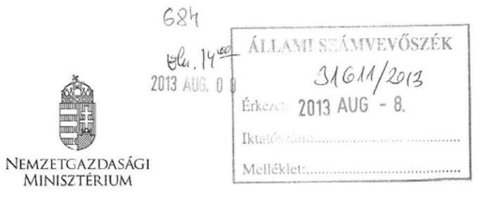

Iktatószám: NGM/17685-3/2013
Hiv.szám: V-0009-262/2013

## Domokos László

elnök úr részére

## Állami Számvevőszék

Budapest

## Tisztelt Elnök Úr!

A közfoglalkoztatás és a hozzá kapcsolódó képzési programok támogatási rendszere hatékonyságának, eredményességének vizsgálatát összegző számvevőszéki jelenéstervezetet köszönettel megkaptam.
A jelentésben foglalt megállapításokkal, amelyek a Nemzetgazdasági Minisztérium és jogelődjeire vonatkoznak, egyetértek, azokkal kapcsolatosan észrevételt nem teszek.
A tárcát érintő javaslatukat megfontolandónak tartom, egyetértek azzal, hogy a Közfoglalkoztatási Adatbázis vezetéséről szóló kormányrendelet tartalmazza az adatrögzítések határidejét is.
A számvevők vizsgálat alatti korrekt és konstruktív együttműködését ezúton köszönöm.

Budapest, 2013. július $5 / 2$,
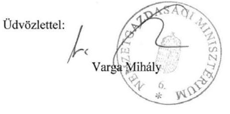

---

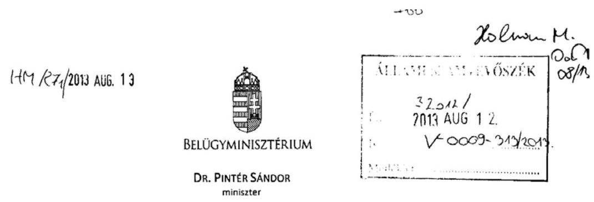

Domokos László úrnak, Állami Számvevőszék elnök

Budapest

Tárgy: Közfoglalkoztatást érintő ÁSZ ellenőrzés jelentéstervezetével kapcsolatos észrevételek Iktatószám: BM/11379-2/2013
Úgyintéző: Réthy Pál
Tel.: +36-1-441-1214
E-mail: pal.rethy@bm.gov.hu

# Tisztelt Elnök Úr! 

A közfoglalkoztatás és a hozzá kapcsolódó képzési programok támogatási rendszerek hatékonyságának, eredményességének ellenőrzéséről készített számvevőszéki jelentéstervezet tartalmával kapcsolatos észrevételeimet mellékelten megküldöm.

Melléklet: szakmai észrevételek

Budapest, 2013. augusztus „ ${ }^{2}$ „

A kiadmányozás hiteléül: $\qquad$
Budapest. 2013. $\qquad$
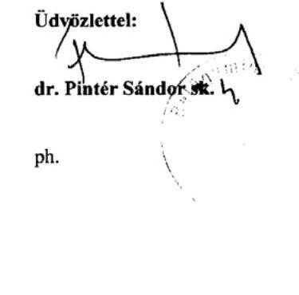

---

# 13. SZÁMÚ MELLÉKLET A V-0009-339/2013. SZÁMÚ JELENTÉSHEZ 

Melléklet

## 1. Összegzö megállapítok, következtetések, javaslatok fejezet

A ellenörzés intézkedést igénylö megállapításai és javaslatai a belügyminiszternek részhez:

## 19. oldal:

Az 1. pontban szereplő ténymegállapítások a 2009-2010. évi közhasznú munkavégzés támogatásának, továbbá az ezen időszakban megvalósitott közfoglalkoztatás tapasztalatain alapolnak, amely programok megvalósításában a Belügyminisztérium nem volt érintett. Az önkormányzatok közfoglalkoztatáshoz kapcsolódó tervezésének alapja (álláskeresők létszáma, FHT-ban, rehabilitációs ellátásban részesülök létszáma, helyi fejlesztési elképzelések) helyben rendelkezésre áll, az egyes programok szakmai-pánztügyi tervezése nem sérül. A közfoglalkoztatás tervezése és az önkormányzatok költségvetés rendszere összhangjának megteremtése a központi költségvetés és a helyi önkormányzatok költségvetési tervezése különbözösége miatt korlátozott.

Az állambáztartásról szóló 2011. évi CXCV. törvény rendelkezései szerint a Kormány szeptember 30-ig nyújtja be az Országgyúlésnek a központi költségvetésről szóló javaslatot, majd az ezt követő törvényjavaslat tárgyalása során november 30 -ig egyedi határozathon meghatározza a központi költségvetésről szóló törvény fejezeteinek bevételi és kiadási föösszegét és a központi költségvetés költségvetési egyenlegét.

A helyi önkormányzat a költségvetését költségvetési rendeletben állapítja meg. A jegyző által elkészített, a következő évre vonatkozó költségvetési koncepciót a polgármester október 31-ig nyújtja be a képviselő-testületnek. A jegyző által előkészített költségvetési rendelet-tervezetet a polgármester a központi költségvetésről szóló törvény hatálybalépését követő negyvenötödik napig nyújtja be a képviselő-testületnek.

Mindezek figyelembe vételével törekszünk arra, hogy javaslat a 2014. évi tervezésbe beépüljön.

## 19-20. oldal:

A jelentéstervezet 19. és 20. oldalán található 4. számú intézkedési javaslat szerint a Belügyminiszternek kell intézkednie a megbízható adatszolgáltatási rendszer müködhetéséről.

A Nemzeti Munkailgyi Hivatalról és a szakmai irányítása alá tartozó szakigazgatási szervek feladat és hatásköréről szóló 323/2011. (XII. 28.) Korm. rendelet 6. § (1) bekezdés c) pontja szerint az NMH „meghatározza és kidolgozza a hatósági és szolgáltató tevékenység ellátásához szükséges informatikai és számúsigépex rendszereket, valamint müködleti a Hivatal kezelésében lévő informatikai és számúsigépex rendszereket, továbbá ennek körében fejleszti, teszteli, települ, módonítja a programrendszereket, és kiadja a programkezeléssel kapcsolatos felhasználói segédanyagokat".

A foglalkoztatáspolitikai célokkal összhangban lévő, a közfoglalkoztatási célok megvalósításának méreséhez és értékeléséhez szükséges, megbízható adatszolgáltatási rendszer kialakítását a fentiek alapján a BM csak az NMH feletti szakmai irányítási jogköröket gyakorló NGM közremüködésével tudja biztosítani. A fentiekre tekintettel kérem a két minisztérium együttes felelősként való megjelenítését.
20. oldal.

A jelentéstervezet 20. oldalán található 5. számú intézkedési javaslat szerint a Belügyminiszternek intézkednie kell - az önkormányzatok törvényességi felügyeletét ellátó miniszterrel együttmüködve -

---

a Foglakkoztatási és Közfoglakkoztatási Adatházis adatainak megbizhatósága érdekében arról, hogy a jegyzők adatrögzítési kötelezettségüknek eleget tegyenek.

A foglalkoztatás elősegítéséről és a munkanélküliek ellátásáról szóló 1991. évi IV. törvény (a továbbiakban: Flt.) 57/II. § (1) bekezdése szerint az állami foglalkoztatási szerv (Nemzeti Munkaügyi Hivatal) vezeti a Foglalkoztatási és Közfoglalkoztatási Adatházist. Bár az Flt. 57/II. § (6) bekezdése szerint a települési önkormányzatok jegyzői is rögzítenek adatot az Adatházisban, ez nem változtat azon a tényen, hogy az Adatházist az NMH vezeti.

A közigazgatási hatósági eljárás és szolgáltatás általános szabályairól szóló 2004. évi CXL. törvény 86. § (3) bekezdése a nyilvántartást vezető hatóság részére állapít meg kötelezettséget: ,,a nyilvántartást vezető hatóság hivatalból köteles (...) az elmulasztott bejegyeést pánént."

Tekintettel arra, hogy a hatályos törvények egyértelműen rendelkeznek arról, hogy mely hatóságnak kell a jogellenesen elmulasztott bejegyzés pótlásáról gondoskodnia, ezért kérjük, hogy a jelentéstervezetben az intézkedési javaslat felelőseként az NMH feletti szakmai irányítói jogkört gyakorló NGM-et jelöljék meg.

# Részletes megállapítások fejezet 

1.1 pont, 25. oldal 3. bekezdéshez:

A 2012. év elejétől lehetővé vált az elsődleges munkaerő-piaci elhelyezkedés mérése, amely már a rendszeres havi adatszolgáltatásban is megjelent. Az adatok a 6 hónappal korábban kilépettek közül az elsődleges munkaerő-piacon 1 hónapon belül elhelyezkedettek, továbbá az elsődleges munkaerőpiacon 180 . napon munkában állók létszámát tartalmazzák.

### 1.3 pont, 35. oldal utolsó bekezdéséhez:

A megállapítás pontositása szükséges, tekintettel arra, hogy az Flt. 39./A (2) bekezdés alapján a külön jogszabályban meghatározott közfoglalkoztatás támogatására fordítható pénzeszközök felhasználását a foglalkoztatáspolitikaiért és a közfoglalkoztatásért felelős miniszter együttesen, határozza meg. Az országos közfoglalkoztatási program indítására és az azzal kapcsolatos kötelezettségvállalásra a közfoglalkoztatásért felelős miniszter jogosult.

### 3.1 pont, 51. oldal 3. bekezdéshez:

A Foglalkoztatási Szolgálat regionális/megyei átalakulása folyamatában egy ideig kiemelt és nem kiemelt hatáskörrel és illetékességgel rendelkező megyei munkaügyi központok is müködtek. Az előbbiek a korábbi regionális munkaügyi központok székhelyein, utóbbiak pedig az egyes régiókhoz tartozó többi megyei szervezeti egységeknél müködtek.

### 3.3 pont, 57.-58.-59. oldalakhoz:

A „Szociális Adatházis" kifejezést „Foglalkoztatási és Szociális Adtabázis", a „Közfoglalkoztatási Adatházis" kifejezést „Foglalkoztatási és Közfoglalkoztatási Adatházis,, kifejezésre szükséges módosítani.

A jelentéstervezet és az ellenőrzési időszak részét képező, 2011. év júliusát megelőző időszak közfoglalkoztatással kapcsolatos megállapításaihoz - az I. fejezet kivételével - további észrevételt nem teszek, tekintettel arra, hogy ezen időszakban e feladatok ellátásában és koordinációjában a Belligyminisztérium közvetlenül nem volt érintett.

---

# 14. SZÁMÚ MELLÉKLET A V-0009-339/2013. SZÁMÚ JELENTÉSHEZ 

## 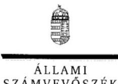

Ikt.szám: V-0009-323/2013.

## Dr. Pintér Sándor úr

miniszter
Belügyminisztérium

## Budapest

## Tisztelt Miniszter Úr!

A közfoglalkoztatás és a hozzá kapcsolódó képzési programok támogatási rendszere hatékonyságának, eredményességének ellenőrzéséről készített számvevőszéki jelentéstervezetre tett észrevételeit köszönettel megkaptam.

Az Állami Számvevőszék észrevételekre vonatkozó álláspontjáról a felügyeleti vezető által készített részletes tájékoztatást csatoltan megküldöm.

Tájékoztatom Miniszter urat, hogy a jelentésben - az Állami Számvevőszékről szóló 2011. évi LXVI. törvény 29. § (3) bekezdése alapján - az el nem fogadott észrevételeket szerepeltetjük az elutasítás indokának feltüntetésével együtt. Az elfogadott észrevételeket a jelentés szövegezésénél figyelembe vesszük.

Budapest, 2013. O 5 hó /o nap

Tisztelettel:
D
Domokos László

Melléklet: Tájékoztatás az elfogadott és az el nem fogadott észrevételekröl
E L N ${ }^{1}$

---

# Tájékoztatás 

## az elfogadott és az el nem fogadott észrevételekröl

A közfoglalkoztatás és a hozzá kapcsolódó képzési programok támogatási rendszere hatékonyságának, eredményességének ellenőrzéséről készített jelentéstervezetre BM/003792/2013 iktatószámú levelében tett észrevételeit áttekintettük, azok kezeléséről az alábbi tájékoztatás adom:

Köszönettel vettem, hogy a jelentéstervezet 1. számú javaslatának végrehajtása érdekében a 2014. évi központi költségvetés tervezésénél és a közfoglalkoztatási programok kidolgozásánál az önkormányzatok költségvetés-tervezésének a központitól eltérő ütemezését figyelembe veszi. Ez hozzájárul ahhoz, hogy az önkormányzatoknak költségvetésük tervezésének időpontjában információjuk legyen a települést érintő, várható közfoglalkoztatási programokról, létszámokról, támogatási paraméterekről.

A jelentéstervezetben a belügyminiszternek tett 4. számú javaslatunkra tett észrevételét nem fogadjuk el. A közfoglalkoztatás információs hátterét biztosító informatikai rendszereket (Foglalkoztatási és Közfoglalkoztatási Adatbázis, Foglalkoztatási Szolgálat IR rendszere) a Nemzeti Munkaügyi Hivatal müködteti, amely az NGM szakmai irányítása alatt áll. Az egyes miniszterek, valamint a Miniszterelnökséget vezető államtitkár feladat- és hatásköréről szóló 212/2010. (VII. 1.) Korm. rendelet 37. § w) pontja szerint 2011. június 17 -étől a közfoglalkoztatásért a belügyminiszter felelős. A feladatellátás érdekében olyan rendszereket kell kialakítania és müködtetnie, amelyek biztosítják, hogy a megfelelő információk a megfelelő időben eljussanak az illetékes szervezethez, szervezeti egységhez, illetve személyhez. Továbbá az információs rendszerek keretében a beszámolási rendszereket úgy kell müködtetni, hogy azok hatékonyak, megbízhatóak és pontosak legyenek, a beszámolási szintek, határidők és módok világosan meg legyenek határozva. Mindezek alapján a belügyminiszter feladata a szükséges információk, adatok tartalmának meghatározása és az információk biztosításának megszervezése. Amennyiben ezeket az adatokat, információkat a Nemzeti Munkaügyi Hivatal által müködtetett informatikai rendszerek biztosítják, úgy a belügyminiszternek kell a közfoglalkoztatási célok megvalósításának méréséhez és értékeléséhez szükséges, megbízható adatszolgáltatási rendszer kialakításában a nemzetgazdasági miniszter együttmüködését kérnie.

A belügyminiszternek tett 5. számú javaslattal kapcsolatos észrevételét nem fogadjuk el. A feladatellátás keretében a közfoglalkoztatás információs és kommunikációs rendszerének kialakítása és megbízható müködtetése a belügyminiszter feladata. Ehhez az információk egy részét a Foglalkoztatási és Közfoglalkoztatási Adatbázis nyújtja, amely adatainak megbízhatóságát befolyásolja, hogy a jegyzők adatszolgáltatási kötelezettségüknek eleget tesznek-e. Amennyiben a Foglalkoztatási és Közfoglalkoztatási Adatbázis adatai továbbra is a közfoglalkoztatás információs rendszerének részét képezik, fontosnak tartjuk, hogy a közfoglalkoztatásért felelős mi-

---

niszter az adatok megbízhatósága érdekében intézkedéseket kezdeményezzen minden adatszolgáltatásban érintett felé. Javaslatunk is erre irányult. A Foglalkoztatási és Közfoglalkoztatási Adatbázist vezető Nemzeti Munkaügyi Hivatal felett a szakmai irányítói jogkört az NGM gyakorolja. Ezért tettünk a jelentéstervezetben a nemzetgazdasági miniszternek javaslatot arra, hogy kezdeményezze a Foglalkoztatási és Közfoglalkoztatási Adatházis vezetéséről szóló 169/2011. (VIII. 24.) Korm. rendelet módosítását annak érdekében, hogy az tartalmazza az adatrögzítési kötelezettség határidejét.

Köszönettel vettük a részletes megállapításokhoz tett 1. észrevételét, amelyben arról tájékoztat, hogy 2012. elejétől lehetővé vált a közfoglalkoztatottak elsődleges munkaerő-piacon való elhelyezkedésének mérése. Észrevétele megállapításunkat nem módosítja, mivel - mint ahogyan jelentésünk 60 . oldalán kifejtettük - a közfoglalkoztatottak számára vonatkozóan adott időállapotra a Belügyminisztériumnál és a Nemzeti Munkaügyi Hivatalnál 2009 és 2011. között eltérő adatok álltak rendelkezésre. Ez 2012. I. negyedévében is így volt. Erre az időszakra vonatkozóan a Belügyminisztérium 32683 fó, a Nemzeti Munkaügyi Hivatal 82762 fő közfoglalkoztatási létszámot adott meg. (A Nemzeti Munkaügyi Hivatal adatával a 2. számú mellékletet kiegészítettük.) Az adatok eltérése miatt érdemben nem ítélhető meg, hogy az elsődleges munka-erő-piacon a közfoglalkoztatottak elhelyezkedése mennyiben volt sikeres.

A részletes megállapításokhoz tett 2. észrevételét elfogadjuk, a jelentés szövegét kiegészítjük a Nemzeti Foglalkoztatási Alapból - a közfoglalkoztatásra fordítandó pénzeszközök felhasználásánál - a nemzetgazdasági miniszter és a belügyminiszter együttes joggyakorlásával.

A részletes megállapításokhoz tett 3. észrevételét részben fogadjuk el. A regionális munkaügyi központok megszűnését követően megyei munkaügyi központok működtek, amelyeknek valóban eltérő volt a hatáskörük. Egyes megyei munkaügyi központok kiemelt (nem csak megyei szintű) hatáskörrel, más megyei munkaügyi központok csak a megyére kiterjedő hatáskörrel rendelkeztek. Ezért fenntartva azt a megállapításunkat, hogy 2011. január 1-jétől a regionális munkaügyi központok helyett megyei munkaügyi központok jöttek létre, a jelentésben a munkaügyi központok regionalitására vonatkozó szövegrészt pontosítjuk.

A jelentéstervezet 5. és 6. oldalain a rövidítések jegyzékében a Foglalkoztatási és Szociális Adatházisra, valamint a Foglalkoztatási és Közfoglalkoztatási Adatbázisra vonatkozó rövidítések szerepeltek. Mind az összegző, mind a részletes megállapításoknál ezeket a rövidítéseket használtuk, ezért észrevételét nem fogadjuk el.

Tájékoztatom, hogy a számvevőszéki jelentés mellékleteiként szerepeltetjük a jelentéstervezethez tett észrevételeit, valamint azokra adott válaszunkat.

Budapest, 2013. 05 hó -C nap

---

# 15. SZÁMÚ MELLÉKLET A V-0009-339/2013. SZÁMÚ JELENTÉSHEZ 

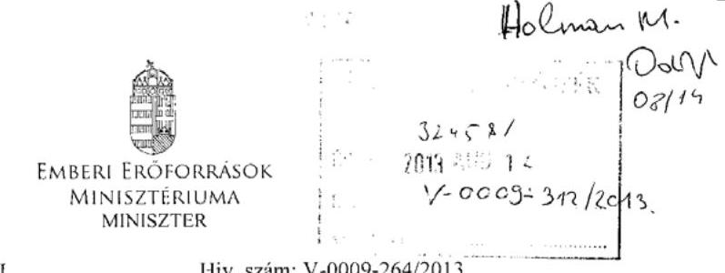

Iktatószám: 8538-10/2013/ELL
Hiv. szám: V-0009-264/2013.

## Domokos László részére elnök

Állami Számvevőszék

Budapest
Apáczai Csere János u. 10.
1052

Tárgy: A közfoglalkoztatás és a hozzá kapcsolódó képzési programok támogatási rendszere hatékonyságának, eredményességének ellenőrzéséről készített számvevőszéki jelentéstervezet észrevételezése

Tisztelt Elnök Úr!

Az észrevételezés céljából részemre megküldött, a közfoglalkoztatás és a hozzá kapcsolódó képzési programok támogatási rendszere hatékonyságának, eredményességének ellenőrzéséről készített számvevőszéki jelentéstervezethez az alábbi észrevételeket tesszük.

1. A Jelentéstervezet 13. oldalán szereplő megállapítás szerint: „A munkára ösztönzést szolgálta a 2011. év szeptemberétól bevezetett közfoglalkoztatási bérezési rendszernek, majd a 2012. év jomuáriától az FHT-ra való jogosultságnak - a legalább évi 30 nap munkaviszony igazolásához kötött - módosítása is."

Az FHT-ban részesülő személyek részére előírt 30 nap időtartamú tevékenységi kötelezettség 2011. január 1-jétől szerepel a szociális igazgatásról és szociális ellátásokról szóló 1993. évi törvényben (a továbbiakban: Szt.). A kötelezettség teljesítésére egy év áll az ellátásban részesülők részére, tehát a teljesítés ellenőrzése 2012-évben volt először esedékes.
Kérjük a jelentés vonatkozó részében a jogszabály hatályba lépésére vonatkozó dátum javítását.
2. A Jelentéstervezet 23. oldalának alján szereplő szöveg szintén a 2012. január 1-jét jelöli meg a munkavégzési kötelezettség kezdeti dátumaként. Kérjük az időpont javítását.

---

3. A Jelentéstervezet 25. oldalán található ismertető szerint: „A rendszeres szociális segély új összegét 2012. január 1-jétől a közfoglalkoztatási bér 90\%-ában, 42326 Ft-ban [...] állapították meg."

Az Szt. nem határozza meg a rendszeres szociális segély fix összegét, a 42326 Ft-os összeg az ellátás maximuma.
Kérjük a szöveghely pontositását a következők szerint: A rendszeres szociális segély új maximumát 2012. január 1-jétöl a közfoglalkoztatási bér 90\%-ában, 42326 Ft-ban, a BPJ-t felváltó FHT összegét pedig a korábbi összeg 80\%-ában, 22800 Ft-ban állapították meg."
4. A Jelentéstervezet 30. oldalán szereplő megállapítások szerint: „A rendszeres szociális segélyen részesültek számának csökkenése, valamint a RÁT/BPJ/FHT-ra jogosultak számának növekedése mögött a 2009. évben a szabályozási környezetben bekövetkezett szigoritások állnak." [...] „A 2009. évben a rendszeres szociális segély jogosultsági feltételeinek szigorodása miatt az önkormányzatok teljes körü felülvizsgálatot végeztek. Ennek következményeként a rendszeres szociális segélyben részesülök száma csökkent, az FHT-ra jogosultak száma nőtt."
2009. január 1-jétől differenciálódott a hátrányos munkaerő-piaci helyzetű, aktív korú személyek ellátórendszere. A hátrányos munkaerő-piaci helyzetű, aktív korú személyek 2009. január 1. óta a rendszeres szociális segély helyett az ún. aktív korúak ellátására szerezhetnek jogosultságot. Az aktív korúak ellátása keretében két féle ellátás biztosítható: a munkavégzésre alkalmas személyek foglalkoztatást helyettesítő támogatásban (korábbi nevén rendelkezésre állási támogatás, bérpótló juttatás) részesülhetnek, a munkavégzésre nem alkalmas személyek pedig rendszeres szociális segélyre lehetnek jogosultak. Az ellátottak számában bekövetkező változások tehát az ellátórendszer átalakításából adódnak. Javasoljuk a következő megfogalmazás használatát:
„A rendszeres szociális segélyen részesültek számának csökkenése, valamint a RÁT/BPJ/FHT-ra jogosultak számának növekedése mögött a 2009. évben-a-szabályozási környezetben bekövetkező szigoritások évtől életbe lépő, az ellátórendszer struktúrááát érintő változások álltak." [...] „A 2009. évben hatályba lépő változások miatt a-rendszeres szociális segély jogosultsági feltételeinek szigorodása miatt az önkormányzatok teljes körü felülvizsgálatot végeztek. Ennek következményeként a rendszeres szociális segélyben részesülök száma csökkent, az FHT-ra jogosultak száma nőtt."
5. A Jelentéstervezet 58. oldalán szereplő megállapítás szerint: „Már a Szociális Adatbázis bevezetésekor ismert volt, hogy az önkormányzatok eltérő szociális ügyviteli programokkal rendelkeznek, és ahhoz, hogy azokból adatokat tudjanak interfész kapcsolattal átemelni, informatikai fejlesztésre lenne szükség. [...]"

A megállapítással kapcsolatban tájékoztatásul jelezzük, hogy a „Központi szociális információs fejlesztések" című kiemelt projekt (TÁMOP-5.4.2.-12/1) finanszírozásával 2013-2014 között megvalósuló fejlesztések egyik komponensében kerül sor a jegyzői és járási hatáskörben nyújtott szociális és gyermekvédelmi pénzbeli és természetbeni ellátások egységes nyilvántartásának kialakítására. A projekt 2013 februárjában indult a Nemzeti Rehabilitációs és Szociális Hivatal (a továbbiakban: NRSZH) megvalósításában. A nyilvántartás müködésének megkezdését követően elektronikus kapcsolat alakítható ki az erre felkészült társszervezetekkel és rendszerekkel.

---

6. A Jelentéstervezet 7. sz. melléklete a RÁT/BPJ/FHT ellátások tekintetében tartalmaz egy „Erintett létszám" elnevezésű oszlopot is. Nem egyértelmű az e kategóriába tartozó személyek köre, kérjük ezért az Állami Számvevőszék segítségét a fogalmak tisztázása érdekében.
7. A Jelentéstervezet 1. sz. függelékét képező Értelmező szótár 5. oldalán található a „RÁTra, BPJ-re, FHT-ra való jogosultság" meghatározása, amely szerint: „, Annak a személynek, aki aktív korúak ellátására jogosult, de a rendszeres szociális segély már nem illeti meg. 2010. december 31-ig RÁT-ot, 2011. augusztus 31-ig BPJ-t, 2011. szeptember 1-jétől FHTt kell kérelmére megállapítani.[...]"

Az Szt. szabályai szerint az aktív korúak ellátására jogosult személyek fószabály szerint RÁT-ra, BPJ-re, FHT-ra (voltak) jogosultak. Rendszeres szociális segélyben azok az aktív korúak ellátására jogosult személyek részesülnek, akik valamilyen oknál fogva munkavégzésre nem alkalmasak.
Javasoljuk a RÁT-ra, BPJ-re, FHT-ra való jogosultság" meghatározásának elejét a következők szerint javítani:
„Az aktív korúak ellátására jogosult, munkára képes személyek számára biztosítható pénzbeli ellátásként 2010. december 31-ig RÁT, 2011. augusztus 31-ig BPJ volt folyósítható. 2011. szeptember 1-jétől az ellátás neve FHT-ra változott. A jogosultság feltételeit 2009. január 1-jétől a Szoctv. 33.§, 35.§ és 37.§ határozzák meg. [...]"
8. A Jelentéstervezet 2. sz. függeléke ismerteti - egyéb juttatások mellett - az aktív korúak pénzbeli ellátásainak összegét érintő változásokat. A RÁT/ BPJ/FHT ellátások mértéke tekintetében az Szoctv. mindig fix összeget határozott meg, és az ellátás összege jelenleg is minden esetben havi 22800 Ft .
Kérjük a 2. sz. függeléket képező táblázat 20. sorában a „maximum" szavak törlését:
„Maximum: Az öregségi nyugdij legkisebb összege (Szoctv.35.§ (4) bekezdés)"
„Maximum: Az öregségi nyugdij legkisebb összegének 80\%-a (Szoctv.35.§ (4) bekezdés)"
Kérem Elnök Urat, hogy a jelentés véglegezésekor az észrevételeinket figyelembe venni szíveskedjenek.

Budapest, 2013. augusztus 7
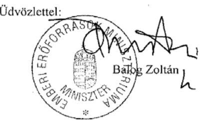

---

Ikt.szám: V-0009-324/2013.

# Balog Zoltán úr 

emberi eröforrások minisztere
Emberi Eröforrások Minisztériuma

## Budapest

## Tisztelt Miniszter Úr!

A közfoglalkoztatás és a hozzá kapcsolódó képzési programok támogatási rendszere hatékonyságának, eredményességének ellenőrzéséről készített számvevőszéki jelentéstervezetre tett észrevételeit köszönettel megkaptam.

Az Állami Számvevőszék észrevételekre vonatkozó álláspontjáról a felügyeleti vezető által készített részletes tájékoztatást csatoltan megküldöm.

Tájékoztatom Miniszter urat, hogy a jelentésben - az Állami Számvevőszékről szóló 2011. évi LXVI. törvény 29. § (3) bekezdése alapján - az el nem fogadott észrevételeket szerepeltetjük az elutasítás indokának feltüntetésével együtt. Az elfogadott észrevételeket a jelentés szövegezésénél figyelembe vesszük.

Budapest, 2013. O5 hó /o nap

Tisztelettel:
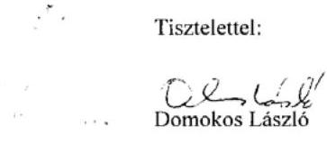

Melléklet: Tájékoztatás az elfogadott és az el nem fogadott észrevételekröl

---

# Tájékoztatás 

## az elfogadott és az el nem fogadott észrevételekröl

A közfoglalkoztatás és a hozzá kapcsolódó képzési programok támogatási rendszere hatékonyságának, eredményességének ellenőrzéséről készített jelentéstervezetre 853810/2013/ELL iktatószámú levelében tett észrevételeit áttekintettük, azok kezeléséről az alábbi tájékoztatás adom:

Észrevételének 1. és 2. pontja alapján a jelentésben a jogszabályhelyeket pontosítjuk.
A 3. pontban foglalt észrevételét elfogadtuk, és a rendszeres szociális segély összegével kapcsolatos szövegrészt a jelentésben kiegészítjük.

A 4. pontban foglalt észrevételét nem fogadtuk el. A Szoctv. 37/A. § (1) bekezdése határozta meg 2008. december 31-ig a rendszeres szociális segélyre jogosultak körét (egészségkárosodottak, vagy nem foglalkoztatottak, vagy támogatott álláskeresők). A 2009. január 1-jétől életbe lépett változások után a rendszeres szociális segély szükebb körben illette meg a rászorultakat (a Szoctv. 37/B. §-a szerint az egészségkárosodott, vagy az 55. életévüket betöltött személyek, vagy bizonyos feltételek fennállása esetén 14. év alatti kiskorú gyermek nevelését ellátó személyek). A korábban rendszeres szociális segélyre jogosultak közül 2009. január 1-jétől a nem foglalkoztatottak, vagy a támogatott álláskeresők egy része az alacsonyabb összegủ rendelkezése állási támogatásra válhatott már csak jogosulttá. Így az aktív korúak ellátásában a rendszeres szociális segély ellátási forma mellett a rendelkezésre állási támogatás bevezetése a korábbi ellátási feltételek szigorítását eredményezte. Ez egyben az ellátórendszer struktúrájában bekövetkező változást is jelentette. Ellenőrzésünknél a közfoglalkoztatásban potenciálisan érintett csoportok szempontjából a szabályok szigorodása fontos tényező volt.

Az 5. pontban foglalt észrevétele jelentésünk megállapításait nem módosítja, ahhoz csak további kiegészítő információt nyújt. Örömmel vettük, hogy a „Központi szociális és információs fejlesztések" címủ kiemelt projekt (TÁMOP-5.4.2.-12/1) keretében megkezdték a jegyzői és járási hatáskörben nyújtott szociális ellátások egységes nyilvántartásának kialakítását. Az elektronikus kapcsolat kialakítására az erre felkészült társszervezetekkel és rendszerekkel - mint levelében utalt rá - csak az informatikai rendszer müködésének megkezdését követően lesz lehetőség. Ekkor lesz csak megbízható információ arról, hogy a létrehozott informatikai rendszer és a Foglalkoztatási és Közfoglalkoztatási Adatbázis között az elektronikus kapcsolat kialakítha-tó-e.

A 6. pontban foglalt észrevétele alapján a jelentés 7. számú mellékletében az adatforrásokra való hivatkozást kiegészítjük. A jelentéstervezet 7. számú mellékletében szereplő adatokat a

---

Nemzeti Munkaügyi Hivatal szolgáltatta és az a RÁT/BPJ/FHT ellátásokba belépők számát tartalmazta.

A 7. pontban foglalt észrevételét részben fogadjuk el, mivel 2009. január 1-jétől az aktív korúak ellátása tekintetében két ellátási forma létezett: a RÁT, (majd BPJ, majd FHT), illetve a rendszeres szociális segély. Ezért az értelmező szótárban fontosnak tartjuk annak tisztázását, hogy az aktív korúak ellátásának jogosultsági feltételei a rendszeres szociális segély és a RÁT/BPJ/FHT-ra való jogosultsági feltételei között oszlanak meg. A jogosultsági feltételekre vonatkozó jogszabályi hivatkozást a jelentés 1. számú függeléke „RÁT-ra, BPJ-re, FHT-ra való jogosultság" meghatározásánál pontosítjuk.

A 8. pontban foglalt észrevétele alapján a 2. számú függeléket pontosítjuk és a 20. sorban a maximum szavakat töröljük.

Tájékoztatom, hogy a számvevőszéki jelentés mellékleteiként szerepeltetjük a jelentéstervezethez tett észrevételeit, valamint azokra adott válaszunkat.

Budapest, 2013. (a) hó (c) nap

Holman Magdolna
felügyeleti vezető

---

# Nemzeti Munkaügyi Hivatal   Föigazgató 

Iktatószám: 26276/2013/5000
Ügyintéző: Pásztor Szilvia
Telefonszám: 0613030007
Tárgy: ASZ jelentéstervezet észrevételezése

Állami Számvevőszék
Domokos László
elnök úr részére

Budapest
Apáczai Csere J. u. 10.
1052
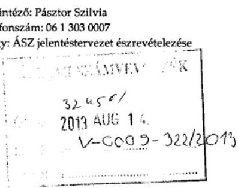

Tisztelt Elnök Úr!

Köszönettel megkaptuk a V-0009-265/2013 iktatószámú levelük kíséretében számvevőszéki jelentéstervezetüket, amely a közfoglalkoztatás és a hozzá kapcsolódó képzési programok támogatási rendszere hatékonyságának, eredményességének ellenőrzéséről szól.

A leírtakkal kapcsolatban észrevétellel kívánunk élni.

1. A számvevők a jelentés 17. oldalán az összegző megállapítások fejezetben, illetve az 58. oldalon a részletes vizsgálati eredmény ismertetésénél kockázatként fogalmazták meg az utólagos adatrögzítés lehetőségét. Ehhez részben kapcsolódik az a másik megállapítás, hogy az adatok nyilvántartásának naprakészsége nem volt biztosított, amelynek elmaradása az adatok megbízhatóságát megkérdőjelezi.
Ezen megállapításokkal kapcsolatban az NMH fontosnak tartja megjegyezni, hogy az eljárási rendekben a BM és az NGM egyeztetése után 2013. során rögzítésre kerültek az adatszolgáltatási feladatok és azok határideje. Egyes utólagos rögzítési tevékenységek lehetősége az Integrált Rendszerben (IR) részben arra vezethetőek vissza, hogy a közfoglalkoztatási programokban résztvevők köre teljes bizonyossággal az egyes elszámolási időszakokban adható meg, tekintettel arra, hogy a programba bevont szereplők (egyének) a program végrehajtása közben is cserélődnek. Ennek további módszertani szabályozása a tevékenységek jellegére tekintettel érdemben már nem szigorítható.
Az önkormányzatok kései rögzítési gyakorlata miatt a Belügyminisztérium a határidők tekintetében a szükséges lépéseket az önkormányzatok felé időközben megtette. Ezt a tényt, valamint az utólagos rögzítés lehetőségének indokait javasoljuk a tervezetben feltüntetni.
2. A jelentés 64. oldalán szereplő megállapítással kapcsolatban, amely szerint „a közfoglalkoztatás információs, beszámolási és monitoring rendszere a rendszeres nyomon követésre, a teljesítmények mérésére nem volt alkalmas", megjegyezzük, hogy a közfoglalkoztatás információs rendszerében a programok létszám és pénzügyi adatainak elérhetősége 2011 óta folyamatosan biztosított. A rendszerből kinyerhető adatok a felállításakor megfogalmazott

---

elvárásoknak, és lehetőségeknek megfelelően kerültek meghatározásra, a rendszer kialakítása a végrehajtási jogszabály rendelkezései szerint történt.
Új igényként a Belügyminisztérium már felkérte az Nemzeti Munkaügyi Hivatalt az egységes és összevethető monitoring rendszer kialakítására, bevezetésére, így a feladatot a szakmai tervezés szintjén már végezzük.

Kérjük, szíveskedjenek a felsorolt információkkal a jelentést kiegészíteni, illetve megállapításakkat módosítani.

Ugyanakkor szeretném köszönetemet kifejezni Önnek és munkatársainak a vizsgálat lefolytatásáért, valamint az igen alaposan összeállított, és hasznos megállapításokat tartalmazó jelentési anyag megküldéséért.

Budapest, 2013. augusztus 7.

Üdvözlettel:
Komáromi Róbert

---

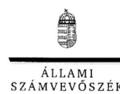

# Komáromi Róbert úr 

fóigazgató
Nemzeti Munkaügyi Hivatal

## Budapest

## Tisztelt Föigazgató Úr!

A közfoglalkoztatás és a hozzá kapcsolódó képzési programok támogatási rendszere hatékonyságának, eredményességének ellenőrzéséről készített számvevőszéki jelentéstervezetre tett észrevételeit köszönettel megkaptam.

Az Állami Számvevőszék észrevételekre vonatkozó álláspontjáról a felügyeleti vezető által készített részletes tájékoztatást csatoltan megküldöm.

Tájékoztatom Főigazgató urat, hogy a jelentésben - az Állami Számvevőszékről szóló 2011. évi LXVI. törvény 29. § (3) bekezdése alapján - az el nem fogadott észrevételeket szerepeltetjük az elutasítás indokának feltüntetésével együtt.

Budapest, 2013. 07 hó /o nap

Tisztelettel:

Tisztelettel:
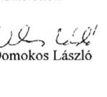

Melléklet: Tájékoztatás az el nem fogadott észrevetelskơől

---

# Tájékoztatás 

## az el nem fogadott észrevételekról

A közfoglalkoztatás és a hozzá kapcsolódó képzési programok támogatási rendszere hatékonyságának, eredményességének ellenőrzéséről készített jelentéstervezetre 26276/2013/5000 iktatószámú levelében tett észrevételeit áttekintettük, azok kezeléséről az alábbi tájékoztatás adom:

Köszönettel vettük tájékoztatását az IR rendszerükben történő utólagos adatrögzités, valamint a Közfoglalkoztatási Adatbázisban az önkormányzatok kései adatrögzitésének elkerülése, továbbá a monitoring rendszer kialakítása érdekében tett intézkedéseiről. Észrevételének első és második pontjában leírtak a jelentéstervezetben tett megállapításainkat nem módosítják, mivel azok az ellenőrzési időszakot (2009-2012. év I. negyedéve) követően történtek.

Tájékoztatom, hogy a számvevőszéki jelentés mellékleteiként szerepeltetjük a jelentéstervezethez tett észrevételeit, valamint azokra adott válaszunkat.

Budapest, 2013. (3) hó iu nap

## 

---

# 19. SZÁMÚ MELLÉKLET A V-0009-339/2013. SZÁMÚ JELENTÉSHEZ 

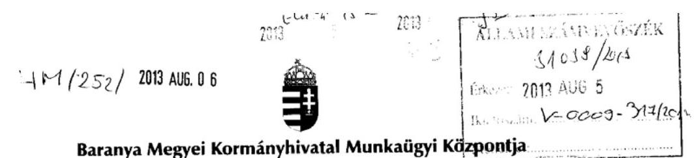

Hiv. szám: V-0009-282/2013.

Iktatószám: II-M-001/779-23/2013.
Úgyintézt: Vuk József
Telefonszám: 06303327432
Tárgy: Észrevétel - jelentés
tervezethez

## Domokos László

Elnök
Állami Számvevőszék
Budapest

Tisztelt Elnök Úr!
Az Állami Számvevőszéknek a közfoglalkoztatás és a hozzá kapcsolódó képzési programok támogatási rendszere hatékonyságának, eredményességének ellenőrzéséről készített jelentéstervezete véleményezési lehetőségét köszönettel vettük.

A tervezet kapcsán a Baranya Megyei Kormányhivatal Munkaügyi Központja egyetlen észrevétellel szeretne élni.
A jelentéstervezet
II. Részletes megállapítások
3.3. Az információs és monitoring rendszer hozzájárulása a közfoglalkoztatás müködtetéséhez Fejezete (az anyag 62. oldalán) így fogalmaz:
„Az ellenörzések során előfordult, hogy szerzödésszegés jogcimen támogatást követeltek vissza a közfoglalkoztatóktól.
A Baranya Megyei Munkaügyi Központ kimutatása szerint a 2011. és 2012. évben összesen 38 esetben szerzödésszegés jogcímen 1206 ezer Ft-ot követeltek vissza a közfoglalkoztatóktól."

A fenti megfogalmazás helyett azt kérnénk, hogy a teljes képet azért valamelyest árnyaló, alábbi szöveg kerüljön az anyagba:
„A különböző (hatósági -, belső-, iratanyag-) ellenőrzések után előfordult, hogy szerződésszegés jogcímén támogatást követeltek vissza a közfoglalkoztatóktól.
A Baranya Megyei Munkaügyi Központ kimutatása szerint a 2011. és 2012. évben összesen 38 esetben szerződésszegés jogcímen 1206 ezer Ft-ot követeltek vissza a közfoglalkoztatóktól.
Az említett valamennyi esetben a szerződésszegések az előlegekkel történő, határidőre történő elszámolások elmaradásából adódtak."

---

A támogatott önkormányzatok a közfoglalkoztatási programok megvalósitásának segítése érdekében, költségeik fedezetére, elöleget vehettek igénybe.
Ezek nagyságát, illetve az ezen összeggel való elszámolás határidejét a megkötött hatósági szerződések tartalmazták.
Az érintett önkormányzatok a felvett előleg teljes összegével a határidő napjáig elszámolni nem tudtak, annak visszavételéhez elegendő számlát az elszámolások során nem nyújtottak be, így kirendeltségeink fizetési felszólítással / visszakövetelő határozattal utasították a különbözzt (az el nem számolt rész) visszafizetésére Öket
A Támogatottak a visszakövetelő határozatban foglalt fizetési kötelezettségüknek valamennyi esetben eleget tettek.

Az esetek tehát nem a klasszikus hatósági ellenőrzések során kerültek feltárásra, és bár a szerződésszegés megállapítható volt (hiszen szerződésben foglalt feladat és határidő sérült), de itt nem a vállalt és támogatott közfoglalkoztatási feladat teljesítésének elmaradása miatt, hanem sokkal inkább pénzügyi, pénzügy technikai okból került sor a visszakövetelő határozatok meghozatalára.

Tisztelt Elnök Úr!
Kérnénk, hogy a jelentés végleges szövegébe - amennyiben ezzel Önök is egyet tudnak érteni - az alap megállapításon felül, a hátteret is kissé bemutató, kiegészítő mondat is bekerülhessen.

Pécs, 2013. július 30.
Tisztelettel:
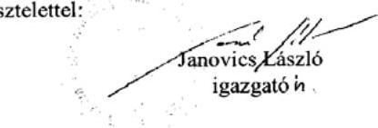

---

# 20. SZÁMÚ MELLÉKLET A V-0009-339/2013. SZÁMÚ JELENTÉSHEZ 

## 20. SZÁMÚ

## JANOVICS LÁSZÍó Úr

igazgató
Baranya Megyei Kormányhivatal Munkaügyi Központja

## Pécs

## Tisztelt Igazgató Úr!

A közfoglalkoztatás és a hozzá kapcsolódó képzési programok támogatási rendszere hatékonyságának, eredményességének ellenőrzéséről készített számvevőszéki jelentéstervezetre tett észrevételét köszönettel megkaptam.

Az Állami Számvevőszék észrevételére vonatkozó álláspontjáról a felügyeleti vezető által készített részletes tájékoztatást csatoltan megküldöm.

Tájékoztatom Igazgató urat, hogy a jelentés szövegezésénél az elfogadott észrevételt figyelembe vesszük.

Budapest, 2013. o > hó to nap

Tisztelettel:
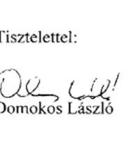

Melléklet: Tájékoztatás az elfogadott észrevételről

---

# Tájékoztatás 

## az elfogadott észrevételről

A közfoglalkoztatás és a hozzá kapcsolódó képzési programok támogatási rendszere hatékonyságának, eredményességének ellenőrzéséről készített jelentéstervezetre II-M-001/77923/2013 iktatószámú levelében tett észrevételét áttekintettük, annak kezeléséről az alábbi tájékoztatás adom:

Az észrevételben leírtak a jelentéstervezetben foglalt megállapításainkat nem módosítják. A feltárt hiányosság jellegéről szóló információval a jelentés szövegét kiegészítjük.

Tájékoztatom, hogy a számvevőszéki jelentés mellékleteiként szerepeltetjük a jelentéstervezethez tett észrevételét, valamint arra adott válaszunkat.

Budapest, 2013. (A) hó (b) nap

## Lulió Cuevauua   Holman Magdolna felügyeleti vezető

---

# 21. SZÁMÚ MELLÉKLET A V-0009-339/2013. SZÁMÚ JELENTÉSHEZ 

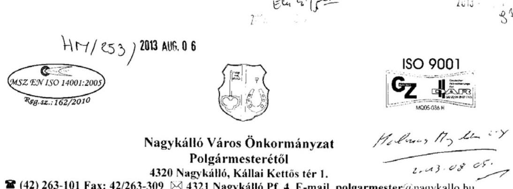

Ügyiratszám: 1473-4/2013.kö̃p
Ügyintéző: Bereczki Mária

Tárgy: Észrevétel és tájékoztatás Hivatkozási szám:V-0009-296/2013

Állami Számvevőszék
Domokos László Elnök Úr részére

Budapest
Apáczai Csere János utca 10. 1052

Állami Számvevőszék
Ügyvisteli Iroda
31050/2013
Érki: AUG - 52013
Btadszám: V-0009-314/2013
Melléklet:

Tisztelt Domokos László Elnök Úr!

Hivatkozva a V-0009-296/2013 iktatószámon küldött levclükre, a közfoglalkoztatás és a hozzá kapcsolódó képzési programok támogatási rendszere hatékonyságának és eredményességének ellenőrzéséről készített számvevőszéki jelentéstervezethez az alábbi észrevételt teszem:
Nagykálló Város Önkormányzat közfoglalkoztatással kapcsolatos feladatait a Polgármesteri Hivatal látja el. 2012. január 1-től életbe lépő szabályozások szükségessé tettek az alapító okiratok felülvizsgálatát is. A jogszabályi változásból eredő elvégzendő feladatokról a mellékelt tájékoztatót kaptuk a Nemzetgazdasági Minisztérium Államháztartási Szabályozási Főosztálya részéről.
Az alapító okirat módosítása tekintetében (5. oldal, VIII. pont) az alábbiakra hívta fel a figyelmet : „Lényeges változás, hogy a helyi önkormányzat, helyi nemzetiségi önkormányzat alaptevékenységeihe/ kapcsolódó szakfeladatok a jövőben nem szerepelhetnek az önkormányzati hivatal alapító okiratában"
Erre való tekintetettel mind az Önkormányzat SZMS/-ben, mind pedig a Polgármesteri Hivatal alapító okiratában szerepeltetett szakfeladatok megosztása során arra törekedtünk, hogy az adott szakfeladat annak a szervnek kerüljön a dokumentumába, amelyik szerv leginkább jogosult és köteles az adott feladat ellátására.
Természetesen az Önök által megküldött jelentéstervezet alapján egyeztettünk a Magyar Államkincstár területi szervével, akik azt a tájékoztatást adták, hogy lehetőség van arra, hogy a Polgármesteri Hivatal alapító okiratába is bejegyzésre kerüljenek az Önkormányzatnál is szerepelhetett, a közfoglalkoztatáshoz kapcsolódó szak feladatok.

---

A fentiekre tekintettel tájékoztatom Tisztelt Elnök Urat, hogy Nagykálló Város Önkormányzat Képviselő - testületének augusztusi ülésére beterjesztésre kerül a - most már - Közös Önkormányzati Hivatal alapító okirat módosítása illetve a Hivatalra vonatkozó SZMSZ módosítása is, amely pótolja az Önök által megfogalmazott hiányosságokat.

Ezúton is szeretném ismételten megköszönni Elnök Úr és az ellenőrzést végző számvevő tanácsos segitő munkáját és támogatását.

Munkájukhoz további sok sikert kívánok!

Nagykálló, 2013. augusztus 1.
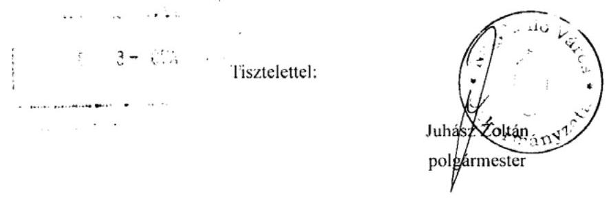

Melléklet:

- tájékoztató a helyi önkormányzatok jegyzői és gazdasági vezetői részére az új államháztartási szabályokról

---

# 22. SZÁMÚ MELLÉKLET A V-0009-339/2013. SZÁMÚ JELENTÉSHEZ 

## 22. SZÁMÚ MELLÉKLET A V-0009-339/2013. SZÁMÚ JELENTÉSHEZ

## 22. SZÁMÚ

SZÁMVEVŐSZÉK

Ikt.szám: V-0009-327/2013.

## Juhász Zoltán úr

polgármester
Nagykálló Város Önkormányzata

Nagykálló

## Tisztelt Polgármester Úr!

A közfoglalkoztatás és a hozzá kapcsolódó képzési programok támogatási rendszere hatékonyságának, eredményességének ellenőrzéséről készített számvevőszéki jelentéstervezethez adott tájékoztatását megkaptam.

Köszönettel vettem, hogy az Állami Számvevőszékről szóló 2011. évi LXVI. törvény 33. § (6) bekezdése szerinti figyelemfelhívásomra intézkedett, ezzel elősegítve az ÁSZ megállapításainak hasznosulását, a feltárt hibák, hiányosságok korrigálását.

Budapest, 2013. 33 hó / nap

Tisztelettel:

Domokos László

---

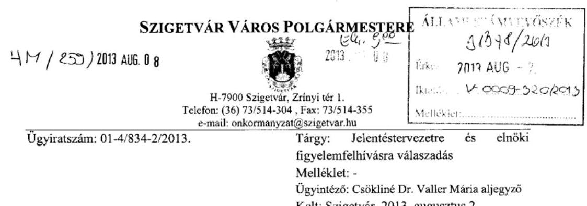

Állami Számvevőszék
Domokos László
elnök

1364 Budapest
4. Pf: 54

Tisztelt Elnök úr!
Köszönettel kézhez vettem a V-0009-289/2013 ikt. számú, a közfoglalkoztatás és a hozzá kapcsolódó képzési programok támogatási rendszere hatékonyságának, eredményességének ellenőrzéséről készített számvevőszéki jelentéstervezetet.

A jelentéstervezetben megfogalmazottakra Szigetvár Város Önkormányzata részéről észrevételt nem kívánok tenni.

Az Állami Számvevőszékről szóló 2011. évi LXVI. tv. 33 § (6) bekezdésében szabályozott, Szigetvár Város Önkormányzata részére szóló elnöki figyelemfelhívással kapcsolatban - annak tudomásulvétele mellett - arról tájékoztatom Elnök urat, hogy a Polgármesteri Hivatal alapító okiratát a 2011. január 1-jétől belépő új közfoglalkoztatási formákra tekintettel a Képviselőtestület soron következő,várhatóan 2013. szeptember 19-én tartandó ülésén a hatályos jogszabályi állapotnak megfelelően aktualizálni fogjuk. A Képviselő-testület alapító okirat módosításáról szóló döntéséről tájékoztatni fogom Elnök urat.

Kérem a fent leírtak szíves tudomásulvételét, egyben megköszönöm a fenti tárgyú számvevőszéki ellenőrzés során munkatársai hatékony és segítőkész tevékenységét.

Tisztelettel
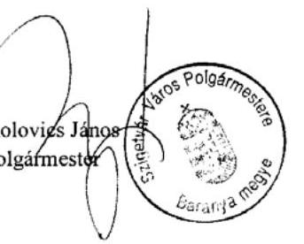

---

# 24. SZÁMÚ MELLÉKLET A V-0009-339/2013. SZÁMÚ JELENTÉSHEZ 

## 24. SZÁMÚ

## Kólovics János úr

polgármester
Szigetvár Város Önkormányzata

## Szigetvár

## Tisztelt Polgármester Úr!

A közfoglalkoztatás és a hozzá kapcsolódó képzési programok támogatási rendszere hatékonyságának, eredményességének ellenőrzéséről készített számvevőszéki jelentéstervezethez adott tájékoztatását megkaptam.

Köszönettel vettem, hogy az Állami Számvevőszékről szóló 2011. évi LXVI. törvény 33. § (6) bekezdése szerinti figyelemfelhívásomra intézkedett, ezzel elősegítve az ÁSZ megállapításainak hasznosulását, a feltárt hibák, hiányosságok korrigálását.

Budapest, 2013. 03 hó 1. nap

Tisztelettel:

## 25

Domokos László

---

# 25. SZÁMÚ MELLÉKLET A V-0009-339/2013. SZÁMÚ JELENTÉSHEZ 

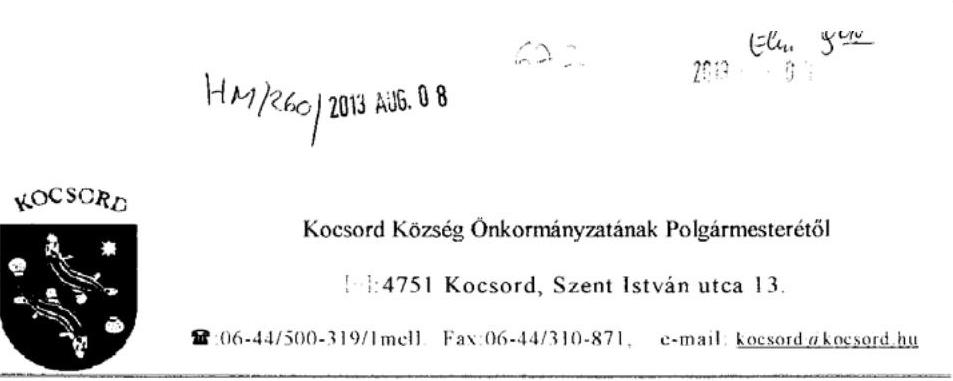

Száma: 240-5/2013.

Állami Számvevőszék
Domokos László
Elnök Úrnak!
Budapest 4.
PI: 54
1364

Tisztelt Elnök Úr!
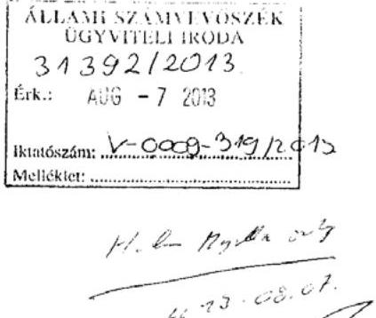

Hivatkozással a közfoglalkoztatás és a hozzá kapcsolódó képzési programok támogatási rendszere hatékonyságának, eredményességének ellenőrzéséről készített V-0009-297/2013. számú számvevőszéki jelentéstervezetre észrevételt nem teszek.

A további szabályszerű gazdálkodás folytatása érdekében a következő tájékoztatást adom:
a képviselő-testület következỏ (várható 2013. szeptember eleje) ülésén kerül az alábbi napirendi pont megtárgyalásra:

- a Polgármesteri Hivatal Szervezeti és Müködési Szabályzatának,
- alapító okiratának módosítására.

Kocsord, 2013. augusztus 2.
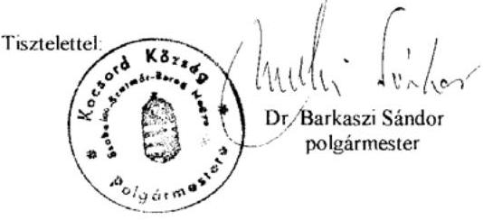

---

# 26. SZÁMÚ MELLÉKLET A V-0009-339/2013. SZÁMÚ JELENTÉSHEZ 

## 2

ÁLLAMI
SZÁMVEVÓSZÉK

## Dr. Barkaszi Sándor úr

polgármester
Kocsord Község Önkormányzata

## Kocsord

## Tisztelt Polgármester Úr!

A közfoglalkoztatás és a hozzá kapcsolódó képzési programok támogatási rendszere hatékonyságának, eredményességének ellenőrzéséről készített számvevőszéki jelentéstervezethez adott tájékoztatását megkaptam.

Köszönettel vettem, hogy az Állami Számvevőszékről szóló 2011. évi LXVI. törvény 33. § (6) bekezdése szerinti figyelemfelhívásomra intézkedett, ezzel elősegítve az ÁSZ megállapításainak hasznosulását, a feltárt hibák, hiányosságok korrigálását.

Budapest, 2013. 05 hó /o nap

Tisztelettel:

## Celsedliz

Domokos László

---

# TARPA NAGYKÖZSÉG ÖNKORMÁNYZAT POLGÁRMESTERE 

4931 Tarpa, Kossuth u. 23.
Tel/Fax: 45/488-006 E-mail: tarpaipolgarmester@tarpa.eu web: www.tarpa.eu

H $4 / 265 / 2013$ AUG. 08
$728-4 / 2013$

Ál.I.AMI SZÁMVEVÖSZÉK

Budapest
Apáczai Csere János utca 10.
1052
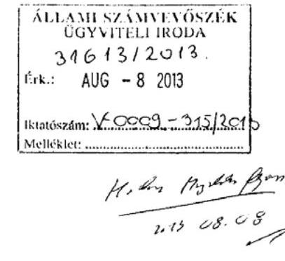

Hivatkozva a V-0009-298/2013. számú megállapításukra közöljük, hogy Tarpa-Gulács Nagyközség Önkormányzatának Képviselö-testülete a 2013. július 30-ai ülésén a Közös Önkormányzati Hivatal alapító okiratát módosította a 2011. év január 1-től érvényes új közfoglalkoztatási formákkal. Ezzel eg:idejüleg a Közös Önkormányzati Hivatal SZMSZ-ében nevesítették a közfoglalkoztatásra vonatkozó feladatokat, és azok müködési folyamatát.

Tarpa, 2013. augusztus 2.
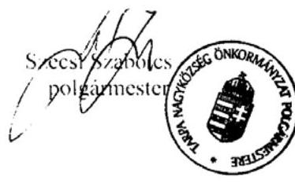

---

# Szécsi Szabolcs úr 

polgármester
Tarpa Nagyközség Önkormányzata

## Tarpa

## Tisztelt Polgármester Úr!

A közfoglalkoztatás és a hozzá kapcsolódó képzési programok támogatási rendszere hatékonyságának, eredményességének ellenőrzéséről készített számvevőszéki jelentéstervezethez adott tájékoztatását megkaptam.

Köszönettel vettem, hogy az Állami Számvevőszékről szóló 2011. évi LXVI. törvény 33. § (6) bekezdése szerinti figyelemfelhívásomra intézkedett, ezzel elősegítve az ÁSZ megállapításainak hasznosulását, a feltárt hibák, hiányosságok korrigálását.

Budapest, 2013. 07 hó $t$ nap

Tisztelettel:

## 

Domokos László

---

# Hatvan 

## DOMOKOS LÁSZLÓ úr részére

elnök

## Állami Számvevőszék

1052 Budapest, Apáczai Csere János utca 10.
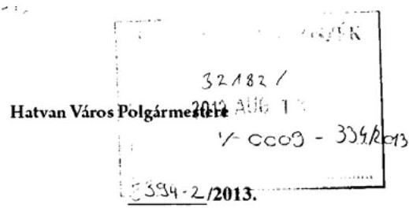

Hivatkozási szám: V-3096-024/2012.
Ügyintéző: Bánkutiné Katona Mária gazdálkodási irodavezető
$+3637 / 542-359$
Tárgy: Intézkedési terv megküldése
Tisztelt Elnök Úr!

Az Állami Számvevőszék Hatvan Város Önkormányzatánál a közfoglalkoztatás és a hozzá kapcsolódó képzési programok támogatási rendszere hatékonyságának, eredményességének ellenőrzéséről készített számvevőszéki jelentésben foglaltakat elfogadjuk.
Levelükben a jelentéstervezettel kapcsolatosan alábbi megállapítások szerepelnek:
..A 2011. évben a költségvetés tervezett és tényleges adatai jelentősen eltértek, amelyek a tervezés időszakában fennálló információhiány mellett a nem megalapozott tervezésre is visszavezethetőek. Az Önkormányzat az első rövid időtartamú közfoglalkoztatásra vonatkozó szerződéseket már januárban megkötötte. Ennek ellenére a régi Áht. 8/C. § (3) bekezdése alapján a teljesség és a számviteli megalapozottság elvét a költségvetés elkészítésénél nem vették figyelembe."
..A Polgármesteri Hivatal SZMSZ-ében - az Ámr. 20. 0 (2) bekezdés e) pontjában foglaltak ellenére - nem nevesítették a közfoglalkozatásra vonatkozó feladatokat és azok müködési folyamatát."

A megállapítások elbírálásra kerültek és az alábbi intézkedéseket kívánjuk tenni:
Az első megállapításban foglaltak elkerülése tégelt Hatvan város 2014. évi költségvetésének tervezésekor - e témában is - a fent említett számviteli megalapozottság kerül figyelembe vételre.

A második megállapítás esetében a hiányosság megszüntetésére a Hatvani Közös Önkormányzati Hivatal Szervezeti és müködési szabályzata módosításra kerül, mely Hatvan Város Önkormányzata Képviselő-testülete elé a 2013. szeptember havi képviselő-testületi ülésen kerül beterjesztésre.

Kérjük tervezett intézkedéseink szíves elfogadását!
Hatvan, 2013. augusztus 6.
Tisztelettel:
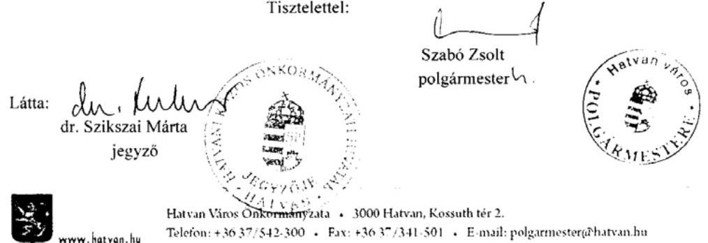

---

ELNÖK

# Szabó Zsolt úr 

polgármester
Hatvan Város Önkormányzata

## Hatvan

## Tisztelt Polgármester Úr!

A közfoglalkoztatás és a hozzá kapcsolódó képzési programok támogatási rendszere hatékonyságának, eredményességének ellenőrzéséről készített számvevőszéki jeleméstervezethez adott tájékoztatását megkaptam.

Köszönettel vettem, hogy az Állami Számvevőszékről szóló 2011. évi LXVI. törvény 33. § (6) bekezdése szerinti figyelemfelhívásomra intézkedett, ezzel elősegitve az ÁSZ megállapításainak hasznosulását, a feltárt hibák, hiányosságok korrigálását.

Budapest, 2013. 03 hó nap

Tisztelettel:

## 1202 BUDAPEST, APÁCZIN CSERE JÁNOS UTCA 10. 1264 Budapest 4. Pl. 54 telefon. 4848181 fax. 4848201

---

# 31. SZÁMÚ MELLÉKLET A V-0009-339/2013. SZÁMÚ JELENTÉSHEZ 

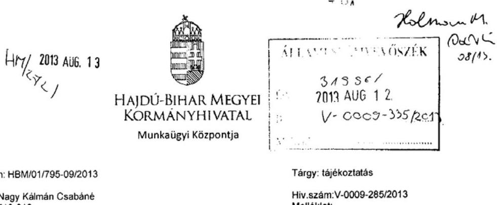

Úgyiratszám: HBM/01/795-09/2013
Úgyintéző: Nagy Kálmán Csabáné Telefon:52/513-013

Tárgy: tájékoztatás
Hiv.szám:V-0009-285/2013
Melléklet: -

## Állami Számvevőszék

## Domokos László

elnök úr
részére

## Székhelyén

## Tisztelt Elnök Úr!

A 2013. július 23. napján érkezett „a közfoglalkoztatás és a hozzá kapcsolódó képzési programok támogatási rendszere hatékonyságának és eredményességének ellenőrzéséről" készített számvevőszéki jelentéstervezetet megismertem, ahhoz kapcsolódó észrevételt nem kívánok tenni.

Debrecen, 2013. augusztus 06.
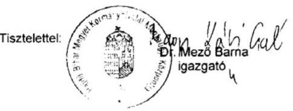

Értesül: címzett.
irattár

---

# 32. SZÁMÚ MELLÉKLET A V-0009-339/2013. SZÁMÚ JELENTÉSHEZ 

## SZABOLCS-SZATMÁR-BEREG MEGYEI KORMÁNYHIVATAL NAGYKÁLLOI JÁRÁSI HIVATAL JÁRÁSI MUNKAÜGYI KIRENDELTSÉGE

Hivatkozási szám: V-0009-277/2013.
Úgyintézőjük:

Iktatószám: SZ-08M/01/2815-6/2013
Úgyintéző: Hamza Zsolt
Telefonszám: 42/563-540
Tárgy: Tájékoztatás
Mellékletek száma: 0 db

## Domokos László Elnök Úr

Állami Számvevőszék

## Budapest

Apáczai Csere János utca 10. 1052
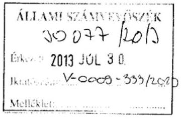

Tisztelt Elnök Úr!

A 2013. július 17-én keltezett levelével kapcsolatban tájékoztatom, hogy a Szabolcs-SzatmárBereg Megyei Kormányhivatal Nagykállói Járási Hivatal Járási Munkaügyi Kirendeltsége a közfoglalkoztatás és a hozzá kapcsolódó képzési programok támogatási rendszere hatékonyságának és eredményességének ellenőrzéséről készített számvevőszéki jelentéstervezet kapcsán nem kíván észrevételt tenni.

Nagykálló, 2013. július 25.
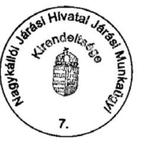

Tisztelettel:
Hanza Zsolt
Kirendeltség-vézető

---

# 33. SZÁMÚ MELLÉKLET A V-0009-339/2013. SZÁMÚ JELENTÉSHEZ 

## NÓGRÁD MEGYEI KORMÁNYHIVATAL

SZÉCSÉNYI JÁRÁSI HIVATAL JÁRÁSI MUNKAÚGYI KIRENDÉLTSÉGE

| Úgyiratszám: | NO-06N/012828-03/2013 | Tárgy: | Tájékoztatás |
| :--: | :--: | :--: | :--: |
| Ugyintéző (telefon): | Dr. Bagó Józsefnė | Meléklet: |  |

ÁLLAMI SZÁMVEVÓSZÉK
Holman Magdolna
Felügyeleti vezető részére
BUDAPEST
Apáczai Csere János utca 10.
1052

## ÁLLAMI SZÁMVEVÓSZÉK UGYVITELI IRODA   3140212013   Eik.: AUG - 72013   Bontószám:   Meltéket: $\qquad$

Tisztelt Felügyeleti Vezető Asszony!
A Nógrád Megyei Kormányhivatal Szécsényi Járási Hivatal Járási Munkaügyi Kirendeltségén a közfoglalkoztatás és a hozzá kapcsolódó képzési programok támogatási rendszere hatékonyságának, eredményességének ellenőrzéséről készített számvevőszéki jelentéstervezethez a kirendeltség részéről észrevételt nem kívánok tenni.

Kérem a fentiek szíves figyelembevételét!

Szécsény, 2013. július 29.
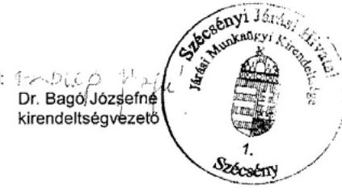

---

# BUDAPEST 

FÖVÁBOSI ÖNKORMÁNYZAT FÖPOLGÁRMESTERE

2013 K.C. 97

Állami Számvevőszék
Domokos László elnök úr részére

Tisztelt Elnök Úr!
$\qquad$

Tárgy: A V-0009-301/2013. számú számvevőszéki jelentés észrevételezése
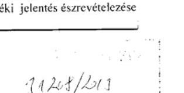
$\qquad$
$\qquad$
$\qquad$
$\qquad$

## Tisztelt Elnök Úr!

Köszönettel vettem a „köztoglalkoztatás és a hozzá kapcsolódó képzési programok támogatási rendszere hatékonyságának és eredményességének ellenörzéséröl" szóló jelentésük tervezetét, amelynek észrevételezésére - figyelemmel a jogszabályi előírásokra - T. Elnök úr 15 napot biztosított.

Örömmel tapasztaltam, hogy 2009-2012. I. negyedévére kiterjedő rendkívül alapos vizsgálatuk a Fővárosi Önkormányzat irányába elmarasztaló megállapítást és javaslatot nem fogalmazott meg. Erre tekintettel észrevételt nem teszünk.

Munkájukat megköszönöm.

Budapest, 2013. augusztus „o. ${ }^{\text {n }}$ "

Tisztelettel:
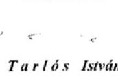

1052 Budapest, Várszház utca 9-11. | levélcím: 1840 Budapest | telefon: 06-1-327-1023| fax: 06-1-327-1819, e-mail: tarlosi@budapest.hu!

---

# ÉRTELMEZŐ SZÓTÁR 

| aktív korú személy | Az a személy, aki a 18. életévét betöltötte, és a reá irányadó nyugdíjkorhatárt, illetőleg a 62. életévet nem töltötte be. [Szoctv. 4. § (1) bekezdés k).] |
| :--: | :--: |
| aktív korúak ellátása | Hátrányos munkaerő-piaci helyzetű aktív korú, nem foglalkoztatott személyek és családjuk részére nyújtott ellátás, amelynek folyósítása együttmúködési kötelezettséghez kötött. Az aktív korúak ellátása lehet: rendszeres szociális segély vagy RÁT, 2011. január 1-től BPJ, 2011. szeptember 1-jétől FHT. [Szoctv. 37. § (1) bekezdés és 35. § (1) bekezdés.]   A jogosultság feltételeit a Szoctv. 33. § (1) bekezdése tartalmazza. |
| álláskereső | Álláskereső az a személy, aki munkaviszony létesítéshez szükséges feltételekkel rendelkezik, oktatási intézményben nem folytat tanulmányokat nappali tagozatos hallgatóként, öregségi nyugdíjra nem jogosult, valamint rehabilitációs járadékban nem részesül, az alkalmi foglalkoztatásnak nem minősülő jogviszony kivételével munkaviszonyban nem áll, más kereső tevékenységet sem folytat, a munkaügyi kirendeltség álláskeresőként nyilvántartja, és elhelyezkedése érdekében együttműködik a munkaügyi kirendeltséggel. [Flt. 58. § (5) bekezdés d) pontja.] |
| decentralizált keret | Az MPA foglalkoztatási alaprészből az állami foglalkoztatási szervek által felhasználható (decentralizált) keret. [Flt. 43. § (1) bekezdés írta elő, hatálytalan 2011. január 1-jétől.] |
| együttműködési kötelezettség | Az aktív korúak ellátására jogosult személyeket terhelő kötelezettség, amely az ellátás folyósításának feltétele. A rendszeres szociális segélyben részesülő személy az önkormányzat által kijelölt szervvel, míg a RÁT/BPJ/FHTban részesülő személy a munkaügyi központ kirendeltségével múködik együtt, mint álláskereső. [A rendszeres szociális segélyre jogosultak esetében 2010. december 31ig a Szoctv. 37/D. § (1) bekezdés, 2011. január 1-jétől a 37/A. § (1) bekezdése a BPJ, 2011. szeptember 1-jétől az FHT tekintetében a 35. § (3) bekezdése írja elő.] |
| érintett létszám | A résztvevők esetszáma. Az adott időszakban legalább egy napon közfoglalkoztatásban részt vevő egyének esetszáma. Amennyiben egy egyénnek adott időszak alatt több szerződése született, akkor többször szerepel. Annyiszor, ahányszor a közfoglalkoztatásba lépett. [Foglalkoztatási Hivatal által meghatározott fogalom.] |

---

„Fütött utca" program
foglalkoztatási arány
hosszabb időtartamú közfoglalkoztatás
közfoglalkoztatás

A Fővárosi Közgyűlés hajléktalanoknak nappali elhelyezését biztosító programja, amelynek keretében nappali melegedőként is funkcionáló három éjjeli menedékhely került kialakításra. A fejlesztés lebonyolítója a BFVK Zrt. volt. A munkát részben közfoglalkoztatottak (összesen 749 fő) bevonásával végezték a 2011-2012. évek során. A közfoglalkoztatás startmunka mintaprogram keretében valósult meg.
A foglalkoztatottak aránya a 15-74 éves korú népességhez képest a KSH lakossági munkaerő-felmérésének adatai alapján.

A BPJ/FHT-ra jogosult személy, a munkaügyi kirendeltség által kiközvetített álláskereső 2-12 hónap időtartamra szóló, napi 6-8 órás munkaidőben történő foglalkoztatása. A támogatás a közfoglalkoztatási bér és az ahhoz kapcsolódó szociális hozzájárulási adó 70-100\%-áig nyújtható. Ezen túl támogathatók a közvetlen költségek a közfoglalkoztatási bér és a kapcsolódó szociális hozzájárulási adóhoz nyújtott támogatás összegének 20\%-áig. [A közfoglalkoztatási kormányrendelet 2012. március 30-án hatályos 4. § (1) bekezdés a)-c) pontjai, valamint (3) bekezdése alapján.]
„A munkaviszony egy speciális formája, Támogatott „tranzitfoglalkoztatás", amelynek célja, hogy a közfoglalkoztatott sikeresen vissza-, illetve bekerüljön az elsődleges munkaerőpiacra. A közfoglalkoztatók támogatást vehetnek igénybe annak érdekében, hogy átmeneti munkalehetőséget biztosítsanak azok számára, akiknek önálló álláskeresése hosszú ideig eredménytelen." [BM Közfoglalkoztatásért Felelős Államtitkárságának az „Amit a közfoglalkoztatásról tudni kell..." című tájékoztató anyaga, elérhető www.afsz.hu, Közfoglalkoztatás.]

A közfoglalkoztatás összefoglaló elnevezést alkalmaztuk a 2009-2010. években a közhasznú és közcélú munka, valamint a közmunkaprogramok, a 2011-2012. években a rövid, a hosszabb időtartamú, valamint az országos közfoglalkoztatási programok keretében megvalósuló foglalkoztatásra.

---

közcélú munka
közhasznú munka
közmunkaprogram
közfeladat
közfoglalkoztatási terv

A helyi önkormányzat által kötelezően ellátandó, illetve önként vállalt feladat végrehajtására irányuló tevékenység, amelynek megszervezéséről, teljesítéséről jogszabály alapján a helyi önkormányzat gondoskodik, továbbá a Kormány rendeletében meghatározottak szerint a károk helyreállításával kapcsolatos feladatok végrehajtására irányuló munkavégzés. A közcélú munkavégzés időtartama legalább évi 90 nap, legalább napi 6 órás munkaidővel. [Szoctv. 36. § (2) bekezdés a)-d) pontjai, valamint (4) bekezdése írja elő, hatálytalan 2011. január 1-jétől.]

A támogatás a kifizetett munkabér és közterheinek 95\%a lehetett. [A 2009-2010. évi költségvetési törvények 8. számú melléklet II. fejezet 1. a) pontjában foglaltak alapján.]

A lakosságot, vagy települést érintő közfeladat, vagy önkormányzat által önként vállalt feladat ellátására irányuló tevékenység. A támogatás a foglalkoztatásból eredő közvetlen költség 70\%-a. A támogatás egy munkavállaló foglalkoztatásához folyamatosan legfeljebb egy évig állapítható meg. [Flt. 16/A. § (1) bekezdés a) pontja és (2) bekezdése írta elő, hatálytalan 2011. január 1-jétől.]

Állami feladat ellátásának elősegítésére, törvény vagy önkormányzati rendelet által előírt önkormányzati vagy kisebbségi önkormányzati feladat ellátására, illetve az Országgyúlés vagy a Kormány által meghatározott cél elérésére irányuló program. Támogatás maximum a költségek $90 \%$-áig nyújtható. [A közmunka programokról szóló kormányrendelet 1. § (2) bekezdés a)-c) pontjai, valamint 2. § (1) bekezdés d) pontja írta elő, hatálytalan 2011. január 1-jétől.]

A jogszabályban meghatározott állami vagy önkormányzati feladat, amit az arra kötelezett közérdekből, haszonszerzési cél nélkül, jogszabályban meghatározott követelményeknek és feltételeknek megfelelve végez, ideértve a lakosság közszolgáltatásokkal való ellátását, valamint az e feladatok ellátásához szükséges infrastruktúra biztosítását is. [Az egyesülési jogról, a közhasznú jogállásról, valamint a civil szervezetek múködéséről és támogatásáról szóló 2011. évi CLXXV. tv. 2. § 19. pontja.]
A települési önkormányzat, illetve társulás által elfogadott, egy éves időtartamra szóló terv, amelynek tartalmaznia kell a rendelkezésre állási támogatásra jogosultak képzettség szerinti várható összetételét, az ellátandó közfeladatokat, ezek várható ütemezését, a feladat ellátásához szükséges létszámot és a közfoglalkoztatás finanszírozására rendelkezésre álló forrásokat. [Szoctv. 37/A. § (1)-(2) bekezdés, hatálytalan 2011. január 1-től]

---

Munkaerőpiaci Alap

A Munkaerőpiaci Alap (MPA) elkülönített állami pénzalap, célja kiemelten a foglalkoztatáshoz, a munkanélküliséghez, a képzési rendszer fejlesztéséhez kapcsolódó pénzeszközök összevonásával, egységes kezelésével az álláskeresők támogatásának biztosítása, a munkaerő alkalmazkodásának, az álláskeresők munkához jutásának támogatása, a képzési rendszer fejlesztésének támogatása. Az MPA megnevezése 2012. január 1-jétől Nemzeti Foglalkoztatási Alapra változott. [Flt. 39. § (1) és (2) bekezdés a), b) és d) pontjai alapján meghatározott fogalom.]

A közfoglalkoztatásért felelős miniszter a rövid időtartamú, a hosszabb időtartamú, illetve az országos közfoglalkoztatás támogatási formákra közfoglalkoztatási mintaprogramokat indíthat. A közfoglalkoztatási mintaprogramok beruházási és dologi költségei és kiadásai teljes összegben támogathatóak. [A közfoglalkoztatási kormányrendelet 7/B. § (1) és (2) bekezdései alapján. Hatályos 2011. augusztus 25 -től. $]$

A munkanélküliek aránya a gazdaságilag aktív, 15-74 éves korú népességen belül a KSH munkaerőfelmérésének adatai alapján.
nyílt (elsődleges) munkaerőpiac
„A nyílt munkaerőpiac a nyilvánosan meghirdetett állásokat az újsághirdetéseket, az internetes állásportálok kínálatát, a munkaközvetítők ajánlatait, a munkaügyi központok által felajánlott lehetőségeket - jelenti."
[Foglalkoztatási Szolgálat meghatározása, www.eletpalya.munka.hu Tudástár/Fogalmak/Munka/Álláskeresés, munkába állások, támogatások]

országos közfoglalkoztatási programok

Az Országgyúlés vagy a Kormány által meghatározott cél elérésére irányuló program keretében történő, az álláskeresők, az FHT-ra jogosult személyek közfoglalkoztatása. A támogatás a közfoglalkoztatási bér és az ahhoz kapcsolódó szociális hozzájárulási adó mértékének 100\%-áig nyújtható. A közvetlen költségekhez további támogatás nyújtható a közfoglalkoztatási bér és az ahhoz kapcsolódó szociális hozzájárulási adóhoz nyújtott támogatás összegének $20 \%$-áig, valamint 100 fő foglalkoztatása esetén a szervezési költségek 3\%-áig. A közfoglalkoztatás támogatási ideje maximum 12 hónap. [A közfoglalkoztatási kormányrendelet 2012. március 30-án hatályos 6. § (1), (3) és (4) bekezdései alapján.]

---

RÁT-ra, BPJ-re, FHT-ra való jogosultság
rendszeres szociális segély
rövid időtartamú közfoglalkoztatás
stratégiai szintű dokumentumok

Annak a személynek, aki aktív korúak ellátásra jogosult, de a rendszeres szociális segély már nem illeti meg, 2010. december 31-ig RÁT-ot, 2011. augusztus 31-ig BPJ-t, 2011. szeptember 1-jétől FHT-t kell kérelmére megállapítani. A jogosultság feltételeit 2009. január 1-jétől a Szoctv. 33. §, 35. § és 37. §-ai határozzák meg.
2011. január 1-jétől BPJ-re, 2011. szeptember 1-jétől FHTra csak az jogosult, aki a felülvizsgálat időpontját megelőző évben, a jogosultságának fennállása alatt legalább 30 nap időtartamban foglalkoztatva volt. [Szoctv. 36. § (2) bekezdés e) pont.]

Az ellátások évenkénti összegét a 2. számú függelék tartalmazza.

Az aktív korúak pénzbeli ellátásának egyik formája. A rendszeres szociális segélyre való jogosultság feltételeit 2010. december 31-ig a Szoctv. 37/B. § (1) és 37/C. § (1) bekezdései, 2011. január 1-től a Szoctv. 37. § (1) és 37/A. § (1) bekezdései szabályozták.

A BPJ-re (2012. január 1-jétől az FHT-ra) jogosult személyek 1-4 havi időtartamra szóló, napi 4 órás munkaidőben történő foglalkoztatása. A támogatás a bér és az ahhoz kapcsolódó szociális hozzájárulási adó $95 \%$-áig nyújtható. [A közfoglalkoztatási kormányrendelet 2012. március 30-án hatályos 3. § (1) bekezdés a) és b) pontjai, valamint (2) bekezdése alapján.]
A foglalkoztatáspolitika, ezen belül a közfoglalkoztatás hosszú távú, stratégiai céljait meghatározó dokumentumok: Magyarország aktualizált konvergencia programja 2008-2011 (2008. december); Széll Kálmán Terv Összefogás az adósság ellen (2011. március); Magyarország konvergencia programja 2011-2015; Magyar Munka Terv (2011. május); Széll Kálmán terv 2.0 (2012. április).

---

|   |  | 2009 | 2010 | 2010/2009 | 2011 |  | 2011/2010 |  | 2012 | 2012/2011  |
| --- | --- | --- | --- | --- | --- | --- | --- | --- | --- | --- |
|   |  |  |  | % | január 1. | szeptember 1. | % (január 1.) | % (szeptember 1.) |  | %  |
|   |  |  |  |  |  |  |  |  |  | 10.  |
|   |  | 2. | 3. | 4. | 5. | 6. | 7. | 8. | 9. | 10.  |
|  1. | Minimálbér | 321/2008.
(XII. 29.)
Korm. rendelet
2. § (2)-(3)
bekezdés | 295/2009.
(XII. 21.)
Korm. rendelet
2. § (2)-(3)
bekezdés |  | 337/2010.
(XII. 27.)
Korm. rendelet
2. § (2)-(3)
bekezdés |  |  |  | 298/2011.
(XII. 22.)
Korm. rendelet
2. § (2)-(3)
bekezdés |  |   |
|  2. | Minimálbér bruttó (Ft/hó) | 71 500,0 | 73 500,0 | 102,8 | 78 000,0 |  | 106,1 |  | 93 000,0 | 119,2  |
|  3. | Minimálbér nettó (Ft/hó) | 57 815,0 | 60 236,0 | 104,2 | 60 600,0 |  | 100,6 |  | 60 915,0 | 100,5  |
|  4. | Garantált bérminimum bruttó (Ft/hó) | 87 500,0 | 89 500,0 | 102,3 | 94 000,0 |  | 105,0 |  | 108 000,0 | 114,9  |
|  5. | Garantált bérminimum nettó (Ft/hó) | 68 215,0 | 70 062,0 | 102,7 | 70 549,0 |  | 100,7 |  | 70 740,0 | 100,3  |
|  6. | Közfoglalkoztatási bér |  | Minimálbér |  |  |  | Közfoglalkoztatási bér bevezetése 2011. szeptember 1-jétől
(170/2011. Korm. rendelet (VIII. 24.) |  |  |   |
|  7. | Közfoglalkoztatási bér bruttó (Ft/hó) | 71 500,0 | 73 500,0 | 102,8 | 78 000,0 | 57 000,0 | 106,1 | 77,6 | 71 800,0 | 126,0  |
|  8. | Közfoglalkoztatási bér nettó (Ft/hó) | 57 815,0 | 60 236,0 | 104,2 | 60 600,0 | 47 025,0 | 100,6 | 78,1 | 47 029,0 | 100,0  |
|  9. | Közfoglalkoztatási garantált bér bruttó (Ft/hó) |  |  |  |  | 78 000,0 |  |  | 92 000,0 | 117,9  |
|  10. | Közfoglalkoztatási garantált bér nettó (Ft/hó) |  |  |  |  | 60 600,0 |  |  | 60 260,0 | 99,4  |
|  11. | Közfoglalkoztatási munkavezetői bér nettó (Ft/hó) |  |  |  |  |  |  |  |  |   |
|  12. | Közfoglalkoztatási munkavezetői bér bruttó (Ft/hó) |  |  |  |  |  |  |  |  |   |
|  13. | Közfoglalkoztatási munkavezetői középfokú bruttó (Ft/hó) |  |  |  |  |  |  |  |  |   |
|  14. | Közfoglalkoztatási munkavezető középfokú nettó (Ft/hó) |  |  |  |  |  |  |  |  |   |
|  15. | Álláskeresési támogatások | Maximum: a minimálbér 120%-a, levonás: szja + nyj
(1991. évi IV. tv. 26. § (5) bekezdés, hatályos 2011. VIII. 31-ig) |  |  |  | Maximum: a minimálbér 100%-a, levonás: szja + nyj
(1991. évi IV. tv. 26. § (5) bekezdés, hatályos 2011. IX. 1-től) |  |  |  |   |
|  16. | Álláskeresési járadék maximuma (minimálbér) bruttó (Ft/hó) | 85 800,0 | 88 200,0 | 102,8 | 93 600,0 | 78 000,0 | 106,1 | 83,3 | 93 000,0 | 119,2  |
|  17. | Álláskeresési járadék maximuma (minimálbér) nettó (Ft/hó) | 73 589,0 | 75 921,0 | 103,2 | 77 320,0 | 66 448,0 | 101,8 | 85,9 | 68 820,0 | 103,6  |
|  18. | (Nyugdíj előtti) álláskeresési segély (minbér 40%-a) bruttó (Ft/hó) | 28 600,0 | 29 400,0 | 102,8 | 31 200,0 | 31 200,0 | 106,1 | 100,0 | 37 200,0 | 119,2  |
|  19. | (Nyugdíj előtti) álláskeresési segély (minbér 40%-a) nettó (Ft/hó) | 25 883,0 | 26 607,0 | 102,8 | 28 080,0 | 28 080,0 | 105,5 | 100,0 | 27 528,0 | 98,0  |
|  20. | RÁT/BPJ/FHT |  |  |  |  |  |  |  |  | Az öregségi nyugdíj legkisebb
összegének 80%-a (Szectv. 33. § (4)
bekezdés)  |
|   |  |  |  |  |  |  |  |  |  | FHT  |
|  21. | RÁT/BPJ/FHT nettó (Ft/hó) | 28 500,0 | 28 500,0 |  | 28 500,0 |  |  |  | 22 800,0 |   |
|  22. | Rendszeres szociális segély |  |  |  |  |  |  |  |  | Maximum: a nettó
közfoglalkoztatási bér összegének
90%-a
(2012. január 1-től, Szectv. 37. §
(4) bekezdés)  |
|   |  |  |  |  |  |  |  |  |  | 23. Rendszeres szociális segély (Ft/hó)  |
|  23. | Rendszeres szociális segély (Ft/hó) | 57 815,0 | 60 236,0 |  | 60 600,0 |  |  |  | 42 326,1 |   |
|  24. | Öregségi nyugdíj |  |  |  |  |  |  |  |  | 168/1997 (X. 6.) Korm. rendelet 11. §
(2012. január 1-től, Szectv. 37. §
(4) bekezdés)  |
|  25. | Öregségi nyugdíj legkisebb összege nettó (Ft/hó) | 28 500,0 | 28 500,0 | 100,0 | 28 500,0 | 100,0 |  |  | 28 500,0 | 100,0  |