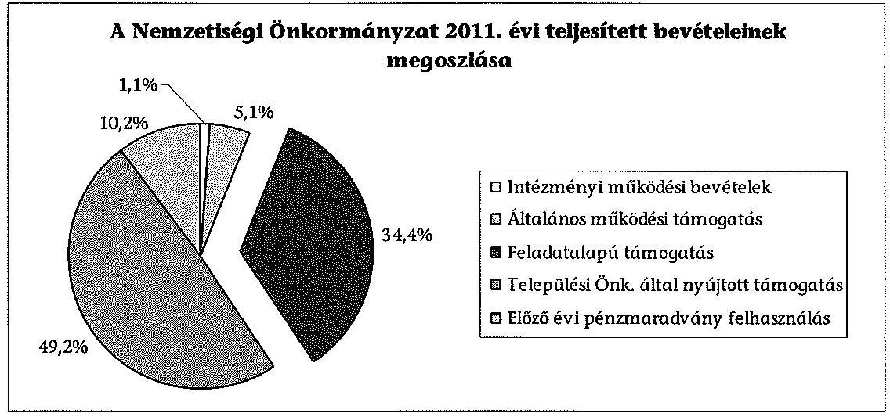
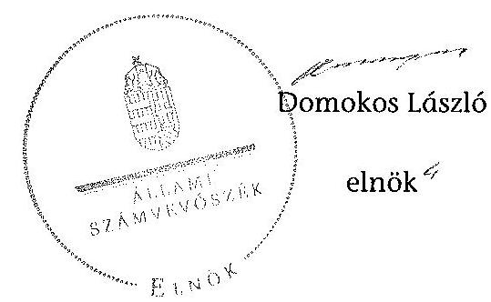
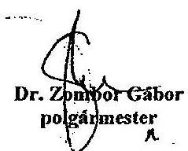
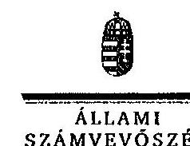

# ÁLLAMI   SZÁMVEVŐSZÉK 

## JELENTÉS

a helyi kisebbségi/nemzetiségi önkormányzatok gazdálkodásának ellenőrzéséről
Kecskemét Megyei Jogú Város Roma Nemzetiségi Önkormányzata

---

# Állami Számvevőszék 

Iktatószám: V-0058-108-005/2013.
Témaszám: 1068
Vizsgálat-azonosító szám: V06060112

## Az ellenőrzést felügyelte:

Horváth Balázs
felügyeleti vezető
Az ellenőrzést vezette és az ellenőrzés végrehajtásáért felelős:
Korsósné Vigh Andrea
ellenőrzésvezető
A számvevőszéki jelentést készítették és a jelentés összeállításában közreműködtek:

## Molnár Istvánné

számvevő tanácsos
Papp József
számvevő tanácsos
Az ellenőrzést végezte:
Papp József
számvevő tanácsos
A témához kapcsolódó eddig készített számvevőszéki jelentés:
címe
sorszáma
Jelentés Kecskemét Megyei Jogú Város Önkormányzat gazdálkodásának átfogó ellenőrzéséről

---

# TARTALOMJEGYZÉK 

BEVEZETÉS ..... 5
I. ÖSSZEGZŐ MEGÁLLAPÍTÁSOK, KÖVETKEZTETÉSEK, JAVASLATOK ..... 8
II. RÉSZLETES MEGÁLLAPÍTÁSOK ..... 12

1. A Nemzetiségi és a Települési Önkormányzat együttműködésének szabályszerűsége ..... 12
2. A gazdálkodási feladatok ellátásának szabályszerűsége ..... 13
2.1. A költségvetésre és zárszámadásra, valamint a kincstári adatszolgáltatás rendjére vonatkozó jogszabályi előírások betartása ..... 13
2.2. A Nemzetiségi Önkormányzat gazdálkodásának szabályozottsága ..... 15
2.3. A pénzügyi kontrollok működése ..... 16
3. A Nemzetiségi Önkormányzattal összefüggő gazdálkodási feladatok belső ellenőrzése ..... 17
4. A 2011. évi feladatalapú támogatás felhasználásának, elszámolásának szabályszerűsége ..... 17
5. A Nemzetiségi Önkormányzat feladatellátása ..... 18
MELLÉKLETEK
6. számú A Nemzetiségi Önkormányzat 2011. évi és 2012. I. félévi gazdálkodásának főbb adatai, mutatói
7. számú 2012. március 19. és 2012. szeptember 27. között a törvényes állapot helyreállítása érdekében megtett intézkedések
3/A. számú A Kecskemét Megyei Jogú Város Polgármesterének észrevételei a jelentéstervezethez
3/B. számú A Kecskemét Megyei Jogú Város Polgármesterének tájékoztatója a javító intézkedésekről
8. számú Az Állami Számvevőszék válaszlevele az észrevételekre
FÜGGELÉKEK
9. számú Értelmező szótár
10. számú A pénzügyi kontrollok működésének értékelése

---

.

---

# RÖVIDÍTÉSEK JEGYZÉKE 

| Jogszabályok |  |
| :--: | :--: |
| Áht. 1 | 1992. évi XXXVIII. törvény az államháztartásról (hatályos 2011. december 31-ig) |
| Áht. 2 | 2011. évi CXCV. törvény az államháztartásról (hatályos 2011. december 31-től) |
| ÁSZ tv. | 2011. évi LXVI. törvény az Állami Számvevőszékről (hatályos 2011. július 1-jétől) |
| Nek. ${ }_{1}$ tv. | 1993. évi LXXVII. törvény a nemzeti és etnikai kisebbségek jogairól (hatályos 2011. december 31-ig) |
| Nek. ${ }_{2}$ tv. | 2011. évi CLXXIX. törvény a nemzetiségek jogairól (hatályos 2011. december 20-tól) |
| Számv. tv. | 2000. évi C. törvény a számvitelről |
| Áhsz. | 249/2000. (XII. 24.) Korm. rendelet az államháztartás szervezetei beszámolási és könyvvezetési kötelezettségének sajátosságairól |
| Ámr. | 292/2009. (XII. 19.) Korm. rendelet az államháztartás működési rendjéről (hatályos 2011. december 31-ig) |
| Ávr. | 368/2011. (XII. 31.) Korm. rendelet az államháztartásról szóló törvény végrehajtásáról (hatályos 2012. január 1-jétől) |
| Ber. | 193/2003. (XI. 26.) Korm. rendelet a költségvetési szervek belső ellenőrzéséről (hatályos 2011. december 31-ig) |
| Bkr. | 370/2011. (XII. 31.) Korm. rendelet a költségvetési szervek belső kontrollrendszeréről és belső ellenőrzéséről (hatályos 2012. január 1-jétől) |
| támogatási kormányrendelet | 342/2010. (XII. 28.) Korm. rendelet a kisebbségi önkormányzatoknak a központi költségvetésből, valamint fejezeti kezelésű előirányzatból nyújtott támogatások feltételrendszeréről és elszámolásának rendjéről (hatályon kívül helyezte a 28/2012. (III. 6.) Korm. rendelet a nemzetiségi célú előirányzatokból nyújtott támogatások feltételrendszeréről és elszámolásának rendjéről; jelenleg hatályos a 428/2012. (XII. 29.) Korm. rendelet a nemzetiségi célú előirányzatokból nyújtott támogatások feltételrendszeréről és elszámolásának rendjéről) |
| Települési Önkormányzat SZMSZ-e | Kecskemét Megyei Jogú Város Önkormányzata 47/1998. (XII. 21.) számú rendelete a Közgyűlés és Szervei Szervezeti és Működési Szabályzatáról |
| Szórövidítések |  |
| ÁSZ | Állami Számvevőszék |
| Jegyző | Kecskemét Megyei Jogú Város Önkormányzatának jegyzője |

---

| Képviselő-testület | Kecskemét Megyei Jogú Város Cigány Települési Kisebb-   ségi Önkormányzatának Képviselő-testülete 2011. de-   cember 31-ig, Kecskemét Megyei Jogú Város Roma Nem-   zetiségi Önkormányzatának Képviselő-testülete   2012. január 1-jétől |
| :--: | :--: |
| Kincstár | Magyar Államkincstár |
| Kormányhivatal | Bács-Kiskun Megyei Kormányhivatal |
| Közgyűlés | Kecskemét Megyei Jogú Város Önkormányzatának Köz-   gyülése |
| Nemzetiségi Önkor-  mányzat | Kecskemét Megyei Jogú Város Cigány Települési Kisebb-   ségi Önkormányzata 2011. december 31-ig, Kecskemét   Megyei Jogú Város Roma Nemzetiségi Önkormányzata   2012. január 1-jétől |
| Nemzetiségi Önkor-  mányzat elnöke | Kecskemét Megyei Jogú Város Cigány Települési Kisebb-   ségi Önkormányzatának elnöke 2011. december 31-ig,   Kecskemét Megyei Jogú Város Roma Nemzetiségi Ön-   kormányzatának elnöke 2012. január 1-jétől |
| pénzügyi kontrollok | a kötelezettségvállalás és az utalvány ellenjegyzése, illet-   ve a szakmai teljesítés igazolása 2011. december 31-ig,   2012. január 1-jétől a pénzügyi ellenjegyzés, a teljesítés   igazolása és az érvényesítés |
| polgármester | Kecskemét Megyei Jogú Város Önkormányzatának pol-   gármestere |
| Polgármesteri Hivatal | Kecskemét Megyei Jogú Város Önkormányzatának Pol-   gármesteri Hivatala |
| Polgármesteri Hivatal   SZMSZ-e | Kecskemét Megyei Jogú Város Önkormányzata   8/2011. (II. 9.) számú határozata a Polgármesteri Hivatal   Szervezeti és Működési Szabályzatáról (a módosításokkal   egységes szerkezetben hatályos 2011. szeptember 1-jétől) |
| Támogató | A támogatást nyújtó Közigazgatási és Igazságügyi Mi-   nisztérium |
| Települési Önkormány-   zat | Kecskemét Megyei Jogú Város Önkormányzata |

---

# JELENTÉS 

## a helyi kisebbségi/nemzetiségi önkormányzatok gazdálkodásának ellenőrzéséről Kecskemét Megyei Jogú Város Roma Nemzetiségi Önkormányzata

## BEVEZETÉS

Az államháztartás részét, az önkormányzati alrendszer egyik elemét képezik a nemzetiségi önkormányzatok, amelyek jogi személyek és a Nek. ${ }_{1,2}$ tv.-ben meghatározott önálló feladat- és hatáskörökkel rendelkeznek. A nemzetiségi önkormányzatok az önkormányzati, illetve testületi működtetés mellett a helyi nemzetiségi közügyek változatos formában való ellátásában vesznek részt.

A nemzetiségi önkormányzatok, illetve a települési önkormányzatok között a jelenlegi szabályozás szerint nincs alá-fölérendeltségi viszony. A nemzetiségi önkormányzatok azonban sajátos közjogi helyzetben vannak, mert a jogállásukat tekintve önkormányzatok, ám függnek a székhelyük szerinti települési önkormányzat hivatalától, amely ellátja a nemzetiségi önkormányzatok vonatkozásában a megállapodásban rögzített gazdálkodási feladatokat.

A nemzetiségek helyzete, támogatása mind hazai, mind európai uniós szinten kiemelt figyelmet kap napjainkban. A nemzetiségi önkormányzatok gazdálkodására és támogatási rendszerére vonatkozó jogszabályok a 2010-2012. években jelentős változásokon mentek át, amelyek érintették a feladatalapú támogatásra fordítható költségvetési keret megállapítását, az operatív gazdálkodási jogkörök szabályozását, az elkülönített könyvvezetés alkalmazását, a belső ellenőrzés szabályozását.

Az ellenőrzés célja annak értékelése volt, hogy a Nemzetiségi Önkormányzat gazdálkodási kereteinek kialakítása, gazdálkodása és feladatellátása megfelelte-e a hatályos jogszabályoknak.

Ennek keretében ellenőriztük, hogy:

- a Nemzetiségi Önkormányzat és a Települési Önkormányzat együttműködésének szabályozása, a Települési Önkormányzat SZMSZ-ében, a megállapodásban előírt működési feltételek biztosítása megfelelt-e a jogszabályi előírásoknak;
- a felek együttműködése megfelelt-e a megállapodásnak a gazdálkodási feladatok szabályszerű ellátásában, betartották-e a Nemzetiségi Önkormányzat gazdálkodásához kapcsolódóan a költségvetésre és zárszámadásra, a gazdálkodás szabályozására, az operatív gazdálkodási jogkörök gyakorlására vonatkozó jogszabályi előírásokat;

---

- a jegyző biztosította-e a Polgármesteri Hivatal belső ellenőrzése keretében a Nemzetiségi Önkormányzattal összefüggő gazdálkodási feladatok belső ellenőrzését;
- a 2011. évi feladatalapú támogatás felhasználása, a folyósított feladatalapú támogatással történő elszámolás az előírásoknak megfelelő volt-e;
- a Nemzetiségi Önkormányzat feladatellátása összhangban volt-e a vonatkozó jogszabályi előírásokkal.

Az ellenőrzés típusa: szabályszerűségi ellenőrzés
Az ellenőrzött időszak: 2011. január 1. - 2012. június 30.
Ellenőrzött szervezet: Kecskemét Megyei Jogú Város Roma Nemzetiségi Önkormányzat és a gazdálkodási feladatait ellátó Kecskemét Megyei Jogú Város Önkormányzata

Az ellenőrzés jogszabályi alapja: az ÁSZ tv. 5. § (2)-(3) és (6) bekezdései
Az ellenőrzés szakmai módszertana az ÁSZ hivatalos honlapján (www.asz.hu) közzétett szakmai szabályokon alapult, amely a Legfőbb Ellenőrző Intézmények Nemzetközi Szervezete (INTOSAI) által kiadott nemzetközi standardok (ISSAI) figyelembevételével készült. A fogalmak magyarázatát az 1. számú függelék, a pénzügyi kontrollok megfelelősége értékelésénél alkalmazott egységes minősítési szempontokat a 2. számú függelék tartalmazza. Az ellenőrzés lefolytatásához a Települési Önkormányzat és a Nemzetiségi Önkormányzat tanúsítványok kitöltésével és a kapcsolódó dokumentumok elektronikus megküldésével szolgáltatott adatokat. A tanúsítványokon szerepeltetett adatok, információk ellenőrzése és szükség szerinti javítása a helyszíni ellenőrzés keretében történt.

Az ÁSZ az ellenőrzés megállapításait az ellenőrzött időszakban hatályos, az intézkedést igénylő megállapításokra tett javaslatokat a jelenleg hatályos jogszabályok alapján fogalmazta meg.

A Nemzetiségi Önkormányzat 1994-ben alakult, elnöke a 2006. évi helyhatósági választások óta látja el feladatát. A Nemzetiségi Önkormányzat intézményt, gazdasági társaságot és más szervezetet nem alapított, illetve ezek társulásában nem vett részt. A négytagú Képviselő-testület munkája segítésére 2012. március 19-től kettő bizottságot hozott létre. A Nemzetiségi Önkormányzat költségvetési beszámolója szerint a 2011. évben 4104 ezer Ft bevételt ért el és 2675 ezer Ft kiadást teljesített. A 2012. évben 1639 ezer Ft eredeti bevételi és kiadási előirányzatot terveztek. A Nemzetiségi Önkormányzat 2011. évi és a 2012. év I. félévi gazdálkodására vonatkozó adatokat részletesen az 1. számú mellékletben, a 2012. március 19. - 2012. szeptember 27. között a törvényes állapot helyreállítása érdekében megtett intézkedéseket a 2. számú mellékletben mutatjuk be. Az ÁSZ a Nemzetiségi Önkormányzat gazdálkodását korábban a 2004. évben ellenőrizte.

Az ÁSZ tv. 29. § (1) bekezdése szerint a jelentéstervezetet megküldtük egyeztetésre a polgármesternek és a Nemzetiségi Önkormányzat elnökének. A Nemze-

---

tiségi Önkormányzat elnöke az ÁSZ tv. 29. § (2) bekezdésében foglalt észrevételezési jogával nem élt, a jelentéstervezetre észrevételt nem tett. A polgármester észrevételét és tájékoztatását, valamint az arra adott választ, ideértve az el nem fogadott észrevételek indokolását a jelentés 3/A., 3/B. és 4. számú mellékletei tartalmazzák.

---

# I. ÖSSZEGZŐ MEGÁLLAPÍTÁSOK, KÖVETKEZTETÉSEK, JAVASLATOK 

A Nemzetiségi és a Települési Önkormányzat együttműködése a 2011. január 1. - 2012. március 18. közötti időszakban az előírt eljárásrend és határidő betartásával jóváhagyott megállapodáson alapult. A Települési Önkormányzat biztosította a Nemzetiségi Önkormányzat működéséhez szükséges személyi és tárgyi feltételeket. A megállapodást a 2011. évben az Áht. ${ }_{1}$ és az Ámr. előírásai tekintetében kisebb tartalmi hiányosságokkal fogadták el.

A Nemzetiségi Önkormányzat a megállapodást 2012. március 19-től felmondta, egyidejűleg új megállapodást az Áht. ${ }_{2}$ előírásait megsértve nem kötött. A Települési Önkormányzat hatályos megállapodás hiányában is biztosította a Nemzetiségi Önkormányzat működéséhez szükséges személyi és tárgyi feltételeket. Az együttműködés a Kormányhivatal felhívása, egyeztető eljárása és tárgyalások eredményeként a 2012. szeptember 27-től létrejött új megállapodással rendeződött. A megállapodás nem tartalmazta a Nek. ${ }_{2}$ tv-ben előírt valamennyi tartalmi elemet. A hiányosságok számvevőszéki feltárását követően a megállapodást a felek felülvizsgálták és módosították, a feladatok ellátásáért felelős konkrét személyeket kijelölték, így az a jogszabályi előírásoknak megfelel.

A Nemzetiségi Önkormányzat költségvetésére és zárszámadására vonatkozó jogszabályi előírásokat a megállapodással lefedett időszakban összességében betartották. A költségvetési és zárszámadási határozatok jóváhagyása, a költségvetési előirányzatok módosítása a jogszabályban előírt eljárásrend szerint történt, a határozatokat egymással összehasonlítható szerkezetben készítették el.

A 2011. évi költségvetést és zárszámadást elfogadó határozatok az Ámr. előírása ellenére nem tartalmazták a tárgyévi költségvetési bevételek és kiadások különbözeteként a költségvetési többlet vagy hiány összegét, a bevételi és kiadási előirányzatok mérlegszerű bemutatását, továbbá a költségvetéshez nem készült előirányzat-felhasználási ütemterv. A
 2012. évi költségvetési határozat tartalma a jogszabályi előírásoknak megfelelt, az elemi költségvetéshez kapcsolódó kincstári adatszolgáltatási kötelezettségének a jegyző eleget tett.

A Nemzetiségi Önkormányzat 2012. évi költségvetésének végrehajtása, valamint a 2012. I. negyedévre és félévre vonatkozó beszámolás, kincstári adatszolgáltatás során nem tartották be a jogszabályi előírásokat. A Nemzetiségi Önkormányzat 2012. február 24. – 2012. november 9. között az Áht. ${ }_{2}$ előírása ellenére két bankszámlával rendelkezett (a nem jogszerűen nyitott bankszámlán pénzforgalmat nem bonyolított). Az Áht. ${ }_{2}$ előírása ellenére gazdálkodási feladatai ellátásával a Polgármesteri Hivatal helyett a Pénzügyi, Költségvetési és Vagyongazdálkodási Bizottsága külsős tagját bízta meg. A Polgármesteri Hivatal részére a könyveléshez szükséges bizonylatokat időszakosan és részlegesen szolgáltatta, ezért a gazdasági események könyvelése a Számv. tv. előírása ellenére nem történt meg. Ennek hiányában a Polgármesteri Hivatal az Ávr.-ben foglaltak ellenére a Nemzetiségi Önkormányzat 2012. I. negyedévi és félévi

---

időközi költségvetési jelentését, időközi mérlegjelentését, továbbá az Áhsz. előírása ellenére a 2012. I. féléves elemi költségvetési beszámolóját nem tudta elkészíteni és a Kincstár részére megküldeni. A Nemzetiségi Önkormányzat 2012. évi költségvetésének végrehajtása, beszámolása, adatszolgáltatása tekintetében a törvényes állapot a megállapodás megkötése, majd a bizonylatok átadása, lekönyvelése, a második bankszámla megszüntetése után 2012. november 9-től helyreállt.

A gazdálkodás szabályozottsága érdekében, az e feladatok végrehajtását ellátó Polgármesteri Hivatal, a jogszabályokban előírt szabályzatok hatályát kiterjesztette a Nemzetiségi Önkormányzatra. Az operatív gazdálkodási jogkörök kialakítása a megállapodással lefedett időszakban a jogszabályi előírásoknak megfelelő volt, a megállapodás felmondásától az új megállapodás megkötéséig – annak hiányában – a szabályozottság a Nek. ${ }_{2}$ tv. előírása ellenére nem volt biztosított.

A pénzügyi kontrollok működésének megfelelőségét az ellenőrzött időszak egészére a dologi és egyéb folyó kiadások teljesítésénél az ellenőrzés gyengének értékelte. A 2011. évben az előlegből elszámolt kifizetéseknél az előzetes írásbeli, valamint a megállapodásban a kisösszegű kifizetésekre előírt kötelezettségvállalási dokumentum hiányában nem az Ámr.-nek megfelelően történt a kötelezettségvállalás és az utalvány ellenjegyzése, valamint a szakmai teljesítés igazolása. A kötelezettségvállalás ellenjegyzője részéről eseti hiányosság volt, hogy elmaradt a szabad előirányzat, a fedezet rendelkezésre állásának, valamint a gazdálkodásra vonatkozó szabályok betartásának ellenőrzése és igazolása. A szakmai teljesítést igazoló a kiadások teljesítésének jogosságát, összegszerűségét, a szerződés, megrendelés teljesítését, az utalvány ellenjegyzője a szakmai teljesítés igazolására, az érvényesítésre, valamint a gazdálkodásra vonatkozó szabályok betartását nem szabályszerűen ellenőrizte. A 2012. március 19-ét követően teljesített kifizetéseknél a pénzügyi kontrollokat gyakorló személyek jogosulatlanul, nem az Ávr. rendelkezéseinek megfelelően látták el ellenőrzési és igazolási feladatukat. A hibák száma a lényegességi szintet, a kritikus hibahatárt elérte. A számvevőszéki ellenőrzés az ellenőrzött kifizetésekkel összefüggésben a rendelkezésre bocsátott dokumentumok alapján jogosulatlan kifizetést nem tárt fel, azonban a pénzügyi kontrollok működésében feltárt hiányosságok miatt fennáll a hibák bekövetkezésének kockázata.

A Nemzetiségi Önkormányzat a 2011. évben a bevételei 34,4%-át kitevő, 1410 ezer Ft feladatalapú támogatásban részesült, amelyből 675 ezer Ft-ot a jogszabályi előírásokkal összhangban felhasználtak. A 2012. június 30-án kötelezettségvállalással nem terhelt maradvány 735 ezer Ft volt. E maradvány a támogatási kormányrendelet előírása alapján határidőt követően jogszerűen nem használható fel. A Nemzetiségi Önkormányzat nem tett eleget az Áht. ${ }_{2}$-ben előírtaknak azáltal, hogy a meghatározott célra fel nem használt támogatás 735 ezer Ft összegű maradványáról haladéktalanul nem mondott le és nem fizette vissza azt a központi költségvetés javára. A támogatási kormányrendeletben hivatkozott, Áht. ${ }_{1}$-ben előírt elszámolás nem történt meg. A támogatás felhasználását, elszámolását a jogosult szervek nem ellenőrizték.

A Nemzetiségi Önkormányzat feladatellátásának tárgya a 2011. január 1. – 2012. március 18. közötti időszakban a Nek. ${ }_{1,2}$ tv. előírásaival összhangban

---

volt. Biztosította a nemzetiségi közügyek keretében az alapvető feladatához szükséges szervezeti, személyi és anyagi feltételeket, továbbá önként vállalt feladatokat látott el a nemzetiségi oktatással és kulturális önigazgatással összefüggő ügyekben, a helyi elektronikus sajtó, valamint a hagyományápolás és a közművelődés területén.

A feladatellátás 2012. március 19-től nem volt összhangban a Nek. ${ }_{2}$ tv. előírásaival. A Nemzetiségi Önkormányzat megállapodás hiányában 2012. szeptember 27-ig nem biztosította a nemzetiségi közügyekhez kapcsolódó gazdálkodási feladatok jogszerű végrehajtása feltételeit. A 2012. július 31-ig terjedő időszakban a Képviselő-testület át nem ruházható hatáskörében nem döntött a nemzetiségi közügyek jogszerű ellátását megalapozó szervezeti és működési szabályairól.

A Polgármesteri Hivatal 2011. és 2012. évi ellenőrzési terveit megalapozó kockázatelemzés kiterjedt a Nemzetiségi Önkormányzat gazdálkodásával összefüggő végrehajtási feladatok ellátására, az alacsony kockázati értékelésre tekintettel belső ellenőrzési feladatot nem terveztek és nem végeztek.

Az ÁSZ tv. 33. § (1) bekezdésében foglaltak értelmében az ellenőrzött szervezet vezetője köteles a jelentésben foglalt megállapításokhoz kapcsolódó intézkedési tervet összeállítani, és azt a jelentés kézhezvételétől számított 30 napon belül az ÁSZ részére megküldeni. Amennyiben az intézkedési tervet határidőre nem küldi meg a szervezet, vagy az nem elfogadható, az ÁSZ elnöke az ÁSZ tv. 33. § (3) bekezdés a)-b) pontjaiban foglaltakat érvényesítheti.

A helyszíni ellenőrzés megállapításainak hasznosítása mellett javasoljuk:

# a jegyzőnek

1. a pénzügyi kontrollok működésével kapcsolatban:

A 2011. évben az előlegből elszámolt kifizetéseknél alkalmazott gyakorlat során a kötelezettségvállalás ellenjegyzője egy gazdasági eseményt érintően az Ámr. 74. § (1) és (3) bekezdéseiben előírt feladatát nem végezte el, mert az előzetes írásbeli kötelezettségvállalási dokumentum hiányában elmaradt a szabad előirányzat, továbbá a kifizetés időpontjában a fedezet rendelkezésre állásának, valamint a gazdálkodásra vonatkozó szabályok betartásának az ellenőrzése és igazolása.

A szakmai teljesítést igazoló a feladatát nem az Ámr. 76. § (1)-(3) bekezdéseiben előírtak szerint végezte, mert a kiadások teljesítésének jogosságát, összegszerűségét, a szolgáltatás teljesítését az azt alátámasztó előzetes írásbeli, illetve a kisösszegű kifizetésekre a megállapodásban előírt kötelezettségvállalási dokumentumok hiányában nem szabályszerűen ellenőrizte, ennek ellenére aláírásával igazolta.

Az utalvány ellenjegyzője nem az Ámr. 79. § (2) bekezdésében előírtak szerint látta el feladatát, mert annak ellenére aláírásával ellenjegyezte a kiadások teljesítését, hogy az előzetes írásbeli, illetve a kisösszegű kifizetésekre a megállapodásban előírt kötelezettségvállalási dokumentumok hiányában a szakmai teljesítés igazolására, az érvényesítésre és a gazdálkodásra vonatkozó szabályok betartásának ellenőrzését nem végezte el.

---

Javaslat
Az operatív gazdálkodás működési hibáinak megelőzése, feltárása és kijavítása érdekében – a megállapodás alapdokumentumra vonatkozó előírására figyelemmel – gondoskodjon arról, hogy:
a) a pénzügyi ellenjegyző az Áht. 2 37. § (1) bekezdésében és az Ávr. 55. § (1) bekezdésében előírtaknak megfelelően lássa el a feladatát;
b) a teljesítés igazolása során az Ávr. 57. § (1) bekezdésében előírtak maradéktalanul érvényesüljenek.
2. a feladatalapú támogatás felhasználásával, elszámolásával kapcsolatban:

A 2011. évben folyósított feladatalapú támogatás elszámolása a támogatási kormányrendelet 7. § (2) bekezdésében hivatkozott Áht. ${ }_{1}$-nek „a helyi önkormányzatok elszámolási rendjére vonatkozó rendelkezései alkalmazása” előírása ellenére nem történt meg.

Javaslat
Gondoskodjon az Áht. 2 27. § (2) bekezdésben meghatározott feladatkörében a Nemzetiségi Önkormányzat által igénybe vett feladatalapú támogatás elszámolásának elkészítéséről, figyelemmel az Áht. 2 57. § (4) bekezdésben foglaltakra.

# a Nemzetiségi Önkormányzat elnökének

1. A 2011. évben folyósított feladatalapú támogatás elszámolása a támogatási kormányrendelet 7. § (2) bekezdésében hivatkozott Áht. ${ }_{1}$-nek „a helyi önkormányzatok elszámolási rendjére vonatkozó rendelkezései alkalmazása” előírása ellenére nem történt meg.

Javaslat
Terjessze a Képviselő-testület elé jóváhagyásra az Áht. 2 57. § (4) bekezdése alapján összeállított, a Nemzetiségi Önkormányzat által igénybe vett feladatalapú támogatás elszámolását.
2. A Nemzetiségi Önkormányzat nem tett eleget az Áht. 2 57. § (2) bekezdésében előírtaknak azáltal, hogy a meghatározott célra fel nem használt támogatás 735 ezer Ft összegű maradványáról haladéktalanul nem mondott le és nem fizette vissza azt a központi költségvetés javára.

Javaslat
Terjessze a Képviselő-testület elé jóváhagyásra az Áht. 2 57/A. § (1) bekezdés előírásának megfelelően a 2011. évi feladatalapú támogatás kötelezettségvállalással nem terhelt maradványáról történő lemondást és intézkedjen a maradvány összegének visszafizetéséről a központi költségvetés javára.

---

# II. RÉSZLETES MEGÁLLAPÍTÁSOK

## 1. A Nemzetiségi és a Települési Önkormányzat együttműködésének szabályszerűsége

A Nemzetiségi Önkormányzat és a Települési Önkormányzat megállapodása ${ }^{1}$ a 2011. január 1. – 2012. március 18. közötti időszakban kisebb tartalmi hiányosságok kivételével – megfelelt a jogszabályi előírásoknak. A megállapodás jóváhagyása az előírt eljárásrend és határidő betartásával történt. A Települési Önkormányzat biztosította a Nemzetiségi Önkormányzat működéséhez szükséges személyi és tárgyi feltételeket. A megállapodás nem tartalmazta az Áht. 66. §-ban foglalt előírások ellenére teljes körűen a Nemzetiségi Önkormányzat gazdálkodása végrehajtásának rendjéhez kapcsolódó feladatellátás jogosultjainak, kötelezettjeinek kijelölését.

A Nemzetiségi Önkormányzat a megállapodást 2012. március 19-től felmondta ${ }^{2}$, egyidejűleg új megállapodást az Áht. 2 27. § (2) bekezdésben foglalt előírást megsértve nem kötött. A törvénysértő állapot megszüntetése érdekében tett intézkedéseket, a Kormányhivatal törvényességi felhívását és egyeztetési eljárását, valamint az egyeztető tárgyalásokat a 2. számú melléklet részletezi. Ennek eredményeként a Nemzetiségi Önkormányzat és a Települési Önkormányzat a Nek. ${ }_{2}$ tv. 80. § (2)-(4) bekezdéseiben szabályozott új megállapodással ${ }^{3}$ 2012. szeptember 27-től rendelkezett. A Települési Önkormányzat a 2012. március 19. – 2012. szeptember 27. közötti időszakban, hatályos megállapodás hiányában is biztosította a felmondott megállapodásban foglalt módon, a Nemzetiségi Önkormányzat működéséhez szükséges személyi és tárgyi feltételeket.

A 2012. szeptember 27-től hatályos – az ÁSZ által vizsgált időszakon túl megkötött – megállapodás a Nek. ${ }_{2}$ tv. 80. § (3) bekezdés a)-b) és d) pontjaiban foglaltak ellenére nem tartalmazta teljes körűen a költségvetés előkészítésével és megalkotásával, a költségvetési adatszolgáltatással, az önálló fizetési számla nyitásával, az érvényesítési feladatok ellátásával, a működési feltételek biztosításával kapcsolatos felelősök konkrét kijelölését.

[^0]
[^0]:    ${ }^{1}$ A 2011. évben és 2012. március 18-áig hatályos megállapodás, amelyet a Képviselőtestület a 99/2010. (XI. 29.) számú, a Közgyűlés a 470/2010. (XII. 16.) számú határozattal fogadott el.
    ${ }^{2}$ A Képviselő-testületnek a Települési Önkormányzat és a Nemzetiségi Önkormányzat között megkötött, 2011. évre vonatkozó megállapodása áttekintéséről, megvitatásáról szóló 19/2012. (III. 19.) számú határozata.
    ${ }^{3}$ A polgármester és a Nemzetiségi Önkormányzat elnöke által 2012. szeptember 27-én aláírt megállapodás, amelyet a Képviselő-testület a 44/2012. (IX. 18.) számú, a Közgyűlés a 247/2012. (IX. 20.) számú határozattal fogadott el.

---

Az együttműködő felek a megállapodást – a tartalmi hiányosságok számvevőszéki feltárását követően – felülvizsgálták és módosították ${ }^{4}$, kiegészítették a feladatok ellátásáért felelős konkrét személyek kijelölésével, így az a jogszabályi előírásoknak megfelel.

# 2. A GAZDÁLKODÁSI FELADATOK ELLÁTÁSÁNAK SZABÁLYSZERŰSÉGE

### 2.1. A költségvetésre és zárszámadásra, valamint a kincstári adatszolgáltatás rendjére vonatkozó jogszabályi előírások betartása

A Nemzetiségi Önkormányzat költségvetésére és zárszámadására vonatkozó jogszabályi előírásokat a megállapodással lefedett időszakban – a 2011. évi költségvetési és zárszámadási határozatok egyes tartalmi elemeit szabályozó Ámr. rendelkezések kivételével – betartották. A Nemzetiségi
 Önkormányzat költségvetési és zárszámadási határozatainak ${ }^{5}$ jóváhagyása a jogszabályban előírt eljárásrend szerint történt, a költségvetési és zárszámadási határozatok egymással összehasonlítható szerkezetben készültek. A Nemzetiségi Önkormányzat elnöke a költségvetési előirányzatai felhasználásához szükséges mértékben kezdeményezte azok módosítását, biztosította a tárgyévi fizetési kötelezettség vállalásához szükséges fedezet meglétét.

A 2011. évi költségvetési és zárszámadási határozatokat a Képviselő-testület hiányos tartalommal fogadta el:

- nem tartalmazták az Ámr. 36. § (1) bekezdés ec) és i) pontjaiban foglalt előírások ellenére a tárgyévi költségvetési bevételek és kiadások különbözeteként a költségvetési többlet vagy hiány összegét, a bevételi és kiadási előirányzatok mérlegszerű bemutatását;
- az Ámr. 36. § (1) bekezdés k) pontjában foglaltakat figyelmen kívül hagyva a költségvetési határozatban nem szerepeltették az év várható bevételi és kiadási előirányzatainak teljesüléséről készített előirányzat-felhasználási ütemtervet.

A Nemzetiségi Önkormányzat 2011. évi költségvetési és zárszámadási határozatai a számadatok tekintetében változatlan tartalommal épültek be a Települési Önkormányzat költségvetési rendeleteibe oly módon, hogy azok kiegészültek az Ámr. 36. § (1) bekezdés ec), i) és k) pontjaiban előírt - a Nemzetiségi Önkormányzat költségvetési és zárszámadási határozataiban hiányolt - tartalmi elemekkel.

[^0]
[^0]:    ${ }^{4}$ A módosított megállapodást a Képviselő-testület az 15/2013. (II. 13.) számú, a Közgyűlés a 26/2013. (II. 14.) számú határozatával fogadta el, azt a Nemzetiségi Önkormányzat elnöke és a polgármester 2013. február 15-én aláírta.
    ${ }^{5}$ A Képviselő-testületnek a Nemzetiségi Önkormányzat 2011. évi költségvetéséről alkotott 5/2011. (I. 17.) számú, a 2011. évi zárszámadásáról alkotott 10/2012. (II. 16.) számú, valamint a 2012. évi költségvetéséről alkotott 9/2012. (II. 16.) számú határozatai.

---

A 2012. évi költségvetési határozat tartalma a jogszabályi előírásoknak megfelel. A 2012. évi elemi költségvetéshez kapcsolódó, a Nemzetiségi Önkormányzatra vonatkozó Ávr.-ben előírt kincstári adatszolgáltatási kötelezettségének a jegyző eleget tett.

# A Nemzetiségi Önkormányzat 2012. évi költségvetésének végrehajtása, valamint a 2012. I. negyedévre és félévre vonatkozó beszámolása, kincstári adatszolgáltatása terén nem tartották be a jogszabályi előírásokat. 

A Nemzetiségi Önkormányzat:

- 2012. február 24-től az Áht. 2 84. § (2) bekezdését megsértve két bankszámlával ${ }^{6}$ rendelkezett;
- a megállapodás felmondásával egyidejűleg a gazdálkodási feladatok ellátásával az Áht. 2 27. § (2) bekezdés előírását megsértve a Polgármesteri Hivatal helyett a Pénzügyi, Költségvetési és Vagyongazdálkodási Bizottságának külsős tagját bízta meg ${ }^{7}$;
- az új megállapodás megkötéséig a Polgármesteri Hivatal részére a könyveléshez szükséges bizonylatokat időszakosan és részlegesen szolgáltatta ${ }^{8}$, ezért a gazdasági események könyvelése a Számv. tv. 165. § (3) bekezdés előírását megsértve nem történt meg;
- a 2012. I. negyedévi ${ }^{9}$ és I. félévi időközi költségvetési jelentését, időközi mérlegjelentését valamint az I. féléves elemi költségvetési beszámolóját ${ }^{10}$ a gazdasági események könyvelésének hiányában a Polgármesteri Hivatal az Ávr. 169. § (2), és 170. § (5), továbbá az Áhsz. 10. § (1) és (5a) bekezdéseiben foglaltak ellenére nem készítette el és nem küldte meg a Kincstárnak.

A Polgármesteri Hivatalban a megállapodás felmondását követő, a Nemzetiségi Önkormányzatot érintő gazdasági események könyvelését az új megállapodás 2012. szeptember 27-ei megkötése és a bizonylatok 2012. október havi átvétele után haladéktalanul végrehajtották. A törvényes állapot 2012. november 9-én állt helyre, amikor a Nemzetiségi Önkormányzat második pénzfor-

[^0]
[^0]:    ${ }^{6}$ A Nemzetiségi Önkormányzat számára 2012. február 24-én megkötött E 153375445074 V00 2011006020753 számú bankszámlaszerződés.
    ${ }^{7}$ A Képviselő-testület a 24/2012. (III. 19.) számú határozatával a gazdálkodásával kapcsolatos feladatok ellátására a 18/2012. (III. 19.) számú határozattal létrehozott Pénzügyi, Költségvetési és Vagyongazdálkodási Bizottságának külsős tagját bízta meg.
    ${ }^{8}$ A Nemzetiségi Önkormányzat 2012. április 2-án adta át a 2012. február-március havi, továbbá 2012. szeptember 11-én a 2012. II-III. negyedévi gazdasági eseményekhez kapcsolódó bizonylatok egy részét a Polgármesteri Hivatal részére, ezen túl a gazdálkodásáról adatokat nem szolgáltatott.
    ${ }^{9}$ A jegyző 13955-2/2012. ügyiratszámú levele a Kincstár felé a K11 információs rendszerről, a Kincstár 1422-4/2012. iktatószámú válaszlevele.
    ${ }^{10}$ A jegyző 13955-5/2012.ügyiratszámú levele a Kincstár felé a Nemzetiségi Önkormányzat 2012. év I. félévi beszámolójáról, a Kincstár 1544-2/2012. iktatási számú válaszlevele.

---

galmi bankszámláját - amelyen forgalom a bankköltség kivételével megnyitása óta nem volt - megszüntették ${ }^{11}$.

# 2.2. A Nemzetiségi Önkormányzat gazdálkodásának szabályozottsága 

A Nemzetiségi Önkormányzat gazdálkodásának szabályozottsága a megállapodással lefedett időszakban biztosított volt. A gazdálkodási feladatai végrehajtását ellátó Polgármesteri Hivatal a jogszabályokban előírt gazdálkodási szabályzatokkal ${ }^{12}$ a Nemzetiségi Önkormányzat gazdálkodási feladataira kiterjedő hatállyal rendelkezett. A Nemzetiségi Önkormányzatra vonatkozóan az operatív gazdálkodási jogkörök kialakítása - a kötelezettségvállalásra, az utalványozásra, a kötelezettségvállalás és utalványozás ellenjegyzésére a felhatalmazások, a szakmai teljesítést igazoló és az érvényesítést végző személyek kijelölése - megfelelt a jogszabályi előírásoknak.

A 2012. március 19. - 2012. szeptember 27. közötti időszakban az operatív gazdálkodási jogkörök szabályozása a Nek. 2 tv. 80. § (3) bekezdés b) pont előírása ellenére - mely szerint a megállapodásban kell rögzíteni az operatív gazdálkodási jogköröket és a felelősök konkrét kijelölését - nem volt biztosított.

A Nemzetiségi Önkormányzatra vonatkozó operatív gazdálkodási jogkörök szabályozása a 2012. évben a fenti időszakban annak ellenére nem volt biztosított, hogy a Képviselő-testület a 24/2012. (III. 9.) számú határozatában döntött az utalványozási, ellenjegyzési, kötelezettségvállalási, valamint a teljesítés igazolása kötelezettségeknek a képviselő-testületi tagok által történő ellátásáról, mert:

- e döntés nem terjedt ki az Áht. 2 38. §-ában és az Ávr. 58. §-ában szabályozott érvényesítési feladatra, amely ellátása nélkül kifizetés jogszerűen nem teljesíthető;
- a pénzügyi ellenjegyzési feladatok képviselő-testületi tag általi ellátása ellentétes az Ávr. 55. § (2) bekezdés g) pontjában foglalt előírással, amely szerint pénzügyi ellenjegyzésre „a helyi nemzetiségi önkormányzat kiadási előirányzatai terhére vállalt kötelezettség esetén az Áht. 27. § (2) bekezdése szerinti helyi önkormányzat önkormányzati hivatalának gazdasági vezetője vagy az általa írásban kijelölt, az önkormányzati hivatal állományába tartozó köztisztviselő, gazdasági szervezettel nem rendelkező önkormányzati hivatal esetén a jegyző által írásban kijelölt, az önkormányzati hivatal állományába tartozó köztisztviselő" jogosult;

[^0]
[^0]:    ${ }^{11}$ A Nemzetiségi Önkormányzat második bankszámlájának 2012. november 9-én kelt bankszámlakivonata.
    ${ }^{12}$ Számviteli politika, leltározási és leltárkészítési szabályzat, pénzkezelési szabályzat, eszközök és források értékelési szabályzata, számlarend, munkaköri leírások, ellenőrzési nyomvonal, szabálytalanságok kezelésének eljárásrendje, kockázatkezelési szabályzat, folyamatba épített előzetes, utólagos és vezetői ellenőrzés (FEUVE) szabályozás.

---

- nem tartalmazta az egyes feladatok ellátása tekintetében az Ávr. 52. § (7) bekezdés, az 55. § (2) bekezdés g) pont, az 57. § (4) és az 59. § (1) bekezdés előírásai ellenére a felelős személyek kijelölését, továbbá az Ávr. 60. § (1)-(2) bekezdések rendelkezését figyelmen kívül hagyva az összeférhetetlenség eseteinek szabályozását.

# 2.3. A pénzügyi kontrollok működése 

A Nemzetiségi Önkormányzatnál a 2011. évi dologi és egyéb folyó kiadásai teljesítése során a kötelezettségvállalás ellenjegyzése, a szakmai teljesítés igazolása és az utalvány ellenjegyzése kontrollok működésének megfelelősége összességében gyenge volt, mert az előlegből elszámolt kifizetésekhez az előzetes írásbeli, illetve a kisösszegű kifizetésekhez a megállapodásban előírt kötelezettségvállalási dokumentumokat ${ }^{13}$ nem készítették el, amelyek hiányában:

- a kötelezettségvállalás ellenjegyzője az Ámr. 74. § (1) és (3) bekezdéseiben előírt feladatát egy esetben nem végezte el, így elmaradt a szabad előirányzat, továbbá a pénzügyi fedezet rendelkezésre állásának, valamint a gazdálkodásra vonatkozó szabályok betartásának az ellenőrzése és igazolása;
- a szakmai teljesítést igazoló feladatát nem az Ámr. 76. § (1) és (3) bekezdéseiben előírtaknak megfelelően végezte el, mert a kiadások teljesítésének jogosságát, összegszerűségét, a szerződés, megrendelés teljesítésének ellenőrzését nem végezte el, ennek ellenére a szakmai teljesítéseket aláírásával igazolta;
- az utalványok ellenjegyzője feladatát nem az Ámr. 79. § (2) bekezdése előírásainak megfelelően látta el, mert annak ellenére aláírásával ellenjegyezte a kiadások teljesítését, hogy nem történt meg a szakmai teljesítés igazolására, az érvényesítésre és a gazdálkodásra vonatkozó szabályok betartásának ellenőrzése.

A hibák száma a lényegességi szintet, a kritikus hibahatárt elérte.
A Nemzetiségi Önkormányzatnál a 2012. I. félévben a dologi és egyéb folyó kiadások teljesítése során a pénzügyi ellenjegyzés, a teljesítés igazolása és az érvényesítés kontrollok működésének megfelelősége gyenge volt, mert a 2012. március 19-ét követően teljesített kifizetéseknél e pénzügyi kontrollokat gyakorló személyek, az operatív gazdálkodási jogkörök szabályozását tartalmazó megállapodás hiányában ellenőrzési és igazolási feladatukat jogosulatlanul látták el. A hibák száma a lényegességi szintet, a kritikus hibahatárt elérte.

[^0]
[^0]:    ${ }^{13}$ A megállapodásban rögzítették az Ámr. 72. § (14) bekezdése alapján az előzetes írásbeli kötelezettségvállalást nem igénylő kifizetések rendjét, amely az 50 ezer Ft-ot el nem érő kifizetések esetén a „Feljegyzés 50000 Ft alatti kifizetéshez" elnevezésű, a megállapodáshoz mellékletként csatolt dokumentum alkalmazását írja elő.

---

# 3. A Nemzetiségi Önkormányzattal ÖSSZEFÜGGŐ GAZDÁLKODÁSI FELADATOK BELSŐ ELLENŐRZÉSE 

A Polgármesteri Hivatal 2011. és 2012. évi ellenőrzési terveit megalapozó, a Ber. 21. § (2), illetve a Bkr. 31. § (2) bekezdésében előírt kockázatelemzés ${ }^{14}$ kiterjedt a Nemzetiségi Önkormányzat gazdálkodásával összefüggő végrehajtási feladatok ellátására. Ennek eredményeként e feladatok kockázatát a Polgármesteri Hivatal belső ellenőrzési kézikönyvében meghatározott pontrendszer alapján alacsonynak értékelték, ezért az ellenőrzött időszakban belső ellenőrzési feladatokat nem terveztek és nem végeztek.

## 4. A 2011. ÉVI FELADATALAPÚ TÁMOGATÁS FELHASZNÁLÁSÁNAK, ELSZÁMOLÁSÁNAK SZABÁLYSZERŰSÉGE

A Nemzetiségi Önkormányzat a 2011. évben 1410 ezer Ft feladatalapú támogatásban részesült, amelynek az összes bevételhez viszonyított részarányát a következő ábra szemlélteti:

A 2011. évben folyósított támogatásból 675 ezer Ft-ot a jogszabályi előírásokkal összhangban - a felhasználásra (kötelezettségvállalásra) rendelkezésre álló időpontig, 2012. június 30-áig - felhasználtak.

A támogatás 2011. évi maradványából 2012. június 30-áig kötelezettségvállalással nem terhelt maradvány - az ellenőrzött tanúsítványi adatok alapján - 735 ezer Ft volt, amely a támogatási kormányrendelet 7. § (4) bekezdés előírása alapján határidőt követően jogszerűen nem használható fel.

[^0]
[^0]:    ${ }^{14}$ Az 55577-2/2010. ügyiratszámú, a 2011. évi ellenőrzési tervet megalapozó kockázatelemzés, valamint a 4.571-4/2011. ügyiratszámú a 2012. évi ellenőrzési tervet megalapozó kockázatelemzés.

---

A támogatási kormányrendelet 7. § (4) bekezdés előírása szerint a „feladatarányos támogatás ${ }^{13}$ tárgyévben fel nem használt (kötelezettségvállalással nem terhelt) maradványa a következő év június 30-áig kötelezettségvállalással terhelhető".

A Nemzetiségi Önkormányzat nem tett eleget az Áht. ${ }_{2}$ 57. § (2) bekezdésében előírtaknak azáltal, hogy a meghatározott célra fel nem használt támogatás 735 ezer Ft összegű maradványáról haladéktalanul nem mondott le és nem fizette vissza azt a központi költségvetés javára.

A támogatási kormányrendelet 7. § (1) bekezdés előírása értelmében a jogosulatlanul igénybe vett támogatási összeg után a nemzetiségi önkormányzatot visszafizetési és kamatfizetési kötelezettség terheli az
 Áht. ${ }_{1} 64 /$ B. § (1)-(2) bekezdés szerinti rendben.

A 2011. évben folyósított feladatalapú támogatás elszámolása a támogatási kormányrendelet 7. § (2) bekezdésében hivatkozott Áht. ${ }_{1}$-nek „a helyi önkormányzatok elszámolási rendjére vonatkozó rendelkezései alkalmazása” előírása ellenére nem történt meg.

A támogatás felhasználását, elszámolását az ellenőrzésre jogosult szervek nem ellenőrizték.

# 5. A Nemzetiségi Önkormányzat feladatellátása 

A Nemzetiségi Önkormányzat feladatellátásának tárgya a 2011. január 1. - 2012. március 18. közötti időszakban összhangban volt a Nek. ${ }_{1,2}$ tv. előírásaival.

Biztosította a Nek. ${ }_{1}$ tv. 5/A. § (1) bekezdés és a Nek. ${ }_{2}$ tv. 10. § (1) bekezdés szerinti alapvető feladata - „a nemzetiségi érdekek védelme és képviselete a nemzetiségi önkormányzati feladat- és hatáskörének gyakorlásával” - ellátásához szükséges szervezeti, személyi és anyagi feltételeket.

A Nek. ${ }_{1}$ tv. 30/A. § (4) és a Nek. ${ }_{2}$ tv. 116. § (2) bekezdésében foglaltak alapján feladatokat látott el a nemzetiségi oktatással és kulturális önigazgatással összefüggő ügyekben, a helyi írott és elektronikus sajtó, valamint a hagyományápolás és közművelődés területén.

A Nemzetiségi Önkormányzat feladatellátása 2012. március 19-től nem volt összhangban a Nek. ${ }_{2}$ tv. előírásaival, mert:

- a megállapodás felmondását követően 2012. szeptember 27-ig a Nek. ${ }_{2}$ tv. 80. § (2)-(4) bekezdéseiben szabályozott megállapodással nem rendelkezett, ezáltal a nemzetiségi feladatai ellátásához kapcsolódó gazdálkodási feladatok jogszerű végrehajtását nem biztosította;
- a Képviselő-testület 20/2012. (III. 19.) számú határozatában SZMSZ-ét tárgynappal hatályon kívül helyezte, új SZMSZ jóváhagyásáról egyidejűleg nem, hanem a következő ülésén, 29/2012. (VII. 30.) számú határozatával döntött.

[^0]
[^0]:    ${ }^{13}$ Feladatarányos támogatás: általános működési és feladatalapú támogatás

---

Ezáltal a Nek. 2 tv. 113. § a) pontjában előírtakat megsértve a két ülés 2012. március 19. - 2012. július 30. - közötti időszakban át nem ruházható hatáskörében nem határozta meg törvényes működése feltételeit, a szervezete és működése részletes szabályait. Ennek hiányában nem biztosította a Nek. 2 tv. 2. § 1. pont szerinti nemzetiségi közügyek jogszerű ellátásához szükséges szervezeti feltételeket.

Budapest, 2013. 12. hó 2. nap

Melléklet: $\quad 5 \mathrm{db}$
Függelék: $\quad 2 \mathrm{db}$

---

.

---

# A Nemzetiségi Önkormányzat 2011. évi és 2012. I. félévi gazdálkodásának főbb adatai, mutatói 

A) Bevételek
adatok ezer Ft-ban

| Megnevezés | 2011. év |  |  |  | 2012. I. félév |  |  |  |
| :--: | :--: | :--: | :--: | :--: | :--: | :--: | :--: | :--: |
|  | eredeti   ei. | módosított ei. | teljesítés   $1$ | teljesítés   megoszlása   (\%) | eredeti   ei. | módosított ei. | teljesítés | teljesítés   megoszlása   (\%) |
| Intézményi működési bevételek | 0 | 45 | 45 | $1,1 \%$ | 0 | * | * | * |
| Általános működési támogatás | 566 | 210 | 209 | $5,1 \%$ | 210 | * | * | * |
| Feladatalapú   támogatás | 0 | 1410 | 1410 | $34,4 \%$ | 0 | * | * | * |
| Települési Önkormányzat által nyújtott támogatás | 0 | 2020 | 2020 | $49,2 \%$ | 0 | * | * | * |
| Pénzforgalmi bevételek összesen | 566 | 3685 | 3684 | 89,8\% | 210 | * | * | * |
| Előző évi pénzmaradvány felhasználás | 420 | 420 | 420 | $10,2 \%$ | 1429 | * | * | * |
| Bevételek összesen | 986 | 4105 | 4104 | 100,0\% | 1639 | * | * | * |

B) Kiadások
adatok ezer Ft-ban

| Megnevezés | 2011. év |  |  |  | 2012. I. félév |  |  |  |
| :--: | :--: | :--: | :--: | :--: | :--: | :--: | :--: | :--: |
|  | eredeti   ei. | módosított ei. | teljesítés | teljesítés   megoszlása   (\%) | eredeti   ei. | módosított ei. | teljesítés | teljesítés   megoszlása   (\%) |
| Személyi juttatások | 100 | 1042 | 885 | $33,1 \%$ | 250 | * | * | * |
| Mánksadókat terhelő járulékok | 10 | 44 | 33 | $1,2 \%$ | 62 | * | * | * |
| Dologi és egyéb folyó kiadások | 876 | 2769 | 1627 | $60,8 \%$ | 1327 | * | * | * |
| Támogatásértékű működési kiadás | 0 | 50 | 50 | $1,9 \%$ | 0 | * | * | * |
| Működési kiadások összesen | 986 | 3905 | 2595 | 97,0\% | 1639 | * | * | * |
| Felhalmozási kiadások | 0 | 200 | 80 | 3,0\% | 0 | * | * | * |
| Kiadások összesen | 986 | 4105 | 2675 | 100,0\% | 1639 | * | * | * |

Megjegyzés: a 2012. év I.félévi módosított előirányzat és teljesítés adatok nem álltak rendelkezésre.

---

.

---

# A 2012. március 19. és 2012. szeptember 27. között a törvényes állapot helyreállítása érdekében megtett intézkedések 

Az új megállapodás megkötéséig eltelt hat hónapban a jegyző tájékoztatókkal ${ }^{1}$, az alpolgármester egyeztetésekkel ${ }^{2}$, valamint tájékoztatóval, továbbá a Kormányhivatal törvényességi felhívással ${ }^{3}$, a Nek. ${ }_{2}$ tv. 83. § (3) bekezdés alapján egyeztetési eljárás ${ }^{4}$ lefolytatásával, és a Képviselő-testület összehívásának kezdeményezésével ${ }^{5}$ tett lépéseket a törvényes állapot helyreállítása érdekében.

A Kormányhivatal 2012. május 15-én törvényességi felhívással élt a Nemzetiségi Önkormányzat felé többek között ${ }^{6}$ a megállapodás felmondását kimondó törvénysértő határozat miatt és 2012. június 16-i határidőig tájékoztatást kért a törvényességi észrevételek Képviselő-testület elé terjesztéséről és a törvényes működés érdekében tett döntésekről, intézkedésekről.

Az alpolgármester által 2012. május 23-án megtartott egyeztető tárgyaláson az erről készült emlékeztető alapján - a Nemzetiségi Önkormányzatot képviselő testületi tag a Települési Önkormányzat által bérleti szerződéssel ${ }^{7}$ biztosított irodahelység cseréjét kérte annak leromlott műszaki állapota, az akadálymentesítés megoldatlansága, a városközponttól való távolsága és az oda sorozatosan történő betörések miatt. Az alpolgármester 2012. május 25-én a Nemzetiségi Önkormányzat elnökének küldött tájékoztatása alapján a Települési Önkormányzat nem tudott más irodahelyiséget biztosítani, azonban a műszaki hibák kijavítását megrendelték, valamint kérte a megállapodás megtárgyalását és elfogadását. A Közgyűlés 2012. május 31-én a Nemzetiségi Önkormányzattal kötendő megállapodást - a Nek. ${ }_{2}$ tv. 159. § (3) bekezdésében foglalt

[^0]
[^0]:    ${ }^{1}$ 6174-7/2012., 22214-1/2012., 1589-3/2012., 6174-10/2012., 6174-11/2012., valamint 40911-2/2012. ügyiratszámú jegyzői tájékoztatók.
    ${ }^{2}$ Az alpolgármester által 2012. május 23-án megtartott egyeztetés emlékeztetője, és 29958-9/2012. ügyiratszámú időpont egyeztetés kérése, valamint 29958-8/2012. ügyiratszámú tájékoztatója.
    ${ }^{3}$ A Kormányhivatal I-B-001/2808-2/2012. ügyiratszámú törvényességi felhívása.
    ${ }^{4}$ A Kormányhivatal I-B-001/2808-13/2012. ügyiratszámú emlékeztetője az egyeztetési eljárásról, a Kormányhivatal I-B-001/2808-18/2012. ügyiratszámú levele egyeztetési eljárásról.
    ${ }^{5}$ A Kormányhivatal I-B-001/2808-14/2012. ügyiratszámú kezdeményezése a Képviselőtestület összehívására, I-B-001/2808-16/2012. ügyiratszámú tájékoztatója képviselőtestületi ülés kezdeményezéséről.
    ${ }^{6}$ A Kormányhivatal törvényességi felhívással élt a Nemzetiségi Önkormányzat 2012. március 19-ei ülésén a 4412-8/2012. ügyiratszámú jegyzőkönyvben foglaltak alapján a Nemzetiségi Önkormányzat bizottságok létrehozásáról szóló 18/2012. (III. 19.), az SZMSZ-ének (új SZMSZ hatályba léptetése nélküli) hatályon kívül helyezéséről szóló 20/2012. (III. 19.), a pénzügyi gazdálkodással kapcsolatos feladatairól szóló 24/2012. (III. 19.) számú törvénysértő határozatai, továbbá a két számlavezetőnél vezetett számlák okozta működési törvénysértése miatt is.
    ${ }^{7}$ 20.887-4/2004. ügyiratszámú, 2004. január 8-án megkötött bérleti szerződés.

---

2012. június 1-jei határidő betartása érdekében - elfogadta ${ }^{8}$, azonban a helyiséghasználat kérdésében nem volt közös álláspont. A Nemzetiségi Önkormányzat ülését annak elnöke legközelebb - a törvényességi felhívásban meghatározott határidő letelte után másfél hónappal - 2012. július 30-án hívta össze. Az addig eltelt időszakban a Kormányhivatal egyeztetési eljárást indított a Nek. 2 tv. 159. § (3) bekezdésében rögzített 2012. június 1-jéig megkötendő együttműködési megállapodás hiánya miatt és 2011. július 11-én kezdeményezte a Képviselő-testület összehívását.

A Nemzetiségi Önkormányzat a 2012. július 30-án megtartott ülésén az együttműködési megállapodást megtárgyalta és módosításokkal elfogadta ${ }^{9}$, valamint felhatalmazta az elnököt, hogy azt a módosítások átvezetése után aláírja. A jegyző 2012. augusztus 16-án egyeztetést kért a Nemzetiségi Önkormányzat elnökétől, mert a Nemzetiségi Önkormányzat által elfogadott határozat nem tartalmazta a Nek. ${ }_{2}$ tv. 80. § (2) bekezdésében kötelezően előírt helyiséghasználatra vonatkozó szabályokat. A Nemzetiségi Önkormányzat a 2012. szeptember 18-án megtartott ülésén a megállapodás módosítását megtárgyalta és elfogadta $^{10}$, ezzel a megállapodás hiányából származó törvénysértő állapotot megszüntette. A megállapodás tartalmazta, hogy a Települési Önkormányzat egy másik ingatlanban ingyenes használatot biztosított a Nemzetiségi Önkormányzat igényének megfelelően.

[^0]
[^0]:    ${ }^{8}$ A Közgyűlés a Települési Önkormányzat és a nemzetiségi önkormányzatok közötti megállapodások elfogadásáról szóló 162/2012. (V. 31.) számú határozata.
    ${ }^{9}$ A Képviselő-testületnek a Települési Önkormányzattal kötendő megállapodásról szóló 35/2012. (VII. 30.) számú határozata.
    ${ }^{10}$ A Képviselő-testület 44/2012. (IX. 18.) számú határozata.

---

# Kecskemét Megyei Jogú Város Polgármestere- 

Ügyiratszám: 168-25/2013.
Tárgy: ÁSZ vizsgálat-észrevétel

Állami Számvevőszék Domokos László elnök részére

Budapest
Apáczai Csere János u. 10. 1052

ÁLLAMI SZÁMVÉVŐSZÉK
$1526(1 / 3$
Érkezett 2013. JÚN. 07.
Iktatószám: U-0058-072-002-12013.
Melléklet: $\qquad$ AY $\qquad$

Tisztelt Elnök Úr!

Hivatkozással a 2013. május 21-ei keltezésű, Kecskemét Megyei Jogú Város Önkormányzata részére V-0058-041/2013. iktatószámú levéllel megküldött, 2013. május 22-én kézhez vett, Kecskemét Megyei Jogú Város Roma Nemzetiségi Önkormányzat gazdálkodásának ellenőrzéséről szóló jelentés-tervezetre - melyet észrevétel közlése céljából küldtek meg részemre -, az alábbi észrevételeket és kiegészítő javaslatokat teszem:

ÁSZ jelentés-tervezet 12. oldal 2.1. pont:
Kérem, a megállapításokat szíveskedjék kiegészíteni az alábbiak figyelembe vételével:
Az államháztartásról szóló 1992. évi XXXVIII. törvény (továbbiakban: Áht ${ }_{1}$ ) 65. § (3) bekezdése szerint a helyi önkormányzat költségvetési rendeletébe a helyi kisebbségi önkormányzat költségvetése a helyi kisebbségi önkormányzat költségvetési határozata alapján elkülönítetten épül be. Kecskemét Megyei Jogú Város Önkormányzatának (továbbiakban: Önkormányzat) 2011. évi költségvetéséről szóló 2/2011. (II.9.) önkormányzati rendelete (továbbiakban: önkormányzati rendelet) és annak módosításai elkülönítetten tartalmazzák a helyi kisebbségi önkormányzatok költségvetését.

Fentieket figyelembe véve az államháztartás működési rendjéről szóló 292/2009. (XII.19.) Korm. rendelet (továbbiakban: Ámr.) 36. § (1) bekezdés i) pontjában rögzített működési és felhalmozási célú bevételi és kiadási előirányzatok mérlegszerű
 bemutatását Kecskemét Megyei Jogú Város Roma Kisebbségi Önkormányzata tekintetében az önkormányzati rendelet 1/b. melléklete tartalmazza, amelyben feltüntetésre került az Ámr. 36. § (1) bekezdés ec) pontjában meghatározott, a költségvetési bevételek és kiadások különbözeteként a költségvetési többlet vagy hiány összege.

Az Ámr. 36. § (1) bekezdés k) pontjában megfogalmazott, az év várható bevételi és kiadási előirányzatainak teljesüléséről készített előirányzat-felhasználási ütemtervet az önkormányzati rendelet 5. melléklete összevontan bár, de tartalmazza (az önkormányzat

[^0]
[^0]:    Ügyintézés: Kecskemét Megyei Jogú Város Polgármesteri Hivatal Városstratégiai Iroda
    Gazdálkodási Osztály
    6000 Kecskemét, Kossuth tér 1.
    Tel.: 76/513-513; Fax: 76/513-540; E-mail cím:gazdalkodas@kecskemet.hu

---

# Kecskemét Megyei Jogú Város Polgármestere 

valamennyi bevételi és kiadási előirányzatát, így a kisebbségi önkormányzatok előirányzatait is).

## ÁSZ jelentés-tervezet 15. oldal 2.3. pont 1 bekezdés:

Kérem, a megállapításokat szíveskedjék törölni az alábbiak figyelembe vételével:
Kecskemét Megyei Jogú Város Önkormányzata és Kecskemét Megyei Jogú Város Cigány Települési Kisebbségi Önkormányzata közötti 65333-1/2010 ügyiratszámú Együttműködési Megállapodás 12/B pontja lehetőséget teremtett előleg felvételére a kisebbségi önkormányzat tevékenységével összefüggő, előre nem látható kiadásokra.
Ilyen esetekben az „Elszámolási Előleg Felvétele" nyomtatványon előzetesen, írásban megtörtént a kötelezettségvállalás. Fenti nyomtatvány szolgál az elszámolás kötelezettségvállalás alapbizonylatául.
Vásárlási előleg kiadásakor pénzforgalomban történik az összeg kiadása a pénztárból, amelyet csak utalványozás és érvényesítés esetén lehet kifizetni. Ha az előlegből olyan vásárlás történik, amely gazdasági esemény meghaladja az írásbeli kötelezettségvállalás értékhatárát, akkor az előleg kiadásától függetlenül az adott gazdasági eseményre szükséges az írásbeli kötelezettségvállalás. Az előleg kiadásakor pénzforgalomban történik az összeg kiadása a pénztárból. A konkrét gazdasági esemény csak az előleg elszámolásakor lesz ismeretes.
Az államháztartás szervezetei beszámolási és könyvvezetési kötelezettségének sajátosságairól szóló 249/2000. Korm. rendelet 22. § (9) bekezdése szerint a költségvetési átfutó kiadás olyan kifizetés, amely az államháztartás szervezete alap-, illetve vállalkozási tevékenységének ellátásához közvetve kapcsolódik, ideiglenes vagy lebonyolítás jellegű kiadás. Itt kell kimutatni a munkavállalóknak adott munkabérelőlegeket, valamint az utólagos elszámolásra nyújtott különböző előleget, valamint a szállítóknak adott előlegeket (a beruházási előlegek kivételével) is.
Az elszámolásokhoz benyújtott számlák beérkezését követően újabb kötelezettségvállalási dokumentum nem készült, mivel ugyanazon gazdasági eseményre két nyilvántartásba vétel esetében a kötelezettségvállalás összege megduplázódna. Az előleghez benyújtott számlák megérkezését követően, az előleg elszámolásakor a kötelezettségvállalás nyilvántartására szolgáló POLISZ integrált rendszerben a 39-es számlaosztályból a kifizetett előleg összege visszavételezésre, a kötelezettségvállalás módosításra került a megfelelő kiadási főkönyvi számra és a megfelelő dologi kiadások közé könyvelés is megtörtént.
A gazdasági esemény előzetes kötelezettségvállalással ellátott alapbizonylata az „Elszámolási Előleg Felvétele" nyomtatvány, tehát az előzetes írásbeli kötelezettségvállalás - az Ámr. rendelkezései alapján - megtörtént, így a kötelezettségvállalás ellenjegyzője, a szakmai teljesítést igazoló és az utalvány ellenjegyzője is az Ámr. előírásainak megfelelően látta el feladatát.

Kecskemét Megyei Jogú Város Roma Kisebbségi Önkormányzata 50 E Ft értékben irodaszert vásárolt. A számla kifizetéséhez kapcsolódó kötelezettségvállalás nyilvántartásba vétele Jegyző Asszony engedélyét tartalmazó Feljegyzésen megtörtént. A gazdasági eseményhez

[^0]
[^0]:    Ügyintézés: Kecskemét Megyei Jogú Város Polgármesteri Hivatal Városstratégiai Iroda
    Gazdálkodási Osztály
    6000 Kecskemét, Kossuth tér 1.
    Tel.: 76/513-513; Fax: 76/513-540; E-mail cím:gazdalkodas@kecskemet.hu

---

# Kecskemét Megyei Jogú Város Polgármestere 

tehát kapcsolódik kötelezettségvállalási dokumentum, így a kötelezettségvállalás ellenjegyzője, a szakmai teljesítést igazoló és az utalvány ellenjegyzője is az Ámr. előírásainak megfelelően látta el feladatát.

## ÁSZ jelentés-tervezet 16. oldal 4. pont:

Kérem, a megállapításokat szíveskedjék módosítani az alábbiak figyelembe vételével:
Kecskemét Megyei Jogú Város Roma Kisebbségi Önkormányzata a 2011. évben 1.410 E Ft feladatalapú támogatásban részesült.
A kisebbségi önkormányzatoknak a központi költségvetésből, valamint fejezeti kezelésű előirányzatból nyújtott támogatások feltételrendszeréről és elszámolásának rendjéről szóló 342/2010. (XII.28.) Korm. rendeletben (továbbiakban: kormányrendelet) leírtak alapján 2011. évben a feladatalapú támogatás összege a Wekerle Sándor Alapkezelőhöz (továbbiakban: Alapkezelő) - támogatási év április 15. napjáig - benyújtott igénybejelentés alapján került megállapításra. A nemzeti és etnikai kisebbségekkel kapcsolatos állami feladatok ellátásáért felelős államigazgatási szerv vezetője, mint támogató a támogatási döntéséről értesítette az Alapkezelőt. Az Alapkezelő a támogatás egy összegben történő folyósításáról a kisebbségi önkormányzatok részére - a Magyar Államkincstár (továbbiakban: Kincstár) útján gondoskodott.
Az Ábt$_{1}$ 64. § (7) bekezdésére hivatkozva a helyi önkormányzat a költségvetési év végét követően a tényleges mutatók alapján, külön jogszabályban meghatározott határidőig, a költségvetési törvény szabályai szerint elszámol az igénybe vett normatív hozzájárulásokkal és támogatásokkal.
A kormányrendelet 7. § (2) bekezdése szerint a feladatalapú támogatással kapcsolatos elszámolás, ellenőrzés rendjére az Ábt$_{1}$-nak a helyi önkormányzatok elszámolási és ellenőrzési rendjére vonatkozó rendelkezései alkalmazandók.
Kecskemét Megyei Jogú Város Önkormányzata a 2011. évi költségvetési beszámolási kötelezettségének a Kincstár területi szervéhez eleget tett, azonban figyelembe véve a Magyar Köztársaság 2011. évi költségvetéséről szóló 2010. évi CLXIX. törvény rendelkezéseit, a beszámoló űrlapjai nem biztosítottak lehetőséget a kisebbségi önkormányzatok feladatalapú támogatásához kapcsolódó elszámolásra.

Az Ábt$_{1}$ 64/D. § (1) bekezdésére hivatkozva a helyi önkormányzatok központi költségvetésből származó, a helyi önkormányzatok támogatásait meghatározó fejezetben szereplő támogatásai és hozzájárulásai év végi elszámolása szabályszerűségének felülvizsgálatát a Kincstár a tárgyévet követő év december 31-áig megkezdi a felhívás kibocsátásával, illetve a helyszíni felülvizsgálatról szóló értesítés megküldésével.
Az államháztartásról szóló 2011. évi CXCV. törvényben, az államháztartásról szóló törvény végrehajtásáról szóló 368/2011.(XII.31.) Korm. rendeletben és a helyi önkormányzatok és a helyi kisebbségi önkormányzatok központi költségvetési kapcsolatokból származó forrásai igénybevétele és elszámolása szabályszerűségének felülvizsgálatáról szóló 16/2002. (IV.12.) PM rendeletben kapott felhatalmazás alapján a Magyar Államkincstár Bács-Kiskun Megyei

[^0]
[^0]:    Ögyintézés: Kecskemét Megyei Jogú Város Polgármesteri Hivatal Városstratégiai Iroda
    Gazdálkodási Osztály
    6000 Kecskemét, Kossuth tér 1.
    Tel.: 76/513-513; Fax: 76/513-540; E-mail cím:gazdalkodas@kecskemet.hu

---

# Kecskemét Megyei Jogú Város Polgármestere 

Igazgatósága 2012. november 16-án kelt levelében Kecskemét Megyei Jogú Város Önkormányzata központi költségvetésből származó hozzájárulásai, támogatásai 2011. évi igénybevételével és elszámolásával kapcsolatban megküldte a helyszíni ellenőrzésről szóló értesítését, amely szerint a helyszíni ellenőrzés 2012. december 17. napjától kezdődött. Az értesítésben - a 2011. évben igénybevett hozzájárulások, támogatások részletezésénél - a kisebbségi önkormányzatok feladatalapú támogatásainak elszámolása nem került feltüntetésre. A Kincstár részéről sem a helyszíni ellenőrzés során, illetve azt követően sem érkezett megkeresés a 2011. évi feladatalapú támogatás elszámolásához kapcsolódóan.
Az elszámolás hiányának ellenére a nemzetiségi önkormányzat 2012. évben is részesült azonos jellegű támogatásban.

Az Ábt 64/B. § (1) bekezdése szerint, ha a helyi önkormányzat a 64-64/A. §-ok hatálya alá nem tartozó, központi költségvetésből származó támogatást vagy annak egy részét jogtalanul vette igénybe, azt nem a megjelölt feladatra használta fel, illetve a jogszabályban rögzített arányt meghaladó mértékű támogatást vett igénybe, vagy a támogatások igényléséhez valótlan adatot szolgáltatott, a támogatásról haladéktalanul köteles lemondani, és a támogatást a központi költségvetés javára visszafizetni. A nemzetiségi önkormányzat részére folyósított feladatalapú támogatás maradvány a hivatkozott jogszabály alapján nem minősül jogosulatlan támogatásnak.

Fentiek alapján kérem a Jegyzőnek tett, az operatív gazdálkodás működési hibáira vonatkozó javaslatot törölni, valamint a nemzetiségi önkormányzat elnökének és a Jegyzőnek együttesen tett, a feladatalapú támogatás felhasználásával, elszámolásával kapcsolatos javaslatokat módosítani szíveskedjen.

Kecskemét, 2013. június 3.

Tisztelettel:

[^0]
[^0]:    Ügyintézés: Kecskemét Megyei Jogú Város Polgármesteri Hivatal Városstratégiai Iroda Gazdálkodási Osztály 6000 Kecskemét, Kossuth tér 1.
    Tel.: 76/513-513; Fax: 76/513-540; E-mail cím:gazdalkodas@kecskemet.hu

---

# Kecskemét Megyei Jogú Város Polgármestere 

Ügyiratszám: 168-32/2013.

Állami Számvevőszék
Domokos László
elnök
részére

Budapest
Apáczai Csere János u. 10.
1052

## Tisztelt Elnök Úr!

2013. június 24-én kelt, V-0058-066/2013. iktatószámú levelére hivatkozva az alábbiakról nyújtok szíves tájékoztatást.
2013. július 2-án levélben felkerestem a Magyar Államkincstár Bács-Kiskun Megyei Igazgatóságát (továbbiakban: Igazgatóság), melyben segítségét és közreműködését kértem a feladatalapú támogatás elszámolásával kapcsolatos intézkedésekhez. Az Igazgatóság részéről 2013. július 12-én kelt választ jelen levelem mellé csatoltan megküldöm.

A Kincstár tájékoztatása alapján a felülvizsgálat és az ellenőrzés a 2011. évi támogatások tekintetében a 2011. évi költségvetésről szóló 2010. évi CLXXIX. törvény IX. fejezete szerinti támogatásokat jelenti. A X. Közigazgatási és Igazságügyi Minisztérium fejezetből kapott támogatások - ide értve a 21. cím „Települési és területi kisebbségi önkormányzatok támogatása" - vizsgálatára egyéb jogszabály az Igazgatóságnak felhatalmazást nem adott, így az ellenőrzésre hatáskör hiányában nem kerülhetett sor.
2012. évre vonatkozóan a „Települési és területi nemzetiségi önkormányzatok támogatása" Magyarország 2012. évi központi költségvetéséről szóló 2011. évi CLXXXVIII. törvényben leírtak szerint szintén a X. Közigazgatási és Igazságügyi Minisztérium fejezetből kapott támogatások között szerepel. A támogatások - közte a feladatalapú támogatások elszámolásának és a felhasználás szabályszerűségének vizsgálatára az Igazgatóság álláspontja szerint részükről - 2011. évhez hasonlóan - 2012. évre vonatkozóan hatáskör hiányában nem kerülhet sor.

Fent leírtak alapján kérem Tisztelt Elnök Úr segítségét, hogy a feladatalapú támogatás elszámolásának eljárásrendjére vonatkozóan szíveskedjék részünkre iránymutatást adni, mind a 2011. év, mind a 2012. év tekintetében.

A nemzetiségi önkormányzatok gazdálkodásának ellenőrzéséről készült jelentéstervezetben leírtakra tekintettel az elszámolási előlegek kötelezettségvállalással történő ellátása jelenleg az elszámolási előlegek alapbizonylatául szolgáló „Elszámolási Előleg Felvétele" nyomtatványon a dologi kiadások között kerülnek rögzítésre, könyvelésük is ennek megfelelően történik.

Ügyintézés: Kecskemét Megyei Jogú Város Polgármesteri Hivatal
Városstratégiai Iroda
Gazdálkodási Osztály
6000 Kecskemét, Kossuth tér 1.
Tel.: 76/513-513; Fax: 76/513-540; E-mail cím:gazdalkodas@kecskemet.hu

---

# Kecskemét Megyei Jogú Város Polgármestere 

Az ellenőrzést megelőző időszakban Kecskemét Megyei Jogú Város nemzetiségi önkormányzatai vonatkozásában a Költségvetési Levelek 180. számában (2013. május 21.) a 3433. számú, Vásárlási előlegről szóló kérdéshez kapcsolódó leírás szerint történt az elszámolási előlegek kötelezettségvállalása és főkönyvi könyvelése. Eszerint az előleg az elszámoláshoz benyújtott számlák megérkezéséig a 39-es számlaosztályban volt nyilvántartva és ezt követően került a 39-es számlaosztályból a kifizetett előleg összege visszavételezésre, és a megfelelő dologi kiadások közé könyvelésre. A Költségvetési Levelek fent ismertetett számában leírtak szerint az előleg kifizetésekor a konkrét gazdasági esemény még nem ismeretes. A nemzetiségi önkormányzatok tekintetében számos esetben előfordul, hogy az elszámoláshoz benyújtott számlák alapján az előírást módosítani szükséges és a könyvelés is ennek megfelelően történik.
Kérem Tisztelt Elnök Urat, hogy a pénzügyi kontrollok működésével kapcsolatban a jelentéstervezetben leírt, intézkedést igénylő megállapításokat törölni szíveskedjenek.

Szíves együttműködését előre is köszönöm.

Kecskemét, 2013. július 15.

Tisztelettel:
Dr. Zombor Gábor polgármestere

Ögyintézés: Kecskemét Megyei Jogú Város Polgármesteri Hivatal
Városstratégiai Iroda
Gazdálkodási Osztály
6000 Kecskemét, Kossuth tér 1.
Tel.: 76/513-513; Fax: 76/513-540; E-mail cím:gazdalkodas@kecskemet.hu

---

ELHŐK

Ikt.szám: V-0058-090-005/2013.

Dr. Zombor Gábor úr
polgármester
Kecskemét Megyei Jogú Város Önkormányzata

Kecskemét

Tisztelt Polgármester Úr!

A Kecskemét Megyei Jogú Város Roma Nemzetiségi Önkormányzat gazdálkodásának ellenőrzéséről készült számvevőszéki jelentéstervezetre tett észrevételeit, valamint a feladatalapú támogatás elszámolásával kapcsolatos tájékoztatását köszönettel megkaptam.

Az Állami Számvevőszék észrevételekre vonatkozó álláspontjáról a felügyeleti vezető által készített részletes tájékoztatást csatoltan megküldöm.

Tájékoztatom Polgármester urat, hogy a jelentésben – az Állami Számvevőszékről szóló 2011. évi LXVI.
 törvény 29. § (3) bekezdése alapján – az el nem fogadott észrevételeket szerepeltetjük az elutasítás indokának feltüntetésével együtt. Az elfogadott észrevételeket a jelentés szövegezésénél figyelembe vesszük.

Budapest, 2013. 08. hó 28. nap

Tisztelettel:

Domokos László

Melléklet: Tájékoztatás az elfogadott és az el nem fogadott észrevételekről

1052 BUDAPEST, APÁCZA CSERE JÁNOS UTCA 10. 1264 Budapest 4. Pl. 54 telefon: 484 8181 fax: 484 8201

---

# Tájékoztatás   az elfogadott és az el nem fogadott észrevételekről 

A Kecskemét Megyei Jogú Város Roma Nemzetiségi Önkormányzat (továbbiakban Nemzetiségi Önkormányzat) gazdálkodásának ellenőrzése című jelentéstervezetre a 16825/2013., 168-32/2013. ügyiratszámú leveleiben tett észrevételeit, küldött tájékoztatását áttekintettük, azok kezeléséről a következőket válaszoljuk.

A levelekben szereplő észrevételeket - a tárgyuk sorrendjében - a jelentéstervezet megfelelő részének (összegző, vagy részletes megállapítások), illetve pontjának megjelölésével kezeljük.

## Jelentéstervezet 2.1. pontjához tett észrevétel

Elfogadjuk a jelentéstervezet 2.1. pontjára tett észrevételét. Az észrevétel alapján - a Nemzetiségi Önkormányzat 2011. évi költségvetési és zárszámadási határozatai tartalmi hiányosságára tett megállapításainkat fenntartva - szövegpontosítást teszünk. A részletes megállapítások 2.1. pont első bekezdéséből töröljük, hogy: „azok változatlan formában épültek be a Települési Önkormányzat költségvetési és zárszámadási rendeleteibe". A részletes megállapításokat új, hatodik bekezdéssel egészítjük ki: „A Nemzetiségi Önkormányzat költségvetési és zárszámadási határozatai a számadatok tekintetében változatlan tartalommal épültek be a Települési Önkormányzat költségvetési rendeletébe oly módon, hogy azok kiegészültek az Ámr. 36. § (1) bekezdés ec), i) és k) pontjaiban előírt - a Nemzetiségi Önkormányzat költségvetési és zárszámadási határozataiban hiányolt - tartalmi elemekkel." Ezzel összhangban az összegző megállapítást korrigáljuk és kiegészítjük azzal, hogy „A Települési Önkormányzat a jogszabályi előírásokkal összhangban építette be a határozatokat a költségvetési és zárszámadási rendeleteibe."

## Jelentéstervezet 2.3. pontjához tett észrevétel

A jelentéstervezet 2.3. pontjára tett észrevétele alapján a pénzügyi kontrollok működésével összefüggésben 2011. évre vonatkozóan tett megállapításainkat - azok fenntartása mellett - pontosítjuk. A megállapított hiányosságokat az elszámolási előleg felvétele, elszámolása gazdasági eseményre - mint típushibára - értelmezve fogalmazzuk meg, mivel a Nemzetiségi Önkormányzat pénzügyi kontrolljai működése kapcsán feltárt valamennyi hiba e körbe tartozó volt.

Megállapításunk fenntartását a következők indokolják:
Az előlegből elszámolt gazdasági eseményeknél az előleg kiadását tekintették kötelezettségvállalásnak, az „Elszámolási előleg felvétele" dokumentumon történt meg az

---

engedélyezés és ez alapján a „kötelezettségvállalás" nyilvántartásba vétele. Ez a gyakorlat nem felel meg - a kötelezettségvállalás okmánya tekintetében - a belső szabályzat előírásának. Az „Elszámolási előleg felvétele" dokumentum - a belső szabályozástól függetlenül - nem tekinthető kötelezettségvállalási dokumentumnak, mert az előleg felvételekor nem ismert a tervezett gazdasági események (vásárlás, szolgáltatás) száma, érintettje, tartalma, összege. Mindezek hiányában az „Elszámolási előleg felvétele" okmány alapján az azon „kötelezettségvállalást ellenjegyző" személy az Ámr. 74. § (3) bekezdés a-c) pontjaiban foglalt feladatát nem tudja elvégezni, mert (viszonyítási alap hiányában) a szabad előirányzat, továbbá a pénzügyi fedezet rendelkezésre állását, valamint a gazdálkodásra vonatkozó szabályok betartását nem tudja ellenőrizni. Az előlegfelvételnek a kötelezettségvállalási nyilvántartásba történő felvezetése - mivel a „tervezett" gazdasági esemény még nem valósult meg, az előleg akár vissza is fizethető - nem helyes, a nyilvántartásba vétel az elszámoláskor, a tényleges gazdasági események ismeretében, azokra egyedileg kiállított - a belső szabályzatban meghatározott - kötelezettségvállalási dokumentum alapján indokolt. Az előleg visszavételezését, elszámolását követően helytelenül nem gazdasági eseményenként, egyedileg, hanem az „Előleg elszámolása" dokumentumon, az előlegből történt beszerzések számlaszámairól és összegeiről készített összesítőn csoportosan végezték el a szakmai teljesítés igazolását és az érvényesítést.

Fentiekkel összhangban módosítjuk a jelentéstervezet összegzőjében (8. oldal) megfogalmazott megállapításunkat is.

A 2.3. ponthoz tett azon észrevétel, mely szerint az 50 ezer Ft összegű irodaszer vásárlásról szóló számla kifizetésének előzetes írásbeli kötelezettségvállalási dokumentuma nem hiányzott, nem fogadható el. Ezt bizonyítja Orbán Gyula, a Nemzetiségi Önkormányzat elnökének Dr. Metzinger Évához, a Települési Önkormányzat jegyzőjéhez címzett, 2011. augusztus 4-én kelt feljegyzése, melyben elismeri, hogy „a kötelezettségvállalásra nem az Együttműködési Megállapodás 7. pontjának megfelelően került sor" és amelyben Jegyző Asszony engedélyét kéri a számla pénzügyi fedezetigazolással történő utólagos ellátására.

# Jelentéstervezet 4. pontjához tett észrevétel 

A 2011. évben folyósított feladatalapú támogatás elszámolására vonatkozó megállapításunkat fenntartjuk, mivel - észrevételével ellentétben - megállapításunkat nem a Települési Önkormányzat, hanem a Nemzetiségi Önkormányzat elszámolási kötelezettségére tettük. Észrevételéhez kapcsolódóan tájékoztatjuk, hogy a támogatási kormányrendelet 7. § (2) bekezdésével kiterjesztett szabályozás szerint 2012. január 1-jei hatállyal az Ábt. 2 57. § (3) bekezdése értelmében a helyi nemzetiségi önkormányzat köteles elszámolni az általa igénybe vett támogatással.

Elfogadjuk, hogy a támogatás elszámolásának, felhasználásának ellenőrzése nem tartozott a Kincstár hatáskörébe, ezért a jelentéstervezet 17. oldal harmadik bekezdésének utolsó mondatából, valamint az összegző megállapításból az ellenőrzésre jogosult szervezetek zárójeles felsorolását elhagyjuk.

---

A feladatalapú támogatás kötelezettségvállalással nem terhelt maradványára vonatkozó észrevételét - mely szerint a Nemzetiségi Önkormányzat részére folyósított feladatalapú támogatás maradványa a hivatkozott jogszabály alapján nem minősül jogosulatlan támogatásnak - nem fogadjuk el. Az ellenőrzés megállapítása szerint ugyanis a Nemzetiségi Önkormányzat a feladatalapú támogatásából 2011. december 31-ig 735 ezer Ft-ot nem használt fel, illetve 2012. június 30-ig e maradvány összegét kötelezettségvállalással nem terhelte. Utóbbi határidőt követően a Nemzetiségi Önkormányzat elmulasztotta az Áht. 57. § (2) bekezdésében előírt kötelezettségét, mivel nem mondott le a maradványról, ezáltal megvalósította a támogatás jogosulatlan igénybevételét. A jelentéstervezet szerinti „jogosulatlan támogatási maradvány" megfogalmazás azonban eltérő értelmezésre ad lehetőséget, ezért észrevétele alapján a jelentéstervezet 17. oldal első bekezdésének megállapítását az alábbiak szerint módosítjuk:

A Nemzetiségi Önkormányzat nem tett eleget az Áht. 57. § (2) bekezdésében előírtaknak azáltal, hogy a meghatározott célra fel nem használt támogatás 735 ezer Ft összegű maradványáról haladéktalanul nem mondott le és nem fizette vissza azt a központi költségvetés javára.

A fenti módosítást a jelentéstervezet összegzőjében (8. oldal harmadik bekezdés) is átvezetjük a jogszabályhely megjelölése nélkül a bekezdés negyedik mondatának törlésével.

# Jelentéstervezet javaslataira tett észrevételek 

A jegyzőnek tett, az operatív gazdálkodás működési hibáira vonatkozó javaslat törlésére irányuló kérését nem tudjuk elfogadni, javaslatunk az előlegből elszámolt kifizetések tekintetében megalapozott, észrevétele alapján azonban javaslatunkat a következők szerint pontosítjuk:
„Az operatív gazdálkodás működési hibáinak megelőzése, feltárása és kijavítása érdekében - a megállapodás alapdokumentumra vonatkozó előírására figyelemmel - gondoskodjon arról, hogy:
a) a pénzügyi ellenjegyző az Áht. 37. § (1) bekezdésében és az Ávr. 55. § (1) bekezdésében előírtaknak megfelelően lássa el a feladatát;
b) a teljesítés igazolása során az Ávr. 57. § (1) bekezdésében előírtak maradéktalanul érvényesüljenek."

A Nemzetiségi Önkormányzat elnökének és a jegyzőnek együttesen tett, a feladatalapú támogatás felhasználásával, elszámolásával kapcsolatos javaslatainkat - az előzőekben részletezett indokaink alapján - továbbra is fenntartjuk. Figyelembe véve azonban az időközben bekövetkezett jogszabályi változást, javaslatunkban a jövőbeni elszámolási kötelezettséget a jelenleg hatályos Áht. 57. § (4) bekezdésére aktualizáljuk.

A Nemzetiségi Önkormányzat elnökének a feladatalapú támogatás maradványának rendezésére vonatkozó javaslatunkat az alábbiak szerint új, önálló pontként szerepeltetjük:

---

4. SZÁMÚ MELLÉKLET
A V-0058-108-005/2013. SZÁMÚ JELENTÉSHEZ

Terjessze a Képviselő-testület elé jóváhagyásra az Áht. 57/A. § (1) bekezdés előírásának
megfelelően a 2011. évi feladatalapú támogatás kötelezettségvállalással nem terhelt
maradványáról történő lemondást és intézkedjen a maradvány összegének visszafizetéséről a
központi költségvetés javára.

Tájékoztatom, hogy a jelentéstervezethez tett észrevételeit, valamint az azokra adott
válaszunkat a számvevőszéki jelentés mellékletei között szerepeltetjük.

Budapest, 2013. 09. hó 5. nap

Hozzár Balázs
felügyeleti vezető

5

---

$\dagger$
$\dagger$
$\dagger$
$\dagger$
$\dagger$
$\dagger$
$\dagger$
$\dagger$
$\dagger$
$\dagger$
$\dagger$
$\dagger$
$\dagger$
$\dagger$
$\dagger$
$\dagger$
$\dagger$
$\dagger$
$\dagger$
$\dagger$
$\dagger$
$\dagger$
$\dagger$
$\dagger$
$\dagger$
$\dagger$
$\dagger$
$\dagger$
$\dagger$
$\dagger$
$\dagger$
$\dagger$
$\dagger$
$\dagger$
$\dagger$
$\dagger$
$\dagger$
$\dagger$
$\dagger$
$\dagger$
$\dagger$
$\dagger$
$\dagger$
$\dagger$
$\dagger$
$\dagger$
$\dagger$
$\dagger$
$\dagger$
$\dagger$
$\dagger$
$\dagger$
$\dagger$
$\dagger$
$\dagger$
$\dagger$
$\dagger$
$\dagger$
$\dagger$
$\dagger$
$\dagger$
$\dagger$
$\dagger$
$\dagger$
$\dagger$
$\dagger$
$\dagger$
$\dagger$
$\dagger$
$\dagger$
$\dagger$
$\dagger$
$\dagger$
$\dagger$
$\dagger$
$\dagger$
$\dagger$
$\dagger$
$\dagger$
$\dagger$
$\dagger$
$\dagger$
$\dagger$
$\dagger$
$\dagger$
$\dagger$
$\dagger$
$\dagger$
$\dagger$
$\dagger$
$\dagger$
$\dagger$
$\dagger$
$\dagger$
$\dagger$
$\dagger$
$\dagger$
$\dagger$
$\dagger$
$\dagger$
$\dagger$
$\dagger$
$\dagger$
$\dagger$
$\dagger$
$\dagger$
$\dagger$
$\dagger$
$\dagger$
$\dagger$
$\dagger$
$\dagger$
$\dagger$
$\dagger$
$\dagger$
$\dagger$
$\dagger$
$\dagger$
$\dagger$
$\dagger$
$\dagger$
$\dagger$
$\dagger$
$\dagger$
$\dagger$
$\dagger$
$\dagger$
$\

---

# ÉRTELMEZŐ SZÓTÁR 

feladatalapú támogatás
megállapodás
nemzetiségi közügy
nemzetiség

A támogatási évben általános működési támogatásban részesült, és a Támogatónak a Kincstárhoz intézett, a feladatalapú támogatás utalására vonatkozó rendelkező levele keltének időpontjában működő nemzetiségi önkormányzatoknak az e rendeletben rögzített feltételrendszer alapján nyújtható támogatás. A feladatalapú támogatás a nemzetiségi közügyeknek a nemzetiségi önkormányzatok által történő ellátását szolgálja. (A támogatási kormányrendelet 2. § (2) bekezdés c) pont, és 4. § (1) bekezdés alapján.)

A nemzetiségi önkormányzatnak a működési feltételei biztosítására, továbbá a bevételeivel és a kiadásaival kapcsolatban a tervezési, gazdálkodási, ellenőrzési, finanszírozási, adatszolgáltatási és beszámolási feladatai végrehajtására a székhelye szerinti települési önkormányzattal megkötött megállapodás. (Az Áht. ${ }_{1}$ 66. §, a Nek. ${ }_{2}$ tv. 80 § (2) bekezdés, valamint az Áht. ${ }_{2}$ 27. § (2) bekezdés alapján levezetett fogalom.)
Az egyéni és közösségi jogok érvényesülése, a nemzetiséghez tartozók érdekeinek kifejezésre juttatása - különösen az anyanyelv ápolása, őrzése és gyarapítása, továbbá a nemzetiségek kulturális autonómiájának a nemzetiségi önkormányzatok által történő megvalósítása és megőrzése - érdekében a nemzetiséghez tartozók meghatározott közszolgáltatásokkal való ellátásával, ezen ügyek önálló vitelével és az ehhez szükséges szervezeti, személyi és anyagi feltételek megteremtésével összefüggő ügy. A közhatalmat gyakorló állami és helyi önkormányzati szervekben, továbbá a nemzetiségi önkormányzati szervekben való nemzetiségi képviselethez és mindezek szervezeti, személyi és anyagi feltételeinek biztosításához kapcsolódó ügy. (A Nek. ${ }_{1}$ tv. 6/A. § 1. pontjából és a Nek. ${ }_{2}$ tv. 2. § 1. pontjából levezetett fogalom.)
Minden olyan Magyarország területén legalább egy évszázada honos népcsoport, amely az állam lakossága körében számszerű kisebbségben van és a lakosság többi részétől saját nyelve és kultúrája, hagyományai különböztetik meg, egyben olyan összetartozás-tudatról tesz bizonyságot, amely mindezek megőrzésére, történelmileg kialakult közösségeik érdekeinek kifejezésére és védelmére irányul. (A Nek. ${ }_{1}$ tv. 1. § (2) bekezdése, valamint a Nek. ${ }_{2}$ tv. 1. § (1) bekezdése alapján levezetett fogalom.)

---

nemzetiségi önkormányzat

Törvényben meghatározott nemzetiségi közszolgáltatási feladatokat ellátó, testületi formában működő, jogi személyiséggel rendelkező, demokratikus választások útján törvény alapján létrehozott szervezet, amely a nemzetiségi közösséget megillető jogosultságok érvényesítésére, a nemzetiségek érdekeinek védelmére és képviseletére, a feladat- és hatáskörébe tartozó nemzetiségi közügyek települési, területi vagy országos szinten történő önálló intézésére jön létre. (A Nek. ${ }_{1}$ tv. 6/A. § (1) bekezdés 2. pontjából, valamint a Nek. 2 tv. 2. § 2. pontjából levezetett fogalom.) A jelentésben e fogalmat a települési nemzetiségi önkormányzatokra leszűkítve használjuk.

---

# A PÉNZÜGYI KONTROLLOK MŰKÖDÉSÉNEK ÉRTÉKELÉSE 

A pénzügyi kontrollok működése megfelelőségének vizsgálatát többlépcsős megfelelőségi tesztek útján, megismételt eljárással, a könyvviteli tételekből vett egyszerű véletlen minta alapján végeztük. A tesztelést az értékelésre kiválasztott három terület - a dologi és egyéb folyó kiadásoknál teljesített kifizetések, az államháztartáson belülre és kívülre, működési és felhalmozási célra teljesített pénzeszközátadások, illetve a szociálpolitikai ellátások - közül azoknál végeztük el, amelyeknél a mintanagyság egy tételszámot meghaladó volt.

Az ellenőrzés során alkalmazott módszer (többlépcsős megfelelőségi teszt) lényege, hogy a kiválasztott minta ellenőrzését csak addig végezzük, amíg elegendő és megfelelő bizonyítékot nem szerzünk a vizsgált pénzügyi kontroll működésének megfelelő, vagy nem megfelelő voltáról. A megismételt eljárás alkalmazása a szándékolt hatáshoz (törvényes működés, kitűzött célok, teljesítmények elérése, veszteséget okozó kockázatok megelőzése, mérséklése, feltárása) viszonyítva lehetővé teszi a kontrolltevékenységek tényleges hatásának vizsgálatát, ez alapján a működés megfelelősége értékelését. Ennek keretében a számvevő bizonyosságot szerez
 arról, hogy a rendelkezésre álló szabályozás és dokumentumok alapján a pénzügyi kontrollokhoz szükséges – jogszabályokban előírt – ellenőrzési lépéseket végrehajtották-e.

A tesztek kiértékelése évenkénti bontásban két szinten történt. Először az egyes tevékenységi területekre meghatározott pénzügyi kontrollokat értékeltük, majd általános következtetést vontunk le a pénzügyi kontrollok együttes megfelelősége tekintetében. Az ellenőrzésre kijelölt területek kifizetéseinél a pénzügyi kontrollok működése „kiváló”, „jó” vagy „gyenge” minősítést kaphatott.

A pénzügyi kontrollok működését:

- kiválónak értékeltük abban az esetben, ha azok működése megfelel a hibák megelőzésére és kijavítására meghatározott jogszabályi és helyi szintű szabályozásnak (eseti hibák);
- jónak minősítettük, ha a megállapított kisebb (tolerálható mértékű) hiányosságok nem veszélyeztetik az ellenőrzött területek hibáinak megelőzését és kijavítását (a hibák száma nem érte el a kritikus hibák számát, azaz a lényegességi szintet);
- gyengének értékeltük, amennyiben a kontrollok működésében előforduló hiányosságok miatt nem biztosított a hibák megelőzése, feltárása, kijavítása (a hibák száma elérte az ellenőrzött tételektől függően megállapított kritikus hibák számát, azaz a lényegességi szintet).
