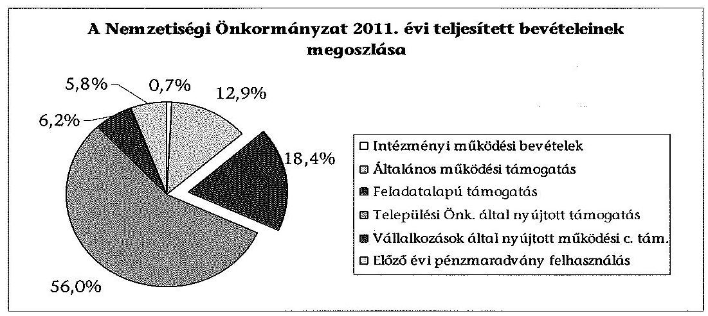
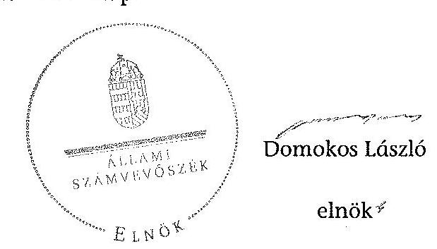
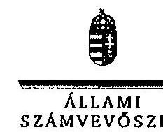
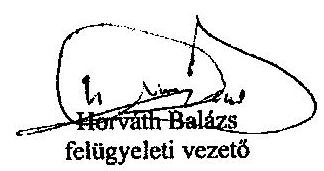

# ÁLLAMI   SZÁMVEVÔSZÉK 

## JELENTÉS

a helyi kisebbségi/nemzetiségi önkormányzatok gazdálkodásának ellenőrzéséről
Kecskemét Megyei Jogú Város Ruszin Települési Nemzetiségi Önkormányzata

---

# Állami Számvevőszék 

Iktatószám: V-0058-108-006/2013.
Témaszám: 1068
Vizsgálat-azonosító szám: V06060116

## Az ellenőrzést felügyelte:

Horváth Balázs
felügyeleti vezető
Az ellenőrzést vezette és az ellenőrzés végrehajtásáért felelős:
Korsósné Vigh Andrea
ellenőrzésvezető
A számvevőszéki jelentést készítették és a jelentés összeállításában közremüködtek:

## Molnár Istvánné

számvevő tanácsos
Papp József
számvevő tanácsos
Az ellenőrzést végezte:
Papp József
számvevő tanácsos

---

# TARTALOMJEGYZÉK 

BEVEZETÉS ..... 5
I. ÖSSZEGZŐ MEGÁLLAPÍTÁSOK, KÖVETKEZTETÉSEK, JAVASLATOK ..... 8
II. RÉSZLETES MEGÁLLAPÍTÁSOK ..... 11

1. A Nemzetiségi és a Települési Önkormányzat együttmúködésének szabályszerűsége ..... 11
2. A gazdálkodási feladatok ellátásának szabályszerűsége ..... 12
2.1. A költségvetésre és zárszámadásra, valamint a kincstári adatszolgáltatás rendjére vonatkozó jogszabályi előírások betartása ..... 12
2.2. A Nemzetiségi Önkormányzat gazdálkodásának szabályozottsága ..... 13
2.3. A pénzügyi kontrollok múködése ..... 13
3. A Nemzetiségi Önkormányzattal összefüggő gazdálkodási feladatok belső ellenőrzése ..... 14
4. A 2011. évi feladatalapú támogatás felhasználásának, elszámolásának szabályszerűsége ..... 14
5. A Nemzetiségi Önkormányzat feladatellátása ..... 15
MELLÉKLETEK
6. számú A Nemzetiségi Önkormányzat 2011. évi és 2012. I. félévi gazdálkodásának fơbb adatai, mutatói
2/A. számú A Kecskemét Megyei Jogú Város Polgármesterének észrevételei a jelentéstervezethez
2/B. számú A Kecskemét Megyei Jogú Város Polgármesterének tájékoztatója a javító intézkedésekről
7. számú Az Állami Számvevőszék válaszlevele az észrevételekre
FÜGGELÉKEK
8. számú Értelmező szótár
9. számú A pénzügyi kontrollok múködésének értékelése

---

.

---

# RÖVIDÍTÉSEK JEGYZÉKE 

## Jogszabályok

Áht. 1
Áht. 2
ÁSZ tv.
Nek. ${ }_{1}$ tv.
Nek. ${ }_{2}$ tv.
Áhsz.

Ámr.
Ávr.

Ber.
Bkr.
támogatási kormányrendelet

Települési Önkormányzat SZMSZ-e

## Szórövidítések

ÁSZ
jegyzó
1992. évi XXXVIII. törvény az államháztartásról (hatályos 2011. december 31-ig)
2011. évi CXCV. törvény az államháztartásról (hatályos 2011. december 31-től)
2011. évi LXVI. törvény az Állami Számvevőszékről (hatályos 2011. július 1-jétől)
1993. évi LXXVII. törvény a nemzeti és etnikai kisebbségek jogairól (hatályos 2011. december 31-ig)
2011. évi CLXXIX. törvény a nemzetiségek jogairól (hatályos 2011. december 20-tól)
249/2000. (XII. 24.) Korm. rendelet az államháztartás szervezeti beszámolási és könyvvezetési kötelezettségének sajátosságairól
292/2009. (XII. 19.) Korm. rendelet az államháztartás működési rendjéről (hatályos 2011. december 31-ig)
368/2011. (XII. 31.) Korm. rendelet az államháztartásról szóló törvény végrehajtásáról (hatályos 2012. január 1jétől)
193/2003. (XI. 26.) Korm. rendelet a költségvetési szervek belső ellenőrzéséről (hatályos 2011. december 31-ig)
370/2011. (XII. 31.) Korm. rendelet a költségvetési szervek belső kontrollrendszeréről és belső ellenőrzéséről (hatályos 2012. január 1-jétől)
342/2010. (XII. 28.) Korm. rendelet a kisebbségi önkormányzatoknak a központi költségvetésből, valamint fejezeti kezelésű előirányzatból nyújtott támogatások feltételrendszeréről és elszámolásának rendjéről (hatályon kívül helyezte a 28/2012. (III. 6.) Korm. rendelet a nemzetiségi célú előirányzatokból nyújtott támogatások feltételrendszeréről és elszámolásának rendjéről; jelenleg hatályos a 428/2012. (XII. 29.) Korm. rendelet a nemzetiségi célú előirányzatokból nyújtott támogatások feltételrendszeréről és elszámolásának rendjéről)
Kecskemét Megyei Jogú Város Önkormányzata 47/1998. (XII. 21.) számú rendelete a Közgyűlés és Szervei Szervezeti és Müködési Szabályzatáról

## Állami Számvevőszék

Kecskemét Megyei Jogú Város Önkormányzatának jegyzője

---

| Képviselő-testület | Kecskemét Megyei Jogú Város Ruszin Települési Kisebbségi Önkormányzatának Képviselö-testülete 2011. december 31-ig, Kecskemét Megyei Jogú Város Ruszin Települési Nemzetiségi Önkormányzatának Képviselő-testülete 2012. január 1-jétől |
| :--: | :--: |
| Kincstár | Magyar Államkincstár |
| Közgyưlés | Kecskemét Megyei Jogú Város Önkormányzatának Közgyűlése |
| Nemzetiségi Önkormányzat | Kecskemét Megyei Jogú Város Ruszin Települési Kisebbségi Önkormányzata 2011. december 31-ig, Kecskemét Megyei Jogú Város Ruszin Települési Nemzetiségi Önkormányzata 2012. január 1-jétől |
| Nemzetiségi Önkormányzat elnöke | Kecskemét Megyei Jogú Város Ruszin Települési Kisebbségi Önkormányzatának elnöke 2011. december 31-ig, Kecskemét Megyei Jogú Város Ruszin Települési Nemzetiségi Önkormányzatának elnöke 2012. január 1-jétől |
| pénzügyi kontrollok | A kötelezettségvállalás és az utalvány ellenjegyzése, valamint a szakmai teljesítés igazolása 2011. december 31ig, 2012. január 1-jétől a pénzügyi ellenjegyzés, a teljesítés igazolása és az érvényesítés |
| polgármester | Kecskemét Megyei Jogú Város Önkormányzatának polgármestere |
| Polgármesteri Hivatal | Kecskemét Megyei Jogú Város Önkormányzatának Polgármesteri Hivatala |
| Polgármesteri Hivatal SZMSZ-e | Kecskemét Megyei Jogú Város Önkormányzata 8/2011. (II. 9.) számú határozata a Polgármesteri Hivatal Szervezeti és Múködési Szabályzatáról (a módosításokkal egységes szerkezetben hatályos 2011. szeptember 1-jétől) |
| Támogató | A támogatást nyújtó Közigazgatási és Igazságügyi Minisztérium |
| Települési Önkormányzat | Kecskemét Megyei Jogú Város Önkormányzata |

---

# JELENTÉS 

## a helyi kisebbségi/nemzetiségi önkormányzatok gazdálkodásának ellenőrzéséről Kecskemét Megyei Jogú Város Ruszin Települési Nemzetiségi Önkormányzata

## BEVEZETÉS

Az államháztartás részét, az önkormányzati alrendszer egyik elemét képezik a nemzetiségi önkormányzatok, amelyek jogi személyek és a Nek. ${ }_{1,2}$ tv.-ben meghatározott önálló feladat- és hatáskörökkel rendelkeznek. A nemzetiségi önkormányzatok az önkormányzati, illetve testületi múködtetés mellett a helyi nemzetiségi közügyek változatos formában való ellátásában vesznek részt.

A nemzetiségi önkormányzatok, illetve a települési önkormányzatok között a jelenlegi szabályozás szerint nincs alá-fölérendeltségi viszony. A nemzetiségi önkormányzatok azonban sajátos közjogi helyzetben vannak, mert a jogállásukat tekintve önkormányzatok, ám függnek a székhelyük szerinti települési önkormányzat hivatalától, amely ellátja a nemzetiségi önkormányzatok vonatkozásában a megállapodásban rögzített gazdálkodási feladatokat.

A nemzetiségek helyzete, támogatása mind hazai, mind európai uniós szinten kiemelt figyelmet kap napjainkban. A nemzetiségi önkormányzatok gazdálkodására és támogatási rendszerére vonatkozó jogszabályok a 20102012. években jelentős változásokon mentek át, amelyek érintették a feladatalapú támogatásra fordítható költségvetési keret megállapítását, az operatív gazdálkodási jogkörök szabályozását, az elkülönített könyvvezetés alkalmazását, a belső ellenőrzés szabályozását.

Az ellenőrzés célja annak értékelése volt, hogy a Nemzetiségi Önkormányzat gazdálkodási kereteinek kialakítása, gazdálkodása és feladatellátása megfelelte a hatályos jogszabályoknak.

Ennek keretében ellenőriztük, hogy:

- a Nemzetiségi Önkormányzat és a Települési Önkormányzat együttmúködésének szabályozása, a Települési Önkormányzat SZMSZ-ében, a megállapodásban előírt működési feltételek biztosítása megfelelt-e a jogszabályi előírásoknak;
- a felek együttműködése megfelelt-e a megállapodásnak a gazdálkodási feladatok szabályszerű ellátásában, betartották-e a Nemzetiségi Önkormányzat gazdálkodásához kapcsolódóan a költségvetésre és zárszámadásra, a gazdálkodás szabályozására, az operatív gazdálkodási jogkörök gyakorlására vonatkozó jogszabályi előírásokat;

---

- a jegyző biztosította-e a Polgármesteri Hivatal belső ellenőrzése keretében a Nemzetiségi Önkormányzattal összefüggő gazdálkodási feladatok belső ellenőrzését;
- a 2011. évi feladatalapú támogatás felhasználása, a folyósított feladatalapú támogatással történő elszámolás az előírásoknak megfelelő volt-e;
- a Nemzetiségi Önkormányzat feladatellátása összhangban volt-e a vonatkozó jogszabályi előírásokkal.

Az ellenőrzés típusa: szabályszerűségi ellenőrzés
Az ellenőrzött időszak: 2011. január 1. - 2012. június 30.
Ellenőrzött szervezet: Kecskemét Megyei Jogú Város Ruszin Települési Nemzetiségi Önkormányzat és a gazdálkodási feladatait ellátó Kecskemét Megyei Jogú Város Önkormányzata

Az ellenőrzés jogszabályi alapja: az ÁSZ tv. 5. § (2)-(3) és (6) bekezdései
Az ellenőrzés szakmai módszertana az ÁSZ hivatalos honlapján (www.asz.hu) közzétett szakmai szabályokon alapult, amely a Legfőbb Ellenőrző Intézmények Nemzetközi Szervezete (INTOSAI) által kiadott nemzetközi standardok (ISSAI) figyelembevételével készült. A fogalmak magyarázatát az 1. számú függelék, a pénzügyi kontrollok megfelelősége értékelésénél alkalmazott egységes minősítési szempontokat a 2. számú függelék tartalmazza.

Az ellenőrzés lefolytatásához a Települési Önkormányzat és a Nemzetiségi Önkormányzat tanúsítványok kitöltésével és a kapcsolódó dokumentumok elektronikus megküldésével szolgáltatott adatokat. A tanúsítványokon szerepeltetett adatok, információk ellenőrzése és szükség szerinti javítása a helyszíni ellenőrzés keretében történt.

Az ÁSZ az ellenőrzés megállapításait az ellenőrzött időszakban hatályos, az intézkedést igénylő megállapításokra tett javaslatokat a jelenleg hatályos jogszabályok alapján fogalmazta meg.

A Nemzetiségi Önkormányzat 2010-ben alakult, elnöke a 2010. évi helyhatósági választások óta látja el feladatát. A Nemzetiségi Önkormányzat intézményt, gazdasági társaságot és más szervezetet nem alapított, illetve ezek társulásában nem vett részt. A négytagú Képviselő-testület munkája segítésére bizottságot nem hozott létre. A költségvetési beszámolója szerint a 2011. évben 1624 ezer Ft bevételt ért el és 1364 ezer Ft kiadást teljesített. A 2012. I. félévi beszámolója alapján a teljesített bevétel 871 ezer Ft, a teljesített kiadás 744 ezer Ft volt. A 2011. évi és a 2012. I. félévi gazdálkodási adatokat részletesen az 1. számú mellékletben mutatjuk be. Az ÁSZ a Nemzetiségi Önkormányzat gazdálkodását első alkalommal ellenőrizte.

Az ÁSZ tv. 29. § (1) bekezdése szerint a jelentéstervezetet megküldtük egyeztetésre a polgármesternek és a Nemzetiségi Önkormányzat elnökének. A Nemzetiségi Önkormányzat elnöke az ÁSZ tv. 29. § (2) bekezdésében foglalt észrevételezési jogával nem élt, a jelentéstervezetre észrevételt nem tett. A polgármester

---

észrevételét és tájékoztatását, valamint az arra adott választ, ideértve az el nem fogadott észrevételek indokolását a jelentés 2/A., 2/B. és 3. számú mellékletei tartalmazzák.

---

# I. ÖSSZEGZŐ MEGÁLLAPÍTÁSOK, KÖVETKEZTETÉSEK, JAVASLATOK 

A Nemzetiségi és a Települési Önkormányzat együttmúködése az előírt eljárásrend és határidő betartásával jóváhagyott megállapodásokon alapult. A Települési Önkormányzat biztosította a Nemzetiségi Önkormányzat müködéséhez szükséges személyi és tárgyi feltételeket. A megállapodásokat - a 2011. évben az Áht. 1 és az Ámr., a 2012. évben a Nek. 2 tv. előírásai tekintetében - kisebb tartalmi hiányosságokkal fogadták el. E hiányosságok számvevőszéki feltárását követően a megállapodást a felek felülvizsgálták és módosították, a feladatok ellátásáért felelős személyeket kijelölték, így az a jogszabályi előírásoknak megfelel.

A Nemzetiségi Önkormányzat költségvetésére és zárszámadására vonatkozó jogszabályi előírásokat összességében betartották. A költségvetési és zárszámadási határozatok jóváhagyása, a költségvetési előirányzatok módosítása során a jogszabályban előírt eljárásrendet betartották, a határozatokat egymással összehasonlítható szerkezetben készítették el.

A 2011. évi költségvetést és zárszámadást elfogadó határozatok az Ámr. előírása ellenére nem tartalmazták a tárgyévi költségvetési bevételek és kiadások különbözeteként a költségvetési többlet vagy hiány összegét, a bevételi és kiadási előirányzatok mérlegszerű bemutatását, továbbá a költségvetéshez nem készült előirányzat-felhasználási ütemterv. A Települési Önkormányzat a jogszabályi előírásokkal összhangban építette be a határozatokat a költségvetési és zárszámadási rendeleteibe.

A 2012. évi költségvetési határozat tartalma a jogszabályi előírásoknak megfelelt, a 2012. I. félévben az Ávr.-ben és az Áhsz.-ben előírt, a Nemzetiségi Önkormányzatra vonatkozó kincstári adatszolgáltatási kötelezettségeinek a jegyző eleget tett.

A gazdálkodás szabályozottsága érdekében, az e feladatok végrehajtását ellátó Polgármesteri Hivatal, a jogszabályokban előírt szabályzatok hatályát kiterjesztette a Nemzetiségi Önkormányzatra. Az operatív gazdálkodási jogkörök kialakítása a jogszabályi előírásokkal összhangban történt.

A pénzügyi kontrollok múködése megfelelőségét a dologi és egyéb folyó kiadások teljesítésénél a 2011. évben az ellenőrzés gyengének értékelte. Az előlegből elszámolt kifizetéseknél a megállapodásban előírt kötelezettségvállalási dokumentum hiányában nem az Ámr.-nek megfelelően történt a kötelezettségvállalás és az utalvány ellenjegyzése, valamint a szakmai teljesítés igazolása. A kötelezettségvállalás ellenjegyzője részéről elmaradt a szabad előirányzat, a fedezet rendelkezésre állásának, valamint a gazdálkodásra vonatkozó szabályok betartásának az ellenőrzése és igazolása. A szakmai teljesítést igazoló a kiadás teljesítésének jogosságát, összegszerűségét, a szerződés, megrendelés teljesítését, az utalvány ellenjegyzője a szakmai teljesítés igazolására, az érvényesítésre, valamint a gazdálkodásra vonatkozó előírások betartását nem szabály-

---

szerűen ellenőrizte. A kontrollok múködésében javulás történt, mert a 2012. I. félévben a dologi és egyéb folyó kiadások teljesítésénél a pénzügyi ellenjegyzés, a teljesítésigazolás és az érvényesítés kontrollok kiválóan múködtek.

A Nemzetiségi Önkormányzat a 2011. évben a bevételei 18,4\%-át kitevő, 299 ezer Ft feladatalapú támogatásban részesült, amelyet a tárgyévben a jogszabályi előírásokkal összhangban felhasznált. A támogatási kormányrendeletben hivatkozott, az Áht. ${ }_{1}$-ben előírt elszámolás nem történt meg. A támogatás felhasználását, elszámolását a jogosult szervek nem ellenőrizték.

A Nemzetiségi Önkormányzat feladatellátásának tárgya a Nek. ${ }_{1,2}$ tv. előírásaival összhangban volt. Biztosította a nemzetiségi közügyek keretében az alapvető feladatához szükséges szervezeti, személyi és anyagi feltételeket, továbbá önként vállalt feladatokat látott el a nemzetiségi oktatás és nevelés, a helyi írott és elektronikus sajtó, a hagyományápolás és közmúvelődés, valamint a nemzetiségi közösség kulturális autonómiája megerősítése területén.

A Polgármesteri Hivatal 2011. és 2012. évi ellenőrzési terveit megalapozó kockázatelemzés kiterjedt a Nemzetiségi Önkormányzat gazdálkodásával összefüggő végrehajtási feladatok ellátására, az alacsony kockázati értékelésre tekintettel belső ellenőrzési feladatot nem terveztek és nem végeztek.

Az ÁSZ tv. 33. § (1) bekezdésében foglaltak értelmében az ellenőrzött szervezet vezetője köteles a jelentésben foglalt megállapításokhoz kapcsolódó intézkedési tervet összeállítani, és azt a jelentés kézhezvételétől számított 30 napon belül az ÁSZ részére megküldeni. Amennyiben az intézkedési tervet határidőre nem küldi meg a szervezet, vagy az nem elfogadható, az ÁSZ elnöke az ÁSZ tv. 33. § (3) bekezdés a)-b) pontjaiban foglaltakat érvényesítheti.

A helyszíni ellenőrzés megállapításainak hasznosítása mellett javasoljuk:

# a jegyzönek 

a feladatalapú támogatás felhasználásával, elszámolásával kapcsolatban:
A 2011. évben folyósított feladatalapú támogatás elszámolása a támogatási kormányrendelet 7. § (2) bekezdésében hivatkozott Áht. ${ }_{1}$-nek „a helyi önkormányzatok elszámolási rendjére vonatkozó rendelkezései alkalmazása" előirása ellenére nem történt meg.

Javaslat
Gondoskodjon az Áht. 2 27. § (2) bekezdésben meghatározott feladatkörében a Nemzetiségi Önkormányzat által igénybe vett feladatalapú támogatás elszámolásának elkészítéséről, figyelemmel az Áht. 2 57. § (4) bekezdésben foglaltakra.

## a Nemzetiségi Önkormányzat elnökének

A 2011. évben folyósított feladatalapú támogatás elszámolása a támogatási kormányrendelet 7. § (2) bekezdésében hivatkozott Áht. ${ }_{1}$-nek „a helyi önkormányzatok

---

elszámolási rendjére vonatkozó rendelkezései alkalmazása" elöírása ellenére nem történt meg.

Javaslat
Terjessze a Képviselő-testület elé jóváhagyásra az Áht. 57. § (4) bekezdés alapján összeállított, a Nemzetiségi Önkormányzat által igénybe vett feladatalapú támogatás elszámolását.

---

# II. RÉSZLETES MEGÁLLAPÍTÁSOK 

## 1. A Nemzetiségi és a Telepúlési Önkormányzat együttmúKÖDÉSÉNEK SZABÁLYSZERŰSÉGE

A Nemzetiségi Önkormányzat és a Települési Önkormányzat megállapodásai ${ }^{1}$ - kisebb tartalmi hiányosságok kivételével - megfeleltek a jogszabályi előírásoknak. A megállapodások jóváhagyása az előírt eljárásrend és határidő betartásával történt. A Települési Önkormányzat biztosította a Nemzetiségi Önkormányzat müködéséhez szükséges személyi és tárgyi feltételeket.

A megállapodásokban a jogszabályi előírásokat nem érvényesítették maradéktalanul, mert:

- a 2011. december 31-én hatályos megállapodás nem tartalmazta az Áht. ${ }_{1}$ 66. §-ban foglalt előírások ellenére teljes körűen a Nemzetiségi Önkormányzat gazdálkodása végrehajtásának rendjéhez kapcsolódó feladatellátás jogosultjainak, kötelezettjeinek kijelölését;
- a 2012. június 30 -án hatályos megállapodás a Nek. ${ }_{2}$ tv. 80. § (3) bekezdés a)b) és d) pontjaiban foglaltak ellenére nem tartalmazta teljes körűen a költségvetés előkészítésével és megalkotásával, a költségvetési adatszolgáltatással, az önálló fizetési számla nyitásával, az érvényesítési feladatok ellátásával, a müködési feltételek biztosításával kapcsolatos felelősök konkrét kijelölését.

Az együttműködő felek a megállapodást - a tartalmi hiányosságok számvevőszéki feltárását követően - felülvizsgálták és módosították², kiegészítették a feladatok ellátásáért felelős konkrét személyek kijelölésével, így az a jogszabályi előírásoknak megfelel.

[^0]
[^0]:    ${ }^{1}$ A 2011. évben és 2012. június 1-jéig hatályos megállapodást a Képviselő-testület a 13/2010. (XI. 30.) számú, a Közgyűlés a 470/2010. (XII. 16.) számú határozattal fogadta el. A Nek. ${ }_{2}$ tv. 159. § (3) bekezdésében előírtak alapján 2012. június 1-jéig felülvizsgált és módosított megállapodást a Képviselő-testület a 24/2012. (V. 21.) számú, a Közgyűlés a 162/2012. (V. 31.) számú határozattal hagyta jóvá.
    ${ }^{2}$ A módosított megállapodást a Képviselő-testület az 5/2013. (II. 15.) számú, a Közgyűlés a 26/2013. (II. 14.) számú határozatával fogadta el, azt a Nemzetiségi Önkormányzat elnöke és a polgármester 2013. február 15-én aláírta.

---

# 2. A GAZDÁLKODÁSI FELADATOK ELLÁTÁSÁNAK SZABÁLYSZERŰSÉGE 

### 2.1. A költségvetésre és zárszámadásra, valamint a kincstári adatszolgáltatás rendjére vonatkozó jogszabályi előírások betartása

A Nemzetiségi Önkormányzat költségvetésére és zárszámadására vonatkozó jogszabályi előírásokat - a 2011. évi költségvetési és zárszámadási határozatok egyes tartalmi elemeit szabályozó Ámr. rendelkezések kivételével - betartották. A Nemzetiségi Önkormányzat költségvetési és zárszámadási határozatainak ${ }^{3}$ jóváhagyása a jogszabályban előírt eljárásrend betartásával történt, a költségvetési és zárszámadási határozatok egymással összehasonlítható szerkezetben készültek.

A Nemzetiségi Önkormányzat elnöke a költségvetési előirányzatai felhasználásához szükséges mértékben kezdeményezte azok módosítását, biztosította a tárgyévi fizetési kötelezettség vállalásához szükséges fedezet meglétét.

A 2011. évi költségvetési és zárszámadási határozatokat a Képviselő-testület hiányos tartalommal fogadta el:

- nem tartalmazták az Ámr. 36. § (1) bekezdés ec) és i) pontjaiban foglalt előírások ellenére a tárgyévi költségvetési bevételek és kiadások különbözeteként a költségvetési többlet vagy hiány összegét, a bevételi és kiadási előirányzatok mérlegszerű bemutatását;
- az Ámr. 36. § (1) bekezdés k) pontjában foglaltakat figyelmen kívül hagyva a költségvetési határozatban nem szerepeltették az év várható bevételi és kiadási előirányzatainak teljesüléséről készített előirányzat-felhasználási ütemtervet.

A Nemzetiségi Önkormányzat 2011. évi költségvetési és zárszámadási határozatai a számadatok tekintetében változatlan tartalommal épültek be a Települési Önkormányzat költségvetési rendeleteibe oly módon, hogy azok kiegészültek az Ámr. 36. § (1) bekezdés ec), i) és k) pontjaiban előírt - a Nemzetiségi Önkormányzat költségvetési és zárszámadási határozataiban hiányolt - tartalmi elemekkel.

A 2012. évi költségvetési határozat tartalma a jogszabályi előírásoknak megfelel. A 2012. I. félévben az Ávr.-ben és az Áhsz.-ben előírt, a Nemzetiségi Önkormányzatra vonatkozó kincstári adatszolgáltatási kötelezettségeinek a jegyző eleget tett.

[^0]
[^0]:    ${ }^{3}$ A Képviselő-testületnek a Nemzetiségi Önkormányzat 2011. évi költségvetéséről alkotott 3/2011. (I. 21.) számú, a 2011. évi zárszámadásáról alkotott 9/2012. (I. 23.) számú, valamint a 2012. évi költségvetéséről alkotott 8/2012. (II. 13.) számú határozatai.

---

# 2.2. A Nemzetiségi Önkormányzat gazdálkodásának szabályozottsága 

A Nemzetiségi Önkormányzat gazdálkodásának szabályozottsága az ellenőrzött időszakban biztosított volt. A gazdálkodási feladatai végrehajtását ellátó Polgármesteri Hivatal a jogszabályokban előírt gazdálkodási szabályzatokkal ${ }^{4}$ a Nemzetiségi Önkormányzat gazdálkodási feladataira kiterjedő hatállyal rendelkezett.

A Nemzetiségi Önkormányzatra vonatkozóan az operatív gazdálkodási jogkörök kialakítása - a kötelezettségvállalásra, az utalványozásra, a kötelezettségvállalás és utalványozás ellenjegyzésére a felhatalmazások, a szakmai teljesítést igazoló és az érvényesítést végző személyek kijelölése - a 2011. évben a jogszabályi előírásoknak megfelelő volt.
2012. I. félévben a Nemzetiségi Önkormányzatra vonatkozóan az operatív gazdálkodási jogkörök kialakítása a kötelezettségvállalásra, az utalványozásra adott felhatalmazás, a teljesítést igazoló megbízása, továbbá a gazdasági szervezettel nem rendelkező Polgármesteri Hivatalban ${ }^{5}$ a pénzügyi ellenjegyzó és az érvényesítő személyek jegyző általi kijelölése a jogszabályi előírásoknak megfelelően történt.

### 2.3. A pénzügyi kontrollok múködése

A Nemzetiségi Önkormányzatnál a 2011. évi dologi és egyéb folyó kiadások teljesítése során a kötelezettségvállalás ellenjegyzése, a szakmai teljesítés igazolása és az utalvány ellenjegyzése kontrollok múködésének megfelelősége gyenge volt, mert az előlegből elszámolt rendezvényszervezés kifizetésnél az előzetes írásbeli kötelezettségvállalási dokumentum hiányában:

- a kötelezettségvállalás ellenjegyzője az Ámr. 74. § (1), valamint az Ámr. 74. § (3) bekezdésének a-c) pontjaiban foglalt feladatát nem végezte el. Így elmaradt a szabad előirányzat, továbbá a pénzügyi fedezet rendelkezésre állásának, valamint a gazdálkodásra vonatkozó szabályok betartásának az ellenőrzése és igazolása;
- a szakmai teljesítést igazoló nem az Ámr. 76. § (1) és (3) bekezdésében előírtaknak megfelelően végezte el ellenőrzési feladatait. A kiadás teljesítésének jogosságáról, összegszerűségéről, valamint a szerződés/megrendelés szakmai teljesítéséről nem szabályszerűen győződött meg, ennek ellenére a teljesítést aláírásával igazolta;

[^0]
[^0]:    ${ }^{4}$ Számviteli politika, leltározási és leltárkészítési szabályzat, pénzkezelési szabályzat, eszközök és források értékelési szabályzata, számlarend, munkaköri leírások, ellenőrzési nyomvonal, szabálytalanságok kezelésének eljárásrendje, kockázatkezelési szabályzat, folyamatba épített előzetes, utólagos és vezetői ellenőrzés (FEUVE) szabályozás.
    ${ }^{5}$ A Polgármesteri Hivatal SZMSZ-ét a Közgyűlés a 24/2013. (II. 14.) számú határozatával módosította, amelyben megnevezte a gazdasági szervezetét és megjelölte a gazdasági vezetőt, aki kijelölte a pénzügyi ellenjegyzőt és az érvényesítőt.

---

- az utalvány ellenjegyzője ellenőrzési feladatát nem az Ámr. 79. § (2) bekezdésében előírtak szerint látta el. Annak ellenére ellenjegyezte a kiadás teljesítését, hogy a szakmai teljesítés igazolására, az érvényesítésre és a gazdálkodásra vonatkozó előírások betartásának ellenőrzését nem szabályszerűen végezte el.

A hibák száma a lényegességi szintet, a kritikus hibahatárt elérte.
A Nemzetiségi Önkormányzatnál 2012. I. félévben a dologi és egyéb folyó kiadások teljesítése során a pénzügyi ellenjegyzés, a teljesítés igazolása és az érvényesítés kontrollok müködésének megfelelősége kiváló volt, mert a kontrollok elvégzésére kijelölt személyek az Ávr.-ben és a belső szabályzatban előírtak szerint látták el feladatukat.

# 3. A Nemzetiségi ÖNKORMÁnyZATtal ÖSSZEFÜGGŐ GAZDÁlKODÁSI FELADATOK BELSŐ ELLENŐRZÉSE 

A Polgármesteri Hivatal 2011. és 2012. évi ellenőrzési terveit megalapozó, a Ber. 21. § (2), illetve a Bkr. 31. § (2) bekezdésében előírt kockázatelemzés ${ }^{6}$ kiterjedt a Nemzetiségi Önkormányzat gazdálkodásával összefüggő végrehajtási feladatok ellátására. Ennek eredményeként e feladatok kockázatát a Polgármesteri Hivatal belső ellenőrzési kézikönyvében meghatározott pontrendszer alapján alacsonynak értékelték, ezért az ellenőrzött időszakban belső ellenőrzési feladatokat nem terveztek és nem végeztek.

## 4. A 2011. ÉVI FELADATALAPÚ TÁMOGATÁs FELHASZNÁLÁSÁNAK, ELSZÁMOLÁSÁNAK SZABÁLYSZERŰSÉGE

A Nemzetiségi Önkormányzat a 2011. évben 299 ezer Ft feladatalapú támogatásban részesült, amelynek az összes bevételekhez viszonyított részarányát a következő ábra szemlélteti:

[^0]
[^0]:    ${ }^{6}$ Az 55577-2/2010. ügyiratszámú, a 2011. évi ellenőrzési tervet megalapozó kockázatelemzés, valamint a 4.571-4/2011. ügyiratszámú a 2012. évi ellenőrzési tervet megalapozó kockázatelemzés.

---

A 2011. évben folyósított támogatást a jogszabályi előírásokkal összhangban - a tárgyévben teljes összegében - felhasználták. Ennek elszámolása a támogatási kormányrendelet 7. § (2) bekezdésében hivatkozott Áht. ${ }_{1}$-nek „a helyi önkormányzatok elszámolási rendjére vonatkozó rendelkezései alkalmazása" előírása ellenére nem történt meg.

A támogatás felhasználását, elszámolását az ellenőrzésre jogosult szervek nem ellenőrizték.

# 5. A Nemzetiségi Önkormányzat feladATELLátása 

A Nemzetiségi Önkormányzat feladatellátásának tárgya összhangban volt a Nek. ${ }_{1,2}$ tv. előírásaival. Ennek keretében:

- biztosította a Nek. ${ }_{1}$ tv. 5/A. § (1) bekezdés és a Nek. ${ }_{2}$ tv. 10. § (1) bekezdés szerinti alapfeladata - „a nemzetiségi érdekek védelme és képviselete a nemzetiségi önkormányzati feladat- és hatáskörének gyakorlásával" - ellátásához szükséges szervezeti, személyi és anyagi feltételeket;
- a Nek. ${ }_{1}$ tv. 30/A. § (4) bekezdésében foglaltak alapján feladatot látott el a nemzetiségi oktatás és nevelés, a helyi írott és elektronikus sajtó, valamint a hagyományápolás és közmúvelődés területén;
- a Nek ${ }_{2}$ tv. 115. § f) pontja alapján a képviselt közösség kulturális autonómiájának megerősítése érdekében szervezési és múködtetési feladatokat látott el.

Budapest, 2013. 12. hó 20. nap

Melléklet: $\quad 4 \mathrm{db}$
Függelék: $\quad 2 \mathrm{db}$

---

.

---

# A Nemzetiségi Önkormányzat 2011. évi és 2012. I. félévi gazdálkodásának föbb adatai, mutatói 

A) Bevételek
adatok ezer Ft-ban

| Megnevezés | 2011. év |  |  |  | 2012. I. félév |  |  |  |
| :--: | :--: | :--: | :--: | :--: | :--: | :--: | :--: | :--: |
|  | eredeti   ei. | módosított ei. | teljesítés | teljesítés   megoszlása   (\%) | eredeti   ei. | módosított ei. | teljesítés | teljesítés   megoszlása   (\%) |
| Intézményi müködési bevételek | 0 | 11 | 11 | $0,7 \%$ | 0 | 3 | 5 | $0,6 \%$ |
| Általános müködési támogatás | 566 | 210 | 210 | $12,9 \%$ | 210 | 215 | 215 | $24,7 \%$ |
| Feladatalapú   támogatás | 0 | 299 | 299 | $18,4 \%$ | 0 | 0 | 0 | $0,0 \%$ |
| Települési Önkormányzat által nyújtott támogatás | 0 | 910 | 910 | $56,0 \%$ | 0 | 760 | 392 | $45,0 \%$ |
| Vállalkozások által nyújtott müködési c. tám. | 0 | 100 | 100 | $6,2 \%$ | 0 | 0 | 0 | $0,0 \%$ |
| Pénzforgalmi bevételek összesen | 566 | 1530 | 1530 | $94,2 \%$ | 210 | 978 | 612 | $70,3 \%$ |
| Előző évi pénzmaradvány felhasználás | 94 | 94 | 94 | $5,8 \%$ | 259 | 259 | 259 | $29,7 \%$ |
| Bevételek összesen | 660 | 1624 | 1624 | 100,0\% | 469 | 1237 | 871 | 100,0\% |

B) Kiadások
adatok ezer Ft-ban

| Megnevezés | 2011. év |  |  |  | 2012. I. félév |  |  |  |
| :--: | :--: | :--: | :--: | :--: | :--: | :--: | :--: | :--: |
|  | eredeti   ei. | módosított ei. | teljesítés | teljesítés   megoszlása   (\%) | eredeti   ei. | módosított ei. | teljesítés | teljesítés   megoszlása   (\%) |
| Személyi juttatások | 0 | 316 | 303 | $22,2 \%$ | 0 | 0 | 0 | $0,0 \%$ |
| Munkaadókat terhelő járulékok | 0 | 21 | 12 | $0,9 \%$ | 24 | 56 | 18 | $2,4 \%$ |
| Dologi és egyéb folyó kiadások | 510 | 1187 | 949 | $69,6 \%$ | 445 | 1181 | 726 | $97,6 \%$ |
| Támogatásértékủ müködési kiadás | 0 | 0 | 0 | $0,0 \%$ | 0 | 0 | 0 | $0,0 \%$ |
| Müködési kiadások összesen | 510 | 1524 | 1264 | $92,7 \%$ | 469 | 1237 | 744 | 100,0\% |
| Felhalmozási kiadások | 150 | 100 | 100 | 7,3\% | 0 | 0 | 0 | $0,0 \%$ |
| Kiadások összesen | 660 | 1624 | 1364 | 100,0\% | 469 | 1237 | 744 | 100,0\% |

---

.

---

# Kecskemét Megyei Jogú Város' Polgármestere 

Ügyiratszám: 168-22/2013.
Tárgy: ÁSZ vizsgálat-észrevétel

Állami Számvevőszék
Domokos László elnök részére

Budapest
Apáczai Csere János u. 10. 1052

ÁLLAMI SZÁMVI: , 1 ZÉK
10258113
Erkczet: 2013 JON 07.
Iktatószám: 1-0058-092-005/2-10.
Melléklet: $\qquad$ 87

Tisztelt Elnök Úr!

Hivatkozással a 2013. május 21-ei keltezésű, Kecskemét Megyei Jogú Város Önkormányzata részére V-0058-041/2013. iktatószámú levéllel megküldött, 2013. május 22-én kézhez vett, Kecskemét Megyei Jogú Város (Ruszin) Települési Nemzetiségi Önkormányzat gazdálkodásának ellenőrzéséről szóló jelentés-tervezetre - melyet észrevétel közlése céljából küldtek meg részemre -, az alábbi észrevételeket és kiegészítő javaslatokat teszem:

ÁSZ jelentés-tervezet 11. oldal 2.1. pont:
Kérem, a megállapításokat szíveskedjék kiegészíteni az alábbiak figyelembe vételével:
Az államháztartásról szóló 1992. évi XXXVIII. törvény (továbbiakban: Áht) 65. § (3) bekezdése szerint a helyi önkormányzat költségvetési rendeletébe a helyi kisebbségi önkormányzat költségvetése a helyi kisebbségi önkormányzat költségvetési határozata alapján elkülönítetten épül be. Kecskemét Megyei Jogú Város Önkormányzatának (továbbiakban: Önkormányzat) 2011. évi költségvetéséről szóló 2/2011. (II.9.) önkormányzati rendelete (továbbiakban: önkormányzati rendelet) és annak módosításai elkülönítetten tartalmazzák a helyi kisebbségi önkormányzatok költségvetését.

Fentieket figyelembe véve az államháztartás müködési rendjéről szóló 292/2009. (XII.19.) Korm. rendelet (továbbiakban: Ámr.) 36. § (1) bekezdés i) pontjában rögzített müködési és felhalmozási célú bevételi és kiadási előirányzatok mérlegszerủ bemutatását Kecskemét Megyei Jogú Város Ruszín Települési Kisebbségi Önkormányzata tekintetében az önkormányzati rendelet 1/g. melléklete tartalmazza, amelyben feltüntetésre került az Ámr. 36. § (1) bekezdés ec) pontjában meghatározott, a költségvetési bevételek és kiadások különbözeteként a költségvetési többlet vagy hiány összege.

Az Ámr. 36. § (1) bekezdés k) pontjában megfogalmazott, az év várható bevételi és kiadási előirányzatainak teljesüléséről készített előirányzat-felhasználási ütemtervet az

[^0]
[^0]:    Ügyintézés: Kecskemét Megyei Jogú Város Polgármesteri Hivatal
    Városstratégiai Iroda
    Gazdálkodási Osztály
    6000 Kecskemét, Kossuth tér 1.
    Tel.: 76/513-513; Fax: 76/513-540; E-mail cím:gazdalkodas@kecskemet.hu

---

# Kecskemét Megyei Jogú Város Polgármestere 

önkormányzati rendelet 5. melléklete összevontan bár, de tartalmazza (az önkormányzat valamennyi bevételi és kiadási elöirányzatát, így a kisebbségi önkormányzatok elöirányzatait is).

## ÁsZ jelentés-tervezet 13. oldal 2.3. pont:

Kérem, a megállapításokat szíveskedjék törölni az alábbiak figyelembe vételével:
2011. augusztus 26-án a kisebbségi önkormányzat elnöke elöleget vett fel a Ruszin Kulturális Nap szervezési költségeire. Az „Elszámolási Előleg Felvétele" nyomtatványon elözetesen, írásban megtörtént a kötelezettségvállalás. Fenti nyomtatvány szolgál az elszámolás kötelezettségvállalás alapbizonylatáni.
Vásárlási előleg kiadásakor pénzforgalomban történik az összeg kiadása a pénztárból, amelyet csak utalványozás és érvényesités esetén lehet kifizetni. Ha az előlegből olyan vásárlás történik, amely gazdasági esemény meghaladja az írásbeli kötelezettségvállalás értékhatárát, akkor az előleg kiadásától függetlenül az adott gazdasági eseményre szükséges az írásbeli kötelezettségvállalás. Az előleg kiadásakor pénzforgalomban történik az összeg kiadása a pénztárból. A konkrét gazdasági esemény csak az előleg elszámolásakor lesz ismeretes.
Az állambáztartás szervezetei beszámolási és könyvvezetési kötelezettségének sajátosságairól szóló 249/2000. Korm. rendelet 22. § (9) bekezdése szerint a költségvetési átfutó kiadás olyan kifizetés, amely az állambáztartás szervezete alap-, illetve vállalkozási tevékenységének ellátásához közvetve kapcsolódik, ideiglenes vagy lebonyolítás jellegü kiadás. Itt kell kimutatni a munkavállalóknak adott munkabérelölegeket, valamint az utólagos elszámolásra nyújtott különböző elöleget, valamint a szállítóknak adott előlegeket (a beruházási előlegek kivételével) is.
Fenti esetben újabb kötelezettségvállalási dokumentum a rendezvényszervezés szolgáltatásra vonatkozóan nem készült, mivel ugyanazon gazdasági eseményre két nyilvántartásba vétel esetében a kötelezettségvállalás összege megduplázódna. Az előleghez benyújtott számla megérkezését követően szeptember 28-án, az előleg elszámolásakor a kötelezettségvállalás nyilvántartására szolgáló POLISZ integrált rendszerben a 39-es számlaosztályból a kifizetett előleg összege visszavételezésre, a kötelezettségvállalás módosításra került a megfelelő kiadási fökönyvi számra és a megfelelő dologi kiadások közé könyvelés is megtörtént.
A gazdasági esemény elözetes kötelezettségvállalással ellátott alapbizonylata az „Elszámolási Előleg Felvétele" nyomtatvány, tehát az elözetes írásbeli kötelezettségvállalás - az Ámr. rendelkezései alapján - megtörtént, így a kötelezettségvállalás ellenjegyzője, a szakmai teljesítést igazoló és az utalvány ellenjegyzője is az Ámr. előírásainak megfelelően látta el feladatát.

A 2.3. pont 2. bekezdését az alábbiakkal szíveskedjék kiegészíteni:
Kecskemét Megyei Jogú Város Közgyülése a 24/2013.(II.14.) számú határozatával módosította a Polgármesteri Hivatal SZMSZ-ét, amelyben meghatározta a gazdasági

[^0]
[^0]:    Ügyintézés: Kecskemét Megyei Jogú Város Polgármesteri Hivatal Városstratégiai Iroda Gazdálkodási Osztály 6000 Kecskemét, Kossuth tér I.
    Tel.: 76/513-513; Fax: 76/513-540; E-mail cím:gazdalkodas@kecskemet.hu

---

# Kecskemét Megyei Jogú Város Polgármestere 

szervezetét és kijelölte a gazdasági vezetőt. A gazdasági vezető a jogszabályoknak megfelelően kijelölte a nemzetiségi önkormányzatok kifizetései tekintetében az érvényesitőket.

## ÁSZ jelentés-tervezet 14. oldal 4. pont:

Kérem, a megállapításokat szíveskedjék módosítani az alábbiak figyelembe vételével:
Kecskemét Megyei Jogú Város Ruszin Települési Kisebbségi Önkormányzata a 2011. évben folyósitott 299 E Ft összegủ feladatalapú támogatást felhasználta.
A kisebbségi önkormányzatoknak a központi költségvetésből, valamint fejezeti kezelésű előirányzatból nyújtott támogatások feltételrendszeréről és elszámolásának rendjéről szóló 342/2010. (XII.28.) Korm. rendeletben (továbbiakban: kormányrendelet) leírtak alapján 2011. évben a feladatalapú támogatás összege a Wekerle Sándor Alapkezelőhöz (továbbiakban: Alapkezelő) - támogatási év április 15. napjáig - benyújtott igénybejelentés alapján került megállapításra. A nemzeti és etnikai kisebbségekkel kapcsolatos állami feladatok ellátásáért felelős államigazgatási szerv vezetője, mint támogató a támogatási döntéséről értesítette az Alapkezelőt. Az Alapkezelő a támogatás egy összegben történő folyósításáról a kisebbségi önkormányzatok részére - a Magyar Államkincstár (továbbiakban: Kincstár) útján gondoskodott.
Az Áht ${ }_{1} 64 . \S$ (7) bekezdésére hivatkozva a helyi önkormányzat a költségvetési év végét követően a tényleges mutatók alapján, külön jogszabályban meghatározott határidőig, a költségvetési törvény szabályai szerint elszámol az igénybe vett normatív hozzájárulásokkal és támogatásokkal.
A kormányrendelet 7. § (2) bekezdése szerint a feladatalapú támogatással kapcsolatos elszámolás, ellenőrzés rendjére az Áht ${ }_{1}$-nak a helyi önkormányzatok elszámolási és ellenőrzési rendjére vonatkozó rendelkezései alkalmazandók.
Kecskemét Megyei Jogú Város Önkormányzata a 2011. évi költségvetési beszámolási kötelezettségének a Kincstár területi szervéhez eleget tett, azonban figyelembe véve a Magyar Köztársaság 2011. évi költségvetéséről szóló 2010. évi CLXIX. törvény rendelkezéseit, a beszámoló űrlapjai nem biztosítottak lehetőséget a kisebbségi önkormányzatok feladatalapú támogatásához kapcsolódó elszámolásra.

Az Áht ${ }_{1}$ 64/D. § (1) bekezdésére hivatkozva a helyi önkormányzatok központi költségvetésből származó, a helyi önkormányzatok támogatásait meghatározó fejezetben szereplő támogatásai és hozzájárulásai év végi elszámolása szabályszerűségének felülvizsgálatát a Kincstár a tárgyévet követő év december 31 -éig megkezdi a felhívás kibocsátásával, illetve a helyszíni felülvizsgálatról szóló értesítés megküldésével.
Az államháztartásról szóló 2011. évi CXCV. törvényben, az állambáztartásról szóló törvény végrehajtásáról szóló 368/2011.(XII.31.) Korm. rendeletben és a helyi önkormányzatok és a helyi kisebbségi önkormányzatok központi költségvetési kapcsolatokból származó forrásai igénybevétele és elszámolása szabályszerűségének felülvizsgálatáról szóló 16/2002. (IV.12.)

[^0]
[^0]:    Ügyintézés: Kecskemét Megyei Jogú Város Polgármesteri Hivatal
    Városstratégiai Iroda
    Gazdálkodási Osztály
    6000 Kecskemét, Kossuth tér 1.
    Tel.: 76/513-513; Fax: 76/513-540; E-mail cím:gazdalkodas@kecskemet.hu

---

2/A. SZÁMÚ MELLÉKLET
A V-0058-108-006/2013. SZÁMÚ JELENTÉSHEZ

Kecskemét Megyei Jogú Város Polgármestere

PM rendeletben kapott felhatalmazás alapján a Magyar Államkincstár Bács-Kiskun Megyei
igazgatósága 2012. november 16-án kelt levelében Kecskemét Megyei Jogú Város
Önkormányzata központi költségvetésből származó hozzájárulásai, támogatásai 2011. évi
igénybevételével és elszámolásával kapcsolatban megküldte a helyszíni ellenőrzésről szóló
értesítését, amely szerint a helyszíni ellenőrzés 2012. december 17. napjától kezdődött. Az
értesítésben - a 2011. évben igénybevett hozzájárulások, támogatások részletezésénél - a
kisebbségi önkormányzatok feladatalapú támogatásainak elszámolása nem került
feltüntetésre. A Kincstár részéről nem a helyszíni ellenőrzés során, illetve azt követően sem
érkezett megkeresés a 2011. évi feladatalapú támogatás elszámolásához kapcsolódóan.
Az elszámolás hiányának ellenére a nemzetiségi önkormányzat 2012. évben is részesült
azonos jellegű támogatásban.

Fentiek alapján kérem a Jegyzőnek tett, az operatív gazdálkodás működési hibáira vonatkozó
javaslatot törölni, valamint a nemzetiségi önkormányzat elnökének és a Jegyzőnek együttesen
tett, a feladatalapú támogatás felhasználásával, elszámolásával kapcsolatos javaslatokat
módosítani szíveskedjen.

Kecskemét, 2013. június 3.

Tisztelettel:

Dr. Zsinóor Gábor
polgármester

Ügyintézés: Kecskemét Megyei Jogú Város Polgármesteri Hivatal
Városstratégiai Iroda
Gazdálkodási Osztály
6000 Kecskemét, Kossuth tér 1.
Tel.: 76/513-513; Fax: 76/513-540; E-mail cím:gazdalkodas@kecskemet.hu

---

# Kecskemét Megyei Jogú Város Polgármestere 

Ügyiratszám: 168-32/2013.

Állami Számvevőszék
Domokos László
elnök
részére

Budapest
Apáczai Csere János u. 10.
1052

## Tisztelt Elnök Úr!

2013. június 24-én kelt, V-0058-066/2013. iktatószámú levelére hivatkozva az alábbiakról nyújtok szíves tájékoztatást.
2013. július 2-án levélben felkerestem a Magyar Államkincstár Bács-Kiskun Megyei Igazgatóságát (továbbiakban: Igazgatóság), melyben segítségét és közreműködését kértem a feladatalapú támogatás elszámolásával kapcsolatos intézkedésekhez. Az Igazgatóság részéről 2013. július 12-én kelt választ jelen levelem mellé csatoltan megküldöm.

A Kincstár tájékoztatása alapján a felülvizsgálat és az ellenőrzés a 2011. évi támogatások tekintetében a 2011. évi költségvetésről szóló 2010. évi CLXXIX. törvény IX. fejezete szerinti támogatásokat jelenti. A X. Közigazgatási és Igazságügyi Minisztérium fejezetből kapott támogatások - ide értve a 21. cim „Települési és területi kisebbségi önkormányzatok támogatása" - vizsgálatára egyéb jogszabály az Igazgatóságnak felhatalmazást nem adott, így az ellenőrzésre hatáskör hiányában nem kerülhetett sor.
2012. évre vonatkozóan a „Települési és területi nemzetiségi önkormányzatok támogatása" Magyarország 2012. évi központi költségvetéséről szóló 2011. évi CLXXXVIII. törvényben leírtak szerint szintén a X. Közigazgatási és Igazságügyi Minisztérium fejezetből kapott támogatások között szerepel. A támogatások - közte a feladatalapú támogatások elszámolásának és a felhasználás szabályszerűségének vizsgálatára az Igazgatóság álláspontja szerint részükről - 2011. évhez hasonlóan - 2012. évre vonatkozóan hatáskör hiányában nem kerülhet sor.

Fent leírtak alapján kérem Tisztelt Elnök Úr segítségét, hogy a feladatalapú támogatás elszámolásának eljárásrendjére vonatkozóan szíveskedjék részünkre iránymutatást adni, mind a 2011. év, mind a 2012. év tekintetében.

A nemzetiségi önkormányzatok gazdálkodásának ellenőrzéséről készült jelentéstervezetben leírtakra tekintettel az elszámolási előlegek kötelezettségvállalással történő ellátása jelenleg az elszámolási előlegek alapbizonylatául szolgáló „Elszámolási Előleg Felvétele" nyomtatványon a dologi kiadások között kerülnek rögzítésre, könyvelésük is ennek megfelelően történik.

Ügyintézés: Kecskemét Megyei Jogú Város Polgármesteri Hivatal
Városstratégiai Iroda
Gazdálkodási Osztály
6000 Kecskemét, Kossuth tér 1.
Tel.: 76/513-513; Fax: 76/513-540; E-mail clm:gazdalkodas@kecskemet.hu

---

# Kecskemét Megyei Jogú Város Polgármestere 

Az ellenőrzést megelőző időszakban Kecskemét Megyei Jogú Város nemzetiségi önkormányzatai vonatkozásában a Költségvetési Levelek 180. számában (2013. május 21.) a 3433. számú, Vásárlási előlegről szóló kérdéshez kapcsolódó leírás szerint történt az elszámolási előlegek kötelezettségvállalása és fökönyvi könyvelése. Eszerint az előleg az elszámoláshoz benyújtott számlák megérkezéséig a 39-es számlaosztályban volt nyilvántartva és ezt követően került a 39-es számlaosztályból a kifizetett előleg összege visszavételezésre, és a megfelelő dologi kiadások közé könyvelésre. A Költségvetési Levelek fent ismertetett számában leírtak szerint az előleg kifizetésekor a konkrét gazdasági esemény még nem ismeretes. A nemzetiségi önkormányzatok tekintetében számos esetben előfordul, hogy az elszámoláshoz benyújtott számlák alapján az előirást módosítani szükséges és a könyvelés is ennek megfelelően történik.
Kérem Tisztelt Elnök Urat, hogy a pénzügyi kontrollok müködésével kapcsolatban a jelentéstervezetben leírt, intézkedést igénylő megállapításokat törölni szíveskedjenek.

Szíves együttműködését előre is köszönöm.

Kecskemét, 2013. július 15.

Tisztelettel:
Dr. Zombor Gábor
polgármester

---

ELNÖK

Ikt.szám: V-0058-090-006/2013.

Dr. Zombor Gábor úr
polgármester

Kecskemét Megyei Jogú Város Önkormányzata

Kecskemét

Tisztelt Polgármester Úr!

A Kecskemét Megyei Jogú Város Ruszin Települési Nemzetiségi Önkormányzat gazdálkodásának ellenőrzéséről készült számvevőszéki jelentéstervezetre tett észrevételeit, valamint a feladatalapú támogatás elszámolásával kapcsolatos tájékoztatását köszönettel megkaptam.

Az Állami Számvevőszék észrevételekre vonatkozó álláspontjáról a felügyeleti vezető által készített részletes tájékoztatást csatoltan megküldöm.

Tájékoztatom Polgármester urat, hogy a jelentésben – az Állami Számvevőszékről szóló 2011. évi LXVI. törvény 29. § (3) bekezdése alapján – az el nem fogadott észrevételeket szerepeltetjük az elutasítás indokának feltüntetésével együtt. Az elfogadott észrevételeket a jelentés szövegezésénél figyelembe vesszük.

Budapest, 2013. Ok. hó 28 nap.

Tisztelettel:

*O. L. L. L.*

Domokos László

Melléklet: Tájékoztatás az elfogadott és az el nem fogadott észrevételekről

1052 BUDAPEST, AFRICAN COERE, IZMOS UROA 10. 1304 Budapest 4. Pl. 54 telefon: 484 9191 fax: 484 9291

---

# Tájékoztatás   az elfogadott és az el nem fogadott észrevételekről 

A Kecskemét Megyei Jogú Város Ruszin Települési Nemzetiségi Önkormányzat (továbbiakban Nemzetiségi Önkormányzat) gazdálkodásának ellenörzése címú jelentéstervezetre a 168-22/2013., 168-32/3013. ügyiratszámú levelében tett észrevételeit, küldött tájékoztatását áttekintettük, azok kezeléséről a következőket válaszolom.

A levelekben szereplő észrevételeket - a tárgyuk sorrendjében - a jelentéstervezet megfelelő részének (összegző, vagy részletes megállapítások), illetve pontjának megjelölésével kezeljük.

## Jelentéstervezet 2.1. pontjához tett észrevétel

Elfogadjuk a jelentéstervezet 2.1. pontjára tett észrevételét. Az észrevétel alapján - a Nemzetiségi Önkormányzat 2011. évi költségvetési és zárszámadási határozatai tartalmi hiányosságára tett megállapításainkat fenntartva - szövegpontosítást teszünk. A részletes megállapítások 2.1. pont első bekezdéséből töröljük, hogy: „azok változatlan formában épültek be a Települési Önkormányzat költségvetési és zárszámadási rendeleteibe". A részletes megállapításokat új, hatodik bekezdéssel egészítjük ki: „A Nemzetiségi Önkormányzat költségvetési és zárszámadási határozatai a számadatok tekintetében változatlan tartalommal épültek be a Települési Önkormányzat költségvetési rendeletébe oly módon, hogy azok kiegészültek az Ámr. 36. § (1) bekezdés ec), 1) és k) pontjaiban elölri - a Nemzetiségi Önkormányzat költségvetési és zárszámadási határozataiban hiányolt - tartalmi elemekkel." Ezzel összhangban az összegző megállapítást korrigáljuk és kiegészítjük azzal, hogy „A Települési Önkormányzat a jogszabályi elöirásokkal összhangban építette be a határozatokat a költségvetési és zárszámadási rendeleteibe."

## Jelentéstervezet 2.3. pontjához tett észrevétel

A jelentéstervezet 2.3. pontjára tett észrevétele alapján a pénzügyi kontrollok működésével összefüggésben tett megállapításainkat - azok fenntartása mellett - pontosítjuk. A megállapított hiányosságokat az elszámolási előleg felvétele, elszámolása gazdasági eseményre - mint típushibára - értelmezve fogalmazzuk meg, mivel a Nemzetiségi Önkormányzat pénzügyi kontrolljai müködése kapcsán feltárt valamennyi hiba e körbe tartozó volt.

Megállapításunk fenntartását a következők indokolják:
Az előlegből elszámolt gazdasági eseményeknél az előleg kiadását tekintették kötelezettségvállalásnak, az „Elszámolási előleg felvétele" dokumentumon történt meg az engedélyezés és ez alapján a „kötelezettségvállalás" nyilvántartásba vétele. Ez a gyakorlat nem

---

# 3. SZÁMÚ MELLÉKLET 

## A V-0058-108-006/2013. SZÁMÚ JELENTÉSHEZ

felelt meg - a kötelezettségvállalás okmánya tekintetében - a belső szabályzat előírásának. Az „Elszámolási előleg felvétele" dokumentum - a belső szabályozástól függetlenül - nem tekinthető kötelezettségvállalási dokumentumnak, mert az előleg felvételekor nem ismert a tervezett gazdasági események (vásárlás, szolgáltatás) száma, érintettje, tartalma, összege. Mindezek hiányában az „Elszámolási előleg felvétele" okmány alapján az azon „kötelezettségvállalást ellenjegyzö" személy az Ámr. 74. § (3) bekezdés a-c) pontjaiban foglalt feladatát nem tudja elvégezni, mert (viszonyitási alap hiányában) a szabad előirányzat, továbbá a pénzügyi fedezet rendelkezésre állását, valamint a gazdálkodásra vonatkozó szabályok betartását nem tudja ellenőrizni. Az előlegfelvételnek a kötelezettségvállalási nyilvántartásba történő felvezetése - mivel a „tervezett" gazdasági esemény még nem valósult meg, az előleg akár vissza is fizethető - nem helyes, a nyilvántartásba vétel az elszámoláskor, a tényleges gazdasági események ismeretében, azokra egyedileg kiállított - a belső szabályzatban meghatározott - kötelezettségvállalási dokumentum alapján indokolt. Az előleg visszavételezését, elszámolását követően helytelenül nem gazdasági eseményenként, egyedileg, hanem az „Előleg elszámolása" dokumentumon, az előlegből történt beszerzések számlaszámairól és összegeiről készített összesítőn csoportosan végezték el a szakmai teljesítés igazolását és az érvényesítést.

Ennek megfelelően a részletes megállapítások 2.3. pontjában jelezzük, hogy az előlegből elszámolt kifizetésekre tesszük megállapításunkat, illetve ezzel összhangban módosítjuk a jelentéstervezet pénzügyi kontrollok müködésére vonatkozó összegzỏ megállapítását is (7. oldal utolsó bekezdésben).

A jelentéstervezet 2.3. pont második bekezdésének javasolt kiegészitését nem tartjuk indokoltnak, mivel a 2.2. pont utolsó bekezdésében már szerepeltettük a Közgyűlés 24/2013. (II. 14.) számú határozatával a Polgármesteri Hivatal SZMSZ-ének módosítását. A 2.3. pontban a pénzügyi kontrollok 2012. I. félévig tartó értékelése szempontjából nincs relevanciája a 2013. évben tett intézkedésnek.

## Jelentéstervezet 4. pontjához tett észrevétel

A 2011. évben folyósított feladatalapú támogatás elszámolására vonatkozó megállapításunkat fenntartjuk, mivel - észrevételével ellentétben - megállapításunkat nem a Települési Önkormányzat, hanem a Nemzetiségi Önkormányzat elszámolási kötelezettségére tettük. Észrevételéhez kapcsolódóan tájékoztatjuk, hogy a támogatási kormányrendelet 7. §. (2) bekezdésével kiterjesztett szabályozás szerint 2012. január 1-jei hatállyal az Ábt. 2 57. § (3) bekezdése értelmében a helyi nemzetiségi önkormányzat köteles elszámolni az általa igénybe vett támogatással.

Elfogadjuk, hogy a támogatás elszámolásának, felhasználásának ellenőrzése nem tartozott a Kincstár hatáskörébe, ezért a jelentéstervezet 14. oldal második bekezdésének utolsó mondatából, valamint az összegző megállapításból az ellenőrzésre jogosult szervezetek zárójeles felsorolását elhagyjuk.

---

# Jelentéstervezet javaslataira tett észrevételek 

A jegyzőnek tett, az operatív gazdálkodás müködési hibáira vonatkozó javaslat törlésére irányuló kérését nem tudjuk elfogadni, javaslatunk az előlegből elszámolt kifizetések tekintetében megalapozott, észrevétele alapján azonban javaslatunkat a következők szerint pontosítjuk:
„Az operativ gazdálkodás müködési hibáinak megelözése, feltárása és kijavítása érdekében - a megállapodás alapdokumentumra vonatkozó elöirására figyelemmel - gondoskodjon arról, hogy:
a) a pénzügyi ellenjegyzö az Áht. 2 37. § (1) bekezdésében és az Ávr. 55. § (1) bekezdésében elöirtaknak megfelelően lássa el a feladatát;
b) a teljesités igazolása során az Ávr. 57. § (1) bekezdésében elöirtak maradéktalanul érvényesüljenek."

A Nemzetiségi Önkormányzat elnökének és a jegyzőnek együttesen tett, a feladatalapú támogatás felhasználásával, elszámolásával kapcsolatos javaslatainkat - az előzőekben részletezett indokaink alapján - továbbra is fenntartjuk. Figyelembe véve azonban az időközben bekövetkezett jogszabályi változást, javaslatunkban a jövőbeni elszámolási kötelezettséget a jelenleg hatályos Áht. 2 57. § (4) bekezdésére aktualizáljuk.

Tájékoztatom, hogy a jelentéstervezethez tett észrevételeit, valamint az azokra adott válaszunkat a számvevőszéki jelentés mellékletei között szerepeltetjük.

Budapest, 2013. : : hó. ${ }^{2}$ nap

---

# ÉRTELMEZŐ SZÓTÁR 

feladatalapú támogatás
megállapodás
nemzetiségi közügy
nemzetiség

A támogatási évben általános múködési támogatásban részesült, és a Támogatónak a Kincstárhoz intézett, a feladatalapú támogatás utalására vonatkozó rendelkező levele keltének időpontjában múködő nemzetiségi önkormányzatoknak az e rendeletben rögzített feltételrendszer alapján nyújtható támogatás. A feladatalapú támogatás a nemzetiségi közügyeknek a nemzetiségi önkormányzatok által történő ellátását szolgálja. (A támogatási kormányrendelet 2. § (2) bekezdés c) pont, és 4. § (1) bekezdés alapján.)

A nemzetiségi önkormányzatnak a múködési feltételei biztosítására, továbbá a bevételeivel és a kiadásaival kapcsolatban a tervezési, gazdálkodási, ellenőrzési, finanszírozási, adatszolgáltatási és beszámolási feladatai végrehajtására a székhelye szerinti települési önkormányzattal megkötött megállapodás. (Az Áht. ${ }_{1}$ 66. §, a Nek. ${ }_{2}$ tv. 80 § (2) bekezdés, valamint az Áht. ${ }_{2}$ 27. § (2) bekezdés alapján levezetett fogalom.)
Az egyéni és közösségi jogok érvényesülése, a nemzetiséghez tartozók érdekeinek kifejezésre juttatása - különösen az anyanyelv ápolása, őrzése és gyarapítása, továbbá a nemzetiségek kulturális autonómiájának a nemzetiségi önkormányzatok által történő megvalósítása és megőrzése - érdekében a nemzetiséghez tartozók meghatározott közszolgáltatásokkal való ellátásával, ezen ügyek önálló vitelével és az ehhez szükséges szervezeti, személyi és anyagi feltételek megteremtésével összefüggő ügy. A közhatalmat gyakorló állami és helyi önkormányzati szervekben, továbbá a nemzetiségi önkormányzati szervekben való nemzetiségi képviselethez és mindezek szervezeti, személyi és anyagi feltételeinek biztosításához kapcsolódó ügy. (A Nek. ${ }_{1}$ tv. 6/A. § 1. pontjából és a Nek. ${ }_{2}$ tv. 2. § 1. pontjából levezetett fogalom.)
Minden olyan Magyarország területén legalább egy évszázada honos népcsoport, amely az állam lakossága körében számszerú kisebbségben van és a lakosság többi részétől saját nyelve és kultúrája, hagyományai különböztetik meg, egyben olyan összetartozás-tudatról tesz bizonyságot, amely mindezek megőrzésére, történelmileg kialakult közösségeik érdekeinek kifejezésére és védelmére irányul. (A Nek. ${ }_{1}$ tv. 1. § (2) bekezdése, valamint a Nek. ${ }_{2}$ tv. 1. § (1) bekezdése alapján levezetett fogalom.)

---

nemzetiségi önkormányzat

Törvényben meghatározott nemzetiségi közszolgáltatási feladatokat ellátó, testületi formában müködő, jogi személyiséggel rendelkező, demokratikus választások útján törvény alapján létrehozott szervezet, amely a nemzetiségi közösséget megillető jogosultságok érvényesítésére, a nemzetiségek érdekeinek védelmére és képviseletére, a feladat- és hatáskörébe tartozó nemzetiségi közügyek települési, területi vagy országos szinten történő önálló intézésére jön létre. (A Nek. 1 tv. 6/A. § (1) bekezdés 2. pontjából, valamint a Nek. 2 tv. 2. § 2. pontjából levezetett fogalom.) A jelentésben e fogalmat a települési nemzetiségi önkormányzatokra leszűkítve használjuk.

---

# A PÉNZÜGYI KONTROLLOK MŰKÖDÉSÉNEK ÉRTÉKELÉSE 

A pénzügyi kontrollok működése megfelelőségének vizsgálatát többlépcsős megfelelőségi tesztek útján, megismételt eljárással, a könyvviteli tételekből vett egyszerú véletlen minta alapján végeztük. A tesztelést az értékelésre kiválasztott három terület - a dologi és egyéb folyó kiadásoknál teljesített kifizetések, az államháztartáson belülre és kívülre, múködési és felhalmozási célra teljesített pénzeszközátadások, illetve a szociálpolitikai ellátások - közül azoknál végeztük el, amelyeknél a mintanagyság egy tételszámot meghaladó volt.

Az ellenőrzés során alkalmazott módszer (többlépcsős megfelelőségi teszt) lényege, hogy a kiválasztott minta ellenőrzését csak addig végezzük, amíg elegendő és megfelelő bizonyítékot nem szerzünk a vizsgált pénzügyi kontroll múködésének megfelelő, vagy nem megfelelő voltáról. A megismételt eljárás alkalmazása a szándékolt hatáshoz (törvényes múködés, kitüzött célok, teljesítmények elérése, veszteséget okozó kockázatok megelőzése, mérséklése, feltárása) viszonyítva lehetővé teszi a kontrolltevékenységek tényleges hatásának vizsgálatát, ez alapján a múködés megfelelősége értékelését. Ennek keretében a számvevő bizonyosságot szerez arról, hogy a rendelkezésre álló szabályozás és dokumentumok alapján a pénzügyi kontrollokhoz szükséges - jogszabályokban előírt - ellenőrzési lépéseket végrehajtották-e.

A tesztek kiértékelése évenkénti bontásban két szinten történt. Először az egyes tevékenységi területekre meghatározott pénzügyi kontrollokat értékeltük, majd általános következtetést vontunk le a pénzügyi kontrollok együttes megfelelősége tekintetében. Az ellenőrzésre kijelölt területek kifizetéseinél a pénzügyi kontrollok múködése „kiváló", „jó" vagy „gyenge" minősítést kaphatott.

A pénzügyi kontrollok múködését:

- kiválónak értékeltük abban az esetben, ha azok múködése megfelel a hibák megelőzésére és kijavítására meghatározott jogszabályi és helyi szintű szabályozásnak (eseti hibák);
- jónak minősítettük, ha a megállapított kisebb (tolerálható mértékű) hiányosságok nem veszélyeztetik az ellenőrzött területek hibáinak megelőzését és kijavítását (a hibák száma nem érte el a kritikus hibák számát, azaz a lényegességi szintet);
- gyengének értékeltük, amennyiben a kontrollok múködésében előforduló hiányosságok miatt nem biztosított a hibák megelőzése, feltárása, kijavítása (a hibák száma elérte az ellenőrzött tételektől függően megállapított kritikus hibák számát, azaz a lényegességi szintet).