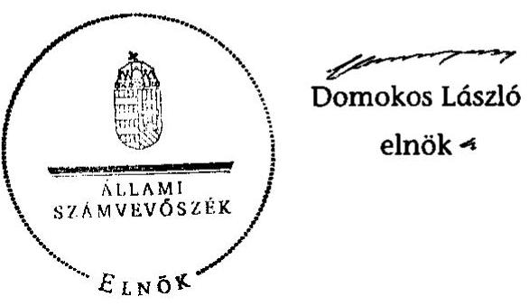

# ÁLLAMI   SZÁMVEVŐSZÉK 

## JELENTÉS

az önkormányzati vagyongazdálkodás
szabályszerúségi ellenőrzéséről
Heves

---

# Állami Számvevőszék 

Iktatószám: V-0026-077-034/2013.
Témaszám: 1065
Vizsgálat-azonosító szám: V0593013

## Az ellenőrzést felügyelte:

Gyüre Lajosné (2012. december 15-ig)
felügyeleti vezető
Makkai Mária (2012. december 16-tól)
felügyeleti vezető
Az ellenőrzést vezette és az ellenőrzés végrehajtásáért felelős:
Kesjár János
ellenőrzésvezető
Az ellenőrzést végezték:

| Kincses Erzsébet Eszter | Kozma Gábor | Samu István |
| :-- | :-- | :-- |
| számvevő | számvevő tanácsos | számvevő tanácsos |

---

# TARTALOMJEGYZÉK 

BEVEZETÉS ..... 3
I. ÖSSZEGZŐ MEGÁLLAPÍTÁSOK, KÖVETKEZTETÉSEK, JAVASLATOK ..... 5
II. RÉSZLETES MEGÁLLAPÍTÁSOK ..... 9

1. A vagyongazdálkodási tevékenység szabályozottsága ..... 9
1.1. A feladatellátás formáinak meghatározása, a döntések megalapozottsága ..... 9
1.2. A vagyonnal gazdálkodó szervezet szervezeti rendjének szabályozottsága, a kötelező szabályzatok megfelelősége ..... 10
1.3. A vagyongazdálkodás szabályozása ..... 10
2. A vagyongazdálkodás szabályszerűsége ..... 12
2.1. A vagyon nyilvántartásának megfelelősége ..... 12
2.2. A vagyongazdálkodást érintő gazdasági események követelmények szerinti dokumentáltsága ..... 12
2.3. A vagyongazdálkodási intézkedések, döntések szabályszerűsége ..... 13
3. A vagyonváltozást eredményező gazdasági események szabályszerűsége ..... 16
3.1. A vagyon értékének és összetételének változása ..... 16
3.2. Közbeszerzési eljárások alkalmazása ..... 17
3.3. Hitelfelvétel, kötvénykibocsátás, garancia és kezességvállalás szabályszerűsége ..... 18
3.4. A térítésmentes átadás szabályszerűsége ..... 18
4. A vagyongazdálkodás szabályszerűségére vonatkozó belső és külső ellenőrzések hasznosulása ..... 19
4.1. A belső ellenőrzés által tett megállapítások, javaslatok hasznosulása ..... 19
4.2. A többségi tulajdonban lévő gazdasági társaságok vagyongazdálkodásának felügyelete ..... 20
4.3. A könyvvizsgálat hozzájárulása a vagyongazdálkodás szabályosságához ..... 20
4.4. A külső ellenőrző szervezet által tett javaslatok hasznosulása ..... 20

---

# MELLÉKLETEK 

1. számú Heves Város Önkormányzata gazdálkodására jellemző adatok, mutatószámok
2. számú Heves Város Önkormányzata vagyonának alakulása
3. számú Heves Város Önkormányzata kötelezettségeinek alakulása

## FÜGGELÉKEK

1. számú Rövidítések jegyzéke
2. számú Értelmező szótár

---

# JELENTÉS 

## az önkormányzati vagyongazdálkodás szabályszerűségi ellenőrzéséről Heves

## BEVEZETÉS

Az ÁSZ kiemelten fontosnak tartja az Állami Számvevőszékről szóló 2011. évi LXVI. törvény 5. § (4) bekezdése alapján az önkormányzati vagyon kezelésének, a vagyonnal való gazdálkodási szabályok betartásának az ellenőrzését. A helyi önkormányzatok vagyongazdálkodása szabályszerűségének ellenőrzését e célkitűzésnek megfelelően összeállított ellenőrzési program szerint végezte el. Az ellenőrzés feladata a vagyongazdálkodással kapcsolatban a közpénzek átláthatósága, nyilvánossága érdekében a jogszabályokban, belső szabályzatokban megfogalmazott előírások érvényesülésének áttekintése. Az Állami Számvevőszék nem csak az ellenőrzött szervezet vagyongazdálkodásának a hibáira mutat rá, számon kérve azok kijavítását, hanem megállapításaival, javaslataival segíti a közpénzzel, a közvagyonnal való felelős gazdálkodást.

Az önkormányzati vagyon alapvető funkciója, hogy a közérdeket és egyúttal az önkormányzati célok megvalósítását szolgálja. A feladatellátás terén elsősorban a kötelezően ellátandó feladatok végrehajtását hivatott szolgálni, amely mellett az önként vállalt feladatok ellátása is megvalósulhat.

## Az ellenőrzés célja az Önkormányzatnál annak értékelése volt, hogy:

- a vagyongazdálkodási tevékenységet, annak szervezeti kereteit szabályozták-e;
- az önkormányzati vagyongazdálkodás törvényességét, szabályszerűségét biztosították-e a döntések előkészítése és végrehajtása során;
- jogszerű döntéseken alapult-e a vagyon értékének és összetételének változása;
- a belső ellenőrzés elősegítette-e a vagyongazdálkodás szabályszerű működését, valamint hasznosultak-e a korábbi külső ellenőrzések által tett javaslatok.

Az ellenőrzés típusa: szabályszerűségi ellenőrzés
Az ellenőrzés a 2007. január 1. és 2011. év december 31. közötti időszakra terjedt ki, kitekintéssel a helyszíni ellenőrzés befejezéséig tartó időszak releváns folyamataira. Az egyes közbeszerzési eljárások lefolytatásának ellenőrzése a 2011. évet és a 2012. év I. negyedévét érintette.

---

Az ellenőrzés szakmai módszertana az Állami Számvevőszék Ellenőrzési Kézikönyvében foglalt szakmai szabályokon alapult, amely a Legfőbb Ellenőrző Intézmények Nemzetközi Szervezete (INTOSAI) által kiadott nemzetközi standardok (ISSAI) figyelembevételével készült.

A vagyongazdálkodás szabályozásának ellenőrzését a helyi szabályozások (rendeletek, szabályzatok, utasítások) ellenőrzésével végeztük el. A vagyonváltozások köréből az ellenőrizendő tételeket mintavétellel, a számviteli nyilvántartásokból választottuk ki.

Heves város lakosainak száma 2011. január 1-jén 11264 fő volt. A 2010. évi önkormányzati választást követően az Önkormányzat 12 tagú Képviselőtestületének munkáját négy állandó bizottság segítette. Az Önkormányzat mellett a 2007-2011. években kisebbségi önkormányzat múködött. A Polgármester a 2006. évi önkormányzati választás óta tölti be tisztségét, a jegyző 1996. december óta látja el feladatát.

Az Önkormányzat feladatainak végrehajtása érdekében a 2011. évben hat költségvetési intézményt múködtetett, amelyekből három önállóan múködött és gazdálkodott. A feladatok ellátásában részt vett két gazdasági társasága és négy társulás. Az Önkormányzatnak a 2011. évi költségvetési beszámolója szerint 2954,1 millió Ft költségvetési bevétele volt és 2743,7 millió Ft költségvetési kiadást teljesített, 2011. december 31-én a könyvviteli mérleg szerint 7801 millió Ft értékű vagyonnal rendelkezett. A Polgármesteri hivatalban dolgozó köztisztviselők száma 2011. december 31-én 49 fő, az Önkormányzat által foglalkoztatott közalkalmazottak száma 348 fő volt. Az Önkormányzat gazdálkodására jellemző adatokat, mutatószámokat az 1-3. számú mellékletek tartalmazzák.

Az ÁSZ a 2011. évi LXVI. törvény 29. § (1) bekezdése szerint a jelentéstervezetet megküldte egyeztetésre Heves Város Önkormányzata polgármesterének, aki az ÁSZ tv. 29. § (2) bekezdésében foglalt észrevételezési jogával nem élt, a jelentéstervezetre észrevételt nem tett.

---

# I. ÖSSZEGZŐ MEGÁLLAPÍTÁSOK, KÖVETKEZTETÉSEK, JAVASLATOK 

Az Önkormányzat könyvviteli mérleg szerinti vagyona a 2007-2011 közötti időszakban 5138,5 millió Ft-ról 2011. év végére 7801 millió Ft-ra, másfélszeresére nőtt. A vagyon növekedését alapvetően az aktivált beruházások, valamint a felújítások eredményezték. A vagyon alakulását befolyásolta továbbá a 2008. évi 2 kötvénykibocsátásból származó 1399,6 millió Ft bevételből történt értékpapír vásárlás. A befektetett pénzügyi eszközök között, a tartós hitelviszonyt megtestesítő értékpapírok állománya a 2008. év végére 1180,5 millió Fttal emelkedett. A befektetett pénzügyi eszközök teljes állománya a 2008. évi 1340,9 millió Ft-ról a 2011. évre 726,1 millió Ft-ra csökkent. Az Önkormányzat összes kötelezettsége a 2007. évi 588,8 millió Ft-ról a 2011. év végére 2997,1 millió Ft-ra nőtt. A kötelezettségek szerkezete is átalakult, a hosszú lejáratú kötelezettségek aránya a kötelezettségeken belül a 2007. évi 8,8\%-ról a 2011. évre $58,3 \%$-ra növekedett. A 2007-2011. években egy hosszú lejáratú hitelszerződést kötöttek, valamint két kötvénykibocsátást hajtottak végre, amelyek eredményeképpen a 2011. év végére 1747,1 millió Ft hosszú lejáratú, pénzintézetekkel szemben fennálló kötelezettségük keletkezett. Ezentúl az Önkormányzatot terhelték a Képviselő-testület döntése alapján nettó 934,0 millió Ft bekerülési értékű Sport- és rendezvénycsarnokkal kapcsolatos kötelezettségek is.

A 2012. évben az Önkormányzat fizetésképtelenné vált, nem tudta biztosítani a kötelező feladatainak az ellátását, ezért a Képviselő-testület felhatalmazta a polgármestert az adósságrendezési eljárás megindítására, amelynek eredményeként a Heves Megyei Bíróság 2012. július 12-vel elrendelte azt. A vagyon értékének és összetételének változását befolyásoló döntésekkel az Önkormányzat a hosszú távú teherbíró képességén túl vállalt kötelezettséget, amelyek az adósságot keletkeztető ügyletekre vonatkozó szabályozás hiányosságaival - és az Önkormányzat kedvezőtlen pénzügyi folyamataival - együtt hozzájárultak az adósságrendezési eljárás megindításához. A Képviselő-testület 2013. I. negyedévében elfogadta az Önkormányzat reorganizációs programját és egyezségi javaslatát.

Az Önkormányzat a vagyongazdálkodási tevékenységét és annak szervezeti kereteit alapvetően a hatályos jogszabályi előírások szerint szabályozta. A 2007. és 2011. évek között az Önkormányzat rendelkezett számviteli politikával és a számviteli politika keretében elkészítette a leltározási szabályzatát, az eszközök és a források értékelési szabályzatát, valamint a pénzkezelési szabályzatot. A számviteli politikát 2007 februárjától azonban nem aktualizálták. Az Önkormányzat a 2007-2011. években rendelkezett a vagyongazdálkodás helyi szabályait tartalmazó rendelettel és eleget tett a rendeletben előírt versenyeztetési követelményeknek. A Képviselő-testület meghatározta az önkormányzati feladatellátást biztosító törzsvagyon körét, illetve a nyilvántartási rendjét.

Az Önkormányzati SZMSZ ${ }_{1,2}$-ben szabályozták az előterjesztések készítésének, megtárgyalásának, véleményezésének és a döntéshozatal általános rendjét. Nem írták elő azonban a hitelfelvételről, kötvénykibocsátásról szóló döntés-

---

előkészítés folyamatában a futamidő egyes éveit terhelő adósságszolgálat költségvetési egyensúlyra gyakorolt hatása elemzési és bemutatási, valamint a pénzügyi kockázatok felmérésére vonatkozó követelményét, továbbá nem írták elő a költség-haszon elemzés készítésének a kötelezettségét. Ezeknek az elemzéseknek az előirása nem jogszabályi kötelezettség, ugyanakkor célszerű a vagyongazdálkodás javítása érdekében.

Az Önkormányzat önálló rendeletben szabályozta a vagyon vagyonkezelői jogának átadását és az ellenőrzések rendjét, gyakoriságát. A vagyonkezelési szerződések tartalmaztak a tulajdonosi ellenőrzésre vonatkozó előirást, de nem rögzítették az ellenőrzés gyakoriságát. Az Önkormányzat a vagyonkezelői jog átadásáról szóló rendelettel ellentétesen, az ott előírt gyakorisággal nem ellenőrizte a vagyonkezelésre átadott eszközökkel való gazdálkodást.

Az Önkormányzatnál a 147/1992. (XI. 6.) Korm. rendelet előírásai nem érvényesültek teljes mértékben. A 2007-2011. évek között az ingatlanvagyon kataszter és a földhivatali ingatlan nyilvántartás közötti egyezőséget nem biztosították. Az eltérések megszűntetése érdekében a kataszter ingatlan adatlapjának, valamint a földhivatal ingatlan-nyilvántartásának azonos tartalmú adataival való egyeztetéséről a 2012. évben készült jegyzőkönyv, ennek alapján a szükséges módosításokat átvezették.

Az Önkormányzat 2007-2009 között nem készített, a 2010-2011. években azonban már csatolta az éves zárszámadáshoz az Áhsz.-ben rögzítettek szerinti vagyonkimutatást. A mérlegtételek leltárral alátámasztottak voltak.

A gazdálkodási jogkörök gyakorlása során érvényesültek az összeférhetetlenségi követelmények. Az operatív gazdálkodási jogköröket az arra írásban felhatalmazott személyek gyakorolták. A kötelezettségvállalások ellenjegyzése a 2010-2011. években, a szakmai teljesítésigazolások 2011-ig nem voltak szabályszerűek. A kötelezettségvállalások ellenjegyzése nem tartalmazta az Ámr. ${ }_{2}$ szerint az ellenjegyzés dátumát és az ellenjegyzés tényére történő utalás megjelölését. Az utalványrendeleteken nem szerepelt az Ámr. ${ }_{1,2}$-ben előírt igazolási kötelezettség végrehajtásának megjelölése. Az Önkormányzatnál a kötelezettségvállalásokról nem vezettek az Ámr. ${ }_{1,3}$-nek megfelelő nyilvántartást.

Az Önkormányzat az Áht. és az Eisztv. rendelkezései ellenére a civil szervezeteken és alapítványokon kívüli nem normatív, céljellegú támogatások adatait, valamint a nettó ötmillió Ft-ot elérő Sport- és rendezvénycsarnok és az értékpapír adásvételi szerződések adatait nem tette közzé.

Az Önkormányzat a 2007-2011. években egy gazdasági társaságban rendelkezett többségi, és egy társaságban kisebbségi tulajdonnal. A 100\%-ban önkormányzati tulajdonban lévő HEVA Kft-t 2007-ben alapította az Önkormányzat az önkormányzati vagyon átláthatóbb és hatékonyabb múködtetése érdekében. A negatív mérleg szerinti eredménnyel rendelkező társaságnál tőkeemelésre 2008. és 2009. évben került sor 64 millió Ft és 35 millió Ft összegben az üzleti és fejlesztési tervek megvalósításához. A HEVA Kft. pénzügyi helyzetének rendezésére 2010-ben az Önkormányzat 25 millió Ft tagi kölcsönt nyújtott. A gazdasági társaság a 2011. év végén az értékvesztések elszámolása után 10 millió Ft törzstőkével rendelkezett. A Képviselő-testület évente beszámoltatta

---

a gazdasági társaságot a feladat ellátására adott vagyonnal való gazdálkodásról, de a társaság adósságának és veszteségének megszüntetése, illetve további növekedése elkerülése érdekében intézkedést nem hozott.

Az Önkormányzat a Polgármesteri hivatal és intézményei belső ellenőrzését kistérségi társulás keretében láttatta el, valamint 2009. szeptemberétől ezzel párhuzamosan külön belső ellenőrt is foglalkoztatott az ellenőrzött időszakban. A Képviselő-testület minden évben a belső ellenőrzési tervet az Ötv. által előírt határidőig jóváhagyta, amelyek tartalmazták a Ber. előírásának megfelelően az ellenőrzés módszereit. A Polgármesteri hivatalban és az Önkormányzat költségvetési szerveinél kockázatelemzés alapján ellenőrizték a közbeszerzési eljárásokat. A 2007. és 2009. évek között az Önkormányzat megsértette a Ber. belső ellenőrzés függetlenségére vonatkozó előírásait, mivel a Pénzügyi és Gazdasági Iroda dolgozói is végeztek belső ellenőri feladatokat. A vagyongazdálkodás szabályszerűségéhez kapcsolódó, kockázatelemzés alapján kiválasztott belső ellenőrzések a vagyonelemek beszerzésével, hasznosításával, nyilvántartásával összefüggésben tettek megállapításokat. A javaslatok nem teljes körűen hasznosultak, ezáltal a belső ellenőrzés a vagyongazdálkodás szabályszerű működését csak részben segítette elő.

Az ÁSZ 2009-ben végezte el az Önkormányzat 2007. évi gazdálkodási rendszerének átfogó ellenőrzését. A jelentésben a vagyongazdálkodás területéhez két szabályszerűségi és egy célszerűségi javaslat kapcsolódott, melyek hasznosultak.

A könyvvizsgáló az Önkormányzat egyszerűsített összevont éves költségvetési beszámolóját megbízhatónak és hitelesnek minősítette, a 2008. év kivételével nem fogalmazott meg javaslatot az Önkormányzat számára.

Az Állami Számvevőszékről szóló 2011. évi LXVI. törvény 33. § (1) bekezdésében foglaltak értelmében a jelentésben foglalt megállapításokhoz kapcsolódó intézkedési tervet köteles az ellenőrzött szervezet vezetője összeállítani, és azt a jelentés kézhezvételétől számított 30 napon belül az ÁSZ részére megküldeni. Amennyiben az intézkedési tervet határidőben nem küldi meg a szervezet, vagy az nem elfogadható, az ÁSZ elnöke a hivatkozott törvény 33. § (3) bekezdés a)-b) pontjaiban foglaltakat érvényesítheti.

Az ellenőrzés intézkedést igénylő megállapításai és javaslatai:

# a jegyzönek 

1. A gazdálkodási jogkörök gyakorlásánál nem voltak szabályosak a következők:
a) Az Önkormányzatnál a kötelezettségvállalásokról nem vezettek az Ámr. 134. § (13), illetve az Ámr. 75. § (1) bekezdésnek megfelelő nyilvántartást. Az évenkénti kötelezettségvállalások, illetve a rendelkezésre álló kötelezettségvállalással nem terhelt, szabad előirányzatok összege nem volt megállapítható. A belső ellenőr 2012. évi jelentésében javaslatot tett az Ávr. 56. § (1) bekezdésének megfelelő kötelezettségvállalási nyilvántartás kialakítására, amely nem valósult meg;

---

b) A kötelezettségvállalások ellenjegyzése a szerződéseken nem volt szabályszerű. A 2010-2011. években nem tartalmazta az Ámr. 2 74. § (1) bekezdése szerint az ellenjegyzés dátumát és az ellenjegyzés tényére történő utalás megjelölését.

Javaslat
Intézkedjen
a) az Ávr. 56. § (1) bekezdésében előírt kötelezettségvállalás nyilvántartás vezetésére
b) az Ávr. 55. § (1) bekezdése alapján a pénzügyi ellenjegyzés a kötelezettségvállalás dokumentumán a pénzügyi ellenjegyzés dátumának és a pénzügyi ellenjegyzés tényére történő utalás megjelölésével, az arra jogosult személy aláírásával kerüljön igazolásra.
2. Az Önkormányzat az Áht. 15/A. § (1) bekezdése alapján a civil szervezetek és alapítványok nem normatív, céljellegú támogatások adatait közzétette, azonban az egyéb céljellegú támogatási szerződések adatai nem voltak fellelhetők a honlapon. Az Áht. 15/B. § (1) bekezdés és az Eisztv. 6. § (1) bekezdés előírásai ellenére a nettó ötmillió Ft-ot elérő sportcsarnok építéséhez kapcsolódó szerződések, és az értékpapír adásvételi szerződések közzétételre előírt adatait a honlapon nem tették közzé.

Javaslat
Intézkedjen, hogy az Info tv. 1. számú mellékletében meghatározott adatok teljes körűen közzétételre kerüljenek.

---

# II. RÉSZLETES MEGÁLLAPÍTÁSOK 

## 1. A VAGYONGAZDÁLKODÁSI TEVÉKENYSÉG SZABÁLYOZOTTSÁGA

### 1.1. A feladatellátás formáinak meghatározása, a döntések megalapozottsága

Az Önkormányzat 2007. február 28-án fogadta el Heves Város 2007-2013 közötti időszakra vonatkozó városfejlesztési stratégiáját és a 2007-2010 közötti gazdasági programját. A Képviselő-testület a 2011. április 15-én döntött a 2010-2014. évekre vonatkozó új gazdasági program elfogadásáról. A programok a feladatok megvalósításának forrását nem tartalmazták. A 2007-2013. közötti időszakra vonatkozó gazdasági program teljesítéséről a polgármester a Képviselő-testület 2010. szeptember 8-i ülésén számolt be.

Az Önkormányzat kötelező és az önként vállalt feladatainak részletes felsorolását az Önkormányzati SZMSZ ${ }_{1,2}$ mellékletei tartalmazták. Az Önkormányzat a közfeladatok ellátását 2007. december 31-én kilenc, 2011. december 31-én hat költségvetési szerv és két gazdasági társaság (HEVA Kft. 100\%, Heves Megyei Vízmú Részvénytársaság 5,95\% tulajdoni részesedésű 18330 ezer Ft) múködtetésével biztosította és négy társulásban vett részt. Önállóan múködő és gazdálkodó költségvetési szerv 2011. december 31-én három volt. A társulásokkal összefüggésben az Önkormányzat vagyonában vagyonváltozás nem következett be.

Heves, Kömlő és Pély településeken a víztermelés, kezelés és vízellátás feladatait a Dél-heves Ivóvízminőség-javító Önkormányzati Társulás látta el. A Polgármesteri hivatal a belső ellenőrzési feladatát a Hevesi Kistérség Többcélú Társulással kötött szerződés keretében látta el 2007. és 2011. évek között. Heves város és Hevesvezekény intézményfenntartó társulást hozott létre 2011 májusában, az alapfokú nevelési-oktatási feladatok ellátására. A Regio-Kom. Térségi Kommunális Szolgáltató Társulásban az Önkormányzat is részt vett. A társulás a regionális, szilárd hulladéklerakó építésére jött létre. A társulás többek közt az önkormányzatok területein múködő szeméttelep rekultivációját, illetve állati hulladékok gyűjtését és elszállítását végezte.

A Képviselő-testület a 2007-2011. években a közszolgáltatások ellátása érdekében intézmények összevonásáról és átszervezéséről, valamint társulásokba történő belépésről döntött.

Az Önkormányzat az Intézményellátó Gazdasági Hivatalt az intézmények gazdasági feladatainak ellátására, az intézmények karbantartására hozta létre 1996-ban. Feladatát az alapítás évében kibővítették a közétkeztetéssel. A Gazdasági Hivatalt a Képviselő-testület 2008. június 30-i hatállyal megszüntette. Feladatait a Heves Város Nevelési-Oktatási Intézet, a Heves Város Polgármesteri hivatala és a HEVA Kft. kapta meg.

A 2007-ben alapított HEVA Kft. az Önkormányzat 100\% tulajdonában van.

---

# 1.2. A vagyonnal gazdálkodó szervezet szervezeti rendjének szabályozottsága, a kötelező szabályzatok megfelelősége 

A Képviselő-testület a 2007-2011 között hatályos SZMSZ ${ }_{1-2}$-ben rendelkezett a Képviselő-testületet megillető egyes hatáskörök átruházásáról és az átruházott hatáskörben hozott intézkedésekről éves beszámolási kötelezettséget írt elő.

A Képviselő-testület a vagyonnal gazdálkodó, közfeladatot ellátó költségvetési szervek alapító okiratában meghatározta a szervezetek közfeladatait és rendelkezett a költségvetési szervek SZMSZ-ének jóváhagyásáról.

A 2007. és 2011. évek között az Önkormányzat rendelkezett számviteli politikával és a számviteli politika keretében elkészítette a leltározási szabályzatát, az eszközök és a források értékelési szabályzatát, valamint a pénzkezelési szabályzatot. A számviteli politikát 2007 februárjától nem aktualizálták. A pénzkezelési szabályzatot folyamatosan aktualizálták és az a Számv. tv. 14. § (8) bekezdésében rögzített tartalommal készült el. Az eszközök és források értékelési szabályzatát, a leltározási szabályzatot, valamint a selejtezési szabályzatot is a törvényi előírásoknak megfelelően készítették el.

### 1.3. A vagyongazdálkodás szabályozása

Az Önkormányzat a 2007-2011. évek közötti időszakra rendelkezett a vagyongazdálkodás helyi szabályait tartalmazó rendelettel. A vagyongazdálkodási rendeletben meghatározták az önkormányzati feladatellátást biztosító törzsvagyon körét, ezen belül a forgalomképtelen és a korlátozottan forgalomképes vagyonelemeket, továbbá a forgalomképesség megváltoztatásának szabályait, a tulajdonosi jogok gyakorlását, a követelés elengedés rendjét, a vagyon nyilvántartási és leltározási rendjét. Az Önkormányzat vagyongazdálkodási rendeletei összhangban voltak a belső szabályozásokkal és a vonatkozó jogszabályokkal.

Az Áht. 108. § (1) bekezdésében foglalt előírásoknak megfelelően meghatározták az Önkormányzat tulajdonában álló vagyonelemek nyilvános versenyeztetéssel történő hasznosításának értékhatárát. Az Áht. 108. § (2) bekezdésében foglaltaknak megfelelően szabályozták az ingyenes átruházás eseteit és módját, azonban nem szabályozták az ingyenes vagyonátruházással kapcsolatos döntési hatásköröket.

Nem írták elő azonban a hitelfelvételről, kötvénykibocsátásról szóló döntéselőkészítés folyamatában a futamidő egyes éveit terhelő adósságszolgálat költségvetési egyensúlyra gyakorolt hatása elemzési és bemutatási, valamint a pénzügyi kockázatok felmérésére vonatkozó célszerűségi követelményeket. Továbbá nem írták elő a költség-haszon elemzés készítésének a kötelezettségét. Ezeknek az elemzéseknek az előírása nem jogszabályi kötelezettség, ugyanakkor javasolt a vagyongazdálkodás javítása érdekében. A vagyongazdálkodási rendelet tartalmazta a hasznosításra szánt vagyonról az értékbecslés készítésének, továbbá az Önkormányzat tulajdonosi jogainak, érdekeinek védelmét szolgáló garanciális elemek vagyonkezelési szerződésben való rögzítésének kötelezettségét.

---

Az Önkormányzat külön rendeletben ${ }^{1}$ szabályozta a vagyon vagyonkezelői jogának átadását és annak ellenőrzését. A vagyonkezelésre átadott eszközökre vonatkozó szabályozás a törvényi előírásoknak megfelelő volt.

A rendeletben rögzítették az önkormányzati vagyon vagyonkezelői jogának megszerzésére vonatkozó szabályokat, a vagyonkezelői jog megszerzésének módját, az összeférhetetlenségi szabályokat, a vagyonkezelői jog megszerzésére irányuló pályáztatási eljárást. Külön fejezetben rögzítették a tulajdonosi ellenőrzések eljárási és végrehajtási rendjét. Az önkormányzati rendelet szerint tulajdonosi ellenőrzést a határozatlan időre kötött vagyonkezelési szerződés esetében évente, a határozott idejű vagyonkezelési szerződés esetében a szerződésben meghatározott időközönként kell végezni.

A vagyonkezelési szerződések tartalmaztak a tulajdonosi ellenőrzésre vonatkozó megállapodást, de nem rögzítették az ellenőrzés gyakoriságát. A vagyonkezelésre átadott eszközökkel való gazdálkodást az Önkormányzat nem ellenőrizte a vagyonkezelői jog átadásáról szóló rendeletben előírt gyakorisággal.

A HEVA Kft.-vel 2007. június 20-án megkötött vagyonkezelési szerződésben foglaltak szerint az Önkormányzat 2007. július 1-jétől határozatlan időre vagyonkezelésbe adta az Ipari Parkot a könyvvizsgáló értékbecslése alapján 23 millió Ft, a strandfürdőt és kempinget 95,9 millió Ft értékben. A szerződés alapján a HEVA Kft. köteles a vagyont fejleszteni és folyamatosan felújítani, karbantartani. A HEVA Kft.-nek 2007. június 26-án aláírt szerződés keretében üzemeltetésre átadott az Önkormányzat 63 db önkormányzati bérlakást és 13 db nem lakás céljára szolgáló üzlethelyiséget. A 2007. december 19-én aláírt szolgáltatási és üzemeltetési szerződés alapján a 2008 évben a Kft. a temetőfenntartást, parkfenntartást, szemétszállítást végzett Heves városában. A Heves Város Nevelési és Oktatási Intézet a 2008. augusztus 7-én aláírt szerződésében a HEVA Kft-nek határozatlan időre átadta üzemeltetésre az Oktatási Intézet 12 db tagintézetét, a Fehér Hárs Idősek Otthonát és a Gondozási Központot. Az utóbbi két intézmény 2009-től a Sors 2002. Egészségügyi Szolgáltató Közhasznú társaság vagyonkezelésébe került.

Az Önkormányzati SZMSZ ${ }_{1,2}$-ben kialakították az előterjesztések készítésének, megtárgyalásának, véleményezésének, döntéshozatalának általános rendjét.

A Heves Megyei Vízmú Zrt. és az Önkormányzat között 2007. november 28-án aláírt megállapodás 4.9 pontjában rögzített szolgáltatás díj megállapítás hátrányosan érinti az Önkormányzatot. Az Önkormányzatnak, mint árhatóságnak a HMV Zrt. előterjesztésének megfelelően kell a hatósági árat megállapítani, ha nem ezt teszi, akkor a hatósági ár és a HMV Zrt. által meghatározott ár közti különbséget az Önkormányzatnak kell megfizetni. A megállapodásban az Önkormányzat a víziközmú-fejlesztési hozzájárulás beszedését átengedte a HMV Zrt-nek, miközben a beruházásra, fejlesztésre az Önkormányzat köteles. A víziközmú-fejlesztési hozzájárulást a 38/1995. (IV. 5.) Korm. rendelet 4. § (2) bekezdése szerint azért kell fizetni, hogy abból a víziközművet fejlesszék. A HMV Zrt. csak azt vállalta, hogy a rekonstrukciónak minősülő beruházásokat

[^0]
[^0]:    ${ }^{1}$ 17/2007. (VI. 29.) Hev. Ör. az önkormányzati vagyon vagyonkezelői jogának átadásáról, valamint a vagyonkezelés ellenőrzéséről

---

évi 1 millió Ft összeg erejéig elvégzi. A megállapodás 8.9 pontjában az Önkormányzat hozzájárult ahhoz, hogy a vízközmű hálózatának a használatával további településen végezzen ivóvíz és csatornaszolgáltatást a HMV Zrt. és ezt a megállapodás felmondása esetén sem vonhatja vissza.

# 2. A VAGYONGAZDÁLKODÁs SZABÁLYSZERŰSÉGE 

### 2.1. A vagyon nyilvántartásának megfelelősége

Az Önkormányzat nem készített vagyonkimutatást a zárszámadási rendelethez 2007-2009. évek között, de a 2010-2011. években csatolt az Ötv. 78. § (2) bekezdése, és az Áht. 118. § (2) bekezdése c) pontja előírásának megfelelő vagyonkimutatást az éves zárszámadáshoz.

Az Áhsz. 9. számú melléklet 1. k) pontjának megfelelően a vagyonkimutatásban a törzsvagyon (ezen belül forgalomképtelen, illetve korlátozottan forgalomképes), valamint a törzsvagyonon kívüli egyéb vagyon elkülönítéséről a főkönyvi számlák további bontásával és az analitikus nyilvántartásokban is gondoskodtak.

A könyvvizsgáló jelentéseiben megállapította, hogy a beszámoló adatai megegyeznek a kataszteri nyilvántartásban szereplő adatokkal.

Az Önkormányzatnál a 147/1992. (XI. 6.) Korm. rendelet 1. § (2)-(3) bekezdésének előírásai nem érvényesültek teljes mértékben. A 2007-2011. évek között az ingatlanvagyon kataszter és a földhivatali ingatlan nyilvántartás közötti egyezőséget nem biztosították. Az eltérések megszűntetése érdekében a kataszter ingatlan adatlapjának, valamint a földhivatal ingatlan-nyilvántartásának azonos tartalmú adataival való egyeztetéséről a 2012. évben készült jegyzőkönyv, ennek alapján a szükséges módosításokat átvezették.

A mérlegtételek leltárral alátámasztottak voltak. Az Önkormányzat vagyongazdálkodási rendeletében lehetőséget adott a kétévenkénti mennyiségi leltározásra 2008. január 1-jétől. A kétévenkénti leltározás befejezésekor a leltározási körzetenként készített jegyzőkönyvekben rögzítették a feladat elvégzését, illetve a leltárkülönbözetet. A jegyzőt feljegyzésben tájékoztatták a leltározás elvégzéséről, a leltári hiányok összesítéséről.

### 2.2. A vagyongazdálkodást érintő gazdasági események követelmények szerinti dokumentáltsága

Az operatív gazdálkodási jogköröket az arra írásban felhatalmazott személyek gyakorolták. A kötelezettségvállalások ellenjegyzése a szerződéseken nem volt szabályszerű, mivel 2010-2011. években nem tartalmazta az Ámr. ${ }_{2}$ 74. § (1) bekezdése szerint az ellenjegyzés dátumát és az ellenjegyzés tényére történő utalást. A gazdálkodási jogkörök gyakorlása során érvényesültek az Ámr. ${ }_{1,2}$-ben rögzített összeférhetetlenségi követelmények. A szakmai teljesítésigazolás rendje 2011-től felelt meg a jogszabályi előírásoknak. Előtte az utalványrendeleten - az értékpapír ügyletek kivételével - nem szerepelt az

---

Ámr. 135. § (2), és az Ámr. 2 76. § (3) bekezdésének megfelelően az igazolási kötelezettség végrehajtásának megjelölése.

Az Önkormányzatnál a kötelezettségvállalásokról nem vezettek az Ámr. 134. § (13), illetve az Ámr. 2 75. § (1) bekezdésnek megfelelő nyilvántartást. Az évenkénti kötelezettségvállalások, illetve a rendelkezésre álló kötelezettségvállalással nem terhelt, szabad előirányzatok összege nem volt megállapítható. A belső ellenőr 2012. évi jelentésében javaslatot tett az Ávr. 56. § (1) bekezdésének megfelelő kötelezettségvállalási nyilvántartás kialakítására, amely nem valósult meg.

A 2008. évben a Fehér Hárs épület felújítása alkalmával az 1. részszámla kifizetésnél ( 2,7 millió Ft) a szakmai teljesítésigazolás, az érvényesítés, az utalványozás és annak ellenjegyzése elmaradt. A 2. részszámla esetében ( 1,7 millió Ft) a szakmai teljesítésigazolás érvényesítése hiányzott. Ezáltal nem teljesült az Ámr. 135. § (2)-(3) bekezdésében előírt, a szakmai teljesítés igazolásának, az összegszerűségnek, a fedezet meglétének és az előírt követelmények betartatásának ellenőrzése. Az Ámr. 136. § (3) bekezdésének előírása ellenére írásbeli rendelkezés nélkül utalványoztak, az Ámr. 137. § (3) bekezdését mellőzve a szakmai teljesítés igazolásáról és az érvényesítés megtörténtéről való meggyőződés nélkül.

A 2009. évben szellemi termék ( 150 ezer Ft), és ügyviteli számítástechnikai eszköz vásárlása esetében ( 182,8 ezer Ft) a kötelezettségvállalás ellenjegyzése hiányzott. Az Ámr. 134. § (9) bekezdés a) pontja szerint nem győződtek meg arról, hogy a jóváhagyott költségvetés fel nem használt, illetve le nem kötött, a kötelezettségvállalás tárgyával összefüggő kiadási előirányzat rendelkezésre áll-e, illetve a befolyt vagy várhatóan befolyó bevétel biztosítja-e a fedezetet.

A 2011. évben könyvtári informatikai eszközök beszerzése esetében (120 ezer Ft) a szakmai teljesítésigazolás érvényesítése, az utalványozás és annak ellenjegyzése hiányzott. Ennek következtében nem teljesültek az összegszerűségre, a fedezet meglétére vonatkozó ellenőrzési (Ámr. 2 77. § (1) bekezdés), az utalványozásról szóló írásbeli rendelkezési (Ámr. 2 78. § (2) bekezdés), valamint a szakmai teljesítésigazolás és az érvényesítés meglétének ellenőrzési (Ámr. 2 79. § (2) bekezdés) feladatai.

Az Önkormányzat a költségvetési és a zárszámadási rendeleteket a honlapján közzétette. Ugyanakkor az Eisztv. rendelkezései és az Áht. 15/A. § (1) bekezdése ellenére a civil szervezeteken és alapítványokon kívüli nem normatív, céljellegú támogatások adatait, valamint az Áht. 15/B. § (1) bekezdés szerint a nettó ötmillió Ft-ot elérő Sport- és rendezvénycsarnok építésére vonatkozó szerződéseket, valamint az értékpapír adásvételi szerződések adatait az Önkormányzat honlapján nem tette közzé.

# 2.3. A vagyongazdálkodási intézkedések, döntések szabályszerűsége 

A vagyon értékének és összetételének változását befolyásoló döntések és az adósságot keletkeztető ügyletekre vonatkozó szabályozás

---

hiányosságai ${ }^{2}$ - az Önkormányzat kedvezőtlen pénzügyi folyamataival együtt - egyaránt hozzájárultak az adósságrendezési eljárás ${ }^{3}$ megindításához.

A beruházással létrehozott létesítmények fenntarthatóságának vizsgálatát külön belső szabályozásban nem írták elő. Az Önkormányzat a pályázati támogatások szerződéseiben 5-10 évre vállalta a beruházások fenntartását.

A Képviselő-testület határozatokban döntött az Önkormányzat hosszú lejáratú kötelezettségvállalásairól. Az Önkormányzat a 2008. évben kötvényt bocsátott ki fejlesztési céljának és folyamatos finanszírozásának megvalósítására két részletben összesen 1,4 Mrd Ft összegben ( 750 millió Ft-ot svájci frank, 650 millió Ft-ot forint alapon), emellett 13,2 millió Ft összegű - múfüves pálya építésére - hitelt vett fel. A Pénzügyi bizottság a döntésekhez kapcsolódó előterjesztéseket megtárgyalta, azok elfogadását támogatta. A Képviselő-testület az előterjesztéshez csatolt kötvényismertetőben kapott tájékoztatást a kötvénykibocsátás kondícióról, az árfolyam-, és a kamatkockázatról, a Képviselő-testület az előterjesztést elfogadta.

Az Önkormányzat 2007-ben önként vállalt feladatként döntött egy nettó 500 millió Ft összegű Sportcsarnok megépítéséről. A Képviselő-testület a bekerülési költségét nettó 934 millió Ft-ra, a létesítmény funkcióját Sport- és rendezvénycsarnokra módosította, amelyet magánpartner bevonásával (építés, üzemeltetés) kívántak megvalósítani. A Sport- és rendezvénycsarnok a 2011. évben felépült. A Heves Megyei Rendőr-főkapitányság Bűnügyi Igazgatósága 2011. december 12-én a Sportcsarnokkal kapcsolatos megállapodásokat, szerződéseket és egyéb iratokat, valamint 2012. november 8-án a testületi jegyzőkönyveket lefoglalta. Ennek következtében a Sportcsarnokra vonatkozó ellenőrzési megállapítások a Képviselőtestületi határozatokon és egyéb dokumentumokon alapultak.

# Az ÖNHIKI támogatásra szoruló, költségvetési hiánnyal ${ }^{4}$ küzdő Önkormányzat hosszú távú kötelezettségvállalása meghaladta teljesítőképességét. ${ }^{5}$ 

[^0]
[^0]:    ${ }^{2}$ „A hosszú távú kötelezettségvállalások felső korlátja meghatározásának, az ilyen kötelezettségeket keletkeztető szerződések megkötésének, illetve eljárásrendjének helyi szabályozása sincs előirva az önkormányzatoknak. Emiatt az önkormányzati alrendszerben korlátozás nélkül lehet hosszú lejáratú kötelezettséget vállalni, mely egyes önkormányzatok szintjén hátrányosan befolyásolhatja a generációk közötti teherelosztást." ÁSZ jelentése a Sport XXI. Létesítményfejlesztési Program keretében támogatott önkormányzati PPP beruházások megvalósításának és önkormányzati feladatok ellátására gyakorolt hatásának ellenőrzéséről (2009. július) 18. oldal.
    ${ }^{3}$ Az adósságot keletkeztető ügyleteket 2012. január 1-jétől a Stabilitási tv. 10. §-a, és a 353/2011. (XII. 30.) Korm. rendelet szabályozza.
    ${ }^{4}$ A 2007. évi költségvetést 170,6 millió Ft (2/2007. (III. 12.) Hev. Ör.), a 2011. évi költségvetést 305,1 millió Ft hiánnyal fogadta el a Képviselő-testület (6/2011. (III. 18.) Hev. Ör.).
    ${ }^{5}$ A reorganizációs programról szóló 17/2013. (II. 6.) önkormányzati határozat is megállapította, hogy: „Az önkormányzat adósság helyzetét speciálisan is negatívan érintette a mögöttes biztosítékok (fedezet, kötelezettségvállalás) is, amely ráadásul egy - az önkormányzat költségvetéséhez és teherbíró-képességéhez képest - túlméretezett beruházáshoz kapcsolódott." 1. oldal.

---

A 2012. évben a szállítói, hitelezői tartozások sikertelen átütemezése, a lejárt folyószámlahitel sikertelen megújítása, valamint a Sport- és rendezvénycsarnokhoz kapcsolódó kezességvállalásból adódó inkasszós teher miatt az Önkormányzat fizetésképtelenné vált, nem tudta biztosítani a kötelező feladatainak az ellátását, ezért a Képviselő-testület a 101/2012. (VII. 3.) határozatával az 1996. évi XXV. törvény 5. § (1) bekezdése alapján felhatalmazta a polgármestert az adósságrendezési eljárás megindítására.

A Heves Megyei Bíróság az Önkormányzat kezdeményezése alapján 2012. július 12-vel elrendelte az adósságrendezési eljárás megindítását. A Képviselőtestület 2013. I. negyedévében a 17/2013. (II. 6.) és a 18/2013. (II. 6.) határozattal elfogadta az Önkormányzat reorganizációs programját és egyezségi javaslatát, amelyet a 35/2013. (III. 20.) számú határozattal módosított.

Az Ötv. az önkormányzatok kötelezettségvállalásának felső határát éves szinten szabályozta, amelynek az Önkormányzat az éves beszámoló 25. űrlapja alapján az ellenőrzött években megfelelt. Az Ötv. 88. § (2) bekezdése szerint számított adósságot keletkeztető éves kötelezettségvállalás felső határa a 2007. évi 170,7 millió Ft-ról a 2011. évre 117,1 millió Ft-ra csökkent. A Képviselőtestület az előterjesztések alapján a futamidő egyes éveit terhelő hosszú távú kötelezettségvállalásnak a költségvetési egyensúlyra gyakorolt hatását nem vizsgálta.

A kötvénykibocsátásról és a Sportcsarnok létrehozásáról szóló Képviselőtestületi előterjesztések szövegszerűen, számszaki kimutatások nélkül mutatták be az alternatív javaslatokat. Az előterjesztések belső szabályozás hiányában gazdaságossági számításokat, szakértői értékbecsléseket, PSC számítást nem tartalmaztak. A pályázati támogatások indítványaiban az összköltség, a támogatás, és a saját forrás adatai szerepeltek.

A vagyonváltozáshoz kapcsolódó döntések során a döntéshozók az arra felhatalmazott személyek voltak. A döntések a vonatkozó előírásoknak több alkalommal nem feleltek meg, a döntéssel nem minden esetben volt azonos tartalmú az elkészült dokumentum.

A 2007. évben a 756. hrsz.-ú ingatlan értékesítéséről hozott testületi döntés 90 millió Ft+áfa összegről szólt, a szerződést 90 millió Ft-ról kötötték meg. A szerződést 2009-ben módosították a testületi döntésnek megfelelően 90 millió Ft+áfa összegre.

A Képviselő-testület 2007-ben döntött kötvény kibocsátásáról, és a polgármestert felhatalmazta a szerződés aláírására 2007. december 15-i határidővel. Az első kötvény okiratot 2008. február 25-én, a másodikat 2008. július 28-án írták alá.

A KDB a Sportcsarnok megvalósítása tárgyában a közbeszerzési eljárás mellőzése miatt 2008. évben 15 millió Ft, a 2011. évben 3 millió Ft bírságot szabott ki az Önkormányzatra. A KDB határozatában megállapította, hogy a közbeszerzési eljárás 2009. évi lezárását követően az Önkormányzat és a nyertes ajánlattevő nem kötött szerződést egymással, hanem a 2008. április 7-én, a közbeszerzési eljárás előtt kötött szerződést tekintették irányadónak.

A vagyonértékesítési szerződésekben az Önkormányzat érdekeit védő garanciális elemeket csak részlegesen építették be, a Képviselő-testületi

---

döntésen alapuló szerződésben a földhivatali bejegyzést és az elállás feltételeit meghatározták, de a késedelmes fizetés szankciót nem írták elő. A polgármester jogkörébe tartozó értékesítés esetén a szerződésben garanciális elemek nem szerepeltek.

# 3. A VAGYONVÁLTOZÁST EREDMÉNYEZŐ GAZDASÁGI ESEMÉNYEK SZABÁLYSZERŰSÉGE 

### 3.1. A vagyon értékének és összetételének változása

Az Önkormányzat a 2008. évi kötvénykibocsátásai miatt a források között megnövekedett a kötelezettségek aránya. A forrásszerkezet változása miatt a befektetett eszközök növekvő arányát - 2007. évben még csak 3,2\%-át, 2011. évben már 36,4\%-át - idegen források fedezték. Koncesszióba adott eszközökkel az Önkormányzat nem rendelkezett.

Az Önkormányzat összes kötelezettsége a 2007. évi 588,8 millió Ft-ról a 2011. év végére 2997,1 millió Ft-ra emelkedett. A kötelezettségek szerkezete átalakult, a hosszú lejáratú kötelezettségek aránya a kötelezettségeken belül a 2007. évi 8,8\%-ról a 2011. évre 58,3\%-ra növekedett. A hosszú lejáratú kötelezettségek növekedéséhez az Önkormányzat által végzett, a helyi infrastruktúrát felújító és fejlesztő beruházások hitelszükséglete vezetett. A 2007-2011. években 1 db hosszú lejáratú hitelszerződést kötöttek, valamint 2 db kötvénykibocsátást hajtottak végre, melyek eredményeképpen 2008. év végére 1372,9 millió Ft hosszú lejáratú, pénzintézetekkel szemben fennálló kötelezettségük keletkezett.

Az Önkormányzat mérleg főösszeg szerinti vagyona a 2007. évi 5138,5 millió Ft-ról 2011. év végére 7801 millió Ft-ra emelkedett. Az eszközök növekedését a befejezett és aktivált beruházások és felújítások eredményezték. A vagyon alakulását befolyásolta továbbá a 2008. évi 2 db kötvénykibocsátásból származó finanszírozási bevételből történt értékpapír vásárlás. A befektetett pénzügyi eszközök között, a tartós hitelviszonyt megtestesítő értékpapírok állománya a 2008. év végére 1180,5 millió Ft-tal emelkedett. A befektetett pénzügyi eszközök teljes állomány a 2008. évi 1340,9 millió Ft-ról 2011-re 726,1 millió Ft-ra csökkent.

A beruházások, felújítások közül jellegük és nagyságrendjük miatt kiemelkednek a következők:

- a 2007. évben a belterületi, szilárd burkolatú utak felújítására 22,7 millió Ftot, az Arany János úti óvoda fűtéskorszerűsítésére 22,1 millió Ft-ot fordítottak. Az útfelújítások forrása 12 millió Ft központosított előirányzat, a fűtéskorszerűsítésre 19,9 millió Ft központi támogatást vettek igénybe, a fejlesztések fennmaradó részét saját forrásból finanszírozták;
- a 2008. évben a műfüves pálya létesítésére 13,9 millió Ft-ot használtak fel. A beruházáshoz 12,8 millió Ft fejlesztési hitelt vettek igénybe. Heves Városközpont arculattervének és a városrendezési tervnek, valamint az integrált városfejlesztési stratégiának az elkészítésére 9,1 millió Ft-ot, a középiskolai szakképzéshez informatikai eszközök beszerzésére 6,8 millió Ft fordítottak;

---

- a 2009. évben a Jókai út, a Bartók út, valamint a Básthy út felújítására 54,2 millió Ft-ot fordítottak, amelyhez 48,5 millió Ft központi támogatást vettek igénybe. A fennmaradó részt az Önkormányzat saját forrásból finanszírozta;
- a 2009. évről a 2010. évre áthúzódó, József Attila úti szennyvízcsatorna beruházásra 20,7 millió Ft-ot fordítottak, amelyből a központi támogatás összege 19,7 millió Ft-ot tett ki.

Az Önkormányzat vagyonának összetétele a 2008. évben jelentősen változott, az üzemeltetésre, kezelésre átadott eszközeinek értéke 1105,9 millió Ft-tal nőtt, tárgyi eszközeinek értéke 1136 millió Ft-tal csökkent. A vagyon összetételének változását az okozta, hogy 2008. július 1-jétől az önkormányzati gazdasági társaságokhoz ${ }^{6}$ kerültek az Önkormányzat közműveinek üzemeltetéséhez szükséges tárgyi eszközök.

A 2007-2011. években az Önkormányzat eszközeinek döntő többségét a befektetett eszközök, ezen belül az ingatlanok és a kapcsolódó vagyoni értékű jogok, valamint a vagyonkezelésbe adott eszközök alkották. A befektetett eszközök értéke a 2007. év végi állapothoz képest 2601 millió Ft-tal növekedett a 2011. év végére. Az ingatlanok és kapcsolódó vagyoni értékű jogok részaránya a befektetett eszközökhöz viszonyítva - a tárgyi eszközök vagyonkezelésbe történő átadása miatt - 22,1\%-kal csökkent. A 2007. évben az üzemeltetésre, kezelésre átadott eszközök aránya 6,7\% volt, ami 2011-re 20,2\%-ra nőtt. A pénzügyi befektetések 2007. évi 2,3\%-os aránya 2011-re 9,9\%-ra növekedett.

Az Önkormányzat költségvetési szerveinek számviteli politikája a Számv. tv. 52. § (5)-(7) bekezdései és az Áhsz. 30. § (1)-(6) bekezdései szerint rendelkezett az eszközök értékcsökkenésének elszámolásáról. A jogszabályokban meghatározott leírási kulcsok alkalmazásától az Önkormányzat nem tért el. A vagyonkezelő szervezetekkel kötött szerződésekben ${ }^{7}$ rendelkeztek a kezelésre átadott eszközök értékcsökkenésének megfelelő tartalék képzéséről, amely a gazdálkodó szervezetek könyvelésében jelent meg.

Az eszközök használhatósági foka kismértékben csökkent a 2007. és 2011. évek között, a tárgyi eszközök nettó értékének aránya a bruttó értékhez viszonyítva 2007-ben 82,1\%, 2011-ben 81,7\% volt. Az Önkormányzat folyamatosan beruházásokat és felújításokat valósított meg, amelyek a tárgyi eszközállomány használhatósági fokát összességében szinten tartották. Az Önkormányzat a jogszabályban meghatározott leírási kulcsokat alkalmazta.

# 3.2. Közbeszerzési eljárások alkalmazása 

Az Önkormányzat 2011-ben és a 2012. év I. negyedévében lefolytatta az éves költségvetésében tervezett beruházások és felújítások megvalósítása során, a jogszabály által előírt esetekben a közbeszerzési eljárásokat. Az Ön-

[^0]
[^0]:    ${ }^{6}$ Agria Ügyelet Kft., Sors 2002 Egészségügyi Szolgáltató Kht., valamint a HEVA Kft.
    ${ }^{7}$ Az Agria Ügyelet Kft-vel és a Városi Egészségügyi Szolgálattal, Sors 2002 Egészségügyi Szolgáltató Kht.-vel, valamint a HEVA Kft.-vel 2008-ban megkötött vagyonkezelési szerződések.

---

kormányzat a beruházások és felújítások esetében eleget tett a Kbt. ${ }_{1,2}$-ben előírt egybeszámítási kötelezettségnek.

Az Önkormányzat 2011. és 2012. évi közbeszerzési tervét a Képviselő-testület elfogadta és az Önkormányzat honlapján közzétették.

A 2011. és a 2012. évi közbeszerzési terv nemzeti értékhatárt elérő, építési beruházások során lefolytatandó közbeszerzései az ÉMOP projektjeihez ${ }^{8}$ kapcsolódtak (integrált városfejlesztés, középiskola felújítása, járóbeteg szakellátó központ kialakítása). A kiírt közbeszerzési eljárások elindultak a 2011. és a 2012. évben.

# 3.3. Hitelfelvétel, kötvénykibocsátás, garancia és kezességvállalás szabályszerűsége 

Az Önkormányzat a 2007-2011. években, 2008-ban egy hosszú lejáratú, fejlesztési célú, 13,2 millió Ft értékű hitelszerződést kötött, továbbá ugyanebben az évben, két esetben, összesen 1399,6 millió Ft névértéken kötvényt bocsátott ki. A hosszú lejáratú, fejlesztési célú hitelszerződésben, valamint a kötvénykibocsátások során felajánlott biztosítékok szabályszerűek voltak, megfeleltek az Ötv. 88. § (1) bekezdés b) pontjában foglaltaknak.

A hosszú lejáratú hitelt felhalmozási célra, sportcélú létesítmény létrehozására vették fel az Önkormányzati Fejlesztési Hitelprogram keretében. A hitelt műfüves futballpálya létesítésére fordították.

A Képviselő-testület 282/2007. (XI. 28.) számú határozatával engedélyezte 1500 millió Ft névértékű kötvény kibocsátását az Önkormányzat közép- és hosszú távú fejlesztési céljainak finanszírozására. A ténylegesen megvalósított két kibocsátás össznévértéke 1399,6 millió Ft volt.

Az Önkormányzat a kötvénykibocsátás első részét 2008 februárjában hajtotta végre, 4690140 CHF névértéken (a névérték a kibocsátáskori árfolyamon forintra átszámítva 749,6 millió Ft volt). A kötvénykibocsátás második részét 2008 júliusában hajtották végre, 650 millió Ft névértéken. A második kibocsátást 2008 októberében svájci frankra váltották (3 773585 CHF névértéken).

Az Önkormányzat többségi tulajdonú gazdasági társaságai által felvett hitelekért garanciát vagy kezességet nem vállalt.

### 3.4. A térítésmentes átadás szabályszerűsége

Térítésmentes vagyonátadás 2010-ben a panel-felújítási program keretében valósult meg. A központi támogatás igénybevételével megvalósított beruházás kivezetését követően, 35,6 millió Ft értékben adtak át vagyonelemeket a támoga-

[^0]
[^0]:    ${ }^{8}$ ÉMOP-3.1.2/A-09-1f-2009-0008 Heves város integrált funkcióbővítő fejlesztése, ÉMOP-4.3.1/B-09-2010-0001 EJK épületfelújítás, ÉMOP-2009-4.1.1/AB Kistérségi járóbeteg szakellátó központ kialakítása Heves városában.

---

tásban részesülő társasháznak. A térítés nélküli átadás pénzügyi és számviteli szempontból szabályszerűen megtörtént.

A panelprogramot az iparosított technológiával épült lakóépület energiatakarékosságot célzó felújításának támogatásáról szóló 4/2006. (II. 3.) számú önkormányzati rendelet szerint bonyolították le. A támogatásban részesülő társasházzal 2008 márciusában kötöttek megállapodást, a beruházást 2010 decemberében fejezték be. Ezt követően a beruházást az Önkormányzat a könyveiből kivezette, majd térítésmentesen átadta a társasház részére.

# 4. A VAGYONGAZDÁlKODÁs SZABÁLYSZERŰSÉGÉre VONATKOZÓ BELSŐ ÉS KÜLSŐ ELLENŐRZÉSEK HASZNOSULÁSA 

### 4.1. A belső ellenőrzés által tett megállapítások, javaslatok hasznosulása

A Polgármesteri hivatal, mint önálló költségvetési szerv, valamint az Önkormányzat fenntartásában lévő intézmények belső ellenőrzését a Hevesi Kistérség Többcélú Társulás keretében, megállapodás alapján végezték el a 2007. és 2011. évek között. A megállapodásban elfogadott éves ellenőrzési terv alapján évente 5-6 ellenőrzést folytattak le.

A 2007. és 2009. évek között a kistérségi társulási belső ellenőrzések mellett a Pénzügyi és Gazdasági Iroda dolgozói is végeztek belső ellenőri feladatokat. A Polgármesteri hivatal SZMSZ ${ }_{1}$-ének 27. § (1) bekezdés e) pontjában a Pénzügyi és Gazdasági Iroda feladatai között szerepelt az ellenőrzési terv szerinti önkormányzati intézmények ellenőrzése is. Ez a szabályozás megsértette a Ber. 6. §ában megfogalmazott, a belső ellenőrzés függetlenségét biztosító előírásokat. A Polgármesteri hivatal 2009. szeptember 1-jétől egy fő belső ellenőrt foglalkoztatott a Hevesi Kistérség Többcélú Társulás keretében végzendő belső ellenőrzések mellett. A Polgármesteri hivatalban foglalkoztatott belső ellenőr függetlenségét biztosították. A kockázatelemzéssel alátámasztott éves belső ellenőrzési tervekről a Képviselő-testület döntött.

A 2009-2011. években a belső ellenőr 377 javaslatot tett, ebből vagyongazdálkodással kapcsolatos 85 volt. A javaslatokból megvalósult 296 és nem valósult meg 81. A vagyongazdálkodással kapcsolatos 85 javaslatból 51 megvalósult, 4 részben teljesült, 30 -at nem valósítottak meg.

Az ellenőrzött időszakban terven felüli ellenőrzést minden évben elrendeltek.
Terven felüli ellenőrzés volt 2007. évben a Heves Város Egészségügyi Szolgálatánál a közbeszerzéssel kapcsolatos ellenőrzés és az Eötvös József Középiskolánál a tangazdaság múködésének, szabályozásának és gyakorlatának vizsgálata volt. A középiskolánál az ellenőrzést a Képviselő-testület 40/2007.(II. 28.) határozatával rendelte el. A 2008. évben a Heves Város Nevelési Oktatási Intézeténél, illetve a jogelőd Intézményellátó Gazdasági Hivatalnál 2007. július 1-jétől 2008. július 30ig terjedő időszakban lefolytatott selejtezések ellenőrzése volt.

Az ellenőrzött időszakban minden évben készült belső ellenőrzési terv, melyet a Képviselő-testület elfogadott és ennek végrehajtásáról minden évben beszámoltak.

---

A vagyongazdálkodás szabályszerűségéhez kapcsolódó, kockázatelemzés alapján kiválasztott belső ellenőrzések a vagyonelemek beszerzésével, hasznosításával, nyilvántartásával, leltározásával összefüggésben tettek megállapításokat.

A 2011. évben a belső ellenőr az Önkormányzat I. féléves beszámolójának témaellenőrzését, kiemelten a tárgyi eszközgazdálkodás szabályozottságát ellenőrizte. A jelentésében 61 javaslatot tett a feltárt hibák, hiányosságok megszüntetésére.

A feltárt hibák, hiányosságok megszüntetésére intézkedési tervet készítettek. Az intézkedési tervek végrehajtását a belső ellenőr utóellenőrzés keretében ellenőrizte. A belső ellenőrzés által tett javaslatok több mint kétharmada hasznosult, a belső ellenőr által készített éves ellenőrzési jelentést a Képviselő-testület minden évben megtárgyalta és elfogadta.

# 4.2. A többségi tulajdonban lévő gazdasági társaságok vagyongazdálkodásának felügyelete 

Az Önkormányzat a 2007-2011. években egy gazdasági társaságban rendelkezett többségi tulajdonnal. A 100\%-ban önkormányzati tulajdonban lévő HEVA Kft-t 2007-ben alapította az Önkormányzat az önkormányzati vagyon átláthatóbb és hatékonyabb múködtetése érdekében. A negatív mérleg szerinti eredménnyel rendelkező társaságnál tőkeemelésre 2008. és 2009. évben került sor 64 millió Ft és 35 millió Ft összegben az üzleti és fejlesztési tervek megvalósításához. A gazdasági társaság pénzügyi helyzetének rendezésére 2010-ben az Önkormányzat 25 millió Ft tagi kölcsönt nyújtott. 2011 végén a HEVA Kft. az értékvesztések elszámolása után 10 millió Ft törzstőkével rendelkezett.

A Képviselő-testület évente beszámoltatta a gazdasági társaságot a feladat ellátására adott vagyonnal való gazdálkodásról, ennek keretében vizsgálta adósságainak alakulását. A feladatellátásra vonatkozó szerződés teljesítését is vizsgálták.

### 4.3. A könyvvizsgálat hozzájárulása a vagyongazdálkodás szabályosságához

Az Önkormányzat a 2007-2011 években az éves költségvetési beszámolóját könyvvizsgálóval ellenőriztette. Az Önkormányzat egyszerűsített összevont éves költségvetési beszámolóját megbízhatónak és hitelesnek minősítette. A könyvvizsgáló - a 2008. év kivételével - nem fogalmazott meg javaslatot az Önkormányzat számára.

A könyvvizsgáló a 2008. évi zárszámadásról készített független könyvvizsgálói értékelésében szükségesnek tartotta az önálló önkormányzati belső ellenőr alkalmazását.

### 4.4. A külső ellenőrző szervezet által tett javaslatok hasznosulása

Az ÁSZ 2009-ben végezte el az Önkormányzat 2007. évi gazdálkodási rendszerének átfogó ellenőrzését. A jelentés a polgármesternek két, a jegyzőnek

---

tizennyolc javaslatot fogalmazott meg. A jelentésben a vagyongazdálkodás területéhez két szabályszerűségi és egy célszerűségi javaslat kapcsolódott, melyek hasznosultak. A Képviselő-testület minden évben a belső ellenőrzési tervet az Ótv. 92. § (6) bekezdése által előírt határidőig jóváhagyta, amelyek tartalmazták a Ber. 21. § (3) bekezdés f) pontja előírásának megfelelően az ellenőrzés módszereit. A Polgármesteri hivatalban és az Önkormányzat költségvetési szerveinél kockázatelemzés alapján ellenőrizték a közbeszerzési eljárásokat.

Az átfogó ellenőrzés megállapításaiban megfogalmazott hibák, hiányosságok kiküszöbölésére intézkedési tervet készítettek, melyben a hiba megszüntetéséért felelős személyt és a feladat elvégzésére meghatározott határidőket is meghatározták. Az elvégzett feladatokról a felelős személy beszámolt. A lefolytatott ellenőrzés esetében a javaslatokat minden esetben hasznosították.

Budapest, 2013. 10 . hónap 01. nap

Melléklet: $\quad 3 \mathrm{db}$
Függelék: $\quad 2 \mathrm{db}$

---

# 1. SZÁMÚ MELLÉKLET A V-0026-077-034/2013. SZÁMÚ JELENTÉSHEZ

## Heves Város Önkormányzata

Heves Város Önkormányzata gazdálkodására jellemző adatok, mutatószámok

|  Megnevezés | 2007. | 2011.  |
| --- | --- | --- |
|  A település állandó lakosainak száma (fő) január 1-jén | 11607 | 11264  |
|  A Képviselő-testület tagjainak a száma (fő) (december 31-én) | 18 | 12  |
|  A Képviselő-testület munkáját segítő állandó bizottságok száma (december 31-én) | 6 | 4  |
|  A Polgármesteri hivatalban foglalkoztatott köztisztviselők száma (fő) (december 31-én) | 59 | 49  |
|  Az Önkormányzat által foglalkoztatott közalkalmazottak száma (fő) ** (december 31-én) | 609 | 348  |
|  Az összes vagyon értéke a december 31-i könyvviteli mérleg szerint (millió Ft) | 5138,5 | 7801,0  |
|  Az adósságállomány (hosszú és rövid lejáratú kötelezettség) december 31-én (millió Ft) | 386,5 | 2990,6  |
|  Az összes teljesített költségvetési bevétel (millió Ft)* | 3361,7 | 2954,1  |
|  Saját bevétel/ Felhalmozási célú költségvetsi kiadásokkal csökkentett összes költségvetési bevétel aránya (\%) | $17,02 \%$ | $18,24 \%$  |
|  Az összes teljesített költségvetési kiadás (millió Ft) | 3351,4 | 2743,7  |
|  Ebből: felhalmozási célú költségvetési kiadás (millió Ft) | 319,7 | 322,5  |
|  A költségvetési kiadásból a felhalmozási célú költségvetési kiadás aránya (\%) | $9,54 \%$ | $11,75 \%$  |
|  A költségvetési intézmények száma december 31-én (db) | 9 | 6  |
|  Ebből: önállóan működő (db) | 4 | 3  |

- a költségvetési bevétel az előző évek pénzmaradványának, vállalkozási maradványának igénybevételét is tartalmazza

---

# 2. SZÁMÚ MELLÉKLET

A V-0026-077-034/2013. SZÁMÚ JELENTÉSHEZ

## Heves város Önkormányzata

Heves Város Önkormányzata vagyonának alakulása

|  Mérlegsor megnevezése | 2007.év
(millió Ft) | 2008. év
(millió Ft) | 2009. év
(millió Ft) | 2010. év
(millió Ft) | 2011. év
(millió Ft) | Változás \%-a (Előző év=100\%) |  |  |   |
| --- | --- | --- | --- | --- | --- | --- | --- | --- | --- |
|   |  |  |  |  |  | 2008/2007. | 2009/2008. | 2010/2009. | 2011/2010.  |
|  Immateriális javak | 28,1 | 18,4 | 14,3 | 64,7 | 59,9 | 65,5 | 77,7 | 452,4 | 92,6  |
|  Tárgyi eszközök | 4262,9 | 3126,9 | 3293,4 | 3254,6 | 5050,7 | 73,4 | 105,3 | 98,8 | 155,2  |
|  ebből: ingatlanok | 4118,5 | 2980,8 | 2991,6 | 3057,9 | 4775,1 | 72,4 | 100,4 | 102,2 | 156,2  |
|  beruházások, felújítások | 53,9 | 89,9 | 244,9 | 62,4 | 111,2 | 166,8 | 272,4 | 25,5 | 178,2  |
|  Befektetett pénzügyi eszközök | 107,4 | 1340,9 | 990,9 | 716,1 | 726,1 | 1248,5 | 73,9 | 72,3 | 101,4  |
|  Üzemeltetésre átadott eszközök | 313,7 | 1419,6 | 1413,0 | 1462,8 | 1476,4 | 452,5 | 99,5 | 103,5 | 100,9  |
|  Befektetett eszközök összesen | 4712,1 | 5905,8 | 5711,6 | 5498,2 | 7313,1 | 125,3 | 96,7 | 96,3 | 133,0  |
|  Forgóeszközök összesen | 426,4 | 242,7 | 277,6 | 95,8 | 487,9 | 56,9 | 114,4 | 34,5 | 509,3  |
|  ebből: követelések | 219,7 | 36,4 | 54,7 | 42,6 | 315,3 | 16,6 | 150,3 | 77,9 | 740,1  |
|  pénzeszközök | 36,3 | 71,3 | 89,6 | 16,2 | 136,2 | 196,4 | 125,7 | 18,1 | 840,7  |
|  Eszközök összesen | 5138,5 | 6148,5 | 5989,2 | 5594,0 | 7801,0 | 119,7 | 97,4 | 93,4 | 139,5  |
|  Saját tőke összesen | 4561,0 | 4263,0 | 3967,9 | 3264,1 | 4652,9 | 93,5 | 93,1 | 82,3 | 142,5  |
|  Tartalék összesen | $-11,3$ | 49,6 | 86,2 | 36,0 | 151,0 | $-438,9$ | 173,8 | 41,8 | 419,4  |
|  Kötelezettségek összesen | 588,8 | 1835,9 | 1935,1 | 2293,9 | 2997,1 | 311,8 | 105,4 | 118,5 | 130,7  |
|  ebből: hosszú lejáratú kötelezettségek | 52,1 | 1372,9 | 1397,1 | 1625,5 | 1747,1 | 2635,1 | 101,8 | 116,3 | 107,5  |
|  rövid lejáratú kötelezettségek | 334,4 | 317,0 | 412,2 | 660,9 | 1243,5 | 94,8 | 130,0 | 160,3 | 188,2  |
|  Források összesen: | 5138,5 | 6148,5 | 5989,2 | 5594,0 | 7801,0 | 119,7 | 97,4 | 93,4 | 139,5  |

Forrás: Magyar Államkincstár 2008-2011 éves költségvetési beszámoló "01" számú űrlap adatai. A 2007. évi költségvetési beszámoló mérlege 157,1 M Ft összegű halmozódást tartalmaz a változó intézményi struktúra téves szerepeltetése miatt, ezért a 2007. évi auditált beszámoló adatokat használjuk.

---

# Heves Város Önkormányzata

## Heves Város Önkormányzata kötelezettségeinek alakulása

|  Mérlegsor megnevezése | 2007.év
(millió Ft) | 2008. év
(millió Ft) | 2009. év
(millió Ft) | 2010. év
(millió Ft) | 2011. év
(millió Ft) | Változás \%-a (Előző év=100\%) |  |  |   |
| --- | --- | --- | --- | --- | --- | --- | --- | --- | --- |
|   |  |  |  |  |  | 2008/2007. | 2009/2008. | 2010/2009. | 2011/2010.  |
|  Hosszú lejáratú kötelezettségek összesen | 52,1 | 1372,9 | 1397,1 | 1625,5 | 1747,1 | 2635,1\% | 101,8\% | 116,3\% | 107,5\%  |
|  ebből: hosszú lejáratra kapott kölcsönök |  |  |  |  |  | - | - | - | -  |
|  tartozások fejlesztési célú kötvénykibocsátásból |  | 1330,1 | 1364,2 | 1594,1 | 1723,3 | - | - | - | -  |
|  tartozások müködési célú kötvénykibocsátásból |  |  |  |  |  | - | - | - | -  |
|  beruházási és fejlesztési hitelek | 52,1 | 42,8 | 32,9 | 28,4 | 23,8 | 82,1\% | 76,9\% | 86,3\% | 83,8\%  |
|  müködési célú hosszú lejáratú hitelek |  |  |  |  |  | - | - | - | -  |
|  egyéb hosszú lejáratú kötelezettségek |  |  |  | 3,0 |  | - | - | - | 0,0\%  |
|  Rövid lejáratú kötelezettségek összesen | 334,4 | 317,0 | 412,2 | 660,9 | 1243,5 | 94,8\% | 130,0\% | 160,3\% | 188,2\%  |
|  ebből: rövid lejáratú kölcsönök |  |  |  |  |  | - | - | - | -  |
|  rövid lejáratú hitelek | 127,7 | 136,3 | 274,3 | 371,3 | 305,9 | - | - | 135,4\% | 82,4\%  |
|  kötelezettségek áruszállításból, szolgáltatásból | 160,1 | 126,7 | 72,5 | 190,4 | 448,5 | 79,1\% | 57,2\% | 262,6\% | 235,6\%  |
|  iparüzési adó miatti feltöltési kötelezettség | 18,3 | 11,7 | 7,9 |  |  | 63,9\% | 67,5\% | - | -  |
|  helyi adó túlfizetése miatti kötelezettség | 6,4 | 7,1 | 8,7 | 4,8 | 6,9 | 110,9\% | 122,5\% | 55,2\% | 143,8\%  |
|  támogatási program előlege miatti kötelezettség |  |  |  |  |  | - | - | - | -  |
|  garancia- és kezességvállalásból szám. köt. |  |  |  |  |  | - | - | - | -  |
|  h. lejár. kapott kölcsön köv. évet terh.törl.részl. |  |  |  |  |  | - | - | - | -  |
|  felh.c.kötv.kib-ból szám.tart.köv.évet terh.r. |  |  |  | 72,0 | 158,7 | - | - | - | -  |
|  mük.c.kötv.kib-ból szám.tart.köv.évet terh.r. |  |  |  |  |  | - | - | - | -  |
|  beruh.fejl.hitel köv.évet terhelő törl. részlete | 18,4 | 22,0 | 10,0 | 4,5 | 4,5 | 119,6\% | 45,5\% | 45,0\% | 100,0\%  |
|  müködési c.hosszú lej.hitel köv.évet terh.törl.r. |  |  |  |  |  | - | - | - | -  |
|  egyéb hosszú lej.köt.köv.évet terh.törl.részlete |  |  |  | 12,0 | 6,0 | - | - | - | -  |
|  egyéb rövid lejáratú kötelezettségek | 3,5 | 13,2 | 38,8 | 5,9 | 308,7 | 377,1\% | 293,9\% | 15,2\% | 5232,2\%  |
|  egyéb különféle kötelezettségek |  |  |  |  | 4,3 | - | - | - | -  |

Forrás: Magyar Államkincstár 2008-2011 éves költségvetési beszámoló "01" számú űrlap adatai. A 2007. évi költségvetési beszámoló mérlege halmozódást tartalmaz a változó intézményi struktúra téves szerepeltetése miatt, ezért a 2007. évi auditált beszámoló adatokat használjuk.

---

# RÖVIDÍTÉSEK JEGYZÉKE 

## Törvények

Áht.

Eisztv.

Kbt. ${ }_{1}$
Kbt. ${ }_{2}$
Ötv.
Stabilitási tv.
Számv. tv.

## Rendeletek

Áhsz.

Ámr. 1

Ámr. 2
Ávr.

Ber.
önkormányzati SZMSZ ${ }_{1}$
önkormányzati SZMSZ ${ }_{2}$
vagyongazdálkodási rendelet

38/1995.(IV.5.) Korm. rendelet

147/1992. (XI. 6.) Korm. rendelet

2007. évi zárszámadási rendelet
az államháztartásról szóló 1992. évi XXXVIII. törvény (hatályon kívül: 2012. január 1-jétől)
az elektronikus információszabadságról szóló 2005. évi XC. törvény (hatályon kívül: 2012. január 1-jétől)
a közbeszerzésekről szóló 2003. évi CXXIX. törvény (hatályon kívül: 2012. január 1-jétől)
a közbeszerzésekről szóló 2011. évi CVIII. törvény
a helyi önkormányzatokról szóló 1990. évi LXV. törvény
Magyarország gazdasági stabilitásáról szóló 2011. évi CXCIV. törvény
a számvitelről szóló 2000. évi C. törvény
az államháztartás szervezetei beszámolási és könyvvezetési kötelezettségének sajátosságairól szóló 249/2000. (XII. 24.) Korm. rendelet
az államháztartás múködési rendjéről szóló 217/1998.
(XII. 30.) Korm. rendelet (hatályon kívül: 2010. január 1jétől)
az államháztartás múködési rendjéről szóló 292/2009.
(XII. 19.) Korm. rendelet (hatályon kívül: 2012. január 1jétől)
Az államháztartásról szóló törvény végrehajtásáról szóló 368/2011. (XII. 31.) Korm. rendelet
a költségvetési szervek belső ellenőrzéséről szóló 193/2003. (XI. 26.) Korm. rendelet (hatályon kívül: 2012. január 1-jétől)
7/2007. (IV. 6.) Hev. Ör. A Képviselő-testület Szervezeti és Múködési Szabályzatáról
10/2011. (IV. 1.) önkormányzati rendelet Heves Város Önkormányzat Képviselő-testületének Szervezeti és Múködési Szabályzatáról
Heves Város Önkormányzatának 20/2004. (VI. 4.) számú rendelete az önkormányzat vagyonáról, és a vagyongazdálkodás szabályairól és módosításai
a közműves ivóvízellátásról és a közműves szennyvízelvezetésről
az önkormányzatok tulajdonában lévő ingatlanvagyon nyilvántartási és adatszolgáltatási rendjéről szóló 147/1992. (XI. 6.) Korm. rendelet
Heves város Önkormányzata Képviselő-testületének 10/2008.(V. 9.) rendelete Heves Város Önkormányzata 2007. évi gazdálkodásának zárszámadásáról

---

2008. évi zárszámadási rendelet

2009. évi zárszámadási rendelet

2010. évi zárszámadási rendelet

2011. évi zárszámadási rendelet

## Szórövidítések

ÁSZ
eszközök és a források értékelési szabályzata

ÉMOP
hivatali SZMSZ $_{1}$
hivatali SZMSZ $_{2}$
hivatali SZMSZ $_{3}$

HEVA Kft.
HMV Zrt.
Hrsg.
jegyzó
KDB
Képviselő-testület
leltározási szabályzat
Önkormányzat
Pénzügyi bizottság ${ }_{1}$
Pénzügyi és Gazdasági Iroda
polgármester

Heves város Önkormányzata Képviselő-testületének 1/2009.(V. 8.) rendelete Heves Város Önkormányzata 2008. évi gazdálkodásának zárszámadásáról

Heves város Önkormányzat Képviselő-testületének 14/2010.(V. 7.) önkormányzati rendelete Heves Város Önkormányzata 2009. évi gazdálkodásának zárszámadásáról Heves város Önkormányzat Képviselő-testületének 15/2011. (V. 4.) önkormányzati rendelete Heves Város Önkormányzata 2010. évi gazdálkodásának zárszámadásáról Heves város Önkormányzat Képviselő-testületének 13/2012. (IV. 27.) önkormányzati rendelete Heves Város Önkormányzata 2010. évi gazdálkodásának zárszámadásáról

Állami Számvevőszék
Heves Város Önkormányzat Képviselő-testülete Polgármesteri Hivatalának Szabályzata az eszközök és források értékelésének és az amortizáció elszámolásának szabályairól (hatályos 2008. március 1-jétől)
Észak-Magyarországi Operatív Program
Heves Város Önkormányzat Képviselő-testülete Polgármesteri Hivatalának Szervezeti és Múködési Szabályzata, melyet a 103 /2007. ( IV. 25. ) Hev. Kth. hagyott jóvá, (hatályon kívül: 2008. július 1.)
Heves Város Önkormányzat Képviselő-testülete Polgármesteri Hivatalának Szervezeti és Múködési Szabályzata, me-
lyet a 146 /2008. (VI. 25.) Hev. Kth. hagyott jóvá. (hatályon kívül: 2011. május 16.)
Heves Város Önkormányzat Képviselő-testülete Polgármesteri Hivatalának Szervezeti és Múködési Szabályzata, me-
lyet a Képviselő-testület 55/2011. (IV. 27.) önkormányzati határozatával hagyott jóvá.
HEVA Hevesi Önkormányzati Vagyonkezelő Kft.
Heves Megyei Vízmú Zrt.
Helyrajzi szám
Heves Város Önkormányzatának Jegyzője
Közbeszerzési Döntőbizottság
Heves Város Önkormányzatának Képviselő-testülete
Heves Város Önkormányzata Polgármesteri Hivatalának leltározási szabályzata
Heves Város Önkormányzata
Heves Város Önkormányzata Képviselő-testületének Pénzügyi bizottsága
Heves Város Önkormányzata Polgármesteri Hivatalának Pénzügyi és Gazdasági Irodája
Heves Város Önkormányzatának Polgármestere

---

| Polgármesteri hivatal | Heves Város Önkormányzatának Polgármesteri Hivatala |
| :-- | :-- |
| PPP | Köz- és magánszféra együttmúködése (Public Private |
| PSC | Partnership) |
| számviteli politika | Közszféra összehasonlító érték (Public Sector Comparator) |
|  | Heves Város Önkormányzata és Költségvetési szervei |
|  | Számviteli politikája (hatályos 2007. februárról) |

---

# ÉRTELMEZŐ SZÓTÁR 

beruházás
felújítás
garanciavállalás
kezességvállalás
kötvény

A tárgyi eszköz beszerzése, létesítése saját vállalkozásban történő előállítása, a beszerzett tárgyi eszköz üzembe helyezése. A beruházás a meglévő tárgyi eszköz bővítését, rendeltetésének megváltoztatását, átalakítását, élettartamának, teljesítőképességének közvetlen növelését eredményező tevékenység.
Az elhasználódott tárgyi eszköz eredeti állaga (kapacitása, pontossága) helyreállítását szolgáló időszakonként visszatérő olyan tevékenység melynek során az eszköz élettartama megnövekszik, minősége, használata jelentősen javul.
A garanciavállalás valamilyen esemény jövőbeni bekövetkezéséhez kapcsolódó kötelezettségvállalás. Az önkormányzat kötelezettség-vállalása arra vonatkozóan, hogy a szerződésben meghatározott feltételek beálltakor a garancia kedvezményezettje számára, határozott összegig, határozott időpontig, felszólításra azonnal fizet. Ez a kötelezettség az önkormányzat számára azzal a bizonytalansággal jár, hogy nem tudja, hogy ezt a kötelezettségvállalását igénybe veszik-e vagy nem, és ha igen, mikor.
A kezes arra vállal kötelezettséget, hogy az adós nem fizetése esetén helyette teljesít. A kezesség járulékos kötelezettségvállalás, amely lehet egyszerű vagy készfizető, és mindig feltételezi a főkötelezettet. Az egyszerű kezességvállalás esetén a kezes mindaddig megtagadhatja a teljesítést, míg mindazoktól behajtható, akik őt megelőzően vállaltak kötelezettséget. A készfizető kezest nem illeti meg a sortartás kifogása. A fentiek következtében mind a garan-cia-, mind a kezességvállalás esetében az önkormányzatnak a futamidő teljes időtartama alatt azzal kell számolnia, hogy ha a főkötelezett elmulasztja teljesíteni a fizetést, a vállalt kötelezettséget vele szemben érvényesítik az adott időpontban fennálló összeg erejéig. (Ptk. 272-276. §ai alapján).
A kötvény névre szóló, hitelviszonyt megtestesítő értékpapír. A kötvényben a kibocsátó (az adós) arra kötelezi magát, hogy az ott megjelölt pénzösszegnek az előre meghatározott kamatát vagy egyéb jutalékait, valamint az általa vállalt esetleges egyéb szolgáltatásokat (a továbbiakban együtt: kamat), továbbá a pénzösszeget a kötvény mindenkori tulajdonosának, illetve jogosultjának (a hitelezőnek) a megjelölt időben és módon megfizeti, illetőleg teljesíti. (285/2001. (XII. 26.) Korm. rendelet 1. §)

---

közfeladat

PSC számítás

PPP
(Public Private
Partnership)

Az állami, helyi, illetve kisebbségi önkormányzati feladat, amelynek ellátásáról az államnak, illetve az önkormányzatoknak kell gondoskodnia. A hatályos szabályozás szerint közfeladatot törvény és önkormányzati rendelet állapíthat meg. Az önkormányzatok által ellátandó feladatok keretszerú meghatározását az Ötv. tartalmazza.
A PSC érték a projekt nettó jelenértékét adja meg hagyományos állami beruházás és üzemeltetés esetén.
Az állami és a magánszféra együttmúködésének egyik formája, amelynek keretében a közcél a magánszféra jelentős mértékű közremúködésével valósul meg. A magán partner felelőssége az infrastruktúra tervezésére, megépítésére, múködtetésére és legalább részben a projekt finanszírozására terjed ki. Az állam (önkormányzat) és/vagy a szolgáltatások igénybe vevője szolgáltatási díjat fizet.