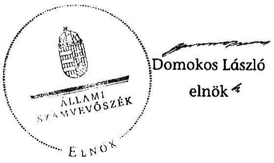

# ÁLLAMI   SZÁMVEVŐSZÉK 

## JELENTÉS

az önkormányzati vagyongazdálkodás
szabályszerúségi ellenőrzéséről
Kerepes

---

# Állami Számvevőszék 

Iktatószám: V-0026-048-038/2013.
Témaszám: 1065
Vizsgálat-azonosító szám: V0593011

## Az ellenőrzést felügyelte:

Gyüre Lajosné (2012. december 15-ig)
felügyeleti vezető
Makkai Mária (2012. december 16-tól)
felügyeleti vezető
Az ellenőrzést vezette és az ellenőrzés végrehajtásáért felelős:
Kesjár János
ellenőrzésvezető

## Az ellenőrzést végezték:

Dr. Baloghné
Sebestyén Éva
számvevő
Laki Dóra
számvevő tanácsos
Varga József
számvevő tanácsos

Eigner György
Zoltán
számvevő tanácsos
Dr. Márton Gabriella
számvevő tanácsos

Fodor Edit
számvevő
Orosz Diána
számvevő

## A témához kapcsolódó eddig készített jelentés:

## Címe

sorszáma
A Magyar Köztársaság 2006. évi költségvetése végrehajtásának 0724 ellenőrzéséről (2007. augusztus)

---

# TARTALOMJEGYZÉK 

BEVEZETÉS ..... 3
I. ÖSSZEGZŐ MEGÁLLAPÍTÁSOK, KÖVETKEZTETÉSEK, JAVASLATOK ..... 5
II. RÉSZLETES MEGÁLLAPÍTÁSOK ..... 9

1. A vagyongazdálkodási tevékenység szabályozottsága ..... 9
1.1. A feladatellátás formáinak meghatározása, a döntések megalapozottsága ..... 9
1.2. A vagyonnal gazdálkodó szervezet szervezeti rendjének szabályozottsága, a kötelező szabályzatok megfelelősége ..... 10
1.3. A vagyongazdálkodás szabályozása ..... 11
2. A vagyongazdálkodás szabályszerűsége ..... 12
2.1. A vagyon nyilvántartásának megfelelősége ..... 12
2.2. A vagyongazdálkodást érintő gazdasági események követelmények szerinti dokumentáltsága ..... 14
2.3. A vagyongazdálkodási intézkedések szabályszerűsége ..... 15
3. A vagyon változását eredményező gazdasági események szabályszerűsége ..... 15
3.1. A vagyon értékének és összetételének változása ..... 15
3.2. Közbeszerzési eljárások alkalmazása ..... 16
3.3. Hitelfelvétel, kötvénykibocsátás, garancia és kezességvállalás szabályszerűsége ..... 17
4. A vagyongazdálkodás szabályszerűségére vonatkozó belső és külső ellenőrzések hasznosulása ..... 18
4.1. A többségi tulajdonban lévő gazdasági társaságok vagyongazdálkodásának felügyelete ..... 18
4.2. A könyvvizsgálat hozzájárulása a vagyongazdálkodás szabályosságához ..... 19
4.3. A külső ellenőrző szervezet által tett javaslatok hasznosulása ..... 19

---

# MELLÉKLETEK 

1. számú Kerepes Nagyközség Önkormányzata gazdálkodására jellemző adatok, mutatószámok
2. számú Kerepes Nagyközség Önkormányzata vagyonának alakulása
3. számú Kerepes Nagyközség Önkormányzata kötelezettségeinek alakulása

## FÜGGELÉKEK

1. számú Rövidítések jegyzéke
2. számú Értelmező szótár

---

# JELENTÉS   az önkormányzati vagyongazdálkodás szabályszerűségi ellenőrzéséről   Kerepes 

## BEVEZETÉS

Az ÁSZ kiemelten fontosnak tartja az Állami Számvevőszékről szóló 2011. évi LXVI. törvény 5. § (4) bekezdése alapján az önkormányzati vagyon kezelésének, a vagyonnal való gazdálkodási szabályok betartásának az ellenőrzését. Az ellenőrzés feladata a vagyongazdálkodással kapcsolatban a közpénzek átláthatósága, nyilvánossága érdekében a jogszabályokban, belső szabályzatokban megfogalmazott előírások érvényesülésének áttekintése. Az Állami Számvevőszék nem csak az ellenőrzött szervezet vagyongazdálkodásának a hibáira mutat rá, számon kérve azok kijavítását, hanem megállapításaival, javaslataival segíti a közpénzzel, a közvagyonnal való felelős gazdálkodást.

Az önkormányzati vagyon alapvető funkciója, hogy a közérdeket és egyúttal az önkormányzati célok megvalósítását szolgálja. A feladatellátás terén elsősorban a kötelezően ellátandó feladatok végrehajtását hivatott szolgálni, amely mellett az önként vállalt feladatok ellátása is megvalósulhat.

## Az ellenőrzés célja az Önkormányzatnál annak értékelése volt, hogy:

- a vagyongazdálkodási tevékenységet, annak szervezeti kereteit szabályoztáke;
- az önkormányzati vagyongazdálkodás törvényességét, szabályszerűségét biztosították-e a döntések előkészítése és végrehajtása során;
- jogszerű döntéseken alapult-e a vagyon értékének és összetételének változása.

Kerepes Nagyközség Önkormányzata belső kontrollrendszerének kialakítása, valamint egyes kontrolltevékenységek és a belső ellenőrzés múködése ellenőrzéséről szóló jelentést az Állami Számvevőszék 2013. március 20-án hozta nyilvánosságra. A párhuzamosságok elkerülése érdekében mindazokra a megállapításokra, ami a már nyilvánosságra hozott jelentésben szerepel, ebben a jelentésben ismételten nem térünk ki.

## Az ellenőrzés típusa: szabályszerűségi ellenőrzés

Az ellenőrzés a 2007. január 1. és 2011. év december 31. közötti időszakra terjedt ki, kitekintéssel a helyszíni ellenőrzés befejezéséig tartó időszak releváns folyamataira. Az egyes közbeszerzési eljárások lefolytatásának ellenőrzése a 2011. évet és a 2012. év I. negyedévét érintette.

---

Az ellenőrzés szakmai módszertana az Állami Számvevőszék Ellenőrzési Kézikönyvében foglalt szakmai szabályokon alapult, amely a Legfőbb Ellenőrző Intézmények Nemzetközi Szervezete (INTOSAI) által kiadott nemzetközi standardok (ISSAI) figyelembevételével készült.

A vagyongazdálkodás szabályozottságát a helyi szabályozások (rendeletek, szabályzatok, utasítások) ellenőrzésével végeztük el. A vagyonváltozások köréből az ellenőrizendő tételeket mintavétellel, a számviteli nyilvántartásokból választottuk ki.

Kerepes lakosainak száma 2011. december 31-én 10178 fő volt. A 2010. évi önkormányzati választást követően az Önkormányzat 12 tagú Képviselőtestületének munkáját négy állandó bizottság segítette, valamint az Önkormányzat mellett három kisebbségi önkormányzat ${ }^{1}$ működik. A polgármester 2006. október 29-től tölti be tisztségét, a jegyző 2006. december 1-jétől - kisebb megszakítással ${ }^{2}$ - vezeti a hivatalt.

Az Önkormányzat feladatainak végrehajtása érdekében a 2011. évben hat költségvetési intézményt múködtetett - eggyel kevesebbet, mint 2007. évben amelyből egy önállóan gazdálkodott. A Polgármesteri hivatalban dolgozó köztisztviselők száma 2011. december 31-én 30 fő volt, mely kettővel kevesebb a 2007. évinél.

Az Önkormányzatnak a 2011. évben két gazdasági társaságban volt részesedése, amelyek közül egynek ${ }^{3}$ kizárólagos tulajdonosa volt. Az Önkormányzat vagyona a 2011. december 31-i könyvviteli mérleg szerint 5516,8 millió Ft, adósságállományának értéke 928,4 millió Ft volt. A 2011. évi zárszámadási rendeletben 1436,1 millió Ft költségvetési bevételt és 1307,7 millió Ft költségvetési kiadást teljesített, melyből a felhalmozási célú kiadás 392,8 millió Ft volt. Az Önkormányzat gazdálkodására jellemző adatokat, mutatószámokat az 1-3. számú mellékletek tartalmazzák.

Az ÁSZ a 2011. évi LXVI. törvény 29. § (1) bekezdése szerint a jelentéstervezetet megküldte egyeztetésre Kerepes Város Önkormányzata polgármesterének, aki az ÁSZ tv. 29. § (2) bekezdésében foglalt észrevételezési jogával nem élt, a jelentéstervezetre észrevételt nem tett.

[^0]
[^0]:    ${ }^{1}$ szlovák, német és roma kisebbségi önkormányzat
    ${ }^{2}$ 2011. február 16-tól 2011. augusztus 31-ig a jegyzői feladatok ellátására az igazgatási iroda vezetője kapott megbízást, mivel a jegyzőnek mintegy fél évre megszűnt a közszolgálati jogviszonya, majd a kiírt pályázatot megnyerve ismét ellátja azt.
    ${ }^{3}$ a Községszolgáltató Kft.-nek

---

# I. ÖSSZEGZŐ MEGÁLLAPÍTÁSOK, KÖVETKEZTETÉSEK, JAVASLATOK 

Az Önkormányzat vagyona a könyvviteli mérleg szerint a 2007-2011 közötti időszakban 4715,2 millió Ft-ról 5516,8 millió Ft-ra, 17\%-kal emelkedett, egyúttal az összes kötelezettség állománya közel 500 millió Ft-tal nőtt. Beruházásra, felújításra és eszközbeszerzésre 899, 7 millió Ft-ot fordítottak. A 20072011. években elszámolt értékcsökkenés mértéke 274,7 millió Ft volt. A vagyonnövekedés $48,8 \%$-kát felhalmozási célú hitelből és kötvénykibocsátásból finanszírozták.

Az Önkormányzat a 2007-2011. években rendelkezett a vagyongazdálkodás helyi szabályait tartalmazó rendelettel. A vagyongazdálkodási rendelet ${ }_{1}$-ben szabályozták az önkormányzati feladatellátást biztosító törzsvagyon körét, ezen belül a korlátozottan forgalomképes és forgalomképtelen vagyonelemeket, illetve a forgalomképes vagyoni körbe tartozó vagyontárgyakat.

A vagyon nyilvántartása során az Önkormányzat az Ötv.-ben foglalt előírásoknak megfelelően a főkönyvi számlák alábontásával, valamint a számlákhoz kapcsolódó analitikus nyilvántartások vezetésével biztosította a törzsvagyon többi vagyontárgytól való elkülönített nyilvántartását.

A főkönyvben szereplő ingatlanvagyon és az ingatlanvagyon kataszter azonos tartalmú adatai nem egyeztek. A számviteli nyilvántartásban szereplő ingatlanvagyon és ingatlanvagyon-kataszter adatainak egyeztetését a 2008. évben végezték el. Ennek keretében az eltéréseket feltárták, és azok rendezését követően a nyilvántartások összhangját biztosították. Az Önkormányzat az ingatlan-vagyon-kataszter és a földhivatali nyilvántartás egyeztetését dokumentált módon csak 2008-ban végezte el, akkor a nyilvántartások adatai egyezőek voltak. A 147/1992. (XI.6.) Korm. rendelet 1. § (2) bekezdésében foglalt előírás ellenére a 2009-2011. évek között az ingatlanvagyon kataszter és a földhivatali ingatlan nyilvántartás azonos tartalmú adatai közötti egyezőség az adategyeztetést az alátámasztó dokumentumok hiányában nem igazolt.

Az Önkormányzat a 2007-2011. évekre elkészített könyvviteli mérleg értékadatait - az Áhsz. előírásai ellenére - az előírásoknak megfelelő leltárral nem támasztotta alá. A leltározás egyeztetéssel történt, amely nem felelt meg az Áhsz. és a leltározási szabályzat előírásainak. Az ellenőrzött időszakban csak a 2009. évben történt tényleges mennyiségi leltárfelvétel, azonban a leltározási utasításban előírt leltárzáró jegyzőkönyvet nem készítették el. Az Áhsz. rendelkezésével ellentétben a leltározási szabályzatban kétévenkénti leltározást írtak elő annak ellenére, hogy erről a Képviselő-testület nem alkotott rendeletet. Az üzemeltetésre, a vagyonkezelésbe átadott, illetve a koncesszióba adott eszközök leltározásának szabályozása nem követte az Áhsz. 2010. évi módosítását. A 2010-2011. években az üzemeltetésre átadott eszközök egyeztetéssel történt leltározása miatt az Önkormányzat nem tett eleget az Áhsz.-ben foglalt előírásoknak.

---

Az Önkormányzat minden évben elkészítette a vagyonállapotról a vagyonkimutatást és azt a zárszámadási rendelettervezet előterjesztésekor a Képviselőtestület részére tájékoztatásul bemutatták.

A vagyongazdálkodási döntések előkészítési folyamatára vonatkozóan meghatározták az értékesítés versenyeztetési szabályait, a hasznosításra szánt vagyon értékbecslés-készítési kötelezettségét. Annak célszerűsége ellenére az Önkormányzat nem rendelkezett a költség-haszon elemzés készítésének, valamint a hitelfelvételről, kötvénykibocsátásról szóló döntések esetében a futamidő egyes éveit terhelő adósságszolgálat költségvetési egyensúlyra gyakorolt hatása felmérésének kötelezettségéről. Az Önkormányzat tulajdonosi jogainak, érdekeinek védelmét szolgáló garanciális elemek szerződésekben vagy egyéb dokumentumokban történő rögzítési kötelezettségét nem írták elő, ugyanakkor a vagyonhasznosítási és vagyonértékesítési szerződésekbe beépítették az Önkormányzat érdekeit védő garanciális elemeket. Az ellenőrzött vagyonhasznosítási döntéseket a vagyongazdálkodási rendelet ${ }_{1}$-ben előírt hatáskör szerinti jogosultak hozták meg.

A vagyontárgyak hasznosításánál, a vagyon értékének és összetételének változását befolyásoló döntéseknél betartották az Ötv. előírásait, a döntéshozók az arra felhatalmazott személyek voltak. A szerződések összhangban voltak a kép-viselő-testületi határozatokkal.

A 2011. évben lefolytatott közbeszerzési eljárások közül egy építési beruházás közbeszerzési eljárásának indítása nem felelt meg a Kbt. előírásainak, mely miatt a KTKD hivatalból jogorvoslati eljárást kezdeményezett az Önkormányzat ellen.

A könyvvizsgálat a vagyongazdálkodás szabályszerűségét érintő megállapításokat is tett. Az Önkormányzat a könyvvizsgálói javaslatokat nem hasznosította teljes körűen, ezért a könyvvizsgálat a vagyongazdálkodás szabályszerűségét is érintő megállapításai ellenére a vagyongazdálkodás szabályszerűségének javulásához korlátozottan járult hozzá. A 2011. évi könyvvizsgálói jelentés nem tartalmaz megállapítást az el nem végzett mennyiségi leltárfelvételekre vonatkozóan.

Az ÁSZ az Önkormányzatnál a 2007. évben a Magyar Köztársaság 2006. évi költségvetése zárszámadásának ellenőrzése keretében az önkormányzatok beruházásaihoz nyújtott 2006. évi felhalmozási célú támogatásokat ellenőrizte. A javaslatok közül a vagyongazdálkodás szabályszerűségéhez kapcsolódóan 5 szabályszerűségi és 8 célszerűségi javaslat kapcsolódott. A szabályszerűségi javaslatok hasznosítása megtörtént, a célszerűségi javaslatok közül hatot hasznosítottak. Az ÁSZ jelentés képviselő-testületi beterjesztésére vonatkozó célszerűségi javaslatot nem hasznosították.

Az európai uniós forrással megvalósult három pályázat közül kettőnél találtak hiányosságokat a külső ellenőrző szervezetek, ezek megoldásáról az Önkormányzatnál intézkedtek.

Az Önkormányzat a 2007-2011. évek között egy - kizárólagos tulajdonú - gazdasági társasággal rendelkezett, melynek feladatait az alapító okiratban

---

határozta meg (zöldterület karbantartása, út- és járdaépítés, szemétszállítás). Ennek ellátására közhasznú és közszolgáltatási szerződéseket kötöttek, melyek tartalmazták a feladat teljesítésére és az ellenszolgáltatás felhasználására vonatkozó előírásokat. A gazdasági társaság részletes szöveges és számszaki beszámolót készített a költségvetési támogatás felhasználásáról, a vagyon alakulásáról, a közszolgáltatási szerződésben meghatározott kiadások és ráfordítások összességéről. A társaság mérleg szerinti eredménye 2007-ben, valamint a 2009-2010. időszakban pozitív volt. A gazdasági társaság 2007-2011 között az alapító okiratában előírtaknak megfelelően évente beterjesztette az egyszerűsített éves beszámolót, a közhasznúsági jelentést, valamint a könyvvizsgálói véleményt, melyet a Képviselő-testület minden évben elfogadott.

Az Állami Számvevőszékről szóló 2011. évi LXVI. törvény 33. § (1) bekezdésében foglaltak értelmében a jelentésben foglalt megállapításokhoz kapcsolódó intézkedési tervet köteles az ellenőrzött szervezet vezetője összeállítani, és azt a jelentés kézhezvételétől számított 30 napon belül az ÁSZ részére megküldeni. Amennyiben az intézkedési tervet határidőben nem küldi meg a szervezet, vagy az nem elfogadható, az ÁSZ elnöke a hivatkozott törvény 33. § (3) bekezdés a)-b) pontjaiban foglaltakat érvényesítheti.

Az ellenőrzés intézkedést igénylő megállapításai és javaslatai:

# a Jegyzönek 

1. A leltározással és a leltárkészítésével kapcsolatos szabályozás, illetve tevékenység nem volt szabályos a következők miatt:
a) a leltározási szabályzat az Áhsz. 37. § (7) bekezdésében előírt képviselő-testületi döntés nélkül biztosította a kétévenkénti leltározás lehetőségét;
b) a 2007-2011. közötti időszakban csak a 2009. évben történt tényleges mennyiségi leltárfelvétel, amellyel megsértették az Áhsz. 37. § (1) és (3) bekezdésének előírásait;
c) a 2010-2011. években az üzemeltetésre átadott eszközök egyeztetéssel történt leltározása miatt az Önkormányzat nem tett eleget az Áhsz. 37.§ (4) bekezdésében foglalt előírásoknak.

Javaslat
Intézkedjen
a) hogy a leltározási szabályzat feleljen meg az Áhsz. 37. § előírásainak;
b) az Áhsz. 37. § (1) és (3) bekezdéseiben előírtak szerinti leltározás végrehajtására;
c) az Áhsz. 37. § (4) bekezdés előírása szerint arról, hogy az üzemeltetésre, vagyonkezelésbe adott eszközöket az üzemeltetést, kezelést végző szerv által elkészített, hitelesített leltárral támasszák alá a könyvviteli mérleget.

---

2. A 2009-2011. években a 147/1992. (XI.6) Korm. rendelet 1. § (2) bekezdésében foglalt előírás ellenére az ingatlanvagyon kataszter és a földhivatali ingatlannyilvántartás azonos tartalmú adatai közötti egyezőség az adategyeztetést alátámasztó dokumentumok hiányában nem igazolt.

Javaslat
Intézkedjen, hogy a 147/1992. (XI. 6.) Korm. rendelet 1. § (2) bekezdésében rögzítetteknek megfelelően az ingatlanvagyon kataszter adatai egyezzenek meg a földhivatal ingatlan-nyilvántartás azonos tartalmú adataival.

---

# II. RÉSZLETES MEGÁLLAPÍTÁSOK 

## 1. A VAGYONGAZDÁLKODÁSI TEVÉKENYSÉG SZABÁLYOZOTTSÁGA

### 1.1. A feladatellátás formáinak meghatározása, a döntések megalapozottsága

A Képviselő-testület a 2006. és a 2010. évi önkormányzati választásokat követően gazdasági programjaiban rögzítette az Önkormányzat feladatellátással összefüggő elképzeléseit, a fejlesztések fő irányait.

A 2006-2010. évekre vonatkozó gazdasági program legfontosabb fejlesztési irányként a településfejlesztést - ennek keretében járdák, belterületi utak és kerékpárutak építését, a csapadékvíz-elvezetés megoldását - határozta meg. Kiemelt célként szerepelt továbbá az ivóvízminőség javítása, ${ }^{4}$ melyet Kistarcsa Várossal közös beruházással terveztek megvalósítani. A 2011-2014. évekre jóváhagyott gazdasági program a szociális ellátórendszer fejlesztése érdekében az 55 férőhelyes bölcsőde ${ }^{5}$ létrehozását és a fogyatékkal élők, valamint az egyedülálló idősek napközbeni, illetve bentlakásos ellátásának intézményesített megoldását ${ }^{6}$ is kiemelt célként kezelte. A fiatalok helyben tartása érdekében fontos megvalósítandó célnak jelölték egy igényes településközpont kialakítását, továbbá az Általános Iskola kihasználtságának és szakmai megítélésének javítását.

A kötelező feladatokat az önkormányzati $\mathrm{SZMSZ}_{1,2}$ mellékletei tartalmazták. Az önként vállalt feladatok felsorolását az $\mathrm{SZMSZ}_{1}$ nem tartalmazta, azokról az éves költségvetésben rendelkeztek. Az SZMSZ ${ }_{2}$ azonban tételesen ismerteti az önként vállalt feladatokat.

A 2007-2011. évek közötti időszakban az Önkormányzat új gazdasági társaságot nem alapított, a település-fenntartási feladatokat a 100\%-os önkormányzati tulajdonban álló Községszolgáltató Kft. ${ }^{7}$ látta el „közhasznú" és közszolgáltatási szerződések alapján.

A Képviselő-testület 2009. évben határozott a Szilas-menti Ivóvízminőség-javító Társulásba történő belépésről, a döntéssel összefüggésben vagyonváltozásra akkor kerül sor, amikor a társulás megvalósítja a gazdasági programban megfogalmazott vízminőség javító beruházást.

[^0]
[^0]:    ${ }^{4}$ Az ivóvíz Kerepesen egészségre ártalmas mértékben nitrát tartalmú, mely miatt a kisded korosztály ivóvízzel történő ellátása tasakos víz formájában történik.
    ${ }^{5}$ A 2011. évben a beruházás befejeződött.
    ${ }^{6}$ A beruházás az ÁSZ helyszíni ellenőrzésének időszakában még folyamatban volt.
    ${ }^{7}$ A Községszolgáltató Kft. 2009. évben alakult át törvényi rendelkezés alapján közhasznú társaságból kft.-vé.

---

# 1.2. A vagyonnal gazdálkodó szervezet szervezeti rendjének szabályozottsága, a kötelező szabályzatok megfelelősége 

A Képviselő-testület az Ötv.-ben foglaltak alapján megalkotta SZMSZ ${ }_{1,2}{ }^{-}$ jét és a hatályos törvényi előírásoknak megfelelően a vagyongazdálkodási feladatokat rendeletben szabályozta. A Képviselő-testületet megillető hatáskörök - polgármesterre és bizottságokra történő - átruházásáról az SZMSZ ${ }_{1,2}$-ben döntöttek, az átruházott hatáskörben hozott intézkedésekről a polgármesternek negyedévente, a bizottságoknak évente kellett a Képviselő-testület előtt beszámolnia. Az átruházott hatáskörök gyakorlásához további utasítást a szabályzatban nem adtak.

A közfeladatot ellátó költségvetési szervek alapító okirataiban a Képviselőtestület meghatározta a szervezetek közfeladatait és alaptevékenységét. Ezen költségvetési szervek szervezeti és múködési szabályzatát az SZMSZ ${ }_{1,2}$-ben foglaltaknak megfelelően hagyták jóvá. A Polgármesteri hivatal SZMSZ-ét a jogszabályi előírások és a helyi sajátosságok figyelembevételével elkészítették és elfogadták, ${ }^{8}$ mely azonban nem tartalmazta teljes körűen az Ámr. ${ }_{2}$ 20. § (2) bekezdésében előírtakat.

Hiányoztak a Polgármesteri hivatal alapításával kapcsolatos adatok, a hivatal szervezeti ábrája, a hozzárendelt intézmények felsorolása és nem az Ámr. ${ }_{2}$ hivatkozott előírásainak megfelelő tartalommal mutatták be az ellátott szakfeladatokat, a szervezeti egységek vezetőinek a költségvetési szerv képviseletében történő eljárásának jogosítványait, a munkáltatói jogok gyakorlását, valamennyi munkakörhöz kapcsolódó feladat és hatáskört, azok gyakorlásának módját, a helyettesítés rendjét.

A Polgármesteri hivatal számviteli politikáját és a hozzá kapcsolódó kötelező szabályzatokat az előírásoknak és a helyi sajátosságoknak megfelelően elkészítették, de azokat a 2007-2011. évek között nem aktualizálták.

A Képviselő-testület a kétévenkénti leltározásról az Áhsz. 37. § (7) bekezdésében foglaltakat megsértve nem alkotott rendeletet ${ }^{9}$ annak ellenére, hogy a leltározási szabályzatban kétévenkénti mennyiségi leltározási kötelezettséget határoztak meg. A leltározási szabályzat tartalmazta az üzemeltetésre, a vagyonkezelésbe átadott, illetve a koncesszióba adott eszközök leltározásának módját is, azonban a szabályzat aktualizálásának elmaradása miatt nem az Áhsz. 2010. január 1-jétől hatályos szabályozása szerint.

A szabályzat az üzemeltetővel történő egyeztetést ír elő, az új szabályok szerint az üzemeltetésre, kezelésre átadott, koncesszióba, vagyonkezelésbe adott eszközöket a kezelést végző szerv által a december 31-ei fordulónapra vonatkozó évenkénti leltározás alapján elkészített, hitelesített és megállapodásban meghatározott időpontig megküldött leltárral kell alátámasztani.

[^0]
[^0]:    ${ }^{8} \mathrm{Az} \mathrm{SZMSZ}_{2}$ 6. számú függelékeként fogadta el a Képviselő-testület.
    ${ }^{9}$ A 2012. évtől képviselő-testületi határozatban is rendelkezhetnek a kétévenkénti leltározásról, de ez sem történt meg.

---

# 1.3. A vagyongazdálkodás szabályozása 

Az Önkormányzat az Ötv. 16. § (1) bekezdésében kapott felhatalmazás alapján, a vonatkozó jogszabályoknak megfelelően alkotta meg vagyongazdálkodási rendelet ${ }_{1}$-ét, amely összhangban volt az Önkormányzat belső szabályzataival. A vagyongazdálkodási rendelet ${ }_{1}$-et a vagyonban bekövetkezett változásoknak megfelelően aktualizálták. A vagyongazdálkodási rendelet ${ }_{1}$-ben szabályozták az önkormányzati feladatellátást biztosító törzsvagyon körét, ezen belül a korlátozottan forgalomképes és forgalomképtelen vagyonelemeket, illetve a forgalomképes vagyoni körbe tartozó vagyontárgyakat. A vagyongazdálkodási rendelet ${ }_{1}$ nem teljes körú, mert melléklete hiányos adattartalommal sorolta fel a forgalomképtelen törzsvagyoni körbe tartozó vagyonelemeket, ${ }^{10}$ és nem tartalmazta a korlátozottan forgalomképes vagyontárgyakat.

A zárszámadási rendelettel elfogadott vagyonkimutatás, a számviteli politika keretében kiadmányozott számlarend szerint megnyitott főkönyvi és analitikus nyilvántartások, valamint az ingatlanvagyon-kataszter biztosították a vagyonelemek forgalomképesség szerinti besorolásának megfelelő, elkülönített nyilvántartásának feltételeit. A vagyonkezelők feladat- és hatáskörére, felelősségére, a vagyonelemek hasznosítási módjára vonatkozó rendelkezéseket a vagyongazdálkodási rendelet ${ }_{1}$-en kívül az ezzel összhangban készült intézményi alapító okiratok és az ügyrend is tartalmazott.

A vagyontárgyak feletti rendelkezési jogot a vagyongazdálkodási rendelet ${ }_{1}$-ben a vagyonelem típusa, a tulajdonosi jog, illetve döntés tartalma, valamint értékhatár alapján osztották meg a Képviselő-testület, a polgármester és a vagyonkezelők között. A forgalomképes vagyon értékesítésére, illetve más módon történő hasznosítására fő szabályként a nyilvánosság bevonásával, versenyeztetéssel kerülhetett sor, melynek szabályait a vagyongazdálkodási rendelet ${ }_{1}$-ben meghatározták.

A 2007-2011. évek közötti időszakban a vagyongazdálkodási rendelet ${ }_{1}$ a vagyon ingyenes átruházására vonatkozóan is tartalmazott szabályokat. ${ }^{11}$

Az Önkormányzat nem kötötte helyi népszavazáshoz az önkormányzati vagyon meghatározott részének elidegenítését, megterhelését vagy vállalkozásba vitelét.

Az ellenőrzött időszakban a vagyongazdálkodással kapcsolatos szabályozás elősegítette a döntések megfelelő megalapozását. A gazdálkodással kapcsolatos jogkörök gyakorlásának rendjét, az ezekkel kapcsolatos öszszeférhetetlenségi követelményeket az SZMSZ ${ }_{1,2}$ mellékleteiben, a gazdálkodási jogkörök szabályzatában és az ügyrendben határozták meg. Az előterjesztések készítésének rendjéről, tartalmi és formai követelményeiről az SZMSZ ${ }_{1,2}$-ben rendelkeztek.

[^0]
[^0]:    ${ }^{10}$ A terület méretre vonatkozó adatok, hrsz.-ok esetenként házszámok feltüntetése nélkül szerepeltek a vagyonelemek a mellékletben.
    ${ }^{11}$ Az Nvtv. a 2012. évben hatályba lépett előírásait betartva - ezeket a rendelkezéseket 2012. április 28. napjával hatályon kívül helyezték.

---

A döntés-előkészítés folyamatában a hasznosításra szánt vagyon értékének megállapítása céljából a vagyongazdálkodási rendelet ${ }_{1}$ értékbecslés-készítési kötelezettséget írt elő. Annak célszerúsége ${ }^{12}$ ellenére nem rendelkezett a költséghaszon elemzés készítésének kötelezettségéről, valamint a hitelfelvételről, kötvénykibocsátásról szóló döntések esetében a futamidő egyes éveit terhelő adósságszolgálat költségvetési egyensúlyra gyakorolt hatása felmérésének és az Önkormányzat tulajdonosi jogai, illetve érdekei védelmét szolgáló garanciális elemek szerződésben vagy egyéb dokumentumban való rögzítésének kötelezettségéről.

A nyilvánosság biztosításának eszközeit, a nyilvánosságra hozatal módját és felelősét a közérdekú adatok megismerésére vonatkozó szabályzatban, a vagyongazdálkodási rendelet ${ }_{1}$-ben és az SZMSZ ${ }_{1,2}$ FEUVE szabályzathoz kapcsolódó mellékleteiben megjelölték.

Az ellenőrzési időszakot követően az Nvtv. 2012. évben hatályba lépett rendelkezéseinek megfelelően az Önkormányzat vagyongazdálkodási rendelet ${ }_{1}$-ét határidőn belül felülvizsgálta. Ennek keretében elvégezte a vagyon új szabályok szerinti besorolását. A Képviselő-testület megállapította, hogy nincs önkormányzati tulajdonban olyan vagyonelem, melyet nemzetgazdasági szempontból kiemelt jelentőségű nemzeti vagyonná kell minősíteni. A Képviselő-testület a 204/2011. (XII. 18.) számú határozatával a 2012. évre szóló költségvetési koncepció keretében jóváhagyta középtávú vagyongazdálkodási tervét.

Az ellenőrzött időszakban a vagyongazdálkodással kapcsolatos szabályozás - a feltárt és jelentésben rögzített hiányosságokkal - kiterjedt a vagyongazdálkodás lényeges elemeire, elősegítette a vagyonra vonatkozó döntések megfelelő megalapozását.

# 2. A VAGYONGAZDÁLKODÁs SZABÁLYSZERŰSÉGE 

### 2.1. A vagyon nyilvántartásának megfelelősége

Az Önkormányzat a 2007-2011. években eleget tett az Ötv. 78. § (2) és 79. § (2) bekezdésekben foglalt előírásoknak, mivel a főkönyvi számlák alábontásával, valamint a számlákhoz kapcsolódó analitikus nyilvántartások vezetésével biztosította a törzsvagyon többi vagyontárgytól való elkülönített nyilvántartását.

Az Önkormányzat minden évben elkészítette a vagyonállapotról a vagyonkimutatást, amelyet a zárszámadási rendelettervezet előterjesztésekor a Képviselő-testület részére bemutattak. A 2007. évi vagyonkimutatás tartalma azonban nem felelt meg az Áhsz. 44/A. § (2) bekezdésében foglalt előírásoknak, mert nem tartalmazta az Önkormányzat vagyonát törzsvagyon (forgalomképtelen és korlátozottan forgalomképes), illetve törzsvagyonon kívüli egyéb vagyon bontásban. A 2008-2011. évi vagyonkimutatások mind a szerkezetüket,

[^0]
[^0]:    ${ }^{12}$ Jogszabályi kötelezettség nélkül is célszerű a felelős gazdálkodás elemeit képező olyan eljárások szabályozása, amelyek a vagyon védelmét szolgálják és a végrehajtásban az önkormányzat - a szabályozás elmaradása ellenére - részben alkalmazott, például a 2009. szeptember 1-jén kötött ingatlan adásvételi szerződésben.

---

mind a tartalmukat tekintve megfeleltek a jogszabályi és a vagyongazdálkodási rendelet ${ }_{1}$-ben foglalt előírásoknak.

A 147/1992. (XI. 6) Korm. rendelet 1. § (3) bekezdésében foglaltak ellenére az Önkormányzat a 2007. évben az ingatlanvagyon-kataszter és a számviteli nyilvántartásban szereplő ingatlanvagyon adatainak egyezőségét nem biztosította. A számviteli nyilvántartásban szereplő ingatlanvagyon és az ingatlanvagyonkataszter adatainak egyeztetését 2008-ban külső vállalkozó végezte ${ }^{13}$. Az Önkormányzat tulajdonában álló ingatlanok felmérését és földhivatali egyeztetését követően a korábbi hibákat rendezték. Ennek megfelelően a 2003. előtt érték nélkül nyilvántartott vagyon 2003-ban megállapított értékét helyesbítették. A két nyilvántartás közötti egyezőséget az Önkormányzat a 2008-2011. években biztosította.

Az Önkormányzat a 2008. év kivételével az ingatlanvagyon-kataszter és a földhivatali nyilvántartás egyeztetését dokumentált módon nem végezte el. A 2008. évben - a vagyonkataszteri felülvizsgálatot végző vállalkozó teljesítésigazolása alapján - a vagyonkataszter és az illetékes földhivatal nyilvántartásának adatait egyeztették, azok egyezőek voltak. Az azt követő években a vagyonkataszter és a földhivatali nyilvántartás egyeztetéséről írásbeli dokumentumot nem bocsátottak az ellenőrzés rendelkezésére.

A Polgármesteri hivatal az eszközök állományba vételéhez nem készített az Áhsz. 30. §-ában és a számviteli politika 12.1 pontjának rendelkezésein alapuló „üzembe helyezési jegyzőkönyvet", ezért az ingatlanok esetében az állományba vétel dátuma esetenként nem egyezett meg a földhivatali adatokkal.

A 2007. február 23-án aláírt, a 0166/2. hrsz. kisajátítást helyettesítő értékesítés ( 0,7 millió Ft) esetében az ingatlan 2007. április 24-én került a nyilvántartásból kivezetésre.

Egy ingatlan (magánút) tulajdonos 2008. május 16-án lemondott a Polgármesteri hivatal javára $220 \mathrm{~m}^{2}$ területről. A földhivatal 2008. július 2-án jogerősen bejegyezte a térítésmentes átvételt, melyet a vagyonkataszterbe csak 2008. október 1jén vezettek be.

A számviteli politika 12.1 pontjában előírt üzembe helyezési okmány az ellenőrzött tételek között csak két esetben volt fellelhető. Az üzembe helyezési okmány alkalmazásának mellőzéséből következik, hogy az ellenőrzött eszközök esetében, amelyeknél értékcsökkenés elszámolására került sor nem állapítható meg, hogy az értékcsökkenés elszámolása a tényleges használatbavétel időpontjától került meghatározásra. Az ellenőrzött tételek közül egy esetben fordult elő, hogy az értékcsökkenési leírási kulcsot nem megfelelően határozták meg, amit a helyszíni ellenőrzés idején az analitikus nyilvántartásban javítottak.

[^0]
[^0]:    ${ }^{13}$ A 2002. dec. 31. - 2007. dec. 31. közötti időszak rendezésére a 2008. évben megbízási szerződést kötöttek, a vállalkozó szerződés alapján azóta is folyamatosan vezeti a vagyonkatasztert.

---

A vagyongazdálkodási rendelet ${ }_{1}$ 3. §-a szerint az ingatlanvagyon-katasztert a Polgármesteri hivatal Műszaki Irodája folyamatosan vezeti. Az ügyrend 5.1. pontja szerint „az Önkormányzat vagyonának folyamatos, naprakész nyilvántartását a pénzügyi osztály végzi". Ezzel szemben a teljes eszközállomány analitikus nyilvántartását, az állomány aktualizálását, így a vagyonkimutatást - a vagyonkataszter programban - külső megbízott vezeti.

Az Önkormányzat a 2007-2011. évekre elkészített könyvviteli mérleg értékadatait a Számv. tv. 69. § (1) bekezdés és az Áhsz. 37. § (1)(2) bekezdések előirásait megsértve leltárral nem támasztotta alá. Ezekben az években a leltározás egyeztetéssel történt, amely nem felelt meg a leltározási szabályzat 2.3. A) pont előírásainak. Az ellenőrzött időszakban csak a 2009. évben történt tényleges mennyiségi leltárfelvétel, azonban a leltározási utasításban előírt leltárzáró jegyzőkönyvet nem készítették el. A 2010-2011. években az üzemeltetésre átadott eszközök egyeztetéssel történt leltározása miatt az Önkormányzat nem tett eleget az Áhsz. 37. § (4) bekezdésében foglalt előírásoknak.

# 2.2. A vagyongazdálkodást érintő gazdasági események követelmények szerinti dokumentáltsága 

A Polgármesteri hivatalban a 2007. évben az ügyrend 7. pontja alapján a gazdálkodási jogkörök - a kötelezettségvállalás, érvényesítés, szakmai teljesítésigazolás, ellenjegyzés, utalványozás - rendjét szabályozták, de írásos felhatalmazással az aláírók nem rendelkeztek, azonban a jogszabályban előírt képesítési követelményeknek megfeleltek. A 2008-2011. években a gazdálkodási jogkörök szabályzatának melléklete tartalmazta az aláírásra jogosultak írásos felhatalmazását és aláírás mintáit. A gazdálkodási jogkörök gyakorlása során betartották az Ámr. ${ }_{1,2}$-ben rögzített összeférhetetlenségi követelményeket.

Az Önkormányzat 2009. május 11-én megbízási szerződést kötött egy gazdasági társasággal, az információszabadság törvényi előírásainak teljesítésére. Ennek ellenére - a helyszíni ellenőrzés kezdetén ${ }^{14}$ - az Eisztv. és az Áht. előírásainak az Önkormányzat honlapján (www.kerepes.hu), és a http://kozadat.localinfo.hu/kerepes honlapon közzétett adatok nem feleltek meg, hiányosak voltak. A közérdekú gazdálkodási adatok elektronikus közzétételét a Polgármesteri hivatal a helyszíni ellenőrzés idején pótolta.

Az Önkormányzat vagyongazdálkodási rendelet ${ }_{1}$ 17. § (1) pontja az Áht. ${ }_{1}$ 15/AB. pontjaiban foglaltaknál szigorúbb előírást fogalmazott meg a közzététel értékhatárára ${ }^{15}$ vonatkozóan. Az Önkormányzat honlapján azonban a vagyongazdálkodási rendelet ${ }_{1}$-nek megfelelően csak a 2009. évtől találhatók meg a szerződések.

[^0]
[^0]:    ${ }^{14}$ 2012. október 8-án
    ${ }^{15}$ A közzétételi értékhatárt 3 millió Ft-ban állapította meg.

---

# 2.3. A vagyongazdálkodási intézkedések szabályszerűsége 

Az ellenőrzött vagyonhasznosítási döntések a vagyongazdálkodási rendelet,ben előírt hatáskör szerint történtek. A Képviselő-testület az előterjesztéseket megtárgyalta, a határozatokban a polgármestert szerződéskötésre, vagy további egyeztetésre (pl. kisajátítás) felhatalmazta. A vagyonhasznosítási előterjesztések szakértői értékbecsléseket tartalmaztak, melyek többségében a Nemzeti Infrastruktúra Fejlesztő Zrt. kisajátítást megelőző árajánlatát támasztották alá. Az ellenőrzött vagyonhasznosítási tételeknél a döntést a Képviselő-testület hozta meg, a polgármester annak megfelelően vállalta a kötelezettséget. Az ellenőrzött tételeknél a Képviselő-testület által elfogadott vagyonhasznosítási döntéssel azonos tartalommal kötöttek szerződéseket, azaz a Kép-viselő-testület döntéseit követően a végrehajtás a határozatoknak megfelelően történt.

Az ellenőrzött szerződésekben az Önkormányzat érdekeit védő garanciális feltételeket oly módon rögzítették, hogy a Ptk. hivatkozás minden szerződésben megtalálható, mely alapján a késedelem szankcionálható, valamint értékesítéskor a tulajdonjog bejegyzésének feltételéül szabták a teljes vételár kifizetését. A nagy összegű beruházási szerződések a kötbérszámítás lehetőségét is tartalmazták, amellyel az Önkormányzat élt a kivitelező sorozatos időbeli csúszása miatt.

A 2007. és 2008. években a tárgyi eszközök évközi állományváltozása döntően év végén került a megfelelő állományi számlára átvezetésre az Áhsz. 51. § (1) bekezdés b) pontjának előírása ellenére.

## 3. A VAGYON VÁLTOZÁSÁT EREDMÉNYEZŐ GAZDASÁGI ESEMÉNYEK SZABÁLYSZERŰSÉGE

### 3.1. A vagyon értékének és összetételének változása

Az Önkormányzat vagyonának értéke a 2007. évről a 2011. évre 4715,2 millió Ft-ról 5516,8 millió Ft-ra, 801,6 millió Ft-tal, 17,0\%-kal növekedett, döntően a befektetett eszközök növekedése eredményeként. A befektetett eszközök nettó értéke a 2007. évről a 2011. évre 4 596,9 millió Ft-ról 607,3 millió Ft-tal, 5 204,2 millió Ft-ra, 13,2\%-kal növekedett. A tárgyi eszközök értéke 2007-ről 2011-re 678,2 millió Ft-tal emelkedett elsősorban a megvalósított, ${ }^{16}$ valamint a 2011. év végén még folyamatban lévő beruházások miatt.

A befektetett eszközök fedezetének mutatója ${ }^{17}$ a 2007. évi 91,4\%-os szintről a 2011. év végére $84,8 \%$-os szintre csökkent, vagyis a saját tőkéből a befektetett eszközök fedezetét csökkenő mértékben tudták biztosítani.

[^0]
[^0]:    ${ }^{16}$ infrastrukturális fejlesztések (útépítések és felújítások, parkolók és gyalogátkelőhelyek kialakítása), földterületek vásárlása, önkormányzati intézmények felújítása és akadálymentesítése, sportpálya építése
    ${ }^{17}$ A befektetett eszközök fedezetét a saját tőke és a befektetett eszközök hányadosa mutatja.

---

A saját vagyon a 2007-2011 közötti időszakban 4247,8 millió Ft-ról 4586,1 millió Ft-ra, 338,3 millió Ft-tal nőtt, az eszközök értékének (801,6 millió Ft-os) és a kötelezettségek összegének (463,3 millió Ft-os) egyidejú emelkedése egyenlegeként. A hosszú lejáratú kötelezettségek értéke a 2007. évi 337,9 millió Ft-ról a kötvénykibocsátások és a hosszúlejáratú „OLLÉ" hitel felvétele miatt 2011-re 728,9 millió Ft-ra nőtt. Az Önkormányzat vagyona növekedésének pénzügyi fedezetét hosszú lejáratú kötelezettségek biztosították.

A 2007-2011. években az Önkormányzat nem mérte fel, hogy az eszközök elhasználódása, amortizációja fedezetének biztosítása mekkora forrásokat igényel, az elhasználódott eszközök pótlására tartalékot nem képeztek, külön alapot nem hoztak létre. ${ }^{18} \mathbf{A z}$ ellenőrzött időszakban összesen elszámolt értékcsökkenés (274,7 millió Ft) összegének több mint háromszorosát meghaladó (899,7 millió Ft) összeget fordítottak beruházásra, felújításra és eszközbeszerzésre.

Az Önkormányzat beruházásai, felújításai a vagyonérték megőrzését és gyarapítását szolgálták, ennek ellenére az eszközök használhatósági foka ${ }^{19}$ az ellenőrzött időszakban - a 2008. évtől intenzíven induló fejlesztések ellenére kismértékben - 93,5\%-ról 89,8\%-ra romlott, mely jelzi a jövőbeni üzemeltetési és fenntartási költségek növekedését.

A használhatósági fokmutató számítása nem veszi figyelembe a 2011. év végén folyamatban lévő, még nem aktivált beruházások és fejlesztések 314 millió Ft-os értékét.

# 3.2. Közbeszerzési eljárások alkalmazása 

A Képviselő-testület a 2008. évben hagyta jóvá a Kbt. szabályzatot. A Kbt. szabályzat hatálya kiterjedt az Önkormányzat Kbt. ${ }_{1}$ hatálya alá tartozó árubeszerzéseire, szolgáltatás megrendeléseire, építési beruházásaira, valamint építési és szolgáltatási koncesszióira.

A Kbt. ${ }_{1}$ 5. § (1) ${ }^{20}$ bekezdése és a helyi szabályzat alapján a Polgármesteri hivatal a 2011. és 2012. évben elkészítette és nyilvánossá tette az éves összesített közbeszerzési tervet.

A 2011. évben összesen négy - egy árubeszerzési és három építési beruházási közbeszerzési eljárást folytattak le, melyből a közösségi értékhatárt egy sem érte el, így mind a négy közbeszerzési eljárásra a nemzeti értékhatárt elérő közbeszerzési szabályok vonatkoztak. Az Önkormányzatnál a közbeszerzési eljárások esetében az egybeszámítási kötelezettségnek eleget tettek.

A 2011. évben lefolytatott közbeszerzési eljárások közül egy - a KMOP-4.5.2./A2f-2009-0009 támogatási okiratszámú Baba-ligeti Bölcsőde épí-

[^0]
[^0]:    ${ }^{18}$ Amortizációs alap képzésére az önkormányzatokat jogszabály nem kötelezi.
    ${ }^{19}$ Használhatósági fok: nettó érték aránya a bruttó értékhez.
    ${ }^{20}$ 2012. január 1-jétől a Kbt. ${ }_{2}$ 31. § (1) bekezdés a) pontja tartalmazza.

---

tési beruházásának közbeszerzési eljárása - nem felelt meg a Kbt., előírásainak, mely miatt a KTKD - egy ajánlattevő jogorvoslati kérelmére a D.31/2/2011 számon - hivatalból jogorvoslati eljárást kezdeményezett az Önkormányzat ellen.

Az Önkormányzat a Baba-ligeti Bölcsődeépítés beruházással kapcsolatban a Kbt., 252. § (1) bekezdés b) pontja alapján - korábban kettő eredménytelenül zárult közbeszerzési eljárás után - hirdetmény közzététele nélküli tárgyalásos eljárást indított, melyre - nem szándékos mulasztásból adódóan - nem hívta meg valamennyi, korábban ajánlattevő vállalkozást. Az Önkormányzat az ajánlattételi felhívást a KTKD jogorvoslati eljárás megindításáról szóló értesítését követően - a döntéshozatalt megelőzően - azonnal felfüggesztette. A KTKD 2011. február 11-én a D.31/6/2011. számú határozatában a Kbt., 340. § (3) bekezdés b) pontja alapján - bírság alkalmazása nélkül - megsemmisítette az Önkormányzat jogsértő ajánlattételi felhívását. Az Önkormányzat az ismételt közbeszerzési eljárás eredményes lefolytatásáról 2011. március 4-én hirdetményt tett közzé a Közbeszerzési Értesítőben.

# 3.3. Hitelfelvétel, kötvénykibocsátás, garancia és kezességvállalás szabályszerűsége 

A 2007-2011. években hosszú lejáratú felhalmozási célú hitel felvételére egy, felhalmozási célú kötvénykibocsátásra két alkalommal került sor. A hosszú lejáratú kötelezettség ${ }^{21}$ a döntések eredményeként a 2007. évi 350,1 millió Ft-ról 796,7 millió Ft-ra emelkedett. A húsz éves lejárat a korábbi kötelezettségekhez viszonyítva az évenkénti tőketörlesztés mértékét csökkentette, ezzel együtt viszont emelkedni fog a kamatköltség és egyéb pénzintézeti kiadás.

A Magyar Fejlesztési Bank Zrt. „Sikeres Magyarországért" Önkormányzati Inf-rastruktúra-fejlesztési hitelprogramja keretében 2010 novemberében 30,6 millió Ft hitel felvételére került sor az Önkormányzat által - az OLLÉ-Programiroda ${ }^{22}$ közreműködésével - műfüves labdarúgópálya építése céljából. A hitel23 törlesztése a 2013. év szeptemberében kezdődik, és negyedévenkénti azonos összegű ( 0,5 millió Ft-os) törlesztő részletekkel 2030. június 15-én jár le.

A Képviselő-testület a 13/2008. (II. 13.) számú határozatával hagyta jóvá a 2008. április 4-i kibocsátású, 20 éves futamidejű, 450 millió Ft össznévértékű, „Kerepes 2028" elnevezésű kötvénykibocsátást. A 2010. év november 4-én a 126/2010. (VI. 30.) számú Képviselő-testületi határozat alapján 150 millió Ft össznévértékű, „Kerepes 2030" elnevezésű, ugyancsak 20 éves futamidejű kötvény kibocsátására ke-

[^0]
[^0]:    ${ }^{21}$ A következő évi törlesztő részletekkel együtt számítva.
    ${ }^{22}$ Az Magyar Labdarúgó Szövetség az Országos Labdarúgópálya Létesítési Program megvalósítására egy önálló programirodát hozott létre az OLLÉ Programiroda megalapításával, mely országos szinten mérte fel a pályaépítési igényeket, és közreműködött azok hitellel történő finanszírozásában is.
    ${ }^{23}$ A hitelfelvételt a Képviselő testület a 98/2010. (V. 26.) számú határozatával hagyta jóvá.

---

rült sor, az Önkormányzat számlavezető bankjának szervezésében és forgalmazásával. ${ }^{24}$

Az Önkormányzat a hosszú lejáratú, felhalmozási célú hitel felvétele, és a hoszszú lejáratú, felhalmozási célú kötvénykibocsátások, során az Ötv. 88. § (1) bekezdés b) pontjában foglaltakat betartotta, mivel fedezetként önkormányzati törzsvagyont nem ajánlott fel. Az Önkormányzat szabályozta az előterjesztések készítésének, megtárgyalásának, véleményezésének és magának a döntés meghozatalának általános rendjét, amelyet betartottak. Az Önkormányzat a kötvényekből származó bevételt a Képviselő-testület által elfogadott céloknak megfelelően használta fel.

Az Önkormányzat gazdasági társasága és egyéb szervezet részére garanciát, illetve kezességet nem vállalt.

# 4. A VAGYONGAZDÁLKODÁS SZABÁLYSZERŰSÉGÉRE VONATKOZÓ BELSŐ ÉS KÜLSŐ ELLENŐRZÉSEK HASZNOSULÁSA 

### 4.1. A többségi tulajdonban lévő gazdasági társaságok vagyongazdálkodásának felügyelete

Az Önkormányzat a 2007-2011. évek között egy kizárólagos tulajdonú gazdasági társasággal rendelkezett (Kerepesi Községszolgáltató Közhasznú Nonprofit Kft.). Az Önkormányzat a gazdasági társaságával egyes alapfeladatok - zöldterületek karbantartása, út- és járdaépítés, szemétszállítás, piacüzemeltetés - ellátására közhasznú és közszolgáltatási szerződéseket kötött, melyek tartalmaztak a feladat teljesítésére, az ellenszolgáltatás felhasználására vonatkozó előírásokat. A gazdasági társaság 2007-2011 között az alapító okiratában előírtaknak megfelelően évente beterjesztette az egyszerúsített éves beszámolót, a közhasznúsági jelentést, valamint a könyvvizsgálói véleményt, melyet a Képviselő-testület minden évben elfogadott.

A gazdasági társaság részben szöveges, részben számszaki beszámolót készített a költségvetési támogatás felhasználásáról, a vagyon felhasználásáról, az alaptevékenységhez kapcsolódó kiadások és ráfordítások összességéről, a vezető tisztségviselőknek nyújtott juttatásokról, a rövid távú pénzügyi helyzet mutatóiról. A gazdasági társaság mérleg szerinti eredménye 2007-ben ${ }^{25}$ és 2009-2010 között ${ }^{26}$ pozitív volt.

A Képviselő-testület minden évben tárgyalta és elfogadta a gazdasági társaság adott évre szóló I. félévi beszámolóját is, mely a pénzügyi beszámolón kívül tartalmazta az elvégzett és a közeljövőben tervezett munkákat, a létszámadatok

[^0]
[^0]:    ${ }^{24}$ A kötvények változó kamatozással, hat hónapos kamatperiódussal, a Hitelgarancia Zrt. készfizető kezessége biztosítékával, kizárólag vagyongyarapítási, beruházási célra felhasználhatóan, a KELER Zrt. számlavezetésével kerültek kibocsátásra, négy illetve egy év türelmi idővel.
    ${ }^{25}$ A gazdasági társaság beszámolója alapján.
    ${ }^{26}$ Az OPTEN Cégtár cégkivonata alapján.

---

alakulását, a pénzügyi mutatószámok változásait, a kapott támogatások felhasználását.

# 4.2. A könyvvizsgálat hozzájárulása a vagyongazdálkodás szabályosságához 

Az Önkormányzat az Ötv. 92/A. § (2) bekezdése alapján könyvvizsgálatra kötelezett.

A könyvvizsgálói ${ }^{27}$ jelentések közül a - korlátozó záradékkal ellátott - 2007. évi jelentős számban tartalmazott a vagyongazdálkodás szabályszerűségével összefüggő megállapítást.

A 2007. évi könyvvizsgálói jelentés - részben a 2006. évi hiányosságok további fennállását is rögzítve - a gépek, berendezések és felszerelések, a beruházásra adott előlegek leltárral, a kötelezettségvállalások-kimutatás adatainak analitikával való alátámasztásának hiányát, továbbá a befektetett pénzügyi eszközöknél az értékvesztés elszámolásának elmaradását állapította meg. További hiányosságként rögzítette, hogy a vagyonkimutatás az Áhsz. 44/A. §-ának előírása ellenére nem tartalmazta az önkormányzat vagyonát törzsvagyon, illetve törzsvagyonon kívüli egyéb vagyonbontásban. Javasolta a hatályos vagyonrendelet mellékletének - a felülvizsgált ingatlanvagyon-kateszternek megfelelő - módosítását.

A 2008. évi - korlátozó záradékkal ellátott - jelentésben a könyvvizsgáló a 20062007. évi jelentésekben leírt hiányosságok jelentős részét megismételte.

A 2009-2011. évi jelentéseket a könyvvizsgáló hitelesítő záradékkal látta el, 2009-ben figyelemfelhívó megjegyzést tett a vevő analitika és a főkönyv közötti auditálási eltérés, valamint az értékvesztés helytelen elszámolása miatt. A 2011. évi könyvvizsgálói jelentés nem tartalmaz megállapítást az el nem végzett menynyiségi leltárfelvételekre vonatkozóan.

A könyvvizsgálat - a 2007., és 2008. évi jelentésben a vagyongazdálkodás szabályszerűségét is érintő megállapításai ellenére - a vagyongazdálkodás szabályszerűségének javulásához korlátozottan járult hozzá, mivel az Önkormányzat nem hasznosította teljes körűen a könyvvizsgálói javaslatokat.

### 4.3. A külső ellenőrző szervezet által tett javaslatok hasznosulása

Az ÁSZ az Önkormányzatnál a 2007. évben a Magyar Köztársaság 2006. évi költségvetése zárszámadásának ellenőrzése keretében az önkormányzatok beruházásaihoz nyújtott 2006. évi felhalmozási célú támogatásokat ellenőrizte, egyéb vizsgálatot nem végzett. A jelentés intézkedési terv készítését nem írta elő, a javaslatok közül a vagyongazdálkodás szabályszerűsé-

[^0]
[^0]:    ${ }^{27}$ Az Önkormányzat 2007-2011 között három könyvvizsgálót bízott meg egyszerűsített éves beszámolójának felülvizsgálatával.

---

géhez kapcsolódóan 5 szabályszerűségi és $8^{28}$ célszerűségi javaslatot kapcsolódott.

A szabályszerűségi javaslatok hasznosítása - írásos intézkedési terv hiánya ellenére - megtörtént, így:

- a Kbt. 1 61. § (6) bekezdése - a dokumentumok megőrzésére vonatkozó - előírását betartották, az ÁSZ által a jelen ellenőrzés keretében vizsgált közbeszerzési eljárások vonatkozásában az eljárásokkal kapcsolatos dokumentumok nem hiányoztak;
- a 2007. évi ÁSZ vizsgálat által megállapított jogtalanul igénybevett céltámogatás összegét visszafizették;
- az Önkormányzat a 2005. évtől rendelkezik településfejlesztési koncepcióval;
- az Önkormányzat 2008. szeptember 3-ától hatályba helyezte a Kbt. szabályzatot;
- a szakmai teljesítés igazolását a jogszabályban és a helyi szabályzatban előírtaknak megfelelően végezték.

A célszerűségi javaslatok közül hatot (75\%) hasznosítottak, így:

- a hazai, illetve európai uniós támogatással megvalósult fejlesztések utóellenőrzése során a külső ellenőrző szervezetek a támogatási szerződések módosításával, a műszaki tartalom részletezettségével, valamint az építési naplók vezetésével kapcsolatban nem állapítottak meg hiányosságokat;
- a céltámogatásból megvalósult szennyvíz-csatornahálózatot üzemeltető gazdasági társaság (Szilasvíz Kft.) rendelkezik érvényes vízjogi üzemeltetési engedéllyel;
- a Képviselő-testület a szennyvízhálózattal rendelkező utcákban a környezetterhelési díjról szóló 2003. évi LXXXIX. törvény 12. § (3) bekezdése alapján a talajterhelési díj egységdíjának mértékét - a rákötési százalék növelése érdekében - tízszeresére emelte;
- az Önkormányzat vagyona tényleges értékének meghatározására a 2008. évben sor került.

A hatályos közbeszerzési törvény előírásának betartására vonatkozó célszerűségi javaslatot részben hasznosították, mert a KTKD jogorvoslati eljárás határozatával érintett közbeszerzési eljárás során az Önkormányzat vétlen, nem szándékos mulasztást tett.

Az ÁSZ jelentés Képviselő-testületi beterjesztésére vonatkozó célszerűségi javaslatot nem hasznosították.

[^0]
[^0]:    ${ }^{28}$ A 2007. évi ÁSZ jelentésben kilenc szabályszerűségi javaslat szerepelt. Az Önkormányzat a 2007. év után nem pályázott cél,- címzett támogatás igénybevételére, emiatt az erre a támogatásokra vonatkozó - dokumentum megőrzési - javaslat hasznosítása nem vizsgálható.

---

Az Önkormányzat adatszolgáltatása alapján a 2007-2011. években - az ÁSZ ellenőrzésen kívül - a hazai költségvetési és európai uniós támogatással megvalósult fejlesztésekkel kapcsolatban külső szervek ${ }^{29}$ folytattak le ellenőrzéseket. A hazai költségvetési támogatásból megvalósult 7, valamint egy európai uniós támogatással megvalósult fejlesztés helyszíni ellenőrzésekor hiányosságokat nem állapítottak meg. Az európai uniós támogatásból megvalósult „Kerepesi $P+R$ és $B+R$ parkoló kialakítása" projekt helyszíni ellenőrzésekor a Közremúködő Szervezet ${ }^{30}$ a környezeti fenntarthatóság és az esélyegyenlőség egyes indikátorainak teljesítését, valamint a számlákhoz és a szerződésekhez kapcsolódó teljesítésigazolások bemutatását írta elő. Az Önkormányzat a záró projekt előrehaladási jelentés benyújtásakor intézkedett a hiányosságok pótlására. A szintén európai uniós támogatással megvalósult „Kerepes nagyközség területén a Wéber Ede és a Szondi utcák fejlesztése" projekt helyszíni ellenőrzésekor a Közreműködő Szervezet által elkészített jegyzőkönyv javaslatainak hasznosítása érdekében az Önkormányzatnál - a feladat megjelölésével és egyes feladat elvégzésével érintett felelős megjelölésével a jegyzőkönyvre történt rájegyzéssel - intézkedtek.

Budapest, 2013. 10. hónap 01. nap

| Melléklet: | 3 db |
| :-- | :-- |
| Függelék | 2 db |

[^0]
[^0]:    ${ }^{29}$ Magyar Államkincstár, Pro Régio Közhasznú Kft., Magyar Közút Kht., KMOP-Közreműködő Szervezet
    ${ }^{30}$ Pro Régio Közhasznú Kft

---

# Kerepes Nagyközség Önkormányzata

## Kerepes Nagyközség Önkormányzata gazdálkodására jellemző adatok, mutatószámok

|  Megnevezés | 2007. év | 2011. év  |
| --- | --- | --- |
|  A település állandó lakosainak száma (fő) január 1-én | 9779 | 10178  |
|  A Képviselő-testület tagjainak a száma (fő) (december 31-én) | 14 | 12  |
|  A Képviselő-testület munkáját segítő állandó bizottságok száma (december 31-én) | 5 | 4  |
|  A Polgármesteri hivatalban foglalkoztatott köztisztviselők száma (fő) (december 31-én) | 32 | 30  |
|  Az Önkormányzat által foglalkoztatott közalkalmazottak száma (fő) (december 31-én) | 103 | 105  |
|  Az összes vagyon értéke a december 31-i könyvviteli mérleg szerint (millió Ft) | 4715,2 | 5516,8  |
|  Az adósságállomány (hosszú és rövid lejáratú kötelezettség) december 31-én (millió Ft) | 422,1 | 928,4  |
|  Az összes teljesített költségvetési bevétel (millió Ft)* | 994,8 | 1436,1  |
|  Saját bevétel/ Felhalmozási célú költségvetsi kiadásokkal csökkentett összes költségvetési bevétel aránya (\%) | 82,2 | 81,8  |
|  Az összes teljesített költségvetési kiadás (millió Ft) | 1050,7 | 1307,7  |
|  Ebből: felhalmozási célú költségvetési kiadás (millió Ft) | 105,4 | 325,1  |
|  A költségvetési kiadásból a felhalmozási célú költségvetési kiadás aránya (\%) | 10,0 | 24,9  |
|  A költségvetési intézmények száma december 31-én (db) | 7 | 6  |
|  Ebből: önállóan működő (db) | 1 | 1  |

- a költségvetési bevétel az előző évek pénzmaradványának, vállalkozási maradványának igénybevételét is tartalmazza

---

Kerepes Nagyközség Önkormányzata

Kerepes Nagyközség Önkormányzata vagyonának alakulása

|  Mérlegsor megnevezése | 2007. év (millió Ft) | 2008. év (millió Ft) | 2009. év (millió Ft) | 2010. év (millió Ft) | 2011. év (millió Ft) | Index (Előző év=100\%) |  |  |   |
| --- | --- | --- | --- | --- | --- | --- | --- | --- | --- |
|   |  |  |  |  |  | 2008/2007. | 2009/2008. | 2010/2009. | 2011/2010.  |
|  Immateriális javak | 18,7 | 16,3 | 5,0 | 2,0 | 1,4 | 87,2 | 30,7 | 40,0 | 70,0  |
|  Tárgyi eszközök | 4231,5 | 4251,2 | 4508,2 | 4609,0 | 4909,5 | 100,5 | 106,0 | 102,2 | 106,5  |
|  ebből: ingatlanok | 4162,0 | 4163,1 | 4411,6 | 4473,2 | 4585,5 | 100,0 | 106,0 | 101,4 | 102,5  |
|  beruházások, felújítások | 18,0 | 43,2 | 82,6 | 122,6 | 314,0 | 240,0 | 191,2 | 148,4 | 256,1  |
|  Befektetett pénzügyi eszközök | 5,1 | 5,6 | 5,3 | 5,1 | 5,0 | 109,8 | 94,6 | 96,2 | 98,0  |
|  Üzemeltetésre átadott eszközök | 341,6 | 327,2 | 314,9 | 301,6 | 288,3 | 95,8 | 96,2 | 95,8 | 95,6  |
|  Befektetett eszközök összesen | 4596,9 | 4600,3 | 4833,4 | 4917,7 | 5204,2 | 100,1 | 105,1 | 101,7 | 105,8  |
|  Forgóeszközök összesen | 118,3 | 485,4 | 230,8 | 347,1 | 312,6 | 410,3 | 47,5 | 150,4 | 90,1  |
|  ebből: követelések | 27,5 | 46,7 | 58,6 | 113,6 | 136,2 | 169,8 | 125,5 | 193,9 | 119,9  |
|  pénzeszközök | 71,6 | 395,1 | 103,7 | 153,2 | 71,2 | 551,8 | 26,2 | 147,7 | 46,5  |
|  Eszközök összesen | 4715,2 | 5085,7 | 5064,2 | 5264,8 | 5516,8 | 107,9 | 99,6 | 104,0 | 104,8  |
|  Saját tőke összesen | 4202,3 | 3651,3 | 4057,2 | 4148,4 | 4412,0 | 86,9 | 111,1 | 102,2 | 106,4  |
|  Tartalék összesen | 45,5 | 389,7 | 137,2 | 212,5 | 174,1 | 856,5 | 35,2 | 154,9 | 81,9  |
|  Kötelezettségek összesen | 467,4 | 1044,7 | 869,8 | 903,9 | 930,7 | 223,5 | 83,3 | 103,9 | 103,0  |
|  ebből: hosszú lejáratú kötelezettségek | 337,9 | 769,9 | 691,1 | 766,0 | 728,9 | 227,8 | 89,8 | 110,8 | 95,2  |
|  rövid lejáratú kötelezettségek | 84,2 | 225,8 | 143,7 | 116,9 | 199,5 | 268,2 | 63,6 | 81,4 | 170,7  |
|  Források összesen: | 4715,2 | 5085,7 | 5064,2 | 5264,8 | 5516,8 | 107,9 | 99,6 | 104,0 | 104,8  |

---

Kerepes Nagyközség Önkormányzata

# Kerepes Nagyközség Önkormányzata kötelezettségeinek alakulása

|  Mérlegsor megnevezése | 2007.év (millió Ft) | 2008. év (millió Ft) | 2009. év (millió Ft) | 2010. év (millió Ft) | 2011. év (millió Ft) | Index (Előző év=100\%) |  |  |   |
| --- | --- | --- | --- | --- | --- | --- | --- | --- | --- |
|   |  |  |  |  |  | 2008/2007. | 2009/2008. | 2010/2009. | 2011/2010.  |
|  Hosszú lejáratú kötelezettségek összesen | 337,9 | 769,9 | 691,1 | 766,0 | 728,9 | 227,8 | 89,8 | 110,8 | 95,2  |
|  ebből: hosszú lejáratra kapott kölcsönök | 0,0 | 0,0 | 0,0 | 0,0 | 0,0 | - | - | - | -  |
|  tartozások fejlesztési célú kötvénykibocsátásból | 0,0 | 434,0 | 450,0 | 600,0 | 600,0 |  | 103,7 | 133,3 | 100,0  |
|  tartozások müködési célú kötvénykibocsátásból | 0,0 | 0,0 | 0,0 | 0,0 | 0,0 | - | - | - | -  |
|  beruházási és fejlesztési hitelek | 337,9 | 335,9 | 241,1 | 166,0 | 128,9 | 99,4 | 71,8 | 68,9 | 77,7  |
|  müködési célú hosszú lejáratú hitelek | 0,0 | 0,0 | 0,0 | 0,0 | 0,0 | - | - | - | -  |
|  egyéb hosszú lejáratú kötelezettségek | 0,0 | 0,0 | 0,0 | 0,0 | 0,0 | - | - | - | -  |
|  Rövid lejáratú kötelezettségek összesen | 84,2 | 225,8 | 143,7 | 116,9 | 199,5 | 268,2 | 63,6 | 81,4 | 170,7  |
|  ebből: rövid lejáratú kölcsönök | 0,0 | 0,0 | 0,0 | 0,0 | 0,0 | - | - | - | -  |
|  rövid lejáratú hitelek | 0,0 | 0,0 | 0,0 | 0,0 | 0,0 | - | - | - | -  |
|  kötelezettségek áruszállításból, szolgáltatásból | 22,1 | 139,3 | 14,6 | 18,6 | 92,6 | 630,3 | 10,5 | 127,4 | 497,8  |
|  iparüzési adó miatti feltöltési kötelezettség | 28,8 | 21,9 | 37,8 | 0,0 | 0,0 | 76,0 | 172,6 | - | -  |
|  helyi adó tülfizetése miatti kötelezettség | 14,2 | 13,9 | 12,5 | 22,5 | 30,7 | 97,9 | 89,9 | 180,0 | 136,4  |
|  támogatási program előlege miatti kötelezettség | 0,0 | 0,0 | 0,0 | 0,0 | 0,0 | - | - | - | -  |
|  garancia- és kezességvállalásból szám. köt. | 0,0 | 0,0 | 0,0 | 0,0 | 0,0 | - | - | - | -  |
|  h. lejár. kapott kölcsön köv. évet terh.törl.részl. | 12,2 | 41,1 | 71,1 | 67,8 | 67,8 | 336,9 | 173,0 | 95,4 | 100,0  |
|  felh.c.kötv.kib-ból szám.tart.köv.évet terh.r. | 0,0 | 0,0 | 0,0 | 0,0 | 0,0 | - | - | - | -  |
|  mük.c.kötv.kib-ból szám.tart.köv.évet terh.r. | 0,0 | 0,0 | 0,0 | 0,0 | 0,0 | - | - | - | -  |
|  beruh.fejl.hitel köv.évet terhelő törl. részlete | 0,0 | 0,0 | 0,0 | 0,0 | 0,0 | - | - | - | -  |
|  müködési c.hosszú lej.hitel köv.évet terh.törl.r. | 0,0 | 0,0 | 0,0 | 0,0 | 0,0 | - | - | - | -  |
|  költségvetéssel szembeni kötelezettség | 0,0 | 0,0 | 0,0 | 0,0 | 0,0 | - | - | - | -  |
|  egyéb rövid lejáratú kötelezettség | 6,9 | 9,6 | 7,7 | 8,0 | 8,4 | - | - | 103,9 | 105,0  |
|  munkavállalókkal szembeni különféle | 0,0 | 0,0 | 0,0 | 0,0 | 0,0 | - | - | - | -  |
|  egyéb különféle kötelezettség | 0,0 | 0,0 | 0,0 | 0,0 | 0,0 | - | - | - | -  |
|  Források összesen (Tájékoztató, nem összegző adat!) | 4715,2 | 5085,7 | 5064,2 | 5264,8 | 5516,8 | 107,9 | 99,6 | 104,0 | 104,8  |

Forrás: Magyar Államkincstár éves költségvetési beszámoló "01" számú űrlap adatai.

---

# RÖVIDÍTÉSEK JEGYZÉKE 

## Törvények

Áht. 1
Áht. 2
ÁSZ tv.
Eisztv.
Kbt. 1
Kbt. 2

Ötv.
Ptk.
Számv. tv.
Nvtv.

## Rendeletek

Áhsz.
Ámr. 1
Ámr. 2
Ávr.
Ber.
Bkr.
az államháztartásról szóló 1992. évi XXXVIII. törvény (hatályon kívül: 2012. január 1-jétől)
az államháztartásról szóló 2011. évi CXCV. törvény (hatályos: 2011. december 31-től)
az Állami Számvevőszékről szóló 2011. évi LXVI. törvény (hatályos: 2011. július 1-jétől)
az elektronikus információszabadságról szóló 2005. évi XC. törvény (hatályon kívül: 2012. január 1-jétől)
a közbeszerzésekről szóló 2003. évi CXXIX. törvény (hatályon kívül: 2012. január 1-jétől)
a közbeszerzésekről szóló 2011. évi CVIII. törvény (hatályos: 2011. augusztus 21-től, kivéve a 180. § (2) bekezdésében meghatározott paragrafusok egyes bekezdéseit és a mellékleteket, amelyek 2012. január 1-jétől léptek hatályba)
a helyi önkormányzatokról szóló 1990. évi LXV. törvény
a Polgári Törvénykönyvről szóló 1959. évi IV. törvény
a számvitelről szóló 2000. évi C. törvény
a nemzeti vagyonról szóló 2011. évi CXCVI. törvény (hatályos: 2011. december 31-től) kivéve a 20. § (2)-(3) bekezdéseiben meghatározott paragrafusokat)
az államháztartás szervezetei beszámolási és könyvvezetési kötelezettségének sajátosságairól szóló 249/2000. (XII. 24.) Korm. rendelet
az államháztartás múködési rendjéről szóló 217/1998. (XII. 19.) Korm. rendelet (hatályon kívül: 2010. január 1jétől)
az államháztartás működési rendjéről szóló 292/2009. (XII. 19.) Korm. rendelet (hatályon kívül: 2012. január 1jétől)
az államháztartásról szóló törvény végrehajtásáról szóló 368/2011. (XII. 31.) Korm. rendelet (hatályos: 2012. január 1-jétől)
a költségvetési szervek belső ellenőrzéséről szóló 193/2003. (XI. 26.) Korm. rendelet (hatályon kívül: 2012. január 1-jétől)
A költségvetési szervek belső kontrollrendszeréről és belső ellenőrzéséről szóló 370/2011. (XII. 31.) Korm. rendelet (hatályos: 2012. január 1-jétől, kivéve a 15. § (5) bekezdése, mely 2012. július 1-jétől hatályos)

---

147/1992. (XI. 6.) Korm. rendelet

109/1999. (XII. 29.) FVM rendelet
számviteli politika
SZMSZ $_{1}$

SZMSZ $_{2}$

Polgármesteri hivatal SZMSZ-e
vagyongazdálkodási rendelet ${ }_{1}$

2007. évi költségvetési rendelet

2008. évi költségvetési rendelet

2009. évi költségvetési rendelet

2010. évi költségvetési rendelet

2011. évi költségvetési rendelet

2012. évi költségvetési rendelet
az önkormányzatok tulajdonában lévő ingatlanvagyon nyilvántartási és adatszolgáltatási rendjéről szóló 147/1992. (XI. 6.) Korm. rendelet
az ingatlan-nyilvántartásról szóló 1997. évi CXLI. törvény végrehajtásáról
Kerepes Nagyközség Polgármesteri hivatalának számviteli politikája, hatályos: 2006. december 1-jétől
Kerepes Nagyközség Önkormányzatának 17/2003. (IX. 18.) számú, többször módosított rendelete az Önkormányzat Szervezeti és Múködési Szabályzatáról (hatályos: 2003. szeptember 18-tól - módosításaival 2007. május 14-ig.)
Kerepes Nagyközség Önkormányzatának 15/2007. (V. 15.) számú rendelete az Önkormányzat Szervezeti és Múködési Szabályzatáról egységes szerkezetben az azt módosító 20/2007. (VII. 5.), 12/2008. (VI. 10.), 23/2008. (IX. 10.), 26/2008. (X. 9.), 4/2009. (III. 17.), 21/2009. (IX. 7.), 19/2010. (X. 14.), és a 22/2010. (XI. 26.) rendelettel (hatályos: 2007. május 15-től)

Kerepes Nagyközség Polgármesteri hivatala gazdasági szervezete gazdálkodási feladatainak Szervezeti és Múködési Szabályzata, mely Kerepes Nagyközség Önkormányzata SzMSz-ének 6. sz. melléklete
Kerepes Nagyközség Önkormányzatának 27/2004. (IX. 30.) számú rendelete az Önkormányzat vagyonáról, a vagyongazdálkodás szabályairól egységes szerkezetben az azt módosító 26/2007. (XII. 18.) és a 33/2008. (XI. 10.) rendeletekkel (hatálytalan: 2012. április 27-től)
Kerepes Nagyközség Önkormányzatának 6/2007. (III. 1.) számú rendelete az Önkormányzat 2007. évi költségvetéséről
Kerepes Nagyközség Önkormányzatának 6/2008. (II. 29.) számú rendelete az Önkormányzat 2008. évi költségvetéséről
Kerepes Nagyközség Önkormányzatának 1/2009. (III. 17.) számú rendelete az Önkormányzat 2009. évi költségvetéséről
Kerepes Nagyközség Önkormányzatának 6/2010. (II. 17.) számú rendelete az Önkormányzat 2010. évi költségvetéséről
Kerepes Nagyközség Önkormányzatának 6/2011. (II. 18.) számú rendelete az Önkormányzat 2011. évi költségvetéséről
Kerepes Nagyközség Önkormányzatának 5/2012. (II. 17.) számú rendelete az Önkormányzat 2012. évi költségvetéséről

---

2007. évi zárszámadásról szóló rendelet
2008. évi zárszámadásról szóló rendelet
2009. évi zárszámadásról szóló rendelet
2010. évi zárszámadásról szóló rendelet
2011. évi zárszámadásról szóló rendelet

## Szórövidítések

áfa
ÁSZ
CKÖ
FEUVE szabályzathoz kapcsolódó dokumentumok/mellékletek
gazdálkodási jogkörök szabályzata
gazdasági program $_{1}$
gazdasági program $_{2}$
hrsz.
jegyzó
Kbt. szabályzat

Képviselő-testület

## KMOP

KKK
Községszolgáltató Kft.
közérdekú adatok megismerésérre vonatkozó szabályzat

Kerepes Nagyközség Önkormányzatának 10/2008. (V. 5.) számú rendelete az Önkormányzat 2007. évi költségvetésének végrehajtásáról
Kerepes Nagyközség Önkormányzatának 11/2009. (V. 28.) számú rendelete az Önkormányzat 2008. évi költségvetésének végrehajtásáról
Kerepes Nagyközség Önkormányzatának 12/2010. (IV. 28.) számú rendelete az Önkormányzat 2009. évi költségvetésének végrehajtásáról
Kerepes Nagyközség Önkormányzatának 15/2011. (V. 13.) számú rendelete az Önkormányzat 2010. évi költségvetésének végrehajtásáról
Kerepes Nagyközség Önkormányzatának 5/2012. (II. 17.) számú rendelete az Önkormányzat 2011. évi költségvetésének végrehajtásáról
általános forgalmi adó
Állami Számvevőszék
Cigány Kisebbségi Önkormányzat
A folyamatba épített, előzetes, utólagos és vezetői ellenőrzés szabályzatához kapcsolódó dokumentumok, mellékletek a mindenkor hatályos SzMSz 4. számú mellékletében (hatályos: 2007. május 15 -től)
Kötelezettségvállalás, érvényesítés, utalványozás, ellenjegyzés, valamint a szakmai teljesítés igazolása rendjének szabályzata (hatályos: 2008. május 02-től)
Kerepes Nagyközség Önkormányzat Képviselőtestületének 130/2007. (IX. 5.) határozattal jóváhagyott 2007-2010. évi Ciklusprogramja
Kerepes Nagyközség Önkormányzat Képviselőtestületének 18/2011. (II. 03.) határozattal jóváhagyott 2011-2014. évi Ciklusprogramja
helyrajzi szám
Kerepes Nagyközség Önkormányzatának Jegyzője
2008. szeptember 3-tól hatályos Közbeszerzési Szabályzat a 102/2008. (IX. 03.) számú képviselőtestületi határozattal jóváhagyva
Kerepes Nagyközség Önkormányzatának Képviselőtestülete
Közép-Magyarországi Operatív Program
Közlekedésfejlesztési Koordinációs Központ
Kerepesi Községszolgáltató Közhasznú Nonprofit Kft.
Közérdekú adatok megismerésére irányuló igények teljesítésének rendjét rögzítő szabályzat (hatályos: 2008. XII. 18.)

---

| KT | Közbeszerzések Tanácsa |
| :-- | :-- |
| KTKD | Közbeszerzések Tanácsa Közbeszerzési Döntőbizottság |
| leltározási szabályzat | Leltározási és leltárkészítési szabályzat (hatályos: 2006.   december 1-jétől) |
| MÁK | Magyar Államkincstár |
| selejtezési szabályzat | Felesleges vagyontárgyak hasznosításának és selejtezésé-   nek szabályzata (hatályos: 2006. december 1-jétől) |
| Önkormányzat | Kerepes Nagyközség Önkormányzata |
| pénzügyi osztály | Polgármesteri hivatal adó- és pénzügyi irodája |
| polgármester | Kerepes Nagyközség Önkormányzatának Polgármestere |
| Polgármesteri hivatal | Kerepes Nagyközség Önkormányzatának Polgármesteri   Hivatala |
| SZMM | Szociális és Munkaügyi Minisztérium |
| ügyrend | A Polgármesteri hivatal gazdasági szervezetének ügyrend-   je (hatályos: 2007. január 15-től) |

---

# ÉRTELMEZŐ SZÓTÁR 

beruházás
felújítás
garanciavállalás
használhatósági fok
kötvény
saját vagyon

A tárgyi eszköz beszerzése, létesítése saját vállalkozásban történő előállítása, a beszerzett tárgyi eszköz üzembe helyezése. A beruházás a meglévő tárgyi eszköz bővítését, rendeltetésének megváltoztatását, átalakítását, élettartamának, teljesítőképességének közvetlen növelését eredményező tevékenység.
Az elhasználódott tárgyi eszköz eredeti állaga (kapacitása, pontossága) helyreállítását szolgáló időszakonként visszatérő olyan tevékenység melynek során az eszköz élettartama megnövekszik, minősége, használata jelentősen javul, így a pótlólagos ráfordításból a jövőben gazdasági előnyök származnak.
A garanciavállalás valamilyen esemény jövőbeni bekövetkezéséhez kapcsolódó kötelezettségvállalás. Az önkormányzat kötelezettség-vállalása arra vonatkozóan, hogy a szerződésben meghatározott feltételek beálltakor a garancia kedvezményezettje számára, határozott összegig, határozott időpontig, felszólításra azonnal fizet. Ez a kötelezettség az önkormányzat számára azzal a bizonytalansággal jár, hogy nem tudja, hogy ezt a kötelezettségvállalását igénybe veszik-e vagy nem, és ha igen, mikor.
Az eszközgazdálkodás vizsgálatának elemzése során használt mutató, százalékban kifejezve. Számításakor a tárgyi eszköz könyv szerinti (nettó) értékét viszonyítják a tárgyi eszköz bruttó (beszerzési/létesítési) értékéhez. A \%ban kifejezett mutató csökkenése az eszköz állagának romlására, avulására utal.
A kötvény névre szóló, hitelviszonyt megtestesítő értékpapír. A kötvényben a kibocsátó (az adós) arra kötelezi magát, hogy az ott megjelölt pénzösszegnek az előre meghatározott kamatát vagy egyéb jutalékait, valamint az általa vállalt esetleges egyéb szolgáltatásokat (a továbbiakban együtt: kamat), továbbá a pénzösszeget a kötvény mindenkori tulajdonosának, illetve jogosultjának (a hitelezőnek) a megjelölt időben és módon megfizeti, illetőleg teljesíti. (285/2001. (XII. 26.) Korm. rendelet 1. §)
A könyvviteli mérlegben szereplő eszközöknek a kötelezettségekkel csökkentett összege, amellyel azonos a források között szereplő saját tőke és tartalékok együttes összege. A saját vagyonhoz tartoznak továbbá a számviteli nyilvántartásban érték nélkül szereplő eszközök.