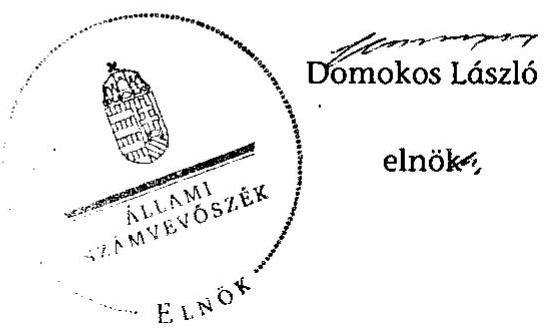
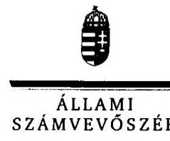
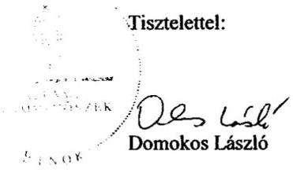

# ÁLLAMI   SZÁMVEVŐSZÉK 

## JELENTÉS

az önkormányzati vagyongazdálkodás
szabályszerűségi ellenőrzéséről
Piliscsaba

---

# Állami Számvevőszék 

Iktatószám: V-0026-040-038/2013.
Témaszám: 1065
Vizsgálat-azonosító szám: V0593005

## Az ellenőrzést felügyelte:

Gyüre Lajosné (2012. december 15-ig)
felügyeleti vezető
Makkai Mária (2012. december 16-tól)
felügyeleti vezető
Az ellenőrzést vezette és az ellenőrzés végrehajtásáért felelős:
Kesjár János
ellenőrzésvezető
Az ellenőrzést végezték:

| Köllödné Gátai Mária | Kincses Erzsébet Eszter | Dr. Zelei Andrásné |
| :-- | :-- | :-- |
| számvevő | számvevő | számvevő |
| Zaroba Szilvia | Szappanos Júlia | Mohl Anna |
| számvevő tanácsos | számvevő tanácsos | számvevő tanácsos |

---

# TARTALOMJEGYZÉK 

BEVEZETÉS ..... 3
I. ÖSSZEGZŐ MEGÁLLAPÍTÁSOK, KÖVETKEZTETÉSEK, JAVASLATOK ..... 5
II. RÉSZLETES MEGÁLLAPÍTÁSOK ..... 10

1. A vagyongazdálkodási tevékenység szabályozottsága ..... 10
1.1. A feladatellátás formáinak meghatározása ..... 10
1.2. A vagyonnal gazdálkodó szervezetek szervezeti rendjének szabályozottsága, a kötelező szabályzatok megfelelősége ..... 11
1.3. A vagyongazdálkodás szabályozása ..... 12
2. A vagyongazdálkodás szabályszerűsége ..... 13
2.1. A vagyon nyilvántartásának megfelelősége ..... 13
2.2. A vagyongazdálkodást érintő gazdasági események követelmények szerinti dokumentáltsága ..... 15
2.3. A vagyongazdálkodási intézkedések, döntések szabályszerűsége ..... 15
3. A vagyonváltozást eredményező döntések jogszerűsége ..... 16
3.1. A vagyon értékének és összetételének változása ..... 16
3.2. Közbeszerzési eljárások alkalmazása ..... 17
3.3. Hitel, kötvénykibocsátás, garancia és kezességvállalás szabályszerűsége ..... 18
3.4. A térítés nélküli átadások szabályszerűsége ..... 19
4. A vagyongazdálkodás szabályszerűségére vonatkozó belső és külső ellenőrzések hasznosulása ..... 20
4.1. A belső ellenőrzés által tett megállapítások, javaslatok hasznosulása ..... 20
4.2. A könyvvizsgálatnak a vagyongazdálkodás szabályosságához való hozzájárulása ..... 22
4.3. A külső ellenőrző szervezet által tett javaslatok hasznosulása ..... 23
MELLÉKLETEK
5. számú Piliscsaba Nagyközség Önkormányzata gazdálkodására jellemző adatok, mutatószámok
6. számú Piliscsaba Nagyközség Önkormányzata vagyonának alakulása
7. számú Piliscsaba Nagyközség Önkormányzata kötelezettségeinek alakulása
8. számú Piliscsaba Város Önkormányzata polgármesterének észrevétele
9. számú A polgármester észrevételére adott válasz

---

# FÜGGELÉKEK 

1. számú Rövidítések jegyzéke
2. számú Értelmező szótár

---

# JELENTÉS 

## az önkormányzati vagyongazdálkodás szabályszerűségi ellenőrzéséről Piliscsaba

## BEVEZETÉS

Az ÁSZ kiemelten fontosnak tartja az Állami Számvevőszékről szóló 2011. évi LXVI. törvény 5. § (4) bekezdése alapján az önkormányzati vagyon kezelésének, a vagyonnal való gazdálkodási szabályok betartásának az ellenőrzését. Az ellenőrzés feladata a vagyongazdálkodással kapcsolatban a közpénzek átláthatósága, nyilvánossága érdekében a jogszabályokban, belső szabályzatokban megfogalmazott előírások érvényesülésének áttekintése. Az ÁSZ nem csak az ellenőrzött szervezet vagyongazdálkodásának a hibáira mutat rá, számon kérve azok kijavítását, hanem megállapításaival, javaslataival segíti a közpénzzel, a közvagyonnal való felelős gazdálkodást.

Az önkormányzati vagyon alapvető funkciója, hogy a közérdeket és egyúttal az önkormányzati célok megvalósítását szolgálja. A feladatellátás terén elsősorban a kötelezően ellátandó feladatok végrehajtását hivatott szolgálni, amely mellett az önként vállalt feladatok ellátása is megvalósulhat.

## Az ellenőrzés célja az Önkormányzatnál annak értékelése volt, hogy:

- a vagyongazdálkodási tevékenységet, annak szervezeti kereteit szabályozták-e;
- az önkormányzati vagyongazdálkodás törvényességét, szabályszerűségét biztosították-e a döntések előkészítése és végrehajtása során;
- jogszerű döntéseken alapult-e a vagyon értékének és összetételének változása;
- a belső ellenőrzés elősegítette-e a vagyongazdálkodás szabályszerű működését, valamint hasznosultak-e a korábbi külső ellenőrzések által tett javaslatok.

Az ellenőrzés típusa: szabályszerűségi ellenőrzés
Az ellenőrzés a 2007. január 1. és 2011. év december 31. közötti időszakra terjedt ki, kitekintéssel a helyszíni ellenőrzés befejezéséig tartó időszak releváns folyamataira. Az egyes közbeszerzési eljárások lefolytatásának ellenőrzése a 2011. évet és a 2012. év I. negyedévét érintette.

Az ellenőrzés jogalapját az Állami Számvevőszékről szóló 2011. évi LXVI. törvény 5. § (4) bekezdése képezte.

---

Az ellenőrzés szakmai módszertana az ÁSZ Ellenőrzési Kézikönyvében foglalt szakmai szabályokon alapult, amely a Legfőbb Ellenőrző Intézmények Nemzetközi Szervezete (INTOSAI) által kiadott nemzetközi standardok (ISSAI) figyelembevételével készült.

A vagyongazdálkodás szabályozottságát a helyi szabályozások (rendeletek, szabályzatok, utasítások) ellenőrzésével végeztük el. A vagyonváltozások köréből az ellenőrizendő tételeket mintavétellel, a számviteli nyilvántartásokból választottuk ki.

Piliscsaba lakosainak száma 2011. január 1-jén 7579 fő volt. A 2010. évi önkormányzati választást követően az Önkormányzat kilenctagú Képviselőtestületének munkáját három állandó bizottság segítette. A helyi önkormányzat mellett a 2007-2011. években három nemzetiségi  ${ }^{1}$ önkormányzat működött. A polgármester a 2010. évi önkormányzati választás óta tölti be tisztségét, a jegyző 2011 novembere óta látja el feladatát. Az Önkormányzat feladatainak végrehajtása érdekében a 2011. évben hat költségvetési intézményt működtetett, amelyből egy önállóan gazdálkodott. A feladatok ellátását egy gazdasági társaság és kettő társulás útján biztosította. Az Önkormányzat többségi tulajdoni részesedéssel gazdasági társaságban nem rendelkezett.

Az Önkormányzatnál a 2007-2011. években a jegyző személye 10 alkalommal változott, a Képviselő-testület egyszer feloszlatta magát, a polgármester személyében kétszer, a vagyongazdálkodás területén a vezető személyében ötször történt változás.

Az Önkormányzat a 2011. évi költségvetési beszámolója szerint 1141,8 millió Ft költségvetési bevételt ért el és 1120,8 millió Ft költségvetési kiadást teljesített, 2011. december 31-én a könyvviteli mérleg szerint 9277,2 millió Ft értékű vagyonnal rendelkezett. A Polgármesteri hivatalban dolgozó köztisztviselők száma 2011. december 31-én 22 fő, az Önkormányzat által foglalkoztatott közalkalmazottak száma 43 fő volt. Az Önkormányzat gazdálkodására jellemző adatokat, mutatószámokat az 1-3. számú mellékletek tartalmazzák.

Az ÁSZ a 2011. évi LXVI. törvény 29. §-a szerint a jelentéstervezetet megküldte Piliscsaba Város Önkormányzata polgármesterének egyeztetésre. A beérkezett észrevételt és az arra adott választ a jelentés 4-5. számú mellékletei tartalmazzák.

[^0]
[^0]:    ${ }^{1}$ német, roma és szlovák

---

# I. ÖSSZEGZŐ MEGÁLLAPÍTÁSOK, KÖVETKEZTETÉSEK, JAVASLATOK 

Az Önkormányzat vagyonának mérleg szerinti értéke a 2007. évi 8379,5 millió Ft-ról a 2011. évre 9277,2 millió Ft-ra, 10,7\%-kal nőtt. A 2007-2011. évek között megvalósult legjelentősebb beruházások az óvoda célú ingatlanvásárlás és felújítás, a művelődési és információs központ létrehozása, valamint közútépítés voltak. A befektetett eszközök a 2007. évi 8262,4 millió Ftról a 2011. évi 9084,3 millió Ft-ra emelkedtek, amelyeken belül a tárgyi eszközök értéke 535,9 millió Ft-tal, 6,6\%-kal növekedett. A hosszú lejáratú kötelezettségek a fejlesztési célú kötvénykibocsátás és a hitelfelvétel miatt a 2007. évi 48,5 millió Ft-ról 2011-re 297,3 millió Ft-ra nőttek. Az Önkormányzat a 2007-2011. évek között összesen 657,8 millió Ft értékű felújítást, illetve beruházást aktivált, a tárgyi eszközökre együttesen 388,1 millió Ft összegű értékcsökkenést számolt el.

Az Önkormányzat vagyongazdálkodási tevékenységét hiányosan szabályozta. Az Áht${ }_{1}$ előírása ellenére helyi rendeletben nem határozta meg az ingyenes vagyonátruházás módjait, annak eseteit. A vagyongazdálkodási rendelet${ }_{2}$ a törzsvagyonba tartozó forgalomképtelen és korlátozottan forgalomképes vagyontárgyak egyes elemeit szabályozó mellékletet nem tartalmazta. A leltározási szabályzat - az Áhsz. előírásai ellenére - nem rendelkezett az üzemeltetésre átadott, törzsvagyon részét képező vagyontárgyak leltározásának részletes szabályairól. A vagyongazdálkodáshoz kapcsolódó szabályozás hiányosságai miatt az Önkormányzat kockázat kivédési képessége az elvárthoz képest alacsony szintű volt. Az Önkormányzat nem rendelkezett számviteli politikával és selejtezési szabályzattal. A leltározási, valamint az eszközök és források értékelési szabályzatát a 2007-2011. évek között nem vizsgálták felül, azokat nem aktualizálták.

A vagyon nyilvántartása során az Önkormányzat nem biztosította teljes körűen a szabályszerűséget. Az ingatlanvagyon kataszter és a földhivatali ingatlan-nyilvántartás azonos tartalmú adatai, valamint az ingatlanvagyon kataszter és a számviteli nyilvántartás adatai közötti egyezőség az adatok egyezőségét alátámasztó dokumentumok hiányában nem volt igazolt. Az Önkormányzat az Ötv. és az Áht. előírásait megsértve 2011. évben nem készített vagyonkimutatást.

Az Önkormányzat a 2007-2011. években a leltározási kötelezettségének eleget tett, az éves mérlegeket - az üzemeltetésre átadott eszközök kivételével - leltár támasztotta alá. Az üzemeltetésre átadott eszközökről az Áhsz. előírásaitól eltérően hiányoztak az üzemeltető által készített, hitelesített leltárak.

A vagyon értékének változása során nem biztosították teljes körűen a szabályszerűséget. Az értékcsökkenést - az Áhsz.-ben előírtakat megsértve - magasabb leírási kulccsal számolták el, emiatt a 2007-2011. években az Önkormányzat vagyoncsökkenésként évente 3,5 millió Ft-tal többet mutatott ki az előírtnál. A Számv. tv.-ben és az Áhsz-ben előírtakkal ellentétben a korábbi

---

évekhez köthető meg nem valósult beruházási tervdokumentációk 45 millió Ft összegét nem számolták el terven felüli értékcsökkenésként, amelynek következtében a 2010. évi beszámolóban nem mutatták be az emiatti vagyoncsökkenést. A Közoktatási Alapítvánnyal Képviselő-testületi határozat alapján kötött közoktatási megállapodásban foglaltak ellenére a feladatellátáshoz szükséges tárgyi eszközök térítésmentes használatba adását térítésmentes átadásként kezelve - 5,8 millió Ft értékű eszközt - a Polgármesteri hivatal könyveiből a 2007. évben kivezették. A 2011. évben a közoktatási megállapodás felmondásáról határozott a Képviselő-testület, de a határozatban az eszközök sorsáról nem rendelkezett.

A vagyonváltozással kapcsolatos jogokat kizárólag a Képviselő-testület gyakorolta. A vagyonnövekedéssel járó beszerzések lebonyolításakor eleget tettek a versenyeztetési kötelezettségnek. A vagyonértékesítés során - az Áht.-ben foglaltak alapján - a szerződésekbe beépítették az Önkormányzat érdekeit védő garanciális elemeket. A Képviselő-testület megfelelő információk hiányában döntött, mert a vagyonváltozással kapcsolatos döntéseinek előterjesztései és döntés-előkészítési dokumentációi a belső szabályozás ellenére nem tartalmaztak gazdaságossági számításokat, szakértői értékbecsléseket.

A beruházások előkészítése során a létrehozott létesítmények fenntarthatóságát nem vizsgálták, azokról nem készültek megvalósíthatósági tanulmányok. A beruházások és felújítások megvalósítása során lefolytatták a Kbt.${ }_{1,2}$-ben előírt esetekben a közbeszerzési eljárást és eleget tettek az egybeszámítási kötelezettségnek. Az Önkormányzat a 2011-2012. évekre vonatkozó közbeszerzési terveit nem a közbeszerzési szabályzatban előírt tartalomnak megfelelően készítette el, mivel azok a beszerezni kívánt eszközök, szolgáltatások becsült értékét nem tartalmazták.

Az Önkormányzat belső szabályzataiban meghatározott gazdálkodási jogkörök gyakorlása - a vagyongazdálkodás ellenőrzéséhez kiválasztott tételek esetében - a bevételek kivételével megfelelő volt. A bevételekhez utalványrendeletet nem állítottak ki, az érvényesítést, a szakmai teljesítésigazolást és az utalványozást nem végezték el.

Az Önkormányzat - iskolák és óvodák felújításának finanszírozására való 2005. évi hitel felvételénél a hitel fedezete - a 2015 szeptemberéig tartó futamidő alatt - költségvetési bevétel. Az Önkormányzat ezzel megsértette az Ötv.-ben foglaltakat, mivel a fedezetként felajánlott költségvetési bevételek magukban foglalják a normatív állami hozzájárulás, az állami támogatás, a személyi jövedelemadó, valamint az államháztartáson belülről működési célra átvett bevételek összegét is, amelyek hitel fedezeteként nem használhatók fel.

Az Önkormányzat a belső ellenőrzési feladatait egyidejűleg megbízott belső ellenőr és Kistérségi társulás útján látta el, azonban a belső ellenőrzési feladatok ellátásának szabályozásánál az önkormányzati SZMSZ${ }_{1-4}$ csak a megbízott belső ellenőr feladatait tartalmazta. A jegyző a Ber.-ben előírt feladatok ellátására nem jelölt ki belső ellenőrzési vezetőt. A Ber. előírásai ellenére a 2007-2011. években a belső ellenőrzésekről nem vezettek nyilvántartást. A belső ellenőrzési terveket megalapozó kockázatelemzés nem a belső ellenőrzési kézikönyvben rögzített minta és kockázat-értékelési tartalommal készült. Az elké-

---

szült éves ellenőrzési jelentések nem voltak egységesek, csak részben feleltek meg a belső ellenőrzési kézikönyvben rögzített tartalmi és formai, valamint a Ber.-ben előírt tartalmi követelményeknek (például több esetben nem tartalmazták az ellenőrzés célját, kezdetét és végét stb.). A megbízott belső ellenőr a 2007-2011. években 11 alkalommal, a Kistérségi társulás egy alkalommal végzett vagyongazdálkodáshoz kapcsolódó ellenőrzést. Valamennyi ellenőrzési jelentésben hiányosságokat állapítottak meg. A feltárt hibákra - a Képviselőtestület által hozott kiemelt
 eseteket érintő egyedi intézkedések kivételével - az ellenőrzött szervezetek vezetői intézkedési tervet nem készítettek. Az Önkormányzat a vagyongazdálkodás szabályszerűségére tett megállapításokat nem hasznosította, ezáltal a belső ellenőrzés a vagyongazdálkodás szabályszerű működését nem segítette elő.

Az évente elvégzett könyvvizsgálat az Önkormányzat egyszerűsített összevont éves költségvetési beszámolóját minden évben megbízhatónak és hitelesnek minősítette, azonban figyelemfelhívó megjegyzést tartalmazott az ingatlanvagyon forgalomképesség szerinti aktualizálására, egyeztetésére és további szabályozási hiányosságokra vonatkozóan. A könyvvizsgálói jelentések három évben állapítottak meg vagyonnal kapcsolatos auditálási eltéréseket, amely két esetben a mérlegsoron kimutatott értékek között végrehajtott korrekcióból, egy esetben a befektetett pénzügyi eszközök és a tőkeváltozás értékének növeléséből adódtak. A könyvvizsgáló ugyanakkor nem tárta fel a leltárral, a leltározási szabályzattal, valamint az értékcsökkenés elszámolásával kapcsolatos hiányosságokat. A könyvvizsgálói észrevételeken és javaslatokon túl jelen ellenőrzés is állapított meg eltérést, illetőleg nem megfelelő könyvelést, amelyek azonban nem érték el a jelentős összegű hibahatárt, a megbízható és valós képet lényegesen befolyásoló hibát nem okoztak, a mérleg valódiságát nem befolyásolták. Külső ellenőrző szervezet a 2007-2011. években nem ellenőrizte az Önkormányzat vagyongazdálkodását.

Az Állami Számvevőszékről szóló 2011. évi LXVI. törvény 33. § (1) bekezdésében foglaltak értelmében a jelentésben foglalt megállapításokhoz kapcsolódó intézkedési tervet köteles az ellenőrzött szervezet vezetője összeállítani, és azt a jelentés kézhezvételétől számított 30 napon belül az ÁSZ részére megküldeni. Amennyiben az intézkedési tervet határidőben nem küldi meg a szervezet, vagy az nem elfogadható, az ÁSZ elnöke a hivatkozott törvény 33. § (3) bekezdés a)-b) pontjaiban foglaltakat érvényesítheti.

Az ellenőrzés intézkedést igénylő megállapításai és javaslatai:

# a Jegyzőnek 

1. A Számv. tv. 14. § (3)-(5) bekezdéseinek előírása ellenére a Polgármesteri hivatal nem rendelkezett számviteli politikával és a hozzá tartozó kötelező szabályzatok közül selejtezési szabályzattal, valamint a 2007-2011. évek között a leltározási és értékelési szabályzatot a Számv. tv. 14. § (11) bekezdésének megfelelően nem aktualizálták.

---

Javaslat
Intézkedjen a Számv. tv. 14. § (11) bekezdésének megfelelően a számviteli politika és a hozzá tartozó kötelező szabályzatok teljes körű elkészítéséről és a szükséges aktualizálásról.
2. Az üzemeltetésre átadott eszközök leltározásának módját a leltározási szabályzat nem tartalmazta, az Áhsz. 37. § (4)-(5) bekezdésének rendelkezéseit figyelmen kívül hagyva.

Javaslat
Intézkedjen az üzemeltetésre átadott eszközök leltározásának az Áhsz. 37. § (4)-(5) bekezdésében előírtaknak megfelelő szabályozásáról.
3. Az Önkormányzatnál a 147/1992. (XI. 6.) Korm. rendelet 1. § (2)-(3) bekezdésében foglalt előírások ellenére az ingatlanvagyon kataszter és a földhivatali ingatlannyilvántartás azonos tartalmú adatai, valamint az ingatlanvagyon kataszter és a számviteli nyilvántartás adatai közötti egyezőség az adatok egyezőségét alátámasztó dokumentumok hiányában nem igazolt.

Javaslat
Intézkedjen arról, hogy dokumentumokkal igazoltan a 147/1992. (XI. 6.) Korm. rendelet 1. § (2) bekezdésében rögzítetteknek megfelelően biztosítsák az ingatlanvagyon kataszter adatai egyezőségét a földhivatali ingatlan-nyilvántartás azonos tartalmú adataival, továbbá az 1. § (3) bekezdésében foglaltakra figyelemmel biztosítsák az egyezőséget az ingatlanvagyon kataszter adatai és a számviteli nyilvántartás adatai között.
4. A 2007-2011. években a Ber. 32. § (1) bekezdésében előírtak ellenére a belső ellenőrzésekről nem vezettek nyilvántartást.

Javaslat
Intézkedjen a Bkr. 50. § (1) bekezdésében foglalt előírásoknak megfelelő, az elvégzett belső ellenőrzésekről szóló nyilvántartás vezetéséről.
5. Az iskolák és óvodák felújításának finanszírozására való hitel felvételénél a hitel fedezete - a 2015 szeptemberéig tartó futamidő alatt - költségvetési bevétel. Az Önkormányzat ezzel megsértette az Ötv. 88. § (1) bekezdés b) pontjában foglaltakat, mivel a fedezetként felajánlott költségvetési bevételek magukban foglalják a normatív állami hozzájárulás, az állami támogatás, a személyi jövedelemadó, valamint az államháztartáson belülről működési célra átvett bevételek összegét is, amelyek hitel fedezeteként nem használhatók fel.

Javaslat
Intézkedjen az Áht. 2 84. § (4) bekezdéssel ellentétes állapot megszüntetésére, a hitelfedezetre jogszerű ügyleti biztosítékok kijelölésével.

---

6. A belső ellenőrzés által a vagyongazdálkodás területén feltárt hiányosságok megszüntetésére a Ber. 29. § (1) bekezdés előírása ellenére nem készültek intézkedési tervek. Az Önkormányzat a vagyongazdálkodás szabályszerűségére tett megállapításokat nem hasznosította, ezáltal a belső ellenőrzés a vagyongazdálkodás szabályszerű működését nem segítette elő.

Javaslat
Intézkedjen, hogy a Bkr. 28. § c) pontjában előírtaknak megfelelően készüljön intézkedési terv a belső ellenőrzés által feltárt, a vagyongazdálkodás területét is érintő hiányosságok megszüntetésére, továbbá az intézkedési tervben foglaltak végrehajtására.

---

# II. RÉSZLETES MEGÁLLAPÍTÁSOK 

## 1. A VAGYONGAZDÁLKODÁSI TEVÉKENYSÉG SZABÁLYOZOTTSÁGA

### 1.1. A feladatellátás formáinak meghatározása

Az Önkormányzat a 2007-2011. évekre vonatkozó vagyongazdálkodási célkitűzéseit, feladatait a gazdasági program ${ }_{1,2}$-ben határozta meg. A gazdasági program ${ }_{1}$-ben a település üzemeltetés színvonalának emelését, az infrastruktúra fejlesztését, az oktatási intézmények racionálisabb működtetését, közművelődési, tudományos, művészeti, valamint sporttevékenység fejlesztését, az egészségügyi, szociális feladatokat, illetve a hatékonyabb gazdálkodást jelölték meg. A gazdasági program ${ }_{1}$-et a Képviselő-testület a 2009. május 10-i időközi választást követően az Ötv. 91. § (7) bekezdésében foglaltak alapján felülvizsgálta és jóváhagyta. A gazdasági program ${ }_{2}$-ben a község csapadékvíz elvezetési problémáinak felszámolását, a közúthálózat javítását, karbantartását, a szennyvízcsatorna rendszer kiépítését, fejlesztését, a hiányos közvilágítás megoldását, az óvodai férőhely hiány megszüntetését és munkahely teremtési célokat határozták meg.

A 2007-2011. években az önkormányzati SZMSZ ${ }_{1,4}$-ben a kötelezően ellátandó feladatokat rögzítették, az Ötv. előírásának megfelelően az egészséges ivóvízellátást, az óvodai nevelést, az általános iskolai oktatást és nevelést, az egészségügyi és a szociális alapellátást, a közvilágítás biztosítását, a helyi közutak, valamint a köztemető fenntartását határozták meg feladatként.

A Képviselő-testület 2007. április 24-én határozatban² döntött a szociális, gyermekjóléti és házi segítségnyújtás terén Pilisjászfalu és Tinnye Önkormányzataival az Intézményi társulás létrehozásáról. A belépéssel az Önkormányzat vagyona nem változott, mivel az ellátás helye, így az ehhez szükséges épületek és ingóságok az Önkormányzat tulajdonában maradtak.

Az önkormányzati SZMSZ ${ }_{3}$-ban az önként vállalt feladatokat nem határozták meg. ${ }^{3}$ Az önkormányzati SZMSZ ${ }_{1,2,4}$-ben a helyi sportolási- és szabadidő eltöltési lehetőségek megteremtését, az épített és természeti környezet védelmét és fejlesztését nevesítették önként vállalt feladatként.

[^0]
[^0]:    ${ }^{2}$ a 85/2007. (IV. 24.) számú Képviselő-testületi határozat alapján
    ${ }^{3}$ Az önkormányzati SZMSZ ${ }_{3}$ szerint „Az önként vállalt feladatokról a Képviselő-testület a költségvetés elfogadásakor dönt", azonban a költségvetésekben nem határozták meg, hogy mely feladatokat látnak el önként, nem kötelező feladatként.

---

# 1.2. A vagyonnal gazdálkodó szervezetek szervezeti rendjének szabályozottsága, a kötelező szabályzatok megfelelősége 

A Polgármesteri hivatal alapító okiratában a Képviselő-testület meghatározta a szervezet közfeladatait, alaptevékenységét. Az Ámr. ${ }_{2}$ 20. § (2) bekezdés b) pontjában előírt kötelező tartalmi elemek közül a hivatali SZMSZ ${ }_{1,2}$ nem tartalmazta a Polgármesteri hivatal alapító okiratának keltét, az alapító okirat számát, az alapítás időpontját.

Az ügyrendet az önkormányzati SZMSZ 2 1. számú mellékleteként hagyta jóvá a Képviselő-testület, amely ellentétes az Ámr. ${ }_{1}$ 17. § (5) bekezdésével. Az ügyrend jóváhagyásakor érvényes jogszabályi rendelkezés szerint „a gazdasági szervezet ügyrendet készít", amely alapján a gazdasági szervezet vezetője felelős az ügyrend elkészítéséért. A hivatali SZMSZ ${ }_{1,2}$ és az önkormányzati SZMSZ ${ }_{1-4}$ változásait az ügyrenden nem vezették át, az Ámr. ${ }_{1-2}$-őt érintő jogszabályi változásokat követően a felülvizsgálata nem történt meg.

A Képviselő-testület vagyont érintő hatáskör átruházásról nem döntött, a tulajdonosi jogokat kizárólag a Képviselő-testület gyakorolta.

A Polgármesteri hivatal Számv. tv-ben meghatározott kötelező szabályzatait a vagyongazdálkodás szempontjából nem az előírásoknak és a helyi sajátosságoknak megfelelően készítették és fogadták el. A számviteli politika jóváhagyására, kiadmányozására nem került sor, ${ }^{4}$ ezáltal a Polgármesteri hivatal nem rendelkezett hatályos számviteli politikával, megsértve a Számv. tv. 14. § (3)-(4) bekezdését. A 2004. évben készült selejtezési szabályzat jóváhagyása, illetve kiadmányozása szintén nem történt meg a vizsgált időszakban. Ennek következtében nem rendelkeztek selejtezési szabályzattal, megsértve a Számv. tv. 14. § (4) bekezdését, valamint az Áhsz. 37. § (5) bekezdését. A 2004. évben kiadott leltározási szabályzatot a polgármester hagyta jóvá, amely ellentétes az Áhsz. 8. § (12) bekezdésével, mely szerint a számviteli politika jóváhagyásáért - amelynek keretében a leltározási szabályzatot is el kell készíteni „és annak végrehajtásáért az államháztartás szervezetének vezetője felelős". Az eszközök és források értékelési szabályzata is a 2004. évben készült, melynek a felülvizsgálatára a selejtezési és a leltározási szabályzatokkal együtt a Számv. tv. 14. § (11) bekezdését megsértve nem került sor. ${ }^{5}$

A leltározási szabályzatban az évenkénti leltározásról döntött a polgármester, azonban az Áhsz. 37. § (4)-(5) bekezdéseit megsértve nem rendelkezett az üzemeltetésre átadott vagyontárgyak leltározásának részletes szabályairól.

Az Önkormányzat a 2012. január 1-jétől hatályos Nvtv. 5. § (1)-(4) bekezdéseit figyelembe véve a helyszíni ellenőrzés időpontjáig nem vizsgálta felül vagyonának besorolását, nem határozta meg helyi rendeletben a nemzetgazda-

[^0]
[^0]:    ${ }^{4}$ A dokumentum a keltezése szerint 2006. évben készült.
    ${ }^{5}$ A Kistérségi társulás 4-3/2011. iktatószámú belső ellenőri jelentésében elkészítendő szabályozásként határozták meg a számviteli politikát és a kapcsolódó szabályzatokat, valamint javasolták azok folyamatos felülvizsgálatát.

---

sági szempontból kiemelt jelentőségű nemzeti vagyonnak minősülő vagyonelemeket. Nem készített az Nvtv. 9. § (1) bekezdésével összhangban közép- és hosszú távú vagyongazdálkodási tervet.

A kötelező szabályozási hiányosságok miatt az Önkormányzat kockázat kezelése, integritás ${ }^{6}$ védettsége az elvárthoz képest alacsony szintű volt.

# 1.3. A vagyongazdálkodás szabályozása 

Az Önkormányzat vagyonával való gazdálkodását a 2007-2011. években az SZMSZ ${ }_{1-4}$-ben, továbbá vagyongazdálkodási rendelet ${ }_{1,2}$-ben szabályozta. A vagyongazdálkodási rendelet ${ }_{1,2}$ hatálya az Önkormányzat tulajdonában álló ingatlanokra és ingó vagyontárgyakra, valamint vagyoni értékű jogokra, tulajdoni részesedést jelentő befektetésekre, hitelviszonyt megtestesítő értékpapírokra, tartósan adott kölcsönökre, egyéb követelésekre terjedt ki. Az Önkormányzat tulajdonában lévő bérlakások elidegenítésére vonatkozó szabályokat a 2009. évtől a lakásgazdálkodási rendeletben szabályozták.

Az Önkormányzat a vagyongazdálkodási rendelet ${ }_{1,2}$-ben meghatározta az önkormányzati feladatellátást biztosító törzsvagyon - azon belül a forgalomképtelen és korlátozottan forgalomképes vagyontárgyak - besorolásának szempontjait, valamint szabályozta az önkormányzati feladatellátást biztosító törzsvagyon nyilvántartási rendjét, a forgalomképesség megváltoztatásának döntési szintjét, eljárási rendjét, a besorolás módosításának feltételeit. ${ }^{7}$ A törzsvagyonba tartozó forgalomképtelen és korlátozottan forgalomképes vagyontárgyak egyes elemei tekintetében az azt szabályozó mellékletre hivatkozott, de a mellékletet a vagyongazdálkodási rendelet ${ }_{2}$ nem tartalmazta.

Az Önkormányzat megsértette az Áht. ${ }_{1}$ 108. § (2) bekezdésben előírtakat, mivel 2007 júliusától sem a vagyongazdálkodási rendelet ${ }_{2}$, sem egyéb rendelet az ingyenes vagyonátruházás szabályait nem tartalmazta. Az Önkormányzat a tulajdonát képező ingatlanok és vagyoni értékű jogok elidegenítésének és hasznosításának pályázati rendjét a vagyongazdálkodási rendelet ${ }_{2}$-ben szabályozta.

Az Önkormányzat nem alakította ki a vagyongazdálkodást érintő előterjesztések készítésének, megtárgyalásának, véleményezésének, döntéshozatalának rendjét, megsértve az Ötv. 18. § (1) és a 23. § (1) bekezdéseit. Ezáltal a vagyongazdálkodással kapcsolatos szabályozás nem biztosította a döntéshozatal
 egységes rendjét.

A Polgármesteri hivatal a gazdálkodási jogkörök gyakorlásának rendjét, a felhatalmazottak körét, a velük kapcsolatos összeférhetetlenségi követelményeket a 2007-2009. években a pénzgazdálkodási jogkörök szabályzatában

[^0]
[^0]:    ${ }^{6}$ az adott szervezet célhoz kötött működését jelenti, azaz a rendeltetésszerű működés követelményeinek maradéktalan érvényre juttatását
    ${ }^{7}$ A besorolás módosításához a Képviselő-testület minősített többséggel meghozott döntésére volt szükség.

---

és a kötelezettségvállalási szabályzatban, a 2010. évtől a gazdálkodási szabályzatában határozta meg.

A hivatali SZMSZ ${ }_{2}$-ben a Gazdasági iroda kötelezettségeként előírták az Önkormányzat döntési hatáskörébe tartozó ügyekkel kapcsolatos gazdasági-pénzügyi szakvélemény elkészítését, elemzéseket, gazdaságossági számításokat és hatékonysági vizsgálatok végzésének kötelezettségét. Az Önkormányzat a döntés-előkészítés folyamatában nem írta elő a tulajdonosi jogainak, érdekeinek védelmét szolgáló garanciális elemek szerződésben, egyéb dokumentumban való rögzítésének, valamint a hitelfelvételről, kötvénykibocsátásról szóló döntés-előkészítés folyamatában a futamidő egyes éveit terhelő kötelezettség költségvetési egyensúlyra gyakorolt hatásvizsgálatának kötelezettségét.

Az Önkormányzati SZMSZ ${ }_{1-4}$-ben a PEB feladataként határozták meg a vagyon változásának figyelemmel kísérését és az előidéző okok értékelését, azonban beszámolási kötelezettséget nem írtak elő a figyelemmel kísérés és értékelés eredményéről. A PEB a vagyon változását nem kísérte figyelemmel, erről az Ötv. 92. § (13) bekezdése b) pontja és a (14) bekezdésben ${ }^{8}$ foglalt előírásokkal ellentétben évente nem számolt be a Képviselő-testületnek.

A Képviselő-testület az önkormányzati SZMSZ ${ }_{4}$-ben a jogszabályi előírásnál szigorúbb közzétételi kötelezettséget írt elő, mivel nem ötmillió Ft-ban, hanem nettó egymillió Ft-ban határozta meg a vagyonnal való gazdálkodással összefüggő szerződések határértékét. A céljellegű működési és fejlesztési támogatások esetében a jogszabályi előírásokkal azonos módon - kettőszázezer Ft értékhatárig - határozták meg a közzététel mellőzését.

Az éves költségvetési koncepció, a költségvetés és a beszámoló elkészítési rendjét, tartalmát, munkafolyamatainak felelőseit a vagyongazdálkodásra vonatkozóan az önkormányzati $\mathrm{SZMSZ}_{1-4}$ a hivatali $\mathrm{SZMSZ}_{1,2}$, az ügyrend és az önkormányzati költségvetési rendeletek tartalmazták.

# 2. A VAGYONGAZDÁLKODÁS SZABÁLYSZERŰSÉGE 

### 2.1. A vagyon nyilvántartásának megfelelősége

Az Önkormányzat a 2007-2010. évek között a zárszámadáshoz az Ötv. 78. § (2) bekezdésében rögzítettek alapján a vagyonkimutatást elkészítette. A 2011. évben az Ötv. 78. § (2) bekezdésének és az Áht ${ }_{1}$. 118. § (2) bekezdés c) pontjának előírásaival ellentétben a vagyonállapotáról az éves zárszámadáshoz nem készített kimutatást.

Az Önkormányzat főkönyvi kivonata az Áhsz. 9. számú melléklete 1/k.) pontjának megfelelően tartalmazta a törzsvagyon (ezen belül a forgalomképtelen, illetve korlátozottan forgalomképes), illetve a törzsvagyonba nem tartozó (forgalomképes) tárgyi eszközök állományát. Az analitikus nyilvántartások biztosí-

[^0]
[^0]:    ${ }^{8}$ 2012. január 1-től az Mötv. 120. § (1)-(2) bekezdései

---

tották a vagyon forgalomképesség alapján történő elkülönítését, a törzsvagyont az egyéb vagyonelemektől elkülönítve mutatták ki.

A 147/1992. (XI.6) Korm. rendelet 1. § (3) bekezdésében foglaltak ellenére a számviteli kimutatásokban szereplő ingatlanvagyon, valamint a vagyonkataszter nyilvántartás adatai évenkénti egyezőségéről dokumentum nem állt rendelkezésre, a teljes körű egyeztetés, az eltérések kiértékelése nem volt igazolt. A 147/1992. (XI. 6.) Korm. rendelet 1. § (2) bekezdésben előírt vagyonkataszter ingatlan adatlapjának, betétlapjainak és a földhivatal ingatlan-nyilvántartás azonos tartalmú adatai közötti egyezőség az adatok egyezőségét alátámasztó dokumentumok hiányában nem volt igazolt.

A Kistérségi társulás a 2011. évben az ingatlan vagyonkataszter, a vagyonkimutatás és az analitikus nyilvántartások egyezőségét vizsgálta a 2010. év végi állapotnak megfelelően. Megállapításuk szerint a mérleghez készített leltár és analitika egyeztetéséről jegyzőkönyv készült, a „leltározási-selejtezési tevékenység jónak értékelhető", a földhivatali nyilvántartással való egyeztetés nem történt meg.

Az Önkormányzat a 2007-2011. években a leltározási kötelezettségének eleget tett, azonban több vonatkozásban eltért a leltározási szabályzatban előírtaktól, így pl. az ütemtervek, a leltárzáró jegyzőkönyvek elkészítése, illetve a dokumentálás során.

Az Önkormányzat könyvvizsgálója jelentésében minden évben rögzítette, hogy a leltárfelvételnél személyesen nem vett részt, azok előkészítését megfelelőnek tartotta, utólagos ellenőrzésüket elvégezte, továbbá, hogy az éves zárást analitikai egyezőség és könyvi leltár támasztja alá. Záradékában a leltározással kapcsolatosan észrevételt nem tett.

A 2009-2011. években az Áhsz. 37. § (4) bekezdésének előírásától ${ }^{9}$ eltérően az üzemeltetésre átadott eszközök leltározásánál hiányoztak az üzemeltető által elkészített, hitelesített leltárak. Így a Vízművek Kft.-nek üzemeltetésre átadott eszközök mérlegsora, valamint az - üzemeltetésre átadott vagyontárgyak után - évenként megállapított eszközhasználati díjból keletkező önkormányzati bevétel számításának módja nem volt követhetően alátámasztott. Az eszközhasználati díjat a Vízművek Kft. állapította meg az Önkormányzat részére.

A beszámoló - az üzemeltetésre átadott eszközöket is tartalmazó - egyéb vagyonnövekedési sorát alátámasztó adatok értéke analitikus nyilvántartásból nem volt megállapítható, ezáltal a beszámoló kiegészítő mellékletében feltüntetett vagyonnövekedést teljes körű részletező dokumentum nem támasztotta alá.

A 38. úrlap adatai szerint az egyéb immateriális javak, ingatlanok és kapcsolódó vagyonértékű jogok, gépek, berendezések és felszerelések, üzemeltetésre átadott eszköz növekedés bruttó értéke a 2007. évben 92,2 millió Ft, a 2008. évben 28,1 millió Ft, a 2009. évben 509,0 millió Ft, a 2010. évben 341,4 millió Ft, a 2011. évben 10,0 millió Ft volt.

[^0]
[^0]:    ${ }^{9}$ megállapította a 317/2009. (XII. 29.) Korm. rendelet 18. §-a (hatályos: 2010. január 1-jétől, először a 2010. évről készített beszámolókra kellett alkalmazni)

---

# 2.2. A vagyongazdálkodást érintő gazdasági események követelmények szerinti dokumentáltsága 

A vagyongazdálkodással kapcsolatban a gazdálkodási jogköröket a kijelölt és írásban felhatalmazott személyek gyakorolták. A vagyongazdálkodáshoz kapcsolódóan ellenőrzött gazdasági események vonatkozásában a gazdálkodási jogkörök gyakorlása során érvényesültek az Ámr. ${ }_{1-2}$-ben előírt összeférhetetlenséget érintő követelmények. A gazdálkodási jogkörök gyakorlása során - a bevételek kivételével - betartották a vonatkozó jogszabályokban és belső szabályzatokban előírtakat. A bevételek esetében azonban a kötelezettségvállalási, valamint a pénzgazdálkodási jogkörök szabályzatában előírtakat nem tartották be, a bevételekhez utalványrendeletet nem állítottak ki, az érvényesítést a Gazdasági Iroda vezetője, a szakmai teljesítésigazolást a jegyző által kijelölt személyek, az utalványozást a polgármester vagy az általa felhatalmazott személyek nem végezték el. ${ }^{10}$

A jegyző eleget tett az Áht ${ }_{1}$. 15/A-B. §-ok, valamint az Eisztv. 6. § (1) bekezdésében foglalt előírásoknak. A vagyonnal összefüggő, a nettó ötmillió, illetve az Önkormányzat SZMSZ-ében előírt egymillió forintot elérő vagy azt meghaladó értékű - árubeszerzésre, építési beruházásra, szolgáltatás megrendelésre, vagyonértékesítésre, vagyonhasznosításra, vagyon vagy vagyoni értékű jog átadására, valamint koncesszióba adásra vonatkozó - szerződések adatait, az éves költségvetést és beszámolót a honlapon közzétették.

### 2.3. A vagyongazdálkodási intézkedések, döntések szabályszerűsége

A Képviselő-testület a vagyongazdálkodást érintően döntött az Önkormányzat rövid- és hosszú lejáratú kötelezettségvállalásairól.

A vagyonváltozással kapcsolatos (törzsvagyont érintő átminősítés, vagyonelem értékesítés) Képviselő-testületi döntések előterjesztései, a döntés-előkészítés dokumentációi hiányosak voltak. A megalapozott döntéshozatal érdekében nem tartalmaztak alternatív javaslatokat, a határozati javaslatok indoklását, és a belső szabályozás ellenére gazdaságossági számításokat, szakértői értékbecsléseket, emiatt a Képviselő-testület megfelelő információk hiányában döntött.

A vagyonelemek értékesítése során betartották az Áht. ${ }_{1}$ 108. § (1) bekezdésében előírtakat, mert a 2009. évi költségvetési törvényben meghatározott 25,0 millió Ft összegű forgalmi értékhatár feletti vagyont nyilvános versenyeztetés útján, a legjobb ajánlatot tevő részére értékesítették. A vagyonnövekedések esetén a beszerzések lebonyolításával kapcsolatos eljárásrendről szóló szabályzatban foglaltak szerint - több árajánlat bekérésével - eleget tettek a versenyeztetési kötelezettségnek. A beruházások előkészítése során a beruházással létrehozott létesítmények fenntarthatóságát nem vizsgálták, azokról nem készült megvalósíthatósági tanulmány.

[^0]
[^0]:    ${ }^{10}$ Ámr. ${ }_{2}$ 76. § (5), 78. § előírásai, 2012. január 1-jétől Ávr. 57.-59. § előírásai

---

# 3. A VAGYONVÁLTOZÁST EREDMÉNYEZŐ DÖNTÉSEK JOGSZERŰSÉGE 

### 3.1. A vagyon értékének és összetételének változása

Az Önkormányzat mérlegfőösszege folyamatosan emelkedett, a 2007. évi 8379,5 millió Ft-ról a 2011. évre 9277,2 millió Ft-ra, 10,7\%-kal nőtt, amely elsősorban a tárgyi eszközök értékének növekedése miatt következett be.

A 2007-2011. években a befektetett eszközökön belül a tárgyi eszközök 535,9 millió Ft-tal, 6,6\%-kal növekedtek. A legjelentősebb beruházások az óvoda célú ingatlanvásárlás (80,0 millió Ft), az óvoda felújítás (43,0 millió Ft), és az európai uniós támogatásból (KMOP) megvalósult két beruházás - a művelődési és információs központ létrehozása (114,9 millió Ft), valamint a közútépítés (160,8 millió Ft) - voltak.

Az Önkormányzat jelentős ingatlanvagyonnal rendelkezett, melynek értéke a 2007. évben 7771,3 millió Ft, a 2011. évben 8360,5 millió Ft volt, ami a mérlegfőösszegnek 2007-ben 92,7-át, 2011-ben pedig 90,1\%-át képezte.

Az Önkormányzat a 2007-2011. évek között a tárgyi eszközökre együttesen 388,1 millió Ft összegű értékcsökkenést számolt el. 2007-ről 2011-re az eszköz használhatósági fok mutató az elszámolt értékcsökkenés hatására 94,9\%-ról 92,2\%-ra csökkent, azaz az eszközök avultsága 2,7 százalékponttal növekedett. A 2007-2011. évek között összesen 657,8 millió Ft értékű felújítást, illetve beruházást aktiváltak, ebből a felújítási kiadások összege 153,9 millió $\mathrm{Ft}^{11}$ volt.

Az Önkormányzat a 2007-2011. években 50,3 millió Ft értékben intézményeinek felújítását, 45,1 millió Ft értékben utak felújítását, 21,6 millió Ft értékben vízi közmű és szennyvízelvezetés felújítását, 12,0 millió Ft értékben ravatalozó felújítását valamint 24,9 millió Ft értékben egyéb felújításokat végzett el.

2010-ben a könyvvizsgáló javaslatára a Képviselő-testület a 234/2010. (XI. 23.) számú határozatában döntött arról, hogy a beruházások között kimutatott, évek óta változatlan értékkel és tartalommal szereplő, meg nem valósult beruházásokhoz kapcsolódó tervdokumentációk elkészítésének díja - összesen 45,0 millió Ft - terven felüli értékcsökkenésként kivezetésre kerüljön az Önkormányzat könyveiből. A kivezetett összeg az új oktatási központ 2002. évben elszámolt tervdokumentáció értékéből (25,4 millió Ft), az óvoda 2008. évben elszámolt tervezési díjából (13,7 millió Ft) és a szennyvízhálózat 1998-2002. évek között több részletben elszámolt tervezési díjából (5,9 millió Ft) állt össze. A kivezetést a határozattal ellentétben nem számolták el terven felüli értékcsökkenésként, amellyel nem tartották be a Számv. tv. 53. § (1) bekezdésében, valamint az Áhsz. 9. számú mellékletének Számlaosztályok tartalmára vonatkozó 9. f) pontban foglalt előírásokat. Így a 2010. évi beszámolóban nem mutatták ki a terven felüli értékcsökkenés okozta vagyoncsökkenést.

[^0]
[^0]:    ${ }^{11}$ A helyszíni ellenőrzés során módosított összeg, mivel a 2011. évi beszámolóban nem a beszerzések, létesítések, hanem hibásan a felújítások között mutatták ki a művelődési és információs központ beruházását (114,9 millió Ft).

---

A 2007-2011. évi zárszámadási rendelettervezetek Képviselő-testület elé történő beterjesztéséhez kapcsolódó előterjesztésekben nem mutatták be az eszközpótlásra fordított tényleges kiadásokat. Az Önkormányzat a vagyon elhasználódásának pótlására nem dolgozott ki módszert.

Az Önkormányzat a beszámolójában kimutatott értékcsökkenést hibásan számolta el, mivel az óvoda épületét az épületek helyett az építmények közé sorolták be. Emiatt nem az Áhsz. 30. § (2) bekezdés d) pontjában és a számviteli politikában előírt 2\%-os értékcsökkenéssel számoltak, hanem 3\%-os leírási kulcsot alkalmaztak, aminek következtében a 2007-2011. években értékcsökkenésként évente 3,5 millió Ft-tal többet számoltak el.

Az Önkormányzat a 2007-2011. években gazdasági társaságban nem rendelkezett többségi tulajdonnal. Az elektronikus céginformációs adatbázis
 alapján az Önkormányzat két gazdasági társaságban rendelkezett minősített többségű befolyást nem biztosító szavazati joggal. A részesedéseket az Önkormányzat az éves beszámolójában, a 2009-2011. években 2,0 millió Ft értékben mutatta ki. Az Ister-Granum Eurorégió Fejlesztési Ügynökség Nonprofit Kft.-ben ${ }^{12}$ 0,7 millió Ft jegyzett tőkével (6,54\%), a Piliscsabai Vízművek Kft.-ben 40\%-os tulajdoni részaránya volt, 1,2 millió Ft jegyzett tőkével. 0,1 millió Ft részesedésről dokumentum nem állt rendelkezésre.

A hosszú lejáratú kötelezettségek összege a 2007. évi 48,5 millió Ft-ról 2011-re 297,3 millió Ft-ra, több mint hatszorosára nőtt, melynek oka a 2010. évi 200 millió Ft értékű kötvénykibocsátás és a 2009-ben csatornaközmű fejlesztéshez kapcsolódó 104 millió Ft éven túli lejáratú beruházási hitelfelvétel kötelezettségnövelő hatása, valamint a bekövetkezett árfolyamváltozás volt.

A polgármester - az Áht., 50/A. § (4) bekezdésben foglalt előírást megsértve az önkormányzati választásokat megelőzően nem tett közzé részletes jelentést az Önkormányzat vagyoni és pénzügyi helyzetéről, illetve a későbbi éveket terhelő pénzügyi kötelezettségekről.

# 3.2. Közbeszerzési eljárások alkalmazása 

Az Önkormányzat a 2011. évben és a 2012. év I. negyedévében lefolytatta az éves költségvetésében tervezett beruházások és felújítások megvalósítása során a Kbt. ${ }_{1,2}$-ben előírt esetekben a közbeszerzési eljárásokat. A beruházások és felújítások tekintetében eleget tett a Kbt. ${ }_{1,2}$-ben foglalt egybeszámítási kötelezettségnek.

Az Önkormányzat a 2011-2012. évekre vonatkozó közbeszerzési szabályzatát a Képviselő-testület a 66/2011. (III. 9.) számú határozatában fogadta el.

Az Önkormányzat 2011. és 2012. évi közbeszerzési tervét a Képviselő-testület elfogadta és az Önkormányzat honlapján közzétették. A közbeszerzési terveket elfogadó Képviselő-testületi döntések, a közbeszerzési

[^0]
[^0]:    ${ }^{12}$ A Képviselő-testület a 159/2012. (VII. 24.) számú határozatában döntött, hogy értékesíteni kívánja 6,54\%-os tulajdoni részesedését.

---

szabályzatban foglalt előírások ellenére a beszerezni kívánt eszközök, szolgáltatások becsült értékét nem tartalmazták.

A Képviselő-testület a 76/2011. (III. 29.) számú határozatában fogadta el az Önkormányzat 2011. évre készített közbeszerzési tervét. A közbeszerzési tervben a közétkeztetés biztosítása és a Napsugár Óvoda felújítása szerepelt. A közbeszerzési tervet a 269/2011. (XI. 29.) és a 299/2011. (XII. 20.) számú határozatokkal módosították, kibővítették, így a 2011. évben öt beszerzés szerepelt. A Képviselőtestület a 8/2012. (I. 31.) számú határozatával elfogadta az Önkormányzat 2012. évi közbeszerzési tervét.

# 3.3. Hitel, kötvénykibocsátás, garancia és kezességvállalás szabályszerűsége 

Az Önkormányzat működésének folyamatos biztosítására, a működési és felhalmozási hiány finanszírozására, valamint felújítások fedezetére a Képviselőtestület hitelfelvételről és kötvénykibocsátásról döntött.

A szennyvízelvezetés beruházásának megvalósítására 1999-ben Társulat alakult, a szennyvízelvezetést szolgáló közmű létesítésének finanszírozására a Társulat hitelt vett fel. A közmű 2000. december 1-jén elkészült, a Társulat azonban az Önkormányzat részére a Vízgazdálkodási rendelet 14. § (3) bekezdésének előírásai ellenére 2001. január 1-ig és azt követően sem adta át. Az Önkormányzat a hitel visszafizetésére készfizető kezességet vállalt, amely 2009 szeptemberében a Társulat elmaradt fizetése miatt vált esedékessé. A kezességvállalási kötelezettség teljesítéséhez az Önkormányzat saját forrás hiányában 104 millió Ft összegű beruházási hitelt vett fel. A hitel biztosítékául zálogjogot alapítottak a pénzintézet javára az Önkormányzat által megjelölt bankszámla követelésen, amely megfelelt az Ötv. 88. § (1) bekezdés b) pontja ${ }^{13}$ előírásainak. Az így felvett hitel miatt a 2012. évben hatályos jogszabályok alapján 2012-től 2020 évvégéig összesen 91,6 millió Ft szerződés szerinti fizetési kötelezettsége keletkezik. A Víziközmű törvény 6. § (1) bekezdése alapján víziközmű kizárólag az állam és települési önkormányzat tulajdonába tartozhat. A 79. § (2) bekezdése alapján azon gazdálkodó szervezet, amely eszközei között sajátjaként víziközművet, vagy víziközmű létrehozására irányuló beruházást tart nyilván, az ellátásért felelőssel azok ellátásért felelős részére történő átruházásáról 2013. október 31-ig - a polgári jog általános szabályai szerint írásban megállapodik. Szerződő felek az átruházást legkésőbb 2013. december 31. napjáig kötelesek megvalósítani.

A közmű tulajdonjoga a Mélyépszolg Kft.-hez, majd az Épgépszolg Kft.-hez került. A közmű tulajdonjogának megállapítása iránt utólag, késedelmesen intézkedett az Önkormányzat, a jogorvoslati eljárások eredményeként a helyszíni ellenőrzés időpontjáig a közmű tulajdonjoga a rendelkezésre álló adatok alapján nem volt az Önkormányzaté. Az érvényesítést nehezítette, hogy mindkét Kft. felszámolási eljárás alá került.

[^0]
[^0]:    ${ }^{13}$ A helyi önkormányzat hitelt vehet fel és kötvényt bocsáthat ki; ennek fedezetéül az önkormányzati törzsvagyon és - a likvid hitel kivételével - a normatív állami hozzájárulás, az állami támogatás, a személyi jövedelemadó, valamint az államháztartáson belülről működési célra átvett bevételei nem használhatók fel.

---

Az Önkormányzat 2005-ben a közigazgatási területén lévő iskolák és óvodák felújításának finanszírozására, 272892 CHF összegű, 2015. szeptember 30-i lejáratú hitelt vett fel. A hitel biztosítékául azonnali beszedési megbízást hagytak jóvá a pénzintézet javára az Önkormányzat által megjelölt költségvetési elszámolási számláján. A fedezetként felajánlott költségvetési bevétel magában foglalja a normatív állami hozzájárulás, az állami támogatás, a személyi jövedelemadó, valamint az államháztartáson belülről működési célra átvett bevételek összegét is. Az Önkormányzat ezzel megsértette az Ötv. 88. § (1) bekezdés b) pontja szerinti előírást, mert a fent felsorolt bevételek hitel fedezeteként nem használhatók fel.

Az Önkormányzat az ellenőrzött időszakban rendelkezett egy 2001-ben közvilágítás felújítására felvett 44,3 millió Ft összegű, 2011. szeptember 30-i lejáratú hitellel, amely törlesztési kötelezettségének folyamatosan eleget tett.

Az Önkormányzat az éves gazdálkodásához, likviditásának megőrzéséhez likvid hitelkerettel rendelkezett, amelyet a 2007. évben 70 millió Ft-ban állapított meg, majd a 170/2009. (VI. 16.) számú határozattal a Képviselőtestület a keretet 90 millió Ft-ra emelte. A likvid hitel igénybevételének egyenlegét minden évben szerepeltették az Önkormányzat beszámolójában.

A Képviselő-testület a 9/2010. (III. 16.) számú rendeletében döntött, hogy a fejlesztések megvalósításához, illetve a saját forrás finanszírozásának biztosításához 200 millió Ft értékben fejlesztési kötvényt bocsát ki. ${ }^{14}$

Az Önkormányzat kimutatása alapján a 2010. évben 197,6 millió Ft került felhasználásra, amiből a KMOP-5.2.1./A/0-2009-0034 jelű „Pest megyei településközpontok fejlesztése kisleptékű megyei fejlesztések" (Klarissza-szállás), a KMOP-2.1.1/8-09-2009-0020 jelű "Piliscsaba Kenderesi és Kossuth Lajos utca komplex fejlesztése" európai uniós pályázat önrészét, illetve óvodavételt, óvoda felújítást, esőzések okozta károk helyreállítását, útépítést, víz- és szennyvízelvezetést finanszíroztak.

A kötvény kibocsátásából származó bevételt az Önkormányzat a Képviselőtestület vonatkozó határozatai alapján használta fel. A fedezet meghatározásánál figyelembe vették az Ötv. 88. § (1) bekezdés b) pontjában ${ }^{15}$ előírtakat.

Az Önkormányzat a pénzintézetekkel kötött - hitel, illetve kötvénykibocsátáshoz kapcsolódóan készített - szerződésekben a tulajdonában lévő ingatlant a kötelezettségek fedezetéül nem vont be.

# 3.4. A térítés nélküli átadások szabályszerűsége 

A Képviselő-testület a 141/2007. (VI. 19.) számú határozata alapján az Önkormányzat közoktatási megállapodást kötött a Közoktatási Alapítvánnyal ál-

[^0]
[^0]:    ${ }^{14}$ A kötvényt euróban bocsátották ki.
    ${ }^{15}$ A helyi önkormányzat hitelt vehet fel és kötvényt bocsáthat ki; ennek fedezetéül az önkormányzati törzsvagyon és - a likvid hitel kivételével - a normatív állami hozzájárulás, az állami támogatás, a személyi jövedelemadó, valamint az államháztartáson belülről működési célra átvett bevételei nem használhatók fel.

---

talános iskolai oktatási feladatok ellátására. A Képviselő-testületi döntés és a megállapodás a feladatellátáshoz szükséges tárgyi eszközök térítésmentes használatba adásáról szólt. A döntés végrehajtása azonban nem volt szabályos, mivel a Képviselő-testület határozatában és a közoktatási megállapodásban foglaltak ellenére az átadott eszközök értékét (5,7 millió Ft értékben gépek, berendezés, felszerelés, 0,1 millió Ft értékben immateriális javak) a Polgármesteri hivatal könyveiből kivezették, ami használatba adás helyett térítés nélküli átadásnak felelt meg.

Az alapítvánnyal kötött közoktatási megállapodás alapján az Önkormányzat 2008. évtől évente 42,2 millió Ft-tal egészítette ki az állami normatívát, függetlenül az általános iskolában tanulók létszámától. A belső ellenőrzés megállapította 2009-ben, hogy a közoktatási megállapodásban előírt kötelezettségének több esetben nem, vagy az Önkormányzat szándéka szerint tett eleget az alapítvány, 2011-ben továbbra is hiányosságokat állapítottak meg és kockázati tényezőnek jelölték azt, hogy az Önkormányzat kontroll nélkül hagyta az alapítványi általános iskolát.

Az alapítvánnyal kapcsolatosan időközben hozott szerződés megszüntetéséről szóló Képviselő-testületi döntés ${ }^{16}$ a térítésmentes használatba adott eszközök sorsáról nem rendelkezett.

# 4. A VAGYONGAZDÁLKODÁS SZABÁLYSZERŰSÉGÉRE VONATKOZÓ BELSŐ ÉS KÜLSŐ ELLENŐRZÉSEK HASZNOSULÁSA 

### 4.1. A belső ellenőrzés által tett megállapítások, javaslatok hasznosulása

Az önkormányzati SZMSZ ${ }_{1}$ az Ötv. 92. § (5) bekezdésének előírásával ellentétesen 2008. VII. 2-ig nem a jegyző, hanem a polgármester irányítása alá rendelte a belső ellenőrzést. A Képviselő-testület a belső ellenőrzési feladatok ellátására feladatmegosztás nélkül a belső ellenőrrel megbízási szerződés, valamint a Kistérségi társulással megállapodás megkötéséről döntött. Az önkormányzati SZMSZ ${ }_{1-4}$ a belső ellenőrzési feladatok ellátásának szabályozásánál csak a megbízási szerződés alapján ellátott belső ellenőri feladatokat határozta meg, a Kistérségi társulás keretében ellátott feladatokat nem tartalmazta, megsértve ezzel a Ber. 4. § (2) bekezdés ${ }^{17}$ előírását. A rendelkezésre álló szabályzatok és dokumentumok alapján a Ber. 12. §-ban ${ }^{18}$ előírt feladatok ellátására nem jelölt ki belső ellenőrzési vezetőt.

A PEB a 2008-2009. évek éves ellenőrzési tervében szereplő ellenőrzési feladatok felelőseként a belső ellenőrt jelölte meg, megsértve ezzel a belső ellenőrzés Áht. ${ }_{1}$ 121/B. § (5) bekezdésében előírt függetlenségét.

[^0]
[^0]:    ${ }^{16}$ 178/2011. (VII. 3.) számú határozat
    ${ }^{17}$ 2012. január 1-jétől a Bkr. 15. § (2) bekezdése
    ${ }^{18}$ 2012. január 1-jétől a Bkr. 22. §-a

---

Az önkormányzati SZMSZ ${ }_{1-4}$-ben a Képviselő-testület az éves belső ellenőrzési terv és a belső ellenőrzési éves jelentésének elfogadását a PEB-re ruházta át. A szabályozással ellentétesen, de az Ötv. 92. § (6) bekezdésével összhangban a 2007-2009. években az éves belső ellenőrzési tervet a Képviselő-testület fogadta el.

A megbízott belső ellenőr a 2007-2011. években 11 alkalommal, a Kistérségi társulás egy alkalommal végzett vagyongazdálkodáshoz kapcsolódó ellenőrzést. A 2007-2010 évi belső ellenőrzési tervek és az azt alátámasztó kockázatelemzések nem feleltek meg a belső ellenőrzési kézikönyvben rögzített tartalmi és formai követelményeknek és a Ber. 21. § (3) bekezdésének. ${ }^{19}$ A tervekben hiányosan, illetve nem szerepelt az ellenőrzés célja, az ellenőrzendő időszak, a szükséges kapacitás, az ellenőrzés ütemezése és az ellenőrzött szerv, illetve szervezeti egység megnevezése. A terveket megalapozó kockázatelemzés nem a belső ellenőrzési kézikönyvben rögzített minta és kockázat-értékelési tartalommal készült.

Az éves ellenőrzési terv a 2008-2010. években - a Ber. 21. § (4) bekezdését ${ }^{20}$ megsértve - nem tartalmazott soron kívüli ellenőrzési feladatokra szabad kapacitást, ennek ellenére a 2008-2010. években készült éves ellenőrzési jelentés szerint a belső ellenőr a PEB, a Képviselő-testület és a polgármester kérésére összesen kilenc nem tervezett ellenőrzést végzett.

A vagyongazdálkodást érintő kiemelt hiányosságokat megállapító vizsgálatok, melyekben a Képviselő-testület hozott egyedi intézkedéseket:

- A Közoktatási Alapítvány általános iskolai fenntartásához kapcsolódó támogatás cél szerinti és szabályos felhasználását 2009-től évente vizsgálták,
 melynek során szabálytalan támogatás felhasználást, számviteli hiányosságokat, selejtezési és leltározási problémákat tártak fel. A többszöri vizsgálatok eredményeként az Önkormányzat a 178/2011. (VII. 3.) számú határozatával a megállapodás megszüntetéséről döntött.
- A Társulat szabályszerűségi ellenőrzését 2008. évben végezte a belső ellenőr, melynek során megállapította a Társulat jogellenes működését, kártérítési felelősséget, a számviteli fegyelem megsértését és szabálytalanul előkészített önkormányzati készfizető kezességet. A vizsgálatot követően a Képviselőtestület jogi eljárást kezdeményezett a Társulat ellen. ${ }^{21}$
- A Piliscsaba Beruházó Víziközmű Társulat 2008. évi ellenőrzésekor is szabálytalan működést, személyi és kártérítési felelősséget, a számviteli fegyelem megsértését és gondatlan gazdálkodást állapított meg a belső ellenőr. A Képviselő-testület a jelentés alapján a 217/2008. (IX. 30.) számú határozatában törvényességi, felügyeleti vizsgálat kezdeményezéséről döntött.

[^0]
[^0]:    ${ }^{19}$ 2012. január 1-jétől a Bkr. 31. § (4) bekezdés a) - h) pontja
    ${ }^{20}$ 2012. január 1-jétől a Bkr. 31. § (4) bekezdés j) pontja
    ${ }^{21}$ a 2/2009. (I. 27.) számú, a 41/2009. (III. 10.) számú, és a 131/2009. (V.7.) számú Képviselő-testületi határozatok alapján

---

- A temető üzemeltetésének ellenőrzéséről a Képviselő-testület 2010. év végén döntött. A belső ellenőrzés során megállapították, hogy az önkormányzati vagyon hasznosítása az Önkormányzat számára előnytelen, jogtalan üzemeltetési díjemelésre került sor, a szabálytalan nyilvántartások vezetése következtében az Önkormányzatnak bevételi kiesése keletkezett. A Képviselő-testület az ellenőrzést követően többszöri tárgyalás után a szerződést megszüntette és pályázatot írt ki az üzemeltetésre. ${ }^{22}$

A belső ellenőrzési dokumentumok elektronikus formában álltak a Polgármesteri hivatalban rendelkezésre, hitelesítő aláírás nélkül. A 2011 novemberében kinevezett jegyző nyilatkozata alapján az előző jegyző semmilyen belső ellenőrzéssel kapcsolatos dokumentumot nem adott át. A 2007-2011. években a belső ellenőrzést végzők megsértették a Ber. 32. § (1)-(2) bekezdésében ${ }^{23}$ előírtakat, mivel a belső ellenőrzésekről nem vezettek nyilvántartást.

Az éves ellenőrzési jelentések a 2008-2011. években nem voltak egységesek, csak részben feleltek meg a belső ellenőrzési kézikönyvben rögzített tartalmi és formai, valamint a Ber. 27. § (2) bekezdésében ${ }^{24}$ előírt tartalmi követelményeknek. ${ }^{25}$ A belső ellenőrzési jelentések az Áht.-ben foglaltaknak megfelelően tartalmazták a feltárt hiányosságok kijavítására irányuló javaslatokat, de ezekről a Ber. 29. § (1) bekezdésének ${ }^{26}$ előírása ellenére a jegyző, illetve az ellenőrzött szerv vezetője intézkedési tervet nem készített. A 2008-2010. években a belső ellenőrzés éves terve tartalmazta az előző évi ellenőrzési megállapítások utóellenőrzését, azonban az ellenőrzési jelentések tartalmi és formai hibája miatt, valamint az utóellenőrzések intézkedési tervének hiányában a belső ellenőr által megállapított hiányosságok, hibák kijavítása nem volt eredményes. A polgármester az éves ellenőrzési jelentést az Ötv. 92. § (10) bekezdésének megfelelően a Képviselő-testület ülésére beterjesztette. A jelentések nem tartalmazták a Kistérségi társulás által elvégzett belső ellenőrzések megállapításait, dokumentumait.

# 4.2. A könyvvizsgálatnak a vagyongazdálkodás szabályosságához való hozzájárulása 

A 2007-2011. évek között évente elvégzett könyvvizsgálat ${ }^{27}$ az Önkormányzat egyszerűsített összevont éves költségvetési beszámolóját megbízhatónak és hitelesnek minősítette.

Az Önkormányzat 2007-2011. évi beszámolójának könyvvizsgálatáról készített könyvvizsgálói jelentések a vagyongazdálkodásra vonatkozóan minden évben egy megállapítást, és ehhez kapcsolódóan figyelemfelhívó megjegyzést tartalmaztak, miszerint „a forgalomképes, a korlátozottan forgalomképes, valamint a forgalomképtelen ingatlanvagyon folyamatos aktualizálása, átértékelése, folyamatos egyeztetése nem biztosított". A 2007-2010. évek könyvvizsgálói megállapítások között szerepelt, hogy a számviteli szabályzatok fejlesztendők. Az ellenőrzött időszak mindegyik évében rögzítésre került a könyvvizsgálói jelentésekben, hogy az éves zárszámadások leltárral alátámasztottak, miközben jelen ÁSZ ellenőrzés az üzemeltetésre átadott eszközök esetében ezzel ellentétes megállapításokat tett.

A könyvvizsgálók három évben állapítottak meg vagyonnal kapcsolatos auditálási eltérést. A 2008. évben 1,2 millió Ft-tal magasabb értéken mutatta ki a könyvvizsgáló a befektetett pénzügyi eszközök és tőkeváltozások értékét, amelynek okait a jelentés nem tartalmazta. A 2009. évben az adott kölcsönöket hibásan a befektetett pénzügyi eszközök között szerepeltették az Önkormányzatnál, 0,6 millió Ft összegben. A 2010. évi költségvetési beszámolót érintően 200 millió Ft auditálási eltérést állapítottak meg, mivel a kibocsátott kötvény a hosszú lejáratú kötelezettségek helyett a rövid lejáratú kötelezettségek között került kimutatásra.

A könyvvizsgálat által feltárt hibákon túl a helyszíni ellenőrzés is állapított meg eltérést, illetőleg nem az előírásoknak megfelelő könyvelést, amelyek azonban nem érték el a jelentős összegű ${ }^{28}$ hibahatárt.

# 4.3. A külső ellenőrző szervezet által tett javaslatok hasznosulása 

Külső ellenőrző szervezet - a rendelkezésre bocsátott dokumentumok alapján - a 2007-2011. években nem ellenőrizte az Önkormányzat vagyongazdálkodását.

Budapest, 2013. 10. hónap 08. nap

Melléklet: $\quad 5 \mathrm{db}$
Függelék: $\quad 2 \mathrm{db}$

[^0]
[^0]:    ${ }^{28}$ Az adott évben megállapított hibák együttes összege meghaladja a mérlegfőösszeg $2 \%$-át.

---

Piliscsaba Nagyközség Önkormányzata gazdálkodására jellemző adatok, mutatószámok

|  Megnevezés | 2007. | 2011.  |
| --- | --- | --- |
|  A település állandó lakosainak száma (fő) január 1-jén | 6998 | 7579  |
|  A Képviselő-testület tagjainak a száma (fő) (december 31-én) | 14 | 9  |
|  A Képviselő-testület munkáját segítő állandó bizottságok száma (december 31-én) | 5 | 3  |
|  A Polgármesteri hivatalban foglalkoztatott köztisztviselők száma (fő) (december 31-én) | 28 | 22  |
|  Az Önkormányzat által foglalkoztatott közalkalmazottak száma (fő) (december 31-én) | 50 | 43  |
|  Az összes vagyon értéke a december 31-i könyvviteli mérleg szerint (millió Ft) | 8262,4 | 9084,3  |
|  Az adósságállomány (hosszú és rövid lejáratú kötelezettség) december 31-én (millió Ft) | 123,9 | 405,4  |
|  Az összes teljesített költségvetési bevétel (millió Ft)* | 701,2 | 1141,8  |
|  Saját bevétel/ Felhalmozási célú költségvetési kiadásokkal csökkentett összes költségvetési bevétel aránya (\%) | 2,8 | 3,4  |
|  Az összes teljesített költségvetési kiadás (millió Ft) | 659,1 | 1120,8  |
|  Ebből: felhalmozási célú költségvetési kiadás (millió Ft) | 13,0 | 423,5  |
|  A költségvetési kiadásból a felhalmozási célú költségvetési kiadás aránya (\%) | 2,0 | 37,8  |
|  A költségvetési intézmények száma december 31-én (db) | 5 | 6  |
|  Ebből: önállóan működő (db) | 1 | 1  |

- a költségvetési bevétel az előző évek pénzmaradványának, vállalkozási maradványának igénybevételét is tartalmazza

---

Piliscsaba Nagyközség Önkormányzata vagyonának alakulása

|  Mérlegsor megnevezése | 2007.év
(millió Ft) | 2008. év
(millió Ft) | 2009. év
(millió Ft) | 2010. év
(millió Ft) | 2011. év
(millió Ft) | Index \%-a (Előző év=100\%) |  |  |   |
| --- | --- | --- | --- | --- | --- | --- | --- | --- | --- |
|   |  |  |  |  |  | 2008/2007. | 2009/2008. | 2010/2009. | 2011/2010.  |
|  Immateriális javak | 2,9 | 5,5 | 3,9 | 1,5 | 0,1 | 189,7 | 70,9 | 38,5 | 6,7  |
|  Tárgyi eszközök | 8041,5 | 8035,1 | 8464,6 | 8229,4 | 8577,4 | 99,9 | 105,3 | 97,2 | 104,2  |
|  ebből; ingatlanok | 7771,3 | 7735,3 | 8147,7 | 8169,3 | 8360,5 | 99,5 | 105,3 | 100,3 | 102,3  |
|  beruházások, felújítások | 263,0 | 293,6 | 307,2 | 51,0 | 210,3 | 111,6 | 104,6 | 16,6 | 412,4  |
|  Befektetett pénzügyi eszközök | 8,5 | 6,9 | 8,0 | 12,4 | 11,0 | 81,2 | 115,9 | 155,0 | 88,7  |
|  Üzemeltetésre átadott eszközök | 209,6 | 200,2 | 190,7 | 510,8 | 495,8 | 95,5 | 95,3 | 267,9 | 97,1  |
|  Befektetett eszközök összesen | 8262,4 | 8247,7 | 8667,2 | 8754,1 | 9084,3 | 99,8 | 105,1 | 101,0 | 103,8  |
|  Forgóeszközök összesen | 117,0 | 175,7 | 203,1 | 320,7 | 192,9 | 150,2 | 115,6 | 157,9 | 60,1  |
|  ebből; követelések | 48,5 | 51,5 | 76,0 | 99,3 | 91,7 | 106,2 | 147,6 | 130,7 | 92,3  |
|  pénzeszközök | 54,8 | 105,6 | 106,5 | 203,0 | 82,1 | 192,7 | 100,9 | 190,6 | 40,4  |
|  Eszközök összesen | 8379,5 | 8423,4 | 8870,3 | 9074,8 | 9277,2 | 100,5 | 105,3 | 102,3 | 102,2  |
|  Saját tőke összesen | 8188,8 | 8175,6 | 8502,5 | 8408,1 | 8770,6 | 99,8 | 104,0 | 98,9 | 104,3  |
|  Tartalék összesen | 39,5 | 93,0 | 98,4 | 202,6 | 83,9 | 235,4 | 105,8 | 205,9 | 41,4  |
|  Kötelezettségek összesen | 151,2 | 154,8 | 269,4 | 464,1 | 422,7 | 102,4 | 174,0 | 172,3 | 91,1  |
|  ebből; hosszú lejáratú kötelezettségek | 48,5 | 38,3 | 130,0 | 313,0* | 297,3* | 79,0 | 339,4 | 240,8 | 95,0  |
|  rövid lejáratú kötelezettségek | 75,3 | 85,2 | 110,7 | 132,2* | 108,1* | 113,1 | 129,9 | 119,4 | 81,8  |
|  Források összesen: | 8379,5 | 8423,4 | 8870,3 | 9074,8 | 9277,2 | 100,5 | 105,3 | 102,3 | 102,2  |

Forrás: Magyar Államkincstár éves költségvetési beszámoló "01" számú űrlap adatai. A megjelölt adatok az ÁSZ ellenőrzés során módosított értékeket tartalmazzák.

---

# Piliscsaba Nagyközség Önkormányzata kötelezettségeinek alakulása

|  Mérlegsor megnevezése | 2007.év
(millió Ft) | 2008. év
(millió Ft) | 2009. év
(millió Ft) | 2010. év
(millió Ft) | 2011. év
(millió Ft) | Index \%-a (Előző év=100\%) |  |  | 

  |
| --- | --- | --- | --- | --- | --- | --- | --- | --- | --- |
|   |  |  |  |  |  | 2008/2007. | 2009/2008. | 2010/2009. | 2011/2010.  |
|  Hosszú lejáratú kötelezettségek összesen | 48,5 | 38,3 | 130,0 | 313,0* | 297,3* | 79,0 | 339,4 | 240,8 | 95,0  |
|  ebből: hosszú lejáratú kölcsönök | 0,0 | 0,0 | 0,0 | 0,0 | 0,0 | - | - | - | -  |
|  tartozások fejlesztési célú kötvénykibocsátásból | 0,0 | 0,0 | 0,0 | 200,0* | 200,0* | - | - | - | -  |
|  tartozások működési célú kötvénykibocsátásból | 0,0 | 0,0 | 0,0 | 0,0 | 0,0 | - | - | - | -  |
|  beruházási és fejlesztési hitelek | 48,5 | 38,3 | 130,0 | 111,4 | 95,9 | 79,0 | 339,4 | 85,7 | -  |
|  működési célú hosszú lejáratú hitelek | 0,0 | 0,0 | 0,0 | 0,0 | 0,0 | - | - | - | -  |
|  egyéb hosszú lejáratú kötelezettségek | 0,0 | 0,0 | 0,0 | 1,6 | 1,4 | - | - | - | -  |
|  Rövid lejáratú kötelezettségek összesen | 75,3 | 85,2 | 110,7 | 132,2* | 108,1* | 113,1 | 129,9 | 119,4 | 81,8  |
|  ebből: rövid lejáratú kölcsönök |  |  |  |  |  | - | - | - | -  |
|  rövid lejáratú hitelek | 26,8 | 28,5 | 51,8 | 68,8 | 63,0 | 106,3 | 181,8 | 132,8 | 91,6  |
|  kötelezettségek áruszállításból, szolgáltatásból | 7,2 | 5,5 | 15,8 | 23,0 | 5,3 | 76,4 | 287,3 | 145,6 | 23,0  |
|  iparűzési adó miatti feltöltési kötelezettség | 26,4 | 33,4 | 22,6 | 0,0 | 0,0 | 126,5 | 67,7 | - | -  |
|  helyi adó túlfizetése miatti kötelezettség | 5,0 | 7,8 | 7,8 | 21,6 | 21,8 | 156,0 | 100,0 | 276,9 | 100,9  |
|  támogatási program előlege miatti kötelezettség | 0,0 | 0,0 | 0,0 | 0,0 | 0,0 | - | - | - | 0,0  |
|  garancia- és kezességvállalásból származó köt. | 0,0 | 0,0 | 0,0 | 0,0 | 0,0 | - | - | - | -  |
|  h. lejár. kapott kölcsön köv. évet terhelő törl.részl. | 0,0 | 0,0 | 0,0 | 0,0 | 0,0 | - | - | - | -  |
|  felh.c.kötv.kib-ból származó tart.köv.évet terhelő r. | 0,0 | 0,0 | 0,0 | 0,0 | 0,0 | - | - | - | 0,0  |
|  műk.c.kötv.kib-ból származó tart.köv.évet terhelő r. | 0,0 | 0,0 | 0,0 | 0,0 | 0,0 | - | - | - | 0,0  |
|  beruh.fejl.hitel köv.évet terhelő törl. részlete | 9,9 | 10,0 | 12,7 | 18,8 | 18,0 | 101,0 | 127,0 | 148,0 | 95,7  |
|  működési c.hosszú lej.hitel köv.évet terhelő törl.r. | 0,0 | 0,0 | 0,0 | 0,0 | 0,0 | - | - | - | -  |
|  egyéb hosszú lej.köt.köv.évet terhelő törl. részlete | 0,0 | 0,0 | 0,0 | 0,0 | 0,0 | - | - | - | -  |
|  egyéb rövid lejáratú kötelezettségek |  |  |  |  |  |  |  |  |   |
|  egyéb különféle kötelezettségek | 0,0 | 0,0 | 0,0 | 0,0 | 0,0 | - | - | - | 0,0  |

Forrás: Magyar Államkincstár éves költségvetési beszámoló "01" számú űrlap adatai. A megjelölt adatok az ÁSZ ellenőrzés során módosított értékeket tartalmazzák.

---

# Piliscsaba Nagyközség Önkormányzata   Polgármester 

Úgyiratszám: 3969-3/2013.

Tárgy: Észrevétel
Hivatkozási szám: V-0026-040-026/2013.

## Állami Számvevőszék

Budapest 4.
Pf. 54.
1364

Domokos László
részére

## Tisztelt Domokos László Úr!

Az ÁSZ 2012. év augusztus-szeptember hónapban lefolytatott ellenőrzését követően, még a jelentés megérkezését megelőzően nagyrészt a szükséges intézkedések megtörténtek, így a vizsgálat lefolytatását követően rövid időn belül, korrigálásra, javításra, pótlásra kerültek.

Az ÁSZ fenti számú ellenőrzésének jelentésével kapcsolatban az alábbi észrevételeket teszem:

1. A vagyongazdálkodási tevékenységgel kapcsolatban Piliscsaba Nagyközség Önkormányzat képviselő-testülete 2013. május 15-én új vagyongazdálkodási rendeletet alkotott Piliscsaba Nagyközség Önkormányzat vagyonáról és vagyongazdálkodásának szabályairól szóló 16/2013. (V. 15.) számú rendeletével, mely rendelet megfelel az Áhsz. előírásainak.
2. A vagyonkatasztert működtető és karbantartó céggel Piliscsaba Nagyközség Önkormányzata felbontotta megbízási szerződését és 2012. november 13-án más céggel szerződött, aki új megbízatása keretében az ingatlanvagyon kataszter és a földhivatali ingatlan-nyilvántartás azonos tartalmú adatainak, valamint az ingatlanvagyon kataszter és a számviteli nyilvántartás adatai közötti egyezőséget megvalósította.
3. A képviselő-testület jelen működése során a vagyonváltozással kapcsolatos döntések előkészítése során készülnek szakértői értékbecslések, gazdaságossági számítások. Példaként említeném a 2013. június, július, augusztus hónapban történő önkormányzati ingatlanok értékesítését, mely értékesítést megelőzően ingatlan értékbecsléseket készíttetett az önkormányzat, vagy a Klotild Óvoda felújítása során a felújítás megkezdését megelőzően szintén készült költségvetés, a költségek kalkulálása megtörtént.
4. A gazdálkodási jogkörök gyakorlása során a bevételekhez utalványrendeletet állítunk ki, melyhez az érvényesítés, a szakmai teljesítési igazolás és az utalványozást is rendszeresen elvégezzük, tekintettel arra, hogy Piliscsaba Nagyközség Önkormányzat képviselő-testülete
5. A 2081. Piliscsaba, Kinizsi Pál utca 1-3.

Telefon: 26575 507, Fax: 26575 501, E-mail: polgarmester@piliscsaba.hu, www.piliscsaba.hu

---

2012. június 5-én a szabályzatok elfogadásáról szóló 118/2012. (VI.05.) számú határozatával elfogadta az önkormányzat és intézményei pénzkezelési szabályzatát.
5. 2012. évtől a belső ellenőrzésekről a Ber. előírásainak megfelelően nyilvántartást vezetünk és a feltárt hibákra intézkedési terveket készítünk, a belső ellenőrzés megállapításait hasznosítjuk, mellyel a szabályszerű működést elősegítjük és biztosítjuk.

Tájékoztatom, hogy a jövőben kiemelt figyelmet fordítunk a kötelező belső szabályzatok elkészítésére, felülvizsgálatára, azok aktualizálására.

Kérem fenti észrevételeim szíves elfogadását.
Piliscsaba, 2013. augusztus 22.

---

ELNÖK

Ikt.szám: V-0026-040-035/2013.

# Gáspár Csaba úr 

polgármester
Piliscsaba Város Önkormányzata

## Piliscsaba

## Tisztelt Polgármester Úr!

A „Jelentéstervezet az önkormányzati vagyongazdálkodás szabályszerűségi ellenőrzéséről Piliscsaba" címủ jelentéstervezettel kapcsolatos levelét köszönettel megkaptam.

A levelében foglaltakra vonatkozóan az Állami Számvevőszék álláspontjáról a felügyeleti vezető által készített részletes tájékoztatást csatoltan megküldöm.

Tájékoztatom Polgármester urat, hogy a számvevőszéki jelentés mellékleteként szerepeltetjük a levelét, valamint az arra adott válaszunkat.

Budapest, 2013. 09. hó 96. nap

Melléklet: Tájékoztatás a polgármesteri levélben foglaltakról.

---

# Tájékoztatás 

## a polgármesteri levélben foglaltakról

A „Jelentéstervezet az önkormányzati vagyongazdálkodás szabályszerűségi ellenőrzéséről Piliscsaba" címủ jelentéstervezetre vonatkozó, a 3969-3/2013. iktatószámú polgármesteri levelével kapcsolatban a következő tájékoztatást adom.

Polgármester Úr levelében arról értesíti az Állami Számvevőszéket, hogy a lefolytatott ellenőrzést követően, még a jelentéstervezet megérkezését megelőzően nagyrészt a szükséges intézkedések megtörténtek. A levelében megfogalmazottak - szakmai tartalmuknál fogva nem tekinthetők észrevételnek, hanem a helyszíni ellenőrzés befejezését, illetve az ellenőrzött időszakot követően megtett intézkedésekről nyújtanak információkat, így azok a jelentéstervezetben foglaltak módosítását nem teszik szükségessé.

Az Állami Számvevőszékről szóló 2011. évi LXVI. törvény 33. § (1) bekezdésben foglalt előírás alapján az ellenőrzött szervezet vezetője köteles a számvevőszéki jelentésben foglalt megállapításokhoz kapcsolódóan intézkedési tervet készíteni és azt a jelentés kézhezvételétől számított 30 napon belül az Állami Számvevőszék részére megküldeni. A számvevőszéki jelentésben az intézkedést igénylő megállapítások alapján tett javaslatok hasznosulására vonatkozó tervezett vagy már végrehajtott intézkedéseket, így a polgármesteri levélben foglalt intézkedéseket is ezen intézkedési tervben indokolt szerepeltetni. Az intézkedési tervben foglaltak végrehajtását az Állami Számvevőszék utóellenőrzés keretében ellenőrizheti.

Budapest, 2013. 06. hó 26. nap

Makkai Mária
felügyeleti vezető

---

# RÖVIDÍTÉSEK JEGYZÉKE 

## Törvények

Áht. 1
Áht. 2

Eisztv.

Kbt. 1
Kbt. 2

Ötv.
Mötv.

Nvtv.
Számv. tv.
Víziközmű tv.

## Rendeletek

Áhsz.

Ámr. 1
Ámr. 2
Ávr.
Ber.

Bkr.
az államháztartásról szóló 1992. évi XXXVIII. törvény (hatályon kívül: 2012. január 1-jétől)
az államháztartásról szóló 2011. évi CXCV. törvény (hatályos: 2011. december 31-től, kivéve a 110. § (2) bekezdésében meghatározott paragrafusokat)
az elektronikus információszabadságról szóló 2005. évi XC. törvény (hatályon kívül: 2012. január 1-jétől)
a közbeszerzésekről szóló 2003. évi CXXIX. törvény (hatályon kívül: 2012. január 1-jétől)
a közbeszerzésekről szóló 2011. évi CVIII. törvény (hatályos: 2011. augusztus 21-től, kivéve a 180. § (2) bekezdésében meghatározott paragrafusokat)
a helyi önkormányzatokról szóló 1990. évi LXV. törvény
Magyarország helyi önkormányzatairól szóló 2011. évi CLXXXIX. törvény (hatályos: 2012. január 1-jétől, kivéve a 144. § (2)-(5) bekezdéseiben meghatározott paragrafusokat)
a nemzeti vagyonról szóló 2011. évi CXCVI. törvény
a számvitelről szóló 2000. évi C. törvény
a víziközmű-szolgáltatásról szóló 2011. évi CCIX. törvény
az államháztartás szervezetei beszámolási és könyvvezetési kötelezettségének sajátosságairól szóló 249/2000. (XII. 24.) Korm. rendelet
az államháztartás működési rendjéről szóló 217/1998. (XII. 30.) Korm. rendelet (hatályon kívül: 2010. január 1-jétől)
az államháztartás működési rendjéről szóló 292/2009. (XII. 19.) Korm. rendelet (hatályon kívül: 2012. január 1-jétől)
az államháztartásról szóló törvény végrehajtásáról (hatályos 2012. január 1-jétől)
a költségvetési szervek belső ellenőrzéséről szóló 193/2003. (XI. 26.) Korm. rendelet (hatályon kívül: 2012. január 1-jétől)
A költségvetési szervek belső kontrollrendszeréről és belső ellenőrzéséről szóló 370/2011. (XII. 31.) Korm. rendelet (hatályos: 2012. január 1-jétől, kivéve a 15. § (5) bekezdése, mely 2012. július 1-jétől hatályos)

---

lakásgazdálkodási rendelet
önkormányzati $\mathrm{SzMSz}_{1}$
önkormányzati $\mathrm{SzMSz}_{2}$
önkormányzati $\mathrm{SzMSz}_{3}$
önkormányzati $\mathrm{SzMSz}_{4}$

Vízgazdálkodási rendelet
vagyongazdálkodási rendelet ${ }_{1}$
vagyongazdálkodási rendelet ${ }_{2}$

147/1992. (XI. 6.) Korm. rendelet

## Szórövidítések

ÁSZ
gazdálkodási szabályzat

Gazdasági iroda
gazdasági program ${ }_{1}$
gazdasági program ${ }_{2}$

Piliscsaba Nagyközség Önkormányzata Képviselőtestületének 19/2009. (X. 1.) számú rendelete az önkormányzati tulajdonban lévő bérlakások elidegenítésére vonatkozó egyes szabályokról (hatályos: 2009. október 1-jétől)
Piliscsaba Nagyközség Önkormányzatának 26/2004. (IX. 30.) számú rendelete az Önkormányzat Szervezeti és Működési Szabályzatáról (hatályos: 2004. szeptember 30-tól 2007. május 9-ig)
Piliscsaba Nagyközség Önkormányzatának 5/2007. (V. 4.) számú rendelete az Önkormányzat Szervezeti és Működési Szabályzatáról (hatályos: 2007. május 10-től 2008. július 1-ig)
Piliscsaba Nagyközség Önkormányzatának 11/2008. (VII. 2.) számú rendelete az Önkormányzat Szervezeti és Működési Szabályzatáról (hatályos: 2008. július 2-től 2009. október 4-ig)
Piliscsaba Nagyközség Önkormányzatának 21/2009. (X. 5.) számú rendelete az Önkormányzat Szervezeti és Működési Szabályzatáról (hatályos: 2009.október 5-től)
a vízgazdálkodási társulatokról szóló 160/1995. (XII. 26.) Korm. rendelet

Piliscsaba Nagyközség Önkormányzatának 8/1999. (VII. 2.) számú rendelete az önkormányzat tulajdonáról és a vagyonnal való gazdálkodás egyes szabályairól (hatályos: 1999. július 2-től 2007. május 31-ig)
Piliscsaba Nagyközség Önkormányzata Képviselőtestületének 9/2007. (VI. 1.) számú rendelete
az önkormányzat vagyonáról és a vagyongazdálkodás szabályairól (hatályos: 2007. június 1-jétől)
az önkormányzatok tulajdonában lévő ingatlanvagyon nyilvántartási és adatszolgáltatási rendjéről szóló 147/1992. (XI. 6.) Korm. rendelet

Állami Számvevőszék
Piliscsaba Nagyközség Önkormányzata Polgármesteri Hivatalának Gazdálkodási szabályzata

 (hatályos: 2010. május 30-tól)
Piliscsaba Nagyközség Önkormányzata Polgármesteri Hivatalának Gazdasági Irodája
Piliscsaba Nagyközség Önkormányzatának 2006-2010. évi gazdasági programja
Piliscsaba Nagyközség Önkormányzatának 2011-2014. évi gazdasági programja

---

hivatali $\mathrm{SzMSz}_{1}$ az Önkormányzatának 151/2004. (IX. 29.) határozata a Polgármesteri hivatal szervezeti és működési szabályzatáról (hatályos: 2004. szeptember 30-tól 2008. június 29-ig)
hivatali $\mathrm{SzMSz}_{2}$ az Önkormányzat 128/2008. (VI. 30.) számú határozata a Polgármesteri hivatal szervezeti és működési szabályzatáról (hatályos: 2008. június 30-tól)
Intézményi társulás Szociális Gondozó és Családsegítő Központot Fenntartó Intézményi Társulás
jegyző Piliscsaba Nagyközség Önkormányzatának jegyzője
Képviselő-testület Piliscsaba Nagyközség Önkormányzatának Képviselőtestülete
Kistérségi társulás
KMOP
kötelezettségvállalási
szabályzat
közbeszerzési szabályzat Piliscsaba Nagyközség Önkormányzatának Kötelezettségvállalási szabályzata (hatályos: 2007. június 1-jétől 2010. május 29-ig)
Közbeszerzési szabályzat Piliscsaba Nagyközség Önkormányzata 66/2011. (III. 9.) számú Képviselő-testületi határozatával elfogadott közbeszerzési szabályzata
Közoktatási Alapítvány Egészségfejlesztési - Oktatási Alapítvány
leltározási szabályzat Piliscsaba Nagyközség Önkormányzatának leltározási szabályzata (hatályos: 2004. október 1-jétől)
Önkormányzat Piliscsaba Nagyközség Önkormányzata
PEB Piliscsaba Nagyközség Önkormányzat Képviselőtestületének Pénzügyi Ellenőrzési Bizottsága
pénzgazdálkodási jogkörök szabályzata Piliscsaba Nagyközség Önkormányzatának Pénzgazdálkodási jogkörök szabályozása (hatályos: 2004. október 1-jétől 2007. május 31-ig)
polgármester Piliscsaba Nagyközség Önkormányzatának polgármestere
Polgármesteri hivatal Piliscsaba Nagyközség Önkormányzatának Polgármesteri Hivatala
selejtezési szabályzat Piliscsaba Nagyközség Önkormányzatának Selejtezési szabályzata (hatályos: 2004. szeptember 1-jétől)
Társulat Piliscsaba-Garancstető Szennyvízberuházó Víziközmű Társulat
ügyrend Piliscsaba Nagyközség Önkormányzatának Polgármesteri Hivatala gazdasági szervezetének ügyrendje (jóváhagyva a 91/2007. (V. 22.) számú Képviselő-testületi határozattal)
Vízművek Kft. Piliscsabai Vízművek Korlátolt Felelősségű Társaság

---

# ÉRTELMEZŐ SZÓTÁR 

beruházás
felújítás
készfizető kezességvállalás
használhatósági fok
kötvény
saját vagyon

A tárgyi eszköz beszerzése, létesítése saját vállalkozásban történő előállítása, a beszerzett tárgyi eszköz üzembe helyezése. A beruházás a meglévő tárgyi eszköz bővítését, rendeltetésének megváltoztatását, átalakítását, élettartamának, teljesítőképességének közvetlen növelését eredményező tevékenység.
Az elhasználódott tárgyi eszköz eredeti állaga (kapacitása, pontossága) helyreállítását szolgáló időszakonként visszatérő olyan tevékenység melynek során az eszköz élettartama megnövekszik, minősége, használata jelentősen javul, így a pótlólagos ráfordításból a jövőben gazdasági előnyök származnak.
A hitelügyletben a készfizető kezesnek vállalnia kell, hogy amennyiben a futamidő alatt az adós nemfizetésére kerül sor, akkor a pénzintézet felszólítására az adós kötelezettségvállalásának maradéktalanul és haladéktalanul eleget tesz, vagyis helyette teljesíti a hiteltörlesztést. Ez a kötelezettség a kezes számára azzal a bizonytalansággal jár, hogy nem tudja, hogy ezt a kötelezettségvállalását igénybe veszik-e vagy nem, és ha igen, mikor.
Az eszközgazdálkodás vizsgálatának elemzése során használt mutató, százalékban kifejezve. Számításakor a tárgyi eszköz könyv szerinti (nettó) értékét viszonyítják a tárgyi eszköz bruttó (beszerzési/létesítési) értékéhez. A %ban kifejezett mutató csökkenése az eszköz állagának romlására, avulására utal.
A kötvény névre szóló, hitelviszonyt megtestesítő értékpapír. A kötvényben a kibocsátó (az adós) arra kötelezi magát, hogy az ott megjelölt pénzösszegnek az előre meghatározott kamatát vagy egyéb jutalékait, valamint az általa vállalt esetleges egyéb szolgáltatásokat (a továbbiakban együtt: kamat), továbbá a pénzösszeget a kötvény mindenkori tulajdonosának, illetve jogosultjának (a hitelezőnek) a megjelölt időben és módon megfizeti, illetőleg teljesíti. (285/2001. (XII. 26.) Korm. rendelet 1. §)
A könyvviteli mérlegben szereplő eszközöknek a kötelezettségekkel csökkentett összege, amellyel azonos a források között szereplő saját tőke és tartalékok együttes összege. A saját vagyonhoz tartoznak továbbá a számviteli nyilvántartásban érték nélkül szereplő eszközök.
