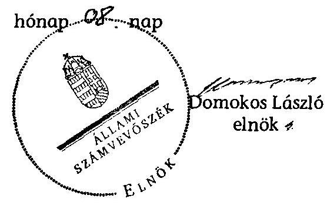

# ÁLLAMI   SZÁMVEVŐSZÉK 

## JELENTÉS

az önkormányzati vagyongazdálkodás
szabályszerűségi ellenőrzéséről
Szeghalom

---

# Állami Számvevőszék 

Iktatószám: V-0026-051-029/2013.
Témaszám: 1065
Vizsgálat-azonosító szám: V0593012

## Az ellenőrzést felügyelte:

Gyüre Lajosné (2012. december 15-ig)
felügyeleti vezető
Makkai Mária (2012. december 16-tól)
felügyeleti vezető
Az ellenőrzést vezette és az ellenőrzés végrehajtásáért felelős:
Kesjár János
ellenőrzésvezető
Az ellenőrzést végezték:

| Dr. Lajos Béla számvevő főtanácsos | Dr. Csapó Anna számvevő tanácsos | Vojcsekné Szabó Ágnes számvevő tanácsos |
| :--: | :--: | :--: |
| Deák Tamásné számvevő tanácsos | Dr. Győri Gabriella számvevő | Orosz Diána számvevő |

A témához kapcsolódó eddig készített számvevőszéki jelentések:
címe
sorszáma
Jelentés a helyi önkormányzatok gazdálkodási rendszerének 2008. évi ellenőrzéséről
Jelentés a térségek felzárkóztatására fordított pénzeszközök felhasználásának ellenőrzéséről
0991

---

# TARTALOMJEGYZÉK 

BEVEZETÉS ..... 3
I. ÖSSZEGZŐ MEGÁLLAPÍTÁSOK, KÖVETKEZTETÉSEK, JAVASLATOK ..... 5
II. RÉSZLETES MEGÁLLAPÍTÁSOK ..... 10

1. A vagyongazdálkodási tevékenység szabályozottsága ..... 10
1.1. A feladatellátás formáinak meghatározása, a döntések megalapozottsága ..... 10
1.2. A vagyonnal gazdálkodó szervezetek szervezeti rendjének szabályozottsága, a kötelező szabályzatok megfelelősége ..... 11
1.3. A vagyongazdálkodás szabályozása ..... 12
2. A vagyongazdálkodás szabályszerűsége ..... 14
2.1. A vagyon nyilvántartásának megfelelősége ..... 14
2.2. A vagyongazdálkodást érintő gazdasági események követelmények szerinti dokumentáltsága ..... 15
2.3. A vagyongazdálkodási intézkedések, döntések szabályszerűsége ..... 16
3. A vagyon változását eredményező gazdasági események szabályszerűsége ..... 18
3.1. A vagyon értékének és összetételének változása ..... 18
3.2. Közbeszerzési eljárások alkalmazása ..... 19
3.3. A térítés nélküli átadások szabályszerűsége ..... 19
4. A vagyongazdálkodás szabályszerűségére vonatkozó belső és külső ellenőrzések hasznosulása ..... 20
4.1. A belső ellenőrzés által tett megállapítások, javaslatok hasznosulása ..... 20
4.2. A könyvvizsgálatnak a vagyongazdálkodás szabályosságához való hozzájárulása ..... 22
4.3. A külső ellenőrző szervezetek által tett javaslatok hasznosulása ..... 22

---

# MELLÉKLETEK 

1. számú Szeghalom Város Önkormányzata gazdálkodására jellemző adatok, mutatószámok
2. számú Szeghalom Város Önkormányzata vagyonának alakulása
3. számú Szeghalom Város Önkormányzata kötelezettségeinek alakulása
4. számú Szeghalom Város Önkormányzata polgármesterének válaszlevele

## FÜGGELÉKEK

1. számú Rövidítések jegyzéke
2. számú Értelmező szótár

---

# JELENTÉS   az önkormányzati vagyongazdálkodás szabályszerűségi ellenőrzéséről Szeghalom 

## BEVEZETÉS

Az ÁSZ kiemelten fontosnak tartja az Állami Számvevőszékről szóló 2011. évi LXVI. törvény 5. § (4) bekezdése alapján az önkormányzati vagyon kezelésének, a vagyonnal való gazdálkodási szabályok betartásának az ellenőrzését. Az ellenőrzés feladata a vagyongazdálkodással kapcsolatban a közpénzek átláthatósága, nyilvánossága érdekében a jogszabályokban, belső szabályzatokban megfogalmazott előírások érvényesülésének áttekintése. Az Állami Számvevőszék nem csak az ellenőrzött szervezet vagyongazdálkodásának a hibáira mutat rá, számon kérve azok kijavítását, hanem megállapításaival, javaslataival segíti a közpénzzel, a közvagyonnal való felelős gazdálkodást.

Az önkormányzati vagyon alapvető funkciója, hogy a közérdeket és egyúttal az önkormányzati célok megvalósítását szolgálja. A feladatellátás terén elsősorban a kötelezően ellátandó feladatok végrehajtását hivatott szolgálni, amely mellett az önként vállalt feladatok ellátása is megvalósulhat.

## Az ellenőrzés célja az Önkormányzatnál annak értékelése volt, hogy:

- a vagyongazdálkodási tevékenységet, annak szervezeti kereteit szabályozták-e;
- az önkormányzati vagyongazdálkodás törvényességét, szabályszerűségét biztosították-e a döntések előkészítése és végrehajtása során;
- jogszerű döntéseken alapult-e a vagyon értékének és összetételének változása;
- a belső ellenőrzés elősegítette-e a vagyongazdálkodás szabályszerű működését, valamint hasznosultak-e a korábbi külső ellenőrzések által tett javaslatok.

Az ellenőrzés típusa: szabályszerűségi ellenőrzés
Az ellenőrzés a 2007. január 1. és 2011. év december 31. közötti időszakra terjedt ki, kitekintéssel a helyszíni ellenőrzés befejezéséig tartó időszak releváns folyamataira. Az egyes közbeszerzési eljárások lefolytatásának ellenőrzése a 2011. évet és a 2012. év I. negyedévét érintette.

---

Az ellenőrzés szakmai módszertana az Állami Számvevőszék Ellenőrzési Kézikönyvében foglalt szakmai szabályokon alapult, amely a Legfőbb Ellenőrző Intézmények Nemzetközi Szervezete (INTOSAI) által kiadott nemzetközi standardok (ISSAI) figyelembevételével készült.

A vagyongazdálkodás szabályozottságát a jogszabályok, és a helyi szabályozások (rendeletek, szabályzatok, utasítások) ellenőrzésével végeztük el. A vagyonváltozások köréből az ellenőrizendő tételeket mintavétellel, a számviteli nyilvántartásokból választottuk ki.

Szeghalom város lakosainak száma 2011. január 1-jén 9632 fő volt. A 2010. évi önkormányzati választást követően az Önkormányzat kilenctagú Képviselőtestületének munkáját három állandó bizottság segítette. Az Önkormányzat mellett a 2010. évi önkormányzati választásokat követően a Roma Kisebbségi Önkormányzat működik. A polgármester a 2002. évi önkormányzati képviselő és polgármester választás óta, a jegyző 2012. április 1-je óta tölti be tisztségét.

Az Önkormányzat feladatainak végrehajtása érdekében a 2011. évben öt önállóan működő és gazdálkodó, valamint kettő önállóan működő költségvetési szervet tartott fenn. A feladatok ellátásában részt vett egy társulás és 10 gazdasági társaság, amelyek közül az Önkormányzat a közüzemi víz- és csatornaszolgáltatást ellátó gazdasági társaságban rendelkezett 2%-os tulajdoni hányaddal.

Az Önkormányzatnak a 2011. évi költségvetési beszámolója szerint 4089,2 millió Ft költségvetési bevétele és 3712,4 millió Ft költségvetési kiadása volt, 2011. december 31-én a könyvviteli mérleg szerint 9337,6 millió Ft értékű vagyonnal rendelkezett. Az Önkormányzat a 2007-2011. években nem vett igénybe hosszú és rövid lejáratú, valamint likvid hitelt, nem bocsátott ki kötvényt, garancia és kezességvállalást nem tett. A 2011. év végén az Önkormányzat rövid lejáratú adósságállományának értéke 24,4 millió Ft volt, hosszú lejáratú kötelezettséggel nem rendelkezett. A Polgármesteri hivatalban dolgozó köztisztviselők száma 2011. december 31-én 37 fő, az Önkormányzat által foglalkoztatott közalkalmazottak száma 227 fő volt. Az Önkormányzat gazdálkodására jellemző adatokat, mutatószámokat az 1-3. számú mellékletek tartalmazzák.

Az ÁSZ a 2011. évi LXVI. törvény 29. §-a szerint a jelentéstervezetet megküldte Szeghalom Város Önkormányzata polgármesterének egyeztetésre, aki a megküldött válaszlevelében észrevételt nem tett. A beérkezett választ a jelentés 4. számú melléklete tartalmazza.

---

# I. ÖSSZEGZŐ MEGÁLLAPÍTÁSOK, KÖVETKEZTETÉSEK, JAVASLATOK 

Hiányos volt az Önkormányzat vagyongazdálkodásának szabályozottsága a 2007-2011. években, ezért nem járult hozzá a megalapozott döntéshozatalhoz.

Az Önkormányzat az SZMSZ szabályozása alapján - anyagi lehetőségétől függően - a költségvetésben határozta meg az önként vállalt feladatait. Az Ötv.-vel ellentétes módon a Képviselő-testület vagyonhasznosítással kapcsolatos hatáskört ruházott át a jegyzőre. A vagyonváltozást eredményező döntéshozatal megalapozása, valamint az Önkormányzat tulajdonosi jogainak védelme érdekében az elidegenítési rendeletben értékbecslés készítési kötelezettséget írták elő a hasznosításra szánt vagyon értékének megállapítása céljából. Célszerűségi indokok ellenére nem írták elő költség-haszon elemzés készítésének és a szerződésekben, megállapodásokban garanciális elemek rögzítésének kötelezettségét. A vagyonhasznosítási és vagyonértékesítési szerződésekbe azonban célszerűen beépítettek az Önkormányzat érdekeit védő garanciális elemeket.

A Képviselő-testület meghatározta a vagyonnal gazdálkodó, közfeladatot ellátó költségvetési szervek vagyonkezeléssel kapcsolatos feladatait, amelyek a közszolgáltatás ellátásához rendelt ingatlanok használatára és bérbeadására terjedtek ki.

Az Önkormányzat a vagyongazdálkodási feladatokat nem a teljes vagyoni körre szabályozta, csak az ingatlanok elidegenítésével kapcsolatos egyes kérdésekkel összefüggésben alkotott rendeletet. Az ingóságokkal és a vagyoni értékű jogokkal kapcsolatos feladatok szabályozatlanok maradtak. Az Önkormányzat figyelmen kívül hagyta az Ötv.-ben előírtakat, mert a 2007-2011. években nem határozta meg a korlátozottan forgalomképes és forgalomképtelen vagyonának a körét. A Vagyontv. 2012-ben hatályba lépett rendelkezéseinek megfelelően az Önkormányzat felülvizsgálta vagyonának forgalomképesség szerinti besorolását és 2012 májusától a vagyongazdálkodási rendeletben rögzítette azt, meghatározta vagyonelemeinek teljes körét és szabályozta a Vagyontv. által előírt feladatokat.

További szabályozási hiányosságot jelentett, hogy az Áht.-ben foglaltak ellenére nem volt szabályozás a vagyon tulajdonjogának ingyenes átruházásáról, és az önkormányzati követelésről történő lemondásról, miközben két esetben döntöttek ingyenes vagyonátadásról. Az üzleti célú ingatlanvagyon hasznosításának szabályozása csak 2012-től, a vagyongazdálkodási rendeletben történt meg.

A számviteli szabályozások közül a vagyon megőrzését biztosító leltározási szabályzat nem volt megfelelő. A 2007-2011. évek között hatályos leltározási szabályzat az üzemeltetésre átadott eszközök leltározásának módjára az Áhsz.-ben foglaltak ellenére mennyiségi felvétel helyett egyeztetéssel történő leltározást írt elő és december 31-i fordulónap helyett szeptember 30-i időpontot határozott meg.

A 2012-ben hatályba lépett Vagyontv. rendelkezésének megfelelően az Önkormányzat az ingatlanvagyonának forgalomképesség szerinti besorolását felülvizsgálta és vagyongazdálkodási rendeletet alkotott. Az Önkormányzat a Vagyontv. bekezdésében foglalt előírás érvényesülése érdekében még nem készített közép és hosszú távú vagyongazdálkodási tervet.

Az Önkormányzatnál a vagyon kimutatása és nyilvántartása is szabálytalan volt. A zárszámadási rendeletekhez a vagyonkimutatást a 2007. és a 2008. években az Ötv.-ben előírtakat megsértve nem készítették el, amelyeket csak a 2009-2011. években mellékelték a zárszámadási rendeletekhez.

Az Önkormányzatnál a 147/1992. (XI. 6.) Korm. rendelet előírása ellenére a 2007-2011. években nem biztosították az ingatlanvagyon-kataszter adatlapjának és a földhivatali ingatlan-nyilvántartás azonos tartalmú adatainak az összhangját. Az Önkormányzatnál a 2007-2009. években nem egyezett az ingatlanvagyon-kataszter és a számviteli nyilvántartásokban szerepeltetett ingatlanvagyon összege. A 2010-2011. években az adategyeztetés megtörtént, kimutatták az eltérések okát és nagyságát, a meglévő hibákat korrigálták.

Az Áhsz.-ben előírtak ellenére nem biztosították a vonatkozó könyvviteli mérlegsor valódiságának december 31-i fordulónapra leltárral történő alátámasztását, továbbá a leltározás az üzemeltetésre átadott eszközök esetében - a vízmű vagyon 2010. és 2011. évi, valamint a Pándy Kálmán Kórház Szeghalmi Fekvő- és Járó Beteg Ellátó Egységei 2010. évi leltározásának kivételével - nem mennyiségi számbavétellel, hanem egyeztetéssel történt.

A vagyongazdálkodáshoz kapcsolódó döntések dokumentáltsága nem felelt meg a követelményeknek. A Polgármesteri hivatalban, a 2007-2009. években a vagyongazdálkodáshoz kapcsolódóan az Áht.-ben és az Ámr.-ben foglaltak ellenére 43,2 millió Ft értékű kötelezettségvállalást nem előzte meg az arra kijelölt személy ellenjegyzése. A 2007-2009. években az Ámr.-ben foglaltak ellenére 7,9 millió Ft vagyonhoz kapcsolódó bevétel beszedésének elrendelése előtt nem ellenőrizték a vagyon elidegenítéséből, hasznosításából származó bevételek jogosságát, összegszerűségét. A 2007-2008. években 61,8 millió Ft kifizetését (felújítási és beruházási munkák, bérlakások vásárlása) megelőzően az utalvány ellenjegyzője az Ámr.-ben előírtak ellenére nem végezte el ellenőrzési feladatait.

Az Önkormányzat vagyonának a könyvviteli mérlegben kimutatott értéke nőtt a 2007. évi 7422,7 millió Ft-ról 2011. évre 9337,6 millió Ft-ra, az időszakban 25,8%-kal. Az Önkormányzat a 2007-2011. években összesen 2046,4 millió Ft-ot fordított beruházási és felújítási kiadásokra és 1181,4 millió Ft-ot számolt el értékcsökkenésre. A megvalósult fejlesztések 69,4%-át hazai- és uniós támogatásokból finanszírozták. A legjelentősebb beruházások és felújítások a városközpont rekonstrukciója (875,3 millió Ft), utak, kerékpárutak és gyalogutak építése és felújítása (351,2 millió Ft), óvodák és bölcsőde felújítás (107,3 millió Ft), a szeles kerti fő gyűjtő csatorna felújítása (98,7 millió Ft), iskola bővítése és felújítása (31,4 millió Ft) voltak. A 2011. évben a négy közbeszerzési eljárás köteles felújítás és beruházás esetében lefolytatták a közbeszerzési eljárást, amelyek megfeleltek a Kbt. előírásainak.

A vagyonváltozást eredményező képviselő-testületi döntések során az Ötv. és az Áht. rendelkezéseit nem vették figyelembe egy közterületi ingatlanrész (út) építkezési célra történő átadása és két ingatlan értékesítése során. A képviselő-testület nem tartotta be az Ötv.-ben előírtakat, mivel a 2008. évben forgalomképtelen ingatlanrész jogcím nélküli átadásáról az Ötv.-ben előírtakat megsértve döntött, mert forgalomképtelen önkormányzati vagyonról csak önkormányzati rendeletben meghatározott feltételek szerint lehet rendelkezni. A 2008. évben értékesített két ingatlan az elidegenítési rendeletben a vagyonelemek
 között nem szerepelt. Az ingatlanrész átadásának ellenértékét az Önkormányzat egy alapítvány részére engedélyezte. Az ingyenes engedélyezésre - az Áht. ${ }_{1}$-ben foglalt előírás ellenére - rendeleti felhatalmazás nélkül került sor.

A térítésmentes ingatlanvagyon átvétele szabályszerűen történt Békés Megye Önkormányzatától a 2009. évben 786,2 millió Ft értékben a Pándy Kálmán Megyei Kórház Szeghalmi Fekvő és Járó Betege Ellátó Egységének bővítésével és rekonstrukciójával, valamint 2010. évben 208,7 millió Ft összegben a belterületi vízrendezési munkákkal kapcsolatban.

A belső ellenőrzés a 2007-2008. évek között nem segítette az Önkormányzat vagyongazdálkodási tevékenységének szabályos lefolytatását. A belső ellenőrzési feladatokat a Társulás keretében látták el. A belső ellenőrzés a 2007-2011. évek között négy vagyongazdálkodással kapcsolatos ellenőrzést végzett, amely többek között a leltározási tevékenység ellenőrzésére irányult. Az ellenőrzés nem tárta fel az üzemeltetésre átadott eszközök leltározásával összefüggő szabályozási és leltárfelvételi hibákat. A vagyongazdálkodáshoz további nyolc belső ellenőrzés kapcsolódott. A belső ellenőrzések által feltárt szabályozási hibák kijavítására intézkedési tervek készültek, azonban azok végrehajtását utóellenőrzés keretében nem ellenőrizték.

A 2007-2008. évekre vonatkozóan a Társulás elkészítette a belső ellenőrzési feladatok végrehajtásáról szóló tájékoztatót, az éves ellenőrzési jelentést az Ötv.-ben foglaltak ellenére a polgármester nem terjesztette a Képviselő-testület elé. Az Önkormányzat felügyelete alá tartozó költségvetési szervek 2007-2008. évi éves ellenőrzési jelentései alapján készített éves összefoglaló ellenőrzési jelentéseket a polgármester nem terjesztette a Képviselő-testület elé, tekintve, hogy azok el sem készültek. A 2009-2011. évekre vonatkozóan a hiányosságot megszüntették.

Az ÁSZ az Önkormányzatnál a 2007-2011. években két ellenőrzést végzett, a 2008. évi ellenőrzése során a vagyongazdálkodáshoz kapcsolódóan három szabályszerűségi javaslatot tett. Az Önkormányzat a javaslatokat teljes körűen hasznosította. Egy célszerűségi javaslat részben teljesült, mivel a leltározási szabályzat kiegészítése nem a jogszabályi előírásoknak megfelelően történt az üzemeltetésre átadott eszközök vonatkozásában, és nem írták elő az üzemeltetésre átadott eszközök leltározásának részletszabályait.

---

Az Állami Számvevőszékről szóló 2011. évi LXVI. törvény 33. § (1) bekezdésében foglaltak értelmében a jelentésben foglalt megállapításokhoz kapcsolódó intézkedési tervet köteles az ellenőrzött szervezet vezetője összeállítani, és azt a jelentés kézhezvételétől számított 30 napon belül az ÁSZ részére megküldeni. Amennyiben az intézkedési tervet határidőben nem küldi meg a szervezet, vagy az nem elfogadható, az ÁSZ elnöke a hivatkozott törvény 33. § (3) bekezdés a)-b) pontjaiban foglaltakat érvényesítheti.

Az ellenőrzés intézkedést igénylő megállapításai és javaslatai:

# a polgármesternek 

1. Az Önkormányzat a Vagyon tv. 2. 9. § (1) bekezdésében foglalt előírás ellenére nem rendelkezett közép és hosszú távú vagyongazdálkodási tervvel.

Javaslat:
Terjessze a Képviselő-testület elé a jegyző által elkészített közép- és hosszú távú vagyongazdálkodási tervet jóváhagyásra a Htv. 139. § (1) bekezdés a) pontjának megfelelően.

## a jegyzőnek

1. Az Önkormányzatnál a 147/1992. (XI. 6.) Korm. rendelet 1. § (2)-(3) bekezdésében foglalt előírások ellenére az ingatlanvagyon kataszter és a földhivatali ingatlannyilvántartás azonos tartalmú adatai közötti egyezőség az adatok egyezőségét alátámasztó dokumentumok hiányában nem igazolt.

Javaslat:
Intézkedjen arról, hogy a 147/1992. (XI. 6.) Korm. rendelet 1. § (2) bekezdésében rögzítetteknek megfelelően biztosítsák az ingatlanvagyon kataszter adatai egyezőségét a földhivatali ingatlan-nyilvántartás azonos tartalmú adataival.
2. Az üzemeltetésre átadott eszközök év végi állományát a 2010-2011. években a leltározási szabályzatban foglaltak szerint szeptember 30-ai adatok alapján egyeztetéssel határozták meg, így az Áhsz. 37. § (4) bekezdésében előírtak ellenére nem biztosították a vonatkozó könyvviteli mérlegsor valódiságának december 31-ei fordulónapra az Áhsz. 37. § (3) bekezdése szerinti mennyiségi felvétellel történő leltárral való alátámasztását.

Javaslat:
Intézkedjen, hogy az üzemeltetésre átadott eszközökről a könyvviteli mérleg alátámasztásához, az Áhsz. 37. § (3) és (4) bekezdések előírásának megfelelően, az üzemeltetők által évente elvégzett és hitelesített leltárak álljanak rendelkezésre, valamint a leltározási szabályzatát is ennek megfelelően módosítsa.

---

3. Az Önkormányzat a Vagyon tv. 9. § (1) bekezdésében foglalt előírás ellenére nem rendelkezett közép és hosszú távú vagyongazdálkodási tervvel.

Javaslat:
Intézkedjen a Vagyon tv. 9. § (1) bekezdésében foglalt előírás érvényesülése érdekében a közép és hosszú távú vagyongazdálkodási terv elkészítéséről.

---

# II. RÉSZLETES MEGÁLLAPÍTÁSOK 

## 1. A VAGYONGAZDÁLKODÁSI TEVÉKENYSÉG SZABÁLYOZOTTSÁGA

### 1.1. A feladatellátás formáinak meghatározása, a döntések megalapozottsága

Az Önkormányzat az SZMSZ-ben határozta meg - anyagi lehetőségétől függően - az önként vállalt feladatait. ${ }^{1}$ A 2007-2011. évekre vonatkozó gazdasági program ${ }_{1,2}$-ban utalásszerűen tett említést ágazati (egészségügyi, oktatási, szociális ellátási) célkitűzéseiről. Kiemelt célként irányozta elő az önkormányzati feladatellátással összefüggésben a városfejlesztést és a munkahelyteremtést. Meghatározta a jelentős fejlesztési feladatokat hangsúlyozva, hogy a település anyagi teherbíró képességének figyelembe vételével kell eljárni és, hogy az uniós forrásokat az Önkormányzat a fejlesztésekhez nem nélkülözheti.

Az Önkormányzat költségvetési szerveinek száma a 2007. január 1-jétől 2011. december 31-ére kilencről hétre csökkent, mivel a Képviselő-testület intézmények megszüntetéséről döntött. A Képviselő-testület a feladatellátások szervezeti formáinak módosításáról a testületi ülésekre benyújtott - döntést megalapozó - előterjesztésekben ismertetett gazdaságossági indokok figyelembevételével határozott.

A megszüntetett Gondozási Központ feladatait - személyes gondoskodás keretébe tartozó szociális alapszolgáltatások, szakosított ellátások és a gyermekjóléti ellátás - 2007. július 1-jétől megállapodás alapján a Társulás által alapított önálló intézmény látta el ${ }^{2}$. A Nagy Miklós Városi Könyvtár, valamint a Sárréti Múzeum intézmények megszüntetését követően az Önkormányzat egy közös profilú intézmény alapításáról döntött ${ }^{3}$, amely átvette feladataikat.

A Képviselő-testület a 2007-2011. években a közszolgáltatások ellátásának biztosítása érdekében gazdasági társaság alapításáról, szövetkezet szervezéséről nem döntött.

[^0]
[^0]:    ${ }^{1}$ Az SZMSZ 2. § (4) bekezdése szerint: "az Önkormányzat figyelemmel a kötelezendően ellátandó feladataira, anyagi lehetőségeitől függően éves költségvetésében meghatározza, hogy mely önként vállalt feladatokat, milyen mértékben és módon látja el."
    ${ }^{2}$ A Képviselő-testület a 43/2007. (V. 29.) számú határozatában döntött a Gondozási Központ megszüntetéséről és arról, hogy feladatait Szeghalom Kistérség Szociális és Gyermekjóléti Intézménye veszi át.
    ${ }^{3}$ A Képviselő-testület a 71/2011. (V. 16.) számú határozatában döntött a Nagy Miklós Városi Könyvtár és Sárréti Közérdekű Muzeális Gyűjtemény alapításáról.

---

# 1.2. A vagyonnal gazdálkodó szervezetek szervezeti rendjének szabályozottsága, a kötelező szabályzatok megfelelősége 

A Képviselő-testület 2007-2011 között az elidegenítési rendeletben, az SZMSZ-ben, a lakásrendeletben és az első lakáshoz jutás támogatásáról szóló rendeletben szabályozta a vagyongazdálkodásra vonatkozó előírásokat és a Képviselő-testületet megillető hatáskörök átruházását a polgármesterre, a jegyzőre és bizottságokra. Az Önkormányzat az elidegenítési rendeletben a jegyző hatáskörébe utalta a vállalkozói vagyon körébe sorolt ingatlanvagyon hasznosítását, amivel megsértették az Ötv. 9. § (3) bekezdésében foglaltakat. ${ }^{4}$. Az Önkormányzat a törvénysértő szabályozást 2012 májusától megszüntette, a jegyző ezen hatásköre a vagyongazdálkodási rendeletbe már nem került be. A Képviselő-testület nem élt az Ötv. 9. § (3) bekezdésében biztosított jogával, a tulajdonosi jogokat érintő átruházott hatáskörök gyakorlásához utasítást nem adott. Az átruházott hatáskörben hozott intézkedésekről szóló beszámolási kötelezettséget csak a polgármesterre átruházott hatáskörök esetében írt elő.

A polgármester a Képviselő-testülettől átruházott hatáskörben dönthetett az üresen álló önkormányzati bérlakások nem lakás céljára történő bérbeadásáról, a vagyongazdálkodáshoz kapcsolódóan 6,0 millió Ft értékhatárig vállalhatott kötelezettséget, köthetett szerződést, írhatott alá megállapodást, amelyekről utólagos beszámolási kötelezettsége volt.

A vagyongazdálkodással kapcsolatban bizottságok - a Pénzügyi bizottság, az Oktatási, kulturális és sportbizottság, valamint a Szociális és egészségügyi bizottság - kaptak átruházott hatáskört az önkormányzati vagyongazdálkodási koncepció kidolgozására, jogkört a járdaépítések eldöntésére, civil- és sportszervezetek támogatási, valamint a térítésmentes, vagy a kedvezményes első lakáshoz jutási kérelmek elbírálására.

A Képviselő-testület meghatározta a vagyonnal gazdálkodó, közfeladatot ellátó költségvetési szervek alaptevékenységét, jóváhagyta alapító okiratukat, szervezeti és működési szabályzatukat. A költségvetési intézmények vagyonkezeléssel kapcsolatos feladata a közszolgáltatás ellátásához rendelt ingatlanok használatára és bérbeadására is kiterjedt, amelyről az elidegenítési rendelet és az intézmények szervezeti és működési szabályzatai rendelkeztek.

A jegyző a Htv. 140. § (1) bekezdés c) pontjában foglalt előírásnak eleget téve, kialakította a Polgármesteri hivatal, valamint az intézmények számviteli rendjét, amely a vagyongazdálkodás szempontjából keretet biztosított az Önkormányzat költségvetési szervei egységes számviteli elvek szerinti, önkormányzati szintű beszámolójának elkészítéséhez.

[^0]
[^0]:    ${ }^{4}$ Az Ötv. 9. § (3) bekezdése szerint a „képviselő-testület egyes hatásköreit a polgármesterre, a bizottságaira, a részönkormányzat testületére, a kisebbségi önkormányzat testületére, törvényben meghatározottak szerint társulásra ruházhatja. E hatáskör gyakorlásához utasítást adhat, e hatáskört visszavonhatja. Az átruházott hatáskör tovább nem ruházható." A 2012. január 1-jétől hatályos Mötv. 41. § (4) bekezdése lehetővé teszi, hogy a Képviselő-testület a hatásköreit a jegyzőre is átruházhassa.

---

Az Áhsz. 8. § (13) bekezdése alapján a Polgármesteri hivatal számviteli politikájában rögzítették, hogy annak rendelkezései (beleértve a vagyongazdálkodást) és a kapcsolódó szabályzatok hatálya kiterjednek a hozzá rendelt, önállóan működő költségvetési szervekre is.

A Polgármesteri hivatal számviteli politikáját és a kapcsolódó szabályzatokat a leltározási szabályzat kivételével - a jogszabályi előírásoknak és a helyi sajátosságoknak megfelelően készítették el. A leltározási szabályzat az üzemeltetésre átadott eszközök leltározásának módját 2007-2009 között az Áhsz. 37. § (1) és (2) bekezdésében, a 2010. évtől pedig az Áhsz. 37. § (1) és (3) bekezdésében foglaltakkal ellentétesen tartalmazta, a leltározási szabályzat az üzemeltetésre átadott eszközök leltározásának módját 2007-2011 között is az Áhsz. 37. § (3) bekezdésében foglaltakba ütköző módon szabályozta, mivel mennyiségi leltározás helyett egyeztetéssel történő leltározást írt elő. A leltározást továbbá nem a december 31-ei fordulónappal készített könyvviteli mérlegben kimutatott, üzemeltetésre átadott eszközökre vonatkozóan írták elő, hanem a szeptember 30-ai állapotnak megfelelően. Az Önkormányzat a kétévenkénti leltározásról határozatban rendelkezett, amely ellentétes volt az Áhsz. 37. § (7) bekezdése akkor hatályos előírásával. ${ }^{5}$

# 1.3. A vagyongazdálkodás szabályozása 

Az Önkormányzat a 2007-2011. évek között a Htv. 138. § (1) bekezdés j) pontjában foglalt hatásköri előírás alapján az önkormányzati vagyonnal való gazdálkodásról teljes körű szabályozást nem alkotott. Az Önkormányzat ingatlanvagyonának elidegenítési szabályairól szóló 4/1993. (II. 1.) Ör. számú rendelet (elidegenítési rendelet) csak az ingatlanvagyon forgalomképesség szerinti besorolásáról és hasznosításának egyes kérdéseiről rendelkezett. A vagyongazdálkodás lényeges elemei szabályozatlanok voltak.

Az elidegenítési rendeletben meghatározták az önkormányzati feladatellátást biztosító törzsvagyon, (csak az ingatlanok esetében), ezen belül a korlátozottan forgalomképes és forgalomképtelen vagyonelemek körét, de 2007-2011 között a szükséges módosításokat nem végezték el. Emiatt a 2007-2011. években megsértették az Ötv. 79. §-ában foglaltakat, mert a Képviselő-testület nem határozta meg az Önkormányzat forgalomképes és korlátozottan forgalomképes vagyonának (teljes) körét. Ezen hiányosságot csak a vagyongazdálkodási rendeletben, 2012 májusától számolták fel.

Az Önkormányzat - feladatellátásához kapcsolódóan - vagyonkezelői jogot nem létesített.

[^0]
[^0]:    ${ }^{5}$ Az Áhsz. módosításával (369/2011. (XII.31.) Korm. rendelet 21. § 55. pont) 2012. január 1-jei hatállyal nyílt lehetőség a kétévenkénti leltározás határozattal történő eldöntésére.

---

A vagyongazdálkodás szabályozottsága a tartalmi hiányosságok miatt a 2007-2011. években nem
 volt összhangban a jogszabályokkal, és az Önkormányzat belső szabályozási dokumentumaival, ezért nem járult hozzá a megalapozott döntéshozatalhoz, tekintettel arra, hogy:

- az Áht. ${ }_{1}$ 108. § (2) bekezdésében ${ }^{6}$ foglaltak ellenére nem volt rendelet a vagyon tulajdonjogának, valamint a vagyonhoz kapcsolódó, önállóan forgalomképes vagyoni értékű jogoknak az ingyenes átruházására, nem írták elő az ingyenes átruházás, továbbá az Önkormányzatot megillető követelésről történő lemondás módját és eseteit;
- nem volt szabályozás az ingatlanvagyonon kívüli egyéb vagyonelemekre;
- nem szabályozták a forgalomképesség megváltoztatásának eljárásrendjét;
- nem szabályozták az üres, nem lakás céljára szolgáló helyiségek bérbeadása pályáztatásának eljárásrendjét annak ellenére, hogy a lakásrendelet előírta, hogy az üres, nem lakás célját szolgáló helyiségeket bérbe adni csak pályázati eljárás lefolytatása után lehet;
- a Képviselő-testület a 65/2007. (VI. 25.) számú, valamint a 41/2008. (III. 31.) számú határozataiban döntött ingatlanok hirdetmény útján közzétett licit eljárással történő elidegenítéséről, azonban nem szabályozták az ingatlanvagyon hasznosítása versenyeztetésének eljárásrendjét (a hiányosságot a vagyongazdálkodási rendeletben 2012 májusától megszüntették);
- nem volt előírás a vagyonleltárra vonatkozóan, ennek ellenére a Polgármesteri hivatal gazdálkodási ügyrendjének hatásköri jegyzékében hivatkoztak arra, hogy a vagyonleltárt az elidegenítési rendeletben foglaltak szerint kell elkészíteni. Nem biztosították az összhangot az elidegenítési rendelet, a lakásrendelet és az SZMSZ között, mivel azok olyan bizottságokra vonatkozó hivatkozásokat tartalmaztak, ${ }^{7}$ amelyek a 2010. év októberétől hatályos SZMSZ szerint már nem léteztek;
- a szabályozás, azon belül az elidegenítési rendelet - az időközi szükséges módosítások elmaradása miatt - nem volt összhangban az Önkormányzat tényleges vagyoni, intézményi és szervezeti helyzetével, a használati jogot gyakorló intézményeket nem határozta meg.

A vagyonváltozást eredményező döntéshozatal megalapozása érdekében, valamint az Önkormányzat tulajdonosi jogainak védelme céljából nem írták elő költség-haszon elemzés készítésének, a szerződésekben, megállapodásokban garanciális elemek rögzítésének kötelezettségét. A vagyonhasznosítási és vagyonértékesítési szerződésekbe ugyanakkor beépítettek az Önkormányzat érdekeit védő garanciális elemeket.

[^0]
[^0]:    ${ }^{6}$ 2012. január 1-jétől a Vagyon tv. ${ }_{2}$ 3. § (1) bekezdés 3. és 6. pontjai
    ${ }^{7}$ Pénzügyi és ellenőrzési bizottság, Városgazdálkodási és költségvetési bizottság

---

Az ingatlanvagyon hasznosítási módját, a hasznosításra szánt vagyon értékének megállapítása céljából értékbecslés készítésének kötelezettségét előírták az elidegenítési rendeletben, valamint a lakásrendeletben.

A Polgármesteri hivatal és a hozzá rendelt önállóan működő költségvetési szervek közötti megállapodásban írták elő a munkamegosztásnak és a felelősségvállalásnak a rendjét, rögzítették a befektetett eszközök analitikus nyilvántartása vezetésének feladatmegosztását. Üzemeltetési szerződésben rögzítették az Önkormányzat vízi közmű vagyontárgyait üzemeltető gazdasági társaság vagyonkezeléssel kapcsolatos feladat- és hatáskörét.

A 2012-ben hatályba lépett Vagyon tv. 2 18. § (1) bekezdése rendelkezéseinek megfelelően az Önkormányzat az ingatlanvagyonának forgalomképesség szerinti besorolását felülvizsgálta és - az ellenőrzött időszakot követően - vagyongazdálkodási rendeletet alkotott. A Képviselő-testület megállapította, hogy nincs olyan vagyonelem önkormányzati tulajdonban, amelyet nemzetgazdasági szempontból kiemelt jelentőségű nemzeti vagyonná kellene minősíteni. Az Önkormányzat a Vagyon tv. 2 9. § (1) bekezdésében foglalt előírás érvényesülése érdekében még nem készített közép és hosszú távú vagyongazdálkodási tervet.

Az Önkormányzat a gazdálkodási jogkörök gyakorlásának rendjét, az ezekkel kapcsolatos összeférhetetlenségi követelményeket meghatározta.

Az Önkormányzat a közérdekű adatok megismerésére irányuló igények teljesítésének rendjét a személyes adatok védelméről és a közérdekű adatok nyilvánosságáról szóló 1992. évi LXIII. törvény 20. § (8) bekezdésében foglaltak ellenére nem szabályozta. A hiányosságot a közérdekű adatok megismerésére vonatkozó új szabályzat hatályba lépésével csak 2010. január 1-jén számolták fel.

Az éves költségvetési koncepció és az éves költségvetés készítésére, módosítására, valamint a beszámoló készítésére vonatkozó szabályokat a Polgármesteri hivatal gazdálkodási ügyrendje, a FEUVE szabályzat, a számviteli politika és az SZMSZ tartalmazta.

# 2. A VAGYONGAZDÁLKODÁS SZABÁLYSZERŰSÉGE 

### 2.1. A vagyon nyilvántartásának megfelelősége

Az Önkormányzatnál a zárszámadási rendeletekhez a vagyonkimutatást a 2007. és a 2008. években az Ötv. 78. § (2) bekezdésében előírtakat megsértve nem készítették el, amelyeket csak a 2009-2011. években mellékelték a zárszámadási rendeletekhez. A főkönyvi számlák alábontásával, valamint a számlákhoz kapcsolódó analitikus nyilvántartások vezetésével biztosították a törzsvagyon többi vagyontárgytól elkülönített nyilvántartását.

A 147/1992. (XI. 6.) Korm. rendelet 1. § (2) bekezdésében foglalt előírás ellenére a 2007-2011. években az ingatlanvagyon kataszter és a földhivatali ingatlannyilvántartás azonos tartalmú adatai közötti egyezőség az adatok egyezőségét

---

alátámasztó dokumentumok hiányában nem igazolt. A 147/1992. (XI. 6.) Korm. rendelet 1. § (3) bekezdésében foglaltak ellenére az Önkormányzatnál a 2007-2009. években nem egyeztették az ingatlanvagyon-kataszter és a számviteli nyilvántartásokban szerepeltetett ingatlanvagyon adatait. A 2010-2011. években már az adategyeztetés megtörtént, kimutatták az eltérések okát és nagyságát.

Az Önkormányzat a 2007-2011. években az előírt leltározási kötelezettségének december 31-ei fordulónappal eleget tett. A helyi szabályozás hibájából adódóan 2007-2011 között az üzemeltetésre átadott eszközök esetében a leltárfelvételek az Áhsz. 37. § (3) bekezdésében foglaltak ellenére - a vízmű vagyon 2010. és 2011. évi, valamint a Pándy Kálmán Kórház Szeghalmi Fekvő- és Járó Beteg Ellátó Egységei 2010. évi leltározásának kivételével - nem mennyiségi számbavétellel, hanem egyeztetéssel történtek. Az üzemeltetésre átadott eszközök év végi állományát ${ }^{8}$ a 2010-2011. években a leltározási szabályzatban foglaltak szerint szeptember 30-ai adatok alapján egyeztetéssel határozták meg, így az Áhsz. 37. § (4) bekezdésében előírtak ellenére nem biztosították a vonatkozó könyvviteli mérlegsor valódiságának december 31-i fordulónapra leltárral történő alátámasztását.

# 2.2. A vagyongazdálkodást érintő gazdasági események követelmények szerinti dokumentáltsága 

A gazdálkodási jogkörök gyakorlásának rendjét, az összeférhetetlenségi követelményeket a FEUVE szabályzatban, valamint a pénztár és pénzkezelési szabályzat ${ }_{1-9}$-ben határozták meg. A jegyző ${ }_{1}$ gondoskodott a szakmai teljesítésigazolást végzők kijelöléséről, írásbeli megbízást adott az érvényesítés ellátására. A gazdálkodási jogkör gyakorlása során betartották az Ámr. ${ }_{1}$ 138. § (1)-(3) bekezdéseiben, valamint az Ámr. ${ }_{2}$ 80. § (1)-(2) bekezdéseiben rögzített összeférhetetlenségi követelményeket.

A Polgármesteri hivatalban a vagyongazdálkodás egyes területeivel kapcsolatos kiadások teljesítését és a bevételek beszedését megelőzően a 2007-2009. években az alábbi esetekben nem végezték el a gazdálkodási és ellenőrzési jogkörök gyakorlásával felhatalmazott személyek az előírt (folyamatba épített) feladatokat:

- a 2007-2009. évek között az Áht ${ }_{1}$. 100/C. § (3) bekezdésében előírtakat megsértve és az Ámr. ${ }_{1}$ 134. § (8) bekezdésében előírtak ellenére az arra kijelölt személy ellenjegyzése nem előzte meg 12 esetben 43,2 millió Ft értékű kötelezettségvállalását. Ezáltal az Ámr. ${ }_{1} 134$ § (9) bekezdésében foglalt ellenőrzési feladatokat nem végezték el, de ez az Önkormányzatnál felhalmozási előirányzat túllépést nem okozott. A 2010-2011. években a hiányosságot megszüntették, a 2010. évben a kötelezettségvállalásra minden esetben az ellenjegyzést, a 2011. évben pedig a pénzügyi ellenjegyzést követően került sor;

[^0]
[^0]:    ${ }^{8}$ vállalkozó orvosok, Szeghalom Kistérség Szociális és Gyermekjóléti Intézménye

---

- a 2007-2009. években az Ámr. ${ }_{1}$ 135. § (1) bekezdésében, valamint a pénzkezelési szabályzat ${ }_{1,2,3,4}$-ben előírtak ellenére 14 esetben 7,9 millió Ft bevétel beszedésének elrendelése előtt nem ellenőrizték a bevételek jogosságát, összegszerűségét. Az érvényesítő, valamint az utalvány ellenjegyzője az Ámr. ${ }_{1}$ 135. § (3) bekezdésében, illetve az Ámr. ${ }_{1}$ 137. § (3) bekezdésében előírtak ellenére ellenjegyezte az utalványrendeletet, figyelmen kívül hagyva, hogy a szakmai teljesítésigazolás elmaradt. Ugyanakkor ennek következtében az Önkormányzat jogosulatlan bevételt nem számolt el;
- a 2007-2008. években az Ámr. ${ }_{1}$ 137. § (3) bekezdésében előírtak ellenére 21 esetben 61,8 millió Ft kifizetését megelőzően az utalvány ellenjegyzője nem végezte el ellenőrzési feladatait. Ennek következtében azonban nem érte kár az Önkormányzatot, mivel teljesítés nélküli kifizetésre nem került sor. A 2009. évtől a hiányosságot megszüntették, az utalvány ellenjegyzője eleget tett ellenőrzési feladatainak.

Az Önkormányzat az Áht. ${ }_{1}$ 15/A. § (1) bekezdésében előírtak szerint a 2007-2011. években közzétette a honlapján ${ }^{9}$ az általa nyújtott, nem normatív, céljellegű, működési és fejlesztési támogatások kedvezményezettjeinek nevét, a támogatás célját, összegét, a támogatási program megvalósítási helyét, valamint az éves beszámolók adatait.

Az Önkormányzat az Áht. ${ }_{1}$ 15/B. § (1) bekezdésében előírtak alapján a 2007-2011. években közzétette a honlapján a nettó ötmillió Ft-ot elérő, vagy azt meghaladó értékű árubeszerzésre, építési beruházásra, szolgáltatás megrendelésre, vagyonértékesítésre, vagyonhasznosításra vonatkozó szerződések megnevezését, tárgyát, a szerződést kötő felek nevét, a szerződés értékét.

# 2.3. A vagyongazdálkodási intézkedések, döntések szabályszerűsége 

A vagyonváltozást eredményező képviselő-testületi döntések során egy forgalomképtelen ingatlanrész átadásánál és két ingatlan értékesítése során nem tartották be az Ötv. 79. § (2) bekezdésében foglaltakat.

A Képviselő-testület a 84/2008. (VI. 30.) számú határozatával a 967. helyrajzi számú forgalomképtelen ingatlanrész (kb. $250 \mathrm{~m}^{2}$ közterület) - egy áruház közúti kapcsolatának kiépítése céljából történő - átadásáról döntött. Az ingatlanrész átadásának jogcímét nem határozták meg. A képviselő-testületi előterjesztés szerint „Tekintve, hogy a 47-es számú út állami tulajdonban van, a beruházás sikeres befejezése után a bővítés céljára igénybe vett terület is állami tulajdonba fog kerülni. A beruházó a terület igénybevételéért 1 millió Ft-ot ajánlott fel az Önkormányzat által megjelölt közcélra." Az előterjesztés elfogadásával az Önkormányzatot megillető ellenértéket az „Együtt a gyermekek mosolyáért" alapítvány részére engedményezte ${ }^{10}$ ingyenesen. Az előterjesztés mellékletét képezte az áruház kép-

[^0]
[^0]:    ${ }^{9}$ www.szeghalom.hu
    ${ }^{10}$ A Ptk. 328. § (1) bekezdése szerint a „jogosult követelését szerződéssel másra átruházhatja (engedményezés)".

---

viselőjének szándéknyilatkozata, valamint az „Együtt a gyermekek mosolyáért" alapítvány részére nyújtandó támogatásról szóló Együttműködési megállapodás tervezete és az összeg ügyvédi letétbe helyezéséről szóló Letéti szerződés tervezete. A Képviselő-testület úgy hozott határozatot az ingatlanrész áruház részére átadásáról, hogy figyelmen kívül hagyta az akkor hatályos Ötv. 79. §. (2) bekezdés a) pontjában foglaltakat, amelynek értelmében forgalomképtelenek a helyi közutak és műtárgyaik. Az 1 millió Ft ellenérték ingyenes engedményezésére pedig az Áht. ${ }_{1}$ 108. § (2) bekezdésében foglalt előírás ellenére, rendeleti felhatalmazás nélkül került sor. ${ }^{11}$ Az áruház és az alapítvány között létrejött aláírt Együttműködési megállapodást és az 1 millió Ft ügyvédi letétbe helyezéséről szóló aláírt letéti szerződést nem tudták az ÁSZ rendelkezésére bocsátani.

A Képviselő-testület a 41/2008. (III. 31.) számú határozatával a 2916/54 helyrajzi számú ingatlan 7933 m² területéből 5000 m² értékesítéséről döntött, melyet az elidegenítési rendelet nem tartalmazott, ezért az ingatlan forgalomképesség szerinti besorolása nem volt megállapítható. Továbbá nem szerepelt az elidegenítési rendeletben a 2918/10. helyrajzi számú ingatlan, amely a 2008. december 19-én kelt adásvételi szerződés tárgyát képezte.

A vagyongazdálkodási döntések - telkek és bérlakások értékesítése, járművek és ingatlanok vásárlása, épületek és építmények korszerűsítése, valamint bővítése, beruházások - végrehajtása során betartották az előterjesztésekben, valamint a képviselő-testületi határozatokban foglaltakat.

Az ellenőrzésbe vont tranzakciók között nem szerepelt üres, nem lakás célját szolgáló helyiség bérbeadása és a
 jegyző; döntése alapján vállalkozói vagyon körébe sorolt ingatlanvagyon hasznosítása. A szabályozás hiányának ellenére a képviselő-testületi döntéseknek megfelelően ingatlanok elidegenítése hirdetmény útján közzétett liciteljárással történt.

A vagyonváltozáshoz kapcsolódó döntéshozatalok során a döntéshozók az arra felhatalmazott ${ }^{12}$ személyek voltak. A vagyonváltozásokról hozott képviselő-testületi döntésekkel azonos tartalmú szerződéseket, megállapodásokat kötöttek. A vagyonhasznosítási és vagyonértékesítési szerződésekbe beépítették az Önkormányzat érdekeit védő garanciális elemeket. Késedelmes fizetés esetére szankcióként késedelmi kamat felszámítását, a bérleti díj meg nem fizetése esetére a bérleti jogviszony felmondását jelölték meg. Értékesítéskor a tulajdonjog bejegyzésének feltételéül szabták a teljes vételár kifizetését.

Az Önkormányzat az európai uniós finanszírozással megvalósult beruházások (városközpont rekonstrukció, csapadékvíz elvezetés) esetében a létrehozott létesítmények fenntarthatóságát a döntések előkészítése során - a pályázatokhoz kötelezően csatolt megvalósíthatósági tanulmányok alapján - vizsgálta.

[^0]
[^0]:    ${ }^{11}$ A Ptk. 330. § (2) bekezdése értelmében az ingyenes engedményezésre az ajándékozás szabályait kell alkalmazni.
    ${ }^{12}$ az Ötv. 9. § (1)-(4) bekezdései, 10. § (1) bekezdése, az SZMSZ és a belső szabályzatok rendelkezései

---

# 3. A VAGYON VÁLTOZÁSÁT EREDMÉNYEZŐ GAZDASÁGI ESEMÉNYEK SZABÁLYSZERŰSÉGE 

### 3.1. A vagyon értékének és összetételének változása

Az Önkormányzat a 2007-2011. években - a költségvetési beszámolók adatai szerint - összesen 2046,4 millió Ft-ot fordított beruházási és felújítási kiadásokra. Az Önkormányzat 2011. december 31-i könyvviteli mérleg szerinti vagyona 9337,6 millió Ft volt, a 2007. év végi állományhoz viszonyítva 1914,9 millió Ft-tal (25,8%-kal) növekedett. Ezen belül a tárgyi eszközök állománya 1392,0 millió Ft-tal (26,7%-kal), az üzemeltetésre átadott eszközök állománya 348,5 millió Ft-tal (19,4%-kal) és a pénzeszközök állománya 178,6 millió Ft-tal (89,6%-kal) nőtt.

Az ingatlanok és a kapcsolódó vagyoni értékű jogok állománya a 2007. évről a 2011. évre 1458,8 millió Ft-tal (29,1%-kal) emelkedett, elsődlegesen az aktivált beruházások és felújítások eredményeként. A felhalmozási tevékenység hozzájárult az Önkormányzat feladatainak ellátásához. A 2007-2011. években megvalósult legjelentősebb beruházások és felújítások a városközpont rekonstrukciója (875,3 millió Ft), utak, kerékpárutak és gyalogutak építése, valamint felújítása (351,2 millió Ft), óvodák és bölcsőde felújítása (107,3 millió Ft), a szeles kerti fő gyűjtő csatorna felújítása (98,7 millió Ft), iskola bővítése és felújítása (31,4 millió Ft) volt. Térítésmentes ingatlanvagyon átvételre Békés Megye Önkormányzatától a 2009. évben 786,2 millió Ft értékben a Pándy Kálmán Megyei Kórház Szeghalmi Fekvő és Járó Beteg Ellátó Egységének bővítésével és rekonstrukciójával, valamint a 2010. évben 208,7 millió Ft összegben a belterületi vízrendezési munkákkal kapcsolatban került sor.

Üzemeltetésre átadott eszközök kapcsán a Gondozási Központ ingó és ingatlan vagyontárgyainak átadására került sor 2007. július 1-jétől a Társulásnak. Az üzemeltetésre átadott eszközök állományának a 2008. évről a 2009. évre 486 millió Ft-tal növekedéséről, az összetételéről, az átadás indokoltságáról az Önkormányzat éves költségvetésének teljesítéséről szóló beszámolók nem tartalmaztak információt.

A vagyon növekedésének pénzügyi fedezetét - a gazdasági program ${ }_{1,2}$ célkitűzéseinek megfelelően - hazai- és uniós támogatásból, ${ }^{13}$ valamint az iparűzési adó bevételéből biztosították. Az Önkormányzatnál a 2007-2011. években aktivált beruházások, felújítások kiadásainak kiegyenlítésére - az Önkormányzat által készített kimutatás szerint - 1320,2 millió Ft (69,7%) támogatást vettek igénybe.

A 2007-2011. évek közötti időszakban a saját tőke 1755,7 millió Ft-tal (24,8%-kal), a tartalékok 242,9 millió Ft-tal (118,7%-kal) növekedtek. A kötelezettségek 83,7 millió Ft-tal (61,5%-kal) csökkentek az egyéb passzív pénzügyi elszámolások 64,5 millió Ft-os és az egyéb rövid lejáratú kötelezettségek

[^0]
[^0]:    ${ }^{13}$ A Polgármesteri Hivatalban a 2007-2011. években aktív pályázati tevékenységet folytattak, amelynek során összesen 30 hazai és 6 uniós pályázatot nyertek.

---

23,6 millió Ft-os csökkenése, valamint a szállítói kötelezettség 4,4 millió Ft-os növekedése következtében. A szállítók állománya a 2008. évről a 2009. évre 486 millió Ft-tal nőtt, mert a 2008. év végi szállítói számlák fizetési határideje 2009. január hónapban volt. Az Önkormányzat 2007-2011 között a tárgyi eszközökre 1181,4 millió Ft értékcsökkenést számolt el és 1554,1 millió Ft felújítást aktivált, amely az elszámolt értékcsökkenésnek 1,3-szerese volt.

# 3.2. Közbeszerzési eljárások alkalmazása 

Az Önkormányzat csak a 2011-2012. évekre vonatkozóan rendelkezett közbeszerzési szabályzattal, amelyben meghatározták a közbeszerzés lefolytatásának eljárási- és felelősségi rendjét. A 2011. évben az ellenőrzött négy közbeszerzési eljárás köteles felújítás és beruházás esetében lefolytatták a közbeszerzési eljárást, amelyek megfeleltek a Kbt. ${ }_{1,2}$ előírásainak. A lefolytatott közbeszerzési eljárások közül három közvetlen felhívással induló tárgyalás nélküli eljárás, egy pedig hirdetmény nélkül induló tárgyalásos eljárás volt. A 2012. év I. negyedév folyamán nem került sor közbeszerzési eljárásra.

### 3.3. A térítés nélküli átadások szabályszerűsége

Az Önkormányzatnál az Áht., 108. § (2) bekezdésében ${ }^{14}$ előírtakat megsértve nem határozták meg rendeletben az önkormányzati vagyon ingyenes átruházásának (és az önkormányzati követelésről történő lemondásnak) módját és eseteit. Ennek ellenére a 2007-2011. évek között egy alkalommal történt térítés nélküli tárgyi eszköz átadás, egy esetben pedig ingyenes engedményezés.

A Képviselő-testület a 15/2007. (II. 26.) számú határozatával döntött két motorkerékpár beszerzéséről és ingyenes átadásáról a Szeghalmi Rendőrkapitányságnak. A támogatási szerződés tartalmazta 395 ezer Ft/db értékben két motorkerékpár és 10,9 ezer Ft/db értékben bukósisakok átadását. Az Önkormányzatnál a motorkerékpárok rendeltetésszerű használatához beszerzett bukósisakokat a Számv. tv. 47. § (7) bekezdésében előírtak szerint a motorkerékpár beszerzési értékének részeként vették nyilvántartásba. A motorkerékpárok bekerülési értékének önkormányzati nyilvántartásból történt kivezetése a bukósisakok értékével együttes összegben, szabályszerűen történt.

A Képviselő-testület a 84/2008. (VI.30.) számú határozatával a 967. helyrajzi számú forgalomképtelen ingatlanrész (kb. $250 \mathrm{~m}^{2}$ közterület) - egy áruház közúti kapcsolatának kiépítése céljából történő - jogcím nélküli átadásáról döntött. Az Önkormányzatot megillető tisztázatlan jogcímű ${ }^{15}$ 1,0 millió Ft el-

[^0]
[^0]:    ${ }^{14}$ Az Áht., 108. § (2) bekezdése szerint az "államháztartás alrendszereihez kapcsolódó vagyon tulajdonjogát vagy a vagyonhoz kapcsolódó önállóan forgalomképes vagyoni értékű jogot ingyenesen átruházni, továbbá az államháztartás alrendszereinek követeléseiről lemondani csak törvényben, a helyi önkormányzatnál a helyi önkormányzat rendeletében meghatározott módon és esetekben lehet."
    ${ }^{15}$ A közterület használatról szóló helyi rendelet (15/1994. (X. 17.) Ör. számú rendelet) hatálya nem terjedt ki a közutak és építményei nem közlekedési célú igénybevételére (1. § (2) bekezdés).

---

lenértéket az „Együtt a gyermekek mosolyáért" alapítvány részére engedményezte ${ }^{16}$ ingyenesen. Az előterjesztés mellékletét képezte az áruház képviselőjének Szándéknyilatkozata, valamint az „Együtt a gyermekek mosolyáért" alapítvány részére nyújtandó támogatásról szóló Együttműködési megállapodás tervezete és az összeg ügyvédi letétbe helyezéséről szóló Letéti szerződés tervezete. ${ }^{17}$ Az áruház és az alapítvány között létrejött aláírt Együttműködési megállapodás és az 1 millió Ft ügyvédi letétbe helyezéséről szóló aláírt Letéti szerződés nem állt rendelkezésre. Nem volt megállapítható, hogy az engedményezett 1,0 millió Ft az engedményeshez (alapítvány) megérkezett-e.

Az Önkormányzatnál a pénzügyi irodavezető 2012. október 16-i nyilatkozata szerint Önkormányzaton belül a térítésmentes ingatlan átadás összege a 2007. évben 52,1 millió Ft, a 2009. évben 63,8 millió Ft volt. A nyilatkozat nem tartalmazta az átadott ingatlanok felsorolását, az átadások okát és az átvevők megnevezését.

# 4. A VAGYONGAZDÁLKODÁS SZABÁLYSZERŰSÉGÉRE VONATKOZÓ BELSŐ ÉS KÜLSŐ ELLENŐRZÉSEK HASZNOSULÁSA 

### 4.1. A belső ellenőrzés által tett megállapítások, javaslatok hasznosulása

Az Önkormányzat a 2007-2011. évek között a belső ellenőrzési feladatokat a Társulás keretében látta el, amely megfelelt az Ötv. 92. § (8) bekezdés c) pontjában foglaltaknak. A belső ellenőrzés ellátásának módját az SZMSZ 5. sz. mellékletében szabályozták.

Az Önkormányzat a 2007-2008. évi ellenőrzési terveit a Ber. 18. §-ában foglaltak ellenére kockázatelemzéssel nem támasztották alá. A 2009-2011. évi ellenőrzési tervek már kockázatelemzés alapján készültek. Az ellenőrzési tervek elfogadásáról 2007-2008. és 2011. években a Képviselő-testület az Ötv. 92. § (6) bekezdésében foglalt határidőn túl döntött. ${ }^{18}$

A Polgármesteri hivatalban és az intézményekben 2007-2011 között négy belső ellenőrzési jelentés készült a vagyongazdálkodásról (2008-ban vagyongazdálkodással kapcsolatos ellenőrzést nem végeztek). Az ellenőrzések keretében a befektetett eszközök állománya összetételének változását, az eszközök elhasználódásának alakulását, az ingatlanhasznosításnak, a tárgyi eszközök nyilvántartásának, az értékcsökkenés elszámolásának, az önkormányzati lakások bérbeadásának szabályszerűségét és a leltározási tevékenységet ellenőrizték. A vagyongazdálkodást további nyolc belső ellenőrzési jelentés érintette a pénzgazdálkodásnak, az ellátmánykezelésnek, a kintlévőségeknek,

[^0]
[^0]:    ${ }^{16}$ A Ptk. 328. § (1) bekezdése szerint a „jogosult követelését szerződéssel másra átruházhatja (engedményezés)".
    ${ }^{17}$ A Ptk. 330. § (2) bekezdése értelmében az ingyenes engedményezésre az ajándékozás szabályait kell alkalmazni.
    ${ }^{18}$ Az éves ellenőrzési tervet a Képviselő-testületnek előző év november 15-ig kell jóváhagynia.

---

a közbeszerzési eljárás szabályszerűségének és a fejlesztésekkel elért vagyonérték változásának ellenőrzése kapcsán.

# A belső ellenőrzés a jelentések alapján szabályozási és működési hiányosságokat tárt fel. 

A szabályozásbeli hiányosságok vonatkozásában megállapították, hogy az intézmények gazdálkodási jogkörökre vonatkozó szabályzata nem tartalmazta a szakmai teljesítés igazolására jogosultak megnevezését, a szabályzatok közötti összhang nem volt biztosított, nem szabályozták a főkönyvi könyvelés és analitikus nyilvántartások kapcsolatának rendjét, az egyeztetés módját és gyakoriságát.

A működési hiányosságok a közbeszerzési, selejtezési és leltározási eljárások, valamint az analitikus és a főkönyvi nyilvántartások egyeztetése dokumentálásának hiányosságai, a tárgyi eszközök helytelen besorolása, értékelése, a kintlévőségek naprakész nyilvántartásának hiánya, a behajtási tevékenység, továbbá a behajthatatlan követelések leírása kezdeményezésének elégtelensége voltak.

A javaslatok a szabályzatok (ügyrendek) kiegészítésére, aktualizálására, pontosítására és a közbeszerzési, selejtezési, leltározási eljárások, valamint az analitikus és főkönyvi nyilvántartások egyeztetése dokumentálási hiányosságainak megszüntetésére, a kintlévőségek nyilvántartásának naprakész vezetésére és a behajtási tevékenység fokozására, a behajthatatlan követelések leírásának kezdeményezésére, továbbá a tárgyi eszközök helytelen besorolásának, értékelésének kijavítására vonatkoztak. Hiányosságként állapította meg a belső ellenőrzés 2007-ben a Péter András Gimnázium és Szigeti Endre Szakképző iskola, mint önállóan működő és gazdálkodó költségvetési szerv ügyrendjének hiányát.

A belső ellenőrzés az Áht. 108. § (2) bekezdése szerinti térítésmentes vagyonátadás és követelés elengedés rendeleti szabályozásának hiányát nem vetette fel. A belső ellenőrzési feladatok ellátása során feltárt hibák kijavítására az Önkormányzatnál és az intézményeinél a Ber. 29. §-a alapján a felelősök és a határidők meghatározásával intézkedési tervek készültek. Az intézkedési tervek végrehajtásáról utóellenőrzéssel nem győződtek meg, ugyanakkor a hiányosságok megszüntetését intézményi és önkormányzati beszámolók dokumentálták.

A belső ellenőrzés a vagyongazdálkodáshoz kapcsolódó szabályozási és működési hiányosságok feltárásával, valamint javaslataival segítette a vagyongazdálkodás szabályozási és működési hiányosságainak megszüntetését annak ellenére, hogy nem tárta fel az üzemeltetésre átadott eszközök leltározásával összefüggő szabályozási és leltárfelvételi hibákat.

A 2007-2008. évekre vonatkozóan a polgármester az Ötv. 92. § (10) bekezdésében foglaltak ellenére nem terjesztette a Képviselő-testület elé a zárszámadási rendelettervezettel egyidejűleg az éves ellenőrzési jelentést,
 azokat nem a Képviselő-testület, hanem a Pénzügyi bizottság tárgyalta meg. A polgármester a hiányosságot a 2009. évtől megszüntette. A Képviselő-testület az Önkormányzat felügyelete alá tartozó költségvetési szervek éves ellenőrzési jelentései alapján készített 2009-2010. évi éves összefoglaló ellenőrzési jelentése

---

ket megtárgyalta és elfogadta. ${ }^{19}$ A polgármester az Ötv. 92. § (10) bekezdésében foglaltak ellenére nem terjesztette a Képviselő-testület elé az Önkormányzat felügyelete alá tartozó költségvetési szervek 2007-2008. évi és 2011. évi éves ellenőrzési jelentései alapján készített éves összefoglaló ellenőrzési jelentéseket, mivel azok nem készültek el.

# 4.2. A könyvvizsgálatnak a vagyongazdálkodás szabályosságához való hozzájárulása 

Az Önkormányzat az Ötv. 92/A. § (3) bekezdésben foglaltak alapján nem volt köteles az ellenőrzött időszakban könyvvizsgálót megbízni, ezért 2007-2011 között könyvvizsgáló az Önkormányzatnál nem működött.

### 4.3. A külső ellenőrző szervezetek által tett javaslatok hasznosulása

Az ÁSZ a 2007-2011. években két alkalommal ellenőrizte az Önkormányzatot. Mindkét ellenőrzés kapcsolódott a vagyongazdálkodáshoz. A térségek felzárkóztatására 2007-2010 között fordított pénzeszközök felhasználása ellenőrzéséről szóló jelentés javaslatot nem tartalmazott. A Szeghalom Város gazdálkodási rendszere 2008. évi ellenőrzése során az ÁSZ a vagyongazdálkodáshoz kapcsolódóan három szabályszerűségi és négy célszerűségi javaslatot tett. Az Önkormányzat a hiányosságok megszüntetése érdekében a felelősök és a határidők megjelölésével intézkedési tervet készített. Az Önkormányzat a szabályszerűségi javaslatokat teljes körűen hasznosította. A célszerűségi javaslatok közül egy részben teljesült, mivel a leltározási szabályzat kiegészítése az üzemeltetésre átadott eszközök vonatkozásában nem a jogszabályi előírásoknak megfelelően történt.

Az Önkormányzatnál 2007-2011 között a DARFÜ, a Mezőgazdasági és Vidékfejlesztési Hivatal és a MÁK összesen 45 ellenőrzést végzett az uniós és hazai forrásból finanszírozott beruházásokhoz, felújításokhoz kapcsolódóan. Az ellenőrzések intézményi és közterületi felújítását szolgáló céljellegű decentralizált keretből származó támogatások felhasználásra irányultak.

Ezen ellenőrzések során javaslatok nem születtek.
Budapest, 2013.

Melléklet: 4 db
Függelék: 2 db

[^0]
[^0]:    ${ }^{19}$ A Képviselő-testület a 34/2010. (IV. 30.) számú és az 53/2011. (IV. 26.) számú határozataival fogadta el a jelentéseket.

---

# Szeghalom Város Önkormányzata gazdálkodására jellemző adatok, mutatószámok

|  Megnevezés | 2007. év | 2011. év  |
| --- | --- | --- |
|  A település állandó lakosainak száma (fő) január 1-jén | 9990 | 9632  |
|  A Képviselő-testület tagjainak a száma (fő) (december 31-én) | 18 | 9  |
|  A Képviselő-testület munkáját segítő állandó bizottságok száma (december 31-én) | 7 | 3  |
|  A Polgármesteri hivatalban foglalkoztatott köztisztviselők száma (fő) (december 31-én) | 40 | 37  |
|  Az Önkormányzat által foglalkoztatott közalkalmazottak száma (fő) (december 31-én) | 251 | 227  |
|  Az összes vagyon értéke a december 31-i könyvviteli mérleg szerint (millió Ft) | 7422,7 | 9337,6  |
|  Az adósságállomány (hosszú és rövid lejáratú kötelezettség) december 31-én (millió Ft) | 43,5 | 24,4  |
|  Az összes teljesített költségvetési bevétel (millió Ft)* | 3166,8 | 4089,2  |
|  Saját bevétel/ Felhalmozási célú költségvetési kiadásokkal csökkentett összes költségvetési bevétel aránya (%) | 49,8 | 60,1  |
|  Az összes teljesített költségvetési kiadás (millió Ft) | 2195,1 | 3712,4  |
|  Ebből: felhalmozási célú költségvetési kiadás (millió Ft) | 402,5 | 973,0  |
|  A költségvetési kiadásból a felhalmozási célú költségvetési kiadás aránya (%) | 18,3 | 26,2  |
|  A költségvetési intézmények száma december 31-én (db) | 8 | 7  |
|  Ebből: önállóan működő (db) | 3 | 2  |

- a költségvetési bevétel az előző évek pénzmaradványának, vállalkozási maradványának igénybevételét is tartalmazza

---

# Szeghalom Város Önkormányzata vagyonának alakulása

|  Mérlegsor megnevezése | 2007.év
(millió Ft) | 2008. év
(millió Ft) | 2009. év
(millió Ft) | 2010. év
(millió Ft) | 2011. év
(millió Ft) | Index (Előző év=100\%) |  |  |   |
| --- | --- | --- | --- | --- | --- | --- | --- | --- | --- |
|   |  |  |  |  |  | 2008/2007. | 2009/2008. | 2010/2009. | 2011/2010.  |
|  Immateriális javak | 12,4 | 9,8 | 35,3 | 35,8 | 22,6 | 79,0 | 360,2 | 101,4 | 63,1  |
|  Tárgyi eszközök | 5207,6 | 5231,7 | 5409,7 | 5881,2 | 6599,6 | 100,5 | 103,4 | 108,7 | 112,2  |
|  ebből: ingatlanok | 5008,9 | 5050,9 | 5267,2 | 5525,1 | 6467,7 | 100,8 | 104,3 | 104,9 | 117,1  |
|  beruházások, felújítások | 134,8 | 114,7 | 65,6 | 271,5 | 43,1 | 85,1 | 57,2 | 413,9 | 15,9  |
|  Befektetett pénzügyi eszközök | 66,0 | 68,7 | 86,9 | 62,7 | 59,3 | 104,1 | 126,5 | 72,2 | 94,6  |
|  Üzemeltetésre átadott eszközök | 1791,1 | 1730,8 | 2216,8 | 2152,8 | 2139,6 | 96,6 | 128,1 | 97,1 | 99,4  |
|  Befektetett eszközök összesen | 7077,1 | 7041,0 | 7748,7 | 8132,5 | 8821,1 | 99,5 | 110,1 | 105,0 | 108,5  |
|  Forgóeszközök összesen | 345,6 | 483,2 | 609,4 | 515,4 | 516,5 | 139,8 | 126,1 | 84,6 | 100,2  |
|  ebből: követelések | 45,3 | 33,5 | 60,5 | 38,0 | 39,5 | 74,0 | 180,6 | 62,8 | 103,9  |
|  pénzeszközök | 199,3 | 353,4 | 454,7 | 385,1 | 377,9 | 177,3 | 128,7 | 84,7 | 98,1  |
|  Eszközök összesen | 7422,7 | 7524,2 | 8358,1 | 8647,9 | 9337,6 | 101,4 | 111,1 | 103,5 | 108,0  |
|  Saját tőke összesen | 7082,0 | 7026,1 | 7780,2 | 7675,6 | 8837,7 | 99,2 | 110,7 | 98,7 | 115,1  |
|  Tartalék összesen | 204,7 | 336,7 | 447,7 | 446,9 | 447,6 | 164,5 | 133,0 | 99,8 | 100,2  |
|  Kötelezettségek összesen | 336,0 | 498,1 | 577,9 | 972,3 | 499,9 | 118,7 | 147,7 | 116,0 | 51,4  |
|  ebből: hosszú lejáratú kötelezettségek | 0,0 | 0,0 | 0,0 | 0,0 | 0,0 | 0,0 | 0,0 | 0,0 | 0,0  |
|  rövid lejáratú kötelezettségek | 43,5 | 53,5 | 33,1 | 499,2 | 24,4 | 123,0 | 61,9 | 1508,2 | 4,9  |
|  Források összesen: | 7422,7 | 7524,2 | 8358,1 | 8647,9 | 9337,6 | 101,4 | 111,1 | 103,5 | 108,0  |

Forrás: Magyar Államkincstár éves költségvetési beszámoló "01" számú űrlap adatai.

---

# Szeghalom Város Önkormányzata kötelezettségeinek alakulása

|  Mérlegsor megnevezése | 2007.év
(millió Ft) | 2008. év
(millió Ft) | 2009. év
(millió Ft) | 2010. év
(millió Ft) | 2011. év
(millió Ft) | Index (Előző év=100\%) |  |  |   |
| --- | --- | --- | --- | --- | --- | --- | --- | --- | --- |
|   |  |  |  |  |  | 2008/2007. | 2009/2008. | 2010/2009. | 2011/2010.  |
|  Hosszú lejáratú kötelezettségek összesen | 0,0 | 0,0 | 0,0 | 0,0 | 0,0 |  |  |  |   |
|  ebből: hosszú lejáratra kapott kölcsönök | 0,0 | 0,0 | 0,0 | 0,0 | 0,0 | - | - | - | -  |
|  tartozások fejlesztési célú kötvénykibocsátásból | 0,0 | 0,0 | 0,0 | 0,0 | 0,0 | - |  |  |   |
|  tartozások működési célú kötvénykibocsátásból | 0,0 | 0,0 | 0,0 | 0,0 | 0,0 | - | - | - | -  |
|  beruházási és fejlesztési hitelek | 0,0 | 0,0 | 0,0 | 0,0 | 0,0 | - | - | - |   |
|  működési célú hosszú lejáratú hitelek | 0,0 | 0,0 | 0,0 | 0,0 | 0,0 | - | - | - | -  |
|  egyéb hosszú lejáratú kötelezettségek | 0,0 | 0,0 | 0,0 | 0,0 | 0,0 |  |  |  | -  |
|  Rövid lejáratú kötelezettségek összesen | 43,5 | 53,3 | 33,1 | 499,2 | 24,4 | 122,5 | 62,1 | 1508,2 | 4,9  |
|  ebből: rövid lejáratú kölcsönök | 0,0 | 0,0 | 0,0 | 0,0 | 0,0 | - | - | - | -  |
|  rövid lejáratú hitelek | 0,0 | 0,0 | 0,0 | 0,0 | 0,0 | - |  |  | -  |
|  kötelezettségek áruszállításból, szolgáltatásból | 4,4 | 4,4 | 2,9 | 487,9 | 8,9 | 100,0 | 65,9 | 16824,1 | 1,8  |
|  iparűzési adó miatti feltöltési kötelezettség | 30,2 | 43,4 | 0,0 | 0,0 | 0,0 | - | - | - | -  |
|  helyi adó befizetése miatti kötelezettség | 4,7 | 4,3 | 28,3 | 8,1 | 12,7 | 91,5 | 658,1 | 28,6 | 156,8  |
|  támogatási program előlege miatti kötelezettség | 0,0 | 0,0 | 0,0 | 0,0 | 0,0 | - | - | - |   |
|  garancia- és kezességvállalásból származó köt. | 0,0 | 0,0 | 0,0 | 0,0 | 0,0 | - | - | - |   |
|  hosszú lejár. kapott kölcsön köv. évet terhelő törl.részl. | 0,0 | 0,0 | 0,0 | 0,0 | 0,0 | - | - | - | -  |
|  felh.célú kötv.kib-ból származó tart.köv.évet terhelő r. | 0,0 | 0,0 | 0,0 | 0,0 | 0,0 | - | - | - |   |
|  műk.célú kötv.kib-ból származó tart.köv.évet terhelő r. | 0,0 | 0,0 | 0,0 | 0,0 | 0,0 | - | - | - | -  |
|  beruh.fejl.hitel köv.évet terhelő törl. részlete | 0,0 | 0,0 | 0,0 | 0,0 | 0,0 | - | - | - |   |

 működési célú hosszú lejáratú hitel következő évet terhelő törlesztőrészlet | 0,0 | 0,0 | 0,0 | 0,0 | 0,0 | - | - | - | -  |
|  egyéb rövid lejáratú kötelezettségek | 0,0 | 0,0 | 0,0 | 0,0 | 0,0 | - | - | - | -  |
|  egyéb különféle kötelezettség | 4,2 | 1,2 | 1,9 | 3,2 | 2,8 | 28,5 | 158,3 | 168,4 | 87,5  |

Forrás: Magyar Államkincstár éves költségvetési beszámoló "01" számú űrlap adatai.

---

# RÖVIDÍTÉSEK JEGYZÉKE 

## Törvények:

Áht. 1

Áht. 2
ÁSZ tv.
Eisztv.
Htv.

Kbt. ${ }_{1}$
Kbt. 2
Ötv.
Mőtv.

Ptk.
Számv. tv.
Vagyon tv. ${ }_{1}$
Vagyon tv. ${ }_{2}$

## Rendeletek

Áhsz.

Ámr. 1

Ámr. 2

Ávr.
az államháztartásról szóló 1992. évi XXXVIII. törvény (hatályon kívül: 2012. január 1-jétől)
az államháztartásról szóló 2011. évi CXCV. törvény (hatályos: 2011. december 31-től)
az Állami Számvevőszékről szóló 2011. évi LXVI. törvény (hatályos: 2011. július 1-jétől)
az elektronikus információszabadságról szóló 2005. évi XC. törvény (hatályon kívül: 2012. január 1-jétől)
a helyi önkormányzatok és szerveik, a köztársasági megbízottak, valamint egyes centrális alárendeltségű szervek feladat- és hatásköreiről szóló 1991. évi XX. törvény
a közbeszerzésekről szóló 2003. évi CXXIX. törvény (hatályon kívül: 2012. január 1-jétől)
a közbeszerzésekről szóló 2011. évi CVIII. törvény
a helyi önkormányzatokról szóló 1990. évi LXV. törvény Magyarország helyi önkormányzatairól szóló 2011. évi CLXXXIX. törvény (hatályos: 2012. január 1-jétől, kivéve a 144. § (2)-(5) bekezdéseiben meghatározott paragrafusok egyes bekezdéseit, pontjait, amelyek 2013. január 1-jén, illetve a 2014. évi általános önkormányzati választások napján lépnek majd hatályba)
A Polgári törvénykönyvről szóló 1959. évi IV. törvény
a számvitelről szóló 2000. évi C. törvény
az állami vagyonról szóló 2007. évi CVI. törvény
a nemzeti vagyonról szóló 2011. évi CXCVI. törvény (hatályos: 2011. december 31-től, kivéve a 20. § (2)-(3) bekezdéseiben meghatározott paragrafusokat)
az államháztartás szervezetei beszámolási és könyvvezetési kötelezettségének sajátosságairól szóló 249/2000. (XII. 24.) Korm. rendelet
az államháztartás működési rendjéről szóló 217/1998. (XII. 19.) Korm. rendelet (hatályon kívül: 2010. január 1-jétől)
az államháztartás működési rendjéről szóló 292/2009. (XII. 19.) Korm. rendelet (hatályon kívül: 2012. január 1-jétől)
az államháztartásról szóló törvény végrehajtásáról szóló 368/2011. (XII. 31.) Korm. rendelet (hatályos: 2012. január 1-jétől)

---

Ber.
első lakáshoz jutásról szóló rendelet
lakásrendelet
18/ 2005. (XII. 27.) IHM rendelet

147/1992. (XI. 6.) Korm. rendelet

SZMSZ
elidegenítési rendelet
vagyongazdálkodási rendelet

## Szórövidítések

ÁSZ
DARFÜ
értékelési szabályzat ${ }_{1}$
értékelési szabályzat ${ }_{2}$
értékelési szabályzat ${ }_{3}$
értékelési szabályzat ${ }_{4}$
értékelési szabályzat ${ }_{4}$
FEUVE szabályzat
gazdasági program ${ }_{1}$

a költségvetési szervek belső ellenőrzéséről szóló 193/2003. (XI. 26.) Korm. rendelet (hatályon kívül: 2012. január 1-jétől)
Szeghalom Város Önkormányzata Képviselő-testületének 8/1997. (VII. 1.) számú rendelete az első lakáshoz jutás támogatásáról
Szeghalom Város Önkormányzata Képviselő-testületének 5/1994. (V. 2.) számú rendelete az önkormányzati lakások és helyiségek bérletéről
a közzétételi listákon szereplő adatok közzétételéhez szükséges közzétételi mintákról szóló 18/2005. (XII.27.) IHM rendelet
az önkormányzatok tulajdonában lévő ingatlanvagyon nyilvántartási és adatszolgáltatási rendjéről szóló 147/1992. (XI. 6.) Korm. rendelet
Szeghalom Város Önkormányzata Képviselő-testületének 4/1995. (III. 27.) számú rendelete az Önkormányzat Szervezeti és Működési Szabályzatáról
Szeghalom Város Önkormányzata Képviselő-testületének 4/1993. (II. 1.) számú rendelete az Önkormányzat ingatlan vagyonának elidegenítési szabályairól
Szeghalom Város Önkormányzata Képviselő-testületének 9/2012. (V. 2.) számú rendelete az Önkormányzat vagyonáról és a vagyongazdálkodás szabályairól

Állami Számvevőszék
Dél-alföldi Regionális Fejlesztési Ügynökség Nonprofit Korlátolt Felelősségű Társaság
Szeghalom Város Önkormányzat Polgármesteri hivatala Eszközök és források értékelési szabályzata
(hatályos: 2007. január 1-jétől 2007. december 31-ig)
Szeghalom Város Önkormányzat Polgármesteri hivatala Eszközök és források értékelési szabályzata
(hatályos: 2008. január 1-jétől 2009. december 31-ig)
Szeghalom Város Önkormányzat Polgármesteri hivatala Eszközök és források értékelési szabályzata
(hatályos: 2010. január 1-jétől 2010. december 31-ig)
Szeghalom Város Önkormányzat Polgármesteri hivatala Eszközök és források értékelési szabályzata
(hatályos: 2011. január 1-jétől)
Szeghalom Város Önkormányzata Képviselő-testületének 4/1995. (III. 27.) számú rendelete az Önkormányzat Szervezeti és Működési Szabályzatáról (hatályos 2006. október 17-től)
Szeghalom Város Önkormányzatának Gazdasági programja (2006-2010.)

---

gazdasági program $_{2} \quad$ Szeghalom Város Önkormányzatának Gazdasági programja (2010-2014.)
Gondozási Központ
Jegyző $_{1}$
Jegyző $_{2}$
Képviselő-testület
közbeszerzési szabályzat
közérdekű adatok megismerésére vonatkozó szabályzat
leltározási szabályzat

MÁK
Oktatási, kulturális és sportbizottság
Önkormányzat
Pándy Kálmán Kórház
Szeghalmi Fekvő- és
Járóbeteg Ellátó Egységei
pénzkezelési szabályzat ${ }_{1}$
pénzkezelési szabályzat ${ }_{2}$
pénzkezelési szabályzat ${ }_{3}$
pénzkezelési szabályzat ${ }_{4}$
pénzkezelési szabályzat ${ }_{5}$
pénzkezelési szabályzat ${ }_{6}$
pénzkezelési szabályzat ${ }_{7}$

Szeghalom Város Önkormányzat Szeghalom Város Önkormányzata Képviselő-testületének Oktatási, kulturális és sportbizottsága
Szeghalom Város Önkormányzata
Békés Megyei Képviselő-testület Pándy Kálmán Kórház, Szeghalmi Fekvő- és Járóbeteg Egységei

Szeghalom Város Önkormányzat Polgármesteri hivatala Pénztári és pénzkezelési szabályzata (hatályos: 2006. január 1-jétől 2007. június 30-ig)

Szeghalom Város Önkormányzat Polgármesteri hivatala Pénztári és pénzkezelési szabályzata (hatályos: 2007. július 1-jétől 2007. december 31-ig)

Szeghalom Város Önkormányzat Polgármesteri hivatala Pénztári és pénzkezelési szabályzata (hatályos: 2008. január 1-jétől 2008. december 31-ig)

Szeghalom Város Önkormányzat Polgármesteri hivatala Pénztári és pénzkezelési szabályzata (hatályos: 2009. január 1-jétől 2009. június 30-ig)

Szeghalom Város Önkormányzat Polgármesteri hivatala Pénztári és pénzkezelési szabályzata (hatályos: 2009. július 1-jétől 2009. december 31-ig)
Szeghalom Város Önkormányzat Polgármesteri hivatala Pénztári és pénzkezelési szabályzata (hatályos: 2010. január 1-jétől 2010. szeptember 14-ig)

Szeghalom Város Önkormányzat Polgármesteri hivatala Pénztári és pénzkezelési szabályzata (hatályos: 2010. szeptember 15-től 2010. december 31-ig)

---

pénzkezelési szabályzat ${ }_{8}$ pénzkezelési szabályzat ${ }_{9}$
Pénzügyi bizottság
polgármester
Polgármesteri hivatal
Polgármesteri hivatal gazdálkodási ügyrendje

Polgármesteri hivatal SZMSZ-e
számviteli politika
Szociális és egészségügyi bizottság
Társulás

Szeghalom Város Önkormányzat Polgármesteri hivatala Pénztári és pénzkezelési szabályzata (hatályos: 2011. január 1-jétől 2011. június 30-ig)
Szeghalom Város Önkormányzat Polgármesteri hivatala Pénztári és pénzkezelési szabályzata (hatályos: 2011. július 1-jétől)

Szeghalom Város Önkormányzat Képviselő-testületének Pénzügyi bizottsága
Szeghalom Város Önkormányzatának polgármestere
Szeghalom Város Önkormányzatának Polgármesteri hivatala
Ügyrend a polgármesteri hivatal gazdasági szervezetének gazdálkodással összefüggő feladataira (hatályos: 2007. július 1-jétől)
A korábbi változat 1999. január 1-jétől 2007. június 30-ig volt hatályban.
71/2003. (V. 26.) számú határozat Szeghalom Város Polgármesteri Hivatalának Szervezeti és Működési Szabályzatáról
Szeghalom Város Önkormányzat Polgármesteri hivatala Számviteli politikája (hatályos: 2007. január 1-jétől)
Szeghalom Város Önkormányzat Képviselő-testületének Szociális és egészségügyi bizottsága
Szeghalom Kistérség Többcélú Társulása

---

# ÉRTELMEZŐ SZÓTÁR 

beruházás
felújítás
engedményezés
kezességvállalás
kötvény
saját vagyon

A tárgyi eszköz beszerzése, létesítése saját vállalkozásban történő előállítása, a beszerzett tárgyi eszköz üzembe helyezése. A beruházás a meglévő tárgyi eszköz bővítését, rendeltetésének megváltoztatását, átalakítását, élettartamának, teljesítőképességének közvetlen növelését eredményező tevékenység.
Az elhasználódott tárgyi eszköz eredeti állaga (kapacitása, pontossága) helyreállítását szolgáló időszakonként visszatérő olyan tevékenység melynek során az eszköz élettartama megnövekszik, minősége, használata jelentősen javul, így a pótlólagos ráfordításból a jövőben gazdasági előnyök származnak.
A jogosult a személyhez nem kötött követelését (pl. vételár) szerződéssel másra (engedményes) átruházhatja, amelyről a kötelezettet értesíteni kell. Az engedményezéssel az engedményes a régi jogosult helyére lép, azaz a kötelezett neki tartozik teljesíteni.
A kezesség járulékos kötelezettségvállalás, amely lehet egyszerű vagy készfizető, és mindig feltételezi a főkötelezettet. Az egyszerű kezességvállalás esetén a kezes mindaddig megtagadhatja a teljesítést, míg mindazoktól behajtható, akik őt megelőzően vállaltak kötelezettséget. A készfizető kezességvállalás esetén a kezességvállalót nem illeti meg a sortartás kifogása. A fentiek következtében mind a garancia-, mind a kezességvállalás esetében az önkormányzatnak a futamidő teljes időtartama alatt azzal kell számolnia, hogy ha a főkötelezett elmulasztja teljesíteni a fizetést, a vállalt kötelezettséget vele szemben érvényesítik az adott időpontban fennálló összeg erejéig. (Ptk. 272-276. §-ai alapján).
A kötvény névre szóló, hitelviszonyt megtestesítő értékpapír. A kötvényben a kibocsátó (az adós) arra kötelezi magát, hogy az ott megjelölt pénzösszegnek az előre meghatározott kamatát vagy egyéb jutalékait, valamint az általa vállalt esetleges egyéb szolgáltatásokat (a továbbiakban együtt: kamat), továbbá a pénzösszeget a kötvény mindenkori tulajdonosának, illetve jogosultjának (a hitelezőnek) a megjelölt időben és módon megfizeti, illetőleg teljesíti. (285/2001. (XII. 26.) Korm. rendelet 1. §)
A könyvviteli mérlegben szereplő eszközöknek a kötelezettségekkel csökkentett összege, amellyel azonos a források között szereplő saját tőke és tartalékok együttes összege. A saját vagyonhoz tartoznak továbbá a számviteli nyilvántartásban érték nélkül szereplő eszközök.

