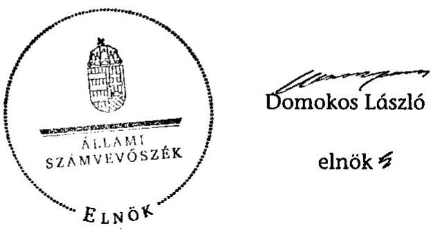
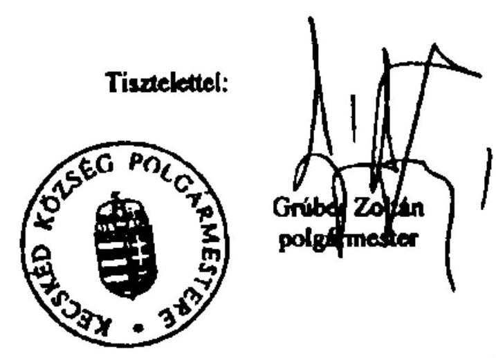
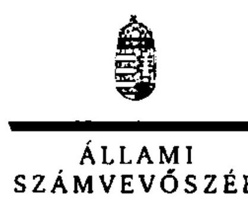
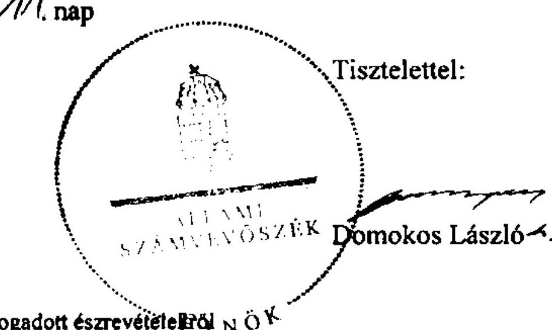

# ÁLLAMI   SZÁMVEVŐSZÉK 

## JELENTÉS

az önkormányzati vagyongazdálkodás
szabályszerűségi ellenőrzéséről
Kecskéd

---

# Állami Számvevőszék 

Iktatószám: V-0026-085-123/2013.
Témaszám: 1065
Vizsgálat-azonosító szám: V061510
Az ellenőrzést felügyelte:
Makkai Mária
felügyeleti vezető
Az ellenőrzést vezette és az ellenőrzés végrehajtásáért felelős:
Schósz Attila Ferencné
ellenőrzésvezető
A számvevőszéki jelentés összeállításában közreműködött:
Balogné Lehoczki Éva
számvevő
Az ellenőrzést végezték:
Draviczky Éva
Számvevő

Balogné Lehoczki Éva
számvevő

---

# TARTALOMJEGYZÉK 

BEVEZETÉS ..... 3
I. ÖSSZEGZŐ MEGÁLLAPÍTÁSOK, KÖVETKEZTETÉSEK, JAVASLATOK ..... 6
II. RÉSZLETES MEGÁLLAPÍTÁSOK ..... 13

1. A vagyongazdálkodási tevékenység szabályozottsága ..... 13
1.1. A feladatellátás formáinak meghatározása, a döntések megalapozottsága ..... 13
1.2. A vagyonnal gazdálkodó szervezetek szervezeti rendjének szabályozottsága, a kötelező szabályzatok megfelelősége ..... 14
1.3. A vagyongazdálkodás szabályozása ..... 16
1.4. A vagyonkezeléssel megbízott szervezetek beszámolási kötelezettségének szabályozása ..... 17
2. A vagyongazdálkodás szabályszerűsége ..... 18
2.1. A vagyon nyilvántartásának megfelelősége ..... 18
2.2. A vagyongazdálkodást érintő gazdasági események követelmények szerinti dokumentáltsága ..... 20
2.3. A vagyongazdálkodási döntések, intézkedések szabályszerűsége ..... 21
2.4. A vagyonkezelő beszámoltatása ..... 23
3. A vagyon változását eredményező gazdasági események szabályszerűsége ..... 23
3.1. A vagyon értékének és összetételének változása ..... 23
3.2. A vagyon fenntartására kialakított rendszer működésének megfelelősége és szabályozottsága ..... 24
3.3. A térítés nélküli átadások szabályszerűsége ..... 25
4. A vagyongazdálkodás szabályszerűségére vonatkozó belső és külső ellenőrzések hasznosulása ..... 26
4.1. A belső ellenőrzés által tett megállapítások, javaslatok hasznosulása ..... 26

---

# MELLÉKLETEK 

1. számú Kecskéd Község Önkormányzata gazdálkodására jellemző adatok, mutatószámok
2. számú Kecskéd Község Önkormányzata vagyonának alakulása 2007. január 1-je és 2011. december 31-e között
3. számú Kecskéd Község Önkormányzata kötelezettségeinek alakulása
4. számú Kecskéd Község Önkormányzata polgármesterének észrevétele
5. számú A polgármester észrevételére adott válasz

## FÜGGELÉKEK

1. számú Rövidítések jegyzéke
2. számú Értelmező szótár

---

# JELENTÉS   az önkormányzati vagyongazdálkodás szabályszerűségi ellenőrzéséről Kecskéd 

## BEVEZETÉS

Az ÁSZ kiemelten fontosnak tartja az ÁSZ tv. 5. § (4) bekezdése alapján az önkormányzatok vagyongazdálkodási tevékenységének, a vagyongazdálkodási szabályok betartásának ellenőrzését. Az ellenőrzés feladata, hogy értékelje a vagyongazdálkodással kapcsolatban a jogszabályokban, az önkormányzati belső szabályozásban előírtak érvényesülését a közpénzek felhasználásának átláthatósága, nyilvánossága érdekében. Az ÁSZ ellenőrzése nemcsak az ellenőrzött szervezet vagyongazdálkodásának hibáira, hiányosságaira mutat rá, számon kérve azok kijavítását, hanem megállapításaival, javaslataival segíti a közpénzekkel, a közvagyonnal való felelős gazdálkodást.

Az önkormányzati vagyon alapvető funkciója, hogy a helyi közérdeket és egyúttal az önkormányzati célok megvalósítását szolgálja. A feladatellátás terén elsősorban a kötelezően ellátandó feladatok végrehajtását hivatott szolgálni, amely mellett az önként vállalt feladatok ellátása is megvalósulhat.

## Az ellenőrzés célja annak értékelése volt, hogy az Önkormányzatnál:

- a vagyongazdálkodási tevékenység, annak szervezeti keretei szabályozottak;
- az önkormányzati vagyongazdálkodás törvényességét, szabályszerűségét biztosították-e; a vagyon értékének és összetételének változását jogszerű döntésekkel alátámasztották-e;
- a belső ellenőrzés elősegítette-e a vagyongazdálkodás szabályszerű működését, valamint hasznosultak-e a korábbi külső ellenőrzések által tett javaslatok.

Az ellenőrzés típusa: szabályszerűségi ellenőrzés
Az ellenőrzés a 2007. január 1. és 2011. december 31. közötti időszakra terjedt ki. A közbeszerzési eljárások lefolytatásának ellenőrzése a 2011. évet és a 2012. év I. negyedévét érintette. Az Nvtv. egyes rendelkezései végrehajtásának ellenőrzése a nemzetgazdasági szempontból kiemelt jelentőségű nemzeti vagyonnak minősülő forgalomképtelen vagyonelemek meghatározására, valamint közép- és hosszú távú vagyongazdálkodási terv készítésére terjedt ki 2012-től 2013. június 4-ig, a helyszíni ellenőrzés befejezéséig.

---

Az ellenőrzés szakmai módszertana az ÁSZ hivatalos honlapján közzétett szakmai szabályokon alapult, amely a Legfőbb Ellenőrző Intézmények Nemzetközi Szervezete (INTOSAI) által kiadott nemzetközi standardok (ISSAI) figyelembevételével készült.

A vagyonváltozásokkal kapcsolatos gazdasági események közül az ellenőrzött tételeket véletlen mintavétellel választottuk ki a Polgármesteri hivatal 2007-2011. évi számviteli nyilvántartásaiból. Az Önkormányzattól tanúsítványt kértünk a korábbi ÁSZ ellenőrzések vagyongazdálkodásra vonatkozó javaslatainak hasznosulásáról, a könyvvizsgáló és a külső ellenőrzési szervek vagyongazdálkodással kapcsolatos 2007-2011. évi javaslataira tett intézkedésekről, valamint a 2007-2011. évek térítésmentes vagyonátadásairól és átvételeiről.

Kecskéd község állandó lakosainak száma 2011. január 1-jén 2020 fő volt. Az Önkormányzat hét tagú Képviselő-testületének munkáját három állandó bizottság segítette. Az Önkormányzat a 2011. évben a Polgármesteri hivatalon felül költségvetési szervet nem tartott fenn. A szociális és gyermekjóléti feladatokról, valamint a belső ellenőrzésről többcélú kistérségi társulás, az oktatási feladatok ellátásáról intézményfenntartó társulás keretében gondoskodtak. A háziorvosi, fogorvosi ellátást, a hulladékok begyűjtését, az ivóvízhálózat működtetését, a közétkeztetést, a Művelődési Ház üzemeltetését és a közművelődési feladatok ellátását megbízási, szolgáltatási, üzemeltetési szerződések útján biztosították. A szennyvízcsatorna hálózat működtetése vagyonkezelési szerződéssel történt. Az Önkormányzat többségi tulajdoni hányaddal gazdasági társasággal nem rendelkezett.

A polgármester 1997. év óta tölti be tisztségét. A jegyző 1999. január 1-jétől látja el feladatait. A Polgármesteri hivatal szervezeti egységekre nem tagolódott, a foglalkoztatott köztisztviselők száma 2011. december 31-én öt fő volt. A feladatellátáshoz kapcsolódóan további két fő közalkalmazottat és két fő Munka Törvénykönyve hatálya alá tartozó munkavállalót foglalkoztattak.

Az Önkormányzat a 2011. évi költségvetési beszámolója szerint 254,6 millió Ft költségvetési bevételt ért el, valamint 183,6 millió Ft költségvetési kiadást teljesített. A 2011. december 31-i könyvviteli mérleg szerint az Önkormányzat 761,2 millió Ft értékű eszközvagyonnal rendelkezett, rövid lejáratú kötelezettsége 10,9 millió Ft volt. Az Önkormányzatnak a 2007-2011. években nem volt hosszú lejáratú (hitelfelvételből, kötvénykibocsátásból származó) kötelezettsége, illetve rövid lejáratú hitelből, kölcsönből, valamint garancia- és kezességvállalásból származó kötelezettsége. Az Önkormányzat a 2007-2011. években nem volt könyvvizsgálatra kötelezett. Az Önkormányzat a 2011. évben, illetve a 2012. év I. negyedévében nem végzett olyan felújítási és beruházási feladatot, amely a Kbt. ${ }_{1,2}$ előírása alapján közbeszerzési eljárást tett volna szükségessé. Külső ellenőrző szervek a gazdálkodás szabályszerűségével, a vagyongazdálkodással kapcsolatban ellenőrzést az Önkormányzatnál a 2007-2011. években nem végeztek.

A jelentéstervezetben alkalmazott rövidítéseket az 1. számú függelék, az egyes fogalmak magyarázatát a 2. számú függelék tartalmazza. Az Önkormányzat gazdálkodására jellemző adatokat, mutatószámokat az 1-3. számú mellékletek tartalmazzák.

---

Az ÁSZ a 2011. évi LXVI. törvény 29. §-a szerint a jelentéstervezetet megküldte Kecskéd Község Önkormányzata polgármesterének egyeztetésre. A beérkezett észrevételt és az arra adott választ a jelentés 4-5. számú mellékletei tartalmazzák.

---

# I. ÖSSZEGZŐ MEGÁLLAPÍTÁSOK, KÖVETKEZTETÉSEK, JAVASLATOK 

Az Önkormányzat könyvviteli mérleg szerinti vagyona a 2007. évi 558,9 millió Ft nyitó értékről a 2011. év végére 761,2 millió Ft-ra, 36,2\%-kal (202,3 millió Ft-tal) nőtt. A 2007-2011. években megvalósult legjelentősebb beruházások, felújítások a gazdasági programban foglalt célkitűzésekkel összhangban voltak, döntő részben (közel 80\%-ban) az Önkormányzat kötelező feladatainak ellátásához kapcsolódtak (több utcát érintő járdaépítés, buszvárók kialakítása, ravatalozó építése). A beruházások, felújítások fedezetét EU-s és hazai támogatásokból, valamint önkormányzati saját forrásból biztosították. A 2007-2011. években a felújításokra, beruházásokra fordított kiadások összege (bruttó 121,4 millió Ft) 27,3\%-kal meghaladta az elszámolt értékcsökkenés összegét (95,4 millió Ft), ezáltal az elhasználódott eszközök pótlása hozzájárult a használhatósági fok növekedéséhez.

A Képviselő-testület a gazdasági programban rögzítette az önkormányzati feladatellátás fő irányait. Az Önkormányzat a kötelező és önként vállalt feladatait a 2007. év elején a Polgármesteri hivatal mellett társulási, üzemeltetési és megbízási szerződések útján látta el. A Képviselő-testület a 2007-2011. évek között a közoktatási feladatokat ellátó társulás megszüntetéséről és ezzel együtt a feladatok ellátása érdekében másik társuláshoz történő csatlakozásról, illetve a közétkeztetés biztosítására szolgáltatási szerződés kötéséről döntött. A 2010. évben a korábban üzemeltetésre átadott szennyvízcsatorna hálózatot - a gazdaságosabb feladatellátás érdekében - vagyonkezelésbe adta az Oroszlányi Szolgáltató Zrt-nek (Vagyonkezelőnek).

Az Önkormányzatnál a vagyongazdálkodás szabályozása hiányos volt. A Képviselő-testület - az Ötv.-ben foglaltaknak eleget téve - a vagyongazdálkodási rendeletben meghatározta a törzsvagyonba tartozó forgalomképtelen és korlátozottan forgalomképes vagyoni kört, a törzsvagyonba nem tartozó vagyonelemeket, valamint a vagyon nyilvántartásának fő szabályait és rendelkezett a tulajdonosi jogok gyakorlásáról. Az Áht. előírása ellenére nem határozták meg a vagyon ingyenes átruházásának részletes feltételeit. Az Nvtv.-ben foglaltak ellenére a megjelölt határidőre, 2012. március 1-jéig (és az ÁSZ helyszíni ellenőrzésének befejezéséig, 2013. június 4-ig) az Önkormányzat nem határozta meg a nemzetgazdasági szempontból kiemelt jelentőségű nemzeti vagyonnak minősülő forgalomképtelen törzsvagyont. Az Önkormányzat a 2013. évben elfogadta a közép és hosszú távú vagyongazdálkodási tervét.

A jegyző - a Htv. előírása ellenére - hiányosan alakította ki a Polgármesteri hivatal (valamint 2009-ig a hozzá tartozó részben önállóan gazdálkodó intézmény) számviteli rendjét. A jegyző a gazdasági szervezet ügyrendjében szabályozta az ellátandó feladatokat, az azok ellátásáért felelős alkalmazottak feladat-, hatáskörét és felelősségi körét. Az Önkormányzat a 2007-2011. években nem rendelkezett érvényes pénzügyi-számviteli szabályzatokkal, mivel a leltározási és leltárkészítési szabályzatot, a bankszámlapénz kezelésre vonatkozó szabályzatot, a kötelezettségvállalás, utalványozás, érvényesítés és ellen-

---

jegyzés hatásköri rendjéről szóló szabályzatot, a selejtezési és hasznosítási szabályzatot valamint a bizonylati szabályzatot - az Áhsz., az Áht. és az Ámr. előírásai ellenére - a polgármester adta ki az arra hatáskörrel rendelkező jegyző helyett. Továbbá a jegyző által - Számviteli rend címmel - kiadott, tartalmában számviteli politikának és számlarendnek megfelelő szabályzat, valamint a pénzkezelési szabályzat hatályba lépésének időpontjai, tartalmi módosításai ellentmondásosak voltak. A pénzügyi, számviteli tevékenység szabályozottságának hiányosságai jogsértő gyakorlatot eredményeztek a gazdálkodási jogkörök gyakorlásánál, a vagyonkimutatás elkészítésénél, a leltározásnál, az ingatlanvagyon-kataszter egyezőségénél. A megállapított hiányosságokért - az Áht., az Ötv. és az Áhsz. alapján - a jegyző a felelős.

Az Önkormányzatnál a vagyongazdálkodás működésének szabályszerűségét hiányosan biztosították. A 2007-2011. években a Képviselőtestület számára a zárszámadással egyidejűleg bemutatott vagyonkimutatást nem az Áhsz. szerinti tartalommal készítették el. Nem tartalmazta az Önkormányzat vagyonát törzsvagyon és törzsvagyonon kívüli egyéb vagyon bontásban, valamint a „0"-ra leírt eszközök állományát. A Képviselő-testület nem szabályozta rendeletben az Áhsz. szerinti kétévenkénti mennyiségi leltározás lehetőségét, így évenkénti leltározási kötelezettség állt fent, amelynek a 2007., a 2009. és a 2011. években az Önkormányzatnál nem tettek eleget, mennyiségi felvétellel nem leltároztak (az üzemeltetésre átadott eszközök esetében a 2008. évben sem). A 2008. és 2010. évben végzett leltározás során elmaradt az ingatlanok mennyiségi felvétele, valamint az elkészített leltárak nem tartalmazták az eszközök értékadatait. Az egyeztetéssel leltározandó eszközökről és forrásokról egyik évben sem készült leltár. A könyvviteli mérleg és a vagyonkimutatás adatait mindezek következtében - az Áhsz. előírásaival szemben - az ellenőrzött években leltárral nem támasztották alá. A vagyonváltozásokat 12 esetben, összesen 241,4 millió Ft értékben nem vezették át az ingatlanvagyonkataszterben. Ezáltal - a 147/1992. (XI. 6.) Korm. rendelet előírásai ellenére - nem biztosították az ingatlanvagyon-kataszter adatainak egyezőségét a földhivatali nyilvántartással, valamint a számviteli nyilvántartással.

Az ellenőrzés során a gazdálkodási és ellenőrzési jogkörök gyakorlásával kapcsolatban feltárt hiányosságok ellenére a jegyző a 2007-2011. évekre vonatkozóan az Ámr. szerinti nyilatkozat kitöltésével kijelentette, hogy gondoskodott a Polgármesteri hivatalnál a belső kontroll rendszerek működtetéséről.

A vagyongazdálkodással kapcsolatban ellenőrzött esetekben a 2007-2011. évek között építési beruházásokhoz, felújításokhoz, nagy értékű eszköz beszerzésekhez kapcsolódóan - az Áht. -ben és az Ámr.-ben
 foglaltak ellenére – 14 esetben, összesen 4,8 millió Ft összegű kiadást előzetes írásbeli kötelezettségvállalás nélkül teljesítettek. A kötelezettségvállalást nem előzte meg ellenjegyzés összesen 32,7 millió Ft kiadás esetében, ezáltal elmaradt a pénzügyi fedezet ellenőrzése. Szakmai teljesítésigazolás hiányában, illetve szakmai teljesítésigazoló aláírása ellenére nem történt meg a kifizetés jogosságának, összegszerűségének, a szerződésben foglalt feladatok elvégzésének ellenőrzése összesen 6,4 millió Ft értékű kiadás esetében. Az érvényesítő valamennyi ellenőrzött kiadás és bevétel esetében megbízás, illetve kijelölés nélkül látta el feladatát. Az utalvány ellenjegyzője nem kifogásolta az előzetes írásbeli kötelezettségvállalás és a szakmai teljesítésigazolás hiányát összesen 8,4 millió Ft összegben. Az

---

Ámr. ${ }_{1,2}$-ben előírt ellenőrzési feladatok elmaradása az Önkormányzatnál a 2010. évben a beruházási kiadások esetében kiadási előirányzat túllépést eredményezett.

A vagyongazdálkodási döntések előkészítése során az önkormányzati SZMSZ ${ }_{1,2}$ és a vagyongazdálkodási rendelet ${ }_{1,2}$ előírásait betartották. Az Ötv.-ben foglalt előírás ellenére a polgármester a Képviselő-testület döntésének hiányában bányaszolgalmi jog alapítása tárgyában kötött megállapodást, továbbá a tulajdonosi jogokat gyakorló Képviselő-testület helyett az intézményvezető tárgyi eszközök ingyenes átvételéről döntött. A vagyon értékének és összetételének változását ezen esetekben jogszerű döntésekkel nem támasztották alá. Az Önkormányzatnál – szabályozás hiányában, célszerűsége ellenére – nem végezték el a beruházásokkal létrejövő létesítmények fenntarthatóságának vizsgálatát a kötelező feladathoz kapcsolódó ravatalozó építési munkáira, valamint az önként vállalt feladathoz kapcsolódó Művelődési Ház felújítására. A vagyongazdálkodás során megkötött szerződések – egy útfelújításhoz, továbbá a rendezési terv módosításához kapcsolódó szerződések kivételével – tartalmaztak az Önkormányzat érdekeit védő garanciális elemeket.

A Vagyonkezelő a számára előírt, 2010. és 2011. évekre vonatkozó beszámolási kötelezettségének eleget tett, azonban a 2011. évről szóló beszámolót a Képviselő-testület – a polgármester előterjesztése hiányában – nem tárgyalta annak ellenére, hogy a vagyonkezelési szerződés szerint a Képviselő-testületnek a beszámolót el kell fogadnia.

A jegyző nem biztosította a közérdekű gazdálkodási adatok közzétételét – az Áht. ${ }_{1}$ és az Eisztv. előírásai ellenére – a háziorvosi és fogorvosi ellátásra, a Művelődési Ház működtetésére nyújtott önkormányzati támogatások adatai, a vagyonnal való gazdálkodásra vonatkozó (nettó ötmillió Ft-ot elérő, vagy meghaladó értékű beruházási, vagyonhasznosítási) szerződések adatai, a 2009-2010. évi költségvetési rendeletek és elemi költségvetések, valamint a 2008-2010. évekre vonatkozó zárszámadásról szóló rendeletek és elemi költségvetési beszámolók tekintetében. A 2011. évi költségvetési és zárszámadási rendeleteket a jegyző közzétette az Önkormányzat honlapján.

A belső ellenőrzési feladatokat az Önkormányzat a 2007-2011. években az Ötv.-ben foglaltaknak megfelelően többcélú kistérségi társulás keretében látta el. A 2007-2011. évek között (a vagyongazdálkodást érintően) két alkalommal végezték el a Polgármesteri hivatal gazdálkodásának szabályszerűségi és rendszerellenőrzését. A belső ellenőrzési jelentések megállapításai a szabályozás hiányosságaihoz, a mérleg alátámasztottságához, a számviteli nyilvántartások, a leltározás és a kontrollok működésének hiányosságaihoz kapcsolódtak. Intézkedési terv a hiányosságok megszüntetésére – a Ber. előírásai ellenére egyik ellenőrzést követően sem készült. Az Önkormányzat a javaslatokat nem hasznosította. Ezáltal a belső ellenőrzés jelentései a 2007-2011. évek között nem segítették elő a vagyongazdálkodás szabályszerű működését. Mindezekért fennáll a jegyző felelőssége, mivel a belső ellenőrzés működtetése – az Áht. ${ }_{1}$ és az Ötv. alapján – a jegyző kötelessége. A polgármester – az Ötv.ben foglaltaknak megfelelően – a Képviselő-testület elé terjesztette az éves ellenőrzési jelentést és az éves összefoglaló ellenőrzési jelentést.

---

Az Állami Számvevőszékről szóló 2011. évi LXVI. törvény 33. § (1) bekezdésében foglaltak értelmében a jelentésben foglalt megállapításokhoz kapcsolódó intézkedési tervet köteles az ellenőrzött szervezet vezetője összeállítani, és azt a jelentés kézhezvételétől számított 30 napon belül az ÁSZ részére megküldeni. Amennyiben az intézkedési tervet határidőben nem küldi meg a szervezet, vagy az nem elfogadható, az ÁSZ elnöke a hivatkozott törvény 33. § (3) bekezdés a)-b) pontjaiban foglaltakat érvényesítheti.

Az ellenőrzés intézkedést igénylő megállapításai és javaslatai:

# a Polgármesternek 

1. Az Önkormányzat a 2007-2011. években nem rendelkezett érvényes pénzügyiszámviteli szabályzatokkal, mivel a jegyző helyett a polgármester hagyta jóvá, illetve adta ki a leltározási és leltárkészítési, a bankszámlapénz kezelési szabályzatot, a selejtezési és hasznosítási szabályzatot, a bizonylati szabályzatot, valamint a kötelezettségvállalásról, az utalványozásról, az érvényesítés és ellenjegyzés hatásköri rendjéről szóló szabályzatot. Továbbá a jegyző nem jelölte ki az ellenjegyzésre és érvényesítésre jogosult személyeket.

Ezen túl a belső ellenőrzés által feltárt hiányosságok megszüntetése érdekében intézkedési tervet nem készítettek. Az Önkormányzat a javaslatokat nem hasznosította.

Javaslat:
Vizsgálja ki a feltárt hiányosságokat, szabálytalanságokat, és amennyiben szükséges, tegye meg a munkajogi felelősségre vonást.

## a jegyzőnek

1. Az Önkormányzat a 2007-2011. években nem rendelkezett érvényes pénzügyiszámviteli szabályzatokkal, mivel – az Áhsz. 8. § (12), az Áhsz. 37. § (5) és az Áhsz. 51. §-ában foglaltakkal ellentétben – a jegyző helyett a polgármester hagyta jóvá, illetve adta ki a leltározási és leltárkészítési, a bankszámlapénz kezelési szabályzatot, a selejtezési és hasznosítási szabályzatot, a bizonylati szabályzatot, valamint a kötelezettségvállalásról, az utalványozásról, az érvényesítés és ellenjegyzés hatásköri rendjéről szóló szabályzatot. Továbbá a jegyző nem jelölte ki – az Ámr. 134. § (2), Ámr. 2 72. § (8) és az Ámr. 135. § (4), Ámr. 2 77. § (4) bekezdéseivel ellentétben – az ellenjegyzésre és érvényesítésre jogosult személyeket.

Javaslat:
Intézkedjen az Áhsz. 37. § (5) bekezdésében és az 51. §-ában előírtaknak megfelelően a selejtezési és hasznosítási, a bizonylati, a kötelezettségvállalásról, az utalványozásról, az érvényesítés és ellenjegyzés hatásköri rendjéről szóló szabályzatok kiadásáról, továbbá az Ávr. 58. § (4) bekezdésében foglaltaknak megfelelően szabályozza a kötelezettségvállalás ellenjegyzésének, valamint az utalvány ellenjegyzésének esetére a helyettesítési rendjét és az Ávr. 55. § (2) bekezdésében előírtaknak megfelelően adja ki a kijelölést az érvényesítési feladatok ellátásához.

---

2. A 2007-2011. évek közötti ellenőrzött tételeken belül – az Ámr. 134. § (8)-(9), az Ámr. 2 74. § (1) és (3), az Ámr. 1 135. § (1), az Ámr. 2 76.§ (1), az Ámr. 1 135. § (4), az Ámr. 2 77.§ (4), az Ámr. 1 137. § (3), az Ámr. 2 79. § (2) bekezdéseiben foglalt előírások ellenére – nem történt előzetes írásbeli kötelezettségvállalás 4,8 millió Ft összegű kiadás előtt, 32,7 millió Ft kötelezettségvállalás ellenjegyzése elmaradt, 6,4 millió Ft értékű kiadás esetében a szakmai teljesítés igazolása, illetve a szakmai teljesítést igazoló ellenőrzési kötelezettségének teljesítése elmaradt, az érvényesítő 37,5 millió Ft értékű kiadás esetében jogosulatlanul látta el feladatát és 8,4 millió Ft összegben az utalvány ellenjegyzője nem kifogásolta az írásbeli kötelezettségvállalás és a teljesítés igazolás hiányát.

Javaslat:
Intézkedjen, hogy a pénzügyi ellenjegyző, a teljesítést igazoló, az érvényesítő és az utalványozó – az Áht. 2 37. § (1), az Ávr. 57. § (1), az Ávr. 58. § (1) és az Ávr. 59. § (2) bekezdései előírásainak megfelelően – végezze el ellenőrzési feladatait.
3. A Képviselő-testület az Nvtv. 18. § (1) bekezdésében foglaltak ellenére az Nvtv. hatályba lépését követő 60 napon belül (2012. március 1-jéig és az ÁSZ helyszíni ellenőrzésének befejezéséig, 2013. június 4-ig) nem jelölte meg a forgalomképtelennek minősülő vagyonból a nemzetgazdasági szempontból kiemelt jelentőségű, nemzeti vagyonnak minősülő forgalomképtelen törzsvagyont.

Javaslat:
Készítsen rendelettervezetet a nemzetgazdasági szempontból kiemelt jelentőségű nemzeti vagyonnak minősülő forgalomképtelen vagyonelemek kijelölése érdekében az Nvtv. 18. § (1) bekezdésében előírtak szerint és kezdeményezze a polgármesternél a rendelettervezet Képviselő-testület elé terjesztését.
4. Az Önkormányzatnál az elkészített és a zárszámadással egyidejűleg a Képviselőtestületnek bemutatott vagyonkimutatás nem felelt meg az Áhsz. 44/A. § (2)-(3) bekezdésében előírt tartalmi követelményeknek, mert nem tartalmazta az Önkormányzat vagyonát törzsvagyon és törzsvagyonon kívüli egyéb vagyon bontásban, továbbá nem szerepeltek benne a mérlegben értékkel nem szereplő kötelezettségek, ideértve a kezesség-, illetve garanciavállalással kapcsolatos függő kötelezettségeket.

Javaslat:
Intézkedjen az önkormányzat vagyonkimutatásának az Áhsz. 44/A. § (2)-(3) bekezdésében előírtak szerinti elkészítéséről és annak a Képviselő-testület részére történő bemutatásáról.
5. A 147/1992. (XI. 6.) Korm. rendelet 1. § (2)-(3) bekezdésében foglaltak ellenére, az önkormányzati ingatlanvagyon-kataszter adatai és a földhivatali nyilvántartás adatai, valamint az ingatlanvagyon-kataszter és a számviteli nyilvántartás adatai közötti egyezőséget a 2008-2011. években nem biztosították. Nem vezették át a vagyonváltozásokat az ingatlanvagyon-kataszterben a 147/1992. (XI. 6.) Korm. rendelet 4. § (1) bekezdésében foglaltak ellenére az utakat, járdákat érintő felújítások, a ravatalozó beruházás, a buszvárók kialakítása, a bányaszolgalmi jog és hírközlési használati jog alapítása kapcsán, valamint a szennyvízcsatorna hálózatot érintően.

---

Javaslat:
Intézkedjen, hogy a 147/1992. (XI. 6.) Korm. rendelet 1. § (2) bekezdésében foglaltaknak megfelelően az ingatlanvagyon-kataszter adatai egyezzenek meg a földhivatal ingatlan-nyilvántartásának azonos tartalmú adataival, továbbá az 1. § (3) bekezdésében foglaltaknak megfelelően biztosítsa az egyezőséget az ingatlanvagyonkataszter és a számviteli nyilvántartás adatai között.
6. A leltározás végrehajtása során nem tartották be az Áhsz. egyes előírásait az alábbiak tekintetében:
a) Az Önkormányzatnál a 2007., a 2009. és 2011. évben mennyiségi felvétellel nem leltároztak annak ellenére, hogy a Képviselő-testület nem szabályozta rendeletben az Áhsz. 37. § (7) bekezdés szerinti kétévenkénti mennyiségi leltározás lehetőségét. A 2008. és 2010. évben végzett leltározás során is elmaradt az ingatlanok mennyiségi felvétellel történő leltározása. Az Áhsz. 37. § (3) bekezdése alapján egyeztetéssel leltározandó eszközökről és forrásokról egyik évben sem készült az Áhsz. 37. § (2) bekezdésének megfelelő leltár.
b) Az elkészített leltárakat nem értékelték ki.

Javaslat:
Intézkedjen, hogy
a) az Áhsz. 37. § (3) bekezdésében foglaltaknak megfelelően történjen az eszközök leltározása.
b) A leltározáskor végezzék el a felvett leltárak kiértékelését és a leltárak az Áhsz. 37. § (2) bekezdésében foglaltaknak megfelelően tartalmazzák tételesen, ellenőrizhető módon az Önkormányzat eszközeit mennyiségben és értékben, forrásait értékben.
7. A Ber. 29. § (1) bekezdés előírása ellenére a belső ellenőrzés által feltárt hiányosságok megszüntetésére a jegyző egyik ellenőrzést követően sem készített intézkedési tervet. Az Önkormányzat a megállapításokat nem hasznosította, ezáltal a belső ellenőrzés nem járult hozzá a vagyongazdálkodás szabályszerű működéséhez.

Javaslat:
Intézkedjen, hogy a Bkr. 28. § c) pontjában előírtaknak megfelelően készüljön intézkedési terv a belső ellenőrzés által feltárt hiányosságok megszüntetésére, továbbá az intézkedési tervben foglaltak végrehajtására.
8. A Vagyonkezelő a számára előírt beszámolási kötelezettségének eleget tett, azonban a 2011. évről szóló beszámolót a Képviselő-testület – előterjesztés hiányában – nem tárgyalta annak ellenére, hogy a vagyonkezelési szerződés szerint a Képviselőtestületnek a beszámolót el kell fogadnia.

---

Javaslat:
Készítsen előterjesztést a vagyonkezelő beszámolójáról és kezdeményezze a polgármesternél annak Képviselő-testület elé terjesztését, annak érdekében, hogy a vagyonkezelési szerződésben foglaltaknak megfelelően a beszámolót a Képviselőtestület jóvá tudja hagyni.

---

# II. RÉSZLETES MEGÁLLAPÍTÁSOK 

## 1. A VAGYONGAZDÁLKODÁSI TEVÉKENYSÉG SZABÁLYOZOTTSÁGA

### 1.1. A feladatellátás formáinak meghatározása, a döntések megalapozottsága

Az Önkormányzat a 2006-2010. évekre, illetve a 2011-2014. évekre szóló gazdasági program ${ }_{1,2}$-ben fő célkitűzésként építési telkek kialakítását és értékesítését határozta meg, a telkek kialakításához szükséges közműépítési
 munkákat elsődlegesen pályázati források igénybevételéhez kötötte. A gazdasági programok${ }_{1}$-ben intézményfelújításokat, illetve új ravatalozó építését, a gazdasági programok${ }_{2}$-ben az úthálózat felújítását helyezte előtérbe, a célok megvalósítása érdekében pályázati forrás bevonásával számolt. Önként vállalt feladatként a gazdasági programok${ }_{1,2}$-ben a Művelődési Ház épületének felújítása, hagyományteremtő rendezvények rendszeres szervezése, civil szervezetek támogatása, valamint az idegenforgalom fejlesztése jelent meg.

Az Önkormányzat - az Ötv. 8. § (2) bekezdése alapján - a kötelező és önként vállalt feladatai ellátásának módját és mértékét meghatározta${ }^{1}$. Az Önkormányzat 2007. január 1-jén kötelező és önként vállalt feladatait a Polgármesteri hivatal mellett társulási, üzemeltetési, szolgáltatási, megbízási szerződések útján látta el.

Az Önkormányzat a többcélú kistérségi társulás keretén belül kötelező feladatok ellátását, a szociális és gyermekjóléti feladatokat, valamint a belső ellenőrzést biztosította. Az oktatási kötelező feladatok (általános iskola, óvoda, mint részben önállóan gazdálkodó költségvetési szerv) ellátásáról az Intézményfenntartó társulás${ }_{1}$ útján gondoskodott. Az Önkormányzat a kötelező háziorvosi és fogorvosi ellátást megbízási szerződés, a hulladékok begyűjtését szolgáltatási szerződés útján biztosította. Az Önkormányzat üzemeltetési szerződéssel oldotta meg az általa megvalósított ivóvízhálózat működtetését, a község teljes területének szennyvízelvezetését, a közművelődési feladatok ellátását, valamint önként vállalt feladatként a Művelődési Ház üzemeltetését.

Az Önkormányzat a 2007-2011. évek között a feladatok ellátása érdekében az Intézményfenntartó társulás${ }_{1}$ megszüntetéséről, a közoktatási feladatellátás kapcsán másik társuláshoz történő csatlakozásról és szolgáltatási szerződés kötéséről, továbbá üzemeltetési szerződés felbontásáról és vagyonkezelésbe adásról döntött. Ezen döntéseket megelőzően az előterjesztésekben a Képviselő-testület számára a megalapozott döntés meghozatala érdekében alternatív javaslatokat nem mutattak be.

[^0]
[^0]:    ${ }^{1}$ a gazdasági programok${ }_{1,2}$-ben, a Polgármesteri hivatal alapító okiratában, az éves költségvetési rendeletekben

---

Az Önkormányzat a 2009. évben Kömlőd Községi Önkormányzattal közösen az Intézményfenntartó társulás${ }_{1}$ megszüntetéséről döntött. A megszüntető okirat szerint a megszüntetés oka, hogy a „közfeladat hatásvizsgálat alapján más szervezetben hatékonyabban teljesíthető". Az Önkormányzat 2009. augusztus 1-jétől csatlakozott az Intézményfenntartó társulás${ }_{2}$-hoz az oktatási feladatok ellátására. Ezen időponttól kezdődően az Önkormányzat oktatási intézménye az Intézményfenntartó társulás${ }_{2}$ költségvetési szervének tagintézménye lett. Az Önkormányzatnál maradt a közétkeztetés feladata, amelynek ellátására a 2009. évben szolgáltatási szerződést kötöttek a közbeszerzési eljárás keretében kiválasztott vállalkozóval.

A Képviselő-testület a 2008. évben felülvizsgálta a szennyvízelvezetés üzemeltetésének módját és megállapította, hogy a közfeladat ellátása vagyonkezelésbe adással nagyobb biztonsággal és gazdaságosabban oldható meg. Ezért döntött a szennyvízcsatorna hálózat vagyonkezelésbe adásának előkészítéséről, majd a 2010. évben a vagyonkezelésbe adásról². A szennyvízcsatorna hálózatot az Önkormányzat 2010-ben kijelöléssel az Oroszlányi Szolgáltató Zrt.-nek, mint Oroszlány város önkormányzati többségi tulajdonában lévő gazdasági társaságnak adta vagyonkezelésbe.

# 1.2. A vagyonnal gazdálkodó szervezetek szervezeti rendjének szabályozottsága, a kötelező szabályzatok megfelelősége 

A Képviselő-testület a vagyongazdálkodási rendelet${ }_{1}$-ben az önkormányzati vagyon kezelésével a Polgármesteri hivatalt bízta meg, a vagyonnal gazdálkodó, közfeladatot ellátó költségvetési szerv alapító okiratában a szervezet alaptevékenységét meghatározta.

A Képviselő-testület élt az Ötv. 9. § (3) bekezdésében biztosított jogával és a vagyongazdálkodási rendelet${ }_{2}$-ben a selejtezéssel kapcsolatos egyes hatásköröket a polgármesterre és az önkormányzati intézmény vezetőjére ruházta át. A feladat ellátással kapcsolatban beszámolási kötelezettséget nem írtak elő.

A vagyongazdálkodási rendelet${ }_{2}$ értelmében a polgármester engedélyezhette az önkormányzati intézmény kezelésében lévő felesleges tárgyi eszközök és készletek, üzemeltetésre átadott eszközök selejtezését 100 ezer Ft/db könyv szerinti értékhatár felett, valamint a selejtezésre kijelölt felesleges vagyontárgyak intézmények részére történő ellenérték nélküli átadását értékhatártól függetlenül. A 100 ezer Ft/db könyv szerinti értékhatár alatti eszközök selejtezését az intézményvezető engedélyezhette.

A jegyző - a Htv. 140. § (1) bekezdés c) pontjában foglalt előírás ellenére - a 2007-2011. években hiányosan alakította ki a Polgármesteri hivatal (valamint 2009-ig a hozzá tartozó részben önállóan gazdálkodó intézmény) számviteli rendjét. A jegyző a (2005. január 1-jei hatállyal kiadott) gazdasági szervezet ügyrendjében szabályozta az ellátandó (költségvetési tervezéssel, előirányzat-módosítással, vagyongazdálkodással, készpénzkezeléssel, költségvetés végrehajtásával, számviteli nyilvántartások vezetésével kapcsolatos) feladatokat, a feladatok ellátásáért felelős alkalmazottak feladat-, hatás- és felelősségi körét. Elmaradt azonban a gazdálkodási jogkört gyakorlók közül a kötele-

[^0]
[^0]:    ${ }^{2}$ a Képviselő-testület 110/2008. (XII. 17.) és 71/2010. (VII. 6.) számú határozata

---

zettségvállalás ellenjegyzésének (a választások és népszavazások kivételével), továbbá az utalvány ellenjegyzésének esetére a helyettesítés rendjének szabályozása. A jegyző az érvényesítési feladat ellátása és annak helyettesítése esetében a munkakört meghatározta ugyan, de az Ámr.${ }_{1}$ 135. § (4) bekezdésében${ }^{3}$ előírtak ellenére elmaradt az érvényesítési feladatok ellátásához a személy szerinti megbízás, illetve kijelölés. A jegyző a gazdálkodási jogkörök gyakorlásának rendjét, valamint a velük kapcsolatos összeférhetetlenségi követelményeket - a szakmai teljesítésigazolás kivételével - nem alakította ki.

A szakmai teljesítésigazolás szabályairól a 2008. január 1-jétől hatályos 1. számú intézkedésben rendelkezett a jegyző, melyben kijelölte az ezen feladatok elvégzésével megbízott személyeket.

Az Önkormányzat az alábbi szabályzatokkal nem rendelkezett, mivel a szabályzatokat nem a hatáskörrel rendelkező jegyző, hanem a polgármester adta ki:

- a 2002. január 22-én aláírt leltározási és leltárkészítési szabályzatot és a 2009. január 2-án kiadott bankszámlapénz kezelésre vonatkozó szabályzatot a polgármester hagyta jóvá, amely ellentétes az Áhsz. 8. § (12) bekezdésével, mely szerint a számviteli politika jóváhagyásáért - amelynek keretében a leltározási szabályzatot, valamint a pénzkezelési szabályzatot is el kell készíteni - és annak végrehajtásáért az államháztartás szervezetének vezetője felelős;
- 2009. január 2-án ugyancsak a polgármester adta ki a kötelezettségvállalásról, utalványozásról, érvényesítés és ellenjegyzés hatásköri rendjéről szóló szabályzatot, amely ellentétes volt az Áht.${ }_{1}$ 121. § (1) bekezdésével, továbbá az Ámr.${ }_{2}$ 20. § (3) bekezdés a) pontjában${ }^{4}$ foglaltakkal, amely a költségvetési szerv feladatává teszi a kötelezettségvállalás, ellenjegyzés, szakmai teljesítésigazolás, érvényesítés, utalványozás gyakorlásának módjával, eljárási és dokumentációs részletszabályaival, az ezeket végző személyek kijelölésének rendjével kapcsolatos belső szabályozás elkészítését;
- a selejtezési és hasznosítási szabályzatot a polgármester 2001. január 2-án írta alá, mely nem felelt meg az Áhsz. 37. § (5) bekezdésében foglalt azon előírásnak, hogy a selejtezés részletes szabályait az államháztartás szervezete saját hatáskörben állapítja meg. A 2001. januárjában kiadmányozott bizonylati szabályzat polgármester által történő aláírása ellentétes az Áhsz. 51. §-ában foglaltakkal, mely a bizonylati rend kialakítását, szabályozását szintén az államháztartás szervezete vezetőjének teszi feladatává.

A jegyző által 2006. január 1-jén kiadott szabályzat${ }^{5}$ tartalmában számviteli politikának és számlarendnek felelt meg, a 2007. január 1-jén kiadott pénzkezelési szabályzat tartalmában a bankszámlapénz és a házipénztár kezelésének szabályait rögzítette. Mindkét szabályzat kézzel beírt javításokat, áthúzásokat tartalmazott, oldalszámozásuk a lapcserék következtében követhetetlenné vált. A hatályba lépések időpontjai, tartalmi módosításai ellentmondásosak voltak. Mindezek következtében a Polgármesteri hivatal - az Áhsz. 8. § (3) bekezdésében, (4) bekezdés d) pontjában, továbbá 49. § (1) bekezdésében foglalt előírás ellenére - nem rendelkezett érvényes számviteli politikával, számlarenddel, pénzkezelési szabályzattal. A keltezés nélküli (a fejlécben található dátum szerint 2009. január 1-jétől hatályos) eszközök és források értékelési szabályzata nem volt kiadmányozva, ezáltal a Polgármesteri hivatal nem rendelkezett hatályos értékelési szabályzattal, mely ellentétes az Áhsz. 8. § (4) bekezdés b) pontjában foglaltakkal.

A szabályzatok az ismertetett hiányosságok miatt az ellenőrzés szempontjából nem tekinthetők elfogadható, hiteles dokumentumoknak. A megállapított hiányosságokért a jegyző felelős${ }^{6}$.

# 1.3. A vagyongazdálkodás szabályozása 

A Képviselő-testület a vagyongazdálkodási rendelet${ }_{1,2}$-ben - az Ötv. 79. § (2) bekezdésének megfelelően - meghatározta az önkormányzati feladatellátást biztosító törzsvagyon körét, azon belül a forgalomképes és korlátozottan forgalomképes vagyonelemeket, valamint a törzsvagyonba nem tartozó vagyoni kört. A forgalomképesség megváltoztatásának szabályait nem írták elő.

A vagyongazdálkodási rendelet${ }_{1,2}$-ben rögzítették a vagyon nyilvántartásának fő szabályait, rendelkeztek a tulajdonosi jogok gyakorlásáról. A vagyon ingyenes átruházásával kapcsolatos döntést a Képviselő-testület saját hatáskörében tartotta. Az Önkormányzat ezen túl nem tett eleget az Áht.${ }_{1}$ 108. § (2) bekezdésében foglaltaknak, mivel a vagyongazdálkodási rendelet${ }_{1,2}$-ben és az Önkormányzat egyéb rendeleteiben nem határozták meg az ingyenes átruházás részletes feltételeit, eseteit és módját.

A vagyongazdálkodási rendelet${ }_{2}$ - a Htv. 138. § (1) bekezdés j) pontjában előírtak szerint - tartalmazta az önkormányzati vagyonnal történő gazdálkodásra, az Önkormányzat vagyonának hasznosítási módjaira, a vagyonkezelésbe adás feltételeire, a vagyonkezelési jog gyakorlására és ellenőrzésére, a vagyonkezelői jog megszüntetésére vonatkozó szabályokat.

Az Önkormányzat nyilvános (indokolt esetben zártkörű) versenyeztetésre vonatkozó elvárásokat, követelményeket nem fogalmazott meg.

Az önkormányzati SZMSZ${ }_{1,2}$-ben kialakították az előterjesztések készítésének, megtárgyalásának, véleményezésének, döntéshozatalának általános rendjét. A megalapozott vagyongazdálkodási döntések meghozatala érdekében azonban - célszerűsége ellenére - nem írták elő a döntés előkészítés folyamatában a költség-haszon elemzés, valamint a hasznosításra szánt ingatlanvagyon piaci értéke megállapítása céljából az értékbecslés készítésének kötelezettségét, továbbá a tulajdonosi jogok védelme érdekében a garanciális elemek szerződésekben, egyéb dokumentumokban való rögzítésének kötelezettségét. Nem sza-

[^0]
[^0]:    ${ }^{6}$ Az Áhsz. 1. § (1) bekezdés b) pontja szerint az Áhsz. hatálya alá tartozik a helyi önkormányzat költségvetési szerve. Az Áht.${ }_{1}$ 66. §-a szerint a Polgármesteri hivatal költségvetési szervként működik. Az Ötv. 36. § (2) bekezdése szerint a képviselő-testület hivatalának vezetője a jegyző.

---

bályozták a támogatásokkal megvalósuló beruházásokkal létrejövő létesítmények fenntarthatóságának vizsgálatát.

A jegyző 2007. január 1-jén kiadmányozta a folyamatba épített előzetes és utólagos vezetői ellenőrzés szabályzatát. A szabályozás rögzítette a gazdálkodás általános alapelveit. A jegyző nem rendelkezett az Áht.${ }_{1}$ 121. § (1) bekezdés a) c) pontjaiban${ }^{7}$ előírt dokumentumok (pénzügyi döntéseket előkészítő dokumentáció, az előzetes és utólagos pénzügyi ellenőrzés dokumentumai, hatályos jogszabályoknak megfelelő könyvvezetés és beszámolás kontrolljai) elkészítéséről. Ezáltal nem segítette elő a rendelkezésre álló források szabályszerű, gazdaságos, hatékony és eredményes felhasználását, nem biztosította - az Áht.${ }_{1}$ 121. § (3) bekezdés a)-b) pontjában${ }^{8}$ előírtak ellenére - a költségvetési szerv gazdálkodásának szabályozottságát, az eszközök és források rendeltetésszerű használatának feltételeit.

A Képviselő-testület elfogadta${ }^{9}$ - az Nvtv. 9. § (1) bekezdésében előírtak alapján - az Önkormányzat közép és hosszú távú vagyongazdálkodási tervét, továbbá meghatározta törzsvagyonának és üzleti vagyonának körét${ }^{10}$. A Képviselő-testület - az Nvtv. 18. § (1) bekezdésében foglaltak ellenére - a megjelölt határidőre, 2012. március 1-jéig (és

[^0]
[^0]:    ${ }^{3}$ 2010. augusztus 15-étől az Ámr.${ }_{2}$ 77. § (4) bekezdése, 2012. január 1-jétől az Ávr. 58. § (4) bekezdése tartalmazza.
    ${ }^{4}$ 2012. január 1-jétől az Ávr. 13. § (2) bekezdés a) pontja szabályozza.
    ${ }^{5}$ A szabályzatot a jegyző „Számviteli rend” címmel adta ki.
    ${ }^{7}$ 2012. január 1-jétől az Ávr. 13. § (1) bekezdés a) c) pontja szabályozza.
    ${ }^{8}$ 2012. január 1-jétől az Ávr. 13. § (3) bekezdés a) b) pontja szabályozza.
    ${ }^{9}$ A Képviselő-testület 12/2011. (II. 15.) számú határozata.
    ${ }^{10}$ A Képviselő-testület 12/2011. (II. 15.) számú határozata.

---
 az ÁSZ helyszíni ellenőrzésének befejezéséig, 2013. június 4-ig) - a polgármester előterjesztése és a képviselő-testületi ülésen történt tárgyalás ellenére - nem jelölte meg a forgalomképtelennek minősülő vagyonból a nemzetgazdasági szempontból kiemelt jelentőségű, nemzeti vagyonnak minősülő forgalomképtelen törzsvagyont.

# 1.4. A vagyonkezeléssel megbízott szervezetek beszámolási kötelezettségének szabályozása 

A 2010. évben a szennyvízcsatorna hálózat működtetésére megkötött vagyonkezelési szerződésben rögzítették a Vagyonkezelő feladatát, illetékességét, hatáskörét és felelősségét. Szabályozták a vagyonkezelés ellenőrzésének általános irányelveit, és beépítettek - az Önkormányzat érdekeit védő - garanciális elemeket. A szerződés tartalmazta a vagyonkezelői jog megszerzésének, gyakorlásának részletes szabályait, a vagyonkezelés korlátait, valamint a beszámolási kötelezettséget. A vagyonkezelési szerződés alapján a Vagyonkezelőnek a felújításról, pótlólagos beruházásról, tartalékképzésről évente tervet kellett készítenie, amelynek teljesítéséről köteles volt beszámolni. Köteles volt továbbá évente egyszer a vagyonkezelésbe vett eszközök állapotáról, tárgyévi változásáról adatokat szolgáltatni, valamint az Önkormányzat felkérésére gazdasági, műszaki és pénzügyi tájékoztatót készíteni.

[^0]
[^0]:    ${ }^{7}$ 2011. január 1-jétől az Áht. ${ }_{1}$ 121/A. § (4) bekezdése, 2012. január 1-jétől az Áht. ${ }_{2} 69$. (2) bekezdése szabályozza.
    ${ }^{8}$ 2011. január 1-jétől az Áht. ${ }_{1}$ 121/A. § (2) bekezdés a)-b) pontjai, 2012. január 1-jétől az Áht. ${ }_{2} 69$. (1) bekezdése és a Bkr. 8. § (2) bekezdése szabályozza.
    ${ }^{9}$ a Képviselő-testület 7/2013. (II. 4.) számú határozata
    ${ }^{10}$ az Önkormányzat 18/2012. (X. 31.) számú rendelete az Önkormányzat vagyonáról és a vagyongazdálkodás szabályairól

---

# 2. A VAGYONGAZDÁLKODÁS SZABÁLYSZERŰSÉGE 

### 2.1. A vagyon nyilvántartásának megfelelősége

Az Önkormányzatnál az Ötv. 78. § (2) bekezdésében foglaltak ellenére - az ellenőrzött években - az elkészített és a zárszámadással egyidejűleg a Képviselőtestületnek bemutatott vagyonkimutatás nem felelt meg az Áhsz. 44/A. § (2)-(3) bekezdésében előírt tartalmi követelményeknek.

A 2007-2009. években vagyonkimutatás, a 2010-2011. években vagyonmérleg elnevezéssel a zárszámadás 14. számú mellékleteként szerepeltették az Önkormányzat vagyonát összevontan bemutató mérleget, amelynek tagolása, részletezettsége nem felelt meg az Áhsz. 44/A. § (2)-(3) bekezdése által a vagyonkimutatásra vonatkozóan előírt minimális tartalmi követelményeknek, mivel a tárgyi eszköz és a befektetett pénzügyi eszközcsoportok tekintetében nem tartalmazta a könyvviteli mérleg arab számmal jelzett tételei szerinti tagolást, és nem tartalmazta az Önkormányzat vagyonát törzsvagyon (forgalomképtelen és korlátozottan forgalomképes), illetve törzsvagyonon kívüli egyéb vagyon bontásban, valamint nem tartalmazta a „0”-ra leírt eszközök állományát.

A jegyző - a 147/1992. (XI. 6.) Korm. rendelet 6. § (2) bekezdésében foglaltak ellenére - 1993. december 31-ig nem fektette fel az Önkormányzat ingatlanvagyonáról az ingatlanvagyon-katasztert, azt csak 2008. január óta vezeti. A vagyonváltozásokat az ellenőrzött tételek közül - a 147/1992. (XI. 6.) Korm. rendelet 4. § (1) bekezdésében foglaltak ellenére - az ingatlanvagyon-kataszterben nem vezették át az utakat, járdákat érintő felújítások, a kiemelt beruházásként ellenőrzött ravatalozó építés, a buszvárók kialakítása, a bányaszolgalmi jog és a hírközlési használati jog alapítása kapcsán, valamint a szennyvízcsatorna hálózatot érintően (összesen 12 esetben, 241,4 millió Ft értékben). Ezáltal - a 147/1992. (XI. 6.) Korm. rendelet 1. § (2)-(3) bekezdésében, valamint a 2. számú mellékletében foglaltak ellenére - az önkormányzati ingatlanvagyon-kataszter adatai a földhivatali nyilvántartással, valamint az ingatlanvagyon számviteli nyilvántartásban szereplő adataival a 2007-2011. években nem egyeztek.

Az ellenőrzött mintatételek vonatkozásában az ingatlanvagyon-kataszterben nem rögzítették a 2007. évben 2,7 millió Ft, a 2008. évben 1,0 millió Ft, a 2009. évben 19,4 millió Ft, a 2010. évben 215,3 millió Ft, a 2011. évben 3,0 millió Ft értékű vagyonváltozást. Az eltéréseket az okozta, hogy az utak esetében az ingatlanvagyon-kataszter nem tartalmazott értékadatokat, a szennyvízcsatorna hálózat és a ravatalozó épülete nem szerepelt az ingatlanvagyon-kataszterben.

A 2007-2011. években az Önkormányzatnál nem tettek eleget az Ötv. 78. § (2) bekezdésében ${ }^{11}$ foglalt előírásnak, mivel az ellenőrzött időszakban az analitikus nyilvántartásban egyáltalán nem, a főkönyvi könyvelésben pedig a törzsvagyonon belül a forgalomképtelen vagyonelemek vonatkozásában nem valósult meg az elkülönített nyilvántartás.

[^0]
[^0]:    ${ }^{11}$ 2012. január 1-jétől az Mötv. 110. § (2) bekezdése szabályozza.

---

A főkönyvi számlák alábontása lehetővé tette a törzsvagyon, azon belül a vagyonelemek forgalomképesség szerinti elkülönítését, amelyet az Önkormányzatnál az ellenőrzött időszakban csak a korlátozottan forgalomképes vagyon tekintetében valósítottak meg. Az analitikus nyilvántartás nyilvántartó kartonjain az érintett eszközök esetében a törzsvagyon körébe tartozás tényét és a forgalomképesség szerinti besorolást az ÁSZ helyszíni ellenőrzésének ideje alatt feltüntették.

A 2007-2011. évek között a könyvviteli mérlegtételek értéke - az üzemeltetésre, kezelésre átadott eszközök vonatkozásában is - megegyezett a záró főkönyvi kivonat vonatkozó főkönyvi számláinak értékével.

A Képviselő-testület nem szabályozta rendeletben az Áhsz. 37. § (7) bekezdése szerinti kétévenkénti mennyiségi leltározás lehetőségét, így az Áhsz. 37. § (1) bekezdésében foglalt évenkénti leltározási kötelezettség állt fent, amelynek a 2007., a 2009. és a 2011. években nem tettek eleget, mennyiségi felvétellel nem leltároztak (az üzemeltetésre átadott eszközök esetében a 2008. évben sem). A 2008. és 2010. években végzett leltározás során az ingatlanok leltározása - az Áhsz. 37. § (3) bekezdése ellenére - nem mennyiségi felvétellel történt. Az elkészített leltárakat nem értékelték ki, mivel azok - az Áhsz. 37. § (2) bekezdésében foglaltak ellenére - nem tartalmazták az eszközök értékadatait. Az üzemeltetésre átadott eszközöket 2010. július 1-jétől vagyonkezelésbe adta az Önkormányzat, amelynek kapcsán a teljes szennyvízcsatorna hálózatot mennyiségi felvétellel leltározták. Ezt követően a vagyonkezelő az eszközöket évente leltározta, amelyről az Önkormányzat részére kimutatást készített.

Az Áhsz. 37. § (3) bekezdése alapján egyeztetéssel leltározandó eszközökről (immateriális javakról, követelésekről) és forrásokról (saját tőkéről, tartalékokról és kötelezettségekről) egyik évben sem készült az Áhsz. 37. § (2) bekezdésének megfelelő leltár. Az Önkormányzat által a mérleghez mellékelt kimutatások - az Áhsz. 37. § (2)-(3) bekezdésében foglaltak ellenére - nem tartalmazták tételesen, ellenőrizhető módon az egymással egyeztetett adatokat (pl. analitikus és főkönyvi nyilvántartás adatait), illetve az azok közötti eltéréseket, vagy egyezőséget.

A helyszíni ellenőrzés során a mérleg alátámasztását szolgáló kimutatások és a mérlegben szereplő eszközérték között eltérések voltak: 2007-ben a folyamatban lévő beruházások értéke 500 Ft-tal, a tárgyévi költségvetést terhelő rövid lejáratú kötelezettségek értéke 6814 Ft-tal, 2008-ban a tartósan adott kölcsönök értéke 167000 Ft-tal, 2010-ben az egyéb építmények értéke 1386 Ft-tal tért el.

Az Önkormányzat elemi költségvetési beszámolójának részét képező könyvviteli mérlegeket mindezek következtében - a Számv. tv. 69. § (1) bekezdésében és az Áhsz. 37. § (2) bekezdésében foglaltak ellenére - az ellenőrzött időszakban leltárral nem támasztották alá.

A számviteli, nyilvántartásbeli hiányosságok a 2010-2011. években annak ellenére fennálltak, hogy az Önkormányzatnál a 2009. évben végzett belső ellenőrzési jelentés javaslatot tett a mérleg leltárral történő alátámasztásának, az eszközök értékelésének, valamint az ingatlanvagyon-kataszter és a számviteli nyilvántartások egyezőségének szükségességére.

---

# 2.2. A vagyongazdálkodást érintő gazdasági események követelmények szerinti dokumentáltsága 

A vagyongazdálkodással kapcsolatban ellenőrzött tételek közül az alábbi esetekben a kiadások teljesítését és a bevételek beszedését megelőzően nem a jogszabályi előírásoknak megfelelően végezte el (az Ámr. ${ }_{1,2}$-ben kapott felhatalmazás alapján) a jogosultsággal rendelkező polgármester a kötelezettségvállalásra és az utalványozásra, a jegyző azok ellenjegyzésére - a gazdálkodási és ellenőrzési jogkörök gyakorlásával - az előírt ellenőrzési feladatokat. A jogsértő gyakorlat kialakulásához a szabályozás hiánya is hozzájárult.

Építési beruházások, felújítások, nagy értékű eszköz beszerzések kiadásai esetében - a 2007-2009. években az Áht. ${ }^{12}$ és az Ámr. ${ }_{1}$ 134. § (8)-(9) bekezdéseiben foglaltak, a 2010-2011. években az Ámr. ${ }_{2}$ 74. § (1), (3) bekezdéseiben ${ }^{13}$ foglaltak ellenére - nem történt előzetes írásbeli kötelezettségvállalás (14 esetben, összesen 4,8 millió Ft összegben), valamint a kötelezettségvállalást nem előzte meg a jegyző ellenjegyzése (32,7 millió Ft értékben). A kötelezettségvállalások ellenjegyzésének hiányában elmaradt a pénzügyi fedezet ellenőrzése. A 2007-2009. években az Ámr. ${ }_{1}$ 135. § (1) bekezdésében foglaltak, a 2010-2011. években az Ámr. ${ }_{2}$ 76. § (1) bekezdése ellenére ${ }^{14}$ hiányzott a szakmai teljesítésigazoló aláírása (összesen 3,6 millió Ft összegben), nem történt meg a kifizetés jogosságának, összegszerűségének, a szerződésben foglalt feladatok elvégzésének ellenőrzése. A szakmai teljesítésigazoló aláírása ellenére nem a jogszabályi előírásoknak megfelelően tett eleget (összesen 2,8 millió Ft összegben) ellenőrzési kötelezettségének, nem kifogásolta az előzetes írásbeli kötelezettségvállalás hiányát.

Az érvényesítő - személyre szóló megbízás, kijelölés hiányában - valamennyi ellenőrzött kiadás vonatkozásában (összesen 37,5 millió Ft értékben) jogosulatlanul látta el feladatát az Ámr. ${ }_{1}$ 135. § (4) bekezdésében és az Ámr. ${ }_{2}$ 77. § (4) bekezdésében ${ }^{15}$ foglaltak ellenére. Az utalvány ellenjegyzője - a 2007-2009. években az Ámr. ${ }_{1}$ 137. § (3) bekezdésében ${ }^{16}$, a 2010-2011. években az Ámr. ${ }_{2}$ 79. § (2) bekezdésében foglaltak ellenére - nem kifogásolta az előzetes írásbeli kötelezettségvállalás hiányát (összesen 4,8 millió Ft összegben) és a szakmai teljesítésigazolás hiányát (összesen 3,6 millió Ft összegben). Hiányzott az utalványrendelet, az Ámr. ${ }_{1}$ 136. § (1) bekezdésében ${ }^{17}$ foglaltak ellenére, az utalványozás, valamint az Ámr. ${ }_{1}$ 137. § (1) bekezdésében foglaltak ellenére az utalvány ellenjegyzése sem történt meg a 2007. évben 0,1 millió Ft összegű kiadás esetében.

Csatorna bérleti díj bevétel esetében a 2008-2009. években - az Ámr. ${ }_{1}$ 135. § (1) bekezdésében foglaltak ellenére - nem történt meg a szakmai teljesítésigazolás 2,2 millió Ft összegben, így elmaradt a bevétel jogosságának, összegszerűségének, teljesítésének ellenőrzése. Az érvényesítő - az Ámr. ${ }_{1}$ 135. § (4) bekezdésében fog-

[^0]
[^0]:    ${ }^{12}$ A 2007-2008. években az Áht. ${ }_{1}$ 98. § (2) bekezdése, a 2009. évben a 100/B. § (3) bekezdése, 2010. augusztus 15-től a 100/C. § (3) bekezdése, 2012. január 1-jétől az Áht. ${ }_{2}$ 37. § (1) bekezdése írta elő.
    ${ }^{13}$ 2012. január 1-jétől az Ávr. 52. § (1) bekezdés c) pontja írja elő.
    ${ }^{14}$ 2012. január 1-jétől az Ávr. 57. § (1) és (3) bekezdése szabályozza.
    ${ }^{15}$ 2012. január 1-jétől az Ávr. 58. § (4) bekezdése szabályozza.
    ${ }^{16}$ 2012. január 1-jétől jogszabály nem írja elő az utalvány ellenjegyzését.
    ${ }^{17}$ 2012. január 1-jétől az Ávr. 59. §-a szabályozza.

---

laltak ellenére - megbízás hiányában látta el feladatát valamennyi ellenőrzött bevétel esetében (összesen 5,8 millió Ft összegben).

Az Ámr. ${ }_{1,2}$-ben előírt ellenőrzési feladatok elmaradása az Önkormányzatnál a 2010. évben 1,7 millió Ft-os (27,3%-os) kiadási előirányzat túllépést
 okozott a beruházási kiadások esetében. A Polgármesteri hivatalban az ellenőrzött időszakban a gazdálkodási és ellenőrzési jogkörök gyakorlásával kapcsolatos feladatok ellátása során feltárt hiányosságokkal összefüggésben az ellenőrzésünk - az ellenőrzött tételek vonatkozásában a rendelkezésre bocsátott dokumentumok alapján - kár bekövetkeztére utaló adatot, tényt nem állapított meg.

Az ellenőrzés során a gazdálkodási és ellenőrzési jogkörök gyakorlásával kapcsolatban feltárt hiányosságok ellenére a jegyző a 2007-2011. évekre vonatkozóan az Ámr. ${ }_{1}$ 23. számú melléklete és az Ámr. ${ }_{2}$ 21. számú melléklete ${ }^{18}$ szerinti nyilatkozat kitöltésével kijelentette, hogy gondoskodott a Polgármesteri hivatalnál a belső kontroll rendszerek működtetéséről. A belső ellenőrzés a 2009. évi jelentésében szintén feltárta a belső kontrollok szabályozásának és működésének hiányosságait és azzal kapcsolatban megállapításokat és javaslatokat tett.

A polgármester az önkormányzati képviselők és polgármesterek általános választását megelőzően részletes jelentést tett közzé az Önkormányzat vagyoni és pénzügyi helyzetéről, valamint a Képviselő-testület megalakulását követően keletkezett, a későbbi éveket terhelő pénzügyi kötelezettségekről az Áht. ${ }_{1}$ 50/A. § (4) bekezdése előírásainak megfelelően.

A jegyző nem tette közzé az Önkormányzat honlapján az Áht. ${ }_{1}$ 15/A. §-ában foglaltak ellenére a céljellegű működési támogatások közül a háziorvosi és fogorvosi ellátásra, valamint a Művelődési Ház működtetésére nyújtott önkormányzati támogatások adatait, az Áht. ${ }_{1}$ 15/B. §-ában foglaltak ellenére a vagyonnal való gazdálkodásra vonatkozó (nettó ötmillió Ft-ot elérő, vagy meghaladó értékű beruházási, vagyonhasznosítási) szerződések adatait, az Eisztv ${ }^{19}$. 21. § (3) bekezdésében foglaltak ellenére a 2009-2010. évi költségvetési rendeleteket és  elemi költségvetéseket, a 2008-2010. évekre vonatkozó zárszámadásról szóló rendeleteket és elemi költségvetési beszámolókat. A 2011. évi költségvetési és zárszámadási rendeleteket a jegyző közzétette az Önkormányzat honlapján.

# 2.3. A vagyongazdálkodási döntések, intézkedések szabályszerűsége 

A beruházásokhoz, felújításokhoz, vagyonüzemeltetéshez, vagyonkezeléshez kapcsolódó képviselő-testületi döntések előkészítése során az önkormányzati SZMSZ ${ }_{1,2}$ és a vagyongazdálkodási rendelet ${ }_{1,2}$, valamint a képviselő-testületi határozatok előírásait betartották.

A döntések előkészítése során - szabályozás hiányában - az előterjesztések nem tartalmaztak gazdaságosságra, fenntarthatóságra vonatkozó elemzéseket.

[^0]
[^0]:    ${ }^{18}$ 2012. január 1-jétől a Bkr. 1. számú melléklete szabályozza.
    ${ }^{19}$ 2012. január 1-jétől az információs önrendelkezési jogról és az információszabadságról szóló 2011. évi CXII. törvény 1. számú melléklete írja elő.

---

Az Önkormányzatnál - szabályozás hiányában, célszerűsége ellenére - nem végezték el a beruházásokkal létrejövő létesítmények fenntarthatóságának vizsgálatát sem a kötelező feladathoz kapcsolódó ravatalozó építési munkáira, sem az önként vállalt feladathoz kapcsolódó Művelődési Ház felújítására vonatkozóan. Az ellenőrzött felhalmozási kiadások között a Művelődési Ház felújításához igénybe vettek uniós forrást, fenntarthatósági vizsgálatot nem végeztek, mivel az a pályázat benyújtásához nem volt szükséges.

A 2010. évben a Geodéziai és Térképészeti Zrt. értesítése alapján, a hosszabb ideje üzemelő gázellátó vezeték szolgalmi jogának rendezése érdekében a polgármester az Ötv. 9. § (1) bekezdésében foglalt előírás ${ }^{20}$ ellenére - a Képviselőtestület döntése nélkül - megállapodást kötött az Égáz-Dégáz Földgázelosztó Zrt.-vel bányaszolgalmi jog alapítása tárgyában. A megállapodás alapján 0,1 millió Ft kártalanítási összeg illette meg az Önkormányzatot.

A vagyongazdálkodás során megkötött vállalkozói, üzemeltetési, vagyonkezelési szerződések jellemzően tartalmaztak valamilyen - az Önkormányzat érdekeit védő - garanciális elemet (pl. vállalkozó által nyújtott bankgarancia, kötbér kikötése, vagyonüzemeltető, vagyonkezelő eszközpótlási kötelezettségének előírása). A mintába került szerződések közül a kötelező feladathoz kapcsolódó Kertalja úti útfelújításhoz történt zúzott kő vásárlás vállalkozói szerződése és a rendezési terv módosításához kapcsolódó tervezési szerződés nem tartalmazott az Önkormányzat érdekeit védő garanciális elemeket.

Az ellenőrzött tételek vonatkozásában az alábbi esetekben nem a szerződésekben, egyéb dokumentumokban meghatározottak szerint történt a végrehajtás.

#### Abstract

A ravatalozó beruházás 1,5 millió Ft értékű pótmunkáit a vállalkozói szerződésben foglaltak ellenére nem hagyta jóvá az építési naplóban a polgármester. Az üzemeltetésre átadott szennyvízcsatorna hálózat esetében az üzemeltetési szerződésben előírt, bérleti díj kompenzálására szolgáló munkák elvégzéséről jegyzőkönyvek nem álltak rendelkezésre (a 2009. évi minta tételek közül a csatornahálózat állapotfelmérése esetében, 0,7 millió Ft összegben). A Művelődési Ház felújítása során a vállalkozói szerződés módosítása - a korábban közzétett ajánlattételi felhívásban foglaltak ellenére - nem tért ki az alvállalkozó igénybe vételének lehetséges mértékére.

A 2007-2011. években megvalósult két ellenőrzött nagy értékű beruházást, illetve felújítást (a kötelező önkormányzati feladathoz kapcsolódó ravatalozó építés és az önként vállalt feladathoz kapcsolódó Művelődési Ház felújítás) megelőzően a Képviselő-testület - az önkormányzati SZMSZ ${ }_{1,2}$-ben rögzített lehetőséggel élve - szóbeli előterjesztések alapján döntött a fejlesztések megvalósításáról. A tervezési és kivitelezési munkákra pályázati felhívást tettek közzé, illetve ajánlatokat kértek be. A megkötött szerződések összhangban voltak a képviselő-testületi döntésekkel.

[^0]
[^0]:    ${ }^{20}$ 2013. január 1-jétől az Mötv. 41. § (3) bekezdése szabályozza.

---

# 2.4. A vagyonkezelő beszámoltatása 

A szennyvízcsatorna hálózat vagyonkezelési szerződésében foglalt beszámolási kötelezettségének a Vagyonkezelő a 2010. és a 2011. évek vonatkozásában eleget tett.

A Vagyonkezelő a szerződésben előírt beszámolási kötelezettségének a 2010. év vonatkozásában a tárgyévet követő február 15-én tett eleget, a 2011. évről szóló beszámolót 2012. február 20-án nyújtotta be.

Az elszámolás részét képezte a vagyonkezelésbe vett eszközökről készült leltár alapján összeállított kimutatás, az eszközök értéknövekedésének összegéről és forrásairól készült kimutatás, a vagyonkezeléssel összefüggésben nyilvántartott hosszú lejáratú kötelezettségek változásának bemutatása, valamint a vagyonkezelt eszközökön végzett beruházások, felújítások ismertetése.

A Vagyonkezelő 2010. évi vagyonkezelésről szóló beszámolóját a Képviselőtestület a 2011. évben elfogadta ${ }^{21}$. A 2011. évi tevékenységről szóló beszámolót a Képviselő-testület - a polgármester előterjesztése hiányában - nem tárgyalta annak ellenére, hogy a vagyonkezelésről szóló szerződés 10. § 7. pontjában foglaltak alapján a Képviselő-testületnek a beszámolót el kell fogadnia.

## 3. A VAGYON VÁLTOZÁSÁT EREDMÉNYEZŐ GAZDASÁGI ESEMÉNYEK SZABÁLYSZERŰSÉGE

### 3.1. A vagyon értékének és összetételének változása

Az Önkormányzat könyvviteli mérlegben kimutatott vagyona a 2007. évi 558,9 millió Ft-os nyitó értékről a 2011. év végére 761,2 millió Ft-ra, 36,2%-kal növekedett. Az eszközök értékének növekedését a befektetett eszközök értékének 33,4%-os, 169,5 millió Ft-os emelkedése, valamint a forgóeszközök értékének 63,9%-os, 32,8 millió Ft-os növekedése okozta. A befektetett eszközökön belül a tárgyi eszközök értéke 9,8%-kal, 40,9 millió Ft-tal emelkedett, míg a befektetett pénzügyi eszközök állománya 27,3%-kal, 1,2 millió Ft-tal csökkent. A forgóeszközökön belül a követelések összege 186,7%-kal 8,4 millió Ft-tal nőtt az adósokkal szembeni követelések 5,7 millió Ft összegű, és az egyéb követelések 2,7 millió Ft összegű növekedése hatására. A pénzeszközök összege 68,7%-kal, 28,3 millió Ft-tal nőtt a szabad pénzeszközök összegének növekedése miatt.

Az Önkormányzat a 2007-2011. években - a költségvetési beszámolók adatai szerint - összesen bruttó 121,4 millió Ft-ot fordított beruházási és felújítási kiadásokra. A vagyonnövekedést eredményező beruházási, felújítási tevékenység hozzájárult az Önkormányzat közfeladatainak ellátásához. A 2007-2011. években - a gazdasági program ${ }_{1,2}$-vel összhangban - megvalósult legjelentősebb beruházások és felújítások voltak: a kötelező önkormányzati feladatellátáshoz kapcsolódó, több utcát érintő járdaépítés (összesen 21,5 millió Ft), buszvárók kialakítása (összesen 21,6 millió Ft), új ravatalozó

[^0]
[^0]:    ${ }^{21}$ a Képviselő-testület 34/2011. (III. 30.) számú határozata

---

építése (19,4 millió Ft), valamint az önként vállalt feladatok ellátásához kapcsolódó Művelődési Ház felújítás (16,4 millió Ft). Az Önkormányzat kimutatása szerint a vagyon növekedésének pénzügyi fedezetét 20,5 millió Ft EU-s támogatásból, 2,3 millió Ft hazai támogatásból, valamint az Önkormányzat saját forrásából biztosították. Az Önkormányzatnál a 2007-2011. években megvalósított értéknövelő beruházások, felújítások kiadásainak teljesítéséhez igénybevett támogatások a bekerülési költségek 18,8%-át tették ki.

Az ingatlanok és a kapcsolódó vagyoni értékű jogok könyvviteli mérlegben kimutatott állományi értéke a 2007. évi 396,8 millió Ft-os nyitó értékről a 2011. évre 9,4%-kal, 37,3 millió Ft-tal emelkedett. A változást a 2007-2011. években az ingatlanok vonatkozásában bruttó 101,5 millió Ft értékben megvalósított beruházások és felújítások (amelyek az aktiválások időbeli eltérései miatt összesen 96,6 millió Ft bruttó érték növekedést eredményeztek), valamint az elszámolt értékcsökkenés együttes hatása okozta.

Az üzemeltetésre, vagyonkezelésbe átadott eszközök állományi értéke a 2007. évi (83,9 millió Ft-os) nyitó értékről a 2011. év végére (208,3 millió Ft-ra) 2,5-szeresére nőtt. A változást elsősorban a korábban üzemeltetésre átadott szennyvízcsatorna hálózat vagyonkezelésbe adása, az ezzel összefüggésben történt értékelés és értéknövekedés, valamint az elszámolt értékcsökkenés együttes hatása okozta.

Az Önkormányzat saját vagyona (saját tőke és tartalékok együttes összege) a 2007-2011 között az eszközök állományának növekedése miatt, valamint a saját tőke 174 millió Ft-os és a tartalékok 32,3 millió Ft-os növekedésének eredményeként 544,0 millió Ft-ról 750,3 millió Ft-ra (37,9%-kal) növekedett. A saját vagyon aránya a mérlegfőösszegen belül - az eszközök állományának növekedése és a kötelezettségek (ezen belül a passzív pénzügyi elszámolások) csökkenése együttes hatására - 97,5%-ról 98,6%-ra emelkedett. A befektetett eszközök fedezete a saját vagyon összegének és arányának növekedése hatására a 2007. január 1-jei 107,2%-ról 2011. december 31-ére 110,8%-ra emelkedett. A rövid lejáratú kötelezettségek 3,7 millió Ft-tal, 51,4%-kal nőttek a szállítói kötelezettség, a helyi adó túlfizetés, valamint az iparűzési adó feltöltés miatti kötelezettség növekedése hatására.

# 3.2. A vagyon fenntartására kialakított rendszer működésének megfelelősége és szabályozottsága 

Az Önkormányzat az ellenőrzött időszakban nem rendelkezett érvényes számviteli politikával. Az Áhsz. 30. § (2) bekezdésében meghatározott értékcsökkenési leírási kulcsok alkalmazásától az Önkormányzat nem tért el.

Az Önkormányzat a 2007-2011. évek között a tárgyi eszközökre együttesen 95,4 millió Ft összegű értékcsökkenést számolt el. A használhatósági fok mutató az elszámolt értékcsökkenés, valamint a beruházások és a vagyonkezelésbe adással összefüggő értéknövekedés hatására összességében 74,0%-ról 78,0%-ra nőtt. A 2007-2011. évek között összesen bruttó 48,3 millió Ft értékű felújítást valósítottak meg, amely az összesen elszámolt értékcsökkenés összegének 50,6%-a volt. A beruházások és felújítások együttes összegét figyelembe

---

véve ez az arány 127,3%, ezáltal az elhasználódott eszközök pótlása hozzájárult a használhatósági fok növekedéséhez.

A 2007-2011. évi zárszámadási rendeletekben bemutatták az Önkormányzat eszközei után a tárgyévben elszámolt értékcsökkenések összegét, valamint a felújítási és beruházási kiadásokat is. Az eszközök elhasználódási fokának számított értékét nem mutatták be a Képviselő-testületnek, azonban a zárszámadási rendeletek mellékletét képező táblázat tartalmazta az eszközök bruttó és nettó értékének alakulását.

# 3.3. A térítés nélküli átadások szabályszerűsége 

Az Önkormányzat költségvetési beszámolóiban a 2007-2011. években összesen 1,1 millió Ft értékben mutatott ki térítés nélküli eszköz átadást (amely összeg tartalmazott egy 0,9 millió Ft értékű, nem megfelelően kimutatott tételt). A térítésmentes átadás során az Önkormányzat betartotta a jogszabályokban és a vagyongazdálkodási rendelet ${ }_{1,2}$-ben foglalt előírásokat, mivel a döntéseket az arra hatáskörrel rendelkező Képviselő-testület hozta meg.

Térítés nélküli átadás volt a Kömlődi Óvoda által vásárolt, az Intézményfenntartó társulás ${ }_{1}$ gesztoraként az Önkormányzat által nyilvántartott 0,2 millió Ft értékű eszköz átadása az óvoda részére a társulás
 megszűnése miatt, a társulási megállapodásban foglaltak szerint. Az eszközt az Önkormányzat nyilvántartásából kivezették.

A térítésmentes átadások között nem megfelelően mutatták ki a 2008. évben 0,9 millió Ft összegben (a ravatalozó beruházáshoz kapcsolódóan) a régi ravatalozó könyv szerinti értékének kivezetését. Az Önkormányzatnál az elbontott ravatalozó értékét a könyvekből a megfelelő főkönyvi számlákon (és a megfelelő mozgásnem kóddal) kivezették, azonban a gazdasági eseményt az elemi költségvetési beszámolóban nem a Pénzügyminisztérium által kiadott, elemi költségvetési beszámoló összeállítására vonatkozó útmutatóban foglaltaknak megfelelően szerepeltették.

Az Önkormányzat költségvetési beszámolóiban a 2007-2011. években összesen 0,42 millió Ft értékben mutatott ki térítés nélküli eszköz átvételt. A 2011. évben a szülői munkaközösség két szekrénysort adott át a Kecskédi Óvoda részére az átadó által közölt 0,4 millió Ft értékben. Az óvodai bútor átvételéről a tulajdonosi jogokat gyakorló Képviselő-testület helyett az óvodavezető döntött az Ötv. 9. § (1) bekezdésében foglalt hatásköri szabályokkal ellentétben. Az eszközöket az Önkormányzatnál nyilvántartásba vették.

Az Önkormányzat 0,02 millió Ft értékben térítésmentesen vett át a 2008. évben földterületet, amelyet az ingatlanvagyon-kataszterben és a számviteli nyilvántartásokban is rögzítettek. Az átadás-átvételről szóló dokumentumot az Önkormányzat nem tudott az ellenőrzés rendelkezésére bocsátani, így az átadó és az átvevő személye nem volt megállapítható.

---

# 4. A VAGYONGAZDÁLKODÁS SZABÁLYSZERŰSÉGÉRE VONATKOZÓ BELSŐ ÉS KÜLSŐ ELLENŐRZÉSEK HASZNOSULÁSA 

### 4.1. A belső ellenőrzés által tett megállapítások, javaslatok hasznosulása

Az Önkormányzat a 2007-2011. évek között a belső ellenőrzési feladatokat a többcélú kistérségi társulás útján látta el, amely megfelelt az Ötv. 92. § (8) bekezdés c) pontjában foglaltaknak.

A 2007-2008. évekre vonatkozóan az Önkormányzat nem rendelkezett stratégiai ellenőrzési tervvel a Ber. 19. §-ában ${ }^{22}$ foglalt előírás ellenére. A Képviselő-testület a 2009-2013. évekre kidolgozott stratégiai ellenőrzési tervet elfogadta ${ }^{23}$.

Az éves ellenőrzési tervek közül csak a 2010-2011. évekre szóló ellenőrzési tervek alapultak kockázatelemzésen, melyek nem terjedtek ki a vagyongazdálkodás minősítésére. Soron kívüli ellenőrzés elrendelésére a 2007-2011. években nem került sor, az éves ellenőrzési tervben foglalt évi egy-egy ellenőrzést megvalósították. Az Önkormányzatnál a vagyongazdálkodást érintően a 2007-2011. évek között két alkalommal folytattak le szabályszerűségi és rendszerellenőrzést a Polgármesteri hivatal gazdálkodása tervezésére, szervezésére és végrehajtására vonatkozóan. A 2009. évi ellenőrzés a 2007-2008. évek gazdálkodására, a 2011. évi ellenőrzés a 2009-2010. évek gazdálkodására terjedt ki.

A belső ellenőrzések a gazdálkodási folyamatokat összességében megfelelőnek minősítették, azonban szabályozási és működési hiányosságokat egyaránt feltártak. Kifogásolták a könyvviteli mérleg leltárral, analitikus nyilvántartással való alátámasztottságának hiányát, az eszközök értékelésének elmaradását, az ingatlanvagyon-kataszter és a számviteli nyilvántartások egyezőségének hiányát, a leltározás hiányosságait, az előzetes írásbeli kötelezettségvállalás hiányosságait, valamint azt, hogy a bruttó elszámolás elve nem érvényesült. Javaslatokban hívták fel a figyelmet a gazdálkodási jogkörök gyakorlása során az összeférhetetlenségi szabályok betartására, a kétévenkénti leltározáshoz kapcsolódó rendelet szükségességére, a szabályzatok, különösen a kötelezettségvállalás, utalványozás, érvényesítés és ellenjegyzés hatásköri rendjéről szóló szabályzat kiegészítésére. A 2011. évi ellenőrzés keretében a 2009. évi ellenőrzés utóellenőrzését is elvégezték.

Intézkedési terv a hiányosságok megszüntetésére - a Ber. 29. § (1) bekezdésében ${ }^{24}$ foglalt előírás ellenére - egyik ellenőrzést követően sem készült. A belső ellenőrzés által feltárt hiányosságok kijavítására, pótlására ismételten tett javaslatokat az Önkormányzat nem hasznosította. A belső ellenőrzés jelentései mindezek miatt a 2007-2011. évek között nem járultak hozzá a vagyongazdálkodás szabályozási és működési hiányosságainak megszüntetéséhez, nem segítették elő annak szabályszerű működését. Mindezekért

[^0]
[^0]:    ${ }^{22}$ 2012. január 1-jétől a Bkr. 29. § (1) bekezdése írja elő.
    ${ }^{23}$ a Képviselő-testület 90/2008. (X. 30.) számú határozata
    ${ }^{24}$ 2012. január 1-jétől a Bkr. 28. § c) pontja és 45. § (1)-(3) bekezdései szabályozzák.

---

fennáll a jegyző felelőssége, mivel a belső ellenőrzés működtetése - az Áht. ${ }_{1}$ 121/A. § (3) bekezdésében ${ }^{25}$, valamint az Ötv. 92. § (5) bekezdéseiben foglaltak alapján - a jegyző kötelessége.

Az ellenőrzött évekre vonatkozóan a polgármester minden évben a Képviselőtestület elé terjesztette az éves ellenőrzési jelentést és az éves összefoglaló ellenőrzési jelentést, melyet a Képviselő-testület minden évben elfogadott ${ }^{26}$.
Budapest, 2013. 10. hó 11. nap

Melléklet: 5 db
Függelék: $\quad 2 \mathrm{db}$

[^0]
[^0]:    ${ }^{25}$ 2011. január 1-jétől az Áht., 121/B. § (4) bekezdése szabályozta. 2012. január 1-jétől az Áht. 70. § (1) bekezdése szabályozza.
    ${ }^{26}$ a Képviselő-testület 32/2008. (IV. 29.), 32/2009. (IV. 29.), 32/2010. (IV. 28.), 56/2011. (IV. 27.), 54/2012. (IV. 25.) számú határozatai

---

# Kecskéd Község Önkormányzata gazdálkodására jellemző adatok, mutatószámok

|  Megnevezés | 2007. év | 2011. év  |
| --- | --- | --- |
|  A település állandó lakosainak száma (fő) január 1-én | 2008 | 2020  |
|  A Képviselő-testület tagjainak a száma (fő) (december 31-én) | 10 | 7  |
|  A Képviselő-testület munkáját segítő állandó bizottságok száma (december 31-én) | 5 | 3  |
|  A Polgármesteri hivatalban foglalkoztatott köztisztviselők száma (fő) (december 31-én) | 5 | 5  |
|  Az Önkormányzat által foglalkoztatott közalkalmazottak száma (fő)
(december 31-én) | 50 | 2  |
|  Az összes vagyon értéke a december 31-i könyvviteli mérleg szerint (millió Ft) | 582,5 | 761,2  |
|  Az adósságállomány (hosszú és rövid lejáratú kötelezettség) december 31-én (millió Ft) | 9,8 | 10,9  |
|  Az összes teljesített költségvetési bevétel (millió Ft)* | 328,9 | 254,6  |
|  Saját bevétel/ Felhalmozási célú költségvetsi kiadásokkal csökkentett összes költségvetési
bevétel aránya (\%) | 34,8 | 48,9  |
|  Az összes teljesített költségvetési kiadás (millió Ft) | 256,1 | 183,6  |
|  Ebből: felhalmozási célú költségvetési kiadás (millió Ft) | 9,8 | 25,0  |
|  A költségvetési kiadásból a felhalmozási célú költségvetési kiadás aránya (\%) | 3,8 | 0,0  |
|  A költségvetési intézmények száma december 31-én (db)** | 1 | 0  |
|  Ebből: önállóan működő (db) | 1 | 0  |

- a költségvetési bevétel az előző évek pénzmaradványának, vállalkozási maradványának igénybevételét is tartalmazza **Polgármesteri hivatal nélkül**

---

Kecskéd Község Önkormányzata vagyonának alakulása 2007. január 1-je és 2011. december 31-e között

|  Mérlegsor megnevezése | 2007. jan. 1. (millió Ft) | 2007. dec. 31. (millió Ft) | 2008. dec. 31. (millió Ft) | 2009. dec. 31. (millió Ft) | 2010. dec. 31. (millió Ft) | 2011. dec. 31. (millió Ft) | $\begin{gathered} \text { Változás } \% \text {-a } 2011 . \text { dec. } 31 . / 2007 . \text { jan. } 1 . \end{gathered}$  |
| --- | --- | --- | --- | --- | --- | --- | --- |
|  Immateriális javak | 2,8 | 2,2 | 2,6 | 3,4 | 2,9 | 4,8 | 171,4  |
|  Tárgyi eszközök | 416,5 | 411,5 | 442,5 | 446,8 | 451,7 | 457,4 | 109,8  |
|  ebből: ingatlanok és kapcs.vagy.ért.jogok | 396,8 | 386,2 | 376,9 | 375,0 | 388,1 | 434,1 | 109,4  |
|  beruházások, felújítások | 11,7 | 16,1 | 55,6 | 62,0 | 55,5 | 16,5 | 141,0  |
|  Befektetett pénzügyi eszközök | 4,4 | 3,8 | 3,7 | 3,9 | 3,8 | 3,2 | 72,7  |
|  Üzemeltetésre átadott eszközök | 83,9 | 79,8 | 76,8 | 73,0 | 3,5 | 3,4 | 4,1  |
|  Vagyonkezelésbe átadott eszközök | 0,0 | 0,0 | 0,0 | 0,0 | 211,3 | 208,3 | --  |
|  Befektetett eszközök összesen | 507,6 | 497,3 | 525,6 | 527,1 | 673,2 | 677,1 | 133,4  |
|  Forgóeszközök összesen | 51,3 | 85,2 | 86,9 | 73,8 | 67,8 | 84,1 | 163,9  |
|  ebből: követelések | 4,5 | 6,6 | 5,7 | 4,6 | 6,1 | 12,9 | 286,7  |
|  pénzeszközök | 41,2 | 72,9 | 75,4 | 67,5 | 59,9 | 69,5 | 168,7  |
|  Eszközök összesen | 558,9 | 582,5 | 612,5 | 600,9 | 741,0 | 761,2 | 136,2  |
|  Saját tőke összesen | 505,0 | 494,0 | 523,1 | 524,6 | 673,3 | 679,0 | 134,5  |
|  Tartalék összesen | 39,0 | 67,6 | 69,8 | 64,4 | 61,5 | 71,3 | 182,8  |
|  Kötelezettségek összesen | 14,9 | 20,9 | 19,6 | 11,9 | 6,2 | 10,9 | 73,2  |
|  ebből: hosszú lejáratú kötelezettségek | 0,0 | 0,0 | 0,0 | 0,0 | 0,0 | 0,0 | --  |
|  rövid lejáratú kötelezettségek | 7,2 | 9,8 | 8,2 | 7,0 | 6,0 | 10,9 | 151,4  |
|  Források összesen: | 558,9 | 582,5 | 612,5 | 600,9 | 741,0 | 761,2 | 136,2  |

---

# Kecskéd Község Önkormányzata kötelezettségeinek alakulása

|  Mérlegor
megnevezése | 2007. I.1.
(millió Ft) | 2007. XII.31.
(millió Ft) | 2008. XII.31.
(millió Ft) | 2009. XII.31.
(millió Ft) | 2010. XII.31.
(millió Ft) | 2011. XII.31.
(millió Ft) | $\begin{gathered} \text { Változás \%-a } 2011 . \text { XII.31./ } 2007 . \text { I.1. } \end{gathered}$  |
| --- | --- | --- | --- | --- | --- | --- | --- |
|  Hosszú lejáratú kötelezettségek összesen | 0,0 | 0,0 | 0,0 | 0,0 | 0,0 | 0,0 | -  |
|  ebből: hosszú lejáratra kapott kölcsönök | 0,0 | 0,0 | 0,0 | 0,0 | 0,0 | 0,0 | -  |
|  tartozások fejlesztési célú kötvénykibocsátásból | 0,0 | 0,0 | 0,0 | 0,0 | 0,0 | 0,0 | -  |
|  tartozások működési célú kötvénykibocsátásból | 0,0 | 0,0 | 0,0 | 0,0 | 0,0 | 0,0 | -  |
|  beruházási és fejlesztési hitelek | 0,0 | 0,0 | 0,0 | 0,0 | 0,0 | 0,0 | -  |
|  működési célú hosszú lejáratú hitelek | 0,0 | 0,0 | 0,0 | 0,0 | 0,0 | 0,0 | -  |
|  egyéb hosszú lejáratú kötelezettségek | 0,0 | 0,0 | 0,0 | 0,0 | 0,0 | 0,0 | -  |

 0,0 | -  |
|  Rövid lejáratú kötelezettségek összesen | 7,2 | 9,8 | 8,2 | 7,0 | 6,0 | 10,9 | 151,4  |
|  1. rövid lejáratú kölcsönök | 0,0 | 0,0 | 0,0 | 0,0 | 0,0 | 0,0 | -  |
|  2. rövid lejáratú hitelek | 0,0 | 0,0 | 0,0 | 0,0 | 0,0 | 0,0 | -  |
|  3. kötelezettségek áruszállításból, szolgáltatásból | 0,2 | 1,4 | 0,1 | 0,1 | 2,0 | 1,8 | 900,0  |
|  4. egyéb rövid lejáratú kötelezettség | 7,0 | 8,4 | 8,1 | 6,9 | 4,0 | 9,1 | 130,0  |
|  ebből: munkavállalókkal szembeni különféle | 0,0 | 0,0 | 0,0 | 0,0 | 1,5 | 0,0 | -  |
|  költségvetéssel szembeni kötelezettség | 0,0 | 0,0 | 0,0 | 0,0 | 0,0 | 0,0 | -  |
|  iparűzési adó miatti feltöltési kötelezettség | 4,3 | 5,8 | 5,8 | 3,9 | 0,0 | 0,0 | 0,0  |
|  helyi adó túlfizetése miatti kötelezettség | 2,2 | 2,1 | 1,7 | 2,8 | 2,2 | 8,5 | 386,4  |
|  támogatási program előlege miatti kötelezettség | 0,0 | 0,0 | 0,0 | 0,0 | 0,0 | 0,0 | -  |
|  garancia- és kezességvállalásból szám. köt. | 0,0 | 0,0 | 0,0 | 0,0 | 0,0 | 0,0 | -  |
|  h. lejár. kapott kölcsön köv. évet terh. törl. részlet | 0,0 | 0,0 | 0,0 | 0,0 | 0,0 | 0,0 | -  |
|  felh. c. kötv. kib-ból szám. tart. köv. évet terh. r. | 0,0 | 0,0 | 0,0 | 0,0 | 0,0 | 0,0 | -  |
|  mük. c. kötv. kib-ból szám. tart. köv. évet terh. r. | 0,0 | 0,0 | 0,0 | 0,0 | 0,0 | 0,0 | -  |
|  beruh. fejl. hitel köv. évet terhelő törl. részlete | 0,0 | 0,0 | 0,0 | 0,0 | 0,0 | 0,0 | -  |
|  egyéb hosszú lejáratú kötelezettség köv. évi törl. | 0,0 | 0,0 | 0,0 | 0,0 | 0,0 | 0,0 | -  |
|  tárgyévi költségvetést terhelő egyéb r. lej. köt. | 0,0 | 0,5 | 0,6 | 0,2 | 0,3 | 0,6 | -  |
|  egyéb különféle kötelezettség | 0,5 | 0,0 | 0,0 | 0,0 | 0,0 | 0,0 | 0,0  |
|  Források összesen (Tájékoztató, nem összegezi adat!) | 558,9 | 582,5 | 612,5 | 600,9 | 741,0 | 761,2 | 136,2  |

Forrás: Magyar Államkincstár éves költségvetési beszámoló "01" számú űrlap adatai.

---

# KECSKÉD KÖZSÉG POLGÁRMESTERÉTŐL 

## 150-11/2013.

Tárgy: Számvevőszaki jelentéstervezetre észrevétel
Hiv.sz: V-0026-085-114/2013.

Állami Számvevőszék
Domokos László
cím:
Budapest

## Tisztelt Elnök Úr!

„Az önkormányzati vagyongazdálkodás szabályszerűségi ellenőrzése- Kecskéd" című számvevőszéki jelentéstervezettel kapcsolatban a következő észrevételt tesszük:
Szabályozottság
1.2. Szabályozottság

- Az összegzés megállapítás rögzíti, hogy az önkormányzat a 2007-2011. években nem rendelkezett érvényes pénzügyi-számviteli szabályzatokkal, mivel azokat a polgármester adta ki az arra hatáskörrel rendelkező jegyző helyett.

A gazdálkodás szabályozottságát 2009-ben és 2011-ben vizsgálta az Oroszlányi Többcélú Kistérségi Társulás belső ellenőre. A két vizsgálat lefedte 2007-2011 közötti időt. A vizsgálat során a belső ellenőr nem tett észrevételt arra, hogy a szabályzatokat nem a jegyző írta alá.
A számviteli rend dokumentációt külső szervtől vásároltuk és elkerülte a figyelmünket, hogy egyes szabályzatoknál a polgármestert jelölték meg aláírónak. Úgy gondoljuk, hogy ez a hiányosság nem egyenlő a teljes szabályozatlansággal. A belső ellenőr megállapítása szerint a gazdálkodásra vonatkozó szabályzatok alapvetően tartalmazzák a jogszabályi elvárásokat. A lapcserés megoldás nem a legszerencsésebb megoldás a változások átvezetésére, ezen változtatni fogunk.

### 1.3. A vagyongazdálkodás szabályozása

- Az önkormányzat vagyongazdálkodási rendeletére a felügyelet törvényességi észrevételt nem tett.
- A Képviselő-testület 2012. február 28-ai ülésén tárgyalta a nemzetgazdasági szempontból kiemelt jelentőségű vagyonelemek meghatározását. Akkor úgy döntött a testület, hogy nem minősít vagyonlárgyat nemzetgazdasági szempontból kiemelt jelentőségűnek. A Komárom-Esztergom Megyei Kormányhivatal Törvényességi Felügyeleti Osztálya sem tett a döntésre törvényességi észrevételt. Állásfoglalásuk szerint a Net. 18. §.(1) bekezdés alapján azoknak az önkormányzatoknak volt kötelező nemzetgazdasági szempontból kiemelt jelentőségű vagyonelemet meghatározni, akik úgy ítélték meg, hogy ilyen vagyonnal valóban rendelkeznek.

## Szabályszerűség

2.1 A vagyon nyilvántartásának megfelelősége

- Az ingatlanvagyon-kataszter 1993. december 31-ig elkészült, a nyilvántartást kézzel vezettük. Az ellenőrzés ideje alatt sajnálatos módon nem jutott az eszünkbe az irattárban lévő, kézzel vezetett nyilvántartás. Az említett időszakban nem a jelenlegi dolgozók voltak alkalmazásban.

---

JHüán 2004. évben megvásároltuk a „KataWin" Ingatlanvagyon kataszter programot, ott tartjuk nyilván az ingatlanvagyont, 2008-ban megbíztuk a Terrénum Geodéziai Kft-t, hogy az ingatlannyilvántartás és az ingatlan kataszter közötti egységességet vizsgálja meg és az egységességet alakítsa ki, de ezt csak arra az ingatlanvagyonra vonatkozóan lehetett, amely helyrajzi számmal rendelkezett. Ezt a problémát a program készítőjével tisztázni fogjuk.

A Földhivatal ingatlan-nyilvántartása azért nem egyezik az ingatlanvagyon-kataszterrel és a számviteli nyilvántartással, mert a szennyvízcsatorna hálózat nem szerepel az ingatlannyilvántartásban. A temető területén lévő ravatalozó az önkormányzat tulajdona, a temető megjelölésű földterület az egyház tulajdona. A ravatalozónak, mint épületnek nincs külön helyrajzi száma. Az ingatlanvagyon-kataszterbe csak helyrajzi számmal rendelkező vagyonelemet tudunk rögzíteni.
Fent említettek miatt nem tudjuk az ingatlan-nyilvántartás, az ingatlanvagyon-kataszter és a számviteli nyilvántartás egységességét kialakítani.
A számviteli nyilvántartásunk tartalmaz minden ingatlanvagyont és annak változásait.
Kérem a fentieket a jelentés elkészítésekor lehetőség szerint szíveskedjen figyelembe venni.
A Számvevőszék segítő elintézését és a hiányosság megszüntetésére tett javaslataikat köszönjük és a szükséges intézkedést megteszük.

Kecskéd, 2013. szeptember 4.

---

ELNÖK

# Grüber Zoltán úr 

polgármester
Kecskéd Község Önkormányzata

## Kecskéd

## Tisztelt Polgármester Úr!

A „Jelentéstervezet az önkormányzati vagyongazdálkodás szabályszerűségi ellenőrzéséről Kecskéd" című jelentéstervezetre tett észrevételeit köszönettel megkaptam.

Az Állami Számvevőszék észrevételekre vonatkozó álláspontjáról a felügyeleti vezető által készített részletes tájékoztatást csatoltán megküldöm.

Tájékoztatom Polgármester urat, hogy a számvevőszéki jelentés mellékleteként szerepeltetjük a levelét, valamint az arra adott válaszunkat.

Budapest, 2013. $\quad \Omega$ hó $\quad M$. nap

Melléklet: Tájékoztatás az el nem fogadott észrevételekről $\mathrm{N} \mathrm{O}^{4}$.

---

# Tájékoztatás 

## az el nem fogadott észrevételekről

A „Jelentéstervezet az önkormányzati vagyongazdálkodás szabályszerűségi ellenőrzéséről Kecskéd" című jelentéstervezetre vonatkozó, a 150-11/2013. iktatószámú levelében tett észrevételei kezeléséről - azok sorrendjében - a következő tájékoztatást adom.

### 1.2. Szabályozottság

Az észrevétel nem indokolja a megállapítás módosítását. Az államháztartásról szóló törvény, az államháztartás szervezetei beszámolási és könyvvezetési kötelezettségeinek sajátosságairól szóló kormányrendelet, valamint az államháztartás működési rendjéről szóló kormányrendelet - a jelentéstervezet 1.2 pontjában részletezett - előírásai szerint a leltározási és leltárkészítési, a bankszámla pénzkezelési szabályzat, a selejtezési és hasznosítási szabályzat, a bizonylati szabályzat, valamint a kötelezettségvállalásról, az utalványozásról, az érvényesítés és ellenjegyzés hatásköri rendjéről szóló szabályzat kiadására a jegyző rendelkezik hatáskörrel. A szabályzatokat azonban a polgármester adta ki. Sajnálatos, hogy ezt a levelében jelzett belső ellenőrzés által végzett ellenőrzések nem kifogásolták.

### 1.3. A vagyongazdálkodás szabályozása

Az észrevétel nem indokolja a jelentés módosítását. Az ellenőrzés az 1.3. pont címének megfelelően a vagyongazdálkodás szabályozását részletezi. A nemzetgazdasági szempontból kiemelt jelentőségű vagyonelemek meghatározását a nemzeti vagyonról szóló 2011. évi CXCVI. törvény 18. § (1) bekezdése írja elő. A jelentéstervezetben az a tény szerepel, hogy a törvényi előírásoknak megfelelően 60 napon belül az Önkormányzat rendeletben nem határozta meg a nemzetgazdasági szempontból kiemelt jelentőségű vagyonelemeket. Nem áll az ellenőrzés rendelkezésére olyan képviselő-testületi határozat, amely azt a döntést tartalmazza, hogy az önkormányzat nem minősít vagyontárgyat nemzetgazdaságilag kiemelt jelentőségűnek.

### 2.1. A vagyon nyilvántartásának megfelelősége

Az észrevétel nem indokolja a jelentés módosítását. A levelében leírtak magyarázatot tartalmaznak arra, hogy az ingatlanvagyon-kataszter és a földhivatali nyilvántartás miért nem egyezik meg, továbbá megerősítik az egyezőség biztosítása érdekében megfogalmazott intézkedés szükségességét.
Budapest, 2013. 10. hó 11. nap
Makkai Mária
felügyeleti vezető

---

# RÖVIDÍTÉSEK JEGYZÉKE 

## Törvények

Áht. 1

Áht. 2

ÁSZ tv.
Eisztv.
Htv.

Kbt. 1

Kbt. 2

Mötv.
Ötv.
Számv. tv.
Nvtv.

## Rendeletek

Áhsz.

Ámr. 1

Ámr. 2

Ávr.

Ber.
az államháztartásról szóló 1992. évi XXXVIII. törvény (hatályon kívül: 2012. január 1-jétől)
az államháztartásról szóló 2011. évi CXCV. törvény (hatályos: 2011. december 31-től, kivéve a 110. § (2) bekezdésében meghatározott paragrafusokat)
az Állami Számvevőszékről szóló 2011. évi LXVI. törvény (hatályos: 2011. július 1-jétől)
az elektronikus információszabadságról szóló 2005. évi XC. törvény (hatályon kívül: 2012. január 1-jétől)
a helyi önkormányzatok és szerveik, a köztársasági megbízottak, valamint egyes centrális alárendeltségű szervek feladat- és hatásköreiről szóló 1991. évi XX. törvény
a közbeszerzésekről szóló 2003. évi CXXIX. törvény (hatályon kívül: 2012. január 1-jétől)
a közbeszerzésekről szóló 2011. évi CVIII. Törvény (hatályos: 2011. augusztus 21-től, kivéve a 180. § (2) bekezdésében meghatározott paragrafusok egyes bekezdéseit és a mellékleteket, amelyek 2012. január 1-jétől léptek hatályba)
Magyarország helyi önkormányzatairól szóló 2011. évi CLXXXIX. törvény
a helyi önkormányzatokról szóló 1990. évi LXV. törvény
a számvitelről szóló 2000. évi C. törvény
a nemzeti vagyonról szóló 2011. évi CXCVI. törvény (hatályos: 2011. december 31-től) kivéve a 20. § (2)-(3) bekezdéseiben meghatározott paragrafusokat)
az államháztartás szervezetei beszámolási és könyvvezetési kötelezettségének sajátosságairól szóló 249/2000. (XII. 24.) Korm. rendelet
az államháztartás működési rendjéről szóló 217/1998. (XII. 30.) Korm. rendelet (hatályon kívül: 2010. január 1-jétől)
az államháztartás működési rendjéről szóló 292/2009. (XII. 19.) Korm. rendelet (hatályon kívül: 2012. január 1-jétől)
az államháztartásról szóló törvény végrehajtásáról szóló 368/2011. (XII. 31.) Korm. rendelet (hatályos: 2012. január 1-jétől)
a költségvetési szervek belső ellenőrzéséről szóló 193/2003. (XI. 26.) Korm. rendelet (hatályon kívül: 2012. január 1-jétől)

---

| Bkr. | a költségvetési szervek belső kontrollrendszeréről és belső ellenőrzéséről szóló 370/2011. (XII. 31.) Korm. rendelet (hatályos: 2012. január 1-jétől, kivéve a 15. § (5) bekezdése, mely 2012. július 1-jétől hatályos) |
| :--: | :--: |
| önkormányzati $\mathrm{SzMSz}_{1}$ | Kecskéd Község Önkormányzata Képviselő-testületének 8/1999. (V. 26.) számú rendelete az Önkormányzat Szervezeti és Működési Szabályzatáról |
| önkormányzati $\mathrm{SzMSz}_{2}$ | Kecskéd Község Önkormányzata Képviselő-testületének 6/2011. (III. 30.) számú rendelete az Önkormányzat Szervezeti és Működési Szabályzatáról |
| vagyongazdálkodási   rendelet $_{1}$ | Kecskéd Község Önkormányzata Képviselő-testületének 6/1993. (IX. 27) számú rendelete az Önkormányzat vagyonáról és a vagyongazdálkodás szabályairól |
| vagyongazdálkodási   rendelet $_{2}$ | Kecskéd Község Önkormányzata Képviselő-testületének 3/2009. (III. 25.) számú rendelete az Önkormányzat vagyonáról és a vagyongazdálkodás szabályairól |
| 147/1992. (XI. 6.) Korm.   rendelet | az önkormányzatok tulajdonában lévő ingatlanvagyon nyilvántartási és adatszolgáltatási rendjéről szóló 147/1992. (XI. 6.) Korm. rendelet |
| Szórövidítések |  |
| ÁSZ | Állami Számvevőszék |
| gazdasági program $_{1}$ | Kecskéd Község Önkormányzat Képviselő-testületének 6/2007. (II. 14.) számú határozatával elfogadott, 2006-2010. évekre szóló gazdasági programja |
| gazdasági program $_{2}$ | Kecskéd Község Önkormányzat Képviselő-testületének 11/2011 (I. 31.) számú határozatával elfogadott, 2011-2014. évekre szóló Gazdasági programja |
|

 gazdasági szervezet ügyrendje | Ügyrend a kecskédi polgármesteri hivatal gazdasági szervezetének gazdálkodással összefüggő feladataira |
| Intézményfenntartó társulás $_{1}$ | Kecskéd Község Képviselő-testületének és Kömlőd Község Képviselő-testületének társulása nevelési és oktatási intézményeik közös üzemeltetésére |
| Intézményfenntartó társulás $_{2}$ | Bokod-Dad-Szákszend Községi Önkormányzatok Közművelődési és intézményfenntartó társulása nevelési, oktatási és közművelődési intézményeik közös üzemeltetésére |
| jegyző | Kecskéd Község Önkormányzatának jegyzője |
| Képviselő-testület | Kecskéd Község Önkormányzatának Képviselő-testülete |
| Múvelődési Ház | Kecskéd Község Múvelődési Háza |
| Önkormányzat polgármester | Kecskéd Község Önkormányzata polgármestere |
| Polgármesteri hivatal | Kecskéd Község Önkormányzatának polgármesteri hivatala |
| többcélú kistérségi társulás | Oroszlányi Többcélú Kistérségi Társulás |
| Vagyonkezelő | Oroszlányi Szolgáltató Zrt. |

---

# ÉRTELMEZŐ SZÓTÁR 

befektetett eszközök
befektetett eszközök
fedezete
beruházás
felújítás
forgalomképtelen vagyon

Befektetett eszközként csak olyan eszközt szabad kimutatni, amelynek az a rendeltetése, hogy az államháztartás szervezetének tevékenységét tartósan, legalább egy éven túl szolgálja. A befektetett eszközök közé az immateriális javakat, a tárgyi eszközöket, a befektetett pénzügyi eszközöket és az üzemeltetésre, kezelésre átadott, koncesszióba, vagyonkezelésbe adott, illetve vagyonkezelésbe vett eszközöket kell besorolni. (Forrás: Áhsz. 16. § (1) és (2) bekezdése)
A mutató kifejezi, hogy az önkormányzat saját vagyona (saját tőke+tartalékok összege) milyen arányban nyújt fedezetet a befektetett eszközökre. Számítása: saját vagyon/befektetett eszközök. A mutató értéke akkor kedvező, ha egy, vagy annál nagyobb értéket mutat.
A tárgyi eszköz beszerzése, létesítése, saját vállalkozásban történő előállítása, a beszerzett tárgyi eszköz üzembe helyezése. A beruházás a meglévő tárgyi eszköz bővítését, rendeltetésének megváltoztatását, átalakítását, élettartamának, teljesítőképességének közvetlen növelését eredményező tevékenység.
Az elhasználódott tárgyi eszköz eredeti állaga (kapacitása, pontossága) helyreállítását szolgáló időszakonként visszatérő olyan tevékenység, amely mindenképpen azzal jár, hogy az adott eszköz élettartama megnövekszik, eredeti műszaki állapota, teljesítőképessége megközelítőleg vagy teljesen visszaáll, az előállított termékek minősége vagy az eszköz használata jelentősen javul.
Forgalomképtelenek a helyi közutak és műtárgyaik, a terek, a parkok, továbbá a helyi önkormányzat kizárólagos tulajdonában álló, az Ötv. 9. § (5) bekezdése szerinti gazdasági társaságban fennálló részesedés - a 68/D. §-ban foglalt kivétellel - és minden más ingatlan és ingó dolog, amelyet törvény vagy a helyi önkormányzat forgalomképtelennek nyilvánít. (Forrás: Ötv. 79. § (2) bekezdés a) pontja, hatálytalan 2012. január 1-jétől)
Az a nemzeti vagyon, amely a Nvtv.-ben meghatározott kivétellel nem idegeníthető el, vagyonkezelői jog, jogszabályon alapuló, továbbá az ingatlanra közérdekből külön jogszabályban feljogosított szervek javára alapított használati jog, vezetékjog vagy ugyanezen okokból alapított szolgalom, továbbá a helyi önkormányzat javára alapított vezetékjog kivételével nem terhelhető meg, biztosítékul nem adható, azon osztott tulajdon nem létesíthető. (Forrás: Nvtv. 3. § (1) bekezdés 3. pontja szerint, hatályos 2012. január 1-jétől)

---

forgóeszközök
gesztor önkormányzat
használhatósági fok
ingatlanvagyon-
kataszter
korlátozottan forgalomképes vagyon
közfeladat
önkormányzati vagyon

A forgóeszközök csoportjába a könyvviteli mérlegben a készleteket, az államháztartás szervezetének tevékenységét nem tartósan szolgáló követeléseket, forgatási célú hitelviszonyt megtestesítő értékpapírokat, tulajdoni részesedést jelentő befektetéseket, pénzeszközöket és az egyéb aktív pénzügyi elszámolásokat kell besorolni. (Forrás: Áhsz. 21. § (1) bekezdése)
Több önkormányzatot érintő ügy lebonyolításával megbízott önkormányzat.
Az eszközgazdálkodás vizsgálatának elemzése során használt mutató, százalékban kifejezve. Számításakor a tárgyi eszköz könyv szerinti (nettó) értékét viszonyítják a tárgyi eszköz bruttó (beszerzési/létesítési) értékéhez. A %-ban kifejezett mutató csökkenése az eszköz állagának romlására, avulására utal.
Az ingatlanvagyon-kataszter elkülönítetten tartalmazza törzsvagyon és egyéb vagyon szerinti bontásban az ingatlanra vonatkozó főbb adatokat, továbbá, ha rendelkezésre áll, az ingatlan számviteli nyilvántartás szerinti bruttó értékét, értékbecslés esetén a becsült értékét. (Forrás: 147/1992. (XI. 6.) Korm. rendelet 1. § (3) bekezdése)
Korlátozottan forgalomképesek a közművek, az intézmények és középületek, továbbá a helyi önkormányzat által meghatározott ingatlanok és ingók. (Forrás: Ötv. 79. § (2) bekezdés b) pontja, hatálytalan 2012. január 1-jétől)
Közfeladat a jogszabályban meghatározott állami vagy önkormányzati feladat, amit az arra kötelezett közérdekből, jogszabályban meghatározott követelményeknek és feltételeknek megfelelve végez, ideértve a lakosság közszolgáltatásokkal való ellátását, továbbá az állam nemzetközi szerződésekben vállalt kötelezettségeiből adódó közérdekű feladatokat, valamint e feladatok ellátásához szükséges infrastruktúra biztosítását is. (Forrás: Nvtv. 3. § (1) bekezdés 7. pontja, hatályos 2012. január 1-jétől) A helyi önkormányzat tulajdonában álló nemzeti vagyon külön része, amely közvetlenül a kötelező önkormányzati feladatkör ellátását vagy hatáskör gyakorlását szolgálja, és amelyet törvény vagy a helyi önkormányzat rendelete korlátozottan forgalomképes vagyonelemként állapít meg. (Forrás: Nvtv. 5. §. (2) bekezdés c) pontja, hatályos 2012. január 1-jétől)
A helyi önkormányzat vagyona a tulajdonából és a helyi önkormányzatot megillető vagyoni értékű jogokból áll, amelyek az önkormányzati célok megvalósítását szolgálják. (Forrás: Ötv. 78. § (1) bekezdése, hatálytalan 2012. január 1-jétől)
A helyi önkormányzat vagyona törzsvagyon vagy üzleti vagyon lehet. (Forrás: Nvtv. 5. § (1) bekezdése, hatályos 2012. január 1-jétől)

---

saját vagyon

## vagyongazdálkodás

vagyongazdálkodási terv
vagyonhasznosítás
vagyonkezelés
vagyonkimutatás

A könyvviteli mérlegben szereplő eszközöknek a kötelezettségekkel csökkentett összege, amellyel azonos a források között szereplő saját tőke és tartalékok együttes összege. A saját vagyonhoz tartoznak továbbá a számviteli nyilvántartásban érték nélkül szereplő eszközök.
A vagyonnal felelős módon, rendeltetésszerűen kell gazdálkodni. (Forrás: Áht. 104. § (3) bekezdése, hatálytalan 2012. január 1-jétől)
A nemzeti vagyongazdálkodás feladata a nemzeti vagyon rendeltetésének megfelelő, az állam, az önkormányzat mindenkori teherbíró képességéhez igazodó, elsődlegesen a közfeladatok ellátásához és a mindenkori társadalmi szükségletek kielégítéséhez szükséges, egységes elveken alapuló, átlátható, hatékony és költségtakarékos működtetése, értékének megőrzése, állagának védelme, értéknövelő használata, hasznosítása, gyarapítása, továbbá az állam vagy a helyi önkormányzat feladatának ellátása szempontjából feleslegessé váló vagyontárgyak elidegenítése. (Forrás: Nvtv. 7. § (2) bekezdése, hatályos 2012. január 1-jétől)
A helyi önkormányzat a vagyongazdálkodásának meghatározott rendeltetése biztosítása céljából közép- és hosszú távú vagyongazdálkodási tervet köteles készíteni. (Forrás: Nvtv. 9. § (1) bekezdés, hatályos 2012. január 1-jétől)
A tulajdonosi joggyakorló vagy a nemzeti vagyon használója által a nemzeti vagyon birtoklásának, használatának, hasznok szedése jogának bármely - a tulajdonjog átruházását nem eredményező - jogcímen történő átengedése, ide nem értve a vagyonkezelésbe adást, valamint a haszonélvezeti jog alapítását. (Forrás: Nvtv. 3. § (1) bekezdés 4. pontja, hatályos 2012. január 1-jétől)
A vagyonkezelés lényege a vagyonnak a tulajdonostól elkülönülő személyre való rábízása. A vagyonkezelői jog létesítésével a vagyonnak továbbra is az önkormányzat a tulajdonosa, de a birtokbaadás következtében a vagyonkezelő lesz a vagyonkezelői jogok és kötelezettségek gyakorlója.
A helyi önkormányzat képviselő-testülete részére a zárszámadáshoz csatolt vagyonkimutatás az önkormányzat és intézményei saját vagyonának adatait (eszközeit és kötelezettségeit) mutatja be. (Forrás: Áhsz. 44/A. § (1) bekezdés)

