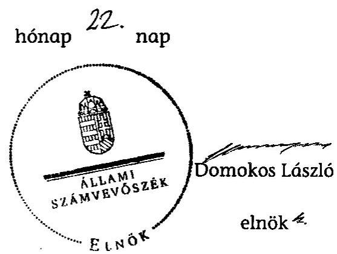
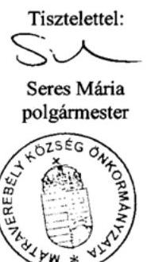
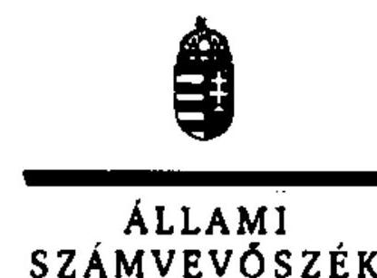
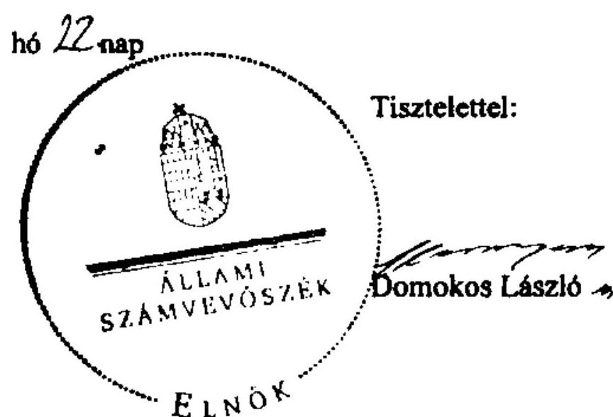

# ÁLLAMI   SZÁMVEVŐSZÉK 

## JELENTÉS

az önkormányzati vagyongazdálkodás
szabályszerűségi ellenőrzéséről
Mátraverebély

---

# Állami Számvevőszék 

Iktatószám: V-0026-086-066/2013.
Témaszám: 1065
Vizsgálat-azonosító szám: V061512
Az ellenőrzést felügyelte:
Makkai Mária
felügyeleti vezető
Az ellenőrzést vezette és az ellenőrzés végrehajtásáért felelős:
Schósz Attila Ferencné
ellenőrzésvezető
A számvevőszéki jelentés összeállításában közreműködött:
Balogné Lehoczki Éva
számvevő
Az ellenőrzést végezték:
Kányáné Murvai Tünde
Ujvári Józsefné
számvevő tanácsos
számvevő tanácsos

---

# TARTALOMJEGYZÉK 

BEVEZETÉS ..... 3
I. ÖSSZEGZŐ MEGÁLLAPÍTÁSOK, KÖVETKEZTETÉSEK, JAVASLATOK ..... 5
II. RÉSZLETES MEGÁLLAPÍTÁSOK ..... 12

1. A vagyongazdálkodási tevékenység szabályozottsága ..... 12
1.1. A feladatellátás formáinak meghatározása, a döntések megalapozottsága ..... 12
1.2. A vagyonnal gazdálkodó szervezetek szervezeti rendjének szabályozottsága, a kötelező szabályzatok megfelelősége ..... 13
1.3. A vagyongazdálkodás szabályozása ..... 14
1.4. A vagyonkezeléssel megbízott szervezetek beszámolási kötelezettségének szabályozása ..... 15
2. A vagyongazdálkodás szabályszerűsége ..... 16
2.1. A vagyon nyilvántartásának megfelelősége ..... 16
2.2. A vagyongazdálkodást érintő gazdasági események követelmények szerinti dokumentáltsága ..... 18
2.3. A vagyongazdálkodási döntések, intézkedések szabályszerűsége ..... 20
3. A vagyon változását eredményező gazdasági események szabályszerűsége ..... 22
3.1. A vagyon értékének és összetételének változása ..... 22
3.2. A vagyon fenntartására kialakított rendszer működésének megfelelősége és szabályozottsága ..... 23
3.3. A térítés nélküli átadások szabályszerűsége ..... 24
4. A vagyongazdálkodás szabályszerűségére vonatkozó belső és külső ellenőrzések hasznosulása ..... 24
4.1. A belső ellenőrzés által tett megállapítások, javaslatok hasznosulása ..... 24
4.2. A külső ellenőrző szervezetek által tett javaslatok hasznosulása ..... 26

---

# MELLÉKLETEK 

1. számú Mátraverebély Községi Önkormányzat gazdálkodására jellemző adatok, mutatószámok
2. számú Mátraverebély Községi Önkormányzat vagyonának alakulása 2007. január 1-je és 2011. december 31-e között
3. számú Mátraverebély Községi Önkormányzat kötelezettségeinek alakulása
4. számú Mátraverebély Községi Önkormányzat polgármesterének észrevétele
5. számú A polgármester észrevételére adott válasz

## FÜGGELÉKEK

1. számú Rövidítések jegyzéke
2. számú Értelmező szótár

---

# JELENTÉS 

## az önkormányzati vagyongazdálkodás szabályszerűségi ellenőrzéséről Mátraverebély

## BEVEZETÉS

Az ÁSZ kiemelten fontosnak tartja az ÁSZ tv. 5. § (4) bekezdése alapján az önkormányzatok vagyongazdálkodási tevékenységének, a vagyongazdálkodási szabályok betartásának ellenőrzését. Az ellenőrzés feladata, hogy értékelje a vagyongazdálkodással kapcsolatban a jogszabályokban, az önkormányzati belső szabályozásban előírtak érvényesülését a közpénzek felhasználásának átláthatósága, nyilvánossága érdekében. Az ÁSZ ellenőrzése nemcsak az ellenőrzött szervezet vagyongazdálkodásának hibáira, hiányosságaira mutat rá, számon kérve azok kijavítását, hanem megállapításaival, javaslataival segíti a közpénzekkel, a közvagyonnal való felelős gazdálkodást.

Az önkormányzati vagyon alapvető funkciója, hogy a helyi közérdeket és egyúttal az önkormányzati célok megvalósítását szolgálja. A feladatellátás terén elsősorban a kötelezően ellátandó feladatok végrehajtását hivatott szolgálni, amely mellett az önként vállalt feladatok ellátása is megvalósulhat.

## Az ellenőrzés célja annak értékelése volt, hogy az Önkormányzatnál:

- a vagyongazdálkodási tevékenység, annak szervezeti keretei szabályozottak-e;
- az önkormányzati vagyongazdálkodás törvényességét, szabályszerűségét biztosították-e; a vagyon értékének és összetételének változását jogszerű döntésekkel alátámasztották-e;
- a belső ellenőrzés elősegítette-e a vagyongazdálkodás szabályszerű működését, valamint hasznosultak-e a korábbi külső ellenőrzések által tett javaslatok.

Az ellenőrzés típusa: szabályszerűségi ellenőrzés
Az ellenőrzés a 2007. január 1. és 2011. december 31. közötti időszakra terjedt ki. A közbeszerzési eljárások lefolytatásának ellenőrzése a 2011. évet és a 2012. év I. negyedévét érintette. Az Nvtv. egyes rendelkezései végrehajtásának ellenőrzése a nemzetgazdasági szempontból kiemelt jelentőségű nemzeti vagyonnak minősülő forgalomképtelen vagyonelemek meghatározására, valamint közép- és hosszú távú vagyongazdálkodási terv készítésére terjedt ki 2012-től 2013. június 4-ig, a helyszíni ellenőrzés befejezéséig.

---

Az ellenőrzés szakmai módszertana az ÁSZ hivatalos honlapján közzétett szakmai szabályokon alapult, amely a Legfőbb Ellenőrző Intézmények Nemzetközi Szervezete (INTOSAI) által kiadott nemzetközi standardok (ISSAI) figyelembevételével készült.

A vagyonváltozásokkal kapcsolatos gazdasági események közül az ellenőrzött tételeket véletlen mintavétellel választottuk ki a Polgármesteri hivatal 2007-2011. évi számviteli nyilvántartásaiból. Az Önkormányzattól tanúsítványt kértünk a korábbi ÁSZ ellenőrzések vagyongazdálkodásra vonatkozó javaslatainak hasznosulásáról, a könyvvizsgáló és a külső ellenőrzési szervek vagyongazdálkodással kapcsolatos 2007-2011. évi javaslataira tett intézkedésekről, valamint a 2007-2011. évek térítésmentes vagyonátadásairól és átvételeiről.

A jelentéstervezetben alkalmazott rövidítéseket az 1. számú függelék, az egyes fogalmak magyarázatát a 2. számú függelék tartalmazza.

Mátraverebély község állandó lakosainak száma 2011. január 1-jén 2032 fő volt. Az Önkormányzat hét tagú Képviselő-testületének munkáját három állandó bizottság segítette. Az Önkormányzat feladatainak végrehajtása érdekében a 2011. évben a Polgármesteri hivatalon felül egy önállóan működő költségvetési szervet (Művelődési ház és Könyvtárat) működtetett. Az óvodai, iskolai, közétkeztetési feladatokat, valamint a szociális alapellátást kistérségi társulás keretében, az egészséges ivóvíz ellátás, szennyvízkezelés, illetve hulladékkezelés feladatait két gazdasági társaság útján, a háziorvosi, fogorvosi ellátást vállalkozói szerződéssel biztosította. Az Önkormányzat többségi tulajdoni hányaddal gazdasági társasággal nem rendelkezett.

A polgármester a 2010. évi önkormányzati választások óta tölti be tisztségét. A Polgármesteri hivatalban a jelenlegi jegyző 2012. november 1-jétől látja el feladatát. A 2007-2011. években a jegyző személye négy alkalommal változott. A Polgármesteri hivatal szervezeti egységekre nem tagolódott, a foglalkoztatott köztisztviselők száma 2011. december 31-én hat fő, az Önkormányzat által foglalkoztatott közalkalmazottak száma 11 fő volt.

Az Önkormányzat a 2011. évi költségvetési beszámolója szerint 297,3 millió Ft költségvetési bevételt ért el, valamint 276,2 millió Ft költségvetési kiadást teljesített. A 2011. december 31-i könyvviteli mérleg szerint az Önkormányzat 1024,2 millió Ft értékű eszközvagyonnal rendelkezett, rövid lejáratú kötelezettsége 5,4 millió Ft volt. A 2007-2011. években nem vettek igénybe hosszú lejáratú fejlesztési célú hitelt, lízingszerződéssel nem rendelkeztek, kötvényt nem bocsátottak ki, garanciát, készfizető kezességet nem vállaltak. Az Önkormányzat a 2007-2011. években nem volt könyvvizsgálatra kötelezett. A 2011. évben, illetve a 2012. év I. negyedévében nem végeztek olyan felújítási és beruházási feladatot, amely a Kbt. ¹,² előírása alapján közbeszerzési eljárást tett volna szükségessé. Az Önkormányzat gazdálkodására jellemző adatokat, mutatószámokat az 1-3. számú mellékletek tartalmazzák.

Az ÁSZ a 2011. évi LXVI. törvény 29. §-a szerint a jelentéstervezetet megküldte Mátraverebély Községi Önkormányzat polgármesterének egyeztetésre. A beérkezett észrevételt és az arra adott választ a jelentés 4-5. számú mellékletei tartalmazzák.

---

# I. ÖSSZEGZŐ MEGÁLLAPÍTÁSOK, KÖVETKEZTETÉSEK, JAVASLATOK 

Az Önkormányzat könyvviteli mérleg szerinti vagyona a 2007. év eleji 910,7 millió Ft-ról a 2011. év végére 1024,2 millió Ft-ra, (113,5 millió Ft-tal) 12,5%-kal nőtt. A 2007-2011. években megvalósult legjelentősebb beruházások és felújítások (iskolaépület, buszváró, árkok, járdák, temető kerítésének felújítása) döntő részben (közel 80%-ban) az Önkormányzat kötelező feladatellátásához kapcsolódtak. A beruházások, felújítások pénzügyi fedezetét hazai támogatásból, valamint helyi adóbevételből biztosították. A 2007-2011. évek között a beruházásokra és felújításokra fordított kiadások összege (65,9 millió Ft) mindössze 32,3%-a volt az elszámolt értékcsökkenés összegének (203,9 millió Ft). Ezáltal az Önkormányzat nem pótolta eszközeit az elszámolt értékcsökkenés mértékének megfelelően.

A Képviselő-testület az Önkormányzat 2007-2010. évekre szóló gazdasági programjában meghatározta az önkormányzati feladatok ellátásának fő irányait, azonban a 2011-2014. évekre szóló gazdasági programot - az Ötv. előírása ellenére - nem fogadott el. Az Önkormányzat kötelező és önként vállalt feladatait a 2007. év elején költségvetési szervekkel, társulásos együttműködés keretében, vállalkozói szerződés, továbbá gazdasági társaságok útján látta el. A Képviselő-testület a 2007-2011. évek között költségmegtakarítás érdekében egy (oktatási és közművelődési feladatokat ellátó) intézmény megszüntetéséről, a kötelező közoktatási feladatok kistérségi társulásnak történő átadásáról döntött. Az önként vállalt közművelődési feladatok ellátására a 2008. évben intézményt alapítottak.

Az Önkormányzat a vagyongazdálkodási tevékenységét hiányosan szabályozta. Az önkormányzati SZMSZ¹,² -ben a Képviselő-testület vagyongazdálkodási feladatok ellátására a polgármester¹,² -nek hatáskört adott át beszámolási kötelezettség mellett. Az Önkormányzat nem határozta meg az önkormányzati feladatellátást biztosító törzsvagyon, ezen belül a korlátozottan forgalomképes és forgalomképtelen vagyonelemek körét, nyilvántartási rendjét, továbbá - az Ötv. előírása ellenére - a vagyonkezelői jog részletes szabályait (vagyonkezelői szerződést a 2007-2011. években nem kötöttek). Az Nvtv.-ben foglaltak ellenére az Önkormányzat határidőre, 2012. március 1-jéig nem (és azt követően, az ÁSZ helyszíni ellenőrzésének befejezéséig, 2013. június 4-ig sem) jelölte meg a nemzetgazdasági szempontból kiemelt jelentőségű, nemzeti vagyonként forgalomképtelen törzsvagyonnak minősülő vagyonelemeket. Az ÁSZ helyszíni ellenőrzésének befejezéséig az Önkormányzat nem készítette el a közép- és hosszú távú vagyongazdálkodási tervét sem. A jegyző¹,²,³,⁴ nem tett eleget a Htv.-ben foglalt előírásnak, mivel a Polgármesteri hivatal számviteli rendjét nem alakította ki, az Önkormányzat a 2007-2011. években az Áhsz. előírásai ellenére nem rendelkezett számviteli politikával, számlarenddel, pénzkezelési, illetve értékelési szabályzattal. A leltárkészítési és leltározási szabályzatban a 2007-2011. évek között az Áhsz.-ben foglaltak ellenére az üzemeltetésre átadott eszközök leltározásának módját nem határozták meg. A számviteli rend kialakításának elmaradásáért a jegyző¹,²,³,⁴ a felelős.

---

Az Önkormányzatnál a vagyongazdálkodás működésének szabályszerűségét nem biztosították. Az Önkormányzatnál a 2007-2011. évek között - az Ötv. és az Áht.¹ előírásai ellenére - vagyonkimutatást nem készítettek. A 2007-2011. években nem tettek eleget az évenkénti leltározási kötelezettségnek, ezáltal a könyvviteli mérlegben kimutatott vagyonérték, közöttük az üzemeltetésre átadott eszközök állományi értékének valódiságát - az Áhsz.-ben foglaltak ellenére - nem támasztották alá leltárral. A 2008. évben a kistérségi társulással kötött megállapodás ellenére a feladatellátáshoz szükséges tárgyi eszközök üzemeltetésre átadását - helytelenül - térítésmentes átadásként (115,1 millió Ft összegben) mutatták ki az éves költségvetési beszámolóban.

A jegyző¹,²,³,⁴ - a 147/1992. (XI. 6.) Korm. rendeletben foglalt előírások ellenére - nem biztosította az ingatlanvagyon-kataszter adatainak egyezőségét a számviteli nyilvántartással, valamint a földhivatali nyilvántartással. Az ingatlanvagyon kataszterből nem vezettek ki értékesített földterületeket és építményeket, továbbá a számviteli (főkönyvi) nyilvántartásban kimutatott ingatlanok bruttó értéke a 2007-2011. években 0,9-32,5 millió Ft közötti összeggel haladta meg az ingatlanvagyon-kataszterben kimutatott értéket. Az ingatlanvagyon könyvviteli mérleg szerinti összege 2009-ben 2,8 millió Ft-tal, 2010-ben 14,8 millió Ft-tal mutatott magasabb értéket a főkönyvi nyilvántartásban szereplő összegnél. A 2007-2011. években a számviteli nyilvántartásban kimutatott immateriális javak, gépek, berendezések, járművek, befektetett pénzügyi eszközök, követelések és a kötelezettségek könyv szerinti és mérleg szerinti értékében évi 4,0 ezer Ft és 9,7 millió Ft közötti, változó irányú eltérések mutatkoztak, míg az üzemeltetésre átadott eszközök esetében a 2010. évben a főkönyvi nyilvántartásban 25,2 millió Ft-tal kevesebb összeg szerepelt, mint a könyvviteli mérlegben.

A 2007-2011. években a készletek, a követelések és a rövidlejáratú kötelezettségek állományában bekövetkezett változásokról a főkönyvi könyvelést alátámasztó analitikus nyilvántartást nem vezették, nem biztosították a számviteli nyilvántartások közötti egyeztetés és ellenőrzés lehetőségét. Az üzemeltetésre átadott eszközök könyv szerinti és mérleg szerinti értékének saját tőkét és tartalékokat módosító eltérése a 2010. évben meghaladta az adott költségvetési év mérleg főösszegének 2%-át, így az Áhsz. szerinti jelentős összegű hibának minősül. Az analitikus nyilvántartások folyamatos vezetésének elmulasztása miatt sérült a Számv. tv. szerinti világosság elve, az előírt nyilvántartások egyeztetési kötelezettségének, továbbá a leltározási kötelezettség teljesítésének elmulasztása, a könyvviteli mérleg leltárral való alátámasztásának hiánya miatt a Számv. tv. szerinti mérleg valódiság elve.

A gazdálkodási jogkörök gyakorlásával kapcsolatban ellenőrzött esetekben a 2007-2011. években a kiadások teljesítését és a bevételek beszedését megelőzően - az Ámr.¹,² -ben foglaltak ellenére - nem végezte el a jogosultsággal
 rendelkező polgármester ${ }_{1,2}$ és jegyző ${ }_{1,2,3,4}$ az előírt ellenőrzési feladatokat. A kötelezettségvállalásokat 10 esetben, összesen 6,3 millió Ft összegben nem foglalták írásba. A kötelezettségvállalásokat ellenjegyzés, a kiadásokat szakmai teljesítésigazolás és érvényesítés nélkül (összesen 24,0 millió Ft összegben) teljesítették. Felújításokkal, eszközvásárlásokkal kapcsolatos kiadásokat utalvány ellenjegyzése nélkül teljesítettek (12,6 millió Ft összegben), továbbá az utalvány ellenjegyzője aláírása ellenére nem a jogszabályi előírásoknak megfelelően végezte el

---

ellenőrzési feladatait (12,7 millió Ft összegben). Mindezek következtében nem történt meg a fedezet meglétének, a szabad előirányzat rendelkezésre állásának, a kifizetés jogosságának, összegszerűségének, teljesítésének, a szakmai teljesítés igazolásának és az érvényesítés megtörténtének ellenőrzése. A tárgyi eszközök, illetve lakások értékesítéséből származó bevételeket szakmai teljesítésigazolás, érvényesítés nélkül, illetve jogosultsággal nem rendelkező személy érvényesítése mellett számolták el (összesen 17,9 millió Ft összegben), ezáltal nem ellenőrizték a bevételek jogosságát, összegszerűségét, teljesítését. Az Ámr. ${ }_{1,2}$-ben előírt ellenőrzési feladatok elmaradása az Önkormányzatnál a 2007-2008. években kiadási előirányzat túllépést eredményezett a felhalmozási kiadások esetében.

Az Önkormányzatnál a vagyon értékének és összetételének változását jogszerű döntésekkel hiányosan támasztották alá. A 2007-2011. évek között nem az arra hatáskörrel rendelkező Képviselő-testület hozta meg a vagyonnövekedést eredményező döntéseket 3,6 millió Ft összegben (felújítások, tárgyi eszköz beszerzések és szoftvervásárlás során). Dokumentumok hiányában nem volt megállapítható a döntéshozó személye egy 0,1 millió Ft összegű kiadás esetében. Az Ötv. előírásai ellenére, hatáskör hiányában a polgármester döntött négy alkalommal, összesen 2,7 millió Ft, a jegyző két alkalommal, összesen 0,8 millió Ft összegű kiadás esetében. A 2007-2011. évek között az árok, a buszváró és a temető kerítés felújításáról, a térfigyelő rendszer kiépítéséről a hatáskörrel rendelkező Képviselő-testület döntött, melyek végrehajtása a képviselő-testületi határozatokban, illetve az alapján megkötött szerződésekben foglaltaknak megfelelően történt (21,1 millió Ft értékben).

A jegyző ${ }_{3,4}$ nem tette közzé - az Eisztv. és a 18/2005. (XII. 27.) IHM rendelet előírásai ellenére - a 2008-2011. évek elemi költségvetéseinek, beszámolóinak, a céljellegű működési támogatásoknak és a vagyongazdálkodással összefüggő, a nettó öt millió Ft-ot elérő, vagy azt meghaladó értékű szerződések adatait. A polgármester ${ }_{1}$ az Áht. ${ }_{1}$ előírása ellenére az önkormányzati képviselők és polgármesterek általános választását megelőzően az Önkormányzat vagyoni és pénzügyi helyzetéről, valamint a Képviselő-testület megalakulását követően keletkezett, a későbbi éveket terhelő pénzügyi kötelezettségekről nem tett közzé adatokat. A polgármesteri munkakör átadás-átvételi jegyzőkönyvében - a 26/2000. (IX. 27.) BM rendeletben előírtak ellenére - nem rögzítették az Önkormányzat vagyonára, kötelezettségeire vonatkozó aktuális adatokat, valamint a gazdasági program, a költségvetési és zárszámadási rendeletek, a vagyonmérleg, a kataszteri nyilvántartás számszerűsíthető adatait.

Az Önkormányzat a 2007-2011. években a belső ellenőrzési feladatokat kistérségi társulás keretében látta el. Nem rendelkezett az Önkormányzat - a Ber. előírásával szemben - stratégiai ellenőrzési tervvel, a 2007., 2010. és 2011. évi ellenőrzési tervet alátámasztó kockázatelemzéssel. A 2007-2008. évi és a 2011. évi ellenőrzési tervek elfogadásáról a Képviselő-testület - az Ötv.-ben foglalt előírás ellenére - nem döntött. Az ellenőrzött időszakban vagyongazdálkodáshoz kapcsolódó belső ellenőrzésre összesen három alkalommal (2008., 2009. és 2010. években) került sor. A belső ellenőrzési jelentések megállapításai elsősorban a belső kontrollrendszer nem megfelelő működéséhez, a számviteli szabályzatok, az analitikus nyilvántartások vezetésének és a vagyonleltár készítésének hiányához, valamint a mérleg valódiságához kapcsolódtak. A hiány-

---

osságok megszüntetése érdekében az ellenőrzött szervek vezetői - a Ber. előírása ellenére - nem készítettek intézkedési tervet. Az Önkormányzat a javaslatokat nem hasznosította. A polgármester ${ }_{1,2}$ az ellenőrzött időszakban - az Ötv. előírása ellenére - nem terjesztette a Képviselő-testület elé a zárszámadási rendelettervezettel egyidejűleg az éves ellenőrzési jelentést, valamint a Polgármesteri hivatal és intézménye belső ellenőrzéséről szóló éves összefoglaló ellenőrzési jelentést. A belső ellenőrzés jelentései mindezek következtében nem segítették elő a vagyongazdálkodás szabályszerű működését. A belső ellenőrzés területén megállapított hiányosságokért - az Áht. ${ }_{1}$ és az Ötv. előírásai alapján - a jegyző ${ }_{1,2,3,4}$ a felelős.

Az Állami Számvevőszékről szóló 2011. évi LXVI. törvény 33. § (1) bekezdésében foglaltak értelmében a jelentésben foglalt megállapításokhoz kapcsolódó intézkedési tervet köteles az ellenőrzött szervezet vezetője összeállítani, és azt a jelentés kézhezvételétől számított 30 napon belül az ÁSZ részére megküldeni. Amennyiben az intézkedési tervet határidőben nem küldi meg a szervezet, vagy az nem elfogadható, az ÁSZ elnöke a hivatkozott törvény 33. § (3) bekezdés a)-b) pontjaiban foglaltakat érvényesítheti.

Az ellenőrzés intézkedést igénylő megállapításai és javaslatai:

# a Polgármesternek 

A Htv. 140. § (1) bekezdés c) pontjában foglalt előírás ellenére a Polgármesteri hivatal számviteli rendjét a jegyző ${ }_{1,2,3,4}$ nem alakította ki. Az Önkormányzat nem rendelkezett számviteli politikával, számlarenddel, pénzkezelési szabályzattal, valamint az eszközök és források értékelési szabályzatával.

A 2007-2011. évek között nem az arra hatáskörrel rendelkező Képviselő-testület hozta meg a vagyonnövekedést eredményező döntéseket 3,6 millió Ft összegben (felújítások, tárgyi eszköz beszerzések és szoftvervásárlás során).

A belső ellenőrzés által feltárt hiányosságok megszüntetése érdekében intézkedési tervet nem készítettek. Az Önkormányzat a javaslatokat nem hasznosította.

Javaslat:
Vizsgálja ki a feltárt hiányosságokat, szabálytalanságokat, és amennyiben szükséges, tegye meg a munkajogi felelősségre vonást.

## a jegyzőnek

1. A Htv. 140. § (1) bekezdés c) pontjában foglalt előírás ellenére a Polgármesteri hivatal számviteli rendjét a jegyző nem alakította ki. Az Önkormányzat nem rendelkezett a Számv. tv. 14. § (3) bekezdésében és az Áhsz. 8. § (3) bekezdésében előírt számviteli politikával, a Számv. tv. 161. § (1) bekezdésében és az Áhsz. 49. § (1) bekezdésében előírt számlarenddel, a Számv. tv. 14. § (5) bekezdés d) pontjában és az Áhsz. 8. § (4) bekezdés d) pontjában előírt pénzkezelési szabályzattal, valamint a Számv. tv. 14. § (5) bekezdés b) pontjában és az Áhsz. 8. § (4) bekezdés b) pontjában előírt eszközök és források értékelési szabályzatával.

---

Javaslat:
Intézkedjen a Htv. 140. § (1) bekezdés c) pontjának előírása szerint a Polgármesteri hivatal számviteli rendjének kialakításáról. Készítse el a Számv. tv. 14. § (3) bekezdésében és az Áhsz. 8. § (3) bekezdésében előírtaknak megfelelően a Polgármesteri hivatal számviteli politikáját, a Számv. tv. 161. § (1) bekezdésében és az Áhsz. 49. § (1) bekezdésében előírt számlarendet, a Számv. tv. 14. § (5) bekezdés d) pontjában és az Áhsz. 8. § (4) bekezdés d) pontjában előírt pénzkezelési szabályzatot, valamint a Számv. tv. 14. § (5) bekezdés b) pontjában és az Áhsz. 8. § (4) bekezdés b) pontjában előírt eszközök és források értékelési szabályzatát.
2. A gazdálkodási jogkörök gyakorlásával kapcsolatban ellenőrzött esetekben a kiadások teljesítését és a bevételek beszedését megelőzően nem végezte el a jogosultsággal rendelkező polgármester ${ }_{1,2}$ és jegyző ${ }_{1,2,3,4}$ az előírt ellenőrzési feladatokat. Az Ámr. ${ }_{1}$ 134. § (8) bekezdésében foglaltak ellenére a kötelezettségvállalásokat összesen 6,3 millió Ft összegben nem foglalták írásba. A kötelezettségvállalásokat az Áht. ${ }_{1}$ és az Ámr. ${ }_{1}$ 134. § (8) bekezdésében foglaltak ellenére ellenjegyzés, a kiadásokat az Ámr. ${ }_{1}$ 135. § (1)-(5) bekezdéseiben előírtak ellenére szakmai teljesítésigazolás és érvényesítés nélkül (összesen 24,0 millió Ft összegben) teljesítették. Az utalvány ellenjegyzése nélkül teljesítettek (12,6 millió Ft összegben) felújításokkal, eszközvásárlásokkal kapcsolatos kiadásokat. A tárgyi eszközök értékesítéséből (8,2 millió Ft összegben), valamint az ingatlanok bérbeadásából származó bevételek beszedésének elrendelése előtt a 2007-2010. években - az Ámr. ${ }_{1}$ 135. § (1)-(2) bekezdéseiben foglaltak ellenére - nem ellenőrizték a bevételek jogosságát, összegszerűségét, teljesítését.

Javaslat:
Intézkedjen, hogy a pénzügyi ellenjegyző, a teljesítést igazoló, az érvényesítő és az utalványozó - az Áht. 2 37. § (1), az Ávr. 57. § (1), az Ávr. 58. § (1) és az Ávr. 59. § (2) bekezdései előírásainak megfelelően - végezze el ellenőrzési feladatait.
3. A leltárkészítési és leltározási szabályzat a 2007-2009. közötti években az Áhsz. 37. § (2) bekezdésében, a 2010. évtől az Áhsz. 37. § (4) bekezdésében rögzítettek ellenére nem tartalmazta az üzemeltetésre átadott eszközök leltározásának módját és ezen eszközöket nem támasztották alá az üzemeltető által készített és hitelesített leltárral.

Javaslat:
Egészítse ki a leltározási szabályzatot az Áhsz. 37. § (4) bekezdésében előírtak alapján az üzemeltetésre, kezelésre átadott, koncesszióba, vagyonkezelésbe adott eszközök leltározásának módjával és intézkedjen arról, hogy a könyvviteli mérlegben kimutatott üzemeltetésre, vagyonkezelésbe adott eszközöket az üzemeltetést, kezelést végző szerv által elkészített, hitelesített leltárral támaszszák alá.
4. A Képviselő-testület az Nvtv. 18. § (1) bekezdésében foglaltak ellenére az Nvtv. hatályba lépését követő 60 napon belül (2012. március 1-jéig és az ÁSZ helyszíni ellenőrzésének befejezéséig, 2013. június 4-ig) nem jelölte meg a forgalomképtelennek minősülő vagyonból a nemzetgazdasági szempontból kiemelt jelentőségű, nemzeti vagyonnak minősülő forgalomképtelen törzsvagyont.

---

Javaslat:
Készítsen rendelettervezetet a nemzetgazdasági szempontból kiemelt jelentőségű nemzeti vagyonnak minősülő forgalomképtelen vagyonelemek kijelölése érdekében az Nvtv. 18. § (1) bekezdésében előírtak szerint és kezdeményezze a polgármesternél a rendelettervezet Képviselő-testület elé terjesztését.
5. Az Áhsz. 49. § (1)., (3) bekezdései szerinti analitikus nyilvántartások, továbbá az Ámr. 134. § (13) bekezdésének és az Ámr. 75. § (1) bekezdésének előírásai ellenére a kötelezettségvállalások analitikus nyilvántartásának folyamatos vezetéséről nem gondoskodtak. Az előírt számviteli nyilvántartások egyeztetési kötelezettségének, továbbá az Áhsz. 37. § (1) bekezdésben előírt leltározási kötelezettségnek nem tettek eleget.

Javaslat:
Biztosítsa a Számv. tv. 165. § (4) bekezdésének megfelelően a főkönyvi könyvelés, az analitikus nyilvántartások és a bizonylatok adatai közötti egyeztetést és ellenőrzés lehetőségét annak érdekében, hogy az Áhsz. 49. § (1) bekezdése szerint a nyilvántartások a beszámoló adatait a valóságnak megfelelően, áttekinthető módon alátámasszák. Gondoskodjon az Áhsz. 37. § (1) bekezdésének megfelelően a könyvviteli mérlegben kimutatott eszközök és források leltározásáról, továbbá az Ávr. 56. § (1) bekezdésének megfelelően a kötelezettségvállalások analitikus nyilvántartásának vezetéséről.
6. A 147/1992. (XI. 6.) Korm. rendelet 1. § (2) és (3) bekezdésében foglaltak ellenére, az önkormányzati ingatlanvagyon-kataszter adatai és a földhivatali nyilvántartás adatai közötti egyezőség, valamint az ingatlanvagyon számviteli nyilvántartásban szereplő adatai és az ingatlanvagyon-kataszter adatai közötti egyezőség nem volt biztosított, mivel a 2007. évben a 21-es út építéséhez értékesített földterületek értékét az ingatlanvagyon-kataszterből nem vezették ki.

Javaslat:
Intézkedjen, hogy a 147/1992. (XI. 6.) Korm. rendelet 1. § (2) bekezdésében foglaltaknak megfelelően az ingatlanvagyon-kataszter adatai egyezzenek meg a földhivatal ingatlan-nyilvántartásának azonos tartalmú adataival, továbbá az 1. § (3) bekezdésében foglaltaknak megfelelően biztosítsa az egyezőséget az ingatlanvagyon-kataszter és a számviteli nyilvántartás adatai között.
7. Az Ötv. 92. § (10) bekezdésében foglaltak ellenére a zárszámadási rendelettervezettel egyidejűleg éves ellenőrzési jelentést, valamint a Polgármesteri hivatal és intézménye belső ellenőrzéséről szóló éves összefoglaló ellenőrzési jelentést nem készítettek el és
 nem terjesztettek a Képviselő-testület elé.

Javaslat:
Intézkedjen az éves ellenőrzési jelentés elkészítéséről és kezdeményezze a polgármesternél a Bkr. 56. § (8) bekezdés előírásának megfelelően annak a zárszámadással egyidejűleg a Képviselő-testület elé terjesztését.

---

8. Az Önkormányzat a Ber. 19. §-ában előírt stratégiai ellenőrzési tervvel, valamint aláírt, hiteles 2007., 2010. és 2011. évi ellenőrzési terveket alátámasztó kockázatelemzéssel a Ber. 21. § (2) bekezdésében foglalt előírás ellenére nem rendelkezett.

Javaslat:
Gondoskodjon a Bkr. 29. § (1) bekezdésében foglalt előírás alapján stratégiai ellenőrzési terv készítéséről és a Bkr. 31. § (2) bekezdésének megfelelően arról, hogy az éves ellenőrzési terv a stratégiai ellenőrzési tervben és a kockázatelemzés alapján felállított prioritásokon alapuljon.
9. A belső ellenőrzés által feltárt hiányosságok megszüntetése érdekében, az ellenőrzött szervek vezetői a Ber. 29. § (1) bekezdésében foglalt előírás ellenére intézkedési tervet nem készítettek.

Javaslat:
Intézkedjen a Bkr. 28. § c) pontjának és a 45. § (1) bekezdésének megfelelően intézkedési terv készítéséről, illetve készíttetéséről a belső ellenőrzési jelentésekben megfogalmazott javaslatok végrehajtására a Bkr. 45. § (2)-(3) bekezdéseiben foglaltaknak megfelelő tartalommal és határidőn belül.
10. Az Önkormányzatnál az Ötv. 78. § (2) bekezdésében előírtak ellenére nem készítettek vagyonkimutatást, az Önkormányzat vagyonának adatait az Áhsz. 44/A. § (1) bekezdésében előírtak ellenére a zárszámadás keretében nem mutatták be.

Javaslat:
Intézkedjen az Mötv. 110. § (2) bekezdésében foglalt előírásoknak megfelelően a vagyonkimutatás elkészítéséről és annak a zárszámadásról szóló előterjesztés keretében az Áht. 91. § (2) bekezdés c) pontjában foglalt mérlegek és kimutatások közötti megjelenítéséről.
11. A jegyző ³⁴ nem tett eleget az Eisztv. 6. § (1) bekezdésében, mellékletében, valamint a 18/2005. (XII. 27.) IHM rendelet 2. számú melléklete 3.2. pontjában előírt közzétételi kötelezettségének, mert az Önkormányzat honlapján nem tette közzé a 2008-2011. évek éves elemi költségvetését és a költségvetés végrehajtásáról szóló beszámolóit, a jegyző ²³⁴ az Áht., 15/A. §-ban és a 15/B. §-ban előírtak ellenére a céljellegű működési támogatások és a vagyongazdálkodással összefüggő - a nettó öt millió Ft-ot elérő, vagy azt meghaladó értékű - szerződések adatait.

Javaslat:
Intézkedjen az információs önrendelkezési jogról és az információszabadságról szóló 2011. évi CXII. törvény 1. számú mellékletében meghatározott adatok közzétételéről.

---

# II. RÉSZLETES MEGÁLLAPÍTÁSOK 

## 1. A VAGYONGAZDÁLKODÁSI TEVÉKENYSÉG SZABÁLYOZOTTSÁGA

### 1.1. A feladatellátás formáinak meghatározása, a döntések megalapozottsága

A Képviselő-testület az Önkormányzat 2007-2010. évekre szóló gazdasági programjában rögzítette az ágazati feladatokat, a feladatellátással kapcsolatos fő irányokat, konkrét fejlesztési elképzeléseket, melyek forrásául hazai- illetve európai uniós támogatásokat jelöltek meg. A gazdasági programban fejlesztési feladatként nevesítették a faluszépítést, a turisztikai szálláshelyek kialakítását, a szelektív hulladékgyűjtést, buszvárók kiépítését, a temető kerítésének és az óvoda épületének felújítását, a közösségi ház korszerűsítését. Az Önkormányzat Képviselő-testülete a 2010. évi önkormányzati választásokat követően, az Ötv. 91. § (7) bekezdésében ¹ meghatározott, alakuló ülését követő hat hónapos határidőn belül (és az ÁSZ helyszíni ellenőrzésének befejezéséig, 2013. június 4-ig) sem fogadott el a 2011-2014. évekre szóló gazdasági programot.

Az Önkormányzat a kötelező és önként vállalt feladatok körét, a feladatellátás módját és mértékét meghatározta ². Az Önkormányzat 2007. január 1-jén két költségvetési szervvel (az önállóan gazdálkodó Polgármesteri hivatallal és a részben önállóan gazdálkodó Művelődési Központtal), vállalkozói háziorvosi és fogorvosi praxissal, kistérségi társulással, továbbá két gazdasági társasággal látta el feladatait.

A Polgármesteri hivatal ellátta az Önkormányzat kötelező feladatai közül a védőnői szolgálatot, a köztemető fenntartását, valamint a nemzeti és etnikai kisebbség jogai (kisebbségi önkormányzat) érvényesülésének biztosítását. Az önként vállalt feladatok közül az alapítványok, egyesületek, civil szervezetek, szerveződések, valamint a lakásépítés-vásárlás helyi támogatását látta el. A Művelődési Központ az óvodai nevelés, az általános iskolai oktatás és nevelés, valamint a közétkeztetés kötelező feladatait, továbbá a helyi közművelődés, szabadidős program biztosítását látta el önként vállalt feladatként. A szociális alapellátást kistérségi társulás útján biztosította az Önkormányzat, továbbá két gazdasági társasággal (melyekben 25% alatti tulajdonrésszel rendelkezett) látta el az egészséges ivóvízellátás és szennyvízkezelés (Víz- és Csatornamű Kft.), valamint a hulladékkezelés (BÁVÜ Nonprofit Kft.) kötelező feladatokat.

A Képviselő-testület a 2008. évben egy esetben intézmény megszüntetéséről, feladat társulás részére történő átadásáról, valamint egy esetben intézmény alapításáról döntött, melyeket megelőzően a megalapozott döntések meghoza-

[^0]
[^0]:    ¹ 2013. január 1-jétől az Mötv. 116. § (5) bekezdése szabályozza.
    ² az Önkormányzat 2007-2010. évekre szóló gazdasági programjában, az önkormányzati SZMSZ¹ 9. §-ában, valamint az önkormányzati SZMSZ² 4. §-ában és az éves költségvetési rendeletekben

---

tala érdekében az előterjesztésekben a polgármester ¹ nem fogalmazott meg alternatív javaslatokat a feladatellátás formáira, körére és a feladatellátás mértékét, módját az egyes alternatívákra vonatkozóan nem mutatta be.

A Képviselő-testület költségmegtakarítás érdekében döntött a 2008. évben a Művelődési Központ megszüntetéséről és az általa ellátott közoktatási feladatok (óvoda, általános iskola) kistérségi társulás részére történő átadásáról ³, egyúttal azok ingatlan- és ingó vagyonának üzemeltetésre átadásáról. A Művelődési Központ 2008. augusztus 1-jei hatállyal a kistérségi társulás részben önállóan gazdálkodó költségvetési szervének tagintézménye lett. Az Önkormányzat az önként vállalt feladatként ellátott helyi közművelődési feladatok továbbvitelére Művelődési ház és Könyvtár elnevezéssel részben önállóan gazdálkodó intézményt alapított.

# 1.2. A vagyonnal gazdálkodó szervezetek szervezeti rendjének szabályozottsága, a kötelező szabályzatok megfelelősége 

A Képviselő-testület a 2007-2011. években az Ötv.-ben foglaltak alapján alkotta meg az önkormányzati SZMSZ ¹². A Képviselő-testület élt az Ötv. 9. § (3) bekezdésében biztosított jogával, a vagyongazdálkodási feladatokhoz kapcsolódóan a polgármester ¹²nek hatáskört adott át, az átruházott hatáskör esetére - a soron következő ülésen történő - beszámolási kötelezettséget írt elő.

A polgármester ¹²t az önkormányzati SZMSZ ¹ben felhatalmazták az 1,5 millió Ft-ot meg nem haladó hitelfelvétel, az önkormányzati SZMSZ ²ben a 0,5 millió Ft-ot meg nem haladó értékpapír forgalom, 2,0 millió Ft értékhatárig hitelfelvétel lebonyolításával, 2,0 millió Ft értékhatárig kötelezettség vállalással, szerződések megkötésével, valamint 1,0 millió Ft értékhatárig az átmenetileg szabad pénzeszközök lekötésével, vagy befektetéséről való döntés jogával.

A vagyonnal gazdálkodó, közfeladatot ellátó költségvetési szervek (a Polgármesteri hivatal, valamint a Művelődési ház és Könyvtár) alapító okirataiban a Képviselő-testület meghatározta az alaptevékenységüket és a feladatellátásukhoz használatba kapott vagyon feletti rendelkezési jogát.

A jegyző ¹²³⁴ nem tett eleget a Htv. 140. § (1) bekezdés c) pontjában foglalt előírásnak, mivel a Polgármesteri hivatal számviteli rendjét nem alakította ki.

#### Abstract

Az Önkormányzat a 2007-2011. években nem rendelkezett a Számv. tv. 14. § (3) bekezdésében és az Áhsz. 8. § (3) bekezdésében előírt számviteli politikával, a Számv. tv. 161. § (1) bekezdésében és az Áhsz. 49. § (1) bekezdésében előírt számlarenddel, a Számv. tv. 14. § (5) bekezdés d) pontjában és az Áhsz. 8. § (4) bekezdés d) pontjában előírt pénzkezelési szabályzattal, valamint a Számv. tv. 14. § (5) bekezdés b) pontjában és az Áhsz. 8. § (4) bekezdés b) pontjában előírt eszközök és források értékelési szabályzatával. A jegyző, 2005 decemberében elkészítette a felesleges vagyontárgyak hasznosításának és selejtezésének szabályzatát, melynek felülvizsgálatát a jegyző ¹²³⁴ az Önkormányzat feladatellátásában bekövetkezett változások ellenére nem végezte el.

[^0]
[^0]:    ³ a Képviselő-testület 43/2008. (VI. 19.) számú határozata

---

A Képviselő-testület nem élt az Áhsz. 37. § (7) bekezdése szerinti lehetőséggel és nem alkotott rendeletet a kétévenkénti leltározásról. A jegyző ¹ által kiadott, 2006. január 1-től hatályos leltárkészítési és leltározási szabályzatban a 2007-2009. évek között - az Áhsz. 37. § (2) bekezdésében, a 2010. évtől pedig az Áhsz. 37. § (4) bekezdésében foglaltak ellenére - az üzemeltetésre átadott eszközök leltározásának módját nem határozta meg. A számviteli rend kialakításának elmaradásáért a jegyző ¹²³⁴ a felelős.

# 1.3. A vagyongazdálkodás szabályozása 

Az Önkormányzat - a Htv. 138. § (1) bekezdés j) pontjában foglaltak ellenére - a vagyongazdálkodás helyi szabályairól hiányosan rendelkezett, mivel:

- nem határozta meg az önkormányzati feladatellátást biztosító törzsvagyon, ezen belül a korlátozottan forgalomképes és forgalomképtelen vagyonelemek körét, nyilvántartási rendjét ⁴;
- az Ötv. 80/B. §-a ellenére ⁵ nem rendelkezett a vagyonkezelői jog részletes szabályairól;
- az Áht.¹ 108. § (2) bekezdésében foglaltak ellenére nem rendelkezett a vagyon tulajdonjogának, valamint a vagyonhoz kapcsolódó, önállóan forgalomképes vagyoni értékű jogoknak az ingyenes átruházására vonatkozó szabályairól, nem írta elő az ingyenes átruházás módját és eseteit;
- a megalapozott vagyongazdálkodási döntések meghozatala érdekében az előkészítési folyamatra vonatkozóan - célszerűsége ellenére - nem írta elő a költség-haszon elemzés, valamint a hasznosításra szánt vagyon értékének megállapítása céljából értékbecslés készítésének, továbbá a tulajdonosi jogok védelme céljából garanciális elemek szerződésekben, egyéb dokumentumokban való rögzítésének kötelezettségét. Nem szabályozta a forgalomképesség megváltoztatásának és dokumentálásának módját, eljárásrendjét, a nyilvános versenyeztetésre vonatkozó elvárásokat, követelményeket, eljárási szabályokat.

Az Önkormányzat a vagyonhasznosítási rendelet ¹²ben és a közterület használati rendeletben egyes épületek, helyiségek, felszerelési tárgyak igénybevételére és az azokért fizetett díjak mértékére határozott meg eljárási szabályokat. A vagyongazdálkodást érintő előterjesztések készítésének, megtárgyalásának, véleményezésének, döntéshozatalának rendjét az Önkormányzat külön nem szabályozta, arra az önkormányzati SZMSZ ¹²ben rögzített, az előterjesztésekre vonatkozó általános szabályok voltak érvényesek.

[^0]
[^0]:    ⁴ Az önkormányzati SZMSZ ¹ 87. § (1) bekezdésében előírta, hogy a Képviselő-testület a törzsvagyon, a forgalomképtelen, a korlátozottan forgalomképes vagyontárgyak körét, a vagyontárgyakkal való rendelkezés feltételeit külön rendeletben állapítja meg. Az önkormányzati SZMSZ ² ilyen rendelkezést már nem tartalmazott.
    ⁵ 2012. január 1-jétől az Mötv. 109. §-a szabályozza.

---

Az Önkormányzat - a személyes adatok védelméről és a közérdekű adatok nyilvánosságáról szóló 1992. évi LXIII. törvény 20. § (8) ⁶ bekezdésében foglaltak ellenére - nem szabályozta a közérdekű adatok megismerésére irányuló igények teljesítésének rendjét.

A vagyongazdálkodással kapcsolatos gazdálkodási jogkörök gyakorlásához szükséges, jogszabály által előírt írásbeli kijelölések, megbízások, felhatalmazások nem készültek. A jegyző ¹²³⁴ nem adott felhatalmazást az ellenjegyzési jogkör gyakorlására, nem gondoskodott - az Ámr.¹ 135. § (2) bekezdésének előírása ellenére ⁷ - a szakmai teljesítésigazolást végzők kijelöléséről, továbbá az érvényesítési feladatok ellátásához - az Ámr.¹ 135. § (4) bekezdésében ⁸ foglaltak betartása érdekében - megbízást nem adott. A jegyző ¹²³⁴ a gazdálkodási jogkörök gyakorlásának rendjét, valamint a velük kapcsolatos összeférhetetlenségi követelményeket nem alakította ki.

Az Nvtv. 18. § (1) bekezdésében foglaltak ellenére az Önkormányzat határidőre, 2012. március 1-jéig nem (és azt követően, az ÁSZ helyszíni ellenőrzésének befejezéséig sem) jelölte meg a forgalomképtelennek minősülő vagyonból a nemzetgazdasági szempontból kiemelt jelentőségű, nemzeti vagyonként forgalomképtelen törzsvagyonnak minősülő vagyon elemeket. Az ÁSZ helyszíni ellenőrzésének befejezéséig nem
 készítették el az Ntv. 9. § (1) bekezdésében előírt közép- és hosszú távú vagyongazdálkodási tervet sem.

# 1.4. A vagyonkezeléssel megbízott szervezetek beszámolási kötelezettségének szabályozása 

Az Önkormányzat tulajdonában lévő vagyont kezelésre nem adott át, az Ötv. 80/A. § előírása szerinti vagyonkezelői szerződést a 2007–2011. években nem kötött.

Az Önkormányzat (a szennyvízközmű beruházásban résztvevő önkormányzatokkal ${ }^{9}$ közösen) 2006. május 31-én szerződéssel átadta üzemeltetésre a szennyvízközmű vagyontárgyait a Víz- és Csatornamű Kft.-nek, mellyel gondoskodott a lakosság biztonságos szolgáltatásának ellátásáról. A szerződést a szennyvízberuházás II. ütemének befejeződése után, 2008. július 18-án módosították. Mindkét szerződésben rögzítették, hogy az üzemeltető köteles minden negyedévet követő hó 10. napjáig adatot szolgáltatni az analitikus nyilvántartás alapján a közművagyon bruttó, nettó értékéről, az Önkormányzat által elszámolandó értékcsökkenés összegéről, mely kötelezettségének az üzemeltető eleget tett.

[^0]
[^0]:    ${ }^{6}$ 2012. január 1-jétől az információs önrendelkezési jogról és az információszabadságról szóló 2011. évi CXII. törvény 30. § (6) bekezdése szabályozza.
    ${ }^{7}$ 2010. január 1-jétől az Ámr. 76. § (5) bekezdése szabályozta, 2012. január 1-jétől az Ávr. 57. § (4) bekezdése tartalmazza.
    ${ }^{8}$ 2010. január 1-jétől az Ámr. 77. § (4) bekezdése szabályozta, 2012. január 1-jétől az Ávr. 58. § (4) bekezdése tartalmazza.
    ${ }^{9}$ Bátonyterenye Város Önkormányzata, Dorogháza, Mátramindszent, Szuha, Nemti, Mátraverebély községek önkormányzatai

---

A közoktatási intézmények vagyontárgyait (általános iskola, napközi otthon, tornacsarnok, óvoda épületei és építményei, valamint gépek, berendezések) az Önkormányzat 2008. augusztus 1-jei hatállyal a kistérségi társulásnak üzemeltetésre átadta. A közoktatási megállapodásban rögzítették, hogy az ingatlanok állagmegóvása, a karbantartási munkák elvégzése a kistérségi társulás feladata. A vagyontárgyak üzemeltetésével kapcsolatos további feladatokat, hatásköröket, valamint beszámolási kötelezettséget nem szabályozták. Az Önkormányzat az üzemeltető beszámoltatásáról nem gondoskodott.

# 2. A VAGYONGAZDÁLKODÁS SZABÁLYSZERŰSÉGE 

### 2.1. A vagyon nyilvántartásának megfelelősége

Az Önkormányzat főkönyvi nyilvántartása elkülönítetten tartalmazta a törzsvagyon – ezen belül a forgalomképtelen és korlátozottan forgalomképes és a törzsvagyon körébe nem tartozó vagyonelemek állományát annak ellenére, hogy az Önkormányzat ezek körét, nyilvántartási rendjét nem határozta meg.

Az Önkormányzatnál a 2007–2011. évek között – az Ötv. 78. § (2) bekezdésében és az Áht. 118. § (2) bekezdés 2. c) pontjának ${ }^{10}$ előírásával ellentétben – vagyonkimutatást nem készítettek, az Önkormányzat vagyonának adatait – az Áhsz. 44/A. § (1) bekezdésében előírtak ellenére – a zárszámadás keretében nem mutatták be.

Az Önkormányzatnál a 2007–2011. években nem tettek eleget az Áhsz. 37. § (1) bekezdésében előírt évenkénti leltározási kötelezettségnek, a könyvviteli mérlegben kimutatott vagyonérték, közöttük az üzemeltetésre átadott eszközök állományi értékének valódiságát – az Áhsz. 37. § (2) bekezdésében foglaltak ellenére – nem támasztották alá leltárral.

Az Önkormányzatnál a 2007–2011. években a készletek, a követelések és a rövid lejáratú kötelezettségek állományában bekövetkezett változásokról a főkönyvi könyvelést alátámasztó analitikus nyilvántartást nem vezették. Ezáltal nem biztosították a Számv. tv. 165. § (4) bekezdésében előírt főkönyvi és analitikus nyilvántartások közötti egyeztetés és ellenőrzés lehetőségét. Ennek következtében – az Áhsz. 49. § (1) bekezdésében foglalt előírás ellenére – a számviteli (analitikus és főkönyvi) nyilvántartások a költségvetési beszámoló adatait a valóságnak megfelelően, áttekinthetően nem támasztották alá.

A 147/1992. (XI. 6.) Korm. rendelet 1. § (2) bekezdésében előírt vagyonkataszter ingatlan adatlapjai és betétlapjai, valamint a földhivatal ingatlan-nyilvántartás azonos tartalmú adatai közötti egyezőség nem állt fenn, mivel nem vezették ki az ingatlanvagyon kataszterből a 2007. évben a 21-es út építéséhez értékesített földterületeket és építményeket. A jegyző ${ }_{1,2,3,4}$ a számviteli nyilvántartás ingatlanvagyon adatainak az ingatlanvagyon-kataszter adataival való egyezőségét – a 147/1992. (XI. 6.) Korm. rendelet 1. § (3) bekezdésében és 2. számú mellékletében foglalt előírás ellenére – nem biztosította, mivel a számviteli (főkönyvi) nyilvántartásban kimutatott ingatlanok bruttó értéke 2007-ben 0,9 millió Ft-tal, 2008-ban és 2009-ben évente 30,5 millió Ft-tal, 2010-ben és 2011-ben évente 32,5 millió Ft-tal volt több az ingatlanvagyon-kataszterben kimutatott értéknél.

A 2007–2011. években eltérések voltak a főkönyvi nyilvántartások és a könyvviteli mérlegadatok között:

Az ingatlanvagyon könyvviteli mérlegben szereplő összege 2009-ben 2,8 millió Ft-tal, 2010-ben 14,8 millió Ft-tal mutatott magasabb értéket a főkönyvi nyilvántartásban szereplő összegtől. A 2007–2011. években a számviteli (főkönyvi) nyilvántartásban kimutatott immateriális javak 0,4 millió Ft és 1,4 millió Ft közötti összeggel mutattak alacsonyabb összeget, míg a követelések 7,9 millió Ft és 9,7 millió Ft közötti összeggel magasabb összeget a könyvviteli mérlegben szereplő értéktől. A kötelezettségek esetében a 2007–2009. években a könyv szerinti érték 1,9 millió Ft és 22,3 millió Ft közötti értékkel volt magasabb, a 2010. évben 0,6 millió Ft-tal, a 2011. évben 0,004 millió Ft-tal alacsonyabb a mérleg szerinti összegtől.

A gépek, berendezések könyv szerinti értéke a 2009. évben 0,5 millió Ft-tal volt magasabb, a 2010. évben 4,1 millió Ft-tal, a 2011. évben 1,8 millió Ft-tal volt alacsonyabb a könyvviteli mérlegben kimutatott összegtől. A járművek könyv szerinti értéke a 2007–2008. években 0,9 millió Ft-tal, a 2010. évben 1,5 millió Ft-tal alacsonyabb, míg a 2011. évben 0,4 millió Ft-tal magasabb értéket mutatott a könyvviteli mérlegben szereplő összegtől. Az üzemeltetésre átadott eszközök esetében a 2010. évben a főkönyvi nyilvántartásban 25,2 millió Ft-tal kevesebb összeg szerepelt, mint a mérlegben.

Az üzemeltetésre átadott eszközök könyv szerinti és mérleg szerinti értékének saját tőkét és tartalékokat módosító eltérése a 2010. évben meghaladta az adott költségvetési év mérleg főösszegének 2%-át, így az Áhsz. 5. § 8. pontja szerinti jelentős összegű hibának minősül.

A 2011. évben a számviteli nyilvántartásokban a hiányosságok annak ellenére fennálltak, hogy az Önkormányzatnál a 2010. évben végzett belső ellenőrzés javaslatot tett az analitikus nyilvántartások vezetésére, a beszámoló főkönyvi könyveléssel, illetve a mérleg leltárral történő alátámasztására, az eszközök értékelésére, valamint az ingatlanvagyon-kataszter és a számviteli nyilvántartások egyezőségének biztosítására.

Az Áhsz. 49. § (1), (3) bekezdései szerinti analitikus nyilvántartások folyamatos vezetésének elmulasztása miatt sérült a Számv. tv. 15. § (4) bekezdése szerinti világosság elvének, az előírt nyilvántartások egyeztetési kötelezettségének, továbbá az Áhsz. 37. § (1) bekezdésben előírt leltározási kötelezettség teljesítésének elmulasztása, a könyvviteli mérleg leltárral való alátámasztásának hiánya miatt pedig a Számv. tv. 15. § (3) bekezdése szerinti mérleg valódiság elvének betartása, a könyvviteli mérleg adatainak valódisága nem igazolható.

---

# 2.2. A vagyongazdálkodást érintő gazdasági események követelmények szerinti dokumentáltsága 

Az Önkormányzatnál a 2007–2011. években nem vezettek – az Ámr. ${ }_{1}$ 134. § (13) bekezdésében és az Ámr. ${ }_{2}$ 75. § (1) bekezdésében ${ }^{11}$ előírtak ellenére – a kötelezettségvállalásokról analitikus nyilvántartást. A vagyongazdálkodással kapcsolatban ellenőrzött esetekben a kiadások teljesítését és a bevételek beszedését megelőzően nem végezte el (az Ámr., ${ }_{1,2}$-ben kapott felhatalmazás alapján) a jogosultsággal rendelkező polgármester ${ }_{1,2}$ a kötelezettségvállalásra és az utalványozásra, a jegyző ${ }_{1,2,3,4}$ azok ellenjegyzésére – a gazdálkodási és ellenőrzési jogkörök gyakorlásával – az előírt ellenőrzési feladatokat. A jogsértő gyakorlat kialakulásához a szabályozás hiánya is hozzájárult.

- az Ámr. ${ }_{1}$ 134. § (8) bekezdésében ${ }^{12}$ foglaltak ellenére a kötelezettségvállalásokat felújítások, eszköz- és járműbeszerzések vonatkozásában 10 esetben (összesen 6,3 millió Ft összegben) nem foglalták írásba;
- a vagyontárgyak vásárlására, létesítésére, felújítására tett kötelezettségvállalásokat – az Áht. ${ }_{1}$ ${ }^{13}$ és az Ámr. ${ }_{1}$ 134. § (8) bekezdésében foglaltak ellenére – ellenjegyzés, a kiadásokat – az Ámr. ${ }_{1}$ 135. § (1)–(5) bekezdéseiben ${ }^{14}$ előírtak ellenére – szakmai teljesítésigazolás és érvényesítés nélkül (összesen 24,0 millió Ft összegben), illetve jogosultsággal nem rendelkező személy érvényesítésével teljesítették (összesen 1,2 millió Ft összegben). Ennek következtében nem történt meg a fedezet meglétének, a kifizetés jogosságának, összegszerűségének, teljesítésének, a szakmai teljesítés igazolás megtörténtének az ellenőrzése;
- utalvány ellenjegyzése nélkül teljesítettek (összesen 12,6 millió Ft összegben) felújításokkal, eszközvásárlásokkal kapcsolatos kiadásokat. A beruházások, felújítások, eszközbeszerzések kifizetését megelőzően a jegyző ${ }_{1,2,3,4}$, mint az utalvány ellenjegyzője az aláírása ellenére nem az Ámr. ${ }_{1}$ 137. § (3) bekezdésében ${ }^{15}$ előírtaknak megfelelően végezte el ellenőrzési feladatait (összesen 12,7 millió Ft összegben), nem kifogásolta a szakmai teljesítés igazolás és érvényesítés hiányát, kötelezettségvállalás analitikus nyilvántartásának hiányában nem győződött meg a szabad előirányzat rendelkezésre állásáról;
- a tárgyi eszközök értékesítéséből (8,2 millió Ft összegben), valamint az ingatlanok bérbeadásából származó bevételek beszedésének elrendelése előtt a 2007–2010. években ${ }^{16}$ – az Ámr. ${ }_{1}$ 135. § (1)–(2) bekezdéseiben foglaltak ellenére – kijelölés hiányában a szakmai teljesítés igazolás elmaradt, ezáltal nem ellenőrizték a bevételek jogosságát, összegszerűségét, teljesítését. Ezen bevételek beszedésére – az Ámr. ${ }_{1}$ 135. § (4) bekezdésének előírása ellenére – (8,8 millió Ft

[^0]
[^0]:    ${ }^{11}$ 2012. január 1-jétől az Ávr. 56. § (1) bekezdése szabályozza.
    ${ }^{12}$ 2010. augusztus 15-től az Ámr. ${ }_{2}$ 72. § (3) bekezdés c) pontja tartalmazta, 2012. január 1-jétől az Ávr. 52. § (1) bekezdés c) pontja szabályozza.
    ${ }^{13}$ A 2007–2008. években az Áht. ${ }_{1}$ 98. § (2) bekezdése, a 2009. évben a 100/B. § (3) bekezdése, 2010. augusztus 15-től a 100/C. § (3) bekezdése, 2012. január 1-jétől az Áht. ${ }_{2}$ 37. § (1) bekezdése írta elő.
    ${ }^{14}$ 2011. január 1-től az Ámr. ${ }_{2}$ 76. §-a és 77. §-a szabályozta, 2012. január 1-jétől az Ávr. 57. § és 58. §-a tartalmazza.
    ${ }^{15}$ 2010. január 1-jétől az Ámr. ${ }_{2}$ 79. § (2) bekezdése szabályozta.
    ${ }^{16}$ A jegyző nem élt annak lehetőségével, hogy a 2011. évtől előírhatja a bevételek szakmai teljesítésigazolásának kötelezettségét.
    ${ }^{10}$ 2012. január 1-jétől az Mötv. 110. § (2) bekezdései, továbbá az Áht. 91. § (2) bekezdés c) pontja szabályozza.

---

összegben) érvényesítés nélkül, továbbá (0,3 millió Ft összegben) jogosultsággal nem rendelkező személy érvényesítésével került sor;

- a 2007–2011. években a zömében az 1980-as években részletfizetéssel értékesített lakások miatti követeléseket, hosszú lejáratra adott kölcsönként vette nyilvántartásba az Önkormányzat. A törlesztéséből származó bevételek elszámolására a 2007–2010. években (250,0 ezer Ft összegben) szakmai teljesítés igazolás hiányában, az ellenőrzött időszakban (144,6 ezer Ft összegben) érvényesítés nélkül, illetve (163,1 ezer Ft összegben) az arra megbízással, illetve kijelöléssel nem rendelkező személy érvényesítése mellett került sor. Az Ámr. ${ }_{1}$ 136. § (1) bekezdésében ${ }^{17}$ foglaltak ellenére (37,9 ezer Ft összegben) nem történt meg az utalvány ellenjegyzése, illetve az ellenjegyző (131,1 ezer Ft
 összegben) aláírása ellenére nem a jogszabályi előírásoknak megfelelően végezte el ellenőrzési feladatát, nem észrevételezte az érvényesítés és szakmai teljesítés igazolás hiányát.

Az Ámr. ${ }_{1,2}$-ben előírt ellenőrzési feladatok elmaradása az Önkormányzatnál a 2007. évben 33,8 millió Ft, a 2008. évben 4,6 millió Ft előirányzat túllépést eredményezett a felhalmozási kiadások esetében.

Az Önkormányzat által használt utalványrendelet nem felelt meg az Ámr. ${ }_{1}$ 136. § (4) bekezdésében ${ }^{18}$ foglaltaknak, mert nem tartalmazta az „utalvány” szót, a befizető, vagy a kedvezményezett nevét, a fizetés módját, összegét, a megterhelendő, vagy jóváírandó számla számát, megnevezését, a kötelezettségvállalás nyilvántartásba vételi számát. A részletfizetéssel értékesített lakások törlesztéséből származó bevételeket intézményi működési bevételként számolták el, amely nem felelt meg az Áhsz. 9. számú melléklet 14. c) pontjában foglaltaknak, mely szerint az önkormányzati tulajdonú lakóépületek, illetve egyéb helyiségek elidegenítéséből származó bevételeket felhalmozási és tőkebevételként elkülönítetten kell kimutatni. A 2011. évben a település főépítészi feladataira teljesített 515,0 ezer Ft kiadást - az Áhsz. 9. számú melléklet 9. c) pontjában foglaltak ellenére - nem szolgáltatási díjként, hanem ingatlan felújítás kiadásaként számolták el.

Az Áht. ${ }_{1}$ 121. § (2) bekezdése ${ }^{19}$ szerint a belső kontrollrendszer működtetéséért a költségvetési szerv vezetője a felelős, ezért a Polgármesteri hivatal vagyongazdálkodási tevékenységében feltárt - a belső kontrollok működésének - hiányosságai miatt (az Ötv. 36. § (2) bekezdésére figyelemmel) a Polgármesteri hivatalt vezető jegyző ${ }_{1,2,3,4}$-et terheli a felelősség.

A polgármester ${ }_{1}$ - az Áht. ${ }_{1}$ 50/A. § (4) bekezdése előírásai ellenére - az önkormányzati képviselők és polgármesterek általános választását megelőzően az Önkormányzat vagyoni és pénzügyi helyzetéről, valamint a Képviselő-testület megalakulását követően keletkezett, a későbbi éveket terhelő pénzügyi kötelezettségekről nem tett közzé adatokat. A polgármesteri munkakör átadás-átvétel

[^0]
[^0]:    ${ }^{17}$ 2011. január 1-jétől az Ámr. ${ }_{2}$ 78. § (1) bekezdése tartalmazta, 2012. január 1-jétől az Ávr. 59. § (1) bekezdése szabályozza.
    ${ }^{18}$ 2010. augusztus 15-től az Ámr. ${ }_{2}$ 78. § (2) bekezdése szabályozta, 2012. január 1-jétől az Ávr. 59. § (3) bekezdése tartalmazza.
    ${ }^{19}$ 2011. január 1-jétől az Áht. ${ }_{1}$ 121/A. § (1) bekezdése tartalmazta, 2012. január 1-jétől az Áht. ${ }_{2}$ 69. § (2) bekezdése szabályozza.

---

2010. október 3-án készült jegyzőkönyve és annak négy függeléke nem biztosította a polgármesteri munkakör jogszabályi előírásoknak megfelelő átvételét, mivel - a 26/2000. (IX. 27.) BM rendelet 1. § (1)-(2) bekezdésében előírtaknak ellenére - nem rögzítették az Önkormányzat vagyonára, kötelezettségeire vonatkozó aktuális adatokat, valamint a gazdasági program, a költségvetési és zárszámadási rendeletek, a vagyonmérleg és a kataszteri nyilvántartás számszerűsíthető adatait.

A jegyző ${ }_{3,4}$ nem tett eleget az Eisztv. 6. § (1) bekezdésében, valamint a 18/2005. (XII. 27.) IHM rendelet 2. számú melléklete 3.2. pontjában ${ }^{20}$ előírt közzétételi kötelezettségének, mert az Önkormányzat honlapján nem tette közzé 2008. július 1-jét követően a 2008-2011. évek elemi költségvetéseit és beszámolóit. A jegyző ${ }_{2,3,4}$ - az Áht., 15/A. §-ban és a 15/B. §-ban előírtak ellenére - nem gondoskodott a céljellegű működési támogatások és a vagyongazdálkodással összefüggő - nettó öt millió Ft-ot elérő, vagy azt meghaladó értékű szerződések adatainak közzétételéről.

# 2.3. A vagyongazdálkodási döntések, intézkedések szabályszerűsége 

Az Önkormányzatnál a vagyon csökkenését befolyásoló döntéseket és azok előkészítésével kapcsolatos tevékenységeket - egy jármű értékesítés kivételével - az arra hatáskörrel rendelkező Képviselő-testület hozta meg.

Az Önkormányzat a településen áthaladó 21. számú főközlekedési út szélesítéséhez kapcsolódóan - kizárólag az útépítés, mint közérdekű cél megvalósítása érdekében - értékesített földterületeket és azokon lévő építményeket (kutakat) a Közútkezelő Kht. részére bruttó 8,1 millió Ft-ért. A döntési előkészületek és képviselő-testületi döntések még a 2006. évben történtek.

A 2009. évben a polgármester ${ }_{1}$ - az Ötv. 9. § (1) bekezdésében ${ }^{21}$ foglaltak ellenére - egy járművet értékesített 125000 Ft-ért úgy, hogy a hatáskört a Képviselőtestület nem ruházta át. Az értékesített jármű könyvszerinti értéke 0 Ft volt.

A vagyonnövekedést eredményező döntéseket a 2007-2011. években - az Ötv. 9. § (1) bekezdésében foglalt előírás ellenére - nem az arra hatáskörrel rendelkező Képviselő-testület hozta meg összesen 3,6 millió Ft értékű eszközvásárlás, felújítás esetében. Dokumentumok hiányában nem volt megállapítható a döntéshozó személye egy 0,1 millió Ft összegű kiadás (önvédelmi eszközök beszerzése) esetében. A polgármester döntött négy alkalommal, összesen 2,7 millió Ft kiadás (iktató program, gázkazán, járda felújítás, fúrógép vásárlás), a jegyző pedig két alkalommal, összesen 0,8 millió Ft kiadás (villamoshálózat felújítás, másik fúrógép vásárlás) esetében - az Ötv. 9. § (1) bekezdésében foglaltak ellenére - hatáskör hiányában. Az árok és a buszváró felújításáról, a temető kerítésének felújításáról, a térfigyelő rendszer kiépítéséről a hatáskörrel

[^0]
[^0]:    ${ }^{20}$ 2012. január 1-jétől az információs önrendelkezési jogról és az információ szabadságról szóló 2011. évi CXII. törvény 1. számú melléklet III. pontja szabályozza.
    ${ }^{21}$ 2013. január 1-jétől az Mötv. 41. § (3) bekezdése szabályozza.

---

rendelkező Képviselő-testület döntött ${ }^{22}$, melyek végrehajtása a képviselőtestületi határozatokban, illetve az azok alapján megkötött szerződésekben foglaltaknak megfelelően történt (összesen 21,1 millió Ft értékben). A 2011. évben (0,5 millió Ft összegű) digitális térkép beszerzésére vonatkozó döntésre a polgármester ${ }_{2}$ (átruházott hatáskörben) az önkormányzati $\mathrm{SZMSZ}_{2}$ rendelkezése alapján jogosult volt.

Az Önkormányzat vagyonhasznosítás keretében a 2007-2011. években a nem lakás céljára szolgáló helyiségeket sport, kulturális és egyéb tevékenységre, földterületeket kereskedelmi célra adott bérbe - az ellenőrzésre kiválasztott mintából három bérbeadás kivételével - eseti jelleggel. A bérleti díjakról az Önkormányzat által kiállított számlák és nyugták nem voltak összhangban a vagyonhasznosítási rendelet ${ }_{1,2}$ és a közterület használati rendelet előírásaival, mert az értékesített szolgáltatás pontos megnevezését és mennyiségét nem a díjtételekkel összehasonlítható módon rögzítették.

A rendeletekben a Képviselő-testület a bérleti díjtételeket órára, a közterület használati díjakat négyzetméterre és napokra vetítve állapította meg. Ezzel szemben a bérleti díjakról kiállított számlák a mennyiséget db-ban tartalmazták, a közterület használatról kiállított számlák pedig nem tartalmazták az igénybe vett terület kategóriáját.

Az ellenőrzésre kiválasztott mintában a 2008-2009. években és a 2011. évben egy-egy esetben helyiségek tartós bérbeadására kötöttek bérleti szerződést. A 2008. évben az intézmény vezetője, 2009-ben a polgármester ${ }_{1}$ kötötte meg a bérleti szerződéseket - az Ötv. 9. § (1) bekezdésében foglalt előírás ellenére hatáskör hiányában. A helyiségek tartós bérbeadásáról 2011-ben a polgármester ${ }_{2}$ döntött az önkormányzati $\mathrm{SZMSZ}_{2}$-ben kapott, átruházott hatáskörében eljárva.

Az ellenőrzött esetekben a vagyonváltozást eredményező szerződésekben rögzítettek az Önkormányzat érdekeit védő garanciális elemeket annak ellenére, hogy ennek kötelezettségét nem írták elő.

A temető kerítésének felújítására kötött vállalkozói szerződésben késedelmes teljesítés esetére késedelmi kötbér megfizetését, továbbá jótállási, szavatossági kötelezettséget írtak elő. A térfigyelő kamerarendszer kiépítésére kötött szerződésben a beépített elemek garanciális javítási kötelezettséget, a digitális térkép vásárlására kötött szerződésben a késedelmes teljesítésre kötbér fizetési kötelezettséget írtak elő. A bérleti szerződésekben egy esetben a bérleti díj meg nem fizetésére, két esetben a bérelt helyiségben való meghibásodás, rongálás esetére a bérleti jogviszony azonnali felmondását rögzítették.

A 2007-2011. években a legnagyobb összegű beruházás - a temető kerítésének felújítása 11,5 millió Ft (általános forgalmi adóval) - kötelező feladat ellátáshoz, temető fenntartásához kötődött. Az Önkormányzat a felújítás előkészületi munkáinak keretében a kivitelezéshez megkérte a temető tulajdonosának - a Római Katolikus Egyháznak - a hozzájárulását, továbbá együttmű-

[^0]
[^0]:    ${ }^{22}$ a Képviselő-testület 23/2007. (IV. 12.) számú, 56/2008. (IX. 18.) számú, 96/2009. (XII. 14.) számú és a 18/2009. (V. 27.) számú határozataiban

---

ködési megállapodást kötöttek az egyházzal a kerítés megvalósítása, üzemeltetése érdekében. A Képviselő-testület 2008. május 14-én döntött a megvalósítás szükségességéről, majd az Észak-magyarországi Regionális Fejlesztési Tanács által meghirdetett pályázat benyújtásáról ${ }^{23}$. Egyidejűleg felhatalmazta a polgármester ${ }_{1}$-t három kivitelezési ajánlat megkérésére és a legelőnyösebb ajánlat alapján a kivitelezési szerződés megkötésére. A Képviselő-testület a 2008. évi költségvetésében megtervezte a temető kerítésének a felújításához, megépítéséhez szükséges önerőt.

A pályázat elbírálását követően a támogatási szerződést 2008. november 28-án kötötték meg, mely szerint 8,9 millió Ft támogatásban részesült az Önkormányzat. A kerítés a vállalt határidőre elkészült, a vállalkozó által számlázott összeg megegyezett a szerződésben rögzített összeggel. A kivitelezési szerződés ellenjegyzése elmaradt, az utalványozásra szakmai teljesítés igazolás, érvényesítés és utalvány ellenjegyzése nélkül került sor. A megvalósult beruházást az Önkormányzat az eszköz egyedi nyilvántartó lapján rögzítette.

# 3. A VAGYON VÁLTOZÁSÁT EREDMÉNYEZŐ GAZDASÁGI ESEMÉNYEK SZABÁLYSZERŰSÉGE 

### 3.1. A vagyon értékének és összetételének változása

Az Önkormányzat könyvviteli mérleg szerinti vagyona a 2007. január 1-jei 910,7 millió Ft-os nyitó állományi értékről 2011. december 31-ére 1024,2 millió Ft-ra, 12,5%-kal növekedett, mely elsősorban az üzemeltetésre átadott eszközök növekedése, és a forgóeszközök közül az adósok, valamint a pénzeszközök értékének emelkedése miatt következett be. A befektetett eszközök nettó értéke a 2007. január 1-jei 881,9 millió Ft-os értékről 2011. december 31-ére 77,8 millió Ft-tal, 959,7 millió Ft-ra emelkedett. A 2007-2011. években a befektetett eszközök 93,7%-98,7% közötti részarányt képviseltek az eszközvagyonon belül, míg a forgóeszközök részaránya 1,3%-6,3% között volt. Az Önkormányzat a 2007-2011. években - a költségvetési beszámolók adatai szerint összesen nettó 65,9 millió Ft-ot fordított beruházási és felújítási kiadásokra a gazdasági programban foglalt célkitűzésekkel összhangban, a közfeladat ellátása érdekében.

A 2007-2011. években megvalósult, kötelező feladatellátásához kapcsolódó legjelentősebb beruházások és felújítások a következők voltak: 2007-ben iskola felújítás (10,3 millió Ft), buszváró felújítás (1,8 millió Ft), árok felújítás (5,8 millió Ft), 2008-ban temető kerítés felújítás (9,6 millió Ft), községgazdálkodási feladatokra beszerzett kisbusz (6,0 millió Ft), 2009-ben járdafelújítás (2,0 millió Ft), 2010-ben járdafelújítás (1,6 millió Ft), 2011-ben településrendezési terv (1,1 millió Ft). Az Önkormányzat önként vállalt feladataihoz 1,5 millió Ft összegben a 2007. évi közösségi ház felújítása, 8,7 millió Ft összegben a 2009. évben térfigyelő rendszer kiépítése kapcsolódott.

Az ingatlanok és kapcsolódó vagyoni értékű jogok értéke 2007. január 1-jéről 2011. december 31-ére 21,1%-kal csökkent (554,9 millió Ft-ról 437,6 millió Ft-ra), aránya a befektetett eszközökön belül 62,9%-ról 45,6%-ra (17,3 százalékponttal) mérséklődött az üzemeltetésre átadott eszközök változásának hatására. Az üzemeltetésre átadott eszközök értéke a 2007. január 1-jei értékhez viszonyítva 2011. december 31-ére 52,1%-kal, 308,1 millió Ft-ról 468,6 millió Ft-ra emelkedett a 2008-ban II. ütemben átadott szennyvízcsatorna hálózat miatt.

Az Önkormányzat saját vagyona (saját tőke és tartalékok)

[^0]
[^0]:    ${ }^{23}$ a Képviselő-testület 56/2008. (IX. 18.) számú határozatában

---
 2007. január 1-je és 2011. december 31-e között 11,6%-kal (901,0 millió Ft-ról 1005,8 millió Ft-ra) nőtt a közművagyon üzembe helyezése, ingatlanok felújítása, eszközbeszerzések hatására, a saját vagyon összes forráson belüli aránya ennek ellenére 98,9%-ról 98,2%-ra (0,7 százalékponttal) csökkent. A saját vagyon mérlegfőösszegen belüli arányának csökkenését a kötelezettségek, ezen belül a rövid lejáratú kötelezettségek állományának növekedése, illetve az egyéb passzív pénzügyi elszámolások magas összege okozta.

A rövid lejáratú kötelezettségek állománya 2007. január 1. és 2011. december 31. között közel háromszorosára (1,9 millió Ft-ról 5,4 millió Ft-ra) nőtt a szállítói tartozások több mint ötszörös, a helyi adó túlfizetésből eredő kötelezettségek több mint kétszeres emelkedése miatt. Mindezek következtében az eladósodási mutató mértéke a 2007. január 1-jei 0,2%-ról a 2011. évre 0,5%-ra (0,3 százalékponttal) nőtt.

A befektetett eszközök mérlegfőösszegen belüli arányának csökkenése, illetve a saját tőke arányának csökkenése ellenére a befektetett eszközök fedezete a 2007. január 1-jei 102,2%-ról 2011. december 31-ére 104,8%-ra emelkedett.

Az Önkormányzat a beruházások, felújítások pénzügyi fedezetét hazai támogatásból, valamint az iparűzési és a kommunális adó bevételéből biztosította. Az Önkormányzat kimutatása alapján 45,5 millió Ft támogatást vettek igénybe, amely a bekerülési költségek 69,0%-át jelentette. A felhalmozási tevékenység hozzájárult az Önkormányzat feladatainak ellátásához.

# 3.2. A vagyon fenntartására kialakított rendszer működésének megfelelősége és szabályozottsága 

Az Önkormányzat az ellenőrzött időszakban nem rendelkezett számviteli politikával. Az Áhsz. 30. § (2) bekezdésében meghatározott értékcsökkenési leírási kulcsok alkalmazásától az Önkormányzat nem tért el. Az Önkormányzat a 2007-2011. évek között a befektetett eszközökre együttesen 203,9 millió Ft összegű értékcsökkenést számolt el. A használhatósági fok az elszámolt értékcsökkenés hatására a 2007. évi 89,6%-ról 2011-re 76,7%-ra csökkent, azaz az eszközök avultsága 12,9 százalékponttal növekedett. A 2007-2011. évek között aktivált felújítási kiadások összege 29,8 millió Ft, az összesen elszámolt értékcsökkenés 14,6%-a volt. A beruházási és felújítási kiadások együttes összege is csak 32,3%-a volt az elszámolt értékcsökkenés összegének. Ezáltal az Önkormányzat nem pótolta eszközeit az elszámolt értékcsökkenés mértékének megfelelően.

Az Önkormányzat a 2007-2011. évi zárszámadási rendeletekben nem mutatta be az eszközei után a tárgyévben elszámolt értékcsökkenés összegét, az eszköz-

---

pótlásra fordított tényleges kiadásokat, valamint az eszközök elhasználódási fokának alakulását.

# 3.3. A térítés nélküli átadások szabályszerűsége 

Az Önkormányzat éves összevont beszámolóiban és az általa kitöltött tanúsítványokban a 2007-2011. években - helytelenül - egy alkalommal Önkormányzaton kívülre történt térítés nélküli tárgyi eszköz átadást mutatott ki bruttó 115,1 millió Ft értékben. Ezzel szemben a számviteli nyilvántartás, a kistérségi társulással kötött megállapodás és az átadás-átvételi jegyzőkönyv alapján az Önkormányzat a közoktatást szolgáló tárgyi eszközöket üzemeltetésbe adta.

Az Önkormányzat 2007. évben 3,0 millió Ft értékben térítésmentesen vett át ingatlant, azonban annak dokumentumait nem tudta az ellenőrzés rendelkezésére bocsátani. A 2011. évben ajándékozási szerződéssel vett át az Önkormányzat egy ingatlanrészt bruttó 1,1 millió Ft értékben. A szerződést a polgármester₂ az önkormányzati SZMSZ₂ alapján, átruházott hatáskörében eljárva írta alá. Az átvett ingatlanrészek földhivatali, illetve vagyonkataszteri nyilvántartásba vétele megtörtént.

## 4. A VAGYONGAZDÁLKODÁS SZABÁLYSZERŰSÉGÉRE VONATKOZÓ BELSŐ ÉS KÜLSŐ ELLENŐRZÉSEK HASZNOSULÁSA

### 4.1. A belső ellenőrzés által tett megállapítások, javaslatok hasznosulása

Az Önkormányzat a 2007-2011. évek között a belső ellenőrzési feladatokat kistérségi társulás útján látta el, amely megfelelt az Ötv. 92. § (8) bekezdés c) pontjában foglaltaknak. A belső ellenőrzési kötelezettséget, az ellenőrzést végző szervezet jogállását, feladatait - a Ber. 4. § (2) bekezdésének előírásai²⁴ ellenére - a hivatali SZMSZ-ben nem rögzítették.

Az Önkormányzatnál a vagyongazdálkodás belső ellenőrzésének vizsgálatához nem állt rendelkezésre valamennyi dokumentum, a hiányzókat a jegyző₅ a helyszíni ellenőrzés ideje alatt megkérte a kistérségi társulástól. A kistérségi társulás által megküldött dokumentumok átvételét követően továbbra sem rendelkezett az Önkormányzat - a Ber. 19. §-ában²⁵ előírt - stratégiai ellenőrzési tervvel, valamint - a Ber. 21. § (2) bekezdésében foglalt előírás ellenére²⁶ - aláírt, hiteles 2007., 2010. és 2011. évi ellenőrzési tervet alátámasztó kockázatelemzéssel. Nem rendelkeztek továbbá a 2007. és a 2008. évben végzett belső ellenőrzésekről készített belső ellenőrzési jelentéssel, a 2007. évi, a 2008. évi és a 2010. évi belső ellenőrzésekről készített éves összefoglaló jelentéssel. A 2011. évben a belső ellenőrzési feladatok végrehajtását az Önkormányzat ellenőrzési jelentéssel nem tudta igazolni.

[^0]
[^0]:    ²⁴ 2012. január 1-jétől a Bkr. 15. § (2) bekezdése tartalmazza.
    ²⁵ 2012. január 1-jétől a Bkr. 29. § (1) bekezdése írja elő.
    ²⁶ 2012. január 1-jétől a Bkr. 31. § (2) bekezdése szabályozza.

---

Az Önkormányzatnál az iratkezeléssel kapcsolatos feladatok ellátása nem felelt meg az Irattári törvény 4. §-ában meghatározott iratmegőrzésre, iratmegóvásra vonatkozó követelményeknek, mivel az iratok rendszeres iktatása, megőrzést és fellelhetőséget biztosító tárolása nem valósult meg.

A belső ellenőrzési vezető által összeállított 2009. és 2010. évi ellenőrzési terveket a Képviselő-testület elfogadta²⁷, a 2007-2008. és a 2011. évi ellenőrzési tervek elfogadásáról - az Ötv. 92. § (6) bekezdésében²⁸ foglalt előírás ellenére - nem döntött.

A Képviselő-testület a 2007-2011. években - a Ber. 21. § (4), illetve (6) bekezdése szerinti - soron kívüli ellenőrzés elrendeléséről nem döntött. Az ellenőrzött időszakban vagyongazdálkodáshoz kapcsolódó belső ellenőrzésre összesen három alkalommal - a 2008. a 2009 és a 2010. években - került sor. Az ellenőrzések keretében a Polgármesteri hivatalban a belső kontrollrendszer működését, a Művelődési ház és Könyvtár tevékenységének szabályszerűségét, valamint az Önkormányzat gazdálkodásának szabályszerűségét és a vagyonnal való gazdálkodását ellenőrizték. A belső ellenőrzési jelentések szabályozási és működési hiányosságokat egyaránt feltártak, melyek elsősorban a belső kontrollrendszer nem megfelelő működéséhez, a számviteli szabályzatok, az analitikus nyilvántartások vezetésének és a vagyonleltár készítésének hiányához, valamint a mérleg valódiságához kapcsolódtak.

A hiányosságok megszüntetése érdekében az ellenőrzött szervek vezetői - a Ber. 29. § (1) bekezdésében²⁹ foglalt előírás ellenére - intézkedési tervet nem készítettek. A belső ellenőrzés a hiányosságok megszüntetésére irányuló javaslatok végrehajtásáról, hasznosulásáról utóellenőrzéssel, beszámoltatással dokumentáltan nem győződött meg.

A 2007-2011. évekre vonatkozóan a polgármester₁,₂ - az Ötv. 92. § (10) bekezdésében³⁰ foglaltak ellenére - a zárszámadási rendelet tervezettel egyidejűleg nem terjesztette a Képviselő-testület elé az éves ellenőrzési jelentést, valamint a Polgármesteri hivatal és intézménye belső ellenőrzéséről szóló éves összefoglaló ellenőrzési jelentést.

Az Önkormányzat iktatási rendszerének és az iratok kezelésének, tárolásának hiányosságai miatt nem volt megállapítható, hogy a hiányzó dokumentumokat a Kistérségi társulás nem küldte meg az Önkormányzat részére, illetve azokat az Önkormányzat iratkezeléssel kapcsolatos mulasztásai miatt nem tudták az ellenőrzés rendelkezésére bocsátani, vagy a polgármester mulasztása miatt nem tárgyalta a Képviselő-testület az éves ellenőrzési jelentéseket, illetve az éves összefoglaló ellenőrzési jelentéseket.

A vagyongazdálkodás szabályozásában, a vagyonváltozások dokumentálásában, a mérleg valódiságában, a számviteli alapelvek érvényesülésében a belső

[^0]
[^0]:    ²⁷ a Képviselő-testület 62/2008. (XI. 27.) számú és 28/2009. (X. 15.) számú határozata
    ²⁸ 2013. január 1-jétől az Mötv. 119. § (5) bekezdése szabályozza.
    ²⁹ 2012. január 1-től a Bkr. 28. § c) pontja és 45. § (1)-(3) bekezdései szabályozzák.
    ³⁰ 2012. január 1-től a Bkr. 56. § (8)-(9) bekezdései szabályozzák.

---

ellenőrzés által feltárt hiányosságok a 2011. évben továbbra is fennálltak. Az Önkormányzat a javaslatokat nem hasznosította. A belső ellenőrzés jelentései ezáltal nem járultak hozzá a vagyongazdálkodás szabályozási és működési hiányosságainak megszüntetéséhez, nem segítették elő a vagyongazdálkodás szabályszerű működését. A belső ellenőrzés területén megállapított hiányosságokért a jegyző₁,₂,₃,₄ a felelős, mivel a belső ellenőrzés működtetése - az Áht.₁ 121/A. § (3) bekezdésében³¹, valamint az Ötv. 92. § (5) bekezdésében foglaltak alapján - a jegyző kötelessége.

# 4.2. A külső ellenőrző szervezetek által tett javaslatok hasznosulása 

Az ÁSZ a 2007-2011. évek között az Önkormányzat vagyongazdálkodását nem ellenőrizte. Az Önkormányzat vagyongazdálkodását érintően a 2007-2011. években a MÁK a hazai forrásból megvalósult beruházások, felújítások (fúkasza beszerzés, temető kerítés felújítás) ellenőrzését végezte el, melynek során hiányosságot nem állapított meg.
Budapest, 2013.

Melléklet: 5 db
Függelék: 2 db

[^0]
[^0]:    ³¹ 2011. január 1-jétől az Áht.₁ 121/B. § (4) bekezdése, 2012. január 1-jétől az Áht.₂ 70. § (1) bekezdése szabályozza.

---

# Mátraverebély Községi Önkormányzat gazdálkodására jellemző adatok, mutatószámok

|  Megnevezés | 2007. év | 2011. év  |
| --- | --- | --- |
|  A település állandó lakosainak száma (fő) január 1-én | 2143 | 2032  |
|  A Képviselő-testület tagjainak a száma (fő) (december 31-én) | 9 | 7  |
|  A Képviselő-testület munkáját segítő állandó bizottságok száma (december 31-én) | 3 | 3  |
|  A Polgármesteri hivatalban foglalkoztatott köztisztviselők száma (fő) (december 31-én) | 6 | 6  |
|  Az Önkormányzat által foglalkoztatott közalkalmazottak száma (fő)
(december 31-én) | 37 | 11  |
|  Az összes vagyon értéke a december 31-i könyvviteli mérleg szerint (millió Ft) | 1116,5 | 1024,2  |
|  Az adósságállomány (hosszú és rövid lejáratú kötelezettség) december 31-én (millió Ft) | 7,9 | 18,4  |
|  Az összes teljesített költségvetési bevétel (millió Ft)* | 384,7 | 297,3  |
|  Saját bevétel/ Felhalmozási célú költségvetési kiadásokkal csökkentett összes költségvetési
bevétel aránya (%) | 82,8 | 53,1  |
|  Az összes teljesített költségvetési kiadás (millió Ft) | 339,7 | 276,2  |
|  Ebből: felhalmozási célú költségvetési kiadás (millió Ft) | 41,6 | 3,0  |
|  A költségvetési kiadásból a felhalmozási célú költségvetési kiadás aránya (%) | 12,2 | 1,1  |
|  A költségvetési intézmények száma december 31-én (db)** | 1 | 1  |
|  Ebből: önállóan működő (db) | 1 | 1  |

* a költségvetési bevétel az előző évek pénzmaradványának, vállalkozási maradványának igénybevételét is tartalmazza **Polgármesteri hivatal nélkül

---

Mátraverebély Községi Önkormányzat vagyonának alakulása 2007. január 1-je és 2011. december 31-e között

|  Mérlegsor
megnevezése | 2007. jan. 1.
(millió Ft) | 2007. dec. 31.
(millió Ft) | 2008. dec. 31.
(millió Ft) | 2009. dec. 31.
(millió Ft) | 2010. dec. 31.
(millió Ft) | 2011. dec. 31.
(millió Ft) | Változás %-a
2011. dec. 31./
2007. jan. 1.  |
| --- | --- | --- | --- | --- | --- | --- | --- |
|  Immateriális javak | 2,3 | 2,1 | 2,2 | 1,7 | 0,4

 | 0,0 | 0,0  |
|  Tárgyi eszközök | 563,6 | 613,1 | 511,3 | 517,6 | 519,9 | 483,2 | 85,7  |
|  ebből: ingatlanok és kapcs. vagy. ért. jogok | 554,9 | 565,7 | 471,2 | 465,3 | 465,2 | 437,6 | 78,9  |
|  beruházások, felújítások | 1,5 | 1,5 | 1,5 | 0,0 | 0,0 | 0,0 | 0,0  |
|  Befektetett pénzügyi eszközök | 7,9 | 7,9 | 7,9 | 7,9 | 7,9 | 7,9 | 99,9  |
|  Üzemeltetésre átadott eszközök | 308,1 | 478,3 | 550,2 | 521,0 | 519,2 | 468,6 | 152,1  |
|  Befektetett eszközök összesen | 881,9 | 1101,4 | 1071,6 | 1048,2 | 1047,4 | 959,7 | 108,8  |
|  Forgóeszközök összesen | 28,8 | 15,1 | 17,2 | 29,1 | 13,4 | 64,5 | 224,0  |
|  ebből: követelések | 8,1 | 1,8 | 1,1 | 0,0 | 0,0 | 27,7 | 344,2  |
|  pénzeszközök | 13,7 | 5,9 | 5,3 | 18,0 | 0,1 | 20,5 | 150,1  |
|  Eszközök összesen | 910,7 | 1116,5 | 1088,8 | 1077,3 | 1060,8 | 1024,2 | 112,5  |
|  Saját tőke összesen | 888,6 | 1103,0 | 1072,1 | 1048,0 | 1047,5 | 982,6 | 110,6  |
|  Tartalék összesen | 12,4 | 5,6 | 4,2 | 7,6 | -1,1 | 23,2 | 187,6  |
|  Kötelezettségek összesen | 9,7 | 7,9 | 12,5 | 21,7 | 14,4 | 18,4 | 189,7  |
|  ebből: hosszú lejáratú kötelezettségek | 0,0 | 0,0 | 0,0 | 0,0 | 0,0 | 0,0 | --  |
|  rövid lejáratú kötelezettségek | 1,9 | 0,8 | 1,1 | 0,8 | 3,6 | 5,4 | 284,1  |
|  Források összesen: | 910,7 | 1116,5 | 1088,8 | 1077,3 | 1060,8 | 1024,2 | 112,5  |

---

# Mátraverebély Községi Önkormányzat kötelezettségeinek alakulása

|  Mérlegsor
megnevezése | 2007. I. 1.
(millió Ft) | 2007. XII. 31.
(millió Ft) | 2008. XII. 31.
(millió Ft) | 2009. XII. 31.
(millió Ft) | 2010. XII. 31.
(millió Ft) | 2011. XII. 31.
(millió Ft) | Változás %-a
2011. XII. 31./
2007. I. 1.  |
| --- | --- | --- | --- | --- | --- | --- | --- |
|  Hosszú lejáratú kötelezettségek összesen | 0,0 | 0,0 | 0,0 | 0,0 | 0,0 | 0,0 | -  |
|  ebből: hosszú lejáratra kapott kölcsönök | 0,0 | 0,0 | 0,0 | 0,0 | 0,0 | 0,0 | -  |
|  tartozások fejlesztési célú kötvénykibocsátásból | 0,0 | 0,0 | 0,0 | 0,0 | 0,0 | 0,0 | -  |
|  tartozások működési célú kötvénykibocsátásból | 0,0 | 0,0 | 0,0 | 0,0 | 0,0 | 0,0 | -  |
|  beruházási és fejlesztési hitelek | 0,0 | 0,0 | 0,0 | 0,0 | 0,0 | 0,0 | -  |
|  működési célú hosszú lejáratú hitelek | 0,0 | 0,0 | 0,0 | 0,0 | 0,0 | 0,0 | -  |
|  egyéb hosszú lejáratú kötelezettségek | 0,0 | 0,0 | 0,0 | 0,0 | 0,0 | 0,0 | -  |
|  Rövid lejáratú kötelezettségek összesen | 1,9 | 0,8 | 1,1 | 0,8 | 3,6 | 5,4 | 284,1  |
|  1. rövid lejáratú kölcsönök | 0,0 | 0,0 | 0,0 | 0,0 | 0,0 | 0,0 | -  |
|  2. rövid lejáratú hitelek | 0,0 | 0,0 | 0,0 | 0,0 | 3,2 | 0,0 | -  |
|  3. kötelezettségek áruszállításból, szolgáltatásból | 0,6 | 0,0 | 0,0 | 0,0 | 0,0 | 2,9 | 510,4  |
|  4. egyéb rövid lejáratú kötelezettség | 1,3 | 0,8 | 1,1 | 0,8 | 0,4 | 2,5 | 186,9  |
|  ebből: munkavállalókkal szembeni különféle | 0,0 | 0,0 | 0,0 | 0,0 | 0,0 | 0,0 | -  |
|  költségvetéssel szembeni kötelezettség | 0,0 | 0,0 | 0,0 | 0,0 | 0,0 | 0,0 | -  |
|  iparűzési adó miatti feltöltési kötelezettség | 1,1 | 0,6 | 0,7 | 0,3 | 0,0 | 0,0 | 0,0  |
|  helyi adó befizetése miatti kötelezettség | 0,1 | 0,1 | 0,4 | 0,5 | 0,4 | 2,4 | 2379,0  |
|  támogatási program előlege miatti kötelezettség | 0,0 | 0,0 | 0,0 | 0,0 | 0,0 | 0,0 | -  |
|  garancia- és kezességvállalásból szám. köt. | 0,0 | 0,0 | 0,0 | 0,0 | 0,0 | 0,0 | -  |
|  h. lejár. kapott kölcsön köv. évet terh. törl. részlete | 0,0 | 0,0 | 0,0 | 0,0 | 0,0 | 0,0 | -  |
|  felh. c. kötv. kib.-ból szám. tart. köv. évet terh. r. | 0,0 | 0,0 | 0,0 | 0,0 | 0,0 | 0,0 | -  |
|  mük. c. kötv. kib.-ból szám. tart. köv. évet terh. r. | 0,0 | 0,0 | 0,0 | 0,0 | 0,0 | 0,0 | -  |
|  beruh. fejl. hitel köv. évet terhelő törl. részlete | 0,0 | 0,0 | 0,0 | 0,0 | 0,0 | 0,0 | -  |
|  működési c. hosszú lej. hitel köv. évet terh. törl. r. | 0,0 | 0,0 | 0,0 | 0,0 | 0,0 | 0,0 | -  |
|  a tárgyévet követő évet terh. egyéb rövid lejáratú köt. | 0,1 | 0,1 | 0,0 | 0,0 | 0,0 | 0,1 | 100,0  |
|  egyéb különféle kötelezettség | 0,0 | 0,0 | 0,0 | 0,0 | 0,0 | 0,0 | -  |
|  Források összesen (Tájékoztató, nem összegző adat') | 910,7 | 1116,5 | 1088,8 | 1077,3 | 1060,8 | 1024,2 | 112,5  |

Forrás: Magyar Államkincstár éves költségvetési beszámoló "01" számú űrlap adatai.

---

Mátraverebély Község Önkormányzata
Polgármesterétől
3077 Mátraverebély, Vasút út 82.

Ikt. szám: 191-4/2013.

Tárgy: ÁSZ jelentéstervezetre észrevétel megtétele Hiv. sz.: V-0026-086-056/2013.

# Állami Számvevőszék Elnökének Domokos László Elnök Úr részére 

## Budapest

Apáczai Csere János utca 10.
1052

## Tisztelt Elnök Úr!

Mátraverebély Község Önkormányzatánál megtartott „Az önkormányzat vagyongazdálkodás szabályszerűségi ellenőrzése - Mátraverebély" címmel készített számvevőszéki jelentéstervezetre a következő észrevételt teszem:

A szabályszerűségi ellenőrzés során az ÁSZ jelentéstervezetben foglalt megállapításokkal, következtetésekkel egyetértek, azokat elismerem.

Kivizsgálom a feltárt hiányosságokat, szabálytalanságokat és utasítást adok azok rendezésére, a hiányosságok pótlására, a szabálytalanságok megszüntetésére, illetve a jövőbeni elkerülésére.

A munkajogi felelősségre vonással kapcsolatban nyilatkozom, hogy azok a jegyzők, akik a vagyongazdálkodás szabályszerűségért, a törvények, rendeletek betartásáért, annak megfelelő szabályozásáért felelősek voltak már nem állnak munkaviszonyban a Mátraverebélyi Polgármesteri Hivatalban.

Az ÁSZ jelentéstervezetben foglalt megállapításoknak, következtetéseknek elsősorban az volt az oka, hogy a vizsgált 2007-2011 év időszakában 4 jegyző volt hivatalban.

1999. 08. 16. - 2008. 01. 31. között Szabó János jegyző (nyugállományba vonult jegyző)

---

2007. 09. 15. - 2008. 06. 30. között Ispán Andor jegyző (felmentési ideje alatt helyettesítette Szabó János jegyzőt)
2008. 07. 01. - 2011. 02. 28. között Ispán Andor jegyző (kinevezett jogviszonyban jegyző) 2011. 03. 01. - 2011. 07. 31. között Vámosi Edit jegyző (kinevezett jogviszonyban jegyző) 2011. 08. 29. - 2012. 09. 15. között Dr. Kovács Sándor jegyző (kinevezett jogviszonyban jegyző)
2012. 11. 01. - 2013. 06. 30. között Dr. Vanó Szilárd jegyző (kinevezett jogviszonyban jegyző, az ÁSZ ellenőrzés alatt)
2013. 09. 01.- jelenleg Győrfi Erzsébet jegyző (kinevezett jogviszonyban jegyző, az ÁSZ jelentéstervezet kézhezvételekor)

A felsorolásból kitűnik, hogy voltak jegyzői tisztség betöltése nélküli időszakok is, amely a szakszerűség és jogszerűség hiányához vezetett.

Kérem Tisztelt Elnök Urat, hogy a végleges ÁSZ jelentést szíveskedjen részünkre mind szöveges formában, mind PDF formátumban megküldeni, mivel abból jobban tudunk dolgozni.

Megköszönöm az ÁSZ szabályszerűségi ellenőrzését végző számvevőszéki munkatársaknak a munkáját és kifejezem együttműködési készségemet annak érdekében, hogy a jövőben hasonló önkormányzati vagyongazdálkodásra vonatkozó megállapítások, szabálytalanságok és hiányosságok ne következzenek be.

Mátraverebély, 2013. szeptember 20.

---

Ikt. szám: V-0026-086-062/2013.

Seres Mária úr/bölg
polgármester
Mátraverebély Községi Önkormányzat

Mátraverebély

Tisztelt Polgármester Úr/bölg!

A Mátraverebély Községi Önkormányzat vagyongazdálkodásának szabályszerűségi ellenőrzéséről készített jelentéstervezettel kapcsolatos levelét köszönettel megkaptam.

A levelében foglaltakra vonatkozóan az Állami Számvevőszék álláspontjáról a felügyeleti vezető által készített részletes tájékoztatást csatoltan megküldöm.

Budapest, 2013.

Melléklet: Tájékoztatás a polgármesteri levélben foglaltakról

1052 BUDAPEST, APÁCZAI CSERE JÁNOS UTCA 10. 1364 Budapest 4. Pf. 54 telefon: 484 8181 fax: 484 8201

---

# Tájékoztatás   a polgármesteri levélben foglaltakról 

Mátraverebély Községi Önkormányzat vagyongazdálkodásának szabályszerűségi ellenőrzéséről készített jelentéstervezetre vonatkozó polgármesteri levelével kapcsolatban a következő tájékoztatást adom.

Polgármester Úr/Hölgy levelében arról értesíti az Állami Számvevőszéket, hogy a jelentéstervezetben foglalt megállapításokkal, következtetésekkel egyetért, azokat elismeri. A továbbiakban pedig arról ad tájékoztatást, hogy a feltárt hiányosságokat, szabálytalanságokat kivizsgálja és utasítást ad azok rendezésére, a hiányosságok pótlására, a szabálytalanságok megszüntetésére, illetve a jövőbeni elkerülésére. Mindezek a jelentéstervezet módosítását nem indokolják.

Az Állami Számvevőszékről szóló 2011. évi LXVI. törvény 33. § (1) bekezdésben foglalt előírás alapján az ellenőrzött szervezet vezetője köteles a számvevőszéki jelentésben foglalt megállapításokhoz kapcsolódóan intézkedési tervet készíteni és azt a jelentés kézhezvételétől számított 30 napon belül az Állami Számvevőszék részére megküldeni. A számvevőszéki jelentésben az intézkedést igénylő megállapítások alapján tett javaslatok hasznosulására vonatkozó tervezett intézkedéseket, így a polgármesteri levélben foglalt intézkedéseket is ezen intézkedési tervben indokolt szerepeltetni. Az intézkedési tervben foglaltak végrehajtását az Állami Számvevőszék utóellenőrzés keretében ellenőrizheti.

Budapest, 2013. 10. hó 22. nap

Makkai Mária
felügyeleti vezető

---

# RÖVIDÍTÉSEK JEGYZÉKE 

## Törvények

Áht. 1

Áht. 2

ÁSZ tv.
Eisztv.
Htv.

Kbt. 1
Kbt. 2

Irattári törvény
Mötv.
Ötv.
Számv. tv.
Nvtv.

## Rendeletek

Áhsz.

Ámr. 1

Ámr. 2

Ávr.
az államháztartásról szóló 1992. évi XXXVIII. törvény (hatályon kívül: 2012. január 1-jétől)
az államháztartásról szóló 2011. évi CXCV. törvény (hatályos: 2011. december 31-től, kivéve a 110. § (2) bekezdésében meghatározott paragrafusokat)
az Állami Számvevőszékről szóló 2011. évi LXVI. törvény (hatályos: 2011. július 1-jétől)
az elektronikus információszabadságról szóló 2005. évi XC. törvény (hatályon kívül: 2012. január 1-jétől)
a helyi önkormányzatok és szerveik, a köztársasági megbízottak, valamint egyes centrális alárendeltségű szervek feladat- és hatásköreiről szóló 1991. évi XX. törvény
a közbeszerzésekről szóló 2003. évi CXXIX. törvény (hatályon kívül: 2012. január 1-jétől)
a közbeszerzésekről szóló 2011. évi CVIII. törvény (hatályos: 2011. augusztus 21-től, kivéve a 180. § (2) bekezdésében meghatározott paragrafusok egyes bekezdéseit és a mellékleteket, amelyek 2012. január 1-jétől léptek hatályba)
a közokiratokról, a közlevéltárakról és a magánlevéltári anyag védelméről szóló 1995. évi LXVI. törvény
Magyarország helyi önkormányzatairól szóló 2011. évi CLXXXIX. törvény
a helyi önkormányzatokról szóló 1990. évi LXV. törvény
a számvitelről szóló 2000. évi C. törvény
a nemzeti vagyonról szóló 2011. évi CXCVI. törvény (hatályos: 2011. december 31-től,
 kivéve a 20. § (2)-(3) bekezdéseiben meghatározott paragrafusokat)
az államháztartás szervezetei beszámolási és könyvvezetési kötelezettségének sajátosságairól szóló 249/2000. (XII. 24.) Korm. rendelet
az államháztartás működési rendjéről szóló 217/1998. (XII. 30.) Korm. rendelet (hatályon kívül: 2010. január 1-jétől)
az államháztartás működési rendjéről szóló 292/2009. (XII. 19.) Korm. rendelet (hatályon kívül: 2012. január 1-jétől)
az államháztartásról szóló törvény végrehajtásáról szóló 368/2011. (XII. 31.) Korm. rendelet (hatályos: 2012. január 1-jétől)

---

Ber.
Bkr.
közterület használati rendelet
vagyonhasznosítási rendelet $_{1}$
vagyonhasznosítási rendelet $_{2}$
önkormányzati SZMSZ ${ }_{1}$
önkormányzati SZMSZ ${ }_{2}$
147/1992. (XI. 6.) Korm. rendelet

18/2005. (XII. 27.) IHM rendelet

## Szórövidítések

ÁSZ
BÁVÜ Nonprofit Kft.
gazdasági program
hivatali SZMSZ
a költségvetési szervek belső ellenőrzéséről szóló 193/2003. (XI. 26.) Korm. rendelet (hatályon kívül: 2012. január 1-jétől)
a költségvetési szervek belső kontrollrendszeréről és belső ellenőrzéséről szóló 370/2011. (XII. 31.) Korm. rendelet (hatályos: 2012. január 1-jétől, kivéve a 15. § (5) bekezdése, mely 2012. július 1-jétől hatályos)
Mátraverebély Község Önkormányzata Képviselőtestületének az Önkormányzat tulajdonában levő közterületek használatának rendjéről szóló 1/2011. (I. 28.) számú - 8/2011. (III. 30.) számú rendelettel módosított rendelete
Mátraverebély Község Önkormányzata Képviselőtestületének az egyes önkormányzati tulajdonú helyiségek, vagyontárgyak hasznosításáról szóló 10/2005. (V. 23.) számú rendelete, hatályos 2010. december 31-ig

Mátraverebély Község Önkormányzata Képviselőtestületének az egyes önkormányzati tulajdonú helyiségek, vagyontárgyak hasznosításáról szóló 12/2010. (XII. 16.) számú rendelete, hatályos 2011. január 1-től

Mátraverebély Község Önkormányzata Képviselőtestületének 6/2003. (IV. 26.) számú - 1/2006. (II. 20.) számú, 3/2007. (III. 26.) számú, az 5/2009. (XI. 19.) számú rendeletekkel módosított - rendelete az Önkormányzat Szervezeti és Működési Szabályzatáról, hatályos 2011. július 13-ig
Mátraverebély Község Önkormányzata Képviselőtestületének a 13/2011. (VII. 14.) számú rendelete az Önkormányzat Szervezeti és Működési Szabályzatáról, hatályos 2011. július 14-től
az önkormányzatok tulajdonában lévő ingatlanvagyon nyilvántartási és adatszolgáltatási rendjéről szóló 147/1992. (XI. 6.) Korm. rendelet
a közzétételi listákon szereplő adatok közzétételéhez szükséges közzétételi mintákról szóló 18/2005. (XII. 27.) IHM rendelet

Állami Számvevőszék
Bátonyterenyei BÁVÜ Városüzemeltetési Nonprofit Kft.
Mátraverebély Község Önkormányzatának 2007-2010. évekre szóló Gazdasági programja, melyet a Képviselőtestület a 8/2007. (III. 22.) számú határozattal fogadott el Mátraverebély Község Önkormányzata Képviselő-testülete 13/2011. (VII. 14.) számú rendeletének 3. számú függeléke, hatályos 2011. július 14-től

---

| $\operatorname{jegyzó}_{1}$ | Mátraverebély Község Önkormányzatának 2008. január 31-ig hivatalban lévő jegyzője |
| :--: | :--: |
| $\operatorname{jegyzó}_{2}$ | Mátraverebély Község Önkormányzatának 2008. február 1-től 2011. február 28-ig hivatalban lévő jegyzője |
| $\operatorname{jegyzó}_{3}$ | Mátraverebély Község Önkormányzatának 2011. március 1-től július 31-ig hivatalban lévő jegyzője |
| $\operatorname{jegyzó}_{4}$ | Mátraverebély Község Önkormányzatának 2011. augusztus 29-től 2012. szeptember 15-ig hivatalban lévő jegyzője |
| $\operatorname{jegyzó}_{5}$ | Mátraverebély Község Önkormányzatának 2012. november 1-től hivatalban lévő jegyzője |
| Képviselő-testület kistérségi társulás | Mátraverebély Község Önkormányzat Képviselő-testülete Bátonyterenye Kistérség Önkormányzatainak Többcélú Társulása |
| Közútkezelő Kht. | Magyar Közút Állami Közútkezelő, Fejlesztő, Műszaki és Információs Közhasznú Társaság |
| MÁK | Magyar Államkincstár |
| Múvelődési ház és Könyvtár | Mikszáth Kálmán Múvelődési Ház és Könyvtár |
| Múvelődési Központ | Általános Múvelődési Központ Mátraverebély |
| Önkormányzat   polgármester $_{1}$ | Mátraverebély Község Önkormányzata   Mátraverebély Község Önkormányzatának a 2010. évi helyi önkormányzati választásokig hivatalban lévő polgármestere |
| $\operatorname{polgármester}_{2}$ | Mátraverebély Község Önkormányzatának a 2010. évi helyi önkormányzati választásoktól hivatalban lévő polgármestere |
| Polgármesteri hivatal | Mátraverebély Község Önkormányzatának Polgármesteri Hivatala |
| Víz- és Csatornamű Kft. | Bátonyterenye és Környéke Víz- és Csatornamű Kft. |

---

# ÉRTELMEZŐ SZÓTÁR 

befektetett eszközök
befektetett eszközként csak olyan eszközt szabad kimutatni, amelynek az a rendeltetése, hogy az államháztartás szervezetének tevékenységét tartósan, legalább egy éven túl szolgálja. A befektetett eszközök közé az immateriális javakat, a tárgyi eszközöket, a befektetett pénzügyi eszközöket és az üzemeltetésre, kezelésre átadott, koncesszióba, vagyonkezelésbe adott, illetve vagyonkezelésbe vett eszközöket kell besorolni. (Forrás: Áhsz. 16. § (1) és (2) bekezdése)
befektetett eszközök fedezete
beruházás
eladósodási mutató
felújítás
forgalomképtelen vagyon

Befektetett eszközként csak olyan eszközt szabad kimutatni, amelynek az a rendeltetése, hogy az államháztartás szervezetének tevékenységét tartósan, legalább egy éven túl szolgálja. A befektetett eszközök közé az immateriális javakat, a tárgyi eszközöket, a befektetett pénzügyi eszközöket és az üzemeltetésre, kezelésre átadott, koncesszióba, vagyonkezelésbe adott, illetve vagyonkezelésbe vett eszközöket kell besorolni. (Forrás: Áhsz. 16. § (1) és (2) bekezdése)
A mutató kifejezi, hogy az önkormányzat saját vagyona (saját tőke+tartalékok összege) milyen arányban nyújt fedezetet a befektetett eszközökre. Számítása: saját vagyon/befektetett eszközök. A mutató értéke akkor kedvező, ha egy, vagy annál nagyobb értéket mutat.
A tárgyi eszköz beszerzése, létesítése saját vállalkozásban történő előállítása, a beszerzett tárgyi eszköz üzembe helyezése. A beruházás a meglévő tárgyi eszköz bővítését, rendeltetésének megváltoztatását, átalakítását, élettartamának, teljesítőképességének közvetlen növelését eredményező tevékenység.
A mutató kifejezi, hogy az önkormányzat vagyona milyen mértékben nyújt fedezetet a hosszú és rövid lejáratú kötelezettségekre. Számítása: hosszú és rövid lejáratú kötelezettségek/összes forrás. Ha a mutató értéke emelkedett, akkor az önkormányzat eladósodottsága nőtt.
Az elhasználódott tárgyi eszköz eredeti állaga (kapacitása, pontossága) helyreállítását szolgáló időszakonként visszatérő olyan tevékenység, amely mindenképpen azzal jár, hogy az adott eszköz élettartama megnövekszik, eredeti műszaki állapota, teljesítőképessége megközelítőleg vagy teljesen visszaáll, az előállított termékek minősége vagy az eszköz használata jelentősen javul.
Forgalomképtelenek a helyi közutak és műtárgyaik, a terek, a parkok, továbbá a helyi önkormányzat kizárólagos tulajdonában álló, az Ötv. 9. § (5) bekezdése szerinti gazdasági társaságban fennálló részesedés - a 68/D. §-ban foglalt kivétellel - és minden más ingatlan és ingó dolog, amelyet törvény vagy a helyi önkormányzat forgalomképtelennek nyilvánít. (Forrás: Ötv. 79. § (2) bekezdés a) pontja, hatálytalan 2012. január 1-jétől)

Az a nemzeti vagyon, amely a Nvtv.-ben meghatározott kivétellel nem idegeníthető el, vagyonkezelői jog, jogszabályon alapuló, továbbá az ingatlanra közérdekből külön jogszabályban feljogosított szervek javára alapított használati jog, vezetékjog vagy ugyanezen okokból alapított

---

forgóeszközök
használhatósági fok
ingatlanvagyon-
kataszter
korlátozottan forgalomképes vagyon
közfeladat
szolgalom, továbbá a helyi önkormányzat javára alapított vezetékjog kivételével nem terhelhető meg, biztosítékul nem adható, azon osztott tulajdon nem létesíthető. (Forrás: Nvtv. 3. § (1) bekezdés 3. pontja szerint, hatályos 2012. január 1-jétől)

A forgóeszközök csoportjába a könyvviteli mérlegben a készleteket, az államháztartás szervezetének tevékenységét nem tartósan szolgáló követeléseket, forgatási célú hitelviszonyt megtestesítő értékpapírokat, tulajdoni részesedést jelentő befektetéseket, pénzeszközöket és az egyéb aktív pénzügyi elszámolásokat kell besorolni. (Forrás: Áhsz. 21. § (1) bekezdése)
Az eszközgazdálkodás vizsgálatának elemzése során használt mutató, százalékban kifejezve. Számításakor a tárgyi eszköz könyv szerinti (nettó) értékét viszonyítják a tárgyi eszköz bruttó (beszerzési/létesítési) értékéhez. A %-ban kifejezett mutató csökkenése az eszköz állagának romlására, avulására utal.
Az ingatlanvagyon-kataszter elkülönítetten tartalmazza törzsvagyon és egyéb vagyon szerinti bontásban - az ingatlanra vonatkozó főbb adatokat, továbbá, ha rendelkezésre áll, az ingatlan számviteli nyilvántartás szerinti bruttó értékét, értékbecslés esetén a becsült értékét. (Forrás: 147/1992. (XI. 6.) Korm. rendelet 1. § (3) bekezdése)
Korlátozottan forgalomképesek a közművek, az intézmények és középületek, továbbá a helyi önkormányzat által meghatározott ingatlanok és ingók. (Forrás: Ötv. 79. § (2) bekezdés b) pontja, hatálytalan 2012. január 1-jétől)

A helyi önkormányzat tulajdonában álló nemzeti vagyon külön része, amely közvetlenül a kötelező önkormányzati feladatkör ellátását vagy hatáskör gyakorlását szolgálja, és amelyet törvény vagy a helyi önkormányzat rendelete korlátozottan forgalomképes vagyonelemként állapít meg. (Forrás: Nvtv. 5. §. (2) bekezdés c) pontja, hatályos 2012. január 1-jétől)
Az állami, helyi, illetve kisebbségi önkormányzati feladat, amelynek ellátásáról az államnak, illetve az önkormányzatoknak kell gondoskodnia. A hatályos szabályozás szerint közfeladatot törvény és önkormányzati rendelet állapíthat meg. Az önkormányzatok által ellátandó feladatok keretszerű meghatározását az Ötv. Mötv. tartalmazza.

---

önkormányzati vagyon
saját vagyon
vagyongazdálkodás
vagyongazdálkodási
terv
vagyonhasznosítás
vagyonkezelés

A helyi önkormányzat vagyona a tulajdonából és a helyi önkormányzatot megillető vagyoni értékű jogokból áll, amelyek az önkormányzati célok megvalósítását szolgálják. (Forrás: Ötv. 78. § (1) bekezdése, hatálytalan 2012. január 1-jétől)

A helyi önkormányzat vagyona törzsvagyon vagy üzleti vagyon lehet. (Forrás: Nvtv. 5. § (1) bekezdése, hatályos 2012. január 1-jétől)

A könyvviteli mérlegben szereplő eszközöknek a kötelezettségekkel csökkentett összege, amellyel azonos a források között szereplő saját tőke és tartalékok együttes összege. A saját vagyonhoz tartoznak továbbá a számviteli nyilvántartásban érték nélkül szereplő eszközök.
A vagyonnal felelős módon, rendeltetésszerűen kell gazdálkodni. (Forrás: Áht. 104. § (3) bekezdése, hatálytalan 2012. január 1-jétől)

A nemzeti vagyongazdálkodás feladata a nemzeti vagyon rendeltetésének megfelelő, az állam, az önkormányzat mindenkori teherbíró képességéhez igazodó, elsődlegesen a közfeladatok ellátásához és a mindenkori társadalmi szükségletek kielégítéséhez szükséges, egységes elveken alapuló, átlátható, hatékony és költségtakarékos működtetése, értékének megőrzése, állagának védelme, értéknövelő használata, hasznosítása, gyarapítása, továbbá az állam vagy a helyi önkormányzat feladatának ellátása szempontjából feleslegessé váló vagyontárgyak elidegenítése. (Forrás: Nvtv. 7. § (2) bekezdése, hatályos 2012. január 1-jétől)
A helyi önkormányzat a vagyongazdálkodásának meghatározott rendeltetése biztosítása céljából közép- és hosszútávú vagyongazdálkodási tervet köteles készíteni. (Forrás: Nvtv. 9. § (1) bekezdés, hatályos 2012. január 1-jétől)
A tulajdonosi joggyakorló vagy a nemzeti vagyon használója által a nemzeti vagyon birtoklásának, használatának, hasznok szedése jogának bármely - a tulajdonjog átruházását nem eredményező - jogcímen történő átengedése, ide nem értve a vagyonkezelésbe adást, valamint a haszonélvezeti jog alapítását. (Forrás: Nvtv. 3. § (1) bekezdés 4. pontja, hatályos 2012. január 1-jétől)
A vagyonkezelés lényege a vagyonnak a tulajdonostól elkülönülő személyre való rábízása. A vagyonkezelői jog létesítésével a vagyonnak továbbra is az önkormányzat a tulajdonosa, de a birtokbaadás következtében a vagyonkezelő lesz a vagyonkezelői jogok és kötelezettségek gyakorlója.

---

vagyonkimutatás

A helyi önkormányzat képviselő-testülete részére a zárszámadáshoz csatolt vagyonkimutatás az önkormányzat és intézményei saját vagyonának adatait (eszközeit és kötelezettségeit) mutatja be. (Forrás: Áhsz. 44/A. § (1) bekezdés)
