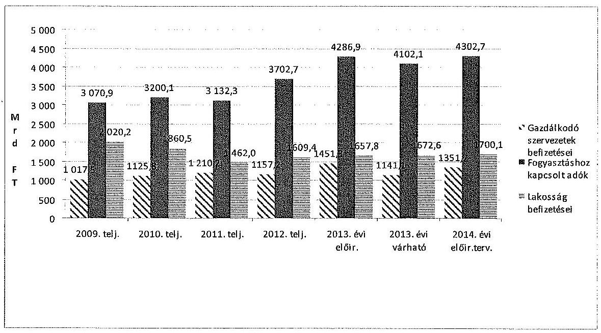
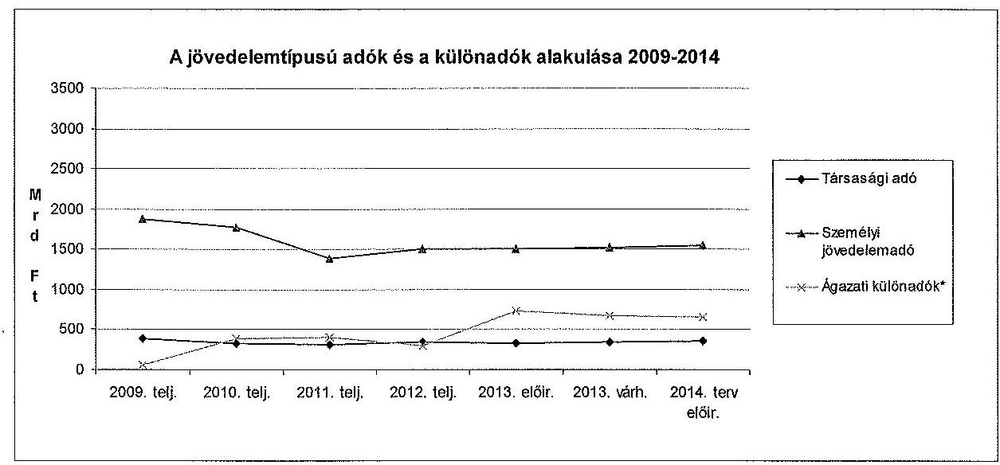
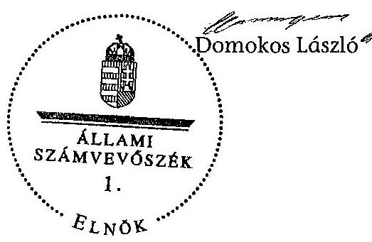

# ÁLLAMI   SZÁMVEVŐSZÉK 

## VÉLEMÉNY

Magyarország 2014. évi központi költségvetéséről szóló törvényjavaslatról

---

Állami Számvevőszék
Iktatószám: V-0213-471/2013.
Témaszám: 30
Vizsgálat-azonosító szám: V0630
Az ellenőrzést felügyelte:
Dr. Pulay Gyula Zoltán
felügyeleti vezető
Az ellenőrzés végrehajtásáért felelős:
Pongrácz Éva
ellenőrzésvezető
Az ellenőrzést vezette:
Pongrácz Éva
ellenőrzésvezető
Az összefoglaló jelentést készítette:
Gácsi Györgyi Ivett
számvevő
Kádár Kriszta
számvevő
dr. Nagy Ágnes
számvevő tanácsos
Séra Andrásné
számvevő tanácsos
Steinbacher Annamária Anett
számvevő
Vicze Klára
számvevő tanácsos
Winter Zsuzsa
számvevő főtanácsos
A számvevői jelentések feldolgozásában és a jelentés összeállításában
közremüködött:
Gácsi Györgyi Ivett
számvevő
Kádár Kriszta
számvevő
dr. Nagy Ágnes
számvevő tanácsos
Séra Andrásné
számvevő tanácsos

---

# Steinbacher Annamária Anett 

számvevő
Vicze Klára
számvevő tanácsos
Winter Zsuzsa
számvevő főtanácsos
Az ellenőrzést végezték:

| Balogh | Balogné Lehoczki Éva   számvevő | Barabás Viktor   számvevő |
| :-- | :-- | :-- |
|  |  |  |
| Batkiné Vas Anna   számvevő tanácsos | Belovai Sándorné   számvevő főtanácsos | Bíró Csaba   számvevő |
| Bozsik Tamás   számvevő | Dér Lívia   számvevő tanácsos | Gácser József Ferenc   számvevő |
| Gácsi Györgyi Ivett   számvevő | Gombás István   számvevő | Gyarmati István   számvevő tanácsos |
| Joó Erika   számvevő | Kádár Kriszta   számvevő | Kalmár István   számvevő tanácsos |
| Kántor Ilona   számvevő tanácsos | dr. Kelemen F. Balázs   számvevő | Kerekes Gábor   számvevő |
| Keszthelyi Zoltán   számvevő tanácsos | Kovács Richárd   számvevő | Kuzma Ágota   számvevő |
| Laki Dóra   számvevő tanácsos | Malatinszki Viktória   Anna   számvevő tanácsos | Meyerné Horváth   Judit   számvevő |
| Nagy Ildikó   számvevő | Nagy László Imre   számvevő | dr.Nagymányai Péter   számvevő |
| Právitzné Pejkó Noémi   számvevő | Séra Andrásné   számvevő tanácsos | Steinbacher   Annamária Anett   számvevő |
| Szabó Zsuzsanna   számvevő | Szeibel Gáborné   számvevő | Tamás László   számvevő |
| Turai Erzsébet   számvevő | Varga József   számvevő tanácsos | Várkonyi Zsolt Kristóf   számvevő tanácsos |
| Velkei András Albert   számvevő | Vitányi István   számvevő tanácsos | Vicze Klára   számvevő tanácsos |
| Weltherné Szolnoki   Dóra   számvevő | Winter Zsuzsa   számvevő főtanácsos |  |

---

# A témához kapcsolódó eddig készített számvevôszéki jelentések: 

## címe

Vélemény Magyarország 2013. évi központi költségvetéséről szóló tervjavaslatról
Jelentés Magyarország 2012. évi központi költségvetése végrehajtásának ellenôrzéséről
sorszáma
1289
13080

---

# TARTALOMJEGYZÉK 

BEVEZETÉS ..... 9
I. ÖSSZEGZŐ MEGÁLLAPÍTÁSOK ..... 12
II. RÉSZLETES MEGÁLLAPÍTÁSOK ..... 20

1. A költségvetési törvényjavaslat fő irányai ..... 20
1.1. A 2014. évi költségvetési tervezés összhangja a jogszabályi előírásokkal ..... 20
1.2. A központi alrendszer hiánya ..... 20
1.3. A központi alrendszer adósságának és az államadósság-mutatónak az alakulása ..... 21
2. A központi költségvetés közvetlen bevételi előirányzatai ..... 23
3. A központi költségvetés közvetlen kiadási előirányzatai ..... 34
3.1. Adósságszolgálattal kapcsolatos bevételek és kiadások ..... 36
3.2. Állami vagyonnal kapcsolatos bevételek és kiadások ..... 37
3.3. A központi költségvetés tartalékai ..... 38
4. A fejezeti előirányzatok tervezése ..... 40
5. Az európai uniós tagsággal összefüggő előirányzatok ..... 42
6. Elkülönített állami pénzalapok ..... 48
7. A társadalombiztosítás pénzügyi alapjai ..... 48
7.1. Nyugdíjbiztosítási Alap ..... 49
7.2. Egészségbiztosítási Alap ..... 50
8. A helyi önkormányzatok támogatásai ..... 51

---

# MELLÉKLETEK 

1. számú A költségvetés közvetlen bevételei
2. számú A költségvetés közvetlen kiadásai

---

# RÖVIDÍTÉSEK JEGYZÉKE 

| Alaptörvény | Magyarország Alaptörvénye |
| :--: | :--: |
| AB | Alkotmánybíróság |
| AJBH | Alapvető Jogok Biztosának Hivatala |
| ÁFA | általános forgalmi adó |
| Áht. | 2011. évi CXCV. törvény az államháztartásról |
| ÁKK Zrt. | Államadósság Kezelő Központ Zrt. |
| Ávr. | 368/2011. (XII. 31.) Korm. rendelet az államháztartásról szóló törvény végrehajtásáról |
| ÁSZ | Állami Számvevőszék |
| BGA | Bethlen Gábor Alap |
| BIR | Bíróságok |
| BM | Belügyminisztérium |
| E. Alap | Egészségbiztosítási Alap |
| EB | Európai Bizottság |
| EDP | Európai Unió Túlzott Hiány Eljárása (Excessive Deficit Procedure) |
| EFOP | Emberi Erőforrás Fejlesztési Operatív Program |
| EHO | egészségügyi hozzájárulás |
| EKOP | Elektronikus Közigazgatás Operatív Program |
| EMMI | Emberi Erőforrások Minisztériuma |
| ELKA | Elkülönített Állami Alapok |
| EMVA | Európai Mezőgazdasági Vidékfejlesztési Alap |
| ESA | Nemzeti számlák európai rendszere |
| ETHA | Európai Tengerügyi és Halászati Alap |
| EVA | egyszerúsített vállalkozói adó |
| EU | Európai Unió |
| EUR | euró |
| FHB Zrt. | FHB Kereskedelmi Bank Zrt. |
| GDP | bruttó hazai termék |
| GINOP | Gazdaságfejlesztési és Innovációs Operatív Program |
| GKI | GKI Gazdaságkutató Zrt. |
| GNI | bruttó nemzeti jövedelem |
| Gst. | 2011. évi CXCIV. törvény Magyarország gazdasági stabilitásáról |
| GYED | gyermekgondozási díj |
| GVH | Gazdasági Versenyhivatal |
| HM | Honvédelmi Minisztérium |
| HOP | Halászati Operatív Program |
| IKOP | Intelligens Közlekedésfejlesztési Operatív Program |
| KATA | Kisadózók tételes adója |
| KE | Köztársasági Elnökség |
| KDB | Közbeszerzési Döntőbizottság |

---

| KEOP | Környezet és Energia Operatív Program |
| :--: | :--: |
| KEHOP | Környezet és Energetikai Hatékonysági Operatív Program |
| KESZ | Kincstári Egységes Számla |
| Kincstár | Magyar Államkincstár |
| KIM | Közigazgatási és Igazságügyi Minisztérium |
| KIVA | Kisvállalati adó |
| KNPA | Központi Nukleáris Pénzügyi Alap |
| KOP | Koordinációs Operatív Program |
| KP | Konvergencia Program |
| KÖZOP | Közlekedés Operatív Program |
| KSH | Központi Statisztikai Hivatal |
| KT | Költségvetési Tanács |
| KTIA | Kutatási és Technológiai Innovációs Alap |
| KüM | Külügyminisztérium |
| Kvtv. | 2012. évi CCIV. törvény Magyarország 2013. évi központi költségvetéséről |
| MÁV Zrt. | Magyar Államvasutak Zrt. |
| M Ft | millió forint |
| ME | Miniszterelnökség |
| MIK | Megyei Intézményfenntartó Központ |
| MMA | Magyar Múvészeti Akadémia |
| MNB | Magyar Nemzeti Bank |
| MNV Zrt. | Magyar Nemzeti Vagyonkezelő Zrt. |
| Mrd Ft | milliárd forint |
| MTA | Magyar Tudományos Akadémia |
| NCSSZA | Nemzeti Családi és Szociálpolitikai Alap |
| NGM | Nemzetgazdasági Minisztérium |
| NFM | Nemzeti Fejlesztési Minisztérium |
| NAV | Nemzeti Adó- és Vámhivatal |
| NFA | Nemzeti Földalap |
| NEFA | Nemzeti Foglalkoztatási Alap |
| NET Zrt. | Nemzeti Eszközkezelő Zrt. |
| NFÜ | Nemzeti Fejlesztési Ügynökség |
| NHP | Növekedési Hitelprogram |
| NIF Zrt. | Nemzeti Infrastruktúra Fejlesztő Zrt. |
| NKA | Nemzeti Kulturális Alap |
| NGM | Nemzetgazdasági Minisztérium |
| NSRK | Nemzeti Stratégiai Referenciakeret |
| Ny. Alap | Nyugdíjbiztosítási Alap |
| OGY | Országgyúlés |
| OEP | Országos Egészségbiztosítási Pénztár |
| ONYF | Országos Nyugdíjbiztosítási Főigazgatóság |
| OP | Operatív Program |
| OSAP | Országos Statisztikai Adatgyűjtési Program |

---

| Mötv. | 2011. évi CLXXXIX. törvény Magyarország helyi önkor-   mányzatairól |
| :-- | :-- |
| PM | Partnerségi Megállapodás |
| Prognózis | a költségvetési törvényjavaslat tervezetéhez csatolt kor-   mányzati prognózis |
| PTI | pénzügyi tranzakciós illeték |
| RKI | Rendkívüli kormányzati intézkedések |
| ROP | Regionális Operatív Program |
| SZJA | személyi jövedelemadó |
| TAO | társasági adó |
| TÁMOP | Társadalmi Megújulás Operatív Program |
| TB Alapok | Társadalombiztosítási Alapok |
| TES | Terhességi- és gyermekágyi segély |
| TIOP | Társadalmi Infrastruktúra Operatív Program |
| TOP | Területi- és Településfejlesztési Operatív Program |
| UF | Uniós Fejlesztések |
| USD | amerikai dollár |
| ÜMVP | Új Magyarország Vidékfejlesztési Program |
| Új VP | Új Vidékfejlesztési Program |
| VEKOP | Versenyképes Közép-Magyarország Operatív Program |
| VM | Vidékfejlesztési Minisztérium |
| VOP | Végrehajtás Operatív Program |
| WMA | Wesselényi Miklós Ár- és Belvízvédelmi Kártalanítási Alap |

---

# ÉRTELMEZŐ SZÓTÁR 

államadósság mutató
államadósság-szabály
európai uniós forrás
felülről nyitott előirányzatok
megalapozott előirányzat
meghatározó előirányzat
részben megalapozott előirányzat
nem megalapozott előirányzat
alátámasztott előirányzat
teljesíthető előirányzat
kockázatos előirányzat

Az államadósság mutató olyan százalékban kifejezett, egy tizedesig kerekített hányados, amely számlálójában az államháztartás központi alrendszerének, az államháztartás önkormányzati alrendszerének, és a kormányzati szektorba sorolt egyéb szervezetek egymással szembeni kötelezettségek kiszűrésével számított (konszolidált) adósságának, nevezőjében a nemzeti és regionális számlák európai rendszeréről szóló tanácsi rendeletben meghatározottak szerint számított bruttó hazai terméknek a Gst. szerinti értéke szerepel.
Az Alaptörvény 36. cikk (4) és (5) bekezdésében foglaltak szerint az Országgyúlés nem fogadhat el olyan központi költségvetésről szóló törvényt, amelynek eredményeképpen az államadósság meghaladná a teljes hazai össztermék felét. Mindaddig, amíg az államadósság a teljes hazai össztermék felét meghaladja, az Országgyúlés csak olyan központi költségvetésről szóló törvényt fogadhat el, amely az államadósság teljes hazai össztermékhez viszonyított arányának csökkentését tartalmazza.
az Európai Unió költségvetéséből, az Európai Gazdasági Térség Európai Unión kívüli tagállamának költségvetéséből, valamint a Svájci Hozzájárulás programból származó forrás [Áht. 2. § (1) bekezdés g) pontja]
a központi alrendszer azon - a költségvetési törvény mellékletében felsorolt - előirányzatai, amelyek teljesülése módosítás nélkül eltérhet (felfelé) az előirányzattól
teljesíthető és alátámasztott előirányzat
A költségvetési egyenlegcél betartására meghatározó hatást gyakorló, a központi alrendszer bevételi, illetve kiadási főösszegének $0,5 \%$-át elérő, vagy meghaladó összegű előirányzatok, amelyek körének kialakítását további szűrők támogatják.
teljesíthető és részben alátámasztott előirányzat
nem teljesíthető és nem alátámasztott előirányzat
az előirányzat kialakítását dokumentáló számítások, hatástanulmányok, stratégia rendelkezésre állnak; a szabályozási háttere van, illetve biztosított
az előző évi tendenciákkal és várható értékkel a kialakított előirányzat összhangban van
nincs szabályozási háttere, számítási háttere, stratégia, hatástanulmány; nem teljesíthető

---

Szolgálatfüggő ellátások A 40 év jogosultsági idővel rendelkező nők részére korhatárt megelőzően járó nyugdíj.
Tervezési Tájékoztató az államháztartásért felelős miniszter Tájékoztatója a 2013. évi költségvetési törvényjavaslat összeállításához szükséges feltételekről és az érvényesítendő követelményekről
$\mathrm{N}+2, \mathrm{~N}+3$ szabály $\quad$ Az $\mathrm{N}+2, \mathrm{~N}+3$ szabály a kötelezettségvállalás automatikus visszavonásának szabálya. Az Európai Bizottság automatikusan visszavonja a kötelezettségvállalásoknak azt a részét, amelyre a tagállam nem nyújtott be elfogadható kifizetési kérelmet a kötelezettségvállalás évét követő második, illetve harmadik év végéig.
NSRK Nemzeti Stratégiai Referenciakeret. A 2007-2013. közötti uniós költségvetési periódusban a Strukturális Alapok és a Kohéziós Alap uniós forrásait, valamint a hazai költségvetési támogatásokat magában foglaló keretprogram.
PM Partnerségi Megállapodás. A 2014-2020. közötti uniós költségvetési periódusban hazánk rendelkezésére álló uniós és hazai támogatásokat magában foglaló támogatási keret-megállapodás.

---

.

---

# VÉLEMÉNY 

## Magyarország 2014. évi központi költségvetéséről szóló törvényjavaslatról

## BEVEZETÉS

Az Állami Számvevőszékről szóló 2011. évi LXVI. törvény 5. § (1) bekezdése alapján ellenőrzi a központi költségvetési javaslat megalapozottságát, a bevételi előirányzatok teljesíthetőségét. A törvényjavaslatnak meg kell felelnie az Alaptörvényben és a Magyarország gazdasági stabilitásáról szóló 2011. évi CXCIV. törvényben (Gst.) meghatározott követelményeknek.

Az államháztartásról szóló 2011. évi CXCV. törvény (Áht.) 22. § (6) bekezdésében foglaltak szerint az Országgyűlés a központi költségvetésről szóló törvényjavaslatot az Állami Számvevőszék (ÁSZ) és a Költségvetési Tanács (KT) véleményével együtt tárgyalja meg. Az ÁSZ ennek érdekében a központi alrendszer előirányzatainak tervezését végző szerveknél ellenőrzést végzett, amely alapján kialakította véleményét a költségvetési törvényjavaslatról.

## A véleményadáshoz kapcsolódó ellenőrzés célja:

- annak értékelése volt, hogy Magyarország 2014. évi költségvetéséről szóló törvényjavaslat bevételi és kiadási előirányzatai megalapozottak-e;
- a 2015-2017. évekre kialakított irányszámok kidolgozottak-e; a törvényjavaslat megalapozottságát a tervezésnél alkalmazott módszerek, háttérszámítások, hatástanulmányok, valamint az állami feladatrendszer és a szabályozók javasolt módosításai biztosítják-e;
- teljesültek-e a Tervezési Tájékozatóban megfogalmazott követelmények, továbbá a Széll Kálmán tervekben szereplő megtakarítási előírások; a tervezett kiadások a közfeladatok ellátásához szükséges forrásokat teljes körűen tar-talmazzák-e;
- a bevételi és kiadási előirányzatok a költségvetési törvényjavaslathoz mellékelt makrogazdasági előrejelzéseket is figyelembe véve megalapozottak és teljesíthetőek-e; a költségvetési javaslat összeállítása megfelel-e a jogszabályi előírásoknak;
- számításba vették-e az EU tagság pénzügyi, gazdasági hatásait, a helyi önkormányzatok támogatásai megalapozottak-e, az Alaptörvényben és a Gst.ben foglaltak alapján érvényesül-e az államadósság-szabály.

A véleményadás jogi alapját az Állami Számvevőszékről szóló 2011. évi LXVI. törvény 5. §-ának (1) bekezdésében, valamint az Áht. 22. §-ának (6) bekezdésében foglaltak képezik.

---

A törvényjavaslatot a véleményezéshez készített Módszertan ${ }^{1}$ alapján értékeltük, amely tartalmazza a bevételi és kiadási előirányzatok minősítéseinek meghatározását.

A minősítési kategóriák a következők:

1. megalapozott (teljesíthető és alátámasztott),
2. részben megalapozott (teljesíthető és részben alátámasztott),
3. nem megalapozott (nem teljesíthető és nem alátámasztott).

Az előirányzatok esetében felmerülhetnek különféle kockázatok. Kockázatos az előirányzat, ha nincs szabályozási háttere, nincs számítási háttere, nincs stratégia, hatástanulmány, illetve az előirányzat nem teljesíthető.

A bevételek esetében a megalapozottság mindkét feltétele értelmezhető, viszont a kiadásoknál azok alátámasztottságáról mondunk véleményt. Alátámasztottnak minősül az előirányzat, ha a kialakítását dokumentáló számítások, hatástanulmányok, stratégia rendelkezésre állnak, valamint a szabályozási háttere megvan, illetve biztosított. Teljesíthető az előirányzat, ha az előző évi tendenciákkal és a várható értékkel a kialakított előirányzat összhangban van. Alapesetben kockázatosnak tekintendő az előirányzat, ha nem megalapozott. Ugyanakkor a törvényjavaslatban bemutatott makrogazdasági pálya, illetve az egyes gazdasági mutatószámok várakozásoktól eltérő, kedvezőtlen alakulása kockázatot jelenthet az általunk egyébként megalapozottnak, illetve részben megalapozottnak minősített előirányzatok teljesülése esetében is.

Magyarország 2014. évi költségvetési törvényjavaslata 16 883,1 Mrd Ft kiadási, továbbá 15 958,4 Mrd Ft bevételi főösszeggel számol. Ellenőrzésünk - a Módszertanban foglaltakkal összhangban és az új előirányzatokat is figyelembe véve - a bevételi főösszeg 93,6\%-ára és a kiadási főösszeg 88,6\%-ára terjedt ki. A minősítés az ellenőrzésbe bevont meghatározó ${ }^{2}$ előirányzatokra, azokra különkülön (alcímenként, illetve címenként) történt meg. A bevételi és kiadási előirányzatok megalapozottságának, a bevételi előirányzatok teljesíthetőségének megítélése a rendelkezésre álló dokumentumok, információk alapján, elemzési módszerekkel történt.

Értékelésünk során a törvényjavaslatban szereplő gazdasági mutatószámokat, az NGM által rendelkezésünkre bocsátott 2013. évi várható értékeket, illetve a

[^0]
[^0]:    ${ }^{1}$ Módszertan Magyarország költségvetéséről szóló törvényjavaslat véleményezését megalapozó ellenőrzéshez. (2012.)
    ${ }^{2}$ A Módszertan szerint meghatározó a bevételi, illetve kiadási előirányzat, ha annak összege a központi alrendszer bevételi, illetve kiadási fóösszegének 0,5\%-át eléri, azonban a meghatározó előirányzatok körének kialakításánál további paramétereket is alkalmazunk, melyek a következők: 1. a tárgyévről szóló költségvetési törvényben meghatározott, felülről nyitott előirányzatok, 2. gazdasági mutatók alakulásától való függés (gazdasági növekedés, belföldi felhasználás, fogyasztás, árfolyam, infláció), 3. ÁSZ kockázatosságra vonatkozó véleménye 3 évre visszamenőleg és a jelzett kockázat a teljesítés során igazolódott.

---

2013. év első hét, illetve nyolc hónapjának teljesítési adatait és az az alapján megítélésünk szerint várható összegeket vettük figyelembe. A törvényjavaslatban megjelenő előirányzatok kialakítása, az azokat alátámasztó számítások az általános indokolás melléklete szerinti gazdasági mutatószámok alapján történtek. E mutatók alapján értékeltük az egyes előirányzatok megalapozottságát.

Az ÁSZ 2012. elejétől monitoring tevékenységet folytat, melynek célja, hogy nyomon kövesse a költségvetési folyamatokat. Az ÁSZ e tevékenysége keretében a Magyar Államkincstártól (Kincstár) és a Nemzeti Adó- és Vámhivataltól (NAV) bekért adatok és munkaanyagok alapján folyamatosan értékeli a folyamatokat, az első félévet követően azok alakulásáról elemzést készít a KT részére. Az elemzésben foglaltakat a véleményünk kialakítása során is hasznosítottuk.

Az ellenőrzés során súlyponti kérdésként kezeltük, hogy az ÁSZ törvényi kötelezettségének teljesítésével támogassa a megalapozott döntéshozatalt, azaz az Országgyúlés az Alaptörvényben és a Gst.-ben meghatározott követelményeknek megfelelő költségvetési törvényt fogadhasson el. Az ellenőrzés megállapításai segítik a költségvetés tervezésért felelős intézményeket és szervezeteket a megalapozott költségvetési tervek elkészítésében, annak érdekében, hogy Magyarország központi költségvetése kiegyensúlyozottabb legyen és megfeleljen a Gst. és az uniós módszertan szerinti államadósságra és hiányra vonatkozó mutatóknak.

---

# I. ÖSSZEGZŐ MEGÁLLAPÍTÁSOK 

Az Áht. 13. § (1) bekezdése értelmében a Kormánynak március 31-ig kellett meghatároznia a gazdaságpolitika- és pénzügypolitika fő irányait (adópolitika, költségvetési politika, hiánycél), amely megtörtént. Emellett az áprilisi konvergencia program (KP) részletesen tartalmazta a kormányzat középtávú (2013-2016. évek) gazdaságpolitikai elképzeléseit, a költségvetés-politika céljait és a fenntartható fejlődést biztosító adósságpályát. 2013 júniusában az Országgyűlés egyenlegjavító intézkedésekről (adóemelések), a Kormány pedig fejezeti zárolásokról döntött a hiánycél tartása érdekében. Az intézkedések adóbevételeket érintő része augusztusban lépett hatályba. A 2014. évi költségvetési törvényjavaslat a gazdasági növekedés mértékét illetően lényeges változást nem, de az összetevők tekintetében számottevőbb elmozdulást jelez a KP-hoz képest, a hiánycél 3\% alatt tartása és csökkenő adósságpálya mellett.

Az NGM a Tervezési Tájékoztatót és ütemtervet határidőre elkészítette és megküldte az érintetteknek az Áht. 13. § (2) bekezdésében foglalt feladatának teljesítése érdekében. A fejezetek és az Alapok a Tervezési Tájékoztatóban meghatározott részletezettséggel, augusztus 30 -áig megküldték a költségvetési adataikat az NGM-nek. Ezt követően, szeptember 13-án az NGM új makrogazdasági pályát (amelyben a Tervezési Tájékoztatóban rögzített gazdasági növekedés, infláció, árfolyam mutatókat is megváltoztatta) bocsátott rendelkezésre. Az új makrogazdasági pálya alapján az érintettek újra tervezték az előirányzatokat.

A törvényjavaslat összeállítása, szerkezete az Alaptörvényben és a Gst.-ben meghatározottaknak, valamint az államadósság-szabálynak és az államháztartásról szóló jogszabályok előírásainak megfelel. Rendelkezik továbbá a tartalékokról, azon belül az Országvédelmi Alapról.

Az ÁSZ 13080 számú Magyarország 2012. évi központi költségvetése végrehajtásának ellenőrzéséről című jelentés alapján megállapítható, hogy a Széll Kálmán Tervek megvalósulása során több strukturális változás történt. Az NGM tájékoztatása alapján a 2014. évre vonatkozóan új intézkedésre, átalakításra a Széll Kálmán Tervvel kapcsolatban nem kerül sor, csak azok áthúzódó hatása érvényesül. Magyarország 2014. évi központi költségvetéséről készült törvényjavaslat általános indokolása alapján a 2014. évi költségvetési törvényjavaslat tervezésekor figyelembe vették a Széll Kálmán Terv előző években elért eredményeit is.

Az Áht. 22. § (3) bekezdés b) pontja értelmében a Kormánynak a központi költségvetésről szóló törvényjavaslat indokolásában kell bemutatnia a költségvetési évet követő három év várható előirányzatainak keretszámait főbb csoportokban. A 2014. évi költségvetési törvényjavaslat indokolásának mellékletei felvázolják a makrogazdasági pályát és bemutatják a költségvetési előirányzatokat főbb csoportok szerinti bontásban a 2015-2017. évekre

---

Az ÁSZ-nak nem feladata a törvényjavaslat részét képező makrogazdasági prognózis (Prognózis) értékelése. Ezért az egyes makrogazdasági feltételek teljesülésétől függő bevételi előirányzatok (pl. általános forgalmi adó) és kiadási előirányzatok (pl. nyugdíjkiadások) kapcsán az ÁSZ csak azt ellenőrizte, hogy ezeknek az előirányzatoknak a törvényjavaslatban meghatározott értékei összhangban állnak-e a Prognózisban szereplő becslésekkel (pl. a nyugdijakat a tervezett inflációval azonos mértékben tervezték-e meg). Természetesen az ÁSZ sem hagyhatja figyelmen kívül, hogy a makrogazdasági folyamatoknak a Prognózistól eltérő alakulása kockázatot jelent egyes költségvetési bevételek és kiadások teljesíthetőségére. Ezen kockázatok kezelését a tartalékok kapcsán értékeljük.

A 2014. évről szóló törvényjavaslat az államháztartás központi alrendszerének hiányát 924,8 Mrd Ft-ban állapítja meg, ezen belül a két TB Alap egyenlege 0 Mrd Ft. Az ELKA hiánya 23,4 Mrd Ft. A központi alrendszer 2014. évi tervezett hiánya $12 \%$-kal alacsonyabb a 2013. évi módosított hiány összegénél (1050,8 Mrd Ft).

A központi költségvetés tervezett hiányával összefüggésben a Kincstári Egységes Számla folyamatos likviditásának biztosítására a 2014. évi finanszírozási elképzelések számszakilag kimunkáltak, alátámasztottak.
2013. I-VIII hónapjában az államháztartás központi alrendszerének pénzforgalmi hiánya 961,1 Mrd Ft, ami 14,2\%-kal haladja meg az éves eredeti előirányzatot, a szeptemberben módosított előirányzatnak (1050,8 Mrd Ft) a 91,5\%-a. Az első nyolc havi deficit a központi költségvetés 1230,7 Mrd Ft-os hiányának, valamint az elkülönített pénzalapok 63,2 Mrd Ft-os és a társadalombiztosítási alapok 206,4 Mrd Ft-os szufficitjének egyenlegéből adódik. A kiadási oldal teljesülése lényegében megfelel az időarányosnak, a bevételek több mint 6 százalékponttal maradtak el az időarányos teljesítéstől. A kiadások és bevételek összehasonlításakor azonban figyelembe kell venni, hogy azok egymáshoz képest időbeli elcsúszással teljesülnek. A Kormány várakozásai szerint december hónapban jelentős többletbevétellel számolhat a költségvetés, amely hozzájárul az éves hiány elvárt szinten tartásához.

A bevételi oldalnál a 2014. évi tervezés alapját szolgáló bázisév tekintetében szükséges kiemelni, hogy a 2009-től megfigyelhető adóstruktúra arányeltolódás tovább folytatódott. Az adóterhelés a jövedelemtípusú adók felől áttolódott a fogyasztási típusú adók felé. Az adóbeszedés hatékonyságának növelése érdekében tett intézkedések nem hozták a várt többleteredményt a pénztárgépek on-line bekötésének bevezetéséből adódó határidő módosítása miatt, ezek beépítése a költségvetésbe jelentősen növelte egyes adónemek 2013. évi bevételei teljesülésének kockázatát.
2013. I-VIII. hónapjában a központi költségvetés bevételeinek főösszege a tavalyi év hasonló időszakához képest alacsonyabban teljesült. A bevételek időarányos elmaradását elsősorban a gazdálkodó szervezetek befizetései, valamint a fogyasztáshoz kapcsolt adók alacsony teljesülése okozta.
A Munkahelyvédelmi Akcióterv keretében 2013-tól bevezetett kisvállalkozásokat segítő új adónemeket (kisadózók tételes adója (KATA) és kisvállalati adó (KIVA)) az előzetes várakozásokkal szemben lényegesen kevesebb adózó válasz-

---

totta. Ennek következtében ezen a jogcímen jelentős elmaradás tapasztalható. Azonban a teljes költségvetés szintjén ez nem jelent kockázatot, mivel a kevesebb átlépés miatt többen fizetnek társasági adót (TAO), egyszerúsített vállalkozói adót (EVA), illetve szociális hozzájárulási adót és személyi jövedelemadót (SZJA). A gazdálkodó szervezetek befizetései közül a kisvállalati adókon túl - a bázisév pénzügyi teljesülését figyelembe véve - a hitelintézeti járadék, a játékadó, a bányajáradék és az energiaellátók jövedelemadója előirányzat 2013. évi teljesülése hordoz kockázatot. A hitelintézeti járadék esetében az alacsonyabb teljesülést az ún. árfolyamgát rendszer kihasználtságának vártnál alacsonyabb szintje okozza. ${ }^{3}$ A bányajáradék mértéke 2013. augusztus elsejétől megváltozott (kulcsemelés), ami az első félévben megmutatkozó időarányos bevétel elmaradást kis mértékben kompenzálja. Az energiaellátók jövedelemadójánál a bázisévi alacsonyabb várható teljesüléshez hozzájárul, hogy az energiaszektort érintő egyéb intézkedések (pl. rezsicsökkentés, bányajáradék emelés) hatása mérsékli az adóalapot.

A forgalmi típusú adóknál az ÁFA, a jövedéki adó és a pénzügyi tranzakciós illeték (PTI) bevételek egyaránt jelentősen elmaradtak 2013-ban az előirányzottól. Az ÁFA 2013. évi várható bevétele - a tervezettnél alacsonyabb fogyasztásból, illetve az adóbeszedés hatékonyságjavulását szolgáló intézkedések elmaradásából adódóan - elmaradhat az előirányzattól. Az éves teljesülés javítása érdekében a pénzügyi tranzakciós illetéknél a pénzforgalmi szolgáltatókat (kivéve Kincstár) egyszeri befizetésre kötelezték ( $75,0 \mathrm{Mrd}$ Ft) és az adókulcsokat emelték. A távközlési adótételek emelésére került sor 2013. augusztus 1-jétől. Az intézkedések következtében a bázis oldali kockázatok mérséklődtek.

A korábbi évekhez képest az adóbevételek megalapozottsága tekintetében kedvező változás, hogy nem megalapozott adóbevételt a törvényjavaslat nem tartalmaz. A 2014. évről szóló költségvetési törvényjavaslat adóbefizetéseit megalapozó jogszabályi háttér azonban hiányos, az adótörvények jövő évet érintő módosításai nem készültek el, azokat az Országgyűléshez (OGY) még nem nyújtották be. Minderre és a fennmaradó kockázatokra tekintettel - a költségvetés adóbevételeinek 52,6\%-a megalapozott, 47,4\%-a részben megalapozott (KATA, KIVA, PTI, ÁFA, távközlési adó). A részben megalapozott adóbevételek esetében az adóbevételek egy meghatározott része tartalmaz kockázatot, ami azt jelenti, hogy az adóbevételek előirányzatai különböző mértékben alulteljesülhetnek. Az alulteljesülés mértékét több tényező (pl. a vártnál alacsonyabb bázis) befolyásolhatja. Az egyes adóbevételek esetében jelentkező összegszerű kockázatok általunk becsült összegét az 1. sz. melléklet tartalmazza.

A KATA és KIVA esetében az NGM 2014-re jelentős létszámfelfutással számol, ami a bázisévi folyamatok tükrében kockázatot hordoz. Szükséges megjegyezni, hogy a KATA és a KIVA kapcsán általunk jelzett bevételkiesés - a 2013. évhez hasonlóan - a teljes költségvetés szintjén pozitív kockázatot jelent. A PTI 2014. évi 269,4 Mrd Ft-os előirányzata a 2013. évre várható értéknél (288,2 Mrd Ft) alacsonyabb, de az előirányzat az adótételek korábbi teljesülésének ismereté-

[^0]
[^0]:    ${ }^{3}$ A teljes költségvetés szintjén nem jelent kockázatot, mivel a bevételkiesést a lakásépítési támogatási jogcímen megjelenő alacsonyabb kifizetés kompenzálja.

---

ben kockázatos. A távközlési adó teljesülése a kulcsemeléssel összefüggő tapasztalatok hiányából adódóan kockázatos. A 2014. évi 3000,1 Mrd Ft-os pénzforgalmi ÁFA bevételi előirányzat számításánál a vásárolt fogyasztás növekedéséből adódóan 8,6\%-os bevételi növekedést várnak, míg a makrogazdasági pálya szerint a vásárolt fogyasztás folyó áron csak 4,5\%-kal nő. Emellett a törvényjavaslat nem veszi teljes körűen figyelembe a 2013. évi bevételi elmaradás 2014. évi bevételre gyakorolt hatását. Emiatt az ÁFA bevételi elmaradás kockázata a 2014. évre 150,0 Mrd Ft-ra tehető. Ugyanakkor a kockázatokat mérsékelheti, hogy a pénztárgépek on-line bekötése most már egész évben hozza azt a többletet, amelynek a féléves hatását 95,0 Mrd Ft-ra becsülték.

A központi költségvetés meghatározó közvetlen kiadási elöirányzatainak 98,3\%-a megalapozott és 1,7\%-a részben megalapozott (az előirányzatok összege alapján számolva). (2. sz. melléklet)

Megalapozottak a vállalkozások folyó támogatásai, a lakástámogatások, az állam által vállalt kezesség és viszontgarancia, a kormányzati rendkívüli kiadások, a garancia és hozzájárulás a társadalombiztosítási ellátásokhoz és a nemzetközi elszámolások kiadásainak előirányzatai.

Részben megalapozott a szociálpolitikai menetdíj támogatás, az egyéb költségvetési kiadásoknak, valamint a Nemzeti Családi és Szociálpolitikai Alapnak (NCSSZA) egy-egy előirányzata, továbbá a peres ügyek. A részben megalapozott minősítés indoka az, hogy a kifizetések jogszabályi alapját jelentő törvénymódosítások még nem készültek el, valamint - az NCSSZA adott előirányzatát kivéve - a háttérszámítások hiányosak.

A 2014. évi központi költségvetés tervezett kiadási főösszegének 56,4\%-a ( 9528,2 Mrd Ft) felülről nyitott kiadási előirányzat, amely a tervezett hiánycél betartása szempontjából kockázatot jelent. A kockázatot csökkenti, hogy az előző évi tapasztalatok alapján ezeknek az előirányzatoknak a teljesítése jelentősen nem haladta meg az előirányzatot, egyes esetekben az alatt maradt.

Az állami vagyonnal kapcsolatos bevételek 34,5\%-a megalapozott, 65,5\%-a részben megalapozott. A kiadások $75,4 \%$-a megalapozott, $24,6 \%$-a részben megalapozott.

Az állami vagyonnal kapcsolatos bevételek kapcsán kiemelendő, hogy a törvényjavaslat szerint a Frekvencia használati jog értéke előirányzat összege 120,0 Mrd Ft. Az előirányzat összegét alátámasztó hivatalos dokumentum nem állt rendelkezésre. A frekvenciahasznosításból eredő bevételek részben megalapozottak, azonban az elmúlt időszak tapasztalatai alapján teljesíthetőek.

Csak részben megalapozott a NET Zrt. által végrehajtott ingatlanvásárlások ( 37,0 Mrd Ft) előirányzata is. Az NFM írásbeli tájékoztatása szerint „a NET Zrt. ügyfélkörének jelentős kibővítése érdekében szükséges intézkedések kidolgozása a Nemzeti Fejlesztési Minisztériumban jelenleg folyamatban van", azonban jóváhagyása még nem történt meg.

Az állami vagyon részét képező Nemzeti Földalappal (NFA) kapcsolatos bevételek és kiadások föösszegei megalapozottak, számításokkal alátámasztottak.

---

A központi költségvetés 2014. év végére tervezett adóssága (23 024,3 Mrd Ft ${ }^{4}$ ) a 2013. év végére tervezett adósságot (22 110,7 Mrd Ft) 4,1\%kal haladja meg. A devizaadósság értéke ${ }^{5}$ 2014-ben a kibocsátások és lejáratok figyelembevételével 1,9\%-kal csökken a 2013-as várható 8962,5 Mrd Ft-ról 8788,9 Mrd Ft-ra. Ez a 2014. év végére tervezett költségvetési adósság 38,2\%-a, amely arány megfelel az államadósság-kezelési stratégia deviza-részarányra vonatkozó, a 2013. utáni évekre tervezett max. 45\%-os rátájának. A 2014. év végi tervezett forintadósság állomány a 2013. év végi várható állományához (13 080,5 Mrd Ft) képest 14 083,3 Mrd Ft-ra nő, amely 7,6\%-os növekedésnek felel meg.

A törvényjavaslatban szereplő makrogazdasági pálya alapján a 2014. év végére tervezett GDP-arányos, az árfolyamhatás kiszürésével számolt államadósság mértéke a Gst.-ben foglaltaknak megfelelően csökkenő trendet követ, így az államadósság-szabály érvényesül. (Az államadósság-mutató várható értéke a 2013. év végén $77,4 \%$, a 2014. év végén $76,9 \%$.)

A központi költségvetés finanszírozásának tervezésénél a legnagyobb bizonytalansági tényezőnek az egyéb finanszírozandó tételek közt megjelenő EU transzferek egyenlege számít, amely évek óta problémát jelent. A prognózisok rövid időn belül bekövetkező, akár 100,0 Mrd Ft-os változása jelentős kockázatot jelent az államadósság-kezelés számára, mivel kikényszerítheti a finanszírozás változtatását akár kedvezőtlen piaci körülmények között is. A finanszírozási terv az EU transzferek esetében 2014-re 0 Ft egyenleggel számol.

Az adósság- és követéskezelés kamatkiadási előirányzatai a 2014. évre összesen 1165,0 Mrd Ft-ot tartalmaznak, ebből a devizában fennálló adósság és követelések kamatkiadási előirányzata 332,1 Mrd Ft (az előző év előirányzatának 101,2\%-a), a forintban fennálló adósság és követelések kamatkiadási előirányzata 833,0 Mrd Ft (az előző év előirányzatának 90,9\%-a). A kamatkiadások 2014. évi várható összege eléri a tervezett nominális GDP 3,8\%-át. A kamatkiadások az előző évhez képest csökkennek, a 2013. év végére tervezett összegnek (1244,4 Mrd Ft) ${ }^{6}$ várhatóan 93,6\%-át érik el. A fejezet kiadásai és bevételei számításokkal alátámasztottak és teljesíthetőek.

Az ellenőrzött fejezetek bevételi és kiadási előirányzatai teljes körűen megalapozottak.

Személyi juttatásokra a fejezetek a 2014. évre 1708,3 Mrd Ft előirányzatot terveztek, mely az előző évi előirányzathoz viszonyítva 178,1 Mrd Ft-tal (11,6\%kal) növekedett elsősorban törvényi előírások (feladatbővülés, pedagógus életpálya modell bevezetése stb.) miatt.

A fejezetek kockázataik csökkentése érdekében összesen 4,7 Mrd Ft összegű tartalékot képeztek. Nem tervezett fejezeti tartalékot 8 fejezet (HM, BM, NGM, NAV, NFM, KÜM, KSH, MTA).

[^0]
[^0]:    ${ }^{4}$ Az NGM 2013. szeptember 26-án rendelkezésre bocsátott számításai alapján
    ${ }^{5}$ Az ÁKK Zrt. által rendelkezésre bocsátott finanszírozási tervek alapján
    ${ }^{6}$ Az ÁKK Zrt. adata

---

Fejezeti kezelésű előirányzatokra 9 fejezet (OGY, KIM, ME, VM, BM, NGM, NFM, EMMI, UF) az előző évihez képest jelentősebb összegű többletkiadást tervezett törvényi előírások alapján és a szakmapolitikai feladatok figyelembevételével. Az előirányzott többletkiadás $71,0 \%$-a az Uniós fejlesztések fejezetnél jelentkezett. Ennek mintegy 80 százalékát az EU-tól származó bevételek finanszírozzák.

A 2007-2013. közötti uniós költségvetési periódus Nemzeti Stratégiai Referenciakeretéhez (NSRK) kapcsolódó uniós támogatásaiból 97\%-ot kötelezettség vállalással ${ }^{7}$ lekötöttek. Az NSRK programjaira a törvényjavaslat a 2014. évre 1787,9 Mrd Ft kiadást tartalmaz, amely az előző évi 1354,5 Mrd Ft-ot 32,0\%kal haladja meg. (A kiadásokból 327,9 Mrd Ft költségvetési támogatás, amely 18,3\%-nak felel meg.) A 2014. évi előirányzatok tervszámai megalapozottak. A végrehajtás szempontjából ugyanakkor kockázatot hordoz az NSRK keretében szerződéssel lekötött uniós forrásoknak a 2013. évinél számottevően magasabb összegű 2014. évi tervezett felhasználása, mivel a korábbi években a felhasználás akadozott. Az alacsonyabb felhasználás kockázatának minimalizálása érdekében az NGM számos intézkedést (egyeztetések, szabályozás módosításai, intézkedési tervek) tett. A gördülékenyebb felhasználást segíti a költségvetési törvényjavaslatban az UF fejezetben megjelenő EU Önerő Alap 30,0 Mrd Ft-os forrása. Megjegyzendő, hogy a tervezettnél kisebb mértékű felhasználás a 2014. évi költségvetés szempontjából megtakarítást jelentene. A VM fejezetben megjelenő, Új Magyarország Vidékfejlesztési Program (ÚMVP) keretében a kötelezettségvállalások aránya a rendelkezésre álló keret $94,1 \%$-ára növekedett 2013 júliusáig. Az így lekötött uniós keretek 2014. évi felhasználására a törvényjavaslat 224,5 Mrd Ft kiadási előirányzatot tartalmaz, amelyből 60,6 Mrd Ft-os a támogatás. A Halászati Operatív Program (HOP) 2014-ben három tengelyhez kapcsolódóan teljesít kifizetéseket, összesen 2512,8 M Ft értékben.

A 2014-2020 közötti programozási periódusban a Partnerségi Megállapodás (PM) keretében részesül hazánk több uniós alap forrásaiból. A tervezhető teljes hétéves keret 6477,6 Mrd Ft, amely nem tartalmazza az EMVA és az ETHA forrásait ${ }^{8}$. A PM aláírására - a programok tervdokumentumaival együtt - előreláthatólag 2014. elején kerül sor. A PM-hez kapcsolódó, a 2014-2020 közötti kohéziós politikai operatív programok keretében felhasználható, az UF fejezetben megjelenő 2014. évi kiadások összege 47,6 Mrd Ft. Az új programok kiadási előirányzatának tervezése a korábbi periódus első évének mintájára történt (főként technikai jellegű kiadások megtervezésével), tekintve, hogy az uniós szabályozási normák hiányában a kapcsolódó hazai jogszabályok megalkotása még nem történt meg. A PM vidékfejlesztésre fordítható forrásai a VM fejezetben kerültek megtervezésre az Új Vidékfejlesztési Program (Új VP) előirányzatainál. A 2014-2020-as programozási időszakban a Magyarország rendelkezésére álló, 7 éves keretösszeg 3071,0 M euró ( 910,8 Mrd Ft). 2014-re 25,0 Mrd Ftot (a keretösszeg 2,7\%-át) terveztek kiadásként (ebből 30\%-os a hazai társfinanszírozás, összegszerűen 7,5 Mrd Ft 2014-ben).

[^0]
[^0]:    ${ }^{7}$ Támogatási döntéssel illetve szerződéskötéssel.
    ${ }^{8}$ Az Európai Unió még nem közölte az ezekre vonatkozó adatokat.

---

Az elkülönített állami pénzalapok (ELKA) jövő évi költségvetését 461,4 Mrd kiadás és 438,0 Mrd Ft bevétel mellett 23,4 Mrd Ft hiánnyal tervezték. A 2014. évi kiadások 5,2\%-kal magasabbak a 2013. évi eredeti törvényi előirányzathoz képest, míg a 2014. évi tervezett bevételek 1,5\%-kal emelkednek. A tervezett hiány a Nemzeti Foglalkoztatási Alap (NEFA) 50,0 Mrd Ft-os hiányának és a Központi Nukleáris Pénzügyi Alap (KNPA), Nemzeti Kulturális Alap (NKA) és a Kutatási és Technológiai Innovációs Alap (KTIA) többleteinek eredője. Az ELKA költségvetési terve teljesíthető, bevételei és kiadásai megalapozottak.

A Társadalombiztosítási Alapok 2013. évi várható egyenlege az eredetileg tervezett „nullszaldóssal" szemben, összesen 29,9 Mrd Ft többlet. A szufficit az Egészségbiztosítás Alapnál várható, oka az egészségügyi hozzájárulás és biztosítotti egészségbiztosítási járulék magasabb szinten történő teljesülése, ami részben az egyenlegcél betartására irányuló 2013. évközi intézkedések eredménye, részben a gazdasági szereplők tervezettől eltérő magatartásának következménye. A Nyugdíjbiztosítási Alap évközben keletkező többletének rendezését a 2013. évi Kvtv. módosításával elfogadta az Országgyúlés. ${ }^{9}$ A törvényjavaslat a Társadalombiztosítási Alapok költségvetését érintően a 2014. évben is „nullszaldós" egyenleget tartalmaz. Az Alapok 2014. évi tervezett 4848,8 Mrd Ft kiadási és bevételi főösszege $4,2 \%$-kal magasabb, mint a 2013. évi törvényi előirányzat. A bevételi oldalon folytatódik az adók és hozzájárulások arányának növelése és a költségvetési támogatások mérséklése. A kiadások a tervezett inflációnak és az állományváltozás által indokolt mértéknek megfelelően emelkednek.

A Nyugdíjbiztosítási Alap kiadási és bevételi főösszege 2964,6 Mrd Ft, a 2013. évi eredeti előirányzatoknál 4,1\%-kal magasabb. A törvényjavaslat 2,4\% inflációkövető nyugdíjemeléssel, valamint a szolgálatfüggő ellátások számottevő növekedésével számol. A bevételeknél a szociális hozzájárulási adó és a biztosítotti nyugdíjjárulék teszi ki az összes bevétel $98,6 \%$-át, és ezeket több bevételcsökkentő (KATA-, KIVA kör bővülése, családi adókedvezmény járulék terhére való kiterjesztése) és bevételnövelő (bruttó keresettömeg 4,8\%-os emelése, járulékfizetés felső határ megszűnésének egyhavi áthúzódó hatása) intézkedés érinti. Ezek várható hatására számításokat készítettek. Az Ny. Alap bevételei és kiadásai megalapozottak.

Az Egészségbiztosítási Alap kiadási és bevételi főösszege 1884,2 Mrd Ft, a 2013. évi eredeti előirányzatoknál 4,4\%-kal magasabb. Az Alap bevételei között az adó- és járulékbevételek emelkednek, míg a költségvetési támogatások mérséklődnek. A kiadási főösszeg 4,4\%-os emelése mögött a pénzbeli ellátások $0,8 \%$-os, a természetbeni ellátások előirányzatainak pedig 6,3\%-os bővítése áll. A GYED igénybevételének bővülésével és TES csökkenésével számoltak, azonban a kapcsolódó jogszabályváltozások még nem álltak rendelkezésre. A gyógyszertámogatásokra 5,0\%-kal, míg a gyógyító-megelőző ellátásokra 5,8\%kal terveznek többet, mint a 2013. évre. Megtervezték az egészségügyi dolgozók béremelésének fedezetét, a nyugdíj mellett tovább dolgozók pénzellátást helyet-

[^0]
[^0]:    ${ }^{9}$ A Kvtv. 25. §-a (20) bekezdéssel egészült ki a T/12100 számú törvénymódosítással

---

tesítő jövedelem-kiegészítést és 30,0 Mrd Ft jut fejlesztésre. Az E. Alap bevételei és kiadásai megalapozottak.

A helyi önkormányzatok 2014. évi finanszírozása a megváltozott önkormányzati feladatellátáshoz igazodóan történik. Az átalakult finanszírozási struktúra további „finomhangolására" kerül sor. A tervezés vonatkozásában a feladatfinanszírozásra való átállás a jövő évtől várható. Az önkormányzatok támogatására a központi költségvetés a 2014. évre 703,6 Mrd Ft-ot, a 2013. évi 643,3 Mrd Ft-nál 9,4\%-kal nagyobb összeget biztosít. A tervezett előirányzatok változtatása jogszabályokkal megalapozott. Nem áll rendelkezésre azonban arra vonatkozó információ, az egy éves tapasztalat hiánya miatt, hogy az előirányzatok elégséges támogatást biztosítanak-e a bázisévben és a 2014. évben az önkormányzatok kötelező feladatainak ellátására. Az ellenőrzött 578,7 Mrd Ft összegű előirányzat 93,1\%-a (538,5 Mrd Ft) megalapozott, 6,9\%-a ( $40,2 \mathrm{Mrd} \mathrm{Ft}$ ) részben megalapozott.

A törvényjavaslat központi tartalékaiból a rendkívüli kormányzati intézkedésekre szolgáló tartalék (RKI) 2014. évi 120,0 Mrd Ft összegű előirányzata megalapozott. A tartalék a 2013. évi előirányzatnál 20,0\%-kal, a törvényi módosított előirányzatnál, ${ }^{10}$ illetve a 2013. évi várható felhasználás összegénél $13,2 \%$-kal magasabb.

Az Országvédelmi Alap 100,0 Mrd Ft összegű előirányzata részben megalapozott. Ezt az indokolja, hogy bár az egyes előirányzatok megalapozottsága lényegesen javult, de a törvényjavaslat indokolásában nem mutatták be, hogy az Országvédelmi Alap mértékének meghatározásánál milyen jellegű és mértékű kockázatokkal számoltak.

Az Alap előirányzatát a törvényjavaslatban foglaltak alapján szeptember 30-ig nem lehet felhasználni. Azt követően akkor használható fel, ha a 2014. évre tervezett hiány - a felhasználni kívánt tartalékösszeg figyelembe vételével nem haladja meg a GDP 2,9\%-át.

Kockázatot jelent, hogy a tervezett EDP szerinti hiány 2013. évben 3\% körüli, 2014. évben pedig mindössze 0,1 százalékponttal marad el a 3,0\%-os európai uniós - és a Gst-ben is megfogalmazott - követelménytől. A Gst. szerinti 2014. évi GDP arányos államadósság tervezett csökkenése a 2013. évihez képest mindössze 0,5 százalékpont. Ez azt jelenti, hogy a vártnál még alacsonyabb infláció, vagy az önkormányzati hiány és adósság, illetve az egyéb kormányzati szervek adósságának a becsültnél kismértékben nagyobb értéke is megakadályozhatja az államadósság-szabály érvényesülését.

[^0]
[^0]:    ${ }^{10}$ Magyarország 2013. évi központi költségvetéséről szóló 2012. évi CCIV. tv. módosításáról szóló T/12100. számú törvényjavaslat, amely az RKI 2013. évi 100,0 Mrd Ft összegű előirányzatát 6,0 Mrd Ft-tal növeli

---

# II. RÉSZLETES MEGÁLLAPÍTÁSOK 

## 1. A KÖLTSÉGVETÉSI TÖRVÉNYJAVASLAT FŐ IRÁNYAI

### 1.1. A 2014. évi költségvetési tervezés összhangja a jogszabályi előírásokkal

Az Áht. 13. §-a értelmében a Kormánynak március 31-ig kell meghatároznia a gazdaságpolitika- és pénzügypolitika fő irányait (adópolitika, költségvetési politika, hiánycél), amely megtörtént. Emellett az áprilisi KP részletesen tartalmazta a Kormány középtávú (2013-2016. évek) gazdaságpolitikai elképzeléseit, a költségvetés-politika céljait és a fenntartható adósságpályát. az Országgyűlés 2013 júniusában egyenlegjavító intézkedésekről (adóemelések), a Kormány pedig fejezeti zárolásokról döntött a hiánycél tartása érdekében. Az intézkedések adóbevételeket érintő része augusztusban lépett hatályba. A 2014. évi költségvetési törvényjavaslat a gazdasági növekedés mértékét illetően lényeges változást nem, de az összetevők tekintetében számottevőbb elmozdulást jelez a KP-hoz képest a hiánycél 3\% alatt tartása és csökkenő adósságpálya mellett. Ezen túlmenően a törvényjavaslat a főbb makrogazdasági paraméterek (infláció, árfolyam) tekintetében lényeges eltérést mutat az NGM által júliusban a fejezetek részére kiadott költségvetési Tervezési Tájékoztatóhoz képest.

Az Áht. 22. § (3) bekezdésének b) pontja értelmében a Kormánynak a központi költségvetésről szóló törvényjavaslat indokolásában kell bemutatnia a költségvetési évet követő három év várható előirányzatainak keretszámait főbb csoportokban. A 2014. évi költségvetési törvényjavaslat indokolása a makrogazdasági pályát a 2015-2017. évekre felvázolja, és bemutatja a költségvetési előirányzatokat főbb csoportonként.

### 1.2. A központi alrendszer hiánya

2013. I-VIII hónapjában az államháztartás központi alrendszerének pénzforgalmi hiánya 961,1 Mrd Ft, ami 14,2\%-kal haladja meg az éves eredeti előirányzatot, a szeptemberben módosított előirányzatnak (1050,8 Mrd Ft) a 91,5\%-a. Az első nyolc havi deficit a központi költségvetés 1230,7 Mrd Ft-os hiányának, valamint az elkülönített pénzalapok 63,2 Mrd Ft-os és a társadalombiztosítási alapok 206,4 Mrd Ft-os szufficitjének egyenlegéből adódik. A kiadási oldal teljesülése lényegében megfelel az időarányosnak, a bevételek több mint 6 százalékponttal maradtak el az időarányos teljesítéstől. A kiadások és bevételek összehasonlításakor azonban figyelembe kell venni, hogy azok egymáshoz képest időbeli elcsúszással teljesülnek. A Kormány várakozásai szerint december hónapban jelentős többletbevétellel (pl. frekvenciahasználati jogosultság értékesítéséből származó mintegy 100,0 Mrd Ft összegű bevétel, a pénzügyi tranzakciós illeték júniusban előírt négy ütemben történő - befizetés háromnegyed része, az energiaellátók jövedelemadója és a társasági adó jelentős része) számolhat a költségvetés, amely hozzájárul az éves hiány elvárt szinten tartásához.

---

Az elkülönített állami pénzalapok (ELKA) szufficitjéhez a kiadásokat (228,8 Mrd Ft) jelentősen meghaladó befizetések ( 292 Mrd Ft) járultak hozzá. Mindkét TB Alap pozitív egyenleggel zárta az év első nyolc hónapját. A Nyugdíjbiztosítási Alapnál (Ny. Alap) 142,4 Mrd Ft szufficit keletkezett, amely a szociális hozzájárulási adó, valamint az egyéb járulékok túlteljesülésére vezethető vissza. Az Egészségbiztosítási Alap (E. Alap) 64 Mrd Ft-os többletét egyrészt az egészségügyi hozzájárulás és az egyéb bevételek címén az időarányost meghaladó mértékű befizetések, másrészt a kiadások (pl. természetbeni ellátások) időarányos előirányzattól való elmaradásai okozták.

A túlzott hiány eljárás megszüntetése érdekében szükséges intézkedésekről szóló 1259/2013. (V. 13.) Korm. határozata alapján a Kormány az irányítása alá tartozó fejezetek előirányzatainak zárolását, jogszabály alapján nem zárolható előirányzat esetében pedig csökkentését rendelte el. Emellett a 2013. év során az Országgyűlés több olyan jogszabályt fogadott el, amelyek végrehajtása a tervezett hiány- és adósság alakulására hatással van. Az egyes közteherviselési kötelezettséget előíró törvények módosításáról szóló 2013. évi CXXIII. törvény a költségvetési hiánycél biztos megtartását célozta több adóemelés (bányajáradék, magánszemélyek kamatjövedelme, pénzügyi tranzakciós illeték, távközlési adó) bevezetésével. A törvény rendelkezéseinek egy része 2013 augusztusától, egy része pedig 2014. január 1-től lép életbe.

2013 szeptemberében megtörtént a 2013. évi költségvetési törvény újabb módosítása, amely a 2013. évi hiány módosított előirányzatának ( 879,8 Mrd Ft) 171 Mrd Ft-os (és ez által az adósság ugyanilyen mértékű) növekedését jelenti. A további 84,0 Mrd Ft kiadási előirányzatot érintő, hiányt növelő módosítás forrása az Országvédelmi Alap. Az intézkedések nyomán a 2013. évi pénzforgalmi hiány előirányzata 1050,8 Mrd Ft-ra módosult.

A 2014. évi költségvetésről szóló törvényjavaslat az államháztartás központi alrendszerének hiányát 924,8 Mrd Ft-ban állapítja meg, a két TB Alap egyenlege 0 M Ft. Az ELKA hiánya 23,4 Mrd Ft. A 2013. évi költségvetési törvény módosítása alapján a központi alrendszer 2014. évi hiánya 12,0\%-kal alacsonyabb a 2013. évi módosított hiány összegénél.

# 1.3. A központi alrendszer adósságának és az államadósságmutatónak az alakulása 

A központi költségvetés (egyben a központi alrendszer) bruttó adóssága 2013. július végéig a 2012. év végi 20 720,1 Mrd Ft-ról 8,4\%-kal, 22 474,2 Mrd Ft-ra nőtt. A növekedésen belül a devizaadósság állománya 863,3 Mrd Ft-ot tesz ki, a forintadósság állománya 1071,5 Mrd Ft-ot. Az önkormányzati adósságátvállalás összege 2013-ban elérte az 584,4 Mrd Ft-ot.

A 2014. év végére a központi alrendszer adóssága eléri a 23 024,3 Mrd Ft-ot ${ }^{11}$, amely a 2013. év végére prognosztizált adósságot (22 110,7 Mrd Ft) 4,1\%-kal haladja meg.

[^0]
[^0]:    ${ }^{11}$ Az NGM által 2013. 09. 26-án rendelkezésre bocsátott számítások alapján

---

Az ÁKK Zrt. által tervezett adósság értéke eltér törvényjavaslatban megadott értéktől. Az eltérés oka az NGM tájékoztatása alapján, hogy a Gst. szerinti központi alrendszer adóssága az ÁKK Zrt. adósságán kívül magában foglalja az állam nevében keletkeztetett egyéb adósságot is, illetve az korrigálandó az előfinanszírozásnak minősülő tételekkel, továbbá a központi költségvetési szervek adósságával.

A költségvetés és az államadósság finanszírozása szempontjából 2014-ben lényeges megoldandó feladat a lejáró 5,4 Mrd euró (1603,3 Mrd Ft) devizaadósság refinanszírozása. A devizaadósság a 2014-es kibocsátások és lejáratok figyelembevételével a 2013-as várható 8962,5 Mrd Ft-ról 2014-ben 8788,9 Mrd Ft-ra csökken ( $1,9 \%$-kal). Ez a 2014. év végére tervezett költségvetési adósság ( $23024,3 \mathrm{Mrd} \mathrm{Ft}$ ) $38,2 \%$-a, amely arány megfelel az Államadósságkezelési stratégia ${ }^{12}$ deviza-részarányra vonatkozó, a 2013. utáni évekre tervezett max. $45 \%$-os rátájának.

2014-ben jelentősen emelkedik a lejáró és ezért refinanszírozandó forintadósság nagysága. A forintadósság a 2013. év végi várható állományához (13 080,5 Mrd Ft) képest a 2014. év végi tervezett állomány 14 083,3 Mrd Ft-ra $n^{13}$, amely $7,6 \%$-os növekedésnek felel meg.

A központi költségvetés finanszírozásának tervezésénél a legnagyobb bizonytalansági tényezőnek az egyéb finanszírozandó tételek közt megjelenő nettó EU transzferek egyenlege számít. Az uniós finanszírozás beérkezési időpontjának bizonytalansága évek óta problémát jelent. A prognózisok rövid időn belül bekövetkező, akár 100,0 Mrd Ft-os változása jelentős kockázatot jelent az állam-adósság-kezelés számára, mivel kikényszerítheti a finanszírozás változtatását akár kedvezőtlen piaci körülmények között is. Az ÁKK Zrt. 2013. évi finanszírozási tervében (az NGM prognózis alapján) a nettó EU transzferek pozitív egyenlege 223,0 Mrd Ft-tal csökkentette volna az éves nettó finanszírozási igényt. Az EU transzfer prognózis év közbeni romlása következtében azonban a 2013. szeptemberi finanszírozási tervben az év végi várható egyenleg már negatív (-198,2 Mrd Ft), amelynek következtében a tárgyévben 421 Mrd Ft-tal nő meg az eredetileg tervezett finanszírozási igény. A finanszírozási terv az EU transzferek esetében 2014-re 0 Ft egyenleggel számol.

A költségvetési törvényjavaslat alapján a 2014. év végére tervezett államadósság mutató mértéke csökkenő trendet követ, így megfelel a Gst.ben foglaltaknak.

Az államadósság GDP arányos csökkenése - a kedvező GDP növekedési prognózis és más, adósságkezelést érintő tényezőknek köszönhetően - 0,3\%-kal lehet kedvezőbb a KP-ben 2014-re előre jelzett 77,2\%-nál.

[^0]
[^0]:    ${ }^{12}$ 2012. december 18-án elfogadott stratégia.
    ${ }^{13}$ Az ÁKK Zrt. finanszírozási terve alapján. (Az NGM 2013. szeptember 26-án 23 024,3 Mrd Ft-ban jelölte meg az ÁKK Zrt. 2014. év végére tervezett adósságát, a növekedés okaként a deficitszám korrigálását jelölte meg)

---

Az államadósság-szabály teljesülésének jelentőségére való tekintettel az alábbiakban bemutatjuk a mutató számításához használt főbb adatokat és a mutató értékének alakulását.

# Az államadósság-szabály érvényesülését alátámasztó adatok 

|  | 2013. év végén   várható | 2014. év végén vár-   ható |
| :--: | :--: | :--: |
| GDP folyó áron (Mrd Ft) | 29203,0 | 30629,1 |
| Reál GDP növekedés \%-ban | 0,9 | 2,0 |
| Államháztartás központi al-   rendszerének adóssága, Gst.   szerinti korrekciókkal | 22063,0 | 22976,7 |
| Önkormányzati alrendszer   konszolidált adóssága Mrd Ft | 456,0 | 456,0 |
| Kormányzati szektorba sorolt   egyéb szervezetek konszolidált   adóssága | 113,7 | 163,4 |
| Konszolidált államadósság ér-   téke Mrd Ft-ban | 22595,7 | 23559,1 |
| Államadósság/GDP | $77,4 \%$ | $76,9 \%$ |

Forrás: Költségvetési törvényjavaslat és az NGM által szeptember 26-án rendelkezésre bocsátott megalapozó számítások.

A Gst. 5. §-a szerinti, a kormány által az államadósság felülvizsgálatáról az első félév után készítendő dokumentum nem állt rendelkezésre.

A jövő évi adósságcél (az árfolyamhatás kiszűrésével számolt GDP arányos államadósság csökkenése) teljesülésére a tárgyévben beindult kedvező gazdasági folyamatok, a reál GDP növekedés kedvezően hathatnak, azonban a költségvetés pénzforgalmi hiányának alakulása, a devizaadósság átértékelődése, az egyéb finanszírozandó tételek, a vártnál alcsonyabb infláció és a nemzetközi folyamatok hatásai az adósságcél teljesülését befolyásolhatják.

## 2. A KÖZPONTI KÖLTSÉGVEtÉS KÖZVETLEN BEVÉTELI ELŐIRÁNYZATAI

A bevételi oldalnál a 2014. évi tervezés alapját szolgáló bázisév tekintetében szükséges kiemelni, hogy a 2009-től megfigyelhető adóstruktúra arányeltolódás tovább folytatódott. Az adóterhelés a jövedelemtípusú adók felől áttolódott a fogyasztási típusú adók felé. A fogyasztási adók súlya 2014-ben az összes bevételen belül $58,5 \%$, ami a 2013. évi előirányzatnál 0,5 százalékponttal magasabb. A gazdálkodó szervezetek befizetésének aránya 18,4\%-ra csökken a bázisévi előirányzathoz képest ( $19,6 \%$ ), míg a lakosság befizetéseinek aránya a

---

bázisévi $22,4 \%$-ról $23,1 \%$-ra nő. A gazdálkodó szervezetek és a lakossági befizetések, valamint a fogyasztáshoz kapcsolt adók alakulását a 2009-2014. években a következő diagram mutatja be.

Adó és adójellegú bevételek alakulása 2009 - 2014

Forrás: Magyar Államkincstár, NGM
A fenti diagram alapján jól megfigyelhető az ÁFA általános kulcsának több lépcsőben - 20\%-ról 27\%-ra - történő emelése (2009. július 1-jétől 25\%, 2012. január 1-jétől 27\%). A fogyasztási adók költségvetésen belüli arányának jelentős emelkedéséhez a 2012-től bevezetett távközlési adóból, valamint a 2013-től bevezetett pénzügyi tranzakciós illetékből, biztosítási adóból származó bevételek járultak hozzá. Az SZJA tisztán egykulcsos rendszere a szuperbruttó kivezetésével 2013-tól valósult meg, azonban a klasszikus progresszív adózást már 2011-től felváltotta a $16 \%$-os adókulcs, továbbá lényeges változást jelentett a családi kedvezmények jelentős növelése. Ezek hatására 2011-ben a személyi jövedelemadó bevétel jelentősen csökkent. Az SZJA bevételek trendvonalában 2012-től megfigyelhető emelkedést a minimálbér növelése, valamint az adójóváírás és az egyes kedvezmények kivezetése okozza, melyek eredményeként az adóalap szélesedett. A gazdálkodó szervezetek befizetésének aránya az elmúlt években kis mértékben változott. A 2013. évre tervezett jelentős bevétel növekedés elmaradását a kisadók bevezetésével kapcsolatos várakozások késedelme okozza.

A különadók 2010-től történő sorozatos bevezetése adószerkezet változásához vezetett, ami együtt járt a jövedelemtípusú adóbevételek csökkenésével.

---

*Ágazati különadók: hitelintézeti járadék, energiaadó, energiaellátók jövedelemadója, pénzügyi szervezetek különadója, egyes ágazatokat terhelő különadó, közmúadó, távközlési adó, pénzügyi tranzakciós illeték, biztosítási adó

Forrás: Magyar Államkincstár, NGM
A TAO bevétel költségvetésen belüli részaránya 2010-től az 500 M Ft adóalapig alkalmazható $10 \%$-os adókulcs általános bevezetésével csökkent. A személyi jövedelemadó trendvonalában a fentiekben kifejtett hatások mutatkoznak meg. Ugyanakkor a csökkenő jövedelemadó bevételekkel párhuzamosan az egyes szektorokat terhelő különadó bevételek nagyarányú növekedése tapasztalható a költségvetési bevételeken belül.

Összességében megállapítható, hogy a különadók a hagyományos adónemekhez képest kisebb súllyal jelennek meg a költségvetés bevételei között, de szerepük egyre nő. Míg 2009-ben az egyes iparágakat terhelő adónemek a hitelintézeti járadék, az energiaadó, az energiaellátók jövedelemadója voltak, addig 2013-ra ezek száma jelentősen kibővült. A legnagyobb változás 2009-ről 2010-re figyelhető meg az ekkor bevezetésre kerülő pénzügyi szervezetek különadójából, valamint az egyes ágazatokat terhelő különadóból származó befizetések eredményeként. 2012-től a biztosítók kikerültek a pénzügyi szervezetek különadója alól, illetőleg az egyes ágazatokat terhelő különadó bevétel is csökkent, majd ez az adónem 2013-tól kivezetésre került. Az ágazati különadókból származó bevételeknél a következő nagy változást a 2013-ban bevezetett pénzügyi tranzakciós illeték okozta.

A 2014. évi költségvetésről szóló törvényjavaslatban a költségvetés adóbevételeinek 52,6\%-a megalapozott, 47,4\%-a részben megalapozott, (ÁFA, KATA, KIVA, PTI, távközlési adó, pénzügyi szervezetek különadója). Következésképpen az ÁSZ véleménye az, hogy a Kormány makrogazdasági előrejelzéseinek teljesülése esetén az adóbevételeknél az előirányzott összegek befolyhatnak a költségvetésbe. A részben megalapozott adóbevételek esetében is csak az adóbevételek egy meghatározott része tartalmaz kockázatot. Ez azt jelenti, hogy az adóbevételek előirányzatai különböző mértékben alulteljesülhetnek. Az alulteljesülés mértékét több tényező (pl. a vártnál alacsonyabb bázis) befolyásolhatja.

---

Az adóbevételeken belül a gazdálkodó szervezetek befizetéseinek 87,9\%-a megalapozott, $12,1 \%$-a részben megalapozott.

Társasági adóból (TAO) 2013. év augusztusáig az eredeti előirányzat ( 320,8 Mrd Ft) $39,1 \%$-a folyt be a költségvetésbe, ami az előző év azonos időszakának bevételét $0,2 \%$-ponttal haladja meg. A korábbi évek teljesítési adatait - különösképpen a sajátos adóelőleg befizetési szabályokat és az év végi feltöltési kötelezettséget -, valamint a bázisév első nyolc hónapjának pénzügyi folyamatait figyelembe véve a 2013. évi bevétel az előirányzathoz képest várhatóan túlteljesül. Ennek fő oka, hogy a társasági adózásról a kisvállalati adózásra a vártnál lényegesen kevesebb vállalkozás tért át, így az adókiesés a társasági adóbefizetéseknél a tervezettnél kisebb lesz. A bázisévi többletbevételt mérsékli részben a rezsicsökkentés miatti alacsonyabb árdinamika negatív hatása a cégek társasági adókötelezettségére, illetve a legelmaradottabb kistérségek felzárkóztatását célzó szabad vállalkozási zónák létesítéséhez kapcsolódó, 2013-ban bevezetett adókedvezmény. Mindezek alapján az NGM számításai szerint 2013-ra az eredeti előirányzatnál 19,4 Mrd Ft-tal több társasági adóbevétel várható.

A 358,8 Mrd Ft-os 2014. évi előirányzat 38,0 Mrd Ft-tal magasabb a 2013. évi előirányzatnál. Az előirányzat kialakításakor a bázisévi túlteljesüléssel ( 19,4 Mrd Ft) és a GDP bővülésével számoltak. A fejlesztési adókedvezmény növekedését - különös tekintettel a szabad vállalkozási zónák számának növelésére - figyelembe vették és kalkuláltak a sportcélú támogatások kedvezményének igénybevételével kapcsolatos 2013. évi jogszabályi változás ${ }^{14}$ hatásával is, ami már a bázisévben, a társasági adó feltöltésekor megmutatkozhat. A TAO előirányzat kialakításakor az NGM azt feltételezi, hogy a KIVA adóalanyok száma nő. Meg kell jegyezni azonban, hogy amennyiben a várt adózó létszámnövekedés nem valósul meg, akkor - a bázisévhez hasonlóan - a 2014. évi TAO bevételeknél az ebből fakadó adóbevétel kiesés is arányosan kisebb lesz. A törvényjavaslat általános indoklása 2014-re tervezett szabálymódosításra tartalmaz utalást. Eszerint a $\mathrm{K}+\mathrm{F}$ tevékenység közvetlen költsége után igénybe vehető adóalap-kedvezmény csoportos igénybevételére nyílik mód, illetve változik a kkv-szektor beruházási adókedvezménye is. Ezek hatásaival az NGM számolt, ugyanakkor a pontos szabályváltozásról dokumentum nem állt rendelkezésére. Összességében a társasági adó 2014. évi előirányzata számításokkal alátámasztott, teljesíthető, ezáltal megalapozott.

A 2013. évi egyszerúsített vállalkozói adóbevétel (EVA) várhatóan a 108,1 Mrd Ft-os előirányzatnak megfelelően alakul. 2013. év augusztusáig az előirányzat $50,8 \%$-a folyt be a költségvetésbe. A bázisévi előirányzat tervezésekor a kisadókra történő áttérés miatt az adónemnél lényegesen nagyobb bevételkiesést valószínúsítettek ( 55,0 Mrd Ft), mint amekkora 2013ban várhatóan megvalósul ( 39,2 Mrd Ft). Az EVA adóalanyok száma 2013-ra közel 18 ezerrel csökkent és ebből mintegy 12 ezer adózó választotta a

[^0]
[^0]:    ${ }^{14}$ A módosítás eredményeként a sportcélú támogatások kedvezményének igénybevételénél szigorodtak a támogatás feltételei.

---

kisadókat (a többi vagy megszűnt, vagy más adónemre tért át) ${ }^{15}$. A bázisévre kalkuláltnál alacsonyabb számú átlépőből eredő pozitív hatást az éves várható bevétel tekintetében az adózói létszám (6 ezer adózóval való) csökkenése ellensúlyozza.

Az EVA 2014. évi előirányzatát a 2013. évi előirányzathoz képest 41,1 Mrd Fttal alacsonyabb összegben határozták meg, ami a várt kisadózói kör bővülésével indokol az előterjesztő. A TAO-hoz hasonlóan a kisadókkal összefüggésben várt adózó létszámfelfutás elmaradása - ugyanúgy, mint a bázisévben - a 2014. évre tervezett adóbevétel teljesülését segíti. A 2014. évi 67,0 Mrd Ft EVA előirányzat számításokkal alátámasztott, teljesíthető, ezáltal megalapozott.

A kisadózók tételes adójának (KATA) hatálya alá tartozó adóalanyok száma a 2013. év júliusáig közel 70 ezer fő (2013. január 1-jén 57 ezer fő volt) ugyanakkor a bázisév előirányzatának tervezésekor mintegy 155 ezer fővel számoltak. Annak ellenére, hogy az adónem év közben is választható, a tapasztalatok az mutatják, hogy a 2013. évi 74,3 Mrd Ft-os előirányzat a várakozásokon alul teljesül. Augusztusig 16,8 Mrd Ft befizetés érkezett ezen a jogcímen és az NGM tájékoztatása alapján év végéig a bevétel várhatóan 31,2 Mrd Ft körül alakul.

2014-ben a tervezésnél az NGM azzal számol, hogy a 2013. évre eredetileg kalkulált létszám még tovább növekszik. A 2014. évi előirányzat számszerűsítésekor a bázisévi előirányzatot további 3,7 Mrd Ft-tal emeli meg. A várt létszámnövekedésnek (változatlan jogszabályi hátteret feltételezve) ellentmond az, hogy a NAV adatai szerint év közben már 3555 kisadózó jelentette be, hogy jövőre nem ezen adónem szabályai szerint teljesíti az adókötelezettségét, vagyis önszántából kilép a KATA hatálya alól. A törvényben rögzített kizáró okok miatt a NAV hatósági eljárás keretében már 686 adózó adóalanyiságát szüntette meg a tárgyévben. Az NGM a várt adózói létszámnövekedést az EVA bevezetésénél tapasztalt létszám felfutással magyarázza. Azonban fel kell hívni a figyelmet arra, hogy az EVA esetében a kezdeti létszámbővülést jogszabályi változás előzte meg: a választhatóság bevételi értékhatára nőtt és bővült azon adóalanyok köre, akik választhatták az EVA-t. Változatlan jogszabályi környezetet feltételezve a KATA 2014. évi 78,0 Mrd Ft-os előirányzata a tervezett létszámbővülésből fakadó kockázatot hordoz, becslésünk szerint ennek összege elérheti a 20,0-25,0 Mrd Ft-ot. Az előirányzat részben megalapozott.

A kisvállalati adóból (KIVA) a 2013. év I-VIII havi időszakában 6,4 Mrd Ft bevétel folyt be, ami az eredeti előirányzat 4,9\%-a. A KIVA adóalanyainak száma 2013. január 1-jén 7526 fő volt. Az idén áprilisban elfogadott törvénymódosítás értelmében az adónem már év közben választható, mindazonáltal a KIVA adózók száma alig változott, 2013. július 31-én 7601 fő volt. A 2013. évben a 130,2 Mrd Ft-os előirányzathoz képest 10,4 Mrd Ft bevétel várható ezen a jogcímen.

[^0]
[^0]:    ${ }^{15}$ Forrás NAV

---

A KIVA kapcsán a tervezés 2014-re vonatkozóan azzal számol, hogy az adónem hatálya alá tartozó adóalanyok száma a bázisévi várható adózói létszámhoz képest emelkedik. Az adózói létszámfelfutást a fentiekben is említett EVA bevezetését követően tapasztalt létszámnövekedéssel indokolják. Az EVA esetében megfigyelhető kezdeti létszámbővülést azonban jogszabályi változás előzte meg. Változatlan jogszabályi környezetet feltételezve a 2014. évi 45,4 Mrd Ft KIVA előirányzat teljesíthetősége a fentiek alapján kockázatot hordoz, ami akár 10,0 Mrd Ft-os nagyságrendű is lehet. Az előirányzat részben megalapozott.

A hitelintézeti járadék 2014. évi előirányzata 22,6 Mrd Ft, ami a 2013. évi előirányzatnál 39,6\%-kal alacsonyabb. Az eltérés abból adódik, hogy 2013-ban a tervezettnél lényegesen kevesebb adós ügyfél élt a rögzített árfolyamon történő törlesztés lehetőségével. A 2014. évi előirányzat tervezéskor ennek hatását figyelembe vették, a várakozások szerint az ügyfelek száma a bázissal azonos szinten marad, némi növekedés várható. Mindezek alapján a hitelintézeti járadék 2014. évi előirányzata számításokkal alátámasztott, teljesíthető, ezáltal megalapozott.

A cégautó adóból 2013. első nyolc hónapjában az eredeti 39,0 Mrd Ft-os előirányzat $63,1 \%$-a teljesült, ami az előző év azonos időszakához képest 8,4 százalékponttal kevesebb. Ennek oka, hogy a cégautó mértékére vonatkozó jogszabályváltozásokat követően a cégek átalakították a flottáikat, továbbá a kedvezőtlen gazdasági környezet következtében a cégautó állomány csökkent. A 2014. évi tervezés a cégautók állományának bővülésével nem számol, így a 2014. évi előirányzat a 2013. évi várható bevétel összegével megegyezik. Az előirányzat számításokkal alátámasztott, teljesíthető, ezáltal megalapozott.

Az energiaellátók jövedelemadójából 2013. I-VIII. hónapjában -34,0 M Ft teljesült, ami az előző év azonos időszakához viszonyított lényegesen mérsékeltebb összegű adó visszaigénylések eredménye (2012. év augusztus végi teljesítés -7,8 Mrd Ft). A bázisév 80,0 Mrd Ft-os előirányzata az időarányos teljesítéstől jóval elmarad, ami az adófizetés rendjével (évi egyszeri, decemberi adóbefizetés) függ össze. Erre tekintettel a 2013. évi érdemi adómérték változás, adóalanyi kör szélesedése a 2013. évi befizetéseknél még nem mutatkozott meg. A 2013. év végére az NGM ezen a jogcímen 61,1 Mrd Ft bevételt vár. A bázisévi alulteljesülésében a rezsicsökkentés miatti adóalap szűkülés, illetve a 2013. évtől bevezetett bányajáradék levonhatóságára vonatkozó adókedvezmény bevezetése játszik szerepet.

A 2014. évi előirányzatot a 2013. évi várható bevétel szintjén határozták meg, ami a bázisév előirányzatához képest 18,9 Mrd Ft-tal alacsonyabb. A tervezésekor az energiaszektort érintő, adóalapot mérséklő intézkedéseket (pl. rezsicsökkentés, bányajáradék emelés) figyelembe vették. Az energiaellátók jövedelemadójának 2014. évi 61,1 Mrd Ft-os előirányzata a számításokkal alátámasztott, teljesíthető, ezáltal megalapozott.

Az energiaadóra vonatkozóan a bázisévben jogszabályváltozás nem történt és a 2014. évet illetően sem számolnak törvénymódosítással, a GDP növekedési ütemét, a bázisév alacsonyabb teljesülését a kalkulációban figyelembe vették.

---

A 2014. évi 17,3 Mrd Ft összegű energiaadó bevétel számításokkal alátámasztott, teljesíthető, ezáltal megalapozott.

A környezetterhelési díj 2014. évi előirányzatának kialakításakor a korábbi évek teljesítési adatait, valamint a bázisévben várható adóbevételt figyelembe vették. A jogszabályi környezetben 2014-ben nem várható módosítás. A környezetterhelési díjbevétel alakulása nagymértékben függ a soron következő évben megvalósítandó környezetvédelmi beruházásoktól, melyek nagyságrendje előzetesen nem ismert, a beruházások környezetvédelmi hatásai nem becsülhetők. A környezetterhelési díj 2014. évi 7,5 Mrd Ft-os előirányzata a korábbi évek teljesítési adatain alapszik, teljesíthető, ezáltal megalapozott.

A bányajáradék 2014. évi előirányzatának alapjául szolgáló bázisévi bevétel alakulásánál a jogszabályváltozásokból eredő ellentétes hatásokat kell kiemelni. A 10\%-os rezsicsökkentés érdekében bevezetett hatósági árplafon egyfelől a bevételek csökkenését okozta, a 2013. év augusztusától bevezetett adómérték változás másfelől a bevételek növekedését eredményezte. Összhatásként 2013. I-VIII. hónapjában ezen a jogcímen a 95,0 Mrd Ft-os eredeti előirányzat 44,3\%a folyt be a költségvetésbe. A 2014. évi előirányzat meghatározásakor a bázisoldali alacsonyabb teljesülést, a makrogazdasági pálya alakulását figyelembe vették, a 2013. évi előirányzatot 31,5\%-kal lecsökkentették. A bányajáradék 2014. évi 65,0 Mrd Ft előirányzata számításokkal alátámasztott, teljesíthető, ezáltal megalapozott.

A játékadónál a bázisév 47,0 Mrd Ft-os előirányzatának kialakításakor két jelentős intézkedéssel, az online szerencsejáték megadóztatásának (+), illetve a pénznyerő automaták (kaszinón kívüli) üzemeltetése betiltásának (-) ellenkező előjelű hatásával számoltak. 2013. I-VIII. hónapjában az éves előirányzat 42,6\%-a teljesült, a 2013. évi várható bevétel 30,0 Mrd Ft. Az előirányzattól elmaradó teljesülést az online szerencsejátékok legális múködtetéséhez szükséges koncessziós pályázatok kiírásának késése okozza.

A 2014. évben a jogszabályi környezetben érdemi változás nem várható. A tervezés 2014-re 3,0 Mrd Ft bevételnövekményt vár az online szerencsejátékot üzemeltető cégek piacra lépéséből fakadóan. A 2014. évi 33,0 Mrd Ft-os előirányzat számításokkal alátámasztott, teljesíthető, ezáltal megalapozott.

Az egyéb befizetések 2014. évi előirányzatának számszerűsítésekor az elmúlt évek tendenciáit, valamint az alacsonyabb bázisévi teljesülést figyelembe vették. A 2014. évi 21,3 Mrd Ft előirányzat számításokkal alátámasztott, teljesíthető, ezáltal megalapozott.

A rehabilitációs hozzájárulásnál a 2014. évre a jogszabályi környezetben változás nem várható, az előző évek idősoros adatait figyelembe vették a tervezéskor. Ennek következtében a rehabilitációs hozzájárulás 2014. évi előirányzata megegyezik a bázisévi 65,0 Mrd Ft előirányzattal, számításokkal alátámasztott, teljesíthető, ezáltal megalapozott.

---

A pénzügyi szervezetek különadójánál a 2013. évi időarányos teljesülés az előirányzatnak megfelelően alakul, azonban a bázisévet illetően kockázatot hordoz a 2006. évi LIX. törvény 4/A. § (21)-(33) ${ }^{16}$ bekezdései alapján várható adó visszaigénylések összege. A 2013. évet illetően már jelentkeznek adó visszafizetési igények, azonban pontos adatok még nincsenek arról, hogy a bankok a különadó alap csökkentésére vonatkozó kedvezményt milyen mértékben veszik igénybe. A 2013. évben a visszaigénylések kapcsán 3,0 Mrd Ft-tal számoltak, ugyanakkor a júliusig történt visszaigénylések összege már meghaladja az 5,0 Mrd Ft-ot. Tekintettel arra, hogy a pénzügyi szervezetek különadójának megállapítása korábbi év (2009. év) adóbevallásán alapszik, az adó visszaigénylések 2013. évi magasabb szintje a 2014. évi előirányzat meghatározásánál nem jelent kockázatot. Továbbá a végtörlesztéssel kapcsolatos visszaigénylések a 2011-es adókötelezettség önrevíziójával 2012-ben teljesültek, továbbá a hitel forintosítással kapcsolatos visszaigénylések a 2012-es adókötelezettség önrevíziójával 2012-ben és várhatóan 2013-ban teljesülnek, 2014-ben nem várható ezeken a jogcímeken adó visszaigénylés. A 2014. év tekintetében ennek alapján a tervezés $0,1 \mathrm{Mrd}$ Ft visszatérítési igénnyel számol. Összességében a 2013. év előirányzatával megegyező 144,0 Mrd Ft-os 2014. évi előirányzat megalapozott.

A fogyasztási adók 22,7\%-a megalapozott, 77,3\%-a részben megalapozott.

Az általános forgalmi adóbevételek (ÁFA) tervezése a makrogazdasági pálya oldaláról a folyóáras lakossági vásárolt fogyasztás előrejelzésén alapul, figyelembe véve az átlagkulcsot. A bevételeket befolyásolja még a lakossági beruházások és az államháztartási szektor vásárlásainak alakulása. A 2013. évi számítottnál alacsonyabb vásárolt fogyasztásból adódóan az ÁFA bevételeknél 85,0 Mrd Ft bevételkiesés adódik. Ezen túlmenően a 2013. évi bevételek tervezése során azzal számoltak, hogy az EVA adóalanyai átlépnek a kisadók hatálya alá, így egy részük köteles lesz ÁFÁ-t fizetni. Az átlépés azonban a 2013. első nyolc hónapjában és az év hátralévő időszakában sem a tervezettnek megfelelően valósult meg. Így a 2013. évi adóbevételben nem jelenik meg a tervezett többletbevétel ( $10,0 \mathrm{Mrd} \mathrm{Ft}$ ), továbbá az adóbeszedés hatékonyságjavulásából származó tervezett intézkedések hatása ( $60,0 \mathrm{Mrd} \mathrm{Ft}$ ) és a pénztárgépek online bekötéséből származó bevétel ( $95,0 \mathrm{Mrd}$ Ft) is hiányzik a bázisból. A 2013. évi várható értéket az NGM 150,0 Mrd Ft-tal csökkentette az előirányzathoz képest ( $55,0 \mathrm{Mrd}$ Ft a makrogazdasági pálya rezsicsökkentésből adódó eltérése és $95,0 \mathrm{Mrd}$ Ft a pénztárgépek online bekötése bevezetési határidejének halasztása miatt). A 2013. évi összes várható bevételkiesés azonban mintegy $250,0 \mathrm{Mrd}$ Ft, ebből adódóan a bázis oldalról 100,0 Mrd Ft körüli kockázat jelentkezik.

A 2014. évi 3000,1 Mrd Ft-os pénzforgalmi ÁFA bevételi előirányzat számításánál a vásárolt fogyasztás növekedéséből adódóan 8,6\%-os, a lakossági beruházásoktól $8,4 \%$-os, míg az egyéb vásárlásoktól $6,7 \%$-os,

[^0]
[^0]:    ${ }^{16}$ A jelzett bekezdések alapján a különadó bevételt csökkenti a hitelforintosításokkal kapcsolatos adó-visszatérítés összege, amelyet az adózók önrevízió formájában érvényesíthetnek. 2012 júniusától további különadó alapcsökkentésre van mód a kkvhitelezéssel, jelzáloghitelezéssel összefüggésben és az EU-s pályázatokhoz kapcsolódóan.

---

összességében 8,3\%-os ESA szerinti és 7\%-os pénzforgalmi növekedést várnak. A makrogazdasági pálya szerint ugyanakkor a vásárolt fogyasztás folyó áron csak 4,5\%-kal nő. Az előbbiek alapján a tervévi kockázat 45,0-50,0 Mrd Ft. Így összességében (bázisoldali + tervévi) ÁFA bevételi elmaradás kockázata 150,0 Mrd Ft-ra tehető. Ugyanakkor a kockázatokat mérsékelheti, hogy a pénztárgépek on-line bekötése 2014-ben már egész évben hozhatja azt a többletet, amelynek a fél éves hatását 95,0 Mrd Ft-ra becsülték. Az előirányzat részben megalapozott.

A 2013. év elején 10-15\%-kal növekedett az alkoholok adómértéke, továbbá a 2012. évben három lépcsőben emelkedett a dohánytermékek adója, melynek a 2013. évre jelentős jövedéki adóbevétel növelő áthúzódó hatása volt. A jövedéki adóbevételek 2013. I-VIII. havi 60,7\%-os teljesülése, az időarányostól $(66,6 \%)$ és az elmúlt évek átlagától ( $62,0 \%$ ) egyaránt elmarad. A 2013. év végére az előirányzat 24 Mrd Ft-os alulteljesülése várható.

A 2014. évi 931,9 Mrd Ft-os jövedéki adóbevételi előirányzat tervezése során a bázis oldali csökkenést figyelembe vették. Az adóbevétel alig 1\%-os növekedésével számoltak a 2014. évben, az adótételek emelése nélkül. A 2014. évi jövedéki adóbevételi előirányzat a tervezés módszertana szempontjából megfelelő, számítással alátámasztott, teljesíthető, ezáltal megalapozott.

A regisztrációs adóbevételek 2013. I-VIII. havi pénzforgalmi teljesítése $71,2 \%$, ami meghaladja az időarányos teljesítést és az elmúlt évek átlagát, év végére az előirányzat ( 14,0 Mrd Ft) túlteljesülése várható ( 0,6 Mrd Ft). A 2014. évet illetően az adóbevételt, valamint az adóalapot meghatározó összetevők változásainak hatásait számszerúsítették. A 2013. évben - a kedvező időarányos adatok alapján - a regisztrációs adóbevételek mintegy 7\%-os emelkedése várható az előző évhez képest. 2014-ben a gazdasági növekedés élénküléséből adódóan a gépjárműpiac bázisévinél magasabb növekedésével számolnak, 2014. évi szabályozásbeli változások nem várhatók. A 2014. évi 16,3 Mrd Ft-os regisztrációs adóbevételi előirányzat a bázis oldali túlteljesülésből adódóan és a számítások alapján teljesíthető, ezáltal megalapozott.

A távközlési adóbevétel vonatkozásában 2013. év januárjától az adómértékek változtak, a telefonszolgáltatók (vezetékes, mobil) összesített adóterhei ugyanakkor 2013-tól mégsem nőttek számottevően. A tervadatok meghatározása során a tárgyévi időszak várható adataira alapoznak. A távközlési adó 2013. évi várható bevétele ( 47,0 Mrd Ft) meghaladja az előirányzatot. A növekmény hátterében a 2013. augusztus 1-től a nem magánszemély előfizetői hívószámok adómértékének, illetve az adómérték hívószámonkénti felső határának emelkedése áll. A 2014. évi 57 Mrd Ft-os távközlési adóbevételi előirányzat tervezésekor figyelembe vették a fenti jogszabályváltozás egész éves hatását, valamint a 2013. évi I-VII. hónap teljesülési adatait, de a forgalmi változással nem számoltak. Tekintettel arra, hogy a 2013. évi előirányzat adóemelés nélkül nem teljesült volna, valamint a tapasztalatok hiányából adódóan az előirányzat részben megalapozott, 3,0-5,0 Mrd Ft kockázat valószínűsíthető.

---

A pénzügyi tranzakciós illeték (PTI) 2013. évi várható bevétele - az egyszeri befizetés nélkül - elmaradna az előirányzattól. A teljesülést befolyásolja a bevallások forgalmi adatainak az időarányostól való elmaradása, a pénzforgalmi szolgáltatók (kivéve Kincstár) egyszeri befizetése ( 75,0 Mrd Ft), valamint a 2013. augusztus 1-től életbe lépő kulcsemelés hatása. A 2013. évi I-VIII. havi pénzforgalmi teljesítés az előirányzat százalékában 32,1\%, elmarad az időarányostól. A 2014. évi PTI bázisalapú tervezésekor figyelembe vételre kerül a fenti jogszabályváltozás hatása, valamint a 2013. IVII. hónap teljesülési adatai. A további években jogszabályi változással nem számolnak, ami az eltelt időszak adatai alapján a kockázatokat növeli, ugyanis a 2013. évi egyszeri befizetés átmeneti tényezőnek tekinthető. Bár a 2014. évi 269,4 Mrd Ft-os előirányzat a 2013. évi várható értéket alig haladja meg ( 264,6 Mrd Ft), de az egyszeri tétel ( 75,0 Mrd Ft) nélkül 42\%-os emelkedést mutat. A 2014. évi előirányzatnál 15-20 Mrd Ft-os kockázat áll fent. Az előirányzat részben megalapozott.

A biztosítási adóbevételek 2013. év I-VIII. havi pénzforgalmi adatai 64,8\%ban teljesültek az előirányzathoz viszonyítva, ami kisebb mértékű elmaradást jelent ( $0,5 \mathrm{Mrd}$ Ft). A 2013-as előirányzattól való elmaradást a biztosítók díjbevételeinek további szűkülése indokolta (a 2013-as költségvetés tervezésekor csak a 2011-es adatok voltak elérhetőek). A 2013. évi időarányos teljesítés alakulását figyelembe vették a 2014. évi előirányzat kialakításánál, illetve a bevétel teljesíthetőségére ható kockázatok körét felmérték. A biztosítási piacon jelentős fellendülés nem várható 2014-ben sem, így a bevétel 28,0 Mrd Ft körül alakulhat. A további években jogszabályváltozásokkal nem számolnak. A 2014. évi biztosítási adóbevételi előirányzat számításokkal alátámasztott, teljesíthető, ezáltal megalapozott.

A lakossági befizetések teljes köre megalapozott.
A személyi jövedelemadó-bevételek (SZJA) 2013. I-VIII. havi teljesülése az előirányzathoz képest $66,9 \%$, ami lényegében megegyezik az időarányossal (66,7\%). A 2013. évre a Kormány 17,4 Mrd Ft SZJA bevétel kieséssel számolt a KATA bevezetése címén. Mivel a számítottnál lényegesen kevesebb SZJA adóalany tért át a KATÁ-ra, ezért teljesülhet, illetve az NGM számításai szerint 1 Mrd Ft-tal túlteljesülhet a 2013. évi előirányzat. (A KATA tervek szerinti alakulása esetén az SZJA bevétel 16 Mrd Ft-tal maradna el az előirányzattól.)

A 2014. évi költségvetési tervezés során a makrogazdasági pálya alapján az összevontan adózó jövedelmeket a folyóáras bruttó bér- és keresettömeg növekedésével indexálták ( $4,8 \%$ ). A tervezés a családi adóalap kedvezmény mérsékelt bővülésével számol. Figyelembe veszi a lakáscélú hiteltörlesztések kedvezményének kifutását, valamint a ténylegesen igénybe vett adókedvezmények csökkenésével kalkulál. Az alacsonyabb jegybanki alapkamat és a betéti kamatok miatti kamatjövedelem csökkenése szintén megjelenik a számításokban. Az előirányzat kialakítása során számoltak továbbá a KATÁ-s adózók létszámnövekedésével. Mindezekre tekintettel a 2013. évről a 2014. évre 3,1\%-os pénzforgalmi SZJA bevétel növekedés adódik. A 2014. évi 1550,0 Mrd Ft-os előirányzat megalapozott.

---

A lakossági illetékkel kapcsolatos 2013. évközi jogszabályváltozás mind az öröklési, mind az ajándékozási illetékfizetési kötelezettség alól mentesíti a lakás elő-takarékossági szerződések alapján történő vagyonszerzéseket, amelynek hatása jórészt a 2014. évben várható. A 2013. évi 111 Mrd Ft-os illeték-bevételi előirányzat időszaki teljesülése 62,9\%. Az év végére az előirányzattól 6 Mrd Fttal elmaradó teljesülés várható.

A 2014. évben az adónem vonatkozásában a 2013. évi bevételi elmaradás kompenzálása az átfogó népesedési törvénycsomag részeként a Kormány elé terjesztett törvényjavaslat alapján (lakásépítési kamattámogatás, szocpol.) várható. A törvénycsomaghoz hatástanulmányok és háttérszámítások készültek. Az illetékbevételek 2014. évi 110 Mrd Ft-os előirányzatának kialakításánál az ingatlanpiaci forgalom felfutásával kizárólag a tervezett jogszabály módosítás hatásaival összefüggésben kalkuláltak ( $+5,0 \mathrm{Mrd} \mathrm{Ft}$ ), amit az FHB Zrt. és a GKI ingatlanpiaci jelentései, felmérései alátámasztanak. Az illetékbevétel számításokkal alátámasztott, a jogszabályi változások alapján teljesíthető, ezáltal megalapozott.

A 2013. évtől az önkormányzatok által beszedett gépjármúadó $60 \%$-a a központi költségvetés bevétele. 2013. július 1-jével bizonyos adótételek tekintetében jogszabályi módosítás történt. A 2013. évi I-VIII. havi 51,3\%-os teljesítési adatot figyelembe véve a tárgyévben az adónem mintegy 2,0 Mrd Fttal alulteljesül. A 2013. évi előirányzat ( 74 Mrd Ft) teljesülését befolyásolja az Eútdíj bevezetéséhez kapcsolódó fuvarozói kompenzáció. A gépjármúállomány szerkezetének átalakulásával és bővülésével a 2014. évben és azt követően sem számolnak. A 2014. évi költségvetésről szóló törvényjavaslat normaszövege az önkormányzat és a központi költségvetés közötti felosztási arányon nem változtat. A fuvarozói kompenzáció hatása fennmarad 2014-ben és a további években is. A tervezésnél a 2013. évi alulteljesülést figyelembe vették, ezáltal a 2014. évi előirányzatot $11,6 \%$-kal alacsonyabb összegben ( $39,0 \mathrm{Mrd} \mathrm{Ft}$ ) állapították meg. Az előirányzat számításokkal alátámasztott, teljesíthető, ezáltal megalapozott.

Az egyéb lakossági adók 200,0 M Ft-os előirányzata a 2013. évi előirányzatot 20,0 M Ft-tal haladja meg. Az előirányzat teljesíthető, ezáltal megalapozott.

A magánszemélyek jogviszony megszűnéséhez kapcsolódó egyes jövedelmeinek különadója előirányzata $900,0 \mathrm{MFt}$, amely megegyezik a 2013. évi előirányzattal. Az előirányzat teljesíthető, ezáltal megalapozott.

Az egyéb költségvetési bevételeken belül a központosított bevételek címen a 2013. évre 111,0 Mrd Ft-ot terveztek. Az ellenőrzött 2014. évi meghatározó előirányzatok (E-útdíj, hulladéklerakási járulék, bírság, termékdíjak, egyéb központosított bevételek) összege 259,1 Mrd Ft.

A Széll Kálmán Tervekben előírtak szerint 2013. július 1-jével bevezetésre került az E-útdíj. Az autópályák, autóutak és főutak használatáért fizetendő, megtett úttal arányos díjról szóló 2013. évi LXVII. törvény (Útdíjtörvény) 13. § (1) bekezdés rendelkezésére tekintettel a 133,9 Mrd Ft összegű 2014. évi előirányzat

---

a költségvetés közvetlen bevételei és kiadásai fejezetben szerepel. A bevételi előirányzat jogszabályi háttere adott, valamint az előirányzat kialakítását alátámasztó dokumentumok rendelkezésre állnak, amelyek alapján megállapítható, hogy a tervezett bevételi előirányzat teljesíthető, megalapozott.

A hulladéklerakási járulékkal összefüggő szabályozás 2013. január 1-jétől hatályos. A 2014. évi tervezéshez a bázisévi bevételek alakulását a negyedéves fizetési kötelem miatt csak részben lehetett felhasználni. Az előirányzat meghatározásánál figyelembe vették, hogy 2014-től nő az egységnyi hulladék után fizetendő járulék mértéke. Összességében a hulladéklerakási dijból származó 13,0 Mrd Ft-os előirányzat teljesíthető, megalapozott.

A bírságbevételek ( 44,3 Mrd Ft), a termékdíjak ( 51,6 Mrd Ft) és az egyéb központosított bevételek ( 16,3 Mrd Ft) jellegükből adódóan pontosan nem tervezhetőek, azokat becsléssel, illetve a korábbi évek tendenciái alapján határozzák meg. A bázisoldali folyamatokat minden előirányzat tervezéskor figyelembe vették. Az előirányzatok számításokkal alátámasztottak, teljesíthetők, ezáltal megalapozottak.

# 3. A KÖZPONTI KÖLTSÉGVETÉS KÖZVETLEN KIADÁSI ELŐIRÁNYZATAI 

A kiadások egy része módosítási kötelezettség nélkül túlteljesíthető. Az előirányzatok felsorolását a törvényjavaslat 5. sz. melléklete tartalmazza. A felülről nyitott kiadási előirányzatok összege a 2014. évi költségvetési törvényjavaslatban 9528,2 Mrd Ft, ami a kiadási főösszeg 56,4\%-a. Ezen belül a külön szabályozás nélkül túlléphető előirányzatok összege 6681,9 Mrd Ft (a kiadási főösszeg 39,6\%-a). A felülről nyitott kiadási előirányzatok, különösen a külön szabályozás nélkül túlléphető előirányzatok kockázatot jelentenek a költségvetési egyenlegcél betartása szempontjából. Ugyanakkor az előző évek tendenciái alapján az előirányzatok teljesülései a költségvetési törvényben foglaltaknak megfelelően alakultak.

A központi költségvetés meghatározó közvetlen kiadási előirányzatainak $98,3 \%$-a megalapozott és $1,7 \%$-a részben megalapozott (az előirányzatok összege alapján számolva).

A vállalkozások folyó támogatásai, a lakástámogatások, az állam által vállalt kezesség és viszontgarancia, a kormányzati rendkívüli kiadások, a garancia és hozzájárulás a társadalombiztosítási ellátásokhoz és a nemzetközi elszámolások kiadásainak előirányzatai számításokkal alátámasztottak, ezáltal megalapozottak.
Részben megalapozottak a szociálpolitikai menetdíj támogatás, a Nemzeti Családi és Szociálpolitikai Alapból a GYES előirányzata, az egyéb költségvetési kiadásokból a hulladék-közszolgáltatással kapcsolatos kiadások, valamint a peres ügyek.

---

A vállalkozások folyó támogatását két fejezet - XLII. ${ }^{17}$ és XVII. ${ }^{18}$ - tartalmazza. Az NFM fejezetben az egyedi normatív támogatások, ellentételezések alcímen 2014. évre 267,7 Mrd Ft, a XLII. fejezetben az egyéb vállalati, illetve normatív támogatások alcímen 2014. évre 14,8 Mrd Ft, összesen 282,5 Mrd Ft felülről nyitott kiadási előirányzatot terveztek, amely a 2013. évi előirányzat 105,2\%-a. A kiadások növekedése - a várható infláció hatásának figyelembevétele mellett - döntően az Eximbank Zrt. kamatkiegyenlítése és a Fuvarozók kamattámogatása előirányzata emelkedő mértékű támogatására vezethető vissza. A két fejezetben megjelenő előirányzatok számításokkal alátámasztottak, megalapozottak.

A szociálpolitikai menetdíj támogatás felülről nyitott kiadási előirányzata a személyszállitási közszolgáltatások kereteiben az állam által jogszabályban biztosított utazási kedvezmények igénybevételéhez nyújtott állami támogatás forrása. A 2014. évre tervezett előirányzata 104,0 Mrd Ft, mely 11,8\%-kal (11,0 Mrd Ft) haladja meg az előző évi előirányzatot. Az előirányzat megemelésével lehetőség nyílik a kedvezményes utazásokhoz tartozó szolgáltatói bevételkiesés magasabb szintű kompenzálására és a megfelelő színvonalú szolgálta-tás-ellátás biztosítására a közúti és a vasúti személyszállító társaságok pénzügy egyensúlyának erősítésén keresztül. ${ }^{19}$ Ugyanakkor az ezzel összefüggő törvénymódosítás még nem készült el, kidolgozása folyamatban van, ezért a szociálpolitikai menetdíj támogatás kiadási előirányzata részben megalapozott.

A Nemzeti Családi és Szociálpolitikai Alap kiadási előirányzata összesen 714,5 Mrd Ft, amelynek 99,2\%-a került ellenőrzésre. Az ellenőrzött előirányzatok számításokkal alátámasztottak, megalapozottak kivéve a Családtámogatások alcímen belül a Gyermekgondozási segély jogcímcsoport 68,7 Mrd Ft-os előirányzatából 4,0 Mrd Ft-ot, ahol a 2014. évi változáshoz szükséges, a Népesedéspolitikai programmal, akciótervvel összefüggő várható intézkedéstervezet, törvénymódosítás még nem készült el, kidolgozása folyamatban van.

Az egyéb költségvetési kiadások előirányzata összesen 23,5 Mrd Ft. Az előirányzat számításokkal alátámasztott, megalapozott kivéve a 2014. évben új előirányzatként megjelenő Hulladék-közszolgáltatással kapcsolatos kiadásokat. Ezen előirányzatra a költségvetés 2014. évre 5,0 Mrd Ft-ot biztosít. A kiadások az ideiglenes és szükséges hulladékközszolgáltatás végrehajtását, a hulladék-közszolgáltatás múködésének biztosítását, valamint a hulladékirányelv végrehajtásával kapcsolatos szakmai feladatok teljesítését szolgálják. A jogcímcsoport jogszabályi háttere teljes körű, ${ }^{20}$ azonban nem állnak rendelkezésre az új előirányzat kialakítását dokumentáló számítások, ezáltal a jogcímcsoport előirányzata részben megalapozott.

[^0]
[^0]:    ${ }^{17}$ A költségvetés közvetlen bevételei és kiadásai fejezet
    ${ }^{18}$ Nemzeti Fejlesztési Minisztérium fejezet
    ${ }^{19}$ Forrás: A Költségvetési törvényjavaslat általános indokolása 2.3. pont
    ${ }^{20}$ A hulladékokról szóló 2012. évi CLXXXV. tv.

---

A peres ügyek címen a VM, és az NFM fejezetek tartalmaznak összesen 0,9 Mrd Ft összegű előirányzatot, mely számításokkal nem alátámasztott, részben megalapozott. Az NFM peres ügyek előirányzat módosítási kötelezettség nélkül túlteljesíthető, a VM peres ügyek előirányzat pedig a Kormány jóváhagyásával túlléphető.

# 3.1. Adósságszolgálattal kapcsolatos bevételek és kiadások 

Az XLI. Adósságszolgálattal kapcsolatos bevételek és kiadások fejezet 2014. évi tervezett előirányzatai teljes körűen tartalmazzák a kiadásokat és bevételeket, azok részletes számításokkal alátámasztottak és a kamatbevételek teljesíthetőek figyelembe véve a makrogazdasági előrejelzéseket.

A XLI. fejezetben az adósság- és követéskezelés kamatkiadási előirányzatai 2014-re összesen 1165,0 Mrd Ft-ot tartalmaznak, ebből a devizában fennálló adósság és követelések kamatkiadási előirányzata 332,1 Mrd Ft (az előző év előirányzatának 101,2\%-a), a forintban fennálló adósság és követelések kamatkiadási előirányzata 833,0 Mrd Ft (az előző év előirányzatának 90,9\%-a). A kamatkiadások 2014. évi várható összege eléri a tervezett nominális GDP 3,8\%át. A kamatkiadások az előző évhez képest csökkennek: a 2013. év végére tervezett összegnek (1244,4 Mrd Ft) ${ }^{21}$ várhatóan 93,6\%-kát érik el. 2014-ben a kamatkiadások csökkenése a piaci hozam csökkenésének köszönhető.

Az adósság- és követéskezelés tervezett bevételei (a devizaadóssággal kapcsolatban 480,1 M Ft, a forintadóssággal kapcsolatban 91,2 Mrd Ft) a 2013. évi várható teljesítésnek ( 111,6 Mrd Ft) a $82,1 \%$-át teszik ki. A bevételek legnagyobb része a forint adóssághoz kapcsolódik. Növelheti a bevételeket az értékesített devizaeszközök felhalmozott kamata.

A Jutalékok és egyéb költségek (deviza-elszámolások, forintelszámolások és tranzakciós illeték költségei) 2014. év végi előirányzata $80659,6 \mathrm{M} \mathrm{Ft}$, amely a 2013. év végére várható teljesítés ${ }^{22}(60665,5 \mathrm{M} \mathrm{Ft}) 133 \%$-a.

Mind a deviza, mind a forint elszámolások jutaléka túlteljesül 2013-ban. A 2014. évi tervezés során a tárgyévhez képest a deviza elszámolások jutalékát mintegy felére csökkentették a 2014. évi finanszírozási terv alapján, míg a forint elszámolások jutalékát közel azonos szinten tervezték meg. A tranzakciós illeték összegét $70,7 \%$-kal növelték meg.

Az Állampapírok értékesítését támogató kommunikációs kiadások 2013. évre tervezett előirányzata ( $1500,0 \mathrm{M}$ Ft) 100\%-ban teljesül az év során. 2014-ben ennek az összegnek a 113\%-át, 1700,0 M Ft-ot tervezik. Ennek oka, hogy több jogdíj lejár, így a meglévő és új termékekre új reklámokat kell kidolgozni. Az év során a régebbi és az új termékek reklámozását is intenzívebben kívánja támogatni az ÁKK Zrt.

[^0]
[^0]:    ${ }^{21}$ Az ÁKK Zrt. adata
    ${ }^{22}$ ÁKK Zrt.: Adósságkezeléshez kapcsolódó jutalékok tervezett nagysága (2012-2014)

---

Az előirányzatok számítási háttere kidolgozott, jogszabályi háttere rendelkezésre áll és az a hatályos stratégiának megfelel, azonban a kiadások teljesülésére több - előre nem tervezhető, nehezen számszerúsíthető - további tényező is hatással lehet az év során. Ezek: a forint/euró árfolyama, a kötvényaukciókon jelentkező kereslet az állampapírok iránt, a nemzetközi folyamatok hatásai. A tervezés során az ÁKK Zrt. a finanszírozásra hatással bíró legvalószínúbb események bekövetkeztével számolt. Mindezek kockázatot jelentenek és akár a kamatkiadások jelentős túlteljesülését is okozhatják, azonban 2014-re kamatkockázati tartalékot nem képeztek a költségvetésben.

Az Adósságszolgálattal kapcsolatos bevételek és kiadások fejezetnél a kiadások föösszege 1248,4 Mrd Ft, a bevételeké 91,6 Mrd Ft. Az ellenőrzött kiadási és bevételi előirányzatok a bevételeket 100\%-ban, a kiadásokat 99,9\%-ban lefedték.

# 3.2. Állami vagyonnal kapcsolatos bevételek és kiadások 

Az állami vagyonnal kapcsolatos bevételek (183,2 Mrd Ft) 34,5\%-a megalapozott, $\mathbf{6 5 , 5 \% - a}$ részben megalapozott, de teljesíthető. Az állami vagyonnal kapcsolatos kiadások (150,3 Mrd Ft) 75,4\%-a megalapozott, 24,6\%-a részben megalapozott.

Az állami vagyonnal kapcsolatos befizetések tekintetében a 2013. évi előirányzat 116,0 Mrd Ft.

A 2014. évi előirányzat az eddig használt frekvenciák mellett további frekvenciakészlet hasznosításával is számol. A törvényjavaslat szerint a Frekvencia használati jog értéke előirányzat összege 120,0 Mrd Ft. Az ilyen jellegű előirányzatok, elsősorban a stabil szerződéses háttér miatt az elmúlt időszak tapasztalatai alapján megbízhatóan teljesülnek. Az előirányzat összegét alátámasztó dokumentum, háttérszámítás nem állt rendelkezésre, ezek hiánya miatt az előirányzat részben megalapozott, de teljesíthető.

A dohánytermékek kiskereskedelmének koncessziós díjából származó $0,8 \mathrm{Mrd}$ Ft-os - a fejezetben megjelenő - bevétellel kapcsolatos törvény módosítás ${ }^{23}$ benyújtásra került az Országgyúlés elé. Az előirányzat kialakítása a koncessziós szerződések és az eddigi fizetési tapasztalatok alapján történt. Tekintettel a készülő módosításra és az előirányzat vagyon fejezetben új előirányzatként való megjelenésére, az előirányzat részben megalapozott.

Részben megalapozott továbbá a Nemzeti Eszközkezelő Zrt. (NET Zrt.) által végrehajtott ingatlanvásárlások 37,0 Mrd Ft-os előirányzata. Az egyeztetések során ez az összeg korábban 45,0 Mrd Ft volt. 2013-ban a NET Zrt. vásárlásai elmaradnak a tervezett ütemtől, a költségvetési törvényben 2013-ra meghatározott 33,0 Mrd Ft-os előirányzatból július végéig 8,0 Mrd Ft került felhasználásra. Az NFM írásbeli tájékoztatása szerint „a NET Zrt. ügyfélkörének jelentős kibővítése érdekében szükséges intézkedések kidolgozása a Nemzeti Fejlesztési Minisztériumban jelenleg folyamatban van", ennek alapján az NFM

[^0]
[^0]:    ${ }^{23}$ 2012. évi CXXXIV. törvény a fiatalkorúak dohányzásának visszaszorításáról és a dohánytermékek kiskereskedelméről

---

az előirányzatot teljesíthetőnek tartja. Tekintettel arra, hogy ennek jóváhagyása még nem történt meg, az előirányzat összege részben megalapozott.

Az állami vagyon részét képező Nemzeti Földalappal kapcsolatos bevételek ( $16,7 \mathrm{Mrd}$ Ft) és kiadások ( $20,6 \mathrm{Mrd}$ Ft) főösszegei megalapozottak, számításokkal alátámasztottak. A termőföld értékesítésből származó $8,5 \mathrm{Mrd}$ Ft-os bevétel teljesíthető, figyelembe véve, hogy a feladatellátáshoz igénybe vehető létszámkeret biztosítása folyamatban van.

# 3.3. A központi költségvetés tartalékai 

A 2014. évi központi költségvetési törvényjavaslat két fejezetnél (KIM, ME) tartalmaz központi tartalék előirányzatot Céltartalékok - ezen belül a Közszférában foglalkoztatottak bérkompenzációja, és a Különféle kifizetések -, valamint rendkívüli kormányzati intézkedések (RKI) és Országvédelmi Alap, címen, összesen 296,2 Mrd Ft értékben, mely a 2013. évi előirányzat 49,4\%-a.

A költségvetési törvényjavaslat 5. §-ában foglalt előírásnak megfelelően az 1. számú mellékletben a X. KIM fejezet 24. Céltartalékok cím 2. közszférában foglalkoztatottak bérkompenzációja alcímén 71,2 Mrd Ft előirányzatot, 3. különféle kifizetések alcímen 5,0 Mrd Ft előirányzatot terveztek.

A céltartalékokra tervezett összesen 76,2 Mrd Ft kiadási előirányzatának célját és rendeltetését az Áht. 21. § (4) bekezdése alapján a költségvetési törvényjavaslat 5. §-ában ${ }^{24}$ határozták meg.

Céltartalékok címen 2013. évben összesen 99,5 Mrd Ft-ot terveztek, melyet a 2013. évi XXXI. tv. ${ }^{25} 89,5$ Mrd Ft-ra módosított. 2013. július 31-ig a módosított előirányzat 63,9\%-át használták fel, a 2013. december 31-ig várható felhasználás pedig a módosított előirányzat $82,1 \%$-a ( $73,5 \mathrm{Mrd}$ Ft).

Tekintettel arra, hogy a bérkompenzáció rendszerében érdemi átalakítást a 2014. évben nem terveznek, az érintettek köre várhatóan az előző évihez hasonló lesz, így a tervezett összeg - amely a 2013. évi eredeti előirányzat 76,5\%a, a módosított előirányzat $85,1 \%$-a, illetve a 2013. évi várható felhasználás összegének 103,6\%-a - fedezetet nyújt a 2014. évi várható kifizetésekhez.

A XI. Miniszterelnökség fejezetben a 17. címen RKI-re 120,0 Mrd Ft központi tartalék előirányzatot terveztek az év közben meghozott kormányzati döntésekből következő feladatok finanszírozására és az előirányzott, de elháríthatatlan ok miatt elmaradó költségvetési bevételek pótlására. Ez a központi költségvetésről szóló törvényjavaslat kiadási főösszegének 0,7\%-a, amely megfelel az Áht. 21. § (2) bekezdésében előírt tartalékképzési előírásnak, amely szerint RKI címen képzett tartalék összege nem lehet több a központi

[^0]
[^0]:    ${ }^{24}$ KIM fejezet 24. Céltartalékok cím 2. alcímén a Közszférában foglalkoztatottak bérkompenzációjára előirányzatot, a 3. alcímén a Különféle kifizetésekre
    ${ }^{25}$ A Magyarország 2013. évi központi költségvetéséről szóló 2012. évi CCIV. törvény módosításáról (kihirdetve: 2013. IV. 3.)

---

költségvetésről szóló törvény kiadási főösszegének 2,0\%-ánál, és nem lehet kevesebb annak 0,5\%-ánál.

Az RKI előirányzata a 2013. évi előirányzatnál 20,0\%-kal, a törvényi módosított előirányzatnál, ${ }^{26}$ illetve a 2013. évi várható felhasználás összegénél 13,2\%-kal magasabb.
A központi költségvetés tartalékaként az Áht. 21. § (5) bekezdése alapján a céltartalékon és a rendkívüli kormányzati intézkedésekre szolgáló tartalékon túl a XI. Miniszterelnökség fejezet 18. címen Országvédelmi Alap képzésére is sor került a 2014. évi költségvetési törvényjavaslatban 100,0 Mrd Ft értékben, mely az előző évi előirányzat 25,0\%-a. Az alap célja, hogy megteremtse mindazon feltételeket és eszközöket, amelyek védelmet nyújtanak Magyarország és a magyar gazdaság számára a világgazdaságban zajló folyamatok miatt előálló kockázatokkal szemben. ${ }^{27}$

Az Országvédelmi Alap előirányzatát a költségvetési törvényjavaslat 23. § (5) bekezdése alapján 2014. szeptember 30-át megelőzően nem lehet felhasználni, utána is csak a 23. § (6) bekezdésben rögzített feltételek mellett használható fel, azaz a 2014. évre várható hiány - a felhasználni kívánt tartalékösszeg figyelembe vételével - nem haladhatja meg a GDP 2,9\%-át.

Magyarország 2013. évi központi költségvetéséről szóló 2012. évi CCIV. tv. módosításáról készült T/12100. számú törvényjavaslat az Országvédelmi Alap 2013. évi 400 Mrd Ft-os előirányzatát 84,0 Mrd Ft-tal csökkenti. A KT KVT-1042/2013. számú (2013. szeptember 7.-i) véleménye alapján az adósságszabály, valamint a hiánycél tartása érdekében az Országvédelmi Alap további fel nem használása indokolt.

A központi tartalékokra vonatkozóan a tervezett előirányzatok az Országvédelmi Alap kivételével megalapozottak. Kockázatot jelent, hogy a tervezett EDP szerinti hiány 2013. évben 3\% körüli, 2014. évben pedig mindössze 0,1 százalékponttal marad el a 3,0\%-os európai uniós - és a Gst-ben is megfogalmazott - követelménytől. A Gst. szerinti 2014. évi GDP arányos államadósság tervezett csökkenése a 2013. évihez képest mindössze 0,5 százalékpont. Ez azt jelenti, hogy a vártnál még alacsonyabb infláció, vagy az önkormányzati hiány és adósság, illetve az egyéb kormányzati szervek adósságának a becsültnél kismértékben nagyobb értéke is megakadályozhatja az adósságszabály érvényesülését.

[^0]
[^0]:    ${ }^{26}$ Magyarország 2013. évi központi költségvetéséről szóló 2012. évi CCIV. tv. módosításáról szóló T/12100. számú törvényjavaslat, amely az RKI 2013. évi 100,0 Mrd Ft összegű előirányzatát 6,0 Mrd Ft-tal növeli
    ${ }^{27}$ Forrás: Az általános indokolás 2.8.3. pontja

---

# 4. A fejezeti előirányzatok tervezése 

A 2014. évi központi költségvetési törvényjavaslat ellenőrzése - az előző évi 11-hez képest - összesen 20 fejezet ${ }^{28}$ érintett. Az ellenőrzött fejezetek bevételi és kiadási főösszege összességében számításokkal alátámasztott.

A Tervezési Tájékoztató X. sz. melléklete szerinti 2014. évi javasolt előirányzatok levezetését a fejezetek a megadott határidőre, az előírt tartalommal és szerkezetben megküldték az NGM részére. A tervezett előirányzatok számszaki levezetései összhangban vannak a jogszabályi (Ávr. 15. §) előírásokkal. A 2014. évre kimunkált költségvetési előirányzatok kialakítása a 2013. évi előirányzatból kiindulva, az év közbeni változások figyelembevételével történt.

Az államháztartásért felelős miniszter, a 2014. évi központi költségvetés tervezés 2013. augusztus 30-ig tartó szakaszával összefüggésben, a fejezetek vonatkozásában - Áht. 13. § (3) bekezdésében foglaltaktól eltérően - nem állapított meg tervezett bevételi és kiadási főösszeget. A fejezetet irányító szervek által megtervezett bevételi és kiadási előirányzatok egyeztetése az államháztartásért felelős miniszterrel megtörtént, az egyeztetésekről emlékeztetőket, jegyzőkönyveket nem mutattak be az ellenőrzés részére. A Tervezési Tájékoztató szerint az eddigi gyakorlattól eltérően a keretszámok az egyeztető tárgyalásokon alakultak ki. A 2014. évi törvényjavaslat. elkészítésének ütemterve szerinti határidőre (szeptember 6.) a fejezeti adatokat a Központi Adatfeldolgozási Rendszerben rögzítették, kivéve az EMMI fejezetet, az előirányzatok egyezetésének elhúzódása miatt az adatok rögzítése szeptember 10-én történt meg.

A tervezés eljárási szabályai érvényesültek, a kiválasztott 2014. évi fejezeti előirányzatok, ezen belül a költségvetési intézmények előirányzatai és fejezeti kezelésű előirányzatai számszaki levezetései összhangban vannak a jogszabályi előírásokkal. A 2014. évre kimunkált költségvetési előirányzatok kialakítása a 2013. évi előirányzatból kiindulva, az év közbeni változások, a 2013. évi költségvetésről szóló törvény módosításainak figyelembevételével történt. A tervezéssel összefüggő szervezeti és szerkezeti átalakítások hatásait a fejezetek figyelembe vették a 2014. évi előirányzatok kialakításánál.

A 2014. évi tervadatok megalapozáshoz nem készült teljes körű felmérés 3 fejezetnél (VM, EMMI, HM) a 2013. évi várható kiadások és saját bevételek teljesüléséről.

A fejezeteknél a 2013. évi és a 2014. évi költségvetési hiánycél biztosítása érdekében hozott Korm. határozat(ok) ${ }^{29},{ }^{30}$ érvényesültek a tervezés során. A fe-

[^0]
[^0]:    28 OGY, KE, AB. AJBH, BÍR. MKÜ, KIM, ME, VM, HM, BM, NGM, NAV, NFM, KÜM, EMMI, GVH, KSH, MTA, MMA
    ${ }^{29}$ A túlzott deficit eljárás megszüntetése érdekében szükséges intézkedésekről szóló 1259/2013. (V. 13.) Korm. határozat
    ${ }^{30}$ A közszférában alkalmazandó nyugdíjpolitikai elvekről szóló 1700/2012. (XII. 29.) Korm. határozat

---

jezeti kezelésű előirányzatok körének kialakításánál figyelemmel voltak a hiánycél betartása érdekében szükséges megtakarításra. A közszférában alkalmazandó nyugdíjpolitikai elvekről szóló kormány határozat végrehajtása miatt előirányzat csökkentéssel az NGM, az NFM, a NAV és a KSH fejezetek számoltak.

A 2014. évi központi költségvetési törvényjavaslat 10. § (9) bekezdése értelmében a Kormány Irányítása vagy felügyelete alá tartozó költségvetési szervek az irányadó öregségi nyugdijkorhatárt betöltött és az öregségi teljes nyugdijhoz szükséges szolgálati időt megszerzett közalkalmazotti vagy kormányzati szolgálati jogviszonyban állók jogviszonyának megszüntetéséből eredő kiadási megtakarításakat - a 2014. évi költségvetésbe már beépült megtakarítások kivételével - kötelesek befizetni a költségvetés javára.

Személyi juttatásokra a fejezetek - a Tervezési Tájékoztató előírásai alapján - a 2014. évre 1717,1 Mrd Ft előirányzatot terveztek. Figyelembe vették a fejezetek, intézmények közötti feladat átadás-átvételek miatti változásokat és érvényesítették azt a követelményt, mely szerint a személyi juttatások előirányzata az intézmény költségvetésének egyéb kiemelt előirányzatai terhére nem növelhető. A tervezett előirányzat a 2013. évi költségvetésről szóló törvény szeptemberi módosítása alapján kialakult $1540,7 \mathrm{M}$ Ft előirányzathoz viszonyítva 11,6\%-kal (178,1 Mrd Ft) növekedett elsősorban törvényi előírások (feladatbővülés, pedagógus életpálya modell bevezetése stb.) miatt. Jelentősebb előirányzat növekedés jelentkezett két fejezetnél, a VM fejezetnél 10,5 Mrd Ft-tal és az EMMI fejezetnél 140,1 Mrd Ft-tal több előirányzatot terveztek a 2013. évihez képest. A pedagógus életpályamodell bevezetésének a hatása összesen hat fejezetet (a Helyi önkormányzatok támogatásai, a VM, az EMMI, a BM, a HM és az MTA) érintett. A köznevelési intézményekben pedagógus munkakörben foglalkoztatottak személyi juttatásait a törvényi ${ }^{51}$ előírások alapján tervezték.

A nemzeti köznevelésről szóló 2011.évi CXC. törvény módosításával a pedagógusok új illetmény-elömeneteli rendszerének első lépésként 2013 szeptemberében a törvényben meghatározott teljes keresetnövekedés kiadásainak $60 \%$-át, majd 2017 szeptemberéig bezárólag, a tanévindításakor, évente további 10-10\%-át biztosítja a költségvetés a pedagógustársadalom anyagi megbecsülésének érdekében.

A személyi juttatások 2014. évi előirányzata 7 fejezetnél (OGY, AB, HM, NGM, UF, KSH, MTA) a szervezeti átalakítás és feladatváltozás következtében csökkent.

Az EMMI fejezetnél az önkormányzatoktól átvett feladatok végrehajtásához - a szerkezeti változásokat követően - biztosított az oktatási, szociális, gyermekvédelmi és egészségügyi állami feladatok finanszírozása, a KIM fejezetnél azonban nem állnak rendelkezésre a szükséges források, a számításokkal alátámasztott 1,1 Mrd Ft-os többlettámogatási igényt az NGM nem fogadta be, a fejezet által részletesen kimunkált többlet igény ellenére sem biztosította a támogatási előirányzatot.

[^0]
[^0]:    ${ }^{51}$ A Nemzeti Köznevelésről szóló 2011. évi CXC. törvény

---

A kiválasztott fejezeti kezelésú előirányzatoknál - a költségvetési javaslat kidolgozása során - a tervezést végző szervezetek áttekintették az ellátandó feladatokat. Az előirányzatok a fejezetek statútumában meghatározott feladatokat, feladatcsoportokat tükrözik.

A 2014. évi fejezeti kezelésű előirányzatokra 9 fejezet (OGY, KIM, ME, VM, BM, NGM, NFM, EMMI, UF) az előző évihez képest jelentősebb összegű többletkiadást tervezett törvényi előírások alapján és a szakmapolitikai feladatok figyelembevételével. A tervezett többlet előirányzat 71,0\%-a az Uniós fejlesztések fejezetnél jelentkezett.

A fejezetek kockázataik csökkentése érdekében tartalékot képeztek, összesen 4,7 Mrd Ft összegben. Nem tervezett fejezeti tartalékot 8 fejezet (HM, BM, NGM, NAV, NFM, KUM, KSH, MTA).

A fejezetek 2015-2017. évekre vonatkozó irányszámait az Áht. 22. § (3) bekezdés b) pontjában foglaltak ellenére központilag nem dolgozták ki. A KE és a HM a három éves tervet elkészítette.

A HM fejezet a honvédelmi kiadások és a hosszú távú tervezés feltételeinek megteremtését szolgáló költségvetési források biztosításáról szóló 1146/2012. (II. 29.) Korm. határozat szerint 2013-2022. közötti tervidőszakra kidolgozta a tárca 10 éves hosszú távú stratégiai tervét, melyre alapozva elkészítették a rövidtávú tervet, a Honvédelmi Tárca 2013-2016. közötti tervidőszakra vonatkozó erőforrástervét.

Az ellenőrzött meghatározó előirányzatok megalapozottak és alátámasztottak. Az ellenőrzés alá vont fejezetek 4545,9 Mrd Ft kiadási főösszegéből az általunk ellenőrzött előirányzatok összege 4012,6 Mrd Ft, 88,2\% volt.

Az ellenőrzött fejezetek költségvetése összességében megalapozott ${ }^{32}$.

# 5. AZ EURÓPAI UNIÓs TAGSÁGGAL ÖSSZEFÜGGŐ ELŐIRÁNYZATOK 

A 2014. évi költségvetés tervezése során a tárcáknak mind a 2007-2013. évi programozási periódus kifutó programjainak a jövő évet terhelő kifizetéseiből adódó, mind pedig a 2014-2020. évi költségvetési ciklus alatt felhasználható uniós és hazai forrás 2014-re jutó részét meg kellett tervezniük. Az ÁSZ két fejezet (az UF és a VM fejezet) uniós tagsággal összefüggő előirányzataiból kiválasztott kiadásait ellenőrizte. Ezen felül a Hozzájárulás az EU költségvetéséhez költségvetési kiadásának ellenőrzése történt meg a XLII. fejezetnél.

Az NGM a 2014. évi költségvetési tervezés időszakában folyamatosan vizsgálta a 2007-2013 közti programozási időszak tekintetében a támogatási források felhasználásának alakulását. Az NGM és az érintett intézményi szereplők a korábbi években ${ }^{33}$ és a 2013. év hátralévő részében is intézkedésekkel segítették

[^0]
[^0]:    ${ }^{32}$ ÁSZ Módszertan Magyarország költségvetéséről szóló törvényjavaslat véleményezését megalapozó ellenőrzéshez 1.3.5. pontja alapján
    ${ }^{33}$ Az 1423/2011. (XII.6.) Korm. határozat és a 285/2012. (X.9.) Korm. rendelet előírásai.

---

elő a rendelkezésre álló források minél nagyobb arányban történő lehívását, amelyeknek köszönhetően a 2013. évi felhasználás az előző évhez képest várhatóan több mint kétszeresére nő, így csökken a forrásvesztés kockázata. A kockázatok elkerülése érdekében vezetői és szakmai szinten folytak az egyeztetések az érintett intézményi szereplők között, és különböző intézkedési tervek (pl. nagyprojektesítés, teljes költségre történő átállás, ún. retrospektív projektek, vagyis hazai finanszírozásból indult, de uniós finanszírozásba beforgatott projektek) készülnek annak érdekedében, hogy az abszorpció mértéke elérje a $100 \%$-os szintet.

2013 szeptemberéig az UF fejezethez kapcsolódó NSRK keretében ${ }^{34}$ biztosított uniós források $97 \%$-át kötelezettségvállalással lekötötték ${ }^{35}$. A 15 operativ program keretösszegének kötelezettségvállalással lekötött része minden esetben legalább $80 \%$-os. A kifizetett támogatások ettől jóval nagyobb arányban maradnak el (a legkisebb ( $30 \%$-os) a KEOP ${ }^{36}$ esetében.) A 2013. végéig lekötött források felhasználására azonban még két év áll rendelkezésre. Az EU által teljesített kifizetések aránya 2013 augusztusáig összességében $51 \%$-ot ért el, míg az Európai Bizottság részére benyújtott, átutalásra váró elszámolások összege 223,7 Mrd Ft volt ez év szeptemberében.

A 2013-as előirányzatok teljesülésében jelentős kockázati tényezőt jelentett, hogy az EU Bizottsága tizenöt operatív programból tíz esetében ideiglenesen felfüggesztette a támogatások kifizetését a magyar pályáztatás során tapasztalt szabálytalanságokra hivatkozva.

Az NFÜ-t irányító kormánybiztos brüsszeli tárgyalásainak eredményeképpen a 10 operatív programot érintő kifizetés felfüggesztését az Európai Bizottság 5\%-os (mintegy 70,0 Mrd Ft-os) korrekcióra enyhítette a már végrehajtott projekteknél. Az Igazoló Hatóság - a korrekciókat figyelembe véve - újonnan összeállította és megküldte az Európai Bizottság részére a költségnyilatkozatokat, október első hetében pedig közel 350,0 Mrd Ft összegű átutalás érkezett a likviditási gonddal küzdő operatív programok számláira, melyet további összegek követnek még.

A fejezet az NSRK programjaihoz kapcsolódóan a 2014. évre 1787,9 Mrd Ft kiadást tartalmaz, amely az előző évi 1354,5 Mrd Ft-ot 32,0\%-kal haladja meg. (A kiadások fedezetére az UF fejezetbe betervezett költségvetési támogatás öszszege 327,9 Mrd Ft, amely $18,3 \%$-nak felel meg $^{37}$, a fennmaradó összeg az EUtól kapott támogatás.) A 2014. évi előirányzatok tervszámai megalapozottak. A végrehajtás szempontjából ugyanakkor kockázatot hordoz az NSRK keretében szerződéssel lekötött uniós forrásoknak a 2013. évinél számottevően magasabb összegű 2014. évi tervezett felhasználása, mivel a korábbi években a felhaszná

[^0]
[^0]:    ${ }^{34}$ Az összes tervezhető kiadás értéke 8209,3 Mrd Ft.
    ${ }^{35}$ 2013. szeptember 16-1 adat. (Forrás: NFÜ)
    ${ }^{36}$ Környezet és Energía Operatív Program
    ${ }^{37}$ Figyelembe véve a NEFA TÁMOP Programhoz biztosított 17,1 Mrd Ft-os támogatását, a hazai támogatás 345,0 Mrd Ft, ezáltal a százalékos megoszlás 19,3\%.

---

lás akadozott ${ }^{38}$. Az alacsonyabb felhasználás kockázatának minimalizálása érdekében az NGM számos intézkedést (egyeztetések, szabályozás módosításai, intézkedési tervek) tett. A gördülékenyebb felhasználást segíti a költségvetési törvényjavaslatban az UF fejezetben megjelenő EU Önerő Alap 30,0 Mrd Ft-os forrása. Megjegyzendő, hogy a tervezettnél kisebb mértékű felhasználás a 2014. évi költségvetés szempontjából megtakarítást jelentenek.

A Területi Együttmúködés (Európai Területi Együttműködés (ETE) és INTERACT) uniós forrásai a 2013. évi előirányzatnak hozzávetőlegesen a felére csökkennek 2014-ben. Az elfogadott keretszámok alapján a 2014. évi kiadási előirányzat a 2013. évi előirányzatnak ( $35977,2 \mathrm{M}$ Ft) $53,8 \%$-át ( $19375,7 \mathrm{M}$ Ft) teszi ki.

Az Egyéb uniós előirányzatok alcímén belül a 2014. évi költségvetésben a Svájci Alapból és az EGT, Norvég Alap támogatásából megvalósuló 2009-2014. közötti projektek finanszírozására kerül sor.

A svájci kormány által létrehozott Svájci Hozzájárulásról az Európai Bizottság és Svájc 2006. február 27 -én kétoldalú megállapodást írt alá. A megállapodás értelmében Svájc a 10 újonnan csatlakozott ország részére egyszeri, vissza nem térítendő támogatásként 5 éven keresztül összesen 1,0 Mrd svájci frank hozzájárulást biztosít. Ebből Magyarország részesedése 130,7 M CHF (mintegy 20,0 Mrd Ft). A Svájci Alaphoz kapcsolódóan 2014-ben 11972,0 M Ft kiadási, 11 020,0 M Ft bevételi és $952,0 \mathrm{M}$ Ft támogatási előirányzatot terveztek. A 2013. évi eredeti előirányzatnak a tervezett kiadási előirányzat $88,1 \%$-át, a bevételi előirányzatnak $95,6 \%$-át, a támogatásnak pedig $232,3 \%$-át teszi ki.

A Norvég Alaphoz kapcsolódóan a költségvetési törvényjavaslat kiadási előirányzatként 9754,0 M Ft-ot, bevételi előirányzatként 8325,0 M Ft-ot és támogatási előirányzatként 1429,0 M Ft-ot tartalmaz. A 2013. évi eredeti előirányzatnak a tervezett kiadási előirányzat $228,0 \%$-a, a bevételi előirányzat $227,3 \%$-a a támogatás $232,2 \%$-a. A 2014. évi tervezett összegek az előző évihez képest több mint kétszeresére történő növelését az indokolja, hogy a kötelezettségvállalások teljesítése a program ezen szakaszában igényel magasabb összegű forrást.

# Az ETE és az Interact, valamint az Egyéb uniós előirányzatok tervszámai megalapozottak, a teljesítésük nem hordoz kockázatot. 

[^0]
[^0]:    ${ }^{38}$ 2012. év végére az NSRK-ból teljesített (2007-2012. közti) kifizetések aránya a teljes 8209,3 Mrd Ft-os kiadási keretösszeg 40,7\%-át érte el. A kifizetések 2012-ben jelentősen (36\%-kal) elmaradtak a tervezettől. (Forrás: Jelentés Magyarország 2012. évi központi költségvetése végrehajtásának ellenőrzéséről. Állami Számvevőszék, 2013. augusztus.)

---

Az Állami költségvetési kedvezményezettek sajáterő támogatására ${ }^{39}$ a 2013. évi törvényben kiadási és támogatási előirányzaton 9910,2 M Ft hagytak jóvá, ebből az első félévben mindössze $34 \%$-ot használtak fel. (Az NFÜ előrejelzése szerint a 2013. évi kiadás $93,7 \%$-ban fog teljesülni). Az NFÜ a 2014. évre a kiadási és a támogatási oldalon $20831,8 \mathrm{M}$ Ft igényt tervezett, amely a 2013-as előirányzathoz képest $210,2 \%$-os növekedést jelent. Az előirányzat tervszámai megalapozottak, a teljesítésük nem hordoz kockázatot.

A Budapest 4-es metró építése költségeinek fedezetére tervezett (csak magyar támogatást tartalmazó) 2013. évi módosított előirányzat mintegy kétszeresével, 15,0 Mrd Ft kiadással számol a költségvetési törvényjavaslat. 2014re vonatkozóan megemelt előirányzathoz háttérszámítások nem álltak rendelkezésre, ami kockázatot hordoz. A 2014. évi tervezett összeg az 1448/2012. (X. 11.) Korm. határozattal összhangban az el nem számolható költségek egy részének finanszírozását szolgája. A Korm. határozat értelmében az előirányzat legfeljebb 77,0 Mrd Ft erejéig szolgálja az EU felé el nem számolható kiadások fedezetét, melynek 2014-re eső része tükröződik a magas előirányzatban.

A VM fejezetben megjelenő, európai uniós agrárpiaci támogatásokhoz kapcsolódó központi források, nemzeti támogatások az Uniós programok kiegészítő támogatása alcímen jelennek meg a költségvetési törvényjavaslatban. A címhez kapcsolódó tervezett támogatás (kiadás) összesen 8752,8 M Ft, amely a 2013. évi előirányzatot $6 \%$-kal haladja meg. Az előirányzat tervszámai megalapozottak, a teljesítésük nem hordoz kockázatot.

Az Árfolyamkockázat és egyéb, EU által nem térített kiadások alcímhez tartozó Uniós programok árfolyam-különbözetének 2014. évi kiadási előirányzata 300,0 M Ft. Az előirányzat az előző évi eredeti előirányzatának összegével egyezik meg.

Míg 2011-ben az árfolyamváltozásból adódóan 1,8 Mrd Ft árfolyamveszteség keletkezett, 2012-ben 5,1 Mrd Ft árfolyamnyereség jelentkezett az előirányzaton. 2013-ban ugyancsak jelentős mértékű árfolyamnyereséggel lehet számolni. (A nagymértékủ árfolyamnyereség a forint gyengülésére vezethető vissza.) 2013. szeptember 15-élg az előirányzaton közel 17,0 Mrd Ft összegű árfolyamnyereség keletkezett, amelyet az NGM tájékoztatása szerint „az árfolyamveszteség ellentételezésre használ fel a VM. Az uniós módszertan szerint számított ESA hiány szempontjából az árfolyamveszteség- és nyereség hatása semleges, az a hiány alakulására nincs hatással" Az árfolyamváltozásból adódó nyereséget, illetve veszteséget, valamint a bizottsági kizárások miatti forrásvesztést azonban több tényező befolyásolja, amelyek kockázatot hordoznak.

[^0]
[^0]:    ${ }^{39}$ Az „Állami költségvetési kedvezményezettek sajáterő támogatása" előirányzat célja az európai uniós forrásból finanszírozott jövedelemtermelő projektek esetén a megtérülő részre jutó központi költségvetési kiadások, a közszféra szervezet kedvezményezettek esetén az európai uniós támogatásra számot tartó projektek előkészítési kiadásai fedezetének biztosítása, továbbá az átvevő jogutód fenntartónak, illetve átvett intézményi kedvezményezettnek az Európai Unió által vagy egyéb nemzetközi forrásból finanszírozott projektjeinek végrehajtásához szükséges saját forrás biztosítása. (20/2012. (VII. 19.) NFM utasítás 16. §.)

---

Az Egyéb, EU által nem térített kiadások 2014. évi előirányzata 1,0 Mrd Ft, amely megegyezik a tárgyévi előirányzattal. A 2013-ban lezárult bizottsági ellenőrzések alapján hozott határozatok, valamint a folyamatban lévő ellenőrzések miatt várható kizárások miatti kiadások azonban a tárgyévben elérhetik a 11,0 Mrd Ft-ot. Az alcímhez tartozó előirányzatok tervszámai részben megalapozottak, az Uniós programok árfolyamkülönbözete előirányzat teljesítése kockázatos.

A Vidékfejlesztési és Halászati programok alcímhez kapcsolódó Új Magyarország Vidékfejlesztési Program (ÚMVP) keretében, amely a 2007-2013-as időszakra vonatkozó nemzeti vidékfejlesztési program, az agrár- és vidékfejlesztési uniós támogatásokra a hazai társfinanszírozással együtt 1469,6 Mrd Ft-nak (5,2 Mrd eurónak) megfelelő összeg volt lehívható.

2007-től 2012. év végéig az ÚMVP-ben rendelkezésre álló keret 93,6\%-át kötötték le szerződéssel, de 2013. június 30 -áig a kötelezettségvállalások aránya a rendelkezésre álló keret $94,1 \%$-ára növekedett ${ }^{40}$. A kifizetéseket legkésőbb 2015. december 31 -ig teljesíteni kell a forrásvesztés elkerülése érdekében.

A 2014. évre az ÚMVP az előző periódus agrár- és vidékfejlesztési célkitűzéseire 224,6 Mrd Ft kiadást tartalmaz, amelyből 60,6 Mrd Ft-os a költségvetési támogatás.

A Halászati Operatív Program 2014-ben három tengelyhez kapcsolódóan teljesít kifizetéseket, összesen 2512,8 M Ft értékben. Az elöirányzatok tervszámai megalapozottak, a teljesítésük nem hordoz kockázatot.

A 2014-2020 közti programozási periódusban a Partnerségi Megállapodás (PM) keretében részesül hazánk az EU Kohéziós Alapjából, a Strukturális Alapokból, valamint az EMVA és az ETHA (Európai Tengerügyi és Halászati Alap) forrásaiból. A források felhasználása új programok keretében történik, melyeknek szakmai tartalmát a felelős tárca, a központi koordinációért felelős szervezet (a Miniszterelnökség háttérintézménye) közremúködésével együttesen tervezi meg. A megvalósítás az Európai Bizottsággal való egyeztetést követően, a keretszerződés aláírását követően indulhat el. A teljes európai uniós keret 6477,6 Mrd Ft, amely nem tartalmazza az EMVA és ETHA forrásait. Az uniós forrásokat (a Közép-Magyarország régión kívül, ahol az arány magasabb) $15 \%$-os önerővel szükséges kiegészíteni.

Az UF fejezetben a PM-hez kapcsolódó, 2014-2020 közötti kohéziós politikai operatív programok új alcímként jelennek meg. Az alcím keretében felhasználható kiadások összege 47,6 Mrd Ft.

A fejezet 2014. évi költségvetésében a PM keretében megtervezett operatív programok a következők: Gazdaságfejlesztési és Innovációs Operatív Program (GINOP), Versenyképes Közép-Magyarország Operatív Program (VEKOP), Terüle-ti- és Településfejlesztési Operatív Program (TOP), Intelligens Közlekedésfejlesztési Operatív Program (IKOP), Környezet és Energetikai Hatékonysági Operatív Prog-

[^0]
[^0]:    ${ }^{40}$ 2013. szeptember 16-i adat.

---

ram (KEHOP), Emberi Erőforrás fejlesztési Operatív Program (EFOP) és Koordinációs Operatív Program (KOP).

Tekintettel arra, hogy a magyar kormány és az Európai Unió között a PM aláírása, az új operatív programok elfogadása, illetve az uniós szabályozási normák hiányában a kapcsolódó hazai jogszabályok megalkotása nem történt meg, az NFÜ az új programok tekintetében a 2007. évi tervezési tapasztalatokat felhasználva tervezte meg a 2014. év (mint indulási év) kiadásait. A tervezés megítéléséhez sem álltak rendelkezésre háttéranyagok, a tervezési irányszámok nem tekinthetőek alátámasztottnak.

Új alcímként jelenik meg az Európai Területi Együttmúködés (2014-2020) négy programja és irányító hatóságának kiadási előirányzata is a fejezetben. A programok uniós bevételi előirányzatot nem tartalmaznak csak támogatási (kiadási) előirányzatot, 352,7 M Ft értékben. Az előirányzatok tervszámai megalapozottak, a teljesítésük nem hordoz kockázatot.

Az UF fejezetben a szakmai fejezeti kezelésű előirányzatok közt jelenik meg az EU Önerő̉ Alap kiadása ${ }^{41}$ ( $30,0 \mathrm{Mrd}$ Ft) az uniós pályázatokhoz kapcsolódó kötelező önrész biztosításának elősegítése érdekében ${ }^{42}$, amely előirányzat részben megalapozott.

A VM fejezetben az EMVA-ból származó források a 2014-től 2020-ig tartó költségvetési periódusban az Új Vidékfejlesztési Program (Új VP) programjaiból pályázhatóak. A 2014-2020-as programozási időszakban a Magyarország rendelkezésére álló, 7 éves keretösszeg 3071,0 M euró ( 910,8 Mrd Ft). 2014re 25,0 Mrd Ft-ot (a keretösszeg 2,7\%-át) terveztek kiadásként (ebből 30\%-os a hazai társfinanszírozás, összegszerűen 7,5 Mrd Ft 2014-ben). Az előirányzat tervszámai megalapozottak, a teljesítésük nem hordoz kockázatot. Az ETHA programok esetében még nem állnak rendelkezésre az EU által elfogadott keretszámok.

Az UF fejezetnél a kiadások főösszege 1959,1 Mrd Ft. Az ellenőrzött kiadási előirányzatok (amelyek egyes előirányzatoknál az uniós bevételeket és a hazai támogatásokat, más előirányzatoknál csak a támogatásokat tartalmazzák) a kiadásokat 97,2\%-ban fedték le. A kiadásokon belül 20,9\%-a költségvetési támogatás ( $398,5 \mathrm{Mrd} \mathrm{Ft}$ ), 79,1\%-a uniós forrás ( $1504,6 \mathrm{Mrd}$ Ft). Az VM fejezetnél a kiadások főösszege 422,9 Mrd Ft, amelyből 78,8 Mrd Ft (18,6\%) költségvetési támogatás. Az európai uniós támogatásokhoz kapcsolódó ellenőrzött kiadási előirányzatok (amelyek egyes előirányzatoknál a bevételeket és a támogatásokat, más előirányzatoknál csak a támogatásokat tartalmazzák) a fejezeti kiadásokat $61,9 \%$-ban fedték le.

[^0]
[^0]:    ${ }^{41}$ Nem egyezik meg a IX. fejezetben a helyi önkormányzatok által felhasználható központosított előirányzatok közt megjelenő EU Önerő Alap kiadásával.
    ${ }^{42}$ Az önerő előteremtésében problémákkal küzdő közszféra szervezetek, kiemelten a települési önkormányzatok, egyetemek és főiskolák részére nyújtott önerő-támogatások hozzájárulhatnak a hiányzó önerő miatt lelassult fejlesztési projektek megvalósításához, ezáltal elősegítve az uniótól érkező támogatások maradéktalan felhasználását.

---

Az UF és VM fejezetek általunk ellenőrzött uniós kiadási előirányzatai elérik a 2014. évre tervezett költségvetésben megjelenő EU támogatások 99,6\%-át.

A XLII. (A költségvetés közvetlen bevételei és kiadásai) fejezet kiadásai közt megjelenő Hozzájárulás az EU költségvetéséhez 2014. évi előirányzatának összege 288,7 Mrd Ft, amely az ÁFA alapú hozzájárulásból, a GNI alapú hozzájárulásból, a brit korrekcióból tevődik össze, tekintve, hogy Hollandia és Svédország számára fizetendő GNI csökkenés befizetési kötelezettsége 2014-től már nem áll fenn.

A 2013. évi előirányzat ( 277,0 Mrd Ft) várhatóan teljesül év végéig, de még készülhet olyan uniós költségvetési módosító javaslat, amely alapján a magyar befizetési kötelezettség nőhet. A 2014. évi előirányzat a 2013. évi várható teljesítéshez képest $4,2 \%$-kal magasabb. Ennek oka, hogy egyes 2013 -ról áthúzódó kifizetések előreláthatóan 2014. első félévében teljesülnek.

A 2014-es magyar hozzájárulás tervezésénél magasabb összeget vettek figyelembe az EU Bizottság által megküldött előzetes számításoknál, mivel a 2013ról 2014-re áthúzódó kifizetések nagy valószínűséggel megemelik majd az EUnak fizetendő magyar költségvetési hozzájárulás összegét. Erre tekintettel a tervezés során az Európai Bizottság költségvetési javaslatában szereplő magyar GNI hozzájárulás mértéke 72,4 M euróval megemelkedett. Az előirányzat tervszámai megalapozottak, a teljesítésük nem hordoz kockázatot.

# 6. ELKÜLÖNÍTETT ÁLLAMI PÉNZALAPOK 

Az elkülönített állami pénzalapok 2014. évi bevételi előirányzata a törvényjavaslat szerint $438,0 \mathrm{Mrd}$ Ft, kiadási előirányzata $461,4 \mathrm{Mrd}$ Ft, egyenlege $-23,4 \mathrm{Mrd}$ Ft hiány. A Tájékoztató szerint $+7,1 \mathrm{Mrd}$ Ft az ELKA egyenlege, de a Nemzeti Foglalkoztatási Alap engedélyt kapott a hiány megemelésére, amely meghatározó módon a nagyarányú közfoglalkoztatási programok folytatásának következménye.

A Nemzeti Foglalkoztatási Alap (NEFA) 2014. évi hiánya a Tervezési Tájékoztatóban 20,0 Mrd Ft-ban lett maximálva. A tervezési munka későbbi fázisában lehetőség nyílt a START munkaprogram előirányzatainak 30,0 Mrd Ft-tal történő megemelésére az Alap hiányának növelésére, amit a korábbi években felhalmozott záró-állománya tesz lehetővé. Az NEFA kiadási és bevételi ellenőrzött előirányzatai megalapozottak és teljesíthetőek.

A Kutatási és Technológiai Innovációs Alap, a Központi Nukleáris Pénzügyi Alap, a Nemzeti Kulturális Alap, a Bethlen Gábor Alap, valamint a Wesselényi Miklós Ár- és Belvízvédelmi Kártalanítási Alap bevételei és kiadásai számításokkal alátámasztottak és teljesíthetők, ezáltal megalapozottak.

## 7. A TÁRSADALOMBIZTOSÍTÁS PÉNZÜGYI ALAPJAI

A törvényjavaslat szerint a TB Alapok 2014. évi tervezett kiadási és bevételi föösszege 4848,8 Mrd Ft, egyenlege 0,0 Ft. A TB alapok 2014. évi egyenlegére vonatkozóan előírást nem tartalmazott a Tájékoztató, ugyanakkor a törvényja-

---

vaslat a 2013. évi törvényhez hasonlóan a 2014. évi tervet is „nullás"egyenleggel tervezte. A TB Alapok 2014. évi tervezett 4848,8 Mrd Ft kiadási és bevételi főösszege 4,2\%-kal magasabb, mint a 2013. évi eredeti előirányzat.

Az Alapok 2013. évi várható egyenlege az eredetileg tervezett „null-szaldóssal" szemben, összesen 29,9 Mrd Ft többletet tartalmaz, amely az Egészségbiztosítás Alapnál képződik, oka az EHO, és a Szociális hozzájárulási adó magasabb szinten várható teljesülése. Az Ny. Alap pozitív egyenlegének elvonását elfogadta a Parlament a Kvtv. 2013. szeptemberi módosításakor.

A bevételi oldalon folytatódik a szociális hozzájárulási adó és egészségügyi hozzájárulás arányának növelése és a költségvetési támogatások mérséklése. A kiadások a tervezett inflációnak és az állományváltozás által indokolt mértéknek megfelelően emelkednek.

# 7.1. Nyugdíjbiztosítási Alap 

Az Ny. Alap kiadási és bevételi főösszegét 2964,6 Mrd Ft-tal „null-szaldósra", a 2013. évi eredeti előirányzatoknál 4,1\%-kal magasabb összegben tervezték. A kiadásokat kezdetben az Alapkezelő a Tájékoztatóban meghatározott paraméterekkel tervezte, később a módosított mutatókkal is áttervezte. A bevételeket kezdetben az Alapkezelő tervezte a 2013. évi I-VII. havi adatok alapján, később ezt az I-VIII. havi adatok birtokában az NGM módosította és erre építették a 2014. évi előirányzatokat.

Az Ny. Alap 2013. évi egyenlege 0,0 M Ft lesz az évközi törvénymódosítás következményeként, ugyanakkor kiemelendő, hogy augusztus 30-i kiadási és bevételi adatai alapján várhatóan a számított egyenlege 215,2 Mrd Ft-os többletet tartalmaz, amely 221,3 Mrd Ft-os többletbevétel és 6,1 Mrd Ft-os tervezettet meghaladó kiadásnövekedés egyenlegéből tevődik össze. A bevételnövekményben meghatározó a Szociális hozzájárulási adónövekmény (195,2 Mrd Ft) és a Korkedvezményes biztosítási járulék 16,8 Mrd Ft-tal való emelkedése (a többi tétel eltérése nagyságrendileg nem jelentős). Az Alapnál jelentkező Szociális hozzájárulási adó bevételi többlet abból adódott, hogy a feltételezetthez képest kevesebben választották a KIVA-t és a KATA-t. Az Országgyűlés a 2013. évi költségvetésről szóló törvény szeptemberi módosítása keretében elfogadta az Ny. Alapnál keletkezett adóbevételi többlet elvonását. Kiadási túlteljesítés az IVIII. havi adatok alapján az öregségi nyugdíj kifizetésekben és a szolgálatfüggő nyugellátások területén várható.

Az Alap 2014. évi költségvetésének kiadásai közül az öregségi nyugdíj előirányzat - 2405,0 Mrd Ft - teszi ki a kiadások 81\%-át. A 2013. évi eredeti tervet 4,1\%-kal haladja meg, ezen belül 2,4\% az inflációkövető nyugdíjemelés, a fennmaradó rész az újonnan nyugdíjba vonulók magasabb nyugdíjának és nyugdíjasok számának növekedéséből adódik. Az öregségi nyugdíj előirányzat tervezése megalapozott. A szolgálatfüggő ellátások 2014. évi előirányzata 161,9 Mrd Ft, ezen a területen legnagyobb az emelkedés - 21,1\% -, a 2013. évi törvényi előirányzathoz képest, ennek indoka, hogy 2013-ban a várható teljesítés közel 30,0 Mrd Ft-tal haladja meg az eredeti tervet, a kiadás számításokkal alátámasztott. A hozzátartozói nyugdíjak 2012-2013. évi teljesülése tendenciájában azt mutatja, hogy az eredeti törvényi előirányzatot nem meríti ki, nem

---

haladja meg, ezért 2014. évre tervezett 380,5 Mrd Ft kiadás - ami a 2013. évi várható 376,4 Mrd Ft-ot 1,1\%-kal meghaladja - megalapozott.

Az Alap 2014. évi tervezett bevétele 2964,6 Mrd Ft, a 2013. évi várható bevételeinek a $98 \%$-a. A csökkenés egyik oka, hogy 2014. évben már nem lesz költségvetési támogatása az Alapnak, másrészt a törvényjavaslat 26. § (1) bekezdése alapján a szociális hozzájárulási adó $3,7 \%$-a visszakerül az E. Alaphoz. A szociális hozzájárulási adó és a biztosítotti nyugdíjjárulék teszi ki az összes bevétel $98,6 \%$-át és 2014. évi tervezett összege 2923,6 Mrd Ft. Az adóbevétel 2013. évi várható teljesülése $11 \%$-kal lesz magasabb, mint a törvényi előirányzata és a 2014. évi törvényjavaslat ennek $0,5 \%$-os növekedésével számol. A nyugdíjbiztosítási járulékbevétel 2013. évi teljesülése várhatóan $0,3 \%$-kal lesz magasabb, mint a törvényi előirányzat. A törvényjavaslat ennek alapján a járulékbevétel $1,3 \%$-os növekedésével számol. A bevételi előirányzatot csökkentő (KATA-, KIVA kör bővülése, családi adókedvezmény járulékterhére való kiterjesztése) és növelő (bruttó keresettömeg 4,8\%-os emelése, járulékfizetés felső határ megszűnésének egyhavi áthúzódó hatása) intézkedésekkel számoltak. A bevételi előirányzat megalapozott.

# 7.2. Egészségbiztosítási Alap 

A törvényjavaslat szerint az E. Alap 2014. évi bevételi és kiadási főösszege 1884,2 Mrd Ft, az egyenleg 0,0 Mrd Ft. Az E. Alap tervezett egyenlege megalapozott és teljesíthető (a szabályozások hiánya miatt bizonytalanságokat rejt.)

Az Alap előirányzatainak tervezése szabályosan a 2013. évi várható költségvetésére, az előírt szintre hozásokra valamint az ágazat szükséges fejlesztéseire épült. A költségvetési tárgyalások során a fejlesztési terveket jelentősen mérsékelni kellett.

Az Alap bevételei a 2013. évi eredeti előirányzathoz képest 4,4\%-os növekedést mutatnak, ezen belül visszakerül a Nyugdíj Alaptól a Szociális hozzájárulási adó $3,7 \%$-a ( 78,1 Mrd Ft), és jelentősen - $38,4 \%$-kal, 33,7 Mrd Ft-tal - emelkedik az Egészségügyi hozzájárulás bevétel, elsősorban a kamatokra is kiterjesztett fizetési kötelezettség következtében. A költségvetési hozzájárulások összességében 5,3\%-kal (51,2 Mrd Ft-tal) mérséklődnek elsősorban a Munkahelyvédelmi akciótervvel összefüggő támogatások mérséklődése következtében.

A 2014. évi tervezett bevételek 1,8\%-kal haladják meg a 2013.évi várható bevételeket, amely összességében óvatos bevételtervezésre utal, ugyanakkor a bevételeken belül az adó-járulék- és költségvetési támogatás típusok között jelentős belső átrendezésre kerül sor, amelynek szabályozási és háttérszámítási szabályai részben ismertek, illetve számításokkal részben megalapozottak.

A bevételek összességében teljesíthetőek, azonban kisebb kockázatot jelent, hogy a családi adókedvezmény ( $20,0 \mathrm{Mrd}$ Ft), valamint a kisadózó vállalkozások tételes adójának (KATA, 14,0 Mrd Ft) kiterjesztésére a bevételkiesés részben alátámasztott, mert nem ismert a szabályozás.

Az Alap 2014. évi tervezett kiadásai a 2013. évi eredeti kiadási előirányzatot $4,4 \%$-kal és a 2013. évi várható kiadásokat is $3,5 \%$-kal haladják meg. Ezen belül a pénzbeli ellátásokra $0,8-1,0 \%$-kal, a természetbeni ellátásokra pedig 6,3-

---

4,8\%-kal fordít többet az egészségbiztosítás. A pénzbeli ellátások közül a GYED területén változásokat terveznek, ezért a kiadásokat $12,7 \%$-kal magasabban tervezték. A terhességi-gyermekágyi segélyt ugyanakkor 1,6\%-kal mérsékelték. A rokkantsági- és rehabilitációs ellátások terén a folytatódó felülvizsgálatok következtében kevesebb ellátottra számítanak, ezért 1,9\%-kal alacsonyabb az előirányzat. A GYED és a TES esetében a jogszabály módosítások még nem állnak rendelkezésre. Tekintettel arra, hogy múködő rendszerekben kismértékű a kiigazítás ezért a kiadások megalapozottak.
„A természetbeni ellátások 6,3\%-os 76,7 Mrd Ft-tal való) emelkedése mögött elsősorban a gyógyító-megelőző ellátások 5,8\%-os (51,3 Mrd Ft-tal való) emelkedése, továbbá a gyógyszertámogatások 5\%-os ( $14,1 \mathrm{Mrd}$ Ft-tal), a gyógyászati segédeszközök 18,4\%-os ( $8,0 \mathrm{Mrd}$ Ft-tal) valamint a nemzetközi egyezményekből eredő kötelezettségek és külföldön történő ellátások kiadásai 70,2\%-os (3,9 Mrd Ft) előirányzatainak növelése áll."

A gyógyító-megelőző ellátások számításakor figyelembe vették az egészségügyi dolgozók béremelésének fedezetét, a nyugdíj mellett tovább dolgozók pénzellátást helyettesítő jövedelem-kiegészítését is. Az alapellátás 10,0 Mrd Ft, az összevont szakellátás szintén 10,0 Mrd Ft fejlesztéshez jut, valamint 10,0 Mrd Ft céltartalékot is képeznek.

A tervezés a Széll Kálmán tervekben meghatározott kiadáscsökkentő intézkedésekre figyelemmel történt. Az ott megfogalmazott célok közül megvalósult az aktív korú pénzbeli ellátásban részesülő rokkantakrehabilitáltak számának és ráfordításainak csökkentése (a 2012. évi 358,4 Mrd Ft-ról a 2014. évre 345,0 Mrd Ft-ra). A 2013. évi eredeti előirányzata - a 2011. évi 376,9 Mrd Ft-ról - 280,0 Mrd Ft-ra csökkent és ehhez képest a 2014. évre mérsékelten, 294,1 Mrd Ft-ra emelkedik

# 8. A HELYI ÖNKORMÁNYZATOK TÁMOGATÁSAI 

A helyi önkormányzatok a 2014. évi költségvetési törvényjavaslat szerint - hitelforrások nélkül - mintegy 2355,8 Mrd Ft-tal gazdálkodhatnak, amelyhez a központi költségvetés 703,6 Mrd Ft támogatást biztosít. A 2013. évi költségvetési törvényben jóváhagyott előirányzat ( 643,3 Mrd Ft) 109,4\%-át, a 2013. évi várható teljesítés ( 708,8 Mrd Ft) 99,3\%-át biztosítja. Az önkormányzati forrásszabályozás és finanszírozási rendszer a 2014. évben - az előző évihez képest jelentős változást nem mutat. A 2014. évi tervszám kialakításánál figyelembe vették a tárgyévben, a helyi önkormányzatok adósságkonszolidációjára fordított, 36,3 Mrd Ft egyszeri támogatás megszủnését. A tervévi támogatási előirányzatot növelő legjelentősebb tételek a 2013 szeptemberétől bevezetett pedagógus előmeneteli rendszer végrehajtását szolgáló 31,2 Mrd Ft többletforrás, a fejezeti tartalék 10,0 Mrd Ft-tal, az adósságkonszolidációban részt nem vett települések fejlesztéseinek 10,0 Mrd Ft összegben való emelése és az E-útdíj fuvarozói kompenzációja miatti önkormányzati bevételkiesés 10,0 Mrd Ft-os ellentételezése. Az új támogatási rendszerrel kapcsolatosan az önkormányzatoktól és érdekszövetségektől történő visszajelzések alapján év közben korrekciókra került sor, amelyet a tervezés során is figyelembe vettek. A korábban kockázatok

---

kezelésére szolgáló szerkezetátalakítási tartalék beépült a 2014. évi alapfinanszírozásba. Az EU Önerő Alap ${ }^{43}$ növelését determináció ${ }^{44}$ támasztotta alá.

Az előirányzatok a Magyarország helyi önkormányzatairól szóló 2011. évi CLXXXIX. törvényben meghatározott kötelező feladatok finanszírozását szolgálják. Nem áll rendelkezésre azonban arra vonatkozóan elegendő információ - az egy éves tapasztalat hiánya miatt -, hogy az előirányzatok elégséges támogatást biztosítanak-e a bázisévben és a 2014. évben az önkormányzatok kötelező feladatainak ellátására ${ }^{45}$ és abban az esetben, ha év közben egyes önkormányzatoknál múködési problémák jelentkeznek.

A IX. Helyi önkormányzatok támogatásai fejezet 2014-re tervezett, 703,6 Mrd Ft összegű előirányzatainak 82,3\%-át (578,7 Mrd Ft összegű meghatározó előirányzatait) minősítettük megalapozottság szempontjából. Ezen előirányzatok $93,1 \%$-a megalapozott, $6,9 \%$-a részben megalapozott és kockázatos.

A meghatározó előirányzatok közül részben megalapozott és kockázatos a helyi önkormányzatok kiegészítő támogatásai előirányzat, mivel azt nem támasztja alá megalapozó számítás, stratégia. A kockázat mindaddig fennáll, míg a megváltozott támogatási rendszer önkormányzatok gazdálkodására gyakorolt hatásai nem válnak teljes körűen ismertté, a támogatások szükséges mértéke nem alapul legalább egy, lezárt gazdálkodási év tapasztalati adatain, amely a következő költségvetés-tervezéshez már rendelkezésre állhat. A kockázatot csökkenti a 2014. évi költségvetési törvény normaszöveg-javaslatának 23. § (1) bekezdésében a Kormány számára biztosított felhatalmazás ${ }^{46}$, mely lehetővé teszi a Kormány részére a szükséges intézkedések végrehajtását. Az önkormányzatok finanszírozási kockázatai hatékonyan, hosszú távon azonban csak akkor kezelhetők, ha ezen intézkedésekre rendszerszemléletben ${ }^{47}$ kerül sor.

[^0]
[^0]:    ${ }^{43}$ A IX. Helyi önkormányzatok támogatásai fejezet keretében a helyi önkormányzatok által felhasználható központosított előirányzatok címen belül az önkormányzatok és társulásalk európai uniós fejlesztési pályázatai saját forrás kiegészítésének támogatására tervezett előirányzat.
    ${ }^{44}$ E forrásból támogatandó fejlesztések között meghatározó szerepet játszanak a derogációs kötelezettségek teljesítését szolgáló Ivóvízminőség-javító, szennyvíztisztító és hulladékgazdálkodási beruházások, melyek esetében várhatóan $40,0 \%$-kal nő a teljesítés a 2014. évben a 2013. évihez képest.
    ${ }^{45}$ Az önkormányzatok jelzései szerint az átadott feladatok kapcsán jelentkező kiadáscsökkenés nincs arányban az elvont forrásokkal, a feladatfinanszírozás teljes mértékben nem biztosítja az önkormányzati kötelező feladatok ellátását. (Forrás: Jelentés a Kormány részére az önkormányzatok által jelzett 2013. évi költségvetési problémákról 2013. május)
    ${ }^{46}$ A Kormány az önkormányzati, valamint az állami feladatellátásban bekövetkezett és bekövetkező változásokkal összefüggő valamennyi, a Kormány irányítása alá tartozó, a feladat-, illetve intézmény-átadással érintett fejezet közötti átcsoportosítást az államháztartásról szóló 2011. évi CXCV. tv. rendelkezéseitől eltérően, saját hatáskörben végrehajthat.
    ${ }^{47}$ Legalább egyéves tapasztalati adat és a felmerült problémák ok-okozati összefüggéseinek ismeretében, a finanszírozási rendszer minden elemének figyelembevételével.

---

A Széll Kálmán Terv 2.0 az önkormányzati alrendszert érintően a 2013. évre (a szervezeti és finanszírozási átalakulások, valamint a korlátozottabb hitelfelvételi lehetőség eredményeként) $90,0 \mathrm{Mrd}$ Ft egyenlegjavulást prognosztizált. A 2014-2015. években - a KP-ban foglaltak szerint - a méretgazdaságosság növelése, az ellátandó feladatok felülvizsgálata, a hitelfelvétel korlátozása az önkormányzati alrendszer egyenlegének egyensúlyba kerüléséhez vezet.

Budapest, 2013. 10 hó 10 nap

Melléklet: $\quad 2 \mathrm{db}$

---

.

---

1. sz. melléklet

# A költségvetés közvetlen bevételei (Mrd Ft-ban) 

| Megnevezés | 2014.évi elöirányzat | Megalapozott | Részben megalapozott | Kockázat |
| :--: | :--: | :--: | :--: | :--: |
| Összesen | 7282,4 | 3832,5 | 3449,9 | $\begin{gathered} 168,0- \\ 175,0 \end{gathered}$ |
| Vállalkozások költségvetési befizetései | 1020,5 | 897,1 | 123,4 | - |
| Társasági adó | 358,8 | 358,8 | - | - |
| Hitelintézeti járadék | 22,6 | 22,6 | - | - |
| Pénzügyi szervezetek különadója | 144,0 | 144,0 | - | - |
| Cégautó adó | 34,5 | 34,5 | - | - |
| Egyszerúsített vállalkozói adó | 67,0 | 67,0 | - | - |
| Bányajáradék | 65,0 | 65,0 | - | - |
| Játékadó | 33,0 | 33,0 | - | - |
| Ökoadó | 24,8 | 24,8 | - | - |
| Egyéb befizetések | 21,3 | 21,3 | - | - |
| Energiaellátók jövedelemadója | 61,1 | 61,1 | - | - |
| Rehabilitációs hozzájárulás | 65,0 | 65,0 | - | - |
| Kisadózók tételes adója | 78,0 | - | 78,0 | $20,0-25,0^{*}$ |
| Kisvállalati adó | 45,4 | - | 45,4 | $10,0<^{*}$ |
| Fogyasztáshoz kapcsolt adók | 4302,7 | 976,2 | 3326,5 | - |
| Általános forgalmi adó | 3000,1 | - | 3000,1 | 150,0 |
| Jövedéki adó | 931,9 | 931,9 | - | - |
| Regisztrációs adó | 16,3 | 16,3 | - | - |
| Távközlési adó | 57,0 | - | 57,0 | $3,0-5,0$ |
| Pénzügyi tranzakciós illeték | 270,4 | - | 270,4 | $15,0-20,0$ |
| Biztosítási adó | 28,0 | 28,0 | - | - |
| Lakosság költségvetési befizetései | 1700,1 | 1700,1 | - | - |
| Személyi jövedelemadó | 1550,0 | 1550,0 | - | - |
| Egyéb lakossági adók | 0,2 | 0,2 | - | - |
| Lakossági illetékek | 110,0 | 110,0 | - | - |
| Gépjármúadó | 39,0 | 39,0 | - | - |
| Magánszem.jogv.megsz. kapcs.adója | 0,9 | 0,9 | - | - |
| Központosított bevételek | 259,1 | 259,1 | - | - |

A teljes költségvetés szintjén nem jelent kockázatot (a létszámfelfutás elmaradása esetén a TAO, EVA, SZJA, Szocho bevételek nőnek), így az összesen sorban a kockázat összege nem jelenik meg

---

.

---

# 2. számú melléklet 

## A költségvetés közvetlen kiadásai (Mrd Ft-ban)

| Megnevezés | 2014. évi elöirányzat | Megalapozott | Részben megalapozott |
| :--: | :--: | :--: | :--: |
| Összesen | 1666,65 | 1645,75 | 20,9 |
| Lakástámogatások | 159,2 | 159,2 | - |
| Vállalkozások folyó támogatása (XLII.) | 14,2 | 14,2 | - |
| Egyéb vállalati támogatások | 0,2 | 0,2 | - |
| Normatív támogatások | 14,0 | 7,0 | - |
| Vállalkozások folyó támogatása (XVII.) | 266,8 | 266,8 | - |
| A helyközi személyszállítási közszolgáltatások költségtérítése | 185,5 | 185,5 | - |
| Helyközi személyszállítási közszolgáltatások korábbi költségtérítésének elszámolása | 9,6 | 9,6 | - |
| A vasúti pályahálózat müködtetésének költségtérítése | 71,7 | 71,7 | - |
| Szociálpolitikai menetdíj támogatás | 104,0 | 93,0 | $11,0^{1}$ |
| Egyéb költségvetési kiadások | 21,95 | 16,95 | 5,0 |
| Felszámolásokkal kapcsolatos kiadások | 3,0 | 3,0 | - |
| Szanálással kapcsolatos kiadások | 0,01 | 0,01 | - |
| Magán- és egyéb jogi személyek kártérítése | 0,5 | 0,5 | - |
| Egyéb vegyes kiadások | 4,0 | 4,0 | - |
| 1\% SZJA közcélú felhasználása | 7,8 | 7,8 | - |
| Mehib és Eximbank behajtási jutaléka | 0,03 | 0,03 | - |
| Úgyfélnek visszajáró vámbiztosíték, egyéb vámvisszatérítések | 0,01 | 0,01 | - |
| Gazdálkodó szervezetek által befizetett termékdíjvisszolgénylés | 1,6 | 1,6 | - |
| Hulladék-közszolgáltatással kapcsolatos kiadások | 5,0 | 0,0 | $5,0^{2}$ |
| Állam által vállalt kezesség és viszontgarancia | 32,3 | 32,3 | - |
| Kormányzati rendkívüli kiadások | 4,4 | 4,4 | - |
| Pénzbeli kárpótlás | 1,7 | 1,7 | - |
| Az 1947-es Párizsi Békeszerződésből eredő kárpótlás | 2,7 | 2,7 | - |
| Garancia és hozzájárulás a TB ellátásokhoz | 345,0 | 345,0 | - |
| Egészségbiztosítási Alap támogatása Rokkantsági, rehabilitációs ellátások fedezetére átadott pénzeszköz | 345,0 | 345,0 | - |
| Nemzetközi elszámolások kiadásai | 8,7 | 8,7 | - |
| Nemzeti Család- és Szociálpolitikai Alap | 709,2 | 705,2 | 4,0 |
| Családi támogatások | 446,2 | 442,2 | $4,0^{1}$ |
| Korhatár alatti ellátások | 175,6 | 175,6 | - |
| Jövedelempótló és jövedelemkiegészítő szociális támogatások | 66,8 | 66,8 | - |
| Közgyógyellátás | 18,9 | 18,9 | - |
| Folyósított ellátások utáni térítés | 1,7 | 1,7 | - |
| Peres ügyek (NFM) | 0,8 | - | $0,8^{3}$ |
| Peres ügyek (VM) | 0,1 | - | $0,1^{3}$ |

[^0]
[^0]:    ${ }^{1}$ az ezzel összefüggő törvénymódosítás még nem készült el, folyamatban van
    ${ }^{2}$ 2014. évi új elöirányzat, alátámasztására számítás nem áll rendelkezésre
    ${ }^{3}$ számításokkal nem alátámasztott