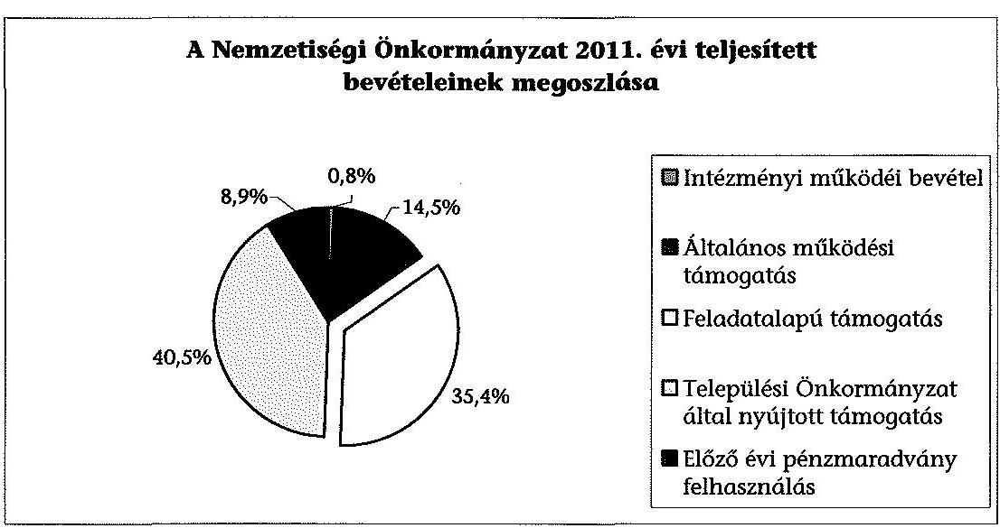
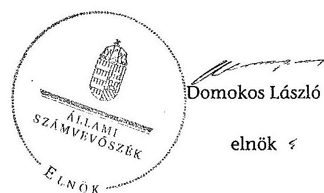

# ÁLLAMI   SZÁMVEVŐSZÉK 

## JELENTÉS

a helyi kisebbségi/nemzetiségi önkormányzatok gazdálkodásának ellenőrzéséről
Ács Város Roma Nemzetiségi Önkormányzat

---

# Állami Számvevőszék 

Iktatószám: V-0079-021/2013.
Témaszám: 1105
Vizsgálat-azonosító szám: V06060303

## Az ellenőrzést felügyelte:

Horváth Balázs
felügyeleti vezető
Az ellenőrzést vezette és az ellenőrzés végrehajtásáért felelős:
Preller Zsuzsanna
ellenőrzésvezető
A számvevőszéki jelentést készítették és a jelentés összeállításában
közremüködtek:
Luhály Matild
számvevő
dr. Láng Ágnes Krisztina
számvevő
Az ellenőrzést végezte:
Kalmár István
számvevő tanácsos

---

# TARTALOMJEGYZÉK 

BEVEZETÉS ..... 5
I. ÖSSZEGZŐ MEGÁLLAPÍTÁSOK, KÖVETKEZTETÉSEK, JAVASLATOK ..... 8
II. RÉSZLETES MEGÁLLAPÍTÁSOK ..... 13

1. A Nemzetiségi és a Települési Önkormányzat együttmúködésének szabályszerűsége ..... 13
2. A gazdálkodási feladatok ellátásának szabályszerűsége ..... 13
2.1. A költségvetésre és zárszámadásra, valamint a kincstári adatszolgáltatás rendjére vonatkozó jogszabályi előírások betartása ..... 13
2.2. A Nemzetiségi Önkormányzat gazdálkodásának szabályozottsága ..... 14
2.3. A pénzügyi kontrollok múködése ..... 15
3. A Nemzetiségi Önkormányzattal összefüggő gazdálkodási feladatok belső ellenőrzésének biztosítása ..... 16
4. A 2011. évi feladatalapú támogatás felhasználásának, elszámolásának szabályszerűsége ..... 16
5. A Nemzetiségi Önkormányzat feladatellátása ..... 17

## MELLÉKLET

1. számú A Nemzetiségi Önkormányzat 2011. évi és 2012. I. félévi gazdálkodásának főbb adatai, mutatói

## FÜGGELÉKEK

1. számú Értelmező szótár
2. számú A pénzügyi kontrollok múködésének értékelése

---

.

---

# RÖVIDÍTÉSEK JEGYZÉKE 

## Jogszabályok

Áht. 1
Áht. 2
ÁSZ tv.
Nek. ${ }_{1}$ tv.
Nek. ${ }_{2}$ tv.
Számv. tv.
Áhsz.

Ámr.
Ávr.

Ber.
Bkr.
támogatási kormányrendelet

Települési Önkormányzat SZMSZ-e

## Szórövidítések

ÁSZ
gazdálkodási szabályzat

1992. évi XXXVIII. törvény az államháztartásról (hatályos 2011. december 31-ig)
1993. évi CXCV. törvény az államháztartásról (hatályos 2011. december 31-étől)
1994. évi LXVI. törvény az Állami Számvevőszékről (hatályos 2011. július 1-jétől)
1995. évi LXXVII. törvény a nemzeti és etnikai kisebbségek jogairól (hatályos 2011. december 31-ig)
1996. évi CLXXIX. törvény a nemzetiségek jogairól (hatályos 2011. december 20-tól)
1997. évi C. törvény a számvitelről
249/2000. (XII. 24.) Korm. rendelet az államháztartás szervezetei beszámolási és könyvvezetési kötelezettségének sajátosságairól
292/2009. (XII. 19.) Korm. rendelet az államháztartás működési rendjéről (hatályos 2011. december 31-ig)
368/2011. (XII. 31.) Korm. rendelet az államháztartásról szóló törvény végrehajtásáról (hatályos 2012. január 1jétől)
193/2003. (XI. 26.) Korm. rendelet a költségvetési szervek belső ellenőrzéséről (hatálytalan 2012. január 1-jétől)
370/2011. (XII. 31.) Korm. rendelet a költségvetési szervek belső kontrollrendszeréről és belső ellenőrzésről (hatályos 2012. január 1-jétől)
a kisebbségi önkormányzatoknak a központi költségvetésből, valamint fejezeti kezelésű előirányzatból nyújtott támogatások feltételrendszeréről és elszámolásának rendjéről szóló 342/2010. (XII. 28.) Korm. rendelet (hatályon kívül helyezte a 28/2012. (III. 6.) Korm. rendelet a nemzetiségi célú előirányzatokból nyújtott támogatások feltételrendszeréről és elszámolásának rendjéről; jelenleg hatályos a 428/2012. (XII. 29.) Korm. rendelet a nemzetiségi célú előirányzatokból nyújtott támogatások feltételrendszeréről és elszámolásának rendjéről)
Ács Város Önkormányzata 26/2010. (X. 29.) számú önkormányzati rendelete az Önkormányzati Képviselőtestület és szervei Szervezeti és Müködési Szabályzatáról

Állami Számvevőszék
Ács Város Polgármesteri Hivatal Kötelezettségvállalás, utalványozás, ellenjegyzés érvényesítés rendjének szabályzata (hatályos 2008. október 1-jétől); Ács Város Önkormányzata és intézményei, Ács Város Polgármesteri Hivatala, Ács Város Roma Nemzetiségi Önkormányzata

---

|  | gazdálkodási szabályzata (hatályos 2012. január 1-jétől) |
| :--: | :--: |
| jegyző | Ács Város Önkormányzatának jegyzője |
| Képviselő-testület | Ács Város Cigány Kisebbségi Önkormányzatának Képvi-selő-testülete 2011. december 31-ig, Ács Város Roma Nemzetiségi Önkormányzatának Képviselő-testülete 2012. január 1-jétől |
| Kincstár | Magyar Államkincstár Komárom-Esztergom Megyei Igazgatósága |
| Nemzetiségi Önkormányzat | Ács Város Cigány Kisebbségi Önkormányzata 2011. december 31-ig, Ács Város Roma Nemzetiségi Önkormányzata 2012. január 1-jétől |
| Nemzetiségi Önkormányzat elnöke | Ács Város Cigány Kisebbségi Önkormányzatának elnöke 2011. december 31-ig, Ács Város Roma Nemzetiségi Önkormányzatának elnöke 2012. január 1-jétől |
| Nemzetiségi Önkormányzat SZMSZ-e | Ács Város Cigány Kisebbségi Önkormányzata Képviselőtestületének 10/2011. (I. 24.) számú határozatával elfogadott Szervezeti és Múködési Szabályzata |
| polgármester | Ács Város Önkormányzatának polgármestere |
| Polgármesteri Hivatal | Ács Város Önkormányzatának Polgármesteri Hivatala |
| Támogató | A támogatást nyújtó Közigazgatási és Igazságügyi Minisztérium |
| Települési Önkormányzat | Ács Város Önkormányzata |
| Települési Önkormányzat Képviselö-testülete | Ács Város Önkormányzatának Képviselő-testülete |

---

# JELENTÉS   a helyi kisebbségi/nemzetiségi önkormányzatok gazdálkodásának ellenőrzéséről   Ács Város Roma Nemzetiségi Önkormányzat 

## BEVEZETÉS

Az államháztartás részét, az önkormányzati alrendszer egyik elemét képezik a nemzetiségi önkormányzatok, amelyek jogi személyek és a Nek. ${ }_{1,2}$ tv.-ben meghatározott önálló feladat- és hatáskörökkel rendelkeznek. A nemzetiségi önkormányzatok az önkormányzati, illetve testületi múködtetés mellett a helyi nemzetiségi közügyek változatos formában való ellátásában vesznek részt.

A nemzetiségi önkormányzatok, illetve a települési önkormányzatok között a jelenlegi szabályozás szerint nincs alá-fölérendeltségi viszony. A nemzetiségi önkormányzatok azonban sajátos közjogi helyzetben vannak, mert a jogállásukat tekintve önkormányzatok, ám függnek a székhelyük szerinti települési önkormányzat hivatalától, amely ellátja a nemzetiségi önkormányzatok vonatkozásában a megállapodásban rögzített gazdálkodási feladatokat.

A nemzetiségek helyzete, támogatása mind hazai, mind európai uniós szinten kiemelt figyelmet kap napjainkban. A nemzetiségi önkormányzatok gazdálkodására és támogatási rendszerére vonatkozó jogszabályok a 20102012. években jelentős változásokon mentek át, amelyek érintették a feladatalapú támogatásra fordítható költségvetési keret megállapítását, az operatív gazdálkodási jogkörök szabályozását, az elkülönített könyvvezetés alkalmazását, a belső ellenőrzés szabályozását.

Az ellenőrzés célja annak értékelése volt, hogy a Nemzetiségi Önkormányzat gazdálkodási kereteinek kialakítása, gazdálkodása és feladatellátása megfelelte a hatályos jogszabályoknak.

Ennek keretében ellenőriztük, hogy:

- a Nemzetiségi Önkormányzat és a Települési Önkormányzat együttmúködésének szabályozása, a Települési Önkormányzat SZMSZ-ében, a megállapodásban előírt múködési feltételek biztosítása megfelelt-e a jogszabályi előírásoknak;
- a felek együttmúködése megfelel-e a megállapodásnak a gazdálkodási feladatok szabályszerű ellátásában, betartották-e a Nemzetiségi Önkormányzat gazdálkodásához kapcsolódóan a költségvetésre és zárszámadásra, a gazdálkodás szabályozására, az operatív gazdálkodási jogkörök gyakorlására vonatkozó jogszabályi előírásokat;

---

- a jegyző biztosította-e a Polgármesteri Hivatal belső ellenőrzése keretében a Nemzetiségi Önkormányzattal összefüggő gazdálkodási feladatok belső ellenőrzését;
- a 2011. évi feladatalapú támogatás felhasználása, a folyósított feladatalapú támogatással történő elszámolás az előírásoknak megfelelően történt-e;
- a Nemzetiségi Önkormányzat feladatellátása összhangban volt-e a vonatkozó jogszabályi előírásokkal.

Az ellenőrzés típusa: szabályszerűségi ellenőrzés
Az ellenőrzött időszak: 2011. január 1. - 2012. június 30.
Ellenőrzött szervezet: Ács Város Roma Nemzetiségi Önkormányzat és a gazdálkodási feladatait ellátó Ács Város Önkormányzata.

Az ellenőrzés jogszabályi alapja: az ÁSZ tv. 5. § (2)-(3) és (6) bekezdései
Az ellenőrzés szakmai módszertana az ÁSZ hivatalos honlapján (www.asz.hu) közzétett szakmai szabályokon alapult, amely a Legfőbb Ellenőrző Intézmények Nemzetközi Szervezete (INTOSAI) által kiadott nemzetközi standardok (ISSAI) figyelembevételével készült.

A fogalmak magyarázatát az 1. számú függelék, a pénzügyi kontrollok megfelelősége értékelésénél alkalmazott egységes minősítési szempontokat a 2. számú függelék tartalmazza.

Az ellenőrzés lefolytatásához a Települési Önkormányzat és a Nemzetiségi Önkormányzat tanúsítványok kitöltésével és a kapcsolódó dokumentumok elektronikus megküldésével szolgáltatott adatokat. A tanúsítványokon szerepeltetett adatok, információk ellenőrzése és szükség szerinti javítása a helyszíni ellenőrzés keretében történt.

Az ÁSZ az ellenőrzés megállapításait az ellenőrzött időszakban hatályos, az intézkedést igénylő megállapításokra tett javaslatokat a jelenleg hatályos jogszabályok alapján fogalmazta meg.

A Nemzetiségi Önkormányzat 2006. évben alakult, elnöke a 2006. évi helyhatósági választások óta látja el feladatát. A Nemzetiségi Önkormányzat intézményt, gazdasági társaságot és más szervezetet nem alapított, társulásban nem vett részt. A négytagú Képviselő-testület munkája segítésére bizottságot nem hozott létre. A Nemzetiségi Önkormányzat a 2011. évben 1323 ezer Ft költségvetési bevételt ért el és 1450 ezer Ft költségvetési kiadást teljesített. A 2012. évben 785 ezer Ft eredeti költségvetési bevételi és kiadási előirányzatot terveztek. A 2012. I. félévi beszámolója alapján a módosított költségvetési bevételi és kiadási előirányzat 1014 ezer Ft, a teljesített költségvetési bevétel 591 ezer Ft, a teljesített költségvetési kiadás 470 ezer Ft volt. A 2011. évben a Nemzetiségi Önkormányzat 513 ezer Ft feladatalapú támogatásban részesült. A 2011. évi és 2012. I. féléves gazdálkodási adatokat részletesen az 1. számú mellékletben mutatjuk be. Az ÁSZ a Nemzetiségi Önkormányzat gazdálkodását korábban nem ellenőrizte. Az ÁSZ tv. 29. § (1) bekezdése szerint a jelentéstervezetet meg-

---

küldtük a polgármester és Nemzetiségi Önkormányzat elnöke részére, akik az ÁSZ tv. 29. § (2) bekezdésében foglalt észrevételezési jogukkal nem éltek, a jelentéstervezetre észrevételt nem tettek.

---

# I. ÖSSZEGZŐ MEGÁLLAPÍTÁSOK, KÖVETKEZTETÉSEK, JAVASLATOK 

A Nemzetiségi és a Települési Önkormányzat együttmüködésének szabályozása, a Nemzetiségi Önkormányzat müködési feltételeinek biztosítása - az együttmüködési megállapodás hiányosságai ellenére - megfelelt a jogszabályi előírásoknak. A Települési Önkormányzat biztosította a Nemzetiségi Önkormányzat müködéséhez szükséges személyi és tárgyi feltételeket. A 2011. évben hatályos együttműködési megállapodást - az Áht. ${ }_{1}$ előírásaihoz képest kisebb tartalmi hiányosságokkal fogadták el. A 2012. június 30 -án hatályos együttmúködési megállapodás - a Nek. ${ }_{2}$ tv-ben foglaltak ellenére - nem tartalmazta a költségvetés előkészítésével és megalkotásával, a költségvetési adatszolgáltatással, az önálló fizetési számla nyitásával, az érvényesítési feladatok ellátásával, a múködési feltételek biztosításával kapcsolatos felelősök konkrét kijelölését.

A Nemzetiségi Önkormányzat költségvetésére és zárszámadására vonatkozó jogszabályi előírásokat betartották. A Nemzetiségi Önkormányzat 2011. és 2012. évi költségvetését, valamint 2011 évi zárszámadását az előírt határidőben nyújtották be a Képviselő-testületnek, a jóváhagyott költségvetések és a zárszámadás tartalma megfelelt az előírásoknak. A Nemzetiségi Önkormányzat elnöke a költségvetési előirányzatok módosításával biztosította a tárgyévi fizetési kötelezettség vállalásához szükséges fedezet meglétét. A jegyző a 2012. évi költségvetéshez kapcsolódó kincstári adatszolgáltatási kötelezettségének eleget tett.

A Nemzetiségi Önkormányzat gazdálkodásának szabályozása az ellenőrzött időszakban - a hiányosságok ellenére - összességében megfelelt a jogszabályi előírásoknak. A gazdálkodási feladatai végrehajtását ellátó Polgármesteri Hivatal a 2011. évben és a 2012. évben a Számv. tv-ben és az Áhsz.-ben előírt gazdálkodási szabályzatokkal rendelkezett, azok hatályát a Nemzetiségi Önkormányzat gazdálkodási feladataira kiterjesztette. A Polgármesteri Hivatal SZMSZ-e az Ámr. és az Ávr. előírásai ellenére nem tartalmazta a munkakörökhöz kapcsolódóan a Nemzetiségi Önkormányzat gazdálkodásával kapcsolatos feladat- és hatásköröket, a hatáskörök gyakorlásának módját, a helyettesítés rendjét és az ezekre vonatkozó felelősségi szabályokat. A gazdálkodási jogkörök kialakítása az ellenőrzött időszakban megfelelt a jogszabályi előírásoknak. A jegyző a Ber.-ben, illetve a Bkr.-ben foglaltak ellenére ellenőrzési nyomvonal elkészítéséről nem gondoskodott az ellenőrzött időszakban.

A pénzügyi kontrollok múködése az ellenőrzött időszakban a dologi és egyéb folyó kiadások teljesítésénél gyenge volt, a hibák száma a lényegességi szintet, a kritikus hibahatárt elérte. A 2011. évben a kötelezettségvállalás ellenjegyzője, a szakmai teljesítés igazolója az Ámr. előírásai ellenére saját maga javára látta el a feladatát. Az utalvány ellenjegyzője az Ámr.-ben foglalt feladatát nem látta el, mert az összeférhetetlenségi szabályok megszegését figyelmen kívül hagyta. 2012. I. félévben a pénzügyi ellenjegyző és az érvényesítő feladatának végzése során az Ávr.-ben rögzített összeférhetetlenségi szabá-

---

lyok megsértését nem jelezte a kötelezettségvállaló, illetve az utalványozó felé. A teljesítés igazolója az Ávr. előírásai ellenére saját maga javára látta el a feladatát. Az ellenőrzés a Nemzetiségi Önkormányzatnál - az ellenőrzött tételek esetében - jogosulatlan kifizetést nem tárt fel, a pénzügyi kontrollok múködéséhez kapcsolódó hiányosságok azonban nem biztosítják a hibák megelőzését, feltárását és kijavítását.

A Nemzetiségi Önkormányzat a 2011. évben a forrásai 35,4\%-át kitevő, 513 ezer Ft feladatalapú támogatásban részesült, amelyet tárgyév december 31-ig a jogszabályi előírásokkal összhangban felhasznált. A támogatási kormányrendeletben hivatkozott, Áht. ${ }_{1}$-ben előírt elszámolás nem történt meg. A támogatás felhasználását, elszámolását a jogosult szervek nem ellenőrizték.

A Nemzetiségi Önkormányzat feladatellátásának tárgya összhangban volt a Nek. ${ }_{1,2}$ tv. előírásaival. Biztosította a nemzetiségi közügyek keretében az alapvető feladata ellátásához szükséges szervezeti, személyi és anyagi feltételeket. A képviselt közösség kulturális autonómiája megerősítése érdekében hagyományápolással és közművelődéssel kapcsolatos feladatokat látott el.

A Polgármesteri Hivatal 2011. és 2012. évi éves ellenőrzési terveit megalapozó kockázatelemzés - a Ber. előírásai ellenére - nem terjedt ki a Nemzetiségi Önkormányzat gazdálkodásával összefüggő végrehajtási feladatok ellátására. A jegyző az ellenőrzött időszakban az Áht. ${ }_{1}$, illetve az Áht. ${ }_{2}$ ellenére nem biztosította a Polgármesteri Hivatal belső ellenőrzése keretében a Nemzetiségi Önkormányzat gazdálkodásával összefüggő végrehajtási feladatok belső ellenőrzését. Erre irányuló ellenőrzést a 2011. évben és 2012. I. félévben nem terveztek és nem végeztek.

Az ÁSZ tv. 33. § (1) bekezdésében foglaltak értelmében az ellenőrzött szervezet vezetője köteles a jelentésben foglalt megállapításokhoz kapcsolódó intézkedési tervet összeállítani, és azt a jelentés kézhezvételétől számított 30 napon belül az ÁSZ részére megküldeni. Amennyiben az intézkedési tervet határidőre nem küldi meg a szervezet, vagy az nem elfogadható, az ÁSZ elnöke az ÁSZ tv. 33. § (3) bekezdés a)-b) pontjaiban foglaltakat érvényesítheti.

A helyszíni ellenőrzés megállapításainak hasznosítása mellett javasoljuk:

# a jegyzönek 

1. az együttműködés szabályozásával kapcsolatban

A Nemzetiségi Önkormányzat és a Települési Önkormányzat együttműködését meghatározó - 2012. június 30 -án hatályos - megállapodás a Nek. 2 tv. 80. § (3) bekezdés a)-b) és d) pontjaiban foglaltak ellenére nem tartalmazta a költségvetés előkészítéséért és megalkotásáért, a költségvetéssel összefüggő adatszolgáltatásért, az önálló fizetési számla nyitásáért, az érvényesítési feladatok ellátásáért, valamint a múködési feltételek biztosításáért felelősök konkrét kijelölését.

---

Javaslat
Készítse elő a megállapodás módosítását, hogy tartalmilag feleljen meg a Nek. ${ }_{2}$ tv. 80. § (3) bekezdés a)-b) és d) pontjaiban foglalt előírásoknak.
2. a gazdálkodási feladatok szabályozottságával kapcsolatban

A Polgármesteri Hivatal SZMSZ-e 2011. évben az Ámr. 20. § (2) bekezdése h) pontja, 2012. I. félévben az Ávr. 13. § (1) bekezdése g) pontja rendelkezése ellenére nem tartalmazta nevesített munkakörökhöz tartozóan a Nemzetiségi Önkormányzat gazdálkodásával kapcsolatos feladat- és hatásköröket, a hatáskörök gyakorlásának módját, a helyettesítés rendjét és az ezekre vonatkozó felelősségi szabályokat.

A jegyző a Ber. 17. § (2) bekezdésében, illetve a Bkr. 6. § (3) bekezdésében foglaltak ellenére az ellenőrzési nyomvonal elkészítéséről nem gondoskodott.

Javaslat
A Nemzetiségi Önkormányzat gazdálkodási feladatainak szabályozottsága érdekében:
a) készítse elő a Polgármesteri Hivatal SZMSZ-ének módosítását, hogy az feleljen meg az Ávr. 13. § (1) bekezdés g) pontjában foglalt előírásnak;
b) készítse el a Bkr. 6. § (3) bekezdése szerint a Nemzetiségi Önkormányzat gazdálkodási feladataira kiterjesztett ellenőrzési nyomvonalát.
3. a pénzügyi kontrollok müködésével kapcsolatban

A 2011. évben a szakmai teljesítést igazoló az ellenőrzési feladatát az Ámr. 80. § (2) bekezdésének előírása ellenére jogosulatlanul, saját javára végezte.

Az utalvány ellenjegyzője szabályszerűen nem látta el az Ámr. 79. § (2) bekezdésében előírt ellenőrzési feladatát, mert annak ellenére ellenjegyezte az utalványt, hogy a szakmai teljesítésigazoló és az utalványozó az összeférhetetlenségi szabályok figyelmen kívül hagyásával a saját maga javára igazolta a teljesítést, engedélyezte a kifizetést.
2012. I. félévben a teljesítés igazolója az Ávr. 60. § (2) bekezdésében foglaltak ellenére nem tartotta be az összeférhetetlenségi szabályokat, saját maga javára látta el a feladatot.

A pénzügyi ellenjegyző az Áht ${ }_{2}$ 37. § (1) bekezdésében foglalt feladatát aláírása ellenére nem végezte el, mert nem jelezte az Ávr. 60. § (2) bekezdésében rögzített öszszeférhetetlenségi szabály megsértését;

Az érvényesítő az Ávr. 58. § (1) bekezdése szerinti ellenőrzési és a (2) bekezdésben előírt jelzési feladatát nem látta el szabályszerűen, mert az összeférhetetlenségi szabályok megszegésének az utalványozó felé történő jelzése nélkül érvényesítette a kiadás teljesítését.

---

Javaslat
Az operatív gazdálkodás múködési hibáinak megelőzése, feltárása és kijavítása érdekében gondoskodjon arról, hogy:
c) a teljesítés igazolása, a pénzügyi ellenjegyzés és az utalványozás során az Ávr. 60. § (1)-(2) bekezdésében foglalt összeférhetetlenségi szabályok betartásra kerüljenek;
d) az érvényesítő tegyen eleget az Ávr. 58. § (1)-(2) bekezdéseiben előírtak szerinti ellenőrzési, az utalványozó felé történő jelzési kötelezettségének.
4. a feladatalapú támogatás elszámolásával kapcsolatban

A 2011. évben folyósított feladatalapú támogatás elszámolása a támogatási kormányrendelet 7. § (2) bekezdésében hivatkozott Áht. ${ }_{1}$-nek „a helyi önkormányzatok elszámolási rendjére vonatkozó rendelkezései alkalmazása" előírása ellenére nem történt meg.

Javaslat
Gondoskodjon az Áht. 2 27. § (2) bekezdésben meghatározott feladatkörében a Nemzetiségi Önkormányzat által igénybe vett feladatalapú támogatás elszámolásának elkészítéséről, figyelemmel az Áht. 2 57. § (4) bekezdésben foglaltakra.

# a polgármesternek 

1. A Nemzetiségi Önkormányzat és a Települési Önkormányzat együttműködését meghatározó - 2012. június 30 -án hatályos - megállapodás a Nek. 2 tv. 80. § (3) bekezdés a)-b) és d) pontjaiban foglaltak ellenére nem tartalmazta a költségvetés előkészítéséért és megalkotásáért, a költségvetéssel összefüggő adatszolgáltatásért, az önálló fizetési számla nyitásáért, az érvényesítési feladatok ellátásáért, valamint a müködési feltételek biztosításáért felelősök konkrét kijelölését.

Javaslat
Terjessze a Települési Önkormányzat Képviselő-testülete elé jóváhagyásra a Nek. ${ }_{2}$ tv. 80. § (3) bekezdés a)-b) és d) pontjaiban foglalt előírások betartásával előkészített megállapodás módosítást.
2. A Polgármesteri Hivatal SZMSZ-e 2011. évben az Ámr. 20. § (2) bekezdése h) pontja, 2012. I. félévben az Ávr. 13. § (1) bekezdése g) pontja rendelkezése ellenére nem tartalmazta nevesített munkakörökhöz tartozóan a Nemzetiségi Önkormányzat gazdálkodásával kapcsolatos feladat- és hatásköröket, a hatáskörök gyakorlásának módját, a helyettesítés rendjét és az ezekre vonatkozó felelősségi szabályokat.

Javaslat
Terjessze a Települési Önkormányzat Képviselő-testülete elé jóváhagyásra az Ávr. 13. § (1) bekezdés g) pontjában foglalt szabályozásra figyelemmel módosított Polgármesteri Hivatal SZMSZ-ét.

---

# a Nemzetiségi Önkormányzat elnökének 

1. A Nemzetiségi Önkormányzat és a Települési Önkormányzat együttműködését meghatározó - 2012. június 30-án hatályos - megállapodás a Nek. 2 tv. 80. § (3) bekezdés a)-b) és d) pontjaiban foglaltak ellenére nem tartalmazta a költségvetés előkészítéséért és megalkotásáért, a költségvetéssel összefüggő adatszolgáltatásért, az önálló fizetési számla nyitásáért, az érvényesítési feladatok ellátásáért, valamint a működési feltételek biztosításáért felelősök konkrét kijelölését.

Javaslat
Terjessze a Képviselő-testület elé jóváhagyásra a Nek. ${ }_{2}$ tv. 80. § (3) bekezdés a)-b) és d) pontjaiban foglalt előírások betartásával előkészített megállapodás módosítást.
2. A 2011. évben folyósított feladatalapú támogatás elszámolása a támogatási kormányrendelet 7. § (2) bekezdésében hivatkozott Áht. ${ }_{1}$-nek „a helyi önkormányzatok elszámolási rendjére vonatkozó rendelkezései alkalmazása" előirása ellenére nem történt meg.

Javaslat
Terjessze a Képviselő-testület elé jóváhagyásra az Áht. ${ }_{2}$ 57. § (4) bekezdés alapján összeállított, a Nemzetiségi Önkormányzat által igénybe vett feladatalapú támogatás elszámolását.

---

# II. RÉSZLETES MEGÁLLAPÍTÁSOK 

## 1. A Nemzetiségi és a Települési Önkormányzat együttmúKÖDÉSÉNEK SZABÁLYSZERŰSÉGE

A Nemzetiségi Önkormányzat és a Települési Önkormányzat együttmúködésének szabályozása, a Nemzetiségi Önkormányzat múködési feltételeinek biztosítása - az együttmúködési megállapodások ${ }^{1}$ hiányosságai ellenére - megfelel3 a jogszabályi előírásoknak. A megállapodások jóváhagyása az előírt eljárásrend és határidő betartásával történt. Az együttműködési megállapodásokban a jogszabályi előírásokat maradéktalanul nem érvényesítették, mert:

- a 2011. december 31-én hatályos együttműködési megállapodás az Áht. ${ }_{1} 66 . \S$-ban foglalt előírások ellenére nem tartalmazta teljes körűen a Nemzetiségi Önkormányzat gazdálkodása végrehajtásának rendjéhez kapcsolódó feladatellátás jogosultjainak, kötelezettjeinek kijelölését;
- a 2012. június 30 -án hatályos együttműködési megállapodás a Nek. ${ }_{2}$ tv. 80. § (3) bekezdés a)-b) és d) pontjaiban foglaltak ellenére nem tartalmazta teljes körűen a költségvetés előkészítésével és megalkotásával, a költségvetési adatszolgáltatással, az önálló fizetési számla nyitásával, az érvényesítési feladatok ellátásával, a működési feltételek biztosításával kapcsolatos felelősök konkrét kijelölését.

A Települési Önkormányzat biztosította - az együttműködési megállapodások hiányosságai ellenére - a Nemzetiségi Önkormányzat müködéséhez szükséges személyi és tárgyi feltételeket.

## 2. A GAZDÁLKODÁSI FELADATOK ELLÁTÁSÁNAK SZABÁLYSZERŰSÉGE

### 2.1. A költségvetésre és zárszámadásra, valamint a kincstári adatszolgáltatás rendjére vonatkozó jogszabályi előírások betartása

Az ellenőrzött időszakban a Nemzetiségi Önkormányzat költségvetésének és zárszámadásának szabályszerűsége megfelelt a jogszabályi előírásoknak.

[^0]
[^0]:    ${ }^{1}$ A 2011. évben és 2012. június 1-jéig hatályos együttműködési megállapodást a Képvi-selő-testület a 33/2010. (XI. 22.) számú, a Települési Önkormányzat Képviselő-testülete a 270/2010. (XI. 25.) számú határozattal fogadta el. A Nek. ${ }_{2}$ tv. 159. § (3) bekezdésében előírtak alapján 2012. június 1-jéig felülvizsgált és módosított együttmúködési megállapodást a Képviselő-testület a 15/2012. (V. 29.) számú, a Települési Önkormányzat Képviselő-testülete a 124/2012. (V. 30.) számú határozattal fogadta el.

---

A Nemzetiségi Önkormányzat 2011. és 2012. évi költségvetését ${ }^{2}$ az Ámr.-ben előírt határidőn belül benyújtotta a Képviselő-testületnek, a jóváhagyott költségvetés tartalma megfelelt az előírásoknak. A Nemzetiségi Önkormányzat elnöke a költségvetés előirányzatai felhasználásához szükséges mértékben kezdeményezte azok módosítását, biztosította a tárgyévi fizetési kötelezettség vállalásához szükséges fedezet meglétét. A jegyző - az Ávr.-ben, illetve az Áhsz.ben előírtaknak megfelelően - a 2012. évi költségvetéshez kapcsolódó, a Nemzetiségi Önkormányzatra vonatkozó kincstári adatszolgáltatási kötelezettségének eleget tett.

A 2011. évi zárszámadási határozat ${ }^{3}$ tartalmára, elfogadására és továbbítására vonatkozó jogszabályi előírásokat a Nemzetiségi és a Települési Önkormányzat betartotta.

# 2.2. A Nemzetiségi Önkormányzat gazdálkodásának szabályozottsága 

A Nemzetiségi Önkormányzat gazdálkodásának szabályozása az ellenőrzött időszakban - a hlányosságok ellenére - összességében megfelelt a jogszabályi előírásoknak. A gazdálkodási feladatai végrehajtását ellátó Polgármesteri Hivatal a 2011. évben és a 2012. évben a Számv. tv.-ben és az Áhsz.-ben előírt gazdálkodási szabályzatokkal ${ }^{4}$ rendelkezett, azok hatályát a Nemzetiségi Önkormányzat gazdálkodási feladataira kiterjesztette. Szabálytalanságok kezelésének eljárásrendjével, kockázatkezelési szabályzattal és folyamatba épített előzetes, utólagos és vezetői ellenőrzés szabályozásával rendelkezett, azonban a jegyző Ber. 17. § (2) bekezdésében, illetve a Bkr. 6. § (3) bekezdésében foglaltak ellenére az ellenőrzési nyomvonal elkészítéséről nem gondoskodott.

A Polgármesteri Hivatal SZMSZ-e - a 2011. évben az Ámr. 20. § (2) bekezdés h) pontjában a 2012. évben az Ávr. 13. § (1) bekezdés g) pontjában foglaltak ellenére - nem tartalmazta a munkakörökhöz kapcsolódóan a Nemzetiségi Önkormányzat gazdálkodásával kapcsolatos feladat- és hatásköröket, a hatáskörök gyakorlásának módját, a helyettesítés rendjét és az ezekre vonatkozó felelősségi szabályokat.

A Nemzetiségi Önkormányzat operatív gazdálkodási jogkörei kialakítása - a kötelezettségvállalásra, utalványozásra, kötelezettségvállalás és utalványozás ellenjegyzésére a felhatalmazás, a szakmai teljesítést igazoló és

[^0]
[^0]:    ${ }^{2}$ A Képviselő-testület Nemzetiségi Önkormányzat 2011. évi költségvetéséről szóló 12/2011. (II. 7.) számú, valamint 2012. évi költségvetéséről szóló 7/2012. (II. 13.) számú határozatai.
    ${ }^{3}$ A Képviselő-testület Nemzetiségi Önkormányzat 2011. évi költségvetési beszámolójáról szóló 13/2012. (IV. 24.) számú határozata.
    ${ }^{4}$ Számviteli politika, számlarend, leltározási és leltárkészítési szabályzat, pénzkezelési szabályzat, eszközök és források értékelési szabályzata.

---

az érvényesítést végző személyek kijelölése ${ }^{5}$ - az ellenőrzött időszakban a jogszabályi előírásoknak megfelelő volt. Az operatív gazdálkodással kapcsolatos feladat- és hatásköröket az együttmúködési megállapodás, a gazdálkodási szabályzat és a feladatokat ellátó köztisztviselők munkaköri leírásai tartalmazták.

# 2.3. A pénzügyi kontrollok múködése 

A Nemzetiségi Önkormányzat az ellenőrzött időszakban államháztartáson belülre és kívülre, működési és felhalmozási célra pénzeszközátadást, illetve szociálpolitikai ellátásra kiadást nem teljesített. A Nemzetiségi Önkormányzat 2011. évi dologi és egyéb folyó kiadásai teljesítése során a kötelezettségvállalás-ellenjegyzése, a szakmai teljesítésigazolás és az utalvány ellenjegyzés kontrollok múködésének megfelelősége - a 2. számú függelékben részletezett szempontok alapján végzett értékelés szerint - gyenge volt, a hibák száma a lényegességi szintet, a kritikus hibahatárt elérte, mert

- a kötelezettségvállalás ellenjegyzője az Ámr. 74. § (3) bekezdés c) pontjában foglalt feladatát aláírása ellenére nem végezte el, mert nem jelezte az Ámr. 80. § (2) bekezdésében rögzített összeférhetetlenségi szabály megsértését ${ }^{6}$ a kötelezettség vállalás során;
- a szakmai teljesítés igazolója az ellenőrzési feladatát az Ámr. 80. § (2) bekezdésének előírása ellenére jogosulatlanul végezte, mert a szakmai teljesítés igazolását a saját javára látta el;
- az utalvány ellenjegyzője az Ámr. 79. § (2) bekezdésében előírt ellenőrzési feladatát nem szabályszerűen látta el, mert annak ellenére ellenjegyezte az utalványt, hogy a szakmai teljesítésigazoló és az utalványozó az összeférhetetlenségi szabályok figyelmen kívül hagyásával - a saját maga javára igazolta a teljesítést, illetve engedélyezte a kiadás teljesítését.

A Nemzetiségi Önkormányzatnál 2012. I. félévben a dologi és egyéb folyó kiadások teljesítése során a pénzügyi ellenjegyzés, a teljesítés igazolás és az érvényesítés pénzügyi kontrollok müködésének megfelelősége - a 2. számú függelékben részletezett szempontok alapján végzett értékelés szerint gyenge volt, a hibák száma a lényegességi szintet, a kritikus hibahatárt elérte, mert

- a pénzügyi ellenjegyzó az Áht. 2 37. § (1) bekezdésében foglalt feladatát aláírása ellenére nem végezte el, mert nem jelezte az Ávr. 60. § (2) bekezdésében rögzített összeférhetetlenségi szabály megsértését;
- a teljesítés igazolója az ellenőrzési feladatát az Ávr. 60. § (2) bekezdésének előírása ellenére jogosulatlanul végezte, mert a teljesítés igazolását saját maga javára látta el;

[^0]
[^0]:    ${ }^{5}$ Az összeférhetetlenség eseteinek kizárása érdekében, minden operatív gazdálkodási jogkör ellátására, több személy került kijelölésre a Nemzetiségi Önkormányzatnál.
    ${ }^{6}$ A kötelezettségvállalást, a szakmai teljesítésigazolást és az utalványozást is a Nemzetiségi Önkormányzat elnöke saját maga javára végezte.

---

- az érvényesítő az Ávr. 58. § (1) bekezdése szerinti ellenőrzési és a (2) bekezdésben előírt jelzési feladatát nem látta el szabályszerűen, mert az összeférhetetlenségi szabályok megszegésének az utalványozó felé történő jelzése nélkül érvényesítette a kiadás teljesítését.

A Nemzetiségi Önkormányzatnál a 2011. évben és 2012. I. félévben, a pénzügyi folyamatokban kulcsszerepet betöltő belső kontrollok működésében feltárt hiányosságokkal összefüggésben az ellenőrzés jogosulatlan kifizetést nem állapított meg, a pénzügyi kontrollok múködéséhez kapcsolódó hiányosságok azonban nem biztosítják a hibák megelőzését, feltárását és kijavítását.

# 3. A Nemzetiségi ÖNKORMÁNYZATTAI ÖSSZEFÜGGŐ GAZDÁlKODÁSI FELADATOK BELSŐ ELLENŐRZÉSÉNEK BIZTOSÍTÁSA 

A Polgármesteri Hivatal 2011. és 2012. évi ellenőrzési terveit megalapozó kockázatelemzés a Ber. 21. § (2) bekezdése ${ }^{7}$ ellenére nem terjedt ki a Nemzetiségi Önkormányzat gazdálkodásával összefüggő végrehajtási feladatok ellátására. A jegyző az ellenőrzött időszakban az Áht. ${ }_{1}$ 121/B. § (4) bekezdése, illetve az Áht. ${ }_{2} 70 . \S$ (1) bekezdése előírása ellenére nem biztosította a Polgármesteri Hivatal belső ellenőrzése keretében a Nemzetiségi Önkormányzat gazdálkodásával összefüggő végrehajtási feladatok belső ellenőrzését, erre vonatkozóan belső ellenőrzést a 2011. évben és 2012. I. félévben nem terveztek és nem végeztek.

## 4. A 2011. ÉVI FELADATALAPÚ TÁMOGATÁS FELHASZNÁLÁSÁNAK, ELSZÁMOLÁSÁNAK SZABÁLYSZERŰSÉGE

A 2011. évben a Nemzetiségi Önkormányzat 513 ezer Ft feladatalapú támogatásban részesült, amelynek az összes bevételhez viszonyított részarányát a következő ábra szemlélteti:

[^0]
[^0]:    ${ }^{7}$ 2012. január 1-jétől Bkr. 7. § (2) bekezdése írja elő

---

A 2011. évben folyósított támogatást a jogszabályi előírásokkal összhangban a tárgyévben felhasználták. Elszámolása a támogatási kormányrendelet 7. § (2) bekezdésében hivatkozott Áht. ${ }_{1}$-nek „a helyi önkormányzatok elszámolási rendjére vonatkozó rendelkezései alkalmazása" előírása ellenére nem történt meg. A támogatás felhasználását, elszámolását az ellenőrzésre jogosult szervek nem ellenőrizték.

# 5. A Nemzetiségi Önkormányzat feladATELLátása 

A Nemzetiségi Önkormányzat feladatellátásának tárgya összhangban volt a Nek. ${ }_{1,2}$ tv. előírásaival. A Nemzetiségi Önkormányzat az ellenőrzött időszakban hatósági tevékenységet nem végzett, közüzemi szolgáltatással összefüggő feladatot nem látott el.

A Nek. ${ }_{1}$ tv. 5/A. § (1) bekezdése és a Nek. ${ }_{2}$ tv. 10. § (1) bekezdése szerinti, a nemzetiségi érdekek védelmével és képviseletével kapcsolatos alapvető feladata ellátásához biztosította a szükséges szervezeti, személyi és anyagi feltételeket. A Nek. 1 tv. 30. § (1) és 30/A. § (4) bekezdésében, valamint a Nek. ${ }_{2}$ tv. 115. § és 116. § (1) bekezdésében foglaltak alapján, a képviselt közösség kulturális autonómiája megerősítése érdekében hagyományápolással és közművelődéssel kapcsolatos feladatokat látott el.

Budapest, 2013. 11. hónap $O \hat{\theta}$ nap

Melléklet: $\quad 1 \mathrm{db}$
Függelék: $\quad 2 \mathrm{db}$

---

.

---

# A Nemzetiségi Önkormányzat 2011. évi és 2012. I. félévi gazdálkodásának főbb adatai, mutatói

A) BEVÉTELEK

|  Megnevezés | 2011. év |  |  |  | 2012. év |  | 2012. I. félévi |   |
| --- | --- | --- | --- | --- | --- | --- | --- | --- |
|   | eredeti el. | módosított
el. | teljesítés | teljesítés
megosztása
(\%) | eredeti el. | módosított
el. | teljesítés | teljesítés
megosztása
(\%)  |
|  Intézményi müködési bevétel | 0,0 | 0,0 | 11,0 | $0,8 \%$ | 0,0 | 0,0 | 0,0 | $0,0 \%$  |
|  Általános müködési
támogatás | 210,0 | 210,0 | 209,5 | $15,8 \%$ | 215,0 | 215,0 | 215,0 | $36,4 \%$  |
|  Feladatulapú támogatás | 0,0 | 513,0 | 512,5 | $38,7 \%$ | 0,0 | 0,0 | 0,0 | $0,0 \%$  |
|  Települési Önkormányzat
által nyújtott támogatás | 665,0 | 565,0 | 461,0 | $34,8 \%$ | 570,0 | 799,0 | 376,0 | $63,5 \%$  |
|  ... Megyei Nemzetiségi
Alapítványi támogatás | 0,0 | 0,0 | 0,0 | $0,0 \%$ | 0,0 | 0,0 | 0,0 | $0,0 \%$  |
|  Fénzőregulmi bevételek
összesen | 866,0 | 1379,0 | 1194,0 | $90,2 \%$ | 785,0 | 1014,0 | 591,0 | $100,0 \%$  |
|  Eötel évi pénzmunadvány
felhozendáa | 0,0 | 129,0 | 129,0 | $9,8 \%$ | 0,0 | 0,0 | 0,0 | $0,0 \%$  |
|  Bevételek | 866,0 | 1608,0 | 1323,0 | $100,0 \%$ | 785,0 | 1014,0 | 591,0 | $100,0 \%$  |

B) KIADÁSOK

|  Megnevezés | 2011. év |  |  |  | 2012. év |  | 2012. I. félévi |   |
| --- | --- | --- | --- | --- | --- | --- | --- | --- |
|   | eredeti el. | módosított
el. | teljesítés | teljesítés
megosztása
(\%) | eredeti el. | módosított
el. | teljesítés | teljesítés
megosztása
(\%)  |
|  Személyi juttatások | 552,0 | 536,0 | 536,0 | $37,0 \%$ | 552,0 | 516,0 | 200,0 | $42,6 \%$  |
|  Munkoadókat terhelő
törnélésok | 149,0 | 149,0 | 138,0 | $9,4 \%$ | 149,0 | 149,0 | 50,0 | $10,6 \%$  |
|  Üzöngi és egyéb folyó
kiadások | 165,0 | 823,0 | 778,0 | $53,7 \%$ | 84,0 | 349,0 | 220,0 | $46,8 \%$  |
|  Támogatásértékủ müködési
kiadás | 0,0 | 0,0 | 0,0 | $0,0 \%$ | 0,0 | 0,0 | 0,0 | $0,0 \%$  |
|  Müködési kiadások összesen | 866,0 | 1508,0 | 1450,0 | $100,0 \%$ | 785,0 | 1014,0 | 470,0 | $100,0 \%$  |
|  Felhalmozdai kiadások | 0,0 | 0,0 | 0,0 | $0,0 \%$ | 0,0 | 0,0 | 0,0 | $0,0 \%$  |
|  Kiadások összesen | 866,0 | 1608,0 | 1450,0 | $100,0 \%$ | 785,0 | 1014,0 | 470,0 | $100,0 \%$  |

---

.

---

# ÉRTELMEZŐ SZÓTÁR 

feladatalapú támogatás

A támogatási évben általános múködési támogatásban részesült, és a Támogatónak a Kincstárhoz intézett, a feladatalapú támogatás utalására vonatkozó rendelkező levele keltének időpontjában múködő nemzetiségi önkormányzatoknak a támogatási kormányrendeletben rögzített feltételrendszer alapján nyújtható támogatás. A feladatalapú támogatás a nemzetiségi közügyeknek a nemzetiségi önkormányzatok által történő ellátását szolgálja. (A támogatási kormányrendelet 2. § (2) bekezdés c) pont, és 4. § (1) bekezdés alapján.)
megállapodás
nemzetiség
nemzetiségi közügy

A nemzetiségi önkormányzatnak a múködési feltételei biztosítására, továbbá a bevételeivel és a kiadásaival kapcsolatban a tervezési, gazdálkodási, ellenőrzési, finanszírozási, adatszolgáltatási és beszámolási feladatai végrehajtására a székhelye szerinti települési önkormányzattal megkötött megállapodás. (Az Áht. ${ }_{1} 66 . \S$, a Nek. ${ }_{2}$ tv. 80 § (2) bekezdés, valamint az Áht. ${ }_{2} 27 . \S$ (2) bekezdés alapján levezetett fogalom.)
Minden olyan Magyarország területén legalább egy évszázada honos népcsoport, amely az állam lakossága körében számszerú kisebbségben van és a lakosság többi részétől saját nyelve és kultúrája, hagyományai különböztetik meg, egyben olyan összetartozás-tudatról tesz bizonyságot, amely mindezek megőrzésére, történelmileg kialakult közösségeik érdekeinek kifejezésére és védelmére irányul. (A Nek. ${ }_{1}$ tv. 1. § (2) bekezdése, valamint a Nek. ${ }_{2}$ tv. 1. § (1) bekezdése alapján levezetett fogalom.)
Az egyéni és közösségi jogok érvényesülése, a nemzetiséghez tartozók érdekeinek kifejezésre juttatása - különösen az anyanyelv ápolása, őrzése és gyarapítása, továbbá a nemzetiségek kulturális autonómiájának a nemzetiségi önkormányzatok által történő megvalósítása és megőrzése - érdekében a nemzetiséghez tartozók meghatározott közszolgáltatásokkal való ellátásával, ezen ügyek önálló vitelével és az ehhez szükséges szervezeti, személyi és anyagi feltételek megteremtésével összefüggő ügy. A közhatalmat gyakorló állami és helyi önkormányzati szervekben, továbbá a nemzetiségi önkormányzati szervekben való nemzetiségi képviselethez és mindezek szervezeti, személyi és anyagi feltételeinek biztosításához kapcsolódó ügy. (A Nek., tv. 6/A. § 1. pontjából és a Nek. ${ }_{2}$ tv. 2. § 1. pontjából levezetett fogalom.)

---

nemzetiségi önkormányzat
pénzügyi kontrollok

Törvényben meghatározott nemzetiségi közszolgáltatási feladatokat ellátó, testületi formában múködő, jogi személyiséggel rendelkező, demokratikus választások útján törvény alapján létrehozott szervezet, amely a nemzetiségi közösséget megillető jogosultságok érvényesítésére, a nemzetiségek érdekeinek védelmére és képviseletére, a feladat- és hatáskörébe tartozó nemzetiségi közügyek települési, területi vagy országos szinten történő önálló intézésére jön létre. (A Nek. 1 tv. 6/A. § (1) bekezdés 2. pontjából, valamint a Nek. 2 tv. 2. § 2. pontjából levezetett fogalom.) A jelentésben e fogalmat a települési nemzetiségi önkormányzatokra leszúkítve használjuk.
a kötelezettségvállalás és az utalvány ellenjegyzése, valamint a szakmai teljesítés igazolása 2011. december 31éig, 2012. január 1-jétől a pénzügyi ellenjegyzés, a teljesítés igazolása és az érvényesítés.

---

# A PÉNZÜGYI KONTROLLOK MŰKÖDÉSÉNEK ÉRTÉKELÉSE 

A pénzügyi kontrollok múködése megfelelőségének vizsgálatát többlépcsős megfelelőségi tesztek útján, megismételt eljárással, a könyvviteli tételekből vett egyszerủ véletlen minta alapján végeztük. A tesztelést az értékelésre kiválasztott három terület - a dologi és egyéb folyó kiadásoknál teljesített kifizetések, az államháztartáson belülre és kívülre, múködési és felhalmozási célra teljesített pénzeszközátadások, illetve a szociálpolitikai ellátások teljesített kiadásainál végeztük el.

Az ellenőrzés során alkalmazott módszer (többlépcsős megfelelőségi teszt) lényege, hogy a kiválasztott minta ellenőrzését csak addig végezzük, amíg elegendő és megfelelő bizonyítékot nem szerzünk a vizsgált pénzügyi kontroll működésének megfelelő, vagy nem megfelelő voltáról. A megismételt eljárás alkalmazása a szándékolt hatáshoz (törvényes múködés, kitűzött célok, teljesítmények elérése, veszteséget okozó kockázatok megelőzése, mérséklése, feltárása) viszonyítva lehetővé teszi a kontrolltevékenységek tényleges hatásának vizsgálatát, ez alapján a múködés megfelelősége értékelését. Ennek keretében a számvevő bizonyosságot szerez arról, hogy a rendelkezésre álló szabályozás és dokumentumok alapján a pénzügyi kontrollokhoz szükséges - jogszabályokban előírt - ellenőrzési lépéseket végrehajtották-e.

A tesztek kiértékelése évenkénti bontásban két szinten történt. Először az egyes tevékenységi területekre meghatározott pénzügyi kontrollokat értékeltük, majd általános következtetést vontunk le a pénzügyi kontrollok együttes megfelelősége tekintetében. Az ellenőrzésre kijelölt területek kifizetéseinél a pénzügyi kontrollok múködése „kiváló", „jó" vagy „gyenge" minősítést kaphatott.

Az értékelésnél meghatározott lényegességi szint a könyvelési adatállományból vett mintanagysághoz megadott kritikus hibák száma.

A pénzügyi kontrollok múködését:

- kiválónak értékeltük abban az esetben, ha azok múködése megfelel a hibák megelőzésére és kijavítására meghatározott jogszabályi és helyi szintű szabályozásnak (eseti hibák);
- jónak minősítettük, ha a megállapított kisebb (tolerálható mértékű) hiányosságok nem veszélyeztetik az ellenőrzött területek hibáinak megelőzését és kijavítását (a hibák száma nem érte el a kritikus hibák számát, azaz a lényegességi szintet);
- gyengének értékeltük, amennyiben a kontrollok múködésében előforduló hiányosságok miatt nem biztosított a hibák megelőzése, feltárása, kijavítása (a hibák száma elérte az ellenőrzött tételektől függően megállapított kritikus hibák számát, azaz a lényegességi szintet).