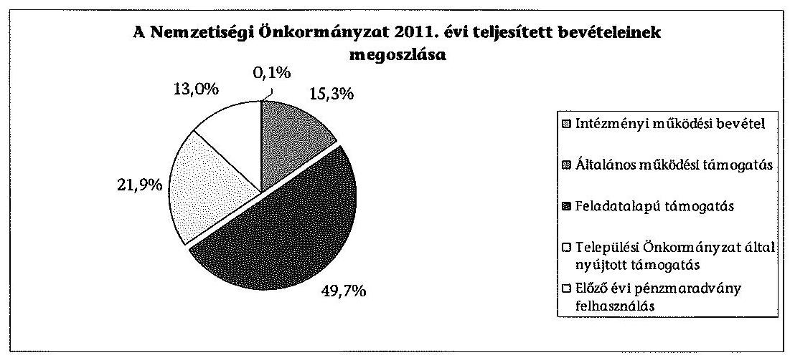
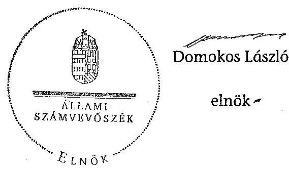

# ÁLLAMI   SZÁMVEVŐSZÉK 

## JELENTÉS

a helyi kisebbségi/nemzetiségi önkormányzatok gazdálkodásának ellenőrzéséről
Berhidai Roma Nemzetiségi Önkormányzat

---

# Állami Számvevőszék 

Iktatószám: V-0083-015/2013.
Témaszám: 1105
Vizsgálat-azonosító szám: V06060307

## Az ellenőrzést felügyelte:

Horváth Balázs
felügyeleti vezető
Az ellenőrzést vezette és az ellenőrzés végrehajtásáért felelős:
Preller Zsuzsanna
ellenőrzésvezető
A számvevőszéki jelentést készítették és a jelentés összeállításában
közreműködtek:
Eigner György Zoltán
számvevő tanácsos
Moder Beatrix
számvevő
Az ellenőrzést végezte:
Eigner György Zoltán
számvevő tanácsos

---

# TARTALOMJEGYZÉK 

BEVEZETÉS ..... 5
I. ÖSSZEGZŐ MEGÁLLAPÍTÁSOK, KÖVETKEZTETÉSEK, JAVASLATOK ..... 7
II. RÉSZLETES MEGÁLLAPÍTÁSOK ..... 11

1. A Nemzetiségi és a Települési Önkormányzat együttműködésének szabályszerűsége ..... 11
2. A gazdálkodási feladatok ellátásának szabályszerűsége ..... 11
2.1. A költségvetésre és zárszámadásra, valamint a kincstári adatszolgáltatás rendjére vonatkozó jogszabályi előírások betartása ..... 11
2.2. A Nemzetiségi Önkormányzat gazdálkodásának szabályozottsága ..... 12
2.3. A pénzügyi kontrollok működése ..... 13
3. A Nemzetiségi Önkormányzattal összefüggő gazdálkodási feladatok belső ellenőrzése ..... 13
4. A 2011. évi feladatalapú támogatás felhasználásának, elszámolásának szabályszerűsége ..... 14
5. A Nemzetiségi Önkormányzat feladatellátása ..... 14

## MELLÉKLET

1. számú A Nemzetiségi Önkormányzat 2011. évi és 2012. I. félévi gazdálkodásának főbb adatai, mutatói

## FÜGGELÉKEK

1. számú Értelmező szótár
2. számú A pénzügyi kontrollok működésének értékelése

---

$\cdot$
$\cdot$
$\cdot$
$\cdot$
$\cdot$
$\cdot$
$\cdot$
$\cdot$
$\cdot$
$\cdot$
$\cdot$
$\cdot$
$\cdot$
$\cdot$
$\cdot$
$\cdot$
$\cdot$
$\cdot$
$\cdot$
$\cdot$
$\cdot$
$\cdot$
$\cdot$
$\cdot$
$\cdot$
$\cdot$
$\cdot$
$\cdot$
$\cdot$
$\cdot$
$\cdot$
$\cdot$
$\cdot$
$\cdot$
$\cdot$
$\cdot$
$\cdot$
$\cdot$
$\cdot$
$\cdot$
$\cdot$
$\cdot$
$\cdot$
$\cdot$
$\cdot$
$\cdot$
$\cdot$
$\cdot$
$\cdot$
$\cdot$
$\cdot$
$\cdot$
$\cdot$
$\cdot$
$\cdot$
$\cdot$
$\cdot$
$\cdot$
$\cdot$
$\cdot$
$\cdot$
$\cdot$
$\cdot$
$\cdot$
$\cdot$
$\cdot$
$\cdot$
$\cdot$
$\cdot$

---

# RÖVIDÍTÉSEK JEGYZÉKE 

## Jogszabályok

Áht. 1
Áht. 2
ÁSZ tv.
Nek. ${ }_{1}$ tv.
Nek. ${ }_{2}$ tv.
Számv. tv.
Áhsz.

Ámr.
Ávr.

Bkr.
támogatási kormányrendelet

Települési Önkormányzat SZMSZ-e

## Szórövidítések

ÁSZ
gazdálkodási jogkörök szabályzata
jegyző
1992. évi XXXVIII. törvény az államháztartásról (hatályos 2011. december 31-ig)
2011. évi CXCV. törvény az államháztartásról (hatályos 2011. december 31-étől)
2011. évi LXVI. törvény az Állami Számvevőszékről (hatályos 2011. július 1-jétől)
1993. évi LXXVII. törvény a nemzeti és etnikai kisebbségek jogairól (hatályos 2011. december 31-ig)
2011. évi CLXXIX. törvény a nemzetiségek jogairól (hatályos 2011. december 20-tól)
2000. évi C. törvény a számvitelről

249/2000. (XII. 24.) Korm. rendelet az államháztartás szervezetei beszámolási és könyvvezetési kötelezettségének sajátosságairól
292/2009. (XII. 19.) Korm. rendelet az államháztartás működési rendjéről (hatályos 2011. december 31-ig)
368/2011. (XII. 31.) Korm. rendelet az államháztartásról szóló törvény végrehajtásáról (hatályos 2012. január 1-jétől)
370/2011. (XII. 31.) Korm. rendelet a költségvetési szervek belső kontrollrendszeréről és belső ellenőrzésről (hatályos 2012. január 1-jétől)
a kisebbségi önkormányzatoknak a központi költségvetésből, valamint fejezeti kezelésű előirányzatból nyújtott támogatások feltételrendszeréről és elszámolásának rendjéről szóló 342/2010. (XII. 28.) Korm. rendelet (hatályon kívül helyezte a 28/2012. (III. 6.) Korm. rendelet a nemzetiségi célú előirányzatokból nyújtott támogatások feltételrendszeréről és elszámolásának rendjéről; jelenleg hatályos a 428/2012. (XII. 29.) Korm. rendelet a nemzetiségi célú előirányzatokból nyújtott támogatások feltételrendszeréről és elszámolásának rendjéről)
Berhida Város Önkormányzata Képviselő-testületének 9/2011. (V. 3.) számú) rendelete a Szervezeti és Működési Szabályzatról

## Állami Számvevőszék

Berhida Város Önkormányzata Polgármesteri Hivatalának gazdálkodási szabályzata a kötelezettségvállalás, ellenjegyzés, szakmai teljesítés igazolása, érvényesítés és az adatszolgáltatás rendjéről (hatályos 2010. január 1-jétől)
Berhida Város Önkormányzata jegyzője

---

| Képviselő-testület | Cigány Kisebbségi Önkormányzat Képviselő-testülete 2011. december 31-ig, Berhidai Roma Nemzetiségi Önkormányzat Képviselő-testülete 2012. január 1-jétől |
| :--: | :--: |
| Nemzetiségi Önkormányzat | Cigány Kisebbségi Önkormányzat 2011. december 31-ig, Berhidai Roma Nemzetiségi Önkormányzat 2012. január 1-jétől |
| Nemzetiségi Önkormányzat elnöke | Cigány Kisebbségi Önkormányzat elnöke 2011. december 31-ig, Berhidai Roma Nemzetiségi Önkormányzat elnöke 2012. január 1-jétől |
| polgármester   Polgármesteri Hivatal | Berhida Város Önkormányzatának polgármestere   Berhida Város Önkormányzatának Polgármesteri Hivatala |
| Polgármesteri Hivatal SZMSZ-e | Berhida Város Önkormányzata Képviselő-testületének a 164/2010. (XII. 16.) számú határozatával módosított 118/2009. (X. 29.) számú Képviselő-testületi határozata a Polgármesteri Hivatal Szervezeti és Működési Szabályzatáról |
| Támogató | A támogatást nyújtó Közigazgatási és Igazságügyi Minisztérium |
| Települési Önkormányzat | Berhida Város Önkormányzata |
| Települési Önkormányzat Képviselő-testülete | Berhida Város Önkormányzatának Képviselő-testülete |

---

# JELENTÉS 

## a helyi kisebbségi/nemzetiségi önkormányzatok gazdálkodásának ellenőrzéséről Berhidai Roma Nemzetiségi Önkormányzat

## BEVEZETÉS

Az államháztartás részét, az önkormányzati alrendszer egyik elemét képezik a nemzetiségi önkormányzatok, amelyek jogi személyek és a Nek. ${ }_{1,2}$ tv.-ben meghatározott önálló feladat- és hatáskörökkel rendelkeznek. A nemzetiségi önkormányzatok az önkormányzati, illetve testületi működtetés mellett a helyi nemzetiségi közügyek változatos formában való ellátásában vesznek részt.

A nemzetiségi önkormányzatok, illetve a települési önkormányzatok között a jelenlegi szabályozás szerint nincs alá-fölérendeltségi viszony. A nemzetiségi önkormányzatok azonban sajátos közjogi helyzetben vannak, mert a jogállásukat tekintve önkormányzatok, ám függnek a székhelyük szerinti települési önkormányzat hivatalától, amely ellátja a nemzetiségi önkormányzatok vonatkozásában a megállapodásban rögzített gazdálkodási feladatokat.

A nemzetiségek helyzete, támogatása mind hazai, mind európai uniós szinten kiemelt figyelmet kap napjainkban. A nemzetiségi önkormányzatok gazdálkodására és támogatási rendszerére vonatkozó jogszabályok a 2010-2012. években jelentős változásokon mentek át, amelyek érintették a feladatalapú támogatásra fordítható költségvetési keret megállapítását, az operatív gazdálkodási jogkörök szabályozását, az elkülönített könyvvezetés alkalmazását, a belső ellenőrzés szabályozását.

Az ellenőrzés célja annak értékelése volt, hogy a Nemzetiségi Önkormányzat gazdálkodási kereteinek kialakítása, gazdálkodása és feladatellátása megfelelte-e a hatályos jogszabályoknak.

Ennek keretében ellenőriztük, hogy:

- a Nemzetiségi Önkormányzat és a Települési Önkormányzat együttműködésének szabályozása, a Települési Önkormányzat SZMSZ-ében, a megállapodásban előírt működési feltételek biztosítása megfelelte-e a jogszabályi előírásoknak;
- a felek együttműködése megfelelte-e a megállapodásnak a gazdálkodási feladatok szabályszerű ellátásában, betartották-e a Nemzetiségi Önkormányzat gazdálkodásához kapcsolódóan a költségvetésre és zárszámadásra, a gazdálkodás szabályozására, az operatív gazdálkodási jogkörök gyakorlására vonatkozó jogszabályi előírásokat;

---

- a jegyző biztosította-e a Polgármesteri Hivatal belső ellenőrzése keretében a Nemzetiségi Önkormányzattal összefüggő gazdálkodási feladatok belső ellenőrzését;
- a 2011. évi feladatalapú támogatás felhasználása, a folyósított feladatalapú támogatással történő elszámolás az előírásoknak megfelelően történt-e;
- a Nemzetiségi Önkormányzat feladatellátása összhangban volt-e a vonatkozó jogszabályi előírásokkal.

Az ellenőrzés típusa: szabályszerűségi ellenőrzés
Az ellenőrzött időszak: a 2011. január 1. - 2012. június 30.
Ellenőrzött szervezet: Berhidai Roma Nemzetiségi Önkormányzat és a gazdálkodási feladatait ellátó Berhida Város Önkormányzata

Az ellenőrzés jogszabályi alapja: az ÁSZ tv. 5. § (2)-(3) és (6) bekezdései
Az ellenőrzés szakmai módszertana az ÁSZ hivatalos honlapján (www.asz.hu) közzétett szakmai szabályokon alapult, amely a Legfőbb Ellenőrző Intézmények Nemzetközi Szervezete (INTOSAI) által kiadott nemzetközi standardok (ISSAI) figyelembevételével készült.

A fogalmak magyarázatát az 1. számú függelék, a pénzügyi kontrollok megfelelősége értékelésénél alkalmazott egységes minősítési szempontokat a 2. számú függelék tartalmazza.

Az ellenőrzés lefolytatásához a Települési Önkormányzat és a Nemzetiségi Önkormányzat tanúsítványok kitöltésével és a kapcsolódó dokumentumok elektronikus megküldésével szolgáltatott adatokat. A tanúsítványokon szereplő adatok, információk ellenőrzése és szükség szerinti javítása a helyszíni ellenőrzés keretében történt.

Az ÁSZ az ellenőrzés megállapításait az ellenőrzött időszakban hatályos, az intézkedést igénylő megállapításokra tett javaslatokat a jelenleg hatályos jogszabályok alapján fogalmazta meg.

A Nemzetiségi Önkormányzat 1994-ben alakult, elnöke a 2006. évi helyhatósági választások óta látja el feladatát. A Nemzetiségi Önkormányzat intézményt, gazdasági társaságot és más szervezetet nem alapított, illetve társulásban nem vett részt. A négytagú Képviselő-testület munkája segítésére bizottságot nem hozott létre. A Nemzetiségi Önkormányzat a költségvetési beszámolója szerint a 2011. évben 1373 ezer Ft költségvetési bevételt ért el és 989 ezer Ft költségvetési kiadást teljesített. A 2012. évben 515 ezer Ft eredeti költségvetési bevételi és kiadási előirányzatot terveztek. A 2012. I. félévi beszámolója alapján a módosított költségvetési bevételi és kiadási előirányzat 1174 ezer Ft, a teljesített költségvetési bevétel 1025 ezer Ft, a teljesített költségvetési kiadás 302 ezer Ft volt. A 2011. évi és a 2012. év I. féléves gazdálkodási adatokat részletesen az 1. számú mellékletben mutatjuk be. Az ÁSZ a Nemzetiségi Önkormányzat gazdálkodását korábban nem ellenőrizte. Az ÁSZ tv. 29. § (1) bekezdése szerint a jelentéstervezetet megküldtük a polgármester és Nemzetiségi Önkormányzat elnöke részére, akik az ÁSZ tv. 29. § (2) bekezdésében foglalt észrevételezési jogukkal nem éltek, a jelentéstervezetre észrevételt nem tettek.

---

# I. ÖSSZEGZŐ MEGÁLLAPÍTÁSOK, KÖVETKEZTETÉSEK, JAVASLATOK 

A Nemzetiségi és a Települési Önkormányzat együttműködése az előírt határidő betartásával jóváhagyott megállapodásokon alapult. A Települési Önkormányzat biztosította a Nemzetiségi Önkormányzat működéséhez szükséges személyi és tárgyi feltételeket. Az együttműködési megállapodásokat - a 2011. évben az Ámr., a 2012. évben az Áht. ${ }_{2}$ előírásaihoz képest - kisebb tartalmi hiányosságokkal fogadták el. A 2012. június 30-án hatályos megállapodásban az Áht. ${ }_{2}$ előírása ellenére nem rendelkeztek a Nemzetiségi Önkormányzat bevételeivel és kiadásaival kapcsolatban az ellenőrzési feladatok ellátásáról.

A Nemzetiségi Önkormányzat költségvetésére és zárszámadására vonatkozó jogszabályi előírásokat összességében betartották. A költségvetési és zárszámadási határozatok jóváhagyása, a költségvetési előirányzatok módosítása a jogszabályban előírt eljárásrend szerint történt, a határozatokat egymással összehasonlítható szerkezetben készítették el és változatlan formában építették be a Települési Önkormányzat költségvetési és zárszámadási rendeleteibe. A 2011. évi költségvetéshez az Ámr. előírása ellenére nem készítettek előirányzat-felhasználási ütemtervet. A 2011. évben a költségvetési és a zárszámadási határozat megalkotása az Ámr.-ben, a 2012. évben a költségvetési határozat Képviselő-testületi beterjesztése az Áht. ${ }_{2}$-ben előírt határidőn túl történt meg. A jegyző a 2012. I. félévben a Nemzetiségi Önkormányzatra vonatkozó kincstári adatszolgáltatási kötelezettségének határidőben eleget tett.

A gazdálkodás szabályozottsága érdekében, az e feladatok végrehajtását ellátó Polgármesteri Hivatal, a jogszabályokban előírt szabályzatok hatályát kiterjesztette a Nemzetiségi Önkormányzat gazdálkodási feladataira. Az operatív gazdálkodási jogkörök kialakítása az ellenőrzött időszakban a jogszabályi előírásokkal összhangban történt. A Polgármesteri Hivatal SZMSZ-e az Ámr. és az Ávr. előírásainak megfelelően tartalmazta a munkakörökhöz kapcsolódóan a Nemzetiségi Önkormányzat gazdálkodásával kapcsolatos feladat- és hatásköröket, a hatáskörök gyakorlásának módját, a helyettesítés rendjét és az ezekre vonatkozó felelősségi szabályokat.

A pénzügyi kontrollok működése az ellenőrzött időszak egészében a dologi és egyéb folyó kiadások teljesítésénél kiváló volt. A 2011. évben a kötelezettségvállalás ellenjegyzője, a szakmai teljesítés igazolója és az utalvány ellenjegyzője, 2012. I. félévben a pénzügyi ellenjegyző, a teljesítésigazoló és az érvényesítő a jogszabályokban és a belső szabályozásban előírt módon teljesítette az ellenőrzési és igazolási feladatokat. A pénzügyi kontrollok működése biztosította a hibák megelőzését, feltárását és kijavítását.

A Nemzetiségi Önkormányzat a 2011. évben 683 ezer Ft feladatalapú támogatásban részesült, amelyet a tárgyévben a jogszabályi előírásokkal összhangban felhasznált. A támogatási kormányrendeletben hivatkozott,

---

Áht. ${ }_{1}$-ben előírt elszámolás nem történt meg. A támogatás felhasználását, elszámolását az arra jogosult szervek nem ellenőrizték.

A Nemzetiségi Önkormányzat feladatellátásának tárgya összhangban volt a Nek. ${ }_{1,2}$ tv. előírásaival. Biztosította a nemzetiségi közügyek keretében az alapvető feladata ellátásához szükséges szervezeti, személyi és anyagi feltételeket. Kapcsolatot tartott a nemzetiségi közösség szervezeteivel, valamint hagyományápolással és közművelődéssel összefüggő önként vállalt feladatokat végzett.

A Polgármesteri Hivatal 2011. és 2012. évi éves ellenőrzési terveit megalapozó kockázatelemzés - a Ber. előírásai ellenére - nem terjedt ki a Nemzetiségi Önkormányzat gazdálkodásával összefüggő végrehajtási feladatok ellátására. A jegyző az ellenőrzött időszakban az Áht. ${ }_{1,2}$ ellenére nem biztosította a Polgármesteri Hivatal belső ellenőrzése keretében a Nemzetiségi Önkormányzat gazdálkodásával összefüggő végrehajtási feladatok belső ellenőrzését. Erre irányuló ellenőrzést a 2011. évben és 2012. I. félévben nem terveztek és nem végeztek.

Az ÁSZ tv. 33. § (1) bekezdésében foglaltak értelmében az ellenőrzött szervezet vezetője köteles a jelentésben foglalt megállapításokhoz kapcsolódó intézkedési tervet összeállítani, és azt a jelentés kézhezvételétől
 számított 30 napon belül az ÁSZ részére megküldeni. Amennyiben az intézkedési tervet határidőre nem küldi meg a szervezet, vagy az nem elfogadható, az ÁSZ elnöke az ÁSZ tv. 33. § (3) bekezdés a)-b) pontjaiban foglaltakat érvényesítheti.

A helyszíni ellenőrzés megállapításainak hasznosítása mellett javasoljuk:

# a jegyzőnek 

1. az együttműködés szabályozásával kapcsolatban

A Nemzetiségi Önkormányzat és a Települési Önkormányzat együttműködését meghatározó - 2012. június 30-án hatályos - megállapodásban az Áht. ${ }_{2}$ 27. § (2) bekezdésében előírtak ellenére nem rendelkeztek a Nemzetiségi Önkormányzat bevételeivel és kiadásaival kapcsolatban az ellenőrzési feladatok ellátásának részletes szabályairól.

Javaslat
Készítse elő a megállapodás módosítását, hogy tartalmilag feleljen meg az Áht. ${ }_{2}$ 27. § (2) bekezdésében foglalt előírásnak.
2. a feladatalapú támogatás elszámolásával kapcsolatban

A 2011. évben folyósított feladatalapú támogatás elszámolása a támogatási kormányrendelet 7. § (2) bekezdésében hivatkozott Áht. ${ }_{1}$-nek „a helyi önkormányzatok elszámolási rendjére vonatkozó rendelkezései alkalmazása" előírása ellenére nem történt meg.

---

Javaslat
Gondoskodjon az Áht. ${ }_{2}$ 27. § (2) bekezdésében meghatározott feladatkörében a Nemzetiségi Önkormányzat által igénybe vett feladatalapú támogatás elszámolásának elkészítéséről, figyelemmel az Áht. ${ }_{2}$ 57. § (4) bekezdésében foglaltakra.

# a polgármesternek 

A Nemzetiségi Önkormányzat és a Települési Önkormányzat együttműködését meghatározó - 2012. június 30-án hatályos - megállapodásban az Áht. ${ }_{2}$ 27. § (2) bekezdésében előírtak ellenére nem rendelkeztek a Nemzetiségi Önkormányzat bevételeivel és kiadásaival kapcsolatban az ellenőrzési feladatok ellátásának részletes szabályairól.

Javaslat
Terjessze a Települési Önkormányzat Képviselő-testülete elé jóváhagyásra az Áht. ${ }_{2}$ 27. § (2) bekezdésben foglalt előírás betartásával előkészített megállapodás módosítást.

## a Nemzetiségi Önkormányzat elnökének

1. A Nemzetiségi Önkormányzat és a Települési Önkormányzat együttműködését meghatározó - 2012. június 30-án hatályos - megállapodásban az Áht. ${ }_{2}$ 27. § (2) bekezdésében előírtak ellenére nem rendelkeztek a Nemzetiségi Önkormányzat bevételeivel és kiadásaival kapcsolatban az ellenőrzési feladatok ellátásának részletes szabályairól.

Javaslat:
Terjessze a Képviselő-testület elé jóváhagyásra az Áht. ${ }_{2}$ 27. § (2) bekezdésben foglalt előírás betartásával előkészített megállapodás módosítást.
2. A 2012. évi költségvetési határozat tervezetét a jegyző határidőben előkészítette, a Nemzetiségi Önkormányzat elnöke azonban az Áht. ${ }_{2}$ 24. § (2) bekezdésben előírt határidőn túl terjesztette a Képviselő-testület elé elfogadásra.

Javaslat:
A jövőben az Áht. ${ }_{2}$ 24. § (2) bekezdésében foglalt határidő betartásával nyújtsa be a Képviselő-testületnek a jegyző által előkészített költségvetési határozat tervezetet.
3. A 2011. évben folyósított feladatalapú támogatás elszámolása a támogatási kormányrendelet 7. § (2) bekezdésében hivatkozott Áht.-nek „a helyi önkormányzatok elszámolási rendjére vonatkozó rendelkezései alkalmazása" előírása ellenére nem történt meg.

---

Javaslat:
Terjessze a Képviselő-testület elé jóváhagyásra az Áht. ${ }_{2}$ 57. § (4) bekezdés alapján összeállított, a Nemzetiségi Önkormányzat által igénybe vett feladatalapú támogatás elszámolását.

---

# II. RÉSZLETES MEGÁLLAPÍTÁSOK 

## 1. A Nemzetiségi és a Települési Önkormányzat együttműködésének szabályszerűsége

A Nemzetiségi és a Települési Önkormányzat között létrejött együttműködési megállapodások ${ }^{1}$ - kisebb tartalmi hiányosságok kivételével - megfeleltek a jogszabályi előírásoknak. A megállapodások jóváhagyása az előírt eljárásrend és határidő betartásával történt. Az együttműködési megállapodásokban a jogszabályi előírásokat nem érvényesítették maradéktalanul, mert:

- a 2011. december 31-én hatályos megállapodás nem tartalmazta az Ámr. 37. § (4) bekezdés a)-f) pontjainak előírásai ellenére a költségvetési koncepcióval, a költségvetési határozattal és a költségvetési rendelettel kapcsolatos feladatokat, a munkamegosztást és a határidőket;
- a 2012. június 30-án hatályos megállapodásban nem rendelkeztek az Áht. ${ }_{2}$ 27. § (2) bekezdésében előírtak ellenére a Nemzetiségi Önkormányzat bevételeivel és kiadásaival kapcsolatban az ellenőrzési feladatok ellátásának részletes szabályairól.

A Települési Önkormányzat biztosította a Nemzetiségi Önkormányzat működéséhez szükséges személyi és tárgyi feltételeket.

## 2. A gazdálkodási feladatok ellátásának szabályszerűsége

### 2.1. A költségvetésre és zárszámadásra, valamint a kincstári adatszolgáltatás rendjére vonatkozó jogszabályi előírások betartása

A Nemzetiségi Önkormányzat költségvetésére és zárszámadására vonatkozó jogszabályi előírásokat - egyes tartalmi elemek, illetve a határozatok elfogadására vonatkozó határidők kivételével - összességében betartották. A költségvetési és zárszámadási határozatok egymással összehasonlítható szerkezetben készültek, azok változatlan formában épültek be a Települési Önkormányzat költségvetési és zárszámadási rendeleteibe. A Nemzetiségi Önkormányzat elnöke a költségvetési előirányzatok felhasználásához szükséges mértékben kezdeményezte azok módosítását, biztosította a tárgyévi fizetési kötelezettség vállalásához szükséges fedezet meglétét.

[^0]
[^0]:    ${ }^{1}$ A 2011. évben hatályos együttműködési megállapodást a Települési Önkormányzat Képviselő-testülete a 145/2010. (XI. 25.) számú, a Képviselő-testület a 22/2010. (XI. 10.) számú határozattal fogadta el. A Nek. ${ }_{2}$ tv. 159. § (3) bekezdésében előírtak alapján 2012. június 1-jéig felülvizsgált és módosított együttműködési megállapodást a Települési Önkormányzat Képviselő-testülete a 7/2012. (I. 25.) számú, a Képviselő-testület a 2/2012. (I. 30.) számú határozattal fogadta el.

---

A 2011. évi költségvetési határozatot a Képviselő-testület hiányos tartalommal fogadta el, mert:

- az Ámr. 36. § (1) bekezdés k) pontjában foglaltakat figyelmen kívül hagyva az év várható bevételi és kiadási előirányzatainak teljesüléséről előirányzatfelhasználási ütemterv nem készült.

A 2012. évi költségvetési határozat tartalma a jogszabályi előírásoknak megfelel.

A Képviselő-testület a 2011. évi költségvetésről szóló 1/2011. (II. 23) számú, és a zárszámadásról szóló 8/2012. (IV. 23.) számú határozatát az Ámr. 37. § (3) bekezdésében előírt határidőn túl fogadta el, a 2012. évi költségvetési határozat ${ }^{2}$ tervezetét a jegyző határidőben előkészítette, a Nemzetiségi Önkormányzat elnöke azonban az Áht. ${ }_{2}$ 24. § (2) bekezdésben előírt határidőn túl terjesztette a Képviselő-testület elé elfogadásra. A jogszabályokban előírt határidő túllépése nem veszélyeztette a Települési Önkormányzat költségvetési és zárszámadási rendeleteinek Áht. ${ }_{1,2}$-ban előírt határidőben való elfogadását.

A 2012. évi költségvetéshez kapcsolódó, a Nemzetiségi Önkormányzatra vonatkozó kincstári adatszolgáltatási kötelezettségének a jegyző határidőben eleget tett.

# 2.2. A Nemzetiségi Önkormányzat gazdálkodásának szabályozottsága 

A Nemzetiségi Önkormányzat gazdálkodását az ellenőrzött időszakban a jogszabályi előírásoknak megfelelően szabályozták, a gazdálkodási feladatai végrehajtását ellátó Polgármesteri hivatal a jogszabályokban előírt gazdálkodási szabályzatokkal ${ }^{3}$ a Nemzetiségi Önkormányzat gazdálkodási feladataira kiterjedő hatállyal rendelkezett.

A Nemzetiségi Önkormányzat operatív gazdálkodási jogköreinek kialakítása - a kötelezettségvállalásra, az utalványozásra, a kötelezettségvállalás és utalványozás ellenjegyzésére a felhatalmazások, a szakmai teljesítést igazoló, a pénzügyi ellenjegyzést és az érvényesítést végző személyek kijelölése - az ellenőrzött időszakban megfelelt a jogszabályi előírásoknak. Az operatív gazdálkodással kapcsolatos feladat- és hatásköröket az együttműködési megállapodás, a gazdálkodási jogkörök szabályzata, és a feladatokat ellátó köztisztviselők munkaköri leírásai tartalmazták.

A Nemzetiségi Önkormányzat gazdálkodásával kapcsolatos feladat- és hatásköröket, a hatáskörök gyakorlásának módját, a helyettesítés rendjét és az ezek-

[^0]
[^0]:    ${ }^{2}$ A Képviselő-testületnek a Nemzetiségi Önkormányzat 2012. évi költségvetéséről alkotott 6/2012. (II. 27.) számú határozata.
    ${ }^{3}$ Számviteli politika, leltározási és leltárkészítési szabályzat, pénzkezelési szabályzat, eszközök és források értékelési szabályzata, számlarend, munkaköri leírások, ellenőrzési nyomvonal, szabálytalanságok kezelésének eljárásrendje, kockázatkezelési szabályzat, folyamatba épített előzetes, utólagos és vezetői ellenőrzés (FEUVE) szabályozás

---

re vonatkozó felelősségi szabályokat a Polgármesteri Hivatal SZMSZ-ében az ellenőrzött időszakban rögzítették.

# 2.3. A pénzügyi kontrollok működése 

A Nemzetiségi Önkormányzat az ellenőrzött időszakban államháztartáson belülre és kívülre, működési és felhalmozási célra pénzeszközátadást, illetve szociálpolitikai ellátásra kiadást nem teljesített. A Nemzetiségi Önkormányzat 2011. évi dologi és egyéb folyó kiadásainak teljesítése során a kötelezettségvállalás ellenjegyzése, a szakmai teljesítésigazolás, az utalvány ellenjegyzése kontrollok működésének megfelelősége - a 2. számú függelékben részletezett szempontok alapján végzett értékelés szerint - kiváló volt, mert:

- a szakmai teljesítésigazolást az arra kijelölt személy végezte el, a kiadások teljesítésének jogosságát, összegszerűségét, a megrendelések, szerződések teljesítését az Ámr.-ben és a belső szabályozásban foglalt előírásoknak megfelelően ellenőrizte és igazolta;
- az utalvány ellenjegyzője meggyőződött a szakmai teljesítésigazolás és az érvényesítés elvégzéséről, valamint a gazdálkodásra vonatkozó szabályok érvényesüléséről.

A Nemzetiségi Önkormányzatnál 2012. I. félévben a dologi és egyéb folyó kiadások teljesítése során a pénzügyi ellenjegyzés, a teljesítés igazolás és az érvényesítés kulcskontrollok működésének megfelelősége - a 2. számú függelékben részletezett szempontok alapján végzett értékelés szerint kiváló volt, mert:

- a pénzügyi ellenjegyző meggyőződött a szabad előirányzat, valamint a kifizetés tervezett időpontjában a pénzügyi fedezet rendelkezésre állásáról, továbbá a kötelezettségvállalás során a gazdálkodásra vonatkozó szabályok betartásáról;
- a teljesítés igazolását az arra kijelölt személy végezte el, a kiadások teljesítésének jogosságát, összegszerűségét, a megrendelések, szerződések teljesítését az Ávr.-ben és a belső szabályozásban foglalt előírásoknak megfelelően ellenőrizte és igazolta;
- a jogszerű kijelöléssel rendelkező érvényesítő a feladatait az Ávr. és a belső szabályozás előírásainak megfelelően végezte el.

## 3. A Nemzetiségi Önkormányzattal összefüggő gazdálkodási feladatok belső ellenőrzése

A Polgármesteri Hivatal 2011. és 2012. évi ellenőrzési terveit megalapozó kockázatelemzés a Ber. 21. § (2) bekezdése ${ }^{4}$ ellenére nem terjedt ki a Nemzetiségi Önkormányzat gazdálkodásával összefüggő végrehajtási feladatok ellátására. A jegyző az ellenőrzött időszakban az Áht.;

[^0]
[^0]:    ${ }^{4}$ 2012. január 1-jétől Bkr. 7. § (2) bekezdése írja elő

---

121/B. § (4) bekezdése, illetve az Áht. ${ }_{2}$ 70.§ (1) bekezdése előírása ellenére nem biztosította a Polgármesteri Hivatal belső ellenőrzése keretében a Nemzetiségi Önkormányzat gazdálkodásával összefüggő végrehajtási feladatok belső ellenőrzését. Erre vonatkozóan belső ellenőrzést a 2011. évben és 2012. I. félévben nem terveztek és nem végeztek.

# 4. A 2011. évi feladatalapú támogatás felhasználásának, elszámolásának szabályszerűsége 

A Nemzetiségi Önkormányzat a 2011. évben 683 ezer Ft feladatalapú támogatásban részesült, amelynek az összes bevételhez viszonyított részarányát az alábbi ábra szemlélteti:

A 2011. évben folyósított támogatást a jogszabályi előírásokkal összhangban a tárgyévben felhasználták. Elszámolása a támogatási kormányrendelet 7. § (2) bekezdésében hivatkozott Áht. ${ }_{1}$-nek „a helyi önkormányzatok elszámolási rendjére vonatkozó rendelkezései alkalmazása" előírása ellenére nem történt meg. A támogatás felhasználását, elszámolását az ellenőrzésre jogosult szervek nem ellenőrizték.

## 5. A Nemzetiségi Önkormányzat feladatellátása

A Nemzetiségi Önkormányzat feladatellátásának tárgya összhangban volt a Nek. ${ }_{1,2}$ tv. előírásaival. A Nemzetiségi Önkormányzat az ellenőrzött időszakban hatósági tevékenységet nem végzett, közüzemi szolgáltatással összefüggő feladatot nem látott el.

A Nemzetiségi Önkormányzat a Nek. ${ }_{1}$ tv. 5/A. § (1) bekezdése és a Nek. ${ }_{2}$ tv. 10. § (1) bekezdése szerinti, a nemzetiségi érdekek védelmével és képviseletével kapcsolatos alapvető feladata ellátásához biztosította a szükséges szervezeti, személyi és anyagi feltételeket.

---

A Nek. ${ }_{1}$ tv. 30. § (1) és 30/A. § (4) bekezdésében, valamint a Nek. ${ }_{2}$ tv. 115. § és 116. § (1) bekezdésében foglaltak alapján, a képviselt közösség kulturális autonómiája megerősítése érdekében együttműködési megállapodások keretében kapcsolatot tartott más szervezetekkel, továbbá hagyományápolással és közművelődéssel kapcsolatos - önként vállalt - feladatokat látott el.

Budapest, 2013. 12. hónap 12. nap

Melléklet: 1 db
Függelék: $\quad 2 \mathrm{db}$

---

.

---

# A Nemzetiségi Önkormányzat 2011. évi és 2012. I. félévi gazdálkodásának főbb adatai, mutatói

A) Bevételek

|  Megnevezés | 2011. év |  |  |  | 2012. év |  | 2012. I. félév |   |
| --- | --- | --- |

 --- | --- | --- | --- | --- | --- |
|   | eredeti
ei. | módosított
ei. | teljesítés | teljesítés
megoszlása
(\%) | eredeti
ei. | módosított
ei. | teljesítés | teljesítés
megoszlása
(\%)  |
|  Intézményi működési
bevétel |  |  | 2 | 0,1 |  |  | 1 | 0,1  |
|  Általános működési
támogatás | 210 | 210 | 210 | 16,3 | 216 | 216 | 216 | 21,0  |
|  Feladatalapú támogatás |  | 683 | 683 | 49,7 |  |  |  |   |
|  Települési
Önkormányzat által
nyújtott támogatás | 300 | 300 | 300 | 21,9 | 300 | 300 | 150 | 14,6  |
|  Támogatásértékű p.e.
átvétel (pénzmaradvány
átvétel Önk-tól) |  |  |  |  |  | 659 | 659 | 64,3  |
|  ... Megyei Nemzetiségi
Alapítványtól
támogatás |  |  |  |  |  |  |  |   |
|  Pénzforgalmi bevételek
összesen | 510 | 1193 | 1195 | 87,0 | 515 | 1174 | 1025 | 100  |
|  Előző évi
pénzmaradvány
felhasználás |  | 382 | 178 | 13,0 |  |  |  |   |
|  Bevételek | 510 | 1575 | 1373 | 100 | 515 | 1174 | 1025 | 100  |

B) KIADÁSOK adatok ezer Ft-ban

|  Megnevezés | 2011. év |  |  |  | 2012. év |  | 2012. I. félév |   |
| --- | --- | --- | --- | --- | --- | --- | --- | --- |
|   | eredeti
ei. | módosított
ei. | teljesítés | teljesítés
megoszlása
(\%) | eredeti
ei. | módosított
ei. | teljesítés | teljesítés
megoszlása
(\%)  |
|  Személyi juttatások |  |  |  |  |  | 220 | 30 | 9,9  |
|  Munkajövedelmeket terhelő
járulékok |  | 50 | 63 | 6,4 |  | 85 | 51 | 16,9  |
|  Dologi és egyéb folyó
kiadások | 510 | 1375 | 796 | 80,5 | 515 | 869 | 221 | 73,2  |
|  Támogatásértékű
működési kiadás |  |  |  |  |  |  |  |   |
|  Működési kiadások
összesen | 510 | 1425 | 859 | 86,9 | 515 | 1174 | 302 | 100  |
|  Felhalmozási kiadások |  | 150 | 130 | 13,1 |  |  |  |   |
|  Kiadások összesen | 510 | 1575 | 989 | 100,0 | 515 | 1174 | 302 | 100  |

---

.

---

# ÉRTELMEZŐ SZÓTÁR 

feladatalapú támogatás A támogatási évben általános működési támogatásban részesült, és a Támogatónak a Kincstárhoz intézett, a feladatalapú támogatás utalására vonatkozó rendelkező levele keltének időpontjában működő nemzetiségi önkormányzatoknak a támogatási kormányrendeletben rögzített feltételrendszer alapján nyújtható támogatás. A feladatalapú támogatás a nemzetiségi közügyeknek a nemzetiségi önkormányzatok által történő ellátását szolgálja. (A támogatási kormányrendelet 2. § (2) bekezdés c) pont, és 4. § (1) bekezdés alapján.)
megállapodás
nemzetiség
nemzetiségi közügy

A nemzetiségi önkormányzatnak a működési feltételei biztosítására, továbbá a bevételeivel és a kiadásaival kapcsolatban a tervezési, gazdálkodási, ellenőrzési, finanszírozási, adatszolgáltatási és beszámolási feladatai végrehajtására a székhelye szerinti települési önkormányzattal megkötött megállapodás. (Az Áht. 66. §, a Nek. 2 tv. 80. § (2) bekezdés, valamint az Áht. 2 27. § (2) bekezdés alapján levezetett fogalom.)
Minden olyan Magyarország területén legalább egy évszázada honos népcsoport, amely az állam lakossága körében számszerű kisebbségben van és a lakosság többi részétől saját nyelve és kultúrája, hagyományai különböztetik meg, egyben olyan összetartozás-tudatról tesz bizonyságot, amely mindezek megőrzésére, történelmileg kialakult közösségeik érdekeinek kifejezésére és védelmére irányul. (A Nek. 1 tv. 1. § (2) bekezdése, valamint a Nek. 2 tv. 1. § (1) bekezdése alapján levezetett fogalom.)
Az egyéni és közösségi jogok érvényesülése, a nemzetiséghez tartozók érdekeinek kifejezésre juttatása - különösen az anyanyelv ápolása, őrzése és gyarapítása, továbbá a nemzetiségek kulturális autonómiájának a nemzetiségi önkormányzatok által történő megvalósítása és megőrzése - érdekében a nemzetiséghez tartozók meghatározott közszolgáltatásokkal való ellátásával, ezen ügyek önálló vitelével és az ehhez szükséges szervezeti, személyi és anyagi feltételek megteremtésével összefüggő ügy. A közhatalmat gyakorló állami és helyi önkormányzati szervekben, továbbá a nemzetiségi önkormányzati szervekben való nemzetiségi képviselethez és mindezek szervezeti, személyi és anyagi feltételeinek biztosításához kapcsolódó ügy. (A Nek.; tv. 6/A. § 1. pontjából és a Nek. 2 tv. 2. § 1. pontjából levezetett fogalom.)

---

nemzetiségi önkormányzat
pénzügyi kontrollok

Törvényben meghatározott nemzetiségi közszolgáltatási feladatokat ellátó, testületi formában működő, jogi személyiséggel rendelkező, demokratikus választások útján törvény alapján létrehozott szervezet, amely a nemzetiségi közösséget megillető jogosultságok érvényesítésére, a nemzetiségek érdekeinek védelmére és képviseletére, a feladat- és hatáskörébe tartozó nemzetiségi közügyek települési, területi vagy országos szinten történő önálló intézésére jön létre. (A Nek., tv. 6/A. § (1) bekezdés 2. pontjából, valamint a Nek. 2 tv. 2. § 2. pontjából levezetett fogalom.) A jelentésben e fogalmat a települési nemzetiségi önkormányzatokra leszűkítve használjuk.
a kötelezettségvállalás és az utalvány ellenjegyzése, valamint a szakmai teljesítés igazolása 2011. december 31-éig, 2012. január 1-jétől a pénzügyi ellenjegyzés, a teljesítés igazolása és az érvényesítés.

---

# A PÉNZÜGYI KONTROLLOK MŰKÖDÉSÉNEK ÉRTÉKELÉSE 

A pénzügyi kontrollok működése megfelelőségének vizsgálatát többlépcsős megfelelőségi tesztek útján, megismételt eljárással, a könyvviteli tételekből vett egyszerű véletlen minta alapján végeztük. A tesztelést az értékelésre kiválasztott három terület - a dologi és egyéb folyó kiadásoknál teljesített kifizetések, az államháztartáson belülre és kívülre, működési és felhalmozási célra teljesített pénzeszközátadások, illetve a szociálpolitikai ellátások teljesített kiadásainál végeztük el.

Az ellenőrzés során alkalmazott módszer (többlépcsős megfelelőségi teszt) lényege, hogy a kiválasztott minta ellenőrzését csak addig végezzük, amíg elegendő és megfelelő bizonyítékot nem szerzünk a vizsgált pénzügyi kontroll működésének megfelelő, vagy nem megfelelő voltáról. A megismételt eljárás alkalmazása a szándékolt hatáshoz (törvényes működés, kitűzött célok, teljesítmények elérése, veszteséget okozó kockázatok megelőzése, mérséklése, feltárása) viszonyítva lehetővé teszi a kontrolltevékenységek tényleges hatásának vizsgálatát, ez alapján a működés megfelelősége értékelését. Ennek keretében a számvevő bizonyosságot szerez arról, hogy a rendelkezésre álló szabályozás és dokumentumok alapján a pénzügyi kontrollokhoz szükséges - jogszabályokban előírt - ellenőrzési lépéseket végrehajtották-e.

A tesztek kiértékelése évenkénti bontásban két szinten történt. Először az egyes tevékenységi területekre meghatározott pénzügyi kontrollokat értékeltük, majd általános következtetést vontunk le a pénzügyi kontrollok együttes megfelelősége tekintetében. Az ellenőrzésre kijelölt területek kifizetéseinél a pénzügyi kontrollok működése „kiváló", „jó" vagy „gyenge" minősítést kaphatott.

Az értékelésnél meghatározott lényegességi szint a könyvelési adatállományból vett mintanagysághoz megadott kritikus hibák száma.

A pénzügyi kontrollok működését:

- kiválónak értékeltük abban az esetben, ha azok működése megfelel a hibák megelőzésére és kijavítására meghatározott jogszabályi és helyi szintű szabályozásnak (eseti hibák);
- jónak minősítettük, ha a megállapított kisebb (tolerálható mértékű) hiányosságok nem veszélyeztetik az ellenőrzött területek hibáinak megelőzését és kijavítását (a hibák száma nem érte el a kritikus hibák számát, azaz a lényegességi szintet);
- gyengének értékeltük, amennyiben a kontrollok működésében előforduló hiányosságok miatt nem biztosított a hibák megelőzése, feltárása, kijavítása (a hibák száma elérte az ellenőrzött tételektől függően megállapított kritikus hibák számát, azaz a lényegességi szintet).

