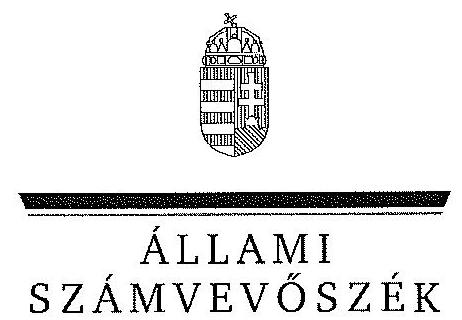
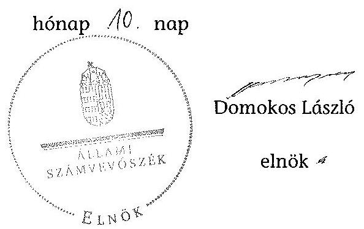

ÁLLAMI
SZÁMVEVÔSZÉK

# JELENTÉS 

a helyi kisebbségi/nemzetiségi önkormányzatok gazdálkodásának ellenőrzéséről
Rácalmás Város Német Nemzetiségi Önkormányzat

---

# Állami Számvevõszék 

Iktatószám: V-0090-018/2013.
Témaszám: 1105
Vizsgálat-azonosító szám: V06060314

## Az ellenőrzést felügyelte:

Horváth Balázs
felügyeleti vezető
Az ellenőrzést vezette és az ellenőrzés végrehajtásáért felelős:
Preller Zsuzsanna
ellenőrzésvezető
A számvevőszéki jelentést készítették és a jelentés összeállításában közremúködtek:
dr. Láng Ágnes Krisztina
számvevő
Luhály Matild
számvevő
Az ellenőrzést végezték:

| Bialkó Zsolt Gyula | Kiss Rita Terézia | Bencsik Árpád |
| :-- | :-- | :-- |
| számvevő tanácsos | számvevő tanácsos | számvevő |

---

# TARTALOMJEGYZÉK 

BEVEZETÉS ..... 5
I. ÖSSZEGZŐ MEGÁLLAPÍTÁSOK, KÖVETKEZTETÉSEK, JAVASLATOK ..... 7
II. RÉSZLETES MEGÁLLAPÍTÁSOK ..... 13

1. A Nemzetiségi és a Települési Önkormányzat együttmúködésének szabályszerűsége ..... 13
2. A gazdálkodási feladatok ellátásának szabályszerűsége ..... 14
2.1. A költségvetésre és zárszámadásra, valamint a kincstári adatszolgáltatás rendjére vonatkozó jogszabályi előírások betartása ..... 14
2.2. A Nemzetiségi Önkormányzat gazdálkodásának szabályozottsága ..... 15
2.3. A pénzügyi kontrollok múködése ..... 15
3. A Nemzetiségi Önkormányzattal összefüggő gazdálkodási feladatok belső ellenőrzésének biztosítása ..... 17
4. A 2011. évi feladatalapú támogatás felhasználásának, elszámolásának szabályszerűsége ..... 17
5. A Nemzetiségi Önkormányzat feladatellátása ..... 17

## MELLÉKLET

1. számú A Nemzetiségi Önkormányzat 2011. évi és 2012. I. félévi gazdálkodásának főbb adatai, mutatói

## FÜGGELÉKEK

1. számú Értelmező szótár
2. számú A pénzügyi kontrollok múködésének értékelése

---

.

---

# RÖVIDÍTÉSEK JEGYZÉKE 

## Jogszabályok

Áht. 1
Áht. 2
ÁSZ tv.
Nek. 1 tv.
Nek. 2 tv.
Számv. tv.
Áhsz.

Ámr.
Ávr.

Bkr.
támogatási kormányrendelet

Települési Önkormányzat SZMSZ-e

## Szórövidítések

Alapkezelő
ÁSZ
gazdálkodási jogkörök szabályzata
jegyzó
1992. évi XXXVIII. törvény az államháztartásról (hatályos 2011. december 31-ig)
2011. évi CXCV. törvény az államháztartásról (hatályos 2011. december 31-étől)
2011. évi LXVI. törvény az Állami Számvevőszékről (hatályos 2011. július 1-jétől)
1993. évi LXXVII. törvény a nemzeti és etnikai kisebbségek jogairól (hatályos 2011. december 31-ig)
2011. évi CLXXIX. törvény a nemzetiségek jogairól (hatályos 2011. december 20-tól)
2000. évi C. törvény a számvitelről

249/2000. (XII. 24.) Korm. rendelet az államháztartás szervezetei beszámolási és könyvvezetési kötelezettségének sajátosságairól
292/2009. (XII. 19.) Korm. rendelet az államháztartás működési rendjéről (hatályos 2011. december 31-ig)
368/2011. (XII. 31.) Korm. rendelet az államháztartásról szóló törvény végrehajtásáról (hatályos 2012. január 1jétől)
370/2011. (XII. 31.) Korm. rendelet a költségvetési szervek belső kontrollrendszeréről és belső ellenőrzésről (hatályos 2012. január 1-jétől)
a kisebbségi önkormányzatoknak a központi költségvetésből, valamint fejezeti kezelésű előirányzatból nyújtott támogatások feltételrendszeréről és elszámolásának rendjéről szóló 342/2010. (XII. 28.) Korm. rendelet (hatályon kívül helyezte a 28/2012. (III. 6.) Korm. rendelet a nemzetiségi célú előirányzatokból nyújtott támogatások feltételrendszeréről és elszámolásának rendjéről; jelenleg hatályos a 428/2012. (XII. 29.) Korm. rendelet a nemzetiségi célú előirányzatokból nyújtott támogatások feltételrendszeréről és elszámolásának rendjéről)
Rácalmás Város Önkormányzat Képviselő-testületének többször módosított 11/1999. (XI. 17.) számú rendelete a Képviselő-testület és szervei Szervezeti és Múködési Szabályzatáról

Közigazgatási és Igazságügyi Minisztérium Wekerle Sándor Alapkezelő
Állami Számvevőszék
Rácalmás Város Önkormányzat gazdálkodási szabályzata (hatályos 2011. január 1-jétől és 2012-január 1-jétől)
Rácalmás Város Önkormányzatának jegyzője

---

Képviselő-testület

Kincstár
Nemzetiségi Önkormányzat

Nemzetiségi Önkormányzat elnöke

Nemzetiségi Önkormányzat SZMSZ-e
polgármester
Polgármesteri hivatal
Polgármesteri Hivatal ügyrendje
Támogató
Települési Önkormányzat
Települési Önkormányzat Képviselő-testülete

Rácalmás Város Német Kisebbségi Önkormányzat Képvi-selő-testülete 2011. december 31-ig, Rácalmás Város Német Nemzetiségi Önkormányzat Képviselő-testülete 2012. január 1-jétől
Magyar Államkincstár
Rácalmás Város Német Kisebbségi Önkormányzat 2011. december 31-ig, Rácalmás Város Német Nemzetiségi Önkormányzat 2012. január 1-jétől
Rácalmás Város Német Kisebbségi Önkormányzat elnöke 2011. december 31-ig, Rácalmás Város Német Nemzetiségi Önkormányzat elnöke 2012. január 1-jétől
Rácalmás Város Német Kisebbségi Önkormányzat Képvi-selő-testületének 4/2010. (10. 13.) RNKÖ számú határozatával elfogadott Szervezeti és Müködési Szabályzata, illetve Rácalmás Város Német Nemzetiségi Önkormányzat Képviselő-testületének 2/2012. (01. 27.) RNNÖ számú határozatával elfogadott Szervezeti és Müködési Szabályzata
Rácalmás Város Önkormányzatának polgármestere
Rácalmás Város Önkormányzatának Polgármesteri Hivatala
Rácalmás Város Önkormányzat Képviselő-testület Polgármesteri Hivatalának ügyrendje
A támogatást nyújtó Közigazgatási és Igazságügyi Minisztérium
Rácalmás Város Önkormányzat
Rácalmás Város Önkormányzatának Képviselő-testülete

---

# JELENTÉS 

## a helyi kisebbségi/nemzetiségi önkormányzatok gazdálkodásának ellenőrzéséről Rácalmás Város Német Nemzetiségi Önkormányzat

## BEVEZETÉS

Az államháztartás részét, az önkormányzati alrendszer egyik elemét képezik a nemzetiségi önkormányzatok, amelyek jogi személyek és a Nek. ${ }_{1,3}$ tv-ben meghatározott önálló feladat- és hatáskörökkel rendelkeznek. A nemzetiségi önkormányzatok az önkormányzati, illetve testületi működtetés mellett a helyi nemzetiségi közügyek változatos formában való ellátásában vesznek részt.

A nemzetiségi önkormányzatok, illetve a települési önkormányzatok között a jelenlegi szabályozás szerint nincs alá-fölérendeltségi viszony. A nemzetiségi önkormányzatok azonban sajátos közjogi helyzetben vannak, mert a jogállásukat tekintve önkormányzatok, ám függnek a székhelyük szerinti települési önkormányzat hivatalától, amely ellátja a nemzetiségi önkormányzatok vonatkozásában a megállapodásban rögzített gazdálkodási feladatokat.

A nemzetiségek helyzete, támogatása mind hazai, mind európai uniós szinten kiemelt figyelmet kap napjainkban. A nemzetiségi önkormányzatok gazdálkodására és támogatási rendszerére vonatkozó jogszabályok a 20102012. években jelentős változásokon mentek át, amelyek érintették a feladatalapú támogatásra fordítható költségvetési keret megállapítását, az operatív gazdálkodási jogkörök szabályozását, az elkülönített könyvvezetés alkalmazását, a belső ellenőrzés szabályozását.

Az ellenőrzés célja annak értékelése volt, hogy a Nemzetiségi Önkormányzat gazdálkodási kereteinek kialakítása, gazdálkodása és feladatellátása megfelelte a hatályos jogszabályoknak.

Ennek keretében ellenőriztük, hogy:

- a Nemzetiségi Önkormányzat és a Települési Önkormányzat együttműködésének szabályozása, a Települési Önkormányzat SZMSZ-ében, a megállapodásban előírt múködési feltételek biztosítása megfelelt-e a jogszabályi előírásoknak;
- a felek együttműködése megfelelt-e a megállapodásnak a gazdálkodási feladatok szabályszerű ellátásában, betartották-e a Nemzetiségi Önkormányzat gazdálkodásához kapcsolódóan a költségvetésre és zárszámadásra, a gazdálkodás szabályozására, az operatív gazdálkodási jogkörök gyakorlására vonatkozó jogszabályi előírásokat;

---

- a jegyző biztosította-e a Polgármesteri Hivatal belső ellenőrzése keretében a Nemzetiségi Önkormányzattal összefüggő gazdálkodási feladatok belső ellenőrzését;
- a 2011. évi feladatalapú támogatás felhasználása, a folyósított feladatalapú támogatással történő elszámolás az előírásoknak megfelelően történt-e;
- a Nemzetiségi Önkormányzat feladatellátása összhangban volt-e a vonatkozó jogszabályi előírásokkal.

Az ellenőrzés típusa: szabályszerűségi ellenőrzés
Az ellenőrzött időszak: 2011. január 1. - 2012. június 30.
Ellenőrzött szervezet: Rácalmás Város Német Nemzetiségi Önkormányzat és a gazdálkodási feladatait ellátó Rácalmás Város Önkormányzat

Az ellenőrzés jogszabályi alapja: az ÁSZ tv. 5. § (2)-(3) és (6) bekezdései
Az ellenőrzés szakmai módszertana az ÁSZ hivatalos honlapján (www.asz.hu) közzétett szakmai szabályokon alapult, amely a Legfőbb Ellenőrző Intézmények Nemzetközi Szervezete (INTOSAI) által kiadott nemzetközi standardok (ISSAI) figyelembevételével készült. A fogalmak magyarázatát az 1. számú függelék, a pénzügyi kontrollok megfelelősége értékelésénél alkalmazott egységes minősítési szempontokat a 2. számú függelék tartalmazza.

Az ellenőrzés lefolytatásához a Települési Önkormányzat és a Nemzetiségi Önkormányzat tanúsítványok kitöltésével és a kapcsolódó dokumentumok elektronikus megküldésével szolgáltatott adatokat. A tanúsítványokon szerepeltetett adatok, információk ellenőrzése és szükség szerinti javítása a helyszíni ellenőrzés keretében történt.

Az ÁSZ az ellenőrzés megállapításait az ellenőrzött időszakban hatályos, az intézkedést igénylő megállapításokra tett javaslatokat a jelenleg hatályos jogszabályok alapján fogalmazta meg.

A Nemzetiségi Önkormányzat 2010. október 1-én alakult, elnöke a 2010. évi helyhatósági választások óta látja el feladatát. A Nemzetiségi Önkormányzat intézményt, gazdasági társaságot és más szervezetet nem alapított, illetve társulásban nem vett részt. A négytagú - 2012. január 1-jétől háromtagú - Képvi-selő-testület munkája segítésére bizottságot nem hozott létre. A Nemzetiségi Önkormányzat a költségvetési beszámolója szerint a 2011. évben 426 ezer Ft költségvetési bevételt ért el és 313 ezer Ft költségvetési kiadást teljesített. Az év során 43 ezer Ft feladatalapú támogatásban részesült, amit visszautalt a Kincstár számlájára. A 2012. évben 450 ezer Ft eredeti költségvetési bevételi és kiadási előirányzatot terveztek. A 2012. I. félévi beszámolója alapján a költségvetési bevételi és kiadási előirányzatot nem módosította, a teljesített költségvetési bevétel 328 ezer Ft, a teljesített költségvetési kiadás 139 ezer Ft volt. A 2011. évi és 2012. I. féléves gazdálkodási adatokat részletesen az 1. számú mellékletben mutatjuk be. Az ÁSZ a Nemzetiségi Önkormányzat gazdálkodását korábban nem ellenőrizte. Az ÁSZ tv. 29. § (1) bekezdése szerint a jelentéstervezetet megküldtük a polgármester és Nemzetiségi Önkormányzat elnöke részére, akik az ÁSZ tv. 29. § (2) bekezdésében foglalt észrevételezési jogukkal nem éltek, a jelentéstervezetre észrevételt nem tettek.

---

# I. ÖSSZEGZŐ MEGÁLLAPÍTÁSOK, KÖVETKEZTETÉSEK, JAVASLATOK 

A Nemzetiségi és a Települési Önkormányzat együttmüködése határidőn túl elfogadott megállapodásokon alapult. A Települési Önkormányzat biztosította a Nemzetiségi Önkormányzat múködéséhez szükséges személyi és tárgyi feltételeket. A 2011. évben a megállapodás az Ámr. és Áht. ${ }_{1}$-ben rögzített tartalmi elemek tekintetében hiányos volt. A 2012. június 30 -án hatályos megállapodás a Nek. ${ }_{2}$ tv-ben foglaltak ellenére nem tartalmazta a költségvetéssel, az operatív gazdálkodási jogkörökkel kapcsolatos feladatok ellátásával, a müködési feltételek biztosításával kapcsolatos felelősök konkrét kijelölését, valamint az Áht. ${ }_{2}$ elöírása ellenére nem tartalmazta az ellenőrzési feladatok végrehajtásának rendjét és az ehhez kapcsolódó feladatellátás jogosultjainak, kötelezettjeinek a kijelölését. A Nemzetiségi Önkormányzat SZMSZ-ében nem rögzítették a megállapodás szerinti müködési feltételek módosítását.

A Nemzetiségi Önkormányzat 2011. és 2012. évi költségvetésének, a 2011. évi zárszámadásának tartalma, jóváhagyása részben felelt meg a jogszabályi előírásoknak. A jóváhagyott költségvetési határozatok 2011-ben az Ámr.ben, 2012-ben az Áht. ${ }_{2}$-ben foglaltak ellenére nem tartalmazták a bevételi és a kiadási előirányzatok mérlegszerű bemutatását és az előirányzat felhasználási tervet. A Települési Önkormányzat - az Ámr.-ben foglaltak ellenére - nem változatlan tartalommal építette be a Nemzetiségi Önkormányzat 2011. évi költségvetési határozatát a költségvetési rendeletébe, valamint a zárszámadási határozatát a zárszámadási rendeletébe. A Nemzetiségi Önkormányzat elnöke az Áht. ${ }_{1}$ előírása ellenére a költségvetési előirányzatok felhasználásához nem a szükséges mértékben kezdeményezte azok módosítását. Az Áht. ${ }_{1}$ előírása ellenére a 2011. évi zárszámadási határozatnak a költségvetéssel való összehasonlíthatósága nem volt biztosított. A jegyző a kincstári adatszolgáltatási kötelezettségének határidőben eleget tett.

A gazdálkodás szabályozottsága érdekében a jegyző a Nemzetiségi Önkormányzat gazdálkodási feladatai végrehajtását ellátó Polgármesteri Hivatal jogszabályokban előírt szabályzatainak hatályát részben kiterjesztette a Nemzetiségi Önkormányzat gazdálkodási feladataira. A szabályozás során a jogszabályi előírásokat maradéktalanul nem érvényesítették, mert az Ámr. és az Ávr. előírásai ellenére a Polgármesteri Hivatal ügyrendje nem tartalmazta a munkakörökhöz kapcsolódóan a Nemzetiségi Önkormányzat gazdálkodásával kapcsolatos feladat- és hatásköröket, a hatáskörök gyakorlásának módját, a helyettesítés rendjét és az ezekre vonatkozó felelősségi szabályokat. A 2012. I. félévben a jegyző a Polgármesteri Hivatal szabályzatai közül a Bkr.-ben előírt ellenőrzési nyomvonal, szabálytalanságok kezelésének eljárásrendje, kockázatkezelési szabályzat, valamint a folyamatba épített előzetes, utólagos és vezetői ellenőrzés szabályozás hatályát nem terjesztette ki a Nemzetiségi Önkormányzatra. A szabályozást az együttműködési megállapodás sem tartalmazta. Az operatív gazdálkodási jogkörök kialakítása az ellenőrzött időszakban a jogszabályi előírásokkal összhangban történt.

---

A pénzügyi kontrollok múködése a dologi és egyéb folyó kiadások teljesítésénél a 2011. évben gyenge, 2012. I. félévben kiváló volt. 2011-ben a hibák száma a lényegességi szintet, a kritikus hibahatárt elérte. A 2011. évben a kötelezettségvállalásra az Ámr. előírása ellenére ellenjegyzés nélkül került sor. Az utalványrendelet ellenjegyzése elmaradt, így a kifizetés teljesítése az Áht. ${ }_{1}$-ben foglaltak ellenére történt. 2012. I. félévben a pénzügyi ellenjegyzö, a teljesítésigazoló és az érvényesítő a jogszabályokban és a belső szabályozásban előírt módon teljesítette az ellenőrzési és igazolási feladatokat, ezért a pénzügyi kontrollok múködése biztosította a hibák megelőzését, feltárását és kijavítását.

A Nemzetiségi Önkormányzat a 2011. évben 43 ezer Ft feladatalapú támogatásban részesült, annak ellenére, hogy a támogatásra Igénylést nem nyújtott be. A Nemzetiségi Önkormányzat a jogosulatlanul kiutalt támogatást - az Alapkezelő felszólítását követően - a Kincstár számlájára visszautalta.

A Nemzetiségi Önkormányzat feladatellátásának tárgya összhangban volt a Nek. ${ }_{1,2}$ tv. előírásaival. Biztosította a nemzetiségi közügyek keretében az alapvető feladata ellátásához szükséges szervezeti, személyi és anyagi feltételeket. Önként vállalt feladatai körében a képviselt közösség kulturális autonómiája megerősítése érdekében hagyományápolással és közművelődéssel kapcsolatos feladatokat látott el, biztosította a helyi nemzetiségi sajtó megjelenését.

A Polgármesteri Hivatal 2011. és 2012. évi éves ellenőrzési terveit megalapozó kockázatelemzés - a Ber. előírásai ellenére - nem terjedt ki a Nemzetiségi Önkormányzat gazdálkodásával összefüggő végrehajtási feladatok ellátására. A jegyző az ellenőrzött időszakban az Áht. ${ }_{1,2}$ ellenére nem biztosította a Polgármesteri Hivatal belső ellenőrzése keretében a Nemzetiségi Önkormányzat gazdálkodásával összefüggő végrehajtási feladatok belső ellenőrzését. Erre irányuló ellenőrzést a 2011. évben és 2012. I. félévben nem terveztek és nem végeztek.

Az ÁSZ tv. 33. § (1) bekezdésében foglaltak értelmében az ellenőrzött szervezet vezetője köteles a jelentésben foglalt megállapításokhoz kapcsolódó intézkedési tervet összeállítani, és azt a jelentés kézhezvételétől számított 30 napon belül az ÁSZ részére megküldeni. Amennyiben az intézkedési tervet határidőre nem küldi meg a szervezet, vagy az nem elfogadható, az ÁSZ elnöke az ÁSZ tv. 33. § (3) bekezdés a)-b) pontjaiban foglaltakat érvényesítheti.

A helyszíni ellenőrzés megállapításainak hasznosítása mellett Javasoljuk:

# a jegyzönek 

1. az együttműködésre kötött megállapodással és szabályozással kapcsolatban

A Nemzetiségi Önkormányzat és a Települési Önkormányzat együttmüködését meghatározó - 2012. június 30 -án hatályos - megállapodásban a Nek. 2 tv. 80. § (3) bekezdés a), b) és d) pontjaiban foglaltak ellenére nem rögzítették a költségvetés előkészítésével és megalkotásával, a költségvetési adatszolgáltatással, továbbá az ellenjegyzési, az érvényesítési, az utalványozási, a szakmai teljesítés igazolási feladatok ellátásával és a müködési feltételek biztosításával kapcsolatos felelősök konkrét kijelö-

---

lését. A megállapodás az Áht. 27. § (2) bekezdésében előírtak ellenére nem tartalmazta a Nemzetiségi Önkormányzat bevételeivel és kiadásaival kapcsolatban az ellenőrzési feladatok ellátásának részletes szabályait.

A Nemzetiségi Önkormányzat SZMSZ-ében a Nek. 2 tv. 80. § (2) bekezdése ellenére nem rögzítették a 2012-ben hatályos együttműködési megállapodás szerinti működési feltételek módosítását.

Javaslat
Az együttműködés szabályszerűsége érdekében készítse elő
a) a megállapodás módosítását, hogy az tartalmilag feleljen meg a Nek. 2 tv. 80. § (3) bekezdés a), b) és d) pontjaiban, valamint az Áht. 2 27. § (2) bekezdésében foglalt előírásoknak;
b) a Nemzetiségi Önkormányzat SZMSZ-ének kiegészítését a Nek. 2 tv. 80. § (2) bekezdésében foglalt előírás alapján.
2. a költségvetés előterjesztésével kapcsolatban

A 2012. évben a költségvetés előterjesztésekor az Áht. 2 23. § (2) bekezdés c) pontjában és az Áht. 2 24. § (4) bekezdés a) pontjában foglalt előírás ellenére nem mutatták be a Képviselő-testület részére a tárgyévi költségvetési bevételek és kiadások különbözeteként a költségvetési többlet vagy hiány összegét, a bevételi és kiadási előirányzatok mérlegét, valamint a Nemzetiségi Önkormányzat előirányzat felhasználási tervét.

Javaslat
Gondoskodjon a jövőben az Áht. 2 23. § (2) bekezdés c) pontjának, az Áht. 2 24. § (4) bekezdés a) pontjának megfelelő költségvetési határozat tervezetének előkészítéséről.
3. a kiemelt költségvetési előirányzatokkal kapcsolatban

2011-ben az Áht. 1 12/A. § (1) bekezdésében előírtakat figyelmen kívül hagyva a költségvetés előirányzatai felhasználásához nem szabályszerűen kezdeményezték azok módosítását, nem biztosították a tárgyévi fizetési kötelezettség vállalásához szükséges fedezet meglétét.

Javaslat
A jövőben készítsen előterjesztést az előirányzatok szükséges mértékű módosítására az Áht. 2 34. § (1) és (6) bekezdéseiben foglaltaknak megfelelően úgy, hogy azt a Nemzetiségi Önkormányzat elnöke határidőben nyújthassa be a Képviselő-testület részére - az Áht. 2 36. § (1) bekezdés szerint - a meghatározott előirányzatokon belül való gazdálkodás érvényesülése érdekében.

---

4. a gazdálkodási feladatok szabályozottságával kapcsolatban

A Polgármesteri Hivatal ügyrendje az Ávr. 13. § (1) bekezdés g) pontja ellenére nem tartalmazta nevesített munkakörökhöz tartozóan a Nemzetiségi Önkormányzat gazdálkodásával kapcsolatos feladat- és hatásköröket, a hatáskörök gyakorlásának módját, a helyettesítés rendjét és az ezekre vonatkozó felelősségi szabályokat. 2012. I. félévében a jegyző a Polgármesteri Hivatal szabályzatai közül a Bkr. 6. § (3)-(4), 7. § (1) és a 8. § (2)-(4) bekezdéseiben előírt ellenőrzési nyomvonal, szabálytalanságok kezelésének eljárásrendje, kockázatkezelési szabályzat, valamint a folyamatba épített előzetes, utólagos és vezetői ellenőrzés szabályozás hatályát nem terjesztette ki a Nemzetiségi Önkormányzat gazdálkodási feladataira.

Javaslat
A gazdálkodási feladatok szabályozottsága érdekében:
a) készítse elő a Polgármesteri Hivatal ügyrendje módosítását, hogy az feleljen meg az Ávr. 13. § (1) bekezdés g) pontjában foglalt előírásnak;
b) terjessze ki - az Ávr. 13. § (3a) bekezdésben foglalt felhatalmazása alapján - a Polgármesteri Hivatal ellenőrzési nyomvonalának, a szabálytalanságok kezelése eljárásrendjének, a kockázatkezelési szabályzatnak, valamint a folyamatba épített előzetes, utólagos és vezetői ellenőrzés szabályzatnak hatályát a Bkr. 6. § (3)-(4), 7. § (1) és a 8. § (2)-(4) bekezdéseiben foglaltaknak megfelelően a Nemzetiségi Önkormányzat gazdálkodási feladataira.

# a polgármesternek 

1. A Nemzetiségi Önkormányzat és a Települési Önkormányzat együttműködését meghatározó - 2012. június 30 -án hatályos - megállapodásban a Nek. 2 tv. 80. § (3) bekezdés a), b) és d) pontjaiban foglaltak ellenére nem rögzítették a költségvetés előkészítésével és megalkotásával, a költségvetési adatszolgáltatással, továbbá az ellenjegyzési, az érvényesítési, az utalványozási, a szakmai teljesítés igazolási feladatok ellátásával és a múködési feltételek biztosításával kapcsolatos felelősök konkrét kijelölését. A megállapodás az Áht. 27. § (2) bekezdésében előírtak ellenére nem tartalmazta a Nemzetiségi Önkormányzat bevételeivel és kiadásaival kapcsolatban az ellenőrzési feladatok ellátásának részletes szabályait.

Javaslat
Terjessze a Települési Önkormányzat Képviselő-testülete elé jóváhagyásra a Nek. 2 tv. 80. § (3) bekezdés a)-b) és d) pontjaiban, valamint az Áht. 27 . § (2) bekezdésében foglalt előírások betartásával előkészített megállapodás módosítást.
2. A Polgármesteri Hivatal ügyrendje az Ávr. 13. § (1) bekezdés g) pontja ellenére nem tartalmazta nevesített munkakörökhöz tartozóan a Nemzetiségi Önkormányzat gazdálkodásával kapcsolatos feladat- és hatásköröket, a hatáskörök gyakorlásának módját, a helyettesítés rendjét és az ezekre vonatkozó felelősségi szabályokat.

---

Javaslat
Terjessze a Települési Önkormányzat Képviselő-testülete elé jóváhagyásra az Ávr. 13. § (1) bekezdés g) pontjában foglalt szabályozásra figyelemmel módosított Polgármesteri Hivatal ügyrendjét.

# a Nemzetiségi Önkormányzat elnökének 

1. A Nemzetiségi Önkormányzat és a Települési Önkormányzat együttműködését meghatározó - 2012. június 30 -án hatályos - megállapodásban a Nek. 2 tv. 80. § (3) bekezdés a), b) és d) pontjaiban foglaltak ellenére nem rögzítették a költségvetés előkészítésével és megalkotásával, a költségvetési adatszolgáltatással, továbbá az ellenjegyzési, az érvényesítési, az utalványozási, a szakmai teljesítés igazolási feladatok ellátásával és a múködési feltételek biztosításával kapcsolatos felelősök konkrét kijelölését. A megállapodás az Áht. 2 27. § (2) bekezdésében előírtak ellenére nem tartalmazta a Nemzetiségi Önkormányzat bevételeivel és kiadásaival kapcsolatban az ellenőrzési feladatok ellátásának részletes szabályait.

Javaslat
Terjessze a Képviselő-testület elé jóváhagyásra a Nek. ${ }_{2}$ tv. 80. § (3) bekezdés a)-b) és d) pontjaiban foglalt, valamint az Áht. 2 27. § (2) bekezdésében foglalt előírások betartásával előkészített megállapodás módosítást.
2. A Nemzetiségi Önkormányzat SZMSZ-ében a Nek. 2 tv. 80. § (2) bekezdése ellenére nem rögzítették a 2012-ben hatályos együttműködési megállapodás szerinti müködési feltételek módosítását.

Javaslat
Terjessze a Képviselő-testület elé jóváhagyásra a Nemzetiségi Önkormányzat SZMSZ-ének kiegészítését, a Nek. 2 tv. 80. § (2) bekezdésében foglalt előírás alapján.
3. A 2012. évben a költségvetés előterjesztésekor az Áht. 2 23. § (2) bekezdés c) pontjában és az Áht. 2 24. § (4) bekezdés a) pontjában foglalt előírás ellenére nem mutatták be a Képviselő-testület részére a tárgyévi költségvetési bevételek és kiadások különbözeteként a költségvetési többlet vagy hiány összegét, a bevételi és kiadási előirányzatok mérlegét, valamint a Nemzetiségi Önkormányzat előirányzat felhasználási tervét.

Javaslat
A jövőben terjessze a Képviselő-testület elé jóváhagyásra a Nemzetiségi Önkormányzat Áht. 2 23. § (2) bekezdés c) pontjának, az Áht. 2 24. § (4) bekezdés a) pontjának megfelelő költségvetési határozat tervezetét.
4. 2011-ben az Áht. 1 12/A. § (1) bekezdésében előírtakat figyelmen kívül hagyva a költségvetés előirányzatai felhasználásához nem szabályszerűen kezdeményezték azok módosítását, nem biztosították a tárgyévi fizetési kötelezettség vállalásához szükséges fedezet meglétét.

---

Javaslat
A jövőben terjessze a Képviselő-testület elé jóváhagyásra Áht., 34. § (1) és (6) bekezdéseinek megfelelően, az előirányzatok szükséges mértékű módosításáról szóló előterjesztést.

---

# II. RÉSZLETES MEGÁLLAPÍTÁSOK 

## 1. A Nemzetiségi és a Telepúlési Önkormányzat együttmúkÖDÉSÉNEK SZABÁLYSZERŰSÉGE

A Nemzetiségi és a Települési Önkormányzat együttmúködésének szabályozása részben felelt meg a jogszabályi előírásoknak. Az együttműködési megállapodásokat a 2011. évben ${ }^{1}$ az Ámr. 37. § (5) bekezdésében, a 2012. évben ${ }^{2}$ a Nek. ${ }_{2}$ tv. 159. § (3) bekezdésében foglalt határidőn túl fogadták el. Az együttmúködés szabályozása során a jogszabályi előírásokat nem érvényesítették maradéktalanul, mert:

- a 2011. december 31-én hatályos együttműködési megállapodásban nem határozták meg az Ámr. 37. § (4) bekezdés a), b), d), e) pontjainak előírásai ellenére a költségvetési koncepcióval, a költségvetési határozattal és a költségvetési rendelettel kapcsolatos feladatokat és a határidőket;
- a 2012. június 30 -án hatályos együttműködési megállapodásban nem rögzítették a Nek. ${ }_{2}$ tv. 80. § (3) bekezdés a)-b) és d) pontjaiban foglaltak ellenére a költségvetés előkészítésével és megalkotásával, a költségvetési adatszolgáltatással, az ellenjegyzési, az érvényesítési, utalványozási, szakmai teljesítés igazolási feladatok ellátásával, a múködési feltételek biztosításával kapcsolatos felelősök konkrét kijelölését;
- a 2012. június 30 -án hatályos együttműködési megállapodásban nem rögzítették az Áht. ${ }_{2}$ 27. §. (2) bekezdésében előírtak ellenére a Nemzetiségi Önkormányzat bevételeivel és kiadásaival kapcsolatos ellenőrzési feladatok végrehajtási rendjének, az ehhez kapcsolódó feladatellátás jogosultjainak, kötelezettjeinek kijelölését;
- a Nek. ${ }_{2}$ tv. 80. § (2) bekezdése ellenére a Nemzetiségi Önkormányzat SZMSZében nem rögzítették az együttműködési megállapodás szerinti múködési feltételek módosítását.

A Települési Önkormányzat - a szabályozás hiányosságai ellenére - biztosította a Nemzetiségi Önkormányzat múködéséhez szükséges személyi és tárgyi feltételeket.

[^0]
[^0]:    ${ }^{1}$ A 2011. évben hatályos együttmúködési megállapodást - az előírt január 15-i határidő után - a Települési Önkormányzat Képviselő-testülete a 27/2011. (II. 15.) számú, a Képviselő-testület a 2/2011. (IV.19.) RNKÖ számú határozattal fogadta el.
    ${ }^{2}$ 2012. június 1-jéig felülvizsgált és módosított együttmúködési megállapodást a Képvi-selő-testület a 40/2012. (VII. 04.) RNNÖ számú határozattal fogadta el.

---

# 2. A GAZDÁlKODÁSI FELADATOK ELLÁTÁSÁNAK SZABÁLYSZERŰSÉGE 

### 2.1. A költségvetésre és zárszámadásra, valamint a kincstári adatszolgáltatás rendjére vonatkozó jogszabályi előírások betartása

A Nemzetiségi Önkormányzat 2011. és 2012. évi költségvetésének ${ }^{3}$ és a 2011. évi zárszámadásának ${ }^{4}$ tartalma, jóváhagyása részben felelt meg a jogszabályi előírásoknak, mert

- a költségvetési határozat 2011-ben az Ámr. 36. § (1) bekezdés ec) és i) pontjaiban előírtak ellenére, 2012-ben az Áht. 2 23. § (2) bekezdése c) pontjában rögzítettek ellenére nem tartalmazta a tárgyévi költségvetési bevételek és kiadások különbözeteként a költségvetési többlet összegét, a bevételi és kiadási előirányzatok mérlegszerű bemutatását;
- a 2011. évi költségvetési határozathoz az Ámr. 36. § (1) bekezdés k) pontjában foglaltakat figyelmen kívül hagyva előirányzat-felhasználási ütemterv nem készült. A 2012. évben a költségvetés előterjesztésekor az Áht. 2 24. § (4) bekezdés a) pont előírása ellenére nem mutatták be a Nemzetiségi Önkormányzat előirányzat felhasználási tervét;
- a Települési Önkormányzat a Nemzetiségi Önkormányzat 2011. évi költségvetési határozatát - az Ámr. 36. § (6) bekezdésében foglaltak ellenére - nem változatlan tartalommal építette be a költségvetési rendeletébe. A Képviselőtestület a 2011. évi költségvetési határozatot a költségvetési törvény ${ }^{5}$ kihirdetését megelőzően fogadta el. Bevételei között a központi költségvetésből származó támogatás előirányzatát a törvényben kihirdetettnél nagyobb öszszeggel tervezte. A tervezett kiadások fedezete nem volt biztosított, ezért a Települési Önkormányzat a jóváhagyott támogatási előirányzatnak megfelelően csökkentette a Nemzetiségi Önkormányzat bevételi és kiadási előirányzatát;
- a Nemzetiségi Önkormányzat elnöke a költségvetés előirányzatai felhasználásához nem a szükséges mértékben kezdeményezte azok módosítását, ezért az Áht. ${ }_{1}$ 12/A. § (1) bekezdésében előírtak ellenére a 2011. évben nem volt biztosított a tárgyévi fizetési kötelezettség vállalásához szükséges fedezet megléte;
- a Települési Önkormányzat a Nemzetiségi Önkormányzat 2011. évi zárszámadási határozatát - az Ámr. 36. § (6) bekezdésében foglaltak ellenére nem változatlan tartalommal építette be a zárszámadási rendeletébe. A Nemzetiségi Önkormányzat 2011. évi zárszámadási határozatának költség-

[^0]
[^0]:    ${ }^{3}$ A 2011. évi költségvetést a 8/2010. (XII. 15.) RNKÖ számú, a 2012. évi költségvetést a 3/2012. (I. 27.) RNNÖ számú határozatával fogadta el a Képviselő-testület.
    ${ }^{4}$ A 2011. évi zárszámadásról szóló 11/2012. (I. 27.) RNNÖ számú képviselő-testületi határozat.
    ${ }^{5}$ A 2010. december 30-án kihirdetett a 2010. évi CLXIX. törvény a Magyar Köztársaság 2011. évi költségvetéséről.

---

vetéssel való összehasonlíthatósága nem volt biztosított az Áht. 18. §-ában foglaltak ellenére, mivel a zárszámadási határozat csak a teljesítési adatokat tartalmazta.

A jegyző - az Ávr.-ben, illetve az Áhsz.-ben előírtaknak megfelelően - a 2012. évi költségvetéshez kapcsolódó, a Nemzetiségi Önkormányzatra vonatkozó kincstári adatszolgáltatási kötelezettségének határidőben eleget tett.

# 2.2. A Nemzetiségi Önkormányzat gazdálkodásának szabályozottsága 

A Nemzetiségi Önkormányzat gazdálkodásának szabályozása az ellenőrzött időszakban részben felelt meg a jogszabályi előírásoknak, mert a gazdálkodási feladatai végrehajtását ellátó Polgármesteri Hivatal a jogszabályokban előírt gazdálkodási szabályzatokkal ${ }^{6}$ rendelkezett, ezek hatálya a Nemzetiségi Önkormányzat gazdálkodási feladataira kiterjedt, a szabályozás során azonban a jogszabályi előírásokat nem érvényesítették maradéktalanul, mert:

- a Polgármesteri Hivatal ügyrendje a 2011. évben az Ámr. 20. § (2) bekezdés h) pontjában, 2012. I. félévben az Ávr. 13. § (1) bekezdés g) pontjában foglaltak ellenére nem tartalmazta a Nemzetiségi Önkormányzat gazdálkodásával kapcsolatos feladat- és hatásköröket, a hatáskörök gyakorlásának módját, a helyettesítés rendjét és az ezekre vonatkozó felelősségi szabályokat;
- a 2012. I. félévben a jegyző a Polgármesteri Hivatal szabályzatai közül a Bkr. 6. § (3)-(4), 7. § (1) és a 8. § (2)-(4) bekezdéseiben előírt ellenőrzési nyomvonal, szabálytalanságok kezelésének eljárásrendje, kockázatkezelési szabályzat, valamint a folyamatba épített előzetes, utólagos és vezetői ellenőrzés szabályozás hatályát nem terjesztette ki a Nemzetiségi Önkormányzatra. A szabályozást az együttmúködési megállapodás sem tartalmazta.

A Nemzetiségi Önkormányzat operatív gazdálkodási jogköreinek kialakítása - a kötelezettségvállalásra, az utalványozásra, a kötelezettségvállalás és utalványozás ellenjegyzésére a felhatalmazások, a szakmai teljesítést igazoló, a pénzügyi ellenjegyzést és az érvényesítést végző személyek kijelölése - az ellenőrzött időszakban megfelelt a jogszabályi előírásoknak. Az operatív gazdálkodással kapcsolatos feladat- és hatásköröket az együttmúködési megállapodás, a gazdálkodási jogkörök szabályzata, az egyedi kijelölések és a feladatokat ellátó köztisztviselők munkaköri leírásai tartalmazták.

### 2.3. A pénzügyi kontrollok múködése

A Nemzetiségi Önkormányzat az ellenőrzött időszakban szociálpolitikai ellátásokra, valamint múködési és felhalmozási célú pénzeszközátadásra nem teljesített kiadást.

[^0]
[^0]:    ${ }^{6}$ Számviteli politika, leltározási és leltárkészítési szabályzat, pénzkezelési szabályzat, eszközök és források értékelési szabályzata, kockázatkezelési szabályzat számlarend.

---

A Nemzetiségi Önkormányzat 2011. évi dologi és egyéb folyó kiadásai teljesítése során a kötelezettségvállalás-ellenjegyzése, a szakmai teljesítésigazolás és az utalvány ellenjegyzés kontrollok müködésének megfelelősége - a 2. számú függelékben részletezett szempontok alapján végzett értékelés szerint - gyenge volt, a hibák száma a lényegességi szintet, a kritikus hibahatárt elérte, mert:

- az Ámr. 74. § (1) bekezdésében előírtak ellenére a kötelezettségvállalásra ellenjegyzés nélkül került sor, ezért az Ámr. 74. § (3) bekezdésének a)-c) pontjaiban foglaltak ellenére a kifizetést megelőzően nem történt meg a szabad előirányzat rendelkezésre állásának, a kifizetés időpontjában a fedezet rendelkezésre állásának igazolása, valamint a gazdálkodásra vonatkozó szabályok betartásának ellenőrzése;
- az utalványrendelet ellenjegyzése az Ámr. 79. § (1) bekezdése ellenére elmaradt ${ }^{7}$, így a kifizetés teljesítése az Áht. ${ }_{1} 100 /$ C. § (6) bekezdésében foglaltak ellenére történt.

A szakmai teljesítésigazolás szabályszerűen történt, az arra kijelölt személy ellenőrizte a kiadások teljesítésének jogosságát, összegszerűségét, a megrendelések, szerződések teljesítését.

A Nemzetiségi Önkormányzat a 2012. I. félévi dologi és egyéb folyó kiadásai teljesítése során a pénzügyi ellenjegyzés, a teljesítés igazolás és az érvényesítés kontrollok müködésének megfelelősége - a 2. számú függelékben részletezett szempontok alapján végzett értékelés szerint - kiváló volt, mert:

- a pénzügyi ellenjegyző meggyőződött a szabad előirányzat, valamint a kifizetés tervezett időpontjában a pénzügyi fedezet rendelkezésre állásáról, továbbá arról, hogy a kötelezettségvállalás során a gazdálkodásra vonatkozó szabályokat betartották-e;
- a teljesítés igazolását az arra kijelölt személy végezte el, a kiadások teljesítésének jogosságát, összegszerűségét, a megrendelések, szerződések teljesítését az Ávr.-ben és a belső szabályozásban foglalt előírásoknak megfelelően ellenőrizte és igazolta;
- a jogszerű kijelöléssel rendelkező érvényesítő a feladatait az Ávr. és a belső szabályozás előírásainak megfelelően végezte el.

A számvevőszéki ellenőrzés a kifizetések dokumentumainak ellenőrzése alapján nem tárt fel jogosulatlan kifizetést.

[^0]
[^0]:    ${ }^{7}$ A 2012. január 1-jétől hatályos szabályozás az utalvány ellenjegyzés kontrolltevékenységet megszüntette, az Áht. 38. § (1) bekezdés értelmében kifizetés elrendelésére (utalványozásra) a teljesítés igazolását és az ennek alapján végrehajtott érvényesítést követően kerülhet sor.

---

# 3. A Nemzetiségi ÖNKORMÁNYZATTAI ÖSSZEFÜGGŐ GAZDÁlKODÁSI FELADATOK BELSŐ ELLENŐRZÉSÉNEK BIZTOSÍTÁSA 

A jegyző az ellenőrzött időszakban az Áht. ${ }_{1}$ 121/B. § (4) bekezdése, illetve az Áht. ${ }_{2}$ 70. § (1) bekezdése előírása ellenére nem biztosította a Polgármesteri Hivatal belsö ellenőrzése keretében a Nemzetiségi Önkormányzat gazdálkodásával összefüggő végrehajtási feladatok belső ellenőrzését. A Polgármesteri Hivatal 2011. és 2012. évi belső ellenőrzési terveit megalapozó kockázatelemzés a Ber. 21. (2) bekezdése ${ }^{8}$ ellenére nem terjedt ki a Nemzetiségi Önkormányzat gazdálkodásával összefüggő végrehajtási feladatok ellátására, erre irányuló ellenőrzést a 2011. évben és 2012. I. félévben nem terveztek és nem végeztek.

## 4. A 2011. ÉVI FELADATALAPÚ TÁMOGATÁs FELHASZNÁLÁSÁNAK, ELSZÁMOLÁSÁNAK SZABÁLYSZERŰSÉGE

A Nemzetiségi Önkormányzat a 2011. évben 43 ezer Ft feladatalapú támogatásban részesült, annak ellenére, hogy a Képviselő-testület nem döntött a támogatás igényléséről és ilyen tartalmú kérelmet nem nyújtott be. A Nemzetiségi Önkormányzat a jogosulatlanul kiutalt támogatást - az Alapkezelő felszólítását követően - a Kincstár számlájára visszautalta.

## 5. A Nemzetiségi ÖNKORMÁNYZAT FELADATELLÁTÁSA

A Nemzetiségi Önkormányzat feladatellátásának tárgya összhangban volt a Nek. ${ }_{1,2}$ tv. előírásaival. A Nemzetiségi Önkormányzat az ellenőrzött időszakban hatósági tevékenységet nem végzett, közüzemi szolgáltatással összefüggő feladatot nem látott el.

A Nemzetiségi Önkormányzat a Nek. ${ }_{1}$ tv. 5/A. § (1) bekezdése és a Nek. ${ }_{2}$ tv. 10. § (1) bekezdése szerinti, a nemzetiségi érdekek védelmével és képviseletével kapcsolatos alapvető feladata ellátásához biztosította a szükséges szervezeti, személyi és anyagi feltételeket. A Nek. ${ }_{1}$ tv. 30/A. § (4) bekezdésében, valamint a Nek. ${ }_{2}$ tv. 116. § (2) bekezdésében foglaltak alapján önként vállalt feladatai körében a képviselt közösség kulturális autonómiája megerősítése érdekében hagyományápolással és közművelődéssel kapcsolatos feladatokat látott el.

Budapest, 2013.

Melléklet: 1 db
Függelékek: 2 db

[^0]
[^0]:    ${ }^{8}$ 2012. január 1-jétől a Bkr. 7. § (2) bekezdése írja elő

---

.

---

# A Nemzetiségi Önkormányzat 2011. évi és 2012. I. félévi gazdálkodásának főbb adatai, mutatói

A) BEVÉTELEK adatok ezer Ft-ban

|  Megnevezés | 2011. év |  |  |  | 2012. év |  | 2012. I. félé |   |
| --- | --- | --- | --- | --- | --- | --- | --- | --- |
|   | eredeti el. | módosított
el. | teljesítés | teljesítés
megoszlása
(\%) | eredeti el. | módosított
el. | teljesítés | teljesítés
megoszlása
(\%)  |
|  Intézményi müködési bevétel | 0,0 | 0,0 | 0,0 | 0,0\% | 0,0 | 0,0 | 0,0 | 0,0\%  |
|  Általános müködési
támogatás | 200,0 | 209,0 | 286,0 | 67,1\% | 209,0 | 209,0 | 215,0 | 65,5\%  |
|  Feladatalogú támogatás | 0,0 | 43,0 | 43,0 | 10,1\% | 200,0 | 200,0 | 0,0 | 0,0\%  |
|  Települési Önkormányzat
által nyújtott támogatás | 0,0 | 50,0 | 50,0 | 11,8\% | 113,0 | 113,0 | 113,0 | 34,5\%  |
|  Pénzforgalmi bevételek
összesen | 200,0 | 302,0 | 379,0 | 89,0\% | 522,0 | 522,0 | 328,0 | 100,0\%  |
|  Előző évi pénzmanalvány
felhazmálás | 0,0 | 94,0 | 47,0 | 11,0\% | 41,0 | 41,0 | 0,0 | 0,0\%  |
|  Bevételek | 200,0 | 396,0 | 426,0 | 100,0\% | 563,0 | 563,0 | 328,0 | 100,0\%  |

B) KIADÁSOK adatok ezer Ft-ban

|  Megnevezés | 2011. év |  |  |  | 2012. év |  | 2012. I. félé |   |
| --- | --- | --- | --- | --- | --- | --- | --- | --- |
|   | eredeti el. | módosított
el. | teljesítés | teljesítés
megoszlása
(\%) | eredeti el. | módosított
el. | teljesítés | teljesítés
megoszlása
(\%)  |
|  Személyi juttatások | 0,0 | 0,0 | 0,0 | 0,0\% | 0,0 | 0,0 | 0,0 | 0,0\%  |
|  Munkaadókat terhelő
dínulékok | 0,0 | 0,0 | 0,0 | 0,0\% | 0,0 | 0,0 | 0,0 | 0,0\%  |
|  Dologi és egyéb folyó
kiadások | 200,0 | 292,0 | 209,0 | 66,8\% | 300,0 | 300,0 | 139,0 | 100,0\%  |
|  Támogadásértékű müködési
kiadás | 0,0 | 0,0 | 0,0 | 0,0\% | 0,0 | 0,0 | 0,0 | 0,0\%  |
|  Tartalék | 0,0 | 0,0 | 0,0 | 0,0\% | 150,0 | 150,0 | 0,0 | 0,0\%  |
|  Müködési kiadások összesen | 200,0 | 292,0 | 209,0 | 66,8\% | 450,0 | 450,0 | 139,0 | 100,0\%  |
|  Felhalmozási kiadások | 0,0 | 104,0 | 104,0 | 33,2\% | 0,0 | 0,0 | 0,0 | 0,0\%  |
|  Kiadások összesen | 200,0 | 396,0 | 313,0 | 100,0\% | 450,0 | 450,0 | 139,0 | 100,0\%  |

---

.

---

# ÉRTELMEZŐ SZÓTÁR 

feladatalapú támogatás A támogatási évben általános múködési támogatásban részesült, és a Támogatónak a Kincstárhoz intézett, a feladatalapú támogatás utalására vonatkozó rendelkező levele keltének időpontjában múködő nemzetiségi önkormányzatoknak a támogatási kormányrendeletben rögzített feltételrendszer alapján nyújtható támogatás. A feladatalapú támogatás a nemzetiségi közügyeknek a nemzetiségi önkormányzatok által történő ellátását szolgálja. (A támogatási kormányrendelet 2. § (2) bekezdés c) pont, és 4. § (1) bekezdés alapján.)
megállapodás
nemzetiség
nemzetiségi közügy

A nemzetiségi önkormányzatnak a múködési feltételei biztosítására, továbbá a bevételeivel és a kiadásaival kapcsolatban a tervezési, gazdálkodási, ellenőrzési, finanszírozási, adatszolgáltatási és beszámolási feladatai végrehajtására a székhelye szerinti települési önkormányzattal megkötött megállapodás. (Az Áht. 66. §, a Nek. 2 tv. 80 § (2) bekezdés, valamint az Áht. 2 27. § (2) bekezdés alapján levezetett fogalom.)
Minden olyan Magyarország területén legalább egy évszázada honos népcsoport, amely az állam lakossága körében számszerú kisebbségben van és a lakosság többi részétől saját nyelve és kultúrája, hagyományai különböztetik meg, egyben olyan összetartozás-tudatról tesz bizonyságot, amely mindezek megőrzésére, történelmileg kialakult közösségeik érdekeinek kifejezésére és védelmére irányul. (A Nek. 1 tv. 1. § (2) bekezdése, valamint a Nek. 2 tv. 1. § (1) bekezdése alapján levezetett fogalom.)
Az egyéni és közösségi jogok érvényesülése, a nemzetiséghez tartozók érdekeinek kifejezésre juttatása - különösen az anyanyelv ápolása, őrzése és gyarapítása, továbbá a nemzetiségek kulturális autonómiájának a nemzetiségi önkormányzatok által történő megvalósítása és megőrzése - érdekében a nemzetiséghez tartozók meghatározott közszolgáltatásokkal való ellátásával, ezen ügyek önálló vitelével és az ehhez szükséges szervezeti, személyi és anyagi feltételek megteremtésével összefüggő ügy. A közhatalmat gyakorló állami és helyi önkormányzati szervekben, továbbá a nemzetiségi önkormányzati szervekben való nemzetiségi képviselethez és mindezek szervezeti, személyi és anyagi feltételeinek biztosításához kapcsolódó ügy. (A Nek. 1 tv. 6/A. § 1. pontjából és a Nek. 2 tv. 2. § 1. pontjából levezetett fogalom.)

---

nemzetiségi önkormányzat
pénzügyi kontrollok

Törvényben meghatározott nemzetiségi közszolgáltatási feladatokat ellátó, testületi formában müködő, jogi személyiséggel rendelkező, demokratikus választások útján törvény alapján létrehozott szervezet, amely a nemzetiségi közösséget megillető jogosultságok érvényesítésére, a nemzetiségek érdekeinek védelmére és képviseletére, a feladat- és hatáskörébe tartozó nemzetiségi közügyek települési, területi vagy országos szinten történő önálló intézésére jön létre. (A Nek. 1 tv. 6/A. § (1) bekezdés 2. pontjából, valamint a Nek. 2 tv. 2. § 2. pontjából levezetett fogalom.) A jelentésben e fogalmat a települési nemzetiségi önkormányzatokra leszűkítve használjuk.
a kötelezettségvállalás és az utalvány ellenjegyzése, valamint a szakmai teljesítés igazolása 2011. december 31éig, 2012. január 1-jétől a pénzügyi ellenjegyzés, a teljesítés igazolása és az érvényesítés.

---

# A PÉNZÜGYI KONTROLLOK MŰKÖDÉSÉNEK ÉRTÉKELÉSE 

A pénzügyi kontrollok múködése megfelelőségének vizsgálatát többlépcsős megfelelőségi tesztek útján, megismételt eljárással, a könyvviteli tételekből vett egyszerú véletlen minta alapján végeztük. A tesztelést az értékelésre kiválasztott három terület - a dologi és egyéb folyó kiadásoknál teljesített kifizetések, az államháztartáson belülre és kívülre, múködési és felhalmozási célra teljesített pénzeszközátadások, illetve a szociálpolitikai ellátások teljesített kiadásainál végeztük el.

Az ellenőrzés során alkalmazott módszer (többlépcsős megfelelőségi teszt) lényege, hogy a kiválasztott minta ellenőrzését csak addig végezzük, amíg elegendő és megfelelő bizonyítékot nem szerzünk a vizsgált pénzügyi kontroll múködésének megfelelő, vagy nem megfelelő voltáról. A megismételt eljárás alkalmazása a szándékolt hatáshoz (törvényes múködés, kitűzött célok, teljesítmények elérése, veszteséget okozó kockázatok megelőzése, mérséklése, feltárása) viszonyítva lehetővé teszi a kontrolltevékenységek tényleges hatásának vizsgálatát, ez alapján a múködés megfelelősége értékelését. Ennek keretében a számvevő bizonyosságot szerez arról, hogy a rendelkezésre álló szabályozás és dokumentumok alapján a pénzügyi kontrollokhoz szükséges - jogszabályokban előírt - ellenőrzési lépéseket végrehajtották-e.

A tesztek kiértékelése évenkénti bontásban két szinten történt. Először az egyes tevékenységi területekre meghatározott pénzügyi kontrollokat értékeltük, majd általános következtetést vontunk le a pénzügyi kontrollok együttes megfelelősége tekintetében. Az ellenőrzésre kijelölt területek kifizetéseinél a pénzügyi kontrollok múködése „kiváló", „jó" vagy „gyenge" minősítést kaphatott.

Az értékelésnél meghatározott lényegességi szint a könyvelési adatállományból vett mintanagysághoz megadott kritikus hibák száma.

A pénzügyi kontrollok múködését:

- kiválónak értékeltük abban az esetben, ha azok múködése megfelel a hibák megelőzésére és kijavítására meghatározott jogszabályi és helyi szintű szabályozásnak (eseti hibák);
- jónak minősítettük, ha a megállapított kisebb (tolerálható mértékű) hiányosságok nem veszélyeztetik az ellenőrzött területek hibáinak megelőzését és kijavítását (a hibák száma nem érte el a kritikus hibák számát, azaz a lényegességi szintet);
- gyengének értékeltük, amennyiben a kontrollok múködésében előforduló hiányosságok miatt nem biztosított a hibák megelőzése, feltárása, kijavítása (a hibák száma elérte az ellenőrzött tételektől függően megállapított kritikus hibák számát, azaz a lényegességi szintet).