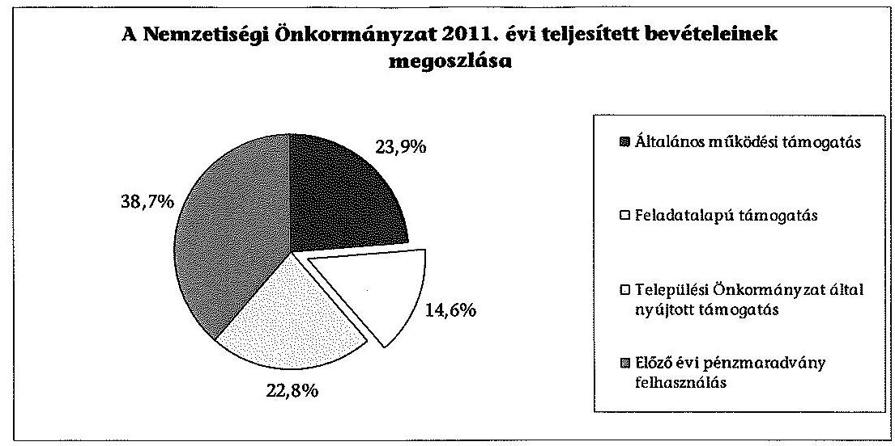
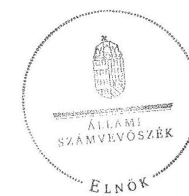

# ÁLLAMI   SZÁMVEVŐSZÉK 

## JELENTÉS

a helyi kisebbségi/nemzetiségi önkormányzatok gazdálkodásának ellenőrzéséről
Rácalmás Város Szerb Nemzetiségi Önkormányzat

---

# Állami Számvevőszék 

Iktatószám: V-0091-015/2013.
Témaszám: 1105
Vizsgálat-azonosító szám: V06060315

## Az ellenőrzést felügyelte:

Horváth Balázs
felügyeleti vezető
Az ellenőrzést vezette és az ellenőrzés végrehajtásáért felelős:
Preller Zsuzsanna
ellenőrzésvezető
A számvevőszéki jelentést készítették és a jelentés összeállításában közremüködtek:
dr. Láng Ágnes Krisztina
számvevő
Liziczai Imréné
számvevő
Az ellenőrzést végezték:

| Bialkó Zsolt Gyula | Kiss Rita Terézia | Bencsik Árpád |
| :-- | :-- | :-- |
| számvevő tanácsos | számvevő tanácsos | számvevő |

---

# TARTALOMJEGYZÉK 

BEVEZETÉS ..... 5
I. ÖSSZEGZŐ MEGÁLLAPÍTÁSOK, KÖVETKEZTETÉSEK, JAVASLATOK ..... 7
II. RÉSZLETES MEGÁLLAPÍTÁSOK ..... 14

1. A Nemzetiségi és a Települési Önkormányzat együttmúködésének szabályszerűsége ..... 14
2. A gazdálkodási feladatok ellátásának szabályszerűsége ..... 15
2.1. A költségvetésre és zárszámadásra, valamint a kincstári adatszolgáltatás rendjére vonatkozó jogszabályi előírások betartása ..... 15
2.2. A Nemzetiségi Önkormányzat gazdálkodásának szabályozottsága ..... 16
2.3. A pénzügyi kontrollok múködése ..... 17
3. A Nemzetiségi Önkormányzattal összefüggő gazdálkodási feladatok belső ellenőrzése ..... 18
4. A 2011. évi feladatalapú támogatás felhasználásának, elszámolásának szabályszerűsége ..... 18
5. A Nemzetiségi Önkormányzat feladatellátása ..... 19

## MELLÉKLET

1. számú A Nemzetiségi Önkormányzat 2011. évi és 2012. I. félévi gazdálkodásának főbb adatai, mutatói

## FÜGGELÉKEK

1. számú Értelmező szótár
2. számú A pénzügyi kontrollok múködésének értékelése

---

.

---

# RÖVIDÍTÉSEK JEGYZÉKE 

## Jogszabályok

Áht. 1
Áht. 2
ÁSZ tv.
Nek. ${ }_{1}$ tv.
Nek. ${ }_{2}$ tv.
Számv. tv.
Áhsz.

Ámr.
Ávr.

Bkr.
támogatási kormányrendelet

Települési Önkormányzat SZMSZ-e

## Szórövidítések

ÁSZ
gazdálkodási jogkörök szabályzata
jegyzö
Képviselő-testület
1992. évi XXXVIII. törvény az államháztartásról (hatályos 2011. december 31-ig)
2011. évi CXCV. törvény az államháztartásról (hatályos 2011. december 31-étől)
2011. évi LXVI. törvény az Állami Számvevőszékről (hatályos 2011. július 1-jétől)
1993. évi LXXVII. törvény a nemzeti és etnikai kisebbségek jogairól (hatályos 2011. december 31-ig)
2011. évi CLXXIX. törvény a nemzetiségek jogairól (hatályos 2011. december 20-tól)
2000. évi C. törvény a számvitelről

249/2000. (XII. 24.) Korm. rendelet az államháztartás szervezetei beszámolási és könyvvezetési kötelezettségének sajátosságairól
292/2009. (XII. 19.) Korm. rendelet az államháztartás múködési rendjéről (hatályos 2011. december 31-ig)
368/2011. (XII. 31.) Korm. rendelet az államháztartásról szóló törvény végrehajtásáról (hatályos 2012. január 1jétől)
370/2011. (XII. 31.) Korm. rendelet a költségvetési szervek belső kontrollrendszeréről és belső ellenőrzésről (hatályos 2012. január 1-jétől)
a kisebbségi önkormányzatoknak a központi költségvetésből, valamint fejezeti kezelésű előirányzatból nyújtott támogatások feltételrendszeréről és elszámolásának rendjéről szóló 342/2010. (XII. 28.) Korm. rendelet (hatályon kívül helyezte a 28/2012. (III. 6.) Korm. rendelet a nemzetiségi célú előirányzatokból nyújtott támogatások feltételrendszeréről és elszámolásának rendjéről; jelenleg hatályos a 428/2012. (XII. 29.) Korm. rendelet a nemzetiségi célú előirányzatokból nyújtott támogatások feltételrendszeréről és elszámolásának rendjéről)
Rácalmás Város Önkormányzata Képviselő-testületének 11/1999. (XI. 17.) számú rendelete a Szervezeti és Müködési Szabályzatról

## Állami Számvevőszék

Rácalmás Város Önkormányzata gazdálkodási szabályzata (hatályos 2011. január 1-jétől és 2012-január 1-jétől) Rácalmás Város Önkormányzatának jegyzője
Rácalmás Város Szerb Kisebbségi Önkormányzatának Képviselő-testülete 2011. december 31-ig, Rácalmás Város Szerb Nemzetiségi Önkormányzatának Képviselőtestülete 2012. január 1-jétől

---

Nemzetiségi Önkormányzat

Nemzetiségi Önkormányzat SZMSZ-e

Nemzetiségi Önkormányzat elnöke
polgármester
Polgármesteri Hivatal

Polgármesteri Hivatal ügyrendje
Támogató
Települési Önkormányzat
Települési Önkormányzat Képviselő-testülete

Rácalmás Város Szerb Kisebbségi Önkormányzata 2011. december 31-ig, Rácalmás Város Szerb Nemzetiségi Önkormányzat 2012. január 1-jétől
Rácalmás Város Szerb Nemzetiségi Önkormányzat Képvi-selő-testületének 20/2012 (V. 8.) számú határozatával módosított 3/2011. III. 9.) számú határozata a Szervezeti és Múködési Szabályzatról
Rácalmás Város Szerb Kisebbségi Önkormányzatának elnöke 2011. december 31-ig, Rácalmás Város Szerb Nemzetiségi Önkormányzatának elnöke 2012. január 1jétől
Rácalmás Város Önkormányzatának polgármestere
Rácalmás Város Önkormányzatának Polgármesteri Hivatala
Rácalmás Város Önkormányzat Képviselő-testület Polgármesteri Hivatalának ügyrendje
A támogatást nyújtó Közigazgatási és Igazságügyi Minisztérium
Rácalmás Város Önkormányzat
Rácalmás Város Önkormányzatának Képviselő-testülete

---

# JELENTÉS 

## a helyi kisebbségi/nemzetiségi önkormányzatok gazdálkodásának ellenőrzéséről Rácalmás Város Szerb Nemzetiségi Önkormányzat

## BEVEZETÉS

Az államháztartás részét, az önkormányzati alrendszer egyik elemét képezik a nemzetiségi önkormányzatok, amelyek jogi személyek és a Nek. ${ }_{1,2}$ tv-ben meghatározott önálló feladat- és hatáskörökkel rendelkeznek. A nemzetiségi önkormányzatok az önkormányzati, illetve testületi múködtetés mellett a helyi nemzetiségi közügyek változatos formában való ellátásában vesznek részt.

A nemzetiségi önkormányzatok, illetve a települési önkormányzatok között a jelenlegi szabályozás szerint nincs alá-fölérendeltségi viszony. A nemzetiségi önkormányzatok azonban sajátos közjogi helyzetben vannak, mert a jogállásukat tekintve önkormányzatok, ám függnek a székhelyük szerinti települési önkormányzat hivatalától, amely ellátja a nemzetiségi önkormányzatok vonatkozásában a megállapodásban rögzített gazdálkodási feladatokat.

A nemzetiségek helyzete, támogatása mind hazai, mind európai uniós szinten kiemelt figyelmet kap napjainkban. A nemzetiségi önkormányzatok gazdálkodására és támogatási rendszerére vonatkozó jogszabályok a 20102012. években jelentős változásokon mentek át, amelyek érintették a feladatalapú támogatásra fordítható költségvetési keret megállapítását, az operatív gazdálkodási jogkörök szabályozását, az elkülönített könyvvezetés alkalmazását, a belső ellenőrzés szabályozását.

Az ellenőrzés célja annak értékelése volt, hogy a Nemzetiségi Önkormányzat gazdálkodási kereteinek kialakítása, gazdálkodása és feladatellátása megfelelte a hatályos jogszabályoknak.

Ennek keretében ellenőriztük, hogy:

- a Nemzetiségi Önkormányzat és a Települési Önkormányzat együttmúködésének szabályozása, a Települési Önkormányzat SZMSZ-ében, a megállapodásban előírt működési feltételek biztosítása megfelelt-e a jogszabályi előírásoknak;
- a felek együttmúködése megfelelt-e a megállapodásnak a gazdálkodási feladatok szabályszerű ellátásában, betartották-e a Nemzetiségi Önkormányzat gazdálkodásához kapcsolódóan a költségvetésre és zárszámadásra, a gazdálkodás szabályozására, az operatív gazdálkodási jogkörök gyakorlására vonatkozó jogszabályi előírásokat;

---

- a jegyző biztosította-e a Polgármesteri Hivatal belső ellenőrzése keretében a Nemzetiségi Önkormányzattal összefüggő gazdálkodási feladatok belső ellenőrzését;
- a 2011. évi feladatalapú támogatás felhasználása, a folyósított feladatalapú támogatással történő elszámolás az előírásoknak megfelelően történt-e;
- a Nemzetiségi Önkormányzat feladatellátása összhangban volt-e a vonatkozó jogszabályi előírásokkal.

Az ellenőrzés típusa: szabályszerűségi ellenőrzés
Az ellenőrzött időszak: a 2011. január 1. - 2012. június 30.
Ellenőrzött szervezet: Rácalmás Város Szerb Nemzetiségi Önkormányzat és a gazdálkodási feladatait ellátó Rácalmás Város Önkormányzat

Az ellenőrzés jogszabályi alapja: az ÁSZ tv. 5. § (2)-(3) és (6) bekezdései
Az ellenőrzés szakmai módszertana az ÁSZ hivatalos honlapján (www.asz.hu) közzétett szakmai szabályokon alapult, amely a Legfőbb Ellenőrző Intézmények Nemzetközi Szervezete (INTOSAI) által kiadott nemzetközi standardok (ISSAI) figyelembevételével készült.

A fogalmak magyarázatát az 1. számú függelék, a pénzügyi kontrollok megfelelősége értékelésénél alkalmazott egységes minősítési szempontokat a 2. számú függelék tartalmazza.

Az ellenőrzés lefolytatásához a Települési Önkormányzat és a Nemzetiségi Önkormányzat tanúsítványok kitöltésével és a kapcsolódó dokumentumok elektronikus megküldésével szolgáltatott adatokat. A tanúsítványokon szerepeltetett adatok, információk ellenőrzése és szükség szerinti javítása a helyszíni ellenőrzés keretében történt.

Az ÁSZ az ellenőrzés megállapításait az ellenőrzött időszakban hatályos, az intézkedést igénylő megállapításokra tett javaslatokat a jelenleg hatályos jogszabályok alapján fogalmazta meg.

A Nemzetiségi Önkormányzat 2010-ben alakult, elnöke a 2010. évi helyhatósági választások óta látja el feladatát. A Nemzetiségi Önkormányzat intézményt, gazdasági társaságot és más szervezetet nem alapított, illetve társulásban nem vett részt. A négytagú Képviselő-testület munkája segítésére bizottságot nem hozott létre. A Nemzetiségi Önkormányzat a költségvetési beszámolója szerint a 2011. évben 878 ezer Ft költségvetési bevételt ért el és 824 ezer Ft költségvetési kiadást teljesített. A 2012. évben 270 ezer Ft eredeti költségvetési bevételi és kiadási előirányzatot terveztek. A 2012. I. félévi beszámolója alapján a költségvetési bevételi és kiadási előirányzatot nem módosították, a teljesített költségvetési bevétel 270 ezer Ft, a teljesített költségvetési kiadás 171 ezer Ft volt. A 2011. évi és 2012. I. féléves gazdálkodási adatokat részletesen az 1. számú mellékletben mutatjuk be. Az ÁSZ a Nemzetiségi Önkormányzat gazdálkodását korábban nem ellenőrizte. Az ÁSZ tv. 29. § (1) bekezdése szerint a jelentéstervezetet megküldtük a polgármester és Nemzetiségi Önkormányzat elnöke részére, akik az ÁSZ tv. 29. § (2) bekezdésében foglalt észrevételezési jogukkal nem éltek, a jelentéstervezetre észrevételt nem tettek.

---

# I. ÖSSZEGZŐ MEGÁLLAPÍTÁSOK, KÖVETKEZTETÉSEK, JAVASLATOK 

A Nemzetiségi és a Települési Önkormányzat együttmüködése az előírt határidőben jóváhagyott megállapodásokon alapult. A Települési Önkormányzat biztosította a Nemzetiségi Önkormányzat múködéséhez szükséges személyi és tárgyi feltételeket. Az együttmúködési megállapodásokban - a 2011. évben az Ámr., a 2012. évben az Áht. ${ }_{2}$ és a Nek. ${ }_{2}$ tv. előírásait maradéktalanul nem érvényesítették. A 2012. június 30 -án hatályos megállapodásban a Nek. ${ }_{2}$ tv előírásai ellenére nem rögzítették, hogy a Nemzetiségi Önkormányzat havonta igény szerint, de legalább tizenhat órában jogosult a feladatai ellátásához a tárgyi, technikai eszközökkel felszerelt helyiség ingyenes használatára. A Nemzetiségi Önkormányzat SZMSZ-ében nem rögzítették a megállapodás szerinti múködési feltételek módosítását. A megállapodásban nem rendelkeztek teljes körűen a költségvetés előkészítésével és megalkotásával, a költségvetési adatszolgáltatással kapcsolatos teendőkről és határidőkről, a teljesítésigazolási feladatok ellátásáért és a múködési feltételek biztosításáért felelős személyek konkrét kijelöléséről. A megállapodás nem tartalmazta a kötelezettségvállalás szabályait, a kötelezettségvállalások nyilvántartásának kötelezettségét sem. A megállapodásban az Áht. ${ }_{2}$ előírása ellenére nem rendelkeztek a Nemzetiségi Önkormányzat bevételeivel és kiadásaival kapcsolatban az ellenőrzési feladatok ellátásáról.

A Nemzetiségi Önkormányzat 2011. és 2012. évi költségvetésének, a 2011. évi zárszámadásának tartalma, jóváhagyása részben felelt meg a jogszabályi előírásoknak. A költségvetési és zárszámadási határozatok egymással összehasonlítható szerkezetben készültek, azok változatlan formában épültek be a Települési Önkormányzat költségvetési és zárszámadási rendeleteibe. A 2011. évi költségvetési és a zárszámadási határozatokat a Képviselő-testület hiányos tartalommal fogadta el, mert azok Ámr. előírásai ellenére nem tartalmazták a tárgyévi költségvetési bevételi és kiadási előirányzatok mérlegszerű bemutatását. A Nemzetiségi Önkormányzat elnöke - az Áht. ${ }_{1}$-ben foglaltakat figyelmen kívül hagyva - a költségvetési előirányzatok módosítását nem szabályszerűen kezdeményezte, nem biztosította a tárgyévi fizetési kötelezettség vállalásához szükséges fedezet meglétét. A 2012. évben a költségvetés előterjesztése során az Áht. ${ }_{2}$ előírása ellenére nem mutatták be a Nemzetiségi Önkormányzat előirányzat felhasználási tervét és költségvetési mérlegét közgazdasági tagolásban, továbbá a határozat-tervezet nem tartalmazta a finanszírozási célú pénzügyi műveletekkel kapcsolatos hatásköröket. A 2012. évben a költségvetési határo-zat-tervezetet a Nemzetiségi Önkormányzat elnöke az Áht. ${ }_{2}$-ben előírt határidőn túl terjesztette a Képviselő-testület elé. A jegyző 2012. I. félévben a Nemzetiségi Önkormányzatra vonatkozó kincstári adatszolgáltatási kötelezettségének határidőben eleget tett.

A gazdálkodás szabályozottsága érdekében, az e feladatok végrehajtását ellátó Polgármesteri Hivatal, a jogszabályokban előírt szabályzatok hatályát részben kiterjesztette a Nemzetiségi Önkormányzat gazdálkodási feladataira, 2012. I. félévben a Bkr.-ben előírt ellenőrzési nyomvonal, szabálytalanságok

---

kezelésének eljárásrendje, kockázatkezelési szabályzat, valamint a folyamatba épített előzetes, utólagos és vezetői ellenőrzés szabályozás hatálya nem terjedt ki a Nemzetiségi Önkormányzatra. A szabályozást az együttmúködési megállapodás sem tartalmazta. A szabályozás során a jogszabályi előírásokat részben érvényesítették, mert az Ámr. és az Ávr. előírásai ellenére a Polgármesteri Hivatal ügyrendje nem tartalmazta a munkakörökhöz kapcsolódóan a Nemzetiségi Önkormányzat gazdálkodásával kapcsolatos feladat- és hatásköröket, a hatáskörök gyakorlásának módját, a helyettesítés rendjét és az ezekre vonatkozó felelősségi szabályokat. Az operatív gazdálkodási jogkörök kialakítása az ellenőrzött időszakban a jogszabályi előírásokkal összhangban történt.

A pénzügyi kontrollok múködése a dologi és egyéb folyó kiadások teljesítésénél a 2011. évben gyenge, 2012. I. félévben kiváló volt. 2011-ben a hibák száma a lényegességi szintet, a kritikus hibahatárt elérte. A 2011. évben a kötelezettségvállalásra az Ámr. előírása ellenére ellenjegyzés nélkül került sor. Az utalványrendelet ellenjegyzése elmaradt, így a kifizetés teljesítése az Áht. ${ }_{1}$-ben foglaltak ellenére történt. 2012. I. félévben a pénzügyi ellenjegyzö, a teljesítésigazoló és az érvényesítő a jogszabályokban és a belső szabályozásban előírt módon teljesítette az ellenőrzési és igazolási feladatokat, ezért a pénzügyi kontrollok múködése biztosította a hibák megelőzését, feltárását és kijavítását.

A Nemzetiségi Önkormányzat a 2011. évben 683 ezer Ft feladatalapá támogatásban részesült, amelyet a tárgyévben a jogszabályi előírásokkal összhangban felhasznált. A támogatási kormányrendeletben hivatkozott, Áht. ${ }_{1}{ }^{-}$ ben előírt elszámolás nem történt meg. A támogatás felhasználását, elszámolását a jogosult szervek nem ellenőrizték.

A Nemzetiségi Önkormányzat feladatellátásának tárgya összhangban volt a Nek. ${ }_{1,2}$ tv. előírásaival. Biztosította a nemzetiségi közügyek keretében az alapvető feladatához szükséges szervezeti, személyi és anyagi feltételeket. Önként vállalt feladatai körében kapcsolatot tartott a nemzetiségi közösség szervezeteivel, nemzetiségi nyelvű kisebbségi oktatást szervezett, hagyományápolással összefüggő feladatokat végzett.

A Polgármesteri Hivatal 2011. és 2012. évi éves ellenőrzési terveit megalapozó kockázatelemzés - a Ber. előírásai ellenére - nem terjedt ki a Nemzetiségi Önkormányzat gazdálkodásával összefüggő végrehajtási feladatok ellátására. A jegyző az ellenőrzött időszakban az Áht. ${ }_{1}$, illetve az Áht. ${ }_{2}$ ellenére nem biztosította a Polgármesteri Hivatal belső ellenőrzése keretében a Nemzetiségi Önkormányzat gazdálkodásával összefüggő végrehajtási feladatok belső ellenőrzését. Erre irányuló ellenőrzést a 2011. évben és 2012. I. félévben nem terveztek és nem végeztek.

Az ÁSZ tv. 33. § (1) bekezdésében foglaltak értelmében az ellenőrzött szervezet vezetője köteles a jelentésben foglalt megállapításokhoz kapcsolódó intézkedési tervet összeállítani, és azt a jelentés kézhezvételétől számított 30 napon belül az ÁSZ részére megküldeni. Amennyiben az intézkedési tervet határidőre nem küldi meg a szervezet, vagy az nem elfogadható, az ÁSZ elnöke az ÁSZ tv. 33. § (3) bekezdés a)-b) pontjaiban foglaltakat érvényesítheti.

---

A helyszíni ellenőrzés megállapításainak hasznosítása mellett javasoljuk:

# a jegyzönek 

1. az együttműködés szabályozásával kapcsolatban

A Nemzetiségi Önkormányzat és a Települési Önkormányzat együttműködését meghatározó - 2012. június 30 -án hatályos - megállapodásban a Nek. 2 tv 80. § (1) bekezdés a) pontjában foglaltak ellenére nem rögzítették, hogy a Nemzetiségi Önkormányzat havonta igény szerint, de legalább tizenhat órában jogosult a feladatai ellátásához a tárgyi, technikai eszközökkel felszerelt helyiség ingyenes használatára. A megállapodásban a Nek. 2 tv. 80. § (3) bekezdés a), c) és d) pontjaiban foglaltak ellenére nem rendelkeztek a költségvetés előkészítésével és megalkotásával, a költségvetési adatszolgáltatással kapcsolatos teendőkről és határidőkről, valamint a teljesítésigazolási feladatok ellátásáért és a múködési feltételek biztosításáért felelős személyek konkrét kijelöléséről, és a kötelezettségvállalás szabályairól, a kötelezettségvállalások nyilvántartásának kötelezettségéről. A megállapodás az Áht. 2 27. § (2) bekezdésében előírtak ellenére nem tartalmazta a Nemzetiségi Önkormányzat bevételeivel és kiadásaival kapcsolatban az ellenőrzési feladatok ellátásának részletes szabályait.

A Nemzetiségi Önkormányzat SZMSZ-ében a Nek. 2 tv. 80. § (2) bekezdése ellenére nem rögzítették a 2012-ben hatályos együttműködési megállapodás szerinti müködési feltételek módosítását.

Javaslat
Az együttműködés szabályszerűsége érdekében készítse elő
a) a megállapodás módosítását, hogy az tartalmilag feleljen meg a Nek. 2 tv. 80. § (1) bekezdés a) pontjában és a (3) bekezdés a), c) és d) pontjaiban, valamint az Áht. 2 27. § (2) bekezdésében foglalt előírásoknak;
b) a Nemzetiségi Önkormányzat SZMSZ-ének kiegészítését a Nek. 2 tv. 80. § (2) bekezdésében foglalt előírás alapján.
2. a költségvetéssel, zárszámadással kapcsolatban

A 2012. évi költségvetési határozat az Áht. 2 23. § (2) bekezdés h) pontja ellenére nem tartalmazta a finanszírozási célú pénzügyi múveletekkel kapcsolatos hatásköröket. A 2012. évben költségvetés előterjesztésekor az Áht. 2 24. § (4) bekezdés a) pont előírása ellenére nem mutatták be tájékoztatásul a Képviselő-testület részére a Nemzetiségi Önkormányzat előirányzat felhasználási tervét, valamint költségvetési mérlegét közgazdasági tagolásban. A 2011. évi zárszámadási határozat az Ámr. 36. § (1) bekezdése i) pont előírása ellenére nem tartalmazta a tárgyévi költségvetési bevételi és kiadási előirányzatok mérlegszerű bemutatását.

---

Javaslat
Gondoskodjon a jövőben az Áht. 2 23. § (2) bekezdés h) pontja, az Áht. 2 24. § (4) bekezdés a) pontjának, valamint az Áht. 2 91. § (2) bekezdés a) pontjának megfelelő költségvetési, illetve zárszámadási határozattervezet előkészítéséról.
3. a kiemelt költségvetési előirányzatokkal kapcsolatban

2011-ben az Áht. 1 12/A. § (1) bekezdésében előírtakat figyelmen kívül hagyva a költségvetés előirányzatai felhasználásához nem szabályszerűen kezdeményezték azok módosítását, nem biztosították a tárgyévi fizetési kötelezettség vállalásához szükséges fedezet meglétét.

Javaslat
A jövőben készítsen előterjesztést az előirányzatok szükséges mértékű módosítására az Áht. 2 34. § (1) és (6) bekezdéseiben foglaltaknak megfelelően úgy, hogy azt a Nemzetiségi Önkormányzat elnöke határidőben nyújthassa be a Képviselő-testület részére - az Áht. 2 36. § (1) bekezdés szerint - a meghatározott előirányzatokon belül való gazdálkodás érvényesülése érdekében.
4. a gazdálkodási feladatok szabályozottságával kapcsolatban

A Polgármesteri Hivatal ügyrendje az Ávr. 13. § (1) bekezdés g) pontja ellenére nem tartalmazta nevesített munkakörökhöz tartozóan a Nemzetiségi Önkormányzat gazdálkodásával kapcsolatos feladat- és hatásköröket, a hatáskörök gyakorlásának módját, a helyettesítés rendjét és az ezekre vonatkozó felelősségi szabályokat. 2012. I. félévében a jegyző a Polgármesteri Hivatal szabályzatai közül a Bkr. 6. § (3)-(4), 7. § (1) és a 8. § (2)-(4) bekezdéseiben előírt ellenőrzési nyomvonal, szabálytalanságok kezelésének eljárásrendje, kockázatkezelési szabályzat, valamint a folyamatba épített előzetes, utólagos és vezetői ellenőrzés szabályozás hatályát nem terjesztette ki a Nemzetiségi Önkormányzat gazdálkodási feladataira.

Javaslat
A gazdálkodási feladatok szabályozottsága érdekében:
a) készítse elő a Polgármesteri Hivatal ügyrendje módosítását, hogy az feleljen meg az Ávr. 13. § (1) bekezdés g) pontjában foglalt előírásnak;
b) terjessze ki - az Ávr. 13. § (3a) bekezdésben foglalt felhatalmazása alapján - a Polgármesteri Hivatal ellenőrzési nyomvonalának, a szabálytalanságok kezelése eljárásrendjének, a kockázatkezelési szabályzatnak, valamint a folyamatba épített előzetes, utólagos és vezetői ellenőrzés szabályzatnak hatályát a Bkr. 6. § (3)-(4), 7. § (1) és a 8. § (2)-(4) bekezdéseiben foglaltaknak megfelelően a Nemzetiségi Önkormányzat gazdálkodási feladataira.
5. a feladatalapú támogatás elszámolásával kapcsolatban

A 2011. évben folyósított feladatalapú támogatás elszámolása a támogatási kormányrendelet 7. § (2) bekezdésében hivatkozott Áht.,-nek „a helyi önkormányzatok

---

elszámolási rendjére vonatkozó rendelkezései alkalmazása" előirása ellenére nem történt meg.

Javaslat
Gondoskodjon az Áht. 2 27. § (2) bekezdésben meghatározott feladatkörében a Nemzetiségi Önkormányzat által igénybe vett feladatalapú támogatás elszámolásának elkészítéséról, figyelemmel az Áht. 2 57. § (4) bekezdésben foglaltakra.

# a polgármesternek 

1. A Nemzetiségi Önkormányzat és a Települési Önkormányzat együttmúködését meghatározó - 2012. június 30 -án hatályos - megállapodásban a Nek. 2 tv 80. § (1) bekezdés a) pontjában foglaltak ellenére nem rögzítették, hogy a Nemzetiségi Önkormányzat havonta igény szerint, de legalább tizenhat órában jogosult a feladatai ellátásához a tárgyi, technikai eszközökkel felszerelt helyiség ingyenes használatára. A megállapodásban a Nek. 2 tv. 80. § (3) bekezdés a), c) és d) pontjaiban foglaltak ellenére nem rendelkeztek a költségvetés előkészítésével és megalkotásával, a költségvetési adatszolgáltatással kapcsolatos teendőkről és határidőkről, valamint a teljesítésigazolási feladatok ellátásáért és a múködési feltételek biztosításáért felelős személyek konkrét kijelöléséről, és a kötelezettségvállalás szabályairól, a kötelezettségvállalások nyilvántartásának kötelezettségéről. A megállapodás az Áht. 2 27. § (2) bekezdésében előírtak ellenére nem tartalmazta a Nemzetiségi Önkormányzat bevételeivel és kiadásaival kapcsolatban az ellenőrzési feladatok ellátásának részletes szabályait.

Javaslat
Terjessze a Települési Önkormányzat Képviselö-testülete elé jóváhagyásra a Nek. 2 tv. 80. § (1) bekezdés a) pontjában, a 80. § (3) bekezdés a), c) és d) pontjaiban foglalt, valamint az Áht. 2 27. § (2) bekezdésében elöírások betartásával előkészített megállapodás módosítást.
2. A Polgármesteri Hivatal ügyrendje az Ávr. 13. § (1) bekezdés g) pontja ellenére nem tartalmazta nevesített munkakörökhöz tartozóan a Nemzetiségi Önkormányzat gazdálkodásával kapcsolatos feladat- és hatásköröket, a hatáskörök gyakorlásának módját, a helyettesítés rendjét és az ezekre vonatkozó felelősségi szabályokat.

Javaslat
Terjessze a Települési Önkormányzat Képviselő-testülete elé jóváhagyásra az Ávr. 13. § (1) bekezdés g) pontjában foglalt szabályozásra figyelemmel módosított Polgármesteri Hivatal ügyrendjét.

## a Nemzetiségi Önkormányzat elnökének

1. A Nemzetiségi Önkormányzat és a Települési Önkormányzat együttmüködését meghatározó - 2012. június 30 -án hatályos - megállapodásban a Nek. 2 tv. 80. § (1) bekezdés a) pontjában foglaltak ellenére nem rögzítették, hogy a Nemzetiségi Önkormányzat havonta igény szerint, de legalább tizenhat órában jogosult a feladatai

---

ellátásához a tárgyi, technikai eszközökkel felszerelt helyiség ingyenes használatára. A megállapodásban a Nek. ${ }_{2}$ tv. 80. § (3) bekezdés a), c) és d) pontjaiban foglaltak ellenére nem rendelkeztek a költségvetés előkészítésével és megalkotásával, a költségvetési adatszolgáltatással kapcsolatos teendőkről és határidőkről, valamint a teljesítésigazolási feladatok ellátásáért és a múködési feltételek biztosításáért felelős személyek konkrét kijelöléséről, és a kötelezettségvállalás szabályairól, a kötelezettségvállalások nyilvántartásának kötelezettségéről. A megállapodás az Áht. ${ }_{2}$ 27. § (2) bekezdésében előírtak ellenére nem tartalmazta a Nemzetiségi Önkormányzat bevételeivel és kiadásaival kapcsolatban az ellenőrzési feladatok ellátásának részletes szabályait.

Javaslat
Terjessze a Képviselő-testület elé jóváhagyásra a Nek. ${ }_{2}$ tv. 80. § (1) bekezdés a) pontjában, a 80. § (3) bekezdés a), c) és d) pontjaiban foglalt, valamint az Áht. ${ }_{2} 27 . \S$ (2) bekezdésében előírások betartásával előkészített megállapodás módosítást.
2. A Nemzetiségi Önkormányzat SZMSZ-ében a Nek. ${ }_{2}$ tv. 80. § (2) bekezdése ellenére nem rögzítették a 2012-ben hatályos együttműködési megállapodás szerinti müködési feltételek módosítását.

Javaslat
Terjessze a Képviselő-testület elé jóváhagyásra a Nemzetiségi Önkormányzat SZMSZ-ének kiegészítését, a Nek. ${ }_{2}$ tv. 80. § (2) bekezdésében foglalt előírás alapján.
3. A Nemzetiségi Önkormányzat elnöke a 2012. évi költségvetés tervezetét az Áht. ${ }_{2}$ 24. § (2) bekezdésében foglalt határidőn túl nyújtotta be a Képviselőtestületnek elfogadásra.

Javaslat
A jövőben az Áht. ${ }_{2}$ 24. § (2) bekezdésében foglalt határidő betartásával nyújtsa be a jegyző által előkészített költségvetési határozat tervezetet a Képviselő-testületnek.
4. A 2012. évi költségvetési határozat az Áht. ${ }_{2}$ 23. § (2) bekezdés h) pontja ellenére nem tartalmazta a finanszírozási célú pénzügyi múveletekkel kapcsolatos hatásköröket. A 2012. évben költségvetés előterjesztésekor az Áht. ${ }_{2}$ 24. § (4) bekezdés a) pont előírása ellenére nem mutatták be tájékoztatásul a Képviselő-testület részére a Nemzetiségi Önkormányzat előirányzat felhasználási tervét, valamint költségvetési mérlegét közgazdasági tagolásban. A 2011. évi zárszámadási határozat az Ámr. 36. § (1) bekezdése i) pont előírása ellenére nem tartalmazta a tárgyévi költségvetési bevételi és kiadási előirányzatok mérlegszerű bemutatását.

Javaslat
A jövőben terjessze a Képviselő-testület elé jóváhagyásra a Nemzetiségi Önkormányzat Áht. ${ }_{2}$ 23. § (2) bekezdés h) pontjának, az Áht. ${ }_{2}$ 24. § (4) bekezdés a) pontjának, valamint az Áht. ${ }_{2}$ 91. § (2) bekezdés a) pontjának megfelelő költségvetési, illetve zárszámadási határozat tervezetét.

---

5. 2011-ben az Áht. 1 12/A. § (1) bekezdésében előírtakat figyelmen kívül hagyva a költségvetés előirányzatai felhasználásához nem szabályszerűen kezdeményezték azok módosítását, nem biztosították a tárgyévi fizetési kötelezettség vállalásához szükséges fedezet meglétét.

Javaslat
A jövőben terjessze a Képviselő-testület elé jóváhagyásra az Áht. 2 34. § (1) és (6) bekezdéseinek megfelelően, az előirányzatok szükséges mértékű módosításáról szóló előterjesztést.

A 2011. évben folyósított feladatalapú támogatás elszámolása a támogatási kormányrendelet 7. § (2) bekezdésében hivatkozott Áht. ${ }_{1}$-nek „a helyi önkormányzatok elszámolási rendjére vonatkozó rendelkezései alkalmazása" előirása ellenére nem történt meg.

Javaslat
Terjessze a Képviselő-testület elé jóváhagyásra az Áht. 2 57. § (4) bekezdés alapján készített elszámolást a Nemzetiségi Önkormányzat által igénybe vett feladatalapú támogatásról.

---

# II. RÉSZLETES MEGÁLLAPÍTÁSOK 

## 1. A Nemzetiségi és a Telepúlési Önkormányzat együttmúKÖDÉSÉNEK SZABÁLYSZERŰSÉGE

A Nemzetiségi és a Települési Önkormányzat között létrejött együttmüködési megállapodások ${ }^{1}$ részben feleltek meg a jogszabályi előírásoknak. mert:

- az Ámr. 37. § (5) bekezdésében előírtakat figyelmen kívül hagyva a Nemzetiségi Önkormányzat és a Települési Önkormányzat között létrejött 2011. december 31 -én hatályos együttműködési megállapodást nem az előírt határidőn belül kötötték meg;
- a 2011. december 31-én hatályos megállapodás nem tartalmazta az Ámr. 37. § (4) a)-b) és d)-f) pontjai előírásai ellenére a költségvetési koncepcióval, a költségvetési határozattal és a költségvetési rendelettel kapcsolatos feladatokat, a munkamegosztást és a határidőket;
- a Nek. 2 tv. 80. § (1) bekezdés a) pontjában foglaltak ellenére az együttmúködési megállapodásban nem rögzítették, hogy a Nemzetiségi Önkormányzat havonta igény szerint, de legalább tizenhat órában jogosult a feladatai ellátásához a tárgyi, technikai eszközökkel felszerelt helyiség ingyenes használatára;
- a Nek. 2 tv. 80. § (2) bekezdése ellenére a Nemzetiségi Önkormányzat SZMSZében nem rögzítették a megállapodás szerinti müködési feltételek módosítását²;
- a 2012. június 30 -án hatályos együttműködési megállapodás a Nek. 2 tv. 80. § (3) bekezdés a), c) és d) pontjaiban foglaltak ellenére nem tartalmazta teljes körűen a költségvetés előkészítésével, megalkotásával, és a költségvetési adatszolgáltatással kapcsolatos teendőket és határidőket, valamint a teljesítésigazolási feladatok ellátásáért és a működési feltételek biztosításáért felelős személyek konkrét kijelölését. A megállapodásban nem rendelkeztek kötelezettségvállalás szabályairól és a kötelezettségvállalások nyilvántartási kötelezettségéről;

[^0]
[^0]:    ${ }^{1}$ A 2011. évben és 2012. június 1-jéig hatályos együttmúködési megállapodást a Települési Önkormányzat Képviselő-testülete a 28/2011. (II. 15.) számú, a Képviselő-testület a 4/2011. (III. 09.) számú határozattal fogadta el. A Nek. ${ }_{2}$ tv. 159. § (3) bekezdésében előírtak alapján 2012. június 1-jéig felülvizsgált és módosított együttmúködési megállapodást a Települési Önkormányzat Képviselő-testülete a 173/2012. (V. 22.) számú, a Képviselő-testület a 20/2012. (V. 08.) számú határozattal fogadta el.
    ${ }^{2}$ A 2012-ben hatályos együttmúködési megállapodásban a korábbi hatályos szabályozáshoz képest módosították a költségvetés készítésének és elfogadásának rendjét, a beszámolási kötelezettség teljesítésének rendjét, a Nemzetiségi Önkormányzat számláinak a meghatározását, a vagyoni és számviteli nyilvántartás rendjét, valamint az egyéb rendelkezéseket.

---

- az Áht. 2 27. § (2) bekezdésében előírtak ellenére a 2012. június 30 -án hatályos megállapodásban nem rendelkeztek a Nemzetiségi Önkormányzat bevételeivel és kiadásaival kapcsolatban az ellenőrzési feladatok ellátásának részletes szabályairól.

A Települési Önkormányzat - a megállapodások hiányosságai ellenére biztosította a Nemzetiségi Önkormányzat müködéséhez szükséges személyi és tárgyi feltételeket.

# 2. A GAZDÁlKODÁSI FELADATOK ELLÁTÁSÁNAK SZABÁLYSZERŰSÉGE 

### 2.1. A költségvetésre és zárszámadásra, valamint a kincstári adatszolgáltatás rendjére vonatkozó jogszabályi előírások betartása

A Nemzetiségi Önkormányzat költségvetésére és zárszámadására vonatkozó jogszabályi előírásokat részben tartották be. A költségvetési és zárszámadási határozatok egymással összehasonlítható szerkezetben készültek, azok változatlan formában épültek be a Települési Önkormányzat költségvetési és zárszámadási rendeleteibe, 2012. I. félévben az előirányzat felhasználása szabályszerűen történt.

A Képviselő-testület a 2011-2012. évi költségvetési, illetve a 2011. évi zárszámadási határozatait hiányos tartalommal fogadta el, mert:

- a 2011. évi költségvetési ${ }^{3}$ és a zárszámadási ${ }^{4}$ határozatai az Ámr. 36. § (1) bekezdése i) pont előírása ellenére nem tartalmazták a tárgyévi költségvetési bevételi és kiadási előirányzatok mérlegszerű bemutatását;
- az Ámr. 36. § (1) bekezdés k) pontjában foglaltakat figyelmen kívül hagyva a Nemzetiségi Önkormányzat 2011. évi várható bevételi és kiadási előirányzatainak teljesüléséről előirányzat-felhasználási ütemterv nem készült;
- a Nemzetiségi Önkormányzat elnöke 2011-ben az Áht. ${ }_{1}$ 12/A. § (1) bekezdésében előírtakat figyelmen kívül hagyva a költségvetés előirányzatai felhasználásához nem szabályszerűen kezdeményezte azok módosítását, nem biztosította a tárgyévi fizetési kötelezettség vállalásához szükséges fedezet meglétét;
- a Nemzetiségi Önkormányzat elnöke a 2012. évi költségvetésének tervezetét az Áht. 2 24. § (2) bekezdésében foglalt határidőn túl ${ }^{5}$ nyújtotta be a Képvise-lő-testületnek elfogadásra;

[^0]
[^0]:    ${ }^{3}$ A Képviselő-testület 2/2011. (II. 02.) számú határozata a Nemzetiségi Önkormányzat 2011. évi költségvetéséről.
    ${ }^{4}$ A Képviselő-testület 11/2012. (II. 20.) számú határozata a Nemzetiségi Önkormányzat 2011. évi zárszámadásáról.
    ${ }^{5}$ Az Áht. 2 24. § (2) bekezdése alapján a költségvetési határozat-tervezet Képviselőtestület részére történő benyújtására előírt határidő 2012. február 11-e volt, a költségvetési határozat-tervezetet azonban, 2012. február 22-én nyújtotta be az elnök.

---

- a 2012. évi költségvetési határozatban ${ }^{6}$ az Áht. ${ }_{2}$ 23. § (2) bekezdés h) pontjában foglalt előírás ellenére nem rendelkeztek a finanszírozási célú pénzügyi műveletekkel kapcsolatos hatáskörökröl;
- a 2012. évben költségvetés előterjesztésekor az Áht. 2 24. § (4) bekezdés a) pontja előirása ellenére nem mutatták be tájékoztatásul a Nemzetiségi Önkormányzat előirányzat felhasználási tervét, valamint költségvetési mérlegét közgazdasági tagolásban.

A 2012. évi költségvetéshez kapcsolódó, a Nemzetiségi Önkormányzatra vonatkozó kincstári adatszolgáltatási kötelezettségének a jegyző határidőben eleget tett.

# 2.2. A Nemzetiségi Önkormányzat gazdálkodásának szabályozottsága 

A Nemzetiségi Önkormányzat gazdálkodásának szabályozása az ellenőrzött időszakban részben felelt meg a jogszabályi előirásoknak. A gazdálkodási feladatai végrehajtását ellátó Polgármesteri Hivatal a jogszabályokban előírt gazdálkodási szabályzatokkal ${ }^{7}$ rendelkezett, azok hatálya kiterjedt a Nemzetiségi Önkormányzat gazdálkodási feladataira, a szabályozás során azonban a jogszabályi előírásokat maradéktalanul nem érvényesítették, mert:

- a Polgármesteri Hivatal ügyrendje a 2011. évben az Ámr. 20. § (2) bekezdés h) pontjában, 2012. I. félévben az Ávr. 13. § (1) bekezdés g) pontjában foglaltak ellenére nem tartalmazta a Nemzetiségi Önkormányzat gazdálkodásával kapcsolatos feladat- és hatásköröket, a hatáskörök gyakorlásának módját, a helyettesítés rendjét és az ezekre vonatkozó felelősségi szabályokat;
- a 2012. I. félévben a jegyző a Polgármesteri Hivatal szabályzatai közül a Bkr. 6. § (3)-(4), 7. § (1) és a 8. § (2)-(4) bekezdéseiben előírt ellenőrzési nyomvonal, szabálytalanságok kezelésének eljárásrendje, kockázatkezelési szabályzat, valamint a folyamatba épített előzetes, utólagos és vezetői ellenőrzés szabályozás hatályát nem terjesztette ki a Nemzetiségi Önkormányzatra. A szabályozást az együttmúködési megállapodás sem tartalmazta.

A Nemzetiségi Önkormányzat operatív gazdálkodási jogköreinek kialakítása - a kötelezettségvállalásra, az utalványozásra, a kötelezettségvállalás és utalványozás ellenjegyzésére a felhatalmazások, a szakmai teljesítést igazoló, a pénzügyi ellenjegyzést és az érvényesítést végző személyek kijelölése - az ellenőrzött időszakban megfelelt a jogszabályi előírásoknak. Az operatív gazdálkodással kapcsolatos feladat- és hatásköröket az együttmúködési megál-

[^0]
[^0]:    ${ }^{6}$ A Képviselő-testület 9/2012. (II. 20.) számú határozata a Nemzetiségi Önkormányzat 2012. évi költségvetéséről.
    ${ }^{7}$ Számviteli politika, leltározási és leltárkészítési szabályzat, pénzkezelési szabályzat, eszközök és források értékelési szabályzata, kockázatkezelési szabályzat számlarend.

---

lapodás ${ }^{8}$, a gazdálkodási jogkörök szabályzata, az egyedi kijelölések és a feladatokat ellátó köztisztviselők munkaköri leírásai tartalmazták.

# 2.3. A pénzügyi kontrollok múködése 

A Nemzetiségi Önkormányzat az ellenőrzött időszakban szociálpolitikai ellátásokra, valamint múködési és felhalmozási célú pénzeszközátadásra nem teljesített kiadást.

A Nemzetiségi Önkormányzat 2011. évi dologi és egyéb folyó kiadásainak teljesítése során a kötelezettségvállalás ellenjegyzése, a szakmai teljesítésigazolás, az utalvány ellenjegyzése kontrollok múködésének megfelelősége - a 2. számú függelékben részletezett szempontok alapján végzett értékelés szerint - gyenge volt, a hibák száma a lényegességi szintet, a kritikus hibahatárt elérte, mert:

- az Ámr. 74. § (1) bekezdésében előírtak ellenére a kötelezettségvállalásra ${ }^{9}$ ellenjegyzés nélkül került sor, ezért az Ámr. 74. § (3) bekezdésének a)-c) pontjaiban foglaltak ellenére a kifizetést megelőzően nem történt meg a szabad előirányzat, a kifizetés időpontjában a fedezet rendelkezésre állásának igazolása, valamint a gazdálkodásra vonatkozó szabályok betartásának ellenőrzése;
- az utalványrendelet ellenjegyzése az Ámr. 79. § (1) bekezdése ellenére elmaradt ${ }^{10}$, így a kifizetés teljesítése az Áht., 100/C. § (6) bekezdésében foglaltak ellenére történt.

A szakmai teljesítésigazolás szabályszerűen történt, az arra kijelölt személy ellenőrizte a kiadások teljesítésének jogosságát, összegszerűségét, a megrendelések, szerződések teljesítését.

A Nemzetiségi Önkormányzatnál a 2012. I. félévben a dologi és egyéb folyó kiadások teljesítése során a pénzügyi ellenjegyzés, a teljesítés igazolás és az érvényesítés kontrollok müködésének megfelelősége - a 2. számú függelékben részletezett szempontok alapján végzett értékelés szerint - kiváló volt, mert:

- a pénzügyi ellenjegyző meggyőződött a szabad előirányzat, valamint a kifizetés tervezett időpontjában a pénzügyi fedezet rendelkezésre állásáról, továbbá arról, hogy a kötelezettségvállalás során a gazdálkodásra vonatkozó szabályokat betartották-e;

[^0]
[^0]:    ${ }^{8}$ Az együttműködési megállapodás a szakmai teljesítésigazolás szabályait nem tartalmazta
    ${ }^{9}$ Valamennyi kifizetéshez készült írásos kötelezettségvállalási dokumentum, annak ellenére, hogy a kifizetések összege nem érte el 100 ezer Ft-ot.
    ${ }^{10}$ A 2012. január 1-jétől hatályos szabályozás az utalvány ellenjegyzés kontrolltevékenységet megszüntette, az Áht. 2 38. § (1) bekezdés értelmében kifizetés elrendelésére (utalványozásra) a teljesítés igazolását és az ennek alapján végrehajtott érvényesítést követően kerülhet sor.

---

- a teljesítés igazolását az arra kijelölt személy végezte el, a kiadások teljesítésének jogosságát, összegszerűségét, a megrendelések, szerződések teljesítését az Ávr.-ben és a belső szabályozásban foglalt előírásoknak megfelelően ellenőrizte és igazolta;
- a jogszerú kijelöléssel rendelkező érvényesítő a feladatait az Ávr. és a belső szabályozás előírásainak megfelelően végezte el.

A számvevőszéki ellenőrzés a kifizetések dokumentumainak ellenőrzése alapján nem tárt fel jogosulatlan kifizetést.

# 3. A Nemzetiségi Önkormányzattal ÖsszefüGGŐ GAZDÁlKODÁSI FELADATOK BELSŐ ELLENŐRZÉSE 

A jegyző az ellenőrzött időszakban az Áht. ${ }_{1}$ 121/B. § (4) bekezdése, illetve az Áht. ${ }_{2}$ 70.§ (1) bekezdése előírása ellenére nem biztosította a Polgármesteri Hivatal belsö ellenőrzése keretében a Nemzetiségi Önkormányzat gazdálkodásával összefüggő végrehajtási feladatok belsö ellenőrzését. A Polgármesteri Hivatal 2011. és 2012. évi belső ellenőrzési terveit megalapozó kockázatelemzés a Ber. 21. § (2) bekezdése ${ }^{11}$ ellenére nem terjedt ki a Nemzetiségi Önkormányzat gazdálkodásával összefüggő végrehajtási feladatok ellátására, erre vonatkozóan belső ellenőrzést a 2011. évben és 2012. I. félévben nem terveztek és nem végeztek.

## 4. A 2011. ÉVI FELADATALAPÚ TÁMOGATÁS FELHASZNÁLÁSÁNAK, ELSZÁMOLÁSÁNAK SZABÁLYSZERŰSÉGE

A Nemzetiségi Önkormányzat a 2011. évben 128 ezer Ft feladatalapú támogatásban részesült, amelynek az összes bevételhez viszonyított részarányát a következő ábra szemlélteti:

[^0]
[^0]:    ${ }^{11}$ 2012. január 1-jétől Bkr. 7. § (2) bekezdése írja elő

---

A 2011. évben folyósított támogatást a jogszabályi előírásokkal összhangban a tárgyévben felhasználták. Elszámolása a támogatási kormányrendelet 7. § (2) bekezdésében hivatkozott Áht. ${ }_{1}$-nek „a helyi önkormányzatok elszámolási rendjére vonatkozó rendelkezései alkalmazása" előírása ellenére nem történt meg. A támogatás felhasználását, elszámolását az ellenőrzésre jogosult szervek nem ellenőrizték.

# 5. A Nemzetiségi Önkormányzat feladATELLátása 

A Nemzetiségi Önkormányzat feladatellátásának tárgya összhangban volt a Nek. ${ }_{1,2}$ tv. előírásaival. A Nemzetiségi Önkormányzat az ellenőrzött időszakban hatósági tevékenységet nem végzett, közüzemi szolgáltatással összefüggő feladatot nem látott el.

A Nemzetiségi Önkormányzat a Nek. ${ }_{1}$ tv. 5/A. § (1) bekezdése és a Nek. ${ }_{2}$ tv. 10. § (1) bekezdése szerinti, a nemzetiségi érdekek védelmével és képviseletével kapcsolatos alapvető feladata ellátásához biztosította a szükséges szervezeti, személyi és anyagi feltételeket. Önként vállalt feladatai körében a Nek. ${ }_{1}$ tv. 30/A. § (4) bekezdésében, valamint a Nek. ${ }_{2}$ tv. 115. § f.) pontja alapján a nemzetiségi nyelvű kisebbségi oktatást és nevelést szervezte, valamint 116. § (2) bekezdése alapján a képviselt közösség kulturális autonómiája megerősítése érdekében hagyományápolással kapcsolatos feladatokat látott el.

Budapest, 2013.
12. hónap 10. nap

Domokos László
elnök. $\&$

Melléklet: $\quad 1 \mathrm{db}$
Függelék: $\quad 2 \mathrm{db}$

---

.

---

# A Nemzetiségi Önkormányzat 2011. évi és 2012. I. félévi gazdálkodásának főbb adatai, mutatói 

A) BEVÉTELEK

| Megnevezés | 2011. év |  |  |  | 2012. év |  | 2012. I. félé |  |
| :--: | :--: | :--: | :--: | :--: | :--: | :--: | :--: | :--: |
|  | eredeti el. | módosított   el. | teljesítés   megozzlása   (\%) |  | eredeti el. | módosított   el. | teljesítés | teljesítés   megozzlása   (\%) |
| Istézményi müködési bevétele | 0,0 | 0,0 | 0,0 | $0,0 \%$ | 0,0 | 0,0 | 0,0 | $0,0 \%$ |
| Általános müködési   támogatás | 200,0 | 210,0 | 210,0 | $23,9 \%$ | 215,0 | 215,0 | 215,0 | $79,6 \%$ |
| Feladatniapú támogatás | 0,0 | 128,0 | 128,0 | $14,6 \%$ | 0,0 | 0,0 | 0,0 | $0,0 \%$ |
| Települési Önkormányzat   által nyújtott támogatás | 0,0 | 200,0 | 200,0 | $11,8 \%$ | 0,0 | 0,0 | 0,0 | $0,0 \%$ |
| Pénzhogalmi bevételek   összesen | 200,0 | 538,0 | 538,0 | $61,3 \%$ | 215,0 | 215,0 | 215,0 | $79,6 \%$ |
| Gázó évi pénzmozoóvány   felhasználás | 0,0 | 340,0 | 340,0 | $38,7 \%$ | 55,0 | 55,0 | 55,0 | $20,4 \%$ |
| Bevételek | 200,0 | 878,0 | 878,0 | 100,0\% | 270,0 | 270,0 | 270,0 | 100,0\% |

B) KIADASOK

| Megnevezés | 2011. év |  |  |  | 2012. év |  | 2012. I. félé |  |
| :--: | :--: | :--: | :--: | :--: | :--: | :--: | :--: | :--: |
|  | eredeti el. | módosított   el. | teljesítés   megozzlása   (\%) |  | eredeti el. | módosított   el. | teljesítés | teljesítés   megozzlása   (\%) |
| Személyi juttatások | 0,0 | 0,0 | 0,0 | $0,0 \%$ | 0,0 | 0,0 | 0,0 | $0,0 \%$ |
| Munkuadókat terhelő   alratékok | 0,0 | 0,0 | 0,0 | $0,0 \%$ | 0,0 | 0,0 | 0,0 | $0,0 \%$ |
| Üldugi és egyéb folyó   kiadások | 200,0 | 549,0 | 494,0 | $60,0 \%$ | 260,0 | 260,0 | 171,0 | $100,0 \%$ |
| Támogadásértékủ müködési   kiadás | 0,0 | 0,0 | 0,0 | $0,0 \%$ | 0,0 | 0,0 | 0,0 | $0,0 \%$ |
| Tartalék | 0,0 | 0,0 | 0,0 | $0,0 \%$ | 10,0 | 10,0 | 0,0 | $0,0 \%$ |
| Müködési kiadások összesen | 200,0 | 549,0 | 494,0 | $60,0 \%$ | 270,0 | 270,0 | 171,0 | $100,0 \%$ |
| Felhalmozási kiadások | 0,0 | 329,0 | 329,0 | $40,0 \%$ | 0,0 | 0,0 | 0,0 | $0,0 \%$ |
| Kiadások összesen | 200,0 | 878,0 | 823,0 | 100,0\% | 270,0 | 270,0 | 171,0 | 100,0\% |

---

.

---

# ÉRTELMEZŐ SZÓTÁR 

feladatalapú támogatás

megállapodás
nemzetiség
nemzetiségi közügy

A támogatási évben általános múködési támogatásban részesült, és a Támogatónak a Kincstárhoz intézett, a feladatalapú támogatás utalására vonatkozó rendelkező levele keltének időpontjában múködő nemzetiségi önkormányzatoknak a támogatási kormányrendeletben rögzített feltételrendszer alapján nyújtható támogatás. A feladatalapú támogatás a nemzetiségi közügyeknek a nemzetiségi önkormányzatok által történő ellátását szolgálja. (A támogatási kormányrendelet 2. § (2) bekezdés c) pont, és 4. § (1) bekezdés alapján.)
A nemzetiségi önkormányzatnak a múködési feltételei biztosítására, továbbá a bevételeivel és a kiadásaival kapcsolatban a tervezési, gazdálkodási, ellenőrzési, finanszírozási, adatszolgáltatási és beszámolási feladatai végrehajtására a székhelye szerinti települési önkormányzattal megkötött megállapodás. (Az Áht. 66. §, a Nek. 2 tv. 80 § (2) bekezdés, valamint az Áht. 2 27. § (2) bekezdés alapján levezetett fogalom.)
Minden olyan Magyarország területén legalább egy évszázada honos népcsoport, amely az állam lakossága körében számszerú kisebbségben van és a lakosság többi részétől saját nyelve és kultúrája, hagyományai különböztetik meg, egyben olyan összetartozás-tudatról tesz bizonyságot, amely mindezek megőrzésére, történelmileg kialakult közösségeik érdekeinek kifejezésére és védelmére irányul. (A Nek. 1 tv. 1. § (2) bekezdése, valamint a Nek. 2 tv. 1. § (1) bekezdése alapján levezetett fogalom.)
Az egyéni és közösségi jogok érvényesülése, a nemzetiséghez tartozók érdekeinek kifejezésre juttatása - különösen az anyanyelv ápolása, őrzése és gyarapítása, továbbá a nemzetiségek kulturális autonómiájának a nemzetiségi önkormányzatok által történő megvalósítása és megőrzése - érdekében a nemzetiséghez tartozók meghatározott közszolgáltatásokkal való ellátásával, ezen ügyek önálló vitelével és az ehhez szükséges szervezeti, személyi és anyagi feltételek megteremtésével összefüggő ügy. A közhatalmat gyakorló állami és helyi önkormányzati szervekben, továbbá a nemzetiségi önkormányzati szervekben való nemzetiségi képviselethez és mindezek szervezeti, személyi és anyagi feltételeinek biztosításához kapcsolódó ügy. (A Nek. 1 tv. 6/A. § 1. pontjából és a Nek. 2 tv. 2. § 1. pontjából levezetett fogalom.)

---

nemzetiségi önkormányzat
pénzügyi kontrollok

Törvényben meghatározott nemzetiségi közszolgáltatási feladatokat ellátó, testületi formában múködő, jogi személyiséggel rendelkező, demokratikus választások útján törvény alapján létrehozott szervezet, amely a nemzetiségi közösséget megillető jogosultságok érvényesítésére, a nemzetiségek érdekeinek védelmére és képviseletére, a feladat- és hatáskörébe tartozó nemzetiségi közügyek települési, területi vagy országos szinten történő önálló intézésére jön létre. (A Nek. ${ }_{1}$ tv. 6/A. § (1) bekezdés 2. pontjából, valamint a Nek. ${ }_{2}$ tv. 2. § 2. pontjából levezetett fogalom.) A jelentésben e fogalmat a települési nemzetiségi önkormányzatokra leszúkítve használjuk.
a kötelezettségvállalás és az utalvány ellenjegyzése, valamint a szakmai teljesítés igazolása 2011. december 31éig, 2012. január 1-jétől a pénzügyi ellenjegyzés, a teljesítés igazolása és az érvényesítés.

---

# A PÉNZÜGYI KONTROLLOK MŰKÖDÉSÉNEK ÉRTÉKELÉSE 

A pénzügyi kontrollok múködése megfelelőségének vizsgálatát többlépcsős megfelelőségi tesztek útján, megismételt eljárással, a könyvviteli tételekből vett egyszerú véletlen minta alapján végeztük. A tesztelést az értékelésre kiválasztott három terület - a dologi és egyéb folyó kiadásoknál teljesített kifizetések, az államháztartáson belülre és kívülre, múködési és felhalmozási célra teljesített pénzeszközátadások, illetve a szociálpolitikai ellátások teljesített kiadásainál végeztük el.

Az ellenőrzés során alkalmazott módszer (többlépcsős megfelelőségi teszt) lényege, hogy a kiválasztott minta ellenőrzését csak addig végezzük, amíg elegendő és megfelelő bizonyítékot nem szerzünk a vizsgált pénzügyi kontroll múködésének megfelelő, vagy nem megfelelő voltáról. A megismételt eljárás alkalmazása a szándékolt hatáshoz (törvényes múködés, kitűzött célok, teljesítmények elérése, veszteséget okozó kockázatok megelőzése, mérséklése, feltárása) viszonyítva lehetővé teszi a kontrolltevékenységek tényleges hatásának vizsgálatát, ez alapján a múködés megfelelősége értékelését. Ennek keretében a számvevő bizonyosságot szerez arról, hogy a rendelkezésre álló szabályozás és dokumentumok alapján a pénzügyi kontrollokhoz szükséges - jogszabályokban előírt - ellenőrzési lépéseket végrehajtották-e.

A tesztek kiértékelése évenkénti bontásban két szinten történt. Először az egyes tevékenységi területekre meghatározott pénzügyi kontrollokat értékeltük, majd általános következtetést vontunk le a pénzügyi kontrollok együttes megfelelősége tekintetében. Az ellenőrzésre kijelölt területek kifizetéseinél a pénzügyi kontrollok múködése „kiváló", „jó" vagy „gyenge" minősítést kaphatott.

Az értékelésnél meghatározott lényegességi szint a könyvelési adatállományból vett mintanagysághoz megadott kritikus hibák száma.

A pénzügyi kontrollok múködését:

- kiválónak értékeltük abban az esetben, ha azok múködése megfelel a hibák megelőzésére és kijavítására meghatározott jogszabályi és helyi szintű szabályozásnak (eseti hibák);
- jónak minősítettük, ha a megállapított kisebb (tolerálható mértékű) hiányosságok nem veszélyeztetik az ellenőrzött területek hibáinak megelőzését és kijavítását (a hibák száma nem érte el a kritikus hibák számát, azaz a lényegességi szintet);
- gyengének értékeltük, amennyiben a kontrollok múködésében előforduló hiányosságok miatt nem biztosított a hibák megelőzése, feltárása, kijavítása (a hibák száma elérte az ellenőrzött tételektől függően megállapított kritikus hibák számát, azaz a lényegességi szintet).