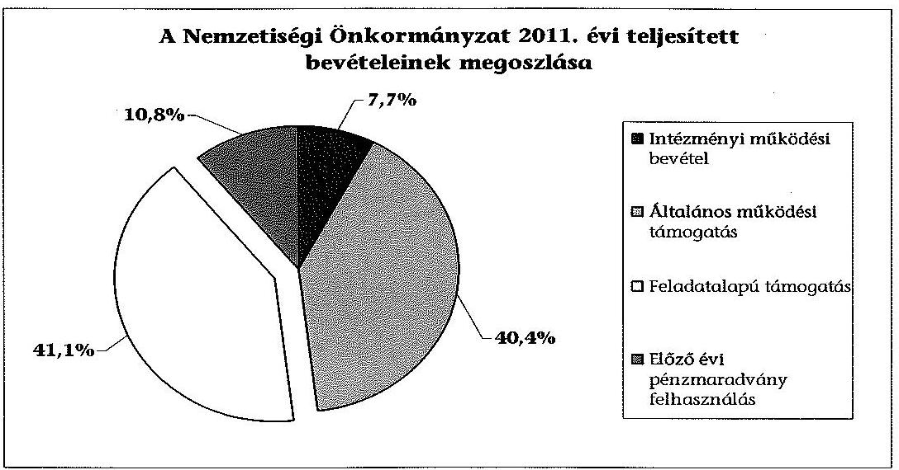
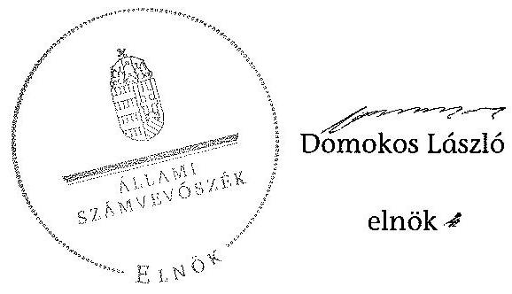

# ÁLLAMI   SZÁMVEVŐSZÉK 

## JELENTÉS

a helyi kisebbségi/nemzetiségi önkormányzatok gazdálkodásának ellenőrzéséről Villányi Cigány Önkormányzat

---

# Állami Számvevőszék 

Iktatószám: V-0085-013/2013.
Témaszám: 1105
Vizsgálat-azonosító szám: V06060309

## Az ellenőrzést felügyelte:

Horváth Balázs
felügyeleti vezető
Az ellenőrzést vezette és az ellenőrzés végrehajtásáért felelős:
Preller Zsuzsanna
ellenőrzésvezető
A számvevőszéki jelentést készítették és a jelentés összeállításában
közreműködtek:
Iszakné Dóczé Katalin
számvevő tanácsos
Moder Beatrix
számvevő
Az ellenőrzést végezték:
Iszakné Dóczé Katalin dr. Nagymányai Péter Szabó Tamás
számvevő tanácsos számvevő számvevő tanácsos

---

# TARTALOMJEGYZÉK 

BEVEZETÉS ..... 5
I. ÖSSZEGZŐ MEGÁLLAPÍTÁSOK, KÖVETKEZTETÉSEK, JAVASLATOK ..... 8
II. RÉSZLETES MEGÁLLAPÍTÁSOK ..... 14

1. A Nemzetiségi és a Települési Önkormányzat együttműködésének szabályszerűsége ..... 14
2. A gazdálkodási feladatok ellátásának szabályszerűsége ..... 15
2.1. A költségvetésre és zárszámadásra, valamint a kincstári adatszolgáltatás rendjére vonatkozó jogszabályi előírások betartása ..... 15
2.2. A Nemzetiségi Önkormányzat gazdálkodásának szabályozottsága ..... 16
2.3. A pénzügyi kontrollok működése ..... 17
3. A Nemzetiségi Önkormányzattal összefüggő gazdálkodási feladatok belső ellenőrzése ..... 18
4. A 2011. évi feladatalapú támogatás felhasználásának, elszámolásának szabályszerűsége ..... 19
5. A Nemzetiségi Önkormányzat feladatellátása ..... 19

## MELLÉKLET

1. számú A Nemzetiségi Önkormányzat 2011. évi és 2012. I. félévi gazdálkodásának főbb adatai, mutatói

## FÜGGELÉKEK

1. számú Értelmező szótár
2. számú A pénzügyi kontrollok működésének értékelése

---

# **Chemistry**

## **Chemical Reactions**

### **Balancing Chemical Equations**

1. **Write the unbalanced equation:**
   - Example: $$C_3H_8 + O_2 \rightarrow CO_2 + H_2O$$

2. **Balance the equation:**
   - Example: $$2C_3H_8 + 7O_2 \rightarrow 6CO_2 + 8H_2O$$

3. **Balance the equation:**
   - Example: $$2C_3H_8 + 7O_2 \rightarrow 6CO_2 + 8H_2O$$

### **Types of Reactions**

1. **Combination Reaction:**
   - Example: $$2H_2 + O_2 \rightarrow 2H_2O$$

2. **Decomposition Reaction:**
   - Example: $$2H_2O_2 \rightarrow 2H_2O + O_2$$

3. **Single Displacement Reaction:**
   - Example: $$Zn + 2HCl \rightarrow ZnCl_2 + H_2$$

4. **Double Displacement Reaction:**
   - Example: $$AgNO_3 + NaCl \rightarrow AgCl + NaNO_3$$

5. **Combustion Reaction:**
   - Example: $$CH_4 + 2O_2 \rightarrow CO_2 + 2H_2O$$

## **Stoichiometry**

### **Mole Concept**

- **Mole (mol):** The amount of substance containing as many particles (atoms, molecules, ions) as there are atoms in exactly 12 grams of carbon-12.
- **Avogadro's Number:** $$6.022 \times 10^{23}$$ particles per mole.

### **Molar Mass**

- **Molar Mass:** The mass of one mole of a substance.
- Example: The molar mass of water ($$H_2O$$) is 18.015 g/mol.

### **Calculations**

1. **Moles to Mass:**
   - Formula: $$n = \frac{m}{M}$$
   - Example: Calculate the number of moles of $$H_2O$$ in 18 grams of water.
     - $$n = \frac{18 \, \text{g}}{18.015 \, \text{g/mol}} \approx 0.999 \, \text{mol}$$

2. **Moles to Mass:**
   - Formula: $$m = n \times M$$
   - Example: Calculate the mass of 1 mole of water.
     - $$m = 1 \, \text{mol} \times 18.015 \, \text{g/mol} = 18.015 \, \text{g}$$

## **Gas Laws**

### **Ideal Gas Law**

- **Equation:** $$PV = nRT$$
- **Variables:**
  - $$P$$: Pressure (atm)
  - $$V$$: Volume (L)
  - $$n$$: Number of moles (mol)
  - $$R$$: Ideal gas constant (0.0821 L·atm/mol·K)
  - $$T$$: Temperature (K)

### **Boyle's Law**

- **Equation:** $$P_1V_1 = P_2V_2$$
- **Variables:**
  - $$P_1$$: Pressure (atm)
  - $$V_1$$: Volume (L)
  - $$P_2$$: Pressure (atm)
  - $$V_2$$: Volume (L)

### **Boyle's Law (Boyle's Law)**

- **Equation:** $$\frac{P_1V_1}{T_1} = \frac{P_2V_2}{T_2}$$

## **Thermochemistry**

### **Enthalpy (H)**

- **Definition:** The heat content of a system at constant pressure.
- **Equation:** $$\Delta H = q_p$$
- **Variables:**
  - $$q_p$$: Heat transferred at constant pressure.

### **Hess's Law**

- **Statement:** The enthalpy change for a reaction is the same whether it occurs in one step or multiple steps.
- **Equation:** $$\Delta H_{rxn} = \sum \Delta H_f (\text{products}) - \sum \Delta H_f (\text{reactants})$$
- **Variables:**
  - $$\Delta H_{rxn}$$: Enthalpy change of reaction
  - $$\Delta H_f$$: Standard enthalpy of formation

## **Electrochemistry**

### **Oxidation and Reduction**

- **Oxidation:** Loss of electrons.
- **Reduction:** Gain of electrons.

### **Galvanic Cells**

- **Definition:** A cell that converts chemical energy into electrical energy.
- **Components:**
  - Anode: Oxidation occurs.
  - Cathode: Reduction occurs.
  - Salt Bridge: Connects the two half-cells.

### **Nernst Equation**

- **Equation:** $$E = E^\circ - \frac{RT}{nF} \ln Q$$
- **Variables:**
  - $$E$$: Cell potential (V)
  - $$E^\circ$$: Standard cell potential (V)
  - $$R$$: Ideal gas constant (8.314 J/mol·K)
  - $$T$$: Temperature (K)
  - $$n$$: Number of moles of electrons transferred
  - $$F$$: Faraday constant (96485 C/mol)
  - $$Q$$: Reaction quotient

---

# RÖVIDÍTÉSEK JEGYZÉKE 

## Jogszabályok

Áht. 1
Áht. 2
ÁSZ tv.
Nek. 1 tv.
Nek. 2 tv.
Számv. tv.
Áhsz.

Ámr.
Ávr.

Ber.
Bkr.
támogatási kormányrendelet

Települési Önkormányzat SZMSZ-e

## Szórövidítések

ÁSZ
gazdálkodási jogkörök szabályzata ${ }_{1}$
gazdálkodási jogkörök szabályzata ${ }_{2}$

1992. évi XXXVIII. törvény az államháztartásról, hatályos 2011. december 31-ig
1993. évi CXCV. törvény az államháztartásról, hatályos 2011. december 31-től
1994. évi LXVI. törvény az Állami Számvevőszékről (hatályos 2011. július 1-jétől)
1995. évi LXXVII. törvény a nemzeti és etnikai kisebbségek jogairól, hatályos 2011. december 31-ig
1996. évi CLXXIX. törvény a nemzetiségek jogairól, hatályos 2011. december 31-től
1997. évi C. törvény a számvitelről

249/2000. (XII. 24.) Korm. rendelet az államháztartás szervezetei beszámolási és könyvvezetési kötelezettségének sajátosságairól
292/2009. (XII. 19.) Korm. rendelet az államháztartás működési rendjéről, hatályos 2011. december 31-ig
368/2011. (XII. 31.) Korm. rendelet az államháztartásról szóló törvény végrehajtásáról, hatályos 2012. január 1-jétől
193/2003. (XI. 26.) Korm. rendelet a költségvetési szervek belső ellenőrzéséről, hatályos 2011. december 31-ig
370/2011. (XII. 31.) Korm. rendelet a költségvetési szervek belső kontrollrendszeréről és belső ellenőrzéséről, hatályos 2012. január 1-jétől
a kisebbségi önkormányzatoknak a központi költségvetésből, valamint fejezeti kezelésű előirányzatból nyújtott támogatások feltételrendszeréről és elszámolásának rendjéről szóló 342/2010. (XII. 28.) Korm. rendelet (hatályon kívül helyezte a 28/2012. (III. 6.) Korm. rendelet a nemzetiségi célú előirányzatokból nyújtott támogatások feltételrendszeréről és elszámolásának rendjéről; jelenleg hatályos a 428/2012. (XII. 29.) Korm. rendelet a nemzetiségi célú előirányzatokból nyújtott támogatások feltételrendszeréről és elszámolásának rendjéről)
Villány Város Önkormányzata Képviselő-testületének 11/2011. (VII.14.) számú rendelete Villány Város Képviselő-testületének Szervezeti és Működési Szabályzatáról (hatályos 2011. július 15-től)

Állami Számvevőszék
Villány Város Önkormányzatának Polgármesteri Hivatal Gazdálkodási szabályzata, hatályos 2011. január 1-jétől
Villány Város Önkormányzatának Polgármesteri Hivatal Gazdálkodási szabályzata, hatályos 2012. február 1-jétől

---

| jegyző | Villány Város Önkormányzatának jegyzője |
| :--: | :--: |
| Képviselő-testület | Villányi Cigány Önkormányzat Képviselő-testülete |
| Kincstár | Magyar Államkincstár |
| Nemzetiségi Önkormányzat | Villányi Cigány Önkormányzat |
| Nemzetiségi Önkormányzat elnöke | Villányi Cigány Önkormányzat elnöke |
| Nemzetiségi Önkormányzat SZMSZ-e | Villányi Cigány Önkormányzat Képviselő-testületének 8/2012. (VI. 27.) számú határozata a Szervezeti és Működési Szabályzatról |
| polgármester | Villány Város Önkormányzatának polgármestere |
| Polgármesteri Hivatal | Villány Város Önkormányzatának Polgármesteri Hivatala |
| Polgármesteri Hivatal SZMSZ-e | Villány Város Önkormányzata Képviselő-testületének 11/2011. (VII.14.) számú rendeletének 5. számú függeléke Villány Város Polgármesteri Hivatalának Szervezeti és Működési Szabályzatáról (kihirdetve 2011. július 14.) |
| Támogató | A támogatást nyújtó Közigazgatási és Igazságügyi Minisztérium |
| Települési Önkormányzat | Villány Város Önkormányzat |
| Települési Önkormányzat Képviselő-testülete | Villány Város Önkormányzat Képviselő-testülete |

---

# JELENTÉS   a helyi kisebbségi/nemzetiségi önkormányzatok gazdálkodásának ellenőrzéséről Villányi Cigány Önkormányzat 

## BEVEZETÉS

Az államháztartás részét, az önkormányzati alrendszer egyik elemét képezik a nemzetiségi önkormányzatok, amelyek jogi személyek és a Nek. ${ }_{1,2}$ tv-ben meghatározott önálló feladat- és hatáskörökkel rendelkeznek. A nemzetiségi önkormányzatok az önkormányzati, illetve testületi működtetés mellett a helyi nemzetiségi közügyek változatos formában való ellátásában vesznek részt.

A nemzetiségi önkormányzatok, illetve a települési önkormányzatok között a jelenlegi szabályozás szerint nincs alá-fölérendeltségi viszony. A nemzetiségi önkormányzatok azonban sajátos közjogi helyzetben vannak, mert a jogállásukat tekintve önkormányzatok, ám függnek a székhelyük szerinti települési önkormányzat hivatalától, amely ellátja a nemzetiségi önkormányzatok vonatkozásában a megállapodásban rögzített gazdálkodási feladatokat.

A nemzetiségek helyzete, támogatása mind hazai, mind európai uniós szinten kiemelt figyelmet kap napjainkban. A nemzetiségi önkormányzatok gazdálkodására és támogatási rendszerére vonatkozó jogszabályok a 2010-2012. években jelentős változásokon mentek át, amelyek érintették a feladatalapú támogatásra fordítható költségvetési keret megállapítását, az operatív gazdálkodási jogkörök szabályozását, az elkülönített könyvvezetés alkalmazását, a belső ellenőrzés szabályozását.

Az ellenőrzés célja annak értékelése volt, hogy a Nemzetiségi Önkormányzat gazdálkodási kereteinek kialakítása, gazdálkodása és feladatellátása megfelelt-e a hatályos jogszabályoknak.

Ennek keretében ellenőriztük, hogy:

- a Nemzetiségi Önkormányzat és a Települési Önkormányzat együttműködésének szabályozása, a Települési Önkormányzat SZMSZ-ében, a megállapodásban előírt működési feltételek biztosítása megfelelt-e a jogszabályi előírásoknak;
- a felek együttműködése megfelelt-e a megállapodásnak a gazdálkodási feladatok szabályszerű ellátásában, betartották-e a Nemzetiségi Önkormányzat gazdálkodásához kapcsolódóan a költségvetésre és zárszámadásra, a gazdálkodás szabályozására, az operatív gazdálkodási jogkörök gyakorlására vonatkozó jogszabályi előírásokat;

---

- a jegyző biztosította-e a Polgármesteri Hivatal belső ellenőrzése keretében a Nemzetiségi Önkormányzattal összefüggő gazdálkodási feladatok belső ellenőrzését;
- a 2011. évi feladatalapú támogatás felhasználása, a folyósított feladatalapú támogatással történő elszámolás az előírásoknak megfelelően történt-e;
- a Nemzetiségi Önkormányzat feladatellátása összhangban volt-e a vonatkozó jogszabályi előírásokkal.

# Az ellenőrzés típusa: szabályszerűségi ellenőrzés 

Az ellenőrzött időszak: 2011. január 1. - 2012. június 30.
Ellenőrzött szervezet: Villányi Cigány Önkormányzat és a gazdálkodási feladatait ellátó Villány Város Önkormányzat

Az ellenőrzés jogszabályi alapja: az ÁSZ tv. 5. § (2)-(3) és (6) bekezdései
Az ellenőrzés szakmai módszertana az ÁSZ hivatalos honlapján (www.asz.hu) közzétett szakmai szabályokon alapult, amely a Legfőbb Ellenőrző Intézmények Nemzetközi Szervezete (INTOSAI) által kiadott nemzetközi standardok (ISSAI) figyelembevételével készült.

A fogalmak magyarázatát az 1. számú függelék, a pénzügyi kontrollok megfelelősége értékelésénél alkalmazott egységes minősítési szempontokat a 2. számú függelék tartalmazza.

Az ellenőrzés lefolytatásához a Települési Önkormányzat és a Nemzetiségi Önkormányzat tanúsítványok kitöltésével és a kapcsolódó dokumentumok elektronikus megküldésével szolgáltatott adatokat. A tanúsítványokon szerepltetett adatok, információk ellenőrzése és szükség szerinti javítása a helyszíni ellenőrzés keretében történt.

Az ÁSZ az ellenőrzés megállapításait az ellenőrzött időszakban hatályos, az intézkedést igénylő megállapításokra tett javaslatokat a jelenleg hatályos jogszabályok alapján fogalmazta meg.

A Nemzetiségi Önkormányzat és elnöke a 2010. évi helyhatósági választások óta látja el feladatát. A Nemzetiségi Önkormányzat feladatai ellátására intézményt, gazdasági társaságot és más szervezetet nem alapított, azokban nem vásárolt tulajdonrészt, illetve társulásban nem vett részt. A négytagú Képviselőtestület munkája segítésére bizottságot nem hozott létre. A Nemzetiségi Önkormányzat a költségvetési beszámolója szerint a 2011. évben 520 ezer Ft költségvetési bevételt ért el és 381 ezer Ft költségvetési kiadást teljesített. A 2012-ben 354 ezer Ft eredeti költségvetési bevételi és kiadási előirányzatot terveztek, amelyet a 2012. I. félévi beszámolója alapján nem módosítottak, a teljesített költségvetési bevétel 484 ezer Ft, a teljesített költségvetési kiadás 330 ezer Ft volt. A Nemzetiségi Önkormányzat 2011. évi és 2012. I. félévi gazdálkodásának főbb adatait, mutatóit az 1. számú melléklet szemlélteti. Az ÁSZ a Nemzetiségi Önkormányzat gazdálkodását korábban nem ellenőrizte.

---

Az ÁSZ tv. 29. § (1) bekezdése szerint a jelentéstervezetet megküldtük a polgármesternek.

 és Nemzetiségi Önkormányzat elnöke részére, akik az ÁSZ tv. 29. § (2) bekezdésében foglalt észrevételezési jogukkal nem éltek, a jelentéstervezetre észrevételt nem tettek.

---

# I. ÖSSZEGZŐ MEGÁLLAPÍTÁSOK, KÖVETKEZTETÉSEK, JAVASLATOK 

A Nemzetiségi és a Települési Önkormányzat együttműködésének szabályozása - a 2011. évi együttműködési megállapodás és a Települési Önkormányzat SZMSZ-ének kisebb tartalmi hiányosságai kivételével - megfelelt a jogszabályi előírásoknak. A 2012. június 30-án hatályos együttműködési megállapodásban foglalt működési feltételeket a Nek. ${ }_{2}$ tv. előírásai ellenére a Települési Önkormányzat SZMSZ-ében nem rögzítették.

A Nemzetiségi Önkormányzat költségvetésére és zárszámadására vonatkozó jogszabályi előírásokat részben tartották be, mert a Nemzetiségi Önkormányzat elnöke az Áht. ${ }_{2}$-ben előírt határidőn túl nyújtotta be a Képviselőtestületnek a 2012. évi költségvetési határozat tervezetét, melynek tartalma a jogszabályi előírásoknak megfelelt. A Nemzetiségi Önkormányzat elnöke a 2011. évben nem kezdeményezte a költségvetési előirányzatok felhasználásához szükséges mértékben - az Ámr. és az Áht. ${ }_{2}$ előírásai alapján - azok módosítását, így nem biztosította a tárgyévi fizetési kötelezettség vállalásához szükséges fedezetet. A 2011. évi eredeti előirányzatokat a zárszámadási határozatban, annak elfogadásával módosították. A Települési Önkormányzat a Nemzetiségi Önkormányzat zárszámadási határozatát a Nek. ${ }_{1}$ tv. és az Ámr. előírásai ellenére nem változatlan tartalommal építette be a zárszámadási rendeletébe, mert abban a központi költségvetésből származó támogatás összege bevételként nem szerepelt. A jegyző a 2012. évben a Nemzetiségi Önkormányzatra vonatkozó kincstári adatszolgáltatási kötelezettségének határidőben eleget tett.

A Nemzetiségi Önkormányzat gazdálkodásának szabályozottsága az ellenőrzött időszakban nem felelt meg a jogszabályi előírásoknak, mert az e feladatok végrehajtását ellátó Polgármesteri Hivatal ellenőrzési nyomvonala, a szabálytalanságok kezelésének eljárásrendje, valamint a folyamatba épített előzetes, utólagos és vezetői ellenőrzés szabályzatainak hatálya - az Ámr., az Áht. ${ }_{1}$, illetve a Bkr. előírásai ellenére - nem terjedt ki a Nemzetiségi Önkormányzat gazdálkodási feladataira. A Polgármesteri Hivatal SZMSZ-e az Ámr., illetve az Ávr.-ben foglaltak ellenére nem tartalmazta munkakörökhöz kapcsolódóan a Nemzetiségi Önkormányzat gazdálkodásával kapcsolatos feladat- és hatásköröket, a hatáskörök gyakorlásának módját, a helyettesítés rendjét és az ezekre vonatkozó felelősségi szabályokat. A jegyző az előzetes írásbeli kötelezettségvállalást nem igénylő kifizetések rendjét az Ámr. és az Ávr. előírásai ellenére nem szabályozta. A Nemzetiségi Önkormányzat gazdálkodására vonatkozóan az operatív gazdálkodási jogkörök kialakítása során a 2011. és 2012. években a jogszabályi előírásokat maradéktalanul nem érvényesítették, mert a Nemzetiségi Önkormányzat elnöke - összeférhetetlenség esetére - kötelezettségvállalásra, utalványozásra és teljesítés igazolására az Ámr.-ben, illetve az Ávr-ben foglaltak ellenére további személyeket írásban nem jelölt ki. A jegyző a 2012. évben az Áht. ${ }_{2}$-ben foglaltak ellenére nem gondoskodott a pénzügyi ellenjegyző felhatalmazásáról és az érvényesítési feladatokat ellátó személyek kijelöléséről.

---

A Nemzetiségi Önkormányzat 2011. évi és 2012. I. félévi működési célú pénzeszközátadása, valamint a dologi és egyéb folyó kiadások teljesítése során a pénzügyi kontrollok működése gyenge volt, a hibák száma a lényegességi szintet, a kritikus hibahatárt elérte. A 2011. évben az Áht. ${ }_{1}$ és az Ámr. előírásai ellenére a kötelezettségvállalást nem foglalták írásba, illetve az előzetes írásbeli kötelezettségvállalást nem igénylő kifizetések esetén, szabályozás hiányában a kötelezettségvállalás ellenjegyzőjének feladatát nem végezték el. A szakmai teljesítésigazolásra jogosult az Ámr-ben foglalt feladatát nem, illetve nem szabályszerűen látta el, az utalványok ellenjegyzése a jogosulatlan utalványozás és a szakmai teljesítésigazolás elmaradása miatt nem volt szabályszerű. A 2012. év I. félévében Áht. ${ }_{2}$ és az Ávr. előírásai ellenére a pénzügyi ellenjegyzést, a teljesítésigazolást és az érvényesítést felhatalmazással nem rendelkező személyek, jogosulatlanul végezték. Az ellenőrzés a Nemzetiségi Önkormányzatnál az ellenőrzött tételek esetében - jogosulatlan kifizetést nem tárt fel, a pénzügyi kontrollok működéséhez kapcsolódó hiányosságok azonban nem biztosítják a hibák megelőzését, feltárását és kijavítását.
A Nemzetiségi Önkormányzat a 2011. évben 214 ezer Ft feladatalapú támogatásban részesült, amelyet a jogszabályi előírásokkal összhangban a tárgyévben felhasználtak. A támogatási kormányrendeletben hivatkozott, Áht. ${ }_{1}$-ben előírt elszámolása nem történt meg. A támogatás felhasználását, elszámolását a jogosult szervek nem ellenőrizték.

A Nemzetiségi Önkormányzat feladatellátásának tárgya összhangban volt a Nek. ${ }_{1,2}$ tv. előírásaival. Biztosította az alapfeladata ellátásához szükséges szervezeti, személyi és anyagi feltételeket, ellátta a képviselt nemzetiségi közösség érdekképviseletét, továbbá önként vállalt feladatokat látott el a hagyományápolás és a közművelődés területén.

A Település Önkormányzat 2011. évi belső ellenőrzési tervét a Ber. előírása ellenére kockázatelemzés nem alapozta meg. A 2012. évi ellenőrzési tervet megalapozó kockázatelemzés a Ber. előírásával ellentétesen nem terjedt ki a Nemzetiségi Önkormányzat gazdálkodásával összefüggő végrehajtási feladatok ellátására, a 2011. évben és 2012. I. félévben erre irányuló belső ellenőrzést nem terveztek és nem hajtottak végre. A jegyző az ellenőrzött időszakban az Áht. ${ }_{1,2}$ előírása ellenére nem biztosította a Polgármesteri Hivatal belső ellenőrzése keretében a Nemzetiségi Önkormányzat gazdálkodásával összefüggő végrehajtási feladatok belső ellenőrzését.

Az ÁSZ tv. 33. § (1) bekezdésében foglaltak értelmében az ellenőrzött szervezet vezetője köteles a jelentésben foglalt megállapításokhoz kapcsolódó intézkedési tervet összeállítani, és azt a jelentés kézhezvételétől számított 30 napon belül az ÁSZ részére megküldeni. Amennyiben az intézkedési tervet határidőre nem küldi meg a szervezet, vagy az nem elfogadható, az ÁSZ elnöke az ÁSZ tv. 33. § (3) bekezdés a)-b) pontjaiban foglaltakat érvényesítheti.

---

A helyszíni ellenőrzés megállapításainak hasznosítása mellett javasoljuk:

# a jegyzőnek 

1. az együttműködés szabályozásával kapcsolatban

A Települési Önkormányzat SZMSZ-ében, a Nek. ${ }_{2}$ tv. 80. § (2) bekezdése ellenére nem rögzítették a megállapodás szerinti működési feltételeket.

Javaslat
Készítse elő a Települési Önkormányzat SZMSZ-e módosítását, hogy az tartalmilag feleljen meg a Nek. ${ }_{2}$ tv. 80. § (2) bekezdésében foglalt előírásnak.
2. a költségvetési határozattal kapcsolatban:

A 2012. évi költségvetési határozat tervezetét az Áht. ${ }_{2}$ 24. § (2) bekezdésben előírt határidőn túl terjesztették a Képviselő-testület elé elfogadásra.

Javaslat
Biztosítsa a jövőben az Áht. ${ }_{2}$ 24. § (2) bekezdésében meghatározottakkal összhangban a költségvetési határozat-tervezet megfelelő időben történő elkészítését, annak érdekében, hogy azt a Nemzetiségi Önkormányzat elnöke határidőben be tudja nyújtani a Képviselő-testületnek.
3. a gazdálkodás szabályozottságával kapcsolatban

A Polgármesteri Hivatal szabályzatai közül a 2011. évben az Ámr. 156. § (2)-(3) bekezdésében, és az Áht. 121/A (4) bekezdésében, valamint a 2012. évben a Bkr. 6. § (3)-(4) bekezdéseiben előírt ellenőrzési nyomvonal és a szabálytalanságok kezelése eljárásrendjének, a Bkr. 8. § (2)-(4) bekezdéseiben előírt folyamatba épített előzetes, utólagos és vezetői ellenőrzés szabályzatainak hatálya nem terjedt ki a Nemzetiségi Önkormányzat gazdálkodási feladataira.

A Polgármesteri Hivatal SZMSZ-e az Ávr. 13. § (1) bekezdés g) pontjában előírtak ellenére nem tartalmazta nevesített munkakörökhöz tartozóan a Nemzetiségi Önkormányzat gazdálkodásával kapcsolatos feladat- és hatásköröket, a hatáskörök gyakorlásának módját, a helyettesítés rendjét és az ezekre vonatkozó felelősségi szabályokat.

A jegyző - a 2011. évben az Ámr. 72. § (14), a 2012. évben az Ávr. 53. § (2) bekezdés előírásait figyelmen kívül hagyva - az írásbeli kötelezettségvállaláshoz nem kötött kifizetések rendjét annak ellenére nem szabályozta, hogy a gazdálkodási jogkörök szabályzata ${ }_{1,2}$ lehetővé tette a 100 ezer Ft-ot el nem érő értékű gazdasági események esetében az előzetes írásbeli kötelezettségvállalás mellőzését.

A jegyző az Áht. ${ }_{2}$ 37. § (2) és 38. § (2) bekezdései, valamint az Ávr. 55. § (2) bekezdés g) pontja és az 58. § (4) bekezdés előírása ellenére nem jelölte ki írásban a pénzügyi ellenjegyzőt és az érvényesítőt.

---

Javaslat
A szabályos gazdálkodás biztosítása érdekében:
a) terjessze ki - az Ávr. 13. § (3a) bekezdésben foglalt felhatalmazása alapján - a Polgármesteri Hivatal ellenőrzési nyomvonalának, a szabálytalanságok kezelése eljárásrendjének és a folyamatba épített előzetes, utólagos és vezetői ellenőrzés szabályzatainak hatályát a Bkr. 6. § (3)-(4) és a 8. § (2)-(4) bekezdéseiben foglalt előírásoknak megfelelően a Nemzetiségi Önkormányzat gazdálkodási feladataira;
b) készítse elő a Polgármesteri Hivatal SZMSZ-e módosítását, hogy az tartalmilag feleljen meg az Ávr. 13. § (1) bekezdés g) pontjában foglalt előírásnak;
c) határozza meg az Ávr. 53. § (2) bekezdésének előírásai alapján az előzetes írásbeli kötelezettségvállalást nem igénylő kifizetések rendjét;
d) írásbeli felhatalmazással jelölje ki az Áht. 37. § (2) bekezdése, és az Ávr. 55. § (2) bekezdés g) pontjában előírtaknak megfelelően a pénzügyi ellenjegyzőt, illetve az Áht. ${ }_{2}$ 38. § (2), az Ávr. 58. § (4) bekezdései szerint az érvényesítői feladatokat ellátót.
4. a pénzügyi kontrollok működésével kapcsolatban

A pénzügyi ellenjegyző az Áht. ${ }_{2}$ 37. § (2) bekezdése, az Ávr. 55. § (2) bekezdés g) pontjában előírtak ellenére - írásbeli kijelölés hiányában - az Ávr. 55. § (1) bekezdése szerinti feladatát jogosulatlanul végezte el. Az Ávr. 57. § (1)-(3) bekezdésében foglalt teljesítésigazolási feladatokat felhatalmazással nem rendelkező személy - az Ávr. 57. § (4) bekezdése ellenére - jogosulatlanul végezte. Az érvényesítő az Ávr. 58. § (1) és (3) bekezdéseiben foglalt ellenőrzési feladatokat - az Ávr. 58. § (4) bekezdése ellenére - írásbeli felhatalmazás hiányában, jogosulatlanul végezte el.

Javaslat
Az operatív gazdálkodás működési hibáinak megelőzése, feltárása és kijavítása érdekében:
a) írásban jelölje ki az Áht. ${ }_{2}$ 37. § (2) bekezdése és az Ávr. 55. § (2) bekezdés g) pontjában foglaltak alapján a pénzügyi ellenjegyzésre jogosult személyeket, és biztosítsa az Ávr. 55. § (1) bekezdésében előírt ellenőrzési feladatok végrehajtását;
b) gondoskodjon arról, hogy a teljesítés igazolására jogosult személyek az Ávr. 57. § (1)-(3) bekezdésében előírt ellenőrzési feladataikat a jogszabályi előírásoknak megfelelően hajtsák végre;
c) írásban jelölje ki az érvényesítésre jogosult személyeket az Áht. ${ }_{2}$ 38. § (2) bekezdése és az Ávr. 58. § (4) bekezdésben foglaltak alapján, és biztosítsa az Ávr. 58. § (1) és (3) bekezdéseiben előírt ellenőrzési feladatok végrehajtását.

---

5. a feladatalapú támogatás elszámolásával kapcsolatban

A 2011. évben folyósított feladatalapú támogatás elszámolása a támogatási kormányrendelet 7. § (2) bekezdésében hivatkozott Áht. ${ }_{1}$-nek „a helyi önkormányzatok elszámolási rendjére vonatkozó rendelkezései alkalmazása” előírása ellenére nem történt meg.

Javaslat
Gondoskodjon az Áht. ${ }_{2}$ 27. § (2) bekezdésben meghatározott feladatkörében a Nemzetiségi Önkormányzat által igénybe vett feladatalapú támogatás elszámolásának elkészítéséről, figyelemmel az Áht. ${ }_{2}$ 57. § (4) bekezdésben foglaltakra.

# a polgármesternek 

1. A Települési Önkormányzat SZMSZ-ében, a Nek. ${ }_{2}$ tv. 80. § (2) bekezdése ellenére nem rögzítették a megállapodás szerinti működési feltételeket.

Javaslat
Terjessze a Települési Önkormányzat Képviselő-testülete elé jóváhagyásra a Nek. ${ }_{2}$ tv. 80. § (2) bekezdése előírásainak betartásával előkészített Települési Önkormányzat SZMSZ-e módosítását.
2. A Polgármesteri Hivatal SZMSZ-e az Ávr. 13. § (1) bekezdés g) pontjában előírtak ellenére nem tartalmazta nevesített munkakörökhöz tartozóan a Nemzetiségi Önkormányzat gazdálkodásával kapcsolatos feladat- és hatásköröket, a hatáskörök gyakorlásának módját, a helyettesítés rendjét és az ezekre vonatkozó felelősségi szabályokat.

Javaslat
Terjessze a Települési Önkormányzat Képviselő-testülete elé jóváhagyásra az
 Ávr. 13. § (1) bekezdés g) pontjában foglalt szabályozásra figyelemmel a Polgármesteri Hivatal módosított SZMSZ-ét.

## a Nemzetiségi Önkormányzat elnökének

1. A 2012. évi költségvetési határozat tervezetét az Áht. ${ }_{2}$ 24. § (2) bekezdésben előírt határidőn túl terjesztették a Képviselő-testület elé elfogadásra.

Javaslat
A jövőben az Áht. ${ }_{2}$ 24. § (2) bekezdésében foglalt határidő betartásával terjessze a Képviselő-testület elé jóváhagyásra a költségvetési határozat-tervezetet.
2. A Nemzetiségi Önkormányzat elnöke a kötelezettségvállalásra, utalványozásra, és a szakmai teljesítésigazolásra - akadályoztatása vagy összeférhetetlenség esetére - más személyt nem hatalmazott fel, így az Ámr. 80. § (2) bekezdésében, illetve az

---

Ávr. 60. § (2) bekezdésében előírt összeférhetetlenségi előírás betartásának feltételeit nem biztosították.

Javaslat
Az Ávr. 60. § (2) bekezdésében foglalt összeférhetetlenségi szabályok érvényesülése érdekében írásban jelöljön ki további kötelezettségvállaló, utalványozó és teljesítést igazoló személyt az Áht. 2 36. § (7), illetve a 38. § (2) bekezdése, az Ávr. 52. § (7), illetve az 57. § (4) bekezdései előírása alapján.
3. A 2011. évben folyósított feladatalapú támogatás elszámolása a támogatási kormányrendelet 7. § (2) bekezdésében hivatkozott Áht. ${ }_{1}$-nek „a helyi önkormányzatok elszámolási rendjére vonatkozó rendelkezései alkalmazása" előírása ellenére nem történt meg.

Javaslat
Terjessze a Képviselő-testület elé jóváhagyásra az Áht. 2 57. § (4) bekezdés alapján készített elszámolást a Nemzetiségi Önkormányzat által igénybe vett feladatalapú támogatásról.

---

# II. RÉSZLETES MEGÁLLAPÍTÁSOK 

## 1. A Nemzetiségi és a Települési Önkormányzat együttműködésének szabályszerűsége

A Nemzetiségi és a Települési Önkormányzat között létrejött együttműködési megállapodások ${ }^{1}$ - kisebb tartalmi hiányosságok kivételével - megfeleltek a jogszabályi előírásoknak. Az együttműködési megállapodások jóváhagyása az előírt határidő betartásával történt. Az együttműködési megállapodásokban a jogszabályi előírásokat nem érvényesítették maradéktalanul, mert:

- a 2011. december 31-én hatályos megállapodás a Nek. ${ }_{1}$ tv. 27. § (2) bekezdésében foglaltak ellenére nem szabályozta a Képviselő-testület működésének feltételeit és az Áht. ${ }_{1}$ 66. §-ban foglalt előírások ellenére nem teljes körűen tartalmazta a Nemzetiségi Önkormányzat gazdálkodása végrehajtásának rendjéhez kapcsolódó feladatellátás jogosultjainak, kötelezettjeinek feladatra való kijelölését;
- a 2012. június 30-án hatályos együttműködési megállapodásban az Áht. ${ }_{2}$ előírásai szerint meghatározták a Nemzetiségi Önkormányzat működésével kapcsolatos tervezési, gazdálkodási, ellenőrzési, finanszírozási, adatszolgáltatási és beszámolási feladatok ellátásának szabályait, továbbá a Nek. ${ }_{2}$ tv.-ben foglaltaknak megfelelően rögzítették a feladatellátáshoz szükséges személyi és tárgyi feltételeket, a működéssel kapcsolatos végrehajtási feladatok ellátását, a gazdálkodásra és költségvetésre vonatkozó szabályokat. A 2012. június 1-jétől hatályos együttműködési megállapodás szerinti működési feltételeket a Nemzetiségi Önkormányzat SZMSZ-e tartalmazta, de a Nek. ${ }_{2}$ tv. 80. § (2) bekezdésében foglaltak ellenére a Települési Önkormányzat SZMSZ-ében azt nem rögzítették.

A Települési Önkormányzat - a szabályozási hiányosságok ellenére - biztosította és folyamatosan fenntartotta a Nemzetiségi Önkormányzat működésének személyi és tárgyi feltételeit.

[^0]
[^0]:    ${ }^{1}$ A 2011. évben hatályos együttműködési megállapodást a Települési Önkormányzat Képviselő-testülete az 4/2011. (II. 15.) számú határozattal fogadta el, a Képviselőtestület viszont határozattal nem hagyta jóvá, azt a Nemzetiségi Önkormányzat elnöke írta alá. A Nek. ${ }_{2}$ tv. 159. § (3) bekezdésében előírtak alapján 2012. június 1-jéig felülvizsgált és módosított együttműködési megállapodást a Települési Önkormányzat Képviselő-testülete a 61/2012. (V. 31.) számú, a Képviselő-testület a 6/2012. (05. 30.) számú határozatával elfogadta.

---

# 2. A GAZDÁLKODÁSI FELADATOK ELLÁTÁSÁNAK SZABÁLYSZERŰSÉGE 

### 2.1. A költségvetésre és zárszámadásra, valamint a kincstári adatszolgáltatás rendjére vonatkozó jogszabályi előírások betartása

A Nemzetiségi Önkormányzat költségvetésére és zárszámadására vonatkozó jogszabályi előírásokat részben tartották be. A költségvetési és zárszámadási határozatok egymással összehasonlítható szerkezetben készültek. A költségvetési határozatot változatlan formában építették be a Települési Önkormányzat költségvetési rendeletébe.

A költségvetés és zárszámadás megalkotása során a jogszabályi előírásokat nem érvényesítették maradéktalanul, mert:

- a Nemzetiségi Önkormányzat az Ámr. 37. § (3) bekezdésében előírt határidőn ${ }^{2}$ túl alkotta meg a 2011. évi költségvetési határozatát ${ }^{3}$. A Nemzetiségi Önkormányzat elnöke az Áht. ${ }_{2}$ 24. § (2) bekezdésében előírt határidőn túl ${ }^{4}$ terjesztette a Képviselő-testület elé a Nemzetiségi Önkormányzat 2012. évi költségvetési határozat tervezetét ${ }^{5}$;
- a 2011. évi költségvetési határozathoz - az Ámr. 36. § (1) bekezdés k) pontjában foglaltak ellenére - az év várható bevételi és kiadási előirányzatainak teljesüléséről szóló előirányzat-felhasználási ütemterv nem készült;
- a Nemzetiségi Önkormányzat elnöke a 2011. évben a költségvetési előirányzatok felhasználásához szükséges mértékben nem kezdeményezte az Ámr. 68. § (3)-(4) bekezdései előírása ellenére - azok módosítását, így az Áht. ${ }_{1}$ 12/A. § (1) bekezdésben foglaltakat figyelmen kívül hagyva nem biztosította a tárgyévi fizetési kötelezettség vállalásához szükséges fedezetet. A 2011. évi eredeti előirányzatokat a zárszámadási határozatban, annak elfogadásával módosították ${ }^{6}$;
- a 2011. évi zárszámadási határozat megfelelt az Áht. ${ }_{1}$-ben előírt tartalmi követelményeknek, azonban - a Nek. ${ }_{1}$ tv. 26. § (2) és az Ámr. 36. § (6) bekezdésében foglaltak ellenére - a Települési Önkormányzat zárszámadási rendeletébe ${ }^{7}$ nem változatlan tartalommal építették be, mert a köz-

[^0]
[^0]:    ${ }^{2}$ A helyi kisebbségi önkormányzat költségvetési határozatát tárgy év február 10-ig fogadja el.
    ${ }^{3}$ A Képviselő-testület a 3/2011. (II. 22.) számú határozatával fogadta el a 2011. évi költségvetést.
    ${ }^{4}$ A központi költségvetésről szóló törvény (2012. évi CCIV. törvény a 2012. XII. 18-i Magyar Közlöny szerint) kihirdetését követő 45. nap.
    ${ }^{5}$ A Képviselő-testület a 2/2012. (II. 16.) számú határozatával fogadta el a 2012. évi költségvetését.
    ${ }^{6}$ A 3/2012. (II. 16.) számú határozat.
    ${ }^{7}$ A Települési Önkormányzati 7/2012. (V. 31.) számú rendelete.

---

ponti költségvetésből származó - az általános, illetve a feladat alapú - támogatás összegét bevételként nem szerepeltették.

A 2012. évi költségvetési határozat tartalma megfelelő az Áht ${ }_{2}$ és az Ávr. előírásainak. A jegyző a Nemzetiségi Önkormányzatra vonatkozó kincstári adatszolgáltatási kötelezettségének határidőben eleget tett.

# 2.2. A Nemzetiségi Önkormányzat gazdálkodásának szabályozottsága 

Az ellenőrzött időszakban a Nemzetiségi Önkormányzat gazdálkodásának szabályozottsága nem felelt meg a jogszabályi előírásoknak. A Polgármesteri Hivatal - Számv. tv.-ben és Áhsz.-ben előírt - gazdálkodási szabályzatainak ${ }^{8}$ hatályát a jegyző kiterjesztette a Nemzetiségi Önkormányzat gazdálkodási feladataira is, azonban:

- a 2011. évben az Ámr. 20. § (2) bekezdés h) pontjában, 2012. I. félévben az Ávr. 13. § (1) bekezdés g) pontjában előírtak ellenére a Polgármesteri Hivatal SZMSZ-e nem tartalmazta a munkakörökhöz kapcsolódóan a Nemzetiségi Önkormányzat gazdálkodásával kapcsolatos feladat- és hatásköröket, a hatáskörök gyakorlásának módját, a helyettesítés rendjét és az ezekre vonatkozó felelősségi szabályokat. A Nemzetiségi Önkormányzat gazdálkodásával kapcsolatos feladatok és hatáskörök a feladattal megbízott köztisztviselők munkaköri leírásaiban nem szerepeltek;
- a Polgármesteri Hivatal szabályzatai közül a 2011. évben az Ámr. 156. § (2)-(3) bekezdésében és az Áht. ${ }_{1}$ 121/A. § (4) bekezdésében, valamint a 2012. évben a Bkr. 6. § (3)-(4) bekezdéseiben előírt ellenőrzési nyomvonal és szabálytalanságok kezelése eljárásrendjének, a Bkr. 8. § (2)-(4) bekezdéseiben előírt folyamatba épített előzetes, utólagos és vezetői ellenőrzés szabályzatainak hatálya nem terjedt ki a Nemzetiségi Önkormányzat gazdálkodási feladataira ${ }^{9}$;
- az ellenőrzött időszakban - az Ámr. 72. § (14) és az Áht. ${ }_{2}$ 37. § (1) bekezdés, illetve az Ávr. 53. § (2) bekezdés előírásait figyelmen kívül hagyva - az írásbeli kötelezettségvállaláshoz nem kötött kifizetések rendjét annak ellenére nem szabályozta a jegyző, hogy a gazdálkodási jogkörök szabályzata ${ }_{1,2}$ lehetővé tette a 100 ezer Ft-ot el nem érő értékű gazdasági események esetében az írásbeli kötelezettségvállalás mellőzését.

[^0]
[^0]:    ${ }^{8}$ a Számv. tv. és az Áhsz. által előírt számviteli politika és a gazdálkodásra vonatkozó leltározási és leltárkészítési-, az eszközök és források értékelési-, pénzkezelési- és számlarend-szabályzatok
    ${ }^{9}$ A 2012. évben megkötött együttműködési megállapodás alapján a Nemzetiségi Önkormányzat belső kontrollrendszerének kialakítása, működtetése, a kontrollkörnyezet fejlesztése, a kontrolltevékenységek megszervezése, a kockázatkezelési-, információs és kommunikációs, valamint a nyomon követési rendszer kialakítása a Polgármesteri Hivatal feladata volt.

---

A Nemzetiségi Önkormányzat operatív gazdálkodási jogköreinek kialakítása során a 2011. évben - a kötelezettségvállaló, utalványozó, az ellenjegyző és az érvényesítő, valamint a szakmai teljesítésigazoló kijelölése - a jogszabályi előírásoknak megfelelően történt.

A 2012. I. félévben az operatív gazdálkodási jogkörök kialakítása keretében a kötelezettségvállaló, az utalványozó és a teljesítésigazoló kijelölése a jogszabályi előírásokkal összhangban történt, azonban az Áht. 2 37. § (2) és 38. § (2) bekezdései, valamint az Ávr. 55. § (2) bekezdés g) pontja és az 58. § (4) bekezdés előírása ellenére a jegyző ${ }^{10}$ a pénzügyi ellenjegyzőt és az érvényesítőt írásban nem jelölte ki.

A Nemzetiségi Önkormányzat elnöke a kötelezettségvállalásra, utalványozásra, és a szakmai teljesítésigazolásra - akadályoztatása vagy összeférhetetlenség esetére - más személyt nem hatalmazott fel, így az Ámr. 80. § (2) bekezdésében, illetve az Ávr. 60. § (2) bekezdésében előírt összeférhetetlenségi szabály betartásának feltételeit az ellenőrzött időszakban nem biztosította.

# 2.3. A pénzügyi kontrollok működése 

A Nemzetiségi Önkormányzat 2011. évi működési célú pénzeszközátadásai, valamint a dologi és egyéb folyó kiadásai teljesítése során a kötelezettségvállalás ellenjegyzése, a szakmai teljesítésigazolás, az utalvány ellenjegyzés kontrollok működésének megfelelősége - a 2. számú függelékben meghatározott értékelési szempontok alapján - gyenge volt, a hibák száma a lényegességi szintet, a kritikus hibahatárt elérte, mert:

- a működési célú pénzeszközátadásra - az Áht. ${ }_{1}$ 74/A. § (1) bekezdése és az Ámr. 74. § (1) bekezdés előírása ellenére - írásbeli kötelezettségvállalás nélkül került sor ${ }^{11}$;
- az előzetes írásbeli kötelezettségvállalást nem igénylő kifizetések rendjének szabályozása hiányában a kötelezettségvállalás ellenjegyzőjének az Ámr. 74. § (3) bekezdésében foglalt feladatát nem végezték el;
- a szakmai teljesítésigazolást az Ámr. 76. § (1) és (3) bekezdésében foglaltak ellenére nem, illetve nem szabályszerűen végezték el, mert ellenőrizhető okmányok hiányában igazolták a kiadások jogosságát, összegszerűségét és a szerződésszerű teljesítést, továbbá nem tüntették fel a teljesítésigazolás dátumát;
- az utalvány ellenjegyzője az Ámr. 74. § (1) bekezdésében foglaltak ellenére az utalványrendeleten nem tüntette fel az ellenjegyzés dátumát;

[^0]
[^0]:    ${ }^{10}$ A Települési Önkormányzat Képviselő-testülete a Polgármesteri Hivatalon belül gazdasági szervezetet nem hozott létre.
    ${ }^{11}$ A Képviselő-testület 2011. augusztus 6-án kelt határozata - amelyben a Cigány gyermekek beiskolázásához, óvodai nevelésük megkezdéséhez gyermekenként 3000 Ft támogatás nyújtásáról döntöttek - nem minősül írásbeli kötelezettségvállalásnak, mert a döntést rögzítő jegyzőkönyv nem felel meg a Nek. ${ }_{1}$ tv. 30/F. § (1)-(2) bekezdésében meghatározott tartalmi követelményeknek.

---

- az utalvány ellenjegyző
 az Ámr. 79. § (2) bekezdésében foglalt ellenőrzési feladatait nem végezte el, mert annak ellenére ellenjegyezte a kiadásokat, hogy az utalványozást - az Áht. ${ }_{1}$ 74/A. § (1) bekezdésében foglaltak ellenére – felhatalmazással nem rendelkező személy jogosulatlanul végezte, a kifizetés elrendelésére szabályszerű szakmai teljesítésigazolás hiányában került sor, valamint az érvényesítés - az Ámr. 77. § (3) bekezdésben előírtak ellenére – nem tartalmazta az érvényesítés dátumát, továbbá nem tartották be a gazdálkodásra – köztük a kötelezettségvállalás írásba foglalására és annak ellenjegyzésére – vonatkozó szabályokat.

A 2011. évben a működési célú pénzeszköz-átadások között számoltak el dologi kiadást (tanszer- és ruhavásárlás kifizetés), megsértve ezzel a Számv. tv. 16. § (3) bekezdésében foglalt – a tartalom elsődlegessége a formával szemben – számviteli alapelvet.

A Nemzetiségi Önkormányzatnál 2012. I. félévben a dologi és egyéb folyó kiadások teljesítése során a pénzügyi ellenjegyzés, a teljesítés igazolása és az érvényesítés kontrollok működésének megfelelősége - a 2. számú függelékben részletezett értékelési szempontok alapján - gyenge volt, a hibák száma a lényegességi szintet, a kritikus hibahatárt elérte, mert:

- a pénzügyi ellenjegyző az Áht. ${ }_{2}$ 37. § (2) bekezdése és az Ávr. 55. § (2) bekezdés g) pontjában előírtak ellenére – írásbeli kijelölés hiányában – az Ávr. 55. § (1) bekezdése szerinti feladatát jogosulatlanul végezte el;
- az Ávr. 57. § (1)-(3) bekezdésében foglalt teljesítés-igazolási feladatokat felhatalmazással nem rendelkező személy - az Ávr. 57. § (4) bekezdése ellenére - jogosulatlanul végezte;
- az érvényesítő személy az Ávr. 58. § (1) és (3) bekezdéseiben foglalt ellenőrzési feladatokat - az Ávr. 58. § (4) bekezdése ellenére - írásbeli felhatalmazás hiányában, jogosulatlanul végezte el.

# 3. A Nemzetiségi Önkormányzattal összefüggő gazdálkodási feladatok belső ellenőrzése 

A Települési Önkormányzat 2011. évre vonatkozó belső ellenőrzési tervét a Ber. 21. § (2) bekezdése előírása ellenére – nem alapozta meg kockázatelemzés. A 2012. évi belső ellenőrzési tervet megalapozó kockázatelemzés a Ber. 21. § (1)-(2) bekezdései előírása ellenére nem terjedt ki a Nemzetiségi Önkormányzat gazdálkodásával összefüggő végrehajtási feladatok ellátására. A Polgármesteri Hivatalnál a belső ellenőrzési tervek nem tartalmaztak a Nemzetiségi Önkormányzat gazdálkodásával összefüggő végrehajtási feladatok ellátására irányuló ellenőrzéseket, ilyen céllal belső ellenőrzést nem végeztek az ellenőrzött időszakban. A jegyző az ellenőrzött időszakban az Áht. ${ }_{1}$ 121/B. § (4) bekezdés és az Áht. ${ }_{2}$ 70. § (1) bekezdése előírása ellenére nem biztosította a Polgármesteri Hivatal belső ellenőrzése keretében a Nemzetiségi Önkormányzattal gazdálkodásával összefüggő végrehajtási feladatok belső ellenőrzését.

---

# 4. A 2011. ÉVI FELADATALAPÚ TÁMOGATÁS FELHASZNÁLÁSÁNAK, ELSZÁMOLÁSÁNAK SZABÁLYSZERŰSÉGE 

A Nemzetiségi Önkormányzat a 2011. évben 214 ezer Ft feladatalapú támogatásban részesült ${ }^{12}$, amelynek az összes bevételhez viszonyított részarányát a következő ábra szemlélteti:

A 2011. évben folyósított támogatást a jogszabályi előírásokkal összhangban a tárgyévben felhasználták. Elszámolása a támogatási kormányrendelet 7. § (2) bekezdésében hivatkozott Áht. ${ }_{1}$-nek „a helyi önkormányzatok elszámolási rendjére vonatkozó rendelkezései alkalmazása” előírása ellenére nem történt meg. A támogatás felhasználását, elszámolását az ellenőrzésre jogosult szervek nem ellenőrizték.

## 5. A Nemzetiségi Önkormányzat feladatellátása

A Nemzetiségi Önkormányzat feladatellátásának tárgya összhangban volt a Nek. ${ }_{1,2}$ tv. előírásaival. A Nemzetiségi Önkormányzat az ellenőrzött időszakban hatósági tevékenységet nem végzett, közüzemi szolgáltatással összefüggő feladatot nem látott el.

A Nemzetiségi Önkormányzat a Nek. ${ }_{1}$ tv. 5/A. § (1) bekezdés és a Nek. ${ }_{2}$ tv. 10. § (1) bekezdés szerinti alapfeladata ellátásához biztosította a szükséges szervezeti, személyi és anyagi feltételeket.

A Nek. ${ }_{1}$ tv. 30. § (1) és 30/A. § (4) bekezdésében, a Nek. ${ }_{2}$ tv. 115. § f) pontjában foglaltak alapján a képviselt közösség kulturális autonómiájának megerősítése

[^0]
[^0]:    ${ }^{12}$ A Kincstár 10041-12/2011. iktatószámú levelében „a Magyar Köztársaság 2011. évi költségvetéséről szóló 2010. évi CLXIX. törvény X. Fejezet Közigazgatási és Igazságügyi Minisztérium 21. Cím Települési és területi kisebbségi önkormányzatok támogatása jogcímen belül 2011. évi központi támogatás” kiutalásáról adott tájékoztatást a támogatott kisebbségi önkormányzatok és a támogatási összegek felsorolásával.

---

érdekében támogatta a képviselt helyi nemzetiség civil szervezeteit, szerveződéseit, a lakosság önszerveződő közösségeinek tevékenységét, illetve önként vállalt feladatokat látott el a hagyományápolás és közművelődés területén. A Nek. 2 tv. 115. § d) pontja alapján ellátta a képviselt közösség érdekképviseletét.

Budapest, 2013. 12. hónap 11. nap

Melléklet: $\quad 1 \mathrm{db}$
Függelék: $\quad 2 \mathrm{db}$

---

# A Nemzetiségi Önkormányzat 2011. évi és 2012. I. félévi gazdálkodásának főbb adatai, mutatói

A) BEVÉTELEK

|  Megnevezés | 2011. év |  |  |  | 2012. év |  | 2012. I. félévi |   |
| --- | --- | --- | --- | --- | --- | --- | --- | --- |
|   | eredeti el. | módosított el. | teljesítés | teljesítés megoszlása (\%) | eredeti el. | módosított el. | teljesítés | teljesítés megoszlása (\%)  |
|  Intézményi működési bevétel | 0,0 | 0,0 | 40,0 | $7,7 \%$ | 0,0 | 0,0 | 130,0 | $26,9 \%$  |
|  Általános működési támogatás | 200,0 | 210,0 | 210,0 | $40,4 \%$ | 215,0 | 215,0 | 215,0 | $44,4 \%$  |
|  Települési Önkormányzat által nyújtott támogatás | 0,0 | 214,0 | 214,0 | $41,1 \%$ | 0,0 | 0,0 | 0,0 | $0,0 \%$  |
|  Baranya Megyei Nemzetiségi Alapítványtól támogatás | 0,0 | 0,0 | 0,0 | $0,0 \%$ | 0,0 | 0,0 | 0,0 | $0,0 \%$  |
|  Felnőttképzési bevételek összesen | 0,0 | 0,0 | 0,0 | $0,0 \%$ | 0,0 | 0,0 | 0,0 | $0,0 \%$  |
|  2011. évi pénzmaradvány felhasználás | 56,0 | 56,0 | 56,0 | $10,8 \%$ | 139,0 | 139,0 | 139,0 | $28,7 \%$  |
|  Bevételek összesen | 256,0 | 480,0 | 520,0 | $100,0 \%$ | 354,0 | 354,0 | 484,0 | $100,0 \%$  |

B) KIADÁSOK

|  Megnevezés | 2011. év |  |  |  | 2012. év |  | 2012. I. félévi |   |
| --- | --- | --- | --- | --- | --- | --- | --- | --- |
|   | eredeti el. | módosított el. | teljesítés | teljesítés megoszlása (\%) | eredeti el. | módosított el. | teljesítés | teljesítés megoszlása (\%)  |
|  Személyi juttatások | 0,0 | 0,0 | 0,0 | $0,0 \%$ | 0,0 | 0,0 | 0,0 | $0,0 \%$  |
|  Munkaadókat terhelő járulékok | 0,0 | 0,0 | 0,0 | $0,0 \%$ | 0,0 | 0,0 | 0,0 | $0,0 \%$  |
|  Üzleti és egyéb folyó kiadások | 256,0 | 375,0 | 279,0 | $73,2 \%$ | 354,0 | 354,0 | 281,0 | $85,2 \%$  |
|  Támogatásértékű működési kiadás | 0,0 | 105,0 | 102,0 | $26,8 \%$ | 0,0 | 0,0 | 49,0 | $14,8 \%$  |
|  Működési kiadások összesen | 256,0 | 480,0 | 381,0 | $100,0 \%$ | 354,0 | 354,0 | 330,0 | $100,0 \%$  |
|  Felhalmozási kiadások | 0,0 | 0,0 | 0,0 | $0,0 \%$ | 0,0 | 0,0 | 0,0 | $0,0 \%$  |
|  Kiadások összesen | 256,0 | 480,0 | 381,0 | $100,0 \%$ | 354,0 | 354,0 | 330,0 | $100,0 \%$  |

---

.

---

# ÉRTELMEZŐ SZÓTÁR 

feladatalapú támogatás

megállapodás
nemzetiség
nemzetiségi közügy

A támogatási évben általános működési támogatásban részesült, és a Támogatónak a Kincstárhoz intézett, a feladatalapú támogatás utalására vonatkozó rendelkező levele keltének időpontjában működő nemzetiségi önkormányzatoknak a támogatási kormányrendeletben rögzített feltételrendszer alapján nyújtható támogatás. A feladatalapú támogatás a nemzetiségi közügyeknek a nemzetiségi önkormányzatok által történő ellátását szolgálja. (A támogatási kormányrendelet 2. § (2) bekezdés c) pont, és 4. § (1) bekezdés alapján.)
A nemzetiségi önkormányzatnak a működési feltételei biztosítására, továbbá a bevételeivel és a kiadásaival kapcsolatban a tervezési, gazdálkodási, ellenőrzési, finanszírozási, adatszolgáltatási és beszámolási feladatai végrehajtására a székhelye szerinti települési önkormányzattal megkötött megállapodás. (Az Áht. 66. §, a Nek. 2 tv. 80. § (2) bekezdés, valamint az Áht. 2 27. § (2) bekezdés alapján levezetett fogalom.)
Minden olyan Magyarország területén legalább egy évszázada honos népcsoport, amely az állam lakossága körében számszerű kisebbségben van és a lakosság többi részétől saját nyelve és kultúrája, hagyományai különböztetik meg, egyben olyan összetartozás-tudatról tesz bizonyságot, amely mindezek megőrzésére, történelmileg kialakult közösségeik érdekeinek kifejezésére és védelmére irányul. (A Nek. 1 tv. 1. § (2) bekezdése, valamint a Nek. 2 tv. 1. § (1) bekezdése alapján levezetett fogalom.)
Az egyéni és közösségi jogok érvényesülése, a nemzetiséghez tartozók érdekeinek kifejezésre juttatása - különösen az anyanyelv ápolása, őrzése és gyarapítása, továbbá a nemzetiségek kulturális autonómiájának a nemzetiségi önkormányzatok által történő megvalósítása és megőrzése - érdekében a nemzetiséghez tartozók meghatározott közszolgáltatásokkal való ellátásával, ezen ügyek önálló vitelével és az ehhez szükséges szervezeti, személyi és anyagi feltételek megteremtésével összefüggő ügy. A közhatalmat gyakorló állami és helyi önkormányzati szervekben, továbbá a nemzetiségi önkormányzati szervekben való nemzetiségi képviselethez és mindezek szervezeti, személyi és anyagi feltételeinek biztosításához kapcsolódó ügy. (A Nek. 1 tv. 6/A. § 1. pontjából és a Nek. 2 tv. 2. § 1. pontjából levezetett fogalom.)

---

1. SZÁMÚ FÜGGELÉK

A V-0085-013/2013. SZÁMÚ JELENTÉSHEZ
nemzetiségi önkormányzat
pénzügyi kontrollok

Törvényben meghatározott nemzetiségi közszolgáltatási feladatokat ellátó, testületi formában működő, jogi személyiséggel rendelkező, demokratikus választások útján törvény alapján létrehozott szervezet, amely a nemzetiségi közösséget megillető jogosultságok érvényesítésére, a nemzetiségek érdekeinek védelmére és képviseletére, a feladat- és hatáskörébe tartozó nemzetiségi közügyek települési, területi vagy országos szinten történő önálló intézésére jön létre. (A Nek. ${ }_{1}$ tv. 6/A. § (1) bekezdés 2. pontjából, valamint a Nek. ${ }_{2}$ tv. 2. § 2. pontjából levezetett fogalom.) A jelentésben e fogalmat a települési nemzetiségi önkormányzatokra leszűkítve használjuk.
a kötelezettségvállalás és az utalvány ellenjegyzése, valamint a szakmai teljesítés igazolása 2011. december 31-éig, 2012. január 1-jétől a pénzügyi ellenjegyzés, a teljesítés igazolása és az érvényesítés.

---

# A PÉNZÜGYI KONTROLLOK MŰKÖDÉSÉNEK ÉRTÉKELÉSE 

A pénzügyi kontrollok működése megfelelőségének vizsgálatát többlépcsős megfelelőségi tesztek útján, megismételt eljárással, a könyvviteli tételekből vett egyszerű véletlen minta alapján végeztük. A tesztelést az értékelésre kiválasztott három terület - a dologi és egyéb folyó kiadásoknál teljesített kifizetések, az államháztartáson belülre és kívülre, működési és felhalmozási célra teljesített pénzeszközátadások, illetve a szociálpolitikai ellátások teljesített kiadásainál végeztük el.

Az ellenőrzés során alkalmazott módszer (többlépcsős
 megfelelőségi teszt) lényege, hogy a kiválasztott minta ellenőrzését csak addig végezzük, amíg elegendő és megfelelő bizonyítékot nem szerzünk a vizsgált pénzügyi kontroll működésének megfelelő, vagy nem megfelelő voltáról. A megismételt eljárás alkalmazása a szándékolt hatáshoz (törvényes működés, kitűzött célok, teljesítmények elérése, veszteséget okozó kockázatok megelőzése, mérséklése, feltárása) viszonyítva lehetővé teszi a kontrolltevékenységek tényleges hatásának vizsgálatát, ez alapján a működés megfelelősége értékelését. Ennek keretében a számvevő bizonyosságot szerez arról, hogy a rendelkezésre álló szabályozás és dokumentumok alapján a pénzügyi kontrollokhoz szükséges - jogszabályokban előírt - ellenőrzési lépéseket végrehajtották-e.

A tesztek kiértékelése évenkénti bontásban két szinten történt. Először az egyes tevékenységi területekre meghatározott pénzügyi kontrollokat értékeltük, majd általános következtetést vontunk le a pénzügyi kontrollok együttes megfelelősége tekintetében. Az ellenőrzésre kijelölt területek kifizetéseinél a pénzügyi kontrollok működése „kiváló", „jó" vagy „gyenge" minősítést kaphatott.

Az értékelésnél meghatározott lényegességi szint a könyvelési adatállományból vett mintanagysághoz megadott kritikus hibák száma.

A pénzügyi kontrollok működését:

- kiválónak értékeltük abban az esetben, ha azok működése megfelel a hibák megelőzésére és kijavítására meghatározott jogszabályi és helyi szintű szabályozásnak (eseti hibák);
- jónak minősítettük, ha a megállapított kisebb (tolerálható mértékű) hiányosságok nem veszélyeztetik az ellenőrzött területek hibáinak megelőzését és kijavítását (a hibák száma nem érte el a kritikus hibák számát, azaz a lényegességi szintet);
- gyengének értékeltük, amennyiben a kontrollok működésében előforduló hiányosságok miatt nem biztosított a hibák megelőzése, feltárása, kijavítása (a hibák száma elérte az ellenőrzött tételektől függően megállapított kritikus hibák számát, azaz a lényegességi szintet).
