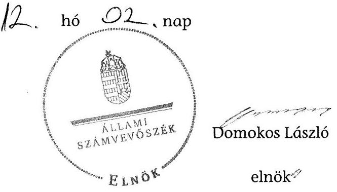

# ÁLLAMI   SZÁMVEVŐSZÉK 

## JELENTÉS

az önkormányzatok belső kontrollrendszere kialakításának, egyes kontrolltevékenységek és a belső ellenőrzés múködésének - 2013. évben induló - ellenőrzéséről

Bélapátfalva

---

# Állami Számvevőszék 

Iktatószám: V-0156-034/2013.
Témaszám: 1190
Vizsgálat-azonosító szám: V064918

## Az ellenőrzést felügyelte:

dr. Benedek Mária
felügyeleti vezető
Az ellenőrzést vezette és az ellenőrzés végrehajtásáért felelős:
dr. Veress Tiborné
ellenőrzésvezető
A számvevőszéki jelentés összeállításában közremüködtek:
dr. Zsombori Beáta
számvevő
Bencsik Árpád
számvevő
Az ellenőrzést végezték:
Béres László
Papp József
számvevő
számvevő tanácsos

A témához kapcsolódó eddig készített számvevőszéki jelentések:
címe
sorszáma
A helyi önkormányzatok fejlesztési célú támogatási rendszerének 1108 ellenőrzése

---

# TARTALOMJEGYZÉK 

BEVEZETÉS ..... 5
I. ÖSSZEGZŐ MEGÁLLAPÍTÁSOK, KÖVETKEZTETÉSEK, JAVASLATOK ..... 9
II. RÉSZLETES MEGÁLLAPÍTÁSOK ..... 16

1. Az önkormányzat belső kontrollrendszerének kialakítása ..... 16
1.1. A kontrollkörnyezet ..... 16
1.2. A kockázatkezelési rendszer ..... 17
1.3. A kontrolltevékenységek ..... 18
1.4. Az információs és kommunikációs rendszer ..... 18
1.5. A monitoring rendszer ..... 19
2. A pénzügyi folyamatokban kulcsszerepet betöltő teljesítésigazolás és érvényesítés belső kontrollok működése ..... 19
3. A belső ellenőrzés múködése ..... 21

## FÜGGELÉKEK

1. számú Értelmező szótár
2. számú Az értékelés módja és szempontjai

---

.

---

# RÖVIDÍTÉSEK JEGYZÉKE 

| Törvények |  |
| :--: | :--: |
| Áht. | 2011. évi CXCV. törvény az államháztartásról (hatályos 2012. január 1-jétől) |
| Htv. | 1991. évi XX. törvény a helyi önkormányzatok és szerveik, a köztársasági megbízottak, valamint egyes centrális alárendeltségú szervek feladat- és hatásköreiről |
| Info tv. | 2011. évi CXII. törvény az információs önrendelkezési jogról és az információszabadságról (hatályos 2012. január 1-jétől) |
| Kttv. | 2011. évi CXCIX. törvény a közszolgálati tisztviselökröl |
| Mötv. | 2011. évi CLXXXIX. törvény Magyarország helyi önkormányzatairól (hatályos 2012. január 1-jétől) |
| Nvtv. | 2011. évi CXCVI. törvény a nemzeti vagyonról |
| Ötv. | 1990. évi LXV. törvény a helyi önkormányzatokról |
| Számv. tv. | 2000. évi C. törvény a számvitelről |
| Rendeletek |  |
| Áhsz. | 249/2000. (XII. 24.) Korm. rendelet az államháztartás szervezetei beszámolási és könyvvezetési kötelezettségének sajátosságairól |
| Ávr. | 368/2011. (XII. 31.) Korm. rendelet az államháztartásról szóló törvény végrehajtásáról (hatályos 2012. január 1jétől) |
| Bkr. | 370/2011. (XII. 31.) Korm. rendelet a költségvetési szervek belső kontrollrendszeréről és belső ellenőrzéséről (hatályos 2012. január 1-jétől) |
| Ikr. | 335/2005. (XII. 29.) Korm. rendelet a közfeladatot ellátó szervek iratkezelésének általános követelményeiről |
| Polgármesteri Hivatal SZMSZ-e | Bélapátfalva Város Önkormányzata 23/2005. (XII. 20.) számú rendelete Bélapátfalva Város Polgármesteri Hivatalának Szervezeti és Müködési Szabályzatáról |
| vagyongazdálkodási rendelet | Bélapátfalva Nagyközségi Önkormányzat 12/2003. (VI. 16.) számú rendelete az Önkormányzat vagyonáról és a vagyongazdálkodás szabályairól |
| Szórövidítések |  |
| adatvédelmi szabályzat | Polgármesteri Hivatal adatvédelmi és adatbiztonsági szabályata |
| ÁSZ | Állami Számvevőszék |
| belső ellenőrzési kézikönyv | Bélapátfalvai Kistérség Többcélú Társulása munkaszervezetének belső ellenőrzési kézikönyve |
| értékelési szabályzat | Polgármesteri Hivatal Eszközök és források értékelési szabályzata |
| INTOSAI | International Organization of Supreme Audit Institutions (Legfőbb Ellenőrző Intézmények Nemzetközi Szervezete) |
| iratkezelési szabályzat | Bélapátfalva Város Önkormányzata Egyedi iratkezelési |

---

|  | szabályzata |
| :--: | :--: |
| ISSAI | International Standards of Supreme Audit Institutions (Legfőbb Ellenőrző Intérmények Nemzetközi Standardjai) |
| jegyző | Bélapátfalva Város Önkormányzatának (körjegyzőségi feladatokat ellátó) címzetes főjegyzöje |
| Képviselő-testület | Bélapátfalva Város Önkormányzatának Képviselőtestülete |
| Közös Önkormányzati Hivatal | Bélapátfalvai Közös Önkormányzati Hivatal |
| Közös Önkormányzati Hivatal SZMSZ-e | Bélapátfalva Város Önkormányzata 38/2013. (IV. 11.) számú határozata Bélapátfalvai Közös Önkormányzati Hivatal Szervezeti és Müködési Szabályzatáról |
| NGM | Nemzetgazdasági Minisztérium |
| Önkormányzat | Bélapátfalva Város Önkormányzata |
| Pénzügyi csoport | Bélapátfalva Város Polgármesteri Hivatala Pénzügyi csoportja (Polgármesteri Hivatal gazdasági szervezete) |
| polgármester | Bélapátfalva Város Önkormányzatának polgármestere |
| Polgármesteri Hivatal | Bélapátfalva Város Önkormányzatának Polgármesteri Hivatala |
| stratégiai ellenőrzési   terv | Bélapátfalva Város Önkormányzata Képviselőtestületének 126/2009. (X. 26.) határozatával elfogadott Bélapátfalvai Kistérség Többcélú Társulás 2010-2014. évekre vonatkozó belső ellenőrzési stratégiai terve |
| számviteli politika   Társulás | Polgármesteri Hivatal Számviteli politikája   Bélapátfalvai Kistérség Többcélú Társulása |
| 2012. évi belső ellenőrzési terv | Bélapátfalva Város Önkormányzata Képviselőtestületének 190/2011. (XI. 7.) határozatával elfogadott az Önkormányzat 2012. évi belső ellenőrzési terve |
| 2013. évi belső ellenőrzési terv | Bélapátfalva Város Önkormányzata Képviselőtestületének 73/2013. (V. 27.) határozatával elfogadott az Önkormányzat 2013. évi belső ellenőrzési terve |

---

# JELENTÉS 

## az önkormányzatok belső kontrollrendszere kialakításának, egyes kontrolltevékenységek és a belső ellenőrzés múködésének - 2013. évben induló - ellenőrzéséről Bélapátfalva

## BEVEZETÉS

Bélapátfalva város állandó lakosainak száma 2012. január 1-jén 3197 fő volt. Az Önkormányzat héttagú Képviselő-testületének munkáját három állandó bizottság segítette. Az Önkormányzat az önállóan működő és gazdálkodó Polgármesteri Hivatalon kívül három önállóan működő intézménnyel látta el feladatát. Egy többségi tulajdoni hányadú gazdasági társasággal rendelkezett. A polgármester a 2010. évi helyi önkormányzati választások óta tölti be tisztségét. A jegyző 1990. december 14-től látja el a jegyzői feladatokat. A Polgármesteri Hivatal öt szervezeti egységre tagolódott: Pénzügyi csoport, Igazgatási csoport, Építésügyi és Vagyongazdálkodási csoport, Okmányiroda, Városi Gyámhivatal. A Pénzügyi csoport látta el az elkülönítétt gazdasági szervezet feladatait. A köztisztviselők száma 2012. január 1-jén 24 fő volt. A Polgármesteri Hivatal az ellenőrzött időszakban körjegyzőségi feladatot látott el megállapodás alapján Bükkszentmárton és Mónosbél községek vonatkozásában. A 2013. január 1-jén megszűnő Polgármesteri Hivatal jogutódjaként - a két községi önkormányzat (Bükkszentmárton és Mónosbél) csatlakozási szándéknyilatkozata alapján - létrejött a Közös Önkormányzati Hivatal. Az Önkormányzat a 2012. évi költségvetési beszámolója szerint 689577 ezer Ft bevételt ért el, valamint 664301 ezer Ft kiadást teljesített. A 2012. december 31-i könyvviteli mérleg szerint 2016895 ezer Ft értékű eszközvagyonnal rendelkezett, a rövid lejáratú kötelezettségállománya 7960 ezer Ft volt, hosszú lejáratú kötelezettsége nem volt.

A demokratikus társadalmakban alapvető igény, hogy a közpénzeket, a közvagyont használók tevékenységükről elszámoljanak, ahhoz egyértelmű és érvényesíthető felelősségi szabályok társuljanak. Ennek a jogos igénynek az érvényesítéséhez meg kell teremteni azokat a folyamatokat, rendszereket, amelyek nélkülözhetetlenek az elszámoltatáshoz. Az elszámoltatás eredményes múködtetéséhez szükség van a megfelelő információs, kontroll-, értékelési és beszámolási rendszerek kialakítására.

Magyarországon az uniós csatlakozási tárgyalások idejére nyúlnak vissza a belső kontrollrendszer szabályozásának gyökerei. Az uniós elvárásoknak megfelelő új terminológia szerinti államháztartási belső pénzügyi ellenőrzési (ÁBPE) rendszer területén a jogharmonizáció 2003-ban teljes körűen megvalósult, míg az önkormányzati alrendszerre vonatkozó, Ötv.-ben megjelenített

---

speciális szabályozás 2005-ben lépett hatályba. Az államháztartási belső kontrollrendszer koncepciója 2009-ben továbbfejlődött. A változások irányát mutatja, hogy a költségvetési szervek belső kontrollrendszere már magában foglalja a korszerű felelős szervezetirányítás elemeit (kontrollkörnyezet, kockázatkezelés, kontrolltevékenység, információ és kommunikáció, monitoring) is. E kontrollrendszer szabályozása háromszintú, a törvényi előírásokat az Áht. és a Mötv., a rendeleti szintű szabályozást az Ávr. és a Bkr. tartalmazza, amelyeket útmutatói szinten az NGM által kiadott standardok és kézikönyvek támogatnak.

A belső kontrollrendszer azt a célt szolgálja, hogy a költségvetési szervek működésük és gazdálkodásuk során a tevékenységeket szabályszerűen, gazdaságosan, hatékonyan és eredményesen hajtsák végre, teljesítsék elszámolási kötelezettségeiket és megvédjék az erőforrásokat a veszteségektől, a károktól és a nem rendeltetésszerű használattól. A belső kontrollrendszer magában foglalja mindazon szabályokat, eljárásokat, gyakorlati módszereket és szervezeti struktúrákat, kockázatkezelési technikákat, kontrolltevékenységeket, amelyek segítséget nyújtanak a szervezetnek céljai eléréséhez.

Az ÁSZ a 2011-2015. évekre szóló stratégiájában hangsúlyos szerepet szánt annak, hogy szilárd szakmai alapon álló, értékteremtő ellenőrzéseivel előmozdítsa a közpénzügyek átláthatóságát, rendezettségét. A számvevőszéki ellenőrzés nemzetközi alapelvei is rögzítik, hogy a megfelelő belső kontrollrendszer minimálisra csökkenti a hibák és szabálytalanságok kockázatát.

Az ellenőrzés célja annak megállapítása volt, hogy a belső kontrollrendszer elemeinek kialakítása, a pénzügyi folyamatokban kulcsszerepet betöltő teljesítésigazolás és érvényesítés, és a belső ellenőrzés szabályos múködése biztosítot-ta-e az önkormányzatnál a közpénzfelhasználás szabályosságát, hozzájárult-e az értéket teremtő rend követelményének érvényesüléséhez.

Ennek keretében értékeltük, hogy

- a jogszabályi előírásoknak megfelelően alakították-e ki a belső kontrollrendszer elemeit;
- a gazdálkodás folyamatában kulcsszerepet betöltő teljesítésigazolás és érvényesítés kontrolltevékenységeit megfelelően működtették-e;
- biztosította-e a belső ellenőrzés szabályos működését;
- amennyiben az ÁSZ tett javaslatot a 2008-2011. évek közötti ellenőrzése kapcsán az Önkormányzatnak, intézkedtek-e azok végrehajtására.

Az ellenőrzés várható hasznosulását négy szinten tervezzük. A törvényalkotás számára összegzett tapasztalatok állnak rendelkezésre a belső kontrollrendszer önkormányzati területen való kialakításáról, működéséről és hatásairól, a belső ellenőrzés működéséről. Ennek alapján következtetést lehet levonni arról, hogy a belső kontrollrendszer kialakítására és működtetésére vonatkozó jelenlegi, differenciálás nélküli - jogszabályi előírások reális követelményeket támasztanak-e az eltérő adottságú települési önkormányzatok esetében, illetve indokolt-e esetleges jogszabályi módosítás kezdeményezése. Az ellenőrzés az el-

---

lenőrzött számára visszajelzést ad a belső kontrollrendszer kialakításában és működésében fellépő hiányosságokról, javaslataival hozzájárul azok kiküszöböléséhez, amely csökkentheti a későbbi ellenőrzések gyakoriságát. Az ellenőrzés megállapításait és javaslatait más szervezetek is hasznosíthatják a rendezett gazdálkodási keretek kialakításához. A társadalom számára jelzi, hogy közpénz nem maradhat ellenőrizetlenül, az ÁSZ értékteremtő rend kialakításához és megőrzéséhez hozzájáruló tevékenysége pozitív hatással lesz a szervezetről kialakított összkép formálásában. A szervezeten belül lehetőség nyílik arra, hogy a megállapítások szintetizálásával az ÁSZ a hozzáadott értéket teremtő elemző tevékenységét és tanácsadó szerepét is erősítse.

Az önkormányzatok belső kontrollrendszere kialakításának, egyes kontrolltevékenységek és a belső ellenőrzés működésének ellenőrzéséről szóló jelentés I. fejezetének összegző része az ellenőrzés céljára ad rövid, szintetizáló összefoglalót, és tartalmazza a következtetéseket a II. fejezet részletes megállapításain alapulóan. A jelentés intézkedést igénylő megállapításait és javaslatait az ellenőrzés során feltárt, a jelentés II. fejezetében rögzített részletes megállapítások alapozzák meg. A helyszíni ellenőrzés lezárásáig a helyi szabályozás változásait nyomon követtük.

Az ellenőrzés típusa: szabályszerűségi ellenőrzés.
Az ellenőrzött időszak: a belső kontrollrendszer kialakításának megfelelősége esetében 2012. év, a pénzügyi folyamatokban kulcsszerepet betöltő teljesítésigazolás és érvényesítés belső kontrollok múködésének megfelelőségét és a belső ellenőrzés szabályszerű működését a 2012. január 1. és december 31-e közötti időszak eseményeit figyelembe véve értékeltük, míg az ÁSZ javaslatainak utóellenőrzése a 2008-2011. években hivatalosan közzé tett számvevőszéki jelentésekben tett javaslatok áttekintésére terjedt ki.

Az ellenőrzött szervezet: Bélapátfalva Város Önkormányzata.
Az ellenőrzés jogszabályi alapját az ÁSZ tv. 1. § (3) bekezdése, az 5. § (2) és (6) bekezdései, valamint az Áht. 61. §. (2) bekezdésének előírásai képezik.

Az ellenőrzés szakmai módszertana az ÁSZ hivatalos honlapján (www.asz.hu) közzétett szakmai szabályokon alapult, amely az INTOSAI által kiadott ISSAI figyelembevételével készült.

Az ellenőrzés lefolytatásához az Önkormányzat a kimutatások és a tanúsítvány kitöltésével, valamint az ÁSZ által kért dokumentumok elektronikus megküldésével szolgáltatott adatokat. Az így rendelkezésre bocsátott adatok, információk kontrollja és a munkalapok kitöltése a helyszíni ellenőrzés keretében történt. A jelentésben használt fogalmak magyarázatát az 1. számú függelék, az ellenőrzés egyes területeinek értékelésénél alkalmazott egységes minősítési szempontokat a 2. számú függelék tartalmazza.

A belső kontrollrendszer kialakításának ellenőrzése során értékeltük a kontrollkörnyezet, a kockázatkezelési rendszer, a kontrolltevékenységek, az információs és kommunikációs rendszer, valamint a monitoring rendszer szabályozottságának megfelelőségét. A pénzügyi folyamatokban kulcsszerepet betöltő teljesí-

---

tésigazolás és érvényesítés kontrolljai múködése megfelelőségének minősítéséhez az állományba nem tartozók megbízási dijai, a külső szolgáltatók által végzett karbantartási, kisjavítási munkák, az egyéb üzemeltetési és fenntartási szolgáltatások, a rendszeres szociális segélyek, valamint az államháztartáson kívülre teljesített múködési és felhalmozási célú pénzeszközátadások közül kockázatelemzéssel választottuk ki az ellenőrzött kiadási jogcímeket. Az egyszerű véletlen mintavétellel kiválasztott tételek ellenőrzését többlépcsős megfelelőségi tesztek útján addig végeztük, amíg elegendő és megfelelő bizonyítékot szereztünk a vizsgált folyamatok kulcskontrolljai múködésének megfelelő vagy nem megfelelő voltáról. Értékeltük az Önkormányzatnál a belső ellenőrzés múködésének szabályosságát. Az ÁSZ az Önkormányzatnál a 2010. évben a helyi önkormányzatok fejlesztési célú támogatási rendszerének ellenőrzését végezte, a nyilvánosságra hozott, 1108 számon közzétett számvevőszéki jelentésben javaslatot nem tett, ezért a jelen ellenőrzés keretében utóellenőrzésre nem került sor.

Az ÁSZ tv. 29. § (1) bekezdése szerint a jelentéstervezetet megküldtük a polgármester részére, aki az ÁSZ tv. 29. § (2) bekezdésében foglalt észrevételezési jogával élt, a tett észrevétel szakmai tartalmánál fogva a jelentéstervezet egyes megállapításait nem érintette.

---

# I. ÖSSZEGZŐ MEGÁLLAPÍTÁSOK, KÖVETKEZTETÉSEK, JAVASLATOK 

A belső kontrollrendszeren belül 2012-ben a kontrollkörnyezet, a kockázatkezelési rendszer, a kontrolltevékenységek, az információs és kommunikációs rendszer, valamint a monitoring rendszer kialakítását külön-külön és együttesen is értékeltük. A belső kontrollrendszer kialakítása az összesített értékelés alapján nem felelt meg a jogszabályi előírásoknak.

A belső kontrollrendszer egyes területei kialakításának minősítése a következő:

| Kontrollterïlet | Minősítés |
| :-- | :--: |
| Kontrollkörnyezet | nem |
|  | megfelelő |
| Kockázatkezelési rendszer | nem |
|  | megfelelő |
| Kontrolltevékenységek | nem |
| Információs és kommuni- |  |
| kációs rendszer | részben |
| Monitoring rendszer | nem |

Az információs és kommunikációs rendszer kialakítását részben megfelelőnek értékeltük, mivel az e területen megállapított kisebb szabályozásbeli hiányosságok nem veszélyeztették az információs rendszerek keretében a beszámoló rendszerek megbízható múködését.

A kontrollkörnyezet, a kockázatkezelési rendszer, a kontrolltevékenységek és a monitoring rendszer kialakítását nem megfelelőnek értékeltük, mivel az ellenőrzésünk során megállapított szabályozásbeli hiányosságok magukban hordozzák a szabálytalan múködés, valamint a korrupció kockázatát.

A belső kontrollrendszer nem megfelelő kialakítása kockázatot jelent az Önkormányzat tevékenységeinek szabályszerű, gazdaságos, hatékony és eredményes végrehajtása során.

Az állományba nem tartozók megbízási díjaival, valamint a külső szolgáltatók által végzett karbantartási, kisjavítási munkákkal kapcsolatos kifizetések során a pénzügyi folyamatokban kulcsszerepet betöltő teljesítésigazolás és érvényesítés belső kontrollok múködése gyenge volt. Gyengének értékeltük a két kulcskontroll együttes múködését, mert azok nem biztosították az ellenőrzésünk által feltárt hiányosságok bekövetkezésének megelőzését.

---

A számvevőszéki ellenőrzés az ellenőrzött kifizetésekkel összefüggésben a rendelkezésre bocsátott dokumentumok alapján kár bekövetkeztére utaló adatot, tényt nem állapított meg, azonban a gazdálkodásban kulcsszerepet betöltő kontrollok gyenge működése miatt fennáll a hibák bekövetkezésének lehetősége. A nem megfelelően szabályozott és működtetett belső kontrollok korrupciós kockázatot hordoznak.

Az ellenőrzési feladatokat a Társulás útján látták el. A belső ellenőrzés múködése nem felelt meg a jogszabályi előírásoknak. Nem megfeleltnek értékeltük a belső ellenőrzés működését, mivel a számvevőszéki ellenőrzés által megállapított szabályozási és működési hiányosságok számossága magában hordozza a szabálytalan önkormányzati gazdálkodás és feladatellátás kockázatát.

Az ÁSZ tv. 33. § (1) bekezdésében foglaltak értelmében az ellenőrzött szervezet vezetője köteles a jelentésben foglalt megállapításokhoz kapcsolódó intézkedési tervet összeállítani, és azt a jelentés kézhezvételétől számított 30 napon belül az ÁSZ részére megküldeni. Amennyiben az intézkedési tervet határidőre nem küldi meg a szervezet, vagy az ÁSZ tv. 33. § (2) bekezdésében foglalt póthatáridő elteltével megküldött intézkedési terv továbbra sem elfogadható, az ÁSZ elnöke a hivatkozott törvény 33. § (3) bekezdés a)-b) pontjaiban foglaltakat érvényesítheti.

Az ellenőrzés intézkedést igénylő megállapításai és javaslatai:

# a jegyzönek 

1. a kontrollkörnyezettel kapcsolatban:

A jegyző a Számv. tv. 14. § (11) bekezdésében előírtak ellenére az ellenőrzés idején hatályos számviteli politikát, illetve eszközök és források értékelési szabályzatát nem aktualizálta.

A jegyző a Htv. 140. §. (1) bekezdés c) pontjában foglaltak ellenére az Önkormányzat intézményeinek számviteli rendjét nem alakította ki.

A jegyző a Bkr. 6. § (3) bekezdésében foglaltak ellenére a Polgármesteri Hivatal ellenőrzési nyomvonalának rendszeres aktualizálásáról nem gondoskodott.

A Kttv. 231. § (1) bekezdése ellenére a Képviselő-testület nem állapította meg a Kttv. 83. §-ában előírt, a köztisztviselőkkel szembeni hivatásetikai alapelvek részletes tartalmát, valamint az etikai eljárás szabályait, mivel a jegyző az Ötv. 36. § (2) bekezdés a) pontjában előírt feladata ellenére nem készítette elő ennek dokumentumát.

Javaslat:
a) Aktualizálja a Számv. tv. 14. § (11) bekezdésében foglaltaknak megfelelően a számviteli politikát és az eszközök és források értékelési szabályzatát.
b) Alakítsa ki a Htv. 140. §. (1) bekezdés c) pontjában foglaltak szerint az Önkormányzat intézményeinek számviteli rendjét.

---

c) Intézkedjen a Bkr. 6. § (3) bekezdésében előírtaknak megfelelően az ellenőrzési nyomvonal rendszeres aktualizálásáról.
d) Készítse elő a Mötv. 81. § (3) bekezdés c) pontjában foglalt feladatkörében a Kttv. 83. §-ában foglaltaknak megfelelően a köztisztviselőkkel szembeni hivatásetikai alapelvek részletes tartalmának, valamint az etikai eljárás szabályainak dokumentumait és kezdeményezze a polgármesternél a Kttv. 231. § (1) bekezdésében foglaltak alapján annak Képviselő-testület elé terjesztését.
2. a kockázatkezelési rendszerrel kapcsolatban:

A jegyző a Bkr. 7. § (2) bekezdésében foglaltak ellenére nem mérte fel és nem állapította meg a Polgármesteri Hivatal tevékenységében és gazdálkodásában rejlő kockázatokat, továbbá nem határozta meg az egyes kockázatokkal kapcsolatban szükséges intézkedéseket, valamint azok teljesítése folyamatos nyomon követésének módját.

Javaslat:
Mérje fel és állapítsa meg - a Bkr. 7. § (2) bekezdésében foglaltak alapján - a Polgármesteri Hivatal tevékenységében és gazdálkodásában rejlő kockázatokat, határozza meg az egyes kockázatokkal kapcsolatban szükséges intézkedéseket, valamint azok teljesítése folyamatos nyomon követésének módját.
3. a kontrolltevékenységekkel kapcsolatban:

A jegyző az Ávr. 13. § (2) bekezdés a) pontjában foglaltak ellenére nem határozta meg a kötelezettségvállalás, az ellenjegyzés, a teljesítés igazolása, az érvényesítés és az utalványozás gyakorlásának módjával, eljárási és dokumentációs részletszabályaival, valamint az ezeket végző személyek kijelölési rendjével kapcsolatos előírásokat.

Az Ávr. 60. § (3) bekezdésében foglaltak ellenére a kötelezettségvállalásra, a pénzügyi ellenjegyzésre, a teljesítésigazolásra, az érvényesítésre, az utalványozásra jogosult személyek és aláírás mintájuk naprakész nyilvántartásáról belső szabályzatban nem rendelkeztek és nyilvántartást nem vezettek.

A jegyző az Ávr. 13. § (5) bekezdésében foglaltak ellenére nem határozta meg a gazdasági feladatot ellátó vezető és alkalmazottak helyettesítésének rendjét.

A jegyző a Kttv. 74. § (1) bekezdésében foglaltak ellenére a jogviszony megszűnése esetére nem határozta meg a munkavállaló folyamatban lévő feladatai átadásának rendjét.

Javaslat:
a) Határozza meg az Ávr. 13. § (2) bekezdés a) pontjában foglaltaknak megfelelően a kötelezettségvállalás, az ellenjegyzés, a teljesítés igazolása, az érvényesítés és az utalványozás gyakorlásának módjával, eljárási és dokumentációs részletszabályaival, valamint ezeket végző személyek kijelölési rendjével kapcsolatos előírásokat.
b) Intézkedjen arról, hogy a pénzügyi ellenjegyzésre, a teljesítésigazolásra, az érvényesítésre és az utalványozásra jogosult személyekről és aláírás mintájukról - az

---

Ávr. 60 § (3) bekezdésben foglaltaknak megfelelően - belső szabályozás szerinti, naprakész nyilvántartást vezessenek.
c) Határozza meg az Ávr. 13. § (5) bekezdésében foglaltaknak megfelelően a gazdasági feladatot ellátó vezető és alkalmazottak helyettesítésének rendjét.
d) Határozza meg a Kttv. 74. § (1) bekezdésében foglaltaknak megfelelően a jogviszony megszűnése esetére a munkavállaló folyamatban lévő feladatai átadásának rendjét.
4. az információs és kommunikációs rendszerrel kapcsolatban:

A jegyző a Bkr. 9. § (1) bekezdésében foglaltak ellenére nem alakította ki a szervezeten belüli információáramlás rendszerét.

A jegyző az Ávr. 13. § (2) bekezdés h) pontjában foglalt előírás ellenére a kötelezően közzéteendő adatok nyilvánosságra hozatalának rendjét nem alakította ki.

Az lkr. 14. § (4) bekezdésében foglaltak ellenére a jegyző az iratforgalom dokumentálásával nem biztosította, hogy az iratok szervezeten belüli útja pontosan követhető és ellenőrizhető legyen.

Javaslat:
a) Szabályozza a Bkr. 9. § (1) bekezdésében foglaltaknak megfelelően a szervezeten belüli információáramlás rendszerét.
b) Állapítsa meg az Ávr. 13. § (2) bekezdés h) pontjában foglaltaknak megfelelően a kötelezően közzéteendő adatok nyilvánosságra hozatalának rendjét.
c) Biztosítsa az lkr. 14. § (4) bekezdésében foglaltaknak megfelelően az iratforgalom dokumentálásával, hogy az iratok szervezeten belüli útja pontosan követhető és ellenőrizhető legyen.
5. a monitoring rendszerrel kapcsolatban:

A jegyző a Bkr. 3. § e) pontjában és a 10. §-ában foglaltak ellenére nem alakította ki a szervezet tevékenységének, a célok megvalósításának nyomon követését biztosító rendszert.

Javaslat:
Alakítsa ki és múködtesse a Bkr. 3. § e) pontjában és a 10. §-ában foglaltak alapján a szervezet tevékenységének, a célok megvalósításának nyomon követését biztosító rendszert.
6. a pénzügyi folyamatokban kulcsszerepet betöltő kontrollok múködésével kapcsolatban:

A kifizetéseket megelőzően az Ávr. 57. § (1) és a (3)-(4) bekezdéseiben foglaltak ellenére a teljesítésigazolást nem végezték el, vagy kijelölés hiányában nem az arra jogosult személy végezte.

---

Az érvényesítést az Ávr. 58. § (1) bekezdésben foglaltak ellenére nem teljesítésigazolás alapján végezték.

Az Ávr. 58. § (2) bekezdésében foglalt előírás ellenére az érvényesítő nem jelezte az utalványozónak, hogy nem jelölték ki a teljesítés igazolására jogosult személyt.

Az érvényesítőt az Ávr. 58. § (4) bekezdésében foglalt előírás ellenére nem az arra jogosult személy jelölte ki, valamint a kötelezettségvállalások nyilvántartásának adattartalma nem felelt meg az Ávr. 56. § (1)-(3) és (6) bekezdéseiben foglalt előírásoknak.

Javaslat:
Intézkedjen - a teljesítésigazolás és az érvényesítés vonatkozásában feltárt hiányosságok megszüntetése, illetve az operatív gazdálkodás során a müködésbeli hibák megelőzése, feltárása és kijavítása érdekében - arról, hogy:
a) a teljesítésigazolásra - az Ávr. 57. § (4) bekezdésében foglalt előírásnak megfelelően - kijelölt személyek az Ávr. 57. § (1) bekezdésében foglaltaknak megfelelően, ellenőrizhető okmányok alapján ellenőrizzék a kiadások teljesítésének jogosságát, összegszerűségét, ellenszolgáltatást is magában foglaló kötelezettségvállalás esetében a szerződés, megrendelés teljesítését, és azt az Ávr. 57. § (3) bekezdésében foglalt módon igazolják;
b) az Ávr. 55. § (2) bekezdés f) pontjának megfelelően kerüljenek kijelölésre az érvényesítésre jogosult személyek;
c) az érvényesítő ellenőrizze - az Ávr. 58. § (1) bekezdése szerint - a teljesítésigazolás alapján - az Ávr. 57. § (3) bekezdése szerinti esetben annak hiányában is - az összegszerűséget, a fedezet meglétét és a megelőző ügymenetben az Áht., az Áhsz., az Ávr. előírásainak és a belső szabályzatokban foglaltaknak a betartását;
d) az érvényesítő az Ávr. 58. § (2) bekezdésben foglalt előírásnak megfelelően jelezze az utalványozónak, ha az Áht. vagy az államháztartási számviteli kormányrendelet, az Ávr. és a belső szabályzatokban foglaltak megsértését tapasztalja;
e) a kötelezettségvállalás nyilvántartás feleljen meg az Ávr. 56. § (1)-(3) és (6) bekezdéseiben foglalt előírásoknak.
7. a belső ellenőrzés működésével kapcsolatban:

A belső ellenőrzési kézikönyv nem a hatályos jogszabályi hivatkozásokat tartalmazta, azonban tartalmában megfelelt a Bkr. 17. §-ában foglaltaknak. A belső ellenőrzési vezető a belső ellenőrzési kézikönyv - Bkr. 17. § (4) bekezdésében előírt - rendszeres, de legalább kétévenkénti felülvizsgálati kötelességének nem tett eleget.

A stratégiai ellenőrzési terv a Bkr. 30. § (1) bekezdés b) pontjában foglalt előírás ellenére nem tartalmazta a belső kontrollrendszer általános értékelését.

A 2013. évi ellenőrzési terv a Bkr. 31. § (4) bekezdés a) és c) pontjaiban foglaltak ellenére nem tartalmazta az ellenőrzési tervet megalapozó elemzések és a kockázatelemzés eredményének összefoglaló bemutatását, valamint az ellenőrzések célját.

---

A Képviselő-testület a 2013. évi ellenőrzési tervet az Ötv. 92. § (6) bekezdésében foglalt határidőn túl, 2013. május 27-én hagyta jóvá. A Bkr. 31. § (2) bekezdésében foglaltak ellenére a 2013. évi ellenőrzési tervet kockázatelemzés nem alapozta meg, és nem a stratégiai tervben és kockázatelemzésben felállított prioritásokon alapult.

A 2012. évi ellenőrzési tervhez képest ellenőrzést hagytak el és új ellenőrzést is indítottak, azonban a Bkr. 31. § (5) és 56. § (5) bekezdésében foglaltak ellenére azt nem módosították. A 2012. évben végrehajtott ellenőrzésekhez a Bkr. 33. § (2) bekezdésében foglaltak ellenére egy esetben nem készítettek ellenőrzési programot, illetve a 2012. évi ellenőrzési programokat a belső ellenőrzési vezető helyett a Társulás vezetője hagyta jóvá.

A belső ellenőrzés 2012. évi javaslatainak végrehajtása érdekében - a Bkr. 45. § (1)(3) bekezdéseiben foglaltak ellenére - (háromból) kettő esetben nem készítettek intézkedési tervet. A 2012. évben a belső ellenőrzés az ellenőrzési jelentések alapján tett intézkedések nyomon követését a Bkr. 21. § (2) bekezdés d) pontjában előírt kötelezettsége ellenére elmulasztotta. A Bkr. 50. § (1)-(2) bekezdéseiben foglalt előírást figyelmen kívül hagyva, a belső ellenőrzési vezető az elvégzett ellenőrzésekről nyilvántartást nem vezetett.

Javaslat:
a) Intézkedjen a Bkr. 17. § (4) bekezdésében foglaltaknak megfelelően a belső ellenőrzési kézikönyv rendszeres, de legalább kétévenkénti felülvizsgálatáról.
b) Intézkedjen a stratégiai ellenőrzési tervnek a Bkr. 30. § (1) bekezdés b) pontjában foglaltak szerinti - a belső kontrollrendszer általános értékelésével történő kiegészítéséről.
c) Kezdeményezze, hogy az ellenőrzési terv a Bkr. 31. § (4) bekezdés a) és c) pontjaiban foglaltak szerint tartalmazza az ellenőrzési tervet megalapozó elemzések és a kockázatelemzés eredményének összefoglaló bemutatását, valamint az ellenőrzések célját.
d) Intézkedjen az éves ellenőrzési terv Képviselő-testület elé terjesztéséről annak érdekében, hogy azt a Képviselő-testület a Mötv. 119. § (5) és a Bkr. 32. § (4) bekezdésében előírt határidőn belül hagyja jóvá.
e) Intézkedjen arról, hogy az éves ellenőrzési terv a Bkr. 31. § (2) bekezdése alapján kockázatelemzésen alapuljon.
f) Kezdeményezze, hogy az éves ellenőrzési terv a Bkr. 31. § (2) bekezdésének előírása szerint a stratégiai tervben és a kockázatelemzésben felállított prioritásokon alapuljon.
g) Intézkedjen arról, hogy ellenőrzés elhagyása vagy új ellenőrzés indítása esetén a Bkr. 31. § (5) és 56. § (5) bekezdésében foglaltaknak megfelelően - az éves ellenőrzési tervet a jegyző egyetértésével módosítsák.
h) Kezdeményezze, hogy a Bkr. 33. § (2) bekezdésében foglalt előírás szerint a végrehajtott ellenőrzésekhez minden esetben ellenőrzési program készüljön, és azt a belső ellenőrzési vezető hagyja jóvá.

---

i) Készítsen intézkedési tervet a Bkr. 45. § (1)-(3) bekezdéseiben foglaltaknak megfelelően a belső ellenőrzési jelentésekben megfogalmazott javaslatok végrehajtására, az előírt tartalommal és határidőn belül.
j) Kezdeményezze, hogy a belső ellenőrzés az ellenőrzési jelentések alapján tett intézkedések nyomon követését a Bkr. 21. § (2) bekezdés d) pontjában előírtak szerint biztosítsa.
k) Kezdeményezze, hogy a Bkr. 50. § (1)-(2) bekezdéseiben foglalt előírások szerint a belső ellenőrzési vezető az elvégzett ellenőrzésekről nyilvántartást vezessen.

---

# II. RÉSZLETES MEGÁLLAPÍTÁSOK 

## 1. Az ÖNKORMÁNYZAT BELSŐ KONTROLLRENDSZERÉNEK KIALAKÍTÁSA

A belső kontrollrendszer kialakítása 2012-ben a kontrollkörnyezet, a kockázatkezelési rendszer, a kontrolltevékenységek, az információs és kommunikációs rendszer, valamint a monitoring rendszer értékelése alapján összességében nem felelt meg a jogszabályi előírásoknak.

### 1.1. A kontrollkörnyezet

A kontrollkörnyezet kialakítása - a 2. számú függelékben részletezett kritériumrendszer alapján végzett értékelés szerint - a jogszabályi előírásoknak nem felelt meg, mert:

| Sorszám | Megállapítás | Megjegyzés |
| :--: | :--: | :--: |
| $\begin{aligned} & 7 . \\ & 12 . \end{aligned}$ | A Polgármesteri Hivatal az Ávr. 13. § (1) bekezdés előírásainak megfelelő SZMSZ-szel nem rendelkezett. | A Képviselő-testület 38/2013. (IV. 11.) számú határozatával elfogadta az Ávr. 13. § (1) bekezdés előírásainak megfelelő Közös Önkormányzati Hivatal SZMSZ-ét. |
| 16. | Az Önkormányzat vagyongazdálkodási rendeletét 2012. november 5 -én módosította a 13/2012. (XI. 5.) számú rendeletével, azonban a módosított vagyongazdálkodási rendelet nem felelt meg az Nvtv. 3. § (1) bekezdés 6. pontja, 5-6. §-a, 11.§ (16) bekezdése, 13. § (1) bekezdése, 18. § (1) és (12) bekezdései, valamint a Mötv. 109. § (4) bekezdése előírásainak. | 2013. május 23-án a Heves Megyei Kormányhivatal a HEB/TOR/14414/2013. szám alatt törvényességi felhívással élt a vagyongazdálkodási rendelet hiányosságai miatt.   A jogszabályoknak megfelelő vagyongazdálkodási rendeletet 2013. július 7én a Képviselő-testület 10/2013. (VII.2.) számú rendeletével elfogadta. |

[^0]
[^0]:    ${ }^{1}$ A megállapítás számozása az Önkormányzat által - az adatszolgáltatás során - kitöltött kimutatások kérdéseinek sorszámával azonos.

---

| 17.,   29. | A jegyző a Számv. tv. 14. § (11) bekezdésében előírtak ellenére - az ellenőrzés idején hatályos - számviteli politikát, illetve az eszközök és források értékelési szabályzatát nem aktualizálta. |
| :--: | :--: |
| 18. | A jegyző a Htv. 140. §. (1) bekezdés c) pontjában foglaltak ellenére az Önkormányzat intézményeinek számviteli rendjét nem alakította ki. |
| 44. | A jegyző a Bkr. 6. § (3) bekezdésében foglaltak ellenére a Polgármesteri Hivatal ellenőrzési nyomvonalának rendszeres aktualizálásáról nem gondoskodott. |
| 47. | A Kttv. 231. § (1) bekezdése ellenére a Képvi-selő-testület nem állapította meg a Kttv. 83. §ában előírt, a köztisztviselőkkel szembeni hivatásetikai alapelvek részletes tartalmát, valamint az etikai eljárás szabályait, mivel a jegyző az Ötv. 36. § (2) bekezdés a) pontjában ${ }^{2}$ elöírt feladata ellenére nem készítette elő ennek dokumentumát. |

# 1.2. A kockázatkezelési rendszer 

A kockázatkezelési rendszer kialakítása - a 2. számú függelékben részletezett kritériumrendszer alapján végzett értékelés szerint - nem felelt meg a jogszabályi előírásoknak, mert:

| Sor-   szám | Megállapítás |
| :--: | :--: |
| 4., 8.,   10. | A jegyző a Bkr. 7. § (2) bekezdésében foglaltak ellenére nem mérte fel és nem állapította meg a Polgármesteri Hivatal tevékenységében, gazdálkodásában rejlő kockázatokat, továbbá nem határozta meg az egyes kockázatokkal kapcsolatban szükséges intézkedéseket, valamint azok teljesítése folyamatos nyomon követésének módját. |
| 13. | Az egyes vagyonnyilatkozat-tételi kötelezettségekről szóló 2007. évi CLII. törvény 4. §ában foglaltak ellenére a vagyonnyilatkozattételre kötelezettek körét a Polgármesteri Hivatal SZMSZ-ében a jegyző nem rögzítette. |

A 2013. április 1-jétől hatályos Közös Önkormányzati Hivatal SZMSZ-e a jogszabályoknak megfelelően tartalmazta a vagyonnyilatkozat-tételre kötelezettek körét.

[^0]
[^0]:    ${ }^{2}$ 2013. január 1-jétől Mötv. 81. § (3) bekezdés c) pont

---

# 1.3. A kontrolltevékenységek 

A kontrolltevékenységek kialakítása - a 2. számú függelékben részletezett kritériumrendszer alapján végzett értékelés szerint - a jogszabályi előírásoknak nem felelt meg, mert:

| Sor-   szám | Megállapítás |
| :--: | :--: |
| 6., 9.,   11.,   12. | A jegyző az Ávr. 13. § (2) bekezdés a) pontjában foglaltak ellenére nem határozta meg a kötelezettségvállalás, az ellenjegyzés, a teljesítés igazolása, az érvényesítés és az utalványozás gyakorlásának módjával, eljárási és dokumentációs részletszabályaival, valamint az ezeket végző személyek kijelölési rendjével kapcsolatos előírásokat. |
| $\begin{aligned} & 26, \\ & 27 . \\ & 29 .,31 \end{aligned}$ | Az Ávr. 60. § (3) bekezdésben foglaltak ellenére a kötelezettségvállalásra, a pénzügyi ellenjegyzésre, a teljesítésigazolásra, az érvényesítésre, az utalványozásra jogosult személyek és aláírás mintájuk naprakész nyilvántartásáról belső szabályzatban nem rendelkeztek és nyilvántartást nem vezettek. |
| 21. | A jegyző az Ávr. 13. § (5) bekezdésében foglaltak ellenére nem határozta meg a gazdasági feladatot ellátó vezető és alkalmazottak helyettesítésének rendjét. |
| 32. | A jegyző a Kttv. 74. § (1) bekezdésében foglaltak ellenére jogviszony megszűnése esetére nem határozta meg a munkavállaló folyamatban lévő feladatai átadásának rendjét. |

### 1.4. Az információs és kommunikációs rendszer

Az információs és kommunikációs rendszer kialakítása - a 2. számú függelékben részletezett kritériumrendszer alapján végzett értékelés szerint részben felelt meg a jogszabályi előírásoknak.

A jegyző kialakította az Önkormányzattal kapcsolatos információk külső feleknek történő átadása rendjét, valamint szabályozta a szervezeten kívülről érkező információk kezelésének rendjét.

A Polgármesteri Hivatal rendelkezett az Info tv. előírásainak megfelelő adatvédelmi szabályzattal. Az Önkormányzat az elektronikus közzétételi kötelezettségének a 2012. évben eleget tett. A jegyző meghatározta a közérdekú adatok megismerésére irányuló igények teljesítésének rendjét.

A jogszabályi előírásoknak megfelelő tartalmú iratkezelési szabályzatot a jegyző elkészítette és hatályba helyezte.

Az információs és kommunikációs rendszer kialakítása az alábbi kisebb hiányosságok miatt részben felelt meg a jogszabályi előírásoknak, mert:

| Sor-   szám | Megállapítás |
| :--: | :--: |
| 1. | A jegyző a Bkr. 9. § (1) bekezdésében foglaltak ellenére nem alakította ki a szervezeten belüli információáramlás rendszerét. |

---

6. A jegyző az Ávr. 13. § (2) bekezdés h) pontjában foglalt előírás ellenére a kötelezően közzéteendő adatok nyilvánosságra hozatalának rendjét nem alakította ki.

Az lkr. 14. § (4) bekezdésében foglaltak ellenére a jegyző az iratforgalom dokumentálásával nem biztosította, hogy az iratok szervezeten belüli útja pontosan követhető és ellenőrizhető legyen.

# 1.5. A monitoring rendszer 

A monitoring rendszer kialakítása - a 2. számú függelékben részletezett kritériumrendszer alapján végzett értékelés szerint - nem felelt meg a jogszabályi előírásoknak, mert:

Sor-
szám
Megállapítás

1. A jegyző a Bkr. 3. § e) pontjában és 10. §-ában foglaltak ellenére nem alakította ki a szervezet tevékenységének, a célok megvalósításának nyomon követését biztosító rendszert.

Az Önkormányzat törvényességi felügyeletét ellátó Kormányhivatal a 2012. évben az Önkormányzat vonatkozásában nem élt törvényességi felhívással, illetve más törvényességi felügyeleti eszközzel.

Az Önkormányzat az ÁSZ-tól a 2011. és a 2012. évben integritás kérdőív kitöltésére kapott felkérést, amelynek eleget tett. Az információs rendszer szabályozása és kialakítása, valamint a kommunikációs feladatok és a kapcsolódó jogosultságok szabályozása során feltárt hibák, a köztisztviselőkkel szembeni hivatásetikai alapelvek meghatározásának, valamint az etikai eljárás szabályainak hiánya, a szabálytalanságot bejelentő védelmére vonatkozó előírások és kötelezettségek szabályainak hiánya, a 2013. évi ellenőrzési terv megalapozását szolgáló kockázatelemzés elmaradása arra utal, hogy az Önkormányzatnak még fejlődést kell elérnie az integritási szemlélet érvényesítésében.

## 2. A PÉNZÜGYI FOLYAMATOKBAN KULCSSZEREPET BETÖLTŐ TELJESÍTÉSIGAZOLÁS ÉS ÉRVÉNYESÍTÉS BELSŐ KONTROLLOK MÜKÖDÉSE

Az állományba nem tartozók megbízási díjaival, valamint a külső szolgáltatók által végzett karbantartással, kisjavítással kapcsolatos kifizetések során - összefoglalóan értékelve - a pénzügyi folyamatokban kulcsszerepet betöltő teljesítés igazolása és érvényesítés belső kontrollok müködésének megfelelősége gyenge volt, mert:

Kulcskontroll Megállapítás

A kifizetéseket megelőzően az Ávr. 57. § (1) és (3)-(4) bekezdéseiben foglaltak ellenére a teljesítésigazolást nem végezték el, vagy kijelölés hiányában nem az arra jogosult személy végezte.

---

|  | Az érvényesítést az Ávr. 58. § (1) bekezdésben foglaltak ellenére   nem a teljesítés igazolás alapján végezték. Az Ávr. 58. § (2) be-   kezdésében foglalt előírás ellenére az érvényesítő nem jelezte az   utalványozónak, hogy nem jelölték ki a teljesítés igazolására   jogosult személyt. Az érvényesítőt az Ávr. 58. § (4) bekezdésében   foglalt előírás ellenére nem az arra jogosult személy jelölte ki,   valamint a kötelezettségvállalások nyilvántartásának adattar-   talma nem felelt meg az Ávr. 56. § (1)-(3) és (6) bekezdéseiben   foglalt előírásoknak. |
| :--: | :--: |

Az állományba nem tartozók megbízási díjainak kifizetése során a teljesítésigazolás és az érvényesítés kulcskontrollok müködésének megfelelősége gyenge volt, mert

- a teljesítés igazolására kijelölt személy az anyakönyvi feladatok ellátására történt 135 ezer Ft megbízási díj kifizetését megelőzően az Ávr. 57. § (1) és (3) bekezdéseiben előírtak ellenére a teljesítés igazolását nem végezte el, mert nem ellenőrizte és nem igazolta a kiadás teljesítésének jogosságát, összegszerűségét, valamint az ellenszolgáltatás teljesítését;
- az érvényesítést az anyakönyvi feladatok ellátására adott megbízási díj esetében a feladat ellátására jogosulatlan személy végezte, mert a 2012. március 30 -át követő időszakban az Áht. 38. § (2) bekezdése, az Ávr. 55. § (2) bekezdés f) pontja és 58. § (4) bekezdésében foglaltak ellenére a gazdasági vezető helyett a jegyző jelölte ki az érvényesítőt.

A külső szolgáltatók által végzett karbantartási, kisjavítási munkákra történő kifizetések során a teljesítésigazolás és az érvényesítés kulcskontrollok müködésének megfelelősége gyenge volt, mert

- a teljesítés igazolását az Ávr. 57. § (4) bekezdésében foglaltak ellenére kijelöléssel nem rendelkező személy végezte a január 13-i liftkarbantartás, a január 20-i mosdószifon javítás, a január 25-i orvosi vizsgálólámpa javítás, valamint a január 18-i fogászati orvosi műszer karbantartás kifizetéseknél, ezért a kiadás teljesítését megelőzően az Ávr. 57. § (1) és (3) bekezdéseinek előírása ellenére nem szabályszerűen történt a kifizetés jogosságának, öszszegszerűségének, valamint a teljesítésnek az ellenőrzése;
- az érvényesítő a január 13-i 12800 Ft összegű liftkarbantartás, a január 20-i mosdószifon javítás, a január 25-i vizsgálólámpa javítás, valamint a január 18-i fogászati orvosi műszer karbantartás esetében az Ávr. 58. § (2) bekezdésében foglalt előírás ellenére nem jelezte az utalványozónak, hogy a megelőző ügymenetben a teljesítésigazolást kijelöléssel nem rendelkező személy végezte, továbbá a kötelezettségvállalási nyilvántartás adattartalma nem felelt meg Ávr. 56. § (1)-(3) és (6) bekezdéseiben foglalt előírásnak.

A számvevőszéki ellenőrzés az ellenőrzött kifizetésekkel összefüggésben a rendelkezésre bocsátott dokumentumok alapján kár bekövetkeztére utaló adatot, tényt nem állapított meg, azonban a gazdálkodásban kulcsszerepet betöltő kontrollok gyenge múködése miatt fennáll a hibák bekövetkezésének kockázata.

---

# 3. A BELSŐ ELLENŐRZÉS MŰKÖDÉSE 

Az Önkormányzat a belső ellenőrzési feladatokat - képviselő-testületi döntés alapján - a Társulás útján látta el.

A belső ellenőrzés müködése az Önkormányzatnál - a 2. számú függelékben részletezett kritériumrendszer alapján végzett értékelés szerint - nem felelt meg a jogszabályi előírásoknak, mert:

| Sorszám | Megállapítás | Megjegyzés |
| :--: | :--: | :--: |
| 3.,4. | A belső ellenőrzési kézikönyv nem a hatályos jogszabályi hivatkozásokat tartalmazta, azonban tartalmában megfelelt a Bkr. 17. §ában foglaltaknak. | Az ellenőrzött időszakban hatályos belső ellenőrzési kézikönyvet 2008. október 1-jén adták ki és 2009. szeptember 5-én vizsgálták felül. |
| 7/b. | A belső ellenőrzési vezető a belső ellenőrzési kézikönyv - Bkr. 17. § (4) bekezdésben előírt - rendszeres, de legalább kétévenkénti felülvizsgálati kötelességének nem tett eleget. |  |
| 7/b. | A stratégiai ellenőrzési terv a Bkr. 30. § (1) bekezdés b) pontjában foglalt előírás ellenére nem tartalmazta a belső kontrollrendszer általános értékelését. |  |
| $\begin{gathered} 8 / a ., \\ 8 / c . \end{gathered}$ | A 2013. évi ellenőrzési terv a Bkr. 31. § (4) bekezdés a) és c) pontjaiban foglaltak ellenére nem tartalmazta az ellenőrzési tervet megalapozó elemzések és a kockázatelemzés eredményének összefoglaló bemutatását, valamint az ellenőrzések célját. |  |
| 9. | A Képviselő-testület a 2013. évi ellenőrzési tervet az Ötv. 92. § (6) bekezdésében foglalt határidőn túl, 2013. május 27 -én hagyta jóvá. |  |
| $\begin{gathered} 11 .- \\ 12 . \end{gathered}$ | A Bkr. 31. § (2) bekezdésében foglaltak ellenére a 2013. évi ellenőrzési tervet kockázatelemzés nem alapozta meg, és nem a stratégiai ellenőrzési tervben és kockázatelemzésben felállított prioritásokon alapult. | A 2009. október 26-án elfogadott stratégiai ellenőrzési terv meghatározta a prioritásokat, de a tervet módosító 2010. november 15-i képviselő-testületi döntésnek megfelelően nem módosították azokat. |
| 15. | A 2012. évi ellenőrzési tervhez képest ellenőrzést hagytak el, és új ellenőrzést is indítottak, azonban a Bkr. 31. § (5) és 56. § (5) bekezdésé- |  |

---

ben foglaltak ellenére azt nem módosították.

A 2012. évben végrehajtott ellenőrzésekhez a Bkr. 33. § (2) bekezdésében foglaltak ellenére, egy esetben nem készítettek ellenőrzési programot, illetve a 2012. évi ellenőrzési programokat a belső ellenőrzési vezető helyett a Társulás vezetője hagyta jóvá.

A belső ellenőrzés 2012. évi javaslatainak végrehajtása érdekében, a Bkr. 45 § (1)-(3) bekezdéseiben foglaltak ellenére (háromból) kettő esetben nem készítettek intézkedési tervet.

A 2012. évben a belső ellenőrzés az ellenőrzési jelentések alapján tett intézkedések nyomon követését a Bkr. 21. § (2) bekezdés d) pontjában előírt kötelezettsége ellenére elmulasztotta.

A Bkr. 50. § (1)-(2) bekezdésében foglalt előírást figyelmen kívül hagyva, a belső ellenőrzési vezető az elvégzett ellenőrzésekről nyilvántartást nem vezetett.

Budapest, 2013.

Függelék: $\quad 2 \mathrm{db}$

---

# ÉRTELMEZŐ SZÓTÁR 

belső ellenőrzés
belső kontrollrendszer
belső kontrollrendszer területei
egyszerű véletlen mintavétel
integritás
kockázat
kockázatkezelési rendszer

Független, tárgyilagos bizonyosságot adó és tanácsadó tevékenység, amelynek célja, hogy az ellenőrzött szervezet múködését fejlessze és eredményességét növelje, az ellenőrzött szervezet céljai elérése érdekében rendszerszemléletű megközelítéssel és módszeresen értékeli, illetve fejleszti az ellenőrzött szervezet irányítási és belső kontrollrendszerének hatékonyságát. (Forrás: Bkr. 2. § b) pontja)
A belső kontrollrendszer a kockázatok kezelése és tárgyilagos bizonyosság megszerzése érdekében kialakított folyamatrendszer, amely azt a célt szolgálja, hogy a múködés és gazdálkodás során a tevékenységeket szabályszerűen, gazdaságosan, hatékonyan, eredményesen hajtsák végre, az elszámolási kötelezettségeket teljesítsék, megvédjék az erőforrásokat a veszteségektől, károktól és nem rendeltetésszerű használattól. (Forrás: Áht. 69. § (1) bekezdése)
A kontrollkörnyezet, a kockázatkezelési rendszer, a kontrolltevékenységek, az információs és kommunikációs rendszer, valamint a nyomon követési (monitoring) rendszer. (Forrás: Bkr. 3. §-a)

Az alapsokaságból egyszerű véletlen kiválasztással képzett részsokaság. (Forrás: Az ÁSZ ellenőrzési mintavételezés támogatásához készült segédletének 4.1.1. pontja)
Az integritás elvek, értékek, cselekvések, módszerek, intézkedések konzisztenciáját jelenti: olyan magatartásmódot, amely meghatározott értékeknek felel meg. Az integritás a közszféra esetében a társadalom által elvárt nyilvánossági, átláthatósági, illetve jogi/etikai normáknak történő megfelelést jelenti.
(Forrás: a http://integritas.asz.hu honlapon közzétett „A 2012. évi integritás felmérés eredményeinek összefoglalója" címú dokumentum 3. oldal 1. bekezdése)
A kockázat annak a valószínűségét jelenti, hogy egy vagy több esemény vagy intézkedés nem kívánt módon befolyásolja a rendszer múködését, céljainak megvalósulását. (Forrás: Javaslatok a korrupciós kockázatok kezelésére - Kockázatkezelési és ellenőrzési módszertan 35. oldal, ÁSZ)
Olyan irányítási eszközök és módszerek összessége, melynek elemei a szervezeti célok elérését veszélyeztető tényezők (kockázatok) azonosítása, elemzése, csoportosítása, nyomon követése, valamint szükség esetén a kockázati kitettség mérséklése. (Forrás: Bkr. 2. § m) pontja)

---

kontrollkörnyezet
kontrolltevékenységek
kommunikáció
korrupció
kulcskontrollok
lényegesség
megfelelőségi teszt

A kontrollkörnyezet alakítja ki a szervezet belső kontrollrendszerhez való viszonyát, hozzáállását, befolyásolja az alkalmazottak belső kontrollal kapcsolatos tudatosságát, magatartását. Elemei a személyes és szakmai elkötelezettség és a vezetés, valamint az alkalmazottak által vallott erkölcsi értékek; a szakmai hozzáértés iránti elkötelezettség; a felső vezetés hozzáállása - a vezetés filozófiája és tevékenységének stílusa; a szervezeti struktúra; a humánerőforrás-politika és gazdálkodási gyakorlat.
A kontrolltevékenységek azok a politikák és eljárások, amelyeket a kockázatok megoldására hoznak létre a szervezet céljainak teljesítése érdekében.
Az a tevékenység, melynek során információ továbbítása valósul meg. A kommunikációs folyamat résztvevői között tájékoztatás történik, mely során tényeket, ezek magyarázatát közlik. „A szervezetben eredményes kommunikációnak kell áramlania lefelé, horizontálisan és felfelé, a szervezet egészében és annak valamennyi elemében."
Azok a cselekmények, amelyek során a köz érdekében való eljárással megbízott és döntéshozatali felelősséggel felruházott személy a köz érdeke helyett önös vagy részérdekeket követve, mástól jogtalan vagy etikátlan előnyt elfogadva és őt jogtalan vagy etikátlan előnyhöz juttatva jár el, illetve amikor valaki a köz érdekében való eljárással megbízott és döntéshozatali felelősséggel felruházott személynek jogtalan vagy etikátlan előnyt nyújtva vagy felajánlva jogtalan vagy etikátlan előnyt kér. (Forrás: A Kormány korrupció megelőzési programja 2012-2014.)
Az azonosított kockázatok mérséklése érdekében kialakított kontrollok közül azok, amelyek elégtelen múködése esetén a szervezetet jelentős veszteség érheti, vagy a múködésükben bekövetkező hiba/hiányosság más kontrollok eredményességét csökkenti. Ezek ellenőrzése, értékelése elegendő bizonyítékot szolgáltat adott területen a kontrollrendszer értékeléséhez. Az önkormányzatok kontrollrendszere kialakításának ellenőrzése során a pénzügyi folyamatokban kulcsszerepet betöltő belső kontrollok a teljesítésigazolás és az érvényesítés.
Egy információ akkor lényeges, ha hiánya vagy téves állítása befolyásolhatja ezen információkat felhasználók döntéseit, véleményét. Az ellenőrzés során a lényegesség három szempontból értelmezhető: érték, jelleg és összefüggés szerint.
Az ellenőrzés során alkalmazott módszer - szekvenciális (megállásos) megfelelőségi teszt - lényege, hogy a kiválasztott minta ellenőrzését csak addig végezzük, amíg elegendő és megfelelő bizonyítékot nem szerzünk az ellenőrzött kulcskontroll (teljesítésigazolás, érvényesítés) múködésének megfelelő vagy nem megfelelő voltáról.

---

monitoring (nyomon követési rendszer)
utóellenőrzés

A monitoring a különböző szintű szervezeti célok megvalósításának folyamatát kíséri figyelemmel, melynek során a releváns eseményekről és tevékenységekről (együtt: folyamatokról) rendszeres jelleggel, strukturált, döntéstámogató információkhoz jutnak a szervezet vezetői.
Az intézkedések nyomon követése érdekében elrendelt ellenőrzés, amelynek célja, hogy a belső ellenőrzés bizonyosságot szerezzen az elfogadott intézkedések végrehajtásáról vagy arról a tényről, hogy ha az ellenőrzött szerv, illetve az ellenőrzött szervezeti egység vezetője nem, vagy nem az elfogadott intézkedésnek megfelelően hajtja végre az intézkedéseket, továbbá meggyőződni arról, hogy a végrehajtott intézkedésekkel a megállapított kockázat ténylegesen megszűnt, vagy a kockázati tűréshatár alá csökkent. (Forrás: Bkr. 2. § s) pontja)

---

.

---

# Az értékelés módja és szempontjai 

## A belső kontrollrendszer kialakítása megfelelőségének értékelése az öt területre vonatkoztatva

Megfelelő a belső kontrollrendszer kialakítása, amennyiben az öt területen (kontrollkörnyezet, kockázatkezelési rendszer, kontrolltevékenységek, információs és kommunikációs rendszer, monitoring rendszer kialakítása) összesen elért és elérhető pontok százalékban kifejezett hányadosa eléri a $81 \%$-ot, és egyik terület sem kapott nem megfelelő értékelést.

Részben megfelelő a kontrollrendszer kialakítása, ha az önkormányzat teljesíti a meghatározott valamennyi főbb kritériumot (amelyeket - 10 kritérium - a program 5. számú melléklete tartalmazza), és az öt munkalapon összesen elért és elérhető pontok százalékban kifejezett hányadosa a $61 \%$-ot meghaladja, és legfeljebb egy terület értékelése nem megfelelő volt.

Nem megfelelő a belső kontrollrendszer kialakítása, amennyiben az önkormányzat nem teljesíti a meghatározott bármelyik főbb kritériumot, vagy az öt munkalapon összesen elért és elérhető pontok százalékban kifejezett hányadosa $0-60 \%$ közötti, vagy egynél több terület értékelése nem megfelelő volt.

A megfelelőség minősítése a következők szerint történik:
A minősítés - részben automatizált - a belső kontrollrendszer kialakítására vonatkozó kérdéseket tartalmazó munkalapokon, az elérhető és az elért pontszámok alapján az alábbi képlettel, számítógépes program segítségével történt, melynek összefüggése:

$$
\frac{\text { Elért pont }}{\text { Elérhető pont }} \quad \mathrm{x} 100=\ldots \ldots . . \%
$$

A belső kontrollrendszer egyes területei kialakítása megfelelőségénél alkalmazandó minősítés:

- nem megfelelő
$0-60 \%$-ig
- részben megfelelő
$61-80 \%$-ig
- megfelelő
$81 \%$ fölött.

---

# Az ellenőrzött önkormányzat belső kontrollrendszere kialakítása megfelelőségének főbb kritériumai 

| Sorszám | Kérdés: | Szempont: |
| :--: | :--: | :--: |
|  | A kontrollkörnyezet kialakítása (2. számú munkalap, kimutatás) |  |
| 1. | A polgármesteri hiva-   tal ${ }^{1}$ rendelkezik-e alapító okirattal? | A polgármesteri hivatal alapító okirata az Áht. 8. § (4) bekezdésében előírtaknak megfelelően elkészült, tartalmazza az Ávr. 5. § (1) bekezdésében előírtakat, kiemelten a c) pont szerinti alaptevékenységeit. |
| 2. | A polgármesteri hiva-   tal rendelkezik-e szervezeti és müködési szabályzattal? | A polgármesteri hivatal rendelkezik az Áht. 10. § (5) bekezdésben előírt - 2010. január 1-jét követően jóváhagyott vagy módosított - SZMSZ-szel. A költségvetési szerv feladatai ellátásának részletes belső rendjét és módját - törvényben vagy kormányrendeletben meghatározott módon és tartalommal szervezeti és müködési szabályzata állapítja meg. |
| 3. | Meghatározták-e a vagyongazdálkodás szabályait önkormányzati rendeletben? | Az önkormányzat a vagyongazdálkodás szabályait önkormányzati rendeletben meghatározta, és az összhangban van az Mötv. 109. § (4) bekezdése, a Nemzeti vagyonról szóló 2011. évi CXCVI. tv. 18. § (1) bekezdése tartalmával, és a 18. § (12) bekezdésében meghatározottak szerint az 5. § (5)-(7) bekezdéseiben foglaltaknak megfelelően 2012. október 31-ig azt módosították. |
| 4. | A polgármesteri hiva-   tal rendelkezik-e számviteli politikával? | A polgármesteri hivatal rendelkezik az Áhsz. 8. § (3) bekezdésben előírt - 2010. január 1-jét követően hatályba helyezett vagy aktualizált - számviteli politikával. A jogszabályhely rögzíti, hogy a Számv. tv, és az e rendeletben foglaltak szerint az államháztartás szervezetének szakmai feladatai és sajátosságai figyelembevételével ki kell alakítania és írásban szabályoznia számviteli politikáját. |
| 5. | A polgármesteri hiva-   tal rendelkezik-e pénz-   kezelési szabályzattal? | A polgármesteri hivatal rendelkezik az Áhsz. 8. § (4) bekezdés d) pontjában előírt - 2010. január 1-jét követően hatályba helyezett vagy aktualizált - pénzkezelési szabályzattal. A jogszabályhely előírja, hogy a számviteli politika keretében el kell készíteni a pénzkezelési szabályzatot. |
| 6. | A polgármesteri hiva-   tal rendelkezik-e leltá-   rozási és leltárkészítési   szabályzattal? | A polgármesteri hivatal rendelkezik az Áhsz. 8. § (4) bekezdés a) pontjában előírt - 2008. január 1-jét követően hatályba helyezett vagy aktualizált - eszközök és források leltározási és leltárkészítési szabályzatával. |

[^0]
[^0]:    ${ }^{1}$ Polgármesteri hivatal alatt a polgármesteri hivatalt, a főpolgármesteri hivatalt, a megyei önkormányzati hivatalt és a körjegyzőséget is érteni kell.

---

| Sorszám | Kérdés: | Szempont: |
| :--: | :--: | :--: |
| 7. | A polgármesteri hivatal gazdasági szervezetének van-e ügyrendje? | A polgármesteri hivatal rendelkezik a gazdasági szervezet ügyrendjével vagy az azzal egyenértékủ szabályozással (Ávr. 9. § (5) bekezdés), vagy az Ávr. 13. § (5) bekezdésében foglaltakat az SZMSZ-ben vagy más belső szabályzatban szabályozta (Áht. 10. § (5) bekezdés), és a szabályozást 2010. január 1jét követően felülvizsgálták, aktualizálták. Elfogadható az is, ha a gazdasági feladatokat a polgármesteri hivatalon belül több szervezeti egység látja el, és azoknak önálló ügyrendjük van, illetve ha a polgármesteri hivatal nem tagolódik szervezeti egységekre, és ezért önálló gazdasági szervezettel nem rendelkezik, azonban az SZMSZ-ben vagy más belső szabályozásban rögzítik az ügyrend kötelező elemeit. |
| 8. | A polgármesteri hiva-tal rendelkezik-e ellenőrzési nyomvonallal? | Az ellenőrzési nyomvonal, folyamatleírás a polgármesteri hivatal tevékenységeire vonatkozóan elkészült, és azt 2010. január 1-jét követően felülvizsgálták, aktualizálták. A szabályzat minta megtalálható a Pénzügyminisztérium Belső kontroll kézikönyv, 2010. 18. és a 19. számú mellékletében. A Bkr. 6. § (3) bekezdésében előírtak szerint a költségvetési szerv vezetője köteles elkészíteni és rendszeresen aktualizálni a költségvetési szerv ellenőrzési nyomvonalát, amely a költségvetési szerv múködési folyamatainak szöveges vagy táblázatba foglalt vagy folyamatábrákkal szemléltetett leírása, amely tartalmazza különösen a felelősségi és információs szinteket és kapcsolatokat, irányítási és ellenőrzési folyamatokat, lehetővé téve azok nyomon követését és utólagos ellenőrzését. |
|  | Az információ és kommunikáció szabályozása és kialakítása (5. számú munkalap, kimutatás) |  |
| 9. | Az önkormányzat eleget tett-e az elektronikus közzétételi kötelezettségének? | Az Önkormányzat az Info tv. 33. § (1) és (3) bekezdésében foglaltaknak megfelelően, saját vagy közösen múködtetett honlapon elektronikus formában bárki számára hozzáférhetően közzé tette az Info tv. 1. számú mellékletében felsoroltak közül legalább az éves költségvetését, a költségvetési beszámolóját, a Képviselő-testület rendeleteit. |
| 10. | A polgármesteri hivatal rendelkezik-e iratkezelési szabályzattal? | A polgármesteri hivatal rendelkezik az Ltv. 10. § (1) bek. c) pontjában előírt iratkezelési szabályzattal. |

# A két kulcskontroll minősítése 

A kulcskontrollok - teljesítésigazolás, érvényesítés - müködésének értékelése megfelelőségi tesztek segítségével történt. A kontrollok müködésének megfelelőségére vonatkozó következtetést az értékelő táblázatban elért súlyozott pontszám, továbbá az eredendő kockázat minősítésétől függően két vagy három kiadási jogcím alapján fogalmaztuk meg. Az értékeléshez alkalmazandó arányszámok kialakítását számítógépes program segítségével központilag az ellenőrzésben közreműködő informatikai támogató végezte az önkormányzatok által elektronikus úton megadott adatokból.

A minősítés automatizált, a megfelelőségi tesztek kitöltésével számítógépes program segítségével történik, melynek összefüggése:

---

| Elérhető pontszám: | Elért súlyozott pontszám értékelése: |
| :--: | :--: |
| $0-70$ | „gyenge" |
| $71-90$ | „jó" |
| $91-100$ | „kiváló" |

„kiváló"a kontrollok múködése, ha megfelel a szabályozásoknak és a legmagasabb szintű elvárásoknak a múködésbeli hibák megelőzése, feltárása és kijavítása tekintetében; amennyiben a kontrollok múködésének megfelelőségét a helyszíni ellenőrzési munkalap értékelése alapján kiválónak minősítettük, azonban esetleges kisebb - az egységesen meghatározott követelményrendszerben foglalt $10 \%$-ot el nem érő mértékű - hiányosságokat tártunk fel, az összességében kiváló minősítést alátámasztó pozitív megállapításon túl ezeket a hiányosságokat a jelentésben ismertetjük a javaslataink megalapozása érdekében;
„jó" a kontrollok múködésének megfelelősége, ha azok a megállapított kisebb (tolerálható mértékű) hiányosságok mellett kielégítik az elvárásokat a múködésbeli hibák megelőzése, feltárása, és kijavítása tekintetében, a megállapított hiányosságok nem veszélyeztették a hibák megelőzését, feltárását és kijavítását, továbbá ismertetjük azokat a területeket is, ahol az előírt ellenőrzési, egyeztetési feladatokat nem végezték el;
„gyenge" a kontrollok múködése, ha a kontrollok múködésében túl sok hiányosság fordul elő ahhoz, hogy megbízhatónak lehessen azokat minősíteni. Ismertetjük a jelentésben azokat a területeket, ahol az előírt ellenőrzési, egyeztetési feladatokat nem végezték el, amely hiányosságok a belső kontrollok megfelelőségének „gyenge" minősítését okozták.

# A belső ellenőrzés szabályszerú múködésének értékelése 

A belső ellenőrzés múködését a 2012. évben történt ellenőrzés tervezési és végrehajtási tevékenységének tapasztalatai alapján értékeljük a munkalapok (kimutatások) kérdéseire adott válaszok alapján, melynek megállapítása az elérhető és az elért pontokból az alábbi képlettel, számítógépes program segítségével történt:

$$
\frac{\text { Elért pont }}{\text { Elérhető pont }} \quad \times 100=\ldots \ldots . . \%
$$

A belső ellenőrzés múködésének megfelelőségénél alkalmazandó minősítés:

- nem felelt meg
$0-60 \%$-ig;
- megfelel
$61-80 \%$-ig;
- jól megfelel
$81 \%$ fölött.