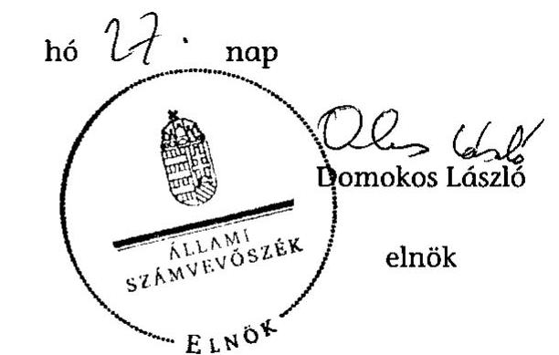

# ÁLLAMI   SZÁMVEVŐSZÉK 

## JELENTÉS

az önkormányzatok belső kontrollrendszere kialakításának, egyes kontrolltevékenységek és a belső ellenőrzés működésének - 2013. évben induló - ellenőrzéséről

Tiszabura

---

# Állami Számvevőszék 

Iktatószám: V-0157-027/2013.
Témaszám: 1190
Vizsgálat-azonosító szám: V064920

## Az ellenőrzést felügyelte:

dr. Benedek Mária
felügyeleti vezető
Az ellenőrzést vezette és az ellenőrzés végrehajtásáért felelős:
dr. Veress Tiborné
ellenőrzésvezető
A számvevőszéki jelentés összeállításában közreműködtek:
dr. Zsombori Beáta
számvevő
Szalontai Miklós
számvevő tanácsos
Az ellenőrzést végezték:
Szalontai Miklós Czmarkó Frigyes György
számvevő tanácsos számvevő

---

# TARTALOMJEGYZÉK 

BEVEZETÉS ..... 5
I. ÖSSZEGZŐ MEGÁLLAPÍTÁSOK, KÖVETKEZTETÉSEK, JAVASLATOK ..... 9
II. RÉSZLETES MEGÁLLAPÍTÁSOK ..... 17

1. Az Önkormányzat belső kontrollrendszerének kialakítása ..... 17
1.1. A kontrollkörnyezet ..... 17
1.2. A kockázatkezelési rendszer ..... 19
1.3. A kontrolltevékenységek ..... 19
1.4. Az információs és kommunikációs rendszer ..... 21
1.5. A monitoring rendszer ..... 21
2. A pénzügyi folyamatokban kulcsszerepet betöltő teljesítésigazolás és érvényesítés belső kontrollok működése ..... 22
3. A belső ellenőrzés működése ..... 24

## FÜGGELÉKEK

1. számú Értelmező szótár
2. számú Az értékelés módja és szempontjai

---

.

---

# RÖVIDÍTÉSEK JEGYZÉKE 

## Törvények

Áht.
ÁSZ tv.
Htv.

Info tv.

Kttv.
Ktv.
Ltv.

Mötv.

Mvtv.
Nvtv.
Ötv.

## Rendeletek

Áhsz.

Ávr.

Bkr.

Ikr.
vagyongazdálkodási rendelet

## Szórövidítések

ÁSZ
belső ellenőrzési jelentések
belső ellenőrzési kézikönyv
2011. évi CXCV. törvény az államháztartásról (hatályos 2012. január 1-jétől)
2011. évi LXVI. törvény az Állami Számvevőszékről
1991. évi XX. törvény a helyi önkormányzatok és szerveik, a köztársasági megbízottak, valamint egyes centrális alárendeltségű szervek feladat- és hatásköreiről
2011. évi CXII. törvény az információs önrendelkezési jogról és az információszabadságról (hatályos 2012. január 1-jétől)
2011. évi CXCIX. törvény a közszolgálati tisztviselőkről
1992. évi XXIII. törvény a köztisztviselők jogállásáról
1995. évi LXVI. törvény a köziratokról, a közlevéltárakról és a magánlevéltári anyag védelméről
2011. évi CLXXXIX. törvény Magyarország helyi önkormányzatairól (hatályos 2012. január 1-jétől)
1993. évi XCIII. törvény a munkavédelemről
2011. évi CXCVI. törvény a Nemzeti vagyonról
1990. évi LXV. törvény a helyi önkormányzatokról
249/2000. (XII. 24.) Korm. rendelet az államháztartás szervezetei beszámolási és könyvvezetési kötelezettségének sajátosságairól
368/2011. (XII. 31.) Korm. rendelet az államháztartásról szóló törvény végrehajtásáról (hatályos 2012. január 1-jétől)
370/2011. (XII. 31.) Korm. rendelet a költségvetési szervek belső kontrollrendszeréről és belső ellenőrzéséről (hatályos 2012. január 1-jétől)
335/2005. (XII. 29.) Korm. rendelet a közfeladatot ellátó szervek iratkezelésének általános követelményeiről
Tiszabura Község Önkormányzata Képviselő-testületének 21/2005. (XII. 19.) számú rendelete a Tiszabura Község Önkormányzata vagyonáról és a vagyongazdálkodás szabályairól, hatályos 2006. január 1-jétől

Állami Számvevőszék
A 2012. november 26-án, december 17-én és 2013. január 21-én a belső ellenőr által a 2012. évre vonatkozóan elkészített jelentések.
Tiszabura Község Önkormányzat Polgármesteri Hivatal belső ellenőrzési kézikönyve, hatályos 2010. október 15-től

---

| ellenőrzési jelentés | Ellenőrzési jelentés a Tiszabura Község Önkormányzat Polgármesteri Hivatalnál 2011. évben végzett belső ellenőrzésekről |
| :--: | :--: |
| FEUVE szabályzat | Tiszabura Polgármesteri Hivatal folyamatba épített, előzetes, utólagos és vezetői ellenőrzésének rendszere, hatályos 2006. január 1-jétől |
| gazdálkodási szabályzat | A kötelezettségvállalás, utalványozás, ellenjegyzés, érvényesítés rendjének szabályzata, hatályos 2008. július 1-jétől |
| hivatali SZMSZ | Tiszabura Község Önkormányzata Képviselő-testületének 12/2005. (VIII. 8.) számú határozata a Polgármesteri Hivatal SZMSZ-éről, hatályos 2005. augusztus 8-tól |
| hivatali új SZMSZ | Tiszabura Község Önkormányzata Képviselő-testületének 15/2013. (II. 28.) számú határozata a Polgármesteri Hivatal SZMSZ-éről, hatályos 2013. március 1-jétől |
| INTOSAI | International Organization of Supreme Audit Institutions (Legfőbb Ellenőrző Intézmények Nemzetközi Szervezete) |
| iratkezelési szabályzat | Iratkezelési szabályzat, hatályos 2007. február 13-tól |
| ISSAI | International Standards of Supreme Audit Institutions (Legfőbb Ellenőrző Intézmények Nemzetközi Standardjai) |
| jegyző $_{1}$ | Tiszabura Község Önkormányzatának jegyzője 2012. december 15-ig |
| jegyző $_{2}$ | Tiszabura Község Önkormányzatának jegyzője 2012. december 15-től |
| Képviselő-testület | Tiszabura Község Önkormányzatának Képviselő-testülete |
| Kormányhivatal | Jász-Nagykun-Szolnok Megyei Kormányhivatal |
| NGM | Nemzetgazdasági Minisztérium |
| polgármester | Tiszabura Község Önkormányzatának polgármestere |
| Polgármesteri Hivatal | Polgármesteri Hivatal Tiszabura |
| Önkormányzat | Tiszabura Község Önkormányzata |
| stratégiai ellenőrzési | Tiszabura Község Önkormányzat Belső ellenőrzési stratégiai terve a 2011-2015. évekre |
| terv |  |
| Társulás | Tiszafüred Kistérség Többcélú Társulása |
| ügyrend | Tiszabura Polgármesteri Hivatal ügyrendje a FEUVE szabályzat 3. számú melléklete, hatályos 2009. január 1-jétől |

---

# JELENTÉS 

## az önkormányzat belső kontrollrendszere kialakításának, egyes kontrolltevékenységek és a belső ellenőrzés működésének - 2013. évben induló - ellenőrzéséről Tiszabura

## BEVEZETÉS

Tiszabura község állandó lakosainak száma 2012. január 1-jén 3100 fő volt. Az Önkormányzat héttagú Képviselő-testületének munkáját öt állandó bizottság segítette. Az Önkormányzatnak az önállóan működő és gazdálkodó szervezetén (Polgármesteri Hivatalon) kívül három önállóan működő intézménye volt, többségi tulajdoni hányaddal gazdasági társasággal nem rendelkezett. A polgármester a 2002. évi önkormányzati választások óta tölti be tisztségét. A jegyző${}_{1}$ 2012. december 15-ig látta el, a jegyző${}_{2}$ 2012. december 15-től látja el feladatait. A Polgármesteri Hivatal szervezeti egységekre nem tagolódott, elkülönített gazdasági szervezettel nem rendelkezett. A köztisztviselők száma 2012. január 1-jén 11 fő volt. A Polgármesteri Hivatalnál 2013. január 1-jét követően szervezeti változás, átalakítás nem történt. Az Önkormányzat a 2012. évi költségvetési beszámolója szerint 1163026 ezer Ft bevételt ért el, valamint 1160863 ezer Ft kiadást teljesített. A 2012. december 31-i könyvviteli mérleg szerint 488393 ezer Ft értékű eszközvagyonnal rendelkezett, a rövid lejáratú kötelezettség állománya 265315 ezer Ft, a hosszú lejáratú kötelezettség állománya 14509 ezer Ft volt.

A demokratikus társadalmakban alapvető igény, hogy a közpénzeket, a közvagyont használók tevékenységükről elszámoljanak, ahhoz egyértelmű és érvényesíthető felelősségi szabályok társuljanak. Ennek a jogos igénynek az érvényesítéséhez meg kell teremteni azokat a folyamatokat, rendszereket, amelyek nélkülözhetetlenek az elszámoltatáshoz. Az elszámoltatás eredményes működtetéséhez szükség van a megfelelő információs, kontroll-, értékelési és beszámolási rendszerek kialakítására.

Magyarországon az uniós csatlakozási tárgyalások idejére nyúlnak vissza a belső kontrollrendszer szabályozásának gyökerei. Az uniós elvárásoknak megfelelő új terminológia szerinti államháztartási belső pénzügyi ellenőrzési (ÁBPE) rendszer területén a jogharmonizáció 2003-ban teljes körűen megvalósult, míg az önkormányzati alrendszerre vonatkozó, Ötv.-ben megjelenített speciális szabályozás 2005-ben lépett hatályba. Az államháztartási belső kontrollrendszer koncepciója 2009-ben továbbfejlődött. A változások irányát mutatja, hogy a költségvetési szervek belső kontrollrendszere már magában foglalja a korszerű felelős szervezetirányítás elemeit (kontrollkörnyezet, kockázatkezelés, kontrolltevékenység, információ és kommunikáció, monitoring) is. E kontrollrendszer szabályozása háromszintű, a törvényi előírásokat az Áht. és a Mötv., a rendeleti szintű szabályozást az Ávr. és a Bkr. tartalmazza, amelyeket útmutatói szinten az NGM által kiadott standardok és kézikönyvek támogatnak.

A belső kontrollrendszer azt a célt szolgálja, hogy a költségvetési szervek működésük és gazdálkodásuk során a tevékenységeket szabályszerűen, gazdaságosan, hatékonyan, eredményesen hajtsák végre, teljesítsék elszámolási kötelezettségeiket és megvédjék az erőforrásokat a veszteségektől, a károktól és a nem rendeltetésszerű használattól. A belső kontrollrendszer magában foglalja mindazon szabályokat, eljárásokat, gyakorlati módszereket és szervezeti struktúrákat, kockázatkezelési technikákat, kontrolltevékenységeket, amelyek segítséget nyújtanak a szervezetnek céljai eléréséhez.

Az ÁSZ a 2011-2015. évekre szóló stratégiájában hangsúlyos szerepet szánt annak, hogy szilárd szakmai alapon álló, értékteremtő ellenőrzéseivel előmozdítsa a közpénzügyek átláthatóságát, rendezettségét. A számvevőszéki ellenőrzés nemzetközi alapelvei is rögzítik, hogy a megfelelő belső kontrollrendszer minimálisra csökkenti a hibák és szabálytalanságok kockázatát.

Az ellenőrzés célja annak megállapítása volt, hogy a belső kontrollrendszer elemeinek kialakítása, a pénzügyi folyamatokban kulcsszerepet betöltő teljesítésigazolás és érvényesítés, és a belső ellenőrzés szabályos működése biztosította-e az önkormányzatnál a közpénzfelhasználás szabályosságát, hozzájárult-e az értéket teremtő rend követelményének érvényesüléséhez.

Ennek keretében értékeltük, hogy

- a jogszabályi előírásoknak megfelelően alakították-e ki a belső kontrollrendszer elemeit;
- a gazdálkodás folyamatában kulcsszerepet betöltő teljesítésigazolás és érvényesítés kontrolltevékenységeit megfelelően működtették-e;
- biztosították-e a belső ellenőrzés szabályos működését;
- amennyiben az ÁSZ tett javaslatot a 2008-2011. évek közötti ellenőrzések kapcsán, intézkedtek-e azok végrehajtására.

Az ellenőrzés várható hasznosulását négy szinten tervezzük. A törvényalkotás számára összegzett tapasztalatok állnak rendelkezésre a belső kontrollrendszer önkormányzati területen való kialakításáról, működéséről és hatásairól, a belső ellenőrzés működéséről. Ennek alapján következtetést lehet levonni arról, hogy a belső kontrollrendszer kialakítására és működtetésére vonatkozó jelenlegi, differenciálás nélküli jogszabályi előírások reális követelményeket támasztanak-e az eltérő adottságú települési önkormányzatok esetében, illetve indokolt-e esetleges jogszabályi módosítás kezdeményezése. Az ellenőrzés az ellenőrzött számára visszajelzést ad a belső kontrollrendszer kialakításában és működésében fellépő hiányosságokról, javaslataival hozzájárul azok kiküszöböléséhez, amely csökkentheti a későbbi ellenőrzések gyakoriságát. Az ellenőrzés megállapításait és javaslatait más szervezetek is hasznosíthatják a rendezett gazdálkodási keretek kialakításához. A társadalom számára jelzi, hogy közpénz nem maradhat ellenőrizetlenül, az ÁSZ értékteremtő rend kialakításához és megőrzéséhez hozzájáruló tevékenysége pozitív hatással lesz a szervezetről kialakított összkép formálásában. A szervezeten belül lehetőség nyílik arra, hogy a megállapítások szintetizálásával az ÁSZ a hozzáadott értéket teremtő elemző tevékenységét és tanácsadó szerepét is erősítse.

Az önkormányzatok belső kontrollrendszere kialakításának, egyes kontrolltevékenységek és a belső ellenőrzés működésének ellenőrzéséről szóló jelentés I. fejezetének összegző része az ellenőrzés céljára ad rövid, szintetizáló összefoglalót, és tartalmazza a következtetéseket a II. fejezet részletes megállapításain alapulóan. A jelentés intézkedést igénylő megállapításait és javaslatait az ellenőrzés során feltárt, a jelentés II. fejezetében rögzített részletes megállapítások alapozzák meg. A helyszíni ellenőrzés lezárásáig a helyi szabályozás változásait nyomon követtük.

Az ellenőrzés típusa: szabályszerűségi ellenőrzés.
Az ellenőrzött időszak: a belső kontrollrendszer kialakításának megfelelősége esetében a 2012. évre, a pénzügyi folyamatokban kulcsszerepet betöltő teljesítésigazolás és érvényesítés belső kontrollok működésének megfelelőségét és a belső ellenőrzés szabályszerű működését a 2012. január 1. és december 31-e közötti időszak eseményeit figyelembe véve értékeltük, míg az ÁSZ javaslatainak utóellenőrzése a 2008-2011. években hivatalosan közzétett számvevőszéki jelentésekben tett javaslatok áttekintésére terjedt ki.

# Az ellenőrzött szervezet: Tiszabura Község Önkormányzata. 

Az ellenőrzés jogszabályi alapját az ÁSZ tv. 1. § (3) bekezdése, az 5. § (2) és (6) bekezdései, valamint az Áht. 61. §. (2) bekezdésének előírásai képezik.

Az ellenőrzés szakmai módszertana az ÁSZ hivatalos honlapján (www.asz.hu) közzétett szakmai szabályokon alapult, amely az INTOSAI által kiadott ISSAI figyelembevételével készült.

Az ellenőrzés lefolytatásához az Önkormányzat a kimutatások és a tanúsítvány elektronikus kitöltésével, valamint az ÁSZ által kért dokumentumok elektronikus megküldésével szolgáltatott adatokat. Az így rendelkezésre bocsátott adatok, információk kontrollja és a munkalapok kitöltése a helyszíni ellenőrzés keretében történt. A jelentésben használt fogalmak magyarázatát az 1. számú függelék, az ellenőrzés egyes területeinek értékelésénél alkalmazott egységes minősítési szempontokat a 2. számú függelék tartalmazza.

A belső kontrollrendszer kialakításának ellenőrzése során értékeltük a kontrollkörnyezet, a kockázatkezelési rendszer, a kontrolltevékenységek, az információs és kommunikációs rendszer, valamint a monitoring rendszer szabályozottságának megfelelőségét. A pénzügyi folyamatokban kulcsszerepet betöltő teljesítésigazolás és érvényesítés kontrolljai működése megfelelőségének minősítéséhez az állományba nem tartozók megbízási díjai, a külső szolgáltatók által végzett karbantartási, kisjavítási munkák, az egyéb üzemeltetési és fenntartási szolgáltatások, a rendszeres szociális segélyek, valamint az államháztartáson

---

kívülre teljesített működési és felhalmozási célú pénzeszközátadások közül kockázatelemzéssel választottuk ki az ellenőrzött kiadási jogcímeket. Az egyszerû véletlen mintavétellel kiválasztott tételek ellenőrzését többlépcsős megfelelőségi tesztek útján addig végeztük, amíg elegendő és megfelelő bizonyítékot szereztünk.
 a vizsgált folyamatok kulcskontrolljai működésének megfelelő vagy nem megfelelő voltáról. Értékeltük az Önkormányzatnál a belső ellenőrzés működésének szabályosságát. Utóellenőrzésre nem került sor, mivel az ÁSZ az Önkormányzatnál a 2008-2011. évek között ellenőrzést nem végzett.

Az ÁSZ tv. 29. § (1) bekezdése szerint a jelentéstervezetet megküldtük a polgármester részére, aki az ÁSZ tv. 29. § (2) bekezdésében foglalt észrevételezési jogával nem élt, a jelentéstervezetre észrevételt nem tett.

---

# I. ÖSSZEGZŐ MEGÁLLAPÍTÁSOK, KÖVETKEZTETÉSEK, JAVASLATOK 

A belső kontrollrendszeren belül 2012-ben a kontrollkörnyezet, a kockázatkezelési rendszer, a kontrolltevékenységek, az információs és kommunikációs rendszer, valamint a monitoring rendszer kialakítását külön-külön és együttesen is értékeltük. A belső kontrollrendszer kialakítása az összesített értékelés alapján nem felelt meg a jogszabályi előírásoknak.

A belső kontrollrendszer egyes területei kialakításának minősítése a következő:

| Kontrollterület | Minősítés |
| :-- | :--: |
| Kontrollkörnyezet | nem   megfelelő |
| Kockázatkezelési rendszer | nem   megfelelő |
| Kontrolltevékenységek | nem   megfelelő |
| Információs és kommunikáci-   ós rendszer | nem   megfelelő |
| Monitoring rendszer | nem   megfelelő |

A kontrollkörnyezet, a kockázatkezelési rendszer, a kontrolltevékenységek, az információs és kommunikációs rendszer, valamint a monitoring rendszer kialakítását nem megfelelőnek értékeltük, mivel az ellenőrzésünk során megállapított szabályozásbeli hiányosságok magukban hordozzák a szabálytalan működés, valamint a korrupció kockázatát.

A belső kontrollrendszer nem megfelelő kialakítása kockázatot jelent az Önkormányzat feladatainak szabályszerű, gazdaságos, hatékony és eredményes végrehajtása során.

A külső szolgáltatók által végzett karbantartási, kisjavítási munkákkal és az egyéb üzemeltetési, fenntartási kiadásokkal kapcsolatos kifizetések során a pénzügyi folyamatokban kulcsszerepet betöltő teljesítésigazolás és érvényesítés belső kontrollok működése gyenge volt. Gyengének értékeltük a két kulcskontroll együttes működését, mert azok nem biztosították az ellenőrzésünk által feltárt hiányosságok bekövetkezésének megelőzését.

A számvevőszéki ellenőrzés az ellenőrzött kifizetésekkel összefüggésben a rendelkezésre bocsátott dokumentumok alapján kár bekövetkeztére utaló adatot, tényt nem állapított meg, azonban a gazdálkodásban kulcsszerepet betöltő kontrollok gyenge működése miatt fennáll a hibák bekövetkezésének lehetősége. A nem megfelelően szabályozott és működtetett belső kontrollok korrupciós kockázatot hordoznak.

---

Az Önkormányzat a belső ellenőrzési feladatokat - képviselő-testületi döntés alapján - a Társulás útján látta el. A belső ellenőrzés működése a jogszabályi előírásoknak jól megfelelt, azonban a belső ellenőrzések szűk területre korlátozottsága miatt nem volt pozitív visszahatással a kontrollrendszer elemeire, nem tárta fel a számvevőszéki ellenőrzés során a pénzügyi folyamatokban kulcsszerepet betöltő teljesítésigazolás és érvényesítés belső kontrollok működésénél megállapított hiányosságokat.

Az ÁSZ tv. 33. § (1) bekezdésében foglaltak értelmében az ellenőrzött szervezet vezetője köteles a jelentésben foglalt megállapításokhoz kapcsolódó intézkedési tervet összeállítani, és azt a jelentés kézhezvételétől számított 30 napon belül az ÁSZ részére megküldeni. Amennyiben az intézkedési tervet határidőre nem küldi meg a szervezet, vagy az ÁSZ tv. 33. § (2) bekezdésében foglalt póthatáridő elteltével megküldött intézkedési terv továbbra sem elfogadható, az ÁSZ elnöke a hivatkozott törvény 33. § (3) bekezdés a)-b) pontjaiban foglaltakat érvényesítheti.

Az ellenőrzés intézkedést igénylő megállapításai és javaslatai:

# a polgármesternek 

1. A jegyző, a Htv. 140. § (1) bekezdés a) pontjában foglalt előírást figyelmen kívül hagyva nem készítette elő a gazdasági programtervezetet, így a Képviselő-testület az Ötv. 91. § (7) bekezdésében foglaltakat megsértve nem határozta meg az Önkormányzat 2011-2014. évekre vonatkozó gazdasági programját.

Javaslat:
Terjessze a Képviselő-testület elé a jegyző által a Mötv. 116. § (1) és (5) bekezdéseinek megfelelő tartalommal előkészített gazdasági programtervezetet.
2. A polgármester az Áht. 87. § (1) bekezdésében foglalt előírások ellenére a Képviselőtestületet nem tájékoztatta az Önkormányzat gazdálkodásának 2012. év első félévi és háromnegyed éves helyzetéről.

Javaslat:
Tájékoztassa a Képviselő-testületet az Áht. 87. § (1) bekezdésében foglalt előírásoknak megfelelően az Önkormányzat gazdálkodásának első félévi és háromnegyed éves helyzetéről.

## a jegyzőnek

1. a kontrollkörnyezettel kapcsolatban:

A jegyző; a 2013. évben új hivatali SZMSZ-t készített, azonban abban az Ávr. 13. § (1) bekezdés i) pontjában foglaltak ellenére nem rögzítette az irányító szerv által - az Ávr. 10. § (1)-(3) bekezdése szerint - a költségvetési szervhez rendelt más költségvetési szervek felsorolását.

---

A jegyző, a Htv. 140. § (1) bekezdés a) pontjában foglalt előírást figyelmen kívül hagyva nem készítette el a gazdasági programtervezetet, így a Képviselő-testület az Ötv. 91. § (7) bekezdésében foglaltakat megsértve nem határozta meg az Önkormányzat 2011-2014. évekre vonatkozó gazdasági programját.

Az Önkormányzat vagyongazdálkodási rendelete nem felelt meg az Nvtv. 18. § (1) és (12) bekezdéseiben, valamint a Mötv. 109. § (4) bekezdésében foglalt előírásoknak, mert a jegyző a vagyongazdálkodási rendelet jogszabályváltozásokkal összhangban történő módosítását az Ötv. 36. § (2) bekezdés a) pontjában foglalt feladatkörében nem készítette elő.

A jegyző, a Számv. tv. 14. § (11) bekezdésében, valamint a 161. § (4) bekezdésében előírtak ellenére az ellenőrzött időszakban hatályos számviteli politikát, a pénzkezelési szabályzatot és a számlarendet nem aktualizálta. A jegyző, a Htv. 140. §. (1) bekezdés c) pontjában foglaltak ellenére az Önkormányzat intézményeinek számviteli rendjét nem alakította ki.

A Polgármesteri Hivatalban az Mvtv. 2. § (3) bekezdésében foglaltak ellenére nem határozták meg az egészséget nem veszélyeztető és biztonságos munkavégzés követelményei megvalósításának módját.

A jegyző, a Bkr. 6. § (3)-(4) bekezdésében foglaltak ellenére nem vizsgálta felül, nem aktualizálta az ellenőrzési nyomvonalat, és nem szabályozta a szabálytalanságok kezelésének eljárásrendjét.

A jegyző, a Kttv. 130. § (1) bekezdésében foglaltak ellenére a köztisztviselők teljesítményértékelését nem készítette el.

A Kttv. 231. § (1) bekezdése ellenére a Képviselő-testület nem állapította meg a Kttv. 83. §-ában előírt, a köztisztviselőkkel szembeni hivatásetikai alapelvek részletes tartalmát, valamint az etikai eljárás szabályait, mivel a jegyző, az Ötv. 36. § (2) bekezdés a) pontjában előírt feladata ellenére nem készítette elő ennek dokumentumát.

Javaslat:
a) Készítse elő a hivatali SZMSZ módosítását, és kezdeményezze az Áht. 9. § (1) bekezdés a) pontjában foglaltak alapján a polgármesternél a Képviselő-testület elé terjesztését annak érdekében, hogy az tartalmazza az Ávr. 13. § (1) bekezdés i) pontjában foglaltaknak megfelelően az irányító szerv által az Ávr. 10. § (1)-(3) bekezdése szerint a költségvetési szervhez rendelt más költségvetési szervek felsorolását.
b) Készítse elő a Htv. 140. § (1) bekezdés a) pontjában foglalt feladatkörében a gazdasági program tervezetét a Mötv. 116. § (3)-(4) bekezdéseiben foglalt tartalommal, és kezdeményezze a polgármesternél a Képviselő-testület elé terjesztését.
c) Készítse elő a Mötv. 81. § (3) bekezdés c) pontjában foglalt feladatkörében a vagyongazdálkodási rendelet jogszabályokkal összhangban történő módosítását, és kezdeményezze a polgármesternél a módosítás Képviselő-testület elé terjesztését annak érdekében, hogy az megfeleljen az Nvtv. 18. § (1) és (12) bekezdéseiben, valamint a Mötv. 109. § (4) bekezdésében foglaltaknak.

---

d) Aktualizálja a Számv. tv. 14. § (11) bekezdésében foglalt kötelezettség alapján a számviteli politikát, a pénzkezelési szabályzatot és a számlarendet.
e) Alakítsa ki a Htv. 140. §. (1) bekezdés c) pontjában foglaltaknak megfelelően az Önkormányzat intézményeinek számviteli rendjét.
f) Határozza meg az egészséget nem veszélyeztető és biztonságos munkavégzés követelményei megvalósításának módját az Mvtv. 2. § (3) bekezdése alapján.
g) Intézkedjen a Bkr. 6. § (3) bekezdésében előírtaknak megfelelően az ellenőrzési nyomvonal rendszeres aktualizálásáról.
h) Szabályozza a Bkr. 6. § (4) bekezdésének megfelelően a szabálytalanságok kezelésének eljárásrendjét.
i) Intézkedjen a Kttv. 130. § (1)-(6) bekezdéseiben előírtak szerint a teljesítményértékelésre vonatkozó szabályok kialakításáról és alkalmazásáról.
j) Készítse elő a Mötv. 81. § (3) bekezdés c) pontjában foglalt feladatkörében a Kttv. 83. §-ában foglaltaknak megfelelően a köztisztviselőkkel szembeni hivatásetikai alapelvek részletes tartalmának, valamint az etikai eljárás szabályainak dokumentumait, és kezdeményezze a polgármesternél a Kttv. 231. § (1) bekezdésében foglaltak alapján annak Képviselő-testület elé terjesztését.
2. a kockázatkezelési rendszerrel kapcsolatban:

A jegyző; a Bkr. 7. § (2) bekezdésében foglaltak ellenére nem mérte fel és nem állapította meg a Polgármesteri Hivatal tevékenységében, gazdálkodásában rejlő kockázatokat, nem határozta meg az egyes kockázatok kezeléséhez szükséges intézkedéseket és a kockázatok kezelése érdekében előírt intézkedések teljesítése folyamatos nyomon követésének módját.

Javaslat:
Mérje fel és állapítsa meg a Bkr. 7. § (2) bekezdésében foglaltak alapján a Polgármesteri Hivatal tevékenységében, gazdálkodásában rejlő kockázatokat, határozza meg az egyes kockázatokkal kapcsolatban szükséges intézkedéseket, valamint azok teljesítése folyamatos nyomon követésének módját.
3. a kontrolltevékenységekkel kapcsolatban:

A jegyző; nem határozta meg a Bkr. 8. § (1)-(2) bekezdéseiben előírtak ellenére a pénzügyi döntések - köztük a költségvetés tervezése, a beszerzések lebonyolítása, a vagyonhasznosítási tevékenység és a támogatások elszámolása - dokumentumainak elkészítésével kapcsolatos, folyamatba épített, előzetes, utólagos és vezetői ellenőrzés feladatait.

A jegyző; az Ávr. 53. § (2) bekezdésében foglaltakat figyelmen kívül hagyva, annak ellenére nem határozta meg az írásbeli kötelezettségvállalást nem igénylő kifizetések rendjét, hogy a gazdálkodási szabályzatban lehetővé tette az 50 ezer Ft alatti kifizetések előzetes írásbeli kötelezettségvállalás nélküli teljesítését.

---

A jegyző, az Ávr. 13. § (2) bekezdés a) pontjában foglaltak ellenére nem határozta meg a kötelezettségvállalás pénzügyi ellenjegyzése, a teljesítés igazolása, az érvényesítés és az utalványozás gyakorlásának módjával, eljárási és dokumentációs részletszabályaival, valamint az ezeket végző személyek kijelölési rendjével kapcsolatos előírásokat. A jegyző, valamint 2012. március 31-től a kötelezettségvállaló az Ávr. 57. § (4) bekezdésében foglaltak ellenére nem jelölte ki a teljesítésigazolásra jogosult személyeket.

A jegyző, az lkr. 8. § (1) bekezdésében foglalt előírást figyelmen kívül hagyva nem gondoskodott az iratkezelési szoftver által kezelt adatok biztonságáról, nem alakította ki az üzembiztonsági, adatvédelmi szabályok érvényre juttatásához szükséges eljárási szabályokat.

A jegyző az Info. tv. 7. § (2)-(3) bekezdéseiben foglalt előírásokat figyelmen kívül hagyva az informatikai rendszer szabályozása során elmulasztotta az adatbiztonság érvényre juttatásához szükséges intézkedések megtételét, és a Bkr. 8. § (4) bekezdés b) pontjában foglaltak ellenére a hozzáférési jogosultságok vonatkozásában a felelősségi köröket nem szabályozta.

A jegyző az Ávr. 13. § (2) bekezdés a) pontjában foglaltak ellenére nem határozta meg a beszámolási feladatok teljesítésével kapcsolatos belső előírásokat és a Bkr. 8. § (4) bekezdés c) pontjában foglalt előírás ellenére a beszámolási eljárásokhoz kapcsolódó felelősségi köröket.

A jegyző, az Ávr. 13. § (5) bekezdésében foglaltak ellenére az ügyrendben nem határozta meg a gazdasági feladatot ellátó alkalmazottak helyettesítésének rendjét. Az Ávr. 9. § (9) bekezdésének előírását figyelmen kívül hagyva a költségvetési beszámoló elkészítésével olyan személyt bízott meg, aki nem tartozott a költségvetési szerv állományába. A Kttv. 74. § (1) bekezdésében foglaltak ellenére nem határozta meg jogviszony megszűnése esetére a munkavállaló folyamatban lévő feladatai átadásának rendjét.

Javaslat:
a) Biztosítsa a Polgármesteri Hivatal minden tevékenységére vonatkozóan a folyamatba épített, előzetes, utólagos és vezetői ellenőrzést a Bkr. 8. § (1)-(2) bekezdése alapján.
b) Rögzítse belső szabályzatban az Ávr. 53. § (2) bekezdése alapján az előzetes írásbeli kötelezettségvállalást nem igénylő kifizetések rendjét.
c) Rendezze belső szabályzatban az Ávr. 13. § (2) bekezdés
 a) pontjában foglaltaknak megfelelően a gazdálkodással - különösen a kötelezettségvállalás, ellenjegyzés, a teljesítés igazolása, érvényesítés, utalványozás gyakorlásának módjával, eljárási és dokumentációs részletszabályaival - kapcsolatos belső előírásokat, feltételeket.
d) Jelölje ki az Ávr. 57. § (4) bekezdésének megfelelően a teljesítésigazolásra jogosult személyeket.

---

e) Gondoskodjon az lkr. 8. § (1) bekezdésében foglalt előírásnak megfelelően az iratkezelési szoftver által kezelt adatok biztonságáról, alakítsa ki az üzembiztonsági, adatvédelmi szabályok érvényre juttatásához szükséges eljárási szabályokat.
f) Gondoskodjon az Info. tv. 7. § (2)-(3) bekezdéseiben foglalt előírásoknak megfelelően az informatikai rendszer szabályozása során az adatbiztonság érvényre juttatásához szükséges intézkedések megtételéről és a Bkr. 8. § (4) bekezdés b) pontjában foglaltaknak megfelelően a hozzáférési jogosultságok vonatkozásában a felelősségi körök szabályozásáról.
g) Szabályozza az Ávr. 13. § (2) bekezdés a) pontjában foglaltaknak megfelelően a beszámolási feladatok teljesítésével kapcsolatos belső előírásokat és a Bkr. 8. § (4) bekezdés c) pontja alapján a beszámolási eljárásokhoz kapcsolódó felelősségi köröket.
h) Határozza meg az Ávr. 13. § (5) bekezdésében foglaltaknak megfelelően az ügyrendben a gazdasági feladatot ellátó alkalmazottak helyettesítésének rendjét.
i) Gondoskodjon arról, hogy a költségvetési beszámolót az Ávr. 9. § (9) bekezdésének megfelelően a költségvetési szerv állományába tartozó személy készítse el.
j) Határozza meg a Kttv. 74. § (1) bekezdésében foglaltaknak megfelelően jogviszony megszűnése esetére a munkavállaló folyamatban lévő feladatai átadásának rendjét.
4. Az információs és kommunikációs rendszerrel kapcsolatban:

A jegyző, a Bkr. 9. § (1) bekezdésében foglaltak ellenére nem alakította ki a szervezeten belüli információáramlás rendszerét. Az Info tv. 24. § (3) bekezdésében foglaltak ellenére nem készítette el a Polgármesteri Hivatal adatvédelmi és adatbiztonsági szabályzatát. Az Ávr. 13. § (2) bekezdés h) pontjában foglalt előírás ellenére a kötelezően közzéteendő adatok nyilvánosságra hozatalának rendjét nem alakította ki, az Önkormányzat az Info tv. 33. §-ában foglaltak ellenére az elektronikus közzétételi kötelezettségének a 2012. évben nem tett eleget. Az Info tv. 30. § (6) bekezdésében és az Ávr. 13. § (2) bekezdés h) pontjában foglalt előírások ellenére nem szabályozta a közérdekű adatok megismerésére irányuló igények teljesítésének rendjét. A jegyző, - az Ltv. 10. § (1) bekezdés c) pontjának előírását figyelmen kívül hagyva - a Polgármesteri Hivatal egyedi iratkezelési szabályzatát nem a Levéltár és a Kormányhivatal egyetértésével adta ki. Az lkr. 14. § (4) bekezdésében foglaltak ellenére a jegyző, az iratforgalom dokumentálásával nem biztosította, hogy az iratok szervezeten belüli útja pontosan követhető és ellenőrizhető legyen.

Javaslat:
a) Alakítsa ki, illetve szabályozza a Bkr. 9. § (1) bekezdésében foglaltaknak megfelelően a szervezeten belüli információáramlás rendszerét.
b) Készítsen adatvédelmi és adatbiztonsági szabályzatot az Info tv. 24. § (3) bekezdésének megfelelően.
c) Határozza meg - az Info tv. 33. § (1) és 35. § (3) bekezdéseiben, valamint az Ávr. 13. § (2) bekezdés h) pontjában foglaltaknak megfelelően - a kötelezően

---

közzéteendő adatok nyilvánosságra hozatalának rendjét, valamint tegyen eleget az Info tv. 33. §-ában foglaltaknak megfelelően az elektronikus közzétételi kötelezettségének.
d) Készítsen - az Info tv. 30. § (6) bekezdésében és az Ávr. 13. § (2) bekezdés h) pontjában foglaltaknak megfelelően - a közérdekű adatok megismerésére irányuló igények teljesítésének rendjét rögzítő szabályzatot.
e) Tartsa be az Ltv. 10. § (1) bekezdés c) pontjában foglaltakat az iratkezelési szabályzat elkészítésénél.
f) Biztosítsa az lkr. 14. § (4) bekezdésében foglaltaknak megfelelően az iratforgalom dokumentálásával, hogy az iratok szervezeten belüli útja pontosan követhető és ellenőrizhető legyen.
5. a monitoring rendszerrel kapcsolatban:

A jegyző; a Bkr. 3. § e) pontjában és a 10. §-ában foglaltak ellenére nem alakította ki a szervezet tevékenységének, a célok megvalósításának nyomon követését biztosító rendszert.

Javaslat:
Alakítsa ki és működtesse a Bkr. 3. § e) pontjában és a 10. §-ában foglaltak alapján a szervezet tevékenységének, a célok megvalósításának nyomon követését biztosító rendszert.
6. a pénzügyi folyamatokban kulcsszerepet betöltő kontrollok működésével kapcsolatban:

A teljesítés igazolását az Ávr. 57. § (4) bekezdésében foglaltak ellenére jegyzői kijelöléssel nem rendelkező személy végezte.

Az érvényesítő az Ávr. 58. § (1) bekezdésének előírása ellenére - ellenőrizhető dokumentumok hiányában - az érvényesítést nem szabályszerűen végezte el.

Az érvényesítő az Ávr. 58. § (2) bekezdésének előírása ellenére nem jelezte az utalványozónak, hogy az előzetes írásbeli kötelezettségvállalást nem igénylő kifizetéseket az Ávr. 56. § (1) bekezdésének előírása ellenére nem vették nyilvántartásba.

Javaslat:
Intézkedjen - a teljesítésigazolás és az érvényesítés vonatkozásában feltárt hiányosságok megszüntetése, illetve az operatív gazdálkodás során a működésbeli hibák megelőzése, feltárása és kijavítása érdekében - arról, hogy:
a) a teljesítésigazolást - az Ávr. 57. § (4) bekezdésében foglalt előírásnak megfelelően - arra kijelöléssel rendelkező személyek végezzék, és az Ávr. 57. § (1) bekezdésében foglaltaknak megfelelően ellenőrizhető okmányok alapján ellenőrizzék a kiadások teljesítésének jogosságát, összegszerűségét, ellenszolgáltatást is magában foglaló kötelezettségvállalás esetében a szerződés, megrendelés teljesítését, és azt az Ávr. 57. § (3) bekezdésében foglalt módon igazolják;

---

b) a kifizetéseket megelőzően az Ávr. 58. § (1) bekezdésében foglalt előírás szerint teljesítésigazolás alapján ellenőrizzék - az Ávr. 57. § (3) bekezdése szerinti esetben annak hiányában is - az összegszerűséget, a fedezet meglétét és a megelőző ügymenetben az Áht., az Áhsz., az Ávr. előírásainak és a belső szabályzatokban foglaltaknak a betartását;
c) az érvényesítő az Ávr. 58. § (2) bekezdésben foglalt előírásnak megfelelően jelezze az utalványozónak, ha az Áht. vagy az államháztartási számviteli kormányrendelet, az Ávr. és a belső szabályzatokban foglaltak megsértését tapasztalja;
d) a kötelezettségvállalásokat az Ávr. 56. § (1) bekezdésében foglalt előírásnak megfelelően vegyék nyilvántartásba.
7. a belső ellenőrzés működésével kapcsolatban:

A 2013. évre vonatkozó éves ellenőrzési terv összeállítása a Bkr. 56. § (2) bekezdésében foglalt előírás ellenére nem a jegyző írásos véleményének figyelembe vételével történt, mivel a jegyző véleményt, javaslatot nem fogalmazott meg.

A Bkr. 45. § (1)-(3) bekezdéseiben foglaltak ellenére az ellenőrzött szervezetek a belső ellenőrzés javaslatainak végrehajtása érdekében intézkedési terveket nem készítettek.

A belső ellenőrzési vezető a Bkr. 47. §-ában előírtakat figyelmen kívül hagyva a belső ellenőrzési jelentésekben tett megállapításokról, javaslatokról, a vonatkozó intézkedési tervekről nyilvántartást nem vezetett, illetve azok végrehajtását nem követte nyomon.

Javaslat:
a) Intézkedjen arról, hogy az éves ellenőrzési tervet a belső ellenőrzési vezető a Bkr. 56. § (2) bekezdés előírásainak megfelelően a jegyző írásos véleményének figyelembevételével, a Bkr. 29. § (1) bekezdésében foglaltak szerint készítse el.
b) Intézkedjen a Bkr. 45. § (1)-(3) bekezdéseiben foglaltaknak megfelelően az ellenőrzött szervezetek felé, hogy megfelelő tartalommal és határidőn belül készítsenek intézkedési tervet a belső ellenőrzési jelentésekben megfogalmazott javaslatok végrehajtására.
c) Kezdeményezze, hogy a belső ellenőrzési vezető vezessen nyilvántartást a Bkr. 47. §-ában foglalt előírásokra figyelemmel a belső ellenőrzési jelentésekben tett megállapításokról, javaslatokról, a vonatkozó intézkedési tervekről és azok végrehajtásáról.

---

# II. RÉSZLETES MEGÁLLAPÍTÁSOK 

## 1. Az ÖNKORMÁNYZAT BELSŐ KONTROLLRENDSZERÉNEK KIALAKÍTÁSA

A belső kontrollrendszer kialakítása 2012-ben a kontrollkörnyezet, a kockázatkezelési rendszer, a kontrolltevékenységek, az információs és kommunikációs rendszer, valamint a monitoring rendszer értékelése alapján összességében nem felelt meg a jogszabályi előírásoknak.

### 1.1. A kontrollkörnyezet

A kontrollkörnyezet kialakítása - a 2. számú függelékben részletezett kritériumrendszer alapján végzett értékelés szerint - a jogszabályi előírásoknak nem felelt meg, mert:

| Sor-   szám $^{1}$ | Megállapítás | Megjegyzés |
| :--: | :--: | :--: |
| 2., 3. | A jegyző ${ }_{1}$ a Htv. 140. § (1) bekezdés a) pontjában foglalt előírást figyelmen kívül hagyva nem készítette elő a gazdasági programtervezetet, így a Képviselő-testület az Ötv. 91. § (7) bekezdésében foglaltakat megsértve nem határozta meg az Önkormányzat 2011-2014. évekre vonatkozó gazdasági programját. |  |
| 5. | A jegyző ${ }_{1}$ nem aktualizálta a jogszabályi változásoknak megfelelően az ellenőrzött időszakban hatályos hivatali SZMSZ-t, így az nem felelt meg az Ávr. 13. § (1) bekezdés előírásainak. | A jegyző ${ }_{2}$ új hivatali SZMSZ-t készített, azonban abban az Ávr. 13. § (1) bekezdés i) pontjában foglaltak ellenére nem rögzítette az irányító szerv által - az Ávr. 10. § (1)(3) bekezdése szerint - a költségvetési szervhez rendelt más költségvetési szervek felsorolását. |

[^0]
[^0]:    ${ }^{1}$ A megállapítás számozása az Önkormányzat által - az adatszolgáltatás során - kitöltött kimutatások kérdéseinek sorszámával azonos.

---

| 16. | Az Önkormányzat vagyongazdálkodási rendelete nem felelt meg az Nvtv. 18. § (1) és (12) bekezdéseiben, valamint a Mötv. 109. § (4) bekezdésében foglalt előírásoknak, mert a jegyző a vagyongazdálkodási rendelet jogszabályváltozásokkal összhangban történő módosítását az Ötv. 36. § (2) bekezdés a) pontjában foglalt feladatkörében nem készítette elő. |
| :--: | :--: |
| $\begin{aligned} & 17 . \\ & 19 . \end{aligned}$ | A jegyző a Számv. tv. 14. § (11) bekezdésében, valamint a 161. § (4) bekezdésében előírtak ellenére az ellenőrzött időszakban hatályos számviteli politikát, a pénzkezelési szabályzatot és a számlarendet nem aktualizálta. |
| 18. | A jegyző a Htv. 140. §. (1) bekezdés c) pontjában foglaltak ellenére az Önkormányzat intézményeinek számviteli rendjét nem alakította ki. |
| 32. | A Polgármesteri Hivatalban az Mvtv. 2. § (3) bekezdésében foglaltak ellenére nem határozták meg az egészséget nem veszélyeztető és biztonságos munkavégzés követelményei megvalósításának módját. |
| $\begin{aligned} & 34 . \\ & 41 . \end{aligned}$ | A jegyző a Bkr. 6. § (3)-(4) bekezdésben foglaltak ellenére nem vizsgálta felül, nem aktualizálta az ellenőrzési nyomvonalat, és nem szabályozta a szabálytalanságok kezelésének eljárásrendjét. |
| 4., 46. | A Képviselő-testület a Ktv. 34. § (3) bekezdésében ${ }^{2}$ foglaltak ellenére nem döntött a teljesítményértékelés alapját képező célokról. A jegyző a Kttv. 130. § (1) bekezdésében foglaltak ellenére a köztisztviselők teljesítményértékelését nem készítette el. |
| 47. | A Kttv. 231. § (1) bekezdése ellenére a Képviselőtestület nem állapította meg a Kttv. 83. §-ában előírt, a köztisztviselőkkel szembeni hivatásetikai alapelvek részletes tartalmát, valamint az etikai eljárás szabályait, mivel a jegyző az Ötv. 36. § (2) bekezdés a) pontjában ${ }^{3}$ előírt feladata ellenére nem készítette elő ennek dokumentumát. |

[^0]
[^0]:    ${ }^{2}$ A Ktv. 34. § (3) bekezdése hatályon kívül helyezve 2012. március 1-jétől.
    ${ }^{3}$ 2013. január 1-jétől Mötv. 81. § (3) bekezdés c) pont

---

# 1.2. A kockázatkezelési rendszer 

A kockázatkezelési rendszer kialakítása - a 2. számú függelékben részletezett kritériumrendszer alapján végzett értékelés szerint - a jogszabályi előírásoknak nem felelt meg, mert:

| Sor-   szám | Megállapítás | Megjegyzés |
| :--: | :--: | :--: |
| $\begin{aligned} & 2 ., 4 . \\ & 8 . \\ & 10 . \end{aligned}$ | A jegyző a Bkr. 7. §

 (2) bekezdésében foglaltak ellenére nem mérte fel és nem állapította meg a Polgármesteri Hivatal tevékenységében, gazdálkodásában rejlő kockázatokat, nem határozta meg az egyes kockázatok kezeléséhez szükséges intézkedéseket és a kockázatok kezelése érdekében előírt intézkedések teljesítésének folyamatos nyomon követési módját. |  |
| 13. | Az egyes vagyonnyilatkozat-tételi kötelezettségekről szóló 2007. évi CLII. törvény 4. §-ában foglaltak ellenére a vagyonnyilatkozat-tételre kötelezettek körét a hivatali SZMSZ-ben a jegyző nem rögzítette. | A jegyző ${ }_{2}$ az új hivatali SZMSZ-ben meghatározta a vagyonnyilatkozat-tételre kötelezettek körét. |

### 1.3. A kontrolltevékenységek

A kontrolltevékenységek kialakítása - a 2. számú függelékben részletezett kritériumrendszer alapján végzett értékelés szerint - a jogszabályi előírásoknak nem felelt meg, mert:

| Sor-   szám | Megállapítás | Megjegyzés |
| :--: | :--: | :--: |
| $\begin{aligned} & 2 ., 3 . \\ & 4 ., 5 . \end{aligned}$ | A jegyző nem határozta meg a Bkr. 8. § (1)-(2) bekezdéseiben előírtak ellenére a pénzügyi döntések - köztük a költségvetés tervezése, a beszerzések lebonyolítása, a vagyonhasznosítási tevékenység és a támogatások elszámolása - dokumentumainak elkészítésével kapcsolatos, folyamatba épített, előzetes, utólagos és vezetői ellenőrzés feladatait. |  |
| $\begin{aligned} & 6 ., 9 ., \\ & 11 . \\ & 12 . \end{aligned}$ | A jegyző az Ávr. 13. § (2) bekezdés a) pontjában foglaltak ellenére nem határozta meg a kötelezettségvállalás pénzügyi ellenjegyzése, a teljesítés igazolása, az érvényesítés és az utalványozás gyakorlásának módjával, eljárási és dokumentációs részletszabályaival, valamint az ezeket végző személyek kijelölési rendjével kapcsolatos előírásokat. | A 2008. július 1-jétől hatályos gazdálkodási szabályzatot a 2012. január 1-jétől hatályos Áht. és az Ávr. előírásainak megfelelően nem aktualizálták. |
| 8 . | A jegyző az Ávr. 53. § (2) bekezdésében foglaltakat figyelmen kívül hagyva, annak ellenére nem határozta meg az írásbeli kötelezettségvállalást nem igénylő kifizetések rendjét, hogy a gazdálkodási szabályzatban lehetővé tette az 50 ezer Ft |  |

---

|  | alatti kifizetések előzetes írásbeli kötelezettségvállalás nélküli teljesítését. |
| :--: | :--: |
| 10. | A jegyző ${ }_{1}$, valamint 2012. március 31-től a kötelezettségvállaló az Ávr. 57. § (4) bekezdésében foglaltak ellenére nem jelölte ki a teljesítésigazolásra jogosult személyeket. |
| 13. | A jegyző ${ }_{1}$ az Ikr. 8. § (1) bekezdésében foglalt előírást figyelmen kívül hagyva nem gondoskodott az iratkezelési szoftver által kezelt adatok biztonságáról, nem alakította ki az üzembiztonsági, adatvédelmi szabályok érvényre juttatásához szükséges eljárási szabályokat. |
| 16. | A jegyző ${ }_{1}$ az Info tv. 7 § (2)-(3) bekezdéseiben foglalt előírásokat figyelmen kívül hagyva az informatikai rendszer szabályozása során elmulasztotta az adatbiztonság érvényre juttatásához szükséges intézkedések megtételét. |
| 17. | A Bkr. 8. § (4) bekezdés b) pontjában foglaltak ellenére a hozzáférési jogosultságok vonatkozásában a felelősségi köröket nem szabályozta. |
| 19.. | A jegyző ${ }_{1}$ az Ávr. 13. § (2) bekezdés a) pontjában foglaltak ellenére nem határozta meg a beszámolási feladatok teljesítésével kapcsolatos belső előírásokat. |
| 20.. | A Bkr. 8. § (4) bekezdés c) pontjában foglaltak ellenére a jegyző ${ }_{1}$ nem határozta meg a beszámolási eljárásokhoz kapcsolódó felelősségi köröket. |
| 21.. | A jegyző ${ }_{1}$ az Ávr. 13. § (5) bekezdésében foglaltak ellenére az ügyrendben nem határozta meg a gazdasági feladatot ellátó alkalmazottak helyettesítésének rendjét. |
| 23.. | A jegyző ${ }_{1}$ az Ávr. 9. § (9) bekezdésének előírását figyelmen kívül hagyva a költségvetési beszámoló elkészítésével olyan személyt bízott meg, aki nem tartozott a költségvetési szerv állományába. |
| 24. | A polgármester az Áht. 87 § (1) bekezdésében foglalt előírások ellenére a Képviselő-testületet nem tájékoztatta az Önkormányzat gazdálkodásának 2012. év első félévi és háromnegyed éves helyzetéről. |
| 32. | A jegyző ${ }_{1}$ a Kttv. 74. § (1) bekezdésében foglaltak ellenére jogviszony megszűnése esetére nem határozta meg a munkavállaló folyamatban lévő feladatai átadásának rendjét. |

---

# 1.4. Az információs és kommunikációs rendszer 

Az információs és kommunikációs rendszer kialakítása - a 2. számú függelékben részletezett kritériumrendszer alapján végzett értékelés szerint - a jogszabályi előírásoknak nem felelt meg, mert:

| Sor-   szám | Megállapítás |
| :--: | :--: |
| 1. | A jegyző a Bkr. 9. § (1) bekezdésében foglaltak ellenére nem alakította ki a szervezeten belüli információáramlás rendszerét. |
| 5. | A jegyző az Info tv. 24. § (3) bekezdésében foglaltak ellenére nem készítette el a Polgármesteri Hivatal adatvédelmi és adatbiztonsági szabályzatát. |
| 6., 7. | A jegyző az Ávr. 13. § (2) bekezdés h) pontjában foglalt előírás ellenére a kötelezően közzéteendő adatok nyilvánosságra hozatalának rendjét nem alakította ki, az Önkormányzat az Info tv. 33. §-ában foglaltak ellenére az elektronikus közzétételi kötelezettségének a 2012. évben nem tett eleget. |
| 8. | A jegyző az Info tv. 30. § (6) bekezdésében és az Ávr. 13. § (2) bekezdés h) pontjában foglalt előírások ellenére nem szabályozta a közérdekű adatok megismerésére irányuló igények rendjét. |
| 9. | A jegyző - az Ltv. 10. § (1) bekezdés c) pontjának előírását figyelmen kívül hagyva - a Polgármesteri Hivatal egyedi iratkezelési szabályzatát nem a Levéltár és a Kormányhivatal egyetértésével adta ki. |
| 16. | Az Ikr. 14. § (4) bekezdésében foglaltak ellenére a jegyző az iratforgalom dokumentálásával nem biztosította, hogy az iratok szervezeten belüli útja pontosan követhető és ellenőrizhető legyen. |

### 1.5. A monitoring rendszer

A monitoring rendszer kialakítása - a 2. számú függelékben részletezett kritériumrendszer alapján végzett értékelés szerint - a jogszabályi előírásoknak nem felelt meg, mert:

| Sor-   szám | Megállapítás | Megjegyzés |
| :--: | :--: | :--: |
| 1. | A jegyző a Bkr. 3. § e) pontjában és a 10. §-ában foglaltak ellenére nem alakította ki a szervezet tevékenységének, a célok megvalósításának nyomon követését biztosító rendszert. |  |
| 9. | A jegyző a Bkr. 11. § (1) bekezdésében foglalt kötelezettsége ellenére a belső kontrollrendszer minőségét a Bkr. 1. számú melléklete szerinti nyilatkozatban (a 2011. évről) nem értékelte. | A jegyző a belső kontrollrendszer 2012. évi működését - a Bkr. 1. számú melléklete szerinti nyilatkozatban - értékelte. |

Az Önkormányzat törvényességi felügyeletét ellátó Kormányhivatal 2012 folyamán három esetben élt törvényességi felhívással.

---

- A Kormányhivatal 2012. július 16-án kelt törvényességi felhívása ${ }^{4}$ a Recsky Klára Általános Művelődési Központ vezetői állásának pályázati kiírásával kapcsolatos jogszabálysértés megszüntetésére vonatkozott. A Képviselő-testület a törvényességi felhívást megtárgyalta, és a 40/2012. (VII. 20.) számú határozatában foglaltak szerint intézkedett a jogszabálysértés megszüntetésére.
- A 2012. július 24-én kelt törvényességi felhívás ${ }^{5}$ az Önkormányzat aljegyzői megbízásával kapcsolatos jogszabálysértés megszüntetésére vonatkozott. A Képviselő-testület a törvényességi felhívást megtárgyalta, és a 43/2012. (VIII. 14.) számú határozatában foglaltak szerint intézkedett a jogszabálysértés megszüntetésére.
- A 2012. október 8-án kelt törvényességi felhívás ${ }^{6}$ az Önkormányzat napközbeni gyermekétkeztetési feladatainak mulasztásos jogsértése megszüntetésére vonatkozott. A Képviselő-testület a törvényességi felhívást megtárgyalta és a 62/2012. (XI. 07.) számú határozatában foglaltak szerint intézkedett a jogszabálysértés megszüntetésére.

Az Önkormányzat az ÁSZ-tól a 2011. és a 2012. évben integritás kérdőív kitöltésére kapott felkérést, amelynek nem tett eleget. A gazdálkodási jogkörök, az információs rendszer szabályozása és kialakítása során feltárt hibák, a köztisztviselőkkel szembeni hivatásetikai alapelvek meghatározásának, valamint az etikai eljárás szabályainak hiánya, illetve a belső ellenőrzés működésével összefüggésben feltárt szabálytalanságok arra utalnak, hogy az Önkormányzatnak még fejlődnie kell az integritási szemlélet érvényesítésében.

# 2. A PÉNZÜGYI FOLYAMATOKBAN KULCSSZEREPET BETÖLTŐ TELJESÍTÉSIGAZOLÁS ÉS ÉRVÉNYESÍTÉS BELSŐ KONTROLLOK MŰKÖDÉSE 

A külső szolgáltató által végzett karbantartási, kisjavítási munkák és az egyéb üzemeltetési, fenntartási szolgáltatások kifizetései során a pénzügyi folyamatokban kulcsszerepet betöltő teljesítésigazolás és érvényesítés belső kontrollok működésének megfelelősége összefoglalóan értékelve gyenge volt, mert:

| Kulcskontroll | Megállapítás |
| :--: | :--: |
| teljesítésigazolás | A teljesítés igazolását az Ávr. 57. § (4) bekezdésében foglaltak ellenére jegyzői kijelöléssel nem rendelkező személy végezte. |
| érvényesítés | Az érvényesítő az Ávr. 58. § (1) bekezdésének előírása ellenére - ellenőrizhető dokumentumok hiányában - az érvényesítést nem szabályszerűen végezte el. |
|  | Az érvényesítő az Ávr. 58. § (2) bekezdésének előírása ellenére nem jelezte az utalványozónak, hogy az előzetes írásbeli kötelezettségvállalást nem igénylő kifizetéseket az Ávr. 56. § (1) bekezdés előírása ellenére nem vették nyilvántartásba. |

[^0]
[^0]:    ${ }^{4}$ Ügyiratszáma: XI-B-06/00636/2012.
    ${ }^{5}$ Ügyiratszáma: XI-B-06/00648/2012.
    ${ }^{6}$ Ügyiratszáma: XI-B-06/00738-3/2012.

---

A külső szolgáltatók által végzett karbantartási, kisjavítási munkákra történő kifizetések során a 2012. évben a teljesítési igazolás és az érvényesítés kulcskontrollok működésének megfelelősége gyenge volt, mert

- a teljesítés igazolását a március 31-ei tetőszigetelés, az október 31-ei személygépkocsi javítás és a december 20-ai traktor gumijavítás kifizetéseit megelőzően az Ávr. 57. § (4) bekezdésben foglaltak ellenére jegyzői1,2 kijelöléssel nem rendelkező személy végezte, ezért a kiadások jogosságának, összegszerűségének és a szerződés szerinti teljesítésének ellenőrzése az Ávr. 57. § (1) bekezdésének előírása ellenére nem szabályszerűen történt;
- az érvényesítésre jogosult személy az október 31-ei személygépkocsi javítás és a december 20-ai traktor gumijavítás kifizetéseknél a kiadások összegszerűségét és a fedezet meglétét - az Ávr. 53. § (2) bekezdésében előírt, az előzetes írásbeli kötelezettségvállalást nem igénylő kifizetésekre vonatkozó szabályozás és ellenőrizhető dokumentumok hiányában - nem szabályszerűen ellenőrizte;
- az érvényesítő az Ávr. 58. § (2) bekezdés előírása ellenére nem jelezte az utalványozónak, hogy - az október 31-ei személygépkocsi javítás és a december 20-ai gumijavítás kifizetésénél - a megelőző ügymenetben az Ávr. előírásait nem tartották be, mivel az előzetes írásbeli kötelezettségvállalást nem igénylő kifizetésekről az Ávr. 56. § (1) bekezdés előírása szerinti nyilvántartást nem vezették.

Az egyéb üzemeltetési, fenntartási szolgáltatási kiadásokra történő kifizetések során a teljesítési igazolás és az érvényesítés kulcskontrollok működésének megfelelősége gyenge volt, mert

- a teljesítés igazolását - a január 9-ei és a december 28-ai hulladékszállítás, a május 7-ei internet szolgáltatás, a május 14-ei bélyegvásárlás, az augusztus 10-ei szállítás kifizetéseknél - az Ávr. 57. § (3) és (4) bekezdéseiben foglaltak ellenére kijelöléssel nem rendelkező személy végezte, ezért a kiadás teljesítését megelőzően az Ávr. 57. § (1) bekezdésben foglalt, a kifizetés jogosságának, összegszerűségének és a szerződés teljesítésének ellenőrzése nem szabályszerűen történt;
- az érvényesítésre kijelölt személy a kiadások összegszerűségét és a fedezet meglétét az Ávr. 58. § (1) bekezdés előírása ellenére - szabályozás és ellenőrizhető dokumentumok hiányában - a január 9-ei szakértői
 díj, a március 21-ei tachográf aktiválása és a földmérői szolgáltatás, a május 14-ei és a június 26-ai bélyegvásárlás kifizetéseknél nem szabályszerűen végezte;
- az érvényesítő az Ávr. 58. § (2) bekezdés előírása ellenére nem jelezte az utalványozónak, hogy - a január 9-ei és a december 28-ai hulladékszállítás, a május 7-ei internet szolgáltatás, a május 14-ei bélyegvásárlás kifizetésénél - a megelőző ügymenetben az Ávr. előírásait nem tartották be, mivel az előzetes írásbeli kötelezettségvállalást nem igénylő kifizetésekről az Ávr. 56. § (1) bekezdés előírása szerinti nyilvántartást nem vezették.

A számvevőszéki ellenőrzés az ellenőrzött kifizetésekkel összefüggésben a rendelkezésre bocsátott dokumentumok alapján kár bekövetkeztére utaló adatot, tényt nem állapított meg, azonban a gazdálkodásban kulcsszerepet betöltő

---

kontrollok gyenge működése miatt fennáll a hibák bekövetkezésének kockázata.

# 3. A BELSŐ ELLENŐRZÉS MŰKÖDÉSE 

Az Önkormányzat a belső ellenőrzési feladatokat - képviselő-testületi döntés alapján - a Társulás útján látta el. A belső ellenőrzés működése - a 2. számú függelékben részletezett kritériumrendszer alapján végzett értékelés szerint - a jogszabályi előírásoknak jól megfelelt. Az Önkormányzat rendelkezett a jegyző által jóváhagyott, a jogszabályi előírásoknak megfelelő tartalmú belső ellenőrzési kézikönyvvel. A belső ellenőrzést végző személy a jogszabályban előírt iskolai végzettséggel, szakmai képesítéssel rendelkezett. A belső ellenőrzés elkészítette az ellenőrzések tervezését megalapozó stratégiai ellenőrzési tervét, melynek tartalma - a belső kontrollrendszer általános értékelése kivételével - a jogszabályi előírásoknak megfelelt. A belső ellenőrzés elkészítette az Önkormányzatra vonatkozó 2013. évi ellenőrzési tervet a jogszabályi előírások szerinti tartalommal, melyet a Képviselő-testület 2012. december 31-ig határozattal jóváhagyott. A 2013. évi ellenőrzési terv összeállítását megelőzően a belső ellenőrzés kockázatelemzést készített, valamint az a stratégiai ellenőrzési tervben felállított prioritásokon alapult. A 2012. évi ellenőrzési tervben foglalt valamennyi ellenőrzést végrehajtották, elkészítették a jogszabályban előírt tartalmú ellenőrzési programokat, illetve jelentéseket.

Az Önkormányzatnál a belső ellenőrzés működése az alábbi kisebb hiányosságok mellett jól megfelelt a jogszabályi előírásoknak:

| Sorszám | Megállapítás |
| :--: | :--: |
| 10. | A 2013. évre vonatkozó éves ellenőrzési terv összeállítása a Bkr. 56. § (2) bekezdésében foglaltak ellenére nem a jegyző írásos véleményének figyelembevételével történt, mivel a jegyző véleményt nem fogalmazott meg. |
| 23. | A Bkr. 45. § (1)-(3) bekezdéseiben foglaltak ellenére az ellenőrzött szervezetek a belső ellenőrzés javaslatainak végrehajtása érdekében intézkedési terveket nem készítettek. |
| 26. | A belső ellenőrzési vezető a Bkr. 47. §-ban foglalt előírás ellenére a belső ellenőrzési jelentésekben tett megállapításokról, javaslatokról a vonatkozó intézkedési tervekről nyilvántartást nem vezetett, illetve azok végrehajtását nem követte nyomon. |

Budapest, 2013.

---

# ÉRTELMEZŐ SZÓTÁR 

belső ellenőrzés
belső kontrollrendszer
belső kontrollrendszer területei
egyszerű véletlen mintavétel
integritás
kockázatkezelési rendszer
kontrollkörnyezet

Független, tárgyilagos bizonyosságot adó és tanácsadó tevékenység, amelynek célja, hogy az ellenőrzött szervezet működését fejlessze és eredményességét növelje, az ellenőrzött szervezet céljai elérése érdekében rendszerszemléletű megközelítéssel és módszeresen értékeli, illetve fejleszti az ellenőrzött szervezet irányítási és belső kontrollrendszerének hatékonyságát. (Forrás: Bkr. 2. § b) pontja)
A belső kontrollrendszer a kockázatok kezelése és tárgyilagos bizonyosság megszerzése érdekében kialakított folyamatrendszer, amely azt a célt szolgálja, hogy a működés és gazdálkodás során a tevékenységeket szabályszerűen, gazdaságosan, hatékonyan, eredményesen hajtsák végre, az elszámolási kötelezettségeket teljesítsék, megvédjék az erőforrásokat a veszteségektől, károktól és nem rendeltetésszerű használattól. (Forrás: Áht. 69. § (1) bekezdése)
A kontrollkörnyezet, a kockázatkezelési rendszer, a kontrolltevékenységek, az információ és kommunikáció, valamint a nyomon követési rendszer (monitoring). (Forrás: Bkr. 3. §-a)
Az alapsokaságból egyszerű véletlen kiválasztással képzett részsokaság. (Forrás: Az ÁSZ ellenőrzési mintavételezés támogatásához készült segédletének 4.1.1. pontja)
Az integritás elvek, értékek, cselekvések, módszerek, intézkedések konzisztenciáját jelenti: olyan magatartásmódot, amely meghatározott értékeknek felel meg. Az integritás a közszféra esetében a társadalom által elvárt nyilvánossági, átláthatósági, illetve jogi/etikai normáknak történő megfelelést jelenti.
(Forrás: a http://integritas.asz.hu honlapon közzétett „A 2012. évi integritás felmérés eredményeinek összefoglalója dokumentum 3. oldal 1. bekezdése)
A kockázat annak a valószínűségét jelenti, hogy egy vagy több esemény vagy intézkedés nem kívánt módon befolyásolja a rendszer működését, céljainak megvalósulását. (Forrás: Javaslatok a korrupciós kockázatok kezelésére - Kockázatkezelési és ellenőrzési módszertan 35. oldal, ÁSZ)
Olyan irányítási eszközök és módszerek összessége, melynek elemei a szervezeti célok elérését veszélyeztető tényezők (kockázatok) azonosítása, elemzése, csoportosítása, nyomon követése, valamint szükség esetén a kockázati kitettség mérséklése. (Forrás: Bkr. 2. § m) pontja)
A kontrollkörnyezet alakítja ki a szervezet belső kontrollrendszerhez való viszonyát, hozzáállását, befolyásolja az alkalmazottak belső kontrollal kapcsolatos tudatosságát, magatartását. Elemei a személyes és szakmai elkötelezettség és a vezetés, valamint az alkalmazottak által vallott erkölcsi értékek; a szakmai hozzáértés iránti elkötelezettség; a felső vezetés hoz-

---

kontrolltevékenységek
kommunikáció
korrupció
kulcskontrollok
lényegesség
megfelelőségi
teszt
monitoring (nyomon követési rendszer)
polgármesteri
hivatal
záállása - a vezetés filozófiája és tevékenységének stílusa; a szervezeti struktúra; a humánerőforrás-politika és gazdálkodási gyakorlat.
A kontrolltevékenységek azok a politikák és eljárások, amelyeket a kockázatok megoldására hoznak létre a szervezet céljainak teljesítése érdekében.
Az a tevékenység, melynek során információ továbbítása valósul meg. A kommunikációs folyamat résztvevői között tájékoztatás történik, mely során tényeket, ezek magyarázatát közlik. „A szervezetben eredményes kommunikációnak kell áramlania lefelé, horizontálisan és felfelé, a szervezet egészében és annak valamennyi elemében."
Azok a cselekmények, amelyek során a köz érdekében való eljárással megbízott és döntéshozatali felelősséggel felruházott személy a köz érdeke helyett önös vagy részérdekeket követve, mástól jogtalan vagy etikátlan előnyt elfogadva és őt jogtalan vagy etikátlan előnyhöz juttatva jár el, illetve amikor valaki a köz érdekében való eljárással megbízott és döntéshozatali felelősséggel felruházott személynek jogtalan vagy etikátlan előnyt nyújtva vagy felajánlva jogtalan vagy etikátlan előnyt kér. (Forrás: A Kormány korrupció megelőzési programja 2012-2014.)
Az azonosított kockázatok mérséklése érdekében kialakított kontrollok közül azok, amelyek elégtelen működése esetén a szervezetet jelentős veszteség érheti, vagy a működésükben bekövetkező hiba/hiányosság más kontrollok eredményességét csökkenti. Ezek ellenőrzése, értékelése elegendő bizonyítékot szolgáltat adott területen a kontrollrendszer értékeléséhez. Az önkormányzatok kontrollrendszere kialakításának ellenőrzése során a pénzügyi folyamatokban kulcsszerepet betöltő belső kontrollok a teljesítésigazolás és érvényesítés
Egy információ akkor lényeges, ha hiánya vagy téves állítása befolyásolhatja ezen információkat felhasználók döntéseit, véleményét. Az ellenőrzés során a lényegesség három szempontból értelmezhető: érték, jelleg és összefüggés szerint.
Az ellenőrzés során alkalmazott módszer - szekvenciális (megállásos) megfelelőségi teszt - lényege, hogy a kiválasztott minta ellenőrzését csak addig végezzük, amíg elegendő és megfelelő bizonyítékot nem szerzünk az ellenőrzött kulcskontroll (teljesítésigazolás, érvényesítés) működésének megfelelő, vagy nem megfelelő voltáról.
A monitoring a különböző szintű szervezeti célok megvalósításának folyamatát kíséri figyelemmel, melynek során a releváns eseményekről és tevékenységekről (együtt: folyamatokról) rendszeres jelleggel, strukturált, döntéstámogató információkhoz jutnak a szervezet vezetői.
A programban (beleértve a mellékleteket is) a polgármesteri hivatal megnevezés alatt értjük a polgármesteri hivatalt, a

---

# utóellenőrzés 

főpolgármesteri hivatalt, a megyei önkormányzati hivatalt és a körjegyzőséget, (illetve 2013. január 1-jét követően a közös önkormányzati hivatalt).
Az intézkedések nyomon követése érdekében elrendelt ellenőrzés, amelynek célja, hogy a belső ellenőrzés bizonyosságot szerezzen az elfogadott intézkedések végrehajtásáról, vagy arról a tényről, hogy ha az ellenőrzött szerv, illetve az ellenőrzött szervezeti egység vezetője nem, vagy nem az elfogadott intézkedésnek megfelelően hajtja végre a feladatokat, továbbá meggyőződni arról, hogy a végrehajtott intézkedésekkel a megállapított kockázat ténylegesen megszűnt, vagy a kockázati túréshatár alá csökkent. (Forrás: Bkr. 2. § s) pontja)

---

# Az értékelés módja és szempontjai 

## A belső kontrollrendszer kialakítása megfelelőségének értékelése az öt területre vonatkoztatva

Megfelelő a belső kontrollrendszer kialakítása, amennyiben az öt területen (kontrollkörnyezet, kockázatkezelési rendszer, kontrolltevékenységek, információs és kommunikációs rendszer, monitoring rendszer kialakítása) összesen elért és elérhető pontok százalékban kifejezett hányadosa eléri a $81 \%$-ot, és egyik terület sem kapott nem megfelelő értékelést.

Részben megfelelő a kontrollrendszer kialakítása, ha az önkormányzat teljesíti a meghatározott valamennyi főbb kritériumot (amelyeket - 10 kritérium - a program 5. számú melléklete tartalmazza), és az öt munkalapon összesen elért és elérhető pontok százalékban kifejezett hányadosa a $61 \%$-ot meghaladja, és legfeljebb egy terület értékelése nem megfelelő volt.

Nem megfelelő a belső kontrollrendszer kialakítása, amennyiben az önkormányzat nem teljesíti a meghatározott bármelyik főbb kritériumot, vagy az öt munkalapon összesen elért és elérhető pontok százalékban kifejezett hányadosa $0-60 \%$ közötti, vagy egynél több terület értékelése nem megfelelő volt.

A megfelelőség minősítése a következők szerint történik:
A minősítés - részben automatizált - a belső kontrollrendszer kialakítására vonatkozó kérdéseket tartalmazó munkalapokon, az elérhető és az elért pontszámok alapján az alábbi képlettel, számítógépes program segítségével történt, melynek összefüggése:

$$
\frac{\text { Elért pont }}{\text { Elérhető pont }} \quad \times 100=\ldots \ldots . . \%
$$

A belső kontrollrendszer egyes területei kialakítása megfelelőségénél alkalmazandó minősítés:

- nem megfelelő
$0-60 \%$-ig
- részben megfelelő
$61-80 \%$-ig
- megfelelő
$81 \%$ fölött.

---

# Az ellenőrzött önkormányzat belső kontrollrendszere kialakítása megfelelőségének főbb kritériumai 

| $\begin{aligned} & \text { Sor- } \\ & \text { szám } \end{aligned}$ | Kérdés: | Szempont: |
| :--: | :--: | :--: |
|  | A kontrollkörnyezet kialakítása (2. számú munkalap, kimutatás) |  |
| 1. | A polgármesteri hiva-   tal ${ }^{1}$ rendelkezik-e ala-   pító okirattal? | A polgármesteri hivatal alapító okirata az Áht. 8. § (4) bekezdésében előírtaknak megfelelően elkészült, tartalmazza az   Ávr. 5. § (1) bekezdésében előírtakat, kiemelten a c) pont   szerinti alaptevékenységeit. |
| 2. | A polgármesteri hiva-   tal rendelkezik-e szer-   vezeti és működési   szabályzattal? | A polgármesteri hivatal rendelkezik az Áht. 10. § (5) bekezdésben előírt - 2010. január 1-jét követően jóváhagyott vagy   módosított - SZMSZ-szel. A költségvetési szerv feladatai ellátásának részletes belső rendjét és módját - törvényben vagy   kormányrendeletben meghatározott módon és tartalommal -   szervezeti és működési szabályzata állapítja meg. |
| 3. | Meghatározták-e a   vagyongazdálkodás   szabályait önkor-   mányzati rendeletben? | Az önkormányzat a vagyongazdálkodás szabályait önkormányzati rendeletben meghatározta, és az összhangban van   az Mötv. 109. § (4) bekezdése, a Nemzeti vagyonról szóló   2011. évi CXCVI. tv. 18. § (1) bekezdése tartalmával, és a 18.   § (12) bekezdésében meghatározottak szerint az 5. § (5)-(7)   bekezdéseiben foglaltaknak megfelelően 2012. október 31-ig   azt módosították. |
| 4. | A polgármesteri hiva-   tal rendelkezik-e szám-   viteli politikával? | A polgármesteri hivatal rendelkezik az Áhsz. 8. § (3) bekezdésben előírt - 2010. január 1-jét követően hatályba helyezett   vagy aktualizált - számviteli politikával. A jogszabályhely   rögzíti, hogy a Számv. tv. és az e rendeletben foglaltak szerint   az államháztartás szervezetének szakmai feladatai és sajátosságai figyelembevételével ki kell alakítania és írásban szabály   oznia számviteli politikáját. |

 |
| 5. | A polgármesteri hiva-   tal rendelkezik-e pénz-   kezelési szabályzattal? | A polgármesteri hivatal rendelkezik az Áhsz. 8. § (4) bekezdés   d) pontjában előírt - 2010. január 1-jét követően hatályba   helyezett vagy aktualizált - pénzkezelési szabályzattal. A   jogszabályhely előírja, hogy a számviteli politika keretében el   kell készíteni a pénzkezelési szabályzatot. |
| 6. | A polgármesteri hiva-   tal rendelkezik-e leltá-   rozási és leltárkészítési   szabályzattal? | A polgármesteri hivatal rendelkezik az Áhsz. 8. § (4) bekezdés   a) pontjában előírt - 2008. január 1-jét követően hatályba   helyezett vagy aktualizált - eszközök és források leltározási és   leltárkészítési szabályzatával. |
| 7. | A polgármesteri hiva-   tal gazdasági szervezet-   tének van-e ügyrendje? | A polgármesteri hivatal rendelkezik a gazdasági szervezet   ügyrendjével vagy az azzal egyenértékű szabályozással (Ávr.   9. § (5) bekezdés), vagy az Ávr. 13. § (5) bekezdésében foglal-   takat az SZMSZ-ben vagy más belső szabályzatban szabályoz-   ta (Áht. 10. § (5) bekezdés), és a szabályozást 2010. január 1-   jét követően felülvizsgálták, aktualizálták. Elfogadható az is,   ha a gazdasági feladatokat a polgármesteri hivatalon belül   több szervezeti egység látja el, és azoknak önálló ügyrendjük   van, illetve ha a polgármesteri hivatal nem tagolódik szerve-   zeti egységekre, és ezért önálló gazdasági szervezettel nem   rendelkezik, azonban az SZMSZ-ben vagy más belső szabályo   zásban rögzítik az ügyrend kötelező elemeit. |

[^0]
[^0]:    ${ }^{1}$ Polgármesteri hivatal alatt a polgármesteri hivatalt, a főpolgármesteri hivatalt, a megyei önkormányzati hivatalt és a körjegyzőséget is érteni kell.

---

| Sorszám | Kérdés: | Szempont: |
| :--: | :--: | :--: |
| 8. | A polgármesteri hivatal rendelkezik-e ellenőrzési nyomvonallal? | Az ellenőrzési nyomvonal, folyamatleírás a polgármesteri hivatal tevékenységeire vonatkozóan elkészült, és azt 2010. január 1-jét követően felülvizsgálták, aktualizálták. A szabályzat minta megtalálható a Pénzügyminisztérium Belső kontroll kézikönyv, 2010. 18. és a 19. számú mellékletében. A Bkr. 6. § (3) bekezdésében előírtak szerint a költségvetési szerv vezetője köteles elkészíteni és rendszeresen aktualizálni a költségvetési szerv ellenőrzési nyomvonalát, amely a költségvetési szerv működési folyamatainak szöveges vagy táblázatba foglalt vagy folyamatábrákkal szemléltetett leírása, amely tartalmazza különösen a felelősségi és információs szinteket és kapcsolatokat, irányítási és ellenőrzési folyamatokat, lehetővé téve azok nyomon követését és utólagos ellenőrzését. |
|  | Az információ és kommunikáció szabályozása és kialakítása (5. számú munkalap, kimutatás) |  |
| 9. | Az önkormányzat eleget tett-e az elektronikus közzétételi kötelezettségének? | Az Önkormányzat az Info tv. 33. § (1) és (3) bekezdésében foglaltaknak megfelelően, saját vagy közösen működtetett honlapon elektronikus formában bárki számára hozzáférhetően közzétette az Info tv. 1. számú mellékletében felsoroltak közül legalább az éves költségvetését, a költségvetési beszámolóját, a Képviselő-testület rendeleteit. |
| 10. | A polgármesteri hivatal rendelkezik-e iratkezelési szabályzattal? | A polgármesteri hivatal rendelkezik az Ltv. 10. § (1) bek. c) pontjában előírt iratkezelési szabályzattal. |

# A két kulcskontroll minősítése 

A kulcskontrollok - teljesítésigazolás, érvényesítés - működésének értékelése megfelelőségi tesztek segítségével történt. A kontrollok működésének megfelelőségére vonatkozó következtetést az értékelő táblázatban elért súlyozott pontszám, továbbá az eredendő kockázat minősítésétől függően két vagy három kiadási jogcím alapján fogalmaztuk meg. Az értékeléshez alkalmazandó arányszámok kialakítását számítógépes program segítségével központilag az ellenőrzésben közreműködő informatikai támogató végezte az önkormányzatok által elektronikus úton megadott adatokból.

A minősítés automatizált, a megfelelőségi tesztek kitöltésével számítógépes program segítségével történik, melynek összefüggése:

| Elérhető pontszám: | Elért súlyozott pontszám értékelése: |
| :--: | :--: |
| $0-70$ | "gyenge" |
| $71-90$ | "jó" |
| $91-100$ | "kiváló" |

- „kiváló" a kontrollok működése, ha megfelel a szabályozásoknak és a legmagasabb szintű elvárásoknak a működésbeli hibák megelőzése, feltárása és kijavítása tekintetében; amennyiben a kontrollok működésének megfelelőségét a helyszíni ellenőrzési munkalap értékelése alapján kiválónak minősítettük, azonban esetleges kisebb - az egységesen meghatá-

---

rozott követelményrendszerben foglalt 10\%-ot el nem érő mértékű - hiányosságokat tártunk fel, az összességében kiváló minősítést alátámasztó pozitív megállapításon túl ezeket a hiányosságokat a jelentésben ismertetjük a javaslataink megalapozása érdekében;

- „jó" a kontrollok működésének megfelelősége, ha azok a megállapított kisebb (tolerálható mértékű) hiányosságok mellett kielégítik az elvárásokat a működésbeli hibák megelőzése, feltárása, és kijavítása tekintetében, a megállapított hiányosságok nem veszélyeztették a hibák megelőzését, feltárását és kijavítását, továbbá ismertetjük azokat a területeket is, ahol az előírt ellenőrzési, egyeztetési feladatokat nem végezték el;
- „gyenge" a kontrollok működése, ha a kontrollok működésében túl sok hiányosság fordul elő ahhoz, hogy megbízhatónak lehessen azokat minősíteni. Ismertetjük a jelentésben azokat a területeket, ahol az előírt ellenőrzési, egyeztetési feladatokat nem végezték el, amely hiányosságok a belső kontrollok megfelelőségének „gyenge" minősítését okozták.

# A belső ellenőrzés szabályszerű működésének értékelése 

A belső ellenőrzés működését a 2012. évben történt ellenőrzés tervezési és végrehajtási tevékenységének tapasztalatai alapján értékeljük a munkalapok (kimutatások) kérdéseire adott válaszok alapján, melynek megállapítása az elérhető és az elért pontokból az alábbi képlettel, számítógépes program segítségével történt:

$$
\frac{\text { Elért pont }}{\text { Elérhető pont }} \times 100=\ldots \ldots . . \%
$$

A belső ellenőrzés működésének megfelelőségénél alkalmazandó minősítés:

- nem felelt meg
$0-60 \%$-ig;
- megfelel
$61-80 \%$-ig;
- jól megfelel
$81 \%$ fölött.
