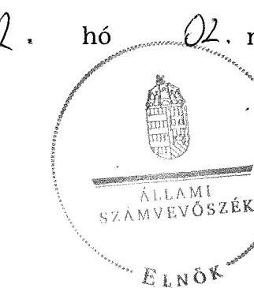
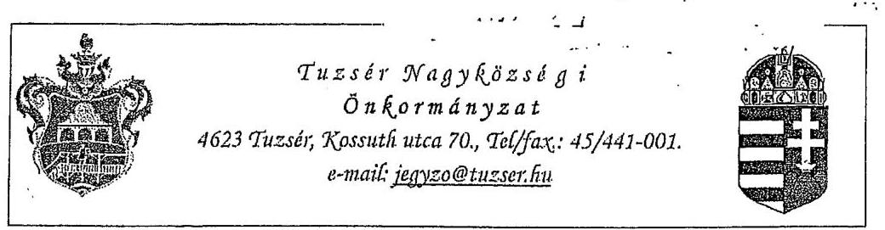
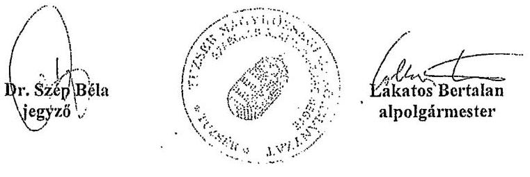
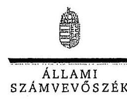
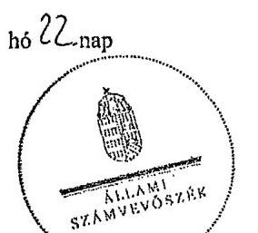
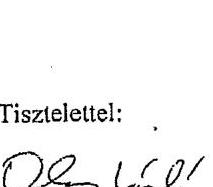
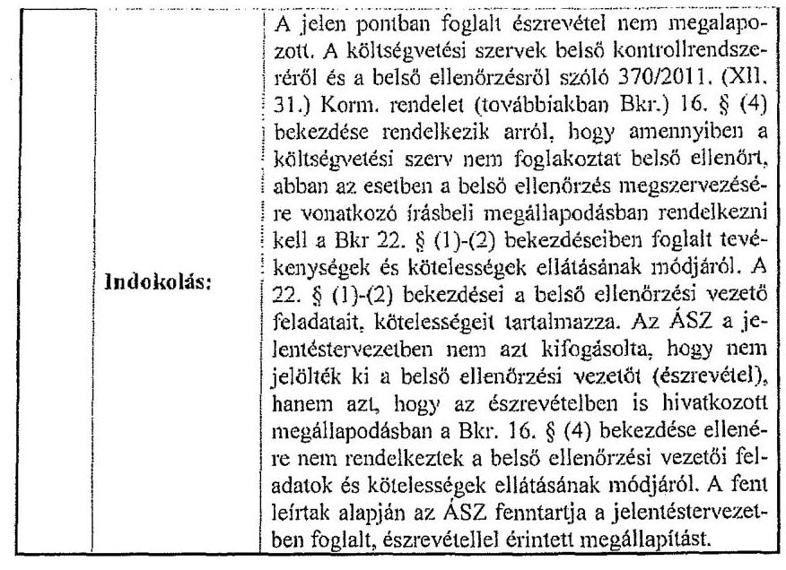
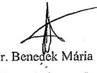

# ÁLLAMI   SZÁMVEVŐSZÉK 

## JELENTÉS

az önkormányzatok belső kontrollrendszere kialakításának, egyes kontrolltevékenységek és a belső ellenőrzés múködésének - 2013. évben induló - ellenőrzéséről

Tuzsér

---

# Állami Számvevőszék 

Iktatószám: V-0159-033/2013.
Témaszám: 1190
Vizsgálat-azonosító szám: V064916

## Az ellenőrzést felügyelte:

## dr. Benedek Mária

felügyeleti vezető
Az ellenőrzést vezette és az ellenőrzés végrehajtásáért felelős:
dr. Veress Tiborné
ellenőrzésvezető
A számvevőszéki jelentés összeállításában közremúködtek:
dr. Zsombori Beáta
számvevő
Tótfalusi Zoltán
számvevő tanácsos
Az ellenőrzést végezték:
Molnár Gyula Mihály
Tótfalusi Zoltán
számvevő tanácsos
számvevő tanácsos

---

# TARTALOMJEGYZÉK 

BEVEZETÉS ..... 5
I. ÖSSZEGZŐ MEGÁLLAPÍTÁSOK, KÖVETKEZTETÉSEK, JAVASLATOK ..... 9
II. RÉSZLETES MEGÁLLAPÍTÁSOK ..... 14

1. Az önkormányzat belső kontrollrendszerének kialakítása ..... 14
1.1. A kontrollkörnyezet ..... 14
1.2. A kockázatkezelési rendszer ..... 15
1.3. A kontrolltevékenységek ..... 16
1.4. Az információs és kommunikációs rendszer ..... 17
1.5. A monitoring rendszer ..... 18
2. A pénzügyi folyamatokban kulcsszerepet betöltő teljesítésigazolás és érvényesítés belső kontrollok múködése ..... 18
3. A belső ellenőrzés múködése ..... 19
MELLÉKLETEK
4. számú Az észrevételt tartalmazó polgármesteri levél
5. számú Az észrevételre vonatkozó elnöki válaszlevél
FÜGGELÉKEK
6. számú Értelmező szótár
7. számú Az értékelés módja és szempontjai

---

.

---

# RÖVIDÍTÉSEK JEGYZÉKE 

## Törvények

Áht.
ÁSZ tv.
Info tv.

Kttv.
Ktv.
Mötv.

Nvtv.
Ötv.
Vagyonnyilatkozat-
tételről szóló tv.

## Rendeletek

Ávr.

Bkr.

## Szórövidítések

adatvédelmi szabályzat

ÁSZ
FEUVE
gazdasági szervezet ügyrendje
gazdálkodási jogkörök szabályzata
hivatali SZMSZ

INTOSAI

2011. évi CXCV. törvény az államháztartásról (hatályos 2012. január 1-jétől)
2011. évi LXVI. törvény az Állami Számvevőszékről
2011. évi CXII. törvény az információs önrendelkezési jogról és az információszabadságról (hatályos 2012. január 1-jétől)
2011. évi CXCIX. törvény a közszolgálati tisztviselők ről
1992. évi XXIII. törvény a köztisztviselők jogállásáról
2011. évi CLXXXIX. törvény Magyarország helyi önkormányzatairól (hatályos 2012. január 1-jétől)
2011. évi CXCVI. törvény a nemzeti vagyonról
1990. évi LXV. törvény a helyi önkormányzatokról
2007. évi CLII. törvény az egyes vagyonnyilatkozat-tételi kötelezettségekről

368/2011. (XII. 31.) Korm. rendelet az államháztartásról szóló törvény végrehajtásáról (hatályos 2012. január 1jétől)
370/2011. (XII. 31.) Korm. rendelet a költségvetési szervek belső kontrollrendszeréről és belső ellenőrzéséről (hatályos 2012. január 1-jétől)

Tuzsér Nagyközség Önkormányzata Polgármesteri Hivatalának „A közérdekü adatok megismerésére irányuló kérelmek intézésének és a kötelezően közzéteendő adatok nyilvánosságra hozatalának szabályzata" (hatályos: 2012. november 1-jétől)
Állami Számvevőszék
folyamatba épített, előzetes, utólagos és vezetői ellenőrzés Ügyrend Tuzsér Nagyközség Önkormányzata Polgármesteri Hivatal gazdasági szervezetének gazdálkodással öszszefüggő feladataira (hatályos: 2011. szeptember 1-jétől)
Tuzsér Nagyközség Önkormányzata Polgármesteri Hivatalának Gazdálkodási Szabályzata a kötelezettségvállalás, pénzügyi ellenjegyzés, teljesítés igazolása, érvényesítés, utalványozás és adatszolgáltatás rendjéről (hatályos: 2012. október 31-ig, illetve 2012. november 1-jétől)
Tuzsér Nagyközség Önkormányzata Polgármesteri Hivatalának Szervezeti és Müködési Szabályzata, jóváhagyta a Képviselő-testület 7/2009. (II. 16.) számú határozata (hatályos: 2009. március 1-jétől)
International Organization of Supreme Audit Institutions (Legfőbb Ellenőrző Intézmények Nemzetközi Szervezete)

---

iratkezelési szabályzat

ISSAI

Jegyzó
Képviselő-testület

Kormányhivatal
Közös Önkormányzati
Hivatal
közös önkormányzati
hivatali SZMSZ

NGM
Önkormányzat
pénzkezelési szabályzat
polgármester
Polgármesteri Hivatal

Társulás

Tuzsér Nagyközség Önkormányzata Polgármesteri Hivatalának Iratkezelési szabályzata (hatályos: 2012. január 1-jétől)
International Standards of Supreme Audit Institutions (Legfőbb Ellenőrző Intézmények Nemzetközi Standardjai)
Tuzsér Nagyközség Önkormányzatának jegyzője
Tuzsér Nagyközség Önkormányzatának Képviselőtestülete
Szabolcs-Szatmár-Bereg Megyei Kormányhivatal
Tuzsér Nagyközség Önkormányzata és Komoró Község Önkormányzata által 2013. március 1-jétől létrehozott Tuzséri Közös Önkormányzati Hivatal
Tuzséri Közös Önkormányzati Hivatal Szervezeti és Múködési Szabályzata, jóváhagyta a Képviselő-testület 34/2013. (IV. 17.) számú határozata (hatályos: 2013. április 17 -től)
Nemzetgazdasági Minisztérium
Tuzsér Nagyközség Önkormányzata
Tuzsér Nagyközség Önkormányzata Polgármesteri Hivatalának Pénzkezelési szabályzata (hatályos: 2012. november 1-jétől)
Tuzsér Nagyközség Önkormányzatának polgármestere
Tuzsér Nagyközség Önkormányzata Polgármesteri Hivatala
Záhony és Térsége Többcélú Kistérségi Társulás

---

# JELENTÉS 

## az önkormányzatok belső kontrollrendszere kialakításának, egyes kontrolltevékenységek és a belső ellenőrzés múködésének - 2013. évben induló - ellenőrzéséről Tuzsér

## BEVEZETÉS

A Szabolcs-Szatmár-Bereg megyei Tuzsér nagyközség állandó lakosainak száma 2012. január 1-jén 3499 fő volt. Az Önkormányzat héttagú Képviselőtestületének munkáját három állandó bizottság segítette. Az Önkormányzat az önállóan működő és gazdálkodó Polgármesteri Hivatalon kívül kettő önállóan működő intézményt múködtetett, többségi tulajdoni hányadú gazdasági társasággal nem rendelkezett. A polgármester a 2010. évi helyi önkormányzati választások óta tölti be tisztségét. A jegyző 2011. május 19-től látja el jegyzői feladatait. A Polgármesteri Hivatal kettő szervezeti egységre tagolódott: Igazgatási Iroda, Pénzügyi Iroda. Az elkülönített gazdasági szervezet feladatait a Pénzügyi Iroda látta el. A köztisztviselők száma 2012. január 1-jén 13 fő volt. Az Önkormányzat Komoró Község Önkormányzatával 2013. március 1-jétől Közös Önkormányzati Hivatalt hozott létre. Az Önkormányzat a 2012. évi költségvetési beszámolója szerint 1128439 ezer Ft bevételt ért el, valamint 956637 ezer Ft kiadást teljesített. A 2012. december 31-i könyvviteli mérleg szerint 1244283 ezer Ft értékű eszközvagyonnal rendelkezett, a rövid lejáratú kötelezettségállománya 18233 ezer Ft, hosszú lejáratú kötelezettségállománya 9805 ezer Ft volt.

A demokratikus társadalmakban alapvető igény, hogy a közpénzeket, a közvagyont használók tevékenységükről elszámoljanak, ahhoz egyértelmú és érvényesíthető felelősségi szabályok társuljanak. Ennek a jogos igénynek az érvényesítéséhez meg kell teremteni azokat a folyamatokat, rendszereket, amelyek nélkülözhetetlenek az elszámoltatáshoz. Az elszámoltatás eredményes múködtetéséhez szükség van a megfelelő információs, kontroll-, értékelési és beszámolási rendszerek kialakítására.

Magyarországon az uniós csatlakozási tárgyalások idejére nyúlnak vissza a belső kontrollrendszer szabályozásának gyökerei. Az uniós elvárásoknak megfelelő új terminológia szerinti államháztartási belső pénzügyi ellenőrzési (ÁBPE) rendszer területén a jogharmonizáció 2003-ban teljes körűen megvalósult, míg az önkormányzati alrendszerre vonatkozó, az Ötv.-ben megjelenített speciális szabályozás 2005-ben lépett hatályba. Az államháztartási belső kontrollrendszer koncepciója 2009-ben tovább fejlődött. A változások irányát mutatja, hogy a költségvetési szervek belső kontrollrendszere már magában foglal-

---

ja a korszerű felelős szervezetirányítás elemeit (kontrollkörnyezet, kockázatkezelés, kontrolltevékenység, információ és kommunikáció, monitoring) is. E kontrollrendszer szabályozása háromszintű, a törvényi előírásokat az Áht., és a Mötv., a rendeleti szintű szabályozást az Ávr. és a Bkr. tartalmazza, amelyeket útmutatói szinten az NGM által kiadott standardok és kézikönyvek támogatnak.

A belső kontrollrendszer azt a célt szolgálja, hogy a költségvetési szervek múködésük és gazdálkodásuk során a tevékenységeket szabályszerűen, gazdaságosan, hatékonyan és eredményesen hajtsák végre, teljesítsék elszámolási kötelezettségeiket és megvédjék az erőforrásokat a veszteségektől, a károktól és a nem rendeltetésszerű használattól. A belső kontrollrendszer magában foglalja mindazon szabályokat, eljárásokat, gyakorlati módszereket és szervezeti struktúrákat, kockázatkezelési technikákat, kontrolltevékenységeket, amelyek segítséget nyújtanak a szervezetnek céljai eléréséhez.

Az ÁSZ a 2011-2015. évekre szóló stratégiájában hangsúlyos szerepet szánt annak, hogy szilárd szakmai alapon álló, értékteremtő ellenőrzéseivel előmozdítsa a közpénzügyek átláthatóságát, rendezettségét. A számvevőszéki ellenőrzés nemzetközi alapelvei is rögzítik, hogy a megfelelő belső kontrollrendszer minimálisra csökkenti a hibák és szabálytalanságok kockázatát.

Az ellenőrzés célja annak megállapítása volt, hogy a belső kontrollrendszer elemeinek kialakítása, a pénzügyi folyamatokban kulcsszerepet betöltő teljesítésigazolás és érvényesítés, valamint a belső ellenőrzés szabályos működése biz-tosította-e az Önkormányzatnál a közpénzfelhasználás szabályosságát, hozzá-járult-e az értéket teremtő rend követelményének érvényesüléséhez.

Ennek keretében értékeltük, hogy

- a jogszabályi előírásoknak megfelelően alakították-e ki a belső kontrollrendszer elemeit;
- a gazdálkodás folyamatában kulcsszerepet betöltő teljesítésigazolás és érvényesítés kontrolltevékenységeit megfelelően működtették-e;
- biztosították-e a belső ellenőrzés szabályos múködését;
- amennyiben az ÁSZ tett javaslatot a 2008-2011. évek közötti ellenőrzése kapcsán az Önkormányzatnak, intézkedtek-e azok végrehajtására.

Az ellenőrzés várható hasznosulását négy szinten tervezzük. A törvényalkotás számára összegzett tapasztalatok állnak rendelkezésre a belső kontrollrendszer önkormányzati területen való kialakításáról, működéséről és hatásairól, a belső ellenőrzés működéséről. Ennek alapján következtetést lehet levonni arról, hogy a belső kontrollrendszer kialakítására és működtetésére vonatkozó jelenlegi, differenciálás nélküli - jogszabályi előírások reális követelményeket támasztanak-e az eltérő adottságú települési önkormányzatok esetében, illetve indokolt-e esetleges jogszabályi módosítás kezdeményezése. Az ellenőrzés az ellenőrzött számára visszajelzést ad a belső kontrollrendszer kialakításában és múködésében fellépő hiányosságokról, javaslataival hozzájárul azok kiküszöböléséhez, amely csökkentheti a későbbi ellenőrzések gyakoriságát. Az ellen-

---

őrzés megállapításait és javaslatait más szervezetek is hasznosíthatják a rendezett gazdálkodási keretek kialakításához. A társadalom számára jelzi, hogy közpénz nem maradhat ellenőrizetlenül, az ÁSZ értékteremtő rend kialakításához és megőrzéséhez hozzájáruló tevékenysége pozitív hatással lesz a szervezetről kialakított összkép formálásában. A szervezeten belül lehetőség nyílik arra, hogy a megállapítások szintetizálásával az ÁSZ a hozzáadott értéket teremtő elemző tevékenységét és tanácsadó szerepét is erősítse.

Az önkormányzatok belső kontrollrendszere kialakításának, egyes kontrolltevékenységek és a belső ellenőrzés működésének ellenőrzéséről szóló jelentés I. fejezetének összegző része az ellenőrzés céljára ad rövid, szintetizáló összefoglalót és tartalmazza a következtetéseket a II. fejezet részletes megállapításain alapulóan. A jelentés intézkedést igénylő megállapításait és javaslatait az ellenőrzés során feltárt, a jelentés II. fejezetében rögzített részletes megállapítások alapozzák meg. A helyszíni ellenőrzés lezárásáig a helyi szabályozás változásait nyomon követtük.

Az ellenőrzés típusa: szabályszerűségi ellenőrzés.
Az ellenőrzött időszak: a belső kontrollrendszer kialakításának megfelelősége esetében a 2012. évre, a pénzügyi folyamatokban kulcsszerepet betöltő teljesítésigazolás és érvényesítés belső kontrollok múködésének megfelelőségét és a belső ellenőrzés szabályszerű működését a 2012. január 1. és december 31-e közötti időszak eseményeit figyelembe véve értékeltük, míg az ÁSZ javaslatainak utóellenőrzése a 2008-2011. években hivatalosan közzé tett számvevőszéki jelentésekben tett javaslatok áttekintésére terjedt ki.

Az ellenőrzött szervezet: Tuzsér Nagyközség Önkormányzata.
Az ellenőrzés jogszabályi alapját az ÁSZ tv. 1. § (3) bekezdése, az 5. § (2) és (6) bekezdései, valamint az Áht. 61. §. (2) bekezdésének előírásai képezik.

Az ellenőrzés szakmai módszertana az ÁSZ hivatalos honlapján (www.asz.hu) közzétett szakmai szabályokon alapult, amely az INTOSAI által kiadott ISSAI figyelembevételével készült.

Az ellenőrzés lefolytatásához az Önkormányzat a kimutatások és a tanúsítvány elektronikus kitöltésével, valamint az ÁSZ által kért dokumentumok elektronikus megküldésével szolgáltatott adatokat. Az így rendelkezésre bocsátott adatok, információk kontrollja és a munkalapok kitöltése a helyszíni ellenőrzés keretében történt. A jelentésben használt fogalmak magyarázatát az 1. számú függelék, az ellenőrzés egyes területeinek értékelésénél alkalmazott egységes minősítési szempontokat a 2. számú függelék tartalmazza.

A belső kontrollrendszer kialakításának ellenőrzése során értékeltük a kontrollkörnyezet, a kockázatkezelési rendszer, a kontrolltevékenységek, az információs és kommunikációs rendszer, valamint a monitoring rendszer szabályozottságának megfelelőségét. A pénzügyi folyamatokban kulcsszerepet betöltő teljesítésigazolás és érvényesítés kontrolljai múködése megfelelőségének minősítéséhez az állományba nem tartozók megbízási díjai, a külső szolgáltatók által végzett karbantartási, kisjavítási munkák, az egyéb üzemeltetési és fenntartási

---

szolgáltatások, a rendszeres szociális segélyek, valamint az államháztartáson kívülre teljesített múködési és felhalmozási célú pénzeszközátadások közül kockázatelemzéssel választottuk ki az ellenőrzött kiadási jogcímeket. Az egyszerű véletlen mintavétellel kiválasztott tételek ellenőrzését többlépcsős megfelelőségi tesztek útján addig végeztük, amíg elegendő és megfelelő bizonyítékot szereztünk a vizsgált folyamatok kulcskontrolljai múködésének megfelelő vagy nem megfelelő voltáról. Értékeltük az Önkormányzatnál a belső ellenőrzés múködésének szabályosságát. Utóellenőrzésre nem került sor, mivel az ÁSZ az Önkormányzatnál a 2008-2011. évek között ellenőrzést nem végzett.

Az Ász tv. 29. § (1) bekezdése szerint a jelentéstervezetet megküldtük a polgármester részére, aki az ÁSZ tv. 29. § (2) bekezdésében foglalt észrevételezési jogával élt, a jelentéstervezetre észrevételt tett. Az ÁSZ tv. 29. § (3) bekezdésében előírtaknak megfelelően a figyelembe nem vett észrevételeket és annak indokairól szóló tájékoztatást a jelentés tartalmazza (2. számú melléklet).

---

# I. ÖSSZEGZŐ MEGÁLLAPÍTÁSOK, KÖVETKEZTETÉSEK, JAVASLATOK 

A belső kontrollrendszeren belül 2012-ben a kontrollkörnyezet, a kockázatkezelési rendszer, a kontrolltevékenységek, az információs és kommunikációs rendszer, valamint a monitoring rendszer kialakítását külön-külön és együttesen is értékeltük. A belső kontrollrendszer kialakítása az összesített értékelés alapján nem felelt meg a jogszabályi előírásoknak.

A belső kontrollrendszer egyes területei kialakításának minősítése a következő:

| Kontrollterület | Minősítés |
| :-- | :--: |
| Kontrollkörnyezet | nem   megfelelő |
| Kockázatkezelési rendszer | nem   megfelelő |
| Kontrolltevékenységek | megfelelő |
| Információs és kommunikációs   rendszer | megfelelő |
| Monitoring rendszer | nem   megfelelő |

A kontrolltevékenységek, valamint az információs és kommunikációs rendszer kialakítását megfelelőnek értékeltük, mivel a jogszabályi előírásokban foglaltakat figyelembe véve a kisebb hiányosságok ellenére is hozzájárultak a Polgármesteri Hivatal, ezáltal az Önkormányzat céljainak elérését támogató információs és beszámolási rendszerek megbízható múködéséhez.

A kontrollkörnyezet, a kockázatkezelési rendszer, valamint a monitoring rendszer kialakítását nem megfelelőnek értékeltük, mivel az ellenőrzésünk során megállapított szabályozásbeli hiányosságok magukban hordozzák a szabálytalan múködés és gazdálkodás, valamint a korrupció kockázatát.

A belső kontrollrendszer nem megfelelő kialakítása kockázatot jelent az Önkormányzat feladatainak szabályszerű, gazdaságos, hatékony és eredményes végrehajtása során.

Az állományba nem tartozók megbízási díjaival, valamint a külső szolgáltatók által végzett karbantartási, kisjavítási munkákkal kapcsolatos kifizetések során - az ellenőrzött területek teljesített kiadásai költségvetési súlyának figyelembevételével, összefoglalóan értékelve - a pénzügyi folyamatokban kulcsszerepet betöltő teljesítésigazolás és érvényesítés belső kontrollok múködése gyenge volt. Gyengének értékeltük a két kulcskontroll együttes múködését, mert azok nem biztosították az ellenőrzésünk által feltárt hiányosságok bekövetkezésének megelőzését.

---

A számvevőszéki ellenőrzés az ellenőrzött kifizetésekkel összefüggésben a rendelkezésre bocsátott dokumentumok alapján kár bekövetkeztére utaló adatot, tényt nem állapított meg, azonban a gazdálkodásban kulcsszerepet betöltő kontrollok gyenge működése miatt fennáll a hibák bekövetkezésének lehetősége. A nem megfelelően szabályozott és működtetett belső kontrollok korrupciós kockázatot hordoznak.

A belső ellenőrzési feladatokat a Társulás útján látták el. A belső ellenőrzés múködése nem felelt meg a jogszabályi előírásoknak. Nem megfeleltnek értékeltük a belső ellenőrzés működését, mivel a számvevőszéki ellenőrzés által megállapított hiányosságok számossága magában hordozza az önkormányzati gazdálkodás szabálytalan végzésének és feladatellátásnak a kockázatát.

Az ÁSZ tv. 33. § (1) bekezdésében foglaltak értelmében az ellenőrzött szervezet vezetője köteles a jelentésben foglalt megállapításokhoz kapcsolódó intézkedési tervet összeállítani, és azt a jelentés kézhezvételétől számított 30 napon belül az ÁSZ részére megküldeni. Amennyiben az intézkedési tervet határidőre nem küldi meg a szervezet, vagy az ÁSZ tv. 33. § (2) bekezdésében foglalt póthatáridő elteltével megküldött intézkedési terv továbbra sem elfogadható, az ÁSZ elnöke a hivatkozott törvény 33. § (3) bekezdés a)-b) pontjaiban foglaltakat érvényesítheti.

Az ellenőrzés intézkedést igénylő megállapításai és javaslatai:

# a jegyzönek 

1. a kontrollkörnyezettel kapcsolatban:

A jegyző az Ávr. 13. § (1) bekezdés g) pontjában foglaltak ellenére a közös önkormányzati hivatali SZMSZ-ben nem rögzítette a nevesített, valamennyi munkakörhöz tartozó feladat- és hatásköröket, a hatáskörök gyakorlásának módját, a helyettesítés rendjét, az ezekhez kapcsolódó felelősségi szabályokat, valamint az i) pontban meghatározott költségvetési szervhez rendelt más költségvetési szervek felsorolását.

A jegyző a Kttv. 130. § (1) bekezdéseiben foglaltak ellenére a Polgármesteri Hivatalban dolgozó köztisztviselők teljesítményértékelését nem készítette el.

A Kttv. 231. § (1) bekezdése ellenére a Képviselő-testület nem állapította meg a Kttv. 83. §-ában előírt, a köztisztviselőkkel szembeni hivatásetikai alapelvek részletes tartalmát, valamint az etikai eljárás szabályait, mivel a jegyző az Ötv. 36. § (2) bekezdés a) pontjában előírt feladata ellenére nem készítette elő ennek dokumentumát.

Javaslat:
a) Készítse elő a közös önkormányzati hivatali SZMSZ módosítását, és kezdeményezze az Áht. 9. § (1) bekezdés a) pontjában foglaltak alapján a polgármesternél a Képviselő-testület elé terjesztését annak érdekében, hogy az tartalmazza az Ávr. 13. § (1) bekezdés g) és i) pontjában foglaltaknak megfelelően az SZMSZben nevesített valamennyi munkakörhöz tartozó feladat- és hatásköröket, a hatáskörök gyakorlásának módját, a helyettesítés rendjét, az ezekhez kapcsolódó

---

felelősségi szabályokat, valamint a költségvetési szervhez rendelt más költségvetési szervek felsorolását.
b) Intézkedjen a Kttv. 130. § (1)-(6) bekezdéseiben előírtak szerint a teljesítményértékelésre vonatkozó szabályok kialakításáról és alkalmazásáról.
c) Készítse elő a Mötv. 81. § (3) bekezdés c) pontjában foglalt feladatkörében a Kttv. 83. §-ában foglaltaknak megfelelően a köztisztviselőkkel szembeni hivatásetikai alapelvek részletes tartalmának, valamint az etikai eljárás szabályainak dokumentumait és kezdeményezze a polgármesternél a Kttv. 231. § (1) bekezdésében foglaltak alapján annak Képviselő-testület elé terjesztését.
2. a kontrolltevékenységekkel kapcsolatban:

A jegyző az Ávr. 53. § (2) bekezdésében foglaltakat figyelmen kívül hagyva, annak ellenére nem határozta meg az írásbeli kötelezettségvállalást nem igénylő kifizetések rendjét, hogy a gazdálkodási jogkörök szabályzatában lehetővé tette a 100 ezer Ftot el nem érő kifizetések előzetes írásbeli kötelezettségvállalás nélküli teljesítését. A pénzügyi ellenjegyzési és érvényesítési feladatra jogosultakat az Ávr. 55. § (2) bekezdés a) pontjának, valamint az 58. § (4) bekezdésének előírása ellenére nem a gazdasági vezető jelölte ki.

Javaslat:
a) Rögzítse belső szabályzatban az Ávr. 53. § (2) bekezdése alapján az előzetes írásbeli kötelezettségvállalást nem igénylő kifizetések rendjét.
b) Gondoskodjon arról, hogy a pénzügyi ellenjegyzési és érvényesítési feladatra jogosultakat az Ávr. 55. § (2) bekezdés a) pontjában, valamint az 58. § (4) bekezdésben foglaltaknak megfelelően a gazdasági vezető jelölje ki.
3. a monitoring rendszerrel kapcsolatban

A jegyző a Bkr. 3. § e) pontjában és a 10. §-ában foglaltak ellenére - nem alakította ki a szervezet tevékenységének, a célok megvalósításának nyomon követését biztosító rendszert.

Javaslat:
Alakítsa ki és müködtesse a Bkr. 3. § e) pontjában és a 10. §-ában előírtak alapján a szervezet tevékenységének, a célok megvalósításának nyomon követését biztosító rendszert.
4. a pénzügyi folyamatokban kulcsszerepet betöltő kontrollok müködésével kapcsolatban:

A teljesítés igazolását az Ávr. 57. § (4) bekezdésében foglaltak ellenére szabálytalanul, az arra nem jogosult személy végezte.

Az érvényesítő az Ávr. 58. § (2) bekezdés előírása ellenére nem jelezte az utalványozónak, hogy a megelőző ügymenetben a teljesítésigazolást kijelöléssel nem rendelkező személy végezte.

---

Javaslat:
Gondoskodjon - a teljesítésigazolás és az érvényesítés vonatkozásában feltárt hiányosságok megszüntetése, illetve az operatív gazdálkodás során a müködésbeli hibák megelőzése, feltárása és kijavítása érdekében - arról, hogy:
a) a teljesítést - az Ávr. 57. § (4) bekezdésében foglalt előírásnak megfelelően - az arra kijelölt személy igazolja;
b) az érvényesítő az Ávr. 58. § (2) bekezdésében foglalt előírásnak megfelelően jelezze az utalványozónak, ha az Áht., vagy az államháztartási számviteli kormányrendelet, az Ávr. és a belső szabályzatokban foglaltak megsértését tapasztalja;
5. a belső ellenőrzés működésével kapcsolatban:

A Bkr. 16. § (4) bekezdésében foglalt előírás ellenére nem rendelkeztek a Bkr. 22. § (1)-(2) bekezdésében foglalt belső ellenőrzési vezetői feladatok és kötelességek ellátásának módjáról.

A 2013. évi ellenőrzési terv a Bkr. 31. § (4) bekezdés a) pontjában foglaltak ellenére nem tartalmazta az ellenőrzési tervet megalapozó elemzések és a kockázatelemzés eredményének összefoglaló bemutatását. A Bkr. 31. § (2) bekezdésében foglaltak ellenére a 2013. évre vonatkozó éves ellenőrzési tervet kockázatelemzés nem alapozta meg.

A Bkr. 33. § (2) bekezdésében foglalt előírás ellenére a 2012. évi ellenőrzési programot a belső ellenőrzési vezető kijelölésének hiányában a jegyző hagyta jóvá.

A 2012. évben elvégzett ellenőrzésről készített jelentés a Bkr. 39. § (3) bekezdés d) pontjában foglaltak ellenére nem tartalmazta az ellenőrzés típusát.

A belső ellenőrzés javaslatainak végrehajtása érdekében - a Bkr. 45. § (1)-(3) bekezdéseiben foglaltak ellenére - intézkedési tervet nem készítettek.

A Bkr. 50. § (1)-(2) bekezdéseiben foglalt előírást figyelmen kívül hagyva az elvégzett ellenőrzésekről, valamint a Bkr. 47. § (1) bekezdésében foglalt előírás ellenére az ellenőrzési jelentésben szereplő javaslatok nyomon követéséről nyilvántartás nem vezettek, a Bkr. 49. § (1) és (3) bekezdéseiben foglaltak ellenére az éves (összefoglaló) ellenőrzési jelentést nem készítették el.

Javaslat:
a) Intézkedjen arról, hogy a Bkr. 16. § (4) bekezdésének megfelelően a belső ellenőrzési tevékenység megszervezésére vonatkozó megállapodásban rendelkezzenek a Bkr. 22. § (1)-(2) bekezdéseiben foglalt tevékenységek és kötelességek ellátásának módjáról.
b) Kezdeményezze, hogy az éves ellenőrzési tervek tartalmazzák a Bkr. 31. § (4) bekezdés a) pontjában előírtaknak megfelelően az ellenőrzési tervet megalapozó elemzések és a kockázatelemzés eredményének összefoglaló bemutatását.

---

c) Intézkedjen arról, hogy az éves ellenőrzési terv a Bkr. 31. § (2) bekezdése alapján kockázatelemzésen alapuljon.
d) Intézkedjen arról, hogy az ellenőrzési programokat a Bkr. 33. § (2) bekezdésében foglaltaknak megfelelően belső ellenőrzési vezető hagyja jóvá.
e) Intézkedjen arról, hogy az ellenőrzési jelentések a Bkr. 39. § (3) bekezdés d) pontjában foglaltak szerint tartalmazzák az ellenőrzések típusát.
f) Készíttessen intézkedési tervet a belső ellenőrzési jelentésekben megfogalmazott javaslatok végrehajtására a Bkr. 45. § (1)-(3) bekezdéseiben foglaltaknak megfelelő tartalommal és határidőn belül.
g) Kezdeményezze, hogy a Bkr. 47. § (1)-(2) bekezdéseiben foglaltak szerint tartsák nyilván és kövessék nyomon a belső ellenőrzési jelentések alapján megtett intézkedéseket, és az 50. §-ban foglaltaknak megfelelően az elvégzett belső ellenőrzésekről vezessenek nyilvántartást.
h) Intézkedjen arról, hogy a Bkr. 49. § (1) bekezdésében foglaltak szerint és a 49. § (3) bekezdésben előírt határidőre készítsék el és küldjék meg az éves ellenőrzési jelentést, továbbá kezdeményezze a polgármesternél a Bkr. 56. § (8) bekezdésében előírt határidőig annak Képviselő-testület elé terjesztését.

---

# II. RÉSZLETES MEGÁLLAPÍTÁSOK 

## 1. AZ ÖNKORMÁNYZAT BELSŐ KONTROLLRENDSZERÉNEK KIALAKÍTÁSA

A belső kontrollrendszer kialakítása 2012-ben a kontrollkörnyezet, a kockázatkezelési rendszer, a kontrolltevékenységek, az információs és kommunikációs rendszer, valamint a monitoring rendszer értékelése alapján összességében nem felelt meg a jogszabályi előírásoknak.

### 1.1. A kontrollkörnyezet

A kontrollkörnyezet kialakítása - a 2. számú függelékben részletezett kritériumrendszer alapján végzett értékelés szerint -nem felelt meg a jogszabályi előírásoknak, mert:

| Sorszám ${ }^{1}$ | Megállapítás | Megjegyzés |
| :--: | :--: | :--: |
| 4. | A Képviselő-testület a Ktv. 34. § (3) bekezdésében ${ }^{2}$ foglaltak ellenére nem döntött a teljesítményértékelés alapját képező célokról. |  |
| 5. | Az ellenőrzött időszakban - 2009. március 1-jétől - hatályos hivatali SZMSZ nem felelt meg az Ávr. 13. § (1) bekezdés előírásainak. | A 2013. április 17-től hatályos közös önkormányzati hivatali SZMSZ-ben a jegyző rögzítette az Ávr. 13. § (1) bekezdés c) pontja szerint az ellátandó és a szakfeladatrend szerint szakfeladat számmal és megnevezéssel besorolt alaptevékenységeket, rendszeresen ellátott vállalkozási tevékenységeket, valamint az Ávr. 13. § (1) bekezdés e), f), h) pontjában foglaltakat, ugyanakkor az nem tartalmazza az Ávr. 13. § (1) bekezdés g) pontja szerinti szervezeti és múködési szabályzatban nevesített valamennyi munkakörhöz tartozó feladat- és hatásköröket, a hatáskörök gyakorlásának módját, a helyettesítés rendjét, az ezekhez kapcsolódó felelősségi szabályo- |

[^0]
[^0]:    ${ }^{1}$ A megállapítás számozása az Önkormányzat által - az adatszolgáltatás során - kitöltött kimutatások kérdéseinek sorszámával azonos.
    ${ }^{2}$ A Ktv. 34. § (3) bekezdése hatályon kívül helyezve 2012. március 1-jétől.

---

|  |  | kat, valamint az i) pontban meghatározott költségvetési szervhez rendelt más költségvetési szervek felsorolását. |
| :--: | :--: | :--: |
| 16. | A Képviselő-testület az Nvtv. 18. § (12) bekezdésében meghatározott határidőt (2012. október 31.) túllépve módosította a vagyongazdálkodási rendeletet. | A Képviselő-testület 2013. február 21-én a vagyongazdálkodási rendeletét a Mötv. és az Nvtv. előírásainak megfelelően módosította. |
| 46. | A jegyző a Kttv. 130. § (1) bekezdésében foglaltak ellenére a Polgármesteri Hivatalban dolgozó köztisztviselők teljesítményértékelését nem készítette el. |  |
| 47. | A Kttv. 231. § (1) bekezdése ellenére a Képvi-selő-testület nem állapította meg a Kttv. 83. $\S$-ában előírt, a köztisztviselőkkel szembeni hivatásetikai alapelvek részletes tartalmát, valamint az etikai eljárás szabályait, mivel a jegyző az Ötv. 36. § (2) bekezdés a) pontjában ${ }^{3}$ előírt feladata ellenére nem készítette elő ennek dokumentumát. |  |

# 1.2. A kockázatkezelési rendszer 

A kockázatkezelési rendszer kialakítása - a 2. számú függelékben részletezett kritériumrendszer alapján végzett értékelés szerint - nem felelt meg a jogszabályi előírásoknak, mert:

| Sor-   szám | Megállapítás | Megjegyzés |
| :--: | :--: | :--: |
| 4., 5.,   8. | A jegyző a Bkr. 7. § (2) bekezdésében foglaltak ellenére nem mérte fel és nem állapította meg a Polgármesteri Hivatal tevékenységében, gazdálko- | A 2013. évben a jegyző elkészítette a költségvetési szerv tevékenységében, gazdálkodásában rejlő külső és belső kockázatok beazonosítását tartalmazó Kockázati tényezők és értékelésük elnevezésű dokumentumot, va- |
|  | dásában rejlő kockázatokat, továbbá nem határozta meg az egyes kockázatok kezeléséhez szükséges intézkedéseket. | lamint felmérték a kockázatok bekövetkezésének valószínűségét, illetve azok költségvetési szervre gyakorolt hatását. A kockázatok és intézkedések nyilvántartásában meghatározták az egyes kockázati tényezőkkel kapcsolatban szükséges intézkedéseket. |
| 13. | Az egyes vagyonnyilatkozat-tételi kötelezettségekről szóló 2007. évi CLII. törvény 4. §-ában foglaltak | A 2013. április 17-től hatályos közös önkormányzati hivatali SZMSZ-ben rögzítették a vagyonnyilatkozat- |

[^0]
[^0]:    ${ }^{3}$ 2013. január 1-jétől Mötv. 81. § (3) bekezdés c) pont

---

ellenére a vagyonnyilatkozat-tételre tételre kötelezettek körét. kötelezettek körét a Polgármesteri Hivatal SZMSZ-ében a jegyző nem rögzítette.

# 1.3. A kontrolltevékenységek 

A kontrolltevékenységek kialakítása - a 2. számú függelékben részletezett kritériumrendszer alapján végzett értékelés szerint - a jogszabályi előírásoknak megfelelt, mert a jegyző a kontrolltevékenység részeként előírta a FEUVE-t a költségvetés tervezése, a beszerzések lebonyolítása, a vagyonhasznosítási tevékenység, valamint a támogatások elszámolása vonatkozásában. A jegyző a gazdálkodási jogkörök szabályzatában meghatározta a kötelezettségvállalás pénzügyi ellenjegyzésének, a kiadások teljesítésigazolásának a módját, szabályozta az érvényesítés és az utalványozás rendjét.

A jegyző a jogszabályi előírásoknak megfelelően gondoskodott az iratkezelési szoftver által kezelt adatok biztonságáról, kialakította az üzembiztonsági, adatvédelmi szabályok érvényre juttatásához szükséges eljárási szabályokat. Az iratkezelési rendszer kialakítása során a jogszabályi előírásoknak megfelelően szabályozta az üzemeltetés és az adatbiztonság védelmének feladatait, és meghatározta a hatásköröket. A jegyző az informatikai rendszer kialakítása során a jogszabályi előírásoknak megfelelően biztosította az adatok biztonságát, a hozzáférési jogosultságokra vonatkozó eljárásrendben meghatározta a felelősségi köröket.

A gazdasági szervezet ügyrendjében a jegyző mèghatározta az időközi és éves beszámolók elkészítésének feladatait, a beszámolási eljárásokhoz kapcsolódó felelősségi köröket, a pénzkezelési szabályzatban, valamint a köztisztviselők munkaköri leírásaiban a gazdasági feladatot ellátó vezetők és alkalmazottak helyettesítésének rendjét. A költségvetési beszámoló elkészítésével megbízott személy rendelkezik a jogszabályban előírt iskolai végzettséggel, valamint a tevékenység ellátására jogosító engedéllyel.

A jegyző kialakította a jogviszony megszűnése esetére vonatkozóan a munkavállaló folyamatban lévő feladatai átadásának rendjét.

A kontrolltevékenységek kialakítása az alábbi kisebb hiányosságok mellett megfelelt a jogszabályi előírásoknak:

| Sorszám | Megállapítás | Megjegyzés |
| :--: | :--: | :--: |
| 8. | A jegyző az Ávr. 53. § (2) bekezdésében foglaltakat figyelmen kívül hagyva, annak ellenére nem határozta meg az írásbeli kötelezettségvállalást nem igénylő kifizetések rendjét, hogy a gazdálkodási jogkörök szabályzatában lehetővé tette a 100 ezer Ft-ot el nem érő kifizetések előzetes írásbeli kötelezettségvállalás nélküli teljesítését. |  |
| 10. | A kötelezettségvállaló az Ávr. 57. § (4) be- 2012. november 1-jétől a |  |

---

|  | kezdésében foglaltakat figyelmen kívül hagyva 2012. március 31. és november 1. között nem jelölte ki a teljesítésigazolásra jogosult személyeket. | kötelezettségvállaló (a polgármester, illetve a jegyző) kijelölte a teljesítésigazolásra jogosultakat. |
| :--: | :--: | :--: |
| $\begin{aligned} & 27 . \\ & 29 . \end{aligned}$ | A pénzügyi ellenjegyzési és az érvényesitési feladatra jogosultakat az Ávr. 55. § (2) bekezdés a) pontjának, valamint az 58. § (4) bekezdésének előírása ellenére nem a gazdasági vezetö ${ }^{4}$ jelölte ki. |  |

# 1.4. Az információs és kommunikációs rendszer 

Az információs és kommunikációs rendszer kialakítása - a 2. számú függelékben részletezett kritériumrendszer alapján végzett értékelés szerint megfelelt a jogszabályi előírásoknak, mert a jegyző meghatározta a szervezeten belüli információátadás módját, kialakította az Önkormányzattal kapcsolatos információk külső feleknek történő átadásának rendjét, illetve szabályozta a szervezeten kívülről érkező információk kezelésének rendjét.

A Polgármesteri Hivatal rendelkezett az Info tv. előírásainak megfelelő adatvédelmi szabályzattal, a jegyző kialakította a kötelezően közzéteendő adatok nyilvánosságra hozatalának rendjét. Az Önkormányzat az elektronikus közzétételi kötelezettségének a 2012. évben eleget tett. A jegyző meghatározta a közérdekű adatok megismerésére irányuló igények teljesítésének rendjét.

A Polgármesteri Hivatal rendelkezett a jegyző által elkészített és hatályba helyezett, a jogszabályi előírásoknak megfelelő tartalmú iratkezelési szabályzattal, melyben a jegyző szabályozta az ügyintézési határidők nyomon követésének dokumentálását, és meghatározta a késedelmes ügyintézés felelősségi rendjét.

A szabálytalanságkezelési szabályzat tartalmazza a szabálytalansági gyanú észlelésével, jelentésével kapcsolatos részletes eljárásrendet.

[^0]
[^0]:    ${ }^{4}$ A gazdasági vezetői feladatokat az aljegyző látta el a Polgármesteri Hivatalban.

---

# 1.5. A monitoring rendszer 

A monitoring rendszer kialakítása - a 2. számú függelékben részletezett kritériumrendszer alapján végzett értékelés szerint - nem felelt meg a jogszabályi előírásoknak, mert:

| Sorszám | Megállapítás |
| :--: | :--: |
| 1. | A jegyző a Bkr. 3. § e) pontjában és a 10. §-ában foglaltak ellenére nem alakította ki a szervezet tevékenységének, a célok megvalósitásának nyomon követését biztosító rendszert. |

A helyi önkormányzatok törvényességi felügyeletét ellátó Kormányhivatal nem élt törvényességi felhívással vagy más törvényességi felügyeleti eszközzel a 2012. évben.

Az Önkormányzat az ÁSZ-tól a 2011., 2012. években integritás kérdőív kitöltésére kapott felkérést, amelynek a 2011. és a 2012. évben eleget tett. Az információs rendszer szabályozása és kialakítása, valamint a kommunikációs feladatok és a kapcsolódó jogosultságok szabályozása során feltárt hibák, a köztisztviselőkkel szembeni hivatásetikai alapelvek meghatározásának, valamint az etikai eljárás szabályainak hiánya, a szabálytalanságot bejelentő védelmére vonatkozó előírások és kötelezettségek szabályainak hiánya, valamint a 2013. évi ellenőrzési terv megalapozását szolgáló kockázatelemzés elmaradása arra utal, hogy az Önkormányzatnak még fejlődnie kell az integritási szemlélet érvényesítésében.

## 2. A PÉNZÜGYI FOLYAMATOKBAN KULCSSZEREPET BETÖLTŐ TELJESÍTÉSIGAZOLÁS ÉS ÉRVÉNYESÍTÉS BELSŐ KONTROLLOK MŰKÖDÉSE

Az állományba nem tartozók megbízási díjaival, valamint a külső szolgáltatók által végzett karbantartási, kisjavítási munkákkal kapcsolatos kifizetések során a pénzügyi folyamatokban kulcsszerepet betöltő teljesítésigazolás és érvényesítés belső kontrollok múködésének megfelelősége - az ellenőrzött területek teljesített kiadásai költségvetési súlyának figyelembevételével - összefoglalóan értékelve gyenge volt, mert:

| Kulcskontroll | Megállapítás |
| :-- | :-- |
| teljesítésigazolás | A teljesítés igazolását az Ávr. 57. § (4) bekezdésében   foglaltak ellenére szabálytalanul, az arra nem jogosult   személy végezte. |
| érvényesítés | Az érvényesítő az Ávr. 58. § (2) bekezdés előírása elle-   nére nem jelezte az utalványozónak, hogy a megelőző   ügymenetben a teljesítésigazolást kijelöléssel nem ren-   delkező személy végezte. |

Az állományba nem tartozók megbízási díjainak kifizetése során a 2012. évben a teljesítésigazolás és az érvényesítés kulcskontrollok müködésének megfelelősége kiváló volt, mert a kiadások teljesítése jogosságának, összegszerűségének és a megbízási szerződésekben meghatározott feladatok tel-

---

jesítésének ellenőrzését a jegyző által a teljesítésigazolásra kijelölt személyek az Ávr. 57. § (1) és (3) bekezdéseiben előírtak szerint - ellenőrizhető okmányok alapján végezték. Az érvényesítő - gazdasági vezető - az ellenőrzési feladatait a jogszabályi előírásoknak megfelelően végezte, aláírásával érvényesítette a kifizetéseket, a teljesítésigazolások alapján ellenőrizte a kifizetések összegszerűségét, a fedezet meglétét, meggyőződött a formai és a főkönyvi számla kijelölési szabályok betartásáról, a gazdálkodásra vonatkozó szabályok érvényesüléséről.

A külső szolgáltatók által végzett karbantartási, kisjavítási munkákra történő kifizetések során a teljesítésigazolás és az érvényesítés kulcskontrollok múködésének megfelelősége gyenge volt, mert

- az Ávr. 57. § (4) bekezdésében foglaltak ellenére szabálytalanul, teljesítés igazolására nem jogosult személy végezte az önkormányzati kiadások teljesítése jogosságának, összegszerűségének és a szerződésben foglaltak teljesítésének igazolását a kulcsmásolás, nyomtatás, kisbusz szerviz, javítás, járda és útburkolat javítás, valamint a fegyver javítás kiadásai esetében;
- a kiadások érvényesítője a kulcsmásolás, nyomtatás, kisbusz szerviz, javítás, járda és útburkolat javítás, valamint a fegyver javítás kifizetések során az Ávr. 58. § (1) bekezdésében foglalt feladatát nem a jogszabályi előírásoknak megfelelően végezte, mivel az Ávr. 58. § (2) bekezdés előírása ellenére nem jelezte az utalványozónak, hogy a teljesítésigazolást kijelöléssel nem rendelkező személy végezte.

A számvevőszéki ellenőrzés az ellenőrzött kifizetésekkel összefüggésben a rendelkezésre bocsátott dokumentumok alapján kár bekövetkeztére utaló adatot, tényt nem állapított meg, azonban a gazdálkodásban kulcsszerepet betöltő kontrollok gyenge múködése miatt fennáll a hibák bekövetkezésének kockázata.

# 3. A BELSŐ ELLENŐRZÉS MŰKÖDÉSE 

Az Önkormányzat a belső ellenőrzési feladatokat - képviselő-testületi döntés alapján - a Társulás útján látta el.

A belső ellenőrzés múködése - a 2. számú függelékben részletezett kritériumrendszer alapján végzett értékelés szerint - nem felelt meg a jogszabályi előírásoknak, mert:

| Sorszám | Megállapítás |
| :--: | :--: |
| 5. | A Bkr. 16. § (4) bekezdés előírása ellenére nem rendelkeztek a Bkr. 22. § (1)-(2) bekezdésében foglalt belső ellenőrzési vezetői feladatok és kötelességek ellátásának módjáról. |
| 11. | A Bkr. 31. § (2) bekezdésében foglaltak ellenére a 2013. évre vonatkozó éves ellenőrzési tervet kockázatelemzés nem alapozta meg. |

---

| $8 / a$. | A 2013. évi ellenőrzési terv a Bkr. 31. § (4) bekezdés a) pontjában foglaltak ellenére nem tartalmazta az ellenőrzési tervet megalapozó elemzések és a kockázatelemzés eredményének összefoglaló bemutatását. |
| :--: | :--: |
| 19. | A Bkr. 33. § (2) bekezdésében foglalt előírás ellenére a 2012. évi ellenőrzési programot a belső ellenőrzési vezető kijelölésének hiányában a jegyző hagyta jóvá. |
| 20/a. | A 2012. évben elvégzett ellenőrzésről készített jelentés a Bkr. 39. § (3) bekezdés d) pontjában foglaltak ellenére nem tartalmazta az ellenőrzés típusát. |
| 23. | A belső ellenőrzés javaslatainak végrehajtása érdekében, a Bkr. 45. § (1)(3) bekezdéseiben foglaltak ellenére intézkedési tervet nem készítettek. |
| 25. | A Bkr. 50. § (1)-(2) bekezdésében foglalt előírást figyelmen kívül hagyva az elvégzett ellenőrzésekről nyilvántartást nem vezettek. |
| 26. | A Bkr. 47. § (1) bekezdésében foglalt előírás ellenére az ellenőrzési jelentésben szereplő javaslatok nyomon követéséről nyilvántartást nem vezettek. |
| 27. | A Bkr. 49. § (1) és (3) bekezdésében foglaltak ellenére éves (összefoglaló) ellenőrzési jelentést nem készítettek. |

Budapest, 2013.

Domokos László
elnök ${ }^{a}$

Melléklet: $\quad 2 \mathrm{db}$
Függelék: $\quad 2 \mathrm{db}$

---

Száma:3181/13/2013.
Állami Számvevőszék
Domokos László Elnök Úr részére

Budapest
Apáczai Csere János utca 10. 1052

Tárgy: Észrevétel az ÁSZ jelentéstervezetére

ÁLLAMI SZÁMVEVÓSZÉK

Edeo: 2013 OKT 30.
Ibóó: 45617/2013
$-\mathrm{O} 55-\mathrm{O} 51 / \mathrm{LO} 45$
Meikkik: $\qquad$

# Tisztelt Elnök Úr! 

Hivatkozással a V-0159-030/2013. iktatószámon megküldött levelük mellékletét képező V-0159-029/2013. számú jelentéstervezetre, a következő észrevételeket terjesztjük elő.

A jelentéstervezet II. pont 1.1 alpontja szerint a kontrollkömyezet kialakítása nem volt megfelelő.
A kitöltött kimutatás 4. és 46. kérdése alapján tett megállapítás a teljesítményértékelés hiányosságáról szól. A köztisztviselők jogállásáról szóló 1992. évi XXIII. törvény 34. §.-a 2012. február 29. napjáig, majd az ezt követő időszakban a közszolgálati tisztviselőkről szóló 2011. évi CXCIX. törvény (továbbiakban: Kttv.) 130. §-a szabályozza a teljesítményértékelést, és záró rendelkezéseiben felhatalmazza a kormányt a végrehajtási rendelet megalkotására.
A köztisztviselői teljesítményértékelés és jutalmazás szabályairól szóló 301/2006. (XII. 23.) Korm. rendeletet az egyes közszolgálati jogviszonnyal összefüggő kormányrendeletek módosításáról szóló 207/2010. (VI. 30.) Korm. rendelet 2010. június 30. napjával hatályon kívül helyezte. A közszolgálati egyéni teljesítményértékelésről szóló 10/2013. (I. 21.) Korm. rendelet 2013. augusztus 01. napjától hatályos, tehát a vizsgált időszakban nem volt hatályos végrehajtási rendelet, amely a teljesítményértékelés részletes szabályait tartalmazta volna, így nem volt jogszabályban meghatározott feltételrendszere a teljesítményértékelés elvégzésének, melynek következtében ennek elmaradását nem lehet a terhünkre róni.
A 47. kérdés alapján tett megállapítás szerint a Kttv. 231. §. (1) bekezdése ellenére a Képviselő-testület nem állapította meg a Kttv. 83 §.-ában előírt, a köztisztviselőkkel szembeni

---

hivatásatikai alapelvek részletes tartalmát, valamint az etikai eljárás szabályait. A Kormánytisztviselői Hivatásatikai Kódex rendelkezései 2013. szeptember 1-től hatályosak, tehát a vizsgált időszakban nem volt hatályos, ugyanakkor az egyes köztisztviselők munkaköri leírásai felelősség része pedig tartalmazza a hivatásatikai alapelvekre vonatkozó előírásokat. Mindezen túl alapvető az Alkotmánybíróság által is megerősített jogalkalmazási elv, amely szerint a törvényi rendelkezések megismétlése annak kötelező alkalmazásához nem hogy nem szükséges, de célszerüülen is. Azért nem kerültek külön szabályozásra helyi szinten az etikai alapelvek, mert a törvény elölrja azok alkalmazását, és álláspontunk szerint annak újraszabályozása duplikálásnak minősülne, melyet a törvény tilt, így ennek elmaradása nem írható a terhünkre.

A jelentéstervezet II. pont 3. alpontja szerint a belső ellenőrzés müködése nem volt megfelelő. Tuzsér Nagyközség Önkormányzata az intézményi belső ellenőrzési feladatokat Záhony és Térsége Többcélú Kistérségi Társulás (továbbiakban: Társulás) tagjaként, a társulási megállapodás alapján látta el oly módon, hogy a Társulás kötött szerződést a Gy \& Gy Perfekt Audit Kft.-vel, a belső ellenőrzési feladatok ellátására. A belső ellenőrzéssel kapcsolatos dokumentációk a jogszabályban elölrtek szerint maradéktalanul elkészültek.
Szükségesnek ítéljük annak egyértelmủ meghatározását, hogy amennyiben a belső ellenőrzési feladatot megállapodás alapján más szervezet vállalja át (önkormányzati társulás), aki ezt a feladatot megbízási jogviszony keretében szakvállalkozás részére adja át és ezen szakvállalkozás vezetője rendelkezik a tevékenység végzéséhez szükséges valamennyi feltétellel, úgy szükséges-e belső ellenőrzési vezető kijelölése, különös tekintettel arra, hogy a költségvetési szervek belső kontrollrendszeréről és belső ellenőrzéséről szóló 370/2011. (XII. 31.) Korm. rendelet erre irányuló rendelkezést nem tartalmaz. Ilyen tartalmú előirás hiányában a belső ellenőrzési vezető kijelölésének elmaradása terhünkre nem róható fel.

Tisztelt Elnök Úr!
Kérjük az észrevételünkben foglaltakat figyelembe véve módosítani megállapításaikat azzal, hogy az észrevételben foglaltakon túli megállapításaikat ezúton is köszönjük, azt munkánk során hasznosítottuk, illetve hasznosítani fogjuk.

Tuzsér, 2013. október 22.

---

ELHÖK

Ikt.szám: V-0159-032/2013.

# Ferkovics Tibor úr   polgármester 

Tuzsér Nagyközségi Önkormányzat

## Tuzsér

Tisztelt Polgármester Úr!

Köszönettel megkaptam a 2013. október 30. napján az Állami Számvevőszékhez érkezett, a Tuzsér Nagyközségi Önkormányzat belső kontrollrendszere kialakításának, egyes kontrolltevékenységek és a belső ellenőrzés müködésének - 2013. évben induló - ellenőrzéséről készült jelentéstervezetben foglalt megállapításokra (javaslatokra) tett észrevételeit.

Tájékoztatom Polgármester urat, hogy a jelentésben - az Állami Számvevőszékről szóló 2011. évi LXVI. törvény 29. § (3) bekezdése alapján - az el nem fogadott észrevételeket szerepeltetjük az elutasítás indokának feltüntetésével együtt.

Az Állami Számvevőszék észrevételekre vonatkozó álláspontjáról a felügyeleti vezető által készített részletes tájékoztatást csatoltan megküldöm.

Budapest, 2013.

Tisztelettel:

Melléklet: Tájékoztatás az el nem fogadott észrevételekröl és azok indokairól

---

# Tájékoztatás 

az el nem fogadott észrevételekröl és azok indokairól

| 1. | Észrevétel: | „A kitöltött kimutatás 4. és 46. kérdése alapján tett megállapítás a teljesitményértékelés hiányosságáról szól. A köztisztviselők jogállásáról szóló 1992. évt XXIII. törvény 34. §-a 2012. február 29. napjáig, majd ezt követö idöszakban a közszolgálati tisztviselökröl szóló 2011. évi CXCIX. törvény (továbbiakban Kttv.) 130. §-a szabályozza a teljesitményértékelést, és záró rendelkezéseiben felhatalmazza a kormányt a végrehajtási rendelet megalkotására. ...A közszolgálati egyéni teljesitményértékelésröl szóló 10/2013. (I.21.) Korm rendelet 2013. augusztus 01. napjától hatályos, tehát a vizsgált idöszakban nem volt hatályos végrehajtási rendelet, amely a teljesitményértékelés részletes szabályait tartalmazta volna, igy nem volt jogszabályban meghatározott feltételrendszere a teljesitményértékelés elvégzésének, amelynek elmaradását nem lehet a terhünkre róni." |
| :--: | :--: | :--: |
|  | Válasz: | Az Állami Számvevőszék az észrevételt nem fogadja el. |
|  | Indoklás: | Jelen pontban hivatkozott észrevétel nem megalapozott. Az ellenőrzési program szerint az Állami Számvevőszék (továbbiakban: ÁSZ) a belső kontrollrendszer kialakításának megfelelőségét a 2012. évre vonatkozóan ellenőrizte. A kontrollrendszer egyik elemének, a kontrollkörnyezetnek a kialakítása keretében ellenőrizte, hogy a köztisztviselők teljesítményértékelésének alapelveit meghatározták-e. A jelentéstervezetben tett megállapítás, mely szerint - A Képviselö-testület a Ktv. 34. § (3) bekezdésében foglaltak ellenére nem döntött a teljesitményértékelés alapját képező célokról" a 2012. évre vonatkozik. A hivatkozott, a köztisztviselők jogállásáról szóló 1992. évi XXIII. törvény 2012. február 29-éig volt hatályban, az ellenőrzés pedig 2012. január 1. és 2012. december 31.-e közötti időszakra terjedt ki. Az Önkormányzat kötelezettsége a 2012. január és február hónapban fennállt az alapelvek meghatározása tekintetében, ezért az ÁSZ fenntartja a jelentéstervezetben erre vonatkozóan tett megállapítását. A |

---

|  | jelentéstervezetben intézkedést igénylő megállapítást, javaslatot erre vonatkozóan az ÁSZ nem tett, arra tekintettel, hogy a hivatkozott jogszabály hatályát vesztette.   Az észrevétel másik része a Kttv. 130. § (1) bekezdésében foglalt kötelezettséggel kapcsolatos megállapításra vonatkozik. Az ÁSZ az észrevételt nem tartja megalapozottnak. A Kttv. 130. § (1) bekezdésében foglaltak szerint a köztisztviselő munkateljesítményét a munkáltatói jogkör gyakorlója mérlegelési jogkörében eljárva értékeli. A közszolgálati tisztviselőkoli szóló törvénnyel összefüggő átmeneti, módosuló és hatályát vesztő szabályokról, valamint egyes kapcsolódó törvények módosításáról szóló 2012. évi V. törvény 19/A. § (2) bekezdésében foglalt előírás szerint 2013. július 1-jéig teljesítményértékelés, minősítés hiányában szakmai munka értékelést kell lefolytatni. Az észrevételben hivatkozott kormányrendelet hiánya nem mentesítette a munkáltatót a törvényben előírt kötelezettsége teljesítése alól. A fent leírtak alapján az ÁSZ fenntartja a jelentéstervezetben foglalt, észrevétellel érintett megállapítást. |
| :--: | :--: | :--: |
| 2. | Észrevétel: | „A 47. kérdés alapján tett megállapítás szerint a Kttv. 231. § (1) bekezdése ellenére a Képviselőtestület nem állapította meg a Kttv. 83. §-ában elöírt, a köztisztviselökkel szembeni hivatásotikai alapelvek részletes tartalmát, valamint az etikai eljárás szabályait. A Kormányitsztviselöi Hivatásotikai Ködex rendelkezései 2013. szeptember 1-tól hatályosak, tehát a vizsgált időszakban nem volt hatályos, ugyanakkor az egyes köztisztviselök munkaköri leírásai felelösség része pedig tartalmazza a hivatásotikai alapelvekre vonatkozó elöírásokat. Mindezen túl az Alkotmánybíróság által is megerősitott jogalkalmazási elv. amely szerint a törvényt rendelkezések megismétlése annak kötelező alkalmazásához nem hogy nem szükséges, de célszerü̈tlen is. Azért nem kerültek kötön szabályozásra helyi szinten az etikai alapelvek, mert törvény elöírja azok alkalmazását, és álláspontunk szerint annak újraszabályozása duplikálásnak minösülne, melyet törvény tillt, így ennek elmaradásai nem írható a terhünkre". |
|  | Válasz: | Az Állami Számvevőszék az észrevételt nem fogadja el. |

---

|  | Indokolás: | Jelen pontban foglalt észrevétel nem megalapozott. A Kttv. 231. §-a elöirja, hogy a 83. § azzal az eltéréssel alkalmazandó, hogy a hivatásctikai alapelvek részletes tartalmát, valamint az etikai eljárás szabályait a képviselö-testület állapítja meg. Ugyanis a közüsztrivselők nem tagjai a Magyar Koronánytisztviselöi Karnak, a Kar által lefolytatott etikai eljárás hatálya sem terjed ki rájuk. A Kttv. ezért a munkáltatónak (képviselö-testületnek) ad felhatalmazást az etikai alapelvek meghatározására, ezáltal az etikai alapelveket munkáltatói utasitássá valtozotva. A fent leírtak alapján az ÁSZ fenntartja a jelentéstervezetben foglalt, észrevétellel érintett megállapítást. |
| :--: | :--: | :--: |
| 3. | Észrevétel: | „A jelentéstervezet II. pont 3. alpontja szerint a belsö ellenörzés müködése nem megfelelö. Tuzsér Nagykösség Önkormányzata az intézményi belsö ellenörzési feladatokat Záhony és Térsége Többcélú Kistérségi Társulás (továbbiakban: Társulás) tagjaként, a társulási megállapodás alapján látta el oly módon, hogy a Társulás kötött szerzödési szakvállalkozással a belsö ellenörzési feladatok ellátására. A belsö ellenörzéssel kapcsolatos dokumentációk a jogszabályban elöiriak szerint maradéktalanul elkészültek.   Szükségesnek ítéljük annak egvértelmü meghatározását, hogy amennyiben a belsö ellenörzési feladatot megbizási jogviszony keretében szakvállalkozás részére adja át és ezen szakvállalkozás vezetöje rendelkezik a tevékenység végzéséhez szükséges valamennyi feltétellel, úgy szükséges-e belsö ellenörzési vezetö kijelölése, különös tekintettel arra, hogy a költségvetési szervek belsö kontrollrendszeréröl és belsö ellenörzéséröl szóló 370/2011. (XII. 31.) Korm. rendelet erre irányuló rendelkezést nem tartalmaz. Ilyen tartalmú elöirás hiányában a belsö ellenörzési vezetö kijelölésének elmaradása terünkre nem róható fel". |
|  | Válasz: | Az Állami Számvevöszék az észrevételt nem fogadja el. |

---

Budapest, 2013.

---

.

---

# ÉRTELMEZŐ SZÓTÁR 

belső ellenőrzés
belső kontrollrendszer
belső kontrollrendszer területei
egyszerű véletlen mintavétel
integritás
kockázat
kockázatkezelési rendszer

Független, tárgyilagos bizonyosságot adó és tanácsadó tevékenység, amelynek célja, hogy az ellenőrzött szervezet múködését fejlessze és eredményességét növelje, az ellenőrzött szervezet céljai elérése érdekében rendszerszemléletű megközelítéssel és módszeresen értékeli, illetve fejleszti az ellenőrzött szervezet irányítási és belső kontrollrendszerének hatékonyságát. (Forrás: Bkr. 2. § b) pontja)
A belső kontrollrendszer a kockázatok kezelése és tárgyilagos bizonyosság megszerzése érdekében kialakított folyamatrendszer, amely azt a célt szolgálja, hogy a múködés és gazdálkodás során a tevékenységeket szabályszerűen, gazdaságosan, hatékonyan, eredményesen hajtsák végre, az elszámolási kötelezettségeket teljesítsék, megvédjék az erőforrásokat a veszteségektől, károktól és nem rendeltetésszerű használattól. (Forrás: Áht. 69. § (1) bekezdése)
A kontrollkörnyezet, a kockázatkezelési rendszer, a kontrolltevékenységek, az információs és kommunikációs rendszer, valamint a nyomon követési (monitoring) rendszer. (Forrás: Bkr. 3. §-a)

Az alapsokaságból egyszerű véletlen kiválasztással képzett részsokaság. (Forrás: Az ÁSZ ellenőrzési mintavételezés támogatásához készült segédletének 4.1.1. pontja)
Az integritás elvek, értékek, cselekvések, módszerek, intézkedések konzisztenciáját jelenti: olyan magatartásmódot, amely meghatározott értékeknek felel meg. Az integritás a közszféra esetében a társadalom által elvárt nyilvánossági, átláthatósági, illetve jogi/etikai normáknak történő megfelelést jelenti. (Forrás: a http://integritas.asz.hu honlapon közzétett „A 2012. évi integritás felmérés eredményeinek összefoglalója" címú dokumentum 3. oldal 1. bekezdése)
A kockázat annak a valószínűségét jelenti, hogy egy vagy több esemény vagy intézkedés nem kívánt módon befolyásolja a rendszer múködését, céljainak megvalósulását. (Forrás: Javaslatok a korrupciós kockázatok kezelésére - Kockázatkezelési és ellenőrzési módszertan 35. oldal, ÁSZ)
Olyan irányítási eszközök és módszerek összessége, melynek elemei a szervezeti célok elérését veszélyeztető tényezők (kockázatok) azonosítása, elemzése, csoportosítása, nyomon követése, valamint szükség esetén a kockázati kitettség mérséklése. (Forrás: Bkr. 2. § m) pontja)

---

kontrollkörnyezet
kontrolltevékenységek
kommunikáció
korrupció
kulcskontrollok
lényegesség
megfelelőségi teszt

A kontrollkörnyezet alakítja ki a szervezet belső kontrollrendszerhez való viszonyát, hozzáállását, befolyásolja az alkalmazottak belső kontrollal kapcsolatos tudatosságát, magatartását. Elemei a személyes és szakmai elkötelezettség és a vezetés, valamint az alkalmazottak által vallott erkölcsi értékek; a szakmai hozzáértés iránti elkötelezettség; a felső vezetés hozzáállása - a vezetés filozófiája és tevékenységének stílusa; a szervezeti struktúra; a humánerőforrás-politika és gazdálkodási gyakorlat.
A kontrolltevékenységek azok a politikák és eljárások, amelyeket a kockázatok megoldására hoznak létre a szervezet céljainak teljesítése érdekében.
Az a tevékenység, melynek során információ továbbítása valósul meg. A kommunikációs folyamat résztvevői között tájékoztatás történik, mely során tényeket, ezek magyarázatát közlik. „A szervezetben eredményes kommunikációnak kell áramlania lefelé, horizontálisan és felfelé, a szervezet egészében és annak valamennyi elemében."
Azok a cselekmények, amelyek során a köz érdekében való eljárással megbízott és döntéshozatali felelősséggel felruházott személy a köz érdeke helyett önös vagy részérdekeket követve, mástól jogtalan vagy etikátlan előnyt elfogadva és őt jogtalan vagy etikátlan előnyhöz juttatva jár el, illetve amikor valaki a köz érdekében való eljárással megbízott és döntéshozatali felelősséggel felruházott személynek jogtalan vagy etikátlan előnyt nyújtva vagy felajánlva jogtalan vagy etikátlan előnyt kér. (Forrás: A Kormány korrupció megelőzési programja 2012-2014.)
Az azonosított kockázatok mérséklése érdekében kialakított kontrollok közül azok, amelyek elégtelen működése esetén a szervezetet jelentős veszteség érheti, vagy a működésükben bekövetkező hiba/hiányosság más kontrollok eredményességét csökkenti. Ezek ellenőrzése, értékelése elegendő bizonyítékot szolgáltat adott területen a kontrollrendszer értékeléséhez. Az önkormányzatok kontrollrendszere kialakításának ellenőrzése során a pénzügyi folyamatokban kulcsszerepet betöltő belső kontrollok a teljesítésigazolás és az érvényesítés.
Egy információ akkor lényeges, ha hiánya vagy téves állítása befolyásolhatja ezen információkat felhasználók döntéseit, véleményét. Az ellenőrzés során a lényegesség három szempontból értelmezhető: érték, jelleg és összefüggés szerint.
Az ellenőrzés során alkalmazott módszer - szekvenciális (megállásos) megfelelőségi teszt - lényege, hogy a kiválasztott minta ellenőrzését csak addig végezzük, amíg elegendő és megfelelő bizonyítékot nem szerzünk az ellenőrzött kulcskontroll (teljesítésigazolás, érvényesítés) múködésének megfelelő vagy nem megfelelő voltáról.

---

monitoring (nyomon követési rendszer)
utóellenőrzés

A monitoring a különböző szintű szervezeti célok megvalósításának folyamatát kíséri figyelemmel, melynek során a releváns eseményekről és tevékenységekről (együtt: folyamatokról) rendszeres jelleggel, strukturált, döntéstámogató információkhoz jutnak a szervezet vezetői.
Az intézkedések nyomon követése érdekében elrendelt ellenőrzés, amelynek célja, hogy a belső ellenőrzés bizonyosságot szerezzen az elfogadott intézkedések végrehajtásáról vagy arról a tényről, hogy ha az ellenőrzött szerv, illetve az ellenőrzött szervezeti egység vezetője nem, vagy nem az elfogadott intézkedésnek megfelelően hajtja végre az intézkedéseket, továbbá meggyőződni arról, hogy a végrehajtott intézkedésekkel a megállapított kockázat ténylegesen megszűnt, vagy a kockázati tűréshatár alá csökkent. (Forrás: Bkr. 2. § s) pontja)

---

.

---

# Az értékelés módja és szempontjai 

## A belső kontrollrendszer kialakítása megfelelőségének értékelése az öt területre vonatkoztatva

Megfelelő a belső kontrollrendszer kialakítása, amennyiben az öt területen (kontrollkörnyezet, kockázatkezelési rendszer, kontrolltevékenységek, információs és kommunikációs rendszer, monitoring rendszer kialakítása) összesen elért és elérhető pontok százalékban kifejezett hányadosa eléri a $81 \%$-ot, és egyik terület sem kapott nem megfelelő értékelést.

Részben megfelelő a kontrollrendszer kialakítása, ha az önkormányzat teljesíti a meghatározott valamennyi főbb kritériumot (amelyeket - 10 kritérium - a program 5. számú melléklete tartalmazza), és az öt munkalapon összesen elért és elérhető pontok százalékban kifejezett hányadosa a $61 \%$-ot meghaladja, és legfeljebb egy terület értékelése nem megfelelő volt.

Nem megfelelő a belső kontrollrendszer kialakítása, amennyiben az önkormányzat nem teljesíti a meghatározott bármelyik főbb kritériumot, vagy az öt munkalapon összesen elért és elérhető pontok százalékban kifejezett hányadosa $0-60 \%$ közötti, vagy egynél több terület értékelése nem megfelelő volt.

A megfelelőség minősítése a következők szerint történik:
A minősítés - részben automatizált - a belső kontrollrendszer kialakítására vonatkozó kérdéseket tartalmazó munkalapokon, az elérhető és az elért pontszámok alapján az alábbi képlettel, számítógépes program segítségével történt, melynek összefüggése:

$$
\frac{\text { Elért pont }}{\text { Elérhető pont }} \times 100=\ldots \ldots . . \%
$$

A belső kontrollrendszer egyes területei kialakítása megfelelőségénél alkalmazandó minősítés:

- nem megfelelő
$0-60 \%$-ig
- részben megfelelő
$61-80 \%$-ig
- megfelelő
$81 \%$ fölött.

---

# Az ellenőrzött önkormányzat belső kontrollrendszere kialakítása megfelelőségének főbb kritériumai 

| Sorszám | Kérdés: | Szempont: |
| :--: | :--: | :--: |
|  | A kontrollkörnyezet kialakítása (2. számú munkalap, kimutatás) |  |
| 1. | A polgármesteri hiva-   tal ${ }^{1}$ rendelkezik-e alapító okirattal? | A polgármesteri hivatal alapító okirata az Áht. 8. § (4) bekezdésében előírtaknak megfelelően elkészült, tartalmazza az Ávr. 5. § (1) bekezdésében előírtakat, kiemelten a c) pont szerinti alaptevékenységeit. |
| 2. | A polgármesteri hiva-   tal rendelkezik-e szervezeti és müködési szabályzattal? | A polgármesteri hivatal rendelkezik az Áht. 10. § (5) bekezdésben előírt - 2010. január 1-jét követően jóváhagyott vagy módosított - SZMSZ-szel. A költségvetési szerv feladatai ellátásának részletes belső rendjét és módját - törvényben vagy kormányrendeletben meghatározott módon és tartalommal szervezeti és müködési szabályzata állapítja meg. |
| 3. | Meghatározták-e a vagyongazdálkodás szabályait önkormányzati rendeletben? | Az önkormányzat a vagyongazdálkodás szabályait önkormányzati rendeletben meghatározta, és az összhangban van az Mótv. 109. § (4) bekezdése, a Nemzeti vagyonról szóló 2011. évi CXCVI. tv. 18. § (1) bekezdése tartalmával, és a 18. § (12) bekezdésében meghatározottak szerint az 5. § (5)-(7) bekezdéseiben foglaltaknak megfelelően 2012. október 31-ig azt módosították. |
| 4. | A polgármesteri hiva-   tal rendelkezik-e számviteli politikával? | A polgármesteri hivatal rendelkezik az Áhsz. 8. § (3) bekezdésben előírt - 2010. január 1-jét követően hatályba helyezett vagy aktualizált - számviteli politikával. A jogszabályhely rögzíti, hogy a Számv. tv, és az e rendeletben foglaltak szerint az államháztartás szervezetének szakmai feladatai és sajátosságai figyelembevételével ki kell alakítania és írásban szabályoznia számviteli politikáját. |
| 5. | A polgármesteri hiva-   tal rendelkezik-e pénz-   kezelési szabályzattal? | A polgármesteri hivatal rendelkezik az Áhsz. 8. § (4) bekezdés d) pontjában előírt - 2010. január 1-jét követően hatályba helyezett vagy aktualizált - pénzkezelési szabályzattal. A jogszabályhely előírja, hogy a számviteli politika keretében el kell készíteni a pénzkezelési szabályzatot. |
| 6. | A polgármesteri hiva-   tal rendelkezik-e leltá-   rozási és leltárkészítési   szabályzattal? | A polgármesteri hivatal rendelkezik az Áhsz. 8. § (4) bekezdés a) pontjában előírt - 2008. január 1-jét követően hatályba helyezett vagy aktualizált - eszközök és források leltározási és leltárkészítési szabályzatával. |

[^0]
[^0]:    ${ }^{1}$ Polgármesteri hivatal alatt a polgármesteri hivatalt, a főpolgármesteri hivatalt, a megyei önkormányzati hivatalt és a körjegyzőséget is érteni kell.

---

| Sorszám | Kérdés: | Szempont: |
| :--: | :--: | :--: |
| 7. | A polgármesteri hivatal gazdasági szervezetének van-e ügyrendje? | A polgármesteri hivatal rendelkezik a gazdasági szervezet ügyrendjével vagy az azzal egyenértékủ szabályozással (Ávr. 9. § (5) bekezdés), vagy az Ávr. 13. § (5) bekezdésében foglaltakat az SZMSZ-ben vagy más belső szabályzatban szabályozta (Áht. 10. § (5) bekezdés), és a szabályozást 2010. január 1jét követően felülvizsgálták, aktualizálták. Elfogadható az is, ha a gazdasági feladatokat a polgármesteri hivatalon belül több szervezeti egység látja el, és azoknak önálló ügyrendjük van, illetve ha a polgármesteri hivatal nem tagolódik szervezeti egységekre, és ezért önálló gazdasági szervezettel nem rendelkezik, azonban az SZMSZ-ben vagy más belső szabályozásban rögzítik az ügyrend kötelező elemeit. |
| 8. | A polgármesteri hiva-   tal rendelkezik-e ellen-   őrzési nyomvonallal? | Az ellenőrzési nyomvonal, folyamatleírás a polgármesteri hivatal tevékenységeire vonatkozóan elkészült, és azt 2010. január 1-jét követően felülvizsgálták, aktualizálták. A szabályzat minta megtalálható a Pénzügyminisztérium Belső kontroll kézikönyv, 2010. 18. és a 19. számú mellékletében. A Bkr. 6. § (3) bekezdésében előírtak szerint a költségvetési szerv vezetője köteles elkészíteni és rendszeresen aktualizálni a költségvetési szerv ellenőrzési nyomvonalát, amely a költségvetési szerv müködési folyamatainak szöveges vagy táblázatba foglalt vagy folyamatábrákkal szemléltetett leírása, amely tartalmazza különösen a felelősségi és információs szinteket és kapcsolatokat, irányítási és ellenőrzési folyamatokat, lehetővé téve azok nyomon követését és utólagos ellenőrzését. |
|  | Az információ és kommunikáció szabályozása és kialakítása (5. számú munkalap, kimutatás) |  |
| 9. | Az önkormányzat eleget tett-e az elektronikus közzétételi kötelezettségének? | Az Önkormányzat az Info tv. 33. § (1) és (3) bekezdésében foglaltaknak megfelelően, saját vagy közösen müködtetett honlapon elektronikus formában bárki számára hozzáférhetően közzé tette az Info tv. 1. számú mellékletében felsoroltak közül legalább az éves költségvetését, a költségvetési beszámolóját, a Képviselő-testület rendeleteit. |
| 10. | A polgármesteri hivatal rendelkezik-e iratkezelési szabályzattal? | A polgármesteri hivatal rendelkezik az Ltv. 10. § (1) bek. c) pontjában előírt iratkezelési szabályzattal. |

# A két kulcskontroll minősítése 

A kulcskontrollok - teljesítésigazolás, érvényesítés - múködésének értékelése megfelelőségi tesztek segítségével történt. A kontrollok müködésének megfelelőségére vonatkozó következtetést az értékelő táblázatban elért súlyozott pontszám, továbbá az eredendő kockázat minősítésétől függően két vagy három kiadási jogcím alapján fogalmaztuk meg. Az értékeléshez alkalmazandó arányszámok kialakítását számítógépes program segítségével központilag az ellenőrzésben közreműködő informatikai támogató végezte az önkormányzatok által elektronikus úton megadott adatokból.

A minősítés automatizált, a megfelelőségi tesztek kitöltésével számítógépes program segítségével történik, melynek összefüggése:

---

| Elérhető pontszám: | Elért súlyozott pontszám értékelése: |
| :--: | :--: |
| $0-70$ | „gyenge" |
| $71-90$ | „jó" |
| $91-100$ | „kiváló" |

„kiváló"a kontrollok múködése, ha megfelel a szabályozásoknak és a legmagasabb szintű elvárásoknak a múködésbeli hibák megelőzése, feltárása és kijavítása tekintetében; amennyiben a kontrollok múködésének megfelelőségét a helyszíni ellenőrzési munkalap értékelése alapján kiválónak minősítettük, azonban esetleges kisebb - az egységesen meghatározott követelményrendszerben foglalt $10 \%$-ot el nem érő mértékű - hiányosságokat tártunk fel, az összességében kiváló minősítést alátámasztó pozitív megállapításon túl ezeket a hiányosságokat a jelentésben ismertetjük a javaslataink megalapozása érdekében;
„jó" a kontrollok múködésének megfelelősége, ha azok a megállapított kisebb (tolerálható mértékű) hiányosságok mellett kielégítik az elvárásokat a múködésbeli hibák megelőzése, feltárása, és kijavítása tekintetében, a megállapított hiányosságok nem veszélyeztették a hibák megelőzését, feltárását és kijavítását, továbbá ismertetjük azokat a területeket is, ahol az előírt ellenőrzési, egyeztetési feladatokat nem végezték el;
„gyenge" a kontrollok múködése, ha a kontrollok múködésében túl sok hiányosság fordul elő ahhoz, hogy megbízhatónak lehessen azokat minősíteni. Ismertetjük a jelentésben azokat a területeket, ahol az előírt ellenőrzési, egyeztetési feladatokat nem végezték el, amely hiányosságok a belső kontrollok megfelelőségének „gyenge" minősítését okozták.

# A belső ellenőrzés szabályszerú múködésének értékelése 

A belső ellenőrzés múködését a 2012. évben történt ellenőrzés tervezési és végrehajtási tevékenységének tapasztalatai alapján értékeljük a munkalapok (kimutatások) kérdéseire adott válaszok alapján, melynek megállapítása az elérhető és az elért pontokból az alábbi képlettel, számítógépes program segítségével történt:

$$
\frac{\text { Elért pont }}{\text { Elérhető pont }} \times 100=\ldots \ldots . \%
$$

A belső ellenőrzés múködésének megfelelőségénél alkalmazandó minősítés:

- nem felelt meg
$0-60 \%$-ig;
- megfelel
$61-80 \%$-ig;
- jól megfelel
$81 \%$ fölött.