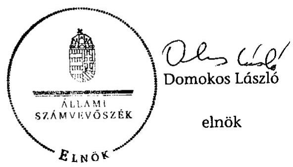

# ÁLLAMI   SZÁMVEVŐSZÉK 

## JELENTÉS

az önkormányzatok belső kontrollrendszere kialakításának, egyes kontrolltevékenységek és a belső ellenőrzés múködésének - 2013. évben induló - ellenőrzéséről Visegrád

---

# Állami Számvevőszék 

Iktatószám: V-0158-027/2013.
Témaszám: 1190
Vizsgálat-azonosító szám: V064917

## Az ellenőrzést felügyelte:

dr. Benedek Mária
felügyeleti vezető
Az ellenőrzést vezette és az ellenőrzés végrehajtásáért felelős:
dr. Veress Tiborné
ellenőrzésvezető
A számvevőszéki jelentés összeállításában közremúködtek:
dr Zsombori Beáta
számvevő
Bencsik Árpád
számvevő
Az ellenőrzést végezték:
Bencsik Árpád Komlósiné Bogár Éva
számvevő számvevő tanácsos

A témához kapcsolódó eddig készített számvevőszéki jelentések:
címe
sorszáma
Az állami feladat (közfeladat) ellátás szervezeti és humánerőforrás 1022
rendszerének ellenőrzése

---

# TARTALOMJEGYZÉK 

BEVEZETÉS ..... 5
I. ÖSSZEGZŐ MEGÁLLAPÍTÁSOK, KÖVETKEZTETÉSEK, JAVASLATOK ..... 9
II. RÉSZLETES MEGÁLLAPÍTÁSOK ..... 15

1. Az önkormányzat belső kontrollrendszerének kialakítása ..... 15
1.1. A kontrollkörnyezet ..... 15
1.2. A kockázatkezelési rendszer ..... 16
1.3. A kontrolltevékenységek ..... 16
1.4. Az információs és kommunikációs rendszer ..... 17
1.5. A monitoring rendszer ..... 18
2. A pénzügyi folyamatokban kulcsszerepet betöltő teljesítésigazolás és érvényesítés belső kontrollok működése ..... 18
3. A belső ellenőrzés működése ..... 21

## FÜGGELÉKEK

1. számú Értelmező szótár
2. számú Az értékelés módja és szempontjai

---

.

---

# RÖVIDÍTÉSEK JEGYZÉKE 

## Törvények

Áht.
ÁSZ tv.
Info tv.

Kttv.
Ktv.
Ltv.
Mötv.
Ötv.
Számv. tv.

## Rendeletek

Áhsz.

Ávr.

Bkr.

## Szórövidítések

adatvédelmi szabályzat

ÁSZ
belső ellenőrzési kézikönyv

FEUVE
gazdálkodási jogkörök szabályzata
2011. évi CXCV. törvény az államháztartásról (hatályos 2012. január 1-jétől)
2011. évi LXVI. törvény az Állami Számvevőszékről
2011. évi CXII. törvény az információs önrendelkezési jogról és az információszabadságról (hatályos 2012. január 1-jétől)
2011. évi CXCIX. törvény a közszolgálati tisztviselőkről
1992. évi XXIII. törvény a köztisztviselők jogállásáról
1995. évi LXVI. törvény a köziratokról, a közlevéltárakról és a magánlevéltári anyag védelméről
2011. évi CLXXXIX. törvény Magyarország helyi önkormányzatairól (hatályos 2012. január 1-jétől)
1990. évi LXV. törvény a helyi önkormányzatokról
2000. évi C. törvény a számvitelről
249/2000. (XII. 24.) Korm. rendelet az államháztartás szervezetei beszámolási és könyvvezetési kötelezettségének sajátosságairól
368/2011. (XII. 31.) Korm. rendelet az államháztartásról szóló törvény végrehajtásáról (hatályos 2012. január 1jétől)
370/2011. (XII. 31.) Korm. rendelet a költségvetési szervek belső kontrollrendszeréről és belső ellenőrzéséről (hatályos 2012. január 1-jétől)

Visegrád Város Önkormányzata Polgármesteri Hivatalának Közszolgálati adatvédelmi és adatkezelési szabályzata (hatályos 2012. július 1-jétől)
Állami Számvevőszék
Dunakanyari és Pilisi Önkormányzatok Többcélú Kistérségi Társulása Belső ellenőrzési kézikönyve (hatályos 2010 januárjától)
folyamatba épített, előzetes, utólagos és vezetői ellenőrzés Gazdálkodási szabályzat (a kötelezettségvállalás, pénzügyi ellenjegyzés, teljesítésigazolás, érvényesítés és utalványozás rendjéről, hatályos 2012. június 15 -től, előtte Visegrád Város Önkormányzat és intézményei kötelezettségvállalás, utalványozás, ellenjegyzés, érvényesítés rendjének szabályzata volt hatályban 2009. január 1-jétől, a jogkörök kijelölését 2012. január 1-jétől módosították)

---

| hivatali SZMSZ | Visegrád Város Önkormányzat Polgármesteri Hivatalának Szervezeti és Múködési Szabályzata, jóváhagyta a Képviselő-testület 206/2012. (VI. 25.) számú határozata (hatályos 2012. július 1-jétől, előtte a 118/2008. (VI. 24.) számú Kt. határozattal elfogadott Úgyrend volt hatályban) |
| :--: | :--: |
| INTOSAI | International Organization of Supreme Audit Institutions (Legfőbb Ellenőrző Intézmények Nemzetközi Szervezete) |
| iratkezelési szabályzat | Visegrád Város Önkormányzat Polgármesteri Hivatala Iratkezelési szabályzat (hatályos 2006. január 1-jétől) |
| ISSAI | International Standards of Supreme Audit Institutions (Legfőbb Ellenőrző Intézmények Nemzetközi Standardjai) |
| $\text { jegyző }_{1}$ | Visegrád Város Önkormányzatának határozott idejű megbízással helyettesítő jegyzője 2012. június 5-ig |
| $\text { jegyző }_{2}$ | Visegrád Város Önkormányzatának helyettesítő jegyzője 2012. június 6-ától |
| Képviselő-testület $_{1}$ | Visegrád Város Önkormányzatának Képviselő-testülete 2012. február 29-ig |
| Képviselő-testület $_{2}$ | Visegrád Város Önkormányzatának Képviselő-testülete 2012. május 9-től |
| NGM | Nemzetgazdasági Minisztérium |
| Önkormányzat | Visegrád Város Önkormányzata |
| Kormányhivatal   polgármester $_{1}$ | Pest Megyei Kormányhivatal   Visegrád Város Önkormányzatának polgármestere 2012. május 5 -ig |
| polgármester $_{2}$ | Visegrád Város Önkormányzatának polgármestere 2012. május 6 -tól |
| Polgármesteri Hivatal | Visegrád Város Önkormányzatának Polgármesteri Hivatala |
| stratégiai ellenőrzési terv | A Dunakanyari és Pilisi Önkormányzatok Többcélú Kistérségi Társulása önkormányzatainak belső ellenőrzési stratégiai terve a 2010-2014. évekre |
| Társulás | Dunakanyari és Pilisi Önkormányzatok Többcélú Kistérségi Társulás |

---

# JELENTÉS 

## az önkormányzat belső kontrollrendszere kialakításának, egyes kontrolltevékenységek és a belső ellenőrzés múködésének - 2013. évben induló - ellenőrzéséről Visegrád

## BEVEZETÉS

Visegrád város állandó lakosainak száma 2012. január 1-jén 1815 fő volt. Az Önkormányzat héttagú Képviselő-testület ${ }_{1,2}$-ének munkáját négy állandó bizottság segítette. Az Önkormányzat az önállóan múködő és gazdálkodó Polgármesteri Hivatalon kívül négy önállóan múködő intézményt múködtetett, és kettő többségi tulajdoni hányadú gazdasági társasággal rendelkezett. A 2010. október 3-án megválasztott Képviselő-testület ${ }_{1}$ 2012. február 29-én döntött a feloszlatásáról. Az önkormányzati időközi választást 2012. május 6-án bonyolították le. A polgármester ${ }_{1}$ 2012. május 5-ig látta el feladatait, a polgármester ${ }_{2}$ 2012. május 6. óta tölti be tisztségét. A jegyzői feladatokat 2008-2012 között öt jegyző, közülük 2012. január 1-je és 2012. június 5-e között a jegyző ${ }_{1}$, 2012. június 6 -ától a jegyző ${ }_{2}$ látta el. A jegyzői feladatokat a jegyző ${ }_{1,2}$ dokumentáltan nem vette át. A Polgármesteri Hivatal három szervezeti egységre tagolódott: titkársági, igazgatási és pénzügyi csoportra. A pénzügyi csoport látta el az elkülönített gazdasági szervezet feladatait. A köztisztviselők száma 2012. január 1jén 14 fő volt. Az Önkormányzatnál a hivatali feladatellátás szervezeti keretei 2013. január 1-jét követően nem változtak. Az Önkormányzatnak a 2012. évi költségvetési beszámolója szerint 1087774 ezer Ft bevétele volt, valamint 1040213 ezer Ft kiadást teljesített. A 2012. december 31-i könyvviteli mérleg szerint 2672453 ezer Ft értékű eszközvagyonnal rendelkezett, a rövid lejáratú kötelezettségállománya 29118 ezer Ft volt, hosszú lejáratú kötelezettsége nem volt.

A demokratikus társadalmakban alapvető igény, hogy a közpénzeket, a közvagyont használók tevékenységükről elszámoljanak, ahhoz egyértelmú és érvényesíthető felelősségi szabályok társuljanak. Ennek a jogos igénynek az érvényesítéséhez meg kell teremteni azokat a folyamatokat, rendszereket, amelyek nélkülözhetetlenek az elszámoltatáshoz. Az elszámoltatás eredményes múködtetéséhez szükség van a megfelelő információs, kontroll-, értékelési és beszámolási rendszerek kialakítására.

Magyarországon az uniós csatlakozási tárgyalások idejére nyúlnak vissza a belső kontrollrendszer szabályozásának gyökerei. Az uniós elvárásoknak megfelelő új terminológia szerinti államháztartási belső pénzügyi ellenőrzési (ÁBPE) rendszer területén a jogharmonizáció 2003-ban teljes körűen megvaló-

---

sult, míg az önkormányzati alrendszerre vonatkozó, Ötv.-ben megjelenített speciális szabályozás 2005-ben lépett hatályba. Az államháztartási belső kontrollrendszer koncepciója 2009-ben tovább fejlődött. A változások irányát mutatja, hogy a költségvetési szervek belső kontrollrendszere már magában foglalja a korszerű felelős szervezetirányítás elemeit (kontrollkörnyezet, kockázatkezelés, kontrolltevékenység, információ és kommunikáció, monitoring) is. E kontrollrendszer szabályozása háromszintú, a törvényi előírásokat az Áht. és a Mötv., a rendeleti szintű szabályozást az Ávr. és a Bkr. tartalmazza, amelyeket útmutatói szinten az NGM által kiadott standardok és kézikönyvek támogatnak.

A belső kontrollrendszer azt a célt szolgálja, hogy a költségvetési szervek múködésük és gazdálkodásuk során a tevékenységeket szabályszerűen, gazdaságosan, hatékonyan és eredményesen hajtsák végre, teljesítsék elszámolási kötelezettségeiket és megvédjék az erőforrásokat a veszteségektől, a károktól és a nem rendeltetésszerű használattól. A belső kontrollrendszer magában foglalja mindazon szabályokat, eljárásokat, gyakorlati módszereket és szervezeti struktúrákat, kockázatkezelési technikákat, kontrolltevékenységeket, amelyek segítséget nyújtanak a szervezetnek céljai eléréséhez.

Az ÁSZ a 2011-2015. évekre szóló stratégiájában hangsúlyos szerepet szánt annak, hogy szilárd szakmai alapon álló, értékteremtő ellenőrzéseivel előmozdítsa a közpénzügyek átláthatóságát, rendezettségét. A számvevőszéki ellenőrzés nemzetközi alapelvei is rögzítik, hogy a megfelelő belső kontrollrendszer minimálisra csökkenti a hibák és szabálytalanságok kockázatát.

Az ellenőrzés célja annak megállapítása volt, hogy a belső kontrollrendszer elemeinek kialakítása, a pénzügyi folyamatokban kulcsszerepet betöltő teljesítésigazolás és érvényesítés, és a belső ellenőrzés szabályos múködése biztosítot-ta-e az önkormányzatnál a közpénzfelhasználás szabályosságát, hozzájárult-e az értéket teremtő rend követelményének érvényesüléséhez.

Ennek keretében értékeltük, hogy

- a jogszabályi előírásoknak megfelelően alakították-e ki a belső kontrollrendszer elemeit;
- a gazdálkodás folyamatában kulcsszerepet betöltő teljesítésigazolás és érvényesítés kontrolltevékenységeit megfelelően múködtették-e;
- biztosították-e a belső ellenőrzés szabályos múködését;
- amennyiben az ÁSZ tett javaslatot a 2008-2011. évek közötti ellenőrzése kapcsán az Önkormányzatnak, intézkedtek-e azok végrehajtására.

Az ellenőrzés várható hasznosulását négy szinten tervezzük. A törvényalkotás számára összegzett tapasztalatok állnak rendelkezésre a belső kontrollrendszer önkormányzati területen való kialakításáról, múködéséről és hatásairól, a belső ellenőrzés múködéséről. Ennek alapján következtetést lehet levonni arról, hogy a belső kontrollrendszer kialakítására és múködtetésére vonatkozó jelenlegi, differenciálás nélküli - jogszabályi előírások reális követelményeket támasztanak-e az eltérő adottságú települési önkormányzatok esetében, illetve

---

indokolt-e esetleges jogszabályi módosítás kezdeményezése. Az ellenőrzés az ellenőrzött számára visszajelzést ad a belső kontrollrendszer kialakításában és működésében fellépő hiányosságokról, javaslataival hozzájárul azok kiküszöböléséhez, amely csökkentheti a későbbi ellenőrzések gyakoriságát. Az ellenőrzés megállapításait és javaslatait más szervezetek is hasznosíthatják a rendezett gazdálkodási keretek kialakításához. A társadalom számára jelzi, hogy közpénz nem maradhat ellenőrizetlenül, az ÁSZ értékteremtő rend kialakításához és megőrzéséhez hozzájáruló tevékenysége pozitív hatással lesz a szervezetről kialakított összkép formálásában. A szervezeten belül lehetőség nyílik arra, hogy a megállapítások szintetizálásával az ÁSZ a hozzáadott értéket teremtő elemző tevékenységét és tanácsadó szerepét is erősítse.

Az önkormányzatok belső kontrollrendszere kialakításának, egyes kontrolltevékenységek és a belső ellenőrzés működésének ellenőrzéséről szóló jelentés I. fejezetének összegző része az ellenőrzés céljára ad rövid, szintetizáló összefoglalót és tartalmazza a következtetéseket a II. fejezet részletes megállapításain alapulóan. A jelentés intézkedést igénylő megállapításait és javaslatait az ellenőrzés során feltárt, a jelentés II. fejezetében rögzített részletes megállapítások alapozzák meg. A helyszíni ellenőrzés lezárásáig a helyi szabályozás változásait nyomon követtük.

Az ellenőrzés típusa: szabályszerűségi ellenőrzés.
Az ellenőrzött időszak: a belső kontrollrendszer kialakításának megfelelősége esetében a 2012. évre, a pénzügyi folyamatokban kulcsszerepet betöltő teljesítésigazolás és érvényesítés belső kontrollok működésének megfelelőségét és a belső ellenőrzés szabályszerű működését a 2012. január 1. és december 31-e közötti időszak eseményeit figyelembe véve értékeltük, míg az ÁSZ javaslatainak utóellenőrzése a 2008-2011. években hivatalosan közzétett számvevőszéki jelentésekben tett javaslatok áttekintésére terjedt ki.

Az ellenőrzött szervezet: Visegrád Város Önkormányzata.
Az ellenőrzés jogszabályi alapját az ÁSZ tv. 1. § (3) bekezdése, az 5. § (2) és (6) bekezdései, valamint az Áht. 61. §. (2) bekezdésének előírásai képezik.

Az ellenőrzés szakmai módszertana az ÁSZ hivatalos honlapján (www.asz.hu) közzétett szakmai szabályokon alapult, amely az INTOSAI által kiadott ISSAI figyelembevételével készült.

Az ellenőrzés lefolytatásához az Önkormányzat a kimutatások és a tanúsítvány elektronikus kitöltésével, valamint az ÁSZ által kért dokumentumok elektronikus megküldésével szolgáltatott adatokat. Az így rendelkezésre bocsátott adatok, információk kontrollja és a munkalapok kitöltése a helyszíni ellenőrzés keretében történt. A jelentésben használt fogalmak magyarázatát az 1. számú függelék, az ellenőrzés egyes területeinek értékelésénél alkalmazott egységes minősítési szempontokat a 2. számú függelék tartalmazza.

A belső kontrollrendszer kialakításának ellenőrzése során értékeltük a kontrollkörnyezet, a kockázatkezelési rendszer, a kontrolltevékenységek, az információs és kommunikációs rendszer, valamint a monitoring rendszer szabályozottsá-

---

gának megfelelőségét. A pénzügyi folyamatokban kulcsszerepet betöltő teljesítésigazolás és érvényesítés kontrolljai múködése megfelelőségének minősítéséhez az állományba nem tartozók megbízási díjai, a külső szolgáltatók által végzett karbantartási, kisjavítási munkák, az egyéb üzemeltetési és fenntartási szolgáltatások, a rendszeres szociális segélyek, valamint az államháztartáson kívülre teljesített múködési és felhalmozási célú pénzeszközátadások közül kockázatelemzéssel választottuk ki az ellenőrzött kiadási jogcímeket. Az egyszerű véletlen mintavétellel kiválasztott tételek ellenőrzését többlépcsős megfelelőségi tesztek útján addig végeztük, amíg elegendő és megfelelő bizonyítékot szereztünk a vizsgált folyamatok kulcskontrolljai múködésének megfelelő vagy nem megfelelő voltáról. Értékeltük az Önkormányzatnál a belső ellenőrzés múködésének szabályosságát. Az ÁSZ az Önkormányzatnál a 2010. évben az állami feladat (közfeladat) ellátás szervezeti és humánerőforrás rendszerének ellenőrzését végezte, a nyilvánosságra hozott, 1022 számon közzétett számvevőszéki jelentésben javaslatot nem tett, ezért a jelen ellenőrzés keretében utóellenőrzésre nem került sor.

Az ÁSZ tv. 29. § (1) bekezdése szerint a jelentéstervezetet megküldtük a polgármester részére, aki az ÁSZ tv. 29. § (2) bekezdésében foglalt észrevételezési jogával nem élt, a jelentéstervezetre észrevételt nem tett.

---

# I. ÖSSZEGZŐ MEGÁLLAPÍTÁSOK, KÖVETKEZTETÉSEK, JAVASLATOK 

A belső kontrollrendszeren belül 2012-ben a kontrollkörnyezet, a kockázatkezelési rendszer, a kontrolltevékenységek, az információs és kommunikációs rendszer, valamint a monitoring rendszer kialakítását külön-külön és együttesen is értékeltük. A belső kontrollrendszer kialakítása az összesített értékelés alapján nem felelt meg a jogszabályi előírásoknak.

A belső kontrollrendszer egyes területei kialakításának minősítése a következő:

| Kontrollterület | Minősítés |
| :-- | :--: |
| Kontrollkörnyezet | nem   megfelelő |
| Kockázatkezelési rendszer | nem   megfelelő |
| Kontrolltevékenységek | megfelelő |
| Információs és kommunikációs rendszer | megfelelő |
| Monitoring rendszer | nem   megfelelő |

A kontrolltevékenységek és az információs és kommunikációs rendszer kialakítását megfelelőnek értékeltük, mivel a jogszabályi előírásokban foglaltakat figyelembe véve kisebb hiányosságok mellett is e kontrollterületek hozzájárultak a Polgármesteri Hivatal, ezáltal az Önkormányzat céljainak eléréséhez, az információs rendszeren belül a beszámolási rendszerek megbízható múködéséhez.

A kontrollkörnyezet, a kockázatkezelési rendszer és a monitoring rendszer kialakítását nem megfelelőnek értékeltük, mivel az ellenőrzésünk során megállapított szabályozásbeli hiányosságok magukban hordozzák a szabálytalan múködés és gazdálkodás, valamint a korrupció kockázatát.

A belső kontrollrendszer nem megfelelő kialakítása kockázatot jelent az Önkormányzat feladatainak szabályszerű, gazdaságos, hatékony és eredményes végrehajtása során.

Az állományba nem tartozók megbízási díjaival, a külső szolgáltatók által végzett karbantartással, kisjavítással, valamint az államháztartáson kívülre történő múködési és felhalmozási célú pénzeszközátadásokkal kapcsolatos kifizetések során a pénzügyi folyamatokban kulcsszerepet betöltő teljesítésigazolás és érvényesítés belső kontrollok múködése gyenge volt. Gyengének értékeltük a két kulcskontroll együttes múködését, mert azok nem biztosították az ellenőrzésünk által feltárt hiányosságok bekövetkezésének megelőzését.

---

A számvevőszéki ellenőrzés az ellenőrzött kifizetésekkel összefüggésben a rendelkezésre bocsátott dokumentumok alapján kár bekövetkeztére utaló adatot, tényt nem állapított meg, azonban a gazdálkodásban kulcsszerepet betöltő kontrollok gyenge múködése miatt fennáll a hibák bekövetkezésének lehetősége. A nem megfelelően szabályozott és múködtetett belső kontrollok korrupciós kockázatot is hordoznak.

A belső ellenőrzési feladatokat a Társulás útján látták el. A belső ellenőrzés múködése nem felelt meg a jogszabályi előírásoknak, mivel a számvevőszéki ellenőrzés által megállapított szabályozási és múködési hiányosságok számossága magában hordozza a szabálytalan önkormányzati gazdálkodás és feladatellátás kockázatát.

Az ÁSZ tv. 33. § (1) bekezdésében foglaltak értelmében az ellenőrzött szervezet vezetője köteles a jelentésben foglalt megállapításokhoz kapcsolódó intézkedési tervet összeállítani, és azt a jelentés kézhezvételétől számított 30 napon belül az ÁSZ részére megküldeni. Amennyiben az intézkedési tervet határidőre nem küldi meg a szervezet, vagy az ÁSZ tv. 33. § (2) bekezdésében foglalt póthatáridő elteltével megküldött intézkedési terv továbbra sem elfogadható, az ÁSZ elnöke a hivatkozott törvény 33. § (3) bekezdés a)-b) pontjaiban foglaltakat érvényesítheti.

Az ellenőrzés intézkedést igénylő megállapításai és javaslatai:

# a jegyzönek 

1. a kontrollkörnyezettel kapcsolatban:

A hivatali SZMSZ-ben a jegyző́ ${ }_{1,2}$ az Ávr. 13. § (1) bekezdés c), h), i) pontjaiban foglaltak ellenére nem rögzítette az ellátandó és a szakfeladatrend szerint szakfeladat számmal és megnevezéssel besorolt alaptevékenységek, az alaptevékenységet szabályozó jogszabályok megjelölését; a munkáltatói jogok gyakorlásának rendjét és az irányító szerv által az Ávr. 10. § (1)-(3) bekezdése szerint a költségvetési szervhez rendelt más költségvetési szervek felsorolását.

A jegyző ${ }_{1,2}$ a Kttv. 130. § (1) bekezdéseiben foglaltak ellenére a Polgármesteri Hivatalban dolgozó köztisztviselők teljesítményértékelését a 2012. évben nem készítette el.

A Kttv. 231. § (1) bekezdése ellenére a Képviselő-testület nem állapította meg a Kttv. 83. §-ában előírt, a köztisztviselőkkel szembeni hivatásetikai alapelvek részletes tartalmát, valamint az etikai eljárás szabályait, mivel a jegyző ${ }_{1,2}$ az Ötv. 36. § (2) bekezdés a) pontjában előírt feladata ellenére nem készítette elő ennek dokumentumát.

Javaslat:
a) Készítse elő a hivatali SZMSZ módosítását, és kezdeményezze az Áht. 9. § (1) bekezdés a) pontjában foglaltak alapján a polgármesternél a Képviselő-testület elé terjesztését annak érdekében, hogy az tartalmazza - az Ávr. 13. § (1) bekezdés c), h) és i) pontjaiban foglaltak szerint - az ellátandó és a szakfeladatrend szerint szakfeladat számmal és megnevezéssel besorolt alaptevékenységek, az

---

alaptevékenységet szabályozó jogszabályok megjelölését; továbbá a munkáltatói jogok gyakorlásának rendjét és az irányító szerv által az Ávr. 10. § (1)-(3) bekezdése szerint a költségvetési szervhez rendelt más költségvetési szervek felsorolását.
b) Készítse el a Kttv. 130. § (1) bekezdésének megfelelően a Polgármesteri Hivatalban dolgozó köztisztviselők teljesítményértékelését.
c) Készítse elő a Mötv. 81. § (3) bekezdés c) pontjában foglalt feladatkörében a Kttv. 83. §-ában foglaltaknak megfelelően a köztisztviselőkkel szembeni hivatásetikai alapelvek részletes tartalmának, valamint az etikai eljárás szabályainak dokumentumait, és kezdeményezze a polgármesternél a Kttv. 231. § (1) bekezdésében foglaltak alapján annak Képviselő-testület elé terjesztését.
2. a kockázatkezelési rendszerrel kapcsolatban:

A jegyző ${ }_{1,2}$ a Bkr. 7. § (2) bekezdésében foglaltak ellenére nem mérte fel és nem állapította meg a Polgármesteri Hivatal tevékenységében, gazdálkodásában rejlő kockázatokat, továbbá nem határozta meg az egyes kockázatokkal kapcsolatos szükséges intézkedéseket, valamint azok teljesítése folyamatos nyomon követésének módját.

Javaslat:
Mérje fel és állapítsa meg a Bkr. 7. §. (2) bekezdésében foglaltak alapján a Polgármesteri Hivatal tevékenységében és gazdálkodásában rejlő kockázatokat, határozza meg az egyes kockázatokkal kapcsolatban szükséges intézkedéseket, valamint azok teljesítése folyamatos nyomon követésének módját.
3. a kontrolltevékenységekkel kapcsolatban:

A jegyző ${ }_{1,2}$ az Ávr. 53. § (2) bekezdésében foglaltakat figyelmen kívül hagyva, annak ellenére nem határozta meg az írásbeli kötelezettségvállalást nem igénylő kifizetések rendjét, hogy a belső szabályzatban lehetővé tette a 100 ezer Ft alatti kifizetések előzetes írásbeli kötelezettségvállalás nélküli teljesítését.

A jegyző ${ }_{1,2}$ az Ávr. 13. § (2) bekezdésének a) pontjában foglaltakat figyelmen kívül hagyva nem határozta meg a teljesítésigazolás eljárásának dokumentációs részletszabályait.

Javaslat:
a) Rögzítse belső szabályzatban az Ávr. 53. § (2) bekezdése alapján az előzetes írásbeli kötelezettségvállalást nem igénylő kifizetések rendjét.
b) Rendezze belső szabályzatban az Ávr. 13. § (2) bekezdésének a) pontjában foglaltak szerint a teljesítésigazolás eljárásának dokumentációs részletszabályait.
4. az információs és kommunikációs rendszerrel kapcsolatban:

A jegyző ${ }_{1,2}$ a Bkr. 9. § (1) bekezdésében foglaltak ellenére nem alakította ki a szervezeten belüli információáramlás rendszerét.

---

Javaslat:
Alakítsa ki a Bkr. 9. § (1) bekezdésében foglaltak szerint a szervezeten belüli információáramlás rendszerét.
5. a monitoring rendszerrel kapcsolatban:

A jegyző ${ }_{1,2}$ a Bkr. 3. § e) pontjában és a 10. §-ában foglaltak ellenére nem alakította ki a szervezet tevékenységének, a célok megvalósításának folyamatos nyomon követését biztosító rendszert.

A jegyző ${ }_{7}$ a Bkr. 11. § (1) bekezdésében foglalt kötelezettsége ellenére a belső kontrollrendszer minőségét a 2011. évre vonatkozóan - a Bkr. 1. melléklete szerinti nyilatkozatban - nem értékelte.

Javaslat:
a) Alakítsa ki és múködtesse a Bkr. 3. § e) pontjában és a 10. §-ában foglaltak alapján a szervezet tevékenységének, a célok megvalósításának folyamatos nyomon követését biztosító rendszert.
b) Értékelje a Bkr. 11. § (1) bekezdésében foglaltak alapján - a Bkr. 1. melléklete szerinti nyilatkozatban - a belső kontrollrendszer minőségét.
6. a pénzügyi folyamatokban kulcsszerepet betöltő kontrollokkal kapcsolatban:

Teljesítésigazolást az Ávr. 57.§ (1) és (3) bekezdéseinek előírása ellenére nem végeztek, vagy ellenőrizhető okmányok hiányában nem szabályszerűen végezték, továbbá a teljesítés igazolását kijelöléssel nem rendelkező személy végezte.

Az érvényesítő nem rendelkezett az Ávr. 58. § (4) bekezdésében előírt kijelöléssel, továbbá az érvényesítés során az Ávr. 58. § (1) bekezdésben előírt ellenőrzési feladatát nem végezte el, mert az érvényesítés nem teljesítésigazoláson alapult.

Az Ávr. 58. § (2) bekezdésben előírtak ellenére az érvényesítő nem jelezte az utalványozónak, hogy a teljesítésigazolást nem végezték el.

Az Áht. 37. § (1) bekezdésében, valamint az Ávr. 55. § (1) bekezdésében foglalt előírások ellenére az írásbeli kötelezettségvállalások pénzügyi ellenjegyzését nem végezték el, továbbá a kiadást tartalmazó bizonylat nem felelt meg a Számv. tv. 167. § (1) bekezdésében foglalt - a könyvviteli elszámolást közvetlenül alátámasztó bizonylattal szemben támasztott alaki és tartalmi - követelményeknek. A főkönyvi számlakijelölés nem felelt meg a Számv. tv. 16. § (3) bekezdésében, az Áhsz. 9. § (11) bekezdésében, valamint az Áhsz. 9. számú melléklet 3. e) pontjában foglalt rendelkezéseknek. Az Ávr. 56. § (1) bekezdésében foglalt előírás ellenére a kötelezettségvállalásokat nem vették nyilvántartásba.

Javaslat:
Intézkedjen - a teljesítésigazolás és az érvényesítés vonatkozásában feltárt hiányosságok megszüntetése, illetve az operatív gazdálkodás során a müködésbeli hibák megelőzése, feltárása és kijavítása érdekében - arról, hogy:

---

a) a teljesítésigazolásra - az Ávr. 57. § (4) bekezdésében foglalt előírásnak megfelelően - kijelölt személyek az Ávr. 57. § (1) bekezdésében foglaltaknak megfelelően, ellenőrizhető okmányok alapján ellenőrizzék a kiadások teljesítésének jogosságát, összegszerűségét, ellenszolgáltatást is magában foglaló kötelezettségvállalás esetében a szerződés, megrendelés teljesítését, és azt az Ávr. 57. § (3) bekezdésében foglalt módon igazolják;
b) az érvényesítő az Ávr. 58. § (4) bekezdésében foglaltak szerinti kijelöléssel rendelkezzen;
c) az érvényesítő a kifizetéseket megelőzően - az Ávr. 58. § (1) bekezdése szerint teljesítésigazolás alapján ellenőrizze - az Ávr. 57. § (3) bekezdése szerinti esetben annak hiányában is - az összegszerűséget, a fedezet meglétét és a megelőző ügymenetben az Áht., az Áhsz., az Ávr. előírásai és a belső szabályzatokban foglaltak betartását;
d) az érvényesítő az Ávr. 58. § (2) bekezdésben foglalt előírásnak megfelelően jelezze az utalványozónak, ha az Áht. vagy az államháztartási számviteli kormányrendelet, az Ávr. és a belső szabályzatokban foglaltak megsértését tapasztalja;
e) a kötelezettségvállalásokat az Ávr. 56. § (1) bekezdésében foglalt előírásnak megfelelően vegyék nyilvántartásba;
f) az Áht. 37. § (1) és az Ávr. 55. § (1) bekezdésében foglaltaknak megfelelően kötelezettségvállalásra - az Ávr. 53. §-ában meghatározott kivételekkel - pénzügyi ellenjegyzés után kerüljön sor;
g) a gazdasági eseményeket a Számv. tv. 16. § (3) bekezdésében, az Áhsz. 9. § (11) bekezdésében és az Áhsz. 9. számú mellékletében foglaltaknak megfelelően a tényleges tartalmuk szerint könyveljék.
7. a belső ellenőrzés múködésével kapcsolatban:

A Bkr. 17. § (1) bekezdésében foglaltak ellenére az Önkormányzat nem rendelkezett a költségvetési szerv vezetője által jóváhagyott belső ellenőrzési kézikönyvvel. A stratégiai ellenőrzési terv a Bkr. 30. § (1) bekezdés f) pontjában foglalt előírás ellenére nem tartalmazta az ellenőrzési prioritásokat és az ellenőrzési gyakoriságot.

Az éves ellenőrzési tervet a Bkr. 31. § (2) bekezdésében foglaltak ellenére kockázatelemzés nem alapozta meg, a Bkr. 31. § (4) bekezdés a) pontjában foglaltak ellenére az éves ellenőrzési terv nem tartalmazta az ellenőrzési tervet megalapozó elemzések és a kockázatelemzés eredményének összefoglaló bemutatását.

A Bkr. 56. § (5) bekezdésében foglalt előírás ellenére a 2012. évre jóváhagyott ellenőrzési terv módosítása nélkül hagytak el, illetve indítottak új ellenőrzéseket. A végrehajtott ellenőrzésekhez a Bkr. 33. § (2) bekezdésében foglalt előírások ellenére ellenőrzési programok nem készültek. A belső ellenőrzés javaslatainak végrehajtása érdekében - a Bkr. 45. § (1)-(3) bekezdéseiben foglaltak ellenére - intézkedési terveket nem készítettek.

A Bkr. 50. § (1)-(2) bekezdésében foglalt előírást figyelmen kívül hagyva a belső ellenőrzési vezető az elvégzett ellenőrzésekről, a Bkr. 47. § (1) bekezdésében foglalt

---

előírás ellenére az ellenőrzési jelentésekben szereplő javaslatok nyomon követéséről nyilvántartást nem vezetett. A Bkr. 49. § (1) és (3) bekezdésében foglalt előírások ellenére a belső ellenőrzési vezető az éves ellenőrzési jelentést nem készítette el a 2011. évre vonatkozóan.

Javaslat:
a) Gondoskodjon a Bkr. 17. § (1) bekezdésében foglaltak szerint a belső ellenőrzési kézikönyv költségvetési szerv vezetője általi jóváhagyásáról.
b) Kezdeményezze, hogy a belső ellenőrzési vezető egészítse ki a Stratégiai ellenőrzési tervet - a Bkr. 30. § (1) bekezdés f) pontjában foglaltak szerint - az ellenőrzési prioritásokkal és az ellenőrzési gyakorisággal.
c) Intézkedjen arról, hogy a belső ellenőrzési vezető az éves ellenőrzési tervet - a Bkr. 31. § (4) bekezdés a) pontjában foglaltak szerint - egészítse ki az ellenőrzési tervet megalapozó elemzések és a kockázatelemzés eredményének összefoglaló bemutatásával.
d) Intézkedjen arról, hogy az éves ellenőrzési terv a Bkr. 31. § (2) bekezdése alapján kockázatelemzésen alapuljon.
e) Intézkedjen arról, hogy a Bkr. 56. § (5) bekezdésében foglalt előírások szerint a jóváhagyott ellenőrzési tervben foglalt ellenőrzéseket hajtsák végre.
f) Kezdeményezze, hogy az ellenőrzésekhez a Bkr. 33. § (2) bekezdésében foglalt előírások szerint ellenőrzési programok készüljenek.
g) Készítsen a Bkr. 45. § (1)-(3) bekezdéseiben foglaltak alapján intézkedési tervet a belső ellenőrzési jelentésekben megfogalmazott javaslatok végrehajtására.
h) Kezdeményezze, hogy - a Bkr. 50. § (1)-(2) bekezdéseinek és a 47. § (1) bekezdésének megfelelően - a belső ellenőrzési vezető vezessen nyilvántartást az elvégzett belső ellenőrzésekről, a belső ellenőrzési jelentésekben tett megállapításokról, javaslatokról, a vonatkozó intézkedési tervekről, és kövesse nyomon azok végrehajtását.
i) Kezdeményezze, hogy a belső ellenőrzési vezető készítse el - a Bkr. 49. § (1) és (3) bekezdéseiben foglalt előírások szerint - az éves ellenőrzési jelentést.

---

# II. RÉSZLETES MEGÁLLAPÍTÁSOK 

## 1. AZ ÖNKORMÁNYZAT BELSŐ KONTROLLRENDSZERÉNEK KIALAKÍTÁSA

A belső kontrollrendszer kialakítása 2012-ben a kontrollkörnyezet, a kockázatkezelési rendszer, a kontrolltevékenységek, az információs és kommunikációs rendszer, valamint a monitoring rendszer értékelése alapján összességében nem felelt meg a jogszabályi előírásoknak.

### 1.1. A kontrollkörnyezet

A kontrollkörnyezet kialakítása - a 2. számú függelékben részletezett kritériumrendszer alapján végzett értékelés szerint - a jogszabályi előírásoknak nem felelt meg, mert:

| Sorszám ${ }^{1}$ | Megállapítás | Megjegyzés |
| :--: | :--: | :--: |
| 7. 11. 12 | A hivatali SZMSZ-ben a jegyző ${ }_{1,2}$ az Ávr. 13. § (1) bekezdés c), h) és i) pontjaiban foglaltak ellenére nem rögzítette az ellátandó és a szakfeladatrend szerint szakfeladat számmal és megnevezéssel besorolt alaptevékenységek, az alaptevékenységet szabályozó jogszabályok megjelölését; a munkáltatói jogok gyakorlásának rendjét és az irányító szerv által az Ávr. 10. § (1)-(3) bekezdése szerint a költségvetési szervhez rendelt más költségvetési szervek felsorolását. |  |
| 35. | A jegyző ${ }_{1,2}$ az Ávr. 9. §. (5) bekezdésének előírása ellenére nem készítette el a gazdasági szervezet ügyrendjét, illetve nem alakította ki az azzal egyenértékű belső szabályozást. | A gazdasági szervezet ügyrendjét a jegyző ${ }_{2}$ 2013-ban elkészítette, amely 2013. február 15-étől hatályos. |
| 4. | A Képviselő-testület ${ }_{1,2}$ a Ktv. 34. § (3) bekezdésében ${ }^{2}$ foglaltak ellenére nem döntött a teljesítményértékelés alapját képező célokról. |  |
| 46., 47. | A jegyző ${ }_{1,2}$ a Kttv. 130. § (1) bekezdésében foglaltak ellenére a Polgármesteri Hivatalban dolgozó köztisztviselők teljesítményértékelését a 2012. évben nem készítette el. |  |

[^0]
[^0]:    ${ }^{1}$ A megállapítás számozása az Önkormányzat által - az adatszolgáltatás során - kitöltött kimutatások kérdéseinek sorszámával azonos.
    ${ }^{2}$ A Ktv. 34. § (3) bekezdése hatályon kívül helyezve 2012. március 1-jétől.

---

A Kttv. 231. § (1) bekezdése ellenére a Képvi-selő-testület nem állapította meg a Kttv. 83. $\S$-ában előírt, a köztisztviselőkkel szembeni hivatásetikai alapelvek részletes tartalmát, valamint az etikai eljárás szabályait, mivel a jegyző az Ötv. 36. § (2) bekezdés a) pontjában ${ }^{3}$ előírt feladata ellenére nem készítette elő ennek dokumentumát.

# 1.2. A kockázatkezelési rendszer 

A kockázatkezelési rendszer kialakítása - a 2. számú függelékben részletezett kritériumrendszer alapján végzett értékelés szerint —nem felelt meg a jogszabályi előírásoknak, mert:

| Sorszám | Megállapítás | Megjegyzés |
| :--: | :--: | :--: |
|  | A jegyző ${ }_{1,2}$ a Bkr. 7. § (2) bekezdésében foglaltak ellenére nem mérte fel és nem állapította meg a Polgármesteri Hivatal tevékenységében, gazdálkodásában rejlő kockázatokat, továbbá nem határozta meg az egyes kockázatokkal kapcsolatos szükséges intézkedéseket, valamint azok teljesítése folyamatos nyomon követésének módját. |  |

### 1.3. A kontrolltevékenységek

A kontrolltevékenységek kialakítása - a 2. számú függelékben részletezett kritériumrendszer alapján végzett értékelés szerint - megfelel t a jogszabályi előírásoknak.

A jegyző ${ }_{2}$ a kontrolltevékenység részeként előírta a FEUVE-t a költségvetés tervezése, a beszerzések lebonyolítása, a vagyonhasznosítási tevékenység és a támogatások elszámolása vonatkozásában. A jegyző ${ }_{2}$ a gazdálkodási jogkörök szabályzatában meghatározta a kötelezettségvállalás pénzügyi ellenjegyzésének módját. A kötelezettségvállaló kijelölte a teljesítésigazolásra jogosultakat. A jegyző ${ }_{2}$ a gazdálkodási jogkörök szabályzatában szabályozta az érvényesítés és az utalványozás rendjét.

A hivatali SZMSZ-ben, a gazdálkodási jogkörök szabályzatában, valamint a pénzügyi területen dolgozó köztisztviselők munkaköri leírásaiban a jegyző ${ }_{2}$ meghatározta az időközi és éves beszámolók elkészítésének feladatait. A jegyző ${ }_{2}$ a beszámolási eljárásokhoz kapcsolódó felelősségi köröket, a gazdasági feladatot ellátó vezetők és alkalmazottak helyettesítésének rendjét a köztisztviselők munkaköri leírásaiban határozta meg.

A polgármester ${ }_{2}$ kötelezettségvállalásra és utalványozásra felhatalmazást adott. A jogszabályi előírásoknak megfelelően jelölték ki a pénzügyi ellenjegy-

[^0]
[^0]:    ${ }^{3}$ 2013. január 1-jétől Mötv. 81. § (3) bekezdés c) pont

---

zési és az érvényesítési feladatra a Polgármesteri Hivatal állományába tartozó köztisztviselőket, és azok rendelkeztek a jogszabályban előírt szakképzettséggel. A jegyző ${ }_{2}$ kialakította a jogviszony megszűnése esetére vonatkozóan a munkavállaló folyamatban lévő feladatai átadásának rendjét.

A kontrolltevékenységek kialakítása az alábbi kisebb hiányosságok mellett megfelelt a jogszabályi előírásoknak:

| Sorszám | Megállapítás | Megjegyzés |
| :--: | :--: | :--: |
| 8. | A jegyző ${ }_{1,2}$ az Ávr. 53. § (2) bekezdésében foglaltakat figyelmen kívül hagyva, annak ellenére nem határozta meg az írásbeli kötelezettségvállalást nem igénylő kifizetések rendjét, hogy a belső szabályzatban lehetővé tette a 100 ezer Ft alatti kifizetések előzetes írásbeli kötelezettségvállalás nélküli teljesítését. | A gazdálkodási jogkörök szabályzatában előirták, hogy a nem írásban tett kötelezettségvállalásokat is fel kell vezetni a kötelezettségvállalások nyilvántartásába, azonban a nyilvántartás rendjét nem határozták meg, és kialakítása sem történt meg. |
| 9. | A jegyző ${ }_{1,2}$ az Ávr. 13. § (2) bekezdés a) pontjában foglaltakat figyelmen kívül hagyva nem határozta meg a teljesítésigazolás eljárási és dokumentációs részletszabályait. |  |

# 1.4. Az információs és kommunikációs rendszer 

Az információs és kommunikációs rendszer kialakítása - a 2. számú függelékben részletezett kritériumrendszer alapján végzett értékelés szerint megfelelte a jogszabályi előírásoknak. A Polgármesteri Hivatal rendelkezett az Info tv. előírásainak megfelelő adatvédelmi szabályzattal. A jegyző ${ }_{1,2}$ kialakította a kötelezően közzéteendő adatok nyilvánosságra hozatalának rendjét. Az Önkormányzat az elektronikus közzétételi kötelezettségének a 2012. évben eleget tett. A jegyző $_{2}$ meghatározta a közérdekú adatok megismerésére irányuló igények teljesítésének rendjét. A Polgármesteri Hivatal rendelkezett a jegyző ${ }_{1,2}$ által megfelelő tartalommal elkészített és hatályba helyezett iratkezelési szabályzattal. A szabálytalanságkezelési szabályzat tartalmazta a szabálytalansági gyanú észlelésével, jelentésével kapcsolatos részletes eljárásrendet.

Az információs és kommunikációs rendszer kialakítása az alábbi kisebb hiányosságok mellett megfelelt a jogszabályi előírásoknak:

| Sorszám | Megállapítás |
| :--: | :--: |
| 1. | A jegyző ${ }_{1,2}$ a Bkr. 9. § (1) bekezdésében foglaltak ellenére nem alakította ki a szervezeten belüli információáramlás rendszerét. |

---

# 1.5. A monitoring rendszer 

A monitoring rendszer kialakítása - a 2. számú függelékben részletezett kritériumrendszer alapján végzett értékelés szerint - nem felelt meg a jogszabályi előírásoknak, mert:

| Sor-   szám | Megállapítás |
| :-- | :-- |
| 1. | A jegyző ${ }_{1,2}$ a Bkr. 3. § e) pontjában és a 10. §-ában foglaltak ellenére nem   alakította ki a szervezet tevékenységének, a célok megvalósításának fo-   lyamatos nyomon követését biztosító rendszert. |
| 9. | A jegyző ${ }_{1}$ a Bkr. 11. § (1) bekezdésében foglalt kötelezettsége ellenére a   belső kontrollrendszer minőségét a 2011. évre vonatkozóan - a Bkr. 1.   számú melléklete szerinti nyilatkozatban - nem értékelte. |

A Kormányhivatal törvényességi felhívással élt ${ }^{4}$ a Képviselő-testület ${ }_{1}$ felé, amely szerint a helyi jogszabályok előkészítése során rendeletben kellett szabályozni a társadalmi részvétel szabályait. A kormánymegbízott kérésének megfelelően írásban adott a polgármester ${ }_{2}$ tájékoztatást, amelyhez a meghatározott 60 napos határidőn belül csatolta a Képviselő-testület ${ }_{2}$ „az önkormányzati rendeletek előkészítésében való társadalmi részvétel szabályairól" szóló 12/2012. (VIII.31.) számú önkormányzati rendeletét.

Az Önkormányzat az ÁSZ-tól a 2011. és a 2012. évben integritás kérdőív kitöltésére kapott felkérést, amelynek nem tett eleget. Az etikai értékek és az integritás keretein belül az etikai eljárások szabályainak hiánya, az információs rendszer szabályozása és kialakítása során feltárt hibák, valamint a 2013. évi ellenőrzési terv megalapozását szolgáló kockázatelemzés elmaradása arra utalnak, hogy az Önkormányzatnak még fejlődnie kell az integritási szemlélet érvényesítésében.

## 2. A PÉNZÜGYI FOLYAMATOKBAN KULCSSZEREPET BETÖLTŐ TELJESÍTÉSIGAZOLÁS ÉS ÉRVÉNYESÍTÉS BELSŐ KONTROLLOK MŰKÖDÉSE

Az Önkormányzatnál az eredendő kockázat az 1. számú kimutatás szerint magas volt, így a pénzügyi folyamatokban kulcsszerepet betöltő belső kontrollok múködését három területen ellenőriztük.

[^0]
[^0]:    ${ }^{4}$ Ügyiratszám: XIV-B-030/01383/2/2012.

---

Az állományba nem tartozók megbízási díjaival, a külső szolgáltatók által végzett karbantartással, kisjavítással kapcsolatos kifizetések során, valamint az államháztartáson kívülre történő múködési és felhalmozási célú pénzeszközátadásoknál, a pénzügyi folyamatokban kulcsszerepet betöltő teljesítésigazolás és érvényesítés belső kontrollok múködésének megfelelőssége összefoglalóan értékelve gyenge volt, mert:

| Kulcskontroll | Megállapítás |
| :--: | :--: |
| teljesítésigazo lás | Teljesítésigazolást az Ávr. 57.§ (1) és (3) bekezdéseinek előírása ellenére nem végeztek, vagy ellenőrizhető okmányok hiányában nem szabályszerűen végezték, továbbá a teljesítés igazolását kijelöléssel nem rendelkező személy végezte. |
| érvényesítés | Az érvényesítő az Ávr. 58. § (4) bekezdésében előírt kijelöléssel nem rendelkezett, továbbá az érvényesítés során az Ávr. 58. § (1) bekezdésben előírt ellenőrzési feladatát nem végezte el, mert az érvényesítés nem teljesítésigazoláson alapult.   Az Ávr. 58. § (2) bekezdésben előírtak ellenére az érvényesítő nem jelezte az utalványozónak, hogy a teljesítésigazolást nem végezték el, továbbá, hogy az Áht. 37. § (1) bekezdésében, valamint az Ávr. 55. § (1) bekezdésében foglalt előírások ellenére az írásbeli kötelezettségvállalások pénzügyi ellenjegyzését nem végezték el, továbbá a kiadást tartalmazó bizonylat nem felelt meg a Számv. tv. 167. § (1) bekezdésében foglalt - a könyvviteli elszámolást közvetlenül alátámasztó bizonylattal szemben támasztott alaki és tartalmi - követelményeknek. A főkönyvi számlakijelölés nem felelt meg a Számv. tv. 16. § (3) bekezdésében, az Áhsz. 9. § (11) bekezdésében, valamint az Áhsz. 9. számú melléklet 3. e) pontjában foglalt rendelkezéseknek. Az Ávr. 56. § (1) bekezdésében foglaltak ellenére a kötelezettségvállalásokat nem vették nyilvántartásba. |

Az állományba nem tartozók megbízási díjainak kifizetése során a 2012. évben a teljesítésigazolás és az érvényesítés kulcskontrollok múködésének megfelelőssége gyenge volt, mert

- a teljesítés igazolására a kötelezettségvállaló által kijelölt személyek az Ávr. 57. § (1) és a (3) bekezdésében foglaltak ellenére aláírásukkal nem igazolták az árok tisztítására, utca takarítására, az időközi önkormányzati választásra, a parkoltatásra, a gyámügyi feladatok végzésére, hivatásos gondnoki teendők ellátására, buszvezető helyettesítési feladatokra vonatkozó kiadások teljesítésének jogosságát, összegszerűségét, az ellenszolgáltatás teljesítését;
- az érvényesítés - az érvényesítő aláírása, valamint az érvényesítés dátumára és az érvényesítésre való utalás ellenére - nem volt szabályszerű, mivel az érvényesítő az Ávr. 58. § (2) bekezdésében és a gazdálkodási jogkörök szabályzatában előírtakat figyelmen kívül hagyva nem jelezte, hogy a megelőző ügymenetben - az időközi önkormányzati választásra, a gyámügyi feladatok végzésére, hivatásos gondnoki teendők ellátására, buszvezető helyettesítési feladatra történt kifizetések esetében - a teljesítésigazolást nem végezték el;

---

- az érvényesítő - az aláírása, valamint az érvényesítés dátumára és az érvényesítésre való utalás ellenére - az Ávr. 58. § (1) bekezdésében foglalt ellenőrzési feladatát - az időközi önkormányzati választásra, a gyámügyi feladatok végzésére, hivatásos gondnoki teendők ellátására, buszvezető helyettesítési feladatra teljesített kifizetések esetében - nem látta el, mert a kötelezettségvállalás nyilvántartásba vételének elmaradása miatt a fedezet meglétét nem tudta ellenőrizni;
- az érvényesítés az Ávr. 58. § (1)-(2) bekezdéseiben előírtak ellenére elmaradt az árok tisztítására, az utca takarítására és a parkolásra történt kifizetések esetében, továbbá az érvényesítő az Ávr. 58. § (4) bekezdése szerinti kijelöléssel nem rendelkezett az időközi önkormányzati választásra, valamint a hivatásos gondnoki teendők ellátására történt kifizetéseknél;

A gazdálkodási jogkörök szabályzatát a jegyző, helyett a polgármester, adta ki, a szabályzat nem tartalmazott kijelöléseket. A mellékletek a gazdálkodási jogkörök nyilvántartását (beosztás, név, aláírás) tartalmazta, azonban ezeket nem írta alá a jogszabály által a jogkörök kijelölésére, átruházására felhatalmazott személy, így ez a nyilvántartás kijelölésnek nem tekinthető.

- az érvényesítő a gyámügyi feladatok végzésére, valamint a hivatásos gondnoki teendők ellátására kötött szerződések esetében - az Ávr. 58. § (2) bekezdését figyelmen kívül hagyva - nem jelezte, hogy az Áht. 37. § (1) és az Ávr. 55. § (1) bekezdésében foglaltak ellenére az írásbeli kötelezettségvállalásra pénzügyi ellenjegyzés nélkül került sor.

A külső szolgáltatók által végzett karbantartási, kisjavítási munkákra történt kifizetések során 2012. évben a teljesítésigazolás és az érvényesítés kulcskontrollok múködésének megfelelőssége gyenge volt, mert

- a teljesítésigazolásra kijelölt személyek aláírásuk ellenére az írásbeli kötelezettségvállaláshoz nem kötött - az autóbusz javítás, az autóbusz kerékcsere, a gépkocsijavítás - kifizetéseknél szabályozás és ellenőrizhető dokumentumok hiányában az Ávr. 57. § (1) bekezdésében foglalt ellenőrzési feladatukat nem szabályszerűen végezték;
- az érvényesítő az Ávr. 58. § (1) bekezdésében előírtak ellenére - az autóbusz javítása, az autóbusz kerékcseréje, a gépkocsi javítása gazdasági eseményeknél - ellenőrizhető okmányok hiányában az összegszerűséget, a fedezet meglétét nem szabályszerűen ellenőrizte, nem jelezte az Ávr. 56. § (1) bekezdésben, valamint a gazdálkodási jogkörök szabályzatában előírt kötelezettségvállalások nyilvántartásának hiányát.

Az államháztartáson kívülre teljesített múködési célú pénzeszközátadások során 2012. évben a teljesítésigazolás és az érvényesítés kulcskontrollok múködésének megfelelősége gyenge volt, mert:

- a teljesítés igazolására a kijelölt személyek az Ávr. 57. § (1) és (3) bekezdésében foglalt feladataikat nem látták el, mert - a Visegrádi Ifjúsági Sziget Egyesületnek, a VSE Kerékpár Szakosztálynak, a Visegrádi Szövetségnek, a Duna mente Kultúrájáért Alapítványnak és a Német Nemzetiségi Önkor-

---

mányzatnak történt kifizetések során - a kiadások teljesítésének igazolása nem történt meg;

- a teljesítés igazolását a 2012. május 23-ai - a Polgármester Hivatalnak számlázott táncházi tevékenységre történt - kifizetés során az Ávr. 57. § (3) és (4) bekezdéseiben foglaltak ellenére kijelöléssel nem rendelkező személy végezte;
- az érvényesítő az ellenőrzése során nem tartotta be az Ávr. 58. § (2) bekezdésében és a gazdálkodási szabályzatban előírtakat, mivel nem jelezte, hogy a megelőző ügymenetben a teljesítésigazolásokat nem végezték el a Visegrádi Ifjúsági Sziget Egyesületnek, a VSE Kerékpár Szakosztálynak, a Visegrádi Szövetségnek, a Duna mente Kultúrájáért Alapítványnak és a Német Nemzetiségi Önkormányzatnak történt kifizetések esetében;
- az érvényesítő - az aláírása, továbbá az érvényesítés dátumára és az érvényesítésre való utalás ellenére - az Ávr. 58. § (1) bekezdésében foglalt ellenőrzési feladatait a Visegrádi Ifjúsági Sziget Egyesületnek, a VSE Kerékpár Szakosztálynak, a Visegrádi Szövetségnek, a Duna mente Kultúrájáért Alapítványnak és a Német Nemzetiségi Önkormányzatnak támogatás címen történt kifizetéseknél ellenőrizhető okmányok hiányában a kifizetés összegszerűségét nem szabályszerűen ellenőrizte;
- az érvényesítő nem jelezte az utalványozó felé, hogy a Visegrádi Ifjúsági Sziget Egyesületnek, valamint a VSE Kerékpár Szakosztálynak átutalt támogatás összege ( 53950 Ft ) nem egyezik meg a bizonylatként csatolt nyilatkozaton szereplő ( 53995 Ft ) összeggel, valamint, hogy a Visegrádi Ifjúsági Sziget Egyesületnek és a VSE Kerékpár Szakosztálynak történt kifizetések bizonylata nem felel meg a Számv. tv. 167. § (1) bekezdésében foglalt - a könyvviteli elszámolást közvetlenül alátámasztó bizonylattal szemben támasztott alaki és tartalmi - követelményeknek. Továbbá az Ávr. 58. § (1) bekezdésében foglaltak ellenére nem ellenőrizte a táncházi tevékenységre kibocsátott számla kifizetése előtt, hogy a megelőző ügymenetben a Számv. tv. 16. § (3) bekezdésében és az Áhsz. 9. § (11) bekezdésében, valamint a 9. számú melléklet 3. e) pontjában foglalt rendelkezéseknek megfelelt-e az államháztartáson kívülre történő működési célú pénzeszköz átadás főkönyvi számla kijelölés.

Az ellenőrzésünk megállapította, hogy a gazdasági esemény elszámolása is a hibás főkönyvi számlára történt.

A számvevőszéki ellenőrzés az ellenőrzött kifizetésekkel összefüggésben a rendelkezésre bocsátott dokumentumok alapján kár bekövetkeztére utaló adatot, tényt nem állapított meg, azonban a gazdálkodásban kulcsszerepet betöltő kontrollok gyenge múködése miatt fennáll a hibák bekövetkezésének kockázata.

# 3. A BELSŐ ELLENŐRZÉS MŰKÖDÉSE 

Az Önkormányzat a belső ellenőrzési feladatokat - képviselő-testületi döntés alapján - a Társulás útján látta el.

---

A belsö ellenőrzés múködése - a 2. számú függelékben részletezett kritériumrendszer alapján végzett értékelés szerint - az Önkormányzatnál nem felelt meg a jogszabályi előírásoknak, mert:

| Sorszám | Megállapítás | Megjegyzés |
| :--: | :--: | :--: |
| 3. | A Bkr. 17. § (1) bekezdésében foglaltak ellenére az Önkormányzat nem rendelkezett a költségvetési szerv vezetője által jóváhagyott belső ellenőrzési kézikönyvvel. |  |
| 7/f. | A stratégiai ellenőrzési terv a Bkr. 30. § (1) bekezdés f) pontjában foglalt előírás ellenére nem tartalmazta az ellenőrzési prioritásokat és az ellenőrzési gyakoriságot. |  |
| 8/a. | Az éves ellenőrzési terv a Bkr. 31. § (4) bekezdés a) pontjában foglaltak ellenére nem tartalmazta az ellenőrzési tervet megalapozó elemzések és a kockázatelemzés eredményének összefoglaló bemutatását. |  |
| 11. | A Bkr. 31. § (2) bekezdésében foglaltak ellenére a 2013. évre vonatkozó éves ellenőrzési tervet kockázatelemzés nem alapozta meg. |  |
| 13. | A Bkr. 56. § (5) bekezdésében foglalt előírás ellenére a 2012. évre jóváhagyott ellenőrzési terv módosítása nélkül hagytak el, illetve indítottak új ellenőrzéseket. | Elhagyott ellenőrzések:   - A FEUVE rendszer múködése   - Pénzügyi elszámolások az Önkormányzat által fenntartott közoktatási intézménynél   Új ellenőrzések:   - Az operatív gazdálkodási jogkörök ellátásának és szabályozottságának vizsgálata   - A térítési díjak beszedésének vizsgálata |
| 18. | A végrehajtott ellenőrzésekhez a Bkr. 33. § (2) bekezdésében foglalt előírások ellenére ellenőrzési programok nem készültek. |  |
| 23. | A belső ellenőrzés javaslatainak végrehajtása érdekében a Bkr. 45. § (1)-(3) bekezdéseiben foglaltak ellenére intézkedési terveket nem készítettek. |  |
| 25. | A Bkr. 50. § (1)-(2) bekezdésében foglalt előírást figyelmen kívül hagyva a belső ellenőrzési vezető az elvégzett ellenőrzésekről nyilvántartást nem vezetett. |  |

---

A Bkr. 47. § (1) bekezdésében foglalt előírás ellenére a belső ellenőrzési vezető az ellenőrzési jelentésekben szereplő javaslatok nyomon követéséről nyilvántartást nem vezetett.

A Bkr. 49. § (1) és (3) bekezdésében foglalt előírások ellenére a belső ellenőrzési vezető az éves ellenőrzési jelentést nem készítette el a 2011. évre vonatkozóan.

A 2012. évi belső ellenőrzésekről készített összefoglaló jelentést nem a belső ellenőrzési vezető, hanem a jegyző ${ }_{2}$, készítette, amelyet a Képviselő-testület ${ }_{2}$ elfogadott.

Budapest, 2013.
H. hó 27. nap

Függelék: $\quad 2 \mathrm{db}$

---

# ÉRTELMEZŐ SZÓTÁR 

belső ellenőrzés
belső kontrollrendszer
belső kontrollrendszer területei
egyszerű véletlen mintavétel
integritás
kockázatkezelési rendszer
kontrollkörnyezet

Független, tárgyilagos bizonyosságot adó és tanácsadó tevékenység, amelynek célja, hogy az ellenőrzött szervezet múködését fejlessze és eredményességét növelje, az ellenőrzött szervezet céljai elérése érdekében rendszerszemléletű megközelítéssel és módszeresen értékeli, illetve fejleszti az ellenőrzött szervezet irányítási és belső kontrollrendszerének hatékonyságát. (Forrás: Bkr. 2. § b) pontja)
A belső kontrollrendszer a kockázatok kezelése és tárgyilagos bizonyosság megszerzése érdekében kialakított folyamatrendszer, amely azt a célt szolgálja, hogy a múködés és gazdálkodás során a tevékenységeket szabályszerűen, gazdaságosan, hatékonyan, eredményesen hajtsák végre, az elszámolási kötelezettségeket teljesítsék, megvédjék az erőforrásokat a veszteségektől, károktól és nem rendeltetésszerű használattól. (Forrás: Áht. 69. § (1) bekezdése)
A kontrollkörnyezet, a kockázatkezelési rendszer, a kontrolltevékenységek, az információ és kommunikáció, valamint a nyomon követési rendszer (monitoring). (Forrás: Bkr. 3. §-a)
Az alapsokaságból egyszerű véletlen kiválasztással képzett részsokaság. (Forrás: Az ÁSZ ellenőrzési mintavételezés támogatásához készült segédletének 4.1.1. pontja)
Az integritás elvek, értékek, cselekvések, módszerek, intézkedések konzisztenciáját jelenti: olyan magatartásmódot, amely meghatározott értékeknek felel meg. Az integritás a közszféra esetében a társadalom által elvárt nyilvánossági, átláthatósági, illetve jogi/etikai normáknak történő megfelelést jelenti.
(Forrás: a http://integritas.asz.hu honlapon közzétett „A 2012. évi integritás felmérés eredményeinek összefoglalója dokumentum 3. oldal 1. bekezdése)
A kockázat annak a valószínűségét jelenti, hogy egy vagy több esemény vagy intézkedés nem kívánt módon befolyásolja a rendszer múködését, céljainak megvalósulását. (Forrás: Javaslatok a korrupciós kockázatok kezelésére - Kockázatkezelési és ellenőrzési módszertan 35. oldal, ÁSZ)
Olyan irányítási eszközök és módszerek összessége, melynek elemei a szervezeti célok elérését veszélyeztető tényezők (kockázatok) azonosítása, elemzése, csoportosítása, nyomon követése, valamint szükség esetén a kockázati kitettség mérséklése. (Forrás: Bkr. 2. § m) pontja)
A kontrollkörnyezet alakítja ki a szervezet belső kontrollrendszerhez való viszonyát, hozzáállását, befolyásolja az alkalmazottak belső kontrollal kapcsolatos tudatosságát, magatartását. Elemei a személyes és szakmai elkötelezettség és a vezetés, valamint az alkalmazottak által vallott erkölcsi értékek; a szakmai hozzáértés iránti elkötelezettség; a felső vezetés hoz-

---

kontrolltevékenységek
kommunikáció
korrupció
kulcskontrollok
lényegesség
megfelelőségi
teszt
monitoring (nyomon követési rendszer)
polgármesteri
hivatal
záállása - a vezetés filozófiája és tevékenységének stílusa; a szervezeti struktúra; a humánerőforrás-politika és gazdálkodási gyakorlat.
A kontrolltevékenységek azok a politikák és eljárások, amelyeket a kockázatok megoldására hoznak létre a szervezet céljainak teljesítése érdekében.
Az a tevékenység, melynek során információ továbbítása valósul meg. A kommunikációs folyamat résztvevői között tájékoztatás történik, mely során tényeket, ezek magyarázatát közlik. „A szervezetben eredményes kommunikációnak kell áramlania lefelé, horizontálisan és felfelé, a szervezet egészében és annak valamennyi elemében."
Azok a cselekmények, amelyek során a köz érdekében való eljárással megbízott és döntéshozatali felelősséggel felruházott személy a köz érdeke helyett önös vagy részérdekeket követve, mástól jogtalan vagy etikátlan előnyt elfogadva és őt jogtalan vagy etikátlan előnyhöz juttatva jár el, illetve amikor valaki a köz érdekében való eljárással megbízott és döntéshozatali felelősséggel felruházott személynek jogtalan vagy etikátlan előnyt nyújtva vagy felajánlva jogtalan vagy etikátlan előnyt kér. (Forrás: A Kormány korrupció megelőzési programja 2012-2014.)
Az azonosított kockázatok mérséklése érdekében kialakított kontrollok közül azok, amelyek elégtelen múködése esetén a szervezetet jelentős veszteség érheti, vagy a múködésükben bekövetkező hiba/hiányosság más kontrollok eredményességét csökkenti. Ezek ellenőrzése, értékelése elegendő bizonyítékot szolgáltat adott területen a kontrollrendszer értékeléséhez. Az önkormányzatok kontrollrendszere kialakításának ellenőrzése során a pénzügyi folyamatokban kulcsszerepet betöltő belső kontrollok a teljesítésigazolás és érvényesítés
Egy információ akkor lényeges, ha hiánya vagy téves állítása befolyásolhatja ezen információkat felhasználók döntéseit, véleményét. Az ellenőrzés során a lényegesség három szempontból értelmezhető: érték, jelleg és összefüggés szerint.
Az ellenőrzés során alkalmazott módszer - szekvenciális (megállásos) megfelelőségi teszt - lényege, hogy a kiválasztott minta ellenőrzését csak addig végezzük, amíg elegendő és megfelelő bizonyítékot nem szerzünk az ellenőrzött kulcskontroll (teljesítésigazolás, érvényesítés) múködésének megfelelő, vagy nem megfelelő voltáról.
A monitoring a különböző szintű szervezeti célok megvalósításának folyamatát kíséri figyelemmel, melynek során a releváns eseményekről és tevékenységekről (együtt: folyamatokról) rendszeres jelleggel, strukturált, döntéstámogató információkhoz jutnak a szervezet vezetői.
A programban (beleértve a mellékleteket is) a polgármesteri hivatal megnevezés alatt értjük a polgármesteri hivatalt, a

---

# utóellenőrzés 

főpolgármesteri hivatalt, a megyei önkormányzati hivatalt és a körjegyzőséget, (illetve 2013. január 1-jét követően a közös önkormányzati hivatalt).
Az intézkedések nyomon követése érdekében elrendelt ellenőrzés, amelynek célja, hogy a belső ellenőrzés bizonyosságot szerezzen az elfogadott intézkedések végrehajtásáról, vagy arról a tényről, hogy ha az ellenőrzött szerv, illetve az ellenőrzött szervezeti egység vezetője nem, vagy nem az elfogadott intézkedésnek megfelelően hajtja végre a feladatokat, továbbá meggyőződni arról, hogy a végrehajtott intézkedésekkel a megállapított kockázat ténylegesen megszűnt, vagy a kockázati túréshatár alá csökkent. (Forrás: Bkr. 2. § s) pontja)

---

# Az értékelés módja és szempontjai 

## A belső kontrollrendszer kialakítása megfelelőségének értékelése az öt területre vonatkoztatva

Megfelelő a belső kontrollrendszer kialakítása, amennyiben az öt területen (kontrollkörnyezet, kockázatkezelési rendszer, kontrolltevékenységek, információs és kommunikációs rendszer, monitoring rendszer kialakítása) összesen elért és elérhető pontok százalékban kifejezett hányadosa eléri a $81 \%$-ot, és egyik terület sem kapott nem megfelelő értékelést.

Részben megfelelő a kontrollrendszer kialakítása, ha az önkormányzat teljesíti a meghatározott valamennyi főbb kritériumot (amelyeket - 10 kritérium - a program 5. számú melléklete tartalmazza), és az öt munkalapon összesen elért és elérhető pontok százalékban kifejezett hányadosa a $61 \%$-ot meghaladja, és legfeljebb egy terület értékelése nem megfelelő volt.

Nem megfelelő a belső kontrollrendszer kialakítása, amennyiben az önkormányzat nem teljesíti a meghatározott bármelyik főbb kritériumot, vagy az öt munkalapon összesen elért és elérhető pontok százalékban kifejezett hányadosa 0-60\% közötti, vagy egynél több terület értékelése nem megfelelő volt.

A megfelelőség minősítése a következők szerint történik:
A minősítés - részben automatizált - a belső kontrollrendszer kialakítására vonatkozó kérdéseket tartalmazó munkalapokon, az elérhető és az elért pontszámok alapján az alábbi képlettel, számítógépes program segítségével történt, melynek összefüggése:

$$
\frac{\text { Elért pont }}{\text { Elérhető pont }} \quad \times 100=\ldots \ldots . . \%
$$

A belső kontrollrendszer egyes területei kialakítása megfelelőségénél alkalmazandó minősítés:

- nem megfelelő 0-60\%-ig
- részben megfelelő 61-80\%-ig
- megfelelő 81\% fölött.

---

# Az ellenőrzött önkormányzat belső kontrollrendszere kialakítása megfelelőségének főbb kritériumai 

| $\begin{aligned} & \text { Sor- } \\ & \text { szám } \end{aligned}$ | Kérdés: | Szempont: |
| :--: | :--: | :--: |
|  | A kontrollkörnyezet kialakítása (2. számú munkalap, kimutatás) |  |
| 1. | A polgármesteri hiva-   tal ${ }^{1}$ rendelkezik-e ala-   pító okirattal? | A polgármesteri hivatal alapító okirata az Áht. 8. § (4) bekez-   désében előírtaknak megfelelően elkészült, tartalmazza az   Ávr. 5. § (1) bekezdésében előírtakat, kiemelten a c) pont   szerinti alaptevékenységeit. |
| 2. | A polgármesteri hiva-   tal rendelkezik-e szer-   vezeti és múködési   szabályzattal? | A polgármesteri hivatal rendelkezik az Áht. 10. § (5) bekez-   désben előírt - 2010. január 1-jét követően jóváhagyott vagy   módosított - SZMSZ-szel. A költségvetési szerv feladatai ellátá-   sának részletes belső rendjét és módját - törvényben vagy   kormányrendeletben meghatározott módon és tartalommal -   szervezeti és múködési szabályzata állapítja meg. |
| 3. | Meghatározták-e a   vagyongazdálkodás   szabályait önkor-   mányzati rendeletben? | Az önkormányzat a vagyongazdálkodás szabályait önkor-   mányzati rendeletben meghatározta, és az összhangban van   az Mötv. 109. § (4) bekezdése, a Nemzeti vagyonról szóló   2011. évi CXCVI. tv. 18. § (1) bekezdése tartalmával, és a 18.   § (12) bekezdésében meghatározottak szerint az 5. § (5)-(7)   bekezdéseiben foglaltaknak megfelelően 2012. október 31-ig   azt módosították. |
| 4. | A polgármesteri hiva-   tal rendelkezik-e szám-   viteli politikával? | A polgármesteri hivatal rendelkezik az Áhsz. 8. § (3) bekez-   désben előírt - 2010. január 1-jét követően hatályba helyezett   vagy aktualizált - számviteli politikával. A jogszabályhely   rögzíti, hogy a Számv. tv. és az e rendeletben foglaltak szerint   az államháztartás szervezetének szakmai feladatai és sajátos-   ságai figyelembevételével ki kell alakítania és írásban szabály   oznia számviteli politikáját. |
| 5. | A polgármesteri hiva-   tal rendelkezik-e pénz-   kezelési szabályzattal? | A polgármesteri hivatal rendelkezik az Áhsz. 8. § (4) bekezdés   d) pontjában előírt - 2010. január 1-jét követően hatályba   helyezett vagy aktualizált - pénzkezelési szabályzattal. A   jogszabályhely előírja, hogy a számviteli politika keretében el   kell készíteni a pénzkezelési szabályzatot. |
| 6. | A polgármesteri hiva-   tal rendelkezik-e leltá-   rozási és leltárkészítési   szabályzattal? | A polgármesteri hivatal rendelkezik az Áhsz. 8. § (4) bekezdés   a) pontjában előírt - 2008. január 1-jét követően hatályba   helyezett vagy aktualizált - eszközök és források leltározási és   leltárkészítési szabályzatával. |
| 7. | A polgármesteri hiva-   tal gazdasági szervezet-   tének van-e ügyrendje? | A polgármesteri hivatal rendelkezik a gazdasági szervezet   ügyrendjével vagy az azzal egyenértékű szabályozással (Ávr.   9. § (5) bekezdés), vagy az Ávr. 13. § (5) bekezdésében foglal-   takat az SZMSZ-ben vagy más belső szabályzatban szabályoz-   ta (Áht. 10. § (5) bekezdés), és a szabályozást 2010. január 1-   jét követően felülvizsgálták, aktualizálták. Elfogadható az is,   ha a gazdasági feladatokat a polgármesteri hivatalon belül   több szervezeti egység látja el, és azoknak önálló ügyrendjük   van, illetve ha a polgármesteri hivatal nem tagolódik szerve-   zeti egységekre, és ezért önálló gazdasági szervezettel nem   rendelkezik, azonban az SZMSZ-ben vagy más belső szabályo   zásban rögzítik az ügyrend kötelező elemeit. |

[^0]
[^0]:    ${ }^{1}$ Polgármesteri hivatal alatt a polgármesteri hivatalt, a főpolgármesteri hivatalt, a megyei önkormányzati hivatalt és a körjegyzőséget is érteni kell.

---

| Sorszám | Kérdés: | Szempont: |
| :--: | :--: | :--: |
| 8. | A polgármesteri hivatal rendelkezik-e ellenőrzési nyomvonallal? | Az ellenőrzési nyomvonal, folyamatleírás a polgármesteri hivatal tevékenységeire vonatkozóan elkészült, és azt 2010. január 1-jét követően felülvizsgálták, aktualizálták. A szabályzat minta megtalálható a Pénzügyminisztérium Belső kontroll kézikönyv, 2010. 18. és a 19. számú mellékletében. A Bkr. 6. § (3) bekezdésében előírtak szerint a költségvetési szerv vezetője köteles elkészíteni és rendszeresen aktualizálni a költségvetési szerv ellenőrzési nyomvonalát, amely a költségvetési szerv múködési folyamatainak szöveges vagy táblázatba foglalt vagy folyamatábrákkal szemléltetett leírása, amely tartalmazza különösen a felelősségi és információs szinteket és kapcsolatokat, irányítási és ellenőrzési folyamatokat, lehetővé téve azok nyomon követését és utólagos ellenőrzését. |
|  | Az információ és kommunikáció szabályozása és kialakítása (5. számú munkalap, kimutatás) |  |
| 9. | Az önkormányzat eleget tett-e az elektronikus közzétételi kötelezettségének? | Az Önkormányzat az Info tv. 33. § (1) és (3) bekezdésében foglaltaknak megfelelően, saját vagy közösen múködtetett honlapon elektronikus formában bárki számára hozzáférhetően közzé tette az Info tv. 1. számú mellékletében felsoroltak közül legalább az éves költségvetését, a költségvetési beszámolóját, a Képviselő-testület rendeleteit. |
| 10. | A polgármesteri hivatal rendelkezik-e iratkezelési szabályzattal? | A polgármesteri hivatal rendelkezik az Ltv. 10. § (1) bek. c) pontjában előírt iratkezelési szabályzattal. |

# A két kulcskontroll minősítése 

A kulcskontrollok - teljesítésigazolás, érvényesítés - múködésének értékelése megfelelőségi tesztek segítségével történt. A kontrollok múködésének megfelelőségére vonatkozó következtetést az értékelő táblázatban elért súlyozott pontszám, továbbá az eredendő kockázat minősítésétől függően két vagy három kiadási jogcím alapján fogalmaztuk meg. Az értékeléshez alkalmazandó arányszámok kialakítását számítógépes program segítségével központilag az ellenőrzésben közremúködő informatikai támogató végezte az önkormányzatok által elektronikus úton megadott adatokból.

A minősítés automatizált, a megfelelőségi tesztek kitöltésével számítógépes program segítségével történik, melynek összefüggése:

| Elérhető pontszám: | Elért súlyozott pontszám értékelése: |
| :--: | :--: |
| $0-70$ | "gyenge" |
| $71-90$ | "jó" |
| $91-100$ | "kiváló" |

„kiváló"a kontrollok múködése, ha megfelel a szabályozásoknak és a legmagasabb szintű elvárásoknak a múködésbeli hibák megelőzése, feltárása és kijavítása tekintetében; amennyiben a kontrollok múködésének megfelelőségét a helyszíni ellenőrzési munkalap értékelése alapján kiválónak minősítettük, azonban esetleges kisebb - az egységesen meghatározott követelményrendszer-

---

ben foglalt 10\%-ot el nem érő mértékű - hiányosságokat tártunk fel, az összességében kiváló minősítést alátámasztó pozitív megállapításon túl ezeket a hiányosságokat a jelentésben ismertetjük a javaslataink megalapozása érdekében;
„jó" a kontrollok múködésének megfelelősége, ha azok a megállapított kisebb (tolerálható mértékű) hiányosságok mellett kielégítik az elvárásokat a működésbeli hibák megelőzése, feltárása, és kijavítása tekintetében, a megállapított hiányosságok nem veszélyeztették a hibák megelőzését, feltárását és kijavítását, továbbá ismertetjük azokat a területeket is, ahol az előírt ellenőrzési, egyeztetési feladatokat nem végezték el;
„gyenge" a kontrollok múködése, ha a kontrollok múködésében túl sok hiányosság fordul elő ahhoz, hogy megbízhatónak lehessen azokat minősíteni. Ismertetjük a jelentésben azokat a területeket, ahol az előírt ellenőrzési, egyeztetési feladatokat nem végezték el, amely hiányosságok a belső kontrollok megfelelőségének „gyenge" minősítését okozták.

# A belső ellenőrzés szabályszerű múködésének értékelése 

A belső ellenőrzés múködését a 2012. évben történt ellenőrzés tervezési és végrehajtási tevékenységének tapasztalatai alapján értékeljük a munkalapok (kimutatások) kérdéseire adott válaszok alapján, melynek megállapítása az elérhető és az elért pontokból az alábbi képlettel, számítógépes program segítségével történt:

$$
\frac{\text { Elért pont }}{\text { Elérhető pont }} \quad \times 100=\ldots \ldots . . \%
$$

A belső ellenőrzés múködésének megfelelőségénél alkalmazandó minősítés:

- nem felelt meg
$0-60 \%$-ig;
- megfelel
$61-80 \%$-ig;
- jól megfelel
$81 \%$ fölött.