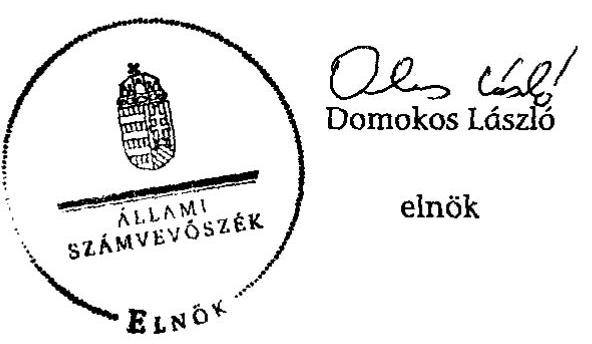

# ÁLLAMI   SZÁMVEVŐSZÉK 

## JELENTÉS

az önkormányzatok belső kontrollrendszere kialakításának, egyes kontrolltevékenységek és a belső ellenőrzés működésének - 2013. évben induló - ellenőrzéséről Záhony

---

# Állami Számvevőszék 

Iktatószám: V-0160-028/2013.
Témaszám: 1190
Vizsgálat-azonosító szám: V064919

## Az ellenőrzést felügyelte:

dr. Benedek Mária
felügyeleti vezető
Az ellenőrzést vezette és az ellenőrzés végrehajtásáért felelős:
dr. Veress Tiborné
ellenőrzésvezető
A számvevőszéki jelentés összeállításában közreműködtek:
dr. Zsombori Beáta
számvevő
Szalontai Miklós
számvevő tanácsos
Az ellenőrzést végezték:
Szakmányné Bilik Mária Vojcsekné Szabó Ágnes
számvevő tanácsos számvevő tanácsos

A témához kapcsolódó eddig készített számvevőszéki jelentések:
címe
sorszáma
A települési önkormányzatok tulajdonában lévő zöldterületek fejlesztésének és fenntartásának ellenőrzése 0934

---

# TARTALOMJEGYZÉK 

BEVEZETÉS ..... 5
I. ÖSSZEGZŐ MEGÁLLAPÍTÁSOK, KÖVETKEZTETÉSEK, JAVASLATOK ..... 9
II. RÉSZLETES MEGÁLLAPÍTÁSOK ..... 17

1. Az önkormányzat belső kontrollrendszerének kialakítása ..... 17
1.1. A kontrollkörnyezet ..... 17
1.2. A kockázatkezelési rendszer ..... 18
1.3. A kontrolltevékenységek ..... 18
1.4. Az információs és kommunikációs rendszer ..... 20
1.5. A monitoring rendszer ..... 20
2. A pénzügyi folyamatokban kulcsszerepet betöltő teljesítésigazolás és érvényesítés belső kontrollok működése ..... 21
3. A belső ellenőrzés működése ..... 23

## FÜGGELÉKEK

1. számú Értelmező szótár
2. számú Az értékelés módja és szempontjai

---

.

---

# RÖVIDÍTÉSEK JEGYZÉKE 

| Törvények |  |
| :--: | :--: |
| Áht. | 2011. évi CXCV. törvény az államháztartásról (hatályos 2012. január 1-jétől) |
| ÁSZ tv. | 2011. évi LXVI. törvény az Állami Számvevőszékről |
| Htv. | 1991. évi XX. törvény a helyi önkormányzatok és szerveik, a köztársasági megbízottak, valamint egyes centrális alárendeltségű szervek feladat- és hatásköreiről. |
| Info tv. | 2011. évi CXII. törvény az információs önrendelkezési jogról és az információszabadságról (hatályos 2012. január 1-jétől) |
| Kttv. | 2011. évi CXCIX. törvény a közszolgálati tisztviselőkről |
| Ltv. | 1995. évi LXVI. törvény a köziratokról, a közlevéltárakról és a magánlevéltári anyag védelméről |
| Mötv. | 2011. évi CLXXXIX. törvény Magyarország helyi önkormányzatairól (hatályos 2012. január 1-jétől) |
| Ötv. | 1990. évi LXV. törvény a helyi önkormányzatokról |
| Rendeletek |  |
| Ávr. | 368/2011. (XII. 31.) Korm. rendelet az államháztartásról szóló törvény végrehajtásáról (hatályos 2012. január 1-jétől) |
| Bkr. | 370/2011. (XII. 31.) Korm. rendelet a költségvetési szervek belső kontrollrendszeréről és belső ellenőrzéséről (hatályos 2012. január 1-jétől) |
| Ikr. | 335/2005. (XII. 29.) Korm. rendelet a közfeladatot ellátó szervek iratkezelésének általános követelményeiről |
| Szórövidítések |  |
| alapító okirat | Záhony Város Önkormányzata Képviselő-testületének 72/2012. (V.31.) számú Határozata a Polgármesteri Hivatal alapító okiratának módosításáról (módosított és egységes szerkezetbe foglalt alapító okirat) |
| aljegyző | Záhony Város Önkormányzata Polgármesteri Hivatalának aljegyzője |
| ÁSZ | Állami Számvevőszék |
| bizonylati szabályzat | 2012. január 1-jétől hatályos bizonylati szabályzat |
| értékelési szabályzat | 2012. január 1-jétől hatályos Eszközök és források értékelésének szabályzata |
| 2013. évi ellenőrzési terv | Az Önkormányzatra vonatkozó 2013. évi belső ellenőrzési terv |
| gazdasági program | Záhony Város Önkormányzati Képviselő-testületének 53/2011. (IV. 15.) számú határozata az Önkormányzat 2011-2014. évekre vonatkozó gazdasági programjáról. |
| gazdasági szervezet ügyrendje | Ügyrend Záhony Város Polgármesteri Hivatal gazdasági szervezetének gazdálkodással összefüggő feladataira, hatályos 2012. január 1-jétől |

---

gazdasági vezető gazdálkodási szabályzat
hivatali SZMSZ

INTOSAI
ISSAI
jegyző${ }_{1}$
jegyző${ }_{2}$

Képviselő-testület
Kormányhivatal
leltározási szabályzat
Levéltár
NGM
Önkormányzat
pénzkezelési szabályzat
polgármester
Polgármesteri Hivatal
RNÖ
szabálytalanságok kezelésének rendje
számlarend
számviteli politika
Társulás
tűzvédelmi szabályzat
VOKE
ZVSC

Záhony Város Önkormányzat Polgármesteri Hivatala gazdasági szervezetének vezetője
Gazdálkodási szabályzat a kötelezettségvállalás, pénzügyi ellenjegyzés, teljesítés igazolása, érvényesítés, utalványozás és adatszolgáltatás rendjéről, hatályos 2012. január 1-jétől
Záhony Város Önkormányzat Képviselő-testületének 31/2008. (IV. 23.) számú határozata a Polgármesteri Hivatal SZMSZ-éről
12/2010. (II. 25.) számú határozat a Polgármesteri Hivatal SZMSZ-ének módosításáról
International Organization of Supreme Audit Institutions (Legfőbb Ellenőrző Intézmények Nemzetközi Szervezete)
International Standards of Supreme Audit Institutions (Legfőbb Ellenőrző Intézmények Nemzetközi Standardjai)
Záhony Város Önkormányzatának jegyzője 2011. szeptember 20-ától 2012. április 14-ig
Záhony Város Önkormányzatának megbízott jegyzője 2011. január 12-től 2011. szeptember 19-ig és 2012. április 15-től
Záhony Város Önkormányzatának Képviselő-testülete
Szabolcs-Szatmár-Bereg Megyei Kormányhivatal
Leltározási és leltárkészítési szabályzat, hatályos 2012. január 1-jétől
Szabolcs-Szatmár-Bereg Megyei Levéltár
Nemzetgazdasági Minisztérium
Záhony Város Önkormányzata
Pénzkezelési szabályzat, hatályos 2012. január 1-jétől
Záhony Város Önkormányzatának polgármestere
2013. március 26-ig Polgármesteri Hivatal Záhony, 2013. március 27-től Záhonyi Közös Önkormányzati Hivatal
Roma Nemzetiségi Önkormányzat Záhony
Záhony Város Polgármesteri Hivatalának Belső Kontrollrendszere VII. fejezet, hatályos 2011. március 25-től
Számlarend, hatályos 2012. január 1-jétől
Számviteli politika, hatályos 2012. január 1-jétől
Záhony és Térsége Kistérségi Társulás
Tűzvédelmi szabályzat, hatályos 2012. január 1-jétől
VOKE Vasutas Művelődési Ház és Könyvtár
Záhonyi Vasutas Sport Club

---

# JELENTÉS 

## az önkormányzatok belső kontrollrendszere kialakításának, egyes kontrolltevékenységek és a belső ellenőrzés működésének - 2013. évben induló - ellenőrzéséről Záhony

## BEVEZETÉS

Záhony város állandó lakosainak száma 2012. január 1-jén 4385 fő volt. Az Önkormányzat héttagú Képviselő-testületének munkáját három állandó bizottság segítette. Az Önkormányzat az önállóan működő és gazdálkodó Polgármesteri Hivatalon kívül egy önállóan működő és gazdálkodó, valamint egy önállóan működő intézményt működtetett és egy többségi tulajdoni hányaddal gazdasági társasággal rendelkezett. A polgármester a 2010. évi helyi önkormányzati választások óta tölti be tisztségét. A jegyző, 2011. szeptember 20-tól 2012. április 14-ig, a jegyző${ }_{2}$ helyettesítőként 2012. április 15-től megbízással látta el a jegyzői feladatokat. A Polgármesteri Hivatal öt szervezeti egységre tagolódott: Jegyzői Iroda, Hatósági Osztály, Építésügyi-és Műszaki Osztály, Pénzügyi Osztály, Szociális Osztály és Gyámhivatal. A Pénzügyi Osztály végezte az elkülönített gazdasági szervezet feladatait. A köztisztviselők száma 2012. január 1-jén 25 fő volt. A Polgármesteri Hivatal az ellenőrzött időszakban körjegyzőségi feladatot látott el megállapodás alapján Győröcske és Zsurk községek vonatkozásában. A Polgármesteri Hivatal jogutódjaként 2013. március 27-én létrejött a Záhonyi Közös Önkormányzati Hivatal. Az Önkormányzat a 2012. évi költségvetési beszámolója szerint 1058104 ezer Ft bevételt ért el, valamint 983217 ezer Ft kiadást teljesített. A 2012. december 31-i könyvviteli mérleg szerint 2125591 ezer Ft értékű eszközvagyonnal rendelkezett, a rövid lejáratú kötelezettség állománya 15410 ezer Ft volt, hosszú lejáratú kötelezettsége nem volt.

A demokratikus társadalmakban alapvető igény, hogy a közpénzeket, a közvagyont használók tevékenységükről elszámoljanak, ahhoz egyértelmű és érvényesíthető felelősségi szabályok társuljanak. Ennek a jogos igénynek az érvényesítéséhez meg kell teremteni azokat a folyamatokat, rendszereket, amelyek nélkülözhetetlenek az elszámoltatáshoz. Az elszámoltatás eredményes működtetéséhez szükség van a megfelelő információs, kontroll-, értékelési és beszámolási rendszerek kialakítására.

Magyarországon az uniós csatlakozási tárgyalások idejére nyúlnak vissza a belső kontrollrendszer szabályozásának gyökerei. Az uniós elvárásoknak megfelelő új terminológia szerinti államháztartási belső pénzügyi ellenőrzési (ÁBPE) rendszer területén a jogharmonizáció 2003-ban teljes körűen megvalósult, míg az önkormányzati alrendszerre vonatkozó, Ötv.-ben megjelenített speciális szabályozás 2005-ben lépett hatályba. Az államháztartási belső kontrollrendszer koncepciója 2009-ben továbbfejlődött. A változások irányát mutatja, hogy a költségvetési szervek belső kontrollrendszere már magában foglalja a korszerű felelős szervezetirányítás elemeit (kontrollkörnyezet, kockázatkezelés, kontrolltevékenység, információ és kommunikáció, monitoring) is. E kontrollrendszer szabályozása háromszintű, a törvényi előírásokat az Áht. és a Mötv., a rendeleti szintű szabályozást az Ávr. és a Bkr. tartalmazza, amelyeket útmutatói szinten az NGM által kiadott standardok és kézikönyvek támogatnak.

A belső kontrollrendszer azt a célt szolgálja, hogy a költségvetési szervek működésük és gazdálkodásuk során a tevékenységeket szabályszerűen, gazdaságosan, hatékonyan és eredményesen hajtsák végre, teljesítsék elszámolási kötelezettségeiket és megvédjék az erőforrásokat a veszteségektől, a károktól és a nem rendeltetésszerű használattól. A belső kontrollrendszer magában foglalja mindazon szabályokat, eljárásokat, gyakorlati módszereket és szervezeti struktúrákat, kockázatkezelési technikákat, kontrolltevékenységeket, amelyek segítséget nyújtanak a szervezetnek céljai eléréséhez.

Az ÁSZ a 2011-2015. évekre szóló stratégiájában hangsúlyos szerepet szánt annak, hogy szilárd szakmai alapon álló, értékteremtő ellenőrzéseivel előmozdítsa a közpénzügyek átláthatóságát, rendezettségét. A számvevőszéki ellenőrzés nemzetközi alapelvei is rögzítik, hogy a megfelelő belső kontrollrendszer minimálisra csökkenti a hibák és szabálytalanságok kockázatát.

Az ellenőrzés célja annak megállapítása volt, hogy a belső kontrollrendszer elemeinek kialakítása, a pénzügyi folyamatokban kulcsszerepet betöltő teljesítésigazolás és érvényesítés, és a belső ellenőrzés szabályos működése biztosította-e az önkormányzatnál a közpénzfelhasználás szabályosságát, hozzájárult-e az értéket teremtő rend követelményének érvényesüléséhez.

Ennek keretében értékeltük, hogy

- a jogszabályi előírásoknak megfelelően alakították-e ki a belső kontrollrendszer elemeit;
- a gazdálkodás folyamatában kulcsszerepet betöltő teljesítésigazolás és érvényesítés kontrolltevékenységeit megfelelően működtették-e;
- biztosították-e a belső ellenőrzés szabályos működését;
- amennyiben az ÁSZ tett javaslatot a 2008-2011. évek közötti ellenőrzése kapcsán, intézkedtek-e azok végrehajtására.

Az ellenőrzés várható hasznosulását négy szinten tervezzük. A törvényalkotás számára összegzett tapasztalatok állnak rendelkezésre a belső kontrollrendszer önkormányzati területen való kialakításáról, működéséről és hatásairól, a belső ellenőrzés működéséről. Ennek alapján következtetést lehet levonni arról, hogy a belső kontrollrendszer kialakítására és működtetésére vonatkozó jelenlegi, differenciálás nélküli jogszabályi előírások reális követelményeket támasztanak-e az eltérő adottságú települési önkormányzatok esetében, illetve indokolt-e esetleges jogszabályi módosítás kezdeményezése. Az ellenőrzés az ellenőrzött számára visszajelzést ad a belső kontrollrendszer kialakításában és működésében fellépő hiányosságokról, javaslataival hozzájárul azok kiküszöböléséhez, amely csökkentheti a későbbi ellenőrzések gyakoriságát. Az ellenőrzés megállapításait és javaslatait más szervezetek is hasznosíthatják a rendezett gazdálkodási keretek kialakításához. A társadalom számára jelzi, hogy közpénz nem maradhat ellenőrizetlenül, az ÁSZ értékteremtő rend kialakításához és megőrzéséhez hozzájáruló tevékenysége pozitív hatással lesz a szervezetről kialakított összkép formálásában. A szervezeten belül lehetőség nyílik arra, hogy a megállapítások szintetizálásával az ÁSZ a hozzáadott értéket teremtő elemző tevékenységét és tanácsadó szerepét is erősítse.

Az önkormányzatok belső kontrollrendszere kialakításának, egyes kontrolltevékenységek és a belső ellenőrzés működésének ellenőrzéséről szóló jelentés I. fejezetének összegző része az ellenőrzés céljára ad rövid, szintetizáló összefoglalót, és tartalmazza a következtetéseket a II. fejezet részletes megállapításain alapulóan. A jelentés intézkedést igénylő megállapításait és javaslatait az ellenőrzés során feltárt, a jelentés II. fejezetében rögzített részletes megállapítások alapozzák meg. A helyszíni ellenőrzés lezárásáig a helyi szabályozás változásait nyomon követtük.

Az ellenőrzés típusa: szabályszerűségi ellenőrzés.
Az ellenőrzött időszak: a belső kontrollrendszer kialakításának megfelelősége esetében a 2012. évre, a pénzügyi folyamatokban kulcsszerepet betöltő teljesítésigazolás és érvényesítés belső kontrollok működésének megfelelőségét és a belső ellenőrzés szabályszerű működését a 2012. január 1. és december 31-e közötti időszak eseményeit figyelembe véve értékeltük, míg az ÁSZ javaslatainak utóellenőrzése a 2008-2011. években hivatalosan közzé tett számvevőszéki jelentésekben tett javaslatok áttekintésére terjedt ki.

Az ellenőrzött szervezet: Záhony Város Önkormányzata.
Az ellenőrzés jogszabályi alapját az ÁSZ tv. 1. § (3) bekezdése, az 5. § (2) és (6) bekezdései, valamint az Áht. 61. §. (2) bekezdésének előírásai képezik.

Az ellenőrzés szakmai módszertana az ÁSZ hivatalos honlapján (www.asz.hu) közzétett szakmai szabályokon alapult, amely az INTOSAI által kiadott ISSAI figyelembevételével készült.

Az ellenőrzés lefolytatásához az Önkormányzat a kimutatások és a tanúsítvány elektronikus kitöltésével, valamint az ÁSZ által kért dokumentumok elektronikus megküldésével szolgáltatott adatokat. Az így rendelkezésre bocsátott adatok, információk kontrollja és a munkalapok kitöltése a helyszíni ellenőrzés keretében történt. A jelentésben használt fogalmak magyarázatát az 1. számú függelék, az ellenőrzés egyes területeinek értékelésénél alkalmazott egységes minősítési szempontokat a 2. számú függelék tartalmazza.

A belső kontrollrendszer kialakításának ellenőrzése során értékeltük a kontrollkörnyezet,
 a kockázatkezelési rendszer, a kontrolltevékenységek, az információs és kommunikációs rendszer, valamint a monitoring rendszer szabályozottságának megfelelőségét. A pénzügyi folyamatokban kulcsszerepet betöltő teljesítésigazolás és érvényesítés kontrolljai működése megfelelőségének minősítéséhez az állományba nem tartozók megbízási díjai, a külső szolgáltatók által végzett karbantartási, kisjavítási munkák, az egyéb üzemeltetési és fenntartási szolgáltatások, a rendszeres szociális segélyek, valamint az államháztartáson kívülre teljesített működési és felhalmozási célú pénzeszközátadások közül kockázatelemzéssel választottuk ki az ellenőrzött kiadási jogcímeket. Az egyszerű véletlen mintavétellel kiválasztott tételek ellenőrzését többlépcsős megfelelőségi tesztek útján addig végeztük, amíg elegendő és megfelelő bizonyítékot szereztünk a vizsgált folyamatok kulcskontrolljai működésének megfelelő vagy nem megfelelő voltáról. Értékeltük az Önkormányzatnál a belső ellenőrzés működésének szabályosságát. Az ÁSZ az Önkormányzatnál a 2009. évben a települési önkormányzatok tulajdonában lévő zöldterületek fejlesztésének és fenntartásának ellenőrzését végezte, a nyilvánosságra hozott, 0934 számon közzétett számvevőszéki jelentésben javaslatot nem tett, ezért a jelen ellenőrzés keretében utóellenőrzésre nem került sor.

Az ÁSZ tv. 29. § (1) bekezdése szerint a jelentéstervezetet megküldtük a polgármester részére, aki az ÁSZ tv. 29. § (2) bekezdésében foglalt észrevételezési jogával nem élt, a jelentéstervezetre észrevételt nem tett.

---

# I. ÖSSZEGZŐ MEGÁLLAPÍTÁSOK, KÖVETKEZTETÉSEK, JAVASLATOK 

A belső kontrollrendszeren belül 2012-ben a kontrollkörnyezet, a kockázatkezelési rendszer, a kontrolltevékenységek, az információs és kommunikációs rendszer, valamint a monitoring rendszer kialakítását külön-külön és együttesen is értékeltük. A belső kontrollrendszer kialakítása az összesített értékelés alapján nem felelt meg a jogszabályi előírásoknak.

A belső kontrollrendszer egyes területei kialakításának minősítése a következő:

| Kontrollterület | Minősítés |  |
| :-- | :-- | :-- |
| Kontrollkörnyezet | megfelelő |  |
| Kockázatkezelési rendszer | nem megfelelő |  |
| Kontrolltevékenységek | részben megfelelő |  |
| Információs és kommunikációs rendszer | nem megfelelő |  |
| Monitoring rendszer | nem megfelelő |  |

A kontrollkörnyezet kialakítását megfelelőnek értékeltük, mivel a jogszabályi előírásokban foglaltakat figyelembe véve, a kisebb hiányosságok mellett, a kialakított szervezeti struktúra, az egyértelmű felelősségi, hatásköri viszonyok és feladatok, valamint a szervezeten belüli folyamatok kialakítása megteremti a Polgármesteri Hivatal, ezáltal az Önkormányzat szabályszerű működési feltételeit.

A kontrolltevékenységek kialakítását részben megfelelőnek értékeltük, mivel az ellenőrzésünk által megállapított szabályozásbeli hiányosságok nem veszélyeztették a Polgármesteri Hivatal, ezáltal az Önkormányzat céljainak elérését.

A kockázatkezelési rendszer, az információs és kommunikációs rendszer és a monitoring rendszer kialakítását nem megfelelőnek értékeltük, mivel az ellenőrzésünk során megállapított szabályozásbeli hiányosságok magukban hordozzák a szabálytalan működés, valamint a korrupció kockázatát.

A belső kontrollrendszer nem megfelelő kialakítása kockázatot jelent az Önkormányzat feladatainak szabályszerű, gazdaságos, hatékony és eredményes végrehajtása során.

Az állományba nem tartozók megbízási díjainak kifizetése, a külső szolgáltatók által végzett karbantartási, kisjavítási munkákkal kapcsolatos kifizetések és az

---

államháztartáson kívülre teljesített működési és felhalmozási célú pénzeszközátadások során a pénzügyi folyamatokban kulcsszerepet betöltő teljesítésigazolás és érvényesítés belső kontrollok működése gyenge volt. Gyengének értékeltük a két kulcskontroll együttes működését, mert azok nem biztosították az ellenőrzésünk által feltárt hiányosságok bekövetkezésének megelőzését.

A számvevőszéki ellenőrzés az ellenőrzött kifizetésekkel összefüggésben a rendelkezésre bocsátott dokumentumok alapján kár bekövetkeztére utaló adatot, tényt nem állapított meg, azonban a gazdálkodásban kulcsszerepet betöltő kontrollok gyenge működése miatt fennáll a hibák bekövetkezésének lehetősége. A nem megfelelően szabályozott és működtetett belső kontrollok korrupciós kockázatot hordoznak.

A belső ellenőrzési feladatokat a Társulás útján látták el. A belső ellenőrzés működése nem felelt meg a jogszabályi előírásoknak, mivel a számvevőszéki ellenőrzés által megállapított szabályozási és működési hiányosságok számossága magában hordozza a szabálytalan önkormányzati gazdálkodás és feladatellátás kockázatát.

Az ÁSZ tv. 33. § (1) bekezdésében foglaltak értelmében az ellenőrzött szervezet vezetője köteles a jelentésben foglalt megállapításokhoz kapcsolódó intézkedési tervet összeállítani, és azt a jelentés kézhezvételétől számított 30 napon belül az ÁSZ részére megküldeni. Amennyiben az intézkedési tervet határidőre nem küldi meg a szervezet, vagy az ÁSZ tv. 33. § (2) bekezdésében foglalt póthatáridő elteltével megküldött intézkedési terv továbbra sem elfogadható, az ÁSZ elnöke a hivatkozott törvény 33. § (3) bekezdés a)-b) pontjaiban foglaltakat érvényesítheti.

Az ellenőrzés intézkedést igénylő megállapításai és javaslatai:

# a polgármesternek 

1. A kötelezettségvállalás pénzügyi ellenjegyzése - az Áht. 37. § (1) bekezdésében, illetve az Ávr. 55. § (1) bekezdésében foglaltak ellenére - a kötelezettségvállalás előtt írásban nem történt meg.

Javaslat:
Intézkedjen arról, hogy az Önkormányzat nevében történő kötelezettségvállalásra az Áht. 37. § (1) bekezdésében foglaltaknak megfelelően - az Ávr. 53. §-ában meghatározott kivételeket figyelembe véve - kizárólag a pénzügyi ellenjegyzés után, a pénzügyi teljesítés esedékességét megelőzően, írásban kerüljön sor.

## a jegyzőnek

1. a kontrollkörnyezettel kapcsolatban:

A hivatali SZMSZ-ben a jegyző 1,2 az Ávr. 13. § (1) bekezdés f), g), h) és i) pontjaiban foglaltak ellenére nem rögzítette azon ügyköröket, amelyek során a szervezeti egységek vezetői a költségvetési szerv képviselőjeként járhatnak el, továbbá nem rögzí-

---

tette a jegyzői munkakör kivételével a hivatali SZMSZ-ben nevesített munkakörökre a helyettesítés rendjét, a munkáltatói jogok gyakorlásának rendjét, valamint az irányító szerv által - az Ávr. 10. § (1)-(3) bekezdése szerint - a költségvetési szervhez rendelt más költségvetési szervek felsorolását.

A jegyző 1,2 a Htv. 140. §. (1) bekezdés c) pontjában foglaltak ellenére az Önkormányzat intézményeinek számviteli rendjét nem alakította ki.

A Kttv. 231. § (1) bekezdése ellenére a Képviselő-testület nem állapította meg a Kttv. 83. § (1)-(4) bekezdéseiben előírt, a köztisztviselőkkel szembeni hivatásetikai alapelvek részletes tartalmát, valamint az etikai eljárás szabályait, mivel a jegyző 1,2 az Ötv. 36. § (2) bekezdés a) pontjában előírt feladata ellenére nem készítette elő ennek dokumentumát.

Javaslat:
a) Készítse elő a hivatali SZMSZ módosítását, és kezdeményezze az Áht. 9. § (1) bekezdés a) pontjában foglaltak alapján a polgármesternél a Képviselő-testület elé terjesztését annak érdekében, hogy az tartalmazza az Ávr. 13. § (1) bekezdés f), g), h) és i) pontjaiban foglaltaknak megfelelően azokat az ügyköröket, amelyek során a szervezeti egységek vezetői a költségvetési szerv képviselőjeként járhatnak el, továbbá a hivatali SZMSZ-ben nevesített munkakörökre a helyettesítés rendjét, a munkáltatói jogok gyakorlásának rendjét, valamint az irányító szerv által - az Ávr. 10. § (1)-(3) bekezdése szerint - a költségvetési szervhez rendelt más költségvetési szervek felsorolását.
b) Alakítsa ki a Htv. 140. § (1) bekezdés c) pontjában foglaltak szerint az önkormányzat intézményeinek számviteli rendjét.
c) Készítse elő a Mötv. 81. § (3) bekezdés c) pontjában foglalt feladatkörében a Kttv. 83. § (1)-(4) bekezdésekben foglaltaknak megfelelően a köztisztviselőkkel szembeni hivatásetikai alapelvek részletes tartalmának, valamint az etikai eljárás szabályainak dokumentumait és kezdeményezze a polgármesternél a Kttv. 231. § (1) bekezdésében foglaltak alapján annak Képviselő-testület elé terjesztését.
2. a kockázatkezelési rendszerrel kapcsolatban:

A jegyző 1,2 a Bkr. 7. § (2) bekezdésében foglaltak ellenére nem mérte fel és nem állapította meg a Polgármesteri Hivatal tevékenységében, gazdálkodásában rejlő kockázatokat. Nem határozta meg az egyes kockázatok kezeléséhez szükséges intézkedéseket és a kockázatok kezelése érdekében előírt intézkedések teljesítése folyamatos nyomon követésének módját.

Javaslat:
Mérje fel és állapítsa meg a Bkr. 7. § (2) bekezdésében foglaltak alapján a Polgármesteri Hivatal tevékenységében és gazdálkodásában rejlő kockázatokat, határozza meg az egyes kockázatokkal kapcsolatban szükséges intézkedéseket, valamint azok teljesítésének, folyamatos nyomon követésének módját.

---

3. a kontrolltevékenységekkel kapcsolatban:

A jegyző 1,2 az Ávr. 53. § (2) bekezdésében foglaltakat figyelmen kívül hagyva, annak ellenére nem határozta meg az írásbeli kötelezettségvállalást nem igénylő kifizetések rendjét, hogy a belső szabályozásban lehetővé tették a 100 ezer Ft alatti kifizetések előzetes írásbeli kötelezettségvállalás nélküli teljesítését.

A jegyző 1,2 a gazdálkodási szabályzatban az Ávr. 13. § (2) bekezdés a) pontjának előírása ellenére a teljesítésigazolás dokumentációs részletszabályait nem határozta meg.

A jegyző 1 nem jelölte ki az Ávr. 57. § (4) bekezdésében foglaltak ellenére - 2012. március 30-ig az ellenőrzött helyi önkormányzat és az önkormányzati hivatal kiadási előirányzataira, 2012. március 31-től a Polgármesteri Hivatal kiadási előirányzataira tekintettel - a teljesítésigazolásra jogosult személyeket.

A jegyző 1,2 az lkr. 8. § (1) bekezdésében foglalt előírást figyelmen kívül hagyva nem gondoskodott az iratkezelési szoftver által kezelt adatok biztonságáról, nem alakította ki az üzembiztonsági, adatvédelmi szabályok érvényre juttatásához szükséges eljárási szabályokat.

A jegyző 1,2 az Info tv. 7. § (2)-(3) bekezdéseiben foglalt előírásokat figyelmen kívül hagyva az informatikai rendszer szabályozása során elmulasztotta az adatbiztonság érvényre juttatásához szükséges intézkedések megtételét.

A jegyző 1,2 a Bkr. 8. § (4) bekezdés b) pontjában foglaltak ellenére belső szabályzataiban nem határozta meg a dokumentumokhoz és információkhoz való hozzáférés tekintetében a felelősségi köröket.

A jegyző 1,2 a gazdasági szervezet ügyrendjében, illetve más belső szabályozásban az Ávr. 13. § (5) bekezdés előírása ellenére nem határozta meg a gazdasági vezető és a gazdasági feladatot ellátó alkalmazottak helyettesítésének rendjét.

Javaslat:
a) Rögzítse belső szabályzatban az Ávr. 53. § (2) bekezdése alapján az előzetes írásbeli kötelezettségvállalást nem igénylő kifizetések rendjét.
b) Rendezze belső szabályzatban az Ávr. 13. § (2) bekezdés a) pontjának előírása alapján a teljesítésigazolás dokumentációs részletszabályait.
c) Gondoskodjon az Ávr. 57. § (4) bekezdésében foglaltak alapján a Polgármesteri Hivatal kiadási előirányzatai vonatkozásában a teljesítésigazolásra jogosult személyek kijelöléséről.
d) Gondoskodjon az lkr. 8. § (1) bekezdésében foglaltak szerint az iratkezelési szoftver által kezelt adatok biztonságáról, alakítsa ki az üzembiztonsági, adatvédelmi szabályok érvényre juttatásához szükséges eljárási szabályokat.
e) Biztosítsa az Info tv. 7. § (2)-(3) bekezdéseiben foglaltaknak megfelelően az adatbiztonság érvényesülését.

---

f) Szabályozza a Bkr. 8. § (4) bekezdés b) pontjában foglaltak alapján a dokumentumokhoz és információkhoz való hozzáférés tekintetében a felelősségi köröket.
g) Rögzítse belső szabályzatban az Ávr. 13. § (5) bekezdés előírása alapján a gazdasági vezető és a gazdasági feladatot ellátó alkalmazottak helyettesítésének rendjét.
4. az információs és kommunikációs rendszerrel kapcsolatban:

A jegyző 1,2 a Bkr. 9. § (1) bekezdésében foglaltak ellenére nem alakította ki a szervezeten belüli információáramlás rendszerét.

A jegyző 1 - az Ltv. 10. § (1) bekezdés c) pontjának előírását figyelmen kívül hagyva a Polgármesteri Hivatal egyedi iratkezelési szabályzatát nem a Levéltár és a Kormányhivatal egyetértésével adta ki.

Javaslat:
a) Alakítsa ki a Bkr. 9. § (1) bekezdésében foglaltak alapján a szervezeten belüli információáramlás rendszerét.
b) Intézkedjen az Ltv. 10. § (1) bekezdés c) pontjában foglaltaknak megfelelő iratkezelési szabályzat hatályba léptetéséről.
5. a monitoring rendszerrel kapcsolatban:

A jegyző 1,2 a Bkr. 3. § e) pontjában és a 10. §-ában foglaltak ellenére nem alakította ki a szervezet tevékenységének, a célok megvalósításának folyamatos nyomon követését biztosító rendszert.

A jegyző 1 a Bkr. 11. § (1)
 bekezdésében foglalt kötelezettsége ellenére a belső kontrollrendszer minőségét a 2011. évre vonatkozóan - a Bkr. 1. melléklet szerinti nyilatkozatban - nem értékelte.

Javaslat:
a) Alakítsa ki és működtesse a Bkr. 3. § e) bekezdésében és a 10. §-ában előírtak alapján a szervezet tevékenységének, a célok megvalósításának folyamatos nyomon követését biztosító rendszert.
b) Értékelje a Bkr. 11. § (1) bekezdésében foglaltak alapján - a Bkr. 1. melléklet szerinti nyilatkozatban - a belső kontrollrendszer minőségét.
6. a pénzügyi folyamatokban kulcsszerepet betöltő kontrollok működésével kapcsolatban:

A teljesítés igazolása során az Ávr. 57. § (1) bekezdésében foglaltak ellenére az összegszerűséget és az ellenszolgáltatás teljesítésének igazolását ellenőrizhető okmányok hiányában végezték, továbbá a teljesítés igazolását - az Ávr. 57. § (3) és (4) bekezdéseiben foglaltak ellenére - a jegyző kijelölésével nem rendelkező személy végezte.

---

Az érvényesítés során az Ávr. 58. § (1) bekezdés előírása ellenére az összegszerűséget ellenőrizhető okmányok hiányában nem ellenőrizték.

Az érvényesítő az Ávr. 58. § (2) bekezdésében foglalt kötelezettsége ellenére nem jelezte az utalványozónak, hogy a teljesítésigazolást szabálytalanul végezték.

Az Áht. 37. § (1) és az Ávr. 55. § (1) bekezdése ellenére a kötelezettségvállalásra pénzügyi ellenjegyzés nélkül került sor, valamint az Ávr. 56. § (1) bekezdés előírása ellenére a kötelezettségvállalást követően nem gondoskodtak annak nyilvántartásba vételéről. A főkönyvi számlakijelölés nem felelt meg a Számv. tv. 16. § (3) bekezdésében, az Áhsz. 9. § (11) bekezdésében és az Áhsz. 9. számú melléklet 3. e) pontjában foglaltaknak.

Javaslat:
Intézkedjen - a teljesítésigazolás és az érvényesítés vonatkozásában feltárt hiányosságok megszüntetése, illetve az operatív gazdálkodás során a működésbeli hibák megelőzése, feltárása és kijavítása érdekében - arról, hogy:
a) a teljesítésigazolásra az Ávr. 57. § (4) bekezdésében foglalt előírásnak megfelelően kijelölt személyek az Ávr. 57. § (1) bekezdésében foglaltaknak megfelelően ellenőrizhető okmányok alapján ellenőrizzék a kiadások teljesítésének jogosságát, összegszerűségét, ellenszolgáltatást is magában foglaló kötelezettségvállalás esetében az ellenszolgáltatás teljesítését;
b) a kifizetéseket megelőzően - az Ávr. 58. § (1) bekezdése szerint - a teljesítésigazolás alapján ellenőrizzék - az Ávr. 57. § (3) bekezdése szerinti esetben annak hiányában is - az összegszerűséget, a fedezet meglétét és a megelőző ügymenetben az Áht., az Áhsz., az Ávr. előírásai és a belső szabályzatokban foglaltak betartását;
c) az Áht. 37. § (1) és az Ávr. 55. § (1) bekezdésében foglaltaknak megfelelően kötelezettségvállalásra - az Ávr. 53. §-ában meghatározott kivételekkel - pénzügyi ellenjegyzés után kerüljön sor;
d) a kötelezettségvállalások nyilvántartását az Ávr. 56. § (1) bekezdésében foglalt előírásnak megfelelően vezessék;
e) az érvényesítő az Ávr. 58. § (2) bekezdésben foglalt előírásnak megfelelően jelezze az utalványozónak, ha az Áht. vagy az államháztartási számviteli kormányrendelet, az Ávr. és a belső szabályzatokban foglaltak megsértését tapasztalja;
f) a gazdasági eseményeket a Számv. tv. 16. § (3) bekezdésében, az Áhsz. 9. § (11) bekezdésében és az Áhsz. 9. számú mellékletében foglaltaknak megfelelően a tényleges tartalmuk szerint könyveljék.
7. a belső ellenőrzés működésével kapcsolatban:

A Bkr. 16. § (4) bekezdés előírása ellenére nem rendelkeztek a Bkr. 22. § (1) és (2) bekezdésében foglalt belső ellenőrzési vezetői feladatok és kötelességek ellátásának módjáról.

---

A Bkr. 30. § (1) bekezdésében foglalt előírásnak megfelelő stratégiai ellenőrzési tervvel az Önkormányzat nem rendelkezett.

A 2013. évi ellenőrzési terv a Bkr. 31. § (4) bekezdés a), c), e) és g) pontjaiban foglaltak ellenére nem tartalmazta az ellenőrzési tervet megalapozó elemzések és a kockázatelemzés eredményének összefoglaló bemutatását, az ellenőrzések célját, a szükséges ellenőrzési kapacitás meghatározását és az ellenőrzések ütemezését. A Bkr. 31. § (2) bekezdésében foglaltak ellenére a 2013. évi ellenőrzési tervet kockázatelemzés nem alapozta meg. A 2013. évi ellenőrzési terv összeállítása a Bkr. 56. § (2) bekezdésében foglalt előírás ellenére nem a jegyző₂ írásos véleményének figyelembevételével történt, mivel a jegyző₂ véleményt, javaslatot nem fogalmazott meg.

A Bkr. 33. § (2) bekezdésében foglalt előírás ellenére az ellenőrzési programokat a jegyző₂ hagyta jóvá.

Az elvégzett ellenőrzésekről készített jelentések a Bkr. 39. § (3) bekezdés d) pontjában foglaltak ellenére nem tartalmazták az ellenőrzés típusát.

A belső ellenőrzés javaslatainak végrehajtása érdekében a Bkr. 45. § (1)-(3) bekezdéseiben foglaltak ellenére intézkedési terveket az ellenőrzöttek nem készítettek. Az elvégzett ellenőrzésekről és a jelentésekben szereplő javaslatok nyomon követéséről nyilvántartást - a Bkr. 50. § (1)-(2) bekezdésében, valamint a Bkr. 47. § (1) bekezdésében előírtak ellenére - nem vezettek.

Belső ellenőrzési vezető kijelölésének hiányában - a Bkr. 49. § (1) bekezdését figyelmen kívül hagyva - a 2011. évben végzett belső ellenőrzési tevékenységről az aljegyző készítette elő az éves összefoglaló jelentést.

Javaslat:
a) Intézkedjen arról, hogy a Bkr. 16. § (4) bekezdés előírásának megfelelően a belső ellenőrzési tevékenység megszervezésére a Társulással kötött megállapodásban rendelkezzenek a Bkr. 22. § (1)-(2) bekezdéseiben foglalt tevékenységek és kötelességek ellátásának módjáról.
b) Kezdeményezze, hogy készítsenek a Bkr. 30. § (1) bekezdésében foglalt előírásoknak megfelelő stratégiai ellenőrzési tervet.
c) Kezdeményezze, hogy az éves ellenőrzési tervek tartalmazzák a Bkr. 31. § (4) bekezdés a), c), e) és g) pontjaiban előírt tartalmi elemeket.
d) Kezdeményezze, hogy az éves ellenőrzési tervet - a Bkr. 31. § (2) bekezdésében foglalt előírás teljesítése érdekében - kockázatelemzéssel alapozzák meg.
e) Intézkedjen arról, hogy az éves ellenőrzési terv összeállítása - a Bkr. 56. § (2) bekezdésében foglalt előírás teljesítése érdekében - a jegyző írásos véleményének figyelembevételével történjen.
f) Kezdeményezze, hogy az ellenőrzési programokat a Bkr. 33. § (2) bekezdésében foglaltak szerint belső ellenőrzési vezető hagyja jóvá.

---

g) Kezdeményezze, hogy az elvégzett ellenőrzésekről készített jelentések a Bkr. 39. § (3) bekezdés d) pontjában foglaltak alapján tartalmazzák az ellenőrzések típusát.
h) Intézkedjen arról, hogy a belső ellenőrzéssel érintett ellenőrzöttek a Bkr. 45. § (1)-(3) bekezdéseiben foglalt előírások betartása érdekében intézkedési tervet készítsenek.
i) Kezdeményezze, hogy - a Bkr. 50. § (1)-(2), valamint a Bkr. 47. § (1) bekezdéseiben foglalt előírások szerint - az elvégzett ellenőrzésekről és a jelentésekben szereplő javaslatok nyomon követéséről nyilvántartást vezessenek.
j) Kezdeményezze, hogy a Bkr. 49. § (1) és (3) bekezdéseiben foglalt előírások alapján készítsék el az éves ellenőrzési jelentést, és azt küldjék meg a polgármesternek és a jegyzőnek.

---

# II. RÉSZLETES MEGÁLLAPÍTÁSOK 

## 1. Az ÖNKORMÁNYZAT BELSŐ KONTROLLRENDSZERÉNEK KIALAKÍTÁSA

A belső kontrollrendszer kialakítása 2012-ben a kontrollkörnyezet, a kockázatkezelési rendszer, a kontrolltevékenységek, az információs és kommunikációs rendszer, valamint a monitoring rendszer értékelése alapján összességében nem felelt meg a jogszabályi előírásoknak.

### 1.1. A kontrollkörnyezet

A kontrollkörnyezet kialakítása - a 2. számú függelékben részletezett kritériumrendszer alapján végzett értékelés szerint - a jogszabályi előírásoknak megfelelt.

A Polgármesteri Hivatal rendelkezett a Képviselő-testület által elfogadott alapító okirattal és hivatali SZMSZ-szel. Az alapító okirat a jogszabályi előírásoknak megfelelően tartalmazta az alaptevékenységek felsorolását. Az Önkormányzat rendelkezik a 2011-2014. évekre szóló gazdasági programmal, és rendeletben ¹ meghatározták a vagyongazdálkodás szabályait.

A szervezet megfelelő működése érdekében a Polgármesteri Hivatalban kialakították a belső szabályzatokat, elkészítették a számviteli politikát, a pénzkezelési szabályzatot, a leltározási szabályzatot, az értékelési szabályzatot, valamint a számlarendet, a bizonylati szabályzatot, a tűzvédelmi szabályzatot, a szabálytalanságok kezelésének rendjét és a gazdasági szervezet ügyrendjét. Meghatározták az egészséget nem veszélyeztető és biztonságos munkavégzés követelményei megvalósításának módját.

Írásos formában rögzítették az ellenőrzési nyomvonalat, és gondoskodtak naprakészen tartásáról.

A gazdasági vezető rendelkezett a jogszabályi előírásoknak megfelelő iskolai végzettséggel. A Polgármesteri Hivatalban dolgozó munkatársak rendelkeztek munkaköri leírással, amelyek tartalmazták a munkavállalók jogait, kötelezettségeit és felelősségét. A jegyző₂ a Képviselő-testület által elfogadott teljesítménycélok figyelembevételével elkészítette a köztisztviselők teljesítményértékelését.

[^0]
[^0]:    ¹ Záhony Város Önkormányzata Képviselő-testületének többször módosított 9/2001. (IV.27.) számú rendelete az önkormányzat vagyonának meghatározásáról, a vagyontárgyak feletti tulajdonosi jogok gyakorlásának szabályozásáról egységes szerkezetben.

---

A kontrollkörnyezet kialakítása az alábbi kisebb hiányosságok mellett megfelel a jogszabályi előírásoknak:

| Sorszám ² | Megállapítás |
| :--: | :--: |
| 9-12. | A hivatali SZMSZ-ben a jegyző₁,₂ az Ávr. 13. § (1) bekezdés f), g), h) és i) pontjaiban foglaltak ellenére nem rögzítette azon ügyköröket, amelyek során a szervezeti egységek vezetői a költségvetési szerv képviselőjeként járhatnak el, továbbá nem rögzítette a jegyzői munkakör kivételével a hivatali SZMSZ-ben nevesített munkakörökre a helyettesítés rendjét, a munkáltatói jogok gyakorlásának rendjét, valamint az irányító szerv által - az Ávr. 10. § (1)-(3) bekezdése szerint - a költségvetési szervhez rendelt más költségvetési szervek felsorolását. |
| 18. | A jegyző₁,₂ a Htv. 140. §. (1) bekezdés c) pontjában foglaltak ellenére az Önkormányzat intézményeinek számviteli rendjét nem alakította ki. |
| 47. | A Kttv. 231. § (1) bekezdése ellenére a Képviselő-testület nem állapította meg a Kttv. 83. § (1)-(4) bekezdéseiben előírt, a köztisztviselőkkel szembeni hivatásetikai alapelvek részletes tartalmát, valamint az etikai eljárás szabályait, mivel a jegyző₁,₂ az Ötv. 36. § (2) bekezdés a) pontjában előírt feladata ellenére nem készítette elő ennek dokumentumát. |

# 1.2. A kockázatkezelési rendszer 

A kockázatkezelési rendszer kialakítása - a 2. számú függelékben részletezett kritériumrendszer alapján végzett értékelés szerint - nem felelt meg a jogszabályi előírásoknak, mert:

| Sorszám | Megállapítás |
| :--: | :--: |
| 4., 8.,   10. | A jegyző₁,₂ a Bkr. 7. § (2) bekezdésében foglaltak ellenére nem mérte fel és nem állapította meg a Polgármesteri Hivatal tevékenységében, gazdálkodásában rejlő kockázatokat. Nem határozta meg az egyes kockázatok kezeléséhez szükséges intézkedéseket és a kockázatok kezelése érdekében előírt intézkedések teljesítése folyamatos nyomon követésének módját. |

### 1.3. A kontrolltevékenységek

A kontrolltevékenységek kialakítása - a 2. számú függelékben részletezett kritériumrendszer alapján végzett értékelés szerint - részben felelt meg a jogszabályi előírásoknak.

A kontrolltevékenység részeként előírták a folyamatba épített, előzetes, utólagos és vezetői ellenőrzést a költségvetés tervezésének és a beszerzések lebonyolításának folyamatában, a vagyonhasznosítási tevékenység, valamint a támogatások elszámolása vonatkozásában. Szabályozták a kötelezettségvállalás, a pénzügyi ellenjegyzés rendjét - a dokumentációs részletszabályok kivételével -,

[^0]
[^0]:    ² A megállapítás számozása az Önkormányzat által - az adatszolgáltatás során - kitöltött kimutatások kérdéseinek sorszámával azonos.

---

a teljesítésigazolás módját, valamint az érvényesítés és az utalványozás rendjét. A gazdasági szervezet ügyrendje tartalmazta az (időközi és éves) beszámolók elkészítésének feladatait, annak felelőseit. A költségvetési beszámoló elkészítésével megbízott személy rendelkezett a jogszabályban előírt iskolai végzettséggel és a tevékenység ellátására jogosító engedéllyel. A polgármester a jogszabályi előírásoknak megfelelően az önkormányzat gazdálkodásának első félévi és háromnegyedévi helyzetéről a Képviselő-testületet tájékoztatta.

Az összeférhetetlenségi szabályok érvényesítése érdekében a polgármester adott felhatalmazást kötelezettségvállalásra és utalványozásra. A gazdasági vezető a jogszabályok előírásainak megfelelően jelölte ki a pénzügyi ellenjegyzési, illetve érvényesítési feladatra a
 hivatal állományába tartozó köztisztviselőket, és azok rendelkeztek az előírt szakképzettséggel. Szabályozták a jogviszony megszűnése esetére a munkavállaló folyamatban lévő feladatai átadásának rendjét.

A kontrolltevékenységek kialakítása az alábbi kisebb hiányosságok miatt részben felelt meg a jogszabályi előírásoknak, mert:

| Sorszám | Megállapítás | Megjegyzés |
| :--: | :--: | :--: |
| 8. | A jegyző ${ }_{1,2}$ az Ávr. 53. § (2) bekezdésében foglaltakat figyelmen kívül hagyva, annak ellenére nem határozta meg az írásbeli kötelezettségvállalást nem igénylő kifizetések rendjét, hogy a belső szabályozásban lehetővé tették a 100 ezer Ft alatti kifizetések előzetes írásbeli kötelezettségvállalás nélküli teljesítését. |  |
| 9. | A jegyző ${ }_{1,2}$ a gazdálkodási szabályzatban az Ávr. 13. § (2) bekezdés a) pont előírása ellenére a teljesítésigazolás dokumentációs részletszabályait nem határozta meg. |  |
| 10. | A jegyző ${ }_{1}$ nem jelölte ki az Ávr. 57. § (4) bekezdésében foglaltak ellenére - 2012. március 30-ig az önkormányzati és polgármesteri hivatali kiadási előirányzatok vonatkozásában, 2012. március 31-től a Polgármesteri Hivatal kiadási előirányzatai vonatkozásában - a teljesítésigazolásra jogosult személyeket. | A polgármester, mint kötelezettségvállaló 2012. március 31-től - az Ávr. 57. § (4) bekezdésben foglaltaknak megfelelően írásban kijelölte az önkormányzati kiadási előirányzatok vonatkozásában a teljesítés igazolására jogosult személy. |
| 13. | A jegyző ${ }_{1,2}$ az Ikr. 8. § (1) bekezdésében foglalt előírást figyelmen kívül hagyva nem gondoskodott az iratkezelési szoftver által kezelt adatok biztonságáról, nem alakította ki az üzembiztonsági, adatvédelmi szabályok érvényre juttatásához szükséges eljárási szabályokat. |  |

---

| 16. | A jegyző ${ }_{1,2}$ az Info tv. 7 § (2)-(3) bekezdéseiben foglalt előírásokat figyelmen kívül hagyva az informatikai rendszer szabályozása során nem elmulasztotta az adatbiztonság érvényre juttatásához szükséges intézkedések megtételét. |  |
| :--: | :--: | :--: |
| 17. | A jegyző ${ }_{1,2}$ a Bkr. 8. § (4) bekezdés b) pontjában foglaltak ellenére belső szabályzataiban nem határozta meg a dokumentumokhoz és információkhoz való hozzáférés tekintetében a felelősségi köröket. |  |
| 21. | A jegyző ${ }_{1,2}$ a gazdasági szervezet ügyrendjében, illetve más belső szabályozásban az Ávr. 13. § (5) bekezdés előírása ellenére nem határozta meg a gazdasági vezető és a gazdasági feladatot ellátó alkalmazottak helyettesítésének rendjét. | A helyettesítés rendjét a munkaköri leírások tartalmazták a gazdasági feladatokat ellátó alkalmazottak esetében. |

# 1.4. Az információs és kommunikációs rendszer 

Az információs és kommunikációs rendszer kialakítása - a 2. számú függelékben részletezett kritériumrendszer alapján végzett értékelés szerint nem felelt meg a jogszabályi előírásoknak, mert:

| Sor-   szám | Megállapítás |
| :--: | :-- |
| 1. | A jegyző $_{1,2}$ a Bkr. 9. § (1) bekezdésében foglaltak ellenére nem alakította ki a   szervezeten belüli információáramlás rendszerét. |
| 9. | A jegyző $_{1}$ - az Ltv. 10. § (1) bekezdés c) pontjának előírását figyelmen kívül   hagyva - a Polgármesteri Hivatal egyedi iratkezelési szabályzatát nem a   Levéltár és a Kormányhivatal egyetértésével adta ki. |

### 1.5. A monitoring rendszer

A monitoring rendszer kialakítása - a 2. számú függelékben részletezett kritériumrendszer alapján végzett értékelés szerint - nem felelt meg a jogszabályi előírásoknak, mert:

| Sor-   szám | Megállapítás |
| :--: | :-- |
| 1. | A jegyző $_{1,2}$ a Bkr. 3. § e) pontjában és a 10. §-ában foglaltak ellenére nem   alakította ki a szervezet tevékenységének, a célok megvalósításának fo-   lyamatos nyomon követését biztosító rendszert. |
| 9. | A jegyző ${ }_{1}$ a Bkr. 11. § (1) bekezdésében foglalt kötelezettsége ellenére a   belső kontrollrendszer minőségét a 2011. évre vonatkozóan - a Bkr. 1.   számú melléklete szerinti nyilatkozatban - nem értékelte. |

---

A helyi önkormányzatok törvényességi felügyeletét ellátó Kormányhivatal nem élt törvényességi felhívással vagy más törvényességi felügyeleti eszközzel a 2012. évben.

Az Önkormányzat az ÁSZ-tól a 2011. és a 2012. évben integritás kérdőív kitöltésére kapott felkérést, amelynek nem tett eleget. Az információs rendszer szabályozása és kialakítása során feltárt hibák, a köztisztviselőkkel szembeni hivatásatikai alapelvek és az etikai eljárás meghatározásának, valamint a szabálytalanságot bejelentő védelmére vonatkozó előírások és kötelezettségek szabályainak hiánya és a 2013. évi ellenőrzési terv megalapozását szolgáló kockázatelemzés elmaradása arra utal, hogy az Önkormányzatnak az integritási szemlélet érvényesítésében még fejlődnie kell.

# 2. A PÉNZÜGYI FOLYAMATOKBAN KULCSSZEREPET BETÖLTŐ TELJESÍTÉSIGAZOLÁS ÉS ÉRVÉNYESÍTÉS BELSŐ KONTROLLOK MŰKÖDÉSE 

Az Önkormányzatnál az eredendő kockázat az 1. számú kimutatás szerint magas volt, így a pénzügyi folyamatokban kulcsszerepet betöltő belső kontrollok működését három területen ellenőriztük.

Az állományba nem tartozók megbízási díjaival, a külső szolgáltatók által végzett karbantartással, kisjavítással kapcsolatos kifizetések során, valamint az államháztartáson kívülre történő működési és felhalmozási célú pénzeszközátadásoknál - összefoglalóan értékelve - a pénzügyi folyamatokban kulcsszerepet betöltő teljesítésigazolás és érvényesítés belső kontrollok működésének megfelelősége gyenge volt, mert:

| Kulcskontroll | Megállapítás |
| :--: | :--: |
| teljesítésigazolás | A teljesítés igazolása során az Ávr. 57. § (1) bekezdésében foglaltak ellenére az összegszerűséget és az ellenszolgáltatás teljesítésének igazolását ellenőrizhető okmányok hiányában végezték, továbbá a teljesítés igazolását - az Ávr. 57. § (3) és (4) bekezdéseiben foglaltak ellenére - a jegyző, kijelölésével nem rendelkező személy végezte. |
| érvényesítés | Az érvényesítés során az Ávr. 58. § (1) bekezdés előírása ellenére az összegszerűséget ellenőrizhető okmányok hiányában nem ellenőrizték. |
|  | Az érvényesítő az Ávr. 58. § (2) bekezdésében foglalt kötelezettsége ellenére nem jelezte az utalványozónak, hogy a teljesítésigazolást szabálytalanul végezték. Az Áht. 37. § (1) és az Ávr. 55. § (1) bekezdése ellenére a kötelezettségvállalásra pénzügyi ellenjegyzés nélkül került sor, valamint az Ávr. 56. § (1) bekezdés előírása ellenére a kötelezettségvállalást követően nem gondoskodtak annak nyilvántartásba vételéről. A főkönyvi számlakijelölés nem felelt meg a Számv. tv. 16. § (3) bekezdésében, az Áhsz. 9. § (11) bekezdésében és az Áhsz. 9. számú melléklet 3. e) pontjában foglaltaknak. |

Az állományba nem tartozók megbízási díjainak kifizetése során a 2012. évben a teljesítésigazolás és az érvényesítés kulcskontrollok működésének megfelelősége gyenge volt, mert:

---

- a teljesítés igazolására kijelölt személy a hóeltakarítási munkákra adott megbízás díjának kifizetését megelőzően a munka elvégzését az Ávr. 57. § (1) bekezdésében foglaltak ellenére úgy igazolta, hogy ellenőrizhető okmányok (munkalap) nem álltak rendelkezésre;
- az érvényesítésre kijelölt személy az Ávr. 58. § (1) bekezdés ellenőrzési feladatait nem szabályszerűen végezte, mert az Ávr. 58. § (2) bekezdés előírása ellenére nem jelezte az utalványozónak, hogy a megelőző ügymenetben nem tartották be az Áht. 37. § (1) és az Ávr. 55. § (1) bekezdéseiben foglaltakat, mivel a hóeltakarításra kötött megbízási szerződés megkötésekor a kötelezettségvállalásra pénzügyi ellenjegyzés nélkül került sor;
- az érvényesítő nem észrevételezte, hogy az Ávr. 56. § (1) bekezdés előírása ellenére a kötelezettségvállalást követően nem gondoskodtak annak nyilvántartásba vételéről.

A külső szolgáltatók által teljesített karbantartási, kisjavítási munkákra történő kifizetések során a 2012. évben a teljesítésigazolás és az érvényesítés kulcskontrollok működésének megfelelősége gyenge volt, mert:

- a teljesítés igazolását a február 2-ai, a november 15-ei és december 11-ei fénymásoló karbantartási, a február 13-ai telefonhálózat karbantartási, valamint az április 5-ei ügyfélhívó javításra vonatkozó kifizetéseknél - az Ávr. 57. § (3) és (4) bekezdéseiben foglaltak ellenére - a jegyző, kijelölésével nem rendelkező személy végezte, ezért a kiadás teljesítését megelőzően, az Ávr. 57. § (1) bekezdésének előírása ellenére szabálytalanul történt a kifizetés jogosságának, összegszerűségének és a megbízás szerződés szerinti teljesítésének ellenőrzése;
- a teljesítésigazolást végző személy a telefonhálózat karbantartásra, valamint az ügyfélhívó javításra vonatkozó kifizetéseknél a kifizetést megelőzően - az Ávr. 53. § (2) bekezdésében előírt, az előzetes írásbeli kötelezettségvállalást nem igénylő kifizetésekre vonatkozó szabályozás hiányában - az Ávr. 57. § (1) bekezdésében foglalt ellenőrzést szabálytalanul végezte;
- az érvényesítésre kijelölt személy az Ávr. 58. § (2) bekezdésében foglaltak ellenére az érvényesítés során nem jelezte az utalványozónak, hogy a megelőző ügymenetben az uszodai radiátorcsere, a kontrollszivattyú javítása, a fénymásoló, a telefonhálózat és a lift karbantartásával kapcsolatos kifizetések kötelezettségvállalására - az Áht. 37. § (1) és az Ávr. 55. § (1) bekezdéseiben foglaltak ellenére - pénzügyi ellenjegyzés nélkül került sor;
- az érvényesítő nem kifogásolta, hogy az Ávr. 56. § (1) bekezdés előírása ellenére a kötelezettségvállalást követően nem gondoskodtak azok nyilvántartásba vételéről, és nem vezettek a hivatkozott jogszabályban és a gazdálkodási szabályzatban előírt tartalmú kötelezettségvállalási nyilvántartást.

Az államháztartáson kívülre teljesített működési és felhalmozási célú pénzeszközátadások során a 2012. évben a teljesítésigazolás és az érvényesítés kulcskontrollok működésének megfelelősége gyenge volt, mert:

---

- a teljesítés igazolását a 2012. március 30-ig teljesített pénzeszközátadások a január 4-i, a február 3-i és a március 6-i otthonteremtési támogatás, a ZVSC február 3-i, a nyugdíjas klub március 26-i, valamint a VOKE március 28-i támogatása - során az Ávr. 57. § (3) és (4) bekezdéseiben foglaltak ellenére a jegyző, kijelölésével nem rendelkező személy végezte, ezért a feladatot jogosulatlanul látta el;
- a teljesítésigazolásra kijelölt személy a ZVSC és a VOKE támogatásai kifizetését megelőzően a kiadások összegszerűségét az Ávr. 57. § (1) bekezdés előírása ellenére szabálytalanul igazolta, mert a teljesítésigazoláshoz rendelkezésre álló okmányok (támogatási szerződések) nem tartalmazták a támogatás részletekben történő kifizetése összegszerűségének ellenőrzéséhez szükséges adatokat;
- az érvényesítő a ZVSC és a VOKE támogatásai kifizetéseit megelőzően a kiadások összegszerűségét az Ávr. 58. § (1) bekezdés előírása ellenére szabálytalanul érvényesítette, mert a rendelkezésre álló okmányok (támogatási szerződések) nem tartalmazták a kifizetés érvényesítéséhez szükséges részösszsegeket;
- az érvényesítésre jogosult személy az RNÖ részére biztosított támogatás kifizetését megelőzően az Ávr. 58. § (1) bekezdésében foglaltak ellenére nem ellenőrizte, hogy a megelőző ügymenetben a Számv. tv. 16. § (3) bekezdésében és az Áhsz. 9. § (11) bekezdésében, valamint a 9. számú mellékletének 3. e) pontjában foglaltaktól eltérően az államháztartáson kívülre történő működési célú pénzeszközátadás főkönyvi számlát jelölték ki az elszámolásra;

Az Áht. 3. § (3) bekezdés b) pontja alapján az RNÖ az államháztartás önkormányzati alrendszerébe tartozik. Az ellenőrzésünk megállapította, hogy a gazdasági esemény elszámolása is a hibás főkönyvi számlára történt.

- az érvényesítő az Ávr. 58. § (2) bekezdésében foglaltak ellenére az utalványozónak nem jelezte, hogy a megelőző ügymenetben az Áht. 37. § (1) bekezdése és az Ávr. 55. § (1) bekezdésében foglaltak ellenére a támogatások kifizetésének alapját képező kötelezettségvállalásokra pénzügyi ellenjegyzés nélkül került sor, az Ávr. 57. § (1) és (3) bekezdéseiben előírt teljesítésigazolást szabálytalanul végezték, továbbá az Ávr. 56. § (1) bekezdésben és
 a gazdálkodási szabályzatban foglaltakat figyelmen kívül hagyva, a kötelezettségvállalásokat követően nem gondoskodtak azok nyilvántartásba vételéről.

A számvevőszéki ellenőrzés az ellenőrzött kifizetésekkel összefüggésben a rendelkezésre bocsátott dokumentumok alapján kár bekövetkeztére utaló adatot, tényt nem állapított meg, azonban a gazdálkodásban kulcsszerepet betöltő kontrollok gyenge működése miatt fennáll a hibák bekövetkezésének kockázata.

# 3. A Belső Ellenőrzés működése 

Az Önkormányzat a belső ellenőrzési feladatokat - képviselő-testületi döntés alapján - a Társulás útján látta el.

---

A belső ellenőrzés működése - a 2. számú függelékben részletezett kritériumrendszer alapján végzett értékelés szerint - az Önkormányzatnál nem felelt meg a jogszabályi előírásoknak, mert:

| Sorszám | Megállapítás | Megjegyzés |
| :--: | :--: | :--: |
| 5. | A Bkr. 16. § (4) bekezdés előírása ellenére   nem rendelkeztek a Bkr. 22. § (1) és (2) be-   kezdésében foglalt belső ellenőrzési vezetői   feladatok és kötelességek ellátásának mód-   járól. | Belső ellenőrzési vezetőt   nem jelöltek ki. |
| 7. | A Bkr. 30. § (1) bekezdésében előírtnak meg-   felelő stratégiai ellenőrzési tervvel az Ön-   kormányzat nem rendelkezett. | A jegyző, felhatalmazása   alapján az aljegyző 2012.   január 26-án aláírta a   „Stratégiai ellenőrzési terv a   2012-2013. évekre" elneve-   zésű dokumentumot, ami   a Bkr. 30. § (1) bekezdésé-   ben foglaltakkal ellentétes   sen négy év helyett kettő   évre szólt. |
| $\begin{gathered} 8 / a, \\ \text { c, e, } \\ \text { g. és } \\ 11 . \end{gathered}$ | A 2013. évi ellenőrzési terv a Bkr. 31. § (4)   bekezdés a), c), e) és g) pontjaiban foglaltak   ellenére nem tartalmazta az ellenőrzési ter-   vet megalapozó elemzések és a kockázate-   elemzés eredményének összefoglaló bemuta-   tását, az ellenőrzések célját, a szükséges el-   lenőrzési kapacitás meghatározását és az   ellenőrzések ütemezését. A Bkr. 31. § (2) be-   kezdésében foglaltakkal ellentétesen a 2013.   évi ellenőrzési tervet kockázatelemzés nem   alapozta meg. |  |
| 10. | A 2013. évi ellenőrzési terv összeállítása a   Bkr. 56. § (2) bekezdésében foglalt előírás   ellenére nem a jegyző ${ }_{2}$ írásos véleményének   figyelembevételével történt, mivel a jegyző ${ }_{2}$   véleményt, javaslatot nem fogalmazott meg. |  |
| 19. | A Bkr. 33. § (2) bekezdésében foglalt előírás   ellenére az ellenőrzési programokat a jegy-   ző hagyta jóvá. | Belső ellenőrzési vezető   kijelölése hiányában. |
| 20/a. | Az elvégzett ellenőrzésekről készített jelenté-   sek a Bkr. 39. § (3) bekezdés d) pontjában   foglaltak ellenére nem tartalmazták az el-   lenőrzés típusát. |  |
| 23. | A belső ellenőrzés javaslatainak végrehajtá-   sa érdekében a Bkr. 45. § (1)-(3) bekezdései-   ben foglaltak ellenére intézkedési terveket az   ellenőrzöttek nem készítettek. |  |
| 25.,   26. | Az elvégzett ellenőrzésekről és a jelentések-   ben szereplő javaslatok nyomon követéséről |  |

---

nyilvántartást a Bkr. 50. § (1)-(2) bekezdésében, valamint a Bkr. 47. § (1) bekezdésében előírtak ellenére nem vezettek.

Belső ellenőrzési vezető kijelölésének hiányában - a Bkr. 49. § (1) bekezdését figyelmen kívül hagyva - a 2011. évben végzett
27. belső ellenőrzési tevékenységről az aljegyző készítette elő az éves összefoglaló jelentést, melyet a Képviselő-testület a 40/2012. (IV. 12.) számú határozatával elfogadott.

Budapest, 2013. 11. hó 29. nap

Függelék: $\quad 2 \mathrm{db}$

---

# ÉRTELMEZŐ SZÓTÁR 

belső ellenőrzés
belső kontrollrendszer
belső kontrollrendszer területei
egyszerű véletlen mintavétel
integritás
kockázat
kockázatkezelési rendszer
kontrollkörnyezet

Független, tárgyilagos bizonyosságot adó és tanácsadó tevékenység, amelynek célja, hogy az ellenőrzött szervezet működését fejlessze és eredményességét növelje, az ellenőrzött szervezet céljai elérése érdekében rendszerszemléletű megközelítéssel és módszeresen értékeli, illetve fejleszti az ellenőrzött szervezet irányítási és belső kontrollrendszerének hatékonyságát. (Forrás: Bkr. 2. § b) pontja)
A belső kontrollrendszer a kockázatok kezelése és tárgyilagos bizonyosság megszerzése érdekében kialakított folyamatrendszer, amely azt a célt szolgálja, hogy a működés és gazdálkodás során a tevékenységeket szabályszerűen, gazdaságosan, hatékonyan, eredményesen hajtsák végre, az elszámolási kötelezettségeket teljesítsék, megvédjék az erőforrásokat a veszteségektől, károktól és nem rendeltetésszerű használattól. (Forrás: Áht. 69. § (1) bekezdése)
A kontrollkörnyezet, a kockázatkezelési rendszer, a kontrolltevékenységek, az információ és kommunikáció, valamint a nyomon követési rendszer (monitoring). (Forrás: Bkr. 3. §-a)
Az alapsokaságból egyszerű véletlen kiválasztással képzett részsokaság. (Forrás: Az ÁSZ ellenőrzési mintavételezés támogatásához készült segédletének 4.1.1. pontja)
Az integritás elvek, értékek, cselekvések, módszerek, intézkedések konzisztenciáját jelenti: olyan magatartásmódot, amely meghatározott értékeknek felel meg. Az integritás a közszféra esetében a társadalom által elvárt nyilvánossági, átláthatósági, illetve jogi/etikai normáknak történő megfelelést jelenti.
(Forrás: a http://integritas.asz.hu honlapon közzétett „A 2012. évi integritás felmérés eredményeinek összefoglalója dokumentum 3. oldal 1. bekezdése)
A kockázat annak a valószínűségét jelenti, hogy egy vagy több esemény vagy intézkedés nem kívánt módon befolyásolja a rendszer működését, céljainak megvalósulását. (Forrás: Javaslatok a korrupciós kockázatok kezelésére - Kockázatkezelési és ellenőrzési módszertan 35. oldal, ÁSZ)
Olyan irányítási eszközök és módszerek összessége, melynek elemei a szervezeti célok elérését veszélyeztető tényezők (kockázatok) azonosítása, elemzése, csoportosítása, nyomon követése, valamint szükség esetén a kockázati kitettség mérséklése. (Forrás: Bkr. 2. § m) pontja)
A kontrollkörnyezet alakítja ki a szervezet belső kontrollrendszerhez való viszonyát, hozzáállását, befolyásolja az alkalmazottak belső kontrollal kapcsolatos tudatosságát, magatartását. Elemei a személyes és szakmai elkötelezettség és a vezetés, valamint az alkalmazottak által vallott erkölcsi értékek; a szakmai hozzáértés iránti elkötelezettség; a felső vezetés hozzáállása - a vezetés filozófiája és tevékenységének stílusa; a

---

kontrolltevékenységek
kommunikáció
korrupció
kulcskontrollok
lényegesség
megfelelőségi teszt
monitoring (nyomon követési rendszer)
polgármesteri hivatal
szervezeti struktúra; a humánerőforrás-politika és gazdálkodási gyakorlat.
A kontrolltevékenységek azok a politikák és eljárások, amelyeket a kockázatok megoldására hoznak létre a szervezet céljainak teljesítése érdekében.
Az a tevékenység, melynek során információ továbbítása valósul meg. A kommunikációs folyamat résztvevői között tájékoztatás történik, mely során tényeket, ezek magyarázatát közlik. „A szervezetben eredményes kommunikációnak kell áramlania lefelé, horizontálisan és felfelé, a szervezet egészében és annak valamennyi elemében."
Azok a cselekmények, amelyek során a köz érdekében való eljárással megbízott és döntéshozatali felelősséggel felruházott személy a köz érdeke helyett önös vagy részérdekeket követve, mástól jogtalan vagy etikátlan előnyt elfogadva és őt jogtalan vagy etikátlan előnyhöz juttatva jár el, illetve amikor valaki a köz érdekében való eljárással megbízott és döntéshozatali felelősséggel felruházott személynek jogtalan vagy etikátlan előnyt nyújtva vagy felajánlva jogtalan vagy etikátlan előnyt kér. (Forrás: A Kormány korrupció megelőzési programja 2012-2014.)
Az azonosított kockázatok mérséklése érdekében kialakított kontrollok közül azok, amelyek elégtelen működése esetén a szervezetet jelentős veszteség érheti, vagy a működésükben bekövetkező hiba/hiányosság más kontrollok eredményességét csökkenti. Ezek ellenőrzése, értékelése elegendő bizonyítékot szolgáltat adott területen a kontrollrendszer értékeléséhez. Az önkormányzatok kontrollrendszere kialakításának ellenőrzése során a pénzügyi folyamatokban kulcsszerepet betöltő belső kontrollok a teljesítésigazolás és érvényesítés
Egy információ akkor lényeges, ha hiánya vagy téves állítása befolyásolhatja ezen információkat felhasználók döntéseit, véleményét. Az ellenőrzés során a lényegesség három szempontból értelmezhető: érték, jelleg és összefüggés szerint.
Az ellenőrzés során alkalmazott módszer - szekvenciális (megállásos) megfelelőségi teszt - lényege, hogy a kiválasztott minta ellenőrzését csak addig végezzük, amíg elegendő és megfelelő bizonyítékot nem szerzünk az ellenőrzött kulcskontroll (teljesítésigazolás, érvényesítés) működésének megfelelő, vagy nem megfelelő voltáról.
A monitoring a különböző szintű szervezeti célok megvalósításának folyamatát kíséri figyelemmel, melynek során a releváns eseményekről és tevékenységekről (együtt: folyamatokról) rendszeres jelleggel, strukturált, döntéstámogató információkhoz jutnak a szervezet vezetői.
A programban (beleértve a mellékleteket is) a polgármesteri hivatal megnevezés alatt értjük a polgármesteri hivatalt, a főpolgármesteri hivatalt, a megyei önkormányzati hivatalt és

---

utóellenőrzés
a körjegyzőséget, (illetve 2013. január 1-jét követően a közös önkormányzati hivatalt).
Az intézkedések nyomon követése érdekében elrendelt ellenőrzés, amelynek célja, hogy a belső ellenőrzés bizonyosságot szerezzen az elfogadott intézkedések végrehajtásáról, vagy arról a tényről, hogy ha az ellenőrzött szerv, illetve az ellenőrzött szervezeti egység vezetője nem, vagy nem az elfogadott intézkedésnek megfelelően hajtja végre a feladatokat, továbbá meggyőződni arról, hogy a végrehajtott intézkedésekkel a megállapított kockázat ténylegesen megszűnt, vagy a kockázati tűréshatár alá csökkent. (Forrás: Bkr. 2. § s) pontja)

---

# Az értékelés módja és szempontjai 

## A belső kontrollrendszer kialakítása megfelelőségének értékelése az öt területre vonatkoztatva

Megfelelő a belső kontrollrendszer kialakítása, amennyiben az öt területen (kontrollkörnyezet, kockázatkezelési rendszer, kontrolltevékenységek, információs és kommunikációs rendszer, monitoring rendszer kialakítása) összesen elért és elérhető pontok százalékban kifejezett hányadosa eléri a $81 \%$-ot, és egyik terület sem kapott nem megfelelő értékelést.

Részben megfelelő a kontrollrendszer kialakítása, ha az önkormányzat teljesíti a meghatározott valamennyi főbb kritériumot (amelyeket - 10 kritérium - a program 5. számú melléklete tartalmazza), és az öt munkalapon összesen elért és elérhető pontok százalékban kifejezett hányadosa a $61 \%$-ot meghaladja, és legfeljebb egy terület értékelése nem megfelelő volt.

Nem megfelelő a belső kontrollrendszer kialakítása, amennyiben az önkormányzat nem teljesíti a meghatározott bármelyik főbb kritériumot, vagy az öt munkalapon összesen elért és elérhető pontok százalékban kifejezett hányadosa $0-60 \%$ közötti, vagy egynél több terület értékelése nem megfelelő volt.

A megfelelőség minősítése a következők szerint történik:
A minősítés - részben automatizált - a belső kontrollrendszer kialakítására vonatkozó kérdéseket tartalmazó munkalapokon, az elérhető és az elért pontszámok alapján az alábbi képlettel, számítógépes program segítségével történt, melynek összefüggése:

$$
\frac{\text { Elért pont }}{\text { Elérhető pont }} \quad \times 100=\ldots \ldots . . \%
$$

A belső kontrollrendszer egyes területei kialakítása megfelelőségénél alkalmazandó minősítés:

- nem megfelelő
- részben megfelelő
- megfelelő
$0-60 \%$-ig
$61-80 \%$-ig
$81 \%$ fölött.

---

# Az ellenőrzött önkormányzat belső kontrollrendszere kialakítása megfelelőségének főbb kritériumai 

| $\begin{aligned} & \text { Sor- } \\ & \text { szám } \end{aligned}$ | Kérdés: | Szempont: |
| :--: | :--: | :--: |
|  | A kontrollkörnyezet kialakítása (2. számú munkalap, kimutatás) |  |
| 1. | A polgármesteri hiva-   tal ${ }^{1}$ rendelkezik-e ala-   pító okirattal? | A polgármesteri hivatal alapító okirata az Áht. 8. § (4) bekez-   désében előírtaknak megfelelően elkészült, tartalmazza az   Ávr. 5. § (1) bekezdésében előírtakat, kiemelten a c) pont   szerinti alaptevékenységeit. |
| 2. | A polgármesteri hiva-   tal rendelkezik-e szer-   vezeti és működési   szabályzattal? | A polgármesteri hivatal rendelkezik az Áht. 10. § (5) bekez-   désben előírt - 2010. január 1-jét követően jóváhagyott vagy   módosított - SZMSZ-szel. A költségvetési szerv feladatai ellátá-   sának részletes belső rendjét és módját - törvényben vagy   kormányrendeletben meghatározott módon és tartalommal -   szervezeti és működési szabályzata állapítja meg. |
| 3. | Meghatározták-e a

   vagyongazdálkodás   szabályait önkor-   mányzati rendeletben? | Az önkormányzat a vagyongazdálkodás szabályait önkor-   mányzati rendeletben meghatározta, és az összhangban van   az MÖtv. 109. § (4) bekezdése, a Nemzeti vagyonról szóló   2011. évi CXCVI. tv. 18. § (1) bekezdése tartalmával, és a 18.   § (12) bekezdésében meghatározottak szerint az 5. § (5)-(7)   bekezdéseiben foglaltaknak megfelelően 2012. október 31-ig   azt módosították. |
| 4. | A polgármesteri hiva-   tal rendelkezik-e szám-   viteli politikával? | A polgármesteri hivatal rendelkezik az Áhsz. 8. § (3) bekezdésben előírt - 2010. január 1-jét követően hatályba helyezett   vagy aktualizált - számviteli politikával. A jogszabályhely   rögzíti, hogy a Számv. tv. és az e rendeletben foglaltak szerint   az államháztartás szervezetének szakmai feladatai és sajátosságai figyelembevételével ki kell alakítania és írásban szabály   oznia számviteli politikáját. |
| 5. | A polgármesteri hiva-   tal rendelkezik-e pénz-   kezelési szabályzattal? | A polgármesteri hivatal rendelkezik az Áhsz. 8. § (4) bekezdés   d) pontjában előírt - 2010. január 1-jét követően hatályba   helyezett vagy aktualizált - pénzkezelési szabályzattal. A   jogszabályhely előírja, hogy a számviteli politika keretében el   kell készíteni a pénzkezelési szabályzatot. |
| 6. | A polgármesteri hiva-   tal rendelkezik-e leltá-   rozási és leltárkészítési   szabályzattal? | A polgármesteri hivatal rendelkezik az Áhsz. 8. § (4) bekezdés   a) pontjában előírt - 2008. január 1-jét követően hatályba   helyezett vagy aktualizált - eszközök és források leltározási és   leltárkészítési szabályzatával. |
| 7. | A polgármesteri hiva-   tal gazdasági szervezet-   tének van-e ügyrendje? | A polgármesteri hivatal rendelkezik a gazdasági szervezet   ügyrendjével vagy az azzal egyenértékű szabályozással (Ávr.   9. § (5) bekezdés), vagy az Ávr. 13. § (5) bekezdésében foglal-   takat az SZMSZ-ben vagy más belső szabályzatban szabályoz-   ta (Áht. 10. § (5) bekezdés), és a szabályozást 2010. január 1-   jét követően felülvizsgálták, aktualizálták. Elfogadható az is,   ha a gazdasági feladatokat a polgármesteri hivatalon belül   több szervezeti egység látja el, és azoknak önálló ügyrendjük   van, illetve ha a polgármesteri hivatal nem tagolódik szerve-   zeti egységekre, és ezért önálló gazdasági szervezettel nem   rendelkezik, azonban az SZMSZ-ben vagy más belső szabályo   zásban rögzítik az ügyrend kötelező elemeit. |

[^0]
[^0]:    ${ }^{1}$ Polgármesteri hivatal alatt a polgármesteri hivatalt, a főpolgármesteri hivatalt, a megyei önkormányzati hivatalt és a körjegyzőséget is érteni kell.

---

| Sorszám | Kérdés: | Szempont: |
| :--: | :--: | :--: |
| 8. | A polgármesteri hivatal rendelkezik-e ellenőrzési nyomvonallal? | Az ellenőrzési nyomvonal, folyamatleírás a polgármesteri hivatal tevékenységeire vonatkozóan elkészült, és azt 2010. január 1-jét követően felülvizsgálták, aktualizálták. A szabályzat minta megtalálható a Pénzügyminisztérium Belső kontroll kézikönyv, 2010. 18. és a 19. számú mellékletében. A Bkr. 6. § (3) bekezdésében előírtak szerint a költségvetési szerv vezetője köteles elkészíteni és rendszeresen aktualizálni a költségvetési szerv ellenőrzési nyomvonalát, amely a költségvetési szerv működési folyamatainak szöveges vagy táblázatba foglalt vagy folyamatábrákkal szemléltetett leírása, amely tartalmazza különösen a felelősségi és információs szinteket és kapcsolatokat, irányítási és ellenőrzési folyamatokat, lehetővé téve azok nyomon követését és utólagos ellenőrzését. |
|  | Az információ és kommunikáció szabályozása és kialakítása (5. számú munkalap, kimutatás) |  |
| 9. | Az önkormányzat eleget tett-e az elektronikus közzétételi kötelezettségének? | Az Önkormányzat az Info tv. 33. § (1) és (3) bekezdésében foglaltaknak megfelelően, saját vagy közösen működtetett honlapon elektronikus formában bárki számára hozzáférhetően közzétette az Info tv. 1. számú mellékletében felsoroltak közül legalább az éves költségvetését, a költségvetési beszámolóját, a Képviselő-testület rendeleteit. |
| 10. | A polgármesteri hivatal rendelkezik-e iratkezelési szabályzattal? | A polgármesteri hivatal rendelkezik az Ltv. 10. § (1) bek. c) pontjában előírt iratkezelési szabályzattal. |

# A két kulcskontroll minősítése 

A kulcskontrollok - teljesítésigazolás, érvényesítés - működésének értékelése megfelelőségi tesztek segítségével történt. A kontrollok működésének megfelelőségére vonatkozó következtetést az értékelő táblázatban elért súlyozott pontszám, továbbá az eredendő kockázat minősítésétől függően két vagy három kiadási jogcím alapján fogalmaztuk meg. Az értékeléshez alkalmazandó arányszámok kialakítását számítógépes program segítségével központilag az ellenőrzésben közreműködő informatikai támogató végezte az önkormányzatok által elektronikus úton megadott adatokból.

A minősítés automatizált, a megfelelőségi tesztek kitöltésével számítógépes program segítségével történik, melynek összefüggése:

| Elérhető pontszám: | Elért súlyozott pontszám értékelése: |
| :--: | :--: |
| $0-70$ | "gyenge" |
| $71-90$ | "jó" |
| $91-100$ | "kiváló" |

- „kiváló" a kontrollok működése, ha megfelel a szabályozásoknak és a legmagasabb szintű elvárásoknak a működésbeli hibák megelőzése, feltárása és kijavítása tekintetében; amennyiben a kontrollok működésének megfelelőségét a helyszíni ellenőrzési munkalap értékelése alapján kiválónak minősítettük, azonban esetleges kisebb - az egységesen meghatározott követelményrendszerben foglalt 10\%-ot el nem érő mértékű

---

- hiányosságokat tártunk fel, az összességében kiváló minősítést alátámasztó pozitív megállapításon túl ezeket a hiányosságokat a jelentésben ismertetjük a javaslataink megalapozása érdekében;
- „jó" a kontrollok működésének megfelelősége, ha azok a megállapított kisebb (tolerálható mértékű) hiányosságok mellett kielégítik az elvárásokat a működésbeli hibák megelőzése, feltárása, és kijavítása tekintetében, a megállapított hiányosságok nem veszélyeztették a hibák megelőzését, feltárását és kijavítását, továbbá ismertetjük azokat a területeket is, ahol az előírt ellenőrzési, egyeztetési feladatokat nem végezték el;
- „gyenge" a kontrollok működése, ha a kontrollok működésében túl sok hiányosság fordul elő ahhoz, hogy megbízhatónak lehessen azokat minősíteni. Ismertetjük a jelentésben azokat a területeket, ahol az előírt ellenőrzési, egyeztetési feladatokat nem végezték el, amely hiányosságok a belső kontrollok megfelelőségének „gyenge" minősítését okozták.

# A belső ellenőrzés szabályszerű működésének értékelése 

A belső ellenőrzés működését a 2012. évben történt ellenőrzés tervezési és végrehajtási tevékenységének tapasztalatai alapján értékeljük a munkalapok (kimutatások) kérdéseire adott válaszok alapján, melynek megállapítása az elérhető és az elért pontokból az alábbi képlettel, számítógépes program segítségével történt:

$$
\frac{\text { Elért pont }}{\text { Elérhető pont }} \times 100=\ldots \ldots . . \%
$$

A belső ellenőrzés működésének megfelelőségénél alkalmazandó minősítés:

- nem felelt meg
$0-60 \%$-ig;
- megfelel
$61-80 \%$-ig;
- jól megfelel
$81 \%$ fölött.
