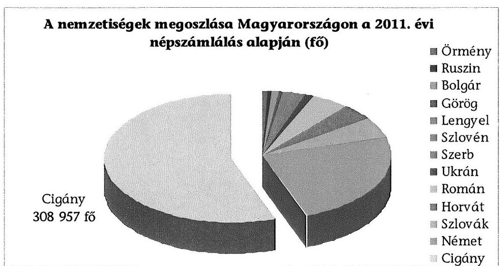
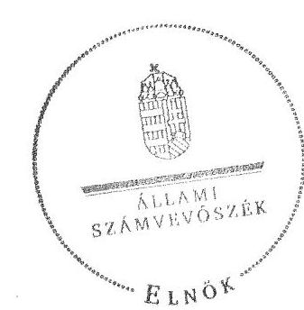
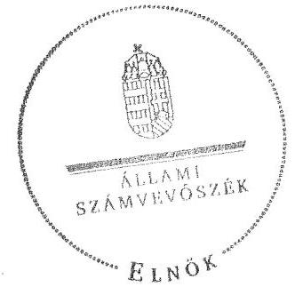

# ÁLLAMI   SZÁMVEVŐSZÉK 

## JELENTÉS

a helyi kisebbségi/nemzetiségi önkormányzatok gazdálkodásának ellenőrzéséről Fővárosi Cigány Önkormányzat

---

# Állami Számvevőszék 

Iktatószám: V-0057-029-037/2013.
Témaszám: 1068
Vizsgálat-azonosító szám: V06060204

## Az ellenőrzést felügyelte:

Holman Magdolna (2013. május 30-ig)
felügyeleti vezető
Horváth Balázs (2013. május 31-től)
felügyeleti vezető
Az ellenőrzést vezette és az ellenőrzés végrehajtásáért felelős:
Kisgergely István
ellenőrzésvezető
A számvevőszéki jelentést készítették és a jelentés összeállításában közremüködtek:

Huberné Kuncsik Zsuzsanna
számvevő tanácsos
Köllődné Gátai Mária
számvevő
Az ellenőrzést végezték:
Huberné Kuncsik Zsuzsanna Köllődné Gátai Mária
számvevő tanácsos számvevő

---

# TARTALOMJEGYZÉK 

BEVEZETÉS ..... 7
I. ÖSSZEGZŐ MEGÁLLAPÍTÁSOK, KÖVETKEZTETÉSEK, JAVASLATOK ..... 10
II. RÉSZLETES MEGÁLLAPÍTÁSOK ..... 15

1. A Fővárosi Cigány Önkormányzat és a Fővárosi Önkormányzat együttműködésének szabályozása, a működési feltételek biztosítása ..... 15
2. A Fővárosi Cigány Önkormányzat gazdálkodási feladatai ellátásának szabályszerűsége ..... 17
2.1. A költségvetésre és zárszámadásra, a kincstári adatszolgáltatás rendjére vonatkozó jogszabályi előírások betartása ..... 17
2.2. A Fővárosi Cigány Önkormányzat gazdálkodásának szabályozottsága ..... 18
2.3. Az operatív gazdálkodási jogkörök kialakítása és gyakorlása ..... 19
3. A Fővárosi Cigány Önkormányzattal összefüggő gazdálkodási feladatok belső ellenőrzésének múködése ..... 22
4. A feladatalapú támogatás felhasználása, elszámolása ..... 23
5. A Fővárosi Cigány Önkormányzat feladatellátásának jogszabályi előírásokkal való összhangja ..... 24

## FÜGGELÉKEK

1. sz. függelék Értelmező szótár
2. sz. függelék A pénzügyi kontrollok működésének értékelése

---

.

---

# RÖVIDÍTÉSEK JEGYZÉKE 

## TÖRVÉNYEK

Alaptörvény
Áht. 1
Áht. 2
ÁSZ tv.
Nek. ${ }_{1}$ tv.
Nek. ${ }_{2}$ tv.
Számv. tv.
RENDELETEK
Áhsz.

Ámr.
Ávr.

Ber.

Bkr.
fővárosi önkormányzati SZMSZ
támogatási kormányrendelet

## SZÓRÖVIDÍTÉSEK

ÁSZ

Magyarország Alaptörvénye, kihirdetve 2011. április 25én
az államháztartásról szóló 1992. évi XXXVIII. törvény, hatályos 2011. december 31-ig
az államháztartásról szóló 2011. évi CXCV. törvény, hatályos 2011. december 31-étől
az Állami Számvevőszékről szóló 2011. évi LXVI. törvény, hatályos 2011. július 1-jétől
a nemzeti és etnikai kisebbségek jogairól szóló 1993. évi LXXVII. törvény, hatályos 2011. december 31-ig
a nemzetiségek jogairól szóló 2011. évi CLXXIX. törvény, hatályos 2011. december 20-tól
a számvitelről szóló 2000 . évi C. törvény
az államháztartás szervezetei beszámolási és könyvvezetési kötelezettségének sajátosságairól szóló 249/2000. (XII. 24.) Korm. rendelet
az államháztartás múködési rendjéről szóló 292/2009. (XII. 19.) Korm. rendelet, hatályos 2011. december 31-ig
az államháztartásról szóló törvény végrehajtásáról szóló 368/2011. (XII. 31.) Korm. rendelet, hatályos 2012. január 1-jétől
a költségvetési szervek belső ellenőrzéséről szóló 193/2003. (XI. 26.) Korm. rendelet, hatályos 2011. december 31 -ig
a költségvetési szervek belső kontrollrendszeréről és belső ellenőrzéséről szóló 370/2011. (XII. 31.) Korm. rendelet, hatályos 2012. január 1-jétől
Budapest Főváros Önkormányzata Közgyűlésének 55/2010. (XII. 9.) önkormányzati rendelete Budapest Főváros Önkormányzata Közgyűlésének Szervezeti és Múködési Szabályzatáról, hatályos 2011. január 1-jétől
a kisebbségi önkormányzatoknak a központi költségvetésből, valamint fejezeti kezelésű előirányzatból nyújtott támogatások feltételrendszeréről és elszámolásának rendjéről szóló 342/2010. (XII. 28.) Korm. rendelet (hatályon kívül helyezte a 28/2012. (III. 6.) Korm. rendelet a nemzetiségi célú előirányzatokból nyújtott támogatások feltételrendszeréről és elszámolásának rendjéről; jelenleg hatályos a 428/2012. (XII. 29.) Korm. rendelet a nemzetiségi célú előirányzatokból nyújtott támogatások feltételrendszeréről és elszámolásának rendjéről)

Állami Számvevőszék

---

BEO
együttmüködési megállapodás
ellenőrzési nyomvonal
FCÖ
főjegyzö
főpolgármester
Főpolgármesteri Hivatal

Főpolgármesteri Hivatal ügyrendje

Fővárosi Önkormányzat Képviselö-testület

Kincstár
kockázatkezelési szabályzat

Kontrolling Osztály vezetője
Közgyűlés
leltározási szabályzat
PEB
pénzgazdálkodási szabályzat $_{1}$
pénzgazdálkodási szabályzat ${ }_{2}$
pénzkezelési szabályzat
Pénzügyi Főosztály

Budapest Főváros Önkormányzata Főpolgármesteri Hivatal Belső Ellenőrzési Osztály
Budapest Főváros Önkormányzata és a Fővárosi Cigány Önkormányzat által kötött együttmüködési megállapodás, hatályos 2007. július 25 -től
Budapest Főváros Önkormányzat Főpolgármesteri Hivatal Pénzügyi Főosztály Pénzügyi és Számviteli Osztály ellenőrzési nyomvonala
Fővárosi Cigány Önkormányzat
Budapest Főváros Önkormányzatának Főjegyzője
Budapest Főváros Önkormányzatának Főpolgármestere
Budapest Főváros Önkormányzata Főpolgármesteri Hivatala
A főpolgármester és a főjegyző 505/2011. számú együttes utasítása a Főpolgármesteri Hivatal Ügyrendjéről, hatályos 2011. január 15 -től
Budapest Főváros Önkormányzata
A NEK. ${ }_{1}$ tv 30/E. § (1) bekezdése alapján az FCÖ Képvise-lö-testülete 2011. december 31-ig, illetve a Nek. ${ }_{2}$ tv. 76. § (3) bekezdése alapján az FCÖ Közgyűlése 2012. január 1jétől. Az FCÖ 2012-ben, az új törvény hatálybalépésével nem változtatta meg a képviselő-testülete elnevezését közgyűlésre, ezért a teljes ellenőrzött időszakra a Képvise-lö-testület elnevezést alkalmazzuk.
Magyar Államkincstár
A főpolgármester és a főjegyző 11/2011. számú együttes intézkedése Budapest Főváros Önkormányzat Főpolgármesteri Hivatal kockázatkezelési szabályzatáról
Budapest Főváros Főpolgármesteri Hivatal Pénzügyi Főosztály Kontrolling Osztályának vezetője
Budapest Főváros Önkormányzatának Közgyűlése
Budapest Főváros Önkormányzata Főpolgármesteri Hivatal leltározási és leltárkészítési szabályzata
Budapest Főváros Önkormányzat Közgyűlésének Pénzügyi Ellenőrző Bizottsága
Budapest Főváros főpolgármesterének és főjegyzőjének 506/2011. számú együttes intézkedése a Főpolgármesteri Hivatal pénzgazdálkodásával kapcsolatos kötelezettségvállalás, utalványozás, ellenjegyzés, érvényesítés rendjéről, és a szakmai teljesítés igazolásáról
Budapest Főváros Főjegyzöjének 510/2012. számú intézkedése a Főpolgármesteri Hivatal pénzgazdálkodásával kapcsolatos kötelezettségvállalás, pénzügyi ellenjegyzés, utalványozás, érvényesítés és teljesítésigazolás rendjéről
Budapest Főváros Önkormányzata Főpolgármesteri Hivatalának pénz- és értékkezelési szabályzata
Budapest Főváros Önkormányzata Főpolgármesteri Hivatalának Pénzügyi Főosztálya

---

| szabálytalanságkezelési   szabályzat | A főpolgármester és a főjegyzó 12/2011. számú együttes   intézkedése Budapest Főváros Önkormányzata Főpol-   gármesteri Hivatalában a szabálytalanságok kezelésének   rendjéről |
| :--: | :--: |
| számviteli politika | Budapest Főváros Főjegyzójének 568/2007. számú intéz-   kedése Budapest Főváros Önkormányzata Főpolgármes-   teri Hivatala számviteli politikájáról és számlarendjéről |
| Támogató | Közigazgatási és Igazságügyi Minisztérium |
| új együttmúködési meg-   állapodás | Budapest Főváros Önkormányzata és a Fővárosi Cigány   Önkormányzat által kötött együttmúködési megállapo-   dás, hatályos 2012. november 16-tól |
| Új-híd Kft. | Új Híd Munkaerő-közvetítő Nonprofit Kft., a Fővárosi Ci-   gány Önkormányzat által alapított gazdasági társaság |

---

.

---

# JELENTÉS   a helyi kisebbségi/nemzetiségi önkormányzatok gazdálkodásának ellenőrzéséről Fővárosi Cigány Önkormányzat 

## BEVEZETÉS

Az Alaptörvény szerint a Magyarországon élő nemzetiségek államalkotó tényezők. Minden, valamely nemzetiséghez tartozó magyar állampolgárnak joga van önazonossága szabad vállalásához és megőrzéséhez. A Magyarországon élő nemzetiségeknek joguk van az anyanyelv használathoz, a saját nyelven való egyéni és közösségi névhasználathoz, saját kultúrájuk ápolásához és az anyanyelvű oktatáshoz. Az Alaptörvény alapján az országban élő nemzetiségek helyi és országos önkormányzatokat hozhatnak létre. A helyi nemzetiségi önkormányzatok lehetnek települési és területi nemzetiségi önkormányzatok. A területi nemzetiségi önkormányzat testülete a Nek., tv. alapján 2011. év végéig a Képviselő-testület, 2012. január 1-jétől a Nek. ${ }_{2}$ tv. alapján a közgyülés.

A 2011. évben a valamelyik nemzetiséghez tartozók aránya az összlakosságon belül 5,6\% volt, amelynek nemzetiségek szerinti megoszlását az alábbi diagram szemlélteti:

1. számú diagram

Forrás: KSH

---

A Fővárosban a 2011. évben megtartott kisebbségi önkormányzati választásokat követően 11 területi kisebbségi/nemzetiségi önkormányzat alakult meg, köztük a Fővárosi Cigány Önkormányzat (FCÖ). A Nek. 2 tv alapján a helyi önkormányzat biztosítja a nemzetiségi önkormányzati müködés személyi és tárgyi feltételeit, amelyeket megállapodásban szabályoznak. A helyi nemzetiségi önkormányzatok gazdálkodására és támogatási rendszerére, valamint a gazdálkodási feladataikat ellátó helyi önkormányzatokkal kötendő együttmúködésre vonatkozó jogszabályok a 2010-2012. években jelentős változásokon mentek át, amelyek érintették a feladatalapú támogatásra fordítható költségvetési keret megállapítását, az operatív gazdálkodási jogkörök szabályozását, az elkülönített könyvvezetés alkalmazását, a belső ellenőrzés szabályozását.

Az ellenőrzés célja annak értékelése volt, hogy az FCÖ gazdálkodási kereteinek kialakítása, gazdálkodása és feladatellátása megfelelt-e a hatályos jogszabályoknak. Ennek keretében ellenőriztük, hogy:

- az FCÖ és a Fővárosi Önkormányzat együttműködésének szabályozása, a Fővárosi Önkormányzat SZMSZ-ében, a megállapodásban előírt működési feltételek biztosítása megfelelt-e a jogszabályi előírásoknak;
- a felek együttműködése megfelelt-e a megállapodásnak a gazdálkodási feladatok szabályszerű ellátásában, ennek keretében betartották-e az FCÖ gazdálkodásához kapcsolódóan a költségvetésre és zárszámadásra, a gazdálkodás szabályozására és az operatív gazdálkodási jogkörök gyakorlására vonatkozó jogszabályi előírásokat;
- a főjegyző biztosította-e a Főpolgármesteri Hivatal belső ellenőrzése keretében az FCÖ-vel összefüggő gazdálkodási feladatok belső ellenőrzését;
- a feladatalapú támogatás felhasználása, a folyósított feladatalapú támogatással történő elszámolás az előírásoknak megfelelő volt-e;
- az FCÖ feladatellátása összhangban volt-e a vonatkozó jogszabályi előírásokkal.
Az ellenőrzés típusa: szabályszerűségi ellenőrzés
Az ellenőrzött időszak: a 2011. január 1. és 2012. június 30. közötti időszak.
Ellenőrzött szervezet: Fővárosi Cigány Önkormányzat és a gazdálkodási feladatait ellátó Fővárosi Önkormányzat.
Az ellenőrzés végrehajtásának jogszabályi alapját az ÁSZ tv. 5. § (2)-(3) és (6) bekezdéseiben foglaltak képezik.

Az ellenőrzés szakmai módszertana az ÁSZ hivatalos honlapján (www.asz.hu) közzétett szakmai szabályokon alapult, amely a Legfőbb Ellenőrző Intézmények Nemzetközi Szervezete (INTOSAI) által kiadott nemzetközi standardok (ISSAI) figyelembevételével készült.

A fogalmak magyarázatát az 1. számú függelék, a pénzügyi folyamatokban kulcsszerepet betöltő kontrollok múködése értékelésénél alkalmazott minősítési szempontokat a 2. számú függelék tartalmazza. Az ÁSZ az ellenőrzés megállapításait az ellenőrzött időszakban hatályos, az intézkedést igénylő megállapításokra tett javaslatokat a jelenleg hatályos jogszabályok alapján fogalmazta meg.

---

Az FCÖ gazdálkodásának ellenőrzése során értékeltük az FCÖ és a Fővárosi Önkormányzat együttmúködését, a gazdálkodás szabályozottságát. Értékeltük a pénzügyi folyamatokban kulcsszerepet betöltő belső kontrollok (2011-ben a kötelezettségvállalás ellenjegyzése, a szakmai teljesítésigazolás és az utalvány ellenjegyzése, 2012. január 1-jétől a pénzügyi ellenjegyzés, a teljesítésigazolás és az érvényesítés) múködésének megfelelőségét az államháztartáson belülre és kívülre teljesített múködési célú pénzeszközátadásoknál, a dologi és egyéb folyó kiadásokkal kapcsolatos kifizetéseknél. Az ÁSZ a pénzügyi folyamatokban kulcsszerepet betöltő belső kontrollok múködésére vonatkozó megállapításokat a statisztikai mintavétellel kiválasztott bizonylatok elemzése alapján fogalmazta meg. Az alkalmazott módszer biztosítja, hogy a vizsgált kiadásoknál múködő kontrollok ellenőrzésének tapasztalatai alapján általános következtetést vonjunk le az ellenőrzött területekhez kapcsolódó kifizetések kulcskontrolljainak múködésére vonatkozóan. Értékeltük az FCÖ-vel összefüggő gazdálkodási feladatokra vonatkozó belső ellenőrzés szabályozottságát, múködését, a feladatalapú támogatás felhasználását, valamint az FCÖ feladatellátása és a jogszabályi előírások összhangját. A fővárosi nemzetiségi önkormányzatok gazdálkodását, költségvetési támogatásának szabályszerű felhasználását az ÁSZ még nem vizsgálta.

Az ellenőrzés lefolytatásához az FCÖ, valamint a gazdálkodási feladatait ellátó Fővárosi Önkormányzat tanúsítványok és a kapcsolódó dokumentumok megküldésével, rendelkezésre bocsátásával szolgáltatott adatokat. A tanúsítványokban szerepeltetett adatok, információk ellenőrzése és az eltérések megállapítása a helyszíni ellenőrzés keretében történt. A pénzügyi folyamatokban kulcsszerepet betöltő belső kontrollok megfelelőségének értékeléséhez az FCÖ 2011. évi, és 2012. I. félévi könyvelési adatállományából az államháztartáson belülre és kívülre nyújtott pénzeszközátadásoknál tételesen, a dologi és egyéb folyó kiadások esetében véletlen mintavételi eljárással választottuk ki az ellenőrizendő tételeket.

A Fővárosban az FCÖ 2003. január 27-től kezdte meg múködését, a 2011 januárjában alakult FCÖ hét tagú Képviselő-testülete egy állandó bizottságot hozott létre. Az FCÖ elnöke a 2007. évi önkormányzati választások óta tölti be tisztségét, személye az ellenőrzött időszakban nem változott. Az FCÖ költségvetési intézményt nem hozott létre, egy gazdasági társaságban 100\%-os tulajdoni hányaddal rendelkezik. Az Új-híd Kft.-t 2009-ben alapították 500 ezer Ft jegyzett tőkével, feladata a társadalmi felzárkóztatás keretében a roma lakosok munkához juttatása.

Az FCÖ múködéséhez és feladatellátásához a 2011. évben a költségvetési forrásból összesen 13940 ezer Ft támogatást kapott Az FCÖ 2011. évi zárszámadási határozata szerint 18313 ezer Ft költségvetési bevételt ért el, 13390 ezer Ft költségvetési kiadást teljesített.

Az ÁSZ tv. 29. § (1) bekezdése szerint a jelentéstervezetet megküldtük a főpolgármester, a főjegyző és az FCÖ elnöke részére, akik az ÁSZ tv. 29. § (2) bekezdésében foglalt észrevételezési jogukkal nem éltek, a jelentéstervezetre észrevételt nem tettek.

---

# I. ÖSSZEGZŐ MEGÁLLAPÍTÁSOK, KÖVETKEZTETÉSEK, JAVASLATOK 

Az FCÖ és a Fővárosi Önkormányzat 2007-ben kötött együttmúködési megállapodást az FCÖ költségvetésével és gazdálkodásával kapcsolatos feladatok ellátására. Az együttmüködési megállapodást 2011-ben felülvizsgálta a főjegyzö, annak módosítására nem került sor. Az együttmúködési megállapodás az ellenőrzött időszakban az Áht. 1,2 , a Nek. 1,2 tv. az Ámr. és az Ávr. szerint meghatározott múködési és gazdálkodási feladatok ellátásának feltételeit részben tartalmazta. A 2011. évben a költségvetési koncepció, illetve a költségvetés elkészítésének, elfogadásának feladataival kapcsolatos határidőket az Ámr.ben előírtak ellenére nem rögzítették. A Nek. 2 tv.-ben előírt határidőig új megállapodást nem kötöttek ${ }^{1}$.

A 2012. június 30 -án hatályos együttműködési megállapodás az Áht. ${ }_{2}$ előírása ellenére nem tartalmazta az FCÖ bevételeivel és kiadásaival kapcsolatos ellenőrzési, finanszírozási, adatszolgáltatási és beszámolási feladatok ellátásának részletes szabályait. A Nek. 2 tv.-ben előírtak ellenére nem rögzítették, hogy a főjegyzőnek, vagy megbízottjának részvételét az FCÖ képviselő-testületi ülésein, továbbá a költségvetés készítésével és az adatszolgáltatással kapcsolatos feladatok ellátásának határidejét, a gazdálkodási jogkörök gyakorlásának módosuló szabályait, valamint az FCÖ múködésére és gazdálkodására vonatkozó eljárási és dokumentációs részletszabályokat.

A fővárosi önkormányzati SZMSZ-ben és a Főpolgármesteri Hivatal ügyrendjében a Nek. 1,2 tv. előírásainak megfelelően szabályozták az FCÖ múködésének személyi és tárgyi feltételeit. A Fővárosi Önkormányzat az FCÖ múködéséhez biztosított helyiségek használatának fenntartási költség-hozzájárulását, egyéb költségeinek fedezetét az éves költségvetési rendeleteiben biztosította.

Az FCÖ 2011-ben az Ámr.-ben előírt határidőig nem alkotta meg a 2011. évi költségvetési határozatát. Az FCÖ elnöke az Áht. ${ }_{2}$-ben előírt határidőre nem nyújtotta be a Képviselő-testületnek a 2012. évi költségvetési határozat tervezetét. A költségvetési határozatok tartalma nem felelt meg az Ámr. és az Áht. ${ }_{1 / 2}$ előírásainak, a költségvetés előterjesztésekor nem került bemutatásra az FCÖ előirányzat-felhasználási terve és a költségvetési mérleg, valamint 2011-ben és 2012-ben a költségvetés nem tartalmazta kiemelt előirányzatként a személyi juttatásokat, a munkaadókat terhelő járulékokat és a dologi kiadásokat.

Az FCÖ elnöke a 2011. évi zárszámadási határozat tervezetét az Ámr.-ben előírt határidőben, az Áht. ${ }_{1}$-ben előírt tartalmi követelményeknek megfelelően terjesztette a Képviselő-testület elé, amelyet az határozatával elfogadott.

[^0]
[^0]:    ${ }^{1}$ Az FCÖ és a Fővárosi Önkormányzat Nek. ${ }_{2}$ tv.-ben előírt új együttműködési megállapodást az előírt határidőn túl, 2012. november 16-án kötötte meg.

---

A főjegyző 2012-ben az Ávr. előírásának ellenére az előírt határidőn túl teljesítette a jóváhagyott elemi költségvetésre, illetve a költségvetési év első három és első hat hónapjáról szóló időközi költségvetési és mérlegjelentésre vonatkozó adatszolgáltatási kötelezettségét. Az Áhsz.-ben foglaltakat betartva a féléves költségvetési beszámolóra vonatkozó adatszolgáltatási kötelezettségét az előírt határidőn belül teljesítette, azonban papír alapon - a Kincstár tájékoztatása miatt - késve nyújtotta be.

A Főpolgármesteri Hivatal az ellenőrzött időszakban a saját gazdálkodási szabályzatainak (számviteli politika és a kapcsolódó számlarend, eszközök és források leltározási és leltárkészítési szabályzata, eszközök és források értékelési szabályzata, pénzkezelési szabályzat) előírásait alkalmazta az FCÖ gazdálkodására is. A Főpolgármesteri Hivatal a gazdálkodási szabályzatait a Számv. tv. előírása ellenére a 2012. évben nem aktualizálta. Az előzetes írásbeli kötelezettségvállalás nélküli kifizetés értékhatárát az FCÖ SZMSZ-ében és a pénzgazdálkodási szabályzat ${ }_{1 / 2}$-ban eltérően szabályozták.

Az FCÖ tekintetében az operatív gazdálkodási jogkörök kialakítása az ellenőrzött időszakban megfelelt az Áht. ${ }_{1,2}$, az Ámr., valamint az Ávr. előírásainak. Az ellenőrzött időszakban az írásbeli kötelezettségvállalásokról vezetett nyilvántartások - az Ámr. és az Ávr. előírásai ellenére - nem tartalmazták a kötelezettségvállalás azonosító számát, a kötelezettségvállalást tanúsító dokumentum megnevezését, iktatószámát, keltét, a kötelezettségvállaló nevét, a kifizetési határidőket és a kifizetések jogosultjait.

A pénzügyi folyamatokban kulcsszerepet betöltő belső kontrollok működésének értékelése során, az államháztartáson kívülre történő működési célú pénzeszközátadás és a dologi és egyéb folyó kiadások kifizetésének ellenőrzésekor a 2011. évben és 2012. I. félévében a kulcskontrollok működésének megfelelősége összességében gyenge volt. A hibák száma a lényegességi szintet, a kritikus hibahatárt elérte. A 2011. évben az államháztartáson kívüli múködési célú pénzeszközátadásnál - az Ámr. előírásai ellenére - a szükséges mértékű szabad előirányzat hiányában történt a kötelezettségvállalás és az ellenjegyzés, a szakmai teljesítésigazolások, utalványrendeletek nem tartalmazták az igazolás dátumát, az utalvány ellenjegyzője nem győződött meg a gazdálkodási szabályok betartásáról. A 2012. I. félévben az államháztartáson kívüli múködési célú pénzeszközátadásnál - az Ávr.-ben előírtak ellenére - a pénzügyi ellenjegyzés jogosultság hiányában történt, illetve máskor a kötelezettségvállaló és a pénzügyi ellenjegyző - az Áht. ${ }_{2}$ és az Ávr. előírása ellenére - nem győződött meg a kötelezettségvállalás időpontjában a szükséges mértékű szabad előirányzat és fedezet rendelkezésre állásáról. Az FCÖ 2012. I. félévi beszámolójában a múködési célú pénzeszközátadásoknál a módosított előirányzatot a teljesített kiadások összege 117 ezer Ft-tal meghaladta. Az ellenőrzött tételeknél a teljesítésigazoló nem tüntette fel az igazolás dátumát, az érvényesítő nem kifogásolta a megelőző ügymenetben a teljesítésigazolás, a pénzügyi ellenjegyzés során a gazdálkodási szabályok, a készpénzelőleg felvételére és elszámolására vonatkozó előírások megsértését, és nem jelezte az utalványozónak. A Fővárosi Önkormányzattól elnyert pályázati támogatás felhasználása során nem tartották be a pénzkezelési szabályzatban előírtakat, mivel nem engedélyezett célra vettek fel készpénzelőleget. A számvevőszéki ellenőrzés a kifizetések dokumentumainak ellenőrzése alapján nem tárt fel jogosulatlan kifizetést.

---

A Fővárosi Önkormányzat 2011-2012. évi ellenőrzési tervéhez készült kockázatelemzés - a Ber. előírása ellenére - nem terjedt ki a Főpolgármesteri Hivatalban a nemzetiségi önkormányzatok gazdálkodásával összefüggő végrehajtási feladatok ellátására. A főjegyző a Főpolgármesteri Hivatal belső ellenőrzése keretében - a Ber., valamint a Bkr. előírásai ellenére - nem biztosította a Főpolgármesteri Hivatalban az FCÖ gazdálkodásával összefüggő végrehajtási feladatok ellátásának belső ellenőrzését, 2011-ben és 2012. I. félévében erre irányuló ellenőrzést nem terveztek és nem hajtottak végre.

Az FCÖ a részére 2011-ben folyósított feladatalapú támogatást - az ellenőrzés számára készített kimutatás és a rendelkezésre bocsátott dokumentumok alapján - 2012. június 30 -ig teljes egészében felhasználta, a támogatási kormányrendelet előírásainak megfelelően a társadalmi felzárkóztatás céljával munkaerő-közvetítést végző Új-híd Kft. müködését támogatta. A támogatási kormányrendelet előírásai szerint az FCÖ részére 2011. augusztus hónapban egy összegben utalta át a Kincstár a feladatalapú támogatást ( 596 ezer Ft). A 2011. évben folyósított feladatalapú támogatás elszámolása - az Áht. ${ }_{1}$ előírása ellenére - nem történt meg. A támogatás felhasználását az ellenőrzésre jogosult szervek nem ellenőrizték.

Az FCÖ feladatellátásának tárgya a 2011. évben, valamint 2012. I. félévben összhangban volt a Nek. ${ }_{1,2}$ tv.-ben foglalt előírásokkal. A nemzetiségi közügy érdekében szervezett program megvalósítását, hagyományápoló tevékenységet végzett.

Az ellenőrzési időszakot megelőzően az FCÖ a Nek. ${ }_{1}$ tv.-vel összhangban 100\%os tulajdoni hányadú gazdasági társaságot - Új-híd Kft. - alapított. Az Új-híd Kft. főtevékenysége a társadalmi felzárkóztatás érdekében a munkaerőközvetítés. Az FCÖ az ellenőrzött időszakban önként vállalt feladatellátás keretében az Új híd Kft-nek múködési támogatást nyújtott, a 2011. évben 2080 ezer Ft-ot, a 2012. I. félévben 2117 ezer Ft-ot. Az Új híd Kft. részére nyújtott támogatást részben a 2011. évre kapott feladatalapú támogatásból, valamint a 2011 decemberében saját működésének fenntartásához a Fővárosi Önkormányzattól kapott kiegészítő működési támogatásból ( 4010 ezer Ft) finanszírozta. Az FCÖ a kiegészítő támogatási kérelmét saját működési forráshiányával indokolta, vállalkozásának rendszeres támogatása a rendelkezésre álló forrásokat tovább csökkentette.

Az ellenőrzés megállapításai alapján, az észrevételezésre megküldött jelentéstervezetben az FCÖ gazdálkodásával kapcsolatban intézkedést igénylő megállapításokat és javaslatokat fogalmaztunk meg, amelyek végrehajtásáról az ellenőrzés időszakában intézkedési tájékoztatást adott a főjegyző és az FCÖ elnöke. A 2012. november 16-án megkötött hatályos együttmúködési megállapodásban a Nek. 2 tv. és az Áht. 2 vonatkozó előírásait érvényesítették, a tartalmi hiányosságokat megszüntették. A 2013. évi költségvetési határozat Áht. ${ }_{2}$-ben foglalt előírásoknak megfelelő előkészítését, határidőben történő előterjesztését a beküldött dokumentumokkal igazolták. Az FCÖ SZMSZ-ében az előzetes írásbeli kötelezettségvállalás nélküli kifizetés 100 ezer Ft-os értékhatárra történő módosításával a belső szabályzatok összhangját megteremtették. A gazdálkodási feladatok szabályszerű ellátásához 2013. évben új kötelezettségvállalási nyilvántartást vezettek be, amely megfelel az Ávr.-ben előírtaknak. Az operatív

---

gazdálkodás működési hibáinak megelőzése, feltárása és kijavítása érdekében a főjegyző utasításban rendelkezett a kulcsszerepet betöltő kontrollok működési hiányosságainak megszüntetésére. A 2012. évi feladatalapú támogatás felhasználásáról az elszámolást pótlólag elkészítették, amelyet a Képviselőtestület elfogadott. Figyelemmel az ÁSZ ellenőrzés hasznosítására mindezek vonatkozásában intézkedést igénylő megállapítást, javaslatot már nem szerepeltetünk.

Az ÁSZ tv. 33. § (1) bekezdésében foglaltak értelmében az ellenőrzött szervezet vezetője köteles a jelentésben foglalt megállapításokhoz kapcsolódó intézkedési tervet összeállítani, és azt a jelentés kézhezvételétől számított 30 napon belül az ÁSZ részére megküldeni. Amennyiben az intézkedési tervet határidőre nem küldi meg a szervezet, vagy az nem elfogadható, az ÁSZ elnöke az ÁSZ tv. 33. § (3) bekezdés a)-b) pontjaiban foglaltakat érvényesítheti.

A helyszíni ellenőrzés megállapításainak hasznosítása mellett javasoljuk:

# a Fővárosi Cigány Önkormányzat elnökének: 

Az államháztartáson kívülre átadott müködési célú pénzeszközök kifizetéseinél 2011. évben és 2012. I félévében előirányzat nélküli kifizetés történt. Év közben a képviselő-testület a szükséges előirányzat biztosítása nélkül döntött a támogatás odaítéléséről. A kötelezettségvállaló nem tett eleget 2012. I. félévében az Áht. 36. § (1) bekezdésében foglalt előírásnak, mely szerint kötelezettségvállalásra a költségvetési kiadási előirányzatai és az azokat terhelő korábbi kötelezettségvállalásokkal és más fizetési kötelezettségekkel csökkentett összegű eredeti, vagy módosított kiadási előirányzatok mértékéig kerülhet sor.

Javaslat:
Biztosítsa a jövőben, hogy a kötelezettségvállalás feleljen meg az Áht. 36. § (1) bekezdésében foglalt előírásnak, mely szerint kötelezettségvállalásra a költségvetési kiadási előirányzatai és az azokat terhelő korábbi kötelezettségvállalásokkal és más fizetési kötelezettségekkel csökkentett összegű eredeti vagy módosított kiadási előirányzatok mértékéig kerülhet sor.

## a főjegyzönek:

1. A főjegyző 2012-ben az Ávr. 33. § (1) bekezdésében a jóváhagyott elemi költségvetésre, az Ávr. 169. § (2) bekezdésében, valamint a 170. § (5) bekezdésében a költségvetési év első három és első hat hónapjáról szóló időközi költségvetési és mérlegjelentésre vonatkozó adatszolgáltatási kötelezettségét az előírt határidőn túl teljesítette.

Javaslat:
A jövőben a Főpolgármesteri Hivatal adatszolgáltatási kötelezettségének az FCÖ elemi költségvetése esetében az Ávr. 33. § (1) bekezdésében, a költségvetési év első három és első hat hónapjáról szóló időközi költségvetési jelentésre vonatkozóan az

---

Ávr. 169. § (2) bekezdésében, valamint az időközi mérlegjelentés esetében a 170. § (5) bekezdésében előírt határidők betartásával tegyen eleget.
2. A 2012. évben a Főpolgármesteri Hivatal a Számv. tv. 14. § (11) bekezdésében előírtak ellenére a gazdálkodási szabályzatait (számviteli politika és a kapcsolódó számlarend, eszközök és források leltározási és leltárkészítési szabályzata, eszközök és források értékelési szabályzata, pénzkezelési szabályzat) nem aktualizálta.

Javaslat:
Gondoskodjon a Számv. tv. 14. § (11) bekezdésében előírtaknak megfelelően arról, hogy a számviteli politikán és a kapcsolódó szabályzatokon a jogszabályok módosítása miatti változások, azok hatályba lépésétől számított 90 napon belül átvezetésre kerüljenek.

---

# II. RÉSZLETES MEGÁLLAPÍTÁSOK 

## 1. A Fővárosi Cigány Önkormányzat és a Fővárosi ÖNKORMÁNYZAT EGYÜTTMŰKÖDÉSÉNEK SZABÁLYOZÁSA, A MÜKÖDÉSI FELTÉTELEK BIZTOSÍTÁSA

Az FCÖ és a Fővárosi Önkormányzat együttműködésének a szabályozására, valamint a működés Nek. ${ }_{1,2}$ tv.-ben előírt személyi és tárgyi feltételeinek a biztosítására az együttműködési megállapodásban, a fővárosi önkormányzati SZMSZben és a Főpolgármesteri Hivatal ügyrendjében, valamint a helyiséghasználati szerződésben meghatározottak szerint került sor.

Az FCÖ a Fővárosi Önkormányzattal költségvetésével és gazdálkodásával kapcsolatos feladatok ellátására 2007. július 25 -én kötött együttműködési megállapodást ${ }^{2}$. Az együttműködési megállapodást 2011-ben a főjegyző felülvizsgálta, annak módosítására a jogszabályi környezet változatlansága, valamint, az FCÖ alakuló ülésének időpontja ${ }^{3}$ miatt nem került sor 2011. január 15-ig. Az FCÖ és a Fővárosi Önkormányzat a Nek. ${ }_{2}$ tv. 159. § (3) bekezdésének előirrása ellenére az új együttműködési megállapodást 2012. év június 1-ig nem kötötte meg.

Az együttműködési megállapodás az ellenőrzött időszakban az Áht. ${ }_{1,2}$, a Nek. ${ }_{1,2}$ tv., az Ámr. és az Ávr. szerint meghatározott múködési és gazdálkodási feladatok ellátásának feltételeit részben tartalmazta.

A 2011. december 31-én hatályos az együttműködési megállapodás az Ámr. 37. § (4) bekezdésének a)-f) pontjaiban előírtak ellenére nem tartalmazta a költségvetési koncepció és a költségvetés elkészítésének, elfogadásának feladataival kapcsolatos határidőket.

A 2012. I. félévében a 2012. június 30 -án hatályos együttműködési megállapodás nem tartalmazta:

- az Áht. ${ }_{2}$ 27. § (2) bekezdésében előírtak ellenére, az FCÖ bevételeivel és kiadásaival kapcsolatos ellenőrzési, finanszírozási, adatszolgáltatási, és beszámolási feladatok ellátásának részletes szabályait;
- a Nek. ${ }_{2}$ tv. 80. § (3) a) pontjában foglaltak ellenére a költségvetés készítésével, az adatszolgáltatással kapcsolatos feladatok ellátásának határidejét, a 2012. január 1-től hatályos önálló számlanyitás, törzskönyvi nyilvántartás

[^0]
[^0]:    ${ }^{2}$ Az együttműködési megállapodás-t az FCÖ 57/2007 (VII. 25.) számú, a Közgyűlés az 1705/2007 (X. 25.) számú határozatával hagyta jóvá.
    ${ }^{3}$ Az FCÖ a 2011. évi választásokat követően 2011. január 19-én tartotta alakuló ülését.

---

rendjét, a gazdálkodási jogkörök gyakorlásának módosuló szabályait, a múködés feltételeinek és a gazdálkodásnak részletes előírásait ${ }^{4}$;

- A Nek. ${ }_{2}$ tv. 80. § (3) bekezdés d) pontjában foglaltak ellenére az FCÖ gazdálkodására vonatkozó eljárási és dokumentációs részletszabályokat;
- a Nek. ${ }_{2}$ tv. 80. § (4) bekezdésében előírtak ellenére, hogy a főjegyző vagy annak - a főjegyzővel azonos képesítési előírásoknak megfelelő - megbízottja a Fővárosi Önkormányzat megbízásából és képviseletében részt vesz az FCÖ képviselő-testületi ülésein és jelzi, amennyiben törvénysértést észlel.

Az együttműködési megállapodás 2012. I. félévében a hatályos jogszabályokkal nem volt összhangban.

Az FCÖ és a Fővárosi Önkormányzat Nek ${ }_{2}$ tv. 159. § (3) bekezdése előírása ellenére az új együttmüködési megállapodást 2012. november 16-án kötötte meg ${ }^{5}$.

A fővárosi önkormányzati SZMSZ-ben és a Főpolgármesteri Hivatal ügyrendjében a Nek. ${ }_{1}$ tv. 27. § (1) és a Nek. ${ }_{2}$ tv. 80. § (1) bekezdés előírásainak megfelelően szabályozták az FCÖ müködésének személyi, tárgyi feltételeit és biztosították az ezekhez kapcsolódó költségek viselését. A Főpolgármesteri Hivatal ügyrendjében ${ }^{6}$ rögzítették, hogy a fővárosi területi nemzetiségi önkormányzatok szakmai, jogi, ügyviteli támogatásával összefüggő feladatokat az Igazgatási és Hatósági Főosztály látja el. A nemzetiségi önkormányzatok gazdálkodási feladatainak ellátását a megbízott dolgozók munkaköri leírásai tartalmazták.

Az FCÖ és a Fővárosi Önkormányzat 2008. március 25-én kötött határozott idejű helyiséghasználati szerződést, részére ingyenes ingatlanhasználatot biztosítottak a Fővárosi Önkormányzat tulajdonában lévő ingatlanban ${ }^{7}$. A használati szerződés 2011. április 6-án lejárt, az újabb határozott időre szóló haszonkölcsön szerződést 2012. február 20-án. ${ }^{8}$ kötötték meg, melyben rögzítették, hogy a szerződéssel le nem fedett időszakban a korábban hatályos szerződés szabályait tekintik irányadónak.

Az ingyenesen használatba adott helyiségek üzemeltetési, valamint az FCÖ működésével kapcsolatos postai, kézbesítési, gépelési, sokszorosítási feladatok ellátásával kapcsolatos költségeket az FCÖ viselte, melynek finanszírozásához

[^0]
[^0]:    ${ }^{4}$ Az FCÖ már a 2011. évben rendelkezett önálló bankszámlával, adószámmal, törzskönyvi nyilvántartásba vétele 2003-ban megtörtént.
    ${ }^{5}$ Az új együttmúködési megállapodást a Fővárosi Önkormányzat részéről a fővárosi önkormányzati SZMSZ 7. számú mellékletének XVI. Fejezet 1) pontja alapján átruházott hatáskörben a főpolgármester-helyettes kötötte meg, az FCÖ 68/2012. (XI. 16.) számú határozatával hagyta jóvá.
    ${ }^{6}$ a Főpolgármesteri Hivatal ügyrendje 39. § (2) bekezdésének 7) pontja
    ${ }^{7}$ Budapest VIII. kerület, Szilágyi. u. 5. szám
    ${ }^{8}$ a Közgyűlés 3552/2011. (XI. 30.) számú határozata, FPH058/935-2/2012. számú szerződés

---

a Fővárosi Önkormányzat az éves költségvetési rendeleteiben jóváhagyott öszszegben járult hozzá.

A Fővárosi Önkormányzat az ellenőrzött időszakban a szabályozási hiányosságok ellenére biztosította és folyamatosan fenntartotta az FCÖ müködésének személyi és tárgyi feltételeit.

# 2. A FÖVÁrosi CIGÁNY ÖNKORMÁNYZAT GAZDÁLKODÁSI FELADATAI ELLÁTÁSÁNAK SZABÁLYSZERŰSÉGE 

### 2.1. A költségvetésre és zárszámadásra, a kincstári adatszolgáltatás rendjére vonatkozó jogszabályi előírások betartása

Az FCÖ az Ámr. 37. § (3) bekezdésében előírt határidőig ${ }^{9}$ nem alkotta meg a 2011. évi költségvetési határozatát ${ }^{10}$. Az FCÖ elnöke az Âht. ${ }_{2}$ 24. § (2) bekezdésében előírt határidőre ${ }^{11}$ nem nyújtotta be a Képviselő-testületnek az FCÖ 2012. évi költségvetési határozat tervezetét ${ }^{12}$.

A költségvetési határozatok kiadási előirányzatai a 2011. évben az Áht. ${ }_{1}$ 69. § (1) bekezdés a) pontjában, és az Ámr. 36. § (1) bekezdés b) pontjában, valamint 2012. évben az Áht. ${ }_{2}$ 23. § (2) bekezdés a) pontjában foglaltak ellenére nem tartalmazták a működési költségvetésen belül kiemelt előirányzatként a személyi juttatásokat, a munkaadókat terhelő járulékokat és a dologi kiadásokat.

A 2011. évben a Fővárosi Önkormányzattól és a központi költségvetésből származó bevételi előirányzatait a FCÖ költségvetésében az Ámr. 81. § (5) bekezdésében előírtak ellenére nem támogatás értékű bevételként, hanem, sajátos múködési bevételként szerepeltette. A 2012. évi költségvetési határozatban a bevételek a támogatás értékű működési bevételek között szerepeltek.

A bevételi és kiadási előirányzatok a 2011. és a 2012. években is egyensúlyban voltak.

Az Ámr. 36. § (1) bekezdés i) és k) pontjának előírása ellenére a 2011. évi költségvetési határozat nem tartalmazta a müködési és a felhalmozási célú bevételi és kiadási előirányzatok bemutatását tájékoztató jelleggel mérlegszerűen, egymástól elkülönítetten, valamint az év várható bevételi és kiadási előirányzatainak teljesüléséről készített előirányzat-felhasználási ütemtervet. A 2012. évben

[^0]
[^0]:    ${ }^{9}$ A helyi kisebbségi önkormányzat költségvetési határozatát tárgy év február 10-ig fogadja el.
    ${ }^{10}$ Az FCÖ a 31/2011. (III.. 18.) számú határozatával fogadta el a 2011. évi költségvetését.
    ${ }^{11}$ a központi költségvetésről szóló törvény kihirdetését követő 45. nap
    ${ }^{12}$ Az FCÖ a 17/2012. (III. 01.) számú határozatával fogadta el a 2012. évi költségvetését.

---

a költségvetés előterjesztésekor az Áht. 2 24. § (4) bekezdés a) pont előirása ellenére nem került bemutatásra az FCÖ előirányzat felhasználási terve és a költségvetési mérleg közgazdasági tagolásban.

Az FCÖ a 2011. évi költségvetési határozatát öt, a 2012. évi költségvetési határozatát 2012. I. félévében egy alkalommal módosította. A 2011. évre vonatkozóan 2012 januárjában a zárszámadást megelőzően előirányzat-átcsoportosítással biztosították a kiemelt előirányzatok teljesítésének fedezetét. Az FCÖ 2012. I félévi beszámolójában az államháztartáson kívülre teljesített működési célú pénzeszközátadás előirányzaton a teljesítés 117 ezer Fttal meghaladta a módosított előirányzatot.

Az FCÖ elnöke a 2011. évi zárszámadási határozat tervezetét az Ámr. 37. § (3) bekezdésében előírt határidőt betartva, 2012. március 8-án terjesztette a Képvi-selő-testület elé, amelyet az határozatával elfogadott ${ }^{13}$. A zárszámadásról szóló határozat megfelelt az Áht., 69. § (1) bekezdésében előírt tartalmi követelményeknek.

A főjegyző 2012.-ben - a 2012. I. féléves költségvetési beszámolót kivéve nem teljesítette határidőre az FCÖ számára előírt kincstári adatszolgáltatást. A főjegyzố a 2012. évi elemi költségvetést az Ávr. 33. § (1) bekezdésében előírt határidőn ${ }^{14}$ túl, az Ávr. 169. § (2) bekezdésében foglaltak ellenére az időközi költségvetési jelentést a költségvetési év első három és az első hat hónapjáról késedelemmel küldte meg a Kincstárnak. A 2012. évben az első három, és az első hat hónapról szóló időközi mérlegjelentést az Ávr. 170. § (5) bekezdésében megjelölt határidőn túl, nyújtotta be.

A Főpolgármesteri Hivatal az FCÖ 2012. I. féléves költségvetési beszámolóját az Áhsz. 10. § (1) bekezdése szerinti határidőre, 2012. július 31-ig elkészítette, és az Áhsz. 10. § (5a) bekezdésében foglaltakat betartva 2012. augusztus 9-én elektronikus formában, 2012. szeptember 12-én pedig papír alapon nyújtotta be a Kincstárnak.

A főjegyzố az FCÖ papíralapú 2012. I. féléves költségvetési beszámolóját önhibáján kívül késedelmesen adta le, mivel a Kincstár tájékoztatása értelmében arra csak az elektronikusan továbbított beszámoló felülvizsgálatát követően, az erről írásban történő értesítés után volt mód. A Kincstár 2012. szeptember 12-én értesítette a Fővárosi Önkormányzatot arról, hogy az adatszolgáltatása megfelelő.

# 2.2. A Fővárosi Cigány Önkormányzat gazdálkodásának szabályozottsága 

A Főpolgármesteri Hivatal a saját gazdálkodási szabályzatainak (számviteli politika és a kapcsolódó számlarend, eszközök és források leltározá-

[^0]
[^0]:    ${ }^{13}$ Az FCÖ a 21/2012. (03. 08.) számú határozatával fogadta el a 2011. évi zárszámadását.
    ${ }^{14}$ a 2012. évi költségvetési rendelettervezet Közgyűlés elé terjesztésének határidejét követő harminc nap

---

si és leltárkészítési szabályzata, eszközök és források értékelési szabályzata, pénzkezelési szabályzat) előírásait alkalmazta az FCÖ gazdálkodására is.

A Főpolgármesteri Hivatal a gazdálkodási szabályzatait a 2012. évben nem aktualizálta, nem tartotta be a Számv. tv. 14. § (11) bekezdésében előírtakat, mely szerint a változásokat azok hatályba lépését követő 90 napon belül kell a számviteli politikán keresztülvezetni.

A Főpolgármesteri Hivatal a 2011. évben a pénzgazdálkodási szabályzat ${ }_{1}$-ben az Ámr. 20. § (3) bekezdés a) pontjának megfelelően szabályozta a kötelezettségvállalás ellenjegyzője, a szakmai teljesítésigazoló és az utalványozás ellenjegyzője feladatait. A 2012. évben a pénzgazdálkodási szabályzat ${ }_{2}$-ben az Ávr. 13. § (2) bekezdés a) pontjának megfelelően szabályozta a pénzügyi ellenjegyzés, a teljesítésigazolás és az érvényesítés feladatának ellátását.

Az ellenőrzött időszakban az írásbeli kötelezettségvállalásokról vezetett nyilvántartások 2011. évben az Ámr. 75. § (1), valamint 2012. I. félévében az Ávr. 56. § (1) bekezdésében előírtak ellenére, nem tartalmazták a kötelezettségvállalás azonosító számát, a kötelezettségvállalást tanúsító dokumentum megnevezését, iktatószámát, keltét, a kötelezettségvállaló nevét, a kifizetési határidőket és a kifizetés jogosultjait. Az FCÖ SZMSZ-ében az előzetes írásbeli kötelezettségvállalás nélküli kifizetés értékhatárát 50 ezer Ft-ban, a pénzgazdálkodási sza-bályzat ${ }_{1,2}$-ben 100 ezer Ft-ban határozták meg.

A Főpolgármesteri Hivatal a 2011. évben az Ámr. 156. § (2)-(3) bekezdésében, a 2012. I. félévben a Bkr. 6. § (3)-(4) bekezdésében előírt ellenőrzési nyomvonallal és a szabálytalanságok kezelésének eljárásrendjével rendelkezett. A 2011. évben az Ámr. 157. § (1) bekezdésében, a 2012. I félévben a Bkr. 7. § (1) bekezdésében előírt kockázatkezelési rendszerre vonatkozó szabályzatot is elkészítették. Az ellenőrzött időszakban a Főpolgármesteri Hivatal ügyrendje tartalmazta az FCÖ gazdálkodásával kapcsolatos feladatokat, a feladatot ellátó köztisztviselők munkaköri leírásában szerepeltek az azokkal kapcsolatos hatáskörök és felelősségi szabályok, valamint a helyettesítés rendje.

# 2.3. Az operatív gazdálkodási jogkörök kialakítása és gyakorlása 

A 2011. évben az FCÖ elnöke, valamint az általa írásban felhatalmazott képviselők operatív gazdálkodási jogköreinek gyakorlására irányuló megbízásait (a kötelezettségvállalás, utalványozás, valamint az ellenjegyzés, továbbá a szakmai teljesítésigazolás) a Képviselő-testület is jóváhagyta. ${ }^{15}$ A főjegyző az érvényesítés ellátására az Ámr.-ben előírt szakmai végzettséggel rendelkező köztisztviselőket bízott meg, akiknek a 2011. február 1-jétől hatályos munkaköri leírásaiban az elvégzendő feladatot és a helyettesítés rendjét rögzítették. A gaz-

[^0]
[^0]:    ${ }^{15}$ Az FCÖ 2011. január 19-i alakuló ülésének 9/2011., 12/2011., 13/2011., 14/2011. számú határozatai megerősítették a gazdálkodási jogkörök gyakorlóinak kijelölését.

---

dálkodási jogkörök gyakorlóinak aláírás mintája rendelkezésre állt, a Főpolgármesteri Hivatal gazdasági vezetője ${ }^{16}$ rendelkezett felsőfokú szakképesítéssel.

Az Ávr. 55. § (2) bekezdés g) pontjának előírása alapján 2012. január 1-jétől a pénzügyi ellenjegyzési feladatokat a Képviselő-testület kötelezettségvállalás ellenjegyzésére kijelölt tagjai nem láthatták el ${ }^{17}$. A pénzügyi ellenjegyzést az Ávr.-ben rögzített jogszabályi felhatalmazás alapján a gazdasági vezető gyakorolta, aki maga helyett a 2012. évi pénzgazdálkodási szabályzat ${ }_{2}$-ben foglaltak szerint a pénzügyi ellenjegyzői feladatok ellátására a Kontrolling Osztály vezetőjét jelölte ki 2012. április 30-i hatállyal. Az érvényesítési feladatokat végző köztisztviselők személye a 2012. I. félévben nem változott.

Az FCÖ által az ellenőrzött időszakban teljesített kiadásoknál a kialakított gazdálkodási jogkörök gyakorlásának megfelelőségét a pénzügyi folyamatokban kulcsszerepet betöltő kontrollok múködésének értékelésével minősítettük.

A 2011. évben az FCÖ államháztartáson kívülre történő működési célú pénzeszközátadást a költségvetés készítésekor nem tervezett. A 2011. évi zárszámadásban a módosított előirányzat és a teljesített kiadás egyezően 2080 ezer Ft volt. Az államháztartáson kívülre teljesített müködési célú pénzeszközátadások során a kulcskontrollok müködésének megfelelősége összességében gyenge volt, mert:

- a kötelezettségvállalás ellenjegyzője jogosultsága és aláírása ellenére nem látta el az Ámr. 74. § (3) bekezdés a-c) pontjaiban előírt feladatait, mivel nem vizsgálta, hogy a jóváhagyott költségvetés fel nem használt, illetve le nem kötött, a kötelezettségvállalás tárgyával összefüggő kiadási előirányzata, valamint a kifizetés időpontjában a fedezet rendelkezésre áll-e, valamint, hogy a kötelezettségvállalás nem sérti-e a gazdálkodási szabályokat. A kötelezettségvállaló az Ámr. 75. § (3) bekezdés előirása ellenére a kötelezettségvállaláskor rendelkezésre álló módosított előirányzat szerint a szükséges mértékű szabad előirányzat hiányában vállalt kötelezettséget;
- a szakmai teljesítés igazolója a feladat ellátása során az Ámr. 76. § (1) és (3) bekezdésében előírtakat nem tartotta be, nem tüntette fel az igazolás dátumát, illetve nem igazolta a kifizetés teljesítésének jogosságát, összegszerűségét;
- az utalvány ellenjegyzője az Ámr. 79. § (2) bekezdésében foglaltak ellenére aláírását megelőzően nem győződött meg arról, hogy az érvényesítő elvégez-te-e a gazdálkodási szabályok betartására vonatkozó - az Ámr. 77. § (1) bekezdésben meghatározott - ellenőrzési feladatait, továbbá az utalványrendeleten nem tüntette fel az ellenjegyzés dátumát.

A 2011. évben a dologi és egyéb folyó kiadások esetében az 50 ezer Ft alatti kifizetések - az FCÖ SZMSZ-ében előírtaknak megfelelően - előzetes írásbeli köte-

[^0]
[^0]:    ${ }^{16}$ A Főpolgármesteri Hivatal ügyrendjének 22. § (1) bekezdése tartalmazza, hogy a gazdasági vezetőnek a Pénzügyi Főosztály vezetője minősül.
    ${ }^{17}$ A pénzügyi ellenjegyzést 2012. január 1-jétől csak az előírt szakképesítéssel rendelkező, a Főpolgármesteri Hivatal állományába tartozó köztisztviselő láthatja el.

---

lezettségvállalást nem igényeltek. A dologi és egyéb folyó kiadások teljesítésekor a kulcskontrollok müködésének megfelelősége összességében gyenge volt, mert:

- a szakmai teljesítés igazolója nem végezte el feladatát, mivel az Ámr. 76. § (1)-(3) bekezdésének előírása ellenére a kiadás teljesítésének jogosságát és összegszerűségét szakmailag nem igazolta, illetve nem tüntette fel az igazolás dátumát, továbbá nem az előírt tartalommal ${ }^{18}$ igazolta a szakmai teljesítést;
- az utalványok ellenjegyző̉je jogosultsága és aláírása ellenére nem végezte el feladatát, mivel az Ámr. 78. § (2) bekezdés a) pontjában előírtak ellenére az utalványozás ellenjegyzésének dátumát nem tüntette fel az utalványrendeleten, az Ámr. 79. § (2) bekezdésében foglaltak ellenére nem kifogásolta, hogy nem tartották be a készpénzkezelési szabályzatban az előleg elszámolására vonatkozó határidőt, nem jelezte az utalványozónak a gazdálkodási szabályok megsértését.

A 2011. évben a gazdálkodás folyamatában (az ellenőrzött területeken) a kötelezettségvállalás ellenjegyzése, a szakmai teljesítésigazolás és az utalványozás ellenjegyzés kontrolljainak megbízhatósága összességében gyenge volt. A hibák száma a lényegességi szintet, a kritikus hibahatárt elérte. A pénzeszközátadásoknál a szükséges mértékű szabad előirányzat hiányában történt a kötelezettségvállalás és az ellenjegyzés, hiányzott a szakmai teljesítésigazolás, illetve az igazolás dátuma, az utalvány ellenjegyzóje az utalványon nem tüntette fel az ellenjegyzés dátumát, nem kifogásolta a gazdálkodási szabályok megsértését és nem jelezte az utalványozónak.

A 2012. évben az FCÖ a költségvetés készítésekor eredeti előirányzatként államháztartáson kívülre teljesített múködési célú pénzeszközátadást nem tervezett. A 2012. I. féléves beszámoló alapján a módosított előirányzat 2000 ezer Ft, a teljesített kiadás 2117 ezer Ft volt. A 2012. I. félévében az államháztartáson kívülre teljesített müködési célú pénzeszközátadások során a pénzügyi ellenjegyzés, teljesítés igazolás és érvényesítés múködésének megfelelősége összességében gyenge volt, mert:

- a pénzügyi ellenjegyzést az Ávr. 55. § (2) bekezdés g) pontjában előírtak ellenére jogosultság hiányában a 2012. I. félévében a kötelezettségvállalás ellenjegyzésére kijelölt képviselő végezte el, más esetben a pénzügyi ellenjegyzố jogosultsága és aláírása ellenére nem végezte el feladatát, mivel az Áht. ${ }_{2}$ 37 § (1) bekezdésében előírtak ellenére nem győződött meg a kötelezettségvállalás időpontjában és a várható kifizetéskor a szükséges mértékű szabad előirányzat és fedezet rendelkezésre állásáról, a kötelezettségvállaláskor a gazdálkodási szabályok betartásáról, a kötelezettségvállaló az Áht ${ }_{2} 36$. § (1) bekezdésében előírtak ellenére szabad előirányzat hiányában vállalt kötelezettséget (a kötelezettségvállaláskor annak összege meghaladta a rendelke-

[^0]
[^0]:    ${ }^{18}$ A „Teljesítésigazolás-2011" pénzgazdálkodási szabályzat ${ }_{1}$-ben előírt formanyomtatványon a szakmai igazolás szövege:"a kiadás teljesítésének/bevétel beszedésének jogosságát, összegszerűségét, a szerződés, megrendelés, megállapodás teljesitését az okmányok alapján ellenőriztem, szakmailag igazolom."

---

zésre álló szabad előirányzatot, emiatt a 2012. I. félévi beszámolóban a teljesített kiadás 117 ezer Ft-tal meghaladta a módosított előirányzatot);

- a teljesítést igazoló jogosultsága és aláírása ellenére feladatát nem látta el, mivel az Ávr. 57. § (3) bekezdésének ellenére nem tüntette fel az igazolás elvégzésének pontos dátumát;
- az érvényesítő nem tartotta be Ávr. 58. § (1)-(2) bekezdésében foglaltakat, mivel nem győződött meg a fedezet meglétéről, nem kifogásolta a teljesítésigazolás dátumának hiányát, valamint azt, hogy a pénzügyi ellenjegyzó jogosultság hiányában végezte feladatát, továbbá nem jelezte a gazdálkodási szabályok megsértését az utalványozónak.

A 2012. I. félévben a dologi és egyéb folyó kiadások esetében az 50 ezer Ft alatti kifizetések - az FCÖ SZMSZ-ében előírtaknak megfelelően - előzetes írásbeli kötelezettségvállalást nem igényeltek. A dologi és egyéb folyó kiadások kifizetésének ellenőrzése során a kulcskontrollok müködésének megfelelősége összességében gyenge volt, mert:

- a teljesítést igazoló jogosultsága és aláírása ellenére nem végezte el feladatát, mivel a teljesítésigazoláson az Ávr. 57. § (3) bekezdésének ellenére nem tüntette fel az igazolás elvégzésének dátumát;
- az érvényesítő jogosultsága és aláírása ellenére nem végezte el az Ávr. 58. § (1)-(2) bekezdésében előírt feladatát, mert nem kifogásolta a teljesítésigazolás dátumának hiányát, nem jelezte az utalványozónak a megelőző ügymenetben a gazdálkodási szabályok megsértését.

A 2012. I. félévében a gazdálkodás folyamatában (az ellenőrzött területeken) a pénzügyi ellenjegyzés, teljesítésigazolás és az érvényesítés kontrolljainak megbízhatósága összességében gyenge volt. A hibák száma a lényegességi szintet, a kritikus hibahatárt elérte. Az államháztartáson kívülre teljesített múködési célú pénzeszközátadásoknál a pénzügyi ellenjegyzést jogosultság hiányában végezték, illetve máskor a szükséges mértékű szabad előirányzat hiányában történt a kötelezettségvállalás és a pénzügyi ellenjegyzés, a teljesítésigazoló nem tüntette fel az igazolás dátumát, az érvényesítő a gazdálkodási szabályok megsértését nem jelezte az utalványozónak.

Az FCÖ gazdálkodása során a 2011. évben, valamint a 2012. I. félévben, a pénzügyi folyamatokban kulcsszerepet betöltő belső kontrollok működésében feltárt hiányosságokkal összefüggésben az ellenőrzés jogosulatlan kifizetést nem állapított meg, a pénzügyi kontrollok müködéséhez kapcsolódó hiányosságok azonban nem biztosítják a hibák megelőzését, feltárását és kijavítását.

# 3. A FőVÁrosi CIGÁny ÖNKORMÁNYZATTAL ÖSSZEFÜGGŐ GAZDÁLKODÁSI FELADATOK BELSŐ ELLENŐRZÉSÉNEK MŰKÖDÉSE 

A főjegyző a 2011-2012. évi ellenőrzési tervet megalapozó kockázatelemzést - a Ber. 21. § (2) bekezdése ${ }^{19}$ ellenére - nem terjesztette ki a Főpolgármesteri Hiva-

[^0]
[^0]:    ${ }^{19}$ 2012. január 1-jétől a Bkr. 7. § (2) bekezdése

---

talban az FCÖ gazdálkodásával összefüggő végrehajtási feladatok ellátására ${ }^{20}$. Az éves ellenőrzési tervek nem tartalmaztak a Főpolgármesteri Hivatalban, a nemzetiségi önkormányzatok gazdálkodásával összefüggő végrehajtási feladatok ellátására vonatkozó feladatokat. A 2011. évben, illetve 2012. I. félévben ellenőrzést nem terveztek és nem végeztek.

A PEB 2012 júniusában célvizsgálatot rendelt el az FCÖ részére 2011 decemberében folyósított kiegészítő működési támogatás célszerinti felhasználására irányulóan. A BEO által 2012 decemberében készült ellenőri jelentés egyeztetési folyamata a helyszíni ellenőrzés befejezéséig nem zárult le

Az FCÖ 2011 szeptemberében müködésének fenntartásához kiegészítő müködési támogatást kért a Fővárosi Önkormányzattól. A Közgyűlés 2011 novemberében 4010 ezer Ft a kiegészítő működési támogatás kifizetését hagyta jóvá, melyet decemberben egy összegben folyósítottak az FCÖ részére. A támogatási szerződésben meghatározták a felhasználás célját, elszámolási határidejét, melyet az FCÖ késve teljesített ${ }^{21}$. A BEO által 2012 decemberében készített ellenőri jelentés tartalmát az FCÖ elnöke vitatta, azzal kapcsolatban észrevételt tett (a támogatás egy részének céltól eltérő felhasználása, emiatt a visszafizetési kötelezettség megállapítása).

# 4. A feladatalapú támogatás felhaszNálása, elsZámolása 

Az FCÖ a Támogató döntése alapján 2011-ben 596 ezer Ft feladatalapú támogatást kapott. Az FCÖ a 2011. évi feladatalapú támogatás felhasználásának célját költségvetésében nem határozta meg. A Képviselő-testület a folyósított támogatás összegével év közben módosította a 2011. évi költségvetését, megemelte bevételi és kiadási - ezen belül a dologi kiadások - előirányzatát ${ }^{22}$.

A támogatási kormányrendelet 7. § (4) bekezdése tartalmazza, hogy a támogatás tárgyévben fel nem használt része a következő év június 30 -áig kötelezettségvállalással terhelhető. Az FCÖ-nek a 2011. december 31-én fel nem használt maradványa 436 ezer Ft volt.

A 2011. évi feladatalapú támogatást - az ellenőrzés számára készített kimutatás és a rendelkezésre bocsátott dokumentumok alapján - 2012. június 30 -áig a támogatási kormányrendelet előírásainak megfelelően teljes egészében felhasználták. Az FCÖ a 2011. évi feladatalapú támogatást teljes egészében a 100\%-os tulajdoni részesedésű gazdasági társasága (Üj-híd Kft.) müködésének támogatására fordította. A feladatalapú támogatásból 160 ezer Ft-ot a tárgyévben, 436 ezer Ft-ot 2012. február és március hóban utaltak át képviselőtestületi határozatok alapján megkötött finanszírozási szerződésekben foglaltak

[^0]
[^0]:    ${ }^{20}$ A Főpolgármesteri Hivatal Belső Ellenőrzési Osztály vezetőjének nyilatkozata alapján (ikt. szám: FPH006/27-1/2013. január 11.) a fővárosi nemzetiségi önkormányzatok gazdálkodását az összegszerűség (azok mérlegfőösszege az egyéb gazdálkodó szervek költségvetéséhez viszonyítva rendkívül alacsony) miatt nem tartották kockázatosnak.
    ${ }^{21}$ A kiegészítő működési támogatással az FCÖ-nek 2012. március 15 -ig kellett elszámolni, melynek csak április 10-én tett eleget.
    ${ }^{22}$ az FCÖ 67/2011. (X. 17.) számú határozata

---

szerint ${ }^{23}$. A 2011. évben folyósított feladatalapú támogatás elszámolása a támogatási kormányrendelet 7. § (2) bekezdésében hivatkozott Áht. ${ }_{1}$-nek „a helyi önkormányzatok elszámolási rendjére vonatkozó rendelkezései alkalmazása" előírása ellenére nem történt meg. A támogatás felhasználását az ellenőrzésre jogosult szervek nem ellenőrizték.

A Fővárosi Önkormányzat a 2011-2012. években évenként 22000 ezer Ft-tal támogatta a fővárosi nemzetiségi önkormányzatok által munkatervükben meghatározott nemzetiségi programok finanszírozását. A Főpolgármesteri Hivatal a 2011. évben feladatalapú támogatásként mutatta ki a helyszíni ellenőrzés adatszolgáltatásakor az FCÖ-nek a nemzetiségi feladatok ellátására megpályázott és elnyert 2000 ezer Ft támogatását.

Az FCÖ Képviselő-testületének döntése alapján a pályázati támogatásból a Nevo-Podo dijátadó gála rendezvényt finanszírozták. Az FCÖ elnöke 2012. április 23-án számolt el a támogatással, amelyet a Fővárosi Önkormányzat elfogadott. A program tervezett és tényleges költsége 2000 ezer Ft volt. Az FCÖ elnöke a rendezvény napján készpénzben egyenlítette ki a szerződésben vállalt kötelezettségét, amihez az FCÖ elnöke 2011. december 12-én 2925 ezer Ft készpénzelőleget vett fel. Az előleg felvétellel az FCÖ elnöke nem tartotta be a Főpolgármesteri Hivatal pénzkezelési szabályzatának előírását, mivel az csak kis értékű tárgyi eszközök, készletek eseti beszerzésére, reprezentációs költségre, kiküldetéssel kapcsolatos költségekre, szakkönyvek eseti beszerzéseihez engedélyezte előleg felvételét.

# 5. A FÖVÁrosi CIGÁny ÖNKORMÁNYZAT FELADATELLÁTÁSÁNAK JOGSZABÁLYI ELŐÍRÁSOKKAL VALÓ ÖSSZHANGJA 

Az FCÖ feladatellátásának tárgya a 2011. évben, valamint 2012. I. félévében összhangban volt a Nek. ${ }_{1,2}$ tv.-ben foglalt előírásokkal.

A 2011. évben a Nek. ${ }_{1}$ tv.-ben foglaltak szerint nemzetiségi közügy tárgyában szervezett rendezvények, programok megvalósítását támogatta, hagyományápoló tevékenységet végzett, gazdasági társaságot müködtetett, közremüködött a romák társadalmi felzárkóztatásában. Az FCÖ az ellenőrzött időszakban hatósági tevékenységet, illetve 2011-ben közüzemi szolgáltatással összefüggő feladatot nem látott el.

Az FCÖ a Nek. ${ }_{1}$ tv. előírásával összhangban - a társadalmi felzárkóztatás keretében -2009 januárjában 100\%-os tulajdoni hányadú gazdasági társaságot Új-híd Kft. - alapított. Az Új-híd Kft. alapító okirata alapján közhasznú tevékenységet folytat, főtevékenysége a munkaerő-közvetítés. Az FCÖ az ellenőrzött időszakban önként vállalt feladatellátás keretében az Új-híd Kft-nek működési támogatást nyújtott (a 2011. évben 2080 ezer Ft, a 2012. I. félévében 2117 ezer Ft összegben). A finanszírozási szerződésekben előírták a felhasználás célját (személyi kiadások és járulékaik fedezete) és az elszámolási kötelezettséget, a támogatások felhasználásáról az Új-híd Kft. az éves beszámolója kereté-

[^0]
[^0]:    ${ }^{23}$ Az FCÖ 58/2011. (IX. 2.), 7/2012. (I. 19.), 18/2012. (III. 1.) számú határozata

---

ben számolt el. Az FCÖ az ellenőrzött időszakban az Új híd Kft. részére nyújtott támogatást részben a 2011. évre kapott feladatalapú támogatásból, valamint a 2011 decemberében saját müködésének fenntartásához a Fővárosi Önkormányzattól kapott kiegészítő müködési támogatásból ( 4010 ezer Ft) finanszírozta.

Budapest, 2013.

$P L$, hónap $O(1$, nap

D̋omokos László
elnök $\times$

Függelék:
2 db

---

.

---

# ÉRTELMEZŐ SZÓTÁR 

belső ellenőrzés
belső kontrollrendszer
feladatalapú támogatás
együttmúködési megállapodás
kisebbségi önkormányzat

Független, tárgyilagos bizonyosságot adó és tanácsadó tevékenység, amelynek célja, hogy az ellenőrzött szervezet múködését fejlessze és eredményességét növelje, az ellenőrzött szervezet céljai elérése érdekében rendszerszemléletű megközelítéssel és módszeresen értékeli, illetve fejleszti az ellenőrzött szervezet irányítási és belső kontrollrendszerének hatékonyságát (Bkr. 2. § b) pont).
A belső kontrollrendszer a kockázatok kezelése és tárgyilagos bizonyosság megszerzése érdekében kialakított folyamatrendszer, amely azt a célt szolgálja, hogy a múködés és gazdálkodás során a tevékenységeket szabályszerűen, gazdaságosan, hatékonyan, eredményesen hajtsák végre, az elszámolási kötelezettségeket teljesítsék, megvédjék az erőforrásokat a veszteségektől, károktól és nem rendeltetésszerű használattól (az Áht. 2 69. § (1) bekezdéséből levezetett fogalom).
A támogatási évben általános működési támogatásban részesült, és a Támogatónak a Magyar Államkincstárhoz intézett, a feladatalapú támogatás utalására vonatkozó rendelkező levele keltének időpontjában működő települési és területi kisebbségi/nemzetiségi önkormányzatoknak az e rendeletben rögzített feltételrendszer alapján nyújtható támogatás, továbbá 2012. március 6 -tól a nemzetiségi önkormányzat által a Nek. 2 tv. szerinti nemzetiségi közfeladatok ellátásához közvetlenül kötődő támogatás (342/2010. (XII. 28.) Korm. rendelet 2. § (2) bekezdés c) pont; 28/2012. (III. 6.) Korm. rendelet 2. § (2) bekezdés b) pont).
Az Áht. 2 27. §. (2) bekezdése előirása alapján a fővárosi nemzetiségi önkormányzat bevételeivel és kiadásaival kapcsolatban a tervezési, gazdálkodási, ellenőrzési, finanszírozási, adatszolgáltatási és beszámolási feladatok ellátásáról a Fővárosi Önkormányzat Főpolgármesteri Hivatala gondoskodik, melynek részletes eljárási és dokumentációs részletszabályait a Nek. 2 tv. 80. § (3)-(4) bekezdésben foglaltak szerinti megállapodásban kell rögzíteni.
A Nek. 1 tv. 6/A. § (1) bekezdésének 2. pontjában meghatározott közszolgáltatási feladatokat ellátó, testületi formában múködő, jogi személyiséggel rendelkező, demokratikus választások útján, külön törvény által meghatározott eljárási rendben létrehozott szervezet, amely a kisebbségi közösséget megillető jogosultságok érvényesítésére, a kisebbségek érdekeinek védelmére és képviseletére, a kisebbségi közügyek települési, területi (megyei, fővárosi) vagy országos szinten történő önálló intézésére jött létre.

---

kisebbségi/nemzetiségi közügy
kulcskontroll
nemzeti és etnikai kisebbség/ nemzetiség
nemzetiségi önkormányzat

A Nek. 1 tv. 6/A. § (1) bekezdésének 1. pontjában és a Nek. 2 tv. 2. § 1. pontjában biztosított egyéni és közösségi jogok érvényesülése, a nemzetiséghez tartozók érdekeinek kifejezésre juttatása - különösen az anyanyelv ápolása, örzése és gyarapítása, továbbá a nemzetiségek kulturális autonómiájának a nemzetiségi önkormányzatok által történő megvalósítása és megőrzése - érdekében a nemzetiséghez tartozók meghatározott közszolgáltatásokkal való ellátásával, ezen ügyek önálló vitelével és az ehhez szükséges szervezeti, személyi és anyagi feltételek megteremtésével összefüggő ügy. A közhatalmat gyakorló állami és helyi önkormányzati szervekben, továbbá a nemzetiségi önkormányzati szervekben való nemzetiségi képviselethez és mindezek szervezeti, személyi és anyagi feltételeinek biztosításához kapcsolódó ügy.
Az operatív gazdálkodási jogkörök közül 2011-ben a kötelezettségvállalás ellenjegyzése, a szakmai teljesítésigazolás és az utalvány ellenjegyzése, 2012. január 1-jétől a pénzügyi ellenjegyzés, a teljesítésigazolás és az érvényesítés.
A Nek. 1 tv. 1. § (2) bekezdése, valamint a Nek. 2 tv. 1. § (1) bekezdése alapján minden olyan Magyarország területén legalább egy évszázada honos népcsoport, amely az állam lakossága körében számszerú kisebbségben van, tagjai magyar állampolgárok és a lakosság többi részétől saját nyelve és kultúrája, hagyományai különböztetik meg, egyben olyan összetartozás-tudatról tesz bizonyságot, amely mindezek megőrzésére, történelmileg kialakult közösségeik érdekeinek kifejezésére és védelmére irányul.
A Nek. 2 tv. 2. § 2. pontjában meghatározott nemzetiségi közszolgáltatási feladatokat ellátó, testületi formában múködő, jogi személyiséggel rendelkező, demokratikus választások útján e törvény alapján létrehozott szervezet, amely a nemzetiségi közösséget megillető jogosultságok érvényesítésére, a nemzetiségek érdekeinek védelmére és képviseletére, a feladat- és hatáskörébe tartozó nemzetiségi közügyek települési, területi vagy országos szinten történő önálló intézésére jön létre.

---

# A PÉNZÜGYI KONTROLLOK MŰKÖDÉSÉNEK ÉRTÉKELÉSE 

A pénzügyi kontrollok működése megfelelőségének vizsgálatát többlépcsős megfelelőségi tesztek útján, megismételt eljárással, a könyvviteli tételekből vett egyszerű véletlen minta alapján végeztük. A tesztelést az értékelésre kiválasztott két terület - a dologi és egyéb folyó kiadásoknál teljesített kifizetések, az államháztartáson belülre és kívülre, működési és felhalmozási célra teljesített pénzeszközátadások - közül azoknál végeztük el, amelyeknél a mintanagyság egy tételszámot meghaladó volt.

Az ellenőrzés során alkalmazott módszer (többlépcsős megfelelőségi teszt) lényege, hogy a kiválasztott minta ellenőrzését csak addig végezzük, amíg elegendő és megfelelő bizonyítékot nem szerzünk a vizsgált pénzügyi kontroll működésének megfelelő, vagy nem megfelelő voltáról. A megismételt eljárás alkalmazása a szándékolt hatáshoz (törvényes működés, kitűzött célok, teljesítmények elérése, veszteséget okozó kockázatok megelőzése, mérséklése, feltárása) viszonyítva lehetővé teszi a kontrolltevékenységek tényleges hatásának vizsgálatát, ez alapján a működés megfelelősége értékelését. Ennek keretében a számvevő bizonyosságot szerez arról, hogy a rendelkezésre álló szabályozás és dokumentumok alapján a pénzügyi kontrollokhoz szükséges - jogszabályokban előírt - ellenőrzési lépéseket végrehajtották-e.

A tesztek kiértékelése évenkénti bontásban két szinten történt. Először az egyes tevékenységi területekre meghatározott pénzügyi kontrollokat értékeltük, majd általános következtetést vontunk le a pénzügyi kontrollok együttes megfelelősége tekintetében. Az ellenőrzésre kijelölt területek kifizetéseinél a pénzügyi kontrollok múködése „kiváló", „jó" vagy „gyenge" minősítést kaphatott.

Az értékelésnél meghatározott lényegességi szint a könyvelési adatállományból vett mintanagysághoz megadott kritikus hibák száma.

A pénzügyi kontrollok múködését:

- kiválónak értékeltük abban az esetben, ha azok múködése megfelel a hibák megelőzésére és kijavítására meghatározott jogszabályi és helyi szintű szabályozásnak (eseti hibák);
- jónak minősítettük, ha a megállapított kisebb (tolerálható mértékű) hiányosságok nem veszélyeztetik az ellenőrzött területek hibáinak megelőzését és kijavítását (a hibák száma nem érte el a kritikus hibák számát, azaz a lényegességi szintet);
- gyengének értékeltük, amennyiben a kontrollok múködésében előforduló hiányosságok miatt nem biztosított a hibák megelőzése, feltárása, kijavítása (a hibák száma elérte az ellenőrzött tételektől függően megállapított kritikus hibák számát).