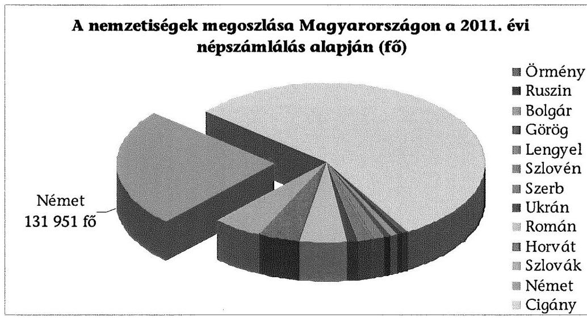
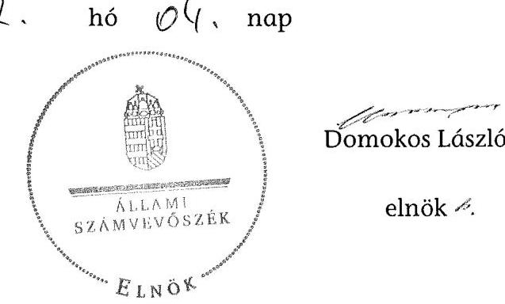

# ÁLLAMI   SZÁMVEVÔSZÉK 

## JELENTÉS

a helyi kisebbségi/nemzetiségi önkormányzatok gazdálkodásának ellenőrzéséről
Fővárosi Német Önkormányzat

---

# Állami Számvevőszék 

Iktatószám: V-0057-019-028/2013.
Témaszám: 1068
Vizsgálat-azonosító szám: V06060210

## Az ellenőrzést felügyelte:

Holman Magdolna (2013. május 30-ig)
felügyeleti vezető
Horváth Balázs (2013. május 31-től)
felügyeleti vezető
Az ellenőrzést vezette és az ellenőrzés végrehajtásáért felelős:
Kisgergely István
ellenőrzésvezető
A számvevőszéki jelentést készítették és a jelentés összeállításában közremüködtek:

## Huberné Kuncsik Zsuzsanna

számvevő tanácsos
Köllődné Gátai Mária
számvevő
Az ellenőrzést végezte:
Komonszky Krisztina
számvevő

---

# TARTALOMJEGYZÉK 

BEVEZETÉS ..... 7
I. ÖSSZEGZŐ MEGÁLLAPÍTÁSOK, KÖVETKEZTETÉSEK, JAVASLATOK ..... 10
II. RÉSZLETES MEGÁLLAPÍTÁSOK ..... 14

1. A Fővárosi Német Önkormányzat és a Fővárosi Önkormányzat együttműködésének szabályozása, a működési feltételek biztosítása ..... 14
2. A Fővárosi Német Önkormányzat gazdálkodási feladatai ellátásának szabályszerűsége ..... 16
2.1. A költségvetésre és zárszámadásra, a kincstári adatszolgáltatás rendjére vonatkozó jogszabályi előírások betartása ..... 16
2.2. A Fővárosi Német Önkormányzat gazdálkodásának szabályozottsága ..... 17
2.3. Az operatív gazdálkodási jogkörök kialakítása és gyakorlása ..... 18
3. A Fővárosi Német Önkormányzattal összefüggő gazdálkodási feladatok belső ellenőrzésének múködése ..... 21
4. A feladatalapú támogatás felhasználása, elszámolása ..... 21
5. A Fővárosi Német Önkormányzat feladatellátásának jogszabályi előírásokkal való összhangja ..... 22
FÜGGELÉKEK
6. sz. függelék Értelmező szótár
7. sz. függelék A pénzügyi kontrollok múködésének értékelése

---

.

---

# RÖVIDÍTÉSEK JEGYZÉKE 

## TÖRVÉNYEK

Alaptörvény
Áht. 1
Áht. 2
ÁSZ tv.
Nek. ${ }_{1}$ tv.
Nek. ${ }_{2}$ tv.
Számv. tv.
RENDELETEK
Áhsz.

Ámr.
Ávr.

Ber.

Bkr.
fővárosi önkormányzati SZMSZ
támogatási kormányrendelet

## SZÓRÖVIDÍTÉSEK

ÁSZ

Magyarország Alaptörvénye, kihirdetve 2011. április 25én
az államháztartásról szóló 1992. évi XXXVIII. törvény, hatályos 2011. december 31-ig
az államháztartásról szóló 2011. évi CXCV. törvény, hatályos 2011. december 31-étől
az Állami Számvevőszékről szóló 2011. évi LXVI. törvény, hatályos 2011. július 1-jétől
a nemzeti és etnikai kisebbségek jogairól szóló 1993. évi LXXVII. törvény, hatályos 2011. december 31-ig
a nemzetiségek jogairól szóló 2011. évi CLXXIX. törvény, hatályos 2011. december 20-tól
a számvitelről szóló 2000 . évi C. törvény
az államháztartás szervezetei beszámolási és könyvvezetési kötelezettségének sajátosságairól szóló 249/2000. (XII. 24.) Korm. rendelet
az államháztartás múködési rendjéről szóló 292/2009. (XII. 19.) Korm. rendelet, hatályos 2011. december 31-ig
az államháztartásról szóló törvény végrehajtásáról szóló 368/2011. (XII. 31.) Korm. rendelet, hatályos 2012. január 1-jétől
a költségvetési szervek belső ellenőrzéséről szóló 193/2003. (XI. 26.) Korm. rendelet, hatályos 2011.december 31 -ig
a költségvetési szervek belső kontrollrendszeréről és belső ellenőrzéséről szóló 370/2011. (XII. 31.) Korm. rendelet, hatályos 2012. január 1-jétől
Budapest Főváros Önkormányzata Közgyűlésének 55/2010. (XII. 9.) önkormányzati rendelete Budapest Főváros Önkormányzata Közgyűlésének Szervezeti és Múködési Szabályzatáról, hatályos 2011. január 1-jétől
a kisebbségi önkormányzatoknak a központi költségvetésből, valamint fejezeti kezelésű előirányzatból nyújtott támogatások feltételrendszeréről és elszámolásának rendjéről szóló 342/2010. (XII. 28.) Korm. rendelet (hatályon kívül helyezte a 28/2012. (III. 6.) Korm. rendelet a nemzetiségi célú előirányzatokból nyújtott támogatások feltételrendszeréről és elszámolásának rendjéről; jelenleg hatályos a 428/2012. (XII. 29.) Korm. rendelet a nemzetiségi célú előirányzatokból nyújtott támogatások feltételrendszeréről és elszámolásának rendjéről)

Állami Számvevőszék

---

együttmúködési megállapodás
új együttmúködési megállapodás
ellenőrzési nyomvonal

## FNÖ

föjegyzö
főpolgármester
Főpolgármesteri Hivatal

Főpolgármesteri Hivatal ügyrendje
Fővárosi Önkormányzat Képviselő-testület

Kincstár
kockázatkezelési szabályzat

Kontrolling Osztály vezetője
Közgyűlés
leltározási szabályzat
pénzgazdálkodási szabályzat $_{1}$
pénzgazdálkodási szabályzat $_{2}$
pénzkezelési szabályzat
Pénzügyi Főosztály

Budapest Főváros Önkormányzata és a Fővárosi Német Önkormányzat által kötött együttmúködési megállapodás, hatályos 2007. július 25 -től
Budapest Főváros Önkormányzata és a Fővárosi Német Önkormányzat által kötött együttmúködési megállapodás, hatályos 2012. december 16-tól
Budapest Főváros Önkormányzat Főpolgármesteri Hivatal Pénzügyi Főosztály Pénzügyi és Számviteli Osztály ellenőrzési nyomvonala
Fővárosi Német Önkormányzat
Budapest Főváros Önkormányzatának Főjegyzője
Budapest Főváros Önkormányzatának Főpolgármestere
Budapest Főváros Önkormányzata Főpolgármesteri Hivatala
A főpolgármester és a főjegyző 505/2011. számú együttes utasítása a Főpolgármesteri Hivatal Úgyrendjéről
Budapest Főváros Önkormányzata
A Nek. ${ }_{1}$ tv. 30/E. § (1) bekezdése alapján az FNÖ Képvise-lö-testülete 2011. december 31-ig, illetve a Nek. ${ }_{2}$ tv. 76. § (3) bekezdése alapján az FNÖ Közgyűlése 2012. január 1jétől. Az FNÖ 2012-ben, az új törvény hatálybalépésével nem változtatta meg a képviselő-testülete elnevezését közgyűlésre, ezért a teljes ellenőrzött időszakra a képviselő-testület elnevezést alkalmazzuk.
Magyar Államkincstár
A főpolgármester és a főjegyzö 11/2011. számú együttes intézkedése Budapest Főváros Önkormányzat Főpolgármesteri Hivatal kockázatkezelési szabályzatáról
Budapest Főváros Főpolgármesteri Hivatal Pénzügyi Főosztály Kontrolling Osztályának vezetője
Budapest Főváros Önkormányzatának Közgyűlése
Budapest Főváros Önkormányzata Főpolgármesteri Hivatal leltározási és leltárkészítési szabályzata
Budapest Főváros főpolgármesterének és főjegyzőjének 506/2011. számú együttes intézkedése a Főpolgármesteri Hivatal pénzgazdálkodásával kapcsolatos kötelezettségvállalás, utalványozás, ellenjegyzés, érvényesítés rendjéről, és a szakmai teljesítés igazolásáról
Budapest Főváros Főjegyzőjének 510/2012. számú intézkedése a Főpolgármesteri Hivatal pénzgazdálkodásával kapcsolatos kötelezettségvállalás, pénzügyi ellenjegyzés, utalványozás, érvényesítés és a teljesítés igazolás rendjéről
Budapest Főváros Önkormányzata Főpolgármesteri Hivatalának pénz- és értékkezelési szabályzata
Budapest Főváros Önkormányzata Főpolgármesteri Hivatalának Pénzügyi Főosztálya

---

| szabálytalanságkezelési   szabályzat | A főpolgármester és a főjegyzó 12/2011. számú együttes   intézkedése Budapest Főváros Önkormányzata Főpol-   gármesteri Hivatalában a szabálytalanságok kezelésének   rendjéről |
| :-- | :-- |
| számviteli politika | Budapest Főváros Főjegyzője 568/2007. számú intézkedé-   se Budapest Főváros Önkormányzata Főpolgármesteri   Hivatala számviteli politikájáról és számlarendjéről |
| Támogató | Közigazgatási és Igazságügyi Minisztérium |

---

.

---

# JELENTÉS 

## a helyi kisebbségi/nemzetiségi önkormányzatok gazdálkodásának ellenőrzéséről Fővárosi Német Önkormányzat

## BEVEZETÉS

Az Alaptörvény szerint a Magyarországon élő nemzetiségek államalkotó tényezők. Minden valamely nemzetiséghez tartozó magyar állampolgárnak joga van önazonossága szabad vállalásához és megőrzéséhez. A Magyarországon élő nemzetiségeknek joguk van az anyanyelv használathoz, a saját nyelven való egyéni és közösségi névhasználathoz, saját kultúrájuk ápolásához és az anyanyelvű oktatáshoz. Az Alaptörvény alapján az országban élő nemzetiségek helyi és országos önkormányzatokat hozhatnak létre. A helyi nemzetiségi önkormányzatok lehetnek települési és területi nemzetiségi önkormányzatok. A területi nemzetiségi önkormányzat testülete a Nek. 1 tv. alapján 2011. év végéig a képviselő-testület, 2012. január 1-jétől a Nek. 2 tv. alapján a közgyűlés.

A 2011. évben a valamelyik nemzetiséghez tartozók aránya az összlakosságon belül $5,6 \%$ volt, amelynek nemzetiségek szerinti megoszlását az alábbi diagram szemlélteti:

1. számú diagram

## Forrás: KSH

A Fővárosban 2011-ben megtartott kisebbségi önkormányzati választásokat követően 11 területi kisebbségi/nemzetiségi önkormányzat alakult meg, köztük a Fővárosi Német Önkormányzat (FNÖ). A Nek. 2 tv. alapján a helyi önkor-

---

mányzat biztosítja a nemzetiségi önkormányzati múködés személyi és tárgyi feltételeit, amelyeket megállapodásban szabályoznak. A helyi nemzetiségi önkormányzatok gazdálkodására és támogatási rendszerére, valamint a gazdálkodási feladataikat ellátó helyi önkormányzatokkal kötendő együttmúködésre vonatkozó jogszabályok a 2010-2012. években jelentős változásokon mentek át, amelyek érintették a feladatalapú támogatásra fordítható költségvetési keret megállapítását, az operatív gazdálkodási jogkörök szabályozását, az elkülönített könyvvezetés alkalmazását, és a belső ellenőrzés szabályozását.

Az ellenőrzés célja annak értékelése volt, hogy az FNÖ gazdálkodási kereteinek kialakítása, gazdálkodása és feladatellátása megfelelt-e a hatályos jogszabályoknak. Ennek keretében ellenőriztük, hogy:

- az FNÖ és a Fővárosi Önkormányzat együttmúködésének szabályozása, a Fővárosi Önkormányzat SZMSZ-ében, a megállapodásban előírt működési feltételek biztosítása megfelelt-e a jogszabályi előírásoknak;
- a felek együttmúködése megfelelt-e a megállapodásnak a gazdálkodási feladatok szabályszerű ellátásában, ennek keretében betartották-e az FNÖ gazdálkodásához kapcsolódóan a költségvetésre és zárszámadásra, a gazdálkodás szabályozására és az operatív gazdálkodási jogkörök gyakorlására vonatkozó jogszabályi előírásokat;
- a főjegyző biztosította-e az Főpolgármesteri Hivatal belső ellenőrzése keretében az FNÖ-vel összefüggő gazdálkodási feladatok belső ellenőrzését;
- a feladatalapú támogatás felhasználása, a folyósított feladatalapú támogatással történő elszámolás az előírásoknak megfelelő volt-e;
- az FNÖ feladatellátása összhangban volt-e a vonatkozó jogszabályi előírásokkal.

Az ellenőrzés típusa: szabályszerűségi ellenőrzés
Az ellenőrzött időszak: a 2011. január 1. és 2012. június 30. közötti időszak.
Ellenőrzött szervezet: Fővárosi Német Önkormányzat és a gazdálkodási feladatait ellátó Fővárosi Önkormányzat.

Az ellenőrzés végrehajtásának jogszabályi alapját az ÁSZ tv. 5. § (2)-(3) és (6) bekezdéseiben foglaltak képezik.

Az ellenőrzés szakmai módszertana az ÁSZ hivatalos honlapján (www.asz.hu) közzétett szakmai szabályokon alapult, amely a Legfőbb Ellenőrző Intézmények Nemzetközi Szervezete (INTOSAI) által kiadott nemzetközi standardok (ISSAI) figyelembevételével készült.

A fogalmak magyarázatát az 1. számú függelék, a pénzügyi folyamatokban kulcsszerepet betöltő kontrollok múködése értékelésénél alkalmazott minősítési szempontokat a 2. számú függelék tartalmazza. A rövidítések jegyzékében az ellenőrzött időszakban megszűnő jogszabályok esetében a hatályosság végét, az ellenőrzött időszakban hatályba lépő jogszabályok esetében a hatályosság kezdő időpontját minden esetben feltüntettük. A vizsgált időszak egésze alatt

---

hatályban voltak azok a jogszabályok, amelyeknél nem szerepel megszűnést vagy hatályba lépést jelző dátum.

Az FNÖ gazdálkodásának ellenőrzése során értékeltük az FNÖ és a Fővárosi Önkormányzat együttműködését, a gazdálkodás szabályozottságát. Értékeltük a pénzügyi folyamatokban kulcsszerepet betöltő belső kontrollok (2011-ben a kötelezettségvállalás ellenjegyzése, a szakmai teljesítésigazolás és az utalvány ellenjegyzése, 2012. január 1-jétől a pénzügyi ellenjegyzés, a teljesítésigazolás és az érvényesítés) múködésének megfelelőségét az államháztartáson belülre és kívülre teljesített múködési célú pénzeszköz átadásoknál, a dologi és egyéb folyó kiadásokkal kapcsolatos kifizetéseknél. Az ÁSZ a pénzügyi folyamatokban kulcsszerepet betöltő belső kontrollok múködésére vonatkozó megállapításokat a statisztikai mintavétellel kiválasztott bizonylatok elemzése alapján fogalmazta meg. Az alkalmazott módszer biztosítja, hogy a vizsgált kiadásoknál múködő kontrollok ellenőrzésének tapasztalatai alapján általános következtetést vonjunk le az ellenőrzött területekhez kapcsolódó kifizetések kulcskontrolljainak múködésére vonatkozóan. Értékeltük az FNÖ-vel összefüggő gazdálkodási feladatokra vonatkozó belső ellenőrzés szabályozottságát, múködését, a feladatalapú támogatás felhasználását, valamint az FNÖ feladatellátása és a jogszabályi előírások összhangját. A fővárosi nemzetiségi önkormányzatok gazdálkodását, költségvetési támogatásának felhasználását az ÁSZ még nem vizsgálta.

Az ellenőrzés lefolytatásához az FNÖ, valamint a gazdálkodási feladatait ellátó Fővárosi Önkormányzat tanúsítványok és a kapcsolódó dokumentumok megküldésével, rendelkezésre bocsátásával szolgáltatott adatokat. A tanúsítványokban szerepeltetett adatok, információk ellenőrzése és az eltérések megállapítása a helyszíni ellenőrzés keretében történt. A pénzügyi folyamatokban kulcsszerepet betöltő belső kontrollok megfelelőségének értékeléséhez az FNÖ 2011. évi, és 2012. I. félévi könyvelési adatállományából a múködési célú pénzeszkózátadások esetében tételesen, a dologi és egyéb folyó kiadások esetében véletlen mintavételi eljárással választottuk ki az ellenőrizendő tételeket.

Az FNÖ 1995-ben kezdte meg múködését, a 2011. január 20-án alakult FNÖ hét tagú Képviselő-testületének munkáját kettő állandó bizottság segítette. Az FNÖ elnöke 2011. január 20-ától tölti be tisztségét, személye az ellenőrzött időszakban nem változott. Az FNÖ intézményt, gazdasági társaságot, más szervezetet nem alapított.

Az FNÖ múködéséhez és feladatellátásához 2011-ben a költségvetési forrásból összesen 10747 ezer Ft támogatást kapott. Az FNÖ 2011. évi zárszámadási határozata szerint 13435 ezer Ft költségvetési bevételt ért el, valamint 9197 ezer Ft költségvetési kiadást teljesített.

Az ÁSZ tv. 29. § (1) bekezdése szerint a jelentéstervezetet megküldtük a főpolgármester, a főjegyző és az FNÖ elnöke részére, akik az ÁSZ tv. 29. § (2) bekezdésében foglalt észrevételezési jogukkal nem éltek, a jelentéstervezetre észrevételt nem tettek.

---

# I. ÖSSZEGZŐ MEGÁLLAPÍTÁSOK, KÖVETKEZTETÉSEK, JAVASLATOK 

Az FNÖ és a Fővárosi Önkormányzat 2007-ben kötött együttmúködési megállapodást az FNÖ költségvetésével és gazdálkodásával kapcsolatos feladatok ellátására. Az együttmúködési megállapodást 2011-ben felülvizsgálta a főjegyző, annak módosítására nem került sor. Az együttmúködési megállapodás az ellenőrzött időszakban az Áht. ${ }_{1,2}$, a Nek. ${ }_{1,2}$ tv., az Ámr. és az Ávr. szerint meghatározott múködési és gazdálkodási feladatok ellátásának feltételeit részben tartalmazta. A 2011. évben a költségvetési koncepció, illetve a költségvetés elkészítésének, elfogadásának feladataival kapcsolatos határidőket az Ámr.ben előírtak ellenére nem rögzítették.

A 2012. június 30 -án hatályos együttmúködési megállapodás az Áht. ${ }_{2}$ előírása ellenére nem tartalmazta az FNÖ bevételeivel és kiadásaival kapcsolatos ellenőrzési, finanszírozási, adatszolgáltatási és beszámolási feladatok ellátásának részletes szabályait. A Nek. ${ }_{2}$ tv.-ben előírtak ellenére nem rögzítették a főjegyzönek, vagy megbízottjának részvételét az FNÖ Képviselő-testületi ülésein, továbbá a költségvetés készítésével, és az adatszolgáltatással kapcsolatos feladatok ellátásának határidejét, a gazdálkodási jogkörök gyakorlásának módosuló szabályait, valamint az FNÖ múködésére és gazdálkodására vonatkozó eljárási és dokumentációs részletszabályokat. Az FNÖ és a Fővárosi Önkormányzat a Nek. ${ }_{2}$ tv.-ben előírt új együttmúködési megállapodást az előírt határidőn túl, 2012. december 15 -én kötötte meg.

A fővárosi önkormányzati SZMSZ-ben és a Főpolgármesteri Hivatal ügyrendjében a Nek. ${ }_{1,2}$ tv. előírásainak megfelelően szabályozták az FNÖ múködésének személyi és tárgyi feltételeit. Az FNÖ által használt helyiségek fenntartási és múködtetési költségének fedezetét a Fővárosi Önkormányzat az éves költségvetési rendeleteiben biztosította.

Az FNÖ 2011-ben az Ámr.-ben előírt határidőig nem alkotta meg a 2011. évi költségvetési határozatát. Az FNÖ elnöke az Áht. ${ }_{2}$ ben előírt határidőre nem nyújtotta be a Képviselő-testületnek az FNÖ 2012. évi költségvetési határozat tervezetét. A költségvetési határozatok tartalma nem felelt meg az Ámr. és az Áht. ${ }_{1,2}$ előírásainak, a költségvetés előterjesztésekor nem került bemutatásra az FNÖ előirányzat-felhasználási terve és költségvetési mérlege, valamint 2011ben és 2012-ben a költségvetés nem tartalmazta kiemelt előirányzatként a személyi juttatásokat, a munkaadókat terhelő járulékokat és a dologi kiadásokat. Az FNÖ elnöke a 2011. évi zárszámadási határozat tervezetét az Ámr.-ben előírt határidőben, az Áht. ${ }_{1}$-ben előírt tartalmi követelményeknek megfelelően terjesztette a Képviselő-testület elé, amelyet az határozatával elfogadott.

A főjegyzö 2012-ben az Ávr. előírásának ellenére az előírt határidőn túl teljesítette a jóváhagyott elemi költségvetésre, illetve a költségvetési év első három és első hat hónapjáról szóló időközi költségvetési és mérlegjelentésre vonatkozó adatszolgáltatási kötelezettségét. Az Áhsz.-ben foglaltakat betartva a féléves költségvetési elemi beszámolóra vonatkozó adatszolgáltatási kötelezettségét az

---

előírt határidőn belül teljesítette, azonban papír alapon - a Kincstár tájékoztatása miatt - késve nyújtotta be.

A Főpolgármesteri Hivatal az ellenőrzött időszakban a saját gazdálkodási szabályzatainak (számviteli politika és a kapcsolódó számlarend, eszközök és források leltározási és leltárkészítési szabályzata, eszközök és források értékelési szabályzata, pénzkezelési szabályzat) előírásait alkalmazta az FNÖ gazdálkodására is. 2012. január 1-jétől a Számv. tv. előírása ellenére gazdálkodási szabályzatait nem aktualizálta az Áht. ${ }_{2}$ és az Ávr. hatályba lépő változásainak megfelelően.

Az FNÖ tekintetében az operatív gazdálkodási jogkörök kialakítása az ellenőrzött időszakban megfelelt az Áht. ${ }_{1,2}$, az Ámr., valamint az Ávr. előírásainak.

A pénzgazdálkodási szabályzat ${ }_{1,2}$ előírásai - az Ámr.-ben és az Ávr.-ben foglaltak ellenére - nem tartalmazták az FNÖ gazdálkodásához kapcsolódó írásbeli kötelezettségvállalások nyilvántartásának rendjét és tartalmi követelményeit. Az ellenőrzött időszakban az írásbeli kötelezettségvállalásokról vezetett nyilvántartások - az Ámr. és az Ávr. előírásai ellenére - nem tartalmazták a kötelezettségvállalás azonosító számát, a kötelezettségvállalást tanúsító dokumentum megnevezését, iktatószámát, keltét, a kötelezettségvállaló nevét, a kifizetési határidőket és a kifizetések jogosultjait.

A pénzügyi folyamatokban kulcsszerepet betöltő belső kontrollok működésének megfelelősége a támogatásértékű működési kiadások, az államháztartáson kívülre teljesített működési célú pénzeszközátadások, valamint a dologi és egyéb folyó kiadások kifizetésének ellenőrzésekor az ellenőrzött időszakban öszszességében gyenge volt. A hibák száma a lényegességi szintet, a kritikus hibahatárt elérte. A 2011. évben a pénzeszközátadásoknál - az Ámr. előírása ellenére - előirányzat nélküli kifizetések történtek, elmaradt a szakmai teljesítésigazolás, az utalvány ellenjegyzője nem jelezte az utalványozónak a gazdálkodási szabályok megsértését. A dologi és egyéb folyó kiadások teljesített kifizetéseinél a kötelezettségvállalás ellenjegyzése és a szakmai teljesítés igazolása megfelelően működött. A 2012. év I. félévében az ellenőrzött területeken a pénzügyi ellenjegyzö - az Ávr.-ben és az Áht. ${ }_{2}$-ben foglaltak ellenére - nem győződött meg a szabad előirányzat rendelkezésre állásáról, a teljesítésigazoló nem igazolta az összegszerűséget és a fedezet meglétét, az érvényesítő nem ellenőrizte a teljesítésigazolás és a pénzügyi ellenjegyzés végrehajtásának megfelelőségét, a gazdálkodási szabályok, valamint a készpénzelőleg felvételére és elszámolására vonatkozó szabályok megsértését nem jelezte az utalványozónak.

A Fővárosi Önkormányzat 2011-2012. évi ellenőrzési tervéhez készült kockázatelemzés - a Ber. előírása ellenére - nem terjedt ki a Főpolgármesteri Hivatalban a nemzetiségi önkormányzatok gazdálkodásával összefüggő végrehajtási feladatok ellátására. A főjegyző a Főpolgármesteri Hivatal belső ellenőrzése keretében - a Ber., valamint a Bkr. előírásai ellenére - nem biztosította a Főpolgármesteri Hivatalban az FNÖ gazdálkodásával összefüggő végrehajtási feladatok ellátásának belső ellenőrzését, 2011-ben és 2012. I. félévében erre irányuló ellenőrzést nem terveztek és nem hajtottak végre.

---

Az FNÖ, a részére 2011-ben folyósított feladatalapú támogatást - az ellenőrzés számára készített kimutatás és a rendelkezésre bocsátott dokumentumok alapján - 2012. június 30 -ig a jogszabályi előírásoknak megfelelően teljes egészében felhasználta. A támogatási kormányrendelet előírásai szerint az FNÖ részére 2011. augusztus hónapban egy összegben utalta át a Kincstár a feladatalapú támogatást ( 1827 ezer Ft). A 2011. évben folyósított feladatalapú támogatás elszámolása - az Áht. ${ }_{1}$ elöírása ellenére - nem történt meg. A támogatás felhasználását az ellenőrzésre jogosult szervek nem ellenőrizték.

Az FNÖ feladatellátásának tárgya 2011-ben, valamint 2012. I. félévben összhangban volt a Nek. ${ }_{1,2}$ tv.-ben foglalt előírásokkal. A nemzetiségi közügy tárgyában szervezett rendezvények, programok megvalósítását, nemzetiségi kiadványok megjelentetését segítette, érdekérvényesítő, hagyományápoló tevékenységet végzett, ösztöndíj-programot müködtetett, önálló honlap kialakításáról és müködtetéséről döntött.

Az ellenőrzés megállapításai alapján, az észrevételezésre megküldött jelentéstervezetben az FNÖ gazdálkodásával kapcsolatban intézkedést igénylő megállapításokat és javaslatokat fogalmaztunk meg, amelyek végrehajtásáról az ellenőrzés időszakában intézkedési tájékoztatást adott a főjegyző és az FNÖ elnöke. A 2012. december 15 -én megkötött hatályos együttmúködési megállapodásban a Nek. ${ }_{2}$ tv. és az Áht. ${ }_{2}$ vonatkozó előírásait érvényesítették, a tartalmi hiányosságokat megszüntették. A 2013. évi költségvetési határozat Áht. ${ }_{2}$-ben foglalt előírásoknak megfelelő előkészítését, határidőben történő előterjesztését a beküldött dokumentumokkal igazolták. A gazdálkodási feladatok szabályszerű ellátásához 2013. évben új kötelezettségvállalási nyilvántartást vezettek be, amely megfelel az Ávr.-ben előírtaknak. Az operatív gazdálkodás múködési hibáinak megelőzése, feltárása és kijavítása érdekében a főjegyzö utasításban rendelkezett a kulcsszerepet betöltő kontrollok müködési hiányosságainak megszüntetésére. A 2012. évi feladatalapú támogatás felhasználásáról az elszámolást pótlólag elkészítették, amelyet a Képviselő-testület elfogadott. Figyelemmel az ÁSZ ellenőrzés hasznosítására mindezek vonatkozásában intézkedést igénylő megállapítást, javaslatot már nem szerepeltetünk.

Az ÁSZ tv. 33. § (1) bekezdésében foglaltak értelmében az ellenőrzött szervezet vezetője köteles a jelentésben foglalt megállapításokhoz kapcsolódó intézkedési tervet összeállítani, és azt a jelentés kézhezvételétől számított 30 napon belül az ÁSZ részére megküldeni. Amennyiben az intézkedési tervet határidőre nem küldi meg a szervezet, vagy az nem elfogadható, az ÁSZ elnöke az ÁSZ tv. 33. § (3) bekezdés a)-b) pontjaiban foglaltakat érvényesítheti.

A helyszíni ellenőrzés megállapításainak hasznosítása mellett javasoljuk:

# a Fővárosi Német Önkormányzat elnökének: 

A kötelezettségvállaló 2011-ben az államháztartáson belülre és kívülre teljesített múködési célú pénzeszköz átadásoknál nem tett eleget az Áht. ${ }_{1}$ 12/A. § (1) bekezdésében foglalt előírásnak, mely szerint tárgyévi fizetési kötelezettség a jóváhagyott kiadási előirányzatok mértékéig vállalható.

---

Javaslat:
Biztosítsa a jövőben, hogy a kötelezettségvállalás feleljen meg az Áht. 2 36. § (1) bekezdésében foglalt előírásnak, mely szerint kötelezettséget vállalni a költségvetési kiadási előirányzatai és az azokat terhelő korábbi kötelezettségvállalásokkal és más fizetési kötelezettségekkel csökkentett eredeti, vagy módosított kiadási előirányzatok mértékéig lehet.

# a főjegyzönek: 

1. A főjegyző 2012-ben az Ávr. 33. § (1) bekezdésében a jóváhagyott elemi költségvetésre, az Ávr. 169. § (2) bekezdésében, valamint a 170. § (5) bekezdésében a költségvetési év első három és első hat hónapjáról szóló időközi költségvetési és mérlegjelentésre vonatkozó adatszolgáltatási kötelezettségét az előírt határidőn túl teljesítette.

Javaslat:
A jövőben a Főpolgármesteri Hivatal adatszolgáltatási kötelezettségének az FNÖ elemi költségvetése esetében az Ávr. 33. § (1) bekezdésében, a költségvetési év első három és első hat hónapjáról szóló időközi költségvetési jelentésre vonatkozóan az Ávr. 169. § (2) bekezdésében, valamint az időközi mérlegjelentés esetében a 170. § (5) bekezdésében előírt határidők betartásával tegyen eleget.
2. 2012. január 1-jétől a Főpolgármesteri Hivatal a Számv. tv. 14. § (11) bekezdésében előírtak ellenére a gazdálkodási szabályzatait (számviteli politika és a kapcsolódó számlarend, eszközök és források leltározási és leltárkészítési szabályzata, eszközök és források értékelési szabályzata, pénzkezelési szabályzat) nem aktualizálta az Áht. ${ }_{2}{ }^{-}$ ben és az Ávr.-ben megfogalmazott új előírásoknak megfelelően.

Javaslat:
Gondoskodjon a Számv. tv. 14. § (11) bekezdésében előírtaknak megfelelően arról, hogy a számviteli politikán és a kapcsolódó szabályzatokon a jogszabályok módosítása miatti változások, azok hatályba lépésétől számított 90 napon belül átvezetésre kerüljenek.

---

# II. RÉSZLETES MEGÁLLAPÍTÁSOK 

## 1. A Fővárosi NÉmet ÖNKORMÁNYZAT És a FővÁrosi ÖNKORMÁNYZAT EGYÜTTMÚKÖDÉSÉNEK SZABÁLYOZÁSA, A MÜKÖDÉSI FELTÉTELEK BIZTOSÍTÁSA

Az FNÖ és a Fővárosi Önkormányzat együttműködésének a szabályozására, valamint a múködés Nek. ${ }_{1,2}$ tv.-ben előírt személyi és tárgyi feltételeinek a biztosítására az együttmúködési megállapodásban, a fővárosi önkormányzati SZMSZ-ben és a Főpolgármesteri Hivatal ügyrendjében meghatározottak szerint került sor.

Az FNÖ a Fővárosi Önkormányzattal a költségvetésével és gazdálkodásával kapcsolatos feladatok ellátására 2007. július 24 -én kötött együttmúködési megállapodást ${ }^{1}$. Az együttmúködési megállapodást 2011-ben a főjegyzö felülvizsgálta, annak módosítására a jogszabályi környezet változatlansága, valamint, az FNÖ alakuló ülésének időpontja ${ }^{2}$ miatt nem került sor 2011. január 15-ig. Az FNÖ és a Fővárosi Önkormányzat a Nek. ${ }_{2}$ tv. 159. § (3) bekezdésének előirása ellenére az új együttmúködési megállapodást 2012. június 1-ig nem kötötte meg.

Az együttműködési megállapodás az ellenőrzött időszakban az Áht. ${ }_{1,2}$, a Nek. ${ }_{1,2}$ tv., az Ámr. és az Ámr. szerint meghatározott múködési és gazdálkodási feladatok ellátásának feltételeit részben tartalmazta.

A 2011. december 31-én hatályos együttmúködési megállapodás az Ámr. 37. § (4) bekezdésének a)-f) pontjaiban előírtak ellenére nem tartalmazta a költségvetési koncepció és a költségvetés elkészítésének, elfogadásának feladataival kapcsolatos határidőket.

A 2012. év I. félévében a 2012. június 30 -án hatályos együttműködési megállapodás nem tartalmazta:

- az Áht. ${ }_{2}$ 27. § (2) bekezdésében előírt, az FNÖ bevételeivel és kiadásaival kapcsolatos ellenőrzési, finanszírozási, adatszolgáltatási és beszámolási feladatok ellátásának részletes szabályait;
- a Nek. ${ }_{2}$ tv. 80. § (3) a) pontjában foglaltak szerint a költségvetés készítésével és az adatszolgáltatással kapcsolatos feladatok ellátásának határidejét, a 2012. január 1-től hatályos önálló számlanyitás, törzskönyvi nyilvántartás

[^0]
[^0]:    ${ }^{1}$ Az együttműködési megállapodást az FNÖ a 38/2007. (VII. 24.) számú, a Közgyűlés az 1705/2007. (X. 25.) számú határozatával hagyta jóvá.
    ${ }^{2}$ Az FNÖ a 2011. évi választásokat követően 2011. január 20-án tartotta alakuló ülését.

---

rendjét, a gazdálkodási jogkörök gyakorlásának módosuló szabályait, valamint a múködés feltételeinek és a gazdálkodásnak részletes előírásait ${ }^{3}$;

- A Nek. ${ }_{2}$ tv. 80. § (3) bekezdés d) pontjában foglaltak alapján az FNÖ gazdálkodására vonatkozó eljárási és dokumentációs részletszabályokat;
- a Nek. ${ }_{2}$ tv. 80. § (4) bekezdésében előírtak szerint azt, hogy a főjegyzó vagy annak - a főjegyzövel azonos képesítési előírásoknak megfelelő - megbízottja a Fővárosi Önkormányzat megbízásából és képviseletében részt vesz az FNÖ képviselő-testületi ülésein és jelzi, amennyiben törvénysértést észlel.

Az együttműködési megállapodás 2012. I. félévében a hatályos jogszabályokkal nem volt összhangban. Az FNÖ és a Fővárosi Önkormányzat a $\mathrm{Nek}_{2}$ tv. 159. § (3) bekezdésében előírt új együttmüködési megállapodást 2012. december 15 -én kötötte meg ${ }^{4}$.

A fővárosi önkormányzati SZMSZ-ben és a Főpolgármesteri Hivatal ügyrendjében a Nek. ${ }_{1}$ tv. 27. § (1) és a Nek. ${ }_{2}$ tv. 80. § (1) bekezdés előírásainak megfelelően szabályozták az FNÖ múködésének személyi, tárgyi feltételeit, és biztosították az ezekhez kapcsolódó költségek viselését. A Főpolgármesteri Hivatal ügyrendjében ${ }^{5}$ rögzítették, hogy a fővárosi területi nemzetiségi önkormányzatok szakmai, jogi, ügyviteli támogatásával összefüggő feladatokat az Igazgatási és Hatósági Főosztály látja el. A nemzetiségi önkormányzatok gazdálkodási feladatainak ellátását a megbízott dolgozók munkaköri leírásai tartalmazták.

A Fővárosi Önkormányzat és az FNÖ 2007. június 29-én használatba adási szerződést kötött, melynek értelmében az FNÖ múködéséhez a Budapest, Akadémia u. 1. szám alatti ingatlan III. emeletén található helyiségcsoport ingyenes használatát biztosította. Az ingatlan további használatára 2008. szeptember 19-én haszonkölcsön szerződést kötöttek az üzemeltető Fővárosi Közterület Felügyelettel a következő önkormányzati választásokat követő 90. napig tartó határozott időtartamra. A haszonkölcsön szerződés 2011. április 9-én lejárt, az újabb haszonkölcsön szerződést 2011. július 18-án kötötték meg, melyben rögzítették, hogy a szerződéssel le nem fedett időszakban a korábban hatályos szerződés szabályait tekintik irányadónak. A haszonkölcsön szerződésben rögzítették, hogy a közüzemi díjakat az ingatlant üzemeltető köteles viselni, azonban a telefonhasználat költségei az FNÖ-t terhelik ${ }^{6}$.

Az FNÖ működésével - postai, kézbesítési, gépelési, sokszorosítási feladatok ellátása - kapcsolatos költségeket az FNÖ viselte, melyek finanszírozásához a Fő-

[^0]
[^0]:    ${ }^{3}$ Az FNÖ már a 2011. évben rendelkezett önálló bankszámlával, adószámmal, törzskönyvi nyilvántartásba vétele 2002-ben megtörtént.
    ${ }^{4}$ Az új együttmúködési megállapodást a Fővárosi Önkormányzat részéről a fővárosi önkormányzati SZMSZ 7. számú mellékletének XVI. fejezet 1) pontja alapján átruházott hatáskörben a főpolgármester-helyettes kötötte meg, az FNÖ az 54/2012. (X. 30.) számú határozatával hagyta jóvá.
    ${ }^{5}$ a Főpolgármesteri Hivatal ügyrendjének 39. § (2) bekezdésének 7) pontja
    ${ }^{6}$ A 2011. július 18-án kötött haszonkölcsön szerződés V. fejezet 6-7. pontjai

---

városi Önkormányzat az éves költségvetési rendeleteiben jóváhagyott összegben járult hozzá.

A Fővárosi Önkormányzat az ellenőrzött időszakban az előírásoknak megfelelően a szabályozási hiányosságok ellenére biztosította és folyamatosan fenntartotta az FNÖ működésének személyi és tárgyi feltételeit.

# 2. A FÖVÁrosi NÉmet ÖNKORMÁNYZAT GAZDÁlKODÁSI FELADATAI ELLÁTÁSÁNAK SZABÁLYSZERŰSÉGE 

### 2.1. A költségvetésre és zárszámadásra, a kincstári adatszolgáltatás rendjére vonatkozó jogszabályi előírások betartása

Az FNÖ az Ámr. 37. § (3) bekezdésében előírt határidőig ${ }^{7}$, nem alkotta meg a 2011. évi költségvetési határozatát ${ }^{8}$. Az FNÖ elnöke az Áht. ${ }_{2}$ 24. § (2) bekezdésében előírt határidőre ${ }^{9}$ nem nyújtotta be a Képviselő-testületnek az FNÖ 2012. évi költségvetési határozat tervezetét ${ }^{10}$.

A költségvetési határozatok kiadási előirányzatai 2011-ben az Áht. ${ }_{1}$ 69. § (1) bekezdés a) pontjában és az Ámr. 36. § (1) bekezdésében, valamint 2012-ben az Áht. 2 23. § (2) bekezdés a) pontjában foglaltak ellenére nem tartalmazták kiemelt előirányzatként a személyi juttatásokat, a munkaadókat terhelő járulékokat és a dologi kiadásokat.

A 2011. évben a Fővárosi Önkormányzattól és a központi költségvetésből származó bevételi előirányzatait az FNÖ a költségvetésében az Ámr. 81. § (5) bekezdésében előírtak ellenére nem támogatásértékű bevételként, hanem sajátos működési bevételként szerepeltette. A 2012. évi költségvetési határozatban a bevételek a támogatásértékű működési bevételek között szerepeltek.

Az Ámr. 36. § (1) bekezdés i) és k) pontjának előírása ellenére a 2011. évi költségvetési határozat nem tartalmazta a működési és a felhalmozási célú bevételi és kiadási előirányzatok bemutatását tájékoztató jelleggel mérlegszerűen, egymástól elkülönítetten, valamint az év várható bevételi és kiadási előirányzatainak teljesüléséről készített előirányzat-felhasználási ütemtervet. A 2012. évben a költségvetés előterjesztésekor az Áht. 2 24. § (4) bekezdés a) pont előírása ellenére nem került bemutatásra az FNÖ előirányzat felhasználási terve és a költségvetési mérlege közgazdasági tagolásban.

[^0]
[^0]:    ${ }^{7}$ A helyi kisebbségi önkormányzat költségvetési határozatát tárgy év február 10-ig fogadja el.
    ${ }^{8}$ Az FNÖ a 18/2011. (III. 22.) számú határozatával fogadta el a 2011. évi költségvetését.
    ${ }^{9}$ a központi költségvetésről szóló törvény kihirdetését követő 45. nap
    ${ }^{10}$ Az FNÖ a 12/2012. (II. 21.) számú határozatával fogadta el a 2012. évi költségvetését.

---

Az FNÖ a 2011. évi költségvetési határozatát négy, a 2012. évi költségvetési határozatát 2012. I. félévében két alkalommal módosította. A 2011. évre vonatkozóan 2012 januárjában a zárszámadást megelőzően előirányzat-átcsoportosítással biztosították a kiemelt előirányzatok teljesítésének fedezetét.

Az FNÖ elnöke a 2011. évi zárszámadási határozat tervezetét - az Ámr. 37. § (3) bekezdésében előírt határidőt betartva - 2012. március 12 -én terjesztette a Képviselő-testület elé, amelyet az határozatával elfogadott ${ }^{11}$. A zárszámadásról szóló határozat megfelelt az Áht-1 69. § (1) bekezdésében előírt tartalmi követelményeknek.

A főjegyző 2012-ben - a 2012. I. féléves elemi költségvetési beszámolót kivéve - nem teljesítette határidőre az FNÖ számára előírt kincstári adatszolgáltatást. A főjegyzö a 2012. évi elemi költségvetést az Ávr. 33. § (1) bekezdésében előírt határidőn ${ }^{12}$ túl, az Ávr. 169. § (2) bekezdésében foglaltak ellenére a költségvetési év első három és első hat hónapjáról szóló időközi költségvetési jelentést késedelemmel küldte meg a Kincstárnak. A 2012. évben az első három és az első hat hónapról szóló időközi mérlegjelentést az Ávr. 170. § (5) bekezdésében megjelölt határidőn túl nyújtotta be.

A Főpolgármesteri Hivatal az FNÖ 2012. I. féléves elemi költségvetési beszámolóját az Áhsz. 10. § (1) bekezdése szerinti határidőre, 2012. július 31-ig elkészítette, és az Áhsz. 10. § (5a) bekezdésében foglaltakat betartva 2012. augusztus 9-én elektronikus formában, 2012. szeptember 12-én pedig papír alapon nyújtotta be a Kincstárnak.

A főjegyzö az FNÖ papíralapú 2012. I. féléves elemi költségvetési beszámolóját önhibáján kívül késedelmesen adta le, mivel a Kincstár tájékoztatása értelmében arra csak az elektronikusan továbbított beszámoló felülvizsgálatát követően, az erről írásban történő értesítés után volt mód. A Kincstár 2012. szeptember 12-én értesítette a Fővárosi Önkormányzatot arról, hogy az adatszolgáltatása megfelelő.

# 2.2. A Fővárosi Német Önkormányzat gazdálkodásának szabályozottsága 

A Főpolgármesteri Hivatal a saját gazdálkodási szabályzatainak (számviteli politika és a kapcsolódó számlarend, eszközök és források leltározási és leltárkészítési szabályzata, eszközök és források értékelési szabályzata, pénzkezelési szabályzat) előírásait alkalmazta az FNÖ gazdálkodására is.

[^0]
[^0]:    ${ }^{11}$ Az FNÖ a 16/2012. (III. 12.) számú határozatával fogadta el a 2011. évi zárszámadását.
    ${ }^{12}$ a 2012. évi költségvetési rendelettervezet Közgyűlés elé terjesztésének határidejét követő harminc nap

---

A 2012. január 1-jétől hatályba lépő Áht. ${ }_{2}$-ben és az Ávr.-ben megfogalmazott előírásoknak megfelelően a Főpolgármesteri Hivatal a gazdálkodási szabályzatait nem aktualizálta, megsértve ezzel a Számv. tv. 14. § (11) bekezdésében előírtakat, mely szerint a változásokat az azok hatályba lépését követő 90 napon belül kell a számviteli politikán keresztülvezetni.

A Főpolgármesteri Hivatal 2011-ben az Ámr. 20. § (3) bekezdés a) pontjának megfelelően szabályozta a kötelezettségvállalás ellenjegyzője, a szakmai teljesítésigazoló és az utalvány ellenjegyző̉e feladatait. A 2012. évben a pénzgazdálkodási szabályzat ${ }_{2}$-ben az Ávr. 13. § (2) bekezdés a) pontjának megfelelően szabályozta a pénzügyi ellenjegyzés, a teljesítésigazolás és az érvényesítés feladatának ellátását.

A pénzgazdálkodási szabályzat ${ }_{1,2}$ előírásai nem tartalmazták az FNÖ gazdálkodásához kapcsolódó írásbeli kötelezettségvállalások nyilvántartásának rendjét és tartalmi követelményeit. Az ellenőrzött időszakban az írásbeli kötelezettségvállalásokról vezetett nyilvántartások 2011-ben az Ámr. 75. § (1), valamint 2012. I. félévében az Ávr. 56. § (1) bekezdésében előírtak ellenére, nem tartalmazták a kötelezettségvállalás azonosító számát, a kötelezettségvállalást tanúsító dokumentum megnevezését, iktatószámát, keltét, a kötelezettségvállaló nevét, a kifizetési határidőket és a kifizetés jogosultjait.

A Főpolgármesteri Hivatal 2011-ben az Ámr. 156. § (2)-(3) bekezdésében, 2012. I. félévében a Bkr. 6. § (3)-(4) bekezdésében előírt ellenőrzési nyomvonallal és a szabálytalanságok kezelésének eljárásrendjével rendelkezett. A 2011. évben az Ámr. 157. § (1) bekezdésében, 2012. I. félévében a Bkr. 7. § (1) bekezdésében előírt kockázatkezelési rendszerre vonatkozó szabályzatot is elkészítették. Az ellenőrzött időszakban a Főpolgármesteri Hivatal ügyrendje tartalmazta az FNÖ gazdálkodásával kapcsolatos feladatokat, a feladatot ellátó köztisztviselők munkaköri leírásában szerepeltek az azokkal kapcsolatos hatáskörök és felelősségi szabályok, valamint a helyettesítés rendje.

# 2.3. Az operatív gazdálkodási jogkörök kialakítása és gyakorlása 

A 2011. évben az FNÖ elnöke, valamint az általa írásban felhatalmazott képviselők operatív gazdálkodási jogköreinek gyakorlására irányuló megbízásait (a kötelezettségvállalás, utalványozás, valamint az ellenjegyzés, továbbá a szakmai teljesítésigazolás) a Képviselő-testület is jóváhagyta ${ }^{13}$. A főjegyzö az érvényesítés ellátására az Ámr.-ben előírt szakmai végzettséggel rendelkező köztisztviselőket bízott meg, akiknek a 2011. február 1-jétől hatályos munkaköri leírásaiban az elvégzendő feladatot és a helyettesítés rendjét rögzítették. A gazdálkodási jogkörök gyakorlóinak aláírás mintája rendelkezésre állt, a Fő-

[^0]
[^0]:    ${ }^{13}$ Az FNÖ 2011. január 20-i alakuló ülésének 9/2011, 10/2011 számú Kt. határozatai megerősítették a gazdálkodási jogkörök gyakorlóinak kijelölését.

---

polgármesteri Hivatal gazdasági vezetője ${ }^{14}$ rendelkezett felsőfokú szakképesítéssel.

Az Ávr. 55. § (2) bekezdés g) pontjának előírása alapján 2012. január 1-jétől a pénzügyi ellenjegyzési feladatokat a Képviselő-testület kötelezettségvállalás ellenjegyzésére kijelölt tagjai nem láthatták el. A pénzügyi ellenjegyzést az Ávr.ben rögzített jogszabályi felhatalmazás alapján a gazdasági vezető gyakorolta, aki maga helyett a 2012. évi pénzgazdálkodási szabályzat ${ }_{2}$-ben foglaltak szerint a pénzügyi ellenjegyzői feladatok ellátására a Kontrolling Osztály vezetőjét jelölte ki 2012. április 30-i hatállyal. Az érvényesítési feladatokat végző köztisztviselők személye 2012. I. félévében nem változott.

Az FNÖ által az ellenőrzött időszakban teljesített kiadásoknál a kialakított gazdálkodási jogkörök gyakorlásának megfelelőségét a pénzügyi folyamatokban kulcsszerepet betöltő kontrollok múködésének értékelésével minősítettük.

A 2011. évben az FNÖ államháztartáson kívülre történő pénzeszközátadást a költségvetés készítésekor nem tervezett. A teljesített kiadás 1420 ezer Ft volt. Az államháztartáson belülre teljesített támogatásértékű működési kiadás tervezett összege 3193 ezer Ft volt, amiből 670 ezer Ft teljesült. Az államháztartáson belülre és kívülre teljesített múködési célú pénzeszközátadások során a kötelezettségvállalás ellenjegyzés, a szakmai teljesítésigazolás és utalvány ellenjegyzés kulcskontrollok müködésének megfelelősége összességében gyenge volt, mert:

- a kötelezettségvállalás ellenjegyzője jogosultsága és aláírása ellenére nem látta el az Ámr. 74. § (3) bekezdés a-c) pontjaiban előírt feladatait, mert nem vizsgálta, hogy a kötelezettségvállaláshoz rendelkezésre áll-e a Képviselő testület döntésén alapuló szabad előirányzat és fedezet, valamint, hogy a kötelezettségvállalás nem sérti-e a gazdálkodási szabályokat;
- a szakmai teljesítés igazolója nem végezte el feladatát, mert az Ámr. 76. § (1) bekezdésének előírása ellenére a kiadás teljesítésének jogosságát és öszszegszerúségét szakmailag nem igazolta;
- az utalvány ellenjegyzője az Ámr. 79. § (2) bekezdésében foglaltak ellenére aláírását megelőzően nem győződött meg a szakmai teljesítés igazolása megtörténtéről, nem kifogásolta, hogy az utalvány ellenjegyzését megelőzően az érvényesítés nem történt meg.

A 2011. évben az FNÖ dologi és egyéb folyó kiadást a költségvetés készítésekor eredeti előirányzatként nem tervezett. A zárszámadási határozatban a módosított előirányzattal szemben ( 8317 ezer Ft) a teljesített kiadás 4782 ezer Ft volt. A dologi és egyéb folyó kiadások esetében a 100 ezer Ft alatti kifizetések - a pénzgazdálkodási szabályzat ${ }_{1}$-ben előírtaknak megfelelően - előzetes írásbeli kötelezettségvállalást nem igényeltek.

[^0]
[^0]:    ${ }^{14}$ A Főpolgármesteri Hivatal ügyrendjének 22. § (1) bekezdése tartalmazza, hogy gazdasági vezetőnek a Pénzügyi Főosztály vezetője minősül.

---

A 2011. évben a dologi és egyéb folyó kiadások teljesítésekor a kötelezettségvállalás ellenjegyzése, a szakmai teljesítés igazolása, valamint az utalvány ellenjegyzése összességében kiválóan múködött:

- a kötelezettségvállalás ellenjegyző̉je szabályosan látta el az Ámr. 74. § (1) bekezdésében előírt feladatait;
- a szakmai teljesítés igazolója a feladat ellátása során az Ámr. 76. § (1) és (3) bekezdésében előírtakat betartotta, a kiadás teljesítésének jogosságát, öszszegszerűségét, a szerződés/megrendelés szakmai teljesítését igazolta;
- az utalványok ellenjegyző́je jogosultsága és aláírása ellenére nem végezte el feladatát, mert az Ámr. 79. § (2) bekezdésében foglaltak ellenére nem kifogásolta, hogy az utalvány ellenjegyzését megelőzően az érvényesítés nem történt meg.

A 2011. évben a gazdálkodás folyamatában (az ellenőrzött területeken) a kötelezettségvállalás ellenjegyzése, a szakmai teljesítésigazolás és az utalványozás ellenjegyzés kontrolljainak megbízhatósága összességében gyenge volt. A hibák száma a lényegességi szintet, a kritikus hibahatárt elérte. A pénzeszközátadásoknál szabad előirányzat nélküli kifizetések történtek, elmaradt a szakmai teljesítés igazolása, az utalványok ellenjegyzését nem előzte meg az érvényesítés elvégzése.

A 2012. évben az FNÖ a költségvetés készítésekor eredeti előirányzatként múködési célú pénzeszközátadást nem tervezett. A 2012. I. féléves beszámoló alapján a módosított előirányzattal szemben ( 1650 ezer Ft) a teljesített kiadás 1370 ezer Ft volt.

A 2012. év I. félévében az államháztartáson kívülre teljesített múködési célú pénzeszközátadások során a pénzügyi ellenjegyzés, teljesítés igazolás és érvényesítés múködésének megfelelősége összességében gyenge volt, mert:

- a pénzügyi ellenjegyzó jogosultsága és aláírása ellenére nem végezte el feladatát, mert az Áht. 37 § (1) bekezdésében előírtak ellenére nem győződött meg a kötelezettségvállalás időpontjában és a várható kifizetéskor a szabad előirányzat és fedezet rendelkezésre állásáról;
- az érvényesítő nem tartotta be Ávr. 58. § (3) bekezdésében foglaltakat, az érvényesítés és utalványozás a kifizetés teljesítését követően történt meg.

A 2012. évben az FNÖ a költségvetés készítésekor eredeti előirányzatként dologi és egyéb folyó kiadást nem tervezett. A 2012. I. féléves beszámoló adatai szerint a módosított előirányzat ( 6117 ezer Ft) 2153 ezer Ft-ban teljesült. Az FNÖ-nél 2012. I. félévében a dologi és egyéb folyó kiadások kifizetésének ellenőrzése során a pénzügyi ellenjegyzés, teljesítés igazolás és érvényesítés müködésének megfelelősége összességében gyenge volt, mert:

- a pénzügyi ellenjegyzó (a kötelezettségvállaláskor az Ávr. 55. § (2) bekezdés g) pontja alapján a Főpolgármesteri Hivatal gazdasági vezetője) nem végezte el az Ávr. 55. § (1) bekezdésében előírt feladatát, mert jogosultság hiányá-

---

ban a pénzügyi ellenjegyzést 2011-ben a kötelezettségvállalás ellenjegyzésére kijelölt képviselő végezte el;

- a teljesítést igazoló jogosultsága és aláírása ellenére nem végezte el az Ávr. 57. § (1) bekezdésében előírt feladatát, mert nem kifogásolta, hogy a kötelezettségvállalás a kifizetést követően történt;
- az érvényesítő jogosultsága és aláírása ellenére nem végezte el az Ávr. 58. § (1)-(2) bekezdésében előírt feladatát, mert a megelőző ügymenetben nem győződött meg a gazdálkodási és a pénzkezelési szabályzatban foglaltak betartásáról (a készpénzelőleget nem a szabályzatban meghatározott célra vették fel, és nem tartották be az előleg-elszámolási határidőt), nem jelezte az utalványozónak a gazdálkodási szabályok megsértését.

A 2012. év I. félévében a gazdálkodás folyamatában (az ellenőrzött területeken) a pénzügyi ellenjegyzés, teljesítésigazolás és az érvényesítés kontrolljainak megbízhatósága összességében gyenge volt. A hibák száma a lényegességi szintet, a kritikus hibahatárt elérte.

Az FNÖ gazdálkodása során 2011-ben, valamint 2012. I. félévében, a pénzügyi folyamatokban kulcsszerepet betöltő belső kontrollok működésében feltárt hiányosságokkal összefüggésben az ellenőrzés jogosulatlan kifizetést nem állapított meg, a pénzügyi kontrollok múködéséhez kapcsolódó hiányosságok azonban nem biztosítják a hibák megelőzését, feltárását és kijavítását.

# 3. A FőVÁrosi NÉmet ÖNKORMÁnyZATtal ÖSSZEFÜGGŐ GAZDÁLKODÁSI FELADATOK BELSŐ ELLENŐRZÉSÉNEK MŰKÖDÉSE 

A főjegyző a 2011-2012. évi ellenőrzési tervet megalapozó kockázatelemzést - a Ber. 21. § (2) bekezdése ${ }^{15}$ ellenére - nem terjesztette ki a Főpolgármesteri Hivatalban az FNÖ gazdálkodásával összefüggő végrehajtási feladatok ellátására ${ }^{16}$. Az éves ellenőrzési tervek nem tartalmaztak a Főpolgármesteri Hivatalban, a nemzetiségi önkormányzatok gazdálkodásával összefüggő végrehajtási feladatok ellátására vonatkozó feladatokat. A 2011. évben, illetve 2012. I. félévben ellenőrzést nem terveztek és nem végeztek.

## 4. A feladatalapú támogatÁs felhasZNÁlása, elsZámolása

Az FNÖ a Támogató döntése alapján 2011-ben 1827 ezer Ft feladatalapú támogatást kapott. Az FNÖ 2011. évi munkatervében szerepeltek a támogatni tervezett rendezvények, azonban a finanszírozás forrását nem jelölték meg ${ }^{17}$. A Képviselő-testület a folyósított támogatás összegével év közben módosította a

[^0]
[^0]:    ${ }^{15}$ 2012. január 1-jétől a Bkr. 7. § (2) bekezdése
    ${ }^{16}$ A Főpolgármesteri Hivatal Belső Ellenőrzési Osztály vezetőjének nyilatkozata alapján (ikt. szám: FPH006/27-1/2013. január 11.) a fővárosi nemzetiségi önkormányzatok gazdálkodását az összegszerűség (azok mérlegfőösszege az egyéb gazdálkodó szervek költségvetéséhez viszonyítva rendkívül alacsony) miatt nem tartották kockázatosnak.
    ${ }^{17}$ Az FNÖ 24/2011. (III. 22.) számú határozatával fogadták el a 2011. évi munkatervet.

---

2011. évi költségvetését, megemelte bevételi és kiadási - ezen belül a dologi kiadások - előirányzatát ${ }^{18}$.

A támogatási kormányrendelet 7. § (4) bekezdése tartalmazza, hogy a támogatás tárgyévben fel nem használt része a következő év június 30 -áig kötelezettségvállalással terhelhető. Az FNÖ-nek 2011. december 31-én fel nem használt maradványa 210 ezer Ft volt.

A 2011. évi támogatást - az ellenőrzés számára készített kimutatás és a rendelkezésre bocsátott dokumentumok alapján - a vonatkozó jogszabályi előírásoknak megfelelően 2012. június 30 -ig teljes egészében felhasználták.

A 2011. évben folyósított feladatalapú támogatás elszámolása a támogatási kormányrendelet 7. § (2) bekezdésében hivatkozott Áht. ${ }_{1}$-nek „a helyi önkormányzatok elszámolási rendjére vonatkozó rendelkezései alkalmazása" előírása ellenére nem történt meg. A támogatás felhasználását az ellenőrzésre jogosult szervek nem ellenőrizték.

# 5. A Fővárosi NÉmet ÖNKORMÁnyZAT feladATELLÁTÁsáNAK JOGSZABÁLYI ELŐÍRÁSOKKAL VALÓ ÖSSZHANGJA 

Az FNÖ feladatellátásának tárgya 2011-ben, valamint 2012. I. félévében összhangban volt a Nek. ${ }_{1,2}$ tv.-ben foglalt előírásokkal. A 2011. évben a Nek. ${ }_{1}$ tv. 30/A. § (4) pontjában foglaltak szerint a nemzetiségi közügy érdekében szervezett rendezvények, programok megvalósítását, nemzetiségi kiadványok megjelentetését segítette, érdekérvényesítő, hagyományápoló tevékenységet végzett, ösztöndíj-programot múködtetett, önálló honlap kialakításáról és múködtetéséről döntött. A 2012. év I. félévében a Nek. ${ }_{2}$ tv. 115-116. §-aiban meghatározott feladatok közül ellátta a képviselt közösség érdekképviseletét, a nemzetiség jogainak érvényesítését, a német közösség kulturális autonómiájának megerősítése és a nemzetiségi közösséghez kötődő kulturális javak megőrzése érdekében nemzetiségi rendezvények szervezéséhez nyújtott támogatást, nemzetiségi pályázatot írt ki, nemzetiségi kiadvány megjelenését támogatta.

Az FNÖ az ellenőrzött időszakban hatósági feladatot, illetve 2011-ben közüzemi szolgáltatással összefüggő tevékenységet nem látott el.

Budapest, 2013.
12. hó $\varnothing 4$, nap

Függelék:
2 db

[^0]
[^0]:    ${ }^{18}$ Az FNÖ 52/2011. (IX. 5.) számú határozata, melyben a felhasználás célját általánosan, hagyományápolásként határozták meg.

---

# ÉRTELMEZŐ SZÓTÁR 

belső ellenőrzés
belső kontrollrendszer
feladatalapú támogatás
együttmúködési megállapodás
kisebbségi önkormányzat

Független, tárgyilagos bizonyosságot adó és tanácsadó tevékenység, amelynek célja, hogy az ellenőrzött szervezet múködését fejlessze és eredményességét növelje, az ellenőrzött szervezet céljai elérése érdekében rendszerszemléletű megközelítéssel és módszeresen értékeli, illetve fejleszti az ellenőrzött szervezet irányítási és belső kontrollrendszerének hatékonyságát (Bkr. 2. § b) pont).
A belső kontrollrendszer a kockázatok kezelése és tárgyilagos bizonyosság megszerzése érdekében kialakított folyamatrendszer, amely azt a célt szolgálja, hogy a múködés és gazdálkodás során a tevékenységeket szabályszerűen, gazdaságosan, hatékonyan, eredményesen hajtsák végre, az elszámolási kötelezettségeket teljesítsék, megvédjék az erőforrásokat a veszteségektől, károktól és nem rendeltetésszerű használattól (az Áht. 69. § (1) bekezdéséből levezetett fogalom).
A támogatási évben általános múködési támogatásban részesült, és a Támogatónak a Magyar Államkincstárhoz intézett, a feladatalapú támogatás utalására vonatkozó rendelkező levele keltének időpontjában múködő települési és területi kisebbségi/nemzetiségi önkormányzatoknak az e rendeletben rögzített feltételrendszer alapján nyújtható támogatás, továbbá 2012. március 6 -tól a nemzetiségi önkormányzat által a Nek. ${ }_{2}$ tv. szerinti nemzetiségi közfeladatok ellátásához közvetlenül kötődő támogatás (342/2010. (XII. 28.) Korm. rendelet 2. § (2) bekezdés c) pont; 28/2012. (III. 6.) Korm. rendelet 2. § (2) bekezdés b) pont).
Az Áht. ${ }_{2}$ 27. §. (2) bekezdése előírása alapján a fővárosi nemzetiségi önkormányzat bevételeivel és kiadásaival kapcsolatban a tervezési, gazdálkodási, ellenőrzési, finanszírozási, adatszolgáltatási és beszámolási feladatok ellátásáról a Fővárosi Önkormányzat Főpolgármesteri Hivatala gondoskodik, melynek részletes eljárási és dokumentációs részletszabályait a Nek. ${ }_{2}$ tv. 80. § (3)-(4) bekezdésben foglaltak szerinti megállapodásban kell rögzíteni.
A Nek. tv. 6/A. § (1) bekezdésének 2. pontjában meghatározott közszolgáltatási feladatokat ellátó, testületi formában múködő, jogi személyiséggel rendelkező, demokratikus választások útján, külön törvény által meghatározott eljárási rendben létrehozott szervezet, amely a kisebbségi közösséget megillető jogosultságok érvényesítésére, a kisebbségek érdekeinek védelmére és képviseletére, a kisebbségi közügyek települési, területi (megyei, fővárosi) vagy országos szinten történő önálló intézésére jött létre.

---

kisebbségi/nemzetiségi közügy
kulcskontroll
nemzeti és etnikai kisebbség/ nemzetiség
nemzetiségi önkormányzat

A Nek. ${ }_{1}$ tv. 6/A. § (1) bekezdésének 1. pontjában és a Nek. 2 tv. 2. § 1. pontjában biztosított egyéni és közösségi jogok érvényesülése, a nemzetiséghez tartozók érdekeinek kifejezésre juttatása - különösen az anyanyelv ápolása, őrzése és gyarapítása, továbbá a nemzetiségek kulturális autonómiájának a nemzetiségi önkormányzatok által történő megvalósítása és megőrzése - érdekében a nemzetiséghez tartozók meghatározott közszolgáltatásokkal való ellátásával, ezen ügyek önálló vitelével és az ehhez szükséges szervezeti, személyi és anyagi feltételek megteremtésével összefüggő ügy. A közhatalmat gyakorló állami és helyi önkormányzati szervekben, továbbá a nemzetiségi önkormányzati szervekben való nemzetiségi képviselethez és mindezek szervezeti, személyi és anyagi feltételeinek biztosításához kapcsolódó ügy.
Az operatív gazdálkodási jogkörök közül 2011-ben a kötelezettségvállalás ellenjegyzése, a szakmai teljesítésigazolás és az utalvány ellenjegyzése, 2012. január 1-jétől a pénzügyi ellenjegyzés, a teljesítésigazolás és az érvényesítés.
A Nek. ${ }_{1}$ tv. 1. § (2) bekezdése, valamint a Nek. ${ }_{2}$ tv. 1. § (1) bekezdése alapján minden olyan Magyarország területén legalább egy évszázada honos népcsoport, amely az állam lakossága körében számszerú kisebbségben van, tagjai magyar állampolgárok és a lakosság többi részétől saját nyelve és kultúrája, hagyományai különböztetik meg, egyben olyan összetartozás-tudatról tesz bizonyságot, amely mindezek megőrzésére, történelmileg kialakult közösségeik érdekeinek kifejezésére és védelmére irányul.
A Nek. 2 tv. 2. § 2. pontjában meghatározott nemzetiségi közszolgáltatási feladatokat ellátó, testületi formában múködő, jogi személyiséggel rendelkező, demokratikus választások útján e törvény alapján létrehozott szervezet, amely a nemzetiségi közösséget megillető jogosultságok érvényesítésére, a nemzetiségek érdekeinek védelmére és képviseletére, a feladat- és hatáskörébe tartozó nemzetiségi közügyek települési, területi vagy országos szinten történő önálló intézésére jön létre.

---

# A PÉNZÜGYI KONTROLLOK MŰKÖDÉSÉNEK ÉRTÉKELÉSE 

A pénzügyi kontrollok múködése megfelelőségének vizsgálatát többlépcsős megfelelőségi tesztek útján, megismételt eljárással, a könyvviteli tételekből vett egyszerú véletlen minta alapján végeztük. A tesztelést az értékelésre kiválasztott két terület - a dologi és egyéb folyó kiadásoknál teljesített kifizetések, az államháztartáson belülre és kívülre, múködési és felhalmozási célra teljesített pénzeszközátadások - közül azoknál végeztük el, amelyeknél a mintanagyság egy tételszámot meghaladó volt.

Az ellenőrzés során alkalmazott módszer (többlépcsős megfelelőségi teszt) lényege, hogy a kiválasztott minta ellenőrzését csak addig végezzük, amíg elegendő és megfelelő bizonyítékot nem szerzünk a vizsgált pénzügyi kontroll múködésének megfelelő, vagy nem megfelelő voltáról. A megismételt eljárás alkalmazása a szándékolt hatáshoz (törvényes múködés, kitűzött célok, teljesítmények elérése, veszteséget okozó kockázatok megelőzése, mérséklése, feltárása) viszonyítva lehetővé teszi a kontrolltevékenységek tényleges hatásának vizsgálatát, ez alapján a múködés megfelelősége értékelését. Ennek keretében a számvevő bizonyosságot szerez arról, hogy a rendelkezésre álló szabályozás és dokumentumok alapján a pénzügyi kontrollokhoz szükséges - jogszabályokban előírt - ellenőrzési lépéseket végrehajtották-e.

A tesztek kiértékelése évenkénti bontásban két szinten történt. Először az egyes tevékenységi területekre meghatározott pénzügyi kontrollokat értékeltük, majd általános következtetést vontunk le a pénzügyi kontrollok együttes megfelelősége tekintetében. Az ellenőrzésre kijelölt területek kifizetéseinél a pénzügyi kontrollok múködése „kiváló", „jó" vagy „gyenge" minősítést kaphatott.

Az értékelésnél meghatározott lényegességi szint a könyvelési adatállományból vett mintanagysághoz megadott kritikus hibák száma.

A pénzügyi kontrollok múködését:

- kiválónak értékeltük abban az esetben, ha azok múködése megfelel a hibák megelőzésére és kijavítására meghatározott jogszabályi és helyi szintű szabályozásnak (eseti hibák);
- jónak minősítettük, ha a megállapított kisebb (tolerálható mértékű) hiányosságok nem veszélyeztetik az ellenőrzött területek hibáinak megelőzését és kijavítását (a hibák száma nem érte el a kritikus hibák számát, azaz a lényegességi szintet);
- gyengének értékeltük, amennyiben a kontrollok múködésében előforduló hiányosságok miatt nem biztosított a hibák megelőzése, feltárása, kijavítása (a hibák száma elérte az ellenőrzött tételektől függően megállapított kritikus hibák számát).