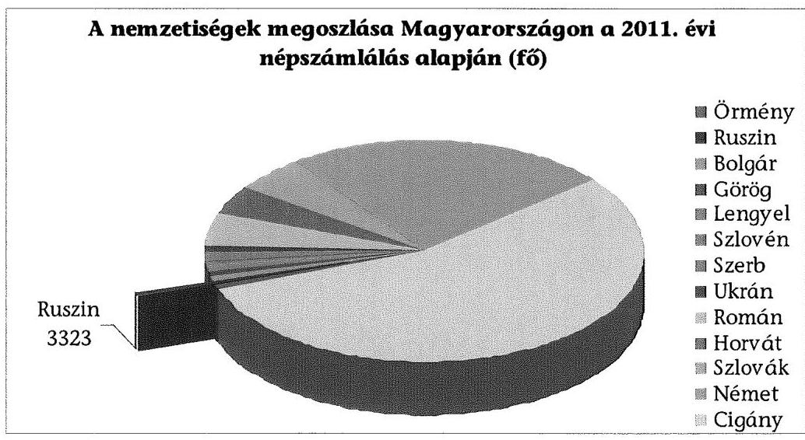
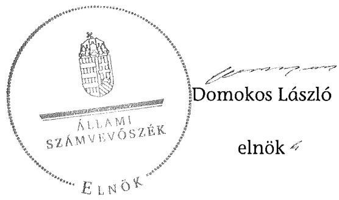

# ÁLLAMI   SZÁMVEVÔSZÉK 

## JELENTÉS

a helyi kisebbségi/nemzetiségi önkormányzatok gazdálkodásának ellenőrzéséről
Fővárosi Ruszin Nemzetiségi Önkormányzat

---

# Állami Számvevőszék 

Iktatószám: V-0057-038-026/2013.
Témaszám: 1068
Vizsgálat-azonosító szám: V06060206

## Az ellenőrzést felügyelte:

Holman Magdolna (2013. május 30-ig)
felügyeleti vezető
Horváth Balázs (2013. május 31-től)
felügyeleti vezető
Az ellenőrzést vezette és az ellenőrzés végrehajtásáért felelős:
Kisgergely István
ellenőrzésvezető
A számvevőszéki jelentést készítették és a jelentés összeállításában közremüködtek:

Huberné Kuncsik Zsuzsanna
számvevő tanácsos
Köllődné Gátai Mária
számvevő
Az ellenőrzést végezte:
Tolnai Lászlóné
számvevő tanácsos

---

# TARTALOMJEGYZÉK 

BEVEZETÉS ..... 7
I. ÖSSZEGZŐ MEGÁLLAPÍTÁSOK, KÖVETKEZTETÉSEK, JAVASLATOK ..... 10
II. RÉSZLETES MEGÁLLAPÍTÁSOK ..... 14

1. A Fővárosi Ruszin Nemzetiségi Önkormányzat és a Fővárosi Önkormányzat együttműködésének szabályozása, a működési feltételek biztosítása ..... 14
2. A Fővárosi Ruszin Nemzetiségi Önkormányzat gazdálkodási feladatai ellátásának szabályszerűsége ..... 16
2.1. A költségvetésre és zárszámadásra, a kincstári adatszolgáltatás rendjére vonatkozó jogszabályi előírások betartása ..... 16
2.2. A Fővárosi Ruszin Nemzetiségi Önkormányzat gazdálkodásának szabályozottsága ..... 17
2.3. Az operatív gazdálkodási jogkörök kialakítása és gyakorlása ..... 18
3. A Fővárosi Ruszin Nemzetiségi Önkormányzattal összefüggő gazdálkodási feladatok belső ellenőrzésének múködése ..... 21
4. A feladatalapú támogatás felhasználása, elszámolása ..... 21
5. A Fővárosi Ruszin Nemzetiségi Önkormányzat feladatellátásának jogszabályi előírásokkal való összhangja ..... 22
FÜGGELÉKEK
6. sz. függelék Értelmező szótár
7. sz. függelék A pénzügyi kontrollok múködésének értékelése

---

.

---

# RÖVIDÍTÉSEK JEGYZÉKE 

## TÖRVÉNYEK

Alaptörvény
Áht. 1
Áht. 2
ÁSZ tv.
Knytá. tv.

Nek. ${ }_{1}$ tv.
Nek. ${ }_{2}$ tv.
Ptk.
Számv. tv.
RENDELETEK
Áhsz.

Ámr.
Ávr.

Ber.

Bkr.
fővárosi önkormányzati SZMSZ
támogatási kormányrendelet

Magyarország Alaptörvénye, kihirdetve 2011. április 25én
az államháztartásról szóló 1992. évi XXXVIII. törvény, hatályos 2011. december 31-ig
az államháztartásról szóló 2011. évi CXCV. törvény, hatályos 2011. december 31-étől
az Állami Számvevőszékről szóló 2011. évi LXVI. törvény, hatályos 2011. július 1-jétől
a közpénzekből nyújtott támogatások átláthatóságáról szóló 2007. évi CLXXXI. törvény, hatályos 2008. április 1től
a nemzeti és etnikai kisebbségek jogairól szóló 1993. évi LXXVII. törvény, hatályos 2011. december 31-ig
a nemzetiségek jogairól szóló 2011. évi CLXXIX. törvény, hatályos 2011. december 20-tól
a Polgári Törvénykönyvről szóló 1959. évi IV. törvény
a számvitelről szóló 2000 . évi C. törvény
az államháztartás szervezetei beszámolási és könyvvezetési kötelezettségének sajátosságairól szóló 249/2000. (XII. 24.) Korm. rendelet
az államháztartás múködési rendjéről szóló 292/2009. (XII. 19.) Korm. rendelet, hatályos 2011. december 31-ig
az államháztartásról szóló törvény végrehajtásáról szóló 368/2011. (XII. 31.) Korm. rendelet, hatályos 2012. január 1-jétől
a költségvetési szervek belső ellenőrzéséről szóló 193/2003. (XI. 26.) Korm. rendelet, hatályos 2011. december 31-ig
a költségvetési szervek belső kontrollrendszeréről és belső ellenőrzéséről szóló 370/2011. (XII. 31.) Korm. rendelet, hatályos 2012. január 1-jétől
Budapest Főváros Önkormányzat Közgyűlésének 55/2010. (XII. 9.) önkormányzati rendelete Budapest Főváros Önkormányzata Közgyűlésének Szervezeti és Múködési Szabályzatáról, hatályos 2011. január 1-jétől
a kisebbségi önkormányzatoknak a központi költségvetésből, valamint fejezeti kezelésű előirányzatból nyújtott támogatások feltételrendszeréről és elszámolásának rendjéről szóló 342/2010. (XII. 28.) Korm. rendelet (hatályon kívül helyezte a 28/2012. (III. 6.) Korm. rendelet a nemzetiségi célú előirányzatokból nyújtott támogatások feltételrendszeréről és elszámolásának rendjéről; jelenleg hatályos a 428/2012. (XII. 29.) Korm. rendelet a nemzetiségi

---

## SZÓRÖVIDÍTÉSEK

ÁSZ
együttmúködési megállapodás
ellenőrzési nyomvonal
föjegyzö
főpolgármester
Főpolgármesteri Hivatal
Főpolgármesteri Hivatal ügyrendje
Fővárosi Önkormányzat
FRNÖ

Képviselő-testület

Kincstár
kockázatkezelési szabályzat

Kontrolling Osztály vezetője
Közgyűlés
leltározási szabályzat
pénzgazdálkodási szabályzat $_{1}$
pénzgazdálkodási szabályzat ${ }_{2}$
pénzkezelési szabályzat
célú előirányzatokból nyújtott támogatások feltételrendszeréről és elszámolásának rendjéről

Állami Számvevőszék
Budapest Főváros Önkormányzata és a Fővárosi Ruszin Kisebbségi Önkormányzat által kötött együttmúködési megállapodás, hatályos 2007. november 27 -től
Budapest Főváros Önkormányzat Főpolgármesteri Hivatal Pénzügyi Főosztály Pénzügyi és Számviteli Osztály ellenőrzési nyomvonala
Budapest Főváros Önkormányzatának Főjegyzője
Budapest Főváros Önkormányzatának Főpolgármestere
Budapest Főváros Önkormányzata Főpolgármesteri Hivatala
A főpolgármester és a főjegyző 505/2011. számú együttes utasítása a Főpolgármesteri Hivatal Úgyrendjéről
Budapest Főváros Önkormányzata
Fővárosi Ruszin Kisebbségi Önkormányzat, névváltozás 2012. január 26-tól Fővárosi Ruszin Nemzetiségi Önkormányzat
A Nek. ${ }_{1}$ tv. 30/E. § (1) bekezdése alapján az FRNÖ Képvi-selő-testülete 2011. december 31-ig, illetve a Nek. ${ }_{2}$ tv. 76. § (3) bekezdése alapján az FRNÖ Közgyűlése 2012. január 1-jétől. Az FRNÖ 2012-ben, az új törvény hatálybalépésével nem változtatta meg a képviselő-testülete elnevezését közgyűlésre, ezért a teljes ellenőrzött időszakra a Képvise-lő-testület elnevezést alkalmazzuk.
Magyar Államkincstár
A főpolgármester és a főjegyzö 11/2011. számú együttes intézkedése Budapest Főváros Önkormányzat Főpolgármesteri Hivatal kockázatkezelési szabályzatáról
Budapest Főváros Főpolgármesteri Hivatal Pénzügyi Főosztály Kontrolling Osztályának vezetője
Budapest Főváros Önkormányzatának Közgyűlése
Budapest Főváros Önkormányzata Főpolgármesteri Hivatal leltározási és leltárkészítési szabályzata
Budapest Főváros főpolgármesterének és főjegyzőjének 506/2011. számú együttes intézkedése a Főpolgármesteri Hivatal pénzgazdálkodásával kapcsolatos kötelezettségvállalás, utalványozás, ellenjegyzés, érvényesítés rendjéről, és a szakmai teljesítés igazolásáról
Budapest Főváros Főjegyzöjének 510/2012. számú intézkedése a Főpolgármesteri Hivatal pénzgazdálkodásával kapcsolatos kötelezettségvállalás, pénzügyi ellenjegyzés, utalványozás, érvényesítés és a teljesítésigazolás rendjéről Budapest Főváros Önkormányzata Főpolgármesteri Hivatalának pénz- és értékkezelési szabályzata

---

| Pénzügyi Főosztály | Budapest Főváros Önkormányzata Főpolgármesteri Hivatalának Pénzügyi Főosztálya |
| :--: | :--: |
| RUKE | Ruszin Kulturális Egyesület |
| RUISZ | Ruszinok Ifjúsági Szervezete |
| szabálytalanságkezelési   szabályzat | A főpolgármester és a főjegyző 12/2011. számú együttes intézkedése Budapest Főváros Önkormányzata Főpolgármesteri Hivatalában a szabálytalanságok kezelésének rendjéről |
| számviteli politika | Budapest Főváros Főjegyzójének 568/2007. számú intézkedése Budapest Főváros Önkormányzata Főpolgármesteri Hivatala számviteli politikájáról és számlarendjéről |
| Támogató   új együttmúködési megállapodás | Közigazgatási és Igazságügyi Minisztérium   Budapest Főváros Önkormányzata és a Fővárosi Ruszin Nemzetiségi Önkormányzat által kötött együttmúködési megállapodás, hatályos 2012. december 15 -től |

---

.

---

# JELENTÉS 

## a helyi kisebbségi/nemzetiségi önkormányzatok gazdálkodásának ellenőrzéséről Fővárosi Ruszin Nemzetiségi Önkormányzat

## BEVEZETÉS

Az Alaptörvény szerint a Magyarországon élő nemzetiségek államalkotó tényezők. Minden valamely nemzetiséghez tartozó magyar állampolgárnak joga van önazonossága szabad vállalásához és megőrzéséhez. A Magyarországon élő nemzetiségeknek joguk van az anyanyelv használathoz, a saját nyelven való egyéni és közösségi névhasználathoz, saját kultúrájuk ápolásához és az anyanyelvű oktatáshoz. Az Alaptörvény alapján az országban élő nemzetiségek helyi és országos önkormányzatokat hozhatnak létre. A helyi nemzetiségi önkormányzatok lehetnek települési és területi nemzetiségi önkormányzatok. A területi nemzetiségi önkormányzat testülete a Nek. 1 tv. alapján 2011. év végéig a Képviselő-testület, 2012. január 1-jétől a Nek. 2 tv. alapján a közgyűlés.

A 2011. évben a valamelyik nemzetiséghez tartozók aránya az összlakosságon belül $5,6 \%$ volt, amelynek nemzetiségek szerinti megoszlását az alábbi diagram szemlélteti:

1. számú diagram

Forrás: KSH
A Fővárosban a 2011. évben megtartott kisebbségi önkormányzati választásokat követően 11 területi kisebbségi/nemzetiségi önkormányzat alakult meg, köztük a Fővárosi Ruszin Nemzetiségi Önkormányzat (FRNÖ). A Nek. 2 tv. alap-

---

ján a helyi önkormányzat biztosítja a nemzetiségi önkormányzati múködés személyi és tárgyi feltételeit, amelyeket megállapodásban szabályoznak. A helyi nemzetiségi önkormányzatok gazdálkodására és támogatási rendszerére, valamint a gazdálkodási feladataikat ellátó helyi önkormányzatokkal kötendő együttműködésre vonatkozó jogszabályok a 2010-2012. években jelentős változásokon mentek át, amelyek érintették a feladatalapú támogatásra fordítható költségvetési keret megállapítását, az operatív gazdálkodási jogkörök szabályozását, az elkülönített könyvvezetés alkalmazását és a belső ellenőrzés szabályozását.

Az ellenőrzés célja annak értékelése volt, hogy az FRNÖ gazdálkodási kereteinek kialakítása, gazdálkodása és feladatellátása megfelelt-e a hatályos jogszabályoknak. Ennek keretében ellenőriztük, hogy:

- az FRNÖ és a Fővárosi Önkormányzat együttműködésének szabályozása, a Fővárosi Önkormányzat SZMSZ-ében, a megállapodásban előírt működési feltételek biztosítása megfelelt-e a jogszabályi előírásoknak;
- a felek együttműködése megfelelt-e a megállapodásnak a gazdálkodási feladatok szabályszerű ellátásában, ennek keretében betartották-e az FRNÖ gazdálkodásához kapcsolódóan a költségvetésre és zárszámadásra, a gazdálkodás szabályozására és az operatív gazdálkodási jogkörök gyakorlására vonatkozó jogszabályi előírásokat;
- a főjegyző biztosította-e a Főpolgármesteri Hivatal belső ellenőrzése keretében az FRNÖ-vel összefüggő gazdálkodási feladatok belső ellenőrzését;
- a feladatalapú támogatás felhasználása, a folyósított feladatalapú támogatással történő elszámolás az előírásoknak megfelelő volt-e;
- az FRNÖ feladatellátása összhangban volt-e a vonatkozó jogszabályi előírásokkal.

Az ellenőrzés típusa: szabályszerűségi ellenőrzés
Az ellenőrzött időszak: a 2011. január 1. és 2012. június 30. közötti időszak.
Ellenőrzött szervezet: Fővárosi Ruszin Nemzetiségi Önkormányzat és a gazdálkodási feladatait ellátó Fővárosi Önkormányzat.

Az ellenőrzés végrehajtásának jogszabályi alapját az ÁSZ tv. 5. § (2)-(3) és (6) bekezdéseiben foglaltak képezik.

Az ellenőrzés szakmai módszertana az ÁSZ hivatalos honlapján (www.asz.hu) közzétett szakmai szabályokon alapult, amely a Legfőbb Ellenőrző Intézmények Nemzetközi Szervezete (INTOSAI) által kiadott nemzetközi standardok (ISSAI) figyelembevételével készült.

A fogalmak magyarázatát az 1. számú függelék, a pénzügyi folyamatokban kulcsszerepet betöltő kontrollok működése értékelésénél alkalmazott minősítési szempontokat a 2. számú függelék tartalmazza. Az ÁSZ az ellenőrzés megállapításait az ellenőrzött időszakban hatályos, az intézkedést igénylő megállapítá-

---

sokra tett javaslatokat a jelenleg hatályos jogszabályok alapján fogalmazta meg.

Az FRNÖ gazdálkodásának ellenőrzése során értékeltük az FRNÖ és a Fővárosi Önkormányzat együttmúködését, a gazdálkodás szabályozottságát. Értékeltük a pénzügyi folyamatokban kulcsszerepet betöltő belső kontrollok (2011-ben a kötelezettségvállalás ellenjegyzése, a szakmai teljesítésigazolás és az utalvány ellenjegyzése, 2012. január 1-jétől a pénzügyi ellenjegyzés, a teljesítésigazolás és az érvényesítés) múködésének megfelelőségét az államháztartáson belülre és kívülre teljesített múködési célú pénzeszköz átadásoknál, a dologi és egyéb folyó kiadásoknál. Az ÁSZ a pénzügyi folyamatokban kulcsszerepet betöltő belső kontrollok múködésére vonatkozó megállapításokat a statisztikai mintavétellel kiválasztott bizonylatok elemzése alapján fogalmazta meg. Az alkalmazott módszer biztosítja, hogy a vizsgált kiadásoknál múködő kontrollok ellenőrzésének tapasztalatai alapján általános következtetést vonjunk le az ellenőrzött területekhez kapcsolódó kifizetések kulcskontrolljainak múködésére vonatkozóan. Értékeltük az FRNÖ-vel összefüggő gazdálkodási feladatokra vonatkozó belső ellenőrzés szabályozottságát, múködését, a feladatalapú támogatás felhasználását, valamint az FRNÖ feladatellátása és jogszabályi előírások összhangját. A fővárosi nemzetiségi önkormányzatok gazdálkodását, költségvetési támogatásának szabályszerű felhasználását az ÁSZ még nem vizsgálta.

Az ellenőrzés lefolytatásához az FRNÖ, valamint a gazdálkodási feladatait ellátó Fővárosi Önkormányzat tanúsítványok és a kapcsolódó dokumentumok megküldésével, rendelkezésre bocsátásával szolgáltatott adatokat. A tanúsítványokban szerepeltetett adatok, információk ellenőrzése és az eltérések megállapítása a helyszíni ellenőrzés keretében történt. A pénzügyi folyamatokban kulcsszerepet betöltő belső kontrollok megfelelőségének értékeléséhez az FRNÖ 2011. évi és 2012. I. félévi könyvelési adatállományából a múködési célú pénzeszközátadások esetében tételesen, a dologi és egyéb folyó kiadásokkal kapcsolatos kifizetéseknél véletlen mintavételi eljárással választottuk ki az ellenőrizendő tételeket.

Az FRNÖ 1999. március 10-től kezdte meg múködését, az FRNÖ hét tagú Képvi-selő-testülete egy állandó bizottságot hozott létre. Az önkormányzat neve 2012ben a Fővárosi Ruszin Kisebbségi Önkormányzat megnevezésről a Fővárosi Ruszin Nemzetiségi Önkormányzat névre változott. Az önkormányzat elnöke a 2010. évi önkormányzati választások óta tölti be tisztségét. Az FRNÖ költségvetési intézményt, gazdasági társaságot nem hozott létre, 2000-ben RUISZ néven civil szervezetet alapított.

Az FRNÖ múködéséhez és feladatellátásához a 2011. évben a költségvetési forrásból összesen 10390 ezer Ft támogatást kapott. Az FRNÖ 2011. évi zárszámadási határozata szerint 10982 ezer Ft költségvetési bevételt ért el, 9690 ezer Ft költségvetési kiadást teljesített.

Az ÁSZ tv. 29. § (1) bekezdése szerint a jelentéstervezetet megküldtük a főpolgármester, a főjegyző és az FRNÖ elnöke részére, akik az ÁSZ tv. 29. § (2) bekezdésében foglalt észrevételezési jogukkal nem éltek, a jelentéstervezetre észrevételt nem tettek.

---

# I. ÖSSZEGZŐ MEGÁLLAPÍTÁSOK, KÖVETKEZTETÉSEK, JAVASLATOK 

Az FRNÖ és a Fővárosi Önkormányzat 2007-ben kötött együttmúködési megállapodást az FRNÖ költségvetésével és gazdálkodásával kapcsolatos feladatok ellátására. Az együttmúködési megállapodást 2011-ben felülvizsgálta a főjegyző, annak módosítására nem került sor. Az együttmúködési megállapodás az ellenőrzött időszakban az Áht. ${ }_{1,2}$, a Nek. ${ }_{1,2}$ tv., az Ámr. és az Ávr. szerint meghatározott múködési és gazdálkodási feladatok ellátásának feltételeit részben tartalmazta. A 2011. évben a költségvetési koncepció, illetve a költségvetés elkészítésének, elfogadásának feladataival kapcsolatos határidőket az Ámr.ben előírtak ellenére nem rögzítették. A Nek. ${ }_{2}$ tv.-ben előírt határidőig új megállapodást nem kötöttek ${ }^{1}$.

A 2012. június 30 -án hatályos együttműködési megállapodás az Áht. ${ }_{2}$ előírása ellenére nem tartalmazta az FRNÖ bevételeivel és kiadásaival kapcsolatos ellenőrzési, finanszírozási, adatszolgáltatási és beszámolási feladatok ellátásának részletes szabályait. A Nek. ${ }_{2}$ tv.-ben előírtak ellenére nem rögzítették a főjegyzőnek, vagy megbízottjának részvételét az FRNÖ képviselő-testületi ülésein, továbbá a költségvetés készítésével és az adatszolgáltatással kapcsolatos feladatok ellátásának határidejét, a gazdálkodási jogkörök gyakorlásának módosuló szabályait, valamint az FRNÖ múködésére és gazdálkodására vonatkozó eljárási és dokumentációs részletszabályokat.

A fővárosi önkormányzati SZMSZ-ben és a Főpolgármesteri Hivatal ügyrendjében a Nek. ${ }_{1,2}$ tv. előírásainak megfelelően szabályozták az FRNÖ múködésének személyi és tárgyi feltételeit. Az FRNÖ által használt helyiségek fenntartási és múködtetési költségeinek fedezetét a Fővárosi Önkormányzat az éves költségvetési rendeleteiben biztosította.

Az FRNÖ 2011-ben az Ámr.-ben előírt határidőig nem alkotta meg költségvetési határozatát. Az FRNÖ elnöke az Áht. ${ }_{2}$-ben előírt határidőre nem nyújtotta be a Képviselő-testületnek a 2012. évi költségvetési határozat tervezetét. A költségvetési határozatok tartalma nem felelt meg az Ámr. és az Áht. ${ }_{1 / 2}$ elöírásainak, a költségvetés előterjesztésekor nem került bemutatásra az FRNÖ előirányzat-felhasználási terve és költségvetési mérlege, valamint 2011-ben és 2012-ben a költségvetés nem tartalmazta kiemelt előirányzatként a személyi juttatásokat, a munkaadókat terhelő járulékokat és a dologi kiadásokat. Az FRNÖ elnöke a zárszámadási határozat tervezetét az Ámr.-ben előírt határidőben, az Áht. ${ }_{1}$-ben előírt tartalmi követelményeknek megfelelően terjesztette a Képviselő-testület elé, amelyet az határozatával elfogadott.

A főjegyző 2012-ben - az Ávr. előírásának ellenére - az előírt határidőn túl teljesítette a jóváhagyott elemi költségvetésre, illetve a költségvetési év első három

[^0]
[^0]:    ${ }^{1}$ Az FRNÖ és a Fővárosi Önkormányzat a Nek. ${ }_{2}$ tv.-ben előírt új együttmúködési megállapodást az előírt határidőn túl, 2012. december 15 -én kötötte meg.

---

és első hat hónapjáról szóló időközi költségvetési és mérlegjelentésre vonatkozó adatszolgáltatási kötelezettségét. Az Áhsz.-ben foglaltakat betartva a féléves költségvetési beszámolóra vonatkozó adatszolgáltatási kötelezettségét az előírt határidőn belül teljesítette, azonban papír alapon - a Kincstár tájékoztatása miatt - késve nyújtotta be.

A Főpolgármesteri Hivatal az ellenőrzött időszakban a saját gazdálkodási szabályzatainak (számviteli politika és a kapcsolódó számlarend, eszközök és források leltározási és leltárkészítési szabályzata, eszközök és források értékelési szabályzata, pénzkezelési szabályzat) előírásait alkalmazta az FRNÖ gazdálkodására is. A Főpolgármesteri Hivatal a gazdálkodási szabályzatait a Számv. tv. előírása ellenére a 2012. évben nem aktualizálta.

Az FRNÖ tekintetében az operatív gazdálkodási jogkörök kialakítása az ellenőrzött időszakban megfelelt az Áht. ${ }_{1,2}$ az Ámr., valamint az Ávr. előírásainak. Az ellenőrzött időszakban az írásbeli kötelezettségvállalásokról vezetett nyilvántartások - az Ámr. és az Ávr. előírásai ellenére - nem tartalmazták a kötelezettségvállalás azonosító számát, a kötelezettségvállalást tanúsító dokumentum megnevezését, iktatószámát, keltét, a kötelezettségvállaló nevét, a kifizetési határidőket és a kifizetések jogosultjait.

A pénzügyi folyamatokban kulcsszerepet betöltő belső kontrollok működésének megfelelősége a 2011. évben és 2012. I. félévében az államháztartáson kívülre teljesített múködési célú pénzeszközátadások, valamint a dologi és egyéb folyó kiadások kifizetése során összességében gyenge volt. A hibák száma a lényegességi szintet, a kritikus hibahatárt elérte. A 2011. évben a kötelezettségvállalás ellenjegyzője - az Ámr.-ben előírtak ellenére - nem látta el feladatát, mivel nem tüntette fel a kötelezettségvállalás dátumát, illetve nem észrevételezte, hogy a múködési célú pénzeszközátadásnál nem tartották be a Knytá. tv. előírásait. A szakmai teljesítés igazolója - az Ámr. előírása ellenére - nem ellenőrizte a kifizetés összegszerűségét és nem észrevételezte a szabálytalan kifizetést. Az utalvány ellenjegyzője nem tartotta be az Ámr. előírását, mivel nem jelezte az utalványozónak az érvényesítés hiányát, valamint a megrendelésben és a számlában szereplő összeg közötti eltérést. A 2012. I. félévben a teljesítés igazolója feladatát nem látta el, az Áht. ${ }_{2}$ előírása ellenére teljesítésigazolás nélküli kifizetés történt, valamint az érvényesítő - az Ávr. előírása ellenére - nem jelezte az utalványozónak a megelőző ügymenetben a gazdálkodási szabályok megsértését. A számvevőszéki ellenőrzés a kifizetések dokumentumainak ellenőrzése alapján 2011-ben 260 ezer Ft támogatás szabálytalan kifizetését állapította meg.

A Fővárosi Önkormányzat 2011-2012. évi ellenőrzési tervéhez készült kockázatelemzés - a Ber. előírása ellenére - nem terjedt ki a Főpolgármesteri Hivatalban a nemzetiségi önkormányzatok gazdálkodásával összefüggő végrehajtási feladatok ellátására. A főjegyző a Főpolgármesteri Hivatal belső ellenőrzése keretében - a Ber., valamint a Bkr. előírásai ellenére - nem biztosította a Főpolgármesteri Hivatalban az FRNÖ gazdálkodásával összefüggő végrehajtási feladatok ellátásának belső ellenőrzését, 2011-ben és 2012. I. félévében erre irányuló ellenőrzést nem terveztek és nem hajtottak végre.

---

Az FRNÖ a részére 2011-ben folyósított feladatalapú támogatást - az ellenőrzés számára készített kimutatás és a rendelkezésre bocsátott dokumentumok alapján - 2012. június 30 -ig a támogatási kormányrendelet előírásainak megfelelően teljes egészében felhasználta. A támogatási kormányrendelet előírásai szerint az FRNÖ részére 2011. augusztus hónapban egy összegben utalta át a Kincstár a feladatalapú támogatást ( 1470 ezer Ft). A 2011. évben folyósított feladatalapú támogatás elszámolása - az Áht. ${ }_{1}$ előírása ellenére - nem történt meg. A támogatás felhasználását az ellenőrzésre jogosult szervek nem ellenőrizték.

Az FRNÖ feladatellátásának tárgya 2011-ben, valamint 2012. I. félévben összhangban volt a Nek. ${ }_{1,2}$ tv.-ben foglalt előírásokkal, a hagyományápolás és közművelődés területén látott el feladatokat.

Az ellenőrzés megállapításai alapján, az észrevételezésre megküldött jelentéstervezetben az FRNÖ gazdálkodásával kapcsolatban intézkedést igénylő megállapításokat és javaslatokat fogalmaztunk meg, amelyek végrehajtásáról az ellenőrzés időszakában intézkedési tájékoztatást adott a főjegyző és az FRNÖ elnöke. A 2012. december 15 -én megkötött hatályos együttmúködési megállapodásban a Nek. ${ }_{2}$ tv. és az Áht. ${ }_{2}$ vonatkozó előírásait érvényesítették, a tartalmi hiányosságokat megszüntették. A 2013. évi költségvetési határozat Áht. ${ }_{2}$-ben foglalt előírásoknak megfelelő előkészítését, határidőben történő előterjesztését a beküldött dokumentumokkal igazolták. A gazdálkodási feladatok szabályszerű ellátásához 2013. évben új kötelezettségvállalási nyilvántartást vezettek be, amely megfelel az Ávr.-ben előírtaknak. Az operatív gazdálkodás működési hibáinak megelőzése, feltárása és kijavítása érdekében a főjegyző utasításban rendelkezett a kulcsszerepet betöltő kontrollok működési hiányosságainak megszüntetésére. A 2012. évi feladatalapú támogatás felhasználásáról az elszámolást pótlólag elkészítették, amelyet a Képviselő-testület elfogadott. Figyelemmel az ÁSZ ellenőrzés hasznosítására mindezek vonatkozásában intézkedést igénylő megállapítást, javaslatot már nem szerepeltetünk.

Az ÁSZ tv. 33. § (1) bekezdésében foglaltak értelmében az ellenőrzött szervezet vezetője köteles a jelentésben foglalt megállapításokhoz kapcsolódó intézkedési tervet összeállítani, és azt a jelentés kézhezvételétől számított 30 napon belül az ÁSZ részére megküldeni. Amennyiben az intézkedési tervet határidőre nem küldi meg a szervezet, vagy az nem elfogadható, az ÁSZ elnöke az ÁSZ tv. 33. § (3) bekezdés a)-b) pontjaiban foglaltakat érvényesítheti.

# Az ellenőrzés intézkedést igénylő megállapításai és javaslatai: 

## a Fővárosi Ruszin Nemzetiségi Önkormányzat elnökének:

1. A 2011. évben a FRNÖ és a RUKE között létrejött megállapodás alapján a FRNÖ 260 ezer Ft müködési célú támogatást nyújtott az egyesület részére. A támogatás nyújtásával megsértették a Knytá. tv. 6. § (1) bekezdésének a) és e) pontjait, mert olyan egyesület részesült támogatásban, amelynek vezető tisztségviselője részt vett a támogatás nyújtásának döntéshozatalában. Az FRNÖ elnöke egyben a RUKE vezető tisztségviselője is volt.

---

Javaslat:
Tegyen eleget a jövőben a támogatások döntés-előkészítése, illetve a döntéshozatal során a Knytá. tv. 6. § (1) bekezdése a) és e) pontjai előírásainak.

# a főjegyzönek: 

1. A főjegyzö 2012-ben az Ávr. 33. § (1) bekezdésében a jóváhagyott elemi költségvetésre, az Ávr. 169. § (2) bekezdésében, valamint a 170. § (5) bekezdésében a költségvetési év első három és első hat hónapjáról szóló időközi költségvetési és mérlegjelentésre vonatkozó adatszolgáltatási kötelezettségét az előírt határidőn túl teljesítette.

Javaslat:
A jövőben a Főpolgármesteri Hivatal adatszolgáltatási kötelezettségének az FRNÖ elemi költségvetése esetében az Ávr. 33. § (1) bekezdésében, a költségvetési év első három és első hat hónapjáról szóló időközi költségvetési jelentésre vonatkozóan az Ávr. 169. § (2) bekezdésében, valamint az időközi mérlegjelentés esetében a 170. § (5) bekezdésében előírt határidők betartásával tegyen eleget.
2. A 2012. évben a Főpolgármesteri Hivatal a Számv. tv. 14. § (11) bekezdésében előírtak ellenére a gazdálkodási szabályzatait (számviteli politika és a kapcsolódó számlarend, eszközök és források leltározási és leltárkészítési szabályzata, eszközök és források értékelési szabályzata, pénzkezelési szabályzat) nem aktualizálta.

Javaslat:
Gondoskodjon a Számv. tv. 14. § (11) bekezdésében előírtaknak megfelelően arról, hogy a számviteli politikán és a kapcsolódó szabályzatokon a jogszabályok módosítása miatti változások, azok hatályba lépésétől számított 90 napon belül átvezetésre kerüljenek.

---

# II. RÉSZLETES MEGÁLLAPÍTÁSOK 

## 1. A Fővárosi Ruszin Nemzetiségi Önkormányzat És a Fővá-ROSI ÖNKORMÁNYZAT EGYÜTTMŰKÖDÉSÉNEK SZABÁLYOZÁSA, A MÜKÖDÉSI FELTÉTELEK BIZTOSÍTÁSA

Az FRNÖ és a Fővárosi Önkormányzat együttmúködésének a szabályozására, valamint a múködés Nek. ${ }_{1,2}$ tv.-ben előírt személyi és tárgyi feltételeinek a biztosítására az együttmúködési megállapodásban, a fővárosi önkormányzati SZMSZ-ben és a Főpolgármesteri Hivatal ügyrendjében meghatározottak szerint került sor.

Az FRNÖ a Fővárosi Önkormányzattal a költségvetésével és gazdálkodásával kapcsolatos feladatok ellátására 2007. november 27 -én kötött együttmúködési megállapodást ${ }^{2}$. Az együttmúködési megállapodást 2011-ben a főjegyzö felülvizsgálta, annak módosítására a jogszabályi környezet változatlansága, valamint az FRNÖ alakuló ülésének időpontja ${ }^{3}$ miatt nem került sor 2011. január 15-ig. Az FRNÖ és a Fővárosi Önkormányzat a Nek. ${ }_{2}$ tv. 159. § (3) bekezdésének előirása ellenére az új együttműködési megállapodást 2012. év június 1-ig nem kötötte meg.

Az együttműködési megállapodás az ellenőrzött időszakban az Áht. ${ }_{1,2}$, a Nek. ${ }_{1,2}$ tv., az Ámr. és az Ávr. szerint meghatározott múködési és gazdálkodási feladatok ellátásának feltételeit részben tartalmazta.

A 2011. december 31-én hatályos együttmúködési megállapodás az Ámr. 37. § (4) bekezdésének a)-f) pontjaiban előírtak ellenére nem tartalmazta a költségvetési koncepció és a költségvetés elkészítésének, elfogadásának feladataival kapcsolatos határidőket.

A 2012. I. félévében a 2012. június 30 -án hatályos együttműködési megállapodás nem tartalmazta:

- az Áht. ${ }_{2}$ 27. § (2) bekezdésében előírtak ellenére, az FRNÖ bevételeivel és kiadásaival kapcsolatos ellenőrzési, finanszírozási, adatszolgáltatási és beszámolási feladatok ellátásának részletes szabályait;
- a Nek. ${ }_{2}$ tv. 80. § (3) a) pontjában foglaltak ellenére a költségvetés készítésével és az adatszolgáltatással kapcsolatos feladatok ellátásának határidejét, a 2012. január 1-től hatályos önálló számlanyitás, törzskönyvi nyilvántartás

[^0]
[^0]:    ${ }^{2}$ Az együttműködési megállapodást az FRNÖ 30/2007. (VIII. 6.) számú, a Közgyűlés az 1705/2007. (X. 25.) számú határozatával hagyta jóvá.
    ${ }^{3}$ Az FRNÖ a 2011. évi választásokat követően 2011. január 24-én tartotta alakuló ülését.

---

rendjét, a gazdálkodási jogkörök gyakorlásának módosuló szabályait, a működés feltételeinek és a gazdálkodásnak részletes előírásait ${ }^{4}$;

- a Nek. ${ }_{2}$ tv. 80. § (3) bekezdés d) pontjában foglaltak ellenére az FRNÖ gazdálkodására vonatkozó eljárási és dokumentációs részletszabályokat;
- a Nek. ${ }_{2}$ tv. 80. § (4) bekezdésében előírtak ellenére azt, hogy a főjegyző vagy annak - a főjegyzővel azonos képesítési előírásoknak megfelelő - megbízottja a Fővárosi Önkormányzat megbízásából és képviseletében részt vesz az FRNÖ képviselő-testületi ülésein és jelzi, amennyiben törvénysértést észlel.

Az együttműködési megállapodás 2012. I. félévében a hatályos jogszabályokkal nem volt összhangban. Az FRNÖ és a Fővárosi Önkormányzat a Nek. ${ }_{2}$ tv. 159. § (3) bekezdésében előírt új együttmüködési megállapodást 2012. december 15 -én kötötte meg ${ }^{5}$.

A fővárosi önkormányzati SZMSZ-ben és a Főpolgármesteri Hivatal ügyrendjében a Nek. ${ }_{1}$ tv. 27. § (1) és a Nek. ${ }_{2}$ tv. 80. § (1) bekezdés előírásainak megfelelően szabályozták az FRNÖ müködésének személyi, tárgyi feltételeit és biztosították az ezekhez kapcsolódó költségek viselését. A Főpolgármesteri Hivatal ügyrendjében ${ }^{6}$ rögzítették, hogy a fővárosi területi nemzetiségi önkormányzatok szakmai, jogi, ügyviteli támogatásával összefüggő feladatokat az Igazgatási és Hatósági Főosztály látja el. A nemzetiségi önkormányzatok gazdálkodási feladatainak ellátását a megbízott dolgozók munkaköri leírásai tartalmazták.

Az FRNÖ és a Fővárosi Önkormányzat 1999. május 1-én helyiséghasználati szerződést kötött, melynek értelmében az FRNÖ müködéséhez ingyenes ingatlanhasználatot biztosított. A helyiséghasználati szerződés a FRNÖ 2011. évi alakulást követő 90. nappal megszűnt, hasonló tartalommal új használati szerződést kötöttek ugyanazon helyiségcsoport használatára 2011. július 8-án². A szerződéssel nem lefedett időszakban változatlan feltételekkel biztosították az FRNÖ számára a helyiséghasználatot. A szerződés alapján az irodafenntartás költségeit - a telefonhasználat költségének kivételével - a Fővárosi Önkormányzat viselte.

Az FRNÖ működésével kapcsolatos postai, kézbesítési, gépelési, sokszorosítási feladatok ellátásával kapcsolatos költségeket az FRNÖ viselte, melyek finanszírozásához a Fővárosi Önkormányzat az éves költségvetési rendeleteiben jóváhagyott összegben járult hozzá.

[^0]
[^0]:    ${ }^{4}$ Az FRNÖ már a 2011. évben rendelkezett önálló bankszámlával, adószámmal, törzskönyvi nyilvántartásba vétele 2002-ben megtörtént.
    ${ }^{5}$ Az új együttmúködési megállapodást a Fővárosi Önkormányzat részéről a fővárosi önkormányzati SZMSZ 7. számú mellékletének XVI. Fejezet 1) pontja alapján átruházott hatáskörben a főpolgármester-helyettes kötötte meg.
    ${ }^{6}$ a Főpolgármesteri Hivatal ügyrendjének 39. § (2) bekezdésének 7) pontja
    ${ }^{7}$ A Közgyűlés Gazdasági Bizottságának 267/2011. (VI.16.) számú határozata.

---

A Fővárosi Önkormányzat az ellenőrzött időszakban a szabályozási hiányosságok ellenére biztosította és folyamatosan fenntartotta az FRNÖ múködésének személyi és tárgyi feltételeit.

# 2. A Fővárosi Ruszin Nemzetiségi Önkormányzat gazdálkoDÁSI FELADATAI ELLÁTÁSÁNAK SZABÁLYSZERÜSÉGE 

### 2.1. A költségvetésre és zárszámadásra, a kincstári adatszolgáltatás rendjére vonatkozó jogszabályi előirások betartása

Az FRNÖ az Ámr. 37. § (3) bekezdésében előírt határidőig ${ }^{8}$ nem alkotta meg a 2011. évi költségvetési határozatát9. Az FRNÖ elnöke az Áht. ${ }_{2}$ 24. § (2) bekezdésében előírt határidőre ${ }^{10}$ nem nyújtotta be a Képviselő-testületnek az FRNÖ 2012. évi költségvetési határozat tervezetét ${ }^{11}$.

A költségvetési határozatok kiadási előirányzatai a 2011. évben az Áht. 69. § (1) bekezdés a) pontjában, és az Ámr. 36. § (1) bekezdés b) pontjában, valamint a 2012. évben az Áht. ${ }_{2}$ 23. § (2) bekezdés a) pontjában foglaltak ellenére nem tartalmazták a múködési költségvetésen belül kiemelt előirányzatként a személyi juttatásokat, a munkaadókat terhelő járulékokat, a dologi kiadásokat.

A 2011. évben a Fővárosi Önkormányzattól és a központi költségvetésből származó bevételi előirányzatait az FRNÖ költségvetésében az Ámr. 81. § (5) bekezdésében előírtak ellenére nem támogatásértékű bevételként, hanem sajátos múködési bevételként szerepeltette. A 2012. évi költségvetési határozatban a bevételek a támogatásértékű működési bevételek között szerepeltek.

A bevételi és kiadási előirányzatok a 2011. és a 2012. években is egyensúlyban voltak.

Az Ámr. 36. § (1) bekezdés i) és k) pontjának előírása ellenére a 2011. évi költségvetési határozat nem tartalmazta a múködési és a felhalmozási célú bevételi és kiadási előirányzatok bemutatását tájékoztató jelleggel mérlegszerűen, egymástól elkülönítetten, valamint az év várható bevételi és kiadási előirányzatainak teljesüléséről készített előirányzat-felhasználási ütemtervet. A 2012. évben a költségvetés előterjesztésekor az Áht. ${ }_{2}$ 24. § (4) bekezdés a) pont előírása ellenére nem került bemutatásra az FRNÖ előirányzat felhasználási terve és a költségvetési mérlege közgazdasági tagolásban.

[^0]
[^0]:    ${ }^{8}$ A helyi kisebbségi önkormányzat költségvetési határozatát tárgy év február 10-ig fogadja el.
    ${ }^{9}$ Az FRNÖ 14/2011. (III. 18.) számú határozatával fogadta el a 2011. évi költségvetését.
    ${ }^{10}$ a központi költségvetésről szóló törvény kihirdetését követő 45. nap
    ${ }^{11}$ Az FRNÖ 9/2012. (II. 23.) számú határozatával fogadta el a 2012. évi költségvetését.

---

Az FRNÖ a 2011. évi költségvetési határozatát négy, a 2012. évi költségvetési határozatát 2012. I. félévében egy alkalommal módosította. A 2011. évre vonatkozóan 2012 januárjában a zárszámadást megelőzően előirányzat-átcsoportosítással biztosították a kiemelt előirányzatok teljesítésének fedezetét.

Az FRNÖ elnöke a zárszámadási határozat tervezetét - az Ámr. 37. § (3) bekezdésében előírt határidőt betartva - 2012. március 14-én terjesztette a Képviselőtestület elé, amelyet az határozatával elfogadott ${ }^{12}$. A zárszámadásról szóló határozat megfelelt az Áht., 69. § (1) bekezdésében előírt tartalmi követelményeknek.

A főjegyzö 2012-ben - a 2012. I. féléves elemi költségvetési beszámolót kivéve - nem teljesítette határidőre az FRNÖ számára előírt kincstári adatszolgáltatást. A főjegyző a 2012. évi elemi költségvetést az Ávr. 33. § (1) bekezdésében előírt határidőn ${ }^{13}$ túl, az Ávr. 169. § (2) bekezdésében foglaltak ellenére az időközi költségvetési jelentést a költségvetési év első három és az első hat hónapjáról késedelemmel küldte meg a Kincstárnak. A 2012. évben az első három és az első hat hónapról szóló időközi mérlegjelentést az Ávr. 170. § (5) bekezdésében megjelölt határidőn túl nyújtotta be.

A Főpolgármesteri Hivatal az FRNÖ 2012. I. féléves költségvetési beszámolóját az Áhsz. 10. § (1) bekezdése szerinti határidőre, 2012. július 31-ig elkészítette, és az Áhsz. 10. § (5a) bekezdésében foglaltakat betartva 2012. augusztus 9-én elektronikus formában, 2012. szeptember 12-én pedig papír alapon nyújtotta be a Kincstárnak.

A főjegyző az FRNÖ papíralapú 2012. I. féléves költségvetési beszámolóját önhibáján kívül késedelmesen adta le, mivel a Kincstár tájékoztatása értelmében arra csak az elektronikusan továbbított beszámoló felülvizsgálatát követően, az erről írásban történő értesítés után volt mód. A Kincstár 2012. szeptember 12-én értesítette a Fővárosi Önkormányzatot arról, hogy az adatszolgáltatása megfelelő.

# 2.2. A Fővárosi Ruszin Nemzetiségi Önkormányzat gazdálkodásának szabályozottsága 

A Főpolgármesteri Hivatal a saját gazdálkodási szabályzatainak (számviteli politika és a kapcsolódó számlarend, eszközök és források leltározási és leltárkészítési szabályzata, eszközök és források értékelési szabályzata, pénzkezelési szabályzat) előírásait alkalmazta az FRNÖ gazdálkodására is.

A Főpolgármesteri Hivatal a gazdálkodási szabályzatait a 2012. évben nem aktualizálta, nem tartotta be a Számv. tv. 14. § (11) bekezdésében előírtakat,

[^0]
[^0]:    ${ }^{12}$ A FRNÖ a 14/2012. (III. 14.) számú határozatával fogadta el a 2011. évi zárszámadását.
    ${ }^{13}$ a 2012. évi költségvetési rendelettervezet Közgyűlés elé terjesztésének határidejét követő harminc nap

---

mely szerint a változásokat azok hatályba lépését követő 90 napon belül kell a számviteli politikán keresztülvezetni.

A Főpolgármesteri Hivatal 2011-ben a pénzgazdálkodási szabályzat ${ }_{2}$-ben az Ámr. 20. § (3) bekezdés a) pontjának megfelelően szabályozta a kötelezettségvállalás ellenjegyzője, a szakmai teljesítésigazoló és az utalvány ellenjegyzője feladatait. A 2012. évben a pénzgazdálkodási szabályzat ${ }_{2}$-ben az Ávr. 13. § (2) bekezdés a) pontjának megfelelően szabályozta a pénzügyi ellenjegyzés, a teljesítésigazolás és az érvényesítés feladatának ellátását.

Az ellenőrzött időszakban az írásbeli kötelezettségvállalásokról vezetett nyilvántartások 2011-ben az Ámr. 75. § (1), valamint 2012. I. félévében az Ávr. 56. § (1) bekezdésében előírtak ellenére, nem tartalmazták a kötelezettségvállalás azonosító számát, a kötelezettségvállalást tanúsító dokumentum megnevezését, iktatószámát, keltét, a kötelezettségvállaló nevét, a kifizetési határidőket és a kifizetés jogosultjait.

A Főpolgármesteri Hivatal 2011-ben az Ámr. 156. § (2)-(3) bekezdésében a 2012. I. félévben a Bkr. 6. § (3)-(4) bekezdésében előírt ellenőrzési nyomvonallal és a szabálytalanságok kezelésének eljárásrendjével rendelkezett. A 2011. évben az Ámr. 157. § (1) bekezdésében, a 2012. I. félévben a Bkr. 7. § (1) bekezdésében előírt kockázatkezelési rendszerre vonatkozó szabályzatot is elkészítették. Az ellenőrzött időszakban a Főpolgármesteri Hivatal ügyrendje tartalmazta az FRNÖ gazdálkodásával kapcsolatos feladatokat, a feladatot ellátó köztisztviselők munkaköri leírásában szerepeltek az azokkal kapcsolatos hatáskörök és felelősségi szabályok, valamint a helyettesítés rendje.

# 2.3. Az operatív gazdálkodási jogkörök kialakítása és gyakorlása 

A 2011. évben az FRNÖ elnöke, valamint az általa írásban felhatalmazott képviselők operatív gazdálkodási jogköreinek gyakorlására irányuló megbízásait (a kötelezettségvállalás, utalványozás, valamint az ellenjegyzés, továbbá a szakmai teljesítésigazolás) a Képviselő-testület is jóváhagyta ${ }^{14}$. A főjegyző az érvényesítés ellátására az Ámr.-ben előírt szakmai végzettséggel rendelkező köztisztviselőket bízott meg, akiknek a 2011. február 1-jétől hatályos munkaköri leírásaiban az elvégzendő feladatot és a helyettesítés rendjét rögzítették. A gazdálkodási jogkörök gyakorlóinak aláírás mintája rendelkezésre állt, a Főpolgármesteri Hivatal gazdasági vezetője ${ }^{15}$ rendelkezett felsőfokú szakképesítéssel.

Az Ávr. 55. § (2) bekezdés g) pontjának előírása alapján 2012. január 1-jétől a pénzügyi ellenjegyzési feladatokat a Képviselő-testület kötelezettségvállalás el-

[^0]
[^0]:    ${ }^{14}$ Az FRNÖ 2011. január 24-i alakuló ülésén és a 2011. február 6.-i ülés a 9/2011., 10/2011. Képviselő-testületi határozatokban döntöttek a gazdálkodási jogkörök gyakorlóinak kijelöléséről.
    ${ }^{15}$ A Főpolgármesteri Hivatal ügyrendjének 22. § (1) bekezdése tartalmazza, hogy a gazdasági vezetőnek a Pénzügyi Főosztály vezetője minősül.

---

lenjegyzésére kijelölt tagjai nem láthatták el ${ }^{16}$. A pénzügyi ellenjegyzést az Ávr.-ben rögzített jogszabályi felhatalmazás alapján a gazdasági vezető gyakorolta, aki maga helyett a 2012. évi pénzgazdálkodási szabályzat ${ }_{2}$-ben foglaltak szerint a pénzügyi ellenjegyzői feladatok ellátására a Kontrolling Osztály vezetőjét jelölte ki 2012. április 30-i hatállyal. Az érvényesítési feladatokat végző köztisztviselők személye 2012. I. félévben nem változott.

Az FRNÖ által az ellenőrzött időszakban teljesített kiadásoknál a kialakított gazdálkodási jogkörök gyakorlásának megfelelőségét a pénzügyi folyamatokban kulcsszerepet betöltő kontrollok múködésének értékelésével minősítettük.

A 2011. évben az államháztartáson belülre és kívülre teljesített támogatás értékű működési kiadás során a kulcskontrollok múködésének megfelelősége összességében gyenge volt, mert:

- a kötelezettségvállalás ellenjegyző̉je jogosultsága és aláírása ellenére nem látta el az Ámr. 74. § (1) bekezdésében előírt feladatát, mert az ellenjegyzés dátumát nem tüntette fel az ellenjegyzés dokumentumán. Az FRNÖ 2011. szeptember 1-jén a RUKE részére megállapodás alapján, a rendelkezésre álló szabad előirányzat terhére kifizetett 260 ezer Ft müködési célú támogatással megsértette a Knytá. tv. 6. § (1) bekezdésének a) és e) pontjait. Az FRNÖ a RUKE-t nem részesíthette volna támogatásban, mivel az FRNÖ elnöke egyben a RUKE vezető tisztségviselője is volt, részt vett a támogatás nyújtásának döntéshozatalában. A kötelezettségvállalás ellenjegyzöje jogosultsága és aláírása ellenére nem tartotta be az Ámr. 74. § (3) bekezdés c) pontjának előírását, mert az ellenjegyzést megelőzően nem győződött meg a kötelezettségvállalásra vonatkozó gazdálkodási szabályok betartásáról, nem észrevételezte, a jogellenes kifizetést;
- a szakmai teljesítés igazolója nem látta el feladatát, mert az Ámr. 76. § (1) bekezdésének előírása ellenére nem ellenőrizte a kiadás teljesítésének jogosságát;
- az utalványok ellenjegyzöje jogosultsága és aláírása ellenére nem tartotta be az Ámr. 79. § (2) bekezdésében előírtakat, mert nem jelezte az utalványozónak, hogy az utalvány ellenjegyzését megelőzően az érvényesítés nem történt meg, továbbá a megelőző ügymenetben nem tartották be a gazdálkodási szabályokat.

A 2011. évben a dologi és egyéb folyó kiadások esetében a 100 ezer Ft alatti kifizetések - a pénzgazdálkodási szabályzat ${ }_{1}$-ben előírtaknak megfelelően - előzetes írásbeli kötelezettségvállalást nem igényeltek. A dologi és egyéb folyó kiadások kifizetése során a kötelezettségvállalás ellenjegyzése, a szakmai teljesítésigazolás és az utalvány ellenjegyzés kulcskontrollok müködésének megfelelősége összességében jó volt. Az ellenőrzés csak eseti hibákat tárt fel:

- a kötelezettségvállalás ellenjegyzöje ellátta az Ámr. 74. § (3) bekezdés a)-c) pontjaiban előírt feladatait;

[^0]
[^0]:    ${ }^{16}$ A pénzügyi ellenjegyzést 2012. január 1-jétől csak az előírt szakképesítéssel rendelkező, a Főpolgármesteri Hivatal állományába tartozó köztisztviselő láthatja el.

---

- a szakmai teljesítés igazolója az Ámr. 76. § (1) bekezdésében előírtakat nem tartotta be, mivel a kiadás teljesítésének összegszerűsége ellenőrzése során nem tárta fel, hogy a megrendelés és a benyújtott számla összege eltért egymástól;
- az utalványok ellenjegyzője nem tartotta be az Ámr. 79. § (2) bekezdésében előírtakat, mert nem győződött meg arról, hogy az utalvány ellenjegyzését megelőzően az érvényesítés megtörtént-e.

A 2011. évben a gazdálkodás folyamatában (az ellenőrzött területeken) a kötelezettségvállalás ellenjegyzése, a szakmai teljesítésigazolás és az utalványozás ellenjegyzés kontrolljainak megbízhatósága összességében gyenge volt. A hibák száma a lényegességi szintet, a kritikus hibahatárt elérte. A kötelezettségvállalás ellenjegyzöje nem tüntette fel az ellenjegyzés dátumát, nem észrevételezte a Knytá. tv. előírásának megsértését, a szakmai teljesítésigazoló nem ellenőrizte a kifizetés jogosságát, valamint a dologi és egyéb folyó kiadás esetében nem jelezte, hogy a megrendelés és a benyújtott számla összege eltért egymástól, az utalvány ellenjegyzóje nem jelezte az érvényesítés hiányát.

A 2012. I. félévben az államháztartáson belülre és kívülre teljesített múködési célú pénzeszközátadások során a pénzügyi ellenjegyzés, teljesítés igazolás és érvényesítés múködésének megfelelősége összességében kiváló volt, a jogszabályi előírásokat betartották.

A 2012. I. félévben a dologi és egyéb folyó kiadások esetében a 100 ezer Ft alatti kifizetések - a pénzgazdálkodási szabályzat ${ }_{2}$-ben előírtaknak megfelelően előzetes írásbeli kötelezettségvállalást nem igényeltek. A dologi és egyéb folyó kiadások kifizetésének ellenőrzése során a kulcskontrollok múködésének megfelelősége összességében gyenge volt, mert:

- a teljesítést igazoló az Ávr. 57. § (1) bekezdésében foglaltak ellenére a kiadások teljesítésének jogosságát, összegszerűségét nem ellenőrizte, az Áht. 2 38. § (1) bekezdésének előírása ellenére kifizetés teljesítésigazolás nélkül történt;
- az érvényesítő - aláírása ellenére - nem végezte el ellenőrzési feladatát, mert az Ávr. 58. § (1) bekezdésében foglaltak ellenére nem kifogásolta, hogy a kiadások esetében - a megelőző ügymenetben - nem történt meg a teljesítésigazolás, és ennek hiányát Ávr. 58. § (2) bekezdésében foglaltat ellenére nem jelezte az utalványozónak.

A 2012 I. félévben a gazdálkodás folyamatában (az ellenőrzött területeken) a pénzügyi ellenjegyzés, teljesítésigazolás és az érvényesítés kulcskontrolljainak megbízhatósága összességében gyenge volt. A hibák száma a lényegességi szintet, a kritikus hibahatárt elérte. A dologi és egyéb folyó kiadások teljesítése során a teljesítésigazoló nem igazolta a kifizetés teljesítésének jogosságát és összegszerűségét, az érvényesítő nem jelezte az utalványozónak a teljesítésigazolás hiányát, valamint azt, hogy a megelőző ügymenetben nem tartották be a gazdálkodási szabályokat.

Az FRNÖ gazdálkodása során 2011-ben, valamint 2012. I. félévben a pénzügyi folyamatokban kulcsszerepet betöltő belső kontrollok múködésében feltárt hiá-

---

nyosságokkal összefüggésben az ellenőrzés az ellenőrzött tételek vonatkozásában a rendelkezésre bocsátott dokumentumok alapján gazdasági kár bekövetkeztére utaló adatot, tényt nem állapított meg.

# 3. A FÖVÁrosi Ruszin Nemzetiségi Önkormányzattal öSSzefüGGŐ GAZDÁLKODÁSI FELADATOK BELSŐ ELLENŐRZÉSÉNEK MÜKÖDÉSE 

A főjegyző a 2011-2012. évi ellenőrzési tervet megalapozó kockázatelemzést - a Ber. 21. § (2) bekezdése ${ }^{17}$ ellenére - nem terjesztette ki a Főpolgármesteri Hivatalban az FRNÖ gazdálkodásával összefüggő végrehajtási feladatok ellátására ${ }^{18}$. Az éves ellenőrzési tervek nem tartalmaztak a Főpolgármesteri Hivatalban, a nemzetiségi önkormányzatok gazdálkodásával összefüggő végrehajtási feladatok ellátására vonatkozó feladatokat. A 2011. évben, illetve 2012. I. félévben ellenőrzést nem terveztek és nem végeztek.

## 4. A feladatalapú támogatás felhasználása, elszámolása

Az FRNÖ a Támogató döntése alapján 2011-ben 1470 ezer Ft feladatalapú támogatást kapott. A folyósított támogatás összegével módosította a 2011. évi költségvetését, megemelte bevételi és kiadási - ezen belül a dologi kiadások elöirányzatát ${ }^{19}$.

A támogatási kormányrendelet 7. § (4) bekezdése tartalmazza, hogy a támogatás tárgyévben fel nem használt része a következő év június 30 -áig kötelezettségvállalással terhelhető. Az FRNÖ-nek 2011. december 31-én fel nem használt maradványa 521 ezer Ft volt.

A 2011.évi feladatalapú támogatást - az ellenőrzés számára készített kimutatás és a rendelkezésre bocsátott dokumentumok alapján - 2012. június 30 -áig a támogatási kormányrendelet előírásainak megfelelően teljes egészében felhasználták.

A 2011. évben folyósított feladatalapú támogatás elszámolása a támogatási kormányrendelet 7. § (2) bekezdésében hivatkozott Áht. ${ }_{1}$-nek „a helyi önkormányzatok elszámolási rendjére vonatkozó rendelkezései alkalmazása" előírása ellenére nem történt meg. A támogatás felhasználását az ellenőrzésre jogosult szervek nem ellenőrizték.

[^0]
[^0]:    ${ }^{17}$ 2012. január 1-jétől a Bkr. 7. § (2) bekezdése
    ${ }^{18}$ A Főpolgármesteri Hivatal Belső Ellenőrzési Osztály vezetőjének nyilatkozata alapján (ikt. szám: FPH006/27-1/2013. január 11.) a fővárosi nemzetiségi önkormányzatok gazdálkodását az összegszerűség (azok mérlegfőösszege az egyéb gazdálkodó szervek költségvetéséhez viszonyítva rendkívül alacsony) miatt nem tartották kockázatosnak.
    ${ }^{19}$ az FRNÖ 52/2011. (XI. 22.) számú határozata

---

# 5. A Fővárosi Ruszin Nemzetiségi Önkormányzat feladATELLÁTÁSÁNAK JOGSZABÁLYI ELŐÍRÁSOKKAL VALÓ ÖSSZHANGJA 

Az FRNÖ feladatellátásának tárgya 2011-ben, valamint 2012. I. félévében összhangban volt a Nek. ${ }_{1,2}$ tv.-ben foglalt előírásokkal, hagyományápolás és közmúvelődés területén látott el nemzetiségi ügyekkel kapcsolatosan feladatokat. Az FRNÖ kapcsolatot tartott a nemzetiségi civil és egyházi szervezetekkel, támogatta a közösségek önszerveződését.

Az FRNÖ az ellenőrzött időszakban hatósági feladatot, illetve 2011. évben közüzemi szolgáltatással összefüggő tevékenységet nem látott el.

Budapest, 2013. /2. hónap 04 ,nap

Függelék: $\quad 2 \mathrm{db}$

---

# ÉRTELMEZŐ SZÓTÁR 

belső ellenőrzés
belső kontrollrendszer
feladatalapú támogatás
együttmúködési megállapodás
kisebbségi önkormányzat

Független, tárgyilagos bizonyosságot adó és tanácsadó tevékenység, amelynek célja, hogy az ellenőrzött szervezet múködését fejlessze és eredményességét növelje, az ellenőrzött szervezet céljai elérése érdekében rendszerszemléletű megközelítéssel és módszeresen értékeli, illetve fejleszti az ellenőrzött szervezet irányítási és belső kontrollrendszerének hatékonyságát (Bkr. 2. § b) pont).
A belső kontrollrendszer a kockázatok kezelése és tárgyilagos bizonyosság megszerzése érdekében kialakított folyamatrendszer, amely azt a célt szolgálja, hogy a müködés és gazdálkodás során a tevékenységeket szabályszerűen, gazdaságosan, hatékonyan, eredményesen hajtsák végre, az elszámolási kötelezettségeket teljesítsék, megvédjék az erőforrásokat a veszteségektől, károktól és nem rendeltetésszerú használattól (az Áht. 2 69. § (1) bekezdéséből levezetett fogalom).
A támogatási évben általános múködési támogatásban részesült, és a Támogatónak a Magyar Államkincstárhoz intézett, a feladatalapú támogatás utalására vonatkozó rendelkező levele keltének időpontjában múködő települési és területi kisebbségi/nemzetiségi önkormányzatoknak az e rendeletben rögzített feltételrendszer alapján nyújtható támogatás, továbbá 2012. március 6 -tól a nemzetiségi önkormányzat által a Nek. 2 tv. szerinti nemzetiségi közfeladatok ellátásához közvetlenül kötődő támogatás (342/2010. (XII. 28.) Korm. rendelet 2. § (2) bekezdés c) pont; 28/2012. (III. 6.) Korm. rendelet 2. § (2) bekezdés b) pont).
Az Áht. 2 27. §. (2) bekezdése előirása alapján a fővárosi nemzetiségi önkormányzat bevételeivel és kiadásaival kapcsolatban a tervezési, gazdálkodási, ellenőrzési, finanszírozási, adatszolgáltatási és beszámolási feladatok ellátásáról a Fővárosi Önkormányzat Főpolgármesteri Hivatala gondoskodik, melynek részletes eljárási és dokumentációs részletszabályait a Nek. 2 tv. 80. § (3)-(4) bekezdésben foglaltak szerinti megállapodásban kell rögzíteni.
A Nek., tv. 6/A. § (1) bekezdésének 2. pontjában meghatározott közszolgáltatási feladatokat ellátó, testületi formában múködő, jogi személyiséggel rendelkező, demokratikus választások útján, külön törvény által meghatározott eljárási rendben létrehozott szervezet, amely a kisebbségi közösséget megillető jogosultságok érvényesítésére, a kisebbségek érdekeinek védelmére és képviseletére, a kisebbségi közügyek települési, területi (megyei, fővárosi) vagy országos szinten történő önálló intézésére jött létre.

---

kisebbségi/nemzetiségi közügy
kulcskontroll
nemzeti és etnikai kisebbség/ nemzetiség
nemzetiségi önkormányzat

A Nek. 1 tv. 6/A. § (1) bekezdésének 1. pontjában és a Nek. 2 tv. 2. § 1. pontjában biztosított egyéni és közösségi jogok érvényesülése, a nemzetiséghez tartozók érdekeinek kifejezésre juttatása - különösen az anyanyelv ápolása, őrzése és gyarapítása, továbbá a nemzetiségek kulturális autonómiájának a nemzetiségi önkormányzatok által történő megvalósítása és megőrzése - érdekében a nemzetiséghez tartozók meghatározott közszolgáltatásokkal való ellátásával, ezen ügyek önálló vitelével és az ehhez szükséges szervezeti, személyi és anyagi feltételek megteremtésével összefüggő ügy. A közhatalmat gyakorló állami és helyi önkormányzati szervekben, továbbá a nemzetiségi önkormányzati szervekben való nemzetiségi képviselethez és mindezek szervezeti, személyi és anyagi feltételeinek biztosításához kapcsolódó ügy.
Az operatív gazdálkodási jogkörök közül 2011-ben a kötelezettségvállalás ellenjegyzése, a szakmai teljesítésigazolás és az utalvány ellenjegyzése, 2012. január 1-jétől a pénzügyi ellenjegyzés, a teljesítésigazolás és az érvényesítés.
A Nek. 1 tv. 1. § (2) bekezdése, valamint a Nek. 2 tv. 1. § (1) bekezdése alapján minden olyan Magyarország területén legalább egy évszázada honos népcsoport, amely az állam lakossága körében számszerú kisebbségben van, tagjai magyar állampolgárok és a lakosság többi részétől saját nyelve és kultúrája, hagyományai különböztetik meg, egyben olyan összetartozás-tudatról tesz bizonyságot, amely mindezek megőrzésére, történelmileg kialakult közösségeik érdekeinek kifejezésére és védelmére irányul.
A Nek. 2 tv. 2. § 2. pontjában meghatározott nemzetiségi közszolgáltatási feladatokat ellátó, testületi formában múködő, jogi személyiséggel rendelkező, demokratikus választások útján e törvény alapján létrehozott szervezet, amely a nemzetiségi közösséget megillető jogosultságok érvényesítésére, a nemzetiségek érdekeinek védelmére és képviseletére, a feladat- és hatáskörébe tartozó nemzetiségi közügyek települési, területi vagy országos szinten történő önálló intézésére jön létre.

---

# A PÉNZÜGYI KONTROLLOK MŰKÖDÉSÉNEK ÉRTÉKELÉSE 

A pénzügyi kontrollok működése megfelelőségének vizsgálatát többlépcsős megfelelőségi tesztek útján, megismételt eljárással, a könyvviteli tételekből vett egyszerű véletlen minta alapján végeztük. A tesztelést az értékelésre kiválasztott két terület - a dologi és egyéb folyó kiadásoknál teljesített kifizetések, az államháztartáson belülre és kívülre, működési és felhalmozási célra teljesített pénzeszközátadások - közül azoknál végeztük el, amelyeknél a mintanagyság egy tételszámot meghaladó volt.

Az ellenőrzés során alkalmazott módszer (többlépcsős megfelelőségi teszt) lényege, hogy a kiválasztott minta ellenőrzését csak addig végezzük, amíg elegendő és megfelelő bizonyítékot nem szerzünk a vizsgált pénzügyi kontroll működésének megfelelő, vagy nem megfelelő voltáról. A megismételt eljárás alkalmazása a szándékolt hatáshoz (törvényes működés, kitűzött célok, teljesítmények elérése, veszteséget okozó kockázatok megelőzése, mérséklése, feltárása) viszonyítva lehetővé teszi a kontrolltevékenységek tényleges hatásának vizsgálatát, ez alapján a működés megfelelősége értékelését. Ennek keretében a számvevő bizonyosságot szerez arról, hogy a rendelkezésre álló szabályozás és dokumentumok alapján a pénzügyi kontrollokhoz szükséges - jogszabályokban előírt - ellenőrzési lépéseket végrehajtották-e.

A tesztek kiértékelése évenkénti bontásban két szinten történt. Először az egyes tevékenységi területekre meghatározott pénzügyi kontrollokat értékeltük, majd általános következtetést vontunk le a pénzügyi kontrollok együttes megfelelősége tekintetében. Az ellenőrzésre kijelölt területek kifizetéseinél a pénzügyi kontrollok múködése „kiváló", „jó" vagy „gyenge" minősítést kaphatott.

Az értékelésnél meghatározott lényegességi szint a könyvelési adatállományból vett mintanagysághoz megadott kritikus hibák száma.

A pénzügyi kontrollok múködését:

- kiválónak értékeltük abban az esetben, ha azok múködése megfelel a hibák megelőzésére és kijavítására meghatározott jogszabályi és helyi szintű szabályozásnak (eseti hibák);
- jónak minősítettük, ha a megállapított kisebb (tolerálható mértékű) hiányosságok nem veszélyeztetik az ellenőrzött területek hibáinak megelőzését és kijavítását (a hibák száma nem érte el a kritikus hibák számát, azaz a lényegességi szintet);
- gyengének értékeltük, amennyiben a kontrollok múködésében előforduló hiányosságok miatt nem biztosított a hibák megelőzése, feltárása, kijavítása (a hibák száma elérte az ellenőrzött tételektől függően megállapított kritikus hibák számát).