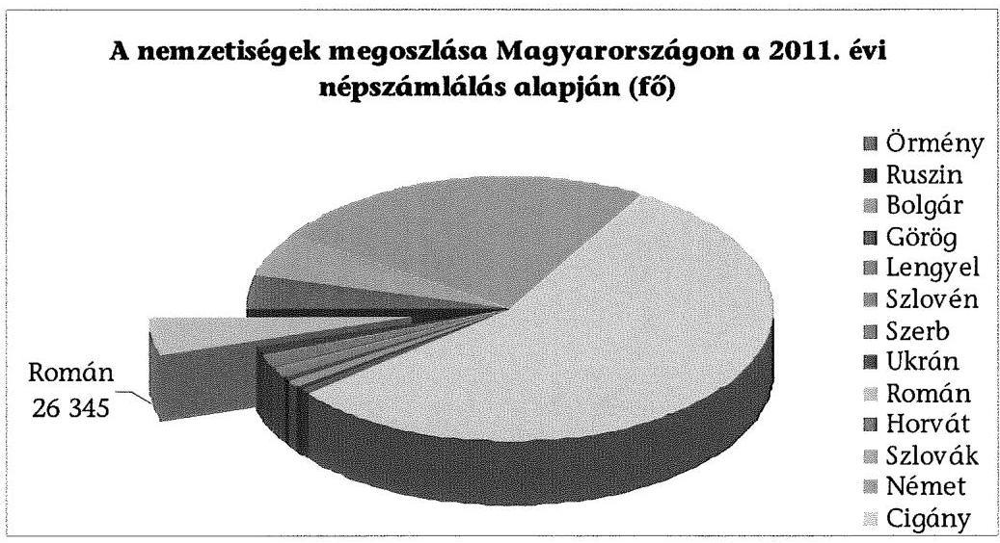
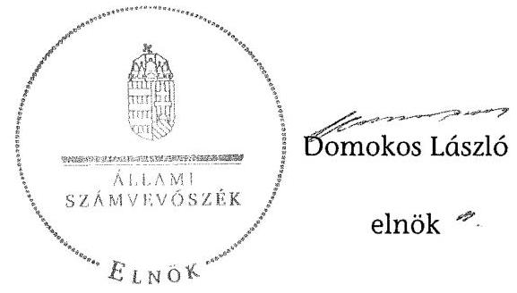

# ÁLLAMI   SZÁMVEVŐSZÉK 

## JELENTÉS

a helyi kisebbségi/nemzetiségi önkormányzatok gazdálkodásának ellenőrzéséről Fővárosi Román Önkormányzat

---

# Állami Számvevőszék 

Iktatószám: V-0057-041-024/2013.
Témaszám: 1068
Vizsgálat-azonosító szám: V06060207

## Az ellenőrzést felügyelte:

Holman Magdolna (2013. május 30-ig)
felügyeleti vezető
Horváth Balázs (2013. május 31-től)
felügyeleti vezető
Az ellenőrzést vezette és az ellenőrzés végrehajtásáért felelős:
Kisgergely István
ellenőrzésvezető
A számvevőszéki jelentést készítették és a jelentés összeállításában közreműködtek:

Huberné Kuncsik Zsuzsanna
számvevő tanácsos
Köllödné Gátai Mária
számvevő
Az ellenőrzést végezte:
Komonszky Krisztina
számvevő

---

# TARTALOMJEGYZÉK 

BEVEZETÉS ..... 7
I. ÖSSZEGZŐ MEGÁLLAPÍTÁSOK, KÖVETKEZTETÉSEK, JAVASLATOK ..... 10
II. RÉSZLETES MEGÁLLAPÍTÁSOK ..... 14

1. A Fővárosi Román Önkormányzat és a Fővárosi Önkormányzat együttműködésének szabályozása, a működési feltételek biztosítása ..... 14
2. A Fővárosi Román Önkormányzat gazdálkodási feladatai ellátásának szabályszerűsége ..... 16
2.1. A költségvetésre és zárszámadásra, a kincstári adatszolgáltatás rendjére vonatkozó jogszabályi előírások betartása ..... 16
2.2. A Fővárosi Román önkormányzat gazdálkodásának szabályozottsága ..... 18
2.3. Az operatív gazdálkodási jogkörök kialakítása és gyakorlása ..... 18
3. A Fővárosi Román Önkormányzattal összefüggő gazdálkodási feladatok belső ellenőrzésének működése ..... 20
4. A feladatalapú támogatás felhasználása, elszámolása ..... 21
5. A Fővárosi Román Önkormányzat feladatellátásának jogszabályi előírásokkal való összhangja ..... 21
FÜGGELÉKEK
6. sz. függelék Értelmező szótár
7. sz. függelék A pénzügyi kontrollok működésének értékelése

---

.

---

# RÖVIDÍTÉSEK JEGYZÉKE 

## TÖRVÉNYEK

Alaptörvény
Áht. 1
Áht. 2
ÁSZ tv.
Nek. ${ }_{1}$ tv.
Nek. ${ }_{2}$ tv.
Számv. tv.
RENDELETEK
Áhsz.

Ámr.
Ávr.

Ber.

Bkr.
fővárosi önkormányzati SZMSZ
támogatási kormányrendelet

## SZÓRÖVIDÍTÉSEK

ÁSZ

Magyarország Alaptörvénye, kihirdetve 2011. április 25-én
az államháztartásról szóló 1992. évi XXXVIII. törvény, hatályos 2011. december 31-ig
az államháztartásról szóló 2011. évi CXCV. törvény, hatályos 2011. december 31-étől
az Állami Számvevőszékről szóló 2011. évi LXVI. törvény, hatályos 2011. július 1-jétől
a nemzeti és etnikai kisebbségek jogairól szóló 1993. évi LXXVII. törvény, hatályos 2011. december 31-ig
a nemzetiségek jogairól szóló 2011. évi CLXXIX. törvény, hatályos 2011. december 20-tól
a számvitelről szóló 2000. évi C. törvény
az államháztartás szervezetei beszámolási és könyvvezetési kötelezettségének sajátosságairól szóló 249/2000. (XII. 24.) Korm. rendelet
az államháztartás működési rendjéről szóló 292/2009. (XII. 19.) Korm. rendelet, hatályos 2011. december 31-ig
az államháztartásról szóló törvény végrehajtásáról szóló 368/2011. (XII. 31.) Korm. rendelet, hatályos 2012. január 1-jétől
a költségvetési szervek belső ellenőrzéséről szóló 193/2003. (XI. 26.) Korm. rendelet, hatályos 2011. december 31-ig
a költségvetési szervek belső kontrollrendszeréről és belső ellenőrzéséről szóló 370/2011. (XII. 31.) Korm. rendelet, hatályos 2012. január 1-jétől
Budapest Főváros Önkormányzata Közgyűlésének 55/2010. (XII. 9.) önkormányzati rendelete Budapest Főváros Önkormányzata Közgyűlésének Szervezeti és Működési Szabályzatáról, hatályos 2011. január 1-jétől
a kisebbségi önkormányzatoknak a központi költségvetésből, valamint fejezeti kezelésű előirányzatból nyújtott támogatások feltételrendszeréről és elszámolásának rendjéről szóló 342/2010. (XII. 28.) Korm. rendelet (hatályon kívül helyezte a 28/2012. (III. 6.) Korm. rendelet a nemzetiségi célú előirányzatokból nyújtott támogatások feltételrendszeréről és elszámolásának rendjéről; jelenleg hatályos a 428/2012. (XII. 29.) Korm. rendelet a nemzetiségi célú előirányzatokból nyújtott támogatások feltételrendszeréről és elszámolásának rendjéről)

Állami Számvevőszék

---

együttműködési megállapodás
ellenőrzési nyomvonal
főjegyző
főpolgármester
Főpolgármesteri Hivatal
Főpolgármesteri Hivatal ügyrendje

Fővárosi Önkormányzat FRÖ
Képviselő-testület

Kincstár
kockázatkezelési szabályzat

Kontrolling Osztály vezetője
Közgyűlés
leltározási szabályzat
pénzgazdálkodási szabályzat ${ }_{1}$
pénzgazdálkodási szabályzat ${ }_{2}$
pénzkezelési szabályzat
Pénzügyi Főosztály
szabálytalanságkezelési szabályzat

Budapest Főváros Önkormányzata és a Fővárosi Román Önkormányzat által kötött együttműködési megállapodás, hatályos 2007. november 27-től
Budapest Főváros Önkormányzat Főpolgármesteri Hivatal Pénzügyi Főosztály Pénzügyi és Számviteli Osztály ellenőrzési nyomvonala
Budapest Főváros Önkormányzatának Főjegyzője
Budapest Főváros Önkormányzatának Főpolgármestere
Budapest Főváros Önkormányzata Főpolgármesteri Hivatala
A főpolgármester és a főjegyző 505/2011. számú együttes utasítása a Főpolgármesteri Hivatal Ügyrendjéről, hatályos 2011. január 15-től
Budapest Főváros Önkormányzata
Fővárosi Román Önkormányzat
A NEK. ${ }_{1}$ tv. 30/E. § (1) bekezdése alapján az FRÖ Képviselő-testülete 2011. december 31-ig, illetve a Nek. ${ }_{2}$ tv. 76. § (3) bekezdése alapján az FRÖ Közgyűlése 2012. január 1-jétől. Az FRÖ 2012-ben, az új törvény hatálybalépésével nem változtatta meg a Képviselő-testülete elnevezését közgyűlésre, ezért a teljes ellenőrzött időszakra a Képviselő-testület elnevezést alkalmazzuk.
Magyar Államkincstár
A főpolgármester és a főjegyző 11/2011. számú együttes intézkedése Budapest Főváros Önkormányzat Főpolgármesteri Hivatal kockázatkezelési szabályzatáról
Budapest Főváros Főpolgármesteri Hivatal Pénzügyi Főosztály Kontrolling Osztályának vezetője
Budapest Főváros Önkormányzatának Közgyűlése
Budapest Főváros Önkormányzata Főpolgármesteri Hivatal leltározási és leltárkészítési szabályzata
Budapest Főváros főpolgármesterének és főjegyzőjének 506/2011. számú együttes intézkedése a Főpolgármesteri Hivatal pénzgazdálkodásával kapcsolatos kötelezettségvállalás, utalványozás, ellenjegyzés, érvényesítés rendjéről, és a szakmai teljesítés igazolásáról
Budapest Főváros Főjegyzőjének 510/2012. számú intézkedése a Főpolgármesteri Hivatal pénzgazdálkodásával kapcsolatos kötelezettségvállalás, pénzügyi ellenjegyzés, utalványozás, érvényesítés és a teljesítésigazolás rendjéről
Budapest Főváros Önkormányzata Főpolgármesteri Hivatalának pénz- és értékkezelési szabályzata
Budapest Főváros Önkormányzata Főpolgármesteri Hivatalának Pénzügyi Főosztálya
A főpolgármester és a főjegyző 12/2011. számú együttes intézkedése Budapest Főváros Önkormányzata Főpolgármesteri Hivatalában a szabálytalanságok kezelésének rendjéről

---

számviteli politika

Támogató

Budapest Főváros Főjegyzőjének 568/2007. számú intézkedése Budapest Főváros Önkormányzata Főpolgármesteri Hivatala számviteli politikájáról és számlarendjéről Közigazgatási és Igazságügyi Minisztérium

---

.

---

# JELENTÉS   a helyi kisebbségi/nemzetiségi önkormányzatok gazdálkodásának ellenőrzéséről Fővárosi Román Önkormányzat 

## BEVEZETÉS

Az Alaptörvény szerint a Magyarországon élő nemzetiségek államalkotó tényezők. Minden, valamely nemzetiséghez tartozó magyar állampolgárnak joga van önazonossága szabad vállalásához és megőrzéséhez. A Magyarországon élő nemzetiségeknek joguk van az anyanyelv használatához, a saját nyelven való egyéni és közösségi névhasználathoz, saját kultúrájuk ápolásához és az anyanyelvű oktatáshoz. Az Alaptörvény alapján az országban élő nemzetiségek helyi és országos önkormányzatokat hozhatnak létre. A helyi nemzetiségi önkormányzatok lehetnek települési és területi nemzetiségi önkormányzatok. A területi nemzetiségi önkormányzat testülete a Nek. tv. alapján 2011. év végéig a Képviselő-testület, 2012. január 1-jétől a Nek. ${ }_{2}$ tv. alapján a közgyűlés.

A 2011. évben a valamelyik nemzetiséghez tartozók aránya az összlakosságon belül 5,6% volt, amelynek nemzetiségek szerinti megoszlását az alábbi diagram szemlélteti:

1. számú diagram

## Forrás: KSH

A Fővárosban a 2011. évben megtartott kisebbségi önkormányzati választásokat követően 11 területi kisebbségi/nemzetiségi önkormányzat alakult meg, köztük a Fővárosi Román Önkormányzat (FRÖ). A Nek. ${ }_{2}$ tv alapján a helyi ön-

---

kormányzat biztosítja a nemzetiségi önkormányzati működés személyi és tárgyi feltételeit, amelyeket megállapodásban szabályoznak. A helyi nemzetiségi önkormányzatok gazdálkodására és támogatási rendszerére, valamint a gazdálkodási feladataikat ellátó helyi önkormányzatokkal kötendő együttműködésre vonatkozó jogszabályok a 2010-2012. I. félévében jelentős változásokon mentek át, amelyek érintették a feladatalapú támogatásra fordítható költségvetési keret megállapítását, az operatív gazdálkodási jogkörök szabályozását, az elkülönített könyvvezetés alkalmazását, a belső ellenőrzés szabályozását.

Az ellenőrzés célja annak értékelése volt, hogy az FRÖ gazdálkodási kereteinek kialakítása, gazdálkodása és feladatellátása megfelelt-e a hatályos jogszabályoknak. Ennek keretében ellenőriztük, hogy:

- az FRÖ és a Fővárosi Önkormányzat együttműködésének szabályozása, a Fővárosi Önkormányzat SZMSZ-ében, a megállapodásban előírt működési feltételek biztosítása megfelelt-e a jogszabályi előírásoknak;
- a felek együttműködése megfelelt-e a megállapodásnak a gazdálkodási feladatok szabályszerű ellátásában, ennek keretében betartották-e az FRÖ gazdálkodásához kapcsolódóan a költségvetésre és zárszámadásra, a gazdálkodás szabályozására, az operatív gazdálkodási jogkörök gyakorlására vonatkozó jogszabályi előírásokat;
- a főjegyző biztosította-e a Főpolgármesteri Hivatal belső ellenőrzése keretében az FRÖ-vel összefüggő gazdálkodási feladatok belső ellenőrzését;
- a feladatalapú támogatás felhasználása, a folyósított feladatalapú támogatással történő elszámolás az előírásoknak megfelelő volt-e;
- az FRÖ feladatellátása összhangban volt-e a vonatkozó jogszabályi előírásokkal.

Az ellenőrzés típusa: szabályszerűségi ellenőrzés
Az ellenőrzött időszak: a 2011. január 1. - 2012. június 30. közötti időszak.
Ellenőrzött szervezet: Fővárosi Román Önkormányzat és a gazdálkodási feladatait ellátó Fővárosi Önkormányzat.

Az ellenőrzés végrehajtásának jogszabályi alapját az ÁSZ tv. 5. § (2)-(3) és (6) bekezdéseiben foglaltak képezik.

Az ellenőrzés szakmai módszertana az ÁSZ hivatalos honlapján (www.asz.hu) közzétett szakmai szabályokon alapult, amely a Legfőbb Ellenőrző Intézmények Nemzetközi Szervezete (INTOSAI) által kiadott nemzetközi standardok (ISSAI) figyelembevételével készült.

A fogalmak magyarázatát az 1. számú függelék, a pénzügyi folyamatokban kulcsszerepet betöltő kontrollok működése értékelésénél alkalmazott minősítési szempontokat a 2. számú függelék tartalmazza. Az ÁSZ az ellenőrzés megállapításait az ellenőrzött időszakban hatályos, az intézkedést igénylő megállapításokra tett javaslatokat a jelenleg hatályos jogszabályok alapján fogalmazta meg.

---

Az FRÖ gazdálkodásának ellenőrzése során értékeltük az FRÖ és a Fővárosi Önkormányzat együttműködését, a gazdálkodás szabályozottságát. Értékeltük a pénzügyi folyamatokban kulcsszerepet betöltő belső kontrollok (2011-ben a kötelezettségvállalás ellenjegyzése, a szakmai teljesítésigazolás és az utalvány ellenjegyzése, 2012. január 1-jétől a pénzügyi ellenjegyzés, a teljesítésigazolás és az érvényesítés) működésének megfelelőségét a dologi és egyéb folyó kiadásoknál. Az ÁSZ a pénzügyi folyamatokban kulcsszerepet betöltő belső kontrollok működésére vonatkozó megállapításokat a statisztikai mintavétellel kiválasztott bizonylatok elemzése alapján fogalmazta meg. Az alkalmazott módszer biztosítja, hogy a vizsgált kiadásoknál működő kontrollok ellenőrzésének tapasztalatai alapján általános következtetést vonjunk le az ellenőrzött területekhez kapcsolódó kifizetések kulcskontrolljainak működésére vonatkozóan. Értékeltük az FRÖ-vel összefüggő gazdálkodási feladatokra vonatkozó belső ellenőrzés szabályozottságát, működését, a feladatalapú támogatás felhasználását, valamint az FRÖ feladatellátása és a jogszabályi előírások összhangját. A fővárosi nemzetiségi önkormányzatok gazdálkodását, költségvetési támogatásának szabályszerű felhasználását az ÁSZ még nem vizsgálta.

Az ellenőrzés lefolytatásához az FRÖ, valamint a gazdálkodási feladatait ellátó Fővárosi Önkormányzat tanúsítványok és a kapcsolódó dokumentumok megküldésével, rendelkezésre bocsátásával szolgáltatott adatokat. A tanúsítványokban szerepeltetett adatok, információk ellenőrzése és az eltérések megállapítása a helyszíni ellenőrzés keretében történt. A pénzügyi folyamatokban kulcsszerepet betöltő belső kontrollok megfelelőségének értékeléséhez az FRÖ 2011. évi, és 2012. I. félévi könyvelési adatállományából a dologi és egyéb folyó kiadásokkal kapcsolatos kifizetéseknél véletlen mintavételi eljárással választottuk ki az ellenőrizendő tételeket.

A Fővárosban az FRÖ 2007. március 19-én kezdte meg működését, a 2011 januárjában alakult FRÖ hét tagú képviselő-testülete egy állandó bizottságot hozott létre. Az FRÖ elnöke a 2007. szeptember 25-től tölti be tisztségét, személye az ellenőrzött időszakban nem változott. Az FRÖ intézményt, gazdasági társaságot, más szervezetet nem alapított.

Az FRÖ működéséhez és feladatellátásához a 2011. évben a költségvetési forrásból összesen 9476 ezer Ft támogatást kapott. Az FRÖ 2011. évi zárszámadási határozata szerint 11070 ezer Ft költségvetési bevételt ért el, 10190 ezer Ft költségvetési kiadást teljesített.

Az ÁSZ tv. 29. § (1) bekezdése szerint a jelentéstervezetet megküldtük a főpolgármester, a főjegyző és az FRÖ elnöke részére, akik az ÁSZ tv. 29. § (2) bekezdésében foglalt észrevételezési jogukkal nem éltek, a jelentéstervezetre észrevételt nem tettek.

---

# I. ÖSSZEGZŐ MEGÁLLAPÍTÁSOK, KÖVETKEZTETÉSEK, JAVASLATOK 

Az FRÖ és a Fővárosi Önkormányzat 2007-ben kötött együttműködési megállapodást az FRÖ költségvetésével és gazdálkodásával kapcsolatos feladatok ellátására. Az együttműködési megállapodást 2011-ben felülvizsgálta a főjegyző, annak módosítására nem került sor. Az együttműködési megállapodás az ellenőrzött időszakban az Áht. ${ }_{1,2}$, a Nek. ${ }_{1,2}$ tv., az Ámr. és az Ávr. szerint meghatározott működési és gazdálkodási feladatok ellátásának feltételeit részben tartalmazta. A 2011. évben a költségvetési koncepció, illetve a költségvetés elkészítésének, elfogadásának feladataival kapcsolatos határidőket az Ámr.-ben előírtak ellenére nem rögzítették.

A 2012. június 30-án hatályos együttműködési megállapodás az Áht. ${ }_{2}$ előírása ellenére nem tartalmazta az FRÖ bevételeivel és kiadásaival kapcsolatos ellenőrzési, finanszírozási, adatszolgáltatási és beszámolási feladatok ellátásának részletes szabályait. A Nek. ${ }_{2}$ tv.-ben előírtak ellenére nem rögzítették a főjegyzőnek, vagy megbízottjának részvételét az FRÖ képviselő-testületi ülésein, továbbá a költségvetés készítésével, és az adatszolgáltatással kapcsolatos feladatok ellátásának határidejét, a gazdálkodási jogkörök gyakorlásának módosuló szabályait, valamint az FRÖ működésére
 és gazdálkodására vonatkozó eljárási és dokumentációs részletszabályokat. A Nek. ${ }_{2}$ tv.-ben előírt határidőig új megállapodást nem kötöttek, Budapest Főváros Kormányhivatala a 2012. évben törvényességi észrevételt nem tett, a felek között egyeztetést nem kezdeményezett.

A fővárosi önkormányzati SZMSZ-ben és a Főpolgármesteri Hivatal ügyrendjében a Nek ${ }_{1,2}$ tv. előírásainak megfelelően szabályozták az FRÖ működésének személyi és tárgyi feltételeit. A Fővárosi Önkormányzat az FRÖ működéséhez biztosított helyiségek használatának fenntartási költség-hozzájárulását, egyéb költségeinek fedezetét az éves költségvetési rendeleteiben biztosította.

Az FRÖ 2011-ben az Ámr.-ben előírt határidőig nem alkotta meg a 2011. évi költségvetési határozatát. Az FRÖ elnöke az Áht. ${ }_{2}$-ben előírt határidőre nem nyújtotta be a képviselő-testületnek a 2012. évi költségvetési határozat tervezetét. A költségvetési határozatok tartalma nem felelt meg az Ámr. és az Áht. ${ }_{1,2}$ előírásainak, a költségvetés előterjesztésekor nem került bemutatásra az FRÖ előirányzat-felhasználási terve és a költségvetési mérlege, valamint 2011-ben és 2012-ben a költségvetés nem tartalmazta kiemelt előirányzatként a személyi juttatásokat, a munkaadókat terhelő járulékokat és a dologi kiadásokat. Az FRÖ elnöke a 2011. évi zárszámadási határozat tervezetét az Ámr.-ben előírt határidőben, az Áht. ${ }_{1}$-ben előírt tartalmi követelményeknek megfelelően terjesztette a Képviselő-testület elé, amelyet az határozatával elfogadott.

A főjegyző 2012-ben az Ávr. előírásának ellenére az előírt határidőn túl teljesítette a jóváhagyott elemi költségvetésre, illetve a költségvetési év első három és első hat hónapjáról szóló időközi költségvetési és mérlegjelentésre vonatkozó adatszolgáltatási kötelezettségét. Az Áhsz.-ben foglaltakat betartva a féléves

---

költségvetési beszámolóra vonatkozó adatszolgáltatási kötelezettségét az előírt határidőn belül teljesítette, azonban papír alapon - a Kincstár tájékoztatása miatt - késve nyújtotta be.

A Főpolgármesteri Hivatal az ellenőrzött időszakban a saját gazdálkodási szabályzatainak (számviteli politika és a kapcsolódó számlarend, eszközök és források leltározási és leltárkészítési szabályzata, eszközök és források értékelési szabályzata, pénzkezelési szabályzat) előírásait alkalmazta az FRÖ gazdálkodására is. A Főpolgármesteri Hivatal a gazdálkodási szabályzatait a Számv. tv. előírása ellenére a 2012. évben nem aktualizálta.

Az FRÖ tekintetében az operatív gazdálkodási jogkörök kialakítása az ellenőrzött időszakban megfelelt az Áht. ${ }_{1,2}$, az Ámr., valamint az Ávr. előírásainak. Az ellenőrzött időszakban az írásbeli kötelezettségvállalásokról vezetett nyilvántartások az Ámr. és az Ávr. előírásai ellenére nem tartalmazták a kötelezettségvállalás azonosító számát, a kötelezettségvállalást tanúsító dokumentum megnevezését, iktatószámát, keltét, a kötelezettségvállaló nevét, a kifizetési határidőket és azok jogosultjait.

A pénzügyi folyamatokban kulcsszerepet betöltő belső kontrollok működésének értékelése a dologi és egyéb folyó kiadások kifizetésének ellenőrzésére terjedt ki. A 2011. évben és 2012. I. félévében a kulcskontrollok működésének megfelelősége összességében gyenge volt. A hibák száma a lényegességi szintet, a kritikus hibahatárt elérte. A 2011. évben a kötelezettségvállalás ellenjegyzése megfelelően működött, azonban - az Ámr. előírása ellenére - a szakmai teljesítés igazolója nem tüntette fel az igazolás dátumát. Az utalványok nem tartalmazták az ellenjegyzés dátumát, az utalvány ellenjegyzője nem győződött meg a megelőző ügymenetben a belső szabályzatokban előírtak betartásáról. A 2012. I. félévében a pénzügyi ellenjegyző és a kötelezettségvállaló - az Áht. ${ }_{2}$ és az Ávr. előírása ellenére - nem végezte el feladatát, mivel a kötelezettségvállalást nem előzte meg pénzügyi ellenjegyzés, illetve azt nem az arra jogosult személy végezte el. Az Ávr.-ben előírtak ellenére eseti hibaként a teljesítésigazoló nem tüntette fel az igazolás dátumát, nem ellenőrizte az összegszerűséget. Az érvényesítő nem jelezte az utalványozónak a teljesítésigazolás szabálytalan elvégzését, továbbá azt, hogy a megelőző ügymenetben nem tartották be a készpénz előleg felvétele és elszámolása során a pénzkezelési szabályzatban előírtakat. A számvevőszéki ellenőrzés a kifizetések dokumentumainak ellenőrzése alapján nem tárt fel jogosulatlan kifizetést.

A Fővárosi Önkormányzat 2011-2012. évi ellenőrzési tervéhez készült kockázatelemzés - a Ber. előírása ellenére - nem terjedt ki a Főpolgármesteri Hivatalban a nemzetiségi önkormányzatok gazdálkodásával összefüggő végrehajtási feladatok ellátására. A főjegyző a Főpolgármesteri Hivatal belső ellenőrzése keretében - a Ber., valamint a Bkr. előírásai ellenére - nem biztosította a Főpolgármesteri Hivatalban az FRÖ gazdálkodásával összefüggő végrehajtási feladatok ellátásának belső ellenőrzését, 2011-ben és 2012. I. félévében erre irányuló ellenőrzést nem terveztek és nem hajtottak végre.

Az FRÖ a részére 2011-ben folyósított feladatalapú támogatást - az ellenőrzés számára készített kimutatás és a rendelkezésre bocsátott dokumentumok alapján - a tárgyévben teljes egészében, a támogatási kormányrendelet előírá-

---

sainak megfelelően felhasználta. A támogatási kormányrendelet előírásai szerint az FRÖ részére 2011. augusztus hónapban egy összegben utalta át a Kincstár a feladatalapú támogatást (556 ezer Ft). A 2011. évben folyósított feladatalapú támogatás elszámolása - az Áht. ${ }_{1}$ előírása ellenére - nem történt meg. A támogatás felhasználását az ellenőrzésre jogosult szervek nem ellenőrizték.

Az FRÖ feladatellátása keretében a 2011. évben a Nek. ${ }_{1}$ tv-ben foglaltak ellenére hatósági tevékenységet végzett, tankönyvtámogatást nyújtott. Budapest Főváros Kormányhivatala törvényességi észrevételét követően a Képviselőtestület a jogsértő határozatát hatályon kívül helyezte, azonban a támogatás visszafizetésére nem intézkedett. A 2012. I. félévében az FRÖ feladatellátásának tárgya összhangban volt a Nek. 2 tv.-ben foglalt előírásokkal. A nemzetiségi közügy érdekében szervezett rendezvények, programok megvalósítását, hagyományápoló tevékenységet végzett. 2012. I. félévében hatósági tevékenységet nem látott el.

Az ellenőrzés megállapításai alapján, az észrevételezésre megküldött jelentéstervezetben az FRÖ gazdálkodásával kapcsolatban intézkedést igénylő megállapításokat és javaslatokat fogalmaztunk meg, amelyek végrehajtásáról az ellenőrzés időszakában intézkedési tájékoztatást adott a főjegyző és az FRÖ elnöke. A 2013. július 12-én megkötött hatályos együttműködési megállapodásban a Nek. ${ }_{2}$ tv. és az Áht. 2 vonatkozó előírásait érvényesítették, a tartalmi hiányosságokat megszüntették. A 2013. évi költségvetési határozat Áht. ${ }_{2}$-ben foglalt előírásoknak megfelelő előkészítését, határidőben történő előterjesztését a beküldött dokumentumokkal igazolták. A gazdálkodási feladatok szabályszerű ellátásához 2013. évben új kötelezettségvállalási nyilvántartást vezettek be, amely megfelel az Ávr.-ben előírtaknak. Az operatív gazdálkodás működési hibáinak megelőzése, feltárása és kijavítása érdekében a főjegyző utasításban rendelkezett a kulcsszerepet betöltő kontrollok működési hiányosságainak megszüntetésére. A 2012. évi feladatalapú támogatás felhasználásáról az elszámolást pótlólag elkészítették, amelyet a Képviselő-testület elfogadott. Az FRÖ jogsértő határozata alapján jogellenesen nyújtott 17500 Ft tankönyvtámogatás magánszemély általi visszafizetését dokumentummal alátámasztva igazolták. Figyelemmel az ÁSZ ellenőrzés hasznosítására mindezek vonatkozásában intézkedést igénylő megállapítást, javaslatot már nem szerepeltetünk.

Az ÁSZ tv. 33. § (1) bekezdésében foglaltak értelmében az ellenőrzött szervezet vezetője köteles a jelentésben foglalt megállapításokhoz kapcsolódó intézkedési tervet összeállítani, és azt a jelentés kézhezvételétől számított 30 napon belül az ÁSZ részére megküldeni. Amennyiben az intézkedési tervet határidőre nem küldi meg a szervezet, vagy az nem elfogadható, az ÁSZ elnöke az ÁSZ tv. 33. § (3) bekezdés a)-b) pontjaiban foglaltakat érvényesítheti.

---

A helyszíni ellenőrzés megállapításainak hasznosítása mellett javasoljuk:

# a főjegyzőnek: 

1. A főjegyző 2012-ben az Ávr. 33. § (1) bekezdésében a jóváhagyott elemi költségvetésre, az Ávr. 169. § (2) bekezdésében, valamint a 170. § (5) bekezdésében a költségvetési év első három és első hat hónapjáról szóló időközi költségvetési és mérlegjelentésre vonatkozó adatszolgáltatási kötelezettségét az előírt határidőn túl teljesítette.

Javaslat:
A jövőben a Főpolgármesteri Hivatal adatszolgáltatási kötelezettségének az FRÖ elemi költségvetése esetében az Ávr. 33. § (1) bekezdésében, a költségvetési év első három és első hat hónapjáról szóló időközi költségvetési jelentésre vonatkozóan az Ávr. 169. § (2) bekezdésében, valamint az időközi mérlegjelentés esetében a 170. § (5) bekezdésében előírt határidők betartásával tegyen eleget.
2. 2012. január 1-jétől a Főpolgármesteri Hivatal a Számv. tv. 14. § (11) bekezdésében előírtak ellenére a gazdálkodási szabályzatait (számviteli politika és a kapcsolódó számlarend, eszközök és források leltározási és leltárkészítési szabályzata, eszközök és források értékelési szabályzata, pénzkezelési szabályzat) nem aktualizálta

Javaslat:
Gondoskodjon a Számv. tv. 14. § (11) bekezdésében előírtaknak megfelelően arról, hogy a számviteli politikán és a kapcsolódó szabályzatokon a jogszabályok módosítása miatti változások, azok hatályba lépésétől számított 90 napon belül átvezetésre kerüljenek.

---

# II. RÉSZLETES MEGÁLLAPÍTÁSOK 

## 1. A Fővárosi Román Önkormányzat és a Fővárosi Önkormányzat együttműködésének szabályozása, a működési feltételek biztosítása

Az FRÖ és a Fővárosi Önkormányzat együttműködésének a szabályozására, valamint a működés Nek. ${ }_{1,2}$ tv.-ben előírt személyi és tárgyi feltételeinek a biztosítására az együttműködési megállapodásban, a fővárosi önkormányzati SZMSZ-ben, és a Főpolgármesteri Hivatal ügyrendjében valamint a 2007-ben kötött helyiséghasználati szerződésben meghatározottak szerint került sor.

Az FRÖ a Fővárosi Önkormányzattal a költségvetésével és gazdálkodásával kapcsolatos feladatok ellátására 2007. november 27-én kötött együttműködési megállapodást ${ }^{1}$. Az együttműködési megállapodást 2011-ben a főjegyző felülvizsgálta, annak módosítására a jogszabályi környezet változatlansága, valamint az FRÖ alakuló ülésének időpontja ${ }^{2}$ miatt nem került sor. 2011. január 15-ig. Az FRÖ és a Fővárosi Önkormányzat a Nek. ${ }_{2}$ tv. 159. § (3) bekezdésének előírása ellenére az új együttműködési megállapodást 2012. év június 1-ig nem kötötte meg.

Az együttműködési megállapodás az ellenőrzött időszakban az Áht. ${ }_{1,2}$, a Nek. ${ }_{1,2}$ tv., az Ámr. és az Ávr. szerint meghatározott működési és gazdálkodási feladatok ellátásának feltételeit részben tartalmazta.

A 2011. december 31-én hatályos az együttműködési megállapodás az Ámr. 37. § (4) bekezdésének a)-f) pontjaiban előírtak ellenére nem tartalmazta a költségvetési koncepció és a költségvetés elkészítésének, elfogadásának feladataival kapcsolatos határidőket.

A 2012. I. félévében a 2012. június 30-án hatályos együttműködési megállapodás nem tartalmazta:

- az Áht. ${ }_{2}$ 27. § (2) bekezdésében előírtak ellenére, az FRÖ bevételeivel és kiadásaival kapcsolatos ellenőrzési, finanszírozási, adatszolgáltatási, és beszámolási feladatok ellátásának részletes szabályait;
- a Nek. ${ }_{2}$ tv. 80. § (3) a) pontjában foglaltak ellenére a költségvetés készítésével, az adatszolgáltatással kapcsolatos feladatok ellátásának határidejét, a 2012. január 1-től hatályos önálló számlanyitás, törzskönyvi nyilvántartás

[^0]
[^0]:    ${ }^{1}$ Az együttműködési megállapodás-t az FRÖ 55/2007 (08. 16.) számú, a Közgyűlés az 1705/2007 (X. 25.) számú határozatával hagyta jóvá.
    ${ }^{2}$ Az FRÖ a 2011. évi választásokat követően 2011. január 19-én tartotta alakuló ülését.

---

rendjét, a gazdálkodási jogkörök gyakorlásának módosuló szabályait, a működés feltételeinek és a gazdálkodásnak részletes előírásait ${ }^{3}$;

- a Nek. ${ }_{2}$ tv. 80. § (3) bekezdés d) pontjában foglaltak ellenére az FRÖ gazdálkodására vonatkozó eljárási és dokumentációs részletszabályokat;
- a Nek. ${ }_{2}$ tv. 80. § (4) bekezdésében előírtak ellenére, hogy a főjegyző vagy annak - a főjegyzővel azonos képesítési előírásoknak megfelelő - megbízottja a Fővárosi Önkormányzat megbízásából és képviseletében részt vesz az FRÖ képviselő-testületi ülésein és jelzi, amennyiben törvénysértést észlel.

Az együttműködési megállapodás 2012. I. félévében a hatályos jogszabályokkal nem volt összhangban.

Az FRÖ és a Fővárosi Önkormányzat a Nek ${ }_{2}$ tv. 159. § (3) bekezdése előírása ellenére új megállapodást a helyszíni ellenőrzés lezárásáig nem kötött. Budapest Főváros
 Kormányhivatala a 2012. évben a Nek. ${ }_{2}$ tv. 83. § (3) bekezdése alapján nem koordinált egyeztetést a felek között az együttműködési megállapodás megkötése érdekében.

A Fővárosi Önkormányzat 2012. október 11-én megküldte az FRÖ-nek a Nek. ${ }_{2}$ tv. előírásai alapján kidolgozott új megállapodás-tervezetet, azonban a Képviselőtestület azt nem fogadta el ${ }^{4}$, mivel a helyiséghasználat ügyében 2007. óta nem tudtak megegyezni a Fővárosi Önkormányzattal. A 2007-ben kötött megállapodás továbbra is érvényben van, mivel a Fővárosi Önkormányzat által készített új megállapodás tervezet az FRÖ képviselőtestületének jóváhagyása nélkül nem lépett hatályba.

A fővárosi önkormányzati SZMSZ-ben és a Főpolgármesteri Hivatal ügyrendjében a Nek ${ }_{1}$ tv. 27. § (1) és a Nek. ${ }_{2}$ tv. 80. § (1) bekezdés előírásainak megfelelően szabályozták az FRÖ működésének személyi, tárgyi feltételeit és biztosították az ezekhez kapcsolódó költségek viselését. A Főpolgármesteri Hivatal ügyrendjében ${ }^{5}$ rögzítették, hogy a fővárosi területi nemzetiségi önkormányzatok szakmai, jogi, ügyviteli támogatásával összefüggő feladatokat az Igazgatási és Hatósági Főosztály látja el. A nemzetiségi önkormányzatok gazdálkodási feladatainak ellátását a megbízott dolgozók munkaköri leírásaiban tartalmazták.

Az FRÖ testületi működéséhez a helyiséghasználat biztosítása érdekében a Fővárosi Önkormányzat tulajdonában lévő ingatlanban található helyiségcsoportra ${ }^{6}$ a Fővárosi Közterület Felügyelet 2007. július 2-án határozott idejű használati szerződést kötött az FRÖ-vel. A szerződés tárgyát képező helyisége-

[^0]
[^0]:    ${ }^{3}$ Az FRÖ már a 2011. évben rendelkezett önálló bankszámlával, adószámmal, törzskönyvi nyilvántartásba vétele 2007-ben megtörtént.
    ${ }^{4}$ Az FRÖ 44/2012. (10. 18.) számú határozata
    ${ }^{5}$ a Főpolgármesteri Hivatal ügyrendje 39. § (2) bekezdésének 7) pontja
    ${ }^{6}$ A Budapest, Akadémia u. 1. szám alatti ingatlan III. emeletén $56 \mathrm{~m}_{2}$ területű helyiségcsoport

---

ket az FRÖ működéséhez nem vette igénybe. ${ }^{7}$. A 2007. évben megkötött haszonkölcsön szerződés 2011. április 9-én lejárt, így 2011. április 10-től a Fővárosi Önkormányzat és az FRÖ között a helyiséghasználatra vonatkozó szerződés nem volt hatályban. Ennek ellenére a kijelölt ingatlan ingyenes használatát, a fenntartási költségekhez nyújtott hozzájárulást a Fővárosi Önkormányzat továbbra is biztosította az FRÖ részére. Az FRÖ 2007. óta a Belvárosi Nemzetiségek Házában lévő helyiségben tartotta testületi üléseit, melyet a Belváros-Lipótvárosi Román Önkormányzat bocsátott rendelkezésére.

Az FRÖ működésével kapcsolatos postai, kézbesítési, gépelési, sokszorosítási feladatok ellátásával kapcsolatos költségeket az FRÖ viselte, melyek finanszírozásához a Fővárosi Önkormányzat az éves költségvetési rendeleteiben jóváhagyott összegben járult hozzá.

A Fővárosi Önkormányzat az ellenőrzött időszakban az előírásoknak megfelelően a szabályozási hiányosságok, az új helyiséghasználati szerződés és együttműködési megállapodás megkötésének - az FRÖ képviselőtestületének döntése következtében történő - elmaradása ellenére biztosította és folyamatosan fenntartotta az FRÖ működésének személyi és tárgyi feltételeit.

# 2. A FŐVÁROSI ROMÁN ÖNKORMÁNYZAT GAZDÁLKODÁSI FELADATAI ELLÁTÁSÁNAK SZABÁLYSZERŰSÉGE 

### 2.1. A költségvetésre és zárszámadásra, a kincstári adatszolgáltatás rendjére vonatkozó jogszabályi előírások betartása

Az FRÖ az Ámr. 37. § (3) bekezdésében előírt határidőig ${ }^{8}$ nem alkotta meg a 2011. évi költségvetési határozatát ${ }^{9}$. Az FRÖ elnöke az Áht. ${ }_{2}$ 24. § (2) bekezdésében előírt határidőre ${ }^{10}$ nem nyújtotta be a képviselőtestületnek az FRÖ 2012. évi költségvetési határozat tervezetét ${ }^{11}$.

A költségvetési határozatok kiadási előirányzatai a 2011. évben az Áht. 69. § (1) bekezdés a) pontjában, és az Ámr. 36. § (1) bekezdés b) pontjában, valamint a 2012. évben az Áht. ${ }_{2}$ 23. § (2) bekezdés a) pontjában foglaltak ellenére nem tartalmazták a működési költségvetésen belül kiemelt előirányzatként a személyi juttatásokat, a munkaadókat terhelő járulékokat, a dologi kiadásokat.

A 2011. évben a Fővárosi Önkormányzattól és a központi költségvetésből származó bevételi előirányzatait a FRÖ költségvetésében az Ámr. 81. § (5) bekezdésében előírtak ellenére nem támogatás értékű bevételként, hanem sajátos működési bevételként szerepeltette. A 2012. évi költségvetési határozatban a bevételek a támogatás értékű működési bevételek között szerepeltek.

A bevételi és kiadási előirányzatok a 2011. és a 2012. években is egyensúlyban voltak.

Az Ámr. 36. § (1) bekezdés i) és k) pontjának előírása ellenére a 2011. évi költségvetési határozat nem tartalmazta a működési és a felhalmozási célú bevételi és kiadási előirányzatok bemutatását tájékoztató jelleggel mérlegszerűen, egymástól elkülönítetten, valamint az év várható bevételi és kiadási előirányzatainak teljesüléséről készített előirányzat-felhasználási ütemtervet. A 2012. évben a költségvetés előterjesztésekor az Áht. ${ }_{2}$ 24. § (4) bekezdés a) pont előírása ellenére nem került bemutatásra az FRÖ előirányzat felhasználási terve és a költségvetési mérleg közgazdasági tagolásban.

Az FRÖ a 2011. évi költségvetési határozatát hat, a 2012. évi költségvetési határozatát 2012. I. félévében egy alkalommal módosította. A 2011. évre vonatkozóan 2012 januárjában a zárszámadást megelőzően előirányzat-átcsoportosítással biztosították a kiemelt előirányzatok teljesítésének fedezetét.

Az FRÖ elnöke a 2011. évi zárszámadási határozat tervezetét - az Ámr. 37. § (3) bekezdésében előírt határidőt betartva - 2012. március 9-én terjesztette a Képviselőtestület elé, amelyet az határozatával elfogadott ${ }^{12}$. A zárszámadásról szóló határozat megfelelt az Áht. ${ }_{1}$ 69. § (1) bekezdésében előírt tartalmi követelményeknek.

A főjegyző a 2012-ben - a 2012. I. féléves elemi költségvetési beszámolót kivéve - nem teljesítette határidőre az FRÖ számára előírt kincstári adatszolgáltatást. A főjegyző a 2012. évi elemi költségvetést az Ávr. 33. § (1) bekezdésében előírt határidőn ${ }^{13}$ túl, az Ávr. 169. § (2) bekezdésében foglaltak ellenére az időközi költségvetési jelentést a költségvetési év első három és az első hat hónapjáról késedelemmel küldte meg a Kincstárnak. A 2012. évben az első három, és az első hat hónapról szóló időközi mérlegjelentést az Ávr. 170. § (5) bekezdésében megjelölt határidőn túl nyújtotta be.

A Főpolgármesteri Hivatal az FRÖ 2012. I. féléves költségvetési beszámolóját az Áhsz. 10. § (1) bekezdése szerinti határidőre, 2012. július 31-ig elkészítette, és az Áhsz. 10. § (5a) bekezdésében foglaltakat betartva 2012. augusztus 9-én elektronikus formában, 2012. szeptember 12-én pedig papír alapon nyújtotta be a Kincstárnak.

[^0]
[^0]:    ${ }^{7}$ Az FRÖ elnökének személyében 2007 szeptemberében változás történt, a haszonbérleti szerződést az FRÖ képviseletében a korábbi elnök írta alá.
    ${ }^{8}$ A helyi kisebbségi önkormányzat költségvetési határozatát tárgy év február 10-ig fogadja el.
    ${ }^{9}$ Az FRÖ 38/2011. (03. 25.) számú határozatával fogadta el a 2011. évi költségvetését.
    ${ }^{10}$ a központi költségvetésről szóló törvény kihirdetését követő 45. nap
    ${ }^{11}$ Az FRÖ 16/2012. (02. 20.) számú határozatával fogadta el a 2012. évi költségvetését.
    ${ }^{12}$ Az FRÖ 22/2012. (03. 09.) számú határozatával fogadta el a 2011. évi zárszámadását.
    ${ }^{13}$ a 2012. évi költségvetési rendelettervezet Közgyűlés elé terjesztésének határidejét követő harminc nap

---

A főjegyző az FRÖ papíralapú 2012. I. féléves költségvetési beszámolóját önhibáján kívül késedelmesen adta le, mivel a Kincstár tájékoztatása értelmében arra csak az elektronikusan továbbított beszámoló felülvizsgálatát követően, az erről írásban történő értesítés után volt mód. A Kincstár 2012. szeptember 12-én értesítette a Fővárosi Önkormányzatot arról, hogy az adatszolgáltatása megfelelő.

# 2.2. A FŐVÁROSI ROMÁN ÖNKORMÁNYZAT GAZDÁLKODÁSÁNAK SZABÁLYOZOTTSÁGA 

A Főpolgármesteri Hivatal a saját gazdálkodási szabályzatainak (számviteli politika és a kapcsolódó számlarend, eszközök és források leltározási és leltárkészítési szabályzata, eszközök és források értékelési szabályzata, pénzkezelési szabályzat) előírásait alkalmazta az FRÖ gazdálkodására is.

A Főpolgármesteri Hivatal a gazdálkodási szabályzatait a 2012. évben nem aktualizálta, nem tartotta be a Számv. tv. 14. § (11) bekezdésében előírtakat, mely szerint a változásokat azok hatályba lépését követő 90 napon belül kell a számviteli politikán keresztülvezetni.

A Főpolgármesteri Hivatal a 2011. évben a pénzgazdálkodási szabályzatban az Ámr. 20. § (3) bekezdés a) pontjának megfelelően szabályozta a kötelezettségvállalás ellenjegyzője, a szakmai teljesítésigazoló és az utalványozás ellenjegyzője feladatait. A 2012. évben a pénzgazdálkodási szabályzatban az Ávr. 13. § (2) bekezdés a) pontjának megfelelően szabályozta a pénzügyi ellenjegyzés, a teljesítésigazolás és az érvényesítés feladatának ellátását.

Az ellenőrzött időszakban az írásbeli kötelezettségvállalásokról vezetett nyilvántartások 2011. évben az Ámr. 75. § (1), valamint 2012. I. félévében az Ávr. 56. § (1) bekezdésében előírtak ellenére nem tartalmazták a kötelezettségvállalás azonosító számát, a kötelezettségvállalást tanúsító dokumentum megnevezését, iktatószámát, keltét, a kötelezettségvállaló nevét, a kifizetési határidőket és a kifizetés jogosultjait.

A Főpolgármesteri Hivatal a 2011. évben az Ámr. 156. § (2)-(3) bekezdésében, a 2012. I. félévben a Bkr. 6. § (3)-(4) bekezdésében előírt ellenőrzési nyomvonallal és a szabálytalanságok kezelésének eljárásrendjével rendelkezett. A 2011. évben az Ámr. 157. § (1) bekezdésében, a 2012. I félévben a Bkr. 7. § (1) bekezdésében előírt kockázatkezelési rendszerre vonatkozó szabályzatot is elkészítették. Az ellenőrzött időszakban a Főpolgármesteri Hivatal ügyrendje tartalmazta az FRÖ gazdálkodásával kapcsolatos feladatokat, a feladatot ellátó köztisztviselők munkaköri leírásában szerepeltek az azokkal kapcsolatos hatáskörök és felelősségi szabályok, valamint a helyettesítés rendje.

### 2.3. Az operatív gazdálkodási jogkörök kialakítása és gyakorlása

A 2011. évben az FRÖ elnöke, valamint az általa írásban felhatalmazott képviselők operatív gazdálkodási jogköreinek gyakorlására irányuló megbízásait (a kötelezettségvállalás, utalványozás, valamint az ellenjegyzés, továbbá a szakmai teljesítésigazolás) a képviselőtestület is jóváhagyta. ${ }^{14}$ A főjegyző az érvényesítés ellátására az Ámr.-ben előírt szakmai végzettséggel rendelkező köztisztviselőket bízott meg, akiknek a 2011. február 1-jétől hatályos munkaköri leírásaiban az elvégzendő feladatot és a helyettesítés rendjét rögzítették. A gazdálkodási jogkörök gyakorlóinak aláírás mintája rendelkezésre állt, a Főpolgármesteri Hivatal gazdasági vezetője ${ }^{15}$ rendelkezett felsőfokú szakképesítéssel.

Az Ávr. 55. § (2) bekezdés g) pontjának előírása alapján 2012. január 1-jétől a pénzügyi ellenjegyzési feladatokat a képviselőtestület kötelezettségvállalás ellenjegyzésére kijelölt tagjai nem láthatták el. ${ }^{16}$ A pénzügyi ellenjegyzést az Ávr.-ben rögzített jogszabályi felhatalmazás alapján a gazdasági vezető gyakorolta, aki maga helyett a 2012. évi pénzgazdálkodási szabályzat ${ }_{2}$-ben foglaltak szerint a pénzügyi ellenjegyzői feladatok ellátására a Kontrolling Osztály vezetőjét jelölte ki 2012. április 30-i hatállyal. Az érvényesítési feladatokat végző köztisztviselők személye a 2012. I. félévben nem változott.

Az FRÖ által az ellenőrzött időszakban teljesített kiadásoknál a kialakított gazdálkodási jogkörök gyakorlásának megfelelőségét a pénzügyi folyamatokban kulcsszerepet betöltő kontrollok működésének értékelésével minősítettük.

Az FRÖ az ellenőrzött időszakban államháztartáson kívülre működési célú pénzeszközátadást, valamint támogatásértékű kiadást nem teljesített. A kulcskontrollok működését a dologi és egyéb folyó kiadások teljesített kifizetésénél értékeltük. A dologi és egyéb folyó kiadások esetében a 100 ezer Ft alatti kifizetések - a pénzgazdálkodási szabályzat ${ }_{1,2}$-ben előírtaknak megfelelően - előzetes írásbeli kötelezettségvállalást nem igényeltek.

A 2011. évben az ellenőrzött tételek vonatkozásában:

- a kötelezettségvállalás ellenjegyzője

 feladatellátása során betartotta az Ámr. 74. § (1) bekezdésében előírtakat;
- a szakmai teljesítés igazolását az arra jogosult végezte el, azonban a teljesítés igazolásán az Ámr. 76. § (3) bekezdésében foglaltak ellenére az igazolás dátumát nem tüntette fel;
- az utalvány ellenjegyzője jogosultsága és aláírása ellenére nem végezte el feladatát, mivel az Ámr. 78. § (2) bekezdésében foglaltak ellenére az utalványon nem tüntette fel az ellenjegyzés dátumát, az Ámr. 79. § (2) bekezdésében foglalt előírás ellenére nem kifogásolta, hogy az utalvány ellenjegyzését megelőzően a szakmai teljesítés igazolása, valamint az Ámr. 77. § (1) bekezdés előírása ellenére az érvényesítés nem megfelelően történt, nem tartották

[^0]
[^0]:    ${ }^{14}$ Az FRÖ 2011. január 19-i alakuló ülésén a képviselő testület 10/2011, 11/2011, 12/2011, és 13/2011. számú határozatai megerősítették a gazdálkodási jogkörök gyakorlóinak kijelölését.
    ${ }^{15}$ A Főpolgármesteri Hivatal ügyrendjének 22. § (1) bekezdése tartalmazza, hogy a gazdasági vezetőnek a Pénzügyi Főosztály vezetője minősül.
    ${ }^{16}$ A pénzügyi ellenjegyzést 2012. január 1-jétől csak az előírt szakképesítéssel rendelkező, a Főpolgármesteri Hivatal állományába tartozó köztisztviselő láthatja el.

---

be a készpénzkezelési szabályzatban előírtakat (szolgáltatásvásárlásra is felvettek előleget, az elszámolási határidőt túllépték).

A 2011. évben a dologi és egyéb folyó kiadások teljesítése során a kulcskontrollok működésének megfelelősége összességében gyenge volt. A hibák száma a lényegességi szintet, a kritikus hibahatárt elérte.

A 2012. I. félévében az ellenőrzött tételek vonatkozásában:

- a pénzügyi ellenjegyzést az Ávr. 55. § (2) bekezdés g) pontja ellenére nem az arra jogosult személy végezte el, illetve más esetben a pénzügyi ellenjegyző és a kötelezettségvállaló nem végezte el feladatát, mivel az Áht. 2 37. § (1) bekezdés, valamint az Ávr. 55. § (1) bekezdés előírása ellenére a kötelezettségvállalást nem előzte meg pénzügyi ellenjegyzés;
- a teljesítés igazolója jogosultsága és aláírása ellenére nem végezte el feladatát, mivel eseti hiányosságként az Ávr. 57. § (3) bekezdésében előírtak ellenére az igazolás dátumát nem tüntette fel, továbbá az 57. § (1) bekezdésében előírtak ellenére nem ellenőrizte a kifizetés összegszerűségét;
- az érvényesítő - jogosultsága és aláírása ellenére - nem végezte el az Ávr. 58. § (1) bekezdésében előírt feladatát, mert a teljesítés igazolása alapján nem ellenőrizte az összegszerűséget, a fedezet meglétét és azt, hogy a megelőző ügymenetben a gazdálkodási szabályokat betartották-e. (A teljesítés igazolása az érvényesítés után történt, a készpénzelőleg felvétele és elszámolása során a készpénzkezelési szabályzatban előírtakat nem tartották be, mivel szolgáltatásvásárlásra is felvettek előleget, az elszámolási határidőt túllépték). A jogszabályok, és a belső szabályzatokban foglaltak megsértését Ávr. 58. § (2) bekezdésében előírtak ellenére nem jelezte az utalványozónak.

A 2012. év I. félévében az FRÖ gazdálkodása tekintetében az operatív gazdálkodási jogkörökön belül kulcsszerepet betöltő kontrollok működésének megfelelősége (pénzügyi ellenjegyzés, teljesítés igazolása, érvényesítés) a dologi és egyéb folyó kiadások kifizetéseinél összességében gyenge volt. A hibák száma a lényegességi szintet, a kritikus hibahatárt elérte.

Az FRÖ gazdálkodása során 2011-ben, valamint 2012. I. félévében, a pénzügyi folyamatokban kulcsszerepet betöltő belső kontrollok működésében feltárt hiányosságokkal összefüggésben az ellenőrzés jogosulatlan kifizetést nem állapított meg, a pénzügyi kontrollok működéséhez kapcsolódó hiányosságok azonban nem biztosítják a hibák megelőzését, feltárását és kijavítását.

# 3. A Fővárosi Román ÖNKORMÁNYZATTAL ÖSSZEFÜGGŐ GAZDÁLKODÁSI FELADATOK BELSŐ ELLENŐRZÉSÉNEK MŰKÖDÉSE 

A főjegyző a 2011-2012. évi ellenőrzési tervet megalapozó kockázatelemzést - a Ber. 21. § (2) bekezdése ${ }^{17}$ ellenére - nem terjesztette ki a Főpolgármesteri Hiva-

[^0]
[^0]:    ${ }^{17}$ 2012. január 1-jétől a Bkr. 7. § (2) bekezdése

---

talban az FRÖ gazdálkodásával összefüggő végrehajtási feladatok ellátására ${ }^{18}$. Az éves ellenőrzési tervek nem tartalmaztak a Főpolgármesteri Hivatalban, a nemzetiségi önkormányzatok gazdálkodásával összefüggő végrehajtási feladatok ellátására vonatkozó feladatokat. A 2011. évben, illetve 2012. I. félévben ellenőrzést nem terveztek és nem végeztek.

# 4. A feladatalapú támogatás felhasználása, elszámolása 

Az FRÖ a Támogató döntése alapján 2011-ben 556 ezer Ft feladatalapú támogatást kapott. Az FRÖ 2011. évi munkatervében szerepeltek a támogatni tervezett rendezvények, azonban a finanszírozás forrását nem jelölték meg ${ }^{19}$. A Képviselő-testület a folyósított támogatás összegével év közben módosította a 2011. évi költségvetését, megemelte bevételi és kiadási - ezen belül a dologi kiadások - előirányzatát. ${ }^{20}$

A támogatási kormányrendelet 7. § (4) bekezdése tartalmazza, hogy a támogatás tárgyévben fel nem használt része a következő év június 30-áig kötelezettségvállalással terhelhető.

A 2011. évi feladatalapú támogatás felhasználása - a 2013. januárban az ellenőrzés számára készített kimutatás szerint - a 2011. évben teljes egészében megtörtént, visszafizetési kötelezettség nem keletkezett. A feladatalapú támogatást nemzetiségi rendezvények költségeinek finanszírozására, az ellenőrzött bizonylatok alapján a támogatási kormányrendelet előírásainak megfelelően használták fel.

A 2011. évben folyósított feladatalapú támogatás elszámolása a támogatási kormányrendelet 7. § (2) bekezdésében hivatkozott Áht. ${ }_{1}$-nek „a helyi önkormányzatok elszámolási rendjére vonatkozó rendelkezései alkalmazása" előírása ellenére nem történt meg. A támogatás felhasználását az ellenőrzésre jogosult szervek nem ellenőrizték.

## 5. A Fővárosi Román ÖNKORMÁNYZAT feladatELLÁTÁSÁNAK JOGSZABÁLYI ELŐÍRÁSOKKAL VALÓ ÖSSZEHANGJA

Az FRÖ feladatellátásának tárgya a 2011. évben csak részben, 2012. I. félévében teljes egészében összhangban volt a Nek. ${ }_{1,2}$ tv.-ben foglalt előírásokkal. A 2011. évben a Nek. ${ }_{1}$ tv-ben foglaltak szerint a nemzetiségi közügy érdekében szervezett rendezvények, programok megvalósítását támogatta, hagyományápoló, és az anyanyelv megőrzését segítő tevékenységet végzett.

[^0]
[^0]:    ${ }^{18}$ A Főpolgármesteri Hivatal Belső Ellenőrzési Osztály vezetőjének nyilatkozata alapján (ikt. szám: FPH006/27-1/2013. január 11.) a fővárosi nemzetiségi önkormányzatok gazdálkodását az összegszerűség (azok mérlegfőösszege az egyéb gazdálkodó szervek költségvetéséhez viszonyítva rendkívül alacsony) miatt nem tartották kockázatosnak.
    ${ }^{19}$ Az FRÖ 28/2011. (02. 18.) számú határozatával fogadták el a 2011. évi munkatervet.
    ${ }^{20}$ Az FRÖ 66/2011. (09. 02.) számú határozata, melyben a felhasználás célját általánosan, hagyományápolásként határozták meg.

---

Az FRÖ 2011-ben a Nek. ${ }_{1}$ tv. 30/B. § (1) bekezdése ellenére egy alkalommal hatósági tevékenységet látott el, amikor tankönyvtámogatás nyújtásáról határozott ${ }^{21}$, melynek kifizetése 2011. szeptember 15-én megtörtént. A döntéssel kapcsolatban a Budapest Főváros Kormányhivatala 2011. december 13-án törvényességi észrevételt tett, melyben felhívta a Képviselő-testület figyelmét a jogsértés megszüntetésére. A Képviselő-testület a jogsértő határozatát hatályon kívül helyezte ${ }^{22}$, azonban a támogatás visszafizetésére (17500 Ft) nem intézkedett. Az FRÖ közüzemi szolgáltatással összefüggő feladatot nem látott el.

A 2012. év I. félévében az FRÖ a Nek. ${ }_{2}$ tv-ben meghatározottak szerint ellátta a képviselt közösség érdekképviseletét, esélyegyenlőségének megteremtését, a nemzetiség jogainak érvényesítését. A 2012. év I. félévében hatósági tevékenységet nem végzett.

Budapest, 2013.
12. hónap 04. nap

Függelék:
2 db

[^0]
[^0]:    ${ }^{21}$ Az FRÖ 69/2011. (09. 02.) számú határozata, az FRÖ elnöke - összeférhetetlenség miatt - a döntésben nem vett részt.
    ${ }^{22}$ az FRÖ 4/2012. (01. 24.) számú határozata

---

# ÉRTELMEZŐ SZÓTÁR 

belső ellenőrzés
belső kontrollrendszer
feladatalapú támogatás
együttműködési megállapodás
kisebbségi önkormányzat

Független, tárgyilagos bizonyosságot adó és tanácsadó tevékenység, amelynek célja, hogy az ellenőrzött szervezet működését fejlessze és eredményességét növelje, az ellenőrzött szervezet céljai elérése érdekében rendszerszemléletű megközelítéssel és módszeresen értékeli, illetve fejleszti az ellenőrzött szervezet irányítási és belső kontrollrendszerének hatékonyságát (Bkr. 2. § b) pont).
A belső kontrollrendszer a kockázatok kezelése és tárgyilagos bizonyosság megszerzése érdekében kialakított folyamatrendszer, amely azt a célt szolgálja, hogy a működés és gazdálkodás során a tevékenységeket szabályszerűen, gazdaságosan, hatékonyan, eredményesen hajtsák végre, az elszámolási kötelezettségeket teljesítsék, megvédjék az erőforrásokat a veszteségektől, károktól és nem rendeltetésszerű használattól (az Áht. 2 69. § (1) bekezdéséből levezetett fogalom).
A támogatási évben általános működési támogatásban részesült, és a Támogatónak a Magyar Államkincstárhoz intézett, a feladatalapú támogatás utalására vonatkozó rendelkező levele keltének időpontjában működő települési és területi kisebbségi/nemzetiségi önkormányzatoknak az e rendeletben rögzített feltételrendszer alapján nyújtható támogatás, továbbá 2012. március 6-tól a nemzetiségi önkormányzat által a Nek. 2 tv. szerinti nemzetiségi közfeladatok ellátásához közvetlenül kötődő támogatás (342/2010. (XII. 28.) Korm. rendelet 2. § (2) bekezdés c) pont; 28/2012. (III. 6.) Korm. rendelet 2. § (2) bekezdés b) pont).
Az Áht. 2 27. §. (2) bekezdése előírása alapján a fővárosi nemzetiségi önkormányzat bevételeivel és kiadásaival kapcsolatban a tervezési, gazdálkodási, ellenőrzési, finanszírozási, adatszolgáltatási és beszámolási feladatok ellátásáról a Fővárosi Önkormányzat Főpolgármesteri Hivatala gondoskodik, melynek részletes eljárási és dokumentációs részletszabályait a Nek. 2 tv. 80. § (3)-(4) bekezdésben foglaltak szerinti megállapodásban kell rögzíteni.
A Nek. 1 tv. 6/A. § (1) bekezdésének 2. pontjában meghatározott közszolgáltatási feladatokat ellátó, testületi formában működő, jogi személyiséggel rendelkező, demokratikus választások útján, külön törvény által meghatározott eljárási rendben létrehozott szervezet, amely a kisebbségi közösséget megillető jogosultságok érvényesítésére, a kisebbségek érdekeinek védelmére és képviseletére, a kisebbségi közügyek települési, területi (megyei, fővárosi) vagy országos szinten történő önálló intézésére jött létre.

---

kisebbségi/nemzetiségi közügy
kulcskontroll
nemzeti és etnikai kisebbség/ nemzetiség
nemzetiségi önkormányzat

A Nek. ${ }_{1}$ tv. 6/A. § (1) bekezdésének 1. pontjában és a Nek. ${ }_{2}$ tv. 2. § 1. pontjában biztosított egyéni és közösségi jogok érvényesülése, a nemzetiséghez tartozók érdekeinek kifejezésre juttatása - különösen az anyanyelv ápolása, őrzése és gyarapítása, továbbá a nemzetiségek kulturális autonómiájának a nemzetiségi önkormányzatok által történő megvalósítása és megőrzése - érdekében a nemzetiséghez tartozók meghatározott közszolgáltatásokkal való ellátásával, ezen ügyek önálló vitelével és az ehhez szükséges szervezeti, személyi és anyagi feltételek megteremtésével összefüggő ügy. A közhatalmat gyakorló állami és helyi önkormányzati szervekben, továbbá a nemzetiségi önkormányzati szervekben való nemzetiségi képviselethez és mindezek szervezeti, személyi és anyagi feltételeinek biztosításához kapcsolódó ügy.
Az operatív gazdálkodási jogkörök közül 2011-ben a kötelezettségvállalás ellenjegyzése, a szakmai teljesítésigazolás és az utalvány ellenjegyzése, 2012. január 1-jétől a pénzügyi ellenjegyzés, a teljesítésigazolás és az érvényesítés.
A Nek. ${ }_{1}$ tv. 1. § (2) bekezdése, valamint a Nek. ${ }_{2}$ tv. 1. § (1) bekezdése alapján minden olyan Magyarország területén legalább egy évszázada honos népcsoport, amely az állam lakossága körében számszerű kisebbségben van, tagjai magyar állampolgárok és a lakosság többi részétől saját nyelve és kultúrája, hagyományai különböztetik meg, egyben olyan összetartozás-tudatról tesz bizonyságot, amely mindezek megőrzésére, történelmileg kialakult közösségeik érdekeinek kifejezésére és védelmére irányul.
A Nek. ${ }_{2}$ tv. 2. § 2. pontjában meghatározott nemzetiségi közszolgáltatási feladatokat ellátó, testületi formában működő, jogi személyiséggel rendelkező, demokratikus választások útján e törvény alapján létrehozott szervezet, amely a nemzetiségi közösséget megillető jogosultságok érvényesítésére, a nemzetiségek érdekeinek védelmére és képviseletére, a feladat- és hatáskörébe tartozó nemzetiségi közügyek települési, területi vagy országos szinten történő önálló intézésére jön létre.

---

# A
 PÉNZÜGYI KONTROLLOK MŰKÖDÉSÉNEK ÉRTÉKELÉSE

A pénzügyi kontrollok működése megfelelőségének vizsgálatát többlépcsős megfelelőségi tesztek útján, megismételt eljárással, a könyvviteli tételekből vett egyszerű véletlen minta alapján végeztük. A tesztelést az értékelésre kiválasztott két terület - a dologi és egyéb folyó kiadásoknál teljesített kifizetések, az államháztartáson belülre és kívülre, működési és felhalmozási célra teljesített pénzeszközátadások - közül azoknál végeztük el, amelyeknél a mintanagyság egy tételszámot meghaladó volt.

Az ellenőrzés során alkalmazott módszer (többlépcsős megfelelőségi teszt) lényege, hogy a kiválasztott minta ellenőrzését csak addig végezzük, amíg elegendő és megfelelő bizonyítékot nem szerzünk a vizsgált pénzügyi kontroll működésének megfelelő, vagy nem megfelelő voltáról. A megismételt eljárás alkalmazása a szándékolt hatáshoz (törvényes működés, kitűzött célok, teljesítmények elérése, veszteséget okozó kockázatok megelőzése, mérséklése, feltárása) viszonyítva lehetővé teszi a kontrolltevékenységek tényleges hatásának vizsgálatát, ez alapján a működés megfelelősége értékelését. Ennek keretében a számvevő bizonyosságot szerez arról, hogy a rendelkezésre álló szabályozás és dokumentumok alapján a pénzügyi kontrollokhoz szükséges - jogszabályokban előírt - ellenőrzési lépéseket végrehajtották-e.

A tesztek kiértékelése évenkénti bontásban két szinten történt. Először az egyes tevékenységi területekre meghatározott pénzügyi kontrollokat értékeltük, majd általános következtetést vontunk le a pénzügyi kontrollok együttes megfelelősége tekintetében. Az ellenőrzésre kijelölt területek kifizetéseinél a pénzügyi kontrollok működése „kiváló", „jó" vagy „gyenge" minősítést kaphatott.

Az értékelésnél meghatározott lényegességi szint a könyvelési adatállományból vett mintanagysághoz megadott kritikus hibák száma.

A pénzügyi kontrollok működését:

- kiválónak értékeltük abban az esetben, ha azok működése megfelel a hibák megelőzésére és kijavítására meghatározott jogszabályi és helyi szintű szabályozásnak (eseti hibák);
- jónak minősítettük, ha a megállapított kisebb (tolerálható mértékű) hiányosságok nem veszélyeztetik az ellenőrzött területek hibáinak megelőzését és kijavítását (a hibák száma nem érte el a kritikus hibák számát, azaz a lényegességi szintet);
- gyengének értékeltük, amennyiben a kontrollok működésében előforduló hiányosságok miatt nem biztosított a hibák megelőzése, feltárása, kijavítása (a hibák száma elérte az ellenőrzött tételektől függően megállapított kritikus hibák számát).
