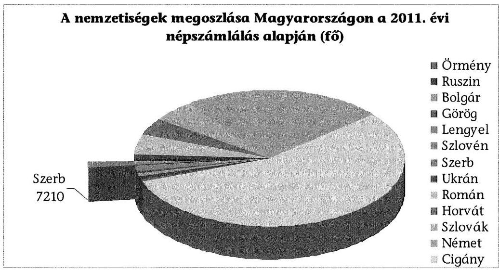
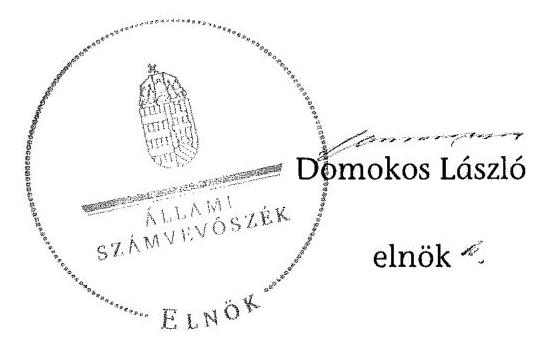

# ÁLLAMI
SZÁMVEVŐSZÉK

## JELENTÉS

a helyi kisebbségi/nemzetiségi önkormányzatok gazdálkodásának ellenőrzéséről Szerb Fővárosi Önkormányzat

---

# Állami Számvevőszék

Iktatószám: V-0057-039-025/2013.
Témaszám: 1068
Vizsgálat-azonosító szám: V06060208

## Az ellenőrzést felügyelte:

Holman Magdolna (2013. május 30-ig)
felügyeleti vezető
Horváth Balázs (2013. május 31-től)
felügyeleti vezető
Az ellenőrzést vezette és az ellenőrzés végrehajtásáért felelős:
Kisgergely István
ellenőrzésvezető
A számvevőszéki jelentést készítették és a jelentés összeállításában közreműködtek:

Huberné Kuncsík Zsuzsanna
számvevő tanácsos
Köllődné Gátai Mária
számvevő
Az ellenőrzést végezte:
Csényi István
számvevő tanácsos

---

# TARTALOMJEGYZÉK

BEVEZETÉS ..... 7
I. ÖSSZEGZŐ MEGÁLLAPÍTÁSOK, KÖVETKEZTETÉSEK, JAVASLATOK ..... 10
II. RÉSZLETES MEGÁLLAPÍTÁSOK ..... 15

1.  A Szerb Fővárosi Önkormányzat és a Fővárosi Önkormányzat együttműködésének szabályozása, a működési feltételek biztosítása ..... 15
2.  A Szerb Fővárosi Önkormányzat gazdálkodási feladatai ellátásának szabályszerűsége ..... 17
2.1. A költségvetésre és zárszámadásra, a kincstári adatszolgáltatás rendjére vonatkozó jogszabályi előírások betartása ..... 17
2.2. A Szerb Fővárosi Önkormányzat gazdálkodásának szabályozottsága ..... 19
2.3. Az operatív gazdálkodási jogkörök kialakítása és gyakorlása ..... 19
3.  A Szerb Fővárosi Önkormányzattal összefüggő gazdálkodási feladatok belső ellenőrzésének működése ..... 23
4.  A feladatalapú támogatás felhasználása, elszámolása ..... 23
5.  A Szerb Fővárosi Önkormányzat feladatellátásának jogszabályi előírásokkal való összhangja ..... 24
FÜGGELÉKEK
6.  sz. függelék Értelmező szótár
7.  sz. függelék A pénzügyi kontrollok működésének értékelése

---

.

---

# RÖVIDÍTÉSEK JEGYZÉKE

## TÖRVÉNYEK

Alaptörvény
Áht. 1
Áht. 2
ÁSZ tv.
Nek. 1 tv.
Nek. 2 tv.
Számv. tv.
RENDELETEK
Áhsz.

Ámr.
Ávr.

Ber.

Bkr.
fővárosi önkormányzati SZMSZ
támogatási kormányrendelet

## SZÓRÖVIDÍTÉSEK

ÁSZ

Magyarország Alaptörvénye, kihirdetve 2011. április 25-én
az államháztartásról szóló 1992. évi XXXVIII. törvény, hatályos 2011. december 31-ig
az államháztartásról szóló 2011. évi CXCV. törvény, hatályos 2011. december 31-étől
az Állami Számvevőszékről szóló 2011. évi LXVI. törvény, hatályos 2011. július 1-jétől
a nemzeti és etnikai kisebbségek jogairól szóló 1993. évi LXXVII. törvény, hatályos 2011. december 31-ig
a nemzetiségek jogairól szóló 2011. évi CLXXIX. törvény, hatályos 2011. december 20-tól
a számvitelről szóló 2000. évi C. törvény
az államháztartás szervezetei beszámolási és könyvvezetési kötelezettségének sajátosságairól szóló 249/2000. (XII. 24.) Korm. rendelet
az államháztartás működési rendjéről szóló 292/2009. (XII. 19.) Korm. rendelet, hatályos 2011. december 31-ig
az államháztartásról szóló törvény végrehajtásáról szóló 368/2011. (XII. 31.) Korm. rendelet, hatályos 2012. január 1-jétől
a költségvetési szervek belső ellenőrzéséről szóló 193/2003. (XI. 26.) Korm. rendelet, hatályos 2011. december 31-ig
a költségvetési szervek belső kontrollrendszeréről és belső ellenőrzéséről szóló 370/2011. (XII. 31.) Korm. rendelet, hatályos 2012. január 1-jétől
Budapest Főváros Önkormányzat Közgyűlésének 55/2010. (XII. 9.) önkormányzati rendelete Budapest Főváros Önkormányzata Közgyűlésének Szervezeti és Működési Szabályzatáról, hatályos 2011. január 1-jétől
a kisebbségi önkormányzatoknak a központi költségvetésből, valamint fejezeti kezelésű előirányzatból nyújtott támogatások feltételrendszeréről és elszámolásának rendjéről szóló 342/2010. (XII. 28.) Korm. rendelet (hatályon kívül helyezte a 28/2012. (III. 6.) Korm. rendelet a nemzetiségi célú előirányzatokból nyújtott támogatások feltételrendszeréről és elszámolásának rendjéről; jelenleg hatályos a 428/2012. (XII. 29.) Korm. rendelet a nemzetiségi célú előirányzatokból nyújtott támogatások feltételrendszeréről és elszámolásának rendjéről)

Állami Számvevőszék

---

együttműködési megállapodás
ellenőrzési nyomvonal
főjegyző
főpolgármester
Főpolgármesteri Hivatal
Főpolgármesteri Hivatal ügyrendje

Fővárosi Önkormányzat Képviselő-testület

Kincstár
kockázatkezelési szabályzat

Kontrolling Osztály vezetője
Közgyűlés
leltározási szabályzat
pénzgazdálkodási szabályzat ${ }_{1}$
pénzgazdálkodási szabályzat ${ }_{2}$
pénzkezelési szabályzat
Pénzügyi Főosztály
szabálytalanságkezelési szabályzat

Budapest Főváros Önkormányzata és a Szerb Fővárosi Önkormányzat által kötött együttműködési megállapodás, hatályos 2007. augusztus 7-től
Budapest Főváros Önkormányzat Főpolgármesteri Hivatal Pénzügyi Főosztály Pénzügyi és Számviteli Osztály ellenőrzési nyomvonala
Budapest Főváros Önkormányzatának Főjegyzője
Budapest Főváros Önkormányzatának Főpolgármestere
Budapest Főváros Önkormányzata Főpolgármesteri Hivatala
A főpolgármester és a főjegyző 505/2011. számú együttes utasítása a Főpolgármesteri Hivatal Ügyrendjéről, hatályos 2011. január 15-től
Budapest Főváros Önkormányzata
A NEK. ${ }_{1}$ tv. 30/E. § (1) bekezdése alapján az SZFÖ Képviselő-testülete 2011. december 31-ig, illetve a Nek. ${ }_{2}$ tv. 76. § (3) bekezdése alapján az SZFÖ Közgyűlése 2012. január 1-jétől. Az SZFÖ 2012-ben, az új törvény hatálybalépésével nem változtatta meg a képviselő-testülete elnevezését közgyűlésre, ezért a teljes ellenőrzött időszakra a Képviselő-testület elnevezést alkalmazzuk.
Magyar Államkincstár
A főpolgármester és a főjegyző 11/2011. számú együttes intézkedése Budapest Főváros Önkormányzat Főpolgármesteri Hivatal kockázatkezelési szabályzatáról
Budapest Főváros Főpolgármesteri Hivatal Pénzügyi Főosztály Kontrolling Osztályának vezetője
Budapest Főváros Önkormányzatának Közgyűlése
Budapest Főváros Önkormányzata Főpolgármesteri Hivatal leltározási és leltárkészítési szabályzata
Budapest Főváros főpolgármesterének és főjegyzőjének 506/2011. számú együttes intézkedése a Főpolgármesteri Hivatal pénzgazdálkodásával kapcsolatos kötelezettségvállalás, utalványozás, ellenjegyzés, érvényesítés rendjéről, és a szakmai teljesítés igazolásáról
Budapest Főváros Főjegyzőjének 510/2012. számú intézkedése a Főpolgármesteri Hivatal pénzgazdálkodásával kapcsolatos kötelezettségvállalás, pénzügyi ellenjegyzés, utalványozás, érvényesítés és a teljesítésigazolás rendjéről
Budapest Főváros Önkormányzata Főpolgármesteri Hivatalának pénz- és értékkezelési szabályzata
Budapest Főváros Önkormányzata Főpolgármesteri Hivatalának Pénzügyi Főosztálya
A főpolgármester és a főjegyző 12/2011. számú együttes intézkedése Budapest Főváros Önkormányzata Főpolgármesteri Hivatalában a szabálytalanságok kezelésének rendjéről

---

számviteli politika

SZFÖ
Támogató

Budapest Főváros Főjegyzőjének 568/2007. számú intézkedése Budapest Főváros Önkormányzata Főpolgármesteri Hivatala számviteli politikájáról és számlarendjéről Szerb Fővárosi Önkormányzat
Közigazgatási és Igazságügyi Minisztérium

---

.

---

# JELENTÉS

## a helyi kisebbségi/nemzetiségi önkormányzatok gazdálkodásának ellenőrzéséről Szerb Fővárosi Önkormányzat

## BEVEZETÉS

Az Alaptörvény szerint a Magyarországon élő nemzetiségek államalkotó tényezők. Minden, valamely nemzetiséghez tartozó magyar állampolgárnak joga van önazonossága szabad vállalásához és megőrzéséhez. A Magyarországon élő nemzetiségeknek joguk van az anyanyelv használathoz, a saját nyelven való egyéni és közösségi névhasználathoz, saját kultúrájuk ápolásához és az anyanyelvű oktatáshoz. Az Alaptörvény alapján az országban élő nemzetiségek helyi és országos önkormányzatokat hozhatnak létre. A helyi nemzetiségi önkormányzatok lehetnek települési és területi nemzetiségi önkormányzatok. A területi nemzetiségi önkormányzat testülete a Nek., tv. alapján 2011. év végéig a Képviselő-testület, 2012. január 1-jétől a Nek. ${ }_{2}$ tv. alapján a közgyűlés.

A 2011. évben a valamelyik nemzetiséghez tartozók aránya az összlakosságon belül 5,6 % volt, amelynek nemzetiségek szerinti megoszlását az alábbi diagram szemlélteti:

1.  számú diagram

## Forrás: KSH

A Fővárosban a 2011. évben megtartott kisebbségi önkormányzati választásokat követően 11 területi kisebbségi/nemzetiségi önkormányzat alakult meg, köztük a Szerb Fővárosi Önkormányzat (SZFÖ). A Nek. ${ }_{2}$ tv alapján a helyi ön-

---

kormányzat biztosítja a nemzetiségi önkormányzati működés személyi és tárgyi feltételeit, amelyeket megállapodásban szabályoznak. A helyi nemzetiségi önkormányzatok gazdálkodására és támogatási rendszerére, valamint a gazdálkodási feladataikat ellátó helyi önkormányzatokkal kötendő együttműködésre vonatkozó jogszabályok a 2010-2012. években jelentős változásokon mentek át, amelyek érintették a feladatalapú támogatásra fordítható költségvetési keret megállapítását, az operatív gazdálkodási jogkörök szabályozását, az elkülönített könyvvezetés alkalmazását, a belső ellenőrzés szabályozását.

Az ellenőrzés célja annak értékelése volt, hogy az SZFÖ gazdálkodási kereteinek kialakítása, gazdálkodása és feladatellátása megfelelt-e a hatályos jogszabályoknak. Ennek keretében ellenőriztük, hogy:

-   az SZFÖ és a Fővárosi Önkormányzat együttműködésének szabályozása, a Fővárosi Önkormányzat SZMSZ-ében, a megállapodásban előírt működési feltételek biztosítása megfelelt-e a jogszabályi előírásoknak;
-   a felek együttműködése megfelelt-e a megállapodásnak a gazdálkodási feladatok szabályszerű ellátásában, ennek keretében betartották-e az SZFÖ gazdálkodásához kapcsolódóan a költségvetésre és zárszámadásra, a gazdálkodás szabályozására és az operatív gazdálkodási jogkörök gyakorlására vonatkozó jogszabályi előírásokat;
-   a főjegyző biztosította-e a Főpolgármesteri Hivatal belső ellenőrzése keretében az SZFÖ-vel összefüggő gazdálkodási feladatok belső ellenőrzését;
-   a feladatalapú támogatás felhasználása, a folyósított feladatalapú támogatással történő elszámolás az előírásoknak megfelelő volt-e;
-   az SZFÖ feladatellátása összhangban volt-e a vonatkozó jogszabályi előírásokkal.

Az ellenőrzés típusa: szabályszerűségi ellenőrzés
Az ellenőrzött időszak: a 2011. január 1. és 2012. június 30. közötti időszak.
Ellenőrzött szervezet: Szerb Fővárosi Önkormányzat és a gazdálkodási feladatait ellátó Fővárosi Önkormányzat.

Az ellenőrzés végrehajtásának jogszabályi alapját az ÁSZ tv. 5. § (2)-(3) és (6) bekezdéseiben foglaltak képezik.

Az ellenőrzés szakmai módszertana az ÁSZ hivatalos honlapján (www.asz.hu) közzétett szakmai szabályokon alapult, amely a Legfőbb Ellenőrző Intézmények Nemzetközi Szervezete (INTOSAI) által kiadott nemzetközi standardok (ISSAI) figyelembevételével készült.

A fogalmak magyarázatát az 1. számú függelék, a pénzügyi folyamatokban kulcsszerepet betöltő kontrollok működése értékelésénél alkalmazott minősítési szempontokat a 2. számú függelék tartalmazza. Az ÁSZ az ellenőrzés megállapításait az ellenőrzött időszakban hatályos, az intézkedést igénylő megállapításokra tett javaslatokat a jelenleg hatályos jogszabályok alapján fogalmazta meg.

---

Az SZFŐ gazdálkodásának ellenőrzése során értékeltük az SZFŐ és a Fővárosi Önkormányzat együttműködését, a gazdálkodás szabályozottságát. Értékeltük a pénzügyi folyamatokban kulcsszerepet betöltő belső kontrollok (2011-ben a kötelezettségvállalás ellenjegyzése, a szakmai teljesítésigazolás és az utalvány ellenjegyzése, 2012. január 1-jétől a pénzügyi ellenjegyzés, a teljesítésigazolás és az érvényesítés) működésének megfelelőségét az államháztartáson belülre és kívülre teljesített működési célú pénzeszközátadásoknál, a dologi és egyéb folyó kiadásokkal kapcsolatos kifizetéseknél. Az ÁSZ a pénzügyi folyamatokban kulcsszerepet betöltő belső kontrollok működésére vonatkozó megállapításokat a statisztikai mintavétellel kiválasztott bizonylatok elemzése alapján fogalmazta meg. Az alkalmazott módszer biztosítja, hogy a vizsgált kiadásoknál működő kontrollok ellenőrzésének tapasztalatai alapján általános következtetést vonjunk le az ellenőrzött területekhez kapcsolódó kifizetések kulcskontrolljainak működésére vonatkozóan. Értékeltük a SZFŐ-vel összefüggő gazdálkodási feladatokra vonatkozó belső ellenőrzés szabályozottságát, működését, a feladatalapú támogatás felhasználását, valamint az SZFŐ feladatellátása és a jogszabályi előírások összhangját. A fővárosi nemzetiségi önkormányzatok gazdálkodását, költségvetési támogatásának szabályszerű felhasználását az ÁSZ még nem vizsgálta.

Az ellenőrzés lefolytatásához az SZFŐ, valamint a gazdálkodási feladatait ellátó Fővárosi Önkormányzat tanúsítványok és a kapcsolódó dokumentumok megküldésével, rendelkezésre bocsátásával szolgáltatott adatokat. A tanúsítványokban szerepeltetett adatok, információk ellenőrzése és az eltérések megállapítása a helyszíni ellenőrzés keretében történt. A pénzügyi folyamatokban kulcsszerepet betöltő belső kontrollok megfelelőségének értékeléséhez az SZFŐ 2011. évi, és 2012. I. félévi könyvelési adatállományából az államháztartáson belülre és kívülre nyújtott pénzeszközátadásoknál tételesen, a dologi és egyéb folyó kiadások esetében véletlen mintavételi eljárással választottuk ki az ellenőrizendő tételeket.

Az SZFŐ 1995-ben kezdte meg működését. A 2011 januárjában alakult SZFŐ hét tagú Képviselő-testülete egy állandó bizottságot hozott létre. Az SZFŐ elnöke 1995 óta tölti be tisztségét, személye az ellenőrzött időszakban nem változott. Az SZFŐ intézményt, gazdasági társaságot, más szervezetet nem alapított.

Az SZFŐ működéséhez és feladatellátásához a 2011. évben a költségvetési forrásból összesen 11001 ezer Ft támogatást kapott. Az SZFŐ 2011. évi zárszámadási határozata szerint 16258 ezer Ft költségvetési bevételt ért el, 13932 ezer Ft költségvetési kiadást teljesített.

Az ÁSZ tv. 29. § (1) bekezdése szerint a jelentéstervezetet megküldtük a főpolgármester, a főjegyző és az SZFŐ elnöke részére, akik az ÁSZ tv. 29. § (2) bekezdésében foglalt észrevételezési jogukkal nem éltek, a jelentéstervezetre észrevételt nem tettek.

---

# I. ÖSSZEGZŐ MEGÁLLAPÍTÁSOK, KÖVETKEZTETÉSEK, JAVASLATOK

Az SZFŐ és a Fővárosi Önkormányzat 2007-ben kötött együttműködési megállapodást az SZFÖ költségvetésével és gazdálkodásával kapcsolatos feladatok ellátására. Az együttműködési megállapodást 2011-ben felülvizsgálta a főjegyző, annak módosítására nem került sor. Az együttműködési megállapodás az ellenőrzött időszakban az Áht. ${ }_{1,2}$, a Nek. ${ }_{1,2}$ tv., az Ámr. és az Ávr. szerint meghatározott működési és gazdálkodási feladatok ellátásának feltételeit részben tartalmazta. A 2011. évben a költségvetési koncepció, illetve a költségvetés elkészítésének, elfogadásának feladataival kapcsolatos határidőket az Ámr.ben előírtak ellenére nem rögzítették. A Nek. ${ }_{2}$ tv.-ben előírt határidőig új megállapodást nem kötöttek ${ }^{1}$, Budapest Főváros Kormányhivatala a 2012. évben törvényességi észrevételt nem tett, a felek között egyeztetést nem kezdeményezett.

A 2012. június 30-án hatályos együttműködési megállapodás az Áht. ${ }_{2}$ előírása ellenére nem tartalmazta az SZFÖ bevételeivel és kiadásaival kapcsolatos ellenőrzési, finanszírozási, adatszolgáltatási és beszámolási feladatok ellátásának részletes szabályait.
 A Nek. ${ }_{2} tv.-ben előírtak ellenére nem rögzítették a főjegyzőnek, vagy megbízottjának részvételét az SZFŐ képviselő-testületi ülésein, továbbá a költségvetés készítésével és az adatszolgáltatással kapcsolatos feladatok ellátásának határidejét, a gazdálkodási jogkörök gyakorlásának módosuló szabályait, valamint az SZFŐ működésére és gazdálkodására vonatkozó eljárási és dokumentációs részletszabályokat.

A fővárosi önkormányzati SZMSZ-ben és a Főpolgármesteri Hivatal ügyrendjében a Nek. ${ }_{1,2} tv. előírásainak megfelelően szabályozták az SZFŐ működésének személyi és tárgyi feltételeit. Az SZFŐ által használt helyiségek fenntartási és működtetési költségének fedezetét a Fővárosi Önkormányzat az éves költségvetési rendeleteiben biztosította.

Az SZFŐ 2011-ben az Ámr.-ben előírt határidőig nem alkotta meg a 2011. évi költségvetési határozatát. Az SZFŐ elnöke az Áht. ${ }_{2}$-ben előírt határidőre nem nyújtotta be a Képviselő-testületnek a 2012. évi költségvetési határozat tervezetét. A költségvetési határozatok tartalma nem felelt meg az Ámr. és az Áht. ${ }_{1,2}$ előírásainak, a költségvetés előterjesztésekor nem került bemutatásra az SZFŐ előirányzat-felhasználási terve és a költségvetési mérleg, valamint 2011-ben és 2012-ben a költségvetés nem tartalmazta kiemelt előirányzatként a személyi juttatásokat, a munkaadókat terhelő járulékokat és a dologi kiadásokat. Az SZFŐ elnöke a 2011. évi zárszámadási határozat tervezetét az Ámr.-ben

[^0]
[^0]:    ${ }^{1}$ A Fővárosi Önkormányzat 2012 októberében megküldte az SZFŐ elnökének az új együttműködési megállapodás tervezetét, azonban annak tartalmával az SZFŐ nem értett egyet, a Képviselő-testület felhatalmazásának hiányában az SZFŐ elnöke nem írta alá.

---

előírt határidőben az Áht. ${ }_{1}$-ben előírt tartalmi követelményeknek megfelelően terjesztette a Képviselő-testület elé, amelyet az határozatával elfogadott.

A főjegyző 2012-ben az Ávr. előírásának ellenére az előírt határidőn túl teljesítette a jóváhagyott elemi költségvetésre, illetve a költségvetési év első három és első hat hónapjáról szóló időközi költségvetési és mérlegjelentésre vonatkozó adatszolgáltatási kötelezettségét. Az Áhsz.-ben foglaltakat betartva a féléves költségvetési beszámolóra vonatkozó adatszolgáltatási kötelezettségét az előírt határidőn belül teljesítette, azonban papír alapon - a Kincstár tájékoztatása miatt - késve nyújtotta be.

A Főpolgármesteri Hivatal az ellenőrzött időszakban a saját gazdálkodási szabályzatainak (számviteli politika és a kapcsolódó számlarend, eszközök és források leltározási és leltárkészítési szabályzata, eszközök és források értékelési szabályzata, pénzkezelési szabályzat) előírásait alkalmazta az SZFŐ gazdálkodására is. A Főpolgármesteri Hivatal a gazdálkodási szabályzatait a Számv. tv. előírása ellenére a 2012. évben nem aktualizálta.

Az SZFŐ tekintetében az operatív gazdálkodási jogkörök kialakítása az ellenőrzött időszakban megfelelt az Áht. ${ }_{1,2}$, az Ámr., valamint az Ávr. előírásainak. Az ellenőrzött időszakban az írásbeli kötelezettségvállalásokról vezetett nyilvántartások - az Ámr. és az Ávr. előírásai ellenére - nem tartalmazták a kötelezettségvállalás azonosító számát, a kötelezettségvállalást tanúsító dokumentum megnevezését, iktatószámát, keltét, a kötelezettségvállaló nevét, a kifizetési határidőket és a kifizetések jogosultjait.

A pénzügyi folyamatokban kulcsszerepet betöltő belső kontrollok működésének értékelése során, az államháztartáson kívülre történő működési célú pénzeszközátadás és a dologi és egyéb folyó kiadások kifizetésének ellenőrzésekor a 2011. évben és 2012. I. félévében a kulcskontrollok működésének megfelelősége összességében gyenge volt. A hibák száma a lényegességi szintet, a kritikus hibahatárt elérte. A 2011. évben az államháztartáson kívüli működési célú pénzeszközátadásnál - az Ámr. előírásai ellenére - szabad előirányzat hiányában történt a kötelezettségvállalás és az ellenjegyzés, a dologi és egyéb folyó kiadások teljesítésénél eseti hibaként elmaradt a szakmai teljesítésigazolás, illetve az igazolás dátumának feltüntetése, az utalvány ellenjegyzése megelőzte az érvényesítést, a készpénzelőleggel történő elszámolás során nem tartották be a pénzkezelési szabályzatban előírtakat. A 2012. év I. félévében az államháztartáson kívülre történő működési célú pénzeszközátadásnál a pénzügyi ellenjegyző - az Áht. ${ }_{2}$ előírása ellenére - nem győződött meg a kötelezettségvállalás időpontjában a szabad előirányzat és fedezet rendelkezésre állásáról, a kötelezettségvállaló szabad előirányzat nélkül vállalt kötelezettséget. Az Ávr. előírása ellenére a teljesítésigazoló eseti hibaként nem tüntette fel az igazolás dátumát, a gazdálkodási és pénzkezelési szabályzatban előírtakat nem tartották be, mivel a teljesítésigazolás az érvényesítést nem előzte meg, a készpénzelőleggel történő elszámolás az előírt határidőn túl történt, az érvényesítő nem jelezte a gazdálkodási szabályok megsértését az utalványozónak. A számvevőszéki ellenőrzés a kifizetések dokumentumainak ellenőrzése alapján nem tárt fel jogosulatlan kifizetést.

---

A Fővárosi Önkormányzat 2011-2012. évi ellenőrzési tervéhez készült kockázatelemzés - a Ber. előírása ellenére - nem terjedt ki a Főpolgármesteri Hivatalban a nemzetiségi önkormányzatok gazdálkodásával összefüggő végrehajtási feladatok ellátására. A főjegyző a Főpolgármesteri Hivatal belső ellenőrzése keretében - a Ber., valamint a Bkr. előírásai ellenére - nem biztosította a Főpolgármesteri Hivatalban az SZFŐ gazdálkodásával összefüggő végrehajtási feladatok ellátásának belső ellenőrzését, 2011-ben és 2012. I. félévében erre irányuló ellenőrzést nem terveztek és nem hajtottak végre.

Az SZFŐ részére 2011-ben folyósított feladatalapú támogatást - az ellenőrzés számára készített kimutatás és a rendelkezésre bocsátott dokumentumok alapján - 2012. június 30-ig teljes egészében a támogatási kormányrendelet előírásainak megfelelően felhasználta. A támogatási kormányrendelet előírásai szerint az SZFŐ részére 2011. augusztus hónapban egy összegben utalta át a Kincstár a feladatalapú támogatást (1668 ezer Ft). A 2011. évben folyósított feladatalapú támogatás elszámolása - az Áht. ${ }_{1}$ előírása ellenére - nem történt meg. A támogatás felhasználását az ellenőrzésre jogosult szervek nem ellenőrizték.

Az SZFŐ feladatellátásának tárgya a 2011. évben, valamint 2012. I. félévében összhangban volt a Nek. ${ }_{1,2} tv.-ben foglalt előírásokkal. A nemzetiségi közügy tárgyában szervezett rendezvények, programok megvalósítását, hagyományápoló tevékenységet végzett. Együttműködött egyházi és nemzetiségi civil szervezetekkel, a nemzetiségi médiával, kulturális és oktatási intézményekkel.

Az ellenőrzés megállapításai alapján az észrevételezésre megküldött jelentéstervezetben az SZFŐ gazdálkodásával kapcsolatban intézkedést igénylő megállapításokat és javaslatokat fogalmaztunk meg, amelyek végrehajtásáról az ellenőrzés időszakában intézkedési tájékoztatást adott a főjegyző és az SZFŐ elnöke. A 2013. augusztus 2-án hatályba lépett együttműködési megállapodásban a Nek. ${ }_{2} tv. és az Áht. ${ }_{2}$ vonatkozó előírásait érvényesítették, a tartalmi hiányosságokat megszüntették. A 2013. évi költségvetési határozat Áht. ${ }_{2}$-ben foglalt előírásoknak megfelelő előkészítését, határidőben történő előterjesztését a beküldött dokumentumokkal igazolták. A gazdálkodási feladatok szabályszerű ellátásához 2013. évben új kötelezettségvállalási nyilvántartást vezettek be, amely megfelel az Ávr.-ben előírtaknak. Az operatív gazdálkodás működési hibáinak megelőzése, feltárása és kijavítása érdekében a főjegyző utasításban rendelkezett a kulcsszerepet betöltő kontrollok működési hiányosságainak megszüntetésére. A 2012. évi feladatalapú támogatás felhasználásáról az elszámolást a főjegyző elkészítette és Képviselő-testületi jóváhagyásra megküldte. Figyelemmel az ÁSZ ellenőrzés hasznosítására mindezek vonatkozásában intézkedést igénylő megállapítást, javaslatot már nem szerepeltetünk.

Az ÁSZ tv. 33. § (1) bekezdésében foglaltak értelmében az ellenőrzött szervezet vezetője köteles a jelentésben foglalt megállapításokhoz kapcsolódó intézkedési tervet összeállítani, és azt a jelentés kézhezvételétől számított 30 napon belül az ÁSZ részére megküldeni. Amennyiben az intézkedési tervet határidőre nem küldi meg a szervezet, vagy az nem elfogadható, az ÁSZ elnöke az ÁSZ tv. 33. § (3) bekezdés a)-b) pontjaiban foglaltakat érvényesítheti.

---

A helyszíni ellenőrzés megállapításainak hasznosítása mellett Javasoljuk:

# a Szerb Fővárosi Önkormányzat elnökének: 

1. A 2012. év I. félévében az államháztartáson kívülre történő működési célú pénzeszközátadás kifizetése során a kötelezettségvállalás szabad előirányzat és fedezet hiányában történt. A kötelezettségvállaló nem tett eleget az Áht. 2 36. § (1) bekezdésében foglalt előírásnak, mely szerint kötelezettségvállalásra a költségvetés kiadási előirányzatai és az azokat terhelő korábbi kötelezettségvállalásokkal és más fizetési kötelezettségekkel csökkentett összegű eredeti, vagy módosított kiadási előirányzatok mértékéig kerülhet sor.

Javaslat:
Biztosítsa a jövőben, hogy a kötelezettségvállalás feleljen meg az Áht. 2 36. § (1) bekezdésében foglalt előírásnak, mely szerint kötelezettségvállalásra a költségvetés kiadási előirányzatai és az azokat terhelő korábbi kötelezettségvállalásokkal és más fizetési kötelezettségekkel csökkentett összegű eredeti vagy módosított kiadási előirányzatok mértékéig kerülhet sor.
2. A 2011. évi feladatalapú támogatással való elszámolás a támogatási kormányrendelet 7. § (2) bekezdésében hivatkozott Áht. ${ }_{1}$-nek „a helyi önkormányzatok elszámolási rendjére vonatkozó rendelkezései alkalmazása" előírása ellenére nem történt meg.

Javaslat:
Terjessze a Képviselő-testület elé jóváhagyásra - a főjegyző által előkészített - az Áht. 2 57. § (4) bekezdés alapján összeállított feladatalapú támogatás elszámolását.

## a főjegyzőnek:

1. A főjegyző 2012-ben az Ávr. 33. § (1) bekezdésében a jóváhagyott elemi költségvetésre, az Ávr. 169. § (2) bekezdésében, valamint a 170. § (5) bekezdésében a költségvetési év első három és első hat hónapjáról szóló időközi költségvetési és mérlegjelentésre vonatkozó adatszolgáltatási kötelezettségét az előírt határidőn túl teljesítette.

Javaslat:
Gondoskodjon arról, hogy a Főpolgármesteri Hivatal adatszolgáltatási kötelezettségének az SZFŐ elemi költségvetése esetében az Ávr. 33. § (1) bekezdésében, a költségvetési év első három és első hat hónapjáról szóló időközi költségvetési jelentésre vonatkozóan az Ávr. 169. § (2) bekezdésében, valamint az időközi mérlegjelentés esetében a 170. § (5) bekezdésében előírt határidők betartásával tegyen eleget.
2. A 2012. évben a Főpolgármesteri Hivatal a Számv. tv. 14. § (11) bekezdésében előírtak ellenére a gazdálkodási szabályzatait (számviteli politika és a kapcsolódó számlarend, eszközök és források leltározási és leltárkészítési szabályzata, eszközök és források értékelési szabályzata, pénzkezelési szabályzat) nem aktualizálta.

---

Javaslat:
Gondoskodjon a Számv. tv. 14. § (11) bekezdésében előírtaknak megfelelően arról, hogy a számviteli politikán és a kapcsolódó szabályzatokon a jogszabályok módosítása miatti változások, azok hatályba lépésétől számított 90 napon belül átvezetésre kerüljenek.

---

# II. RÉSZLETES MEGÁLLAPÍTÁSOK 

## 1. A Szerb Fővárosi Önkormányzat és a Fővárosi Önkormányzat együttműködésének szabályozása, a működési feltételek biztosítása

Az SZFŐ és a Fővárosi Önkormányzat együttműködésének a szabályozására, valamint a működés Nek. ${ }_{1,2} tv.-ben előírt személyi és tárgyi feltételeinek a biztosítására az együttműködési megállapodásban, a fővárosi önkormányzati SZMSZ-ben és a Főpolgármesteri Hivatal ügyrendjében, valamint az 1998-ban kötött helyiséghasználati szerződésben meghatározottak szerint került sor.

Az SZFŐ a Fővárosi Önkormányzattal a költségvetésével és gazdálkodásával kapcsolatos feladatok ellátására 2007. augusztus 7-én kötött együttműködési megállapodást ${ }^{2}$. Az együttműködési megállapodást 2011-ben a főjegyző felülvizsgálta, annak módosítására a jogszabályi környezet változatlansága, valamint az SZFŐ alakuló ülésének időpontja ${ }^{3}$ miatt nem került sor 2011. január 15-ig. Az SZFŐ és a Fővárosi Önkormányzat a Nek. ${ }_{2} tv. 159. § (3) bekezdésének előírása ellenére az új együttműködési megállapodást 2012. év június 1-ig nem kötötte meg.

Az együttműködési megállapodás az ellenőrzött időszakban az Áht. ${ }_{1,2}$, a Nek. ${ }_{1,2} tv., az Ámr. és az Ávr. szerint meghatározott működési és gazdálkodási feladatok ellátásának feltételeit részben tartalmazta.

A 2011. december 31-én hatályos együttműködési megállapodás az Ámr. 37. § (4) bekezdésének a)-f) pontjaiban előírtak ellenére nem tartalmazta a költségvetési koncepció és a költségvetés elkészítésének, elfogadásának feladataival kapcsolatos határidőket.

A 2012. I. félévében a 2012. június 30-án hatályos együttműködési megállapodás nem tartalmazta:

- az Áht. ${ }_{2}$ 27. § (2) bekezdésében előírtak ellenére, az SZFŐ bevételeivel és kiadásaival kapcsolatos ellenőrzési, finanszírozási, adatszolgáltatási, és beszámolási feladatok ellátásának részletes szabályait;
- a Nek. ${ }_{2}$ tv. 80. § (3) a) pontjában foglaltak ellenére a költségvetés készítésével és az adatszolgáltatással kapcsolatos feladatok ellátásának határidejét, a 2012. január 1-től hatályos önálló számlanyitás, törzskönyvi nyilvántartás

[^0]
[^0]:    ${ }^{2}$ Az együttműködési megállapodást az SZFŐ 49/2007. (08. 07.) számú, a Közgyűlés az 1705/2007. (X. 25.) számú határozatával hagyta jóvá.
    ${ }^{3}$ Az SZFŐ a 2011. évi választásokat követően 2011. január 24-én tartotta alakuló ülését.

---

rendjét, a gazdálkodási jogkörök gyakorlásának módosuló szabályait, a működés feltételeinek és a gazdálkodásnak részletes előírásait ${ }^{4}$;

- a Nek. ${ }_{2}$ tv. 80. § (3) bekezdés d) pontjában foglaltak ellenére az SZFŐ gazdálkodására vonatkozó eljárási és dokumentációs részletszabályokat;
- a Nek. ${ }_{2}$ tv. 80. § (4) bekezdésében előírtak ellenére, hogy a főjegyző vagy annak - a főjegyzővel azonos képesítési előírásoknak megfelelő - megbízottja a Fővárosi Önkormányzat megbízásából és képviseletében részt vesz az SZFŐ képviselő-testületi ülésein és jelzi, amennyiben törvénysértést észlel.

Az együttműködési megállapodás 2012. I. félévében a hatályos jogszabályokkal nem volt összhangban.

Az SZFŐ és a Fővárosi Önkormányzat a Nek. ${ }_{2}$ tv. 159. § (3) bekezdése előírása ellenére új együttműködési megállapodást a helyszíni ellenőrzés lezárásáig nem kötött. Budapest Főváros Kormányhivatala a 2012. évben a Nek. ${ }_{2}$ tv. 83. § (3) bekezdése alapján-nem koordinált egyeztetést a felek között az együttműködési megállapodás megkötése érdekében.

A Fővárosi Önkormányzat 2012. október 11-én megküldte az SZFŐ-nek a Nek. ${ }_{2}$ tv. előírásai alapján kidolgozott új együttműködési megállapodás-tervezetet, melyre az SZFŐ észrevételt tett, kérte annak részleges átdolgozását, kiegészítését. A Fővárosi Önkormányzat és az SZFŐ között 2012 novemberében egyeztetési folyamat kezdődött az új együttműködési megállapodás tartalmával kapcsolatban, mely a helyszíni ellenőrzés lezárásáig nem fejeződött be. A 2007-ben kötött együttműködési megállapodás 2013. augusztusig érvényes volt, mivel a Fővárosi Önkormányzat által - a jogszabályi előírásokkal összhangban - előkészített új együttműködési megállapodás az SZFŐ Képviselő-testületének jóváhagyásával 2013. augusztus 2-án lépett hatályba.

A fővárosi önkormányzati SZMSZ-ben és a Főpolgármesteri Hivatal ügyrendjében a Nek ${ }_{1}$ tv. 27. § (1) és a Nek. ${ }_{2}$ tv. 80. § (1) bekezdés előírásainak megfelelően szabályozták az SZFŐ működésének személyi, tárgyi feltételeit és biztosították az ezekhez kapcsolódó költségek viselését. A Főpolgármesteri Hivatal ügyrendjében ${ }^{5}$ rögzítették, hogy a fővárosi területi nemzetiségi önkormányzatok szakmai, jogi, ügyviteli támogatásával összefüggő feladatokat az Igazgatási és Hatósági Főosztály látja el. A nemzetiségi önkormányzatok gazdálkodási feladatainak ellátását a megbízott dolgozók munkaköri leírásai tartalmazták.

Az SZFŐ és az Országos Szerb Önkormányzat működési feltételeinek biztosítására a Kincstári Vagyoni Igazgatósággal 1997. március 26-án kötött szerződés alapján ingyenes közös használatukba került a Magyar Állam tulajdonát képező ingatlan ${ }^{6}$. Az SZFŐ és az Országos Szerb Önkormányzat 1998. április 6-án

[^0]
[^0]:    ${ }^{4}$ Az SZFŐ már a 2011. évben rendelkezett önálló bankszámlával, adószámmal, törzskönyvi nyilvántartásba vétele 2002-ben megtörtént.
    ${ }^{5}$ a Főpolgármesteri Hivatal ügyrendje 39. § (2) bekezdésének 7) pontja
    ${ }^{6}$ A Budapest V. kerület Falk Miksa u. 3. szám alatti $425 \mathrm{~m}^{2}$ területű helyiségcsoport.

---

szerződésben rögzítette a közös irodahasználat feltételeit, az ingatlan fenntartásával kapcsolatos költségek megosztásának módját. Az SZFŐ és a Fővárosi Önkormányzat a helyiséghasználat biztosítása érdekében 1998. december 18-án határozatlan idejű szerződést kötött, melyben rögzítették, hogy a közös ingatlanhasználattal kapcsolatban felmerülő, az SZFŐ-t terhelő költségek fedezetéhez a Fővárosi Önkormányzat működési hozzájárulást biztosít, mely beépül az SZFŐ költségvetésébe. A helyiséghasználati szerződés nem módosult, az ellenőrzött időszakban is hatályban volt.

Az SZFŐ működésével kapcsolatos postai, kézbesítési, gépelési, sokszorosítási feladatok ellátásával kapcsolatos költségeket az SZFŐ viselte, melyek finanszírozásához a Fővárosi Önkormányzat az éves költségvetési rendeleteiben jóváhagyott összegben járult hozzá.

A Fővárosi Önkormányzat az ellenőrzött időszakban az előírásoknak megfelelően a szabályozási hiányosságok, az új együttműködési megállapodás megkötésének - az egyeztetés elhúzódása következtében történő - elmaradása ellenére biztosította és folyamatosan fenntartotta az SZFŐ működésének személyi és tárgyi feltételeit.

# 2. A Szerb Fővárosi Önkormányzat Gazdálkodási feladatai ellátásának szabályszerűsége

### 2.1. A költségvetésre és zárszámadásra, a kincstári adatszolgáltatás rendjére vonatkozó jogszabályi előírások betartása

Az SZFŐ az Ámr. 37. § (3) bekezdésében előírt határidőig ${ }^{7}$ nem alkotta meg a 2011. évi költségvetési határozatát ${ }^{8}$. Az SZFŐ elnöke az Áht. ${ }_{2}$ 24. § (2) bekezdésében előírt határidőre ${ }^{9}$ nem nyújtotta be a Képviselő-testületnek az SZFŐ 2012. évi költségvetési határozat tervezetét ${ }^{10}$.

A költségvetési határozatok kiadási előirányzatai a 2011. évben az Áht. ${ }_{1}$ 69. § (1) bekezdés a) pontjában, és az Ámr. 36. § (1) bekezdés b) pontjában, valamint 2012. évben az Áht. ${ }_{2}$ 23. § (2) bekezdés a) pontjában foglaltak ellenére nem tartalmazták a működési költségvetésen belül kiemelt előirányzatként a személyi juttatásokat, a munkaadókat terhelő járulékokat és a dologi kiadásokat.

A 2011. évben a Fővárosi Önkormányzattól és a központi költségvetésből származó bevételi előirányzatait a SZFŐ költségvetésében az Ámr. 81. § (5) bekezdésében előírtak ellenére nem támogatás értékű bevételként, hanem sajátos

[^0]
[^0]:    ${ }^{7}$ A helyi kisebbségi önkormányzat költségvetési határozatát a tárgy év február 10-ig fogadja el.
    ${ }^{8}$ Az SZFŐ 14/2011. (03. 17.) számú határozatával fogadta el a 2011. évi költségvetését.
    ${ }^{9}$ a központi költségvetésről szóló törvény kihirdetését követő 45. nap
    ${ }^{10}$ Az SZFŐ 4/2012. (02. 15.) számú határozatával fogadta el a 2012. évi költségvetését.

---

működési bevételként szerepeltette. A 2012. évi költségvetési határozatban a bevételek a támogatás értékű működési bevételek között szerepeltek.

A bevételi és kiadási előirányzatok a 2011. és a 2012. években is egyensúlyban voltak.

Az Ámr. 36. § (1) bekezdés i) és k) pontjának előírása ellenére a 2011. évi költségvetési határozat nem tartalmazta a működési és a felhalmozási célú bevételi és kiadási előirányzatok bemutatását tájékoztató jelleggel mérlegszerűen, egymástól elkülönítetten, valamint az év várható bevételi és kiadási előirányzatainak teljesüléséről készített előirányzat-felhasználási ütemtervet. A 2012. évben a költségvetés előterjesztésekor az Áht. ${ }_{2}$ 24. § (4) bekezdés a) pont előírása ellenére nem került bemutatásra az SZFŐ előirányzat felhasználási terve és a költségvetési mérlege közgazdasági tagolásban.

A SZFŐ a 2011. évi költségvetési határozatát négy, a 2012 évi költségvetési határozatát 2012. I. félévében két alkalommal ${ }^{11}$ módosította. A 2011. évre vonatkozóan 2012 januárjában a zárszámadást megelőzően előirányzat-átcsoportosítással biztosították a kiemelt előirányzatok teljesítésének fedezetét.

Az SZFŐ elnöke a 2011. évi zárszámadási határozat tervezetét - az Ámr. 37. § (3) bekezdésében előírt határidőt betartva, 2012. március 8-án terjesztette a Képviselő-testület elé, amelyet az határozatával elfogadott ${ }^{12}$. A zárszámadásról szóló határozat megfelelt az Áht., 69. § (1) bekezdésében előírt tartalmi követelményeknek.

A főjegyző 2012-ben - a 2012. I. féléves költségvetési beszámolót kivéve nem teljesítette határidőre az SZFŐ számára előírt kincstári adatszolgáltatást. A főjegyző a 2012. évi elemi költségvetést az Ávr. 33. § (1) bekezdésében előírt határidőn ${ }^{13}$ túl, az Ávr. 169. § (2) bekezdésében foglaltak ellenére az időközi költségvetési jelentést a költségvetési év első három és , az első hat hónapjáról késedelemmel küldte meg a Kincstárnak. A 2012. évben az első három, és az első hat hónapról szóló időközi mérlegjelentést az Ávr. 170. § (5) bekezdésében megjelölt határidőn túl, késedelemmel nyújtotta be.

A Főpolgármesteri Hivatal az SZFŐ 2012. I. féléves költségvetési beszámolóját az Áhsz. 10. § (1) bekezdése szerinti határidőre, 2012. július 31-ig elkészítette, és az Áhsz. 10. § (5a) bekezdésében foglaltakat betartva 2012. augusztus 9-én elektronikus formában, 2012. szeptember 12-én pedig papír alapon nyújtotta be a Kincstárnak.

[^0]
[^0]:    ${ }^{11}$ A 2012. évi költségvetési határozat 5. pontja felhatalmazta az SZFŐ elnökét 300 ezer Ft értékhatárig a kiemelt előirányzatok közötti átcsoportosításra, a második alkalommal történő költségvetési módosítás elnöki hatáskörben 2012. június 26-án történt.
    ${ }^{12}$ Az SZFŐ 13/2012. (03. 08.) számú határozatával fogadta el a 2011. évi zárszámadását.
    ${ }^{13}$ a 2012. évi költségvetési rendelettervezet Közgyűlés elé terjesztésének határidejét követő harminc nap

---

A főjegyző az SZFŐ papíralapú 2012. I. féléves költségvetési beszámolóját önhibáján kívül késedelmesen adta le, mivel a Kincstár tájékoztatása értelmében arra csak az elektronikusan továbbított beszámoló felülvizsgálatát követően, az erről írásban történő értesítés után volt mód. A Kincstár 2012. szeptember 12-én értesítette a Fővárosi Önkormányzatot arról, hogy az adatszolgáltatása megfelelő.

# 2.2. A Szerb Fővárosi Önkormányzat gazdálkodásának szabályozottsága

A Főpolgármesteri Hivatal a saját gazdálkodási szabályzatainak (számviteli politika és a kapcsolódó számlarend, eszközök és források leltározási és leltárkészítési szabályzata, eszközök és források értékelési szabályzata, pénzkezelési szabályzat) előírásait alkalmazta az SZFŐ gazdálkodására is.

A Főpolgármesteri Hivatal a gazdálkodási szabályzatait a 2012. évben nem aktualizálta, nem tartotta be a Számv. tv. 14. § (11) bekezdésében előírtakat, mely szerint a változásokat azok hatályba lépését követő 90 napon belül kell a számviteli politikán keresztülvezetni.

A Főpolgármesteri Hivatal a 2011. évben a pénzgazdálkodási szabályzat ${ }_{1}$-ben az Ámr. 20. § (3) bekezdés a) pontjának megfelelően szabályozta a kötelezettségvállalás ellenjegyzője, a szakmai teljesítésigazoló, és az utalványozás ellenjegyzője feladatait. A 2012. évben a pénzgazdálkodási szabályzat ${ }_{2}$-ben az Ávr. 13. § (2) bekezdés a) pontjának megfelelően szabályozta a pénzügyi ellenjegyzés, a teljesítésigazolás és az érvényesítés feladatának ellátását.

Az ellenőrzött időszakban az írásbeli kötelezettségvállalásokról vezetett nyilvántartások 2011. évben az Ámr. 75. § (1), valamint 2012. I. félévében az Ávr. 56. § (1) bekezdésében előírtak ellenére, nem tartalmazták a kötelezettségvállalás azonosító számát, a kötelezettségvállalást tanúsító dokumentum megnevezését, iktatószámát, keltét, a kötelezettségvállaló nevét, a kifizetési határidőket és a kifizetés jogosultjait.

A Főpolgármesteri Hivatal a 2011. évben az Ámr. 156. § (2)-(3) bekezdésében, a 2012. I. félévben a Bkr. 6. § (3)-(4) bekezdéseiben előírt ellenőrzési nyomvonallal és a szabálytalanságok kezelésének eljárásrendjével rendelkezett. A 2011. évben az Ámr. 157. § (1) bekezdésében, a 2012. I félévben a Bkr. 7. § (1) bekezdésében előírt kockázatkezelési rendszerre vonatkozó szabályzatot is elkészítették. Az ellenőrzött időszakban a Főpolgármesteri Hivatal ügyrendje tartalmazta az SZFŐ gazdálkodásával kapcsolatos feladatokat, a feladatot ellátó köztisztviselők munkaköri leírásában szerepeltek az azokkal kapcsolatos hatáskörök és felelősségi szabályok, valamint a helyettesítés rendje.

### 2.3. Az operatív gazdálkodási jogkörök kialakítása és gyakorlása

A 2011. évben az SZFŐ elnöke, valamint az általa írásban felhatalmazott képviselők operatív gazdálkodási jogköreinek gyakorlására irányuló megbízásait

---

(a kötelezettségvállalás, utalványozás, valamint az ellenjegyzés, továbbá a szakmai teljesítésigazolás) a Képviselő-testület is jóváhagyta. ${ }^{14}$ A főjegyző az érvényesítés ellátására az Ámr.-ben előírt szakmai végzettséggel rendelkező köztisztviselőket bízott meg, akiknek a 2011. február 1-jétől hatályos munkaköri leírásaiban az elvégzendő feladatot és a helyettesítés rendjét rögzítették. A gazdálkodási jogkörök gyakorlóinak aláírás mintája rendelkezésre állt, a Főpolgármesteri Hivatal gazdasági vezetője ${ }^{15}$ rendelkezett felsőfokú szakképesítéssel.

Az Ávr. 55. § (2) bekezdés g) pontjának előírása alapján 2012. január 1-jétől a pénzügyi ellenjegyzési feladatokat a Képviselő-testület kötelezettségvállalás ellenjegyzésére kijelölt tagjai nem láthatták el ${ }^{16}$. A pénzügyi ellenjegyzést az Ávr.-ben rögzített jogszabályi felhatalmazás alapján a gazdasági vezető gyakorolta, aki maga helyett a 2012. évi pénzgazdálkodási szabályzatban foglaltak szerint a pénzügyi ellenjegyzői feladatok ellátására a Kontrolling Osztály vezetőjét jelölte ki 2012. április 30-i hatállyal. Az érvényesítési feladatokat végző köztisztviselők személye a 2012. I. félévben nem változott.

Az SZFŐ által az ellenőrzött időszakban teljesített kiadásoknál a kialakított gazdálkodási jogkörök gyakorlásának megfelelőségét a pénzügyi folyamatokban kulcsszerepet betöltő kontrollok működésének értékelésével minősítettük.

A 2011. évben az SZFŐ államháztartáson kívülre történő működési célú pénzeszközátadást a költségvetés készítésekor nem tervezett. A 2011. évi zárszámadási határozatban a módosított előirányzat és a teljesített kiadás is 605 ezer Ft volt. Az államháztartáson kívülre teljesített működési célú pénzeszközátadások során a kulcskontrollok működésének megfelelősége összességében gyenge volt, mert:

- a kötelezettségvállalás ellenjegyzője jogosultsága és aláírása ellenére nem látta el az Ámr. 74. § (3) bekezdés a-c) pontjaiban előírt feladatait, mivel nem vizsgálta, hogy a jóváhagyott költségvetés fel nem használt, illetve le nem kötött, a kötelezettségvállalás tárgyával összefüggő kiadási előirányzata, valamint a kifizetés időpontjában a fedezet rendelkezésre áll-e, valamint, hogy a kötelezettségvállalás nem sérti-e a gazdálkodási szabályokat. A kötelezettségvállaló az Ámr. 75. § (3) bekezdés előírása ellenére a kötelezettségvállaláskor rendelkezésre álló módosított előirányzat szerint a szükséges mértékű szabad előirányzat hiányában vállalt kötelezettséget;
- az utalvány ellenjegyzője az Ámr. 79. § (2) bekezdésében foglaltak ellenére aláírását megelőzően nem győződött meg arról, hogy az érvényesítő elvégez-

[^0]
[^0]:    ${ }^{14}$ Az SZFŐ 2011. január 24-i alakuló ülésén a képviselő-testület 8/2011., 9/2011., 10/2011. számú határozatai megerősítették a gazdálkodási jogkörök gyakorlóinak kijelölését.
    ${ }^{15}$ A Főpolgármesteri Hivatal ügyrendjének 22. § (1) bekezdése tartalmazza, hogy a gazdasági vezetőnek a Pénzügyi Főosztály vezetője minősül.
    ${ }^{16}$ A pénzügyi ellenjegyzést 2012. január 1-jétől csak az előírt szakképesítéssel rendelkező, a Főpolgármesteri Hivatal állományába tartozó köztisztviselő láthatja el.

---

te-e a gazdálkodási szabályok betartására vonatkozó - az Ámr. 77. § (1) bekezdésben meghatározott - ellenőrzési feladatait.

Az államháztartáson kívülre teljesített működési célú pénzeszközátadások során, az ellenőrzött tételeknél elérte a lényegességi szintet, annak ellenére, hogy a szakmai teljesítés igazolója az előírtak szerint látta el feladatát.

A 2011. évben a dologi és egyéb folyó kiadások esetében a 100 ezer Ft alatti kifizetések - a pénzgazdálkodási szabályzatban előírtaknak megfelelően - előzetes írásbeli kötelezettségvállalást nem igényeltek. A dologi és egyéb folyó kiadások teljesítésekor:

- a kötelezettségvállalás ellenjegyzője szabályosan látta el az Ámr. 74. § (1) bekezdésében előírt feladatait;
- a szakmai teljesítés igazolója eseti hibaként nem végezte el feladatát, mivel az Ámr. 76. § (1)-(3) bekezdésének előírása ellenére a kiadás teljesítésének jogosságát és összegszerűségét szakmailag nem igazolta, illetve nem tüntette fel az igazolás dátumát;
- az utalványok ellenjegyzője jogosultsága és aláírása ellenére nem végezte el feladatát, mivel az Ámr. 79. § (2) bekezdésében foglaltak ellenére nem kifogásolta, hogy az utalvány ellenjegyzését megelőzően az érvényesítés nem történt meg, hiányzott a szakmai teljesítésigazolás, továbbá a készpénzkezelési szabályzatban előírtakat nem tartották be, mivel a felvett készpénzelőleggel határidőre nem számoltak el.

A 2011. évben a dologi és egyéb folyó kiadások teljesítésekor a kulcskontrollok összességében annak ellenére jól működtek, hogy az utalványok ellenjegyzője nem látta el feladatát, és a szakmai teljesítés igazolásakor eseti hiányosságok voltak.

A 2011. évben a gazdálkodás folyamatában (az ellenőrzött területeken) a kötelezettségvállalás ellenjegyzése, a szakmai teljesítésigazolás és az utalványozás ellenjegyzés kontrolljainak megbízhatósága összességében gyenge volt. A hibák száma a lényegességi szintet, a kritikus hibahatárt elérte. Az államháztartáson kívüli működési célú pénzeszközátadásoknál a kötelezettségvállaláskor nem állt rendelkezésre a szükséges mértékű szabad előirányzat, emiatt az ellenjegyzés és a kötelezettségvállalás során nem tartották be a gazdálkodási szabályokat, esetenként hiányzott a szakmai teljesítésigazolás, továbbá az ellenőrzött területeken az utalványok ellenjegyzését nem előzte meg az érvényesítés elvégzése, nem tartották be a pénzkezelési szabályzatban előírtakat.

A 2012. évben az SZFŐ a költségvetés készítésekor eredeti előirányzatként államháztartáson kívüli működési célú pénzeszközátadást nem tervezett. A 2012. I. féléves beszámoló alapján a módosított előirányzattal megegyezően a teljesített kiadás 150 ezer Ft volt. (az előirányzat módosításról átruházott hatáskörben az SZFŐ elnöke a 2012. évi féléves beszámoló elkészítését megelőzően, június 26-án döntött).

---

Az államháztartáson kívülre teljesített működési célú pénzeszközátadások során a pénzügyi ellenjegyzés, teljesítés igazolás és érvényesítés működésének megfelelősége összességében gyenge volt, mert:

- a pénzügyi ellenjegyző jogosultsága és aláírása ellenére nem végezte el feladatát, mivel az Áht 37. § (1) bekezdésében előírtak ellenére nem győződött meg a kötelezettségvállalás időpontjában és a várható kifizetéskor a szabad előirányzat és fedezet rendelkezésre állásáról, a kötelezettségvállaláskor a gazdálkodási szabályok betartásáról, a kötelezettségvállaló az Áht 36. § (1) bekezdésében előírtak ellenére szabad előirányzat hiányában vállalt kötelezettséget;
- az érvényesítő nem tartotta be Ávr. 58. § (1)-(2) bekezdésében foglaltakat, mivel nem győződött meg a fedezet meglétéről, továbbá a pénzkezelési szabályzatban előírtak betartásáról (a készpénzelőleggel történő elszámolás határidőn túl történt), és a gazdálkodási szabályok megsértését nem jelezte az utalványozónak.

A 2012. I. félévben a dologi és egyéb folyó kiadások esetében a 100 ezer Ft alatti kifizetések - a pénzgazdálkodási szabályzatban előírtaknak megfelelően előzetes írásbeli kötelezettségvállalást nem igényeltek. A dologi és egyéb folyó kiadások teljesítésekor:

- a pénzügyi ellenjegyző feladatellátása során betartotta az Ávr. 55. § (1) bekezdésében előírtakat;
- a teljesítést igazoló jogosultsága és aláírása ellenére eseti hibaként nem végezte el feladatát, mivel a teljesítésigazoláson az Ávr. 57. § (3) bekezdésének ellenére nem tüntette fel az igazolás elvégzésének dátumát;
- az érvényesítő jogosultsága és aláírása ellenére nem végezte el az Ávr. 58. § (1)-(2) bekezdésében előírt feladatát, mert nem győződött meg a teljesítésigazolás alapján a kifizetés jogosságáról, összegszerűségéről, a megrendelés teljesítéséről (a teljesítésigazolás az érvényesítést követően történt), illetve a megelőző ügymenetben a pénzkezelési szabályzatban foglaltak betartásáról (a készpénzelőleggel történő elszámolásnál a határidőt túllépték), nem jelezte az utalványozónak a gazdálkodási szabályok megsértését.

A 2012. I. félévében a dologi és egyéb folyó kiadások kifizetésének ellenőrzése során a kulcskontrollok (pénzügyi ellenjegyzés, teljesítésigazolás és érvényesítés) működésének megfelelősége összességében annak ellenére jó volt, hogy a teljesítés igazoláskor eseti hiányosság volt, és az érvényesítő nem látta el feladatát.

A 2012. I. félévében a gazdálkodás folyamatában (az ellenőrzött területeken) a pénzügyi ellenjegyzés, teljesítésigazolás és az érvényesítés kontrolljainak megbízhatósága összességében gyenge volt. A hibák száma a lényegességi szintet, a kritikus hibahatárt elérte. Az államháztartáson kívüli működési célú pénzeszközátadásoknál a kötelezettségvállaláskor nem állt rendelkezésre szabad előirányzat, emiatt a pénzügyi ellenjegyzés és a kötelezettségvállalás során nem tartották be a gazdálkodási szabályokat, eseti hiányosságként a teljesítésigazoló nem tüntette fel az igazolás dátumát, az érvényesítés

---

a teljesítésigazolást megelőzően történt, nem tartották be a gazdálkodási és a pénzkezelési szabályzatban előírtakat, az érvényesítő ezek megsértését nem jelezte az utalványozónak.

Az SZFŐ gazdálkodása során a 2011. évben, valamint a 2012. I. félévben, a pénzügyi folyamatokban kulcsszerepet betöltő belső kontrollok működésében feltárt hiányosságokkal összefüggésben az ellenőrzés az ellenőrzött tételek vonatkozásában a rendelkezésre bocsátott dokumentumok alapján gazdasági kár bekövetkeztére utaló adatot, tényt nem állapított meg.

# 3. A Szerb Fővárosi Önkormányzattal összefüggő gazdálkodási feladatok belső ellenőrzésének működése

A főjegyző a 2011-2012. évi ellenőrzési tervet megalapozó kockázatelemzést - a Ber. 21. § (2) bekezdése ellenére - nem terjesztette ki a Főpolgármesteri Hivatalban az SZFŐ gazdálkodásával összefüggő végrehajtási feladatok ellátására. Az éves ellenőrzési tervek nem tartalmaztak a Főpolgármesteri Hivatalban, a nemzetiségi önkormányzatok gazdálkodásával összefüggő végrehajtási feladatok ellátására vonatkozó feladatokat. A 2011. évben, illetve 2012. I. félévben ellenőrzést nem terveztek és nem végeztek.

## 4. A feladatalapú támogatás felhasználása, elszámolása

Az SZFŐ a Támogató döntése alapján 2011-ben 1668 ezer Ft feladatalapú támogatást kapott. Az SZFŐ 2011. évi munkatervében szerepeltek a támogatni tervezett rendezvények, azonban a finanszírozás forrását nem jelölték meg. A Képviselő-testület a folyósított támogatás összegével év közben módosította a 2011. évi költségvetését, megemelte bevételi és kiadási - ezen belül a dologi kiadások - előirányzatát.

A támogatási kormányrendelet 7. § (4) bekezdése tartalmazza, hogy a támogatás tárgyévben fel nem használt része a következő év június 30-áig kötelezettségvállalással terhelhető. Az SZFŐ-nek 2011. december 31-én fel nem használt maradványa 122 ezer Ft volt.

A 2011. évi feladatalapú támogatást - az ellenőrzés számára készített kimutatás és a rendelkezésre bocsátott dokumentumok alapján - 2012. június 30-áig a támogatási kormányrendelet előírásainak megfelelően teljes egészében felhasználták.

[^0]
[^0]:    ${ }^{17}$ 2012. január 1-jétől a Bkr. 7. § (2) bekezdése
    ${ }^{18}$ A Főpolgármesteri Hivatal Belső Ellenőrzési Osztály vezetőjének nyilatkozata alapján (ikt. szám: FPH006/27-1/2013. január 11.) a fővárosi nemzetiségi önkormányzatok gazdálkodását az összegszerűség (azok mérlegfőösszege az egyéb gazdálkodó szervek költségvetéséhez viszonyítva rendkívül alacsony) miatt nem tartották kockázatosnak.
    ${ }^{19}$ Az SZFŐ 16/2011. (03. 17.) számú, valamint a 21/2011. (05. 11.) számú határozatával fogadták el a 2011. évi programokat.
    ${ }^{20}$ Az SZFŐ 33/2011. (09. 19.) számú határozata, melyben a felhasználás célját általánosan, hagyományápolásként határozták meg.

---

A 2011. évben folyósított feladatalapú támogatás elszámolása a támogatási kormányrendelet 7. § (2) bekezdésében hivatkozott Áht.-nek „a helyi önkormányzatok elszámolási rendjére vonatkozó rendelkezései alkalmazása" előírása ellenére nem történt meg. A támogatás felhasználását az ellenőrzésre jogosult szervek nem ellenőrizték.

# 5. A Szerb Fővárosi Önkormányzat feladatellátásának jogszabályi előírásokkal való összhangja

Az SZFŐ feladatellátásának tárgya a 2011. évben, valamint 2012. I. félévében összhangban volt a Nek. tv.-ben foglalt előírásokkal.

A 2011. évben a Nek. tv.-ben foglaltak szerint a nemzetiségi közügy érdekében szervezett rendezvények, programok megvalósítását támogatta, hagyományápoló, és az anyanyelv megőrzését segítő tevékenységet végzett. A 2012. év I. félévében az SZFŐ a Nek. tv.-ben meghatározottak szerint ellátta a képviselt közösség érdekképviseletét, esélyegyenlőségének megteremtését, a nemzetiség jogainak érvényesítését.

Az SZFŐ az ellenőrzött időszakban hatósági tevékenységet, illetve 2011-ben közüzemi szolgáltatással összefüggő feladatot nem látott el.

Budapest, 2013. /L. hónap / nap

Függelék:
 2 \mathrm{db}$

---

# ÉRTELMEZŐ SZÓTÁR 

belső ellenőrzés
belső kontrollrendszer
feladatalapú támogatás
együttműködési megállapodás
kisebbségi önkormányzat

Független, tárgyilagos bizonyosságot adó és tanácsadó tevékenység, amelynek célja, hogy az ellenőrzött szervezet működését fejlessze és eredményességét növelje, az ellenőrzött szervezet céljai elérése érdekében rendszerszemléletű megközelítéssel és módszeresen értékeli, illetve fejleszti az ellenőrzött szervezet irányítási és belső kontrollrendszerének hatékonyságát (Bkr. 2. § b) pont).
A belső kontrollrendszer a kockázatok kezelése és tárgyilagos bizonyosság megszerzése érdekében kialakított folyamatrendszer, amely azt a célt szolgálja, hogy a működés és gazdálkodás során a tevékenységeket szabályszerűen, gazdaságosan, hatékonyan, eredményesen hajtsák végre, az elszámolási kötelezettségeket teljesítsék, megvédjék az erőforrásokat a veszteségektől, károktól és nem rendeltetésszerű használattól (az Áht. 69. § (1) bekezdéséből levezetett fogalom).
A támogatási évben általános működési támogatásban részesült, és a Támogatónak a Magyar Államkincstárhoz intézett, a feladatalapú támogatás utalására vonatkozó rendelkező levele keltének időpontjában működő települési és területi kisebbségi/nemzetiségi önkormányzatoknak az e rendeletben rögzített feltételrendszer alapján nyújtható támogatás, továbbá 2012. március 6-tól a nemzetiségi önkormányzat által a Nek. 2 tv. szerinti nemzetiségi közfeladatok ellátásához közvetlenül kötődő támogatás (342/2010. (XII. 28.) Korm. rendelet 2. § (2) bekezdés c) pont; 28/2012. (III. 6.) Korm. rendelet 2. § (2) bekezdés b) pont).
Az Áht. 27. §. (2) bekezdése előírása alapján a fővárosi nemzetiségi önkormányzat bevételeivel és kiadásaival kapcsolatban a tervezési, gazdálkodási, ellenőrzési, finanszírozási, adatszolgáltatási és beszámolási feladatok ellátásáról a Fővárosi Önkormányzat Főpolgármesteri Hivatala gondoskodik, melynek részletes eljárási és dokumentációs részletszabályait a Nek. 2 tv. 80. § (3)-(4) bekezdésben foglaltak szerinti megállapodásban kell rögzíteni.
A Nek. 1 tv. 6/A. § (1) bekezdésének 2. pontjában meghatározott közszolgáltatási feladatokat ellátó, testületi formában működő, jogi személyiséggel rendelkező, demokratikus választások útján, külön törvény által meghatározott eljárási rendben létrehozott szervezet, amely a kisebbségi közösséget megillető jogosultságok érvényesítésére, a kisebbségek érdekeinek védelmére és képviseletére, a kisebbségi közügyek települési, területi (megyei, fővárosi) vagy országos szinten történő önálló intézésére jött létre.

---

kisebbségi/nemzetiségi közügy
kulcskontroll
nemzeti és etnikai kisebbség/ nemzetiség
nemzetiségi önkormányzat

A Nek. 1 tv. 6/A. § (1) bekezdésének 1. pontjában és a Nek. 2 tv. 2. § 1. pontjában biztosított egyéni és közösségi jogok érvényesülése, a nemzetiséghez tartozók érdekeinek kifejezésre juttatása - különösen az anyanyelv ápolása, őrzése és gyarapítása, továbbá a nemzetiségek kulturális autonómiájának a nemzetiségi önkormányzatok által történő megvalósítása és megőrzése - érdekében a nemzetiséghez tartozók meghatározott közszolgáltatásokkal való ellátásával, ezen ügyek önálló vitelével és az ehhez szükséges szervezeti, személyi és anyagi feltételek megteremtésével összefüggő ügy. A közhatalmat gyakorló állami és helyi önkormányzati szervekben, továbbá a nemzetiségi önkormányzati szervekben való nemzetiségi képviselethez és mindezek szervezeti, személyi és anyagi feltételeinek biztosításához kapcsolódó ügy.
Az operatív gazdálkodási jogkörök közül 2011-ben a kötelezettségvállalás ellenjegyzése, a szakmai teljesítésigazolás és az utalvány ellenjegyzése, 2012. január 1-jétől a pénzügyi ellenjegyzés, a teljesítésigazolás és az érvényesítés.
A Nek. 1 tv. 1. § (2) bekezdése, valamint a Nek. 2 tv. 1. § (1) bekezdése alapján minden olyan Magyarország területén legalább egy évszázada honos népcsoport, amely az állam lakossága körében számszerű kisebbségben van, tagjai magyar állampolgárok és a lakosság többi részétől saját nyelve és kultúrája, hagyományai különböztetik meg, egyben olyan összetartozás-tudatról tesz bizonyságot, amely mindezek megőrzésére, történelmileg kialakult közösségeik érdekeinek kifejezésére és védelmére irányul.
A Nek. 2 tv. 2. § 2. pontjában meghatározott nemzetiségi közszolgáltatási feladatokat ellátó, testületi formában működő, jogi személyiséggel rendelkező, demokratikus választások útján e törvény alapján létrehozott szervezet, amely a nemzetiségi közösséget megillető jogosultságok érvényesítésére, a nemzetiségek érdekeinek védelmére és képviseletére, a feladat- és hatáskörébe tartozó nemzetiségi közügyek települési, területi vagy országos szinten történő önálló intézésére jön létre.

---

# A PÉNZÜGYI KONTROLLOK MŰKÖDÉSÉNEK ÉRTÉKELÉSE 

A pénzügyi kontrollok működése megfelelőségének vizsgálatát többlépcsős megfelelőségi tesztek útján, megismételt eljárással, a könyvviteli tételekből vett egyszerű véletlen minta alapján végeztük. A tesztelést az értékelésre kiválasztott két terület - a dologi és egyéb folyó kiadásoknál teljesített kifizetések, az államháztartáson belülre és kívülre, működési és felhalmozási célra teljesített pénzeszközátadások - közül azoknál végeztük el, amelyeknél a mintanagyság egy tételszámot meghaladó volt.

Az ellenőrzés során alkalmazott módszer (többlépcsős megfelelőségi teszt) lényege, hogy a kiválasztott minta ellenőrzését csak addig végezzük, amíg elegendő és megfelelő bizonyítékot nem szerzünk a vizsgált pénzügyi kontroll működésének megfelelő, vagy nem megfelelő voltáról. A megismételt eljárás alkalmazása a szándékolt hatáshoz (törvényes működés, kitűzött célok, teljesítmények elérése, veszteséget okozó kockázatok megelőzése, mérséklése, feltárása) viszonyítva lehetővé teszi a kontrolltevékenységek tényleges hatásának vizsgálatát, ez alapján a működés megfelelősége értékelését. Ennek keretében a számvevő bizonyosságot szerez arról, hogy a rendelkezésre álló szabályozás és dokumentumok alapján a pénzügyi kontrollokhoz szükséges - jogszabályokban előírt - ellenőrzési lépéseket végrehajtották-e.

A tesztek kiértékelése évenkénti bontásban két szinten történt. Először az egyes tevékenységi területekre meghatározott pénzügyi kontrollokat értékeltük, majd általános következtetést vontunk le a pénzügyi kontrollok együttes megfelelősége tekintetében. Az ellenőrzésre kijelölt területek kifizetéseinél a pénzügyi kontrollok működése „kiváló", „jó" vagy „gyenge" minősítést kaphatott.

Az értékelésnél meghatározott lényegességi szint a könyvelési adatállományból vett mintanagysághoz megadott kritikus hibák száma.

A pénzügyi kontrollok működését:

- kiválónak értékeltük abban az esetben, ha azok működése megfelel a hibák megelőzésére és kijavítására meghatározott jogszabályi és helyi szintű szabályozásnak (eseti hibák);
- jónak minősítettük, ha a megállapított kisebb (tolerálható mértékű) hiányosságok nem veszélyeztetik az ellenőrzött területek hibáinak megelőzését és kijavítását (a hibák száma nem érte el a kritikus hibák számát, azaz a lényegességi szintet);
- gyengének értékeltük, amennyiben a kontrollok működésében előforduló hiányosságok miatt nem biztosított a hibák megelőzése, feltárása, kijavítása (a hibák száma elérte az ellenőrzött tételektől függően megállapított kritikus hibák számát).