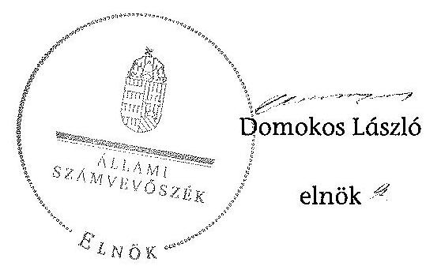

# ÁLLAMI   SZÁMVEVŐSZÉK 

## JELENTÉS

a helyi kisebbségi/nemzetiségi önkormányzatok gazdálkodásának ellenőrzéséről
Miskolc Megyei Jogú Város Cigány Nemzetiségi Önkormányzata

---

# Állami Számvevőszék 

Iktatószám: V-0058-131-002/2013.
Témaszám: 1068
Vizsgálat-azonosító szám: V06060102

## Az ellenőrzést felügyelte:

Horváth Balázs
felügyeleti vezető
Az ellenőrzést vezette és az ellenőrzés végrehajtásáért felelős:
Korsósné Vigh Andrea
ellenőrzésvezető
A számvevőszéki jelentést készítették és a jelentés összeállításában közremüködtek:

Komlósiné Bogár Éva
számvevő tanácsos
Mokánszkiné Mengyi Andrea
számvevő tanácsos
Az ellenőrzést végezte:
Mokánszkiné Mengyi Andrea
számvevő tanácsos

A témához kapcsolódó eddig készített számvevőszéki jelentés:
címe
sorszáma
Jelentés a Miskolc Megyei Jogú Város Önkormányzat gazdálkodásának átfogó ellenőrzéséről

---

# TARTALOMJEGYZÉK 

BEVEZETÉS ..... 5
I. ÖSSZEGZŐ MEGÁLLAPÍTÁSOK, KÖVETKEZTETÉSEK, JAVASLATOK ..... 8
II. RÉSZLETES MEGÁLLAPÍTÁSOK ..... 13

1. A Nemzetiségi és a Települési Önkormányzat együttműködésének szabályszerűsége ..... 13
2. A gazdálkodási feladatok ellátásának szabályszerűsége ..... 14
2.1. A költségvetésre és zárszámadásra, valamint a kincstári adatszolgáltatás rendjére vonatkozó jogszabályi előírások betartása ..... 14
2.2. A Nemzetiségi Önkormányzat gazdálkodásának szabályozottsága ..... 14
2.3. A pénzügyi kontrollok múködése ..... 16
3. A Nemzetiségi Önkormányzattal összefüggő gazdálkodási feladatok belső ellenőrzése ..... 17
4. A Nemzetiségi Önkormányzat feladatellátása ..... 17

## MELLÉKLET

1. számú A Nemzetiségi Önkormányzat 2011. évi és 2012. I. félévi gazdálkodásának főbb adatai, mutatói

## FÜGGELÉKEK

1. számú Értelmező szótár
2. számú A pénzügyi kontrollok múködésének értékelése

---

.

---

# RÖVIDÍTÉSEK JEGYZÉKE 

## Jogszabályok

Áht. 1
Áht. 2
ÁSZ tv.
Nek. 1 tv.
Nek. 2 tv.
Számv. tv.
Áhsz.
Ámr.
Ávr.

Ber.
támogatási kormányrendelet

Települési Önkormányzat SZMSZ-e

## Szórövidítések

ÁSZ
jegyzó
Képviselő-testület
1992. évi XXXVIII. törvény az államháztartásról (hatályos 2011. december 31-ig)
2011. évi CXCV. törvény az államháztartásról (hatályos 2011. december 31-étől)
2011. évi LXVI. törvény az Állami Számvevőszékről (hatályos 2011. július 1-jétől)
1993. évi LXXVII. törvény a nemzeti és etnikai kisebbségek jogairól (hatályos 2011. december 31-ig)
2011. évi CLXXIX. törvény a nemzetiségek jogairól (hatályos 2011. december 20-tól)
2000. évi C. törvény a számvitelről
2011. évi CLXXIX. törvény a nemzetiségek jogairól (hatályos 2011. december 20-tól)
292/2009. (XII. 19.) Korm. rendelet az államháztartás múködési rendjéről (hatályos 2011. december 31-ig)
368/2011. (XII. 31.) Korm. rendelet az államháztartásról szóló törvény végrehajtásáról (hatályos 2012. január 1jétől)
a költségvetési szervek belső ellenőrzéséről szóló 193/2003. (XI. 26.) Korm. rendelet, hatályos 2011. december 31 -ig
342/2010. (XII. 28.) Korm. rendelet a kisebbségi önkormányzatoknak a központi költségvetésből, valamint fejezeti kezelésű előirányzatból nyújtott támogatások feltételrendszeréről és elszámolásának rendjéről (hatályon kívül helyezte a 28/2012. (III. 6.) Korm. rendelet a nemzetiségi célú előirányzatokból nyújtott támogatások feltételrendszeréről és elszámolásának rendjéről; jelenleg hatályos a 428/2012. (XII. 29.) Korm. rendelet a nemzetiségi célú előirányzatokból nyújtott támogatások feltételrendszeréről és elszámolásának rendjéről)
Miskolc Megyei Jogú Város Önkormányzata 7/2011. (III. 16.) számú rendelete a Közgyűlés és Szervei Szervezeti és Múködési Szabályzatáról

Állami Számvevőszék
Miskolc Megyei Jogú Város Önkormányzatának jegyzője
Miskolc Megyei Jogú Város Roma Kisebbségi Önkormányzatának Képviselő-testülete 2011. december 31-ig, Miskolc Megyei Jogú Város Cigány Nemzetiségi Önkormányzatának Képviselő-testülete 2012. január 1-jétől

---

Közgyűlés
Nemzetiségi Önkormányzat

Nemzetiségi Önkormányzat elnöke
pénzügyi kontrollok
polgármester
Polgármesteri Hivatal
Polgármesteri Hivatal SZMSZ-e

Települési Önkormányzat
Miskolc Megyei Jogú Város Önkormányzatának Közgyűlése
Miskolc Megyei Jogú Város Roma Kisebbségi Önkormányzata 2011. december 31-ig, Miskolc Megyei Jogú Város Cigány Nemzetiségi Önkormányzata 2012. január 1-jétől
Miskolc Megyei Jogú Város Roma Kisebbségi Önkormányzatának elnöke 2011. december 31-ig, Miskolc Megyei Jogú Város Cigány Nemzetiségi Önkormányzatának elnöke 2012. január 1-jétől
a kötelezettségvállalás és az utalvány ellenjegyzése, valamint a szakmai teljesítés igazolása 2011. december 31ig, 2012. január 1-jétől a pénzügyi ellenjegyzés, a teljesítés igazolása és az érvényesítés
Miskolc Megyei Jogú Város Önkormányzatának polgármestere
Miskolc Megyei Jogú Város Önkormányzatának Polgármesteri Hivatala
Miskolc Megyei Jogú Város Önkormányzata II26/22.310/2011. számú határozata a Polgármesteri Hivatal Szervezeti és Múködési Szabályzatáról
Miskolc Megyei Jogú Város Önkormányzata

---

# JELENTÉS 

## a helyi kisebbségi/nemzetiségi önkormányzatok gazdálkodásának ellenőrzéséről Miskolc Megyei Jogú Város Cigány Nemzetiségi Önkormányzata

## BEVEZETÉS

Az államháztartás részét, az önkormányzati alrendszer egyik elemét képezik a nemzetiségi önkormányzatok, amelyek jogi személyek és a Nek. ${ }_{1,2}$ tv.-ben meghatározott önálló feladat- és hatáskörökkel rendelkeznek. A nemzetiségi önkormányzatok az önkormányzati, illetve testületi múködtetés mellett a helyi nemzetiségi közügyek változatos formában való ellátásában vesznek részt.

A nemzetiségi önkormányzatok, illetve a települési önkormányzatok között a jelenlegi szabályozás szerint nincs alá-fölérendeltségi viszony. A nemzetiségi önkormányzatok azonban sajátos közjogi helyzetben vannak, mert a jogállásukat tekintve önkormányzatok, ám függnek a székhelyük szerinti települési önkormányzat hivatalától, amely ellátja a nemzetiségi önkormányzatok vonatkozásában a megállapodásban rögzített gazdálkodási feladatokat.

A nemzetiségek helyzete, támogatása mind hazai, mind európai uniós szinten kiemelt figyelmet kapnak napjainkban. A nemzetiségi önkormányzatok gazdálkodására és támogatási rendszerére vonatkozó jogszabályok a 20102012. években jelentős változásokon mentek át, amelyek érintették a feladatalapú támogatásra fordítható költségvetési keret megállapítását, az operatív gazdálkodási jogkörök szabályozását, az elkülönített könyvvezetés alkalmazását, a belső ellenőrzés szabályozását.

Az ellenőrzés célja annak értékelése volt, hogy a Nemzetiségi Önkormányzat gazdálkodási kereteinek kialakítása, gazdálkodása és feladatellátása megfelelte a hatályos jogszabályoknak.

Ennek keretében ellenőriztük, hogy:

- a Nemzetiségi Önkormányzat és a Települési Önkormányzat együttmúködésének szabályozása, a Települési Önkormányzat SZMSZ-ében, a megállapodásban előírt működési feltételek biztosítása megfelelt-e a jogszabályi előírásoknak;
- a felek együttműködése megfelelt-e a megállapodásnak a gazdálkodási feladatok szabályszerű ellátásában, betartották-e a Nemzetiségi Önkormányzat gazdálkodásához kapcsolódóan a költségvetésre és zárszámadásra, a gazdálkodás szabályozására, az operatív gazdálkodási jogkörök gyakorlására vonatkozó jogszabályi előírásokat;

---

- a jegyző biztosította-e a Polgármesteri Hivatal belső ellenőrzése keretében a Nemzetiségi Önkormányzattal összefüggő gazdálkodási feladatok belső ellenőrzését;
- a 2011. évi feladatalapú támogatás felhasználása, a folyósított feladatalapú támogatással történő elszámolás az előírásoknak megfelelő volt-e;
- a Nemzetiségi Önkormányzat feladatellátása összhangban volt-e a vonatkozó jogszabályi előírásokkal.

Az ellenőrzés típusa: szabályszerűségi ellenőrzés
Az ellenőrzött időszak: 2011. január 1. - 2012. június 30.
Ellenőrzött szervezet: Miskolc Megyei Jogú Város Cigány Nemzetiségi Önkormányzat és a gazdálkodási feladatait ellátó Miskolc Megyei Jogú Város Önkormányzata

Az ellenőrzés jogszabályi alapja: az ÁSZ tv. 5. § (2)-(3) és (6) bekezdései
Az ellenőrzés szakmai módszertana az ÁSZ hivatalos honlapján (www.asz.hu) közzétett szakmai szabályokon alapult, amely a Legfőbb Ellenőrző Intézmények Nemzetközi Szervezete (INTOSAI) által kiadott nemzetközi standardok (ISSAI) figyelembevételével készült.

A fogalmak magyarázatát az 1. számú függelék, a pénzügyi kontrollok megfelelősége értékelésénél alkalmazott egységes minősítési szempontokat a 2. számú függelék tartalmazza.

Az ellenőrzés lefolytatásához a Települési Önkormányzat és a Nemzetiségi Önkormányzat tanúsítványok kitöltésével és a kapcsolódó dokumentumok elektronikus megküldésével szolgáltatott adatokat. A tanúsítványokon szerepeltetett adatok, információk ellenőrzése és szükség szerinti javítása a helyszíni ellenőrzés keretében történt.

Az ÁSZ az ellenőrzés megállapításait az ellenőrzött időszakban hatályos, az intézkedést igénylő megállapításokra tett javaslatokat a jelenleg hatályos jogszabályok alapján fogalmazta meg.

A Nemzetiségi Önkormányzat 1994-ben alakult, elnöke a 2010. évi helyhatósági választások óta látja el feladatát. Intézményt, gazdasági társaságot és más szervezetet nem alapított, illetve ezek társulásában nem vett részt. A négytagú Képviselő-testület munkája segítésére bizottságot nem hozott létre. A Nemzetiségi Önkormányzat költségvetési beszámolója szerint a 2011. évben 6149 ezer Ft bevételt ért el és 5904 ezer Ft kiadást teljesített. A 2011. évben feladatalapú támogatásban nem részesült. A 2012. I. félévi beszámolója alapján a teljesített bevétel 2909 ezer Ft, a teljesített kiadás 1990 ezer Ft volt. A 2011. évi és a 2012. I. féléves gazdálkodási adatokat részletesen az 1. számú mellékletben mutatjuk be. Az ÁSZ a Nemzetiségi Önkormányzat gazdálkodását korábban a 2004. évben ellenőrizte.

---

Az ÁSZ tv. 29. § (1) bekezdése szerint a jelentéstervezetet megküldtük a polgármester és a Nemzetiségi Önkormányzat elnöke részére, akik az ÁSZ tv. 29. § (2) bekezdésében foglalt észrevételezési jogukkal nem éltek, a jelentéstervezetre észrevételt nem tettek.

---

# I. ÖSSZEGZŐ MEGÁLLAPÍTÁSOK, KÖVETKEZTETÉSEK, JAVASLATOK 

A Nemzetiségi és a Települési Önkormányzat együttmúködése az előírt eljárásrend és határidő betartásával jóváhagyott megállapodásokon alapult. A Települési Önkormányzat biztosította a Nemzetiségi Önkormányzat múködéséhez szükséges személyi és tárgyi feltételeket. Az együttmúködés szabályozása a 2011. évben az Áht. ${ }_{1}$-ben és a Nek. ${ }_{1}$ tv-ben, a 2012. évben a Nek. ${ }_{2}$ tv-ben meghatározott tartalmi elemek tekintetében hiányos volt. A 2012. június 30 -án hatályos megállapodás a Nek. ${ }_{2}$ tv. előirása ellenére nem tartalmazta a költségvetés előkészítésével és megalkotásával, a költségvetéssel kapcsolatos adatszolgáltatással, az önálló fizetési számla nyitásával, az érvényesitési feladatok ellátásával, valamint a múködési feltételek biztosításával kapcsolatos felelősök konkrét kijelölését, továbbá nem írta elő a Nemzetiségi Önkormányzat ülésein részt vevő jegyző, illetve az általa megbízott személy jelzési kötelezettségét törvénysértés észlelése esetén. A hiányosságok a feladatellátás számon kérhetőségét korlátozták.

A Nemzetiségi Önkormányzat költségvetése és zárszámadása tekintetében a jogszabályi előírásokat összességében betartották. A költségvetési és zárszámadási határozatok jóváhagyása, a költségvetési előirányzatok módosítása a jogszabályban előírt eljárásrend szerint történt, a határozatokat egymással öszszehasonlítható szerkezetben készítették el és változatlan formában építették be a Települési Önkormányzat költségvetési és zárszámadási rendeleteibe. A 2011. évi költségvetéshez az Ámr. előírása ellenére nem készült előirányzatfelhasználási ütemterv. E hiányosságot a 2012. évben megszüntették, a költségvetési határozat tartalma a jogszabályi előírásoknak megfelelt. A jegyző 2012. I. félévben az Ávr.-ben és az Áhsz.-ben előírt, a Nemzetiségi Önkormányzatra vonatkozó kincstári adatszolgáltatási kötelezettségének eleget tett. A Nemzetiségi Önkormányzat - az előirányzat módosítás előterjesztése hiányában - a 2011. évben a személyi juttatások kiemelt előirányzatnál nem döntött a felhasználáshoz szükséges mértékű módosításról, ezért a teljesített kiadások az Áht. ${ }_{1}$ előírását megsértve meghaladták a jóváhagyott előirányzatot. 2012. I. félévben előirányzat túllépés nem történt.

A gazdálkodás szabályozottsága érdekében az e feladatok végrehajtását ellátó Polgármesteri Hivatal, a jogszabályokban előírt szabályzatok hatályát kiterjesztette a Nemzetiségi Önkormányzat gazdálkodási feladataira. A jegyző a 2012. I. félévben a Számv. tv.-ben előírt szabályzatokat a Nemzetiségi Önkormányzat önálló könyvvezetése és beszámolása alátámasztására elkülönülten elkészítette. Az operatív gazdálkodási jogkörök kialakítása 2012. március 31-ig a jogszabályi előírásokkal összhangban történt. Ezt követően azonban a pénzügyi ellenjegyző és az érvényesítő személyek jegyző általi kijelölését nem módosították annak ellenére, hogy az Ávr. rendelkezése a kijelölést a gazdasági vezető hatáskörébe utalta. A jegyző - a számvevőszéki feltárásra - a belső szabályozást a jogszabályi előírásoknak megfelelően módosította, a gazdasági vezető a pénzügyi ellenjegyzésre és az érvényesítési feladatok ellátására jogosult személyeket kijelölte. A Polgármesteri Hivatal SZMSZ-e az Ámr. és az Ávr. elő-

---

írásai ellenére nem tartalmazta a munkakörökhöz kapcsolódóan a Nemzetiségi Önkormányzat gazdálkodásával kapcsolatos feladat- és hatásköröket, a hatáskörök gyakorlásának módját, a helyettesítés rendjét és az ezekre vonatkozó felelősségi szabályokat.

A pénzügyi kontrollok múködése megfelelőségét a 2011. évben a dologi és egyéb folyó kiadások teljesítésénél az ellenőrzés összességében kiválónak értékelte. Egyedi hiányosság volt, hogy a szakmai teljesítés igazolója nem az Ámr.ben előírt módon végezte el feladatát, mert nem tüntette fel a szakmai teljesítés igazolásának dátumát. Az utalvány ellenjegyzője az Ámr. előírása ellenére nem végezte el szabályszerűen a gazdálkodási szabályok betartására és a teljesítés igazolására vonatkozó ellenőrzési feladatát, mert a szakmai teljesítés igazolásának dátuma hiányában ellenjegyezte az utalványt. A Nemzetiségi Önkormányzat 2012. I. félévi dologi és egyéb folyó kiadások teljesítése során a pénzügyi kontrollok múködésének megfelelősége gyenge volt. A hibák száma a lényegességi szintet, a kritikus hibahatárt elérte. A kötelezettségvállalás ellenjegyzője nem végezte el az Áht. ${ }_{1}$-ben és az Ávr.-ben előírt feladatát egy - előző évi megrendelés alapján - teljesített kiadás esetében. A kötelezettségvállalás ellenjegyzése hiányában elmaradt a szabad előirányzat, továbbá a pénzügyi fedezet rendelkezésre állásának, valamint a gazdálkodásra vonatkozó szabályok betartásának az ellenőrzése és igazolása. Az érvényesítő nem végezte el az Ávr.ben előírt ellenőrzési és jelzési feladatát, mert az ellenjegyzés nélküli kötelezettségvállalásnak az utalványozó felé történő jelzése nélkül érvényesítette a kiadás teljesítését, továbbá a 2012. március 31-ét követő időszakban nem jogszerű kijelölés alapján látta el feladatát. A számvevőszéki ellenőrzés a kifizetések dokumentumainak ellenőrzése alapján nem tárt fel jogosulatlan kifizetést.

A Nemzetiségi Önkormányzat feladatellátásának tárgya összhangban volt a Nek. ${ }_{1,2}$ tv. előírásaival. Biztosította a nemzetiségi közügyek keretében az alapvető feladatához szükséges szervezeti, személyi és anyagi feltételeket.

A Polgármesteri Hivatal 2011. és 2012. évekre vonatkozó éves ellenőrzési terveit megalapozó kockázatelemzés - a Ber. előírása ellenére - nem terjedt ki a Nemzetiségi Önkormányzat gazdálkodásával összefüggő végrehajtási feladatok ellátására. A Polgármesteri Hivatalban a Nemzetiségi Önkormányzat gazdálkodásával összefüggő végrehajtási feladatokra irányulóan belső ellenőrzési feladatot a 2011. évben és 2012. I. félévben nem terveztek és nem végeztek.

Az ellenőrzés megállapításai alapján, az észrevételezésre megküldött jelentéstervezetben a Nemzetiségi Önkormányzat gazdálkodásával kapcsolatban intézkedést igénylő megállapításokat és javaslatokat fogalmaztunk meg, amelyek végrehajtásáról az ellenőrzés időszakában intézkedési tájékoztatást adott a polgármester. A 2013. július 8-án megkötött hatályos együttműködési megállapodásban a Nek. ${ }_{2}$ tv. vonatkozó előírásait részben érvényesítették. A Polgármesteri Hivatal hatályos SZMSZ-e megfelelt az Ávr.-ben foglaltaknak. Figyelemmel az ÁSZ ellenőrzés hasznosítására mindezek vonatkozásában intézkedést igénylő megállapítást, javaslatot már nem szerepeltetünk.

Az ÁSZ tv. 33. § (1) bekezdésében foglaltak értelmében az ellenőrzött szervezet vezetője köteles a jelentésben foglalt megállapításokhoz kapcsolódó intézkedési tervet összeállítani, és azt a jelentés kézhezvételétől számított 30 napon belül az

---

ÁSZ részére megküldeni. Amennyiben az intézkedési tervet határidőre nem küldi meg a szervezet, vagy az nem elfogadható, az ÁSZ elnöke az ÁSZ tv. 33. § (3) bekezdés a)-b) pontjaiban foglaltakat érvényesítheti.

A helyszíni ellenőrzés megállapításainak hasznosítása mellett javasoljuk:

# a jegyzőnek 

1. az együttműködés szabályozásával kapcsolatban

A Nemzetiségi Önkormányzat és a Települési Önkormányzat együttműködését meghatározó - 2012. június 30 -án hatályos - megállapodás nem írta elő, hogy a Nemzetiségi Önkormányzat ülésein részt vevő jegyző, vagy az általa megbízott személy a Nek. 2 tv. 80. § (4) bekezdése alapján törvénysértés észlelése esetén jelzési kötelezettséggel tartozik.

Javaslat
Készítse elő a megállapodás módosítását, hogy tartalmilag feleljen meg a Nek. 2 tv. 80. § (4) bekezdésében foglalt előírásoknak.
2. a kiemelt költségvetési előirányzatokkal kapcsolatban

A személyi juttatások kiemelt előirányzat tekintetében a 2011. évi kiadások teljesítése a jóváhagyott előirányzatot meghaladó összegű volt, ezáltal nem tartották be az Áht. ${ }_{1} 12 /$ A. § (1) bekezdésében foglalt előírást.

Javaslat
A jövőben készítsen előterjesztést az előirányzatok szükséges mértékű módosítására az Áht. 2 34. § (1) és (6) bekezdéseiben foglaltaknak megfelelően úgy, hogy azt a Nemzetiségi Önkormányzat elnöke határidőben nyújthassa be a Képviselő-testület részére - az Áht. 2 36. § (1) bekezdése szerint - a meghatározott előirányzatokon belül való gazdálkodás érdekében.
3. a pénzügyi kontrollok múködésével kapcsolatban

A 2011. évben a szakmai teljesítést igazoló az igazolási feladatát nem az Ámr. 76. § (3) bekezdésében előírt módon látta el, mert nem tüntette fel a teljesítés igazolás dátumát; az utalvány ellenjegyzője az Ámr 79. § (2) bekezdésében előírt ellenőrzési feladatát nem végezte el, mert a szakmai teljesítés igazolás dátumának hiányában ellenjegyezte az utalványt.

A 2011. évi megrendelő alapján teljesített és pénzügyileg 2012. I. félévben rendezett kifizetés esetében a kötelezettségvállalás ellenjegyzője az Ámr. 74. § (1) és (3) bekezdéseiben előírt feladatát nem végezte el, így elmaradt a szabad előirányzat, továbbá a fedezet rendelkezésre állásának, valamint a gazdálkodásra vonatkozó szabályok betartásának az ellenőrzése és igazolása.

---

Az érvényesítő nem látta el az Ávr. 58. § (1)-(2) bekezdéselben előírt ellenőrzési és jelzési feladatát, mert az ellenjegyzés nélküli kötelezettségvállalásnak az utalványozó felé történő jelzése nélkül érvényesítette a kiadás teljesítését.

Javaslat
Az operatív gazdálkodás működési hibáinak megelőzése, feltárása és kijavítása érdekében gondoskodjon arról, hogy:
a) a teljesítés igazolása során az Ávr. 57. § (3) bekezdésében előírtaknak megfelelően a teljesítés igazolásakor kerüljön feltüntetésre annak dátuma;
b) a kötelezettségvállalásra - az Ávr. 53. §-ában és ez alapján a kötelezettségvállaló szerv belső szabályzatában rögzített kivétellel - az Áht. 37. § (1), valamint az Ávr. 55. § (1) bekezdése szerint elvégzett pénzügyi ellenjegyzést követően kerüljön sor, a pénzügyi ellenjegyző győződjön meg arról, hogy a kötelezettségvállalás tárgyával összefüggő szabad előirányzat rendelkezésre áll, a tervezett kifizetés időpontjában a pénzügyi fedezet biztosított, és a kötelezettségvállalás nem sérti a gazdálkodásra vonatkozó szabályokat;
c) az Ávr. 58. § (1)-(2) bekezdései alapján az érvényesítő lássa el ellenőrzési és jelzési feladatát.

# a polgármesternek 

A Nemzetiségi Önkormányzat és a Települési Önkormányzat együttműködését meghatározó - 2012. június 30 -án hatályos - megállapodás nem írta elő, hogy a Nemzetiségi Önkormányzat ülésein részt vevő jegyző, vagy az általa megbízott személy a Nek. 2 tv. 80. § (4) bekezdése alapján törvénysértés észlelése esetén jelzési kötelezettséggel tartozik.

Javaslat
Terjessze a Közgyűlés elé jóváhagyásra a Nek. ${ }_{2}$ tv. 80. § (4) bekezdésében foglalt előírások betartásával előkészített megállapodás módosítást.

## a Nemzetiségi Önkormányzat elnökének

1. A Nemzetiségi Önkormányzat és a Települési Önkormányzat együttműködését meghatározó - 2012. június 30 -án hatályos - megállapodás nem írta elő, hogy a Nemzetiségi Önkormányzat ülésein részt vevő jegyző, vagy az általa megbízott személy a Nek. 2 tv. 80. § (4) bekezdése alapján törvénysértés észlelése esetén jelzési kötelezettséggel tartozik.

Javaslat
Terjessze a Képviselő-testület elé jóváhagyásra a Nek. 2 tv. 80. § (4) bekezdésében foglalt előírások betartásával előkészített megállapodás módosítást.

---

2. A személyi juttatások kiemelt előirányzat tekintetében a 2011. évi kiadások teljesítése a jóváhagyott előirányzatot meghaladó összegű volt, ezáltal nem tartották be az Áht. ${ }_{1}$ 12/A. § (1) bekezdésében foglalt előírást.

Javaslat
A jövőben terjessze a Képviselő-testület elé jóváhagyásra az Áht. ${ }_{2}$ 34. § (1) és (6) bekezdései alapján készült, az előirányzatok szükséges mértékű módosításáról szóló előterjesztést.

---

# II. RÉSZLETES MEGÁLLAPÍTÁSOK 

## 1. A Nemzetiségi és a Telepúlési Önkormányzat együttmúKÖDÉSÉNEK SZABÁLYSZERÜSÉGE

A Nemzetiségi és a Települési Önkormányzat együttműködése az előírt eljárásrend és határidő betartásával jóváhagyott megállapodásokon ${ }^{1}$ alapult. Az együttmúködés szabályozása a 2011. évben az Áht. ${ }_{1}$-ben és a Nek. ${ }_{1}$ tv-ben, a 2012. évben a Nek. ${ }_{2}$ tv-ben meghatározott tartalmi elemek tekintetében hiányos volt:

- a 2011. december 31-én hatályos megállapodás nem tartalmazta az Áht. ${ }_{1} 66$. 8 -ában foglalt előírások ellenére teljes körűen a Nemzetiségi Önkormányzat gazdálkodása végrehajtásának rendjéhez kapcsolódó feladatellátás jogosultjainak, kötelezettjeinek a kijelölését. A Nek. ${ }_{1}$ tv. 27. § (1)-(2) bekezdéseiben foglaltak ellenére nem szabályozták (a Települési Önkormányzat SZMSZ-ében, vagy más dokumentumban) a Nemzetiségi Önkormányzat Képviselő-testülete múködéséhez szükséges helyiséghasználatot; a postai, kézbesítési, gépelési, sokszorosítási feladatok ellátásának, valamint az ezzel járó költségek viselésének rendjét;
- a 2012. június 30 -án hatályos megállapodásban a Nek. ${ }_{2}$ tv. 80. § (3) bekezdése a)-b) és d) pontjaiban foglaltak ellenére nem rögzítették a Nemzetiségi Önkormányzat költségvetése előkészítéséért és megalkotásáért, a költségvetéssel összefüggő adatszolgáltatásért, az önálló fizetési számla nyitásáért, az érvényesítési feladatok ellátásáért, valamint a múködési feltételek biztosításáért felelősök konkrét kijelölését. További hiányosság, hogy nem írták elő - a Nek. ${ }_{2}$ tv. 80. § (4) bekezdésében foglaltakat figyelmen kívül hagyva - a jegyző, illetve a megbízásából a Nemzetiségi Önkormányzat ülésein résztvevő személy jelzési kötelezettségét törvénysértés észlelése esetén.

A Települési Önkormányzat biztosította a Nemzetiségi Önkormányzat müködéséhez szükséges személyi és tárgyi feltételeket.

[^0]
[^0]:    ${ }^{1}$ A 2011. évben és 2012. június 1-jéig hatályos megállapodást a Képviselő-testület az R47/2010. (XII. 9.), a Közgyűlés az X-250/44.396/2010. (XII. 16.) számú határozattal fogadta el. A Nek. ${ }_{2}$ tv. 159. § (3) bekezdésében előírtak alapján 2012. június 1-jéig felülvizsgált és módosított megállapodást a Közgyűlés a V-132/2879/2012. (V. 17.) számú, míg a Képviselő-testület a C-14/2012. (VI. 20.) számú határozattal fogadta el.

---

# 2. A GAZDÁLKODÁSI FELADATOK ELLÁTÁSÁNAK SZABÁLYSZERŰSÉGE 

### 2.1. A költségvetésre és zárszámadásra, valamint a kincstári adatszolgáltatás rendjére vonatkozó jogszabályi előírások betartása

A Nemzetiségi Önkormányzat költségvetése és zárszámadása tekintetében a jogszabályi előírásokat összességében - a 2011. évi költségvetési határozat egy tartalmi elemét előíró Ámr. és a jóváhagyott előirányzatokon belüli gazdálkodásra vonatkozó Áht. ${ }_{1}$ rendelkezések kivételével - betartották. A Nemzetiségi Önkormányzat költségvetési és zárszámadási határozatait ${ }^{2}$ a jogszabályban előírt eljárásrend szerint fogadták el, a költségvetési és zárszámadási határozatok egymással összehasonlítható szerkezetben készültek, azok változatlan formában épültek be a Települési Önkormányzat költségvetési és zárszámadási rendeleteibe.

A 2011. évi költségvetési határozat nem tartalmazta az Ámr. 36. § (1) bekezdése k) pont előírása ellenére az év várható bevételi és kiadási előirányzatainak teljesüléséről készített előirányzat-felhasználási ütemtervet.

A 2012. évi költségvetési határozat tartalma a jogszabályi előírásoknak megfelelt. 2012. I. félévben az Ávr.-ben és az Áhsz.-ben előírt, a Nemzetiségi Önkormányzatra vonatkozó kincstári adatszolgáltatási kötelezettségének a jegyző eleget tett.

A Nemzetiségi Önkormányzat a költségvetés főösszege szintjén biztosította a tárgyévi fizetési kötelezettség vállalásához szükséges fedezet meglétét. E főöszszegen belül a kiemelt előirányzatok tekintetében azonban a 2011. évben - az előirányzat módosítás előterjesztése hiányában - nem döntött a felhasználáshoz szükséges mértékű módosításról. A személyi juttatások kiemelt előirányzatnál a 2011. évben a kiadások teljesítése a jóváhagyott előirányzatot meghaladó ${ }^{3}$ összegú volt. Ezáltal nem tartották be az Áht. ${ }_{1}$ 12/A. § (1) bekezdésében foglalt előírást. 2012. I. félévben előirányzat túllépés nem történt.

### 2.2. A Nemzetiségi Önkormányzat gazdálkodásának szabályozottsága

A Nemzetiségi Önkormányzat gazdálkodásának szabályozottsága az ellenőrzött időszakban összességében - a szabályozások kisebb tartalmi hiányossága mellett - biztosított volt. A gazdálkodási feladatai végrehajtását ellátó Polgármesteri Hivatal a 2011. évben a jogszabályokban előírt gazdálkodá-

[^0]
[^0]:    ${ }^{2}$ A Képviselő-testületnek a Nemzetiségi Önkormányzat 2011. évi költségvetéséről alkotott R-2/2011. (II. 2.), a 2011. évi zárszámadásról szóló C-11/2012. (II. 20.) és a 2012. évi költségvetésről szóló C-12/2012. (II. 20.) számú határozatai.
    ${ }^{3}$ A személyi juttatások módosított előirányzata a 2011. évben 2086 ezer Ft, a teljesítés 2325 ezer Ft, a túllépés 239 ezer Ft volt.

---

si szabályzatokkal ${ }^{4}$ a Nemzetiségi Önkormányzat gazdálkodási feladataira kiterjedő hatállyal rendelkezett.

A jegyző a 2012. I. félévében elkészítette és önállóan meghatározta a Nemzetiségi Önkormányzat elkülönült könyvvezetését és elemi beszámolóját alátámasztó számviteli politikát, számlarendet, leltározási és leltárkészítési, pénzkezelési, továbbá az eszközök és források értékelési szabályzatát.

A Nemzetiségi Önkormányzat gazdálkodásával összefüggő feladatok szabályozása tekintetében a Polgármesteri Hivatal SZMSZ-e az ellenőrzött időszakban hiányos volt. A 2011. évben az Ámr. 20. § (2) bekezdése h) pontjában, valamint a 2012. I. félévében az Ávr. 13. § (1) bekezdése g) pontjában foglaltak ellenére nem tartalmazta munkakörökhöz kapcsolódóan a Nemzetiségi Önkormányzat gazdálkodásával kapcsolatos feladat- és hatásköröket, a hatáskörök gyakorlásának módját, a helyettesítés rendjét és az ezekre vonatkozó felelősségi szabályokat.

A Nemzetiségi Önkormányzat operatív gazdálkodási jogköreinek kialakítása - a kötelezettségvállalásra, utalványozásra, kötelezettségvállalás és utalványozás ellenjegyzésére a felhatalmazás, a szakmai teljesítés igazoló és az érvényesítést végző személyek kijelölése - a 2011. évben a jogszabályi előírásoknak megfelelő volt.

A 2012. I. félévben a Nemzetiségi Önkormányzat operatív gazdálkodási jogkörei kialakítása keretében a kötelezettségvállalásra, utalványozásra adott felhatalmazás, valamint a teljesítést igazoló megbízása a jogszabályi előírásoknak megfelelően történt. A pénzügyi ellenjegyzök, valamint az érvényesítő személyek jegyző általi kijelölését 2012. március 31-ét követően - a jogszabályi változást figyelmen kívül hagyva - nem módosították, annak ellenére, hogy az Ávr. 55. § (2) bekezdése g) pontjának és az 58. § (4) bekezdésének előirása a kijelölést a gazdasági vezető hatáskörébe utalta.

A pénzügyi ellenjegyzők és érvényesítők jogosulatlan személy általi kijelölése nem veszélyeztette, hogy e kontrolltevékenységek - végrehajtásuk esetén - biztosítsák a lehetséges hibák feltárását, kijavítását, mert a kijelölt személyek a feladatuk ellátásához előírt képesítési követelményeknek megfeleltek.

A jegyző a hiányosság számvevőszéki feltárását követően a Polgármesteri Hivatal Gazdálkodási Utasítását módosította, a pénzügyi ellenjegyzésre a felhatalmazásokat és az érvényesítő személyek kijelölését a gazdasági vezető hatáskörébe utalta ${ }^{5}$. A gazdasági vezető a pénzügyi ellenjegyzésre a felhatalmazásokat és az érvényesítő személyek kijelölését a jogszabályi előírásoknak megfelelően elvégezte.

[^0]
[^0]:    ${ }^{4}$ Számviteli politika, számlarend, leltározási és leltárkészítési szabályzat, pénzkezelési szabályzat, eszközök és források értékelési szabályzata, munkaköri leírások, ellenőrzési nyomvonal, szabálytalanságok kezelésének eljárásrendje, kockázatkezelési szabályzat, folyamatba épített, előzetes, utólagos és vezetői ellenőrzés (FEUVE) szabályozás.
    ${ }^{5}$ 2013. február 15-i hatálybalépéssel a jegyző a Polgármesteri Hivatal Gazdálkodási Utasítását módosította, a pénzügyi ellenjegyzők és az érvényesítők kijelölését a gazdasági vezető a 22147/2013. ügyiratszámú dokumentumban elvégezte.

---

# 2.3. A pénzügyi kontrollok múködése 

A Nemzetiségi Önkormányzat 2011. évi dologi és egyéb folyó kiadásai teljesítése során a kötelezettségvállalás-ellenjegyzése, a szakmai teljesítésigazolás és az utalvány ellenjegyzés kontrollok múködésének megfelelősége összességében kiváló volt. A 100 ezer Ft-ot el nem érő kötelezettségvállalások ellenjegyzése és nyilvántartásba vétele során a belső utasításban foglaltak szerint jártak el. A szakmai teljesítést igazoló és az utalvány ellenjegyzöje a jogszabályokban és a belső utasításban meghatározott munkafolyamatba épített ellenőrzési kötelezettségeinek egy kifizetés kivételével eleget tett. Eseti hiányosság volt, hogy:

- a szakmai teljesítést igazoló az igazolási feladatát nem az Ámr. 76. § (3) bekezdésében előírt módon látta el, mert nem tüntette fel a szakmai teljesítés igazolás dátumát;
- az utalvány ellenjegyzője az Ámr. 79. § (2) bekezdésében előírt ellenőrzési feladatát nem végezte el, mert a szakmai teljesítés igazolás dátumának hiányában ellenjegyezte az utalványt.

A Nemzetiségi Önkormányzatnál 2012. I. félévben a dologi és egyéb folyó kiadások teljesítése során a pénzügyi ellenjegyzés, a teljesítés igazolás és az érvényesítés kontrollok múködésének megfelelősége összességében gyenge volt, a hibák száma a lényegességi szintet, a kritikus hibahatárt elérte, mert:

- a 2011. évi megrendelő alapján teljesített és pénzügyileg 2012. I. félévben teljesített 100 ezer Ft-ot elérő kifizetés esetében a kötelezettségvállalás ellenjegyzője ${ }^{6}$ az Ámr. 74. § (1) és (3) bekezdéseiben ${ }^{7}$ előírt feladatát nem végezte el, így elmaradt a szabad előirányzat, továbbá a fedezet rendelkezésre állásának, valamint a gazdálkodásra vonatkozó szabályok betartásának az ellenőrzése és igazolása;
- a teljesítést igazoló az ellenőrzési és igazolási kötelezettségének a jogszabályi előírásoknak megfelelően eleget tett, azonban
- az érvényesítő nem látta el az Ávr. 58. § (1)-(2) bekezdéseiben előírt ellenőrzési és jelzési feladatát, mert az ellenjegyzés nélküli kötelezettségvállalásnak az utalványozó felé történő jelzése nélkül érvényesítette a kiadás teljesítését, továbbá a 2012. március 31-ét követő időszakban nem jogszerű kijelölés alapján látta el feladatát. A hibák száma a lényegességi szintet elérte.

A számvevőszéki ellenőrzés a kifizetések dokumentumainak ellenőrzése alapján nem tárt fel jogosulatlan kifizetést.

[^0]
[^0]:    ${ }^{6}$ 2012. január 1-jétől pénzügyi ellenjegyzó
    ${ }^{7}$ 2012. január 1-jétől Áht. ${ }_{2}$ 37. § (1) bekezdése és az Ávr. 55. § (1) bekezdése

---

# 3. A Nemzetiségi Önkormányzattal öSSZefüGGŐ GAZDÁlKODÁSI FELADATOK BELSŐ ELLENÖRZÉSE 

A Polgármesteri Hivatal 2011. és 2012. évekre vonatkozó éves ellenőrzési terveit megalapozó, a Ber. 21. § (2) bekezdésében előírt kockázatelemzés nem terjedt ki a Nemzetiségi Önkormányzat gazdálkodásával összefüggő végrehajtási feladatok ellátására. A Polgármesteri Hivatalnál a Nemzetiségi Önkormányzat gazdálkodásával összefüggő végrehajtási feladatok ellátása tekintetében belső ellenőrzési feladatot a 2011. évben és a 2012. I. félévben nem terveztek és nem végeztek.

## 4. A Nemzetiségi Önkormányzat feladATELLátása

A Nemzetiségi Önkormányzat feladatellátásának tárgya összhangban volt a Nek. ${ }_{1,2}$ tv. előírásaival.

Biztosította a Nek. ${ }_{1}$ tv. 5/A. § (1) bekezdése és a Nek. ${ }_{2}$ tv. 10. § (1) bekezdése szerinti, „a nemzetiségi érdekek védelme és képviselete a nemzetiségi önkormányzati fel-adat- és hatáskörének gyakorlásával" kapcsolatos alapvető feladata ellátásához szükséges szervezeti, személyi és anyagi feltételeket.

Budapest, 2013. 12. hónap 06. nap

Melléklet: $\quad 1 \mathrm{db}$
Függelék: $\quad 2 \mathrm{db}$

---

.

---

# A Nemzetiségi Önkormányzat 2011. évi és 2012. I. félévi gazdálkodásának föbb adatai, mutatói

A) Bevételek

|  Megnevezés | 2011. év |  |  |  | 2012. I. félév |  |  |   |
| --- | --- | --- | --- | --- | --- | --- | --- | --- |
|   | eredeti
ei. | módosí-
tott ei. | teljesítés | teljesítés
megoszlása
(\%) | eredeti
ei. | módosí-
tott ei. | teljesítés | teljesítés
megoszlása
(\%)  |
|  Intézményi müködési
bevételek | 0 | 0 | 0 | 0,0\% | 0 | 0 | 0 | 0,0\%  |
|  Általános müködési
támogatás | 210 | 210 | 210 | 3,4\% | 215 | 215 | 215 | 7,4\%  |
|  Feladatalapú
támogatás | 0 | 0 | 0 | 0,0\% | 0 | 0 | 0 | 0,0\%  |
|  Települési Onkor-
mányzat által nyújtott
támogatás | 600 | 3300 | 3300 | 53,7\% | 600 | 600 | 0 | 0,0\%  |
|  Támogatásértékủ
müködési bevétel | 0 | 2559 | 2559 | 41,6\% | 0 | 2349 | 2349 | 80,8\%  |
|  Államháztartáson
kívülröl átvett
pénzeszköz | 0 | 0 | 0 | 0,0\% | 0 | 100 | 100 | 3,4\%  |
|  Pénzforgalmi bevételek
összesen | 810 | 6069 | 6069 | 98,7\% | 815 | 3264 | 2664 | 91,6\%  |
|  Előző évi pénzmar-
radvány felhasználás | 0 | 80 | 80 | 1,3\% | 0 | 245 | 245 | 8,4\%  |
|  Bevételek összesen | 810 | 6149 | 6149 | 100,0\% | 815 | 3509 | 2909 | 100,0\%  |

B) Kiadások adatok ezer Ft-ban

|  Megnevezés | 2011. év |  |  |  | 2012. I. félév |  |  |   |
| --- | --- | --- | --- | --- | --- | --- | --- | --- |
|   | eredeti
ei. | módosí-
tott ei. | teljesítés | teljesítés
megoszlása
(\%) | eredeti
ei. | módosí-
tott ei. | teljesítés | teljesítés
megoszlása
(\%)  |
|  Személyi juttatások | 300 | 2086 | 2325 | 39,4\% | 300 | 1205 | 1122 | 56,4\%  |
|  Munkaadókat terhelő
járulékok | 0 | 483 | 316 | 54,3\% | 0 | 244 | 150 | 7,5\%  |
|  Dologi és egyéb folyó
kiadások | 510 | 3580 | 3228 | 54,7\% | 515 | 2060 | 718 | 36,1\%  |
|  Támogatásértékủ
müködési kiadás | 0 |  | 35 | 0,6\% | 0 | 0 | 0 | 0,0\%  |
|  Müködési kiadások
összesen | 810 | 6149 | 5904 | 100,0\% | 815 | 3509 | 1990 | 100,0\%  |
|  Felhalmozási kiadások | 0 | 0 | 0 | 0,0\% | 0 | 0 | 0 | 0,0\%  |
|  Kiadások összesen | 810 | 6149 | 5904 | 100,0\% | 815 | 3509 | 1990 | 100,0\%  |

---

.

---

# ÉRTELMEZŐ SZÓTÁR 

feladatalapú támogatás

megállapodás
nemzetiségi közügy
nemzetiség

A támogatási évben általános múködési támogatásban részesült, és a Támogatónak a Kincstárhoz intézett, a feladatalapú támogatás utalására vonatkozó rendelkező levele keltének időpontjában múködő nemzetiségi önkormányzatoknak az e rendeletben rögzített feltételrendszer alapján nyújtható támogatás. A feladatalapú támogatás a nemzetiségi közügyeknek a nemzetiségi önkormányzatok által történő ellátását szolgálja. (A támogatási kormányrendelet 2. § (2) bekezdés c) pont, és 4. § (1) bekezdés alapján.)

A nemzetiségi önkormányzatnak a múködési feltételei biztosítására, továbbá a bevételeivel és a kiadásaival kapcsolatban a tervezési, gazdálkodási, ellenőrzési, finanszírozási, adatszolgáltatási és beszámolási feladatai végrehajtására a székhelye szerinti települési önkormányzattal megkötött megállapodás. (Az Áht. ${ }_{1} 66 . \S$, a Nek. ${ }_{2}$ tv. $80 \S$ (2) bekezdés, valamint az Áht. ${ }_{2}$ 27. § (2) bekezdés alapján levezetett fogalom.)
Az egyéni és közösségi jogok érvényesülése, a nemzetiséghez tartozók érdekeinek kifejezésre juttatása - különösen az anyanyelv ápolása, őrzése és gyarapítása, továbbá a nemzetiségek kulturális autonómiájának a nemzetiségi önkormányzatok által történő megvalósítása és megőrzése - érdekében a nemzetiséghez tartozók meghatározott közszolgáltatásokkal való ellátásával, ezen ügyek önálló vitelével és az ehhez szükséges szervezeti, személyi és anyagi feltételek megteremtésével összefüggő ügy. A közhatalmat gyakorló állami és helyi önkormányzati szervekben, továbbá a nemzetiségi önkormányzati szervekben való nemzetiségi képviselethez és mindezek szervezeti, személyi és anyagi feltételeinek biztosításához kapcsolódó ügy. (A Nek., tv. 6/A. § 1. pontjából és a Nek. ${ }_{2}$ tv. 2. § 1. pontjából levezetett fogalom.)
Minden olyan Magyarország területén legalább egy évszázada honos népcsoport, amely az állam lakossága körében számszerú kisebbségben van és a lakosság többi részétől saját nyelve és kultúrája, hagyományai különböztetik meg, egyben olyan összetartozás-tudatról tesz bizonyságot, amely mindezek megőrzésére, történelmileg kialakult közösségeik érdekeinek kifejezésére és védelmére irányul. (A Nek. ${ }_{1}$ tv. 1. § (2) bekezdése, valamint a Nek. ${ }_{2}$ tv. 1. § (1) bekezdése alapján levezetett fogalom.)

---

nemzetiségi önkormányzat

Törvényben meghatározott nemzetiségi közszolgáltatási feladatokat ellátó, testületi formában múködő, jogi személyiséggel rendelkező, demokratikus választások útján törvény alapján létrehozott szervezet, amely a nemzetiségi közösséget megillető jogosultságok érvényesítésére, a nemzetiségek érdekeinek védelmére és képviseletére, a feladat- és hatáskörébe tartozó nemzetiségi közügyek települési, területi vagy országos szinten történő önálló intézésére jön létre. (A Nek. ${ }_{1}$ tv. 6/A. § (1) bekezdés 2. pontjából, valamint a Nek. ${ }_{2}$ tv. 2. § 2. pontjából levezetett fogalom.) A jelentésben e fogalmat a települési nemzetiségi önkormányzatokra leszűkítve használjuk.

---

# A PÉNZÜGYI KONTROLLOK MŰKÖDÉSÉNEK ÉRTÉKELÉSE 

A pénzügyi kontrollok működése megfelelőségének vizsgálatát többlépcsős megfelelőségi tesztek útján, megismételt eljárással, a könyvviteli tételekből vett egyszerű véletlen minta alapján végeztük. A tesztelést az értékelésre kiválasztott három terület - a dologi és egyéb folyó kiadásoknál teljesített kifizetések, az államháztartáson belülre és kívülre, múködési és felhalmozási célra teljesített pénzeszközátadások, illetve a szociálpolitikai ellátások - közül azoknál végeztük el, amelyeknél a mintanagyság egy tételszámot meghaladó volt.

Az ellenőrzés során alkalmazott módszer (többlépcsős megfelelőségi teszt) lényege, hogy a kiválasztott minta ellenőrzését csak addig végezzük, amíg elegendő és megfelelő bizonyítékot nem szerzünk a vizsgált pénzügyi kontroll működésének megfelelő, vagy nem megfelelő voltáról. A megismételt eljárás alkalmazása a szándékolt hatáshoz (törvényes múködés, kitűzött célok, teljesítmények elérése, veszteséget okozó kockázatok megelőzése, mérséklése, feltárása) viszonyítva lehetővé teszi a kontrolltevékenységek tényleges hatásának vizsgálatát, ez alapján a múködés megfelelősége értékelését. Ennek keretében a számvevő bizonyosságot szerez arról, hogy a rendelkezésre álló szabályozás és dokumentumok alapján a pénzügyi kontrollokhoz szükséges - jogszabályokban előírt - ellenőrzési lépéseket végrehajtották-e.

A tesztek kiértékelése évenkénti bontásban két szinten történt. Először az egyes tevékenységi területekre meghatározott pénzügyi kontrollokat értékeltük, majd általános következtetést vontunk le a pénzügyi kontrollok együttes megfelelősége tekintetében. Az ellenőrzésre kijelölt területek kifizetéseinél a pénzügyi kontrollok múködése „kiváló", „jó" vagy „gyenge" minősítést kaphatott.

Az értékelésnél meghatározott lényegességi szint a könyvelési adatállományból vett mintanagysághoz megadott kritikus hibák száma.

A pénzügyi kontrollok múködését:

- kiválónak értékeltük abban az esetben, ha azok múködése megfelel a hibák megelőzésére és kijavítására meghatározott jogszabályi és helyi szintű szabályozásnak (eseti hibák);
- jónak minősítettük, ha a megállapított kisebb (tolerálható mértékű) hiányosságok nem veszélyeztetik az ellenőrzött területek hibáinak megelőzését és kijavítását (a hibák száma nem érte el a kritikus hibák számát, azaz a lényegességi szintet);
- gyengének értékeltük, amennyiben a kontrollok múködésében előforduló hiányosságok miatt nem biztosított a hibák megelőzése, feltárása, kijavítása (a hibák száma elérte az ellenőrzött tételektől függően megállapított kritikus hibák számát).