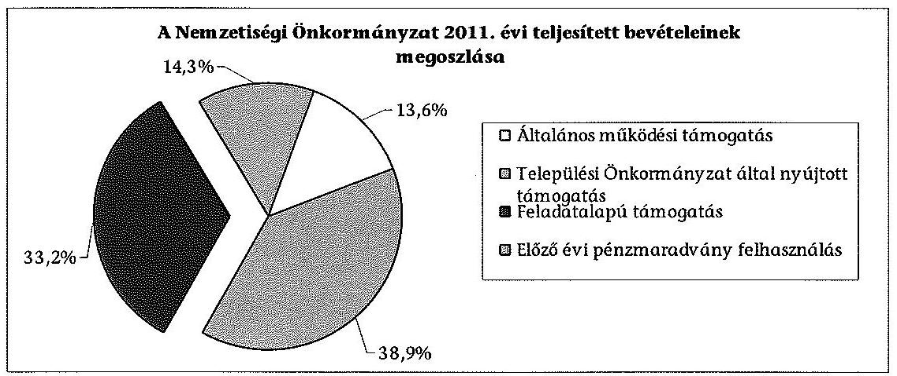
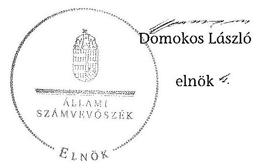

# ÁLLAMI   SZÁMVEVŐSZÉK 

## JELENTÉS

a helyi kisebbségi/nemzetiségi önkormányzatok gazdálkodásának ellenőrzéséről
Miskolc Megyei Jogú Város Ukrán Nemzetiségi Önkormányzata
13144
2013. december

---

# Állami Számvevőszék 

Iktatószám: V-0058-131-010/2013.
Témaszám: 1068
Vizsgálat-azonosító szám: V06060110

## Az ellenőrzést felügyelte:

Horváth Balázs
felügyeleti vezető
Az ellenőrzést vezette és az ellenőrzés végrehajtásáért felelős:
Korsósné Vigh Andrea
ellenőrzésvezető
A számvevőszéki jelentést készítették és a jelentés összeállításában közreműködtek:

Komlósiné Bogár Éva
számvevő tanácsos
Mokánszkiné Mengyi Andrea
számvevő tanácsos
Az ellenőrzést végezte:
Mokánszkiné Mengyi Andrea
számvevő tanácsos

A témához kapcsolódó eddig készített számvevőszéki jelentés:
címe
sorszáma
Jelentés a Miskolc Megyei Jogú Város Önkormányzat gazdálkodásának átfogó ellenőrzéséről 0419

---

# TARTALOMJEGYZÉK 

BEVEZETÉS ..... 5
I. ÖSSZEGZŐ MEGÁLLAPÍTÁSOK, KÖVETKEZTETÉSEK, JAVASLATOK ..... 8
II. RÉSZLETES MEGÁLLAPÍTÁSOK ..... 13

1. A Nemzetiségi és a Települési Önkormányzat együttműködésének szabályszerűsége ..... 13
2. A gazdálkodási feladatok ellátásának szabályszerűsége ..... 14
2.1. A költségvetésre és zárszámadásra, valamint a kincstári adatszolgáltatás rendjére vonatkozó jogszabályi előírások betartása ..... 14
2.2. A Nemzetiségi Önkormányzat gazdálkodásának szabályozottsága ..... 15
2.3. A pénzügyi kontrollok működése ..... 16
3. A Nemzetiségi Önkormányzattal összefüggő gazdálkodási feladatok belső ellenőrzése ..... 17
4. A 2011. évi feladatalapú támogatás felhasználásának, elszámolásának szabályszerűsége ..... 17
5. A Nemzetiségi Önkormányzat feladatellátása ..... 18

## MELLÉKLET

1. számú A Nemzetiségi Önkormányzat 2011. évi és 2012. I. félévi gazdálkodásának főbb adatai, mutatói

## FÜGGELÉKEK

1. számú Értelmező szótár
2. számú A pénzügyi kontrollok működésének értékelése

---

# **Chemistry**

## **Chemical Reactions**

### **Balancing Chemical Equations**

1. **Write the unbalanced equation:**
   - Example: $$C_3H_8 + O_2 \rightarrow CO_2 + H_2O$$

2. **Balance the equation:**
   - Example: $$2C_3H_8 + 7O_2 \rightarrow 6CO_2 + 8H_2O$$

3. **Balance the equation:**
   - Example: $$2C_3H_8 + 7O_2 \rightarrow 6CO_2 + 8H_2O$$

### **Types of Reactions**

1. **Combination Reaction:**
   - Example: $$2H_2 + O_2 \rightarrow 2H_2O$$

2. **Decomposition Reaction:**
   - Example: $$2H_2O_2 \rightarrow 2H_2O + O_2$$

3. **Single Displacement Reaction:**
   - Example: $$Zn + 2HCl \rightarrow ZnCl_2 + H_2$$

4. **Double Displacement Reaction:**
   - Example: $$AgNO_3 + NaCl \rightarrow AgCl + NaNO_3$$

5. **Combustion Reaction:**
   - Example: $$CH_4 + 2O_2 \rightarrow CO_2 + 2H_2O$$

## **Stoichiometry**

### **Mole Concept**

- **Mole (mol):** The amount of substance containing as many particles (atoms, molecules, ions) as there are atoms in exactly 12 grams of carbon-12.
- **Avogadro's Number:** $$6.022 \times 10^{23}$$ particles per mole.

### **Molar Mass**

- **Molar Mass:** The mass of one mole of a substance.
- Example: The molar mass of water ($$H_2O$$) is 18.015 g/mol.

### **Calculations**

1. **Moles to Mass:**
   - Formula: $$n = \frac{m}{M}$$
   - Example: Calculate the number of moles of $$H_2O$$ in 18 grams of water.
     - $$n = \frac{18 \, \text{g}}{18.015 \, \text{g/mol}} \approx 0.999 \, \text{mol}$$

2. **Moles to Mass:**
   - Formula: $$m = n \times M$$
   - Example: Calculate the mass of 1 mole of water.
     - $$m = 1 \, \text{mol} \times 18.015 \, \text{g/mol} = 18.015 \, \text{g}$$

## **Gas Laws**

### **Ideal Gas Law**

- **Equation:** $$PV = nRT$$
- **Variables:**
  - $$P$$: Pressure (atm)
  - $$V$$: Volume (L)
  - $$n$$: Number of moles (mol)
  - $$R$$: Ideal gas constant (0.0821 L·atm/mol·K)
  - $$T$$: Temperature (K)

### **Boyle's Law**

- **Equation:** $$P_1V_1 = P_2V_2$$
- **Variables:**
  - $$P_1$$: Initial pressure (atm)
  - $$V_1$$: Initial volume (L)
  - $$P_2$$: Final pressure (atm)
  - $$V_2$$: Final volume (L)

### **Boyle's Law (Boyle's Law)**

- **Equation:** $$\frac{P_1V_1}{T_1} = \frac{P_2V_2}{T_2}$$  (This seems to be a combined gas law, not just Boyle's Law)

## **Thermochemistry**

### **Enthalpy (H)**

- **Definition:** The heat content of a system at constant pressure.
- **Equation:** $$\Delta H = q_p$$
- **Variables:**
  - $$\Delta H$$: Change in enthalpy (J)
  - $$q_p$$: Heat transferred at constant pressure (J)

### **Hess's Law**

- **Statement:** The enthalpy change for a reaction is the same whether it occurs in one step or multiple steps.
- **Equation:** $$\Delta H_{rxn} = \sum \Delta H_f (\text{products}) - \sum \Delta H_f (\text{reactants})$$ (This is a more accurate representation of Hess's Law)

## **Electrochemistry**

### **Oxidation and Reduction**

- **Oxidation:** Loss of electrons.
- **Reduction:** Gain of electrons.

### **Galvanic Cells**

- **Definition:** A cell that converts chemical energy into electrical energy.
- **Components:**
  - Anode: Oxidation occurs.
  - Cathode: Reduction occurs.
  - Salt Bridge: Connects the two half-cells.

### **Nernst Equation**

- **Equation:** $$E = E^\circ - \frac{RT}{nF} \ln Q$$
- **Variables:**
  - $$E$$: Cell potential (V)
  - $$E^\circ$$: Standard cell potential (V)
  - $$R$$: Ideal gas constant (8.314 J/mol·K)
  - $$T$$: Temperature (K)
  - $$n$$: Number of electrons transferred
  - $$F$$: Faraday constant (96,485 C/mol)
  - $$Q$$: Reaction quotient

---

# RÖVIDÍTÉSEK JEGYZÉKE 

## Jogszabályok

Áht. 1
Áht. 2
ÁSZ tv.
Nek. ${ }_{1}$ tv.
Nek. 2 tv.
Számv. tv.
Áhsz.

Ámr.
Ávr.

Ber.
támogatási kormányrendelet

Települési Önkormányzat SZMSZ-e

## Szórövidítések

ÁSZ
EMMI
jegyző
1992. évi XXXVIII. törvény az államháztartásról (hatályos 2011. december 31-ig)
2011. évi CXCV. törvény az államháztartásról (hatályos 2011. december 31-étől)
2011. évi LXVI. törvény az Állami Számvevőszékről (hatályos 2011. július 1-jétől)
1993. évi LXXVII. törvény a nemzeti és etnikai kisebbségek jogairól (hatályos 2011. december 31-ig)
2011. évi CLXXIX. törvény a nemzetiségek jogairól (hatályos 2011. december 20-tól)
2000. évi C. törvény a számvitelről

249/2000. (XII. 24.) Korm. rendelet az államháztartás szervezetei beszámolási és könyvvezetési kötelezettségének sajátosságairól
292/2009. (XII. 19.) Korm. rendelet az államháztartás működési rendjéről (hatályos 2011. december 31-ig)
368/2011. (XII. 31.) Korm. rendelet az államháztartásról szóló törvény végrehajtásáról (hatályos 2012. január 1-jétől)
a költségvetési szervek belső ellenőrzéséről szóló 193/2003. (XI. 26.) Korm. rendelet, hatályos 2011. december 31-ig
342/2010. (XII. 28.) Korm. rendelet a kisebbségi önkormányzatoknak a központi költségvetésből, valamint fejezeti kezelésű előirányzatból nyújtott támogatások feltételrendszeréről és elszámolásának rendjéről (hatályon kívül helyezte a 28/2012. (III. 6.) Korm. rendelet a nemzetiségi célú előirányzatokból nyújtott támogatások feltételrendszeréről és elszámolásának rendjéről; jelenleg hatályos a 428/2012. (XII. 29.) Korm. rendelet a nemzetiségi célú előirányzatokból nyújtott támogatások feltételrendszeréről és elszámolásának rendjéről)
Miskolc Megyei Jogú Város Önkormányzata 7/2011. (III. 16.) számú rendelete a Közgyűlés és Szervei Szervezeti és Működési Szabályzatáról

## Állami Számvevőszék

Emberi Erőforrások Minisztériuma
Miskolc Megyei Jogú Város Önkormányzatának jegyzője

---

| Képviselő-testület | Miskolc Megyei Jogú Város Ukrán Kisebbségi Önkormányzatának Képviselő-testülete 2011. december 31-ig, Miskolc Megyei Jogú Város Ukrán Nemzetiségi Önkormányzatának Képviselő-testülete 2012. január 1-jétől |
| :--: | :--: |
| Kincstár | Magyar Államkincstár |
| Közgyűlés | Miskolc Megyei Jogú Város Önkormányzatának Közgyűlése |
| Nemzetiségi Önkormányzat | Miskolc Megyei Jogú Város Ukrán Kisebbségi Önkormányzata 2011. december 31-ig, Miskolc Megyei Jogú Város Ukrán Nemzetiségi Önkormányzata 2012. január 1-jétől |
| Nemzetiségi Önkormányzat elnöke | Miskolc Megyei Jogú Város Ukrán Kisebbségi Önkormányzatának elnöke 2011. december 31-ig, Miskolc Megyei Jogú Város Ukrán Nemzetiségi Önkormányzatának elnöke 2012. január 1-jétől |
| pénzügyi kontrollok | a kötelezettségvállalás és az utalvány ellenjegyzése, valamint a szakmai teljesítésigazolás 2011. december 31-ig, 2012. január 1-jétől a pénzügyi ellenjegyzés, a teljesítés igazolása és az érvényesítés |
| polgármester | Miskolc Megyei Jogú Város Önkormányzatának polgármestere |
| Polgármesteri Hivatal | Miskolc Megyei Jogú Város Önkormányzatának Polgármesteri Hivatala |
| Polgármesteri Hivatal SZMSZ-e | Miskolc Megyei Jogú Város Önkormányzata II26/22.310/2011. számú határozata a Polgármesteri Hivatal Szervezeti és Működési Szabályzatáról |
| Települési Önkormányzat | Miskolc Megyei Jogú Város Önkormányzata |

---

# JELENTÉS 

## a helyi kisebbségi/nemzetiségi önkormányzatok gazdálkodásának ellenőrzéséről Miskolc Megyei Jogú Város Ukrán Nemzetiségi Önkormányzata

## BEVEZETÉS

Az államháztartás részét, az önkormányzati alrendszer egyik elemét képezik a nemzetiségi önkormányzatok, amelyek jogi személyek és a Nek. ${ }_{1,2}$ tv.-ben meghatározott önálló feladat- és hatáskörökkel rendelkeznek. A nemzetiségi önkormányzatok az önkormányzati, illetve testületi működtetés mellett a helyi nemzetiségi közügyek változatos formában való ellátásában vesznek részt.

A nemzetiségi önkormányzatok, illetve a települési önkormányzatok között a jelenlegi szabályozás szerint nincs alá-fölérendeltségi viszony. A nemzetiségi önkormányzatok azonban sajátos közjogi helyzetben vannak, mert a jogállásukat tekintve önkormányzatok, ám függnek a székhelyük szerinti települési önkormányzat hivatalától, amely ellátja a nemzetiségi önkormányzatok vonatkozásában a megállapodásban rögzített gazdálkodási feladatokat.

A nemzetiségek helyzete, támogatása mind hazai, mind európai uniós szinten kiemelt figyelmet kap napjainkban. A nemzetiségi önkormányzatok gazdálkodására és támogatási rendszerére vonatkozó jogszabályok a 2010-2012. években jelentős változásokon mentek át, amelyek érintették a feladatalapú támogatásra fordítható költségvetési keret megállapítását, az operatív gazdálkodási jogkörök szabályozását, az elkülönített könyvvezetés alkalmazását, a belső ellenőrzés szabályozását.

Az ellenőrzés célja annak értékelése volt, hogy a Nemzetiségi Önkormányzat gazdálkodási kereteinek kialakítása, gazdálkodása és feladatellátása megfelelt-e a hatályos jogszabályoknak.

Ennek keretében ellenőriztük, hogy:

- a Nemzetiségi Önkormányzat és a Települési Önkormányzat együttműködésének szabályozása, a Települési Önkormányzat SZMSZ-ében, a megállapodásban előírt működési feltételek biztosítása megfelelt-e a jogszabályi előírásoknak;
- a felek együttműködése megfelelt-e a megállapodásnak a gazdálkodási feladatok szabályszerű ellátásában, betartották-e a Nemzetiségi Önkormányzat gazdálkodásához kapcsolódóan a költségvetésre és zárszámadásra, a gazdálkodás szabályozására, az operatív gazdálkodási jogkörök gyakorlására vonatkozó jogszabályi előírásokat;

---

- a jegyző biztosította-e a Polgármesteri Hivatal belső ellenőrzése keretében a Nemzetiségi Önkormányzattal összefüggő gazdálkodási feladatok belső ellenőrzését;
- a 2011. évi feladatalapú támogatás felhasználása, a folyósított feladatalapú támogatással történő elszámolás az előírásoknak megfelelő volt-e;
- a Nemzetiségi Önkormányzat feladatellátása összhangban volt-e a vonatkozó jogszabályi előírásokkal.

# Az ellenőrzés típusa: szabályszerűségi ellenőrzés 

Az ellenőrzött időszak: 2011. január 1. - 2012. június 30.
Ellenőrzött szervezet: Miskolc Megyei Jogú Város Ukrán Nemzetiségi Önkormányzat és a gazdálkodási feladatait ellátó Miskolc Megyei Jogú Város Önkormányzata

Az ellenőrzés jogszabályi alapja: az ÁSZ tv. 5. § (2)-(3) és (6) bekezdései
Az ellenőrzés szakmai módszertana az ÁSZ hivatalos honlapján (www.asz.hu) közzétett szakmai szabályokon alapult, amely a Legfőbb Ellenőrző Intézmények Nemzetközi Szervezete (INTOSAI) által kiadott nemzetközi standardok (ISSAI) figyelembevételével készült.

A fogalmak magyarázatát az 1. számú függelék, a pénzügyi kontrollok megfelelősége értékelésénél alkalmazott egységes minősítési szempontokat a 2. számú függelék tartalmazza.

Az ellenőrzés lefolytatásához a Települési Önkormányzat és a Nemzetiségi Önkormányzat tanúsítványok kitöltésével és a kapcsolódó dokumentumok elektronikus megküldésével szolgáltatott adatokat. A tanúsítványokon szereplő adatok, információk ellenőrzése és szükség szerinti javítása a helyszíni ellenőrzés keretében történt.

Az ÁSZ az ellenőrzés megállapításait az ellenőrzött időszakban hatályos, az intézkedést igénylő megállapításokra tett javaslatokat a jelenleg hatályos jogszabályok alapján fogalmazta meg.

A Nemzetiségi Önkormányzat 2002-ben alakult, elnöke a 2010. évi helyhatósági választások óta látja el feladatát. Intézményt, gazdasági társaságot és más szervezetet nem alapított, illetve ezek társulásában nem vesz részt. A négytagú Képviselő-testület munkája segítésére bizottságot nem hozott létre. A Nemzetiségi Önkormányzat költségvetési beszámolója szerint a 2011. évben 1543 ezer Ft bevételt ért el és 1500 ezer Ft kiadást teljesített. A 2012. év I. félévi beszámolója alapján a teljesített bevétel 259 ezer Ft, a teljesített kiadás 194 ezer Ft volt. A 2011. évi és a 2012. év I. féléves gazdálkodási
 adatokat részletesen az 1. számú mellékletben mutatjuk be. Az ÁSZ a Nemzetiségi Önkormányzat gazdálkodását korábban a 2004. évben ellenőrizte.

---

Az ÁSZ tv. 29. § (1) bekezdése szerint a jelentéstervezetet megküldtük a polgármester és a Nemzetiségi Önkormányzat elnöke részére, akik az ÁSZ tv. 29. § (2) bekezdésében foglalt észrevételezési jogukkal nem éltek, a jelentéstervezetre észrevételt nem tettek.

---

# I. ÖSSZEGZŐ MEGÁLLAPÍTÁSOK, KÖVETKEZTETÉSEK, JAVASLATOK 

A Nemzetiségi és a Települési Önkormányzat együttműködése az előírt eljárásrend és határidő betartásával jóváhagyott megállapodásokon alapult. A Települési Önkormányzat biztosította a Nemzetiségi Önkormányzat működéséhez szükséges személyi és tárgyi feltételeket. Az együttműködés szabályozása a 2011. évben az Áht.-ben és a Nek. tv-ben, a 2012. évben a Nek. tv-ben meghatározott tartalmi elemek tekintetében hiányos volt. A 2012. június 30-án hatályos megállapodás a Nek. ${ }_{2}$ tv. előírása ellenére nem tartalmazta a költségvetés előkészítésével és megalkotásával, a költségvetéssel kapcsolatos adatszolgáltatással, az önálló fizetési számla nyitásával, az érvényesítési feladatok ellátásával, valamint a működési feltételek biztosításával kapcsolatos felelősök konkrét kijelölését, továbbá nem írta elő a Nemzetiségi Önkormányzat ülésein részt vevő jegyző, illetve az általa megbízott személy jelzési kötelezettségét törvénysértés észlelése esetén. A hiányosságok a feladatellátás számon kérhetőségét korlátozták.

A Nemzetiségi Önkormányzat költségvetése és zárszámadása tekintetében a jogszabályi előírásokat összességében betartották. A költségvetési és zárszámadási határozatok jóváhagyása, a költségvetési előirányzatok módosítása az előírt eljárásrendnek megfelelt. A határozatokat egymással összehasonlítható szerkezetben készítették el. A 2011. évi költségvetési határozat az Ámr. előírása ellenére nem tartalmazta az előirányzat-felhasználási ütemtervet, valamint beépítése a Települési Önkormányzat költségvetési rendeletébe nem változatlan formában került sor. A Települési Önkormányzat a Nemzetiségi Önkormányzat zárszámadási határozatát a zárszámadási rendeletébe változatlan formában építette be. A 2012. évi költségvetési határozat tartalma a jogszabályi előírásoknak megfelelt, 2012. I. félévében az Ávr.-ben és az Áhsz.-ben előírt, a Nemzetiségi Önkormányzatra vonatkozó kincstári adatszolgáltatási kötelezettségének a jegyző eleget tett. A Nemzetiségi Önkormányzat a 2011. évben a személyi juttatások kiemelt előirányzatnál - az előirányzat módosítás előterjesztése hiányában - nem döntött a felhasználáshoz szükséges mértékű módosításról, ezért a teljesített kiadás az Áht. előírását megsértve meghaladta a jóváhagyott előirányzatot. 2012. I. félévben előirányzat túllépés nem történt.

A gazdálkodás szabályozottsága érdekében az e feladatok végrehajtását ellátó Polgármesteri Hivatal, a jogszabályokban előírt szabályzatok hatályát kiterjesztette a Nemzetiségi Önkormányzat gazdálkodási feladataira. A jegyző a 2012. I. félévben a Számv. tv.-ben előírt szabályzatokat a Nemzetiségi Önkormányzat önálló könyvvezetése és beszámolása alátámasztására elkülönülten elkészítette. Az operatív gazdálkodási jogkörök kialakítása 2012. március 31-ig a jogszabályi előírásokkal összhangban történt. Ezt követően azonban a pénzügyi ellenjegyző és az érvényesítő személyek jegyző általi kijelölését nem módosították annak ellenére, hogy az Ávr. rendelkezése a kijelölést a gazdasági vezető hatáskörébe utalta. A jegyző - a számvevőszéki feltárásra - a belső szabályozást a jogszabályi előírásoknak megfelelően módosította, a gazdasági vezető a pénzügyi ellenjegyzésre és az érvényesítési feladatok ellátására jogosult

---

személyeket kijelölte. A Polgármesteri Hivatal SZMSZ-e az Ámr. és az Ávr. előírásai ellenére nem tartalmazta a munkakörökhöz kapcsolódóan a Nemzetiségi Önkormányzat gazdálkodásával kapcsolatos feladat- és hatásköröket, a hatáskörök gyakorlásának módját, a helyettesítés rendjét és az ezekre vonatkozó felelősségi szabályokat.

A pénzügyi kontrollok működése megfelelőségét az ellenőrzött időszak egészére a dologi és egyéb folyó kiadások teljesítésénél az ellenőrzés gyengének értékelte. A szakmai teljesítést igazoló és az utalványozó a 2011. évben az Ámr., továbbá a teljesítés igazoló 2012. I. félévben az Ávr. előírása ellenére a feladatát saját és közeli hozzátartozója javára látta el. Az utalvány ellenjegyzője az Ámr.-ben foglalt ellenőrzési feladatát nem szabályszerűen végezte el, mert az összeférhetetlenségi szabályoknak a szakmai teljesítés igazoló általi megsértése ellenére ellenjegyezte az utalványt. 2012. I. félévben az érvényesítő az Ávr. előírása ellenére az összeférhetetlenségi szabályok megsértésének jelzése nélkül, továbbá 2012. március 31-ét követően nem jogszerű kijelölés alapján végezte feladatát. A hibák száma a lényegességi szintet, a kritikus hibahatárt elérte. A pénzügyi kontrollok működésének a megfelelősége az ellenőrzött időszakban annak ellenére gyenge volt, hogy a 2011. évben a kötelezettségvállalás ellenjegyzése megfelelően működött, valamint a 2012. I. félévben a pénzügyi ellenjegyzés Ávr.-ben és az előzetes írásbeli kötelezettségvállalást nem igénylő kifizetések rendjét tartalmazó belső szabályozásban foglalt előírásait betartották. A számvevőszéki ellenőrzés a kifizetések dokumentumainak ellenőrzése alapján nem tárt fel jogosulatlan kifizetést.

A Nemzetiségi Önkormányzat a 2011. évben a forrásai 33,2%-át kitevő, 513 ezer Ft feladatalapú támogatásban részesült, amelyet tárgyév december 31-ig a jogszabályi előírásokkal összhangban felhasznált. A támogatási kormányrendeletben hivatkozott, Áht. ${ }_{1}$-ben előírt elszámolás nem történt meg. A támogatás felhasználását, elszámolását a jogosult szervek nem ellenőrizték.

A Nemzetiségi Önkormányzat feladatellátásának tárgya összhangban volt a Nek. ${ }_{1,2}$ tv. előírásaival. Biztosította a nemzetiségi közügyek keretében az alapvető feladatához szükséges szervezeti, személyi és anyagi feltételeket.

A Polgármesteri Hivatal 2011. és 2012. évekre vonatkozó éves ellenőrzési terveit megalapozó kockázatelemzés - a Ber. előírása ellenére - nem terjedt ki a Nemzetiségi Önkormányzat gazdálkodásával összefüggő végrehajtási feladatok ellátására. A Polgármesteri Hivatalban a Nemzetiségi Önkormányzat gazdálkodásával összefüggő végrehajtási feladatokra irányulóan belső ellenőrzési feladatot a 2011. évben és 2012. I. félévben nem terveztek és nem végeztek.

Az ellenőrzés megállapításai alapján, az észrevételezésre megküldött jelentéstervezetben a Nemzetiségi Önkormányzat gazdálkodásával kapcsolatban intézkedést igénylő megállapításokat és javaslatokat fogalmaztunk meg, amelyek végrehajtásáról az ellenőrzés időszakában intézkedési tájékoztatást adott a polgármester. A 2013. július 8-án megkötött hatályos együttműködési megállapodásban a Nek. ${ }_{2}$ tv. vonatkozó előírásait részben érvényesítették. A Polgármesteri Hivatal hatályos SZMSZ-e megfelelt az Ávr.-ben foglaltaknak. Figyelemmel az ÁSZ ellenőrzés hasznosítására mindezek vonatkozásában intézkedést igénylő megállapítást, javaslatot már nem szerepeltetünk.

---

Az ÁSZ tv. 33. § (1) bekezdésében foglaltak értelmében az ellenőrzött szervezet vezetője köteles a jelentésben foglalt megállapításokhoz kapcsolódó intézkedési tervet összeállítani, és azt a jelentés kézhezvételétől számított 30 napon belül az ÁSZ részére megküldeni. Amennyiben az intézkedési tervet határidőre nem küldi meg a szervezet, vagy az nem elfogadható, az ÁSZ elnöke az ÁSZ tv. 33. § (3) bekezdés a)-b) pontjaiban foglaltakat érvényesítheti.

A helyszíni ellenőrzés megállapításainak hasznosítása mellett javasoljuk:

# a jegyzőnek 

1. az együttműködés szabályozásával kapcsolatban

A Nemzetiségi Önkormányzat és a Települési Önkormányzat együttműködését meghatározó - 2012. június 30-án hatályos - megállapodás nem írta elő, hogy a Nemzetiségi Önkormányzat ülésein részt vevő jegyző, vagy az általa megbízott személy a Nek. 2 tv. 80. § (4) bekezdése alapján törvénysértés észlelése esetén jelzési kötelezettséggel tartozik.

Javaslat
Készítse elő a megállapodás módosítását, hogy tartalmilag feleljen meg a Nek. 2 tv. 80. § (4) bekezdésében foglalt előírásoknak.
2. a kiemelt költségvetési előirányzatokkal kapcsolatban

A személyi juttatások kiemelt előirányzat tekintetében a 2011. évi kiadások teljesítése a jóváhagyott előirányzatot meghaladó összegű volt, ezáltal nem tartották be az Áht. ${ }_{1}$ 12/A. § (1) bekezdésében foglalt előírást.

Javaslat
A jövőben készítsen előterjesztést az előirányzatok szükséges mértékű módosítására az Áht. 2 34. § (1) és (6) bekezdésében foglaltaknak megfelelően úgy, hogy azt a Nemzetiségi Önkormányzat elnöke határidőben nyújthassa be a Képviselő-testület részére - az Áht. 2 36. § (1) bekezdése szerint - a meghatározott előirányzatokon belül való gazdálkodás érdekében.
3. a pénzügyi kontrollok működésével kapcsolatban

A szakmai teljesítést igazoló a 2011. évben az Ámr. 80. § (2) bekezdésében, a teljesítés igazolója 2012. I. félévben az Ávr. 60. § (2) bekezdésében foglaltak ellenére nem tartotta be az összeférhetetlenségi szabályokat, saját és közeli hozzátartozója részére látta el a feladatot.

Az érvényesítő 2012-ben az Ávr. 58. § (1) bekezdése szerinti ellenőrzési, és (2) bekezdésében előírt jelzési feladatát nem látta el, mert az összeférhetetlenségi szabályok megsértésének az utalványozó felé történő jelzés nélkül érvényesítette a kiadás teljesítését.

---

Javaslat
Az operatív gazdálkodás működési hibáinak megelőzése, feltárása és kijavítása érdekében gondoskodjon arról, hogy:
a) a teljesítés igazolása során az Ávr. 60. § (2) bekezdésében foglalt összeférhetetlenségi szabályok betartásra kerüljenek;
b) az érvényesítő tegyen eleget az Ávr. 58. § (1)-(2) bekezdésében előírtak szerint az ellenőrzési feladatának, a jogsértés észlelése esetén az utalványozó felé jelzési kötelezettségének.
4. a feladatalapú támogatás elszámolásával kapcsolatban

A 2011. évben folyósított feladatalapú támogatás elszámolása a támogatási kormányrendelet 7. § (2) bekezdésében hivatkozott Áht.-nek „a helyi önkormányzatok elszámolási és ellenőrzési rendjére vonatkozó rendelkezései alkalmazandóak" előírása ellenére nem történt meg.

Javaslat
Gondoskodjon az Áht. 2 27. § (2) bekezdésében meghatározott feladatkörében a Nemzetiségi Önkormányzat által igénybe vett feladatalapú támogatás elszámolásának elkészítéséről, figyelemmel az Áht. 2 57. § (4) bekezdésében foglaltakra.

# a polgármesternek 

A Nemzetiségi Önkormányzat és a Települési Önkormányzat együttműködését meghatározó - 2012. június 30-án hatályos - megállapodás nem írta elő, hogy a Nemzetiségi Önkormányzat ülésein részt vevő jegyző, vagy az általa megbízott személy a Nek. 2 tv. 80. § (4) bekezdése alapján törvénysértés észlelése esetén jelzési kötelezettséggel tartozik.

Javaslat
Terjessze a Közgyűlés elé jóváhagyásra a Nek. 2 tv. 80. § (4) bekezdésében foglalt előírások betartásával előkészített megállapodás módosítást.

## a Nemzetiségi Önkormányzat elnökének

1. A Nemzetiségi Önkormányzat és a Települési Önkormányzat együttműködését meghatározó - 2012. június 30-án hatályos - megállapodás nem írta elő, hogy a Nemzetiségi Önkormányzat ülésein részt vevő jegyző, vagy az általa megbízott személy a Nek. 2 tv. 80. § (4) bekezdése alapján törvénysértés észlelése esetén jelzési kötelezettséggel tartozik.

Javaslat
Terjessze a Képviselő-testület elé jóváhagyásra a Nek. 2 tv. 80. § (4) bekezdésében foglalt előírások betartásával előkészített megállapodás módosítást.

---

2. A személyi juttatások kiemelt előirányzat tekintetében a 2011. évi kiadások teljesítése a jóváhagyott előirányzatot meghaladó összegű volt, ezáltal nem tartották be az Áht. 1 12/A. § (1) bekezdésében foglalt előírást.

Javaslat
A jövőben terjessze a Képviselő-testület elé jóváhagyásra az Áht. 3 34. § (1) és (6) bekezdései alapján készült, az előirányzatok szükséges mértékű módosításáról szóló előterjesztést.
3. A 2011. évben folyósított feladatalapú támogatás elszámolása a támogatási kormányrendelet 7. § (2) bekezdésében hivatkozott Áht. ${ }_{1}$-nek „a helyi önkormányzatok elszámolási és ellenőrzési rendjére vonatkozó rendelkezései alkalmazandóak" előírása ellenére nem történt meg.

Javaslat
Terjessze a Képviselő-testület elé jóváhagyásra az Áht. ${ }_{2}$ 57. § (4) bekezdése alapján összeállított, a Nemzetiségi Önkormányzat által igénybe vett feladatalapú támogatás elszámolását.

---

# II. RÉSZLETES MEGÁLLAPÍTÁSOK 

## 1. A Nemzetiségi és a Települési Önkormányzat együttműködésének szabályszerűsége

A Nemzetiségi és a Települési Önkormányzat együttműködése az előírt eljárásrend és határidő betartásával jóváhagyott megállapodásokon ${ }^{1}$ alapult. Az együttműködés szabályozása a 2011. évben az Áht. ${ }_{1}$-ben és a Nek. ${ }_{1}$ tv-ben, a 2012. évben a Nek. ${ }_{2}$ tv-ben meghatározott tartalmi elemek tekintetében hiányos volt:

- a 2011. december 31-én hatályos megállapodás nem tartalmazta az Áht. 1 66. §-ában foglalt előírások ellenére teljes körűen a Nemzetiségi Önkormányzat gazdálkodása végrehajtásának rendjéhez kapcsolódó feladatellátás jogosultjainak, kötelezettjeinek
 a kijelölését. A Nek. 1 tv. 27. § (1)-(2) bekezdéseiben foglaltak ellenére nem szabályozták (a Települési Önkormányzat SZMSZ-ében, vagy más dokumentumban) a Nemzetiségi Önkormányzat Képviselő-testülete működéséhez szükséges helyiséghasználatot; a postai, kézbesítési, gépelési, sokszorosítási feladatok ellátásának, valamint az ezzel járó költségek viselésének rendjét;
- a 2012. június 30-án hatályos megállapodásban a Nek. 2 tv. 80. § (3) bekezdése a)-b) és d) pontjaiban foglaltak ellenére nem rögzítették a Nemzetiségi Önkormányzat költségvetése előkészítéséért és megalkotásáért, a költségvetéssel összefüggő adatszolgáltatásért, az önálló fizetési számla nyitásáért, az érvényesítési feladatok ellátásáért, valamint a működési feltételek biztosításáért felelősök konkrét kijelölését. További hiányosság, hogy nem írták elő a - Nek. 2 tv. 80. § (4) bekezdésében foglaltakat figyelmen kívül hagyva - a jegyző, illetve a megbízásából a Nemzetiségi Önkormányzat ülésein résztvevő személy jelzési kötelezettségét törvénysértés észlelése esetén.

A Települési Önkormányzat biztosította a Nemzetiségi Önkormányzat működéséhez szükséges személyi és tárgyi feltételeket.

[^0]
[^0]:    ${ }^{1}$ A 2011. évben és 2012. június 1-jéig hatályos megállapodást a Képviselő-testület az U16/2010. (XI. 22.), a Közgyűlés az X-250/44.396/2010. (XII. 16.) számú határozattal fogadta el. A Nek. ${ }_{2}$ tv. 159. § (3) bekezdésében előírtak alapján 2012. június 1-jéig felülvizsgált és módosított megállapodást a Képviselő-testület az U-17/2012. (VI. 29.) számú, a Közgyűlés a V-132/2879/2012. (V. 17.) számú határozattal hagyta jóvá.

---

# 2. A GAZDÁLKODÁSI FELADATOK ELLÁTÁSÁNAK SZABÁLYSZERŰSÉGE 

### 2.1. A költségvetésre és zárszámadásra, valamint a kincstári adatszolgáltatás rendjére vonatkozó jogszabályi előírások betartása

A Nemzetiségi Önkormányzat költségvetése és zárszámadása tekintetében a jogszabályi előírásokat összességében - a 2011. évi költségvetési határozat tekintetében egyes Ámr. és a jóváhagyott előirányzatokon belüli gazdálkodásra vonatkozó Áht.-1 rendelkezések kivételével - betartották. A Nemzetiségi Önkormányzat költségvetési és zárszámadási határozatait ${ }^{2}$ a jogszabályban előírt eljárásrend szerint fogadták el, a költségvetési és zárszámadási határozatok egymással összehasonlítható szerkezetben készültek. A Nemzetiségi Önkormányzat 2011. évi zárszámadási határozatát a Települési Önkormányzat a zárszámadási rendeletébe változatlan formában építette be.

A 2011. évi költségvetési határozat nem tartalmazta az Ámr. 36. § (1) bekezdése k) pont előírása ellenére az év várható bevételi és kiadási előirányzatainak teljesüléséről készített előirányzat-felhasználási ütemtervet. A Nemzetiségi Önkormányzat költségvetési határozatát a Települési Önkormányzat a költségvetési rendeletébe az Ámr. 36. § (6) bekezdésében foglaltak ellenére - a központi költségvetési támogatás tekintetében - nem változatlan tartalommal építette be.

A 2012. évi költségvetési határozat tartalma a jogszabályi előírásoknak megfelel. A 2012. I. félévében az Ávr.-ben és az Áhsz.-ben előírt, a Nemzetiségi Önkormányzatra vonatkozó kincstári adatszolgáltatási kötelezettségének a jegyző eleget tett.

A Nemzetiségi Önkormányzat a költségvetés főösszege szintjén biztosította a tárgyévi fizetési kötelezettség vállalásához szükséges fedezet meglétét. E főösszegen belül a kiemelt előirányzatok tekintetében azonban a 2011. évben - az előirányzat módosításának előterjesztése hiányában - nem döntött a felhasználáshoz szükséges mértékű módosításról. A személyi juttatások kiemelt előirányzatánál a 2011. évben a teljesített kiadás a jóváhagyott előirányzatot meghaladó ${ }^{3}$ volt. Ezáltal nem tartották be az Áht.-1 12/A. § (1) bekezdésében foglalt előírást. 2012. I. félévében előirányzat túllépés nem történt.

[^0]
[^0]:    ${ }^{2}$ A Képviselő-testületnek a Nemzetiségi Önkormányzat 2011. évi költségvetéséről alkotott U-4/2011. (I. 28.) számú, a 2011. évi zárszámadásról alkotott U-6/2012. (II. 24.) számú, valamint a 2012. évi költségvetésről alkotott U-7/2012. (II. 24.) számú határozatai.
    ${ }^{3}$ A személyi juttatások 2011. évi módosított előirányzata 293 ezer Ft, a teljesítés 612 ezer Ft, a túllépés 319 ezer Ft volt.

---

# 2.2. A Nemzetiségi Önkormányzat gazdálkodásának szabályozottsága 

A Nemzetiségi Önkormányzat gazdálkodásának szabályozottsága az ellenőrzött időszakban összességében - a szabályozások kisebb tartalmi hiányossága mellett - biztosított volt. A gazdálkodási feladatai végrehajtását ellátó Polgármesteri Hivatal a 2011. évben a jogszabályokban előírt gazdálkodási szabályzatokkal ${ }^{4}$ a Nemzetiségi Önkormányzat gazdálkodási feladataira kiterjedő hatállyal rendelkezett.

A jegyző a 2012. I. félévében elkészítette és önállóan meghatározta a Nemzetiségi Önkormányzat elkülönült könyvvezetését és elemi beszámolóját alátámasztó számviteli politikát, számlarendet, leltározási és leltárkészítési, pénzkezelési, továbbá az eszközök és források értékelési szabályzatát.

A Nemzetiségi Önkormányzat gazdálkodásával összefüggő feladatok szabályozása tekintetében a Polgármesteri Hivatal SZMSZ-e az ellenőrzött időszakban hiányos volt. A 2011. évben az Ámr. 20. § (2) bekezdése h) pontjában, valamint a 2012. I. félévében az Ávr. 13. § (1) bekezdése g) pontjában foglaltak ellenére nem tartalmazta munkakörökhöz kapcsolódóan a Nemzetiségi Önkormányzat gazdálkodásával kapcsolatos feladat- és hatásköröket, a hatáskörök gyakorlásának módját, a helyettesítés rendjét és az ezekre vonatkozó felelősségi szabályokat.

A Nemzetiségi Önkormányzat operatív gazdálkodási jogköreinek kialakítása - a kötelezettségvállalásra, utalványozásra, kötelezettségvállalás és utalványozás ellenjegyzésére a felhatalmazás, a szakmai teljesítés igazoló és az érvényesítést végző személyek kijelölése - a 2011. évben a jogszabályi előírásoknak megfelelő volt.

A 2012. I. félévében a Nemzetiségi Önkormányzat operatív gazdálkodási jogkörei kialakítása keretében a kötelezettségvállalásra, utalványozásra adott felhatalmazás, valamint a teljesítést igazoló megbízása a jogszabályi előírásoknak megfelelően történt. A pénzügyi ellenjegyzők, valamint az érvényesítő személyek jegyző általi kijelölését 2012. március 31-ét követően - a jogszabályi változást figyelmen kívül hagyva - nem módosították, annak ellenére, hogy az Ávr. 55. § (2) bekezdése g) pontja és az 58. § (4) bekezdése előírása a kijelölést a gazdasági vezető hatáskörébe utalta.

A pénzügyi ellenjegyzők és érvényesítők jogosulatlan személy általi kijelölése nem veszélyeztette, hogy e kontrolltevékenységek - végrehajtásuk esetén - biztosítsák a lehetséges hibák feltárását, kijavítását, mert a kijelölt személyek a feladatuk ellátásához előírt képesítési követelményeknek megfeleltek.

[^0]
[^0]:    ${ }^{4}$ Számviteli politika, számlarend, leltározási és leltárkészítési szabályzat, pénzkezelési szabályzat, eszközök és források értékelési szabályzata, munkakörleírások, ellenőrzési nyomvonal, szabálytalanságok kezelésének eljárásrendje, kockázatkezelési szabályzat, folyamatba épített, előzetes, utólagos és vezetői ellenőrzés (FEUVE) szabályozás.

---

A jegyző a hiányosság számvevőszéki feltárását követően a Polgármesteri Hivatal Gazdálkodási Utasítását módosította, a pénzügyi ellenjegyzésre a felhatalmazásokat és az érvényesítő személyek kijelölését a gazdasági vezető hatáskörébe utalta${ }^{5}$. A gazdasági vezető a pénzügyi ellenjegyzésre a felhatalmazásokat és az érvényesítő személyek kijelölését a jogszabályi előírásoknak megfelelően elvégezte.

# 2.3. A pénzügyi kontrollok működése 

A Nemzetiségi Önkormányzat 2011. évi dologi és egyéb folyó kiadásai teljesítése során a kötelezettségvállalás-ellenjegyzése, a szakmai teljesítésigazolás és az utalvány ellenjegyzés kontrollok működésének megfelelősége összességében gyenge volt, mert

- a kötelezettségvállalás ellenjegyzője a jogszabályokban és a belső szabályzatban előírt módon végezte el feladatát, azonban
- a szakmai teljesítés igazolója az Ámr. 80. § (2) bekezdésében foglaltak ellenére a feladatát saját és közeli hozzátartozója részére látta el;
- az utalvány ellenjegyzője az Ámr. 79. § (2) bekezdésében előírt, a szakmai teljesítés igazolására, az érvényesítésre, továbbá a gazdálkodásra vonatkozó szabályok betartása tekintetében nem látta el ellenőrzési feladatát. Az utalványt annak ellenére ellenjegyezte, hogy a szakmai teljesítést igazoló, valamint az utalványozó az összeférhetetlenségi szabályok megsértésével - saját, illetve közeli hozzátartozó részére - igazolta a teljesítést, illetve engedélyezte a kiadás teljesítését. A hibák száma a lényegességi szintet, a kritikus hibahatárt elérte.

A Nemzetiségi Önkormányzatnál 2012. I. félévében a dologi és egyéb folyó kiadások teljesítése során a pénzügyi ellenjegyzés, a teljesítés igazolás és az érvényesítés kontrollok működésének megfelelősége összességében gyenge volt, mert

- a pénzügyi ellenjegyzés Ávr. 53. § (1) és (2) bekezdéseiben és az előzetes írásbeli kötelezettségvállalást nem igénylő kifizetések rendjét tartalmazó belső szabályozásban foglalt előírásait betartották, azonban
- a teljesítés igazolója az Ávr. 60. § (2) bekezdésében foglalt összeférhetetlenségi szabályok ellenére a teljesítés igazolását saját részére végezte el;
- az érvényesítő az Ávr. 58. § (1) bekezdése szerinti ellenőrzési és (2) bekezdésében előírt jelzési feladatát nem látta el, mert az összeférhetetlenségi szabályok megsértésének az utalványozó felé történő jelzés nélkül érvényesítette a kiadás teljesítését. Továbbá a 2012. március 31-ét követő időszakban nem jogszerű kijelölés alapján végezte az érvényesítést. A hibák száma a lényegességi szintet, a kritikus hibahatárt elérte.

[^0]
[^0]:    ${ }^{5}$ 2013. február 15-i hatálybalépéssel a jegyző a Polgármesteri Hivatal Gazdálkodási Utasítását módosította, a pénzügyi ellenjegyzők és az érvényesítők kijelölését a gazdasági vezető a 22147/2013. ügyiratszámú dokumentumban elvégezte.

---

A számvevőszéki ellenőrzés a kifizetések dokumentumainak ellenőrzése alapján nem tárt fel jogosulatlan kifizetést.

# 3. A Nemzetiségi Önkormányzattal Összefüggő gazdálkodási feladatok belső ellenőrzése 

A Polgármesteri Hivatal 2011. és 2012. évekre vonatkozó éves ellenőrzési terveit megalapozó, a Ber. 21. § (2) bekezdésében előírt kockázatelemzés nem terjedt ki a Nemzetiségi Önkormányzat gazdálkodásával összefüggő végrehajtási feladatok ellátására. A Polgármesteri Hivatalnál a Nemzetiségi Önkormányzat gazdálkodásával összefüggő végrehajtási feladatok ellátása tekintetében belső ellenőrzési feladatot a 2011. évben és a 2012. I. félévében nem terveztek és nem végeztek.

## 4. A 2011. ÉVI FELADATALAPÚ TÁMOGATÁS FELHASZNÁLÁSÁNAK, ELSZÁMOLÁSÁNAK SZABÁLYSZERŰSÉGE

A Nemzetiségi Önkormányzat a 2011. évben 513 ezer Ft feladatalapú támogatásban részesült, amelynek az összes bevételhez viszonyított részarányát a következő ábra szemlélteti:

A 2011. évben folyósított támogatást a jogszabályi előírásokkal összhangban a tárgyévben felhasználták. Elszámolása a támogatási kormányrendelet 7. § (2) bekezdésében hivatkozott Áht.-nek „a helyi önkormányzatok elszámolási és ellenőrzési rendjére vonatkozó rendelkezései alkalmazandóak" előírása ellenére nem történt meg. A támogatás felhasználását, elszámolását az ellenőrzésre jogosult szervek nem ellenőrizték.

---

# 5. A Nemzetiségi Önkormányzat feladatellátása 

A Nemzetiségi Önkormányzat feladatellátásának tárgya összhangban volt a Nek. ${ }_{2}$ tv. előírásaival.

Biztosította a Nek. ${ }_{1}$ tv. 5/A. § (1) bekezdése és a Nek. ${ }_{2}$ tv. 10. § (1) bekezdése szerinti, „a nemzetiségi érdekek védelme és képviselete a nemzetiségi önkormányzati feladat- és hatáskörének gyakorlásával" kapcsolatos alapvető feladata ellátásához szükséges szervezeti, személyi és anyagi feltételeket.

Budapest, 2013. H. hónap OG. nap

|  |  |
| :-- | :-- |
| Melléklet: | 1 db |
| Függelék: | 2 db |

---

# A Nemzetiségi Önkormányzat 2011. évi és 2012. I. félévi gazdálkodásának főbb adatai, mutatói

A) Bevételek adatok ezer Ft-ban

|  Megnevezés | 2011. év |  |  |  | 2012. I. félév |  |  |   |
| --- | --- | --- | --- | --- | --- | --- | --- | --- |
|   | eredeti
ei. | módosított ei. | teljesítés | teljesítés
megoszlása
(\%) | eredeti
ei. | módosított ei. | teljesítés | teljesítés
megoszlása
(\%)  |
|  Intézményi működési
bevételek | 0 | 0 | 0 | 0,0\% | 0 | 0 | 1 | 0,4\%  |
|  Általános működési
támogatás | 566 | 209 | 209 | 13,5\% | 214 | 214 | 215 | 83,0\%  |
|  Feladatalapú
támogatás | 0 | 513 | 513 | 33,3\% | 0 | 0 | 0 | 0,0\%  |
|  Települési Önkormányzat által nyújtott
támogatás

 | 599 | 600 | 600 | 38,9\% | 600 | 600 | 0 | 0,0\%  |
|  Pénzforgalmi bevételek összesen | 1165 | 1322 | 1322 | 85,7\% | 814 | 814 | 216 | 83,4\%  |
|  Előző évi pénzmaradvány felhasználás | 0 | 221 | 221 | 14,3\% | 0 | 43 | 43 | 16,6\%  |
|  Bevételek összesen | 1165 | 1543 | 1543 | 185,7\% | 814 | 857 | 259 | 100,0\%  |

B) Kiadások adatok ezer Ft-ban

|  Megnevezés | 2011. év |  |  |  | 2012. I. félév |  |  |   |
| --- | --- | --- | --- | --- | --- | --- | --- | --- |
|   | eredeti ei. | módosított ei. | teljesítés | teljesítés megoszlása (%) | eredeti ei. | módosított ei. | teljesítés | teljesítés megoszlása (%)  |
|  Személyi juttatások | 743 | 293 | 612 | 40,8\% | 293 | 293 | 55 | 28,4\%  |
|  Munkaadókat terhelő járulékok | 0 | 0 | 2 | 0,1\% | 0 | 0 | 0 | 0,0\%  |
|  Dologi és egyéb folyó kiadások | 422 | 1250 | 850 | 56,7\% | 521 | 564 | 139 | 71,6\%  |
|  Támogatásértékű működési kiadás | 0 | 0 | 36 | 2,4\% | 0 | 0 | 0 | 0,0\%  |
|  Működési kiadások összesen | 1165 | 1543 | 1500 | 100,0\% | 814 | 857 | 194 | 100,0\%  |
|  Felhalmazási kiadások | 0 | 0 | 0 | 0,0\% | 0 | 0 | 0 | 0,0\%  |
|  Kiadások összesen | 1165 | 1543 | 1500 | 100,0\% | 814 | 857 | 194 | 100,0\%  |

---

.

---

# ÉRTELMEZŐ SZÓTÁR 

feladatalapú támogatás A támogatási évben általános működési támogatásban részesült, és a Támogatónak a Kincstárhoz intézett, a feladatalapú támogatás utalására vonatkozó rendelkező levele keltének időpontjában működő nemzetiségi önkormányzatoknak az e rendeletben rögzített feltételrendszer alapján nyújtható támogatás. A feladatalapú támogatás a nemzetiségi közügyeknek a nemzetiségi önkormányzatok által történő ellátását szolgálja. (A támogatási kormányrendelet 2. § (2) bekezdés c) pont, és 4. § (1) bekezdés alapján.)
megállapodás
nemzetiségi közügy
nemzetiség

A nemzetiségi önkormányzatnak a működési feltételei biztosítására, továbbá a bevételeivel és a kiadásaival kapcsolatban a tervezési, gazdálkodási, ellenőrzési, finanszírozási, adatszolgáltatási és beszámolási feladatai végrehajtására a székhelye szerinti települési önkormányzattal megkötött megállapodás. (Az Áht. ${ }_{1}$ 66. §, a Nek. ${ }_{2}$ tv. 80 § (2) bekezdés, valamint az Áht. ${ }_{2}$ 27. § (2) bekezdés alapján levezetett fogalom.)
Az egyéni és közösségi jogok érvényesülése, a nemzetiséghez tartozók érdekeinek kifejezésre juttatása - különösen az anyanyelv ápolása, őrzése és gyarapítása, továbbá a nemzetiségek kulturális autonómiájának a nemzetiségi önkormányzatok által történő megvalósítása és megőrzése - érdekében a nemzetiséghez tartozók meghatározott közszolgáltatásokkal való ellátásával, ezen ügyek önálló vitelével és az ehhez szükséges szervezeti, személyi és anyagi feltételek megteremtésével összefüggő ügy. A közhatalmat gyakorló állami és helyi önkormányzati szervekben, továbbá a nemzetiségi önkormányzati szervekben való nemzetiségi képviselethez és mindezek szervezeti, személyi és anyagi feltételeinek biztosításához kapcsolódó ügy. (A Nek., tv. 6/A. § 1. pontjából és a Nek. ${ }_{2}$ tv. 2. § 1. pontjából levezetett fogalom.)
Minden olyan Magyarország területén legalább egy évszázada honos népcsoport, amely az állam lakossága körében számszerű kisebbségben van és a lakosság többi részétől saját nyelve és kultúrája, hagyományai különböztetik meg, egyben olyan összetartozás-tudatról tesz bizonyságot, amely mindezek megőrzésére, történelmileg kialakult közösségeik érdekeinek kifejezésére és védelmére irányul. (A Nek. ${ }_{1}$ tv. 1. § (2) bekezdése, valamint a Nek. ${ }_{2}$ tv. 1. § (1) bekezdése alapján levezetett fogalom.)

---

nemzetiségi önkormányzat

Törvényben meghatározott nemzetiségi közszolgáltatási feladatokat ellátó, testületi formában működő, jogi személyiséggel rendelkező, demokratikus választások útján törvény alapján létrehozott szervezet, amely a nemzetiségi közösséget megillető jogosultságok érvényesítésére, a nemzetiségek érdekeinek védelmére és képviseletére, a feladat- és hatáskörébe tartozó nemzetiségi közügyek települési, területi vagy országos szinten történő önálló intézésére jön létre. (A Nek., tv. 6/A. § (1) bekezdés 2. pontjából, valamint a Nek. 2 tv. 2. § 2. pontjából levezetett fogalom.) A jelentésben e fogalmat a települési nemzetiségi önkormányzatokra leszűkítve használjuk.

---

# A PÉNZÜGYI KONTROLLOK MŰKÖDÉSÉNEK ÉRTÉKELÉSE 

A pénzügyi kontrollok működésének megfelelőségének vizsgálatát többlépcsős megfelelőségi tesztek útján, megismételt eljárással, a könyvviteli tételekből vett egyszerű véletlen minta alapján végeztük. A tesztelést az értékelésre kiválasztott három terület - a dologi és egyéb folyó kiadásoknál teljesített kifizetések, az államháztartáson belülre és kívülre, működési és felhalmozási célra teljesített pénzeszközátadások, illetve a szociálpolitikai ellátások - közül azoknál végeztük el, amelyeknél a mintanagyság egy tételszámot meghaladó volt.

Az ellenőrzés során alkalmazott módszer (többlépcsős megfelelőségi teszt) lényege, hogy a kiválasztott minta ellenőrzését csak addig végezzük, amíg elegendő és megfelelő bizonyítékot nem szerzünk a vizsgált pénzügyi kontroll működésének megfelelő, vagy nem megfelelő voltáról. A megismételt eljárás alkalmazása a szándékolt hatáshoz (törvényes működés, kitűzött célok, teljesítmények elérése, veszteséget okozó kockázatok megelőzése, mérséklése, feltárása) viszonyítva lehetővé teszi a kontrolltevékenységek tényleges hatásának vizsgálatát, ez alapján a működés megfelelősége értékelését. Ennek keretében a számvevő bizonyosságot szerez arról, hogy a rendelkezésre álló szabályozás és dokumentumok alapján a pénzügyi kontrollokhoz szükséges - jogszabályokban előírt - ellenőrzési lépéseket végrehajtották-e.

A tesztek kiértékelése évenkénti bontásban két szinten történt. Először az egyes tevékenységi területekre meghatározott pénzügyi kontrollokat értékeltük, majd általános következtetést vontunk le a pénzügyi kontrollok együttes megfelelősége tekintetében. Az ellenőrzésre kijelölt területek kifizetéseinél a pénzügyi kontrollok működése „kiváló”, „jó” vagy „gyenge” minősítést kaphatott.

Az értékelésnél meghatározott lényegességi szint a könyvelési adatállományból vett mintanagysághoz megadott kritikus hibák száma.

A pénzügyi kontrollok működését:

- kiválónak értékeltük abban az esetben, ha azok működése megfelel a hibák megelőzésére és kijavítására meghatározott jogszabályi és helyi szintű szabályozásnak (eseti hibák);
- jónak minősítettük, ha a megállapított kisebb (tolerálható mértékű) hiányosságok nem veszélyeztetik az ellenőrzött területek hibáinak megelőzését és kijavítását (a hibák száma nem érte el a kritikus hibák számát, azaz a lényegességi szintet);
- gyengének értékeltük, amennyiben a kontrollok működésében előforduló hiányosságok miatt nem biztosított a hibák megelőzése, feltárása, kijavítása (a hibák száma elérte az ellenőrzött tételektől függően megállapított kritikus hibák számát).
