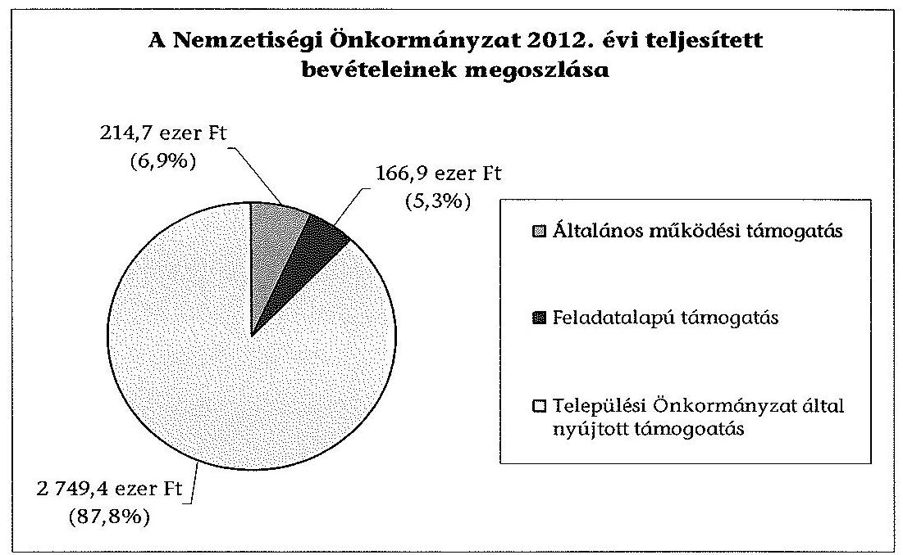
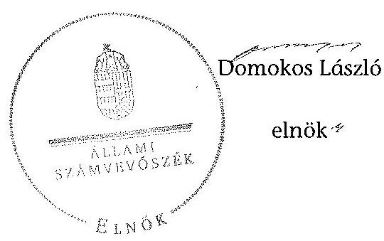

# ÁLLAMI   SZÁMVEVŐSZÉK 

## JELENTÉS

a helyi nemzetiségi önkormányzatok gazdálkodásának

- 2013. évben induló - ellenőrzéséről

Bőcsi Roma Nemzetiségi Önkormányzat

---

# Állami Számvevőszék 

Iktatószám: V-0146-040/2013.
Témaszám: 1201
Vizsgálat-azonosító szám: V065204

## Az ellenőrzést felügyelte:

Horváth Balázs
felügyeleti vezető
Az ellenőrzést vezette és az ellenőrzés végrehajtásáért felelős:
Pats Regina
ellenőrzésvezető
A számvevőszéki jelentést készítették és a jelentés összeállításában
közreműködtek:
dr. Győri Gabriella
számvevő
Csényi István
számvevő tanácsos
Az ellenőrzést végezték:
Vörös Mária Szabóné László Mária
számvevő főtanácsos számvevő

---

# TARTALOMJEGYZÉK 

BEVEZETÉS ..... 3
I. ÖSSZEGZŐ MEGÁLLAPÍTÁSOK, KÖVETKEZTETÉSEK ..... 6
II. RÉSZLETES MEGÁLLAPÍTÁSOK ..... 9

1. A Nemzetiségi Önkormányzat és a Települési Önkormányzat együttműködésének szabályozása, a működési feltételek biztosítása ..... 9
2. A gazdálkodási feladatok ellátásának szabályszerűsége ..... 10
2.1. A költségvetésre és zárszámadásra, valamint a kincstári adatszolgáltatás rendjére vonatkozó jogszabályi előírások betartása ..... 10
2.2. A Nemzetiségi Önkormányzat gazdálkodásának szabályozottsága ..... 11
2.3. Az operatív gazdálkodási jogkörök kialakítása, gyakorlása ..... 12
3. A Nemzetiségi Önkormányzattal kapcsolatos gazdálkodási feladatok belső ellenőrzése ..... 13
4. A feladatalapú támogatás felhasználásának, elszámolásának szabályszerűsége, a Nemzetiségi Önkormányzat feladatellátása ..... 14
MELLÉKLET
5. számú A Nemzetiségi Önkormányzat 2012. évi gazdálkodásának főbb adatai, mutatói
FÜGGELÉKEK
6. számú Rövidítések jegyzéke
7. számú Értelmező szótár
8. számú Minősítési szempontok

---

.

---

# JELENTÉS   a helyi nemzetiségi önkormányzatok gazdálkodásának - 2013. évben induló ellenőrzéséről   Bőcsi Roma Nemzetiségi Önkormányzat 

## BEVEZETÉS

A Nemzetiségi Önkormányzat 1994. évben alakult, elnöke a 2010. évi helyhatósági választások óta látja el feladatát. A Nemzetiségi Önkormányzat intézményt, gazdasági társaságot és más szervezetet nem alapított, illetve ezek társulásában nem vett részt. Az öttagú Képviselő-testület a munkája segítésére bizottságot nem hozott létre. A Nemzetiségi Önkormányzat költségvetési beszámolója szerint a 2012. évben a módosított költségvetési bevételi és kiadási előirányzat 3136 ezer Ft, a teljesített költségvetési bevétel 3131 ezer Ft, a teljesített költségvetési kiadás 3006 ezer Ft volt. A 2012. évi gazdálkodási adatokat részletesen az 1. számú mellékletben mutatjuk be.

A Bőcsi Roma Nemzetiségi Önkormányzat 2013. április 26-án megszűnt, a Kincstár 2013. május 15-én törölte a közhiteles törzskönyvi nyilvántartásból.

Az Alaptörvény XXIX. cikk (1) bekezdése szerint a Magyarországon élő nemzetiségek államalkotó tényezők. Minden, valamely nemzetiséghez tartozó magyar állampolgárnak joga van önazonossága szabad vállalásához és megőrzéséhez. A hazánkban élő nemzetiségek helyi (települési és területi) valamint országos önkormányzatokat hozhatnak létre ${ }^{1}$. A helyi nemzetiségi önkormányzatok gazdálkodási feladatait jogszabályi előírás alapján a székhely szerinti helyi önkormányzat polgármesteri hivatala látja el.

A nemzetiségek helyzete, támogatása mind hazai, mind EU-s szinten kiemelt figyelmet kap napjainkban. A helyi nemzetiségi önkormányzatok gazdálkodására és támogatási rendszerére vonatkozó jogszabályok a 2010-2012. években jelentős változásokon mentek át. A települési és területi nemzetiségi önkormányzatok gazdálkodásának, a részükre juttatott költségvetési támogatások felhasználásának ellenőrzését az ÁSZ a 2012. évben sorozatjellegű ellenőrzés keretében indította el. A 2013. évi ellenőrzések e témacsoportos ellenőrzések folytatását jelentik.

[^0]
[^0]:    ${ }^{1}$ A 2010. évben megtartott nemzetiségi önkormányzati választásokat követően 2304 települési, 58 területi és 13 országos nemzetiségi önkormányzat alakult meg.

---

Az ellenőrzés célja annak értékelése volt, hogy a Nemzetiségi Önkormányzat gazdálkodási kereteinek kialakítása, gazdálkodása és feladatellátása megfelelte a hatályos jogszabályoknak.

Ennek keretében értékeltük, hogy:

- a Nemzetiségi Önkormányzat és a Települési Önkormányzat együttműködésének szabályozása, a működési feltételek biztosítása megfelelte a jogszabályi előírásoknak;
- a felek együttműködése a gazdálkodási feladatok ellátása során megfelelte a közöttük létrejött megállapodásnak, betartották-e a nemzetiségi önkormányzat költségvetésére és zárszámadására, a gazdálkodás szabályozására, az operatív gazdálkodási jogkörök gyakorlására vonatkozó jogszabályi előírásokat;
- a jegyző biztosította-e a nemzetiségi önkormányzat gazdálkodásának belső ellenőrzését;
- a nemzetiségi önkormányzat feladatalapú támogatásának felhasználása, a folyósított feladatalapú támogatással történő elszámolás az előírásoknak megfelelő volt-e;
- a nemzetiségi önkormányzat feladatellátása összhangban volt-e a vonatkozó jogszabályi előírásokkal.

Az ellenőrzés várható hasznosulását négy szinten tervezzük. A törvényalkotás számára összegzett tapasztalatok állnak rendelkezésre a nemzetiségi önkormányzatok testületi döntéseinek, gazdálkodásának és a feladatalapú támogatás felhasználásának szabályszerűségéről, amelynek alapján következtetést lehet levonni arra, hogy indokolt-e jogszabályi módosítás kezdeményezése. Az ellenőrzés az ellenőrzött számára visszajelzést ad a működésében fellépő hiányosságokról, javaslataival hozzájárul azok kiküszöböléséhez, amely csökkentheti a későbbi ellenőrzések gyakoriságát. Az ellenőrzés megállapításai és javaslatai tanulságul szolgálhatnak más nemzetiségi önkormányzatok, szervezetek számára a rendezett gazdálkodási keretek kialakításához. A társadalom számára jelzi, hogy közpénz nem maradhat ellenőrizetlenül, az ÁSZ értékteremtő rend kialakításához és megőrzéséhez hozzájáruló tevékenysége pozitív hatással lesz a szervezetről kialakított összkép formálásában. Az ÁSZ szervezetén belül lehetőség nyílik arra, hogy a megállapítások szintetizálásával az intézmény a hozzáadott értéket teremtő elemző tevékenységét és tanácsadó szerepét erősítse.

A helyi nemzetiségi önkormányzatok gazdálkodásának ellenőrzéséről szóló jelentés I. fejezetének összegző része az ellenőrzés céljára adott rövid, szintetizáló összefoglalót és következtetéseket tartalmazza a II. fejezet részletes megállapításain alapulóan.

Az ellenőrzés típusa: szabályszerűségi ellenőrzés.
Az ellenőrzött időszak: 2012. január 1. - 2012. december 31. közötti időszak. Az ellenőrzés kiterjedt a helyi nemzetiségi önkormányzatnak juttatott 2012. évi támogatás 2013. évben való elszámolására is.

---

Ellenőrzött szervezet: a Bőcsi Roma Nemzetiségi Önkormányzat és a gazdálkodási feladatait ellátó Bőcs Község Önkormányzata.

Az ellenőrzés végrehajtásának jogszabályi alapját az ÁSZ tv. 5. § (2)-(3) és (6) bekezdéseiben foglaltak képezik.

Az ellenőrzés szakmai módszertana az ÁSZ hivatalos honlapján (www.asz.hu) közzétett szakmai szabályokon alapult, amely a Legfőbb Ellenőrző Intézmények Nemzetközi Szervezete (INTOSAI) által kiadott nemzetközi standardok (ISSAI) figyelembevételével készült.

A Nemzetiségi Önkormányzat gazdálkodásának ellenőrzése során értékeltük a Települési Önkormányzat és a Nemzetiségi Önkormányzat együttműködésének, a gazdálkodás szabályozottságának és a pénzügyi folyamatokban kulcsszerepet betöltő belső kontrollok (teljesítés igazolás és érvényesítés) működésének megfelelőségét. A kulcskontrollokat a működési és felhalmozási célú támogatásértékű kiadásoknál, az államháztartáson kívülre teljesített működési és felhalmozási célú pénzeszköz átadásoknál, a dologi kiadásokkal kapcsolatos kifizetéseknél - véletlen mintavételi eljárást alkalmazva - ellenőriztük. Ellenőriztük, hogy a jegyző biztosította-e a Nemzetiségi Önkormányzat gazdálkodásának belső ellenőrzését. Értékeltük a feladatalapú támogatások felhasználásának, elszámolásának szabályszerűségét, a Nemzetiségi Önkormányzat feladatellátása és a jogszabályi előírások összhangját.

Az ellenőrzés lefolytatásához a Nemzetiségi Önkormányzat és a gazdálkodási feladatait ellátó Települési Önkormányzat tanúsítványok és a kapcsolódó, dokumentumjegyzékben megjelölt dokumentumok elektronikus úton történő megküldésével, rendelkezésre bocsátásával szolgáltatott adatokat. Az adatszolgáltatás kontrollálása és szükség szerinti javítása a helyszíni ellenőrzés keretében történt. A minősítési szempontokat a 3. számú függelék tartalmazza.

Az ÁSZ tv. 29. § (1) bekezdése szerint a jelentéstervezetet megküldtük a polgármester részére, aki az ÁSZ tv. 29. § (2) bekezdésében foglalt észrevételezési jogával nem élt, a jelentéstervezetre határidőben észrevételt nem tett.

---

# I. ÖSSZEGZŐ MEGÁLLAPÍTÁSOK, KÖVETKEZTETÉSEK 

A Nemzetiségi Önkormányzat és a Települési Önkormányzat együttműködésének szabályozása nem felelt meg a jogszabályi előírásoknak. A 2012. december 31 -én hatályos, aláírt együttműködési megállapodás jóváhagyásáról nem hozott határozatot sem a Települési Önkormányzat Képviselő-testülete, sem a Nemzetiségi Önkormányzat Képviselő-testülete. Az együttműködési megállapodás alapján a Települési Önkormányzat a Nemzetiségi Önkormányzat részére az önkormányzati feladatellátáshoz a Települési Önkormányzat tulajdonát képező ingatlant adott át. Az ingatlan használati szerződést a polgármester és a Nemzetiségi Önkormányzat elnöke kötötte meg, ezzel a Nemzetiségi Önkormányzat megsértette a Nek. ${ }_{2}$ tv-ben foglaltakat, mivel az ilyen tartalmú megállapodás megkötése a Képviselő-testület át nem ruházható hatáskörébe tartozik. Az együttműködés szabályozása a Nek. ${ }_{2}$ tv-ben meghatározott tartalmi elemek tekintetében hiányos volt. Az együttműködési megállapodás nem tartalmazta a Nemzetiségi Önkormányzat bevételeivel és kiadásaival kapcsolatban a gazdálkodási a tervezési, az adatszolgáltatási, a beszámolási, az ellenőrzési és a finanszírozási feladatok ellátásának részletes szabályait. A költségvetés előkészítésével és megalkotásával kapcsolatos végrehajtási határidőket nem határozták meg. A Nek. ${ }_{2}$ tv-ben foglaltak ellenére az együttműködési megállapodás nem tartalmazott előírást a Nemzetiségi Önkormányzat részére önálló fizetési számla nyitásával, törzskönyvi nyilvántartásba vételével és adószám igénylésével kapcsolatos határidőkre vonatkozóan. Nem határozták meg a Nemzetiségi Önkormányzat működési feltételeinek és gazdálkodásának eljárási és dokumentációs részletszabályaival, valamint az ezeket végző személyek kijelölésének rendjével és az adatszolgáltatási feladatok teljesítésével kapcsolatos előírásokat, feltételeket. Az együttműködési megállapodás nem tartalmazta, hogy a jegyző, vagy annak - a jegyzővel azonos képesítési előírásokkal rendelkező - megbízottja a Települési Önkormányzat megbízásából és képviseletében részt vesz a Nemzetiségi Önkormányzat képviselő-testületi ülésein és jelzi, amennyiben törvénysértést észlel. A szabályozási hiányosságok ellenére a Települési Önkormányzat biztosította a Nemzetiségi Önkormányzat működéséhez szükséges személyi és tárgyi feltételeket.

A Nemzetiségi Önkormányzat a költségvetésére és zárszámadására, valamint a kincstári adatszolgáltatás rendjére vonatkozó jogszabályi előírásoknak részben felelt meg. A Nemzetiségi Önkormányzat elnöke a 2012. évi költségvetés tervezetét határidőben benyújtotta a Képviselő-testületnek. A jóváhagyott költségvetés tartalmazta a Nemzetiségi Önkormányzat költségvetési bevételeit és költségvetési kiadásait előirányzat-csoportok, kiemelt előirányzatok szerinti bontásban, azonban nem mutatták be a Képviselő-testületnek tájékoztatás céljából az Áht. ${ }_{2}$-ben foglaltak szerint az előírt mérlegeket és kimutatásokat, szöveges indokolással együtt. A 2012. évi költségvetési határozat nem tartalmazta az Áht. ${ }_{2}$ szerinti finanszírozási célú pénzügyi műveletekkel kapcsolatos hatásköröket és az esetleges felhatalmazást. A kincstári adatszolgáltatási kötelezettséget a jegyző határidőben teljesítette. A jegyző által elkészített 2012. évi zárszámadási határozat-tervezetet a Nemzetiségi Önkormányzat elnöke határidőben benyújtotta elfogadásra a Képviselő-testületnek. A zárszámadás elkészítése során a határozat megalkotására, tartalmi előírásaira, elfogadására és továbbítására vonatkozó előírásokat a Nemzetiségi Önkormányzat betartotta. A zárszámadásról alkotott határozat és az elfogadott költségvetés összehasonlíthatóságát biztosították, azonban az Áht. ${ }_{2}$-ben foglalt mérlegeket és kimutatásokat tájékoztatásul a zárszámadás keretében sem mutatták be a Képviselőtestületnek.

A gazdálkodás szabályozottsága nem volt megfelelő, mivel a Nemzetiségi Önkormányzat a Számv. tv. és az Áhsz. által előírt számviteli politikával és számlarenddel csak 2012. áprilisa-tól rendelkezett. A 2012. július 18-ig hatályos együttműködési megállapodás még rendelkezett a pénzkezelési szabályzat Nemzetiségi Önkormányzat gazdálkodási feladataira történő kiterjesztéséről, azonban az ezt követően megkötött új együttműködési megállapodás már nem tartalmazott erre vonatkozó szabályokat. A gazdálkodási feladatok végrehajtását ellátó Polgármesteri Hivatal a leltározási és leltárkészítési szabályzat, az eszközök és források értékelési szabályzata, az ellenőrzési nyomvonal, a szabálytalanságok kezelésének eljárásrendje, a kockázatkezelési szabályzat, valamint a folyamatba épített előzetes, utólagos és vezetői ellenőrzés szabályozások hatályát a Nemzetiségi Önkormányzat gazdálkodási feladataira nem terjesztette ki, mely azokkal önállóan sem rendelkezett. A Polgármesteri Hivatal SZMSZ-e az Ávr. előírásai ellenére nem tartalmazta a munkakörökhöz kapcsolódóan a Nemzetiségi Önkormányzat gazdálkodásával kapcsolatos feladat- és hatásköröket, a hatáskörök gyakorlásának módját, a helyettesítés rendjét és az ezekre vonatkozó felelősségi szabályokat. A feladatok ellátásával megbízott köztisztviselők munkaköri leírásaiban a Nemzetiségi Önkormányzat gazdálkodásával kapcsolatos feladatok és hatáskörök nem szerepeltek.

Az operatív gazdálkodási jogkörök kialakítása összességében megfelelt a jogszabályi előírásoknak. Az operatív gazdálkodási jogkörök kialakítása során a Nemzetiségi Önkormányzat elnöke, mint kötelezettségvállaló más képviselőt nem hatalmazott fel írásban a kötelezettségvállalás és utalványozás gyakorlására, emiatt az Ávr-ben előírt összeférhetetlenségi követelmények nem érvényesültek. A pénzügyi ellenjegyző, az érvényesítők és a teljesítés igazoló kijelölése a 2012. év II. negyedévében történt meg, az arra jogosult által.

A kulcsszerepet betöltő kontrollok működésének megfelelőségét a
 2012. évben a dologi kiadások teljesítése során az ellenőrzés gyengének értékelte, a hibák száma a lényegességi szintet, a kritikus hibahatárt elérte. Az Ávr-ben előírtak alapján a teljesítésigazolás csak az ellenőrzött esetek felében történt meg. Az érvényesítésre a vizsgált esetek több mint felében jogosultság hiányában került sor, illetve egy esetben az érvényesítő kijelölése a gazdasági eseményt követően történt. Nem alakították ki az Ávr-ben foglaltak alapján az előzetes írásbeli kötelezettségvállalást nem igénylő kifizetések eljárásrendjét, valamint a kötelezettségvállalásra vonatkozó nyilvántartást. Működési célú pénzeszközátadás államháztartáson kívülre jogcímen helyesbítő tételként teljesült kifizetés, az eredeti kifizetésre az ellenőrzés nem terjedt ki. Működési és felhalmozási célú támogatásértékű kiadás, valamint felhalmozási célú pénzeszközátadás államháztartáson kívülre nem történt.

A jegyző nem biztosította a Nemzetiségi Önkormányzat gazdálkodásával összefüggő végrehajtási feladatok belső ellenőrzését. A Polgármesteri Hivatal

---

2012. évi éves belső ellenőrzési tervét megalapozó kockázatelemzés - a Ber. előírása ellenére - nem terjedt ki a Nemzetiségi Önkormányzat gazdálkodásával összefüggő végrehajtási feladatokra, és azok tekintetében belső ellenőrzési feladatot a 2012. évben nem terveztek és nem végeztek. A 2012. évre vonatkozó belső ellenőrzési terv elkészítésének idején hatályos együttműködési megállapodás a Nemzetiségi Önkormányzat belső ellenőrzésére vonatkozóan nem tartalmazott előírásokat.

A Nemzetiségi Önkormányzat a 2012. évben a bevételei 5,3%-át kitevő 166,9 ezer Ft összegű feladatalapú támogatásban részesült, amelyet a tárgyévben a jogszabályi előírásokkal összhangban felhasznált. A támogatási kormányrendelet ${ }_{2}$-ben hivatkozott elszámolás nem történt meg, a támogatás felhasználását, elszámolását az ellenőrzésre jogosult szervek nem ellenőrizték. A Nemzetiségi Önkormányzat feladatellátásának tárgya részben volt összhangban a Nek. 2 tv. előírásaival, mert a Nemzetiségi Önkormányzat a 2012. évben a Nek. ${ }_{2}$ tv-ben felsorolt kötelező közfeladatot nem látott el. Intézményekkel kötött együttműködési megállapodások alapján önként vállalt feladatokat végzett a társadalmi felzárkózás, valamint a szociális, ifjúsági, kulturális igazgatás terén.

---

# II. RÉSZLETES MEGÁLLAPÍTÁSOK 

## 1. A Nemzetiségi Önkormányzat és a Települési Önkormányzat együttműködésének szabályozása, a működési feltételek biztosítása

A Nemzetiségi Önkormányzat és a Települési Önkormányzat együttműködésének szabályozása ${ }^{2}$ nem felelt meg a jogszabályi előírásoknak. Az együttműködési megállapodás megkötésére a Nek. ${ }_{2}$ tv. 159. § (3) bekezdésében meghatározott határidőt követően, 2012. július 19-én került sor. A 2012. december 31-én hatályos, aláírt együttműködési megállapodás jóváhagyásáról nem hozott határozatot sem a Települési Önkormányzat Képviselő-testülete, sem a Nemzetiségi Önkormányzat Képviselő-testülete. A jegyzőkönyvek alapján a Nemzetiségi Önkormányzat elnöke a megállapodás megkötésére a Képviselő-testület által átruházott hatáskörrel nem rendelkezett. A megállapodás felhatalmazás hiányában történt aláírásával megsértették a Nek. ${ }_{2}$ tv. 77. § (1) bekezdésében foglaltakat. Az együttműködési megállapodás alapján a Települési Önkormányzat a Nemzetiségi Önkormányzat részére az önkormányzati feladatellátáshoz a Települési Önkormányzat tulajdonát képező ingatlant adott át, melynek használatát szerződés szabályozza ${ }^{3}$. Az ingatlan használati szerződést a polgármester és a Nemzetiségi Önkormányzat elnöke kötötte meg, ezzel a Nemzetiségi Önkormányzat megsértette a Nek. ${ }_{2}$ tv. 113. § d) pontjában foglaltakat, mivel az ilyen tartalmú megállapodás megkötése a Képviselő-testület át nem ruházható hatáskörébe tartozik.

Az együttműködés szabályozása - a 2012. december 31-én hatályos együttműködési megállapodás alapján - hiányos volt. Az együttműködési megállapodás nem tartalmazta:

- az Áht. ${ }_{2}$ 27. § (2) bekezdésében foglaltak alapján a nemzetiségi önkormányzat bevételeivel és kiadásaival kapcsolatban a gazdálkodási, a tervezési, az adatszolgáltatási, a beszámolási, az ellenőrzési és a finanszírozási feladatok ellátásának részletes szabályait;
- a Nek. ${ }_{2}$ tv. 80. § (3) bekezdés a) pontja alapján a költségvetés előkészítésével és megalkotásával, a költségvetési adatszolgáltatással, az önálló fizetési számla nyitásával kapcsolatos felelősök konkrét kijelölését;
- a Nek. ${ }_{2}$ tv. 80. § (3) bekezdésének a) pontjában foglaltakra tekintettel a Nemzetiségi Önkormányzat részére önálló fizetési számla nyitásával, törzs-

[^0]
[^0]:    ${ }^{2}$ A Bőcs Község Önkormányzatának polgármestere és a Bőcs Községi Cigány Kisebbségi Önkormányzat elnöke által 2010. december 2-án aláírt és 2012. július 18-ig hatályos együttműködési megállapodást a felek 2011. március 29-én kiegészítették és 2012. július 19-én új megállapodást írtak alá.
    ${ }^{3}$ 2012. július 24-én kelt ingatlan használati szerződés.

---

könyvi nyilvántartásba vételével és adószám igénylésével kapcsolatos határidőkre vonatkozó előírást;

- a Nek. ${ }_{2}$ tv. 80. § (3) bekezdésének b) pontjában előírtak ellenére az érvényesítési feladatok ellátásával kapcsolatos felelősök konkrét kijelölését;
- a Nek. ${ }_{3}$ tv. 80. § (3) bekezdésének d) pontjában meghatározottak ellenére a Nemzetiségi Önkormányzat működési feltételeinek és gazdálkodásának eljárási és dokumentációs részletszabályaival, valamint az ezeket végző személyek kijelölésének rendjével és az adatszolgáltatási feladatok teljesítésével kapcsolatos rendelkezéseket;
- a Nek. ${ }_{2}$ tv. 80. § (4) bekezdésében foglaltak ellenére azt, hogy a jegyző, vagy annak - a jegyzővel azonos képesítési előírásokkal megfelelő - megbízottja a Települési Önkormányzat megbízásából és képviseletében részt vesz a Képviselő-testület ülésein és jelzi, amennyiben törvénysértést észlel.

A működési feltételeket a Nek. ${ }_{2}$ tv. 80. § (2) bekezdésében foglalt előírások ellenére nem rögzítették az együttműködési megállapodás megkötését, módosítását követő harminc napon belül a Nemzetiségi Önkormányzat SZMSZ-ében.

A szabályozási hiányosságok ellenére a Települési Önkormányzat biztosította a Nemzetiségi Önkormányzat működéséhez szükséges személyi és tárgyi feltételeket.

# 2. A GAZDÁLKODÁSI FELADATOK ELLÁTÁSÁNAK SZABÁLYSZERŰSÉGE 

### 2.1. A költségvetésre és zárszámadásra, valamint a kincstári adatszolgáltatás rendjére vonatkozó jogszabályi előírások betartása

A Nemzetiségi Önkormányzat a költségvetésére és zárszámadására, valamint a kincstári adatszolgáltatás rendjére vonatkozó jogszabályi előírásoknak részben felelt meg.

A Nemzetiségi Önkormányzat költségvetési határozatát ${ }^{4}$ a jogszabályban előírt eljárásrend szerint, határidőben fogadták el. A jóváhagyott költségvetés tartalmazta a Nemzetiségi Önkormányzat költségvetési bevételeit és kiadásait előirányzat-csoportok, kiemelt előirányzatok szerinti bontásban, azonban nem mutatták be a Képviselő-testületnek tájékoztatás céljából az Áht. ${ }_{2}$ 24. § (4) bekezdésében előírt mérlegeket és kimutatásokat, szöveges indokolással együtt. A 2012. évi költségvetési határozat nem tartalmazta az Áht. ${ }_{2}$ 23. § (2) bekezdés h) pontja szerinti finanszírozási célú pénzügyi műveletekkel kapcsolatos hatásköröket és az Áht. ${ }_{2}$ 34. § (2) bekezdése szerinti esetleges felhatalmazást.

[^0]
[^0]:    ${ }^{4}$ Bőcsi Roma Nemzetiségi Önkormányzat 1/2012. (II. 02.) számú határozata a 2012. évi költségvetésről.

---

A 2012. évi zárszámadás ${ }^{5}$ elkészítése során a határozat megalkotására, tartalmi előírásaira, elfogadására és továbbítására vonatkozó előírásokat a Nemzetiségi Önkormányzat betartotta. A 2012. évi zárszámadásról alkotott határozatnál biztosított volt az elfogadott költségvetéssel történő összehasonlíthatóság, a Nemzetiségi Önkormányzat valamennyi bevételéről és kiadásáról elszámolt. A jegyző azonban a 2012. évi zárszámadási határozat tervezetének előterjesztésekor a Képviselő-testület részére az Áht. ${ }_{2}$ 91. § (2)-(3) bekezdésében foglalt mérlegeket és kimutatásokat tájékoztatásul nem mutatta be.

A jegyző a Települési Önkormányzat 2012. évi költségvetéséhez kapcsolódó, a Nemzetiségi Önkormányzatra vonatkozó kincstári adatszolgáltatási kötelezettségének határidőben eleget tett.

# 2.2. A Nemzetiségi Önkormányzat gazdálkodásának szabályozottsága 

A Nemzetiségi Önkormányzat gazdálkodásának szabályozottsága nem volt megfelelő. A Nemzetiségi Önkormányzat csak 2012 áprilisától rendelkezett a Számv. tv. és az Áhsz. által előírt számviteli politikával és számlarenddel. A 2012. július 18-ig hatályos együttműködési megállapodás még rendelkezett a pénzkezelési szabályzat Nemzetiségi Önkormányzat gazdálkodási feladataira történő kiterjesztéséről, azonban az ezt követően megkötött új együttműködési megállapodás már nem tartalmazott erre vonatkozó szabályokat.

A Polgármesteri Hivatal szabályzatai közül a Számv. tv. 14. § (5) bekezdés a)-b) pontja szerinti leltározási és leltárkészítési szabályzat és az eszközök és források értékelési szabályzata, a Bkr. 6. § (3)-(4) bekezdéseiben előírt ellenőrzési nyomvonal és szabálytalanságok kezelése eljárásrendjének, a Bkr. 7. §-ában előírt kockázatkezelési szabályzat, a Bkr. 8. § (2)-(4) bekezdéseiben előírt folyamatba épített előzetes, utólagos és vezetői ellenőrzés szabályzatainak hatálya nem terjedt ki a Nemzetiségi Önkormányzat gazdálkodási feladataira.

Fenti szabályzatokkal a Nemzetiségi Önkormányzat önállóan sem rendelkezett.
A Nemzetiségi Önkormányzat gazdálkodásával összefüggő feladatok szabályozása tekintetében a Polgármesteri Hivatal SZMSZ-e az ellenőrzött időszakban hiányos volt. Az Ávr. 13. § (1) bekezdésének g) pontjában foglaltak ellenére nem tartalmazta a munkakörökhöz kapcsolódóan a Nemzetiségi Önkormányzat gazdálkodásával kapcsolatos feladat- és hatásköröket, a hatáskörök gyakorlásának módját, a helyettesítés rendjét és az ezekre vonatkozó felelősségi szabályokat. Ezek az előírások a feladattal megbízott köztisztviselők munkaköri leírásaiban sem szerepeltek.

Az Áht. 2 10. § (5) bekezdésében előírt, az Ávr. 13. § (2) bekezdés a) pontjában foglaltak szerint a tervezéssel, gazdálkodással, így különösen a kötelezettségvállalással, pénzügyi ellenjegyzéssel és teljesítésigazolással, az érvényesítés, utalványozás gyakorlásának módjával, eljárási és dokumentálási részletszabá-

[^0]
[^0]:    ${ }^{5}$ Bőcsi Roma Nemzetiségi Önkormányzat 2/2013.( IV. 26.) számú határozata a 2012. évi zárszámadás elfogadásáról.

---

lyaival, valamint az ezeket végző személyek kijelölésének rendjével, az ellenőrzési és adatszolgáltatási feladatok teljesítésével kapcsolatos belső előírásokat, feltételeket tartalmazó belső szabályzat rendelkezésre állt.

# 2.3. Az operatív gazdálkodási jogkörök kialakítása, gyakorlása 

A Nemzetiségi Önkormányzat gazdálkodása tekintetében az operatív gazdálkodási jogkörök kialakítása összességében megfelelt a jogszabályi előírásoknak.

A Nemzetiségi Önkormányzat elnöke, mint kötelezettségvállaló az Ávr. 52. § (7) bekezdésében foglaltak alapján más képviselőt nem hatalmazott fel írásban a kötelezettségvállalás és utalványozás gyakorlására, emiatt az Ávr. 60. § (2) bekezdésében foglalt összeférhetetlenségi követelmények nem érvényesültek.

A jegyző 2012. március 30-ig az Ávr. 10. § (7) bekezdése, valamint a 11. § (3)-(4) bekezdései szerinti jogkörében eljárva nem jelölt ki a Polgármesteri Hivatal állományába tartozó, előírt végzettséggel rendelkező köztisztviselőt a pénzügyi ellenjegyzési és az érvényesítési feladatok ellátására. A pénzügyi ellenjegyző, az érvényesítők és a teljesítés igazoló kijelölésére a 2012. április 25-én kelt Gazdálkodási szabályzatban került sor. A kijelölések az arra jogosultak által történtek, a pénzügyi ellenjegyzési, illetve érvényesítési feladatra kijelölt, a hivatal állományába tartozó köztisztviselők az előírt szakképzettséggel rendelkeztek.

A Nemzetiségi Önkormányzatnál a 2012. évben a dologi kiadások teljesítése során a teljesítés igazolás és az érvényesítés kulcskontrollok működésének megfelelősége gyenge volt, a hibák száma a lényegességi szintet, a kritikus hibahatárt elérte, mert:

- a teljesítést igazoló személy az Ávr. 57. § (1) bekezdésében foglaltakkal szemben a kiadások teljesítésének jogosságát és összegszerűségét, valamint az ellenszolgáltatás teljesítésének ellenőrzését nem végezte el. Annak ellenére igazolta a teljesítést, hogy a Nemzetiségi Önkormányzatnál éltek az Ávr. 53. § (1) bekezdés a)-c) pontjaiban foglalt lehetőséggel ${ }^{6}$, azonban ennek rendjét az Ávr. 53. § (2) bekezdésében foglaltak ellenére belső szabályzatban nem rögzítették;
- az Ávr. 57. § (1) bekezdésében foglaltak ellenére három esetben a teljesítés igazolása nem történt meg, így a kifizetések jogossága, összegszerűsége és az ellenszolgáltatás teljesítése ellenőrzésének elvégzését nem tudták igazolni;

[^0]
[^0]:    ${ }^{6}$ Ávr. 53. § (1): „Törvény vagy e rendelet eltérő rendelkezése hiányában nem szükséges előzetes írásbeli kötelezettségvállalás az olyan kifizetés teljesítéséhez, amely
    a) értéke a százezer forintot nem éri el,
    b) pénzügyi szolgáltatás igénybevételéhez kapcsolódik, vagy
 c) az Áht. 36. § (2) bekezdése szerinti egyéb fizetési kötelezettségnek minősül."

---

- az érvényesítés öt esetben jogosultság hiányában történt;
- egy esetben az érvényesítő Ávr. 58. § (2) bekezdés g) pontja, valamint 58. § (4) bekezdése alapján történő kijelölésére a gazdasági eseményt követően került sor;
- az érvényesítő három esetben nem végezte el az Ávr. 58. § (1)(2) bekezdésében foglalt ellenőrzési és jelzési kötelezettségét. Annak ellenére érvényesítette a bizonylatokat, hogy a Nemzetiségi Önkormányzatnál éltek az Ávr. 53. § (1) bekezdés a)-c) pontjaiban foglalt lehetőséggel, azonban ennek rendjét az Ávr. 53. § (2) bekezdésében foglaltak ellenére belső szabályzatban nem rögzítették. Az érvényesítő az Ávr. 58. § (1) bekezdésében foglalt előírásokkal szemben elmulasztotta annak ellenőrzését, hogy az Áht., az Áhsz. és az Ávr. előírásait, továbbá a belső szabályzatokban foglaltakat betartották-e, mert úgy érvényesítette a bizonylatokat, hogy a kötelezettségvállalásra vonatkozó nyilvántartást az Ávr. 56. § (1) bekezdésében foglaltak ellenére nem alakították ki. Nem észrevételezte továbbá, hogy egyes kifizetéseknél a teljesítés igazolása elmaradt. Az érvényesítő nem végezte el a jogszabályokban foglalt előírások betartásának ellenőrzését, mert nem észrevételezte, hogy az írásbeli kötelezettségvállalást nem igénylő kiadások rendjét az Ávr. 53. § (2) bekezdésében foglaltak ellenére nem írták elő.

Működési célú pénzeszközátadás államháztartáson kívülre jogcímen helyesbítő tételként teljesült kifizetés, az eredeti kifizetésre az ellenőrzés nem terjedt ki. Működési és felhalmozási célú támogatásértékű kiadás, valamint felhalmozási célú pénzeszközátadás államháztartáson kívülre nem történt.

# 3. A Nemzetiségi Önkormányzattal kapcsolatos gazdálkodási feladatok belső ellenőrzése 

A jegyző nem biztosította a Nemzetiségi Önkormányzat gazdálkodásával összefüggő végrehajtási feladatok belső ellenőrzését. A Polgármesteri Hivatal 2012. évi éves belső ellenőrzési tervét megalapozó kockázatelemzés - a Ber. 21. § (2) bekezdés ellenére - nem terjedt ki a Nemzetiségi Önkormányzat gazdálkodásával összefüggő végrehajtási feladatokra, és azok tekintetében belső ellenőrzési feladatot a 2012. évben nem terveztek és nem végeztek.

A 2012. évre vonatkozó belső ellenőrzési terv elkészítésének idején hatályos együttműködési megállapodás a Nemzetiségi Önkormányzat belső ellenőrzésére vonatkozóan nem tartalmazott előírásokat.

A 2012. évben a Kormányhivatal a Nemzetiségi Önkormányzatot illetően nem élt törvényességi felügyeleti eszközökkel.

---

# 4. A feladatalapú támogatás felhasználásának, elszámolásának szabályszerűsége, a Nemzetiségi Önkormányzat feladatellátása 

A Nemzetiségi Önkormányzat a 2012. évben 166,9 ezer Ft összegű feladatalapú támogatásban részesült, amelynek az összes bevételhez viszonyított részarányát a következő ábra szemlélteti:

A Nemzetiségi Önkormányzat a 2011. évben feladatalapú támogatásban nem részesült. A 2012. évben folyósított feladatalapú támogatás tervezett felhasználási céljairól a támogatás kiutalását megelőzően a Képviselő-testület nem hozott határozatot és a folyósított feladatalapú támogatás összegével 2012. évi költségvetési határozatát nem módosította.

A 2012. évi 166,9 ezer Ft összegű támogatást - az ellenőrzés számára rendelkezésre bocsátott dokumentumok alapján - a vonatkozó jogszabályi előírásoknak megfelelően kulturális rendezvények szervezésére fordították.

A 2012. évi feladatalapú támogatás elszámolása a támogatási kormányrendelet ${ }_{2}$ 8. § (5) bekezdésében hivatkozott „a helyi önkormányzatok elszámolási és ellenőrzési rendjére vonatkozó jogszabályok rendelkezései alkalmazandóak" előírása ellenére nem történt meg.

A feladatalapú támogatás felhasználását, elszámolását az ellenőrzésre jogosult szervek nem ellenőrizték.

A Nemzetiségi Önkormányzat feladatellátásának tárgya részben volt összhangban a Nek. ${ }_{2}$ tv. előírásaival, mert a Nemzetiségi Önkormányzat a 2012. évben a Nek. ${ }_{2}$ tv. 115. §-ában felsorolt kötelező közfeladatot nem látott el. Intézményekkel (családsegítő központ, óvoda, általános iskola, szakiskola és művészetoktatási intézmény) kötött együttműködési megállapodások alapján

---

önként vállalt feladatokat végzett a társadalmi felzárkózás, valamint a szociális, ifjúsági, kulturális igazgatás terén.

Budapest, 2013. 12. hónap 30. nap

Melléklet: $\quad 1 \mathrm{db}$
Függelék: $\quad 3 \mathrm{db}$

---

# **Chemistry**

## **Chemical Reactions**

### **Balancing Chemical Equations**

1. **Write the unbalanced equation:**
   - Example: $$C_3H_8 + O_2 \rightarrow CO_2 + H_2O$$

2. **Balance the equation:**
   - Example: $$2C_3H_8 + 7O_2 \rightarrow 6CO_2 + 8H_2O$$

3. **Balance the equation:**
   - Example: $$2C_3H_8 + 7O_2 \rightarrow 6CO_2 + 8H_2O$$

### **Types of Reactions**

1. **Combination Reaction:**
   - Example: $$2H_2 + O_2 \rightarrow 2H_2O$$

2. **Decomposition Reaction:**
   - Example: $$2H_2O_2 \rightarrow 2H_2O + O_2$$

3. **Single Displacement Reaction:**
   - Example: $$Zn + 2HCl \rightarrow ZnCl_2 + H_2$$

4. **Double Displacement Reaction:**
   - Example: $$AgNO_3 + NaCl \rightarrow AgCl + NaNO_3$$

5. **Combustion Reaction:**
   - Example: $$CH_4 + 2O_2 \rightarrow CO_2 + 2H_2O$$

## **Stoichiometry**

### **Mole Concept**

- **Mole (mol):** The amount of substance containing as many particles (atoms, molecules, ions) as there are atoms in exactly 12 grams of carbon-12.
- **Avogadro's Number:** $$6.022 \times 10^{23}$$ particles per mole.

### **Molar Mass**

- **Molar Mass:** The mass of one mole of a substance.
- Example: The molar mass of water ($$H_2O$$) is 18.015 g/mol.

### **Calculations**

1. **Moles to Mass:**
   - Formula: $$n = \frac{m}{M}$$
   - Example: Calculate the number of moles of $$H_2O$$ in 18 grams of water.
     - $$n = \frac{18 \, \text{g}}{18.015 \, \text{g/mol}} \approx 0.999 \, \text{mol}$$

2. **Moles to Mass:**
   - Formula: $$m = n \times M$$
   - Example: Calculate the mass of 1 mole of water.
     - $$m = 1 \, \text{mol} \times 18.015 \, \text{g/mol} = 18.015 \, \text{g}$$

## **Gas Laws**

### **Ideal Gas Law**

- **Equation:** $$PV = nRT$$
- **Variables:**
  - $$P$$ = Pressure (atm)
  - $$V$$ = Volume (L)
  - $$n$$ = Moles of gas
  - $$R$$ = Ideal gas constant
  - $$T$$ = Temperature (K)

### **Boyle's Law**

- **Equation:** $$P_1V_1 = P_2V_2$$
- **Variables:**
  - $$P_1$$ = Initial pressure (atm)
  - $$V_1$$ = Initial volume (L)
  - $$P_2$$ = Final pressure (atm)
  - $$V_2$$ = Final volume (L)

### **Charles's Law**

- **Equation:** $$\frac{V_1}{T_1} = \frac{V_2}{T_2}$$
- **Variables:**
  - $$V_1$$ = Initial volume (L)
  - $$T_1$$ = Initial temperature (K)
  - $$V_2$$ = Final volume (L)
  - $$T_2$$ = Final temperature (K)

### **Boyle's Law**

- **Equation:** $$P_1V_1 = P_2V_2$$
- **Variables:**
  - $$P_1$$ = Initial pressure (atm)
  - $$V_1$$ = Initial volume (L)
  - $$P_2$$ = Final pressure (atm)
  - $$V_2$$ = Final volume (L)

## **Thermochemistry**

### **Enthalpy Change (ΔH)**

- **Definition:** The heat content of a system at constant pressure.
- **Equation:** $$\Delta H = q_p$$
- **Variables:**
  - $$\Delta H$$ = Enthalpy change (J or kJ)
  - $$q_p$$ = Heat transferred at constant pressure (J or kJ)

### **Hess's Law**

- **Statement:** The enthalpy change for a reaction is the same whether it occurs in one step or multiple steps.
- **Equation:** $$\Delta H_{\text{reaction}} = \sum \Delta H_{\text{products}} - \sum \Delta H_{\text{reactants}}$$
- **Variables:**
  - $$\Delta H_{\text{reaction}}$$ = Enthalpy change of the overall reaction
  - $$\Delta H_{\text{products}}$$ = Enthalpy of formation of products
  - $$\Delta H_{\text{reactants}}$$ = Enthalpy of formation of reactants

### **Hess's Law 2.0** (This is redundant; Hess's Law is a single concept)

## **Electrochemistry**

### **Oxidation and Reduction**

- **Oxidation:** Loss of electrons.
- **Reduction:** Gain of electrons.

### **Galvanic Cells**

- **Definition:** A cell that converts chemical energy into electrical energy.
- **Components:**
  - Anode: Oxidation occurs.
  - Cathode: Reduction occurs.
  - Salt Bridge: Connects the two half-cells.

### **Nernst Equation**

- **Equation:** $$E = E^\circ - \frac{RT}{nF} \ln Q$$
- **Variables:**
  - $$E$$ = Cell potential (V)
  - $$E^\circ$$ = Standard cell potential (V)
  - $$R$$ = Ideal gas constant (8.314 J/mol·K)
  - $$T$$ = Temperature (K)
  - $$n$$ = Number of electrons transferred (mol)
  - $$F$$ = Faraday constant (96485 C/mol)
  - $$Q$$ = Reaction quotient

---

# A Nemzetiségi Önkormányzat 2012. évi gazdálkodásának főbb adatai, mutatói

A) Bevételek

|  Megnevezés | Eredeti előirányzat | Módosított | Teljesítés  |
| --- | --- | --- | --- |
|   | ezer Ft |  | megoszlás  |
|  Általános működési támogatás | 0,0 | 0,0 | 214,7  |
|  Feladatalapú támogatás | 0,0 | 171,0 | 166,9  |
|  Települési Önkormányzat által nyújtott támogatás | 2482,0 | 2965,0 | 2749,4  |
|  Pénzforgalmi bevételek összesen | 2482,0 | 3136,0 | 3131,0  |
|  Bevételek összesen | 2482,0 | 3136,0 | 3131,0  |

B) Kiadások

|  Megnevezés | Eredeti előirányzat | Módosított | Teljesítés  |
| --- | --- | --- | --- |
|   | ezer Ft |  | megoszlás  |
|  Személyi juttatások | 1515,0 | 1526,0 | 1526,0  |
|  Munkaadókat terhelő járulékok és szociális hozzájárulási adó összesen | 409,0 | 430,0 | 429,0  |
|  Dologi kiadások | 558,0 | 965,0 | 837,0  |
|  Működési célú pénzeszközátadások államháztartáson kívülre | 0,0 | 215,0 | 214,0  |
|  Működési kiadások összesen | 2482,0 | 3136,0 | 3006,0  |
|  Kiadások összesen | 2482,0 | 3136,0 | 3006,0  |

---

# **Title: The Impact of Climate Change on Global Ecosystems**

## **Introduction**

Climate change is one of the most pressing environmental issues of our time. It affects ecosystems worldwide, leading to significant changes in biodiversity, habitat loss, and species extinction. This report explores the impacts of climate change on global ecosystems, focusing on key areas such as **forests**, **oceans**, and **polar regions**.

## **1. Forest Ecosystems**

Forests play a crucial role in carbon sequestration and maintaining biodiversity. However, rising temperatures and changing precipitation patterns are altering forest ecosystems. Key impacts include:

- **Increased frequency of wildfires**: Rising temperatures and drought conditions have led to more frequent and severe wildfires, destroying vast areas of forests.
- **Changes in species distribution**: Shifts in temperature and precipitation patterns are altering species distribution, leading to species extinction.
- **Insect outbreaks**: Warmer temperatures have increased the survival rates of pests like bark beetles, which are causing widespread damage.

## **2. Ocean Ecosystems**

Oceans absorb a significant portion of the excess heat and carbon dioxide (CO₂) produced by human activities. The consequences include:

- **Ocean acidification**: Increased CO₂ absorption is lowering the pH of ocean water, harming marine life.
- **Coral bleaching**: Rising ocean temperatures are causing widespread coral bleaching, threatening coral reef ecosystems.
- **Changes in ocean currents**: Altered ocean currents are affecting marine species distribution and migration patterns.

## **3. Polar Regions**

Polar regions are particularly vulnerable to climate change. Key impacts include:

- **Melting glaciers and ice sheets**: Rising temperatures are causing glaciers and ice sheets to melt at an alarming rate, contributing to sea-level rise.
- **Loss of sea ice**: Reduced sea ice extent and thickness is threatening species like polar bears and seals.
- **Changes in species distribution**: Shifts in temperature and sea ice extent are altering species distribution, leading to species extinction.

 and seals.

## **3. Polar Ecosystems**

Polar regions are particularly vulnerable to climate change due to their sensitivity to temperature changes. Key impacts include:

- **Melting of sea ice**: The Arctic is warming at twice the rate of the global average, leading to sea ice loss.
- **Glacial retreat**: Melting glaciers and their presence in the Arctic are rising, threatening sea ice, which are causing sea-level rise.
- **Permafrost thawing**: Thawing permafrost releases stored carbon and methane, further accelerating global warming.

## **4. Polar Ecosystems**

Polar regions are particularly vulnerable to climate change due to their sensitivity to temperature changes. Key impacts include:

- **Melting of sea ice**: Melting glaciers and their presence in the Arctic are rising, threatening sea ice loss.
- **Glacial retreat**: Melting glaciers and their presence in the Arctic are rising, threatening sea ice, which are causing sea-level rise.
- **Changes in ocean currents**: Altered ocean currents are causing widespread sea-level rise, threatening species like polar bears and seals.

## **5. Polar Ecosystems**

Polar regions are particularly vulnerable to climate change due to their sensitivity to temperature changes. Key impacts include:

- **Melting of sea ice**: Melting glaciers and their presence in the Arctic are rising, threatening sea ice loss.
- **Glacial retreat**: Melting glaciers and their presence in the Arctic are rising, threatening sea ice loss.
- **Changes in ocean currents**: Altered ocean currents are causing widespread sea-level rise, threatening species like polar bears and seals.

## **Conclusion**

Climate change poses a significant threat to global ecosystems, with far-reaching consequences for biodiversity and human societies. By reducing greenhouse gas emissions, reducing greenhouse gas emissions, and reducing greenhouse gas emissions, we can protect the planet for future generations.

---

**References**

1. IPCC (Intergovernmental Panel on Climate Change). (2021). *Climate Change 2021: The Physical Science Basis*.
2. WWF (World Wildlife Fund). (2020). *Living Planet Report 2020*.
3. NASA Global Climate Change. (2022). *Vital Signs: Global Temperature*.

---

# RÖVIDÍTÉSEK JEGYZÉKE 

## Törvények

Alaptörvény
Áht. 1
Áht. 2
ÁSZ tv.
Nek. 1 tv.
Nek. 2 tv.
Számv. tv.

## Rendeletek

Áhsz.

Ámr.
Ávr.

Bkr.
támogatási kormányrendelet ${ }_{1}$
támogatási kormányrendelet ${ }_{2}$

Települési Önkormányzat SZMSZ-e

## Határozatok

Nemzetiségi Önkormányzat SZMSZ-e

## Szórövidítések

ÁSZ

Magyarország Alaptörvénye
Az államháztartásról szóló 1992. évi XXXVIII. törvény (hatályos 2011. december 31-éig)
Az államháztartásról szóló 2011. évi CXCV. törvény (hatályos 2011. december 31-étől)
Az Állami Számvevőszékről szóló 2011. évi LXVI. törvény (hatályos 2011. július 1-jétől)
A nemzeti és etnikai kisebbségek jogairól szóló 1993. évi LXXVII. törvény (hatályos 2011. december 31-éig)
A nemzetiségek jogairól szóló 2011. évi CLXXIX. törvény (hatályos 2011. december 20-ától)
A számvitelről szóló 2000. évi C. törvény
Az államháztartás szervezetei beszámolási és könyvvezetési kötelezettségének sajátosságairól szóló 249/2000. (XII. 24.) Korm. rendelet

Az államháztartás működési rendjéről szóló 292/2009. (XII. 19.) Korm. rendelet (hatályos 2011. december 31-ig)

Az államháztartásról szóló törvény végrehajtásáról szóló 368/2011. (XII. 31.) Korm. rendelet (hatályos 2012. január 1-jétől)
A költségvetési szervek belső kontrollrendszeréről és belső ellenőrzéséről szóló 370/2011. (XII. 31.) Korm. rendelet (hatályos 2012. január 1-jétől)
A kisebbségi önkormányzatoknak a központi költségvetésből, valamint fejezeti kezelésű előirányzatból nyújtott támogatások feltételrendszeréről és elszámolásának rendjéről szóló 342/2010. (XII. 28.) Korm. rendelet (hatályos 2012. március 6-áig)
A nemzetiségi célú előirányzatokból nyújtott támogatások feltételrendszeréről és elszámolásának rendjéről szóló 28/2012. (III. 6.) Korm. rendelet (hatályos 2012. március 7-étől 2012. december 31-éig)
Bőcs Község Önkormányzatának Szervezeti és Működési Szabályzatáról szóló 13/2011. (IX. 14.) számú önkormányzati rendelet

A Nemzetiségi Önkormányzat Szervezeti és Működési Szabályzatáról szóló, 2/2012. (II. 2.) képviselő-testületi határozattal módosított 3/1999. (III. 9.) képviselő-testületi határozat

Állami Számvevőszék

---

Gazdálkodási szabályzat Bőcs Roma Nemzetiségi Önkormányzat Gazdálkodási szabályzata (hatályos: 2012. január 1-jétől)
jegyző Bőcs Községi Önkormányzat Jegyzője
Képviselő-testület Bőcs Községi Cigány Kisebbségi Önkormányzat Képviselő-testülete 2011. december 31-éig, Bőcsi Roma Nemzetiségi Önkormányzat Képviselő-testülete 2012. január 1-jétől
Kincstár Magyar Államkincstár Borsod-Abaúj-Zemplén Megyei Igazgatósága
Kormányhivatal Borsod-Abaúj-Zemplén Megyei Kormányhivatal
Nemzetiségi Önkormányzat
Nemzetiségi Önkormányzat elnöke
Nemzetiségi Önkormányzat SZMSZ-e
Bőcs Községi Cigány Kisebbségi Önkormányzat 2011. december 31-éig, Bőcsi Roma Nemzetiségi Önkormányzat 2012. január 1-jétől
Bőcs Községi Cigány Kisebbségi Önkormányzat elnöke 2011. december 31-éig, Bőcsi Roma Nemzetiségi Önkormányzat elnöke 2012. január 1-jétől
Bőcs Községi Cigány Kisebbségi Önkormányzat SZMSZ-e (142/1999.) 3/1999.(III. 9.) sz. KT határozattal jóváhagyva;
2/2012. (II.02.) KT határozattal módosítva.
polgármester Bőcs Község Önkormányzatának polgármestere
Polgármesteri Hivatal Bőcs Községi Önkormányzat Polgármesteri Hivatala
Polgármesteri Hivatali Bőcs Községi Önkormányzat Polgármesteri Hivatalának SZMSZ-e 690/2009. (X. 28.) KT határozattal jóváhagyva, továbbá 172/2012. (IX. 25.) KT határozattal módosítva.
Települési Önkormányzat Bőcs Község Önkormányzata

---

# ÉRTELMEZŐ SZÓTÁR 

feladatalapú támogatás

A támogatási évben általános működési támogatásban részesült, és a Támogatónak a Magyar Államkincstárhoz (a továbbiakban: Kincstár) intézett, a feladatalapú támogatás utalására vonatkozó rendelkező levele keltének időpontjában működő települési és területi kisebbségi önkormányzatoknak az e rendeletben rögzített feltételrendszer alapján nyújtható támogatás. (Forrás: támogatási kormányrendelet, 2. § (2) bekezdés c) pont.)
A támogatási évben általános működési támogatásban részesült, és a Támogatónak a Kincstárhoz intézett, a feladatalapú támogatás utalására vonatkozó rendelkező levele keltének időpontjában működő települési és területi nemzetiségi önkormányzatoknak az e rendeletben rögzített feltételrendszer alapján nyújtható, a nemzetiségi önkormányzat által a Nek. 2 tv. szerinti nemzetiségi közfeladatok ellátásához közvetlenül kötődő támogatás. (Forrás: támogatási kormányrendelet, 2. § (2) bekezdés b) pont.)
kulcskontrollok
együttműködési megállapodás
nemzetiségi közügy

Teljesítés igazolása és az érvényesítés.
A nemzetiségi önkormányzatnak a működési feltételei biztosítására, továbbá a bevételeivel és a kiadásaival kapcsolatban a tervezési, gazdálkodási, ellenőrzési, finanszírozási, adatszolgáltatási és beszámolási feladatai végrehajtására a székhelye szerinti települési önkormányzattal megkötött megállapodás. (Forrás: Nek. ${ }_{2}$ tv. 80. § (2) bekezdés, Áht. 2 27. § (2) bekezdés.)
Az egyéni és közösségi jogok érvényesülése, a nemzetiséghez tartozók érdekeinek kifejezésre juttatása - különösen az anyanyelv ápolása, őrzése és gyarapítása, továbbá a nemzetiségek kulturális autonómiájának a nemzetiségi önkormányzatok által történő megvalósítása és megőrzése - érdekében a nemzetiséghez tartozók meghatározott közszolgáltatásokkal való ellátásával, ezen ügyek önálló vitelével és az ehhez szükséges szervezeti, személyi és anyagi feltételek megteremtésével összefüggő ügy. A közhatalmat gyakorló állami és helyi önkormányzati szervekben, továbbá a nemzetiségi önkormányzati szervekben való nemzetiségi képviselethez és mindezek szervezeti, személyi és anyagi feltételeinek biztosításához kapcsolódó ügy. (Forrás: Nek. 2 tv. 2. § 1. pont.)

---

nemzetiség
nemzetiségi önkormányzat

Minden olyan Magyarország területén legalább egy évszázada honos népcsoport, amely az állam lakossága körében számszerú kisebbségben van és a lakosság többi részétől saját nyelve és kultúrája, hagyományai különböztetik meg, egyben olyan összetartozás-tudatról tesz bizonyságot, amely mindezek megőrzésére, történelmileg kialakult közösségeik érdekeinek kifejezésére és védelmére irányul. (Forrás: Nek. 2 tv. 1. § (1) bekezdés.)
Törvényben meghatározott nemzetiségi közszolgáltatási feladatokat ellátó, testületi formában működő, jogi személyiséggel rendelkező, demokratikus választások útján törvény alapján létrehozott szervezet, amely a nemzetiségi közösséget megillető jogosultságok érvényesítésére, a nemzetiségek érdekeinek védelmére és képviseletére, a feladat- és hatáskörébe tartozó nemzetiségi közügyek települési, területi vagy országos szinten történő önálló intézésére jön létre. (Forrás: Nek. 2 tv. 2. § 2. pont.) A jelentésben e fogalmat a települési nemzetiségi önkormányzatokra leszűkítve használjuk.

---

# MINŐSÍTÉSI SZEMPONTOK 

## 1. AZ EGYÜTTMŰKÖDÉS SZABÁLYOZÁSÁNAK, A MŰKÖDÉSI FELTÉTELEK BIZTOSÍTÁSÁNAK, A GAZDÁLKODÁSI FELADATOK ELLÁTÁSÁNAK ÉS BELSŐ ELLENŐRZÉSÉNEK, VALAMINT A FELADATALAPÚ TÁMOGATÁS FELHASZNÁLÁSA, ELSZÁMOLÁSA SZABÁLYSZERŰSÉGÉNEK ÉRTÉKELÉSE

A Nemzetiségi Önkormányzat és a Települési Önkormányzat együttműködése szabályozásának, a működési feltételek biztosításának, a gazdálkodási feladatok ellátásának, a gazdálkodási feladatok belső ellenőrzésének, a feladatalapú támogatás felhasználása, elszámolása szabályszerűségének megfelelősége minősítéséhez kritériumok kerültek meghatározásra.

Az ellenőrzés során az ellenőrzési program „II. Az ellenőrzés részletes szempontjai" 1., 2.1.-2.3. pontjaiban, a 2.4. pontból az operatív gazdálkodási jogkörök szabályozására vonatkozóan, valamint a 3-4. pontjaiban foglalt területek megfelelőségének minősítését külön-külön végeztük el. A megfelelőség minősítése az elérhető és az elért pontok alapján, számítógépes program segítségével történt, melynek összefüggése:

$$
\frac{\text { Elért pont }}{\text { Elérhető pont }} * 100=\ldots \ldots . \%
$$

Az egyes területek kialakítása, működtetése megfelelőségénél alkalmazandó minősítés:

- nem megfelelő
- részben megfelelő
- megfelelő
$0-60 \%-\mathrm{ig} ;$
$61-80 \%-\mathrm{ig} ;$
$81 \%$ felett.

## 2. A KÉT KULCSKONTROLL (TELJESÍTÉSIGAZOLÁS ÉS ÉRVÉNYESÍTÉS) ÉRTÉKELÉSE

A két kulcskontroll (teljesítésigazolás és érvényesítés) működése megfelelőségének ellenőrzését a támogatásértékű kiadások és a pénzeszközátadások könyvviteli tételeiből az öt legnagyobb összegű kifizetés, valamint a dologi kiadások könyvviteli tételeiből szekvenciális (megállásos) megfelelőségi tesztek útján, megismételt eljárással vett minta, ezen felül a három legnagyobb összegű kifizetés egyedi ellenőrzése alapján végeztük.

A működési és felhalmozási célú támogatásértékű kiadások, valamint a működési és felhalmozási célú pénzeszközátadás államháztartáson kívülre kiadásai

---

közül ellenőrzésre kiválasztott öt, továbbá a dologi kiadások közül ellenőrzésre kiválasztott három legnagyobb összegű kifizetésnél a két kulcskontroll működését kifizetésenként egyedileg értékeltük.

A dologi kiadások kifizetéseinél a két kulcskontroll működésének minősítése „kiváló", „jó" vagy „gyenge" lehet. A teljesítésigazolás és az érvényesítés működését:

- kiválónak értékeljük abban az esetben, ha azok működése megfelel a hibák megelőzésére és kijavítására meghatározott szabályozásnak és a legmagasabb szintű elvárásoknak;
- jónak minősítjük, ha a megállapított kisebb (tolerálható mértékű) hiányosságok nem veszélyeztetik az ellenőrzött területek hibáinak megelőzését és kijavítását;
- gyengének értékeljük, amennyiben a kontrollok működésében túl sok hiányosság fordul elő ahhoz, hogy a kontrollok biztosítsák a hibák megelőzését, feltárását, kijavítását.
