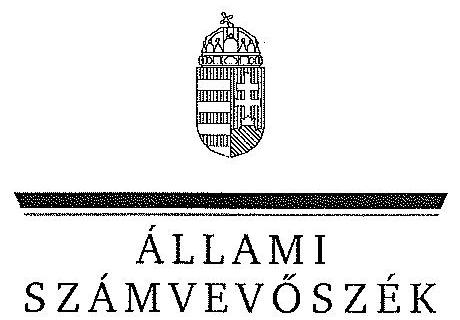
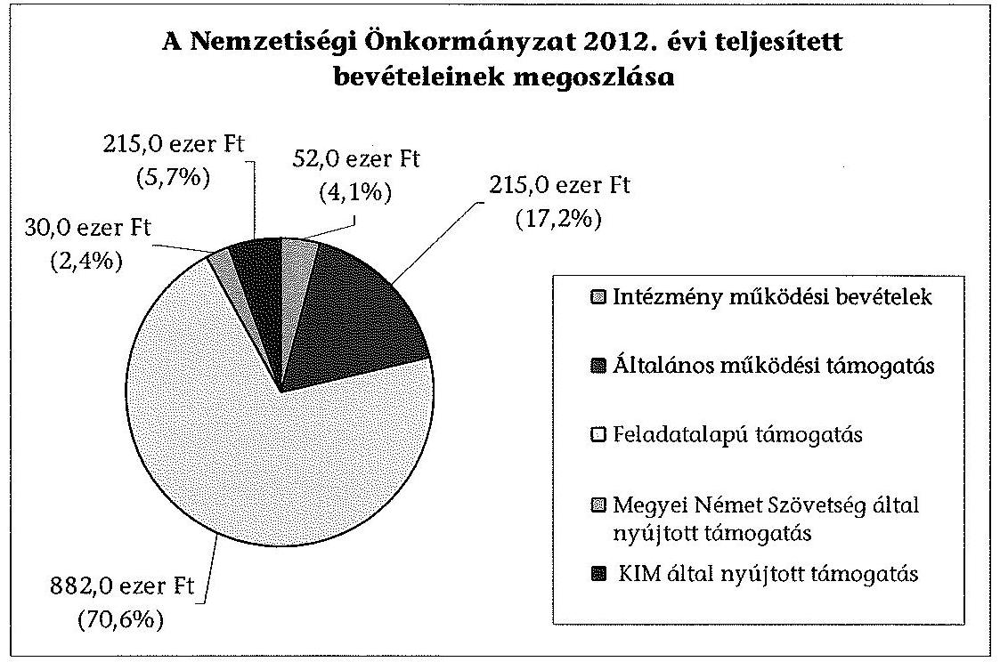
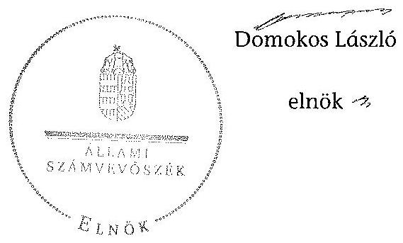

ÁLLAMI
SZÁMVEVÔSZÉK

# JELENTÉS 

a helyi nemzetiségi önkormányzatok gazdálkodásának - 2013. évben induló - ellenőrzéséről Hajósi Német Nemzetiségi Önkormányzat

---

# Állami Számvevőszék 

Iktatószám: V-0167-042/2013.
Témaszám: 1201
Vizsgálat-azonosító szám: V065201

## Az ellenőrzést felügyelte:

Horváth Balázs
felügyeleti vezető
Az ellenőrzést vezette és az ellenőrzés végrehajtásáért felelős:
Pats Regina
ellenőrzésvezető
A számvevőszéki jelentést készítették és a jelentés összeállításában
közremúködtek:
dr. Győri Gabriella
számvevő
dr. Fátrainé Zsebedics Katalin
számvevő tanácsos
Az ellenőrzést végezték:
Dr. Baloghné Sebestyén Éva Krüzselyi Attila
számvevő
számvevő tanácsos

---

# TARTALOMJEGYZÉK 

BEVEZETÉS ..... 3
I. ÖSSZEGZŐ MEGÁLLAPÍTÁSOK, KÖVETKEZTETÉSEK, JAVASLATOK ..... 6
II. RÉSZLETES MEGÁLLAPÍTÁSOK ..... 14

1. A Nemzetiségi Önkormányzat és a Települési Önkormányzat együttműködésének szabályozása, a működési feltételek biztosítása ..... 14
2. A gazdálkodási feladatok ellátásának szabályszerűsége ..... 15
2.1. A költségvetésre és zárszámadásra, valamint a kincstári adatszolgáltatás rendjére vonatkozó jogszabályi előírások betartása ..... 15
2.2. A Nemzetiségi Önkormányzat gazdálkodásának szabályozottsága ..... 16
2.3. Az operatív gazdálkodási jogkörök kialakítása, gyakorlása ..... 17
3. A Nemzetiségi Önkormányzattal kapcsolatos gazdálkodási feladatok belső ellenőrzése ..... 18
4. A feladatalapú támogatás felhasználásának, elszámolásának szabályszerűsége, a Nemzetiségi Önkormányzat feladatellátása ..... 19

## MELLÉKLET

1. számú A Nemzetiségi Önkormányzat 2012. évi gazdálkodásának főbb adatai, mutatói

## FÜGGELÉKEK

1. számú Rövidítések jegyzéke
2. számú Értelmező szótár
3. számú Minősítési szempontok

---

# **Chemistry**

## **Chemical Reactions**

### **Balancing Chemical Equations**

1. **Write the unbalanced equation:**
   - Example: $$C_3H_8 + O_2 \rightarrow CO_2 + H_2O$$

2. **Balance the equation:**
   - Example: $$2C_3H_8 + 7O_2 \rightarrow 6CO_2 + 8H_2O$$

3. **Balance the equation:**
   - Example: $$2C_3H_8 + 7O_2 \rightarrow 6CO_2 + 8H_2O$$

### **Types of Reactions**

1. **Combination Reaction:**
   - Example: $$2H_2 + O_2 \rightarrow 2H_2O$$

2. **Decomposition Reaction:**
   - Example: $$2H_2O_2 \rightarrow 2H_2O + O_2$$

3. **Single Displacement Reaction:**
   - Example: $$Zn + 2HCl \rightarrow ZnCl_2 + H_2$$

4. **Double Displacement Reaction:**
   - Example: $$AgNO_3 + NaCl \rightarrow AgCl + NaNO_3$$

5. **Combustion Reaction:**
   - Example: $$CH_4 + 2O_2 \rightarrow CO_2 + 2H_2O$$

## **Stoichiometry**

### **Mole Concept**

- **Mole (mol):** The amount of substance containing as many particles (atoms, molecules, ions) as there are atoms in exactly 12 grams of carbon-12.
- **Avogadro's Number:** $$6.022 \times 10^{23}$$ particles per mole.

### **Molar Mass**

- **Molar Mass:** The mass of one mole of a substance.
- Example: The molar mass of water ($$H_2O$$) is 18.015 g/mol.

### **Calculations**

1. **Moles to Mass:**
   - Formula: $$n = \frac{m}{M}$$
   - Example: Calculate the number of moles of $$H_2O$$ in 18 grams of water.
     - $$n = \frac{18.015 \, \text{g}}{18.015 \, \text{g/mol}} = 18.015 \, \text{g/mol}$$

2. **Moles to Mass:**
   - Formula: $$m = n \times M$$
   - Example: Calculate the mass of 18.015 g of water.
     - $$m = 18.015 \, \text{g/mol} = 18.015 \, \text{g/mol}$$

## **Gas Laws**

### **Ideal Gas Law**

- **Equation:** $$PV = nRT$$
- **Variables:**
  - $$P$$: Pressure (atm)
  - $$V$$: Volume (L)
  - $$n$$: Number of moles (mol)
  - $$R$$: Ideal gas constant (0.0821 L·atm/mol·K)
  - $$T$$: Temperature (K)

### **Boyle's Law**

- **Equation:** $$P_1V_1 = P_2V_2$$
- **Variables:**
  - P₁: Pressure (atm)
  - P₂: Volume (L)
  - P₃: Temperature (K)
  - P₁: Pressure (atm)
  - P₂: Volume (L)
  - P₃: Temperature (K)
  - P₁: Pressure (atm)

### **Boyle's Law (Boyle's Law)**

- **Equation:** $$\frac{P_1V_1}{P_2V_2} = \frac{P_1}{V_1}$$

## **Thermochemistry**

### **Enthalpy (H)**

- **Definition:** The heat content of a system at constant pressure.
- **Equation:** $$\Delta H = q_p$$
- **Variables:**
  - $$q_p$$: Heat transferred at constant pressure.
  - $$q_p$$: Heat transferred at constant pressure.

### **Hess's Law**

- **Statement:** The enthalpy change for a reaction is the same whether it occurs in one step or multiple steps.
- **Equation:** $$\Delta H_{\text{rest}} = \Delta H - \Delta H_0$$
- **Variables:**
  - $$\Delta H$$: Heat transferred at constant pressure.
  - $$\Delta H_0$$: Heat transferred at constant pressure.

### **Hess's Law (Hess's Law)**

- **Statement:** The enthalpy change for a reaction is the same whether it occurs in one step or multiple steps.
- **Equation:** $$\Delta H_{\text{rest}} = \Delta H - \Delta H_0$$
- **Variables:**
  - $$\Delta H$$: Heat transferred at constant pressure.
  - $$\Delta H_0$$: Heat transferred at constant pressure.

## **Electrochemistry**

### **Oxidation and Reduction**

- **Oxidation:** Loss of electrons.
- **Reduction:** Gain of electrons.

### **Galvanic Cells**

- **Definition:** A cell that converts chemical energy into electrical energy.
- **Components:**
  - Anode: Oxidation occurs.
  - Cathode: Reduction occurs.
  - Salt Bridge: Connects the two half-cells.

### **Nernst Equation**

- **Equation:** $$E = E^\circ - \frac{RT}{nF} \ln Q$$
- **Variables:**
  - $$E$$: Energy (K)
  - $$E^\circ$$: Standard deviation of the energy (J)
  - $$R$$: Ideal gas constant (0.0821 L·atm/mol·K)
  - $$T$$: Temperature (K)
  - $$n$$: Number of electrons transferred
  - $$F$$: Faraday constant (96,485 C/mol)
  - $$Q$$: Reaction quotient

---

# JELENTÉS   a helyi nemzetiségi önkormányzatok gazdálkodásának - 2013. évben induló ellenőrzéséről Hajósi Német Nemzetiségi Önkormányzat 

## BEVEZETÉS

A Nemzetiségi Önkormányzat 2006. évben alakult, elnöke a 2010. évi helyhatósági választások óta látja el feladatát. A Nemzetiségi Önkormányzat intézményt, gazdasági társaságot és más szervezetet nem alapított, illetve ezek társulásában nem vett részt. A négytagú Képviselő-testület a munkája segitésére bizottságot hozott létre. A Nemzetiségi Önkormányzat költségvetési beszámolója szerint a 2012. évben a módosított költségvetési bevételi és kiadási előirányzat 2354 ezer Ft, a teljesített költségvetési bevétel 1250 ezer Ft, a teljesített költségvetési kiadás 1145 ezer Ft volt. A 2012. évi gazdálkodási adatokat részletesen az 1. számú mellékletben mutatjuk be.

Az Alaptörvény XXIX. cikk (1) bekezdése szerint a Magyarországon élő nemzetiségek államalkotó tényezők. Minden, valamely nemzetiséghez tartozó magyar állampolgárnak joga van önazonossága szabad vállalásához és megőrzéséhez. A hazánkban élő nemzetiségek helyi (települési és területi) valamint országos önkormányzatokat hozhatnak létre ${ }^{1}$. A helyi nemzetiségi önkormányzatok gazdálkodási feladatait jogszabályi előírás alapján a székhely szerinti helyi önkormányzat polgármesteri hivatala látja el.

A nemzetiségek helyzete, támogatása mind hazai, mind EU-s szinten kiemelt figyelmet kap napjainkban. A helyi nemzetiségi önkormányzatok gazdálkodására és támogatási rendszerére vonatkozó jogszabályok a 2010-2012. években jelentős változásokon mentek át. A települési és területi nemzetiségi önkormányzatok gazdálkodásának, a részükre juttatott költségvetési támogatások felhasználásának ellenőrzését az ÁSZ a 2012. évben sorozatjellegű ellenőrzés keretében indította el. A 2013. évi ellenőrzések e témacsoportos ellenőrzések folytatását jelentik.

Az ellenőrzés célja annak értékelése volt, hogy a Nemzetiségi Önkormányzat gazdálkodási kereteinek kialakítása, gazdálkodása és feladatellátása megfelelt-e a hatályos jogszabályoknak.

[^0]
[^0]:    ${ }^{1}$ A 2010. évben megtartott nemzetiségi önkormányzati választásokat követően 2304 települési, 58 területi és 13 országos nemzetiségi önkormányzat alakult meg.

---

Ennek keretében értékeltük, hogy:

- a Nemzetiségi Önkormányzat és a Települési Önkormányzat együttműködésének szabályozása, a múködési feltételek biztosítása megfelelte a jogszabályi előírásoknak;
- a felek együttmúködése a gazdálkodási feladatok ellátása során megfelelte a közöttük létrejött megállapodásnak, betartották-e a nemzetiségi önkormányzat költségvetésére és zárszámadására, a gazdálkodás szabályozására, az operatív gazdálkodási jogkörök gyakorlására vonatkozó jogszabályi előírásokat;
- a jegyző biztosította-e a nemzetiségi önkormányzat gazdálkodásának belső ellenőrzését;
- a nemzetiségi önkormányzat feladatalapú támogatásának felhasználása, a folyósított feladatalapú támogatással történő elszámolás az előírásoknak megfelelő volt-e;
- a nemzetiségi önkormányzat feladatellátása összhangban volt-e a vonatkozó jogszabályi előírásokkal.

Az ellenőrzés várható hasznosulását négy szinten tervezzük. A törvényalkotás számára összegzett tapasztalatok állnak rendelkezésre a nemzetiségi önkormányzatok testületi döntéseinek, gazdálkodásának és a feladatalapú támogatás felhasználásának szabályszerűségéről, amelynek alapján következtetést lehet levonni arra, hogy indokolt-e jogszabályi módosítás kezdeményezése. Az ellenőrzés az ellenőrzött számára visszajelzést ad a működésében fellépő hiányosságokról, javaslataival hozzájárul azok kiküszöböléséhez, amely csökkentheti a későbbi ellenőrzések gyakoriságát. Az ellenőrzés megállapításai és javaslatai tanulságul szolgálhatnak más nemzetiségi önkormányzatok, szervezetek számára a rendezett gazdálkodási keretek kialakításához. A társadalom számára jelzi, hogy közpénz nem maradhat ellenőrizetlenül, az ÁSZ értékteremtő rend kialakításához és megőrzéséhez hozzájáruló tevékenysége pozitív hatással lesz a szervezetről kialakított összkép formálásában. Az ÁSZ szervezetén belül lehetőség nyílik arra, hogy a megállapítások szintetizálásával az intézmény a hozzáadott értéket teremtő elemző tevékenységét és tanácsadó szerepét erősítse.

A helyi nemzetiségi önkormányzatok gazdálkodásának ellenőrzéséről szóló jelentés I. fejezetének összegző része az ellenőrzés céljára adott rövid, szintetizáló összefoglalót és következtetéseket tartalmazza a II. fejezet részletes megállapításain alapulóan. A jelentés intézkedést igénylő megállapításait és javaslatait az összegzőben foglaltak mellett - az ellenőrzés során feltárt, a jelentés II. fejezetében rögzített részletes megállapítások alapozzák meg, illetve támasztják alá.

Az ellenőrzés típusa: szabályszerűségi ellenőrzés.
Az ellenőrzött időszak: 2012. január 1. - 2012. december 31. közötti időszak. Az ellenőrzés kiterjedt a helyi nemzetiségi önkormányzatnak juttatott 2012. évi támogatás 2013. évben való elszámolására is.

---

Ellenőrzött szervezet: a Hajósi Német Nemzetiségi Önkormányzat és a gazdálkodási feladatait ellátó Hajós Város Önkormányzata.

Az ellenőrzés végrehajtásának jogszabályi alapját az ÁSZ tv. 5. § (2)-(3) és (6) bekezdéseiben foglaltak képezik.

Az ellenőrzés szakmai módszertana az ÁSZ hivatalos honlapján (www.asz.hu) közzétett szakmai szabályokon alapult, amely a Legfőbb Ellenőrző Intézmények Nemzetközi Szervezete (INTOSAI) által kiadott nemzetközi standardok (ISSAI) figyelembevételével készült.

A Nemzetiségi Önkormányzat gazdálkodásának ellenőrzése során értékeltük a Települési Önkormányzat és a Nemzetiségi Önkormányzat együttmúködésének, a gazdálkodás szabályozottságának és a pénzügyi folyamatokban kulcsszerepet betöltő belső kontrollok (teljesítés igazolás és érvényesítés) múködésének megfelelőségét. A kulcskontrollokat a múködési és felhalmozási célú támogatásértékű kiadásoknál, az államháztartáson kívülre teljesített múködési és felhalmozási célú pénzeszköz átadásoknál, a dologi kiadásokkal kapcsolatos kifizetéseknél - véletlen mintavételi eljárást alkalmazva - ellenőriztük. Ellenőriztük, hogy a jegyző biztosította-e a Nemzetiségi Önkormányzat gazdálkodásának belső ellenőrzését. Értékeltük a feladatalapú támogatások felhasználásának, elszámolásának szabályszerűségét, a Nemzetiségi Önkormányzat feladatellátása és a jogszabályi előírások összhangját.

Az ellenőrzés lefolytatásához a Nemzetiségi Önkormányzat és a gazdálkodási feladatait ellátó Települési Önkormányzat tanúsítványok és a kapcsolódó, dokumentumjegyzékben megjelölt dokumentumok elektronikus úton történő megküldésével, rendelkezésre bocsátásával szolgáltatott adatokat. Az adatszolgáltatás kontrollálása és szükség szerinti javítása a helyszíni ellenőrzés keretében történt. A minősítési szempontokat a 3. számú függelék tartalmazza.

Az ÁSZ tv. 29. § (1) bekezdése szerint a jelentéstervezetet megküldtük a polgármester és a Nemzetiségi Önkormányzat elnöke részére, akik az ÁSZ tv. 29. § (2) bekezdésében foglalt észrevételezési jogukkal nem éltek, a jelentéstervezetre észrevételt nem tettek.

---

# I. ÖSSZEGZŐ MEGÁLLAPÍTÁSOK, KÖVETKEZTETÉSEK, JAVASLATOK 

A Nemzetiségi Önkormányzat és a Települési Önkormányzat együttmúködésének szabályozása részben felelt meg a jogszabályi előírásoknak. Az együttmúködés a jogszabályokban előírt eljárásrend és határidő betartásával jóváhagyott megállapodásokon alapult. Az együttmúködés szabályozása azonban a Nek. 2 tv-ben meghatározott tartalmi elemek tekintetében hiányos volt. A 2012. december 31-én hatályos együttmúködési megállapodás a Nek. 2 tv-ben foglalt előírások ellenére nem tartalmazta a költségvetéssel összefüggő adatszolgáltatási kötelezettségek teljesítésével kapcsolatos határidőket és a felelősök konkrét kijelölését. Nem tartalmazta a Nemzetiségi Önkormányzat kötelezettségvállalásaival kapcsolatosan a Települési Önkormányzatot terhelő pénzügyi ellenjegyzési, érvényesítési, feladatok felelőseinek konkrét kijelölését, valamint a Nemzetiségi Önkormányzat kötelezettségvállalásának SZMSZ-ében meghatározott szabályait, különösen az összeférhetetlenségi és nyilvántartási kötelezettségeket. Nem tartalmazta továbbá azt, hogy a jegyző, vagy annak - a jegyzővel azonos képesítési előírásokkal rendelkező - megbízottja a Települési Önkormányzat megbízásából és képviseletében részt vesz a Nemzetiségi Önkormányzat képviselő-testületi ülésein és jelzi, amennyiben törvénysértést észlel. A szabályozási hiányosságok ellenére a Települési Önkormányzat biztosította a Nemzetiségi Önkormányzat múködéséhez szükséges személyi és tárgyi feltételeket.

A Nemzetiségi Önkormányzat a költségvetésére és zárszámadására, valamint a kincstári adatszolgáltatás rendjére vonatkozó jogszabályi előírásoknak részben felelt meg. A Nemzetiségi Önkormányzat költségvetési és zárszámadási határozatait a jogszabályban előírt eljárásrend szerint, határidőben fogadták el. A költségvetési és zárszámadási határozatok egymással összehasonlítható szerkezetben készültek, a zárszámadási határozatban a Nemzetiségi Önkormányzat valamennyi bevételéről és kiadásáról elszámoltak. A jóváhagyott költségvetés nem tartalmazta teljes körűen az Áht. ${ }_{2}$-ben és az Ávr-ben előírt tartalmi elemeket. Nem rendelkeztek a finanszírozási célú pénzügyi műveletekkel kapcsolatos hatáskörökről, valamint a Képviselő-testület részére nem mutatták be az előírt mérlegeket és kimutatásokat. A kincstári adatszolgáltatási kötelezettséget a jegyző három esetben késedelmesen teljesítette. A zárszámadási határozat tervezetének előterjesztésekor a Képviselő-testület részére tájékoztatásul nem mutatták be az Áht. ${ }_{2}$-ben előírt mérlegeket és kimutatásokat.

A gazdálkodás szabályozottsága nem volt megfelelő. A Számv. tv., az Áhsz. és a Bkr. által előírt szabályzatok - a számviteli politika és az ahhoz kapcsolódó, illetve a gazdálkodásra vonatkozó egyéb szabályzatok - nem álltak rendelkezésre, mert a Polgármesteri Hivatal szabályzatainak hatálya nem terjedt ki a Nemzetiségi Önkormányzat gazdálkodási feladataira, és az előírt szabályzatokkal a Nemzetiségi Önkormányzat önállóan sem rendelkezett. A Polgármesteri Hivatal az Áht. ${ }_{2}$-ben előírt SZMSZ-szel nem rendelkezett. Az SZMSZ hiányából fakadóan - az Ávr-ben foglaltak ellenére - nem történt meg a munkakörökhöz kapcsolódóan a Nemzetiségi Önkormányzat gazdálkodásával ösz-

---

szefüggő feladat- és hatáskörök, a hatáskörök gyakorlása módjának, a helyettesítés rendjének és az ezekre vonatkozó felelősségi szabályoknak a rögzítése.

A Nemzetiségi Önkormányzat gazdálkodása tekintetében az operatív gazdálkodási jogkörök kialakítása nem felelt meg a jogszabályi előírásoknak. A pénzügyi ellenjegyzési és az érvényesítési feladatok ellátására történt kijelölés során nem vették figyelembe a 2012. évtől bekövetkezett jogszabályi változásokat. Az Áht. ${ }_{2}$-ben és az Ávr-ben foglalt előírások ellenére a pénzügyi ellenjegyzó személyét és az érvényesítői feladatokat ellátó személyeket a jegyző̉ nem jelölte ki, illetve írásban nem hatalmazta fel. A Nemzetiségi Önkormányzatnál a dologi kiadások teljesítése során a teljesítés igazolás és az érvényesítés kulcsszerepet betöltő kontrollok múködése gyenge volt, a hibák száma a lényegességi szintet, a kritikus hibahatárt elérte. Teljesítés igazoló személy kijelölésére az Ávr-ben foglaltak ellenére nem került sor, az Ávr-ben előírt teljesítésigazolás nem történt meg, a kiadások teljesítésének jogosságát, összegszerűségét és az ellenszolgáltatás teljesítését nem ellenőrizték. Az Ávr. előírásai ellenére az érvényesítő kijelölésére sem került sor, az érvényesítés nem történt meg, a kiadások teljesítését megelőzően az összegszerűség, a fedezet meglétének, a formai és a főkönyvi számla kijelölési szabályainak, valamint az egyéb jogszabályban és belső szabályozásban foglalt előírásoknak a betartását nem ellenőrizték. A kulcskontrollok megfelelő múködéséhez szükséges dokumentációs és részletszabályokat az Ávr-ben foglaltak ellenére nem határozták meg és kötelezettségvállalásra vonatkozó nyilvántartást nem vezettek. A múködési célú támogatásértékű kiadások és az államháztartáson kívülre teljesített múködési célú pénzeszköz átadások területén a teljesítés igazolása és az érvényesítés kulcskontrollok múködése nem volt megfelelő, a dologi kiadásoknál jelzett általános érvényű hiányosságok miatt. Felhalmozási célú támogatásértékű kiadás, valamint felhalmozási célú pénzeszközátadás államháztartáson kívülre nem történt.

A jegyző nem biztosította a Nemzetiségi Önkormányzat gazdálkodásával összefüggő végrehajtási feladatok belső ellenőrzését. A Polgármesteri Hivatal 2012. évi éves belső ellenőrzési tervét megalapozó kockázatelemzés - a Ber. előírása ellenére - nem terjedt ki a Nemzetiségi Önkormányzat gazdálkodásával összefüggő végrehajtási feladatokra, és azok tekintetében belső ellenőrzési feladatot a 2012. évben nem terveztek és nem végeztek. A 2012. évre vonatkozó belső ellenőrzési terv elkészítésének idején hatályos együttmúködési megállapodás a Nemzetiségi Önkormányzat belső ellenőrzésére vonatkozóan nem tartalmazott előírásokat.

A Nemzetiségi Önkormányzat a 2012. évben a bevételei 70,6\%-át kitevő, 882 ezer Ft összegű feladatalapú támogatásban részesült. A 2012. évben folyósított feladatalapú támogatás felhasználása a folyósítás évében csak részben történt meg, a maradványt - összhangban a támogatási kormányrende-let ${ }_{2}$-ben foglaltakkal - kötelezettségvállalással terhelték. A támogatási kor-mányrendelet ${ }_{2}$-ben előírt elszámolás nem történt meg, a támogatás felhasználását, elszámolását az ellenőrzésre jogosult szervek nem ellenőrizték. A Nemzetiségi Önkormányzat feladatellátásának tárgya a Nek. ${ }_{2}$ tv-ben foglaltakkal részben volt összhangban, mert a Nemzetiségi Önkormányzat a 2012. évben a Nek. ${ }_{2}$ tv-ben felsorolt kötelező közfeladatot nem látott el. Önként vállalt felada-

---

tokat végzett a hagyományápolás és közművelődés, valamint az ifjúsági és kulturális igazgatás területén.

Az ÁSZ tv. 33. § (1) bekezdésében foglaltak értelmében az ellenőrzött szervezet vezetője köteles a jelentésben foglalt megállapításokhoz kapcsolódó intézkedési tervet összeállítani, és azt a jelentés kézhezvételétől számított 30 napon belül az ÁSZ részére megküldeni. Amennyiben az intézkedési tervet határidőre nem küldi meg a szervezet, vagy az nem elfogadható, az ÁSZ elnöke az ÁSZ tv. 33. § (3) bekezdés a)-b) pontjaiban foglaltakat érvényesítheti.

A helyszíni ellenőrzés megállapításainak hasznosítása mellett javasoljuk:

# a jegyzőnek 

1. az együttműködés szabályozásával kapcsolatban

Az együttműködési megállapodás nem tartalmazta a Nek. 2 tv. 80. § (3) bekezdése a) pontja szerint a költségvetéssel összefüggő adatszolgáltatási kötelezettségek teljesítésével kapcsolatos határidőket és a felelősök konkrét kijelölését, a Nemzetiségi Önkormányzat törzskönyvi nyilvántartásba vételével és az adószám igénylésével kapcsolatos határidőket, és együttműködési kötelezettségeket a felelősök konkrét kijelölésével, a b) pontja szerint a Nemzetiségi Önkormányzat kötelezettségvállalásaival kapcsolatosan a Települési Önkormányzatot terhelő pénzügyi ellenjegyzési, érvényesítési, feladatokkal kapcsolatban a felelősök konkrét kijelölését, a c) pontja szerint a Nemzetiségi Önkormányzat kötelezettségvállalásának SZMSZ-ében meghatározott szabályait, különösen az összeférhetetlenségi és nyilvántartási kötelezettségeket, valamint a d) pontja szerint a Nemzetiségi Önkormányzat müködésével kapcsolatos adatszolgáltatási feladatok teljesítésével kapcsolatos előírásokat, feltételeket. A megállapodás a Nek. 2 tv. 80. § (4) bekezdésében foglaltak ellenére nem tartalmazta, hogy a jegyző, vagy annak - a jegyzővel azonos képesítési előírásokkal megfelelő megbízottja a Települési Önkormányzat megbízásából és képviseletében részt vesz a Nemzetiségi Önkormányzat Képviselő-testületi ülésein és jelzi amennyiben törvénysértést észlel.

Javaslat
Készítse elő a megállapodás módosítását, hogy tartalmilag feleljen meg a Nek. 2 tv. 80. § (3) bekezdés a)-d) pontjaiban, valamint a Nek. 2 tv. 80. § (4) bekezdésében foglalt előírásoknak.
2. a költségvetési, zárszámadási előterjesztéssel és határozattal kapcsolatban

A jóváhagyott költségvetés részben tartalmazta a Nemzetiségi Önkormányzat bevételeit, mivel a központi költségvetésből származó egyéb költségvetési támogatásokat - az Ávr. 24. § (1) bekezdés a) pontjában foglaltakkal ellentétben - csak részben tervezték meg. A költségvetési határozat nem tartalmazta az Áht. 23. § (2) bekezdés c) pontjában előírt költségvetési egyenleg összegét működési és felhalmozási cél szerinti bontásban, valamint az Áht. 2 23. § (2) bekezdés h) pontjában foglalt, a finanszírozási célú pénzügyi műveletekkel kapcsolatos hatásköröket.

---

A 2012. évi költségvetés előterjesztésekor a Képviselő-testület részére - tájékoztatás céljából, szöveges indokolással együtt - nem mutatták be az Áht. 2 24. § (4) bekezdésében előírt mérlegeket és kimutatásokat.

A zárszámadási határozat tervezet előterjesztésekor a Képviselő-testület részére tájékoztatásul nem mutatták be az Áht. 2 91. § (2)-(3) bekezdésében foglalt mérlegeket és kimutatásokat.

Javaslat
Gondoskodjon a jövőben a költségvetési, zárszámadási határozatok szabályszerűsége érdekében arról, hogy:
a) a költségvetés tartalmában feleljen meg az Áht. 2 23. § (2) bekezdés c) és h pontjában, az Ávr. 24. § (1) bekezdése a) pontjában és az Áht. 2 24. § (4) bekezdésében foglaltaknak;
b) a zárszámadási határozat tartalmazza az Áht. 2 91. § (2)-(3) bekezdése szerinti előírásokat.
3. a kincstári adatszolgáltatási kötelezettséggel kapcsolatban

A jegyző a Települési Önkormányzat 2012. évi költségvetéséhez kapcsolódó, a Nemzetiségi Önkormányzatra vonatkozó kincstári adatszolgáltatási kötelezettségének az Ávr. 169. § (2) bekezdésében foglaltak ellenére késedelmesen tett eleget, mert a II. és III. negyedévi költségvetési jelentést a határidőt követően, valamint a II. negyedévi időközi mérlegjelentést az Ávr. 170. § (5) bekezdése szerinti határidőt követően küldte meg a Kincstár részére.

Javaslat
A jövőben az adatszolgáltatási kötelezettségének az Ávr. 169. § (2) bekezdésében, valamint az Ávr. 170. § (5) bekezdésében előírt határidők betartásával tegyen eleget.
4. a gazdálkodási feladatok szabályozottságával, ellátásával kapcsolatban

A Számv. tv. 14. § (5) bekezdése a)-b) és d) pontjaiban, a 161. § (1) bekezdésében, és az Áhsz. 8. § (3)-(4) bekezdéseiben, valamint a 49. § (1) bekezdésében előírt szabályzatok, a számviteli politika és az ahhoz kapcsolódó, a gazdálkodásra vonatkozó szabályzatok - leltározási és leltárkészítési-, az eszközök és források értékelési-, pénz-kezelési- és számlarend - hatálya nem terjedt ki a Nemzetiségi Önkormányzat gazdálkodási feladataira.

A Polgármesteri Hivatal Bkr. 6. § (3) bekezdésében előírt ellenőrzési nyomvonala, a Bkr. 6. § (4) bekezdésében meghatározott szabálytalanságok kezelésének eljárásrendje, a Bkr. 7. § -ában előírt kockázatkezelési rendszer, valamint a Bkr. 8. § (2)(4) bekezdései szerinti folyamatba épített előzetes, utólagos és vezetői ellenőrzés szabályozása sem terjedt ki a Nemzetiségi Önkormányzat gazdálkodási feladataira.

Az Áht. 2 10. § (5) bekezdésében és az Ávr. 13. § (2) bekezdésének a) pontjában foglalt, a tervezéssel, gazdálkodással, így különösen a kötelezettségvállalással, pénzügyi ellenjegyzéssel és teljesítésigazolással, az érvényesítés, utalványozás gyakorlásának

---

módjával, eljárási és dokumentálási részletszabályaival, valamint az ezeket végző személyek kijelölésének rendjével, az ellenőrzési és adatszolgáltatási feladatok teljesítésével kapcsolatos belső előírásokat, feltételeket tartalmazó belső szabályzatok nem álltak rendelkezésre.

A Polgármesteri Hivatal az Áht. 2 10. § (5) bekezdésében előírt SZMSZ-szel nem rendelkezett, ebből fakadóan a Nemzetiségi Önkormányzat gazdálkodásával összefüggő feladatok Ávr. 13. § (3a) bekezdése szerinti és az Ávr. 13. § (1) bekezdés g) pontjában foglalt előírás szerinti szabályozása nem valósult meg.

Az Ávr. 55. § (2) bekezdés g) pontjában előírtak ellenére a pénzügyi ellenjegyző személyét, illetve az Ávr. 58. § (4) bekezdésében foglaltak ellenére az érvényesítői feladatokat ellátó személyeket a jegyző nem jelölte ki, illetve írásban nem hatalmazta fel.

Javaslat
A gazdálkodás szabályszerűsége érdekében
a) készítse el az Ávr. 13. § (3a) bekezdés és az Áht. 2 10. § (5) bekezdés alapján a Nemzetiségi Önkormányzat gazdálkodási feladataira kiterjedő hatállyal a Számv. tv. 14. § (5) bekezdés a)-b), d) pontjaiban, a 161. § (1) bekezdéseiben, az Áhsz. 8. § (3)-(4) és 49. § (1) bekezdéseiben előírt számviteli szabályzatokat, a számlarendet, a Bkr. 6.§ (3)-(4), a 8.§ (2)-(4) bekezdéseiben, és az Ávr. 13. § (2) bekezdésének a) pontjában foglalt szabályzatokat, valamint a Bkr. 7. §-ában foglalt kockázatkezelési rendszert;
b) készítse el a Polgármesteri Hivatal SZMSZ-ét, hogy az szabályozza a Nemzetiségi Önkormányzat gazdálkodásának ellátásával összefüggő feladatokat az Ávr. 13. § (3a) bekezdésében foglaltaknak megfelelően, továbbá hogy az feleljen meg az Ávr. 13. § (1) bekezdés g) pontjában foglalt előírásoknak;
c) írásbeli felhatalmazással jelölje ki az Ávr. 55. § (2) bekezdés g) pontjában előírtaknak megfelelően a pénzügyi ellenjegyzőt, illetve az Ávr. 58. § (4) bekezdésének megfelelően az érvényesítői feladatokat ellátó személyt.
5. a pénzügyi kontrollok müködésével kapcsolatban

Az Ávr. 57. § (1) bekezdésében előírt teljesítésigazolás nem történt meg, a kiadások teljesítésének jogosságát, összegszerűségét és az ellenszolgáltatás teljesítését nem ellenőrizték. Az Ávr. 58. § (1) és (3) bekezdéseiben előírtak szerint az érvényesítés nem történt meg, a kiadások teljesítését megelőzően az összegszerűség, a fedezet meglétének, a formai és a főkönyvi számla kijelölési szabályainak, valamint az egyéb jogszabályban és belső szabályozásban foglalt előírásoknak a betartását nem ellenőrizték. A kötelezettségvállalásra vonatkozó nyilvántartást az Ávr. 56. § (1) bekezdésében foglaltak ellenére nem vezették.

---

Javaslat
Az operatív gazdálkodás múködési hibáinak megelőzése, feltárása és kijavítása érdekében gondoskodjon arról, hogy:
a) a teljesítés igazolása során az Ávr. 57. § (1) bekezdésében előírt ellenőrzési kötelezettségének tegyen eleget;
b) az érvényesítést az Ávr. 60. § (3) bekezdése szerinti naprakész nyilvántartással összhangban végezzék, biztosítva az Ávr. 58. § (1) és (3) bekezdéseiben előírt ellenőrzési feladatok ellátását;
c) a kötelezettségvállalásokat az Ávr. 56. § (1) bekezdése szerint nyilvántartásba vegyék.
6. a feladatalapú támogatás elszámolásával kapcsolatban

A támogatás elszámolása a támogatási kormányrendelet ${ }_{2}$ 8. § (5) bekezdésében hivatkozott „a helyi önkormányzatok elszámolási és ellenőrzési rendjére vonatkozó jogszabályok rendelkezései alkalmazandóak" előirása ellenére nem történt meg.

Javaslat
Gondoskodjon az Áht. 2 27. § (2) bekezdésben meghatározott feladatkörében a Nemzetiségi Önkormányzat által igénybe vett feladatalapú támogatás elszámolásának elkészítéséről, figyelemmel az Áht. 2 57. § (4) bekezdésben foglaltakra.

# a polgármesternek 

Az együttműködési megállapodás nem tartalmazta a Nek. 2 tv. 80. § (3) bekezdése a) pontja szerint a költségvetéssel összefüggő adatszolgáltatási kötelezettségek teljesítésével kapcsolatos határidőket és a felelősök konkrét kijelölését, a Nemzetiségi Önkormányzat törzskönyvi nyilvántartásba vételével és az adószám igénylésével kapcsolatos határidőket, és együttműködési kötelezettségeket a felelősök konkrét kijelölésével, a b) pontja szerint a Nemzetiségi Önkormányzat kötelezettségvállalásaival kapcsolatosan a Települési Önkormányzatot terhelő pénzügyi ellenjegyzési, érvényesítési, feladatokkal kapcsolatban a felelősök konkrét kijelölését, a c) pontja szerint a Nemzetiségi Önkormányzat kötelezettségvállalásának SZMSZ-ében meghatározott szabályait, különösen az összeférhetetlenségi és nyilvántartási kötelezettségeket, valamint a d) pontja szerint a Nemzetiségi Önkormányzat müködésével kapcsolatos adatszolgáltatási feladatok teljesítésével kapcsolatos előírásokat, feltételeket. A megállapodás a Nek. 2 tv. 80. § (4) bekezdésében foglaltak ellenére nem tartalmazta, hogy a jegyző, vagy annak - a jegyzővel azonos képesítési előírásokkal megfelelő megbízottja a Települési Önkormányzat megbízásából és képviseletében részt vesz a Nemzetiségi Önkormányzat Képviselő-testületi ülésein és jelzi amennyiben törvénysértést észlel.

A Polgármesteri Hivatal az Áht. 2 10. § (5) bekezdésében előírt SZMSZ-szel nem rendelkezett, ebből fakadóan a Nemzetiségi Önkormányzat gazdálkodásával összefüg-

---

gő feladatok Ávr. 13. § (3a) bekezdése szerinti és az Ávr. 13. § (1) bekezdés g) pontjában foglalt előirás szerinti szabályozása nem valósult meg.

Javaslat
Terjessze a Települési Önkormányzat Képviselő-testülete elé jóváhagyásra:
a) a Nek. 2 tv. 80. § (3) bekezdés a)-d) pontjaiban, valamint a Nek. 2 tv. 80. § (4) bekezdésében foglalt előírások betartásával előkészített megállapodás módosítást;
b) a jegyző által elkészített Polgármesteri Hivatal SZMSZ-ét, amely szabályozza az Ávr. 13. § (1) bekezdés g) pontja és az Ávr. 13. § (3a) bekezdése szerint a Nemzetiségi Önkormányzat gazdálkodásának ellátásával összefüggő feladatokat.

# a Nemzetiségi Önkormányzat elnökének 

1. Az együttmúködési megállapodás nem tartalmazta a Nek. 2 tv. 80. § (3) bekezdése a) pontja szerint a költségvetéssel összefüggő adatszolgáltatási kötelezettségek teljesítésével kapcsolatos határidőket és a felelősök konkrét kijelölését, a Nemzetiségi Önkormányzat törzskönyvi nyilvántartásba vételével és az adószám igénylésével kapcsolatos határidőket, és együttmúködési kötelezettségeket a felelősök konkrét kijelölésével, a b) pontja szerint a Nemzetiségi Önkormányzat kötelezettségvállalásaival kapcsolatosan a Települési Önkormányzatot terhelő pénzügyi ellenjegyzési, érvényesítési, feladatokkal kapcsolatban a felelősök konkrét kijelölését, a c) pontja szerint a Nemzetiségi Önkormányzat kötelezettségvállalásának SZMSZ-ében meghatározott szabályait, különösen az összeférhetetlenségi és nyilvántartási kötelezettségeket, valamint a d) pontja szerint a Nemzetiségi Önkormányzat müködésével kapcsolatos adatszolgáltatási feladatok teljesítésével kapcsolatos előírásokat, feltételeket. A megállapodás a Nek. 2 tv. 80. § (4) bekezdésében foglaltak ellenére nem tartalmazta, hogy a jegyző, vagy annak - a jegyzővel azonos képesítési előírásokkal megfelelő megbízottja a Települési Önkormányzat megbízásából és képviseletében részt vesz a Nemzetiségi Önkormányzat Képviselő-testületi ülésein és jelzi amennyiben törvénysértést észlel.

Javaslat
Terjessze a Képviselő-testület elé jóváhagyásra a Nek. 2 tv. 80. § (3) bekezdés a)-d) pontjaiban, valamint Nek. 2 tv. 80. § (4) bekezdésében foglalt előírások betartásával előkészített megállapodás módosítást.
2. A Nemzetiségi Önkormányzat elnöke az Ávr. 57. § (4) bekezdésében foglaltak ellenére nem jelölte ki a teljesítést igazoló személyeket. A Nemzetiségi Önkormányzat elnöke, mint kötelezettségvállaló az Ávr. 52. § (7) bekezdésében foglaltak alapján más képviselőt nem hatalmazott fel írásban a kötelezettségvállalás, az Ávr. 59. § (1) bekezdés alapján az utalványozás gyakorlására, emiatt az Ávr. 60. § (2) bekezdésében foglalt összeférhetetlenségi követelmények nem érvényesültek.

---

Javaslat
Írásban jelöljön ki teljesítést igazoló személyt az Ávr. 57. § (4) bekezdés előirása alapján, valamint - az Ávr. 60. § (2) bekezdésében foglalt összeférhetetlenség fennállása esetén - további kötelezettségvállaló, utalványozó személyt az Ávr. 52. § (7) bekezdés és az Ávr. 59. § (1) bekezdései előirása alapján.
3. A 2012. évi feladatalapú támogatás elszámolása a támogatási kormányrendelet ${ }_{2}$ 8. § (5) bekezdésében hivatkozott „a helyi önkormányzatok elszámolási és ellenőrzési rendjére vonatkozó jogszabályok rendelkezései alkalmazandóak" előirása ellenére nem történt meg.

Javaslat
Terjessze a Képviselő-testület elé jóváhagyásra az Áht. 2 57. § (4) bekezdés alapján készített elszámolást a Nemzetiségi Önkormányzat által igénybe vett feladatalapú támogatásról.

---

# II. RÉSZLETES MEGÁLLAPÍTÁSOK 

## 1. A Nemzetiségi Önkormányzat és a Települési Önkormányzat együttmúködésének szabályozása, a múködési feltételek biztosítása

A Nemzetiségi Önkormányzat és a Települési Önkormányzat együttmúködésének szabályozása részben felelt meg a jogszabályi előírásoknak.

Az együttműködés szabályozása a jogszabályi előírásoknak megfelelő eljárásrendben és határidő betartásával jóváhagyott együttmüködési megállapodásokon ${ }^{2}$ alapult. Az együttműködési megállapodás a Nek. ${ }_{2}$ tv-ben foglaltaknak megfelelően tartalmazta a Nemzetiségi Önkormányzat müködési feltételeit, valamint a tervezési, gazdálkodási, ellenőrzési, finanszírozási és adatszolgáltatási feladatokat.

Az együttmüködés szabályozása - a 2012. december 31-én hatályos együttműködési megállapodás alapján - a Nek. ${ }_{2}$ tv. 80. § (3) és (4) bekezdésében meghatározott tartalmi elemek tekintetében azonban hiányos volt. Az együttműködési megállapodás nem tartalmazta:

- a költségvetéssel összefüggő adatszolgáltatási kötelezettségek teljesítésével kapcsolatos határidőket és a felelősök konkrét kijelölését (Nek. ${ }_{2}$ tv. 80. § (3) bekezdés a) pont);
- a Nemzetiségi Önkormányzat törzskönyvi nyilvántartásba vételével és az adószám igénylésével kapcsolatos határidőket, és együttműködési kötelezettségeket a felelősök konkrét kijelölésével (Nek. ${ }_{2}$ tv. 80. § (3) bekezdés a) pont);
- a Nemzetiségi Önkormányzat kötelezettségvállalásaival kapcsolatosan a Települési Önkormányzatot terhelő pénzügyi ellenjegyzési, érvényesítési, feladatokkal kapcsolatban a felelősök konkrét kijelölését (Nek. ${ }_{2}$ tv. 80. § (3) bekezdés b) pont);
- a Nemzetiségi Önkormányzat kötelezettségvállalásának SZMSZ-ében meghatározott szabályait, különösen az összeférhetetlenségi és nyilvántartási kötelezettségeket (Nek. ${ }_{2}$ tv. 80. § (3) bekezdés c) pont);

[^0]
[^0]:    ${ }^{2}$ A 2012. évben hatályos együttműködési megállapodást a Képviselő-testület a 3/2007. NKÖ számú, a Települési Önkormányzat Képviselő-testülete a 19/2007. Kt. számú határozattal fogadta el. A Nek. ${ }_{2}$ tv. 159. § (3) bekezdésében előírtak alapján 2012. június 1-jélg felülvizsgált és módosított együttműködési megállapodást a Képviselő-testület a 7/2012. NNÖ számú határozattal, a Települési Önkormányzat Képviselő-testülete a 25/2012. Kt. számú határozattal fogadta el. A Nek. ${ }_{2}$ tv. 159. § (3) bekezdésében előírtak alapján elkészített együttmüködési megállapodást 2012. május 25 -én írták alá.

---

- a Nemzetiségi Önkormányzat múködésével kapcsolatos adatszolgáltatási feladatok teljesítésével kapcsolatos előírásokat, feltételeket (Nek. ${ }_{2}$ tv. 80. § (3) bekezdés d) pont);
- hogy a jegyző, vagy annak - a jegyzővel azonos képesítési előírásokkal megfelelő - megbízottja a Települési Önkormányzat megbízásából és képviseletében részt vesz a Nemzetiségi Önkormányzat Képviselő-testületi ülésein és jelzi amennyiben törvénysértést észlel (Nek. ${ }_{2}$ tv. 80. § (4) bekezdés).

Az együttmúködési megállapodás az Áht. ${ }_{2}$ 27. § (2) bekezdésében foglaltak ellenére nem tartalmazta a Nemzetiségi Önkormányzat bevételeivel és kiadásaival kapcsolatban a beszámolási feladatok ellátásának részletes szabályait.

A Nek. ${ }_{2}$ tv. 80. § (2) bekezdésében foglaltakat figyelmen kívül hagyva, a Nemzetiségi Önkormányzat SZMSZ-ében nem rögzítették a megállapodás szerinti múködési feltételeket a megállapodás megkötését követő harminc napon belül.

A Települési Önkormányzat a szabályozási hiányosságok ellenére biztosította a Nemzetiségi Önkormányzat múködéséhez szükséges személyi és tárgyi feltételeket.

# 2. A GAZDÁLKODÁSI FELADATOK ELLÁTÁSÁNAK SZABÁLYSZERŰSÉGE 

### 2.1. A költségvetésre és zárszámadásra, valamint a kincstári adatszolgáltatás rendjére vonatkozó jogszabályi előírások betartása

A Nemzetiségi Önkormányzat a költségvetésére és zárszámadására, valamint a kincstári adatszolgáltatás rendjére vonatkozó jogszabályi elöírásoknak részben felelt meg. A Nemzetiségi Önkormányzat költségvetési ${ }^{3}$ és zárszámadási ${ }^{4}$ határozatait a jogszabályban előírt eljárásrend szerint, határidőben fogadták el. A költségvetési és a zárszámadási határozatok egymással összehasonlítható szerkezetben készültek, a zárszámadási határozatban a Nemzetiségi Önkormányzat valamennyi bevételéről és kiadásáról elszámoltak.

A költségvetési határozat az Áht. ${ }_{2}$ 23. § (2) bekezdésében előírtaknak megfelelően tartalmazta a Nemzetiségi Önkormányzat költségvetési bevételeit és költségvetési kiadásait előirányzat csoportok, kiemelt előirányzatok szerinti bontásban, kiadásait az Ávr. 24. § (1) bekezdés b) pont előírásának megfelelően, valamint elkülönítetten az Áht. ${ }_{2}$ 23. § (3) bekezdés és az Ávr. 24. § (1) bekezdés bc) pontjában előírtak szerint az elmaradt bevételek és az évközi többletigé-

[^0]
[^0]:    ${ }^{3}$ A Hajósi Német Nemzetiségi Önkormányzat 2012. évi költségvetéséről szóló 1/2012. NNÖ számú határozat, melyet 2012. február 3-án fogadott el a Képviselőtestület.
    ${ }^{4}$ A Képviselő-testület a Hajósi Német Nemzetiségi Önkormányzat 2012. évi költségvetésének zárszámadásáról szóló 6/2013. NNÖ számú határozata, kelt. 2013. április 18án.

---

nyek pótlására szolgáló általános és céltartalékot. A költségvetési határozat nem tartalmazta az Áht. 2 23. § (2) bekezdés c) pontjában előírt költségvetési egyenleg összegét múködési és felhalmozási cél szerinti bontásban, és az Áht. 2 23. § (2) bekezdés h) pontjában foglalt, finanszírozási célú pénzügyi műveletekkel kapcsolatos hatásköröket.

A 2012. évi költségvetés előterjesztésekor a Képviselő-testület részére - tájékoztatás céljából, szöveges indokolással együtt - nem mutatták be az Áht. 2 24. § (4) bekezdésében előírt mérlegeket és kimutatásokat.

A jegyző a Települési Önkormányzat 2012. évi költségvetéshez kapcsolódó, a Nemzetiségi Önkormányzatra vonatkozó kincstári adatszolgáltatási kötelezettségének az Ávr. 169. § (2) bekezdésében foglaltak ellenére késedelmesen tett eleget, mert a II. és III. negyedévi költségvetési jelentést a határidőt követően ${ }^{5}$, valamint a II. negyedévi időközi mérlegjelentést az Ávr. 170. § (5) bekezdése szerinti határidőt követően ${ }^{6}$ küldte meg a Kincstár részére.

A zárszámadási határozat-tervezet előterjesztésekor a Képviselő-testület részére tájékoztatásul nem mutatták be az Áht. 2 91. § (2)-(3) bekezdésében foglalt mérlegeket és kimutatásokat.

# 2.2. A Nemzetiségi Önkormányzat gazdálkodásának szabályozottsága 

A Nemzetiségi Önkormányzat gazdálkodásának szabályozottsága az ellenőrzött időszakban nem volt megfelelő. A Polgármesteri Hivatal Számv. tv. és az Áhsz. által előírt ${ }^{7}$ szabályzatai, a számviteli politika és az ahhoz kapcsolódó, a gazdálkodásra vonatkozó - leltározási és leltárkészítési, az eszközök és források értékelési, pénzkezelési és számlarend - szabályzatok hatálya nem terjedt ki a Nemzetiségi Önkormányzat gazdálkodási feladataira.

A Polgármesteri Hivatal Bkr. 6. § (3) bekezdésében előírt ellenőrzési nyomvonala, a Bkr. 6. § (4) bekezdésében meghatározott szabálytalanságok kezelésének eljárásrendje, a Bkr. 7. § -ában előírt kockázatkezelési rendszere, valamint a Bkr. 8. § (2)-(4) bekezdései szerinti folyamatba épített előzetes, utólagos és vezetői ellenőrzés szabályozása nem terjedt ki a Nemzetiségi Önkormányzat gazdálkodási feladataira. Az együttmúködési megállapodásban ezekre a szabályzatokra nem tértek ki, a Nemzetiségi Önkormányzat ezen szabályzatokkal önállóan sem rendelkezett.

A Polgármesteri Hivatal az Áht. 2 10. § (5) bekezdésében előírt SZMSZ-szel nem rendelkezett, ebből fakadóan a Nemzetiségi Önkormányzat gazdálko-

[^0]
[^0]:    ${ }^{5}$ A II. negyedévi adatszolgáltatásra előírt határidő tárgyév július. 20-a, a tényleges teljesítés: 2012. július 22-e. A III. negyedévi adatszolgáltatásra előírt határidő: tárgyév október 20-a, a tényleges teljesítés: 2012. október 25-e.
    ${ }^{6}$ A II. negyedévi adatszolgáltatásra előírt határidő: tárgyév július 25-e, a tényleges teljesítés: 2012. július 26-a.
    ${ }^{7}$ Számv. tv. 14. § (5) bekezdés a)-b) és d) pontjaiban, 161. § (1) bekezdésében és az Áhsz. 8. § (3)-(4) bekezdéseiben, valamint a 49. § (1) bekezdésében előírt szabályzatok.

---

dásával összefüggő feladatok Ávr. 13. § (3a) bekezdése szerinti és Ávr. 13. § (1) bekezdés g) pontjában foglalt előírás szerinti szabályozása nem valósult meg. A Települési Önkormányzat SZMSZ-e VII. fejezetének 22. § 1. pontja alapján a Települési Önkormányzat Képviselő-testülete egységes hivatalt hozott létre, az 5. pont alapján a belső szervezeti egységek tagozódása: gazdálkodási csoport és igazgatási csoport. A Települési Önkormányzat SZMSZ-ének 2. számú melléklete tartalmazza a kötelezettségvállalás rendjét, melyben az ellenjegyzési feladatokra a jegyzői kötelezettségvállalás esetén, illetve érvényesítésre a gazdálkodási csoport munkájáért felelős személyt jelölték meg. A szabályozásból nem állapítható meg, hogy a Polgármesteri Hivatal az ellenőrzött időszakban önálló gazdasági szervezettel rendelkezett-e. A Nemzetiségi Önkormányzat gazdálkodásával kapcsolatos feladat- és hatáskörök, a hatáskörök gyakorlásának módja, a helyettesítés rendje és az ezekre vonatkozó felelősségi szabályok a feladatokat ellátó köztisztviselők munkaköri leírásaiban nem szerepeltek.

Az Áht. 2 10. § (5) bekezdésében és az Ávr. 13. § (2) bekezdésének a) pontjában foglalt, a tervezéssel, gazdálkodással, így különösen a kötelezettségvállalással, pénzügyi ellenjegyzéssel és teljesítésigazolással, az érvényesítés, utalványozás gyakorlásának módjával, eljárási és dokumentálási részletszabályaival, valamint az ezeket végző személyek kijelölésének rendjével, az ellenőrzési és adatszolgáltatási feladatok teljesítésével kapcsolatos belső előírásokat, feltételeket tartalmazó belső szabályzatok nem álltak rendelkezésre.

# 2.3. Az operatív gazdálkodási jogkörök kialakítása, gyakorlása 

A Nemzetiségi Önkormányzat gazdálkodása tekintetében az operatív gazdálkodási jogkörök kialakítása nem felelt meg a jogszabályi előírásoknak. A pénzügyi ellenjegyzési és az érvényesítési feladatok ellátására történt kijelölés során nem vették figyelembe a 2012. évtől bekövetkezett jogszabályi változásokat. Az Ávr. 55. § (2) bekezdés g) pontjában előírtak ellenére a pénzügyi ellenjegyző személyét, továbbá az Ávr. 58. § (4) bekezdésében foglaltak ellenére az érvényesítői feladatokat ellátó személyeket a jegyző nem jelölte $\mathrm{ki}^{8}$, illetve írásban nem hatalmazta fel.

A Nemzetiségi Önkormányzat elnöke az Ávr. 57. § (4) bekezdésében foglaltak ellenére nem jelölte ki a teljesítést igazoló személyeket.

A Nemzetiségi Önkormányzat elnöke, mint kötelezettségvállaló az Ávr. 52. § (7) bekezdésében foglaltak alapján más képviselőt nem hatalmazott fel írásban a kötelezettségvállalás, az Ávr. 59. § (1) bekezdés alapján az utalványozás gyakorlására, emiatt az Ávr. 60. § (2) bekezdésében foglalt összeférhetetlenségi követelmények nem érvényesültek.

A Nemzetiségi Önkormányzatnál a dologi kiadások teljesítése során a teljesítés igazolás és az érvényesítés kulcskontrollok múködésének megfelel-

[^0]
[^0]:    ${ }^{8}$ A 2012. május 2-án adott megbízások a jegyző részéről kizárólag a Polgármesteri Hivatalra terjedtek ki.

---

lelősége gyenge volt, a hibák száma a lényegességi szintet, a kritikus hibahatárt elérte, mert:

- a teljesítésigazolást végző személy kijelölésére az Ávr. 57. § (4) bekezdésében foglaltak ellenére nem került sor, az Ávr. 57. § (1) bekezdésében előírt teljesítésigazolás nem történt meg, a kiadások teljesítésének jogosságát, összegszerűségét és az ellenszolgáltatás teljesítését nem ellenőrizték;
- az érvényesítő kijelölésére az Ávr. 58. § (4) bekezdésében és Ávr. 55. § (2) bekezdés g) pontjában foglaltak ellenére nem került sor, az Ávr. 58. § (1) és (3) bekezdésében előírtak szerint az érvényesítés nem történt meg. A kiadások teljesítését megelőzően az összegszerűség, a fedezet meglétének, a formai és a fókönyvi számla kijelölési szabályainak, valamint az egyéb jogszabályban és belső szabályozásban foglalt előírásoknak a betartását nem ellenőrizték;
- az Ávr. 13. § (2) bekezdésének a) pontjában meghatározott dokumentációs és részletszabályokat tartalmazó szabályzatot nem készítették el és a kötelezettségvállalásra vonatkozó nyilvántartást az Ávr. 56. § (1) bekezdésében foglaltak ellenére nem vezették.

A Nemzetiségi Önkormányzatnál a 2012. évben a múködési célú támogatásértékű kiadások és az államháztartáson kívülre teljesített müködési célú pénzeszköz átadások területén a teljesítés igazolása és az érvényesítés kulcskontrollok múködése nem volt megfelelő, a dologi kiadásoknál jelzett általános érvényű hiányosságok miatt.

Felhalmozási célú támogatásértékű kiadás, valamint felhalmozási célú pénzeszközátadás államháztartáson kívülre nem történt.

A Nemzetiségi Önkormányzatnál az ellenőrzött időszakban a pénzügyi folyamatokban kulcsszerepet betöltő belső kontrollok működésében feltárt hiányosságok ellenére a vizsgált tételek vonatkozásában az ellenőrzés jogosulatlan kifizetést nem állapított meg. A pénzügyi kontrollok múködéséhez kapcsolódó hiányosságok azonban nem biztosítják a hibák megelőzését, feltárását és kijavítását.

# 3. A Nemzetiségi Önkormányzattal kapcsolatos gazdálkoDÁSI FELADATOK BELSŐ ELLENŐRZÉSE 

A jegyző nem biztosította a Nemzetiségi Önkormányzat gazdálkodásával összefüggő végrehajtási feladatok belső ellenőrzését. A Polgármesteri Hivatal 2012. évi éves belső ellenőrzési tervét megalapozó kockázatelemzés - a Ber. 21. § (2) bekezdése ellenére - nem terjedt ki a Nemzetiségi Önkormányzat gazdálkodásával összefüggő végrehajtási feladatokra, és azok tekintetében belsö ellenőrzési feladatot a 2012. évben nem terveztek és nem végeztek.

A 2012. évre vonatkozó belső ellenőrzési terv elkészítésének idején hatályos együttműködési megállapodás a Nemzetiségi Önkormányzat belső ellenőrzésére vonatkozóan nem tartalmazott előírásokat.

---

A 2012. évben a Kormányhivatal a Nemzetiségi Önkormányzatot illetően nem élt törvényességi felügyeleti eszközökkel.

# 4. A feladatalapú támogatás felhasZNÁLÁsáNAK, elsZámolÁsáNAK szabálySzerüsége, a Nemzetiségi Önkormányzat feladATELLÁtása 

A Nemzetiségi Önkormányzat a 2012. évben 882 ezer Ft összegű feladatalapú támogatásban részesült, amelynek az összes bevételhez viszonyított részarányát a következő ábra szemlélteti:

A 2011. évi feladatalapú támogatásnak - 897 ezer Ft - maradványa nem volt. A 2012. évben folyósított feladatalapú támogatás tervezett felhasználási céljairól a Képviselő-testület a támogatás kiutalását megelőzően határozatot hozott. A folyósított feladatalapú támogatás összegével a 2012. évi költségvetési határozatot módosították, megjelölve a módosításokkal érintett bevételi és kiadási előirányzatokat. A támogatás felhasználása a folyósítás évében részben történt meg, a 30,7 ezer Ft összegű maradványt a 2012. évben kötelezettségvállalással terhelték.

A 2012. évi támogatást - az ellenőrzés számára rendelkezésre bocsátott dokumentumok alapján - a vonatkozó jogszabályi előírásoknak megfelelően hagyományőrzésre, német kulturális rendezvények szervezésére fordították.

A 2012. évi feladatalapú támogatás elszámolása a támogatási kormányrendelet 2 8. § (5) bekezdésében hivatkozott „a helyi önkormányzatok elszámolási és ellenőrzési rendjére vonatkozó jogszabályok rendelkezései alkalmazandóak" előírása ellenére nem történt meg. A feladatalapú támogatás felhasználását, elszámolását az ellenőrzésre jogosult szervek nem ellenőrizték.

---

A Nemzetiségi Önkormányzat feladatellátásának tárgya a Nek. ${ }_{2}$ tv-ben foglaltakkal részben volt összhangban, mert a Nemzetiségi Önkormányzat a 2012. évben a Nek. 2 tv. 115. §-ában felsorolt kötelezö közfeladatot nem látott el. Önként vállalt feladatokat végzett a hagyományápolás és közmúvelődés, valamint az ifjúsági és kulturális igazgatás területén. Ennek keretében támogatta a jótékonysági sváb bál megrendezését, az iskolai nemzetiségi hét megtartását, a testvér-települési delegáció vendéglátását, valamint együttmúködési megállapodást kötött nemzetiségi társadalmi szervezettel.

Budapest, 2013. 12 . hónap 30. nap

Melléklet: 1 db
Függelék: $\quad 3 \mathrm{db}$

---

# A Nemzetiségi Önkormányzat 2012. évi gazdálkodásának főbb adatai, mutatói 

A) Bevételek

| Megnevezés | Eredeti elöirányzat | Módosított | Teljesités |
| :--: | :--: | :--: | :--: |
|  |  | ezer Ft |  |
| Intézmény múködési bevételek | 0,0 | 52,0 | 52,0 | $4,2 \%$ |
| Támogatásértékủ múködési bevétel | 0,0 | 606,0 | 0,0 | $0,0 \%$ |
| Általános múködési támogatás | 214,0 | 215,0 | 215,0 | $17,2 \%$ |
| Feladatalapú támogatás | 0,0 | 882,0 | 882,0 | $70,5 \%$ |
| Megyel Német Szövetség által nyújtott támogatás | 0,0 | 30,0 | 30,0 | $2,4 \%$ |
| KIM által nyújtott támogatás | 0,0 | 71,0 | 71,0 | $5,7 \%$ |
| Pénzforgalmi bevételek összesen | 214,0 | 1856,0 | 1250,0 | 100,0\% |
| Előző évi pénzmaradvány felhasználás | 1104,0 | 498,0 | 0,0 | $0,0 \%$ |
| Bevételek összesen | 1318,0 | 2354,0 | 1250,0 | 100,0\% |

B) Kiadások

| Megnevezés | Eredeti elöirányzat | Módosított | Teljesités |
| :--: | :--: | :--: | :--: |
|  |  | ezer Ft |  |
| Dologi kiadások | 214,0 | 771,0 | 771,0 | $67,3 \%$ |
| Támogatásértékủ múködési kiadások | 0,0 | 50,0 | 50,0 | $4,4 \%$ |
| Müködési célú pénzeszkózatadások államháztartáson kivüle | 0,0 | 324,0 | 324,0 | $28,3 \%$ |
| Müködési kiadások összesen | 214,0 | 1145,0 | 1145,0 | 100,0\% |
| Tartalékok | 1104,0 | 1209,0 | 0,0 | $0,0 \%$ |
| Kiadások összesen | 1318,0 | 2354,0 | 1145,0 | 100,0\% |

---

# **Title: The Impact of Climate Change on Global Ecosystems**

## **Introduction**

Climate change is one of the most pressing environmental issues of our time. It affects ecosystems worldwide, leading to significant changes in biodiversity, habitat loss, and species extinction. This report explores the impacts of climate change on global ecosystems, focusing on key areas such as **forests**, **oceans**, and **polar regions**.

## **1. Forest Ecosystems**

Forests play a crucial role in carbon sequestration and maintaining biodiversity. However, rising temperatures and changing precipitation patterns are altering forest ecosystems. Key impacts include:

- **Increased frequency of wildfires**: Rising temperatures and drought conditions have led to more frequent and severe wildfires, destroying vast areas of forests.
- **Changes in species distribution**: Shifts in temperature and precipitation patterns are altering species distribution, leading to species extinction.
- **Insect outbreaks**: Warmer temperatures have increased the survival rates of pests like bark beetles, which are causing widespread wildfires.

## **2. Ocean Ecosystems**

Oceans absorb a significant portion of the excess heat and carbon dioxide (CO₂) produced by human activities. The consequences include:

- **Increased frequency of wildfires**: Rising sea levels and drought conditions have led to more frequent and severe wildfires, threatening species like polar bears and seals.
- **Changes in ocean currents**: Altered ocean currents are causing widespread sea-level rise, threatening species like polar bears and seals.
- **Changes in ocean currents**: Shifts in ocean currents are altering ocean currents, threatening species like polar bears and seals.

## **3. Polar Ecosystems**

Polar regions are particularly vulnerable to climate change due to their sensitivity to temperature changes. Key impacts include:

- **Melting of sea ice**: The Arctic is warming at twice the rate of the global average, leading to sea ice loss.
- **Glacial retreat**: Melting glaciers and their presence in the Arctic are rising, threatening sea ice, which are causing sea-level rise.
- **Permafrost thawing**: Thawing permafrost releases stored carbon and methane, further accelerating global warming.

## **4. Polar Ecosystems**

Polar regions are particularly vulnerable to climate change due to their sensitivity to temperature changes. Key impacts include:

- **Melting of sea ice**: Melting glaciers and their presence in the Arctic are rising, threatening sea ice loss.
- **Glacial retreat**: Melting glaciers and their presence in the Arctic are rising, threatening sea ice, which are causing sea-level rise.
- **Changes in ocean currents**: Altered ocean currents are causing widespread sea-level rise, threatening species like polar bears and seals.

## **5. Polar Ecosystems**

Polar regions are particularly vulnerable to climate change due to their sensitivity to temperature changes. Key impacts include:

- **Melting of sea ice**: Melting glaciers and their presence in the Arctic are rising, threatening sea ice loss.
- **Glacial retreat**: Melting glaciers and their presence in the Arctic are rising, threatening sea ice loss.
- **Changes in ocean currents**: Altered ocean currents are causing widespread sea-level rise, threatening species like polar bears and seals.

## **Conclusion**

Climate change poses a significant threat to global ecosystems, with far-reaching consequences for biodiversity and human societies. By reducing greenhouse gas emissions, reducing greenhouse gas emissions, and reducing greenhouse gas emissions, we can protect the planet for future generations.

---

**References**

1. IPCC (Intergovernmental Panel on Climate Change). (2021). *Climate Change 2021: The Physical Science Basis*.
2. WWF (World Wildlife Fund). (2020). *Living Planet Report 2020*.
3. NASA Global Climate Change. (2022). *Vital Signs: Global Temperature*.

---

# RÖVIDÍTÉSEK JEGYZÉKE 

## Törvények

Alaptörvény
Áht. 1
Áht. 2
ÁSZ tv.
Nek. ${ }_{1}$ tv.
Nek. ${ }_{2}$ tv.
Számv. tv.

## Rendeletek

Áhsz.

Ámr.
Ávr.

Bkr.

EU
támogatási kormányrendelet ${ }_{1}$
támogatási kormányrendelet ${ }_{2}$

Települési Önkormányzat SZMSZ-e

## Határozatok

Nemzetiségi Önkormányzat SZMSZ-e

## Szórövidítések

ÁSZ

Magyarország Alaptörvénye
Az államháztartásról szóló 1992. évi XXXVIII. törvény (hatályos 2011. december 31-éig)
Az államháztartásról szóló 2011. évi CXCV. törvény (hatályos 2011. december 31-étől)
Az Állami Számvevőszékről szóló 2011. évi LXVI. törvény (hatályos 2011. július 1-jétől)
A nemzeti és etnikai kisebbségek jogairól szóló 1993. évi LXXVII. törvény (hatályos 2011. december 31-éig)
A nemzetiségek jogairól szóló 2011. évi CLXXIX. törvény (hatályos 2011. december 20-ától)
A számvitelről szóló 2000 . évi C. törvény
Az államháztartás szervezetei beszámolási és könyvvezetési kötelezettségének sajátosságairól szóló 249/2000. (XII. 24.) Korm. rendelet

Az államháztartás múködési rendjéről szóló 292/2009. (XII. 19.) Korm. rendelet (hatályos 2011. december 31-ig)

Az államháztartásról szóló törvény végrehajtásáról szóló 368/2011. (XII. 31.) Korm. rendelet (hatályos 2012. január 1-jétől)
A költségvetési szervek belső kontrollrendszeréről és belső ellenőrzéséről szóló 370/2011. (XII. 31.) Korm. rendelet (hatályos 2012. január 1-jétől)
Európai Unió
A kisebbségi önkormányzatoknak a központi költségvetésből, valamint fejezeti kezelésű előirányzatból nyújtott támogatások feltételrendszeréről és elszámolásának rendjéről szóló 342/2010. (XII. 28.) Korm. rendelet (hatályos 2012. március 6 -áig)
A nemzetiségi célú előirányzatokból nyújtott támogatások feltételrendszeréről és elszámolásának rendjéről szóló 28/2012. (III. 6.) Korm. rendelet (hatályos 2012. március 7 -étől 2012. december 31-éig)
Hajós Város Önkormányzat Szervezeti és Müködési Szabályzatáról szóló 5/2011. (IV. 20.) számú önkormányzati rendelet

A Nemzetiségi Önkormányzat Szervezeti és Müködési Szabályzatáról szóló 6/2007. NKÖ számú képviselőtestületi határozat

Állami Számvevőszék

---

jegyzó
Képviselö-testület

Kincstár
Kormányhivatal
Nemzetiségi Önkormányzat

Nemzetiségi Önkormányzat elnöke
polgármester
Polgármesteri Hivatal
Települési Önkormányzat
Települési Önkormányzat Képviselő-testülete

Hajós Város Önkormányzatának jegyzője
Hajósi Német Kisebbségi Önkormányzat Képviselötestülete 2011. december 31-éig, Hajósi Német Nemzetiségi Önkormányzat Képviselö-testülete 2012. január 1jétől
Magyar Államkincstár Bács-Kiskun Megyei Igazgatósága Bács-Kiskun Megyei Kormányhivatal
Hajósi Német Kisebbségi Önkormányzat 2011. december 31-éig, Hajósi Német Nemzetiségi Önkormányzat 2012. január 1-jétől
Hajósi Német Kisebbségi Önkormányzat elnöke 2011. december 31-éig, Hajósi Német Nemzetiségi Önkormányzat elnöke 2012. január 1-jétől
Hajós Város Önkormányzatának polgármestere
Hajós Város Önkormányzatának Polgármesteri Hivatala
Hajós Város Önkormányzata
Hajós Város Önkormányzatának Képviselő-testülete

---

# ÉRTELMEZŐ SZÓTÁR 

feladatalapú támogatás

A támogatási évben általános múködési támogatásban részesült, és a Támogatónak a Magyar Államkincstárhoz (a továbbiakban: Kincstár) intézett, a feladatalapú támogatás utalására vonatkozó rendelkező levele keltének időpontjában múködő települési és területi kisebbségi önkormányzatoknak az e rendeletben rögzített feltételrendszer alapján nyújtható támogatás. (Forrás: támogatási kormányrendelet; 2. § (2) bekezdés c) pont.)
A támogatási évben általános múködési támogatásban részesült, és a Támogatónak a Kincstárhoz intézett, a feladatalapú támogatás utalására vonatkozó rendelkező levele keltének időpontjában múködő települési és területi nemzetiségi önkormányzatoknak az e rendeletben rögzített feltételrendszer alapján nyújtható, a nemzetiségi önkormányzat által a Nek. ${ }_{2}$ tv. szerinti nemzetiségi közfeladatok ellátásához közvetlenül kötődő támogatás. (Forrás: támogatási kormányrendelet ${ }_{2} 2$. § (2) bekezdés b) pont.)
kulcskontrollok
együttmúködési megállapodás
nemzetiségi közügy

Teljesítés igazolása és az érvényesítés.
A nemzetiségi önkormányzatnak a múködési feltételei biztosítására, továbbá a bevételeivel és a kiadásaival kapcsolatban a tervezési, gazdálkodási, ellenőrzési, finanszírozási, adatszolgáltatási és beszámolási feladatai végrehajtására a székhelye szerinti települési önkormányzattal megkötött megállapodás. (Forrás: Nek. ${ }_{2}$ tv. 80. § (2) bekezdés, Áht. 2 27. § (2) bekezdés.)
Az egyéni és közösségi jogok érvényesülése, a nemzetiséghez tartozók érdekeinek kifejezésre juttatása - különösen az anyanyelv ápolása, őrzése és gyarapítása, továbbá a nemzetiségek kulturális autonómiájának a nemzetiségi önkormányzatok által történő megvalósítása és megőrzése - érdekében a nemzetiséghez tartozók meghatározott közszolgáltatásokkal való ellátásával, ezen ügyek önálló vitelével és az ehhez szükséges szervezeti, személyi és anyagi feltételek megteremtésével összefüggő ügy. A közhatalmat gyakorló állami és helyi önkormányzati szervekben, továbbá a nemzetiségi önkormányzati szervekben való nemzetiségi képviselethez és mindezek szervezeti, személyi és anyagi feltételeinek biztosításához kapcsolódó ügy. (Forrás: Nek. ${ }_{2}$ tv. 2. § 1. pont.)

---

nemzetiség
nemzetiségi önkormányzat

Minden olyan Magyarország területén legalább egy évszázada honos népcsoport, amely az állam lakossága körében számszerú kisebbségben van és a lakosság többi részétől saját nyelve és kultúrája, hagyományai különböztetik meg, egyben olyan összetartozás-tudatról tesz bizonyságot, amely mindezek megőrzésére, történelmileg kialakult közösségeik érdekeinek kifejezésére és védelmére irányul. (Forrás: Nek. 2 tv. 1. § (1) bekezdés.)
Törvényben meghatározott nemzetiségi közszolgáltatási feladatokat ellátó, testületi formában múködő, jogi személyiséggel rendelkező, demokratikus választások útján törvény alapján létrehozott szervezet, amely a nemzetiségi közösséget megillető jogosultságok érvényesítésére, a nemzetiségek érdekeinek védelmére és képviseletére, a feladat- és hatáskörébe tartozó nemzetiségi közügyek települési, területi vagy országos szinten történő önálló intézésére jön létre. (Forrás: Nek. 2 tv. 2. § 2. pont.) A jelentésben e fogalmat a települési nemzetiségi önkormányzatokra leszűkítve használjuk.

---

# MINŐSÍTÉSI SZEMPONTOK 

## 1. AZ EGYÜTTMÜKÖDÉS SZABÁLYOZÁSÁNAK, A MÜKÖDÉSI FELTÉTELEK BIZTOSÍTÁSÁNAK, A GAZDÁLKODÁSI FELADATOK ELLÁTÁSÁNAK ÉS BELSŐ ELLENŐRZÉSÉNEK, VALAMINT A FELADATALAPÚ TÁMOGATÁS FELHASZNÁLÁSA, ELSZÁMOLÁSA SZABÁLYSZERŰSÉGÉNEK ÉRTÉKELÉSE

A Nemzetiségi Önkormányzat és a Települési Önkormányzat együttműködése szabályozásának, a működési feltételek biztosításának, a gazdálkodási feladatok ellátásának, a gazdálkodási feladatok belső ellenőrzésének, a feladatalapú támogatás felhasználása, elszámolása szabályszerűségének megfelelősége minősítéséhez kritériumok kerültek meghatározásra.

Az ellenőrzés során az ellenőrzési program „II. Az ellenőrzés részletes szempontjai" 1., 2.1.-2.3. pontjaiban, a 2.4. pontból az operatív gazdálkodási jogkörök szabályozására vonatkozóan, valamint a 3-4. pontjaiban foglalt területek megfelelőségének minősítését külön-külön végeztük el. A megfelelőség minősítése az elérhető és az elért pontok alapján, számítógépes program segítségével történt, melynek összefüggése:

$$
\frac{\text { Elért pont }}{\text { Elérhető pont }} * 100=\ldots \ldots . \%
$$

Az egyes területek kialakítása, működtetése megfelelőségénél alkalmazandó minősítés:

- nem megfelelő
- részben megfelelő
- megfelelő
$0-60 \%-\mathrm{ig} ;$
$61-80 \%-\mathrm{ig} ;$
$81 \%$ felett.

## 2. A KÉT KULCSKONTROLL (TELJESÍTÉSIGAZOLÁS ÉS ÉRVÉNYESÍTÉS) ÉRTÉKELÉSE

A két kulcskontroll (teljesítésigazolás és érvényesítés) múködése megfelelőségének ellenőrzését a támogatásértékű kiadások és a pénzeszközátadások könyvviteli tételeiből az öt legnagyobb összegű kifizetés, valamint a dologi kiadások könyvviteli tételeiből szekvenciális (megállásos) megfelelőségi tesztek útján, megismételt eljárással vett minta, ezen felül a három legnagyobb összegű kifizetés egyedi ellenőrzése alapján végeztük.

A múködési és felhalmozási célú támogatásértékű kiadások, valamint a múködési és felhalmozási célú pénzeszközátadás államháztartáson kívülre kiadásai

---

közül ellenőrzésre kiválasztott öt, továbbá a dologi kiadások közül ellenőrzésre kiválasztott három legnagyobb összegű kifizetésnél a két kulcskontroll múködését kifizetésenként egyedileg értékeltük.

A dologi kiadások kifizetéseinél a két kulcskontroll múködésének minősítése „kiváló", „jó" vagy „gyenge" lehet. A teljesítésigazolás és az érvényesítés múködését:

- kiválónak értékeljük abban az esetben, ha azok múködése megfelel a hibák megelőzésére és kijavítására meghatározott szabályozásnak és a legmagasabb szintű elvárásoknak;
- jónak minősítjük, ha a megállapított kisebb (tolerálható mértékű) hiányosságok nem veszélyeztetik az ellenőrzött területek hibáinak megelőzését és kijavítását;
- gyengének értékeljük, amennyiben a kontrollok müködésében túl sok hiányosság fordul elő ahhoz, hogy a kontrollok biztosítsák a hibák megelőzését, feltárását, kijavítását.