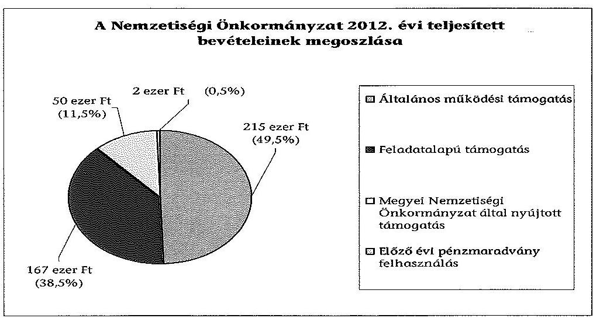
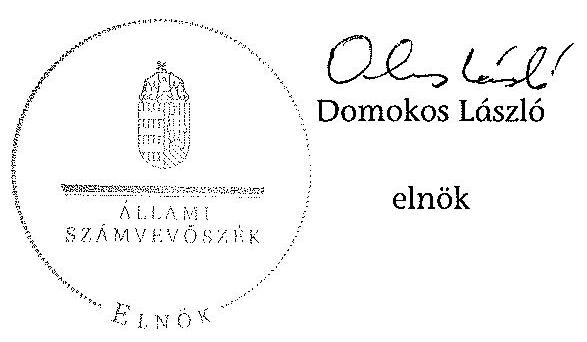

# ÁLLAMI   SZÁMVEVÔSZÉK 

## JELENTÉS

a helyi nemzetiségi önkormányzatok gazdálkodásának - 2013. évben induló - ellenőrzéséről
Roma Nemzetiségi Önkormányzat Pannonhalma
13147
2013. december

---

# Állami Számvevőszék 

Iktatószám: V-0149-038/2013.
Témaszám: 1201
Vizsgálat-azonosító szám: V065209

## Az ellenőrzést felügyelte:

Horváth Balázs
felügyeleti vezető
Az ellenőrzést vezette és az ellenőrzés végrehajtásáért felelős:
Pats Regina
ellenőrzésvezető
A számvevőszéki jelentést készítették és a jelentés összeállításában
közremüködtek:
Csényi István
számvevő tanácsos
dr. Fátrainé Zsebedics Katalin
számvevő tanácsos
Az ellenőrzést végezték:
Csényi István Nagy László Imre
számvevő tanácsos számvevő

---

# TARTALOMJEGYZÉK 

BEVEZETÉS ..... 3
I. ÖSSZEGZŐ MEGÁLLAPÍTÁSOK, KÖVETKEZTETÉSEK, JAVASLATOK ..... 6
II. RÉSZLETES MEGÁLLAPÍTÁSOK ..... 13

1. A Nemzetiségi Önkormányzat és a Települési Önkormányzat együttműködésének szabályozása, a működési feltételek biztosítása ..... 13
2. A gazdálkodási feladatok ellátásának szabályszerűsége ..... 14
2.1. A költségvetésre és zárszámadásra, valamint a kincstári adatszolgáltatás rendjére vonatkozó jogszabályi előírások betartása ..... 14
2.2. A Nemzetiségi Önkormányzat gazdálkodásának szabályozottsága ..... 15
2.3. Az operatív gazdálkodási jogkörök kialakítása, gyakorlása ..... 16
3. A Nemzetiségi Önkormányzattal kapcsolatos gazdálkodási feladatok belső ellenőrzése ..... 17
4. A feladatalapú támogatás felhasználásának, elszámolásának szabályszerűsége, a Nemzetiségi Önkormányzat feladatellátása ..... 17

## MELLÉKLET

1. számú A Nemzetiségi Önkormányzat 2012. évi gazdálkodásának főbb adatai, mutatói

## FÜGGELÉKEK

1. számú Rövidítések jegyzéke
2. számú Értelmező szótár
3. számú Minősítési szempontok

---

.

---

# JELENTÉS   a helyi nemzetiségi önkormányzatok gazdálkodásának - 2013. évben induló ellenőrzéséról   Roma Nemzetiségi Önkormányzat Pannonhalma 

## BEVEZETÉS

A Nemzetiségi Önkormányzat 2002. évben alakult, elnöke a 2010. évi helyhatósági választások óta látja el feladatát. A Nemzetiségi Önkormányzat intézményt, gazdasági társaságot és más szervezetet nem alapított, illetve ezek társulásában nem vett részt. A négy tagú Képviselő-testület a munkája segítésére bizottságot nem hozott létre. A Nemzetiségi Önkormányzat költségvetési beszámolója szerint a 2012. évben a módosított költségvetési bevételi és kiadási előirányzat 432 ezer Ft, a teljesített költségvetési bevétel 434 ezer Ft, a teljesített költségvetési kiadás 425 ezer Ft volt. A 2012. évi gazdálkodási adatokat részletesen az 1. számú mellékletben mutatjuk be.

Az Alaptörvény XXIX. cikk (1) bekezdése szerint a Magyarországon élő nemzetiségek államalkotó tényezők. Minden, valamely nemzetiséghez tartozó magyar állampolgárnak joga van önazonossága szabad vállalásához és megőrzéséhez. A hazánkban élő nemzetiségek helyi (települési és területi) valamint országos önkormányzatokat hozhatnak létre ${ }^{1}$. A helyi nemzetiségi önkormányzatok gazdálkodási feladatait jogszabályi előírás alapján a székhely szerinti helyi önkormányzat polgármesteri hivatala látja el.

A nemzetiségek helyzete, támogatása mind hazai, mind EU-s szinten kiemelt figyelmet kap napjainkban. A helyi nemzetiségi önkormányzatok gazdálkodására és támogatási rendszerére vonatkozó jogszabályok a 2010-2012. években jelentős változásokon mentek át. A települési és területi nemzetiségi önkormányzatok gazdálkodásának, a részükre juttatott költségvetési támogatások felhasználásának ellenőrzését az ÁSZ a 2012. évben sorozatjellegű ellenőrzés keretében indította el. A 2013. évi ellenőrzések e témacsoportos ellenőrzések folytatását jelentik.

Az ellenőrzés célja annak értékelése volt, hogy a Nemzetiségi Önkormányzat gazdálkodási kereteinek kialakítása, gazdálkodása és feladatellátása megfelelt-e a hatályos jogszabályoknak.

[^0]
[^0]:    ${ }^{1}$ A 2010. évben megtartott nemzetiségi önkormányzati választásokat követően 2304 települési, 58 területi és 13 országos nemzetiségi önkormányzat alakult meg.

---

Ennek keretében értékeltük, hogy:

- a Nemzetiségi Önkormányzat és a Települési Önkormányzat együttműködésének szabályozása, a múködési feltételek biztosítása megfelelt-e a jogszabályi előírásoknak;
- a felek együttmúködése a gazdálkodási feladatok ellátása során megfelelt-e a közöttük létrejött megállapodásnak, betartották-e a nemzetiségi önkormányzat költségvetésére és zárszámadására, a gazdálkodás szabályozására, az operatív gazdálkodási jogkörök gyakorlására vonatkozó jogszabályi előírásokat;
- a jegyző biztosította-e a nemzetiségi önkormányzat gazdálkodásának belső ellenőrzését;
- a nemzetiségi önkormányzat feladatalapú támogatásának felhasználása, a folyósított feladatalapú támogatással történő elszámolás az előírásoknak megfelelő volt-e;
- a nemzetiségi önkormányzat feladatellátása összhangban volt-e a vonatkozó jogszabályi előírásokkal.

Az ellenőrzés várható hasznosulását négy szinten tervezzük. A törvényalkotás számára összegzett tapasztalatok állnak rendelkezésre a nemzetiségi önkormányzatok testületi döntéseinek, gazdálkodásának és a feladatalapú támogatás felhasználásának szabályszerűségéről, amelynek alapján következtetést lehet levonni arra, hogy indokolt-e jogszabályi módosítás kezdeményezése. Az ellenőrzés az ellenőrzött számára visszajelzést ad a működésében fellépő hiányosságokról, javaslataival hozzájárul azok kiküszöböléséhez, amely csökkentheti a későbbi ellenőrzések gyakoriságát. Az ellenőrzés megállapításai és javaslatai tanulságul szolgálhatnak más nemzetiségi önkormányzatok, szervezetek számára a rendezett gazdálkodási keretek kialakításához. A társadalom számára jelzi, hogy közpénz nem maradhat ellenőrizetlenül, az ÁSZ értékteremtő rend kialakításához és megőrzéséhez hozzájáruló tevékenysége pozitív hatással lesz a szervezetről kialakított összkép formálásában. Az ÁSZ szervezetén belül lehetőség nyílik arra, hogy a megállapítások szintetizálásával az intézmény a hozzáadott értéket teremtő elemző tevékenységét és tanácsadó szerepét erősítse.

A helyi nemzetiségi önkormányzatok gazdálkodásának ellenőrzéséről szóló jelentés I. fejezetének összegző része az ellenőrzés céljára adott rövid, szintetizáló összefoglalót és következtetéseket tartalmazza a II. fejezet részletes megállapításain alapulóan.

Az ellenőrzés típusa: szabályszerűségi ellenőrzés.
Az ellenőrzött időszak: 2012. január 1. - 2012. december 31. közötti időszak. Az ellenőrzés kiterjedt a helyi nemzetiségi önkormányzatnak juttatott 2012. évi támogatás 2013. évben való elszámolására is.

Ellenőrzött szervezet: Roma Nemzetiségi Önkormányzat Pannonhalma és a gazdálkodási feladatait ellátó Pannonhalma Város Önkormányzata.

---

Az ellenőrzés végrehajtásának jogszabályi alapját az ÁSZ tv. 5. § (2)-(3) és (6) bekezdéseiben foglaltak képezik.

Az ellenőrzés szakmai módszertana az ÁSZ hivatalos honlapján (www.asz.hu) közzétett szakmai szabályokon alapult, amely a Legfőbb Ellenőrző Intézmények Nemzetközi Szervezete (INTOSAI) által kiadott nemzetközi standardok (ISSAI) figyelembevételével készült

A Nemzetiségi Önkormányzat gazdálkodásának ellenőrzése során értékeltük a Települési Önkormányzat és a Nemzetiségi Önkormányzat együttmúködésének, a gazdálkodás szabályozottságának és a pénzügyi folyamatokban kulcsszerepet betöltő belső kontrollok (teljesítés igazolás és érvényesítés) múködésének megfelelőségét. A kulcskontrollokat a múködési és felhalmozási célú támogatásértékű kiadásoknál, az államháztartáson kívülre teljesített múködési és felhalmozási célú pénzeszköz átadásoknál, a dologi kiadásokkal kapcsolatos kifizetéseknél - véletlen mintavételi eljárást alkalmazva - ellenőriztük. Ellenőriztük, hogy a jegyző biztosította-e a Nemzetiségi Önkormányzat gazdálkodásának belső ellenőrzését. Értékeltük a feladatalapú támogatások felhasználásának, elszámolásának szabályszerűségét, a Nemzetiségi Önkormányzat feladatellátása és a jogszabályi előírások összhangját.

Az ellenőrzés lefolytatásához a Nemzetiségi Önkormányzat és a gazdálkodási feladatait ellátó Települési Önkormányzat tanúsítványok és a kapcsolódó, dokumentumjegyzékben megjelölt dokumentumok elektronikus úton történő megküldésével, rendelkezésre bocsátásával szolgáltatott adatokat. Az adatszolgáltatás kontrollálása és szükség szerinti javítása a helyszíni ellenőrzés keretében történt. A minősítési szempontokat a 3. számú függelék tartalmazza.

Az ÁSZ tv. 29. § (1) bekezdése szerint a jelentéstervezetet megküldtük a polgármester és a Nemzetiségi Önkormányzat elnöke részére, akik az ÁSZ tv. 29. § (2) bekezdésében foglalt észrevételezési jogukkal nem éltek, a jelentéstervezetre észrevételt nem tettek.

---

# I. ÖSSZEGZŐ MEGÁLLAPÍTÁSOK, KÖVETKEZTETÉSEK, JAVASLATOK 

A Nemzetiségi Önkormányzat és a Települési Önkormányzat együttmúködésének szabályozása részben felelt meg a jogszabályi előírásoknak. Az együttmúködés a jogszabályokban előírt eljárásrend betartásával, de a törvényi határidőt követően jóváhagyott megállapodásokon alapult. Az együttmúködés szabályozása a 2012. évben a Nek. 2 tv-ben meghatározott tartalmi elemek tekintetében hiányos volt. A 2012. december 31 -én hatályos megállapodás a Nek. ${ }_{2}$ tv. előírása ellenére nem tartalmazta a költségvetés előkészítésével és megalkotásával, a költségvetéssel kapcsolatos adatszolgáltatással, az önálló fizetési számla nyitásával, valamint a múködési feltételek biztosításával kapcsolatos határidőket, a felelősök konkrét kijelölését, továbbá nem írta elő a Nemzetiségi Önkormányzat ülésein részt vevő jegyző, illetve az általa megbízott személy jelzési kötelezettségét törvénysértés észlelése esetén. A Nemzetiségi Önkormányzat a Nek. ${ }_{2}$ tv-ben előírt SZMSZ-szel nem rendelkezett. A szabályozási hiányosságok ellenére a Települési Önkormányzat biztosította a Nemzetiségi Önkormányzat múködéséhez szükséges személyi és tárgyi feltételeket.

A gazdálkodási feladatok ellátása keretében a Nemzetiségi Önkormányzat 2012. évi költségvetésére és zárszámadására vonatkozó jogszabályi előírások összességében érvényesültek. A Nemzetiségi Önkormányzat elnöke a 2012. évi költségvetés tervezetét és a jegyző által elkészített 2012. évi zárszámadási határozat tervezetet az Áht. ${ }_{2}$ előírásainak megfelelően határidőben benyújtotta a Képviselő-testületnek. A jóváhagyott költségvetés tartalmazta az Áht. ${ }_{2}$-ben és az Ávr-ben foglalt előírások szerinti tartalmi elemeket, de nem tartalmazta a költségvetés végrehajtására vonatkozó, Áht. ${ }_{2}$ szerinti, finanszírozási célú pénzügyi műveletekkel kapcsolatos hatásköröket. A 2012. évi költségvetés és zárszámadás előterjesztésekor a Képviselő-testület részére az Áht. ${ }_{2}$ előírásainak megfelelően bemutatták az előírt mérlegeket és kimutatásokat. A zárszámadásról alkotott határozat és az elfogadott költségvetés összehasonlíthatóságát biztosították, a Nemzetiségi Önkormányzat valamennyi bevételéről és kiadásáról elszámoltak. A Települési Önkormányzat 2012. évi költségvetéshez kapcsolódó, a Nemzetiségi Önkormányzatra vonatkozó kincstári adatszolgáltatási kötelezettségének a jegyző három esetben néhány napos késéssel tett eleget.

A gazdálkodás szabályozottsága nem volt megfelelő. A Nemzetiségi Önkormányzat rendelkezett a Számv. tv. és az Áhsz. által előírt számviteli politikával és az ahhoz kapcsolódó, a gazdálkodásra vonatkozó szabályzatokkal, azonban a jegyző a Nemzetiségi Önkormányzat gazdálkodási feladataira nem terjesztette ki a Polgármesteri Hivatal Bkr.-ben előírt ellenőrzési nyomvonalát és szabálytalanságok kezelésének eljárásrendjét, valamint a FEUVE szabályozást. Az Áht. ${ }_{2}$-ben és az Ávr.-ben foglaltak szerint a tervezéssel, gazdálkodással, így különösen a kötelezettségvállalással, pénzügyi ellenjegyzéssel és teljesítésigazolással, az érvényesítés, utalványozás gyakorlásának módjával, eljárási és dokumentálási részletszabályaival, valamint az ezeket végző személyek kijelölésének rendjével, az ellenőrzési és adatszolgáltatási feladatok teljesítésével

---

kapcsolatos belső előírásokat, feltételeket tartalmazó szabályzat rendelkezésre állt.

A Nemzetiségi Önkormányzat gazdálkodása tekintetében az operatív gazdálkodási jogkörök kialakítása nem felelt meg a jogszabályi előírásoknak. A Nemzetiségi Önkormányzat elnöke, mint kötelezettségvállaló kijelölte a teljesítést igazoló személyt, azonban más képviselőt nem hatalmazott fel írásban a kötelezettségvállalás és utalványozás gyakorlására, emiatt az Ávr-ben foglalt összeférhetetlenségi követelmények érvényesülése nem volt biztosított. A gazdasági vezető - aki az Áht. ${ }_{2}$ és az Ávr. előírásait figyelembe véve felhatalmazott más, jogszabályban előírt személyt a pénzügyi ellenjegyzés gyakorlására, valamint az előírt végzettséggel rendelkező személyt az érvényesítés ellátására - nem rendelkezett az Ávr-ben előírt szakképesítéssel. A Polgármesteri Hivatal SZMSZ-e nem tartalmazta az Ávr-ben foglaltak szerinti, a Nemzetiségi Önkormányzat gazdálkodásával kapcsolatos feladat- és hatáskörökre, a hatáskörök gyakorlásának módjára, a helyettesítés rendjére, az ezekhez kapcsolódó felelősségi szabályokra vonatkozó előírásokat, és ezen előírásokat a Polgármesteri Hivatalnál a Nemzetiségi Önkormányzat gazdálkodásával kapcsolatos feladatokat ellátó köztisztviselők munkaköri leírásai sem tartalmazták. A Nemzetiségi Önkormányzatnál a 2012. évben a dologi kiadások teljesítése során a teljesítés igazolás és az érvényesítés kulcsszerepet betöltő kontrollok müködése kiváló volt. A teljesítés igazoló jogosultan és igazoltan ellenőrizte a kiadások teljesítésének jogosságát, összegszerűségét és az ellenszolgáltatás teljesítését. Az érvényesítést végző személy jogosultan végezte tevékenységét, melynek során ellenőrizte az összegszerűséget, a fedezet meglétét, a formai és a főkönyvi számla kijelölési szabályok, valamint az egyéb jogszabályban és belső utasításban foglalt előírások betartását. A működési célú támogatásértékű kiadások területén a kifizetések teljesítésének igazolása és az érvényesítés kulcskontrollok múködtetése megfelelő volt. A teljesítést igazoló ellenőrzési feladatának eleget tett. Az érvényesítő - az Ávr-ben foglaltak ellenére - az egyéb jogszabályban és belső szabályzatban foglalt előírások betartásának ellenőrzését nem végezte el, mert nem észrevételezte, hogy a kifizetések előirányzat nélküli és pénzügyi ellenjegyzés nélküli kötelezettségvállalásokon alapultak. A jegyző nem gondoskodott az Áht. ${ }_{2}$-ben foglaltaknak megfelelően az előirányzatok szükséges mértékű módosításáról az előirányzatokon belül való gazdálkodás biztosítása érdekében. Felhalmozási célú támogatásértékű kiadás, valamint múködési és felhalmozási célú pénzeszközátadás államháztartáson kívülre nem történt. A számvevőszéki ellenőrzés a kifizetések dokumentumainak ellenőrzése alapján nem tárt fel jogosulatlan kifizetést.

A jegyző nem biztosította a Nemzetiségi Önkormányzat gazdálkodásával összefüggő végrehajtási feladatok belső ellenőrzését. A Polgármesteri Hivatal 2012. évi belső ellenőrzési tervét megalapozó kockázatelemzés - a Ber. előirása ellenére - nem terjedt ki a Nemzetiségi Önkormányzat gazdálkodásával összefüggő végrehajtási feladatokra, és azok tekintetében belső ellenőrzési feladatot a 2012. évben nem terveztek és nem végeztek. A 2012. évre vonatkozó belső ellenőrzési terv elkészítésének idején hatályos együttmúködési megállapodás a Nemzetiségi Önkormányzat belső ellenőrzésére vonatkozóan csak általános előírást tartalmazott.

---

A Nemzetiségi Önkormányzat a 2012. évben a bevételei 38,5\%-át kitevő, 167 ezer Ft feladatalapú támogatásban részesült, amelyet a tárgyévben a jogszabályi előírásokkal összhangban felhasznált. A támogatási kormányrendelet ${ }_{2}$-ben hivatkozott elszámolás nem történt meg, azonban a zárszámadási határozat mellékletében bemutatták a 2012. évi feladatalapú támogatás felhasználását. A támogatás felhasználását, elszámolását az ellenőrzésre jogosult szervek nem ellenőrizték. A Nemzetiségi Önkormányzat feladatellátásának tárgya a Nek. 2 tv-ben foglaltakkal részben volt összhangban, mivel a 2012. évben a Nek. 2 tv.-ben felsorolt kötelező közfeladatot nem látott el, a feladatellátás érdekében megállapodásokat nem kötött. Önként vállalt feladatokat végzett a hagyományápolás és közművelődés, valamint a társadalmi felzárkózás területén.

Az ÁSZ tv. 33. § (1) bekezdésében foglaltak értelmében az ellenőrzött szervezet vezetője köteles a jelentésben foglalt megállapításokhoz kapcsolódó intézkedési tervet összeállítani, és azt a jelentés kézhezvételétől számított 30 napon belül az ÁSZ részére megküldeni. Amennyiben az intézkedési tervet határidőre nem küldi meg a szervezet, vagy az nem elfogadható, az ÁSZ elnöke az ÁSZ tv. 33. § (3) bekezdés a)-b) pontjaiban foglaltakat érvényesítheti.

A helyszíni ellenőrzés megállapításainak hasznosítása mellett javasoljuk:

# a jegyzőnek 

1. az együttműködés szabályozásával kapcsolatban

Az együttműködési megállapodásban a Nek. 2 tv. 80. § (3) bekezdése a)-b) és d) pontjaiban foglaltak ellenére nem rögzítették a Nemzetiségi Önkormányzat költségvetése előkészítésével és megalkotásával, a költségvetéssel összefüggő adatszolgáltatással, az önálló fizetési számla nyitásával, valamint a múködési feltételek biztosításával kapcsolatos határidőket, továbbá a felelősök konkrét kijelölését. Nem írták elő - a Nek. 2 tv. 80. § (4) bekezdésében foglaltakat figyelmen kívül hagyva - a jegyző, illetve a megbízásából a Nemzetiségi Önkormányzat ülésein résztvevő személy jelzési kötelezettségét törvénysértés észlelése esetén.

Javaslat
Készítse elő az együttműködési megállapodás módosítását, hogy tartalmilag feleljen meg a Nek. 2 tv. 80. § (3) bekezdés a)-b) és d) pontjaiban, valamint a Nek. 2 tv. 80. § (4) bekezdésében foglalt előírásoknak.
2. a költségvetési határozattal kapcsolatban

A 2012. évi költségvetési határozat nem tartalmazta a költségvetés végrehajtásával kapcsolatos, az Áht. 2 23. § (2) bekezdés h) pontja szerinti, finanszírozási célú pénzügyi műveletekkel kapcsolatos hatásköröket.

Javaslat
Gondoskodjon a jövőben az Áht. 2 23. § (2) bekezdés h) pontjának megfelelő költségvetési határozat előkészítéséről.

---

3. a kincstári adatszolgáltatási kötelezettséggel kapcsolatban

A jegyző a 2012. évi költségvetéshez kapcsolódó, a Nemzetiségi Önkormányzatra vonatkozó kincstári adatszolgáltatási kötelezettségének az Ávr-ben előírt határidőkre vonatkozóan részben tett eleget, mivel az I. negyedéves időközi költségvetési jelentést az Ávr. 169. § (2) bekezdése szerinti határidőt - április 20-a - követően, április 24-én, az II. és III. negyedéves időközi mérlegjelentéseket az Ávr. 170. § (5) bekezdése szerinti határidőt - július 25-e és október 25-a - követően július 26-án, illetve október 29-én küldte meg a Kincstár területileg illetékes igazgatóságának.

Javaslat
A jövőben az adatszolgáltatási kötelezettségének az Ávr. 169. § (2) bekezdésében, valamint az Ávr. 170. § (5) bekezdésében előírt határidők betartásával tegyen eleget.
4. a gazdálkodási feladatok szabályozottságával kapcsolatban

A jegyző a Nemzetiségi Önkormányzat gazdálkodási feladataira nem terjesztette ki a Bkr. 6. § (3)-(4) bekezdéseiben előírt ellenőrzési nyomvonalat és a szabálytalanságok kezelésének eljárásrendjét, valamint a Bkr. 8. § (2)-(4) bekezdései szerinti FEUVE szabályozást.

A Polgármesteri Hivatal SZMSZ-e nem tartalmazta az Ávr. 13. § (1) bekezdés g) pontjában foglaltak szerinti, a munkakörökhöz tartozó - a Nemzetiségi Önkormányzat gazdálkodásával kapcsolatos - feladat- és hatáskörökre, a hatáskörök gyakorlásának módjára, a helyettesítés rendjére, az ezekhez kapcsolódó felelősségi szabályokra vonatkozó előírásokat.

A Nemzetiségi Önkormányzat a Nek. 2 tv. 88. § (1) bekezdésében előírt SZMSZ-szel nem rendelkezett, ezért a Nek. 2 tv. 80. § (2) bekezdésében foglaltak - a Nemzetiségi Önkormányzat SZMSZ-ében a megállapodás szerinti múködési feltételeket a megállapodás megkötését követő harminc napon belül rögzíteni kell - sem érvényesülhettek.

A gazdasági vezető nem rendelkezett az Ávr. 12. §-ában előírt szakképesítéssel.
Javaslat
A gazdálkodás szabályszerűsége érdekében:
a) terjessze ki - az Ávr. 13. § (3a) bekezdése - a Polgármesteri Hivatal ellenőrzési nyomvonalának, a szabálytalanságok kezelése eljárásrendjének és a folyamatba épített előzetes, utólagos és vezetői ellenőrzés szabályzatainak hatályát a Bkr. 6. § (3)-(4) és a 8. § (2)-(4) bekezdéseiben foglalt előírásoknak megfelelően a Nemzetiségi Önkormányzat gazdálkodási feladataira;
b) készítse elő a Polgármesteri Hivatal SZMSZ-e módosítását, hogy az megfeleljen az Ávr. 13. § (1) bekezdés g) pontjában foglalt előírásnak;
c) készítse el a Nemzetiségi Önkormányzat Nek. ${ }_{2}$ tv. 88. § (1) bekezdésében előírt SZMSZ-ét, figyelemmel a Nek. ${ }_{2}$ tv. 80. § (2) bekezdésében foglaltakra;

---

d) gondoskodjon arról, hogy a gazdasági vezetői feladatokat ellátó rendelkezzen az Ávr. 12. §-ában előírt szakképesítéssel.
5. a pénzügyi kontrollok müködésével kapcsolatban

Az érvényesítő - az Ávr. 58. § (1)-(2) bekezdésében foglaltak ellenére - az egyéb jogszabályban és belső szabályzatban foglalt előírások betartásának ellenőrzését nem végezte el, mert nem észrevételezte, hogy az Áht. 2 37. § (1) bekezdés előírása ellenére a kifizetések előirányzat nélküli és pénzügyi ellenjegyzés nélküli kötelezettségvállalásokon alapultak, továbbá - az Ávr. 59. § (3) bekezdés f) pontjának előírása ellenére - az utalványrendeleten a kötelezettségvállalás nyilvántartási számát nem tüntették fel.

Javaslat
Intézkedjen arról, hogy az érvényesítő tegyen eleget az Ávr. 58. § (1)-(2) bekezdésében előírtak szerinti ellenőrzési kötelezettségének.
6. a feladatalapú támogatás elszámolásával kapcsolatban

A támogatás elszámolása a támogatási kormányrendelet ${ }_{2}$ 8. § (5) bekezdésében hivatkozott „a helyi önkormányzatok elszámolási és ellenőrzési rendjére vonatkozó jogszabályok rendelkezései alkalmazandóak" előírása ellenére nem történt meg.

Javaslat
Gondoskodjon az Áht. 2 27. § (2) bekezdésben meghatározott feladatkörében a Nemzetiségi Önkormányzat által igénybe vett feladatalapú támogatás elszámolásának elkészítéséről, figyelemmel az Áht. 2 57. § (4) bekezdésben foglaltakra.

# a polgármesternek 

Az együttműködési megállapodásban a Nek. 2 tv. 80. § (3) bekezdése a)-b) és d) pontjaiban foglaltak ellenére nem rögzítették a Nemzetiségi Önkormányzat költségvetése előkészítésével és megalkotásával, a költségvetéssel összefüggő adatszolgáltatással, az önálló fizetési számla nyitásával, valamint a müködési feltételek biztosításával kapcsolatos határidőket, továbbá a felelősök konkrét kijelölését. Nem írták elő - a Nek. 2 tv. 80. § (4) bekezdésében foglaltakat figyelmen kívül hagyva - a jegyző, illetve a megbízásából a Nemzetiségi Önkormányzat ülésein résztvevő személy jelzési kötelezettségét törvénysértés észlelése esetén.

A Polgármesteri Hivatal SZMSZ-e nem tartalmazta az Ávr. 13. § (1) bekezdés g) pontjában foglaltak szerinti, a munkakörökhöz tartozó - a Nemzetiségi Önkormányzat gazdálkodásával kapcsolatos - feladat- és hatáskörökre, a hatáskörök gyakorlásának módjára, a helyettesítés rendjére, az ezekhez kapcsolódó felelősségi szabályokra vonatkozó előírásokat.

---

Javaslat
Terjessze a Települési Önkormányzat Képviselő-testülete elé jóváhagyásra
a) a Nek. 2 tv. 80. § (3) bekezdés a), b) és d) pontjaiban, valamint Nek. 2 tv. 80. § (4) bekezdésében foglalt előírások betartásával előkészített együttmúködési megállapodás módosítást;
b) az Ávr. 13. § (1) bekezdés g) pontjában foglalt szabályozásra figyelemmel - a jegyző által előkészített - módosított Polgármesteri Hivatal SZMSZ-ét.

# a Nemzetiségi Önkormányzat elnökének 

1. Az együttmúködési megállapodásban a Nek. 2 tv. 80. § (3) bekezdése a)-b) és d) pontjaiban foglaltak ellenére nem rögzítették a Nemzetiségi Önkormányzat költségvetése előkészítésével és megalkotásával, a költségvetéssel összefüggő adatszolgáltatással, az önálló fizetési számla nyitásával, valamint a müködési feltételek biztosításával kapcsolatos határidőket, továbbá a felelősök konkrét kijelölését. Nem írták elő - a Nek. 2 tv. 80. § (4) bekezdésében foglaltakat figyelmen kívül hagyva - a jegyző, illetve a megbízásából a Nemzetiségi Önkormányzat ülésein résztvevő személy jelzési kötelezettségét törvénysértés észlelése esetén.

Javaslat
Terjessze a Képviselő-testület elé jóváhagyásra a Nek. 2 tv. 80. § (3) bekezdés a), b) és d) pontjaiban, valamint Nek. 2 tv. 80. § (4) bekezdésében foglalt előírások betartásával előkészített együttmúködési megállapodás módosítást.
2. A Nemzetiségi Önkormányzat a Nek. 2 tv. 88. § (1) bekezdésében előírt SZMSZ-szel nem rendelkezett, ezért a Nek. 2 tv. 80. § (2) bekezdésében foglaltak - a Nemzetiségi Önkormányzat SZMSZ-ében a megállapodás szerinti müködési feltételeket a megállapodás megkötését követő harminc napon belül rögzíteni kell - sem érvényesülhettek.

Javaslat
Terjessze a Képviselő-testület elé jóváhagyásra a Nek. 2 tv. 88. § (1) bekezdésében meghatározott Nemzetiségi Önkormányzati SZMSZ-t.
3. A Nemzetiségi Önkormányzat elnöke, mint kötelezettségvállaló kijelölte a teljesítést igazoló személyt, azonban más képviselőt nem hatalmazott fel írásban az Ávr. 52. § (7) bekezdés, valamint az Ávr. 59. (1) bekezdés előírásai alapján a kötelezettségvállalás és az utalványozás gyakorlására, emiatt az Ávr. 60. § (2) bekezdésében foglalt összeférhetetlenségi követelmények érvényesülése nem volt biztosított.

Javaslat
Írásban jelöljön ki - az Ávr. 60. § (2) bekezdésében foglalt összeférhetetlenség fennállása esetén - további kötelezettségvállaló, utalványozó személyt az Ávr. 52. § (7) bekezdés, valamint az Ávr. 59. (1) bekezdés előírásai alapján.

---

4. A 2012. évi feladatalapú támogatás elszámolása a támogatási kormányrendelet ${ }_{2}$ 8. § (5) bekezdésében hivatkozott „a helyi önkormányzatok elszámolási és ellenőrzési rendjére vonatkozó jogszabályok rendelkezései alkalmazandóak" előirása ellenére nem történt meg.

Javaslat
Terjessze a Képviselő-testület elé jóváhagyásra az Áht. ${ }_{2}$ 57. § (4) bekezdés alapján készített elszámolást a Nemzetiségi Önkormányzat által igénybe vett feladatalapú támogatásról.

---

# II. RÉSZLETES MEGÁLLAPÍTÁSOK 

## 1. A Nemzetiségi Önkormányzat És a Telepúlési Önkormányzat együttmúködésének szabályozása, a múködési feltételek biztositása

A Nemzetiségi Önkormányzat és a Települési Önkormányzat együttműködésének szabályozása részben felelt meg a jogszabályi előírásoknak.

Az együttműködés szabályozása a jogszabályi előírásoknak megfelelő eljárásrendben, de a törvényi határidőt követően jóváhagyott együttmüködési megállapodásokon ${ }^{2}$ alapult.

Az együttműködési megállapodás a Nemzetiségi Önkormányzat múködési feltételeit - a Nek. ${ }_{2}$ tv. 80. § (1) bekezdés e) pontjában előírt nyilvántartási és iratkezelési feladatok ellátása kivételével - tartalmazta. Az Áht. ${ }_{2}$-ben előírt tervezési, gazdálkodási, finanszírozási, adatszolgáltatási és beszámolási feladatok ellátásának részletes szabályait az együttmúködési megállapodásban rögzítették. A Nemzetiségi Önkormányzat kötelezettségvállalásaival kapcsolatosan a Települési Önkormányzatot terhelő ellenjegyzési, érvényesítési és a Nemzetiségi Önkormányzatot terhelő utalványozási, teljesítés igazolási feladatokat és a felelősök konkrét kijelölését az együttműködési megállapodás tartalmazta.

Az együttmúködés szabályozása - a 2012. december 31-én hatályos együttműködési megállapodás alapján - a Nek. ${ }_{2}$ tv-ben meghatározott tartalmi elemek tekintetében azonban hiányos volt:

- az együttműködési megállapodásban a Nek. ${ }_{2}$ tv. 80. § (3) bekezdése a)-b) és d) pontjaiban foglaltak ellenére nem rögzítették a Nemzetiségi Önkormányzat költségvetése előkészítésével és megalkotásával, a költségvetéssel összefüggő adatszolgáltatással, az önálló fizetési számla nyitásával, valamint a múködési feltételek biztosításával kapcsolatos határidőket, továbbá a felelősök konkrét kijelölését;
- nem írták elő - a Nek. ${ }_{2}$ tv. 80. § (4) bekezdésében foglaltakat figyelmen kívül hagyva - a jegyző, illetve a megbízásából a Nemzetiségi Önkormányzat ülésein résztvevő személy jelzési kötelezettségét törvénysértés észlelése esetén.

A Nemzetiségi Önkormányzat a Nek. ${ }_{2}$ tv. 88. § (1) bekezdésében előírt SZMSZszel nem rendelkezett, ezért a Nek. ${ }_{2}$ tv. 80. § (2) bekezdésében foglaltak - a

[^0]
[^0]:    ${ }^{2}$ A 2007. január 10-én kelt együttműködési megállapodást a Képviselő-testület a 4/2007. (I. 16.) CKÖ számú, a Települési Önkormányzat Képviselő-testülete a 49/2007. (IV. 03.) számú határozattal hagyta jóvá. A 2012. augusztus 1-jétől hatályos együttműködési megállapodást a Képviselő-testület a 13/2012. (VII. 26.) számú, a Települési Önkormányzat Képviselő-testülete a 105/2012. (VII. 26.) számú határozattal hagyta jóvá.

---

Nemzetiségi Önkormányzat SZMSZ-ében a megállapodás szerinti múködési feltételeket a megállapodás megkötését követő harminc napon belül rögzíteni kell - nem érvényesültek.

A szabályozási hiányosságok ellenére a Települési Önkormányzat biztosította a Nemzetiségi Önkormányzat múködéséhez szükséges személyi és tárgyi feltételeket.

# 2. A GAZDÁLKODÁSI FELADATOK ELLÁTÁSÁNAK SZABÁLYSZERŰSÉGE 

### 2.1. A költségvetésre és zárszámadásra, valamint a kincstári adatszolgáltatás rendjére vonatkozó jogszabályi előírások betartása

A Nemzetiségi Önkormányzat 2012. évi költségvetésének ${ }^{3}$ és zárszámadásának ${ }^{4}$ tartalma, jóváhagyása, valamint a kapcsolódó 2012. évi kincstári adatszolgáltatás szabályszerűsége megfelelt a jogszabályi előírásoknak.

A Nemzetiségi Önkormányzat elnöke a 2012. évi költségvetés tervezetét az Áht. ${ }_{2}$ előírásainak megfelelően határidőben benyújtotta a Képviselőtestületnek. A jóváhagyott költségvetés tartalmazta az Áht. ${ }_{2}$-ben és az Ávr-ben előírt tartalmi elemeket: a költségvetési bevételeket és költségvetési kiadásokat előirányzat-csoportok, kiemelt előirányzatok szerinti bontásban, valamint a költségvetési egyenleg összegét.

A költségvetési határozat nem tartalmazta a költségvetés végrehajtásával kapcsolatos, az Áht. ${ }_{2}$ 23. § (2) bekezdés h) pontja szerinti, finanszírozási célú pénzügyi műveletekkel kapcsolatos hatásköröket. A 2012. évi költségvetés előterjesztésekor a Képviselő-testület részére - tájékoztatás céljából, szöveges indoklással együtt - az Áht. ${ }_{2} 24 . \S$ (4) bekezdésében foglaltaknak megfelelően bemutatták az előírt mérlegeket és kimutatásokat.

A jegyző által elkészített 2012. évi zárszámadási határozat tervezetet a Nemzetiségi Önkormányzat elnöke az Áht. ${ }_{2}$-ben foglaltak alapján, határidőn belül beterjesztette a Képviselő-testületnek ${ }^{5}$. A zárszámadás összeállítása során a határozat elkészítésére, tartalmi előírásaira, elfogadására és továbbítására vonatkozó előírásokat a Nemzetiségi Önkormányzat betartotta. A 2012. évi zárszámadási határozat tervezetének előterjesztésénél a Képviselő-testülete részére tájékoztatásul bemutatták az Áht. ${ }_{2}$ 91. § (2)-(3) bekezdésében foglalt mérlegeket és kimutatásokat. A zárszámadásról alkotott határozat és az elfogadott költ-

[^0]
[^0]:    ${ }^{3}$ A Képviselő-testület Nemzetiségi Önkormányzat 2012. évi költségvetéséről szóló 4/2012. (I. 20.) számú határozata.
    ${ }^{4}$ A Képviselő-testület Nemzetiségi Önkormányzat 2012. évi zárszámadásáról szóló 4/2013. (II. 25.) számú határozata.
    ${ }^{5}$ Az elnök a zárszámadási határozat tervezetet 2013. február 25-én terjesztette be a Képviselő-testületnek.

---

ségvetés összehasonlíthatóságát biztosították, a Nemzetiségi Önkormányzat valamennyi bevételéről és kiadásáról elszámoltak.

A jegyző a 2012. évi költségvetéshez kapcsolódó, a Nemzetiségi Önkormányzatra vonatkozó ${ }^{6}$ kincstári adatszolgáltatási kötelezettségének az Ávr-ben előírt határidőkre vonatkozóan részben tett eleget. Az I. negyedéves időközi költségvetési jelentést az Ávr. 169. § (2) bekezdése szerinti határidőt - április 20-a követően, április 24 -én, az II. és III. negyedéves időközi mérlegjelentéseket az Ávr. 170. § (5) bekezdése szerinti határidőt - július 25-e és október 25-a - követően július 26 -án, illetve október 29-én küldte meg a Kincstár területileg illetékes igazgatóságának.

# 2.2. A Nemzetiségi Önkormányzat gazdálkodásának szabályozottsága 

A Nemzetiségi Önkormányzat gazdálkodásának szabályozottsága az ellenőrzött időszakban - összességében nem volt megfelelő:

- a 2012. évben a Nemzetiségi Önkormányzat rendelkezett a Számv. tv. és az Áhsz. által előírt számviteli politikával és kapcsolódóan a gazdálkodásra vonatkozó - leltározási és leltárkészítési, az eszközök és források értékelési, pénzkezelési és számlarend - szabályzatokkal;
- az Áht. ${ }_{2}$ 10. § (5) bekezdésében és az Ávr. 13. § (2) bekezdésének a) pontjában foglalt, a tervezéssel, gazdálkodással, a kötelezettségvállalással, pénzügyi ellenjegyzéssel és teljesítés igazolással, az érvényesítés, utalványozás gyakorlásának módjával, eljárási és dokumentálási részletszabályaival, valamint az ezeket végző személyek kijelölésének rendjével, az ellenőrzési és adatszolgáltatási feladatok teljesítésével kapcsolatos belső előírásokat, feltételeket tartalmazó szabályzat rendelkezésre állt;
azonban:
- a jegyző a Nemzetiségi Önkormányzat gazdálkodási feladataira nem terjesztette ki a Bkr. 6. § (3)-(4) bekezdéseiben előírt ellenőrzési nyomvonalat és szabálytalanságok kezelésének eljárásrendjét, valamint a Bkr. 8. § (2)-(4) bekezdései szerinti folyamatba épített előzetes, utólagos és vezetői ellenőrzés szabályozást;

[^0]
[^0]:    ${ }^{6}$ Az Áhsz. hatálya - az 1. § d) pontja alapján - 2012. január 1-jétől kiterjed a helyi nemzetiségi önkormányzatokra. A helyi nemzetiségi önkormányzatok - mint az államháztartás szervezetei - 2012. január 1-jétől a gazdálkodásuk végrehajtását ellátó, székhelyük szerinti helyi önkormányzattól elkülönült könyvvezetésre, beszámolásra kötelezettek. A nemzetiségi önkormányzatok székhelye szerinti helyi önkormányzat hivatala a nemzetiségi önkormányzat elemi költségvetéséről az Ávr. 33. § (1)-(2) bekezdései, az I-II-III. negyedévi időközi költségvetési jelentésekről és mérlegjelentésekről az Ávr. 169. § (2) és 170. § (5) bekezdései, a féléves elemi költségvetési beszámolójáról az Áhsz. 10. § (1) és (5a) bekezdései szerint a Kincstár területileg illetékes szervének adatot szolgáltat.

---

- a Polgármesteri Hivatal SZMSZ-e nem tartalmazta az Ávr. 13. § (1) bekezdés g) pontjában foglaltak szerinti, a munkakörökhöz tartozó - a Nemzetiségi Önkormányzat gazdálkodásával kapcsolatos - feladat- és hatáskörökre, a hatáskörök gyakorlásának módjára, a helyettesítés rendjére, az ezekhez kapcsolódó felelősségi szabályokra vonatkozó előírásokat, és ezen előírásokat a Polgármesteri Hivatalnál a Nemzetiségi Önkormányzat gazdálkodásával kapcsolatos feladatokat ellátó köztisztviselők munkaköri leírásai sem tartalmazták.

# 2.3. Az operatív gazdálkodási jogkörök kialakítása, gyakorlása 

A Nemzetiségi Önkormányzat gazdálkodása tekintetében az operatív gazdálkodási jogkörök kialakítása nem felelt meg a jogszabályi előírásoknak, mivel:

- a Nemzetiségi Önkormányzat elnöke, mint kötelezettségvállaló kijelölte a teljesítést igazoló személyt, azonban más képviselőt nem hatalmazott fel írásban az Ávr. 52. § (7) bekezdés, valamint az Ávr. 59. § (1) bekezdés előírásai alapján a kötelezettségvállalás és az utalványozás gyakorlására, emiatt az Ávr. 60. § (2) bekezdésében foglalt összeférhetetlenségi követelmények érvényesülése nem volt biztosított;
- a gazdasági vezető - aki az Áht. ${ }_{2}$ és az Ávr. előírásait figyelembe véve felhatalmazott más, jogszabályban előírt személyt a pénzügyi ellenjegyzés gyakorlására, valamint az előírt végzettséggel rendelkező személyt az érvényesítés ellátására - nem rendelkezett az Ávr. 12. §-ában előírt szakképesítéssel.

A Nemzetiségi Önkormányzatnál a 2012. évben a dologi kiadások teljesítése során a teljesítés igazolás és az érvényesítés kulcskontrollok múködésének megfelelősége kiváló volt, mivel a teljesítés igazoló jogosultan és igazoltan ellenőrizte a kiadások teljesítésének jogosságát, összegszerűségét és az ellenszolgáltatás teljesítését. Az érvényesítést végző személy jogosultan végezte tevékenységét, melynek során ellenőrizte az összegszerűséget, a fedezet meglétét, a formai és a főkönyvi számla kijelölési szabályok, valamint az egyéb jogszabályban és belső utasításban foglalt előírások betartását.

A Nemzetiségi Önkormányzatnál a 2012. évben a múködési célú támogatásértékú kiadások teljesítésének igazolása és az érvényesítés kulcskontrollok múködtetésének megfelelősége megfelelő volt, mivel az átutalások teljesítésének jogosságát, összegszerűségét és az ellenszolgáltatás teljesítését a teljesítés igazolására jogosult személy igazolta. Az összegszerűséget, a fedezet meglétét, a formai és a főkönyvi számla kijelölési szabályok betartását az érvényesítésre jogosult személy ellenőrizte, azonban az érvényesítő - az Ávr. 58. § (1)-(2) bekezdésében foglaltak ellenére - az egyéb jogszabályban és belső szabályzatban foglalt előírások betartásának ellenőrzését nem végezte el. Nem észrevételezte, hogy az Áht. 2 37. § (1) bekezdés előírása ellenére a kifizetések előirányzat nélküli és pénzügyi ellenjegyzés nélküli kötelezettségvállalásokon alapultak, továbbá - az Ávr. 59. § (3) bekezdés f) pontjának előirrása ellenére - az utalványrendeleten a kötelezettségvállalás nyilvántartási számát nem tüntették fel. A jegyző nem gondoskodott az Áht. 2 34. § (1) és (6) bekezdé-

---

sében foglaltaknak megfelelően az előirányzatok szükséges mértékű módosításáról az Âht. 36. § (1) bekezdése szerint meghatározott előirányzatokon belül való gazdálkodás érdekében.

Felhalmozási célú támogatásértékű kiadás, valamint múködési és felhalmozási célú pénzeszközátadás államháztartáson kívülre nem történt.

A számvevőszéki ellenőrzés a kifizetések dokumentumainak ellenőrzése alapján nem tárt fel jogosulatlan kifizetést.

# 3. A Nemzetiségi ÖNKORMÁNYZATtal KAPCSOLATOS GAZDÁlKO. DÁSI FELADATOK BELSŐ ELLENŐRZÉSE 

A jegyző nem biztosította a Nemzetiségi Önkormányzat gazdálkodásával összefüggő végrehajtási feladatok belső ellenőrzését. A Polgármesteri Hivatal 2012. évi éves belső ellenőrzési tervét megalapozó kockázatelemzés - a Ber. 21. § (2) bekezdése ellenére - nem terjedt ki a Nemzetiségi Önkormányzat gazdálkodásával összefüggő végrehajtási feladatokra, és azok tekintetében belső ellenőrzési feladatot a 2012. évben nem terveztek és nem végeztek. A 2012. évre vonatkozó belső ellenőrzési terv elkészítésének idején hatályos együttműködési megállapodás a Nemzetiségi Önkormányzat belső ellenőrzésére vonatkozóan csak általános előírást tartalmazott.

Az ellenőrzéshez szolgáltatott adatok alapján 2012. évben a Kormányhivatal a Nemzetiségi Önkormányzatot illetően nem élt törvényességi felügyeleti eszközökkel.

## 4. A feladatalapú támogatás felhasználásának, elszámolásának szabálySzerüsége, a Nemzetiségi Önkormányzat FELADATELLÁTÁSA

A Nemzetiségi Önkormányzat a 2012. évben 167 ezer Ft feladatalapú támogatásban részesült, amelynek az összes bevételből való részesedését a következő diagram szemlélteti:

---

A Nemzetiségi Önkormányzat a 2011. évben feladatalapú támogatásban nem részesült. A 2012. évben folyósított támogatást - a jogszabályi előírásokkal összhangban - a tárgyévben felhasználták.

A 2012. évi feladatalapú támogatás elszámolása a támogatási kormányrendelet ${ }_{2}$ 8. § (5) bekezdésében hivatkozott „a helyi önkormányzatok elszámolási és ellenôrzési rendjére vonatkozó jogszabályok rendelkezései alkalmazandóak" elöirása ellenére nem történt meg, azonban a zárszámadási határozat ${ }^{7} 13$. számú mellékletében bemutatták a 2012. évi feladatalapú támogatás felhasználását. A feladatalapú támogatás felhasználását, elszámolását az ellenőrzésre jogosult szervek nem ellenőrizték.

A Nemzetiségi Önkormányzat feladatellátásának tárgya részben volt összhangban a Nek. ${ }_{2}$ tv-ben foglaltakkal, mert a Nemzetiségi Önkormányzat a 2012. évben a Nek. ${ }_{2}$ tv. 115. §-ában felsorolt kötelező közfeladatot nem látott el. A 2012. évben a Nek. ${ }_{2}$ tv. 116. § (2) bekezdésében foglalt önként vállalt feladatokat végzett a hagyományápolás és közmúvelődés, valamint a társadalmi felzárkózás területén.

Budapest, 2013. dec hónap 30. nap

Melléklet: 1 db
Függelék: $\quad 3 \mathrm{db}$

[^0]
[^0]:    ${ }^{7}$ A 4/2013. (II. 25.) számú határozat.

---

# A Nemzetiségi Önkormányzat 2012. évi gazdálkodásának főbb adatai, mutatói 

A) Bevételek

| Megnevezés | Eredeti elöirányzat | Módosított   ezer Ft | Teljesités |  |
| :--: | :--: | :--: | :--: | :--: |
|  |  |  |  | megoszlás |
| Általános müködési támogatás | 210,0 | 215,0 | 215,0 | $49,5 \%$ |
| Feladatalapú támogatás | 0,0 | 167,0 | 167,0 | $38,5 \%$ |
| Megyei Nemzetiségi Önkormányzat által nyújtott   támogatás | 0,0 | 50,0 | 50,0 | $11,5 \%$ |
| Pénzforgalmi bevételek összesen | 210,0 | 432,0 | 432,0 | 99,5\% |
| Előző évi pénzmaradvány felhasználás | 0,0 | 0,0 | 2,0 | $0,5 \%$ |
| Bevételek összesen | 210,0 | 432,0 | 434,0 | 100,0\% |

B) Kiadások

| Megnevezés | Eredeti elöirányzat | Módosított   ezer Ft | Teljesités |  |
| :--: | :--: | :--: | :--: | :--: |
|  |  |  |  | megoszlás |
| Személyi juttatások | 0,0 | 19,0 | 19,0 | $4,5 \%$ |
| Munkaadókat terhelő járulékok és szocális hozzájárulási adó összesen | 0,0 | 8,0 | 8,0 | $1,9 \%$ |
| Dologi kiadások | 210,0 | 108,0 | 101,0 | $23,8 \%$ |
| Támogatásértékủ müködési kiadások | 0,0 | 297,0 | 297,0 | $69,8 \%$ |
| Müködési kiadások összesen | 210,0 | 432,0 | 425,0 | 100,0\% |
| Kiadások összesen | 210,0 | 432,0 | 425,0 | 100,0\% |

---

.

---

# RÖVIDÍTÉSEK JEGYZÉKE 

## Törvények

Alaptörvény
Áht. 1
Áht. 2
ÁSZ tv.
Nek. 1 tv.
Nek. 2 tv.
Számv. tv.

## Rendeletek

Áhsz.

Ámr.
Ávr.

Ber.

Bkr.
támogatási kormányrendelet ${ }_{1}$
támogatási kormányrendelet ${ }_{2}$

Települési Önkormányzat SZMSZ-e

## Szórövidítések

ÁSZ
EU
jegyzó

Magyarország Alaptörvénye
Az államháztartásról szóló 1992. évi XXXVIII. törvény (hatályos 2011. december 31-éig)
Az államháztartásról szóló 2011. évi CXCV. törvény (hatályos 2011. december 31-étől)
Az Állami Számvevőszékről szóló 2011. évi LXVI. törvény (hatályos 2011. július 1-jétől)
A nemzeti és etnikai kisebbségek jogairól szóló 1993. évi LXXVII. törvény (hatályos 2011. december 31-éig)
A nemzetiségek jogairól szóló 2011. évi CLXXIX. törvény (hatályos 2011. december 20-ától)
A számvitelről szóló 2000 . évi C. törvény
Az államháztartás szervezetei beszámolási és könyvvezetési kötelezettségének sajátosságairól szóló 249/2000. (XII. 24.) Korm. rendelet

Az államháztartás múködési rendjéről szóló 292/2009. (XII. 19.) Korm. rendelet (hatályos 2011. december 31-ig)

Az államháztartásról szóló törvény végrehajtásáról szóló 368/2011. (XII. 31.) Korm. rendelet (hatályos 2012. január 1-jétől)
A költségvetési szervek belső ellenőrzéséről szóló 193/2003. (XI. 26.) Korm. rendelet (hatályos 2011. december 31-ig)
A költségvetési szervek belső kontrollrendszeréről és belső ellenőrzéséről szóló 370/2011. (XII. 31.) Korm. rendelet (hatályos 2012. január 1-jétől)
A kisebbségi önkormányzatoknak a központi költségvetésből, valamint fejezeti kezelésű előirányzatból nyújtott támogatások feltételrendszeréről és elszámolásának rendjéről szóló 342/2010. (XII. 28.) Korm. rendelet (hatályos 2012. március 6 -áig)
A nemzetiségi célú előirányzatokból nyújtott támogatások feltételrendszeréről és elszámolásának rendjéről szóló 28/2012. (III. 6.) Korm. rendelet (hatályos 2012. március 7 -étől 2012. december 31-éig)
Pannonhalma Város Önkormányzatának Szervezeti és Müködési Szabályzatáról szóló 17/2011. (VIII. 31.) számú önkormányzati rendelet

Állami Számvevőszék
Európai Unió
Pannonhalma Város Önkormányzatának jegyzöje

---

Képviselő-testület
Kincstár
Kormányhivatal
Nemzetiségi Önkormányzat
Nemzetiségi Önkormányzat elnöke polgármester
Polgármesteri Hivatal SZMSZ
Települési Önkormányzat
Települési Önkormányzat Képviselő-testülete

Roma Nemzetiségi Önkormányzat Pannonhalma Képvi-selő-testülete
Magyar Államkincstár Győr-Moson-Sopron Megyei Igazgatósága
Győr-Moson-Sopron Megyei Kormányhivatal
Roma Nemzetiségi Önkormányzat Pannonhalma
Roma Nemzetiségi Önkormányzat Pannonhalma elnöke
Pannonhalma Város Önkormányzatának polgármestere Pannonhalma Város Polgármesteri Hivatala Szervezeti és Múködési Szabályzat Pannonhalma Város Önkormányzata

Pannonhalma Város Önkormányzatának Képviselőtestülete

---

# ÉRTELMEZŐ SZÓTÁR 

feladatalapú támogatás
részesült, és a Támogatónak a Magyar Államkincstárhoz (a továbbiakban: Kincstár) intézett, a feladatalapú támogatás utalására vonatkozó rendelkező levele keltének időpontjában múködő települési és területi kisebbségi önkormányzatoknak az e rendeletben rögzített feltételrendszer alapján nyújtható támogatás. (Forrás: támogatási kormányrendelet; 2. § (2) bekezdés c) pont.)
A támogatási évben általános múködési támogatásban részesült, és a Támogatónak a Kincstárhoz intézett, a feladatalapú támogatás utalására vonatkozó rendelkező levele keltének időpontjában múködő települési és területi nemzetiségi önkormányzatoknak az e rendeletben rögzített feltételrendszer alapján nyújtható, a nemzetiségi önkormányzat által a Nek. 2 tv. szerinti nemzetiségi közfeladatok ellátásához közvetlenül kötődő támogatás. (Forrás: támogatási kormányrendelet 2 2. § (2) bekezdés b) pont.)
kulcskontrollok
Teljessítés igazolása és az érvényesítés.
együttmúködési megállapodás
A nemzetiségi önkormányzatnak a múködési feltételei biztosítására, továbbá a bevételeivel és a kiadásaival kapcsolatban a tervezési, gazdálkodási, ellenőrzési, finanszírozási, adatszolgáltatási és beszámolási feladatai végrehajtására a székhelye szerinti települési önkormányzattal megkötött megállapodás. (Forrás: Nek. 2 tv. 80. § (2) bekezdés, Áht. 2 27. § (2) bekezdés.)
nemzetiségi közügy

Az egyéni és közösségi jogok érvényesülése, a nemzetiséghez tartozók érdekeinek kifejezésre juttatása - különösen az anyanyelv ápolása, őrzése és gyarapítása, továbbá a nemzetiségek kulturális autonómiájának a nemzetiségi önkormányzatok által történő megvalósítása és megőrzése - érdekében a nemzetiséghez tartozók meghatározott közszolgáltatásokkal való ellátásával, ezen ügyek önálló vitelével és az ehhez szükséges szervezeti, személyi és anyagi feltételek megteremtésével összefüggő ügy. A közhatalmat gyakorló állami és helyi önkormányzati szervekben, továbbá a nemzetiségi önkormányzati szervekben való nemzetiségi képviselethez és mindezek szervezeti, személyi és anyagi feltételeinek biztosításához kapcsolódó ügy. (Forrás: Nek. 2 tv. 2. § 1. pont.)

---

nemzetiség
nemzetiségi önkormányzat

Minden olyan Magyarország területén legalább egy évszázada honos népcsoport, amely az állam lakossága körében számszerú kisebbségben van és a lakosság többi részétől saját nyelve és kultúrája, hagyományai különböztetik meg, egyben olyan összetartozás-tudatról tesz bizonyságot, amely mindezek megőrzésére, történelmileg kialakult közösségeik érdekeinek kifejezésére és védelmére irányul. (Forrás: Nek. 2 tv. 1. § (1) bekezdés.)
Törvényben meghatározott nemzetiségi közszolgáltatási feladatokat ellátó, testületi formában múködő, jogi személyiséggel rendelkező, demokratikus választások útján törvény alapján létrehozott szervezet, amely a nemzetiségi közösséget megillető jogosultságok érvényesítésére, a nemzetiségek érdekeinek védelmére és képviseletére, a feladat- és hatáskörébe tartozó nemzetiségi közügyek települési, területi vagy országos szinten történő önálló intézésére jön létre. (Forrás: Nek. 2 tv. 2. § 2. pont.) A jelentésben e fogalmat a települési nemzetiségi önkormányzatokra leszűkítve használjuk.

---

# MINŐSÍTÉSI SZEMPONTOK 

## 1. AZ EGYÜTTMŰKÖDÉS SZABÁLYOZÁSÁNAK, A MŰKÖDÉSI FELTÉTELEK BIZTOSÍTÁSÁNAK, A GAZDÁLKODÁSI FELADATOK ELLÁTÁSÁNAK ÉS BELSŐ ELLENŐRZÉSÉNEK, VALAMINT A FELADATALAPÚ TÁMOGATÁS FELHASZNÁLÁSA, ELSZÁMOLÁSA SZABÁLYSZERŰSÉGÉNEK ÉRTÉKELÉSE

A Nemzetiségi Önkormányzat és a Települési Önkormányzat együttműködése szabályozásának, a működési feltételek biztosításának, a gazdálkodási feladatok ellátásának, a gazdálkodási feladatok belső ellenőrzésének, a feladatalapú támogatás felhasználása, elszámolása szabályszerűségének megfelelősége minősítéséhez kritériumok kerültek meghatározásra.

Az ellenőrzés során az ellenőrzési program „II. Az ellenőrzés részletes szempontjai" 1., 2.1.-2.3. pontjaiban, a 2.4. pontból az operatív gazdálkodási jogkörök szabályozására vonatkozóan, valamint a 3-4. pontjaiban foglalt területek megfelelőségének minősítését külön-külön végeztük el. A megfelelőség minősítése az elérhető és az elért pontok alapján, számítógépes program segítségével történt, melynek összefüggése:

$$
\frac{\text { Elért pont }}{\text { Elérhető pont }} * 100=\ldots \ldots . \%
$$

Az egyes területek kialakítása, működtetése megfelelőségénél alkalmazandó minősítés:

- nem megfelelő
- részben megfelelő
- megfelelő
$0-60 \%-\mathrm{ig} ;$
$61-80 \%-\mathrm{ig} ;$
$81 \%$ felett.

## 2. A KÉT KULCSKONTROLL (TELJESÍTÉSIGAZOLÁS ÉS ÉRVÉNYESÍTÉS) ÉRTÉKELÉSE

A két kulcskontroll (teljesítésigazolás és érvényesítés) múködése megfelelőségének ellenőrzését a támogatásértékű kiadások és a pénzeszközátadások könyvviteli tételeiből az öt legnagyobb összegű kifizetés, valamint a dologi kiadások könyvviteli tételeiből szekvenciális (megállásos) megfelelőségi tesztek útján, megismételt eljárással vett minta, ezen felül a három legnagyobb összegű kifizetés egyedi ellenőrzése alapján végeztük.

A múködési és felhalmozási célú támogatásértékű kiadások, valamint a múködési és felhalmozási célú pénzeszközátadás államháztartáson kívülre kiadásai

---

közül ellenőrzésre kiválasztott öt, továbbá a dologi kiadások közül ellenőrzésre kiválasztott három legnagyobb összegű kifizetésnél a két kulcskontroll működését kifizetésenként egyedileg értékeltük.

A dologi kiadások kifizetéseinél a két kulcskontroll múködésének minősítése „kiváló", „jó" vagy „gyenge" lehet. A teljesítésigazolás és az érvényesítés múködését:

- kiválónak értékeljük abban az esetben, ha azok múködése megfelel a hibák megelőzésére és kijavítására meghatározott szabályozásnak és a legmagasabb szintű elvárásoknak;
- jónak minősítjük, ha a megállapított kisebb (tolerálható mértékű) hiányosságok nem veszélyeztetik az ellenőrzött területek hibáinak megelőzését és kijavítását;
- gyengének értékeljük, amennyiben a kontrollok müködésében túl sok hiányosság fordul elő ahhoz, hogy a kontrollok biztosítsák a hibák megelőzését, feltárását, kijavítását.