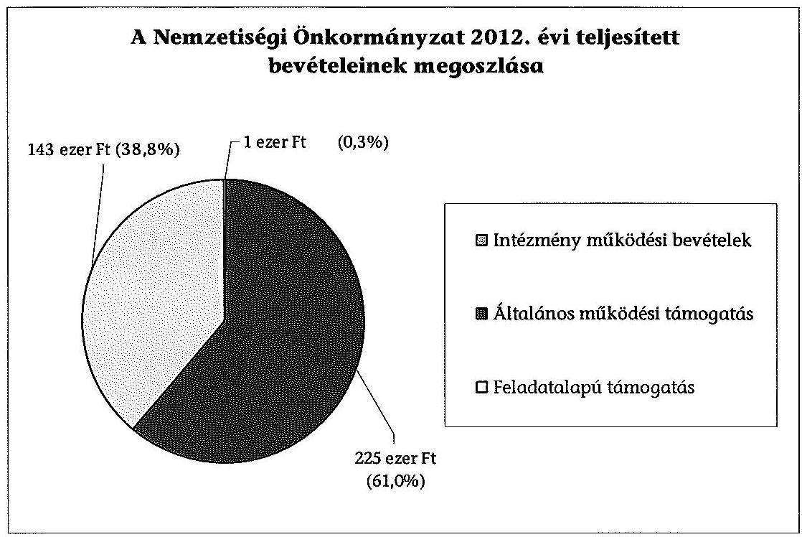
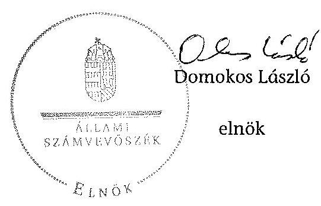

# ÁLLAMI   SZÁMVEVÔSZÉK 

## JELENTÉS

a helyi nemzetiségi önkormányzatok gazdálkodásának - 2013. évben induló - ellenőrzéséről Ragályi Roma Nemzetiségi Önkormányzat

---

# Állami Számvevőszék 

Iktatószám: V-0150-036/2013.
Témaszám: 1201
Vizsgálat-azonosító szám: V065205

## Az ellenőrzést felügyelte:

Horváth Balázs
felügyeleti vezető
Az ellenőrzést vezette és az ellenőrzés végrehajtásáért felelős:
Pats Regina
ellenőrzésvezető
A számvevőszéki jelentést készítették és a jelentés összeállításában
közremüködtek:
Dr. Fátrainé Zsebedics Katalin
számvevő tanácsos
Dr. Győri Gabriella Márta
számvevő
Az ellenőrzést végezték:
Kovács Richárd Nagy Erika
számvevő számvevő

---

# TARTALOMJEGYZÉK 

BEVEZETÉS ..... 3
I. ÖSSZEGZŐ MEGÁLLAPÍTÁSOK, KÖVETKEZTETÉSEK, JAVASLATOK ..... 6
II. RÉSZLETES MEGÁLLAPÍTÁSOK ..... 13

1. A Nemzetiségi Önkormányzat és a Települési Önkormányzat együttműködésének szabályozása, a működési feltételek biztosítása ..... 13
2. A gazdálkodási feladatok ellátásának szabályszerűsége ..... 14
2.1. A költségvetésre és zárszámadásra, valamint a kincstári adatszolgáltatás rendjére vonatkozó jogszabályi előírások betartása ..... 14
2.2. A Nemzetiségi Önkormányzat gazdálkodásának szabályozottsága ..... 15
2.3. Az operatív gazdálkodási jogkörök kialakítása, gyakorlása ..... 16
3. A Nemzetiségi Önkormányzattal kapcsolatos gazdálkodási feladatok belső ellenőrzése ..... 17
4. A feladatalapú támogatás felhasználásának, elszámolásának szabályszerűsége, a Nemzetiségi Önkormányzat feladatellátása ..... 18
MELLÉKLET
5. számú A Nemzetiségi Önkormányzat 2012. évi gazdálkodásának főbb adatai, mutatói
FÜGGELÉKEK
6. számú Rövidítések jegyzéke
7. számú Értelmező szótár
8. számú Minősítési szempontok

---

.

---

# JELENTÉS   a helyi nemzetiségi önkormányzatok gazdálkodásának - 2013. évben induló ellenőrzéséról   Ragályi Roma Nemzetiségi Önkormányzat 

## BEVEZETÉS

A Nemzetiségi Önkormányzat 1994. évben alakult, elnöke a 2010. évi helyhatósági választások óta látja el feladatát. A Nemzetiségi Önkormányzat intézményt, gazdasági társaságot és más szervezetet nem alapított, illetve ezek társulásában nem vett részt. A négytagú Képviselő-testület a munkája segítésére bizottságot nem hozott létre. A Nemzetiségi Önkormányzat költségvetési beszámolója szerint a 2012. évben a módosított költségvetési bevételi és kiadási előirányzat 419 ezer Ft, a teljesített költségvetési bevétel 369 ezer Ft, a teljesített költségvetési kiadás 361 ezer Ft volt. A 2012. évi gazdálkodási adatokat részletesen az 1. számú mellékletben mutatjuk be.

Az Alaptörvény XXIX. cikk (1) bekezdése szerint a Magyarországon élő nemzetiségek államalkotó tényezők. Minden, valamely nemzetiséghez tartozó magyar állampolgárnak joga van önazonossága szabad vállalásához és megőrzéséhez. A hazánkban élő nemzetiségek helyi (települési és területi), valamint országos önkormányzatokat hozhatnak létre ${ }^{1}$. A helyi nemzetiségi önkormányzatok gazdálkodási feladatait jogszabályi előírás alapján a székhely szerinti helyi önkormányzat polgármesteri hivatala látja el.

A nemzetiségek helyzete, támogatása mind hazai, mind EU-s szinten kiemelt figyelmet kap napjainkban. A helyi nemzetiségi önkormányzatok gazdálkodására és támogatási rendszerére vonatkozó jogszabályok a 2010-2012. években jelentős változásokon mentek át. A települési és területi nemzetiségi önkormányzatok gazdálkodásának, a részükre juttatott költségvetési támogatások felhasználásának ellenőrzését az ÁSZ a 2012. évben sorozatjellegű ellenőrzés keretében indította el. A 2013. évi ellenőrzések e témacsoportos ellenőrzések folytatását jelentik.

Az ellenőrzés célja annak értékelése volt, hogy a Nemzetiségi Önkormányzat gazdálkodási kereteinek kialakítása, gazdálkodása és feladatellátása megfelelt-e a hatályos jogszabályoknak.

[^0]
[^0]:    ${ }^{1}$ A 2010. évben megtartott nemzetiségi önkormányzati választásokat követően 2304 települési, 58 területi és 13 országos nemzetiségi önkormányzat alakult meg.

---

Ennek keretében értékeltük, hogy:

- a Nemzetiségi Önkormányzat és a Települési Önkormányzat együttmúködésének szabályozása, a múködési feltételek biztosítása megfelelte a jogszabályi előírásoknak;
- a felek együttműködése a gazdálkodási feladatok ellátása során megfelelt-e a közöttük létrejött megállapodásnak, betartották-e a nemzetiségi önkormányzat költségvetésére és zárszámadására, a gazdálkodás szabályozására, az operatív gazdálkodási jogkörök gyakorlására vonatkozó jogszabályi előírásokat;
- a jegyző biztosította-e a nemzetiségi önkormányzat gazdálkodásának belső ellenőrzését;
- a nemzetiségi önkormányzat feladatalapú támogatásának felhasználása, a folyósított feladatalapú támogatással történő elszámolás az előírásoknak megfelelő volt-e;
- a nemzetiségi önkormányzat feladatellátása összhangban volt-e a vonatkozó jogszabályi előírásokkal.

Az ellenőrzés várható hasznosulását négy szinten tervezzük. A törvényalkotás számára összegzett tapasztalatok állnak rendelkezésre a nemzetiségi önkormányzatok testületi döntéseinek, gazdálkodásának és a feladatalapú támogatás felhasználásának szabályszerűségéről, amelynek alapján következtetést lehet levonni arra, hogy indokolt-e jogszabályi módosítás kezdeményezése. Az ellenőrzés az ellenőrzött számára visszajelzést ad a működésében fellépő hiányosságokról, javaslataival hozzájárul azok kiküszöböléséhez, amely csökkentheti a későbbi ellenőrzések gyakoriságát. Az ellenőrzés megállapításai és javaslatai tanulságul szolgálhatnak más nemzetiségi önkormányzatok, szervezetek számára a rendezett gazdálkodási keretek kialakításához. A társadalom számára jelzi, hogy közpénz nem maradhat ellenőrizetlenül, az ÁSZ értékteremtő rend kialakításához és megőrzéséhez hozzájáruló tevékenysége pozitív hatással lesz a szervezetről kialakított összkép formálásában. Az ÁSZ szervezetén belül lehetőség nyílik arra, hogy a megállapítások szintetizálásával az intézmény a hozzáadott értéket teremtő elemző tevékenységét és tanácsadó szerepét erősítse.

A helyi nemzetiségi önkormányzatok gazdálkodásának ellenőrzéséről szóló jelentés I. fejezetének összegző része az ellenőrzés céljára adott rövid, szintetizáló összefoglalót és következtetéseket tartalmazza a II. fejezet részletes megállapításain alapulóan. A jelentés intézkedést igénylő megállapításait és javaslatait az összegzőben foglaltak mellett - az ellenőrzés során feltárt, a jelentés II. fejezetében rögzített részletes megállapítások alapozzák meg, illetve támasztják alá.

Az ellenőrzés típusa: szabályszerűségi ellenőrzés.
Az ellenőrzött időszak: 2012. január 1. - 2012. december 31. közötti időszak. Az ellenőrzés kiterjedt a helyi nemzetiségi önkormányzatnak juttatott 2012. évi támogatás 2013. évben való elszámolására is.

---

Ellenőrzött szervezet: a Ragályi Roma Nemzetiségi Önkormányzat és a gazdálkodási feladatait ellátó Ragály Község Önkormányzata.

Az ellenőrzés végrehajtásának jogszabályi alapját az ÁSZ tv. 5. § (2)-(3) és (6) bekezdéseiben foglaltak képezik.

Az ellenőrzés szakmai módszertana az ÁSZ hivatalos honlapján (www.asz.hu) közzétett szakmai szabályokon alapult, amely a Legfőbb Ellenőrző Intézmények Nemzetközi Szervezete (INTOSAI) által kiadott nemzetközi standardok (ISSAI) figyelembevételével készült.

A Nemzetiségi Önkormányzat gazdálkodásának ellenőrzése során értékeltük a Települési Önkormányzat és a Nemzetiségi Önkormányzat együttmúködésének, a gazdálkodás szabályozottságának és a pénzügyi folyamatokban kulcsszerepet betöltő belső kontrollok (teljesítés igazolás és érvényesítés) múködésének megfelelőségét. A kulcskontrollokat a múködési és felhalmozási célú támogatásértékű kiadásoknál, az államháztartáson kívülre teljesített múködési és felhalmozási célú pénzeszköz átadásoknál, a dologi kiadásokkal kapcsolatos kifizetéseknél - véletlen mintavételi eljárást alkalmazva - ellenőriztük.

Ellenőriztük, hogy a jegyző biztosította-e a Nemzetiségi Önkormányzat gazdálkodásának belső ellenőrzését. Értékeltük a feladatalapú támogatások felhasználásának, elszámolásának szabályszerűségét, a Nemzetiségi Önkormányzat feladatellátása és a jogszabályi előírások összhangját.

Az ellenőrzés lefolytatásához a Nemzetiségi Önkormányzat és a gazdálkodási feladatait ellátó Települési Önkormányzat tanúsítványok és a kapcsolódó dokumentumjegyzékben megjelölt dokumentumok elektronikus úton történő megküldésével, rendelkezésre bocsátásával szolgáltatott adatokat. Az adatszolgáltatás kontrollálása és szükség szerinti javítása a helyszíni ellenőrzés keretében történt. A minősítési szempontokat a 3. számú függelék tartalmazza.

Az ÁSZ tv. 29. § (1) bekezdése szerint a jelentéstervezetet megküldtük a polgármester és a Nemzetiségi Önkormányzat elnöke részére, akik az ÁSZ tv. 29. § (2) bekezdésében foglalt észrevételezési jogukkal nem éltek, a jelentéstervezetre észrevételt nem tettek.

---

# I. ÖSSZEGZŐ MEGÁLLAPÍTÁSOK, KÖVETKEZTETÉSEK, JAVASLATOK 

A Nemzetiségi Önkormányzat és a Települési Önkormányzat együttmúködésének szabályozása, a Nemzetiségi Önkormányzat múködési feltételeinek biztosítása összességében megfelelt a jogszabályi előírásoknak. A Nemzetiségi Önkormányzat és a Települési Önkormányzat az együttmúködésre vonatkozó, annak részletes szabályait tartalmazó együttmúködési megállapodást - a Kormányhivatal törvényességi felhívását követően - 2012. október 16-án kötötte meg. Az együttmúködés szabályozása azonban az Áht. ${ }_{2}$-ben és a Nek. ${ }_{2}$ tv-ben meghatározott tartalmi elemek tekintetében hiányos volt. A 2012. december 31-én hatályos együttműködési megállapodás nem tartalmazta a Nemzetiségi Önkormányzat múködésével, gazdálkodásával kapcsolatos iratkezelési feladatok ellátását, a Nemzetiségi Önkormányzat önálló fizetési számla nyitásával, törzskönyvi nyilvántartásba vételével és adószám igénylésével kapcsolatos határidőket. Az együttműködési megállapodásban foglaltak nem voltak összhangban a Nemzetiségi Önkormányzat SZMSZ-ében előírt kötelezettségvállalási és utalványozási szabályokkal. A szabályozási hiányosságok ellenére a Települési Önkormányzat biztosította a Nemzetiségi Önkormányzat múködéséhez szükséges személyi és tárgyi feltételeket.

A Nemzetiségi Önkormányzat a költségvetésére és zárszámadására vonatkozó jogszabályi előírásoknak részben felelt meg. A költségvetési határozat az Áht. ${ }_{2}$-ben foglaltak ellenére nem tartalmazta a Nemzetiségi Önkormányzat költségvetési bevételeit és költségvetési kiadásait előirányzat-csoportok, kiemelt előirányzatok szerinti bontásban, a költségvetés végrehajtásával, a finanszírozási célú pénzügyi műveletekkel kapcsolatos hatásköröket. A 2012. évi költségvetési és a 2012. évi zárszámadási határozat tervezetének előterjesztésekor a Képviselő-testület részére - tájékoztatás céljából, szöveges indoklással együtt nem mutatták be az előírt mérlegeket és kimutatásokat, továbbá a 2012. évi zárszámadási határozat tervezetének előterjesztésekor a Képviselő-testület részére tájékoztatásul nem mutatták be a pénzeszközök változását. A 2012. évi zárszámadásról alkotott határozatnál az Áht. ${ }_{2}$ ben foglaltaknak megfelelően biztosított volt az elfogadott költségvetéssel történő összehasonlíthatóság, a Nemzetiségi Önkormányzat valamennyi bevételéről és kiadásáról elszámolt. A jegyző a Nemzetiségi Önkormányzat gazdálkodására vonatkozó kincstári adatszolgáltatási kötelezettségének határidőben eleget tett.

A gazdálkodás szabályozottsága nem volt megfelelő. A Számv. tv-ben és az Áhsz-ben előírt szabályzatok - a Települési Önkormányzat számviteli politikájának és számlarendjének, leltározási és leltárkészítési szabályzatának, eszközök és források értékelési szabályzatának, valamint pénzkezelési szabályzatának - hatálya kiterjedt a Nemzetiségi Önkormányzat gazdálkodási feladataira. A Polgármesteri Hivatal SZMSZ-e az Ávr-ben foglaltak ellenére nem tartalmazta a Nemzetiségi Önkormányzat gazdálkodási feladataival kapcsolatos, a munkakörökhöz tartozó feladat- és hatásköröket, a hatáskörök gyakorlásának módját, a helyettesítés rendjét és az ezekhez tartozó felelősségi szabályokra vonatkozó rendelkezéseket. A gazdálkodási feladatok végrehajtását ellátó Pol-

---

gármesteri Hivatal a Bkr-ben előírt ellenőrzési nyomvonalat, a szabálytalanságok kezelésének eljárásrendjét, a kockázatkezelési szabályzatot és a folyamatba épített előzetes, utólagos és vezetői ellenőrzés rendjére vonatkozó szabályozás hatályát a Nemzetiségi Önkormányzat gazdálkodási feladataira nem terjesztette ki. Ezekkel a szabályzatokkal a Nemzetiségi Önkormányzat önállóan sem rendelkezett.

A Nemzetiségi Önkormányzatnál az operatív gazdálkodási jogkörök kialakítása nem felelt meg a jogszabályi előírásoknak. A Nemzetiségi Önkormányzat elnöke az Áht. ${ }_{2}$-ben és az Ávr-ben foglaltak alapján a kötelezettségvállalás és az utalványozás gyakorlására más képviselőt írásban nem hatalmazott fel, emiatt az Ávr-ben előírt összeférhetetlenségi követelmények érvényesülése nem volt biztosított. A jegyző nem jelölt ki írásban a Polgármesteri Hivatal állományába tartozó, előírt végzettséggel rendelkező köztisztviselőt a pénzügyi ellenjegyzés gyakorlására és az érvényesítési feladatok ellátására. A Nemzetiségi Önkormányzat elnöke az Áht. ${ }_{2}$ és az Ávr. előirása ellenére a teljesítést igazoló személyeket nem jelölte ki. A Nemzetiségi Önkormányzatnál a 2012. évben a dologi kiadások teljesítése során a teljesítés igazolás és az érvényesítés kulcsszerepet betöltő kontrollok müködésének megfelelősége gyenge volt, a hibák száma a lényegességi szintet, a kritikus hibahatárt elérte. Az Ávr-ben foglaltak ellenére a teljesítés igazoló személy írásos kijelölése nem történt meg, a kiadások teljesítése jogosságának, összegszerűségének, az ellenszolgáltatás teljesítésének ellenőrzése sem történt meg. A bizonylatokon az Ávrben foglaltak ellenére nem szerepelt az érvényesítés időpontja, így nem volt igazolt, hogy az összegszerűség, a fedezet meglétének, a formai és főkönyvi számla kijelölési szabályok, valamint az egyéb jogszabályba és belső utasításba foglalt előírások betartásának ellenőrzése a kifizetéseket megelőzően történt meg. Működési és felhalmozási célú támogatásértékű kiadás, valamint múködési és felhalmozási célú pénzeszközátadás államháztartáson kívülre nem történt.

A jegyző nem biztosította a Nemzetiségi Önkormányzat gazdálkodásával összefüggő végrehajtási feladatok belső ellenőrzését. A Polgármesteri Hivatal 2012. évi belső ellenőrzési tervét megalapozó kockázatelemzés - a Ber. előirása ellenére - nem terjedt ki a Nemzetiségi Önkormányzat gazdálkodásával összefüggő végrehajtási feladatokra, és azok tekintetében belső ellenőrzési feladatot a 2012. évben nem terveztek és nem végeztek. A 2012. évre vonatkozó belső ellenőrzési terv elkészítésének idején a Települési Önkormányzat és a Nemzetiségi Önkormányzat között nem volt együttmúködési megállapodás, így a Nemzetiségi Önkormányzatot érintő belső ellenőrzési feladatok együttműködési megállapodásban nem kerülhettek rögzítésre.

A Nemzetiségi Önkormányzat a 2012. évben a bevételei 38,8\%-át kitevő, 143 ezer Ft összegű feladatalapú támogatásban részesült, melyet 2012. december 31-éig a támogatási kormányrendelet ${ }_{2}$-ben meghatározott célokra nem használt fel és azt a támogatási kormányrendelet ${ }_{2}$ előírása szerint a tárgyévben kötelezettségvállalással nem terhelte. A Nemzetiségi Önkormányzat nem tett eleget az Áht. ${ }_{2}$-ben előírtaknak azáltal, hogy a fel nem használt és kötelezettségvállalással nem terhelt 143 ezer Ft összegű támogatásról haladéktalanul nem mondott le és nem fizette vissza azt a központi költségvetés javára. A támogatási kormányrendelet ${ }_{2}$-ben előírt elszámolás nem történt meg, a támoga-

---

tás felhasználását, elszámolását az ellenőrzésre jogosult szervek nem ellenőrizték. A Nemzetiségi Önkormányzat feladatellátásának tárgya összhangban volt a Nek. 2 tv. előírásaival. Megállapodások alapján a képviselt közösség érdekképviseletével, esélyegyenlőségének megteremtésével kapcsolatosan, valamint a társadalmi felzárkóztatás elősegítése érdekében láttak el feladatokat.

Az ÁSZ tv. 33. § (1) bekezdésében foglaltak értelmében az ellenőrzött szervezet vezetője köteles a jelentésben foglalt megállapításokhoz kapcsolódó intézkedési tervet összeállítani, és azt a jelentés kézhezvételétől számított 30 napon belül az ÁSZ részére megküldeni. Amennyiben az intézkedési tervet határidőre nem küldi meg a szervezet, vagy az nem elfogadható, az ÁSZ elnöke az ÁSZ tv. 33. § (3) bekezdés a)-b) pontjaiban foglaltakat érvényesítheti.

A helyszíni ellenőrzés megállapításainak hasznosítása mellett javasoljuk:

# a jegyzönek 

1. az együttműködés szabályozásával kapcsolatban

A 2012. december 31-én hatályos együttműködési megállapodás nem tartalmazta a Nemzetiségi Önkormányzat müködésével, gazdálkodásával kapcsolatos iratkezelési feladatok ellátását a Nek. 2 tv. 80. § (1) bekezdés e) pontjában foglaltaknak megfelelően, a Nek. 2 tv. 80. § (3) bekezdés a) pontjában foglaltak alapján a Nemzetiségi Önkormányzat önálló fizetési számla nyitásával, törzskönyvi nyilvántartásba vételével és adószám igénylésével kapcsolatos határidőket. A Nek. 2 tv. 80. § (3) bekezdés c) pontjában foglaltak nem teljesültek, mert az együttműködési megállapodásban foglaltak nem voltak összhangban a Nemzetiségi Önkormányzat SZMSZ-ének 4. számú mellékletében előírt kötelezettségvállalási és utalványozási szabályokkal.

A Nek. 2 tv. 80. § (2) bekezdésében foglaltak ellenére nem rögzítették a megállapodás szerinti müködési feltételeket az együttműködési megállapodás megkötését követő 30 napon belül a Nemzetiségi Önkormányzat SZMSZ-ében.

Javaslat
Az együttműködés szabályszerűsége érdekében készítse elő
a) az együttműködési megállapodás módosítását, hogy az tartalmilag feleljen meg a Nek. 2 tv. 80. § (1) bekezdés e) pontjában és a 80. § (3) bekezdés a), c) pontjaiban foglalt előírásoknak;
b) a Nemzetiségi Önkormányzat SZMSZ-ének kiegészítését a Nek. 2 tv. 80. § (2) bekezdésében foglalt előírás alapján.
2. a költségvetési, zárszámadási határozattal kapcsolatban

A 2012. évi költségvetés előterjesztésekor a Képviselő-testület részére - tájékoztatás céljából, szöveges indokolással együtt - az Áht. 2 24. § (4) bekezdése szerinti előírás ellenére nem mutatták be az előírt mérlegeket és kimutatásokat.

---

A jóváhagyott költségvetés nem tartalmazta a Nemzetiségi Önkormányzat költségvetési bevételeit és költségvetési kiadásait előirányzat-csoportok, kiemelt előirányzatok szerinti bontásban az Áht. 2 23. § (2) bekezdés a) pontjában előírtak szerint, a költségvetés végrehajtásával kapcsolatos hatásköröket, a finanszírozási célú pénzügyi műveletekkel kapcsolatos hatásköröket az Áht. 2 23. § (2) bekezdés h) pontjában foglaltak alapján.

A 2012. évi zárszámadási határozat tervezetének előterjesztésénél a Képviselőtestület részére tájékoztatásul nem mutatták be az Áht. 2 91. § (2)-(3) bekezdésében foglalt mérlegeket és kimutatásokat, a pénzeszközök változását.

Javaslat
A szabályszerű előterjesztés érdekében gondoskodjon a jövőben arról, hogy a költségvetési határozat az Áht. 2 23. § (2) bekezdés a), h) pontjának, az Áht. 2 24. § (4) bekezdésének, a zárszámadási határozat az Áht. 2 91. § (2)-(3) bekezdéseiben előírtaknak tartalmilag feleljen meg.
3. a gazdálkodási feladatok szabályozottságával kapcsolatban

A Polgármesteri Hivatal SZMSZ-e az Ávr. 13. § (1) bekezdés g) pontjában foglaltak ellenére nem tartalmazta a Nemzetiségi Önkormányzat gazdálkodásával kapcsolatos, a munkakörökhöz tartozó feladat- és hatásköröket, a hatáskörök gyakorlásának módját, a helyettesítés rendjét és az ezekhez tartozó felelősségi szabályokra vonatkozó rendelkezéseket.

A gazdálkodási feladatok végrehajtását ellátó Polgármesteri Hivatal a Bkr. 6. § (3) bekezdésében előírt ellenőrzési nyomvonal, a Bkr. 6. § (4) bekezdésében meghatározott szabálytalanságok kezelésének eljárásrendje, a Bkr. 7. § szerinti kockázatkezelési rendszer és a Bkr. 8. § (2)-(4) bekezdése szerint a folyamatba épített előzetes, utólagos és vezetői ellenőrzés rendjére vonatkozó szabályozás hatályát a Nemzetiségi Önkormányzat gazdálkodási feladataira nem terjesztette ki és ezekkel a szabályzatokkal a Nemzetiségi Önkormányzat önállóan sem rendelkezett.

Javaslat
A gazdálkodás szabályszerűsége érdekében:
a) készítse elő a Polgármesteri Hivatal SZMSZ-ének módosítását, hogy az feleljen meg az Ávr. 13. § (1) bekezdés g) pontjában foglalt előírásnak;
b) terjessze ki - az Ávr. 13. § (3a) bekezdése alapján - a Polgármesteri Hivatal ellenőrzési nyomvonalának, a szabálytalanságok kezelése eljárásrendjének a Bkr. 6. § (3)-(4) bekezdései, a kockázatkezelési rendszer Bkr. 7. § szerinti és a Bkr. 8. § (2)(4) bekezdése szerinti folyamatba épített előzetes, utólagos és vezetői ellenőrzés szabályzatának hatályát a Nemzetiségi Önkormányzat gazdálkodási feladataira.
4. a pénzügyi kontrollok müködésével kapcsolatban

A gazdasági szervezettel nem rendelkező Polgármesteri Hivatalnál a jegyző az Ávr. szerinti jogkörében eljárva nem jelölte ki írásban a Polgármesteri Hivatal állományába tartozó, előírt végzettséggel rendelkező köztisztviselőt a pénzügyi ellenjegyzés

---

gyakorlására az Ávr. 55. § (2) bekezdés g) pontja, az érvényesítési feladatok ellátására az Ávr. 58. § (4) bekezdése alapján.

Javaslat
Írásbeli felhatalmazással jelölje ki az Ávr. 55. § (2) bekezdés g) pontjában előírtaknak megfelelően a pénzügyi ellenjegyzőt, illetve az Ávr. 58. § (4) bekezdésének megfelelően az érvényesítői feladatokat ellátót.
5. a feladatalapú támogatás elszámolásával kapcsolatban

A támogatás elszámolása a támogatási kormányrendelet ${ }_{2}$ 8. § (5) bekezdésében hivatkozott „a helyi önkormányzatok elszámolási és ellenőrzési rendjére vonatkozó jogszabályok rendelkezései alkalmazandóak" előirása ellenére nem történt meg.

Javaslat
Gondoskodjon az Áht. ${ }_{2}$ 27. § (2) bekezdésben meghatározott feladatkörében a Nemzetiségi Önkormányzat által igénybe vett feladatalapú támogatás elszámolásának elkészítéséről, figyelemmel az Áht. ${ }_{2}$ 57. § (4) bekezdésben foglaltakra.

# a polgármesternek 

A 2012. december 31-én hatályos együttmúködési megállapodás nem tartalmazta a Nemzetiségi Önkormányzat müködésével, gazdálkodásával kapcsolatos iratkezelési feladatok ellátását a Nek. ${ }_{2}$ tv. 80. § (1) bekezdés e) pontjában foglaltaknak megfelelően, a Nek. ${ }_{2}$ tv. 80. § (3) bekezdés a) pontjában foglaltak alapján a Nemzetiségi Önkormányzat önálló fizetési számla nyitásával, törzskönyvi nyilvántartásba vételével és adószám igénylésével kapcsolatos határidőket. A Nek. ${ }_{2}$ tv. 80. § (3) bekezdés c) pontjában foglaltak nem teljesültek, mert az együttmüködési megállapodásban foglaltak nem voltak összhangban a Nemzetiségi Önkormányzat SZMSZ-ének 4. számú mellékletében előírt kötelezettségvállalási és utalványozási szabályokkal.

A Polgármesteri Hivatal SZMSZ-e az Ávr. 13. § (1) bekezdés g) pontjában foglaltak ellenére nem tartalmazta a Nemzetiségi Önkormányzat gazdálkodásával kapcsolatos, a munkakörökhöz tartozó feladat- és hatásköröket, a hatáskörök gyakorlásának módját, a helyettesítés rendjét és az ezekhez tartozó felelősségi szabályokra vonatkozó rendelkezéseket.

Javaslat
Terjessze a Települési Önkormányzat Képviselő-testülete elé jóváhagyásra
a) a Nek. ${ }_{2}$ tv. 80. § (1) bekezdés e) pontjában, 80. § (3) bekezdése a) és c) pontjaiban foglalt előírások betartásával előkészített együttműködési megállapodás módosítást;
b) az Ávr. 13. § (1) bekezdés g) pontjában foglalt szabályozásra figyelemmel a jegyző által előkészített Polgármesteri Hivatal SZMSZ-ének módosítását.

---

# a Nemzetiségi Önkormányzat elnökének 

1. A 2012. december 31-én hatályos együttműködési megállapodás nem tartalmazta a Nemzetiségi Önkormányzat müködésével, gazdálkodásával kapcsolatos iratkezelési feladatok ellátását a Nek. 2 tv. 80. § (1) bekezdés e) pontjában foglaltaknak megfelelően, a Nek. 2 tv. 80. § (3) bekezdés a) pontjában foglaltak alapján a Nemzetiségi Önkormányzat önálló fizetési számla nyitásával, törzskönyvi nyilvántartásba vételével és adószám igénylésével kapcsolatos határidőket. A Nek. 2 tv. 80. § (3) bekezdés c) pontjában foglaltak nem teljesültek, mert az együttmüködési megállapodásban foglaltak nem voltak összhangban a Nemzetiségi Önkormányzat SZMSZ-ének 4. számú mellékletében előírt kötelezettségvállalási és utalványozási szabályokkal.

Javaslat
Terjessze a Települési Önkormányzat Képviselő-testülete elé jóváhagyásra a Nek. 2 tv. 80. § (1) bekezdés e) pontjában, 80. § (3) bekezdése a) és c) pontjaiban foglalt előírások betartásával előkészített együttmüködési megállapodás módosítást.
2. A Nek. 2 tv. 80. § (2) bekezdésében foglaltak ellenére nem rögzítették a megállapodás szerinti müködési feltételeket az együttmüködési megállapodás megkötését követő 30 napon belül a Nemzetiségi Önkormányzat SZMSZ-ében.

Javaslat
Terjessze a Képviselő-testület elé jóváhagyásra - a Nek. 2 tv. 80. § (2) bekezdésében foglalt előírások betartásával előkészített - a Nemzetiségi Önkormányzat SZMSZ-e módosítását.
3. A Nemzetiségi Önkormányzat elnöke az Ávr. 57. § (4) bekezdése alapján a teljesítést igazoló személyeket nem jelölte ki. A Nemzetiségi Önkormányzat elnöke az Ávr. 52. § (7) bekezdése alapján a kötelezettségvállalás és az Ávr. 59. (1) bekezdése alapján az utalványozás gyakorlására más képviselőt írásban nem hatalmazott fel, emiatt az Ávr. 60. § (2) bekezdésében előírt összeférhetetlenségi követelmények érvényesülése nem volt biztosított.

Javaslat
Írásban jelöljön ki teljesítést igazoló személyt az Ávr. 57. § (4) bekezdés előirrása alapján, valamint - az Ávr. 60. § (2) bekezdésében foglalt összeférhetetlenség fennállása esetén - további kötelezettségvállaló, utalványozó személyt az Ávr. 52. § (7) bekezdés és az Ávr. 59. § (1) bekezdés előírásai alapján.
4. A 2012. évi feladatalapú támogatás elszámolása a támogatási kormányrendelet ${ }_{2}$ 8. § (5) bekezdésében hivatkozott „a helyi önkormányzatok elszámolási és ellenőrzési rendjére vonatkozó jogszabályok rendelkezései alkalmazandóak" előirrása ellenére nem történt meg.

Javaslat
Terjessze a Képviselő-testület elé jóváhagyásra az Áht. 2 57. § (4) bekezdés alapján készített elszámolást a Nemzetiségi Önkormányzat által igénybe vett feladatalapú támogatásról.

---

5. A Nemzetiségi Önkormányzat a 2012. évben folyósított - 143 ezer Ft összegű - feladatalapú támogatást 2012. december 31-ig a támogatási kormányrendelet ${ }_{2}$-ben meghatározott célokra nem használta fel, a támogatási kormányrendelet ${ }_{2} 7$. §-a szerint a tárgyévben kötelezettségvállalással nem terhelte.

Javaslat
Terjessze a Képviselő-testület elé jóváhagyásra az Áht. ${ }_{2}$ 57/A. § (1) bekezdés előírásának megfelelően a 2012. évi feladatalapú támogatás kötelezettségvállalással nem terhelt maradványáról történő lemondást és intézkedjen a maradvány összegének visszafizetéséről a központi költségvetés javára.

---

# II. RÉSZLETES MEGÁLLAPÍTÁSOK 

## 1. A Nemzetiségi Önkormányzat és a Telepúlési Önkormányzat EGYÜTTMÜKÖDÉSÉNEK SZABÁLYOZÁSA, A MÜKÖDÉSI FELTÉTELEK BIZTOSÍTÁSA

A Nemzetiségi Önkormányzat és a Települési Önkormányzat együttmüködésének szabályozása, a Nemzetiségi Önkormányzat müködési feltételeinek biztosítása megfelelt a jogszabályi előírásoknak.

A Nemzetiségi Önkormányzat a 2012. évben nem rendelkezett a teljes évre nézve a Települési Önkormányzattal kötött együttműködési megállapodással. A Nemzetiségi Önkormányzat és a Települési Önkormányzat az együttműködésükre vonatkozó, annak részletes szabályait tartalmazó Együttműködési megállapodást - a Kormányhivatal törvényességi felhívását ${ }^{2}$ követően - 2012. augusztus 28 -ai hatállyal kötötte meg. A Kormányhivatal a törvényességi felhívásban rögzítette, hogy „az együttmüködési megállapodás érvényességéhez mindkét Képviselő-testület jóváhagyása szükséges. A Nemzetiségi Önkormányzat Képviselötestülete, miután a jogszabályban elöirt kötelezettségének nem tett eleget, ez mulasztásban megnyilvánuló törvénysértést eredményezett". A törvénysértést a Nemzetiségi Önkormányzat 2012. október 15 -én, az együttműködési megállapodás aláírásával szüntette meg.

Az együttműködési megállapodást a Nemzetiségi Önkormányzat és a Települési Önkormányzat 2012. augusztus 30 -án együttes ülésen tárgyalta. A Települési Önkormányzat Képviselő-testülete elfogadta a megállapodást, a Nemzetiségi Önkormányzat Képviselő-testülete a 44/2012. (VIII. 30.) számú határozatával annak elutasításáról döntött. Az együttmüködési megállapodást - a Kormányhivatal törvényességi felhívását követően - a Nemzetiségi Önkormányzat Képvise-lö-testülete a 12/2012. (X. 15.) számú határozatával fogadta el.

Az együttmüködés szabályozása az Áht ${ }_{2}$-ben és a Nek. ${ }_{2}$ tv-ben meghatározott tartalmi elemek tekintetében hiányos volt, mert a 2012. december 31-én hatályos együttműködési megállapodás:

- nem tartalmazta a Nemzetiségi Önkormányzat müködésével, gazdálkodásával kapcsolatos iratkezelési feladatok ellátását a Nek. ${ }_{2}$ tv. 80. § (1) bekezdés e) pontjában foglaltaknak megfelelően;
- nem tartalmazta a Nek. ${ }_{2}$ tv. 80. § (3) bekezdés a) pontjában foglaltak alapján a Nemzetiségi Önkormányzat önálló fizetési számla nyitásával, törzskönyvi nyilvántartásba vételével és adószám igénylésével kapcsolatos határidőket;

[^0]
[^0]:    ${ }^{2}$ A Kormányhivatal IV.-B-09/121-88/2012. számú levele, kelt. 2012. szeptember 12-én.

---

- nem volt összhangban a Nemzetiségi Önkormányzat SZMSZ-ének 4. számú mellékletében előírt kötelezettségvállalási és utalványozási szabályokkal, ezáltal a Nek. ${ }_{2}$ tv. 80. § (3) bekezdés c) pontjában foglaltak nem teljesültek.

A Nek. ${ }_{2}$ tv. 80. § (2) bekezdésében foglaltak ellenére nem rögzítették a megállapodás szerinti múködési feltételeket az együttmúködési megállapodás megkötését követő harminc napon belül a Nemzetiségi Önkormányzat SZMSZ-ében.

A Települési Önkormányzat biztosította a Nemzetiségi Önkormányzat múködéséhez szükséges személyi és tárgyi feltételeket.

# 2. A GAZDÁLKODÁSI FELADATOK ELLÁTÁSÁNAK SZABÁLYSZERŰSÉGE 

### 2.1. A költségvetésre és zárszámadásra, valamint a kincstári adatszolgáltatás rendjére vonatkozó jogszabályi előírások betartása

A Nemzetiségi Önkormányzat 2012. évi költségvetésének ${ }^{3}$ tartalma, jóváhagyása, valamint a kapcsolódó 2012. évi adatszolgáltatás szabályszerúsége részben felelt meg a jogszabályi előírásoknak. A Nemzetiségi Önkormányzat elnöke a 2012. évi költségvetés tervezetét ${ }^{4}$ az előírtaknak megfelelően határidőben, 2012. január 30-án benyújtotta a Képviselő-testületnek, azonban a jóváhagyott költségvetés:

- nem tartalmazta a Nemzetiségi Önkormányzat költségvetési bevételeit és költségvetési kiadásait előirányzat-csoportok, kiemelt előirányzatok szerinti bontásban az Áht. ${ }_{2}$ 23. § (2) bekezdés a) pontjában előírtak szerint;
- részben tartalmazta a Nemzetiségi Önkormányzat bevételeit az Ávr. 24. § (1) bekezdés a) pontjának megfelelően, mivel az előző évi pénzmaradvány a bevételi főösszegben szerepelt ugyan, de nem nevesítve;
- nem tartalmazta a költségvetés végrehajtásával, valamint a finanszírozási célú pénzügyi műveletekkel kapcsolatos hatásköröket az Áht. ${ }_{2}$ 23. § (2) bekezdés h) pontjában foglaltak alapján.

A 2012. évi költségvetés előterjesztésekor a Képviselő-testület részére - tájékoztatás céljából, szöveges indoklással együtt - az Áht. ${ }_{2} 24 . \S$ (4) bekezdése szerinti előírás ellenére nem mutatták be az előírt mérlegeket és kimutatásokat.

A Kormányhivatal 2012. május 24-én törvényességi felhívással élt a Képviselőtestület 4/2012. (III. 2.) számú határozatával elfogadott költségvetésével kapcsolatban. A törvényességi felhívásban rögzítették, hogy a jegyző pénzügyi ellenjegyzésre nem jogosult, továbbá a Nemzetiségi Önkormányzat által 60 ezer Ft összegben a családok részére történő füzetcsomag és 100 ezer Ft öszszegben élelmiszercsomag vásárlására tervezett kiadások nem minősülnek ki-

[^0]
[^0]:    ${ }^{3}$ A Képviselő-testület a Nemzetiségi Önkormányzat 2012. évi költségvetését a 4/2012. (III. 2.) számú határozatával fogadta el.
    ${ }^{4}$ A Képviselő-testület 2012. január 30-i ülésének jegyzőkönyve.

---

sebbségi közügynek, ezért állami támogatás azokra jogszerűen nem használható fel. A felhívásnak megfelelően a Képviselő-testület 2012. június 28 -án módosította a 2012. évi költségvetését ${ }^{5}$.

A Képviselő-testület a 2012. évi zárszámadási határozat-tervezetet az előírt határidőben jóváhagyta ${ }^{6}$, azonban a jóváhagyott határozat csak részben felelt meg a jogszabályi előírásoknak, mivel a 2012. évi zárszámadási határozat tervezetének előterjesztésénél a Képviselő-testület részére tájékoztatásul nem mutatták be az Áht. ${ }_{2}$ 91. § (2)-(3) bekezdésében foglalt mérlegeket és kimutatásokat, a pénzeszközök változását.

A jegyző a Nemzetiségi Önkormányzat ${ }^{7}$ elemi költségvetésére, negyedéves és éves időközi költségvetési jelentéseire, időközi mérlegjelentésekre, féléves és éves elemi költségvetési beszámolóra vonatkozó kincstári adatszolgáltatási kötelezettségének határidőben eleget tett.

# 2.2. A Nemzetiségi Önkormányzat gazdálkodásának szabályozottsága 

A Nemzetiségi Önkormányzat gazdálkodásának szabályozottsága öszszességében nem volt megfelelő.

A Számv. tv-ben és az Áhsz-ben előírt szabályzatok - a Települési Önkormányzat számviteli politikájának és számlarendjének, leltározási és leltárkészítési szabályzatának, eszközök és források értékelési szabályzatának valamint pénzkezelési szabályzatának - hatálya kiterjedt a Nemzetiségi Önkormányzat gazdálkodási feladataira. Az Áht. ${ }_{2} 10 . \S$ (5) bekezdésében és az Ávr. 13. § (2) bekezdés a) pontjában előírt, a Nemzetiségi Önkormányzatot érintő tervezéssel, gazdálkodással - így különösen a kötelezettségvállalással, pénzügyi ellenjegyzéssel, teljesítésigazolással, az érvényesítés, utalványozás gyakorlásának módjával - kapcsolatos feladatokat, az eljárási és dokumentálási részletszabályokat, valamint az ezeket végző személyek kijelölésének rendjét, az ellenőrzési és

[^0]
[^0]:    ${ }^{5}$ A költségvetési határozatot a Képviselő-testület a 9/2012. (VI. 28.) számú határozatával módosította.
    ${ }^{6}$ A Képviselő-testület 6/2013. (IV. 20.) számú határozata a 2012. évi költségvetési beszámoló elfogadásáról.
    ${ }^{7}$ Az Áhsz. hatálya - az 1. § d) pontja alapján - 2012. január 1-jétől kiterjed a helyi nemzetiségi önkormányzatokra. A helyi nemzetiségi önkormányzatok - mint az államháztartás szervezetei - 2012. január 1-jétől a gazdálkodásuk végrehajtását ellátó, székhelyük szerinti helyi önkormányzattól elkülönült könyvvezetésre, beszámolásra kötelezettek. A nemzetiségi önkormányzatok székhelye szerinti helyi önkormányzat hivatala a nemzetiségi önkormányzat elemi költségvetéséről az Ávr. 33. § (1)-(2) bekezdései, az I-II-III. negyedévi időközi költségvetési jelentésekről és mérlegjelentésekről az Ávr. 169. § (2) és 170. § (5) bekezdései, a féléves elemi költségvetési beszámolójáról az Áhsz. 10. § (1) és (5a) bekezdései szerint a Kincstár területileg illetékes szervének adatot szolgáltat.

---

adatszolgáltatási feladatok teljesítésével kapcsolatos előírásokat, feltételeket tartalmazó belső szabályzatok ${ }^{8}$ rendelkezésre álltak.

A Polgármesteri Hivatal SZMSZ-e az Ávr. 13. § (1) bekezdés g) pontjában foglaltak ellenére nem tartalmazta a Nemzetiségi Önkormányzat gazdálkodásával kapcsolatos, a munkakörökhöz tartozó feladat- és hatásköröket, a hatáskörök gyakorlásának módját, a helyettesítés rendjét és az ezekhez tartozó felelősségi szabályokra vonatkozó rendelkezéseket.

A gazdálkodási feladatok végrehajtását ellátó Polgármesteri Hivatal a Bkr. 6. § (3) bekezdésében előírt ellenőrzési nyomvonal, a Bkr. 6. § (4) bekezdésében meghatározott szabálytalanságok kezelésének eljárásrendje, a Bkr. 7. § szerinti kockázatkezelési rendszer és a Bkr. 8. § (2)-(4) bekezdései szerint folyamatba épített előzetes, utólagos és vezetői ellenőrzés rendjére vonatkozó szabályozás hatályát a Nemzetiségi Önkormányzat gazdálkodási feladataira nem terjesztette ki és ezekkel a szabályzatokkal a Nemzetiségi Önkormányzat önállóan sem rendelkezett.

# 2.3. Az operatív gazdálkodási jogkörök kialakítása, gyakorlása 

A Nemzetiségi Önkormányzat gazdálkodása tekintetében az operatív gazdálkodási jogkörök kialakítása nem felelt meg a jogszabályi előírásoknak, mivel:

- a Nemzetiségi Önkormányzat elnöke az Ávr. 52. § (7) bekezdése alapján a kötelezettségvállalás és az Ávr. 59. § (1) bekezdése alapján az utalványozás gyakorlására más képviselőt írásban nem hatalmazott fel, emiatt az Ávr. 60. § (2) bekezdésében foglalt összeférhetetlenségi követelmények érvényesülése nem volt biztosított;
- a gazdasági szervezettel nem rendelkező Polgármesteri Hivatalnál a jegyző az Ávr. ${ }^{9}$ szerinti jogkörében eljárva nem jelölt ki írásban a Polgármesteri Hivatal állományába tartozó, előírt végzettséggel rendelkező köztisztviselőt a pénzügyi ellenjegyzés gyakorlására az Ávr. 55. § (2) bekezdés g) pontja alapján, valamint az érvényesítési feladatok ellátására az Ávr. 58. § (4) bekezdése alapján;
- a Nemzetiségi Önkormányzat elnöke az Ávr. 57. § (4) bekezdése alapján a teljesítést igazoló személyeket nem jelölte ki.

A Települési Önkormányzatnál a 2012. évben a 2005. év január 1-jétől hatályos Kötelezettségvállalás, utalványozás, ellenjegyzés, érvényesítés rendjének szabályzata hatályban volt, mely az együttmúködési megállapodás alapján ki-

[^0]
[^0]:    ${ }^{8}$ Nemzetiségi Önkormányzat SZMSZ-ének 4-es számú melléklete; Együttmüködési megállapodás 6. pontja; Kötelezettségvállalás, utalványozás, ellenjegyzés, érvényesítés rendjének szabályzata.
    ${ }^{9}$ Az Ávr. 10. § (7) bekezdés és a 11. § (3-4) bekezdése, hatályos 2012. március 30 -áig. Az Ávr. 55. § (2) bekezdés g) pontja szerint, hatályos 2012. március 31-étől.

---

terjedt a Nemzetiségi Önkormányzatra. Emellett az együttmúködési megállapodás 6. pontja és a Nemzetiségi Önkormányzat SZMSZ-ének melléklete is tartalmazott szabályozást. Az Ávr. 60. § (3) bekezdésében foglaltakat azonban nem tartották be, a kötelezettségvállalásra, pénzügyi ellenjegyzésre, teljesítés igazolására, érvényesítésre, utalványozásra jogosult személyekről és aláírás mintájukról naprakész nyilvántartást ${ }^{10}$ nem vezettek.

A Nemzetiségi Önkormányzatnál a 2012. évben a dologi kiadások teljesítése során a teljesítés igazolás és az érvényesítés kulcskontrollok múködésének megfelelősége gyenge volt, a hibák száma a lényegességi szintet, a kritikus hibahatárt elérte, mivel:

- a teljesítés igazoló személy írásos kijelölése az Ávr. 57. § (4) bekezdésében foglaltak ellenére nem történt meg, a kiadások teljesítése jogosságának, öszszegszerűségének, az ellenszolgáltatás teljesítésének ellenőrzése sem történt meg;
- a bizonylatokon az Ávr. 58. § (3) bekezdésében foglaltak ellenére nem szerepelt az érvényesítés időpontja, így nem volt igazolt, hogy az összegszerűség, a fedezet meglétének, a formai és főkönyvi számla kijelölési szabályok, valamint az egyéb jogszabályban és belső utasításban foglalt előírások betartásának ellenőrzése a kifizetéseket megelőzően történt meg.

Múködési és felhalmozási célú támogatásértékű kiadás, valamint múködési és felhalmozási célú pénzeszközátadás államháztartáson kívülre nem történt.

# 3. A Nemzetiségi Önkormányzattal kapcsolatos gazdálkoDÁSI FELADATOK BELSŐ ELLENŐRZÉSE 

A jegyző nem biztosította a Polgármesteri Hivatalnál a Nemzetiségi Önkormányzat gazdálkodásával összefüggő végrehajtási feladatok belső ellenőrzését. A Polgármesteri Hivatal 2012. évi belső ellenőrzési tervét megalapozó kockázatelemzés - a Ber. 21. § (2) bekezdése ellenére - nem terjedt ki a Nemzetiségi Önkormányzat gazdálkodásával összefüggő végrehajtási feladatokra, és azok tekintetében belső ellenőrzési feladatot a 2012. évben nem terveztek és nem végeztek.

A 2012. évre vonatkozó belső ellenőrzési terv elkészítésének idején a Települési Önkormányzat és a Nemzetiségi Önkormányzat között nem volt együttmúködési megállapodás, így a Nemzetiségi Önkormányzatot érintő belső ellenőrzési feladatok együttműködési megállapodásban nem kerülhettek rögzítésre.

A 2012. évben a Kormányhivatal a Nemzetiségi Önkormányzatot illetően kettő esetben - a 2012. évi költségvetési határozat, valamint az együttmúködési megállapodás megkötése vonatkozásában - élt törvényességi felügyeleti eszközzel.

[^0]
[^0]:    ${ }^{10}$ A 2005. január 1-jétől hatályos szabályzatban az aláírás mintákról és nyilvántartás naprakész vezetéséről nem rendelkeztek.

---

# 4. A feladatalapú támogatás felhasználásáNAK, elszámolásának szabálySzerúsége, a Nemzetiségi Önkormányzat FELADATELLÁTÁSA 

A Nemzetiségi Önkormányzat a 2012. évben 143 ezer Ft összegű feladatalapú támogatásban részesült, amelynek az összes bevételből való részesedését a következő diagram szemlélteti:

A Nemzetiségi Önkormányzat a 2011. évben feladatalapú támogatásban nem részesült.

A 2012. évben folyósított feladatalapú támogatás tervezett felhasználási céljairól a támogatás kiutalását megelőzően határozatot nem hozott a Képviselőtestület.

A 2012. évben folyósított - 143 ezer Ft összegű - feladatalapú támogatását 2012. december 31-éig a támogatási kormányrendelet ${ }_{2}$-ben meghatározott célokra nem használta fel, a támogatási kormányrendelet ${ }_{2} 7$. §-a szerint a tárgyévben kötelezettségvállalással nem terhelte. A Nemzetiségi Önkormányzat a folyósított feladatalapú támogatás összegével a 2012. évi költségvetési határozatát módosította, de nem jelölte meg a támogatás felhasználási céljait. A feladatalapú támogatást a 2012. évi beszámolóban szabad pénzmaradványként mutatták ki.

A Nemzetiségi Önkormányzat nem tett eleget az Áht. ${ }_{2}$ 57. § (2) bekezdésében előírtaknak azáltal, hogy a fel nem használt és kötelezettségvállalással nem terhelt 143 ezer Ft összegű támogatásról haladéktalanul nem mondott le és nem fizette vissza azt a központi költségvetés javára.

---

A 2012. évi feladatalapú támogatás elszámolása a támogatási kormányrendelet ${ }_{2}$ 8. § (5) bekezdésében hivatkozott „a helyi önkormányzatok elszámolási és ellenőrzési rendjére vonatkozó jogszabályok rendelkezései alkalmazandóak" elöirása ellenére nem történt meg. A támogatás felhasználását, elszámolását az ellenőrzésre jogosult szervek nem ellenőrizték.

A Nemzetiségi Önkormányzat feladatellátásának tárgya összhangban volt a Nek. ${ }_{2}$ tv. elöírásaival. A 2012. évben a képviselt közösség érdekképviseletével, esélyegyenlőségének megteremtésével kapcsolatos feladatok ellátására, valamint, önként vállalt feladatként a társadalmi felzárkóztatás elősegítése érdekében megállapodásokat kötöttek.

Budapest, 2013. Ale hónap 32 nap

Melléklet: $\quad 1 \mathrm{db}$
Függelék: $\quad 3 \mathrm{db}$

---

.

---

# A Nemzetiségi Önkormányzat 2012. évi gazdálkodásának főbb adatai, mutatói 

A) Bevételek

| Megnevezés | Eredeti elöirányzat |  | Módosított |  |
| :--: | :--: | :--: | :--: | :--: |
|  |  |  |  | Teljesités |
|  | ezer Ft |  |  | megoszlás |
| Intézmény múködési bevételek | 0,0 | 1,0 | 1,0 | 0,3\% |
| Általános múködési támogatás | 215,0 | 225,0 | 225,0 | 61,0\% |
| Feladatalapú támogatás | 0,0 | 143,0 | 143,0 | 38,8\% |
| Pénzforgalmi bevételek összesen | 215,0 | 369,0 | 369,0 | 100,0\% |
| Előző évi pénzmaradvány felhasználás | 50,0 | 50,0 | 0,0 | 0,0\% |
| Bevételek összesen | 265,0 | 419,0 | 369,0 | 100,0\% |

B) Kiadások

| Megnevezés | Eredeti elöirányzat | Módosított | Teljesités |
| :--: | :--: | :--: | :--: |
|  |  |  |  |
|  |  | ezer Ft |  |
| Személyi juttatások | 0,0 | 135,0 | 82,0 | 22,7\% |
| Munkaadókat terhelő járulékok és szocális hozzájárulási adó összesen | 0,0 | 77,0 | 0,0 | 0,0\% |
| Dologi kiadások | 265,0 | 207,0 | 23,0 | 6,4\% |
| Müködési kiadások összesen | 265,0 | 419,0 | 105,0 | 29,1\% |
| Függő, kiegyenlítő, átfutó kiadások | 0,0 | 0,0 | 256,0 | 70,9\% |
| Kiadások összesen | 265,0 | 419,0 | 361,0 | 100,0\% |

---

.

---

# RÖVIDÍTÉSEK JEGYZÉKE 

| Törvények |  |
| :--: | :--: |
| Alaptörvény | Magyarország Alaptörvénye |
| Áht. 1 | Az államháztartásról szóló 1992. évi XXXVIII. törvény (hatályos 2011. december 31-éig) |
| Áht. 2 | Az államháztartásról szóló 2011. évi CXCV. törvény (hatályos 2011. december 31-étől) |
| ÁSZ tv. | Az Állami Számvevőszékről szóló 2011. évi LXVI. törvény (hatályos 2011. július 1-jétől) |
| Nek. ${ }_{1}$ tv. | A nemzeti és etnikai kisebbségek jogairól szóló 1993. évi LXXVII. törvény (hatályos 2011. december 31-éig) |
| Nek. ${ }_{2}$ tv. | A nemzetiségek jogairól szóló 2011. évi CLXXIX. törvény (hatályos 2011. december 20-ától) |
| Számv. tv. | A számvitelről szóló 2000. évi C. törvény |
| Rendeletek |  |
| Áhsz. | Az államháztartás szervezetei beszámolási és könyvvezetési kötelezettségének sajátosságairól szóló 249/2000. (XII. 24.) Korm. rendelet |
| Ámr. | Az államháztartás múködési rendjéről szóló 292/2009. (XII. 19.) Korm. rendelet (hatályos 2011. december 31-ig) |
| Ávr. | Az államháztartásról szóló törvény végrehajtásáról szóló 368/2011. (XII. 31.) Korm. rendelet (hatályos 2012. január 1-jétől) |
| Ber. | A költségvetési szervek belső ellenőrzéséről szóló 193/2003. (XI. 26.) Korm. rendelet (hatályos 2011. december 31-ig) |
| Bkr. | A költségvetési szervek belső kontrollrendszeréről és belső ellenőrzéséről szóló 370/2011. (XII. 31.) Korm. rendelet (hatályos 2012. január 1-jétől) |
| támogatási kormányrendelet ${ }_{1}$ | A kisebbségi önkormányzatoknak a központi költségvetésből, valamint fejezeti kezelésű előirányzatból nyújtott támogatások feltételrendszeréről és elszámolásának rendjéről szóló 342/2010. (XII. 28.) Korm. rendelet (hatályos 2012. március 6 -áig) |
| támogatási kormányrendelet ${ }_{2}$ | A nemzetiségi célú előirányzatokból nyújtott támogatások feltételrendszeréről és elszámolásának rendjéről szóló 28/2012. (III. 6.) Korm. rendelet (hatályos 2012. március 7 -étől 2012. december 31-éig) |
| Települési Önkormányzat SZMSZ-e | Ragály Község Önkormányzatának Szervezeti és Müködési Szabályzatáról szóló 4/2011. (IV. 13.) számú önkormányzati rendelet (hatályos 2011. április 14-étől) |
| Határozatok |  |
| Nemzetiségi Önkormányzat SZMSZ-e | A Nemzetiségi Önkormányzat Szervezeti és Müködési Szabályzatáról szóló 8/2012. (IV. 28.) számú képviselőtestületi határozat (hatályos 2012. május 1-jétől) |

---

## Szórövidítések

ÁSZ
Együttmúködési megállapodás

EU
Képviselö-testület

Kincstár
Kormányhivatal
jegyzö
Nemzetiségi Önkormányzat

Nemzetiségi Önkormányzat elnöke

Polgármesteri Hivatal

Polgármesteri Hivatal SZMSZ-e
Társulás

Települési Önkormányzat
Települési Önkormányzat Képviselő-testülete

Állami Számvevőszék
Ragály Községi Önkormányzat és a Ragályi Roma Nemzetiségi Önkormányzat Együttmúködési Megállapodása, hatályos 2012. augusztus 28 -ától.
Európai Unió
Cigány Kisebbségi Önkormányzat Ragály Képviselötestülete 2011. december 31-éig, Ragályi Roma Nemzetiségi Önkormányzat Képviselő-testülete 2012. január 1jétől
Magyar Államkincstár
Borsod-Abaúj-Zemplén Megyei Kormányhivatal
Ragály-Trizs-Imola Községi Önkormányzatok körjegyzöje
Cigány Kisebbségi Önkormányzat Ragály 2011. december 31-éig, Ragályi Roma Nemzetiségi Önkormányzat 2012. január 1-jétől
Cigány Kisebbségi Önkormányzat Ragály elnöke 2011. december 31-éig, Ragályi Roma Nemzetiségi Önkormányzat elnöke 2012. január 1-jétől
Ragály Község Önkormányzatának Polgármesteri Hivatala
Ragály-Trizs-Imola Községi Önkormányzatok Körjegyzőségi Hivatalának Szervezeti és Múködési Szabályzata
Kazincbarcika és Vonzáskörzete Többcélú Önkormányzati Kistérségi Társulás
Ragály Község Önkormányzata
Ragály Község Önkormányzat Képviselő-testülete

---

# ÉRTELMEZŐ SZÓTÁR 

feladatalapú támogatás
részesült, és a Támogatónak a Kincstárhoz intézett, a feladatalapú támogatás utalására vonatkozó rendelkező levele keltének időpontjában múködő települési és területi kisebbségi önkormányzatoknak az e rendeletben rögzített feltételrendszer alapján nyújtható támogatás. (Forrás: támogatási kormányrendelet ${ }_{1}$ 2. § (2) bekezdés c) pont.) A támogatási évben általános múködési támogatásban részesült, és a Támogatónak a Magyar Államkincstárhoz (a továbbiakban: Kincstár) intézett, a feladatalapú támogatás utalására vonatkozó rendelkező levele keltének időpontjában múködő települési és területi nemzetiségi önkormányzatoknak az e rendeletben rögzített feltételrendszer alapján nyújtható, a nemzetiségi önkormányzat által a Nek. ${ }_{2}$ tv. szerinti nemzetiségi közfeladatok ellátásához közvetlenül kötődő támogatás. (Forrás: támogatási kormányrendelet ${ }_{2} 2$. § (2) bekezdés b) pont.)
kulcskontrollok
együttmúködési megállapodás
nemzetiségi közügy

Teljesítés igazolása és az érvényesítés.
A nemzetiségi önkormányzatnak a múködési feltételei biztosítására, továbbá a bevételeivel és a kiadásaival kapcsolatban a tervezési, gazdálkodási, ellenőrzési, finanszírozási, adatszolgáltatási és beszámolási feladatai végrehajtására a székhelye szerinti települési önkormányzattal megkötött megállapodás. (Forrás: Nek. ${ }_{2}$ tv. 80. § (2) bekezdés, Áht. ${ }_{2}$ 27. § (2) bekezdés.)
Az egyéni és közösségi jogok érvényesülése, a nemzetiséghez tartozók érdekeinek kifejezésre juttatása - különösen az anyanyelv ápolása, őrzése és gyarapítása, továbbá a nemzetiségek kulturális autonómiájának a nemzetiségi önkormányzatok által történő megvalósítása és megőrzése - érdekében a nemzetiséghez tartozók meghatározott közszolgáltatásokkal való ellátásával, ezen ügyek önálló vitelével és az ehhez szükséges szervezeti, személyi és anyagi feltételek megteremtésével összefüggő ügy. A közhatalmat gyakorló állami és helyi önkormányzati szervekben, továbbá a nemzetiségi önkormányzati szervekben való nemzetiségi képviselethez és mindezek szervezeti, személyi és anyagi feltételeinek biztosításához kapcsolódó ügy. (Forrás: Nek. ${ }_{2}$ tv. 2. § 1. pont.)

---

nemzetiség
nemzetiségi önkormányzat

Minden olyan Magyarország területén legalább egy évszázada honos népcsoport, amely az állam lakossága körében számszerú kisebbségben van és a lakosság többi részétől saját nyelve és kultúrája, hagyományai különböztetik meg, egyben olyan összetartozás-tudatról tesz bizonyságot, amely mindezek megőrzésére, történelmileg kialakult közösségeik érdekeinek kifejezésére és védelmére irányul. (Forrás: Nek. 2 tv. 1. § (1) bekezdés.)
Törvényben meghatározott nemzetiségi közszolgáltatási feladatokat ellátó, testületi formában múködő, jogi személyiséggel rendelkező, demokratikus választások útján törvény alapján létrehozott szervezet, amely a nemzetiségi közösséget megillető jogosultságok érvényesítésére, a nemzetiségek érdekeinek védelmére és képviseletére, a feladat- és hatáskörébe tartozó nemzetiségi közügyek települési, területi vagy országos szinten történő önálló intézésére jön létre. (Forrás: Nek. 2 tv. 2. § 2. pont.) A jelentésben e fogalmat a települési nemzetiségi önkormányzatokra leszűkítve használjuk.

---

# MINŐSÍTÉSI SZEMPONTOK 

## 1. Az egVÜTTMÜKÖDÉS SZABÁLYOZÁSÁNAK, A MÜKÖDÉSI FELTÉTELEK BIZTOSÍTÁSÁNAK, A GAZDÁLKODÁSI FELADATOK ELLÁTÁSÁNAK ÉS BELSŐ ELLENŐRZÉSÉNEK, VALAMINT A FELADATALAPÚ TÁMOGATÁS FELHASZNÁLÁSA, ELSZÁMOLÁSA SZABÁLYSZERŰSÉGÉNEK ÉRTÉKELÉSE

A Nemzetiségi Önkormányzat és a Települési Önkormányzat együttműködése szabályozásának, a működési feltételek biztosításának, a gazdálkodási feladatok ellátásának, a gazdálkodási feladatok belső ellenőrzésének, a feladatalapú támogatás felhasználása, elszámolása szabályszerűségének megfelelősége minősítéséhez kritériumok kerültek meghatározásra.

Az ellenőrzés során az ellenőrzési program „II. Az ellenőrzés részletes szempontjai" 1., 2.1.-2.3. pontjaiban, a 2.4. pontból az operatív gazdálkodási jogkörök szabályozására vonatkozóan, valamint a 3-4. pontjaiban foglalt területek megfelelőségének minősítését külön-külön végeztük el. A megfelelőség minősítése az elérhető és az elért pontok alapján, számítógépes program segítségével történt, melynek összefüggése:

$$
\frac{\text { Elért pont }}{\text { Elérhető pont }} * 100=\ldots \ldots . \%
$$

Az egyes területek kialakítása, működtetése megfelelőségénél alkalmazandó minősítés:

- nem megfelelő
- részben megfelelő
- megfelelő
$0-60 \%-\mathrm{ig} ;$
$61-80 \%$-ig;
$81 \%$ felett.

## 2. A KÉT KULCSKONTROLL (TELJESÍTÉSIGAZOLÁS ÉS ÉRVÉNYESÍTÉS) ÉRTÉKELÉSE

A két kulcskontroll (teljesítésigazolás és érvényesítés) múködése megfelelőségének ellenőrzését a támogatásértékű kiadások és a pénzeszközátadások könyvviteli tételeiből az öt legnagyobb összegű kifizetés, valamint a dologi kiadások könyvviteli tételeiből szekvenciális (megállásos) megfelelőségi tesztek útján, megismételt eljárással vett minta, ezen felül a három legnagyobb összegű kifizetés egyedi ellenőrzése alapján végeztük.

A múködési és felhalmozási célú támogatásértékű kiadások, valamint a múködési és felhalmozási célú pénzeszközátadás államháztartáson kívülre kiadásai

---

közül ellenőrzésre kiválasztott öt, továbbá a dologi kiadások közül ellenőrzésre kiválasztott három legnagyobb összegű kifizetésnél a két kulcskontroll működését kifizetésenként egyedileg értékeltük.

A dologi kiadások kifizetéseinél a két kulcskontroll múködésének minősítése „kiváló", „jó" vagy „gyenge" lehet. A teljesítésigazolás és az érvényesítés múködését:

- kiválónak értékeljük abban az esetben, ha azok múködése megfelel a hibák megelőzésére és kijavítására meghatározott szabályozásnak és a legmagasabb szintű elvárásoknak;
- jónak minősítjük, ha a megállapított kisebb (tolerálható mértékű) hiányosságok nem veszélyeztetik az ellenőrzött területek hibáinak megelőzését és kijavítását;
- gyengének értékeljük, amennyiben a kontrollok múködésében túl sok hiányosság fordul elő ahhoz, hogy a kontrollok biztosítsák a hibák megelőzését, feltárását, kijavítását.