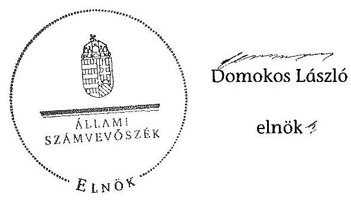

# ÁLLAMI   SZÁMVEVÔSZÉK 

## JELENTÉS

a helyi kisebbségi/nemzetiségi önkormányzatok gazdálkodásának ellenőrzéséről
Lábatlan Város Roma Nemzetiségi Önkormányzata

---

# Állami Számvevőszék 

Iktatószám: V-0078-021/2013.
Témaszám: 1105
Vizsgálat-azonosító szám: V06060302

## Az ellenőrzést felügyelte:

Horváth Balázs
felügyeleti vezető
Az ellenőrzést vezette és az ellenőrzés végrehajtásáért felelős:
Preller Zsuzsanna
ellenőrzésvezető
A számvevőszéki jelentést készítették és a jelentés összeállításában
közremüködtek:
Moder Beatrix
számvevő
Szabó Leonóra Ildikó
számvevő
Az ellenőrzést végezte:
Szabó Leonóra Ildikó
számvevő

---

# TARTALOMJEGYZÉK 

BEVEZETÉS ..... 5
I. ÖSSZEGZŐ MEGÁLLAPÍTÁSOK, KÖVETKEZTETÉSEK, JAVASLATOK ..... 8
II. RÉSZLETES MEGÁLLAPÍTÁSOK ..... 12

1. A Nemzetiségi és a Települési Önkormányzat együttmúködésének szabályszerűsége ..... 12
2. A gazdálkodási feladatok ellátásának szabályszerűsége ..... 13
2.1. A költségvetésre és zárszámadásra, valamint a kincstári adatszolgáltatás rendjére vonatkozó jogszabályi előírások betartása ..... 13
2.2. A Nemzetiségi Önkormányzat gazdálkodásának szabályozottsága ..... 14
2.3. A pénzügyi kontrollok múködése ..... 15
3. A Nemzetiségi Önkormányzattal összefüggő gazdálkodási feladatok belső ellenőrzése ..... 16
4. A Nemzetiségi Önkormányzat feladatellátása ..... 16

## MELLÉKLET

1. számú A Nemzetiségi Önkormányzat 2011. évi és 2012. I. félévi gazdálkodásá- nak főbb adatai, mutatói

## FÜGGELÉKEK

1. számú Értelmező szótár
2. számú A pénzügyi kontrollok múködésének értékelése

---

.

---

# RÖVIDÍTÉSEK JEGYZÉKE 

## Jogszabályok

Áht. 1
Áht. 2
ÁSZ tv.
Nek. ${ }_{1}$ tv.
Nek. ${ }_{2}$ tv.
Számv. tv.
Szoctv.
Áhsz.

Ámr.
Ávr.

Ber.
Bkr.
támogatási kormányrendelet

Települési Önkormányzat SZMSZ-e

## Szórövidítések

ÁSZ
jegyzó
gazdálkodási jogkörök szabályzata ${ }_{1}$
1992. évi XXXVIII. törvény az államháztartásról (hatályos 2011. december 31-ig)
2011. évi CXCV. törvény az államháztartásról (hatályos 2011. december 31-től)
2011. évi LXVI. törvény az Állami Számvevőszékről (hatályos 2011. július 1-jétől)
1993. évi LXXVII. törvény a nemzeti és etnikai kisebbségek jogairól (hatályos 2011. december 31-ig)
2011. évi CLXXIX. törvény a nemzetiségek jogairól (hatályos 2011. december 20-tól)
2000. évi C. törvény a számvitelről
1993. évi III. törvény a szociális igazgatásról és szociális ellátásokról
249/2000. (XII. 24.) Korm. rendelet az államháztartás szervezetei beszámolási és könyvvezetési kötelezettségének sajátosságairól
292/2009. (XII. 19.) Korm. rendelet az államháztartás múködési rendjéről (hatályos 2011. december 31-ig)
368/2011. (XII. 31.) Korm. rendelet az államháztartásról szóló törvény végrehajtásáról (hatályos 2012. január 1jétől)
193/2003. (XI. 26.) Korm. rendelet a költségvetési szervek belső ellenőrzéséről (hatálytalan 2012. január 1-jétől)
370/2011. (XII. 31.) Korm. rendelet a költségvetési szervek belső kontrollrendszeréről és belső ellenőrzéséről (hatályos 2012. január 1-jétől)
a kisebbségi önkormányzatoknak a központi költségvetésből, valamint fejezeti kezelésű előirányzatból nyújtott támogatások feltételrendszeréről és elszámolásának rendjéről szóló 342/2010. (XII. 28.) Korm. rendelet (hatályon kívül helyezte a 28/2012. (III. 6.) Korm. rendelet a nemzetiségi célú előirányzatokból nyújtott támogatások feltételrendszeréről és elszámolásának rendjéről; jelenleg hatályos a 428/2012. (XII. 29.) Korm. rendelet a nemzetiségi célú előirányzatokból nyújtott támogatások feltételrendszeréről és elszámolásának rendjéről)
Lábatlan Város Önkormányzata 21/2006. (X. 26.) számú rendelete a Képviselő-testület és Szervei Szervezeti és Múködési Szabályzatáról

Állami Számvevőszék
Lábatlan Város Önkormányzatának jegyzője
Lábatlan Város Önkormányzata Polgármesteri Hivatalának Kötelezettségvállalás, utalványozás, ellenjegyzés és

---

gazdálkodási jogkörök szabályzata ${ }_{2}$

Képviselő-testület

Kincstár
Kormányhivatal
Nemzetiségi Önkormányzat

Nemzetiségi Önkormányzat elnöke
polgármester
Polgármesteri Hivatal
Polgármesteri Hivatal SZMSZ-e

Támogató
Települési Önkormányzat
Települési Önkormányzat Képviselő-testülete
érvényesítés rendjének szabályzata (hatályos 2011. december 31-ig)
Lábatlan Város Önkormányzata Polgármesteri Hivatalának Kötelezettségvállalás, utalványozás, ellenjegyzés és érvényesítés rendjének szabályzata (hatályos 2012. január 1-jétől)
Lábatlan Város Roma Kisebbségi Önkormányzatának Képviselő-testülete 2011. december 31-ig, Lábatlan Város Roma Nemzetiségi Önkormányzatának Képviselốtestülete 2012. január 1-jétől
Magyar Államkincstár
Komárom-Esztergom Megyei Kormányhivatal
Lábatlan Város Roma Kisebbségi Önkormányzata 2011. december 31-ig, Lábatlan Város Roma Nemzetiségi Önkormányzata 2012. január 1-jétől
Lábatlan Város Roma Kisebbségi Önkormányzatának elnöke 2011. december 31-ig, Lábatlan Város Roma Nemzetiségi Önkormányzatának elnöke 2012. január 1jétől
Lábatlan Város Önkormányzatának polgármestere
Lábatlan Város Önkormányzatának Polgármesteri Hivatala
Lábatlan Város Önkormányzata 21/2006. (X. 26.) számú rendeletének 3. számú függeléke (hatályos 2010. október 21-ig) majd a 2010. október 22-től hatályos Lábatlan Város Önkormányzata Polgármesteri Hivatalának Szervezeti és Múködési Szabályzata
A támogatást nyújtó Közigazgatási és Igazságügyi minisztérium
Lábatlan Város Önkormányzata
Lábatlan Város Önkormányzatának Képviselő-testülete

---

# JELENTÉS 

## a helyi kisebbségi/nemzetiségi önkormányzatok gazdálkodásának ellenőrzéséről Lábatlan Város Roma Nemzetiségi Önkormányzata

## BEVEZETÉS

Az államháztartás részét, az önkormányzati alrendszer egyik elemét képezik a nemzetiségi önkormányzatok, amelyek jogi személyek és a Nek. ${ }_{1,2}$ tv-ben meghatározott önálló feladat- és hatáskörökkel rendelkeznek. A nemzetiségi önkormányzatok az önkormányzati, illetve testületi múködtetés mellett a helyi nemzetiségi közügyek változatos formában való ellátásában vesznek részt.

A nemzetiségi önkormányzatok, illetve a települési önkormányzatok között a jelenlegi szabályozás szerint nincs alá-fölérendeltségi viszony. A nemzetiségi önkormányzatok azonban sajátos közjogi helyzetben vannak, mert a jogállásukat tekintve önkormányzatok, ám függnek a székhelyük szerinti települési önkormányzat hivatalától, amely ellátja a nemzetiségi önkormányzatok vonatkozásában a megállapodásban rögzített gazdálkodási feladatokat.

A nemzetiségek helyzete, támogatása mind hazai, mind európai uniós szinten kiemelt figyelmet kap napjainkban. A nemzetiségi önkormányzatok gazdálkodására és támogatási rendszerére vonatkozó jogszabályok a 20102012. években jelentős változásokon mentek át, amelyek érintették a feladatalapú támogatásra fordítható költségvetési keret megállapítását, az operatív gazdálkodási jogkörök szabályozását, az elkülönített könyvvezetés alkalmazását, a belső ellenőrzés szabályozását.

Az ellenőrzés célja annak értékelése volt, hogy a Nemzetiségi Önkormányzat gazdálkodási kereteinek kialakítása, gazdálkodása és feladatellátása megfelelte a hatályos jogszabályoknak.

Ennek keretében ellenőriztük, hogy:

- a Nemzetiségi Önkormányzat és a Települési Önkormányzat együttműködésének szabályozása, a Települési Önkormányzat SZMSZ-ében, a megállapodásban előírt működési feltételek biztosítása megfelelte a jogszabályi előírásoknak;
- a felek együttműködése megfelelte a megállapodásnak a gazdálkodási feladatok szabályszerű ellátásában, betartották-e a Nemzetiségi Önkormányzat gazdálkodásához kapcsolódóan a költségvetésre és zárszámadásra, a gazdálkodás szabályozására, az operatív gazdálkodási jogkörök gyakorlására vonatkozó jogszabályi előírásokat;

---

- a jegyző biztosította-e a Polgármesteri Hivatal belső ellenőrzése keretében a Nemzetiségi Önkormányzattal összefüggő gazdálkodási feladatok belső ellenőrzését;
- a 2011. évi feladatalapú támogatás felhasználása, a folyósított feladatalapú támogatással történő elszámolás az előírásoknak megfelelően történt-e;
- a Nemzetiségi Önkormányzat feladatellátása összhangban volt-e a vonatkozó jogszabályi előírásokkal.

Az ellenőrzés típusa: szabályszerűségi ellenőrzés
Az ellenőrzött időszak: 2011. január 1. - 2012. június 30.
Ellenőrzött szervezet: Lábatlan Város Roma Nemzetiségi Önkormányzata és a gazdálkodási feladatait ellátó Lábatlan Város Önkormányzata.

Az ellenőrzés jogszabályi alapja: az ÁSZ tv. 5. § (2)-(3) és (6) bekezdései
Az ellenőrzés szakmai módszertana az ÁSZ hivatalos honlapján (www.asz.hu) közzétett szakmai szabályokon alapult, amely a Legfőbb Ellenőrző Intézmények Nemzetközi Szervezete (INTOSAI) által kiadott nemzetközi standardok (ISSAI) figyelembevételével készült.

A fogalmak magyarázatát az 1. számú függelék, a pénzügyi kontrollok megfelelősége értékelésénél alkalmazott egységes minősítési szempontokat a 2. számú függelék tartalmazza.

Az ellenőrzés lefolytatásához a Települési Önkormányzat és a Nemzetiségi Önkormányzat tanúsítványok kitöltésével és a kapcsolódó dokumentumok elektronikus megküldésével szolgáltatott adatokat. A tanúsítványokon szerepeltetett adatok, információk ellenőrzése és szükség szerinti javítása a helyszíni ellenőrzés keretében történt.

Az ÁSZ az ellenőrzés megállapításait az ellenőrzött időszakban hatályos, az intézkedést igénylő megállapításokra tett javaslatokat a jelenleg hatályos jogszabályok alapján fogalmazta meg.

A Nemzetiségi Önkormányzat 2010-ben alakult, elnöke a 2010. évi helyhatósági választások óta látja el feladatát. A Nemzetiségi Önkormányzat intézményt, gazdasági társaságot és más szervezetet nem alapított, illetve társulásban nem vett részt. A négytagú Képviselő-testület munkája segítésére bizottságot nem hozott létre. A Nemzetiségi Önkormányzat a költségvetési beszámolója szerint a 2011. évben 210 ezer Ft költségvetési bevételt ért el és 123 ezer Ft költségvetési kiadást teljesített. A 2012. évben 232 ezer Ft eredeti költségvetési bevételi és kiadási előirányzatot terveztek. A 2012. I. félévi beszámolója alapján a módosított költségvetési bevételi és kiadási előirányzat megegyezett az eredeti előirányzattal, a teljesített költségvetési bevétel 240 ezer Ft, a teljesített költségvetési kiadás 89 ezer Ft volt. A 2011.évben feladatalapú támogatásban nem részesült a Nemzetiségi Önkormányzat. A 2011. évi és a 2012. I. féléves gazdálkodási adatokat részletesen az 1. számú mellékletben mutatjuk be. Az ÁSZ a Nemzetiségi Önkormányzat gazdálkodását korábban nem ellenőrizte.

---

Az ÁSZ tv. 29. § (1) bekezdése szerint a jelentéstervezetet megküldtük a polgármester és a Nemzetiségi Önkormányzat elnöke részére, akik az ÁSZ tv. 29. § (2) bekezdésében foglalt észrevételezési jogukkal nem éltek, a jelentéstervezetre észrevételt nem tettek.

---

# I. ÖSSZEGZŐ MEGÁLLAPÍTÁSOK, KÖVETKEZTETÉSEK, JAVASLATOK 

A Nemzetiségi és a Települési Önkormányzat együttmüködése a 2011. évben az előírt határidő betartásával jóváhagyott megállapodáson alapult. A Nemzetiségi és a Települési Önkormányzat a Nek. 2 tv-ben előírt határidőre az új megállapodást nem kötötte meg. Az együttmúködés szabályozása, a 2011. évben az Áht. ${ }_{1}$-ben és az Ámr-ben, a 2012. évben az Áht. ${ }_{2}$-ben és a Nek. ${ }_{2}$ tv-ben meghatározott előírásoknak nem felelt meg. A Kormányhivatal a 2013. év I. negyedévében ellenőrizte az együttműködési megállapodás jogszerűségét. A vizsgálat észrevételei alapján az együttmúködési megállapodást módosították, melyet mindkét önkormányzat testülete megtárgyalt és elfogadott. Az együttmúködési megállapodás azonban továbbra sem tartalmazta az Áht. ${ }_{2}$-ben előírt, a Nemzetiségi Önkormányzat bevételeivel és kiadásaival kapcsolatos ellenőrzési feladatokat.

A Nemzetiségi Önkormányzat költségvetésére és zárszámadására vonatkozó jogszabályi előírásokat részben tartották be. A költségvetési és zárszámadási határozatok jóváhagyása a jogszabályban előírt eljárásrendnek megfelel. A határozatokat egymással összehasonlítható szerkezetben készítették el, azokat változatlan formában építették be a Települési Önkormányzat költségvetési és zárszámadási rendeleteibe. A 2011. évi költségvetési és zárszámadási határozatok az Ámr. előírása ellenére nem tartalmazták a bevételi és kiadási előirányzatok mérlegszerű bemutatását és az előirányzat-felhasználási ütemtervet. A 2012. évi költségvetési határozat tartalma a jogszabályi előírásoknak megfelelt. A jegyző 2012. I. félévében a Nemzetiségi Önkormányzatra vonatkozó kincstári adatszolgáltatási kötelezettségének eleget tett. A 2011. évben az előirányzat módosítás előterjesztésének hiányában a Képviselő-testület nem döntött az előirányzat módosításról, ezért a támogatásértékű működési kiadás kiemelt előirányzatnál a kiadás teljesítése - az Áht. ${ }_{1}$ előírása ellenére - jóváhagyott előirányzat nélkül történt. 2012. I. félévben előirányzat túllépés nem volt.

A gazdálkodás szabályozottságáról az ellenőrzött időszakban a jegyző nem gondoskodott, mivel a gazdálkodási feladatok végrehajtását ellátó Polgármesteri Hivatal szabályzatainak hatályát részben terjesztette ki a Nemzetiségi Önkormányzat gazdálkodási feladataira. A 2012. I. félévében a Bkr-ben előírtakat nem tartották be, mivel a Polgármesteri Hivatal ellenőrzési nyomvonala, a szabálytalanságok kezelésének eljárásrendje, a kockázatkezelési rendszer, valamint a folyamatba épített előzetes, utólagos és vezetői ellenőrzés szabályzatainak hatálya nem terjedt ki a Nemzetiségi Önkormányzat gazdálkodási feladataira. A Polgármesteri Hivatal SZMSZ-e az ellenőrzött időszakban az Ámr-ben és az Ávr-ben foglaltak ellenére nem tartalmazta munkakörökhöz kapcsolódóan a Nemzetiségi Önkormányzat gazdálkodásával kapcsolatos fel-adat- és hatásköröket, a hatáskörök gyakorlásának módját, a helyettesítés rendjét és az ezekre vonatkozó felelősségi szabályokat. Az operatív gazdálkodási jogkörök kialakítása a 2011. évben - a szakmai teljesítés igazolásának rendjét kivéve - a jogszabályi előírásoknak megfelelő volt. A 2012. I. félévében az Ávr. előírása ellenére a teljesítésigazoló kijelölése elmaradt, valamint a pénz-

---

ügyi ellenjegyző és az érvényesítő személyek jegyző általi kijelölését 2012. március 31-ét követően nem módosították, annak ellenére, hogy az Ávr. a kijelölést a gazdasági vezető hatáskörébe utalta.

A pénzügyi kontrollok múködése a 2011. és a 2012. évben a dologi és egyéb folyó kiadások teljesítésénél gyenge volt, a hibák száma a lényegességi szintet, a kritikus hibahatárt elérte. A 2011. évben az Ámr-ben foglaltak ellenére a kötelezettségvállalásokat nem foglalták írásba. A szakmai teljesítést igazoló személy - kijelölés hiányában - az Ámr-ben foglalt ellenőrzési feladatokat nem végezte el. Az utalvány ellenjegyzője annak ellenére ellenjegyezte az utalványt, hogy a szakmai teljesítésigazolás nem történt meg. Emellett nem tartották be a gazdálkodásra - köztük a kötelezettségvállalások írásba foglalására és nyilvántartásba vételére - vonatkozó szabályokat. 2012. I. félévben a pénzügyi ellenjegyzést a gazdasági vezető a jogszabályi előírásoknak megfelelően elvégezte, azonban a teljesítést igazoló személy, kijelölés hiányában az Ávr-ben foglalt ellenőrzési feladatokat nem végezte el, az érvényesítő nem jogszerú kijelölés alapján látta el a feladatait. Az ellenőrzés a Nemzetiségi Önkormányzatnál - az ellenőrzött tételek esetében - jogosulatlan kifizetést nem tárt fel, a pénzügyi kontrollok múködéséhez kapcsolódó hiányosságok azonban nem biztosítják a hibák megelőzését, feltárását és kijavítását.

A Nemzetiségi Önkormányzat feladatellátásának tárgya részben volt összhangban a Nek. ${ }_{1,2}$ tv. előírásaival, mert a nemzetiségi érdekek védelmével és képviseletével kapcsolatos feladata ellátásához szükséges szervezeti, személyi és anyagi feltételeket biztosította, ugyanakkor a Nek. 2 tv. és a Szoctv. előírásait figyelmen kívül hagyva, jogosulatlanul hatósági feladatot is ellátott, továbbá a 2011. évben magánszemélyeknek nyújtott vissza nem térítendő támogatás nem minősült a Nek. ${ }_{1}$ tv-ben meghatározott nemzetiségi közügynek.

A Polgármesteri Hivatal 2011. és 2012. évi éves ellenőrzési terveit megalapozó kockázatelemzés - a Ber. előírásai ellenére - nem terjedt ki a Nemzetiségi Önkormányzat gazdálkodásával összefüggő végrehajtási feladatok ellátására. A jegyző az ellenőrzött időszakban az Áht. ${ }_{1,2}$ ellenére nem biztosította a Polgármesteri Hivatal belső ellenőrzése keretében a Nemzetiségi Önkormányzat gazdálkodásával összefüggő végrehajtási feladatok belső ellenőrzését. Erre irányuló ellenőrzést a 2011. évben és 2012. I. félévben nem terveztek és nem végeztek.

Az ellenőrzés megállapításai alapján, az észrevételezésre megküldött jelentéstervezetben a Nemzetiségi Önkormányzat gazdálkodásával kapcsolatban intézkedést igénylő megállapításokat és javaslatokat fogalmaztunk meg, amelyek végrehajtásáról az ellenőrzés időszakában intézkedési tájékoztatást adott a polgármester és a Nemzetiségi Önkormányzat elnöke. A 2013 szeptemberében megkötött hatályos együttmúködési megállapodásban az Áht. ${ }_{2}$ vonatkozó előírásait érvényesítették, a tartalmi hiányosságokat megszüntették. A Polgármesteri Hivatal SZMSZ-e a 2013. szeptember 10-1 módosítást követően a Nemzetiségi Önkormányzat gazdálkodásával kapcsolatos feladat- és hatáskörök szabályozásával megfelelt az Ávr-ben előírtaknak. Figyelemmel az ÁSZ ellenőrzés hasznosítására mindezek vonatkozásában intézkedést igénylő megállapítást, javaslatot már nem szerepeltetünk.

---

Az ÁSZ tv. 33. § (1) bekezdésében foglaltak értelmében az ellenőrzött szervezet vezetője köteles a jelentésben foglalt megállapításokhoz kapcsolódó intézkedési tervet összeállítani, és azt a jelentés kézhezvételétől számított 30 napon belül az ÁSZ részére megküldeni. Amennyiben az intézkedési tervet határidőre nem küldi meg a szervezet, vagy az nem elfogadható, az ÁSZ elnöke az ÁSZ tv. 33. § (3) bekezdés a)-b) pontjaiban foglaltakat érvényesítheti.

A helyszíni ellenőrzés megállapításainak hasznosítása mellett javasoljuk:

# a jegyzönek 

1. a kiemelt költségvetési előirányzatokkal kapcsolatban

A 2011. évben támogatásértékű működési kiadást előirányzat nélkül teljesítettek, nem tartották be az Áht. 12/A. § (1) bekezdésben foglalt előírást.

Javaslat
A jövőben az Áht. 2 34. § (1) és (6) bekezdéseiben foglaltaknak megfelelően készítsen előterjesztést az előirányzatok szükséges mértékű módosítására úgy, hogy azt a Nemzetiségi Önkormányzat elnöke határidőben nyújthassa be a Képviselő-testület részére - az Áht. 2 36. § (1) bekezdés szerint - a meghatározott előirányzatokon belül való gazdálkodás érvényesülése érdekében.
2. a gazdálkodási feladatok szabályozottságával kapcsolatban

A Polgármesteri Hivatal rendelkezett a jogszabályokban előírt gazdálkodási szabályzatokkal, azonban a 2012. évben a Bkr. 6. § (3)-(4) bekezdéseiben előírt ellenőrzési nyomvonal és a szabálytalanságok kezelése eljárásrendjének, a Bkr. 7. § (1) bekezdésében előírt kockázatkezelési rendszer, valamint a Bkr. 8. § (2)-(4) bekezdéseiben előírt folyamatba épített előzetes, utólagos és vezetői ellenőrzés szabályzatainak hatálya nem terjedt ki a Nemzetiségi Önkormányzat gazdálkodási feladataira.

Javaslat
Készítse elő a Polgármesteri Hivatal ellenőrzési nyomvonalának, a szabálytalanságkezelési eljárásrendjének, a kockázatkezelési rendszer, valamint a folyamatba épített előzetes, utólagos és vezetői ellenőrzés szabályzatainak a módosítását - az Ávr. 13. § (3a) bekezdésének felhatalmazása alapján - annak érdekében, hogy a Bkr. 6. § (3)(4), 7. § (1) és a 8. § (2)-(4) bekezdéseiben foglalt szabályzatok hatálya terjedjen ki a Nemzetiségi Önkormányzat gazdálkodási feladataira.
3. a gazdálkodási feladatok ellátásával kapcsolatban

A pénzügyi ellenjegyzést és az érvényesítést végző személyek jegyző általi kijelölését 2012. március 31-ét követően nem módosították annak ellenére, hogy az Ávr. 55. § (2) bekezdés g) pontjának és 58 . § (4) bekezdésének előírása a kijelölést a gazdasági vezető hatáskörébe utalta.

---

Javaslat
Biztosítsa, hogy az Ávr. 55. § (2) bekezdés g) pontjában és 58. § (4) bekezdésében előírtaknak megfelelően a pénzügyi ellenjegyzőt és az érvényesitőt a gazdasági vezető jelölje ki.
4. a pénzügyi kontrollok múködésével kapcsolatban

A 2011. évben az Ámr. 76. § (1) bekezdésében, 2012. I. félévben az Ávr. 57. § (1) bekezdésében foglalt ellenőrzési feladatokat a szakmai teljesítés, illetve a teljesítést igazoló személy kijelölésének hiányában nem végezték el, így elmaradt a kiadások jogosságának, összegszerűségének és szerződésszerú teljesítésének az ellenőrzése.

Az érvényesítést nem jogszerű kijelöléssel rendelkező személy végezte, az Ávr. 58. § (1)-(3) bekezdéseiben foglaltakat megsértve nem szabályszerűen történt a fedezet rendelkezésre állásának és a gazdálkodási szabályok érvényesülésének ellenőrzése.

Javaslat
Az operatív gazdálkodás múködési hibáinak megelőzése, feltárása és kijavítása érdekében kezdeményezze:
a) a teljesítés igazolására jogosult személyek Ávr. 57. § (4) bekezdésében foglaltak alapján kötelezettségvállaló által történő írásbeli kijelölését, az Ávr. 57. § (1) bekezdésben előírt ellenőrzési feladatok ellátására;
b) az érvényesítő Ávr. 55. § (2) g) pontjával összhangban történő kijelölését, hogy szabályszerűen eleget tegyen az Ávr. 58. § (1)-(3) bekezdéseiben előírt kötelezettségének.

# a Nemzetiségi Önkormányzat elnökének 

A 2011. évben támogatásértékű múködési kiadást előirányzat nélkül teljesítettek, nem tartották be az Áht. 12/A. § (1) bekezdésben foglalt előírást.

Javaslat
A jövőben terjessze a Képviselő-testület elé jóváhagyásra az Áht. 2 34. § (1) és (6) bekezdéseinek megfelelően, az előirányzatok szükséges mértékű módosításáról szóló előterjesztést.

---

# II. RÉSZLETES MEGÁLLAPÍTÁSOK 

## 1. A Nemzetiségi és a Települési Önkormányzat együttmúKÖDÉSÉNEK SZABÁLYSZERŰSÉGE

A Nemzetiségi és a Települési Önkormányzat együttműködése a 2011. évben az előírt eljárásrend és határidő betartásával jóváhagyott megállapodáson alapult ${ }^{1}$, mely 2013. április 30-ig volt hatályos. A Nemzetiségi és a Települési Önkormányzat a Nek. ${ }_{2}$ tv. 159. § (3) bekezdésének előírása ellenére az új megállapodást 2012. év június 1 -jéig nem kötötte meg.

Az együttmúködés szabályozása a jogszabályokban meghatározott előírásoknak nem felelt meg, mert:

- a 2011. december 31-én hatályos megállapodás az Ámr. 37. § (4) bekezdésének e) pontjában előírtak ellenére nem tartalmazta a jegyző azon feladatát, mely szerint a Települési Önkormányzat költségvetési rendeletét az Áht. ${ }_{1} 71 . \S$ (1) bekezdésében rögzített határidőben történő elfogadását követően a Nemzetiségi Önkormányzat elnöke rendelkezésére bocsátja. Az Áht. ${ }_{1} 66 . \S$-ban foglalt előírások ellenére nem tartalmazta teljes körűen a Nemzetiségi Önkormányzat gazdálkodása végrehajtásának rendjéhez kapcsolódó feladatellátás jogosultjainak, kötelezettjeinek kijelölését;
- a 2012. június 1 -jén hatályos megállapodás az Áht. ${ }_{2}$ 27. § (2) bekezdésében előírtak ellenére nem tartalmazta a Nemzetiségi Önkormányzat bevételeivel és kiadásaival kapcsolatos ellenőrzési feladatokat. A Nek. ${ }_{2}$ tv. 80. § (3) bekezdésében foglaltak ellenére nem rögzítették a Nemzetiségi Önkormányzat költségvetése előkészítéséért és megalkotásáért, a költségvetéssel összefüggő adatszolgáltatásért, az önálló fizetési számla nyitásáért, a teljesítésigazolási és érvényesítési feladatok ellátásáért, valamint a múködési feltételek biztosításáért felelősök konkrét kijelölését. Nem írták elő a Nek. ${ }_{2}$ tv. 80. § (4) bekezdésben foglaltakat figyelmen kívül hagyva a jegyző, illetve a megbízásából a Nemzetiségi Önkormányzat ülésein résztvevő személy jelzési kötelezettségét törvénysértés észlelése esetén. További hiányosság, hogy a Nek. ${ }_{2}$ tv. 80. § (2) bekezdésében foglaltak ellenére nem rögzítették a Települési Önkormányzat és a Nemzetiségi Önkormányzat SZMSZ-ében a megállapodás szerinti múködési feltételeket.

A Kormányhivatal 2013. I. negyedévben ellenőrizte a Települési Önkormányzatnál a „Helyi önkormányzatok és a Nemzetiségi Önkormányzat közötti megállapodás jogszerüségét". A vizsgálat megállapításai alapján az együttműködő felek a

[^0]
[^0]:    ${ }^{1}$ A 2011. évben és a 2012. június 1 -jéig hatályos együttműködési megállapodást a Kép-viselő-testület a 4/2010. (XI. 4.) számú, a Települési Önkormányzat Képviselő-testülete a 134/2010. (XII. 14.) számú határozattal fogadta el.

---

megállapodást felülvizsgálták és módosították². A megállapodás azonban továbbra sem tartalmazta az Áht. 2 27. § (2) bekezdésében előírtak ellenére a Nemzetiségi Önkormányzat bevételeivel és kiadásaival kapcsolatos ellenőrzési feladatokat.

A jegyző és a Nemzetiségi Önkormányzat elnökének együttes nyilatkozata alapján - a megállapodás tartalmi hiányosságai ellenére, a Nek. ${ }_{1,2}$ tv.-ben előírtaknak megfelelően - a Települési Önkormányzat biztosította a Nemzetiségi Önkormányzat múködésének személyi és tárgyi feltételeit.

# 2. A GAZDÁLKODÁSI FELADATOK ELLÁTÁSÁNAK SZABÁLYSZERŰSÉGE 

### 2.1. A költségvetésre és zárszámadásra, valamint a kincstári adatszolgáltatás rendjére vonatkozó jogszabályi előirások betartása

A Nemzetiségi Önkormányzat költségvetésére és zárszámadására vonatkozó jogszabályi előírásokat részben tartották be. A Nemzetiségi Önkormányzat költségvetési és zárszámadási határozatait ${ }^{3}$ a jogszabályban előírt eljárásrend szerint fogadták el, a költségvetési és zárszámadási határozatok egymással összehasonlítható szerkezetben készültek, azok változatlan formában épültek be a Települési Önkormányzat költségvetési és zárszámadási rendeleteibe.

A 2011. évi költségvetési és zárszámadási határozat nem az Ámr. 36. § (1) bekezdése i) pontja szerinti szerkezetben készült, mivel a bevételi és kiadási előirányzatokat nem mutatta be mérlegszerűen. A 2011. évi költségvetési határozathoz az Ámr. 36. § (1) bekezdés k) pontjában előírtak ellenére az év várható bevételi és kiadási előirányzatainak teljesüléséről előirányzat-felhasználási ütemterv nem készült.

A Nemzetiségi Önkormányzat költségvetésének főösszege az ellenőrzött időszakban biztosította a tárgyévi kötelezettség vállalásához szükséges fedezetet. A költségvetési főösszegen belül a kiemelt előirányzat felhasználáshoz szükséges mértékű előirányzat átcsoportosításáról - az előirányzat módosítás előterjesztésének hiányában - a Képviselő-testület nem döntött. A támogatásértékü múködési kiadás kiemelt előirányzatnál a 2011. évben a kiadás teljesítése jóváhagyott előirányzat nélkül történt ${ }^{4}$. Ezáltal nem tartották be az Áht. 12/A. § (1) bekezdésben foglalt előírást. 2012. I. félévben előirányzat túllépés nem volt.

[^0]
[^0]:    ${ }^{2}$ A módosított együttműködési megállapodást a Települési Önkormányzat Képviselőtestülete a 35/2013. (IV. 30.) számú, a Képviselő-testület a 6/2013. (IV. 29.) számú határozatával fogadta el.
    ${ }^{3}$ A Képviselő-testületnek a Nemzetiségi Önkormányzat 2011. évi költségvetéséről alkotott 1/2011. (I. 17.) számú, a 2011. évi zárszámadásról alkotott 7/2012. (IV. 10.) számú, valamint a 2012. évi költségvetéséről alkotott 1/2012. (I. 17.) számú határozatai.
    ${ }^{4}$ A támogatásértékű működési kiadásnak a 2011. évi eredeti és módosított előirányzata nem volt, ezzel szemben a teljesített kiadás 20 ezer Ft volt.

---

A 2012. évi költségvetési határozat tartalma a jogszabályi előírásoknak megfelel. A 2012. I. félévben az Ávr-ben és az Áhsz-ben előírt, a Nemzetiségi Önkormányzatra vonatkozó kincstári adatszolgáltatási kötelezettségének a jegyző határidőben eleget tett.

# 2.2. A Nemzetiségi Önkormányzat gazdálkodásának szabályozottsága 

A Nemzetiségi Önkormányzat gazdálkodásának szabályozásáról az ellenőrzött időszakban a jegyző nem gondoskodott. A gazdálkodási feladatai végrehajtását ellátó Polgármesteri Hivatal a jogszabályokban előírt gazdálkodási szabályzatokkal ${ }^{5}$ rendelkezett, azonban a 2011. évben a Számv. tv. 14. § (5) bekezdés a) és az Áhsz. 8. § (4) bekezdés a) pontjaiban előírt számviteli politikának, valamint az eszközök és források értékelési szabályzatának hatálya nem terjedt ki a Nemzetiségi Önkormányzat gazdálkodási feladataira. A jegyző nem gondoskodott a Polgármesteri Hivatal szabályzatai közül a 2011. évben az Ámr. 156. § (2)-(3) bekezdéseiben, a 157. § (1) bekezdésében és az Áht.; 121/A. § (4) bekezdésében, a 2012. I. félévében a Bkr. 6. § (3)-(4), 7. § (1) és a 8. § (2)-(4) bekezdéseiben előírt ellenőrzési nyomvonal, szabálytalanságok kezelésének eljárásrendje, kockázatkezelési rendszer, valamint a folyamatba épített előzetes, utólagos és vezetői ellenőrzés szabályozás hatályának a Nemzetiségi Önkormányzat gazdálkodási feladataira történő kiterjesztéséről.

A Polgármesteri Hivatal SZMSZ-e a 2011. évben az Ámr. 20. § (2) bekezdés h) pontjában, 2012. I. félévben az Ávr. 13. § (1) bekezdés g) pontjában foglaltak ellenére nem tartalmazta munkakörökhöz kapcsolódóan a Nemzetiségi Önkormányzat gazdálkodásával kapcsolatos feladat- és hatásköröket, a hatáskörök gyakorlásának módját, a helyettesítés rendjét és az ezekre vonatkozó felelősségi szabályokat.

A Nemzetiségi Önkormányzat operatív gazdálkodási jogköreinek kialakítása során a 2011. évben a kötelezettségvállaló, utalványozó, a kötelezettségvállalás és utalványozás ellenjegyzó, valamint az érvényesítést végző személyek kijelölése a jogszabályi előírásoknak megfelelően történt, azonban az Ámr. 20. § (3) bekezdés a) pontjának, valamint a 76. § (5) bekezdésének előírásai ellenére nem szabályozták a szakmai teljesítés igazolás rendjét és nem jelölték ki a szakmai teljesítésigazolót.

A 2012. I. félévben az operatív gazdálkodási jogkörök kialakítása keretében a kötelezettségvállaló és az utalványozó kijelölése a jogszabályi előírásokkal összhangban volt, azonban az Ávr. 57. § (4) bekezdésének előírása ellenére a teljesítésigazoló kijelölése elmaradt, valamint a pénzügyi ellenjegyzó és az érvényesítő személyek jegyzó általi kijelölését 2012. március 31-ét követően - az Ávr. 55. § (2) bekezdés g) pontjában és az 58. § (4) bekez-

[^0]
[^0]:    ${ }^{5}$ Számviteli politika, leltározási és leltárkészítési szabályzat, pénzkezelési szabályzat, eszközök és források értékelési szabályzata, számlarend, munkaköri leírások, ellenőrzési nyomvonal, szabálytalanságok kezelésének eljárásrendje, kockázatkezelési szabályzat, folyamatba épített előzetes, utólagos és vezetői ellenőrzés (FEUVE) szabályozás.

---

désében foglaltak ellenére, miszerint a kijelölés a gazdasági vezető hatáskörébe tartozik - nem módosították.

A pénzügyi ellenjegyzők és érvényesitők jogosulatlan személy általi kijelölése nem veszélyeztette, hogy e kontrolltevékenységek - végrehajtásuk esetén - biztosítsák a lehetséges hibák feltárását, kijavítását, mert a kijelölt személyek a feladatuk ellátásához előírt képesítési követelményeknek megfeleltek.

# 2.3. A pénzügyi kontrollok múködése 

A pénzügyi kontrollok múködésének megfelelősége értékelését a 2011. évben és 2012. I. félévben egyaránt egy területen, a dologi és egyéb folyó kiadásoknál végeztük el.

A Nemzetiségi Önkormányzat 2011. évi dologi és egyéb folyó kiadásai teljesítése során a kötelezettségvállalás ellenjegyzése, a szakmai teljesítés igazolása és az utalvány ellenjegyzése kontrollok müködésének megfelelősége - a 2. számú függelékben részletezett értékelési szempontok alapján gyenge volt, a hibák száma a lényegességi szintet, a kritikus hibahatárt elérte, mert:

- az Ámr. 74. § (1) bekezdésében, valamint a gazdálkodási jogkörök szabály-zata1-ben foglaltak ellenére a kötelezettségvállalást nem foglalták írásba;
- a szakmai teljesítést igazoló személy kijelölésének hiányában az Ámr. 76. § (1) bekezdésében foglalt ellenőrzési feladatokat nem végezték el, így a kiadások jogosságának, összegszerűségének és a szerződésszerű teljesítésnek az ellenőrzése és igazolása elmaradt;
- az utalvány ellenjegyzője az Ámr. 79. § (2) bekezdésében foglalt ellenőrzési feladatait nem végezte el, mert annak ellenére ellenjegyezte az utalványt, hogy a szakmai teljesítésigazolás nem történt meg, valamint megsértették az Ámr. 74. § (1) és 75. § (1) bekezdésében foglaltakat, mivel a kötelezettségvállalást nem foglalták írásba, nem gondoskodtak a nyilvántartásba vételről, illetve a kötelezettségvállalások folyamatos és naprakész nyilvántartásának a vezetéséről.

A Nemzetiségi Önkormányzatnál a 2012. I. félévben a dologi és egyéb folyó kiadások teljesítése során a pénzügyi ellenjegyzés, a teljesítés igazolás és az érvényesítés kontrollok müködésének megfelelősége - a 2. számú függelékben részletezett értékelési szempontok alapján - gyenge volt, a hibák száma a lényegességi szintet, a kritikus hibahatárt elérte, mert:

- a pénzügyi ellenjegyzést a gazdasági vezető ${ }^{6}$ a jogszabályi előírásoknak megfelelően elvégezte, azonban

[^0]
[^0]:    ${ }^{6}$ Az Ávr. 55. § (2) bekezdés a) pontjában foglaltak alapján látta el a pénzügyi ellenjegyzést.

---

- a teljesítést igazoló személy kijelölésének hiányában az Ávr. 57. § (1) bekezdésében foglalt ellenőrzési feladatokat szabályszerűen nem végezték el, így a kiadások jogosságának, összegszerűségének és a szerződésszerű teljesítésnek az ellenőrzése és igazolása elmaradt;
- az érvényesítő a 2.2. pontban foglaltak szerint, nem jogszerű kijelölés alapján látta el feladatát, így - az Ávr. 58. § (1)-(3) bekezdéseiben előírtak ellenére - a teljesítésigazolás, a fedezet meglétének, valamint a gazdálkodásra vonatkozó szabályok betartásának ellenőrzése szabályszerűen nem történt meg.

A Nemzetiségi Önkormányzatnál a 2011. évben és 2012. I. félévben, a pénzügyi folyamatokban kulcsszerepet betöltő belső kontrollok múködésében feltárt hiányosságokkal összefüggésben az ellenőrzés jogosulatlan kifizetést nem állapított meg, a pénzügyi kontrollok múködéséhez kapcsolódó hiányosságok azonban nem biztosítják a hibák megelőzését, feltárását és kijavítását.

# 3. A Nemzetiségi Önkormányzattal összefúggő GAZDÁlKODÁSI FELADATOK BELSŐ ELLENŐRZÉSE 

A Polgármesteri Hivatal 2011. és 2012. évi ellenőrzési terveit megalapozó kockázatelemzés a Ber. 21. § (2) bekezdése ${ }^{7}$ ellenére nem terjedt ki a Nemzetiségi Önkormányzat gazdálkodásával összefüggő végrehajtási feladatok ellátására. A jegyző az ellenőrzött időszakban az Áht. ${ }_{1}$ 121/B. § (4) bekezdése, illetve az Áht. 2 70. § (1) bekezdése előírása ellenére nem biztosította a Polgármesteri Hivatal belső ellenőrzése keretében a Nemzetiségi Önkormányzat gazdálkodásával összefüggő végrehajtási feladatok belső ellenőrzését. A 2011. évben és 2012. I. félévben erre irányuló ellenőrzést nem terveztek és nem végeztek.

## 4. A Nemzetiségi Önkormányzat feladATELLÁtása

A Nemzetiségi Önkormányzat feladatellátásának tárgya részben volt összhangban a Nek. ${ }_{1,2}$ tv. előírásaival. A Nek. ${ }_{1}$ tv. 5/A. § (1) bekezdése és a Nek. ${ }_{2}$ tv. 10. § (1) bekezdése szerinti, a nemzetiségi érdekek védelmével és képviseletével kapcsolatos alapvető feladata ellátásához biztosította a szükséges szervezeti, személyi és anyagi feltételeket. Ugyanakkor a 2011. évben a magánszemélynek kifizetett vissza nem térítendő támogatás nem minősült a Nek. ${ }_{1}$ tv. 30. § (1) bekezdésben meghatározott nemzetiségi közügynek. A 2012. évben nyújtott rendkívüli segély kifizetése során a Nek. ${ }_{2}$ tv. 116. § (1) bekezdésében és a Szoctv. 4/A. § (1) bekezdésében foglalt előírásokat figyelmen kívül hagyva, jogosulatlanul, hatósági feladatot látott el.

[^0]
[^0]:    ${ }^{7}$ 2012. január 1-jétől Bkr. 7. § (2) bekezdése írja elő

---

A Képviselő-testület 5/2011. (V. 5.) számú határozata alapján a 2011. évben átadott pénzeszközként 20 ezer Ft temetési támogatást fizettek ki egy magánszemély részére. A 2012. évben a Képviselö-testület 3/2012. (I. 25.) számú határozatában 30 ezer Ft rendkívüli segély kifizetéséről döntött. A Kormányhivatal törvényességi észrevétele alapján a 30 ezer Ft visszafizetése megtörtént.

Budapest, 2013. 12. hónap 16. nap

Melléklet: 1 db
Függelék: 2 db

---

# **Chemistry**

## **Chemical Reactions**

### **Balancing Chemical Equations**

1. **Write the unbalanced equation:**
   - Example: $$C_3H_8 + O_2 \rightarrow CO_2 + H_2O$$

2. **Balance the equation:**
   - Example: $$2C_3H_8 + 7O_2 \rightarrow 6CO_2 + 8H_2O$$

3. **Balance the equation:**
   - Example: $$2C_3H_8 + 7O_2 \rightarrow 6CO_2 + 8H_2O$$

### **Types of Reactions**

1. **Combination Reaction:**
   - Example: $$2H_2 + O_2 \rightarrow 2H_2O$$

2. **Decomposition Reaction:**
   - Example: $$2H_2O_2 \rightarrow 2H_2O + O_2$$

3. **Single Displacement Reaction:**
   - Example: $$Zn + 2HCl \rightarrow ZnCl_2 + H_2$$

4. **Double Displacement Reaction:**
   - Example: $$AgNO_3 + NaCl \rightarrow AgCl + NaNO_3$$

5. **Combustion Reaction:**
   - Example: $$CH_4 + 2O_2 \rightarrow CO_2 + 2H_2O$$

## **Stoichiometry**

### **Mole Concept**

- **Mole (mol):** The amount of substance containing as many particles (atoms, molecules, ions) as there are atoms in exactly 12 grams of carbon-12.
- **Avogadro's Number:** $$6.022 \times 10^{23}$$ particles per mole.

### **Molar Mass**

- **Molar Mass:** The mass of one mole of a substance.
- Example: The molar mass of water ($$H_2O$$) is 18.015 g/mol.

### **Calculations**

1. **Moles to Mass:**
   - Formula: $$n = \frac{m}{M}$$
   - Example: Calculate the number of moles of $$H_2O$$ in 18 grams of water.
     - $$n = \frac{18.015 \, \text{g}}{18.015 \, \text{g/mol}} = 18.015 \, \text{g/mol}$$

2. **Moles to Mass:**
   - Formula: $$m = n \times M$$
   - Example: Calculate the mass of 18.015 g of water.
     - $$m = 18.015 \, \text{g/mol} = 18.015 \, \text{g/mol}$$

## **Gas Laws**

### **Ideal Gas Law**

- **Equation:** $$PV = nRT$$
- **Variables:**
  - $$P$$: Pressure (atm)
  - $$V$$: Volume (L)
  - $$n$$: Number of moles (mol)
  - $$R$$: Ideal gas constant (0.0821 L·atm/mol·K)
  - $$T$$: Temperature (K)

### **Boyle's Law**

- **Equation:** $$P_1V_1 = P_2V_2$$
- **Variables:**
  - P₁: Pressure (atm)
  - P₂: Volume (L)
  - P₃: Temperature (K)
  - P₁: Pressure (atm)
  - P₂: Volume (L)
  - P₃: Temperature (K)
  - P₁: Pressure (atm)

### **Boyle's Law (Boyle's Law)**

- **Equation:** $$\frac{P_1V_1}{P_2V_2} = \frac{P_1}{V_1}$$

## **Thermochemistry**

### **Enthalpy Change (ΔH)**

- **Definition:** The heat content of a system at constant pressure.
- **Equation:** $$\Delta H = q_p$$
- **Equation:** $$\Delta H = q_p + q_1$$
- **Example:** Calculate the heat content of 1.5 kJ/m^{2} of water.

### **Hess's Law**

- **Statement:** The enthalpy change for a reaction is the same whether it occurs in one step or multiple steps.
- **Example:** Calculate the enthalpy change for a reaction in a reaction with one mole of the substance.

### **Calculations**

1. **Moles to Mass:**
   - Formula: $$m = n \times M$$
   - Example: Calculate the mass of 1.5 kJ/m^{2} of water.
     - $$m = 1.5 \, \text{g/mol} = 24.01 \, \text{g/mol}$$

2. **Moles to Mass:**
   - Formula: $$m = n \times M$$
   - Example: Calculate the mass of 1.5 kJ/m^{2} of water.
     - $$m = 24.01 \, \text{g/mol} = 24.01 \, \text{g/mol}$$

## **Electrochemistry**

### **Oxidation and Reduction**

- **Oxidation:** Loss of electrons.
- **Reduction:** Gain of electrons.

### **Galvanic Cells**

- **Definition:** A cell that converts chemical energy into electrical energy.
- **Components:**
  - Anode: Oxidation occurs.
  - Cathode: Reduction occurs.
  - Salt Bridge: Connects the two half-cells.

### **Nernst Equation**

- **Equation:** $$E = E^\circ - \frac{RT}{nF} \ln Q$$
- **Variables:**
  - $$E$$: Standard cell potential
  - $$E^\circ$$: Standard cell potential
  - $$R$$: Ideal gas constant
  - $$T$$: Temperature (K)
  - $$n$$: Number of electrons transferred
  - $$F$$: Faraday constant (96,485 C/mol)
  - $$Q$$: Reaction quotient

---

# A Nemzetiségi Önkormányzat 2011. évi és 2012. I. félévi gazdálkodásának föbb adatai, mutatói 

A) BEVÉTELEK
adatok ezer Ft-ban

| Megnevezés | 2011. év |  |  |  | 2012. év |  | 2012. 1. félév |  |
| :--: | :--: | :--: | :--: | :--: | :--: | :--: | :--: | :--: |
|  | eredeti   ei. | módosított   ei. | teljesítés | teljesítés megoszlása (\%) | eredeti   ei. | módosított   ei. | teljesítés | teljesítés megoszlása (\%) |
| Intérményi müködési bevétel | 0,0 | 0,0 | 0,0 | 0,0 | 0,0 | 0,0 | 0,0 | 0,0 |
| Általános müködési támogatás | 550,0 | 210,0 | 210,0 | 100,0 | 210,0 | 210,0 | 215,0 | 89,6 |
| Feladatalapú   támogatás | 0,0 | 0,0 | 0,0 | 0,0 | 0,0 | 0,0 | 0,0 | 0,0 |
| Települesi   Önkormányzat által nyújtott támogatás | 0,0 | 0,0 | 0,0 | 0,0 | 0,0 | 0,0 | 0,0 | 0,0 |
| ... Megyel   Nemzetiségi   Alapítványtól   támogatás | 0,0 | 0,0 | 0,0 | 0,0 | 0,0 | 0,0 | 0,0 | 0,0 |
| Fénzkérgalmi   bevételek összesen | 550,0 | 210,0 | 210,0 | 100,0 | 210,0 | 210,0 | 215,0 | 89,6 |
| Eibsó évi pénzmaradvány felhasználás | 0,0 | 0,0 | 0,0 | 0,0 | 22,0 | 22,0 | 25,0 | 10,4 |
| Bevételek | 550,0 | 210,0 | 210,0 | 100,0 | 232,0 | 232,0 | 240,0 | 100,0 |

B) KIADÁSOK
adatok ezer Ft-ban

| Megnevezés | 2011. év |  |  |  | 2012. év |  | 2012. 1. félév |  |
| :--: | :--: | :--: | :--: | :--: | :--: | :--: | :--: | :--: |
|  | eredeti   ei. | módosított   ei. | teljesítés | teljesítés megoszlása (\%) | eredeti   ei. | módosított   ei. | teljesítés | teljesítés megoszlása (\%) |
| Személyi juttatások | 0,0 | 0,0 | 0,0 | 0,0 | 0,0 | 0,0 | 0,0 | 0,0 |
| Munkaadokat felhető járulékok | 0,0 | 0,0 | 0,0 | 0,0 | 0,0 | 0,0 | 0,0 | 0,0 |
| Dologt és egyéb folyó kiadások | 550,0 | 210,0 | 103,0 | 83,7 | 232,0 | 202,0 | 59,0 | 66,3 |
| Támogatásértékủ müködési kiadás | 0,0 | 0,0 | 20,0 | 16,3 | 0,0 | 20,0 | 30,0 | 33,7 |
| Müködési kiadások összesen | 550,0 | 210,0 | 123,0 | 100,0 | 232,0 | 232,0 | 89,0 | 100,0 |
| Felhalmozási kiadások | 0,0 | 0,0 | 0,0 | 0,0 | 0,0 | 0,0 | 0,0 | 0,0 |
| Kiadások összesen | 550,0 | 210,0 | 123,0 | 100,0 | 232,0 | 232,0 | 89,0 | 100,0 |

---

$\cdot$
$\cdot$
$\cdot$
$\cdot$
$\cdot$
$\cdot$
$\cdot$
$\cdot$
$\cdot$
$\cdot$
$\cdot$
$\cdot$
$\cdot$
$\cdot$
$\cdot$
$\cdot$
$\cdot$
$\cdot$
$\cdot$
$\cdot$
$\cdot$
$\cdot$
$\cdot$
$\cdot$
$\cdot$
$\cdot$
$\cdot$
$\cdot$
$\cdot$
$\cdot$
$\cdot$
$\cdot$
$\cdot$
$\cdot$
$\cdot$
$\cdot$
$\cdot$
$\cdot$
$\cdot$
$\cdot$
$\cdot$
$\cdot$
$\cdot$
$\cdot$
$\cdot$
$\cdot$
$\cdot$
$\cdot$
$\cdot$
$\cdot$
$\cdot$
$\cdot$
$\cdot$
$\cdot$
$\cdot$
$\cdot$
$\cdot$
$\cdot$
$\cdot$
$\cdot$
$\cdot$
$\cdot$
$\cdot$
$\cdot$
$\cdot$
$\cdot$
$\cdot$
$\cdot$
$\

---

# ÉRTELMEZŐ SZÓTÁR 

feladatalapú támogatás A támogatási évben általános múködési támogatásban részesült, és a Támogatónak a Kincstárhoz intézett, a feladatalapú támogatás utalására vonatkozó rendelkező levele keltének időpontjában múködő nemzetiségi önkormányzatoknak a támogatási kormányrendeletben rögzített feltételrendszer alapján nyújtható támogatás. A feladatalapú támogatás a nemzetiségi közügyeknek a nemzetiségi önkormányzatok által történő ellátását szolgálja. (A támogatási kormányrendelet 2. § (2) bekezdés c) pont, és 4. § (1) bekezdés alapján.)
megállapodás
nemzetiség
nemzetiségi közügy

A nemzetiségi önkormányzatnak a múködési feltételei biztosítására, továbbá a bevételeivel és a kiadásaival kapcsolatban a tervezési, gazdálkodási, ellenőrzési, finanszírozási, adatszolgáltatási és beszámolási feladatai végrehajtására a székhelye szerinti települési önkormányzattal megkötött megállapodás. (Az Áht. ${ }_{1} 66 . \S$, a Nek. ${ }_{2}$ tv. 80. § (2) bekezdés, valamint az Áht. ${ }_{2} 27 . \S$ (2) bekezdés alapján levezetett fogalom.)
Minden olyan Magyarország területén legalább egy évszázada honos népcsoport, amely az állam lakossága körében számszerú kisebbségben van és a lakosság többi részétől saját nyelve és kultúrája, hagyományai különböztetik meg, egyben olyan összetartozás-tudatról tesz bizonyságot, amely mindezek megőrzésére, történelmileg kialakult közösségeik érdekeinek kifejezésére és védelmére irányul. (A Nek. ${ }_{1}$ tv. 1. § (2) bekezdése, valamint a Nek. ${ }_{2}$ tv. 1. § (1) bekezdése alapján levezetett fogalom.)
Az egyéni és közösségi jogok érvényesülése, a nemzetiséghez tartozók érdekeinek kifejezésre juttatása - különösen az anyanyelv ápolása, őrzése és gyarapítása, továbbá a nemzetiségek kulturális autonómiájának a nemzetiségi önkormányzatok által történő megvalósítása és megőrzése - érdekében a nemzetiséghez tartozók meghatározott közszolgáltatásokkal való ellátásával, ezen ügyek önálló vitelével és az ehhez szükséges szervezeti, személyi és anyagi feltételek megteremtésével összefüggő ügy. A közhatalmat gyakorló állami és helyi önkormányzati szervekben, továbbá a nemzetiségi önkormányzati szervekben való nemzetiségi képviselethez és mindezek szervezeti, személyi és anyagi feltételeinek biztosításához kapcsolódó ügy. (A Nek. ${ }_{1}$ tv. 6/A. § 1. pontjából és a Nek. ${ }_{2}$ tv. 2. § 1. pontjából levezetett fogalom.)

---

nemzetiségi önkormányzat
pénzügyi kontrollok

Törvényben meghatározott nemzetiségi közszolgáltatási feladatokat ellátó, testületi formában müködő, jogi személyiséggel rendelkező, demokratikus választások útján törvény alapján létrehozott szervezet, amely a nemzetiségi közösséget megillető jogosultságok érvényesítésére, a nemzetiségek érdekeinek védelmére és képviseletére, a feladat- és hatáskörébe tartozó nemzetiségi közügyek települési, területi vagy országos szinten történő önálló intézésére jön létre. (A Nek. ${ }_{1}$ tv. 6/A. § (1) bekezdés 2. pontjából, valamint a Nek. ${ }_{2}$ tv. 2. § 2. pontjából levezetett fogalom.) A jelentésben e fogalmat a települési nemzetiségi önkormányzatokra leszűkítve használjuk.
a kötelezettségvállalás és az utalvány ellenjegyzése, valamint a szakmai teljesítés igazolása 2011. december 31éig, 2012. január 1-jétől a pénzügyi ellenjegyzés, a teljesítés igazolása és az érvényesítés.

---

# A PÉNZÜGYI KONTROLLOK MÜKÖDÉSÉNEK ÉRTÉKELÉSE 

A pénzügyi kontrollok múködése megfelelőségének vizsgálatát többlépcsős megfelelőségi tesztek útján, megismételt eljárással, a könyvviteli tételekből vett egyszerú véletlen minta alapján végeztük. A tesztelést az értékelésre kiválasztott három terület - a dologi és egyéb folyó kiadásoknál teljesített kifizetések, az államháztartáson belülre és kívülre, múködési és felhalmozási célra teljesített pénzeszközátadások, illetve a szociálpolitikai ellátások teljesített kiadásainál végeztük el.

Az ellenőrzés során alkalmazott módszer (többlépcsős megfelelőségi teszt) lényege, hogy a kiválasztott minta ellenőrzését csak addig végezzük, amíg elegendő és megfelelő bizonyítékot nem szerzünk a vizsgált pénzügyi kontroll múködésének megfelelő, vagy nem megfelelő voltáról. A megismételt eljárás alkalmazása a szándékolt hatáshoz (törvényes múködés, kitűzött célok, teljesítmények elérése, veszteséget okozó kockázatok megelőzése, mérséklése, feltárása) viszonyítva lehetővé teszi a kontrolltevékenységek tényleges hatásának vizsgálatát, ez alapján a múködés megfelelősége értékelését. Ennek keretében a számvevő bizonyosságot szerez arról, hogy a rendelkezésre álló szabályozás és dokumentumok alapján a pénzügyi kontrollokhoz szükséges - jogszabályokban előírt - ellenőrzési lépéseket végrehajtották-e.

A tesztek kiértékelése évenkénti bontásban két szinten történt. Először az egyes tevékenységi területekre meghatározott pénzügyi kontrollokat értékeltük, majd általános következtetést vontunk le a pénzügyi kontrollok együttes megfelelősége tekintetében. Az ellenőrzésre kijelölt területek kifizetéseinél a pénzügyi kontrollok múködése „kiváló", „jó" vagy „gyenge" minősítést kaphatott.

Az értékelésnél meghatározott lényegességi szint a könyvelési adatállományból vett mintanagysághoz megadott kritikus hibák száma.

A pénzügyi kontrollok múködését:

- kiválónak értékeltük abban az esetben, ha azok múködése megfelel a hibák megelőzésére és kijavítására meghatározott jogszabályi és helyi szintű szabályozásnak (eseti hibák);
- jónak minősítettük, ha a megállapított kisebb (tolerálható mértékű) hiányosságok nem veszélyeztetik az ellenőrzött területek hibáinak megelőzését és kijavítását (a hibák száma nem érte el a kritikus hibák számát, azaz a lényegességi szintet);
- gyengének értékeltük, amennyiben a kontrollok múködésében előforduló hiányosságok miatt nem biztosított a hibák megelőzése, feltárása, kijavítása (a hibák száma elérte az ellenőrzött tételektől függően megállapított kritikus hibák számát, azaz a lényegességi szintet).