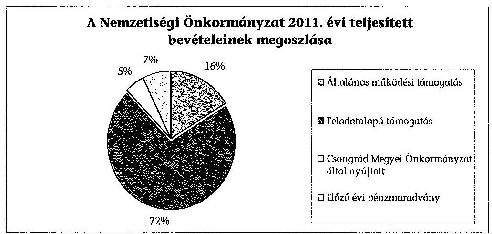
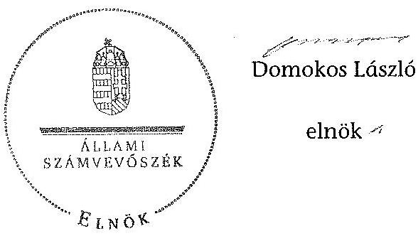

# ÁLLAMI   SZÁMVEVÔSZÉK 

## JELENTÉS

a helyi kisebbségi/nemzetiségi önkormányzatok gazdálkodásának ellenőrzéséről
Csanádpalotai Roma Nemzetiségi Önkormányzat

---

# Állami Számvevőszék 

Iktatószám: V-0088-017/2013.
Témaszám: 1105
Vizsgálat-azonosító szám: V06060312

## Az ellenőrzést felügyelte:

Horváth Balázs
felügyeleti vezető
Az ellenőrzést vezette és az ellenőrzés végrehajtásáért felelős:
Preller Zsuzsanna
ellenőrzésvezető
A számvevőszéki jelentést készítették és a jelentés összeállításában
közremüködtek:
Nyikon Zsigmondné
számvevő tanácsos
dr. Láng Ágnes Krisztina
számvevő
Az ellenőrzést végezték:
Liziczai Imréné Nyikon Zsigmondné
számvevő
számvevő tanácsos

---

# TARTALOMJEGYZÉK 

BEVEZETÉS ..... 5
I. ÖSSZEGZŐ MEGÁLLAPÍTÁSOK, KÖVETKEZTETÉSEK, JAVASLATOK ..... 7
II. RÉSZLETES MEGÁLLAPÍTÁSOK ..... 11

1. A Nemzetiségi és a Települési Önkormányzat együttmúködésének szabályszerűsége ..... 11
2. A gazdálkodási feladatok ellátásának szabályszerűsége ..... 11
2.1. A költségvetésre és zárszámadásra, valamint a kincstári adatszolgáltatás rendjére vonatkozó jogszabályi előírások betartása ..... 11
2.2. A Nemzetiségi Önkormányzat gazdálkodásának szabályozottsága ..... 12
2.3. A pénzügyi kontrollok múködése ..... 14
3. A Nemzetiségi Önkormányzattal összefüggő gazdálkodási feladatok belső ellenőrzése ..... 15
4. A 2011. évi feladatalapú támogatás felhasználásának, elszámolásának szabályszerűsége ..... 16
5. A Nemzetiségi Önkormányzat feladatellátása ..... 16
MELLÉKLET
6. számú A Nemzetiségi Önkormányzat 2011. évi és 2012. I. félévi gazdálkodásának főbb adatai, mutatói
FÜGGELÉKEK
7. számú Értelmező szótár
8. számú A pénzügyi kontrollok múködésének értékelése

---

!
!
!
!
!
!
!
!
!
!
!
!
!
!
!
!
!
!
!
!
!
!
!
!
!
!
!
!
!
!
!
!
!
!
!
!
!
!
!
!
!
!
!
!
!
!
!
!
!
!
!
!
!
!
!
!
!
!
!
!
!
!
!
!
!
!
!
!
!
!
!
!
!
!
!
!
!
!
!
!
!
!
!
!
!
!
!
!
!
!
!
!
!
!
!
!
!
!
!
!
!
!
!
!
!
!
!
!
!
!
!
!
!
!
!
!
!
!
!
!
!
!
!
!
!
!
!
!
!
!
!
!
!
!
!
!
!
!
!
!
!
!
!
!
!
!
!
!
!
!
!
!
!
!
!
!
!
!
!
!
!
!
!
!
!
!
!
!
!
!
!
!
!
!
!
!
!
!
!
!
!
!
!
!
!
!
!
!
!
!
!
!
!
!
!
!
!
!
!
!
!
!
!
!
!

---

# RÖVIDÍTÉSEK JEGYZÉKE 

## Törvények

Áht. 1
Áht. 2
ÁSZ tv.
Nek. 1 tv.
Nek. 2 tv.

## Rendeletek

Áhsz.

Ámr.
Ávr.

Ber.
Bkr.

Polgármesteri Hivatal SZMSZ-e
támogatási kormányrendelet

Települési Önkormányzat SZMSZ-e
1992. évi XXXVIII. törvény az államháztartásról (hatályos 2011. december 31-ig)
2011. évi CXCV. törvény az államháztartásról (hatályos 2011. december 31-től)
2011. évi LXVI. törvény az Állami Számvevőszékről (hatályos 2011. július 1-jétől)
1993. évi LXXVII. törvény, a nemzeti és etnikai kisebbségek jogairól (hatályos 2011. december 31-ig)
2011. évi CLXXIX. törvény a nemzetiségek jogairól (hatályos 2011. december 20-tól)

249/2000. (XII. 24.) Korm. rendelet az államháztartás szervezetei beszámolási és könyvvezetési kötelezettségének sajátosságairól
292/2009. (XII. 19.) Korm. rendelet az államháztartás múködési rendjéről (hatályos 2011. december 31-ig)
368/2011. (XII. 31.) Korm. rendelet az államháztartásról szóló törvény végrehajtásáról (hatályos 2012. január 1jétől)
193/2003. (XI. 26.) Korm. rendelet a költségvetési szervek belső ellenőrzéséről (hatálytalan 2012. január 1-jétől)
370/2011. (XII. 31.) Korm. rendelet a költségvetési szervek belső kontrollrendszeréről és belső ellenőrzéséről (hatályos 2012. január 1-jétől)
Csanádpalota Város Önkormányzata Képviselőtestületének 319/2009. (XII. 30.) számú, 2011. december 31-ig hatályos, a 241/2011. (XII. 21.) számú, 2012. május 30-ig hatályos és 2012. június 1-jétől hatályos 72/2012. (V. 29.) számú határozta Csanádpalota Város Önkormányzat Polgármesteri Hivatalának Szervezeti és Múködési Szabályzatáról
a kisebbségi önkormányzatoknak a központi költségvetésből, valamint fejezeti kezelésű előirányzatból nyújtott támogatások feltételrendszeréről és elszámolásának rendjéről szóló 342/2010. (XII. 28.) Korm. rendelet (hatályon kívül helyezte a 28/2012. (III. 6.) Korm. rendelet a nemzetiségi célú előirányzatokból nyújtott támogatások feltételrendszeréről és elszámolásának rendjéről; jelenleg hatályos a 428/2012. (XII. 29.) Korm. rendelet a nemzetiségi célú előirányzatokból nyújtott támogatások feltételrendszeréről és elszámolásának rendjéről)
Csanádpalota Város Önkormányzata Képviselőtestületének 8/2011. (IV. 14.) számú rendelete a Szervezeti és Müködési Szabályzatról

---

## Szórövidítések

ÁSZ
gazdálkodási jogkörök szabályzata
jegyzö
Képviselő-testület

Kincstár
Nemzetiségi Önkormányzat

Nemzetiségi Önkormányzat elnöke
polgármester
Polgármesteri Hivatal

Támogató
Települési Önkormányzat
Települési Önkormányzat Képviselö-testülete

Állami Számvevőszék
Csanádpalota Város Önkormányzat Polgármesteri Hivatala Kötelezettségvállalás, utalványozás, ellenjegyzés, érvényesítés rendjének szabályzata 2012. január 31-ig, Csanádpalota Város Önkormányzat Polgármesteri Hivatala Kötelezettségvállalási szabályzata 2012. február 1-től
Csanádpalota Város Önkormányzat jegyzője
Csanádpalota Cigány Kisebbségi Önkormányzatának Képviselö-testülete 2011. december 31-ig, Csanádpalotai Roma Nemzetiségi Önkormányzatának Képviselőtestülete 2012. január 1-jétől
Magyar Államkincstár
Csanádpalota Város Cigány Kisebbségi Önkormányzata 2011. december 31-ig, Csanádpalotai Roma Nemzetiségi Önkormányzat 2012. január 1-jétől
Csanádpalota Város Cigány Kisebbségi Önkormányzatának elnöke 2011. december 31-ig, Csanádpalotai Roma Nemzetiségi Önkormányzatának elnöke 2012. január 1jétől
Csanádpalota Város Önkormányzatának polgármestere
Csanádpalota Város Önkormányzatának Polgármesteri Hivatala, 2012. március 1-jétől Csanádpalota Közös Önkormányzati Hivatal
A támogatást nyújtó Közigazgatási és Igazságügyi Minisztérium
Csanádpalota Városi Önkormányzat
Csanádpalota Város Önkormányzatának Képviselőtestülete

---

# JELENTÉS 

## a helyi kisebbségi/nemzetiségi önkormányzatok gazdálkodásának ellenőrzéséről Csanádpalotai Roma Nemzetiségi Önkormányzat

## BEVEZETÉS

Az államháztartás részét, az önkormányzati alrendszer egyik elemét képezik a nemzetiségi önkormányzatok, amelyek jogi személyek és a Nek. ${ }_{1,2}$ tv-ben meghatározott önálló feladat- és hatáskörökkel rendelkeznek. A nemzetiségi önkormányzatok az önkormányzati, illetve testületi múködtetés mellett a helyi nemzetiségi közügyek változatos formában való ellátásában vesznek részt.

A nemzetiségi önkormányzatok, illetve a települési önkormányzatok között a jelenlegi szabályozás szerint nincs alá-fölérendeltségi viszony. A nemzetiségi önkormányzatok azonban sajátos közjogi helyzetben vannak, mert a jogállásukat tekintve önkormányzatok, ám függnek a székhelyük szerinti települési önkormányzat hivatalától, amely ellátja a nemzetiségi önkormányzatok vonatkozásában a megállapodásban rögzített gazdálkodási feladatokat.

A nemzetiségek helyzete, támogatása mind hazai, mind európai uniós szinten kiemelt figyelmet kap napjainkban. A nemzetiségi önkormányzatok gazdálkodására és támogatási rendszerére vonatkozó jogszabályok a 20102012. években jelentős változásokon mentek át, amelyek érintették a feladatalapú támogatásra fordítható költségvetési keret megállapítását, az operatív gazdálkodási jogkörök szabályozását, az elkülönített könyvvezetés alkalmazását, a belső ellenőrzés szabályozását.

Az ellenőrzés célja annak értékelése volt, hogy a Nemzetiségi Önkormányzat gazdálkodási kereteinek kialakítása, gazdálkodása és feladatellátása megfelelte a hatályos jogszabályoknak.

Ennek keretében ellenőriztük, hogy:

- a Nemzetiségi Önkormányzat és a Települési Önkormányzat együttműködésének szabályozása, a Települési Önkormányzat SZMSZ-ében, a megállapodásban előírt működési feltételek biztosítása megfelelt-e a jogszabályi előírásoknak;
- a felek együttműködése megfelelt-e a megállapodásnak a gazdálkodási feladatok szabályszerű ellátásában, betartották-e a Nemzetiségi Önkormányzat gazdálkodásához kapcsolódóan a költségvetésre és zárszámadásra, a gazdálkodás szabályozására, az operatív gazdálkodási jogkörök gyakorlására vonatkozó jogszabályi előírásokat;

---

- a jegyző biztosította-e a Polgármesteri Hivatal belső ellenőrzése keretében a Nemzetiségi Önkormányzattal összefüggő gazdálkodási feladatok belső ellenőrzését;
- a 2011. évi feladatalapú támogatás felhasználása, a folyósított feladatalapú támogatással történő elszámolás az előírásoknak megfelelően történt-e;
- a Nemzetiségi Önkormányzat feladatellátása összhangban volt-e a vonatkozó jogszabályi előírásokkal.

Az ellenőrzés típusa: szabályszerűségi ellenőrzés
Az ellenőrzött időszak: 2011. január 1. - 2012. június 30.
Ellenőrzött szervezet: Csanádpalotai Roma Nemzetiségi Önkormányzat és a gazdálkodási feladatait ellátó Csanádpalota Városi Önkormányzat

Az ellenőrzés jogszabályi alapja: az ÁSZ tv. 5. § (2)-(3) és (6) bekezdései
Az ellenőrzés szakmai módszertana az ÁSZ hivatalos honlapján (www.asz.hu) közzétett szakmai szabályokon alapult, amely a Legfőbb Ellenőrző Intézmények Nemzetközi Szervezete (INTOSAI) által kiadott nemzetközi standardok (ISSAI) figyelembevételével készült. A fogalmak magyarázatát az 1. számú függelék, a pénzügyi kontrollok megfelelősége értékelésénél alkalmazott egységes minősítési szempontokat a 2. számú függelék tartalmazza.

Az ellenőrzés lefolytatásához a Települési Önkormányzat és a Nemzetiségi Önkormányzat tanúsítványok kitöltésével és a kapcsolódó dokumentumok elektronikus megküldésével szolgáltatott adatokat. A tanúsítványokon szerepeltetett adatok, információk ellenőrzése és szükség szerinti javítása a helyszíni ellenőrzés keretében történt.

Az ÁSZ az ellenőrzés megállapításait az ellenőrzött időszakban hatályos, az intézkedést igénylő megállapításokra tett javaslatokat a jelenleg hatályos jogszabályok alapján fogalmazta meg.

A Nemzetiségi Önkormányzat 2010. évben alakult, elnöke a 2010. évi helyhatósági választások óta látja el feladatát. A Nemzetiségi Önkormányzat intézményt, gazdasági társaságot és más szervezetet nem alapított, illetve társulásban nem vett részt. A négytagú Képviselő-testület munkája segítésére bizottságot nem hozott létre. A Nemzetiségi Önkormányzat a költségvetési beszámolója szerint a 2011. évben 1308 ezer Ft költségvetési bevételt ért el és 1207 ezer Ft költségvetési kiadást teljesített. A 2012. évben 311 ezer Ft eredeti költségvetési bevételi és kiadási előirányzatot terveztek. A 2012. I. félévi beszámolója alapján a teljesített költségvetési bevétel 317 ezer Ft, a teljesített költségvetési kiadás 118 ezer Ft volt. A 2011. évi és a 2012. I. féléves gazdálkodási adatokat részletesen az 1. számú mellékletben mutatjuk be. Az ÁSZ a Nemzetiségi Önkormányzat gazdálkodását korábban nem ellenőrizte. Az ÁSZ tv. 29. § (1) bekezdése szerint a jelentéstervezetet megküldtük a polgármester és a Nemzetiségi Önkormányzat elnöke részére, akik az ÁSZ tv. 29. § (2) bekezdésében foglalt észrevételezési jogukkal nem éltek, a jelentéstervezetre észrevételt nem tettek.

---

# I. ÖSSZEGZŐ MEGÁLLAPÍTÁSOK, KÖVETKEZTETÉSEK, JAVASLATOK 

A Nemzetiségi és a Települési Önkormányzat együttmüködése az előírt határidő betartásával jóváhagyott megállapodásokon alapult. A Települési Önkormányzat biztosította a Nemzetiségi Önkormányzat múködéséhez szükséges személyi és tárgyi feltételeket. Az együttmúködési megállapodásokat - a 2011. évben az Ámr., a 2012. évben az Áht. ${ }_{2}$ és a Nek. ${ }_{2}$ tv. előírásaihoz képest kisebb tartalmi hiányosságokkal fogadták el. A 2012. június 1-jétől hatályos megállapodásban nem rendelkeztek az Áht. ${ }_{2}$-ben előírt, a Nemzetiségi Önkormányzat bevételeivel és kiadásaival kapcsolatos ellenőrzési kötelezettségről és a Nek. ${ }_{2}$ tv. szerinti iratkezelési feladatok ellátásáról.

A Nemzetiségi Önkormányzat költségvetésére és zárszámadására vonatkozó jogszabályi előírásokat részben tartották be. A költségvetési határozatok jóváhagyása, a költségvetési előirányzatok módosítása a jogszabályban előírt eljárásrend szerint történt, a határozatokat egymással összehasonlítható szerkezetben készítették el és változatlan formában építették be a Települési Önkormányzat költségvetési rendeleteibe. A 2011. évi zárszámadási határozatot az Ámr-ben előírt határidőn túl fogadták el. A 2012. évi költségvetési határozat az Áht. ${ }_{2}$ előírásaival ellentétesen nem tartalmazta a finanszírozási célú pénzügyi műveletekkel kapcsolatos hatásköröket. A 2012. I. félévben a kincstári adatszolgáltatás során a jegyző nem tartotta be az Ávr-ben előírt határidőket.

A gazdálkodás szabályozása az ellenőrzött időszakban részben felelt meg a jogszabályi előírásoknak. A gazdálkodási feladatok végrehajtását ellátó Polgármesteri Hivatal jogszabályokban előírt szabályzatainak hatályát - az ellenőrzési nyomvonal, a szabálytalanságok kezelésének eljárásrendje és a folyamatba épített előzetes, utólagos és vezetői ellenőrzés szabályzata kivételével - a jegyző kiterjesztette a Nemzetiségi Önkormányzat gazdálkodási feladataira. A Számv. tv. és az Áhsz. előírásai ellenére a 2012. évi jogszabályi változásokat nem érvényesítették a számviteli politikában, a számlarendben, valamint az eszközök és források értékelési szabályzatában. A 2012. I. félévben a 100 ezer Ft-ot el nem érő kifizetéseknél az előzetes írásbeli kötelezettségvállalások rendjét az Ávr. előírása ellenére nem szabályozták. Az operatív gazdálkodási jogkörök kialakítása az ellenőrzött időszakban részben volt összhangban a jogszabályi előírásokkal. A gazdasági vezető nem rendelkezett az Ámr-ben, illetve az Ávr-ben előírt szakképesítéssel. A gazdasági vezető 2012. I. félévben az Áht. ${ }_{2}$ és az Ávr. előírása ellenére az összeférhetetlenség eseteire a pénzügyi ellenjegyzés gyakorlására nem adott írásbeli felhatalmazást. A Polgármesteri Hivatal SZMSZ-e az Ámr. és az Ávr. előírásainak megfelelően tartalmazta a munkakörökhöz kapcsolódóan a Nemzetiségi Önkormányzat gazdálkodásával kapcsolatos feladat- és hatásköröket, a hatáskörök gyakorlásának módját, a helyettesítés rendjét és az ezekre vonatkozó felelősségi szabályokat.

A pénzügyi kontrollok múködése a dologi és egyéb folyó kiadások teljesítésénél az ellenőrzött időszak egészében gyenge volt, a hibák száma a lényegességi szintet, a kritikus hibahatárt elérte. A 2011. évben az előzetes írásbeli köte-

---

lezettségvállalást nem igénylő kifizetések rendjének szabályozása hiányában a kötelezettségvállalás ellenjegyzése, a szakmai teljesítésigazolás és az utalvány ellenjegyzése nem szabályszerűen történt. A 2012. I. félévben a pénzügyi ellenjegyzó és a teljesítés igazolója az Áht. ${ }_{2}$-ben, illetve az Ávr-ben előírt ellenőrzési feladatát - az előzetes írásbeli kötelezettségvállalást nem igénylő kifizetések rendjének szabályozása hiányában - aláírása ellenére nem szabályszerűen végezte el. Az érvényesítő jogosulatlanul látta el feladatát, mert az aláírása nem volt beazonosítható az arra jogosult aláírás-mintájával. Az ellenőrzés a Nemzetiségi Önkormányzatnál - az ellenőrzött tételek esetében - jogosulatlan kifizetést nem tárt fel, a pénzügyi kontrollok működéséhez kapcsolódó hiányosságok azonban nem biztosítják a hibák megelőzését, feltárását és kijavítását.

A Nemzetiségi Önkormányzat a 2011. évben 939,7 ezer Ft feladatalapú támogatásban részesült, amelyet a tárgyévben a jogszabályi előírásokkal összhangban felhasznált. A támogatási kormányrendeletben hivatkozott, Áht. ${ }_{1}$ ben előírt elszámolás nem történt meg. A támogatás felhasználását, elszámolását a jogosult szervezetek nem ellenőrizték.

A Nemzetiségi Önkormányzat feladatellátásának tárgya a Nek. ${ }_{1,2}$ tv. előírásaival összhangban volt. Biztosította a nemzetiségi közügyek keretében az alapvető feladatokhoz szükséges szervezeti, személyi és anyagi feltételeket, hagyományápolással és közművelődéssel kapcsolatos feladatokat látott el.

A Polgármesteri Hivatal 2011. évi ellenőrzési tervét megalapozó kockázatelemzés a Ber. előírásai ellenére nem terjedt ki a Nemzetiségi Önkormányzat gazdálkodásával összefüggő végrehajtási feladatok ellátására. A 2012. évre elvégzett kockázatelemzés során a Nemzetiségi Önkormányzat gazdálkodásával öszszefüggő végrehajtási feladatok közül magas kockázatúnak értékelt területet a 2012. évi belső ellenőrzési tervbe nem építették be. A jegyző az ellenőrzött időszakban az Áht. ${ }_{1,2}$ ellenére nem biztosította a Polgármesteri Hivatal belső ellenőrzése keretében a Nemzetiségi Önkormányzat gazdálkodásával összefüggő végrehajtási feladatok belső ellenőrzését. Erre irányuló ellenőrzést a 2011. évben és 2012. I. félévben nem terveztek és nem végeztek.

Az ellenőrzés megállapításai alapján, az észrevételezésre megküldött jelentéstervezetben a Nemzetiségi Önkormányzat gazdálkodásával kapcsolatban intézkedést igénylő megállapításokat és javaslatokat fogalmaztunk meg, amelyek végrehajtásáról az ellenőrzés időszakában intézkedési tájékoztatást adott a polgármester és a Nemzetiségi Önkormányzat elnöke. A 2013. szeptember 25én megkötött hatályos együttmúködési megállapodásban a Nek. ${ }_{2}$ tv. és az Áht. ${ }_{2}$ vonatkozó előírásait érvényesítették, a tartalmi hiányosságokat megszüntették. A 2013. évi költségvetési határozat Áht. ${ }_{2}$-ben foglalt előírásoknak megfelelő elkészítését a beküldött dokumentumokkal igazolták. A 2013. évben a kincstári adatszolgáltatási kötelezettséget az Ávr-ben előírt határidőben teljesítették. A 2013. évben hatályba léptetett számviteli politika, számlarend, eszközök és források értékelési szabályzata a Számv. tv. és az Áhsz. által előírt követelményeket tartalmazza. Az Ávr. előírásait figyelembe véve az előzetes írásbeli kötelezettségvállalást nem igénylő kifizetések rendjét szabályozták. A gazdasági vezető - összeférhetetlenség fennállása esetére - a pénzügyi ellenjegyzési feladatokra írásbeli kijelölést tett. Figyelemmel az ÁSZ ellenőrzés hasznosítására mind-

---

ezek vonatkozásában intézkedést igénylő megállapítást, javaslatot már nem szerepeltetünk.

Az ÁSZ tv. 33. § (1) bekezdésében foglaltak értelmében az ellenőrzött szervezet vezetője köteles a jelentésben foglalt megállapításokhoz kapcsolódó intézkedési tervet összeállítani, és azt a jelentés kézhezvételétől számított 30 napon belül az ÁSZ részére megküldeni. Amennyiben az intézkedési tervet határidőre nem küldi meg a szervezet, vagy az nem elfogadható, az ÁSZ elnöke az ÁSZ tv. 33. § (3) bekezdés a)-b) pontjaiban foglaltakat érvényesítheti.

A helyszíni ellenőrzés megállapításainak hasznosítása mellett javasoljuk:

# a jegyzőnek 

1. a gazdálkodás szabályozottságával kapcsolatban

A jegyző a Polgármesteri Hivatal szabályzatai közül a 2012. évben a Bkr. 6. § (3)-(4) bekezdéseiben előírt ellenőrzési nyomvonal és a szabálytalanságok kezelése eljárásrendjének, valamint a Bkr. 8. § (2)-(4) bekezdéseiben előírt folyamatba épített előzetes, utólagos és vezetői ellenőrzés szabályzatának hatályát nem terjesztette ki a Nemzetiségi Önkormányzat gazdálkodási feladataira, illetve nem készítette el annak saját szabályzatait.

A gazdasági vezető az Ávr. 12. § -ában előírt szakképesítéssel nem rendelkezett.
Javaslat
A gazdálkodás szabályozottsága, szabályszerűsége érdekében:
a) készítse el a Polgármesteri Hivatal ellenőrzési nyomvonalának, a szabálytalanságok kezelése eljárásrendjének, valamint a folyamatba épített előzetes, utólagos és vezetői ellenőrzés szabályzatainak a módosítását az Ávr. 13. § (3a) bekezdésének felhatalmazása alapján, hogy a Bkr. 6. § (3)-(4), és a 8. § (2)-(4) bekezdéseiben foglalt szabályzatok hatálya kiterjedjen a Nemzetiségi Önkormányzat gazdálkodási feladataira;
b) gondoskodjon arról, hogy a gazdasági vezető rendelkezzen az Ávr. 12. §-ában előírt szakképesítéssel.
2. a pénzügyi kontrollok múködésével kapcsolatban
2012. I. félévben a pénzügyi ellenjegyző az Áht. 37. § (1) bekezdésében, a teljesítés igazolója az Ávr. 57. § (1) bekezdésében előírt ellenőrzési feladatát nem végezte el. Az érvényesítő aláírása nem egyezett meg a gazdasági vezető által érvényesítésre kijelölt személy Ávr. 60. § (3) bekezdése szerinti nyilvántartásban szereplő aláírásmintájával, így jogosultsága - az Ávr. 58. § (1) bekezdésben előírt ellenőrzési feladatok ellátására - nem volt megállapítható, ezért szabályszerűen nem történt meg az összegszerűség, a fedezet meglétének, valamint annak ellenőrzése, hogy a megelőző ügymenetben a gazdálkodási jogkörök szabályzatában foglaltakat betartották.

---

Javaslat
Az operatív gazdálkodás működési hibáinak megelőzése, feltárása és kijavítása érdekében gondoskodjon arról, hogy:
a) az Ávr. 55. § (2) bekezdés g) pontja alapján a pénzügyi ellenjegyző szabályszerű kijelölésével az Áht. 2 37. § (1) bekezdésében előírt feladatokat elvégezzék;
b) a teljesítés igazolása során az Ávr. 57. § (1) bekezdésében előírt ellenőrzési kötelezettségének tegyen eleget;
c) az érvényesítést az Ávr. 60. § (3) bekezdése szerinti naprakész nyilvántartással összhangban végezzék, biztosítva az Ávr. 58. § (1) bekezdésben előírt ellenőrzési feladatok ellátását.
3. a feladatalapú támogatás elszámolásával kapcsolatban

A 2011. évben folyósított feladatalapú támogatás elszámolása a támogatási kormányrendelet 7. § (2) bekezdésében hivatkozott Áht. ${ }_{1}$-nek „a helyi önkormányzatok elszámolási rendjére vonatkozó rendelkezései alkalmazása" előírása ellenére nem történt meg.

Javaslat
Gondoskodjon az Áht. 2 27. § (2) bekezdésben meghatározott feladatkörében a Nemzetiségi Önkormányzat által igénybe vett feladatalapú támogatás elszámolásának elkészítéséről, figyelemmel az Áht. 2 57. § (4) bekezdésben foglaltakra.

# a Nemzetiségi Önkormányzat elnökének 

A 2011. évben folyósított feladatalapú támogatás elszámolása a támogatási kormányrendelet 7. § (2) bekezdésében hivatkozott Áht. ${ }_{1}$-nek „a helyi önkormányzatok elszámolási rendjére vonatkozó rendelkezései alkalmazása" előírása ellenére nem történt meg.

Javaslat
Terjessze a Képviselő-testület elé jóváhagyásra az Áht. 2 57. § (4) bekezdés alapján készített elszámolást a Nemzetiségi Önkormányzat által igénybe vett feladatalapú támogatásról.

---

# II. RÉSZLETES MEGÁLLAPÍTÁSOK 

## 1. A Nemzetiségi és a Települési Önkormányzat együttmúkÖDÉSÉNEK SZABÁLYSZERŰSÉGE

A Nemzetiségi Önkormányzat és a Települési Önkormányzat együttmúködésének szabályozása, a Nemzetiségi Önkormányzat múködési feltételeinek biztosítása - az együttmúködési megállapodások ${ }^{1}$ hiányosságai ellenére megfelelt a jogszabályi előírásoknak. A megállapodások jóváhagyása az előírt határidők betartásával történt.

Az együttműködési megállapodásokban a jogszabályi előírásokat nem érvényesítették maradéktalanul, mert:

- a 2011. december 31-én hatályos együttműködési megállapodásban az Ámr. 37. § (4) bekezdés b), d), e) és f) pontjainak előírásai ellenére nem rendelkeztek a költségvetési koncepcióval, a költségvetési határozattal és a költségvetési rendelettel kapcsolatos feladatokról és határidőkről;
- a 2012. június 30 -án hatályos együttműködési megállapodásban a Nek. ${ }_{2}$ tv. 80. § (1) bekezdés e) pontjában foglaltak ellenére nem határozták meg az iratkezelési feladatok ellátását;
- a 2012. június 30 -án hatályos együttműködési megállapodásban az Áht. ${ }_{2}$ 27. § (2) bekezdésében előírtak ellenére nem rendelkeztek a Nemzetiségi Önkormányzat bevételeivel és kiadásaival kapcsolatban az ellenőrzési feladatok ellátásának részletes szabályairól.

A Települési Önkormányzat biztosította a Nemzetiségi Önkormányzat múködéséhez szükséges személyi és tárgyi feltételeket.

## 2. A GAZDÁLKODÁSI FELADATOK ELLÁTÁSÁNAK SZABÁLYSZERŰSÉGE

### 2.1. A költségvetésre és zárszámadásra, valamint a kincstári adatszolgáltatás rendjére vonatkozó jogszabályi előírások betartása

A Nemzetiségi Önkormányzat költségvetésére, a zárszámadására és a kincstári adatszolgáltatásra vonatkozó jogszabályi előírásokat

[^0]
[^0]:    ${ }^{1}$ A 2011. évben hatályos együttmúködési megállapodást a Települési Önkormányzat Képviselő-testülete a 250/2010. (XII. 29.) számú, a Képviselő-testület a 26/2010. (XII. 14.) számú határozattal fogadta el. A Nek. ${ }_{2}$ tv. 159. § (3) bekezdésében előírtak alapján 2012. június 1-jéig felülvizsgált és módosított együttműködési megállapodást a Települési Önkormányzat Képviselő-testülete a 82/2012. (V. 30.) számú, a Képviselőtestület a 14/2012. (V. 23.) számú határozattal fogadta el.

---

részben tartották be. A Nemzetiségi Önkormányzat költségvetési és zárszámadási határozatai ${ }^{2}$ egymással összehasonlítható szerkezetben készültek, azok változatlan formában épültek be a Települési Önkormányzat költségvetési és zárszámadási rendeleteibe ${ }^{3}$. A Nemzetiségi Önkormányzat elnöke a költségvetési előirányzatok felhasználásához szükséges mértékben kezdeményezte azok módosítását, biztosította a tárgyévi fizetési kötelezettség vállalásához szükséges fedezet meglétét.

A Képviselő-testület a 2011. évi költségvetési és zárszámadási határozatok, valamint a 2012. évi költségvetési határozat elfogadása során a jogszabályi előírásokat maradéktalanul nem érvényesítette, mert:

- a 2011. évi költségvetési határozat az Ámr. 36. § (1) bekezdése i) pont előírása ellenére nem tartalmazta a tárgyévi költségvetési bevételi és kiadási előirányzatok mérlegszerű bemutatását;
- a 2011. évi költségvetéshez az Ámr. 36. § (1) bekezdés k) pontjában foglaltakat figyelmen kívül hagyva az év várható bevételi és kiadási előirányzatainak teljesüléséről előirányzat-felhasználási ütemterv nem készült;
- a 2011. évi zárszámadási határozat tervezetét a jegyző határidőben előkészítette, azonban a Nemzetiségi Önkormányzat elnöke az Áht. 2 91. § (3) bekezdésben előírt határidőn túl terjesztette a Képviselő-testület elé, ezért azt az Ámr. 37. § (3) bekezdésében előírt határidőn túl fogadta el;
- a 2012. évi költségvetési határozat az Áht. ${ }_{2}$ 23. § (2) bekezdés h) pontja ellenére nem tartalmazta a finanszírozási célú pénzügyi műveletekkel kapcsolatos hatásköröket.

A jegyző a Nemzetiségi Önkormányzatra vonatkozó kincstári adatszolgáltatási kötelezettségét, a 2012. év első három, illetve első hat hónapjáról készített időközi költségvetési-, illetve mérlegjelentés tekintetében, az Ávr. 169. § (2) bekezdésében, valamint az Ávr. 170. § (5) bekezdésében előírt határidőn túl teljesítette.

# 2.2. A Nemzetiségi Önkormányzat gazdálkodásának szabályozottsága 

A Nemzetiségi Önkormányzat gazdálkodásának szabályozása az ellenőrzött időszakban részben felelt meg a jogszabályi előírásoknak.

[^0]
[^0]:    ${ }^{2}$ Képviselő-testület 11/2012. (IV. 25.) számú határozata a 2011. évi zárszámadás elfogadásáról.
    ${ }^{3}$ A Települési Önkormányzat 2011. évi költségvetéséről alkotott 3/2011. számú és a 2011. évi zárszámadás elfogadásáról alkotott 8/2012. (IV. 26.) önkormányzati rendelete.

---

A gazdálkodási feladatai végrehajtását ellátó Polgármesteri Hivatal jogszabályokban előírt gazdálkodási szabályzatainak hatályát részben kiterjesztette a Nemzetiségi Önkormányzatra, azonban:

- a jegyző a Számv. tv. 14. § (11) bekezdésében és az Áhsz. 2. §-ában előírtakat figyelmen kívül hagyva nem gondoskodott a Nemzetiségi Önkormányzatra kiterjesztett számviteli politika, az eszközök és források értékelési szabályzata és a számlarend esetében a 2012. évi jogszabályi változások átvezetéséről;
- a jegyző a Polgármesteri Hivatal szabályzatai közül a 2011. évben az Ámr. 156. § (2)-(3) bekezdésében, a 2012. évben a Bkr. 6. § (3)-(4) bekezdéseiben előírt ellenőrzési nyomvonal és a szabálytalanságok kezelése eljárásrendjének, valamint a 2011. évben az Áht., 121/A. § (4) bekezdésében, a 2012. évben a Bkr. 8. § (2)-(4) bekezdéseiben előírt folyamatba épített előzetes, utólagos és vezetői ellenőrzés szabályzatának hatályát nem terjesztette ki a Nemzetiségi Önkormányzat gazdálkodási feladataira, illetve nem készítette el annak saját szabályzatait;
- a jegyző a 2012. évben a gazdálkodási jogkörök szabályzatában az Ávr. 53. § (2) bekezdésének előírásait figyelmen kívül hagyva nem alakította ki az előzetes írásbeli kötelezettségvállalást nem igénylő kifizetések rendjét, annak ellenére, hogy a szabályzat lehetővé tette a 100 ezer Ft-ot el nem érő kifizetések esetében az írásbeli kötelezettségvállalás mellőzését.

A Nemzetiségi Önkormányzat operatív gazdálkodási jogköreinek kialakítása - a kötelezettségvállalásra, az utalványozásra, a kötelezettségvállalás és utalványozás ellenjegyzésére a felhatalmazások, a szakmai teljesítést igazoló, a pénzügyi ellenjegyzést és az érvényesítést végző személyek kijelölése - az ellenőrzött időszakban részben felelt meg a jogszabályi előírásoknak, mert:

- a jegyző a 2011. évben az Ámr. 19. § (1) bekezdés ${ }^{4}$ előírása ellenére az összeférhetetlenség és távollét eseteire a kötelezettségvállalás és az utalvány ellenjegyzésére az előírt szakmai képesítéssel nem rendelkező személyt jelölt ki;
- a gazdasági vezető 2012. I. félévben az Áht. 2 37. § (2) bekezdése és az Ávr. 55. § (2) bekezdés g) pontjában és az Ávr. 60. § (1)-(2) bekezdéseiben előírtak ellenére nem biztosította az összeférhetetlenségi szabályok érvényesülését, mert a pénzügyi ellenjegyzés gyakorlására nem adott felhatalmazást;
- a gazdasági vezető a 2011. évben az Ámr. 18. §-ában, 2012. I. félévben az Ávr. 12. §-ában előírt szakképesítéssel nem rendelkezett.

A Nemzetiségi Önkormányzat gazdálkodásával kapcsolatos feladat- és hatásköröket, a hatáskörök gyakorlásának módját, a helyettesítés rendjét és az ezekre vonatkozó felelősségi szabályokat a Polgármesteri Hivatal SZMSZ-ében az ellenőrzött időszakban rögzítették. Az operatív gazdálkodással kapcsolatos fel-adat- és hatásköröket az együttmúködési megállapodás, a gazdálkodási jogkö-

[^0]
[^0]:    ${ }^{4}$ 2012. január 1-jétől az Ávr. 55. § (3) bekezdés és 58. § (4) bekezdése

---

rök szabályzata, és a feladatokat ellátó köztisztviselők munkaköri leírásai tartalmazták.

# 2.3. A pénzügyi kontrollok múködése 

A Nemzetiségi Önkormányzat 2011. évi dologi és egyéb folyó kiadásainak teljesítése során a kötelezettségvállalás ellenjegyzése, a szakmai teljesítésigazolás és az utalvány ellenjegyzése kontrollok múködésének megfelelősége - a 2. számú függelékben részletezett szempontok alapján végzett értékelés szerint - gyenge volt, a hibák száma a lényegességi szintet, a kritikus hibahatárt elérte, mert:

- a kötelezettségvállalás ellenjegyzője az Ámr. 74. § (3) bekezdésének a)-c) pontjaiban foglalt feladatát nem végezte el, mert annak ellenére ellenjegyezte a megrendelőt, hogy az nem felelt meg a gazdálkodási jogkörök szabályzatában ${ }^{5}$ előírt előzetes írásbeli kötelezettségvállalás dokumentumának, valamint az Ámr. 75. § (3) bekezdésében előírt kötelezettségvállalásokat tartalmazó analitikus nyilvántartás hiányában nem történt meg a szabad előirányzat és a kifizetés tervezett időpontjában a fedezet rendelkezésre állásának igazolása, továbbá a gazdálkodásra vonatkozó szabályok betartásának ellenőrzése;
- a kifizetést megelőzően az Ámr. 76. § (3) bekezdésében foglaltak ellenére a szakmai teljesítésigazolás elmaradt, illetve a szakmai teljesítés igazolója aláírása ellenére nem látta el az Ámr. 76. § (1) bekezdésében foglalt feladatát, mert ellenőrizhető okmányok (megrendelő, kötelezettségvállalás nyilvántartás) hiányában szabályszerűen nem történt meg a kifizetés jogosságának, összegszerűségének és a megrendelés teljesítésének ellenőrzése;
- az utalvány ellenjegyzője az Ámr. 79. § (2) bekezdésben előírt ellenőrzési feladatát nem szabályszerűen látta el, mert annak ellenére ellenjegyezte az utalványt, hogy a szakmai teljesítésigazoló nem a belső szabályozásban előírtak szerint végezte feladatát, az érvényesítő az Ámr. 77. § (1) bekezdésben foglalt ellenőrzési kötelezettségét elmulasztva érvényesítette a kifizetést, így a szakmai teljesítés igazolására, az érvényesítésre és a gazdálkodásra vonatkozó szabályok betartásának ellenőrzése elmaradt.

A Nemzetiségi Önkormányzatnál 2012. I. félévben a dologi és egyéb folyó kiadások teljesítése során a pénzügyi ellenjegyzés, a teljesítés igazolás és az érvényesítés kontrollok múködésének megfelelősége - a 2. számú függelékben részletezett szempontok alapján végzett értékelés szerint - gyenge volt, a hibák száma a lényegességi szintet, a kritikus hibahatárt elérte, mert:

- a pénzügyi ellenjegyző az Áht. 2 37. § (1) bekezdésében foglalt feladatát aláírása ellenére nem végezte el, mert - az előzetes írásbeli kötelezettségvállalást nem igénylő kifizetések rendjének szabályozása hiányában - nem győződött meg a szabad előirányzat, valamint a kifizetés tervezett időpontjában

[^0]
[^0]:    ${ }^{5}$ A költségvetési szerv kötelezettségvállalásának rendje fejezet 1-25. pontjai előírása ellenére a megrendelő nem tartalmazta a szerződő fél megnevezését, a megrendelés pontos összegét.

---

a pénzügyi fedezet rendelkezésre állásáról, továbbá arról, hogy a kötelezettségvállalás során a gazdálkodásra vonatkozó szabályokat betartották-e;

- a teljesítés igazolója jogosultsága és aláírása ellenére nem végezte el az Ávr. 57. § (1) bekezdésében előírt ellenőrzési feladatát, mert - az előzetes írásbeli kötelezettségvállalást nem igénylő kötelezettségvállalások szabályozásának hiánya miatt - ellenőrizhető okmányok hiányában nem ellenőrizte a kiadás teljesítésének jogosságát, összegszerűségét, és a szerződésszerű teljesítést;
- az érvényesítő jogosulatlanul látta el az Ávr. 58. § (1) bekezdésben előírt ellenőrzési feladatát, mert aláírása nem volt beazonosítható a gazdasági vezető által érvényesítésre kijelölt személy Ávr. 60. § (3) bekezdésben előírt nyilvántartásban szereplő aláírás-mintájával, így szabályszerűen nem történt meg az összegszerűség, a fedezet meglétének, valamint annak ellenőrzése, hogy a megelőző ügymenetben az Áht. ${ }_{2}$-ben, az Áhsz-ben, valamint a gazdálkodási jogkörök szabályzatában foglaltakat betartották-e.

A Nemzetiségi Önkormányzatnál a 2011. évben és 2012. I. félévben, a pénzügyi folyamatokban kulcsszerepet betöltő belső kontrollok működésében feltárt hiányosságokkal összefüggésben az ellenőrzés jogosulatlan kifizetést nem állapított meg, a pénzügyi kontrollok múködéséhez kapcsolódó hiányosságok azonban nem biztosítják a hibák megelőzését, feltárását és kijavítását.

# 3. A Nemzetiségi ÖNKORMÁNYZATtal ÖSSZEFÜGGŐ GAZDÁLKODÁSI FELADATOK BELSŐ ELLENŐRZÉSE 

A Polgármesteri Hivatal 2011. évi ellenőrzési tervét megalapozó kockázatelemzés - a Ber. 21. § (2) ${ }^{6}$ bekezdése ellenére - nem terjedt ki a Nemzetiségi Önkormányzat gazdálkodásával összefüggő végrehajtási feladatok ellátására. A 2012. évi belső ellenőrzést megalapozó kockázatelemzés a Nemzetiségi Önkormányzat gazdálkodásának szabályozottságát magas kockázatú területnek értékelte, ennek ellenére ezt a 2012. évi belső ellenőrzési tervbe nem építették be. A Polgármesteri Hivatalnál a Nemzetiségi Önkormányzat gazdálkodásával összefüggő végrehajtási feladatok tekintetében belső ellenőrzést a 2011. évben és 2012. I. félévben nem terveztek és nem végeztek. A jegyző az ellenőrzött időszakban az Áht. ${ }_{1}$ 121/B. § (4) bekezdése, illetve az Áht. ${ }_{2} 70 . \S$ (1) bekezdése előírása ellenére nem biztosította a Polgármesteri Hivatal belső ellenőrzése keretében a Nemzetiségi Önkormányzat gazdálkodásával összefüggő végrehajtási feladatok belső ellenőrzését.

[^0]
[^0]:    ${ }^{6}$ 2012. január 1-jétől a Bkr. 7. § (2) bekezdése írja elő

---

# 4. A 2011. ÉVI FELADATALAPÚ TÁMOGATÁS FELHASZNÁLÁSÁNAK, ELSZÁMOLÁSÁNAK SZABÁLYSZERŰSÉGE 

A 2011. évben a Nemzetiségi Önkormányzat 940 ezer Ft feladatalapú támogatásban részesült, amelynek az összes bevételhez viszonyított részarányát a következő ábra szemlélteti:

A 2011. évben folyósított támogatást a jogszabályi előírásokkal összhangban a tárgyévben felhasználták. Elszámolása a támogatási kormányrendelet 7. § (2) bekezdésében hivatkozott Áht, ${ }_{1}$-nek „a helyi önkormányzatok elszámolási rendjére vonatkozó rendelkezései alkalmazása" előírása ellenére nem történt meg. A támogatás felhasználását, elszámolását az ellenőrzésre jogosult szervek nem ellenőrizték.

## 5. A Nemzetiségi Önkormányzat feladateLlátása

A Nemzetiségi Önkormányzat feladatellátásának tárgya összhangban volt a Nek. ${ }_{1,2}$ tv. előírásaival, mert - a feladat- és hatáskörére vonatkozó előírások betartásával - a törvényben meghatározott nemzetiségi közügyeket látott el. A Nemzetiségi Önkormányzat az ellenőrzött időszakban hatósági tevékenységet nem végzett, közüzemi szolgáltatással összefüggő feladatot nem látott el.

A Nemzetiségi Önkormányzat a Nek. ${ }_{1}$ tv. 5/A. § (1) bekezdés és a Nek. ${ }_{2}$ tv. 10. § (1) bekezdés szerinti, nemzetiségi érdekek védelmével és képviseletével kapcsolatos alapvető feladata ellátásához biztosította a szükséges szervezeti, személyi és anyagi feltételeket.

---

A Nek.; tv. 30. § (1) és a 30/A. § (4) bekezdéseiben, illetve a Nek. 2 tv. 115. §ában és a 116. § (1)-(2) bekezdésében foglaltak alapján a Nemzetiségi Önkormányzat a képviselt közösség kulturális autonómiája megerősítése érdekében együttműködési megállapodást kötött oktatási egyesülettel, továbbá hagyományápolással és közművelődéssel kapcsolatos feladatokat látott el.

Budapest, 2013. 12. hónap 16. nap

Melléklet: 1 db
Függelék: 2 db

---

.

---

# A Nemzetiségi Önkormányzat 2011. évi és 2012. 1. félévi gazdálkodásának főbb adatai, mutatói

A) BEVÉTELEK adatok ezer Ft-ban

|  Megnevezés | 2011. év |  |  |  | 2012. év |  | 2012. 1. félév |   |
| --- | --- | --- | --- | --- | --- | --- | --- | --- |
|   | eredeti el. | módosított
el. | teljesítés | teljesítés
megoszlása
(\%) | eredeti el. | módosított
el. | teljesítés | teljesítés
megoszlása
(\%)  |
|  Intézményi müködési bevétei | 0,0 | 0,0 | 0,0 | $0,0 \%$ | 0,0 | 0,0 | 1,0 | $0,3 \%$  |
|  Általános müködési
támogatás | 210,0 | 209,0 | 209,0 | $16,0 \%$ | 209,0 | 209,0 | 215,0 | $67,8 \%$  |
|  Feladatalapú támogatás | 0,0 | 940,0 | 940,0 | $71,8 \%$ | 0,0 | 0,0 | 0,0 | $0,0 \%$  |
|  Önkormányzat által nyújtott
támogatás megezi | 0,0 | 0,0 | 65,0 | $5,0 \%$ | 0,0 | 0,0 | 0,0 | $0,0 \%$  |
|  Fénzbogalmi bevételek
összesen | 210,0 | 1149,0 | 1214,0 | $92,8 \%$ | 209,0 | 209,0 | 216,0 | $68,1 \%$  |
|  Gözö évi pénzmaradvány
felhasználás | 0,0 | 94,0 | 94,0 | $7,2 \%$ | 101,0 | 101,0 | 101,0 | $31,9 \%$  |
|  Bevételek | 210,0 | 1243,0 | 1308,0 | $100,0 \%$ | 310,0 | 310,0 | 317,0 | $100,0 \%$  |

B) KIADÁSOK adatok ezer Ft-ban

|  Megnevezés | 2011. év |  |  |  | 2012. év |  | 2012. 1. félév |   |
| --- | --- | --- | --- | --- | --- | --- | --- | --- |
|   | eredeti el. | módosított el. | teljesítés | teljesítés megoszlása (\%) | eredeti el. | módosított el. | teljesítés | teljesítés megoszlása
(\%)  |
|  Személyi juttatások | 0,0 | 0,0 | 0,0 | $0,0 \%$ | 0,0 | 0,0 | 0,0 | $0,0 \%$  |
|  Munkaadókat terhelő
járulékok | 0,0 | 0,0 | 0,0 | $0,0 \%$ | 0,0 | 0,0 | 0,0 | $0,0 \%$  |
|  Dologi és egyéb folyó
kiadások | 209,0 | 1308,0 | 1207,0 | $100,0 \%$ | 311,0 | 311,0 | 118,0 | $100,0 \%$  |
|  Támogutásértékủ müködési
kiadás | 0,0 | 0,0 | 0,0 | $0,0 \%$ | 0,0 | 0,0 | 0,0 | $0,0 \%$  |
|  Müködési kiadások összesen | 209,0 | 1308,0 | 1207,0 | $100,0 \%$ | 311,0 | 311,0 | 118,0 | $100,0 \%$  |
|  Felhalmozdat kiadások | 0,0 | 0,0 | 0,0 | $0,0 \%$ | 0,0 | 0,0 | 0,0 | $0,0 \%$  |
|  Kiadások összesen | 209,0 | 1308,0 | 1207,0 | $100,0 \%$ | 311,0 | 311,0 | 118,0 | $100,0 \%$  |

---

.

---

# ÉRTELMEZŐ SZÓTÁR 

feladatalapú támogatás

megállapodás
nemzetiség
nemzetiségi közügy

A támogatási évben általános múködési támogatásban részesült, és a Támogatónak a Kincstárhoz intézett, a feladatalapú támogatás utalására vonatkozó rendelkező levele keltének időpontjában múködő nemzetiségi önkormányzatoknak a támogatási kormányrendeletben rögzített feltételrendszer alapján nyújtható támogatás. A feladatalapú támogatás a nemzetiségi közügyeknek a nemzetiségi önkormányzatok által történő ellátását szolgálja. (A támogatási kormányrendelet 2. § (2) bekezdés c) pont, és 4. § (1) bekezdés alapján.)
A nemzetiségi önkormányzatnak a múködési feltételei biztosítására, továbbá a bevételeivel és a kiadásaival kapcsolatban a tervezési, gazdálkodási, ellenőrzési, finanszírozási, adatszolgáltatási és beszámolási feladatai végrehajtására a székhelye szerinti települési önkormányzattal megkötött megállapodás. (Az Áht. ${ }_{1} 66$. §, a Nek. 2 tv. 80. § (2) bekezdés, valamint az Áht. 2 27. § (2) bekezdés alapján levezetett fogalom.)
Minden olyan Magyarország területén legalább egy évszázada honos népcsoport, amely az állam lakossága körében számszerú kisebbségben van és a lakosság többi részétől saját nyelve és kultúrája, hagyományai különböztetik meg, egyben olyan összetartozás-tudatról tesz bizonyságot, amely mindezek megőrzésére, történelmileg kialakult közösségeik érdekeinek kifejezésére és védelmére irányul. (A Nek. 1 tv. 1. § (2) bekezdése, valamint a Nek. 2 tv. 1. § (1) bekezdése alapján levezetett fogalom.)
Az egyéni és közösségi jogok érvényesülése, a nemzetiséghez tartozók érdekeinek kifejezésre juttatása - különösen az anyanyelv ápolása, őrzése és gyarapítása, továbbá a nemzetiségek kulturális autonómiájának a nemzetiségi önkormányzatok által történő megvalósítása és megőrzése - érdekében a nemzetiséghez tartozók meghatározott közszolgáltatásokkal való ellátásával, ezen ügyek önálló vitelével és az ehhez szükséges szervezeti, személyi és anyagi feltételek megteremtésével összefüggő ügy. A közhatalmat gyakorló állami és helyi önkormányzati szervekben, továbbá a nemzetiségi önkormányzati szervekben való nemzetiségi képviselethez és mindezek szervezeti, személyi és anyagi feltételeinek biztosításához kapcsolódó ügy. (A Nek. 1 tv. 6/A. § 1. pontjából és a Nek. 2 tv. 2. § 1. pontjából levezetett fogalom.)

---

nemzetiségi önkormányzat
pénzügyi kontrollok

Törvényben meghatározott nemzetiségi közszolgáltatási feladatokat ellátó, testületi formában múködő, jogi személyiséggel rendelkező, demokratikus választások útján törvény alapján létrehozott szervezet, amely a nemzetiségi közösséget megillető jogosultságok érvényesítésére, a nemzetiségek érdekeinek védelmére és képviseletére, a feladat- és hatáskörébe tartozó nemzetiségi közügyek települési, területi vagy országos szinten történő önálló intézésére jön létre. (A Nek. ${ }_{1}$ tv. 6/A. § (1) bekezdés 2. pontjából, valamint a Nek. ${ }_{2}$ tv. 2. § 2. pontjából levezetett fogalom.) A jelentésben e fogalmat a települési nemzetiségi önkormányzatokra leszúkítve használjuk.
a kötelezettségvállalás és az utalvány ellenjegyzése, valamint a szakmai teljesítés igazolása 2011. december 31éig, 2012. január 1-jétől a pénzügyi ellenjegyzés, a teljesítés igazolása és az érvényesítés.

---

# A PÉNZÜGYI KONTROLLOK MŰKÖDÉSÉNEK ÉRTÉKELÉSE 

A pénzügyi kontrollok múködése megfelelőségének vizsgálatát többlépcsős megfelelőségi tesztek útján, megismételt eljárással, a könyvviteli tételekből vett egyszerű véletlen minta alapján végeztük. A tesztelést az értékelésre kiválasztott három terület - a dologi és egyéb folyó kiadásoknál teljesített kifizetések, az államháztartáson belülre és kívülre, működési és felhalmozási célra teljesített pénzeszközátadások, illetve a szociálpolitikai ellátások teljesített kiadásainál végeztük el.

Az ellenőrzés során alkalmazott módszer (többlépcsős megfelelőségi teszt) lényege, hogy a kiválasztott minta ellenőrzését csak addig végezzük, amíg elegendő és megfelelő bizonyítékot nem szerzünk a vizsgált pénzügyi kontroll múködésének megfelelő, vagy nem megfelelő voltáról. A megismételt eljárás alkalmazása a szándékolt hatáshoz (törvényes múködés, kitűzött célok, teljesítmények elérése, veszteséget okozó kockázatok megelőzése, mérséklése, feltárása) viszonyítva lehetővé teszi a kontrolltevékenységek tényleges hatásának vizsgálatát, ez alapján a múködés megfelelősége értékelését. Ennek keretében a számvevő bizonyosságot szerez arról, hogy a rendelkezésre álló szabályozás és dokumentumok alapján a pénzügyi kontrollokhoz szükséges - jogszabályokban előírt - ellenőrzési lépéseket végrehajtották-e.

A tesztek kiértékelése évenkénti bontásban két szinten történt. Először az egyes tevékenységi területekre meghatározott pénzügyi kontrollokat értékeltük, majd általános következtetést vontunk le a pénzügyi kontrollok együttes megfelelősége tekintetében. Az ellenőrzésre kijelölt területek kifizetéseinél a pénzügyi kontrollok múködése „kiváló", „jó" vagy „gyenge" minősítést kaphatott.

Az értékelésnél meghatározott lényegességi szint a könyvelési adatállományból vett mintanagysághoz megadott kritikus hibák száma.

A pénzügyi kontrollok múködését:

- kiválónak értékeltük abban az esetben, ha azok múködése megfelel a hibák megelőzésére és kijavítására meghatározott jogszabályi és helyi szintű szabályozásnak (eseti hibák);
- jónak minősítettük, ha a megállapított kisebb (tolerálható mértékű) hiányosságok nem veszélyeztetik az ellenőrzött területek hibáinak megelőzését és kijavítását (a hibák száma nem érte el a kritikus hibák számát, azaz a lényegességi szintet);
- gyengének értékeltük, amennyiben a kontrollok múködésében előforduló hiányosságok miatt nem biztosított a hibák megelőzése, feltárása, kijavítása (a hibák száma elérte az ellenőrzött tételektől függően megállapított kritikus hibák számát, azaz a lényegességi szintet).