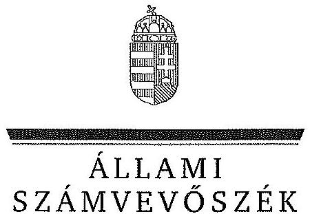
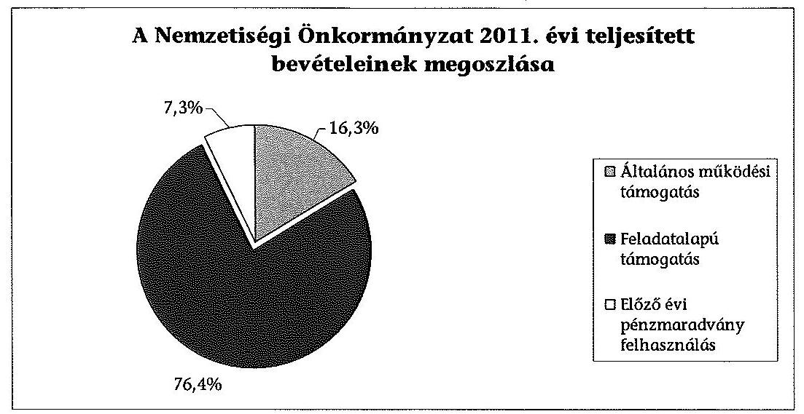
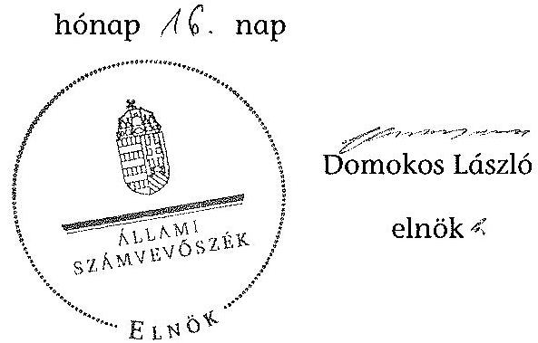

ÁLLAMI
SZÁMVEVŐSZÉK

# JELENTÉS 

a helyi kisebbségi/nemzetiségi önkormányzatok gazdálkodásának ellenőrzéséről
Csanádpalotai Román Nemzetiségi Önkormányzat

---

# Állami Számvevőszék 

Iktatószám: V-0089-016/2013.
Témaszám: 1105
Vizsgálat-azonosító szám: V06060313

## Az ellenőrzést felügyelte:

Horváth Balázs
felügyeleti vezető
Az ellenőrzést vezette és az ellenőrzés végrehajtásáért felelős:
Preller Zsuzsanna
ellenőrzésvezető
A számvevőszéki jelentést készítették és a jelentés összeállításában
közreműködtek:
dr. Láng Ágnes Krisztina
számvevő
Liziczai Imréné
számvevő
Az ellenőrzést végezték:
Nyikon Zsigmondné
számvevő tanácsos
Liziczai Imréné
számvevő

---

# TARTALOMJEGYZÉK 

BEVEZETÉS ..... 5
I. ÖSSZEGZŐ MEGÁLLAPÍTÁSOK, KÖVETKEZTETÉSEK, JAVASLATOK ..... 7
II. RÉSZLETES MEGÁLLAPÍTÁSOK ..... 11

1. A Nemzetiségi és a Települési Önkormányzat együttműködésének szabályszerűsége ..... 11
2. A gazdálkodási feladatok ellátásának szabályszerűsége ..... 11
2.1. A költségvetésre és zárszámadásra, valamint a kincstári adatszolgáltatás rendjére vonatkozó jogszabályi előírások betartása ..... 11
2.2. A Nemzetiségi Önkormányzat gazdálkodásának szabályozottsága ..... 12
2.3. A pénzügyi kontrollok működése ..... 14
3. A Nemzetiségi Önkormányzattal összefüggő gazdálkodási feladatok belső ellenőrzése ..... 15
4. A 2011. évi feladatalapú támogatás felhasználásának, elszámolásának szabályszerűsége ..... 15
5. A Nemzetiségi Önkormányzat feladatellátása ..... 16
MELLÉKLET
6. számú A Nemzetiségi Önkormányzat 2011. évi és 2012. I. félévi gazdálkodásának főbb adatai, mutatói
FÜGGELÉKEK
7. számú Értelmező szótár
8. számú A pénzügyi kontrollok működésének értékelése

---

.

---

# RÖVIDÍTÉSEK JEGYZÉKE 

## Jogszabályok

Áht. 1
Áht. 2
ÁSZ tv.
Nek. 1 tv.
Nek. 2 tv.
Számv. tv.
Áhsz.

Ámr.
Ávr.

Ber.
Bkr.
támogatási kormányrendelet

Települési Önkormányzat SZMSZ-e

## Szórövidítések

ÁSZ
gazdálkodási jogkörök szabályzata
jegyző
Kincstár
1992. évi XXXVIII. törvény az államháztartásról (hatályos 2011. december 31-ig)
2011. évi CXCV. törvény az államháztartásról (hatályos 2011. december 31-étől)
2011. évi LXVI. törvény az Állami Számvevőszékről (hatályos 2011. július 1-jétől)
1993. évi LXXVII. törvény a nemzeti és etnikai kisebbségek jogairól (hatályos 2011. december 31-ig)
2011. évi CLXXIX. törvény a nemzetiségek jogairól (hatályos 2011. december 20-tól)
2000. évi C. törvény a számvitelről

249/2000. (XII. 24.) Korm. rendelet az államháztartás szervezetei beszámolási és könyvvezetési kötelezettségének sajátosságairól
292/2009. (XII. 19.) Korm. rendelet az államháztartás működési rendjéről (hatályos 2011. december 31-ig)
368/2011. (XII. 31.) Korm. rendelet az államháztartásról szóló törvény végrehajtásáról (hatályos 2012. január 1-jétől)
193/2003. (XI. 26.) Korm. rendelet a költségvetési szervek belső ellenőrzéséről (hatálytalan 2012. január 1-jétől)
370/2011. (XII. 31.) Korm. rendelet a költségvetési szervek belső kontrollrendszeréről és belső ellenőrzésről (hatályos 2012. január 1-jétől)
a kisebbségi önkormányzatoknak a központi költségvetésből, valamint fejezeti kezelésű előirányzatból nyújtott támogatások feltételrendszeréről és elszámolásának rendjéről szóló 342/2010. (XII. 28.) Korm. rendelet (hatályon kívül helyezte a 28/2012. (III. 6.) Korm. rendelet a nemzetiségi célú előirányzatokból nyújtott támogatások feltételrendszeréről és elszámolásának rendjéről; jelenleg hatályos a 428/2012. (XII. 29.) Korm. rendelet a nemzetiségi célú előirányzatokból nyújtott támogatások feltételrendszeréről és elszámolásának rendjéről)
Csanádpalota Város Önkormányzata Képviselőtestületének 8/2011. (IV. 14.) számú rendelete a Szervezeti és Működési Szabályzatról

## Állami Számvevőszék

Csanádpalota Város Önkormányzat Polgármesteri Hivatala. Kötelezettségvállalás, utalványozás, ellenjegyzés, érvényesítés rendjének szabályzata
Csanádpalota Város Önkormányzata jegyzője
Magyar Államkincstár

---

| Képviselő-testület | Csanádpalotai Román Kisebbségi Önkormányzat Képviselő-testülete 2011. december 31-ig, Csanádpalotai Román Nemzetiségi Önkormányzat Képviselő-testülete 2012. január 1-jétől |
| :--: | :--: |
| Nemzetiségi Önkormányzat | Csanádpalotai Román Kisebbségi Önkormányzat 2011. december 31-ig, Csanádpalotai Román Nemzetiségi Önkormányzat 2012. január 1-jétől |
| Nemzetiségi Önkormányzat elnöke | Csanádpalotai Román Kisebbségi Önkormányzat elnöke 2011. december 31-ig, Csanádpalotai Román Nemzetiségi Önkormányzat elnöke 2012. január 1-jétől |
| polgármester   Polgármesteri Hivatal | Csanádpalota Város Önkormányzatának polgármestere   Csanádpalota Város Önkormányzatának Polgármesteri Hivatala, 2013. március 1-jétől Csanádpalotai Közös Önkormányzati Hivatal |
| Polgármesteri Hivatal SZMSZ-e | Csanádpalota Város Önkormányzata Képviselőtestületének 319/2009. (XII. 30.) számú, 2011. december 31-ig hatályos, a 241/2011. (XII. 21.) számú, 2012. május 30-ig hatályos és 2012. június 1-jétől hatályos 72/2012. (V. 29.) számú határozata Csanádpalota Város Önkormányzat Polgármesteri Hivatalának Szervezeti és Működési Szabályzatáról |
| Támogató | A támogatást nyújtó Közigazgatási és Igazságügyi Minisztérium |
| Települési Önkormányzat | Csanádpalota Városi Önkormányzat |
| Települési Önkormányzat Képviselő-testülete | Csanádpalota Város Önkormányzatának Képviselőtestülete |

---

# JELENTÉS 

## a helyi kisebbségi/nemzetiségi önkormányzatok gazdálkodásának ellenőrzéséről Csanádpalotai Román Nemzetiségi Önkormányzat

## BEVEZETÉS

Az államháztartás részét, az önkormányzati alrendszer egyik elemét képezik a nemzetiségi önkormányzatok, amelyek jogi személyek és a Nek. $_{1,2}$ tv.-ben meghatározott önálló feladat- és hatáskörökkel rendelkeznek. A nemzetiségi önkormányzatok az önkormányzati, illetve testületi működtetés mellett a helyi nemzetiségi közügyek változatos formában való ellátásában vesznek részt.

A nemzetiségi önkormányzatok, illetve a települési önkormányzatok között a jelenlegi szabályozás szerint nincs alá-fölérendeltségi viszony. A nemzetiségi önkormányzatok azonban sajátos közjogi helyzetben vannak, mert a jogállásukat tekintve önkormányzatok, ám függnek a székhelyük szerinti települési önkormányzat hivatalától, amely ellátja a nemzetiségi önkormányzatok vonatkozásában a megállapodásban rögzített gazdálkodási feladatokat.

A nemzetiségek helyzete, támogatása mind hazai, mind európai uniós szinten kiemelt figyelmet kap napjainkban. A nemzetiségi önkormányzatok gazdálkodására és támogatási rendszerére vonatkozó jogszabályok a 2010-2012. években jelentős változásokon mentek át, amelyek érintették a feladatalapú támogatásra fordítható költségvetési keret megállapítását, az operatív gazdálkodási jogkörök szabályozását, az elkülönített könyvvezetés alkalmazását, a belső ellenőrzés szabályozását.

Az ellenőrzés célja annak értékelése volt, hogy a Nemzetiségi Önkormányzat gazdálkodási kereteinek kialakítása, gazdálkodása és feladatellátása megfelelt-e a hatályos jogszabályoknak.

Ennek keretében ellenőriztük, hogy:

- a Nemzetiségi Önkormányzat és a Települési Önkormányzat együttműködésének szabályozása, a Települési Önkormányzat SZMSZ-ében, a megállapodásban előírt működési feltételek biztosítása megfelelt-e a jogszabályi előírásoknak;
- a felek együttműködése megfelelt-e a megállapodásnak a gazdálkodási feladatok szabályszerű ellátásában, betartották-e a Nemzetiségi Önkormányzat gazdálkodásához kapcsolódóan a költségvetésre és zárszámadásra, a gazdálkodás szabályozására, az operatív gazdálkodási jogkörök gyakorlására vonatkozó jogszabályi előírásokat;

---

- a jegyző biztosította-e a Polgármesteri Hivatal belső ellenőrzése keretében a Nemzetiségi Önkormányzattal összefüggő gazdálkodási feladatok belső ellenőrzését;
- a 2011. évi feladatalapú támogatás felhasználása, a folyósított feladatalapú támogatással történő elszámolás az előírásoknak megfelelően történt-e;
- a Nemzetiségi Önkormányzat feladatellátása összhangban volt-e a vonatkozó jogszabályi előírásokkal.

Az ellenőrzés típusa: szabályszerűségi ellenőrzés
Az ellenőrzött időszak: 2011. január 1. - 2012. június 30.
Ellenőrzött szervezet: Csanádpalotai Román Nemzetiségi Önkormányzat és a gazdálkodási feladatait ellátó Csanádpalota Városi Önkormányzat

Az ellenőrzés jogszabályi alapja: az ÁSZ tv. 5. § (2)-(3) és (6) bekezdései
Az ellenőrzés szakmai módszertana az ÁSZ hivatalos honlapján (www.asz.hu) közzétett szakmai szabályokon alapult, amely a Legfőbb Ellenőrző Intézmények Nemzetközi Szervezete (INTOSAI) által kiadott nemzetközi standardok (ISSAI) figyelembevételével készült. A fogalmak magyarázatát az 1. számú függelék, a pénzügyi kontrollok megfelelősége értékelésénél alkalmazott egységes minősítési szempontokat a 2. számú függelék tartalmazza.

Az ellenőrzés lefolytatásához a Települési Önkormányzat és a Nemzetiségi Önkormányzat tanúsítványok kitöltésével és a kapcsolódó dokumentumok elektronikus megküldésével szolgáltatott adatokat. A tanúsítványokon szereplő adatok, információk ellenőrzése és szükség szerinti javítása a helyszíni ellenőrzés keretében történt.

Az ÁSZ az ellenőrzés megállapításait az ellenőrzött időszakban hatályos, az intézkedést igénylő megállapításokra tett javaslatokat a jelenleg hatályos jogszabályok alapján fogalmazta meg.

A Nemzetiségi Önkormányzat 2010-ben alakult, elnöke a 2010. évi helyhatósági választások óta látja el feladatát. A Nemzetiségi Önkormányzat intézményt, gazdasági társaságot és más szervezetet nem alapított, illetve társulásban nem vett részt. A négytagú Képviselő-testület munkája segítésére bizottságot nem hozott létre. A Nemzetiségi Önkormányzat költségvetési beszámolója szerint a 2011. évben 1286 ezer Ft költségvetési bevételt ért el és 391 ezer Ft költségvetési kiadást teljesített. A 2012. évben 1105 ezer Ft eredeti költségvetési bevételi és kiadási előirányzatot terveztek. A 2012. I. félévi beszámolója alapján a módosított költségvetési bevételi és kiadási előirányzat 1105 ezer Ft, a teljesített költségvetési bevétel 1110 ezer Ft, a teljesített költségvetési kiadás 329 ezer Ft volt. A 2011. évi és a 2012. I. féléves gazdálkodási adatokat részletesen az 1. számú mellékletben mutatjuk be. Az ÁSZ a Nemzetiségi Önkormányzat gazdálkodását korábban nem ellenőrizte. Az ÁSZ tv. 29. § (1) bekezdése szerint a jelentéstervezetet megküldtük a polgármester és a Nemzetiségi Önkormányzat elnöke részére, akik az ÁSZ tv. 29. § (2) bekezdésében foglalt észrevételezési jogukkal nem éltek, a jelentéstervezetre észrevételt nem tettek.

---

# I. ÖSSZEGZŐ MEGÁLLAPÍTÁSOK, KÖVETKEZTETÉSEK, JAVASLATOK 

A Nemzetiségi és a Települési Önkormányzat együttműködése az előírt határidők betartásával jóváhagyott megállapodásokon alapult. A Települési Önkormányzat biztosította a Nemzetiségi Önkormányzat működéséhez szükséges személyi és tárgyi feltételeket. Az együttműködési megállapodásokat - a 2011. évben az Ámr., a 2012. évben az Áht. $_{2}$ és a Nek. $_{2}$ tv. előírásaihoz képest kisebb tartalmi hiányosságokkal fogadták el. A 2012. június 30-án hatályos megállapodásban nem rendelkeztek az Áht. $_{2}$-ben előírt, a Nemzetiségi Önkormányzat bevételeivel és kiadásaival kapcsolatos ellenőrzési kötelezettségről és a Nek. $_{2}$ tv. szerinti iratkezelési feladatok ellátásáról.

A Nemzetiségi Önkormányzat költségvetésére és zárszámadására vonatkozó jogszabályi előírásokat részben tartották be. A költségvetési határozatok jóváhagyása, a költségvetési előirányzatok módosítása a jogszabályban előírt eljárásrend szerint történt, a határozatokat egymással összehasonlítható szerkezetben készítették el és változatlan formában építették be a Települési Önkormányzat költségvetési rendeleteibe. A 2011. évi zárszámadási határozatot az Ámr.-ben előírt határidőn túl fogadták el. A 2012. évi költségvetési határozat az Áht. $_{2}$ előírásaival ellentétesen nem tartalmazta a finanszírozási célú pénzügyi műveletekkel kapcsolatos hatásköröket. A 2012. I. félévben a kincstári adatszolgáltatás során a jegyző nem tartotta be az Ávr.-ben előírt határidőket.

A gazdálkodás szabályozása az ellenőrzött időszakban részben felelt meg a jogszabályi előírásoknak. A jegyző a Polgármesteri Hivatal jogszabályokban előírt szabályzatainak hatályát - az ellenőrzési nyomvonal, a szabálytalanságok kezelésének eljárásrendje és a folyamatba épített előzetes, utólagos és vezetői ellenőrzés szabályzatának kivételével - kiterjesztette a Nemzetiségi Önkormányzatra. A Számv. tv. és az Áhsz. előírásai ellenére a 2012. évi jogszabályi változásokat nem érvényesítették a számviteli politikában, a számlarendben, valamint az eszközök és források értékelési szabályzatában. A 2012. I. félévben a 100 ezer Ft-ot el nem érő kifizetéseknél az előzetes írásbeli kötelezettségvállalások rendjét az Ávr. előírása ellenére nem szabályozták. Az operatív gazdálkodási jogkörök kialakítása az ellenőrzött időszakban részben volt összhangban a jogszabályi előírásokkal. A gazdasági vezető nem rendelkezett az Ámr.-ben, illetve az Ávr.-ben előírt szakképesítéssel. A 2012. I. félévben az Áht. $_{2}$ és az Ávr. előírása ellenére nem biztosították az összeférhetetlenségi szabályok érvényesülését, mert a gazdasági vezető a pénzügyi ellenjegyzésre nem adott felhatalmazást. A Polgármesteri Hivatal SZMSZ-e az Ámr. és az Ávr. előírásainak megfelelően tartalmazta a munkakörökhöz kapcsolódóan a Nemzetiségi Önkormányzat gazdálkodásával kapcsolatos feladat- és hatásköröket, a hatáskörök gyakorlásának módját, a helyettesítés rendjét és az ezekre vonatkozó felelősségi szabályokat.

A pénzügyi kontrollok működése a dologi és egyéb folyó kiadások teljesítésénél az ellenőrzött időszak egészében gyenge volt, a hibák száma a lényeges-

---

ségi szintet, a kritikus hibahatárt elérte. A 2011. évben az előzetes írásbeli kötelezettségvállalást nem igénylő kifizetések rendjének szabályozása hiányában a kötelezettségvállalás ellenjegyzése, a szakmai teljesítésigazolás és az utalvány ellenjegyzése nem szabályszerűen történt. A 2012. I. félévben a pénzügyi ellenjegyző és a teljesítés igazolója az Áht. $_{2}$-ben, illetve az Ávr.-ben előírt ellenőrzési feladatát - az előzetes írásbeli kötelezettségvállalást nem igénylő kifizetések rendjének szabályozása hiányában - aláírása ellenére nem szabályszerűen végezte el. Az érvényesítő jogosulatlanul látta el feladatát, mert az aláírása
 nem volt beazonosítható az arra jogosult aláírás-mintájával. Az ellenőrzés a Nemzetiségi Önkormányzatnál - az ellenőrzött tételek esetében - jogosulatlan kifizetést nem tárt fel, a pénzügyi kontrollok működéséhez kapcsolódó hiányosságok azonban nem biztosítják a hibák megelőzését, feltárását és kijavítását.

A Nemzetiségi Önkormányzat a 2011. évben 982 ezer Ft feladatalapú támogatásban részesült, amelyet a jogszabályi előírásokkal összhangban felhasznált. A támogatási kormányrendeletben hivatkozott, Áht. ${ }_{1}$-ben előírt elszámolás nem történt meg. A támogatás felhasználását, elszámolását a jogosult szervek nem ellenőrizték.

A Nemzetiségi Önkormányzat feladatellátásának tárgya a Nek. ${ }_{1,2}$ tv. előírásaival összhangban volt. Biztosította a nemzetiségi közügyek keretében az alapvető feladatához szükséges szervezeti, személyi és anyagi feltételeket. Kapcsolatot tartott nemzetiségi szervezetekkel, támogatta a lakosság önszerveződő tevékenységét, a képviselt közösséget.

A Polgármesteri Hivatal 2011. évi ellenőrzési tervét megalapozó kockázatelemzés a Ber. előírásai ellenére nem terjedt ki a Nemzetiségi Önkormányzat gazdálkodásával összefüggő végrehajtási feladatok ellátására. A 2012. évre elvégzett kockázatelemzés során a Nemzetiségi Önkormányzat gazdálkodásával összefüggő végrehajtási feladatok közül magas kockázatúnak értékelt területet a 2012. évi belső ellenőrzési tervbe nem építették be. A jegyző az ellenőrzött időszakban az Áht. ${ }_{1,2}$ ellenére nem biztosította a Polgármesteri Hivatal belső ellenőrzése keretében a Nemzetiségi Önkormányzat gazdálkodásával összefüggő végrehajtási feladatok belső ellenőrzését. Erre irányuló ellenőrzést a 2011. évben és 2012. I. félévben nem terveztek és nem végeztek.

Az ellenőrzés megállapításai alapján, az észrevételezésre megküldött jelentéstervezetben a Nemzetiségi Önkormányzat gazdálkodásával kapcsolatban intézkedést igénylő megállapításokat és javaslatokat fogalmaztunk meg, amelyek végrehajtásáról az ellenőrzés időszakában intézkedési tájékoztatást adott a polgármester és a Nemzetiségi Önkormányzat elnöke. A 2013. szeptember 25-én megkötött hatályos együttműködési megállapodásban a Nek. ${ }_{2}$ tv. és az Áht. ${ }_{2}$ vonatkozó előírásait érvényesítették, a tartalmi hiányosságokat megszüntették. A 2013. évi költségvetési határozat Áht. ${ }_{2}$-ben foglalt előírásoknak megfelelő elkészítését a beküldött dokumentumokkal igazolták. A 2013. évben a kincstári adatszolgáltatási kötelezettséget az Ávr.-ben előírt határidőben teljesítették. A 2013. évben hatályba léptetett számviteli politika, számlarend, eszközök és források értékelési szabályzata a Számv. tv. és az Áhsz. által előírt követelményeket tartalmazza. Az Ávr. előírásait figyelembe véve az előzetes írásbeli kötelezettségvállalást nem igénylő kifizetések rendjét szabályozták. A gazdasági vezető - összeférhetetlenség fennállása esetére - a pénzügyi ellenjegyzési feladatok-

---

ra írásbeli kijelölést tett. Figyelemmel az ÁSZ ellenőrzés hasznosítására mindezek vonatkozásában intézkedést igénylő megállapítást, javaslatot már nem szerepeltetünk.

Az ÁSZ tv. 33. § (1) bekezdésében foglaltak értelmében az ellenőrzött szervezet vezetője köteles a jelentésben foglalt megállapításokhoz kapcsolódó intézkedési tervet összeállítani, és azt a jelentés kézhezvételétől számított 30 napon belül az ÁSZ részére megküldeni. Amennyiben az intézkedési tervet határidőre nem küldi meg a szervezet, vagy az nem elfogadható, az ÁSZ elnöke az ÁSZ tv. 33. § (3) bekezdés a)-b) pontjaiban foglaltakat érvényesítheti.

A helyszíni ellenőrzés megállapításainak hasznosítása mellett javasoljuk:

# a jegyzőnek 

1. a gazdálkodás szabályozottságával kapcsolatban

A jegyző a Polgármesteri Hivatal szabályzatai közül a 2012. évben a Bkr. 6. § (3)-(4) bekezdéseiben előírt ellenőrzési nyomvonal és a szabálytalanságok kezelése eljárásrendjének, valamint a Bkr. 8. § (2)-(4) bekezdéseiben előírt folyamatba épített előzetes, utólagos és vezetői ellenőrzés szabályzatának hatályát nem terjesztette ki a Nemzetiségi Önkormányzat gazdálkodási feladataira, illetve nem készítette el annak saját szabályzatait.

A gazdasági vezető az Ávr. 12. § -ában előírt szakképesítéssel nem rendelkezett.
Javaslat
A gazdálkodás szabályozottsága, szabályszerűsége érdekében:
a) készítse el a Polgármesteri Hivatal ellenőrzési nyomvonalának, a szabálytalanságok kezelése eljárásrendjének, valamint a folyamatba épített előzetes, utólagos és vezetői ellenőrzés szabályzatainak a módosítását az Ávr. 13. § (3a) bekezdésének felhatalmazása alapján, hogy a Bkr. 6. § (3)-(4), és a 8. § (2)-(4) bekezdéseiben foglalt szabályzatok hatálya kiterjedjen a Nemzetiségi Önkormányzat gazdálkodási feladataira;
b) gondoskodjon arról, hogy a gazdasági vezető rendelkezzen az Ávr. 12. §-ában előírt szakképesítéssel.
2. a pénzügyi kontrollok működésével kapcsolatban
2012. I. félévben a pénzügyi ellenjegyző az Áht. 37. § (1) bekezdésében, a teljesítés igazolója az Ávr. 57. § (1) bekezdésében előírt ellenőrzési feladatát nem végezte el. Az érvényesítő aláírása nem egyezett meg a gazdasági vezető által érvényesítésre kijelölt személy Ávr. 60. § (3) bekezdése szerinti nyilvántartásban szereplő aláírásmintájával, így jogosultsága - az Ávr. 58. § (1) bekezdésben előírt ellenőrzési feladatok ellátására - nem volt megállapítható, ezért szabályszerűen nem történt meg az összegszerűség, a fedezet meglétének, valamint annak ellenőrzése, hogy a megelőző ügymenetben a gazdálkodási jogkörök szabályzatában foglaltakat betartották.

---

Javaslat
Az operatív gazdálkodás működési hibáinak megelőzése, feltárása és kijavítása érdekében gondoskodjon arról, hogy:
a) az Ávr. 55. § (2) bekezdés g) pontja alapján a pénzügyi ellenjegyző szabályszerű kijelölésével az Áht. 37. § (1) bekezdésében előírt feladatokat elvégezzék;
b) a teljesítés igazolása során az Ávr. 57. § (1) bekezdésében előírt ellenőrzési kötelezettségének tegyen eleget;
c) az érvényesítést az Ávr. 60. § (3) bekezdése szerinti naprakész nyilvántartással összhangban végezzék, biztosítva az Ávr. 58. § (1) bekezdésben előírt ellenőrzési feladatok ellátását.
3. a feladatalapú támogatás elszámolásával kapcsolatban

A 2011. évben folyósított feladatalapú támogatás elszámolása a támogatási kormányrendelet 7. § (2) bekezdésében hivatkozott Áht. ${ }_{1}$-nek „a helyi önkormányzatok elszámolási rendjére vonatkozó rendelkezései alkalmazása” előírása ellenére nem történt meg.

Javaslat
Gondoskodjon az Áht. 27. § (2) bekezdésben meghatározott feladatkörében a Nemzetiségi Önkormányzat által igénybe vett feladatalapú támogatás elszámolásának elkészítéséről, figyelemmel az Áht. 57. § (4) bekezdésben foglaltakra.

# a Nemzetiségi Önkormányzat elnökének 

A 2011. évben folyósított feladatalapú támogatás elszámolása a támogatási kormányrendelet 7. § (2) bekezdésében hivatkozott Áht. ${ }_{1}$-nek „a helyi önkormányzatok elszámolási rendjére vonatkozó rendelkezései alkalmazása” előírása ellenére nem történt meg.

Javaslat
Terjessze a Képviselő-testület elé jóváhagyásra az Áht. 57. § (4) bekezdés alapján készített elszámolást a Nemzetiségi Önkormányzat által igénybe vett feladatalapú támogatásról.

---

# II. RÉSZLETES MEGÁLLAPÍTÁSOK 

## 1. A Nemzetiségi és a Települési Önkormányzat együttműködésének szabályszerűsége

A Nemzetiségi és a Települési Önkormányzat között létrejött együttműködési megállapodások ${ }^{1}$ - kisebb tartalmi hiányosságok kivételével - megfeleltek a jogszabályi előírásoknak. A megállapodások jóváhagyása az előírt határidők betartásával történt.

Az együttműködési megállapodásokban a jogszabályi előírásokat maradéktalanul nem érvényesítették, mert:

- a 2011. december 31-én hatályos együttműködési megállapodásban az Ámr. 37. § (4) bekezdés b), d), e) és f) pontjainak előírásai ellenére nem rendelkeztek a költségvetési koncepcióval, a költségvetési határozattal és a költségvetési rendelettel kapcsolatos feladatokról és határidőkről;
- a 2012. június 30-án hatályos együttműködési megállapodásban a Nek. ${ }_{2}$ tv. 80. § (1) bekezdés e) pontjában foglaltak ellenére nem határozták meg az iratkezelési feladatok ellátását;
- a 2012. június 30-án hatályos együttműködési megállapodásban az Áht. ${ }_{2}$ 27. § (2) bekezdésében előírtak ellenére nem rendelkeztek a Nemzetiségi Önkormányzat bevételeivel és kiadásaival kapcsolatos ellenőrzési kötelezettségről.

A Települési Önkormányzat biztosította a Nemzetiségi Önkormányzat működéséhez szükséges személyi és tárgyi feltételeket.

## 2. A gazdálkodási feladatok ellátásának szabályszerűsége

### 2.1. A költségvetésre és zárszámadásra, valamint a kincstári adatszolgáltatás rendjére vonatkozó jogszabályi előírások betartása

A Nemzetiségi Önkormányzat költségvetésére, a zárszámadására és a kincstári adatszolgáltatásra vonatkozó jogszabályi előírásokat

[^0]
[^0]:    ${ }^{1}$ A 2011. évben hatályos együttműködési megállapodást a Települési Önkormányzat Képviselő-testülete a 251/2010. (XII. 29.) számú, a Képviselő-testület a 24/2010. (XII. 15.) számú határozattal fogadta el. A Nek. ${ }_{2}$ tv. 159. § (3) bekezdésében előírtak alapján 2012. június 1-jéig történt felülvizsgálat alapján az új együttműködési megállapodást a Települési Önkormányzat Képviselő-testülete a 83/2012. (V. 30.) számú, a Képviselőtestület a 11/2012. (V. 30.) számú határozattal fogadta el.

---

részben tartották be. A költségvetési ${ }^{2}$ és zárszámadási határozatok ${ }^{3}$ egymással összehasonlítható szerkezetben készültek, azok változatlan formában épültek be a Települési Önkormányzat költségvetési és zárszámadási rendeleteibe ${ }^{4}$. A Nemzetiségi Önkormányzat elnöke a költségvetési előirányzatok felhasználásához szükséges mértékben kezdeményezte azok módosítását, biztosította a tárgyévi fizetési kötelezettség vállalásához szükséges fedezet meglétét.

A Képviselő-testület a 2011. évi költségvetési és zárszámadási határozatok, valamint a 2012. évi költségvetési határozat elfogadása során a jogszabályi előírásokat maradéktalanul nem érvényesítette, mert:

- a 2011. évi költségvetési határozat az Ámr. 36. § (1) bekezdés i) pont előírása ellenére nem tartalmazta a tárgyévi költségvetési bevételi és kiadási előirányzatok mérlegszerű bemutatását;
- a 2011. évi költségvetéshez az Ámr. 36. § (1) bekezdés k) pontjában foglaltakat figyelmen kívül hagyva az év várható bevételi és kiadási előirányzatainak teljesüléséről előirányzat-felhasználási ütemterv nem készült;
- a 2012. évi költségvetési határozat az Áht. ${ }_{2}$ 23. § (2) bekezdés h) pontja ellenére nem tartalmazta a finanszírozási célú pénzügyi műveletekkel kapcsolatos hatásköröket;
- a Képviselő-testület a 2011. évi zárszámadásról szóló 8/2012. (IV. 26.) számú határozatát az Ámr. 37. § (2)-(3) bekezdésében előírt határidőn túl fogadta el, így a Nemzetiségi Önkormányzat elnöke nem az együttműködési megállapodás szerinti időpontig továbbította azt a Települési Önkormányzat polgármesterének.

A jegyző a Nemzetiségi Önkormányzatra vonatkozó kincstári adatszolgáltatási kötelezettségét, a 2012. év első három, illetve első hat hónapjáról készített időközi költségvetési-, illetve mérlegjelentés tekintetében, az Ávr. 169. § (2) bekezdésében, valamint az Ávr. 170. § (5) bekezdésében előírt határidőn túl teljesítette.

# 2.2. A Nemzetiségi Önkormányzat gazdálkodásának szabályozottsága 

A Nemzetiségi Önkormányzat gazdálkodásának szabályozása az ellenőrzött időszakban részben felelt meg a jogszabályi előírásoknak. A gazdálkodási feladatai végrehajtását ellátó Polgármesteri Hivatal a jogsza-

[^0]
[^0]:    ${ }^{2}$ A Képviselő-testület a 2011. évi költségvetéséről alkotott 4/2011. (II. 10.) számú és a 2012. évi költségvetésről alkotott 5/2012. (II. 8.) számú határozata.
    ${ }^{3}$ A Képviselő-testület 8/2012. (IV. 26.) számú határozata a 2011. évi zárszámadás elfogadásáról.
    ${ }^{4}$ A Települési Önkormányzat 2011. évi költségvetéséről alkotott 3/2011. számú és a 2011. évi zárszámadás elfogadásáról alkotott 8/2012. (IV. 26.) önkormányzati rendelete.

---

bályokban előírt gazdálkodási szabályzatainak hatályát részben kiterjesztette a Nemzetiségi Önkormányzatra, azonban:

- a jegyző a Számv. tv. 14. § (11) bekezdésében és az Áhsz. 2. §-ában előírtakat figyelmen kívül hagyva nem gondoskodott a Nemzetiségi Önkormányzatra kiterjesztett számviteli politika, az eszközök és források értékelési szabályzata és a számlarend esetében a 2012. évi jogszabályi változások átvezetéséről;
- a jegyző a Polgármesteri Hivatal szabályzatai közül a 2011. évben az Ámr. 156. § (2)-(3) bekezdésében, a 2012. évben a Bkr. 6. § (3)-(4) bekezdéseiben előírt ellenőrzési nyomvonal és a szabálytalanságok kezelése eljárásrendjének, valamint a 2011. évben az Áht. ${ }_{1}$ 121/A. § (4) bekezdésében, a 2012. évben a Bkr. 8. § (2)-(4) bekezdéseiben előírt folyamatba épített előzetes, utólagos és vezetői ellenőrzés szabályzatának hatályát nem terjesztette ki a Nemzetiségi Önkormányzat gazdálkodására, illetve nem készítette el annak saját szabályzatait;
- a 2012. évben a gazdálkodási jogkörök szabályzatában az Ávr. 53. § (2) bekezdésének előírásait figyelmen kívül hagyva nem alakították ki az
 előzetes írásbeli kötelezettségvállalást nem igénylő kifizetések rendjét annak ellenére, hogy a szabályzat lehetővé tette a 100 ezer Ft-ot el nem érő kifizetések esetében az írásbeli kötelezettségvállalás mellőzését.

A Nemzetiségi Önkormányzat operatív gazdálkodási jogköreinek kialakítása - a kötelezettségvállalásra, az utalványozásra, a kötelezettségvállalás és utalványozás ellenjegyzésére a felhatalmazások, a szakmai teljesítést igazoló, a pénzügyi ellenjegyzést és az érvényesítést végző személyek kijelölése - az ellenőrzött időszakban részben felelt meg a jogszabályi előírásoknak, mert:

- a jegyző a 2011. évben az Ámr. 19. § (1) bekezdés ⁵ előírása ellenére az összeférhetetlenség és távollét eseteire a kötelezettségvállalás és az utalvány ellenjegyzésére az előírt szakmai képesítéssel nem rendelkező személyt jelölt ki;
- 2012. I. félévben a gazdasági vezető az Áht. ² 37. § (2) bekezdése, és az Ávr. 55. § (2) bekezdés g) pontjában és az Ávr. 60. § (1)-(2) bekezdéseiben előírtakat figyelmen kívül hagyva az összeférhetetlenségi előírás feltételeit nem biztosította, mert nem adott felhatalmazást a pénzügyi ellenjegyzés gyakorlására;
- a gazdasági vezető a 2011. évben az Ámr. 18. §-ában, 2012. I. félévben az Ávr. 12. §-ában előírt szakképesítéssel ⁶ nem rendelkezett.

Az operatív gazdálkodással kapcsolatos feladat- és hatásköröket az együttműködési megállapodás, a gazdálkodási jogkörök szabályzata és a feladatokat ellátó köztisztviselők munkaköri leírásai tartalmazták. A Nemzetiségi Önkormányzat gazdálkodásával kapcsolatos feladat- és hatásköröket, a hatáskörök

[^0]
[^0]:    ⁵ 2012. január 1-jétől az Ávr. 55. § (3) bekezdés és 58. § (4) bekezdése
    ⁶ Felsőoktatásban szerzett pénzügyi-számviteli, vagy a felsőoktatásban szerzett egyéb végzettséggel.

---

gyakorlásának módját, a helyettesítés rendjét és az ezekre vonatkozó felelősségi szabályokat a Polgármesteri Hivatal SZMSZ-ében az ellenőrzött időszakban rögzítették.

# 2.3. A pénzügyi kontrollok működése 

A Nemzetiségi Önkormányzat a 2011. évi dologi és egyéb folyó kiadásainak teljesítése során a kötelezettségvállalás ellenjegyzése, a szakmai teljesítésigazolás és az utalvány ellenjegyzése kontrollok működésének megfelelősége - a 2. számú függelékben részletezett szempontok alapján végzett értékelés szerint - gyenge volt, a hibák száma a lényegességi szintet, a kritikus hibahatárt elérte, mert:

- a kötelezettségvállalásra az Ámr. 74. § (1) bekezdésében foglaltak ellenére ellenjegyzés nélkül került sor, illetve a kötelezettségvállalás ellenjegyzője az Ámr. 74. § (3) bekezdésének a)-c) pontjaiban foglalt feladatát nem végezte el, mert annak ellenére ellenjegyezte a megrendelőt, hogy az nem felelt meg a gazdálkodási jogkörök szabályzatában ⁷ előírt előzetes írásbeli kötelezettségvállalás dokumentumának, valamint az Ámr. 75. § (3) bekezdésében előírt kötelezettségvállalásokat tartalmazó analitikus nyilvántartás hiányában nem történt meg a szabad előirányzat és a kifizetés tervezett időpontjában a fedezet rendelkezésre állásának igazolása, továbbá a gazdálkodásra vonatkozó szabályok betartásának ellenőrzése;
- a szakmai teljesítés igazolója aláírása ellenére az Ámr. 76. § (1) bekezdésben foglalt feladatát nem látta el, mert ellenőrizhető okmányok (megrendelő, kötelezettségvállalás nyilvántartás) hiányában nem szabályszerűen történt meg a kifizetés jogosságának, összegszerűségének és a megrendelés teljesítésének ellenőrzése;
- az utalvány ellenjegyzője a feladatát nem az Ámr. 74. § és a 79. § (2) bekezdésében foglaltaknak megfelelően látta el, mert annak ellenére aláírásával ellenjegyezte a kifizetéseket, hogy a szakmai teljesítésigazolásra ellenőrizhető okmányok hiányában került sor és a kötelezettségvállalások nyilvántartásba vétele elmaradt.

A Nemzetiségi Önkormányzatnál 2012. I. félévben a dologi és egyéb folyó kiadások teljesítése során a pénzügyi ellenjegyzés, a teljesítés igazolás és az érvényesítés pénzügyi kontrollok működésének megfelelősége - a 2. számú függelékben részletezett szempontok alapján végzett értékelés szerint - gyenge volt, a hibák száma a lényegességi szintet, a kritikus hibahatárt elérte, mert:

- a pénzügyi ellenjegyző ellenőrzési feladatát aláírása ellenére nem látta el, mert - az előzetes írásbeli kötelezettségvállalást nem igénylő kifizetések rendjének szabályozása hiányában - az Áht. ² 37. § (1) bekezdésében foglaltak ellenére nem történt meg a szabad előirányzat rendelkezésre állásának, a kifize-

[^0]
[^0]:    ⁷ A költségvetési szerv kötelezettségvállalásának rendje fejezet 1-25. pontjai előírása ellenére a megrendelő nem tartalmazta a szerződő fél megnevezését, a megrendelés pontos összegét.

---

tés időpontjában a fedezet rendelkezésre állásának igazolása, valamint elmaradt a gazdálkodásra vonatkozó szabályok betartásának ellenőrzése;

- a teljesítésigazoló aláírása ellenére nem végezte el az Ávr. 57. § (1) bekezdésében előírt feladatát, mert - az előzetes írásbeli kötelezettségvállalást nem igénylő kifizetések rendjére vonatkozó szabályozás hiánya miatt ellenőrizhető okmányok alapján nem történt meg, a kiadások jogosságának, összegszerűségének és a szerződésszerű teljesítésnek az ellenőrzése;
- az érvényesítő jogosulatlanul látta el az Ávr. 58. § (1) bekezdésben előírt ellenőrzési feladatát, mert aláírása nem volt beazonosítható a gazdasági vezető által érvényesítésre kijelölt személy Ávr. 60. § (3) bekezdésben előírt nyilvántartásban szereplő aláírás-mintájával, így szabályszerűen nem történt meg az összegszerűség, a fedezet meglétének, valamint annak ellenőrzése, hogy a megelőző ügymenetben az Áht. ²-ben, az Áhsz-ben, valamint a gazdálkodási jogkörök szabályzatában foglaltakat betartották-e.

# 3. A Nemzetiségi Önkormányzattal Összefüggő Gazdálkodási Feladatok Belső Ellenőrzése 

A Polgármesteri Hivatal 2011. évi ellenőrzési terveit megalapozó kockázatelemzése - a Ber. 21. § (2) bekezdése ellenére - nem terjedt ki a Nemzetiségi Önkormányzat gazdálkodásával összefüggő végrehajtási feladatok ellátására. A 2012. évi belső ellenőrzést megalapozó kockázatelemzés a készpénzkezelés rendjét magas kockázatú területnek értékelte a Nemzetiségi Önkormányzat gazdálkodásában, ennek ellenére a 2012. évi belső ellenőrzési tervbe nem építették be. A Polgármesteri Hivatalnál a Nemzetiségi Önkormányzat gazdálkodásával összefüggő végrehajtási feladatok ellátására irányuló belső ellenőrzéseket nem végeztek az ellenőrzött időszakban. A Települési Önkormányzat és a Makói Többcélú Kistérségi Társulás 2007. évben a belső ellenőrzési feladatok ellátására megállapodást kötött, amelyet a Nemzetiségi Önkormányzat alakulását követően nem vizsgáltak felül. A jegyző az ellenőrzött időszakban az Áht. ¹ 121/B. § (4) bekezdése, illetve az Áht. ² 70. § (1) bekezdése előírása ellenére nem biztosította a Polgármesteri Hivatal belső ellenőrzése keretében a Nemzetiségi Önkormányzat gazdálkodásával összefüggő végrehajtási feladatok belső ellenőrzését.

## 4. A 2011. Évi Feladatalapú Támogatás Felhasználásának, Elszámolásának Szabályszerűsége

A Nemzetiségi Önkormányzat a 2011. évben 982 ezer Ft feladatalapú támogatásban részesült, amelynek az összes bevételhez viszonyított részarányát a következő ábra szemlélteti:

---

A 2011. évben folyósított támogatás felhasználása a jogszabályi előírásoknak megfelelt. Elszámolása a támogatási kormányrendelet 7. § (2) bekezdésében hivatkozott Áht. ¹-nek „a helyi önkormányzatok elszámolási rendjére vonatkozó rendelkezései alkalmazása" előírása ellenére nem történt meg. A támogatás felhasználását, elszámolását az ellenőrzésre jogosult szervek nem ellenőrizték.

# 5. A Nemzetiségi Önkormányzat Feladatellátása 

A Nemzetiségi Önkormányzat feladatellátásának tárgya összhangban volt a Nek. ¹,² tv. előírásaival, mert - a feladat- és hatáskörére vonatkozó előírások betartásával - kizárólag a törvényben meghatározott nemzetiségi közügyeket látott el. A Nemzetiségi Önkormányzat az ellenőrzött időszakban hatósági tevékenységet nem végzett, közüzemi szolgáltatással összefüggő feladatot nem látott el.

A Nek. ¹ tv. 5/A. § (1) bekezdése és a Nek. ² tv. 10. § (1) bekezdése szerinti, a nemzetiségi érdekek védelmével és képviseletével kapcsolatos alapvető feladata ellátásához biztosította a szükséges szervezeti, személyi és anyagi feltételeket. A Nek. ¹ tv. 30. § (1) bekezdésében, valamint a Nek. ² tv. 115. § d), f) és g) pontjai alapján kapcsolatot tartott nemzetiségi szervezetekkel, támogatta a lakosság önszerveződő tevékenységét, segítette a képviselt közösség oktatási, nevelési intézményekbe történő beilleszkedését.

Budapest, 2013.
112.

Melléklet: 1 db
Függelék: 2 db

---

# A Nemzetiségi Önkormányzat 2011. évi és 2012. 1. félévi gazdálkodásának főbb adatai, mutatói 

A) BEVÉTELEK

| Megnevezés | 2011. év |  |  |  | 2012. év |  | 2012. 1. félév |  |
| :--: | :--: | :--: | :--: | :--: | :--: | :--: | :--: | :--: |
|  | eredeti ei. | módosított   ei. | teljesítés | teljesítés   megoszlása   (\%) | eredeti ei. | módosított   ei. | teljesítés | teljesítés   megoszlása   (\%) |
| Intézményi működési bevétel | 0,0 | 0,0 | 0,0 | $0,0 \%$ | 0,0 | 0,0 | 1,0 | $0,1 \%$ |
| Általános működési   támogatás | 210,0 | 210,0 | 210,0 | $16,3 \%$ | 210,0 | 210,0 | 215,0 | $19,4 \%$ |
| Feladatalapú támogatás | 0,0 | 983,0 | 982,0 | $71,8 \%$ | 0,0 | 0,0 | 0,0 | $0,0 \%$ |
| Települési Önkormányzat   által nyújtott támogatás | 0,0 | 0,0 | 0,0 | $0,0 \%$ | 0,0 | 0,0 | 0,0 | $0,0 \%$ |
| Pénzforgalmi bevételek   összesen | 210,0 | 1193,0 | 1192,0 | $92,7 \%$ | 210,0 | 210,0 | 216,0 | $19,4 \%$ |
| Előző évi pénzmaradvány   felhasználás | 0,0 | 94,0 | 94,0 | $7,3 \%$ | 895,0 | 895,0 | 895,0 | $80,6 \%$ |
| Bevételek | 210,0 | 1287,0 | 1286,0 | 100,0\% | 1105,0 | 1106,0 | 1111,0 | 100,0\% |

B) KIADÁSOK

| Megnevezés | 2011. év |  |  |  | 2012. év |  | 2012. 1. félév |  |
| :--: | :--: | :--: | :--: | :--: | :--: | :--: | :--: | :--: |
|  | eredeti ei. | módosított   ei. | teljesítés | teljesítés   megoszlása   (\%) | eredeti ei. | módosított   ei. | teljesítés | teljesítés   megoszlása   (\%) |
| Személyi juttatások | 0,0 | 0,0 | 0,0 | $0,0 \%$ | 0,0 | 0,0 | 0,0 | $0,0 \%$ |
| Munkoadókat terhelő   tételek | 0,0 | 0,0 | 0,0 | $0,0 \%$ | 0,0 | 0,0 | 0,0 | $0,0 \%$ |
| Önlagi és egyéb folyó   kiadások | 210,0 | 1287,0 | 391,0 | 100,0\% | 1105,0 | 1106,0 | 329,0 | 100,0\% |
| Támogatásértékű működési   kiadás | 0,0 | 0,0 | 0,0 | $0,0 \%$ | 0,0 | 0,0 | 0,0 | $0,0 \%$ |
| Működési kiadások összesen | 210,0 | 1287,0 | 391,0 | 100,0\% | 1105,0 | 1105,0 | 329,0 | 100,0\% |
| Felhalmozási kiadások | 0,0 | 0,0 | 0,0 | $0,0 \%$ | 0,0 | 0,0 | 0,0 | $0,0 \%$ |
| Kiadások összesen | 210,0 | 1287,0 | 391,0 | 100,0\% | 1105,0 | 1106,0 | 329,0 | 100,0\% |

---

.

---

# ÉRTELMEZŐ SZÓTÁR 

feladatalapú támogatás

A támogatási évben általános működési támogatásban részesült, és a Támogatónak a Kincstárhoz intézett, a feladatalapú támogatás utalására vonatkozó rendelkező levele keltének időpontjában működő nemzetiségi önkormányzatoknak a támogatási kormányrendeletben rögzített feltételrendszer alapján nyújtható támogatás. A feladatalapú támogatás a nemzetiségi közügyeknek a nemzetiségi önkormányzatok

 által történő ellátását szolgálja. (A támogatási kormányrendelet 2. § (2) bekezdés c) pont, és 4. § (1) bekezdés alapján.)
megállapodás
nemzetiség
nemzetiségi közügy

A nemzetiségi önkormányzatnak a működési feltételei biztosítására, továbbá a bevételeivel és a kiadásaival kapcsolatban a tervezési, gazdálkodási, ellenőrzési, finanszírozási, adatszolgáltatási és beszámolási feladatai végrehajtására a székhelye szerinti települési önkormányzattal megkötött megállapodás. (Az Áht. ${ }_{1} 66 . \S$, a Nek. ${ }_{2}$ tv. 80. § (2) bekezdés, valamint az Áht. ${ }_{2} 27 . \S$ (2) bekezdés alapján levezetett fogalom.)
Minden olyan Magyarország területén legalább egy évszázada honos népcsoport, amely az állam lakossága körében számszerű kisebbségben van és a lakosság többi részétől saját nyelve és kultúrája, hagyományai különböztetik meg, egyben olyan összetartozás-tudatról tesz bizonyságot, amely mindezek megőrzésére, történelmileg kialakult közösségeik érdekeinek kifejezésére és védelmére irányul. (A Nek. ${ }_{1}$ tv. 1. § (2) bekezdése, valamint a Nek. ${ }_{2}$ tv. 1. § (1) bekezdése alapján levezetett fogalom.)
Az egyéni és közösségi jogok érvényesülése, a nemzetiséghez tartozók érdekeinek kifejezésre juttatása - különösen az anyanyelv ápolása, őrzése és gyarapítása, továbbá a nemzetiségek kulturális autonómiájának a nemzetiségi önkormányzatok által történő megvalósítása és megőrzése - érdekében a nemzetiséghez tartozók meghatározott közszolgáltatásokkal való ellátásával, ezen ügyek önálló vitelével és az ehhez szükséges szervezeti, személyi és anyagi feltételek megteremtésével összefüggő ügy. A közhatalmat gyakorló állami és helyi önkormányzati szervekben, továbbá a nemzetiségi önkormányzati szervekben való nemzetiségi képviselethez és mindezek szervezeti, személyi és anyagi feltételeinek biztosításához kapcsolódó ügy. (A Nek. ${ }_{1}$ tv. 6/A. § 1. pontjából és a Nek. ${ }_{2}$ tv. 2. § 1. pontjából levezetett fogalom.)

---

nemzetiségi önkormányzat
pénzügyi kontrollok

Törvényben meghatározott nemzetiségi közszolgáltatási feladatokat ellátó, testületi formában működő, jogi személyiséggel rendelkező, demokratikus választások útján törvény alapján létrehozott szervezet, amely a nemzetiségi közösséget megillető jogosultságok érvényesítésére, a nemzetiségek érdekeinek védelmére és képviseletére, a feladat- és hatáskörébe tartozó nemzetiségi közügyek települési, területi vagy országos szinten történő önálló intézésére jön létre. (A Nek. ${ }_{1}$ tv. 6/A. § (1) bekezdés 2. pontjából, valamint a Nek. ${ }_{2}$ tv. 2. § 2. pontjából levezetett fogalom.) A jelentésben e fogalmat a települési nemzetiségi önkormányzatokra leszűkítve használjuk.
a kötelezettségvállalás és az utalvány ellenjegyzése, valamint a szakmai teljesítés igazolása 2011. december 31-ig, 2012. január 1-jétől a pénzügyi ellenjegyzés, a teljesítés igazolása és az érvényesítés.

---

# A PÉNZÜGYI KONTROLLOK MŰKÖDÉSÉNEK ÉRTÉKELÉSE 

A pénzügyi kontrollok működésének megfelelőségének vizsgálatát többlépcsős megfelelőségi tesztek útján, megismételt eljárással, a könyvviteli tételekből vett egyszerű véletlen minta alapján végeztük. A tesztelést az értékelésre kiválasztott három terület - a dologi és egyéb folyó kiadásoknál teljesített kifizetések, az államháztartáson belülre és kívülre, működési és felhalmozási célra teljesített pénzeszközátadások, illetve a szociálpolitikai ellátások teljesített kiadásainál végeztük el.

Az ellenőrzés során alkalmazott módszer (többlépcsős megfelelőségi teszt) lényege, hogy a kiválasztott minta ellenőrzését csak addig végezzük, amíg elegendő és megfelelő bizonyítékot nem szerzünk a vizsgált pénzügyi kontroll működésének megfelelő, vagy nem megfelelő voltáról. A megismételt eljárás alkalmazása a szándékolt hatáshoz (törvényes működés, kitűzött célok, teljesítmények elérése, veszteséget okozó kockázatok megelőzése, mérséklése, feltárása) viszonyítva lehetővé teszi a kontrolltevékenységek tényleges hatásának vizsgálatát, ez alapján a működés megfelelőségének értékelését. Ennek keretében a számvevő bizonyosságot szerez arról, hogy a rendelkezésre álló szabályozás és dokumentumok alapján a pénzügyi kontrollokhoz szükséges - jogszabályokban előírt - ellenőrzési lépéseket végrehajtották-e.

A tesztek kiértékelése évenkénti bontásban két szinten történt. Először az egyes tevékenységi területekre meghatározott pénzügyi kontrollokat értékeltük, majd általános következtetést vontunk le a pénzügyi kontrollok együttes megfelelősége tekintetében. Az ellenőrzésre kijelölt területek kifizetéseinél a pénzügyi kontrollok működése „kiváló", „jó" vagy „gyenge" minősítést kaphatott.

Az értékelésnél meghatározott lényegességi szint a könyvelési adatállományból vett mintanagysághoz megadott kritikus hibák száma.

A pénzügyi kontrollok működését:

- kiválónak értékeltük abban az esetben, ha azok működése megfelel a hibák megelőzésére és kijavítására meghatározott jogszabályi és helyi szintű szabályozásnak (eseti hibák);
- jónak minősítettük, ha a megállapított kisebb (tolerálható mértékű) hiányosságok nem veszélyeztetik az ellenőrzött területek hibáinak megelőzését és kijavítását (a hibák száma nem érte el a kritikus hibák számát, azaz a lényegességi szintet);
- gyengének értékeltük, amennyiben a kontrollok működésében előforduló hiányosságok miatt nem biztosított a hibák megelőzése, feltárása, kijavítása (a hibák száma elérte az ellenőrzött tételektől függően megállapított kritikus hibák számát, azaz a lényegességi szintet).
