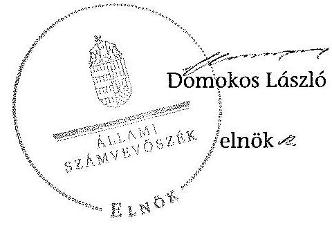

# ÁLLAMI   SZÁMVEVÔSZÉK 

## JELENTÉS

az önkormányzatok belső kontrollrendszere kialakításának, egyes
kontrolltevékenységek és a belső ellenőrzés
müködésének - 2013. évben induló - ellenőrzéséről
Hajós
13152
2013. december

---

# Állami Számvevőszék 

Iktatószám: V-0128-037/2013.
Témaszám: 1162
Vizsgálat-azonosító szám: V064901

## Az ellenőrzést felügyelte:

Dr. Benedek Mária
felügyeleti vezető
Az ellenőrzést vezette és az ellenőrzés végrehajtásáért felelős:
Bíró Zsolt
ellenőrzésvezető
A számvevőszéki jelentés összeállításában közremüködött:
Pappné dr. Szamosi Éva
számvevő tanácsos
Az ellenőrzést végezték:
Dr. Baloghné Sebestyén Éva Krüzselyi Attila
számvevő számvevő tanácsos

---

# TARTALOMJEGYZÉK 

BEVEZETÉS ..... 5
I. ÖSSZEGZŐ MEGÁLLAPÍTÁSOK, KÖVETKEZTETÉSEK, JAVASLATOK ..... 9
II. RÉSZLETES MEGÁLLAPÍTÁSOK ..... 18

1. Az önkormányzat belső kontrollrendszerének kialakítása ..... 18
1.1. A kontrollkörnyezet ..... 18
1.2. A kockázatkezelési rendszer ..... 19
1.3. A kontrolltevékenységek ..... 19
1.4. Az információs és kommunikációs rendszer ..... 20
1.5. A monitoring rendszer ..... 21
2. A pénzügyi folyamatokban kulcsszerepet betöltő teljesítésigazolás és érvényesítés belső kontrollok múködése ..... 21
3. A belső ellenőrzés múködése ..... 24

## FÜGGELÉKEK

1. számú Értelmező szótár
2. számú Az értékelés módja és szempontjai

---

.

---

# RÖVIDÍTÉSEK JEGYZÉKE 

## Törvények

Áht.
ÁSZ tv.
Htv.

Info tv.

Kttv.
Ktv.
Mötv.
Mvtv.
Nvtv.
Ötv.
Számv. tv.
Tvtv.

## Rendeletek

Áhsz.

Ávr.

Bkr.
ügyrend
vagyongazdálkodási rendelet

## Szórövidítések

ÁSZ

2011. évi CXCV. törvény az államháztartásról (hatályos 2012. január 1-jétől)
2011. évi LXVI. törvény az Állami Számvevőszékről
1991. évi XX. törvény a helyi önkormányzatok és szerveik, a köztársasági megbízottak, valamint egyes centrális alárendeltségủ szervek feladat- és hatásköreiről.
2011. évi CXII. törvény az információs önrendelkezési jogról és az információszabadságról (hatályos 2012. január 1-jétől)
2011. évi CXCIX. törvény a közszolgálati tisztviselők ről (hatályos 2012. március 1-jétől)
1992. évi XXIII. törvény a köztisztviselők jogállásáról (hatálytalan 2012. március 1-jétől)
2011. évi CLXXXIX. törvény Magyarország helyi önkormányzatairól (hatályos 2012. január 1-jétől)
1993. évi XCIII. törvény a munkavédelemről
2011. évi CXCVI. törvény a nemzeti vagyonról (hatályos 2011. december 31-étől)
1990. évi LXV. törvény a helyi önkormányzatokról
2000. évi C. törvény a számvitelről
1996. évi XXXI. törvény a tűz elleni védekezésről, a műszaki mentésről és a tűzoltóságról

249/2000. (XII. 24.) Korm. rendelet az államháztartás szervezetei beszámolási és könyvvezetési kötelezettségének sajátosságairól
368/2011. (XII. 31.) Korm. rendelet az államháztartásról szóló törvény végrehajtásáról (hatályos 2012. január 1jétől)
370/2011. (XII. 31.) Korm. rendelet a költségvetési szervek belső kontrollrendszeréről és belső ellenőrzéséről (hatályos 2012. január 1-jétől)
Hajós Város Önkormányzata Polgármesteri Hivatalának Ügyrendje, az Önkormányzat Szervezeti és Müködési Szabályzatról szóló 5/2011. (IV. 20.) számú rendeletének 2. számú melléklete

Hajós Nagyközség Képviselőtestületének 13/2004. (VI. 28.) számú rendelete az önkormányzat vagyonáról és a vagyonhasznosítás szabályairól

Állami Számvevőszék

---

gazdálkodási jogkörök Szabályzata

Hivatal
INTOSAI

ISSAI
jegyzö,
jegyzó
Képviselő-testület
leltározási és leltárkészítési szabályzat
NGM
Önkormányzat
polgármester
Polgármesteri Hivatal
Társulás

Hajós Város Önkormányzat kötelezettségvállalási, utalványozási és ellenjegyzési, valamint érvényesitési rendjének szabályzata (hatályos 2012. január 1-jétől)
Hajósi Közös Önkormányzati Hivatal
International Organization of Supreme Audit Institutions (Legfőbb Ellenőrző Intézmények Nemzetközi Szervezete)
International Standards of Supreme Audit Institutions (Legfőbb Ellenőrző Intézmények Nemzetközi Standardjai)
Hajós Város Önkormányzatának jegyzője 2000. szeptember 1-jétől 2013. január 31-éig
Hajósi Közös Önkormányzati Hivatal jegyzője 2013. február 1-jétől
Hajós Város Önkormányzatának Képviselő-testülete
Leltárkészítési és leltározási szabályzat (hatályos 2001. január 1-jétől)
Nemzetgazdasági Minisztérium
Hajós Város Önkormányzata
Hajós Város Önkormányzatának polgármestere
Hajós Város Önkormányzatának Polgármesteri Hivatala
Kalocsa Kistérség Többcélú Társulása (megszűnt 2013. június 30 -ával)

---

# JELENTÉS 

## az önkormányzatok belső kontrollrendszere kialakításának, egyes kontrolltevékenységek és a belső ellenőrzés múködésének 2013. évben induló - ellenőrzéséről Hajós

## BEVEZETÉS

Hajós város állandó lakosainak száma 2012. január 1-jén 3179 fő volt. Az Önkormányzat hattagú Képviselő-testületének munkáját kettő állandó bizottság segítette. Az Önkormányzat az önállóan működő és gazdálkodó Polgármesteri Hivatalon kívül egy önállóan működő intézményt múködtetett, egy többségi tulajdoni hányadú gazdasági társasággal rendelkezett. A polgármester a 2010. évi önkormányzati választások óta tölti be tisztségét. A jegyzö ${ }_{1} 2000$. szeptember 1-jétől 2013. január 31-éig látta el, a jegyzö ${ }_{2} 2013$. február 1-jétől látja el feladatait. A Polgármesteri Hivatal két szervezeti egységre tagolódott, elkülönített gazdasági szervezettel nem rendelkezett, a foglalkoztatott köztisztviselők száma 2012. január 1-jén 12 fő volt. A Képviselő-testület 2013. január 1-jétől Homokmégy Község Önkormányzat Képviselő-testületével megalapította a Hajósi Közös Önkormányzati Hivatalt, Hajós székhellyel, igazgatási feladataik ellátására. Az Önkormányzat a 2012. évi költségvetési beszámolója szerint 569575 ezer Ft tárgyévi bevételt ért el, valamint 538556 ezer Ft tárgyévi kiadást teljesített. A 2012. december 31-i könyvviteli mérleg szerint 1195808 ezer Ft értékű eszközvagyonnal rendelkezett, a rövid lejáratú kötelezettségállománya 5549 ezer Ft volt, hosszú lejáratú kötelezettség állománya nem volt.

A demokratikus társadalmakban alapvető igény, hogy a közpénzeket, a közvagyont használók tevékenységükről elszámoljanak, ahhoz egyértelmű és érvényesíthető felelősségi szabályok társuljanak. Ennek a jogos igénynek az érvényesítéséhez meg kell teremteni azokat a folyamatokat, rendszereket, amelyek nélkülözhetetlenek az elszámoltatáshoz. Az elszámoltatás eredményes múködtetéséhez szükség van a megfelelő információs, kontroll, értékelési és beszámolási rendszerek kialakítására.

Magyarországon az uniós csatlakozási tárgyalások idejére nyúlnak vissza a belső kontrollrendszer szabályozásának gyökerei. Az uniós elvárásoknak megfelelő új terminológia szerinti államháztartási belső pénzügyi ellenőrzési (ÄBPE) rendszer területén a jogharmonizáció 2003-ban teljes körűen megvalósult, míg az önkormányzati alrendszerre vonatkozó, Ötv.-ben megjelenített speciális szabályozás 2005-ben lépett hatályba. Az államháztartási belső kontrollrendszer koncepciója 2009-ben továbbfejlődött. A változások irányát mutatja, hogy a költségvetési szervek belső kontrollrendszere már magában foglalja

---

a korszerű felelős szervezetirányítás elemeit (kontrollkörnyezet, kockázatkezelés, kontrolltevékenység, információ és kommunikáció, monitoring) is. E kontrollrendszer szabályozása háromszintű, a törvényi előírásokat az Áht. és a Mötv., a rendeleti szintű szabályozást az Ávr. és a Bkr. tartalmazza, amelyeket útmutatói szinten az NGM által kiadott standardok és kézikönyvek támogatnak.

A belső kontrollrendszer azt a célt szolgálja, hogy a költségvetési szervek múködésük és gazdálkodásuk során a tevékenységeket szabályszerűen, gazdaságosan, hatékonyan és eredményesen hajtsák végre, teljesítsék elszámolási kötelezettségeiket és megvédjék az erőforrásokat a veszteségektől, a károktól és a nem rendeltetésszerű használattól. A belső kontrollrendszer magában foglalja mindazon szabályokat, eljárásokat, gyakorlati módszereket és szervezeti struktúrákat, kockázatkezelési technikákat, kontrolltevékenységeket, amelyek segítséget nyújtanak a szervezetnek céljai eléréséhez.

Az ÁSZ a 2011-2015. évekre szóló stratégiájában hangsúlyos szerepet szánt annak, hogy szilárd szakmai alapon álló, értékteremtő ellenőrzéseivel előmozdítsa a közpénzügyek átláthatóságát, rendezettségét. A számvevőszéki ellenőrzés nemzetközi alapelvei is rögzítik, hogy a megfelelő belső kontrollrendszer minimálisra csökkenti a hibák és szabálytalanságok kockázatát.

Az ellenőrzés célja annak megállapítása volt, hogy a belső kontrollrendszer elemeinek kialakítása, a pénzügyi folyamatokban kulcsszerepet betöltő teljesítésigazolás és érvényesítés, és a belső ellenőrzés szabályos működése biztosítot-ta-e az önkormányzatnál a közpénzfelhasználás szabályosságát, hozzájárult-e az értéket teremtő rend követelményének érvényesüléséhez.

Ennek keretében értékeltük, hogy:

- a jogszabályi előírásoknak megfelelően alakították-e ki a belső kontrollrendszer elemeit;
- a gazdálkodás folyamatában kulcsszerepet betöltő teljesítésigazolás és érvényesítés kontrolltevékenységeit megfelelően működtették-e;
- biztosították-e a belső ellenőrzés szabályos működését;
- amennyiben az ÁSZ tett javaslatot a 2008-2011. évek közötti ellenőrzése kapcsán az Önkormányzatnak, intézkedtek-e azok végrehajtására.

Az ellenőrzés várható hasznosulását négy szinten tervezzük. A törvényalkotás számára összegzett tapasztalatok állnak rendelkezésre a belső kontrollrendszer önkormányzati területen való kialakításáról, múködéséről és hatásairól, a belső ellenőrzés múködéséről. Ennek alapján következtetést lehet levonni arról, hogy a belső kontrollrendszer kialakítására és működtetésére vonatkozó jelenlegi, differenciálás nélküli - jogszabályi előírások reális követelményeket támasztanak-e az eltérő adottságú települési önkormányzatok esetében, illetve indokolt-e esetleges jogszabályi módosítás kezdeményezése. Az ellenőrzés az ellenőrzött számára visszajelzést ad a belső kontrollrendszer kialakításában és működésében fellépő hiányosságokról, javaslataival hozzájárul azok kiküszöböléséhez, amely csökkentheti a későbbi ellenőrzések gyakoriságát. Az ellen-

---

őrzés megállapításait és javaslatait más szervezetek is hasznosíthatják a rendezett gazdálkodási keretek kialakításához. A társadalom számára jelzi, hogy közpénz nem maradhat ellenőrizetlenül, az ÁSZ értékteremtő rend kialakításához és megőrzéséhez hozzájáruló tevékenysége pozitív hatással lesz a szervezetről kialakított összkép formálásában. A szervezeten belül lehetőség nyílik arra, hogy a megállapítások szintetizálásával az ÁSZ a hozzáadott értéket teremtő elemző tevékenységét és tanácsadó szerepét is erősítse.

Az önkormányzatok belső kontrollrendszere kialakításának, egyes kontrolltevékenységek és a belső ellenőrzés működésének ellenőrzéséről szóló jelentés I. fejezetének összegző része az ellenőrzés céljára ad rövid, szintetizáló összefoglalót, és tartalmazza a következtetéseket a II. fejezet részletes megállapításain alapulóan. A jelentés intézkedést igénylő megállapításait és javaslatait az ellenőrzés során feltárt, a jelentés II. fejezetében rögzített részletes megállapítások alapozzák meg. A helyszíni ellenőrzés lezárásáig a helyi szabályozás változásait nyomon követtük.

Az ellenőrzés típusa: szabályszerűségi ellenőrzés.
Az ellenőrzött időszak: a belső kontrollrendszer kialakításának megfelelősége esetében a 2012. évre, a pénzügyi folyamatokban kulcsszerepet betöltő teljesítésigazolás és érvényesítés belső kontrollok múködésének megfelelőségét és a belső ellenőrzés szabályszerű működését a 2012. január 1. és december 31-e közötti időszak eseményeit figyelembe véve értékeltük, míg az ÁSZ javaslatainak utóellenőrzése a 2008-2011. években végzett ellenőrzések nyilvánosságra hozott jelentéseiben tett javaslatok áttekintésére terjedt ki.

# Az ellenőrzött szervezet: az Önkormányzat. 

Az ellenőrzés jogszabályi alapját az ÁSZ tv. 1. § (3) bekezdése, az 5. § (2) és (6) bekezdése, valamint az Áht. 61. § (2) bekezdésének előírásai képezik.

Az ellenőrzés szakmai módszertana az ÁSZ hivatalos honlapján (www.asz.hu) közzétett szakmai szabályokon alapult, amely az INTOSAI által kiadott ISSAI figyelembevételével készült.

Az ellenőrzés lefolytatásához az Önkormányzat a kimutatások és a tanúsítvány elektronikus kitöltésével, valamint az ÁSZ által kért dokumentumok elektronikus megküldésével szolgáltatott adatokat. Az így rendelkezésre bocsátott adatok, információk kontrollja és a munkalapok kitöltése a helyszíni ellenőrzés keretében történt. A jelentésben használt fogalmak magyarázatát az 1. számú függelék, az ellenőrzés egyes területeinek értékelésénél alkalmazott egységes minősítési szempontokat a 2. számú függelék tartalmazza.

A belső kontrollrendszer kialakításának ellenőrzése során értékeltük a kontrollkörnyezet, a kockázatkezelési rendszer, a kontrolltevékenységek, az információs és kommunikációs rendszer, valamint a monitoring rendszer szabályozottságának megfelelőségét. A pénzügyi folyamatokban kulcsszerepet betöltő teljesítésigazolás és érvényesítés kontrollok múködése megfelelőségének minősítéséhez az állományba nem tartozók megbízási díjai, a külső szolgáltatók által végzett karbantartási, kisjavítási munkák, az egyéb üzemeltetési és fenntartási

---

szolgáltatások, a rendszeres szociális segélyek, valamint az államháztartáson kívülre teljesített működési és felhalmozási célú pénzeszközátadások közül kockázatelemzéssel választottuk ki az ellenőrzött kiadási jogcímeket. Az egyszerű véletlen mintavétellel kiválasztott tételek ellenőrzését többlépcsős megfelelőségi tesztek útján addig végeztük, amíg elegendő és megfelelő bizonyítékot szereztünk a vizsgált folyamatok kulcskontrolljai múködésének megfelelő vagy nem megfelelő voltáról. Értékeltük az Önkormányzatnál a belső ellenőrzés múködésének szabályosságát. Utóellenőrzésre nem került sor, mivel az ÁSZ az Önkormányzatnál a 2008-2011. évek között ellenőrzést nem végzett.

Az ÁSZ tv. 29. § (1) bekezdése szerint a jelentéstervezetet megküldtük a polgármester részére, aki az ÁSZ tv. 29. § (2) bekezdésében foglalt észrevételezési jogával nem élt, a jelentéstervezetre észrevételt nem tett.

---

# I. ÖSSZEGZŐ MEGÁLLAPÍTÁSOK, KÖVETKEZTETÉSEK, JAVASLATOK 

A belső kontrollrendszeren belül 2012-ben a kontrollkörnyezet, a kockázatkezelési rendszer, a kontrolltevékenységek, az információs és kommunikációs rendszer, valamint a monitoring rendszer kialakítását külön-külön és együttesen is értékeltük. A belső kontrollrendszer kialakítása az összesített értékelés alapján nem felelt meg a jogszabályi előírásoknak.

A belső kontrollrendszer egyes területei kialakításának minősítése a következő:

| Kontrollterület | Minősítés |
| :-- | :--: |
| Kontrollkörnyezet | nem |
|  | megfelelő |
| Kockázatkezelési rendszer | nem |
|  | megfelelő |
| Kontrolltevékenységek | nem |
| Információs és kommunikációs | megfelelő |
| rendszer | nem |
| Monitoring rendszer |  |

Nem megfelelőnek értékeltük a kontrollkörnyezet, a kockázatkezelési rendszer, a kontrolltevékenységek, az információs és kommunikációs rendszer, valamint a monitoring rendszer kialakítását, mivel az ellenőrzésünk során megállapított szabályozásbeli hiányosságok magukban hordozzák a szabálytalan működés, valamint a korrupció kockázatát.

A belső kontrollrendszer nem megfelelő kialakítása kockázatot jelent az Önkormányzat tevékenységeinek szabályszerű, gazdaságos, hatékony és eredményes végrehajtása során.

A 2012. évben az állományba nem tartozók megbízási díjaival, valamint a külső szolgáltatók által végzett karbantartási, kisjavítási munkákkal kapcsolatos kifizetések során a pénzügyi folyamatokban kulcsszerepet betöltő teljesítésigazolás és érvényesítés belső kontrollok múködése gyenge volt. Gyengének értékeltük a két kulcskontroll együttes múködését, mivel azok nem biztosították a hibák megelőzését, feltárását.

A számvevőszéki ellenőrzés az ellenőrzött kifizetésekkel összefüggésben a rendelkezésre bocsátott dokumentumok alapján jogosulatlan kifizetést nem tárt fel, azonban a gazdálkodásban kulcsszerepet betöltő kontrollok működésében feltárt hiányosságok miatt fennáll a hibák bekövetkezésének kockázata. A nem megfelelően múködtetett belső kontrollok korrupciós kockázatot hordoznak.

---

Az Önkormányzat a belső ellenőrzési feladatokat a Társulás útján látta el. Az Önkormányzatnál a 2012. évben a belső ellenőrzés múködése nem felelt meg a jogszabályi előírásoknak, mivel a számvevőszéki ellenőrzés által megállapított szabályozási és működési hiányosságok számossága magában hordozza a szabálytalan önkormányzati gazdálkodás és feladatellátás kockázatát.

Az ÁSZ tv. 33. § (1) bekezdésében foglaltak értelmében az ellenőrzött szervezet vezetője köteles a jelentésben foglalt megállapításokhoz kapcsolódó intézkedési tervet összeállítani, és azt a jelentés kézhezvételétől számított 30 napon belül az ÁSZ részére megküldeni. Amennyiben az intézkedési tervet határidőre nem küldi meg a szervezet, vagy az ÁSZ tv. 33. § (2) bekezdésében foglalt póthatáridő elteltével megküldött intézkedési terv továbbra sem elfogadható, az ÁSZ elnöke a hivatkozott törvény 33. § (3) bekezdés a)-b) pontjaiban foglaltakat érvényesítheti.

Az ellenőrzés intézkedést igénylő megállapításai és javaslatai:

# a polgármesternek 

1. A Képviselő-testület - az Ötv. 91. § (7) bekezdésében foglaltak ellenére - nem fogadta el az Ötv. 91. § (1) és (6) bekezdése szerinti gazdasági programtervezetet.

Javaslat:
Terjessze a Képviselő-testület elé a jegyző által a Mötv. 116. § (1)-(4) bekezdéseinek megfelelő tartalommal előkészített gazdasági programtervezetet.
2. Az Önkormányzat kiadási előirányzatai terhére történt kötelezettségvállalást a kifizetéseket megelőzően - az Áht. 37. § (1) bekezdésének és az 55. § (1) bekezdésének előírása ellenére - nem foglalták írásba, továbbá a kötelezettségvállalást nem előzte meg pénzügyi ellenjegyzés.

Javaslat:
Intézkedjen arról, hogy az Önkormányzat kiadási előirányzatai terhére történt kötelezettségvállalásra az Áht. 37. § (1) bekezdésében és az 55. § (1) bekezdésében foglaltaknak megfelelően - az Ávr. 53. §-ában meghatározott kivételeket figyelembe véve - kizárólag a pénzügyi ellenjegyzés után, a pénzügyi teljesítés esedékességét megelőzően, írásban kerüljön sor.
3. A polgármester, mint az Ávr. 52. § (6) bekezdésében foglaltak szerinti kötelezettségvállaló - az Ávr. 57. § (4) bekezdésében foglaltak ellenére - nem jelölte ki 2012. március 31-étől írásban az Önkormányzat kiadási előirányzatai vonatkozásában a teljesítés igazolására jogosult személyeket.

Javaslat:
Jelölje ki - az Ávr. 57. § (4) bekezdésében foglaltak figyelembe vételével - az Önkormányzat kiadási előirányzatai vonatkozásában a teljesítés igazolására jogosult személyeket.

---

4. A polgármester a Bkr. 56. § (8) bekezdésében foglalt előírás ellenére az éves ellenőrzési jelentést - annak elkészítése hiányában - a zárszámadási rendelettervezettel egyidejűleg nem terjesztette a Képviselő-testület elé.

Javaslat:
Terjessze a Képviselő-testület elé az éves ellenőrzési jelentést a Bkr. 49. § (3a), illetve az 56. § (8) bekezdésében foglaltak figyelembevételével, a zárszámadási rendelettervezettel egyidejűleg.
5. A számvevőszéki ellenőrzés megállapításai alapján az Önkormányzatnál a belső kontrollrendszer kialakítása összefoglalóan értékelve nem felelt meg a jogszabályi előírásoknak. A kulcskontrollok müködése gyenge volt, a belső ellenőrzés müködése ugyan megfelelit a jogszabályi előírásoknak, azonban nem tárta fel, ezáltal nem is javíttatta ki a feltárt hiányosságokat. A megállapított szabályozásbeli és müködésbeli hiányosságok magukban hordozzák a szabálytalan müködés kockázatát.

Javaslat:
A Mötv. 115. § (1) bekezdésében foglaltak alapján kísérje figyelemmel az Önkormányzat gazdálkodásának szabályszerűségét. A Mötv. 67. § f) pontja alapján gondoskodjon a belső kontrollrendszer müködésére vonatkozó jogszabályi rendelkezések be nem tartása, valamint a teljesítésigazolás, illetve az érvényesítés kontrollokkal öszszefüggésben feltárt hiányosságok, szabálytalanságok tekintetében az esetleges munkajogi felelősséggel kapcsolatos körülmények kivizsgálásáról, majd a vizsgálat eredményének függvényében tegye meg a szükséges munkajogi intézkedéseket.

# a jegyzőnek (Hajós Város Önkormányzata vonatkozásában) 

1. a kontrollkörnyezettel kapcsolatban:

A jegyző, a Htv. 140. § (1) bekezdés a) pontjában foglalt előírást figyelmen kívül hagyva nem készítette elő az Ötv. 91. § (1) és (6) bekezdés szerinti gazdasági programtervezetet, így a Képviselő-testület az Ötv. 91. § (7) bekezdésében foglaltakat megsértve nem fogadta el az Önkormányzat 2011-2014. évekre vonatkozó gazdasági programját.

A jegyző, az Áht. 10. § (5) bekezdésében foglaltak ellenére a Polgármesteri Hivatal feladatai ellátásának részletes belső rendjét és módját szervezeti és müködési szabályzatban nem állapította meg.

A jegyző, az Ötv. 36. § (2) bekezdés a) pontjában foglaltak ellenére nem készítette elő a vagyongazdálkodási rendelet módosítását, így az Önkormányzat vagyongazdálkodási rendelete nem felelt meg az Nvtv. 3. § (1) bekezdés 6. pontja, 5-6. §-a, 11. § (16) bekezdése, 13. § (1) bekezdése, 18. § (1) és (12) bekezdése, valamint az Mötv. 109. § (4) bekezdése előírásainak.

A jegyző, a Számv. tv. 14. § (11) bekezdésében foglaltak ellenére az Áhsz. 8. § (4) bekezdés a) pontjában előírt - az ellenőrzés idején hatályos - leltározási és leltárkészítési szabályzatot nem aktualizálta.

---

A Polgármesteri Hivatalban az Mvtv. 2. § (3) bekezdésében foglaltak ellenére a jegy$z 0_{1}$ nem határozta meg az egészséget nem veszélyeztető és biztonságos munkavégzés követelményei megvalósításának módját.

A jegyző, a Tvtv. 19. § (1) bekezdését figyelmen kívül hagyva nem készítette el a Polgármesteri Hivatal tűzvédelmi szabályzatát.

A jegyző, a Bkr. 6. § (4) bekezdésében foglaltak ellenére nem készítette el a szabálytalanságok kezelésének eljárásrendjét.

A jegyző, az Ávr. 13. § (5) bekezdésében foglaltak ellenére nem gondoskodott a gazdálkodási csoport által ellátott feladatok munkafolyamatainak leírásáról, valamint a belső és külső kapcsolattartás módjának és szabályainak meghatározásáról.

A jegyző, a Bkr. 6. § (3) bekezdésében foglaltak ellenére a Polgármesteri Hivatal ellenőrzési nyomvonalát nem készítette el.

A jegyző, a Kttv. 130. § (1) bekezdéseiben foglaltak ellenére a Polgármesteri Hivatalban dolgozó köztisztviselők teljesítményértékelését nem készítette el.

A Kttv. 231. § (1) bekezdése ellenére a Képviselő-testület nem állapította meg a köztisztviselőkkel szembeni, a Kttv. 83. §-ában előírt hivatásetikai alapelvek részletes tartalmát, valamint az etikai eljárás szabályait, mivel a jegyző, az Ötv. 36. § (2) bekezdés a) pontjában előírt feladata ellenére nem készítette elő ennek dokumentumát.

Javaslat:
a) Készítse elő a Htv. 140. § (1) bekezdés a) pontjában foglaltak alapján a gazdasági program tervezetét a Mötv. 116. § (3)-(4) bekezdéseiben foglalt tartalommal, és kezdeményezze a polgármesternél a Képviselő-testület elé terjesztését.
b) Készítse el az Áht. 10. § (5) bekezdése alapján a Hivatal szervezeti és müködési szabályzatát, és kezdeményezze az Áht. 9. § (1) bekezdés a) pontjában foglaltak érdekében annak Képviselő-testület elé terjesztését.
c) Készítse elő a Mötv. 81. § (3) bekezdés c) pontjában foglalt feladatkörében a vagyongazdálkodási rendelet módosítását, és kezdeményezze a módosítás Képvise-lő-testület elé terjesztését annak érdekében, hogy az megfeleljen az Nvtv.3. § (1) bekezdés 6. pontja, 5-6. §-a, 11. § (16) bekezdése, 13. § (1) bekezdése, 18. § (1) és (12) bekezdése és a Mötv. 109. § (4) bekezdése előírásainak.
d) Aktualizálja a Számv. tv. 14. § (11) bekezdésében foglaltak alapján az Áhsz. 8. § (4) bekezdés a) pontjában előírt leltározási és leltárkészítési szabályzatot.
e) Határozza meg az egészséget nem veszélyeztető és biztonságos munkavégzés követelményei megvalósításának módját az Mvtv. 2. § (3) bekezdése alapján.
f) Készítse el a tűzvédelmi szabályzatot a Tvtv. 19. § (1) bekezdésében foglalt előírásnak megfelelően.
g) Rögzítse belső szabályzatban az Ávr. 13. § (5) bekezdésében foglaltaknak megfelelően a gazdálkodási csoport által ellátott feladatok munkafolyamatainak leírá-

---

sát, valamint határozza meg a belső és külső kapcsolattartás módját és szabályait.
h) Készítse el az ellenőrzési nyomvonalat, és szabályozza a szabálytalanságok kezelésének eljárásrendjét a Bkr. 6. § (3)-(4) bekezdéseiben foglaltaknak megfelelően.
i) Értékelje írásban a Kttv. 130. § (1) bekezdése alapján a Polgármesteri Hivatal köztisztviselőinek munkateljesítményét.
j) Készítse elő a Mötv. 81. § (3) bekezdés c) pontjában foglalt feladatkörében a köztisztviselőkkel szembeni, a Kttv. 83. §-ában foglaltak szerinti hivatásetikai alapelvek részletes tartalmának, valamint az etikai eljárás szabályainak dokumentumait, és a Kttv. 231. § (1) bekezdésében foglaltak érvényesülése érdekében kezdeményezze azok Képviselő-testület elé terjesztését.
2. a kockázatkezelési rendszerrel kapcsolatban:

A jegyző, - a Bkr. 7. § (2) bekezdésében foglalt előírások ellenére - nem mérte fel és nem állapította meg a Polgármesteri Hivatal tevékenységében, gazdálkodásában rejlő kockázatokat, nem határozta meg a kockázatok kezelése érdekében szükséges intézkedések teljesítésének folyamatos nyomon követési módját.

Javaslat:
Mérje fel és állapítsa meg a Bkr. 7. § (2) bekezdésében foglaltak alapján a Polgármesteri Hivatal tevékenységében, gazdálkodásában rejlő kockázatokat, határozza meg az egyes kockázatokkal kapcsolatban szükséges intézkedéseket, valamint azok teljesítése folyamatos nyomon követésének módját.
3. a kontrolltevékenységekkel kapcsolatban:

A jegyző, a Bkr. 8. § (2) bekezdésének a) pontjában foglaltak ellenére nem biztosította a pénzügyi döntések - köztük a költségvetés tervezése, a beszerzési folyamat, a vagyonhasznosítási tevékenység és a támogatások - dokumentumainak elkészítésével kapcsolatban a folyamatba épített, előzetes, utólagos és vezetői ellenőrzést.

A jegyző, az Ávr. 53. § (2) bekezdésében foglaltakat figyelmen kívül hagyva, annak ellenére nem határozta meg az előzetes írásbeli kötelezettségvállalást nem igénylő kifizetések rendjét, hogy belső szabályozásban lehetővé tette a 100 ezer Ft alatti kifizetések előzetes írásbeli kötelezettségvállalás nélküli teljesítését.

A jegyző, az Ávr. 13. § (2) bekezdés a) pontjában foglaltak ellenére belső szabályzatban nem szabályozta az érvényesítés módját.

Az utalványozásra vonatkozóan - az Ávr. 13. § (2) bekezdés a) pontjában előírtak alapján készített belső szabályzatban - az Ávr. 59. § (3) bekezdés h) és f) pontjában előírtak ellenére nem rögzítették az utalvány kötelező tartalmi elemeként a megterhelendő és jóváírandó fizetési számla számát és megnevezését, valamint a kötelezettségvállalás nyilvántartási számát.

A jegyző, az Ávr. 13. § (5) bekezdésében foglaltak ellenére nem határozta meg a gazdasági feladatot ellátó alkalmazottak helyettesítésének rendjét.

---

Javaslat:
a) Biztosítsa minden tevékenységre vonatkozóan a folyamatba épített, előzetes, utólagos és vezetői ellenőrzést a Bkr. 8. § (2) bekezdése alapján.
b) Rögzítse belső szabályzatban az Ávr. 53. § (2) bekezdése alapján az előzetes írásbeli kötelezettségvállalást nem igénylő kifizetések rendjét.
c) Rendezze belső szabályzatban az Ávr. 13. § (2) bekezdés a) pontjában foglaltak alapján az érvényesítés gyakorlásának módjával, eljárási és dokumentációs részletszabályaival kapcsolatos belső előírásokat, feltételeket.
d) Gondoskodjon arról, hogy az Ávr. 13. § (2) bekezdés a) pontjában előírtak alapján elkészített belső szabályzatban az utalvány kötelező tartalmi elemeit az Ávr. 59. § (3) bekezdésében előírtaknak megfelelően rögzítsék.
e) Határozza meg az Ávr. 13. § (5) bekezdésében előírtak alapján a gazdasági feladatot ellátó alkalmazottak helyettesítésének rendjét.
4. az információs és kommunikációs rendszerrel kapcsolatban:

A jegyző, az Ávr. 13. § (2) bekezdés h) pontjában foglalt előírás ellenére a kötelezően közzéteendő adatok nyilvánosságra hozatalának rendjét nem alakította ki.

Az Önkormányzat az Info tv. 33. § (1) és (3) bekezdésében foglalt elektronikus közzétételi kötelezettségének nem tett eleget teljes körűen, mert az Önkormányzat 2011. évi költségvetési beszámolóját nem tette közzé.

Javaslat:
a) Állapítsa meg - az Info tv. 35. § (3) bekezdésében, valamint az Ávr. 13. § (2) bekezdés h) pontjában foglaltaknak megfelelően - a kötelezően közzéteendő adatok nyilvánosságra hozatala rendjét.
b) Tegyen eleget az Info tv. 33. § (1) és (3) bekezdésében foglalt előírásnak megfelelően az elektronikus közzétételi kötelezettségnek.
5. a monitoring rendszerrel kapcsolatban:

A jegyző, a Bkr. 3. § e) pontjában és 10. §-ában foglaltak ellenére nem alakította ki a Polgármesteri Hivatal tevékenységének, a célok megvalósításának nyomon követését biztosító rendszert.

A jegyző, a Bkr. 11. § (1) bekezdésében foglalt kötelezettsége ellenére - a Bkr. 1. mellékletében előírt nyilatkozatban - a 2011. évre vonatkozóan nem értékelte a Polgármesteri Hivatal belső kontrollrendszerének minőségét.

Javaslat:
a) Alakítsa ki és múködtesse a Bkr. 3. § e) pontjában és a 10. §-ában előírtak alapján a Hivatal tevékenységének, a célok megvalósításának nyomon követését biztosító

---

rendszert, amelynek része az operatív tevékenységek keretében megvalósuló folyamatos és eseti nyomon követés is.
b) Értékelje a Bkr. 11. § (1) bekezdése alapján a jogszabályban meghatározott keretek között a Polgármesteri Hivatal belső kontrollrendszerének minőségét - a Bkr. 1. mellékletében foglalt - nyilatkozatban.
6. a pénzügyi folyamatokban kulcsszerepet betöltő kontrollokkal kapcsolatban:

A kifizetéseket megelőzően a teljesítésigazolást - az Áht. 38. § (1) bekezdésében és az Ávr. 57. § (1), (3) és (4) bekezdéseiben foglaltak ellenére - nem, vagy nem a kijelölt személyek végezték el, továbbá a teljesítésigazolás nem szabályszerűen történt.

Az érvényesítő nem az Ávr. 58. § (3) bekezdésében foglaltaknak megfelelően végezte feladatát, mert a kifizetéseket megelőzően az érvényesített okmányon az érvényesítés dátumát nem tüntette fel, továbbá - az Ávr. 58. § (1) bekezdésében foglaltak és aláírása ellenére - nem ellenőrizte a fedezet meglétét, valamint a külső szolgáltatók által teljesített karbantartási, kisjavítási munkáknál az összegszerűséget. Az érvényesítő az Ávr. 58. § (2) bekezdés előírása ellenére nem jelezte az utalványozónak, hogy a teljesítésigazolás elmaradt, vagy nem szabályszerűen történt. Az Áht. 37. § (1) bekezdése és az Ávr. 55. § (1) bekezdésében foglaltakat nem tartották be, mert a Polgármesteri Hivatal nevében történt kötelezettségvállalásokra pénzügyi ellenjegyzés nélkül került sor. A kiadási pénztárbizonylatokon nem tüntették fel a Számv. tv. 167. § (1) bekezdés h) pontjában előírt, a könyvelés módjára és az érintett könyvviteli számlákra történő hivatkozást. A kiadási pénztárbizonylaton és az utalványon nem tüntették fel az Ávr. 59. § (3) bekezdés f) pontjában és (4) bekezdésében előírt kötelezettségvállalás nyilvántartási számot, mert a kötelezettségvállalásokat az Ávr. 56. § (1) bekezdésében előírtak ellenére nem vették nyilvántartásba.

Javaslat:
Intézkedjen - a teljesítés igazolása és az érvényesítés vonatkozásában feltárt hiányosságok megszüntetése, illetve az operatív gazdálkodás során a müködésbeli hibák megelőzése, feltárása és kijavítása érdekében - arról, hogy:
a) a teljesítésigazolás során az Áht. 38. § (1) bekezdésében és az Ávr. 57. § (1) bekezdésében előírtaknak megfelelően, ellenőrizhető okmányok alapján ellenőrizzék és igazolják a kiadások teljesítésének jogosságát, összegszerűségét, az ellenszolgáltatást is magában foglaló kötelezettségvállalás esetén az ellenszolgáltatás teljesítését, valamint az Ávr. 57. § (3) bekezdése szerint a teljesítést az igazolás dátumának és a teljesítés tényére történő utalásnak a megjelölésével, az arra jogosult személy aláírásával igazolják;
b) a kifizetéseket megelőzően a teljesítésigazolás alapján - az Ávr. 57. § (3) bekezdése szerinti esetben annak hiányában is - az összegszerűségnek, a fedezet meglétének és a megelőző ügymenetben az Áht., az Áhsz., az Ávr. előírásai és a belső szabályzatokban foglaltak betartásának az ellenőrzése - az Ávr. 58. § (1), (2) és (3) bekezdése szerint - történjen meg;
c) kötelezettségvállalásra az Áht. 37. § (1) bekezdésében és az Ávr. 55. § (1) bekezdésében foglaltaknak megfelelően - az Ávr. 53. §-ában meghatározott kivétele-

---

ket figyelembe véve - kizárólag a pénzügyi ellenjegyzés után, a pénzügyi teljesítés esedékességét megelőzően, írásban kerüljön sor;
d) a bizonylaton tüntessék fel a Számv. tv. 167. § (1) bekezdés h) pontjában előírt, a könyvelés módjára és az érintett könyvviteli számlákra történő hivatkozást;
e) a kötelezettségvállalásokat az Ávr. 56. § (1) bekezdésében foglalt előírásnak megfelelően vegyék nyilvántartásba, és a kiadási pénztárbizonylaton, valamint az utalványon az Ávr. 59. § (3)-(4) bekezdéseiben foglalt kötelező tartalmi elemeket tüntessék fel.
7. a belső ellenőrzés múködésével kapcsolatban:

A Bkr. 16. § (4) bekezdésében és a 22. § (1)-(3) bekezdéseiben foglalt belső ellenőrzési vezetői feladatok és kötelességek ellátásának módjáról nem rendelkeztek.

Stratégiai ellenőrzési tervet a Bkr 22. § (1) bekezdés b) pontjában, a 29. § (1) bekezdésében és a 30. § (1) bekezdésében foglaltak ellenére nem készítettek.

A 2013. évre vonatkozó éves ellenőrzési terv a Bkr. 31. § (4) bekezdés a), c), d), e), f) és g) pontjaiban foglaltak ellenére nem tartalmazta az ellenőrzési tervet megalapozó elemzések és kockázatelemzés eredményének összefoglaló bemutatását, az ellenőrzés célját, az ellenőrizendő időszakot, a szükséges ellenőrzési kapacitás meghatározását, az ellenőrzés típusát, valamint az ellenőrzés ütemezését.

A Bkr. 31. § (2) bekezdésében foglaltak ellenére, az éves ellenőrzési tervet kockázatelemzés nem alapozta meg. A Bkr. 33. § (2) bekezdésében foglalt előírás ellenére az ellenőrzési programot nem a belső ellenőrzési vezető hagyta jóvá.

Az elvégzett ellenőrzésről készített jelentés a Bkr. 39. § (3) bekezdés d) pontjában foglaltak ellenére nem tartalmazta az ellenőrzés típusát. A belső ellenőrzés javaslatainak végrehajtása érdekében, a Bkr. 45. § (1)-(3) bekezdéseiben foglaltak ellenére intézkedési tervet nem készítettek.

A Bkr. 21.§ (2) bekezdés d) pontjában, a 47. § (1) bekezdésében és az 50. §-ában foglalt előírást figyelmen kívül hagyva, az elvégzett belső ellenőrzésekről és az ellenőrzési jelentésekben szereplő javaslatok nyomon követéséről nyilvántartást nem vezettek, valamint a Bkr. 22. § (1) bekezdés g) pontjában és a 49. § (1) bekezdésében előírtak ellenére az éves ellenőrzési jelentést nem készítették el.

Javaslat:
a) Intézkedjen a Bkr. 22. § (1)-(3) bekezdéseiben foglalt belső ellenőrzési vezetői tevékenységek és kötelezettségek ellátásának módjáról.
b) Kezdeményezze, hogy a Bkr. 22. § (1) bekezdés b) pontjában, a 29. § (1) bekezdésében és a 30. § (1) bekezdésében foglaltaknak megfelelően készítsék el a stratégiai ellenőrzési tervet.
c) Intézkedjen, hogy az éves ellenőrzési terv tartalmazza a Bkr. 31. § (4) bekezdésében előírt tartalmi elemeket, továbbá az éves ellenőrzési terv a Bkr. 22. § b) pontja, a 29. § (1) és a 31. § (2) bekezdése alapján kockázatelemzésen alapuljon.

---

d) Kezdeményezze, hogy az ellenőrzési programot a Bkr. 33. § (2) bekezdésében foglaltaknak megfelelően a belső ellenőrzési vezető hagyja jóvá.
e) Készítsen intézkedési tervet a belső ellenőrzési jelentésekben megfogalmazott javaslatok végrehajtására a Bkr. 45. § (1)-(3) bekezdéseiben foglaltaknak megfelelő tartalommal és határidőn belül.
f) Kezdeményezze, hogy - a Bkr. 21. § (2) bekezdés d) pontjának, 50. §-ának és 47. §-ának megfelelően - vezessenek nyilvántartást az elvégzett belső ellenőrzésekről, a belső ellenőrzési jelentésekben tett megállapításokról, javaslatokról, a vonatkozó intézkedési tervekről, és kövessék nyomon azok végrehajtását.
g) Intézkedjen, hogy a Bkr. 22. § (1) bekezdés g) pontjában és a 49. § (1) bekezdésében foglaltak alapján az éves ellenőrzési jelentést készítsék el.

---

# II. RÉSZLETES MEGÁLLAPÍTÁSOK 

## 1. Az önkORMÁNYZAT BELSŐ KONTROLLRENDSZERÉNEK KIALAKÍTÁSA

A belső kontrollrendszeren belül 2012-ben a kontrollkörnyezet, a kockázatkezelési rendszer, a kontrolltevékenységek, az információs és kommunikációs rendszer, valamint a monitoring rendszer kialakítását külön-külön és együttesen is értékeltük. A belső kontrollrendszer kialakítása az összesített értékelés alapján nem felelt meg a jogszabályi előírásoknak.

### 1.1. A kontrollkörnyezet

A kontrollkörnyezet kialakítása - a 2. számú függelékben részletezett kritériumrendszer alapján végzett értékelés szerint - nem felelt meg a jogszabályi előírásoknak, mert:

| Sorszám ${ }^{1}$ | Megállapítás |
| :--: | :--: |
| 2. | A jegyzö ${ }_{1}$ a Htv. 140. § (1) bekezdés a) pontjában foglalt előírást figyelmen kívül hagyva nem készítette elő az Ötv. 91. § (1) és (6) bekezdés szerinti gazdasági programtervezetet, így a Képviselő-testület az Ötv. 91. § (7) bekezdésében ${ }^{2}$ foglaltakat megsértve nem fogadta el az Önkormányzat 20112014. évekre vonatkozó gazdasági programját. |
| 4. | A Képviselő-testület a Ktv. 34. § (3) bekezdésében foglaltak ellenére nem döntött a teljesítményértékelés alapját képező célokról. |
| 5. | A jegyzö ${ }_{1}$ az Áht. 10. § (5) bekezdésében foglaltak ellenére a Polgármesteri Hivatal feladatai ellátásának részletes belső rendjét és módját szervezeti és múködési szabályzatban nem állapította meg. |
| 16. | A jegyzö ${ }_{1}$ az Ötv. 36. § (2) bekezdés a) pontjában ${ }^{3}$ foglaltak ellenére nem készítette elő a vagyongazdálkodási rendelet módosítását, így az Önkormányzat vagyongazdálkodási rendelete nem felelt meg az Nvtv. 3. § (1) bekezdés 6. pontja, 5-6. §-a, 11. § (16) bekezdése, 13. § (1) bekezdése, 18. § (1) és (12) bekezdése, valamint az Mötv. 109. § (4) bekezdése előírásainak. |
| 24. | A jegyzö ${ }_{1}$ a Számv. tv. 14. § (11) bekezdésében foglaltak ellenére az Áhsz. 8. § (4) bekezdés a) pontjában előírt - az ellenőrzés idején hatályos - leltározási és leltárkészítési szabályzatot nem aktualizálta. |
| 32. | A Polgármesteri Hivatalban az Mvtv. 2. § (3) bekezdésében foglaltak ellenére a jegyzö ${ }_{1}$ nem határozta meg az egészséget nem veszélyeztető és biztonságos munkavégzés követelményei megvalósításának módját. |

[^0]
[^0]:    ${ }^{1}$ A megállapítás számozása az önkormányzat által az adatszolgáltatás során kitöltött kimutatások kérdéseinek sorszámával azonos.
    ${ }^{2}$ 2013. január 1-jétől a Mötv. 116. § (1)-(5) bekezdései
    ${ }^{3}$ 2013. január 1-jétől a Mötv. 81. § (3) bekezdés c) pontja

---

| 33. | A jegyző, a Tvtv. 19. § (1) bekezdését figyelmen kívül hagyva nem készítette el a Polgármesteri Hivatal tűzvédelmi szabályzatát. |
| :--: | :--: |
| 34. | A jegyző, a Bkr. 6. § (4) bekezdésében foglaltak ellenére nem készítette el a szabálytalanságok kezelésének eljárásrendjét. |
| 35. | A jegyző, az Ávr. 13. § (5) bekezdésében foglaltak ellenére nem gondoskodott a gazdálkodási csoport által ellátott feladatok munkafolyamatainak leírásáról, a belső és külső kapcsolattartás módjának, szabályainak meghatározásáról. |
| 41. | A jegyző, a Bkr. 6. § (3) bekezdésében foglaltak ellenére a Polgármesteri Hivatal ellenőrzési nyomvonalát nem készítette el. |
| 46. | A jegyző, a Kttv. 130. § (1) bekezdésében foglaltak ellenére a Polgármesteri Hivatalban dolgozó köztisztviselők teljesítményértékelését nem készítette el. |
| 47. | A Kttv. 231. § (1) bekezdése ellenére a Képviselő-testület nem állapította meg a köztisztviselőkkel szembeni, a Kttv. 83. §-ában előírt hivatásetikai alapelvek részletes tartalmát, valamint az etikai eljárás szabályait, mivel a jegyző, az Ötv. 36. § (2) bekezdés a) pontjában előírt feladata ellenére nem készítette elő ennek dokumentumát. |

# 1.2. A kockázatkezelési rendszer 

A kockázatkezelési rendszer kialakítása - a 2. számú függelékben részletezett kritériumrendszer alapján végzett értékelés szerint - nem felelt meg a jogszabályi előírásoknak, mert:

| Sor-   szám | Megállapítás |
| :-- | :-- |
| 2., 8.   és   10. | A jegyző, - a Bkr. 7. § (2) bekezdésében foglalt előírások ellenére - nem mér-   te fel és nem állapította meg a Polgármesteri Hivatal tevékenységében, gaz-   dálkodásában rejlő kockázatokat, nem határozta meg a kockázatok kezelé-   se érdekében szükséges intézkedések teljesítésének folyamatos nyomon kö-   vetési módját. |

### 1.3. A kontrolltevékenységek

A kontrolltevékenységek kialakítása a 2. számú függelékben részletezett kritériumrendszer alapján végzett értékelés szerint nem felelt meg a jogszabályi előírásoknak, mert:

| Sor-   szám | Megállapítás |
| :--: | :--: |
| 2., 3.,   4., és   5. | A jegyző, a Bkr. 8. § (2) bekezdés a) pontjában foglaltak ellenére nem biztosította a pénzügyi döntések - köztük a költségvetés tervezése, a beszerzési folyamat, a vagyonhasznosítási tevékenység és a támogatások - dokumentumainak elkészítésével kapcsolatban a folyamatba épített, előzetes, utólagos és vezetői ellenőrzést. |

---

| 8. | A jegyző ${ }_{1}$ az Ávr. 53. § (2) bekezdésében foglaltakat figyelmen kívül hagyva, annak ellenére nem határozta meg az előzetes írásbeli kötelezettségvállalást nem igénylő kifizetések rendjét, hogy belső szabályozásban lehetővé tette a 100 ezer Ft alatti kifizetések előzetes írásbeli kötelezettségvállalás nélküli teljesítését. |
| :--: | :--: |
| 10. | A polgármester, mint az Ávr. 52. § (6) bekezdésében foglaltak szerinti kötelezettségvállaló - az Ávr. 57. § (4) bekezdésében foglaltak ellenére - nem jelölte ki 2012. március 31-étől írásban az Önkormányzat kiadási előirányzatai vonatkozásában a teljesítés igazolására jogosult személyeket. |
| 11. | A jegyző ${ }_{1}$ az Ávr. 13. § (2) bekezdés a) pontjában foglaltak ellenére nem szabályozta az érvényesítés módját. |
| 12. | Az utalványozásra vonatkozóan - az Ávr. 13. § (2) bekezdés a) pontjában előírtak alapján - készített belső szabályzatban az Ávr. 59. § (3) bekezdés h) és f) pontjában előírtak ellenére nem rögzítették az utalvány kötelező tartalmi elemeként a megterhelendő és jóváírandó fizetési számla számát és megnevezését, valamint a kötelezettségvállalás nyilvántartási számát. |
| 21. | A jegyző ${ }_{1}$ az Ávr. 13. § (5) bekezdésében foglaltak ellenére nem határozta meg a gazdasági feladatot ellátó alkalmazottak helyettesítésének rendjét. |

A gazdálkodási jogkörök szabályozása során nem volt összhang a gazdálkodási jogkörök szabályzatában és az ügyrend 2. számú mellékletében foglaltak között. A jegyző ${ }_{1}$ az Ávr. hatályba lépését követően nem kezdeményezte az ügyrend 2. számú mellékletének módosítását, figyelemmel az Ávr. 13. § (2) bekezdés a) pontjában előírtakra.

# 1.4. Az információs és kommunikációs rendszer 

Az információs és kommunikációs rendszer kialakítása - a 2. számú függelékben részletezett kritériumrendszer alapján végzett értékelés szerint nem felelt meg a jogszabályi előírásoknak, mert:

| Sorszám | Megállapítás |
| :--: | :--: |
| 6. | A jegyző ${ }_{1}$ az Ávr. 13. § (2) bekezdés h) pontjában foglalt előírás ellenére a kötelezően közzéteendő adatok nyilvánosságra hozatalának rendjét nem alakította ki. |
| 7. | Az Önkormányzat az Info tv. 33. § (1) és (3) bekezdésében foglalt elektronikus közzétételi kötelezettségének nem tett eleget teljes körűen, mert az Önkormányzat 2011. évi költségvetési beszámolóját nem tette közzé. |

---

# 1.5. A monitoring rendszer 

A monitoring rendszer kialakítása - a 2. számú függelékben részletezett kritériumrendszer alapján végzett értékelés szerint - nem felelt meg a jogszabályi előírásoknak, mert:

| Sor-   szám | Megállapítás |
| :-- | :-- |
| 1. | A jegyző, a Bkr. 3. § e) pontjában és 10. §-ában foglaltak ellenére nem ala-   kította ki a Polgármesteri Hivatal tevékenységének, a célok megvalósításának nyomon követését biztosító rendszert. |
| 9. | A jegyző, a Bkr. 11. § (1) bekezdésében foglalt kötelezettsége ellenére - a   Bkr. 1. mellékletében előírt nyilatkozatban - nem értékelte 2011-re vonatkozóan a Polgármesteri Hivatal belső kontrollrendszerének minőségét. |

Az Önkormányzatnál 2012-ben a helyi önkormányzatok törvényességi felügyeletét ellátó kormányhivatal nem élt törvényességi felhívással vagy más törvényességi felügyeleti eszközzel.

## 2. A PÉNZÜGYI FOLYAMATOKBAN KULCSSZEREPET BETÖLTŐ TELJESÍTÉSIGAZOLÁS ÉS ÉRVÉNYESÍTÉS BELSŐ KONTROLLOK MÜKÖDÉSE

A 2012. évben az állományba nem tartozók megbízási díjaival, valamint a külső szolgáltatók által végzett karbantartással, kisjavítással kapcsolatos kifizetések során - összefoglalóan értékelve - a pénzügyi folyamatokban kulcsszerepet betöltő teljesítésigazolás és érvényesítés belső kontrollok müködésének megfelelősége gyenge volt, mert:

| Kulcskontrollok | Megállapítás |
| :--: | :--: |
| Teljesítésigazolás | A kifizetéseket megelőzően a teljesítésigazolást - az Áht. 38. § (1) bekezdésében és az Ávr. 57. § (1), (3) és (4) bekezdéselben foglaltak ellenére - nem, vagy nem a kijelölt személyek végezték el, továbbá a teljesítésigazolás nem szabályszerűen történt. |
| Érvényesítés | Az érvényesítő nem az Ávr. 58. § (3) bekezdésében foglaltaknak megfelelően végezte feladatát, mert a kifizetéseket megelőzően az érvényesített okmányon az érvényesítés dátumát nem tüntette fel, továbbá - az Ávr. 58. § (1) bekezdésében foglaltak és aláírása ellenére - nem ellenőrizte a fedezet meglétét, valamint a külső szolgáltatók által teljesített karbantartási, kisjavítási munkáknál az összegszerűséget. Az érvényesítő az Ávr. 58. § (2) bekezdés előírása ellenére nem jelezte az utalványozónak, hogy a teljesítésigazolást nem, vagy nem a kijelölt személy végezte el, továbbá a teljesítésigazolás nem szabályszerűen történt. Az Áht. 37. § (1) bekezdésében és az Ávr. 55. § (1) bekezdésében foglaltakat nem tartották be, mert a Polgármesteri Hivatal nevében történt kötelezettségvállalásokra pénzügyi ellenjegyzés nélkül került sor, továbbá mert az Önkormányzat kiadási előirányzatai terhére történt kötelezettségvállalást a kifizetéseket megelőzően nem |

---

foglalták írásba. A kiadási pénztárbizonylatokon nem tüntették fel a Számv. tv. 167. § (1) bekezdés h) pontjában előírt, a könyvelés módjára és az érintett könyvviteli számlákra történő hivatkozást, továbbá a kiadási pénztárbizonylaton és az utalványon az Ávr. 59. (3) bekezdés f) pontjában és (4) bekezdésében előírtakat figyelmen kívül hagyva a kötelezettségvállalás nyilvántartási számot, mert a 2012. évben a kötelezettségvállalásokat az Ávr. 56. § (1) bekezdésében előírtak ellenére nem vették nyilvántartásba.

A 2012. évben az állományba nem tartozók megbízási díjainak kifizetése során a teljesítésigazolás és az érvényesítés kulcskontrollok müködésének megfelelősége gyenge volt, mert:

- a teljesítésigazolást a konyhai kisegítő és takarítási feladatok ellátásával kapcsolatos megbízási díjak kifizetéseit megelőzően - az Áht. 38. § (1) bekezdésében és az Ávr. 57. § (1) bekezdésében foglaltak ellenére - nem végezték el;
- az érvényesítő nem az Ávr. 58. § (3) bekezdésében foglaltaknak megfelelően végezte feladatát, mert a konyhai kisegítő és takarítási feladatok ellátásával kapcsolatos megbízási díjak kifizetéseit megelőzően az érvényesített okmányon az érvényesítés dátumát nem tüntette fel;
- az érvényesítő - az Ávr. 58. § (1) bekezdésében foglaltak és aláírása ellenére - az állományba nem tartozók megbízási díjainak kifizetése során a fedezet meglétét nem ellenőrizte, mert a kötelezettségvállalásokat - az Ávr. 56. § (1) bekezdésében előírtakat figyelmen kívül hagyva - a 2012. évben nem vették nyilvántartásba;
- az érvényesítő az Ávr. 58. § (2) bekezdés előírása ellenére nem jelezte az utalványozónak, hogy a konyhai kisegítő és takarítási feladatok ellátásával kapcsolatos megbízási díjak kifizetésénél a megelőző ügymenetben az Ávr. 57. § (1) és (3) bekezdésében előírtak ellenére a teljesítésigazolás elmaradt; az Áht. 37. § (1) bekezdésében és az Ávr. 55. § (1) bekezdésében foglaltakat nem tartották be, mert a Polgármesteri Hivatal nevében történt kötelezettségvállalásra pénzügyi ellenjegyzés nélkül került sor, a kiadási pénztárbizonylatokon nem tüntették fel a Számv. tv. 167. § (1) bekezdés h) pontjában előírt, a könyvelés módjára és az érintett könyvviteli számlákra történő hivatkozást, valamint az Ávr. 59.§ (3) bekezdés f) pontjában és (4) bekezdésében előírtakat figyelmen kívül hagyva a kötelezettségvállalás nyilvántartási számot, mert a Polgármesteri Hivatal nevében vállalt kötelezettségvállalásokat a 2012. évben az Ávr 56. § (1) bekezdésében előírtak ellenére nem vették nyilvántartásba.

A 2012. évben a külső szolgáltatók által teljesített karbantartási, kisjavítási munkákra történő kifizetések során a teljesítésigazolás és az érvényesítés kulcskontrollok müködésének megfelelősége gyenge volt, mert:

- a teljesítésigazolást a gépi munkával és a térfigyelő rendszer karbantartásával kapcsolatos kifizetéseket megelőzően - az Áht. 38. § (1) bekezdésében és az Ávr. 57. § (1) bekezdésében foglaltak ellenére - nem végezték el;

---

- a teljesítés igazolását az Önkormányzatnak számlázott színpadjavításra, valamint személygépjármú javításra történt kifizetések során - az Ávr. 57. § (3) és (4) bekezdésében foglaltak ellenére - kijelöléssel nem rendelkező személy végezte;
- a teljesítésigazolására kijelölt személy a számítógép karbantartással összefüggő kifizetéseket megelőzően a kiadások teljesítése jogosságának, összegszerűségének, az ellenszolgáltatás teljesítésének ellenőrzését nem az Ávr. 57. § (3) bekezdésében foglalt előírásnak megfelelően igazolta, mert a bizonylatokon az igazolás dátumát és a teljesítés tényére utaló rájegyzést nem tüntette fel;
- az érvényesítő - az Ávr. 58. § (1) bekezdésében foglaltak és aláírása ellenére - nem ellenőrizte a gépi munkával, a kerítés karbantartással, valamint a villamosbiztonsági felülvizsgálattal kapcsolatos kifizetéseket megelőzően az összegszerűséget, mert a kötelezettségvállalásokat - az Áht. 37. § (1) bekezdésének előírása ellenére - nem foglalták írásba;
- az érvényesítő nem az Ávr. 58. § (3) bekezdésében foglaltaknak megfelelően végezte feladatát, mert a traktorjavítással és a konvektor javítással kapcsolatos kifizetéseket megelőzően az érvényesített okmányon az érvényesítés dátumát nem tüntette fel;
- az érvényesítő - az Ávr. 58. § (1) bekezdésében foglaltak és aláírása ellenére - a külső szolgáltatók által teljesített karbantartási, kisjavítási munkákra történő kifizetések során a fedezet meglétét nem ellenőrizte, mert a kötelezettségvállalásokat - az Ávr. 56. § (1) bekezdésében előírtakat figyelmen kívül hagyva - a 2012. évben nem vették nyilvántartásba;
- az érvényesítő az Ávr. 58. § (2) bekezdés előírása ellenére nem jelezte az utalványozónak, hogy a karbantartással, kisjavítással kapcsolatos kifizetéseknél a megelőző ügymenetben az Ávr. 57. § (1), (3) és (4) bekezdéseiben előírtak ellenére a teljesítésigazolás elmaradt, vagy nem szabályszerűen történt; az Áht. 37. § (1) bekezdése és az Ávr. 55. § (1) bekezdésében foglaltakat nem tartották be, mert a számítógép karbantartás és a térfigyelő rendszer karbantartás - Polgármesteri Hivatal nevében történt - kötelezettségvállalásaira pénzügyi ellenjegyzés nélkül került sor, az Önkormányzatnak számlázott gépi munkával, a kerítés karbantartással, valamint a villamosbiztonsági felülvizsgálattal kapcsolatos kifizetéseket megelőzően a kötelezettségvállalásokat az Áht. 37. § (1) bekezdésének előírása ellenére nem foglalták írásba, a kiadási pénztárbizonylaton nem tüntették fel a Számv. tv. 167. § (1) bekezdés h) pontjában előírt, a könyvelés módjára és az érintett könyvviteli számlákra történő hivatkozást, továbbá az utalványon és a kiadási pénztárbizonylaton nem tüntették fel - az Ávr. 59. § (3) bekezdés f) pontjában és (4) bekezdésében előírtakat figyelmen kívül hagyva - a kötelezettségvállalás nyilvántartási számot, mert a 2012. évben a kötelezettségvállalásokat az Ávr. 56. § (1) bekezdésében előírtak ellenére nem vették nyilvántartásba.

A számvevőszéki ellenőrzés az ellenőrzött kifizetésekkel összefüggésben a rendelkezésre bocsátott dokumentumok alapján jogosulatlan kifizetést nem tárt fel, azonban a gazdálkodásban kulcsszerepet betöltő kontrollok múködésében

---

feltárt hiányosságok miatt fennáll a hibák bekövetkezésének kockázata. A nem megfelelően működtetett belső kontrollok korrupciós kockázatot hordoznak.

# 3. A BELSŐ ELLENŐRZÉS MÜKÖDÉSE 

A belső ellenőrzés múködése - a 2. számú függelékben részletezett kritériumrendszer alapján végzett értékelés szerint - nem felelt meg a jogszabályi előírásoknak, mert:

| Sor-   szám | Megállapítás | Megjegyzés |
| :--: | :--: | :--: |
| 1. | Az Önkormányzat a belső ellenőrzési feladatokat a Társulás útján ellátta, azonban a feladatellátás módjáról az Ötv. 92. § (8) bekezdésében ${ }^{4}$ foglaltak ellenére a Képviselőtestület nem döntött. | A Társulás Tanácsa a 2/2013. számú (II. 13.) határozatával a Társulás 2013. június 30 -ával történő megszűntetéséről döntött. Az Önkormányzatnál - az ellenőrzés időszakában tett jegyzői nyilatkozat alapján - 2013-ban a belső ellenőrzési feladatok ellátását külső vállalkozóval tervezik ellátni. |
| 5. | A Bkr. 16. § (4) bekezdésében és a 22. § (1)-(3) bekezdéseiben foglalt belső ellenőrzési vezetői feladatok és kötelességek ellátásának módjáról nem rendelkeztek. |  |
| 7. | Stratégiai ellenőrzési tervet a Bkr 22. § (1) bekezdés b) pontjában, a 29. § (1) bekezdésében és a 30. § (1) bekezdésében foglaltak ellenére nem készítettek. |  |
| 8.a),   c), d)   e), f),   g) és   11. | A 2013. évre vonatkozó éves ellenőrzési terv a Bkr. 31. § (4) bekezdés a), c), d), e), f) és g) pontjaiban foglaltak ellenére nem tartalmazta az ellenőrzési tervet megalapozó elemzések és kockázatelemzés eredményének összefoglaló bemutatását, az ellenőrzés célját, az ellenőrizendő időszakot, a szükséges ellenőrzési kapacitás meghatározását, az ellenőrzés típusát, valamint az ellenőrzés ütemezését. A Bkr. 31. § (2) bekezdésében foglaltak ellenére az éves ellenőrzési tervet kockázatelemzés nem alapozta meg. |  |
| 10. | A 2013. évre vonatkozó ellenőrzési terv öszszeállítása a Bkr. 56. § (2) bekezdésében foglalt előírás ellenére nem a jegyző, írásos véleményének figyelembe vételével történt. |  |

[^0]
[^0]:    ${ }^{4}$ hatálytalan 2013. január 1-jétől

---

| 19. | A Bkr. 33. § (2) bekezdésében foglalt előírás ellenére az ellenőrzési programot nem a belső ellenőrzési vezető hagyta jóvá. |
| :--: | :--: |
| 20.a) | Az elvégzett ellenőrzésről készített jelentés a Bkr. 39. § (3) bekezdés d) pontjában foglaltak ellenére nem tartalmazta az ellenőrzés típusát. |
| 23. | A belső ellenőrzés javaslatainak végrehajtása érdekében, a Bkr. 45. § (1)-(3) bekezdésében foglaltak ellenére intézkedési tervet nem készítettek. |
| 25.,   26.,   27. | A Bkr. 21. § (2) bekezdés d) pontjában, a 47. § (1) bekezdésében és az 50. §-ában foglalt előírásokat figyelmen kívül hagyva az elvégzett belső ellenőrzésekről és az ellenőrzési jelentésekben szereplő javaslatok nyomon követéséről nyilvántartást nem vezettek, valamint a Bkr. 22. § (1) bekezdés g) pontjában és a 49. § (1) bekezdésében előírtak ellenére az éves ellenőrzési jelentést nem készítették el, így azt a Bkr. 56. § (8) bekezdésében foglalt előírás ellenére a polgármester a zárszámadási rendelettervezettel egyidejúleg nem terjesztette a Képviselő-testület elé. |

Az Önkormányzat az ÁSZ-tól a 2011. és a 2012. évben integritás kérdőív kitöltésére kapott felkérést, amelynek 2012-ben tett eleget. A köztisztviselőkkel szembeni hivatásetikai alapelvek meghatározásának elmulasztása, az információs és kommunikációs rendszer kialakítása során feltárt hiányosságok, a szabálytalanságok kezelése eljárásrendjének hiánya, valamint a 2013. évi ellenőrzési terv összeállítását megelőző kockázatelemzés elmaradása arra utalnak, hogy az Önkormányzatnak még fejlődnie kell az integritási szemlélet érvényesítésében.

Budapest, 2013. 12. hó 04. nap

Függelék: $\quad 2 \mathrm{db}$

---

.

---

# ÉRTELMEZŐ SZÓTÁR 

belső ellenőrzés
belső kontrollrendszer
belső kontrollrendszer területei
egyszerű véletlen mintavétel

Integritás

Kockázat
kockázatkezelési rendszer

Független, tárgyilagos bizonyosságot adó és tanácsadó tevékenység, amelynek célja, hogy az ellenőrzött szervezet múködését fejlessze és eredményességét növelje, az ellenőrzött szervezet céljai elérése érdekében rendszerszemléletű megközelítéssel és módszeresen értékeli, illetve fejlesztí az ellenőrzött szervezet irányítási és belső kontrollrendszerének hatékonyságát. (Forrás: Bkr. 2. § b) pontja)
A belső kontrollrendszer a kockázatok kezelése és tárgyilagos bizonyosság megszerzése érdekében kialakított folyamatrendszer, amely azt a célt szolgálja, hogy a múködés és gazdálkodás során a tevékenységeket szabályszerűen, gazdaságosan, hatékonyan, eredményesen hajtsák végre, az elszámolási kötelezettségeket teljesítsék, megvédjék az erőforrásokat a veszteségektől, károktól és nem rendeltetésszerű használattól. (Forrás: Áht. 69. § (1) bekezdése)
A kontrollkörnyezet, a kockázatkezelési rendszer, a kontrolltevékenységek, az információs és kommunikációs rendszer, valamint a nyomon követési (monitoring) rendszer. (Forrás: Bkr. 3. §-a)

Az alapsokaságból egyszerű véletlen kiválasztással képzett részsokaság. (Forrás: Az ÁSZ ellenőrzési mintavételezés támogatásához készült segédletének 4.1.1. pontja)
Az integritás elvek, értékek, cselekvések, módszerek, intézkedések konzisztenciáját jelenti: olyan magatartásmódot, amely meghatározott értékeknek felel meg. Az integritás a közszféra esetében a társadalom által elvárt nyilvánossági, átláthatósági, illetve jogi/etikai normáknak történő megfelelést jelenti.
(Forrás: a http://integritas.asz.hu honlapon közzétett „A 2012. évi integritás felmérés eredményeinek összefoglalója" címú dokumentum 3. oldal 1. bekezdése)
A kockázat annak a valószínűségét jelenti, hogy egy vagy több esemény vagy intézkedés nem kívánt módon befolyásolja a rendszer múködését, céljainak megvalósulását. (Forrás: Javaslatok a korrupciós kockázatok kezelésére - Kockázatkezelési és ellenőrzési módszertan 35. oldal, ÁSZ)
Olyan irányítási eszközök és módszerek összessége, melynek elemei a szervezeti célok elérését veszélyeztető tényezők (kockázatok) azonosítása, elemzése, csoportosítása, nyomon követése, valamint szükség esetén a kockázati kitettség mérséklése. (Forrás: Bkr. 2. § m) pontja)

---

kontrollkörnyezet
kontrolltevékenységek
kommunikáció

Korrupció
kulcskontrollok

Lényegesség
megfelelőségi teszt

A kontrollkörnyezet alakítja ki a szervezet belső kontrollrendszerhez való viszonyát, hozzáállását, befolyásolja az alkalmazottak belső kontrollal kapcsolatos tudatosságát, magatartását. Elemei a személyes és szakmai elkötelezettség és a vezetés, valamint az alkalmazottak által vallott erkölcsi értékek; a szakmai hozzáértés iránti elkötelezettség; a felső vezetés hozzáállása - a vezetés filozófiája és tevékenységének stílusa; a szervezeti struktúra; a humánerőforrás-politika és gazdálkodási gyakorlat.
A kontrolltevékenységek azok a politikák és eljárások, amelyeket a kockázatok megoldására hoznak létre a szervezet céljainak teljesítése érdekében.
Az a tevékenység, melynek során információ továbbítása valósul meg. A kommunikációs folyamat résztvevői között tájékoztatás történik, mely során tényeket, ezek magyarázatát közlik. „A szervezetben eredményes kommunikációnak kell áramlania lefelé, horizontálisan és felfelé, a szervezet egészében és annak valamennyi elemében."
Azok a cselekmények, amelyek során a köz érdekében való eljárással megbízott és döntéshozatali felelősséggel felruházott személy a köz érdeke helyett önös vagy részérdekeket követve, mástól jogtalan vagy etikátlan előnyt elfogadva és őt jogtalan vagy etikátlan előnyhöz juttatva jár el, illetve amikor valaki a köz érdekében való eljárással megbízott és döntéshozatali felelősséggel felruházott személynek jogtalan vagy etikátlan előnyt nyújtva vagy felajánlva jogtalan vagy etikátlan előnyt kér. (Forrás: A Kormány korrupció megelőzési programja 2012-2014.)
Az azonosított kockázatok mérséklése érdekében kialakított kontrollok közül azok, amelyek elégtelen működése esetén a szervezetet jelentős veszteség érheti, vagy a működésükben bekövetkező hiba/hiányosság más kontrollok eredményességét csökkenti. Ezek ellenőrzése, értékelése elegendő bizonyítékot szolgáltat adott területen a kontrollrendszer értékeléséhez. Az önkormányzatok kontrollrendszere kialakításának ellenőrzése során a pénzügyi folyamatokban kulcsszerepet betöltő belső kontrollok a teljesítésigazolás és az érvényesítés.
Egy információ akkor lényeges, ha hiánya vagy téves állítása befolyásolhatja ezen információkat felhasználók döntéseit, véleményét. Az ellenőrzés során a lényegesség három szempontból értelmezhető: érték, jelleg és összefüggés szerint.
Az ellenőrzés során alkalmazott módszer - szekvenciális (megállásos) megfelelőségi teszt - lényege, hogy a kiválasztott minta ellenőrzését csak addig végezzük, amíg elegendő és megfelelő bizonyítékot nem szerzünk az ellenőrzött kulcskontroll (teljesítésigazolás, érvényesítés) müködésének megfelelő vagy nem megfelelő voltáról.

---

Monitoring (nyomon követési rendszer)
utóellenőrzés

A monitoring a különböző szintű szervezeti célok megvalósításának folyamatát kíséri figyelemmel, melynek során a releváns eseményekről és tevékenységekről (együtt: folyamatokról) rendszeres jelleggel, strukturált, döntéstámogató információkhoz jutnak a szervezet vezetői.
Az intézkedések nyomon követése érdekében elrendelt ellenőrzés, amelynek célja, hogy a belső ellenőrzés bizonyosságot szerezzen az elfogadott intézkedések végrehajtásáról vagy arról a tényről, hogy ha az ellenőrzött szerv, illetve az ellenőrzött szervezeti egység vezetője nem, vagy nem az elfogadott intézkedésnek megfelelően hajtja végre az intézkedéseket, továbbá meggyőződni arról, hogy a végrehajtott intézkedésekkel a megállapított kockázat ténylegesen megszűnt, vagy a kockázati tűréshatár alá csökkent. (Forrás: Bkr. 2. § s) pontja)

---

.

---

# Az értékelés módja és szempontjai 

## A belsö kontrollrendszer kialakítása megfelelőségének értékelése az öt területre vonatkoztatva

Megfelelő a belső kontrollrendszer kialakítása, amennyiben az öt területen (kontrollkörnyezet, kockázatkezelési rendszer, kontrolltevékenységek, információs és kommunikációs rendszer, monitoring rendszer kialakítása) összesen elért és elérhető pontok százalékban kifejezett hányadosa eléri a $81 \%$-ot, és egyik terület sem kapott nem megfelelő értékelést.

Részben megfelelő a kontrollrendszer kialakítása, ha az önkormányzat teljesíti a meghatározott valamennyi főbb kritériumot (amelyeket - 10 kritérium - a program 5. számú melléklete tartalmazza), és az öt munkalapon összesen elért és elérhető pontok százalékban kifejezett hányadosa a $61 \%$-ot meghaladja, és legfeljebb egy terület értékelése nem megfelelő volt.

Nem megfelelő a belső kontrollrendszer kialakítása, amennyiben az önkormányzat nem teljesíti a meghatározott bármelyik főbb kritériumot, vagy az öt munkalapon összesen elért és elérhető pontok százalékban kifejezett hányadosa $0-60 \%$ közötti, vagy egynél több terület értékelése nem megfelelő volt.

A megfelelőség minősítése a következők szerint történik:
A minősítés - részben automatizált - a belső kontrollrendszer kialakítására vonatkozó kérdéseket tartalmazó munkalapokon, az elérhető és az elért pontszámok alapján az alábbi képlettel, számítógépes program segítségével történt, melynek összefüggése:

$$
\frac{\text { Elért pont }}{\text { Elérhető pont }} \quad \times 100=\ldots \ldots . . \%
$$

A belső kontrollrendszer egyes területei kialakítása megfelelőségénél alkalmazandó minősítés:

- nem megfelelő
$0-60 \%$-ig
- részben megfelelő
$61-80 \%$-ig
- megfelelő
$81 \%$ fölött.

---

# Az ellenőrzött önkormányzat belső kontrollrendszere kialakítása megfelelőségének főbb kritériumai 

| $\begin{aligned} & \text { Sor- } \\ & \text { szám } \end{aligned}$ | Kérdés: | Szempont: |
| :--: | :--: | :--: |
|  | A kontrollkörnyezet kialakítása (2. számú munkalap, kimutatás) |  |
| 1. | A polgármesteri hiva-   tal ${ }^{1}$ rendelkezik-e ala-   pitó okirattal? | A polgármesteri hivatal alapító okirata az Äht. 8. § (4) bekez-   désében elöírtaknak megfelelően elkészült, tartalmazza az   Ävr. 5. § (1) bekezdésében elöírtakat, kiemelten a c) pont   szerinti alaptevékenységeit. |
| 2. | A polgármesteri hiva-   tal rendelkezik-e szer-   vezeti és müködési   szabályzattal? | A polgármesteri hivatal rendelkezik az Äht. 10. § (5) bekez-   désben elöírt - 2010. január 1-jét követően jóváhagyott vagy   módosított - SZMSZ-szel. A költségvetési szerv feladatai ellátásának részletes belső rendjét és módját - törvényben vagy   kormányrendeletben meghatározott módon és tartalommal -   szervezeti és müködési szabályzata állapítja meg. |
| 3. | Meghatározták-e a   vagyongazdálkodás   szabályait önkor-   mányzati rendeletben? | Az önkormányzat a vagyongazdálkodás szabályait önkor-   mányzati rendeletben meghatározta, és az összhangban van   az Mötv. 109. § (4) bekezdése, a Nemzeti vagyonról szóló   2011. évi CXCVI. tv. 18. § (1) bekezdése tartalmával, és a 18.   § (12) bekezdésében meghatározottak szerint az 5. § (5)-(7)   bekezdéseiben foglaltaknak megfelelően 2012. október 31-ig   azt módosították. |
| 4. | A polgármesteri hiva-   tal rendelkezik-e szám-   viteli politikával? | A polgármesteri hivatal rendelkezik az Ähsz. 8. § (3) bekez-   désben elöírt - 2010. január 1-jét követően hatályba helyezett   vagy aktualizált - számviteli politikával. A jogszabályhely   rögzíti, hogy a Számv. tv. és az e rendeletben foglaltak szerint   az államháztartás szervezetének szakmai feladatai és sajátos-   ságai figyelembevételével ki kell alakítania és írásban szabályoznia számviteli politikáját. |
| 5. | A polgármesteri hiva-   tal rendelkezik-e pénz-   kezelési szabályzattal? | A polgármesteri hivatal rendelkezik az Ähsz. 8. § (4) bekezdés   d) pontjában elöírt - 2010. január 1-jét követően hatályba   helyezett vagy aktualizált - pénzkezelési szabályzattal. A   jogszabályhely előírja, hogy a számviteli politika keretében el   kell készíteni a pénzkezelési szabályzatot. |
| 6. | A polgármesteri hiva-   tal rendelkezik-e leltá-   rozási és leltárkészítési   szabályzattal? | A polgármesteri hivatal rendelkezik az Ähsz. 8. § (4) bekezdés   a) pontjában elöírt - 2008. január 1-jét követően hatályba   helyezett vagy aktualizált - eszközök és források leltározási és   leltárkészítési szabályzatával. |

[^0]
[^0]:    ${ }^{1}$ Polgármesteri hivatal alatt a polgármesteri hivatalt, a főpolgármesteri hivatalt, a megyei önkormányzati hivatalt és a körjegyzöséget is érteni kell.

---

| Sorszám | Kérdés: | Szempont: |
| :--: | :--: | :--: |
| 7. | A polgármesteri hivatal gazdasági szervezetének van-e ügyrendje? | A polgármesteri hivatal rendelkezik a gazdasági szervezet ügyrendjével vagy az azzal egyenértékű szabályozással (Ávr. 9. § (5) bekezdés), vagy az Ávr. 13. § (5) bekezdésében foglaltakat az SZMSZ-ben vagy más belső szabályzatban szabályozta (Áht. 10. § (5) bekezdés), és a szabályozást 2010. január 1jét követően felülvizsgálták, aktualizálták. Elfogadható az is, ha a gazdasági feladatokat a polgármesteri hivatalon belül több szervezeti egység látja el, és azoknak önálló ügyrendjük van, illetve ha a polgármesteri hivatal nem tagolódik szervezeti egységekre, és ezért önálló gazdasági szervezettel nem rendelkezik, azonban az SZMSZ-ben vagy más belső szabályozásban rögzítik az ügyrend kötelező elemeit. |
| 8. | A polgármesteri hiva-tal rendelkezik-e ellenőrzési nyomvonallal? | Az ellenőrzési nyomvonal, folyamatleírás a polgármesteri hivatal tevékenységeire vonatkozóan elkészült, és azt 2010. január 1-jét követően felülvizsgálták, aktualizálták. A szabályzat minta megtalálható a Pénzügyminisztérium Belső kontroll kézikönyv, 2010. 18. és a 19. számú mellékletében. A Bkr. 6. § (3) bekezdésében előírtak szerint a költségvetési szerv vezetője köteles elkészíteni és rendszeresen aktualizálni a költségvetési szerv ellenőrzési nyomvonalát, amely a költségvetési szerv múködési folyamatainak szöveges vagy táblázatba foglalt vagy folyamatúbrákkal szemléltetett leírása, amely tartalmazza különösen a felelősségi és információs szinteket és kapcsolatokat, irányítási és ellenőrzési folyamatokat, lehetővé téve azok nyomon követését és utólagos ellenőrzését. |
|  | Az információ és kommunikáció szabályozása és kialakítása (5. számú munkalap, kimutatás) |  |
| 9. | Az önkormányzat eleget tett-e az elektronikus közzétételi kötelezettségének? | Az Önkormányzat az Info iv. 33. § (1) és (3) bekezdésében foglaltaknak megfelelően, saját vagy közösen müködtetett honlapon elektronikus formában bárki számára hozzáférhetően közzé tette az Info tv. 1. számú mellékletében felsoroltak közül legalább az éves költségvetését, a költségvetési beszámolóját, a Képviselő-testület rendeleteit. |
| 10. | A polgármesteri hivatal rendelkezik-e iratkezelési szabályzattal? | A polgármesteri hivatal rendelkezik az Ltv. 10. § (1) bek. c) pontjában előírt iratkezelési szabályzattal. |

# A két kulcskontroll minősítése 

A kulcskontrollok - teljesítésigazolás, érvényesítés - múködésének értékelése megfelelőségi tesztek segítségével történt. A kontrollok múködésének megfelelőségére vonatkozó következtetést az értékelő táblázatban elért súlyozott pontszám, továbbá az eredendő kockázat minősítésétől függően két vagy három kiadási jogcím alapján fogalmaztuk meg. Az értékeléshez alkalmazandó arányszámok kialakítását számítógépes program segítségével központilag az ellenőrzésben közreműködő informatikai támogató végezte az önkormányzatok által elektronikus úton megadott adatokból.

A minősítés automatizált, a megfelelőségi tesztek kitöltésével számítógépes program segítségével történik, melynek összefüggése:

---

| Elérhető pontszám: | Elért súlyozott pontszám értékelése: |
| :--: | :--: |
| $0-70$ | "gyenge" |
| $71-90$ | "jó" |
| $91-100$ | "kiváló" |

- „kiváló"a kontrollok múködése, ha megfelel a szabályozásoknak és a legmagasabb szintű elvárásoknak a múködésbeli hibák megelőzése, feltárása és kijavítása tekintetében; amennyiben a kontrollok múködésének megfelelőségét a helyszíni ellenőrzési munkalap értékelése alapján kiválónak minősítettük, azonban esetleges kisebb - az egységesen meghatározott követelményrendszerben foglalt $10 \%$-ot el nem érő mértékű - hiányosságokat tártunk fel, az összességében kiváló minősítést alátámasztó pozitív megállapításon túl ezeket a hiányosságokat a jelentésben ismertetjük a javaslataink megalapozása érdekében;
- „jó" a kontrollok múködésének megfelelősége, ha azok a megállapított kisebb (tolerálható mértékű) hiányosságok mellett kielégítik az elvárásokat a múködésbeli hibák megelőzése, feltárása, és kijavítása tekintetében, a megállapított hiányosságok nem veszélyeztették a hibák megelőzését, feltárását és kijavítását, továbbá ismertetjük azokat a területeket is, ahol az előírt ellenőrzési, egyeztetési feladatokat nem végezték el;
- "gyenge" a kontrollok múködése, ha a kontrollok múködésében túl sok hiányosság fordul elő ahhoz, hogy megbízhatónak lehessen azokat minősíteni. Ismertetjük a jelentésben azokat a területeket, ahol az előírt ellenőrzési, egyeztetési feladatokat nem végezték el, amely hiányosságok a belső kontrollok megfelelőségének „gyenge" minősítését okozták.

# A belső ellenőrzés szabályszerú múködésének értékelése 

A belső ellenőrzés múködését a 2012. évben történt ellenőrzés tervezési és végrehajtási tevékenységének tapasztalatai alapján értékeljük a munkalapok (kimutatások) kérdéseire adott válaszok alapján, melynek megállapítása az elérhető és az elért pontokból az alábbi képlettel, számítógépes program segítségével történt:

$$
\frac{\text { Elért pont }}{\text { Elérhető pont }} \times 100=\ldots \ldots . \%
$$

A belső ellenőrzés múködésének megfelelőségénél alkalmazandó minősítés:

- nem felelt meg
$0-60 \%-\mathrm{ig} ;$
- megfelel
$61-80 \%-\mathrm{ig} ;$
- jól megfelel
$81 \%$ fölött.