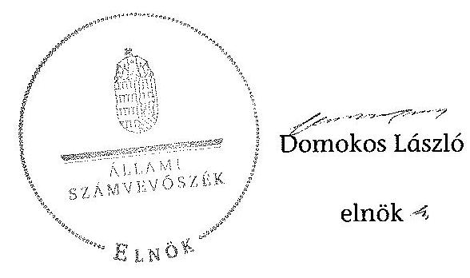

# ÁLLAMI   SZÁMVEVŐSZÉK 

## JELENTÉS

az önkormányzatok belső kontrollrendszere kialakításának, egyes
kontrolltevékenységek és a belső ellenőrzés
működésének - 2013. évben induló - ellenőrzéséről
Pannonhalma
13153
2013. december

---

# Állami Számvevőszék 

Iktatószám: V-0138-032/2013.
Témaszám: 1162
Vizsgálat-azonosító szám: V064909

Az ellenőrzést felügyelte:
Dr. Benedek Mária
felügyeleti vezető
Az ellenőrzést vezette és az ellenőrzés végrehajtásáért felelős:
Bíró Zsolt
ellenőrzésvezető
A számvevőszéki jelentés összeállításában közreműködtek:
Gelencsér Zoltán
számvevő tanácsos
Dr. Ernst László
számvevő tanácsos
Az ellenőrzést végezték:
Csényi István
Nagy László Imre
számvevő tanácsos
számvevő

---

# TARTALOMJEGYZÉK 

BEVEZETÉS ..... 5
I. ÖSSZEGZŐ MEGÁLLAPÍTÁSOK, KÖVETKEZTETÉSEK, JAVASLATOK ..... 9
II. RÉSZLETES MEGÁLLAPÍTÁSOK ..... 15

1. Az önkormányzat belső kontrollrendszerének kialakítása ..... 15
1.1. A kontrollkörnyezet ..... 15
1.2. A kockázatkezelési rendszer ..... 16
1.3. A kontrolltevékenységek ..... 17
1.4. Az információs és kommunikációs rendszer ..... 18
1.5. A monitoring rendszer ..... 18
2. A pénzügyi folyamatokban kulcsszerepet betöltő teljesítésigazolás és érvényesítés belső kontrollok működése ..... 19
3. A belső ellenőrzés működése ..... 20

## FÜGGELÉKEK

1. számú Értelmező szótár
2. számú Az értékelés módja és szempontjai

---

.

---

# RÖVIDÍTÉSEK JEGYZÉKE 

## Törvények

Áht.
ÁSZ tv.
Kttv.
Ktv.
Mötv.
Mvtv.
Ötv.
Számv. tv.
Vagyonnyilatkozat-
tételről szóló tv.

## Rendeletek

Áhsz.

Ávr.

Bkr.
önkormányzati SZMSZ

## Szórövidítések

adatvédelmi szabályzat
ÁSZ
Belső ellenőrzési kézikönyv ${ }_{1}$
Belső ellenőrzési kézikönyv ${ }_{2}$
bizonylati rend
értékelési szabályzat

2011. évi CXCV. törvény az államháztartásról (hatályos 2012. január 1-jétől)
2011. évi LXVI. törvény az Állami Számvevőszékről
2011. évi CXCIX. törvény a közszolgálati tisztviselők ről (hatályos 2012. március 1-jétől)
1992. évi XXIII. törvény a köztisztviselők jogállásáról (hatálytalan 2012. március 1-jétől)
2011. évi CLXXXIX. törvény Magyarország helyi önkormányzatairól (hatályos 2012. január 1-jétől)
1993. évi XCIII. törvény a munkavédelemről
1990. évi LXV. törvény a helyi önkormányzatokról
2000. évi C. törvény a számvitelről
2007. évi CLII. törvény az egyes vagyonnyilatkozat-tételi kötelezettségekről

249/2000. (XII. 24.) Korm. rendelet az államháztartás szervezetei beszámolási és könyvvezetési kötelezettségének sajátosságairól
368/2011. (XII. 31.) Korm. rendelet az államháztartásról szóló törvény végrehajtásáról (hatályos 2012. január 1-jétől)
370/2011. (XII. 31.) Korm. rendelet a költségvetési szervek belső kontrollrendszeréről és belső ellenőrzéséről (hatályos 2012. január 1-jétől)
Pannonhalma Város Önkormányzat Képviselőtestületének többször módosított 17/2011. (VIII. 31.) számú rendelete, az Önkormányzat Képviselő-testületének Szervezeti és Működési Szabályzatáról (hatályos 2011. szeptember 1-jétől)

Adatvédelmi számítástechnikai védelmi és informatikai szabályzat (hatályos: 2012. január 1-jétől)
Állami Számvevőszék
Belső ellenőrzési kézikönyv/kézikönyvek a 2012. január 1-je és 2012. március 30-a közötti időszakra vonatkozóan
Pannonhalma Város Önkormányzata Polgármesteri Hivatalának Belső ellenőrzési kézikönyve (hatályos 2012. március 30-tól)
Bizonylati szabályzat és bizonylati album (hatályos 2010. január 1-jétől)
Pannonhalma Város Önkormányzata Polgármesteri Hivatalának Eszközök és források értékelési szabályzata (hatályos 2012. január 1-jétől)

---

gazdasági program
gazdasági szervezet ügyrendje
hivatali SZMSZ

INTOSAI
iratkezelési szabályzat

ISSAI
jegyző
Képviselő-testület
leltározási és leltárkészítési szabályzat
munkavédelmi szabályzat${ }_{1}$

NGM
Önkormányzat
pénzkezelési szabályzat ${ }_{1}$
pénzkezelési szabályzat ${ }_{2}$
polgármester
Polgármesteri Hivatal
szabálytalanságkezelés eljárásrend
számlarend
számviteli politika

Társulás
tűzvédelmi szabályzat

Pannonhalma Város Önkormányzat Gazdasági programja a 2011-2014. évekre
Pannonhalma Város Önkormányzata Polgármesteri Hivatalának ügyrendje a gazdasági szervezetének gazdálkodással összefüggő feladataira (hatályos 2012. január 1-jétől)
Pannonhalma Város Önkormányzata Polgármesteri Hivatala Működési Szabályzata (az önkormányzati SZMSZ 2/A számú melléklete, hatályos 2011. szeptember 1-jétől)
International Organization of Supreme Audit Institutions (Legfőbb Ellenőrző Intézmények Nemzetközi Szervezete)
Pannonhalma Város Önkormányzata Polgármesteri Hivatalának Ügyirat-kezelési szabályzata (hatályos 2010. január 1-jétől)
International Standards of Supreme Audit Institutions (Legfőbb Ellenőrző Intézmények Nemzetközi Standardjai)
Pannonhalma Város Önkormányzatának jegyzője
Pannonhalma Város Önkormányzatának Képviselőtestülete
Pannonhalma Város Önkormányzat Polgármesteri Hivatalának Leltárkészítési és leltározási szabályzata (hatályos 2012. január 1-jétől)
a Képernyő előtti munkavégzés minimális egészségügyi és biztonsági követelményeiről szóló szabályzat (hatályos 2013. február 1-jétől)
Nemzetgazdasági Minisztérium
Pannonhalma Város Önkormányzata
Pannonhalma Város Önkormányzata Polgármesteri Hivatalának Pénzkezelési szabályzata (hatályos 2011. március 16-tól)
Pannonhalma Város Önkormányzat Polgármesteri Hivatalának Pénzkezelési szabályzata (hatályos 2012. március 1-jétől)
Pannonhalma Város Önkormányzatának polgármestere
Pannonhalma Város Önkormányzatának Polgármesteri Hivatala
Pannonhalma Város Önkormányzata Belső Kontroll Kézikönyv VI. fejezete: a szabálytalanságok kezelésének rendje (hatályos 2012. január 1-jétől)
Pannonhalma Város Önkormányzata Polgármesteri Hivatalának számlarendje (hatályos 2012. január 1-jétől)
Pannonhalma Város Önkormányzata Polgármesteri Hivatalának Számviteli Politikája (hatályos 2012. január 1-jétől)
Pannonhalma Többcélú Kistérségi Társulás
Tűzvédelmi szabályzat (hatályos: 2008. november 1-jétől)

---

# JELENTÉS 

## az önkormányzatok belső kontrollrendszere kialakításának, egyes kontrolltevékenységek és a belső ellenőrzés működésének 2013. évben induló - ellenőrzéséről Pannonhalma

## BEVEZETÉS

Pannonhalma város állandó lakosainak száma 2012. január 1-jén 3504 fő volt. Az Önkormányzat hat tagú Képviselő-testületének munkáját négy állandó bizottság segítette. Az Önkormányzat az önállóan működő és gazdálkodó Polgármesteri Hivatalon kívül egy önállóan működő intézményt működtetett, és kettő többségi tulajdoni hányadú gazdasági társasággal rendelkezett. A polgármester 2006 óta tölti be tisztségét. A jegyző 2011-től látja el feladatait. A hivatal hat szervezeti egységre tagolódott, elkülönített gazdasági szervezettel rendelkezett, a foglalkoztatott köztisztviselők száma 2012. január 1-jén 20 fő volt. Az Önkormányzat Polgármesteri Hivatalánál 2013. január 1-jétől szervezeti változás, átalakítás nem történt. Az Önkormányzat a 2012. évi költségvetési beszámolója szerint 609336 ezer Ft tárgyévi bevételt ért el, valamint 449727 ezer Ft tárgyévi kiadást teljesített. A 2012. december 31-i könyvviteli mérleg szerint 1216977 ezer Ft értékű eszközvagyonnal rendelkezett, a rövid lejáratú kötelezettségállománya 29831 ezer Ft, hosszú lejáratú kötelezettség állománya 13104 ezer Ft volt.

A demokratikus társadalmakban alapvető igény, hogy a közpénzeket, a közvagyont használók tevékenységükről elszámoljanak, ahhoz egyértelmű és érvényesíthető felelősségi szabályok társuljanak. Ennek a jogos igénynek az érvényesítéséhez meg kell teremteni azokat a folyamatokat, rendszereket, amelyek nélkülözhetetlenek az elszámoltatáshoz. Az elszámoltatás eredményes működtetéséhez szükség van a megfelelő információs, kontroll, értékelési és beszámolási rendszerek kialakítására.

Magyarországon az uniós csatlakozási tárgyalások idejére nyúlnak vissza a belső kontrollrendszer szabályozásának gyökerei. Az uniós elvárásoknak megfelelő új terminológia szerinti államháztartási belső pénzügyi ellenőrzési (ÁBPE) rendszer területén a jogharmonizáció 2003-ban teljes körűen megvalósult, míg az önkormányzati alrendszerre vonatkozó, Ötv.-ben megjelenített speciális szabályozás 2005-ben lépett hatályba. Az államháztartási belső kontrollrendszer koncepciója 2009-ben továbbfejlődött. A változások irányát mutatja, hogy a költségvetési szervek belső kontrollrendszere már magában foglalja a korszerű felelős szervezetirányítás elemeit (kontrollkörnyezet, kockázatkezelés, kontrolltevékenység, információ és kommunikáció, monitoring) is. E kont-

---

rollrendszer szabályozása háromszintű, a törvényi előírásokat az Áht. és a Mötv., a rendeleti szintű szabályozást az Ávr. és a Bkr. tartalmazza, amelyeket útmutatói szinten az NGM által kiadott standardok és kézikönyvek támogatnak.

A belső kontrollrendszer azt a célt szolgálja, hogy a költségvetési szervek működésük és gazdálkodásuk során a tevékenységeket szabályszerűen, gazdaságosan, hatékonyan és eredményesen hajtsák végre, teljesítsék elszámolási kötelezettségeiket és megvédjék az erőforrásokat a veszteségektől, a károktól és a nem rendeltetésszerű használattól. A belső kontrollrendszer magában foglalja mindazon szabályokat, eljárásokat, gyakorlati módszereket és szervezeti struktúrákat, kockázatkezelési technikákat, kontrolltevékenységeket, amelyek segítséget nyújtanak a szervezetnek céljai eléréséhez.

Az ÁSZ a 2011-2015. évekre szóló stratégiájában hangsúlyos szerepet szánt annak, hogy szilárd szakmai alapon álló, értékteremtő ellenőrzéseivel előmozdítsa a közpénzügyek átláthatóságát, rendezettségét. A számvevőszéki ellenőrzés nemzetközi alapelvei is rögzítik, hogy a megfelelő belső kontrollrendszer minimálisra csökkenti a hibák és szabálytalanságok kockázatát.

Az ellenőrzés célja annak megállapítása volt, hogy a belső kontrollrendszer elemeinek kialakítása, a pénzügyi folyamatokban kulcsszerepet betöltő teljesítésigazolás és érvényesítés, és a belső ellenőrzés szabályos működése biztosította-e az Önkormányzatnál a közpénzfelhasználás szabályosságát, hozzájárult-e az értéket teremtő rend követelményének érvényesüléséhez.

Ennek keretében értékeltük, hogy:

- a jogszabályi előírásoknak megfelelően alakították-e ki a belső kontrollrendszer elemeit;
- a gazdálkodás folyamatában kulcsszerepet betöltő teljesítésigazolás és érvényesítés kontrolltevékenységeit megfelelően működtették-e;
- biztosították-e a belső ellenőrzés szabályos működését;
- amennyiben az ÁSZ tett javaslatot a 2008-2011. évek közötti ellenőrzése kapcsán az Önkormányzatnak, intézkedtek-e azok végrehajtására.

Az ellenőrzés várható hasznosulását négy szinten tervezzük. A törvényalkotás számára összegzett tapasztalatok állnak rendelkezésre a belső kontrollrendszer önkormányzati területen való kialakításáról, működéséről és hatásairól, a belső ellenőrzés működéséről. Ennek alapján következtetést lehet levonni arról, hogy a belső kontrollrendszer kialakítására és működtetésére vonatkozó jelenlegi, differenciálás nélküli - jogszabályi előírások reális követelményeket támasztanak-e az eltérő adottságú települési önkormányzatok esetében, illetve indokolt-e esetleges jogszabályi módosítás kezdeményezése. Az ellenőrzés az ellenőrzött számára visszajelzést ad a belső kontrollrendszer kialakításában és működésében fellépő hiányosságokról, javaslataival hozzájárul azok kiküszöböléséhez, amely csökkentheti a későbbi ellenőrzések gyakoriságát. Az ellenőrzés megállapításait és javaslatait más szervezetek is hasznosíthatják a rendezett gazdálkodási keretek kialakításához. A társadalom számára jelzi, hogy

---

közpénz nem maradhat ellenőrizetlenül, az ÁSZ értékteremtő rend kialakításához és megőrzéséhez hozzájáruló tevékenysége pozitív hatással lesz a szervezetről kialakított összkép formálásában. A szervezeten belül lehetőség nyílik arra, hogy a megállapítások szintetizálásával az ÁSZ a hozzáadott értéket teremtő elemző tevékenységét és tanácsadó szerepét is erősítse.

Az önkormányzatok belső kontrollrendszere kialakításának, egyes kontrolltevékenységek és a belső ellenőrzés működésének ellenőrzéséről szóló jelentés I. fejezetének összegző része az ellenőrzés céljára ad rövid, szintetizáló összefoglalót, és tartalmazza a következtetéseket a II. fejezet részletes megállapításain alapulóan. A jelentés intézkedést igénylő megállapításait és javaslatait az ellenőrzés során feltárt, a jelentés II. fejezetében rögzített részletes megállapítások alapozzák meg. A helyszíni ellenőrzés lezárásáig a helyi szabályozás változásait nyomon követtük.

Az ellenőrzés típusa: szabályszerűségi ellenőrzés.
Az ellenőrzött időszak: a belső kontrollrendszer kialakításának megfelelősége esetében a 2012. évre, a pénzügyi folyamatokban kulcsszerepet betöltő teljesítésigazolás és érvényesítés belső kontrollok működésének megfelelőségét és a belső ellenőrzés szabályszerű működését a 2012. január 1. és december 31-e közötti időszak eseményeit figyelembe véve értékeltük, míg az ÁSZ javaslatainak utóellenőrzése a 2008-2011. években végzett ellenőrzések nyilvánosságra hozott jelentéseiben tett javaslatok áttekintésére terjedt ki.

# Az ellenőrzött szervezet: az Önkormányzat. 

Az ellenőrzés jogszabályi alapját az ÁSZ tv. 1. § (3) bekezdése, az 5. § (2) és (6) bekezdése, valamint az Áht. 61. § (2) bekezdésének előírásai képezik.

Az ellenőrzés szakmai módszertana az ÁSZ hivatalos honlapján (www.asz.hu) közzétett szakmai szabályokon alapult, amely az INTOSAI által kiadott ISSAI figyelembevételével készült.

Az ellenőrzés lefolytatásához az Önkormányzat a kimutatások és a tanúsítvány elektronikus kitöltésével, valamint az ÁSZ által kért dokumentumok elektronikus megküldésével szolgáltatott adatokat. Az így rendelkezésre bocsátott adatok, információk kontrollja és a munkalapok kitöltése a helyszíni ellenőrzés keretében történt. A jelentésben használt fogalmak magyarázatát az 1. számú függelék, az ellenőrzés egyes területeinek értékelésénél alkalmazott egységes minősítési szempontokat a 2. számú függelék tartalmazza.

A belső kontrollrendszer kialakításának ellenőrzése során értékeltük a kontrollkörnyezet, a kockázatkezelési rendszer, a kontrolltevékenységek, az információs és kommunikációs rendszer, valamint a monitoring rendszer szabályozottságának megfelelőségét. A pénzügyi folyamatokban kulcsszerepet betöltő teljesítésigazolás és érvényesítés kontrollok működése megfelelőségének minősítéséhez az állományba nem tartozók megbízási díjai, a külső szolgáltatók által végzett karbantartási, kisjavítási munkák, az egyéb üzemeltetési és fenntartási szolgáltatások, a rendszeres szociális segélyek, valamint az államháztartáson kívülre teljesített működési és felhalmozási célú pénzeszközátadások közül kockázatelemzéssel választottuk ki az ellenőrzött kiadási jogcímeket. Az egyszerû véletlen mintavétellel kiválasztott tételek ellenőrzését többlépcsős megfelelőségi tesztek útján addig végeztük, amíg elegendő és megfelelő bizonyítékot szereztünk a vizsgált folyamatok kulcskontrolljai működésének megfelelő vagy nem megfelelő voltáról. Értékeltük az Önkormányzatnál a belső ellenőrzés működésének szabályosságát. Az ÁSZ az Önkormányzatnál a 2008. évben a Sport XXI. Létesítményfejlesztési Program keretében támogatott önkormányzati PPP beruházások megvalósításának és önkormányzati feladatok ellátására gyakorolt hatásának, továbbá a helyi önkormányzatok gazdálkodási rendszerének ellenőrzését végezte. A nyilvánosságra hozott, 0919, illetve 0927 számon közzétett számvevőszéki jelentésekben azonban kifejezetten az Önkormányzat számára konkrét feladatot nem határozott meg, javaslatot nem tett,
 ezért a jelen ellenőrzés keretében utóellenőrzésre nem került sor.

Az ÁSZ tv. 29. § (1) bekezdése szerint a jelentéstervezetet megküldtük a polgármester részére, aki az ÁSZ tv. 29. § (2) bekezdésében foglalt észrevételezési jogával nem élt, a jelentéstervezetre észrevételt nem tett.

---

# I. ÖSSZEGZŐ MEGÁLLAPÍTÁSOK, KÖVETKEZTETÉSEK, JAVASLATOK 

A belső kontrollrendszeren belül 2012-ben a kontrollkörnyezet, a kockázatkezelési rendszer, a kontrolltevékenységek, az információs és kommunikációs rendszer, valamint a monitoring rendszer kialakítását külön-külön és együttesen is értékeltük. A belső kontrollrendszer kialakítása az összesített értékelés alapján részben megfelelt a jogszabályi előírásoknak.

A belső kontrollrendszer egyes területei kialakításának minősítése a következő:

| Kontrollterület | Minősítés |
| :-- | :--: |
| Kontrollkörnyezet | megfelelő |
| Kockázatkezelési rendszer | részben   megfelelő |
| Kontrolltevékenységek | megfelelő |
| Információs és kommunikációs   rendszer | megfelelő |
| Monitoring rendszer | nem   megfelelő |

Megfelelőnek értékeltük a kontrollkörnyezet, a kontrolltevékenységek, valamint az információs és kommunikációs rendszer kialakítását, mivel az a jogszabályi előírásokban foglaltakat figyelembe véve kisebb hiányosságok mellett is megteremtette e kontrollterületeken a szabályszerű működés lehetőségét.

Részben megfelelőnek értékeltük a kockázatkezelési rendszer kialakítását, mivel a megállapított szabályozásbeli hiányosságok nem veszélyeztették e kontrollterületen a szabályszerű működést.

Nem megfelelőnek értékeltük a monitoring rendszer kialakítását, mivel az ellenőrzésünk során megállapított szabályozásbeli hiányosságok magukban hordozzák a szabálytalan működés, valamint a korrupció kockázatát.

A 2012. évben az állományba nem tartozók megbízási díjaival, valamint a külső szolgáltatók által végzett karbantartási, kisjavítási munkákkal kapcsolatos kifizetések során a pénzügyi folyamatokban kulcsszerepet betöltő teljesítésigazolás és érvényesítés belső kontrollok működése gyenge volt. Gyengének értékeltük a két kulcskontroll együttes működését, mivel azok nem biztosították a hibák megelőzését, feltárását.

A számvevőszéki ellenőrzés az ellenőrzött kifizetésekkel összefüggésben a rendelkezésre bocsátott dokumentumok alapján jogosulatlan kifizetést nem tárt fel, azonban a gazdálkodásban kulcsszerepet betöltő kontrollok működésében feltárt hiányosságok miatt fennáll a hibák bekövetkezésének kockázata. A nem megfelelően működtetett belső kontrollok korrupciós kockázatot hordoznak.

---

Az Önkormányzat a belső ellenőrzési feladatokat a Társulás útján látta el. A 2012. évben a belső ellenőrzés működése a jogszabályi előírásoknak jól megfelelt, azonban a belső ellenőrzés nem tárta fel a belső kontrollrendszer kialakításának, valamint a pénzügyi folyamatokban kulcsszerepet betöltő teljesítésigazolás és érvényesítés belső kontrollok működésének hiányosságait.

Az ÁSZ tv. 33. § (1) bekezdésében foglaltak értelmében az ellenőrzött szervezet vezetője köteles a jelentésben foglalt megállapításokhoz kapcsolódó intézkedési tervet összeállítani, és azt a jelentés kézhezvételétől számított 30 napon belül az ÁSZ részére megküldeni. Amennyiben az intézkedési tervet határidőre nem küldi meg a szervezet, vagy az ÁSZ tv. 33. § (2) bekezdésében foglalt póthatáridő elteltével megküldött intézkedési terv továbbra sem elfogadható, az ÁSZ elnöke a hivatkozott törvény 33. § (3) bekezdés a)-b) pontjaiban foglaltakat érvényesítheti.

Az ellenőrzés intézkedést igénylő megállapításai és javaslatai:

# a polgármesternek 

1. A Kttv. 231. § (1) bekezdése ellenére a Képviselő-testület nem állapította meg a köztisztviselőkkel szembeni, a Kttv. 83. §-ában előírt hivatásetikai alapelvek részletes tartalmát, valamint az etikai eljárás szabályait, mivel a polgármester a jegyző által előkészített dokumentumokat nem terjesztette a Képviselő-testület elé.

Javaslat:
Terjessze a Képviselő-testület elé a Kttv. 231. § (1) bekezdésében foglaltak érvényesülése érdekében a köztisztviselőkkel szembeni, a Kttv. 83. §-ában előírt hivatásetikai alapelvek részletes tartalmát, valamint az etikai eljárás szabályait tartalmazó, a jegyző által elkészített dokumentumokat.
2. Az Önkormányzat kiadási előirányzatai terhére történt kötelezettségvállalásokra az Áht. 37. § (1) bekezdésében és az Ávr. 55. § (1) bekezdésében foglaltak ellenére pénzügyi ellenjegyzés nélkül került sor.

Javaslat:
Intézkedjen arról, hogy az Önkormányzat kiadási előirányzatai terhére történt kötelezettségvállalásra az Áht. 37. § (1) bekezdésében és az Ávr. 55. § (1) bekezdésében foglaltaknak megfelelően - az Ávr. 53. §-ában meghatározott kivételekkel - kizárólag a pénzügyi ellenjegyzés után, a pénzügyi teljesítés esedékességét megelőzően, írásban kerüljön sor.
3. A Képviselő-testület a 2013. évi ellenőrzési tervet az Ötv. 92. § (6) bekezdésében foglalt határidőn túl, 2013. május 28-án hagyta jóvá.

Javaslat:
Terjessze a Képviselő-testület elé az éves ellenőrzési tervet annak érdekében, hogy azt a Képviselő-testület a Mötv. 119. § (5) és a Bkr. 32. § (4) bekezdésében előírt határidőn belül hagyja jóvá.

---

4. A számvevőszéki ellenőrzés megállapításai alapján az Önkormányzatnál a belső kontrollrendszer kialakítása összefoglalóan értékelve részben megfelelt a jogszabályi előírásoknak, a kulcskontrollok működése gyenge volt, a belső ellenőrzés működése ugyan jól megfelelt a jogszabályi előírásoknak, azonban nem tárta fel, ezáltal nem is javíttatta ki a feltárt hiányosságokat. A megállapított szabályozásbeli és működésbeli hiányosságok magukban hordozzák a szabálytalan működés kockázatát.

Javaslat:
A Mötv. 115. § (1) bekezdésében foglaltak alapján kísérje figyelemmel az Önkormányzat gazdálkodásának szabályszerűségét. A Mötv. 67. § f) pontja alapján gondoskodjon a belső kontrollrendszer működésére vonatkozó jogszabályi rendelkezések be nem tartása, valamint a teljesítésigazolás és az érvényesítés kontrollokkal összefüggésben feltárt hiányosságok, szabálytalanságok tekintetében az esetleges munkajogi felelősséggel kapcsolatos körülmények kivizsgálásáról, majd a vizsgálat eredményének függvényében tegye meg a szükséges munkajogi intézkedéseket.

# a jegyzőnek 

1. a kontrollkörnyezettel kapcsolatban:

A hivatali SZMSZ-ben a jegyző az Ávr. 13. § (1) bekezdés c) pontjában foglaltak ellenére nem rögzítette az ellátandó és a szakfeladatrend szerint szakfeladat számmal és megnevezéssel besorolt alaptevékenységek, illetve az alaptevékenységet szabályozó jogszabályok megjelölését.

A Polgármesteri Hivatal gazdasági vezetője nem rendelkezett az Ávr. 12. § (1)-(4) bekezdéseiben előírt szakképesítéssel és a könyvviteli szolgáltatás körébe tartozó tevékenység ellátására jogosító engedéllyel.

A jegyző a Kttv. 130. § (1) bekezdésében foglaltak ellenére a Polgármesteri Hivatalban dolgozó köztisztviselők teljesítményértékelését nem készítette el.

Javaslat:
a) Módosítsa a hivatali SZMSZ-t annak érdekében, hogy az tartalmazza az Ávr. 13. § (1) bekezdésében előírt valamennyi tartalmi elemet, és kezdeményezze az Áht. 9. § (1) bekezdés a) pontjában foglaltakra tekintettel a módosítás Képviselőtestület elé terjesztését.
b) Intézkedjen arról, hogy a gazdasági szervezet vezetőjeként az Ávr. 12. § (1)-(3) bekezdései szerinti képesítéssel rendelkező, az előírt nyilvántartásban szereplő személy kerüljön kinevezésre.
c) Értékelje írásban a Kttv. 130. § (1) bekezdése alapján a Polgármesteri Hivatal köztisztviselőinek munkateljesítményét.

---

2. a kockázatkezelési rendszerrel kapcsolatban:

A jegyző a Bkr. 7. § (2) bekezdésében foglaltak ellenére a kockázatok kezelése érdekében szükséges intézkedések teljesítésének nyomon követési módját nem határozta meg.

A Vagyonnyilatkozat-tételről szóló tv. 4. § a) pontjában és 5. §-ában foglaltak ellenére a vagyonnyilatkozat-tételre kötelezettek körét a hivatali SZMSZ-ben a jegyző nem rögzítette, a vagyonnyilatkozat-tételre kötelezettek a nyilatkozattételi kötelezettségüknek nem tettek eleget.

Javaslat:
a) Határozza meg - a Bkr. 7. §-ának (2) bekezdésében foglaltak alapján - a Polgármesteri Hivatalban a kockázatok kezelése érdekében szükséges intézkedések teljesítésének folyamatos nyomon követési módját.
b) A Vagyonnyilatkozat-tételről szóló tv. 4. § a) pontjában és 5. §-ában foglalt előírásnak megfelelően a vagyonnyilatkozat-tételi kötelezettséget az érintett személyek esetében a Polgármesteri Hivatal SZMSZ-ében tüntesse fel, és a vagyonnyilatkozat-tételre kötelezettek a nyilatkozattételi kötelezettségüknek tegyenek eleget.
3. a kontrolltevékenységekkel kapcsolatban:

A jegyző a Bkr. 8. § (2) bekezdés a) pontjában foglaltak ellenére nem biztosította a pénzügyi döntések - köztük a vagyonhasznosítási tevékenység - dokumentumainak elkészítésével kapcsolatban a folyamatba épített, előzetes, utólagos és vezetői ellenőrzést.

Javaslat:
Biztosítsa minden tevékenységre vonatkozóan a folyamatba épített, előzetes, utólagos és vezetői ellenőrzést a Bkr. 8. § (2) bekezdés a) pontja alapján.
4. a monitoring rendszerrel kapcsolatban:

A jegyző a Bkr. 3. § e) pontjában és 10. §-ában foglaltak ellenére nem alakította ki a Polgármesteri Hivatal tevékenységének, a célok megvalósításának nyomon követését biztosító rendszert.

Javaslat:
Alakítsa ki és működtesse a Bkr. 3. § e) bekezdésében és 10. §-ában előírtak alapján a Polgármesteri Hivatal tevékenységének, a célok megvalósításának nyomon követését biztosító rendszerét.
5. a pénzügyi folyamatokban kulcsszerepet betöltő kontrollokkal kapcsolatban:

A teljesítésigazoló az Áht. 38.§ (1) bekezdésében és az Ávr. 57. § (1) bekezdésében foglaltak ellenére a kiadások teljesítése jogosságát, az ellenszolgáltatások teljesítését, valamint a kiadások összegszerűségét okmányok hiányában nem ellenőrizte.

---

Az érvényesítő az Ávr. 58. § (1) bekezdésében foglaltak ellenére nem ellenőrizte az összegszerűséget, a fedezet meglétét, és az Ávr. 58. § (2) bekezdésében előírtakat figyelmen kívül hagyva nem jelezte az utalványozónak, hogy a megelőző ügymenetben a teljesítésigazolás nem volt szabályszerű.

A kiadási pénztárbizonylatokon - az Ávr. 59. § (3) bekezdés f) pontjában és (4) bekezdésében előírtakat figyelmen kívül hagyva - nem tüntették fel a kötelezettségvállalás nyilvántartási számot, mert az Ávr. 56. § (1) bekezdésében foglaltak ellenére a 100 ezer Ft alatti kötelezettségvállalásokat nem vették nyilvántartásba.

Javaslat:
Intézkedjen - a teljesítésigazolás és az érvényesítés vonatkozásában feltárt hiányosságok megszüntetése, illetve az operatív gazdálkodás során a működésbeli hibák megelőzése, feltárása és kijavítása érdekében - arról, hogy
a) a teljesítésigazolás során az Áht. 38.§ (1) bekezdésében és az Ávr. 57. § (1) bekezdésében foglaltaknak megfelelően, ellenőrizhető okmányok alapján ellenőrizzék a kiadások teljesítésének jogosságát, összegszerűségét, ellenszolgáltatást is magában foglaló kötelezettségvállalás esetében annak teljesítését;
b) a kifizetéseket megelőzően a teljesítésigazolás alapján - az Ávr. 57. § (3) bekezdése szerinti esetben annak hiányában is - az összegszerűségnek, a fedezet meglétének és a megelőző ügymenetben az Áht., az Áhsz., az Ávr. előírásai és a belső szabályzatokban foglaltak betartásának az ellenőrzése - az Ávr. 58. § (1) bekezdése szerint - történjen meg;
c) az érvényesítő az Ávr. 58. § (2) bekezdésben foglalt előírásnak megfelelően jelezze az utalványozónak, ha az Áht., vagy az államháztartási számviteli kormányrendelet, az Ávr. és a belső szabályzatokban foglaltak megsértését tapasztalja;
d) a kötelezettségvállalásokat az Ávr. 56. § (1) bekezdésében foglalt előírásnak megfelelően vegyék nyilvántartásba és a kiadási pénztárbizonylaton az Ávr. 59. § (3)-(4) bekezdésében foglalt kötelező tartalmi elemeket tüntessék fel.
6. a belső ellenőrzés működésével kapcsolatban:

A Képviselő-testület a 2013. évi ellenőrzési tervet az Ötv. 92. § (6) bekezdésében foglalt határidőn túl, 2013. május 28-án hagyta jóvá.

A belső ellenőrzési vezető a Bkr. 21. § (2) bekezdés d) pontjában és a Bkr. 47. § (1) bekezdésében foglalt előírás ellenére az ellenőrzési jelentésekben szereplő javaslatokról és azok végrehajtásának nyomon követéséről nyilvántartást nem vezetett.

A 2011. évre vonatkozó éves ellenőrzési jelentés a Bkr. 48. § b) pontjának bb) alpontjában foglaltak ellenére nem tartalmazta a belső kontrollrendszer öt elemének értékelését.

---

Javaslat:
a) Kezdeményezze az éves ellenőrzési terv Képviselő-testület elé terjesztését annak érdekében, hogy azt a Képviselő-testület a Mötv. 119. § (5) és a Bkr. 32. § (4) bekezdésében előírt határidőn belül hagyja jóvá.
b) Kezdeményezze, hogy a belső ellenőrzési vezető vezessen nyilvántartást a Bkr. 21. § (2) bekezdése d) pontjának és a 47. §-ában foglaltaknak megfelelően a belső ellenőrzési jelentésekben szereplő javaslatokról és azok végrehajtásának nyomon követéséről.
c) Intézkedjen, hogy az éves ellenőrzési jelentések, illetve összefoglaló éves ellenőrzési jelentések a Bkr. 48. § b) pontjának bb) alpontjában foglalt előírásnak megfelelően tartalmazzák a belső kontrollrendszer öt elemének értékelését.

---

# II. RÉSZLETES MEGÁLLAPÍTÁSOK
 ## 1. AZ ÖNKORMÁNYZAT BELSŐ KONTROLLRENDSZERÉNEK KIALAKÍTÁSA

A belső kontrollrendszeren belül 2012-ben a kontrollkörnyezet, a kockázatkezelési rendszer, a kontrolltevékenységek, az információs és kommunikációs rendszer, valamint a monitoring rendszer kialakítását külön-külön és együttesen is értékeltük. A belső kontrollrendszer kialakítása az összesített értékelés alapján részben megfelelt a jogszabályi előírásoknak.

### 1.1. A kontrollkörnyezet

A kontrollkörnyezet kialakítása - a 2. számú függelékben részletezett kritériumrendszer alapján végzett értékelés szerint - a jogszabályi előírásoknak megfelelt.

Az Önkormányzat rendelkezett gazdasági programmal és önkormányzati SZMSZ-szel. A Polgármesteri Hivatal alapító okirata tartalmazta az alaptevékenységeket. A hivatali SZMSZ-t a Képviselő-testület jóváhagyta. A szervezet megfelelő működése érdekében a Polgármesteri Hivatalban kialakították a belső szabályzatokat, rendeletben meghatározták a vagyongazdálkodás szabályait, elkészítették a számviteli politikát, a pénzkezelési szabályzatot, a leltározási és leltárkészítési szabályzatot, az értékelési szabályzatot, a számlarendet, a bizonylati rendet, a tűzvédelmi szabályzatot, a szabálytalanságkezelés eljárásrendjét, valamint a gazdasági szervezet ügyrendjét, és a jegyző kialakította az Önkormányzat intézményeinek számviteli rendjét.

A Polgármesteri Hivatalban dolgozó munkatársak rendelkeztek munkaköri leírással, amelyek tartalmazták a munkavállalók jogait, kötelezettségeit és felelősségét. A jegyző elkészítette az ellenőrzési nyomvonalat, és gondoskodott naprakészen tartásáról.

A kontrolltevékenységek kialakítása az alábbi kisebb hiányosságok mellett megfelelt a jogszabályi előírásoknak:

| Sor-   szám $^{1}$ | Megállapítás | Megjegyzés |
| :-- | :-- | :-- |
| 4. | A Képviselő-testület a Ktv. 34. § (3)   bekezdésében foglaltak ellenére nem   döntött a teljesítményértékelés alap-   ját képező célokról. |  |

[^0]
[^0]:    ${ }^{1}$ A megállapítás számozása az Önkormányzat által az adatszolgáltatás során kitöltött kimutatások kérdéseinek sorszámával azonos.

---

| 7. | A hivatali SZMSZ-ben a jegyző az Ávr. 13. § (1) bekezdés c) pontjában foglaltak ellenére nem rögzítette az ellátandó és a szakfeladatrend szerint szakfeladat számmal és megnevezéssel besorolt alaptevékenységek, illetve az alaptevékenységet szabályozó jogszabályok megjelölését. |  |
| :--: | :--: | :--: |
| 32. | A jegyző a Polgármesteri Hivatalban az egészséget nem veszélyeztető és biztonságos munkavégzés követelményei megvalósításának módját az Mvtv. 2. § (3) bekezdés előírásait figyelmen kívül hagyva nem határozta meg. | A jegyző 2013-ban elkészítette az Mvtv. 2. § (3) bekezdésében foglaltaknak megfelelően a munkavédelmi szabályzatot, amely 2013. február 1-jétől hatályos. |
| 36. | A Polgármesteri Hivatal gazdasági vezetője nem rendelkezett az Ávr. 12. § (1)-(4) bekezdéseiben ${ }^{2}$ előírt szakképesítéssel és a könyvviteli szolgáltatás körébe tartozó tevékenység ellátására jogosító engedéllyel. |  |
| 46. | A jegyző a Kttv. 130. § (1) bekezdésében foglaltak ellenére a Polgármesteri Hivatalban dolgozó köztisztviselők teljesítményértékelését nem készítette el. |  |
| 47. | A Kttv. 231. § (1) bekezdése ellenére a Képviselő-testület nem állapította meg a köztisztviselőkkel szembeni, a Kttv. 83. §-ában előírt hivatásetikai alapelvek részletes tartalmát, valamint az etikai eljárás szabályait, mivel a polgármester a jegyző által előkészített dokumentumokat nem terjesztette a Képviselő-testület elé. |  |

# 1.2. A kockázatkezelési rendszer 

A kockázatkezelési rendszer kialakítása - a 2. számú függelékben részletezett kritériumrendszer alapján végzett értékelés szerint - részben felelt meg a jogszabályi előírásoknak.

A Polgármesteri Hivatal tevékenységében, gazdálkodásában rejlő kockázatokat felmérték és megállapították, minden kockázati tényezőre meghatározták a szükséges intézkedéseket. A kockázatkezelés során értékelték a csalás és korrupció kockázatát. A szabálytalanságkezelési eljárásrend tartalmazta a súlyosabb szabálytalanságok kezelésének módját.

[^0]
[^0]:    ${ }^{2}$ 2013. január 1-jétől az Ávr. 12. § (1) bekezdése, 2013. március 12-től az Ávr. 12. § (2)(3) bekezdése

---

A kockázatkezelési rendszer kialakítása az alábbi kisebb hiányosságok miatt részben megfelelt a jogszabályi előírásoknak:

| Sor-   szám | Megállapítás |
| :-- | :-- |
| 10. | A jegyző a Bkr. 7. § (2) bekezdésében foglaltak ellenére a kockázatok kezelése érdekében szükséges intézkedések teljesítésének folyamatos nyomon követési módját nem határozta meg. |
| 13. | A Vagyonnyilatkozat-tételről szóló tv. 4. § a) pontjában foglaltak ellenére a vagyonnyilatkozat-tételre kötelezettek körét a hivatali SZMSZ-ben a jegyző nem rögzítette. |
| 14. | A Vagyonnyilatkozat-tételről szóló tv. 5. §-ában foglaltak ellenére a vagyonnyilatkozat-tételre kötelezettek a nyilatkozattételi kötelezettségüknek nem tettek eleget. |

# 1.3. A kontrolltevékenységek 

A kontrolltevékenységek kialakítása - a 2. számú függelékben részletezett kritériumrendszer alapján végzett értékelés szerint - megfelelt a jogszabályi előírásoknak.

A kontrolltevékenység részeként előírták a folyamatba épített, előzetes, utólagos és vezetői ellenőrzést a költségvetés tervezése, a beszerzések lebonyolítása és a támogatások elszámolása vonatkozásában.

Szabályozták a kötelezettségvállalás pénzügyi ellenjegyzésének módját, a teljesítésigazolás módját, az előzetes írásbeli kötelezettségvállalást nem igénylő kifizetések rendjét, az érvényesítés és az utalványozás rendjét, valamint kijelölték a teljesítésigazolásra jogosultakat. A polgármester adott felhatalmazást kötelezettségvállalásra. A jogszabályok előírásainak megfelelően jelölték ki a pénzügyi ellenjegyzési és érvényesítési feladatra a hivatal állományába tartozó köztisztviselőket, és azok rendelkeztek az előírt szakképzettséggel.

Az iratkezelés szabályozása során előírták az iratok és az adatok védelmét. Szabályozták az üzemeltetés és adatbiztonság feladatait, és meghatározták az ehhez kapcsolódó hatásköröket. Biztosították az adatbiztonság érvényesülését, és meghatározták a hozzáférési jogosultságokhoz a kapcsolódó felelősségi köröket.

A gazdasági szervezet ügyrendje tartalmazta az időközi és éves beszámolók elkészítésének feladatait, annak felelőseit és a helyettesítés rendjét. Szabályozták jogviszony megszűnése esetére a munkavállaló folyamatban lévő feladatai átadásának rendjét.

---

A kontrolltevékenységek kialakítása az alábbi kisebb hiányosság mellett megfelelt a jogszabályi előírásoknak:

| Sorszám | Megállapítás |
| :--: | :--: |
| 4. | A jegyző a Bkr. 8. § (2) bekezdés a) pontjában foglaltak ellenére nem biztosította a pénzügyi döntések - köztük a vagyonhasznosítási tevékenység dokumentumainak elkészítésével kapcsolatban a folyamatba épített, előzetes, utólagos és vezetői ellenőrzést. |

# 1.4. Az információs és kommunikációs rendszer 

Az információs és kommunikációs rendszer kialakítása - a 2. számú függelékben részletezett kritériumrendszer alapján végzett értékelés szerint megfelelt a jogszabályi előírásoknak.

Szabályozták a szervezeten belüli és a külső feleknek történő információ átadásának, valamint a szervezeten kívülről érkező információk kezelésének rendjét. A Polgármesteri Hivatal rendelkezett adatvédelmi szabályzattal. Szabályozták a kötelezően közzéteendő közérdekű adatok nyilvánosságra hozatalának rendjét, és közzétételi kötelezettségének az Önkormányzat eleget tett. Szabályozták a közérdekű adatok megismerésére irányuló igények teljesítésének rendjét.

Megfelelő tartalommal elkészítették az iratkezelési szabályzatot. A Polgármesteri Hivatalban szabályozott az ügyintézés folyamata és a határidők rögzítése. A szabálytalanságkezelési eljárásrend tartalmazta a szabálytalansági gyanú észlelésével és jelentésével kapcsolatos eljárásrendet.

### 1.5. A monitoring rendszer

A monitoring rendszer kialakítása - a 2. számú függelékben részletezett kritériumrendszer alapján végzett értékelés szerint - nem felelt meg a jogszabályi előírásoknak, mert:

| Sorszám | Megállapítás |
| :--: | :--: |
| 1. | A jegyző a Bkr. 3. § e) pontjában és 10. §-ában foglaltak ellenére nem alakította ki a Polgármesteri Hivatal tevékenységének, a célok megvalósításának nyomon követését biztosító rendszert. |

A helyi önkormányzatok törvényességi felügyeletét ellátó illetékes kormányhivatal az Önkormányzat működésével, gazdálkodásával kapcsolatban 2012-ben törvényességi felhívással vagy más törvényességi felügyeleti eszközzel nem élt.

---

# 2. A PÉNZÜGYI FOLYAMATOKBAN KULCSSZEREPET BETÖLTŐ TELJESÍTÉSIGAZOLÁS ÉS ÉRVÉNYESÍTÉS BELSŐ KONTROLLOK MŰKÖDÉSE 

A 2012. évben az állományba nem tartozók megbízási díjaival, a külső szolgáltatók által végzett karbantartással, kisjavítással kapcsolatos kifizetések során összefoglalóan értékelve - a pénzügyi folyamatokban kulcsszerepet betöltő teljesítésigazolás és érvényesítés belső kontrollok működésének megfelelősége gyenge volt, mert:

| Kulcskontrollok | Megállapítás |
| :--: | :--: |
| Teljesítésigazolás | A teljesítésigazoló az Áht. 38.§ (1) bekezdésében és az Ávr. 57. § (1) bekezdésében foglaltak ellenére a kiadások teljesítése jogosságát, az ellenszolgáltatások teljesítését, valamint a kiadások összegszerűségét okmányok hiányában nem ellenőrizte. |
| Érvényesítés | Az érvényesítő az Ávr. 58. § (1) bekezdésében foglaltak ellenére nem ellenőrizte az összegszerűséget, a fedezet meglétét, és az Ávr. 58. § (2) bekezdésében előírtakat figyelmen kívül hagyva nem jelezte az utalványozónak, hogy a megelőző ügymenetben a teljesítésigazolás nem volt szabályszerű. A kiadási pénztárbizonylatokon az Ávr. 59. § (3) bekezdés f) pontjában és (4) bekezdésében előírtakat figyelmen kívül hagyva nem tüntettek fel kötelezettségvállalás nyilvántartási számot, mert az Ávr. 56. § (1) bekezdésében foglaltak ellenére a 100 ezer Ft alatti kötelezettségvállalásokat nem vették nyilvántartásba. Az Áht. 37. § (1) bekezdésében és az Ávr. 55. § (1) bekezdésében előírtakat nem tartották be, mert az Önkormányzat kiadási előirányzatai terhére történt kötelezettségvállalásokra pénzügyi ellenjegyzés nélkül került sor. |

A 2012. évben az állományba nem tartozók megbízási díjainak kifizetése során a teljesítésigazolás és az érvényesítés kulcskontrollok működésének megfelelősége jó volt, azonban:

- az érvényesítő a hivatásos gondnoki feladatok és a körzeti védőnői feladatok ellátásával kapcsolatos kifizetések ${ }^{3}$ során - az Ávr. 58. § (1) bekezdésében foglaltak ellenére - nem ellenőrizte, és - az Ávr. 58. § (2) bekezdésében előírtakat figyelmen kívül hagyva - az utalványozónak nem jelezte, hogy a megelőző ügymenetben az Áht. 37. § (1) bekezdésében és az Ávr. 55. § (1) bekezdésben előírtakat nem tartották be, mert az Önkormányzat nevében vállalt kötelezettségvállalásokra pénzügyi ellenjegyzés nélkül került sor.

A 2012. évben a külső szolgáltatók által végzett karbantartási, kisjavítási munkákra történt kifizetések során a teljesítésigazolás és az érvényesítés kulcskontrollok működésének megfelelősége gyenge volt, mert:

- a teljesítésigazoló az Ávr. 57. § (1) bekezdésében foglaltak és aláírása ellenére a kiadások teljesítése jogosságának ellenőrzését, valamint az ellenszolgáltatás teljesítésének igazolását a gépjármű, a kerítés, a homlokzat, a fűrészgép, a fűrész és a fűnyíró javítások esetében ${ }^{4}$, illetve a kiadások összegszerűségének ellenőrzését a gépjármű, a kerítés és a homlokzat javítások kifizetéseit megelőzően ${ }^{5}$ - ellenőrizhető okmányok hiányában - nem végezte el;

- a teljesítésigazoló az Ávr. 57. § (1) bekezdésében foglaltak és aláírása ellenére a közműrendszerek javításával kapcsolatos kiadások összegszerűségét - ellenőrizhető dokumentumok hiánya miatt - nem ellenőrizte;
- az érvényesítő az Ávr. 58. § (1) bekezdésében foglaltak és aláírása ellenére nem ellenőrizte a karbantartási, kisjavítási munkákkal összefüggő kifizetéseket megelőzően az összegszerűséget, a fedezet meglétét, és az Ávr. 58. § (2) bekezdésében előírtakat figyelmen kívül hagyva nem jelezte az utalványozónak, hogy a megelőző ügymenetben a teljesítésigazolás nem volt szabályszerű, továbbá, hogy a kiadási pénztárbizonylatokon az Ávr. 59. § (3) bekezdés f) pontjában és (4) bekezdésében előírtakat figyelmen kívül hagyva nem tüntettek fel kötelezettségvállalás nyilvántartási számot, mert az Ávr. 56. § (1) bekezdésében foglaltak ellenére a 100 ezer Ft alatti kötelezettségvállalásokat nem vették nyilvántartásba.

A számvevőszéki ellenőrzés az ellenőrzött kifizetésekkel összefüggésben a rendelkezésre bocsátott dokumentumok alapján jogosulatlan kifizetést nem tárt fel, azonban a gazdálkodásban kulcsszerepet betöltő kontrollok működésében feltárt hiányosságok miatt fennáll a hibák bekövetkezésének kockázata.

[^0]
[^0]:    ${ }^{3}$ február 13-án 16000 Ft, április 3-án 24000 Ft, november 30-án 75000 Ft

---

[^0]
[^0]:    ${ }^{4}$  A gépjármű javítására vonatkozó számlát 2012. november 20-án állították ki. A kerítés javítására vonatkozó számlát 2012. december 10-én állították ki. A homlokzat javítására vonatkozó számlát 2012. december 10-én állították ki. A fűrészgép javítására vonatkozó számlát 2012. december 10-én állították ki. A fűrész javítására vonatkozó számlát 2012. december 10-én állították ki. A fűnyíró javítására vonatkozó számlát 2012. december 10-én állították ki.

[^0]
[^0]:    ${ }^{5}$ A gépjármű javítására vonatkozó kifizetésre 2012. november 27-én került sor. A kerítés javítására vonatkozó kifizetésre 2012. december 17-én került sor. A homlokzat javítására vonatkozó kifizetésre 2012. december 17-én került sor.
 A nem megfelelően működtetett belső kontrollok korrupciós kockázatot hordoznak.

# 3. A BELSŐ ELLENŐRZÉS MŰKÖDÉSE 

Az Önkormányzatnál a belső ellenőrzés működése - a 2. számú függelékben részletezett kritériumrendszer alapján végzett értékelés szerint - jól megfelel a jogszabályi előírásoknak, azonban nem tárta fel a belső kontrollrendszer kialakításának, valamint a pénzügyi folyamatokban kulcsszerepet betöltő teljesítésigazolás és érvényesítés belső kontrollok működésének hiányosságait.

A belső ellenőrzés ellátásának módja megfelelt a Képviselő-testület döntésének, az Önkormányzat a belső ellenőrzési feladatokat a Társulás útján látta el. Az Önkormányzat rendelkezett a jogszabályi előírásoknak megfelelő Belső ellenőrzési kézikönyv${ }_{1,2}$-vel, a belső ellenőrzést végzők megfelelő iskolai végzettséggel és szakképzettséggel rendelkeztek.

Elkészítették a jogszabályi előírásoknak megfelelő tartalmú, kockázatelemzésen alapuló stratégiai ellenőrzési tervet és éves ellenőrzési tervet. Az éves ellenőrzési tervet szükség esetén a jogszabályi előírásoknak megfelelően módosították.

[^0]
[^0]:    ${ }^{4}$ a február 9-én kifizetett 34020 Ft, a szeptember 26-án kifizetett 43307 Ft, a július 11-én kifizetett 30000 Ft, az október 17-én kifizetett 7047 Ft, az április 2-án kifizetett 5673 Ft és a július 25-én kifizetett 10697 Ft
    ${ }^{5}$ a február 9-én kifizetett 34020 Ft, a szeptember 26-án kifizetett 43307 Ft, a július 11-én kifizetett 30000 Ft

---

A belső ellenőrzés az éves ellenőrzési tervben foglalt kettő ellenőrzést végrehajtotta, elkészítette az ellenőrzési programokat és az ellenőrzési jelentéseket. Az ellenőrzött szervezetek intézkedési tervet készítettek, a belső ellenőrzés nyomon követte az intézkedéseket. A belső ellenőrzési vezető nyilvántartást vezetett a belső ellenőrzésekről, elkészítette az éves ellenőrzési jelentést, és azt a Társulás munkaszervezetének vezetője megküldte a jegyzőnek.

A belső ellenőrzés működése az alábbi kisebb hiányosságok mellett jól megfelelt a jogszabályi előírásoknak:

| Sorszám | Megállapítás |
| :--: | :--: |
| 9. | A Képviselő-testület a 2013. évi ellenőrzési tervet az Ötv. 92. § (6) bekezdésében ${ }^{6}$ foglalt határidőn túl, 2013. május 28-án hagyta jóvá. |
| 26. | A Bkr. 21. § (2) bekezdés d) pontjában és a 47. § (1) bekezdésében foglalt előírás ellenére a belső ellenőrzési vezető az ellenőrzési jelentésekben szereplő javaslatokról és azok végrehajtásának nyomon követéséről nyilvántartást nem vezetett. |
| 27/b | A 2011. évre vonatkozó éves ellenőrzési jelentés a Bkr. 48. § b) pont bb) alpontjában foglaltak ellenére nem tartalmazta a belső kontrollrendszer öt elemének értékelését. |

Az Önkormányzat az ÁSZ-tól a 2011., a 2012. és a 2013. évben integritás kérdőív kitöltésére kapott felkérést, amelynek 2013-ban eleget tett. A köztisztviselőkkel szembeni hivatásetikai alapelvek meghatározásának, valamint az etikai eljárás szabályainak hiánya és a vagyonnyilatkozat-tételi kötelezettségek elmulasztása arra utalnak, hogy az Önkormányzatnak még fejlődést kell elérnie az integritási szemlélet érvényesítésében.

Budapest, 2013. 12. hó 07. nap

Függelék: $\quad 2 \mathrm{db}$

[^0]
[^0]:    ${ }^{6}$ 2013. január 1-jétől a Mötv. 119. § (5) bekezdése és a Bkr. 32. § (4) bekezdése

---

.

---

# ÉRTELMEZŐ SZÓTÁR 

belső ellenőrzés
belső kontrollrendszer
belső kontrollrendszer területei
egyszerű véletlen mintavétel

Integritás

Kockázat
kockázatkezelési rendszer

Független, tárgyilagos bizonyosságot adó és tanácsadó tevékenység, amelynek célja, hogy az ellenőrzött szervezet működését fejlessze és eredményességét növelje, az ellenőrzött szervezet céljai elérése érdekében rendszerszemléletű megközelítéssel és módszeresen értékeli, illetve fejleszti az ellenőrzött szervezet irányítási és belső kontrollrendszerének hatékonyságát. (Forrás: Bkr. 2. § b) pontja)
A belső kontrollrendszer a kockázatok kezelése és tárgyilagos bizonyosság megszerzése érdekében kialakított folyamatrendszer, amely azt a célt szolgálja, hogy a működés és gazdálkodás során a tevékenységeket szabályszerűen, gazdaságosan, hatékonyan, eredményesen hajtsák végre, az elszámolási kötelezettségeket teljesítsék, megvédjék az erőforrásokat a veszteségektől, károktól és nem rendeltetésszerű használattól. (Forrás: Áht. 69. § (1) bekezdése)
A kontrollkörnyezet, a kockázatkezelési rendszer, a kontrolltevékenységek, az információs és kommunikációs rendszer, valamint a nyomon követési (monitoring) rendszer. (Forrás: Bkr. 3. §-a)

Az alapsokaságból egyszerű véletlen kiválasztással képzett részsokaság. (Forrás: Az ÁSZ ellenőrzési mintavételezés támogatásához készült segédletének 4.1.1. pontja)
Az integritás elvek, értékek, cselekvések, módszerek, intézkedések konzisztenciáját jelenti: olyan magatartásmódot, amely meghatározott értékeknek felel meg. Az integritás a közszféra esetében a társadalom által elvárt nyilvánossági, átláthatósági, illetve jogi/etikai normáknak történő megfelelést jelenti.
(Forrás: a http://integritas.asz.hu honlapon közzétett „A 2012. évi integritás felmérés eredményeinek összefoglalója" címú dokumentum 3. oldal 1. bekezdése)
A kockázat annak a valószínűségét jelenti, hogy egy vagy több esemény vagy intézkedés nem kívánt módon befolyásolja a rendszer működését, céljainak megvalósulását. (Forrás: Javaslatok a korrupciós kockázatok kezelésére - Kockázatkezelési és ellenőrzési módszertan 35. oldal, ÁSZ)
Olyan irányítási eszközök és módszerek összessége, melynek elemei a szervezeti célok elérését veszélyeztető tényezők (kockázatok) azonosítása, elemzése, csoportosítása, nyomon követése, valamint szükség esetén a kockázati kitettség mérséklése. (Forrás: Bkr. 2. § m) pontja)

---

kontrollkörnyezet
kontrolltevékenységek
kommunikáció

Korrupció
kulcskontrollok

Lényegesség
megfelelőségi teszt

A kontrollkörnyezet alakítja ki a szervezet belső kontrollrendszerhez való viszonyát, hozzáállását, befolyásolja az alkalmazottak belső kontrollal kapcsolatos tudatosságát, magatartását. Elemei a személyes és szakmai elkötelezettség és a vezetés, valamint az alkalmazottak által vallott erkölcsi értékek; a szakmai hozzáértés iránti elkötelezettség; a felső vezetés hozzáállása - a vezetés filozófiája és tevékenységének stílusa; a szervezeti struktúra; a humánerőforrás-politika és gazdálkodási gyakorlat.
A kontrolltevékenységek azok a politikák és eljárások, amelyeket a kockázatok megoldására hoznak létre a szervezet céljainak teljesítése érdekében.
Az a tevékenység, melynek során információ továbbítása valósul meg. A kommunikációs folyamat résztvevői között tájékoztatás történik, mely során tényeket, ezek magyarázatát közlik. „A szervezetben eredményes kommunikációnak kell áramlania lefelé, horizontálisan és felfelé, a szervezet egészében és annak valamennyi elemében."
Azok a cselekmények, amelyek során a köz érdekében való eljárással megbízott és döntéshozatali felelősséggel felruházott személy a köz érdeke helyett önös vagy részérdekeket követve, mástól jogtalan vagy etikátlan előnyt elfogadva és őt jogtalan vagy etikátlan előnyhöz juttatva jár el, illetve amikor valaki a köz érdekében való eljárással megbízott és döntéshozatali felelősséggel felruházott személynek jogtalan vagy etikátlan előnyt nyújtva vagy felajánlva jogtalan vagy etikátlan előnyt kér. (Forrás: A Kormány korrupció megelőzési programja 2012-2014.)
Az azonosított kockázatok mérséklése érdekében kialakított kontrollok közül azok, amelyek elégtelen működése esetén a szervezetet jelentős veszteség érheti, vagy a működésükben bekövetkező hiba/hiányosság más kontrollok eredményességét csökkenti. Ezek ellenőrzése, értékelése elegendő bizonyítékot szolgáltat adott területen a kontrollrendszer értékeléséhez. Az önkormányzatok kontrollrendszere kialakításának ellenőrzése során a pénzügyi folyamatokban kulcsszerepet betöltő belső kontrollok a teljesítésigazolás és az érvényesítés.
Egy információ akkor lényeges, ha hiánya vagy téves állítása befolyásolhatja ezen információkat felhasználók döntéseit, véleményét. Az ellenőrzés során a lényegesség három szempontból értelmezhető: érték, jelleg és összefüggés szerint.
Az ellenőrzés során alkalmazott módszer - szekvenciális (megállásos) megfelelőségi teszt - lényege, hogy a kiválasztott minta ellenőrzését csak addig végezzük, amíg elegendő és megfelelő bizonyítékot nem szerzünk az ellenőrzött kulcskontroll (teljesítésigazolás, érvényesítés) működésének megfelelő vagy nem megfelelő voltáról.

---

Monitoring (nyomon követési rendszer)
utóellenőrzés

A monitoring a különböző szintű szervezeti célok megvalósításának folyamatát kíséri figyelemmel, melynek során a releváns eseményekről és tevékenységekről (együtt: folyamatokról) rendszeres jelleggel, strukturált, döntéstámogató információkhoz jutnak a szervezet vezetői.
Az intézkedések nyomon követése érdekében elrendelt ellenőrzés, amelynek célja, hogy a belső ellenőrzés bizonyosságot szerezzen az elfogadott intézkedések végrehajtásáról vagy arról a tényről, hogy ha az ellenőrzött szerv, illetve az ellenőrzött szervezeti egység vezetője nem, vagy nem az elfogadott intézkedésnek megfelelően hajtja végre az intézkedéseket, továbbá meggyőződni arról, hogy a végrehajtott intézkedésekkel a megállapított kockázat ténylegesen megszűnt, vagy a kockázati tűréshatár alá csökkent. (Forrás: Bkr. 2. § s) pontja)

---

.

---

# Az értékelés módja és szempontjai 

## A belső kontrollrendszer kialakítása megfelelőségének értékelése az öt területre vonatkoztatva

Megfelelő a belső kontrollrendszer kialakítása, amennyiben az öt területen (kontrollkörnyezet, kockázatkezelési rendszer, kontrolltevékenységek, információs és kommunikációs rendszer, monitoring rendszer kialakítása) összesen elért és elérhető pontok százalékban kifejezett hányadosa eléri a 81%-ot, és egyik terület sem kapott nem megfelelő értékelést.

Részben megfelelő a kontrollrendszer kialakítása, ha az önkormányzat teljesíti a meghatározott valamennyi főbb kritériumot (amelyeket - 10 kritérium - a program 5. számú melléklete tartalmazza), és az öt munkalapon összesen elért és elérhető pontok százalékban kifejezett hányadosa a 61%-ot meghaladja, és legfeljebb egy terület értékelése nem megfelelő volt.

Nem megfelelő a belső kontrollrendszer kialakítása, amennyiben az önkormányzat nem teljesíti a meghatározott bármelyik főbb kritériumot, vagy az öt munkalapon összesen elért és elérhető pontok százalékban kifejezett hányadosa 0-60% közötti, vagy egynél több terület értékelése nem megfelelő volt.

A megfelelőség minősítése a következők szerint történik:
A minősítés - részben automatizált - a belső kontrollrendszer kialakítására vonatkozó kérdéseket tartalmazó munkalapokon, az elérhető és az elért pontszámok alapján az alábbi képlettel, számítógépes program segítségével történt, melynek összefüggése:

$$
\frac{\text { Elért pont }}{\text { Elérhető pont }} \times 100=\ldots \ldots . \%
$$

A belső kontrollrendszer egyes területei kialakítása megfelelőségénél alkalmazandó minősítés:

- nem megfelelő
0-60%-ig
- részben megfelelő
61-80%-ig
- megfelelő
81% fölött.

---

# Az ellenőrzött önkormányzat belső kontrollrendszere kialakítása megfelelőségének főbb kritériumai 

| $\begin{aligned} & \text { Sor- } \\ & \text { szám } \end{aligned}$ | Kérdés: | Szempont: |
| :--: | :--: | :--: |
|  | A kontrollkörnyezet kialakítása (2. számú munkalap, kimutatás) |  |
| 1. | A polgármesteri hiva-   tal ${ }^{1}$ rendelkezik-e ala-   pító okirattal? | A polgármesteri hivatal alapító okirata az Áht. 8. § (4) bekezdésében előírtaknak megfelelően elkészült, tartalmazza az   Ávr. 5. § (1) bekezdésében előírtakat, kiemelten a c) pont   szerinti alaptevékenységeit. |
| 2. | A polgármesteri hiva-   tal rendelkezik-e szer-   vezeti és működési   szabályzattal? | A polgármesteri hivatal rendelkezik az Áht. 10. § (5) bekezdésben előírt - 2010. január 1-jét követően jóváhagyott vagy   módosított - SZMSZ-szel. A költségvetési szerv feladatai ellátásának részletes belső rendjét és módját - törvényben vagy   kormányrendeletben meghatározott módon és tartalommal -   szervezeti és működési szabályzata állapítja meg. |
| 3. | Meghatározták-e a   vagyongazdálkodás   szabályait önkor-   mányzati rendeletben? | Az önkormányzat a vagyongazdálkodás szabályait önkormányzati rendeletben meghatározta, és az összhangban van   az Mötv. 109. § (4) bekezdése, a Nemzeti vagyonról szóló   2011. évi CXCVI. tv. 18. § (1) bekezdése tartalmával, és a 18.   § (12) bekezdésében meghatározottak szerint az 5. § (5)-(7)   bekezdéseiben foglaltaknak megfelelően 2012. október 31-ig   azt módosították. |
| 4. | A polgármesteri hiva-   tal rendelkezik-e szám-   viteli politikával? | A polgármesteri hivatal rendelkezik az Áhsz. 8. § (3) bekezdésben előírt - 2010. január 1-jét követően hatályba helyezett   vagy aktualizált - számviteli politikával. A jogszabályhely   rögzíti, hogy a Számv. tv. és az e rendeletben foglaltak
 szerint   az államháztartás szervezetének szakmai feladatai és sajátosságai figyelembevételével ki kell alakítania és írásban szabályoznia számviteli politikáját. |
| 5. | A polgármesteri hiva-   tal rendelkezik-e pénz-   kezelési szabályzattal? | A polgármesteri hivatal rendelkezik az Áhsz. 8. § (4) bekezdés   d) pontjában előírt - 2010. január 1-jét követően hatályba   helyezett vagy aktualizált - pénzkezelési szabályzattal. A   jogszabályhely előírja, hogy a számviteli politika keretében el   kell készíteni a pénzkezelési szabályzatot. |
| 6. | A polgármesteri hiva-   tal rendelkezik-e leltá-   rozási és leltárkészítési   szabályzattal? | A polgármesteri hivatal rendelkezik az Áhsz. 8. § (4) bekezdés   a) pontjában előírt - 2008. január 1-jét követően hatályba   helyezett vagy aktualizált - eszközök és források leltározási és   leltárkészítési szabályzatával. |

[^0]
[^0]:    ${ }^{1}$ Polgármesteri hivatal alatt a polgármesteri hivatalt, a főpolgármesteri hivatalt, a megyei önkormányzati hivatalt és a körjegyzőséget is érteni kell.

---

| Sorszám | Kérdés: | Szempont: |
| :--: | :--: | :--: |
| 7. | A polgármesteri hivatal gazdasági szervezetének van-e ügyrendje? | A polgármesteri hivatal rendelkezik a gazdasági szervezet ügyrendjével vagy az azzal egyenértékű szabályozással (Ávr. 9. § (5) bekezdés), vagy az Ávr. 13. § (5) bekezdésében foglaltakat az SZMSZ-ben vagy más belső szabályzatban szabályozta (Áht. 10. § (5) bekezdés), és a szabályozást 2010. január 1-jét követően felülvizsgálták, aktualizálták. Elfogadható az is, ha a gazdasági feladatokat a polgármesteri hivatalon belül több szervezeti egység látja el, és azoknak önálló ügyrendjük van, illetve ha a polgármesteri hivatal nem tagolódik szervezeti egységekre, és ezért önálló gazdasági szervezettel nem rendelkezik, azonban az SZMSZ-ben vagy más belső szabályozásban rögzítik az ügyrend kötelező elemeit. |
| 8. | A polgármesteri hiva-tal rendelkezik-e ellenőrzési nyomvonallal? | Az ellenőrzési nyomvonal, folyamatleírás a polgármesteri hivatal tevékenységeire vonatkozóan elkészült, és azt 2010. január 1-jét követően felülvizsgálták, aktualizálták. A szabályzat minta megtalálható a Pénzügyminisztérium Belső kontroll kézikönyv, 2010. 18. és a 19. számú mellékletében. A Bkr. 6. § (3) bekezdésében előírtak szerint a költségvetési szerv vezetője köteles elkészíteni és rendszeresen aktualizálni a költségvetési szerv ellenőrzési nyomvonalát, amely a költségvetési szerv működési folyamatainak szöveges vagy táblázatba foglalt vagy folyamatábrákkal szemléltetett leírása, amely tartalmazza különösen a felelősségi és információs szinteket és kapcsolatokat, irányítási és ellenőrzési folyamatokat, lehetővé téve azok nyomon követését és utólagos ellenőrzését. |
|  | Az információ és kommunikáció szabályozása és kialakítása (5. számú munkalap, kimutatás) |  |
| 9. | Az önkormányzat eleget tett-e az elektronikus közzétételi kötelezettségének? | Az Önkormányzat az Info tv. 33. § (1) és (3) bekezdésében foglaltaknak megfelelően, saját vagy közösen működtetett honlapon elektronikus formában bárki számára hozzáférhetően közzétette az Info tv. 1. számú mellékletében felsoroltak közül legalább az éves költségvetését, a költségvetési beszámolóját, a Képviselő-testület rendeleteit. |
| 10. | A polgármesteri hivatal rendelkezik-e iratkezelési szabályzattal? | A polgármesteri hivatal rendelkezik az Ltv. 10. § (1) bek. c) pontjában előírt iratkezelési szabályzattal. |

# A két kulcskontroll minősítése 

A kulcskontrollok - teljesítésigazolás, érvényesítés - működésének értékelése megfelelőségi tesztek segítségével történt. A kontrollok működésének megfelelőségére vonatkozó következtetést az értékelő táblázatban elért súlyozott pontszám, továbbá az eredendő kockázat minősítésétől függően két vagy három kiadási jogcím alapján fogalmaztuk meg. Az értékeléshez alkalmazandó arányszámok kialakítását számítógépes program segítségével központilag az ellenőrzésben közreműködő informatikai támogató végezte az önkormányzatok által elektronikus úton megadott adatokból.

A minősítés automatizált, a megfelelőségi tesztek kitöltésével számítógépes program segítségével történik, melynek összefüggése:

---

| Elérhető pontszám: | Elért súlyozott pontszám értékelése: |
| :--: | :--: |
| $0-70$ | „gyenge" |
| $71-90$ | „jó" |
| $91-100$ | "kiváló" |

- „kiváló" a kontrollok működése, ha megfelel a szabályozásoknak és a legmagasabb szintű elvárásoknak a működésbeli hibák megelőzése, feltárása és kijavítása tekintetében; amennyiben a kontrollok működésének megfelelőségét a helyszíni ellenőrzési munkalap értékelése alapján kiválónak minősítettük, azonban esetleges kisebb - az egységesen meghatározott követelményrendszerben foglalt 10%-ot el nem érő mértékű - hiányosságokat tártunk fel, az összességében kiváló minősítést alátámasztó pozitív megállapításon túl ezeket a hiányosságokat a jelentésben ismertetjük a javaslataink megalapozása érdekében;
- „jó" a kontrollok működésének megfelelősége, ha azok a megállapított kisebb (tolerálható mértékű) hiányosságok mellett kielégítik az elvárásokat a működésbeli hibák megelőzése, feltárása, és kijavítása tekintetében, a megállapított hiányosságok nem veszélyeztették a hibák megelőzését, feltárását és kijavítását, továbbá ismertetjük azokat a területeket is, ahol az előírt ellenőrzési, egyeztetési feladatokat nem végezték el;
- "gyenge" a kontrollok működése, ha a kontrollok működésében túl sok hiányosság fordul elő ahhoz, hogy megbízhatónak lehessen azokat minősíteni. Ismertetjük a jelentésben azokat a területeket, ahol az előírt ellenőrzési, egyeztetési feladatokat nem végezték el, amely hiányosságok a belső kontrollok megfelelőségének „gyenge" minősítését okozták.

# A belső ellenőrzés szabályszerű működésének értékelése 

A belső ellenőrzés működését a 2012. évben történt ellenőrzés tervezési és végrehajtási tevékenységének tapasztalatai alapján értékeljük a munkalapok (kimutatások) kérdéseire adott válaszok alapján, melynek megállapítása az elérhető és az elért pontokból az alábbi képlettel, számítógépes program segítségével történt:

$$
\frac{\text { Elért pont }}{\text { Elérhető pont }} \quad \times 100=\ldots \ldots . \%
$$

A belső ellenőrzés működésének megfelelőségénél alkalmazandó minősítés:

- nem felelt meg
$0-60 \%$-ig;
- megfelel
$61-80 \%$-ig;
- jól megfelel
$81 \%$ fölött.
