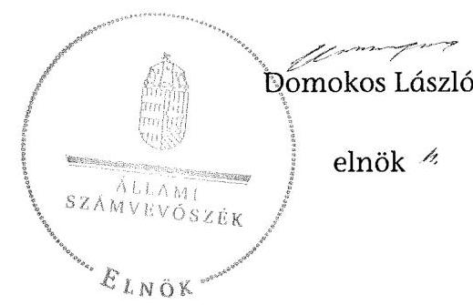

ÁLLAMI
SZÁMVEVŐSZÉK

# JELENTÉS 

az önkormányzatok belső kontrollrendszere kialakításának, egyes
kontrolltevékenységek és a belső ellenőrzés
működésének - 2013. évben induló - ellenőrzéséről
Ragály
13154
2013. december

---

# Állami Számvevőszék 

Iktatószám: V-0134-033/2013.
Témaszám: 1162
Vizsgálat-azonosító szám: V064905

## Az ellenőrzést felügyelte:

Dr. Benedek Mária
felügyeleti vezető
Az ellenőrzést vezette és az ellenőrzés végrehajtásáért felelős:
Bíró Zsolt
ellenőrzésvezető
A számvevőszéki jelentés összeállításában közremüködött:
Zaroba Szilvia
számvevő tanácsos
Az ellenőrzést végezték:

| Kovács Richárd | Nagy Erika |
| :-- | :-- |
| számvevő | számvevő |

---

# TARTALOMJEGYZÉK 

BEVEZETÉS ..... 5
I. ÖSSZEGZŐ MEGÁLLAPÍTÁSOK, KÖVETKEZTETÉSEK, JAVASLATOK ..... 9
II. RÉSZLETES MEGÁLLAPÍTÁSOK ..... 16

1. Az önkormányzat belső kontrollrendszerének kialakítása ..... 16
1.1. A kontrollkörnyezet ..... 16
1.2. A kockázatkezelési rendszer ..... 17
1.3. A kontrolltevékenységek ..... 17
1.4. Az információs és kommunikációs rendszer ..... 18
1.5. A monitoring rendszer ..... 18
2. A pénzügyi folyamatokban kulcsszerepet betöltő teljesítésigazolás és érvényesítés belső kontrollok múködése ..... 19
3. A belső ellenőrzés múködése ..... 20

## FÜGGELÉKEK

1. számú Értelmező szótár
2. számú Az értékelés módja és szempontjai

---

.

---

# RÖVIDÍTÉSEK JEGYZÉKE 

## Törvények

Áht.
ÁSZ tv.
Info tv.

Kttv.

Mötv.

Nvtv.

Ötv.
Számv. tv.
Tvtv.

## Rendeletek

Áhsz.

Ávr.

Bkr.
vagyongazdálkodási rendelet

## Szórövidítések

ÁSZ
Belső ellenőrzési kézikönyv
gazdálkodási jogkörök szabályzata

Hivatal
hivatali SZMSZ

INTOSAI
2011. évi CXCV. törvény az államháztartásról (hatályos 2012. január 1-jétől)
2011. évi LXVI. törvény az Állami Számvevőszékről
2011. évi CXII. törvény az információs önrendelkezési jogról és az információszabadságról (hatályos 2012. január 1-jétől)
2011. évi CXCIX. törvény a közszolgálati tisztviselők ről (hatályos 2012. március 1-jétől)
2011. évi CLXXXIX. törvény Magyarország helyi önkormányzatairól (hatályos 2012. január 1-jétől)
2011. évi CXCVI. törvény a nemzeti vagyonról (hatályos 2011. december 31-től)
1990. évi LXV. törvény a helyi önkormányzatokról
2000. évi C. törvény a számvitelről
1996. évi XXXI. törvény a tűz elleni védekezésről, a műszaki mentésről és a tűzoltóságról

249/2000. (XII. 24.) Korm. rendelet az államháztartás szervezetei beszámolási és könyvvezetési kötelezettségének sajátosságairól
368/2011. (XII. 31.) Korm. rendelet az államháztartásról szóló törvény végrehajtásáról (hatályos 2012. január 1jétől)
370/2011. (XII. 31.) Korm. rendelet a költségvetési szervek belső kontrollrendszeréről és belső ellenőrzéséről (hatályos 2012. január 1-jétől)
Ragály Község Önkormányzat Képviselő-testületének 5/2003. (VIII. 27.) számú önkormányzati rendelete az Önkormányzat vagyonáról és a vagyongazdálkodás szabályairól (hatályos 2003. augusztus 27 -től)

Állami Számvevőszék
Belső Ellenőrzési Kézikönyv (hatályos 2012. január 2-tól)
Községi Önkormányzat Ragály - A kötelezettségvállalás, utalványozás, ellenjegyzés, érvényesítés rendjének szabályzata (hatályos 2005. január 1-jétől)
Ragályi Közös Önkormányzati Hivatal
Ragály-Trizs-Imola Községi Önkormányzatok Körjegyzőségi Hivatalának Szervezeti és Múködési Szabályzata (hatályos 2007. március 1-jétől)
International Organization of Supreme Audit Institutions (Legfőbb Ellenőrző Intézmények Nemzetközi Szervezete)

---

| ISSAI | International Standards of Supreme Audit Institutions (Legfőbb Ellenőrző Intézmények Nemzetközi Standardjai) |
| :--: | :--: |
| Képviselő-testület | Ragály Község Önkormányzat Képviselő-testülete |
| kockázatkezelési sza- | Ragály-Trizs-Imola Körjegyzőjének 3/2012. (IV. 14.) jegy-   zői szabályzata a Körjegyzőségi Hivatal Kockázatkezelési   szabályzata (hatályos 2012. május 1-jétől) |
| körjegyzö | Ragály-Trizs-Imola Községi Önkormányzatok körjegyzője |
| Körjegyzőség | Ragály-Trizs-Imola Községi Önkormányzatok Körjegyzőségi Hivatala |
| leltározási szabályzat | Községi Önkormányzatok Ragály - Az eszközök és források leltárkészítési és leltározási szabályzata (hatályos 2001. január 1-jétől) |
| Önkormányzat | Ragály Község Önkormányzata |
| pénzkezelési szabályzat | Községi Önkormányzat Ragály Pénzkezelési Szabályzata (hatályos 2001. január 1-jétől) |
| polgármester | Ragály Község Önkormányzatának polgármestere |
| Társulás | Kazincbarcika és Vonzáskörzete Többcélú Önkormányzati Kistérségi Társulás |

---

# JELENTÉS 

## az önkormányzatok belső kontrollrendszere kialakításának, egyes kontrolltevékenységek és a belső ellenőrzés múködésének 2013. évben induló - ellenőrzéséről Ragály

## BEVEZETÉS

Ragály község állandó lakosainak száma 2012. január 1-jén 684 fő volt. Az Önkormányzat öttagú Képviselő-testületének munkáját egy állandó bizottság segítette. Az Önkormányzat az önállóan működő és gazdálkodó Körjegyzőségen kívül egy önállóan működő és gazdálkodó intézményt működtetett, többségi tulajdoni hányadú gazdasági társasággal nem rendelkezett. A polgármester a 2002. évi önkormányzati választások óta tölti be tisztségét. A körjegyző 1999. június 16 -ától látja el feladatait. A Körjegyzőség szervezeti egységekre nem tagolódott, elkülönített gazdasági szervezettel nem rendelkezett. A foglalkoztatott köztisztviselők száma 2012. január 1-jén hét fő volt. 2013. március 1jétől kezdődően Ragály, Alsószuha, Imola, Szuhafő, Trizs és Zubogy községek önkormányzatainak képviselő-testületei közös önkormányzati hivatalt hoztak létre - Ragály székhellyel - igazgatási feladataik ellátására. Az Önkormányzat a 2012. évi költségvetési beszámolója szerint 575862 ezer Ft tárgyévi bevételt ért el, valamint 529594 ezer Ft tárgyévi kiadást teljesített. A 2012. december 31-i könyvviteli mérleg szerint 493578 ezer Ft értékű eszközvagyonnal rendelkezett, a rövid lejáratú kötelezettségállománya 222450 ezer Ft, a hosszú lejáratú kötelezettségállománya 1917 ezer Ft volt.

A demokratikus társadalmakban alapvető igény, hogy a közpénzeket, a közvagyont használók tevékenységükről elszámoljanak, ahhoz egyértelmú és érvényesíthető felelősségi szabályok társuljanak. Ennek a jogos igénynek az érvényesítéséhez meg kell teremteni azokat a folyamatokat, rendszereket, amelyek nélkülözhetetlenek az elszámoltatáshoz. Az elszámoltatás eredményes múködtetéséhez szükség van a megfelelő információs, kontroll, értékelési és beszámolási rendszerek kialakítására.

Magyarországon az uniós csatlakozási tárgyalások idejére nyúlnak vissza a belső kontrollrendszer szabályozásának gyökerei. Az uniós elvárásoknak megfelelő új terminológia szerinti államháztartási belső pénzügyi ellenőrzési (ÁBPE) rendszer területén a jogharmonizáció 2003-ban teljes körűen megvalósult, míg az önkormányzati alrendszerre vonatkozó, Ötv.-ben megjelenített speciális szabályozás 2005-ben lépett hatályba. Az államháztartási belső kontrollrendszer koncepciója 2009-ben továbbfejlődött. A változások irányát mutatja, hogy a költségvetési szervek belső kontrollrendszere már magában foglalja

---

a korszerű, felelős szervezetirányítás elemeit (kontrollkörnyezet, kockázatkezelés, kontrolltevékenység, információ és kommunikáció, monitoring) is. E kontrollrendszer szabályozása háromszintű, a törvényi előírásokat az Áht. és Mötv., a rendeleti szintű szabályozást az Ávr. és a Bkr. tartalmazza, amelyeket útmutatói szinten az NGM által kiadott standardok és kézikönyvek támogatnak.

A belső kontrollrendszer azt a célt szolgálja, hogy a költségvetési szervek múködésük és gazdálkodásuk során a tevékenységeket szabályszerűen, gazdaságosan, hatékonyan és eredményesen hajtsák végre, teljesítsék elszámolási kötelezettségeiket és megvédjék az erőforrásokat a veszteségektől, a károktól és a nem rendeltetésszerű használattól. A belső kontrollrendszer magában foglalja mindazon szabályokat, eljárásokat, gyakorlati módszereket és szervezeti struktúrákat, kockázatkezelési technikákat, kontrolltevékenységeket, amelyek segítséget nyújtanak a szervezetnek céljai eléréséhez.

Az ÁSZ a 2011-2015. évekre szóló stratégiájában hangsúlyos szerepet szánt annak, hogy szilárd szakmai alapon álló, értékteremtő ellenőrzéseivel előmozdítsa a közpénzügyek átláthatóságát, rendezettségét. A számvevőszéki ellenőrzés nemzetközi alapelvei is rögzítik, hogy a megfelelő belső kontrollrendszer minimálisra csökkenti a hibák és szabálytalanságok kockázatát.

Az ellenőrzés célja annak megállapítása volt, hogy a belső kontrollrendszer elemeinek kialakítása, a pénzügyi folyamatokban kulcsszerepet betöltő teljesítésigazolás és érvényesítés, és a belső ellenőrzés szabályos működése biztosítot-ta-e az önkormányzatnál a közpénzfelhasználás szabályosságát, hozzájárult-e az értéket teremtő rend követelményének érvényesüléséhez.

Ennek keretében értékeltük, hogy:

- a jogszabályi előírásoknak megfelelően alakították-e ki a belső kontrollrendszer elemeit;
- a gazdálkodás folyamatában kulcsszerepet betöltő teljesítésigazolás és érvényesítés kontrolltevékenységeit megfelelően működtették-e;
- biztosították-e a belső ellenőrzés szabályos működését;
- amennyiben az ÁSZ tett javaslatot a 2008-2011. évek közötti ellenőrzése kapcsán az Önkormányzatnak, intézkedtek-e azok végrehajtására.

Az ellenőrzés várható hasznosulását négy szinten tervezzük. A törvényalkotás számára összegzett tapasztalatok állnak rendelkezésre a belső kontrollrendszer önkormányzati területen való kialakításáról, működéséről és hatásairól, a belső ellenőrzés működéséről. Ennek alapján következtetést lehet levonni arról, hogy a belső kontrollrendszer kialakítására és működtetésére vonatkozó jelenlegi, differenciálás nélküli - jogszabályi előírások reális követelményeket támasztanak-e az eltérő adottságú települési önkormányzatok esetében, illetve indokolt-e esetleges jogszabályi módosítás kezdeményezése. Az ellenőrzés az ellenőrzött számára visszajelzést ad a belső kontrollrendszer kialakításában és működésében fellépő hiányosságokról, javaslataival hozzájárul azok kiküszöböléséhez, amely csökkentheti a későbbi ellenőrzések gyakoriságát. Az ellenőrzés megállapításait és javaslatait más szervezetek is hasznosíthatják a rende-

---

zett gazdálkodási keretek kialakításához. A társadalom számára jelzi, hogy közpénz nem maradhat ellenőrizetlenül, az ÁSZ értékteremtő rend kialakításához és megőrzéséhez hozzájáruló tevékenysége pozitív hatással lesz a szervezetről kialakított összkép formálásában. A szervezeten belül lehetőség nyílik arra, hogy a megállapítások szintetizálásával az ÁSZ a hozzáadott értéket teremtő elemző tevékenységét és tanácsadó szerepét is erősítse.

Az önkormányzatok belső kontrollrendszere kialakításának, egyes kontrolltevékenységek és a belső ellenőrzés működésének ellenőrzéséről szóló jelentés I. fejezetének összegző része az ellenőrzés céljára ad rövid, szintetizáló összefoglalót, és tartalmazza a következtetéseket a II. fejezet részletes megállapításain alapulóan. A jelentés intézkedést igénylő megállapításait és javaslatait az ellenőrzés során feltárt, a jelentés II. fejezetében rögzített részletes megállapítások alapozzák meg. A helyszíni ellenőrzés lezárásáig a helyi szabályozás változásait nyomon követtük.

Az ellenőrzés típusa: szabályszerűségi ellenőrzés.
Az ellenőrzött időszak: a belső kontrollrendszer kialakításának megfelelősége esetében a 2012. évre, a pénzügyi folyamatokban kulcsszerepet betöltő teljesítésigazolás és érvényesítés belső kontrollok működésének megfelelőségét és a belső ellenőrzés szabályszerű működését a 2012. január 1. és december 31-e közötti időszak eseményeit figyelembe véve értékeltük, míg az ÁSZ javaslatainak utóellenőrzése a 2008-2011. években végzett ellenőrzések nyilvánosságra hozott jelentéseiben tett javaslatok áttekintésére terjedt ki.

Az ellenőrzött szervezet: az Önkormányzat.
Az ellenőrzés jogszabályi alapját az ÁSZ tv. 1. § (3) bekezdése, az 5. § (2) és (6) bekezdése, valamint az Áht. 61. § (2) bekezdésének előírásai képezik.

Az ellenőrzés szakmai módszertana az ÁSZ hivatalos honlapján (www.asz.hu) közzétett szakmai szabályokon alapult, amely az INTOSAI által kiadott ISSAI figyelembevételével készült.

Az ellenőrzés lefolytatásához az Önkormányzat a kimutatások és a tanúsítvány elektronikus kitöltésével, valamint az ÁSZ által kért dokumentumok elektronikus megküldésével szolgáltatott adatokat. Az így rendelkezésre bocsátott adatok, információk kontrollja és a munkalapok kitöltése a helyszíni ellenőrzés keretében történt. A jelentésben használt fogalmak magyarázatát az 1. számú függelék, az ellenőrzés egyes területeinek értékelésénél alkalmazott egységes minősítési szempontokat a 2. számú függelék tartalmazza.

A belső kontrollrendszer kialakításának ellenőrzése során értékeltük a kontrollkörnyezet, a kockázatkezelési rendszer, a kontrolltevékenységek, az információs és kommunikációs rendszer, valamint a monitoring rendszer szabályozottságának megfelelőségét. A pénzügyi folyamatokban kulcsszerepet betöltő teljesítésigazolás és érvényesítés kontrollok működése megfelelőségének minősítéséhez az állományba nem tartozók megbízási díjai, a külső szolgáltatók által végzett karbantartási, kisjavítási munkák, az egyéb üzemeltetési és fenntartási szolgáltatások, a rendszeres szociális segélyek, valamint az államháztartáson

---

kívülre teljesített múködési és felhalmozási célú pénzeszközátadások közül kockázatelemzéssel választottuk ki az ellenőrzött kiadási jogcímeket. Az egyszerú véletlen mintavétellel kiválasztott tételek ellenőrzését többlépcsős megfelelőségi tesztek útján addig végeztük, amíg elegendő és megfelelő bizonyítékot szereztünk a vizsgált folyamatok kulcskontrolljai múködésének megfelelő vagy nem megfelelő voltáról. Értékeltük az Önkormányzatnál a belső ellenőrzés múködésének szabályosságát. Utóellenőrzésre nem került sor, mivel az ÁSZ az Önkormányzatnál a 2008-2011. évek között nem végzett ellenőrzést.

Az ÁSZ tv. 29. § (1) bekezdése szerint a jelentéstervezetet megküldtük a polgármester részére, aki az ÁSZ tv. 29. § (2) bekezdésében foglalt észrevételezési jogával nem élt, a jelentéstervezetre észrevételt nem tett.

---

# I. ÖSSZEGZŐ MEGÁLLAPÍTÁSOK, KÖVETKEZTETÉSEK, JAVASLATOK 

A belső kontrollrendszeren belül 2012-ben a kontrollkörnyezet, a kockázatkezelési rendszer, a kontrolltevékenységek, az információs és kommunikációs rendszer, valamint a monitoring rendszer kialakítását külön-külön és együttesen is értékeltük. A belső kontrollrendszer kialakítása az összesített értékelés alapján nem felelt meg a jogszabályi előírásoknak.

A belső kontrollrendszer egyes területei kialakításának minősítése a következő:

| Kontrollterület | Minősítés |
| :-- | :--: |
| Kontrollkörnyezet | nem |
|  | megfelelő |
| Kockázatkezelési rendszer | nem |
|  | megfelelő |
| Kontrolltevékenységek | nem |
| Információs és kommunikációs | megfelelő |
| rendszer | nem |
| Monitoring rendszer |  |

Nem megfelelőnek értékeltük a kontrollkörnyezet, a kockázatkezelési rendszer, a kontrolltevékenységek, az információs és kommunikációs rendszer, valamint a monitoring rendszer kialakítását, mivel az ellenőrzésünk során megállapított szabályozásbeli hiányosságok magukban hordozzák a szabálytalan múködés, valamint a korrupció kockázatát.

A belső kontrollrendszer nem megfelelő kialakítása kockázatot jelent az Önkormányzat tevékenységeinek szabályszerű, gazdaságos, hatékony és eredményes végrehajtása során.

A 2012. évben az állományba nem tartozók megbízási díjaival, valamint a külső szolgáltatók által végzett karbantartási, kisjavítási munkákkal kapcsolatos kifizetések során a pénzügyi folyamatokban kulcsszerepet betöltő teljesítésigazolás és érvényesítés belső kontrollok múködése gyenge volt. Gyengének értékeltük a két kulcskontroll együttes múködését, mivel azok nem biztosították a hibák megelőzését és feltárását.

A számvevőszéki ellenőrzés az ellenőrzött kifizetésekkel összefüggésben a rendelkezésre bocsátott dokumentumok alapján jogosulatlan kifizetést nem tárt fel, azonban a gazdálkodásban kulcsszerepet betöltő kontrollok múködésében feltárt hiányosságok miatt fennáll a hibák bekövetkezésének kockázata. A nem megfelelően múködtetett belső kontrollok, valamint azok szabályozásának hiánya korrupciós kockázatot hordoznak.

---

Az Önkormányzat a belső ellenőrzési feladatokat a Társulás útján látta el. A 2012. évben a belső ellenőrzés múködése a jogszabályi előírásoknak megfelelt, azonban a belső ellenőrzés nem tárta fel a belső kontrollrendszer kialakításának, valamint a pénzügyi folyamatokban kulcsszerepet betöltő teljesítésigazolás és érvényesítés belső kontrollok müködésének hiányosságait.

Az ÁSZ tv. 33. § (1) bekezdésében foglaltak értelmében az ellenőrzött szervezet vezetője köteles a jelentésben foglalt megállapításokhoz kapcsolódó intézkedési tervet összeállítani, és azt a jelentés kézhezvételétől számított 30 napon belül az ÁSZ részére megküldeni. Amennyiben az intézkedési tervet határidőre nem küldi meg a szervezet, vagy az ÁSZ tv. 33. § (2) bekezdésében foglalt póthatáridő elteltével megküldött intézkedési terv továbbra sem elfogadható, az ÁSZ elnöke a hivatkozott törvény 33. § (3) bekezdés a)-b) pontjaiban foglaltakat érvényesítheti.

Az ellenőrzés intézkedést igénylő megállapításai és javaslatai:

# a polgármesternek 

1. Az állományba nem tartozók megbízási díjaira és a külső szolgáltatók által végzett karbantartási, kisjavítási munkákra - az Áht. 37. § (1) bekezdésében és az Ávr. 55. § (1) bekezdésében foglaltak ellenére - pénzügyi ellenjegyzés hiányában vállaltak kötelezettséget.

Javaslat:
Intézkedjen arról, hogy az Önkormányzat nevében történő kötelezettségvállalásra az új Áht. 37. § (1) bekezdésében és az Ávr. 55. § (1) bekezdésében foglaltaknak megfelelően - az Ávr. 53. §-ában meghatározott kivételekkel - kizárólag a pénzügyi ellenjegyzés után, a pénzügyi teljesítés esedékességét megelőzően, írásban kerüljön sor.
2. A polgármester mint kötelezettségvállaló - az Ávr. 57. § (4) bekezdésében foglaltak ellenére - 2012. március 31-től nem jelölte ki írásban a teljesítésigazolásra jogosult személyeket.

Javaslat:
Jelölje ki az Ávr. 57. § (4) bekezdésének megfelelően az általa történő kötelezettségvállalások esetében a teljesítés igazolására jogosult személyeket.
3. A számvevőszéki ellenőrzés megállapításai alapján az Önkormányzatnál a belső kontrollrendszer kialakítása összefoglalóan értékelve nem felelt meg a jogszabályi előírásoknak, a kulcskontrollok müködése gyenge volt, a belső ellenőrzés müködése ugyan megfelelt a jogszabályi előírásoknak, azonban nem tárta fel, ezáltal nem is javíttatta ki a hiányosságokat. A megállapított szabályozásbeli és müködésbeli hiányosságok magukban hordozzák a szabálytalan müködés kockázatát.

---

Javaslat:
A Mötv. 115. § (1) bekezdésében foglaltak alapján kísérje figyelemmel az Önkormányzat gazdálkodásának szabályszerűségét. A Mötv. 67. § f) pontja alapján gondoskodjon a belső kontrollrendszer müködésére vonatkozó jogszabályi rendelkezések be nem tartása, valamint a teljesítésigazolás és az érvényesítés kontrollokkal összefüggésben feltárt hiányosságok, szabálytalanságok tekintetében az esetleges munkajogi felelősséggel kapcsolatos körülmények kivizsgálásáról, majd a vizsgálat eredményének függvényében tegye meg a szükséges munkajogi intézkedéseket.

# a jegyzőnek (Ragály Község Önkormányzata vonatkozásában) 

1. a kontrollkörnyezettel kapcsolatban:

A hivatali SZMSZ-ben a körjegyző - az Ávr. 13. § (1) bekezdés f) és i) pontjában foglaltak ellenére - nem rögzítette azon ügyköröket, amelyek során a szervezeti egységek vezetői a költségvetési szerv képviselőjeként járhatnak el, valamint a költségvetési szervhez rendelt más költségvetési szervek felsorolását.

A körjegyző - az Ötv. 36. § (2) bekezdés a) pontjában foglaltak ellenére - nem készítette elő a vagyongazdálkodási rendelet módosítását, így az Önkormányzat vagyongazdálkodási rendelete nem felelt meg az Nvtv. 3. § (1) bekezdés 6. pontja, 5-6. §-a, 11. § (16) bekezdése, 13. § (1) bekezdése, 18. § (1) és (12) bekezdése, valamint a Mötv. 109. § (4) bekezdése előírásainak.

A körjegyző - a Számv. tv. 14. § (11) bekezdésében foglaltak ellenére - a Számv. tv. 14. § (5) bekezdés a) és d) pontja, illetve az Áhsz. 8. § (4) bekezdés a) és d) pontja szerinti leltározási, valamint pénzkezelési szabályzatot nem aktualizálta.

A Bkr. 6. § (3) bekezdésében foglaltak ellenére az ellenőrzési nyomvonalat nem aktualizálták.

A körjegyző a Tvtv. 19. § (1) bekezdését figyelmen kívül hagyva nem készítette el a Körjegyzőség tűzvédelmi szabályzatát.

A Képviselő-testület - a Kttv. 231. § (1) bekezdése ellenére - nem állapította meg - a Kttv. 83. §-ában meghatározott - a köztisztviselőkkel szembeni hivatásetikai alapelvek részletes tartalmát, valamint az etikai eljárás szabályait, mivel a körjegyző - az Ötv. 36. § (2) bekezdés a) pontjában előírt feladata ellenére - nem készítette elő ennek dokumentumát.

Javaslat:
a) Készítse el a hivatali SZMSZ módosítását, és kezdeményezze az Áht. 9. § (1) bekezdés a) pontjában foglaltakra tekintettel a Képviselő-testület elé terjesztését annak érdekében, hogy az tartalmazza az Ávr. 13. § (1) bekezdésében előírt tartalmi elemeket.
b) Készítse el a Mötv. 81. § (3) bekezdés c) pontjában foglaltak alapján a vagyongazdálkodási rendelet módosításának tervezetét, és kezdeményezze a Képviselőtestület elé terjesztését annak érdekében, hogy az megfeleljen az Nvtv. 3. § (1)

---

bekezdés 6. pontja, 5-6. §-a, 11. § (16) bekezdése, 13. § (1) bekezdése, 18. § (1) és (12) bekezdése, valamint a Mötv. 109. § (4) bekezdése előírásainak.
c) Aktualizálja a Számv. tv. 14. § (11) bekezdésében foglaltaknak megfelelően a Számv. tv. 14. § (5) bekezdés a) és d) pontja, illetve az Áhsz. 8. § (4) bekezdés a) és d) pontja szerinti leltározási, valamint pénzkezelési szabályzatot.
d) Aktualizálja rendszeresen a Bkr. 6. § (3) bekezdésében előírtaknak megfelelően az ellenőrzési nyomvonalat.
e) Készítse el a tűzvédelmi szabályzatot a Tvtv. 19. § (1) bekezdésében foglalt előírásnak megfelelően.
f) Készítse elő a Mötv. 81. § (3) bekezdés c) pontjában foglalt feladatkörében a köztisztviselőkkel szembeni - a Kttv. 83. §-a szerinti - hivatásetikai alapelvek részletes tartalmának, valamint az etikai eljárás szabályainak dokumentumait, és a Kttv. 231. § (1) bekezdésében foglaltak érvényesülése érdekében kezdeményezze azok Képviselő-testület elé terjesztését.
2. a kockázatkezelési rendszerrel kapcsolatban:

A körjegyző - a Bkr. 7. § (2) bekezdésében foglaltak ellenére - nem határozta meg az egyes kockázatok kezeléséhez szükséges intézkedéseket, valamint azok teljesítése folyamatos nyomon követésének módját.

Javaslat:
Határozza meg - a Bkr. 7. § (2) bekezdésében foglaltak alapján - az egyes kockázatokkal kapcsolatban szükséges intézkedéseket, valamint azok teljesítése folyamatos nyomon követésének módját.
3. a kontrolltevékenységekkel kapcsolatban:

A körjegyző - a Bkr. 8. § (2) bekezdés a) pontjában foglaltak ellenére - nem biztosította a pénzügyi döntések - köztük a költségvetés tervezése, a beszerzési folyamat, a vagyonhasznosítási tevékenység és a támogatások - dokumentumainak elkészítésével kapcsolatban a folyamatba épített, előzetes, utólagos és vezetői ellenőrzést.

A körjegyző - az Ávr. 53. § (2) bekezdésében foglaltakat figyelmen kívül hagyva annak ellenére nem határozta meg az előzetes írásbeli kötelezettségvállalást nem igénylő kifizetések rendjét, hogy a belső szabályozásban lehetővé tette az 50 ezer forintot meg nem haladó kifizetések előzetes írásbeli kötelezettségvállalás nélküli teljesítését.

A körjegyző - az Ávr. 13. § (2) bekezdés a) pontjában foglaltakat figyelmen kívül hagyva - belső szabályzatban nem határozta meg a teljesítésigazolás módját, az érvényesítés és az utalványozás rendjét.

A körjegyző - a Bkr. 8. § (4) bekezdés b) pontjában foglaltak ellenére - a hozzáférési jogosultságokra vonatkozó belső szabályzatban nem határozta meg a felelősségi köröket.

---

Javaslat:
a) Biztosítsa minden tevékenységre vonatkozóan a folyamatba épített, előzetes, utólagos és vezetői ellenőrzést a Bkr. 8. § (2) bekezdése alapján.
b) Rögzítse belső szabályzatban az Ávr. 53. § (2) bekezdése alapján az előzetes írásbeli kötelezettségvállalást nem igénylő kifizetések rendjét.
c) Rendezze belső szabályzatban az Ávr. 13. § (2) bekezdés a) pontjában foglaltak alapján a gazdálkodással - különösen a kötelezettségvállalás, az ellenjegyzés, a teljesítés igazolása, az érvényesítés és az utalványozás gyakorlásának módjával, eljárási és dokumentációs részletszabályaival - kapcsolatos belső előírásokat, feltételeket.
d) Szabályozza belső szabályzatban a Bkr. 8. § (4) bekezdés b) pontja alapján a dokumentumokhoz és információkhoz való hozzáférés esetében a felelősségi köröket.
4. az információs és kommunikációs rendszerrel kapcsolatban:

A körjegyző - az Info tv. 35. § (3) bekezdésében és az Ávr. 13. § (2) bekezdés h) pontjában foglalt előírás ellenére - a kötelezően közzéteendő adatok nyilvánosságra hozatalának rendjét nem alakította ki belső szabályzatban.

Az Önkormányzat - az Info tv. 33. § (1) és (3) bekezdésében foglaltak ellenére - az elektronikus közzétételi kötelezettségének a 2012. évben nem tett eleget.

Javaslat:
a) Állapítsa meg belső szabályzatban - az Info tv. 35. § (3) bekezdésében és az Ávr. 13. § (2) bekezdés h) pontjában foglaltaknak megfelelően - a kötelezően közzéteendő adatok nyilvánosságra hozatalának rendjét.
b) Gondoskodjon az Info tv. 33. § (1) és (3) bekezdésében foglaltaknak megfelelően az Önkormányzat elektronikus közzétételi kötelezettségének teljesítéséről.
5. a monitoring rendszerrel kapcsolatban:

A körjegyző - a Bkr. 3. § e) pontjában és 10. §-ában foglaltak ellenére - nem alakította ki a Körjegyzőség tevékenységének, a célok megvalósításának nyomon követését biztosító rendszert.

Javaslat:
Alakítsa ki és müködtesse a Bkr. 3. § e) pontjában és 10. §-ában foglaltak alapján a Hivatal tevékenységének, a célok megvalósításának nyomon követését biztosító rendszert.

---

6. a pénzügyi folyamatokban kulcsszerepet betöltő kontrollokkal kapcsolatban:

A teljesítésigazolást - az Áht. 38. § (1) bekezdésében és az Ávr. 57. § (1) és (3) bekezdésében foglaltak ellenére - nem végezték el, vagy a teljesítésigazolás nem szabályszerűen történt.

Az érvényesítés - az Ávr. 58. § (1) és (3) bekezdésében foglaltak ellenére - nem szabályszerűen történt, valamint az érvényesítésre kijelölt személy - az Ávr. 58. § (2) bekezdésében foglalt előírás ellenére - nem jelezte az utalványozónak, hogy a teljesítés igazolását nem végezték el, továbbá hogy - az Áht. 37. § (1) bekezdése és az Ávr. 55. § (1) bekezdése ellenére - hiányzott a kötelezettségvállalások pénzügyi ellenjegyzése.

Javaslat:
Intézkedjen - a szakmai teljesítés igazolása és az utalvány ellenjegyzése vonatkozásában feltárt hiányosságok megszüntetése, illetve az operatív gazdálkodás során a müködésbeli hibák megelőzése, feltárása és kijavítása érdekében - arról, hogy:
a) az Áht. 38. § (1) bekezdésén alapuló teljesítésigazolás során az Ávr. 57. § (1) bekezdésében előírtaknak megfelelően, ellenőrizhető okmányok alapján ellenőrizzék és igazolják a kiadások teljesítésének jogosságát, összegszerűségét, az ellenszolgáltatást is magában foglaló kötelezettségvállalás esetén annak teljesítését, valamint az Ávr. 57. § (3) bekezdése szerint a teljesítést az igazolás dátumának és a teljesítés tényére történő utalásnak a megjelölésével, az arra jogosult személy aláírásával igazolják;
b) kötelezettségvállalásra - az Áht. 37. § (1) és az Ávr. 55. § (1) bekezdésében foglaltaknak megfelelően, az Ávr. 53. §-ában meghatározott kivételekkel - kizárólag a pénzügyi ellenjegyzés után, a pénzügyi teljesítést megelőzően, írásban kerüljön sor;
c) a kifizetéseket megelőzően a teljesítésigazolás alapján - az Ávr. 57. § (3) bekezdése szerinti esetben annak hiányában is - az összegszerűségnek, a fedezet meglétének és a megelőző ügymenetben az Áht., az Áhsz., az Ávr. előírásai és a belső szabályzatokban foglaltak betartásának az ellenőrzése - az Ávr. 58. § (1), (2) és (3) bekezdése szerint - történjen meg.
7. a belső ellenőrzés müködésével kapcsolatban:

A stratégiai ellenőrzési terv - a Bkr. 30. § (1) bekezdés f) pontjában foglalt előírás ellenére - nem tartalmazta az ellenőrzési gyakoriságot.

A Bkr. 22. § (1) bekezdés b) pontjában, a 29. § (1) és a 31. § (1) bekezdésében foglaltak ellenére a 2013. évre vonatkozóan ellenőrzési terv nem készült.

A belső ellenőrzési vezető - a Bkr. 21. § (2) bekezdés d) pontjában és a 47. § (1) bekezdésében foglaltak ellenére - a belső ellenőrzési jelentésekben tett javaslatokat, a vonatkozó intézkedési terveket és azok végrehajtásának nyomon követését biztosító nyilvántartást nem vezetett.

---

Az éves ellenőrzési jelentés - a Bkr. 48. § b) pont bb) alpontjában foglaltak ellenére nem tartalmazta a belső kontrollrendszer öt elemének értékelését.

Javaslat:
a) Kezdeményezze, hogy a stratégiai ellenőrzési terv tartalmazza a Bkr. 30. § (1) bekezdésében előírt tartalmi elemeket.
b) Kezdeményezze, hogy a Bkr. 22. § (1) bekezdés b) pontjában, a 29. § (1) és a 31. § (1) bekezdésében foglaltaknak megfelelően készüljön éves ellenőrzési terv.
c) Kezdeményezze, hogy a belső ellenőrzési vezető vezessen a Bkr. 21. § (2) bekezdése d) pontjának és a Bkr. 47. § (1) bekezdésének megfelelően a belső ellenőrzési jelentésekben tett megállapításokat, javaslatokat, a vonatkozó intézkedési terveket és azok végrehajtását nyomon követő nyilvántartást.
d) Kezdeményezze, hogy az éves ellenőrzési jelentés tartalmazza a Bkr. 48. §-ában előírt tartalmi elemeket.

---

# II. RÉSZLETES MEGÁLLAPÍTÁSOK 

## 1. AZ ÖNKORMÁNYZAT BELSŐ KONTROLLRENDSZERÉNEK KIALAKÍTÁSA

A belső kontrollrendszeren belül 2012-ben a kontrollkörnyezet, a kockázatkezelési rendszer, a kontrolltevékenységek, az információs és kommunikációs rendszer, valamint a monitoring rendszer kialakítását külön-külön és együttesen is értékeltük. A belső kontrollrendszer kialakítása az összesített értékelés alapján nem felelt meg a jogszabályi előírásoknak.

### 1.1. A kontrollkörnyezet

A kontrollkörnyezet kialakítása - a 2. számú függelékben részletezett kritériumrendszer alapján végzett értékelés szerint - a jogszabályi előírásoknak nem felelt meg, mert:

| Sorszám $^{1}$ | Megállapítás |
| :--: | :--: |
| 9., 12. | A hivatali SZMSZ-ben a körjegyző - az Ávr. 13. § (1) bekezdés f) és i) pontjában foglaltak ellenére - nem rögzítette azon ügyköröket, amelyek során a szervezeti egységek vezetői a költségvetési szerv képviselőjeként járhatnak el, valamint a költségvetési szervhez rendelt más költségvetési szervek felsorolását. |
| 16. | A körjegyzó az Ötv. 36. § (2) bekezdés a) pontjában ${ }^{2}$ foglaltak ellenére a jogszabályváltozásokhoz kapcsolódóan nem készítette elő a vagyongazdálkodási rendelet módosítását, így az Önkormányzat vagyongazdálkodási rendelete nem felelt meg az Nvtv. 3. § (1) bekezdés 6. pontja, 5-6. §-a, 11. § (16) bekezdése, 13. § (1) bekezdése, 18. § (1) és (12) bekezdése, valamint az Mötv. 109. § (4) bekezdése előírásainak. |
| 19.,   24. | A körjegyzó - a Számv. tv. 14. § (11) bekezdésében foglaltak ellenére - a Számv. tv. 14. § (5) bekezdés a) és d) pontja, illetve az Áhsz. 8. § (4) bekezdés a) és d) pontja szerinti leltározási és a pénzkezelési szabályzatot nem aktualizálta. |
| 33. | A körjegyzó - a Tvtv. 19. § (1) bekezdését figyelmen kívül hagyva - nem készítette el a Körjegyzőség tüzvédelmi szabályzatát. |
| 44. | A Bkr. 6. § (3) bekezdésében foglaltak ellenére az ellenőrzési nyomvonalat nem aktualizálták. |
| 47. | A Képviselő-testület - a Kttv. 231. § (1) bekezdése ellenére - nem állapította meg - a Kttv. 83. §-ában meghatározott - a köztisztviselőkkel szembeni hi- |

[^0]
[^0]:    ${ }^{1}$ A megállapítás számozása az Önkormányzat által az adatszolgáltatás során kitöltött kimutatások kérdéseinek sorszámával azonos.
    ${ }^{2}$ 2013. január 1-jétől a Mötv. 81. § (3) bekezdés c) pontja

---

vatásetikai alapelvek részletes tartalmát, valamint az etikai eljárás szabályait, mivel a körjegyző - az Ötv. 36. § (2) bekezdés a) pontjában előírt feladata ellenére - nem készítette elő ennek dokumentumát.

# 1.2. A kockázatkezelési rendszer 

A kockázatkezelési rendszer kialakítása - a 2. számú függelékben részletezett kritériumrendszer alapján végzett értékelés szerint - nem felelt meg a jogszabályi előírásoknak, mert:

Sor-
szám
Megállapítás
A körjegyzö - a Bkr. 7. § (2) bekezdésében foglaltak ellenére - nem határoz-
8., 10. ta meg az egyes kockázatok kezeléséhez szükséges intézkedéseket és azok teljesítésének folyamatos nyomon követési módját.

### 1.3. A kontrolltevékenységek

A kontrolltevékenységek kialakítása - a 2. számú függelékben részletezett kritériumrendszer alapján végzett értékelés szerint - a jogszabályi előírásoknak nem felelt meg, mert:

| Sor-   szám | Megállapítás |
| :--: | :--: |
| 2., 3.,   4., 5. | A körjegyzö - a Bkr. 8. § (2) bekezdés a) pontjában foglaltak ellenére - nem biztosította a pénzügyi döntések - köztük a költségvetés tervezése, a beszerzési folyamat, a vagyonhasznosítási tevékenység és a támogatások - dokumentumainak elkészítésével kapcsolatban a folyamatba épített, előzetes, utólagos és vezetői ellenőrzést. |
| 8. | A körjegyző - az Ávr. 53. § (2) bekezdésében foglaltakat figyelmen kívül hagyva - annak ellenére nem határozta meg az előzetes írásbeli kötelezettségvállalást nem igénylő kifizetések rendjét, hogy a belső szabályozásban lehetővé tette az 50 ezer forintot meg nem haladó kifizetések előzetes írásbeli kötelezettségvállalás nélküli teljesítését. |
| $\begin{aligned} & 9 ., 11 . \text {, } \\ & 12 . \end{aligned}$ | A körjegyzö - az Ávr. 13. § (2) bekezdés a) pontjában foglaltak ellenére belső szabályzatban nem határozta meg a teljesítésigazolás módját, valamint az utalványozás és az érvényesítés rendjét. |
| 10. | A polgármester mint kötelezettségvállaló - az Ávr. 57. § (4) bekezdésében foglaltak ellenére - 2012. március 31-étől nem jelölte ki írásban a teljesítésigazolásra jogosult személyeket. |
| 17. | A körjegyzö - a Bkr. 8. § (4) bekezdés b) pontjában foglaltak ellenére - a hozzáférési jogosultságokra vonatkozó belső szabályzatban nem határozta meg a felelősségi köröket. |

---

# 1.4. Az információs és kommunikációs rendszer 

Az információs és kommunikációs rendszer kialakítása - a 2. számú függelékben részletezett kritériumrendszer alapján végzett értékelés szerint nem felelt meg a jogszabályi előírásoknak, mert:

| Sor-   szám | Megállapítás |
| :-- | :-- |
| 6. | A körjegyző - az Info tv. 35. § (3) bekezdésében és az Ávr. 13. § (2) bekezdés   h) pontjában foglalt előírás ellenére - a kötelezően közzéteendő adatok   nyilvánosságra hozatalának rendjét nem alakította ki belső szabályzatban. |
| 7. | Az Önkormányzat - az Info tv. 33. § (1) és (3) bekezdésében foglaltak elle-   nére - az elektronikus közzétételi kötelezettségének a 2012. évben nem tett   eleget. |

### 1.5. A monitoring rendszer

A monitoring rendszer kialakítása - a 2. számú függelékben részletezett kritériumrendszer alapján végzett értékelés szerint - nem felelt meg a jogszabályi előírásoknak, mert:

| Sor-   szám | Megállapítás |
| :-- | :-- |
| 1. | A körjegyzö - a Bkr. 3. § e) pontjában és 10. §-ában foglaltak ellenére - nem   alakította ki a Körjegyzőség tevékenységének, a célok megvalósításának   nyomon követését biztosító rendszert. |

A helyi önkormányzatok törvényességi felügyeletét ellátó kormányhivatal törvényességi felhívással ${ }^{3}$ élt 2012. július 10-én, mert az Önkormányzat és a Ragályi Roma Nemzetiségi Önkormányzat nem kötötte meg az együttmúködésükre vonatkozó, annak részletes szabályait tartalmazó együttmúködési megállapodást.

Az Önkormányzat és a Ragályi Roma Nemzetiségi Önkormányzat 2012. október 16-án megkötötte a megállapodást.

[^0]
[^0]:    ${ }^{3}$ a Mötv. 132. § (1) bekezdés a) pontja alapján

---

# 2. A PÉNZÜGYI FOLYAMATOKBAN KULCSSZEREPET BETÖLTŐ TELJESÍTÉSIGAZOLÁS ÉS ÉRVÉNYESÍTÉS BELSŐ KONTROLLOK MÜKÖDÉSE 

A 2012. évben az állományba nem tartozók megbízási díjaival, valamint a külső szolgáltatók által végzett karbantartással, kisjavítással kapcsolatos kifizetések során - összefoglalóan értékelve - a pénzügyi folyamatokban kulcsszerepet betöltő teljesítésigazolás és érvényesítés belső kontrollok müködésének megfelelősége gyenge volt, mert:

| Kulcskontrollok | Megállapítás |
| :--: | :--: |
| Teljesítésigazolás | A teljesítésigazolást - az Áht. 38. § (1) bekezdésében és az Ávr. 57. § (1) és (3) bekezdésében foglaltak ellenére - nem végezték el, vagy a teljesítésigazolás nem szabályszerűen történt. |
| Érvényesítés | Az érvényesítés - az Ávr. 58. § (1) és (3) bekezdésében foglaltak ellenére - nem szabályszerűen történt, valamint az érvényesítésre kijelölt személy - az Ávr. 58. § (2) bekezdésében foglalt előírás ellenére - nem jelezte az utalványozónak, hogy a teljesítés igazolását nem végezték el, továbbá hogy - az Áht. 37. § (1) bekezdése ellenére - hiányzott a kötelezettségvállalások pénzügyi ellenjegyzése. |

A 2012. évben az állományba nem tartozók megbízási díjainak kifizetése során a teljesítésigazolás és az érvényesítés kulcskontrollok müködésének megfelelősége gyenge volt, mert:

- a teljesítésigazolást az iskola-egészségügyi feladatok ellátásával kapcsolatos megbízási díj kifizetését megelőzően - az Áht. 38. § (1) bekezdésében és az Ávr. 57. § (1) bekezdésében foglaltak ellenére - nem végezték el;
- az érvényesítő - az Ávr. 58. § (3) bekezdésében foglaltak ellenére - az iskolaegészségügyi feladatok ellátásával kapcsolatos megbízási díj kifizetését megelőzően az érvényesített okmányon az érvényesítés dátumát nem tüntette fel, továbbá - az Ávr. 58. § (2) bekezdésében foglaltak ellenére - nem jelezte az utalványozónak az Önkormányzat nevében vállalt kötelezettség - az Áht. 37. § (1) bekezdése és az Ávr. 55. § (1) bekezdése szerinti - ellenjegyzésének hiányát, valamint a teljesítésigazolás elmaradását.

A 2012. évben a külső szolgáltatók által teljesített karbantartási, kisjavítási munkákra történő kifizetések során a teljesítésigazolás és az érvényesítés kulcskontrollok müködésének megfelelősége gyenge volt, mert:

- a teljesítésigazoló a szoftverfrissítés és a vízmérőcsere címen történt kifizetések esetében a bizonylatokon - az Ávr. 57. § (3) bekezdése előírása ellenére nem jelölte meg a teljesítésigazolás dátumát;
- az érvényesítő - az Ávr. 58. § (3) bekezdésében foglaltak ellenére - a bizonylatokon az érvényesítés dátumát nem tüntette fel, továbbá - az Ávr. 58. § (2) bekezdésében foglaltak ellenére - nem jelezte az utalványozónak az Önkormányzat nevében vállalt kötelezettség - az Áht. 37. § (1) bekezdése és az Ávr. 55. § (1) bekezdése szerinti - ellenjegyzésének hiányát, valamint a teljesítésigazolás elmaradását.

---

A számvevőszéki ellenőrzés az ellenőrzött kifizetésekkel összefüggésben a rendelkezésre bocsátott dokumentumok alapján jogosulatlan kifizetést nem tárt fel, azonban a gazdálkodásban kulcsszerepet betöltő kontrollok múködésében feltárt hiányosságok miatt fennáll a hibák bekövetkezésének kockázata. A nem megfelelően múködtetett belső kontrollok korrupciós kockázatot hordoznak.

# 3. A BELSŐ ELLENŐRZÉS MÜKÖDÉSE 

Az Önkormányzatnál a belső ellenőrzés múködése - a 2. számú függelékben részletezett kritériumrendszer alapján végzett értékelés szerint - megfelelte a jogszabályi előírásoknak, azonban a belső ellenőrzés nem tárta fel a belső kontrollrendszer kialakításának, valamint a pénzügyi folyamatokban kulcsszerepet betöltő teljesítésigazolás és érvényesítés belső kontrollok múködésének hiányosságait.

Az Önkormányzat a belső ellenőrzési feladatokat - Képviselő-testületi döntés alapján - a Társulás útján látta el. Az Önkormányzat rendelkezett a jogszabályi előírásoknak megfelelő tartalmú Belső ellenőrzési kézikönyvvel. A belső ellenőrzési vezető megfelelt a jogszabályban előírt képesítési és szakmai gyakorlati követelményeknek. A belső ellenőrzést végzők rendelkeztek a jogszabályban előírt iskolai végzettséggel, szakmai képesítéssel. A belső ellenőrzés elkészítette az ellenőrzések tervezését megalapozó stratégiai ellenőrzési tervet.

A 2012. évi ellenőrzési tervben foglalt valamennyi ellenőrzést végrehajtották, amelyekhez elkészítették az ellenőrzési programokat és az ellenőrzési jelentéseket.

A belső ellenőrzés által tett javaslatok alapján a körjegyző intézkedési tervet készített. A belső ellenőrzési vezető az elvégzett ellenőrzésekről nyilvántartást vezetett. A belső ellenőrzési vezető az Önkormányzatnál végzett ellenőrzések alapján a 2011. évi összefoglaló ellenőrzési jelentését elküldte a körjegyzőnek.

A belső ellenőrzés múködése az alábbi kisebb hiányosságok mellett megfelelt a jogszabályi előírásoknak:

| Sorszám | Megállapítás |
| :--: | :--: |
| 7. f) | A stratégiai ellenőrzési terv - a Bkr. 30. § (1) bekezdés f) pontjában foglalt előírás ellenére - nem tartalmazta az ellenőrzési gyakoriságot. |
| 8., 9. | A belső ellenőrzési vezető - a Bkr. 22. § (1) bekezdés b) pontjában, 29. § (1) és a 31. § (1) bekezdésében foglaltak ellenére - a 2013. évre vonatkozóan ellenőrzési tervet nem készített. |
| $\begin{aligned} & 24 . \\ & 26 . \end{aligned}$ | A belső ellenőrzési vezető a - Bkr. 21. § (2) bekezdés d) pontjában és a 47. § (1) bekezdésében foglalt előírás ellenére - a belső ellenőrzési jelentésekben tett javaslatokat, a vonatkozó intézkedési terveket és azok végrehajtásának nyomon követését biztosító nyilvántartást nem vezetett. |
| 27. b) | Az éves ellenőrzési jelentés - a Bkr. 48. § b) pont bb) alpontjában foglaltak ellenére - nem tartalmazta a belső kontrollrendszer öt elemének értékelését. |

---

Az Önkormányzat az ÁSZ-tól a 2011. és a 2012. évben integritás kérdőív kitöltésére kapott felkérést, amelynek nem tett eleget. A köztisztviselőkkel szembeni hivatásetikai alapelvek meghatározásának elmulasztása, az információs és kommunikációs rendszer kialakítása során feltárt hiányosságok, valamint a 2013. évre vonatkozó belső ellenőrzési terv hiánya arra utalnak, hogy az Önkormányzatnak még fejlődést kell elérnie az integritási szemlélet érvényesítésében.

Budapest, 2013. 12. hó 04. nap

Függelék: $\quad 2 \mathrm{db}$

---

.

---

# ÉRTELMEZŐ SZÓTÁR 

belső ellenőrzés
belső kontrollrendszer
belső kontrollrendszer területei
egyszerű véletlen mintavétel

Integritás

Kockázat
kockázatkezelési rendszer

Független, tárgyilagos bizonyosságot adó és tanácsadó tevékenység, amelynek célja, hogy az ellenőrzött szervezet múködését fejlessze és eredményességét növelje, az ellenőrzött szervezet céljai elérése érdekében rendszerszemléletű megközelítéssel és módszeresen értékeli, illetve fejleszti az ellenőrzött szervezet irányítási és belső kontrollrendszerének hatékonyságát. (Forrás: Bkr. 2. § b) pontja)
A belső kontrollrendszer a kockázatok kezelése és tárgyilagos bizonyosság megszerzése érdekében kialakított folyamatrendszer, amely azt a célt szolgálja, hogy a múködés és gazdálkodás során a tevékenységeket szabályszerűen, gazdaságosan, hatékonyan, eredményesen hajtsák végre, az elszámolási kötelezettségeket teljesítsék, megvédjék az erőforrásokat a veszteségektől, károktól és nem rendeltetésszerű használattól. (Forrás: Áht. 69. § (1) bekezdése)
A kontrollkörnyezet, a kockázatkezelési rendszer, a kontrolltevékenységek, az információs és kommunikációs rendszer, valamint a nyomon követési (monitoring) rendszer. (Forrás: Bkr. 3. §-a)

Az alapsokaságból egyszerű véletlen kiválasztással képzett részsokaság. (Forrás: Az ÁSZ ellenőrzési mintavételezés támogatásához készült segédletének 4.1.1. pontja)
Az integritás elvek, értékek, cselekvések, módszerek, intézkedések konzisztenciáját jelenti: olyan magatartásmódot, amely meghatározott értékeknek felel meg. Az integritás a közszféra esetében a társadalom által elvárt nyilvánossági, átláthatósági, illetve jogi/etikai normáknak történő megfelelést jelenti.
(Forrás: a http://integritas.asz.hu honlapon közzétett „A 2012. évi integritás felmérés eredményeinek összefoglalója" címú dokumentum 3. oldal 1. bekezdése)
A kockázat annak a valószínűségét jelenti, hogy egy vagy több esemény vagy intézkedés nem kívánt módon befolyásolja a rendszer múködését, céljainak megvalósulását. (Forrás: Javaslatok a korrupciós kockázatok kezelésére - Kockázatkezelési és ellenőrzési módszertan 35. oldal, ÁSZ)
Olyan irányítási eszközök és módszerek összessége, melynek elemei a szervezeti célok elérését veszélyeztető tényezők (kockázatok) azonosítása, elemzése, csoportosítása, nyomon követése, valamint szükség esetén a kockázati kitettség mérséklése. (Forrás: Bkr. 2. § m) pontja)

---

kontrollkörnyezet
kontrolltevékenységek
kommunikáció

Korrupció
kulcskontrollok

Lényegesség
megfelelőségi teszt

A kontrollkörnyezet alakítja ki a szervezet belső kontrollrendszerhez való viszonyát, hozzáállását, befolyásolja az alkalmazottak belső kontrollal kapcsolatos tudatosságát, magatartását. Elemei a személyes és szakmai elkötelezettség és a vezetés, valamint az alkalmazottak által vallott erkölcsi értékek; a szakmai hozzáértés iránti elkötelezettség; a felső vezetés hozzáállása - a vezetés filozófiája és tevékenységének stílusa; a szervezeti struktúra; a humánerőforrás-politika és gazdálkodási gyakorlat.
A kontrolltevékenységek azok a politikák és eljárások, amelyeket a kockázatok megoldására hoznak létre a szervezet céljainak teljesítése érdekében.
Az a tevékenység, melynek során információ továbbítása valósul meg. A kommunikációs folyamat résztvevői között tájékoztatás történik, mely során tényeket, ezek magyarázatát közlik. „A szervezetben eredményes kommunikációnak kell áramlania lefelé, horizontálisan és felfelé, a szervezet egészében és annak valamennyi elemében."
Azok a cselekmények, amelyek során a köz érdekében való eljárással megbízott és döntéshozatali felelősséggel felruházott személy a köz érdeke helyett önös vagy részérdekeket követve, mástól jogtalan vagy etikátlan előnyt elfogadva és őt jogtalan vagy etikátlan előnyhöz juttatva jár el, illetve amikor valaki a köz érdekében való eljárással megbízott és döntéshozatali felelősséggel felruházott személynek jogtalan vagy etikátlan előnyt nyújtva vagy felajánlva jogtalan vagy etikátlan előnyt kér. (Forrás: A Kormány korrupció megelőzési programja 2012-2014.)
Az azonosított kockázatok mérséklése érdekében kialakított kontrollok közül azok, amelyek elégtelen működése esetén a szervezetet jelentős veszteség érheti, vagy a működésükben bekövetkező hiba/hiányosság más kontrollok eredményességét csökkenti. Ezek ellenőrzése, értékelése elegendő bizonyítékot szolgáltat adott területen a kontrollrendszer értékeléséhez. Az önkormányzatok kontrollrendszere kialakításának ellenőrzése során a pénzügyi folyamatokban kulcsszerepet betöltő belső kontrollok a teljesítésigazolás és az érvényesítés.
Egy információ akkor lényeges, ha hiánya vagy téves állítása befolyásolhatja ezen információkat felhasználók döntéseit, véleményét. Az ellenőrzés során a lényegesség három szempontból értelmezhető: érték, jelleg és összefüggés szerint.
Az ellenőrzés során alkalmazott módszer - szekvenciális (megállásos) megfelelőségi teszt - lényege, hogy a kiválasztott minta ellenőrzését csak addig végezzük, amíg elegendő és megfelelő bizonyítékot nem szerzünk az ellenőrzött kulcskontroll (teljesítésigazolás, érvényesítés) múködésének megfelelő vagy nem megfelelő voltáról.

---

Monitoring (nyomon követési rendszer)
utóellenőrzés

A monitoring a különböző szintű szervezeti célok megvalósításának folyamatát kíséri figyelemmel, melynek során a releváns eseményekről és tevékenységekről (együtt: folyamatokról) rendszeres jelleggel, strukturált, döntéstámogató információkhoz jutnak a szervezet vezetői.
Az intézkedések nyomon követése érdekében elrendelt ellenőrzés, amelynek célja, hogy a belső ellenőrzés bizonyosságot szerezzen az elfogadott intézkedések végrehajtásáról vagy arról a tényről, hogy ha az ellenőrzött szerv, illetve az ellenőrzött szervezeti egység vezetője nem, vagy nem az elfogadott intézkedésnek megfelelően hajtja végre az intézkedéseket, továbbá meggyőződni arról, hogy a végrehajtott intézkedésekkel a megállapított kockázat ténylegesen megszűnt, vagy a kockázati tűréshatár alá csökkent. (Forrás: Bkr. 2. § s) pontja)

---

.

---

# Az értékelés módja és szempontjai 

## A belső kontrollrendszer kialakítása megfelelő́ségének értékelése az öt területre vonatkoztatva

Megfelelő a belső kontrollrendszer kialakítása, amennyiben az öt területen (kontrollkörnyezet, kockázatkezelési rendszer, kontrolltevékenységek, információs és kommunikációs rendszer, monitoring rendszer kialakítása) összesen elért és elérhető pontok százalékban kifejezett hányadosa eléri a $81 \%$-ot, és egyik terület sem kapott nem megfelelő értékelést.

Részben megfelelő a kontrollrendszer kialakítása, ha az önkormányzat teljesíti a meghatározott valamennyi főbb kritériumot (amelyeket - 10 kritérium - a program 5. számú melléklete tartalmazza), és az öt munkalapon összesen elért és elérhető pontok százalékban kifejezett hányadosa a $61 \%$-ot meghaladja, és legfeljebb egy terület értékelése nem megfelelő volt.

Nem megfelelő a belső kontrollrendszer kialakítása, amennyiben az önkormányzat nem teljesíti a meghatározott bármelyik főbb kritériumot, vagy az öt munkalapon összesen elért és elérhető pontok százalékban kifejezett hányadosa $0-60 \%$ közötti, vagy egynél több terület értékelése nem megfelelő volt.

A megfelelőség minősítése a következők szerint történik:
A minősítés - részben automatizált - a belső kontrollrendszer kialakítására vonatkozó kérdéseket tartalmazó munkalapokon, az elérhető és az elért pontszámok alapján az alábbi képlettel, számítógépes program segítségével történt, melynek összefüggése:

$$
\frac{\text { Elért pont }}{\text { Elérhető pont }} \quad \times 100=\ldots \ldots . . \%
$$

A belső kontrollrendszer egyes területei kialakítása megfelelőségénél alkalmazandó minősítés:

- nem megfelelő
$0-60 \%$-ig
- részben megfelelő
$61-80 \%$-ig
- megfelelő
$81 \%$ fölött.

---

# Az ellenőrzött önkormányzat belső kontrollrendszere kialakítása megfelelőségének főbb kritériumai 

| $\underset{\text { szám }}{\text { Sorszám }}$ | Kérdés: | Szempont: |
| :--: | :--: | :--: |
|  | A kontrollkörnyezet kialakítása (2. számú munkalap, kimutatás) |  |
| 1. | A polgármesteri hiva-   tal ${ }^{1}$ rendelkezik-e ala-   pító okirattal? | A polgármesteri hivatal alapító okirata az Âht. 8. § (4) bekez-   désében elöírtaknak megfelelően elkészült, tartalmazza az   Âvr. 5. § (1) bekezdésében elöírtakat, kiemelten a c) pont   szerinti alaptevékenységeit. |
| 2. | A polgármesteri hiva-   tal rendelkezik-e szer-   vezeti és müködési   szabályzattal? | A polgármesteri hivatal rendelkezik az Âht. 10. § (5) bekez-   désben elöírt - 2010. január 1-jét követően jóváhagyott vagy   módosított - SZMSZ-szel. A költségvetési szerv feladatai ellátá-   sának részletes belső rendjét és módját - törvényben vagy   kormányrendeletben meghatározott módon és tartalommal -   szervezeti és müködési szabályzata állapítja meg. |
| 3. | Meghatározták-e a   vagyongazdálkodás   szabályait önkor-   mányzati rendeletben? | Az önkormányzat a vagyongazdálkodás szabályait önkor-   mányzati rendeletben meghatározta, és az összhangban van   az Mötv. 109. § (4) bekezdése, a Nemzeti vagyonról szóló   2011. évi CXCVI. tv. 18. § (1) bekezdése tartalmával, és a 18.   § (12) bekezdésében meghatározottak szerint az 5. § (5)-(7)   bekezdéseiben foglaltaknak megfelelően 2012. október 31-ig   azt módosították. |
| 4. | A polgármesteri hiva-   tal rendelkezik-e szám-   viteli politikával? | A polgármesteri hivatal rendelkezik az Âhsz. 8. § (3) bekez-   désben elöírt - 2010. január 1-jét követően hatályba helyezett   vagy aktualizált - számviteli politikával. A jogszabályhely   rögzíti, hogy a Számv. tv. és az e rendeletben foglaltak szerint   az államháztartás szervezetének szakmai feladatai és sajátos-   ságai figyelembevételével ki kell alakítania és írásban szabályo   ıoznia számviteli politikáját. |
| 5. | A polgármesteri hiva-   tal rendelkezik-e pénz-   kezelési szabályzattal? | A polgármesteri hivatal rendelkezik az Âhsz. 8. § (4) bekezdés   d) pontjában elöírt - 2010. január 1-jét követően hatályba   helyezett vagy aktualizált - pénzkezelési szabályzattal. A   jogszabályhely előírja, hogy a számviteli politika keretében el   kell készíteni a pénzkezelési szabályzatot. |
| 6. | A polgármesteri hiva-   tal rendelkezik-e leltá-   rozási és leltárkészítési   szabályzattal? | A polgármesteri hivatal rendelkezik az Âhsz. 8. § (4) bekezdés   a) pontjában elöírt - 2008. január 1-jét követően hatályba   helyezett vagy aktualizált - eszközök és források leltározási és   leltárkészítési szabályzatával. |

[^0]
[^0]:    ${ }^{1}$ Polgármesteri hivatal alatt a polgármesteri hivatalt, a főpolgármesteri hivatalt, a megyei önkormányzati hivatalt és a körjegyzőséget is érteni kell.

---

| Sorszám | Kérdés: | Szempont: |
| :--: | :--: | :--: |
| 7. | A polgármesteri hivatal gazdasági szervezetének van-e ügyrendje? | A polgármesteri hivatal rendelkezik a gazdasági szervezet ügyrendjével vagy az azzal egyenértékű szabályozással (Ávr. 9. § (5) bekezdés), vagy az Ávr. 13. § (5) bekezdésében foglaltakat az SZMSZ-ben vagy más belső szabályzatban szabályozta (Áht. 10. § (5) bekezdés), és a szabályozást 2010. január 1jét követően felülvizsgálták, aktualizálták. Elfogadható az is, ha a gazdasági feladatokat a polgármesteri hivatalon belül több szervezeti egység látja el, és azoknak önálló ügyrendjük van, illetve ha a polgármesteri hivatal nem tagolódik szervezeti egységekre, és ezért önálló gazdasági szervezettel nem rendelkezik, azonban az SZMSZ-ben vagy más belső szabályozásban rögzítik az ügyrend kötelező elemeit. |
| 8. | A polgármesteri hiva-   tal rendelkezik-e ellen-   őrzési nyomvonallal? | Az ellenőrzési nyomvonal, folyamatleírás a polgármesteri hivatal tevékenységeire vonatkozóan elkészült, és azt 2010. január 1-jét követően felülvizsgálták, aktualizálták. A szabályzat minta megtalálható a Pénzügyminisztérium Belső kontroll kézikönyv, 2010. 18. és a 19. számú mellékletében. A Bkr. 6. § (3) bekezdésében előírtak szerint a költségvetési szerv vezetője köteles elkészíteni és rendszeresen aktualizálni a költségvetési szerv ellenőrzési nyomvonalát, amely a költségvetési szerv múködési folyamatainak szöveges vagy táblázatba foglalt vagy folyamatábrákkal szemléltetett leírása, amely tartalmazza különösen a felelősségi és információs szinteket és kapcsolatokat, irányítási és ellenőrzési folyamatokat, lehetővé téve azok nyomon követését és utólagos ellenőrzését. |
|  | Az információ és kommunikáció szabályozása és kialakítása (5. számú munkalap, kimutatás) |  |
| 9. | Az önkormányzat eleget tett-e az elektronikus közzétételi kötelezettségének? | Az Önkormányzat az Info tv. 33. § (1) és (3) bekezdésében foglaltaknak megfelelően, saját vagy közösen müködtetett honlapon elektronikus formában bárki számára hozzáférhetően közzé tette az Info tv. 1. számú mellékletében felsoroltak közül legalább az éves költségvetését, a költségvetési beszámolóját, a Képviselő-testület rendeleteit. |
| 10. | A polgármesteri hivatal rendelkezik-e iratkezelési szabályzattal? | A polgármesteri hivatal rendelkezik az Ltv. 10. § (1) bek. c) pontjában elöírt iratkezelési szabályzattal. |

# A két kulcskontroll minősítése 

A kulcskontrollok - teljesítésigazolás, érvényesítés - müködésének értékelése megfelelőségi tesztek segítségével történt. A kontrollok müködésének megfelelőségére vonatkozó következtetést az értékelő táblázatban elért súlyozott pontszám, továbbá az eredendő kockázat minősítésétől függően két vagy három kiadási jogcím alapján fogalmaztuk meg. Az értékeléshez alkalmazandó arányszámok kialakítását számítógépes program segítségével központilag az ellenőrzésben közreműködő informatikai támogató végezte az önkormányzatok által elektronikus úton megadott adatokból.

A minősítés automatizált, a megfelelőségi tesztek kitöltésével számítógépes program segítségével történik, melynek összefüggése:

---

| Elérhető pontszám: | Elért súlyozott pontszám értékelése: |
| :--: | :--: |
| $0-70$ | „gyenge" |
| $71-90$ | „jó" |
| $91-100$ | „kiváló" |

- „kiváló"a kontrollok múködése, ha megfelel a szabályozásoknak és a legmagasabb szintű elvárásoknak a múködésbeli hibák megelőzése, feltárása és kijavítása tekintetében; amennyiben a kontrollok múködésének megfelelőségét a helyszíni ellenőrzési munkalap értékelése alapján kiválónak minősítettük, azonban esetleges kisebb - az egységesen meghatározott követelményrendszerben foglalt $10 \%$-ot el nem érő mértékű - hiányosságokat tártunk fel, az összességében kiváló minősítést alátámasztó pozitív megállapításon túl ezeket a hiányosságokat a jelentésben ismertetjük a javaslataink megalapozása érdekében;
- „jó" a kontrollok múködésének megfelelősége, ha azok a megállapított kisebb (tolerálható mértékű) hiányosságok mellett kielégítik az elvárásokat a múködésbeli hibák megelőzése, feltárása, és kijavítása tekintetében, a megállapított hiányosságok nem veszélyeztették a hibák megelőzését, feltárását és kijavítását, továbbá ismertetjük azokat a területeket is, ahol az előírt ellenőrzési, egyeztetési feladatokat nem végezték el;
- „gyenge" a kontrollok múködése, ha a kontrollok múködésében túl sok hiányosság fordul elő ahhoz, hogy megbízhatónak lehessen azokat minősíteni. Ismertetjük a jelentésben azokat a területeket, ahol az előírt ellenőrzési, egyeztetési feladatokat nem végezték el, amely hiányosságok a belső kontrollok megfelelőségének „gyenge" minősítését okozták.

# A belső ellenőrzés szabályszerű múködésének értékelése 

A belső ellenőrzés múködését a 2012. évben történt ellenőrzés tervezési és végrehajtási tevékenységének tapasztalatai alapján értékeljük a munkalapok (kimutatások) kérdéseire adott válaszok alapján, melynek megállapítása az elérhető és az elért pontokból az alábbi képlettel, számítógépes program segítségével történt:

$$
\frac{\text { Elért pont }}{\text { Elérhető pont }} \quad \times 100=\ldots \ldots . . \%
$$

A belső ellenőrzés múködésének megfelelőségénél alkalmazandó minősítés:

- nem felelt meg
$0-60 \%$-ig;
- megfelel
$61-80 \%$-ig;
- jól megfelel
$81 \%$ fölött.