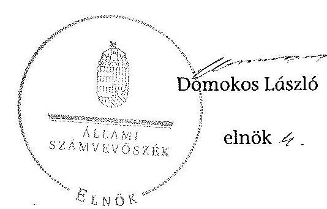

ÁLLAMI
SZÁMVEVŐSZÉK

# JELENTÉS 

az önkormányzatok belső kontrollrendszere kialakításának, egyes
kontrolltevékenységek és a belső ellenőrzés
működésének - 2013. évben induló - ellenőrzéséről
Kápolnásnyék
13155
2013. december

---

# Állami Számvevőszék 

Iktatószám: V-0140-030/2013.
Témaszám: 1162
Vizsgálat-azonosító szám: V064911

## Az ellenőrzést felügyelte:

Dr. Benedek Mária
felügyeleti vezető
Az ellenőrzést vezette és az ellenőrzés végrehajtásáért felelős:
Bíró Zsolt
ellenőrzésvezető
A számvevőszéki jelentés összeállításában közreműködtek:
Gelencsér Zoltán
számvevő tanácsos
Koczor László
számvevő tanácsos
Az ellenőrzést végezték:
Lődiné Cser Zsuzsanna Vacsora Erika
számvevő főtanácsos számvevő tanácsos

---

# TARTALOMJEGYZÉK 

BEVEZETÉS ..... 5
I. ÖSSZEGZŐ MEGÁLLAPÍTÁSOK, KÖVETKEZTETÉSEK, JAVASLATOK ..... 9
II. RÉSZLETES MEGÁLLAPÍTÁSOK ..... 16

1. Az önkormányzat belső kontrollrendszerének kialakítása ..... 16
1.1. A kontrollkörnyezet ..... 16
1.2. A kockázatkezelési rendszer ..... 17
1.3. A kontrolltevékenységek ..... 18
1.4. Az információs és kommunikációs rendszer ..... 19
1.5. A monitoring rendszer ..... 19
2. A pénzügyi folyamatokban kulcsszerepet betöltő teljesítésigazolás és érvényesítés belső kontrollok működése ..... 19
3. A belső ellenőrzés működése ..... 21

## FÜGGELÉKEK

1. számú Értelmező szótár
2. számú Az értékelés módja és szempontjai

---

.

---

# RÖVIDÍTÉSEK JEGYZÉKE 

| Törvények |  |
| :--: | :--: |
| Áht. | 2011. évi CXCV. törvény az államháztartásról (hatályos 2012. január 1-jétől) |
| ÁSZ tv. | 2011. évi LXVI. törvény az Állami Számvevőszékről |
| Info tv. | 2011. évi CXII. törvény az információs önrendelkezési jogról és az információszabadságról (hatályos 2012. január 1-jétől) |
| Kttv. | 2011. évi CXCIX. törvény a közszolgálati tisztviselőkről (hatályos 2012. március 1-jétől) |
| Mötv. | 2011. évi CLXXXIX. törvény Magyarország helyi önkormányzatairól (hatályos 2012. január 1-jétől) |
| Nvtv. | 2011. évi CXCVI. törvény a nemzeti vagyonról (hatályos 2011. december 31-étől) |
| Ötv. | 1990. évi LXV. törvény a helyi önkormányzatokról |
| Tvtv. | 1996. évi XXXI. törvény a tűz elleni védekezésről, a műszaki mentésről és a tűzoltóságról |
| Rendeletek |  |
| Ávr. | 368/2011. (XII. 31.) Korm. rendelet az államháztartásról szóló törvény végrehajtásáról (hatályos 2012. január 1-jétől) |
| Bkr. | 370/2011. (XII. 31.) Korm. rendelet a költségvetési szervek belső kontrollrendszeréről és belső ellenőrzéséről (hatályos 2012. január 1-jétől) |
| Szórövidítések |  |
| ÁSZ | Állami Számvevőszék |
| Belső ellenőrzési kézikönyv | Velencei-tó Környéki Többcélú Önkormányzati Kistérségi Társulás Belső ellenőrzési kézikönyv (hatályos 2008. december 1-jétől) |
| gazdálkodási szabályzat | Kápolnásnyék Község Önkormányzata és intézményei Gazdálkodási szabályzata (hatályos 2012. január 1-jétől) |
| Hivatal | Kápolnásnyéki Közös Önkormányzati Hivatal (2013. január 1-jétől) |
| hivatali SZMSZ | Kápolnásnyék-Nadap Körjegyzőség Ügyrendje (hatályos 2011. május 25-től) |
| INTOSAI | International Organization of Supreme Audit Institutions (Legfőbb Ellenőrző Intézmények Nemzetközi Szervezete) |
| ISSAI | International Standards of Supreme Audit Institutions (Legfőbb Ellenőrző Intézmények Nemzetközi Standardjai) |
| jegyző | a Kápolnásnyéki Közös Önkormányzati Hivatal jegyzője (2013. január 1-jétől) |
| Képviselő-testület | Kápolnásnyék Község Önkormányzatának Képviselőtestülete |
| körjegyző | Kápolnásnyék-Nadap Községi Önkormányzatok körjegyzője (2012. december 31-ig) |

---

| Körjegyzőség | Kápolnásnyék-Nadap Községi Önkormányzatok Körjegyzőségének Hivatala (2012. december 31-ig) |
| :--: | :--: |
| NGM | Nemzetgazdasági Minisztérium |
| Önkormányzat polgármester | Kápolnásnyék Község Önkormányzata   Kápolnásnyék Község Önkormányzatának polgármestere |
| Társulás | Velencei-tó Környéki Többcélú Kistérségi Társulás |

---

# JELENTÉS 

## az önkormányzatok belső kontrollrendszere kialakításának, egyes kontrolltevékenységek és a belső ellenőrzés működésének - 2013. évben induló - ellenőrzéséről Kápolnásnyék

## BEVEZETÉS

Kápolnásnyék község állandó lakosainak száma 2012. január 1-jén 3684 fő volt. Az Önkormányzat hét tagú Képviselő-testületének munkáját kettő állandó bizottság segítette. Az Önkormányzat az önállóan működő és gazdálkodó Körjegyzőségen kívül egy önállóan működő intézményt működtetett, és egy többségi tulajdoni hányadú gazdasági társasággal rendelkezett. A polgármester az 1998. évi önkormányzati választások óta tölti be tisztségét. A körjegyző 2012. december 31-ig látta el feladatait. A Körjegyzőség három szervezeti egységre tagolódott, elkülönített gazdasági szervezettel rendelkezett. A foglalkoztatott köztisztviselők száma 2012. január 1-jén 13 fő volt. 2013. január 1-jétől a szervezeti változás következtében a Kápolnásnyék-Nadap Körjegyzőségből megalapították a Kápolnásnyéki Közös Önkormányzati Hivatalt. Az Önkormányzat a költségvetési beszámolója szerint a 2012. évben 822337 ezer Ft tárgyévi bevételt, valamint 706742 ezer Ft tárgyévi kiadást teljesített. A 2012. december 31-i könyvviteli mérleg szerint 2092145 ezer Ft értékű eszközvagyonnal rendelkezett, a rövid lejáratú kötelezettségállománya 10866 ezer Ft volt, hosszú lejáratú kötelezettség állománya nem volt.

A demokratikus társadalmakban alapvető igény, hogy a közpénzeket, a közvagyont használók tevékenységükről elszámoljanak, ahhoz egyértelmű és érvényesíthető felelősségi szabályok társuljanak. Ennek a jogos igénynek az érvényesítéséhez meg kell teremteni azokat a folyamatokat, rendszereket, amelyek nélkülözhetetlenek az elszámoltatáshoz. Az elszámoltatás eredményes működtetéséhez szükség van a megfelelő információs, kontroll, értékelési és beszámolási rendszerek kialakítására.

Magyarországon az uniós csatlakozási tárgyalások idejére nyúlnak vissza a belső kontrollrendszer szabályozásának gyökerei. Az uniós elvárásoknak megfelelő új terminológia szerinti államháztartási belső pénzügyi ellenőrzési (ÁBPE) rendszer területén a jogharmonizáció 2003-ban teljes körűen megvalósult, míg az önkormányzati alrendszerre vonatkozó, Ötv.-ben megjelenített speciális szabályozás 2005-ben lépett hatályba. Az államháztartási belső kontrollrendszer koncepciója 2009-ben továbbfejlődött. A változások irányát mutatja, hogy a költségvetési szervek belső kontrollrendszere már magában foglalja a korszerű felelős szervezetirányítás elemeit (kontrollkörnyezet, kockázatkezelés, kontrolltevékenység, információ és kommunikáció, monitoring) is. E kontrollrendszer szabályozása háromszintű, a törvényi előírásokat az Áht. és a Mötv., a rendeleti szintű szabályozást az Ávr. és a Bkr. tartalmazza, amelyeket útmutatói szinten az NGM által kiadott standardok és kézikönyvek támogatnak.

A belső kontrollrendszer azt a célt szolgálja, hogy a költségvetési szervek működésük és gazdálkodásuk során a tevékenységeket szabályszerűen, gazdaságosan, hatékonyan és eredményesen hajtsák végre, teljesítsék elszámolási kötelezettségeiket és megvédjék az erőforrásokat a veszteségektől, a károktól és a nem rendeltetésszerű használattól. A belső kontrollrendszer magában foglalja mindazon szabályokat, eljárásokat, gyakorlati módszereket és szervezeti struktúrákat, kockázatkezelési technikákat, kontrolltevékenységeket, amelyek segítséget nyújtanak a szervezetnek céljai eléréséhez.

Az ÁSZ a 2011-2015. évekre szóló stratégiájában hangsúlyos szerepet szánt annak, hogy szilárd szakmai alapon álló, értékteremtő ellenőrzéseivel előmozdítsa a közpénzügyek átláthatóságát, rendezettségét. A számvevőszéki ellenőrzés nemzetközi alapelvei is rögzítik, hogy a megfelelő belső kontrollrendszer minimálisra csökkenti a hibák és szabálytalanságok kockázatát.

Az ellenőrzés célja annak megállapítása volt, hogy a belső kontrollrendszer elemeinek kialakítása, a pénzügyi folyamatokban kulcsszerepet betöltő teljesítésigazolás és érvényesítés, valamint a belső ellenőrzés szabályos működése biztosította-e az Önkormányzatnál a közpénzfelhasználás szabályosságát, hozzájárult-e az értéket teremtő rend követelményének érvényesüléséhez.

Ennek keretében értékeltük, hogy:

- a jogszabályi előírásoknak megfelelően alakították-e ki a belső kontrollrendszer elemeit;
- a gazdálkodás folyamatában kulcsszerepet betöltő teljesítésigazolás és érvényesítés kontrolltevékenységeit megfelelően működtették-e;
- biztosították-e a belső ellenőrzés szabályos működését;
- amennyiben az ÁSZ tett javaslatot a 2008-2011. évek közötti ellenőrzése kapcsán az Önkormányzatnak, intézkedtek-e azok végrehajtására.

Az ellenőrzés várható hasznosulását négy szinten tervezzük. A törvényalkotás számára összegzett tapasztalatok állnak rendelkezésre a belső kontrollrendszer önkormányzati területen való kialakításáról, működéséről és hatásairól, a belső ellenőrzés működéséről. Ennek alapján következtetést lehet levonni arról, hogy a belső kontrollrendszer kialakítására és működtetésére vonatkozó jelenlegi, differenciálás nélküli jogszabályi előírások reális követelményeket támasztanak-e az eltérő adottságú települési önkormányzatok esetében, illetve indokolt-e esetleges jogszabályi módosítás kezdeményezése. Az ellenőrzés az ellenőrzött számára visszajelzést ad a belső kontrollrendszer kialakításában és működésében fellépő hiányosságokról, javaslataival hozzájárul azok kiküszöböléséhez, amely csökkentheti a későbbi ellenőrzések gyakoriságát. Az ellenőrzés megállapításait és javaslatait más szervezetek is hasznosíthatják a rendezett gazdálkodási keretek kialakításához. A társadalom számára jelzi, hogy közpénz nem maradhat ellenőrizetlenül, az ÁSZ értékteremtő rend kialakításához és megőrzéséhez hozzájáruló tevékenysége pozitív hatással lesz a szervezetről kialakított összkép formálásában. A szervezeten belül lehetőség nyílik arra, hogy a megállapítások szintetizálásával az ÁSZ a hozzáadott értéket teremtő elemző tevékenységét és tanácsadó szerepét is erősítse.

Az önkormányzatok belső kontrollrendszere kialakításának, egyes kontrolltevékenységek és a belső ellenőrzés működésének ellenőrzéséről szóló jelentés I. fejezetének összegző része az ellenőrzés céljára ad rövid, szintetizáló összefoglalót, és tartalmazza a következtetéseket a II. fejezet részletes megállapításain alapulóan. A jelentés intézkedést igénylő megállapításait és javaslatait az ellenőrzés során feltárt, a jelentés II. fejezetében rögzített részletes megállapítások alapozzák meg. A helyszíni ellenőrzés lezárásáig a helyi szabályozás változásait nyomon követtük.

Az ellenőrzés típusa: szabályszerűségi ellenőrzés.
Az ellenőrzött időszak: a belső kontrollrendszer kialakításának megfelelősége esetében a 2012. évre, a pénzügyi folyamatokban kulcsszerepet betöltő teljesítésigazolás és érvényesítés belső kontrollok működésének megfelelőségét és a belső ellenőrzés szabályszerű működését a 2012. január 1. és december 31. közötti időszak eseményeit figyelembe véve értékeltük, míg az ÁSZ javaslatainak utóellenőrzése a 2008-2011. években végzett ellenőrzések nyilvánosságra hozott jelentéseiben tett javaslatok áttekintésére terjedt ki.

Az ellenőrzött szervezet: az Önkormányzat.
Az ellenőrzés jogszabályi alapját az ÁSZ tv. 1. § (3) bekezdése, az 5. § (2) és (6) bekezdése, valamint az Áht. 61. § (2) bekezdésének előírásai képezik.

Az ellenőrzés szakmai módszertana az ÁSZ hivatalos honlapján (www.asz.hu) közzétett szakmai szabályokon alapult, amely az INTOSAI által kiadott ISSAI figyelembevételével készült.

Az ellenőrzés lefolytatásához az Önkormányzat a kimutatások és a tanúsítvány elektronikus kitöltésével, valamint az ÁSZ által kért dokumentumok elektronikus megküldésével szolgáltatott adatokat. Az így rendelkezésre bocsátott adatok, információk kontrollja és a munkalapok kitöltése a helyszíni ellenőrzés keretében történt. A jelentésben használt fogalmak magyarázatát az 1. számú függelék, az ellenőrzés egyes területeinek értékelésénél alkalmazott egységes minősítési szempontokat a 2. számú függelék tartalmazza.

A belső kontrollrendszer kialakításának ellenőrzése során értékeltük a kontrollkörnyezet, a kockázatkezelési rendszer, a kontrolltevékenységek, az információs és kommunikációs rendszer, valamint a monitoring rendszer szabályozottságának megfelelőségét. A pénzügyi folyamatokban kulcsszerepet betöltő teljesítésigazolás és érvényesítés kontrolljai működése megfelelőségének minősítéséhez az állományba nem tartozók megbízási díjai, a külső szolgáltatók által végzett karbantartási, kisjavítási munkák, az egyéb üzemeltetési és fenntartási szolgáltatások, a rendszeres szociális segélyek, valamint az államháztartáson

---

kívülre teljesített működési és felhalmozási célú pénzeszközátadások közül kockázatelemzéssel választottuk ki az ellenőrzött kiadási jogcímeket. Az egyszerű véletlen mintavétellel kiválasztott tételek ellenőrzését többlépcsős megfelelőségi tesztek útján addig végeztük, amíg elegendő és megfelelő bizonyítékot szereztünk a vizsgált folyamatok kulcskontrolljai működésének megfelelő vagy nem megfelelő voltáról. Értékeltük az Önkormányzatnál a belső ellenőrzés működésének szabályosságát. Utóellenőrzésre nem került sor, mivel az ÁSZ az Önkormányzatnál a 2008-2011. évek között ellenőrzést nem végzett.

Az ÁSZ tv. 29. § (1) bekezdése szerint a jelentéstervezetet megküldtük a polgármester részére, aki az ÁSZ tv. 29. § (2) bekezdésében foglalt észrevételezési jogával nem élt, a jelentéstervezetre észrevételt nem tett.

---

# I. ÖSSZEGZŐ MEGÁLLAPÍTÁSOK, KÖVETKEZTETÉSEK, JAVASLATOK 

A belső kontrollrendszeren belül 2012-ben a kontrollkörnyezet, a kockázatkezelési rendszer, a kontrolltevékenységek, az információs és kommunikációs rendszer, valamint a monitoring rendszer kialakítását külön-külön és együttesen is értékeltük. A belső kontrollrendszer kialakítása az összesített értékelés alapján nem felelt meg a jogszabályi előírásoknak.

A belső kontrollrendszer egyes területei kialakításának minősítése a következő:

| Kontrollterület | Minősítés |
| :-- | :--: |
| Kontrollkörnyezet | nem |
|  | megfelelő |
| Kockázatkezelési rendszer | részben meg- |

 | felelős |
| Kontrolltevékenységek | megfelelő |
| Információs és kommunikációs | nem |
| rendszer | megfelelő |
| Monitoring rendszer | nem |

Megfelelőnek értékeltük a kontrolltevékenységek kialakítását, mivel a jogszabályi előírásokban foglaltakat figyelembe véve, kisebb hiányosságok mellett is megteremtette e kontrollterületen a szabályszerű működés lehetőségét.

Részben megfelelőnek értékeltük a kockázatkezelési rendszer kialakítását, mivel az e kontrollterületen megállapított szabályozásbeli hiányosságok nem veszélyeztették a szabályszerű működést.

Nem megfelelőnek értékeltük a kontrollkörnyezet, az információs és kommunikációs rendszer, valamint a monitoring rendszer kialakítását, mivel az ellenőrzésünk során megállapított szabályozásbeli hiányosságok magukban hordozzák a szabálytalan működés, valamint a korrupció kockázatát.

A belső kontrollrendszer nem megfelelő kialakítása kockázatot jelent az Önkormányzat tevékenységeinek szabályszerű, gazdaságos, hatékony és eredményes végrehajtása során.

A 2012. évben az állományba nem tartozók megbízási díjaival, valamint a külső szolgáltatók által végzett karbantartási, kisjavítási munkákkal kapcsolatos kifizetések során a pénzügyi folyamatokban kulcsszerepet betöltő teljesítésigazolás és érvényesítés belső kontrollok működése gyenge volt. Gyengének értékeltük a két kulcskontroll együttes működését, mivel azok nem biztosították a hibák megelőzését, feltárását.

---

A számvevőszéki ellenőrzés az ellenőrzött kifizetésekkel összefüggésben a rendelkezésre bocsátott dokumentumok alapján jogosulatlan kifizetést nem tárt fel, azonban a gazdálkodásban kulcsszerepet betöltő kontrollok működésében feltárt hiányosságok miatt fennáll a hibák bekövetkezésének kockázata. A nem megfelelően működtetett belső kontrollok korrupciós kockázatot hordoznak.

Az Önkormányzat a belső ellenőrzési feladatokat a Társulás útján látta el. A belső ellenőrzés működése a 2012. évben a jogszabályi előírásoknak megfelelt, azonban a belső ellenőrzés nem tárta fel a belső kontrollrendszer kialakításának, valamint a pénzügyi folyamatokban kulcsszerepet betöltő teljesítésigazolás és érvényesítés belső kontrollok működésének hiányosságait.

Az ÁSZ tv. 33. § (1) bekezdésében foglaltak értelmében az ellenőrzött szervezet vezetője köteles a jelentésben foglalt megállapításokhoz kapcsolódó intézkedési tervet összeállítani, és azt a jelentés kézhezvételétől számított 30 napon belül az ÁSZ részére megküldeni. Amennyiben az intézkedési tervet határidőre nem küldi meg a szervezet, vagy az ÁSZ tv. 33. § (2) bekezdésében foglalt póthatáridő elteltével megküldött intézkedési terv továbbra sem elfogadható, az ÁSZ elnöke a hivatkozott törvény 33. § (3) bekezdés a)-b) pontjaiban foglaltakat érvényesítheti.

Az ellenőrzés intézkedést igénylő megállapításai és javaslatai:

# a polgármesternek 

1. Az Önkormányzat kiadási előirányzatai terhére történő kötelezettségvállalás esetében - az Áht. 37. § (1) bekezdésében és az Ávr. 55. § (1) bekezdésében foglaltak ellenére - nem végezték el a pénzügyi ellenjegyzést.

Javaslat:
Intézkedjen arról, hogy az Önkormányzat kiadási előirányzatai terhére történt kötelezettségvállalásra az Áht. 37. § (1) bekezdésében és az Ávr. 55. § (1) bekezdésében foglaltaknak megfelelően - az Ávr. 53. §-ában meghatározott kivételeket figyelembe véve - kizárólag a pénzügyi ellenjegyzés után, a pénzügyi teljesítés esedékességét megelőzően, írásban kerüljön sor.
2. A számvevőszéki ellenőrzés megállapításai alapján az Önkormányzatnál a belső kontrollrendszer kialakítása összefoglalóan értékelve nem felelt meg a jogszabályi előírásoknak, a kulcskontrollok működése gyenge volt, a belső ellenőrzés működése ugyan megfelelt a jogszabályi előírásoknak, azonban a belső ellenőrzés nem tárta fel a belső kontrollrendszer kialakításának, valamint a pénzügyi folyamatokban kulcsszerepet betöltő teljesítésigazolás és érvényesítés belső kontrollok működésének hiányosságait, ezáltal nem is javíttatta ki azokat. A megállapított szabályozásbeli és működésbeli hiányosságok magukban hordozzák a szabálytalan működés kockázatát.

---

Javaslat:
A Mötv. 115. § (1) bekezdésében foglaltak alapján kísérje figyelemmel az Önkormányzat gazdálkodásának szabályszerűségét. A Mötv. 67. § f) pontja alapján gondoskodjon a belső kontrollrendszer működésére vonatkozó jogszabályi rendelkezések be nem tartása, valamint a teljesítésigazolás, illetve az érvényesítés kontrollokkal összefüggésben feltárt hiányosságok, szabálytalanságok tekintetében az esetleges munkajogi felelősséggel kapcsolatos körülmények kivizsgálásáról, majd a vizsgálat eredményének függvényében tegye meg a szükséges munkajogi intézkedéseket.

# a Jegyzõnek (Kápolnásnyék Község Önkormányzata vonatkozásában) 

1. a kontrollkörnyezettel kapcsolatban:

A hivatali SZMSZ-ben a körjegyző az Ávr. 13. § (1) bekezdés c), f), g) és i) pontjaiban foglaltak ellenére nem rögzítette az ellátandó és a szakfeladatrend szerint szakfeladat számmal és megnevezéssel besorolt alaptevékenységek, az alaptevékenységet szabályozó jogszabályok megjelölését, valamint azon ügyköröket, amelyek során a szervezeti egységek vezetői a költségvetési szerv képviselőjeként járhatnak el. Továbbá nem tartalmazta a szervezeti és működési szabályzatban nevesített valamennyi munkakörhöz tartozó feladat- és hatásköröket és a hatáskörök gyakorlásának módját, a helyettesítés rendjét, az ezekhez kapcsolódó felelősségi szabályokat és az irányító szerv által az Ávr. 10. § (1)-(3) bekezdései szerint a költségvetési szervhez rendelt más költségvetési szervek felsorolását.

A körjegyző a Tvtv. 19. § (1) bekezdését figyelmen kívül hagyva nem készítette el a Körjegyzőség tűzvédelmi szabályzatát.

A Kttv. 231. § (1) bekezdése ellenére a Képviselő-testület nem állapította meg a köztisztviselőkkel szembeni, a Kttv. 83. §-ában előírt hivatásetikai alapelvek részletes tartalmát, valamint az etikai eljárás szabályait, mivel a körjegyző az Ötv. 36. § (2) bekezdés a) pontjában előírt feladata ellenére nem készítette elő ennek dokumentumát.

Javaslat:
a) Módosítsa a hivatali SZMSZ-t annak érdekében, hogy az tartalmazza az Ávr. 13. § (1) bekezdésében előírt valamennyi tartalmi elemet, és kezdeményezze az Áht. 9. § (1) bekezdés a) pontjában foglaltak teljesítésére tekintettel a módosítás Képviselő-testület elé terjesztését.
b) Készítse el a tűzvédelmi szabályzatot a Tvtv. 19. § (1) bekezdésében foglalt előírásnak megfelelően.
c) Készítse elő a Mötv. 81. § (3) bekezdés c) pontjában foglalt feladatkörében a köztisztviselőkkel szembeni, a Kttv. 83. §-ában foglaltak szerinti hivatásetikai alapelvek részletes tartalmának, valamint az etikai eljárás szabályainak dokumentumait, és a Kttv. 231. § (1) bekezdésében foglaltak érvényesülése érdekében kezdeményezze azok Képviselő-testület elé terjesztését.

---

2. a kockázatkezelési rendszerrel kapcsolatban:

A körjegyző a Bkr. 7. § (2) bekezdésében foglaltak ellenére a kockázatok kezelése érdekében szükséges intézkedések teljesítésének folyamatos nyomon követési módját nem határozta meg.

Az egyes vagyonnyilatkozat-tételi kötelezettségekről szóló 2007. évi CLII. törvény 5. §-ában foglaltak ellenére a vagyonnyilatkozat-tételre kötelezettek a vagyonnyilatkozat-tételi kötelezettségüknek nem tettek eleget.

Javaslat:
a) Határozza meg a Bkr. 7. § (2) bekezdésében foglaltaknak megfelelően az egyes kockázatokkal kapcsolatban megtett intézkedések nyomon követési módját.
b) Gondoskodjon arról, hogy a vagyonnyilatkozat-tételre kötelezettek a vagyonnyilatkozat-tételi kötelezettségüknek az egyes vagyonnyilatkozat-tételi kötelezettségekről szóló 2007. évi CLII. törvény 5. §-ában foglaltaknak megfelelően tegyenek eleget.
3. a kontrolltevékenységekkel kapcsolatban:

A körjegyző a Bkr. 8. § (2) bekezdésének a) pontjában foglaltak ellenére nem biztosította a pénzügyi döntések - köztük a beszerzési folyamat és a támogatások - dokumentumainak elkészítésével kapcsolatban a folyamatba épített, előzetes, utólagos és vezetői ellenőrzést.

A körjegyző a Kttv. 74. § (1) bekezdésében foglaltak ellenére jogviszony megszűnése esetére nem szabályozta a munkavállaló folyamatban lévő feladatai átadásának rendjét.

Javaslat:
a) Biztosítsa minden tevékenységre vonatkozóan a folyamatba épített, előzetes, utólagos és vezetői ellenőrzést a Bkr. 8. § (2) bekezdése alapján.
b) Szabályozza a Kttv. 74. § (1) bekezdésében előírtaknak megfelelően a jogviszony megszűnése esetére a munkavállaló folyamatban lévő feladatai átadásának rendjét.
4. az információs és kommunikációs rendszerrel kapcsolatban:

Az Önkormányzat az Info tv. 33. § (1) és (3) bekezdésében foglaltak ellenére az elektronikus közzétételi kötelezettségének a 2012. évben nem tett eleget.

Javaslat:
Gondoskodjon arról, hogy az Önkormányzat az Info tv. 33. § (1) és (3) bekezdésében foglaltaknak megfelelően teljesítse az elektronikus közzétételi kötelezettségét.

---

5. a monitoring rendszerrel kapcsolatban:

A körjegyző a Bkr. 3. § e) pontjában és 10. §-ában foglaltak ellenére nem alakította ki a Körjegyzőség tevékenységének, a célok megvalósításának nyomon követését biztosító rendszert.

A körjegyző a Bkr. 11. § (1) bekezdésében foglalt kötelezettsége ellenére - a Bkr. 1. melléklete szerinti nyilatkozatban - a 2011. évre vonatkozóan nem értékelte a Körjegyzőség belső kontrollrendszerének minőségét.

Javaslat:
a) Alakítsa ki és működtesse a Bkr. 3. § e) pontjában és 10. §-ában előírtak alapján a Hivatal tevékenységének, a célok megvalósításának nyomon követését biztosító rendszert.
b) Értékelje a Bkr. 11. § (1) bekezdése alapján a jogszabályban foglalt keretek között a Hivatal belső kontrollrendszerének minőségét - a Bkr. 1. melléklete szerinti nyilatkozatban.
6. a pénzügyi folyamatokban kulcsszerepet betöltő kontrollokkal kapcsolatban:

A teljesítésigazolást az Áht 38. § (1) bekezdésében és az Ávr. 57. § (1) és (3) bekezdésében foglaltak ellenére nem az arra jogosult végezte, vagy a teljesítésigazolás nem szabályszerűen történt.

Az érvényesítésre kijelölt személy az Ávr. 58. § (1) bekezdésében előírtak ellenére nem ellenőrizte az összegszerűséget és a fedezet meglétét, mert a kötelezettségvállalásokat - az Ávr. 56. § (1) bekezdésében előírtakat figyelmen kívül hagyva - a Körjegyzőségen nem vették nyilvántartásba.

Az érvényesítő az Ávr. 58. § (2) bekezdésének előírása ellenére nem jelezte az utalványozónak, hogy a megelőző ügymenetben a teljesítésigazolást nem az arra jogosult személy végezte, valamint hogy a teljesítés igazolója ellenőrizhető okmányok hiányában a kiadás összegszerűségét nem ellenőrizte.

Az Áht. 37. § (1) bekezdésében és az Ávr. 55. § (1) bekezdésében foglaltakat nem tartották be, mert a Körjegyzőség kiadási előirányzatai terhére történt kötelezettségvállalásokra pénzügyi ellenjegyzés nélkül került sor. A kiadási bizonylatokon nem tüntették fel - az Ávr. 59. § (3) bekezdés f) pontjában és (4) bekezdésében előírtakat figyelembe véve - a kötelezettségvállalás nyilvántartási számot, mert a kötelezettségvállalásokat a 2012. évben nem vették nyilvántartásba.

Javaslat:
Intézkedjen - a teljesítésigazolás és az érvényesítés vonatkozásában feltárt hiányosságok megszüntetése, illetve az operatív gazdálkodás során a működésbeli hibák megelőzése, feltárása és kijavítása érdekében - arról, hogy
a) az Áht. 37. § (1) bekezdésében és az Ávr. 55. § (1) bekezdésében foglaltaknak megfelelően a Hivatal kiadási előirányzatai terhére történt kötelezettségvállalásra

---

- az Ávr. 53. §-ában meghatározott kivételekkel - pénzügyi ellenjegyzés után kerüljön sor;
b) a kötelezettségvállalásokat az Ávr. 56. § (1) bekezdésében foglalt előírásnak megfelelően vegyék nyilvántartásba, és az utalványon az Ávr. 59. § (3) bekezdésében foglalt kötelező tartalmi elemeket tüntessék fel;
c) a teljesítésigazolásra - az Ávr. 57. § (4) bekezdésében foglalt előírásnak megfelelően - kijelölt személyek az Áht. 38. § (1) bekezdésében és az Ávr. 57. § (1) bekezdésében foglaltaknak megfelelően, ellenőrizhető okmányok alapján ellenőrizzék a kiadások teljesítésének jogosságát, összegszerűségét, ellenszolgáltatást is magában foglaló kötelezettségvállalás esetében az ellenszolgáltatás teljesítését, és azt az Ávr. 57. § (3) bekezdésében foglalt módon igazolják;
d) a kifizetéseket megelőzően - az Ávr. 58. § (1) bekezdése szerint - a teljesítésigazolás alapján - az Ávr. 57. § (3) bekezdése szerinti esetben annak hiányában is az összegszerűségnek, a fedezet meglétének és a megelőző ügymenetben az Áht., az Ávr. előírásai és a belső szabályzatokban foglaltak betartásának az ellenőrzése történjen meg;
e) az érvényesítő az Ávr. 58. § (2) bekezdésben foglalt előírásnak megfelelően jelezze az utalványozónak, ha az Áht., vagy az államháztartási számviteli kormányrendelet, az Ávr. és a belső szabályzatokban foglaltak megsértését tapasztalja.
7. a belső ellenőrzés működésével kapcsolatban:

Az Önkormányzat Belső ellenőrzési kézikönyvét - a Bkr. 17. § (4) bekezdésében foglaltak ellenére - rendszeresen, de legalább kétévenként nem vizsgálták felül és nem módosították.

A Belső ellenőrzési kézikönyvet a munkaszervezet vezetője a Bkr.
 56. § (7) bekezdésében előírtak ellenére nem hagyta jóvá.

A belső ellenőrzési vezető stratégiai ellenőrzési tervet a Bkr. 22. § (1) bekezdés b) pontjában, a 29. § (1) bekezdésében és a 30. § (1) bekezdésében foglaltak ellenére nem készített. A 2013. évre vonatkozó éves ellenőrzési terv összeállítása a Bkr. 56. § (2) bekezdésében foglalt előírás ellenére nem a körjegyző írásos véleményének figyelembe vételével történt.

Az éves ellenőrzési tervhez képest ellenőrzést hagytak el, és új ellenőrzést indítottak, azonban a Bkr. 31. § (5) bekezdésében, valamint az 56. § (5) bekezdésében foglaltak ellenére az éves tervet nem módosították.

Javaslat:
a) Kezdeményezze, hogy a Bkr. 17. § (4) bekezdésének megfelelően a belső ellenőrzési vezető a Belső ellenőrzési kézikönyvet rendszeresen, de legalább kétévenként vizsgálja felül, és a szükséges módosításokat vezesse át.
b) Kezdeményezze, hogy a munkaszervezet vezetője a Bkr. 56. § (7) bekezdésében előírtak szerint hagyja jóvá a Belső ellenőrzési kézikönyvet.

---

c) Kezdeményezze, hogy a belső ellenőrzési vezető a Bkr. 22. § (1) bekezdés b) pontjában, a 29. § (1) bekezdésében és a 30. § (1) bekezdésében foglaltaknak megfelelően állítsa össze a stratégiai ellenőrzési tervet.
d) Kezdeményezze, hogy az éves ellenőrzési tervet a belső ellenőrzési vezető a Bkr. 56. § (2) bekezdés előírásainak megfelelően a jegyző írásos véleményének figyelembevételével készítse el.
e) Intézkedjen, hogy a Bkr. 31. § (5) bekezdésében, valamint az 56. § (5) bekezdésében foglaltak szerint az éves ellenőrzési tervben foglaltakhoz képest ellenőrzés elhagyására vagy új ellenőrzés indítására az éves terv módosítását követően kerüljön sor.

---

# II. RÉSZLETES MEGÁLLAPÍTÁSOK 

## 1. AZ ÖNKORMÁNYZAT BELSŐ KONTROLLRENDSZERÉNEK KIALAKÍTÁSA

A belső kontrollrendszeren belül 2012-ben a kontrollkörnyezet, a kockázatkezelési rendszer, a kontrolltevékenységek, az információs és kommunikációs rendszer, valamint a monitoring rendszer kialakítását külön-külön és együttesen is értékeltük. A belső kontrollrendszer kialakítása az összesített értékelés alapján nem felelt meg a jogszabályi előírásoknak.

### 1.1. A kontrollkörnyezet

A kontrollkörnyezet kialakítása - a 2. számú függelékben részletezett kritériumrendszer alapján végzett értékelés szerint - nem felelt meg a jogszabályi előírásoknak, mert:

| Sor-   szám $^{1}$ | Megállapítás | Megjegyzés |
| :--: | :--: | :--: |
|  | A hivatali SZMSZ-ben a körjegyző az Ávr. 13. § (1) bekezdés c), f), g) és i) pontjaiban foglaltak ellenére nem rögzítette az ellátandó és a szakfeladatrend szerint szakfeladat számmal és megnevezéssel besorolt alaptevékenységek, az alaptevékenységet szabályozó jogszabályok megjelölését, valamint azon ügyköröket, amelyek során a szervezeti egységek vezetői a költségvetési szerv képviselőjeként járhatnak el. Továbbá nem tartalmazta a szervezeti és működési szabályzatban nevesített valamennyi munkakörhöz tartozó feladat- és hatásköröket, a hatáskörök gyakorlásának módját, a helyettesítés rendjét, az ezekhez kapcsolódó felelősségi szabályokat és az irányító szerv által az Ávr. 10. § (1)-(3) bekezdései szerint a költségvetési szervhez rendelt más költségvetési szervek felsorolását. |  |

[^0]
[^0]:    ${ }^{1}$ A megállapítás számozása a témacsoportos ellenőrzés miatt az Önkormányzat által kitöltött kimutatások - adatszolgáltatások - kérdéseinek sorszámával azonos.

---

| 16. | A körjegyző az Ötv. 36. § (2) bekezdés   a) pontjában foglaltak ellenére ${ }^{2}$ nem   megfelelő időben készítette el az ön-   kormányzati vagyonnal való gazdál-   kodás szabályairól szóló tervezetet, így   a Képviselő-testület az   Nvtv. 18. § (12) bekezdésében megha-   tározott határidőt túllépve fogadta el a   vagyongazdálkodás szabályairól szóló   önkormányzati rendeletet. | A Képviselő-testület a 2013.   február 19-i ülésén fogadta el a   Mötv. és az Nvtv. előírásainak   megfelelő 4/2013. (II. 19.) szá-   mú „Az önkormányzat vagyonáról   és vagyongazdálkodás szabályai-   ról" szóló rendeletet. |
| :--: | :--: | :--: |
| 33. | A körjegyző a Tvtv. 19. § (1) bekezdését   figyelmen kívül hagyva nem készítette   el a Körjegyzőség tűzvédelmi szabály-   zatát. |  |
| 47. | A Kttv. 231. § (1) bekezdése ellenére a   Képviselő-testület nem állapította meg,   a köztisztviselőkkel szembeni, a Kttv. 83.   §-ában előírt hivatásetikai alapelvek   részletes tartalmát, valamint az etikai   eljárás szabályait, mivel a körjegyző az   Ötv. 36.§ (2) bekezdés a) pontjában   előírt feladata ellenére nem készítette elő   ennek dokumentumát. |  |

[^0]
[^0]:    ${ }^{2}$ 2013. január 1-től Mötv. 81. § (3) bekezdés c) pontja.

---

| 16. | A körjegyző az Ötv. 36. § (2) bekezdés a) pontjában foglaltak ellenére ${ }^{2}$ nem megfelelő időben készítette el az önkormányzati vagyonnal való gazdálkodás szabályairól szóló tervezetet, így a Képviselő-testület az Nvtv. 18. § (12) bekezdésében meghatározott határidőt túllépve fogadta el a vagyongazdálkodás szabályairól szóló önkormányzati rendeletet. | A Képviselő-testület a 2013. február 19-i ülésén fogadta el a Mötv. és az Nvtv. előírásainak megfelelő 4/2013. (II. 19.) számú „Az önkormányzat vagyonáról és vagyongazdálkodás szabályairól" szóló rendeletet. |
| :--: | :--: | :--: |
| 33. | A körjegyző a Tvtv. 19. § (1) bekezdését figyelmen kívül hagyva nem készítette el a Körjegyzőség tűzvédelmi szabályzatát. |  |
| 47. | A Kttv. 231. § (1) bekezdése ellenére a Képviselő-testület nem állapította meg, a köztisztviselőkkel szembeni, a Kttv. 83. §-ában előírt hivatásetikai alapelvek részletes tartalmát, valamint az etikai eljárás szabályait, mivel a körjegyző az Ötv. 36.§ (2) bekezdés a) pontjában előírt feladata ellenére nem készítette elő ennek dokumentumát. |  |

# 1.2. A kockázatkezelési rendszer 

A kockázatkezelési rendszer kialakítása - a 2. számú függelékben részletezett kritériumrendszer alapján végzett értékelés szerint - részben felelt meg a jogszabályi előírásoknak.

A körjegyző a kockázatkezelési rendszert kialakította, a körjegyzőség tevékenységeiben rejlő kockázatokat beazonosították, és minden kockázati tényezőre meghatározták a szükséges intézkedést. A vagyonnyilatkozatra kötelezettek körét meghatározták.

A kockázatkezelési rendszer kialakítása az alábbi kisebb hiányosságok miatt részben megfelelt a jogszabályi előírásoknak:

| Sor-   szám | Megállapítás |
| :--: | :--: |
| 10. | A körjegyző a Bkr. 7. § (2) bekezdésében foglaltak ellenére a kockázatok kezelése érdekében szükséges intézkedések teljesítésének folyamatos nyomon követési módját nem határozta meg. |
| 14. | Az egyes vagyonnyilatkozat-tételi kötelezettségekről szóló 2007. évi CLII. törvény 5. §-ában foglaltak ellenére a vagyonnyilatkozat-tételre kötelezettek a vagyonnyilatkozat-tételi kötelezettségüknek nem tettek eleget. |

---

# 1.3. A kontrolltevékenységek 

A kontrolltevékenységek kialakítása - a 2. számú függelékben részletezett kritériumrendszer alapján végzett értékelés szerint - a jogszabályi előírásoknak megfelelt.

A kontrolltevékenység részeként előírták a folyamatba épített, előzetes, utólagos és vezetői ellenőrzést. Szabályozták a kötelezettségvállalás pénzügyi ellenjegyzését és a teljesítésigazolás módját, az előzetes írásbeli kötelezettségvállalást nem igénylő kifizetések, az érvényesítés és az utalványozás rendjét, és kijelölték a teljesítésigazolásra jogosultakat. A polgármester adott felhatalmazást kötelezettségvállalásra és utalványozásra. A jogszabályok előírásainak megfelelően jelölték ki a pénzügyi ellenjegyzési, illetve érvényesítési feladatra a Körjegyzőség állományába tartozó köztisztviselőket, és azok rendelkeztek az előírt szakképzettséggel. Az iratkezelés szabályozása során előírták az iratok és az adatok védelmét. Szabályozták az üzemeltetés és adatbiztonság feladatait, és meghatározták az ehhez kapcsolódó hatásköröket. Biztosították az adatbiztonság érvényesülését, és meghatározták a hozzáférési jogosultságokhoz a kapcsolódó felelősségi köröket.

A gazdasági szervezet ügyrendje és a gazdálkodási szabályzat tartalmazta az időközi és éves beszámolók elkészítésének feladatait, annak felelőseit és a helyettesítés rendjét.

A kontrolltevékenységek kialakítása az alábbi kisebb hiányosságok mellett megfelelt a jogszabályi előírásoknak:

| Sorszám | Megállapítás |
| :--: | :--: |
| 3., 5. | A körjegyző a Bkr. 8. § (2) bekezdés a) pontjában foglaltak ellenére nem biztosította a pénzügyi döntések - köztük a beszerzési folyamat és a támogatások - dokumentumainak elkészítésével kapcsolatban a folyamatba épített, előzetes, utólagos és vezetői ellenőrzést. |
| 10. | A körjegyző az Ávr. 57. § (4) bekezdésében foglaltak ellenére 2012. március 30-át megelőzően írásban nem jelölte ki a teljesítésigazolására jogosult személyeket az Önkormányzat kiadási előirányzatai terhére vállalt kötelezettségek esetében. |
| 32. | A körjegyző a Kttv. 74. § (1) bekezdésében foglaltak ellenére jogviszony megszűnése esetére nem szabályozta a munkavállaló folyamatban lévő feladatai átadásának rendjét. |

---

# 1.4. Az információs és kommunikációs rendszer 

Az információs és kommunikációs rendszer kialakítása - a 2. számú függelékben részletezett kritériumrendszer alapján végzett értékelés szerint - a jogszabályi előírásoknak nem felelt meg, mert:

| Sor-   szám | Megállapítás |
| :-- | :-- |
| 7. | Az Önkormányzat az Info tv. 33. § (1) és (3) bekezdésében foglaltak ellenére az elektronikus közzétételi kötelezettségének a 2012. évben nem tett eleget. |

### 1.5. A monitoring rendszer

A monitoring rendszer kialakítása - a 2. számú függelékben részletezett kritériumrendszer alapján végzett értékelés szerint - a jogszabályi előírásoknak nem felelt meg, mert:

| Sor-   szám | Megállapítás |
| :-- | :-- |
| 1. | A körjegyző a Bkr. 3. § e) pontjában és 10. §-ában foglaltak ellenére nem alakította ki a Körjegyzőség tevékenységének, a célok megvalósításának nyomon követését biztosító rendszert. |
| 9. | A körjegyző a Bkr. 11. § (1) bekezdésében foglalt kötelezettsége ellenére - a Bkr. 1. melléklete szerinti nyilatkozatban - a 2011. évre vonatkozóan nem értékelte a Körjegyzőség belső kontrollrendszerének minőségét. |

Az Önkormányzat törvényességi felügyeletét ellátó kormányhivatal törvényességi felhívással élt a 2012. évben.

A felhívás tárgyát a Helyi Építési Szabályzatról szóló 4/2002. (II. 26.) számú rendelet módosításáról szóló 13/2012. (VI. 1.) számú rendelet képezte. A Képviselőtestület a törvényességi felhívásban foglaltakkal a 83/2012. (IX. 17.) számú határozatában egyetértett, egyidejűleg - a jogszabálysértés megszüntetése érdekében - intézkedett a Helyi Építési Szabályzat módosításáról.

## 2. A PÉNZÜGYI FOLYAMATOKBAN KULCSSZEREPET BETÖLTŐ TELJESÍTÉSIGAZOLÁS ÉS ÉRVÉNYESÍTÉS BELSŐ KONTROLLOK MŰKÖDÉSE

A 2012. évben az állományba nem tartozók megbízási díjaival, valamint a külső szolgáltatók által végzett karbantartással, kisjavítással kapcsolatos kifizetések során - összefoglalóan értékelve - a pénzügyi folyamatokban kulcsszerepet betöltő teljesítésigazolás és érvényesítés belső kontrollok működésének megfelelősége gyenge volt, mert:

| Kulcskontrollok | Megállapítás |
| :--: | :--: |
| Teljesítésigazolás | A teljesítésigazolást az Áht 38. § (1) bekezdésében és az Ávr. 57. § (1) és (3) bekezdésében foglaltak ellenére nem az arra jogosult végezte, vagy a teljesítésigazolás nem szabályszerűen történt. |

---

# Érvényesítés 

Az érvényesítésre kijelölt személy az Ávr. 58. § (1) bekezdésében előírtak ellenére nem ellenőrizte az összegszerűséget, továbbá nem ellenőrizte a fedezet meglétét, mert a kötelezettségvállalásokat - az Ávr. 56. § (1) bekezdésében előírtakat figyelmen kívül hagyva - a Körjegyzőségen nem vették nyilvántartásba. Az érvényesítő az Ávr. 58. § (2) bekezdés előírása ellenére nem jelezte az utalványozónak, hogy a megelőző ügymenetben a teljesítésigazolást nem az arra jogosult személy végezte, és hogy a teljesítés igazolója - ellenőrizhető okmányok hiányában - a kiadás összegszerűségét nem ellenőrizte. Nem jelezte továbbá, hogy az Áht. 37. § (1) bekezdésében és az Ávr. 55. § (1) bekezdésében foglaltakat nem tartották be, mert az Önkormányzat és a Körjegyzőség kiadási előirányzata terhére történt kötelezettségvállalásokra pénzügyi ellenjegyzés nélkül került sor, valamint hogy a kiadási bizonylatokon nem tüntették fel az Ávr. 59. § (3) bekezdés f) pontjában és (4) bekezdésében előírtakat figyelembe véve a kötelezettségvállalás nyilvántartási számot, mert a kötelezettségvállalásokat a 2012. évben nem vették nyilvántartásba.

A 2012. évben az állományba nem tartozók megbízási díjaival kapcsolatos kifizetések során a teljesítésigazolás és az érvényesítés kulcskontrollok működésének megfelelősége gyenge volt, mert:

- a teljesítésigazolást az újságkihordásra vonatkozó megbízási szerződés tekintetében, az Ávr. 57. § (3) bekezdésében előírtak ellenére, nem az arra jogosult személy végezte;
- a teljesítésigazoló a pályázatkészítésre történt kifizetést megelőzően az Ávr. 57. § (1) bekezdésében foglaltak és aláírása ellenére - ellenőrizhető okmányok hiányában - a kiadás összegszerűségét nem ellenőrizte;
-

 az érvényesítő a pályázatkészítésre történt kifizetést megelőzően az Ávr. 58. § (1) bekezdésében foglaltak és aláírása ellenére – ellenőrizhető okmányok hiányában – nem ellenőrizte az összegszerűséget, valamint az újságkihordásra, a pályázatkészítésre és a takarítási feladatra történt kifizetések során nem győződött meg a fedezet meglétéről, mert az Önkormányzat kötelezettségvállalásait a 2012. évben – az Ávr. 56. § (1) bekezdésében előírtakat figyelmen kívül hagyva – nem vették nyilvántartásba;
- az érvényesítő az Ávr. 58. § (2) bekezdés előírása ellenére nem jelezte az utalványozónak, hogy a megelőző ügymenetben az újságkihordásra és pályázatkészítésre történt kifizetéseknél a teljesítésigazolást nem az arra jogosult személy végezte, és hogy a teljesítés igazolója – ellenőrizhető okmányok hiányában – a kiadás összegszerűségét nem ellenőrizte; nem jelezte továbbá, hogy az Áht. 37. § (1) bekezdése és az Ávr. 55. § (1) bekezdésében foglaltakat nem tartották be, mert az Önkormányzat kiadási előirányzata terhére történt kötelezettségvállalásokra pénzügyi ellenjegyzés nélkül került sor, valamint hogy az újságkihordásra, pályázatkészítésre és takarítási feladatokra történt kifizetések kiadási bizonylatain nem tüntették fel – az Ávr. 59. § (3) bekezdés f) pontjában és (4) bekezdésében előírtakat figyelembe véve – a kötelezettségvállalás nyilvántartási számot, mert a kötelezettségvállalásokat a 2012. évben nem vették nyilvántartásba.

---

A 2012. évben a külső szolgáltatók által teljesített karbantartási és kisjavítási munkákra történt kifizetések során a teljesítésigazolás és az érvényesítés kulcskontrollok működésének megfelelősége gyenge volt, mert:

- a teljesítésigazolást a fénymásoló karbantartásáról kiállított számla tekintetében az Ávr. 57. § (4) bekezdésében foglaltak ellenére nem az arra jogosult személy végezte;
- a teljesítésigazoló az orvosi rendelő karbantartásáról kiállított számlák tekintetében – az Ávr. 57. § (1) bekezdésében foglaltakkal szemben – a kiadás teljesítésének jogosságát annak ellenére igazolta, hogy a kifizetés alapját képező számlákon a szerződéssel ellentétben az Önkormányzat helyett Kápolnásnyéki Polgármesteri Hivatal szerepelt;
- az érvényesítő a telefon alközpont átalánydíjas javításáról, az út kátyúzásáról, a térfigyelő rendszer karbantartásáról és a fénymásoló karbantartásáról kiállított számlák tekintetében – az Ávr. 58. § (1) bekezdésében előírtak és aláírása ellenére – a fedezet meglétét nem ellenőrizte, mert a kötelezettségvállalásokat a 2012. évben – az Ávr. 56. § (1) bekezdésében előírtakat figyelmen kívül hagyva – nem vették nyilvántartásba;
- az érvényesítő az Ávr. 58. § (2) bekezdés előírása ellenére nem jelezte az utalványozónak, hogy a megelőző ügymenetben a fénymásoló karbantartására történt kifizetésnél a teljesítésigazolást nem az arra jogosult személy végezte, és hogy a teljesítés igazolója az orvosi rendelő karbantartásáról kiállított számlák tekintetében a teljesítésigazolást nem szabályszerűen végezte; nem jelezte továbbá, hogy a telefonalközpont átalánydíjas javítása kifizetésnél az Áht. 37. § (1) bekezdésében és az Ávr. 55. § (1) bekezdésében foglaltakat nem tartották be, mert a Körjegyzőség kiadási előirányzata terhére történt kötelezettségvállalásra pénzügyi ellenjegyzés nélkül került sor, valamint hogy a telefon alközpont átalánydíjas javítására, az út kátyúzására, a térfigyelő rendszer karbantartására és a fénymásoló karbantartására történt kifizetések kiadási bizonylatain nem tüntették fel – az Ávr. 59. § (3) bekezdés f) pontjában és (4) bekezdésében előírtakat figyelembe véve – a kötelezettségvállalás nyilvántartási számot, mert a kötelezettségvállalásokat a 2012. évben nem vették nyilvántartásba.

A számvevőszéki ellenőrzés az ellenőrzött kifizetésekkel összefüggésben a rendelkezésre bocsátott dokumentumok alapján jogosulatlan kifizetést nem tárt fel, azonban a gazdálkodásban kulcsszerepet betöltő kontrollok működésében feltárt hiányosságok miatt fennáll a hibák bekövetkezésének kockázata. A nem megfelelően működtetett belső kontrollok korrupciós kockázatot hordoznak.

# 3. A BELSŐ ELLENŐRZÉS MŰKÖDÉSE 

Az Önkormányzatnál a belső ellenőrzés működése – a 2. számú függelékben részletezett kritériumrendszer alapján végzett értékelés szerint – megfelelt a jogszabályi előírásoknak, azonban a belső ellenőrzés nem tárta fel a belső kontrollrendszer kialakításának, valamint a pénzügyi folyamatokban kulcsszerepet betöltő teljesítésigazolás és érvényesítés belső kontrollok működésének hiányosságait.

---

A belső ellenőrzés ellátásának módja megfelelt a Képviselő-testület döntésének, az Önkormányzat rendelkezett belső ellenőrzési kézikönyvvel. A belső ellenőrzést végzők megfelelő iskolai végzettséggel és szakképzettséggel rendelkeztek.

Elkészítették a jogszabályi előírásoknak megfelelő tartalmú, kockázatelemzésen alapuló éves ellenőrzési tervet. Az ellenőrzéseket végrehajtották, elkészítették az ellenőrzési programokat és az ellenőrzési jelentéseket.

A belső ellenőrzési vezető nyilvántartást vezetett a belső ellenőrzésekről és az intézkedések nyomon követéséről, elkészítette az éves összefoglaló jelentést, és azt megküldte a körjegyzőnek.

A belső ellenőrzés működése az alábbi kisebb hiányosságok mellett megfelelt a jogszabályi előírásoknak:

| Sorszám | Megállapítás |
| :--: | :--: |
| 3-4. | Az Önkormányzat Belső ellenőrzési kézikönyvét – a Bkr. 17. § (4) bekezdésében foglaltak ellenére – rendszeresen, de legalább kétévenként nem vizsgálták felül és nem módosították. A Belső ellenőrzési kézikönyvet a Társulás munkaszervezetének vezetője a Bkr. 56. § (7) bekezdésében előírtak ellenére nem hagyta jóvá. |
| 7. | A belső ellenőrzési vezető stratégiai ellenőrzési tervet a Bkr. 22. (1) bekezdés b) pontjában, a 29. § (1) bekezdésében és a 30. § (1) bekezdésében foglaltak ellenére nem készített. |
| 10. | A 2013. évre vonatkozó éves ellenőrzési terv összeállítása a Bkr. 56. § (2) bekezdésében foglalt előírás ellenére nem a körjegyző írásos véleményének figyelembe vételével történt. |
| 15. | Az éves ellenőrzési tervhez képest ellenőrzést hagytak el, és új ellenőrzést indítottak, azonban a Bkr. 31. § (5) bekezdésében, valamint az 56. § (5) bekezdésében foglaltak ellenére az éves tervet nem módosították. |

Az Önkormányzat az ÁSZ-tól a 2013. évben integritás kérdőív kitöltésére kapott felkérést, amelynek nem tett eleget. Az információs rendszer szabályozása és kialakítása során feltárt hibák, a köztisztviselőkkel szembeni hivatásetikai alapelvek meghatározásának, valamint az etikai eljárás szabályainak hiánya arra utalnak, hogy az Önkormányzatnak még fejlődést kell elérnie az integritási szemlélet érvényesítésében.

Budapest, 2013. 12. hó 07. nap

Függelék: $\quad 2 \mathrm{db}$

---

# ÉRTELMEZŐ SZÓTÁR 

belső ellenőrzés
belső kontrollrendszer
belső kontrollrendszer területei
egyszerű véletlen mintavétel

Integritás

Kockázat
kockázatkezelési rendszer

Független, tárgyilagos bizonyosságot adó és tanácsadó tevékenység, amelynek célja, hogy az ellenőrzött szervezet működését fejlessze és eredményességét növelje, az ellenőrzött szervezet céljai elérése érdekében rendszerszemléletű megközelítéssel és módszeresen értékeli, illetve fejleszti az ellenőrzött szervezet irányítási és belső kontrollrendszerének hatékonyságát. (Forrás: Bkr. 2. § b) pontja)
A belső kontrollrendszer a kockázatok kezelése és tárgyilagos bizonyosság megszerzése érdekében kialakított folyamatrendszer, amely azt a célt szolgálja, hogy a működés és gazdálkodás során a tevékenységeket szabályszerűen, gazdaságosan, hatékonyan, eredményesen hajtsák végre, az elszámolási kötelezettségeket teljesítsék, megvédjék az erőforrásokat a veszteségektől, károktól és nem rendeltetésszerű használattól. (Forrás: Áht. 69. § (1) bekezdése)
A kontrollkörnyezet, a kockázatkezelési rendszer, a kontrolltevékenységek, az információs és kommunikációs rendszer, valamint a nyomon követési (monitoring) rendszer. (Forrás: Bkr. 3. §-a)

Az alapsokaságból egyszerű véletlen kiválasztással képzett részsokaság. (Forrás: Az ÁSZ ellenőrzési mintavételezés támogatásához készült segédletének 4.1.1. pontja)
Az integritás elvek, értékek, cselekvések, módszerek, intézkedések konzisztenciáját jelenti: olyan magatartásmódot, amely meghatározott értékeknek felel meg. Az integritás a közszféra esetében a társadalom által elvárt nyilvánossági, átláthatósági, illetve jogi/etikai normáknak történő megfelelést jelenti.
(Forrás: a http://integritas.asz.hu honlapon közzétett „A 2012. évi integritás felmérés eredményeinek összefoglalója" címú dokumentum 3. oldal 1. bekezdése)
A kockázat annak a valószínűségét jelenti, hogy egy vagy több esemény vagy intézkedés nem kívánt módon befolyásolja a rendszer működését, céljainak megvalósulását. (Forrás: Javaslatok a korrupciós kockázatok kezelésére - Kockázatkezelési és ellenőrzési módszertan 35. oldal, ÁSZ)
Olyan irányítási eszközök és módszerek összessége, melynek elemei a szervezeti célok elérését veszélyeztető tényezők (kockázatok) azonosítása, elemzése, csoportosítása, nyomon követése, valamint szükség esetén a kockázati kitettség mérséklése. (Forrás: Bkr. 2. § m) pontja)

---

kontrollkörnyezet

A kontrollkörnyezet alakítja ki a szervezet belső kontrollrendszerhez való viszonyát, hozzáállását, befolyásolja az alkalmazottak belső kontrollal kapcsolatos tudatosságát, magatartását. Elemei a személyes és szakmai elkötelezettség és a vezetés, valamint az alkalmazottak által vallott erkölcsi értékek; a szakmai hozzáértés iránti elkötelezettség; a felső vezetés hozzáállása - a vezetés filozófiája és tevékenységének stílusa; a szervezeti struktúra; a humánerőforrás-politika és gazdálkodási gyakorlat.
kontrolltevékenységek

A kontrolltevékenységek azok a politikák és eljárások, amelyeket a kockázatok megoldására hoznak létre a szervezet céljainak teljesítése érdekében.
kommunikáció

Korrupció
kulcskontrollok

Lényegesség
megfelelőségi teszt

Az a tevékenység, melynek során információ továbbítása valósul meg. A kommunikációs folyamat résztvevői között tájékoztatás történik, mely során tényeket, ezek magyarázatát közlik. „A szervezetben eredményes kommunikációnak kell áramlania lefelé, horizontálisan és felfelé, a szervezet egészében és annak valamennyi elemében."
Azok a cselekmények, amelyek során a köz érdekében való eljárással megbízott és döntéshozatali felelősséggel felruházott személy a köz érdeke helyett önös vagy részérdekeket követve, mástól jogtalan vagy etikátlan előnyt elfogadva és őt jogtalan vagy etikátlan előnyhöz juttatva jár el, illetve amikor valaki a köz érdekében való eljárással megbízott és döntéshozatali felelősséggel felruházott személynek jogtalan vagy etikátlan előnyt nyújtva vagy felajánlva jogtalan vagy etikátlan előnyt kér. (Forrás: A Kormány korrupció megelőzési programja 2012-2014.)
Az azonosított kockázatok mérséklése érdekében kialakított kontrollok közül azok, amelyek elégtelen működése esetén a szervezetet jelentős veszteség érheti, vagy a működésükben bekövetkező hiba/hiányosság más kontrollok eredményességét csökkenti. Ezek ellenőrzése, értékelése elegendő bizonyítékot szolgáltat adott területen a kontrollrendszer értékeléséhez. Az önkormányzatok kontrollrendszere kialakításának ellenőrzése során a pénzügyi folyamatokban kulcsszerepet betöltő belső kontrollok a teljesítésigazolás és az érvényesítés.
Egy információ akkor lényeges, ha hiánya vagy téves állítása befolyásolhatja ezen információkat felhasználók döntéseit, véleményét. Az ellenőrzés során a lényegesség három szempontból értelmezhető: érték, jelleg és összefüggés szerint.
Az ellenőrzés során alkalmazott módszer - szekvenciális (megállásos) megfelelőségi teszt - lényege, hogy a kiválasztott minta ellenőrzését csak addig végezzük, amíg elegendő és megfelelő bizonyítékot nem szerzünk az ellenőrzött kulcskontroll (teljesítésigazolás, érvényesítés) működésének megfelelő vagy nem megfelelő voltáról.

---

Monitoring (nyomon követési rendszer)
utóellenőrzés

A monitoring a különböző szintű szervezeti célok megvalósításának folyamatát kíséri figyelemmel, melynek során a releváns eseményekről és tevékenységekről (együtt: folyamatokról) rendszeres jelleggel, strukturált, döntéstámogató információkhoz jutnak a szervezet vezetői.
Az intézkedések nyomon követése érdekében elrendelt ellenőrzés, amelynek célja, hogy a belső ellenőrzés bizonyosságot szerezzen az elfogadott intézkedések végrehajtásáról vagy arról a tényről, hogy ha az ellenőrzött szerv, illetve az ellenőrzött szervezeti egység vezetője nem, vagy nem az elfogadott intézkedésnek megfelelően hajtja végre az intézkedéseket, továbbá meggyőződni arról, hogy a végrehajtott intézkedésekkel a megállapított kockázat ténylegesen megszűnt, vagy a kockázati tűréshatár alá csökkent. (Forrás: Bkr. 2. § s) pontja)

---

.

---

# Az értékelés módja és szempontjai 

## A belső kontrollrendszer kialakítása megfelelőségének értékelése az öt területre vonatkoztatva

Megfelelő a belső kontrollrendszer kialakítása, amennyiben az öt területen (kontrollkörnyezet, kockázatkezelési rendszer, kontrolltevékenységek, információs és kommunikációs rendszer, monitoring rendszer kialakítása) összesen elért és elérhető pontok százalékban kifejezett hányadosa eléri a 81%-ot, és egyik terület sem kapott nem megfelelő értékelést.

Részben megfelelő a kontrollrendszer kialakítása, ha az önkormányzat teljesíti a meghatározott valamennyi főbb kritériumot (amelyeket - 10 kritérium - a program 5. számú melléklete tartalmazza), és az
 öt munkalapon összesen elért és elérhető pontok százalékban kifejezett hányadosa a 61%-ot meghaladja, és legfeljebb egy terület értékelése nem megfelelő volt.

Nem megfelelő a belső kontrollrendszer kialakítása, amennyiben az önkormányzat nem teljesíti a meghatározott bármelyik főbb kritériumot, vagy az öt munkalapon összesen elért és elérhető pontok százalékban kifejezett hányadosa 0-60% közötti, vagy egynél több terület értékelése nem megfelelő volt.

A megfelelőség minősítése a következők szerint történik:
A minősítés - részben automatizált - a belső kontrollrendszer kialakítására vonatkozó kérdéseket tartalmazó munkalapokon, az elérhető és az elért pontszámok alapján az alábbi képlettel, számítógépes program segítségével történt, melynek összefüggése:

$$
\frac{\text { Elért pont }}{\text { Elérhető pont }} \quad \times 100=\ldots \ldots . . \%
$$

A belső kontrollrendszer egyes területei kialakítása megfelelőségénél alkalmazandó minősítés:

- nem megfelelő
0-60%-ig
- részben megfelelő
61-80%-ig
- megfelelő
81% fölött.

---

# Az ellenőrzött önkormányzat belső kontrollrendszere kialakítása megfelelőségének főbb kritériumai 

| Sorszám | Kérdés: | Szempont: |
| :--: | :--: | :--: |
|  | A kontrollkörnyezet kialakítása (2. számú munkalap, kimutatás) |  |
| 1. | A polgármesteri hiva-   tal $^{1}$ rendelkezik-e alapító okirattal? | A polgármesteri hivatal alapító okirata az Áht. 8. § (4) bekezdésében előírtaknak megfelelően elkészült, tartalmazza az Ávr. 5. § (1) bekezdésében előírtakat, kiemelten a c) pont szerinti alaptevékenységeit. |
| 2. | A polgármesteri hiva-   tal rendelkezik-e szervezeti és működési szabályzattal? | A polgármesteri hivatal rendelkezik az Áht. 10. § (5) bekezdésben előírt - 2010. január 1-jét követően jóváhagyott vagy módosított - SZMSZ-szel. A költségvetési szerv feladatai ellátásának részletes belső rendjét és módját - törvényben vagy kormányrendeletben meghatározott módon és tartalommal szervezeti és működési szabályzata állapítja meg. |
| 3. | Meghatározták-e a vagyongazdálkodás szabályait önkormányzati rendeletben? | Az önkormányzat a vagyongazdálkodás szabályait önkormányzati rendeletben meghatározta, és az összhangban van az Mtv. 109. § (4) bekezdése, a Nemzeti vagyonról szóló 2011. évi CXCVI. tv. 18. § (1) bekezdése tartalmával, és a 18. § (12) bekezdésében meghatározottak szerint az 5. § (5)-(7) bekezdésében foglaltaknak megfelelően 2012. október 31-ig azt módosították. |
| 4. | A polgármesteri hiva-   tal rendelkezik-e számviteli politikával? | A polgármesteri hivatal rendelkezik az Áhsz. 8. § (3) bekezdésben előírt - 2010. január 1-jét követően hatályba helyezett vagy aktualizált - számviteli politikával. A jogszabályhely rögzíti, hogy a Számv. tv. és az e rendeletben foglaltak szerint az államháztartás szervezetének szakmai feladatai és sajátosságai figyelembevételével ki kell alakítania és írásban szabályoznia számviteli politikáját. |
| 5. | A polgármesteri hiva-   tal rendelkezik-e pénz-   kezelési szabályzattal? | A polgármesteri hivatal rendelkezik az Áhsz. 8. § (4) bekezdés d) pontjában előírt - 2010. január 1-jét követően hatályba helyezett vagy aktualizált - pénzkezelési szabályzattal. A jogszabályhely előírja, hogy a számviteli politika keretében el kell készíteni a pénzkezelési szabályzatot. |
| 6. | A polgármesteri hiva-   tal rendelkezik-e leltá-   rozási és leltárkészítési   szabályzattal? | A polgármesteri hivatal rendelkezik az Áhsz. 8. § (4) bekezdés a) pontjában előírt - 2008. január 1-jét követően hatályba helyezett vagy aktualizált - eszközök és források leltározási és leltárkészítési szabályzatával. |

[^0]
[^0]:    $^{1}$ Polgármesteri hivatal alatt a polgármesteri hivatalt, a főpolgármesteri hivatalt, a megyei önkormányzati hivatalt és a körjegyzőséget is érteni kell.

---

| Sorszám | Kérdés: | Szempont: |
| :--: | :--: | :--: |
| 7. | A polgármesteri hivatal gazdasági szervezetének van-e ügyrendje? | A polgármesteri hivatal rendelkezik a gazdasági szervezet ügyrendjével vagy az azzal egyenértékű szabályozással (Ávr. 9. § (5) bekezdés), vagy az Ávr. 13. § (5) bekezdésében foglaltakat az SZMSZ-ben vagy más belső szabályzatban szabályozta (Áht. 10. § (5) bekezdés), és a szabályozást 2010. január 1-jét követően felülvizsgálták, aktualizálták. Elfogadható az is, ha a gazdasági feladatokat a polgármesteri hivatalon belül több szervezeti egység látja el, és azoknak önálló ügyrendjük van, illetve ha a polgármesteri hivatal nem tagolódik szervezeti egységekre, és ezért önálló gazdasági szervezettel nem rendelkezik, azonban az SZMSZ-ben vagy más belső szabályozásban rögzítik az ügyrend kötelező elemeit. |
| 8. | A polgármesteri hiva-   tal rendelkezik-e ellen-   őrzési nyomvonallal? | Az ellenőrzési nyomvonal, folyamatleírás a polgármesteri hivatal tevékenységeire vonatkozóan elkészült, és azt 2010. január 1-jét követően felülvizsgálták, aktualizálták. A szabályzat minta megtalálható a Pénzügyminisztérium Belső kontroll kézikönyv, 2010. 18. és a 19. számú mellékletében. A Bkr. 6. § (3) bekezdésében előírtak szerint a költségvetési szerv vezetője köteles elkészíteni és rendszeresen aktualizálni a költségvetési szerv ellenőrzési nyomvonalát, amely a költségvetési szerv működési folyamatainak szöveges vagy táblázatba foglalt vagy folyamatábrákkal szemléltetett leírása, amely tartalmazza különösen a felelősségi és információs szinteket és kapcsolatokat, irányítási és ellenőrzési folyamatokat, lehetővé téve azok nyomon követését és utólagos ellenőrzését. |
|  | Az információ és kommunikáció szabályozása és kialakítása (5. számú munkalap, kimutatás) |  |
| 9. | Az önkormányzat eleget tett-e az elektronikus közzétételi kötelezettségének? | Az Önkormányzat az Info tv. 33. § (1) és (3) bekezdésében foglaltaknak megfelelően, saját vagy közösen működtetett honlapon elektronikus formában bárki számára hozzáférhetően közzé tette az Info tv. 1. számú mellékletében felsoroltak közül legalább az éves költségvetését, a költségvetési beszámolóját, a Képviselő-testület rendeleteit. |
| 10. | A polgármesteri hivatal rendelkezik-e iratkezelési szabályzattal? | A polgármesteri hivatal rendelkezik az Liv. 10. § (1) bek. c) pontjában előírt iratkezelési szabályzattal. |

# A két kulcskontroll minősítése 

A kulcskontrollok - teljesítésigazolás, érvényesítés - működésének értékelése megfelelőségi tesztek segítségével történt. A kontrollok működésének megfelelőségére vonatkozó következtetést az értékelő táblázatban elért súlyozott pontszám, továbbá az eredendő kockázat minősítésétől függően két vagy három kiadási jogcím alapján fogalmaztuk meg. Az értékeléshez alkalmazandó arányszámok kialakítását számítógépes program segítségével központilag az ellenőrzésben közreműködő informatikai támogató végezte az önkormányzatok által elektronikus úton megadott adatokból.

A minősítés automatizált, a megfelelőségi tesztek kitöltésével számítógépes program segítségével történik, melynek összefüggése:

---

| Elérhető pontszám: | Elért súlyozott pontszám értékelése: |
| :--: | :--: |
| 0-70 | „gyenge" |
| 71-90 | „jó" |
| 91-100 | „kiváló" |

- „kiváló" a kontrollok működése, ha megfelel a szabályozásoknak és a legmagasabb szintű elvárásoknak a működésbeli hibák megelőzése, feltárása és kijavítása tekintetében; amennyiben a kontrollok működésének megfelelőségét a helyszíni ellenőrzési munkalap értékelése alapján kiválónak minősítettük, azonban esetleges kisebb - az egységesen meghatározott követelményrendszerben foglalt 10%-ot el nem érő mértékű - hiányosságokat tártunk fel, az összességében kiváló minősítést alátámasztó pozitív megállapításon túl ezeket a hiányosságokat a jelentésben ismertetjük a javaslataink megalapozása érdekében;
- „jó" a kontrollok működésének megfelelősége, ha azok a megállapított kisebb (tolerálható mértékű) hiányosságok mellett kielégítik az elvárásokat a működésbeli hibák megelőzése, feltárása, és kijavítása tekintetében, a megállapított hiányosságok nem veszélyeztették a hibák megelőzését, feltárását és kijavítását, továbbá ismertetjük azokat a területeket is, ahol az előírt ellenőrzési, egyeztetési feladatokat nem végezték el;
- „gyenge" a kontrollok működése, ha a kontrollok működésében túl sok hiányosság fordul elő ahhoz, hogy megbízhatónak lehessen azokat minősíteni. Ismertetjük a jelentésben azokat a területeket, ahol az előírt ellenőrzési, egyeztetési feladatokat nem végezték el, amely hiányosságok a belső kontrollok megfelelőségének „gyenge" minősítését okozták.

# A belső ellenőrzés szabályszerű működésének értékelése 

A belső ellenőrzés működését a 2012. évben történt ellenőrzés tervezési és végrehajtási tevékenységének tapasztalatai alapján értékeljük a munkalapok (kimutatások) kérdéseire adott válaszok alapján, melynek megállapítása az elérhető és az elért pontokból az alábbi képlettel, számítógépes program segítségével történt:

$$
\frac{\text { Elért pont }}{\text { Elérhető pont }} \times 100=\ldots \ldots . \%
$$

A belső ellenőrzés működésének megfelelőségénél alkalmazandó minősítés:

- nem felelt meg
0-60%-ig;
- megfelel
61-80%-ig;
- jól megfelel
81% fölött.
