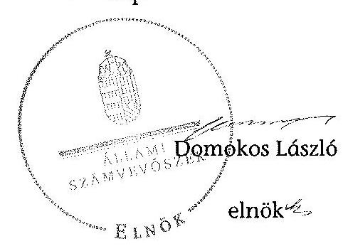

# ÁLLAMI   SZÁMVEVŐSZÉK 

## JELENTÉS

az önkormányzatok belső kontrollrendszere kialakításának, egyes
kontrolltevékenységek és a belső ellenőrzés
működésének - 2013. évben induló - ellenőrzéséről
Mezőkeresztes
13157
2013. december

---

# Állami Számvevőszék 

Iktatószám: V-0135-042/2013.
Témaszám: 1162
Vizsgálat-azonosító szám: V064906

## Az ellenőrzést felügyelte:

Dr. Benedek Mária
felügyeleti vezető
Az ellenőrzést vezette és az ellenőrzés végrehajtásáért felelős:
Bíró Zsolt
ellenőrzésvezető
A számvevőszéki jelentés összeállításában közreműködött:
Dr. Gaálné Berente Mónika
számvevő
Az ellenőrzést végezték:
Magyaricsné Hajdú Regina Dr. Szöllősi Zsolt
számvevő
számvevő

---

# TARTALOMJEGYZÉK 

BEVEZETÉS ..... 5
I. ÖSSZEGZŐ MEGÁLLAPÍTÁSOK, KÖVETKEZTETÉSEK, JAVASLATOK ..... 9
II. RÉSZLETES MEGÁLLAPÍTÁSOK ..... 19

1. Az önkormányzat belső kontrollrendszerének kialakítása ..... 19
1.1. A kontrollkörnyezet ..... 19
1.2. A kockázatkezelési rendszer ..... 20
1.3. A kontrolltevékenységek ..... 21
1.4. Az információs és kommunikációs rendszer ..... 22
1.5. A monitoring rendszer ..... 22
2. A pénzügyi folyamatokban kulcsszerepet betöltő teljesítésigazolás és érvényesítés belső kontrollok működése ..... 23
3. A belső ellenőrzés működése ..... 24

## FÜGGELÉKEK

1. számú Értelmező szótár
2. számú Az értékelés módja és szempontjai

---

.

---

# RÖVIDÍTÉSEK JEGYZÉKE 

## Törvények

Áht.

Info tv.

Kttv.

Ktv.

Mötv.

Nvtv.

Mvtv.
Ötv.

## Rendeletek

Áhsz.

Ávr.

Bkr.

Ikr.
önkormányzati SZMSZ
vagyongazdálkodási rendelet

## Szórövidítések

ÁSZ
FEUVE
gazdasági program
hivatali SZMSZ
2011. évi CXCV. törvény az államháztartásról (hatályos 2012. január 1-jétől)

2011. évi CXII. törvény az információs önrendelkezési jogról és az információszabadságról (hatályos 2012. január 1-jétől)

2011. évi CXCIX. törvény a közszolgálati tisztviselők ről (hatályos 2012. március 1-jétől)
1992. évi XXIII. törvény a köztisztviselők jogállásáról (hatálytalan 2012. március 1-jétől)
2011. évi CLXXXIX. törvény Magyarország helyi önkormányzatairól (hatályos 2012. január 1-jétől)
2011. évi CXCVI. törvény a nemzeti vagyonról (hatályos 2011. december 31-től)
1993. évi XCIII. törvény a munkavédelemről
1990. évi LXV. törvény a helyi önkormányzatokról

249/2000. (XII. 24.) Korm. rendelet az államháztartás szervezetei beszámolási és könyvvezetési kötelezettségének sajátosságairól
368/2011. (XII. 31.) Korm. rendelet az államháztartásról szóló törvény végrehajtásáról (hatályos 2012. január 1-jétől)
370/2011. (XII. 31.) Korm. rendelet a költségvetési szervek belső kontrollrendszeréről és belső ellenőrzéséről (hatályos 2012. január 1-jétől)
335/2005. (XII. 29.) Korm. rendelet a közfeladatot ellátó szervek iratkezelésének általános követelményeiről
Mezőkeresztes Város Önkormányzat Képviselőtestületének 5/2011. (IV. 14.) számú rendelete Mezőkeresztes Város Önkormányzatának Szervezeti és Működési Szabályzatáról (hatályos 2011. április 14-étől)
Mezőkeresztes Város Önkormányzata Képviselőtestületének 12/1994. (XI. 28.) számú rendelete Mezőkeresztes Önkormányzatának vagyonáról (hatályos 1994. november 28-ától)

Állami Számvevőszék
folyamatba épített, előzetes, utólagos és vezetői ellenőrzés Mezőkeresztes Város Önkormányzatának Gazdasági Programja 2011-2015
Mezőkeresztes Város Önkormányzata Polgármesteri Hivatalának Szervezeti és Működési szabályzata (hatályos 2011. április 14-étől)

---

| INTOSAI | International Organization of Supreme Audit Institutions (Legfőbb Ellenőrző Intézmények Nemzetközi Szervezete) |
| :--: | :--: |
| iratkezelési szabályzat | Mezőkeresztes Város Önkormányzatának Iratkezelési Szabályzata (hatályos 2007. június 18-ától) |
| ISSAI | International Standards of Supreme Audit Institutions (Legfőbb Ellenőrző Intézmények Nemzetközi Standardjai) |
| jegyző, | Mezőkeresztes Város Önkormányzatának jegyzője 2000. július 17-től 2012. február 25-ig |
| jegyző, | Mezőkeresztes Város Önkormányzatának megbízott jegyzője 2012. március 7-től 2012. július 31-ig |
| jegyző ${ }_{3}$ | Mezőkeresztes Város Önkormányzatának jegyzője 2012. augusztus 1-jétől |
| Képviselő-testület | Mezőkeresztes Város Önkormányzatának Képviselőtestülete |
| Kormányhivatal | Borsod-Abaúj-Zemplén Megyei Kormányhivatal |
| leltározási szabályzat | Mezőkeresztes Város Önkormányzatának Leltározási Szabályzata (hatályos 2012. január 1-jétől) |
| munkavédelmi szabály- | Mezőkeresztes Város Önkormányzatának Munkavédelmi |
| zat | Szabályzata (hatályos 2005. szeptember 1-jétől) |
| NGM | Nemzetgazdasági Minisztérium |
| Önkormányzat | Mezőkeresztes Város Önkormányzata |
| pénzkezelési szabályzat | Mezőkeresztes Város Önkormányzatának Pénzkezelési Szabályzata (hatályos 2012. január 1-jétől) |
| polgármester | Mezőkeresztes Város Önkormányzatának polgármestere |
| Polgármesteri Hivatal | Mezőkeresztes Város Önkormányzatának Polgármesteri Hivatala |
| Társulás | Többcélú Kistérségi Társulás Mezőkövesd |

---

# JELENTÉS 

## az önkormányzatok belső kontrollrendszere kialakításának, egyes kontrolltevékenységek és a belső ellenőrzés működésének - 2013. évben induló - ellenőrzéséről Mezőkeresztes

## BEVEZETÉS

Mezőkeresztes város állandó lakosainak száma 2012. január 1-jén 4033 fő volt. Az Önkormányzat héttagú Képviselő-testületének munkáját három állandó bizottság segítette. Az Önkormányzat az önállóan működő és gazdálkodó Polgármesteri Hivatalon kívül egy önállóan működő és gazdálkodó, valamint három önállóan működő intézményt működtetett, többségi tulajdoni hányaddal gazdasági társasággal nem rendelkezett. A polgármester a 2002. évi helyi önkormányzati választások óta tölti be tisztségét. A jegyző ${ }_{1}$ 2012. február 25-ig, a jegyző ${ }_{2}$ 2012. március 7-től 2012. július 31-ig - képviselő-testületi határozat alapján - helyettesítőként látta el feladatát, a jegyző ${ }_{3}$ 2012. augusztus 1-jétől látja el feladatait. A jegyzők között a feladatok dokumentált átadás-átvételére nem került sor. A Polgármesteri Hivatal szervezeti egységekre nem tagolódott, elkülönített gazdasági szervezettel nem rendelkezett. A foglalkoztatott köztisztviselők száma 2012. január 1-jén 19 fő volt. Az Önkormányzat Polgármesteri Hivatalánál 2013. január 1-jétől szervezeti változás nem volt. Az Önkormányzat a 2012. évi költségvetési beszámolója szerint 889576 ezer Ft tárgyévi bevételt ért el, valamint 787164 ezer Ft tárgyévi kiadást teljesített. A 2012. december 31-i könyvviteli mérleg szerint 1560857 ezer Ft értékű eszközvagyonnal rendelkezett, a rövid lejáratú kötelezettségállománya 6298 ezer Ft volt, hosszú lejáratú kötelezettségállománya nem volt.

A demokratikus társadalmakban alapvető igény, hogy a közpénzeket, a közvagyont használók tevékenységükről elszámoljanak, ahhoz egyértelmű és érvényesíthető felelősségi szabályok társuljanak. Ennek a jogos igénynek az érvényesítéséhez meg kell teremteni azokat a folyamatokat, rendszereket, amelyek nélkülözhetetlenek az elszámoltatáshoz. Az elszámoltatás eredményes működtetéséhez szükség van a megfelelő információs, kontroll, értékelési és beszámolási rendszerek kialakítására.

Magyarországon az uniós csatlakozási tárgyalások idejére nyúlnak vissza a belső kontrollrendszer szabályozásának gyökerei. Az uniós elvárásoknak megfelelő új terminológia szerinti államháztartási belső pénzügyi ellenőrzési (ÁBPE) rendszer területén a jogharmonizáció 2003-ban teljes körűen megvalósult, míg az önkormányzati alrendszerre vonatkozó, Ötv.-ben megjelenített speciális szabályozás 2005-ben lépett hatályba. Az államháztartási belső kont-

---

rollrendszer koncepciója 2009-ben továbbfejlődött. A változások irányát mutatja, hogy a költségvetési szervek belső kontrollrendszere már magában foglalja a korszerű, felelős szervezetirányítás elemeit (kontrollkörnyezet, kockázatkezelés, kontrolltevékenység, információ és kommunikáció, monitoring) is. E kontrollrendszer szabályozása háromszintű, a törvényi előírásokat az Áht. és a Mötv., a rendeleti szintű szabályozást az Ávr. és a Bkr. tartalmazza, amelyeket útmutatói szinten az NGM által kiadott standardok és kézikönyvek támogatnak.

A belső kontrollrendszer azt a célt szolgálja, hogy a költségvetési szervek működésük és gazdálkodásuk során a tevékenységeket szabályszerűen, gazdaságosan, hatékonyan és eredményesen hajtsák végre, teljesítsék elszámolási kötelezettségeiket és megvédjék az erőforrásokat a veszteségektől, a károktól és a nem rendeltetésszerű használattól. A belső kontrollrendszer magában foglalja mindazon szabályokat, eljárásokat, gyakorlati módszereket és szervezeti struktúrákat, kockázatkezelési technikákat, kontrolltevékenységeket, amelyek segítséget nyújtanak a szervezetnek céljai eléréséhez.

Az ÁSZ a 2011-2015. évekre szóló stratégiájában hangsúlyos szerepet szánt annak, hogy szilárd szakmai alapon álló, értékteremtő ellenőrzéseivel előmozdítsa a közpénzügyek átláthatóságát, rendezettségét. A számvevőszéki ellenőrzés nemzetközi alapelvei is rögzítik, hogy a megfelelő belső kontrollrendszer minimálisra csökkenti a hibák és szabálytalanságok kockázatát.

Az ellenőrzés célja annak megállapítása volt, hogy a belső kontrollrendszer elemeinek kialakítása, a pénzügyi folyamatokban kulcsszerepet betöltő teljesítésigazolás és érvényesítés, és a belső ellenőrzés szabályos működése biztosította-e az önkormányzatnál a közpénzfelhasználás szabályosságát, hozzájárult-e az értéket teremtő rend követelményének érvényesüléséhez.

Ennek keretében értékeltük, hogy:

- a jogszabályi előírásoknak megfelelően alakították-e ki a belső kontrollrendszer elemeit;
- a gazdálkodás folyamatában kulcsszerepet betöltő teljesítésigazolás és érvényesítés kontrolltevékenységeit megfelelően működtették-e;
- biztosították-e a belső ellenőrzés szabályos működését;
- amennyiben az ÁSZ tett javaslatot a 2008-2011. évek közötti ellenőrzése kapcsán az Önkormányzatnak, intézkedtek-e azok végrehajtására.

Az ellenőrzés várható hasznosulását négy szinten tervezzük. A törvényalkotás számára összegzett tapasztalatok állnak rendelkezésre a belső kontrollrendszer önkormányzati területen való kialakításáról, működéséről és hatásairól, a belső ellenőrzés működéséről. Ennek alapján következtetést lehet levonni arról, hogy a belső kontrollrendszer kialakítására és működtetésére vonatkozó jelenlegi, differenciálás nélküli jogszabályi előírások reális követelményeket támasztanak-e az eltérő adottságú települési önkormányzatok esetében, illetve indokolt-e esetleges jogszabályi módosítás kezdeményezése. Az ellenőrzés az ellenőrzött számára visszajelzést ad a belső kontrollrendszer kialakításában és

---

működésében fellépő hiányosságokról, javaslataival hozzájárul azok kiküszöböléséhez, amely csökkentheti a későbbi ellenőrzések gyakoriságát. Az ellenőrzés megállapításait és javaslatait más szervezetek is hasznosíthatják a rendezett gazdálkodási keretek kialakításához. A társadalom számára jelzi, hogy közpénz nem maradhat ellenőrizetlenül, az ÁSZ értékteremtő rend kialakításához és megőrzéséhez hozzájáruló tevékenysége pozitív hatással lesz a szervezetről kialakított összkép formálásában. A szervezeten belül lehetőség nyílik arra, hogy a megállapítások szintetizálásával az ÁSZ a hozzáadott értéket teremtő elemző tevékenységét és tanácsadó szerepét is erősítse.

Az önkormányzatok belső kontrollrendszere kialakításának, egyes kontrolltevékenységek és a belső ellenőrzés működésének ellenőrzéséről szóló jelentés I. fejezetének összegző része az ellenőrzés céljára ad rövid, szintetizáló összefoglalót, és tartalmazza a következtetéseket a II. fejezet részletes megállapításain alapulóan. A jelentés intézkedést igénylő megállapításait és javaslatait az ellenőrzés során feltárt, a jelentés II. fejezetében rögzített részletes megállapítások alapozzák meg. A helyszíni ellenőrzés lezárásáig a helyi szabályozás változásait nyomon követtük.

Az ellenőrzés típusa: szabályszerűségi ellenőrzés.
Az ellenőrzött időszak: a belső kontrollrendszer kialakításának megfelelősége esetében a 2012. évre, a pénzügyi folyamatokban kulcsszerepet betöltő teljesítésigazolás és érvényesítés belső kontrollok működésének megfelelőségét és a belső ellenőrzés szabályszerű működését a 2012. január 1. és december 31-e közötti időszak eseményeit figyelembe véve értékeltük, míg az ÁSZ javaslatainak utóellenőrzése a 2008-2011. években végzett ellenőrzések nyilvánosságra hozott jelentéseiben tett javaslatok áttekintésére terjedt ki.

# Az ellenőrzött szervezet: az Önkormányzat. 

Az ellenőrzés jogszabályi alapját az ÁSZ tv. 1. § (3) bekezdése, az 5. § (2) és (6) bekezdése, valamint az Áht. 61. § (2) bekezdésének előírásai képezik.

Az ellenőrzés szakmai módszertana az ÁSZ hivatalos honlapján (www.asz.hu) közzétett szakmai szabályokon alapult, amely az INTOSAI által kiadott ISSAI figyelembevételével készült.

Az ellenőrzés lefolytatásához az Önkormányzat a kimutatások és a tanúsítvány elektronikus kitöltésével, valamint az ÁSZ által kért dokumentumok elektronikus megküldésével szolgáltatott adatokat. Az így rendelkezésre bocsátott adatok, információk kontrollja és a munkalapok kitöltése a helyszíni ellenőrzés keretében történt. A jelentésben használt fogalmak magyarázatát az 1. számú függelék, az ellenőrzés egyes területeinek értékelésénél alkalmazott egységes minősítési szempontokat a 2. számú függelék tartalmazza.

A belső kontrollrendszer kialakításának ellenőrzése során értékeltük a kontrollkörnyezet, a kockázatkezelési rendszer, a kontrolltevékenységek, az információs és kommunikációs rendszer, valamint a monitoring rendszer szabályozottságának megfelelőségét. A pénzügyi folyamatokban kulcsszerepet betöltő teljesítésigazolás és érvényesítés kontrollok működése megfelelőségének minősítésé-

---

hez az állományba nem tartozók megbízási díjai, a külső szolgáltatók által végzett karbantartási, kisjavítási munkák, az egyéb üzemeltetési és fenntartási szolgáltatások, a rendszeres szociális segélyek, valamint az államháztartáson kívülre teljesített működési és felhalmozási célú pénzeszközátadások közül kockázatelemzéssel választottuk ki az ellenőrzött kiadási jogcímeket. Az egyszerű véletlen mintavétellel kiválasztott tételek ellenőrzését többlépcsős megfelelőségi tesztek útján addig végeztük, amíg elegendő és megfelelő bizonyítékot szereztünk a vizsgált folyamatok kulcskontrolljai működésének megfelelő vagy nem megfelelő voltáról. Értékeltük az Önkormányzatnál a belső ellenőrzés működésének szabályosságát. Utóellenőrzésre nem került sor, mivel az ÁSZ az Önkormányzatnál a 2008-2011. évek között nem végzett ellenőrzést.

Az ÁSZ tv. 29. § (1) bekezdése szerint a jelentéstervezetet megküldtük a polgármester részére, aki az ÁSZ tv. 29. § (2)
 bekezdésében foglalt észrevételezési jogával nem élt, a jelentéstervezetre észrevételt nem tett.

---

# I. ÖSSZEGZŐ MEGÁLLAPÍTÁSOK, KÖVETKEZTETÉSEK, JAVASLATOK 

A belső kontrollrendszeren belül 2012-ben a kontrollkörnyezet, a kockázatkezelési rendszer, a kontrolltevékenységek, az információs és kommunikációs rendszer, valamint a monitoring rendszer kialakítását külön-külön és együttesen is értékeltük. A belső kontrollrendszer kialakítása az összesített értékelés alapján nem felelt meg a jogszabályi előírásoknak.

A belső kontrollrendszer egyes területei kialakításának minősítése a következő:

| Kontrollterület | Minősítés |
| :-- | :--: |
| Kontrollkörnyezet | nem |
|  | megfelelő |
| Kockázatkezelési rendszer | nem |
|  | megfelelő |
| Kontrolltevékenységek | nem |
| Információs és kommunikációs | megfelelő |
| rendszer | nem |
| Monitoring rendszer | megfelelő |

Nem megfelelőnek értékeltük a kontrollkörnyezet, a kockázatkezelési rendszer, a kontrolltevékenységek, az információs és kommunikációs rendszer, valamint a monitoring rendszer kialakítását, mivel az ellenőrzésünk során megállapított szabályozásbeli hiányosságok magukban hordozzák a szabálytalan működés, valamint a korrupció kockázatát.

A belső kontrollrendszer nem megfelelő kialakítása kockázatot jelent az Önkormányzat tevékenységeinek szabályszerű, gazdaságos, hatékony és eredményes végrehajtása során.

A 2012. évben az állományba nem tartozók megbízási díjaival, valamint a külső szolgáltatók által végzett karbantartási, kisjavítási munkákkal kapcsolatos kifizetések során a pénzügyi folyamatokban kulcsszerepet betöltő teljesítésigazolás és érvényesítés belső kontrollok működése gyenge volt. Gyengének értékeltük a két kulcskontroll együttes működését, mivel azok nem biztosították a hibák megelőzését és feltárását.

A számvevőszéki ellenőrzés az ellenőrzött kifizetésekkel összefüggésben a rendelkezésre bocsátott dokumentumok alapján jogosulatlan kifizetést nem tárt fel, azonban a gazdálkodásban kulcsszerepet betöltő kontrollok működésében feltárt hiányosságok miatt fennáll a hibák bekövetkezésének kockázata. A nem megfelelően működtetett belső kontrollok korrupciós kockázatot hordoznak.

---

Az Önkormányzat a belső ellenőrzési feladatokat a Társulás útján látta el. A 2012. évben a belső ellenőrzés működése a jogszabályi előírásoknak nem felelt meg, mivel a számvevőszéki ellenőrzés által megállapított szabályozási és működési hiányosságok számossága magában hordozza a szabálytalan önkormányzati gazdálkodás és feladatellátás kockázatát.

Az ÁSZ tv. 33. § (1) bekezdésében foglaltak értelmében az ellenőrzött szervezet vezetője köteles a jelentésben foglalt megállapításokhoz kapcsolódó intézkedési tervet összeállítani, és azt a jelentés kézhezvételétől számított 30 napon belül az ÁSZ részére megküldeni. Amennyiben az intézkedési tervet határidőre nem küldi meg a szervezet, vagy az ÁSZ tv. 33. § (2) bekezdésében foglalt póthatáridő elteltével megküldött intézkedési terv továbbra sem elfogadható, az ÁSZ elnöke a hivatkozott törvény 33. § (3) bekezdés a)-b) pontjaiban foglaltakat érvényesítheti.

Az ellenőrzés intézkedést igénylő megállapításai és javaslatai:

# polgármesternek 

1. Az Önkormányzat nevében történő kötelezettségvállalás - az Áht. 37. § (1) bekezdésében és az Ávr. 55. § (1) bekezdésében foglaltak ellenére - pénzügyi ellenjegyzés hiányában történt.

Javaslat:
Intézkedjen arról, hogy az Önkormányzat nevében történő kötelezettségvállalásra az Áht. 37. § (1) bekezdésében és az Ávr. 55. § (1) bekezdésében foglaltaknak megfelelően - az Ávr. 53. §-ában meghatározott kivételekkel - kizárólag a pénzügyi ellenjegyzés után, a pénzügyi teljesítés esedékességét megelőzően, írásban kerüljön sor.
2. Az éves ellenőrzési jelentést - a Bkr. 56. § (8) bekezdésében foglaltak ellenére - a zárszámadási rendelettervezettel egyidejűleg nem terjesztette a Képviselő-testület elé.

Javaslat:
Terjessze a Képviselő-testület elé a zárszámadási rendelettervezettel egyidejűleg a Bkr. 49. § (3a) bekezdésében, illetve az 56. § (8) bekezdésében foglaltak figyelembevételével az éves ellenőrzési jelentést.
3. A polgármester mint kötelezettségvállaló - az Ávr. 57. § (4) bekezdésében foglaltak ellenére - 2012. március 31-től írásban nem jelölte ki a teljesítésigazolásra jogosult személyeket.

Javaslat:
Jelölje ki az Ávr. 57. § (4) bekezdésének megfelelően az általa történő kötelezettségvállalások esetében a teljesítés igazolására jogosult személyeket.
4. A számvevőszéki ellenőrzés megállapításai alapján az Önkormányzatnál a belső kontrollrendszer kialakítása összefoglalóan értékelve nem felelt meg a jogszabályi előírá-

---

soknak, a kulcskontrollok működése gyenge volt, és a belső ellenőrzés működése sem felelt meg a jogszabályi előírásoknak. A megállapított szabályozásbeli és működésbeli hiányosságok magukban hordozzák a szabálytalan működés kockázatát.

Javaslat:
A Mötv. 115. § (1) bekezdésében foglaltak alapján kísérje figyelemmel az önkormányzat gazdálkodásának szabályszerűségét. A Mötv. 67. § f) pontja alapján gondoskodjon a belső kontrollrendszerre és a belső ellenőrzés működésére vonatkozó jogszabályi rendelkezések be nem tartása, valamint a teljesítésigazolás, illetve az érvényesítés kontrollokkal összefüggésben feltárt hiányosságok, szabálytalanságok tekintetében az esetleges munkajogi felelősséggel kapcsolatos körülmények kivizsgálásáról, és a vizsgálat eredményének függvényében tegye meg a szükséges munkajogi intézkedéseket.

# jegyzőnek 

1. a kontrollkörnyezettel kapcsolatban:

A hivatali SZMSZ-ben - az Ávr. 13. § (1) bekezdés c), g), h) és i) pontjaiban foglaltak ellenére - nem rögzítették az alaptevékenységet szabályozó jogszabályok megjelölését, a szervezeti és működési szabályzatban nevesített valamennyi munkakörhöz tartozó feladat- és hatásköröket és a hatáskörök gyakorlásának módját, a helyettesítés rendjét, az ezekhez kapcsolódó felelősségi szabályokat; továbbá a munkáltatói jogok - ideértve az átruházott munkáltatói jogokat is - gyakorlásának rendjét, valamint az irányító szerv által az Ávr. 10. § (1)-(3) bekezdései szerint a költségvetési szervhez rendelt más költségvetési szervek felsorolását.

A jegyző – az Ötv. 36. § (2) bekezdés a) pontjában foglaltak ellenére – nem készítette elő a vagyongazdálkodási rendelet módosítását, így az Önkormányzat vagyongazdálkodási rendelete nem felelt meg az Nvtv. 3. § (1) bekezdés 6. pontja, 5-6. §-a, 11. § (16) bekezdése, 13. § (1) bekezdése, 18. § (1) és (12) bekezdése, valamint a Mötv. 109. § (4) bekezdése előírásainak.

A jegyző – az Mvtv. 2. § (3) bekezdés ellenére – nem határozta meg a Polgármesteri Hivatalban az egészséget nem veszélyeztető és biztonságos munkavégzés követelményei megvalósításának módját.

A jegyző – a Bkr. 6. § (4) bekezdésében foglaltak ellenére – nem készítette el a szabálytalanságok kezelésének eljárásrendjét.

A jegyző – a Bkr. 6. § (3) bekezdésében foglaltak ellenére – a Polgármesteri Hivatal ellenőrzési nyomvonalát nem készítette el.

A jegyző – az Ávr. 13. § (5) bekezdésének előírása ellenére – belső szabályzatban nem határozta meg a Polgármesteri Hivatal által ellátott feladatok munkafolyamatainak leírását.

A jegyző – a Kttv. 130. § (1) bekezdésében foglaltak ellenére – a Polgármesteri Hivatalban dolgozó köztisztviselők teljesítményértékelését nem készítette el.

---

A Képviselő-testület - a Kttv. 231. § (1) bekezdése ellenére - nem állapította meg - a Kttv. 83. §-a szerinti - a köztisztviselőkkel szembeni hivatásetikai alapelvek részletes tartalmát, valamint az etikai eljárás szabályait, mivel a jegyző – az Ötv. 36. § (2) bekezdés a) pontjában előírt feladata ellenére – nem készítette elő ennek dokumentumát.

Javaslat:
a) Készítse el a hivatali SZMSZ módosítását, és kezdeményezze az Áht. 9. § (1) bekezdés a) pontjában foglaltakra tekintettel a Képviselő-testület elé terjesztését annak érdekében, hogy az tartalmazza az Ávr. 13. § (1) bekezdésében előírt tartalmi elemeket.
b) Készítse el a Mötv. 81. § (3) bekezdés c) pontjában foglaltak alapján a vagyongazdálkodási rendelet módosításának tervezetét, és kezdeményezze a Képviselőtestület elé terjesztését annak érdekében, hogy az megfeleljen az Nvtv. 3. § (1) bekezdés 6. pontja, 5-6. §-a, 11. § (16) bekezdése, 13. § (1) bekezdése, 18. § (1) és (12) bekezdése, valamint a Mötv. 109. § (4) bekezdése előírásainak.
c) Határozza meg az Mvtv. 2. § (3) bekezdés alapján az egészséget nem veszélyeztető és biztonságos munkavégzés követelményei megvalósításának módját.
d) Szabályozza a Bkr. 6. § (4) bekezdésének megfelelően a szabálytalanságok kezelésének eljárásrendjét.
e) Intézkedjen arról, hogy az ellenőrzési nyomvonal a Bkr. 6. § (3) bekezdésében előírtaknak megfelelően készüljön el.
f) Rögzítse az Ávr. 13. § (5) bekezdésében előírtaknak megfelelően a Polgármesteri Hivatal által ellátott feladatok munkafolyamatainak leírását.
g) Értékelje írásban a Kttv. 130. § (1) bekezdés alapján a Polgármesteri Hivatal köztisztviselőinek munkateljesítményét.
h) Készítse elő a Mötv. 81. § (3) bekezdés c) pontjában foglalt feladatkörében a köztisztviselőkkel szembeni - a Kttv. 83. §-a szerinti - hivatásetikai alapelvek részletes tartalmának, valamint az etikai eljárás szabályainak dokumentumait, és a Kttv. 231. § (1) bekezdésében foglaltak érvényesülése érdekében kezdeményezze azok Képviselő-testület elé terjesztését.
2. a kockázatkezelési rendszerrel kapcsolatban:

A jegyző – a Bkr. 7. § (2) bekezdésében foglaltak ellenére – nem állapította meg a Polgármesteri Hivatal tevékenységében, gazdálkodásában rejlő kockázatokat, nem határozta meg az egyes kockázatokkal kapcsolatban szükséges intézkedéseket, valamint azok teljesítése folyamatos nyomon követésének módját.

Az egyes vagyonnyilatkozat-tételi kötelezettségekről szóló 2007. évi CLII. törvény 4. § a) pontjában foglaltak ellenére a vagyonnyilatkozat-tételre kötelezettek körét a hivatali SZMSZ-ben a jegyző nem rögzítette.

---

Javaslat:
a) Mérje fel és állapítsa meg a Bkr. 7. § (2) bekezdése alapján a Polgármesteri Hivatal tevékenységében, gazdálkodásában rejlő kockázatokat, határozza meg az egyes kockázatokkal kapcsolatban szükséges intézkedéseket, valamint azok teljesítése folyamatos nyomon követésének módját.
b) Az egyes vagyonnyilatkozat-tételi kötelezettségekről szóló 2007. évi CLII. törvény tv. 4. § a) pontjában foglalt előírásnak megfelelően a vagyonnyilatkozat-tételi kötelezettséget az érintett személyek esetében a hivatali SZMSZ-ben tüntesse fel.
3. a kontrolltevékenységekkel kapcsolatban:

A jegyző – a Bkr. 8. § (2) bekezdés a) pontjában foglaltak ellenére – nem biztosította a pénzügyi döntések - köztük a költségvetés tervezése, a beszerzési folyamat, a vagyonhasznosítási tevékenység és a támogatások - dokumentumainak elkészítésével kapcsolatban a folyamatba épített, előzetes, utólagos és vezetői ellenőrzést.

A jegyző – az Ávr. 13. § (2) bekezdés a) pontjában foglaltak ellenére – nem szabályozta a kötelezettségvállalás pénzügyi ellenjegyzését, a teljesítésigazolás módját, valamint az érvényesítés és az utalványozás rendjét, továbbá a beszámolási feladatok teljesítésével kapcsolatos belső előírásokat.

A jegyző – az Ávr. 53. § (2) bekezdésében foglaltakat figyelmen kívül hagyva annak ellenére nem határozta meg az írásbeli kötelezettségvállalást nem igénylő kifizetések rendjét, hogy a belső szabályozásban lehetővé tette a 100 ezer Ft-ot el nem érő kifizetések előzetes írásbeli kötelezettségvállalás nélküli teljesítését.

A teljesítésigazolásra jogosult személyeket a jegyző, valamint 2013. március 31-étől a polgármester és a jegyző mint kötelezettségvállalók - az Ávr. 57. § (4) bekezdésében foglaltak ellenére - írásban nem jelölték ki.

A jegyző – az Ávr. 58. § (4) bekezdésében foglaltak ellenére – nem jelölt ki érvényesítési feladatra a Polgármesteri Hivatal állományába tartozó köztisztviselőt.

A jegyző az iratkezelési rendszer kialakítása során - az lkr. 8. § (2) bekezdésében foglaltak ellenére - nem szabályozta az üzemeltetés és az adatbiztonság védelmének feladatait, valamint nem határozta meg az üzemeltetés és az adatbiztonság védelmének feladatai esetében a hatásköröket.

A jegyző – a Bkr. 8. § (4) bekezdés c) pontjában foglaltak ellenére – nem határozta meg a beszámolási eljárásokhoz kapcsolódóan a felelősségi köröket.

A jegyző – az Ávr. 13. § (5) bekezdésében foglaltak ellenére – nem határozta meg a gazdasági feladatot ellátó
 vezetők és alkalmazottak helyettesítésének rendjét.

A jegyző ${ }_{1,2,3}$ - a Kttv. 74. § (1) bekezdésében foglaltak ellenére - a jogviszony megszűnése esetére nem szabályozta a munkavállaló folyamatban lévő feladatai átadásának rendjét.

---

Javaslat:
a) Biztosítsa minden tevékenységre vonatkozóan a folyamatba épített, előzetes, utólagos és vezetői ellenőrzést a Bkr. 8. § (2) bekezdése alapján.
b) Rendezze belső szabályzatban az Ávr. 13. § (2) bekezdés a) pontjában foglaltak alapján a tervezéssel, gazdálkodással - különösen az ellenjegyzés, a teljesítésigazolás módjával, valamint az érvényesítés és az utalványozás rendjével - és a beszámolási feladatok teljesítésével kapcsolatos belső előírásokat, feltételeket.
c) Rögzítse belső szabályzatban az Ávr. 53. § (2) bekezdése alapján az előzetes írásbeli kötelezettségvállalást nem igénylő kifizetések rendjét.
d) Jelölje ki az Ávr. 57. § (4) bekezdésének megfelelően az általa történő kötelezettségvállalások esetében a teljesítés igazolására jogosult személyeket.
e) Jelölje ki az Ávr. 58. § (4) bekezdésében foglaltak alapján az érvényesítésre jogosult személyeket.
f) Rögzítse az iratkezelési rendszer kialakítása során az lkr. 8. § (2) bekezdése alapján az üzemeltetés és az adatbiztonság szabályait oly módon, hogy a feladatok és hatáskörök pontosan meghatározásra kerüljenek és végrehajthatók legyenek.
g) Határozza meg a Bkr. 8. § (4) bekezdés c) pontjában foglaltaknak megfelelően a Polgármesteri Hivatal tevékenységeire vonatkozó beszámolási eljárásokhoz kapcsolódó felelősségi köröket.
h) Határozza meg az Ávr. 13. § (5) bekezdése alapján a gazdasági feladatot ellátó vezetők és alkalmazottak helyettesítésének rendjét.
i) Szabályozza a Kttv. 74. § (1) bekezdésében foglaltak alapján a jogviszony megszűnése esetére a munkavállaló folyamatban lévő feladatai átadásának rendjét.
4. az információs és kommunikációs rendszerrel kapcsolatban:

A jegyző ${ }_{1,2,3}$ - a Bkr. 3. § d) pontjában és a 9. § (1) bekezdésében foglaltak ellenére nem alakított ki olyan rendszert, amely biztosítja, hogy a megfelelő információk a megfelelő időben eljutnak az illetékes szervezethez, szervezeti egységhez, illetve személyhez.

Az Info tv. 24. § (3) bekezdésében foglaltak ellenére a jegyző ${ }_{1,2,3}$ nem készítette el a Polgármesteri Hivatal adatvédelmi és adatbiztonsági szabályzatát.

A jegyző ${ }_{1,2,3}$ - az Info tv. 35. § (3) bekezdésében és az Ávr. 13. § (2) bekezdés h) pontjában foglalt előírás ellenére - a kötelezően közzéteendő adatok nyilvánosságra hozatalának rendjét nem alakította ki.

Az Önkormányzat - az Info tv. 33. § (1) és (3) bekezdésében foglaltak ellenére - az elektronikus közzétételi kötelezettségének a 2012. évben nem tett eleget.

---

A jegyző ${ }_{1,2,3}$ - az Info tv. 30. § (6) bekezdésében és az Ávr. 13. § (2) bekezdés h) pontjában foglalt előírások ellenére - nem szabályozta a közérdekű adatok megismerésére irányuló igények teljesítésének rendjét.

Javaslat:
a) Alakítson ki a Bkr. 3. § d) pontjában és a 9. § (1) bekezdésében foglaltaknak megfelelően egy olyan rendszert, amely biztosítja, hogy a megfelelő információk a megfelelő időben eljutnak az illetékes szervezethez, szervezeti egységhez, illetve személyhez.
b) Készítsen adatvédelmi és adatbiztonsági szabályzatot az Info tv. 24. § (3) bekezdésének megfelelően.
c) Állapítsa meg szabályzatban - az Info tv. 35. § (3) bekezdésében, valamint az Ávr. 13. § (2) bekezdés h) pontjában foglaltaknak megfelelően - a kötelezően közzéteendő adatok nyilvánosságra hozatalának rendjét.
d) Biztosítsa az Info tv. 33. § (1) és (3) bekezdésében foglaltaknak megfelelően az elektronikus közzétételi kötelezettséget.
e) Készítsen - az Info tv. 30. § (6) bekezdésében és az Ávr. 13. § (2) bekezdés h) pontjában foglaltaknak megfelelően - a közérdekű adatok megismerésére irányuló igények teljesítésének rendjét rögzítő szabályzatot.
5. a monitoring rendszerrel kapcsolatban:

A jegyző ${ }_{1,2,3}$ - a Bkr. 3. § e) pontjában és 10. §-ában foglaltak ellenére - nem alakította ki a Polgármesteri Hivatal tevékenységének, a célok megvalósításának nyomon követését biztosító rendszert.

A jegyző - a Bkr. 11. § (1) bekezdésében foglalt kötelezettsége ellenére - a Bkr. 1. mellékletében foglalt nyilatkozatban nem értékelte a Polgármesteri Hivatal belső kontrollrendszerének minőségét.

A Bkr. 13. § (2) bekezdésében foglalt előírás ellenére a külső ellenőrzések megállapításainak hasznosítására intézkedési tervet a jegyző nem készített, és - a Bkr. 14. § (1) bekezdésében foglalt előírás ellenére - nem gondoskodott az azok végrehajtására vonatkozó nyilvántartás vezetéséről.

Javaslat:
a) Alakítsa ki és működtesse a Bkr. 3. § e) pontjában és 10. §-ában foglaltak alapján a Polgármesteri Hivatal tevékenységének, a célok megvalósításának nyomon követését biztosító rendszert.
b) Értékelje a Bkr. 11. § (1) bekezdésében előírtaknak megfelelően, a jogszabályban meghatározott keretek között a belső kontrollrendszer minőségét a Bkr. 1. melléklete szerinti nyilatkozatban.
c) Gondoskodjon a Bkr. 13. § (2) bekezdésében foglalt előírás alapján a külső ellenőrzések megállapításai és javaslatai alapján intézkedési terv elkészítéséről, és a

---

Bkr. 14. § (1) bekezdésében foglalt előírás alapján az azok végrehajtására vonatkozó - a Bkr. 47. § (2) bekezdése szerinti - nyilvántartás vezetéséről.
6. a pénzügyi folyamatokban kulcsszerepet betöltő kontrollokkal kapcsolatban:

A teljesítésigazolást - az Áht. 38. § (1) bekezdésében és az Ávr. 57. § (1) és (3) bekezdésében foglaltak ellenére - nem, vagy nem szabályszerűen végezték el.

Az érvényesítést - az Ávr. 58. § (1)-(4) bekezdéseiben foglaltak ellenére - kijelölés hiányában végezték, vagy az nem szabályszerűen történt. Az érvényesítés nem szabályszerűen történt, mert az érvényesített okmányon az érvényesítés dátumát - az Ávr. 58. § (3) bekezdése ellenére - nem tüntették fel, továbbá - az Ávr. 58. § (2) bekezdésében foglaltak ellenére - nem jelezték az utalványozónak, hogy a kötelezettségvállalásra - az Áht. 37. § (1) bekezdésében és az Ávr. 55. § (1) bekezdésében előírtak ellenére - ellenjegyzés nélkül került sor, valamint a teljesítésigazolást - az Ávr. 57. § (1) és (3) bekezdésében előírtak ellenére -nem szabályszerűen végezték.

Javaslat:
Intézkedjen - a teljesítésigazolás és az érvényesítés vonatkozásában feltárt hiányosságok megszüntetése, illetve az operatív gazdálkodás során a működésbeli hibák megelőzése, feltárása és kijavítása érdekében - arról, hogy
a) az Áht. 38. § (1) bekezdésén alapuló teljesítésigazolás során az Ávr. 57. § (1) bekezdésében előírtaknak megfelelően, ellenőrizhető okmányok alapján ellenőrizzék és igazolják a kiadások teljesítésének jogosságát, összegszerűségét, az ellenszolgáltatást is magában foglaló kötelezettségvállalás esetén annak teljesítését, valamint az Ávr. 57. § (3) bekezdése szerint a teljesítést az igazolás dátumának és a teljesítés tényére történő utalásnak a megjelölésével, az arra jogosult személy aláírásával igazolják;
b) kötelezettségvállalásra - az Áht. 37. § (1) és az Ávr. 55. § (1) bekezdésében foglaltaknak megfelelően, az Ávr. 53. §-ában meghatározott kivételekkel - kizárólag a pénzügyi ellenjegyzés után, a pénzügyi teljesítést megelőzően, írásban kerüljön sor;
c) a kifizetéseket megelőzően a teljesítésigazolás alapján - az Ávr. 57. § (3) bekezdése szerinti esetben annak hiányában is - az összegszerűségnek, a fedezet meglétének és a megelőző ügymenetben az Áht., az Áhsz., az Ávr. előírásai és a belső szabályzatokban foglaltak betartásának az ellenőrzése - az Ávr. 58. § (1)-(3) bekezdései szerint - történjen meg.
7. a belső ellenőrzés működésével kapcsolatban:

A Bkr. 17. § (1) bekezdésében, a 22. § (1) bekezdés a) pontjában és az 56. § (7) bekezdésében foglaltak ellenére az Önkormányzat nem rendelkezett a munkaszervezet vezetője által jóváhagyott belső ellenőrzési kézikönyvvel.

A Bkr. 16. § (4) bekezdésében foglaltak ellenére a belső ellenőrzési tevékenység megszervezésére vonatkozó megállapodásban a belső ellenőrzési vezetői feladatok ellátásának módjáról, valamint a feladatok ellátására jogosult és kötelezett személy kijelöléséről nem rendelkeztek.

---

A belső ellenőrzési vezető stratégiai ellenőrzési tervet és a 2013. évre vonatkozóan éves ellenőrzési tervet - a Bkr. 22. § (1) bekezdés b) pontjában, a 29. § (1) bekezdésében, a 30. § (1) bekezdésében és a 31. § (1) bekezdésében foglaltak ellenére nem készített.

A Bkr. 31. § (5) és az 56. § (5) bekezdésében foglaltak ellenére az ellenőrzési terv módosítása nélkül hagytak el a 2012. évi ellenőrzési tervben foglalt ellenőrzést.

A Bkr. 22. § (2) bekezdés e) pontjában és 50. §-ában foglalt előírást figyelmen kívül hagyva, a belső ellenőrzési vezető az elvégzett ellenőrzésekről nyilvántartást nem vezetett.

A belső ellenőrzési vezető - a Bkr. 21. § (2) bekezdés d) pontjában és a 47. § (1) bekezdésében foglaltak ellenére - a belső ellenőrzési jelentésekben tett megállapításokat, javaslatokat, a vonatkozó intézkedési terveket és azok végrehajtását nyomon követő nyilvántartást nem vezetett.

A Bkr. 22. § (1) bekezdés g) pontjában és a 49. § (1) bekezdésében foglaltak ellenére a belső ellenőrzési vezető az éves (összefoglaló) ellenőrzési jelentést nem készítette el.

Javaslat:
a) Kezdeményezze, hogy az Önkormányzat rendelkezzen a Bkr. 17. § (1) bekezdésében, a 22. § (1) bekezdés a) pontjában és az 56. § (7) bekezdésében foglaltaknak megfelelően a munkaszervezet vezetője által jóváhagyott belső ellenőrzési kézikönyvvel.
b) Kezdeményezze, hogy a Bkr. 16. § (4) bekezdésének megfelelően a belső ellenőrzési tevékenység megszervezésére vonatkozó megállapodásban rendelkezzenek a Bkr. 22. § (1)-(2) bekezdésében foglalt tevékenységek és kötelességek ellátásának módjáról.
c) Kezdeményezze, hogy a Bkr. 22. § (1) bekezdés b) pontjában, a 29. § (1) bekezdésében, a 30. § (1) bekezdésében és a 31. § (1) bekezdésében foglaltaknak megfelelően készüljön stratégiai ellenőrzési terv és éves ellenőrzési terv.
d) Intézkedjen, hogy a Bkr. 31. § (5) bekezdésében, valamint az 56. § (5) bekezdésében foglaltak szerint az éves ellenőrzési tervben foglaltakhoz képest ellenőrzés elhagyására vagy új ellenőrzés indítására az éves terv módosítását követően kerüljön sor.
e) Kezdeményezze, hogy a belső ellenőrzési vezető a Bkr. 22. § (2) bekezdés e) pontja és 50. §-a alapján vezessen nyilvántartást az elvégzett ellenőrzésekről.
f) Kezdeményezze, hogy a belső ellenőrzési vezető vezessen a Bkr. 21. § (2) bekezdés d) pontjának és a Bkr. 47. § (1) bekezdésének megfelelően a belső ellenőrzési jelentésekben tett megállapításokat, javaslatokat, a vonatkozó intézkedési terveket és azok végrehajtását nyomon követő nyilvántartást.

---

g) Kezdeményezze, hogy a belső ellenőrzési vezető a Bkr. 22. § (1) bekezdés g) pontjában és a 49. § (1) bekezdésében foglaltak alapján az éves (összefoglaló) ellenőrzési jelentést készítse el.

---

# II. RÉSZLETES MEGÁLLAPÍTÁSOK 

## 1. Az önkormányzat belső kontrollrendszerének kialakítása

A belső kontrollrendszeren belül 2012-ben a kontrollkörnyezet, a kockázatkezelési rendszer, a kontrolltevékenységek, az információs és kommunikációs rendszer, valamint a monitoring rendszer kialakítását külön-külön és együttesen is értékeltük. A belső kontrollrendszer kialakítása az összesített értékelés alapján nem felelt meg a jogszabályi előírásoknak.

### 1.1. A kontrollkörnyezet

A kontrollkörnyezet kialakítása - a 2. számú függelékben részletezett kritériumrendszer alapján végzett értékelés szerint - a jogszabályi előírásoknak nem felelt meg, mert:

| Sor-   szám ${ }^{1}$ | Megállapítás | Megjegyzés |
| :--: | :--: | :--: |
| 4. | A Képviselő-testület a Ktv. 34. § (3) bekezdésében foglaltak ellenére nem döntött a teljesítményértékelés alapját képező célokról. |  |
| 7.,   10-   12. | A hivatali SZMSZ-ben
 a jegyző ${ }_{1,2,3}$ - az Ávr. 13. § (1) bekezdés c), g), h) és i) pontjaiban foglaltak ellenére - nem rögzítette az alaptevékenységet szabályozó jogszabályok megjelölését, a szervezeti és működési szabályzatban nevesített valamennyi munkakörhöz tartozó feladat- és hatásköröket és a hatáskörök gyakorlásának módját, a helyettesítés rendjét, az ezekhez kapcsolódó felelősségi szabályokat, továbbá a munkáltatói jogok – ideértve az átruházott munkáltatói jogokat is – gyakorlásának rendjét, valamint az irányító szerv által az Ávr. 10. § (1)-(3) bekezdései szerint a költségvetési szervhez rendelt más költségvetési szervek felsorolását. |  |
| 16. | A jegyző ${ }_{1,2,3}$ az Ötv. 36. § (2) bekezdés a) pontjában ${ }^{2}$ foglaltak ellenére a jogszabályváltozásokhoz kapcsolódóan nem készítette |  |

[^0]
[^0]:    ${ }^{1}$ A megállapítás számozása az Önkormányzat által az adatszolgáltatás során kitöltött kimutatások kérdéseinek sorszámával azonos.
    ${ }^{2}$ 2013. január 1-jétől a Mötv. 81. § (3) bekezdés c) pontja

---

|  | elő a vagyongazdálkodási rendelet módosítását, így az Önkormányzat vagyongazdálkodási rendelete nem felelt meg az Nvtv. 3. § (1) bekezdés 6. pontja, 5-6. §-a, 11. § (16) bekezdése, 13. § (1) bekezdése, 18. § (1) és (12) bekezdése, valamint az Mötv. 109. § (4) bekezdése előírásainak. |  |
| :--: | :--: | :--: |
| 32. | A Polgármesteri Hivatalban - az Mvtv. 2. § (3) bekezdésében foglaltak ellenére - nem a jegyző ${ }_{1,2,3}$ határozta meg az egészséget nem veszélyeztető és biztonságos munkavégzés követelményei megvalósításának módját. | A munkavédelmi szabályzatot a polgármester írta alá. |
| 34. | A jegyző ${ }_{1,2,3}$ - a Bkr. 6. § (4) bekezdésében foglaltak ellenére - nem készítette el a szabálytalanságok kezelésének eljárásrendjét. |  |
| 35. | A jegyző ${ }_{1,2,3}$ - az Ávr. 13. § (5) bekezdésének előírása ellenére - nem határozta meg a Polgármesteri Hivatal által ellátott feladatok munkafolyamatainak leírását. |  |
| 41. | A Polgármesteri Hivatal - a Bkr. 6. § (3) bekezdésében foglaltak ellenére - ellenőrzési nyomvonallal nem rendelkezett. |  |
| 46. | A jegyző ${ }_{2,3}$ - a Kttv. 130. § (1) bekezdésében foglaltak ellenére - a Polgármesteri Hivatalban dolgozó köztisztviselők teljesítményértékelését nem készítette el. |  |
| 47. | A Képviselő-testület - a Kttv. 231. § (1) bekezdése ellenére - nem állapította meg - a Kttv. 83. §-a szerinti - a köztisztviselőkkel szembeni hivatásetikai alapelvek részletes tartalmát, valamint az etikai eljárás szabályait, mivel a jegyző ${ }_{2,3}$ - az Ötv. 36. § (2) bekezdés a) pontjában előírt feladata ellenére - nem készítette elő ennek dokumentumát. |  |

# 1.2. A kockázatkezelési rendszer 

A kockázatkezelési rendszer kialakítása - a 2. számú függelékben részletezett kritériumrendszer alapján végzett értékelés szerint - nem felelt meg a jogszabályi előírásoknak, mert:

| Sorszám | Megállapítás |
| :--: | :--: |
| $\begin{aligned} & 2 ., 8 . \text {, } \\ & 10 . \end{aligned}$ | A jegyző ${ }_{1,2,3}$ - a Bkr. 7. § (2) bekezdésében foglaltak ellenére - nem állapította meg a Polgármesteri Hivatal tevékenységében, gazdálkodásában rejlő kockázatokat, nem határozta meg az egyes kockázatokkal kapcsolatban szükséges intézkedéseket, valamint azok teljesítésének folyamatos nyomon követésének módját. |

---

Az egyes vagyonnyilatkozat-tételi kötelezettségekről szóló 2007. évi CLII. törvény 4. § a) pontjában foglaltak ellenére a vagyonnyilatkozat-tételre kötelezettek körét a hivatali SZMSZ-ben a jegyző ${ }_{1,2,3}$ nem rögzítette.

# 1.3. A kontrolltevékenységek 

A kontrolltevékenységek kialakítása - a 2. számú függelékben részletezett kritériumrendszer alapján végzett értékelés szerint - a jogszabályi előírásoknak nem felelt meg, mert:

| Sorszám | Megállapítás |
| :--: | :--: |
| $2-5$. | A jegyző ${ }_{1,2,3}$ - a Bkr. 8. § (2) bekezdés a) pontjában foglaltak ellenére - nem biztosította a pénzügyi döntések - köztük a költségvetés tervezése, a beszerzési folyamat, a vagyonhasznosítási tevékenység és a támogatások - dokumentumainak elkészítésével kapcsolatban a folyamatba épített, előzetes, utólagos és vezetői ellenőrzést. |
| $\begin{aligned} & \text { 6., 9., } \\ & 11 . \text {, } \\ & 12 . \end{aligned}$ | A jegyző ${ }_{1,2,3}$ - az Ávr. 13. § (2) bekezdés a) pontjában foglaltak ellenére nem szabályozta a pénzügyi ellenjegyzés, a teljesítésigazolás és az érvényesítés módját, továbbá az utalványozás rendjét. |
| 8 . | A jegyző ${ }_{1,2,3}$ - az Ávr. 53. § (2) bekezdésében foglaltak ellenére - nem határozta meg a kötelezettségvállalást nem igénylő kifizetések rendjét annak ellenére, hogy a belső szabályozásban lehetővé tette a 100 ezer Ft-ot el nem érő kifizetések előzetes írásbeli kötelezettségvállalás nélküli teljesítését. |
| 10. | A teljesítésigazolásra jogosult személyeket a jegyző ${ }_{1,2}$, valamint 2013. március 31-étől a polgármester és a jegyző ${ }_{2,3}$ mint kötelezettségvállalók - az Ávr. 57. § (4) bekezdésében foglaltak ellenére - írásban nem jelölték ki. |
| $\begin{aligned} & 14- \\ & 15 . \end{aligned}$ | A jegyző ${ }_{1,2,3}$ az iratkezelési rendszer kialakítása során - az Ikr. 8. § (2) bekezdésében foglaltak ellenére - nem szabályozta az üzemeltetés és az adatbiztonság védelmének feladatait, valamint nem határozta meg az üzemeltetés és az adatbiztonság védelmének feladatai esetében a hatásköröket. |
| $\begin{aligned} & 19- \\ & 20 . \end{aligned}$ | A jegyző ${ }_{1,2,3}$ - az Ávr. 13. § (2) bekezdés a) pontjában foglaltak ellenére nem határozta meg a beszámolási feladatok teljesítésével kapcsolatos belső előírásokat, valamint - a Bkr. 8. § (4) bekezdés c) pontjában foglaltak ellenére - nem határozta meg a beszámolási eljárásokhoz kapcsolódóan a felelősségi köröket. |
| 21. | A jegyző ${ }_{1,2,3}$ - az Ávr. 13. § (5) bekezdésében foglaltak ellenére - nem határozta meg a gazdasági feladatot ellátó vezetők és alkalmazottak helyettesítésének rendjét. |
| 29. | A jegyző ${ }_{1,2,3}$ - az Ávr. 58. § (4) bekezdésében foglaltak ellenére - nem jelölt ki érvényesítési feladatra a Polgármesteri Hivatal állományába tartozó köztisztviselőt. |
| 32. | A jegyző ${ }_{1,2,3}$ - a Kttv. 74. § (1) bekezdésében foglaltak ellenére - jogviszony megszűnése esetére nem szabályozta a munkavállaló folyamatban lévő feladatai átadásának rendjét. |

---

# 1.4. Az információs és kommunikációs rendszer 

Az információs és kommunikációs rendszer kialakítása - a 2. számú függelékben részletezett kritériumrendszer alapján végzett értékelés szerint - a jogszabályi előírásoknak nem felelt meg, mert:

| Sorszám | Megállapítás |
| :--: | :--: |
| $1-2$. | A jegyző ${ }_{1,2,3}$ - a Bkr. 3. § d) pontjában és a 9. § (1) bekezdésében foglaltak ellenére - nem alakított ki olyan rendszert, amely biztosítja, hogy a megfelelő információk a megfelelő időben eljutnak az illetékes szervezethez, szervezeti egységhez, illetve személyhez. |
| 5. | Az Info tv. 24. § (3) bekezdésében foglaltak ellenére a jegyző ${ }_{1,2,3}$ nem készítette el a Polgármesteri Hivatal adatvédelmi és adatbiztonsági szabályzatát. |
| 6. | A jegyző ${ }_{1,2,3}$ - az Info tv. 35. § (3) bekezdésében és az Ávr. 13. § (2) bekezdés h) pontjában foglalt előírás ellenére - a kötelezően közzéteendő adatok nyilvánosságra hozatalának rendjét nem alakította ki. |
| 7. | Az Önkormányzat - az Info tv. 33. § (1) és (3) bekezdésében foglaltak ellenére - az elektronikus közzétételi kötelezettségének a 2012. évben nem tett eleget. |
| 8. | A jegyző ${ }_{1,2,3}$ - az Info tv. 30. § (6) bekezdésében és az Ávr. 13. § (2) bekezdés h) pontjában foglalt előírások ellenére - nem szabályozta a közérdekű adatok megismerésére irányuló igények teljesítésének rendjét. |

### 1.5. A monitoring rendszer

A monitoring rendszer kialakítása - a 2. számú függelékben részletezett kritériumrendszer alapján végzett értékelés szerint - a jogszabályi előírásoknak nem felelt meg, mert:

| Sorszám | Megállapítás | Megjegyzés |
| :--: | :--: | :--: |
| 1. | A jegyző ${ }_{1,2,3}$ - a Bkr. 3. § e) pontjában és 10. §-ában foglaltak ellenére - nem alakította ki a Polgármesteri Hivatal tevékenységének, a célok megvalósításának nyomon követését biztosító rendszert. |  |
| 9. | A jegyző - a Bkr. 11. § (1) bekezdésében foglalt kötelezettsége ellenére - a Bkr. 1. mellékletében foglalt nyilatkozatban nem értékelte a Polgármesteri Hivatal belső kontrollrendszerének minőségét. |  |
| 12., 13. | A jegyző - a Bkr. 13. § (2) bekezdésében foglalt előírás ellenére - a külső ellenőrzések megállapításainak hasznosítására intézkedési tervet nem készített, valamint - a Bkr. 14. § (1) bekezdésében foglalt előírás ellenére - nem gondoskodott az azok végre- | A Magyar Államkincstár a közműfejlesztési támogatások igénylésének és felhasználásának szabályszerűségét ellenőrizte, a Kormányhivatal pedig az intézmény jogszabály |

---

hajtására vonatkozó nyilvántartás vezetéséről.
szerinti működését és a közszolgálati nyilvántartás szabályszerűségét.

A helyi önkormányzatok törvényességi felügyeletét ellátó Kormányhivatal a 2012. évben két esetben élt törvényességi felhívással.

A Kormányhivatal 2012. március 27-én a költségvetési rendelet megalkotásával, valamint 2012. július 9-én a Mezőkeresztesi Roma Nemzetiségi Önkormányzat és az Önkormányzat által megkötött együttműködési megállapodással kapcsolatban élt törvényességi felhívással. A felhívásokban foglaltaknak a jegyzőkönyvek beküldésével eleget tettek, a mulasztást megszüntették.

# 2. A PÉNZÜGYI FOLYAMATOKBAN KULCSSZEREPET BETÖLTŐ TELJESÍTÉSIGAZOLÁS ÉS ÉRVÉNYESÍTÉS BELSŐ KONTROLLOK MŰKÖDÉSE 

A 2012. évben az állományba nem tartozók megbízási díjaival, valamint a külső szolgáltatók által végzett karbantartással, kisjavítással kapcsolatos kifizetések során - összefoglalóan értékelve - a pénzügyi folyamatokban kulcsszerepet betöltő teljesítésigazolás és érvényesítés belső kontrollok működésének megfelelősége gyenge volt, mert:

| Kulcskontrollok | Megállapítás |
| :--: | :--: |
| Teljesítésigazolás | A teljesítésigazolást - az Áht. 38. § (1) bekezdésében és az Ávr. 57. § (1) és (3) bekezdésében foglaltak ellenére - nem, vagy nem szabályszerűen végezték el. |
| Érvényesítés | Az érvényesítést - az Ávr. 58. § (4) bekezdésében foglaltak ellenére kijelölés hiányában végezték, vagy nem szabályszerűen történt. Az érvényesítés - az Ávr. 58. § (1) bekezdésében foglaltak és az érvényesítő aláírása ellenére - nem szabályszerűen történt, mert az érvényesített okmányon az érvényesítés dátumát - az Ávr. 58. § (3) bekezdése ellenére - nem tüntették fel, továbbá - az Ávr. 58. § (2) bekezdésében foglaltak ellenére - nem jelezték az utalványozónak, hogy a kötelezettségvállalásra - az Áht. 37. § (1) bekezdésében és az Ávr. 55. § (1) bekezdésében előírtak ellenére - ellenjegyzés nélkül került sor, valamint hogy a teljesítésigazolást nem szabályszerűen végezték. |

A 2012. évben az állományba nem tartozók megbízási díjaival kapcsolatos - az Önkormányzatra vonatkozó - kifizetések
 során a teljesítésigazolás és az érvényesítés kulcskontrollok működésének megfelelősége gyenge volt, mert:

- a teljesítésigazolást az iskola-egészségügyi feladatokkal kapcsolatos megbízási díjak - 2012. március 7-ei és 2012. január 9-ei - kifizetéseit megelőzően az Áht. 38. § (1) bekezdésében és az Ávr. 57. § (1) és (3) bekezdésében foglaltak ellenére nem végezték el;
- a teljesítésigazoló az iskola-egészségügyi feladatokkal kapcsolatos megbízási díjak 2012. május 4-ei kifizetése esetében a teljesítést nem az Ávr. 57. § (3)

---

bekezdésében foglalt előírásnak megfelelően igazolta, mert a bizonylatokon az igazolás dátumát nem tüntette fel;

- az iskola-egészségügyi feladatokkal kapcsolatos megbízási díjak kifizetését megelőzően a bizonylatok érvényesítője - az Ávr. 58. § (4) bekezdésében foglaltak ellenére - kijelölés hiányában végezte az érvényesítést;
- az érvényesítő - az Ávr. 58. § (2) bekezdésében foglaltak és aláírása ellenére - nem jelezte az utalványozónak, hogy kötelezettségvállalásra - az Áht. 37. § (1) bekezdésében előírtak ellenére - ellenjegyzés nélkül került sor, továbbá hogy a teljesítésigazolást - az Áht. 38. § (1) bekezdésében és az Ávr. 57. § (1) és (3) bekezdésében előírtak ellenére - nem, vagy nem szabályszerűen végezték el.

A 2012. évben a külső szolgáltatók által teljesített karbantartási, kisjavítási munkákkal kapcsolatos - a Polgármesteri Hivatalra és az Önkormányzatra vonatkozó - kifizetések során a teljesítésigazolás és az érvényesítés kulcskontrollok működésének megfelelősége gyenge volt, mert:

- a teljesítésigazoló a gumikesztyű, a csavar és az izzó vásárlásával, a kulcsmásolással, valamint a gázkészülék karbantartásával kapcsolatos kifizetéseket megelőzően - az Ávr. 57. § (3) bekezdésében foglalt előírás ellenére - a bizonylatokon a teljesítésigazolás dátumát nem tüntette fel;
- a gumikesztyű, a csavar és az izzó vásárlásával, a kulcsmásolással, valamint a gázkészülék karbantartásával kapcsolatos kifizetéseket megelőzően a bizonylatok érvényesítője - az Ávr. 58. § (4) bekezdésében foglaltak ellenére kijelölés hiányában végezte az érvényesítést;
- az érvényesítő - az Ávr. 58. § (2) bekezdésében foglaltak ellenére - nem jelezte az utalványozónak, hogy kötelezettségvállalásra - Ávr. 55. § (1) bekezdésében előírtak ellenére - ellenjegyzés nélkül került sor, valamint a teljesítésigazolást nem szabályszerűen végezték.

A számvevőszéki ellenőrzés az ellenőrzött kifizetésekkel összefüggésben a rendelkezésre bocsátott dokumentumok alapján jogosulatlan kifizetést nem tárt fel, azonban a gazdálkodásban kulcsszerepet betöltő kontrollok működésében feltárt hiányosságok miatt fennáll a hibák bekövetkezésének kockázata. A nem megfelelően működtetett belső kontrollok korrupciós kockázatot hordoznak.

# 3. A BELSŐ ELLENŐRZÉS MŰKÖDÉSE 

Az Önkormányzatnál a belső ellenőrzés működése - a 2. számú függelékben részletezett kritériumrendszer alapján végzett értékelés szerint - nem felelt meg a jogszabályi előírásoknak, mert:

| Sorszám | Megállapítás |
| :--: | :--: |
| 3-4. | A Bkr. 17. § (1) bekezdésében, a 22. § (1) bekezdés a) pontjában és az 56. §   (7) bekezdésében foglaltak ellenére az Önkormányzat nem rendelkezett a   munkaszervezet vezetője által jóváhagyott belső ellenőrzési kézikönyvvel. |

---

| 5. | A Bkr. 16. § (4) bekezdésében foglalt belső ellenőrzési vezetői feladatok ellátásának módjáról, a feladatok ellátására jogosult és kötelezett személy kijelöléséről nem gondoskodtak. |
| :--: | :--: |
| 7. | A belső ellenőrzési vezető stratégiai ellenőrzési tervet - a Bkr. 22. § (1) bekezdés b) pontjában, a 29. § (1) és a 30. § (1) bekezdésében foglaltak ellenére - nem készített. |
| 8., 9. | A belső ellenőrzési vezető - a Bkr. 22. § (1) bekezdés b) pontja, 29. § (1) és a 31. § (1) bekezdésében foglaltak ellenére - a 2013. évre vonatkozóan ellenőrzési tervet nem készített. |
| $\begin{aligned} & 13 . \\ & 15 . \end{aligned}$ | A Bkr. 31. § (5) és az 56. § (5) bekezdésében foglaltak ellenére, az ellenőrzési terv módosítása nélkül hagytak el a 2012. évre jóváhagyott ellenőrzési tervben foglalt ellenőrzést. |
| 25. | A Bkr. 22. § (2) bekezdés e) pontjában és 50. §-ában foglaltak ellenére a belső ellenőrzési vezető az elvégzett ellenőrzésekről nyilvántartást nem vezetett. |
| 26. | A Bkr. 21. § (2) bekezdés d) pontjában és a 47. § (1) bekezdésében foglalt előírás ellenére a belső ellenőrzési vezető a belső ellenőrzési jelentésekben tett megállapításokat, javaslatokat, a vonatkozó intézkedési terveket és azok végrehajtásának nyomon követését biztosító nyilvántartást nem vezetett. |
| 27. | A Bkr. 22. § (1) bekezdése g) pontjában és a 49. § (1) bekezdésében foglaltak ellenére a belső ellenőrzési vezető az éves ellenőrzési jelentést nem készítette el, amelynek hiányában a Bkr. 56. § (8) bekezdésében foglalt előírás ellenére a polgármester a zárszámadási rendelettervezettel egyidejűleg nem terjesztette a Képviselő-testület elé. |

Az Önkormányzat az ÁSZ-tól a 2011. és a 2012. évben integritás kérdőív kitöltésére kapott felkérést, amelynek nem tett eleget. Az információs rendszer szabályozása és kialakítása során feltárt hibák, a köztisztviselőkkel szembeni hivatásetikai alapelvek meghatározásának, az etikai eljárás szabályainak, valamint a 2013. évi belső ellenőrzési terv hiánya arra utalnak, hogy az Önkormányzatnak még fejlődést kell elérnie az integritási szemlélet érvényesítésében.

Budapest, 2013. 112. hó 04. nap

Függelék: $\quad 2 \mathrm{db}$

---

.

---

# ÉRTELMEZŐ SZÓTÁR 

belső ellenőrzés
belső kontrollrendszer
belső kontrollrendszer területei
egyszerű véletlen mintavétel

Integritás

Kockázat
kockázatkezelési rendszer

Független, tárgyilagos bizonyosságot adó és tanácsadó tevékenység, amelynek célja, hogy az ellenőrzött szervezet működését fejlessze és eredményességét növelje, az ellenőrzött szervezet céljai elérése érdekében rendszerszemléletű megközelítéssel és módszeresen értékeli, illetve fejleszti az ellenőrzött szervezet irányítási és belső kontrollrendszerének hatékonyságát. (Forrás: Bkr. 2. § b) pontja)
A belső kontrollrendszer a kockázatok kezelése és tárgyilagos bizonyosság megszerzése érdekében kialakított folyamatrendszer, amely azt a célt szolgálja, hogy a működés és gazdálkodás során a tevékenységeket szabályszerűen, gazdaságosan, hatékonyan, eredményesen hajtsák végre, az elszámolási kötelezettségeket teljesítsék, megvédjék az erőforrásokat a veszteségektől, károktól és nem rendeltetésszerű használattól. (Forrás: Áht. 69. § (1) bekezdése)
A kontrollkörnyezet, a kockázatkezelési rendszer, a kontrolltevékenységek, az információs és kommunikációs rendszer, valamint a nyomon követési (monitoring) rendszer. (Forrás: Bkr. 3. §-a)

Az alapsokaságból egyszerű véletlen kiválasztással képzett részsokaság. (Forrás: Az ÁSZ ellenőrzési mintavételezés támogatásához készült segédletének 4.1.1. pontja)
Az integritás elvek, értékek, cselekvések, módszerek, intézkedések konzisztenciáját jelenti: olyan magatartásmódot, amely meghatározott értékeknek felel meg. Az integritás a közszféra esetében a társadalom által elvárt nyilvánossági, átláthatósági, illetve jogi/etikai normáknak történő megfelelést jelenti. (Forrás: a http://integritas.asz.hu honlapon közzétett „A 2012. évi integritás felmérés eredményeinek összefoglalója" címú dokumentum 3. oldal 1. bekezdése)
A kockázat annak a valószínűségét jelenti, hogy egy vagy több esemény vagy intézkedés nem kívánt módon befolyásolja a rendszer működését, céljainak megvalósulását. (Forrás: Javaslatok a korrupciós kockázatok kezelésére - Kockázatkezelési és ellenőrzési módszertan 35. oldal, ÁSZ)
Olyan irányítási eszközök és módszerek összessége, melynek elemei a szervezeti célok elérését veszélyeztető tényezők (kockázatok) azonosítása, elemzése, csoportosítása, nyomon követése, valamint szükség esetén a kockázati kitettség mérséklése. (Forrás: Bkr. 2. § m) pontja)

---

kontrollkörnyezet
kontrolltevékenységek
kommunikáció

Korrupció
kulcskontrollok

Lényegesség
megfelelőségi teszt

A kontrollkörnyezet alakítja ki a szervezet belső kontrollrendszerhez való viszonyát, hozzáállását, befolyásolja az alkalmazottak belső kontrollal kapcsolatos tudatosságát, magatartását. Elemei a személyes és szakmai elkötelezettség és a vezetés, valamint az alkalmazottak által vallott erkölcsi értékek; a szakmai hozzáértés iránti elkötelezettség; a felső vezetés hozzáállása - a vezetés filozófiája és tevékenységének stílusa; a szervezeti struktúra; a humánerőforrás-politika és gazdálkodási gyakorlat.
A kontrolltevékenységek azok a politikák és eljárások, amelyeket a kockázatok megoldására hoznak létre a szervezet céljainak teljesítése érdekében.
Az a tevékenység, melynek során információ továbbítása valósul meg. A kommunikációs folyamat résztvevői között tájékoztatás történik, mely során tényeket, ezek magyarázatát közlik. „A szervezetben eredményes kommunikációnak kell áramlania lefelé, horizontálisan és felfelé, a szervezet egészében és annak valamennyi elemében."
Azok a cselekmények, amelyek során a köz érdekében való eljárással megbízott és döntéshozatali felelősséggel felruházott személy a köz érdeke helyett önös vagy részérdekeket követve, mástól jogtalan vagy etikátlan előnyt elfogadva és őt jogtalan vagy etikátlan előnyhöz juttatva jár el, illetve amikor valaki a köz érdekében való eljárással megbízott és döntéshozatali felelősséggel felruházott személynek jogtalan vagy etikátlan előnyt nyújtva vagy felajánlva jogtalan vagy etikátlan előnyt kér. (Forrás: A Kormány korrupció megelőzési programja 2012-2014.)
Az azonosított kockázatok mérséklése érdekében kialakított kontrollok közül azok, amelyek elégtelen működése esetén a szervezetet jelentős veszteség érheti, vagy a működésükben bekövetkező hiba/hiányosság más kontrollok eredményességét csökkenti. Ezek ellenőrzése, értékelése elegendő bizonyítékot szolgáltat adott területen a kontrollrendszer értékeléséhez. Az önkormányzatok kontrollrendszere kialakításának ellenőrzése során a pénzügyi folyamatokban kulcsszerepet betöltő belső kontrollok a teljesítésigazolás és az érvényesítés.
Egy információ akkor lényeges, ha hiánya vagy téves állítása befolyásolhatja ezen információkat felhasználók döntéseit, véleményét. Az ellenőrzés során a lényegesség három szempontból értelmezhető: érték, jelleg és összefüggés szerint.
Az ellenőrzés során alkalmazott módszer - szekvenciális (megállásos) megfelelőségi teszt - lényege, hogy a kiválasztott minta ellenőrzését csak addig végezzük, amíg elegendő és megfelelő bizonyítékot nem szerzünk az ellenőrzött kulcskontroll (teljesítésigazolás, érvényesítés) működésének megfelelő vagy nem megfelelő voltáról.

---

Monitoring (nyomon követési rendszer)
utóellenőrzés

A monitoring a különböző szintű szervezeti célok megvalósításának folyamatát kíséri figyelemmel, melynek során a releváns eseményekről és tevékenységekről (együtt: folyamatokról) rendszeres jelleggel, strukturált, döntéstámogató információkhoz jutnak a szervezet vezetői.
Az intézkedések nyomon követése érdekében elrendelt ellenőrzés, amelynek célja, hogy a belső ellenőrzés bizonyosságot szerezzen az elfogadott intézkedések végrehajtásáról vagy arról a tényről, hogy ha az ellenőrzött szerv, illetve az ellenőrzött szervezeti egység vezetője nem, vagy nem az elfogadott intézkedésnek megfelelően hajtja végre az intézkedéseket, továbbá meggyőződni arról, hogy a végrehajtott intézkedésekkel a megállapított kockázat ténylegesen megszűnt, vagy a kockázati tűréshatár alá csökkent. (Forrás: Bkr. 2. § s) pontja)

---

# **Chemistry**

## **Chemical Reactions**

### **Balancing Chemical Equations**

1. **Write the unbalanced equation:**
   - Example: $$C_3H_8 + O_2 \rightarrow CO_2 + H_2O$$

2. **Balance the equation:**
   - Example: $$2C_3H_8 + 7O_2 \rightarrow 6CO_2 + 8H_2O$$

3. **Balance the equation:**
   - Example: $$2C_3H_8 + 7O_2 \rightarrow 6CO_2 + 8H_2O$$

### **Types of Reactions**

1. **Combination Reaction:**
   - Example: $$2H_2 + O_2 \rightarrow 2H_2O$$

2. **Decomposition Reaction:**
   - Example: $$2H_2O_2 \rightarrow 2H_2O + O_2$$

3. **Single Displacement Reaction:**
   - Example: $$Zn + 2HCl \rightarrow ZnCl_2 + H_2$$

4. **Double Displacement Reaction:**
   - Example: $$AgNO_3 + NaCl \rightarrow AgCl + NaNO_3$$

5. **Combustion Reaction:**
   - Example: $$CH_4 + 2O_2 \rightarrow CO_2 + 2H_2O$$

## **Stoichiometry**

### **Mole Concept**

- **Mole (mol):** The amount of substance containing as many particles (atoms, molecules, ions) as there are atoms in exactly 12 grams of carbon-12.
- **Avogadro's Number:** $$6.022 \times 10^{23}$$ particles per mole.

### **Molar Mass**

- **Molar Mass:** The mass of one mole of a substance.
- Example: The molar mass of water ($$H_2O$$) is 18.015 g/mol.

### **Calculations**

1. **Moles to Mass:**

   - Formula: $$n = \frac{m}{M}$$
   - Example: Calculate the number of moles of $$H_2O$$ in 18 grams of water.
     - $$n = \frac{18.015 \, \text{g}}{18.015 \, \text{g/mol}} = 1 \, \text{mol}$$

2. **Moles to Mass:**
   - Formula: $$m = n \times M$$
   - Example: Calculate the mass of 1 mole of $$H_2O$$.
     - $$m = 1 \, \text{mol} \times 18.015 \, \text{g/mol} = 18.015 \, \text{g}$$

## **Gas Laws**

### **Ideal Gas Law**

- **Equation:** $$PV = nRT$$
- **Variables:**
  - $$P$$: Pressure (atm)
  - $$V$$: Volume (L)
  - $$n$$: Number of moles (mol)
  - $$R$$: Ideal gas constant (0.0821 L·atm/mol·K)
  - $$T$$: Temperature (K)

### **Boyle's Law**

- **Equation:** $$P_1V_1 = P_2V_2$$
- **Variables:**
  - P₁: Pressure (atm)
  - V₁: Volume (L)
  - P₂: Pressure (atm)
  - V₂: Volume (L)

### **Boyle's Law (Ideal Gas Law)**

- **Equation:** $$\frac{P_1V_1}{T_1} = \frac{P_2V_2}{T_2}$$
- **Variables:**
  - P₁: Pressure (atm)
  - V₁: Volume (L)
  - T₁: Temperature (K)
  - P₂: Pressure (atm)
  - V₂: Volume (L)
  - T₂: Temperature (K)

## **Thermochemistry**

### **Enthalpy (H)**

- **Definition:** The heat content of a system at constant pressure.
- **Change in Enthalpy (ΔH):** $$ΔH = q_p$$
- **Change in Enthalpy (ΔH₂):** $$ΔH_2 = H_2 + q_1$$
- **Change in Enthalpy (ΔH₁):** $$ΔH_1 = H_1 + q_2$$

### **Hess's Law**

- **Statement:** The enthalpy change for a reaction is the same whether it occurs in one step or multiple steps.
- **Equation:** $$\Delta H = q_p$$
- **Equation:** $$\Delta H_2 = H_2 + q_1$$
- **Equation:** $$\Delta H_1 = H_1 + q_2$$

## **Electrochemistry**

### **Oxidation and Reduction**

- **Oxidation:** Loss of electrons.
- **Reduction:** Gain of electrons.

### **Galvanic Cells**

- **Definition:** A cell that converts chemical energy into electrical energy.
- **Components:**
  - Anode: Oxidation occurs.
  - Cathode: Reduction occurs.
  - Salt Bridge: Connects the two half-cells.

### **Nernst Equation**

- **Equation:** $$E = E^\circ - \frac{RT}{nF} \ln Q$$
- **Variables:**
  - E: Cell potential
  - R: Ideal gas constant
  - F: Faraday constant
  - Q: Reaction quotient

---

# Az értékelés módja és szempontjai 

## A belső kontrollrendszer kialakítása megfelelőségének értékelése az öt területre vonatkoztatva

Megfelelő a belső kontrollrendszer kialakítása, amennyiben az öt területen (kontrollkörnyezet, kockázatkezelési rendszer, kontrolltevékenységek, információs és kommunikációs rendszer, monitoring rendszer kialakítása) összesen elért és elérhető pontok százalékban kifejezett hányadosa eléri a 81%-ot, és egyik terület sem kapott nem megfelelő értékelést.

Részben megfelelő a kontrollrendszer kialakítása, ha az önkormányzat teljesíti a meghatározott valamennyi főbb kritériumot (amelyeket - 10 kritérium - a program 5. számú melléklete tartalmazza), és az öt munkalapon összesen elért és elérhető pontok százalékban kifejezett hányadosa a 61%-ot meghaladja, és legfeljebb egy terület értékelése nem megfelelő volt.

Nem megfelelő a belső kontrollrendszer kialakítása, amennyiben az önkormányzat nem teljesíti a meghatározott bármelyik főbb kritériumot, vagy az öt munkalapon összesen elért és elérhető pontok százalékban kifejezett hányadosa 0-60% közötti, vagy egynél több terület értékelése nem megfelelő volt.

A megfelelőség minősítése a következők szerint történik:
A minősítés - részben automatizált - a belső kontrollrendszer kialakítására vonatkozó kérdéseket tartalmazó munkalapokon, az elérhető és az elért pontszámok alapján az alábbi képlettel, számítógépes program segítségével történt, melynek összefüggése:

$$
\frac{\text { Elért pont }}{\text { Elérhető pont }} \quad \times 100=\ldots \ldots . \%
$$

A belső kontrollrendszer egyes területei kialakítása megfelelőségénél alkalmazandó minősítés:

- nem megfelelő
0-60%-ig
- részben megfelelő
61-80%-ig
- megfelelő
81% fölött.

---

# Az ellenőrzött önkormányzat belső kontrollrendszere kialakítása megfelelőségének főbb kritériumai 

| Sorszám | Kérdés: | Szempont: |
| :--: | :--: | :--: |
|  | A kontrollkörnyezet kialakítása (2. számú munkalap, kimutatás) |  |
| 1. | A polgármesteri hiva-   tal¹ rendelkezik-e alapító okirattal? | A polgármesteri hivatal alapító okirata az Áht. 8. § (4) bekezdésében előírtaknak megfelelően elkészült, tartalmazza az Ávr. 5. § (1) bekezdésében előírtakat, kiemelten a c) pont szerinti alaptevékenységeit. |
| 2. | A polgármesteri hivatal rendelkezik-e szervezeti és működési szabályzattal? | A polgármesteri hivatal rendelkezik az Áht. 10. § (5) bekezdésben előírt - 2010. január 1-jét követően jóváhagyott vagy módosított - SZMSZ-szel. A költségvetési szerv feladatai ellátásának részletes belső rendjét és módját - törvényben vagy kormányrendeletben meghatározott módon és tartalommal szervezeti és működési szabályzata állapítja meg. |
| 3. | Meghatározták-e a vagyongazdálkodás szabályait önkormányzati rendeletben? | Az önkormányzat a vagyongazdálkodás szabályait önkormányzati rendeletben meghatározta, és az összhangban van az Mötv. 109. § (4) bekezdése, a Nemzeti vagyonról szóló 2011. évi CXCVI. tv. 18. § (1) bekezdése tartalmával, és a 18. § (12) bekezdésében meghatározottak szerint az 5. § (5)-(7) bekezdéseiben foglaltaknak megfelelően 2012. október 31-ig azt módosították. |
| 4. | A polgármesteri hiva-   tal rendelkezik-e szám-   viteli politikával? | A polgármesteri hivatal rendelkezik az Ahsz. 8. § (3) bekezdésben előírt - 2010. január 1-jét követően hatályba helyezett vagy aktualizált - számviteli politikával. A jogszabályhely rögzíti, hogy a Számv. tv. és az e rendeletben foglaltak szerint az államháztartás szervezetének szakmai feladatai és sajátosságal figyelembevételével ki kell alakítania és írásban szabályoznia számviteli politikáját. |
| 5. | A polgármesteri hiva-   tal rendelkezik-e pénz-   kezelési szabályzattal? | A polgármesteri hivatal rendelkezik az Ahsz. 8. § (4) bekezdés d) pontjában előírt - 2010. január 1-jét követően hatályba helyezett vagy aktualizált - pénzkezelési szabályzattal. A jogszabályhely előírja, hogy a számviteli politika keretében el kell készíteni a pénzkezelési szabályzatot. |
| 6. | A polgármesteri hiva-   tal rendelkezik-e leltá-   rozási és leltárkészítési   szabályzattal? | A polgármesteri hivatal rendelkezik az Ahsz. 8. § (4) bekezdés a) pontjában előírt - 2008. január 1-jét követően hatályba helyezett vagy aktualizált - eszközök és források leltározási és leltárkészítési szabályzatával. |

¹ Polgármesteri hivatal alatt a polgármesteri hivatalt, a főpolgármesteri hivatalt, a megyei önkormányzati hivatalt és a körjegyzőséget is érteni kell.

---

| Sorszám | Kérdés: | Szempont: |
| :--: | :--: | :--: |
| 7. | A polgármesteri hivatal gazdasági szervezetének van-e ügyrendje? | A polgármesteri hivatal rendelkezik a gazdasági szervezet ügyrendjével vagy az azzal egyenértékű szabályozással (Ávr. 9. § (5) bekezdés), vagy az Ávr. 13. § (5) bekezdésében foglaltakat az SZMSZ-ben vagy más belső szabályzatban szabályozta (Áht. 10. § (5) bekezdés), és a szabályozást 2010. január 1-jét követően felülvizsgálták, aktualizálták. Elfogadható az is, ha a gazdasági feladatokat a polgármesteri hivatalon belül több szervezeti egység látja el, és azoknak önálló ügyrendjük van, illetve ha a polgármesteri hivatal nem tagolódik szervezeti egységekre, és ezért önálló gazdasági szervezettel nem rendelkezik, azonban az SZMSZ-ben vagy más belső szabályozásban rögzítik az ügyrend kötelező elemeit. |
| 8. | A polgármesteri hiva-   tal rendelkezik-e ellen-   őrzési nyomvonallal? | Az ellenőrzési nyomvonal, folyamatleírás a polgármesteri hivatal tevékenységeire vonatkozóan elkészült, és azt 2010. január 1-jét követően felülvizsgálták, aktualizálták. A szabályzat minta megtalálható a Pénzügyminisztérium Belső kontroll kézikönyv, 2010. 18. és a 19. számú mellékletében. A Bkr. 6. § (3) bekezdésében előírtak szerint a költségvetési szerv vezetője köteles elkészíteni és rendszeresen aktualizálni a költségvetési szerv ellenőrzési nyomvonalát, amely a költségvetési szerv működési folyamatainak szöveges vagy táblázatba foglalt vagy folyamatábrákkal szemléltetett leírása, amely tartalmazza különösen a felelősségi és információs szinteket és kapcsolatokat, irányítási és ellenőrzési folyamatokat, lehetővé téve azok nyomon követését és utólagos ellenőrzését. |
|  | Az információ és kommunikáció szabályozása és kialakítása (5. számú munkalap, kimutatás) |  |
| 9. | Az önkormányzat eleget tett-e az elektronikus közzétételi kötelezettségének? | Az Önkormányzat az Info tv. 33. § (1) és (3) bekezdésében foglaltaknak megfelelően, saját vagy közösen működtetett honlapon elektronikus formában bárki számára hozzáférhetően közzé tette az Info tv. 1. számú mellékletében felsoroltak közül legalább az éves költségvetését, a költségvetési beszámolóját, a Képviselő-testület rendeleteit. |
| 10. | A polgármesteri hivatal rendelkezik-e iratkezelési szabályzattal? | A polgármesteri hivatal rendelkezik az Ltv. 10. § (1) bek. c) pontjában előírt iratkezelési szabályzattal. |

---

| Elérhető pontszám: | Elért súlyozott pontszám értékelése: |
| :--: | :--: |
| 0-70 | „gyenge" |
| 71-90 | „jó" |
| 91-100 | "kiváló" |

- „kiváló" a kontrollok működése, ha megfelel a szabályozásoknak és a legmagasabb szintű elvárásoknak a működésbeli hibák megelőzése, feltárása és kijavítása tekintetében; amennyiben a kontrollok működésének megfelelőségét a helyszíni ellenőrzési munkalap értékelése alapján kiválónak minősítettük, azonban esetleges kisebb - az egységesen meghatározott követelményrendszerben foglalt 10%-ot el nem érő mértékű - hiányosságokat tártunk fel, az összességében kiváló minősítést alátámasztó pozitív megállapításon túl ezeket a hiányosságokat a jelentésben ismertetjük a javaslataink megalapozása érdekében;
- „jó" a kontrollok működésének megfelelősége, ha azok a megállapított kisebb (tolerálható mértékű) hiányosságok mellett kielégítik az elvárásokat a működésbeli hibák megelőzése, feltárása, és kijavítása tekintetében, a megállapított hiányosságok nem veszélyeztették a hibák megelőzését, feltárását és kijavítását, továbbá ismertetjük azokat a területeket is, ahol az előírt ellenőrzési, egyeztetési feladatokat nem végezték el;
- "gyenge" a kontrollok működése, ha a kontrollok működésében túl sok hiányosság fordul elő ahhoz, hogy megbízhatónak lehessen azokat minősíteni. Ismertetjük a jelentésben azokat a területeket, ahol az előírt ellenőrzési, egyeztetési feladatokat nem végezték el, amely hiányosságok a belső kontrollok megfelelőségének „gyenge" minősítését okozták.

# A belső ellenőrzés szabályszerű működésének értékelése 

A belső ellenőrzés működését a 2012. évben történt ellenőrzés tervezési és végrehajtási tevékenységének tapasztalatai alapján értékeljük a munkalapok (kimutatások) kérdéseire adott válaszok alapján, melynek megállapítása az elérhető és az elért pontokból az alábbi képlettel, számítógépes program segítségével történt:

$$
\frac{\text { Elért pont }}{\text { Elérhető pont }} \times 100=\ldots \ldots . \%
$$

A belső ellenőrzés működésének megfelelőségénél alkalmazandó minősítés:

- nem felelt meg
0-60%-ig;
- megfelel
61-80%-ig;
- jól megfelel
81% fölött.

