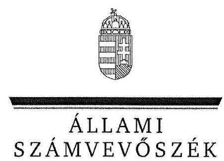
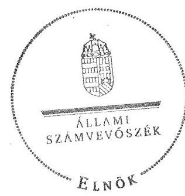
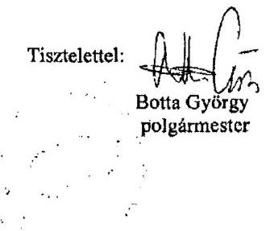
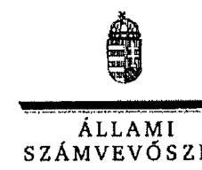
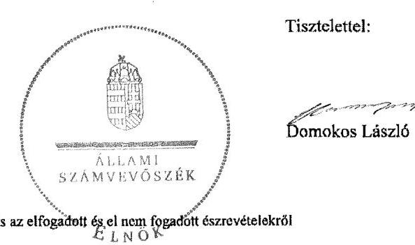

ÁLLAMI
SZÁMVEVÔSZÉK

# JELENTÉS 

az önkormányzati vagyongazdálkodás
szabályszerúségi ellenőrzéséről
Hő́gyész

---

# Állami Számvevőszék 

Iktatószám: V-0026-084-152/2013.
Témaszám: 1065
Vizsgálat-azonosító szám: V061508
Az ellenőrzést felügyelte:
Makkai Mária
felügyeleti vezető
Az ellenőrzést vezette és az ellenőrzés végrehajtásáért felelős:
Schósz Attila Ferencné
ellenőrzésvezető
A számvevőszéki jelentés összeállításában közremúködött:
Komonszky Krisztina
számvevő
Az ellenőrzést végezték:
Kardos Mihály
Kamonszky Krisztina
számvevő
A témához kapcsolódó eddig készített számvevőszéki jelentés:
címe
sorszáma
Jelentés a Magyar Köztársaság 2007. évi költségvetése végrehajtásának ellenőrzéséről

---

# TARTALOMJEGYZÉK 

BEVEZETÉS ..... 3
I. ÖSSZEGZŐ MEGÁLLAPÍTÁSOK, KÖVETKEZTETÉSEK, JAVASLATOK ..... 6
II. RÉSZLETES MEGÁLLAPÍTÁSOK ..... 12

1. A vagyongazdálkodási tevékenység szabályozottsága ..... 12
1.1. A feladatellátás formáinak meghatározása, a döntések megalapozottsága ..... 12
1.2. A vagyonnal gazdálkodó szervezetek szervezeti rendjének szabályozottsága, a kötelező szabályzatok megfelelősége ..... 13
1.3. A vagyongazdálkodás szabályozása ..... 14
1.4. A vagyonkezeléssel megbízott szervezetek beszámolási kötelezettségének szabályozása ..... 15
2. A vagyongazdálkodás szabályszerűsége ..... 16
2.1. A vagyon nyilvántartásának megfelelősége ..... 16
2.2. A vagyongazdálkodást érintő gazdasági események követelmények szerinti dokumentáltsága ..... 17
2.3. A vagyongazdálkodási döntések, intézkedések szabályszerűsége ..... 19
2.4. A közbeszerzési eljárás alkalmazása ..... 20
3. A vagyon változását eredményező gazdasági események szabályszerűsége ..... 20
3.1. A vagyon értékének és összetételének változása ..... 20
3.2. A vagyon fenntartására kialakított rendszer működésének megfelelősége és szabályozottsága ..... 21
3.3. A hitelfelvétel, kötvénykibocsátás, garancia- és kezességvállalás szabályszerűsége ..... 22
4. A vagyongazdálkodás szabályszerűségére vonatkozó belső és külső ellenőrzések hasznosulása ..... 23
4.1. A belső ellenőrzés által tett megállapítások, javaslatok hasznosulása ..... 23
4.1. A többségi tulajdonban lévő gazdasági társaságok vagyongazdálkodásának felügyelete ..... 24
4.2. A könyvvizsgálatnak a vagyongazdálkodás szabályosságához való hozzájárulása ..... 24
4.3. A külső ellenőrző szervezetek által tett javaslatok hasznosulása ..... 25

---

# MELLÉKLETEK 

1. számú Hőgyész Nagyközség Önkormányzata gazdálkodására jellemző adatok, mutatószámok
2. számú Hőgyész Nagyközség Önkormányzata vagyonának alakulása 2007. január 1-je és 2011. december 31-e között
3. számú Hőgyész Nagyközség Önkormányzata kötelezettségeinek alakulása 2007. január 1-je és 2011. december 31-e között
4. számú Hőgyész Nagyközség Önkormányzata polgármesterének észrevétele
5. számú A polgármester észrevételére adott válasz

## FÜGGELÉKEK

1. számú Rövidítések jegyzéke
2. számú Értelmező szótár

---

# JELENTÉS 

## az önkormányzati vagyongazdálkodás szabályszerűségi ellenőrzéséről Hőgyész

## BEVEZETÉS

Az ÁSZ kiemelten fontosnak tartja az ÁSZ tv. 5. § (4) bekezdése alapján az önkormányzatok vagyongazdálkodási tevékenységének, a vagyongazdálkodási szabályok betartásának ellenőrzését. Az ellenőrzés feladata, hogy értékelje a vagyongazdálkodással kapcsolatban a jogszabályokban és az önkormányzati belső szabályozásban előírtak érvényesülését a közpénzek felhasználásának átláthatósága, nyilvánossága érdekében. Az ÁSZ ellenőrzése nemcsak az ellenőrzött szervezet vagyongazdálkodásának hibáira, hiányosságaira mutat rá, számon kérve azok kijavítását, hanem megállapításaival, javaslataival segíti a közpénzekkel, a közvagyonnal való felelős gazdálkodást.

Az önkormányzati vagyon alapvető funkciója, hogy a helyi közérdeket és egyúttal az önkormányzati célok megvalósítását szolgálja. A feladatellátás terén elsősorban a kötelezően ellátandó feladatok végrehajtását hivatott szolgálni, amely mellett az önként vállalt feladatok ellátása is megvalósulhat.

## Az ellenőrzés célja annak értékelése volt, hogy az Önkormányzatnál:

- a vagyongazdálkodási tevékenység, annak szervezeti keretei szabályozottake;
- az önkormányzati vagyongazdálkodás törvényességét, szabályszerűségét biztosították-e; a vagyon értékének és összetételének változását jogszerű döntésekkel alátámasztották-e;
- a belső ellenőrzés elősegítette-e a vagyongazdálkodás szabályszerű működését, valamint hasznosultak-e a korábbi külső ellenőrzések által tett javaslatok.

Az ellenőrzés típusa: szabályszerűségi ellenőrzés
Az ellenőrzés a 2007. január 1. és 2011. december 31. közötti időszakra terjedt ki. A közbeszerzési eljárások lefolytatásának ellenőrzése a 2011. évet és a 2012. év I. negyedévét érintette. Az Nvtv. egyes rendelkezései végrehajtásának ellenőrzése a nemzetgazdasági szempontból kiemelt jelentőségű nemzeti vagyonnak minősülő, forgalomképtelen vagyonelemek meghatározására, valamint a közép- és hosszú távú vagyongazdálkodási terv készítésére terjedt ki 2012-től 2013. június 25 -éig, a helyszíni ellenőrzés befejezéséig.

---

Az ellenőrzés szakmai módszertana az ÁSZ hivatalos honlapján közzétett szakmai szabályokon alapult, amely a Legfőbb Ellenőrző Intézmények Nemzetközi Szervezete (INTOSAI) által kiadott nemzetközi standardok (ISSAI) figyelembevételével készült.

A vagyonváltozásokkal kapcsolatos gazdasági események közül az ellenőrzött tételeket véletlen mintavétellel választottuk ki a Polgármesteri Hivatal 2007-2011. évi számviteli nyilvántartásaiból. Az Önkormányzattól tanúsítványt kértünk a korábbi ÁSZ ellenőrzés vagyongazdálkodásra vonatkozó javaslatainak hasznosulásáról, a könyvvizsgáló és a külső ellenőrzési szervek vagyongazdálkodással kapcsolatos 2007-2011. évi javaslataira tett intézkedésekről, valamint a 2007-2011. évek térítésmentes vagyonátadásairól és átvételeiről.

Hőgyész Nagyközség állandó lakosainak száma 2011. január 1-jén 2984 fő volt. Az Önkormányzat hét tagú Képviselő-testületének munkáját egy állandó bizottság, a Pénzügyi Bizottság segítette. Az Önkormányzat a Polgármesteri Hivatalon kívül a 2011. évben költségvetési szervet nem tartott fenn. Az óvodai nevelésről, iskolai oktatásról, alapfokú művészetoktatásról az Önkormányzat intézményfenntartó társulások útján gondoskodott. Az egészségügyi, a szociális, gyermek- és ifjúságvédelmi feladatok ellátását, illetve a belső ellenőrzést kistérségi társulás biztosította. A településüzemeltetés, illetve a szennyvízkezelés feladatait az Önkormányzat két kizárólagos tulajdonában lévő gazdasági társasága látta el. A háziorvosi, fogorvosi ellátásra, a hulladékok begyűjtésére, az ivóvízhálózat működtetésére és a közművelődési feladatok ellátására megbízási, szolgáltatási, üzemeltetési szerződéseket kötött az Önkormányzat.

A polgármester a 2010. évi önkormányzati választások óta tölti be tisztségét, a jelenlegi jegyző 2010. március 1-jétől látja el feladatait. A Polgármesteri Hivatal szervezeti egységekre nem tagolódott, a foglalkoztatott köztisztviselők száma 2011. december 31-én tíz fő volt. A feladatellátáshoz kapcsolódóan további kilenc fő közalkalmazottat és 13 fő Munka Törvénykönyve hatálya alá tartozó munkavállalót foglalkoztattak.

Az Önkormányzat költségvetési beszámolója szerint a 2007. évben 814,1 millió Ft, a 2011. évben 375,2 millió Ft költségvetési bevételt ért el, valamint a 2007. évben 821,4 millió Ft és a 2011. évben 295,4 millió Ft költségvetési kiadást teljesített. A költségvetési bevételek és kiadások csökkenését a nevelé-si-oktatási feladatok intézményfenntartó társulásba történő átadása határozta meg, illetve hozzájárult a személyi jövedelemadóból származó bevétel 82,4 millió Ft-os mérséklődése is. Az Önkormányzat - a 2011. december 31-i könyvviteli mérleg szerint - 1667,2 millió Ft értékű nettó eszközvagyonnal rendelkezett, 95,3 millió Ft hosszú lejáratú és 17,9 millió Ft rövid lejáratú kötelezettsége volt. A 2007-2011. években térítésmentes vagyonátadás és -átvétel, valamint PPP konstrukcióban fejlesztés nem történt.

Az Önkormányzat gazdálkodására jellemző adatokat, mutatószámokat az 1-3. számú mellékletek tartalmazzák. A jelentéstervezetben alkalmazott rövidítéseket az 1. számú függelék, az egyes fogalmak magyarázatát a 2. számú függelék tartalmazza.

---

Az ÁSZ a 2011. évi LXVI. törvény 29. §-a szerint a jelentéstervezetet megküldte Hőgyész Nagyközség Önkormányzata polgármesterének egyeztetésre. A beérkezett észrevételt és az arra adott választ a jelentés 4-5. számú mellékletei tartalmazzák.

---

# I. ÖSSZEGZŐ MEGÁLLAPÍTÁSOK, KÖVETKEZTETÉSEK, JAVASLATOK 

Az Önkormányzat könyvviteli mérleg szerinti nettó vagyona a 2007. évi 861,3 millió Ft nyitó értékről a 2011. év végére 93,6\%-kal (805,9 millió Ft-tal), 1667,2 millió Ft-ra nőtt. A 2007-2011. évek között felújításokra, beruházásokra fordított kiadások összege (bruttó 931,1 millió Ft) több mint ötszöröse volt az elszámolt értékcsökkenés összegének ( 176,3 millió Ft), ennek ellenére az eszközök avultsága nőtt, mivel az amortizáció növekedésének mértéke meghaladta a bruttó érték növekedésének mértékét. A beruházások, felújítások fedezetét európai uniós és hazai támogatásokból, hitelből, valamint önkormányzati saját forrásból biztosították. A 2007-2011. években megvalósult legjelentősebb beruházások (szennyvízcsatorna-hálózat és Idősek Klubja bővítése, valamint az Idősek Klubja gépkocsi beszerzése) a gazdasági program ${ }_{1}$-ben rögzített célkitűzésekkel összhangban voltak, az Önkormányzat kötelező feladatainak ellátásához kapcsolódtak.

A Képviselő-testület a gazdasági program ${ }_{1,2}$-ben rögzítette az önkormányzati feladatellátás fő irányait. Az Önkormányzat kötelező és önként vállalt feladatait a 2007. év elején a Polgármesteri Hivatal mellett az Általános Iskolával és a Művelődési Házzal, valamint társulási és üzemeltetési szerződésekkel biztosította. A Képviselő-testület a 2007-2011. évek között - a költségtakarékosabb múködés érdekében - a közoktatási feladatok intézményfenntartó társulás útján történő ellátásáról, a Művelődési Ház megszüntetéséről és a közművelődési feladatok kiszervezéséről, illetve a szennyvízcsatorna-hálózat és a szennyvíztisztító telep üzemeltetésére, valamint a településüzemeltetési feladatok ellátására kettő gazdasági társaság (Hő-Víz Kft. és Hő-Tüz Kft.) alapításáról döntött. A Képviselő-testület ezen döntéseit alternatív javaslatok segítették.

Az Önkormányzatnál a vagyongazdálkodás szabályozása nem volt megfelelő. A Képviselő-testület az Ötv.-ben foglaltaknak eleget téve a vagyongazdálkodási rendelet ${ }_{1}$-ben meghatározta a törzsvagyonba tartozó forgalomképtelen és korlátozottan forgalomképes vagyoni kört, a törzsvagyonba nem tartozó vagyonelemeket, valamint a vagyon nyilvántartásának fő szabályait és rendelkezett a tulajdonosi jogok gyakorlásáról. Az Önkormányzat azonban a forgalomképesség megváltoztatásának szabályait nem írta elő, továbbá az Ötv. előírása ellenére nem határozta meg a vagyonkezelői jog részletes szabályait (vagyonkezelési szerződést a 2007-2011. években nem kötöttek). A vagyongazdálkodási rendelet ${ }_{1}$-ben és az önkormányzati $\mathrm{SZMSZ}_{2,3}$-ban meghatározott, vagyontárgyak feletti rendelkezési jogok értékhatárai nem voltak összhangban egymással. Az Nvtv.-ben foglaltak ellenére a Képviselő-testület a 2012. március 1-jei határidőn túl (2013. február 1-jén) rögzítette a vagyongazdálkodási rendelet ${ }_{2}$-ben, hogy a forgalomképtelennek minősülő törzsvagyonból nemzetgazdasági szempontból kiemelt jelentőségű nemzeti vagyonnak minősülő vagyonelemeket (azok hiányában) nem határoz meg. Az Önkormányzat a 2013. évben elfogadta a közép- és hosszú távú vagyongazdálkodási tervét.

---

A számviteli politika ${ }_{1-3}$-t és a hozzá kapcsolódó (selejtezési, leltározási, értékelési és pénzkezelési) szabályzatokat az Áhsz.-ben előírtaknak és a helyi sajátosságoknak megfelelően készítették el. A leltározási szabályzat ${ }_{1-3}$ a vagyon, azon belül az üzemeltetésre átadott eszközök leltározásának módját a 2007-2011. években az Áhsz.-ben foglaltaknak megfelelően írta elő.

Az Önkormányzatnál a 2007-2011. években a vagyongazdálkodás múködésének szabályszerűsége nem volt megfelelő. Az Önkormányzat a 2007-2011. években az Ötv.-ben és a számlarend ${ }_{1-3}$-ban foglalt előírásoknak megfelelően a főkönyvi számlák alábontásával biztosította a törzsvagyon többi vagyontárgytól való elkülönített nyilvántartását. Az ellenőrzött időszakban az Ötv.-ben és Áht. ${ }_{1}$-ben foglaltaknak megfelelően a vagyonkimutatást elkészítették. A 2007. évben az ingatlanvagyon-kataszter és a számviteli nyilvántartások adatai között 32,5 ezer Ft eltérés volt, melyet a 2008. évben rendeztek, a 2008-2011. években a nyilvántartások adatai megegyeztek. A vagyonváltozásokat átvezették az ingatlanvagyon-kataszterben, annak egyezőségét a földhivatal adataival a jegyző ${ }_{1-3}$ biztosította. A 2007-2011. években az Önkormányzat könyvviteli mérlegeit - az üzemeltetésre átadott eszközök 2010-2011. évi értékének kivételével - leltárral alátámasztották. Az Áhsz., illetve a leltározási szabályzat ${ }_{3}$ előírása ellenére a 2010-2011. évekre az üzemeltetésre átadott eszközök mérleg szerinti értékét nem támasztották alá az üzemeltetést végző szervek által elkészített, hitelesített leltárral.

A 2007-2011. évek között a polgármester ${ }_{1,2}$, a jegyző ${ }_{1-3}$, valamint a szakmai teljesítés igazolására és érvényesítésre jogosult köztisztviselők nem végezték el az Áht. ${ }_{1}$-ben, az Ámr. ${ }_{1,2}$-ben és a gazdálkodási szabályat ${ }_{1-3}$-ban meghatározott - a gazdálkodási jogkörök gyakorlásával kapcsolatos - ellenőrzési feladataikat (2008. március 27-ig és 2010. október 1-jétől nem volt kijelölve szakmai teljesítés igazoló és érvényesítő). Előzetes írásbeli kötelezettségvállalás nélkül teljesítettek 2,2 millió Ft összegű kiadást. A kötelezettségvállalás ellenjegyzése 99,6\%ban ( 80,9 millió Ft kiadás esetében) elmaradt. Nem az arra jogosult végezte el 80,6 millió Ft ( $99,2 \%$ ) kiadás és 0,9 millió Ft bevétel esetében a szakmai teljesítés igazolását, valamint 57,0 millió Ft ( $70,2 \%$ ) kiadásnál és 4,3 millió Ft bevételnél az érvényesítést. A szakmai teljesítés igazolója ( 0,4 millió Ft kiadás), az érvényesítő ( 24,2 millió Ft kiadás, illetve 0,9 millió Ft bevétel esetében) és az utalvány ellenjegyzője (valamennyi ellenőrzött kiadás, illetve 1,0 millió Ft bevétel esetében) nem megfelelően látta el ellenőrzési feladatát. Ezáltal elmaradt a szabad előirányzat és a pénzügyi fedezet rendelkezésre állásának, a kifizetés jogosságának, összegszerűségének, a szerződés, megrendelés megállapodás szerinti teljesítésének, a szakmai teljesítés igazolás és az érvényesítés jogszabályoknak megfelelő megtörténtének ellenőrzése. A kötelezettségvállalásokról analitikus nyilvántartást az Ámr. ${ }_{1,2}$ előírása ellenére nem vezettek. Az Önkormányzatnál a szabályozás és a gyakorlat összhangja nem volt biztosított. A nem megfelelően múködtetett belső kontrollok megnövelik a korrupciós kockázat bekövetkezésének lehetőségét.

A vagyonváltozáshoz kapcsolódó döntéseket az ellenőrzött tételek esetében - az értékvesztés elszámolásának kivételével - az arra jogosult Képviselőtestület hozta meg. Az értékelési szabályzat ${ }_{1-3}$ előírása ellenére az üzletrész értékelését - a 2007-2011. években - a jegyző ${ }_{1-3}$ nem ellenőrizte, az értékvesztés elszámolását a polgármester ${ }_{1,2}$ nem hagyta jóvá. Az ellenőrzött mintatételek-

---

hez kapcsolódó döntések előkészítése, végrehajtása során az önkormányzati SZMSZ $_{1-2}$ és a vagyongazdálkodási rendelet ${ }_{1}$ előírásait betartották. A vagyonhasznosításra vonatkozó szerződések szabályozás hiányában is tartalmaztak az Önkormányzat érdekeit védő garanciális elemeket. Az Önkormányzat a 2011. évben, illetve a 2012. év I. negyedévében a közbeszerzési értékhatárt elérő beruházások esetében lefolytatta a közbeszerzési eljárást, a kiválasztott eljárásrend megfelelt a Kbt. ${ }_{1,2}$ előírásainak. Az Önkormányzat a 2007. évben a szennyvízhálózat bővítéséhez, a 2011. évben gépjármú beszerzéshez vett fel hosszú lejáratú, felhalmozási célú hitelt. A Pénzügyi Bizottság az Ötv. előírása ellenére nem közölte a Képviselő-testülettel a hitelfelvétel indokairól és gazdasági megalapozottságáról szóló vizsgálati megállapításait.

A jegyző ${ }_{1-3}$ az Eisztv. előírásai ellenére nem biztosította a közérdekú gazdálkodási adatok közzétételét a felhalmozási célú pénzeszköz átadások, a vagyonnal való gazdálkodásra vonatkozó (nettó ötmillió Ft-ot elérő, vagy meghaladó értékű beruházási, vagyonhasznosítási) szerződések adatai, a 2009-2011. évi költségvetési rendeletek és elemi költségvetések, valamint a 2008-2011. évi zárszámadási rendeletek és beszámolók tekintetében. Ezáltal a jegyző ${ }_{1-3}$ nem biztosította a közpénzek felhasználásának átláthatóságát.

A belső ellenőrzési feladatokat az Önkormányzat a 2007-2011. években a Kistérségi társulás keretében látta el. A 2007-2011. évek között a vagyongazdálkodást érintően négy alkalommal végeztek belső ellenőrzést. A Kbt., illetve az ÁSZ 2008. évi ellenőrzése során tett javaslata ellenére a közbeszerzések, illetve a közbeszerzési eljárások belső ellenőrzése nem történt meg. A belső ellenőrzési jelentések javaslatai a belső kontrollrendszer szabályozására, a leltározás szabályszerű végrehajtására, a kötelezettségvállalás nyilvántartásának vezetésére, a céljellegú támogatások szabályozására és elszámolására vonatkoztak. Intézkedési tervet a hiányosságok megszüntetésére a Ber. előírásai ellenére a jegyzö ${ }_{1,3}$ kettő ellenőrzéshez kapcsolódóan nem készített, de a feltárt szabályozási hiányosságokat a jegyző ${ }_{1}$ megszüntette. A kötelezettségvállalás nyilvántartására és a leltározási ütemterv, utasítás készítésére vonatkozó javaslatok nem hasznosultak, ezáltal a belső ellenőrzés a vagyongazdálkodás múködési hiányosságainak megszüntetéséhez nem járult hozzá.

A Képviselő-testület - a tulajdonosi felügyelet keretében - az Önkormányzat kizárólagos tulajdonában lévő két gazdasági társaság beszámolóját elfogadta. A társaságok a 2011. évet 3,3 millió Ft, illetve 3,4 millió Ft mérleg szerinti eredménnyel zárták. A társaságok részére az Önkormányzat garanciát, kezességet nem vállalt, tagi kölcsönt nem nyújtott, tőkeemelést nem hajtott végre.

Az Önkormányzat 2007-2011. évi költségvetési beszámolóit a könyvvizsgáló minden évben megbízhatónak és hitelesnek minősítette. A vagyongazdálkodást érintően rendszeresen előforduló hiányosságokat állapított meg a leltározás, a kötelezettségvállalás nyilvántartása kapcsán, illetve a 2007-2008. évek esetében rögzítette az előirányzatok túllépését és a 2007. évre az ingatlanok számviteli és kataszteri nyilvántartásának eltérését. A könyvvizsgáló által feltárt hiányosságokat (az ingatlanvagyon-kataszter és a számviteli nyilvántartás eltérése kivételével) nem szüntették meg, javaslatai nem hasznosultak.

---

Az Állami Számvevőszékről szóló 2011. évi LXVI. törvény 33. § (1) bekezdésében foglaltak értelmében a jelentésben foglalt megállapításokhoz kapcsolódó intézkedési tervet köteles az ellenőrzött szervezet vezetője összeállítani, és azt a jelentés kézhezvételétől számított 30 napon belül az ÁSZ részére megküldeni. Amennyiben az intézkedési tervet határidőben nem küldi meg a szervezet, vagy az nem elfogadható, az ÁSZ elnöke a hivatkozott törvény 33. § (3) bekezdés a)-b) pontjaiban foglaltakat érvényesítheti.

Az ellenőrzés intézkedést igénylő megállapításai és javaslatai:

# a polgármesternek 

A vagyongazdálkodás egyes területeivel kapcsolatos kiadások teljesítését és a bevételek beszedését megelőzően a polgármester ${ }_{1,2}$, a jegyző ${ }_{1-3}$, valamint a szakmai teljesítés igazolására és érvényesítésre jogosult köztisztviselők nem végezték el az előírt ellenőrzési feladatokat.

A jegyző ${ }_{1-3}$ nem biztosította a közérdekű gazdálkodási adatok közzétételét a felhalmozási célú pénzeszköz átadások, a vagyonnal való gazdálkodásra vonatkozó (nettó ötmillió Ft-ot elérő vagy meghaladó értékű beruházási, vagyonhasznosítási) szerződések adatai, a 2009-2011. évi költségvetési rendeletek és elemi költségvetések, valamint a 2008-2011. évi zárszámadási rendeletek és beszámolók tekintetében.

A belső ellenőrzés a vagyongazdálkodás működési hiányosságainak megszüntetéséhez nem járult hozzá, mivel a kötelezettségvállalás nyilvántartására és a leltározási ütemterv, utasítás készítésére vonatkozó javaslatai nem hasznosultak.

Javaslat:
Vizsgálja ki a gazdálkodási jogkörök gyakorlásával összefüggésben feltárt hiányosságokat, szabálytalanságokat, a közérdekű adatok közzétételének elmaradását, valamint a belső ellenőrzés javaslatai hasznosulásának elmaradását, és a vizsgálat eredményének függvényében tegye meg a szükséges munkajogi intézkedéseket.

## a jegyzőnek

1. A 2010-2011. évekre az üzemeltetésre átadott eszközök mérleg szerinti értékét az Áhsz. 37. § (4) bekezdésében, illetve a leltározási szabályzat ${ }_{3}$-ban foglalt előírás ellenére az Önkormányzat nem támasztotta alá az üzemeltetést végző szervek által - a december 31-ei fordulónapra vonatkozó évenkénti leltározás alapján - elkészített, hitelesített leltárral.

Javaslat:
Intézkedjen, hogy az üzemeltetésre átadott eszközökről a könyvviteli mérleg alátámasztásához, az Áhsz. 37. § (4) bekezdés előírásának megfelelően, az üzemeltetők által évente elvégzett és hitelesített leltárak álljanak rendelkezésre.
2. 2010. október 1-jével a jegyző ${ }_{3}$ a gazdálkodási szabályzat ${ }_{2}$-t hatályon kívül helyezte, a szakmai teljesítés igazolását végző személyeket 2010. október 1-jétől az Ámr. ${ }_{2}$

---

76. § (5) bekezdése ellenére nem jelölte ki. Továbbá az érvényesítő kijelölése sem történt meg 2008. március 27-ig és 2010. október 1-jétől az Ámr. 135. § (4) bekezdésében, illetve az Ámr. 2 77. § (4) bekezdésében foglaltak ellenére

Javaslat:
Intézkedjen, hogy a kötelezettségvállaló az Ávr. 57. § (4) bekezdése alapján jelölje ki a szakmai teljesítés igazolására jogosult személyeket, valamint az Ávr. 58. § (4)-(5) bekezdései alapján az érvényesítésre jogosult személyeket.
3. A vagyongazdálkodás egyes területeivel kapcsolatos kiadások teljesítését és a bevételek beszedését megelőzően a polgármester ${ }_{1,2}$, a jegyző ${ }_{1-3}$, valamint a szakmai teljesítés igazolására és érvényesítésre jogosult köztisztviselők nem végezték el az előírt ellenőrzési feladatokat. Az Ámr. ${ }_{1}$ 134. § (8)-(9) bekezdései, illetve az Ámr. ${ }_{2}$ 74. § (1) és (3) bekezdése ellenére összesen 2,2 millió Ft összegű kiadást előzetes írásbeli kötelezettségvállalás nélkül teljesítettek, a kötelezettségvállalást nem előzte meg ellenjegyzés összesen 80,9 millió Ft kiadás esetében. Az Ámr. ${ }_{1}$ 135. § (2) és (4) bekezdésében, illetve az Ámr. ${ }_{2}$ 76. § (5) bekezdésében és az Ámr ${ }_{2}$ 77. § (4) bekezdésben foglalt előírások ellenére a szakmai teljesítés igazolását (összesen 80,6 millió Ft kiadás és 0,9 millió Ft bevétel), valamint az érvényesítést (összesen 57,0 millió Ft kifizetés és 4,3 millió Ft bevétel esetében) nem az arra jogosult végezte el. Az Ámr. ${ }_{1}$ 135. § (1) és (3) bekezdése, illetve az Ámr. ${ }_{2}$ 76. § (1) bekezdése és 77. § (1) bekezdése ellenére a szakmai teljesítés igazolója (összesen 0,4 millió Ft kiadás) és az érvényesítő (összesen 24,2 millió Ft kiadás, illetve 0,9 millió Ft bevétel esetében) nem látta el ellenőrzési feladatát.

Javaslat:
Gondoskodjon arról, hogy a pénzügyi ellenjegyző, a teljesítést igazoló és az érvényesítő - az Áht. 2 37. § (1), az Ávr. 57. § (1), (3)-(4), valamint az Ávr. 58. § (1), (3) és (4) bekezdések előírásainak megfelelően - végezze el ellenőrzési feladatait.
4. A Polgármesteri Hivatalban az Ámr. ${ }_{1}$ 134. § (13) bekezdésének és az Ámr. ${ }_{2}$ 75. § (1) bekezdésének előírásai ellenére a kötelezettségvállalások analitikus nyilvántartásának vezetéséről nem gondoskodtak.

Javaslat:
A kötelezettségvállalásokat követően az Ávr. 56. § (1) bekezdésének megfelelően gondoskodjon azok analitikus nyilvántartásba vételéről.
5. A jegyző ${ }_{1-3}$ az Eisztv. 6. § (1) bekezdésében előírtak ellenére 2008. július 1-jét követően nem gondoskodott az Önkormányzat 2009-2011. évi költségvetési rendeletének, elemi költségvetésének, 2008-2011. évi költségvetési beszámolójának és zárszámadási rendeletének, valamint az Áht. ${ }_{1}$ 15/A. § és 15/B. § ellenére a céljellegú fejlesztési támogatásokra, a vagyongazdálkodással összefüggő - a nettó ötmillió forintot elérő vagy azt meghaladó értékű - szerződésekre vonatkozó adatok közzétételéről.

---

Javaslat:
Intézkedjen az Infotv. 37. § (1) bekezdése alapján az 1. számú mellékletében meghatározott adatok közzétételéről.
6. Az önkormányzati SZMSZ ${ }_{2,3}$-ban és a vagyongazdálkodási rendelet ${ }_{1}$-ben meghatározott átruházott hatáskörök értékhatárai nem voltak összhangban.

Javaslat:
Készítse elő az SZMSZ ${ }_{3}$, illetve a vagyongazdálkodási rendelet ${ }_{2}$ módosítását, és kezdeményezze a polgármesternél a módosítás Képviselő-testület elé terjesztését annak érdekében, hogy az átruházott hatáskörök értékhatárai összhangba legyenek.

---

# II. RÉSZLETES MEGÁLLAPÍTÁSOK 

## 1. A VAGYONGAZDÁLKODÁSI TEVÉKENYSÉG SZABÁLYOZOTTSÁGA

### 1.1. A feladatellátás formáinak meghatározása, a döntések megalapozottsága

A Képviselő-testület a gazdasági program ${ }_{1,2}$-ben jóváhagyta az önkormányzati feladatellátással összefüggő fő irányokat, célkitűzéseket. A gazdasági program ${ }_{1}$-ben fejlesztési feladatként nevesítették az akadálymentesítést, az egészségház szigetelését, az Idősek Klubjának bővítését, a szeméttelep rekultivációját, a szennyvízcsatorna-hálózat bővítését és az ivóvíz ellátó rendszerek, utak és járdák felújítását. A gazdasági program ${ }_{2}$-ben továbbra is fejlesztési célként szerepelt a vízvezetékrendszer felújítása, a szeméttelep rekultivációja, valamint az utak és járdák felújítása. A gazdasági program ${ }_{1,2}$-ben önként vállalt feladatként a településközpont rehabilitációja jelent meg.

Az Önkormányzat az Ötv. 8. § (2) bekezdése alapján meghatározta ${ }^{1}$ a kötelezően ellátandó és önként vállalt feladatainak körét, a feladatellátás módját és mértékét. Az Önkormányzat 2007. január 1-jén három költségvetési szervvel (az önállóan gazdálkodó Polgármesteri Hivatallal és Általános Iskolával, illetve a részben önállóan gazdálkodó Művelődési Házzal), társulással, továbbá gazdasági társasággal látta el feladatait.

Az Önkormányzat a kötelező óvodai nevelés és általános iskolai oktatás ellátásáról, illetve az alapfokú művészetoktatás önként vállalt feladatról az Általános Iskola útján gondoskodott. Az önként vállalt közművelődési feladatokat a Művelődési Ház látta el. Az egészségügyi és szociális alapellátási, valamint a gyermek és ifjúságvédelmi kötelező feladatokat és a belső ellenőrzést a Kistérségi társulás útján biztosította az Önkormányzat. A Polgármesteri Hivatal ellátta az Önkormányzat kötelező feladatai közül a védőnői szolgálatot, a köztemető fenntartását, valamint a kisebbségi önkormányzatok igazgatási tevékenységét, önként vállalt feladatként a vérvételi labor múködtetését. Az egészséges ivóvízellátás és szennyvízkezelés kötelező feladatot a Vízmú látta el, melyben az Önkormányzat nem rendelkezett többségi tulajdonrésszel. A települési szilárd hulladék összegyűjtés és kezelés kötelező feladatot a Kaposmenti Hulladékgazdálkodási Önkormányzati Társulás végezte.

A 2007-2011. évek között a Képviselő-testület - a költségtakarékosabb múködés érdekében - két esetben intézmény megszüntetéséről, az alapfokú nevelés és oktatás intézményfenntartó társulás által történő ellátásáról, illetve a közművelődési feladatok kiszervezéséről, valamint kettő gazdasági társaság alapításáról döntött. A megalapozott döntés meghozatala érdekében a

[^0]
[^0]:    ${ }^{1}$ A gazdasági program ${ }_{1,2}$-ben, az önkormányzati SZMSZ ${ }_{1,2}$-ban, az éves költségvetési rendeletekben határozták meg.

---

Képviselő-testület számára készített előterjesztésekben alternatív javaslatokat, szakértői anyagot, tanulmányt mutattak be.

Az óvodai nevelést, az iskolai oktatást és az alapfokú művészetoktatást 2007. szeptember 1-jétől - a működtetés racionalizálása érdekében - az óvodafenntartó társulás és az iskolafenntartó társulás ${ }_{1}$ útján biztosították. Az óvoda az óvodafenntartó társulás költségvetési szervének tagintézményeként múködött. Az iskolafenntartó társulás ${ }_{1}$ gesztora 2009. július 31-éig az Önkormányzat volt. A 2009. évben az „Integrált kis- és mikrotérségi oktatási hálózatok és központjaik fejlesztése" pályázaton való részvétel érdekében az Önkormányzat csatlakozott az iskolafenntartó társulás ${ }_{2}$-höz. Az Általános Iskola 2009. augusztus 1-jétől az iskolafenntartó társulás ${ }_{2}$ költségvetési szervének tagintézménye lett. Az Önkormányzat a tulajdonában lévő, feladatellátást szolgáló ingatlanok ingyenes használati jogát átadta az óvodafenntartó társulás és az iskolafenntartó társulás ${ }_{1,2}$ részére.

Az Önkormányzat a közművelődési feladatainak átszervezésére, költségeinek csökkentésére vonatkozó előterjesztés, több alternatív javaslat tárgyalását követően 2008. május 31-ei hatállyal a Művelődési Házat megszüntette. A feladatellátásra vonatkozó közbeszerzési pályázatot követően annak nyertesével, a Hőgyészi Művelődésszervező Nonprofit Kft.-vel szerződést kötött.
2010. december 2-án - az egyes településüzemeltetési feladatok gazdaságosabb ellátása érdekében - az Önkormányzat megalapította a településüzemeltetéssel foglalkozó, kizárólagos önkormányzati tulajdonú Hő-Tüz Kft.-t.

A már meglévő és üzemelő csatornahálózathoz csatlakozó, újonnan kiépített szennyvízhálózatot a 2009. évben az Önkormányzat a korábbi hálózatot is üzemeltető Vízmú részére üzemeltetésre átadta. A Képviselő-testület a 2011. évben az üzemeltetési szerződés felmondásáról döntött, és 2011. június 29-én megalapította a szennyvízcsatorna-hálózat és a szennyvíztisztító telep üzemeltetési feladataira a kizárólagosan az Önkormányzat tulajdonában lévő Hő-Víz Kft.-t.

# 1.2. A vagyonnal gazdálkodó szervezetek szervezeti rendjének szabályozottsága, a kötelező szabályzatok megfelelősége 

A Képviselő-testület a 2007-2011. években az Ötv.-ben foglaltak alapján alkotta meg az önkormányzati $\mathrm{SZMSZ}_{1-3}$-t. A Képviselő-testület élt az Ötv. 9. § (3) bekezdésében biztosított jogával, a vagyongazdálkodási feladatokhoz kapcsolódóan a polgármester ${ }_{1,2}$-nek és a Pénzügyi Bizottságnak hatáskört adott át. Az átruházott hatáskör esetére a soron következő ülésen történő beszámolási kötelezettséget írt elő. Az önkormányzati $\mathrm{SZMSZ}_{2,3}$ kivételével a vagyongazdálkodási rendelet ${ }_{1}$ és a belső szabályzatok összhangja biztosított volt. Az önkormányzati $\mathrm{SZMSZ}_{2,3}$-ban az átruházott hatáskörök értékhatárai nem voltak összhangban a vagyongazdálkodási rendelet ${ }_{1}$-ben meghatározott értékhatárokkal.

A polgármester ${ }_{1,2}$-t az önkormányzati $\mathrm{SZMSZ}_{2,3}$-ban a 100-200 ezer Ft közötti ingóságok, illetve az 500 ezer Ft alatti forgalomképes ingatlanok értékesítésének és az átmenetileg szabad pénzeszközök lekötésének jogával hatalmazták fel. Jogosult volt dönteni továbbá a nettó 1 millió Ft-ot meg nem haladó beszerzésekről, az önkormányzati intézmények ingó és ingatlan tárgyainak bérbeadásáról, valamint a tárgyévi költségvetési rendeletben meghatározott kötelezettségvállalásról. Ezzel szemben a vagyongazdálkodási rendelet ${ }_{1}$-ben a forgalomképes ingó va-

---

gyon szerzéséről, elidegenítéséről és megterheléséről szóló döntésre 100 ezer Ft nettó értékhatárig hatalmazták fel a polgármester ${ }_{1,2}$-t.

Az önkormányzati SZMSZ ${ }_{2,3}$-ban felhatalmazták a Pénzügyi Bizottságot a 200500 ezer Ft közötti ingóságok, illetve az 500 ezer-1 millió Ft közötti forgalomképes ingatlanok értékesítéséről, a nettó 1 millió Ft feletti, de a közbeszerzési értékhatárt el nem érő beszerzésekről való döntés jogával. Ezzel szemben a vagyongazdálkodási rendelet ${ }_{1}$ szerint a forgalomképes ingó vagyon szerzéséről, elidegenítéséről és megterheléséről szóló döntésre 100-500 ezer Ft közötti nettó érték esetén volt jogosult a Pénzügyi Bizottság.

A jegyzó $_{1-3}$ a Htv. 140. § (1) bekezdés c) pontjában foglalt előírás szerint kialakította a Polgármesteri Hivatal és intézményei számviteli rendjét. A számviteli politika ${ }_{1-3}$-at és annak mellékleteként a pénzkezelési, leltározási, selejtezési és értékelési szabályzat ${ }_{1-3}$-at az Áhsz.-nek és a helyi sajátosságoknak megfelelően készítették és fogadták el. A Képviselő-testület nem élt az Âhsz. 37. § (7) bekezdése szerinti lehetőséggel, és nem alkotott rendeletet a kétévenkénti leltározásról. A leltározási szabályzat ${ }_{1-3}$-ban az Áhsz. előírásainak megfelelően rendelkeztek a vagyon, azon belül az üzemeltetésre átadott eszközök leltározásának módjáról.

A gazdálkodási szabályzat ${ }_{1-3}$-ban a gazdálkodási jogkörök gyakorlásának rendjét és a velük kapcsolatos összeférhetetlenségi szabályokat meghatározták, azonban a szakmai teljesítés igazolását és - gazdasági szervezet hiányában az érvényesítést végző személyek kijelöléséről, megbízásáról a jegyző ${ }_{1}$ az Ámr. ${ }_{1}$ 135. § (2) és (4) bekezdése ${ }^{2}$ ellenére csak 2008. március 27 -től gondoskodott. 2010. október 1-jével a jegyző ${ }_{3}$ a gazdálkodási szabályzat ${ }_{2}$-t hatályon kívül helyezte, a szakmai teljesítés igazolását és az érvényesítést végző személyeket 2010. október 1-jétől az Ámr. ${ }_{2}$ 76. § (5) bekezdése, illetve 77. § (4) bekezdése ellenére nem jelölte ki.

# 1.3. A vagyongazdálkodás szabályozása 

A Képviselő-testület a vagyongazdálkodási rendelet ${ }_{1}$-ben az Ötv. 79. § (2) bekezdésének megfelelően meghatározta az önkormányzati feladatellátást biztosító törzsvagyon körét, azon belül a forgalomképtelen és a korlátozottan forgalomképes vagyonelemeket, illetve a törzsvagyonba nem tartozó, forgalomképes vagyontárgyakat. A törzsvagyon többi vagyontárgytól elkülönített nyilvántartásának kötelezettségét a számlarend ${ }_{1-3}$-ban írták elő. Az Önkormányzat vagyongazdálkodási tevékenységének szabályozása nem volt megfelelő, mivel az Ötv. 80/B. §-a ellenére nem rendelkeztek a vagyonkezelői jog részletes szabályairól, az Âht. ${ }_{1}$ 108. § (2) bekezdésében foglaltak ellenére a vagyon tulajdonjogának ingyenes átruházására vonatkozó szabályokról, valamint az ingyenes

[^0]
[^0]:    ${ }^{2}$ 2012. január 1-jétől a szakmai teljesítés igazoló kijelölését az Ávr. 57. § (4), az érvényesítő kijelölését az 58. § (4) bekezdése szabályozza.

---

átruházás módjairól és eseteiről. A vagyongazdálkodási rendelet ${ }_{1}$-ben a forgalomképesség megváltoztatásának szabályait nem írták elő ${ }^{3}$.

Az önkormányzati vagyon elidegenítése, használatba vagy bérbeadása, más módon történő hasznosítása esetére a vagyongazdálkodási rendelet ${ }_{1}$-ben - értékhatártól függetlenül - nyilvános versenyeztetési kötelezettséget írtak elő, a versenyeztetés részletes szabályait meghatározták.

A vagyongazdálkodást érintő előterjesztések készítésének, megtárgyalásának, véleményezésének és döntéshozatalának rendjét az Önkormányzat külön nem szabályozta, arra az önkormányzati SZMSZ ${ }_{1-3}$-ban rögzített, az előterjesztésekre vonatkozó általános szabályok vonatkoztak.

A megalapozott vagyongazdálkodási döntések meghozatala érdekében az előkészítési folyamatra vonatkozóan - célszerűsége ellenére - a Képviselő-testület nem írta elő a tulajdonosi jogok védelme érdekében a garanciális elemek szerződésekben, egyéb dokumentumokban való rögzítésének kötelezettségét. A finanszírozási célú pénzügyi műveletek vonatkozásában a pénzügyi kockázatok felmérését, a hitelfelvételről, kötvénykibocsátásról szóló döntés-előkészítés folyamatában a futamidő egyes éveit terhelő kötelezettség költségvetési egyensúlyra gyakorolt hatásának vizsgálatát nem írta elő.

A vagyongazdálkodási rendelet ${ }_{2}$-ben a Képviselő-testület - az Nvtv. 18. § (1) bekezdésében meghatározott határidőn (2012. március 1-jén) túl, 2013. február 1-jén - rögzítette, hogy a forgalomképtelennek minősülő vagyonból nemzetgazdasági szempontból kiemelt jelentőségű nemzeti vagyonnak minősülő vagyonelemeket (azok hiányában) nem határoz meg. A Képviselő-testület 2013. február 28-án fogadta el az Nvtv. 9. § (1) bekezdésében előírt közép- és hosszú távú vagyongazdálkodási tervet.

# 1.4. A vagyonkezeléssel megbízott szervezetek beszámolási kötelezettségének szabályozása 

Az ellenőrzött időszakban az Önkormányzat az Ötv. 80/A. § előírása szerinti vagyonkezelési szerződést nem kötött, vagyonkezelői jogot nem alapított.

A Vízmúnek és az óvodafenntartó társulásnak üzemeltetésre átadott eszközökről az Önkormányzat megállapodással nem rendelkezett. A 2009. évben aktivált szennyvízhálózat üzemeltetési szerződésében, valamint az intézményfenntartó társulások költségvetési szerveinek alapító okiratában rögzítették a vagyont üzemeltetők, használók feladatát, illetékességét, hatáskörét és felelősségét, azonban a dokumentumok az üzemeltetők beszámolási kötelezettségére vonatkozóan nem tartalmaztak előírásokat. Az Önkormányzat az üzemeltetőket nem számoltatta be, a Vízmú a társaság múködéséről beszámolt, azonban a vagyon üzemeltetéséről nem.

[^0]
[^0]:    ${ }^{3}$ A vagyon ingyenes átruházásának, a vagyonkezelői jog létesítésének szabályait a 2013. február 1-jétől hatályos vagyongazdálkodási rendelet ${ }_{2}$-ben szabályozták, a forgalomképesség megváltoztatásának szabályairól azonban továbbra sem rendelkeztek.

---

Az Önkormányzat nyilvántartásaiban üzemeltetésre átadott eszközök között szereplő Fadd-Dombori üdülő, Dombóvári irodaház és az 1994-ben a Vízmú részére üzemeltetésre átadott szennyvízhálózat üzemeltetési szerződését nem tudták az ellenőrzés rendelkezésére bocsátani.

# 2. A VAGYONGAZDÁLKODÁs SZABÁLYSZERŰSÉGE 

### 2.1. A vagyon nyilvántartásának megfelelősége

A 2007-2011. években az Ötv. 78. § (2) bekezdése szerint a vagyonkimutatást elkészítették, és az Áht. 1 118. § (2) bekezdés 2. c) pontjában foglaltaknak megfelelően az Önkormányzat zárszámadásának előterjesztésekor a Képvise-lö-testület részére bemutatták. A 2007-2011. évi vagyonkimutatások a befektetett pénzügyi eszközök előírás szerinti tagolását nem tartalmazták, ezáltal a vagyonkimutatások tartalma ezen eszközcsoport esetében nem felelt meg az Áhsz. 44/A. § (2) bekezdésében foglaltaknak.

Az Önkormányzat a 2007-2011. években eleget tett az Ötv. 78. § (2) bekezdésében és a számlarend ${ }_{1-3}$-ban foglalt előírásnak, mivel a főkönyvi számlák alábontásával biztosította a törzsvagyon (ezen belül a forgalomképtelen, illetve korlátozottan forgalomképes vagyon) többi vagyontárgytól elkülönített nyilvántartását.

Az ingatlanvagyon-kataszter és a számviteli nyilvántartások között a 2007. évben mutattak ki számszaki eltérést, ami a számviteli nyilvántartások módosítását igényelte ${ }^{4}$. Az ingatlanvagyon-kataszterből (a földterületek értékesítését követően) a 32,5 ezer Ft-os bruttó értéket a 2007. évben kivezették, azonban a számviteli nyilvántartásokat - az egyeztetést követően - a 2008. évben módosították. A nyilvántartások a 2008-2011. években egyezőséget mutattak.

Az ingatlanvagyon-kataszter és a földhivatal adatainak egyezőségét a jegyző ${ }_{1-3}$ a 2007-2011. években biztosította. Az ingatlanvagyon-kataszter adatait a közhiteles nyilvántartást vezető, illetékes földhivatal adataival az önkormányzatok tulajdonában lévő ingatlanvagyon nyilvántartási és adatszolgáltatási rendjéről szóló 147/1992. (XI. 6.) Korm. rendelet 1. § (2) bekezdésében foglaltak érvényesülése érdekében - az Önkormányzat írásbeli nyilatkozata alapján - 1998-ban tételesen egyeztették, a változások átvezetése a 2007-2011. években az ellenőrzött tételek esetében megtörtént.

A 2010-2011. években az Önkormányzat vagyongazdálkodásának szabályszerű múködését nem biztosították. Az Önkormányzat a 2007-2011. években a Számv. tv. 69. § (1) bekezdésében és az Áhsz. 37. § (1) bekezdésében előírt leltározási kötelezettségének - a leltározási szabályzat ${ }_{1-3}$-ban előírt leltározási utasítás és ütemterv hiányában ${ }^{5}$ is - eleget tett december 31-ei fordulónappal. Az el-

[^0]
[^0]:    ${ }^{4}$ Az eltérést a 2007. évi könyvvizsgálói jelentés kiegészítése is rögzítette, a könyvvizsgáló javaslatot tett az eltérés kivizsgálására és az egyezőség biztosítására.
    ${ }^{5}$ A leltározási utasítás és a leltározási ütemterv hiányát a belső ellenőrzés és a könyvvizsgáló is megállapította.

---

lenőrzés alá vont mérlegsorokat a 2007-2011. években az Önkormányzat könyvviteli mérlegeiben - az üzemeltetésre átadott eszközök 2010-2011. évi értékének kivételével - leltárral alátámasztották, az eszközöket és forrásokat az éves mérlegek az Áhsz. 37. § (2) bekezdésének előírása szerint, a kiértékelt leltárak alapján tartalmazták. A 2007-2011. évek között az üzemeltetésre átadott eszközöket a Polgármesteri Hivatal mennyiségi felvétellel leltározta, azonban a 2010-2011. évekre az üzemeltetésre átadott eszközök mérleg szerinti értékét az Áhsz. 37. § (4) bekezdésében ${ }^{6}$, illetve a leltározási szabályzat ${ }_{3}$-ban foglalt előírás ellenére az Önkormányzat nem támasztotta alá az üzemeltetést végző szervek által - a december 31-ei fordulónapra vonatkozó évenkénti leltározás alapján - elkészített, hitelesített leltárral.

A 2007-2011. évi könyvviteli mérleg egyes sorainak értéke megegyezett a záró főkönyvi kivonat vonatkozó főkönyvi számláinak értékével.

# 2.2. A vagyongazdálkodást érintő gazdasági események követelmények szerinti dokumentáltsága 

A Polgármesteri Hivatalban a 2007-2011. években az Ámr. ${ }_{1}$ 134. § (13) bekezdésében, illetve az Ámr. ${ }_{2} 75$. § (1) bekezdésében ${ }^{7}$ előírtak ellenére a kötelezettségvállalások analitikus nyilvántartásának vezetéséről nem gondoskodtak ${ }^{8}$. A gazdálkodási jogkörök gyakorlása során betartották az Ámr. 138. § (1)-(3) bekezdésében, valamint az Ámr. ${ }_{2}$ 80. § (1)-(2) bekezdésében rögzített öszszeférhetetlenségi követelményeket. A vagyongazdálkodás egyes területeivel kapcsolatos kiadások teljesítését és a bevételek beszedését megelőzően a polgármester ${ }_{1,2}$, a jegyző ${ }_{1-3}$, valamint a szakmai teljesítés igazolására és érvényesítésre jogosult köztisztviselők nem végezték el az Áht. ${ }_{1}$-ben, az Ámr. ${ }_{1,2}$-ben és a gazdálkodási szabályzat ${ }_{1-3}$-ban elóirt ellenőrzési feladatokat. Az Önkormányzatnál a szabályozás és a gyakorlat összhangja nem volt biztosított. A nem megfelelően múködtetett belső kontrollok megnövelik a korrupciós kockázat bekövetkezésének lehetőségét.

Az építési beruházások, felújítások és a nagy értékű eszköz beszerzések kiadásai esetében az Áht. ${ }_{1}{ }^{9}$ és az Ámr. ${ }_{1}$ 134. § (8)-(9) bekezdése, illetve az Ámr. ${ }_{2} 74 . \S$ (1) és (3) bekezdése ${ }^{10}$ ellenére nem történt előzetes írásbeli kötelezettségvállalás (összesen 12 esetben, 2,2 millió Ft összegben), a kötelezettségvállalást nem előzte meg annak ellenjegyzése (összesen 28 esetben, 80,9 millió Ft értékben, az ellenőrzött tételek 99,6\%-ában). A kötelezettségvállalások ellenjegyzésének hiányában el-

[^0]
[^0]:    ${ }^{6}$ Megállapította a 317/2009. (XII. 29.) Korm. rendelet 18. §-a. Először a 2010. évről készített beszámolókra kellett alkalmazni.
    ${ }^{7}$ 2012. január 1-jétől az Ávr. 56. § (1) bekezdése szabályozza.
    ${ }^{8}$ A kötelezettségvállalás-nyilvántartásának hiányát a belső ellenőrzés és a könyvvizsgáló is kifogásolta, továbbá a könyvvizsgáló a 2007. és a 2008. évi könyvvizsgálói jelentés kiegészítésében rögzítette a kiemelt előirányzatok túllépését.
    ${ }^{9}$ A 2007-2008. években az Áht. ${ }_{1}$ 98. § (2) bekezdése, a 2009. évben a 100/B. § (3) bekezdése, 2010. augusztus 15-től a 100/C. § (3) bekezdése, 2012. január 1-jétől az Áht. ${ }_{2}$ 37. § (1) bekezdése írta elő.
    ${ }^{10}$ 2012. január 1-jétől az Ávr. 52. § (1) bekezdés c) pontja írja elő.

---

maradt a szabad előirányzat és a pénzügyi fedezet rendelkezésre állásának, valamint a gazdálkodásra vonatkozó szabályok betartásának ellenőrzése.

Az Ámr. ${ }_{1}$ 135. § (2) bekezdésében, illetve az Ámr. ${ }_{2}$ 76. § (5) bekezdésében foglalt előirás ellenére 2008. március 26 -ig, illetve 2010. október 1-jétől a szakmai teljesítés igazolója írásbeli kijelölés nélkül végezte a szakmai teljesítés igazolását, 2008. március 27. és 2010. szeptember 30. között a szakmai teljesítés igazolását nem az arra jogosult végezte el (összesen 80,6 millió Ft, a kifizetések 99,2\%-a és 0,9 millió Ft bevétel esetében). Az érvényesítő az Ámr. 1 135. § (4) bekezdésében és az Ámr. 2 77. § (4) bekezdésében előírtak ellenére 2008. március 26 -ig, illetve 2010. október 1-jétől (összesen 57,0 millió Ft, a kifizetések 70,2\%-a és 4,3 millió Ft bevétel vonatkozásában) írásbeli megbízás hiányában végezte el az érvényesítést. Aláírása ellenére a szakmai teljesítés igazolására jogosult (összesen 0,4 millió Ft értékben) nem végezte el az Ámr. 1 135. § (1) bekezdése, illetve az Ámr. 2 76. § (1) bekezdése ${ }^{11}$ szerinti ellenőrzési feladatát, mivel kötelezettségvállalási dokumentum hiányában is igazolta a szerződés, megrendelés megállapodás szerinti teljesítést. Az érvényesítő az Ámr. 1 135. § (3) bekezdése, illetve az Ámr. 2 77. § (1) bekezdése ${ }^{12}$ ellenére nem jelezte, hogy nem történt előzetes írásbeli kötelezettségvállalás, illetve a kötelezettségvállalás előzetes írásbeli ellenjegyzése elmaradt. Az érvényesítő továbbá nem kifogásolta, hogy a szakmai teljesítés igazolását nem az arra jogosult végezte el. Ezen hiányosságok összesen 24,2 millió Ft kiadást és 0,9 millió Ft bevételt érintettek.

Az utalvány ellenjegyzője az Ámr. 1 137. § (3) bekezdése, illetve az Ámr. 2 79. § (2) bekezdése ${ }^{13}$ ellenére szintén nem kifogásolta az előzetes írásbeli kötelezettségvállalás és a kötelezettségvállalás ellenjegyzés hiányát. Aláírása ellenére - kötelezettségvállalás nyilvántartás hiányában - továbbá nem győződhetett meg arról, hogy a jóváhagyott költségvetés fel nem használt, illetve le nem kötött, a kötelezettségvállalás tárgyával összefüggő kiadásị előirányzata rendelkezésre állt-e. Ezen hiányosságok valamennyi kiadást és 1,0 millió Ft bevételt érintettek.

A polgármester ${ }_{1}$ az önkormányzati képviselők és polgármesterek általános választását megelőzően, azonban az Áht. ${ }_{1} 50 /$ A. § (4) bekezdésében előírt határidőn túl, 2010. szeptember 20-án részletes jelentést tett közzé az Önkormányzat pénzügyi helyzetéről. Az Áht. 1 50/A. § (4) bekezdésének előírása ellenére a jelentés a Képviselő-testület megalakulását követően keletkezett, a későbbi éveket terhelő pénzügyi kötelezettségekről, valamint az Önkormányzat vagyoni helyzetéről adatot nem tartalmazott.

A polgármesteri munkakör átadásának 2010. október 11-én kelt jegyzőkönyve a 26/2000. (IX. 27.) BM rendelet 1. § (1) bekezdés d) 1. pontnak megfelelően tartalmazta az Önkormányzat aktuális pénzügyi helyzetéről, a tartozásokról és követelésekről szóló tájékoztatást, azonban a d) 2. pontban foglaltak ellenére az Önkormányzat hitelállományára vonatkozó adatokat nem. A jegyzőkönyvben rögzítették, hogy a 26/2000. (IX. 27.) BM rendelet 1. § (2) bekezdés szerinti dokumentumokat (a gazdasági programot, a költségvetési koncepciókat, a költségvetési és zárszámadási rendeleteket, a beszámolókat, az Önkormányzat aktuális vagyonmérlegét és vagyonkataszterét, az önkormányzati társulásokra

[^0]
[^0]:    ${ }^{11}$ 2012. január 1-jétől az Ávr. 57. § (1)-(3) bekezdése tartalmazza.
    ${ }^{12}$ 2012. január 1-jétől az Ávr. 58. § (1) bekezdése tartalmazza.
    ${ }^{13}$ 2012. január 1-jétől jogszabály nem írja elő az utalvány ellenjegyzését.

---

vonatkozó megállapodásokat) áttekintették, polgármester ${ }_{2}$ azok tartalmát megismerte. Polgármester ${ }_{1}$ nyilatkozata szerint képviselő-testületi döntés nélkül szerződés (kötelezettségvállalás) nem került aláírásra.

A jegyzö ${ }_{1-3}$ az Eisztv. 6. § (1) bekezdésében előírtak ellenére - figyelemmel a 21. § (3) bekezdésére ${ }^{14}$ - 2008. július 1-jét követően nem gondoskodott az Önkormányzat 2009-2011. évi költségvetési rendeletének, elemi költségvetésének, 2008-2011. évi költségvetési beszámolójának és zárszámadási rendeletének, valamint az Áht. ${ }_{1} 15 /$ A. § és 15/B. § előírása ellenére a céljellegú fejlesztési támogatásokra, illetve a vagyongazdálkodással összefüggő - a nettó ötmillió forintot elérő vagy azt meghaladó értékű - szerződésekre vonatkozó adatok közzétételéről. A jegyzö ${ }_{1-3}$ ezáltal nem biztosította a közpénzek felhasználásának átláthatóságát, mely miatt az Önkormányzat integritása ${ }^{15}$ az elvárthoz képest alacsonyabb szintű volt. Ez növelte a korrupció kockázatát.

# 2.3. A vagyongazdálkodási döntések, intézkedések szabályszerűsége 

A vagyongazdálkodási döntések előkészítése során betartották a vagyongazdálkodási rendelet ${ }_{1}$ és az önkormányzati SZMSZ ${ }_{1-3}$ szerinti előírásokat. Az ingatlanértékesítést a vagyongazdálkodási rendelet ${ }_{1}$ előírásai szerint értékbecslés előzte meg. A szennyvízcsatorna-hálózat beruházás kivételével ${ }^{16}$ belső szabályozás hiányában, célszerűsége ellenére, a beruházással létrehozott létesítmény fenntarthatóságát nem vizsgálták, a fejlesztési döntések előkészítése során gazdaságossági számításokat, alternatív javaslatokat nem mutattak be. A hitelfelvételek ${ }^{17}$ során - szabályozás hiányában, annak célszerűsége ellenére - a döntés-előkészítés folyamatában nem mérték fel a pénzügyi kockázatokat, nem végezték el a futamidő egyes éveit terhelő kötelezettségvállalás költségvetési egyensúlyra gyakorolt hatásának vizsgálatát. A Pénzügyi Bizottság az Ötv. 92. § (14) bekezdése ellenére nem közölte a Képviselő-testülettel a hitelfelvétel indokairól és gazdasági megalapozottságáról szóló vizsgálatának megállapításait ${ }^{18}$.

A vagyonváltozáshoz kapcsolódó döntéseket az ellenőrzött tételek esetében - az értékvesztés elszámolásának kivételével - az arra jogosult Képviselő-testület hozta meg, melynek során a vagyongazdálkodási rendelet ${ }_{1}$-ben és az önkor-

[^0]
[^0]:    ${ }^{14}$ 2012. január 1-jétől az Info tv. 37. § (1) bekezdése alapján az 1. számú melléklet írja elő.
    ${ }^{15}$ Az államigazgatási szervek integritásirányítási rendszeréről és az érdekérvényesítők fogadásának rendjéről szóló 50/2013. (II. 25.) Korm. rendelet 2. § a) pontja szerint az integritás az államigazgatási szerv múködésének, a rá vonatkozó szabályoknak, valamint a hivatali szervezet vezetője és az irányító szerv által meghatározott célkitűzéseknek, értékeknek és elveknek megfelelő múködése.
    ${ }^{16}$ A szennyvízcsatorna-hálózat beruházás esetében a fenntarthatóság vizsgálata és alternatív javaslat bemutatása pályázati feltétel volt.
    ${ }^{17}$ Az Önkormányzat a 2007. évben a szennyvízhálózat bővítés önrészének kifizetéséhez, a 2011. évben gépjármú beszerzéshez kapcsolódóan döntött hitel felvételéről.
    ${ }^{18}$ 2012. január 1-jétől az Mötv. 120. § (2) bekezdése írja elő.

---

mányzati SZMSZ ${ }_{1-3}$-ben foglalt előírásokat betartották. A vagyonról hozott döntésekkel azonos tartalmúak voltak az elkészült dokumentumok, a döntések végrehajtása a dokumentumokban foglaltaknak megfelelően történt. Az értékesítésre, bérbeadásra vonatkozó szerződésekben - a szabályozás hiánya ellenére is - szerepeltek az Önkormányzat érdekelt védő garanciális elemek. Az adásvételi szerződésekben a tulajdonjog bejegyzésének feltételeként a teljes vételár kifizetését határozták meg. A bérleti szerződésekben a bérleti díj havonta, előre történő megfizetését írták elő.

# 2.4. A közbeszerzési eljárás alkalmazása 

A 2011. évben és a 2012. év I. negyedévében az Önkormányzat a közbeszerzési értékhatárt elérő beruházások esetében a Kbt. ${ }_{1,2}$-ben foglaltak szerint lefolytatta a közbeszerzési eljárást, az előírt egybeszámítási kötelezettségnek eleget tett, a kiválasztott eljárásrend megfelelt a Kbt. ${ }_{1,2}$ előírásainak.

A 2011-2012. években elfogadott közbeszerzési tervek a „Gyönk-Hőgyészi közoktatási integráció létrehozása a vidéki gyerekek egyenlő esélyének biztositásáért" projektet tartalmazták. A projekt több évet érintő beruházás, amely több ütemben valósul meg. A fejlesztés előkészítését a 2011. évben kezdte meg az Önkormányzat, a közbeszerzési felhívás 2012. május 4 -én jelent meg.

Az Önkormányzat a 2011. évi közbeszerzési tervét év közben nem módosította, így az a Kbt. ${ }_{1} 5$. § (3) bekezdésében ${ }^{19}$ előírtak ellenére a 2011. évben nem tartalmazta az európai uniós támogatással megvalósuló, közbeszerzési értékhatárt meghaladó építési beruházást. Ennek ellenére a „Helyi hő, hütési és villamos energia igény kielégítése megújuló energiaforrásokkal" építési beruházás esetében az Önkormányzat a közbeszerzést lefolytatta. A bruttó 58,1 millió Ft összegű vállalkozói szerződést 2011. július 11-én kötötték meg.

## 3. A VAGYON VÁLTOZÁSÁT EREDMÉNYEZŐ GAZDASÁGI ESEMÉNYEK SZABÁLYSZERŰSÉGE

### 3.1. A vagyon értékének és összetételének változása

Az Önkormányzat könyvviteli mérlegében kimutatott nettó vagyona a 2007. január 1-jei 861,3 millió Ft-os nyitó értékről 2011. december 31-ére 1667,2 millió Ft-ra, 93,6\%-kal növekedett. A befektetett eszközök nettó értéke a 2007. január 1-jei 824,8 millió Ft-os értékről 2011. december 31-ére 779,8 millió Ft-tal, 1604,6 millió Ft-ra emelkedett a 2007-2011. évek között összesen bruttó 931,1 millió Ft értékben megvalósított beruházások, illetve felújítások hatására. A fejlesztések összegének fedezetét európai uniós és hazai támogatásból, hitelből és saját forrásból biztosították. A 2007-2011. évek között megvalósított beruházások közül a három legnagyobb költségvetési kiadással járó projekt a szennyvízcsatorna-hálózat ( 769,6 millió Ft összegben) és az Idősek Klubjának bővítése ( 19,2 millió Ft értékben), valamint az Idősek Klubjának gépkocsi beszerzése ( 4,3 millió Ft értékben) volt. Mindhárom fejlesztés kötelező-

[^0]
[^0]:    ${ }^{19}$ 2012. január 1-jétől Kbt. 2 33. § (2) bekezdése szabályozza.

---

en ellátandó feladathoz kapcsolódott, a gazdasági program ${ }_{1}$-ben rögzített célkitűzésekkel összhangban valósult meg.

Az üzemeltetésre átadott eszközök értéke a 2007. január 1-jei 39,2 millió Ft-hoz viszonyítva 2011. december 31-ére több mint húszszorosára, 807,2 millió Ft-ra emelkedett a 2009. évben aktivált szennyvízcsatorna-hálózat miatti állománynövekedés hatására, amely a befektetett eszközök összetételének jelentős átrendeződését okozta. 2007. január 1-jéről 2011. december 31-ére az ingatlanok és kapcsolódó vagyoni értékű jogok értéke 1,8\%-kal csökkent (698,3 millió Ft-ra), azonban aránya a befektetett eszközökön belül csaknem felére ( $86,2 \%$-ról $43,5 \%$-ra) mérséklődött. A befektetett pénzügyi eszközök értéke a 2007. évi nyitó értékhez viszonyítva 29,9 millió Ft-tal ( $64,0 \%$-kal), 76,6 millió Ft-ra nőtt a 2010. évben átvett csatorna érdekeltségi hozzájárulásból származó követelés hatására, míg a befektetett eszközökhöz viszonyított aránya 5,7\%-ról 4,8\%-ra csökkent.

Az Önkormányzat saját vagyona a 2007-2011. évek között 88,5\%-kal, bruttó 995,9 millió Ft-ról 1978,1 millió Ft-ra (nettó 824,4 millió Ft-ról 1554,0 millió Ftra) nőtt, a saját vagyon összes forráson belüli aránya ennek ellenére 95,7\%-ról 93,2\%-ra csökkent. A saját vagyon mérlegfőösszegen belüli arányának csökkenését a kötelezettségek, elsősorban a beruházási és fejlesztési hitelek állományának 104,6 millió Ft-os növekedése okozta. A saját vagyon arányának csökkenése, illetve a befektetett eszközök mérlegfőösszegen belüli arányának növekedése hatására a befektetett eszközök saját vagyonhoz viszonyított fedezete a 2007. január 1-jei 100,0\%-ról 2011. december 31-ére 96,8\%-ra csökkent.

# 3.2. A vagyon fenntartására kialakított rendszer múködésének megfelelősége és szabályozottsága 

Az eszközök értékcsökkenésének elszámolásáról a számviteli politika ${ }_{1.3}$-ban a jogszabályoknak megfelelően rendelkeztek, az Áhsz. 30. § (2) bekezdésében meghatározott leírási kulcsok alkalmazásától az Önkormányzat nem tért el.

Az Önkormányzat a 2007-2011. években a befektetett eszközökre együttesen 176,3 millió Ft összegű értékcsökkenést számolt el. A 2007-2011. években összesen bruttó 931,1 millió Ft értékű felújítást, beruházást valósítottak meg (ebből a felújítási kiadások összege 100,7 millió Ft), ami az elszámolt értékcsökkenés több mint ötszöröse volt. Ennek ellenére a befektetett eszközök használhatósági foka a 2007. évről a 2011. évre 85,0\%-ról 83,0\%-ra csökkent, mivel az amortizáció növekedésének mértéke meghaladta a bruttó érték növekedésének mértékét.

A 2007-2011. évi zárszámadási rendelet-tervezetek előterjesztésekor a Képvise-lő-testület részére - célszerűsége ellenére - nem mutatták be az Önkormányzat eszközei után a tárgyévben elszámolt értékcsökkenések összegét, valamint az eszközök használhatósági fokának alakulását.

---

# 3.3. A hitelfelvétel, kötvénykibocsátás, garancia- és kezességvállalás szabályszerűsége 

Az Önkormányzat a 2007. évben a szennyvízcsatorna-hálózat bővítés önrészének finanszírozásához, a 2011. évben gépjármú beszerzéshez kapcsolódóan döntött hosszú lejáratú, beruházási és fejlesztési célú hitel felvételéről. Rövid lejáratú hitelt az Önkormányzat az ellenőrzött időszakban nem vett igénybe, kötvényt nem bocsátott ki.

Az Ötv. 88. § (2) bekezdésében meghatározott, az adósságot keletkeztető éves kötelezettségvállalás felső határát a hitelfelvételekkel nem haladták meg, azonban a 2007. évi hitelfelvétel során nem tartották be a jogszabályi előírásokat, mivel az Ötv. 88. § (1) bekezdés b) pontja ${ }^{20}$ ellenére a hitel fedezetéül felajánlott költségvetési bevétel tartalmazta a normatív állami hozzájárulásból, az állami támogatásból és a személyi jövedelemadóból származó bevételt, valamint a múködési célra átvett bevételeket is. A jogszabályellenes fedezet felhasználására nem került sor. Az Önkormányzat a Magyarország 2012. évi központi költségvetéséről szóló 2011. évi CLXXXVIII. törvény 76/C. §-a szerint a hitelekből 2012. december 12 -én fennálló 59,3 millió Ft adósságállomány teljes összegére, valamint 0,2 millió Ft kamatra és járulékaira kapott törlesztési célú állami támogatást ${ }^{21}$.

A szennyvízcsatorna-hálózat bővítéséhez felvett hitel - a Képviselő-testület döntésének, illetve a szerződésben foglaltaknak megfelelően - a kifizetésekkel arányosan került folyósításra, a kivitelező által benyújtott számlák alapján. Az Önkormányzat a 80,0 millió Ft-os hitelkeretből a 2007. évben 38,8 millió Ft-ot, a 2008. évben 40,5 millió Ft-ot vett igénybe.

Az Önkormányzat tehergépkocsi vásárláshoz (településüzemeltetési feladatok ellátásához) 1,5 millió Ft hitelt vett fel, a Képviselő-testület a hitellel kapcsolatos ügyek intézésére, a hitelszerződés aláírására, valamint a tehergépkocsi megvásárlására, az adásvételi szerződés aláírására és a szükséges intézkedések megtételére felhatalmazta a polgármester ${ }_{2}$-t.

A 2007-2011. években készfizető kezesség érvényesítésére nem került sor. Az Önkormányzat a Társulat részére víziközmű társulati hitel igénybevételéhez készfizető kezességet vállalt 109,4 millió Ft összegű hitel és 22070 EUR támogatás, valamint járulékai erejéig. A Társulat 2010. augusztus 23 -ai megszűnésekor az Önkormányzat a hitelt átvette, készfizető kezessége megszűnt. A hitelből az Önkormányzatnak 2011. december 31-én 42,6 millió Ft tartozása állt fenn.

Az eladósodási mutató mértéke a 2007. évi 2,3\%-ról a 2010. évre 10,1\%-ra növekedett, a 2011. évre $6,8 \%$-ra csökkent. A felhalmozási célú eladósodási mutató mértéke a 2007. évi $0,3 \%$-ról a 2010. évre $9,5 \%$-ra emelkedett, a 2011. évre $6,4 \%$-ra csökkent. Az eladósodás növekedését a szennyvízcsatorna-hálózat bővítéséhez felvett, illetve a 2010. évben a Társulattól átvett hitel határozta meg.

[^0]
[^0]:    ${ }^{20}$ 2012. március 31-től az Áht. 2 84. § (4) bekezdése szabályozza.
    ${ }^{21}$ A helyi önkormányzatok adósságállományának részleges konszolidációjáról szóló 1540/2012. (XII. 4.) Korm. határozat alapján.

---

# 4. A VAGYONGAZDÁLKODÁS SZABÁLYSZERŰSÉGÉRE VONATKOZÓ BELSŐ ÉS KÜLSŐ ELLENŐRZÉSEK HASZNOSULÁSA 

### 4.1. A belső ellenőrzés által tett megállapítások, javaslatok hasznosulása

Az Önkormányzat az Ötv. 92. § (8) bekezdés c) pontja szerint a 2007-2011. évek között a belső ellenőrzési feladatait a Kistérségi társulás útján látta el.

Az Önkormányzat 2010. március 31-ig a Ber. 19. §-ában előírt stratégiai ellenőrzési tervvel nem rendelkezett. Az Önkormányzat 2010-ben fogadta el a Kistérségi társulás által készített Belső Ellenőrzési Kézikönyvet, illetve annak mellékleteként a stratégiai ellenőrzési tervet. A Kistérségi társulás által összeállított éves ellenőrzési tervet a Képviselő-testület minden évben jóváhagyta, azonban az azokat megalapozó kockázatelemzéseket nem tudták az ellenőrzés rendelkezésére bocsátani. A 2007-2011. években az ellenőrzések végrehajtására a jóváhagyott éves ellenőrzési tervek alapján került sor, a Képviselő-testület - a Ber. 21. § (4), illetve (6) bekezdése szerinti - soron kívüli ellenőrzés elrendeléséről nem döntött.

Belső ellenőrzésre a 2007-2011. években a Polgármesteri Hivatalban (a vagyongazdálkodást érintően) négy alkalommal került sor. A 2007. évben a Polgármesteri Hivatal 2004. évi és 2005. év első negyedévi gazdálkodásának szabályszerűségi és pénzügyi ellenőrzéséhez kapcsolódó utóellenőrzést végezték. A 2008. évben az Önkormányzat 2007. évi gazdálkodásának szabályszerűségi, pénzügyi és megbízhatósági ellenőrzése történt meg. A 2010. évben az Önkormányzat 2009. évi költségvetését és annak teljesítését, valamint a helyi adókat, a 2011. évben a céljelleggel juttatott támogatásokat ellenőrizték. A Kbt., 308. § (2) bekezdése, illetve az ÁSZ 2008. évi ellenőrzése során tett javaslata ellenére a közbeszerzések, illetve a közbeszerzési eljárások belső ellenőrzése nem történt meg. A belső ellenőrzési jelentések a belső kontrollrendszer szabályozásának, a leltározás ütemezésének és végrehajtásának, valamint a támogatásokkal történő elszámolások hiányosságaira, a kötelezettségvállalás nyilvántartásának és a céljelleggel juttatott támogatások szabályozásának hiányára vonatkozó megállapításokat és javaslatokat tettek.

A belső ellenőrzések által feltárt hiányosságok megszüntetése érdekében a 2007. és 2010. évi ellenőrzéseket követően intézkedési terv készült határidők és felelősök megjelölésével, azonban a 2008. és 2011. évi ellenőrzések megállapításaira a Ber. 29. § (1) bekezdésében ${ }^{22}$ foglaltak ellenére a jegyző ${ }_{1,3}$ nem készített intézkedési tervet.

A belső ellenőrzés által feltárt - vagyongazdálkodást érintő - szabályozási hiányosságokat a jegyző ${ }_{1}$ (intézkedési terv hiányában is) megszüntette. A kötelezettségvállalás nyilvántartására és a leltározási ütemterv, utasítás hiányára vonatkozó megállapítások és javaslatok azonban nem hasznosultak, ezáltal a

[^0]
[^0]:    ${ }^{22}$ 2012. január 1-jétől a Bkr. 28. § c) pontja és 45. § (1)-(3) bekezdései szabályozzák.

---

# belső ellenőrzés a vagyongazdálkodás múködési hiányosságainak megszüntetéséhez nem járult hozzá. 

A 2007-2011. években a polgármester ${ }_{1,2}$ az Ötv. 92. § (10) bekezdésében foglaltak szerint a zárszámadási rendelettervezettel egyidejúleg a Képviselő-testület elé terjesztette az Önkormányzat tárgyévre vonatkozó éves ellenőrzési és éves összefoglaló ellenőrzési jelentéseit, melyeket a Képviselő-testület elfogadott.

### 4.2. A többségi tulajdonban lévő gazdasági társaságok vagyongazdálkodásának felügyelete

Az ellenőrzött időszakban az Önkormányzat két gazdasági társaságban rendelkezett kizárólagos tulajdonnal. Az Önkormányzat a gazdasági társaságai részére garanciát, kezességet nem vállalt, tagi kölcsönt nem nyújtott, tőkeemelést nem hajtott végre. A beszámolók tartalmára vonatkozóan a Képviselőtestület előírásokat nem határozott meg, a gazdasági társaságok beszámolóit a Pénzügyi Bizottság javaslatára elfogadta. A Hő-Tüz Kft.-t a Pénzügyi Bizottság javaslatára a Képviselő-testület 2011. október 27-én beszámoltatta a társaság 2011. január-augusztus havi múködéséről.

A 2010. december 2-án alapított Hő-Tüz Kft. -0,2 millió Ft mérleg szerinti eredménnyel zárta a 2010-es évet. A beszámoló szerint a veszteséget a megalakulással és az üzletmenet beindításával kapcsolatos költségek okozták. A Kft. a 2011. évben 3,4 millió Ft mérleg szerinti eredményt ért el, az értékcsökkenés elszámolása megtörtént, hitelt nem vett fel, a saját tőke, jegyzett tőke aránya a 2010. évi 0,96 -ról a 2011. évre 1,51-re emelkedett.

A 2011. június 29-én alapított Hő-Víz Kft. beszámolója szerint a 2011. évi mérleg szerinti eredménye 3,3 millió Ft volt, az értékcsökkenés elszámolása megtörtént, a saját tőke, jegyzett tőke aránya a 2011. év végén 7,69 volt. A 2011. évben a Hő-Víz Kft. tehergépkocsi vásárláshoz 1,1 millió Ft hitelt vett fel. Az alapító okiratban nem írták elő, hogy hitelfelvételhez - a tulajdonosi jogok védelme érdekében - a taggyúlés jogkörében eljáró Képviselő-testület döntése szükséges, így erről a Képviselő-testület döntést nem hozott.

### 4.3. A könyvvizsgálatnak a vagyongazdálkodás szabályosságához való hozzájárulása

Az Önkormányzat 2007-2011. évi költségvetési beszámolóit a könyvvizsgáló minden évben megbízhatónak és hitelesnek minősítette, azonban a könyvvizsgálat során több olyan - vagyongazdálkodást érintő - megállapítást tett, amelyek rendszeresen elöforduló hiányosságokat tártak fel.

A könyvvizsgálói jelentés kiegészítése minden évben tartalmazta, hogy leltározási ütemtervet, leltározási utasítást nem készítettek, a kötelezettségvállalásokról nyilvántartást nem vezettek, a Vízmúnek és az óvodafenntartó társulásnak üzemeltetésre átadott eszközökről megállapodással nem rendelkeztek. A könyvvizsgálói jelentés kiegészítésében megállapításra került, hogy a 2007. és 2008. években a Polgármesteri Hivatalnál, valamint az Általános Iskolánál a kiemelt előirányzatokat túllépték. A könyvvizsgáló a 2007. évi beszámoló könyvvizsgálata során javasolta az ingatlanok számviteli és kataszteri nyilvántartásában a könyv

---

szerinti bruttó értékek eltérésének kivizsgálását és az egyezőség biztosítását, mely javaslat teljesült.

A könyvvizsgáló által megállapított hiányosságokat - az ingatlanok számviteli és kataszteri nyilvántartásának eltérése kivételével - nem szüntették meg, javaslatai nem hasznosultak.

# 4.4. A külső ellenőrző szervezetek által tett javaslatok hasznosulása 

Az ÁSZ a 2008. évben az Önkormányzat beruházásaihoz és rekonstrukcióihoz nyújtott 2007. évi felhalmozási célú támogatásokat ellenőrizte. A számvevői jelentésben a jegyző ${ }_{1}$-nek tett javaslat részben hasznosult, mert a Képviselőtestület a közbeszerzési szabályzatot elfogadta, azonban a Kbt. 1 308. § (2) bekezdésében előírtak ellenére közbeszerzéssel kapcsolatban belső ellenőrzés nem volt.

Az Önkormányzatnál a 2007-2011. években az ÁSZ-ellenőrzésen kívül külső szervek - Magyar Államkincstár, DDRFT - a hazai támogatású fejlesztések (Polgármesteri Hivatal informatikai fejlesztése, orvosi rendelő akadálymentesítése, út- és járdafelújítások) támogatásával kapcsolatosan (hét alkalommal) a támogatási szerződésekben vállalt fenntartási kötelezettség teljesítését ellenőrizték, melyek során hiányosságot nem állapítottak meg.

Budapest, 2013. 12. hónap 02. nap

Melléklet: $\quad 5 \mathrm{db}$
Függelék: $\quad 2 \mathrm{db}$

Domokos László
elnök ${ }^{<}$

---

# Hőgyész Nagyközség Önkormányzata gazdálkodására jellemző adatok, mutatószámok

|  Megnevezés | 2007. év | 2011. év  |
| --- | --- | --- |
|  A település állandó lakosainak száma január 1-én (fő) | 3079 | 2984  |
|  A Képviselő-testület tagjainak a száma december 31-én (fő) | 12 | 7  |
|  A Képviselő-testület munkáját segítő állandó bizottságok száma december 31-én (db) | 3 | 1  |
|  A Polgármesteri hivatalban foglalkoztatott köztisztviselők száma december 31-én (fő) | 11 | 10  |
|  Az Önkormányzat által foglalkoztatott közalkalmazottak száma december 31-én (fő) | 56 | 9  |
|  Az összes vagyon értéke a december 31-i könyvviteli mérleg szerint (millió Ft) | 1185,2 | 1667,2  |
|  Az adósságállomány (hosszú és rövid lejáratú kötelezettség) december 31-én (millió Ft) | 62,4 | 113,2  |
|  Az összes teljesített költségvetési bevétel (millió Ft)* | 814,1 | 375,2  |
|  Saját bevétel/ Felhalmozási célú költségvetési kiadásokkal csökkentett összes költségvetési bevétel aránya (\%) | 77,8 | 75,1  |
|  Az összes teljesített költségvetési kiadás (millió Ft) | 821,4 | 295,4  |
|  Ebből: felhalmozási célú költségvetési kiadás (millió Ft) | 353,0 | 25,6  |
|  A költségvetési kiadásból a felhalmozási célú költségvetési kiadás aránya (\%) | 43,0 | 8,7  |
|  A költségvetési intézmények száma december 31-én (db)** | 2 | 0  |
|  Ebből: önállóan múködő (db) | 1 | 0  |

[^0] [^0]: * a költségvetési bevétel az előző évek pénzmaradványának, vállalkozási maradványának igénybevételét is tartalmazza ** a Polgármesteri hivatalon kívül

---

Hőgyész Nagyközség Önkormányzata vagyonának alakulása 2007. január 1-je és 2011. december 31-e között

|  Mérlegsor megnevezése | 2007. jan. 1. (millió Ft) | 2007. dec. 31. (millió Ft) | 2008. dec. 31. (millió Ft) | 2009. dec. 31. (millió Ft) | 2010. dec. 31. (millió Ft) | 2011. dec. 31. (millió Ft) | Változás \%-a 2011. dec. 31./ 2007. jan. 1.  |
| --- | --- | --- | --- | --- | --- | --- | --- |
|  Immateriális javak | 5,2 | 3,7 | 1,4 | 0,0 | 1,2 | 0,1 | 2,5  |
|  Tárgyi eszközök | 733,7 | 1054,4 | 1503,3 | 713,0 | 717,7 | 720,7 | 98,2  |
|  ebből: ingatlanok és kapcs. vagy. ért. jogok | 711,3 | 707,3 | 707,3 | 703,6 | 711,4 | 698,3 | 98,2  |
|  beruházások, felújítások | 14,8 | 336,9 | 786,4 | 3,4 | 1,1 | 13,1 | 88,2  |
|  Befektetett pénzügyi eszközök | 46,7 | 36,0 | 36,0 | 35,7 | 111,5 | 76,6 | 164,0  |
|  Üzemeltetésre átadott eszközök | 39,2 | 44,0 | 42,3 | 859,0 | 833,5 | 807,2 | 2059,2  |
|  Befektetett eszközök összesen | 824,8 | 1138,1 | 1583,0 | 1607,7 | 1663,9 | 1604,6 | 194,5  |
|  Forgóeszközök összesen | 36,5 | 47,1 | 83,4 | 110,3 | 82,2 | 62,6 | 171,3  |
|  ebből: követelések | 6,4 | 7,1 | 7,3 | 10,8 | 32,6 | 42,0 | 659,9  |
|  pénzeszközök | 27,8 | 37,4 | 74,2 | 97,3 | 47,4 | 19,1 | 68,7  |
|  Eszközök összesen | 861,3 | 1185,2 | 1666,4 | 1718,0 | 1746,1 | 1667,2 | 193,6  |
|  Saját tőke összesen | 811,7 | 1083,5 | 1496,4 | 1540,3 | 1520,3 | 1534,0 | 189,0  |
|  Tartalék összesen | 12,7 | 24,7 | 60,4 | 64,2 | 49,0 | 20,0 | 157,1  |
|  Kötelezettségek összesen | 36,9 | 77,0 | 109,6 | 113,5 | 176,8 | 113,2 | 306,9  |
|  ebből: hosszú lejáratú kötelezettségek | 1,5 | 39,4 | 74,8 | 68,7 | 105,4 | 95,3 | 6560,2  |
|  rövid lejáratú kötelezettségek | 18,7 | 23,0 | 19,8 | 10,1 | 71,4 | 17,9 | 95,5  |
|  Források összesen: | 861,3 | 1185,2 | 1666,4 | 1718,0 | 1746,1 | 1667,2 | 193,6  |

---

Hőgyész Nagyközség Önkormányzata kötelezettségeinek alakulása 2007. január 1-je és 2011. december 31-e között

|  Mérlegsor megnevezése | 2007. jan. 1. (millió Ft) | 2007. dec. 31. (millió Ft) | 2008. dec. 31. (millió Ft) | 2009. dec. 31. (millió Ft) | 2010. dec. 31. (millió Ft) | 2011. dec. 31. (millió Ft) | Változás \%-a 2011. dec. 31./ 2007. jan. 1.  |
| --- | --- | --- | --- | --- | --- | --- | --- |
|  Hosszú lejáratú kötelezettségek összesen | 1,5 | 39,4 | 74,8 | 68,7 | 105,4 | 95,3 | 6560,2  |
|  ebből: hosszú lejáratra kapott kölcsönök | 0,0 | 0,0 | 0,0 | 0,0 | 0,0 | 0,0 | -  |
|  tartozások fejlesztési célú kötvénykibocsátásból | 0,0 | 0,0 | 0,0 | 0,0 | 0,0 | 0,0 | -  |
|  tartozások müködési célú kötvénykibocsátásból | 0,0 | 0,0 | 0,0 | 0,0 | 0,0 | 0,0 | -  |
|  beruházási és fejlesztési hitelek | 1,5 | 39,4 | 74,8 | 68,7 | 105,4 | 95,3 | 6560,2  |
|  müködési célú hosszú lejáratú hitelek | 0,0 | 0,0 | 0,0 | 0,0 | 0,0 | 0,0 | -  |
|  egyéb hosszú lejáratú kötelezettségek | 0,0 | 0,0 | 0,0 | 0,0 | 0,0 | 0,0 | -  |
|  Rövid lejáratú kötelezettségek összesen | 18,7 | 23,0 | 19,8 | 10,1 | 71,4 | 17,9 | 95,7  |
|  1. rövid lejáratú kölcsönök | 0,0 | 0,0 | 0,0 | 0,0 | 0,0 | 0,0 | -  |
|  2. rövid lejáratú hitelek | 0,0 | 0,0 | 0,0 | 0,0 | 0,0 | 0,0 | -  |
|  3. kötelezettségek áruszállításból, szolgáltatásból | 10,4 | 11,9 | 11,2 | 0,7 | 3,2 | 3,1 | 29,8  |
|  4. egyéb rövid lejáratú kötelezettség | 8,3 | 11,1 | 8,6 | 9,4 | 68,2 | 14,8 | 178,3  |
|  ebből: munkavállalókkal szembeni különféle | 0,0 | 0,0 | 0,0 | 0,0 | 0,0 | 0,0 | -  |
|  költségvetéssel szembeni kötelezettség | 0,0 | 0,0 | 0,0 | 0,0 | 0,0 | 0,0 | -  |
|  iparűzési adó miatti feltöltési kötelezettség | 3,4 | 5,1 | 2,4 | 2,0 | 0,0 | 0,0 | 0,0  |
|  helyi adó túlfizetése miatti kötelezettség | 0,3 | 0,4 | 0,6 | 1,1 | 6,7 | 2,8 | 937,3  |
|  támogatási program előlege miatti kötelezettség | 0,0 | 0,0 | 0,0 | 0,0 | 0,0 | 0,0 | -  |
|  garancia- és kezességvállalásból szárm. köt. | 0,0 | 0,0 | 0,0 | 0,0 | 0,0 | 0,0 | -  |
|  h. lejár. kapott kölcsön köv. évet terh.törl.részl. | 0,0 | 0,0 | 0,0 | 0,0 | 0,0 | 0,0 | -  |
|  felh.c.kötv.kib-ból szárm.tart.köv.évet terh.r. | 0,0 | 0,0 | 0,0 | 0,0 | 0,0 | 0,0 | -  |
|  mük.c.kötv.kib-ból szárm.tart.köv.évet terh.r. | 0,0 | 0,0 | 0,0 | 0,0 | 0,0 | 0,0 | -  |
|  beruh.fejl.hitel köv.évet terhelő törl. részlete | 0,8 | 0,8 | 5,1 | 6,1 | 61,2 | 11,6 | 1449,4  |
|  egyéb hosszú lejáratú kötelezettség köv.évi törl. | 2,3 | 0,0 | 0,0 | 0,0 | 0,0 | 0,0 | 0,0  |
|  tárgyévi költségvetést terhelő egyéb r. lej. köt. | 1,5 | 4,8 | 0,5 | 0,2 | 0,3 | 0,4 | 26,7  |
|  egyéb különféle kötelezettség | 0,0 | 0,0 | 0,0 | 0,0 | 0,0 | 0,0 | -  |
|  Források összesen (Tájékoztató, nem összegző adat!) | 861,3 | 1185,2 | 1666,4 | 1718,0 | 1746,1 | 1667,2 | 193,6  |

Fonás: Magyar Államkincstár éves költségvetési beszámoló "01" számú úrlap adatai.

---

HÖGYÉSZ NAGYKÖZSÉG POLGÁRMESTKRE
7191 Hőgyész, Kossuth L. u. 1.
Tel. és fax: +36-74-588-060,
E-mail: titkarsag@hogyesz.hu

Szám: 1557-4/2013.
Hiv. szám: V-0026-084-136/2013.
Melléklet: 4 db .

Állami Számvevőszék
Domokos László elnök

# Budapest 4. 

Pf. 54.
1364 .

Tisztelt Elnök Úr!
Hivatkozott számon megküldött „Jelentéstervezet az önkormányzati vagyongazdálkodás szabályszersőségi ellenőrzéséről - Hőgyész" című számvevőszéki jelentéstervezet kapcsán az alábbi észrevételeket teszem:
1.) A jelentéstervezet 13. oldalán a negyedik (az 1.3. pont előtti) bekezdésben a következő szerepel: 2010. október 1-vel a jegyző, a gazdálkodási szabályzatot hatályon kivül helyeste, a szakmai teljesités igazolását és az érvényesitési végző személyeket 2010. október 1-jétől ... nem jelölte ki."

A fenti megállapítás téves, a régi szabályzat hatályon kívül helyezésével egyidejűleg a teljesítést igazoló és érvényesítést végző személyek kijelölésre kerültek, amelynek dokumentumai az ellenőrzés során bemutatásra is kerültek.
2.) A jelentéstervezet 16. oldalán a második bekezdésben a következő szerepel: ...az üzletrész 2009 - 2010. évi mérleg szerinti értékének meghatározása nem felelt meg a Számv. tv. 54. § (1) - (2) bekezdéseiben foglaltaknak, valamint a számviteli politikában és az értékelési szabályzatban foglaltaknak."

A fenti megállapítással és az alatta szereplő apró betűs magyarázattal nem értek egyet, ugyanis a 2009. és 2010. évi beszámoló „Munkalap a befektetések értékeléséhez" dokumentumai szerint 2009. évben az érintett társaságoknak a beszámoló készítés időpontját megelőző két (2007-es és 2008-as) évben a piaci érték és a könyv szerinti érték különbözete nőtt, amit a saját tőke aránya fejez ki a jegyzett tőkéhez viszonyítva ( $76,7 \%$ és $70,1 \%$ ).
A jegyzett tőke mindkét évben alacsonyabb volt a nyilvántartási értéknél (2007. évben 23,3\%kal, 2008. évben $29,9 \%$-kal), tehát a két érték közötti különbözzt nőtt, és meghaladta a könyv

---

szerinti érték 20\%-át, így jelentős volt a változás, amiért az értékvesztés-növekedést el kellett számolni.
A 2010-es évben ténylegesen a változás alapján az önkormányzat nem számolt el értékvesztést, csupán a mérlegtételek alátámasztásával az üzletrész bekerülési értékéből a korábbi évek értékvesztését tüntette fel - helyesen - csökkenő tételként. A 2009-es évben ténylegesen 2,672 millió Ft tárgyévi értékvesztés került kimutatásra, így a szóban forgó időszakban nem számolhattak el 13,3 millió Ft-ot. A 13,3 millió Ft-ból 10,671 millió Ft a 2008. évig elszámolt értékvesztés összege volt. A fentieket támasztják alá a 2009. és 2010. évi fükönyvi könyvelési adatok is, amelyet mellékletben megküldök.
3.) A jelentéstervezet 18. oldalán, a harmadik bekezdésben az alábbiak szerepelnek: „A jegyző ${ }_{1-3} \ldots$...nem gondoskodott az önkormányzat 2009-2011. évi költségvetési rendeletének,...beszámolójának és zárszámadási rendeletének, ... céljellegü fejlesztési támogatásokra, illetve a vagyongazdálkodással összefüggő - a nettó ötmillió forintot elérő vagy azt meghaladó értékü - szerzödésekre vonatkozó adatok közzétételéről. A jegyző ${ }_{1-3}$ ezáltal nem biztosította a közpénzek felhasználásának átláthatóságát, amely miatt az önkormányzat integritása az elvárthoz képest alacsonyabb szintü volt. Ez növelte a korrupció kockázatát."

A jelentéstervezet szörövidítések magyarázata szerint a jegyző ${ }_{1-3}$ megjelölés magában foglalja az önkormányzat korábbi jegyzőjét 2010. január 14. napjáig, az öt - 2010. január 15. napjától 2010. február 28. napjáig helyettesítő jegyzőt, valamint a jelenlegi - 2010. március 1. napjától kinevezett - jegyzőt.

A jelenlegi jegyző esetében a fenti megállapítások nem helytállóak, mert a kifogásolt beszámolók, rendeletek közzétételre kerültek az önkormányzat honlapján (www.hogyesz.hu), illetve a 2011-2012-es években kötött ilyen összegű megállapodások, szerződések is közzétételte kerültek. (Az aktuális rendeletek és szerződések jelenleg is megtalálhatók a honlapon.)

Kérem a jelentéstervezet megállapításait, következtetéseit és javaslatait a fentiek szerint módosítani szíveskedjenek.

Högyész, 2013. november 7.

---

ELNÖK

Ikt.szám: V-0026-084-150/2013.

Botta György úr
polgármester
Hőgyész Nagyközség Önkormányzata

Högyész

Tisztelt Polgármester Úr!

A Hőgyész Nagyközség Önkormányzata vagyongazdálkodásának szabályszerűségi ellenőrzéséről készített jelentéstervezetre tett észrevételét köszönettel megkaptam.

Az Állami Számvevőszék észrevételekre vonatkozó álláspontjáról a felügyeleti vezető által készített részletes tájékoztatást csatoltan megküldöm.

Tájékoztatom Polgármester urat, hogy a jelentés szövegezése az elfogadott észrevétele figyelembevételével történik.

Budapest, 2013. 12. hó 02 nap

Tisztelettel:

Domokos László

Melléklet: Tájékoztatás az elfogadott és el nem fogadott észrevételekről

1002 BUDAPEST, AFRICAN COERE JANUS UTCA 10. 1354 Budapest A. PL 54 telefon: 484 9101 fax: 484 9201

---

# Tájékoztatás   az elfogadott és el nem fogadott észrevételekről 

A „Jelentéstervezet az önkormányzati vagyongazdálkodás szabályszerűségi ellenőrzéséről Hőgyész" című jelentéstervezetre vonatkozó észrevételei kezeléséről - azok sorrendjében - a következtető tájékoztatást adom.

### 1.2. Szabályozottság

Polgármester úr levelében tájékoztatást ad arról, hogy a korábbi gazdálkodási szabályzat hatályon kívül helyezésével egyidejűleg a teljesítést igazoló és érvényesítést végző személyek kijelölésre kerültek.

Az Állami Számvevőszék rendelkezésére álló dokumentumok alapján a 2010. október 1. napján hatályba lépett új gazdálkodási szabályzat nem tartalmazza a teljesítést igazoló és érvényesítést végző személyek kijelölésére vonatkozó megbízásokat, ezért a jelentéstervezet módosítása nem indokolt.

### 2.1 A vagyon nyilvántartásának megfelelőssége

Az üzletrész 2009-2010. évi mérleg szerinti értékének meghatározását, valamint az értékvesztés elszámolását érintő észrevételéhez csatolt dokumentumok alapján a vonatkozó megállapításunkat felülvizsgáltuk. A megállapított értékvesztés, és ennek alapján az üzletrész mérleg szerinti értékének meghatározását elfogadjuk és a jelentéstervezet erre vonatkozó megállapítását töröljük.

### 2.2. A vagyongazdálkodást érintő gazdasági események dokumentáltsága

A közérdekủ adatok honlapon (www.hogyesz.hu) való megjelentetéséhez kapcsolódó észrevétele nem indokolja a megállapítás módosítását.

Ismételten meggyőződttük a honlapon található információk köréről, és megállapítottuk, hogy az Önkormányzat 2008-2011. évi költségvetési rendeletének, elemi költségvetésének, 20082011. évi költségvetési beszámolójának és zárszámadási rendeletének, valamint a jogszabályi előírás ellenére a céljellegủ fejlesztési támogatásokra, illetve a vagyongazdálkodással összefüggő - nettó ötmillió forintot elérő vagy azt meghaladó értékủ - szerződésekre vonatkozó adatok továbbra sem találhatóak meg

---

Tájékoztatom Polgármester urat, hogy a számvevőszéki jelentés mellékleteként szerepeltetjük a jelentéstervezetre tett észrevételét, valamint az arra adott válaszunkat.
Budapest, 2013. 12. hó 02 nap

Makkai Mária
felügyeleti vezető

---

# RÖVIDÍTÉSEK JEGYZÉKE 

| Törvények |  |
| :--: | :--: |
| Áht. 1 | az államháztartásról szóló 1992. évi XXXVIII. törvény (hatályon kívül: 2012. január 1-jétől) |
| Áht. 2 | az államháztartásról szóló 2011. évi CXCV. törvény (hatályos: 2011. december 31-től, kivéve a 110. § (2) bekezdésében meghatározott paragrafusokat) |
| ÁSZ tv. | az Állami Számvevőszékről szóló 2011. évi LXVI. törvény (hatályos: 2011. július 1-jétől) |
| Eisztv. | az elektronikus információszabadságról szóló 2005. évi XC. törvény (hatályon kívül: 2012. január 1-jétől) |
| Htv. | a helyi önkormányzatok és szerveik, a köztársasági megbízottak, valamint egyes centrális alárendeltségű szervek feladat- és hatásköreiről szóló 1991. évi XX. törvény |
| Info tv. | az információs önrendelkezési jogról és az információszabadságról szóló 2011. évi CXII. törvény (hatályos: 2011. július 27 -től, kivéve a 73. § (2)-(3) bekezdéseiben meghatározott $\S$-okat) |
| Kbt. $_{1}$ | a közbeszerzésekről szóló 2003. évi CXXIX. törvény (hatályon kívül: 2012. január 1-jétől) |
| Kbt. 2 | a közbeszerzésekről szól 2011. évi CVIII. törvény (hatályos: 2012. január 1-jétől) |
| Mötv. | Magyarország helyi önkormányzatairól szóló 2011. évi CLXXXIX. törvény (hatályos: 2012. január 1-jétől) |
| Nvtv. | a nemzeti vagyonról szóló 2011. évi CXCVI. törvény (hatályos: 2011. december 31-től) kivéve a 20. § (2)-(3) bekezdéseiben meghatározott paragrafusokat) |
| Ötv. | a helyi önkormányzatokról szóló 1990. évi LXV. törvény |
| Számv. tv. | a számvitelről szóló 2000 . évi C. törvény |
| Rendeletek |  |
| Áhsz. | az államháztartás szervezetei beszámolási és könyvvezetési kötelezettségének sajátosságairól szóló 249/2000. (XII. 24.) Korm. rendelet |
| Ámr. 1 | az államháztartás múködési rendjéről szóló 217/1998. (XII. 30.) Korm. rendelet (hatályon kívül: 2010. január 1-jétől) |
| Ámr. 2 | az államháztartás múködési rendjéről szóló 292/2009. (XII. 19.) Korm. rendelet (hatályon kívül: 2012. január 1-jétől) |
| Ávr. | az államháztartásról szóló törvény végrehajtásáról szóló 368/2011. (XII. 31.) Korm. rendelet (hatályos: 2012. január 1-jétől) |
| Ber. | a költségvetési szervek belső ellenőrzéséről szóló 193/2003. (XI. 26.) Korm. rendelet (hatályon kívül: 2012. január 1-jétől) |

---

| Bkr. | a költségvetési szervek belső kontrollrendszeréről és belső ellenőrzéséről szóló 370/2011. (XII. 31.) Korm. rendelet (hatályos: 2012. január 1-jétől, kivéve a 15. § (5) bekezdése, mely 2012. július 1-jétől hatályos) |
| :--: | :--: |
| önkormányzati SZMSZ ${ }_{1}$ | Hőgyész Nagyközség Önkormányzata Képviselőtestületének 9/2006. (X. 16.) számú rendelete az Önkormányzat Szervezeti és Múködési Szabályzatáról |
| önkormányzati SZMSZ ${ }_{2}$ | Hőgyész Nagyközség Önkormányzata Képviselőtestületének a 17/2008. (XI. 27.) számú rendelettel módosított 5/2007. (III. 29.) számú rendelete az Önkormányzat Szervezeti és Múködési Szabályzatáról |
| önkormányzati SZMSZ ${ }_{3}$ | Hőgyész Nagyközség Önkormányzata Képviselőtestületének 5/2011. (IV. 29.) számú rendelete az Önkormányzat Szervezeti és Múködési Szabályzatáról |
| vagyongazdálkodási   rendelet $_{1}$ | Hőgyész Nagyközség Önkormányzata Képviselőtestületének 21/2004. (II. 1.) számú rendelettel módosított 7/1995. (V. 31.) számú rendelete a vagyongazdálkodásról |
| vagyongazdálkodási   rendelet $_{2}$ | Hőgyész Nagyközség Önkormányzata Képviselőtestületének 2/2013. (II. 1.) rendelete az Önkormányzati vagyongazdálkodásról |
| 26/2000. (IX. 27.) B | 26/2000. (IX. 27.) BM rendelet a polgármesteri munkakör átadása jegyzőkönyvének tartalmáról |
| Szórövidítések |  |
| Általános Iskola | Hunyadi János Általános Iskola, Zeneiskola és Óvoda 2007. augusztus 31-éig, 2007. szeptember 1-jétől Hunyadi János Általános Iskola és Alapfokú Művészetoktatási Intézmény, megszűnt: 2009. július 31-én |
| ÁSZ | Állami Számvevőszék |
| DDRFT | Dél-Dunántúli Regionális Fejlesztési Tanács |
| értékelési szabályzat ${ }_{1}$ | Hőgyész Nagyközségi Önkormányzat Polgármesteri Hivatala Eszközök és források értékelési szabályzata (hatályos: 2004. január 1-jétől 2008. december 31-éig) |
| értékelési szabályzat ${ }_{2}$ | Hőgyész Nagyközségi Önkormányzat Polgármesteri Hivatala Eszközök és források értékelési szabályzata (hatályos: 2009. január 1-jétől 2010. szeptember 30-áig) |
| értékelési szabályzat ${ }_{3}$ | Hőgyész Nagyközségi Önkormányzat Polgármesteri Hivatala Eszközök és források értékelési szabályzata (hatályos: 2010. október 1-jétől) |
| gazdasági program ${ }_{1}$ | Hőgyész Nagyközség Önkormányzata Képviselőtestületének 55/2007. (V. 30.) számú határozatával elfogadott, a 2007-2011. évekre szóló gazdasági programja |
| gazdasági program ${ }_{2}$ | Hőgyész Nagyközség Önkormányzata Képviselőtestületének 46/2011. (V. 26.) számú határozatával elfogadott, a 2011-2014. évekre szóló gazdasági programja |

---

gazdálkodási szabály$\mathrm{zat}_{1}$

| gazdálkodási szabály- | Hőgyész Nagyközség Önkormányzata Polgármesteri Hiva- |
| :-- | :-- |
|  | tala Kötelezettségvállalás, utalványozás, ellenjegyzés, éri- |
|  | vényesítés rendjének szabályzata, hatályos: 2005. janu- |
|  | ár 1-jétől 2008. december 31-ig |
| gazdálkodási szabály- | Hőgyész Nagyközség Önkormányzata Polgármesteri Hiva- |
|  | tala Kötelezettségvállalás, utalványozás, ellenjegyzés, éri- |
|  | vényesítés rendjének szabályzata, hatályos: 2009. janu- |
|  | ár 1-jétől 2010. szeptember 30-ig |
| gazdálkodási szabály- | Hőgyész Nagyközség Önkormányzata Polgármesteri Hiva- |
|  | tala Kötelezettségvállalás, utalványozás, ellenjegyzés, éri- |
|  | vényesítés rendjének szabályzata, hatályos: 2010. október 1-jétől |
| Hő-Tüz Kft. | Hőgyészi Településüzemeltető Korlátolt Felelősségű Társa- |
|  | ság |
| Hő-Víz Kft. | Hőgyészi Vízkezelő Korlátolt Felelősségű Társaság |
| Idősek Klubja | Tamási és Városkörnyéki Önkormányzatok Szociális In- |
|  | tegrációs Központja Hőgyész Telephely Idősek Klubja |
| iskolafenntartó társulás | Önkormányzatok Általános Iskolai Intézményfenntartó |
|  | Közoktatási Társulása (2007. szeptember 1-jétől |
|  | 2009. július 31-éig) |
| iskolafenntartó társulás | Hegyhát Közoktatási Intézményfenntartó Társulás |
|  | (2009. augusztus 1-jétől) |
| jegyző $_{1}$ | Hőgyész Nagyközség Önkormányzata jegyzője 2010. ja- |
|  | nuár 14-éig |
| jegyző $_{2}$ | Hőgyész Nagyközség Önkormányzata jegyző helyettesíté- |
|  | sét ellátó jegyzője 2010. január 15-étől 2010. febru- |
|  | ár 28 -áig |
| jegyző $_{3}$ | Hőgyész Nagyközség Önkormányzata jegyzője |
|  | 2010. március 1-jétől |
| Képviselő-testület | Hőgyész Nagyközségi Önkormányzat Képviselő-testülete |
| Kistérségi társulás | Tamási és Simontornya Városkörnyéki Önkormányzatok |
|  | Többcélú Kistérségi Társulása |
| közbeszerzési szabályzat | Hőgyész Nagyközség Önkormányzat Polgármesteri Hiva- |
|  | talának Közbeszerzési szabályzata (hatályos: 2008. június |
|  | 1-jétől) |
| leltározási szabályzat $_{1}$ | Hőgyész Nagyközségi Önkormányzat Polgármesteri Hiva- |
|  | tala Leltározási és Leltárkészítési szabályzat (hatályos: |
|  | 2001. november 1-jétől 2008. december 31-éig) |
| leltározási szabályzat $_{2}$ | Hőgyész Nagyközségi Önkormányzat Polgármesteri Hiva- |
|  | tala Leltározási és Leltárkészítési szabályzat (hatályos: |
|  | 2009. január 1-jétől 2010. szeptember 30-áig) |
| leltározási szabályzat $_{3}$ | Hőgyész Nagyközségi Önkormányzat Polgármesteri Hiva- |
|  | tala Leltározási és Leltárkészítési szabályzat (hatályos: |
|  | 2010. október 1-jétől) |
| Múvelődési Ház | Nagyközségi Múvelődési Ház Hőgyész, megszűnt: |
|  | 2008. május 31-én |

---

óvodafenntartó társulás Óvodafenntartó Társulás Gyönk (2007. szeptember 1jétől)
Önkormányzat Hőgyész Nagyközség Önkormányzata
pénzkezelési szabályzat ${ }_{1}$ Hőgyész Nagyközség Önkormányzata Polgármesteri Hivatalának Pénzkezelési szabályzata (hatályos: 2001. november 1-jétől 2008. december 31-éig)
pénzkezelési szabályzat ${ }_{2}$ Hőgyész Nagyközség Önkormányzata Polgármesteri Hivatalának Pénzkezelési szabályzata (hatályos: 2009. január 1-jétől 2010. szeptember 30-áig)
pénzkezelési szabályzat ${ }_{3}$ Hőgyész Nagyközség Önkormányzata Polgármesteri Hivatalának Pénzkezelési szabályzata (hatályos: 2010. október 1-jétől)
Hőgyész Nagyközség Önkormányzata Képviselő-
Pénzügyi Bizottság
testületének Pénzügyi bizottsága (2010. október 12-ig, ezt követően Hőgyész Nagyközség Önkormányzata Képviselőtestületének Pénzügyi és Általános Bizottsága)
polgármester $_{1} \quad$ Hőgyész Nagyközség Önkormányzata polgármestere 2010. október 2-áig
polgármester $_{2} \quad$ Hőgyész Nagyközség Önkormányzata polgármestere 2010. október 3-tól
Polgármesteri Hivatal Hőgyész Nagyközség Önkormányzata Polgármesteri Hivatala
selejtezési szabályzat ${ }_{1} \quad$ Hőgyész Nagyközségi Önkormányzat Polgármesteri Hivatala Felesleges vagyontárgyak hasznosításának selejtezésének szabályzata (hatályos: 2004. január 1-jétől 2008. december 31-éig)
selejtezési szabályzat ${ }_{2} \quad$ Hőgyész Nagyközségi Önkormányzat Polgármesteri Hivatala Felesleges vagyontárgyak hasznosításának selejtezésének szabályzata (hatályos: 2009. január 1-jétől 2010. szeptember 30-áig)
selejtezési szabályzat ${ }_{3} \quad$ Hőgyész Nagyközségi Önkormányzat Polgármesteri Hivatala Felesleges vagyontárgyak hasznosításának selejtezésének szabályzata (hatályos: 2010. október 1-jétől)
számlarend $_{1} \quad$ Hőgyész Nagyközségi Önkormányzat Polgármesteri Hivatala Számalrend (hatályos: 2004. január 1-jétől 2008. december 31-éig)
számlarend $_{2} \quad$ Hőgyész Nagyközségi Önkormányzat Polgármesteri Hivatala Számalrend (hatályos: 2009. január 1-jétől 2010. szeptember 30-áig)
számlarend $_{3} \quad$ Hőgyész Nagyközségi Önkormányzat Számalrend (hatályos: 2010. október 1-jétől)
számviteli politika $_{1} \quad$ Hőgyész Nagyközségi Önkormányzat Polgármesteri Hivatala Számviteli politika (hatályos: 2004. január 1-jétől 2008. december 31-éig)
számviteli politika $_{2} \quad$ Hőgyész Nagyközségi Önkormányzat Polgármesteri Hivatala Számviteli politika (hatályos: 2009. január 1-jétől 2010. szeptember 30-áig)

---

számviteli politika $_{3} \quad$ Hőgyész Nagyközségi Önkormányzat Számviteli politika (hatályos: 2010. október 1-jétől)
Társulat
Hőgyészi Víziközmú Társulat, megszűnt: 2010. június 23-án)
Vízmú
Gyönki Közös Víz- és Csatornamú Közhasznú Társaság 2009. május 28-ig, 2009. május 29-től Gyönki Vízmú Nonprofit Kft.

---

# ÉRTELMEZŐ SZÓTÁR 

befektetett eszközök
befektetett eszközök fedezete
beruházás
eladósodási mutató
felhalmozási célú eladó-
sodási mutató
felújítás
forgalomképtelen vagyon

Befektetett eszközként csak olyan eszközt szabad kimutatni, amelynek az a rendeltetése, hogy az államháztartás szervezetének tevékenységét tartósan, legalább egy éven túl szolgálja. A befektetett eszközök közé az immateriális javakat, a tárgyi eszközöket, a befektetett pénzügyi eszközöket és az üzemeltetésre, kezelésre átadott, koncesszióba, vagyonkezelésbe adott, illetve vagyonkezelésbe vett eszközöket kell besorolni. (Forrás: Áhsz. 16. § (1)-(2) bekezdése)
A mutató kifejezi, hogy az önkormányzat saját vagyona (saját tőke+tartalékok összege) milyen arányban nyújt fedezetet a befektetett eszközökre. Számítása: saját vagyon/befektetett eszközök. A mutató értéke akkor kedvező, ha egy, vagy annál nagyobb értéket mutat.
A tárgyi eszköz beszerzése, létesítése saját vállalkozásban történő előállítása, a beszerzett tárgyi eszköz üzembe helyezése. A beruházás a meglévő tárgyi eszköz bővítését, rendeltetésének megváltoztatását, átalakítását, élettartamának, teljesítőképességének közvetlen növelését eredményező tevékenység.
A mutató kifejezi, hogy az önkormányzat vagyona milyen mértékben nyújt fedezetet a hosszú és rövid lejáratú kötelezettségekre. Számítása: hosszú és rövid lejáratú kötelezettségek/ összes forrás. Ha a mutató értéke emelkedett, akkor az önkormányzat eladósodottsága nőtt.
A mutató kifejezi, hogy az önkormányzat vagyona milyen mértékben nyújt fedezetet a hosszú lejáratú felhalmozási célú kötelezettségekre. Számítása: hosszú lejáratú kötelezettségek/összes forrás.
Az elhasználódott tárgyi eszköz eredeti állaga (kapacitása, pontossága) helyreállítását szolgáló időszakonként visszatérő olyan tevékenység, amely mindenképpen azzal jár, hogy az adott eszköz élettartama megnövekszik, eredeti műszaki állapota, teljesítőképessége megközelítően vagy teljesen visszaáll, az előállított termékek minősége vagy az eszköz használata jelentősen javul.
Forgalomképtelenek a helyi közutak és műtárgyaik, a terek, a parkok, továbbá a helyi önkormányzat kizárólagos tulajdonában álló, az Ötv. 9. § (5) bekezdése szerinti gazdasági társaságban fennálló részesedés - a 68/D. §ban foglalt kivétellel - és minden más ingatlan és ingó dolog, amelyet törvény vagy a helyi önkormányzat forgalomképtelennek nyilvánít. (Forrás: Ötv. 79. § (2) bekezdés a) pontja, hatálytalan 2012. január 1-jétől)

Az a nemzeti vagyon, amely a Nvtv.-ben meghatározott kivétellel nem idegeníthető el, vagyonkezelői jog, jogszabályon alapuló, továbbá az ingatlanra közérdekből külön

---

|  | jogszabályban feljogosított szervek javára alapított használati jog, vezetékjog vagy ugyanezen okokból alapított szolgalom, továbbá a helyi önkormányzat javára alapított vezetékjog kivételével nem terhelhető meg, biztosítékul nem adható, azon osztott tulajdon nem létesíthető. (Forrás: Nvtv. 3. § (1) bekezdés 3. pontja szerint, hatályos 2012. január 1-jétől) |
| :--: | :--: |
| gesztor önkormányzat | Több önkormányzatot érintő ügy lebonyolításával megbízott önkormányzat. |
| használhatósági fok | Az eszközgazdálkodás vizsgálatának elemzése során használt mutató, százalékban kifejezve. Számításakor a tárgyi eszköz könyv szerinti (nettó) értékét viszonyítják a tárgyi eszköz bruttó (beszerzési/létesítési) értékéhez. A \%-ban kifejezett mutató csökkenése az eszköz állagának romlására, avulására utal. |
| ingatlanvagyon-   kataszter | Az ingatlanvagyon-kataszter elkülönítetten tartalmazza törzsvagyon és egyéb vagyon szerinti bontásban - az ingatlanra vonatkozó főbb adatokat, továbbá, ha rendelkezésre áll, az ingatlan számviteli nyilvántartás szerinti bruttó értékét, értékbecslés esetén a becsült értékét. (Forrás: 147/1992. (XI. 6.) Korm. rendelet 1. § (3) bekezdése) |
| korlátozottan forgalomképes vagyon | Korlátozottan forgalomképesek a közmúvek, az intézmények és középületek, továbbá a helyi önkormányzat által meghatározott ingatlanok és ingók. (Forrás: Ötv. 79. § (2) bekezdés b) pontja, hatálytalan 2012. január 1-jétől)   A helyi önkormányzat tulajdonában álló nemzeti vagyon külön része, amely közvetlenül a kötelező önkormányzati feladatkör ellátását vagy hatáskör gyakorlását szolgálja, és amelyet törvény vagy a helyi önkormányzat rendelete korlátozottan forgalomképes vagyonelemként állapít meg. (Forrás: Nvtv. 5. §. (2) bekezdés c) pontja, hatályos 2012. január 1-jétől) |
| közfeladat | A jogszabályban meghatározott állami vagy önkormányzati feladat, amit az arra kötelezett közérdekből, jogszabályban meghatározott követelményeknek és feltételeknek megfelelve végez, ideértve a lakosság közszolgáltatásokkal való ellátását, továbbá az állam nemzetközi szerződésekben vállalt kötelezettségeiből adódó közérdekú feladatokat, valamint e feladatok ellátásához szükséges infrastruktúra biztosítását is. (Forrás: Nvtv. 3. § (1) bekezdés 7. pontja, hatályos 2012. január 1-jétől) |

---

önkormányzati vagyon

PPP
(Public Private
Partnership
saját vagyon
vagyongazdálkodás
vagyongazdálkodási
terv

A helyi önkormányzat vagyona a tulajdonából és a helyi önkormányzatot megillető vagyoni értékű jogokból áll, amelyek az önkormányzati célok megvalósítását szolgálják. (Forrás: Ötv. 78. § (1) bekezdése, hatálytalan 2012. január 1-jétől)
A helyi önkormányzat vagyona törzsvagyon vagy üzleti vagyon lehet. (Forrás: Nvtv. 5. § (1) bekezdése, hatályos 2012. január 1-jétől)

Az állami és a magánszféra együttműködésének egyik formája, amelynek keretében a közcél a magánszféra jelentős mértékű közreműködésével valósul meg. Az állam (önkormányzat) a közszolgáltatások létrehozását a tradicionálisnál komplexebb módon bízza a magánszférára. Az együttmúködés hosszú távra szól. A magán partner felelőssége az infrastruktúra tervezésére, megépítésére, múködtetésére és legalább részben a projekt finanszírozására terjed ki. Az állam (önkormányzat) és/vagy a szolgáltatások igénybe vevője szolgáltatási díjat fizet.
A könyvviteli mérlegben szereplő eszközöknek a kötelezettségekkel csökkentett összege, amellyel azonos a források között szereplő saját tőke és tartalékok együttes összege. A saját vagyonhoz tartoznak továbbá a számviteli nyilvántartásban érték nélkül szereplő eszközök.
vagyonnal felelős módon, rendeltetésszerűen kell gazdálkodni. (Forrás: Áht. 104., § (3) bekezdése, hatálytalan 2012. január 1-jétől)

A nemzeti vagyongazdálkodás feladata a nemzeti vagyon rendeltetésének megfelelő, az állam, az önkormányzat mindenkori teherbíró képességéhez igazodó, elsődlegesen a közfeladatok ellátásához és a mindenkori társadalmi szükségletek kielégítéséhez szükséges, egységes elveken alapuló, átlátható, hatékony és költségtakarékos múködtetése, értékének megőrzése, állagának védelme, értéknövelő használata, hasznosítása, gyarapítása, továbbá az állam vagy a helyi önkormányzat feladatának ellátása szempontjából feleslegessé váló vagyontárgyak elidegenítése. (Forrás: Nvtv. 7. § (2) bekezdése, hatályos 2012. január 1-jétől)
A helyi önkormányzat a vagyongazdálkodásának meghatározott rendeltetése biztosítása céljából közép- és hoszszú távú vagyongazdálkodási tervet köteles készíteni. (Forrás: Nvtv. 9. § (1) bekezdés, hatályos 2012. január 1-jétől)

---

vagyonhasznosítás
vagyonkimutatás

A tulajdonosi joggyakorló vagy a nemzeti vagyon használója által a nemzeti vagyon birtoklásának, használatának, hasznok szedése jogának bármely - a tulajdonjog átruházását nem eredményező - jogcímen történő átengedése, ide nem értve a vagyonkezelésbe adást, valamint a haszonélvezeti jog alapítását. (Forrás: Nvtv. 3. § (1) bekezdés 4. pontja, hatályos 2012. január 1-jétől)
A helyi önkormányzat képviselő-testülete részére a zárszámadáshoz csatolt vagyonkimutatás az önkormányzat és intézményei saját vagyonának adatait (eszközeit és kötelezettségeit) mutatja be. (Forrás: Áhsz. 44/A. § (1) bekezdés)